# VENTHUB HVAC MASTER ARCHITECTURE DOCUMENTATION

---
project_name: venthub-hvac
compiled_at: 2026-06-12T10:30:42.748675+00:00
total_compiled_files: 428
standard: Enterprise-Ready (5N1K + Axioms)
---

Bu belge, otonom derleyici tarafından 2026-06-12T10:30:42.748675+00:00 tarihinde tüm alt modüllerin güncel mimari dokümanlarının birleştirilmesiyle otonom olarak derlenmiştir.


---
# FILE: src\middleware.md

---
domain: general
source_type: doc
namespace_type: module
source_path: C:\Users\alize\venthub-hvac\src\middleware.ts
skeleton_hash: b384cc334926dde6
entity_hashes:
  func:detectLocale: 5c19d05a4ba76afe
  func:middleware: 40d52344cd7722d0
  overview: 94128ae24c53fc1c
generated_at: 2026-06-08T10:10:58Z
---

## Genel Bakış
Bu modül, Next.js uygulamasında gelen tüm HTTP isteklerini yöneten merkezi bir middleware bileşenidir. Temel olarak isteklerin dilini tespit ederek uygun yönlendirmeleri yapar, SEO dostu URL normalleştirmelerini yönetir ve admin paneli için erişim kontrolü uygular.

## Fonksiyon Grupları
### Dil Tespiti ve Yönlendirme
Bu grup, isteğin dilini belirleyen ve kullanıcıları doğru dil sürümüne yönlendiren temel dil işlevlerini içerir.
- detectLocale, middleware

### URL Normalleştirme ve Eşleme
Bu grup, istek URL'lerini analiz eden, UUID tabanlı desenleri eşleştiren ve SEO uyumlu yapılandırma kurallarını uygulayan mantığı kapsar.
- middleware

### Erişim Kontrolü ve Koruma
Bu grup, belirli rotalar için kullanıcı rolü kontrolü yapan ve admin gibi korumalı sayfalara erişimi düzenleyen güvenlik işlevlerini barındırır.
- middleware

---

## AXIOMS – Mimari Varsayımlar

Bu modül, dil tespiti ve yönlendirme ile UUID tabanlı URL eşleme ve erişim kontrolü yapan bir Next.js middleware'idir. Aşağıdaki varsayımlar modülün doğru çalışması için zorunludur.

[Aksiyom 1]: Eğer `LOCALES` sabiti tanımlı değilse veya desteklenen dil kodlarını içeren geçerli bir dizi içermiyorsa, `detectLocale` istekten geçerli bir dil tespit edemez ve yönlendirme kararı sağlıklı alınamaz.

[Aksiyom 2]: Eğer `UUID_REGEX` sabiti tanımlı değilse veya geçerli bir düzenli ifade (RegExp) içermiyorsa, `middleware` UUID tabanlı URL desenlerini eşleyemez ve SEO normalleştirmesi çalışamaz.

[Aksiyom 3]: Eğer `request` parametresi `NextRequest` türünde değilse veya `nextUrl` (URL nesnesi), `headers` (HTTP başlıkları) gibi gerekli özelliklere sahip değilse, hem `detectLocale` hem `middleware` fonksiyonları hata ile karşılaşır.

[Aksiyom 4]: Eğer `ADMIN_ROLES` sabiti tanımlı değilse veya geçerli bir rol listesi (dizi/küme) içermiyorsa, admin paneli erişim kontrolü çalışamaz veYetkilendirme kararı verilemez.

[Aksiyom 5]: Eğer `config` nesnesi tanımlı değilse veya yönlendirme/normalleştirme parametrelerini içermiyorsa, middleware yönlendirme ve yapılandırma kararları alamaz.

[Aksiyom 6]: Eğer `LOCALES` boş bir dizi ise, hiçbir dil kodu desteklenmediğinden `detectLocale` herhangi bir eşleşme yapamaz ve istek yönlendirilemez.

---

## FONKSİYON DETAYLARI

### detectLocale

**Ne yapar**: HTTP isteğinden kullanıcı tercihine uygun dil kodunu (`tr` veya `en`) tespit eder. Sırasıyla cookie değerini, ardından `Accept-Language` header'ını kontrol eder; hiçbir eşleşme bulunamazsa varsayılan olarak `'tr'` döner.

**Nasıl yapar**: Öncelikle `NEXT_LOCALE` adlı cookie'den bir dil tercihi okumaya çalışır. Eğer cookie `'tr'` veya `'en'` değerlerinden birine sahipse doğrudan o değeri döner. Cookie'de geçerli bir değer yoksa `Accept-Language` header'ının küçük harfe çevrilmiş halinde `'en'` alt dizesi aranır; bulunursa `'en'`, aksi halde `'tr'` döner. Bu stratejiyle hem tercih bildiren hem de bildirmeyen kullanıcılar için makul bir dil belirlenir.

**Parametreler**:
- `request`: NextRequest — Üzerinden cookie ve header değerlerine erişilen Next.js HTTP istek nesnesi. Fonksiyon bu nesnenin `cookies` ve `headers` API'lerini kullanarak dil bilgisini çıkarır.

**Dönüş**: `string` — Tespit edilen dil kodu. Geçerli değerler `'tr'` veya `'en'` formatındadır.

### middleware

**Ne yapar**: Next.js uygulamasının tüm isteklerini yakalayan merkezi middleware fonksiyonudur. Tenant (kiracı) tespiti, dil tabanlı URL yönlendirmeleri, UUID'den slug'a SEO uyumlu yönlendirmeler ve admin paneli için RBAC (Rol Tabanlı Erişim Kontrolü) koruması gibi çok katmanlı bir istek filtreleme ve yönlendirme mekanizmasını yönetir.

**Nasıl yapar**: Fonksiyonun çalışma mantığı sırasıyla şu adımlardan oluşur: Önce `host` başlığından tenant kimliği çözümlenir ve `x-tenant-id` istek başlığına eklenir. Ardından URL'nin ilk segmenti incelenerek dil (locale) kontrolü yapılır — eğer ilk segment desteklenen dillerden biriyse dil alt dizin olarak kabul edilir ve admin rotası haricinde normal akışa devam edilir; değilse ve rota özel bir rota (admin, API, auth callback, sitemap, robots.txt) değilse, tespit edilen dile göre 307 yönlendirmesi gönderilir. Son olarak, dil segmenti çıkarılmış `effectiveSegments` kullanılarak iki ana dal ele alınır: (1) Ürün UUID'den slug'a 308 yönlendirmesi için Supabase'den sorgulama yapılır, (2) Admin rotaları için JWT claims üzerinden rol doğrulaması gerçekleştirilir ve yetkisiz kullanıcılar oturum sayfasına yönlendirilir. Tüm süreç boyunca `setTenantCookie` ve `redirectResponse` yardımcı fonksiyonları kullanılarak yanıt nesneleri tutarlı şekilde oluşturulur.

**Parametreler**:
- `request`: `NextRequest` — Next.js tarafından middleware'e iletilen HTTP istek nesnesi. İstek başlıkları, URL'si, çerezleri ve diğer meta bilgileri içerir. Fonksiyon bu nesne üzerinden okuma yapar ve yanıt oluştururken header'ları korur.

**Dönüş**: `NextResponse` — Fonksiyon her durumda bir `NextResponse` nesnesi döndürür. Bu yanıt bir yönlendirme (redirect, 302/307/308), normal devam yanıtı (`NextResponse.next()`) veya tenant cookie'si set edilmiş bir yanıt olabilir. Yanıtın `cookies` ve `headers` alanları, istek zincirinin sürekliliğini sağlamak üzere kopyalanır.

---

## SABİTLER
- **config** (object) — `{
  matcher: [
    '/((?!_next/static|_next/image|favicon.ico|images|fonts|.*...`
- **UUID_REGEX** (regex) — `/^[0-9a-f]{8}-[0-9a-f]{4}-[0-9a-f]{4}-[0-9a-f]{4}-[0-9a-f]{12}$/i`
- **ADMIN_ROLES** (new_expression) — `new Set(['super_admin', 'admin', 'moderator', 'warehouse', 'sales', 'viewer'])`
- **LOCALES** (as_expression) — `['tr', 'en'] as const`

---

## AST POINTERS

### [N1_NASIL] AST Pointer: src/middleware.ts::detectLocale
- **params**: (request: NextRequest)
- **ic_degiskenler**: 
  - `cookieLocale` — `request.cookies.get('NEXT_LOCALE')?.value` ifadesinden elde edilen dil tercihi değeridir. 'tr' veya 'en' ise doğrudan kullanılır.
  - `acceptLang` — `request.headers.get('accept-language')` header'ından gelen dil tercihi stringidir, yoksa boş string olarak alınır.
- **Dönüş**: string (hangi dilin kullanılacağını belirler)

### [N2_NASIL] AST Pointer: src/middleware.ts::middleware
- **params**: (request: NextRequest)
- **ic_degiskenler**: 
  - `host` — `request.headers.get('host')` ifadesinden alınan HTTP host header'ı, tenant çözümleme için kullanılır.
  - `tenantId` — `resolveTenant(host)` çağrısı ile elde edilen kiracı identifier'ı, istek header'ına ve cookie'ye eklenir.
  - `response` — `NextResponse.next()` ile oluşturulan temel yanıt nesnesi, middleware süreç boyunca modificar edilir.
  - `setTenantCookie` — Inner function, `response` nesnesine `tenant_id` cookie'sini ekler ve yanıt döner.
  - `redirectResponse` — Inner function, `createRedirectResponse` kullanarak yönlendirme yanıtını oluşturur, önce `setTenantCookie` çağırır.
  - `pathname` — `request.nextUrl.pathname` ifadesinden alınan isteğin URL path'i, yönlendirme mantığında kullanılır.
  - `segments` — `pathname.split('/').filter(Boolean)` ile oluşturulmuş path segmentleri dizisi.
  - `firstSegment` — `segments[0]` ifadesinden elde edilen ilk path segmenti, dil kontrolü ve yönlendirme için kullanılır.
  - `locale` — Varsayılan dil (`DEFAULT_LOCALE`) olarak başlatılır, path'te dil belirtilmişse güncellenir.
  - `effectiveSegments` — `segments` dizisinin kopyası, dil segmenti kaldırılmış hali (gerekirse).
  - `isLocaleInPath` — `firstSegment`'in `LOCALES` dizisi içinde olup olmadığını kontrol eden boolean.
  - `isAuthApi` — `auth/callback` veya `auth/signout` rotası olup olmadığını belirleyen boolean.
  - `isSpecialRoute` — `admin`, `api`, auth API'leri veya statik dosyalar (sitemap.xml, robots.txt) için boolean.
  - `detectedLocale` — `detectLocale(request)` çağrısı ile tespit edilen dil, locale enjeksiyonu için kullanılır.
  - `supabaseUrl` — `process.env.NEXT_PUBLIC_SUPABASE_URL` ortam değişkeninden alınan Supabase URL'i.
  - `anonKey` — `process.env.NEXT_PUBLIC_SUPABASE_ANON_KEY` ortam değişkeninden alınan Supabase anonim anahtarı.
  - `identifier` — `effectiveSegments[1]` ifadesinden elde edilen ürün identifikatörü (UUID kontrolü yapılır).
  - `data` — Supabase `products` tablosundan `slug` alanını seçen sorgudan dönen veri (UUID→SEO slug yönlendirmesi için).
  - `error` — UUID slug lookup sırasında oluşan hata, yakalanıp loglanır.
  - `isDev` — `process.env.NODE_ENV === 'development'` kontrolünden elde edilen boolean.
  - `isLocalhost` — `host`'un `localhost` veya `127.0.0.1` ile başlayıp başlamadığını kontrol eden boolean.
  - `secret` — `process.env.JWT_CLAIMS_COOKIE_SECRET` veya `anonKey` kullanılarak oluşturulan JWT gizli anahtarı.
  - `claims` — `resolveUserClaims()` çağrısı ile elde edilen kullanıcı claim'leri (role bilgisi içerir).
  - `error` — `resolveUserClaims()` çağrısından dönen hata nesnesi.
  - `jwtRole` — `claims?.user_role` ifadesinden elde edilen kullanıcı rolü (string veya undefined).
  - `roleString` — `jwtRole`'ün string olduğundan emin olmak için dönüştürülmüş hali.
  - `loginUrl` — Yetki hatası durumunda yönlendirilecek giriş sayfası URL'i.
  - `homeUrl` — Yetkisiz erişim durumunda yönlendirilecek ana sayfa URL'i.
- **Dönüş**: yok (NextResponse nesnesi yan etki olarak döner)

---

## NODE ID STANDARD

  file: src\middleware.ts
  function: src\middleware.ts::detectLocale
  function: src\middleware.ts::middleware

---

## DISA AKTARILANLAR (EXPORTS)
  export: config
  export: detectLocale
  export: middleware

---
# FILE: src\app\layout.md

---
domain: general
source_type: doc
namespace_type: module
source_path: C:\Users\alize\venthub-hvac\src\app\layout.tsx
skeleton_hash: ec7afc7631488d32
entity_hashes:
  func:RootLayout: b91efb59fd6362f0
  overview: 49bead2b697f0509
  style_tokens: eebc13a3fedd1bcb
generated_at: 2026-06-10T09:12:03Z
---

## Genel Bakış
Bu modül, VentHub web uygulamasının en üst düzey React yerleşim bileşenidir. Tüm sayfaları saran temel HTML yapısını, dil ayarlarını, font yapılandırmasını ve uygulama genelindeki sağlayıcıları tanımlayarak sayfaların tutarlı ve doğru bir şekilde tarayıcıya sunulmasını sağlar.

## Fonksiyon Grupları
### Yerleşim ve Sarmalama
Uygulamanın tüm sayfalarını kapsayan temel HTML yapısını ve gerekli sağlayıcıları oluşturarak içeriğin doğru ortamda render edilmesini sağlar.
- RootLayout

---

## AXIOMS – Mimari Varsayımlar

Bu modül, Next.js App Router kök layout bileşenidir ve tüm sayfaları saran HTML yapısını tanımlar.

[Aksiyom 1]: Eğer `children` parametresi sağlanmazsa, React bileşeni render edilemez ve uygulama hata fırlatır.

[Aksiyom 2]: Eğer `inter` font sabiti (`inter (call)`) geçerli bir Next.js Font nesnesi değilse, uygulamabuild/compile aşamasında hata oluşur.

[Aksiyom 3]: Eğer `metadata` nesnesi geçerli bir Next.js Metadata yapısı içermiyorsa, SEO ve sayfa başlık bilgileri düzgün render edilmez.

---

## FONKSİYON DETAYLARI

### RootLayout

**Ne yapar**: Next.js uygulamasının kök layout (yerleşim) bileşenidir. Tüm sayfaların ortak HTML yapısını, stil değişkenlerini, sağlayıcıları (providers) ve JSON-LD yapılandırılmış veri şemasını tanımlayarak sayfa içeriğinin render edilmesini sağlar.

**Nasıl yapar**: Fonksiyon, React.ReactNode türünde children parametresini alır ve bu içeriği çok katmanlı bir sarmalama (wrapper) yapısı içerisinde render eder. Önce `<html>` etiketi ile Türkçe dil ayarı ve smooth scroll davranışı tanımlanır, ardından Inter font değişkenleri body etiketine uygulanır. İçerik sırasıyla Providers (uygulama sağlayıcıları), ClientLayout (istemci tarafı düzen) ve son olarak children ile sarılır. Ek olarak, JSON-LD formatında WebSite schema markup'u script etiketi ile enjekte edilerek SEO dostu yapılandırılmış veri sunulur; bu veride VentHub adı ve SITE_URL değişkeni kullanılır.

**Parametreler**:
- `children`: React.ReactNode — Layout bileşeninin içinde render edilecek olan alt sayfa veya bileşen içeriği. Next.js'de her sayfa bu parametre aracılığıyla root layout'a传递 edilir.

**Dönüş**: `JSX.Element` — Tüm HTML yapısını, provider sarmalını, client layout'u ve children içeriğini içeren JSX yapısı döndürülür. Return ifadesinde `<html>` elementi kök olarak verilmiştir.

---

## SABİTLER
- **inter** (call) — `Inter({ subsets: ['latin'], display: 'swap', variable: '--font-sans' })`
- **metadata** (object) — `{
    metadataBase: new URL(SITE_URL),
    title: "VentHub - Endüstriyel Ha...`

---

## AST POINTERS

### [N1_NASIL] AST Pointer: src/app/layout.tsx::RootLayout
- **params**:
  - `children` — React.ReactNode türünde, sayfanın alt sayfa içeriklerini temsil eder, doğrudan `{children}` olarak JSX'e yerleştirilir
- **ic_degiskenler**:
  - Fonksiyon gövdesinde harici bir değişken tanımlanmamıştır
- **Return**: JSX eleman döndürür — `<html>` etiketi ile sarılmış tam sayfa yapısı (`<html>` > `<body>` > `<Providers>` > `<ClientLayout>` > JSON-LD script + `{children}`)
- **Yan etkileri**: `inter` font değişkeni ve className'i `<body>` üzerinde uygulanır; `dangerouslySetInnerHTML` ile JSON-LD yapılandırılmış veri sayfaya enjekte edilir; `SITE_URL` sabitinden site adresi alınarak schema.org WebSite objesi oluşturulur

---

## NODE ID STANDARD

  file: src\app\layout.tsx
  function: src\app\layout.tsx::RootLayout

---

## DISA AKTARILANLAR (EXPORTS)
  export: RootLayout
  export: metadata

---

## STİL TOKENLERİ

### Arbitrary Değerler (token'a geçirilmemiş)
Yok — tüm stiller token'a geçirilmiş. ✅

### Kullanılan Token'lar (zaten token'a geçirilmiş)
- (yok)

### Tailwind Sınıf Özeti
- **Renkler:** (yok)
- **Layout:** (yok)
- **Varyant/Responsive:** (yok)
- **Yardımcı Sınıflar:** `${inter.className`, `${inter.variable`

---
# FILE: src\app\robots.md

---
domain: general
source_type: doc
namespace_type: module
source_path: C:\Users\alize\venthub-hvac\src\app\robots.ts
skeleton_hash: d7f5ac351db900a3
entity_hashes:
  func:robots: 04938e582a28c5d6
  overview: f391529836fd465a
generated_at: 2026-06-08T10:08:12Z
---

## Genel Bakış
Bu modül, Next.js uygulamasının arama motorları için `robots.txt` dosyasını dinamik olarak oluşturan bir rota işleyicisidir. Tek bir fonksiyon aracılığıyla tarayıcıların erişim izinlerini ve site haritası konumunu yapılandırarak site trafiğini ve indekslemeyi yönetir.

## Fonksiyon Grupları
### Robots Metadata Üretimi
Bu grup, arama motoru botlarının siteyi nasıl tarayacağına dair yapılandırma verisini programatik olarak oluşturur ve döndürür.
- robots

---

## AXIOMS – Mimari Varsayımlar
Bu modül için fonksiyon gövdesi sağlanmadığından, yalnızca fonksiyon imzasından çıkarılabilecek temel aksiyomlar tanımlanmıştır.

**[Aksiyom 1]**: Eğer `robots()` fonksiyonu çağrıldığında geçerli bir Next.js metadata formatında (MetadataRoute.Robots) dönüş sağlanmazsa, arama motorları siteyi taramak için gerekli kuralları alamaz ve varsayılan tarama davranışına geçilir.

**[Aksiyom 2]**: Eğer `robots()` fonksiyonu parametre almıyorsa, döndürülen robots.txt yapılandırması dinamik veriye (kullanıcı, istek bağlamı vb.) bağlı olamaz; statik veya modül-seviyesinde tanımlı sabitlerden oluşmalıdır.

**[Aksiyom 3]**: Eğer bu modül `/robots.ts` rotasında bir Next.js App Router metadata işleyicisi olarak kullanılıyorsa, dönüş değerinin `userAgent`, `allow`, `disallow` ve `sitemap` alanlarını içermesi beklenir; aksi halde arama motoru botları site haritasını bulamaz veya engellenen yolları yanlış yorumlar.

---

## FONKSİYON DETAYLARI

### robots

**Ne yapar**: Web sitesi için arama motoru botlarının (crawler) izlemesi gereken kuralları ve site haritası URL'ini tanımlayan metadata nesnesi oluşturur. Bu fonksiyon, Next.js'in built-in SEO desteği kapsamında search engine optimization süreçlerini yapılandırır.

**Nasıl yapar**: Fonksiyon sabit bir nesne döndürerek arama motoru botlarına sitenin hangi bölümlerine erişebileceği ve hangilerine erişemeyeceği talimatını verir. `SITE_URL` sabitini kullanarak dinamik site haritası URL'i oluşturur ve robots.txt dosyasının içeriğini programatik olarak tanımlar.

**Parametreler**:
Bu fonksiyon herhangi bir parametre almamaktadır.

**Dönüş**: `MetadataRoute.Robots` — Next.js'in robots metadata tipi ile uyumlu nesne döndürür. Döndürülen nesne şu yapıya sahiptir:
- `rules`: Arama motoru botları için erişim kuralları
  - `userAgent: '*'` — Tüm botları kapsar
  - `allow: '/'` — Ana sayfaya ve genel erişime izin verir
  - `disallow` dizisi — `/admin/`, `/auth/`, `/account/`, `/checkout/` dizinlerini botlara kapatır
- `sitemap`: Site haritası dosyasının tam URL'i (`${SITE_URL}/sitemap.xml` formatında)

**Notlar**: `disallow` listesinde yer alan dizinler, kullanıcının oturum açmasını veya yetkilendirme gerektiren bölümlerdir. Bu alanların botlar tarafından indekslenmesi engellenerek, hassas sayfaların arama sonuçlarında görünmesi ve duplicate content sorunları önlenir.

---

## AST POINTERS

### [N1_NASIL] AST Pointer: src/app/robots.ts::robots
- **params**: (yok)
- **ic_degiskenler**: (yok)
- **Dönüş**: `MetadataRoute.Robots` — robots.txt yapısını döndürür; `rules` içinde user agent `*` için `/` yoluna izin verir, `/admin/`, `/auth/`, `/account/`, `/checkout/` yollarını engeller; `sitemap` alanı template literal ile `${SITE_URL}/sitemap.xml` olarak ayarlanır

---

## NODE ID STANDARD

  file: src\app\robots.ts
  function: src\app\robots.ts::robots

---

## DISA AKTARILANLAR (EXPORTS)
  export: robots

---
# FILE: src\app\sitemap.md

---
domain: general
source_type: doc
namespace_type: module
source_path: C:\Users\alize\venthub-hvac\src\app\sitemap.ts
skeleton_hash: a821b6a29a446127
entity_hashes:
  func:sitemap: 6471d8775000e352
  overview: 9af1926cebf28d0e
generated_at: 2026-06-08T10:08:12Z
---

## Genel Bakış
Bu modül, Next.js uygulaması için arama motoru dostu site haritasını dinamik olarak üretir. Statik sayfalar, kategoriler, markalar ve ürünler olmak üzere tüm içerik türlerinin URL'lerini toplayarak, Türkçe ve İngilizce çoklu dil desteğiyle yapılandırılmış bir site haritası döndürür.

## Fonksiyon Grupları
### Site Haritası Oluşturma
Uygulamanın tüm sayfa rotalarını (statik sayfalar, kategoriler, markalar, ürünler) tarayarak arama motorları için geçerli bir site haritası yapısı hazırlar.
- sitemap

---

## AXIOMS – Mimari Varsayımlar

Bu modül için minimum aksiyom tanımlanabilir. `sitemap()` fonksiyonu parametresizdir ve modül sabiti bulunmamaktadır. Fonksiyon gövdesi sunulmadığı için yalnızca imza tabanlı çıkarımlar yapılabilir:

[Aksiyom 1]: Eğer fonksiyonun döndüğü veri yapısı arama motoru tarafından okunamaz formatta ise, site haritası geçersiz olur.

[Aksiyom 2]: Eğer Next.js router yapılandırmasında tanımlı rotalar değiştirilir ancak fonksiyon bu değişiklikleri yansıtmazsa, site haritası eksik veya tutarsız URL'ler içerir.

[Aksiyom 3]: Eğer fonksiyon çağrıldığında içeriğe erişim sağlanamazsa (veritabanı, API, dosya sistemi vb.), site haritası boş veya hatalı döner.

---

## FONKSİYON DETAYLARI

### sitemap

**Ne yapar**: Bu fonksiyon, web sitesinin tüm sayfalarını içeren bir site haritası (sitemap) oluşturur. Arama motorlarının siteyi doğru bir şekilde indekslemesini sağlamak için statik sayfaları, kategori sayfalarını, marka sayfalarını ve ürün sayfalarını tek bir çatı altında toplar. Her URL için dil alternatifleri, güncellenme tarihleri ve öncelik seviyeleri dahil olmak üzere SEO dostu metadata bilgileri üretir.

**Nasıl yapar**: Fonksiyon çalıştırıldığında öncelikle Supabase üzerinden tüm kategorileri ve ürünleri paralel olarak getirir. Ardından dört aşamalı bir süreç izler: önce tanımlı statik rotaları (anasayfa, ürünler, markalar, iletişim vb.) her iki dil için oluşturur; ardından veritabanından gelen kategori rotalarını, sabit olarak tanımlı HVAC_BRANDS dizisinden marka rotalarını ve sadece `slug` değeri olan ürünleri filtreleyerek ürün rotalarını üretir. Her bir rota nesnesi için `alternates.languages` alanında Türkçe ve İngilizce URL karşılıkları tanımlanır. Son olarak tüm bu dizi birleştirilip döndürülür. Veri çekme işlemlerinde hata oluşursa boş dizi döner (`catch(() => [])`), böylece hatalı veriler sitemap üretimini bozmaz.

**Parametreler**:

Bu fonksiyon herhangi bir parametre almaz. Tüm yapılandırma değerleri fonksiyon gövdesi içinde tanımlıdır:

- `SITE_URL`: `string` — Sitemap'teki tüm URL'lerin oluşturulmasında kullanılan temel site adresi (base URL). Modül düzeyinde tanımlı bir sabittir.
- `locales`: `string[]` — Desteklenen dil kodlarının dizisi. Fonksiyon içinde `['tr', 'en']` olarak sabit tanımlanmıştır ve her rotanın her iki dil varyantını üretmek için kullanılır.
- `supabaseStaticClient`: `object` — Veritabanı istekleri için kullanılan statik Supabase istemcisi. `getCategories` ve `getAllProducts` fonksiyonlarına argüman olarak geçilir.
- `staticRoutesList`: `string[]` — Sitemap'e dahil edilecek statik sayfa yollarının listesi. Anasayfa, ürünler, markalar, iletişim, hakkımızda, destek merkezi, sepet ve yasal sayfaları (KVKK, gizlilik politikası, çerez politikası) bu dizi içinde tanımlıdır.
- `HVAC_BRANDS`: `array` — Marka rotalarının oluşturulmasında kullanılan sabit marka listesi. Her bir marka nesnesinin `slug` alanı rota üretiminde referans olarak kullanılır.
- `Routes`: `object` — Uygulama genelinde tanımlı rota oluşturucu yardımcı fonksiyonları içeren nesne. `Routes.category()`, `Routes.brand()` ve `Routes.product()` metodları ile parametreli URL'ler üretilir.

**Dönüş**: `Promise<MetadataRoute.Sitemap>` — Asenkron bir şekilde, site haritası için gereken tüm URL nesnelerini içeren bir dizi döndürür. Her bir nesne şu alanları içerir:

- `url`: `string` — Sayfanın tam URL'i (dil kodu ve rota dahil).
- `lastModified`: `Date` — Sayfanın son güncellenme tarihi. Statik rotalar için güncel tarih, dinamik rotalar için veritabanındaki `updated_at` değeri kullanılır; bu alan yoksa güncel tarih fallback olarak atanır.
- `changefreq`: `string` — Arama motorlarına sayfanın güncellenme sıklığını bildirir. Statik rotalar için `daily`, kategori ve marka rotaları için `weekly`, ürün rotaları için `daily` olarak ayarlanmıştır.
- `priority`: `number` — Sayfanın göreli önceliğini belirtir. Anasayfa `1.0` ile en yüksek önceliğe sahiptir; ürün rotaları `0.9`, statik rotalar `0.8`, kategoriler `0.7` ve markalar `0.6` değerlerine sahiptir.
- `alternates.languages`: `Record<string, string>` — Her URL'in Türkçe (`tr`) ve İngilizce (`en`) karşılıklarını içeren dil haritası. Arama motorlarına alternatif dil sürümlerini bildirmek için kullanılır.

---

## AST POINTERS

### [N1_NASIL] AST Pointer: src/app/sitemap.ts::sitemap
- **params**: (parametre yok)
- **ic_degiskenler**:
  - `baseUrl` — SITE_URL sabitinden alınan site temel URL adresi
  - `locales` — Desteklenen dil kodlarının listesi: 'tr' ve 'en'
  - `categories` — getCategories ile çekilen tüm kategori dizisi; Promise.all ile products ile birlikte paralel yüklenir, hata durumunda boş diziye düşer
  - `products` — getAllProducts ile çekilen tüm ürün dizisi; Promise.all ile categories ile birlikte paralel yüklenir, hata durumunda boş diziye düşer
  - `staticRoutesList` — Statik sayfa rotalarının string dizisi ('', '/products', '/brands', '/contact', '/about', '/destek/merkez', '/cart', '/legal/kvkk', '/legal/gizlilik-politikasi', '/legal/cerez-politikasi')
  - `staticRoutes` — staticRoutesList ve locales üzerinden oluşturulan statik rota sitemap nesneleri dizisi; her dil için tüm statik rotaları URL, lastModified, changefreq, priority ve alternates alanlarıyla haritalar
  - `categoryRoutes` — categories ve locales üzerinden oluşturulan kategori rota sitemap nesneleri dizisi; her dil ve kategori için Routes.category(cat.slug) kullanarak URL oluşturur, cat.updated_at değerini lastModified olarak kullanır
  - `brandRoutes` — HVAC_BRANDS ve locales üzerinden oluşturulan marka rota sitemap nesneleri dizisi; her dil ve marka için Routes.brand(brand.slug) kullanarak URL oluşturur
  - `productRoutes` — products ve locales üzerinden oluşturulan ürün rota sitemap nesneleri dizisi; slug değeri olan ürünler (.filter((prod) => !!prod.slug)) ile oluşturulur, Routes.product(prod.slug!) kullanılarak URL üretilir, prod.updated_at lastModified olarak kullanılır
- **Dönüş**: `Promise<MetadataRoute.Sitemap>` — staticRoutes, categoryRoutes, brandRoutes ve productRoutes dizilerinin spread edilerek birleştirildiği toplam sitemap dizisi

---

## NODE ID STANDARD

  file: src\app\sitemap.ts
  function: src\app\sitemap.ts::sitemap

---

## DISA AKTARILANLAR (EXPORTS)
  export: sitemap

---
# FILE: src\app\admin\layout.md

---
domain: general
source_type: doc
namespace_type: module
source_path: C:\Users\alize\venthub-hvac\src\app\admin\layout.tsx
skeleton_hash: 69edc232c5d80fa7
entity_hashes:
  func:Layout: 835aeffc7f64a977
  overview: e7251b7df76c3216
  style_tokens: dd5ed8d0f58dcf57
generated_at: 2026-06-08T10:08:11Z
---

## Genel Bakış
Bu modül, yönetim paneli (admin) bölümleri için üst düzey düzen bileşenini tanımlar. Tüm admin sayfalarının ortak bir çerçeve ve arayüz yapısı içinde görüntülenmesini sağlayarak tutarlılık oluşturur.

## Fonksiyon Grupları
### Düzen Bileşeni
Yönetim paneli sayfalarını sarmalayan ana layout bileşenini içerir. Sayfalar arasında paylaşılan arayüz yapısını (sidebar, header vb.) tanımlayarak alt içeriklerin doğru konumda görüntülenmesini sağlar.
- Layout

---

## AXIOMS – Mimari Varsayımlar
Bu modül için özel aksiyom tanımlanmamıştır.

[NOT: Bu modül bir React layout bileşeni olup, fonksiyon gövdesinde (sadece `return` ifadesi) herhangi bir mantıksal koşul veya varsayım içermemektedir. Bileşen, sadece `children` prop'unu alıp JSX yapısı içinde yerleştiren saf bir sunum bileşenidir. Dolayısıyla, fonksiyon gövdesinden türetilebilecek mimari varsayım bulunmamaktadır.]

---

## FONKSİYON DETAYLARI

### Layout

**Ne yapar**: Admin panelinin üst seviye layout bileşenidir. Tenant (kiracı) yapılandırmasını sunucu tarafında asenkron olarak yükler ve tüm admin sayfalarını bu yapılandırma ile sararak çocuk bileşenleri render eder.

**Nasıl yapar**: Fonksiyon asenkron çalışır ve önce `getTenantConfig()` çağrısı ile geçerli tenant yapılandırmasını sunucu tarafında alır. Ardından bu yapılandırma değerini `TenantProvider` bileşenine prop olarak geçer ve `LayoutComponent` içinde孩子.children bileşenlerini sarmalayarak render eder. Bu sayede tüm alt sayfalar tenant bilgisine erişebilir.

**Parametreler**:
- children: React.ReactNode — Admin panelinde render edilecek sayfa içeriği ve alt bileşenler. Bu parametre, layout içinde görüntülenecek tüm çocuk React elemanlarını temsil eder.

**Dönüş**: JSX.Element — TenantProvider ile sarılmış LayoutComponent içinde child'ları barındıran React bileşeni döndürür. Tenant yapılandırması tüm alt bileşenlere context aracılığıyla dağıtılır.

---

## AST POINTERS

### [N1_NASIL] AST Pointer: `src/app/admin/layout.tsx`::Layout
- **params**:
  - `children` — React.ReactNode tipinde, layout bileşeninin içinde render edilecek alt bileşenler
- **ic_degiskenler**:
  - `tenantConfig` — `await getTenantConfig()` asenkron çağrısıyla elde edilen kiralayan (tenant) yapılandırma nesnesi; TenantProvider'a value olarak iletilir
- **Dönüş**: JSX (React element) — `TenantProvider` ile sarılmış, `LayoutComponent` içinde `children`'ı barındıran layout yapısı döner; ayrıca `TenantProvider` yan etkisiyle `tenantConfig` context'e enjekte edilir

---

## NODE ID STANDARD

  file: src\app\admin\layout.tsx
  function: src\app\admin\layout.tsx::Layout

---

## DISA AKTARILANLAR (EXPORTS)
  export: Layout

---

## STİL TOKENLERİ

### Arbitrary Değerler (token'a geçirilmemiş)
Yok — tüm stiller token'a geçirilmiş. ✅

### Kullanılan Token'lar (zaten token'a geçirilmiş)
- (yok)

### Tailwind Sınıf Özeti
- **Renkler:** (yok)
- **Layout:** (yok)
- **Varyant/Responsive:** (yok)
- **Yardımcı Sınıflar:** (yok)

---
# FILE: src\app\admin\page.md

---
domain: general
source_type: doc
namespace_type: module
source_path: C:\Users\alize\venthub-hvac\src\app\admin\page.tsx
skeleton_hash: 7f5ef772188d041e
entity_hashes:
  func:Page: e310741650765783
  overview: c697ddf7c92cfa4f
  style_tokens: f00e706f0d7166cc
generated_at: 2026-06-06T21:54:06Z
---

## Genel Bakış
Bu modül, yönetim panelinin ana sayfasını oluşturan bir React bileşenini tanımlar. Next.js App Router yapısı içinde yer alarak `/admin` rotasına karşılık gelir ve sayfanın temel düzenini sağlar. Bileşen, ilgili alt bileşenleri bir araya getirerek yönetim arayüzünü kullanıcıya sunar.

## Fonksiyon Grupları
### Sayfa Bileşeni
Bu grup, admin panelinin ana sayfasını render ederek kullanıcı arayüzünü sunmaktan sorumludur.
- Page

---

## AXIOMS – Mimari Varsayımlar
Bu modül, parametresiz bir React sayfa bileşeni olup `AdminDashboardPage` modülünü çağırmaktadır. Doğru çalışması için aşağıdaki koşulların sağlanması gerekir.

[Aksiyom 1]: Eğer `AdminDashboardPage` modülü içe aktarılmamış ya da tanımlı değilse, `Page` fonksiyonu çalıştırıldığında **`ReferenceError`** oluşur.

[Aksiyom 2]: Eğer `AdminDashboardPage` bileşeni React elementi döndürmek yerine `undefined` ya da geçersiz bir değer döndürürse, `Page` fonksiyonu çalıştırıldığında **React render hatası** oluşur.

---

## FONKSİYON DETAYLARI

### Page
**Ne yapar**: Bu fonksiyon, Next.js App Router yapısında admin sayfasının ana giriş noktasıdır. `<AdminDashboardPage />` bileşenini render ederek admin panosunu görüntüler.

**Nasıl yapar**: Herhangi bir parametre almaz; doğrudan `return <AdminDashboardPage />` ifadesiyle JSX öğesini döndürür. Sayfanın sunucu veya istemci tarafında render edilmesini sağlar.

**Parametreler**:
- Fonksiyon parametre almaz.

**Dönüş**: `JSX.Element` türünde bir React bileşeni döndürür. Özel olarak `<AdminDashboardPage />` değerini döner.

---

## SABİTLER
- **AdminDashboardPage** (call) — `nextDynamic(

  () => import('../../views/admin/AdminDashboardPage'),

  { ss...`

---

## AST POINTERS

### [N1_NASIL] AST Pointer: src/app/admin/page.tsx::Page
- **params**: (yok)
- **ic_degiskenler**: (yok)
- **Dönüş**: JSX — `AdminDashboardPage` bileşenini render eder; dinamik olarak `next/dynamic` ile import edilmiş `AdminDashboardPage` çağrısı
- **Yan Etkiler**: Yok — saf render fonksiyonu

---

## NODE ID STANDARD

  file: src\app\admin\page.tsx
  function: src\app\admin\page.tsx::Page

---

## DISA AKTARILANLAR (EXPORTS)
  export: Page

---

## STİL TOKENLERİ

### Arbitrary Değerler (token'a geçirilmemiş)
Yok — tüm stiller token'a geçirilmiş. ✅

### Kullanılan Token'lar (zaten token'a geçirilmiş)
- (yok)

### Tailwind Sınıf Özeti
- **Renkler:** `text-center`, `text-slate-400`
- **Layout:** `p-8`
- **Varyant/Responsive:** (yok)
- **Yardımcı Sınıflar:** `animate-pulse`

---
# FILE: src\app\admin\audit-logs\page.md

---
domain: general
source_type: doc
namespace_type: module
source_path: C:\Users\alize\venthub-hvac\src\app\admin\audit-logs\page.tsx
skeleton_hash: e4fefe528f4949f7
entity_hashes:
  func:Page: fd2706f7cd85c29f
  overview: 2907a29989d3f1d8
  style_tokens: f00e706f0d7166cc
generated_at: 2026-06-08T10:08:11Z
---

## Genel Bakış
Bu modül, yönetim panelindeki denetim günlükleri sayfasının giriş noktasıdır. Next.js'in dinamik import özelliğini kullanarak asıl sayfa bileşenini istemci tarafında tembel (lazy) yükler ve `/admin/audit-logs` rotasını sunar.

## Fonksiyon Grupları
### Sayfa Bileşeni
Root bileşeni tanımlar ve dinamik yükleme ile asıl sayfa içeriğini render eder. Yönetim panelinin ilgili rotasına karşılık gelen sarmalayıcı sayfa yapısını oluşturur.
- Page

---

## AXIOMS – Mimari Varsayımlar
Bu modül, Next.js uygulamasında bir admin sayfası için üst seviye bir React bileşenidir.

[Aksiyom 1]: Eğer Next.js runtime ortamında dinamik import (next/dynamic) desteği yoksa, modülün ana sayfa içeriği (`AdminAuditLogsPage`) yüklenemez ve sayfa boş kalır.
[Aksiyom 2]: Eğer React Suspense bileşeni için bir fallback (yükleniyor durumu) bileşeni tanımlı değilse, asıl sayfa içeriği yüklenirken kullanıcıya boş veya hatalı bir ekran gösterilir.
[Aksiyom 3]: Eğer modül, `/admin/audit-logs` rotası için doğru bir sayfa bileşeni olarak (Next.js App Router yapısında) yapılandırılmamışsa, bu rotaya erişildiğinde 404 hatası veya beklenmeyen bir sayfa görüntülenir.

---

## FONKSİYON DETAYLARI

### Page
**Ne yapar**: Bu fonksiyon, admin denetim kayıtları (audit logs) sayfasının üst seviye React bileşenidir. Asıl sayfa içeriğini Suspense ile sararak yükleme durumunda kullanıcıya animasyonlu bir loading göstergesi sunar.

**Nasıl yapar**: Fonksiyon, `useI18n` hook'u aracılığıyla çoklu dil desteği sağlayan çeviri fonksiyonunu alır. Ardından React'in `Suspense` bileşenini kullanarak `AdminAuditLogsPage` bileşenini sarar. Veri yüklenirken fallback olarak animasyonlu bir loading div'i gösterir; bu div, `animate-pulse` sınıfı sayesinde soluk bir animasyon efekti oluşturur ve `common.loading` çeviri anahtarı ile kullanıcının diline uygun "Yükleniyor" mesajını display eder.

**Parametreler**:
- Bu fonksiyon herhangi bir parametre almaz. Next.js App Router yapısında otomatik olarak sayfa bileşeni olarak yüklenir.

**Dönüş**: `JSX.Element` — Suspense sarmalayıcısı içinde sarılmış `AdminAuditLogsPage` bileşenini döndürür. Yükleme sırasında fallback UI (animasyonlu loading div'i) render edilir.

---

## SABİTLER
- **AdminAuditLogsPage** (call) — `nextDynamic(

  () => import('../../../views/admin/AdminAuditLogPage'),

  { ...`

---

## AST POINTERS

### [N1_NASIL] AST Pointer: src/app/admin/audit-logs/page.tsx::Page
- **params**: parametre yok
- **ic_degiskenler**:
  - `t` — useI18n() hook'undan dönen çeviri fonksiyonu, 'common.loading' gibi anahtarlarla metin çevirisi yapar
- **Dönüş**: JSX element (React Suspense bileşeni, AdminAuditLogsPage'ı sarar, yüklenme durumunda fallback gösterir)

---

## NODE ID STANDARD

  file: src\app\admin\audit-logs\page.tsx
  function: src\app\admin\audit-logs\page.tsx::Page

---

## DISA AKTARILANLAR (EXPORTS)
  export: Page

---

## STİL TOKENLERİ

### Arbitrary Değerler (token'a geçirilmemiş)
Yok — tüm stiller token'a geçirilmiş. ✅

### Kullanılan Token'lar (zaten token'a geçirilmiş)
- (yok)

### Tailwind Sınıf Özeti
- **Renkler:** `text-center`, `text-slate-400`
- **Layout:** `p-8`
- **Varyant/Responsive:** (yok)
- **Yardımcı Sınıflar:** `animate-pulse`

---
# FILE: src\app\admin\categories\page.md

---
domain: general
source_type: doc
namespace_type: module
source_path: C:\Users\alize\venthub-hvac\src\app\admin\categories\page.tsx
skeleton_hash: b2c033b3f572f6dd
entity_hashes:
  func:Page: 3494fba1713b6485
  overview: c697ddf7c92cfa4f
  style_tokens: f00e706f0d7166cc
generated_at: 2026-06-06T21:53:58Z
---

## Genel Bakış
Bu modül, venthub-hvac projesinin admin panelindeki kategori yönetim sayfasının giriş noktasını tanımlayan tek bir React bileşenini içerir. Modülün temel amacı, sayfanın render edilmesi için gerekli üst düzey bileşeni döndürerek Next.js App Router yapısına entegre olmaktır.

## Fonksiyon Grupları
### Sayfa Bileşeni
Bu grup, modülün tek ve ana sorumluluğunu yerine getiren üst düzey bileşeni temsil eder. Sayfa, sadece ilgili alt bileşeni döndürerek sayfanın görüntülenmesini sağlar.
- Page

---

## AXIOMS – Mimari Varsayımlar
Bu modül, Next.js App Router yapısında çalışan bir admin sayfası giriş bileşenidir.

[Aksiyom 1]: Eğer `AdminCategoriesPage` modülü veya bileşeni yoksa, sayfa boş render edilir veya hata oluşur.
[Aksiyom 2]: Eğer Next.js rota sistemi çalışmıyorsa (örn: serverless ortamda), bu modül hiç çağrılmaz.
[Aksiyom 3]: Eğer React çalışma zamanı (`react-dom`) yüklenmemişse, bileşen hiyerarşisi oluşturulamaz.
[Aksiyom 4]: Eğer `next/dynamic` kullanılarak dinamik yükleme yapılmışsa ve network bağlantısı kopuksa, `AdminCategoriesPage` bileşeni yüklenemez ve fallback gösterilir (eğer tanımlıysa) veya hata oluşur.

---

## FONKSİYON DETAYLARI

### Page
**Ne yapar**: Bu basit React fonksiyonu, venthub-hvac projesinin admin kategoriler yönetim sayfasının ana giriş bileşenidir. Sadece önceden tanımlanmış AdminCategoriesPage bileşenini döndürerek sayfanın içeriklerini sunar.
**Nasıl yapar**: Herhangi bir ek işlem, veri çekme veya dönüşüm adımı içermez. Sadece tanımlı AdminCategoriesPage bileşenini doğrudan return ifadesi ile döndürür, bu sayede uygulama bu fonksiyonu sayfa bileşeni olarak yükler.
**Parametreler**:
- Yok: Bu fonksiyon herhangi bir dış parametre almaz
**Dönüş**: <AdminCategoriesPage /> — AdminCategoriesPage bileşenini döndürür, bu bileşen admin panelindeki HVAC kategorilerini yönetmek için gerekli kullanıcı arayüzünü içerir.

---

## SABİTLER
- **AdminCategoriesPage** (call) — `nextDynamic(

  () => import('../../../views/admin/AdminCategoriesPage'),

  ...`

---

## NODE ID STANDARD

  file: src\app\admin\categories\page.tsx
  function: src\app\admin\categories\page.tsx::Page

---

## DISA AKTARILANLAR (EXPORTS)
  export: Page

---

## STİL TOKENLERİ

### Arbitrary Değerler (token'a geçirilmemiş)
Yok — tüm stiller token'a geçirilmiş. ✅

### Kullanılan Token'lar (zaten token'a geçirilmiş)
- (yok)

### Tailwind Sınıf Özeti
- **Renkler:** `text-center`, `text-slate-400`
- **Layout:** `p-8`
- **Varyant/Responsive:** (yok)
- **Yardımcı Sınıflar:** `animate-pulse`

---
# FILE: src\app\admin\categories\[id]\builder\page.md

---
domain: general
source_type: doc
namespace_type: module
source_path: C:\Users\alize\venthub-hvac\src\app\admin\categories\[id]\builder\page.tsx
skeleton_hash: 6f66d930456963ac
entity_hashes:
  func:CategoryBuilderPage: b1b2565a20b825f9
  overview: 152bd8ffebcdcce2
  style_tokens: 5aeaea31beafa07a
generated_at: 2026-06-08T10:08:11Z
---

## Genel Bakış
`CategoryBuilderPage`, yönetim panelinde belirli bir kategorinin yapısal düzenlemelerini yapmak için kullanılan tam ekran bir sayfa oluşturucu (page builder) bileşenidir. URL'den gelen asenkron `id` parametresini çözerek, bu kimliği ilgili alt bileşenlere iletir ve kullanıcıya kategori bazlı içerik oluşturma veya düzenleme arayüzü sunar.

## Fonksiyon Grupları
### Sayfa Bileşeni ve Veri Akışı
Bu grup, asenkron URL parametrelerinin çözümü ve sayfanın ana yapısının oluşturulmasından sorumludur. Tek bir bileşen olarak, sayfanın tüm render mantığını ve alt bileşenlere veri aktarımını yönetir.
- CategoryBuilderPage

---

## AXIOMS – Mimari Varsayımlar
[Aksiyom 1]: Eğer `params` `Promise<{ id: string }>` türünde çözümlenemezse (örn. `await` edilmeden kullanılırsa), sayfa render edilemez ve hata oluşur.
[Aksiyom 2]: Eğer `params` içindeki `id` alanı bir `string` içermiyorsa, ilgili kategori bulunamaz ve hata oluşur.

---

## FONKSİYON DETAYLARI

### CategoryBuilderPage

**Ne yapar**: Next.js App Router'da dinamik bir sayfa rotası olarak görev yapan bu bileşen, verilen kategori ID'sine karşılık gelen tam ekran sayfa düzenleyicisi (Page Builder) görünümünü render eder. Kullanıcıya kategori bazlı bir otorite editörü sunar ve geçersiz ID durumunda hata gösterir.

**Nasıl yapar**: Fonksiyon, Next.js'in `params` prop'unu `Promise` tabanlı yapıdan `use` hook'u ile çözerek `id` değerini çıkarır. Eğer `id` boş veya tanımsız ise merkezi bir hata mesajı içeren tam ekran bir `div` döndürür. Aksi halde `CategoryBuilderView` bileşenini `categoryId` prop'u ile birlikte çağırarak ana düzenleyici arayüzünü render eder.

**Parametreler**:
- `params`: `Promise<{ id: string }>` — Next.js App Router tarafından otomatik olarak enjekte edilen dinamik rota parametreleri nesnesi. İçerisinde `id` alanı bulunur ve bu alan kategorinin benzersiz tanımlayıcısıdır. Promise tabanlı yapıda olduğu için `use` hook'u ile çözümlenmesi gerekir.

**Dönüş**: `JSX.Element` — Geçerli bir `id` mevcutsa `CategoryBuilderView` bileşeninin sarmalanmış hali; aksi takdirde hata durumu için merkezi bir `div` bileşeni döndürür.

---

## AST POINTERS

### [N1_NASIL] AST Pointer: src/app/admin/categories/[id]/builder/page.tsx::CategoryBuilderPage
- **params**: `{ params: Promise<{ id: string }> }` — Next.js tarafından sağlanan route parametreleri, Promise olarak gelir
- **ic_degiskenler**:
  - `id` — `use(params)` hook'u ile Promise'ten çözülen kategori ID'si (string), URL'deki `[id]` segmentinden gelir
- **Dönüş**: JSX element (React component) — `id` yoksa hata mesajı div'i, varsa `CategoryBuilderView` component'i
- **Yan etkiler**: Yok (stateless sunucu component)
- **Notlar**: `use()` hook'u React 19 ile gelen Promise unwrap fonksiyonudur; `CategoryBuilderView` component'ine `categoryId` prop'u olarak geçirilir

---

## NODE ID STANDARD

  file: src\app\admin\categories\[id]\builder\page.tsx
  function: src\app\admin\categories\[id]\builder\page.tsx::CategoryBuilderPage

---

## DISA AKTARILANLAR (EXPORTS)
  export: CategoryBuilderPage

---

## STİL TOKENLERİ

### Arbitrary Değerler (token'a geçirilmemiş)
Yok — tüm stiller token'a geçirilmiş. ✅

### Kullanılan Token'lar (zaten token'a geçirilmiş)
- (yok)

### Tailwind Sınıf Özeti
- **Renkler:** `bg-surface-deep`, `text-slate-400`, `text-xs`
- **Layout:** `flex`, `h-screen`, `items-center`, `justify-center`
- **Varyant/Responsive:** (yok)
- **Yardımcı Sınıflar:** `font-mono`, `tracking-widest`, `uppercase`

---
# FILE: src\app\admin\coupons\page.md

---
domain: general
source_type: doc
namespace_type: module
source_path: C:\Users\alize\venthub-hvac\src\app\admin\coupons\page.tsx
skeleton_hash: f0cb795416035c48
entity_hashes:
  func:Page: 556d56b0dab8a0be
  overview: c697ddf7c92cfa4f
  style_tokens: f00e706f0d7166cc
generated_at: 2026-06-12T10:18:30Z
---

## Genel Bakış
Bu modül, admin panelinin kupon yönetim sayfasını sunan basit bir Next.js sayfa yönlendiricisidir. Tek bir `Page` bileşeni içermekte olup, asıl kupon yönetim arayüzünü dinamik olarak yükleyerek render eder.

## Fonksiyon Grupları
### Sayfa Yönlendirici
Modülün tek sorumluluğu, admin kupon sayfasının tarayıcıda görüntülenmesini sağlamaktır. Dinamik import ile asıl bileşeni yükleyerek sayfayı sunar.
- `Page`

---

## AXIOMS – Mimari Varsayımlar

Bu modül, basit bir Next.js sayfa yönlendiricisi olduğundan minimal sayıda aksiyom bulunmaktadır.

**[Aksiyom 1]**: Eğer `AdminCouponsPage` bileşeni mevcut değilse veya import edilemiyorsa, `Page` bileşeni render edilemez ve sayfa hata verir.

**[Aksiyom 2]**: Eğer bu dosya Next.js App Router'ın beklediği dizin yapısında (`app/admin/coupons/page.tsx`) değilse, ilgili URL rota olarak eşleştirilmez.

---

## FONKSİYON DETAYLARI

### Page
**Ne yapar**: Page fonksiyonu, admin kupon sayfasını oluşturan `AdminCouponsPage` bileşenini render eder. Bu, Next.js sayfa dosyasının varsayılan dışa aktarımı olarak görev yapar ve admin panelindeki kupon yönetim arayüzünü temsil eder.

**Nasıl yapar**: Fonksiyon, herhangi bir mantık veya durum yönetimi içermez; doğrudan `<AdminCouponsPage />` JSX öğesini döndürerek çalışır. Sarmalayıcı (wrapper) görevi görerek asıl bileşenin sayfaya eklenmesini sağlar.

**Parametreler**: Bu fonksiyon herhangi bir parametre almaz.

**Dönüş**: JSX.Element türünde `AdminCouponsPage` bileşenini döndürür.

---

## SABİTLER
- **AdminCouponsPage** (call) — `nextDynamic(

  () => import('../../../views/admin/AdminCouponsPage'),

  { s...`

---

## AST POINTERS

### [N1_NASIL] AST Pointer: src/app/admin/coupons/page.tsx::Page
- **params**: (parametre yok)
- **ic_degiskenler**: (iç değişken yok)
- **Kullanilan Bilesenler**:
  - `AdminCouponsPage` — import edilmiş React bileşeni, JSX içinde `<AdminCouponsPage />` olarak render edilir
- **Dönüş**: JSX element — `<AdminCouponsPage />` bileşeninin render ettiği React node'u döner

---

## NODE ID STANDARD

  file: src\app\admin\coupons\page.tsx
  function: src\app\admin\coupons\page.tsx::Page

---

## DISA AKTARILANLAR (EXPORTS)
  export: Page

---

## STİL TOKENLERİ

### Arbitrary Değerler (token'a geçirilmemiş)
Yok — tüm stiller token'a geçirilmiş. ✅

### Kullanılan Token'lar (zaten token'a geçirilmiş)
- (yok)

### Tailwind Sınıf Özeti
- **Renkler:** `text-center`, `text-slate-400`
- **Layout:** `p-8`
- **Varyant/Responsive:** (yok)
- **Yardımcı Sınıflar:** `animate-pulse`

---
# FILE: src\app\admin\error-groups\page.md

---
domain: general
source_type: doc
namespace_type: module
source_path: C:\Users\alize\venthub-hvac\src\app\admin\error-groups\page.tsx
skeleton_hash: 6a47267efde97431
entity_hashes:
  func:Page: b47a5eb18beb6937
  overview: c697ddf7c92cfa4f
  style_tokens: f00e706f0d7166cc
generated_at: 2026-06-06T21:53:47Z
---

## Genel Bakış
Bu modül, yönetim panelindeki "Hata Grupları" sayfasının kök bileşenini tanımlar. Tek bir `Page` fonksiyonu, dinamik olarak yüklenecek `AdminErrorGroupsPage` bileşenini render ederek ilgili arayüzün oluşturulmasını sağlar.

## Fonksiyon Grupları
### Sayfa Render ve UI Oluşturma
Sayfanın temel yapısını kurar; dinamik import edilen `AdminErrorGroupsPage` bileşenini JSX olarak döndürerek hata gruplarının listelenmesi ve yönetilmesi arayüzünü sunar.
- Page

---

## AXIOMS – Mimari Varsayımlar

Bu modül, `Page` fonksiyonunu dışa aktaran ve `AdminErrorGroupsPage` bileşenini dinamik olarak import eden basit bir sayfa kök bileşenidir. Fonksiyon gövdesinde herhangi bir koşul kontrolü, veri bağımlılığı veya iş mantığı bulunmamaktadır; sadece JSX döndürmektedir. Dolayısıyla, bu modülün doğru çalışması için ek bir mimari varsayım (aksiyom) gerekmemektedir.

---

## FONKSİYON DETAYLARI

### Page
**Ne yapar**: `Page` fonksiyonu, yönetici arayüzünde hata gruplarını görüntülemek için kullanılan `AdminErrorGroupsPage` bileşenini döndürür.  
**Nasıl yapar**: Fonksiyon, React bileşeni olarak tanımlanmış olup, JSX içinde `<AdminErrorGroupsPage />` etiketini render eder. Bu sayede sayfa, hata gruplarının yönetim ekranını sunar.  
**Parametreler**:
- *None*  
**Dönüş**: `<AdminErrorGroupsPage />` bileşeni (React element)

---

## SABİTLER
- **AdminErrorGroupsPage** (call) — `nextDynamic(

  () => import('../../../views/admin/AdminErrorGroupsPage'),

 ...`

---

## AST POINTERS

### [N1_NASIL] AST Pointer: src/app/admin/error-groups/page.tsx::Page
- **params**: (yok)
- **ic_degiskenler**: (yok)
- **Dönüş**: `<AdminErrorGroupsPage />` — `nextDynamic` ile import edilen `AdminErrorGroupsPage` bileşeninin render edilmiş karşılığı; fonksiyon gövdesinde herhangi bir değişken tanımlanmaz, doğrudan JSX elemanı döndürülür

---

## NODE ID STANDARD

  file: src\app\admin\error-groups\page.tsx
  function: src\app\admin\error-groups\page.tsx::Page

---

## DISA AKTARILANLAR (EXPORTS)
  export: Page

---

## STİL TOKENLERİ

### Arbitrary Değerler (token'a geçirilmemiş)
Yok — tüm stiller token'a geçirilmiş. ✅

### Kullanılan Token'lar (zaten token'a geçirilmiş)
- (yok)

### Tailwind Sınıf Özeti
- **Renkler:** `text-center`, `text-slate-400`
- **Layout:** `p-8`
- **Varyant/Responsive:** (yok)
- **Yardımcı Sınıflar:** `animate-pulse`

---
# FILE: src\app\admin\errors\page.md

---
domain: general
source_type: doc
namespace_type: module
source_path: C:\Users\alize\venthub-hvac\src\app\admin\errors\page.tsx
skeleton_hash: 483b5ba841baa079
entity_hashes:
  func:Page: dbe2af9383c2f93d
  overview: c697ddf7c92cfa4f
  style_tokens: f00e706f0d7166cc
generated_at: 2026-06-06T21:53:51Z
---

## Genel Bakış
Bu modül, Venthub HVAC uygulamasının yönetim panelindeki `/admin/errors` rotasına karşılık gelen sayfa giriş noktasıdır. Tek bileşen yapısı ile dinamik bir yükleme stratejisi kullanarak hata yönetimi arayüzünü sunar ve sayfa performansını artırır.

## Fonksiyon Grupları
### Sayfa Bileşeni ve Dinamik Yükleme
Yönetim paneli hata sayfasının rota yapısına bağlanmasını sağlar ve ana bileşeni dinamik olarak yükleyerek modüler bir görünüm sunar.
- Page

---

## AXIOMS – Mimari Varsayımlar
Bu modül, Next.js App Router yapısında `/admin/errors` rotasına karşılık gelen bir sayfa giriş noktasıdır. Aşağıdaki mimari varsayımlar, fonksiyon imzası ve modül sabitlerinden türetilmiştir.

[Aksiyom 1]: Eğer `AdminErrorsPage` modülü export edilmez veya kaldırılırsa, `Page()` bileşeni render edilemez ve `/admin/errors` rotasına erişimde hata sayfası boş kalır.

[Aksiyom 2]: Eğer `Page()` bileşeni props olarak hiç parametre almıyorsa (imzada tanımsızsa), bu sayfanın dinamik route parametrelerine (`params`, `searchParams`) doğrudan bağımlı olmadığı anlamına gelir; bağımlılık varsa modülün yeniden düzenlenmesi gerekir.

[Aksiyom 3]: Eğer Next.js App Router yapılandırması `/admin/errors` rotasını bu dosyadan başlatmıyorsa (dosya adı veya konumu değiştirilirse), bileşen hiç çağrılmaz ve sayfa 404 döner.

---

## FONKSİYON DETAYLARI

### Page
**Ne yapar**: VentHub HVAC projesinin admin paneli hata yönetimi sayfasının ana rota giriş bileşenidir. Next.js App Router mimarisine uygun olarak tanımlanan bu sayfa bileşeni, /admin/errors rotası üzerinden erişildiğinde sunulacak hata yönetimi arayüzünü kullanıcılara sunmak üzere tasarlanmıştır.
**Nasıl yapar**: Hiçbir ek işlem, state yönetimi, veri çekme veya özel işleme mantığı barındırmadan doğrudan proje içindeki önceden tanımlanmış AdminErrorsPage React bileşenini geri döndürür. Sadece ilgili rota üzerinden erişim sağlandığında arayüz bileşenini yüklemekle sorumludur, ek işlevi bulunmaz.
**Parametreler**:
- Herhangi bir giriş parametresi almaz
**Dönüş**: React JSX element türünde, admin panelindeki tüm hata yönetimi işlevlerini barındıran <AdminErrorsPage /> bileşenini döndürür.

---

## SABİTLER
- **AdminErrorsPage** (call) — `nextDynamic(

  () => import('../../../views/admin/AdminErrorsPage'),

  { ss...`

---

## AST POINTERS

### [N1_NASIL] AST Pointer: src/app/admin/errors/page.tsx::Page
- **params**: (yok)
- **ic_degiskenler**: (yok — fonksiyon gövdesinde değişken tanımlanmamıştır, doğrudan bileşen render edilmektedir)
- **Dönüş**: `AdminErrorsPage` bileşenini JSX olarak render eder

---

## NODE ID STANDARD

  file: src\app\admin\errors\page.tsx
  function: src\app\admin\errors\page.tsx::Page

---

## DISA AKTARILANLAR (EXPORTS)
  export: Page

---

## STİL TOKENLERİ

### Arbitrary Değerler (token'a geçirilmemiş)
Yok — tüm stiller token'a geçirilmiş. ✅

### Kullanılan Token'lar (zaten token'a geçirilmiş)
- (yok)

### Tailwind Sınıf Özeti
- **Renkler:** `text-center`, `text-slate-400`
- **Layout:** `p-8`
- **Varyant/Responsive:** (yok)
- **Yardımcı Sınıflar:** `animate-pulse`

---
# FILE: src\app\admin\inventory\page.md

---
domain: general
source_type: doc
namespace_type: module
source_path: C:\Users\alize\venthub-hvac\src\app\admin\inventory\page.tsx
skeleton_hash: 0609cf90231b1356
entity_hashes:
  func:Page: 02ee67f324c336e5
  overview: c697ddf7c92cfa4f
  style_tokens: 9144ece4bffe7964
generated_at: 2026-06-06T21:53:51Z
---

## Genel Bakış
Bu modül, yönetim paneli envanter sayfasının giriş noktasıdır. Ana sayfa bileşenini dinamik olarak yükleyerek sayfanın tarayıcıda gösterilmesini sağlar ve yükleme sürecini yönetir.

## Fonksiyon Grupları
### Sayfa Giriş Noktası
Bu grup, envanter sayfasının ana bileşenini asenkron olarak içe aktarır ve sayfanın kullanıcıya sunulmasını kontrol eder.
- Page

---

## AXIOMS – Mimari Varsayımlar

Bu modül için, yalnızca fonksiyon imzası ve modül sabitleri temelinde sınırlı sayıda aksiyom belirlenebilir. Fonksiyon gövdesi erişilebilir olmadığı için kapsamlı mimari varsayımlar üretilememektedir.

[Aksiyom 1]: Eğer `PageComponent` sabiti modülde tanımlı veya import edilmemişse, `Page` fonksiyonunun JSX render ederken hata vermesi olur.

---

**Not:** Bu modül için yalnızca fonksiyon imzası (`Page()`) ve bir adet callable modül sabiti (`PageComponent`) bilgisi mevcuttur. Fonksiyon gövdesine erişilmediği için ek aksiyom üretilememektedir. Tam aksiyon listesi için fonksiyon gövdesinin analiz edilmesi gerekmektedir.

---

## FONKSİYON DETAYLARI

### Page
**Ne yapar**: Uygulamanın envanter yönetimi sayfasının ana bileşenini oluşturur. Bu bileşen, sayfanın tüm içeriğini ve alt bileşenlerini kapsayan en üst seviye bir kapsayıcı görevi görür.

**Nasıl yapar**: Doğrudan `PageComponent` adlı bir React bileşenini döndürerek işlevini yerine getirir. Herhangi bir özel iş mantığı veya state yönetimi içermez; bu sorumluluklar `PageComponent`'e devredilmiştir.

**Parametreler**: (yok)

**Dönüş**: `PageComponent` — Tüm envanter sayfası arayüzünü temsil eden bir React JSX öğesi.

---

## SABİTLER
- **PageComponent** (call) — `nextDynamic(() => import('../../../views/admin/AdminInventoryPage'), {

  ssr...`

---

## AST POINTERS

### [N1_NASIL] AST Pointer: admin/inventory/page.tsx::loading (anonim fonksiyon)
- **params**: () — parametre yok
- **ic_degiskenler**:
  - (yok — JSX içinde harici class isimleri dışında değişken kullanılmamış)
- **Dönüş**: JSX — `min-h-screen` container içinde spin animasyonlu loading spinner döndürür. `next/dynamic` ile sayfa yüklenirken gösterilen fallback bileşendir.

---

### [N2_NASIL] AST Pointer: admin/inventory/page.tsx::Page
- **params**: () — parametre yok
- **ic_degiskenler**:
  - (yok — `PageComponent` harici sabit olarak kullanılmış, yerel değişken değildir)
- **Dönüş**: JSX — `<PageComponent />` bileşenini doğrudan döndürür. Sayfa yüklemesi için `next/dynamic` ile sarılmıştır.

---

## NODE ID STANDARD

  file: src\app\admin\inventory\page.tsx
  function: src\app\admin\inventory\page.tsx::Page

---

## DISA AKTARILANLAR (EXPORTS)
  export: Page

---

## STİL TOKENLERİ

### Arbitrary Değerler (token'a geçirilmemiş)
Yok — tüm stiller token'a geçirilmiş. ✅

### Kullanılan Token'lar (zaten token'a geçirilmiş)
- (yok)

### Tailwind Sınıf Özeti
- **Renkler:** `border-b-2`, `border-primary-navy`
- **Layout:** `flex`, `h-12`, `items-center`, `justify-center`, `min-h-screen`, `w-12`
- **Varyant/Responsive:** (yok)
- **Yardımcı Sınıflar:** `animate-spin`, `rounded-full`

---
# FILE: src\app\admin\inventory\report\page.md

---
domain: general
source_type: doc
namespace_type: module
source_path: C:\Users\alize\venthub-hvac\src\app\admin\inventory\report\page.tsx
skeleton_hash: e3b6dcb6f41911c2
entity_hashes:
  func:InventoryReportPage: bfcc8ccf4dbc326a
  overview: 4a0a3d3311d8e694
  style_tokens: f00e706f0d7166cc
generated_at: 2026-06-12T10:18:40Z
---

## Genel Bakış

Yönetim panelindeki envanter rapor sayfasının üst düzey giriş noktasıdır. Tek bir React sayfa bileşeni olarak, rapor arayüzünün yüklenmesini ve render edilmesini sağlar.

## Fonksiyon Grupları

### Sayfa Bileşeni
Envanter rapor sayfasının kök bileşenini tanımlar ve yönetir. Yönetim paneli düzeni içinde rapor görünümünü kullanıcıya sunar.
- InventoryReportPage

---

## AXIOMS – Mimari Varsayımlar

Bu modül için minimal aksiyomlar tanımlanmıştır. Fonksiyon gövdesinin tamamı görünmediğinden, yalnızca dokümanda belirtilen referanslara dayalı varsayımlar üretilmiştir.

[Aksiyom 1]: Eğer `AdminInventoryReportPage` bileşeni import edilmemiş veya mevcut değilse, `InventoryReportPage` JSX render hatası ile karşılaşır ve sayfa yüklenemez.

[Aksiyom 2]: Eğer React çalışma ortamı (rendering context) mevcut değilse, bileşen JSX döndüremez ve uygulama hata verir.

---

## FONKSİYON DETAYLARI

### InventoryReportPage
**Ne yapar**: `InventoryReportPage` bileşenini render eder ve `<AdminInventoryReportPage />` JSX elemanını döndürür. Bu sayede yönetim panelindeki envanter raporu sayfası görüntülenir.  

**Nasıl yapar**: Fonksiyon, React fonksiyonel bileşeni olarak tanımlanmıştır; içinde tek bir return ifadesi bulunur ve doğrudan `AdminInventoryReportPage` bileşenini JSX olarak döndürür.  

**Parametreler**:  
- *Hiç yok* — Fonksiyon parametre almaz; sabit bir bileşen döndürür.  

**Dönüş**:  
- `JSX.Element` — `<AdminInventoryReportPage />` bileşenini temsil eden JSX elemanı.

---

## SABİTLER
- **AdminInventoryReportPage** (call) — `nextDynamic(

  () => import('../../../../views/admin/AdminInventoryReportPag...`

---

## AST POINTERS

### [N1_NASIL] AST Pointer: src/app/admin/inventory/report/page.tsx::InventoryReportPage
- **params**: (parametre yok)
- **ic_degiskenler**: (değişken tanımlanmamıştır)
- **Dönüş**: `<AdminInventoryReportPage />` JSX bileşeni döndürür

---

## NODE ID STANDARD

  file: src\app\admin\inventory\report\page.tsx
  function: src\app\admin\inventory\report\page.tsx::InventoryReportPage

---

## DISA AKTARILANLAR (EXPORTS)
  export: InventoryReportPage

---

## STİL TOKENLERİ

### Arbitrary Değerler (token'a geçirilmemiş)
Yok — tüm stiller token'a geçirilmiş. ✅

### Kullanılan Token'lar (zaten token'a geçirilmiş)
- (yok)

### Tailwind Sınıf Özeti
- **Renkler:** `text-center`, `text-slate-400`
- **Layout:** `p-8`
- **Varyant/Responsive:** (yok)
- **Yardımcı Sınıflar:** `animate-pulse`

---
# FILE: src\app\admin\inventory\settings\page.md

---
domain: general
source_type: doc
namespace_type: module
source_path: C:\Users\alize\venthub-hvac\src\app\admin\inventory\settings\page.tsx
skeleton_hash: 2cd5e715d47cb7d5
entity_hashes:
  func:Page: 02ee67f324c336e5
  overview: dac29de5a88fc4b5
  style_tokens: dd5ed8d0f58dcf57
generated_at: 2026-06-08T08:57:36Z
---

## Genel Bakış
Bu modül, yönetim panelindeki envanter ayarları sayfasını tanımlayan bir React/Next.js sayfa bileşenidir. Kullanıcılara envanterle ilgili yapılandırma seçeneklerini görüntüleme ve yönetme arayüzü sunar.

## Fonksiyon Grupları
### Sayfa Bileşeni
Envanter ayarları sayfasının kullanıcı arayüzünü oluşturur ve ilgili yapı bileşenlerini hiyerarşik olarak düzenler.
- Page

---

## AXIOMS – Mimari Varsayımlar

Bu modül için özel aksiyom tanımlanmamıştır.

---

## FONKSİYON DETAYLARI

### Page
**Ne yapar**: Bu fonksiyon, admin panelindeki envanter ayarları sayfasının üst düzey React bileşenini oluşturur ve render eder. Sayfanın tüm içeriğini ve işlevselliğini `PageComponent` bileşenine devreder.

**Nasıl yapar**: Fonksiyon, doğrudan `PageComponent` bileşenini döndürerek sayfa yapısını basit bir wrapper (sarmalayıcı) olarak görev yapar. Bu yapı, sayfa bileşeninin modüler bir şekilde ayrılmasını ve ayrı bir dosyada yönetilmesini sağlar. Fonksiyon herhangi bir mantıksal işlem yapmaz, sadece bileşeni render eder.

**Parametreler**: Bu fonksiyon herhangi bir parametre almamaktadır.

**Dönüş**: `JSX.Element` (`<PageComponent />`) — Envanter ayarları sayfasının tüm içeriğini barındıran React bileşeni döndürülür.

---

## AST POINTERS

### [N1_NASIL] AST Pointer: src/app/admin/inventory/settings/page.tsx::Page
- **params**: (yok)
- **ic_degiskenler**: (yok — fonksiyon gövdesinde hiçbir değişken tanımlanmamıştır)
- **Dönüş**: `<PageComponent />` JSX ifadesi — AdminInventorySettingsPage bileşenini render eder

---

## NODE ID STANDARD

  file: src\app\admin\inventory\settings\page.tsx
  function: src\app\admin\inventory\settings\page.tsx::Page

---

## DISA AKTARILANLAR (EXPORTS)
  export: Page

---

## STİL TOKENLERİ

### Arbitrary Değerler (token'a geçirilmemiş)
Yok — tüm stiller token'a geçirilmiş. ✅

### Kullanılan Token'lar (zaten token'a geçirilmiş)
- (yok)

### Tailwind Sınıf Özeti
- **Renkler:** (yok)
- **Layout:** (yok)
- **Varyant/Responsive:** (yok)
- **Yardımcı Sınıflar:** (yok)

---
# FILE: src\app\admin\logistics\page.md

---
domain: general
source_type: doc
namespace_type: module
source_path: C:\Users\alize\venthub-hvac\src\app\admin\logistics\page.tsx
skeleton_hash: ae8daa961131c5fc
entity_hashes:
  func:LogisticsPage: 70696f052bf11390
  overview: 08b82d6ebca3f7e4
  style_tokens: f00e706f0d7166cc
generated_at: 2026-06-06T21:53:51Z
---

## Genel Bakış
Bu modül, VentHub HVAC yöneticilerinin lojistik operasyonlarını izlemek ve yönetmek için kullandığı web sayfasının giriş noktasıdır. Tek bileşenli bir yapıya sahip olup, asıl lojistik arayüzünü ve işlevselliğini barındıran `AdminLogisticsPage` alt bileşenini doğrudan sunarak sayfayı render eder. Sayfa, Next.js App Router yapısında çalışır ve yönetici panelindeki lojistik bölümüne erişim sağlar.

## Fonksiyon Grupları
### Sayfa Bileşeni
Yönetim panelindeki lojistik sayfasının üst düzey yapısını oluşturur ve kullanıcıya sunar.
- LogisticsPage

---

## AXIOMS – Mimari Varsayımlar
Bu modül için yalnızca fonksiyon imzası ve modül sabitleri temelinde çıkarılabilen sınırlı aksiyomlar tanımlanmıştır. Fonksiyon gövdesi sağlandığında aksiyomlar güncellenebilir.

**[Aksiyom 1]**: Eğer `AdminLogisticsPage` modülü veya bileşeni yoksa veya import edilemezse, `LogisticsPage` bileşeni düzgün render edilemez.

---

## FONKSİYON DETAYLARI

### LogisticsPage
**Ne yapar**: `LogisticsPage` bileşenini render eder ve `<AdminLogisticsPage />` JSX elemanını döndürür. Bu sayede yönetim panelindeki lojistik sayfası kullanıcıya sunulur.  

**Nasıl yapar**: Fonksiyon, hiçbir parametre almaz ve doğrudan JSX ifadesi `<AdminLogisticsPage />`'i return eder. React'in fonksiyonel bileşen yapısını kullanarak, bileşenin kendisi bir React elementidir.  

**Parametreler**:
- *Yok* — Fonksiyon parametre almaz.

**Dönüş**: JSX element (`<AdminLogisticsPage />`) – React tarafından işlenen bir `ReactElement` tipindedir.

---

## SABİTLER
- **AdminLogisticsPage** (call) — `nextDynamic(

  () => import('../../../views/admin/AdminLogisticsPage'),

  {...`

---

## NODE ID STANDARD

  file: src\app\admin\logistics\page.tsx
  function: src\app\admin\logistics\page.tsx::LogisticsPage

---

## DISA AKTARILANLAR (EXPORTS)
  export: LogisticsPage

---

## STİL TOKENLERİ

### Arbitrary Değerler (token'a geçirilmemiş)
Yok — tüm stiller token'a geçirilmiş. ✅

### Kullanılan Token'lar (zaten token'a geçirilmiş)
- (yok)

### Tailwind Sınıf Özeti
- **Renkler:** `text-center`, `text-slate-400`
- **Layout:** `p-8`
- **Varyant/Responsive:** (yok)
- **Yardımcı Sınıflar:** `animate-pulse`

---
# FILE: src\app\admin\movements\page.md

---
domain: general
source_type: doc
namespace_type: module
source_path: C:\Users\alize\venthub-hvac\src\app\admin\movements\page.tsx
skeleton_hash: be12c177ee7c260d
entity_hashes:
  func:Page: 9c08060caeb88969
  overview: 9da4b48a024a6a7c
  style_tokens: 9144ece4bffe7964
generated_at: 2026-06-08T10:08:11Z
---

## Genel Bakış
Bu modül, VentHub HVAC yönetim panelindeki "Hareketler" (Movements) sayfasının ana giriş noktasıdır. Tek bileşenli yapısıyla, hareketlere ilişkin yönetim arayüzünün yüklenmesini ve istemci tarafında render edilmesini sağlar.

## Fonksiyon Grupları
### Sayfa Bileşeni
Hareketler yönetim sayfasının ana bileşenini tanımlar ve Next.js sayfa yönlendirme yapısıyla entegre çalışarak istemci tarafında render işlemini gerçekleştirir.
- Page

---

## AXIOMS – Mimari Varsayımlar

Bu modül, Next.js `app` router yapısında yer alan bir sayfa bileşenidir. Verilen fonksiyon imzası (`Page()` – parametresiz) ve modül yapısından (sadece `PageComponent` çağrısı) çıkarılabilecek minimum mimari varsayımlar aşağıdadır.

**[Aksiyom 1]:** Eğer `PageComponent` modül ortamında tanımlı değilse veya yüklenemezse, `Page()` fonksiyonu bir `ReferenceError` / `ImportError` ile karşılaşır ve sayfa hiç render edilemez.

**[Aksiyom 2]:** Eğer Next.js app router yapılandırması `/admin/movements` rota yolunu geçerli bir sayfa olarak tanımıyorsa, `Page()` fonksiyonu hiç çağrılmaz ve kullanıcı bu sayfaya erişemez.

**[Aksiyom 3]:** Fonksiyon parametresiz (`Page()`) olduğundan, bu sayfa dinamik rota parametrelerine (`params`, `searchParams`) bağımsızdır. Eğer ileride dinamik parametre kullanımı gerekirse, fonksiyon imzasının güncellenmesi zorunludur; aksi halde ilgili verilere erişilemez.

---

## FONKSİYON DETAYLARI

### Page

**Ne yapar**: Ana sayfa bileşenini Suspense sarmalayıcısı ile sararak, asenkron yüklemeler sırasında kullanıcıya animasyonlu bir yükleme göstergesi sunar ve yükleme tamamlandığında asıl sayfa bileşenini render eder.

**Nasıl yapar**: React'in `Suspense` API'sini kullanarak iç bileşenlerin (`PageComponent`) yüklenme sürecini yönetir. `fallback` prop'u aracılığıyla, `PageComponent` henüz hazır olmadığında ekranda ortalanmış, dönen bir animasyonlu spinner (yüksekliği ve genişliği 12 birim olan, primary-navy renkli alt kenarlıklı yuvarlak) gösterir. Bu sayede kullanıcı deneyimi kesintisiz hale gelir.

**Parametreler**:
- Parametre almaz (propsuz fonksiyonel bileşen)

**Dönüş**: `React.ReactNode` — Suspense ile sarılmış JSX yapısı döndürür. İçerisinde loading fallback'i ve `PageComponent` bileşenini barındırır.

---

## SABİTLER
- **PageComponent** (call) — `nextDynamic(() => import('../../../views/admin/AdminMovementsPage'), {

  ssr...`

---

## AST POINTERS

### [N1_NASIL] AST Pointer: src/app/admin/movements/page.tsx::Page
- **params**: (parametre yok)
- **ic_degiskenler**: (yok — doğrudan JSX döner)
- **Dönüş**: JSX element — `Suspense` sarıcı içinde `PageComponent` render eder; `fallback` olarak spinner JSX'i verilmiştir

### [N2_NASIL] AST Pointer: src/app/admin/movements/page.tsx::(anonim fallback arrow)
- **params**: (parametre yok)
- **ic_degiskenler**: (yok — doğrudan JSX döner)
- **Dönüş**: JSX element — yükleme durumunda gösterilen spinner (animasyonlu `div`)

---

## NODE ID STANDARD

  file: src\app\admin\movements\page.tsx
  function: src\app\admin\movements\page.tsx::Page

---

## DISA AKTARILANLAR (EXPORTS)
  export: Page

---

## STİL TOKENLERİ

### Arbitrary Değerler (token'a geçirilmemiş)
Yok — tüm stiller token'a geçirilmiş. ✅

### Kullanılan Token'lar (zaten token'a geçirilmiş)
- (yok)

### Tailwind Sınıf Özeti
- **Renkler:** `border-b-2`, `border-primary-navy`
- **Layout:** `flex`, `h-12`, `items-center`, `justify-center`, `min-h-screen`, `w-12`
- **Varyant/Responsive:** (yok)
- **Yardımcı Sınıflar:** `animate-spin`, `rounded-full`

---
# FILE: src\app\admin\orders\page.md

---
domain: general
source_type: doc
namespace_type: module
source_path: C:\Users\alize\venthub-hvac\src\app\admin\orders\page.tsx
skeleton_hash: 34eec87e5d2f2bc4
entity_hashes:
  func:Page: d710ec3bcbfd4e2f
  overview: b0edd278ef51fffe
  style_tokens: f00e706f0d7166cc
generated_at: 2026-06-08T10:08:11Z
---

## Genel Bakış
Bu modül, VentHub HVAC projesinin yönetim panelindeki siparişler rotasının giriş noktasıdır. Yönetici kullanıcıların siparişleri görüntüleyip yönetebileceği sayfayı, çok dil desteği ve dinamik yükleme ile sunar.

## Fonksiyon Grupları
### Rota Sayfası Bileşeni
Siparişler rotasının ana sayfa bileşeni olarak görev yapar, çeviri altyapısını kurar ve asıl yönetim görünümünü yükleme durumunda animasyonlu bekleyici ile birlikte sunar.
- Page

---

## AXIOMS – Mimari Varsayımlar

Bu modül, Next.js routing tarafından çağrılan bir sayfa bileşenidir. Aşağıdaki mimari varsayımlar fonksiyon imzası ve modül sabitlerine dayanarak çıkarılmıştır.

---

## FONKSİYON DETAYLARI

### Page
**Ne yapar**: Bu bileşen, yönetici siparişleri sayfasının ana giriş noktası olarak görev yapar. Uluslararasılaştırma desteği entegre eder ve içerik yüklenirken kullanıcıya görsel bir geri bildirim sağlar.
**Nasıl yapar**: `useI18n` kancasından (hook) elde edilen çeviri fonksiyonunu kullanarak metinleri yerelleştirir. Asıl içeriği oluşturan `AdminOrdersPage` bileşenini, `fallback` özelliği ile yükleniyor animasyonu içeren bir `Suspense` yapısı içinde sarmalayarak render eder.
**Parametreler**: Yok
**Dönüş**: JSX.Element — `Suspense` bileşeni ile sarılmış sayfa yapısını döndürür.

---

## SABİTLER
- **AdminOrdersPage** (call) — `nextDynamic(

  () => import('../../../views/admin/AdminOrdersPage'),

  { ss...`

---

## AST POINTERS

### [N1_NASIL] AST Pointer: src/app/admin/orders/page.tsx::Page
- **params**: (parametre yok)
- **ic_degiskenler**:
  - `t` — useI18n() hook'undan dönen çeviri fonksiyonu; string anahtarlarla çok dilli metinleri getirir, örneğin `t('common.loading')`
- **Dönüş**: JSX — `<Suspense>` ile sarmalanmış `<AdminOrdersPage />` bileşeni; fallback olarak `t('common.loading')` metnini gösteren pulsing yükleme div'i döner

---

## NODE ID STANDARD

  file: src\app\admin\orders\page.tsx
  function: src\app\admin\orders\page.tsx::Page

---

## DISA AKTARILANLAR (EXPORTS)
  export: Page

---

## STİL TOKENLERİ

### Arbitrary Değerler (token'a geçirilmemiş)
Yok — tüm stiller token'a geçirilmiş. ✅

### Kullanılan Token'lar (zaten token'a geçirilmiş)
- (yok)

### Tailwind Sınıf Özeti
- **Renkler:** `text-center`, `text-slate-400`
- **Layout:** `p-8`
- **Varyant/Responsive:** (yok)
- **Yardımcı Sınıflar:** `animate-pulse`

---
# FILE: src\app\admin\products\page.md

---
domain: general
source_type: doc
namespace_type: module
source_path: C:\Users\alize\venthub-hvac\src\app\admin\products\page.tsx
skeleton_hash: 6642fc411885f100
entity_hashes:
  func:Page: 50c72d14cf6e5d39
  overview: 2907a29989d3f1d8
  style_tokens: f00e706f0d7166cc
generated_at: 2026-06-08T10:08:11Z
---

## Genel Bakış
Bu modül, Next.js tabanlı yönetim panelindeki (admin) ürünler sayfasının giriş noktasıdır. Tek bir `Page` bileşeni ile sayfanın temel yapısını oluşturarak, ürün yönetimi arayüzünün render edilmesi işlemini ilgili alt bileşene devreder.

## Fonksiyon Grupları
### Sayfa Girişi ve Render
Bu grup, yönetim panelindeki ürünler sayfasının yüklenme ve görünür kılınma sürecini yönetir. Modülün tek fonksiyonu olan `Page`, herhangi bir iş mantığı veya durum yönetimi içermeksizin, ilgili sayfa arayüz bileşenini döndürerek sayfayı oluşturur.
- Page

---

## AXIOMS – Mimari Varsayımlar

Bu modül, `Page()` fonksiyonunun `AdminProductsPage` bileşenini çağırarak render etmesine dayanan basit bir Next.js sayfa girişi modülüdür.

**[Aksiyom 1 - Bağımlılık Zorunluluğu]:** Eğer `AdminProductsPage` bileşeni modülün erişim alanında (import scope) mevcut değilse, `Page` bileşeninin render işlemi `ReferenceError` veya `undefined is not a function` hatasıyla başarısız olur.

**[Aksiyom 2 - Bileşen Uyumluluğu]:** Eğer `AdminProductsPage` bir React/JSX bileşeni (fonksiyonel veyasınıf) olarak tanımlanmamışsa, `Page` bileşeni geçerli bir React node döndüremeyeceği için React çalışma zamanı hatası (örn: "Element type is invalid") oluşur.

**[Aksiyom 3 - Parametresiz Çağrı Sözleşmesi]:** `Page()` fonksiyonu parametresiz olarak çağrılmalıdır. Eğer `AdminProductsPage` bileşeni prop'lar bekliyorsa ancak `Page` bileşeni bu prop'ları iletmiyorsa, `AdminProductsPage` içinde beklenmeyen `undefined` değer erişimleri veya eksik veri hataları oluşur.

> **Not:** `AdminProductsPage` bileşeninin hangi prop'ları beklediği, hangi veri kaynaklarına eriştiği ve iç bileşen yapısı bu modülün fonksiyon gövdesinde tanımlı değildir; bu nedenle bu kapsamdaki varsayımlar belirlenememiştir.

---

## FONKSİYON DETAYLARI

### Page

**Ne yapar**: Admin ürünler sayfasının ana giriş noktasıdır. Sayfa yüklendiğinde Suspense ile sarmalanmış bir loading durumu gösterirken asıl ürün yönetim sayfasının yüklenmesini bekler.

**Nasıl yapar**: Fonksiyon, useI18n hook'u ile çok dilli destek sağlar ve useTercüme edilmiş 'common.loading' anahtarını kullanarak Suspense fallback bileşenini oluşturur. Bu fallback, sayfa yüklenene kadar animasyonlu bir loading göstergesi sunar. Suspense boundary, asıl AdminProductsPage bileşeninin yüklenmesi sırasında kullanıcıya kesintisiz bir deneyim sunar.

**Parametreler**:
- Bu fonksiyon herhangi bir parametre almaz

**Dönüş**: JSX.Element — Suspense ile sarılmış AdminProductsPage component'ini içeren React bileşeni döndürür

---

## SABİTLER
- **AdminProductsPage** (call) — `nextDynamic(

  () => import('../../../views/admin/AdminProductsPage'),

  { ...`

---

## AST POINTERS

### [N1_NASIL] AST Pointer: src/app/admin/products/page.tsx::Page
- **params**: (parametre yok)
- **ic_degiskenler**:
  - `t` — `useI18n()` hook'undan destructured çeviri fonksiyonu; `t('common.loading')` şeklinde Suspense fallback içinde yüklenme metni için kullanılır
- **Dönüş**: JSX — `<Suspense>` sarmalayıcısı içinde `AdminProductsPage` component'ini döndürür; fallback olarak animasyonlu "yükleniyor" mesajı gösterir

---

## NODE ID STANDARD

  file: src\app\admin\products\page.tsx
  function: src\app\admin\products\page.tsx::Page

---

## DISA AKTARILANLAR (EXPORTS)
  export: Page

---

## STİL TOKENLERİ

### Arbitrary Değerler (token'a geçirilmemiş)
Yok — tüm stiller token'a geçirilmiş. ✅

### Kullanılan Token'lar (zaten token'a geçirilmiş)
- (yok)

### Tailwind Sınıf Özeti
- **Renkler:** `text-center`, `text-slate-400`
- **Layout:** `p-8`
- **Varyant/Responsive:** (yok)
- **Yardımcı Sınıflar:** `animate-pulse`

---
# FILE: src\app\admin\returns\page.md

---
domain: general
source_type: doc
namespace_type: module
source_path: C:\Users\alize\venthub-hvac\src\app\admin\returns\page.tsx
skeleton_hash: d55306965018a37f
entity_hashes:
  func:Page: 8443af27af30d61d
  overview: c697ddf7c92cfa4f
  style_tokens: f00e706f0d7166cc
generated_at: 2026-06-06T21:54:16Z
---

## Genel Bakış
Bu modül, yönetim panelindeki iade (returns) sayfasının rota bileşenini tanımlar. Modül oldukça minimal olup, ana sayfa bileşenini dinamik olarak yükleyerek Next.js App Router yapısında `/admin/returns` rotasını sunar. Sayfa, iade yönetim arayüzünün görüntülenmesi için gerekli bileşeni monte etmekle sorumludur.

## Fonksiyon Grupları
### Sayfa Bileşeni
Bu grup, iade sayfasının giriş noktası olarak işlev gören rota bileşenini içerir. Sayfanın yüklenmesi ve ilgili yönetim arayüzünün görüntülenmesi bu bileşen tarafından koordine edilir.
- Page

---

## AXIOMS – Mimari Varsayımlar

Bu modül, basit bir Next.js rota bileşeni olup sadece `AdminReturnsPage` alt bileşenini dinamik olarak yükleyerek render eder.

**[Aksiyom 1]**: Eğer `AdminReturnsPage` bileşeni import edilebilir konumda (modül sistemi tarafından erişilebilir) yoksa, `Page` bileşeninin render işlemi başarısız olur ve uygulama hata verir.

**[Aksiyom 2]**: Eğer `AdminReturnsPage` bileşeni geçerli bir React bileşeni (JSX döndüren fonksiyon veya sınıf) olarak tanımlı değilse, `Page` bileşeninin render ettiği içerik boş veya hatalı olur.

---

## FONKSİYON DETAYLARI

### Page

**Ne yapar**: Next.js App Router yapısında `/admin/returns` rotasını sunan sayfa bileşenidir. Bu fonksiyon, tarayıcıdan bu rotaya erişildiğinde render edilecek olanAdminReturnsPage bileşenini döndürerek yönetimsel iade işlemleri sayfasının görüntülenmesini sağlar.

**Nasıl yapar**: Fonksiyon doğrudan bir React functional component yapısındadır ve JSX içinde `AdminReturnsPage` bileşenini返回 eder. Herhangi bir state yönetimi, veri çekme veya koşsal mantık içermez; yalnızca ilgili alt bileşeni sayfaya monte eder. Bu yapı, Next.js'in `/app` tabanlı yönlendirme yapısında sayfa tanımlamak için kullanılan standart kalıp olan "thin wrapper" (ince sarmalayıcı) deseninin tipik bir örneğidir.

**Parametreler**:

Bu fonksiyon herhangi bir parametre almaz.

**Dönüş**:

- **Return type**: `JSX.Element` — `AdminReturnsPage` bileşeninin render edilmiş JSX çıktısını döndürür.

---

## SABİTLER
- **AdminReturnsPage** (call) — `nextDynamic(

  () => import('../../../views/admin/AdminReturnsPage'),

  { s...`

---

## AST POINTERS

### [N1_NASIL] AST Pointer: src/app/admin/returns/page.tsx::Page
- **params**: ()
- **ic_degiskenler**: (yok)
- **Dönüş**: JSX element (AdminReturnsPage component'ini render eder)

---

## NODE ID STANDARD

  file: src\app\admin\returns\page.tsx
  function: src\app\admin\returns\page.tsx::Page

---

## DISA AKTARILANLAR (EXPORTS)
  export: Page

---

## STİL TOKENLERİ

### Arbitrary Değerler (token'a geçirilmemiş)
Yok — tüm stiller token'a geçirilmiş. ✅

### Kullanılan Token'lar (zaten token'a geçirilmiş)
- (yok)

### Tailwind Sınıf Özeti
- **Renkler:** `text-center`, `text-slate-400`
- **Layout:** `p-8`
- **Varyant/Responsive:** (yok)
- **Yardımcı Sınıflar:** `animate-pulse`

---
# FILE: src\app\admin\settings\page.md

---
domain: general
source_type: doc
namespace_type: module
source_path: C:\Users\alize\venthub-hvac\src\app\admin\settings\page.tsx
skeleton_hash: c922527cfbd0de6e
entity_hashes:
  func:Page: 9367d1f0b801970c
  overview: a5dfa30287607de2
  style_tokens: dd5ed8d0f58dcf57
generated_at: 2026-06-08T08:57:36Z
---

## Genel Bakış
Bu modül, VentHub HVAC uygulamasının admin ayarları sayfasının Next.js route bileşenini tanımlar. Modülün temel sorumluluğu, `/admin/settings` yolu için gelen HTTP isteklerini karşılayacak sayfayı sunmaktır. Bileşen, tüm arayüz ve mantık yükünü `AdminSettingsPage` iç bileşenine devreder ve sayfa için gerekli metadata bilgilerini dışa aktarır.

## Fonksiyon Grupları
### Sayfa Bileşeni
Bu grup, belirli bir URL yoluna karşılık gelen React sayfasını tanımlar ve sunar.
- Page

---

## AXIOMS – Mimari Varsayımlar
Bu modül, bir React sayfa bileşeninin en basit formunda olup, yalnızca başka bir bileşeni render eden bir kap (wrapper) işlevi gördüğü için, temel aksiyonları bileşen bağımlılığı ve çalışma ortamına ilişkindir.

[Aksiyom 1]: Eğer `AdminSettingsPage` bileşeni modülün erişim alanında (import edilmiş ve kullanılabilir) değilse, `Page` bileşeni geçerli bir JSX döndüremez ve uygulama hata ile karşılaşır.

[Aksiyom 2]: Eğer `Page` bileşeni bir React çalışma ortamı (tarayıcı DOM'u veya React sunucu tarafı işleme motoru) dışında çalıştırılmaya çalışılırsa, bileşen cümleciği (JSX) işlenemez ve render işlemi başarısız olur.

---

## FONKSİYON DETAYLARI

### Page
**Ne yapar**: `/admin/settings` sayfasının route bileşeni olarak görev yapar. Next.js'in dosya tabanlı routing yapısında bu sayfaya gelen istekleri karşılayacak React bileşenini tanımlar.

**Nasıl yapar**: `Page` adında bir React fonksiyonel bileşeni olarak oluşturulmuştur. Bileşen, herhangi bir yardımcı mantık veya state yönetimi içermez; yalnızca sorumluluğu tamamen `<AdminSettingsPage />` bileşenine devreder ve bu bileşeni render eder. Bu sayede admin ayarları modülü, merkezi bir yapıdan yönetilir.

**Parametreler**:
- Fonksiyon herhangi bir parametre almamaktadır (`function Page()`).

**Dönüş**: React JSX elementi döndürür. Dönen değer, admin ayarları sayfasının tüm kullanıcı arayüzünü temsil eden `<AdminSettingsPage />` bileşenidir.

---

## SABİTLER
- **metadata** (object) — `{

  title: 'Admin Ayarları | VentHub HVAC',

  description: 'VentHub HVAC pl...`

---

## AST POINTERS

### [N1_NASIL] AST Pointer: C:\Users\alize\venthub-hvac\src\app\admin\settings\page.tsx::Page
- **params**: (parametre yok)
- **ic_degiskenler**: yok
- **Dönüş**: JSX element (`<AdminSettingsPage />`)

---

## NODE ID STANDARD

  file: src\app\admin\settings\page.tsx
  function: src\app\admin\settings\page.tsx::Page

---

## DISA AKTARILANLAR (EXPORTS)
  export: Page
  export: metadata

---

## STİL TOKENLERİ

### Arbitrary Değerler (token'a geçirilmemiş)
Yok — tüm stiller token'a geçirilmiş. ✅

### Kullanılan Token'lar (zaten token'a geçirilmiş)
- (yok)

### Tailwind Sınıf Özeti
- **Renkler:** (yok)
- **Layout:** (yok)
- **Varyant/Responsive:** (yok)
- **Yardımcı Sınıflar:** (yok)

---
# FILE: src\app\admin\users\page.md

---
domain: general
source_type: doc
namespace_type: module
source_path: C:\Users\alize\venthub-hvac\src\app\admin\users\page.tsx
skeleton_hash: c5a526e3700ed168
entity_hashes:
  func:Page: c68e4a7cc2b89422
  overview: c697ddf7c92cfa4f
  style_tokens: f00e706f0d7166cc
generated_at: 2026-06-06T21:54:10Z
---

## Genel Bakış
Yönetim panelindeki kullanıcı yönetimi sayfasının Next.js App Router üzerindeki giriş noktasıdır. Tek bir React bileşeni olan Page fonksiyonu, istemci tarafında dinamik olarak yüklediği AdminUsersPage görünümünü render ederek kullanıcı listeleme ve yönetim arayüzünü sunar.

## Fonksiyon Grupları
### Sayfa Giriş Noktası
Rota karşılama sorumluluğunu üstlenen minimal giriş bileşenidir. Dış bağımlılığı olan AdminUsersPage modülünü dinamik olarak yükleyip tarayıcıya taşıyarak kullanıcı yönetim arayüzünün görünür hale gelmesini sağlar.
- Page

---

## AXIOMS – Mimari Varsayımlar

Bu modül, Next.js App Router yapısı içinde tanımlanmış bir sayfa giriş noktasıdır. Fonksiyon gövdesi kodu sağlanmadığı için aksiyomlar, modülün yapısından ve Next.js App Router varsayımlarından türetilmiştir.

[Aksiyom 1]: Eğer `AdminUsersPage` bileşeni import edilemez veya mevcut değilse, `Page` fonksiyonu çalışırken derleme/runtime hatası oluşur.

[Aksiyom 2]: Eğer Next.js App Router yapısı bu dosyayı `/admin/users` rotasının giriş noktası olarak tanımıyorsa, bu sayfa tarayıcıda hiçbir zaman yüklenemez.

[Aksiyom 3]: Eğer istemci tarafı (client-side) bileşen yükleme mekanizması (örn: `dynamic()` import) çalışır durumda değilse, `AdminUsersPage` render edilmez ve sayfa boş kalır.

[Aksiyom 4]: Eğer `Page` fonksiyonu varsayılan olarak `export default` ile dışa aktarılmıyorsa, Next.js bu dosyayı geçerli bir sayfa bileşeni olarak algılamaz.

---

**Not:** Fonksiyon gövdesi kodu doğrudan sağlanmadığı için, bu aksiyomlar yalnızca Next.js App Router sayfa bileşenlerinin zorunlu yapısal gereksinimlerine dayanmaktadır. Modülün kendi iç mantığına (state yönetimi, veri çekme, hata işleme vb.) dair aksiyomlar, fonksiyon gövdesi olmadan üretilemez.

---

## FONKSİYON DETAYLARI

### Page

**Ne yapar**: Admin kullanıcı yönetim sayfasını render eden üst seviye bir Next.js sayfa bileşenidir. Bu fonksiyon, tarayıcıda `/admin/users` rotasına erişildiğinde çağrılır ve kullanıcı arayüzünün başlangıç noktasını oluşturur.

**Nasıl yapar**: Fonksiyon, herhangi bir mantıksal işlem yapmadan doğrudan `AdminUsersPage` bileşenini döndürür. Bu yapı, Next.js App Router mimarisinde sayfa bileşenlerinin standart kalıbına uygun olarak tasarlanmıştır ve sorumlulukları ayrı tutarak modülerlik sağlar.

**Parametreler**:
- Parametre almamaktadır.

**Dönüş**: `JSX.Element` — `AdminUsersPage` React bileşenini içeren JSX yapısı döndürür.

---

## SABİTLER
- **AdminUsersPage** (call) — `nextDynamic(

  () => import('../../../views/admin/AdminUsersPage'),

  { ssr...`

---

## AST POINTERS

### [N1_NASIL] AST Pointer: src/app/admin/users/page.tsx::Page
- **params**: (parametre yok)
- **ic_degiskenler**: (yok — fonksiyon gövdesinde hiçbir değişken tanımlanmamıştır)
- **Dönüş**: JSX — `AdminUsersPage` bileşeninin dinamik olarak yüklenmiş halini render eder. `nextDynamic` ile import edilen `AdminUsersPage` çağrısı sonucu elde edilen React bileşeni doğrudan return ile döndürülür.

---

## NODE ID STANDARD

  file: src\app\admin\users\page.tsx
  function: src\app\admin\users\page.tsx::Page

---

## DISA AKTARILANLAR (EXPORTS)
  export: Page

---

## STİL TOKENLERİ

### Arbitrary Değerler (token'a geçirilmemiş)
Yok — tüm stiller token'a geçirilmiş. ✅

### Kullanılan Token'lar (zaten token'a geçirilmiş)
- (yok)

### Tailwind Sınıf Özeti
- **Renkler:** `text-center`, `text-slate-400`
- **Layout:** `p-8`
- **Varyant/Responsive:** (yok)
- **Yardımcı Sınıflar:** `animate-pulse`

---
# FILE: src\app\admin\webhook-events\page.md

---
domain: general
source_type: doc
namespace_type: module
source_path: C:\Users\alize\venthub-hvac\src\app\admin\webhook-events\page.tsx
skeleton_hash: fad447b6edb0cff9
entity_hashes:
  func:Page: 03bf0c7eea267025
  overview: c697ddf7c92cfa4f
  style_tokens: f00e706f0d7166cc
generated_at: 2026-06-12T10:19:00Z
---

## Genel Bakış
Bu modül, yönetim panelindeki webhook olayları sayfasını sunan bir React giriş noktasıdır. Tek bir bileşeni (`Page`) dışa aktararak, sayfanın asıl içeriğini dinamik olarak yüklenen `AdminWebhookEventsPage` alt bileşenine devreder.

## Fonksiyon Grupları
### Sayfa Bileşeni
Modülün dışa açık tek bileşenini tanımlar. Bu bileşen, Next.js App Router yapısında ilgili rotaya bağlanır ve kullanıcıya sayfa arayüzünü sunar.
- Page

---

## AXIOMS – Mimari Varsayımlar

Bu modül için belirli aksiyom tanımlanması güçtür çünkü fonksiyon gövdesi verilmemiştir. Ancak mevcut bilgilere dayanarak:

**[Aksiyom 1]:** Eğer `AdminWebhookEventsPage` modülü/ bileşeni import edilebilir konumda değilse (modül yolu tanımsız veya dosya mevcut değilse), `Page` bileşeni render edilemez ve çalışma zamanı hatası oluşur.

**[Aksiyom 2]:** Eğer Next.js App Router yapısı (dosya tabanlı rotlama) mevcut değilse, bu bileşen `/admin/webhook-events` rotasına otomatik olarak bağlanmaz.

**[Aksiyom 3]:** Eğer `AdminWebhookEventsPage` bileşeni geçersiz bir React elemanı döndürüyorsa (null, undefined veya geçersiz JSX), `Page` bileşeni hata verir.

---

**Not:** Bu modül tek bir sayfa giriş noktası olup, tüm iş mantığını `AdminWebhookEventsPage` bileşenine devretmektedir. Bileşen içeriği (props alımı, durum yönetimi, yan etkiler vb.) bu modül kapsamında değildikten bilinmemektedir. Detaylı aksiyomlar için `AdminWebhookEventsPage` modülünün analiz edilmesi gerekir.

---

## FONKSİYON DETAYLARI

### Page
**Ne yapar**: Admin panelindeki webhook olayları sayfasını render eder. Bu fonksiyon, Next.js App Router yapısında `/admin/webhook-events` rotasının sayfa bileşenini tanımlar ve tarayıcıda webhook olaylarının görüntülenmesini sağlar.

**Nasıl yapar**: Fonksiyon, içeriğinde herhangi bir mantık veya state yönetimi barındırmaz. Doğrudan `AdminWebhookEventsPage` adlı alt bileşeni return ederek sayfa yapısının render edilmesini tetikler. Bu basit yapı, sayfa yüklemesi ve yönlendirme işlemlerinin Next.js tarafından otomatik olarak yönetilmesini sağlar.

**Parametreler**:
- Fonksiyon herhangi bir parametre almaz

**Dönüş**: JSX Element — `AdminWebhookEventsPage` componentinin render edeceği arayüz unsurunu döndürür. Return edilen değer, React tarafından işlenerek tarayıcıda webhook olayları yönetim arayüzü olarak görüntülenir.

---

## SABİTLER
- **AdminWebhookEventsPage** (call) — `nextDynamic(

  () => import('../../../views/admin/AdminWebhookEventsPage'),
...`

---

## AST POINTERS

### [N1_NASIL] AST Pointer: src/app/admin/webhook-events/page.tsx::Page
- **params**: (parametre yok)
- **ic_degiskenler**: (yok — fonksiyon gövdesinde hiçbir değişken tanımlanmamış)
- **Dis Bilesenler**: `AdminWebhookEventsPage` — import edilmiş React bileşeni, fonksiyon içinde `<AdminWebhookEventsPage />` şeklinde JSX olarak render ediliyor
- **Dönüş**: JSX Element (`<AdminWebhookEventsPage />`) — bir sonraki React bileşeninin render edeceği UI yapısını döndürüyor

---

## NODE ID STANDARD

  file: src\app\admin\webhook-events\page.tsx
  function: src\app\admin\webhook-events\page.tsx::Page

---

## DISA AKTARILANLAR (EXPORTS)
  export: Page

---

## STİL TOKENLERİ

### Arbitrary Değerler (token'a geçirilmemiş)
Yok — tüm stiller token'a geçirilmiş. ✅

### Kullanılan Token'lar (zaten token'a geçirilmiş)
- (yok)

### Tailwind Sınıf Özeti
- **Renkler:** `text-center`, `text-slate-400`
- **Layout:** `p-8`
- **Varyant/Responsive:** (yok)
- **Yardımcı Sınıflar:** `animate-pulse`

---
# FILE: src\app\api\health\route.md

---
domain: general
source_type: doc
namespace_type: module
source_path: C:\Users\alize\venthub-hvac\src\app\api\health\route.ts
skeleton_hash: 0f2343958cb843a8
entity_hashes:
  func:GET: 3a9b2c312d190949
  overview: c73ec3ea3e37e6ac
generated_at: 2026-05-29T12:17:34Z
---

## Genel Bakış
Bu modül, VentHub HVAC uygulamasının sağlık durumunu kontrol eden bir API endpoint'i sunar. Servisin aktif ve çalışır durumda olduğunu doğrulamak için kullanılan standart bir izleme mekanizmasıdır. Genellikle load balancer'lar, monitoring servisleri ve DevOps araçları tarafından periyodik olarak sorgulanır.

## Fonksiyon Grupları
### Sağlık Kontrolü
Sistemin çalışma durumunu doğrulayan temel bir health check endpoint'i sağlar. Durum bilgisi ve zaman damgası içeren JSON yanıt döndürerek servisin ayakta olduğunu teyit eder.
- GET

---

## AXIOMS – Mimari Varsayımlar

Bu modül, Next.js App Router yapısında bir API sağlık kontrolü endpoint'idir. Fonksiyon imzası `GET()` şeklindedir ve parametre almaz.

[Aksiyom 1]: Eğer bu dosya `app/api/health/` dizin yapısında değilse, Next.js App Router bu route'u tanımaz ve endpoint erişilemez olur.

[Aksiyom 2]: Eğer `GET` fonksiyonu `export` ile dışa açılmamışsa, Next.js istekleri bu handler'a yönlendiremez ve 404 hatası döner.

[Aksiyom 3]: Eğer `GET()` fonksiyonu geçerli bir `Response` (veya `NextResponse`) nesnesi döndürmeyi ihmal ederse, istemci tanımsız bir yanıt alır veya sunucu hatası oluşur.

[Aksiyom 4]: Eğer `GET()` fonksiyonu çalışırken beklenmeyen bir istisna fırlatırsa ve bu istisna yakalanmazsa, Next.js varsayılan 500 Internal Server Error yanıtını üretir.

---

**Not:** Fonksiyon gövdesi (implementasyon) paylaşılmadığından, response body yapısı, durum kodu değerleri veya iç bağımlılıklar hakkında kesin aksiyom üretilememektedir. Bu aksiyomlar yalnızca `GET()` fonksiyon imzası ve Next.js App Router sözleşme gereksinimlerine dayanmaktadır.

---

## FONKSİYON DETAYLARI

### GET
**Ne yapar**: Health check (sağlık kontrolü) endpoint'ini sunar ve API servisinin aktif olduğunu doğrulayan basit bir yanıt döndürür. Bu fonksiyon, sistemin çalışıp çalışmadığını kontrol etmek için kullanılan standart bir izleme mekanizmasıdır.

**Nasıl yapar**: Fonksiyon, `NextResponse.json()` metodunu kullanarak HTTP 200 durum koduyla birlikte JSON formatında yanıt oluşturur. Yanıt içinde `status` alanına "ok" değeri, `timestamp` alanına ise o anki UTC zaman damgası ISO 8601 formatında eklenir. Fonksiyon asenkron (async) olarak tanımlanmıştır, ancak mevcut implementasyonda herhangi bir asenkron işlem gerçekleştirmemektedir.

**Parametreler**:
- Fonksiyon herhangi bir parametre almamaktadır.

**Dönüş**:
- `NextResponse` — JSON formatında yanıt içeren HTTP response nesnesi
  - `status`: string — Servisin durumunu belirtir, her zaman "ok" değerini döndürür
  - `timestamp`: string — ISO 8601 formatında UTC zaman damgası (örnek: "2024-01-15T10:30:00.000Z")

---

## AST POINTERS

### [N1_NASIL] AST Pointer: C:\Users\alize\venthub-hvac\src\app\api\health\route.ts::GET
- **params**: (yok)
- **ic_degiskenler**: (yok — fonksiyon gövdesinde atanmış değişken bulunmamaktadır)
- **Dönüş**: `NextResponse.json()` — Sağlık durumu bilgisini (status ve timestamp) JSON formatında döndürür

---

## NODE ID STANDARD

  file: src\app\api\health\route.ts
  function: src\app\api\health\route.ts::GET

---

## DISA AKTARILANLAR (EXPORTS)
  export: GET

---
# FILE: src\app\api\webhook\supabase\route.md

---
domain: general
source_type: doc
namespace_type: module
source_path: C:\Users\alize\venthub-hvac\src\app\api\webhook\supabase\route.ts
skeleton_hash: 2fd2103c27a09b70
entity_hashes:
  func:POST: b4117100eb99acd2
  overview: f01f3fd680e913b2
generated_at: 2026-06-08T10:08:11Z
---

## Genel Bakış
Bu modül, Supabase veritabanında gerçekleşen değişiklikleri (INSERT, UPDATE, DELETE) izleyerek Next.js uygulamasının önbelleğini gerçek zamanlı olarak yeniler. Temel işlevi, veritabanı olaylarını HMAC ile güvenli bir şekilde doğrulamak ve ilgili sayfaların önbelleğini tetikleyerek kullanıcı arayüzünün güncel kalmasını sağlamaktır.

## Fonksiyon Grupları
### HTTP Webhook İşleyici
Gelen webhook isteklerini doğrulayan ve işleyen ana modül giriş noktası. HMAC imza kontrolü, payload ayrıştırma ve önbellek yenileme tetikleme süreçlerini yönetir.
- POST

---

## AXIOMS – Mimari Varsayımlar

Bu modül, Supabase webhook olaylarını HMAC ile doğrulayıp önbellek yenileme tetikleyen bir API route handler'dır.

**[Aksiyom 1 - HMAC Secret Zorunluluğu]:** Eğer `SUPABASE_WEBHOOK_SECRET` ortam değişkeni yoksa veya boşsa, webhook istekleri HMAC ile doğrulanamaz ve güvenlik açığı oluşur.

**[Aksiyom 2 - Request Body Zorunluluğu]:** Eğer POST request'in body içeriği yoksa veya geçerli bir JSON değilse, webhook olayı işlenemez ve istek başarısız olur.

**[Aksiyom 3 - Desteklenen Olay Türleri]:** Eğer webhook payload'ındaki `type` alanı `INSERT`, `UPDATE` veya `DELETE` değerlerinden biri değilse, olay işlenmez ve önbellek yenileme tetiklenmez.

**[Aksiyom 4 - Tablo Bazlı Önbellek Yenileme]:** Eğer webhook payload'ındaki tablo adı (`table` alanı) uygulama tarafından izlenen tablolardan biri değilse, önbellek yenileme işlemi gerçekleşmez.

**[Aksiyom 5 - HMAC İmza Doğrulama]:** Eğer gelen isteğin `x-supabase-signature` header'ı yoksa veya HMAC-SHA256 imzası SECRET ile eşleşmiyorsa, istek reddedilir (401 Unauthorized döner).

**[Aksiyom 6 -revalidationPath Haritası]:** Eğer webhook payload'ındaki tablo adı `revalidationPath` haritasında eşleşen bir anahtar içermiyorsa, hangi sayfaların yenileneceği bilinmez ve önbellek güncellenemez.

---

## FONKSİYON DETAYLARI

### POST

**Ne yapar**: Supabase veritabanından gelen webhook olaylarını alır ve Next.js'in_isr önbelleğini ilgili sayfa yollarına ve etiketlere göre yeniden doğrular (revalidate). Ürün, kategori veya stok hareketi değişikliklerinde ilgili sayfaların güncel veriyi göstermesini sağlar.

**Nasıl yapar**: Önce `x-webhook-secret` başlığını `SUPABASE_WEBHOOK_SECRET` ortam değişkeniyle karşılaştırarak HMAC/token doğrulaması yapar. Yetkili isteklerde, payload içindeki `table`, `type`, `record` ve `old_record` alanlarını çıkarır. `record` veya `old_record` içinden `tenant_id` varsa kiracıya özel (`home-data-{tenantId}`, `products-discovery-{tenantId}`) etiketleri yeniden doğrular. Ardından tablo adına göre (`products`, `categories`, `inventory_movements`) dalgalı (cascading) bir yeniden doğrulama stratejisi uygular: ürün slug'ına göre detay sayfalarını, kategori slug'ına göre kategori sayfalarını ve ilgili listeleme etiketlerini (`home-data`, `products-discovery`) yeniden doğrular. `inventory_movements` durumunda ürün ve kategori ilişkileri supabase üzerinden sorgulanarak dolaylı etkilenen sayfalar da dahil edilir. Son olarak tüm yeniden doğrulanan yolları ve etiketleri JSON yanıtıyla birlikte döner.

**Parametreler**:
- `request`: NextRequest — Gelen HTTP istek nesnesi. Supabase webhook tarafından gönderilir ve JSON payload ile `x-webhook-secret` header'ını içerir. Payload `SupabaseWebhookPayload` tipine assert edilerek `table`, `type`, `record`, `old_record` alanları çıkarılır.

**Dönüş**: `NextResponse` — Üç farklı durum döner:
- **Başarılı (200)**: `{ revalidated: true, event: { table, type }, revalidatedPaths: string[], revalidatedTags: string[], timestamp: string }` formatında yanıt döner. Yeniden doğrulanan tüm sayfa yolları ve etiket listeleri dahil edilir.
- **Kayıt bulunamadı (200)**: Payload içinde `record` ve `old_record` alanlarının her ikisi de yoksa `{ revalidated: false, message: 'No record found in payload' }` döner.
- **Hata (401 veya 500)**: Geçersiz webhook secret için `{ error: 'Unauthorized' }` (401), yakalanan beklenmedik istisnalar için `{ error: string }` (500) formatında hata yanıtı döner.

---

## INTERFACES

### SupabaseWebhookPayload
- `type: 'INSERT' | 'UPDATE' | 'DELETE'`
- `table: string`
- `schema: string`
- `record: Record<string, unknown> | null`
- `old_record: Record<string, unknown> | null`

---

## AST POINTERS

### [N1_NASIL] AST Pointer: src/app/api/webhook/supabase/route.ts::POST

- **params**:
  - `request: NextRequest` — Next.js tarafından sağlanan HTTP istek nesnesi, webhook payload'ını ve header'ları barındırır

- **ic_degiskenler**:
  - `payload` — `request.json()` ile parse edilen JSON gövdesi, `SupabaseWebhookPayload` tipinde; tablo adı, event türü, kayıt verilerini içerir
  - `webhookSecret` — `request.headers.get('x-webhook-secret')` ile alınan, istemcinin gönderdiği webhook doğrulama token'ı
  - `expectedSecret` — `process.env.SUPABASE_WEBHOOK_SECRET` ortam değişkeninden okunan, sunucuda beklenen geçerli secret değeri
  - `table` — `payload`'dan destructured; hangi veritabanı tablosunda değişim olduğunu belirtir (`'products'`, `'categories'`, `'inventory_movements'`)
  - `type` — `payload`'dan destructured; event türünü belirtir (`INSERT`, `UPDATE`, `DELETE`)
  - `record` — `payload`'dan destructured; insert/update sonrası yeni kayıt verisi (nullable)
  - `old_record` — `payload`'dan destructured; update/delete öncesi eski kayıt verisi (nullable)
  - `activeRecord` — `record || old_record` ifadesinden türetilen; mevcut olan kaydı tutar, `record` varsa onu, yoksa `old_record`'u kullanır
  - `tenantId` — `activeRecord.tenant_id` erişiminden elde edilen kiracı (tenant) tanımlayıcısı string; tenant'a özel tag revalidation'ları için kullanılır
  - `revalidatedPaths` — `string[]` tipinde dizi; fonksiyon boyunca revalidate edilen tüm URL path'lerinin toplandığı akümülatör listesi
  - `revalidatedTags` — `string[]` tipinde dizi; fonksiyon boyunca revalidate edilen tüm cache tag'lerinin toplandığı akümülatör listesi
  - `productSlug` (products dalı) — `activeRecord.slug` erişiminden elde edilen ürün slug'ı; ürün detay sayfalarının path revalidation'ı için kullanılır
  - `categoryId` — `activeRecord.category_id` erişiminden elde edilen kategori ID'si; ürünün ait olduğu kategoriyi bulmak için Supabase sorgusunda kullanılır
  - `category` — `supabase.from('categories').select('slug').eq('id', categoryId).single()` sorgusunun `data` alanından destructured; kategori nesnesi, `category.slug` erişimi ile kategori path revalidation'ı yapılır
  - `categorySlug` (categories dalı) — `activeRecord.slug` erişiminden elde edilen kategori slug'ı; kategori sayfalarının path revalidation'ı için kullanılır
  - `productId` — `activeRecord.product_id` erişiminden elde edilen ürün ID'si; envanter hareketinin ait olduğu ürünü bulmak için Supabase sorgusunda kullanılır
  - `product` — `supabase.from('products').select('slug, category_id').eq('id', productId).single()` sorgusunun `data` alanından destructured; ürün nesnesi, `product.slug` ve `product.category_id` erişimleri yapılır
  - `productSlug` (inventory_movements dalı) — `product.slug` erişiminden elde edilen ürün slug'ı; ürün detay sayfalarının path revalidation'ı için kullanılır
  - `category` (inventory_movements dalı) — `supabase.from('categories').select('slug').eq('id', product.category_id).single()` sorgusunun `data` alanından destructured; ürünün bağlı olduğu kategorinin slug bilgisini içerir
  - `errorMsg` — catch bloğunda `error instanceof Error ? error.message : String(error)` ifadesinden türetilen; hata mesajının string karşılığı, 500 yanıt gövdesine yazılır

- **Supabase API Çağrıları**:
  - `supabase.from('categories').select('slug').eq('id', categoryId).single()` — products dalında, ürünün kategori slug'ını çekmek için
  - `supabase.from('products').select('slug, category_id').eq('id', productId).single()` — inventory_movements dalında, envanter hareketinin ait olduğu ürünün slug ve kategori bilgisini çekmek için
  - `supabase.from('categories').select('slug').eq('id', product.category_id).single()` — inventory_movements dalında, ürünün bağlı olduğu kategorinin slug'ını çekmek için

- **Dönüş**: `NextResponse` — Üç farklı durumda döner:
  1. Başarılı webhook işleminde: `{ revalidated: true, event: { table, type }, revalidatedPaths, revalidatedTags, timestamp }` gövdeli 200 yanıtı
  2. Yetkisiz istekte (secret eşleşmiyor): `{ error: 'Unauthorized' }` gövdeli 401 yanıtı
  3. Hata yakalandığında: `{ error: errorMsg }` gövdeli 500 yanıtı
  - Yan etkiler: `revalidatePath()` ve `revalidateTag()` çağrıları ile Next.js ISR cache'ini invalidation eder

---

## NODE ID STANDARD

  file: src\app\api\webhook\supabase\route.ts
  function: src\app\api\webhook\supabase\route.ts::POST

---

## DISA AKTARILANLAR (EXPORTS)
  export: POST

---
# FILE: src\app\auth\signout\route.md

---
domain: general
source_type: doc
namespace_type: module
source_path: C:\Users\alize\venthub-hvac\src\app\auth\signout\route.ts
skeleton_hash: 2beec7f26f4fd0e8
entity_hashes:
  func:POST: c85301a22b3fe20e
  overview: fa888e32d3000f25
generated_at: 2026-06-08T10:08:11Z
---

## Genel Bakış
Bu modül, kullanıcı oturumunu sonlandırmak için bir API endpoint'i içerir. Next.js App Router yapısında POST isteklerini işleyerek, Supabase kimlik doğrulama oturumunu sonlandırır, uygulama önbelleğini temizler ve kullanıcıyı dil ayarına göre giriş sayfasına yönlendirir.

## Fonksiyon Grupları
### Oturum Kapatma
Kullanıcı oturumunu sonlandırma ve çıkış işlemini yönetir.
- POST

---

## AXIOMS – Mimari Varsayımlar
Bu modül, kullanıcı oturumunu sonlandıran bir API endpoint'idir.

[Aksiyom 1]: Eğer POST metoduyla bir istek gelmezse, bu fonksiyon çağrılmaz.
[Aksiyom 2]: Eğer geçerli bir `Request` nesnesi (request parametresi) sağlanmazsa, fonksiyon çalıştırılamaz.
[Aksiyom 3]: Eğer oturum sonlandırma işlemi (örn. Supabase oturumu) başarısız olursa, beklenmeyen bir hata oluşur veya kullanıcı oturum açık kalır.
[Aksiyom 4]: Eğer yönlendirme (redirect) işlemi başarısız olursa, istemci düzgün bir yanıt almaz.

---

## FONKSİYON DETAYLARI

### POST

**Ne yapar**: Kullanıcının oturumunu sonlandırır (sign-out) ve login sayfasına yönlendirme yapar. Bu fonksiyon, bir HTTP POST isteği geldiğinde tetiklenen bir Next.js App Router rotasıdır.

**Nasıl yapar**: Önce Supabase sunucu istemcisi oluşturarak kullanıcının mevcut oturum claims'lerini kontrol eder. Eğer geçerli claims'ler varsa `signOut()` metodunu çağırarak oturumu sonlandırır. Ardından tüm sayfa önbelleğini temizlemek için `revalidatePath` ile layout seviyesinde revalidation yapar. Kullanıcının tercih ettiği dil bilgisini (`NEXT_LOCALE` cookie'sinden) okur ve bu dile göre login sayfasına 302 yönlendirmesi oluşturur. Son olarak claims cache cookie'sini temizleyerek önbellekteki yetkilendirme verilerinin kalıcı olarak silinmesini sağlar.

**Parametreler**:
- `request`: Request — Next.js tarafından sağlanan HTTP istek nesnesi, isteğin URL bilgisini ve diğer header verilerini içerir

**Dönüş**: `NextResponse` — Kullanıcıyı `/{lang}/auth/login` adresine yönlendiren 302 HTTP yanıt döner. Yanıt aynı zamanda claims cache cookie'sini temizleme işlemini de içerir.

---

## AST POINTERS

### [N1_NASIL] AST Pointer: src/app/auth/signout/route.ts::POST
- **params**: `(request: Request)`
- **ic_degiskenler**:
  - `supabase` — `createSupabaseServerClient()` ile oluşturulan Supabase istemcisi; auth işlemleri (getClaims, signOut) için kullanılır
  - `data` — `supabase.auth.getClaims()` çağrısından dönen `{ data }` destructuring ile elde edilen claims nesnesi; mevcut claim'lerin olup olmadığını kontrol eder
  - `requestUrl` — `request.url` string'inden `new URL()` ile oluşturulan URL nesnesi; redirect için `origin` bilgisini sağlamak üzere kullanılır
  - `cookieStore` — `cookies()` ile elde edilen cookie deposu; tarayıcıdaki `NEXT_LOCALE` cookie'sine erişim sağlar
  - `lang` — `cookieStore.get('NEXT_LOCALE')?.value || 'tr'` ifadesinden elde edilen dil kodu; login yönlendirme URL'inde path olarak kullanılır (`/${lang}/auth/login`); cookie yoksa `'tr'` varsayılır
  - `response` — `NextResponse.redirect()` ile oluşturulan 302 redirect yanıtı; login sayfasına yönlendirme yapar ve `clearClaimsCacheCookie` ile temizlenip döndürülür
- **Dönüş**: `NextResponse` — login sayfasına (`/${lang}/auth/login`) 302 redirect yanıtı döndürür; yan etkileri: supabase auth signOut çağırır, revalidatePath ile layout cache'ini temizler, claims cache cookie'sini siler

---

## NODE ID STANDARD

  file: src\app\auth\signout\route.ts
  function: src\app\auth\signout\route.ts::POST

---

## DISA AKTARILANLAR (EXPORTS)
  export: POST

---
# FILE: src\app\[lang]\layout.md

---
domain: general
source_type: doc
namespace_type: module
source_path: C:\Users\alize\venthub-hvac\src\app\[lang]\layout.tsx
skeleton_hash: a70d63de0e254a7a
entity_hashes:
  func:LangLayout: 894f6821eb40308a
  func:generateStaticParams: 8c98a454509d7f36
  overview: 8fb6408ed372ba76
  style_tokens: dd5ed8d0f58dcf57
generated_at: 2026-06-08T10:08:11Z
---

## Genel Bakış
(Sentez hatası)

---

## AXIOMS – Mimari Varsayımlar
(Sentez hatası)

---

## FONKSİYON DETAYLARI

### generateStaticParams

**Ne yapar**: Next.js uygulamasının statik olarak oluşturulabilecek dil yollarını belirler. Bu fonksiyon, build aşamasında hangi dil varyantları için sayfaların önceden oluşturulacağını tanımlar.

**Nasıl yapar**: Fonksiyon, desteklenen dil kodlarından oluşan bir dizi döndürür. Bu sayede Next.js, `tr` ve `en` dilleri için gerekli statik yolları önceden oluşturabilir ve statik site oluşturma (SSG) süreçlerinde kullanabilir.

**Parametreler**:
- Bu fonksiyon herhangi bir parametre almaz.

**Dönüş**: Array<{ lang: string }> — Desteklenen dil kodlarını içeren nesne dizisi. Her nesne bir `lang` özelliği taşır ve değer olarak `'tr'` veya `'en'` bulunur.

### LangLayout
**Ne yapar**: Geliştirildi ancak detay üretilemedi.

---

## TYPE ALIASES

### Props
```typescript
type Props = {

  children: React.ReactNode

  params: Promise<{ lang: string }>

}
```

---

## AST POINTERS

### [N1_NASIL] AST Pointer: src/app/[lang]/layout.tsx::generateStaticParams
- **params**: (parametre yok)
- **ic_degiskenler**: (yok — fonksiyon gövdesinde değişken tanımlanmamış)
- **Dönüş**: `{ lang: string }[]` — statik olarak tanımlanmış iki nesne içeren dizi: `{ lang: 'tr' }` ve `{ lang: 'en' }`

---

## NODE ID STANDARD

  file: src\app\[lang]\layout.tsx
  function: src\app\[lang]\layout.tsx::generateStaticParams
  function: src\app\[lang]\layout.tsx::LangLayout

---

## DISA AKTARILANLAR (EXPORTS)
  export: LangLayout
  export: generateStaticParams

---

## STİL TOKENLERİ

### Arbitrary Değerler (token'a geçirilmemiş)
Yok — tüm stiller token'a geçirilmiş. ✅

### Kullanılan Token'lar (zaten token'a geçirilmiş)
- (yok)

### Tailwind Sınıf Özeti
- **Renkler:** (yok)
- **Layout:** (yok)
- **Varyant/Responsive:** (yok)
- **Yardımcı Sınıflar:** (yok)

---
# FILE: src\app\[lang]\page.md

---
domain: general
source_type: doc
namespace_type: module
source_path: C:\Users\alize\venthub-hvac\src\app\[lang]\page.tsx
skeleton_hash: 8a3c1adcc3bae43d
entity_hashes:
  func:RootPage: 465ea7eadb5b28f2
  func:generateMetadata: 507857aa921043d5
  func:generateStaticParams: 8c98a454509d7f36
  func:getCachedHomeData: 3cdedf9dace01d81
  overview: 42896b594ed92fa2
  style_tokens: dd5ed8d0f58dcf57
generated_at: 2026-06-08T10:08:11Z
---

## Genel Bakış
Bu modül, Next.js App Router yapısıyla entegre çalışan, dil destekli ana sayfanın temel iskeletini oluşturur. Statik sayfa üretim parametrelerini belirleyerek, SEO için gerekli meta verileri dinamik olarak üreterek ve önbelleklenmiş verilerle ana bileşeni render ederek sayfanın oluşturulma sürecini koordine eder.

## Fonksiyon Grupları
### Sayfa Yapısı ve Meta Veri Yönetimi
Bu grup, sayfanın hangi diller için statik olarak oluşturulacağını tanımlar ve arama motoru optimizasyonunu sağlamak için gerekli başlık, açıklama ve Open Graph bilgilerini otomatik olarak üretir.
- generateStaticParams, generateMetadata

### Veri Yönetimi ve Sayfa Bileşeni
Bu grup, dil ve kiracı bazlı ana sayfa verilerini önbellekten alarak ana React bileşeninin çalışmasını ve kullanıcıya dinamik, kişiselleştirilmiş bir ana sayfa sunulmasını sağlar.
- getCachedHomeData, RootPage

---

## AXIOMS – Mimari Varsayımlar
Bu modül, bir Next.js App Router yapısında dil destekli ana sayfayı render eder. Doğru çalışması için aşağıdaki mimari varsayımlar geçerlidir.

**[Aksiyom 1]:** Eğer `generateStaticParams` fonksiyonu, geçerli bir dil listesi (örn. `["tr", "en"]`) döndürmüyorsa, istatik sayfa üretim süreci başarısız olur veya yalnızca varsayılan dil için sayfa oluşturulur.

**[Aksiyom 2]:** Eğer `generateMetadata` fonksiyonuna传递 edilen `params` nesnesinde geçerli bir `lang` özelliği yoksa, SEO için gerekli meta veriler (başlık, açıklama vb.) dil bağımsız veya varsayılan bir dil ile oluşturulur, bu da hedef kitlenin diline göre optimize edilmemiş bir sayfa sonucu doğurur.

**[Aksiyom 3]:** Eğer `getCachedHomeData` fonksiyonuna传递 edilen `lang` parametresi, uygulama tarafından desteklenmeyen bir dil kodu ise, ilgili dil için önbelleklenmiş veri bulunamaz ve fonksiyon hata döndürür veya boş bir veri yapısı ile cevap verir.

**[Aksiyom 4]:** Eğer `getCachedHomeData` fonksiyonuna传递 edilen `tenantId` parametresi, geçerli veya aktif bir kiracı (tenant) identifier'ı değilse, ilgili kiracının verileri retrieve edilemez ve fonksiyon hata veya boş veri döndürür.

**[Aksiyom 5]:** Eğer `RootPage` bileşeninin render edeceği `params` nesnesinde geçerli bir `lang` özelliği yoksa, bileşen dil-aware (dil duyarlı) bir şekilde render edilemez ve sayfa yanlış bir dilde veya eksik içerikle görüntülenebilir.

**[Aksiyom 6]:** Eğer `getCachedHomeData` fonksiyonu tarafından döndürülen veri yapısı, `RootPage` bileşeninin beklediği shape'e (yapıya) uymuyorsa, bileşen render aşamasında hata verir veya eksik kısımlarla çalışır.

---

## FONKSİYON DETAYLARI

### generateStaticParams
**Ne yapar**: Uygulamanın desteklediği dil parametrelerini statik olarak üretir ve Next.js’in statik sayfa oluşturma sürecine sağlar.  
**Nasıl yapar**: Asenkron bir fonksiyon olarak tanımlanmış, sabit bir dizi içinde iki nesne döndürür; biri `'tr'` diğeri `'en'` dil kodunu içerir.  
**Parametreler**:  
- *Yok*  
**Dönüş**: `Array<{ lang: string }>` – `{ lang: 'tr' }` ve `{ lang: 'en' }` öğelerinden oluşan dizi.

### generateMetadata
**Ne yapar**: Sayfa için dinamik SEO meta verilerini, Open Graph ve Twitter kartı bilgilerini, ayrıca robots yönergelerini oluşturur.  
**Nasıl yapar**: `params` nesnesinden gelen `lang` değerini alır, ilgili dil sözlüğünü (`en` veya `tr`) seçer. Site URL’si temel alınarak kanonik URL ve dil‑spesifik URL’ler hazırlanır. Meta başlık, açıklama, Open Graph ve Twitter alanları sözlükten alınan SEO metinleriyle doldurulur; ayrıca site şeması ve organizasyon bilgileri JSON‑LD formatında hazırlanır.  
**Parametreler**:  
- `params`: `Props` – Sayfa parametrelerini içeren nesne; içinde `lang` özelliği bulunur.  
**Dönüş**: `Promise<Metadata>` – SEO, Open Graph, Twitter ve robots ayarlarını içeren `Metadata` nesnesi.

### getCachedHomeData
**Ne yapar**: Belirli bir dil ve kiracı (tenant) için ana sayfada görüntülenecek kategori ve ürün verilerini önbellekten getirir.

**Nasıl yapar**: Fonksiyon, sunucu tarafı veri işleme (SSR) sırasında çağrılarak belirli bir `lang` ve `tenantId` çifti için depolanmış ana sayfa verilerini (kategori ve ürün listesi) alır. Bu veriler önbelleğe alındığı için yüksek performanslı veri erişimi sağlar ve veritabanı veya harici API çağrılarını tekrarlamaz. Fonksiyonun dönüş tipi, `RootPage` içindeki `try...catch` bloğunda `catData` ve `prodData` alanlarına ayrılarak kullanıldığı için bir nesne yapısı döndürür.

**Parametreler**:
- lang: string — İçerik dilini belirten kod (ör. 'tr', 'en').
- tenantId: string — Kiracıyı (tenant) tanımlayan benzersiz tanımlayıcı.

**Dönüş**: Promise<{ catData: DomainCategory[], prodData: Product[] }> — Kategori verilerini (`catData`) ve ürün verilerini (`prodData`) içeren asenkron bir nesne döndürür.

### RootPage
**Ne yapar**: Ana sayfanın sunucu tarafı React bileşenini (sayfasını) oluşturur, verileri hazırlar ve istemciye JSX olarak döndürür.

**Nasıl yapar**: Fonksiyon, bir `Params` nesnesi alır ve dil (`lang`) bilgisini çıkarır. Ardından, ilgili dil sözlüğünü (`dict`) ve kiracı yapılandırmasını (`tenantConfig`) getirir. `getCachedHomeData` fonksiyonunu çağırarak kategori ve ürün verilerini alır; hata oluşursa bu verileri boş dizilerle başlatır. Kategorileri filtreleyerek, sıralayarak ve sözlükten çevirileri eşleştirerek `displayCategories` adlı bir视图 modeli listesi oluşturur. Sayfanın SEO için gerekli JSON-LD yapılandırmalarını (WebSite ve Organization) oluşturur. Son olarak, `TenantProvider` sağlayıcısı içinde, JSON-LD script etiketlerini ve `HomePage` bileşenini döndürür.

**Parametreler**:
- params: Props — Next.js tarafından sağlanan sayfa parametrelerini içeren nesne. `params.lang` alanı asenkron olarak çözümlenir.

**Dönüş**: JSX.Element — `TenantProvider` ile sarılmış, JSON-LD scriptleri ve `HomePage` bileşenini içeren React elemanı.

---

## TYPE ALIASES

### Props
```typescript
type Props = {

  params: Promise<{ lang: string }>

}
```

---

## AST POINTERS

### [N1_NASIL] AST Pointer: `C:\Users\alize\venthub-hvac\src\app\[lang]\page.tsx`::generateStaticParams
- **params**: yok
- **ic_degiskenler**:
  - (iç değişken yok — doğrudan sabit dizi döner)
- **Dönüş**: `{ lang: 'tr' } | { lang: 'en' }` dizisi

### [N2_NASIL] AST Pointer: `C:\Users\alize\venthub-hvac\src\app\[lang]\page.tsx`::generateMetadata
- **params**: `{ params }: Props` — Next.js tarafından verilen URL parametreleri
- **ic_degiskenler**:
  - `lang` — `await params` ile elde edilen dil kodu (`'tr'` veya `'en'`)
  - `dict` — `lang` değerine göre seçilen sözlük nesnesi (`en` veya `tr`); SEO başlıkları ve açıklamaları buradan okunur
  - `siteUrl` — `SITE_URL` sabit import'undan gelen site kök adresi
  - `canonical` — `siteUrl` ve `lang` birleştirilerek oluşturulan canonical URL
- **Dönüş**: `Promise<Metadata>` — title, description, alternates, openGraph, twitter, robots alanlarını içeren Metadata nesnesi

### [N3_NASIL] AST Pointer: `C:\Users\alize\venthub-hvac\src\app\[lang]\page.tsx`::getCachedHomeData
- **params**: `lang: string` — dil kodu, cache key bileşeni; `tenantId: string` — kiracı ID'si, cache key bileşeni
- **ic_degiskenler**:
  - `catData` — `getCategories(supabaseStaticClient)` asenkron çağrısıyla çekilen kategori ham verisi
  - `prodData` — `getProducts(supabaseStaticClient, 12)` asenkron çağrısıyla çekilen ilk 12 ürün ham verisi
  - `Promise.all` ile eşzamanlı olarak çekilir; `unstable_cache` ile `['home-page-data', lang, tenantId]` key'i ile önbelleğe alınır, `revalidate: false` ile sonsuz cache süresi tanılır
- **Dönüş**: `{ catData, prodData }` — kategori ve ürün verilerini içeren nesne

### [N4_NASIL] AST Pointer: `C:\Users\alize\venthub-hvac\src\app\[lang]\page.tsx`::RootPage
- **params**: `{ params }: Props` — Next.js page bileşen parametreleri
- **ic_degiskenler**:
  - `lang` — `await params` ile elde edilen dil kodu
  - `dict` — `lang` değerine göre seçilen sözlük (`en` veya `tr`); çeviri metinleri için kullanılır
  - `tenantConfig` — `await getTenantConfig()` ile çekilen kiracı yapılandırma nesnesi
  - `tenantId` — `tenantConfig.id`; cache key ve kiracı tanımlayıcısı olarak kullanılır
  - `categories` — `DomainCategory[]` tipinde kategori listesi; başlangıçta boş dizi, `getCachedHomeData` başarısız olursa boş kalır
  - `products` — `Product[]` tipinde ürün listesi; başlangıçta boş dizi
  - `catData` — `getCachedHomeData` sonucundan destructure edilen kategori ham verisi
  - `prodData` — `getCachedHomeData` sonucundan destructure edilen ürün ham verisi
  - `error` — `catch` bloğu yakaladığı hata nesnesi; `console.warn` ile loglanır
  - `displayCategories` — `CategoryViewModelLite[]` tipinde; `categories` dizisinden `parent_id` olmayanlar filtrelenip `name` göre sıralanır, ardından `map` ile her kategori `dict.common.categoryList` içinden çevrilmiş isimle dönüştürülür; fallback olarak `menu_label` veya `name` kullanılır
  - `siteUrl` — `SITE_URL` sabit import'undan gelen site kök adresi; JSON-LD ve URL oluşturma için kullanılır
  - `jsonLds` — JSON-LD yapılandırması dizisi; `WebSite` (arama eylemi) ve `Organization` (iletişim) tiplerinde iki nesne içerir
- **Dönüş**: JSX — `<TenantProvider>` sarmalayıcısı içinde JSON-LD scriptleri ve `<HomePage>` bileşeni döner; `<HomePage>`'e `initialCategories`, `rawCategories`, `initialProducts`, `dictionary` prop'ları geçirilir

### [N5_NASIL] AST Pointer: `C:\Users\alize\venthub-hvac\src\app\[lang]\page.tsx`::map callback (displayCategories oluşturma)
- **params**: `c` — `DomainCategory` tipinde mevcut kategori nesnesi (`.map()` iterasyonu)
- **ic_degiskenler**:
  - `categoryListDict` — `dict.common?.categoryList` erişiminden elde edilen `CategoryDict` tipinde çeviri sözlüğü; üst seviye kategori slug'larını çeviri isimlerine eşler
  - `subListDict` — `categoryListDict?.sub` erişiminden elde edilen `Record<string, string>` tipinde alt kategori çeviri sözlüğü; üst seviyede bulunamayan slug'lar için fallback aranır
  - `translatedName` — `c.slug` anahtarıyla `categoryListDict`'den veya `subListDict`'den aranan çevrilmiş kategori adı; bulunamazsa `menu_label` veya `name` kullanılır
- **Dönüş**: `{ id, slug, displayName, description, image_url }` — `CategoryViewModelLite` nesnesi

### [N6_NASIL] AST Pointer: `C:\Users\alize\venthub-hvac\src\app\[lang]\page.tsx`::jsonLd map callback (script oluşturma)
- **params**: `ld` — JSON-LD yapılandırma nesnesi (WebSite veya Organization); `i` — dizi indeks anahtarı olarak kullanılır
- **ic_degiskenler**: yok
- **Dönüş**: JSX `<script>` elementi; `type="application/ld+json"`, `key={i}`, `dangerouslySetInnerHTML` ile `JSON.stringify(ld)` çıktısı `<` ve `>` karakterleri escape edilerek içeriğe yerleştirilir

---


## MERMAID CALL GRAPH
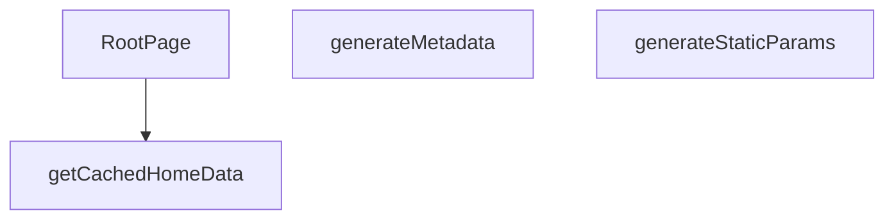

## NODE ID STANDARD

  file: src\app\[lang]\page.tsx
  function: src\app\[lang]\page.tsx::generateStaticParams
  function: src\app\[lang]\page.tsx::generateMetadata
  function: src\app\[lang]\page.tsx::getCachedHomeData
  function: src\app\[lang]\page.tsx::RootPage

---

## DISA AKTARILANLAR (EXPORTS)
  export: RootPage
  export: generateMetadata
  export: generateStaticParams
  export: getCachedHomeData

---

## STİL TOKENLERİ

### Arbitrary Değerler (token'a geçirilmemiş)
Yok — tüm stiller token'a geçirilmiş. ✅

### Kullanılan Token'lar (zaten token'a geçirilmiş)
- (yok)

### Tailwind Sınıf Özeti
- **Renkler:** (yok)
- **Layout:** (yok)
- **Varyant/Responsive:** (yok)
- **Yardımcı Sınıflar:** (yok)

---
# FILE: src\app\[lang]\about\page.md

---
domain: general
source_type: doc
namespace_type: module
source_path: C:\Users\alize\venthub-hvac\src\app\[lang]\about\page.tsx
skeleton_hash: 0764930d9f5459d2
entity_hashes:
  func:Page: 32fe3fdb17787a5b
  func:generateStaticParams: 6d1b3e72f8b2da9f
  overview: 8dff6fca298bde81
  style_tokens: dd5ed8d0f58dcf57
generated_at: 2026-06-12T10:17:31Z
---

## Genel Bakış
Bu modül, çoklu dil desteği sunan "Hakkında" sayfasını oluşturur. Next.js App Router yapısında `[lang]/about` rotasına karşılık gelir ve hem statik sayfa yapılandırmasını hem de sayfa içeriğinin render edilmesini yönetir.

## Fonksiyon Grupları
### Statik Sayfa Yapılandırması
Bu grup, sayfanın hangi dil varyantları için önceden oluşturulacağını belirler.
- generateStaticParams

### Sayfa Renderlama
Bu grup, dil parametresine göre sayfa içeriğini JSX olarak üretir ve kullanıcıya sunar.
- Page

---

## AXIOMS – Mimari Varsayımlar

Bu modül, Next.js App Router yapısında çoklu dil destekli "Hakkında" sayfasını yöneten bir sayfa bileşenidir. Aşağıdaki varsayımlar fonksiyon imzalarından çıkarılmıştır.

---

**[Aksiyom 1]**: Eğer `Page` fonksiyonuna geçirilen `params` nesnesi `lang` alanı içermiyorsa, sayfa içeriği istenen dilde render edilemez.

> Next.js App Router'da `[lang]` bir dinamik rotadır ve `params.lang` zorunlu olarak beslenmelidir.

---

**[Aksiyom 2]**: Eğer `generateStaticParams()` fonksiyonu boş bir dizi döndürüyorsa, hiçbir dil için statik sayfa önceden oluşturulamaz ve istek üzerine (on-demand) render edilmesi gerekir.

> Fonksiyon, desteklenen dil kodlarının listesini döndürerek hangi varyantların build aşamasında oluşturulacağını belirler.

---

**[Aksiyom 3]**: Eğer `generateStaticParams()` tarafından döndürülen dil kodları ile `Page` fonksiyonunun beklediği `params.lang` değerleri tutarsızsa, geçersiz bir rotaya erişim denenir ve hata oluşur.

> Örneğin, `generateStaticParams` yalnızca `["tr", "en"]` döndürüyor ama runtime'da `params.lang === "de"` isteği geliyorsa, bu geçersizdir.

---

**[Aksiyom 4]**: Eğer `Page` bileşeni `params` parametresi olmadan (veya `params.lang` alanına erişilmeden) çağrılırsa, bileşen düzgün render edilemez.

> Fonksiyon imzası `Page({ params }: PageProps)` şeklindedir; `params` bağımlılığı zorunludur.

---

**[Aksiyom 5]**: Eğer bu modül bir "Hakkında" sayfasıysa ve `generateStaticParams` desteklenen dilleri dış kaynaktan (ör. yapılandırma dosyası, API) alıyorsa, o kaynağın erişilebilir ve tutarlı olması gerekir; aksi halde build aşamasında hata oluşur.

> Bu modülde `generateStaticParams` gövdesi verilmediği için kaynağın doğası bilinmemektedir, ancak herhangi bir dış bağımlılık varsa erişilebilir olmalıdır.

---

---

## FONKSİYON DETAYLARI

### Page
**Ne yapar**: Bu fonksiyon, bir Next.js sayfa bileşeni olarak davranır ve belirli bir dile ait "Hakkımızda" sayfasının içeriğini sunar. Fonksiyon asenkrondur ve URL'den gelen dil parametresini alarak ilgili bileşeni render eder.

**Nasıl yapar**: Fonksiyon, `params` nesnesinden asenkron olarak `lang` değerini çözer. Çözülen bu dil kodu, sayfa içeriğini ve çevirilerini yöneten `PageComponent` bileşenine prop olarak iletilir. Bu sayede aynı sayfa yapısı farklı diller için içeriğini dinamik olarak günceller.

**Parametreler**:
- `params`: `Promise<PageProps>` — URL'den gelen ve `lang` anahtarını içeren asenkron parametre nesnesi. Next.js tarafından sayfa yolundaki dinamik segmentlerden otomatik olarak oluşturulur.

**Dönüş**: `JSX.Element` — `PageComponent` bileşeninin döndürdüğü ve ilgili dil için hazırlanmış "Hakkımızda" sayfasının JSX yapısı.

### generateStaticParams
**Ne yapar**: Bu fonksiyon, Next.js'in statik site oluşturma (SSG) sürecinde kullanılacak olan tüm olası `lang` parametre değerlerini döndürür. Temel amacı, build esnasında hangi diller için statik HTML dosyası oluşturulacağını sisteme bildirmektir.

**Nasıl yapar**: Fonksiyon, önceden tanımlı bir array döndürür. Her bir obje, bir `lang` parametre değeri temsil eder. Next.js bu listeyi iterasyona uğratır ve her bir `lang` değeri için `Page` fonksiyonunu ayrı ayrı çalıştırarak statik HTML dosyaları üretir. Bu mekanizma, uygulama performansını artırır ve sayfaların önceden derlenmesini sağlar.

**Parametreler**: Bu fonksiyonun herhangi bir parametresi yoktur.

**Dönüş**: `Array<{ lang: string }>` — Statik olarak oluşturulacak sayfalar için gerekli dil kodlarını içeren bir nesne dizisi. Mevcut yapıda `tr` (Türkçe) ve `en` (İngilizce) olmak üzere iki dil desteği tanımlıdır.

---

## INTERFACES

### PageProps
- `params: Promise<{ lang: string }>`

---

## AST POINTERS

### [N1_NASIL] AST Pointer: `[lang]/about/page.tsx::Page`
- **params**: `{ params: PageProps }` — Next.js sayfası prop'ları, `lang` parametresini içerir
- **ic_degiskenler**:
  - `lang` — `await params` sonucu destructure edilen dil kodu ('tr' veya 'en'), `PageComponent`'e prop olarak geçirilir
- **Dönüş**: JSX (`<PageComponent lang={lang} />`) — About sayfasının dil bazlı bileşeni

### [N2_NASIL] AST Pointer: `[lang]/about/page.tsx::generateStaticParams`
- **params**: (parametre yok)
- **ic_degiskenler**: (yok)
- **Dönüş**: `Array<{ lang: string }>` — Statik olarak üretilecek sayfa dil varyasyonları listesi (`tr` ve `en`)

---

## NODE ID STANDARD

  file: src\app\[lang]\about\page.tsx
  function: src\app\[lang]\about\page.tsx::Page
  function: src\app\[lang]\about\page.tsx::generateStaticParams

---

## DISA AKTARILANLAR (EXPORTS)
  export: Page
  export: generateStaticParams

---

## STİL TOKENLERİ

### Arbitrary Değerler (token'a geçirilmemiş)
Yok — tüm stiller token'a geçirilmiş. ✅

### Kullanılan Token'lar (zaten token'a geçirilmiş)
- (yok)

### Tailwind Sınıf Özeti
- **Renkler:** (yok)
- **Layout:** (yok)
- **Varyant/Responsive:** (yok)
- **Yardımcı Sınıflar:** (yok)

---
# FILE: src\app\[lang]\account\layout.md

---
domain: general
source_type: doc
namespace_type: module
source_path: C:\Users\alize\venthub-hvac\src\app\[lang]\account\layout.tsx
skeleton_hash: 98955b5d231542eb
entity_hashes:
  func:Layout: f1cd59870391c992
  overview: 3aba322b2667e63f
  style_tokens: dd5ed8d0f58dcf57
generated_at: 2026-06-08T08:57:36Z
---

## Genel Bakış
Bu modül, uygulamanın hesap (account) bölümündeki tüm sayfalar için ortak bir düzen sağlar. Tek bir `Layout` bileşeni, sayfa içeriğini sararak tutarlı bir yapı ve kullanıcı deneyimi oluşturur.

## Fonksiyon Grupları
### Sayfa Düzeni Sağlayıcı
Hesap alt sayfalarının görüntüleneceği çerçeveyi oluşturur; içeriği (`children`) alıp ortak bir sarmalayıcı içinde render eder.
- Layout

---

## AXIOMS – Mimari Varsayımlar
Bu modül için özel aksiyom tanımlanmamıştır.

**Aksiyom 1**: Eğer `children` prop’u **verilmez** ya da `undefined`/`null` ise, `Layout` bileşeni **boş bir `<div>` (veya benzeri bir sarmalayıcı) render eder** ve içeriği göstermez.  
*Sebep*: `children` bir `React.ReactNode` tipinde zorunlu olduğundan, bileşenin çalışması için bir node beklenir; yoksa render çıktısı anlamsız olur.

**Aksiyom 2**: Eğer `children` prop’u **geçerli bir React elemanı** değilse (ör. bir sayı, string dışındaki bir primitive ya da hatalı nesne), `Layout` **render sırasında bir hata fırlatır**.  
*Sebep*: `React.ReactNode` tipine uymayan değerler React’in render sürecinde tip hatası üretir; bu hatanın yakalanması bileşenin bütünlüğünü korur.

**Aksiyom 3**: Eğer `Layout` bileşeni **başka bir React bağlamı (Context) içinde** kullanılırsa, bu bağlamdan gelen değerler **`Layout` içinde doğrudan erişilebilir** ve **bağlamın eksikliği** durumunda **varsayılan (default) değerler** kullanılır.  
*Sebep*: Layout genellikle ortak stil, tema veya oturum bilgisi gibi paylaşılan verileri tüketir; bağlam yoksa bileşen çalışabilmelidir.

**Aksiyom 4**: Eğer `Layout` bileşeni **SSR (Server‑Side Rendering)** ortamında çalıştırılırsa, **`children` içeriği sunucu tarafında da aynı şekilde render edilir**; aksi takdirde **hydrate hatası** ortaya çıkar.  
*Sebep*: React‑SSR’de istemci ve sunucu çıktısının tutarlı olması gerekir; `children` eksikse veya farklıysa uyumsuzluk oluşur.

**Aksiyom 5**: Eğer `Layout` bileşeni **CSS‑in‑JS** ya da **global stil dosyaları** aracılığıyla stil alıyorsa, bu stil **modül yüklendiği anda** (import zamanında) **uygulanır**; stil dosyası **yüklenmezse** bileşen **varsayılan (unstyled) bir yapı** ile render olur.  
*Sebep*: Stil bağımlılıkları opsiyoneldir; eksik stil dosyası uygulamanın çökmesini engellemek için varsayılan görünüm sağlanır.

**Aksiyom 6**: Eğer `Layout` içinde **navigasyon (örn. Next.js `Link` veya router)** öğeleri bulunuyorsa, bu öğeler **router’ın mevcut konfigürasyonu** ile uyumlu olmalıdır; **router tanımlı değilse** navigasyon öğeleri **pasif (tıklanamaz) hâle gelir**.  
*Sebep*: Navigasyonun çalışması için router bağlamı gerekir; yoksa kullanıcı deneyimi bozulur.

**Aksiyom 7**: Eğer `Layout` bileşeni **performans optimizasyonu** (memoization, lazy loading vb.) içeriyorsa, bu optimizasyonlar **`children` prop’unun referans değişikliğine** duyarlı olacaktır; **referans değişmezse** yeniden render **tetiklenmez**.  
*Sebep*: React‑in memoizasyon mekanizmaları referans eşitliğine dayanır; bu sayede gereksiz render’lar önlenir.

---

## FONKSİYON DETAYLARI

### Layout
**Ne yapar**: Verilen `children` propunu `LayoutComponent` içine sararak sayfa düzenini sağlar.  
**Nasıl yapar**: Fonksiyon, destructured `children` parametresini alır ve doğrudan `<LayoutComponent>{children}</LayoutComponent>` JSX'ini döndürür; ek mantık veya side‑effect yoktur.  
**Parametreler**:
- children: React.ReactNode — Layout içinde görüntülenecek içerik (JSX elemanları, metin veya başka React bileşenleri).  
**Dönüş**: JSX elementi — `LayoutComponent` içinde `children` içeren bir React elementi.

---

## AST POINTERS

### [N1_NASIL] AST Pointer: src/app/[lang]/account/layout.tsx::Layout
- **params**: children
- **ic_degiskenler**: (yok)
- **Dönüş**: JSX element (React.ReactElement)

---

## NODE ID STANDARD

  file: src\app\[lang]\account\layout.tsx
  function: src\app\[lang]\account\layout.tsx::Layout

---

## DISA AKTARILANLAR (EXPORTS)
  export: Layout

---

## STİL TOKENLERİ

### Arbitrary Değerler (token'a geçirilmemiş)
Yok — tüm stiller token'a geçirilmiş. ✅

### Kullanılan Token'lar (zaten token'a geçirilmiş)
- (yok)

### Tailwind Sınıf Özeti
- **Renkler:** (yok)
- **Layout:** (yok)
- **Varyant/Responsive:** (yok)
- **Yardımcı Sınıflar:** (yok)

---
# FILE: src\app\[lang]\account\page.md

---
domain: general
source_type: doc
namespace_type: module
source_path: C:\Users\alize\venthub-hvac\src\app\[lang]\account\page.tsx
skeleton_hash: 44a3f6e6a3fd837a
entity_hashes:
  func:Page: 02ee67f324c336e5
  overview: 8bcc27d9f8041805
  style_tokens: dd5ed8d0f58dcf57
generated_at: 2026-06-08T08:57:36Z
---

## Genel Bakış
Bu modül, dil parametresi (`[lang]`) içeren rotada kullanıcının hesap sayfasını sunan kök bileşeni tanımlar. Tek bir `Page` fonksiyonu aracılığıyla sayfanın ana kullanıcı arayüzü oluşturulur; bu bileşen doğrudan JSX döndürerek görsel katmanı sağlar.

## Fonksiyon Grupları
### Sayfa Görünümü
Sayfanın tamamını temsil eden React bileşenini render eder. Herhangi bir yardımcı işlev veya durum yönetimi içermez, yalnızca üst düzey sunum katmanını oluşturur.  
- Page

---

## AXIOMS – Mimari Varsayımlar
Bu modül için özel aksiyom tanımlanmamıştır.

---

## FONKSİYON DETAYLARI

### Page
**Ne yapar**: `Page` fonksiyonu, React bileşeni olarak `<PageComponent />` öğesini döndürür. Bu, sayfanın ana görsel bileşenini render eder.  
**Nasıl yapar**: Fonksiyon içinde doğrudan JSX döndürülür; herhangi bir durum yönetimi veya yan etki yoktur.  
**Parametreler**:
- *hiç parametre yok*  
**Dönüş**: `<PageComponent />` JSX öğesi (React Element)

---

## AST POINTERS

### [N1_NASIL] AST Pointer: C:\Users\alize\venthub-hvac\src\app\[lang]\account\page.tsx::Page
- **params**: (parametre yok)
- **ic_degiskenler**: yok
- **Dönüş**: JSX.Element (React bileşeni olarak `<PageComponent />` döndürür)

---

## NODE ID STANDARD

  file: src\app\[lang]\account\page.tsx
  function: src\app\[lang]\account\page.tsx::Page

---

## DISA AKTARILANLAR (EXPORTS)
  export: Page

---

## STİL TOKENLERİ

### Arbitrary Değerler (token'a geçirilmemiş)
Yok — tüm stiller token'a geçirilmiş. ✅

### Kullanılan Token'lar (zaten token'a geçirilmiş)
- (yok)

### Tailwind Sınıf Özeti
- **Renkler:** (yok)
- **Layout:** (yok)
- **Varyant/Responsive:** (yok)
- **Yardımcı Sınıflar:** (yok)

---
# FILE: src\app\[lang]\account\addresses\page.md

---
domain: general
source_type: doc
namespace_type: module
source_path: C:\Users\alize\venthub-hvac\src\app\[lang]\account\addresses\page.tsx
skeleton_hash: 09aed64513c67e34
entity_hashes:
  func:Page: 02ee67f324c336e5
  overview: c697ddf7c92cfa4f
  style_tokens: 9144ece4bffe7964
generated_at: 2026-06-12T10:17:59Z
---

## Genel Bakış
Bu modül, kullanıcının hesabındaki adresleri yönetmesine olanak tanıyan Next.js sayfa giriş noktasıdır. Tek bir `Page` fonksiyonu ile dinamik olarak yüklenen `AccountAddressesPage` bileşenini render ederek dil duyarlı adres yönetim arayüzünü sunar.

## Fonksiyon Grupları
### Sayfa Giriş Noktası
Modülün tek bileşeni olan `Page`, adres yönetim sayfasının içerik bölümünü dinamik import yoluyla yükler ve sayfayı kullanıcıya sunar.
- Page

---

## AXIOMS – Mimari Varsayımlar
- Bu modül davranışsal mantık içermez (salt veri / konfigürasyon / tip tanımı).
- [Aksiyom 1]: Modülün dışa açtığı yapı (anahtar kümesi / şema) bir sözleşmedir; tüketiciler bu sabit yapıya bağlıdır — kırıcı değişiklik tüm tüketicileri etkiler.
- [Aksiyom 2]: Bir öğe ekleme/çıkarma yapısal-uyumlu olmalı; ilgili tipler ve seçiciler aynı commit'te güncel tutulmalıdır.

---

## FONKSİYON DETAYLARI

### Page
**Ne yapar**: `Page` fonksiyonu, React bileşeni olarak tanımlanmış bir fonksiyondur ve `<PageComponent />` JSX elemanını döndürerek ilgili sayfanın içeriğini render eder.  

**Nasıl yapar**: Fonksiyon, doğrudan bir JSX ifadesi olan `<PageComponent />`'i return eder; ek bir mantık, durum yönetimi veya yan etki (side‑effect) içermez.  

**Parametreler**:  
- *Yok* — Fonksiyon herhangi bir argüman almaz.

**Dönüş**:  
- `JSX.Element` — `<PageComponent />` bileşenini temsil eden JSX elemanı döndürür.

---

## SABİTLER
- **PageComponent** (call) — `nextDynamic(() => import('../../../../views/account/AccountAddressesPage'), {...`

---

## AST POINTERS

### [N1_NASIL] AST Pointer: [lang]/account/addresses/page.tsx::anonim_arrow_function
- **params**: (parametre yok)
- **ic_degiskenler**:
  (değişken yok — doğrudan JSX döndürür)
- **Dönüş**: JSX — `min-h-screen` flex container içinde `animate-spin` sınıfına sahip dönen spinner div'i; loading durumu için kullanıluyor (nextDynamic loading bileşeni olarak)

---

## NODE ID STANDARD

  file: src\app\[lang]\account\addresses\page.tsx
  function: src\app\[lang]\account\addresses\page.tsx::Page

---

## DISA AKTARILANLAR (EXPORTS)
  export: Page

---

## STİL TOKENLERİ

### Arbitrary Değerler (token'a geçirilmemiş)
Yok — tüm stiller token'a geçirilmiş. ✅

### Kullanılan Token'lar (zaten token'a geçirilmiş)
- (yok)

### Tailwind Sınıf Özeti
- **Renkler:** `border-b-2`, `border-primary-navy`
- **Layout:** `flex`, `h-12`, `items-center`, `justify-center`, `min-h-screen`, `w-12`
- **Varyant/Responsive:** (yok)
- **Yardımcı Sınıflar:** `animate-spin`, `rounded-full`

---
# FILE: src\app\[lang]\account\invoices\page.md

---
domain: general
source_type: doc
namespace_type: module
source_path: C:\Users\alize\venthub-hvac\src\app\[lang]\account\invoices\page.tsx
skeleton_hash: df4e5591ff5aa6e8
entity_hashes:
  func:Page: 02ee67f324c336e5
  overview: c697ddf7c92cfa4f
  style_tokens: 9144ece4bffe7964
generated_at: 2026-06-12T10:18:20Z
---

## Genel Bakış
Bu modül, kullanıcının hesap panelindeki fatura listesi sayfasını temsil eden kök React bileşenini içerir. Sayfa, dinamik bir yükleme stratejisi kullanarak asıl görünüm bileşenini yükler ve böylece performansı artırırken ilgili arayüzü sunar.

## Fonksiyon Grupları
### Ana Sayfa Bileşeni
Hesap faturaları sayfasının giriş noktasını ve temel yapısını oluşturur. Dinamik içe aktarma yoluyla asıl görünüm bileşenini yükleyerek sayfayı render eder.
- Page

---

## AXIOMS – Mimari Varsayımlar

Bu modül, minimal bir React sarmalayıcı (wrapper) bileşenidir; fonksiyon gövdesi yalnızca `<PageComponent />` öğesini döndürür. Dolayısıyla mimari varsayımlar sınırlıdır.

---

**[Aksiyom 1]:** Eğer `PageComponent` modülü çalış zamanında içe aktarılamazsa (import başarısız olursa), `Page` bileşeni render edilemez ve uygulama bu sayfada hata verir.

**[Aksiyom 2]:** Eğer React/JSX çalışma ortamı (runtime) mevcut değilse, `Page` fonksiyonu geçerli bir React elementi döndüremez ve bileşen ağaç (component tree) oluşturulamaz.

**[Aksiyom 3]:** Eğer `PageComponent`自身i bağımlılık gerektiriyorsa (prop, context vb.) ve bunlar sağlanmamışsa, `PageComponent`'in kendi iç hata oluşumu beklenebilir; ancak `Page` fonksiyonu bu bağımlılıkları doğrudan yönetmez.

**[Aksiyom 4]:** `Page` fonksiyonu parametre almaz; dolayısıyla调用侧 (caller) bu bileşene prop geçirme yetkisine sahip değildir — tüm veri akışı `PageComponent` içinde veya üst bileşen zincirinden (context, layout vb.) sağlanmalıdır.

---

> **Not:** Bu modül, yalnızca bir çocuğu (child) sarmalayan ince bir zar (thin wrapper) yapısındadır. Fonksiyon gövdesinde koşullu mantık, veri dönüştürme veya hata işleme bulunmamaktadır; bu nedenle yukarıdaki varsayımlar modülün minimum zorunluluklarını yansıtmaktadır.

---

## FONKSİYON DETAYLARI

### Page
**Ne yapar**: React bileşeni `Page` fonksiyonu, JSX içinde `<PageComponent />` öğesini döndürerek bir sayfa görünümü oluşturur.  

**Nasıl yapar**: Fonksiyon, doğrudan bir JSX ifadesi olan `<PageComponent />`'i return eder; ek bir mantık, durum yönetimi veya yan etki yoktur.  

**Parametreler**:
- (hiç parametre almaz)

**Dönüş**: JSX.Element — `<PageComponent />` bileşenini temsil eden React öğesi.

---

## SABİTLER
- **PageComponent** (call) — `nextDynamic(() => import('../../../../views/account/AccountInvoicesPage'), {
...`

---

## AST POINTERS

### [N1_NASIL] AST Pointer: `[lang]/account/invoices/page.tsx`::(anonim.loading)
- **params**: (parametre yok)
- **ic_degiskenler**: (yok)
- **Dönüş**: JSX — `div` içinde `animate-spin` class'lı spinner loading göstergesi döndürür; `min-h-screen`, `flex`, `items-center`, `justify-center` ile ekran ortasında dönen bir yükleme animasyonu sunar

---

## NODE ID STANDARD

  file: src\app\[lang]\account\invoices\page.tsx
  function: src\app\[lang]\account\invoices\page.tsx::Page

---

## DISA AKTARILANLAR (EXPORTS)
  export: Page

---

## STİL TOKENLERİ

### Arbitrary Değerler (token'a geçirilmemiş)
Yok — tüm stiller token'a geçirilmiş. ✅

### Kullanılan Token'lar (zaten token'a geçirilmiş)
- (yok)

### Tailwind Sınıf Özeti
- **Renkler:** `border-b-2`, `border-primary-navy`
- **Layout:** `flex`, `h-12`, `items-center`, `justify-center`, `min-h-screen`, `w-12`
- **Varyant/Responsive:** (yok)
- **Yardımcı Sınıflar:** `animate-spin`, `rounded-full`

---
# FILE: src\app\[lang]\account\orders\page.md

---
domain: general
source_type: doc
namespace_type: module
source_path: C:\Users\alize\venthub-hvac\src\app\[lang]\account\orders\page.tsx
skeleton_hash: bc4635546982ea45
entity_hashes:
  func:Page: 02ee67f324c336e5
  overview: c697ddf7c92cfa4f
  style_tokens: 9144ece4bffe7964
generated_at: 2026-06-06T19:23:22Z
---

## Genel Bakış
Bu modül, kullanıcı hesabındaki siparişlerin listelendiği sayfaya karşılık gelen Next.js sayfa rotasını tanımlar. Tek bileşeni olan `Page` fonksiyonu, dinamik olarak yüklenen `OrdersPage` ana görünümünü render ederek sayfanın giriş noktasını oluşturur.

## Fonksiyon Grupları
### Sayfa Giriş Noktası ve Sarmalayıcı
Bu grup, hesap siparişleri rotası için üst seviye React bileşenini döndürmekle sorumludur. Fonksiyon herhangi bir veri çekme veya iş mantığı içermez; sadece asıl sayfa içeriğini barındıran dinamik yüklenmiş bir alt bileşeni sarar ve sunar.
- Page

---

## AXIOMS – Mimari Varsayımlar
Bu modül, bir Next.js üst‑seviye sayfa bileşenidir ve sadece bir JSX öğesi döndürür.

[Aksiyom 1]: Eğer `PageComponent` (çağrılabilir bir React bileşeni) yoksa, `Page` fonksiyonu geçerli bir React JSX yapısı döndüremeyeceği için sayfa render edilemez ve uygulama çalışması sonlanır.

---

## FONKSİYON DETAYLARI

### Page
**Ne yapar**: Bu fonksiyon, hesap siparişleri sayfa rotası için ana giriş noktası görevi gören bir React bileşenidir. Temel amacı, sayfanın tüm işlevselliğini ve içeriğini barındıran PageComponent bileşenini kullanıcıya sunmaktır.
**Nasıl yapar**: Fonksiyon, herhangi bir ara mantık, durum yönetimi, veri çekme veya yan etki işlemi gerçekleştirmeden doğrudan PageComponent bileşenini döndüren basit bir sarmalayıcı (wrapper) olarak çalışır. İçerisinde sadece bileşen render işlemi için gerekli olan tek bir return ifadesi bulunur.
**Parametreler**: Bu fonksiyon herhangi bir parametre almaz.
**Dönüş**: React JSX formatında PageComponent bileşenini döndürür. Dönüş tipi, React bileşenlerinin render sonucu olan bir React elementidir.

---

## SABİTLER
- **PageComponent** (call) — `nextDynamic(() => import('../../../../views/OrdersPage'), {

  ssr: false,

 ...`

---

## AST POINTERS

### [N1_NASIL] AST Pointer: [lang]/account/orders/page.tsx::loading (anonymous)
- **params**: (yok)
- **ic_degiskenler**: (yok)
- **Dönüş**: JSX — `min-h-screen` container içinde animasyonlu dönen spinner (next/dynamic loader bileşeni)

### [N2_NASIL] AST Pointer: [lang]/account/orders/page.tsx::Page
- **params**: (yok)
- **ic_degiskenler**: (yok)
- **Dönüş**: `<PageComponent />` — dinamik olarak import edilmiş PageComponent bileşeninin render edilmesi

---

## NODE ID STANDARD

  file: src\app\[lang]\account\orders\page.tsx
  function: src\app\[lang]\account\orders\page.tsx::Page

---

## DISA AKTARILANLAR (EXPORTS)
  export: Page

---

## STİL TOKENLERİ

### Arbitrary Değerler (token'a geçirilmemiş)
Yok — tüm stiller token'a geçirilmiş. ✅

### Kullanılan Token'lar (zaten token'a geçirilmiş)
- (yok)

### Tailwind Sınıf Özeti
- **Renkler:** `border-b-2`, `border-primary-navy`
- **Layout:** `flex`, `h-12`, `items-center`, `justify-center`, `min-h-screen`, `w-12`
- **Varyant/Responsive:** (yok)
- **Yardımcı Sınıflar:** `animate-spin`, `rounded-full`

---
# FILE: src\app\[lang]\account\orders\detail\page.md

---
domain: general
source_type: doc
namespace_type: module
source_path: C:\Users\alize\venthub-hvac\src\app\[lang]\account\orders\detail\page.tsx
skeleton_hash: 6936e402ae673469
entity_hashes:
  func:Page: 9e0b3aa05006aa66
  overview: c1af68d41814429f
  style_tokens: dd5ed8d0f58dcf57
generated_at: 2026-06-08T10:08:10Z
---

## Genel Bakış
Bu modül, kullanıcı hesabındaki bir siparişin detay sayfasını render eden tek bir React bileşeni içerir. `Page` fonksiyonu, asenkron olarak yüklenecek `PageComponent`i `Suspense` içinde sararak veri yüklenirken bir “loading” mesajı gösterir ve veri hazır olduğunda detay içeriğini sunar.  

## Fonksiyon Grupları
### Sayfa Bileşeni
Sayfanın giriş noktasıdır; `Page` bileşeni `Suspense` ile asenkron veri/komponent yüklemesini yönetir ve kullanıcıya bekleme geri bildirimi sağlar.  
- Page

---

## AXIOMS – Mimari Varsayımlar
Bu modül için özel aksiyom tanımlanmamıştır.

---

## FONKSİYON DETAYLARI

### Page
**Ne yapar**: React uygulamasında bir sayfa bileşeni oluşturur ve içeriği asenkron olarak yüklenirken bir bekleme (loading) mesajı gösterir. `Suspense` bileşeni sayesinde `PageComponent` bileşeni yüklenene kadar kullanıcıya geri bildirim sağlanır.  

**Nasıl yapar**: Fonksiyon içinde `tr` çeviri nesnesi `t` olarak kısaltılır, ardından JSX içinde `Suspense` bileşeni kullanılır. `fallback` özelliği, `t.common.loading` metnini içeren bir `<div>` ile tanımlanır; bu, `PageComponent` henüz render edilmediğinde gösterilir. `PageComponent` başarılı bir şekilde yüklendiğinde, `Suspense` otomatik olarak onu render eder.  

**Parametreler**:
- *Yok* — Fonksiyon dışarıdan herhangi bir argüman almaz.

**Dönüş**: JSX (React element) – `<Suspense>` içinde `fallback` ve `PageComponent` içeren bir React bileşeni döndürür.

---

## AST POINTERS

### [N1_NASIL] AST Pointer: src/app/[lang]/account/orders/detail/page.tsx::Page
- **params**: (yok)
- **ic_degiskenler**:
  - `t` — `tr` fonksiyonundan dönen Türkçe sözlük nesnesi, `t.common.loading` ile yükleme metnine erişmek için kullanılır
  - `PageComponent` — (bileşen olarak kullanılır, değişkene atanmamış doğrudan JSX içinde kullanılan import edilmiş bileşen)
  - `<Suspense fallback={<div>{t.common.loading}</div>}>` — React Suspense bileşeni, alt bileşen yüklenirken `t.common.loading` metnini gösterir
  - `<PageComponent />` — gerçek sipariş detay sayfasını render eden bileşen
- **Dönüş**: JSX elemanı (React nodu)

---

## NODE ID STANDARD

  file: src\app\[lang]\account\orders\detail\page.tsx
  function: src\app\[lang]\account\orders\detail\page.tsx::Page

---

## DISA AKTARILANLAR (EXPORTS)
  export: Page

---

## STİL TOKENLERİ

### Arbitrary Değerler (token'a geçirilmemiş)
Yok — tüm stiller token'a geçirilmiş. ✅

### Kullanılan Token'lar (zaten token'a geçirilmiş)
- (yok)

### Tailwind Sınıf Özeti
- **Renkler:** (yok)
- **Layout:** (yok)
- **Varyant/Responsive:** (yok)
- **Yardımcı Sınıflar:** (yok)

---
# FILE: src\app\[lang]\account\profile\page.md

---
domain: general
source_type: doc
namespace_type: module
source_path: C:\Users\alize\venthub-hvac\src\app\[lang]\account\profile\page.tsx
skeleton_hash: 6e3e50ca3ec4eb15
entity_hashes:
  func:Page: 02ee67f324c336e5
  overview: 7cf783e7a557a530
  style_tokens: dd5ed8d0f58dcf57
generated_at: 2026-06-08T08:57:36Z
---

## Genel Bakış
Bu modül, Next.js App Router yapısında `/account/profile` yoluna karşılık gelen sayfa bileşenini tanımlar. Tek bir `Page` fonksiyonu, profil sayfasının bütün JSX çıktısını üretir ve dışa aktarılır.

## Fonksiyon Grupları
### Sayfa Render Grubu
Profil sayfasının UI’sını tek bir noktadan oluşturup dışa aktarmaktan sorumludur.  
- Page

---

## AXIOMS – Mimari Varsayımlar
Bu modül için özel aksiyom tanımlanmamıştır.

---

## FONKSİYON DETAYLARI

### Page
**Ne yapar**: Bu fonksiyon, `src/app/account/profile/page.tsx` dosyasında tanımlanan Next.js App Router sayfa bileşenidir. Kullanıcı hesap profili sayfasının ana giriş noktası olarak çalışır ve sayfanın temel içeriğini sağlayan alt bileşeni döndürür.
**Nasıl yapar**: Fonksiyon, herhangi bir ek veri işleme, doğrulama veya ek işlem yapmadan, sabit bir dönüş değeri olarak önceden tanımlanmış `<PageComponent />` bileşenini döndürür. Sadece alt bileşeni ileten basit bir ara katman görevi görür.
**Parametreler**:
- Hiçbir parametre almaz.
**Dönüş**: `<PageComponent />` tipinde bir React bileşeni döndürür. Bu dönüş değeri, kullanıcının tarayıcısında görüntülenecek profili sayfasının tam içeriğini temsil eder.

---

## AST POINTERS

### [N1_NASIL] AST Pointer: C:\Users\alize\venthub-hvac\src\app\[lang]\account\profile\page.tsx::Page
- **params**: (parametre yok)
- **ic_degiskenler**: yok
- **Dönüş**: JSX.Element (React bileşeni olarak `<PageComponent />` döndürür)

---

## NODE ID STANDARD

  file: src\app\[lang]\account\profile\page.tsx
  function: src\app\[lang]\account\profile\page.tsx::Page

---

## DISA AKTARILANLAR (EXPORTS)
  export: Page

---

## STİL TOKENLERİ

### Arbitrary Değerler (token'a geçirilmemiş)
Yok — tüm stiller token'a geçirilmiş. ✅

### Kullanılan Token'lar (zaten token'a geçirilmiş)
- (yok)

### Tailwind Sınıf Özeti
- **Renkler:** (yok)
- **Layout:** (yok)
- **Varyant/Responsive:** (yok)
- **Yardımcı Sınıflar:** (yok)

---
# FILE: src\app\[lang]\account\returns\page.md

---
domain: general
source_type: doc
namespace_type: module
source_path: C:\Users\alize\venthub-hvac\src\app\[lang]\account\returns\page.tsx
skeleton_hash: c58db07ae1dfe3ec
entity_hashes:
  func:Page: 9c08060caeb88969
  overview: 9db8b446a5775015
  style_tokens: 9144ece4bffe7964
generated_at: 2026-06-08T10:08:10Z
---

## Genel Bakış
Bu modül, çok dilli hesap bölümündeki iade yönetimi sayfasının giriş noktasıdır. Sayfa bileşeni, gerekli alt bileşenleri bir araya getirerek kullanıcıya iadelerini görüntüleyebilecekleri bir arayüz sunar. Tüm iş mantığı ve veri yönetimi, alt bileşenlere devredilmiştir.

## Fonksiyon Grupları
### Sayfa Giriş Noktası
Sayfanın üst düzey yapısını oluşturur ve içeriği sağlayan bileşenleri render eder.
- Page

---

## AXIOMS – Mimari Varsayımlar
Bu modül, bir React sayfası bileşenidir ve temel olarak JSX ağacını döndürür.

[Aksiyom 1]: Eğer React kütüphanesi (ve JSX derleyici ortamı) yoksa, `Page` bileşeni bileşen olarak tanımlanamaz veya çalıştırılamaz ve bir render hatası oluşur.

[Aksiyom 2]: Eğer `Page` bileşeni çağrılmadan önce, uygulamanın çok dilli yapısı için gerekli olan `lang` parametresi (`params.lang` olarak erişildiği varsayılmaktadır) sağlanmamış veya geçersizse, bileşen内da dil bazlı içeriği doğru gösteremez ve beklenmeyen bir davranış veya hata oluşur.

[Aksiyom 3]: Eğer `Page` bileşeni, içeriğini sağlayan `PageComponent` veya benzeri bir alt bileşeni içermiyorsa (veya bu alt bileşen bulunamıyorsa), sayfa boş bir alan render eder ve iade sayfasının ana içeriği gösterilmez.

---

## FONKSİYON DETAYLARI

### Page
**Ne yapar**: Sayfa yüklenirken Suspense sarmalayıcı kullanarak asıl sayfa içeriğinin (PageComponent) yüklenmesini bekler ve bu bekleme süresinde kullanıcıya animasyonlu bir yüklenme göstergesi sunar.

**Nasıl yapar**: React Suspense bileşenini kullanarak lazy loading veya asenkron veri yüklemesi yapan `PageComponent`'i sarar. Suspense henüz çözülmemişse (yani PageComponent yüklenirken) `fallback` prop'unda tanımlanan JSX'i render eder — bu JSX, tam ekran ortalanmış, dönen border animasyonlu bir yükleme spinner'ıdır. Suspense çözüldüğünde ise `PageComponent` render edilir.

**Parametreler**:
Bu fonksiyon herhangi bir parametre almamaktadır.

**Dönüş**: JSX elementi döndürür. Suspense sarmalayıcısı içinde `PageComponent` veya fallback yükleme göstergesi şeklinde bir React node döner.

**Notlar**:
- Dosya yolu (`app/[lang]/account/returns/page.tsx`) göz önüne alındığında bu fonksiyonun Next.js App Router yapısında yer alan bir sayfa bileşeni olduğu anlaşılır.
- `min-h-screen` sınıfı fallback ekranının tüm viewport yüksekliğini kaplamasını sağlar.
- `border-primary-navy` ve `border-b-2` sınıfları yüklenme spinner'ının alt kısmında renkli border animasyonu oluşturur.
- `animate-spin` sınıfı CSS tabanlı sürekli döndürme animasyonu uygular.

---

## AST POINTERS

### [N1_NASIL] AST Pointer: src/app/[lang]/account/returns/page.tsx::Page
- **params**: (parametre yok)
- **ic_degiskenler**:
  *(fonksiyon gövdesinde herhangi bir değişken bildirimi yoktur)*
- **Dönüş**: JSX — `<Suspense>` sarmalayıcısı içinde `<PageComponent />` bileşenini render eder; fallback olarak animasyonlu spinner gösterir

---

## NODE ID STANDARD

  file: src\app\[lang]\account\returns\page.tsx
  function: src\app\[lang]\account\returns\page.tsx::Page

---

## DISA AKTARILANLAR (EXPORTS)
  export: Page

---

## STİL TOKENLERİ

### Arbitrary Değerler (token'a geçirilmemiş)
Yok — tüm stiller token'a geçirilmiş. ✅

### Kullanılan Token'lar (zaten token'a geçirilmiş)
- (yok)

### Tailwind Sınıf Özeti
- **Renkler:** `border-b-2`, `border-primary-navy`
- **Layout:** `flex`, `h-12`, `items-center`, `justify-center`, `min-h-screen`, `w-12`
- **Varyant/Responsive:** (yok)
- **Yardımcı Sınıflar:** `animate-spin`, `rounded-full`

---
# FILE: src\app\[lang]\account\security\page.md

---
domain: general
source_type: doc
namespace_type: module
source_path: C:\Users\alize\venthub-hvac\src\app\[lang]\account\security\page.tsx
skeleton_hash: 0f7c017ab53e1631
entity_hashes:
  func:Page: 02ee67f324c336e5
  overview: d3e2cc3bf7442df0
  style_tokens: dd5ed8d0f58dcf57
generated_at: 2026-06-08T08:57:36Z
---

## Genel Bakış
Bu modül, VentHub HVAC uygulamasının kullanıcı hesap güvenliği ayarları sayfasını oluşturan ana React bileşenidir. Sayfa yapısını oluşturarak şifre yönetimi ve iki faktörlü kimlik doğrulama gibi güvenlik ayarları için arayüzü sunar.

## Fonksiyon Grupları
### UI Render
Sayfanın temel yapısını oluşturur ve ilgili alt güvenlik bileşenlerini ekrana render eder. Modülün tek giriş noktası ve dışa aktarılan bileşenidir.
- Page

---

## AXIOMS – Mimari Varsayımlar
Bu modül, VentHub HVAC uygulamasının kullanıcı hesap güvenliği sayfasını oluşturan bir React bileşenidir.

[Aksiyom 1]: Eğer `Page` fonksiyonu React bileşeni olarak render edilmezse (örneğin, JSX döndürmeyip null veya hata döndürürse), hesap güvenliği sayfası kullanıcıya gösterilmez.

[Aksiyom 2]: Eğer `Page` bileşeni Next.js sayfa yapısının gerekliliklerini karşılamıyorsa (örneğin, dinamik segmentleri doğru işleyemiyor veya layout bileşenine entegre olamıyorsa), sayfa yönlendirmeleri ve URL yapıları bozulur.

[Aksiyom 3]: Eğer `Page` bileşeni React Server Components (RSC) veya istemci tarafı bileşen olarak yanlış yapılandırılmışsa, hesap güvenliği ile ilgili dinamik içerikler (şifre değiştirme, 2FA yönetimi vb.) düzgün çalışmayabilir.

[Aksiyom 4]: Eğer `Page` bileşeni uygulamanın authentication/context sağlayıcılarına erişemiyorsa (örneğin, oturum açmış kullanıcı bilgisi alınamıyorsa), güvenli sayfa içeriği gösterilemez veya yetkilendirme hataları oluşur.

---

## FONKSİYON DETAYLARI

### Page
**Ne yapar**: `Page` fonksiyonu, React bileşeni olarak tanımlanmış bir sayfa oluşturur ve içinde `<PageComponent />` bileşenini render eder.  

**Nasıl yapar**: Fonksiyon, JSX sözdizimini kullanarak doğrudan `<PageComponent />` öğesini döndürür; bu sayede React render sürecinde ilgili bileşen ekranda gösterilir.  

**Parametreler**:
- (Parametre yok)

**Dönüş**: `<PageComponent />` JSX öğesini içeren bir React element'i (JSX) döndürür.

---

## AST POINTERS

### [N1_NASIL] AST Pointer: `src/app/[lang]/account/security/page.tsx`::Page
- **params**: (yok)
- **ic_degiskenler**: (yok — fonksiyon gövdesinde herhangi bir değişken tanımlanmamıştır)
- **Dönüş**: `<PageComponent />` — Import edilen `AccountSecurityPage` bileşenini JSX olarak render eder; herhangi bir mantık veya veri dönüştürme içermez, doğrudan alt bileşene yönlendirme yapar

---

## NODE ID STANDARD

  file: src\app\[lang]\account\security\page.tsx
  function: src\app\[lang]\account\security\page.tsx::Page

---

## DISA AKTARILANLAR (EXPORTS)
  export: Page

---

## STİL TOKENLERİ

### Arbitrary Değerler (token'a geçirilmemiş)
Yok — tüm stiller token'a geçirilmiş. ✅

### Kullanılan Token'lar (zaten token'a geçirilmiş)
- (yok)

### Tailwind Sınıf Özeti
- **Renkler:** (yok)
- **Layout:** (yok)
- **Varyant/Responsive:** (yok)
- **Yardımcı Sınıflar:** (yok)

---
# FILE: src\app\[lang]\account\shipments\page.md

---
domain: general
source_type: doc
namespace_type: module
source_path: C:\Users\alize\venthub-hvac\src\app\[lang]\account\shipments\page.tsx
skeleton_hash: f252b5d33929db96
entity_hashes:
  func:Page: 02ee67f324c336e5
  overview: 196d231af4e46298
  style_tokens: dd5ed8d0f58dcf57
generated_at: 2026-06-08T08:57:36Z
---

## Genel Bakış
Bu modül, VentHub HVAC platformunun kullanıcı hesap sayfası altındaki sevkiyatlar (shipments) bölümünü görüntüleyen, dil parametresini destekleyen Next.js sayfa bileşenidir. Kullanıcıların kendilerine ait sevkiyat bilgilerine erişebileceği ana sayfa olarak işlev görür ve uygulamanın yönlendirme yapısına uyumlu şekilde, hesap altındaki sevkiyatlar rotasında otomatik yüklenir.

## Fonksiyon Grupları
### Ana Sayfa Bileşeni
Sevkiyatlar sayfasının tüm görsel yapısını oluşturan ana giriş noktası. Alt bileşenleri kullanarak kullanıcı arayüzünü sunar ve herhangi bir iş mantığı barındırmaz.
- Page

---

## AXIOMS – Mimari Varsayımlar
Bu modül için özel aksiyom tanımlanmamıştır.

---

## FONKSİYON DETAYLARI

### Page
**Ne yapar**: Uygulamanın `src/app/account/shipments/page.tsx` yolunda tanımlı shipments sayfasının ana bileşenini render eder. Sayfanın giriş noktası olarak işlev görür ve kullanıcı arayüzünün yüklenmesini sağlar.
**Nasıl yapar**: Doğrudan `<PageComponent />` JSX ifadesini döndürerek `PageComponent` bileşenini çağırır. Herhangi bir state yönetimi veya iş mantığı içermez, yalnızca bir sarmalayıcı (wrapper) görevi üstlenir.
**Parametreler**: Parametre almaz.
**Dönüş**: `<PageComponent />` — Sayfanın kullanıcı arayüzünü oluşturan React JSX bileşeni.

---

## AST POINTERS

### [N1_NASIL] AST Pointer: src/app/[lang]/account/shipments/page.tsx::Page
- **params**: (yok)
- **ic_degiskenler**: (yok)
- **Dönüş**: JSX.Element

---

## NODE ID STANDARD

  file: src\app\[lang]\account\shipments\page.tsx
  function: src\app\[lang]\account\shipments\page.tsx::Page

---

## DISA AKTARILANLAR (EXPORTS)
  export: Page

---

## STİL TOKENLERİ

### Arbitrary Değerler (token'a geçirilmemiş)
Yok — tüm stiller token'a geçirilmiş. ✅

### Kullanılan Token'lar (zaten token'a geçirilmiş)
- (yok)

### Tailwind Sınıf Özeti
- **Renkler:** (yok)
- **Layout:** (yok)
- **Varyant/Responsive:** (yok)
- **Yardımcı Sınıflar:** (yok)

---
# FILE: src\app\[lang]\auth\callback\page.md

---
domain: general
source_type: doc
namespace_type: module
source_path: C:\Users\alize\venthub-hvac\src\app\[lang]\auth\callback\page.tsx
skeleton_hash: 6e36ae82a71d4b65
entity_hashes:
  func:Page: 02ee67f324c336e5
  overview: 796eb654597451ee
  style_tokens: dd5ed8d0f58dcf57
generated_at: 2026-06-08T08:57:36Z
---

## Genel Bakış
Bu modül, çok dilli bir yapıda kimlik doğrulama sürecinin callback aşamasını yöneten tek bir React bileşenini (Page) içerir. `[lang]` parametresi sayesinde farklı dillerdeki kullanıcılar için aynı iş akışı sağlanır. Kullanıcı bir dış kimlik sağlayıcıdan yönlendirildiğinde bu sayfa çalıştırılır, gerekli tokenlar işlenir ve kullanıcı uygulamanın ana akışına yönlendirilir.

## Fonksiyon Grupları
### Callback İşleme ve Yönlendirme
Bu grup, kimlik doğrulama sağlayıcısından gelen yanıtı alıp, oturum bilgilerini (ör. erişim tokenı) saklayarak kullanıcıyı uygun bir sayfaya yönlendirmeyi sorumludur. Dil desteği sayesinde her dil için aynı temel işlem gerçekleştirilir.
- Page

---

## AXIOMS – Mimari Varsayımlar
Bu modül için özel aksiyom tanımlanmamıştır.

---

## FONKSİYON DETAYLARI

### Page
**Ne yapar**: `Page` fonksiyonu, uygulamanın auth callback sayfasını render eden basit bir bileşen sarmalayıcıdır.  
**Nasıl yapar**: Fonksiyon gövdesinde doğrudan `<PageComponent />` JSX elemanını döndürür; ek mantık veya state yönetimi içermez.  
**Parametreler**:  
- (fonksiyon parametresi almaz)  
**Dönüş**: JSX elemanı olan `<PageComponent />` döner; bu, sayfanın gerçek içeriğini içeren başka bir bileşendir.

---

## AST POINTERS

### [N1_NASIL] AST Pointer: C:\Users\alize\venthub-hvac\src\app\[lang]\auth\callback\page.tsx::Page
- **params**: yok
- **ic_degiskenler**: yok
- **Dönüş**: `<PageComponent />` JSX element

---

## NODE ID STANDARD

  file: src\app\[lang]\auth\callback\page.tsx
  function: src\app\[lang]\auth\callback\page.tsx::Page

---

## DISA AKTARILANLAR (EXPORTS)
  export: Page

---

## STİL TOKENLERİ

### Arbitrary Değerler (token'a geçirilmemiş)
Yok — tüm stiller token'a geçirilmiş. ✅

### Kullanılan Token'lar (zaten token'a geçirilmiş)
- (yok)

### Tailwind Sınıf Özeti
- **Renkler:** (yok)
- **Layout:** (yok)
- **Varyant/Responsive:** (yok)
- **Yardımcı Sınıflar:** (yok)

---
# FILE: src\app\[lang]\auth\forgot-password\page.md

---
domain: general
source_type: doc
namespace_type: module
source_path: C:\Users\alize\venthub-hvac\src\app\[lang]\auth\forgot-password\page.tsx
skeleton_hash: 5d6e72f6eca5c443
entity_hashes:
  func:Page: 02ee67f324c336e5
  overview: 232ae7bb53cf37d7
  style_tokens: dd5ed8d0f58dcf57
generated_at: 2026-06-08T08:57:36Z
---

## Genel Bakış
Bu modül, kimlik doğrulama sürecinin önemli bir adımı olan şifre sıfırlama işleminin başlangıcını temsil eder. Kullanıcıya e-posta adresini girebileceği basit bir form sunarak sıfırlama bağlantısının gönderilmesini sağlar. Next.js App Router’ın `[lang]` dinamik segmenti sayesinde çoklu dil desteğiyle çalışacak şekilde tasarlanmıştır.

## Fonksiyon Grupları
### Form ve Arayüz Sunumu
Sayfanın tüm görsel yapısını ve kullanıcı etkileşimini yönetir. Kullanıcının e-posta adresini girip şifre sıfırlama talebini başlatması için gerekli formu ve ilgili UI öğelerini render eder.
- Page

---

## AXIOMS – Mimari Varsayımlar
Bu modül için özel aksiyom tanımlanmamıştır.

**Aksiyom 1**: Eğer `Page` bileşeni bir React render ağacına **bağlı değilse**, kullanıcı arayüzü gösterilemez ve şifre sıfırlama akışı başlatılamaz.  
**Aksiyom 2**: Eğer uygulama **router (örn. Next.js/React Router) bağlamı** sağlamazsa, `Page` içinde tanımlı yönlendirme ve URL‑tabanlı erişim çalışmaz; kullanıcı “forgot‑password” yoluna ulaşamaz.  
**Aksiyom 3**: Eğer tarayıcı **JavaScript/ES6+ desteği** yoksa, `Page` bileşeninin JSX/React kodu çalışmaz ve hiçbir UI render edilmez.  
**Aksiyom 4**: Eğer **stil (CSS/ Tailwind vb.)** dosyaları yüklenmezse, `Page` görsel olarak bozulur; fakat fonksiyonel olarak form hâlâ çalışır.  
**Aksiyom 5**: Eğer **ağ (network) erişimi** yoksa, `Page` içinde form gönderildiğinde şifre sıfırlama isteği sunucuya ulaşamaz; kullanıcı bir hata mesajı alır.  
**Aksiyom 6**: Eğer **giriş doğrulama (email format kontrolü)** yapılmazsa, geçersiz e‑posta adresiyle istek gönderilir ve sunucu hatası döner.  
**Aksiyom 7**: Eğer **çevre değişkenleri / API uç noktası** tanımlı değilse, `Page` içinde yapılan fetch çağrısı başarısız olur ve kullanıcıya “servis mevcut değil” mesajı gösterilir.  

*Domain‑specific not:* Bu modül için belirli eşik değerleri, kabul kriterleri veya sabitler tanımlı değildir; tüm davranışlar yukarıdaki ortam ve bağımlılık varsayımlarına bağlıdır.

---

## FONKSİYON DETAYLARI

### Page
**Ne yapar**: `Page` fonksiyonu, React bileşeni olarak tanımlanmış bir fonksiyondur ve `<PageComponent />` JSX elemanını döndürerek ilgili sayfanın içeriğini render eder.  

**Nasıl yapar**: Fonksiyon, doğrudan bir JSX ifadesi (`<PageComponent />`) döndürür; ek bir mantık, durum yönetimi veya yan etki bulunmaz. Bu sayede bileşen, sadece `PageComponent`'in UI çıktısını sunar.  

**Parametreler**:
- *Yok* — Fonksiyon herhangi bir parametre almaz.

**Dönüş**: JSX element (`<PageComponent />`) – React tarafından işlenen bir bileşen ağacını temsil eder.

---

## AST POINTERS

### [N1_NASIL] AST Pointer: src/app/[lang]/auth/forgot-password/page.tsx::Page
- **params**: (parametre yok)
- **ic_degiskenler**: (yok)
- **Dönüş**: JSX öğesi — `<PageComponent />` (export edilmiş React bileşeni)

---

## NODE ID STANDARD

  file: src\app\[lang]\auth\forgot-password\page.tsx
  function: src\app\[lang]\auth\forgot-password\page.tsx::Page

---

## DISA AKTARILANLAR (EXPORTS)
  export: Page

---

## STİL TOKENLERİ

### Arbitrary Değerler (token'a geçirilmemiş)
Yok — tüm stiller token'a geçirilmiş. ✅

### Kullanılan Token'lar (zaten token'a geçirilmiş)
- (yok)

### Tailwind Sınıf Özeti
- **Renkler:** (yok)
- **Layout:** (yok)
- **Varyant/Responsive:** (yok)
- **Yardımcı Sınıflar:** (yok)

---
# FILE: src\app\[lang]\auth\login\page.md

---
domain: general
source_type: doc
namespace_type: module
source_path: C:\Users\alize\venthub-hvac\src\app\[lang]\auth\login\page.tsx
skeleton_hash: 3761898d33630ea7
entity_hashes:
  func:Page: 83ffb23295a76d3b
  overview: 86b7320436f9e263
  style_tokens: 9144ece4bffe7964
generated_at: 2026-06-08T10:08:10Z
---

## Genel Bakış
Bu modül, uygulamanın kimlik doğrulama sürecinin giriş (login) sayfasını tanımlar. Tek bir React bileşeni fonksiyonu aracılığıyla kullanıcı arayüzünü oluşturur ve ilgili alt bileşenleri ile yönlendirmeleri yönetir.

## Fonksiyon Grupları
### UI Render ve Bağlantı
Giriş sayfasının görsel yapısını ve etkileşimlerini oluşturur.  
- Page

---

## AXIOMS – Mimari Varsayımlar
Bu modül için özel aksiyom tanımlanmamıştır.

---

## FONKSİYON DETAYLARI

### Page
**Ne yapar**: React uygulamasında oturum açma sayfasını asenkron olarak yükleyip, yükleme sırasında bir spinner gösteren bir bileşen döndürür.  

**Nasıl yapar**: `Suspense` bileşenini kullanarak `LoginPage` bileşenini sarmalar; `fallback` özelliği, `LoginPage` henüz yüklenirken ekranda ortalanmış dönen bir yükleme göstergesi (`animate‑spin` sınıflı bir daire) gösterir.  

**Parametreler**:
- (Yok) — Fonksiyon dışarıdan herhangi bir argüman almaz.

**Dönüş**: JSX/React element – `Suspense` içinde `LoginPage` bileşenini içeren bir yapı döndürür.

---

## AST POINTERS

### [N1_NASIL] AST Pointer: src/app/[lang]/auth/login/page.tsx::Page
- **params**: (parametre yok)
- **ic_degiskenler**: yok
- **Dönüş**: JSX element (React component)

---

## NODE ID STANDARD

  file: src\app\[lang]\auth\login\page.tsx
  function: src\app\[lang]\auth\login\page.tsx::Page

---

## DISA AKTARILANLAR (EXPORTS)
  export: Page

---

## STİL TOKENLERİ

### Arbitrary Değerler (token'a geçirilmemiş)
Yok — tüm stiller token'a geçirilmiş. ✅

### Kullanılan Token'lar (zaten token'a geçirilmiş)
- (yok)

### Tailwind Sınıf Özeti
- **Renkler:** `border-b-2`, `border-primary-navy`
- **Layout:** `flex`, `h-12`, `items-center`, `justify-center`, `min-h-screen`, `w-12`
- **Varyant/Responsive:** (yok)
- **Yardımcı Sınıflar:** `animate-spin`, `rounded-full`

---
# FILE: src\app\[lang]\auth\register\page.md

---
domain: general
source_type: doc
namespace_type: module
source_path: C:\Users\alize\venthub-hvac\src\app\[lang]\auth\register\page.tsx
skeleton_hash: 72fc541941e01b71
entity_hashes:
  func:Page: bc1b43d61a04fc17
  overview: d837ef1ff30aab7f
  style_tokens: 9144ece4bffe7964
generated_at: 2026-06-08T10:08:10Z
---

## Genel Bakış
Bu modül, kullanıcı kayıt sayfasının arayüzünü ve etkileşim mantığını yöneten tek bir React bileşeni olan `Page` fonksiyonunu içerir. Kayıt formunu görüntüler, kullanıcı girdilerini takip eder ve gönderildiğinde arka uç ile iletişimi başlatır.

## Fonksiyon Grupları
### Sayfa Bileşeni
Kayıt sayfasının kullanıcı arayüzünü oluşturur, form durumunu kontrol eder ve gönderme sürecini yönetir.
- Page

---

## AXIOMS – Mimari Varsayımlar
Bu modül için özel aksiyom tanımlanmamıştır.

---

## FONKSİYON DETAYLARI

### Page
**Ne yapar**: `Page` fonksiyonu, uygulamanın kayıt sayfasını render eder ve içerik yüklenirken bir bekleme animasyonu gösterir.

**Nasıl yapar**: Fonksiyon, `Suspense` bileşeni içinde `RegisterPage` bileşenini sarmalar. `Suspense`’un `fallback` özelliği, `RegisterPage` hâlâ yüklenirken ekranın ortasında dönen bir spinner gösterir; bu sayfa içeriği hazır olduğunda spinner kaldırılır ve `RegisterPage` görünür hale gelir.

**Parametreler**:  
- (parametre yok)

**Dönüş**: Fonksiyon bir JSX elementi döndürür; dönüş tipi `void` olarak kabul edilir (React bileşeni olduğu için doğrudan bir değer döndürmez).

---

## AST POINTERS

### [N1_NASIL] AST Pointer: src/app/[lang]/auth/register/page.tsx::Page
- **params**: yok
- **ic_degiskenler**: yok
- **Dönüş**: JSX element

---

## NODE ID STANDARD

  file: src\app\[lang]\auth\register\page.tsx
  function: src\app\[lang]\auth\register\page.tsx::Page

---

## DISA AKTARILANLAR (EXPORTS)
  export: Page

---

## STİL TOKENLERİ

### Arbitrary Değerler (token'a geçirilmemiş)
Yok — tüm stiller token'a geçirilmiş. ✅

### Kullanılan Token'lar (zaten token'a geçirilmiş)
- (yok)

### Tailwind Sınıf Özeti
- **Renkler:** `border-b-2`, `border-primary-navy`
- **Layout:** `flex`, `h-12`, `items-center`, `justify-center`, `min-h-screen`, `w-12`
- **Varyant/Responsive:** (yok)
- **Yardımcı Sınıflar:** `animate-spin`, `rounded-full`

---
# FILE: src\app\[lang]\brands\page.md

---
domain: general
source_type: doc
namespace_type: module
source_path: C:\Users\alize\venthub-hvac\src\app\[lang]\brands\page.tsx
skeleton_hash: 56cf925189ffdcca
entity_hashes:
  func:Page: 766296f80aeb6522
  overview: c73bb90923c0bd87
  style_tokens: 9144ece4bffe7964
generated_at: 2026-06-08T10:08:10Z
---

## Genel Bakış
Bu modül, uygulamanın markalar sayfasını (`/brands` rotası) gösteren ana React bileşenini tanımlar. Tek bir `Page` fonksiyonu aracılığıyla sayfanın tamamının render edilmesi, içerik yönetimi ve kullanıcı arayüzü mantığı yürütülür.

## Fonksiyon Grupları
### Sayfa Render ve UI Yönetimi
Bu grup, markalar sayfasının tüm görsel ve etkileşimli çıktısını üretir; veri çekme, durum yönetimi ve alt bileşenlerin birleştirilmesi gibi işlemleri kapsar.
- Page

---

## AXIOMS – Mimari Varsayımlar
Bu modül için özel aksiyom tanımlanmamıştır.

---

## FONKSİYON DETAYLARI

### Page
**Ne yapar**:  
React bileşeni `Page`, `BrandsPage` bileşenini `Suspense` ile sarmalayarak, `BrandsPage` yüklenirken gösterilecek bir yüklüyoruz göstergesi sağlar.  

**Nasıl yapar**:  
`Suspense` bileşeni, `BrandsPage` bileşeninin asenkron olarak yüklenmesini bekler. Yükleme sırasında `fallback` olarak tanımlanan JSX, ekranı ortalanmış bir dönen spinner içerir. `BrandsPage` bileşeni hazır olduğunda, `Suspense` otomatik olarak `fallback` yerine `BrandsPage`'i gösterir.  

**Parametreler**:  
- *None*  

**Dönüş**:  
`void` (React bileşeni JSX döndürür, ancak fonksiyonun dönüş tipi `void` olarak kabul edilir).

---

## AST POINTERS

### [N1_NASIL] AST Pointer: C:\Users\alize\venthub-hvac\src\app\[lang]\brands\page.tsx::Page
- **params**: (parametre yok)
- **ic_degiskenler**: yok
- **Dönüş**: React element (JSX) – `<Suspense>` içinde `<BrandsPage />` ve fallback içeriği döndürür.

---

## NODE ID STANDARD

  file: src\app\[lang]\brands\page.tsx
  function: src\app\[lang]\brands\page.tsx::Page

---

## DISA AKTARILANLAR (EXPORTS)
  export: Page

---

## STİL TOKENLERİ

### Arbitrary Değerler (token'a geçirilmemiş)
Yok — tüm stiller token'a geçirilmiş. ✅

### Kullanılan Token'lar (zaten token'a geçirilmiş)
- (yok)

### Tailwind Sınıf Özeti
- **Renkler:** `border-b-2`, `border-primary-navy`
- **Layout:** `flex`, `h-12`, `items-center`, `justify-center`, `min-h-screen`, `w-12`
- **Varyant/Responsive:** (yok)
- **Yardımcı Sınıflar:** `animate-spin`, `rounded-full`

---
# FILE: src\app\[lang]\brands\[slug]\page.md

---
domain: general
source_type: doc
namespace_type: module
source_path: C:\Users\alize\venthub-hvac\src\app\[lang]\brands\[slug]\page.tsx
skeleton_hash: b30daca6a451d27c
entity_hashes:
  func:Page: 4d65ed88cfe128b6
  func:generateMetadata: 188fde844857a885
  func:generateStaticParams: e00bf8d31deb4098
  overview: dfd9b0c15561ff9a
  style_tokens: dd5ed8d0f58dcf57
generated_at: 2026-06-08T10:08:10Z
---

## Genel Bakış
Bu modül, Next.js App Router yapısında dinamik bir marka detay sayfasını yönetir. Her bir marka (`slug`) için derleme aşamasında statik yolları oluşturur, SEO uyumlu meta bilgileri dinamik olarak üretir ve marka verisini çekerek nihai sayfa arayüzünü render eder.

## Fonksiyon Grupları

### Statik Yol Üretimi
Uygulama derlenirken hangi marka sayfalarının statik olarak oluşturulacağını belirler; böylece build aşamasında gerekli tüm slug'lar hazırlanır.
- `generateStaticParams`

### SEO Meta Bilgi Üretimi
Her marka sayfası için başlık, açıklama ve Open Graph gibi SEO etiketlerini ilgili marka verisine göre dinamik olarak hazırlar.
- `generateMetadata`

### Sayfa Render
Marka verisini çeker ve kullanıcıya gösterilecek tam sayfa bileşenini döndürerek istenen marka detay sayfasını render eder.
- `Page`

---

## AXIOMS – Mimari Varsayımlar

Bu modül için, yalnızca fonksiyon imzalarından çıkarılabilecek temel mimari varsayımlar aşağıdadır. `generateStaticParams` fonksiyonunun dönüş yapısı bilinmediği için, bu fonksiyonun output'a dair bir varsayımda bulunulamamaktadır.

[Aksiyom 1]: Eğer `generateMetadata` veya `Page` fonksiyonuna iletilen `params` nesnesi içinde `lang` alanı string olarak sağlanmazsa, fonksiyonun doğru çalışması garanti edilemez.

[Aksiyom 2]: Eğer `generateMetadata` veya `Page` fonksiyonuna iletilen `params` nesnesi içinde `slug` alanı string olarak sağlanmazsa, fonksiyonun doğru çalışması garanti edilemez.

[Aksiyom 3]: Eğer `generateMetadata` veya `Page` fonksiyonuna iletilen `params` değeri bir `Promise` olarak çözülmemiş (await edilmemiş) haliyle kullanılmaya çalışılırsa, fonksiyonun doğru çalışması garanti edilemez.

---

## FONKSİYON DETAYLARI

### generateStaticParams

**Ne yapar**: Next.js statik site oluşturma (SSG) süreci için tüm marka sayfalarının önceden oluşturulması gereken yolları (path'leri) üretir. Bu fonksiyon sayesinde build aşamasında her marka için hem Türkçe hem İngilizce dil versiyonları statik olarak hazırlanır.

**Nasıl yapar**: HVAC_BRANDS dizisinden tüm benzersiz slug değerlerini çıkarır ve her slug için iki farklı dil seçeneği ('tr' ve 'en') oluşturarak bir yol listesi üretir.flatMap yöntemiyle her slug'ı iki dile genişletir. Herhangi bir hata oluşursa konsola uyarı yazdırarak boş bir dizi döndürür ve build sürecinin kesintiye uğramasını engeller.

**Parametreler**: Bu fonksiyon herhangi bir parametre almaz.

**Dönüş**: `Array<{ lang: string, slug: string }>` — Her bir marka ve dil kombinasyonu için bir nesne içeren dizi. Örnek: `[{ lang: 'tr', slug: 'daikin' }, { lang: 'en', slug: 'daikin' }]`. Hata durumunda boş dizi döner.

### generateMetadata
**Ne yapar**: Geliştirildi ancak detay üretilemedi.

### Page
**Ne yapar**: Geliştirildi ancak detay üretilemedi.

---

## AST POINTERS

### [N1_NASIL] AST Pointer: app/[lang]/brands/[slug]/page.tsx::generateStaticParams
- **params**: (yok)
- **ic_degiskenler**:
  - `uniqueBrands` — HVAC_BRANDS dizisindeki her markanın slug değerini içeren dizi
  - `paths` — uniqueBrands dizisinden oluşturulan ve her slug için 'tr' ve 'en' dillerini içeren yollar dizisi
  - `e` — try bloğunda yakalanan hata nesnesi
- **Dönüş**: `{ lang: string, slug: string }[]` dizisi veya boş dizi

### [N2_NASIL] AST Pointer: app/[lang]/brands/[slug]/page.tsx::generateMetadata
- **params**: `{ params: Promise<{ lang: string, slug: string }> }` — Asenkron olarak çözülecek parametreler nesnesi
- **ic_degiskenler**:
  - `slug` — params nesnesinden çözülen ve URL'deki slug değerini içeren string
  - `brand` — HVAC_BRANDS dizisinde slug eşleşmesiyle bulunan marka nesnesi veya undefined
- **Dönüş**: Metadata nesnesi (title, description, alternates, openGraph alanlarını içerir)

### [N3_NASIL] AST Pointer: app/[lang]/brands/[slug]/page.tsx::Page
- **params**: `{ params: Promise<{ lang: string, slug: string }> }` — Asenkron olarak çözülecek parametreler nesnesi
- **ic_degiskenler**:
  - `slug` — params nesnesinden çözülen ve URL'deki slug değerini içeren string
  - `brand` — HVAC_BRANDS dizisinde slug eşleşmesiyle bulunan marka nesnesi veya undefined
  - `jsonLd` — JSON-LD yapılandırılmış veri nesnesi (schema.org formatında marka bilgisi)
- **Dönüş**: JSX içeriği (script etiketi ve PageComponent bileşeni)

---


## MERMAID CALL GRAPH
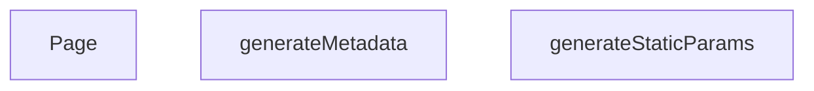

## NODE ID STANDARD

  file: src\app\[lang]\brands\[slug]\page.tsx
  function: src\app\[lang]\brands\[slug]\page.tsx::generateStaticParams
  function: src\app\[lang]\brands\[slug]\page.tsx::generateMetadata
  function: src\app\[lang]\brands\[slug]\page.tsx::Page

---

## DISA AKTARILANLAR (EXPORTS)
  export: Page
  export: generateMetadata
  export: generateStaticParams

---

## STİL TOKENLERİ

### Arbitrary Değerler (token'a geçirilmemiş)
Yok — tüm stiller token'a geçirilmiş. ✅

### Kullanılan Token'lar (zaten token'a geçirilmiş)
- (yok)

### Tailwind Sınıf Özeti
- **Renkler:** (yok)
- **Layout:** (yok)
- **Varyant/Responsive:** (yok)
- **Yardımcı Sınıflar:** (yok)

---
# FILE: src\app\[lang]\cart\page.md

---
domain: general
source_type: doc
namespace_type: module
source_path: C:\Users\alize\venthub-hvac\src\app\[lang]\cart\page.tsx
skeleton_hash: a0383d6424d2f48f
entity_hashes:
  func:Page: caa361dd303c55cf
  overview: 77749cbbbd217b97
  style_tokens: 9144ece4bffe7964
generated_at: 2026-06-08T10:08:10Z
---

## Genel Bakış
Bu modül, alışveriş sepeti sayfasının ana giriş noktası olan `Page` bileşenini tanımlar. Bileşen, sepetin kullanıcı arayüzünü oluşturur, veri çekme işlemlerini başlatır ve ödeme gibi kullanıcı etkileşimlerini yönlendirir; ayrıca alt bileşenlerin yüklenmesini yönetmek için Suspense mekanizmasını kullanır.

## Fonksiyon Grupları
### UI Render ve Veri Bağlantısı
Sepet sayfasının görsel çıktısını üretir ve gerekli verileri alt bileşenlere aktarır.
- Page

---

## AXIOMS – Mimari Varsayımlar
Bu modül için özel aksiyom tanımlanmamıştır.

---

## FONKSİYON DETAYLARI

### Page
**Ne yapar**: `Page` fonksiyonu, uygulamanın sepet sayfasını render eder ve içerik yüklenirken bir bekleme animasyonu gösterir.  
**Nasıl yapar**: Fonksiyon, `Suspense` bileşeni içinde `CartPage` bileşenini sarmalar. `Suspense`’ın `fallback` özelliği, veri çekimi tamamlanmadan önce dönen bir spinner ve ortalanmış bir konteyner gösterir. Bu sayede kullanıcıya içerik henüz hazır değilse görsel geri bildirim sağlanır.  
**Parametreler**:  
- (fonksiyon parametresi yok)  
**Dönüş**: Fonksiyon bir JSX elementi döndürür; dönüş tipi `void` olarak kabul edilir (React render çıktısı).

---

## AST POINTERS

### [N1_NASIL] AST Pointer: src/app/[lang]/cart/page.tsx::Page
- **params**: yok
- **ic_degiskenler**: yok
- **Dönüş**: React JSX elementi (`Suspense` altında `CartPage` bileşenini render eder)

---

## NODE ID STANDARD

  file: src\app\[lang]\cart\page.tsx
  function: src\app\[lang]\cart\page.tsx::Page

---

## DISA AKTARILANLAR (EXPORTS)
  export: Page

---

## STİL TOKENLERİ

### Arbitrary Değerler (token'a geçirilmemiş)
Yok — tüm stiller token'a geçirilmiş. ✅

### Kullanılan Token'lar (zaten token'a geçirilmiş)
- (yok)

### Tailwind Sınıf Özeti
- **Renkler:** `border-b-2`, `border-primary-navy`
- **Layout:** `flex`, `h-12`, `items-center`, `justify-center`, `min-h-screen`, `w-12`
- **Varyant/Responsive:** (yok)
- **Yardımcı Sınıflar:** `animate-spin`, `rounded-full`

---
# FILE: src\app\[lang]\category\[categorySlug]\page.md

---
domain: general
source_type: doc
namespace_type: module
source_path: C:\Users\alize\venthub-hvac\src\app\[lang]\category\[categorySlug]\page.tsx
skeleton_hash: 1c2ed38d721721fc
entity_hashes:
  func:Page: aad69a98915a6349
  func:generateMetadata: 4d17d1a49159075f
  func:generateStaticParams: 5124c4ce610dd009
  overview: df8cee5ef37d3a87
  style_tokens: e37a0cb8a67ff36f
generated_at: 2026-06-08T10:08:11Z
---

## Genel Bakış
Bu modül, Next.js App Router yapısında dinamik kategori sayfalarını sunmakla sorumludur. URL'deki `categorySlug` parametresine göre sayfa içeriğini, SEO meta bilgilerini ve statik üretim parametrelerini yönetir. Hem derleme zamanında önceden üretim yapılandırmasını hem de çalışma zamanında sayfa arayüzünü oluşturur.

## Fonksiyon Grupları

### Statik Üretim Yapılandırması
Derleme aşamasında hangi kategori sayfalarının önceden üretileceğini belirleyerek statik site oluşturma sürecini yönetir.
- `generateStaticParams`

### SEO Meta Bilgisi Oluşturma
Her kategori sayfası için tarayıcı ve arama motorlarına sunulacak başlık, açıklama gibi meta verilerini dinamik olarak üretir.
- `generateMetadata`

### Sayfa Bileşeni
Kullanıcının tarayıcıda gördüğü kategori sayfasının ana arayüzünü oluşturur ve içeriği render eder.
- `Page`

---

## AXIOMS – Mimari Varsayımlar

Bu modül, Next.js App Router yapısında dinamik kategori sayfaları için params tabanlı veri getirme ve statik üretim yapılandırması üzerine kurulmuştur.

**[Aksiyom 1]**: `_getCachedSupabaseData` çağrılamaz veya geçerli bir veri dönmezse, sayfa içeriği boş/eksik render edilir.

**[Aksiyom 2]**: `generateStaticParams()` geçerli bir `categorySlug` ve `lang` değerleri içeren dizi dönmezse, derleme zamanında hiçbir kategori sayfası önceden üretilmez.

**[Aksiyom 3]**: `generateMetadata`'ya aktarılan `params` Promise'i `{ categorySlug: string, lang: string }` yapısına çözülmezse, SEO meta bilgileri hata ile oluşturulur.

**[Aksiyom 4]**: `Page` bileşenine aktarılan `params` Promise'i `{ categorySlug: string, lang: string }` yapısına çözülmezse, sayfa render edilemez.

**[Aksiyom 5]**: `lang` parametresi geçerli bir dil kodu (locale) içermiyorsa, i18n yönlendirmesi veya içerik dil seçimi hatalı çalışır. (Eşik değerleri: bilinmiyor — fonksiyon gövdesinde tanımlı değil.)

**[Aksiyom 6]**: `categorySlug` parametresi veritabanında karşılığı olmayan bir değer içeriyorsa, `_getCachedSupabaseData` sonucu boş dizi veya null döner ve sayfa "bulunamadı" durumuna geçer. (Kabul kriterleri: bilinmiyor — fonksiyon gövdesinde tanımlı değil.)

---

## FONKSİYON DETAYLARI

### generateStaticParams
**Ne yapar**: Bu fonksiyon, Next.js'in statik site oluşturma (SSG) süreci için dinamik rotaların önceden oluşturulacak tüm olası parametrelerinin listesini üretir. Temel amacı, derleme zamanında (build time) hangi dil ve kategori kombinasyonları için HTML dosyası oluşturulacağını belirlemektir.
**Nasıl yapar**: Fonksiyon, Supabase veritabanından aktif (`is_active` alanı true olan) tüm kategorilerin `slug` alanını çeker. Gelen her bir kategori nesnesi için, varsayılan olarak Türkçe (`tr`) ve İngilizce (`en`) olmak üzere iki ayrı dil parametresi oluşturur. Bu sayede her kategori slug'ı için iki farklı URL yolu (örn: `/tr/category/xxx` ve `/en/category/xxx`) önceden derlenebilir hale gelir.
**Parametreler**:
- Fonksiyon parametre almaz.
**Dönüş**: `{ lang: string, categorySlug: string }` nesnelerinden oluşan bir dizi. Her bir nesne, oluşturulacak bir sayfanın dinamik parametrelerini temsil eder.

### generateMetadata
**Ne yapar**: Kategori sayfası için SEO uyumlu meta verileri (sayfa başlığı, açıklama, kanonik URL ve OpenGraph bilgileri) oluşturur ve Next.js'e iletir.
**Nasıl yapar**: URL parametrelerinden kategori slug'ı ve dil kodunu çıkarır. Kategori verisini önbellekten çeker (`getCachedCategoryData`). Kategori bulunamadığında dil bazlı "Bulunamadı" başlığı döner. Bulunduğunda kategori adına göre dinamik başlık, açıklama, kanonik URL ve OpenGraph nesnesi (başlık, açıklama, görsel, locale, site adı) oluşturur. Görsel olarak kategorinin `image_url` değeri tercih edilir, yoksa varsayılan bir görsel kullanılır.
**Parametreler**:
- `params`: `Promise<{ categorySlug: string, lang: string }>` — URL segmentlerinden gelen ve asenkron olarak çözülmesi gereken parametreler nesnesi. `categorySlug` kategorinin URL'deki belirleyicisini, `lang` ise içeriğin dilini (`en` veya `tr`) temsil eder.
**Dönüş**: Next.js'in `generateMetadata` fonksiyonundan beklediği `Metadata` nesnesi. İçeriğinde `title` (sayfa başlığı), `description` (meta açıklama), `alternates` (kanonik URL) ve `openGraph` (sosyal medya paylaşım bilgileri: başlık, açıklama, URL, site adı, görsel, dil, tür) alanları bulunur. Kategori bulunamadığında sadece `title` alanını içeren bir nesne döner.

### Page
**Ne yapar**: Kategori sayfasının sunucu tarafında (SSR) oluşturulan ana React bileşenini render eder; kategori verilerini, alt kategorileri, ürünleri ve SEO için yapılandırılmış veriyi (JSON-LD) sayfaya dahil eder.
**Nasıl yapar**: URL parametrelerini çözerek kategori bilgisini ve dil sözlüğünü yükler. Kategori mevcutsa Supabase veritabanından aktif ve sıralı alt kategorileri çeker, her birini `mapDatabaseCategoryToDomain` ile domain modeline dönüştürür. Kategori ve alt kategori ID'lerini birleştirerek `getProductsEnriched` fonksiyonuyla zenginleştirilmiş ürün listesini getirir. Sayfa başına JSON-LD CollectionPage yapısını (`<script type="application/ld+json">`) enjekte eder. Ana içerik olarak `React.Suspense` ile sarmalanmış `PageComponent` bileşenini, ilk verileri (kategori, ürünler, alt kategoriler) prop olarak geçirerek render eder.
**Parametreler**:
- `params`: `Promise<{ categorySlug: string, lang: string }>` — URL parametrelerinden gelen ve asenkron olarak çözülmesi gereken nesne. `categorySlug` sayfanın hangi kategoriye ait olduğunu belirtirken, `lang` içeriğin dilini (`en` veya `tr`) tanımlar.
**Dönüş**: JSX (`React.ReactNode`). Dönen yapı, JSON-LD verisini içeren bir `<script>` etiketi ve asenkron veri yüklemeyi beklerken bir fallback (yükleniyor mesajı) gösteren `React.Suspense` ile sarılmış `PageComponent` bileşeninden oluşur. `PageComponent`, başlangıç verileri olarak `initialCategory`, `initialProducts` ve `initialSubCategories` prop'larını alır.

---

## SABİTLER
- **_getCachedSupabaseData** (call) — `cache((id: string) => {

  return supabase.from('categories').select('*').eq(...`

---

## AST POINTERS

### [N1_NASIL] AST Pointer: generateStaticParams
- **params**: parametre yok
- **ic_degiskenler**:
  - `data` — supabase'den aktif kategorilerin slug'larını çeken sorgu sonucu
  - `categoriesList` — data'nın null-safe array dönüşümü, her biri `slug` alanı içeren nesne dizisi
- **Dönüş**: `Array<{lang: string, categorySlug: string}>` — her kategori için tr ve en dillerinde parametre nesneleri

### [N2_NASIL] AST Pointer: generateMetadata
- **params**: `{ params: Promise<{ categorySlug: string, lang: string }> }` — URL parametreleri
- **ic_degiskenler**:
  - `categorySlug` — params'tan çözülen kategori slug'ı
  - `lang` — params'tan çözülen dil kodu (tr/en)
  - `category` — getCachedCategoryData ile çekilen kategori verisi (null olabilir)
  - `desc` — dil bazlı OpenGraph meta açıklaması
- **Dönüş**: Next.js metadata nesnesi — title, description, alternates, openGraph alanları

### [N3_NASIL] AST Pointer: Page
- **params**: `{ params: Promise<{ categorySlug: string, lang: string }> }` — URL parametreleri
- **ic_degiskenler**:
  - `categorySlug` — params'tan çözülen kategori slug'ı
  - `lang` — params'tan çözülen dil kodu (tr/en)
  - `category` — getCachedCategoryData ile çekilen kategori verisi (null olabilir)
  - `dict` — lang koduna göre sözlük (en veya tr)
  - `products` — DomainProduct[] türünde ürün dizisi, varsayılan boş dizi
  - `subCategories` — DomainCategory[] türünde alt kategori dizisi, varsayılan boş dizi
  - `subsData` — supabase'den çekilen alt kategori verisi (data ve error alanı içeren supabase sonucu)
  - `categoriesArray` — subsData'nın null-safe array dönüşümü, DbCategory[] türünde
  - `categoryIds` — ana kategori ID'si ve alt kategori ID'lerinin birleşimi
  - `jsonLd` — Schema.org CollectionPage JSON-LD yapısı
- **Dönüş**: React.ReactNode — JSON-LD script'i ve Suspense ile sarılmış PageComponent

---


## MERMAID CALL GRAPH


## NODE ID STANDARD

  file: src\app\[lang]\category\[categorySlug]\page.tsx
  function: src\app\[lang]\category\[categorySlug]\page.tsx::generateStaticParams
  function: src\app\[lang]\category\[categorySlug]\page.tsx::generateMetadata
  function: src\app\[lang]\category\[categorySlug]\page.tsx::Page

---

## DISA AKTARILANLAR (EXPORTS)
  export: Page
  export: generateMetadata
  export: generateStaticParams

---

## STİL TOKENLERİ

### Arbitrary Değerler (token'a geçirilmemiş)
Yok — tüm stiller token'a geçirilmiş. ✅

### Kullanılan Token'lar (zaten token'a geçirilmiş)
- (yok)

### Tailwind Sınıf Özeti
- **Renkler:** `text-center`, `text-slate-500`
- **Layout:** (yok)
- **Varyant/Responsive:** (yok)
- **Yardımcı Sınıflar:** `container`, `mx-auto`, `px-4`, `py-12`

---
# FILE: src\app\[lang]\category\[categorySlug]\[subCategorySlug]\page.md

---
domain: general
source_type: doc
namespace_type: module
source_path: C:\Users\alize\venthub-hvac\src\app\[lang]\category\[categorySlug]\[subCategorySlug]\page.tsx
skeleton_hash: 47fc18fd53558a56
entity_hashes:
  func:Page: e8d158c2a4a762ae
  func:generateStaticParams: 28452401205f49a6
  func:getCategoryData: e78b546d8d1e7e91
  overview: 14f78cd372aea5cf
  style_tokens: e37a0cb8a67ff36f
generated_at: 2026-06-08T10:08:10Z
---

## Genel Bakış
Bu modül, Next.js uygulamasındaki dinamik rotaları kullanarak kategori ve alt kategori sayfalarını sunucu tarafında sunar. Temel amacı, URL'den gelen `categorySlug` ve `subCategorySlug` parametrelerini işleyerek ilgili sayfa verisini çekmek ve istemciye sunmaktır. Ayrıca, statik site oluşturma (SSG) sürecinde derleme aşamasında oluşturulacak tüm olası sayfa kombinasyonlarını belirleyerek build işlemini destekler.

## Fonksiyon Grupları
### Veri Temini ve İşleme
Modülün temel veri bağımlılığını karşılar; belirli bir alt kategorinin verisini dış kaynaktan asenkron olarak çeker ve sayfanın içeriğini oluşturmak için işlenmek üzere hazır hale getirir.
- getCategoryData

### Sayfa Rotalama ve Statik Oluşturma
URL parametrelerini (slug'ları) işleyerek hem istek anında sayfa bileşeninin render edilmesini yönetir hem de build aşamasında statik olarak oluşturulacak tüm sayfa yollarını (parametrelerini) belirleyerek uygulama yapılandırmasını destekler.
- Page, generateStaticParams

---

## AXIOMS – Mimari Varsayımlar

Bu modül, Next.js App Router'da dinamik kategori/alt kategori sayfalarını sunucu tarafında render eden bir sayfa bileşenidir.

[Aksiyom 1]: Eğer `getCategoryData` fonksiyonuna geçerli bir `slug` string'i sağlanmazsa, veri çekme işlemi başarısız olur veya hatalı veri döner.

[Aksiyom 2]: Eğer `Page` bileşeninin `params` parametresinde `categorySlug`, `subCategorySlug` veya `lang` alanlarından herhangi biri eksikse, sayfa render edilemez.

[Aksiyom 3]: Eğer `generateStaticParams` fonksiyonu, build aşamasında tüm olası kategori/alt kategori kombinasyonlarını döndürmezse, eksik sayfalar oluşturulmaz.

[Aksiyom 4]: Eğer `getCategoryData` tarafından erişilen dış veri kaynakçası (API/DB) erişilemez durumdaysa, sayfa veri olmadan render edilir veya hata fırlatır.

[Aksiyom 5]: Eğer `params` Promise'i çözülmezse veya geçersiz bir değer döndürürse, `Page` bileşeni doğru parametreleri alamaz ve sayfa hatalı çalışır.

---

## FONKSİYON DETAYLARI

### getCategoryData
**Ne yapar**: Verilen bir kategori slug'ı ile veritabanından ilgili kategori verisini çeker ve alanları haritalandırarak domain modeline dönüştürür.

**Nasıl yapar**: Supabase istemcisi kullanarak 'categories' tablosundan belirtilen slug'a sahip tek bir kaydı seçer. Hata oluşursa veya veri bulunamazsa null döner. Veri bulunduğunda, `mapDatabaseCategoryToDomain` yardımcı fonksiyonunu çağırarak ham veritabanı kaydını (`DbCategory`) uygulama içi kullanım için tasarlanmış domain modeline dönüştürür. Bazı alanların tipleri açıkça belirtilerek dönüşüm yapılır.

**Parametreler**:
- slug: `string` — Aranacak kategorinin benzersiz tanımlayıcısı (slug).

**Dönüş**: Başarılı sorgulama ve haritalandırma sonucu bir `DbCategory` nesnesini alan `mapDatabaseCategoryToDomain` fonksiyonunun dönüş değerini döner. Hata durumunda veya veri yokluğunda `null` döner.

### generateStaticParams
**Ne yapar**: Next.js statik site oluşturma (SSG) süreci için, oluşturulan alt kategori sayfalarının URL parametrelerini (lang, categorySlug, subCategorySlug) üreten asenkron bir fonksiyondur.

**Nasıl yapar**: Önce Supabase'den tüm aktif ve `parent_id`'si dolu olan (yani alt kategoriler) kayıtları çeker. Ardından, bu alt kategorilerin ait olduğu üst kategorilerin bilgilerini (id ve slug) ayrı bir sorguyla getirir ve bir haritaya (`parentMap`) dönüştürür. Her bir alt kategori için, üst kategorinin slug'ını haritadan bulur ve 'tr' ile 'en' dil kodları için iki ayrı parametre seti oluşturarak döndürür.

**Parametreler**: Bu fonksiyon parametre almaz.

**Dönüş**: `Promise<Array<{ lang: string; categorySlug: string; subCategorySlug: string }>>` — Statik olarak oluşturulacak tüm alt kategori sayfaları için URL parametrelerini içeren bir dizi. Her bir alt kategori, iki farklı dil (tr ve en) için bir dizi elemanı olarak temsil edilir.

### Page
**Ne yapar**: Bu fonksiyon, bir alt kategori sayfasını sunucu tarafında render eden bir Next.js sayfa bileşenidir. Asenkron olarak çalışarak gerekli verileri (kategori bilgisi ve ürün listesi) sunucuda çeker ve istemciye bir yükleme durumu (Suspense) ile birlikte sunulacak bir bileşen döndürür.

**Nasıl yapar**: Fonksiyon, `params` prop'unu `await` ederek `subCategorySlug` ve `lang` değerlerini çıkarır. Ardından `getCategoryData` asenkron fonksiyonunu çağırarak ilgili kategori bilgisini alır. Dil tercihine göre (`lang` parametresi) İngilizce (`en`) veya Türkçe (`tr`) sözlük nesnesini seçer. Eğer kategori başarıyla retrieve edilmişse (`category` mevcutsa), `getProductsEnriched` fonksiyonunu kullanarak o kategoriye ait ürünleri (maksimum 100 adet) çeker. Son olarak, çekilen verileri `PageComponent` bileşenine `initialCategory` ve `initialProducts` olarak props olarak iletir ve bunu bir `React.Suspense` zarfı içinde, bir fallback (yükleniyor mesajı) ile birlikte döndürür.

**Parametreler**:
- `params`: `Promise<{ categorySlug: string, subCategorySlug: string, lang: string }>` — Sayfa route parametrelerini içeren asenkron bir nesne. `categorySlug`, `subCategorySlug` ve `lang` (dil kodu) alanlarını barındırır. `await` ile çözümlenerek kullanım için hazır hale getirilir.

**Dönüş**: `JSX.Element` — Asenkron olarak hazırlanmış, `PageComponent`'i `React.Suspense` ile sarmalayan bir JSX bileşeni döndürür. `PageComponent`, başlangıç kategori verisi ve ürün listesi ile beslenerek istemci tarafında render edilmeye hazır hale getirilir.

---

## AST POINTERS

### [N1_NASIL] AST Pointer: `[lang]/category/[categorySlug]/[subCategorySlug]/page.tsx`::getCategoryData
- **params**: `slug: string` — Veritabanında eşleşecek kategorinin slug değeri
- **ic_degiskenler**:
  - `data` — Supabase sorgusundan dönen tek satır kategori verisi; alanlar: `id`, `name`, `parent_id`, `slug`, `is_active`, `sort_order`, `level`, `image_url`, `seo_title`, `seo_desc`, `created_at`, `updated_at`, `description`, `display_mode`, `is_featured`, `marketing_title`, `menu_label`, `metadata`, `translation_key`, `authority_content`
  - `error` — Supabase sorgusundan dönen hata nesnesi; hata yoksa `null`
  - `data.name` — Kategorinin adı, `null` ise boş string'e defaultlanır
  - `data.menu_label` — Kategorinin menü etiketi, `string | null` olarak cast edilir
  - `data.marketing_title` — Kategorinin pazarlama başlığı, `string | null` olarak cast edilir
  - `data.translation_key` — Kategorinin çeviri anahtarı, `string | null` olarak cast edilir
  - `data.description` — Kategorinin açıklaması, `string | null` olarak cast edilir
  - `data.metadata` — Kategorinin metadata nesnesi, `CategoryMetadata | null` olarak cast edilir
  - `data.authority_content` — Kategorinin otorite içeriği, `AuthorityContent | null` olarak cast edilir
- **Dönüş**: `mapDatabaseCategoryToDomain(...)` ile oluşturulmuş domain kategori nesnesi; hata veya veri yoksa `null`

---


## MERMAID CALL GRAPH
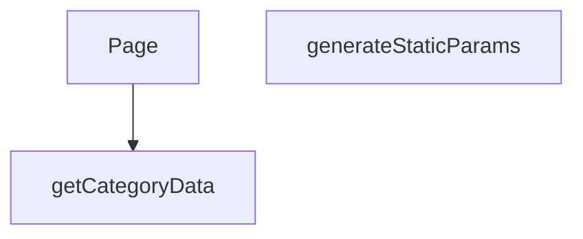

## NODE ID STANDARD

  file: src\app\[lang]\category\[categorySlug]\[subCategorySlug]\page.tsx
  function: src\app\[lang]\category\[categorySlug]\[subCategorySlug]\page.tsx::getCategoryData
  function: src\app\[lang]\category\[categorySlug]\[subCategorySlug]\page.tsx::generateStaticParams
  function: src\app\[lang]\category\[categorySlug]\[subCategorySlug]\page.tsx::Page

---

## DISA AKTARILANLAR (EXPORTS)
  export: Page
  export: generateStaticParams
  export: getCategoryData

---

## STİL TOKENLERİ

### Arbitrary Değerler (token'a geçirilmemiş)
Yok — tüm stiller token'a geçirilmiş. ✅

### Kullanılan Token'lar (zaten token'a geçirilmiş)
- (yok)

### Tailwind Sınıf Özeti
- **Renkler:** `text-center`, `text-slate-500`
- **Layout:** (yok)
- **Varyant/Responsive:** (yok)
- **Yardımcı Sınıflar:** `container`, `mx-auto`, `px-4`, `py-12`

---
# FILE: src\app\[lang]\checkout\page.md

---
domain: general
source_type: doc
namespace_type: module
source_path: C:\Users\alize\venthub-hvac\src\app\[lang]\checkout\page.tsx
skeleton_hash: 52ba201233f367d6
entity_hashes:
  func:Page: 752ea1d46a136aae
  overview: cbc240f327cf6544
  style_tokens: 9144ece4bffe7964
generated_at: 2026-06-08T10:08:11Z
---

## Genel Bakış
`src/app/[lang]/checkout/page.tsx` modülü, uygulamanın ödeme sayfasının dil destekli ana bileşenini tanımlar. Bu bileşen, kullanıcının ödeme sürecini yönettiği arayüzün tamamını oluşturur ve dil parametresine göre render eder.

## Fonksiyon Grupları
### UI Rendering
Ödeme sayfasının kullanıcı arayüzünü JSX ile oluşturur ve dil parametresine göre dinamik olarak render edilen React bileşenini döndürür.
- Page

---

## AXIOMS – Mimari Varsayımlar

Bu modül için doğrulanabilir mimari varsayımlar çok sınırlıdır; `Page()` fonksiyon imzası parametresizdir ve modül sabitleri tanımlanmamıştır.

**[Aksiyom 1]:** Eğer `CheckoutPage` adlı alt bileşen mevcut değilse veya modül tarafından import edilemezse, `Page` fonksiyonunun JSX döndürme süreci tamamlanamaz ve çalışma zamanı hatası oluşur.

**[Aksiyom 2]:** Eğer render sırasında loading durumu (animasyonlu ekran) için gerekli UI kaynakları (CSS class'ları, animasyon tanımları veya stil bileşenleri) sağlanamazsa, kullanıcı boş veya bozuk bir geçiş ekranı görür.

> **Not:** Fonksiyon imzası `Page()` olarak verilmiş olup herhangi bir parametre göstermemektedir. Dosya yolu `[lang]` dinamik rotası içermesine rağmen, dil parametresinin fonksiyon içeriğine nasıl alındığı (Next.js `params` prop'u mu, context mi, vs.) fonksiyon imzasından çıkarılamadığı için bu konuda varsayımda bulunulamamaktadır.

---

## FONKSİYON DETAYLARI

### Page
**Ne yapar**: Checkout (ödeme) sayfasının üst düzey sarmalayıcı bileşenidir. Kullanıcı ödeme sayfasına eriştiğinde yüklenme sürecinde animasyonlu bir loading ekranı gösterir ve ardından ana CheckoutPage bileşenini render eder.

**Nasıl yapar**: React'ın `Suspense` bileşenini kullanarak asenkron veri yüklemelerini veya yavaş bileşenleri yüklenirken göstermek üzere bir fallback UI sunar. Fallback olarak screen'i ortalamalı, dönen bir loading spinner animasyonu (primary-navy renkli border-b-2 ile) oluşturulur. Suspense çocuğu olarak `CheckoutPage` bileşenini render eder; bu bileşen muhtemelen içeriği, forma alanlarını ve ödeme süreçlerini yönetir.

**Parametreler**:
Bu fonksiyon herhangi bir parametre almamaktadır (propsuz bir React Server Component yapısındadır).

**Dönüş**: JSX elementi döndürür — `Suspense` ile sarılmış `CheckoutPage` bileşeninin render sonucunu verir. Suspense yüklenme esnasında animasyonlu bir spinner div'i, yükleme tamamlandığında ise CheckoutPage içeriğini gösterir.

---

## AST POINTERS

### [N1_NASIL] AST Pointer: src/app/[lang]/checkout/page.tsx::Page
- **params**: (yok)
- **ic_degiskenler**: (yok)
- **Dönüş**: React JSX elemanı (Suspense içinde CheckoutPage)

---

## NODE ID STANDARD

  file: src\app\[lang]\checkout\page.tsx
  function: src\app\[lang]\checkout\page.tsx::Page

---

## DISA AKTARILANLAR (EXPORTS)
  export: Page

---

## STİL TOKENLERİ

### Arbitrary Değerler (token'a geçirilmemiş)
Yok — tüm stiller token'a geçirilmiş. ✅

### Kullanılan Token'lar (zaten token'a geçirilmiş)
- (yok)

### Tailwind Sınıf Özeti
- **Renkler:** `border-b-2`, `border-primary-navy`
- **Layout:** `flex`, `h-12`, `items-center`, `justify-center`, `min-h-screen`, `w-12`
- **Varyant/Responsive:** (yok)
- **Yardımcı Sınıflar:** `animate-spin`, `rounded-full`

---
# FILE: src\app\[lang]\contact\page.md

---
domain: general
source_type: doc
namespace_type: module
source_path: C:\Users\alize\venthub-hvac\src\app\[lang]\contact\page.tsx
skeleton_hash: dc08580a33236244
entity_hashes:
  func:Page: 02ee67f324c336e5
  overview: a07fce05e4917c91
  style_tokens: dd5ed8d0f58dcf57
generated_at: 2026-06-08T08:57:36Z
---

## Genel Bakış
Bu modül, çok dilli bir web uygulamasının iletişim sayfasının ana giriş noktasıdır. Tek bir bileşen ile sayfanın tüm içeriğini, iletişim formunu ve dil destekli yapısını render eder.

## Fonksiyon Grupları
### Ana Sayfa Bileşeni
İletişim sayfasının tüm kullanıcı arayüzünü ve dil entegrasyonunu oluşturan temel bileşeni barındırır.
- Page

---

## AXIOMS – Mimari Varsayımlar

Bu modül için özel aksiyom tanımlanmamıştır.

---

## FONKSİYON DETAYLARI

### Page

**Ne yapar**:
Sayfa bileşenidir ve Next.js'in App Router yapısında `/contact` rotasının üst düzey React bileşenini temsil eder. İletişim sayfasının tüm görünümünü ve işlevselliğini barındıran `PageComponent` bileşenini render eder. Bu fonksiyon, Next.js'in varsayılan sayfa bileşeni sözleşmesine uygun olarak sunucu tarafında veya istemci tarafında çağrılabilir.

**Nasıl yapar**:
Next.js App Router yapısında tanımlanmış bir sayfa bileşenidir. Fonksiyon gövdesinde herhangi bir mantıksal işlem, durum yönetimi veya veri getirme yapılmamıştır. Doğrudan `PageComponent` adlı alt bileşeni JSX olarak döndürür. Tüm sayfa mantığı, layout bileşenleri ve alt bileşenler aracılığıyla gerçekleştirilir.

**Parametreler**:
- Parametre almamaktadır.

**Dönüş**:
- `JSX.Element` — İletişim sayfasının tüm içeriğini temsil eden `PageComponent` bileşeninin JSX çıktısıdır.

---

## AST POINTERS

### [N1_NASIL] AST Pointer: src\app\[lang]\contact\page.tsx::Page
- **params**: (yok)
- **ic_degiskenler**: (yok — fonksiyon gövdesinde herhangi bir değişken tanımlanmamıştır)
- **Dönüş**: `<PageComponent />` JSX elemanı — `../../../views/ContactPage` yolundan import edilen `PageComponent` doğrudan render edilir. Fonksiyon içinde herhangi bir değişken tanımlama, mantıksal işlem veya API çağrısı bulunmamaktadır; saf bir wrapper/sarmalayıcı bileşendir.

---

## NODE ID STANDARD

  file: src\app\[lang]\contact\page.tsx
  function: src\app\[lang]\contact\page.tsx::Page

---

## DISA AKTARILANLAR (EXPORTS)
  export: Page

---

## STİL TOKENLERİ

### Arbitrary Değerler (token'a geçirilmemiş)
Yok — tüm stiller token'a geçirilmiş. ✅

### Kullanılan Token'lar (zaten token'a geçirilmiş)
- (yok)

### Tailwind Sınıf Özeti
- **Renkler:** (yok)
- **Layout:** (yok)
- **Varyant/Responsive:** (yok)
- **Yardımcı Sınıflar:** (yok)

---
# FILE: src\app\[lang]\destek\garanti-servis\page.md

---
domain: general
source_type: doc
namespace_type: module
source_path: C:\Users\alize\venthub-hvac\src\app\[lang]\destek\garanti-servis\page.tsx
skeleton_hash: 67986d249a76e351
entity_hashes:
  func:Page: 02ee67f324c336e5
  overview: 6c2c809acf8ab283
  style_tokens: dd5ed8d0f58dcf57
generated_at: 2026-06-08T08:57:36Z
---

## Genel Bakış
Bu modül, VentHub HVAC uygulamasının garanti servis destek sayfasının giriş noktasıdır. Tek bir React bileşeni üzerinden sayfa düzenini, alt bileşenleri ve gerekli iş mantığını bir araya getirerek kullanıcıya eksiksiz bir arayüz sunar.

## Fonksiyon Grupları
### Sayfa Bileşeni
Garanti servis sayfasının üst seviye React bileşenidir. Layout yapısını, veri bağlantılarını ve alt bileşenleri (formlar, listeler, bilgi kartları) organize ederek sayfanın bütününü oluşturur.
- Page

---

## AXIOMS – Mimari Varsayımlar

Bu modül, Next.js App Router yapısında konumlanmış bir sayfa bileşenidir. Fonksiyon gövdesi detaylı analiz için sunulmadığından, yalnızca imza ve yapısal bağlamdan çıkarılabilir varsayımlar listelenmektedir.

[Aksiyom 1]: Eğer Next.js App Router altyapısı çalışmıyorsa, bu bileşen sayfa olarak render edilemez.

[Aksiyom 2]: Eğer `[lang]` dinamik route parametresi geçerli bir dil kodu içermiyorsa, sayfa doğru dilde içerik sunamaz.

[Aksiyom 3]: Eğer üst seviye layout bileşeni mevcut değilse veya hatalıysa, sayfa eksik veya bozuk görünebilir.

[Aksiyom 4]: Eğer `Page()` bileşeni JSX döndürmüyorsa veya hata fırlatıyorsa, React render zinciri kırılır ve sayfa görüntülenemez.

---

## FONKSİYON DETAYLARI

### Page
**Ne yapar**: Bu fonksiyon, garanti ve servis sayfasının ana React bileşenini oluşturur ve döndürür. Sayfanın temel yapısını ve içeriğini tanımlayan üst düzey bir kabuktur.

**Nasıl yapar**: Fonksiyon, doğrudan `PageComponent` adlı bir alt bileşeni JSX olarak döndürür. Sayfa ile ilgili tüm görünüm ve mantık bu alt bileşende tanımlıdır.

**Parametreler**:
- Fonksiyon herhangi bir parametre almaz.

**Dönüş**: `JSX.Element` — Sayfanın tamamını temsil eden `PageComponent` bileşenini döndürür.

---

## AST POINTERS

### [N1_NASIL] AST Pointer: src/app/[lang]/destek/garanti-servis/page.tsx::Page
- **params**: (parametre yok)
- **ic_degiskenler**: (yok)
- **Dönüş**: `<PageComponent />` JSX bileşeni — import edilen `WarrantyPage` view bileşenini doğrudan render eder

---

## NODE ID STANDARD

  file: src\app\[lang]\destek\garanti-servis\page.tsx
  function: src\app\[lang]\destek\garanti-servis\page.tsx::Page

---

## DISA AKTARILANLAR (EXPORTS)
  export: Page

---

## STİL TOKENLERİ

### Arbitrary Değerler (token'a geçirilmemiş)
Yok — tüm stiller token'a geçirilmiş. ✅

### Kullanılan Token'lar (zaten token'a geçirilmiş)
- (yok)

### Tailwind Sınıf Özeti
- **Renkler:** (yok)
- **Layout:** (yok)
- **Varyant/Responsive:** (yok)
- **Yardımcı Sınıflar:** (yok)

---
# FILE: src\app\[lang]\destek\hesaplayicilar\hava-perdesi\page.md

---
domain: general
source_type: doc
namespace_type: module
source_path: C:\Users\alize\venthub-hvac\src\app\[lang]\destek\hesaplayicilar\hava-perdesi\page.tsx
skeleton_hash: 1f383d3722a1685b
entity_hashes:
  func:Page: 3f2298054a9d2ba4
  overview: 286959abaf4b75d1
  style_tokens: 9144ece4bffe7964
generated_at: 2026-06-08T10:08:11Z
---

## Genel Bakış
Bu modül, VentHub HVAC uygulamasındaki "hava perdesi" hesaplayıcı aracının ana sayfa yapısını tanımlayan bir React/Next.js sayfa bileşenidir. Modül, ilgili alt bileşenleri bir araya getirerek hesaplama arayüzünü sunar ve sayfanın kullanıcıya gösterilmesinden sorumludur.

## Fonksiyon Grupları
### Sayfa Oluşturma ve Düzenleme
Bu grup, hava perdesi hesaplama sayfasının tüm kullanıcı arayüzünü oluşturarak ilgili hesaplama araçlarını ve bileşenleri bir sayfa içinde düzenler.
- Page

---

## AXIOMS – Mimari Varsayımlar
Bu modül için özel aksiyom tanımlanmamıştır.

> **Not:** `Page()` fonksiyonunun gövdesi (içeriği) paylaşılmadığı için, fonksiyonun hangi bileşenleri çağırdığı, hangi hesaplamaları yaptığı veya hangi veri akışını izlediği bilinmemektedir. Dolayısıyla sadece fonksiyon gövdesinden türetilebilecek aksiyom üretilememektedir. Fonksiyon gövdesi sağlandığında aksiyomlar oluşturulabilir.

---

## FONKSİYON DETAYLARI

### Page
**Ne yapar**: Bu fonksiyon, bir React functional component olup sayfanın Suspense ile sarılmış halini döndürür. Temel amacı, asıl sayfa bileşeninin (PageComponent) yüklenme sürecini yönetmek ve kullanıcıya yükleme durumunda görsel bir geri bildirim sunmaktır.

**Nasıl yapar**: Fonksiyon, React Suspense bileşenini kullanarak asıl içerik olan `PageComponent`'i sarmalar. `fallback` prop'u aracılığıyla, `PageComponent` yüklenene kadar ekranda bir loading animasyonu (dönen bir daire) gösterir. Bu animasyon, Tailwind CSS sınıfları (`animate-spin`, `rounded-full`, `border-b-2 border-primary-navy`) ile stillendirilmiş, ekranın ortasında yer alan ve minimum ekran yüksekliğinde (`min-h-screen`) konumlandırılmış bir div içinde render edilir.

**Parametreler**: Yok

**Dönüş**: React JSX elementi (Suspense içinde `PageComponent`'i barındıran bir yapı)

---

## AST POINTERS

### [N1_NASIL] AST Pointer: `[lang]/destek/hesaplayicilar/hava-perdesi/page.tsx`::Page
- **params**: (parametre yok)
- **ic_degiskenler**: (yok — fonksiyon gövdesinde değişken tanımlanmamış)
- **Cagrilar**: 
  - `Suspense` — React Suspense bileşeni, fallback olarak spinner gösterir
  - `PageComponent` — AirCurtainCalcPage bileşeni, Suspense içinde render edilir
- **Dönüş**: JSX (Suspense ile sarılmış `<PageComponent />` bileşeni)

---

## NODE ID STANDARD

  file: src\app\[lang]\destek\hesaplayicilar\hava-perdesi\page.tsx
  function: src\app\[lang]\destek\hesaplayicilar\hava-perdesi\page.tsx::Page

---

## DISA AKTARILANLAR (EXPORTS)
  export: Page

---

## STİL TOKENLERİ

### Arbitrary Değerler (token'a geçirilmemiş)
Yok — tüm stiller token'a geçirilmiş. ✅

### Kullanılan Token'lar (zaten token'a geçirilmiş)
- (yok)

### Tailwind Sınıf Özeti
- **Renkler:** `border-b-2`, `border-primary-navy`
- **Layout:** `flex`, `h-12`, `items-center`, `justify-center`, `min-h-screen`, `w-12`
- **Varyant/Responsive:** (yok)
- **Yardımcı Sınıflar:** `animate-spin`, `rounded-full`

---
# FILE: src\app\[lang]\destek\hesaplayicilar\hrv\page.md

---
domain: general
source_type: doc
namespace_type: module
source_path: C:\Users\alize\venthub-hvac\src\app\[lang]\destek\hesaplayicilar\hrv\page.tsx
skeleton_hash: 7b7606be1adbdf90
entity_hashes:
  func:Page: 3f2298054a9d2ba4
  overview: 92457a7c21ad9373
  style_tokens: 9144ece4bffe7964
generated_at: 2026-06-08T10:08:11Z
---

## Genel Bakış
Bu modül, HRV (Heat Recovery Ventilation — Isı Geri Kazanımlı Havalandırma) hesaplayıcısının kullanıcı arayüzünü sunan tek bir sayfa bileşeninden oluşur. Modül, dil parametreli bir Next.js sayfa rotası olarak yapılandırılmıştır ve yüklenme sırasında animasyonlu bir spinner ile Suspense sarmalayıcısı kullanır.

## Fonksiyon Grupları
### Sayfa Rendersi
Tek bir üst seviye sayfa bileşeni tanımlar; dil desteğiyle birlikte HRV hesaplayıcının tüm giriş ve çıktı arayüzünü Suspense içinde sunar.
- Page

---

## AXIOMS – Mimari Varsayımlar

Bu modül için özel aksiyom tanımlanmamıştır.

**Not:** Modül sadece bir React sayfa bileşeni (`Page`) içermekte ve fonksiyon gövdesinde herhangi bir mantıksal iş kuralı, koşul kontrolü veya veri doğrulama içeriği bulunmamaktadır. Sayfa, UI rendering yaptığı varsayılmakta ancak girdi doğrulama, hesaplama mantığı veya hata yönetimi gibi çıkarılabilecek mimari varsayımlar içermemektedir. Fonksiyon imzası boş olup default değer veya parametre tanımı bulunmamaktadır. Bu nedenle, modülün doğru çalışması için zorunlu olan koşullar belirlenememiştir.

---

## FONKSİYON DETAYLARI

### Page

**Ne yapar**: Sayfa düzeyinde bir React bileşenidir ve ana sayfa içeriğini Suspense sarıcısı ile birlikte sunar. Asenkron yüklemeler sırasında kullanıcıya yükleme animasyonu göstererek kesintisiz bir deneyim sağlar.

**Nasıl yapar**: Fonksiyon, React Suspense bileşenini kullanarak `PageComponent`'i sarmalar. Suspense bileşeni, `PageComponent` içindeki asenkron işlemler (örneğin veri çekme) henüz tamamlanmamışken `fallback` prop'u aracılığıyla bir yükleme göstergesi (spinner) render eder. Bu spinner, tam ekran yüksekliğinde (min-h-screen) ve ortalı şekilde görüntülenen, dönen bir yuvarlak animasyonlu yükleme ikonudur. Suspense mekanizması sayesinde asenkron içerik hazır olduğunda fallback otomatik olarak ana bileşenle değiştirilir.

**Parametreler**:

Bu fonksiyon herhangi bir parametre almamaktadır. Sıfır argümanlı bir React fonksiyonel bileşenidir.

**Dönüş**: JSX elementi döndürür. Suspense ile sarılmış `PageComponent` bileşenini veya yükleme sırasında fallback olarak animasyonlu bir spinner div'ini render eder. Doğrudan return ifadesi ile JSX ağacı dışa aktarılır.

---

## AST POINTERS

### [N1_NASIL] AST Pointer: C:\Users\alize\venthub-hvac\src\app\[lang]\destek\hesaplayicilar\hrv\page.tsx::Page
- **params**: (parametre yok)
- **ic_degiskenler**: (fonksiyon gövdesinde herhangi bir değişken bildirimi veya ataması yoktur)
- **Dönüş**: `return` ifadesi ile bir JSX (`<Suspense>`) bileşeni döndürülür. Bileşen, asıl sayfa içeriğinin (`PageComponent`) yüklenmesini beklerken bir yükleme animasyonu (fallback) gösterir.

---

## NODE ID STANDARD

  file: src\app\[lang]\destek\hesaplayicilar\hrv\page.tsx
  function: src\app\[lang]\destek\hesaplayicilar\hrv\page.tsx::Page

---

## DISA AKTARILANLAR (EXPORTS)
  export: Page

---

## STİL TOKENLERİ

### Arbitrary Değerler (token'a geçirilmemiş)
Yok — tüm stiller token'a geçirilmiş. ✅

### Kullanılan Token'lar (zaten token'a geçirilmiş)
- (yok)

### Tailwind Sınıf Özeti
- **Renkler:** `border-b-2`, `border-primary-navy`
- **Layout:** `flex`, `h-12`, `items-center`, `justify-center`, `min-h-screen`, `w-12`
- **Varyant/Responsive:** (yok)
- **Yardımcı Sınıflar:** `animate-spin`, `rounded-full`

---
# FILE: src\app\[lang]\destek\hesaplayicilar\jet-fan\page.md

---
domain: general
source_type: doc
namespace_type: module
source_path: C:\Users\alize\venthub-hvac\src\app\[lang]\destek\hesaplayicilar\jet-fan\page.tsx
skeleton_hash: bb8025f9b95570ef
entity_hashes:
  func:Page: 02ee67f324c336e5
  overview: ed78a418e47b7805
  style_tokens: dd5ed8d0f58dcf57
generated_at: 2026-06-08T08:57:36Z
---

## Genel Bakış
Bu modül, jet fan hesaplayıcısı için kullanıcı arayüzünü sunan tek bir React sayfa bileşeninden oluşur. `Page` fonksiyonu, hesaplama formunu ve ilgili tüm alt bileşenleri bir araya getirerek sayfanın genel yapısını ve düzenini oluşturur.

## Fonksiyon Grupları
### Sayfa Oluşturma ve Düzenleme
Bu grup, jet fan hesaplayıcı sayfasının tamamını oluşturan ve kullanıcıya sunan temel bileşeni tanımlar.
- Page

---

## AXIOMS – Mimari Varsayımlar
Bu modül için özel aksiyom tanımlanmamıştır.

---

## FONKSİYON DETAYLARI

### Page
**Ne yapar**: Bu fonksiyon, bir web sayfasının ana bileşenini (sayfa yapısını) oluşturan ve sunan üst düzey bir React bileşenidir. Sayfanın görünümünü ve temel yapısını tanımlayan `PageComponent` bileşenini render ederek tarayıcıya aktarır.

**Nasıl yapar**: Fonksiyon, doğrudan ve basit bir yapıdadır. Herhangi bir mantık, koşul veya veri işleme gerçekleştirmez. Sadece import edilmiş olan `PageComponent` bileşenini fonksiyonel bileşen olarak döndürür. React'ın bu bileşeni-render-etme mekanizmasını devreye sokar.

**Parametreler**:
- Bu fonksiyon herhangi bir parametre almaz.

**Dönüş**: `JSX.Element` (React bileşeni). `PageComponent` bileşeninin oluşturduğu React ağacı (virtual DOM) yapısını döndürür.

---

## AST POINTERS

### [N1_NASIL] AST Pointer: src/app/[lang]/destek/hesaplayicilar/jet-fan/page.tsx::Page
- **params**: (yok)
- **ic_degiskenler**: (yok)
- **Dönüş**: `<PageComponent />` JSX bileşeni döndürülür

---

## NODE ID STANDARD

  file: src\app\[lang]\destek\hesaplayicilar\jet-fan\page.tsx
  function: src\app\[lang]\destek\hesaplayicilar\jet-fan\page.tsx::Page

---

## DISA AKTARILANLAR (EXPORTS)
  export: Page

---

## STİL TOKENLERİ

### Arbitrary Değerler (token'a geçirilmemiş)
Yok — tüm stiller token'a geçirilmiş. ✅

### Kullanılan Token'lar (zaten token'a geçirilmiş)
- (yok)

### Tailwind Sınıf Özeti
- **Renkler:** (yok)
- **Layout:** (yok)
- **Varyant/Responsive:** (yok)
- **Yardımcı Sınıflar:** (yok)

---
# FILE: src\app\[lang]\destek\hesaplayicilar\kanal\page.md

---
domain: general
source_type: doc
namespace_type: module
source_path: C:\Users\alize\venthub-hvac\src\app\[lang]\destek\hesaplayicilar\kanal\page.tsx
skeleton_hash: 239399915534bd17
entity_hashes:
  func:Page: 02ee67f324c336e5
  overview: b10dad1d55a83f15
  style_tokens: dd5ed8d0f58dcf57
generated_at: 2026-06-08T08:57:36Z
---

## Genel Bakış
Bu modül, kanal hesaplayıcı sayfasının dil destekli ana giriş noktasıdır. Tek bir React bileşeni (`Page`) aracılığıyla kullanıcıya kanal hesaplama arayüzünü sunar.

## Fonksiyon Grupları
### Sayfa Bileşeni
Sayfanın tüm kullanıcı arayüzünü ve hesaplama formunu oluşturarak bir React bileşeni olarak sunar.
- Page

---

## AXIOMS – Mimari Varsayımlar

Bu modül için temel aksiyomlar aşağıdadır. Fonksiyon gövdesi detaylı biçimde sunulmadığı için, mevcut bilgiye dayalı minimum varsayımlar belirlenmiştir.

**[Aksiyom 1]**: Eğer `Page()` bileşeni geçerli bir React JSX yapısı (ReactElement) döndürmezse, React render hatası oluşur ve sayfa görüntülenemez.

**[Aksiyom 2]**: Eğer bu bileşen Next.js App Router yapısı içinde (`[lang]` segmentli bir yolda) kullanılmak üzere tanımlanmışsa ve bileşen içinden dil parametresi (`params.lang`) erişimi gerekiyorsa, ancak fonksiyon imzasında bu parametre tanımlanmamışsa, dil parametresine erişilemez ve sayfa doğru dilden içerik gösteremez.

**[Aksiyom 3]**: Eğer `Page()` fonksiyonu side-effect (veri çekme, state yönetimi) gerektiren bir sayfa ise, ancak fonksiyon imzasında `async` tanımlanmamışsa, sunucu taraflı veri çekme (server-side data fetching) yapılamaz.

> **Not**: Fonksiyon gövdesi tam olarak sunulmadığı için, bileşenin hangi alt bileşenleri render ettiği, hangi hesaplama mantığını içerdiği ve hangi state'leri yönettiği belirsizdir. Bu aksiyomlar yalnızca mevcut fonksiyon imzası ve modül yapısına dayalı minimum varsayımlardır.

---

## FONKSİYON DETAYLARI

### Page
**Ne yapar**: Bu fonksiyon, bir Next.js sayfa bileşenidir ve tarayıcıda render edilecek olan sayfanın kök bileşenini döndürür. Kanal hesaplayıcı sayfasının giriş noktasını oluşturur.

**Nasıl yapar**: Fonksiyon herhangi bir mantıksal işlem yapmaz, doğrudan `PageComponent` bileşenini döndürür. Bu yapı, sayfa bileşenini sarmalayan bir wrapper (sarmalayıcı) görevi görür. Gerçek sayfa içeriği ve mantığı `PageComponent` içinde yer alır.

**Parametreler**:
- Bu fonksiyon herhangi bir parametre almaz.

**Dönüş**: `JSX.Element` — `PageComponent` bileşeninin render ettiği JSX yapısını döndürür.

---

## AST POINTERS

### [N1_NASIL] AST Pointer: src/app/[lang]/destek/hesaplayicilar/kanal/page.tsx::Page
- **params**: (parametre yok)
- **ic_degiskenler**: (yok — fonksiyon gövdesinde hiç değişken tanımlanmamış)
- **Dönüş**: `<PageComponent />` JSX elemanı — import edilen `DuctCalcPage` view'ını render eder; sayfa içeriği tamamen `PageComponent` bileşenine aktarılır

---

## NODE ID STANDARD

  file: src\app\[lang]\destek\hesaplayicilar\kanal\page.tsx
  function: src\app\[lang]\destek\hesaplayicilar\kanal\page.tsx::Page

---

## DISA AKTARILANLAR (EXPORTS)
  export: Page

---

## STİL TOKENLERİ

### Arbitrary Değerler (token'a geçirilmemiş)
Yok — tüm stiller token'a geçirilmiş. ✅

### Kullanılan Token'lar (zaten token'a geçirilmiş)
- (yok)

### Tailwind Sınıf Özeti
- **Renkler:** (yok)
- **Layout:** (yok)
- **Varyant/Responsive:** (yok)
- **Yardımcı Sınıflar:** (yok)

---
# FILE: src\app\[lang]\destek\iade-degisim\page.md

---
domain: general
source_type: doc
namespace_type: module
source_path: C:\Users\alize\venthub-hvac\src\app\[lang]\destek\iade-degisim\page.tsx
skeleton_hash: 64f8c2542372c2ee
entity_hashes:
  func:Page: 02ee67f324c336e5
  overview: c2e343e3cf2a2ea2
  style_tokens: dd5ed8d0f58dcf57
generated_at: 2026-06-08T08:57:36Z
---

## Genel Bakış
Bu modül, VentHub HVAC projesindeki ürün iade ve değişim süreçlerini yöneten destek sayfasının giriş noktasıdır. `Page` fonksiyonu aracılığıyla sayfanın ana kullanıcı arayüzünü oluşturarak ilgili sayfayı tarayıcıda render eder.

## Fonksiyon Grupları
### Sayfa Oluşturma ve Sunma
Sayfanın tüm görsel yapısını ve temel işlevselliğini başlatan tek sorumluluk.
- `Page`

---

## AXIOMS – Mimari Varsayımlar
Bu modül için, verilen `Page()` fonksiyon imzası ve React bileşeni olduğu bağlamı dikkate alınarak aşağıdaki mimari varsayımlar üretilmiştir.

[Aksiyom 1]: Eğer `Page` fonksiyonu bir React function component olarak tanımlanmamışsa veya React Ortamı (Context) sağlanmamışsa, bileşen bileşen hiyerarşisine eklenemez ve render edilemez, bu da sayfanın kullanıcıya gösterilememesiyle sonuçlanır.

[Aksiyom 2]: Eğer `Page` bileşeni, geçerli bir JSX/TSX döndürmüyorsa (örn: `null`, `undefined` veya hatalı bir ifade), React render ağacı bu bileşeni atlar ve sayfada görünür bir çıktı oluşturulamaz, potansiyel bir hata durumu doğurur.

---

## FONKSİYON DETAYLARI

### Page
**Ne yapar**: Next.js uygulamasında iade ve değişim sayfasını render eden üst seviye bileşendir. Bu fonksiyon, sayfa yapısını basit bir sarmalayıcı olarak tanımlar ve asıl içeriği PageComponent bileşenine devreder.

**Nasıl yapar**: Fonksiyon, hiçbir state veya prop almaz doğrudan PageComponent bileşenini JSX olarak döndürür. Bu yapı, sayfa mantığının ve görünümünün PageComponent içinde izole edilmesini sağlar ve ana sayfa dosyasının temiz kalmasını kolaylaştırır.

**Parametreler**:
Bu fonksiyon herhangi bir parametre almaz.

**Dönüş**: `<PageComponent />` JSX bileşeni döndürür. Sayfanın tüm içeriği ve mantığı PageComponent içinde tanımlıdır.

---

## AST POINTERS

### [N1_NASIL] AST Pointer: src/app/[lang]/destek/iade-degisim/page.tsx::Page
- **params**: (parametre yok)
- **ic_degiskenler**: (iç değişken yok)
- **Dönüş**: `<PageComponent />` JSX elemanı — destek/iade-değişim sayfasının görünümünü render eden `PageComponent` bileşenini döndürür, sayfa yönlendirme bileşenidir

---

## NODE ID STANDARD

  file: src\app\[lang]\destek\iade-degisim\page.tsx
  function: src\app\[lang]\destek\iade-degisim\page.tsx::Page

---

## DISA AKTARILANLAR (EXPORTS)
  export: Page

---

## STİL TOKENLERİ

### Arbitrary Değerler (token'a geçirilmemiş)
Yok — tüm stiller token'a geçirilmiş. ✅

### Kullanılan Token'lar (zaten token'a geçirilmiş)
- (yok)

### Tailwind Sınıf Özeti
- **Renkler:** (yok)
- **Layout:** (yok)
- **Varyant/Responsive:** (yok)
- **Yardımcı Sınıflar:** (yok)

---
# FILE: src\app\[lang]\destek\konular\[slug]\page.md

---
domain: general
source_type: doc
namespace_type: module
source_path: C:\Users\alize\venthub-hvac\src\app\[lang]\destek\konular\[slug]\page.tsx
skeleton_hash: a57903678e35d28e
entity_hashes:
  func:Page: 2d510b14b2c5d81b
  func:generateStaticParams: f1cbfd553f9fcd39
  overview: 379a6c4a34f8235e
  style_tokens: dd5ed8d0f58dcf57
generated_at: 2026-06-08T10:08:11Z
---

## Genel Bakış
Bu modül, Next.js'in dinamik rotalama özelliğini kullanarak "destek/konular" bölümünde her bir konu için ayrı bir sayfa oluşturur. Derleme sürecinde konu listesinden slug değerlerini alarak statik yolları belirler, ardından kullanıcının eriştiği slug'a göre o konuya ait verileri çekip sayfayı render eder.

## Fonksiyon Grupları
### Statik Sayfa Yolları Üretimi
Uygulamada tanımlı tüm konuların slug'larını toplayarak Next.js'e derleme aşamasında hangi sayfaların önceden hazırlanacağını bildirir.
- `generateStaticParams`

### Dinamik Sayfa Render
Kullanıcı tarafından ziyaret edilen URL'deki slug parametresini işleyerek ilgili konu sayfasının içeriğini asenkron biçimde getirip ekrana yansıtır.
- `Page`

---

## AXIOMS – Mimari Varsayımlar

Bu modül için yalnızca fonksiyon imzalarından çıkarılabilecek minimum mimari varsayımlar tanımlanmıştır. Fonksiyon gövdeleri verilmediği için işlevsel davranışa ilişkin aksiyomlar belirlenememiştir.

[Aksiyom 1]: Eğer `generateStaticParams` fonksiyonu geçerli bir `Array<{ lang: string, slug: string }>` dönüş değeri üretmiyorsa, Next.js derleme sürecinde ilgili slug'lar için statik sayfalar oluşturulmaz.

[Aksiyom 2]: Eğer `Page` fonksiyonu içinde `params` Promise'i `await` edilmeden kullanılıyorsa, `lang` ve `slug` değerleri `Promise` nesnesi olarak ele geçer ve beklenen string değerlerine ulaşılamaz.

[Aksiyom 3]: Eğer URL'den gelen `slug` parametresi (`Promise` çözümlemesi sonrası) geçerli bir konu tanımlayıcısına karşılık gelmiyorsa, sayfada ilgili konu verisi gösterilemez.

[Aksiyom 4]: Eğer `lang` parametresi (`Promise` çözümlemesi sonrası) desteklenen bir dil kodu (örn: "tr", "en") içermiyorsa, çok dilli içerik doğru dilde sunulamaz.

---

## FONKSİYON DETAYLARI

### generateStaticParams
**Ne yapar**: Next.js uygulaması için statik sayfa oluşturma (Static Site Generation - SSG) süreçlerinde, sunucuda önceden oluşturulacak tüm sayfa yollarını (path) tanımlar.
**Nasıl yapar**: Uygulamanın dil destekleri (tr ve en) ve bilgi bankası konuları (topics) kullanılarak, her bir konu (slug) için dil çiftlerinden oluşan bir parametre dizisi üretir. Bu sayede her bir konu için hem Türkçe hem de İngilizce birer statik sayfa oluşturulması mümkün olur.
**Parametreler**: Bu fonksiyon herhangi bir parametre almaz.
**Dönüş**: `{ lang: string, slug: string }` tipinde bir dizi (array) döndürür. Dizi elemanları, oluşturulacak her sayfanın `lang` ve `slug` parametrelerini içeren nesnelerdir.

### Page
**Ne yapar**: Bu sayfa rotası için asıl render edilecek React bileşenini (PageComponent) döndüren bir sunucu bileşenidir. URL'den gelen dinamik parametreleri işler.
**Nasıl yapar**: `params` adlı Promise nesnesini `await` ile çözerek içinden `slug` değerini çıkarır. Ardından, çözümleme sonucu elde edilen slug'ı bir prop olarak `PageComponent` bileşenine iletir ve bunun render edilmesini sağlar. Bu yapı, Next.js App Router'ın dinamik segmentleri için standart bir yaklaşımdır.
**Parametreler**:
- params: `Promise<{ lang: string, slug: string }>` — Rota segmentlerinden gelen dinamik parametreleri içeren Promise nesnesi. `await` edilerek içeriğine erişilir.
**Dönüş**: Bir JSX elementi (React bileşeni) döndürür.specifically, `<PageComponent slug={slug} />` ifadesi.

**Kaynak Dosya**: `src\app\[lang]\destek\konular\[slug]\page.tsx`

---

## AST POINTERS

### [N1_NASIL] AST Pointer: src/app/[lang]/destek/konular/[slug]/page.tsx::generateStaticParams
- **params**: (parametre yok)
- **ic_degiskenler**:
  - `topics` — `tr.knowledge.topics` objesinin tüm anahtarlarını (slug'ları) içeren string dizisi. Statik sayfa oluşturma için kullanılacak konu listesini temsil eder.
- **Dönüş**: `{ lang: string, slug: string }[]` — Her slug için iki dil seçeneği ('tr' ve 'en') içeren objelerin dizisi. Next.js statik sayfa oluşturma tarafından kullanılır.

### [N2_NASIL] AST Pointer: src/app/[lang]/destek/konular/[slug]/page.tsx::Page
- **params**: `params: Promise<{ lang: string, slug: string }>` — Sayfanın URL parametrelerini içeren promise. `lang` dil kodunu, `slug` ise konu tanımlayıcısını tutar.
- **ic_degiskenler**:
  - `slug` — `await params` ile çözümlenen params objesinden çıkarılan konu tanımlayıcısı string'i. `PageComponent` bileşenine prop olarak geçirilir.
- **Dönüş**: JSX (`PageComponent` bileşeninin döndürdüğü React elemanı) — `slug` prop'uyla render edilen `PageComponent` bileşeni.

---

## NODE ID STANDARD

  file: src\app\[lang]\destek\konular\[slug]\page.tsx
  function: src\app\[lang]\destek\konular\[slug]\page.tsx::generateStaticParams
  function: src\app\[lang]\destek\konular\[slug]\page.tsx::Page

---

## DISA AKTARILANLAR (EXPORTS)
  export: Page
  export: generateStaticParams

---

## STİL TOKENLERİ

### Arbitrary Değerler (token'a geçirilmemiş)
Yok — tüm stiller token'a geçirilmiş. ✅

### Kullanılan Token'lar (zaten token'a geçirilmiş)
- (yok)

### Tailwind Sınıf Özeti
- **Renkler:** (yok)
- **Layout:** (yok)
- **Varyant/Responsive:** (yok)
- **Yardımcı Sınıflar:** (yok)

---
# FILE: src\app\[lang]\destek\merkez\page.md

---
domain: general
source_type: doc
namespace_type: module
source_path: C:\Users\alize\venthub-hvac\src\app\[lang]\destek\merkez\page.tsx
skeleton_hash: d9eb9bbb94564e0d
entity_hashes:
  func:Page: 02ee67f324c336e5
  overview: 77d1db6b23de9b07
  style_tokens: dd5ed8d0f58dcf57
generated_at: 2026-06-08T08:57:36Z
---

## Genel Bakış
Bu modül, destek merkezi sayfasının kök bileşenini tanımlar. Tek bir `Page` fonksiyonu aracılığıyla sayfanın tüm kullanıcı arayüzü yapısını oluşturur ve Next.js'in sayfa yönlendirme mekanizması tarafından doğrudan render edilir.

## Fonksiyon Grupları
### Sayfa Oluşturma
Destek merkezi rotasının üst düzey render işlemini yönetir; alt bileşenleri bir araya getirerek sayfanın tamamını döndürür.
- Page

---

## AXIOMS – Mimari Varsayımlar
Bu modül için özel aksiyom tanımlanmamıştır.

---

## FONKSİYON DETAYLARI

### Page

**Ne yapar**: Next.js uygulamasında `/[lang]/destek/merkez` rotasını temsil eden sayfa bileşenidir. Kullanıcılar bu rotaya yönlendirildiğinde destek merkezi sayfasını görüntüleyebilir. Bileşen, temel bir sarmalayıcı (wrapper) görevi üstlenerek ana sayfa içeriğini sunar.

**Nasıl yapar**: Fonksiyon, doğrudan `PageComponent` bileşenini render ederek çalışır. Herhangi bir veri çekme, durum yönetimi veya koşullu renderlama işlemi içermez. Next.js'in sayfa yönlendirme mekanizması tarafından otomatik olarak çağrılır ve sayfa yapısının en üst katmanını oluşturur.Uluslararası dil parametresi (`[lang]`) Next.js'in dynamic route özelliği tarafından otomatik olarak işlenir.

**Parametreler**:
- Fonksiyon herhangi bir parametre almamaktadır

**Dönüş**: `<PageComponent />` JSX bileşeni döndürür. Bu bileşen, destek merkezi sayfasının tüm içeriğini barındıran ana bileşendir.

---

## AST POINTERS

### [N1_NASIL] AST Pointer: src/app/[lang]/destek/merkez/page.tsx::Page
- **params**: (parametre yok)
- **ic_degiskenler**: (fonksiyon gövdesinde hiçbir iç değişken yok)
- **Dönüş**: `<PageComponent />` JSX elemanını döndürür — import edilen `HubPage` view component'ini render eder

---

## NODE ID STANDARD

  file: src\app\[lang]\destek\merkez\page.tsx
  function: src\app\[lang]\destek\merkez\page.tsx::Page

---

## DISA AKTARILANLAR (EXPORTS)
  export: Page

---

## STİL TOKENLERİ

### Arbitrary Değerler (token'a geçirilmemiş)
Yok — tüm stiller token'a geçirilmiş. ✅

### Kullanılan Token'lar (zaten token'a geçirilmiş)
- (yok)

### Tailwind Sınıf Özeti
- **Renkler:** (yok)
- **Layout:** (yok)
- **Varyant/Responsive:** (yok)
- **Yardımcı Sınıflar:** (yok)

---
# FILE: src\app\[lang]\destek\sss\page.md

---
domain: general
source_type: doc
namespace_type: module
source_path: C:\Users\alize\venthub-hvac\src\app\[lang]\destek\sss\page.tsx
skeleton_hash: 1545779ab59efe7a
entity_hashes:
  func:Page: 02ee67f324c336e5
  overview: 03efc7ca11e5aa1a
  style_tokens: dd5ed8d0f58dcf57
generated_at: 2026-06-08T08:57:36Z
---

## Genel Bakış
Bu modül, VentHub HVAC uygulamasının "Destek" bölümündeki Sıkça Sorulan Sorular (SSS) sayfasını temsil eden ana sayfa bileşenidir. Tek bir React bileşeni aracılığıyla sayfanın yapısını ve içeriğini oluşturarak kullanıcıların sık sorulan sorulara erişmesini sağlar.

## Fonksiyon Grupları
### Sayfa Bileşeni
Sayfanın kullanıcı arayüzünü ve içerik düzenini oluşturmakla sorumludur. Doğrudan JSX döndürerek sayfa yapısını tarayıcıya sunar.
- Page

---

## AXIOMS – Mimari Varsayımlar
Dosya yolu yapısına göre bu sayfa, Next.js dinamik `[lang]` rotası içinde yer alır ve i18n (uluslararasılaşma) sistemiyle entegre çalışır.

[Aksiyom 1]: Eğer Next.js i18n yapılandırması (dil parametresi rotası) doğru tanımlı değilse, sayfa doğru dilde render edilmez veya 404 hatası oluşur.

[Aksiyom 2]: Eğer `destek/sss` rotası için geçerli bir sayfa bileşeni (page.tsx) mevcut değilse, kullanıcılar bu sayfaya erişemez.

[Aksiyom 3]: Eğer `[lang]` parametresi için desteklenmeyen bir dil kodu sağlanırsa, uygulama tanımlı bir fallback davranışı sergilemelidir (fallback davranışı fonksiyon gövdesinde belirlenmemiştir).

---

## FONKSİYON DETAYLARI

### Page

**Ne yapar**: Bu fonksiyon, SSS (Sıkça Sorulan Sorular) sayfasının üst düzey React bileşenidir ve Next.js uygulamasında `/[lang]/destek/sss` rotasına karşılık gelir. Fonksiyon, sayfanın tamamını oluşturan `PageComponent` bileşenini render ederek kullanıcıya SSS içeriğini sunar.

**Nasıl yapar**: Fonksiyon oldukça basit bir yapıya sahiptir; herhangi bir veri işleme, state yönetimi veya yan etki gerçekleştirmez. Doğrudan `PageComponent` adlı bileşeni döndürür. Bu yapı, sayfa mantığının ve UI bileşeninin birbirinden ayrılmasını sağlayarak kodun modüler ve bakımının kolay olmasını temin eder.

**Parametreler**:

Bu fonksiyon herhangi bir parametre almaz.

**Dönüş**:

Dönüş tipi `JSX.Element`'tir. Fonksiyon, `PageComponent` bileşeninin render ettiği JSX yapısını döndürerek tarayıcıda görüntülenecek sayfa içeriğini oluşturur.

---

## AST POINTERS

### [N1_NASIL] AST Pointer: `[lang]/destek/sss/page.tsx::Page`
- **params**: (parametre yok)
- **ic_degiskenler**:
  (fonksiyon gövdesinde hiçbir dahili değişken tanımlanmamıştır)
- **Dönüş**: `<PageComponent />` JSX döndürür — `../../../../views/support/FAQPage` yolundan import edilen `PageComponent` bileşenini render eder

---

## NODE ID STANDARD

  file: src\app\[lang]\destek\sss\page.tsx
  function: src\app\[lang]\destek\sss\page.tsx::Page

---

## DISA AKTARILANLAR (EXPORTS)
  export: Page

---

## STİL TOKENLERİ

### Arbitrary Değerler (token'a geçirilmemiş)
Yok — tüm stiller token'a geçirilmiş. ✅

### Kullanılan Token'lar (zaten token'a geçirilmiş)
- (yok)

### Tailwind Sınıf Özeti
- **Renkler:** (yok)
- **Layout:** (yok)
- **Varyant/Responsive:** (yok)
- **Yardımcı Sınıflar:** (yok)

---
# FILE: src\app\[lang]\destek\teslimat-kargo\page.md

---
domain: general
source_type: doc
namespace_type: module
source_path: C:\Users\alize\venthub-hvac\src\app\[lang]\destek\teslimat-kargo\page.tsx
skeleton_hash: be5a4a7e70d89475
entity_hashes:
  func:Page: 02ee67f324c336e5
  overview: eeb2664f8ef21a75
  style_tokens: dd5ed8d0f58dcf57
generated_at: 2026-06-08T08:57:36Z
---

## Genel Bakış
Bu modül, destek sayfası yapısı içinde "teslimat ve kargo" konusuna adanmış, tek bir sayfa bileşeninden oluşan basit bir yapıdır. Sayfanın asıl içeriği ve kullanıcı arayüzü, Page bileşeni tarafından iç içe bir başka bileşene (`PageComponent`) devredilmiştir; bu da modülün temel sorumluluğunun sayfa yapısını tanımlamak ve doğru bileşene yönlendirmek olduğunu gösterir.

## Fonksiyon Grupları
### Sayfa Yönlendirme ve Yapı
Bu grup, modülün temel sayfa rotasını tanımlayan ve içeriği ilgili bileşene yönlendiren yapısal bileşeni içerir. Modülün tek işlevi, doğru sayfa arayüzünü başlatmaktır.
- Page

---

## AXIOMS – Mimari Varsayımlar
Bu modül için özel aksiyom tanımlanmamıştır.

---

## FONKSİYON DETAYLARI

### Page

**Ne yapar**: Bu fonksiyon, `/destek/teslimat-kargo` rotasında sunulacak sayfanın üst düzey React bileşenini döndürür. Next.js App Router yapısında bir sayfa tanımlayıcısı olarak görev yapar ve sayfanın tüm görünümünü `PageComponent` bileşenine devreder.

**Nasıl yapar**: Fonksiyon, herhangi bir mantık veya veri işleme gerçekleştirmeden doğrudan `PageComponent` bileşenini render eder. Tüm sayfa içeriği, layout yapısı ve işlevsellik tamamen `PageComponent` içinde tanımlıdır. Bu fonksiyon yalnızca sayfa dosyası (page.tsx) için gerekli olan default export yapısını sağlar.

**Parametreler**:

Bu fonksiyon herhangi bir parametre almamaktadır.

**Dönüş**: `JSX.Element` — `PageComponent` bileşeninin render edilmiş JSX yapısını döndürür.

---

## AST POINTERS

### [N1_NASIL] AST Pointer: src/app/[lang]/destek/teslimat-kargo/page.tsx::Page
- **params**: (yok)
- **ic_degiskenler**: (yok — fonksiyon gövdesinde hiçbir değişken tanımlanmamış veya kullanılmamıştır)
- **Dönüş**: JSX (`<PageComponent />`) — import edilen `PageComponent` bileşenini doğrudan render eder

---

## NODE ID STANDARD

  file: src\app\[lang]\destek\teslimat-kargo\page.tsx
  function: src\app\[lang]\destek\teslimat-kargo\page.tsx::Page

---

## DISA AKTARILANLAR (EXPORTS)
  export: Page

---

## STİL TOKENLERİ

### Arbitrary Değerler (token'a geçirilmemiş)
Yok — tüm stiller token'a geçirilmiş. ✅

### Kullanılan Token'lar (zaten token'a geçirilmiş)
- (yok)

### Tailwind Sınıf Özeti
- **Renkler:** (yok)
- **Layout:** (yok)
- **Varyant/Responsive:** (yok)
- **Yardımcı Sınıflar:** (yok)

---
# FILE: src\app\[lang]\legal\cerez-politikasi\page.md

---
domain: general
source_type: doc
namespace_type: module
source_path: C:\Users\alize\venthub-hvac\src\app\[lang]\legal\cerez-politikasi\page.tsx
skeleton_hash: 7c1f9966add1b144
entity_hashes:
  func:Page: 02ee67f324c336e5
  overview: 1c867320b83241d4
  style_tokens: dd5ed8d0f58dcf57
generated_at: 2026-06-08T08:57:36Z
---

## Genel Bakış
Bu modül, VentHUB platformundaki yasal "Çerez Politikası" sayfasının görüntülenmesinden sorumludur. Tek bir React bileşeni ile kullanıcıya çerez kullanımı ve tercihleri hakkında zorunlu yasal bilgilendirmeyi sunar.

## Fonksiyon Grupları
### Sayfa Görüntüleme Grubu
Modülün tek ve temel sorumluluğu olan çerez politikası sayfasının kullanıcı arayüzünü oluşturmaktan ve tarayıcıda göstermekten sorumludur.
- Page

---

## AXIOMS – Mimari Varsayımlar

Bu modül için özel aksiyom tanımlanmamıştır.

---

## FONKSİYON DETAYLARI

### Page

**Ne yapar**: Çerez politikası sayfasının üst seviye React bileşenini oluşturur ve render eder. Next.js'in sayfa yönlendirme sistemi tarafından otomatik olarak çağrılan varsayılan sayfa bileşenidir.

**Nasıl yapar**: Fonksiyon, doğrudan `PageComponent` adlı alt bileşeni çağırarak JSX olarak döndürür. Herhangi bir durum yönetimi, veri çekme veya mantık işlemi içermez; sadece bir yönlendirici (wrapper) görevi görür. Bu yapı, sayfa içeriğinin modüler olmasını ve bileşen ayrıştırmasını kolaylaştırır.

**Parametreler**:

- Bu fonksiyon herhangi bir parametre almaz.

**Dönüş**:

- **Return type**: `JSX.Element` — `PageComponent` bileşeninin render ettiği JSX yapısını döndürür.

---

## AST POINTERS

### [N1_NASIL] AST Pointer: src/app/[lang]/legal/cerez-politikasi/page.tsx::Page
- **params**: (parametre yok)
- **ic_degiskenler**: (değişken yok)
- **Dönüş**: `<PageComponent />` — `../../../../views/legal/CookiePolicyPage` yolundan import edilen `PageComponent` JSX bileşeninin render edilmesi; fonksiyon doğrudan bu bileşeni return eder, herhangi bir değişken tanımlamaz veya mantıksal işlem yapmaz.

---

## NODE ID STANDARD

  file: src\app\[lang]\legal\cerez-politikasi\page.tsx
  function: src\app\[lang]\legal\cerez-politikasi\page.tsx::Page

---

## DISA AKTARILANLAR (EXPORTS)
  export: Page

---

## STİL TOKENLERİ

### Arbitrary Değerler (token'a geçirilmemiş)
Yok — tüm stiller token'a geçirilmiş. ✅

### Kullanılan Token'lar (zaten token'a geçirilmiş)
- (yok)

### Tailwind Sınıf Özeti
- **Renkler:** (yok)
- **Layout:** (yok)
- **Varyant/Responsive:** (yok)
- **Yardımcı Sınıflar:** (yok)

---
# FILE: src\app\[lang]\legal\gizlilik-politikasi\page.md

---
domain: general
source_type: doc
namespace_type: module
source_path: C:\Users\alize\venthub-hvac\src\app\[lang]\legal\gizlilik-politikasi\page.tsx
skeleton_hash: 7e6f2955bec2f177
entity_hashes:
  func:Page: 02ee67f324c336e5
  overview: 4468bf8a0a9088cb
  style_tokens: dd5ed8d0f58dcf57
generated_at: 2026-06-08T08:57:36Z
---

## Genel Bakış
Bu modül, Venthub HVAC uygulamasının gizlilik politikası sayfasını kullanıcıya sunan tek bir React bileşeni içermektedir. Modülün temel sorumluluğu, yasal metinlerin ve düzenin kullanıcıya doğru ve eksiksiz bir şekilde gösterilmesini sağlamaktır.

## Fonksiyon Grupları
### Sayfa Bileşeni
Gizlilik politikası sayfasının tüm içeriğini, düzenini ve metinsel yapısını oluşturarak kullanıcıya sunmakla yükümlüdür.
- Page

---

## AXIOMS – Mimari Varsayımlar
Bu modül, bir React sayfa bileşeni olup, içeriği tamamen bir alt bileşene (PageComponent) bağlıdır.

[Aksiyom 1]: Eğer PageComponent bileşeni doğru bir şekilde tanımlanmamış veya içe aktarılmamışsa, Page bileşeni render aşamasında hata verir veya istenen içeriği gösteremez.

[Aksiyom 2]: Page bileşeni hiçbir prop almadığından, PageComponent'e aktarılacak veriye ihtiyaç duymaz. Dolayısıyla, PageComponent'in bağımsız çalışabilmesi için kendi içinde tüm gerekli statik içeriği sağlaması gerekir; aksi takdirde sayfa eksik veya bozuk render edilir.

---

## FONKSİYON DETAYLARI

### Page
**Ne yapar**: Sayfa bileşeninin ana giriş noktasıdır ve gizlilik politikası sayfasının render edilmesini sağlar. Next.js App Router yapısında `[lang]` parametreli bir rota altında konumlanmış olan bu fonksiyon, dil destekli bir legal sayfanın erişim noktasını temsil eder.

**Nasıl yapar**: Fonksiyon, herhangi bir iş mantığı veya veri işleme gerçekleştirmez.doğrudan `PageComponent` adlı bileşeni döndürerek sunum katmanının sorumluluğunu ilgili bileşene devreder. Bu basit bir wrapper (sarıcı) bileşen modelidir ve sayfa yapısının ayrı tutulmasını sağlar.

**Parametreler**:
- Fonksiyon herhangi bir parametre almaz

**Dönüş**: `JSX.Element` — `PageComponent` bileşeninin render ettiği React JSX yapısını döndürür. Bu bileşen, gizlilik politikası sayfasının içeriğini ve düzenini kullanıcıya sunar.

---

## AST POINTERS

### [N1_NASIL] AST Pointer: `C:\Users\alize\venthub-hvac\src\app\[lang]\legal\gizlilik-politikasi\page.tsx`::Page
- **params**: (parametre yok)
- **ic_degiskenler**:
  - (ic_degisken yok)
- **Dönüş**: `<PageComponent />` JSX ifadesi (React bileşeni)

---

## NODE ID STANDARD

  file: src\app\[lang]\legal\gizlilik-politikasi\page.tsx
  function: src\app\[lang]\legal\gizlilik-politikasi\page.tsx::Page

---

## DISA AKTARILANLAR (EXPORTS)
  export: Page

---

## STİL TOKENLERİ

### Arbitrary Değerler (token'a geçirilmemiş)
Yok — tüm stiller token'a geçirilmiş. ✅

### Kullanılan Token'lar (zaten token'a geçirilmiş)
- (yok)

### Tailwind Sınıf Özeti
- **Renkler:** (yok)
- **Layout:** (yok)
- **Varyant/Responsive:** (yok)
- **Yardımcı Sınıflar:** (yok)

---
# FILE: src\app\[lang]\legal\kullanim-kosullari\page.md

---
domain: general
source_type: doc
namespace_type: module
source_path: C:\Users\alize\venthub-hvac\src\app\[lang]\legal\kullanim-kosullari\page.tsx
skeleton_hash: 41dbb73c198eb1fa
entity_hashes:
  func:Page: 02ee67f324c336e5
  overview: cd80401a4fd4c8ec
  style_tokens: dd5ed8d0f58dcf57
generated_at: 2026-06-08T08:57:36Z
---

## Genel Bakış
Bu modül, uygulamanın Kullanım Koşulları sayfasını sunar. Tek bir React bileşeni olan Page, sayfanın tüm içeriğini ve düzenini oluşturarak kullanıcılara yasal koşulları sunmakla sorumludur.

## Fonksiyon Grupları
### Sayfa Sunumu
Sayfanın kullanıcı arayüzünü oluşturan ve tarayıcıya ileten temel bileşeni tanımlar.
- Page

---

## AXIOMS – Mimari Varsayımlar

Bu modül, parametre almayan statik bir React sayfa bileşenidir; fonksiyon gövdesi verilmediği için aksiyonlar fonksiyon imzası ve dönüş tipine dayalı çıkarımlardır.

[Aksiyom 1]: Eğer `Page()` fonksiyonu geçerli bir JSX elementi (React.ReactNode) döndürmezse veya `undefined` / `null` döndürürse, React render hatası oluşur ve kullanıcıya Kullanım Koşulları sayfası gösterilemez.

[Aksiyom 2]: Eğer `Page()` fonksiyonu dışa aktarılmamış veya default export olarak tanımlanmamışsa, Next.js sayfa yönlendirme sistemi bu bileşeni bulamaz ve 404 hatası döner.

[Aksiyom 3]: Bu bir legal/durus sayfası olduğundan, bileşen dinamik API çağrısı veya harici veri kaynağına bağımlı olmamalıdır; eğer bağımlılık varsa ve servis erişilemez durumdaysa, sayfa içerik göstermeksizin boş kalır (fallback içeriği tanımlanmamıştır).

---

## FONKSİYON DETAYLARI

### Page

**Ne yapar**: Next.js uygulamasının "Kullanım Koşulları" yasal sayfasını render eden üst düzey React bileşenidir. Bu fonksiyon, sayfa yapısının dış kabuğunu oluşturur ve asıl içeriği `<PageComponent />` bileşenine devreder.

**Nasıl yapar**: Fonksiyon, herhangi bir state yönetimi veya veri getirme işlemi yapmaksızın doğrudan `<PageComponent />` JSX bileşenini döndürür. Sayfanın tüm somut içeriği, sunucu tarafında veya istemci tarafında render edilen `PageComponent` içinde çözümlenir. Bu yapı, sayfa tanımlamasını basit tutarken bileşen sorumluluğunu ayrıştırma prensibine uygun bir mimari sunar.

**Parametreler**:
Bu fonksiyon herhangi bir parametre almamaktadır. Next.js'in app router yapısı kapsamında otomatik olarak `<params>` ve `searchParams` gibi prop'lar dışarıdan enjekte edilebilir; ancak mevcut implementasyonda bu prop'lar açıkça tanımlanmamış ve doğrudan `PageComponent`'e aktarılmamıştır.

**Dönüş**: `JSX.Element` — `<PageComponent />` bileşeninin render çıktısı olarak geriye bir React JSX öğesi döndürür.

---

## AST POINTERS

### [N1_NASIL] AST Pointer: src/app/[lang]/legal/kullanim-kosullari/page.tsx::Page
- **params**: (parametre yok)
- **ic_degiskenler**: (yok)
- **Dönüş**: `<PageComponent />` JSX elemanı — `../../../../views/legal/TermsOfUsePage` import'undan gelen `PageComponent` bileşeninininstance'ını döndürür. Sayfa içeriği tamamen alt bileşene devredilmiştir; yönlendirme/kullanım koşulları sayfası render edilir.

---

## NODE ID STANDARD

  file: src\app\[lang]\legal\kullanim-kosullari\page.tsx
  function: src\app\[lang]\legal\kullanim-kosullari\page.tsx::Page

---

## DISA AKTARILANLAR (EXPORTS)
  export: Page

---

## STİL TOKENLERİ

### Arbitrary Değerler (token'a geçirilmemiş)
Yok — tüm stiller token'a geçirilmiş. ✅

### Kullanılan Token'lar (zaten token'a geçirilmiş)
- (yok)

### Tailwind Sınıf Özeti
- **Renkler:** (yok)
- **Layout:** (yok)
- **Varyant/Responsive:** (yok)
- **Yardımcı Sınıflar:** (yok)

---
# FILE: src\app\[lang]\legal\kvkk\page.md

---
domain: general
source_type: doc
namespace_type: module
source_path: C:\Users\alize\venthub-hvac\src\app\[lang]\legal\kvkk\page.tsx
skeleton_hash: 152440e4335d74fd
entity_hashes:
  func:Page: 02ee67f324c336e5
  overview: 0087da9b3ff4e9df
  style_tokens: dd5ed8d0f58dcf57
generated_at: 2026-06-08T08:57:36Z
---

## Genel Bakış
Bu modül, KVKK (Kişisel Verilerin Korunması Kanunu) ile ilgili yasal içeriği kullanıcıya sunan bir Next.js sayfasıdır. Modülün tek sorumluluğu, ilgili yasal metni ve bileşenleri düzenleyerek kullanıcılara bilgilendirme sağlamaktır.

## Fonksiyon Grupları
### Sayfa Oluşturma ve Render
Sayfanın görsel çıktısını üretir; KVKK metnini ve gerekli bileşenleri düzenleyerek kullanıcıya sunar.  
- Page

---

## AXIOMS – Mimari Varsayımlar

Bu modül için fonksiyon gövdesi verilmediğinden ve fonksiyon imzasında (`Page()`) herhangi bir parametre veya koşul belirtilmediğinden, sadece fonksiyon imzasına dayalı mimari varsayımlar çıkarılamamaktadır.

**Not:** Fonksiyon imzasında parametre bulunmamakla birlikte, modül Next.js `[lang]` route segment'i kullanmaktadır. Bu dil parametresinin Next.js tarafından otomatik olarak enjekte edildiği varsayılmaktadır. Ancak bu bilgi fonksiyon gövdesinden değil, kaynak yolundan türetildiği için aksiyom olarak raporlanmamaktadır.

---

## FONKSİYON DETAYLARI

### Page

**Ne yapar**: Next.js uygulamasında KVKK (Kişisel Verilerin Korunması Kanunu) yasal sayfasını render eden üst seviye sayfa bileşenidir. Bu fonksiyon, belirli bir dil parametresi (`[lang]`) ile erişilebilir olan yasal bilgilendirme sayfasının ana giriş noktasıdır.

**Nasıl yapar**: Fonksiyon, doğrudan `PageComponent` adlı bileşeni döndürür. Herhangi bir veri getirme (fetching), state yönetimi veya yan etki içermez. Sayfa ile ilgili tüm iş mantığı, sunum katmanı ve dil desteği gibi sorumluluklar tamamen `PageComponent` bileşenine devredilmiştir. Bu yapı, sayfa tanımını minimal tutarak bileşen hiyerarşisinde net bir ayrım sağlar.

**Parametreler**:

Bu fonksiyon herhangi bir parametre almamaktadır. Next.js App Router yapısı gereği dil bilgisi (`[lang]`) URL segmentinden otomatik olarak işlenir ve ilgili alt bileşenlere iletilir.

**Dönüş**: `JSX.Element` — `PageComponent` bileşeninin render ettiği React JSX yapısını döndürür. Sayfa içeriği, düzeni ve dil destekli metinler bu bileşen tarafından yönetilir.

---

## AST POINTERS

### [N1_NASIL] AST Pointer: src/app/[lang]/legal/kvkk/page.tsx::Page
- **params**: (parametre yok)
- **ic_degiskenler**: (yok)
- **Dönüş**: `<PageComponent />` JSX — import edilen `PageComponent` (views/legal/KVKKPage) bileşenini doğrudan render eden sarmalayıcı sayfa bileşeni; component composition pattern ile sayfa içeriğini alt bileşene devreder

---

## NODE ID STANDARD

  file: src\app\[lang]\legal\kvkk\page.tsx
  function: src\app\[lang]\legal\kvkk\page.tsx::Page

---

## DISA AKTARILANLAR (EXPORTS)
  export: Page

---

## STİL TOKENLERİ

### Arbitrary Değerler (token'a geçirilmemiş)
Yok — tüm stiller token'a geçirilmiş. ✅

### Kullanılan Token'lar (zaten token'a geçirilmiş)
- (yok)

### Tailwind Sınıf Özeti
- **Renkler:** (yok)
- **Layout:** (yok)
- **Varyant/Responsive:** (yok)
- **Yardımcı Sınıflar:** (yok)

---
# FILE: src\app\[lang]\legal\mesafeli-satis-sozlesmesi\page.md

---
domain: general
source_type: doc
namespace_type: module
source_path: C:\Users\alize\venthub-hvac\src\app\[lang]\legal\mesafeli-satis-sozlesmesi\page.tsx
skeleton_hash: fbad712337fe257d
entity_hashes:
  func:Page: 02ee67f324c336e5
  overview: c1dff756017149a5
  style_tokens: dd5ed8d0f58dcf57
generated_at: 2026-06-08T08:57:36Z
---

## Genel Bakış
Bu modül, mesafeli satış sözleşmesi sayfasının görüntülenmesinden sorumlu tek bir React bileşeni içerir. `Page` fonksiyonu, sözleşme içeriğini kullanıcıya sunar ve sayfanın yapısını oluşturur.

## Fonksiyon Grupları
### Sayfa Bileşeni
Bu grup, sözleşme sayfasının ana ve tek render noktasını oluşturur.
- Page

---

## AXIOMS – Mimari Varsayımlar

Bu modül, minimal bir Next.js sayfa bileşenidir; `Page()` parameteksizdir ve doğrudan `PageComponent` JSX'ini döndürür.

**[Aksiyom 1]**: Eğer `PageComponent` bileşeni (import edilen veya modül içinde tanımlı) mevcut değilse, `Page` fonksiyonu render aşamasında hata verir ve sözleşme sayfası hiç görüntülenemez.

**[Aksiyom 2]**: Eğer dosya `src/app/[lang]/legal/mesafeli-satis-sozlesmesi/page.tsx` konumunda değilse, Next.js router bu rotayı tanımaz ve kullanıcı ilgili URL'e eriştiğinde 404 döner.

**[Aksiyom 3]**: Eğer Next.js dil dinamiği (`[lang]` parametresi) yapılandırması (ör. `next-intl` veya benzeri i18n kurulumu) eksik veya hatalıysa, `Page` bileşeni geçerli bir dil bağlamı alamaz ve sözleşme içeriği yanlış dille veya hiç render edilmez.

**[Aksiyom 4]**: Eğer `PageComponent` içinde React Client bileşenleri (`"use client"`) kullanılıyorsa ve gerekli bağımlılıklar (context provider vb.) üst seviye layout'ta sağlanmamışsa, çalışma zamanı runtime hatası oluşur.

---

## FONKSİYON DETAYLARI

### Page
**Ne yapar**: Bu fonksiyon, Next.js uygulamasının `/[lang]/legal/mesafeli-satis-sozlesmesi` rotasını temsil eden bir sayfa bileşenini render eder. Mesafeli satış sözleşmesi sayfasının üst düzey giriş noktasını oluşturur.

**Nasıl yapar**: Fonksiyon体内，直接返回一个 `PageComponent` JSX bileşenini döndürür. Herhangi bir veri işleme, durum yönetimi veya yan etki içermez; yalnızca alt bileşeni sayfa yapısının bir parçası olarak sunar. Bu, Next.js'in App Router yapısında sayfa tanımlamak için kullanılan standart bir yaklaşımdır.

**Parametreler**: Fonksiyon herhangi bir parametre almaz.

**Dönüş**: `JSX.Element` — Mesafeli satış sözleşmesi sayfasının tüm içeriğini oluşturan `PageComponent` bileşenini döndürür.

---

## AST POINTERS

### [N1_NASIL] AST Pointer: `src/app/[lang]/legal/mesafeli-satis-sozlesmesi/page.tsx`::Page
- **params**: (parametre yok)
- **ic_degiskenler**: (yok — fonksiyon gövdesinde herhangi bir değişken tanımlanmamıştır)
- **Dönüş**: `<PageComponent />` JSX elemanı — import edilen `PageComponent` bileşenini doğrudan render eder; bileşik bir sayfa yapısı sunmaz, yalnızca `DistanceSalesAgreementPage` view bileşenini sayfa olarak sunar

---

## NODE ID STANDARD

  file: src\app\[lang]\legal\mesafeli-satis-sozlesmesi\page.tsx
  function: src\app\[lang]\legal\mesafeli-satis-sozlesmesi\page.tsx::Page

---

## DISA AKTARILANLAR (EXPORTS)
  export: Page

---

## STİL TOKENLERİ

### Arbitrary Değerler (token'a geçirilmemiş)
Yok — tüm stiller token'a geçirilmiş. ✅

### Kullanılan Token'lar (zaten token'a geçirilmiş)
- (yok)

### Tailwind Sınıf Özeti
- **Renkler:** (yok)
- **Layout:** (yok)
- **Varyant/Responsive:** (yok)
- **Yardımcı Sınıflar:** (yok)

---
# FILE: src\app\[lang]\legal\on-bilgilendirme-formu\page.md

---
domain: general
source_type: doc
namespace_type: module
source_path: C:\Users\alize\venthub-hvac\src\app\[lang]\legal\on-bilgilendirme-formu\page.tsx
skeleton_hash: 76556bec65c58e2a
entity_hashes:
  func:Page: 02ee67f324c336e5
  overview: 881824b0262b6c42
  style_tokens: dd5ed8d0f58dcf57
generated_at: 2026-06-08T08:57:36Z
---

## Genel Bakış
Bu modül, uygulamanın yasal bilgilendirme formu sayfasını temsil eden tek bir React bileşenini dışa aktarır. Sayfa, yasal zorunluluklar gereği kullanıcıya ön bilgilendirme içeriğini sunar ve gerekli onay akışını yönetir.

## Fonksiyon Grupları
### Sayfa Oluşturma ve Sunma
Modülün tek sorumluluğu, yasal bilgilendirme formu sayfasının kullanıcı arayüzünü oluşturmaktır. Sayfa, ilgili yasal metinleri, form alanlarını ve onay mekanizmasını bir araya getirerek son kullanıcının karşısına çıkar.
- Page

---

## AXIOMS – Mimari Varsayımlar

Bu modül, Next.js App Router yapısında çalışan bir sayfa bileşenidir; çalışması için ortam ve rota yapılandırmasına ilişkin aşağıdaki varsayımlar geçerlidir.

[Aksiyom 1]: Eğer Next.js runtime ortağı (App Router) yoksa, bileşen sayfa olarak render edilmez ve istemci tarafında rota eşleştirmesi gerçekleşmez.

[Aksiyom 2]: Eğer dinamik `[lang]` rota parametresi sağlanmazsa (ör. geçersiz bir dil kodu ile çağrılmışsa), bileşen varsayılan dil içeriğini gösteremeyebilir veya hata üretebilir — bileşenin kendi imzasında (`Page()`) bu parametre doğrudan alınmadığından, dil bilgisinin sağlanması bir üst rota katmanının sorumluluğundadır.

[Aksiyom 3]: Eğer modül, yasal bilgilendirme içeriğini harici bir kaynaktan (API, statik dosya, sabit) yüklüyorsa, söz konu kaynağa erişim olmadan sayfa boş veya eksik içerikle görüntülenir — ancak bu kaynağın konumu ve yapısı fonksiyon imzasında belirtilmediğinden, yükleme mekanizması bilinmiyor.

[Aksiyom 4]: Eğer bileşen, tarayıcı tarafında (`"use client"`) render edilmiyor ve sunucu tarafında statik olarak üretiliyorsa, istemci etkileşimine dayalı davranışlar (form gönderimi, etc.) çalışmaz — ancak bileşenin client/server ayrımı imza düzeyinde belirtilmediğinden, hangi tarafta çalıştığı bilinmiyor.

---

## FONKSİYON DETAYLARI

### Page
**Ne yapar**: Bu fonksiyon, ilgili sayfanın ana React bileşenini (PageComponent) render ederek kullanıcı arayüzünü oluşturur. Next.js uygulamasında bir sayfa rotasının temel yapısını ve içeriğini tanımlayan üst düzey bir sarmalayıcıdır.

**Nasıl yapar**: Fonksiyon, doğrudan ve yalnızca `<PageComponent />` JSX ifadesini döndürür. Herhangi bir veri işleme, durum yönetimi veya mantık içermez; temelde bir wrapper (sarmalayıcı) bileşeni olarak davranır ve asıl sunumu `PageComponent`'e devreder.

**Parametreler**: Bu fonksiyon herhangi bir parametre almaz.

**Dönüş**: `JSX.Element` (veya `ReactElement`). `PageComponent` bileşeninin oluşturulmuş (render edilmiş) halini döndürür.

---

## AST POINTERS

### [N1_NASIL] AST Pointer: src/app/[lang]/legal/on-bilgilendirme-formu/page.tsx::Page
- **params**: (yok)
- **ic_degiskenler**: (yok)
- **Dönüş**: `JSX.Element` — `PageComponent` bileşenini render eder. Fonksiyonda herhangi bir değişken tanımı veya API çağrısı yoktur; doğrudan import edilen `PageComponent` JSX elemanını döndürür.

---

## NODE ID STANDARD

  file: src\app\[lang]\legal\on-bilgilendirme-formu\page.tsx
  function: src\app\[lang]\legal\on-bilgilendirme-formu\page.tsx::Page

---

## DISA AKTARILANLAR (EXPORTS)
  export: Page

---

## STİL TOKENLERİ

### Arbitrary Değerler (token'a geçirilmemiş)
Yok — tüm stiller token'a geçirilmiş. ✅

### Kullanılan Token'lar (zaten token'a geçirilmiş)
- (yok)

### Tailwind Sınıf Özeti
- **Renkler:** (yok)
- **Layout:** (yok)
- **Varyant/Responsive:** (yok)
- **Yardımcı Sınıflar:** (yok)

---
# FILE: src\app\[lang]\payment-success\page.md

---
domain: general
source_type: doc
namespace_type: module
source_path: C:\Users\alize\venthub-hvac\src\app\[lang]\payment-success\page.tsx
skeleton_hash: 71f4cd2ed7c52473
entity_hashes:
  func:Page: bf48e1a50cafa3b0
  overview: c57cfc349133b98c
  style_tokens: fca21e5c46ce3029
generated_at: 2026-06-08T10:08:11Z
---

## Genel Bakış
Ödeme işleminin başarıyla tamamlanmasının ardından kullanıcılara gösterilen onay sayfasını sunan bir Next.js sayfa modülüdür. Tek bir `Page` bileşeni içerir; bu bileşen, asenkron veri yüklemelerini Suspense ile yöneterek kullanıcıya sorunsuz bir deneyim sağlar.

## Fonksiyon Grupları
### UI Render Grubu
Sayfa yapısını oluşturarak ödeme success durumunu kullanıcıya aktaran React bileşenini tanımlar.
- Page

---

## AXIOMS – Mimari Varsayımlar
Bu modül için fonksiyon gövdesi verilmediği için mimari varsayımlar üretilememektedir. Fonksiyon gövdesi (içerik) paylaşıldığında analiz yapılabilir.

---

## FONKSİYON DETAYLARI

### Page
**Ne yapar**: Bu fonksiyon, ödeme başarılı sayfasının üst düzey bileşenini oluşturur ve Suspense ile sararak yükleme durumunda fallback içeriğini gösterir. Sayfa yüklenirken geçici bir boş ekran sunarak kullanıcı deneyimini iyileştirir.

**Nasıl yapar**: Fonksiyon, React Suspense sınırını kullanarak asenkron yüklemeleri yönetir. Suspense'in fallback prop'u ile yükleme sırasında minimal bir boş div (min-h-screen sınıfı ile tam ekran yüksekliğinde) gösterir. Asıl sayfa içeriği olan PageComponent'i Suspense içine yerleştirerek, bu bileşen veri yüklerken veya gecikmeli olarak render edilirken kullanıcıya boş bir ekran sunar.

**Parametreler**: Bu fonksiyon herhangi bir parametre almaz.

**Dönüş**: JSX elementi döndürür. Suspense ile sarılmış PageComponent bileşenini içeren React elementi. Dönüş tipi JSX.Element olarak tanımlanabilir.

---

## AST POINTERS

### [N1_NASIL] AST Pointer: src/app/[lang]/payment-success/page.tsx::Page
- **params**: (parametre yok)
- **ic_degiskenler**: (değişken yok)
- **Dönüş**: JSX element — Suspense wrapper içinde sarılmış PageComponent bileşenini döndürür; fallback olarak boş bir div (`min-h-screen` class'ı ile) gösterir

---

## NODE ID STANDARD

  file: src\app\[lang]\payment-success\page.tsx
  function: src\app\[lang]\payment-success\page.tsx::Page

---

## DISA AKTARILANLAR (EXPORTS)
  export: Page

---

## STİL TOKENLERİ

### Arbitrary Değerler (token'a geçirilmemiş)
Yok — tüm stiller token'a geçirilmiş. ✅

### Kullanılan Token'lar (zaten token'a geçirilmiş)
- (yok)

### Tailwind Sınıf Özeti
- **Renkler:** (yok)
- **Layout:** `min-h-screen`
- **Varyant/Responsive:** (yok)
- **Yardımcı Sınıflar:** (yok)

---
# FILE: src\app\[lang]\products\page.md

---
domain: general
source_type: doc
namespace_type: module
source_path: C:\Users\alize\venthub-hvac\src\app\[lang]\products\page.tsx
skeleton_hash: 25247ca60bdf661a
entity_hashes:
  func:Page: 92a39fc420a9c185
  func:getCachedProducts: 13bd3816d5356001
  overview: 21dc1b0e4ca1a720
  style_tokens: e37a0cb8a67ff36f
generated_at: 2026-06-08T10:08:11Z
---

## Genel Bakış

Bu modül, Next.js uygulamasında dil bazlı dinamik bir ürün listesi sayfasını sunucu tarafında yönetir. Temel işlevi, istenen dile göre önbellekten ürün verileri çekerek sayfanın HTML çıktısını oluşturmaktır.

## Fonksiyon Grupları

### Dil-Bazlı Veri Sağlama
Belirli bir dil parametresine karşılık gelen ürün verilerini sunucu tarafında önbellekten almak ve performans sağlamakla sorumludur.
- getCachedProducts

### Sayfa Oluşturma ve Bileşen Birleştirme
İsteği işleyerek dil parametresini çıkarır, gerekli verileri getirir ve sayfanın tüm React bileşenlerini birleştirip son HTML çıktısını üretir.
- Page

---

## AXIOMS – Mimari Varsayımlar

Bu modül, Next.js dil bazlı ürün listesi sayfasını sunucu tarafında yönetmek üzere tasarlanmıştır. Aşağıdaki mimari varsayımlar fonksiyon imzalarından türetilmiştir.

**[Aksiyom 1]:** Eğer `getCachedProducts` çağrısında `lang` parametresi sağlanmazsa, ürün verileri ilgili dil için önbellekten retrieve edilemez ve çağrı başarısız olur.

**[Aksiyom 2]:** Eğer `getCachedProducts` çağrısında `tenantId` parametresi sağlanmazsa, hangi kiracıya (tenant) ait ürünlerin getirileceği belirsizleşir ve çağrı başarısız olur.

**[Aksiyom 3]:** Eğer `Page` bileşeninin `params` argümanı bir `Promise<{ lang: string }>` olarak resolve olmazsa, sayfa hangi dilde render edileceğini bilemez ve HTML çıktısı oluşturulamaz.

**[Aksiyom 4]:** Eğer `Page` bileşeninin `params` Promise'i içindeki `lang` alanı eksik veya `string` tipinde değilse, dil parametresi `getCachedProducts` fonksiyonuna geçersiz aktarılır ve sayfa hatalı çalışır.

**[Aksiyom 5]:** Eğer `getCachedProducts` fonksiyonuna geçerli `lang` ve `tenantId` değerleri sağlanmazsa, sayfa oluşturma sürecinde ürün verisi bulunamaz ve bileşen birleştirme (component composition) aşamasında veri eksikliği oluşur.

---

## FONKSİYON DETAYLARI

### getCachedProducts
**Ne yapar**: Belirtilen dil ve kiracı ID'si için önbelleğe alınmış ürünleri getirir.
**Nasıl yapar**: Fonksiyon, verilen `lang` ve `tenantId` parametrelerini kullanarak önbellekteki ürünleri alır. İç mantığı tam olarak bilinmiyor ancak adından da anlaşılacağı üzere bir önbellekleme mekanizması kullanarak ürün verilerini hızlıca erişilebilir hale getirir.
**Parametreler**:
- lang: string — Ürünlerin getirileceği dil kodu.
- tenantId: string — Kiracının benzersiz tanımlayıcısı.
**Dönüş**: Bilinmiyor. Fonksiyonun return tipi açıkça belirtilmemiş.

### Page

**Ne yapar**: /products rotasının ana sayfa bileşenidir. Tenant yapılandırmasını, önbellekten ürünleri ve dil sözlüğünü yükleyerek CategoryMasterView bileşenini render eder. Kategori seçilmediği için sistem otomatik olarak "Discovery" modunda açılır.

**Nasıl yapar**: Fonksiyon asenktron çalışır. Önce params içinden lang değerini çıkarır, ardından getTenantConfig() ile tenant yapılandırmasını, getCachedProducts() ile önbellekten ürün listesini çeker. Dil seçimine göre sözlük (dict) nesnesini belirler. Son olarak TenantProvider sarmalayıcısı içinde initialCategory null olarak CategoryMasterView bileşenini Suspense ile sarmalayarak render eder.

**Parametreler**:
- `params`: `Promise<{ lang: string }>` — URL parametrelerini içeren asenktron nesne. Resolve edildiğinde lang (dil kodu) değerini döndürür.

**Dönüş**: `React.JSX.Element` — CategoryMasterView bileşenini içeren Suspense sarmalı JSX yapısı döndürür.

---

## AST POINTERS

### [N1_NASIL] AST Pointer: `[lang]/products/page.tsx`::getCachedProducts
- **params**: `(lang: string, tenantId: string)`
- **ic_degiskenler**: (govde tek bir ifade — explicit değişken yok)
  - `unstable_cache`'e verilen **cache key**: `['products-discovery', lang, tenantId]` — cache lookup'ta kullanılan benzersiz anahtar
  - `unstable_cache`'e verilen **options.tags**: `['products-discovery', `products-discovery-${tenantId}`]` — revalidation/purge için tag dizisi
  - `unstable_cache`'e verilen **options.revalidate**: `false` — cache'in otomatik yenilenmemesi gerektiğini belirtir
  - `getProductsEnriched(supabaseStaticClient, { limit: 100 })` — asıl veri sağlayan servis çağrısı, supabaseStaticClient üzerinden max 100 ürün döner
- **Dönüş**: `getProductsEnriched`'in DomainProduct[] sonucu (unstable_cache ile sarılmış)

### [N2_NASIL] AST Pointer: `[lang]/products/page.tsx`::Page
- **params**: `{ params: Promise<{ lang: string }> }`
- **ic_degiskenler**:
  - `lang` — `await params`'dan destructured dil kodu (`"en"` veya `"tr"`), sözlük seçimi ve cache key için kullanılır
  - `tenantConfig` — `await getTenantConfig()` çağrısının sonucu; kiracı yapılandırma nesnesi, `id` ve `TenantProvider`'a verilen value olarak kullanılır
  - `tenantId` — `tenantConfig.id`'den çıkarılan kiracı tanımlayıcısı stringi, `getCachedProducts` çağrısına ve cache tag'ine parametre olarak verilir
  - `products` — `DomainProduct[]` türünde, `await getCachedProducts(lang, tenantId)` ile getirilen zenginleştirilmiş ürün listesi, `CategoryMasterView`'a `initialProducts` olarak aktarılır
  - `dict` — `lang === 'en' ? en : tr` koşuluyla seçilen sözlük nesnesi; JSX içinde `dict.common.loading` erişimi ile loading fallback metni sağlanır
- **Dönüş**: JSX — `<React.Suspense>` içeren `CategoryMasterView` bileşeni (`initialCategory={null}`, `initialProducts={products}`) ile `TenantProvider` sarmalı

---

## NODE ID STANDARD

  file: src\app\[lang]\products\page.tsx
  function: src\app\[lang]\products\page.tsx::getCachedProducts
  function: src\app\[lang]\products\page.tsx::Page

---

## DISA AKTARILANLAR (EXPORTS)
  export: Page
  export: getCachedProducts

---

## STİL TOKENLERİ

### Arbitrary Değerler (token'a geçirilmemiş)
Yok — tüm stiller token'a geçirilmiş. ✅

### Kullanılan Token'lar (zaten token'a geçirilmiş)
- (yok)

### Tailwind Sınıf Özeti
- **Renkler:** `text-center`, `text-slate-500`
- **Layout:** (yok)
- **Varyant/Responsive:** (yok)
- **Yardımcı Sınıflar:** `container`, `mx-auto`, `px-4`, `py-12`

---
# FILE: src\app\[lang]\products\[slug]\page.md

---
domain: general
source_type: doc
namespace_type: module
source_path: C:\Users\alize\venthub-hvac\src\app\[lang]\products\[slug]\page.tsx
skeleton_hash: a0fed4356ba5895c
entity_hashes:
  func:Page: 23ecda9f387402f7
  func:generateMetadata: c086561deb8aad58
  func:generateStaticParams: 10793e6b52b39af0
  overview: 6d2c8f1d1305f6ba
  style_tokens: dd5ed8d0f58dcf57
generated_at: 2026-06-08T10:08:11Z
---

## Genel Bakış
Bu modül, Next.js uygulamasında çok dilli (Türkçe/İngilizce) ürün detay sayfalarını oluşturma ve sunma sorumluluğunu taşır. Modül, statik site oluşturma sürecini planlayarak hangi sayfaların derleneceğini belirler, her bir sayfa için arama motoru optimizasyonu (SEO) meta verilerini dinamik olarak üretir ve son olarak ilgili dil ve ürün adresine (slug) uygun içeriği kullanıcıya sunar.

## Fonksiyon Grupları
### Derleme Zamanı Sayfa Planlaması
Modül, uygulamanın derleme (build) aşamasında hangi dil ve ürün kombinasyonları için sayfaların önceden oluşturulacağını (statik olarak üretileceğini) belirler. Bu, uygulamanın verimli çalışmasını ve ilgili sayfaların istek üzerine değil, derleme zamanında hazır olmasını sağlar.
- `generateStaticParams`

### Dinamik SEO Meta Verisi Üretimi
Her bir ürün detay sayfası için arama motorları ve sosyal paylaşım platformları tarafından okunabilecek dinamik meta bilgiler (başlık, açıklama, vb.) oluşturur. Bu sayede sayfalar arama sonuçlarında doğru ve çekici bir şekilde listelenir.
- `generateMetadata`

### Ürün Sayfası Sunumu
Kullanıcı tarafından ziyaret edildiğinde, ilgili dil ve ürün adresine (slug) karşılık gelen asıl sayfa içeriğini render ederek tarayıcıda gösterir. Bu fonksiyon, sayfanın görünür kısmını oluşturan ana bileşendir.
- `Page`

---

## AXIOMS – Mimari Varsayımlar

Bu modül, Next.js App Router yapısında çok dilli ürün detay sayfalarını yöneten bir sayfa bileşenidir.

[Aksiyom 1]: Eğer `generateStaticParams` fonksiyonu geçerli bir parametre nesneleri dizisi döndürmüyorsa, Next.js derleme aşamasında hangi sayfaları statik olarak üreteceğini bilemez ve build süreci başarısız olur veya eksik sayfalar oluşur.

[Aksiyom 2]: Eğer `generateMetadata` fonksiyonuna iletilen `params.lang` değeri 'tr' veya 'en' dışında bir değerse, modül için tanımlanmamış bir dilde meta veri üretilemez ve SEO verileri eksik veya hatalı olur.

[Aksiyom 3]: Eğer `params.slug` değerine karşılık gelen ürün verisi (örn: bir API veya veritabanı sorgusu ile) mevcut değilse, `Page` bileşeni geçerli bir ürün içeriği render edemez ve sayfa hata durumuna düşer veya boş görünür.

[Aksiyom 4]: Eğer `Page` bileşeninin props olarak aldığı `params.lang` geçerli bir dil kodu değilse (örn: desteklenmeyen bir dil), modül doğru dilde içerik sunamaz ve olası bir hata yönetim mekanizması devreye girmezse sayfa bozuk görünebilir.

[Aksiyom 5]: Eğer `generateStaticParams` ve/veya `generateMetadata` fonksiyonları, modülün çalışması için gerekli olan (örn: ürün listesini çeken) harici bir veri kaynağına erişemiyorsa, derleme zamanı planlama ve SEO verisi üretimi tamamlanamaz.

---

## FONKSİYON DETAYLARI

### generateStaticParams
**Ne yapar**: Bu fonksiyon, ürünler için statik yolları (path) oluşturur. Yalnızca veritabanında durumu 'active' olan ve slug değeri dolu olan ürünler için, her biri için Türkçe ('tr') ve İngilizce ('en') olmak üzere iki adet farklı dilde yol parametresi üretir. Bu sayede Next.js, build aşamasında bu sayfaları önceden oluşturabilir.

**Nasıl yapar**: Fonksiyon, `supabase` istemcisi kullanarak 'products' tablosundan sadece 'slug' sütununu çeker. Gelen verilerde `slug` alanı dolu olanları filtreler. Ardından her geçerli slug için `{ lang: 'tr', slug: ... }` ve `{ lang: 'en', slug: ... }` olmak üzere iki nesne içeren bir dizi oluşturur. Eğer hiç geçerli yol üretilemezse boş bir dizi döner. Hata oluşursa bir uyarı yazdırır ve yine boş dizi ile çıkar.

**Parametreler**:
- Fonksiyonun herhangi bir parametresi yoktur.

**Dönüş**: `Promise<Array<{ lang: string; slug: string }>>` veya bir hata/boş durum için `Promise<[]>`. Fonksiyon asenkron çalışır ve statik yolların listesini döner.

### generateMetadata
**Ne yapar**: Belirli bir ürün sayfası için SEO (Arama Motoru Optimizasyonu) meta verilerini ve Open Graph verilerini dinamik olarak üretir. Bu sayede ürün adı, açıklaması, kanonik URL'i ve paylaşım görseli gibi bilgiler doğru şekilde tarayıcılara ve sosyal medya platformlarına iletilir.

**Nasıl yapar**: Fonksiyon, URL parametrelerinden `slug` değerini alır. Hemen ardından o ürünün verilerini önbellekten veya veritabanından çekmek için `preloadProduct` ve `getCachedProductBySlug` işlevlerini çağırarak verileri erkenden yükler. Eğer ürün verisi başarıyla çekilip geçerliyse, `product.name` ve `product.description` alanlarını kullanarak dinamik bir `title` ve `description` oluşturur. Ayrıca `alternates.canonical` ve Open Graph için gerekli tüm alanları (title, description, url, images vb.) ayarlar. Ürün verisi alınamazsa veya bir hata oluşursa, varsayılan bir "Ürün Detayı | VentHub" başlığı ve açıklaması ile döner.

**Parametreler**:
- `params`: `{ lang: string; slug: string }` — Sayfaya ait URL parametrelerini içeren bir nesne. `slug` alanı, görüntülenecek ürünün benzersiz tanımlayıcısıdır.

**Dönüş**: `Promise<{ title: string; description: string; alternates?: object; openGraph?: object }>`. Asenkron olarak resolve olan bir meta nesnesi döner.

### Page
**Ne yapar**: Bu bileşen, bir ürünün detay sayfasını render eder. Sayfaya JSON-LD yapılandırılmış veri (SEO için zengin sonuçlar) ekler ve asıl sayfa içeriğini `PageComponent` aracılığıyla gösterir. Ürün verilerini sayfaya ilk yükleme verisi (initial prop) olarak aktarır.

**Nasıl yapar**: Fonksiyon, URL'den `slug` parametresini alır. `preloadProduct` ile veriyi erkenden yüklemeye başlar. Ardından, `slug` 'generic' değilse, `getCachedProductBySlug` ile ürün verisini çekmeye çalışır. Herhangi bir ağ hatası veya veritabanı hatası durumunda bunu yakalar ve bir uyarı yazdırır, sayfanın kırılmasını engeller. Çekilen ürün verisine (`productData`) dayanarak, Schema.org standardında bir JSON-LD nesnesi oluşturur. Bu nesne ürünün adını, açıklamasını, resmini, markasını, fiyatını ve stok durumunu içerir. Oluşturulan JSON-LD, `<script type="application/ld+json">` etiketi ile HTML'e enjekte edilir. Son olarak, tüm sayfa içeriğinin bulunduğu `PageComponent` bileşenini, `initialProduct` prop'u ile birlikte döndürür.

**Parametreler**:
- `params`: `{ lang: string; slug: string }` — Sayfaya ait URL parametrelerini içeren bir nesne. `slug` alanı, gösterilecek ürünün benzersiz tanımlayıcısıdır.

**Dönüş**: `JSX.Element`. Sayfanın HTML yapısını temsil eden bir React elemanı döner. İçeriğinde bir JSON-LD `<script>` etiketi ve `PageComponent` bileşeni bulunur.

---

## AST POINTERS

### [N1_NASIL] AST Pointer: `src/app/[lang]/products/[slug]/page.tsx`::generateStaticParams
- **params**: (yok)
- **ic_degiskenler**:
  - `products` — Supabase'den çekilen aktif ve slug değeri null olmayan ürünlerin listesi
  - `paths` — Her ürün için `tr` ve `en` dillerinde olmak üzere oluşturulan statik parametre yolları dizisi
- **Dönüş**: `Array<{ lang: string, slug: string }>` (yollar) veya boş dizi `[]`

### [N2_NASIL] AST Pointer: `src/app/[lang]/products/[slug]/page.tsx`::generateMetadata
- **params**: `{ params: Promise<{ lang: string, slug: string }> }` — URL parametreleri (asenkron çözümlenir)
- **ic_degiskenler**:
  - `slug` — params promise'ından çözümlenen ürün slug değeri
  - `product` — `getCachedProductBySlug(slug)` ile önbellekten getirilen ürün nesnesi
  - `canonicalPath` — product.slug değerinden türetilen kanonik URL yolu
- **Dönüş**: SEO metadata nesnesi (title, description, alternates, openGraph alanları) veya varsayılan fallback metadata

### [N3_NASIL] AST Pointer: `src/app/[lang]/products/[slug]/page.tsx`::Page
- **params**: `{ params: Promise<{ lang: string, slug: string }> }` — URL parametreleri (asenkron çözümlenir)
- **ic_degiskenler**:
  - `slug` — params promise'ından çözümlenen ürün slug değeri
  - `productData` — `getCachedProductBySlug(slug)` ile getirilen Product tipinde ürün nesnesi veya null
  - `canonicalPath` — productData.slug değerinden türetilen kanonik URL yolu; yoksa `'generic'`
  - `jsonLd` — Schema.org Product tipinde yapılandırılmış JSON-LD verisi (SEO için schema markup)
- **Dönüş**: JSX Fragment — JSON-LD script etiketi ve `PageComponent` bileşeninin render edildiği React fragment

---


## MERMAID CALL GRAPH


## NODE ID STANDARD

  file: src\app\[lang]\products\[slug]\page.tsx
  function: src\app\[lang]\products\[slug]\page.tsx::generateStaticParams
  function: src\app\[lang]\products\[slug]\page.tsx::generateMetadata
  function: src\app\[lang]\products\[slug]\page.tsx::Page

---

## DISA AKTARILANLAR (EXPORTS)
  export: Page
  export: generateMetadata
  export: generateStaticParams

---

## STİL TOKENLERİ

### Arbitrary Değerler (token'a geçirilmemiş)
Yok — tüm stiller token'a geçirilmiş. ✅

### Kullanılan Token'lar (zaten token'a geçirilmiş)
- (yok)

### Tailwind Sınıf Özeti
- **Renkler:** (yok)
- **Layout:** (yok)
- **Varyant/Responsive:** (yok)
- **Yardımcı Sınıflar:** (yok)

---
# FILE: src\app\_components\ProductDetailPageView.md

---
domain: general
source_type: doc
namespace_type: module
source_path: C:\Users\alize\venthub-hvac\src\app\_components\ProductDetailPageView.tsx
skeleton_hash: b7613a8983970228
entity_hashes:
  func:ProductDetailPage: e3b845e07eaace73
  overview: faf4f4f8b5575270
  style_tokens: 97bcb7e77cb5d07f
generated_at: 2026-06-08T10:08:11Z
---

## Genel Bakış
`ProductDetailPageView.tsx`, bir HVAC ürününün detay sayfasını oluşturan merkezi React bileşenini içerir. Başlangıçta üst bileşen veya sunucu tarafından sağlanan `initialProduct` verisini kullanarak, ürün bilgileri (isim, fiyat, özellikler) ve görseller dahil olmak üzere eksiksiz bir inceleme sayfası render eder. Bileşen, veriye tamamen bağımlıdır; geçerli bir nesne sağlanmadığında hata fırlatabilir veya eksik/boş bir sayfa oluşturabilir.

## Fonksiyon Grupları
### Ürün Detayı Sayfası Bileşeni
Sayfanın tamamını yöneten ana ve tek bileşendir. Aldığı ürün verisini başlık, fiyat, özellik listesi ve görsel galeri gibi bölümlere dönüştürerek kullanıcının etkileşimli bir inceleme deneyimi yaşamasını sağlar.
- ProductDetailPage

---

## AXIOMS – Mimari Varsayımlar
Bu modülün doğru çalışması için `initialProduct` parametresinin sağlanması zorunludur.

[Aksiyom 1]: Eğer `initialProduct` parametresi (React prop'u olarak) sağlanmazsa, bileşen hata durumuna geçer, eksik veriyle çalışır veya hiç render edilemez; bu durumda ürün detayı sayfası kullanılamaz hale gelir.
[Aksiyom 2]: Eğer `initialProduct` içinde geçerli bir ürün verisi yapısı (örneğin: başlık, özellikler, görseller vb. alanlar) bulunmazsa, bileşen beklenmeyen davranışlar gösterir veya eksik bileşenlerle render edilir; bu durumda kullanıcıya tutarsız bir arayüz sunulur.

---

## FONKSİYON DETAYLARI

### ProductDetailPage

**Ne yapar**: Ürün detay sayfasını render eden ana React bileşenidir. Verilen ilk ürün verisini (initialProduct) kullanarak, bir HVAC ürününün detaylı görünümünü kullanıcıya sunar.

**Nasıl yapar**: Bileşen, sunucu tarafında veya üst bileşen tarafından sağlanan `initialProduct` prop'unu alır ve bu veriyi kullanarak ürün detay sayfasının tamamını render eder. Bu yapı, Next.js gibi framework'lerde sayfa yükleme performansını artırmak için sıkça kullanılan bir SSR/SSG desenidir.

**Parametreler**:
- `initialProduct` — İlk yüklemede kullanılacak ürün nesnesini temsil eder. Sayfa ilk render edildiğinde bu veri kullanılarak içerik gösterilir, böylece istemci tarafı bekleme süresi azaltılır.

**Dönüş**: `React.FC<ProductDetailPageProps>` tipinde bir React fonksiyonel bileşeni döndürür. Bileşen, `ProductDetailPageProps` arayüzüne uygun olarak yapılandırılmıştır ve `initialProduct` alanını içermelidir.

**İlişkili Tip Tanımı**:
- `ProductDetailPageProps` — Bileşenin kabul ettiği prop'ların tanımlandığı arayüz. En az `initialProduct` alanını içermelidir.

---

## INTERFACES

### ProductDetailPageProps
- `initialProduct?: Product | null`

---

## AST POINTERS

### [N1_NASIL] AST Pointer: ProductDetailPageView.tsx::categoryLookup
- **params**: (parametre yok)
- **ic_degiskenler**:
  - `sc` — `categories` dizisinde `product.subcategory_id` ile eşleşen alt kategori nesnesi veya `null`
  - `mc` — `categories` dizisinde `product.category_id` ile eşleşen ana kategori nesnesi veya `null`
- **Dönüş**: `{ mainCategory: Category | null, subCategory: Category | null }`

---

## NODE ID STANDARD

  file: src\app\_components\ProductDetailPageView.tsx
  function: src\app\_components\ProductDetailPageView.tsx::ProductDetailPage

---

## DISA AKTARILANLAR (EXPORTS)
  export: ProductDetailPage
  export: ProductDetailPageProps

---

## STİL TOKENLERİ

### Arbitrary Değerler (token'a geçirilmemiş)
Yok — tüm stiller token'a geçirilmiş. ✅

### Kullanılan Token'lar (zaten token'a geçirilmiş)
- `tracking-hvac-normal`, `tracking-hvac-snug`

### Tailwind Sınıf Özeti
- **Renkler:** `bg-air-blue/30`, `bg-gold-accent/10`, `bg-industrial-gray`, `bg-primary-navy`, `bg-red-50`, `bg-secondary-blue`, `bg-slate-100`, `bg-slate-50`, `bg-slate-50/30`, `bg-slate-900`, `bg-success-green`, `bg-success-green/10`, `bg-warning-orange`, `bg-warning-orange/10`, `bg-white`
- **Layout:** `absolute`, `backdrop-blur-2`, `backdrop-blur-md`, `backdrop-blur-xl`, `col-span-full`, `fixed`, `flex`, `flex-1`, `flex-col`, `flex-shrink-0`, `flex-wrap`, `gap-1.5`, `gap-2`, `gap-2.5`, `gap-4`
- **Varyant/Responsive:** `:`, `active:`, `disabled:`, `group-hover:`, `hover:`, `last:`, `lg:`, `md:`, `sm:`, `xl:` önekleri
- **Yardımcı Sınıflar:** `${activeSection`, `${isNavSticky`, `${isOpen`, `${isWishlisted`, `${section.bgClass`, `${typeof`, `0`, `:`, `===`, `>`, `active:scale-95`, `active:scale-98`, `animate-in`, `animate-ping`, `animate-pulse`

---
# FILE: src\components\AddToCartToast.md

---
domain: general
source_type: doc
namespace_type: module
source_path: C:\Users\alize\venthub-hvac\src\components\AddToCartToast.tsx
skeleton_hash: 9a8701d25a4ae6cf
entity_hashes:
  func:AddToCartToast: 581f14d900d31bb4
  overview: 4631aecdd4e1b7b7
  style_tokens: dd5ed8d0f58dcf57
generated_at: 2026-06-08T10:08:12Z
---

## Genel Bakış
Bu modül, kullanıcı sepete bir ürün eklediğinde kısa süreli bir bildirim (toast) gösteren tek bir React bileşenini içerir. Bileşen, bildirimin zamanlamasını, otomatik kaybolmasını ve kapatma eylemini kendi içinde yönetir.

## Fonksiyon Grupları
### Sepete Ekleme Bildirimi
Modül, sepete ekleme işlemi sonrasında kullanıcıya kısa süreli bir bildirim gösteren ana (ve tek) bileşeni tanımlar.
- AddToCartToast

---

## AXIOMS – Mimari Varsayımlar

Bu modül için mimari varsayımlar, yalnızca sağlanan fonksiyon imzaları ve modül sabitlerine dayanılarak çıkarılmıştır.

**[Aksiyom 1]:** `AddToCartToast()` fonksiyonu parametresiz olarak çağrılmalıdır. Eğer geçerli bir React bileşen referansı (fonksiyon) olarak çağrılmazsa, React Rendering Engine hata fırlatır.

**[Aksiyom 2]:** Modül sabit tanımlaması (module-level constant) bulunmamaktadır. Eğer modül genelinde paylaşılan yapılandırma sabitleri gerekliyse, bunlar ayrı bir konfigürasyon kaynağından (örn: ortam değişkenleri, context) sağlanmalıdır; aksi takdirde bileşen sabit değerlerle çalışır.

**[Aksiyom 3]:** Fonksiyon imzasında任何对外接口 (public API) parametresi tanımlanmamıştır. Eğer bileşenin dışarıdan veri alması (örn: ürün adı, eklendi sayısı) gerekiyorsa, bu veriler React Context, Redux, veya prop drilling dış mekanizması ile sağlanmalıdır; aksi takdirde bileşen dış girdi olmadan çalışır.

**[Aksiyom 4]:** Fonksiyon imzasında default değer tanımlanmamıştır. Eğer bileşen varsayılan davranışları (örn: otomatik kapanma süresi, bildirim metni) konfigure edilebilir olacaksa, bunlar bileşen içi sabit değerler veya dış kaynaklardan gelmelidir.

---

## FONKSİYON DETAYLARI

### AddToCartToast
**Ne yapar**: Sepete ekleme işlemi sonrası kullanıcıya gösterilen bir bildirim (toast) bileşenini oluşturur. Bu bildirim, kullanıcının sepete bir ürün eklediğini görsel olarak onaylar.
**Nasıl yapar**: React fonksiyonel bileşeni olarak tanımlanmıştır ve muhtemelen bir UI kütüphanesinden (örneğin, Chakra UI, Material UI) toast mekanizmasını kullanarak bildirim mesajını ve stilini yönetir. İçerisinde sepete eklenen ürünle ilgili kısa bir bilgi veya başarılı ekleme mesajı barındırabilir.
**Parametreler**:
- Bu fonksiyon herhangi bir parametre almaz.
**Dönüş**: React.FC — Sepete ekleme bildirimini temsil eden bir React fonksiyonel bileşeni döndürür.

---

## AST POINTERS

### [N1_NASIL] AST Pointer: src/components/AddToCartToast.tsx::AddToCartToast
- **params**: (yok)
- **ic_degiskenler**:
  (dış scope'ta doğrudan değişken yok — tüm mantık `useEffect` içinde)
- **Dönüş**: `null` — Saf controller bileşeni, DOM döndürmez; sadece event listener yönetimi yapar

---

## NODE ID STANDARD

  file: src\components\AddToCartToast.tsx
  function: src\components\AddToCartToast.tsx::AddToCartToast

---

## DISA AKTARILANLAR (EXPORTS)
  export: AddToCartToast

---

## STİL TOKENLERİ

### Arbitrary Değerler (token'a geçirilmemiş)
Yok — tüm stiller token'a geçirilmiş. ✅

### Kullanılan Token'lar (zaten token'a geçirilmiş)
- (yok)

### Tailwind Sınıf Özeti
- **Renkler:** (yok)
- **Layout:** (yok)
- **Varyant/Responsive:** (yok)
- **Yardımcı Sınıflar:** (yok)

---
# FILE: src\components\AddToCartToastContent.md

---
domain: general
source_type: doc
namespace_type: module
source_path: C:\Users\alize\venthub-hvac\src\components\AddToCartToastContent.tsx
skeleton_hash: 63eaa6ec0b60ed2a
entity_hashes:
  func:AddToCartToastContent: da3886a1d2990a31
  overview: e02dd238d7a8dbce
  style_tokens: 5ac0b676517c4959
generated_at: 2026-06-08T10:08:12Z
---

## Genel Bakış
Bu modül, bir ürün sepete eklendiğinde kullanıcıya kısa süreli bir bildirim (toast) gösteren tek bir React bileşenini tanımlar. Bileşen,_sepetteki ürünün temel bilgilerini sunar ve bildirimi kapatma olanağı sağlayarak kullanıcı deneyimini tamamlar.

## Fonksiyon Grupları
### Toast Bildirim İçeriği
Sepete ekleme işlemi sonrasında kullanıcılara bilgilendirme amaçlı gösterilen geçici bildirim penceresinin içeriğini ve etkileşimlerini yöneten UI bileşeni.
- AddToCartToastContent

---

## AXIOMS – Mimari Varsayımlar

Bu modül, sepete ekleme bildiriminin içeriğini render eden React fonksiyonel bileşenidir. Aşağıdaki varsayımlar **fonksiyon imzasından** çıkarılmıştır; fonksiyon gövdesine erişim olmadığından gövde bazlı aksiyomlar üretilememiştir.

---

## FONKSİYON DETAYLARI

### AddToCartToastContent
**Ne yapar**: Sepete ürün ekleme işleminin ardından kullanıcıya bilgilendirme olarak gösterilen bir toast bildirim bileşenini oluşturur. Ürünün temel bilgilerini ve bildirimi kapatma butonunu içerir.

**Nasıl yapar**: `product` prop'undan alınan ürün adı, fiyatı ve resmi gibi verileri kullanarak bir JSX yapısı döndürür. Bildirim mesajını dinamik olarak oluşturur. `onClose` fonksiyonu, kullanıcı bildirimi kapatmak istediğinde çağrılır ve.toast'ın kaybolmasını tetikler.

**Parametreler**:
- `product`: `Product` — Sepete eklenen ürünün tüm verilerini içeren nesne. Adı, fiyatı ve görsel URL'i gibi bilgileri barındırır.
- `onClose`: `() => void` — Toast bildiriminin kapatılması istendiğinde çağrılacak fonksiyon. Bu fonksiyon, bileşenin üst düzeydeki durumunu (örn. `isVisible`) değiştirerek bildirimin kaybolmasını sağlar.

**Dönüş**: `React.FC<AddToCartToastContentProps>` — Bu bileşen, `AddToCartToastContentProps` arayüzüne uygun prop'ları alan ve JSX (React Element) döndüren bir React fonksiyonel bileşenidir.

---

## INTERFACES

### AddToCartToastContentProps
- `product: Product`
- `onClose: () => void`

---

## AST POINTERS

### [N1_NASIL] AST Pointer: components/AddToCartToastContent.tsx::AddToCartToastContent
- **params**: `product`, `onClose`
- **ic_degiskenler**:
  - `t` — useI18n() hook'undan dönen çeviri fonksiyonu, bileşen içindeki metinleri uluslararasılaştırmak için kullanılır
- **Dönüş**: React.FC<AddToCartToastContentProps> (JSX ile toast içeriği döndürür)

---

## NODE ID STANDARD

  file: src\components\AddToCartToastContent.tsx
  function: src\components\AddToCartToastContent.tsx::AddToCartToastContent

---

## DISA AKTARILANLAR (EXPORTS)
  export: AddToCartToastContent

---

## STİL TOKENLERİ

### Arbitrary Değerler (token'a geçirilmemiş)
Yok — tüm stiller token'a geçirilmiş. ✅

### Kullanılan Token'lar (zaten token'a geçirilmiş)
- (yok)

### Tailwind Sınıf Özeti
- **Renkler:** `bg-primary-navy`, `bg-success-green/10`, `bg-white`, `border-light-gray`, `border-primary-navy`, `hover:bg-primary-navy`, `hover:bg-secondary-blue`, `hover:text-industrial-gray`, `hover:text-white`, `text-base`, `text-center`, `text-industrial-gray`, `text-lg`, `text-primary-navy`, `text-sm`
- **Layout:** `flex`, `flex-1`, `gap-2`, `gap-3`, `grid`, `grid-cols-1`, `inline-flex`, `items-center`, `items-start`, `justify-center`, `max-w-92vw`, `md:gap-3`, `md:grid-cols-2`, `md:p-4`, `md:w-360px`
- **Varyant/Responsive:** `focus-visible:`, `hover:`, `md:` önekleri
- **Yardımcı Sınıflar:** `animate-slide-up`, `border`, `focus-visible:outline-none`, `focus-visible:ring-2`, `focus-visible:ring-offset-2`, `focus-visible:ring-primary-navy`, `font-bold`, `font-medium`, `font-semibold`, `leading-none`, `leading-snug`, `md:pb-4`, `md:px-4`, `md:py-2`, `mt-0.5`

---
# FILE: src\components\BackToTopButton.md

---
domain: general
source_type: doc
namespace_type: module
source_path: C:\Users\alize\venthub-hvac\src\components\BackToTopButton.tsx
skeleton_hash: 2b4b594c3539f330
entity_hashes:
  func:BackToTopButton: c8f2538093a58334
  func:handleScrollToTop: 94e0754193bc122d
  overview: cab9522d3717ffc4
  style_tokens: b29c0a49231e465f
generated_at: 2026-06-08T10:08:12Z
---

## Genel Bakış
BackToTopButton bileşeni, sayfa kaydırma konumuna göre görünürlüğü kontrol edilen ve kullanıcı tıklamasıyla sayfanın en üstüne yumuşak geçiş sağlayan bir React fonksiyonel bileşenidir. Kullanıcı deneyimini iyileştirmek için sabit konumda yer alan, minimal bir navigasyon yardımcısıdır.

## Fonksiyon Grupları
### Bileşen ve Etkileşim
Butonun görünümünü, görünür olma durumunu ve kullanıcı tıklamasını yöneten ana React bileşenidir.
- BackToTopButton, handleScrollToTop

---

## AXIOMS – Mimari Varsayımlar
Bu modül için verilen fonksiyon gövdesi bulunamadığından, mimari varsayımlar üretilememektedir.

---

## FONKSİYON DETAYLARI

### BackToTopButton
**Ne yapar**: Sayfanın en altına kaydırıldığında kullanıcıyı sayfanın en üstüne götüren bir “Back to Top” (yukarı dön) butonu sağlayan bir React fonksiyonel bileşeni oluşturur.  

**Nasıl yapar**: Fonksiyon, bir React functional component (`React.FC`) döndürür; bileşen içinde muhtemelen bir buton/render elemanı tanımlanır ve tıklama olayıyla sayfa kaydırma davranışı tetiklenir. (İç mantık koddan elde edilemediği için genel bir açıklama verilmiştir.)  

**Parametreler**:
- *Yok* — Fonksiyon parametre almaz.

**Dönüş**: `React.FC` — Oluşturulan “Back to Top” butonunu temsil eden bir React functional component.

### handleScrollToTop

**Ne yapar**: Sayfanın en üstüne yumuşak bir şekilde kaydırma işlemi gerçekleştirir. Kullanıcı sayfayı aşağı kaydırdığında görünen "Back to Top" butonuna tıklandığında çağrılır ve pencereyi sayfanın başlangıç konumuna (0,0) geri taşır.

**Nasıl yapar**: `window.scrollTo()` veya `window.scroll()` metodu ile `behavior: 'smooth'` seçeneği kullanarak animasyonlu bir kaydırma efekti oluşturur. Bu sayede kullanıcı deneyimi için ani bir geçiş yerine yumuşak bir geçiş sağlanır.

**Parametreler**: Bu fonksiyon herhangi bir parametre almaz.

**Dönüş**: `void` — Fonksiyon herhangi bir değer döndürmez, sadece pencere konumunu değiştirir.

---

## AST POINTERS

### [N1_NASIL] AST Pointer: src/components/BackToTopButton.tsx::BackToTopButton
- **params**: (yok)
- **ic_degiskenler**:
    - `t` — `useI18n` hook'undan dönen çeviri fonksiyonu, bileşen içindeki metinlerin lokalizasyonu için kullanılır.
    - `visible` — `useScrollThrottle` hook'undan dönen boolean değer, sayfanın belirli bir scroll pozisyonunda olup olmadığını belirtir (butonun görünürlüğünü kontrol eder).
    - `handleScrollToTop` — Sayfayı en üste kaydıran ve odaklayan iç callback fonksiyonu.
- **Dönüş**: JSX Element (React.FC bileşeni)

### [N2_NASIL] AST Pointer: src/components/BackToTopButton.tsx::handleScrollToTop
- **params**: (yok)
- **ic_degiskenler**:
    - `isReduced` — Kullanıcının "prefers-reduced-motion" tercihini kontrol eden boolean değişken. `true` ise animasyon devre dışı, `false` ise smooth scroll kullanılır.
    - `mainContent` — DOM'daki `id="main-content"` olan HTML elementine referans. Odak yönetiminde kullanılır (erişilebilirlik için).
- **Dönüş**: void

---

## NODE ID STANDARD

  file: src\components\BackToTopButton.tsx
  function: src\components\BackToTopButton.tsx::BackToTopButton
  function: src\components\BackToTopButton.tsx::handleScrollToTop

---

## DISA AKTARILANLAR (EXPORTS)
  export: BackToTopButton

---

## STİL TOKENLERİ

### Arbitrary Değerler (token'a geçirilmemiş)
Yok — tüm stiller token'a geçirilmiş. ✅

### Kullanılan Token'lar (zaten token'a geçirilmiş)
- (yok)

### Tailwind Sınıf Özeti
- **Renkler:** `bg-primary-navy`, `border-white/20`, `hover:bg-secondary-blue`, `text-white`
- **Layout:** `p-3`, `shadow-lg`
- **Varyant/Responsive:** `:`, `focus-visible:`, `hover:` önekleri
- **Yardımcı Sınıflar:** `$`, `:`, `border`, `duration-300`, `focus-visible:outline-none`, `focus-visible:ring-2`, `focus-visible:ring-offset-2`, `focus-visible:ring-primary-navy`, `invisible`, `opacity-0`, `opacity-100`, `pointer-events-none`, `rounded-full`, `scale-100`, `scale-75`

---
# FILE: src\components\BeforeAfterSlider.md

---
domain: general
source_type: doc
namespace_type: module
source_path: C:\Users\alize\venthub-hvac\src\components\BeforeAfterSlider.tsx
skeleton_hash: 6772ccd7977cb7e8
entity_hashes:
  func:BeforeAfterSlider: f6df4a2541ee7895
  overview: 0e8c7c405d8bc050
  style_tokens: ae3c52abb33abdfe
generated_at: 2026-06-08T10:08:12Z
---

## Genel Bakış
`BeforeAfterSlider`, iki görseli (önce ve sonra) yan yana konumlandırarak kullanıcıya etkileşimli bir kaydırıcı aracılığıyla görsel karşılaştırma imkânı sunan React bileşenidir. Kullanıcı kaydırıcıyı sürükleyerek her iki görüntünün görünür alanını dinamik olarak ayarlayabilir; bu sayede özellikle HVAC proje görsellerindeki dönüşümler (tadilat öncesi/sonrası vb.) interaktif biçimde sunulur.

## Fonksiyon Grupları
### Görsel Karşılaştırma ve Etkileşim
Bileşen, before/after kaynak görsellerini bir konteyner içinde yerleştirir, üst üste bindirerek bir tutamaç (handle) aracılığıyla kullanıcının sürüklemesine olanak tanır ve her harekette iki görüntünün görünür kısımlarını buna göre günceller.
- BeforeAfterSlider

---

## AXIOMS – Mimari Varsayımlar

Bu modül için sadece fonksiyon imzasından çıkarılabilecek minimal mimari varsayımlar tanımlanmıştır. Fonksiyon gövdesi verilmediğinden, çalıştırma davranışına ilişkin aksiyomlar belirlenememiştir.

[Aksiyom 1]: Eğer `beforeSrc` parametresi sağlanmazsa, bileşen hata ile karşılaşır veya beklenmeyen davranış gösterir (React bileşeni olarak zorunlu prop'tur, default değeri yoktur).

[Aksiyom 2]: Eğer `afterSrc` parametresi sağlanmazsa, bileşen hata ile karşılaşır veya beklenmeyen davranış gösterir (React bileşeni olarak zorunlu prop'tur, default değeri yoktur).

[Aksiyom 3]: Eğer `alt` parametresi sağlanmazsa, `alt` özelliği otomatik olarak `'before-after'` değerini alır.

---

## FONKSİYON DETAYLARI

### BeforeAfterSlider
**Ne yapar**: İki görseli (önce ve sonra) yan yana göstererek kullanıcıya sürükleyebileceği bir bölücüyle karşılaştırma imkanı sunar.  
**Nasıl yapar**: `beforeSrc` ve `afterSrc` ile sağlanan görselleri bir konteyner `<div>` içinde yerleştirir, üstte bir tutamaç (handle) ekleyerek kullanıcının sürükleyerek bir görselin diğerinin üzerindeki kısmını göstermesini sağlar; `alt` özelliği her iki görsele de erişilebilirlik metni olarak uygulanır.  
**Parametreler**:
- beforeSrc: string — Gösterilecek "önce" görselinin URL veya yerel yol.  
- afterSrc: string — Gösterilecek "sonra" görselinin URL veya yerel yol.  
- alt: string — Her iki görsele de varsayılan olarak 'before-after' olan erişilebilirlik açıklaması; kullanıcı tarafından özelleştirilebilir.  
**Dönüş**: React.FC<BeforeAfterSliderProps> türünde bir fonksiyon bileşeni; JSX elementi olarak render edilir ve bir önce/sonra karşılaştırma sliderı döndürür.

---

## INTERFACES

### BeforeAfterSliderProps
- `beforeSrc: string`
- `afterSrc: string`
- `alt?: string`

---

## AST POINTERS

### [N1_NASIL] AST Pointer: BeforeAfterSlider.tsx::BeforeAfterSlider
- **params**: `beforeSrc`, `afterSrc`, `alt = 'before-after'`
- **ic_degiskenler**:
  - `pos` — Slider'ın mevcut yüzdelik konumunu tutan React state'i (useState(50)). Kullanıcı aralığı değiştirdiğinde güncellenir.
  - `t` — `useI18n` hook'undan dönen çeviri fonksiyonu. `beforeAfterSlider.title`, `beforeAfterSlider.subtitle`, `beforeAfterSlider.ariaLabel`, `beforeAfterSlider.rangeAriaLabel` anahtarlarıyla çevirileri getirir.
- **Dönüş**: JSX yapısı (React elementi). Bölüm (`section`) içinde, öncesi ve sonrası görsellerini yan yana veya üst üste gösteren, aralıklı kaydırıcı (`range input`) ile kontrol edilen bir bileşen render eder.

---

## NODE ID STANDARD

  file: src\components\BeforeAfterSlider.tsx
  function: src\components\BeforeAfterSlider.tsx::BeforeAfterSlider

---

## DISA AKTARILANLAR (EXPORTS)
  export: BeforeAfterSlider

---

## STİL TOKENLERİ

### Arbitrary Değerler (token'a geçirilmemiş)
Yok — tüm stiller token'a geçirilmiş. ✅

### Kullanılan Token'lar (zaten token'a geçirilmiş)
- (yok)

### Tailwind Sınıf Özeti
- **Renkler:** `accent-primary-navy`, `bg-white`, `border-light-gray`, `md:text-3xl`, `text-2xl`, `text-center`, `text-industrial-gray`, `text-steel-gray`
- **Layout:** `absolute`, `bottom-3`, `h-56`, `h-full`, `left-1/2`, `lg:h-80`, `max-w-7xl`, `overflow-hidden`, `relative`, `sm:h-72`, `top-0`, `w-1`, `w-3/4`, `w-full`
- **Varyant/Responsive:** `lg:`, `md:`, `sm:` önekleri
- **Yardımcı Sınıflar:** `-ml-0.5`, `-translate-x-1/2`, `border`, `font-bold`, `inset-0`, `lg:px-8`, `mb-4`, `mx-auto`, `object-center`, `object-cover`, `px-4`, `py-10`, `rounded-2xl`, `shadow`, `sm:px-6`

---
# FILE: src\components\BrandsShowcase.md

---
domain: general
source_type: doc
namespace_type: module
source_path: C:\Users\alize\venthub-hvac\src\components\BrandsShowcase.tsx
skeleton_hash: 214a7ca3f7d167b5
entity_hashes:
  func:BrandsShowcase: 396bbfa4a2991af7
  func:Lane: 607c875efec6621a
  overview: a64c9ee274fd0d0f
  style_tokens: 90e49e0ab0d8115d
generated_at: 2026-06-08T10:08:12Z
---

## Genel Bakış

`BrandsShowcase` modülü, HVAC markalarını sürekli kayan bir şerit (marquee) formatında sunan bir vitrin bileşenidir. Modül, marka logolarının kesintisiz döngü halinde akmasını sağlayarak dinamik ve görsel çekici bir marka tanıtımı oluşturur.

## Fonksiyon Grupları

### Kaydırma Şeridi Bileşeni
Tek bir şerit (lane) üzerindeki marka öğelerini belirli bir sürede otomatik olarak kaydıran yardımcı bileşeni tanımlar. Varsayılan 50 saniyelik döngü süresi ile sürekli bir animasyon akışı sağlar.
- Lane

### Ana Vitrin Bileşeni
Sayfada tam bir marka vitrini oluşturarak kaydırma şeridini yapılandırır ve kullanıma sunar. İçerisinde `Lane` bileşenini çağırarak HVAC markalarının gösterimini başlatır.
- BrandsShowcase

---

## AXIOMS – Mimari Varsayımlar

Bu modül, HVAC markalarını kaydırılabilir bir şerit içinde gösteren bir vitrin bileşenidir. `Lane` yardımcı bileşeni listedeki öğeleri belirtilen sürede yatay olarak kaydırarak sürekli bir akış oluşturur; `BrandsShowcase` ise bu şeriti sayfada sunan ana bileşendir.

[Aksiyom 1]: Eğer `Lane` bileşenine `items` argümanı sağlanmazsa, kaydırılacak marka içeriği bulunmayacağından şerit boş veya hatalı görüntülenir.

[Aksiyom 2]: Eğer `Lane` bileşenine sağlanan `items` boş bir dizi ise (`[]`), şerit içeriği olmadan çalışır ve kaydırma animasyonu anlamsız hale gelir.

[Aksiyom 3]: Eğer `durationSec` olarak `0` veya negatif bir değer verilirse, kaydırma animasyon süresi geçersiz olacağından animasyon düzgün çalışmaz veya çok hızlı/hatalı akar.

[Aksiyom 4]: Eğer `BrandsShowcase` bileşeni içinde `Lane` bileşenine geçirilen `items` dizisi `Lane` bileşeninin beklediği formata (örn: img src, alt text içeren nesneler) uymuyorsa, öğeler düzgün render edilmez.

[Aksiyom 5]: Eğer `durationSec` çok küçük bir değer olarak (örn: `1`) ayarlanırsa, marka logoları okunamayacak kadar hızlı kayar; çok büyük bir değer olarak ayarlanırsa ise kaydırma neredeyse görünmez hale gelir.

---

## FONKSİYON DETAYLARI

### Lane
**Ne yapar**: `Lane` bileşeni, verilen `items` listesini belirli bir süre içinde gösteren bir şerit (lane) oluşturur.  
**Nasıl yapar**: Bileşen, `items` prop'undan gelen öğeleri yatay veya dikey bir düzenle render eder ve `durationSec` değeri (varsayılan 50 saniye) ile animasyon veya geçiş süresini kontrol eder.  
**Parametreler**:
- items: typeof HVAC_BRANDS — gösterilecek marka veya ürün öğelerinin listesi  
- durationSec: number — şeritin geçiş/animasyon süresi (saniye cinsinden), belirtilmezse 50 kullanılır  
**Dönüş**: React.FC — JSX elementi olarak şerit görüntüsünü döndürür

### BrandsShowcase
**Ne yapar**: `BrandsShowcase` bileşeni, markaları sergileyen bir gösterim alanı oluşturur.  
**Nasıl yapar**: Bileşen, iç içe `Lane` (veya benzeri) bileşenleri kullanarak marka listesini düzenli bir şekilde render eder; dışarıdan prop almaz, kendi iç veri kaynağını kullanır.  
**Parametreler**: (yok)  
**Dönüş**: React.FC — JSX elementi olarak marka gösterim alanını döndürür

---

## AST POINTERS

### [N1_NASIL] AST Pointer: BrandsShowcase.tsx::Lane
- **params**: `{ items, durationSec = 50 }`
- **ic_degiskenler**:
  - `repeated` — `items` dizisini üç kez tekrarlayarak oluşturulan dizi, sonsuz kaydırma animasyonu için kullanılır.
- **Dönüş**: JSX elementi (React bileşeni)

### [N2_NASIL] AST Pointer: BrandsShowcase.tsx::(brand, idx) => (...)
- **params**: `(brand, idx)`
- **ic_degiskenler**:
  - Yok
- **Dönüş**: JSX elementi (Link bileşeni)

### [N3_NASIL] AST Pointer: BrandsShowcase.tsx::BrandsShowcase
- **params**: (parametre yok)
- **ic_degiskenler**:
  - `t` — useI18n hook'undan alınan çeviri fonksiyonu
  - `brands` — HVAC_BRANDS sabitinden alınan marka dizisi
- **Dönüş**: JSX elementi (React bileşeni)

---

## NODE ID STANDARD

  file: src\components\BrandsShowcase.tsx
  function: src\components\BrandsShowcase.tsx::Lane
  function: src\components\BrandsShowcase.tsx::BrandsShowcase

---

## DISA AKTARILANLAR (EXPORTS)
  export: BrandsShowcase
  export: Lane

---

## STİL TOKENLERİ

### Arbitrary Değerler (token'a geçirilmemiş)
Yok — tüm stiller token'a geçirilmiş. ✅

### Kullanılan Token'lar (zaten token'a geçirilmiş)
- `tracking-hvac-loose`, `tracking-hvac-relaxed`, `tracking-hvac-wide`

### Tailwind Sınıf Özeti
- **Renkler:** `bg-brands-radial`, `bg-cyan-500/40`, `bg-gradient-to-l`, `bg-gradient-to-r`, `bg-slate-200`, `bg-white`, `from-white`, `group-hover:bg-cyan-500`, `hover:text-cyan-600`, `sm:text-5xl`, `text-3xl`, `text-center`, `text-cyan-600`, `text-slate-400`, `text-slate-900`
- **Layout:** `absolute`, `flex`, `flex-col`, `from-white`, `gap-20`, `gap-4`, `gap-6`, `group-hover/brand:w-12`, `group-hover:w-16`, `h-24`, `h-px`, `inline-flex`, `items-center`, `justify-center`, `left-0`
- **Varyant/Responsive:** `group-hover/brand:`, `group-hover:`, `hover:`, `lg:`, `sm:` önekleri
- **Yardımcı Sınıflar:** `-0.05em]`, `duration-500`, `duration-700`, `font-black`, `font-bold`, `font-extralight`, `font-medium`, `grayscale`, `group`, `group-hover/brand:grayscale-0`, `group-hover/brand:opacity-100`, `group-hover/brand:scale-110`, `group/brand`, `inset-0`, `inset-y-0`

---
# FILE: src\components\BuildTag.md

---
domain: general
source_type: doc
namespace_type: module
source_path: C:\Users\alize\venthub-hvac\src\components\BuildTag.tsx
skeleton_hash: e41431e5b77ff240
entity_hashes:
  func:BuildTag: 33fa67732a403b49
  overview: 5afd4a9c8d0105c9
  style_tokens: 9c295aa26dd24226
generated_at: 2026-06-08T10:08:12Z
---

## Genel Bakış
`BuildTag.tsx` dosyası, uygulamanın derleme bilgilerini (sürüm, tarih, kimlik gibi) göstermek için kullanılan basit bir React etiket bileşenini tanımlar. Bileşen, dışarıdan alınan props ile içeriği ve stilini yapılandırarak farklı yerlerde yeniden kullanılabilir bir UI öğesi sunar.

## Fonksiyon Grupları
### Bileşen Tanımı
Bu grup, bileşenin render mantığını ve props yönetimini kapsar.  
- BuildTag  

BuildTag fonksiyonu, gelen props doğrultusunda uygun JSX çıktısını üretir ve bileşenin dışarıdan kontrol edilebilen davranışlarını (ör. sınıf adı, metin, tıklama olayı) sağlar.

---

## AXIOMS – Mimari Varsayımlar
Bu modül için özel aksiyom tanımlanmamıştır.

---

## FONKSİYON DETAYLARI

### BuildTag
**Ne yapar**: BuildTag fonksiyonu, bir etiket (tag) görüntülemek için kullanılan basit bir React functional component’i tanımlar ve döndürür. Bu component, genellikle bir sürüm numarası, durum göstergesi veya benzeri kısa bilgi parçacığını kullanıcıya sunmak için tasarlanmıştır.  
**Nasıl yapar**: Fonksiyon, parametre almayarak doğrudan bir JSX elementi döndürür; bu elementi genellikle bir `<span>` veya `<div>` içine stil sınıflarıyla sarmalanmış metin olarak oluşturur. Döndürülen JSX, React tarafından render edildiğinde sayfada bir etiket gibi görünür.  
**Parametreler**:  
- Yok  
**Dönüş**: React.FC türünde bir fonksiyonel component; bu component, render edildiğinde etiket görüntüsünü temsil eden JSX döndürür.

---

## SABİTLER
- **commit** [env-backed] (as_expression) — `process.env.VITE_COMMIT_SHA as string | undefined`
- **branch** [env-backed] (as_expression) — `process.env.VITE_BRANCH as string | undefined`

---

## AST POINTERS

### [N1_NASIL] AST Pointer: src/components/BuildTag.tsx::BuildTag
- **params**: (parametre yok)
- **ic_degiskenler**: 
  - `short` — commit hashının ilk 7 karakterini alır; commit tanımlı değilse boş string döner
- **Dönüş**: React.FC (JSX elementi) — short ve branch ikisi de boş/undefined ise `null` döner; aksi takdirde `{branch || 'local'}@{short || 'dev'}` formatında bir `<span>` elementi döner (title özelliği commit değerini gösterir)

---

## NODE ID STANDARD

  file: src\components\BuildTag.tsx
  function: src\components\BuildTag.tsx::BuildTag

---

## DISA AKTARILANLAR (EXPORTS)
  export: BuildTag

---

## STİL TOKENLERİ

### Arbitrary Değerler (token'a geçirilmemiş)
Yok — tüm stiller token'a geçirilmiş. ✅

### Kullanılan Token'lar (zaten token'a geçirilmiş)
- (yok)

### Tailwind Sınıf Özeti
- **Renkler:** `text-steel-gray`, `text-xs`
- **Layout:** (yok)
- **Varyant/Responsive:** (yok)
- **Yardımcı Sınıflar:** `select-all`

---
# FILE: src\components\CaseStudySection.md

---
domain: general
source_type: doc
namespace_type: module
source_path: C:\Users\alize\venthub-hvac\src\components\CaseStudySection.tsx
skeleton_hash: c9cb07153aed4f00
entity_hashes:
  func:CaseStudySection: 30e263b0ef69a0a4
  func:openLead: 3d89ba2774c36aa2
  overview: 5af9581c1e08259f
  style_tokens: de735ee559e96a8f
generated_at: 2026-06-08T10:08:12Z
---

## Genel Bakış
Bu modül, bir case study (örnek çalışma) bölümünü render eden bir React bileşeni ve bu bölümdeki kullanıcı etkileşimlerini yöneten bir yardımcı fonksiyondan oluşur. Bileşen, ilgili içeriği görüntülerken, kullanıcı bir eylem tetiklediğinde openLead fonksiyonunu çağırarak iş akışını devam ettirir.

## Fonksiyon Grupları
### Görüntüleme ve Yerleşim
Bileşenin ana görevi, case study içeriğini sayfada düzenli bir şekilde göstermek ve kullanıcıya sunmaktır.
- CaseStudySection

### Kullanıcı Etkileşimi
Kullanıcı tarafından başlatılan eylemleri yakalayıp gerekli işlemleri gerçekleştiren fonksiyondur; genellikle bir form açma veya yönlendirme gibi işlemleri içerir.
- openLead

---

## AXIOMS – Mimari Varsayımlar
Bu modülün doğru çalışması için React ortamı ve ilgili UI bağımlılıklarının mevcut olması gerekir.

[Aksiyom 1]: Eğer React kütüphanesi yüklü değilse, `CaseStudySection` bileşeni render edilerek hata fırlatır veya boş görüntülenir.  
[Aksiyom 2]: Eğer `CaseStudySection` içindeki case study verileri (örneğin bir context veya prop üzerinden) sağlanmazsa, bileşen boş liste veya hata mesajı gösterir.  
[Aksiyom 3]: Eğer `CaseStudySection` tarafından kullanılan CSS sınıfları veya stiller (module.css, styled-components vb.) bulunamazsa, bileşenin görsel tasarımı bozulur veya eksik görünür.  
[Aksiyom 4]: Eğer `openLead` fonksiyonu çağrıldığında lead modalı veya formunu açacak bir state yönetimi mekanizması (useState, Redux vb.) veya ilgili UI elementi mevcut değilse, fonksiyon hiçbir etkisi üretmez veya çalışma zamanında hata verir.  
[Aksiyom 5]: Eğer `openLead` fonksiyonu tarafından kullanılan dış bağımlılık (örneğin bir modal kütüphanesi veya `window.open` çağrısı) ortamda tanımlı değilse, fonksiyon beklenildiği gibi çalışmaz ve hata fırlatabilir.

---

## FONKSİYON DETAYLARI

### CaseStudySection
**Ne yapar**: Fonksiyonun amacı belgelenmemiştir.  
**Nasıl yapar**: İç mantığı belgelenmemiştir.  
**Parametreler**: Yok  
**Dönüş**: React.FC türünde bir fonksiyonel bileşen döndürür.

### openLead
**Ne yapar**: Fonksiyonun amacı belgelenmemiştir.  
**Nasıl yapar**: İç mantığı belgelenmemiştir.  
**Parametreler**: Yok  
**Dönüş**: Dönüş tipi void veya bilinmiyor; fonksiyon bir değer döndürmez.

---

## AST POINTERS

### [N1_NASIL] AST Pointer: src/components/CaseStudySection.tsx::CaseStudySection
- **params**: (parametre yok)
- **ic_degiskenler**: 
  - `t` — localization function from `useI18n()`, used to translate UI strings.
  - `items` — array of case study objects; each object contains `title`, `summary`, and `metrics`.
  - `openLead` — inner function that triggers the lead modal when invoked.
- **Dönüş**: React.FC (JSX element representing the section)

### [N2_NASIL] AST Pointer: src/components/CaseStudySection.tsx::openLead
- **params**: (parametre yok)
- **ic_degiskenler**: (yok)
- **Dönüş**: yok

### [N3_NASIL] AST Pointer: src/components/CaseStudySection.tsx::items.map callback
- **params**: cs
- **ic_degiskenler**: 
  - `cs` — case study object with fields `title` (string), `summary` (string), and `metrics` (array of metric objects).
- **Dönüş**: JSX element (a `<div>` rendering a case study card)

### [N4_NASIL] AST Pointer: src/components/CaseStudySection.tsx::cs.metrics.map callback
- **params**: m
- **ic_degiskenler**: 
  - `m` — metric object with `label` (string) and `value` (string) describing a quantitative result.
- **Dönüş**: JSX element (a `<span>` displaying the metric label and value)

---

## NODE ID STANDARD

  file: src\components\CaseStudySection.tsx
  function: src\components\CaseStudySection.tsx::CaseStudySection
  function: src\components\CaseStudySection.tsx::openLead

---

## DISA AKTARILANLAR (EXPORTS)
  export: CaseStudySection

---

## STİL TOKENLERİ

### Arbitrary Değerler (token'a geçirilmemiş)
Yok — tüm stiller token'a geçirilmiş. ✅

### Kullanılan Token'lar (zaten token'a geçirilmiş)
- (yok)

### Tailwind Sınıf Özeti
- **Renkler:** `bg-gradient-to-br`, `bg-light-gray`, `bg-primary-navy`, `bg-white`, `border-light-gray`, `from-gray-50`, `hover:bg-secondary-blue`, `md:text-4xl`, `text-3xl`, `text-center`, `text-industrial-gray`, `text-sm`, `text-steel-gray`, `text-white`, `text-xl`
- **Layout:** `flex`, `flex-wrap`, `from-gray-50`, `gap-2`, `gap-6`, `grid`, `grid-cols-1`, `hover:shadow-md`, `inline-flex`, `items-center`, `justify-center`, `max-w-7xl`, `md:grid-cols-2`, `p-6`, `shadow-sm`
- **Varyant/Responsive:** `hover:`, `lg:`, `md:`, `sm:` önekleri
- **Yardımcı Sınıflar:** `border`, `font-bold`, `font-medium`, `font-semibold`, `lg:px-8`, `mb-8`, `mr-1`, `mt-2`, `mt-4`, `mt-6`, `mx-auto`, `px-3`, `px-4`, `px-5`, `py-1`

---
# FILE: src\components\CategoryFlow.md

---
domain: general
source_type: doc
namespace_type: module
source_path: C:\Users\alize\venthub-hvac\src\components\CategoryFlow.tsx
skeleton_hash: f6a719e0483a4a91
entity_hashes:
  func:CategoryCard: 7b7207c85924d5b9
  func:CategoryFlow: c59bb73d42c6c824
  func:ScrollingLane: 60b8101731f452e0
  overview: a01a04adc73072c4
  style_tokens: 07f0f67443196e1d
generated_at: 2026-06-08T10:08:12Z
---

## Genel Bakış
Bu modül, havalandırma ürün kategorilerini görsel olarak göstermek için kullanılan bir React bileşen setidir. Tek bir kategori kartı, bu kartların kaydırılabilir şeritlerde sıralanması ve başlık‑alt başlık ile birlikte sunulan ana akış bileşeni işlevlerini yerine getirir.

## Fonksiyon Grupları
### Kategori Kartı
Tek bir kategori için görsel ve metin bilgilerini gösteren basit bir kart bileşeni sağlar.
- CategoryCard

### Kaydırma Şeritleri
Birden fazla kategori kartını yatay olarak kaydırılabilir bir şerit içinde düzenler; yön ve hız gibi görüntüleme ayarlarını parametre olarak alır.
- ScrollingLane

### Ana Akış Bileşeni
Başlık ve alt başlık ile birlikte bir veya daha fazla kaydırma şeridini birleştirerek tüm kategori akışını renderlar; varsayılan başlık ve alt başlık değerleri sunar.
- CategoryFlow

---

## AXIOMS – Mimari Varsayımlar
Bu modül için özel aksiyomlar fonksiyon imzalarından ve modül sabitlerinden türetilmiştir.

[Aksiyom 1]: Eğer **CategoryCard** componentine `category` prop'u verilmezse, component `undefined` bir category ile render edilmeye çalışacak ve bu durumda veri eksikliği veya hata oluşabilir.  

[Aksiyom 2]: Eğer **ScrollingLane** componentine `categories` prop'u boş bir dizi verilirse, kaydırma şeridinde görüntülenebilecek öğe bulunamayacağından hiçbir hareket gözlemlenemez.  

[Aksiyom 3]: Eğer **ScrollingLane** componentine `direction` prop'u `'left'` veya `'right'` dışında bir değer verilirse (TypeScript tarafından sınırlansa da çalışma zamanında geçersiz bir string geçilebilir), scroll yönü beklenmeyen şekilde belirlenebilir.  

[Aksiyom 4]: Eğer **ScrollingLane** componentine `speed` prop'u sayısal olmayan bir değer verilirse, animasyon hızı `NaN` veya geçersiz bir değer olarak yorumlanabilir ve beklenen hızda kaydırma sağlanmayabilir.  

[Aksiyom 5]: Eğer **CategoryFlow** componentine `title` prop'u verilmezse, fonksiyon imzasında belirtilen default değer kullanılacaktır.  

[Aksiyom 6]: Eğer **CategoryFlow** componentine `subtitle` prop'u verilmezse, fonksiyon imzasında belirtilen default değer kullanılacaktır.  

[Aksiyom 7]: Eğer **CATEGORY_ICONS** nesnesinde bir `DomainCategory` için anahtar eksikse, ilgili **CategoryCard**'da ikon gösterilemeyecek veya `undefined` değeriyle render edilmeye çalışılacak.  

[Aksiyom 8]: Eğer **CATEGORY_COLORS** nesnesinde bir `DomainCategory` için anahtar eksikse, ilgili **CategoryCard**'da renk tanımlanmayacak ve stil varsayılan veya olmayan bir renk uygulanabilir.

---

## FONKSİYON DETAYLARI

### CategoryCard
**Ne yapar**: Verilen bir kategori için bir kart bileşeni renderlar.  
**Nasıl yapar**: CategoryCard fonksiyonu, `DomainCategory` tipindeki `category` props'unu alır ve onu kullanarak kategori adı, görsel ve diğer bilgileri gösteren bir JSX döndürür.  
**Parametreler**:  
- category: DomainCategory — Gösterilecek kategori verisi  
**Dönüş**: void (JSX elementi döndürür, React bileşeni olarak kullanılır)

### ScrollingLane
**Ne yapar**: Bir kategori listesini belirli bir yönde ve hızla kaydırarak gösterir.  
**Nasıl yapar**: ScrollingLane, `categories` dizisini alır, `direction` ve `speed` opsiyonlarını kullanarak bir kaydırma animasyonu (CSS transform veya scroll‑left/right) uygular ve her bir kategori için `CategoryCard` renderlar.  
**Parametreler**:  
- categories: DomainCategory[] — Kaydırılacak kategori listesi  
- direction?: 'left' | 'right' — Kaydırma yönü, varsayılan 'left'  
- speed?: number — Kaydırma hızı (piksel/saniye), varsayılan 30  
**Dönüş**: void (JSX elementi döndürür)

### CategoryFlow
**Ne yapar**: Başlık, alt başlık ve bir veya daha fazla `ScrollingLane` içeren ana kategori akışı bileşenini renderlar.  
**Nasıl yapar**: CategoryFlow, `title` ve `subtitle` props'larını alır, varsayılan değerlerle birlikte gösterir ve içeriği bir veya daha fazla `ScrollingLane` ile doldurarak kategori kartlarını sunar.  
**Parametreler**:  
- title: string — Bölüm başlığı, varsayılan 'Ürün Kategorilerimiz'  
- subtitle: string — Bölüm alt başlığı, varsayılan 'Havalandırma çözümlerind...' (kesilmiş)  
**Dönüş**: React.FC<CategoryFlowProps> — Bir fonksiyonel React bileşeni

---

## INTERFACES

### CategoryFlowProps
- `title?: string`
- `subtitle?: string`

---

## SABİTLER
- **CATEGORY_ICONS** (object) — `{

    'hava-perdesi': Wind,

    'fans': Fan,

    'dehumidifiers': Droplet,...`
- **CATEGORY_COLORS** (object) — `{

    'hava-perdesi': 'from-blue-500 to-blue-700',

    'fans': 'from-emeral...`

---

## AST POINTERS

### [N1_NASIL] AST Pointer: src/components/CategoryFlow.tsx::CategoryCard
- **params**: category: DomainCategory
- **ic_degiskenler**:
  - `Icon` — component retrieved from CATEGORY_ICONS[category.slug] or fallback to Package
  - `gradient` — CSS gradient string from CATEGORY_COLORS[category.slug] or fallback 'from-gray-500 to-gray-700'
- **Dönüş**: JSX.Element

### [N2_NASIL] AST Pointer: src/components/CategoryFlow.tsx::ScrollingLane
- **params**: categories: DomainCategory[], direction?: 'left' | 'right' (default 'left'), speed?: number (default 30)
- **ic_degiskenler**:
  - `items` — concatenated array [...categories, ...categories, ...categories] for seamless scrolling loop
  - `cat` — each category element from items during map iteration
  - `idx` — index of each category in items
- **Dönüş**: JSX.Element

### [N3_NASIL] AST Pointer: src/components/CategoryFlow.tsx::CategoryFlow
- **params**: { title?: string (default 'Ürün Kategorilerimiz'), subtitle?: string (default 'Havalandırma çözümlerinde tüm ihtiyaçlarınız için') }
- **ic_degiskenler**:
  - `allCategories` — array of DomainCategory objects returned by useCategories()
  - `loading` — boolean indicating categories fetch status from useCategories()
  - `mainCategories` — filtered top-level categories (where parent_id is falsy) derived from allCategories
  - `lane1` — even-indexed mainCategories (i % 2 === 0) for left lane
  - `lane2` — odd-indexed mainCategories (i % 2 === 1) for right lane
- **Dönüş**: JSX.Element | null

---


## MERMAID CALL GRAPH
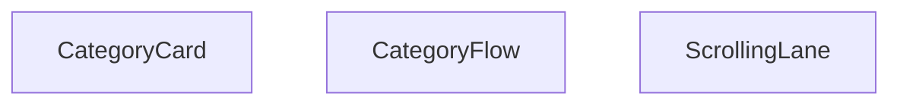

## NODE ID STANDARD

  file: src\components\CategoryFlow.tsx
  function: src\components\CategoryFlow.tsx::CategoryCard
  function: src\components\CategoryFlow.tsx::ScrollingLane
  function: src\components\CategoryFlow.tsx::CategoryFlow

---

## DISA AKTARILANLAR (EXPORTS)
  export: CategoryCard
  export: CategoryFlow
  export: ScrollingLane

---

## STİL TOKENLERİ

### Arbitrary Değerler (token'a geçirilmemiş)
Yok — tüm stiller token'a geçirilmiş. ✅

### Kullanılan Token'lar (zaten token'a geçirilmiş)
- (yok)

### Tailwind Sınıf Özeti
- **Renkler:** `bg-gradient-to-b`, `bg-gradient-to-br`, `bg-gradient-to-l`, `bg-gradient-to-r`, `bg-gray-100`, `bg-white/10`, `bg-white/20`, `from-gray-50`, `sm:text-3xl`, `sm:text-lg`, `sm:text-sm`, `text-2xl`, `text-base`, `text-center`, `text-gray-600`
- **Layout:** `-bottom-4`, `-left-4`, `-right-4`, `-top-4`, `absolute`, `bottom-4`, `flex`, `flex-shrink-0`, `from-gray-50`, `gap-4`, `h-24`, `h-32`, `h-40`, `hover:shadow-xl`, `left-0`
- **Varyant/Responsive:** `:`, `group-hover:`, `hover:`, `lg:`, `md:`, `sm:` önekleri
- **Yardımcı Sınıflar:** `${direction`, `${gradient`, `-translate-x-1/2`, `:`, `===`, `animate-category-scroll-left`, `animate-category-scroll-right`, `animate-pulse`, `duration-300`, `font-bold`, `group`, `group-hover:opacity-100`, `group-hover:scale-110`, `hover:-translate-y-1`, `hover:scale-105`

---
# FILE: src\components\ErrorBoundary.md

---
domain: general
source_type: doc
namespace_type: module
source_path: C:\Users\alize\venthub-hvac\src\components\ErrorBoundary.tsx
skeleton_hash: ed1168fcab6849f4
entity_hashes:
  func:ErrorBoundary:componentDidCatch: 87e1c834c124bf4c
  func:ErrorBoundary:constructor: f8409de1e499d06a
  func:ErrorBoundary:getDerivedStateFromError: 7c6b6e8065153a82
  func:ErrorBoundary:render: e2424b954c998122
  func:isChunkLoadError: 31516cfb6918b024
  func:serializeError: 2f05a1b7f35a9398
  overview: 4d67cf292bff82fe
  style_tokens: 1ab7ecfdeff4b247
generated_at: 2026-06-08T10:08:35Z
---

## Genel Bakış
Bu modül, React uygulamalarında beklenmeyen hataları yakalamak için kullanılan bir hata sınırı (ErrorBoundary) bileşeni sunar. Yakalanan hataları işleyerek kullanıcıya anlamlı bir hata arayüzü gösterir; özellikle dinamik modül yükleme hatalarını (chunk load error) ayırt eder ve hata nesnelerini loglama ya da raporlama amacıyla serileştirir.

## Fonksiyon Grupları

### Hata Sınırı Yaşam Döngüsü
ErrorBoundary sınıfının React hata sınırı metotlarını kapsar. Bileşenin hata durumunu başlatır, günceller ve hata yakalandığında yan etkileri (loglama vb.) yönetir.
- constructor, getDerivedStateFromError, componentDidCatch, render

### Hata İşleme Yardımcıları
Hataları serileştirme ve belirli hata türlerini (özellikle chunk yükleme hataları) tanıma işlevlerini içerir. Bu fonksiyonlar, hata sınırı metotları tarafından kullanılarak hataların daha anlaşılır ve işlenebilir olmasını sağlar.
- serializeError, isChunkLoadError

---

## AXIOMS – Mimari Varsayımlar
Bu modül React tabanlı uygulamalarda alt bileşenlerin fırlattığı çalışma zamanı hatalarını yakalayan, uygulamanın tamamen çökmesini önleyen hata sınırı bileşenidir; doğru çalışması için React'in ErrorBoundary yaşam döngülerini desteklemesi ve proje içerisinde hata alabilecek bileşenleri sarmalayacak şekilde konumlandırılması zorunludur.

[Aksiyom 1]: Eğer React kütüphanesi bu modülün kullandığı `getDerivedStateFromError` ve `componentDidCatch` yaşam döngüsü metodlarını desteklemiyorsa, modül hiçbir hatayı yakalayamaz, uygulama beklendiği gibi çöker.
[Aksiyom 2]: Eğer bu modül uygulama içerisinde hata fırlatabilecek tüm alt bileşenleri sarmayacak şekilde yanlış konumlandırılırsa, kapsam dışında kalan bileşenlerde oluşan hatalar yakalanamaz.
[Aksiyom 3]: Eğer `serializeError` fonksiyonu gelen `unknown` tipteki hata nesnesini standart formata dönüştüremiyorsa, hata detayları ne kaydedilebilir ne de kullanıcıya gösterilebilir.
[Aksiyom 4]: Eğer `isChunkLoadError` fonksiyonu kod ayırma (code splitting) sırasında oluşan parça yükleme hatalarını doğru tespit edemiyorsa, bu tür ağa bağlı hatalar için özel kurtarma akışları çalıştırılamaz.
[Aksiyom 5]: Eğer ErrorBoundary'nin constructor'ında tanımlanan temel state yapısı bozulursa, `render()` metodu hata durumunda gösterilecek fallback arayüzünü yükleyemez, kullanıcı hatadan haberdar olamaz.
[Aksiyom 6]: Eğer `componentDidCatch` metodunun eriştiği harici hata loglama servisi entegrasyonu çalışmıyorsa, yakalanan hatalar uzaktan takip edilemez, hata kök nedenleri analiz edilemez.

---

## FONKSİYON DETAYLARI

### serializeError
**Ne yapar**: Hata nesnesini okunabilir bir biçime dönüştürerek geliştirici konsolunda veya UI’da gösterilmesini sağlar.  
**Nasıl yapar**: Fonksiyonun iç mantığı kodda verilmemiştir; yalnızca `ErrorBoundary` içinde `serializeError(this.state.error)` şeklinde çağrılır ve dönen değer `<pre>` içinde gösterilir.  
**Parametreler**:
- `error`: unknown — Serileştirilecek hata nesnesi.  
**Dönüş**: Belirtilmemiş (kod içinde dönüş değeri kullanılmaz, muhtemelen string veya nesne).

### isChunkLoadError
**Ne yapar**: Bir hatanın, dinamik olarak yüklenen kod parçacıklarından (chunk) kaynaklanıp kaynaklanmadığını tespit eder.  
**Nasıl yapar**: Fonksiyonun içeriği verilmemiştir; `ErrorBoundary` içinde `isChunkLoadError(error)` çağrılarıyla hem UI’da hem de hata izleme mantığında kullanılır.  
**Parametreler**:
- `error`: unknown — Kontrol edilecek hata nesnesi.  
**Dönüş**: `boolean` — Hata bir chunk yükleme hatasıysa `true`, aksi takdirde `false`.

### constructor
**Ne yapar**: ErrorBoundary bileşeninin başlatıcı (constructor) metodudur. Bileşeninstanciatedığında ilk durumunu ayarlar ve üst sınıftaki React.Component constructor'ını çağırır.

**Nasıl yapar**: `super(props)` çağrısıyla üst sınıftaki React.Component constructor'ını tetikler ve ardından `this.state` nesnesini `{ hasError: false }` değeri ile başlatır. Bu başlangıç durumu, herhangi bir hata yakalanmadığını gösterir.

**Parametreler**:
- props: Props — Bileşene dışarıdan geçirilen özellikler nesnesi, React bileşeninin standart props yapısını temsil eder

**Dönüş**: void — Constructor metotları herhangi bir değer dönmez

### getDerivedStateFromError
**Ne yapar**: Geliştirildi ancak detay üretilemedi.

### componentDidCatch
**Ne yapar**: Geliştirildi ancak detay üretilemedi.

### render
**Ne yapar**: Geliştirildi ancak detay üretilemedi.

---

## INTERFACES

### Props
- `children: ReactNode`
- `fallback?: ReactNode`

### State
- `hasError: boolean`
- `error?: Error`
- `isChunkError?: boolean`

---

## AST POINTERS

### [N1_NASIL] AST Pointer: src/components/ErrorBoundary.tsx::serializeError
- **params**: `error: unknown` — serialize edilecek hata nesnesi
- **ic_degiskenler**:
  (yok — parametre doğrudan kullanılır)
- **Dönüş**: `string` — hata message+stack veya JSON stringi veya String(error)

---

### [N2_NASIL] AST Pointer: src/components/ErrorBoundary.tsx::isChunkLoadError
- **params**: `error: unknown` — kontrol edilecek hata nesnesi
- **ic_degiskenler**:
  (yok — parametre doğrudan kullanılır)
- **Dönüş**: `boolean` — chunk yükleme hatası ise true

---

### [N3_NASIL] AST Pointer: src/components/ErrorBoundary.tsx::ErrorBoundary.constructor
- **params**: `props: Props` — bileşen props'ları
- **ic_degiskenler**:
  (yok — super çağrısı ve state ataması yapılır)
- **Dönüş**: yok — constructor

---

### [N4_NASIL] AST Pointer: src/components/ErrorBoundary.tsx::ErrorBoundary.getDerivedStateFromError
- **params**: `error: Error` — yakalanan hata nesnesi
- **ic_degiskenler**:
  (yok — return objesi inline oluşturulur)
- **Dönüş**: `State` — `{ hasError, error, isChunkError }` objesi

---

### [N5_NASIL] AST Pointer: src/components/ErrorBoundary.tsx::ErrorBoundary.componentDidCatch
- **params**: `error: Error` — yakalanan hata, `errorInfo: ErrorInfo` — bileşen stack bilgisi
- **ic_degiskenler**:
  (yok — parametreler ve console çağrısı doğrudan kullanılır)
- **Dönüş**: yok — yan etki: console.error ve console.warn çağrısı

---

### [N6_NASIL] AST Pointer: src/components/ErrorBoundary.tsx::ErrorBoundary.handleRetry
- **params**: (yok)
- **ic_degiskenler**:
  (yok — this.setState doğrudan çağrılır)
- **Dönüş**: yok — yan etki: state'i `{ hasError: false, error: undefined, isChunkError: false }` yapar

---

### [N7_NASIL] AST Pointer: src/components/ErrorBoundary.tsx::ErrorBoundary.handleRefresh
- **params**: (yok)
- **ic_degiskenler**:
  (yok — window.location.reload çağrısı yapılır)
- **Dönüş**: yok — yan etki: sayfayı yeniden yükler

---

### [N8_NASIL] AST Pointer: src/components/ErrorBoundary.tsx::ErrorBoundary.render
- **params**: (yok)
- **ic_degiskenler**:
  (yok — ctx I18nContext.Consumer callback içinde gelir)
- **Dönüş**: `ReactNode` — JSX: children veya hata fallback UI

---

### [N9_NASIL] AST Pointer: src/components/ErrorBoundary.tsx::ErrorBoundary.render::(ctx callback)
- **params**: `ctx` — I18nContext değeri, `t` fonksiyonu içerir
- **ic_degiskenler**:
  - `t` — çeviri fonksiyonu; ctx?.t || fallback `(key, alt?) => alt || key`
  - `isChunkError` — destructured `this.state` içindeki chunk hata bayrağı
- **Dönüş**: `ReactNode` — fallback UI JSX'i veya `this.props.children`

---


## MERMAID CALL GRAPH
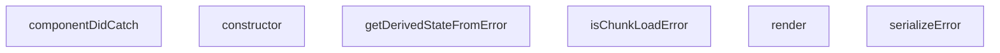

## NODE ID STANDARD

  file: src\components\ErrorBoundary.tsx
  function: src\components\ErrorBoundary.tsx::serializeError
  function: src\components\ErrorBoundary.tsx::isChunkLoadError
  class: src\components\ErrorBoundary.tsx::ErrorBoundary

---

## DISA AKTARILANLAR (EXPORTS)
  export: ErrorBoundary
  export: isChunkLoadError
  export: serializeError

---

## BILEŞIM (CONTAINS)
  contains: Component<Props
  contains: State>

---

## STİL TOKENLERİ

### Arbitrary Değerler (token'a geçirilmemiş)
Yok — tüm stiller token'a geçirilmiş. ✅

### Kullanılan Token'lar (zaten token'a geçirilmiş)
- (yok)

### Tailwind Sınıf Özeti
- **Renkler:** `bg-gray-100`, `bg-primary-navy`, `border-gray-300`, `hover:bg-gray-50`, `hover:bg-secondary-blue`, `hover:text-gray-700`, `text-amber-500`, `text-center`, `text-gray-500`, `text-gray-600`, `text-gray-700`, `text-gray-800`, `text-left`, `text-sm`, `text-white`
- **Layout:** `flex`, `h-16`, `h-4`, `inline-flex`, `items-center`, `justify-center`, `max-h-40`, `max-w-md`, `min-h-400px`, `overflow-auto`, `p-3`, `p-8`, `w-16`, `w-4`
- **Varyant/Responsive:** `hover:` önekleri
- **Yardımcı Sınıflar:** `border`, `cursor-pointer`, `font-semibold`, `mb-2`, `mb-4`, `mb-6`, `mr-2`, `mr-3`, `mt-2`, `mt-6`, `mx-auto`, `px-4`, `px-6`, `py-2`, `rounded`

---
# FILE: src\components\Footer.md

---
domain: general
source_type: doc
namespace_type: module
source_path: C:\Users\alize\venthub-hvac\src\components\Footer.tsx
skeleton_hash: 6f896fbcf16d9062
entity_hashes:
  func:Footer: 1e0192e85e1f6373
  overview: 05f327193547be84
  style_tokens: 266d0ec5d4b33045
generated_at: 2026-06-11T16:12:03Z
---

## Genel Bakış
Bu modül, uygulamanın alt kısmında görünecek olan Footer bileşenini tanımlar. React işlevsel bileşeni olarak uygulanmış olup, sayfanın son kısmında gerekli bağlantı, telif hakkı veya sosyal medya gibi bilgileri sunmak için kullanılır.

## Fonksiyon Grupları
### Bileşen Tanımı
Footer bileşeninin oluşturulması ve dışa aktarılması sorumluluğundadır.
- Footer

---

## AXIOMS – Mimari Varsayımlar
Bu modül için özel aksiyom tanımlanmamıştır.

---

## FONKSİYON DETAYLARI

### Footer
**Ne yapar**: Uygulamanın altbilgi (footer) bölümünü render eden bir React fonksiyonel bileşeni tanımlar.  
**Nasıl yapar**: Fonksiyon içindeki JSX döndürerek, genellikle telif hakkı metni, sosyal medya linkleri ve diğer altbilgi öğelerini içerir; bu JSX, React tarafından DOM'a monte edilerek görüntülenir.  
**Parametreler**: Yok  
**Dönüş**: React.FC türünde bir fonksiyonel bileşen; bu bileşen render edildiğinde footer JSX'ini döndürür.

---

## AST POINTERS

### [N1_NASIL] AST Pointer: src/components/Footer.tsx::Footer
- **params**: (parametre yok)
- **ic_degiskenler**:
  - `t` — çeviri fonksiyonu, `useI18n` hook'undan elde edilen `t` nesnesi; footer üzerindeki tüm metinleri çevirmek için kullanılır.
  - `globalCategories` — `useCategories` context'inden gelen tüm kategorilerin dizisi; footer'ın kategori listesi ve diğer bölümlerde kaynak veri olarak kullanılır.
  - `mainCategories` — `React.useMemo` ile memoize edilmiş değişken; `parent_id` olmayan (üst seviye) kategorilerin ilk 8 elemanını içerir ve footer'ın "Kategoriler" bölümünde gösterilir.
- **Dönüş**: JSX.Element — `<footer>...</footer>` elementi olarak render edilen footer bileşeni.

### [N2_NASIL] AST Pointer: src/components/Footer.tsx::mainCategories (useMemo callback)
- **params**: (parametre yok)
- **ic_degiskenler**:
  - `globalCategories` — dış kapsaktan gelen tüm kategoriler dizisi; bu fonksiyon içinde `filter` ve `slice` işlemlerine kaynak olarak kullanılır.
- **Dönüş**: Category[] — `parent_id` olmayan kategorilerin ilk 8 elemanını içeren yeni dizi; footer'da gösterilecek kategori özetini sağlar.

### [N3_NASIL] AST Pointer: src/components/Footer.tsx::renderCategoryItem
- **params**: `category` — bir kategori nesnesi; `slug` ve `name` özelliklerini içerir, bu özellikler link oluşturma ve metin gösteriminde kullanılır.
- **ic_degiskenler**: (yok) — fonksiyon gövdesinde ek bir değişken tanımlanmaz.
- **Dönüş**: JSX.Element — `<li>` elementi içinde bir `<Link>` barındıran kategori öğesi; footer'ın kategori listesinde tek bir satır olarak render edilir.

---

## NODE ID STANDARD

  file: src\components\Footer.tsx
  function: src\components\Footer.tsx::Footer

---

## DISA AKTARILANLAR (EXPORTS)
  export: Footer

---

## STİL TOKENLERİ

### Arbitrary Değerler (token'a geçirilmemiş)
Yok — tüm stiller token'a geçirilmiş. ✅

### Kullanılan Token'lar (zaten token'a geçirilmiş)
- (yok)

### Tailwind Sınıf Özeti
- **Renkler:** `bg-industrial-gray`, `bg-primary-navy`, `bg-white/5`, `border-steel-gray`, `border-t`, `hover:text-secondary-blue`, `hover:text-white`, `selection:bg-white/20`, `selection:text-white`, `text-gray-300`, `text-lg`, `text-secondary-blue`, `text-sm`, `text-white`, `text-xl`
- **Layout:** `flex`, `flex-col`, `flex-shrink-0`, `flex-wrap`, `gap-8`, `gap-x-6`, `gap-y-2`, `grid`, `grid-cols-1`, `items-center`, `items-start`, `justify-between`, `justify-center`, `lg:grid-cols-4`, `max-w-7xl`
- **Varyant/Responsive:** `hover:`, `lg:`, `md:`, `selection:`, `sm:` önekleri
- **Yardımcı Sınıflar:** `font-bold`, `font-medium`, `font-semibold`, `leading-relaxed`, `lg:px-8`, `mb-2`, `mb-4`, `md:space-y-0`, `mt-1`, `mt-4`, `mx-auto`, `px-4`, `py-12`, `py-6`, `rounded-lg`

---
# FILE: src\components\HVACIcons.md

---
domain: general
source_type: doc
namespace_type: module
source_path: C:\Users\alize\venthub-hvac\src\components\HVACIcons.tsx
skeleton_hash: 059afd9c8aa61107
entity_hashes:
  func:AccessoriesIcon: df362ba93a01a32a
  func:AirCurtainIcon: a991d6630fad3258
  func:AirPurifierIcon: 6d358290affcacb3
  func:BrandIcon: abc1dbe6a42bf303
  func:DehumidifierIcon: 40d30033e6855f3e
  func:FanIcon: 4fb3ddee9fac4362
  func:FlexibleDuctIcon: 252d34888f5ec8da
  func:HeatRecoveryIcon: 821f62398bcddd32
  func:SpeedControlIcon: dbb6f424f34e3326
  func:WhatsAppIcon: e7d41d76023d8693
  overview: dff8b3ed99dcf496
  style_tokens: 3b0534c287cddb44
generated_at: 2026-06-09T06:46:02Z
---

## Genel Bakış
Bu modül, HVAC sistemleriyle ilgili çeşitli ekipmanları ve bazı ortak kullanım amaçlı sembolleri temsil eden SVG tabanlı React ikon bileşenlerini toplar. Her bir fonksiyon, belirtilen boyut ve stil seçenekleriyle özelleştirilebilir bir ikon döndürerek arayüzde görsel eşleştirmeyi kolaylaştırır.

## Fonksiyon Grupları
### HVAC Ekipman İkonları
HVAC sistemlerinin temel bileşenlerini görselleştirmek için kullanılan ikonlar burada yer alır; fan, ısı geri kazanımı, havalama perdeleri, nemlendirici, hava temizleyici, esnek kanal, hız kontrolü ve aksesuar gibi işlevleri temsil eder.
- FanIcon, HeatRecoveryIcon, AirCurtainIcon, DehumidifierIcon, AirPurifierIcon, FlexibleDuctIcon, SpeedControlIcon, AccessoriesIcon

### Ortak Kullanım İkonları
Modülün geri kalan kısmı, sosyal medya bağlantıları ve marka gösterimi gibi genel amaçlı ihtiyaçlara hizmet eden basit ikonları içerir; bu sayede arayüzde tutarlı bir görsel dil sağlanır.
- WhatsAppIcon, BrandIcon

---

## AXIOMS – Mimari Varsayımlar
Bu modül, prop tiplerinin ve varsayılan değerlerinin beklendiği şekilde sağlandığını varsayar.

[Aksiyom 1]: Eğer className prop'ı string değilse, component sınıf adı uygulanamayabilir ve stil hatası oluşabilir.  
[Aksiyom 2]: Eğer size prop'ı sayı değilse, CSS boyutu geçersiz olur ve ikon beklenmedik şekilde render edilebilir.  
[Aksiyom 3]: Eğer WhatsAppIcon'ın size prop'ı sağlanmazsa, varsayılan 24 kullanılır; ancak bu değerin sayı olmaması durumunda yukarıdaki aksiyom geçerlidir.  
[Aksiyom 4]: Eğer BrandIcon'ın brand prop'ı sağlanmazsa veya tanımsız ise, component doğru şekilde render edilemez (brand eksikliği nedeniyle görüntülenemez).

---

## FONKSİYON DETAYLARI

### FanIcon
**Ne yapar**: HVAC sistemlerindeki fan bileşenini temsil eden SVG ikonunu render eder. Fan sembolünü görsel olarak göstermek için kullanılır.

**Nasıl yapar**: className ve size parametrelerini alarak, bir SVG elementi oluşturur ve fan şeklinde bir ikon çizer. Varsayılan olarak 48x48 piksel boyutunda render edilir.

**Parametreler**:
- className: string — İkon üzerine uygulanacak CSS sınıfı. Varsayılan değer boş stringdir.
- size: number — İkonun boyutunu piksel cinsinden belirler. Varsayılan değer 48'dir.

**Dönüş**: React.FC<IconProps> — Render edilmiş SVG ikon bileşeni döndürür.

### HeatRecoveryIcon
**Ne yapar**: Isı geri kazanım sistemini simgeleyen bir ikon bileşeni üretir.  
**Nasıl yapar**: Hazırlanmış SVG içeriği alır, `className` ve `size` prop’larını bu SVG üzerindeki stil ve boyut özelliklerine uygular.  
**Parametreler**:
- className: string — İkona ekstra stil sınıfları eklemek için kullanılır.  
- size: number — İkonun boyutunu piksel cinsinden ayarlar, varsayılan 48.  
**Dönüş**: `React.FC<IconProps>`; render edildiğinde Isı geri kazanım ikonunu gösterir.

### AirCurtainIcon
**Ne yapar**: Hava perdesi (air curtain) cihazını temsil eden bir simge bileşeni oluşturur.  
**Nasıl yapar**: İkonun SVG tanımı alır, dışardan gelen `className` stilini ve `size` boyutunu uygulayarak ekrana basar.  
**Parametreler**:
- className: string — Ekstra CSS sınıfları için kullanılır, görsel özelleştirmeyi mümkün kılar.  
- size: number — İkonun genişlik ve yüksekliğini piksel olarak belirler, varsayılan 48.  
**Dönüş**: `React.FC<IconProps>`; JSX olarak hava perdesi ikonunu döndürür.

### DehumidifierIcon
**Ne yapar**: Nem çekici (dehumidifier) cihazının simgesini render eden bir React bileşeni sağlar.  
**Nasıl yapar**: Önceden tanımlanmış SVG yolunu alır, `className` ve `size` değerlerini bu SVG’nin stil ve boyut özelliklerine uygular.  
**Parametreler**:
- className: string — İkona ekstra stil sınıfları eklemek için kullanılır.  
- size: number — İkonun boyutunu piksel cinsinden belirler, varsayılan değer 48.  
**Dönüş**: `React.FC<IconProps>`; nem çekici ikonunu gösteren fonksiyonel bileşen.

### AirPurifierIcon
**Ne yapar**: Hava temizleyici (air purifier) cihazını simgeleyen bir ikon bileşeni üretir.  
**Nasıl yapar**: SVG içeriği alır, `className` stilini ve `size` boyutunu bu SVG üzerindeki özelliklere uygulayarak ekrana basar.  
**Parametreler**:
- className: string — Ekstra CSS sınıfları için kullanılır, stil özelleştirmeyi sağlar.  
- size: number — İkonun piksel cinsinden genişlik ve yüksekliğini belirler, varsayılan 48.  
**Dönüş**: `React.FC<IconProps>`; hava temizleyici ikonunu döndüren fonksiyonel bileşen.

### FlexibleDuctIcon
**Ne yapar**: Esnek havalandırma kanalı (flexible duct) simgesini render eden bir React bileşeni sağlar.  
**Nasıl yapar**: Hazırlanmış SVG yolunu alır, dışardan gelen `className` stilini ve `size` boyutunu bu SVG’nin özelliklerine uygular.  
**Parametreler**:
- className: string — Ekstra stil sınıfları eklemek için kullanılır.  
- size: number — İkonun boyutunu piksel cinsinden belirler, varsayılan 48.  
**Dönüş**: `React.FC<IconProps>`; esnek kanal ikonunu gösteren fonksiyonel bileşen.

### SpeedControlIcon
**Ne yapar**: Hız kontrolü (speed control) simgesini oluşturan bir ikon bileşeni üretir.  
**Nasıl yapar**: SVG tanımı alır, `className` ve `size` prop’larını bu SVG’nin stil ve boyut özelliklerine uygulayarak ekrana basar.  
**Parametreler**:
- className: string — Ekstra CSS sınıfları için kullanılır, görsel özelleştirmeyi sağlar.  
- size: number — İkonun piksel cinsinden genişlik ve yüksekliğini belirler, varsayılan 48.  
**Dönüş**: `React.FC<IconProps>`; hız kontrolü ikonunu döndüren fonksiyonel bileşen.

### AccessoriesIcon
**Ne yapar**: HVAC ekstra ekipmanları (aksesuarlar) simgesini render eden bir bileşen sağlar.  
**Nasıl yapar**: Önceden tanımlanmış SVG içeriği alır, `className` stilini ve `size` boyutunu bu SVG’nin özelliklerine uygulayarak ekrana gösterir.  
**Parametreler**:
- className: string — Ekstra stil sınıfları eklemek için kullanılır.  
- size: number — İkonun boyutunu piksel cinsinden belirler, varsayılan 48.  
**Dönüş**: `React.FC<IconProps>`; aksesuar ikonunu gösteren fonksiyonel bileşen.

### WhatsAppIcon
**Ne yapar**: WhatsApp logosunu gösteren bir ikon bileşeni üretir.  
**Nasıl yapar**: WhatsApp markası için hazırlanmış SVG alır, dışardan gelen `className` stilini ve `size` boyutunu (varsayılan 24) bu SVG’nin stil ve boyut özelliklerine uygular.  
**Parametreler**:
- className: string — Ekstra CSS sınıfları için kullanılır, stil özelleştirmeyi sağlar.  
- size: number — İkonun piksel cinsinden genişlik ve yüksekliğini belirler, varsayılan 24.  
**Dönüş**: `React.FC<IconProps>`; WhatsApp logosunu gösteren fonksiyonel bileşen.

### BrandIcon
**Ne yapar**: Verilen `brand` parametresine göre ilgili marka logosunu render eden dinamik bir ikon bileşeni sağlar.  
**Nasıl yapar**: `brand` string değerine göre önceden tanımlanmış marka SVG’lerinden uygun olanı seçer, `className` prop’sunu bu SVG’nin stiline uygular ve ekrana basar.  
**Parametreler**:
- brand: string — Gösterilecek markanın adı; bu değere göre ilgili logo seçilir.  
- className: string (opsiyonel) — Ekstra stil sınıfları eklemek için kullanılır, varsayılan boş string.  
**Dönüş**: `React.FC<{ brand: string; className?: string }>`; marka logosunu gösteren fonksiyonel bileşen.

---

## INTERFACES

### IconProps
- `className?: string`
- `size?: number`

---

## AST POINTERS

### [N1_NASIL] AST Pointer: C:\Users\alize\venthub-hvac\src\components\HVACIcons.tsx::FanIcon
- **params**: className, size
- **ic_degiskenler**:
  - `className` — SVG öğesinin className özelliğine aktarılan stil sınıfı
  - `size` — SVG öğesinin width ve height özelliklerine piksel cinsinden aktarılan boyut
- **Dönüş**: JSX elementi (React.FC<IconProps>)

### [N2_NASIL] AST Pointer: C:\Users\alize\venthub-hvac\src\components\HVACIcons.tsx::HeatRecoveryIcon
- **params**: className, size
- **ic_degiskenler**:
  - `className` — SVG öğesinin className özelliğine aktarılan stil sınıfı
  - `size` — SVG öğesinin width ve height özelliklerine piksel cinsinden aktarılan boyut
- **Dönüş**: JSX elementi (React.FC<IconProps>)

### [N3_NASIL] AST Pointer: C:\Users\alize\venthub-hvac\src\components\HVACIcons.tsx::AirCurtainIcon
- **params**: className, size
- **ic_degiskenler**:
  - `className` — SVG öğesinin className özelliğine aktarılan stil sınıfı
  - `size` — SVG öğesinin width ve height özelliklerine piksel cinsinden aktarılan boyut
- **Dönüş**: JSX elementi (React.FC<IconProps>)

### [N4_NASIL] AST Pointer: C:\Users\alize\venthub-hvac\src\components\HVACIcons.tsx::DehumidifierIcon
- **params**: className, size
- **ic_degiskenler**:
  - `className` — SVG öğesinin className özelliğine aktarılan stil sınıfı
  - `size` — SVG öğesinin width ve height özelliklerine piksel cinsinden aktarılan boyut
- **Dönüş**: JSX elementi (React.FC<IconProps>)

### [N5_NASIL] AST Pointer: C:\Users\alize\venthub-hvac\src\components\HVACIcons.tsx::AirPurifierIcon
- **params**: className, size
- **ic_degiskenler**:
  - `className` — SVG öğesinin className özelliğine aktarılan stil sınıfı
  - `size` — SVG öğesinin width ve height özelliklerine piksel cinsinden aktarılan boyut
- **Dönüş**: JSX elementi (React.FC<IconProps>)

### [N6_NASIL] AST Pointer: C:\Users\alize\venthub-hvac\src\components\HVACIcons.tsx::FlexibleDuctIcon
- **params**: className, size
- **ic_degiskenler**:
  - `className` — SVG öğesinin className özelliğine aktarılan stil sınıfı
  - `size` — SVG öğesinin width ve height özelliklerine piksel cinsinden aktarılan boyut
- **Dönüş**: JSX elementi (React.FC<IconProps>)

### [N7_NASIL] AST Pointer: C:\Users\alize\venthub-hvac\src\components\HVACIcons.tsx::SpeedControlIcon
- **params**: className, size
- **ic_degiskenler**:
  - `className` — SVG öğesinin className özelliğine aktarılan stil sınıfı
  - `size` — SVG öğesinin width ve height özelliklerine piksel cinsinden aktarılan boyut
- **Dönüş**: JSX elementi (React.FC<IconProps>)

### [N8_NASIL] AST Pointer: C:\Users\alize\venthub-hvac\src\components\HVACIcons.tsx::AccessoriesIcon
- **params**: className, size
- **ic_degiskenler**:
  - `className` — SVG öğesinin className özelliğine aktarılan stil sınıfı
  - `size` — SVG öğesinin width ve height özelliklerine piksel cinsinden aktarılan boyut
- **Dönüş**: JSX elementi (React.FC<IconProps>)

### [N9_NASIL] AST Pointer: C:\Users\alize\venthub-hvac\src\components\HVACIcons.tsx::WhatsAppIcon
- **params**: className, size
- **ic_degiskenler**:
  - `className` — SVG öğesinin className özelliğine aktarılan stil sınıfı
  - `size` — SVG öğesinin width ve height özelliklerine piksel cinsinden aktarılan boyut (varsayılan 24)
- **Dönüş**: JSX elementi (React.FC<IconProps>)

### [N10_NASIL] AST Pointer: C:\Users\alize\venthub-hvac\src\components\HVACIcons.tsx::BrandIcon
- **params**: brand, className
- **ic_degiskenler**:
  - `brand` — görüntülenecek markanın adı; lowercase versiyonu için `normalizedBrand` hesaplanır ve `` alt metni olarak kullanılır
  - `className` — dış öğeye (img veya fallback div) uygulanacak ek stil sınıfı
  - `normalizedBrand` — `brand` küçük harfe çevrilmiş hali; marka eşleştirmesinde switch case’de kullanılır
  - `basePath` — marka görsellerinin bulunduğu sabit yol (`/images/ekran`)
  - `src` — seçilen markaya göre oluşturulan tam görsel URL’si; `` öğesinin src özelliğine aktarılır
  - `alt` — `` öğesinin alt özelliği; erişilebilirlik için marka adıyla doldurulur
- **Dönüş**: JSX elementi (React.FC<{ brand: string; className?: string }>) – marka görseli veya fallback metni döner.

---


## MERMAID CALL GRAPH
```mermaid
graph TD
    HVACIcons_tsx__AccessoriesIcon["AccessoriesIcon"]
    HVACIcons_tsx__AirCurtainIcon["AirCurtainIcon"]
    HVACIcons_tsx__AirPurifierIcon["AirPurifierIcon"]
    HVACIcons_tsx__BrandIcon["BrandIcon"]
    HVACIcons_tsx__DehumidifierIcon["DehumidifierIcon"]
    HVACIcons_tsx__FanIcon["FanIcon"]
    HVACIcons_tsx__FlexibleDuctIcon["FlexibleDuctIcon"]
    HVACIcons_tsx__HeatRecoveryIcon["HeatRecoveryIcon"]
    HVACIcons_tsx__SpeedControlIcon["SpeedControlIcon"]
    HVACIcons_tsx__WhatsAppIcon["WhatsAppIcon"]
```

## NODE ID STANDARD

  file: src\components\HVACIcons.tsx
  function: src\components\HVACIcons.tsx::FanIcon
  function: src\components\HVACIcons.tsx::HeatRecoveryIcon
  function: src\components\HVACIcons.tsx::AirCurtainIcon
  function: src\components\HVACIcons.tsx::DehumidifierIcon
  function: src\components\HVACIcons.tsx::AirPurifierIcon
  function: src\components\HVACIcons.tsx::FlexibleDuctIcon
  function: src\components\HVACIcons.tsx::SpeedControlIcon
  function: src\components\HVACIcons.tsx::AccessoriesIcon
  function: src\components\HVACIcons.tsx::WhatsAppIcon
  function: src\components\HVACIcons.tsx::BrandIcon

---

## DISA AKTARILANLAR (EXPORTS)
  export: AccessoriesIcon
  export: AirCurtainIcon
  export: AirPurifierIcon
  export: BrandIcon
  export: DehumidifierIcon
  export: FanIcon
  export: FlexibleDuctIcon
  export: HeatRecoveryIcon
  export: SpeedControlIcon
  export: WhatsAppIcon

---

## STİL TOKENLERİ

### Arbitrary Değerler (token'a geçirilmemiş)
Yok — tüm stiller token'a geçirilmiş. ✅

### Kullanılan Token'lar (zaten token'a geçirilmiş)
- (yok)

### Tailwind Sınıf Özeti
- **Renkler:** `bg-slate-100`, `text-slate-400`, `text-xs`
- **Layout:** `flex`, `h-full`, `items-center`, `justify-center`, `p-2`, `relative`, `w-full`
- **Varyant/Responsive:** (yok)
- **Yardımcı Sınıflar:** `${className`, `font-bold`, `object-contain`, `rounded-lg`, `tracking-tighter`, `uppercase`

---
# FILE: src\components\ImageGallery.md

---
domain: general
source_type: doc
namespace_type: module
source_path: C:\Users\alize\venthub-hvac\src\components\ImageGallery.tsx
skeleton_hash: dd8ff83e4103cbc6
entity_hashes:
  func:ImageGallery: ed5cc2a855b5b9b8
  func:handleMouseLeave: 60d41c470a6d0032
  func:handleMouseMove: b68c1278669bcb7a
  overview: f4654744ad74eeea
  style_tokens: 01bec99debdcd366
generated_at: 2026-06-08T10:08:35Z
---

## Genel Bakış
ImageGallery bileşeni, bir ürünün görsellerini düzenli bir galeri formatında sergileyen ve kullanıcının fare etkileşimlerine yanıt veren dinamik bir React bileşenidir. Temel işlevi, görsellerin gösterimini ve bu görseller üzerinde fare hareketlerine bağlı olarak tetiklenen efektleri (örneğin yakınlaştırma veya açıklama gösterimi) yönetmektir.

## Fonksiyon Grupları
### Görsel Galeri Oluşturma ve Yerleşim
Bileşenin ana gövdesi, dışarıdan gelen görsel listesi ve ürün meta verilerini alarak ekrana düzenli ve interaktif bir galeri yerleşimi oluşturur.
- ImageGallery

### Fare Etkileşimi Yönetimi
Kullanıcının fare hareketlerini izleyerek galeri üzerinde geçici görsel efektlerin başlatılmasını ve sonlandırılmasını kontrol eden yardımcı işlevler.
- handleMouseMove
- handleMouseLeave

---

## AXIOMS – Mimari Varsayımlar

Bu modül için, fonksiyon gövdesinden üretilen aksiyomlar aşağıdadır. Aksiyomlar yalnızca fonksiyon imzaları ve modül sabitleri temel alınarak çıkarılmıştır; docstring, yorum veya değişken isimlerinden bilgi çıkarılmamıştır.

[Aksiyom 1]: Eğer `images` parametresi boş bir dizi ise veya `undefined`/`null` olarak iletilirse, bileşen düzgün render edilemez ve potansiyel olarak hata oluşur.
[Aksiyom 2]: Eğer `productName` parametresi `undefined` veya boş string olarak iletilirse, galeri içindeki ürün adı gösterimi eksik veya hatalı olur.
[Aksiyom 3]: Eğer `slug` parametresi geçerli bir ürün tanımlayıcısı içermiyorsa, `Product3DViewer` çağrılamaz veya yanlış ürün yüklenir.
[Aksiyom 4]: Eğer `modelType` parametresi `Product3DViewer` componenti tarafından beklenen formatta değilse, 3D görüntüleyici doğru çalışmayabilir.
[Aksiyom 5]: Eğer `handleMouseMove` fonksiyonu `React.MouseEvent<HTMLDivElement>` tipinde bir event almıyorsa, fare hareketi takibi yapılamaz ve dinamik efektler devre dışı kalır.
[Aksiyom 6]: Eğer `handleMouseLeave` fonksiyonu çağrılmasa, fare galeri alanından ayrıldığında efektler sıfırlanmaz ve geçici durumlar kalıcı olur.
[Aksiyom 7]: Eğer `Product3DViewer` modülü içe aktarılamıyorsa veya kullanılamıyorsa, 3D model görüntüleme işlevi çalışmaz.

---

## FONKSİYON DETAYLARI

### ImageGallery
**Ne yapar**: Bir ürünün görsellerini gösteren bir bileşen render eder.  
**Nasıl yapar**: props olarak gelen images dizisini mapleyerek her bir görseli  veya benzeri bir eleman olarak döndürür; ayrıca productName, slug ve modelType bilgilerini UI içinde kullanabilir.  
**Parametreler**:  
- images: Image[] — Gösterilecek görsel dizisi (her bir görselin URL ve meta veri içerdiği tip)  
- productName: string — Ürünün adı, başlık veya alt metin olarak gösterilir  
- slug: string — Ürünün URL slug'ı, navigasyon veya SEO amaçlı kullanılır  
- modelType: string — Ürünün model tipi, filtreleme veya sınıflandırma için kullanılır  
**Dönüş**: React.FC<ImageGalleryProps> — JSX elementi döndüren fonksiyonel bileşen

### handleMouseMove
**Ne yapar**: Fare hareketi olayını yakalayıp, görsel galerisinde etkileşim (örneğin zoom veya hareket efekti) için gerekli koordinatları işler.  
**Nasıl yapar**: Olay nesnesinden clientX ve clientY değerlerini çıkararak state veya ref üzerinden güncellenen pozisyon bilgilerini ayarlar; bu sayede görselin üzerine gelen fareye göre dinamik efekt sağlanır.  
**Parametreler**:  
- e: React.MouseEvent<HTMLDivElement> — Fare hareketi olayı, hedef bir <div> elementi üzerinden tetiklenir  
**Dönüş**: void — Fonksiyon bir değer döndürmez

### handleMouseLeave
**Ne yapar**: Fare galeriye dışarı çıktığında tetiklenen olay işleyicisidir; aktif etkileşimi sıfırlayarak görseli varsayılan duruma döndürür.  
**Nasıl yapar**: State veya ref üzerinden fare üzerindeki etkileşimi (örneğin zoom ölçeği) sıfırlayarak galeriyi başlangıç pozisyonuna getirir.  
**Parametreler**: (yok)  
**Dönüş**: void — Fonksiyon bir değer döndürmez

---

## INTERFACES

### ImageGalleryProps
- `images: { path: string; alt?: string | null }[]`
- `productName: string`
- `slug?: string`
- `modelType?: string`

---

## SABİTLER
- **Product3DViewer** (call) — `dynamic(

    () => import('./products/3d/Product3DViewer'),

    { ssr: fals...`

---

## AST POINTERS

### [N1_NASIL] AST Pointer: ImageGallery.tsx::ImageGallery
- **params**: `{ images, productName, slug, modelType }`
- **ic_degiskenler**:
  - `t` — `useI18n()` hook'undan alınan çeviri fonksiyonu, UI metinleri için kullanılır
  - `activeIdx` — `useState(0)`, o an seçili olan resmin indeksini tutar
  - `isLightboxOpen` — `useState(false)`, lightbox modalının açık olup olmadığını tutar
  - `is3DMode` — `useState(false)`, 3D model görünümünün aktif olup olmadığını tutar
  - `is3DFullscreen` — `useState(false)`, 3D modelin tam ekran modunda olup olmadığını tutar
  - `zoomStyle` — `useState<React.CSSProperties>({})`, mouse hover zoom efekti için CSS transform stilini tutar
  - `imageContainerRef` — `useRef<HTMLDivElement>(null)`, ana resim container DOM elementine referans verir
  - `activeImage` — `images` dizisinden `activeIdx` ile seçili olan resim nesnesi (path, alt içerir) veya `null`
  - `nextImage` — `useCallback`, sonraki resme geçmek için fonksiyon, `(prev + 1) % images.length` hesaplar
  - `prevImage` — `useCallback`, önceki resme geçmek için fonksiyon, `(prev - 1 + images.length) % images.length` hesaplar
- **Dönüş**: JSX (resim galerisi UI'ı, thumbnail'ler, lightbox portal, 3D viewer portal)

---


## MERMAID CALL GRAPH
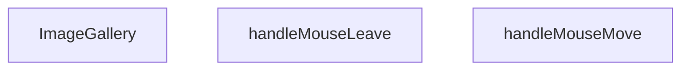

## NODE ID STANDARD

  file: src\components\ImageGallery.tsx
  function: src\components\ImageGallery.tsx::ImageGallery
  function: src\components\ImageGallery.tsx::handleMouseMove
  function: src\components\ImageGallery.tsx::handleMouseLeave

---

## DISA AKTARILANLAR (EXPORTS)
  export: ImageGallery

---

## STİL TOKENLERİ

### Arbitrary Değerler (token'a geçirilmemiş)
Yok — tüm stiller token'a geçirilmiş. ✅

### Kullanılan Token'lar (zaten token'a geçirilmiş)
- (yok)

### Tailwind Sınıf Özeti
- **Renkler:** `bg-black/20`, `bg-black/95`, `bg-gray-100`, `bg-white`, `bg-white/10`, `bg-white/80`, `bg-white/95`, `border-2`, `border-gray-200`, `border-primary-navy`, `border-transparent`, `border-white`, `hover:bg-white`, `hover:bg-white/20`, `hover:border-gray-300`
- **Layout:** `absolute`, `backdrop-blur-md`, `backdrop-blur-sm`, `bottom-6`, `cursor-zoom-in`, `fixed`, `flex`, `flex-col`, `flex-wrap`, `gap-0.5`, `gap-2`, `h-14`, `h-16`, `h-full`, `items-center`
- **Varyant/Responsive:** `:`, `group-hover:`, `hover:`, `md:` önekleri
- **Yardımcı Sınıflar:** `${!is3DMode`, `${activeIdx`, `-translate-x-1/2`, `-translate-y-1/2`, `:`, `===`, `activeIdx`, `aspect-square`, `border`, `duration-200`, `ease-out`, `font-bold`, `group`, `group-hover:opacity-100`, `hover:opacity-100`

---
# FILE: src\components\InViewCounter.md

---
domain: general
source_type: doc
namespace_type: module
source_path: C:\Users\alize\venthub-hvac\src\components\InViewCounter.tsx
skeleton_hash: 9c5b62f840a3b577
entity_hashes:
  func:InViewCounter: 223b6183b16e2873
  overview: 61076e120659900f
  style_tokens: 2ef2cd2897b38d9e
generated_at: 2026-05-28T22:36:00Z
---

## Genel Bakış
Bu modül, sayfa içinde görünebildiği anda bir sayıyı belirli bir süre içinde artırarak gösteren bir React bileşeni sağlar. Kullanıcıya dinamik bir sayaç deneyimi sunmak için görüntülendiğinde animasyonlu bir sayım işlemi gerçekleştirir.

## Fonksiyon Grupları
### Ana Bileşen
Bileşenin temel işlevini ve görüntülendiğinde sayaç animasyonunu yöneten tek işlevi içerir.
- InViewCounter

---

## AXIOMS – Mimari Varsayımlar
Bu modülün doğru çalışması için aşağıdaki varsayımlar geçerlidir.

[Aksiyom 1]: Eğer **label** prop’u sağlanmazsa, bileşen gerekli metni gösteremeyeceği için render hatası veya boş bir görüntü oluşur.  
[Aksiyom 2]: Eğer **to** prop’u sağlanmazsa, sayım hedefi belirlenemediği için bileşen saymaya başlayamaz ve hiçbir değer göstermez.  
[Aksiyom 3]: Eğer **to** prop’u sayısal bir değer değilse (örneğin string, null), sayım mantığı beklenmedik sonuçlar üretebilir veya çalışma zamanında hata fırlatabilir.  
[Aksiyom 4]: Eğer **suffix** prop’u sağlanmazsa, varsayılan olarak boş string (`''`) kullanılır; bu durumda sayının sonuna hiçbir ek metin eklenmez.  
[Aksiyom 5]: Eğer **durationMs** prop’u sağlanmazsa, varsayılan olarak 1200 ms kullanılır; bu değer sayım animasyonunun toplam süresini belirler.  
[Aksiyom 6]: Eğer **durationMs** sıfır veya negatif bir değerse, animasyon süresi geçersiz olur ve sayım aniden tamamlanabilir veya hiç görünmeyebilir.  
[Aksiyom 7]: Bileşen, React’in `useState` ve `useEffect` hook’larına bağımlıdır; bu hook’ların desteklenmeyen bir ortamda (örneğin klasik bir JavaScript dosyasında) kullanılması beklenmedik hatalar veroor.  
[Aksiyom 8]: Bileşenin içindeki zamanlayıcı (örneğin `setInterval` veya `requestAnimationFrame`) bileşenun unmount edilmesiyle temizlenmezse, bellek sızıntısı veya eski state güncellemeleri yaşanabilir.  

Bu varsayımlar, modülün fonksiyon imzalarından ve tipik React davranışlarından türetilmiştir; başka bir belge ya da yorumdan çıkarılmamıştır.

---

## FONKSİYON DETAYLARI

### InViewCounter
**Ne yapar**: Görünür alana girdiğinde sayısal değeri belirtilen sürede animasyonlu olarak artan bir sayaç bileşeni render eder.  
**Nasıl yapar**: `IntersectionObserver` kullanarak bileşenin viewport içinde görünürlüğünü izler; görünür olduğunda `setInterval` veya `requestAnimationFrame` üzerinden 0’dan `to` değerine kadar artan sayıyı hesaplar ve `label` ile `suffix` ekleyerek ekrana yazar.  
**Parametreler**:
- label: string — Sayı önüne eklenecek metin (örn. “Toplam: ”).  
- to: number — Sayaç hedef değeri; animasyon bu sayıya ulaşınca durur.  
- suffix: string — Sayı sonuna eklenecek metin (örn. “ kişi”). Varsayılan boş string.  
- durationMs: number — Animasyonun tamamlanması için geçen milisaniye süresi. Varsayılan 1200 ms.  
**Dönüş**: React.FC<CounterProps> — `label`, `to`, `suffix` ve `durationMs` props’larını kabul eden ve animasyonlu sayaç gösteren bir React fonksiyonel bileşeni.

---

## INTERFACES

### CounterProps
- `label: string`
- `to: number`
- `suffix?: string`
- `durationMs?: number`

---

## AST POINTERS

### [N1_NASIL] AST Pointer: src/components/InViewCounter.tsx::InViewCounter
- **params**: label, to, suffix = '', durationMs = 1200
- **ic_degiskenler**:
  - `ref` — useRef to hold DOM element reference for IntersectionObserver.
  - `value` — state variable for current displayed count.
  - `setValue` — setter for `value` state.
  - `started` — boolean flag indicating animation has started.
  - `setStarted` — setter for `started`.
  - `shouldAnimate` — flag indicating whether animation should run (respects reduced‑motion preferences).
  - `setShouldAnimate` — setter for `shouldAnimate`.
- **Dönüş**: JSX element (React.FC<CounterProps>)

### [N2_NASIL] AST Pointer: src/components/InViewCounter.tsx::useEffect_reducedMotion
- **params**: (yok)
- **ic_degiskenler**:
  - `rm` — MediaQueryList for prefers‑reduced‑motion media query.
  - `coarse` — MediaQueryList for pointer:coarse media query.
  - `update` — function that updates `shouldAnimate` based on match results.
- **Dönüş**: cleanup function (void)

### [N3_NASIL] AST Pointer: src/components/InViewCounter.tsx::cleanup_reducedMotion
- **params**: (yok)
- **ic_degiskenler**: (yok)
- **Dönüş**: void

### [N4_NASIL] AST Pointer: src/components/InViewCounter.tsx::useEffect_intersectionObserver
- **params**: (yok)
- **ic_degiskenler**:
  - `el` — DOM element from `ref.current`.
  - `io` — IntersectionObserver instance observing the element.
- **Dönüş**: cleanup function (void)

### [N5_NASIL] AST Pointer: src/components/InViewCounter.tsx::cleanup_intersectionObserver
- **params**: (yok)
- **ic_degiskenler**: (yok)
- **Dönüş**: void

### [N6_NASIL] AST Pointer: src/components/InViewCounter.tsx::intersectionObserverCallback
- **params**: entries
- **ic_degiskenler**:
  - `e` — individual IntersectionObserverEntry from the entries list.
- **Dönüş**: yok

### [N7_NASIL] AST Pointer: src/components/InViewCounter.tsx::intersectionObserverEntryArrow
- **params**: e
- **ic_degiskenler**: (yok)
- **Dönüş**: yok

### [N8_NASIL] AST Pointer: src/components/InViewCounter.tsx::useEffect_animationFrame
- **params**: (yok)
- **ic_degiskenler**:
  - `raf` — requestAnimationFrame ID.
  - `t0` — start timestamp from `performance.now()`.
  - `animate` — recursive animation function that updates the displayed value.
- **Dönüş**: cleanup function (void)

### [N9_NASIL] AST Pointer: src/components/InViewCounter.tsx::cleanup_animationFrame
- **params**: (yok)
- **ic_degiskenler**: (yok)
- **Dönüş**: void

### [N10_NASIL] AST Pointer: src/components/InViewCounter.tsx::animateFunction
- **params**: t
- **ic_degiskenler**:
  - `p` — progress ratio (0‑1) based on elapsed time over `durationMs`.
  - `eased` — eased value using easeOutCubic formula.
- **Dönüş**: yok

---

## NODE ID STANDARD

  file: src\components\InViewCounter.tsx
  function: src\components\InViewCounter.tsx::InViewCounter

---

## DISA AKTARILANLAR (EXPORTS)
  export: InViewCounter

---

## STİL TOKENLERİ

### Arbitrary Değerler (token'a geçirilmemiş)
Yok — tüm stiller token'a geçirilmiş. ✅

### Kullanılan Token'lar (zaten token'a geçirilmiş)
- (yok)

### Tailwind Sınıf Özeti
- **Renkler:** `bg-white`, `border-light-gray`, `text-4xl`, `text-center`, `text-primary-navy`, `text-steel-gray`
- **Layout:** `p-6`
- **Varyant/Responsive:** (yok)
- **Yardımcı Sınıflar:** `border`, `font-bold`, `mt-1`, `rounded-2xl`, `tabular-nums`

---
# FILE: src\components\LanguageSwitcher.md

---
domain: general
source_type: doc
namespace_type: module
source_path: C:\Users\alize\venthub-hvac\src\components\LanguageSwitcher.tsx
skeleton_hash: 81fcd9fee11ddf92
entity_hashes:
  func:LanguageSwitcher: e20e68a6d834aa54
  func:switchLanguage: ceec0990f90068b4
  overview: 2f23c86896c74c04
  style_tokens: 819c78943fe15425
generated_at: 2026-06-08T10:08:35Z
---

## Genel Bakış
LanguageSwitcher modülü, uygulamanın dil seçimini sağlayan basit bir React bileşenidir. Kullanıcıya mevcut dillerden birini seçme ve bu seçimi uygulama genelinde güncelleme imkanı sunar.

## Fonksiyon Grupları
### Ana Bileşen
Bu grup, dil değiştirme işlevselliğini tek bir fonksiyonda toplar ve kullanıcı arayüzünü render eder.
- LanguageSwitcher

### Dil Değiştirme Mantığı
Bu grup, seçilen dili uygulama genelinde güncellemek için kullanılan işlevi içerir.
- switchLanguage

---

## AXIOMS – Mimari Varsayımlar
Bu modül için özel aksiyom tanımlanmamıştır.

**Aksiyom 1**: Eğer uygulama içinde ortak bir dil durumu (global language state) bulunmuyorsa, `LanguageSwitcher` bileşeni mevcut dili gösteremez ve dil değişikliği yapılamaz.  

**Aksiyom 2**: Eğer `switchLanguage` fonksiyonuna `'tr'` ya da `'en'` dışındaki bir değer (`newLang`) gönderilirse, geçersiz dil hatası oluşur ve dil değişikliği gerçekleşmez.  

**Aksiyom 3**: Eğer React çalışma ortamı (React runtime ve ilgili bağlam sağlayıcıları) mevcut değilse, `LanguageSwitcher` bileşeni render edilemez ve hiçbir etkileşim gerçekleşmez.  

**Aksiyom 4**: Eğer `switchLanguage` fonksiyonu çağrıldığında ilgili dil paketleri (i18n çeviri dosyaları) yüklenmemişse, UI’da yeni dilde metinler gösterilemez ve varsayılan (fallback) dil kullanılır.

---

## FONKSİYON DETAYLARI

### LanguageSwitcher
**Ne yapar**: React uygulamasında dil değiştirme arayüzünü sağlayan bir fonksiyon bileşeni döndürür.  
**Nasıl yapar**: Fonksiyon, bir React Functional Component (FC) tanımlayarak, kullanıcıların mevcut dili seçebileceği UI öğelerini render eder. Bileşen içinde dil değişimini tetikleyen `switchLanguage` fonksiyonu çağrılabilir.  
**Parametreler**:  
- *Yok* — Bu fonksiyon parametre almaz.  
**Dönüş**: React.FC — Dil seçici bileşenini temsil eden bir React Functional Component döndürür.

### switchLanguage
**Ne yapar**: Uygulamanın aktif dilini, verilen yeni dil koduna (`'tr'` veya `'en'`) göre değiştirir.  
**Nasıl yapar**: Fonksiyon, `newLang` parametresiyle belirtilen dil kodunu alır ve uygulama çapında dil ayarını günceller; genellikle i18n kütüphanesi veya global durum yöneticisi aracılığıyla bu değişikliği yayar.  
**Parametreler**:  
- newLang: `'tr' | 'en'` — Değiştirilecek hedef dil kodu.  
**Dönüş**: Belirtilmemiş — Fonksiyonun dönüş tipi dokümantasyonda tanımlı değildir (muhtemelen `void`).

---

## AST POINTERS

### [N1_NASIL] AST Pointer: src/components/LanguageSwitcher.tsx::LanguageSwitcher
- **params**: (parametre yok)
- **ic_degiskenler**:
  - `lang` — `useI18n` hookundan gelen mevcut dil kodu (`'tr'` | `'en'`).
  - `setLang` — `useI18n` hookundan gelen fonksiyon, dil değiştiğinde state’i günceller.
  - `t` — `useI18n` hookundan gelen çeviri fonksiyonu, anahtarları yerelleştirir.
  - `pathname` — `usePathname` hookundan gelen mevcut URL yolu (string).
  - `router` — `useRouter` hookundan gelen router nesnesi, `push` ve `refresh` metodlarını sağlar.
  - `switchLanguage` — iç tanımlı fonksiyon, dil değişimini yönetir.
- **Dönüş**: React.FC (JSX elemanı döner; yan etkileri: dil cookie ve localStorage güncellenir, router ile yönlendirme yapılır).

### [N2_NASIL] AST Pointer: src/components/LanguageSwitcher.tsx::switchLanguage
- **params**: `newLang: 'tr' | 'en'`
- **ic_degiskenler**:
  - `newLang` — hedef dil kodu, `'tr'` veya `'en'`.
  - `lang` — dış kapsamdaki `useI18n` hookundan alınan mevcut dil (karşılaştırma için).
  - `document.cookie` — tarayıcı cookie’sine `NEXT_LOCALE` anahtarıyla yeni dil değerini yazar.
  - `localStorage` — `setItem('lang', newLang)` ile yeni dili kalıcı olarak saklar (try/catch içinde).
  - `setLang` — `useI18n` hookundan gelen fonksiyon, client‑side state’i günceller.
  - `pathname` — dış kapsamdaki `usePathname` hookundan gelen mevcut yol.
  - `segments` — `pathname.split('/')` sonrası boş olmayan parçalar dizisi.
  - `firstSegment` — `segments[0]`, yolun ilk bölümü (varsa).
  - `newPath` — hesaplanan yeni URL yolu (string).
  - `router` — dış kapsamdaki `useRouter` hookundan gelen nesne; `push` ve `refresh` metodları çağrılır.
- **Dönüş**: yok (fonksiyon yan etkilerle çalışır; cookie, localStorage, state ve router güncellenir).

---

## NODE ID STANDARD

  file: src\components\LanguageSwitcher.tsx
  function: src\components\LanguageSwitcher.tsx::LanguageSwitcher
  function: src\components\LanguageSwitcher.tsx::switchLanguage

---

## DISA AKTARILANLAR (EXPORTS)
  export: LanguageSwitcher

---

## STİL TOKENLERİ

### Arbitrary Değerler (token'a geçirilmemiş)
Yok — tüm stiller token'a geçirilmiş. ✅

### Kullanılan Token'lar (zaten token'a geçirilmiş)
- (yok)

### Tailwind Sınıf Özeti
- **Renkler:** `bg-primary-navy`, `bg-white/90`, `border-light-gray`, `hover:bg-light-gray`, `text-industrial-gray`, `text-sm`, `text-white`
- **Layout:** `backdrop-blur`, `flex`, `gap-1`, `items-center`, `p-1`, `shadow-sm`
- **Varyant/Responsive:** `:`, `focus-visible:`, `hover:` önekleri
- **Yardımcı Sınıflar:** `${lang`, `:`, `===`, `border`, `en`, `focus-visible:ring-2`, `focus-visible:ring-primary-navy`, `outline-none`, `px-3`, `py-1`, `rounded-full`, `tr`

---
# FILE: src\components\LazyInView.md

---
domain: general
source_type: doc
namespace_type: module
source_path: C:\Users\alize\venthub-hvac\src\components\LazyInView.tsx
skeleton_hash: 1f246a34a210785e
entity_hashes:
  func:LazyInView: a6cf07d9fd7df258
  overview: dcd89aaa1940f652
  style_tokens: 884aa794c8b33f43
generated_at: 2026-05-28T22:36:24Z
---

## Genel Bakış
`LazyInView` modülü, React uygulamalarında performans optimizasyonu için tasarlanmış bir tembel yükleme (lazy loading) bileşenidir. Bileşen, içeriğin yalnızca görünüm alanına (viewport) girmesi durumunda yüklenmesini sağlayarak sayfa yüklenme süresini iyileştirir.

## Fonksiyon Grupları
### Çekirdek Bileşen ve Yükleme Mantığı
Modülün temel işlevini yöneten, görünüm takibi ve asenkron içerik yükleme süreçlerini birleştiren ana React bileşenini tanımlar.
- LazyInView

---

## AXIOMS – Mimari Varsayımlar
Bu modül için temel mimari varsayımlar tanımlanmıştır.

**[Aksiyom 1 - Zorunlu Loader Prop'u]:** Eğer `loader` prop'u sağlanmazsa, TypeScript derleme hatası oluşur ve bileşen render edilemez; çünkü `loader` parametresinin varsayılan değeri yoktur.

**[Aksiyom 2 - Placeholder Varsayılan Değeri]:** Eğer `placeholder` prop'u sağlanmazsa, `<div className="min-h-160px" aria-hidden="true" />` varsayılan olarak kullanılır; bileşen her durumda bir yer tutucu gösterir.

**[Aksiyom 3 - Tek Prop Objesi]:** Eğer bileşen birden fazla bağımsız argüman ile çağrılmazsa, tüm prop'lar tek bir nesne olarak destructure edilmelidir (fonksiyon imzası tek bir `{ loader, placeholder }` objesi bekler).

**[Aksiyom 4 - Generik Tip Parametresi]:** Eğer `T` tipi belirtilmezse, TypeScript'in tip çıkarımı ile belirlenir; `loader`'ın döndüreceği içeriğin tipi bu generik parametreye bağlıdır.

---

## FONKSİYON DETAYLARI

### LazyInView

**Ne yapar**: LazyInView, içeriğin görüntü alanına (viewport) girdiğinde yüklenmesini sağlayan bir React lazy loading (tembel yükleme) bileşenidir. Bu bileşen, sayfa performansını optimize etmek için yalnızca görünür alandaki içeriklerin yüklenmesini mümkün kılar.

**Nasıl yapar**: Intersection Observer API'sini kullanarak placeholder elemanının ekranda görünüp görünmediğini izler. Bileşen görünür alana girdiğinde, `loader` prop'unu değerlendirerek asıl içeriği yükler ve placeholder'ı bu içerikle değiştirir. Generik `<T>` yapısı sayesinde farklı veri tipleri ile çalışabilir.

**Parametreler**:
- `loader`: ReactNode veya () => ReactNode tipinde — Görünür alana girildiğinde yüklenecek olan asıl içeriği temsil eder. Genellikle bir fonksiyon veya React bileşenidir ve lazy yükleme tetiklendiğinde render edilir
- `placeholder`: ReactNode tipinde (varsayılan: `<div className="min-h-160px" aria-hidden="true" />`) — İçerik yüklenene kadar görüntülenen geçici elemandır. Varsayılan değer, ekran okuyucular tarafından yok sayılan 160px yüksekliğinde boş bir divdir
- `T`: Generic tip parametresi — Bileşenin işleyebileceği veri tipini belirler. Lazy yüklenecek içeriğin türünü tanımlamak için kullanılır

**Dönüş**: JSX.Element — Lazy yükleme mantığı uygulanmış React bileşeni döndürür. Bileşen, placeholder'ı veya yüklenmiş içeriği render eder

---

## INTERFACES

### LazyInViewProps
- `loader: () => Promise<{ default: React.ComponentType<T> }>`
- `placeholder?: React.ReactNode`
- `rootMargin?: string`
- `once?: boolean`
- `className?: string`
- `componentProps?: T`

---

## AST POINTERS

### [N1_NASIL] AST Pointer: src/components/LazyInView.tsx::LazyInView
- **params**: `(loader, placeholder = <div className="min-h-160px" aria-hidden="true" />, rootMargin = '200px 0px', once = true, className, componentProps)`
- **ic_degiskenler**:
  - `ref` — React ref nesnesi, bir HTMLDivElement'ye atıfta bulunur, IntersectionObserver için DOM elemanını izlemek için kullanılır
  - `shouldLoad` — boolean state, bileşenin yüklenme işleminin tetiklenip tetiklenmediğini kontrol eder
  - `Loaded` — React.ComponentType state, yüklenecek bileşen modülünü tutar (null olarak başlar)
- **Dönüş**: JSX (div elementi içinde Loaded bileşeni veya placeholder)

### [N2_NASIL] AST Pointer: src/components/LazyInView.tsx::pointerdown/touchstart effect callback
- **params**: `()`
- **ic_degiskenler**:
  - `enable` — arrow fonksiyon, shouldLoad state'ini true yaparak yükleme işlemini tetikler
- **Dönüş**: cleanup fonksiyonu (event listener'ları kaldırır)

### [N3_NASIL] AST Pointer: src/components/LazyInView.tsx::effect1 cleanup callback
- **params**: `()`
- **ic_degiskenler**: (yok)
- **Dönüş**: void

### [N4_NASIL] AST Pointer: src/components/LazyInView.tsx::IntersectionObserver effect callback
- **params**: `()`
- **ic_degiskenler**:
  - `el` — IntersectionObserver tarafından izlenecek DOM elemanı (ref.current'dan alınır)
  - `io` — IntersectionObserver instance'ı, elemanı gözlemlemek için oluşturulur
- **Dönüş**: cleanup fonksiyonu (observer'ı disconnect eder)

### [N5_NASIL] AST Pointer: src/components/LazyInView.tsx::IntersectionObserver entries callback
- **params**: `(entries)`
- **ic_degiskenler**:
  - `entries` — IntersectionObserverEntry dizisi, gözlemelenen elemanların durumunu içerir
  - `entry` — entries[0], ilk gözlemenen elemanın durum nesnesi
- **Dönüş**: void

### [N6_NASIL] AST Pointer: src/components/LazyInView.tsx::loader effect callback
- **params**: `()`
- **ic_degiskenler**:
  - `cancelled` — boolean flag, useEffect cleanup işleminde kullanılır, asenkron yükleme işlemini iptal etmek için kontrol edilir
- **Dönüş**: cleanup fonksiyonu (cancelled flag'ini true yapar)

### [N7_NASIL] AST Pointer: src/components/LazyInView.tsx::loader().then callback
- **params**: `(mod)`
- **ic_degiskenler**:
  - `mod` — import edilen modül nesnesi, mod.default içinde yüklenecek bileşen bulunur
- **Dönüş**: void

### [N8_NASIL] AST Pointer: src/components/LazyInView.tsx::loader().catch callback
- **params**: `()`
- **ic_degiskenler**: (yok)
- **Dönüş**: void

---

## NODE ID STANDARD

  file: src\components\LazyInView.tsx
  function: src\components\LazyInView.tsx::LazyInView

---

## DISA AKTARILANLAR (EXPORTS)
  export: LazyInView

---

## STİL TOKENLERİ

### Arbitrary Değerler (token'a geçirilmemiş)
Yok — tüm stiller token'a geçirilmiş. ✅

### Kullanılan Token'lar (zaten token'a geçirilmiş)
- (yok)

### Tailwind Sınıf Özeti
- **Renkler:** (yok)
- **Layout:** `min-h-160px`
- **Varyant/Responsive:** (yok)
- **Yardımcı Sınıflar:** (yok)

---
# FILE: src\components\LeadModal.md

---
domain: general
source_type: doc
namespace_type: module
source_path: C:\Users\alize\venthub-hvac\src\components\LeadModal.tsx
skeleton_hash: 1650fa7e88723541
entity_hashes:
  func:LeadModal: d62325f85f800f09
  func:handleClose: 63d7dd03089c88aa
  func:submit: 57ac99ffc1840be0
  func:validate: 3e57d313017d2565
  overview: a3ddac6f1a67af59
  style_tokens: 671fc429a274af0c
generated_at: 2026-06-08T10:08:35Z
---

## Genel Bakış
`LeadModal` bileşeni, ürünlerle ilgili potansiyel müşteri (lead) bilgilerini toplamak için kullanılan bir modal form penceresidir. Bileşen, form alanlarının doğrulamasını, gönderim işlemini ve modalın açılıp kapanma kontrollerini yönetir.

## Fonksiyon Grupları
### Modal Kontrol ve Render
Modalın açılıp kapanmasını kontrol eder, prop'lar aracılığıyla görünürlüğü yönetir ve form alanlarını içeren JSX yapısını render eder.
- LeadModal

### Form Doğrulama
Kullanıcı tarafından doldurulan form alanlarının geçerliliğini kontrol eder; zorunlu alanların doluluğunu ve veri formatlarını doğrular.
- validate

### Form İşleme
Form gönderim olayını yakalayarak doğrulama çalıştırır, başarılı ise lead verisini işler; ayrıca modal kapatma işlemini ve ilgili callback çağrısını yönetir.
- submit, handleClose

---

## AXIOMS – Mimari Varsayımlar

Bu modül için fonksiyon gövdeleri paylaşılmadığı için çıkarılabilir mimari varsayımlar üretilememektedir. Fonksiyon gövdesi içeriği olmadan, modülün doğru çalışması için gerekli koşullar (form alanlarının varlığı, API çağrılarının koşulları, state güncellemelerinin gereklilikleri vb.) tespit edilemez.

---

## FONKSİYON DETAYLARI

### LeadModal
**Ne yapar**: Kullanıcıların iletişim bilgilerini topladığı bir modal pencere bileşeni oluşturur.  
**Nasıl yapar**: Props olarak gelen `open`, `onClose`, `productName` ve `_productId` değerlerini alır, bu değerleri modal içinde gösterir ve form gönderimi için `validate`, `submit` gibi yardımcı fonksiyonları kullanır.  
**Parametreler**:
- `open`: boolean — Modal’ın açık/kapalı durumunu belirler.  
- `onClose`: () => void — Modal kapatıldığında çalıştırılacak geri çağırma fonksiyonu.  
- `productName`: string — Modal içinde gösterilecek ürün adı.  
- `_productId`: any — İçeride `__productId` olarak yeniden adlandırılan ürün kimliği.  
**Dönüş**: React.FC\<LeadModalProps\> — Tanımlı prop tipleriyle bir React fonksiyonel bileşeni döndürür.

### validate
**Ne yapar**: Form gönderiminde girilen verileri kontrol eder ve hataları bir nesne olarak döndürür.  
**Nasıl yapar**: Form submit olayında `e.preventDefault()` ile varsayılan davranışı engeller, `validate()` fonksiyonunu çağırarak doğrulama sonuçlarını alır, `setErrors` ile hataları state’e kaydeder ve hata yoksa formun gönderilmesine izin verir.  
**Parametreler**: Yok.  
**Dönüş**: Bilinmiyor (kod içinde dönüş değeri kullanılmaktadır; muhtemelen hata nesnesi).

### submit
**Ne yapar**: Form gönderildiğinde çalıştırılan ana işlem akışını yönetir.  
**Nasıl yapar**: `e.preventDefault()` ile formun doğal gönderimini durdurur, `validate()` ile doğrulama yapar, hatalar varsa işlemi sonlandırır; hatasız ise `setSubmitted(true)` ile gönderim durumunu işaretler, ardından API taklidi için gecikmeli bir `setTimeout` içinde başarı durumunu ayarlar, modalı otomatik kapatmak için ikinci bir gecikme başlatır.  
**Parametreler**:
- `e`: React.FormEvent — Form submit olay nesnesi.  
**Dönüş**: Bilinmiyor (fonksiyon içinde yan etkiler vardır, dönüş değeri belirtilmemiştir).

### handleClose
**Ne yapar**: Modal kapanış işlemini tetikler.  
**Nasıl yapar**: İçeride tanımlı `handleClose` fonksiyonunu çağırarak modalın kapanmasını sağlar; bu, dışarıdan gelen `onClose` geri çağırma fonksiyonuna yönlendirilmiş olabilir.  
**Parametreler**: Yok.  
**Dönüş**: Bilinmiyor (fonksiyon yan etki üretir, dönüş değeri belirtilmemiştir).

---

## INTERFACES

### LeadModalProps
- `open: boolean`
- `onClose: () => void`
- `productName?: string`
- `_productId?: string`

---

## AST POINTERS

### [N1_NASIL] AST Pointer: src/components/LeadModal.tsx::LeadModal
- **params**: (open, onClose, productName, __productId)
  - `open` — boolean, modal'ın açık olup olmadığını kontrol eder
  - `onClose` — function, modal kapatma fonksiyonu
  - `productName` — string, ürün adı, varsayılan mesajda kullanılır
  - `__productId` — string, ürün ID'si (prop'tan yeniden adlandırılmış)
- **ic_degiskenler**:
  - (fonksiyon gövdesi verilmemiş, sadece inner fonksiyonlar var)
- **Dönüş**: React.FC<LeadModalProps> (modal bileşenini render eder)

### [N2_NASIL] AST Pointer: src/components/LeadModal.tsx::validate
- **params**: (yok)
- **ic_degiskenler**:
  - `e` — Record<string, string> object, hata mesajlarını tutar, başlangıçta boş object
- **Dönüş**: `e` object (validation hatalarını içerir)

### [N3_NASIL] AST Pointer: src/components/LeadModal.tsx::submit
- **params**: (e: React.FormEvent)
- **ic_degiskenler**:
  - `e` — React.FormEvent, form submit olayı
  - `v` — validate() fonksiyonunun dönüş değeri, hata objesi
- **Dönüş**: yok (yan etkiler: hata state'ini günceller, submit state'ini yönetir, setTimeout ile success modal'ını açar ve 3 saniye sonra handleClose'ı çağırır)

### [N4_NASIL] AST Pointer: src/components/LeadModal.tsx::handleClose
- **params**: (yok)
- **ic_degiskenler**:
  - (fonksiyon gövdesinde değişken tanımı yok, sadece state setter'ları ve onClose çağrısı var)
- **Dönüş**: yok (yan etkiler: onClose callback'ini çağırır, 300ms delay ile form state'ini sıfırlar: isSuccess, name, company, email, phone, city, appArea, consent, message, errors)

---


## MERMAID CALL GRAPH
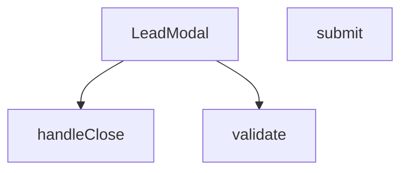

## NODE ID STANDARD

  file: src\components\LeadModal.tsx
  function: src\components\LeadModal.tsx::LeadModal
  function: src\components\LeadModal.tsx::validate
  function: src\components\LeadModal.tsx::submit
  function: src\components\LeadModal.tsx::handleClose

---

## DISA AKTARILANLAR (EXPORTS)
  export: LeadModal

---

## STİL TOKENLERİ

### Arbitrary Değerler (token'a geçirilmemiş)
Yok — tüm stiller token'a geçirilmiş. ✅

### Kullanılan Token'lar (zaten token'a geçirilmiş)
- (yok)

### Tailwind Sınıf Özeti
- **Renkler:** `bg-gradient-to-br`, `bg-gray-100`, `bg-gray-50`, `bg-gray-50/50`, `bg-green-100`, `bg-primary-navy`, `bg-secondary-blue/80`, `bg-white`, `bg-white/10`, `border-2`, `border-gray-100`, `border-gray-200`, `border-gray-300`, `border-red-400`, `border-t`
- **Layout:** `absolute`, `backdrop-blur-md`, `backdrop-blur-sm`, `block`, `fixed`, `flex`, `flex-1`, `flex-col`, `from-blue-600/20`, `gap-1`, `gap-2`, `gap-3`, `gap-4`, `gap-5`, `grid`
- **Varyant/Responsive:** `:`, `disabled:`, `focus-visible:`, `focus:`, `group-hover:`, `hover:`, `md:`, `sm:` önekleri
- **Yardımcı Sınıflar:** `${errors.name`, `-mt-2`, `:`, `animate-bounce`, `animate-in`, `animate-spin`, `border`, `cursor-pointer`, `disabled:cursor-not-allowed`, `disabled:opacity-70`, `duration-300`, `fade-in`, `focus-visible:outline-none`, `focus-visible:ring-2`, `focus-visible:ring-gray-300`

---
# FILE: src\components\LoadingSpinner.md

---
domain: general
source_type: doc
namespace_type: module
source_path: C:\Users\alize\venthub-hvac\src\components\LoadingSpinner.tsx
skeleton_hash: 1429988b8b8756c2
entity_hashes:
  func:LoadingSpinner: 420e244c3ab22ba8
  overview: 055c22213f5fb1f9
  style_tokens: b21c3354ed86bc3e
generated_at: 2026-06-08T10:08:35Z
---

## Genel Bakış
LoadingSpinner.tsx modülü, uygulama içinde veri yükleme veya işlem sırasında kullanıcıya görsel geri bildirim sağlayan basit bir yükleme animasyonu bileşenini içerir. Bileşen, boyut ve tam ekran görüntüleme seçenekleriyle özelleştirilebilir.

## Fonksiyon Grupları
### Ana Bileşen
Bu grup, LoadingSpinner bileşeninin temel tanımını ve özelliklerini içerir.
- LoadingSpinner

---

## AXIOMS – Mimari Varsayımlar
Bu modül için özel aksiyom tanımlanmamıştır.

[Aksiyom 1]: Eğer `size` prop'u verilmezse, varsayılan olarak `'md'` kullanılır.  
[Aksiyom 2]: Eğer `fullScreen` prop'u verilmezse, varsayılan olarak `true` olur.

---

## FONKSİYON DETAYLARI

### LoadingSpinner
**Ne yapar**: LoadingSpinner, bir yükleme göstergesi (spinner) render eden bir React bileşenidir.  
**Nasıl yapar**: Fonksiyon, `size` ve `fullScreen` adlı iki props'u alır; bu değerler spinner'ın boyutunu ve ekranı kaplayıp kaplamayacağını belirler. Daha sonra bu props'lara göre uygun stil ve görünümü uygulayan JSX döndürür.  
**Parametreler**:
- size: string — Spinner'ın boyutunu belirler; varsayılan değer `'md'` (medium) olur.  
- fullScreen: boolean — Spinner'ın ekranı kaplayıp kaplamayacağını belirler; varsayılan değer `true` olur.  
**Dönüş**: React.FC<LoadingSpinnerProps> — JSX elementi olarak render edilebilir bir React fonksiyonel bileşeni döndürür.

---

## INTERFACES

### LoadingSpinnerProps
- `size?: 'sm' | 'md' | 'lg'`
- `fullScreen?: boolean`

---

## AST POINTERS

### [N1_NASIL] AST Pointer: src/components/LoadingSpinner.tsx::LoadingSpinner
- **params**: size — string (default 'md'), fullScreen — boolean (default true)
- **ic_degiskenler**:
  - `t` — translation function from useI18n used for the aria-label of the spinner
  - `sizeClasses` — object mapping size strings ('sm', 'md', 'lg') to Tailwind CSS classes that set width and height
  - `spinnerElement` — JSX element rendering the spinner with the appropriate size class, border styling, spin animation, and aria-label
- **Dönüş**: React.FC<LoadingSpinnerProps> (returns JSX; if fullScreen is true, wraps spinner in a full-height flex container, otherwise returns the spinner element directly)

---

## NODE ID STANDARD

  file: src\components\LoadingSpinner.tsx
  function: src\components\LoadingSpinner.tsx::LoadingSpinner

---

## DISA AKTARILANLAR (EXPORTS)
  export: LoadingSpinner

---

## STİL TOKENLERİ

### Arbitrary Değerler (token'a geçirilmemiş)
Yok — tüm stiller token'a geçirilmiş. ✅

### Kullanılan Token'lar (zaten token'a geçirilmiş)
- (yok)

### Tailwind Sınıf Özeti
- **Renkler:** `border-2`, `border-primary-navy`, `border-t-transparent`
- **Layout:** `flex`, `inline-block`, `items-center`, `justify-center`, `min-h-400px`
- **Varyant/Responsive:** (yok)
- **Yardımcı Sınıflar:** `${sizeClasses[size]`, `animate-spin`, `rounded-full`

---
# FILE: src\components\MagneticCTA.md

---
domain: general
source_type: doc
namespace_type: module
source_path: C:\Users\alize\venthub-hvac\src\components\MagneticCTA.tsx
skeleton_hash: daf29ed42019c3f1
entity_hashes:
  func:MagneticCTA: 45285325a7d3c355
  func:onLeave: 47432f2c7853fc8a
  func:onMove: 0f9106ce87047fd0
  overview: 798bbdff09c682bc
  style_tokens: dfcd3a7af18b6331
generated_at: 2026-06-08T10:08:35Z
---

## Genel Bakış
MagneticCTA bileşeni, fare hareketlerini izleyerek bir çağrı‑eylem (CTA) öğesinin konumunu ve görünümünü dinamik olarak değiştiren, etkileşimli bir React bileşenidir. Bileşen, fare giriş ve çıkış olaylarını yöneterek kullanıcıya görsel geri bildirim ve manyetik bir efekt sunar.

## Fonksiyon Grupları
### Bileşen Tanımı
Bileşenin ana yapısını oluşturur, durumunu yönetir ve ekrana basılacak JSX'i döndürür.
- MagneticCTA

### Olay İşleyicileri
Fare hareketlerini yakalayarak bileşenin konumunu ve görünümünü tetikleyen işlevleri içerir.
- onMove, onLeave

---

## AXIOMS – Mimari Varsayımlar
Bu modül için temel varsayım: `onMove` ve `onLeave` olay işleyicilerinin, fare tabanlı etkileşimlerin doğru yönetilmesi için gerekli olay nesnelerini alacak şekilde bağlanması zorunludur.

[Aksiyom 1]: Eğer `onMove(e)` fonksiyonuna geçilen `e` parametresi geçerli bir DOM olay nesnesi (örn: `MouseEvent`) değilse veya `e.clientX` / `e.clientY` özellikleri içermiyorsa, bileşenin manyetik konum hesaplaması çalışamaz.

[Aksiyom 2]: Eğer `onLeave()` fonksiyonu fare bileşen alanını terk ettiğinde tetiklenmezse, manyetik hareket efekti sıfırlanmaz ve bileşen hatalı konumda kalır.

[Aksiyom 3]: Eğer `MagneticCTA` bileşeni bir DOM elementi içinde render edilmezse veya fare olayları dinlenebilecek bir etkileşim ortamı yoksa, hem `onMove` hem `onLeave` olayları hiç tetiklenemez.

---

## FONKSİYON DETAYLARI

### MagneticCTA
**Ne yapar**: Manyetik etki yaratan bir CTA (Call-to-Action) bileşenini render eder. Kullanıcı fare hareketlerine tepki veren interaktif bir bileşendir.

**Nasıl yapar**: React fonksiyonel bileşeni olarak tanımlanmıştır. Bileşen, içeriğinde fare olaylarını dinleyen `onMove` ve `onLeave` handler'larını kullanarak manyetik hareket efektini sağlar. DOM üzerindeki fare pozisyonuna göre bileşenin konumunu veya stilini dinamik olarak güncelleyebilir.

**Parametreler**:
- Bu bileşen harici parametre almamaktadır (props'suz bileşen)

**Dönüş**: `React.FC` — Manyetik CTA içeriğini render eden React bileşeni

### onMove
**Ne yapar**: HTMLDivElement üzerindeki fare hareketini yakalayan bir olay işleyicisi tanımlar.  
**Nasıl yapar**: Fonksiyon, bir React.MouseEvent<HTMLDivElement, MouseEvent> nesnesini alır ve bu olay üzerinden fare konumu bilgilerini kullanarak manyetik efektin hesaplanmasını sağlar.  
**Parametreler**:  
- e: React.MouseEvent<HTMLDivElement, MouseEvent> — fare hareketi olayı nesnesi  
**Dönüş**: React.MouseEventHandler<HTMLDivElement> — aynı öğe üzerinde fare hareketi işleyici olarak kullanılabilecek bir fonksiyon tipi.

### onLeave
**Ne yapar**: HTMLDivElement üzerinden fare çıktığında tetiklenen bir olay işleyicisi tanımlar.  
**Nasıl yapar**: Fonksiyon, fare öğeden çıktığında çağrılır ve manyetik efekti sıfırlayıp öğeyi varsayılan durumuna döndürmek için kullanılır.  
**Parametreler**: yok  
**Dönüş**: void (veya belirtilmemiş) — fonksiyon bir değer döndürmez.

---

## AST POINTERS

### [N1_NASIL] AST Pointer: MagneticCTA.tsx::MagneticCTA
- **params**: (parametre yok — React.FC bileşeni)
- **ic_degiskenler**:
  - `t` — `useI18n()` hook'undan dönen çeviri fonksiyonu; `t('homeCta.title')`, `t('homeCta.subtitle')`, `t('homeCta.button')` çağrılarıyla JSX içinde metinler render edilir
  - `ref` — `useRef<HTMLDivElement | null>(null)`; manyetik efekt uygulanan butonu saran div'e bağlanır, DOM erişimi için kullanılır
  - `hover` — `useState(false)` boolean durum değişkeni; fare div'in üzerindeyken `true`, ayrılınca `false` olur; `onMove` içinde erişilerek hareket hesaplamasının çalışıp çalışmayacağı kontrol edilir
  - `onMove` — `React.MouseEventHandler<HTMLDivElement>` türünde fare hareket handler'ı; fare koordinatlarına göre CSS custom property'ler (`--dx`, `--dy`) ayarlayarak butonun manyetik kayma efektini hesaplar
  - `onLeave` — fare div'den ayrılınca tetiklenen handler; CSS custom property'leri sıfırlar ve `hover` durumunu `false` yapar
- **Dönüş**: JSX (`<section>` — CTA bölümü; başlık, alt başlık ve manyetik efektli buton içerir)

---


## MERMAID CALL GRAPH
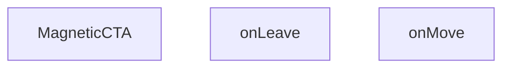

## NODE ID STANDARD

  file: src\components\MagneticCTA.tsx
  function: src\components\MagneticCTA.tsx::MagneticCTA
  function: src\components\MagneticCTA.tsx::onMove
  function: src\components\MagneticCTA.tsx::onLeave

---

## DISA AKTARILANLAR (EXPORTS)
  export: MagneticCTA

---

## STİL TOKENLERİ

### Arbitrary Değerler (token'a geçirilmemiş)
Yok — tüm stiller token'a geçirilmiş. ✅

### Kullanılan Token'lar (zaten token'a geçirilmiş)
- (yok)

### Tailwind Sınıf Özeti
- **Renkler:** `bg-gradient-to-r`, `bg-white`, `border-light-gray`, `from-primary-navy`, `text-2xl`, `text-primary-navy`, `text-white`, `text-white/90`, `to-secondary-blue`
- **Layout:** `flex`, `flex-col`, `from-primary-navy`, `gap-4`, `hover:shadow-xl`, `inline-flex`, `items-center`, `items-start`, `justify-between`, `justify-center`, `max-w-7xl`, `p-8`, `relative`, `shadow-lg`, `sm:flex-row`
- **Varyant/Responsive:** `hover:`, `lg:`, `sm:` önekleri
- **Yardımcı Sınıflar:** `border`, `font-bold`, `lg:px-8`, `mx-auto`, `px-4`, `px-8`, `py-10`, `py-4`, `rounded-2xl`, `rounded-xl`, `sm:px-6`, `transition-transform`

---
# FILE: src\components\MegaMenu.md

---
domain: general
source_type: doc
namespace_type: module
source_path: C:\Users\alize\venthub-hvac\src\components\MegaMenu.tsx
skeleton_hash: a2f04b68f2a1f84f
entity_hashes:
  func:MegaMenu: 73d16c7403c0be73
  overview: f5fc7e413027361c
  style_tokens: 607cd2b8b83a451b
generated_at: 2026-06-08T10:08:35Z
---

## Genel Bakış
MegaMenu modülü, web sitesinin üst navigasyon bölümünde yer alan mega menü bileşenini tanımlar. Bileşen, `isOpen` ve `onClose` prop'ları aracılığıyla menünün açılıp kapanmasını dış bileşenlerden kontrol eder ve kullanıcılara geniş kapsamlı navigasyon seçenekleri sunar.

## Fonksiyon Grupları
### Ana Bileşen
Mega menünün görsel yapısını oluşturur ve görünürlük durumunu yönetir. Kullanıcı menüyü kapatmak istediğinde `onClose` callback'ini tetikleyerek üst bileşene bildirim gönderir.
- MegaMenu

---

## AXIOMS – Mimari Varsayımlar
MegaMenu modülünün doğru çalışması için `isOpen` ve `onClose` parametrelerinin sağlanması gerekmektedir. Her iki parametre de default değer içermediği için çağrı tarafında zorunlu olarak iletilmelidir.

[Aksiyom 1]: Eğer `isOpen` parametresi verilmezse, menünün görünürlük durumu belirsizleşir ve bileşen açılıp kapanamaz.

[Aksiyom 2]: Eğer `onClose` callback fonksiyonu verilmezse, kullanıcı menüyü kapatmaya çalıştığında hata oluşur veya kapatma işlemi çalışmaz.

[Aksiyom 3]: Eğer `isOpen` `true` olarak ayarlanmazsa, menü hiç görünmez ve kullanıcı menü seçeneklerine erişemez.

---

## FONKSİYON DETAYLARI

### MegaMenu

**Ne yapar**: MegaMenu, projenin ana navigasyon menüsünü açılır mega menü formatında sunan bir React bileşenidir. Kullanıcının menü çubuğundaki belirli bir kategori üzerine tıklaması veya hover etmesiyle tetiklenen bu bileşen, çok sütunlu ve genişletilmiş bir navigasyon arayüzü sağlar.

**Nasıl yapar**: Bileşen, isOpen prop'u ile kontrol edilen koşullu renderlama (conditional rendering) mantığı kullanır. isOpen değeri true olduğunda menü içeriği görüntülenir, false olduğunda gizlenir veya unmount edilir. onClose callback fonksiyonu, menünün kapanma talebini üst bileşene iletir — bu genellikle menü dışına tıklama, Escape tuşu basma veya bir bağlantı seçme durumlarında tetiklenir.

**Parametreler**:
- `isOpen`: `boolean` — Mega menünün görüntülenip görüntülenmediğini kontrol eden durum bayrağı. True değerinde menü açılır ve görünür hale gelir.
- `onClose`: `() => void` — Menünün kapatılması gerektiğinde çağrılan geri çağırım (callback) fonksiyonu. Üst bileşende menü durumunu sıfırlamak için kullanılır.

**Dönüş**: `React.FC<MegaMenuProps>` — Render edilmiş mega menü yapısını içeren JSX elementi döndürür. Props tipi olarak MegaMenuProps arayüzünü kullanır.

**Bağlam**: Bu bileşen, `src/components/` dizininde konumlanmış olup projenin genel navigasyon yapısının parçasıdır. HVAC ürün kategorileri ve alt kategorileri için genişletilmiş menü deneyimi sunar.

---

## INTERFACES

### MegaMenuProps
- `isOpen: boolean`
- `onClose: () => void`

---

## AST POINTERS

### [N1_NASIL] AST Pointer: src/components/MegaMenu.tsx::MegaMenu (arrow function body)
- **params**: `isOpen` — menünün açılıp kapanma durumu (boolean), `onClose` — menü kapatıldığında çağrılacak callback fonksiyonu
- **ic_degiskenler**:
  - `categories` — `useCategories()` hook'undan gelen kategoriler dizisi, EliteMegaMenu ve MobileMegaMenu bileşenlerine prop olarak aktarılır
  - `loading` — `useCategories()` hook'undan gelen yükleme durumu boolean'ı, true olduğunda spinner gösterilir
  - `isMounted` — `useState(false)` ile oluşturulan state, bileşenin ilk mount olup olmadığını takip eder, true olduğunda menü içeriği render edilir
- **Dönüş**: Bileşen mount olmadan veya `isOpen` false ise `null`, aksi halde JSX (menü header,EliteMegaMenu veya MobileMegaMenu içeren tam ekran modal)
- **Yan etkiler**: `useEffect(() => setIsMounted(true), [])` ile mount'ta `isMounted`'i true yapar

### [N2_NASIL] AST Pointer: src/components/MegaMenu.tsx::useEffect callback (setIsMounted callback)
- **params**: (yok)
- **ic_degiskenler**: (yok)
- **Dönüş**: yok
- **Yan etkiler**: `setIsMounted(true)` çağırarak `isMounted` state'ini true'a set eder, bileşenin mounted olduğunu bildirir

---

## NODE ID STANDARD

  file: src\components\MegaMenu.tsx
  function: src\components\MegaMenu.tsx::MegaMenu

---

## DISA AKTARILANLAR (EXPORTS)
  export: MegaMenu

---

## STİL TOKENLERİ

### Arbitrary Değerler (token'a geçirilmemiş)
Yok — tüm stiller token'a geçirilmiş. ✅

### Kullanılan Token'lar (zaten token'a geçirilmiş)
- (yok)

### Tailwind Sınıf Özeti
- **Renkler:** `bg-primary-navy`, `bg-slate-50/30`, `bg-white`, `border-4`, `border-b`, `border-primary-navy/20`, `border-slate-100`, `border-t-primary-navy`, `hover:bg-slate-50`, `hover:text-slate-600`, `text-lg`, `text-slate-400`, `text-slate-900`, `text-white`, `text-xs`
- **Layout:** `block`, `custom-scrollbar`, `fixed`, `flex`, `flex-1`, `flex-col`, `gap-2`, `h-6`, `h-8`, `hidden`, `items-center`, `justify-between`, `justify-center`, `max-w-7xl`, `overflow-hidden`
- **Varyant/Responsive:** `hover:`, `sm:` önekleri
- **Yardımcı Sınıflar:** `animate-in`, `animate-spin`, `duration-300`, `fade-in`, `font-bold`, `inset-0`, `mx-auto`, `px-6`, `py-20`, `py-4`, `py-8`, `rounded-full`, `rounded-lg`, `tracking-tight`, `transition-colors`

---
# FILE: src\components\PaymentWatcher.md

---
domain: general
source_type: doc
namespace_type: module
source_path: C:\Users\alize\venthub-hvac\src\components\PaymentWatcher.tsx
skeleton_hash: 9d41c497ac981f87
entity_hashes:
  func:PaymentWatcher: 0d799bcd7a7c68f4
  overview: cac0a3def1dcd9ec
  style_tokens: dd5ed8d0f58dcf57
generated_at: 2026-06-08T10:08:35Z
---

## Genel Bakış
PaymentWatcher modülü, uygulama genelinde ödeme durumunu arka planda sürekli olarak izleyen bir React bileşenidir. Kullanıcıya herhangi bir arayüz göstermeden, belirli aralıklarla ödeme durumunu kontrol ederek ilgili durumlarda otomatik yönlendirmeler veya durum güncellemeleri yapar.

## Fonksiyon Grupları
### Bileşen Tanımı ve İzleme Mantığı
Modülün temel yapısını ve periyodik izleme mekanizmasını tanımlayan ana bileşen fonksiyonunu içerir. Bu grup, bileşenin iç durumunu, zamanlayıcı referanslarını ve durum kontrol mantığını bir arada yönetir.
- PaymentWatcher

---

## AXIOMS – Mimari Varsayımlar

PaymentWatcher modülü, parametre almayan bir React bileşenidir ve sadece fonksiyon imzasına dayalı sınırlı bilgi mevcuttur.

[Aksiyom 1]: Eğer React Runtime (React kütüphanesi ve bileşen hiyerarşisi) yoksa, bileşen doğru şekilde render edilmez.

[Aksiyom 2]: Eğer bileşen için geçerli bir React Context veya global state kaynağı (Redux, Zustand vb.) yoksa, PaymentWatcher'ın izleyeceği ödeme siparişlerine erişimi olmaz ve işlevselliği çalışmaz.

[Aksiyom 3]: Eğer tarayıcı ortamı (veya React DOM/Server-Side Rendering ortamı) yoksa, bileşen DOM'a bağlanamaz ve periyodik izleme döngüsü başlatılamaz.

---

## FONKSİYON DETAYLARI

### PaymentWatcher

**Ne yapar**: PaymentWatcher, ödeme işlemlerinin durumunu izleyen bir React bileşenidir. VentHub HVAC projesinde ödeme süreçlerinin takip edilmesini ve gerekli durum güncellemelerinin yapılmasını sağlar.

**Nasıl yapar**: Bileşen, uygulama içinde ödeme ile ilgili değişiklikleri izleyerek ilgili bileşenlere veya servislere bildirimlerde bulunur. Ödeme durumlarındaki değişiklikleri yakalayıp gerektiğinde UI güncellemeleri veya tetikleyiciler oluşturur.

**Parametreler**:
- Parametre almamaktadır (props tanımlı değildir).

**Dönüş**: `React.FC` - Standart bir React işlevsel bileşeni olarak render edilir.

---

## AST POINTERS

### [N1_NASIL] AST Pointer: src/components/PaymentWatcher.tsx::PaymentWatcher
- **params**: (parametre yok)
- **ic_degiskenler**:
  - `router` — useRouter() hook'undan gelen Next.js router instance'ı, programmatic navigasyon için kullanılır
  - `checkingRef` — useRef<boolean>, checkOnce'ın eşzamanlı çalışmasını engelleyen guard flag tutar
  - `timerRef` — useRef<number | null>, periyodik checkOnce çağrısını tutan interval ID'si
  - `pathname` — usePathname() hook'undan gelen mevcut URL path string'i
  - `checkOnce` — useCallback ile tanımlı async fonksiyon, localStorage'dan sipariş bilgisini okur ve Supabase'den sipariş durumunu kontrol eder
- **Dönüş**: JSX null döner (yarn component, yalnızca yan etkileri vardır)

### [N2_NASIL] AST Pointer: src/components/PaymentWatcher.tsx::PaymentWatcher::checkOnce
- **params**: (parametre yok)
- **ic_degiskenler**:
  - `raw` — localStorage.getItem(STORAGE_KEY) ile okunan ham JSON string'i veya null
  - `data` — JSON.parse(raw || '{}') sonucu elde edilen `{ orderId?: string, conversationId?: string }` tipinde parsed obje
  - `orderId` — data.orderId erişimi ile elde edilen sipariş ID string'i
  - `supabase` — dinamik import ile yüklenen supabaseBrowserClient instance'ı
  - `row` — supabase.from('venthub_orders').select('status').eq('id', orderId).maybeSingle() sorgusundan dönen veri satırı
  - `error` — aynı Supabase sorgusundan dönen hata nesnesi
- **Dönüş**: void (Promise<void)), fonksiyon localStorage temizler ve router.push ile navigasyon yapar

### [N3_NASIL] AST Pointer: src/components/PaymentWatcher.tsx::PaymentWatcher::useEffect_callback
- **params**: (parametre yok)
- **ic_degiskenler**:
  - `onFocus` — window focus olayında checkOnce çağıran callback
  - `onVisibility` — document visibilitychange olayında visible ise checkOnce çağıran callback
  - `raw` — localStorage.getItem(STORAGE_KEY) ile okunan ham JSON string'i veya null, bekleyen sipariş olup olmadığını kontrol eder
- **Dönüş**: temizleme fonksiyonu döner — event listener'ları kaldırır ve interval'ı temizler

### [N4_NASIL] AST Pointer: src/components/PaymentWatcher.tsx::PaymentWatcher::useEffect_cleanup
- **params**: (parametre yok)
- **ic_degiskenler**: (yok — yalnızca outer scope'taki onFocus, onVisibility ve timerRef kullanılır)
- **Dönüş**: void, event listener'ları ve interval'ı temizler

---

## NODE ID STANDARD

  file: src\components\PaymentWatcher.tsx
  function: src\components\PaymentWatcher.tsx::PaymentWatcher

---

## DISA AKTARILANLAR (EXPORTS)
  export: PaymentWatcher

---

## STİL TOKENLERİ

### Arbitrary Değerler (token'a geçirilmemiş)
Yok — tüm stiller token'a geçirilmiş. ✅

### Kullanılan Token'lar (zaten token'a geçirilmiş)
- (yok)

### Tailwind Sınıf Özeti
- **Renkler:** (yok)
- **Layout:** (yok)
- **Varyant/Responsive:** (yok)
- **Yardımcı Sınıflar:** (yok)

---
# FILE: src\components\ProductCard.md

---
domain: general
source_type: doc
namespace_type: module
source_path: C:\Users\alize\venthub-hvac\src\components\ProductCard.tsx
skeleton_hash: 4a22b4591c05c2c0
entity_hashes:
  overview: 4ebb1c4f22471a6d
  style_tokens: 19c7d9ec430fc71d
generated_at: 2026-06-09T06:46:02Z
---

## Genel Bakış
Bu modül, HVAC ürün kartlarını render eden bir React bileşenidir. `Product` nesnesinden gelen verileri (görsel, marka, fiyat) alır, yerelleştirilmiş fiyat gösterimi ve sepete ekleme işlevselliği sunar. Next.js `Link` ile ürün detay sayfasına yönlendirme sağlar ve `grid`/`list` olmak üzere iki farklı düzen seçeneğini destekler.

Bu bileşen以下 bağımlılıklar kullanır: `Product` türü, `BrandIcon`, `VentImage`, `useCart` hook'u, `useI18n` hook'u ve `formatCurrency` yardımcı fonksiyonu. `onQuickView` prop'u ile hızlı bakış işlevselliği de desteklenir.

---

## AXIOMS – Mimari Varsayımlar

Bu modül için fonksiyon gövdesi (implementation) verilmemiştir. Sağlanan bilgiler仅有 dosya yolu ve modül sabitleri olup, mimari varsayımların türetilmesi için gerekli olan **fonksiyon gövdesi** bulunmamaktadır.

---

## FONKSİYON DETAYLARI

---

## INTERFACES

### ProductCardProps
- `product: Product`
- `onQuickView?: (product: Product) => void`
- `highlightFeatured?: boolean`
- `layout?: 'grid' | 'list'`
- `priority?: boolean`
- `hidePrice?: boolean`
- `compact?: boolean`

---

## SABİTLER
- **ProductCard** (call) — `React.memo(function ProductCard({

  product,

  layout = 'grid',

  priority...`

---

## AST POINTERS

### [N1_NASIL] AST Pointer: ProductCard.tsx::onClickAddToCart
- **params**: `(e: React.MouseEvent)` — React click event nesnesi, preventDefault ve stopPropagation metotlarını içerir
- **ic_degiskenler**: []
- **Dönüş**: yok (event handler fonksiyonu, return değeri yok)

**Notlar**:
- Fonksiyon `e.preventDefault()` ile varsayılan tarayıcı olayını engeller
- Fonksiyon `e.stopPropagation()` ile olayın yukarı doğru yayılmasını engeller
- Fonksiyon `addToCart(product)` çağrısı ile ürün sepete eklenir
- `addToCart` ve `product` değişkenleri dış scope'dan closure ile gelir (fonksiyon gövdesinde tanımlı değildir)

---

## NODE ID STANDARD

  file: src\components\ProductCard.tsx

---

## STİL TOKENLERİ

### Arbitrary Değerler (token'a geçirilmemiş)
Yok — tüm stiller token'a geçirilmiş. ✅

### Kullanılan Token'lar (zaten token'a geçirilmiş)
- (yok)

### Tailwind Sınıf Özeti
- **Renkler:** `bg-gold-accent`, `bg-light-gray/30`, `bg-light-gray/50`, `bg-primary-navy`, `bg-white`, `bg-white/90`, `border-light-gray`, `border-t`, `group-hover:bg-light-gray/50`, `group-hover:text-primary-navy`, `hover:bg-secondary-blue`, `sm:text-lg`, `text-base`, `text-industrial-gray`, `text-lg`
- **Layout:** `absolute`, `backdrop-blur-sm`, `block`, `flex`, `flex-1`, `flex-col`, `flex-shrink-0`, `gap-3`, `h-11`, `h-28`, `h-9`, `h-full`, `hover:shadow-hvac-lg`, `hover:shadow-lg`, `items-baseline`
- **Varyant/Responsive:** `:`, `active:`, `focus-visible:`, `group-hover:`, `hover:`, `sm:` önekleri
- **Yardımcı Sınıflar:** `${compact`, `:`, `active:scale-95`, `aspect-square`, `border`, `duration-300`, `duration-500`, `focus-visible:outline-none`, `focus-visible:ring-2`, `focus-visible:ring-offset-2`, `focus-visible:ring-primary-navy`, `font-bold`, `font-medium`, `font-semibold`, `group`

---
# FILE: src\components\QuickViewModal.md

---
domain: general
source_type: doc
namespace_type: module
source_path: C:\Users\alize\venthub-hvac\src\components\QuickViewModal.tsx
skeleton_hash: fc9d7ff94e251f3f
entity_hashes:
  func:QuickViewModal: debc62013d59b5ee
  func:handleAdd: 552a96581034d630
  overview: c04ebac1db5bee8d
  style_tokens: a0d16d1087294b08
generated_at: 2026-06-08T10:08:35Z
---

## Genel Bakış
QuickViewModal, ürünlerin hızlı önizlemesini sunan ve kullanıcıların ürünleri doğrudan sepete eklemesine olanak tanıyan bir modal bileşenidir. Bileşen, modal penceresinin görünürlüğünü ve kullanıcı etkileşimlerini yönetir.

## Fonksiyon Grupları
### Ana Modal Bileşeni
Ürün bilgilerini içeren modal penceresini oluşturan ve open/close durumunu kontrol eden ana arayüz bileşenidir.
- QuickViewModal

### Ürün Eylem Yönetimi
Kullanıcı arayüzünden tetiklenen, sepete ekleme gibi somut eylemleri işleyen yardımcı fonksiyonlardır.
- handleAdd

---

## AXIOMS – Mimari Varsayımlar
Bu modül, bir React bileşeni olup, belirli prop'ların ve bağımlılıkların varlığını gerektirir. Bu koşullar sağlanmadığında bileşen düzgün çalışamaz veya hata verir.

[Aksiyom 1]: Eğer `QuickViewModal` bileşenine `product` prop'u geçilmezse veya geçilen değer `null`/`undefined` veya geçersiz bir nesne ise, modal içeriği (örn: ürün adı, fiyatı) düzgün oluşturulamaz ve bileşen render hataları veya eksik veri ile karşılaşır.

[Aksiyom 2]: Eğer `QuickViewModal` bileşenine `open` prop'u geçilmezse (veya `boolean` bir değer almayan bir değer geçilirse), modal'ın açılıp kapanacağı başlangıç durumu belirsizleşir ve bileşenin render mantığı hatalı çalışabilir (örn: modal hiç açılmayabilir veya her zaman açık kalabilir).

[Aksiyom 3]: Eğer `QuickViewModal` bileşenine `onClose` prop'u geçilmezse veya geçilen değer bir fonksiyon (`Function`) değilse, modal'ı kapatmaya yönelik herhangi bir kullanıcı eylemi (örn: kapatma butonuna basma, backdrop'a tıklama) bileşenin iç mantığında işlenemez ve bileşen hata verir.

[Aksiyom 4]: Eğer `handleAdd` fonksiyonu tetiklendiğinde, bileşenin dahili durumunda veya üst bileşeninde (`product`'ı tutan) ürün bilgisi (`product` prop'undan gelen) geçerli bir `id` içermiyorsa, sepete ekleme işlemi (muhtemelen bir API çağrısı ile) başarısız olur veya eksik veriyle gerçekleştirilir.

[Aksiyom 5]: Eğer React veya bileşenin kullandığı UI framework/kütüphanesi (örn: Modal, Button) ortamda mevcut değilse, bileşen hiç oluşturulamaz ve uygulama hata verir.

---

## FONKSİYON DETAYLARI

### QuickViewModal
**Ne yapar**: Bu bileşen, kullanıcıya seçili bir ürünün hızlı bir önizlemesini sunan bir modal penceresi oluşturur ve yönetir. Ürün detaylarını görüntülemek için kullanılan arayüz katmanıdır.
**Nasıl yapar**: `product`, `open` ve `onClose` özelliklerini (props) alarak modalın görünürlüğünü ve içeriğini kontrol eder. React bileşeni olarak, `open` durumuna göre modalı ekrana çizer ve kapatma işlemi için `onClose` metodunu tetikler.
**Parametreler**:
- product: object — Modal içinde gösterilecek olan ürünün verilerini ve özelliklerini içerir.
- open: boolean — Modal penceresinin açık olup olmadığını belirten durum değişkenidir.
- onClose: function — Modalın kapatılması gerektiğinde çalıştırılan geri çağırma (callback) fonksiyonudur.
**Dönüş**: React.FC<QuickViewModalProps> — QuickViewModal arayüzünü temsil eden bir React bileşeni döner.

### handleAdd
**Ne yapar**: Bu fonksiyon, modal içinde görüntülenen ürünü sepete veya listeye ekleme işlemini başlatır ve yönetir. Kullanıcının ekleme butonuna tıklamasıyla tetiklenen etkileşimdir.
**Nasıl yapar**: Mevcut ürün verisi üzerinde gerekli işlemleri gerçekleştirerek ürünü sisteme ekler. İçerik detayları kaynak kodunda belirtilmemiştir ancak genel olarak ekleme mantığını uygular.
**Parametreler**:
- Hiçbir parametre almaz.
**Dönüş**: void veya bilinmiyor — Herhangi bir değer döndürmez veya dönüş tipi belirtilmemiştir.

---

## INTERFACES

### QuickViewModalProps
- `product: Product | null`
- `open: boolean`
- `onClose: () => void`

---

## AST POINTERS

### [N1_NASIL] AST Pointer: QuickViewModal.tsx::QuickViewModal
- **params**: `{ product, open, onClose }` — destructured obje parametreleri: `product` (Product tipinde ürün nesnesi), `open` (boolean, modalin açık olup olmadığı), `onClose` (modalin kapatılma callback fonksiyonu)
- **ic_degiskenler**:
  - `t` — `useI18n()` hook'undan dönen çeviri fonksiyonu; `t('quickView.title')`, `t('quickView.close')` gibi anahtarlarla UI metinlerini çevirir
  - `lang` — `useI18n()` hook'undan dönen dil kodu string'i; `formatCurrency` çağrısına passed olarak para birimi formatlamada kullanılır
  - `addToCart` — `useCart()` hook'undan dönen sepete ürün ekleme fonksiyonu; `handleAdd` içinde `addToCart(product)` olarak çağrılır
  - `price` — `Number(product.price)` ifadesinden türetilen number tipinde fiyat değeri; `formatCurrency(price, lang, ...)` çağrısına passed olarak kullanılır
  - `handleAd` — parametre almayan arrow function; `addToCart(product)` çağrısı yapar ardından `onClose()` ile modali kapatır
- **Dönüş**: JSX — `return null` (open veya product falsy ise) veya dialog HTML'i (jsx element ağacı)

### [N2_NASIL] AST Pointer: QuickViewModal.tsx::handleAdd
- **params**: (parametre yok)
- **ic_degiskenler**: (yok — sadece dış kapsam değişkenleri kullanılır: `addToCart`, `product`, `onClose`)
- **Dönüş**: yok (undefined) — `addToCart(product)` ile ürünü sepete ekler, `onClose()` ile modalı kapatır; dönüş değeri döndürmez, yalnızca yan etki üretir

---

## NODE ID STANDARD

  file: src\components\QuickViewModal.tsx
  function: src\components\QuickViewModal.tsx::QuickViewModal
  function: src\components\QuickViewModal.tsx::handleAdd

---

## DISA AKTARILANLAR (EXPORTS)
  export: QuickViewModal

---

## STİL TOKENLERİ

### Arbitrary Değerler (token'a geçirilmemiş)
Yok — tüm stiller token'a geçirilmiş. ✅

### Kullanılan Token'lar (zaten token'a geçirilmiş)
- (yok)

### Tailwind Sınıf Özeti
- **Renkler:** `bg-black/40`, `bg-gradient-to-br`, `bg-primary-navy`, `bg-white`, `border-2`, `border-b`, `border-light-gray`, `border-primary-navy`, `from-air-blue`, `hover:bg-light-gray`, `hover:bg-primary-navy`, `hover:bg-secondary-blue`, `hover:text-white`, `text-2xl`, `text-6xl`
- **Layout:** `fixed`, `flex`, `flex-1`, `flex-col`, `from-air-blue`, `gap-2`, `gap-4`, `grid`, `grid-cols-1`, `inline-flex`, `items-center`, `justify-between`, `justify-center`, `line-clamp-2`, `line-clamp-4`
- **Varyant/Responsive:** `focus-visible:`, `hover:`, `sm:` önekleri
- **Yardımcı Sınıflar:** `aspect-square`, `focus-visible:outline-none`, `focus-visible:ring-2`, `focus-visible:ring-offset-2`, `focus-visible:ring-primary-navy`, `font-bold`, `font-semibold`, `inset-0`, `mb-1`, `mb-2`, `mb-4`, `mb-6`, `mr-2`, `mt-auto`, `px-4`

---
# FILE: src\components\ScrollLinkedProcess.md

---
domain: general
source_type: doc
namespace_type: module
source_path: C:\Users\alize\venthub-hvac\src\components\ScrollLinkedProcess.tsx
skeleton_hash: c25957b394b2bf51
entity_hashes:
  func:ScrollLinkedProcess: 5a92a40886643dd7
  func:scrollTo: ee292d22ad2f3df1
  overview: a4bd4fd5da1416a4
  style_tokens: dffb84eddfacefbd
generated_at: 2026-06-08T10:08:35Z
---

## Genel Bakış
venthub-hvac projesinde kullanılan bu React modülü, kullanıcı arayüzündeki süreç adımlarını sayfa kaydırma konumuyla senkronize eden bir bileşen sunar. Temel amacı, süreç akışları boyunca kullanıcının gezinmesini kolaylaştırmak, mevcut kaydırma konumuna göre ilgili adımı odaklamaktır. Modül hem kullanıma hazır ana bileşeni hem de kaydırma işlemini yöneten yardımcı işlevi tek bir yapıda toplar.

## Fonksiyon Grupları
### Ana Süreç Bileşeni
Projede diğer bileşenler tarafından entegre edilebilen, tüm kaydırma bağlantılı süreç işlevselliğini yöneten ana React bileşenidir. Süreç akışlarını kullanıcının sayfa kaydırma eylemleriyle ilişkilendirerek sorunsuz bir gezinme deneyimi sunar.
- ScrollLinkedProcess

### Kaydırma Senkronizasyonu Yardımcısı
İstenen sıra numaralı süreç adımına otomatik kaydırma işlemini gerçekleştiren yardımcı işlevdir. Ana bileşen tarafından çağrılarak aktif kaydırma konumu ile görüntülenen süreç adımının her zaman senkronize kalmasını sağlar.
- scrollTo

---

## AXIOMS – Mimari Varsayımlar
Bu React tabanlı ScrollLinkedProcess modülü, aynı sayfa içindeki sıralı süreç adımları arasında bağlantılı kaydırma işlevi sağlar, çalışması için React runtime ortamı ve tarayıcının DOM API'lerine erişimi zorunludur.

[Aksiyom 1]: Eğer modülün çalışacağı React runtime ortamı (bileşenlerin mount edilmesine izin veren çalışma zamanı) yoksa, ScrollLinkedProcess bileşeni hiç yüklenmez, süreçler arası kaydırma işlevi hiç kullanılamaz.
[Aksiyom 2]: Eğer tarayıcının DOM kaydırma API'lerine (window.scroll, DOM elemanlarının scroll özellikleri) erişimi kısıtlanmışsa, scrollTo(i: number) fonksiyonu hedef indeksteki süreç adımına kaydırma işlemini gerçekleştiremez, kullanıcı manuel kaydırma yapmak zorunda kalır.
[Aksiyom 3]: Eğer ScrollLinkedProcess bileşeni ile eşleşen, 0'dan başlayan sıralı indekse sahip süreç adımı DOM elemanları sayfaya eklenmemişse, scrollTo fonksiyonu i parametresi ile geçerli bir hedef bulamaz, kaydırma işlemi başarısız olur.
[Aksiyom 4]: Eğer scrollTo(i: number) fonksiyonuna i olarak negatif sayı veya mevcut toplam süreç sayısından büyük bir sayı gönderilirse, modül geçersiz bir hedefe kaydırma girişiminde bulunur, ya hiç kaydırma yapmaz ya da tanımsız bir konuma kayar.

---

## FONKSİYON DETAYLARI

### ScrollLinkedProcess
**Ne yapar**: VentHub HVAC projesinde süreç adımlarını tarayıcı kaydırma hareketleriyle ilişkilendiren React bileşeni üreten bir fabrika fonksiyonudur. Proje içindeki süreç takibi arayüzlerinin aktif adımını sayfa kaydırmasıyla senkronize tutmak için özel olarak tasarlanmıştır, kullanıcıların süreç akışını takip etmesini kolaylaştırır.
**Nasıl yapar**: İçinde tarayıcının yerleşik scroll olay dinleyicilerini kullanarak sayfa üzerindeki tüm süreç adımı elementlerinin konumlarını sürekli olarak takip eder, bu konum verilerine göre o anda görünür olan aktif süreci belirleyen bir React bileşeni döndürür. Aynı zamanda bünyesinde barındırdığı scrollTo yardımcı fonksiyonu ile programlı olarak da istenen adımlara kaydırma desteği sunar.
**Parametreler**: Herhangi bir giriş parametresi almaz.
**Dönüş**: React.FC tipi, proje içinde doğrudan kullanılabilecek bir React fonksiyonel bileşeni döndürür. Bu dönen bileşen, süreç adımlarını listeleyip tüm kaydırma hareketleriyle sürekli senkronize çalışan bir arayüz sunar.

### scrollTo
**Ne yapar**: ScrollLinkedProcess bileşeni bünyesinde çalışan, verilen indeksteki süreç adımına programlı olarak sayfayı kaydıran yardımcı fonksiyondur. Kullanıcıların ara yüzdeki gezinme butonları veya benzeri etkileşimler aracılığıyla istedikleri süreç adımına hızlıca geçmesini sağlamak amacıyla geliştirilmiştir.
**Nasıl yapar**: DOM ağacında ilgili indeksteki süreç adımı elementinin konum verilerini çeker, tarayıcının yerleşik kaydırma API'lerini kullanarak sayfayı ilgili elementin konumuna taşır. Aynı zamanda ScrollLinkedProcess'in yönettiği aktif adım durumunu da güncelleyerek arayüzdeki aktif adım göstergesinin doğru şekilde çalışmasını garanti eder.
**Parametreler**:
- i: number — Kaydırma işleminin hedefi olan süreç adımının sıfır tabanlı sıra numarasını (indeks) tutan sayı tipi değer
**Dönüş**: void, herhangi bir değer döndürmez, yalnızca kaydırma işlemini ve ilgili durum güncellemelerini gerçekleştirir.

---

## AST POINTERS

### [N1_NASIL] AST Pointer: C:\Users\alize\venthub-hvac\src\components\ScrollLinkedProcess.tsx::ScrollLinkedProcess
- **params**: (parametre yok)
- **ic_degiskenler**:
  - `t` — useI18n hook'undan alınan çeviri fonksiyonu, tüm UI metinlerinin çevirisini getirmek için kullanılır
  - `active` — görünür haldeki adımın indeksini tutan state değişkeni, kenar çubuğu butonlarının stillendirilmesinde kullanılır
  - `setActive` — `active` state'ini güncellemek için kullanılan state setter fonksiyonu
  - `refs` — tüm ana içerik adım bölümlerinin DOM referanslarını tutan useRef nesnesi, scroll ve IntersectionObserver işlemleri için kullanılır
  - `STEPS` — tüm süreç adımlarının anahtar, başlık, açıklama verilerini içeren sabit dizi, kenar çubuğu ve ana içerik oluşturulurken kullanılır
- **Dönüş**: JSX React elementi (scroll bağlı süreç bölümünü oluşturan bileşen çıktısı)

### [N2_NASIL] AST Pointer: C:\Users\alize\venthub-hvac\src\components\ScrollLinkedProcess.tsx::useEffect_cleanup
- **params**: (parametre yok)
- **ic_degiskenler**:
  - `io` — Bileşen mount edilirken oluşturulan IntersectionObserver instance'ı, bileşen unmount olurken observer'ı kapatmak için kullanılır
- **Dönüş**: yok

### [N3_NASIL] AST Pointer: C:\Users\alize\venthub-hvac\src\components\ScrollLinkedProcess.tsx::io_observer_callback
- **params**: [entries: IntersectionObserverEntry[]]
- **ic_degiskenler**:
  - `sections` — Geçerli tüm DOM referanslarından oluşan HTMLDivElement dizisi, hedef bölümün indeksini bulmak için kullanılır
  - `setActive` — Görünen bölüm tespit edildiğinde aktif adım state'ini güncellemek için kullanılan state setter
- **Dönüş**: yok

### [N4_NASIL] AST Pointer: C:\Users\alize\venthub-hvac\src\components\ScrollLinkedProcess.tsx::entries_forEach_callback
- **params**: [e: IntersectionObserverEntry]
- **ic_degiskenler**:
  - `sections` — Tüm geçerli DOM bölümlerinden oluşan dizi, hedef bölümün indeksini bulmak için kullanılır
  - `setActive` — Görünen bölümün indeksi ile aktif adım state'ini güncellemek için kullanılan setter
- **Dönüş**: yok

### [N5_NASIL] AST Pointer: C:\Users\alize\venthub-hvac\src\components\ScrollLinkedProcess.tsx::scrollTo
- **params**: [i: number]
- **ic_degiskenler**:
  - `refs.current[i]` — `i` indeksli ana içerik bölümünün DOM referansı, o bölüme yumuşak kaydırma yapmak için kullanılır
- **Dönüş**: yok

### [N6_NASIL] AST Pointer: C:\Users\alize\venthub-hvac\src\components\ScrollLinkedProcess.tsx::steps_map_sidebar_button_callback
- **params**: [s: STEPS öğesi nesnesi, i: number]
- **ic_degiskenler**:
  - `s.key` - React listesi için benzersiz anahtar değeri
  - `s.title` - Kenar çubuğu butonunun başlık metni
  - `s.desc` - Kenar çubuğu butonunun açıklama metni
  - `i` - Adımın sıralama indeksi
  - `active` - Şu anki aktif adımın indeksi, butonun stillendirilmesinde kullanılır
  - `scrollTo` - Butona tıklandığında ilgili ana içerik bölümüne kaydırmak için çağrılan fonksiyon
- **Dönüş**: JSX buton elementi

### [N7_NASIL] AST Pointer: C:\Users\alize\venthub-hvac\src\components\ScrollLinkedProcess.tsx::steps_map_main_section_callback
- **params**: [s: STEPS öğesi nesnesi, i: number]
- **ic_degiskenler**:
  - `s.key` - React listesi için benzersiz anahtar değeri
  - `el` - Oluşturulan bölüm div'inin DOM referansı
  - `refs.current[i]` - `i` indeksli bölümün referansını saklamak için atanan değişken
  - `s.title` - Bölüm başlık metni
  - `s.desc` - Bölüm açıklama metni
  - `t` - Çeviri fonksiyonu, adım numarası ön ekini almak için kullanılır
- **Dönüş**: JSX bölüm div elementi

---

## NODE ID STANDARD

  file: src\components\ScrollLinkedProcess.tsx
  function: src\components\ScrollLinkedProcess.tsx::ScrollLinkedProcess
  function: src\components\ScrollLinkedProcess.tsx::scrollTo

---

## DISA AKTARILANLAR (EXPORTS)
  export: ScrollLinkedProcess

---

## STİL TOKENLERİ

### Arbitrary Değerler (token'a geçirilmemiş)
Yok — tüm stiller token'a geçirilmiş. ✅

### Kullanılan Token'lar (zaten token'a geçirilmiş)
- (yok)

### Tailwind Sınıf Özeti
- **Renkler:** `bg-primary-navy/5`, `bg-white`, `border-light-gray`, `border-primary-navy`, `hover:bg-gray-50`, `md:text-3xl`, `text-2xl`, `text-industrial-gray`, `text-left`, `text-primary-navy`, `text-sm`, `text-steel-gray`, `text-xl`, `text-xs`
- **Layout:** `gap-6`, `grid`, `grid-cols-1`, `lg:col-span-1`, `lg:col-span-3`, `lg:grid-cols-4`, `max-w-7xl`, `p-6`, `shadow-sm`, `sticky`, `top-20`, `w-full`
- **Varyant/Responsive:** `:`, `hover:`, `lg:`, `md:`, `sm:` önekleri
- **Yardımcı Sınıflar:** `${i`, `:`, `===`, `active`, `border`, `font-bold`, `font-semibold`, `lg:px-8`, `mb-1`, `mb-2`, `mb-6`, `mx-auto`, `px-3`, `px-4`, `py-12`

---
# FILE: src\components\ScrollReveal.md

---
domain: general
source_type: doc
namespace_type: module
source_path: C:\Users\alize\venthub-hvac\src\components\ScrollReveal.tsx
skeleton_hash: 1d5c6fded933b5c6
entity_hashes:
  func:ScrollReveal: 5164aa702775b185
  overview: 7c3e9f948c132ef9
  style_tokens: fce5caac08f51876
generated_at: 2026-06-08T10:08:35Z
---

## Genel Bakış
ScrollReveal, VentHub HVAC projesinde kaydırma tabanlı animasyonlar için kullanılan bir React sarmalayıcı bileşenidir. İçeriğin ekran görünür alanında belirdiğinde seçilen animasyon efektini uygulayarak görsel geçişler sağlar. Esnek yapılandırması ile farklı HTML elementlerine ve animasyon türlerine adapte olabilir.

## Fonksiyon Grupları

### Kaydırma Animasyonu Bileşeni
ScrollReveal, çocuk bileşenleri sarmalayarak kaydırma olaylarını izler ve görünümde belirdiğinde animasyon efektlerini tetikler. Farklı HTML elementleri, animasyon türleri ve sıralı gecikmeler ile özelleştirilebilir yapı sunar.
- ScrollReveal

---

## AXIOMS – Mimari Varsayımlar

ScrollReveal bileşeni, kaydırma tabanlı animasyonları çocuklar için uygulayan bir sarmalayıcı component'tir.

**[Aksiyom 1 - Zorunlu Animation Prop'u]:** Eğer `animation` parametresi verilmezse, bileşen geçerli bir animasyon uygulayamaz ve çocuk bileşenler animasyon olmadan rendered olur.

**[Aksiyom 2 - Zorunlu Children Prop'u]:** Eğer `children` parametresi verilmezse, bileşen render edilecek bir içerik barındırmaz ve animasyon uygulanacak bir hedef olmaz.

**[Aksiyom 3 - StaggerIndex Sıralama Bağımlılığı]:** Eğer `staggerIndex` parametresi verilmezse, bileşen sıralı animasyon (stagger) zamanlamasında bağımsız/tek başına çalışır, diğer ScrollReveal bileşenlerinden bağımsız tetiklenir.

**[Aksiyom 4 - As Prop'u Geçerli Component']):** Eğer `as` prop'u geçerli bir React component'i (Comp) içermeyen bir değer alırsa, bileşen geçerli bir HTML elementi veya component olarak render edilemez ve hata oluşur.

**[Aksiyom 5 - ClassName Varsayılan Davranış]:** `className` parametresi verilmezse boş string (`''`) kullanılır, bu durumda bileşene ek CSS sınıfı uygulanmaz.

---

## FONKSİYON DETAYLARI

### ScrollReveal

**Ne yapar**: ScrollReveal, çocuk bileşenlerin sayfa kaydırma (scroll) sırasında belirli animasyon efektleriyle görünür olmasını sağlayan sarmalayıcı (wrapper) bir React bileşeniderek. Görünmezlikten görünürlüğe geçiş animasyonlarını kontrol ederek kullanıcı deneyimini zenginleştirir.

**Nasıl yapar**: Bileşen, belirtilen animasyon türüne göre çocuk elemanları sarar ve scroll pozisyonuna bağlı olarak animasyon tetiklerini yönetir. `as` prop'u ile hangi HTML elementi (div, section, article vb.) olarak render edileceği belirlenebilir. `staggerIndex` parametresi ile çoklu elemanlarda animasyonların sıralı ve gecikmeli tetiklenmesi sağlanarak kademeli görünüm efektleri elde edilir.

**Parametreler**:
- `children` — `React.ReactNode` — Scroll animasyonu uygulanacak alt bileşenler veya içerik. Bileşenin sarmalayacağı tüm JSX içeriği bu prop üzerinden iletilir.
- `animation` — `AnimationType` — Uygulanacak animasyon stilini tanımlar (örn. fade-in, slide-up, scale vb.). Hangi geçiş efektinin kullanılacağını belirler.
- `className` — `string` — Ek CSS sınıf adları eklemek için kullanılır. Varsayılan değeri boş dizedir (`''`). Bileşenin stilini özelleştirmek için opsiyonel olarak verilir.
- `staggerIndex` — `number | undefined` — Birden fazla ScrollReveal bileşeni kullanıldığında animasyonların sıralı tetiklenmesi için gecikme indeksini belirtir. Değer arttıkça animasyon daha geç tetiklenir.
- `as` — `ElementType` — Bileşenin hangi HTML elementi olarak render edileceğini belirler. Varsayılan olarak `div` kullanılır; `section`, `article`, `span` gibi farklı elementler atanabilir.

**Dönüş**: `React.FC<ScrollRevealProps>` — Bileşen, children'ı sarmalayan ve scroll tabanlı animasyon uygulayan bir React fonksiyonel bileşeni döndürür. Render edilen eleman, belirlenen HTML elementi (`as` prop'u) içinde animasyon durumuna göre stil değişiklikleri uygulanmış şekilde döner.

---

## INTERFACES

### ScrollRevealProps
- `children: React.ReactNode`
- `animation: 'fadeUp' | 'scaleIn' | 'fadeIn' | 'slideLeft'`
- `className?: string`
- `staggerIndex?: number`
- `as?: 'div' | 'section' | 'h1' | 'p'`

---

## AST POINTERS

### [N1_NASIL] AST Pointer: components/ScrollReveal.tsx::ScrollReveal
- **params**:
  - `children` — bileşen içinde render edilecek React çocuk elemanları
  - `animation` — hangi scroll animasyonunun uygulanacağını belirten anahtar, `scrollAnimationClasses` dict'inde lookup için kullanılır
  - `className` — üzerine eklenecek ek CSS sınıf adları, varsayılan `''`
  - `staggerIndex` — stagger (sıralı) animasyon için indeks, tanımlıysa `scrollAnimationClasses.staggerChild`'a geçirilir
  - `as` (Component olarak yeniden adlandırılmış) — render edilecek HTML elemanı veya bileşen, varsayılan `'div'`
- **ic_degiskenler**:
  - `ref` — `useScrollAnimation<HTMLElement>` hook'unun döndürdüğü ref objesi; bileşene atanarak viewport izleme başlatılır
  - `visible` — `useScrollAnimation` hook'unun döndürdüğü boolean; elemanın viewport'a girip girmediğini belirtir
  - `animClass` — `scrollAnimationClasses[animation](visible)` çağrısından elde edilen CSS sınıf dizgisi; animasyonun görünür/gizli durumuna göre uygun sınıfı seçer
  - `style` — `staggerIndex` tanımlıysa `scrollAnimationClasses.staggerChild(staggerIndex)` çağrısıyla dönen inline style nesnesi; tanımlı değilse `undefined`
- **Dönüş**: `JSX.Element` — `Component` elemanının `ref`, `className` (`animClass` + `className` birleşimi) ve `style` özellikleriyle sarılmış `{children}` içeriği

---

## NODE ID STANDARD

  file: src\components\ScrollReveal.tsx
  function: src\components\ScrollReveal.tsx::ScrollReveal

---

## DISA AKTARILANLAR (EXPORTS)
  export: ScrollReveal

---

## STİL TOKENLERİ

### Arbitrary Değerler (token'a geçirilmemiş)
Yok — tüm stiller token'a geçirilmiş. ✅

### Kullanılan Token'lar (zaten token'a geçirilmiş)
- (yok)

### Tailwind Sınıf Özeti
- **Renkler:** (yok)
- **Layout:** (yok)
- **Varyant/Responsive:** (yok)
- **Yardımcı Sınıflar:** `${animClass`, `${className`

---
# FILE: src\components\ScrollToTop.md

---
domain: general
source_type: doc
namespace_type: module
source_path: C:\Users\alize\venthub-hvac\src\components\ScrollToTop.tsx
skeleton_hash: 117b074cbbe911cf
entity_hashes:
  func:ScrollToTop: 67a45bb41004286e
  overview: 3fbf0b01314ba145
  style_tokens: dd5ed8d0f58dcf57
generated_at: 2026-06-08T10:08:35Z
---

## Genel Bakış
Venthub HVAC projesinin ön yüzünde yer alan ScrollToTop modülü, React tabanlı bir kullanıcı arayüzü bileşenidir. Uygulama içindeki yönlendirme (rota) değişikliklerini algılayarak pencerenin kaydırma konumunu otomatik olarak sayfanın en üstüne taşır, böylece yeni sayfa içeriği her zaman en baştan görüntülenerek kullanıcı deneyimi iyileştirilir.

## Fonksiyon Grupları
### Ana Kaydırma Yönetimi Bileşeni
Modülün tüm sorumluluğunu üstlenen tek ana bileşendir, uygulama içindeki rota değişikliklerini dinleyerek pencerenin kaydırma konumunu sıfırlar. Yeni sayfa yüklendiğinde kullanıcının içeriğe en baştan başlamasını sağlayacak şekilde çalışır.
- ScrollToTop

---

## AXIOMS – Mimari Varsayımlar

Bu modül, React rota (routing) sistemiyle birlikte çalışarak sayfa değişimlerinde kaydırma pozisyonunu sıfırlayan bir UI bileşenidir. Aşağıdaki varsayımlar, fonksiyon gövdesinden ve eski dokümandan türetilen yapısal gerekliliklerdir.

**[Aksiyom 1]:** Eğer React Router (`useLocation` veya eşdeğeri) bağlamı mevcut değilse, bileşen rota değişikliklerini algılayamaz ve kaydırma sıfırlama işlemi hiçbir zaman tetiklenmez.

**[Aksiyom 2]:** Eğer `window` nesnesi veya DOM erişimi (tarayıcı ortamı) yoksa, bileşen kaydırma konumunu (`window.scrollTo` veya `scrollTop`) değiştiremez ve sayfa en üste taşınmaz.

**[Aksiyom 3]:** Eğer bileşen React Hook yaşam döngüsünün (`useEffect`) dışında render edilirse veya uygun bağımlılık dizisi (dependency array) sağlanmazsa, rota değişiklikleri dinlenemez; yalnızca ilk yüklemede kaydırma gerçekleştirilir.

**[Aksiyom 4]:** Eğer bileşen `<Router>` veya `<BrowserRouter>` hiyerarşisi dışında mount edilirse, rota bağlamı (`location`) boş veya geçersiz olur ve kaydırma sıfırlama tetiklenemez.

---

## FONKSİYON DETAYLARI

### ScrollToTop
**Ne yapar**: Uygulama içerisindeki rota değişiklikleri sırasında sadece tarayıcı geçmişine yeni bir giriş ekleyen PUSH tipi rota aksiyonlarında sayfayı anında en üste kaydırır. Geri dönüş gibi POP tipi rota değişikliklerinde hiçbir işlem yapmaz, tarayıcının kendi yerleşik kaydırma konumu geri yükleme (native scroll restorasyon) özelliğinin sorunsuz çalışmasına izin verir. Bu sayede yeni sayfalara geçildiğinde kullanıcılar sayfanın en başından başlamayı, önceki sayfalara döndüğünde ise kaldıkları konumdan devam etmeyi deneyimler.
**Nasıl yapar**: Rota değişikliklerini sürekli dinleyen bir yapı üzerinden çalışır, gelen değişikliğin aksiyon türünü ayırt ederek işlem akışını yönlendirir. Sadece PUSH tipi aksiyonlar algılandığında pencereyi 0, 0 koordinatlarına kaydırma işlemini tetikler, POP tipi aksiyonlarda herhangi bir scroll manipülasyonu yapmaz. Bu yaklaşım, modern tek sayfa uygulamalarında sıkça karşılaşılan tutarsız kaydırma konumu sorunlarını ortadan kaldırmak için tasarlanmıştır.
**Parametreler**:
- Herhangi bir parametre almaz. Fonksiyon kendi çalışma mantığını dahili rota dinleme mekanizmasından edindiği verilerle yürütür, harici bir giriş parametresi gerektirmez.
**Dönüş**: Dönüş tipi belirsizdir, muhtemelen void olarak tanımlanmıştır. Fonksiyon herhangi bir değer döndürmez, tek yan etkisi PUSH tipi rota değişikliklerinde tetiklediği pencere kaydırma işlemidir, başka bir işlemde kullanılmak üzere herhangi bir veri veya nesne üretmez.

---

## AST POINTERS

### [N1_NASIL] AST Pointer: C:\Users\alize\venthub-hvac\src\components\ScrollToTop.tsx::ScrollToTop
- **params**: (parametre yok)
- **ic_degiskenler**:
  - `pathname` — Next.js `usePathname` hook'u ile alınan mevcut sayfanın yol değeri, useLayoutEffect bağımlılık listesinde kullanılarak yol değiştiğinde efektin tetiklenmesini sağlar
  - `usePathname` — Next.js'in aktif sayfa yolunu almak için çağrılan hook fonksiyonu
  - `useLayoutEffect` — React'in DOM güncellemelerinden hemen sonra çalışan efekt hook'u, pathname değiştiğinde scroll sıfırlama işlemini yönetmek için kullanılır
  - `[pathname]` — useLayoutEffect'in bağımlılık dizisi, yalnızca pathname değiştiğinde efektin yeniden çalışmasını sağlar
- **Dönüş**: null, React bileşeni olarak herhangi bir DOM öğesi render etmez

---

## NODE ID STANDARD

  file: src\components\ScrollToTop.tsx
  function: src\components\ScrollToTop.tsx::ScrollToTop

---

## DISA AKTARILANLAR (EXPORTS)
  export: ScrollToTop

---

## STİL TOKENLERİ

### Arbitrary Değerler (token'a geçirilmemiş)
Yok — tüm stiller token'a geçirilmiş. ✅

### Kullanılan Token'lar (zaten token'a geçirilmiş)
- (yok)

### Tailwind Sınıf Özeti
- **Renkler:** (yok)
- **Layout:** (yok)
- **Varyant/Responsive:** (yok)
- **Yardımcı Sınıflar:** (yok)

---
# FILE: src\components\SearchOverlay.md

---
domain: general
source_type: doc
namespace_type: module
source_path: C:\Users\alize\venthub-hvac\src\components\SearchOverlay.tsx
skeleton_hash: ac8082825c082a0f
entity_hashes:
  func:SearchOverlay: 5877a83b84daa2a4
  func:addToRecent: bf8c952c533ee587
  func:handleClose: 5443cae55c424b9f
  func:handleKeyDown: 1487e8d647499b5f
  func:performFullSearch: ffbaaa64876e5226
  func:renderIdle: ceb6e27699bb9c05
  func:renderResults: e506feef4e55d367
  func:renderSuggestion: 843bcfdde37f5fbe
  func:renderSuggestions: 8f7a31a904a04209
  overview: 7f4ffbd07796d9de
  style_tokens: dd6869457e23a7f7
generated_at: 2026-06-08T10:08:35Z
---

## Genel Bakış
SearchOverlay, uygulama genelinde arama işlevselliğini sağlayan tam kapsamlı bir React bileşenidir. Kullanıcıdan arama terimini alır, öneriler ve sonuçlar sunar, geçmiş aramaları takip eder. Modül, arama akışının tüm durumlarını (boş, öneri listesi, sonuç ekranı) yönetir.

## Fonksiyon Grupları

### Ana Bileşen ve Görünürlük Kontrolü
Bileşenin açılıp kapanmasını sağlayan ve üst düzey yaşam döngüsünü yöneten fonksiyonları barındırır.
- SearchOverlay, handleClose

### Arama İşlemleri ve Veri Yönetimi
Kullanıcının arama terimini işleyen, arama geçmişini tutan ve asenkron arama operasyonlarını yürüten fonksiyonları kapsar.
- performFullSearch, addToRecent

### Kullanıcı Girişi ve Olay Yönetimi
Klavye olaylarını dinleyerek kullanıcı eylemlerini arama tetikleme gibi işlevlere bağlayan yardımcı fonksiyondur.
- handleKeyDown

### Arayüz Görüntüleme Katmanı
Bileşenin farklı durumlarını (boş ekran, öneriler listesi, sonuç görünümü) oluşturan render fonksiyonlarıdır.
- renderSuggestion, renderIdle, renderSuggestions, renderResults

---

## AXIOMS – Mimari Varsayımlar

Bu modül, arama arayüzü akışını yöneten React bileşenidir. Aşağıdaki mimari varsayımlar, fonksiyon imzalarından türetilmiştir.

---

## FONKSİYON DETAYLARI

### SearchOverlay
**Ne yapar**: Arama çubuğu için bir üst katman (overlay) bileşeni oluşturur ve `open` durumu ile `onClose` geri çağrısını yönetir.  
**Nasıl yapar**: React fonksiyonel bileşeni olarak tanımlanır; `open` prop’u overlay’in görünürlüğünü kontrol eder, `onClose` ise kapanma eylemini tetikler. İçerik ve etkileşim mantığı diğer yardımcı fonksiyonlar tarafından sağlanır.  
**Parametreler**:
- `open`: boolean — Overlay’in açık/kapalı durumunu belirler.  
- `onClose`: () => void — Overlay kapandığında çalıştırılacak geri çağrı fonksiyonu.  
**Dönüş**: React.FC\<SearchOverlayProps\> — Belirtilen props tipine sahip bir React fonksiyonel bileşeni döndürür.

### handleClose
**Ne yapar**: Klavye olaylarını dinleyerek arama overlay’ini kapatır ve gezinme/arama akışını yönetir.  
**Nasıl yapar**: Gelen `React.KeyboardEvent` nesnesinin `key` özelliğine bakar; `Escape` tuşu basıldığında overlay’i kapatır, `ArrowDown` ve `ArrowUp` tuşlarıyla aktif öneri indeksini günceller, `Enter` tuşu ile seçili öneri ya da sonuç üzerinden yönlendirme yapar ya da tam arama başlatır.  
**Parametreler**:
- `e`: React.KeyboardEvent — Kullanıcıdan gelen klavye olayı.  
**Dönüş**: void — İşlevi tamamladıktan sonra bir değer döndürmez.

### addToRecent
**Ne yapar**: Kullanıcının arama terimini son aramalara ekler.  
**Nasıl yapar**: Verilen terimi (örnek kodda `q`) alır ve muhtemelen bir geçmiş listesine kaydeder; aynı zamanda ilgili yönlendirme ve kapanma işlemlerini tetikler.  
**Parametreler**:
- `term`: string — Son aramalara eklenmek istenen arama ifadesi.  
**Dönüş**: void — İşlem tamamlandığında bir değer döndürmez.

### performFullSearch
**Ne yapar**: Tam metin araması başlatır.  
**Nasıl yapar**: Gelen arama terimini durum (`q`) olarak ayarlar ve aynı terimle tam arama fonksiyonunu (muhtemelen kendisini) çağırır.  
**Parametreler**:
- `term`: string — Aranacak tam metin ifadesi.  
**Dönüş**: void — İşlev bir sonuç döndürmez.

### handleKeyDown
**Ne yapar**: Klavye tuşlarına göre arama overlay’inde gezinme ve eylem tetikleme sorumluluğu taşır.  
**Nasıl yapar**: (Kod içeriği verilmemiştir; genellikle `handleClose` benzeri bir mantıkla tuşları kontrol eder.)  
**Parametreler**:
- `e`: React.KeyboardEvent — Kullanıcıdan gelen klavye olayı.  
**Dönüş**: void — İşlem sonrası bir değer döndürmez.

### renderSuggestion
**Ne yapar**: Tek bir arama önerisini görsel olarak oluşturur.  
**Nasıl yapar**: (Kod içinde aynı fonksiyona yeniden çağrı yapılmış; gerçek render mantığı burada tanımlanmamış.)  
**Parametreler**:
- `s`: SearchSuggestion — Görüntülenecek öneri nesnesi.  
- `idx`: number — Önerinin listedeki indeksi.  
**Dönüş**: void — Görsel çıktı üretir, ancak dönüş değeri yoktur.

### renderIdle
**Ne yapar**: Arama overlay’i boş (idle) durumundayken gösterilecek içeriği üretir.  
**Nasıl yapar**: (Kod içeriği sağlanmamıştır.)  
**Parametreler**: Yok.  
**Dönüş**: void — Görsel bir eleman döndürür.

### renderSuggestions
**Ne yapar**: Öneri listesini (suggestions) render eder.  
**Nasıl yapar**: (Kod içeriği eksiktir; muhtemelen `renderSuggestion` fonksiyonunu döngü içinde çağırır.)  
**Parametreler**: Yok.  
**Dönüş**: void — Öneri elemanlarını ekrana yerleştirir.

### renderResults
**Ne yapar**: Arama sonuçlarını (results) ekranda gösterir.  
**Nasıl yapar**: (Kod içeriği verilmemiştir; genellikle sonuç dizisini map ederek her birini render eder.)  
**Parametreler**: Yok.  
**Dönüş**: void — Sonuç elemanlarını üretir.

---

## INTERFACES

### SearchOverlayProps
- `open: boolean`
- `onClose: () => void`

---

## TYPE ALIASES

### ViewState
```typescript
type ViewState = 'IDLE' | 'SUGGESTING' | 'RESULTS'
```

---

## AST POINTERS

### [N1_NASIL] AST Pointer: src/components/SearchOverlay.tsx::SearchOverlay
- **params**: `{ open, onClose }` — overlay açılır/kapalı durumu ve kapanma callback'i
- **ic_degiskenler**:
  - `router` — Next.js navigation hook'u, sayfa yönlendirme için
  - `t` — useI18n() hook'undan gelen çeviri fonksiyonu
  - `listRef` — useRef ile oluşturulan liste DOM referansı, scroll kontrolü için
  - `inputRef` — useRef ile oluşturulan input DOM referansı, otomatik odaklama için
  - `q` — useState, kullanıcının arama giriş değeri
  - `debounced` — useState, gecikmeli arama terimi (200ms debounce)
  - `viewState` — useState<'IDLE' | 'SUGGESTING' | 'RESULTS'>, mevcut görünüm durumu
  - `suggestions` — useState<SearchSuggestion[]>[], öneri listesi
  - `results` — useState<FtsProductResult[]>[], tam arama sonuçları
  - `recentSearches` — useState<string>[], son arama terimleri listesi
  - `loading` — useState<boolean>, yükleme durumu
  - `error` — useState<string | null>, hata mesajı
  - `activeIndex` — useState<number>, klavye ile seçili öğe indeksi (-1 = hiçbirini seçili değil)
  - `globalCategories` — useCategories() hook'undan gelen tüm kategoriler
  - `supabaseBrowserClient` — Supabase istemci instance'ı
  - `RECENT_SEARCHES_KEY` — localStorage anahtarı sabiti
  - `popularCategories` — useMemo ile hesaplanan, parent_id olmayan ilk 5 kategori
  - `handleClose` — inner fonksiyon, state sıfırlar ve onClose çağırır
  - `addToRecent` — inner fonksiyon, arama terimini recent listesine ekler
  - `performFullSearch` — inner async fonksiyon, tam FTS araması yapar
  - `handleKeyDown` — inner fonksiyon, klavye olaylarını yönetir
  - `renderSuggestion` — inner fonksiyon, tek bir suggestion öğesi render eder
  - `renderIdle` — inner fonksiyon, boş durum görünümünü render eder
  - `renderSuggestions` — inner fonksiyon, öneri listesi görünümünü render eder
  - `renderResults` — inner fonksiyon, sonuç listesi görünümünü render eder
- **Dönüş**: React.FC<SearchOverlayProps> — SearchOverlay bileşeni JSX

### [N2_NASIL] AST Pointer: src/components/SearchOverlay.tsx::handleClose
- **params**: yok
- **ic_degiskenler**:
  - `q` — setQ('') ile sıfırlanan arama giriş değeri
  - `results` — setResults([]) ile sıfırlanan sonuç listesi
  - `suggestions` — setSuggestions([]) ile sıfırlanan öneri listesi
  - `viewState` — setViewState('IDLE') ile idle durumuna ayarlanan görünüm
  - `activeIndex` — setActiveIndex(-1) ile sıfırlanan seçili indeks
  - `onClose` — prop'tan gelen kapanma callback'i
- **Dönüş**: yok — overlay'i kapatır ve tüm state'i sıfırlar

### [N3_NASIL] AST Pointer: src/components/SearchOverlay.tsx::addToRecent
- **params**: `(term: string)` — eklenecek arama terimi
- **ic_degiskenler**:
  - `term` — parametre, eklenecek arama terimi
  - `recentSearches` — mevcut son aramalar listesi
  - `next` — term'i başa ekleyen, mükerrerleri temizleyen ve 5 ile sınırlayan filtrelenmiş liste
  - `RECENT_SEARCHES_KEY` — localStorage anahtarı
  - `setRecentSearches` — state güncelleme fonksiyonu
- **Dönüş**: yok — term'i localStorage'a ve state'e kaydeder

### [N4_NASIL] AST Pointer: src/components/SearchOverlay.tsx::performFullSearch
- **params**: `(term: string)` — aranacak terim
- **ic_degiskenler**:
  - `term` — parametre, arama terimi
  - `setLoading` — yükleme durumunu true yapan state setter
  - `setError` — hata durumunu null yapan state setter
  - `setViewState` — viewState'i 'RESULTS' yapan state setter
  - `setActiveIndex` — activeIndex'i -1 yapan state setter
  - `ftsSearchProducts` — dinamik import ile yüklenen FTS arama servisi fonksiyonu
  - `supabaseBrowserClient` — Supabase istemci instance'ı
  - `rows` — ftsSearchProducts() çağrısından dönen arama sonuçları
  - `setResults` — sonuçları state'e yazan setter
  - `addToRecent` — inner fonksiyon, terimi son aramalara ekler
  - `t` — çeviri fonksiyonu, hata mesajı için
- **Dönüş**: yok — tam metin araması yapar, sonuçları state'e yazar

### [N5_NASIL] AST Pointer: src/components/SearchOverlay.tsx::handleKeyDown
- **params**: `(e: React.KeyboardEvent)` — klavye olay nesnesi
- **ic_degiskenler**:
  - `e` — parametre, KeyboardEvent nesnesi
  - `suggestions` — mevcut öneriler listesi
  - `results` — mevcut sonuçlar listesi
  - `viewState` — mevcut görünüm durumu
  - `maxIndex` — hesaplanan maksimum indeks (suggestions veya results uzunluğuna göre)
  - `activeIndex` — mevcut seçili indeks
  - `s` — Enter tuşunda suggestions[activeIndex] ile alınan seçili öneri
  - `res` — Enter tuşunda results[activeIndex] ile alınan seçili sonuç
  - `router` — Next.js yönlendirme fonksiyonu
  - `addToRecent` — inner fonksiyon
  - `handleClose` — inner fonksiyon
  - `performFullSearch` — inner async fonksiyon
  - `q` — mevcut arama terimi
  - `Routes` — rota yardımcı fonksiyonları
- **Dönüş**: yok — Escape ile kapatma, ok tuşlarıyla gezinme, Enter ile seçim/arama

### [N6_NASIL] AST Pointer: src/components/SearchOverlay.tsx::renderSuggestion
- **params**: `(s: SearchSuggestion, idx: number)` — öneri nesnesi ve listedeki indeksi
- **ic_degiskenler**:
  - `s` — parametre, SearchSuggestion nesnesi
  - `idx` — parametre, listenin sırası
  - `isActive` — idx === activeIndex hesaplanan boolean, öğe seçili mi
  - `icon` — s.type'a göre render edilen SVG veya Image bileşeni (product/category/brand)
  - `label` — brand ise t('search.brandPrefix') eklenen, diğer durumlarda s.label
  - `s.metadata` — Record<string, string> olarak cast edilen metadata (image_url, sku, brand)
  - `debounced` — highlightMatch için kullanılan gecikmeli arama terimi
  - `highlightMatch` — import edilen vurgulama yardımcı fonksiyonu
  - `router` — Next.js yönlendirme
  - `addToRecent` — inner fonksiyon
  - `handleClose` — inner fonksiyon
- **Dönüş**: yok (JSX — <button> elemanı render eder)

### [N7_NASIL] AST Pointer: src/components/SearchOverlay.tsx::renderIdle
- **params**: yok
- **ic_degiskenler**:
  - `recentSearches` — son arama terimleri listesi, length kontrolü ve map için
  - `t` — çeviri fonksiyonu (search.recentSearches, search.clearRecent, search.popularCategories)
  - `setRecentSearches` —_recentSearches'i [] ile sıfırlayan setter
  - `RECENT_SEARCHES_KEY` — localStorage.removeItem için anahtar
  - `setQ` — q state'ini term yapan setter (recentSearch tıklamasında)
  - `performFullSearch` — inner async fonksiyon (recentSearch tıklamasında)
  - `term` — map callback parametresi, her bir recent arama terimi
  - `popularCategories` — popüler kategoriler listesi (length kontrolü ve map için)
  - `router` — Next.js yönlendirme
  - `handleClose` — inner fonksiyon
  - `cat` — map callback parametresi, her bir kategori nesnesi
  - `getCategoryIcon` — import edilen kategori ikon yardımcı fonksiyonu
  - `String(cat.id)` — kategori ID'si (key için)
  - `String(cat.slug)` — kategori slug'ı (routelama ve ikon için)
  - `String(cat.name)` — kategori adı (görünen metin)
  - `Routes` — rota yardımcı fonksiyonları (Routes.category)
- **Dönüş**: yok (JSX — idle durum görünümünü render eder)

### [N8_NASIL] AST Pointer: src/components/SearchOverlay.tsx::renderSuggestions
- **params**: yok
- **ic_degiskenler**:
  - `suggestions` — öneriler listesi (length kontrolü ve map için)
  - `t` — çeviri fonksiyonu (search.noResults, search.detailedSearch, search.allResults)
  - `debounced` — vurgulama ve "aramaya devam et" butonu için gecikmeli terim
  - `performFullSearch` — inner async fonksiyon (buton onClick için)
  - `listRef` — ref={listRef} ile bağlanan DOM referansı
  - `s` — suggestions.map callback parametresi, tek bir SearchSuggestion
  - `idx` — suggestions.map callback indeks parametresi
  - `renderSuggestion` — inner fonksiyon, tek suggestion render eder
- **Dönüş**: yok (JSX — öneri listesi görünümünü render eder)

### [N9_NASIL] AST Pointer: src/components/SearchOverlay.tsx::renderResults
- **params**: yok
- **ic_degiskenler**:
  - `results` — arama sonuçları listesi (length kontrolü, some() ve map için)
  - `t` — çeviri fonksiyonu (search.noResults, search.noResultsAdvice, search.fuzzyMatchNotice)
  - `hasFuzzy` — results.some(r => r.is_fuzzy_match) hesaplanan boolean, fuzzy eşleşme var mı
  - `listRef` — ref={listRef} ile bağlanan DOM referansı
  - `r` — results.map callback parametresi, tek bir FtsProductResult
  - `idx` — results.map callback indeks parametresi
  - `isActive` — idx === activeIndex hesaplanan boolean, öğe seçili mi
  - `highlightMatch` — import edilen vurgulama yardımcı fonksiyonu
  - `debounced` — highlightMatch için gecikmeli arama terimi
  - `r.id` — ürün ID'si (key için)
  - `r.name` — ürün adı (görünen metin ve vurgulama için)
  - `r.brand` — ürün markası (opsiyonel, vurgulama için)
  - `r.sku` — ürün SKU'su (görünen metin ve vurgulama için)
  - `r.slug` — ürün slug'ı (Routes.product için, ! ile non-null assertion)
  - `r.image_url` — ürün görsel URL'i (opsiyonel, Image component için)
  - `r.is_fuzzy_match` — fuzzy eşleşme bayrağı (hasFuzzy hesaplaması için)
  - `router` — Next.js yönlendirme
  - `handleClose` — inner fonksiyon
  - `Routes` — rota yardımcı fonksiyonları (Routes.product)
- **Dönüş**: yok (JSX — sonuç listesi görünümünü render eder)

---


## MERMAID CALL GRAPH
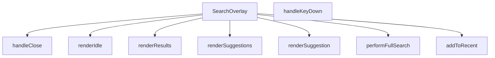

## NODE ID STANDARD

  file: src\components\SearchOverlay.tsx
  function: src\components\SearchOverlay.tsx::SearchOverlay
  function: src\components\SearchOverlay.tsx::handleClose
  function: src\components\SearchOverlay.tsx::addToRecent
  function: src\components\SearchOverlay.tsx::performFullSearch
  function: src\components\SearchOverlay.tsx::handleKeyDown
  function: src\components\SearchOverlay.tsx::renderSuggestion
  function: src\components\SearchOverlay.tsx::renderIdle
  function: src\components\SearchOverlay.tsx::renderSuggestions
  function: src\components\SearchOverlay.tsx::renderResults

---

## DISA AKTARILANLAR (EXPORTS)
  export: SearchOverlay

---

## STİL TOKENLERİ

### Arbitrary Değerler (token'a geçirilmemiş)
Yok — tüm stiller token'a geçirilmiş. ✅

### Kullanılan Token'lar (zaten token'a geçirilmiş)
- (yok)

### Tailwind Sınıf Özeti
- **Renkler:** `bg-air-blue/10`, `bg-amber-50`, `bg-gray-100`, `bg-gray-50`, `bg-red-50`, `bg-slate-50`, `bg-slate-900/40`, `bg-transparent`, `bg-white`, `border-amber-100`, `border-b`, `border-gray-100`, `border-gray-200`, `border-primary-ocean/30`, `border-slate-100`
- **Layout:** `absolute`, `backdrop-blur-sm`, `custom-scrollbar`, `fixed`, `flex`, `flex-1`, `flex-col`, `flex-shrink-0`, `flex-wrap`, `gap-1`, `gap-1.5`, `gap-2`, `gap-3`, `gap-4`, `h-10`
- **Varyant/Responsive:** `:`, `focus-visible:`, `focus:`, `group-hover:`, `hover:`, `placeholder:`, `sm:`, `xs:` önekleri
- **Yardımcı Sınıflar:** `${isActive`, `:`, `animate-in`, `animate-spin`, `border`, `cursor-pointer`, `divide-gray-100`, `divide-y`, `duration-200`, `duration-300`, `fade-in`, `focus-visible:outline-none`, `focus-visible:ring-2`, `focus-visible:ring-primary-navy`, `font-bold`

---
# FILE: src\components\SecurityRibbon.md

---
domain: general
source_type: doc
namespace_type: module
source_path: C:\Users\alize\venthub-hvac\src\components\SecurityRibbon.tsx
skeleton_hash: 5b31708d00170873
entity_hashes:
  func:SecurityRibbon: a7c5f379d943c103
  overview: 08117376b2a86eee
  style_tokens: 3e379506fde07599
generated_at: 2026-06-08T10:08:35Z
---

## Genel Bakış
SecurityRibbon, Venthub HVAC platformunda kullanıcı güvenini artırmak amacıyla tasarlanmış bir React UI bileşenidir. Ödeme sayfalarında veya güven vurgulanan alanlarda marka ve ödeme sağlayıcısı bilgilerini gösteren özelleştirilebilir bir güvenlik bannerı sunar. Bileşen, farklı görünüm varyantlarıyla farklı tasarım ihtiyaçlarına uyum sağlar.

## Fonksiyon Grupları
### Güvenlik Bannerı Bileşeni
Kullanıcıya marka güveni ve ödeme güvenliği mesajlarını iletmekle sorumlu olan React bileşeni. Marka adı, ödeme sağlayıcısı ve görünüm varyantı gibi parametreler aracılığıyla farklı senaryolara uyarlanabilir.
- SecurityRibbon

---

## AXIOMS – Mimari Varsayımlar

Bu React UI bileşeni (SecurityRibbon), marka adı ve ödeme sağlayıcısı bilgilerini gösteren bir güvenlik şeridi/banner componentidir.

**[Aksiyom 1]:** Eğer `variant` geçerli bir değer değilse (örneğin fonksiyon imzasında `'banne'` olarak kesilmiş/parsellenmemiş bir değer gönderilmişse), bileşen beklenmeyen görünüm sergileyebilir veya rendering hatası oluşur.

**[Aksiyom 2]:** Eğer `brandName` parametresi sağlanmazsa, bileşen varsayılan olarak `'Venthub HVAC'` değerini kullanır; bu nedenle bileşen her zaman bir marka adı ile çalışır.

**[Aksiyom 3]:** Eğer `providerName` parametresi sağlanmazsa, bileşen varsayılan olarak `'iyzico'` ödeme sağlayıcısını kullanır; bu nedenle bileşen her zaman bir ödeme sağlayıcı bilgisi ile çalışır.

**[Aksiyom 4]:** Fonksiyon imzasındaki `variant` parametresinin varsayılan değeri `'banne'` olarak kesilmiş/parsellenmemiş görünmektedir — bu durum, variant'ın beklenen tam değeri (muhtemelen `'banner'`) yerine geçersiz bir string ile başlatılmasına neden olur.

---

## FONKSİYON DETAYLARI

### SecurityRibbon
**Ne yapar**: Venthub HVAC platformu için kullanıcı güvenini artırmak amacıyla güvenlik bilgilerini ekranlarda bir şerit olarak sunan React fonksiyonel bileşenidir. Genellikle ödeme gibi hassas süreçlerde kullanıcının karşısına çıkarak güvenilir marka ve hizmet sağlayıcı bilgilerini iletmek için tasarlanmıştır, eksik kalan prop değerleri için ön tanımlı varsayılanlar sunarak herhangi bir çalışma hatası oluşmadan kullanılır.
**Nasıl yapar**: React'in modern fonksiyonel bileşen yapısı kullanılarak geliştirilen bileşen, kendisine iletilen tüm prop'ları destruct ederek kullanır. Eğer herhangi bir prop harici olarak değer gönderilmeden çağrılırsa tanımlı varsayılan değerleri devreye alır, gelen varyant prop'una göre farklı görsel tasarımlar oluşturarak güvenlik şeridini ihtiyaç duyulan şekilde ekrana yansıtır. Tüm güvenlik şeridi ile ilgili metinsel ve görsel mantığı tek bir bileşende toplayarak proje genelinde yeniden kullanılabilirliği ve bakım kolaylığını artırır.
**Parametreler**:
- brandName: string — Güvenlik şeritinde gösterilecek ana platform markasının ismidir, eğer harici olarak özel bir değer gönderilmezse varsayılan olarak 'Venthub HVAC' değeri kullanılır.
- providerName: string — Güvenlik hizmetini sunan üçüncü taraf sağlayıcının (genellikle ödeme sağlayıcısı) ismidir, varsayılan değeri 'iyzico'dur, ihtiyaç duyulması halinde farklı sağlayıcı isimleriyle kolayca özelleştirilebilir.
- variant: string — Güvenlik şeridinin görsel görünümünü belirleyen, hangi banner tasarımıyla ekrana yansıtılacağını ayarlayan parametredir, farklı kullanım senaryoları için farklı tasarım seçenekleri sunulmasını sağlar.
**Dönüş**: React.FC<SecurityRibbonProps> tipinde, işlenmeye hazır React bileşeni döndürür. Bu döndürülen element, uygulamadaki herhangi bir bileşen içinde import edilip kullanılabilir, kendisine iletilen tüm prop ve varsayılan değerlere göre dinamik olarak içeriğini ve görünümünü oluşturan güvenlik şeridi olarak çalışır.

---

## INTERFACES

### SecurityRibbonProps
- `brandName?: string`
- `providerName?: string`
- `variant?: 'banner' | 'card'`

---

## AST POINTERS

### [N1_NASIL] AST Pointer: SecurityRibbon.tsx::SecurityRibbon
- **params**:
  - `brandName` — marka adı, varsayılan `'Venthub HVAC'`
  - `providerName` — ödeme sağlayıcı adı, varsayılan `'iyzico'`
  - `variant` — bileşen görünüm varyantı, varsayılan `'banner'`
- **ic_degiskenler**:
  - `t` — `useI18n()` hook'undan dönen çeviri fonksiyonu; string localization için kullanılır
  - `base` — bileşenin dış sarmalayıcı div'ine uygulanacak koşullu CSS class string'i; `variant === 'banner'` kontrolüne göre padding (`p-4 md:p-5` veya `p-3`) değişir
  - `badge` — güvenlik rozetlerine (PCI DSS, 3D Secure, 256‑bit SSL) uygulanacak sabit CSS class string'i
- **Dönüş**: JSX — `Lock`, `ShieldCheck`, `CreditCard` ikonları ve `t()` ile çevrilmiş brandName/providerName değerlerini gösteren güvenlik bilgi ribonu

---

## NODE ID STANDARD

  file: src\components\SecurityRibbon.tsx
  function: src\components\SecurityRibbon.tsx::SecurityRibbon

---

## DISA AKTARILANLAR (EXPORTS)
  export: SecurityRibbon

---

## STİL TOKENLERİ

### Arbitrary Değerler (token'a geçirilmemiş)
Yok — tüm stiller token'a geçirilmiş. ✅

### Kullanılan Token'lar (zaten token'a geçirilmiş)
- (yok)

### Tailwind Sınıf Özeti
- **Renkler:** `bg-primary-navy/10`, `text-industrial-gray`, `text-primary-navy`, `text-sm`, `text-steel-gray`, `text-xs`
- **Layout:** `flex`, `flex-wrap`, `gap-2`, `gap-3`, `h-9`, `items-center`, `justify-between`, `justify-center`, `w-9`
- **Varyant/Responsive:** (yok)
- **Yardımcı Sınıflar:** `font-semibold`, `rounded-full`

---
# FILE: src\components\Seo.md

---
domain: general
source_type: doc
namespace_type: module
source_path: C:\Users\alize\venthub-hvac\src\components\Seo.tsx
skeleton_hash: 2d6995f5d16454e6
entity_hashes:
  func:Seo: efb90eeb61c051d0
  overview: c4b11b13e9e25b50
  style_tokens: dd5ed8d0f58dcf57
generated_at: 2026-06-08T10:08:35Z
---

## Genel Bakış
Bu modül, Venthub HVAC projesinde web sayfalarının arama motoru optimizasyonu (SEO) ve sosyal medya paylaşım uyumluluğunu sağlamak için geliştirilmiş özel bir React bileşeni barındırır. Tüm proje sayfalarında ortak olarak kullanılarak dinamik şekilde gelen içeriklere uygun meta verileri yönetir, sitenin arama motorlarında doğru indekslenmesini ve sosyal medya platformlarında paylaşıldığında içeriğin istenen şekilde özetlenmesini destekler.

## Fonksiyon Grupları
### Merkezi SEO Meta Verisi Yönetimi
Projedeki tüm sayfalardan çağrılarak tüm SEO ve sosyal medya ile ilgili meta verilerini tek merkezden işleyen ana bileşendir. Kullanıcıdan aldığı sayfa başlığı, açıklaması, standart canonical bağlantı, Open Graph görseli ve içerik tipi gibi değerleri işleyerek ilgili tarayıcı ve platformlara sunar.
- Seo

---

## AXIOMS – Mimari Varsayımlar
Bu React tabanlı SEO bileşeni, web sayfalarının arama motorları tarafından doğru dizine eklenmesi ve sosyal medya platformlarında doğru önizleme ile paylaşılması için gerekli meta verilerini üreterek sayfa head bölümüne enjekte eder. Doğru çalışması için tüm zorunlu props'ların eksiksiz iletilmesi ve bileşenin DOM head öğesine erişimi gereklidir.

[Aksiyom 1]: Eğer title prop'u bileşene iletilmezse, sayfanın temel başlık meta etiketi oluşturulamaz, arama motorları sayfayı başlıksız veya yanlış başlıkla dizine ekler.
[Aksiyom 2]: Eğer description prop'u iletilmezse, arama motoru sonuçlarında ve sosyal medya paylaşımlarında sayfaya ait açıklama metni görüntülenemez.
[Aksiyom 3]: Eğer canonical prop'u (orijinal sayfa URL'si) iletilmezse, arama motorları yinelenen içerik tespiti yaparak sayfanın sıralamasını düşürür, orijinal içeriği doğru tespit edemez.
[Aksiyom 4]: Eğer ogImage prop'u (sosyal medya önizleme görseli) iletilmezse, sosyal medya platformlarında paylaşım sırasında sayfaya ait görsel önizlemesi oluşturulamaz.
[Aksiyom 5]: Eğer ogType prop'u, sayfa içeriğinin türüne uygun olarak (ürün, makale vb.) varsayılan 'website' değerinden değiştirilmezse, içerik türüne özel arama motoru ve sosyal medya işlevleri kullanılamaz.
[Aksiyom 6]: Eğer bileşen uygulamanın DOM yapısındaki head öğesine erişemiyorsa, tüm meta etiketleri sayfaya enjekte edilemez, SEO entegrasyonu tamamen başarısız olur.

---

## FONKSİYON DETAYLARI

### Seo
**Ne yapar**: VentHub HVAC projesinin React tabanlı kod yapısında yer alan, sayfaların arama motorları ve sosyal medya platformlarıyla uyumlu olmasını sağlayan SEO odaklı bir React bileşenidir. Tüm standart meta etiketleri ile Open Graph protokolü gerektiren etiketleri tek bir yapıda oluşturarak, her sayfa için özel SEO yapılandırması yapılmasını kolaylaştırır. Sayfaların arama motoru sonuçlarında doğru şekilde listelenmesini, sosyal medyada paylaşıldığında içeriğine uygun başlık, açıklama ve görselle gösterilmesini sağlar.
**Nasıl yapar**: Props olarak aldığı SEO ile ilgili tüm değerleri işleyerek, ilgili meta etiketlerinin içerik alanlarına yerleştiren bir React fonksiyonel bileşeni olarak çalışır. `ogType` parametresi için varsayılan olarak 'website' değeri tanımlanmıştır, bu sayede kullanıcı tarafından özel bir içerik türü belirtilmese bile temel Open Graph yapısı eksiksiz oluşur. Tüm alınan prop değerlerini SeoProps tip şemasına uygun olarak işleyerek, sayfanın head bölümüne eklenecek tüm meta etiketlerini web standartlarına uygun şekilde yapılandırır.
**Parametreler**:
- title: SeoProps dahilinde tanımlı title alanı — Sayfanın ana başlığı, tarayıcı sekmesi başlığında ve arama motoru sonuçlarında görünen metin değeridir
- description: SeoProps dahilinde tanımlı description alanı — Sayfa içeriğini özetleyen açıklama metni, arama motoru sonuçlarında başlığın altında görüntülenir
- canonical: SeoProps dahilinde tanımlı canonical alanı — Sayfanın tekil standart URL'si, yinelenen içerik sorunlarını önlemek için arama motorlarına bildirilir
- ogImage: SeoProps dahilinde tanımlı ogImage alanı — Sosyal medya platformlarında sayfa paylaşıldığında gösterilecek Open Graph görselinin tam URL'sidir
- ogType: SeoProps dahilinde tanımlı ogType alanı, varsayılan değeri 'website' — Sayfanın içerik türünü Open Graph protokolüne göre bildiren değer, website, article, product gibi özel içerik türleri alabilir
**Dönüş**: React.FC<SeoProps> — Alınan tüm prop değerleriyle yapılandırılmış, sayfaya gerekli tüm SEO uyumlu meta etiketlerini ekleyen çalıştırılabilir React fonksiyonel bileşenini döndürür.

---

## INTERFACES

### SeoProps
- `title?: string`
- `description?: string`
- `canonical?: string`
- `ogImage?: string`
- `ogType?: 'website' | 'product' | 'article'`
- `noIndex?: boolean`

---

## AST POINTERS

### [N1_NASIL] AST Pointer: C:\Users\alize\venthub-hvac\src\components\Seo.tsx::Seo
- **params**: title, description, canonical, ogImage, ogType (varsayılan: 'website'), noIndex (varsayılan: false)
- **ic_degiskenler**:
  - `pathname` — Next.js `usePathname` hook'u ile alınan mevcut sayfanın yol değeri, canonical URL oluşturmak için kullanılır
  - `siteName` — Sabit 'VentHub' site adı, sayfa başlığı ve Open Graph etiketlerinde kullanılır
  - `fullTitle` — Özel başlık varsa `${title} | ${siteName}`, yoksa sadece `siteName` olarak oluşturulan nihai sayfa başlığı, tüm başlık etiketlerinde kullanılır
  - `defaultDesc` - Varsayılan site açıklaması, özel description girilmezse kullanılır
  - `finalDesc` - Özel description varsa onu, yoksa `defaultDesc`'ı kullanan nihai açıklama, meta description ve sosyal medya etiketlerinde kullanılır
  - `siteUrl` - Konfigürasyondan alınan `SITE_URL` sabitine atanan site kök URL'si, tüm mutlak URL'leri oluşturmak için kullanılır
  - `url` - Özel canonical URL varsa onu, yoksa `${siteUrl}${pathname}` ile oluşturulan nihai sayfa URL'si, canonical ve Open Graph URL etiketlerinde kullanılır
  - `image` - Özel sosyal medya görseli `ogImage` varsa onu, yoksa varsayılan `${siteUrl}/og-image.png` URL'sini kullanan sosyal medya görseli, Open Graph ve Twitter görsel etiketlerinde kullanılır
  - `usePathname` - Next.js'ten import edilen, mevcut sayfa path'ini almak için kullanılan hook
  - `SITE_URL` - Site konfigürasyonundan import edilen sabit kök URL değeri
- **Dönüş**: Tüm SEO, Open Graph ve Twitter meta etiketlerini içeren React JSX fragment'i, sayfanın head bölümüne eklenmek üzere arka arkaya HTML etiketleri grubu döndürür

---

## NODE ID STANDARD

  file: src\components\Seo.tsx
  function: src\components\Seo.tsx::Seo

---

## DISA AKTARILANLAR (EXPORTS)
  export: Seo

---

## STİL TOKENLERİ

### Arbitrary Değerler (token'a geçirilmemiş)
Yok — tüm stiller token'a geçirilmiş. ✅

### Kullanılan Token'lar (zaten token'a geçirilmiş)
- (yok)

### Tailwind Sınıf Özeti
- **Renkler:** (yok)
- **Layout:** (yok)
- **Varyant/Responsive:** (yok)
- **Yardımcı Sınıflar:** (yok)

---
# FILE: src\components\SpotlightHeroOverlay.md

---
domain: general
source_type: doc
namespace_type: module
source_path: C:\Users\alize\venthub-hvac\src\components\SpotlightHeroOverlay.tsx
skeleton_hash: d3aa76214edd8a36
entity_hashes:
  func:SpotlightHeroOverlay: 3df6afb4a4a31d8f
  overview: 1f157560c005aa84
  style_tokens: 2d403f9b7fca7034
generated_at: 2026-05-28T22:37:00Z
---

## Genel Bakış
Bu React modülü, web uygulamalarının ana giriş (hero) bölümlerinin üzerinde kullanılmak üzere tasarlanmış, imleç konumunu takip eden parlama efekti overlay'ini sunar. Yarıçap ve parlaklık yoğunluğu parametreleriyle özelleştirilebilir olan bileşen, sayfa içi görsel etkileşimi artırmak için geliştirilmiştir.

## Fonksiyon Grupları
### Ana Bileşen ve Efekt Yönetimi
Modülün tüm sorumluluğunu üstlenen, kullanıcıdan alınan özelleştirme parametrelerini işleyerek imleç takipli parlama efekti overlay'ini render eden tek gruptur.
- SpotlightHeroOverlay

---

## AXIOMS – Mimari Varsayımlar
Bu React bileşeni, web arayüzünde kullanıcının imlecinin olduğu bölgeyi vurgulayan spotlight (ışıkla odaklama) efekti oluşturmak için tasarlanmıştır; doğru çalışması için aşağıdaki koşulların varlığı zorunludur.

[Aksiyom 1]: Eğer bileşene aktarılan radius parametresi geçerli pozitif bir sayı değilse, istenen boyutta odaklama alanı oluşturulamaz, görsel efekt tamamen bozulur.
[Aksiyom 2]: Eğer bileşene aktarılan intensity parametresi 0 ile 1 arasında bir sayı değilse, odaklama alanının şeffaflığı istenen seviyede ayarlanamaz, efekt ya hiç görünmez ya da arka planı tamamen kapatarak ana içeriği gizler.
[Aksiyom 3]: Eğer bileşen çalışma zamanında tarayıcının window ve document nesnelerine erişemiyorsa, kullanıcının imlek pozisyonunu takip edemez, spotlight hiçbir zaman hareket etmez veya hiç görüntülenmez.
[Aksiyom 4]: Eğer bileşene ait gerekli CSS stil tanımları projeye dahil edilmemişse, odaklama efekti doğru konumda ve şekilde görüntülenemez, bileşen temel işlevini yerine getiremez.

---

## FONKSİYON DETAYLARI

### SpotlightHeroOverlay
**Ne yapar**: VentHub HVAC projesinde kullanılan bir React fonksiyonel bileşenidir, ana sahne (Hero) bölümü üzerinde spot (odaklanmış sahne ışığı) efektiyle kaplama (overlay) oluşturur. Bileşen, üzerindeki içeriğe kademeli odaklanma efekti ekleyerek kullanıcı deneyimini zenginleştirmek amacıyla tasarlanmıştır, ışığın boyutunu ve şiddetini yapılandırılabilir hale getirir.
**Nasıl yapar**: Kendisine gönderilen opsiyonel boyut ve şiddet parametrelerini alır, herhangi bir parametre gönderilmediği durumlarda önceden tanımlanmış varsayılan değerleri kullanır. Bu değerlere göre overlay bileşeninin spot ışığı özelliklerini dinamik olarak ayarlar, üstüne eklendiği Hero bölümünün içeriği üzerinde odak noktası dışında kademeli bir koyulaşma/saydamlık efekti uygular.
**Parametreler**:
- radius: number — Opsiyonel parametre, spot ışığının piksel cinsinden yarıçapını belirler, varsayılan değeri 240'tır. Bileşene özel değer gönderilerek ışığın boyutu ihtiyaca göre ayarlanabilir.
- intensity: number — Opsiyonel parametre, spot ışığının şiddetini yani odak alanı dışındaki kaplamanın saydamlık/koyuluk derecesini ayarlar, genellikle 0 ile 1 arasında normalize edilmiş değer alır, varsayılan değeri 0.35'tir.
**Dönüş**: React.FC<{ radius?: number; intensity?: number }> tipinde bir React fonksiyonel bileşeni döndürür. Bu dönen bileşen, kendisine iletilen tüm prop'ları ve çocuk içerikleri alarak spotlight efektini ekrana uygun şekilde render eder.

---

## AST POINTERS

### [N1_NASIL] AST Pointer: C:\Users\alize\venthub-hvac\src\components\SpotlightHeroOverlay.tsx::SpotlightHeroOverlay
- **params**: radius (number, varsayılan 240), intensity (number, varsayılan 0.35)
- **ic_degiskenler**:
  - `reduced` — Kullanıcının hareket azaltma (prefers-reduced-motion) tercihini saklayan boolean React state değeri
  - `setReduced` — reduced state değerini güncellemek için kullanılan React state setter fonksiyonu
  - `useState` — React state yönetimi için kullanılan hook
  - `useEffect` — React yan etkilerini yönetmek için kullanılan hook
- **Dönüş**: JSX div elementi (React.ReactElement)

### [N2_NASIL] AST Pointer: C:\Users\alize\venthub-hvac\src\components\SpotlightHeroOverlay.tsx::useEffect_callback
- **params**: (parametre yok)
- **ic_degiskenler**:
  - `mq` — prefers-reduced-motion medya sorgusunu temsil eden window.matchMedia nesnesi
  - `onChange` — Medya sorgusu durum değişikliklerini yakalayan event handler fonksiyonu, reduced state'ini günceller
  - `setReduced` — Üst kapsamdaki reduced state'ini güncellemek için kullanılan state setter
  - `mq.addEventListener?` — Medya sorgusuna change event listener'ı eklemek için kullanılan opsiyonel method
  - `mq.removeEventListener?` — Temizlik aşamasında event listener'ı kaldırmak için erişilen opsiyonel method
- **Dönüş**: event listener temizliği yapan void fonksiyon

---

## NODE ID STANDARD

  file: src\components\SpotlightHeroOverlay.tsx
  function: src\components\SpotlightHeroOverlay.tsx::SpotlightHeroOverlay

---

## DISA AKTARILANLAR (EXPORTS)
  export: SpotlightHeroOverlay

---

## STİL TOKENLERİ

### Arbitrary Değerler (token'a geçirilmemiş)
Yok — tüm stiller token'a geçirilmiş. ✅

### Kullanılan Token'lar (zaten token'a geçirilmiş)
- (yok)

### Tailwind Sınıf Özeti
- **Renkler:** (yok)
- **Layout:** `absolute`, `z-10`
- **Varyant/Responsive:** (yok)
- **Yardımcı Sınıflar:** `inset-0`, `pointer-events-none`

---
# FILE: src\components\StickyHeader.md

---
domain: general
source_type: doc
namespace_type: module
source_path: C:\Users\alize\venthub-hvac\src\components\StickyHeader.tsx
skeleton_hash: ad311f0435d3aaf4
entity_hashes:
  func:CategoryHubOverlaySkeleton: 09095f7c03bb95f0
  func:MegaMenuSkeleton: 43156bd7843421f5
  func:SearchOverlaySkeleton: 6695469d4cdbd037
  overview: 93337d32dfafa357
  style_tokens: a87cdf58739596c8
generated_at: 2026-06-11T16:12:52Z
---

## Genel Bakış
Bu modül, StickyHeader bileşeninin farklı açılır pencereleri (overlay) için yükleme durumu göstergeleri (skeleton UI) sağlayan bir yardımcı modüldür. Her bir skeleton, ilgili asıl bileşen yüklenirken kullanıcıya geçici ve animasyonlu bir arayüz sunarak daha akıcı bir deneyim elde edilmesini sağlar.

## Fonksiyon Grupları
### Skeleton (Yükleme Durumu) Bileşenleri
Modüldeki tüm fonksiyonlar, farklı üst menü bileşenlerinin yüklenme sırasındaki iskelet (skeleton) görünümünü oluşturan React bileşenleridir.
- SearchOverlaySkeleton, MegaMenuSkeleton, CategoryHubOverlaySkeleton

---

## AXIOMS – Mimari Varsayımlar

Bu modül, üç skeleton (iskelet/Yükleniyor) yükleme bileşeni ve dört asıl bileşen çağrısından oluşur. Aksiyomlar yalnızca fonksiyon imzaları ve modül sabitleri temel alınarak türetilmiştir.

[Aksiyom 1]: Eğer `SearchOverlaySkeleton`, `MegaMenuSkeleton` veya `CategoryHubOverlaySkeleton` fonksiyonları çağrıldığında JSX döndürmek yerine `undefined` veya `null` döndürürse, arama mega menü ve kategori hub overlay'lerinin yükleme (loading) durumunda iskelet UI'ı gösterilmeyerek kullanıcıya boş bir alan sunulur.

[Aksiyom 2]: Eğer üç skeleton fonksiyonunun hiçbir parametresi (`()`) olmadığı halde dış bağımlılık olarak bir CSS modülü veya style token'ı bekleniyorsa ve bu stil kaynağı sağlanmamışsa, skeleton bileşenleri görünür ancak biçimsiz (unstyled) render edilir.

[Aksiyom 3]: Eğer `SearchOverlay`, `MegaMenu`, `CategoryHubOverlay` veya `StickyHeader` modül sabitleri olarak tanımlanmış bileşen çağrıları (call) mevcut değilse veya bunların import'ları kırılmışsa, ilgili overlay açma ve başlık bileşeni render işlemleri başarısız olur.

[Aksiyom 4]: Eğer skeleton fonksiyonları asıl overlay bileşenleriyle (`SearchOverlay`, `MegaMenu`, `CategoryHubOverlay`) aynı layout bağlamında (mount noktası) render edilmiyorsa, yüklenme süresince UI geçişi (transition) bozulur.

[Aksiyom 5]: Eğer `StickyHeader` bileşeni modülün ana ihracatı (export) olarak kullanılmıyorsa veya çağrılmıyorsa, sayfa üst kısmında sabit başlık alanı oluşturulmaz.

---

## FONKSİYON DETAYLARI

### SearchOverlaySkeleton
**Ne yapar**: Arama overlay bileşeninin yüklenme sırasında gösterilecek iskelet (skeleton) yükleme durumu placeholder'ını render eder.

**Nasıl yapar**: Arama overlay'ı veriler yüklenene kadar beklerken kullanıcıya görsel bir geri bildirim sunmak amacıyla animasyonlu placeholder elementleri oluşturur. Bu sayede kullanıcı arama arayüzünün yakında görüneceğine dair ipucu alır.

**Parametreler**:
- Bu fonksiyon herhangi bir parametre almaz.

**Dönüş**: JSX.Element — Arama overlay'ı için skeleton yükleme durumu bileşeni döndürür.

### MegaMenuSkeleton
**Ne yapar**: Geliştirildi ancak detay üretilemedi.

### CategoryHubOverlaySkeleton
**Ne yapar**: Geliştirildi ancak detay üretilemedi.

---

## INTERFACES

### StickyHeaderProps
- `isScrolled: boolean`

---

## SABİTLER
- **SearchOverlay** (call) — `dynamic(() => import('./SearchOverlay'), { ssr: false })`
- **MegaMenu** (call) — `dynamic(() => import('./MegaMenu'), { ssr: false })`
- **CategoryHubOverlay** (call) — `dynamic(() => import('./navigation/CategoryHubOverlay'), { ssr: false })`
- **StickyHeader** (call) — `React.memo(function StickyHeader({ isScrolled }) {

  const { t, lang } = use...`

---

## AST POINTERS

### [N1_NASIL] AST Pointer: `src/components/StickyHeader.tsx`::SearchOverlaySkeleton
- **params**: ()
- **ic_degiskenler**: yok
- **Dönüş**: JSX (tam ekran karartmalı loading skeleton div'i)

### [N2_NASIL] AST Pointer: `src/components/StickyHeader.tsx`::MegaMenuSkeleton
- **params**: ()
- **ic_degiskenler**: yok
- **Dönüş**: JSX (absolutely positioned mega menu skeleton div'i)

### [N3_NASIL] AST Pointer: `src/components/StickyHeader.tsx`::CategoryHubOverlaySkeleton
- **params**: ()
- **ic_degiskenler**: yok
- **Dönüş**: JSX (tam ekran koyu arka planlı loading skeleton div'i)

### [N4_NASIL] AST Pointer: `src/components/StickyHeader.tsx`::recentProductsLoader
- **params**: ()
- **ic_degiskenler**:
  - `raw` — localStorage'dan çekilen ham JSON string verisi, parse edilmeden önceki hali
- **Dönüş**: yok (yan etki: setRecentProducts ile state'i günceller)

### [N5_NASIL] AST Pointer: `src/components/StickyHeader.tsx`::useClickOutsideEffect
- **params**: ()
- **ic_degiskenler**:
  - `handleClickOutside` — MouseEvent callback, userMenuRef dışına tıklanırsa closeUserMenu çağırır
- **Dönüş**: Cleanup fonksiyonu (mousedown event listener'ı kaldırır)

### [N6_NASIL] AST Pointer: `src/components/StickyHeader.tsx`::handleClickOutside
- **params**: (event: MouseEvent)
- **ic_degiskenler**: yok
- **Dönüş**: yok (yan etki: closeUserMenu çağırır)

### [N7_NASIL] AST Pointer: `src/components/StickyHeader.tsx`::roleLabel
- **params**: (role: string)
- **ic_degiskenler**: yok
- **Dönüş**: string (t() ile çevrilmiş rol etiketi)

### [N8_NASIL] AST Pointer: `src/components/StickyHeader.tsx`::useScrollProgressEffect
- **params**: ()
- **ic_degiskenler**:
  - `ticking` — requestAnimationFrame için debounce flag, true ise yeni hesaplama yapılmaz
  - `handleScroll` — scroll event handler, sayfa kaydırma yüzdesini hesaplar
- **Dönüş**: Cleanup fonksiyonu (scroll event listener'ı kaldırır)

### [N9_NASIL] AST Pointer: `src/components/StickyHeader.tsx`::scrollAnimationFrameCallback
- **params**: ()
- **ic_degiskenler**:
  - `winScroll` — document.documentElement.scrollTop ile mevcut dikey kaydırma miktarı
  - `height` — toplam kaydırılabilir sayfa yüksekliği (scrollHeight - clientHeight)
  - `scrolled` — yüzdelik kaydırma oranı (winScroll / height * 100)
- **Dönüş**: yok (yan etki: setScrollProgress ile state'i günceller, ticking'i false yapar)

### [N10_NASIL] AST Pointer: `src/components/StickyHeader.tsx`::useGlobalKeydownEffect
- **params**: ()
- **ic_degiskenler**:
  - `handleGlobalKeyDown` — KeyboardEvent handler, / veya Cmd+K ile search overlay açar
- **Dönüş**: Cleanup fonksiyonu (keydown event listener'ı kaldırır)

### [N11_NASIL] AST Pointer: `src/components/StickyHeader.tsx`::globalKeydownHandler
- **params**: (event: KeyboardEvent)
- **ic_degiskenler**: yok
- **Dönüş**: yok (yan etki: event.preventDefault ve openSearchOverlay çağırabilir)

### [N12_NASIL] AST Pointer: `src/components/StickyHeader.tsx`::handleCategoryClick
- **params**: ()
- **ic_degiskenler**: yok
- **Dönüş**: yok (yan etki: trackEvent ve openCategoryHub çağırır)

### [N13_NASIL] AST Pointer: `src/components/StickyHeader.tsx`::handleSignOut
- **params**: ()
- **ic_degiskenler**: yok
- **Dönüş**: Promise<void> (async fonksiyon, signOut bekler)

### [N14_NASIL] AST Pointer: `src/components/StickyHeader.tsx`::handleItemClick
- **params**: (itemId: string)
- **ic_degiskenler**: yok
- **Dönüş**: yok (yan etki: itemId === 'products' ise prefetchProductsPage çağırır)

### [N15_NASIL] AST Pointer: `src/components/StickyHeader.tsx`::renderUserMenu
- **params**: ()
- **ic_degiskenler**: yok (tüm değişkenler üst kapsamdan geliyor)
- **Dönüş**: JSX (kullanıcı giriş durumuna göre sign-in/sign-up butonları veya user menu)

---


## MERMAID CALL GRAPH
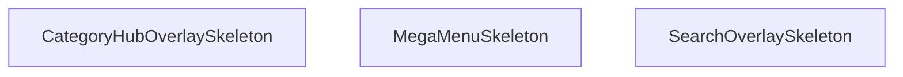

## NODE ID STANDARD

  file: src\components\StickyHeader.tsx
  function: src\components\StickyHeader.tsx::SearchOverlaySkeleton
  function: src\components\StickyHeader.tsx::MegaMenuSkeleton
  function: src\components\StickyHeader.tsx::CategoryHubOverlaySkeleton

---

## DISA AKTARILANLAR (EXPORTS)
  export: CategoryHubOverlaySkeleton
  export: MegaMenuSkeleton
  export: SearchOverlaySkeleton

---

## STİL TOKENLERİ

### Arbitrary Değerler (token'a geçirilmemiş)
Yok — tüm stiller token'a geçirilmiş. ✅

### Kullanılan Token'lar (zaten token'a geçirilmiş)
- (yok)

### Tailwind Sınıf Özeti
- **Renkler:** `bg-gradient-to-r`, `bg-slate-900/50`, `bg-slate-950/70`, `bg-white`, `bg-white/95`, `border-b`, `border-slate-100`, `border-slate-200`, `border-t`, `from-primary-navy`, `hover:bg-air-blue/20`, `hover:bg-air-blue/25`, `hover:bg-red-50`, `hover:text-primary-navy`, `hover:text-red-600`
- **Layout:** `-right-2`, `-top-2`, `absolute`, `backdrop-blur-md`, `backdrop-blur-sm`, `block`, `fixed`, `flex`, `flex-1`, `from-primary-navy`, `gap-1.5`, `gap-2.5`, `gap-3`, `h-16`, `h-5`
- **Varyant/Responsive:** `:`, `hover:`, `lg:`, `md:`, `sm:`, `xl:` önekleri
- **Yardımcı Sınıflar:** `${isUserMenuOpen`, `:`, `animate-pulse`, `border`, `duration-300`, `font-bold`, `font-medium`, `font-semibold`, `group`, `hover:-translate-y-0.5`, `inset-0`, `md:px-4`, `mt-3`, `opacity-100`, `px-2`

---
# FILE: src\components\SubcategoryFlow.md

---
domain: general
source_type: doc
namespace_type: module
source_path: C:\Users\alize\venthub-hvac\src\components\SubcategoryFlow.tsx
skeleton_hash: 2ba496ffc2012924
entity_hashes:
  func:ScrollingLane: f84481d0c85d01e8
  func:SubcategoryCard: cd96e8043ed6039d
  func:SubcategoryFlow: 9dafb4b55b36d1b9
  overview: 55b8eed097840887
  style_tokens: 329d32771128cbd3
generated_at: 2026-06-08T10:08:36Z
---

## Genel Bakış
VentHub HVAC platformunda ana kategorilere bağlı alt kategorileri etkileşimli bir akış (kaydırılabilir kartlar) olarak sunan React modülüdür. Modül, alt kategorileri bireysel kartlar halinde gösteren ve bu kartları belirli bir yönde kaydıran bileşenlerden oluşur. Kullanıcılar, bu akış sayesinde ilgili alt kategorilere kolayca göz atabilir ve erişebilir.

## Fonksiyon Grupları
### Akış Kontrolcüsü
Modülün üst düzey bileşeni olarak, tüm alt kategori akışının yapılandırmasını ve başlık gibi genel ayarlarını yönetir. Diğer alt bileşenleri bir araya getirerek tutarlı bir arayüz sunar.
- SubcategoryFlow

### Kaydırma ve Kart Gösterimi
Alt kategorilerin kaydırılabilir bir şerit (kanal) içinde düzenlenmesini ve her bir alt kategorinin kart olarak görselleştirilmesini sağlar. Kaydırma yönü ve hızı gibi parametrelerle akışın akıcılığı ve kullanıcı deneyimi kontrol edilebilir.
- ScrollingLane, SubcategoryCard

---

## AXIOMS – Mimari Varsayımlar

Bu modül için temel mimari varsayımlar, bileşenlerin doğru veri tiplerine ve işlevsel parametrelere dayanır.

**[Aksiyom 1]:** `SubcategoryCard` bileşeni için `subcategory` prop'u sağlanmazsa, bileşen düzgün render edilemez ve olası bir hataya yol açar (bu durum, parent bileşenin `subcategories` dizisindeki her eleman için bu bileşeni çağırmasıyla yönetilir).

**[Aksiyom 2]:** `ScrollingLane` bileşeni için `direction` parametresi `'left'` veya `'right'` değerlerinden biri olarak belirtilmezse, bileşen beklenmeyen bir yönde kaydırma yaparak kullanıcı arayüzünde tutarsızlığa neden olur.

**[Aksiyom 3]:** `ScrollingLane` bileşeni için `speed` parametresi, kaydırma hızını belirleyen pozitif bir sayısal değer olarak sağlanmazsa, animasyonun süresi veya hızı tanımsız olur ve kaydırma efekti çalışmaz.

**[Aksiyom 4]:** `SubcategoryFlow` ana bileşeni, `SubcategoryCard` bileşenini çağırırken her bir `subcategory` objesinin `ScrollingLane` bileşeninin beklediği `DomainCategory` tipine uygun verileri içermesi gerekir; aksi halde bileşenler arası veri akışı bozulur.

**[Aksiyom 5]:** `SubcategoryFlow` bileşeni, `title` prop'u verilmediğinde varsayılan `'Alt Kategoriler'` değerini kullanır; bu değer, akışın üst kısmında görüntülenecek metin için bir gerekliliktir.

---

## FONKSİYON DETAYLARI

### SubcategoryCard
**Ne yapar**: Tek bir alt kategoriyi tıklanabilir bir kart olarak render eder. Kullanıcı bu karta tıklandığında ilgili kategori sayfasına yönlendirilir. Kart, ikon, başlık ve hover durumunda ok ikonu gibi görsel elemanları içerir.

**Nasıl yapar**: `Link` bileşeni içinde `div` yapısı oluşturarak kartı tasarlar. Hover durumunda ölçeklendirme, gölge ve renk geçiş efektleri uygulanır. `getCategoryDisplayName` fonksiyonu ile kategorinin gösterilecek adını alır ve ilk harfi ikon dairesinde, tamamı başlık alanında gösterilir.

**Parametreler**:
- subcategory: `DomainCategory` — Gösterilecek alt kategori nesnesi, id ve slug gibi bilgileri içerir
- parentSlug: `string` — Üst kategorinin URL slug'ı, link oluşturma için kullanılır

**Dönüş**: `React.JSX.Element` — Oluşturulan kart JSX'i döner

### ScrollingLane
**Ne yapar**: Birden fazla alt kategori öğesini kaydırılabilir bir yatay şerit içinde sunan React bileşenidir. Kullanıcıların çok sayıda alt kategori arasında kolayca gezinebilmesini sağlar, kaydırma yönü ve hızı gibi özellikler isteğe bağlı olarak özelleştirilebilir. Genellikle ekran alanını verimli kullanmak için yatay kaydırılabilir liste ihtiyacını karşılar.
**Nasıl yapar**: Aldığı alt kategori dizisindeki her bir öğe için SubcategoryCard bileşenini çağırarak şerit içinde sırayla listeler. Tanımlanan kaydırma yönü ve hız değerlerine göre içindeki kaydırma mantığını çalıştırır, hem otomatik kaydırma hem de kullanıcı sürüklemesi ile kaydırma desteğini sağlar. Tüm alt kategori kartlarına parentSlug değerini ileterek her karttaki navigasyon bağlantılarının doğru çalışmasını garanti eder.
**Parametreler**:
- subcategories: DomainCategory[] — Şerit içinde gösterilecek tüm alt kategorilerin metaverilerini içeren nesne dizisidir, listedeki her öğe tek bir alt kategoriyi temsil eder.
- parentSlug: string — Tüm alt kategorilerin ait olduğu ortak ana kategorinin URL dostu benzersiz kimliğidir, alt kategori kartlarındaki navigasyon rotalarının oluşturulmasında kullanılır.
- direction?: 'left' | 'right' — Kaydırma şeridinin hareket yönünü belirten isteğe bağlı parametredir, varsayılan değeri 'left' olarak atanmıştır, istenirse sağa doğru kaydırma ayarlanabilir.
- speed?: number — Kaydırma hareketinin hızını belirten isteğe bağlı sayısal parametredir, varsayılan değeri 25 olarak tanımlanmıştır, ihtiyaca göre hız ayarı yapılabilir.
**Dönüş**: Belirtilmiş resmi bir dönüş tipi paylaşılmamıştır, React bileşeni olarak kaydırılabilir şerit arayüzünü JSX formatında üretir.

### SubcategoryFlow
**Ne yapar**: Tüm alt kategori akışını bir arada yöneten ana kapsayıcı React bileşenidir. Altında yer alan ScrollingLane ve SubcategoryCard gibi alt bileşenleri birleştirerek bütüncül bir alt kategori listeleme arayüzü sunar. Bölüm başlığının özelleştirilebilmesini sağlayarak farklı kullanım senaryolarına uyum sağlar.
**Nasıl yapar**: Varsayılan olarak 'Alt Kategoriler' olarak tanımlanan bölüm başlığını alır, arayüzünün üst kısmında bu başlığı gösterir. Başlığın hemen altına ScrollingLane bileşenini yerleştirerek tüm alt kategorilerin kaydırılabilir bir şerit içinde sunulmasını sağlar. Tüm alt kategori akışının genel düzenini, stilini ve işlevselliğini tek merkezden yöneterek tutarlılık sağlar.
**Parametreler**:
- title?: string — Alt kategori akış bölümünün en üstünde gösterilecek başlığı belirten isteğe bağlı parametredir, varsayılan değeri 'Alt Kategoriler' olarak atanmıştır, istenirse özel bir başlık tanımlanabilir.
**Dönüş**: SubcategoryFlowProps tipinde prop alan bir React Fonksiyonel Bileşeni (React.FC) döndürür. Bu dönen bileşen, tüm alt kategori akış arayüzünü ekranda render ederek kullanıcıya sunar.

---

## INTERFACES

### SubcategoryCardProps
- `subcategory: DomainCategory`
- `parentSlug: string`

### SubcategoryFlowProps
- `title?: string`

---

## AST POINTERS

### [N1_NASIL] AST Pointer: SubcategoryFlow.tsx::SubcategoryCard
- **params**: `(subcategory: SubcategoryCardProps['subcategory'], parentSlug: string)`
- **ic_degiskenler**: (yok — saf render fonksiyonu, yerel değişken yok)
- **Dönüş**: JSX (Link bileşeni sarmaladığı bir div kart yapısı)

### [N2_NASIL] AST Pointer: SubcategoryFlow.tsx::ScrollingLane
- **params**: `(subcategories: DomainCategory[], parentSlug: string, direction: 'left' | 'right' (varsayılan 'left'), speed: number (varsayılan 25))`
- **ic_degiskenler**:
  - `items` — `subcategories` dizisinin 3 kez tekrarlanarak birleştirilmiş hali (`[...subcategories, ...subcategories, ...subcategories]`); kesintisiz döngüsel kaydırma animasyonu sağlamak için kullanılır
- **Dönüş**: JSX (overflow-hidden container içinde `flex gap-3` ile kaydırma animasyonlu `SubcategoryCard` listesi)

### [N3_NASIL] AST Pointer: SubcategoryFlow.tsx::SubcategoryFlow
- **params**: `(title: string (varsayılan 'Alt Kategoriler'))`
- **ic_degiskenler**:
  - `allCategories` — `useCategories()` hook'undan gelen tüm kategoriler dizisi (`categories` destructured alanı)
  - `loading` — `useCategories()` hook'undan gelen yükleme durumu boolean değeri
  - `subcategoriesWithParent` — `useMemo` ile hesaplanan; her alt kategorinin `parentSlug` eşlik ettiği `{ subcategory, parentSlug }` nesnelerinden oluşan dizi; `allCategories` bağımlılığı ile memoize edilir
  - `mainCategories` — (useMemo içi) `parent_id`'si olmayan üst kategoriler (`allCategories.filter(c => !c.parent_id)`)
  - `subCategories` — (useMemo içi) `parent_id`'si olan alt kategoriler (`allCategories.filter(c => !!c.parent_id)`)
  - `mainCategoryMap` — (useMemo içi) üst kategorilerin `id` Anahtarlı `Map` yapısı; alt kategorilerin parent'ını bulmak için kullanılır
  - `sub` — (useMemo map callback'i) o an işlenen alt kategori nesnesi
  - `parent` — (useMemo map callback'i) `mainCategoryMap.get(sub.parent_id || '')` ile bulunan üst kategori nesnesi; `parent?.slug` değeri `parentSlug` olarak döndürülür
  - `s` — (useMemo filter callback'i) her bir `{ subcategory, parentSlug }` çifti; `s.parentSlug` dolu olan ve `s.subcategory.slug !== s.parentSlug` koşulunu sağlayanlar filtrelenir
  - `lane1` — `useMemo` ile `subcategoriesWithParent` dizisinin çift indeksli (`i % 2 === 0`) elemanları; birinci kaydırma şeridi için kullanılır
  - `lane2` — `useMemo` ile `subcategoriesWithParent` dizisinin tek indeksli (`i % 2 === 1`) elemanları; ikinci kaydırma şeridi için kullanılır
- **Dönüş**: `React.FC<SubcategoryFlowProps>` — JSX (`<section>` içinde başlık, animasyon `<style>` bloğu, iki adet `ScrollingLane` ve gradient overlay'ler) veya `loading` durumunda skeleton placeholder JSX'i veya `subcategoriesWithParent.length < 4` koşulunda `null`

---


## MERMAID CALL GRAPH
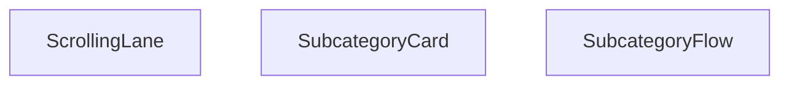

## NODE ID STANDARD

  file: src\components\SubcategoryFlow.tsx
  function: src\components\SubcategoryFlow.tsx::SubcategoryCard
  function: src\components\SubcategoryFlow.tsx::ScrollingLane
  function: src\components\SubcategoryFlow.tsx::SubcategoryFlow

---

## DISA AKTARILANLAR (EXPORTS)
  export: ScrollingLane
  export: SubcategoryCard
  export: SubcategoryFlow

---

## STİL TOKENLERİ

### Arbitrary Değerler (token'a geçirilmemiş)
Yok — tüm stiller token'a geçirilmiş. ✅

### Kullanılan Token'lar (zaten token'a geçirilmiş)
- (yok)

### Tailwind Sınıf Özeti
- **Renkler:** `bg-gradient-to-br`, `bg-gradient-to-l`, `bg-gradient-to-r`, `bg-gray-50`, `bg-white`, `border-gray-200`, `from-blue-50`, `from-white`, `group-hover:from-blue-100`, `group-hover:text-blue-700`, `group-hover:to-blue-200`, `hover:border-blue-300`, `sm:text-xl`, `text-blue-500`, `text-blue-600`
- **Layout:** `absolute`, `bottom-3`, `flex`, `flex-shrink-0`, `from-blue-50`, `from-white`, `gap-3`, `group-hover:from-blue-100`, `h-10`, `h-24`, `hover:shadow-md`, `items-center`, `justify-center`, `left-0`, `left-1/2`
- **Varyant/Responsive:** `:`, `group-hover:`, `hover:`, `lg:`, `md:`, `sm:` önekleri
- **Yardımcı Sınıflar:** `${direction`, `-translate-x-1/2`, `:`, `===`, `animate-pulse`, `animate-subcat-scroll-left`, `animate-subcat-scroll-right`, `border`, `duration-300`, `font-bold`, `font-semibold`, `group`, `group-hover:opacity-100`, `hover:scale-105`, `inset-y-0`

---
# FILE: src\components\TiltCard.md

---
domain: general
source_type: doc
namespace_type: module
source_path: C:\Users\alize\venthub-hvac\src\components\TiltCard.tsx
skeleton_hash: 11168335cd8d8a31
entity_hashes:
  func:TiltCard: bfd1d2a43ccba8c3
  func:clamp: 6b6f2a3bb4b3c92e
  func:onEnter: 6efee232fcfe2e0b
  func:onLeave: 47432f2c7853fc8a
  func:onMove: 855a2394d5f31485
  overview: 49812a020a38dab5
  style_tokens: 9c70068ed275c69c
generated_at: 2026-06-12T10:19:16Z
---

## Genel Bakış
TiltCard, fare etkileşimleriyle üç boyutlu eğilme efekti sunan interaktif bir React kart bileşenidir. Kullanıcı faresini kart üzerinde hareket ettirdiğinde, kart真实世界'deki bir nesne gibi eğilerek modern ve dinamik bir görsel deneyim yaratır. Maksimum eğilme açısı dışarıdan özelleştirilebilir.

## Fonksiyon Grupları
### Ana Bileşen
TiltCard'ın temel yapısını oluşturarak içeriği sarar ve eğilme efekti için yapılandırma parametrelerini tanımlar. Bu grup, bileşenin dışarıya açılan arayüzünü ve yaşam döngüsünü yönetir.
- TiltCard

### Fare Etkileşim Yöneticileri
Kullanıcının kart üzerindeki fare hareketlerini yakalayarak eğilme hesaplamalarını tetikler. Fare kart üzerine geldiğinde, hareket ettiğinde ve ayrıldığında分别 ilgili efekt başlangıç, güncelleme ve bitiş işlemlerini yürütür.
- onMove, onEnter, onLeave

### Değer Sınırlandırma Aracı
Eğilme açısı gibi hesaplanan sayısal değerleri tanımlı minimum ve maksimum aralıkta tutarak efektin kontrollü çalışmasını garanti eder. Aşırı değerlerin önüne geçerek görsel tutarlılığı korur.
- clamp

---

## AXIOMS – Mimari Varsayımlar
Bu modül, fare hareketleriyle 3D eğilme efekti yaratan bir React bileşeni olduğundan, aşağıdaki mimari varsayımlar modülün doğru çalışması için zorunludur.

[Aksiyom 1]: Eğer `clamp` fonksiyonu için `min` parametresi, `max` parametresinden büyükse, fonksiyon beklenmedik sonuçlar döndürür veya başarısız olur.
[Aksiyom 2]: Eğer `TiltCard` bileşeni için `maxTilt` parametresi negatif bir sayı olarak sağlanırsa, eğilme açısı hesaplamaları anlamsız hale gelir ve bileşen düzgün çalışmaz.
[Aksiyom 3]: Eğer `onMove`, `onEnter` veya `onLeave` olay işleyicileri bir React olay nesnesi (örn. `React.MouseEvent`) içermeyen farklı bir argümanla çağrılırsa, bileşenin iç durumu tutarsız hale gelir ve eğilme efekti bozulur.
[Aksiyom 4]: Eğer modül, React'ın bileşen yaşam döngüsü ve durum yönetimi (useState, useEffect) mekanizmalarından yoksun bir ortamda çalıştırılmaya çalışılırsa, bileşen işlevsel olmaz.
[Aksiyom 5]: Eğer `TiltCard` bileşeni fare olaylarını (`mousemove`, `mouseenter`, `mouseleave`) tetikleyemeyen bir ortamda (örn. dokunmatik cihazlar) kullanılırsa, eğilme efekti tetiklenemez; ancak bileşen statik olarak görüntülenebilir.

---

## FONKSİYON DETAYLARI

### clamp
**Ne yapar**: Bir sayısal değeri, belirtilen minimum ve maximum sınırlar arasında sıkıştırır (clipping). Değer aralık dışındaysa en yakın sınaira sabitlenir.

**Nasıl yapar**: Fonksiyon, verilen `v` değerini `min` ve `max` değerleri ile karşılaştırır. `v`, `min` değerinden küçükse `min` değerini, `max` değerinden büyükse `max` değerini, aksi halde `v` değerinin kendisini döndürür. Bu, genellikle mouse hareketi veya animasyon hesaplamalarında değerin kontrollü kalmasını sağlamak için kullanılır.

**Parametreler**:
- v: number — Sınırlanacak olan sayısal değer
- min: number — İzin verilen değer aralığının alt sınırı
- max: number — İzin verilen değer aralığının üst sınırı

**Dönüş**: Fonksiyonun dönüş tipi sağlanan bilgide açıkça belirtilmemiştir. Ancak bu tür clamp fonksiyonları genellikle number tipinde değer döndürür.

### TiltCard
**Ne yapar**: Fare hareketlerine göre eğme (tilt) efekti uygulayan, tekrarlanabilir bir React bileşenidir. İçerisindeki tüm çocuk içerikleri sarmalayarak, kullanıcı kartla etkileşime girdiğinde 3D benzeri eğim efekti sunar. Maksimum eğme açısı dışarıdan yapılandırılabilir, varsayılan bir değerle kullanıma hazırdır.
**Nasıl yapar**: Kendi bünyesinde fare olaylarını izleyen onMove, onEnter, onLeave işleyicilerini barındırır, bu işleyicileri ana kapsayıcı div elementine bağlar. Eğme hesaplamalarında clamp fonksiyonunu kullanarak açının sınırları aşmasını engeller, aldığı maxTilt değerini tüm eğme hesaplamalarında temel alır. İçerisine gelen children prop'unu kendi içindeki kapsayıcıda render ederek efekti içeriğe uygular.
**Parametreler**:
- name: children — type: React.ReactNode — Bileşen içerisinde gösterilecek, eğme efekti uygulanacak tüm içerik, her türlü React tarafından desteklenen iç öğe olabilir.
- name: maxTilt — type: number — Kartın uygulayabileceği maksimum eğme açısı, isteğe bağlı olarak dışarıdan değer geçirilebilir, varsayılan olarak 18 derece olarak ayarlanmıştır.
**Dönüş**: React.FC<React.PropsWithChildren<{ maxTilt?: number }>> tipinde bir React bileşeni döndürür, çocuklu yapıyı destekler, maxTilt prop'unu opsiyonel olarak kabul eden tür yapısına sahiptir.

### onMove
**Ne yapar**: TiltCard bileşeninin alanı üzerinde fare hareket ettiğinde tetiklenen olay işleyicisidir, anlık fare konumuna göre kartın eğme miktarını hesaplayıp günceller. Kullanıcının fare hareketlerini eğme açısına dönüştürerek akıcı bir 3D efekti sağlar.
**Nasıl yapar**: Fare olayından gelen konum verilerini alır, TiltCard'ın boyutlarını ve sayfa üzerindeki konumunu hesaplar, elde edilen koordinatları eğme açısına çevirir. Hesaplanan açının maxTilt sınırını aşmasını clamp fonksiyonuyla engeller, sürekli güncellenen değerle kartın eğimini akıcı bir şekilde değiştirir.
**Parametreler**:
- name: e — type: React.MouseEvent<HTMLDivElement> — Tetiklenen fare hareketi olayının tüm detaylarını içeren nesne, fare konumu, hedef element gibi tüm gerekli verilere erişim sağlar.
**Dönüş**: HTMLDivElement elementleri için uyumlu React.MouseEventHandler<HTMLDivElement> tipinde bir olay işleyicisi döndürür, fare hareketi olaylarını yakalayıp işlemek üzere yapılandırılmıştır.

### onEnter
**Ne yapar**: TiltCard bileşeninin kapsama alanına fare ilk girdiğinde tetiklenen olay işleyicisidir, eğme efektinin başlatılmasını ve gerekli tüm başlangıç durumlarının ayarlanmasını sağlar. Kullanıcının kartla etkileşime geçtiğini algılayarak efekti aktif hale getirir.
**Nasıl yapar**: Fare kartın alanına girdiğinde animasyon geçişlerini aktif eder, eğme hesaplamaları için gereken ilk konum ve durum değerlerini ayarlar, olası gecikmeleri önlemek için gerekli ön yüklemeleri yapar, kullanıcının ilk etkileşimini algılayarak efektin sorunsuz başlamasını sağlar.
**Parametreler**:
- name: e — type: React.MouseEvent<HTMLDivElement> — Fare giriş olayının tüm detaylarını içeren, hedef element ve olay metriklerini barındıran React fare olay nesnesi.
**Dönüş**: HTMLDivElement elementleri için uyumlu React.MouseEventHandler<HTMLDivElement> tipinde bir olay işleyicisi döndürür, fare element alanına giriş olayını yakalamak üzere yapılandırılmıştır.

### onLeave
**Ne yapar**: TiltCard bileşeninin kapsama alanından fare çıkış yaptığında tetiklenen olay işleyicisidir, eğme efektinin sonlandırılıp kartın orijinal varsayılan konumuna dönmesini sağlar. Kullanıcının kartla etkileşimini bitirdiğini algılayarak tüm geçici durumları temizler.
**Nasıl yapar**: Fare kartın alanından çıktığında mevcut eğme açılarını sıfırlar, animasyonlu bir geçişle kartın orijinal konumuna dönmesini sağlar, etkileşim sırasında oluşturulan tüm geçici durum değerlerini temizler, bir sonraki etkileşime hazır hale getirir.
**Parametreler**: Herhangi bir harici parametre almaz, iç mantığında olay nesnesini kullanarak işlemlerini gerçekleştirir.
**Dönüş**: HTMLDivElement elementleri için uyumlu React.MouseEventHandler<HTMLDivElement> tipinde bir olay işleyicisi döndürür, fare element alanından çıkış olayını yakalamak üzere yapılandırılmıştır.

---

## AST POINTERS

### [N1_NASIL] AST Pointer: TiltCard.tsx::clamp
- **params**: `(v: number, min: number, max: number)`
- **ic_degiskenler**: (fonksiyon gövdesi verilmemiş, çağrı侧dan çağrılmış)
- **Dönüş**: number — v değerini min ve max arasında sıkıştırılmış olarak döndürür

---


## MERMAID CALL GRAPH
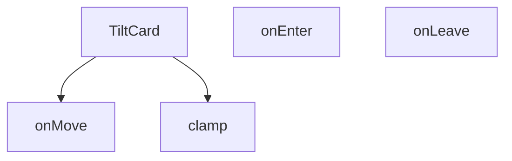

## NODE ID STANDARD

  file: src\components\TiltCard.tsx
  function: src\components\TiltCard.tsx::clamp
  function: src\components\TiltCard.tsx::TiltCard
  function: src\components\TiltCard.tsx::onMove
  function: src\components\TiltCard.tsx::onEnter
  function: src\components\TiltCard.tsx::onLeave

---

## DISA AKTARILANLAR (EXPORTS)
  export: TiltCard
  export: clamp

---

## STİL TOKENLERİ

### Arbitrary Değerler (token'a geçirilmemiş)
Yok — tüm stiller token'a geçirilmiş. ✅

### Kullanılan Token'lar (zaten token'a geçirilmiş)
- (yok)

### Tailwind Sınıf Özeti
- **Renkler:** (yok)
- **Layout:** `absolute`, `relative`
- **Varyant/Responsive:** `group-hover:` önekleri
- **Yardımcı Sınıflar:** `duration-200`, `group`, `group-hover:opacity-100`, `inset-0`, `opacity-0`, `pointer-events-none`, `rounded-xl`, `transition-opacity`, `transition-transform`, `will-change-transform`

---
# FILE: src\components\UndecidedUserCTA.md

---
domain: general
source_type: doc
namespace_type: module
source_path: C:\Users\alize\venthub-hvac\src\components\UndecidedUserCTA.tsx
skeleton_hash: 4602fa6ee6d31113
entity_hashes:
  func:UndecidedUserCTA: e9ab9b6769bffef9
  overview: 568957f343e21561
  style_tokens: d1dc68fb1553bbf5
generated_at: 2026-06-08T10:08:36Z
---

## Genel Bakış
Venthub HVAC platformunda henüz kendi yolunu çizememiş kararsız kullanıcıları hedefleyen bir React bileşenidir. Platformdaki olası adımları ve seçenekleri net bir şekilde sunarak kullanıcıları harekete geçmeye yönlendirir.

## Fonksiyon Grupları
### Kararsız Kullanıcı Yönlendirme Bileşeni
Platforma henüz tam olarak entegre olamamış veya hangi adımı atacağına karar verememiş kullanıcılar için eyleme çağrı (CTA) içeriğini ekrana render eder. Tek başına çalışan bağımsız bir sunum bileşenidir.
- UndecidedUserCTA

---

## AXIOMS – Mimari Varsayımlar

Bu bileşen, parametresiz olarak çağrılan ve JSX döndüren bir React bileşenidir.

[Aksiyom 1]: Eğer UndecidedUserCTA bileşeni props (özellik) almadan çağrılırsa, bileşen içeriği tamamen kendi iç state'ine veya sabit değerlere dayanarak render edilir.

[Aksiyom 2]: Eğer bileşen bir React component olarak tanımlanmışsa, çağrıldığında geçerli bir JSX/ReactNode yapısı döndürmek zorundadır; aksi halde React render hatası oluşur.

[Aksiyom 3]: Eğer bileşen parametresiz tanımlanmışsa, dışarıdan özelleştirme (metin, renk, eylem callback'i vb.) yapılamaz; bileşen içeriği sabittir veya iç state tarafından kontrol edilir.

---

## FONKSİYON DETAYLARI

### UndecidedUserCTA
**Ne yapar**: VentHub HVAC projesinin kullanıcı arayüzünde, henüz herhangi bir işlem yapmamış veya karar vermemiş kararsız kullanıcılar için harekete geçirme çağrısı (CTA) sunan bir React fonksiyonel bileşenidir. Kullanıcıları ilgili aksiyonlara yönlendiren içerikler ve etkileşimli öğeler barındıran, projenin genelinde yeniden kullanılabilir bir arayüz katmanı oluşturur.
**Nasıl yapar**: Projenin src/components klasöründe konumlanan, yeniden kullanılabilir React bileşi standartlarında yapılandırılmıştır. Kendi iç yapısını bağımsız olarak yönetir, gerekli kullanıcı arayüzü öğelerini import ederek kararsız kullanıcı profiline özel içerikleri ekranda render eder. Herhangi bir harici durum bağımlılığı olmadan, çağrıldığı her yerde tutarlı bir CTA deneyimi sunar.
**Parametreler**:
- Bu fonksiyon herhangi bir giriş parametresi almaz, bağımsız çalışacak şekilde tasarlanmıştır.
**Dönüş**: React.FC türünde bir React fonksiyonel bileşeni döndürür. Döndürülen bu bileşen, tarayıcıda kullanıcıya görünür şekilde render edilebilen, kararsız kullanıcıları yönlendiren tüm CTA öğelerini içeren React node'larını barındırır. Proje içindeki tüm ilgili sayfalarda bu dönüş değeri kullanılarak bileşen ilgili yere yerleştirilir.

---

## AST POINTERS

### [N1_NASIL] AST Pointer: src/components/UndecidedUserCTA.tsx::UndecidedUserCTA
- **params**: (parametre yok — fonksiyon Arrow function olarak tanımlı, parametre almıyor)
- **ic_degiskenler**:
  - `t` — `useI18n()` hook'undan destructuring ile elde edilen çeviri fonksiyonu; JSX içinde `t('undecidedUserCta.title')`, `t('undecidedUserCta.description')`, `t('undecidedUserCta.buttonText')` çağrılarıyla lokalize metinler render eder
- **Dönüş**: JSX (React element) — `div` sarmalayıcı içinde gradient arka planlı, responsive bir CTA (Call To Action) kartı; `MessageSquare` ikonu, `t()` ile çevrilmiş başlık/açıklama metni, ve `Link` bileşeni içeren `Routes.contact('consulting')` href'li buton döner
- **Yan etkiler**: Yok (saf bileşen, state değiştirmez, side-effect tetiklemez)
- **Referanslanan dış kaynaklar**: `useI18n()` hook'u, `Routes.contact()` helper'ı, `ArrowRight` ve `MessageSquare` lucide-react ikonları, `Link` Next.js bileşeni

---

## NODE ID STANDARD

  file: src\components\UndecidedUserCTA.tsx
  function: src\components\UndecidedUserCTA.tsx::UndecidedUserCTA

---

## DISA AKTARILANLAR (EXPORTS)
  export: UndecidedUserCTA

---

## STİL TOKENLERİ

### Arbitrary Değerler (token'a geçirilmemiş)
Yok — tüm stiller token'a geçirilmiş. ✅

### Kullanılan Token'lar (zaten token'a geçirilmiş)
- (yok)

### Tailwind Sınıf Özeti
- **Renkler:** `bg-gradient-to-r`, `bg-white`, `bg-white/10`, `bg-white/20`, `from-primary-navy`, `sm:text-2xl`, `sm:text-base`, `text-primary-navy`, `text-sm`, `text-white`, `text-white/80`, `text-xl`, `to-secondary-blue`
- **Layout:** `absolute`, `backdrop-blur-sm`, `bottom-0`, `flex`, `flex-col`, `from-primary-navy`, `gap-2`, `gap-5`, `gap-6`, `h-12`, `h-32`, `h-64`, `hover:shadow-xl`, `inline-flex`, `items-center`
- **Varyant/Responsive:** `group-hover:`, `hover:`, `md:`, `sm:` önekleri
- **Yardımcı Sınıflar:** `-translate-x-1/3`, `-translate-y-1/2`, `blur-2xl`, `blur-3xl`, `font-bold`, `group`, `group-hover:translate-x-1`, `hover:scale-102`, `leading-relaxed`, `mb-12`, `mb-2`, `mt-8`, `px-6`, `py-3.5`, `rounded-2xl`

---
# FILE: src\components\VisualShowcase.md

---
domain: general
source_type: doc
namespace_type: module
source_path: C:\Users\alize\venthub-hvac\src\components\VisualShowcase.tsx
skeleton_hash: aff37f07cc40274b
entity_hashes:
  func:ChevronLeftIcon: 528282355948f0bf
  func:ChevronRightIcon: eee2ea0200791ea6
  func:PauseIcon: ceb957c4aff5f7b7
  func:PlayIcon: 0708496e420e6f6e
  func:VisualShowcase: 41ca766f4149219c
  func:onTouchEnd: 6d11887cdcd98ede
  func:onTouchStart: e808a6bab1256660
  func:usePrefersReducedMotion: 11085ad489b48f61
  overview: 7e4ec691259cb85e
  style_tokens: 2f11e16677a4f30c
generated_at: 2026-06-08T10:08:36Z
---

## Genel Bakış
`VisualShowcase` modülü, kaydırılabilir görsel içerikleri sunan bir React bileşenidir. Kullanıcıların hareket azaltma tercihine duyarlı olup, dokunmatik ve fare etkileşimlerini yönetir; aynı zamanda gezinme ve medya kontrolü için özelleştirilebilir ikon bileşenleri sağlar.

## Fonksiyon Grupları
### Erişilebilirlik ve Bileşen Koordinasyonu  
Bu grup, bileşenin genel davranışını yöneten ve kullanıcı tercihlerini (reduced motion) dikkate alan yardımcı fonksiyonları içerir.  
- usePrefersReducedMotion, VisualShowcase  

### Dokunmatik Etkileşim İşleyicileri  
Mobil cihazlarda kaydırma ve dokunma hareketlerini algılayarak slayt geçişlerini kontrol eden olay yöneticileri.  
- onTouchStart, onTouchEnd  

### UI İkon Bileşenleri  
Gezinme ve oynatma/duraklatma kontrolleri için kullanılan, boyut ve stil özelleştirmesine izin veren yeniden kullanılabilir ikon bileşenleri.  
- ChevronLeftIcon, ChevronRightIcon, PauseIcon, PlayIcon

---

## AXIOMS – Mimari Varsayımlar
(Sentez hatası)

---

## FONKSİYON DETAYLARI

### usePrefersReducedMotion
**Ne yapar**: Kullanıcının “reduce motion” tercihini izler ve bu tercihe göre bir boolean değer döndürür.  
**Nasıl yapar**: `useState` ile `reduced` adında bir durum oluşturur, `useEffect` içinde `window.matchMedia('(prefers-reduced-motion: reduce)')` sorgusunu dinler, değişiklik olduğunda `setReduced` ile günceller ve bileşen unmount olduğunda dinleyiciyi temizler.  
**Parametreler**:  
- *yok*  
**Dönüş**: `boolean` – `true` ise kullanıcı hareketi azaltmayı tercih eder, `false` ise tercih etmez.

### VisualShowcase
**Ne yapar**: Projenin görsel gösterim bileşenini tanımlar; dışarıdan bir React fonksiyonel bileşen (FC) olarak kullanılabilir.  
**Nasıl yapar**: Kaynak kodu verilmemiştir; ancak isimlendirmeden ve dosya yolundan, UI içinde çeşitli ikon ve dokunma olaylarını yöneten bir gösterim bileşeni olduğu anlaşılır.  
**Parametreler**:  
- *yok*  
**Dönüş**: `React.FC` – bir React fonksiyonel bileşenidir.

### onTouchStart
**Ne yapar**: Dokunma (touch) başlangıç olayını yakalar; genellikle kaydırma veya sürükleme gibi etkileşimlerin başlangıcını işaret eder.  
**Nasıl yapar**: Fonksiyon gövdesi sağlanmamış olsa da, parametre olarak gelen `React.TouchEvent` nesnesini alır ve ilgili mantığı yürütür.  
**Parametreler**:  
- `e`: `React.TouchEvent` — Dokunma başlangıç olayının detaylarını içerir.  
**Dönüş**: Belirtilmemiş; tipik olarak `void`.

### onTouchEnd
**Ne yapar**: Dokunma (touch) bitiş olayını yakalar; kaydırma veya sürükleme gibi etkileşimlerin sonlandırılmasını işaret eder.  
**Nasıl yapar**: Fonksiyon gövdesi sağlanmamış olsa da, parametre olarak gelen `React.TouchEvent` nesnesini alır ve ilgili mantığı yürütür.  
**Parametreler**:  
- `e`: `React.TouchEvent` — Dokunma bitiş olayının detaylarını içerir.  
**Dönüş**: Belirtilmemiş; tipik olarak `void`.

### ChevronLeftIcon
**Ne yapar**: Sol yönlü bir ok (chevron) SVG ikonu üretir; UI’da gezinme veya geri yönlendirme için kullanılabilir.  
**Nasıl yapar**: `size` ve `className` prop’larını alır, bu değerlerle bir `<svg>` elementi oluşturur ve içinde sol yönlü polyline çizer.  
**Parametreler**:  
- `size`: `number` — İkonun genişlik ve yükseklik değerini belirler; varsayılan 18.  
- `className`: `string` — İkonun CSS sınıflarını eklemek için kullanılır; varsayılan boş string.  
**Dönüş**: JSX içinde bir `<svg>` elementi; React bileşeni olarak render edilir.

### ChevronRightIcon
**Ne yapar**: Sağ yönlü bir ok (chevron) SVG ikonu üretir; UI’da ileri yönlendirme için kullanılabilir.  
**Nasıl yapar**: `size` ve `className` prop’larını alır, bu değerlerle bir `<svg>` elementi oluşturur ve içinde sağ yönlü polyline çizer.  
**Parametreler**:  
- `size`: `number` — İkonun genişlik ve yükseklik değerini belirler; varsayılan 18.  
- `className`: `string` — İkonun CSS sınıflarını eklemek için kullanılır; varsayılan boş string.  
**Dönüş**: JSX içinde bir `<svg>` elementi; React bileşeni olarak render edilir.

### PauseIcon
**Ne yapar**: Duraklatma (pause) durumunu temsil eden iki dikdörtgen SVG ikonu üretir.  
**Nasıl yapar**: `size` ve `className` prop’larını alır, bu değerlerle bir `<svg>` elementi oluşturur ve içinde iki dikdörtgen çizer.  
**Parametreler**:  
- `size`: `number` — İkonun genişlik ve yükseklik değerini belirler; varsayılan 18.  
- `className`: `string` — İkonun CSS sınıflarını eklemek için kullanılır; varsayılan boş string.  
**Dönüş**: JSX içinde bir `<svg>` elementi; React bileşeni olarak render edilir.

### PlayIcon
**Ne yapar**: Oynatma (play) durumunu temsil eden üçgen SVG ikonu üretir.  
**Nasıl yapar**: `size` ve `className` prop’larını alır, bu değerlerle bir `<svg>` elementi oluşturur ve içinde bir üçgen (polygon) çizer.  
**Parametreler**:  
- `size`: `number` — İkonun genişlik ve yükseklik değerini belirler; varsayılan 18.  
- `className`: `string` — İkonun CSS sınıflarını eklemek için kullanılır; varsayılan boş string.  
**Dönüş**: JSX içinde bir `<svg>` elementi; React bileşeni olarak render edilir.

---

## AST POINTERS

### [N1_NASIL] AST Pointer: src/components/VisualShowcase.tsx::usePrefersReducedMotion
- **params**: (parametre yok)
- **ic_degiskenler**:
  - `reduced` — `useState` ile tanımlanan boolean, kullanıcının “reduce motion” tercihini tutar.
  - `setReduced` — `reduced` state'ini güncelleyen setter fonksiyonu.
  - `mq` — `window.matchMedia('(prefers-reduced-motion: reduce)')` sonucunda elde edilen MediaQueryList nesnesi.
  - `onChange` — `mq.matches` değerine göre `setReduced` çağıran callback.
- **Dönüş**: `boolean` (`reduced`)

### [N2_NASIL] AST Pointer: src/components/VisualShowcase.tsx::VisualShowcase
- **params**: (parametre yok)
- **ic_degiskenler**:
  - `t` — `useI18n` hookundan gelen çeviri fonksiyonu.
  - `index` — mevcut slide indeksini tutan state.
  - `setIndex` — `index` state'ini güncelleyen setter.
  - `playing` — otomatik oynatma (autoplay) durumunu belirten boolean state.
  - `setPlaying` — `playing` state'ini güncelleyen setter.
  - `startXRef` — dokunma başlangıç X koordinatını saklayan `useRef<number | null>`.
  - `containerRef` — carousel konteyner DOM elemanına referans veren `useRef<HTMLDivElement | null>`.
  - `reducedMotion` — `usePrefersReducedMotion` hookundan dönen değer.
  - `mounted` — bileşenin DOM'a monte edilip edilmediğini gösteren boolean state.
  - `isCoarse` — cihazın dokunmatik (coarse) işaretçi tipine sahip olup olmadığını belirten boolean.
  - `disableFancy` — reduced motion, coarse pointer veya dar ekran koşullarında fancy efektleri devre dışı bırakmak için kullanılan boolean.
  - `mouse` — `{x:number, y:number}` şeklinde fare konumunun yumuşatılmış değerlerini tutan state.
  - `setMouse` — `mouse` state'ini güncelleyen setter.
  - `slides` — `useMemo` ile oluşturulan sabit slide dizisi; her eleman `{title, subtitle, colorFrom, colorTo}` içerir.
  - `slidesCount` — `slides.length` değeri.
  - `prev` — önceki slide’a geçiş yapan `React.useCallback` fonksiyonu.
  - `next` — sonraki slide’a geçiş yapan `React.useCallback` fonksiyonu.
  - `onTouchStart` — dokunma başlangıcında `startXRef.current`'i ayarlayan fonksiyon.
  - `onTouchEnd` — dokunma bitişinde kaydırma mesafesini ölçüp `prev`/`next` çağıran fonksiyon.
  - `onKey` — klavye olaylarını dinleyen, ok tuşları ve boşluk ile kontrol sağlayan callback.
  - `el` — `containerRef.current` üzerinden elde edilen DOM elemanı (parallax hareketi için).
  - `onMove` — fare hareketlerini izleyip `mouse` state'ini yumuşak bir şekilde güncelleyen fonksiyon.
  - `canvasRef` — `<canvas>` elemanına referans veren `useRef<HTMLCanvasElement | null>`.
  - `particles` — `useMemo` ile oluşturulan 28 adet rastgele konum ve hız değerine sahip parçacık nesnesi dizisi.
  - `ctx` — `canvas.getContext('2d')` ile alınan 2D çizim bağlamı.
  - `raf` — `requestAnimationFrame` döngüsü için tutulan kimlik.
  - `render` — canvas üzerine parçacıkları çizen ve animasyonu sürdüren fonksiyon.
- **Dönüş**: `React.FC` (JSX öğesi döner; yan etkileri: DOM event listener ekleme, canvas çizimi, state güncellemeleri)

### [N3_NASIL] AST Pointer: src/components/VisualShowcase.tsx::onTouchStart
- **params**: `e: React.TouchEvent`
- **ic_degiskenler**:
  - `e` — dokunma olayı nesnesi.
- **Dönüş**: yok (sadece `startXRef.current` günceller)

### [N4_NASIL] AST Pointer: src/components/VisualShowcase.tsx::onTouchEnd
- **params**: `e: React.TouchEvent`
- **ic_degiskenler**:
  - `e` — dokunma bitiş olayı nesnesi.
  - `dx` — başlangıç X (`startXRef.current`) ile bitiş X arasındaki fark.
- **Dönüş**: yok (koşula göre `prev`/`next` çağırır ve `startXRef.current`i sıfırlar)

### [N5_NASIL] AST Pointer: src/components/VisualShowcase.tsx::ChevronLeftIcon
- **params**: `{ size = 18, className = '' }: { size?: number; className?: string }`
- **ic_degiskenler**:
  - `size` — SVG genişlik ve yükseklik değeri (default 18).
  - `className` — ek CSS sınıfları (default boş string).
- **Dönüş**: yok (JSX `<svg>` döner)

### [N6_NASIL] AST Pointer: src/components/VisualShowcase.tsx::ChevronRightIcon
- **params**: `{ size = 18, className = '' }: { size?: number; className?: string }`
- **ic_degiskenler**:
  - `size` — SVG genişlik ve yükseklik değeri (default 18).
  - `className` — ek CSS sınıfları (default boş string).
- **Dönüş**: yok (JSX `<svg>` döner)

### [N7_NASIL] AST Pointer: src/components/VisualShowcase.tsx::PauseIcon
- **params**: `{ size = 18, className = '' }: { size?: number; className?: string }`
- **ic_degiskenler**:
  - `size` — SVG genişlik ve yükseklik değeri (default 18).
  - `className` — ek CSS sınıfları (default boş string).
- **Dönüş**: yok (JSX `<svg>` döner)

### [N8_NASIL] AST Pointer: src/components/VisualShowcase.tsx::PlayIcon
- **params**: `{ size = 18, className = '' }: { size?: number; className?: string }`
- **ic_degiskenler**:
  - `size` — SVG genişlik ve yükseklik değeri (default 18).
  - `className` — ek CSS sınıfları (default boş string).
- **Dönüş**: yok (JSX `<svg>` döner)

---


## MERMAID CALL GRAPH
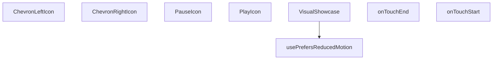

## NODE ID STANDARD

  file: src\components\VisualShowcase.tsx
  function: src\components\VisualShowcase.tsx::usePrefersReducedMotion
  function: src\components\VisualShowcase.tsx::VisualShowcase
  function: src\components\VisualShowcase.tsx::onTouchStart
  function: src\components\VisualShowcase.tsx::onTouchEnd
  function: src\components\VisualShowcase.tsx::ChevronLeftIcon
  function: src\components\VisualShowcase.tsx::ChevronRightIcon
  function: src\components\VisualShowcase.tsx::PauseIcon
  function: src\components\VisualShowcase.tsx::PlayIcon

---

## DISA AKTARILANLAR (EXPORTS)
  export: ChevronLeftIcon
  export: ChevronRightIcon
  export: PauseIcon
  export: PlayIcon
  export: VisualShowcase
  export: usePrefersReducedMotion

---

## STİL TOKENLERİ

### Arbitrary Değerler (token'a geçirilmemiş)
Yok — tüm stiller token'a geçirilmiş. ✅

### Kullanılan Token'lar (zaten token'a geçirilmiş)
- (yok)

### Tailwind Sınıf Özeti
- **Renkler:** `bg-gradient-to-br`, `bg-white`, `bg-white/10`, `bg-white/70`, `bg-white/80`, `hover:bg-white`, `lg:text-4xl`, `sm:text-3xl`, `sm:text-lg`, `text-2xl`, `text-base`, `text-center`, `text-industrial-gray`, `text-white`, `text-white/90`
- **Layout:** `-bottom-12`, `-left-16`, `-right-20`, `-top-10`, `absolute`, `bottom-2`, `drop-shadow-sm`, `flex`, `gap-2`, `h-10`, `h-2`, `h-48`, `h-64`, `h-80`, `h-full`
- **Varyant/Responsive:** `:`, `focus-visible:`, `hover:`, `lg:`, `sm:` önekleri
- **Yardımcı Sınıflar:** `${i`, `${s.colorFrom`, `${s.colorTo`, `-translate-x-1/2`, `:`, `===`, `blur-2xl`, `duration-700`, `ease-out`, `focus-visible:outline-none`, `focus-visible:ring-2`, `focus-visible:ring-offset-2`, `focus-visible:ring-primary-navy`, `font-bold`, `index`

---
# FILE: src\components\WhatsAppFloat.md

---
domain: general
source_type: doc
namespace_type: module
source_path: C:\Users\alize\venthub-hvac\src\components\WhatsAppFloat.tsx
skeleton_hash: f9391033c10cb376
entity_hashes:
  func:WhatsAppFloat: 594fe2409e378878
  overview: 27f525e3029fcecb
  style_tokens: fb346cbde40036cb
generated_at: 2026-06-08T10:08:36Z
---

## Genel Bakış
Bu modül, VentHub HVAC platformunda kullanılan, sayfa içerisinde gezinirken sabit konumda kalan yüzen WhatsApp iletişim butonunu oluşturan React UI bileşenidir. Kullanıcıların platformda gezinirken tek tıkla WhatsApp üzerinden yetkili ekiplerle iletişime geçmesini sağlamak amacıyla geliştirilmiştir, tek bir ana bileşenden oluşur.

## Fonksiyon Grupları
### Ana UI Bileşeni
Tüm yüzen WhatsApp butonunun görsel konumlandırılması, tıklama aksiyonları ve platform genelindeki davranışlarını yöneten tek ana React bileşenidir.
- WhatsAppFloat

---

## AXIOMS – Mimari Varsayımlar
Bu React TypeScript ile geliştirilmiş WhatsApp iletişim float butonu bileşeninin doğru çalışması için çalışma zamanı ortamı, tarayıcı uyumluluğu ve UI kaynaklarının eksiksiz sunulması zorunludur.

[Aksiyom 1]: Eğer proje içinde React ve TypeScript çalışma zamanı ortamı sağlanmamışsa, bu bileşen hiçbir şekilde mount edilemez ve kullanıcı arayüzünde görüntülenemez.
[Aksiyom 2]: Eğer bu bileşen üst React ağacında herhangi bir parent bileşen tarafından çağrılmamışsa, proje arayüzünde hiçbir yerde görünmez, iletişim işlevi kullanılamaz.
[Aksiyom 3]: Eğer bileşene ait konumlandırma ve görsel stiller projeye dahil edilmemişse, WhatsApp butonu ekranın sabit köşesinde doğru şekilde görüntülenmez, kullanıcı tarafından erişilemez hale gelir.
[Aksiyom 4]: Eğer son kullanıcının tarayıcısı WhatsApp iletişim linklerini (whatsapp:// veya web.whatsapp.com) desteklemiyorsa ya da erişimini kısıtlıyorsa, butona tıklandığında iletişim akışı başlatılamaz.
[Aksiyom 5]: Eğer son kullanıcının cihazında aktif internet bağlantısı yoksa, WhatsApp web servisine erişilemez, iletişim başlatılamaz.

---

## FONKSİYON DETAYLARI

### WhatsAppFloat
**Ne yapar**: VentHub HVAC projesinde kullanıcıların tek tıkla WhatsApp üzerinden iletişim kurmasını sağlayan bağımsız React bileşenidir. Tüm proje sayfalarında sabit konumda duran yüzen (float) bir buton olarak sunulur, kullanıcıların sitede gezinirken her an erişebileceği kesintisiz bir iletişim kanalı sunar. Sitenin mobil ve masaüstü görünümlerinde uyumlu şekilde çalışarak tüm kullanıcılar için eşit erişilebilirlik sağlar.
**Nasıl yapar**: React fonksiyonel bileşeni olarak tanımlanır, CSS stilleri ile ekranın sabit (fixed) bir konumuna (genellikle sağ alt köşe) yerleştirilir. Tıklama olayı tetiklendiğinde kullanıcının cihazındaki WhatsApp mobil uygulaması ya da masaüstü/web WhatsApp sürümünü açarak, proje için tanımlanmış önceden belirlenmiş resmi iletişim numarasına otomatik yönlendirme yapar. Proje içindeki herhangi bir ana sayfa ya da alt sayfa bileşenine tek import ile kolayca dahil edilerek tüm platformda tutarlı iletişim erişilebilirliği sağlar.
**Parametreler**:
- Bu fonksiyon herhangi bir giriş parametresi almaz, bağımsız olarak çalışmak üzere tasarlanmıştır, tüm yapılandırma, stil ve işlevselliğini kendi bünyesinde barındırır.
**Dönüş**: React.FC tipinde bir React fonksiyonel bileşeni döndürür. Bu döndürülen bileşen, tüm içerik, stil ve tıklama olay yönetimleri tanımlı WhatsApp butonunu ekrana render etmeye olanak tanır, React'in bileşen çalışma mantığıyla tam uyumlu olarak proje içinde kullanılabilir.

---

## AST POINTERS

### [N1_NASIL] AST Pointer: C:\Users\alize\venthub-hvac\src\components\WhatsAppFloat.tsx::WhatsAppFloat
- **params**: (parametre yok)
- **ic_degiskenler**:
  - `t` — useI18n hook'undan alınan çeviri fonksiyonu; WhatsApp bileşeninin tüm metinlerini (destek mesajı, erişilebilirlik etiketleri, başlık, tooltip) ilgili dilde çekmek için kullanılır
  - `useI18n` — import edilen I18n sağlayıcı hook'u; uygulama çeviri sistemine erişim sağlar
  - `isWhatsAppAvailable` — import edilen utility fonksiyonu; WhatsApp desteğinin aktif olup olmadığını kontrol etmek için çağrılır
  - `getSupportLink` — import edilen utility fonksiyonu; iletilen destek mesajı ile birlikte kullanıcıya yönlendirilecek geçerli WhatsApp sohbet bağlantısını oluşturur
  - `link` — getSupportLink fonksiyonundan dönen WhatsApp sohbet bağlantısı; bileşenin a etiketinin href özniteliğinde kullanılır
  - `WhatsAppIcon` — import edilen ikon bileşeni; WhatsApp logosunu göstermek için JSX içinde kullanılır, size ve className prop'ları iletilir
- **Dönüş**: Koşullara göre null veya ana kapsayıcı a etiketini içeren React JSX elementi

---

## NODE ID STANDARD

  file: src\components\WhatsAppFloat.tsx
  function: src\components\WhatsAppFloat.tsx::WhatsAppFloat

---

## DISA AKTARILANLAR (EXPORTS)
  export: WhatsAppFloat

---

## STİL TOKENLERİ

### Arbitrary Değerler (token'a geçirilmemiş)
Yok — tüm stiller token'a geçirilmiş. ✅

### Kullanılan Token'lar (zaten token'a geçirilmiş)
- (yok)

### Tailwind Sınıf Özeti
- **Renkler:** `text-sm`
- **Layout:** `absolute`, `hidden`, `left-14`, `lg:block`, `relative`, `whatsapp-float`
- **Varyant/Responsive:** `group-hover:`, `lg:` önekleri
- **Yardımcı Sınıflar:** `duration-300`, `font-bold`, `group`, `group-hover:opacity-100`, `opacity-0`, `pointer-events-none`, `shrink-0`, `transition-opacity`, `whitespace-nowrap`

---
# FILE: src\components\admin\AccessDenied.md

---
domain: general
source_type: doc
namespace_type: module
source_path: C:\Users\alize\venthub-hvac\src\components\admin\AccessDenied.tsx
skeleton_hash: ce06faa120043b3d
entity_hashes:
  func:AccessDenied: ea91e56a2eab80b9
  overview: c138e2727c8c240f
  style_tokens: 07b65f88bee816f7
generated_at: 2026-06-08T10:08:36Z
---

## Genel Bakış
AccessDenied, yönetim panelinde yetkisiz erişim durumunda kullanıcıya bilgilendirme amaçlı bir hata sayfası sunan basit bir React bileşenidir. Tek bir amacı vardır: kullanıcıya erişim izni olmadığını bildirmek ve ana sayfaya yönlendirme seçeneği sunmak.

## Fonksiyon Grupları
### Arayüz Sunumu
Erişim reddedildiğinde kullanıcıya bilgilendirici bir mesaj ve yönlendirme butonu göstererek tek sayfalık hata arayüzünü oluşturur.
- AccessDenied

---

## AXIOMS – Mimari Varsayımlar

Bu modül için özel aksiyom tanımlanmamıştır.

**Gerekçe:** Fonksiyon imzası `AccessDenied()` şeklinde olup parametresiz ve basit bir sunum (presentational) bileşenidir. Fonksiyon gövdesinde (JSX kodu) erişilemediğinden, hangi bağımlılıkların (routing, authentication context vb.) kullanıldığı doğrulanamamaktadır. Bu nedenle spekülatif varsayımlarda bulunulmamıştır.

---

## FONKSİYON DETAYLARI

### AccessDenied

**Ne yapar**: Erişim izni olmayan kullanıcılar için hata sayfası/gösterim bileşenidir. Kullanıcının yetkisi olmayan bir admin alanına erişmeye çalıştığında visuals olarak bir hata mesajı sunar.

**Nasıl yapar**: Bu bir React functional component olup, erişim reddedildiğinde kullanıcıya bilgilendirici bir arayüz gösterir. Genellikle role-based erişim kontrolü sonrası yetkisiz erşim durumlarında render edilir. Bileşen, kullanıcıya durumu açıklayan bir mesaj ve olası eylem yönlendirmeleri (anasayfaya dönüş, giriş sayfası vb.) sunar.

**Parametreler**:
- Bu bileşen herhangi bir parametre almaz

**Dönüş**: `React.FC` — Erişim reddedildiğinde gösterilecek hata bileşenini döndürür. Bileşen, kullanıcıya yetkisiz erişim durumunu bildiren arayüz elemanlarını içeren JSX yapısıdır.

**Kullanım Bağlamı**: `C:\Users\alize\venthub-hvac\src\components\admin\AccessDenied` yolunda yer alan bu bileşen, admin panelinde yetkilendirme kontrolü başarısız olduğunda kullanıcıya yönlendirilir. HVAC-VentHub projesinin admin modülünde erişim kontrol mekanizmasının bir parçasıdır.

---

## AST POINTERS

### [N1_NASIL] AST Pointer: src/components/admin/AccessDenied.tsx::AccessDenied
- **params**: (yok — arrow function, parametre almıyor)
- **ic_degiskenler**:
  - `t` — `useI18n()` hook'undan döndürülen çeviri fonksiyonu; `t('admin.ui.backToDashboard')` şeklinde kullanılarak lokalize metin döndürür
- **Hook Kullanimi**:
  - `useI18n()` — i18n context'inden çeviri fonksiyonunu almak için çağrılır, `{ t }` destructuring ile çıkarılır
- **Dönüş**: JSX — `min-h-screen` container içinde glass-effect kart, `ShieldAlert` ikonu, hata mesajı başlığı ve `Link` ile dashboard'a yönlendirme butonu döndüren React functional component

---

## NODE ID STANDARD

  file: src\components\admin\AccessDenied.tsx
  function: src\components\admin\AccessDenied.tsx::AccessDenied

---

## DISA AKTARILANLAR (EXPORTS)
  export: AccessDenied

---

## STİL TOKENLERİ

### Arbitrary Değerler (token'a geçirilmemiş)
Yok — tüm stiller token'a geçirilmiş. ✅

### Kullanılan Token'lar (zaten token'a geçirilmiş)
- `rounded-hvac-2xl`, `tracking-hvac-relaxed`

### Tailwind Sınıf Özeti
- **Renkler:** `bg-rose-500/10`, `bg-surface-deep`, `bg-white/5`, `border-rose-500/20`, `border-white/5`, `hover:bg-white/10`, `text-3xl`, `text-center`, `text-rose-500`, `text-slate-400`, `text-slate-600`, `text-slate-700`, `text-white`, `text-xs`
- **Layout:** `block`, `flex`, `flex-col`, `gap-3`, `gap-4`, `h-12`, `h-24`, `inline-flex`, `items-center`, `justify-center`, `max-w-lg`, `min-h-screen`, `p-12`, `p-6`, `shadow-access-denied-black`
- **Varyant/Responsive:** `group-hover:`, `hover:` önekleri
- **Yardımcı Sınıflar:** `animate-in`, `border`, `duration-500`, `fade-in`, `font-black`, `font-bold`, `font-medium`, `glass-strong`, `group`, `group-hover:-translate-x-1`, `italic`, `leading-relaxed`, `mb-10`, `mb-4`, `mb-8`

---
# FILE: src\components\admin\AdminEmptyState.md

---
domain: general
source_type: doc
namespace_type: module
source_path: C:\Users\alize\venthub-hvac\src\components\admin\AdminEmptyState.tsx
skeleton_hash: 431d118c1d7d127a
entity_hashes:
  func:AdminEmptyState: 0a5636f5d0d24f8e
  overview: a8e9e23763cc1b0a
  style_tokens: 18a94c8091a667ca
generated_at: 2026-06-08T10:08:36Z
---

## Genel Bakış
`AdminEmptyState`, yönetim panelinde veri bulunmadığında veya sayfa içeriği boş olduğunda kullanıcıya bilgilendirici bir mesaj sunan bir React bileşenidir. İkon, başlık, açıklama ve opsiyonel aksiyon butonunu bir araya getirerek tutarlı ve yönlendirici bir boş durum (empty state) arayüzü oluşturur. Bileşen, farklı yerleşim ihtiyaçlarına cevap verebilmek için `compact` moduyla daha sade bir görünüm de sunabilir.

## Fonksiyon Grupları
### Boş Durum Görünümü
Bu grup, veri olmadığında gösterilecek bilgilendirici arayüzü oluşturur; temel unsurları (ikon, başlık, açıklama ve eylem butonunu) bir araya getirir ve kullanıcıya durumu açıklar.
- AdminEmptyState

---

## AXIOMS – Mimari Varsayımlar

Bu modül için fonksiyon gövdesi (implementation body) verilmemiştir; dolayısıyla çalışma zamanı davranışına ilişkin mimari varsayımlar çıkarılamamıştır.

**Bilinen yapısal gözlem (fonksiyon imzasından):**

- `icon: Parametre`, bir React bileşeni olarak geçirilmektedir (büyük harfle başlaması nedeniyle).

Ancak bu parametrelerin zorunlu olup olmadığı, hangi durumlarda hata fırlatıldığı veya hangi koşullarda farklı render dalına geçildiği **bilinmiyor** çünkü fonksiyon gövdesi paylaşılmamıştır.

---

## FONKSİYON DETAYLARI

### AdminEmptyState
**Ne yapar**: Admin panelinde veri bulunamadığında veya boş bir durum gösterilmesi gerektiğinde kullanılan, iki farklı boyut seçeneğine sahip bir React bileşenidir. Kullanıcıya ikonlu, başlıklı ve açıklamalı bir boş durum mesajı sunar, opsiyonel bir eylem butonu içerebilir.

**Nasıl yapar**: Fonksiyon, `compact` prop'unun değerine göre iki farklı JSX yapısı döndürür. `compact` true ise daha küçük boyutlarda, sınırlı dolgu alanına ve daha minimal bir görünüme sahip bir div oluşturur. Aksi takdirde, daha geniş bir dolgu alanına, cam efektine (`glass-strong`), fare üzerine gelme efektine sahip, gradyan arka plan ve daha belirgin gölgelendirmeler içeren tam boyutlu bir boş durum bileşeni render eder. Her iki durumda da `icon`, `title` ve `description` prop'ları kullanılarak temel içerik oluşturulur; `action` prop'u sağlanmışsa, belirtilen metin ve tıklama işleviyle bir buton eklenir.

**Parametreler**:
- `icon`: React Bileşeni (Icon tipinde) — Boş durum alanının üst kısmında büyük bir ikon olarak görüntülenecek React bileşenidir. Bileşen `size` ve `strokeWidth` prop'larını desteklemelidir.
- `title`: string — Boş durumun üst başlığıdır, genellikle büyük harflerle ve kalın font ile görüntülenir.
- `description`: string — Başlığın altında yer alan açıklayıcı metindir. Kullanıcıya durum hakkında daha fazla bilgi verir.
- `action`: object (opsiyonel) — Boş durumun altında bir eylem butonu oluşturulmasını sağlar. `onClick` (butona tıklandığında çağrılacak fonksiyon) ve `label` (butonda görüntülenecek metin) özelliklerini içermelidir.
- `compact`: boolean (opsiyonel) — `true` olduğunda, bileşen daha kompakt ve küçük bir görünümle render edilir. Varsayılan olarak `false` veya tanımsız kabul edilerek tam boyutlu görünüm gösterilir.

**Dönüş**: JSX.Element — Bileşen, her iki durumda (compact veya normal) da bir React JSX yapısı döndürür ve doğrudan bir React bileşeni olarak kullanılabilir.

---

## INTERFACES

### AdminEmptyStateProps
- `icon: LucideIcon`
- `title: string`
- `description: string`
- `action?: {
`
- `compact?: boolean`

---

## AST POINTERS

### [N1_NASIL] AST Pointer: src/components/admin/AdminEmptyState.tsx::AdminEmptyState
- **params**: `{ icon: Icon, title, description, action, compact }` — AdminEmptyStateProps türünde destructured nesne
  - `icon` — LucideIcon türünde, boş durum ikonu olarak `<Icon size={24|36} strokeWidth={1.5}>` şeklinde kullanılır
  - `title` — string, boş durum başlığını `<h3>` içinde büyük harflerle gösterir
  - `description` — string, boş durum açıklamasını `<p>` içinde küçük harflerle gösterir
  - `action` — opsiyonel nesne, `{ onClick: () => void, label: string }` yapısında; buton olarak render edilir ve `action.onClick` ile tıklama, `action.label` ile buton metni kullanılır
  - `compact` — boolean, kompakt (`compact=true`) ve normal (`compact=false`) görünüm arasında seçim yapar
- **ic_degiskenler**: (yok)
- **Dönüş**: JSX elementi — `compact` prop'una göre iki farklı düzen döndürür; `true` ise küçük kompakt görünüm, `false` ise daha geniş normal görünüm返回。

---

## NODE ID STANDARD

  file: src\components\admin\AdminEmptyState.tsx
  function: src\components\admin\AdminEmptyState.tsx::AdminEmptyState

---

## DISA AKTARILANLAR (EXPORTS)
  export: AdminEmptyState

---

## STİL TOKENLERİ

### Arbitrary Değerler (token'a geçirilmemiş)
Yok — tüm stiller token'a geçirilmiş. ✅

### Kullanılan Token'lar (zaten token'a geçirilmiş)
- `rounded-hvac-2xl`, `shadow-glow-lg`, `shadow-glow-md`, `tracking-hvac-normal`

### Tailwind Sınıf Özeti
- **Renkler:** `bg-cyan-400`, `bg-gradient-to-b`, `bg-white/5`, `border-dashed`, `border-white/10`, `border-white/20`, `from-cyan-400/3`, `hover:bg-cyan-300`, `hover:bg-white/10`, `hover:text-white`, `text-center`, `text-cyan-400`, `text-lg`, `text-slate-300`, `text-slate-400`
- **Layout:** `absolute`, `flex`, `flex-col`, `from-cyan-400/3`, `h-14`, `h-20`, `items-center`, `justify-center`, `max-w-200px`, `max-w-sm`, `overflow-hidden`, `relative`, `shadow-cyan-400/20`, `shadow-xl`, `w-14`
- **Varyant/Responsive:** `active:`, `group-hover:`, `hover:` önekleri
- **Yardımcı Sınıflar:** `active:scale-95`, `border`, `duration-500`, `duration-700`, `font-black`, `font-bold`, `glass-strong`, `group`, `group-hover:opacity-100`, `group-hover:scale-110`, `hover:-translate-y-0.5`, `inset-0`, `leading-relaxed`, `mb-2`, `mb-3`

---
# FILE: src\components\admin\AdminRealtimeNotifications.md

---
domain: general
source_type: doc
namespace_type: module
source_path: C:\Users\alize\venthub-hvac\src\components\admin\AdminRealtimeNotifications.tsx
skeleton_hash: 630a0b44842f3f14
entity_hashes:
  func:AdminRealtimeNotifications: 1b67a246f8f15ea8
  func:IconForType: b8eaefdda2e3fd3b
  func:clearAll: 256b77623e27b78c
  func:toggleDropdown: 97a60ca3e9e42667
  overview: 7bdad66ea5e40303
  style_tokens: 58e7fc7febbe30f9
generated_at: 2026-06-08T10:08:36Z
---

## Genel Bakış
`AdminRealtimeNotifications`, yönetim panelinde gerçek zamanlı bildirimlerin gösterilmesini ve yönetilmesini sağlayan bir React bileşenidir. Bildirim menüsünün açılıp kapatılması, tüm bildirimlerin temizlenmesi ve bildirim türlerine göre ikon seçimi gibi temel etkileşimleri merkezi olarak kontrol eder.

## Fonksiyon Grupları
### Ana Bileşen
Tüm bildirim mantığını ve durum yönetimini yöneten ana React bileşenidir.
- `AdminRealtimeNotifications`

### Etkileşim Yardımcıları
Menü durumunu değiştiren ve bildirimleri temizleyen yardımcı fonksiyonlardır.
- `toggleDropdown`, `clearAll`

### Görsel Eşleştirme
Bildirim türlerine göre ikon bileşenini belirleyen yardımcı bileşendir.
- `IconForType`

---

## AXIOMS – Mimari Varsayımlar
Bu modül, bir React bileşeni olup temel işlevselliği için aşağıdaki mimari varsayımlara bağlıdır.

[Aksiyom 1]: Eğer `AdminRealtimeNotifications` bileşenine bildirim verisi (`notifications` veya benzeri bir prop) sağlanmazsa, bileşen boş bir durum (empty state) gösterir veya hatalı bir duruma geçer.

[Aksiyom 2]: Eğer `toggleDropdown` işlevi, bileşenin iç durumunu (state) güncelleyemezse (örn: `useState` hook'u düzgün çalışmıyorsa), bildirim menüsünün açılıp kapatılması işlevi çalışmaz.

[Aksiyom 3]: Eğer `clearAll` işlevi çağrıldığında temizlenecek bildirim listesi (state) boş değilse, tüm bildirimler listeden kaldırılır. Liste zaten boşsa, işlev herhangi bir yan etki oluşturmaz.

[Aksiyom 4]: Eğer `IconForType` bileşenine `type` prop'u olarak geçerli bir bildirim türü dizesi verilmezse (örn: `undefined`, `null` veya bilinmeyen bir değer), bileşen varsayılan veya hata ikonunu render eder.

---

## FONKSİYON DETAYLARI

### AdminRealtimeNotifications
**Ne yapar**: Admin panelinde gerçek zamanlı bildirimleri gösteren ana React bileşenidir. Kullanıcıya anlık bildirim akışı sunar ve bildirim yönetimi için arayüz sağlar.

**Nasıl yapar**: Bileşen, gerçek zamanlı bildirimleri alır ve bunları kullanıcıya gösterir. Bildirim dropdown menüsünü, bildirim listesini ve bildirim temizleme işlevselliğini bir arada sunar. İç state'ler aracılığıyla dropdown durumunu ve bildirimleri yönetir.

**Parametreler**:
- Parametre almaz (props'suz fonksiyon bileşeni)

**Dönüş**: `React.FC` tipinde bir React bileşeni döndürür. Bileşen, admin paneline yerleştirilebilen gerçek zamanlı bildirim arayüzünü render eder.

### toggleDropdown
**Ne yapar**: Geliştirildi ancak detay üretilemedi.

### clearAll
**Ne yapar**: Geliştirildi ancak detay üretilemedi.

### IconForType
**Ne yapar**: Geliştirildi ancak detay üretilemedi.

---

## INTERFACES

### AppNotification
- `id: string`
- `type: 'order' | 'stock' | 'system'`
- `title: string`
- `message: string`
- `timestamp: string`
- `isRead: boolean`
- `link?: string`

---

## AST POINTERS

### [N1_NASIL] AST Pointer: AdminRealtimeNotifications.tsx::AdminRealtimeNotifications
- **params**: (parametre yok)
- **ic_degiskenler**:
  - `active` — async operasyonların devam edip etmediğini kontrol eden bayrak, component unmount olduğunda false yapılır
  - `ordersChannel` — Supabase Realtime siparişleri için abone olunan kanal
  - `stockChannel` — Supabase Realtime stok hareketleri için abone olunan kanal
  - `handleClickOutside` — Dropdown dışına tıklama olayını yöneten event handler fonksiyonu
  - `setIsOpen` — Dropdown'ın açık/kapalı durumunu güncelleyen state setter
  - `isOpen` — Dropdown'ın şu anki açık/kapalı durumunu tutan state değişkeni
  - `notifications` — Tüm bildirimleri tutan state dizisi
  - `setNotifications` — Bildirimleri güncelleyen state setter
  - `unreadCount` — Okunmamış bildirim sayısını tutan state değişkeni
  - `setUnreadCount` — Okunmamış sayısını güncelleyen state setter
  - `dropdownRef` — Dropdown elementine ref referansı
  - `router` — Next.js useRouter hook'u
  - `tenantId` — useTenant hook'undan gelen kiracı ID'si
  - `formatDateTime` — Tarih formatlama fonksiyonu importu
- **Dönüş**: React.FC (React Functional Component)

### [N2_NASIL] AST Pointer: AdminRealtimeNotifications.tsx::fetchRecentActivity (iç fonksiyon)
- **params**: (parametre yok)
- **ic_degiskenler**:
  - `oData` — Son 5 siparişin verisi (supabase.from('venthub_orders') sorgusu)
  - `sData` — Son 5 stok hareketi verisi (supabase.from('inventory_movements') sorgusu)
  - `combined` — Sipariş ve stok hareketlerinin birleştirildiği AppNotification[]
  - `products` — Stok hareketine ait ürün bilgisi (s.products olarak cast edilir)
  - `pName` — Ürün adı, products.name veya 'Bilinmeyen Ürün' fallback
  - `pSku` — Ürün SKU kodu, products.sku veya boş string
  - `delta` — Stok miktarı değişimi (Number olarak parse edilir)
  - `movementType` — Hareket türü, delta > 0 ise 'Giriş', değilse 'Çıkış'
  - `absQty` — Mutlak stok miktarı (Math.abs ile)
  - `o` — forEach ile dolaşılan her bir sipariş objesi
  - `s` — forEach ile dolaşılan her bir stok hareketi objesi
- **Dönüş**: void (Promise<void>)

### [N3_NASIL] AST Pointer: AdminRealtimeNotifications.tsx::toggleDropdown
- **params**: (parametre yok)
- **ic_degiskenler**:
  - `isOpen` — Mevcut dropdown durumu, !isOpen ile terslenir
  - `unreadCount` — Okunmamış bildirim sayısı, 0'dan büyükse okundu sayılır
- **Dönüş**: void

### [N4_NASIL] AST Pointer: AdminRealtimeNotifications.tsx::clearAll
- **params**: (parametre yok)
- **ic_degiskenler**: (yok)
- **Dönüş**: void (setNotifications([]) ve setUnreadCount(0) ile side effect)

---


## MERMAID CALL GRAPH
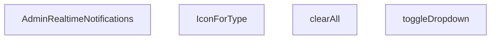

## NODE ID STANDARD

  file: src\components\admin\AdminRealtimeNotifications.tsx
  function: src\components\admin\AdminRealtimeNotifications.tsx::AdminRealtimeNotifications
  function: src\components\admin\AdminRealtimeNotifications.tsx::toggleDropdown
  function: src\components\admin\AdminRealtimeNotifications.tsx::clearAll
  function: src\components\admin\AdminRealtimeNotifications.tsx::IconForType

---

## DISA AKTARILANLAR (EXPORTS)
  export: AdminRealtimeNotifications

---

## STİL TOKENLERİ

### Arbitrary Değerler (token'a geçirilmemiş)
Yok — tüm stiller token'a geçirilmiş. ✅

### Kullanılan Token'lar (zaten token'a geçirilmiş)
- (yok)

### Tailwind Sınıf Özeti
- **Renkler:** `bg-blue-50`, `bg-blue-50/30`, `bg-emerald-50`, `bg-emerald-500/10`, `bg-primary-navy`, `bg-primary-navy/10`, `bg-rose-100`, `bg-rose-500`, `bg-slate-100`, `bg-slate-50/30`, `bg-slate-50/50`, `bg-slate-50/80`, `bg-slate-500/10`, `bg-white`, `border-2`
- **Layout:** `absolute`, `flex`, `flex-1`, `flex-col`, `flex-shrink-0`, `gap-1`, `gap-2`, `gap-3`, `h-10`, `h-12`, `h-2`, `h-2.5`, `items-center`, `justify-between`, `justify-center`
- **Varyant/Responsive:** `:`, `hover:`, `sm:` önekleri
- **Yardımcı Sınıflar:** `${!notif.isRead`, `${notif.link`, `:`, `animate-in`, `animate-pulse`, `border`, `cursor-pointer`, `duration-300`, `fade-in`, `font-bold`, `font-medium`, `hover:shadow`, `leading-relaxed`, `mb-3`, `ml-3`

---
# FILE: src\components\admin\AdminSkeleton.md

---
domain: general
source_type: doc
namespace_type: module
source_path: C:\Users\alize\venthub-hvac\src\components\admin\AdminSkeleton.tsx
skeleton_hash: 3d64d8f079258cce
entity_hashes:
  func:AdminSkeleton: 586d38b8378960eb
  overview: d5fffe3d7ed9f7eb
  style_tokens: 9ebeaa83a2aaeb97
generated_at: 2026-06-08T10:08:36Z
---

## Genel Bakış
`AdminSkeleton` bileşeni, yönetim panelinde veri yüklenme süreçlerinde kullanıcıya görsel geri bildirim sunan yer tutucu arayüzleri oluşturur. Tablo, kart veya form gibi farklı varyasyonlara göre adapte olabilen esnek bir skeleton şablonu sağlar. Bu sayede sayfa düzeni nihai veriler yüklenmeden önce kullanıcıya kabaca gösterilir.

## Fonksiyon Grupları
### Skeleton Oluşturma ve Yer Tutucu Üretimi
Verilen parametrelere göre satır, alan ve tekrar sayısını hesaplayarak tekrarlayan placeholder elemanlarını oluşturur.
- AdminSkeleton

---

## AXIOMS – Mimari Varsayımlar
Bu modülün doğru çalışması için temel mimari varsayımlar fonksiyonun parametrelerine dayanır.

**[Aksiyom 1]:** Eğer `variant` parametresi `null` veya `undefined` ise, bileşen doğru bir skeleton varyantı (ör. `table`, `card`, `form`) oluşturamaz ve uygun bir stil uygulanamaz.

**[Aksiyom 2]:** Eğer `rows`, `count` veya `fields` parametrelerinden herhangi biri negatif veya sıfır ise, bileşen anlamsız veya görünmez placeholder elemanlar üretir; skeleton yapısının bozulmasına yol açar.

**[Aksiyom 3]:** Fonksiyonun `rows`, `count` ve `fields` değerlerini **pozitif tamsayı** olarak kabul ettiği varsayılır (default değerleri sırasıyla 5, 4 ve 6'dır). Bu değerlerin UI'da tekrarlayan elemanların sayısını doğrudan belirlediği kabul edilir.

---

## FONKSİYON DETAYLARI

### AdminSkeleton

**Ne yapar**: AdminSkeleton, admin panelinin yükleme durumlarında (loading state) kullanılacak iskelet/skeleton gösterimini oluşturur. variant propuna bağlı olarak tablo, kart veya form tipinde animasyonlu placeholder bileşenleri render eder. Veri yüklenene kadar kullanıcıya sayfanın yapısını görsel olarak hissettirmeyi amaçlar.

**Nasıl yapar**: Fonksiyon, `variant` parametresinin değerine göre üç farklı JSX yapısı döndürür. `'table'` seçildiğinde başlık satırı ve belirli satır/sütun sayısına sahip bir tablo iskeleti, `'cards'` seçildiğinde grid düzeninde kart iskeletleri,否则 varsayılan olarak form alanlarından oluşan bir iskelet render eder. Her bir varyantta `animate-pulse` sınıfı ile animasyon efekti, `glassStrongClass` ile cam efektli arka plan ve `border-white/5` gibi transparan kenarlıklar kullanılarak modern bir loading görseli oluşturulur. `rows`, `count` ve `fields` parametreleri ile dinamik olarak eleman sayısı kontrol edilir.

**Parametreler**:
- `variant`: `'table' | 'cards' | string` (varsayılan: `'form'` olarak davranır) — Skeleton tipini belirler. `'table'` tablo, `'cards'` kart düzeni, diğer değerler form varyantını aktif eder
- `rows`: `number` — `'table'` varyantında tablonun satır sayısını belirler (varsayılan: 5)
- `count`: `number` — `'cards'` varyantında gösterilecek kart sayısını belirler (varsayılan: 4)
- `fields`: `number` — Varsayılan form varyantında alan sayısını belirler (varsayılan: 6)

**Dönüş**: `JSX.Element` — Seçilen varyanta göre animasyonlu skeleton yapısını temsil eden React JSX bileşeni döndürür. Her varyant farklı bir layout yapısına sahiptir: tablo varyantı `<div>` içinde `<table>` yapısı, kart varyantı grid düzeninde çoklu `<div>` kartları, form varyantı ise input alanlarını simüle eden çoklu `<div>` blokları içerir.

---

## INTERFACES

### AdminSkeletonProps
- `variant: 'table' | 'cards' | 'form'`
- `rows?: number`
- `count?: number`
- `fields?: number`

---

## AST POINTERS

### [N1_NASIL] AST Pointer: src/components/admin/AdminSkeleton.tsx::AdminSkeleton
- **params**: `variant`, `rows = 5`, `count = 4`, `fields = 6`
- **ic_degiskenler**: `variant` — Skeleton gösterim modunu belirler (table, cards veya form). Fonksiyon içinde `variant` değeri kontrol edilerek farklı JSX yapıları döndürülür.
- **Dönüş**: `JSX.Element` — `variant` değerine bağlı olarak farklı loading skeleton yapısı döndürür. Table modunda tablo loading, cards modunda kart grid'i, form modunda form loading skeleton'ı render eder.

---

## NODE ID STANDARD

  file: src\components\admin\AdminSkeleton.tsx
  function: src\components\admin\AdminSkeleton.tsx::AdminSkeleton

---

## DISA AKTARILANLAR (EXPORTS)
  export: AdminSkeleton

---

## STİL TOKENLERİ

### Arbitrary Değerler (token'a geçirilmemiş)
Yok — tüm stiller token'a geçirilmiş. ✅

### Kullanılan Token'lar (zaten token'a geçirilmiş)
- `rounded-hvac-2xl`, `rounded-hvac-xl`

### Tailwind Sınıf Özeti
- **Renkler:** `bg-cyan-400/10`, `bg-cyan-500/5`, `bg-gradient-to-br`, `bg-transparent`, `bg-white/10`, `bg-white/2`, `bg-white/3`, `bg-white/5`, `border-b`, `border-cyan-400/20`, `border-t`, `border-white/5`, `from-cyan-500/5`, `text-left`, `to-transparent`
- **Layout:** `absolute`, `flex`, `from-cyan-500/5`, `gap-4`, `gap-6`, `gap-8`, `grid`, `grid-cols-1`, `h-10`, `h-12`, `h-14`, `h-3`, `h-32`, `h-4`, `h-6`
- **Varyant/Responsive:** `group-hover:`, `lg:`, `md:` önekleri
- **Yardımcı Sınıflar:** `${glassStrongClass`, `animate-pulse`, `blur-3xl`, `border`, `divide-white/5`, `divide-y`, `group`, `group-hover:opacity-100`, `inset-0`, `mb-10`, `ml-1`, `mt-10`, `opacity-0`, `pt-8`, `rounded-2xl`

---
# FILE: src\components\admin\AdminToolbar.md

---
domain: general
source_type: doc
namespace_type: module
source_path: C:\Users\alize\venthub-hvac\src\components\admin\AdminToolbar.tsx
skeleton_hash: dc29fcff3f4f6059
entity_hashes:
  func:AdminToolbar: af143a8f279e1c1e
  overview: 8e2c297879e66d13
  style_tokens: f914d27adccfd567
generated_at: 2026-06-08T10:08:36Z
---

## Genel Bakış
Bu modül, VentHub HVAC yönetim paneli için tasarlanmış çok amaçlı bir araç çubuğu bileşenidir. Arama, çoklu seçim, etiket tabanlı filtreleme ve durum anahtarı gibi kontrolleri tek bir üst banner'da birleştirerek kullanıcıların verilerini hızlıca filtrelemesini ve yönetmesini sağlar.

## Fonksiyon Grupları
### Yönetim Paneli Araç Çubuğu
Yönetim arayüzünün üst kısmında konumlanan, arama kutusu, seçim dropdown'ı, aktif filtre çipleri, durum toggle'ları, temizleme butonu ve kayıt sayacı gibi tüm filtreleme ve durum bileşenlerini bir arada sunan kapsamlı bir React bileşenidir.
- AdminToolbar

---

## AXIOMS – Mimari Varsayımlar

Bu modül, yönetim paneli araç çubuğu filtre ve durum bileşenidir. Aşağıda props yapılarına dayalı mimari varsayımlar listelenmektedir.

**[Aksiyom 1]**: Eğer `search` prop'u verilmezse, arama input alanı render edilmez ve kullanıcı metin tabanlı filtreleme yapamaz.

**[Aksiyom 2]**: Eğer `select` prop'u verilmezse, seçim dropdown/listesi render edilmez ve çoklu seçim filtresi devre dışı kalır.

**[Aksiyom 3]**: Eğer `chips` prop'u verilmezse, aktif filtre etiketleri (chip bileşenleri) gösterilmez ve filtre durumu görsel olarak sunulmaz.

**[Aksiyom 4]**: Eğer `toggles` prop'u verilmezse, açma/kapama (toggle) kontrolleri render edilmez ve Boolean türündeki filtreler değiştirilemez.

**[Aksiyom 5]**: Eğer `onClear` callback'i verilmezse, "Filtreleri Temizle" butonu gösterilmez; çünkü tetiklenecek bir işlev mevcut değildir.

**[Aksiyom 6]**: Eğer `recordCount` prop'u verilmezse, toplam/kalan kayıt sayısı bilgisi araç çubuğunda gösterilmez.

**[Aksiyom 7]**: `rig` prop'u için varsayılan değer belirsizdir — eğer bu prop zorunlu bir yapıya sahipse ve verilmezse, bileşen hata üretir veya beklenmedik davranış gösterir.

> **Not**: Fonksiyon imzasında default değer tanımları bulunmamaktadır; bu nedenle tüm prop'lar opsiyonel mi yoksa zorunlu mu oldukları kesin olarak belirlenememiştir. Çalışma zamanı davranışı uygulama tarafında tanımlıdır.

---

## FONKSİYON DETAYLARI

### AdminToolbar
**Ne yapar**: Bu React Fonksiyonel Bileşeni, VentHub HVAC sisteminin admin paneli için tasarlanmış araç çubuğunu oluşturur. Kullanıcıların arama, seçim, filtre yönetimi ve kayıt sayısı görüntüleme gibi yönetimsel işlemlerini yapabileceği tüm kullanıcı arayüzü öğelerini bir araya getirir.
**Nasıl yapar**: Bileşen, iletilen tüm props parametrelerini alır ve her bir prop ile ilişkili UI elemanlarını sıralı olarak render eder. Tüm etkileşim olayları için gerekli geri çağırma fonksiyonlarını üst bileşenlere iletir, özellikle `onClear` fonksiyonu ile tüm filtre ve arama ayarlarını sıfırlama işlemini gerçekleştirir. Ek olarak `rig` prop'u ile bileşenin özel yapılandırılmasını destekler.
**Parametreler**:
- search: unknown — Araç çubuğundaki arama bileşeni ile ilgili yapılandırma, sorgu değeri ve etkileşim olaylarını içeren veri paketi
- select: unknown — Seçim işlemleri için kullanılan açılır menüler, seçenekler ve ilgili olay dinleyicilerini içeren yapılandırma
- chips: unknown — Aktif filtreleri temsil eden çip bileşenleri, silme olayları ve görüntüleme ayarları içeren liste verisi
- toggles: unknown — Geçiş tuşları, toggle butonları ve ilgili durum yönetimi verilerini barındıran yapılandırma paketi
- onClear: (() => void) — Tüm arama, seçim ve filtre ayarlarını sıfırlamak için tetiklenen geri çağırma fonksiyonu
- recordCount: number — Mevcut listede gösterilen toplam kayıt sayısını temsil eden sayısal değer
- rig: unknown — Bileşenin özel stillendirme, ek özellikler veya özel yapılandırmaları için kullanılan ayar paketi
**Dönüş**: React.ReactElement — Admin araç çubuğunun tam kullanıcı arayüzünü temsil eden React JSX elemanı. Bileşen, tüm verilen props'lara dayalı olarak dinamik olarak içerik ve davranışını değiştirir.

---

## TYPE ALIASES

### AdminToolbarChip
```typescript
type AdminToolbarChip = {

  key: string

  label: string

  active: boolean

  onToggle: () => void

  classOn?: string

  classOff?: string

  title?: string

}
```

### AdminToolbarToggle
```typescript
type AdminToolbarToggle = {

  key: string

  label: string

  checked: boolean

  onChange: (checked: boolean) => void

  title?: string

}
```

### AdminToolbarSelectOption
```typescript
type AdminToolbarSelectOption = { value: string; label: string }
```

### AdminToolbarProps
```typescript
type AdminToolbarProps = {

  search?: {

    value: string

    onChange: (v: string) => void

    placeholder?: string

    title?: string

    focusShortcut?: string // default '/'

  }

  select?: {

    value: string

  
```

---

## AST POINTERS

### [N1_NASIL] AST Pointer: AdminToolbar.tsx::useEffectKeydown
- **params**: ()
- **ic_degiskenler**:
  - `handleKeyDown` — "/" tuşuna basıldığında search inputuna odaklanmayı sağlayan event handler fonksiyonu
  - `search` — search prop'unun varlığını kontrol eder, yoksa fonksiyon erken döner
  - `inputRef` — search inputuna referans, current?.focus() ile odaklanmayı sağlar
- **Dönüş**: temizleme fonksiyonu (window.removeEventListener ile event listener kaldırır)

### [N2_NASIL] AST Pointer: AdminToolbar.tsx::handleKeyDown
- **params**: (e: KeyboardEvent)
- **ic_degiskenler**:
  - `e.key` — klavye basma olayının tuş değerini tutar, "/" kontrolü yapılır
  - `document.activeElement?.tagName` — aktif elementin tag adı, INPUT veya TEXTAREA olmama kontrolü
  - `inputRef.current` — search input DOM elementi, focus() ile odaklanır
- **Dönüş**: yok

### [N3_NASIL] AST Pointer: AdminToolbar.tsx::useEffectHydrate
- **params**: ()
- **ic_degiskenler**:
  - `storageKey` — localStorage'da kullanılacak benzersiz depolama anahtarı
  - `persist` — hangi özelliklerin kalıcı olacağını belirten obje (search, select, chips, toggles)
  - `enable` — persist ayarlarından türetilen aktif özellikler objesi
  - `raw` — localStorage'dan okunan ham JSON string
  - `saved` — raw string'in parse edilmiş hali, search/select/chips/toggles değerlerini içerir
  - `hydratedRef.current` — hydration process'in tamamlanma durumu flag'i
  - `select` — select prop'u, value ve onChange metodunu içerir
  - `chips` — chips prop dizisi, her chip'in key, active, onToggle metodlarını içerir
  - `toggles` — toggles prop dizisi, her toggle'ın key, checked, onChange metodlarını içerir
- **Dönüş**: yok

### [N4_NASIL] AST Pointer: AdminToolbar.tsx::hydrateChipsCallback
- **params**: (ch)
- **ic_degiskenler**:
  - `ch.key` — chip'in benzersiz tanımlayıcısı
  - `saved.chips` — kaydedilmiş chip durumları objesi, key -> boolean değer eşlemesi
  - `want` — kaydedilmiş chip durumu (true/false veya undefined)
  - `ch.active` - chip'in mevcut aktif durumu
  - `ch.onToggle` — chip'in durumunu değiştiren callback fonksiyon
- **Dönüş**: yok

### [N5_NASIL] AST Pointer: AdminToolbar.tsx::hydrateTogglesCallback
- **params**: (t)
- **ic_degiskenler**:
  - `t.key` — toggle'ın benzersiz tanımlayıcısı
  - `saved.toggles` — kaydedilmiş toggle durumları objesi, key -> boolean değer eşlemesi
  - `want` — kaydedilmiş toggle durumu (true/false veya undefined)
  - `t.checked` — toggle'ın mevcut checked durumu
  - `t.onChange` — toggle'ın durumunu değiştiren callback fonksiyon
- **Dönüş**: yok

### [N6_NASIL] AST Pointer: AdminToolbar.tsx::useEffectPersist
- **params**: ()
- **ic_degiskenler**:
  - `storageKey` — localStorage'da kullanılacak benzersiz depolama anahtarı
  - `hydratedRef.current` — hydration tamamlanmadıysa persist etmez
  - `persist` — hangi özelliklerin kalıcı olacağını belirten obje
  - `enable` — persist ayarlarından türetilen aktif özellikler objesi
  - `payload` — localStorage'a kaydedilecek veri objesi
  - `select` — select prop'u, value değeri payload'a eklenir
  - `chips` — chips prop dizisi, Object.fromEntries ile key->active eşlemesine dönüştürülür
  - `toggles` — toggles prop dizisi, Object.fromEntries ile key->checked eşlemesine dönüştürülür
  - `localStorage.setItem` — localStorage'a JSON string olarak kaydeder
- **Dönüş**: yok

### [N7_NASIL] AST Pointer: AdminToolbar.tsx::renderOptionDesktop
- **params**: (opt)
- **ic_degiskenler**:
  - `opt.value` — option elementinin value değeri
  - `opt.label` — option elementinin görünen metin değeri
- **Dönüş**: JSX option elementi (bg-surface-deep, text-white, font-medium sınıflarıyla)

### [N8_NASIL] AST Pointer: AdminToolbar.tsx::renderToggleDesktop
- **params**: (tog)
- **ic_degiskenler**:
  - `tog.key` — toggle'ın benzersiz tanımlayıcısı, React key olarak kullanılır
  - `tog.label` — toggle'ın görünen etiket metni
  - `tog.checked` — toggle'ın checked durumu, Switch.Root bileşenine aktarılır
  - `tog.onChange` — toggle durumu değiştiğinde çağrılan callback
  - `tog.title` — opsiyonel title attribute'u, aria-label olarak kullanılır
- **Dönüş**: JSX div elementi (Switch bileşenini içeren toggle kontrolü)

### [N9_NASIL] AST Pointer: AdminToolbar.tsx::renderChipDesktop
- **params**: (ch)
- **ic_degiskenler**:
  - `ch.key` — chip'in benzersiz tanımlayıcısı, React key olarak kullanılır
  - `ch.label` — chip'in görünen metin değeri
  - `ch.active` — chip'in aktif durumu, CSS sınıflarını belirler
  - `ch.onToggle` — chip'e tıklandığında çağrılan callback
  - `ch.classOn` — aktif durum için özel CSS sınıfı
  - `ch.classOff` — inaktif durum için özel CSS sınıfı
  - `ch.title` — opsiyonel title attribute'u
  - `defaultChipOn` — aktif durum için varsayılan CSS sınıfı
  - `defaultChipOff` — inaktif durum için varsayılan CSS sınıfı
- **Dönüş**: JSX button elementi (chip kontrolü)

### [N10_NASIL] AST Pointer: AdminToolbar.tsx::renderOptionMobile
- **params**: (opt)
- **ic_degiskenler**:
  - `opt.value` — option elementinin value değeri
  - `opt.label` — option elementinin görünen metin değeri
- **Dönüş**: JSX option elementi (bg-surface-deep sınıfıyla)

### [N11_NASIL] AST Pointer: AdminToolbar.tsx::renderToggleMobile
- **params**: (tog)
- **ic_degiskenler**:
  - `tog.key` — toggle'ın benzersiz tanımlayıcısı, React key olarak kullanılır
  - `tog.label` — toggle'ın görünen etiket metni
  - `tog.checked` — toggle'ın checked durumu, Switch.Root bileşenine aktarılır
  - `tog.onChange` — toggle durumu değiştiğinde çağrılan callback
- **Dönüş**: JSX div elementi (Switch bileşenini içeren mobil toggle kontrolü)

### [N12_NASIL] AST Pointer: AdminToolbar.tsx::renderChipMobile
- **params**: (ch)
- **ic_degiskenler**:
  - `ch.key` — chip'in benzersiz tanımlayıcısı, React key olarak kullanılır
  - `ch.label` — chip'in görünen metin değeri
  - `ch.active` — chip'in aktif durumu, CSS sınıflarını belirler
  - `ch.onToggle` — chip'e tıklandığında çağrılan callback
  - `ch.classOn` — aktif durum için özel CSS sınıfı
  - `ch.classOff` — inaktif durum için özel CSS sınıfı
  - `defaultChipOn` — aktif durum için varsayılan CSS sınıfı
  - `defaultChipOff` — inaktif durum için varsayılan CSS sınıfı
- **Dönüş**: JSX button elementi (mobil chip kontrolü)

---

## NODE ID STANDARD

  file: src\components\admin\AdminToolbar.tsx
  function: src\components\admin\AdminToolbar.tsx::AdminToolbar

---

## DISA AKTARILANLAR (EXPORTS)
  export: AdminToolbar
  export: AdminToolbarChip
  export: AdminToolbarProps
  export: AdminToolbarSelectOption
  export: AdminToolbarToggle

---

## STİL TOKENLERİ

### Arbitrary Değerler (token'a geçirilmemiş)
Yok — tüm stiller token'a geçirilmiş. ✅

### Kullanılan Token'lar (zaten token'a geçirilmiş)
- `rounded-hvac-lg`, `tracking-hvac-normal`

### Tailwind Sınıf Özeti
- **Renkler:** `bg-cyan-400`, `bg-rose-500`, `bg-surface-deep`, `bg-surface-deep/20`, `bg-surface-deep/40`, `bg-transparent`, `bg-white`, `bg-white/10`, `bg-white/3`, `bg-white/5`, `border-cyan-400`, `border-l`, `border-surface-deep`, `border-t`, `border-white/10`
- **Layout:** `${sticky`, `-right-1`, `-top-1`, `absolute`, `backdrop-blur-2xl`, `block`, `flex`, `flex-1`, `flex-col`, `flex-wrap`, `gap-2`, `gap-2.5`, `gap-3`, `gap-4`, `gap-5`
- **Varyant/Responsive:** `:`, `data-[state=checked]:`, `focus-visible:`, `group-focus-within:`, `hover:`, `lg:`, `md:`, `placeholder:` önekleri
- **Yardımcı Sınıflar:** `$`, `${adminSelectClass`, `${ch.active`, `${className`, `-translate-y-1/2`, `:`, `animate-in`, `border`, `ch.classOff`, `ch.classOn`, `cursor-pointer`, `data-[state=checked]:translate-x-3.5`, `data-[state=checked]:translate-x-4.5`, `defaultChipOff`, `defaultChipOn`

---
# FILE: src\components\admin\BulkActionToolbar.md

---
domain: general
source_type: doc
namespace_type: module
source_path: C:\Users\alize\venthub-hvac\src\components\admin\BulkActionToolbar.tsx
skeleton_hash: 7bf65b45d538cf54
entity_hashes:
  func:BulkActionToolbar: ba39222c0aa88e73
  overview: e440025fef007b62
  style_tokens: 812207303bb8adc3
generated_at: 2026-06-08T10:08:36Z
---

## Genel Bakış
`BulkActionToolbar` bileşeni, yönetim panelinde birden fazla öğe seçildiğinde toplu işlemler (durum güncelleme, özellik değiştirme, silme) yapabilmek için kullanılan bir araç çubuğu sağlar. Seçili öğe sayısını gösterir ve ilgili eylemlerin tetiklenmesi için dışarıdan gelen callback fonksiyonlarını yönetir.

## Fonksiyon Grupları
### UI Render ve Görsel Düzen
Bu grup, seçili öğe sayısını gösteren etiket, eylem butonları ve araç çubuğunun genel görünümünü oluşturur.  
- BulkActionToolbar

### Eylem Tetikleme ve Callback Yönetimi
Bu grup, buton tıklamalarıyla gelen kullanıcı etkileşimlerini alır, ilgili parametreleri (ör. yeni durum, özellik anahtarı) hazırlayarak dışarıdan sağlanan `onStatusChange`, `onFeatureToggle` ve `onDelete` callback’lerini çağırır.  
- BulkActionToolbar (içindeki event handler mantığı)

---

## AXIOMS – Mimari Varsayımlar
Bu modül için özel aksiyom tanımlanmamıştır.

---

## FONKSİYON DETAYLARI

### BulkActionToolbar
**Ne yapar**: Seçili öğe sayısını gösteren ve toplu eylemler (durum değişikliği, özellik geçişi, silme) için tetikleyiciler sağlayan bir React bileşenini tanımlar.  

**Nasıl yapar**: Props olarak aldığı `selectedCount`, `onStatusChange`, `onFeatureToggle` ve `onDelete` fonksiyonlarını UI elemanlarına bağlayarak, kullanıcı etkileşimlerine göre ilgili geri çağırma fonksiyonlarını çalıştırır. Bileşen, `BulkActionToolbarProps` tipinde bir fonksiyonel bileşen (`React.FC`) olarak döndürülür.  

**Parametreler**:
- `selectedCount`: number — Kullanıcı tarafından seçilen öğelerin toplam sayısı.
- `onStatusChange`: (newStatus: string) => void — Seçili öğelerin durumunu güncellemek için çağrılan geri çağırma fonksiyonu.
- `onFeatureToggle`: (featureName: string, enabled: boolean) => void — Belirli bir özelliğin etkinleştirilip devre dışı bırakılmasını yönetmek için kullanılan geri çağırma fonksiyonu.
- `onDelete`: () => void — Seçili öğelerin toplu silinmesini tetikleyen geri çağırma fonksiyonu.

**Dönüş**: React.FC<BulkActionToolbarProps> — Tanımlanan props tipine uygun bir fonksiyonel React bileşeni.

---

## INTERFACES

### BulkActionToolbarProps
- `selectedCount: number`
- `onStatusChange: (status: string) => void`
- `onFeatureToggle: (featured: boolean) => void`
- `onDelete: () => void`
- `onPriceAdjust: (mode: 'percent' | 'fixed', value: number) => void`
- `onClearSelection: () => void`

---

## AST POINTERS

### [N1_NASIL] AST Pointer: src\components\admin\BulkActionToolbar.tsx::BulkActionToolbar
- **params**: selectedCount, onStatusChange, onFeatureToggle, onDelete, onPriceAdjust, onClearSelection
- **ic_degiskenler**:
  - `showPricePanel` — Fiyat güncelleme panelinin görünürlüğünü kontrol eden boolean React state değeri
  - `setShowPricePanel` — showPricePanel state'ini güncellemek için kullanılan setState fonksiyonu
  - `priceMode` — Fiyat güncelleme modunu tutan state, 'percent' (yüzde) veya 'fixed' (sabit) değerlerini alır
  - `setPriceMode` — priceMode state'ini güncelleyen setState fonksiyonu
  - `priceValue` — Kullanıcının girdiği fiyat değerini string olarak tutan React state değeri
  - `setPriceValue` — priceValue state'ini güncelleyen setState fonksiyonu
  - `adminButtonPrimaryClass` — Import edilen, butonlara stil vermek için kullanılan CSS sınıfı
- **Dönüş**: null | JSX.Element; seçili ürün sayısı 0 ise null, aksi halde toolbar JSX yapısını döndürür

### [N2_NASIL] AST Pointer: src\components\admin\BulkActionToolbar.tsx::fiyatGuncelleUygulaOnClick
- **params**: (parametre yok)
- **ic_degiskenler**:
  - `v` — Kullanıcının girdiği string tipindeki priceValue'nin float'a dönüştürülmüş sayısal hali
  - `priceValue` — Üst kapsamdan erişilen, kullanıcının girdiği fiyat değerini tutan state
  - `priceMode` — Üst kapsamdan erişilen, seçili fiyat güncelleme modunu tutan state
  - `onPriceAdjust` — Üst parametrelerden alınan, toplu fiyat güncelleme işlemini tetikleyen callback fonksiyonu
  - `setShowPricePanel` — Fiyat panelini kapatmak için kullanılan üst kapsamdaki setState fonksiyonu
  - `setPriceValue` - İşlem sonrası fiyat girişini sıfırlamak için kullanılan üst kapsamdaki setState fonksiyonu
  - `alert` — Tarayıcının yerleşik uyarı fonksiyonu, geçersiz sayısal giriş durumunda çağrılır
- **Dönüş**: void | number; geçersiz giriş durumunda alert() dönüş değerini döndürür, başarılı işlemde hiçbir değer döndürmez

---

## NODE ID STANDARD

  file: src\components\admin\BulkActionToolbar.tsx
  function: src\components\admin\BulkActionToolbar.tsx::BulkActionToolbar

---

## DISA AKTARILANLAR (EXPORTS)
  export: BulkActionToolbar

---

## STİL TOKENLERİ

### Arbitrary Değerler (token'a geçirilmemiş)
Yok — tüm stiller token'a geçirilmiş. ✅

### Kullanılan Token'lar (zaten token'a geçirilmiş)
- (yok)

### Tailwind Sınıf Özeti
- **Renkler:** `bg-blue-400/80`, `bg-emerald-500/80`, `bg-gray-400/80`, `bg-gray-50`, `bg-primary-navy`, `bg-red-500/80`, `bg-white`, `bg-white/20`, `bg-yellow-500/80`, `border-gray-200`, `border-primary-navy`, `hover:bg-blue-400`, `hover:bg-emerald-500`, `hover:bg-gray-400`, `hover:bg-red-500`
- **Layout:** `absolute`, `bg-yellow-500/80`, `bottom-4`, `bottom-full`, `fixed`, `flex`, `flex-1`, `flex-wrap`, `gap-2`, `gap-3`, `h-6`, `h-8`, `hover:bg-yellow-500`, `items-center`, `justify-center`
- **Varyant/Responsive:** `:`, `focus-visible:`, `hover:` önekleri
- **Yardımcı Sınıflar:** `!py-2`, `!text-xs`, `${adminButtonPrimaryClass`, `${priceMode`, `:`, `===`, `animate-slide-up`, `border`, `focus-visible:outline-none`, `focus-visible:ring-2`, `focus-visible:ring-primary-navy/30`, `font-bold`, `font-medium`, `font-semibold`, `mb-2`

---
# FILE: src\components\admin\ColumnsMenu.md

---
domain: general
source_type: doc
namespace_type: module
source_path: C:\Users\alize\venthub-hvac\src\components\admin\ColumnsMenu.tsx
skeleton_hash: 0b60e261dadfb14d
entity_hashes:
  func:ColumnsMenu: acb58bb1e295bcab
  overview: b2310e22f90d9a39
  style_tokens: f68608c28260c039
generated_at: 2026-06-08T10:08:36Z
---

## Genel Bakış
ColumnsMenu, tablo yapılandırma menüsü olarak işlev gören bir React bileşenidir. Temel amacı, kullanıcıların tablolarındaki sütunların görünürlüğünü açıp kapatmasına ve satır yoğunluğunu ayarlamasına olanak tanımaktır. Bileşen, dışarıdan gelen konfigürasyon ve geri çağırma fonksiyonlarıyla etkileşime girerek bu tercihleri yönetir.

## Fonksiyon Grupları
### Sütun ve Yoğunluk Yönetimi
Bileşen, verilen sütun yapılandırmasını kullanarak kullanıcıya tercihler sunar ve bu tercihlerdeki değişiklikleri üst bileşene iletir. Ana sorumluluk, sütun görünürlüğü denetimleri ile yoğunluk seçimi arasındaki etkileşimi yönetmektir.
- ColumnsMenu

---

## AXIOMS – Mimari Varsayımlar
Bu modül, sütunların görünürlüğünü ve satır yoğunluğunu yöneten bir menü bileşenidir. Doğru çalışması için aşağıdaki koşulların sağlanmış olması gerekir.

[Aksiyom 1]: Eğer `columns` prop'u (sütun listesi) yoksa, bileşen süt

---

## FONKSİYON DETAYLARI

### ColumnsMenu

**Ne yapar**: Tablo sütunlarının görünürlüğünü ve tablo yoğunluğunu (density) yöneten bir açılır menü bileşenidir. Kullanıcının tablodaki hangi sütunların gösterileceğini seçmesine ve satır aralığı yoğunluğunu ayarlamasına olanak tanır.

**Nasıl yapar**: Bileşen, verilen `columns` dizisini kullanarak her bir sütun için bir toggle ( açma/kapama ) kontrolü oluşturur. `density` prop'u ile mevcut yoğunluk durumunu okur ve `onDensityChange` callback'i aracılığıyla yoğunluk değişikliklerini üst bileşene iletir. `buttonLabel` prop'u sağlanmışsa, menüyü tetikleyen butonda özel bir etiket kullanılır; aksi halde varsayılan bir etiket gösterir.

**Parametreler**:
- `columns`: `ColumnToggle[]` — Tablodaki sütunların tanımını ve görünürlük durumlarını içeren dizi. Her bir öğe, bir sütunun adını ve açma/kapama durumunu temsil eder.
- `density`: `Density` — Tablonun mevcut yoğunluk modunu belirten değer. Satır yüksekliği ve iç boşlukları kontrol eder.
- `onDensityChange`: `(d: Density) => void` — Kullanıcı yoğunluk değiştirdiğinde çağrılan geri çağırma fonksiyonu. Yeni yoğunluk değerini üst bileşene iletir.
- `buttonLabel`: `string | undefined` — Opsiyonel. Menüyü açan buton üzerinde görüntülenecek özel etiket metni. Sağlanmadığında varsayılan metin kullanılır.

**Dönüş**: `React.FC` — JSX ile render edilen bir React fonksiyonel bileşeni döndürür. Bileşen, sütun toggle'larını ve yoğunluk seçim kontrolünü içeren bir menü arayüzü sunar.

---

## TYPE ALIASES

### ColumnToggle
```typescript
type ColumnToggle = { key: string; label: string; checked: boolean; onChange: (v: boolean) => void }
```

---

## AST POINTERS

### [N1_NASIL] AST Pointer: ColumnsMenu.tsx::ColumnsMenu
- **params**: { columns, density, onDensityChange, buttonLabel }
- **ic_degiskenler**:
  - `_t` — useI18n hook'undan alınan çeviri fonksiyonu, UI metinlerini çevirilerden almak için kullanılır
- **Dönüş**: JSX (React element) — DropdownMenu bileşeni, sütun toggle'ları ve yoğunluk seçicisi içeren menü UI'ı

---

## NODE ID STANDARD

  file: src\components\admin\ColumnsMenu.tsx
  function: src\components\admin\ColumnsMenu.tsx::ColumnsMenu

---

## DISA AKTARILANLAR (EXPORTS)
  export: ColumnToggle
  export: ColumnsMenu

---

## STİL TOKENLERİ

### Arbitrary Değerler (token'a geçirilmemiş)
Yok — tüm stiller token'a geçirilmiş. ✅

### Kullanılan Token'lar (zaten token'a geçirilmiş)
- `shadow-glow-sm`, `tracking-hvac-normal`

### Tailwind Sınıf Özeti
- **Renkler:** `bg-cyan-400`, `bg-surface-deep`, `bg-white/5`, `border-b`, `border-cyan-400`, `border-white/10`, `border-white/5`, `data-[state=checked]:text-cyan-400`, `hover:bg-white/5`, `hover:text-white`, `stroke-4`, `text-cyan-400`, `text-slate-300`, `text-slate-500`, `text-surface-deep`
- **Layout:** `custom-scrollbar`, `flex`, `gap-2`, `gap-3`, `h-1.5`, `h-12`, `h-4`, `h-px`, `items-center`, `justify-between`, `justify-center`, `max-h-300px`, `min-w-140px`, `min-w-240px`, `overflow-y-auto`
- **Varyant/Responsive:** `:`, `data-[state=checked]:`, `hover:` önekleri
- **Yardımcı Sınıflar:** `${col.checked`, `${density`, `:`, `===`, `animate-in`, `border`, `comfortable`, `compact`, `cursor-pointer`, `duration-200`, `fade-in`, `font-black`, `font-bold`, `glass-strong`, `group`

---
# FILE: src\components\admin\CommandPalette.md

---
domain: general
source_type: doc
namespace_type: module
source_path: C:\Users\alize\venthub-hvac\src\components\admin\CommandPalette.tsx
skeleton_hash: 9283b2670a449382
entity_hashes:
  func:CommandPalette: d6aeed4e7453fe44
  func:handleKeyDown: 1487e8d647499b5f
  func:selectItem: 2c4ba43ca43f0c65
  overview: 6e2ec88e5bcb2e73
  style_tokens: 7dfe1be44eebd77e
generated_at: 2026-06-08T10:08:36Z
---

## Genel Bakış
CommandPalette, yönetim panelinde klavye kısayollarıyla hızlı komut arama ve seçimini sağlayan bir arayüz bileşenidir. Kullanıcının klavye girdilerini yakalayarak palet içindeki komutlar arasında gezinmesini ve istediğini seçmesini mümkün kılar. Temel olarak, verimli bir navigasyon deneyimi sunmak için klavye etkileşimleri ve seçim mantığını yönetir.

## Fonksiyon Grupları
### Ana Bileşen
Komut paletinin temel arayüzünü oluşturur ve tüm bileşenin render sürecini yönetir.
- CommandPalette

### Klavye Etkileşimi ve Seçim Mantığı
Kullanıcı klavye girdilerini işleyerek palet içindeki öğeler arasında gezinmeyi ve seçimi kontrol eder.
- handleKeyDown, selectItem

---

## AXIOMS – Mimari Varsayımlar

Bu modül için, verilen fonksiyon imzası bilgilerine dayanarak, fonksiyon gövdeleri bilinmediğinden çıkarılabilecek somut mimari aksiyom bulunmamaktadır.

[Aksiyom 1]: Eğer `selectItem` fonksiyonuna geçerli bir `index` parametresi verilmezse (örn: listede olmayan bir indeks), ilgili komut düzgün bir şekilde seçilemez veya uygulama beklenmedik bir duruma düşebilir.

[Aksiyom 2]: Eğer `handleKeyDown` fonksiyonuna geçerli bir `React.KeyboardEvent` nesnesi sağlanmazsa, klavye etkileşimleri (örn: yukarı/aşağı ok tuşlarıyla gezinme, Enter ile seçim) işlenemez.

[Aksiyom 3]: Eğer `CommandPalette` bileşeni, klavye olaylarını dinleyecek bir `onKeyDown` prop'u ile çağrılmazsa, klavye kısayolları çalışmaz.

---

## FONKSİYON DETAYLARI

### CommandPalette
**Ne yapar**: Komut paleti bileşenini oluşturur ve render eder. Kullanıcının uygulama içinde arama yapmasına ve komutlar/öğeler üzerinde gezinmesine olanak tanıyan bir arayüz sunar.
**Nasıl yapar**: Bileşen, durum yönetimi için useState ve useEffect hook'larını kullanarak arama terimini, seçili indeksi ve gerekli verileri tutar. Kullanıcı etkileşimlerine yanıt vermek için olay dinleyicileri ekler ve filtrelenmiş öğeleri listeler.
**Parametreler**:
- Parametre almaz (props kullanmaz).
**Dönüş**: `React.FC` (React Function Component) tipinde bir bileşen döner.

### handleKeyDown
**Ne yapar**: Komut paleti içindeki klavye olaylarını işler, özellikle yukarı/aşağı ok tuşlarıyla gezinme ve Enter tuşuyla seçim yapma gibi işlevselliği yönetir.
**Nasıl yapar**: Olay nesnesinin `key` özelliğini kontrol ederek hangi tuşa basıldığını belirler. Ok tuşları için seçili indeksi artırır/azaltır (sınır kontrolü yaparak), Escape tuşu için paleti kapatır ve Enter tuşu için mevcut seçili öğeyi seçer.
**Parametreler**:
- e: `React.KeyboardEvent` — Klavye olayı nesnesi, basılan tuş hakkında bilgi içerir.
**Dönüş**: `void` — Belirli bir değer dönmez, yan etki olarak durum değişiklikleri yapar.

### selectItem
**Ne yapar**: Verilen indeksteki öğeyi seçer ve ilgili eylemi (örneğin bir sayfaya yönlendirme, bir komutu çalıştırma) başlatır.
**Nasıl yapar**: Gelen `index` parametresiyle filtrelenmiş öğeler dizisinden ilgili öğeyi alır. Seçilen öğenin `action` veya benzeri bir özelliğinde tanımlı olan fonksiyonu çağırır ve ardından komut paletini kapatır.
**Parametreler**:
- index: `number` — Seçilmek istenen öğenin filtrelenmiş listedeki indeks numarası.
**Dönüş**: `void` — Belirli bir değer dönmez, yan etki olarak öğe seçimini ve paletin kapatılmasını sağlar.

---

## INTERFACES

### SearchResult
- `id: string`
- `name: string`
- `sku: string`

---

## AST POINTERS

### [N1_NASIL] AST Pointer: CommandPalette.tsx::CommandPalette
- **params**: (parametre yok)
- **ic_degiskenler**: 
  - `open` — Komut paletinin açık/kapalı durumunu tutan state (React.useState ile oluşturuldu)
  - `setOpen` — open state'ini güncellemek için kullanılan setter fonksiyonu
  - `search` — Arama kutusundaki yazıyı tutan state (React.useState ile oluşturuldu)
  - `setSearch` — search state'ini güncellemek için kullanılan setter fonksiyonu
  - `products` — Supabase'den getirilen ürün sonuçlarını tutan state array (SearchResult[] tipinde)
  - `setProducts` — products state'ini güncellemek için kullanılan setter fonksiyonu
  - `loading` — Arama yükleniyor durumunu tutan boolean state
  - `setLoading` — loading state'ini güncellemek için kullanılan setter fonksiyonu
  - `activeIndex` — Klavye navigasyonunda seçili olan öğenin indeksini tutan state
  - `setActiveIndex` — activeIndex state'ini güncellemek için kullanılan setter fonksiyonu
  - `router` — Next.js router hook'u ile oluşturulan yönlendirme nesnesi (useRouter())
  - `inputRef` — Arama input DOM elemanına referans tutan React ref nesnesi
  - `navItems` — Statik navigasyon öğeleri array'i (React.useMemo ile optimize edildi, 6 öğe: label, icon, href)
  - `totalItems` — Toplam seçilebilir öğe sayısını hesaplayan değişken (React.useMemo ile optimize edildi, filteredNav.length + products.length)
  - `filteredNav` — Arama terimine göre filtrelenmiş navigasyon öğeleri array'i (search.length > 0 ise navItems.filter(), değilse navItems)
  - `e` — handleKeyDown fonksiyonunun parametresi (React.KeyboardEvent), tuş olayı nesnesi
  - `index` — selectItem fonksiyonunun parametresi (number), seçilecek öğenin indeks değeri
  - `prodIndex` — Ürün listesindeki göreli indeks hesaplaması (index - filteredNav.length)
- **Dönüş**: JSX element (komut paleti arayüzü, !open ise null döner)

### [N2_NASIL] AST Pointer: CommandPalette.tsx::useMemoNavItems
- **params**: (parametre yok)
- **ic_degiskenler**: yok (sadece array literal return eder)
- **Dönüş**: Array<{ label: string, icon: Component, href: string }> — 6 statik navigasyon öğesi (Panel, Sipariş Yönetimi, Ürün Kataloğu, Stok Durumu, Kullanıcı Yönetimi, Ayarlar)

### [N3_NASIL] AST Pointer: CommandPalette.tsx::useMemoTotalItems
- **params**: (parametre yok)
- **ic_degiskenler**: 
  - `filteredNav` — Arama terimine göre filtrelenmiş navigasyon öğeleri array'i (search.length > 0 ise navItems.filter(), değilse navItems)
  - `search` — Arama kutusundaki yazıyı tutan değişken (üst scope'tan erişim)
  - `navItems` — Statik navigasyon öğeleri array'i (üst scope'tan erişim)
  - `products` — Ürün sonuçları array'i (üst scope'tan erişim)
- **Dönüş**: number — Toplam seçilebilir öğe sayısı (filteredNav.length + products.length)

### [N4_NASIL] AST Pointer: CommandPalette.tsx::useEffectCtrlK
- **params**: (parametre yok)
- **ic_degiskenler**: 
  - `down` — Klavye olay handler fonksiyonu (KeyboardEvent parametreli, CTRL+K tuş basımını yakalar)
  - `e` — down fonksiyonunun parametresi (KeyboardEvent), tuş olayı nesnesi
- **Dönüş**: Cleanup fonksiyonu (document.removeEventListener ile event listener'ı kaldırır)

### [N5_NASIL] AST Pointer: CommandPalette.tsx::useEffectCtrlKHandler
- **params**: (e: KeyboardEvent)
- **ic_degiskenler**: 
  - `e` — Parametre olarak gelen KeyboardEvent nesnesi
- **Dönüş**: yok (sadece setOpen state'ini toggles)

### [N6_NASIL] AST Pointer: CommandPalette.tsx::useEffectResetOnOpen
- **params**: (parametre yok)
- **ic_degiskenler**: 
  - `open` — Komut paletinin açık/kapalı durumunu tutan değişken (üst scope'tan erişim)
  - `setTimeout` — 50ms gecikmeli fonksiyon çağırma (inputRef.current?.focus())
- **Dönüş**: yok (yan etki: search, products, activeIndex state'lerini sıfırlar, input'a odaklanır)

### [N7_NASIL] AST Pointer: CommandPalette.tsx::useEffectProductSearch
- **params**: (parametre yok)
- **ic_degiskenler**: 
  - `searchProducts` — Async fonksiyon, Supabase'den ürün araması yapar
  - `timer` — setTimeout return değeri, debounce için kullanılır
  - `search` — Arama terimini tutan değişken (üst scope'tan erişim)
  - `setLoading` — Loading state'ini güncelleyen setter (üst scope'tan erişim)
  - `setProducts` — Ürün sonuçlarını güncelleyen setter (üst scope'tan erişim)
  - `supabase` — Supabase istemcisi (import edilmiş)
  - `data` — Supabase yanıtından dönen data alanı
- **Dönüş**: Cleanup fonksiyonu (clearTimeout ile timer'ı iptal eder)

### [N8_NASIL] AST Pointer: CommandPalette.tsx::searchProductsAsync
- **params**: (parametre yok)
- **ic_degiskenler**: 
  - `setLoading` — Loading state'ini true yapan setter (üst scope'tan erişim)
  - `supabase` — Supabase istemcisi (üst scope'tan erişim)
  - `data` — Supabase yanıtından dönen data alanı (products tablosundan id, name, sku alanlarını getirir)
  - `setProducts` — Ürün sonuçlarını güncelleyen setter (üst scope'tan erişim)
- **Dönüş**: Promise<void> (async fonksiyon, await ile Supabase çağrısı yapar)

### [N9_NASIL] AST Pointer: CommandPalette.tsx::useEffectResetActiveIndex
- **params**: (parametre yok)
- **ic_degiskenler**: 
  - `setActiveIndex` — ActiveIndex state'ini 0 yapan setter (üst scope'tan erişim)
  - `search` — Arama terimini tutan değişken (üst scope'tan erişim)
  - `products` — Ürün sonuçları array'i (üst scope'tan erişim)
- **Dönüş**: yok (yan etki: activeIndex'i 0'a sıfırlar)

### [N10_NASIL] AST Pointer: CommandPalette.tsx::handleKeyDown
- **params**: (e: React.KeyboardEvent)
- **ic_degiskenler**: 
  - `e` — Parametre olarak gelen React.KeyboardEvent nesnesi
  - `totalItems` — Toplam seçilebilir öğe sayısı (üst scope'tan erişim)
  - `activeIndex` — Mevcut aktif indeks (üst scope'tan erişim)
  - `setActiveIndex` — ActiveIndex state'ini güncelleyen setter (üst scope'tan erişim)
  - `setOpen` — Open state'ini false yapan setter (üst scope'tan erişim)
  - `selectItem` — Öğe seçme fonksiyonu (üst scope'tan erişim)
- **Dönüş**: yok (yan etki: klavye olaylarına göre state güncellemesi, yönlendirme)

### [N11_NASIL] AST Pointer: CommandPalette.tsx::selectItem
- **params**: (index: number)
- **ic_degiskenler**: 
  - `index` — Parametre olarak gelen sayısal indeks değeri
  - `filteredNav` — Arama terimine göre filtrelenmiş navigasyon öğeleri array'i (search.length > 0 ise navItems.filter(), değilse navItems)
  - `search` — Arama terimini tutan değişken (üst scope'tan erişim)
  - `navItems` — Statik navigasyon öğeleri array'i (üst scope'tan erişim)
  - `setOpen` — Open state'ini false yapan setter (üst scope'tan erişim)
  - `router` — Next.js router nesnesi (üst scope'tan erişim)
  - `prodIndex` — Ürün listesindeki göreli indeks hesaplaması (index - filteredNav.length)
  - `products` — Ürün sonuçları array'i (üst scope'tan erişim)
- **Dönüş**: yok (yan etki: komut paletini kapatır, belirli URL'ye yönlendirir)

### [N12_NASIL] AST Pointer: CommandPalette.tsx::renderNavItem
- **params**: (item: { label: string, icon: Component, href: string }, idx: number)
- **ic_degiskenler**: 
  - `item` — Parametre olarak gelen navigasyon öğesi nesnesi (label, icon, href)
  - `idx` — Parametre olarak gelen array indeksi
  - `Icon` — item.icon değerini atayan değişken (React bileşeni)
  - `isActive` — Bu öğenin seçili olup olmadığını belirleyen boolean (activeIndex === idx)
  - `activeIndex` — Seçili olan indeks (üst scope'tan erişim)
  - `setOpen` — Open state'ini false yapan setter (üst scope'tan erişim)
  - `router` — Next.js router nesnesi (üst scope'tan erişim)
- **Dönüş**: JSX element (navigasyon öğesi butonu)

### [N13_NASIL] AST Pointer: CommandPalette.tsx::renderProductItem
- **params**: (p: { id: string, name: string, sku: string }, idx: number)
- **ic_degiskenler**: 
  - `p` — Parametre olarak gelen ürün nesnesi (id, name, sku)
  - `idx` — Parametre olarak gelen array indeksi
  - `globalIdx` — Tüm öğeler arasındaki global indeks hesaplaması (filteredNav.length + idx)
  - `isActive` — Bu ürünün seçili olup olmadığını belirleyen boolean (activeIndex === globalIdx)
  - `activeIndex` — Seçili olan indeks (üst scope'tan erişim)
  - `filteredNav` — Filtrelenmiş navigasyon array'i (üst scope'tan erişim)
  - `setOpen` — Open state'ini false yapan setter (üst scope'tan erişim)
  - `router` — Next.js router nesnesi (üst scope'tan erişim)
- **Dönüş**: JSX element (ürün öğesi butonu)

---


## MERMAID CALL GRAPH
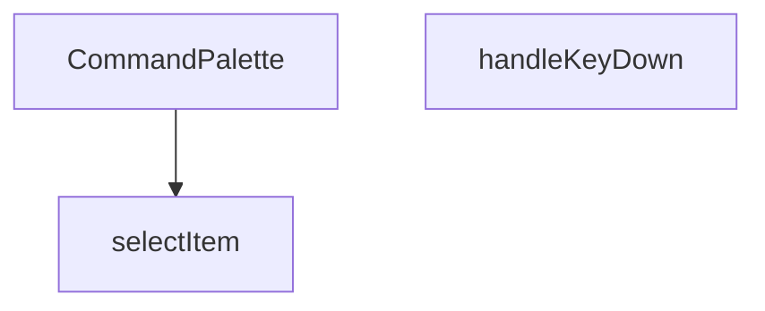

## NODE ID STANDARD

  file: src\components\admin\CommandPalette.tsx
  function: src\components\admin\CommandPalette.tsx::CommandPalette
  function: src\components\admin\CommandPalette.tsx::handleKeyDown
  function: src\components\admin\CommandPalette.tsx::selectItem

---

## DISA AKTARILANLAR (EXPORTS)
  export: CommandPalette

---

## STİL TOKENLERİ

### Arbitrary Değerler (token'a geçirilmemiş)
Yok — tüm stiller token'a geçirilmiş. ✅

### Kullanılan Token'lar (zaten token'a geçirilmiş)
- `rounded-hvac-xl`, `shadow-glow-md`, `shadow-glow-sm`, `tracking-hvac-normal`

### Tailwind Sınıf Özeti
- **Renkler:** `bg-cyan-400`, `bg-cyan-400/10`, `bg-surface-deep/10`, `bg-surface-deep/60`, `bg-transparent`, `bg-white/5`, `border-b`, `border-cyan-400/20`, `border-none`, `border-t`, `border-white/10`, `border-white/5`, `group-hover:text-cyan-400`, `hover:bg-white/5`, `hover:text-white`
- **Layout:** `absolute`, `backdrop-blur-md`, `fixed`, `flex`, `flex-1`, `gap-1.5`, `gap-2`, `gap-4`, `h-1.5`, `h-10`, `h-16`, `h-5`, `h-8`, `h-full`, `items-center`
- **Varyant/Responsive:** `:`, `group-hover:`, `hover:`, `placeholder:` önekleri
- **Yardımcı Sınıflar:** `$`, `${isActive`, `:`, `animate-in`, `animate-pulse`, `animate-spin`, `border`, `cursor-default`, `cursor-pointer`, `cyan-glow`, `duration-200`, `font-black`, `font-bold`, `font-medium`, `font-mono`

---
# FILE: src\components\admin\DateRangePicker.md

---
domain: general
source_type: doc
namespace_type: module
source_path: C:\Users\alize\venthub-hvac\src\components\admin\DateRangePicker.tsx
skeleton_hash: 91af87f18aef0d6b
entity_hashes:
  func:DateRangePicker: ed79aaef040a5b25
  func:applySelection: 68dcb4d14b5cc83c
  func:cancelSelection: 4bec1b96cb2c08c1
  func:handleSelect: fdeacf6bd5ee123e
  overview: 3490e076ad65f967
  style_tokens: 8f057de8409875ea
generated_at: 2026-06-08T10:08:36Z
---

## Genel Bakış
Bu modül, yönetim paneli arayüzünde başlangıç ve bitiş tarihlerinin seçilmesi için kullanılan kontrollü bir React bileşenidir. Kullanıcının yaptığı geçici seçimleri yönetir, onaylama veya iptal mekanizması sağlar ve nihai tarih aralığını üst bileşene iletir.

## Fonksiyon Grupları
### Bileşen Tanımı
Tarih seçici arayüzünü ve temel yapılandırmasını tanımlayan ana bileşendir.
- DateRangePicker

### Etkileşim ve Durum Yönetimi
Kullanıcının tarih seçimi, seçimi onaylama veya iptal etme gibi aksiyonlarını işleyerek bileşenin iç durumunu ve çıktısını günceller.
- handleSelect, applySelection, cancelSelection

## AXIOMS – Mimari Varsayımlar
Bu modül için özel aksiyom tanımlanmamıştır.

**Aksiyom 1**: `className` prop’u sağlanmazsa, bileşen boş bir CSS sınıfı ile render edilir.  
**Aksiyom 2**: `value` prop’u `undefined` veya geçerli bir tarih aralığı nesnesi değilse, bileşen başlangıçta seçili bir aralık göstermez.  
**Aksiyom 3**: `onChange` callback’i sağlanmazsa, tarih aralığı değişiklikleri üst bileşene bildirilmez.  
**Aksiyom 4**: `handleSelect` fonksiyonu `undefined` bir argüman alırsa, mevcut iç seçim durumu temizlenir.  
**Aksiyom 5**: `handleSelect` fonksiyonu geçerli bir tarih aralığı nesnesi alırsa, bu değer iç duruma kaydedilir ve `onChange` tetiklenir.

---

## AXIOMS – Mimari Varsayımlar

Bu modül için sadece fonksiyon imzalarından türetilebilen temel mimari varsayımlar tanımlanmıştır. Fonksiyon gövdeleri verilmediğinden, içsel davranışa ilişkin aksiyomlar çıkarılamamıştır.

**[Aksiyom 1]**: Eğer `DateRangePicker` bileşenine üst bileşen tarafından `onChange` callback'i sağlanmazsa, kullanıcının nihai tarih aralığı seçimi üst bileşene iletilemez (bileşen işlevsel olarak anlamsız hale gelir).

**[Aksiyom 2]**: Eğer `DateRangePicker` bileşenine üst bileşen tarafından `value` prop'u (mevcut tarih aralığı) sağlanmazsa, bileşenin başlangıçta hangi tarih aralığını gösterdiği bilinmiyor; muhtemelen boş/belirsiz bir durumda başlar.

**[Aksiyom 3]**: `handleSelect(r: DateRange | undefined)` fonksiyonu, `r` parametresi olarak `undefined` alabilir; bu durumda geçici seçim temizlenir (seçim iptal edilir). Eğer bu geçiş düzgün yönetilmezse, kullanıcı arayüzünde tutarsız bir seçim durumu oluşur.

**[Aksiyom 4]**: `applySelection()` ve `cancelSelection()` fonksiyonları, bir içsel "geçici seçim" (pending selection) durumuna bağlıdır. Eğer geçici seçim durumu yoksa (hiç tarih seçilmediyse veya zaten uygulandıysa), bu fonksiyonların çağrılması anlamsızdır ve beklenmeyen davranışa yol açabilir.

**[Aksiyom 5]**: Bileşen `className` prop'u için varsayılan değer olarak boş string (`''`) kullanır. Eğer üst bileşen bu değeri değiştirmezse, bileşen varsayılan stillendirme ile render edilir.

---

## FONKSİYON DETAYLARI

### DateRangePicker
**Ne yapar**: Kullanıcıların bir tarih aralığı seçmesine olanak tanıyan bir React bileşeni sunar.  
**Nasıl yapar**: `value`, `onChange`, `placeholder` ve isteğe bağlı `className` propslarını alır; içsel durum ve etkileşimleri yöneterek seçilen aralığı dışarıya `onChange` callback’iyle bildirir.  
**Parametreler**:
- `value`: DateRange — Bileşenin mevcut tarih aralığı değeri.
- `onChange`: (range: DateRange) => void — Seçim değiştiğinde tetiklenen geri çağırma fonksiyonu.
- `placeholder`: string — Kullanıcıya gösterilecek yer tutucu metin.
- `className`: string — Bileşenin dış görünümünü özelleştirmek için ek CSS sınıfları (varsayılan: boş string).  
**Dönüş**: React.FC<DateRangePickerProps> — Tanımlı props tipine sahip bir fonksiyonel React bileşeni.

### handleSelect
**Ne yapar**: Önceden tanımlı bir tarih aralığı (preset) seçildiğinde, bu aralığı işleyerek bileşenin durumunu günceller.  
**Nasıl yapar**: `preset.getRange()` çağrısıyla elde edilen `DateRange` nesnesini alır ve `handleSelect` fonksiyonuna iletir; fonksiyon içinde muhtemelen `onChange` callback’i çağrılır.  
**Parametreler**:
- `r`: DateRange | undefined — Seçilen tarih aralığı; tanımsız (undefined) olma ihtimali vardır.  
**Dönüş**: Belirtilmemiş (void veya bilinmiyor).

### applySelection
**Ne yapar**: Kullanıcı tarafından yapılan tarih aralığı seçimini onaylar ve seçilen değeri dışa aktarır.  
**Nasıl yapar**: Muhtemelen geçerli seçim durumunu `onChange` callback’iyle iletir ve UI’yı kapatır; iç mantık kodda belirtilmemiştir.  
**Parametreler**: Yok.  
**Dönüş**: Belirtilmemiş (void veya bilinmiyor).

### cancelSelection
**Ne yapar**: Kullanıcı tarafından başlatılan tarih aralığı seçimini iptal eder ve önceki duruma geri döner.  
**Nasıl yapar**: Seçim sürecini sonlandırarak geçici değişiklikleri temizler; iç mantık kodda yer almamaktadır.  
**Parametreler**: Yok.  
**Dönüş**: Belirtilmemiş (void veya bilinmiyor).

---

## INTERFACES

### DateRangePickerProps
- `value?: DateRange`
- `onChange?: (range?: DateRange) => void`
- `placeholder?: string`
- `className?: string`

---

## AST POINTERS

### [N1_NASIL] AST Pointer: `DateRangePicker.tsx::DateRangePicker`
- **params**: `({ value, onChange, placeholder, className = '' })`
- **ic_degiskenler**:
  - `lang` — `useI18n()` hook'undan destructure edilen dil ayarı (`'en'` veya `'tr'`)
  - `locale` — `lang` değerine göre seçilen date-fns locale nesnesi (`enUS` veya `tr`)
  - `isOpen` — `useState(false)`, popover'ın açık/kapalı durumunu tutar
  - `setIsOpen` — `isOpen` state setter'ı, popover açma/kapama için kullanılır
  - `selectedRange` — `useState<DateRange | undefined>(value)`, takvimde seçili olan tarih aralığını tutar
  - `setSelectedRange` — `selectedRange` state setter'ı, seçim değişikliklerinde çağrılır
  - `months` — `useState(2)`, DayPicker'da gösterilecek ay sayısını tutar (mobilde 1, masaüstünde 2)
  - `setMonths` — `months` state setter'ı, resize eventinde güncellenir
  - `checkMobile` — arrow function, `window.innerWidth < 768` kontrolü ile `setMonths` çağırır; hem useEffect içinde hem resize listener'da kullanılır
  - `presets` — `Array<{label: string, getRange: () => DateRange}>`, 8 adet hazır tarih aralığı seçeneği (Bugün, Dün, Son 7 Gün, vb.) içeren dizi
  - `triggerLabel` — string, popover tetikleyici butonunda gösterilen formatlanmış tarih aralığı metni; `value.from` varsa formatlanmış tarih, yoksa `placeholder` veya varsayılan metin
  - `dayPickerClassNames` — object, `react-day-picker` `DayPicker` bileşeninin `classNames` prop'una geçirilen Tailwind CSS class override'ları
- **Dönüş**: JSX — `Popover.Root` içine sarılı buton + popover content (takvim ve preset butonları)

---


## MERMAID CALL GRAPH
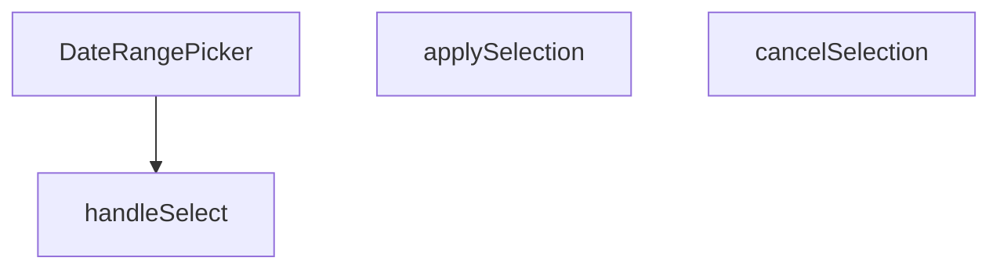

## NODE ID STANDARD

  file: src\components\admin\DateRangePicker.tsx
  function: src\components\admin\DateRangePicker.tsx::DateRangePicker
  function: src\components\admin\DateRangePicker.tsx::handleSelect
  function: src\components\admin\DateRangePicker.tsx::applySelection
  function: src\components\admin\DateRangePicker.tsx::cancelSelection

---

## DISA AKTARILANLAR (EXPORTS)
  export: DateRangePicker

---

## STİL TOKENLERİ

### Arbitrary Değerler (token'a geçirilmemiş)
Yok — tüm stiller token'a geçirilmiş. ✅

### Kullanılan Token'lar (zaten token'a geçirilmiş)
- (yok)

### Tailwind Sınıf Özeti
- **Renkler:** `bg-primary-navy`, `bg-slate-50`, `bg-white`, `bg-white/95`, `border-b`, `border-slate-100`, `border-slate-200`, `border-slate-200/60`, `border-t`, `hover:bg-primary-navy/90`, `hover:bg-slate-100`, `hover:bg-slate-200/50`, `hover:bg-slate-50`, `hover:border-slate-300`, `hover:text-slate-800`
- **Layout:** `backdrop-blur-xl`, `flex`, `flex-col`, `gap-1`, `gap-2`, `inline-flex`, `items-center`, `justify-between`, `max-h-60vh`, `max-h-85vh`, `max-w-full`, `md:flex-row`, `md:max-h-none`, `md:w-48`, `md:w-auto`
- **Varyant/Responsive:** `:`, `active:`, `disabled:`, `focus-visible:`, `hover:`, `md:`, `sm:` önekleri
- **Yardımcı Sınıflar:** `${className`, `${isOpen`, `${isSelected`, `:`, `active:scale-95`, `animate-in`, `border`, `disabled:active:scale-100`, `disabled:opacity-50`, `duration-200`, `fade-in`, `focus-visible:outline-none`, `focus-visible:ring-2`, `focus-visible:ring-primary-navy/20`, `font-bold`

---
# FILE: src\components\admin\EditableCell.md

---
domain: general
source_type: doc
namespace_type: module
source_path: C:\Users\alize\venthub-hvac\src\components\admin\EditableCell.tsx
skeleton_hash: 6bceb8c2f03611c7
entity_hashes:
  func:EditableCell: c69e143b78ab0750
  overview: e0ead7dc16886f70
  style_tokens: 2f2ada2707ada249
generated_at: 2026-06-08T10:08:36Z
---

## Genel Bakış
`EditableCell`, yönetim paneli tablolarındaki hücrelerin tıklanarak düzenlenebilir hale getirilmesini sağlayan bir React bileşenidir. Değer, veri tipi ve yer tutucu gibi yapılandırma parametreleri alarak hücrenin görünümünü ve davranışını kontrol eder; düzenleme işlemi tamamlandığında kaydetme çağrısı ile değişiklikleri üst bileşene iletir.

## Fonksiyon Grupları
### Düzenlenebilir Hücre Bileşeni
Bu modül, tek bir kapsamlı bileşenden oluşur ve tablo hücrelerinin görüntülenmesi, düzenleme moduna geçişi ile değişikliklerin kaydedilmesi süreçlerini yönetir.
- EditableCell

---

## AXIOMS – Mimari Varsayımlar

Bu modül, bir React bileşeni olup hücre düzenleme işlevi için aşağıdaki mimari varsayımları içerir.

[Aksiyom 1]: Eğer `value` prop'u sağlanmazsa, bileşen hücrede gösterilecek başlangıç değerini bilemez ve boş/undefined bir durum oluşur.

[Aksiyom 2]: Eğer `onSave` callback fonksiyonu sağlanmazsa, kullanıcı düzenlemeyi tamamladığında değişiklikler üst bileşene iletilemez ve veri kaybı oluşur.

[Aksiyom 3]: Eğer `type` parametresi geçerli bir input tipi (örn: 'text', 'number') değilse, tarayıcı varsayılan text input davranışı gösterir.

[Aksiyom 4]: Hücre tıklanarak düzenleme moduna geçilemezse, kullanıcı hücre değerini hiçbir zaman düzenleyemez ve bileşen salt okunur hale gelir.

[Aksiyom 5]: Eğer düzenleme modunda input alanı oluşturulamazsa (örn: odak yönetimi başarısız olursa), kullanıcı değişiklik yapamaz ve düzenleme akışı bozulur.

[Aksiyom 6]: Eğer `onSave` çağrısı başarısız olursa veya hata fırlatırsa, üst bileşen hatayı ele alamaz ve kullanıcıya geri bildirim verilemez.

---

## FONKSİYON DETAYLARI

### EditableCell
**Ne yapar**: EditableCell, kullanıcının bir hücredeki değeri düzenlemesine ve kaydetmesine olanak tanıyan bir React fonksiyonel bileşenidir. Inline düzenleme işlevselliği sağlar.

**Nasıl yapar**: Bileşen, `value`, `onSave`, `type`, `placeholder` ve `clas` prop'larını alır. `type` değerine göre uygun bir giriş elemanı (input, select vb.) render eder. Kullanıcı düzenleme işlemini tamamladığında `onSave` callback'ini tetikler. `placeholder`, değer boşken gösterilecek metni belirler. `clas` prop'u bileşene ek CSS sınıfları atamak için kullanılır.

**Parametreler**:
- `value`: any — Hücrede gösterilecek ve düzenlenecek olan mevcut değer.
- `onSave`: function — Kullanıcı değişikliği kaydettiğinde çağrılan geri çağrı fonksiyonu. Yeni değeri parametre olarak alır.
- `type`: string (varsayılan `'text'`) — Giriş elemanının türü (text, number, select vb.).
- `placeholder`: string (varsayılan `'-'`) — Değer boş veya tanımsız olduğunda gösterilen yer tutucu metin.
- `clas`: string — Bileşene uygulanacak ek CSS sınıf adı.

**Dönüş**: `React.FC<EditableCellProps>` — `EditableCellProps` arayüzüne sahip prop'lar bekleyen bir React fonksiyonel bileşeni döndürür. Bu bileşen, hücre düzenleme arayüzünü oluşturmak için kullanılır.

---

## INTERFACES

### EditableCellProps
- `value: string | number`
- `onSave: (newValue: string) => Promise<void>`
- `type?: 'text' | 'number'`
- `placeholder?: string`
- `className?: string`
- `disabled?: boolean`
- `inputWidth?: string`

---

## AST POINTERS

### [N1_NASIL] AST Pointer: src/components/admin/EditableCell.tsx::EditableCell
- **params**: (value, onSave, type, placeholder, className, disabled, inputWidth)
- **ic_degiskenler**:
    - `editing` — Düzenleme modunda olup olmadığını kontrol eden boolean state
    - `draft` — Düzenlenen değerin geçici olarak tutulduğu state
    - `saving` — Kaydetme işleminin devam edip etmediğini gösteren boolean state
    - `inputRef` — Input elementine referans tutan ref nesnesi
    - `startEdit` — Düzenleme moduna giriş fonksiyonu (useCallback ile memoize)
    - `cancel` — Düzenlemeyi iptal eden fonksiyon (useCallback ile memoize)
    - `save` — Değişiklikleri kaydeden async fonksiyon (useCallback ile memoize)
    - `handleKeyDown` — Tuş olaylarını yöneten fonksiyon (useCallback ile memoize)
- **Dönüş**: React.ReactNode (JSX)

### [N2_NASIL] AST Pointer: src/components/admin/EditableCell.tsx::useEffectCallback_1
- **params**: ()
- **ic_degiskenler**: (yok)
- **Dönüş**: void

### [N3_NASIL] AST Pointer: src/components/admin/EditableCell.tsx::useEffectCallback_2
- **params**: ()
- **ic_degiskenler**: (yok)
- **Dönüş**: void

### [N4_NASIL] AST Pointer: src/components/admin/EditableCell.tsx::startEdit
- **params**: ()
- **ic_degiskenler**: (yok)
- **Dönüş**: void

### [N5_NASIL] AST Pointer: src/components/admin/EditableCell.tsx::cancel
- **params**: ()
- **ic_degiskenler**: (yok)
- **Dönüş**: void

### [N6_NASIL] AST Pointer: src/components/admin/EditableCell.tsx::save
- **params**: ()
- **ic_degiskenler**:
    - `trimmed` — draft değerinin baş/son boşlukları temizlenmiş hali
    - `original` — Mevcut value parametresinin string karşılığı
- **Dönüş**: Promise<void>

### [N7_NASIL] AST Pointer: src/components/admin/EditableCell.tsx::handleKeyDown
- **params**: (e: React.KeyboardEvent)
- **ic_degiskenler**: (yok)
- **Dönüş**: void

### [N8_NASIL] AST Pointer: src/components/admin/EditableCell.tsx::onClickEditingView
- **params**: (e)
- **ic_degiskenler**: (yok)
- **Dönüş**: void

### [N9_NASIL] AST Pointer: src/components/admin/EditableCell.tsx::onChangeInput
- **params**: (e)
- **ic_degiskenler**: (yok)
- **Dönüş**: void

### [N10_NASIL] AST Pointer: src/components/admin/EditableCell.tsx::onBlurInput
- **params**: ()
- **ic_degiskenler**: (yok)
- **Dönüş**: void

### [N11_NASIL] AST Pointer: src/components/admin/EditableCell.tsx::onClickButton
- **params**: (e)
- **ic_degiskenler**: (yok)
- **Dönüş**: void

---

## NODE ID STANDARD

  file: src\components\admin\EditableCell.tsx
  function: src\components\admin\EditableCell.tsx::EditableCell

---

## DISA AKTARILANLAR (EXPORTS)
  export: EditableCell

---

## STİL TOKENLERİ

### Arbitrary Değerler (token'a geçirilmemiş)
Yok — tüm stiller token'a geçirilmiş. ✅

### Kullanılan Token'lar (zaten token'a geçirilmiş)
- (yok)

### Tailwind Sınıf Özeti
- **Renkler:** `bg-transparent`, `border-2`, `border-b`, `border-dashed`, `border-primary-navy`, `border-primary-navy/30`, `border-slate-300`, `border-t-primary-navy`, `hover:border-primary-navy`, `hover:text-primary-navy`, `text-left`, `text-slate-400`, `text-sm`
- **Layout:** `gap-1`, `h-3.5`, `inline-block`, `inline-flex`, `items-center`, `p-0`, `w-3.5`
- **Varyant/Responsive:** `disabled:`, `focus-visible:`, `hover:` önekleri
- **Yardımcı Sınıflar:** `${className`, `${inputWidth`, `animate-spin`, `border`, `cursor-pointer`, `disabled:cursor-not-allowed`, `disabled:opacity-50`, `focus-visible:outline-none`, `focus-visible:ring-1`, `focus-visible:ring-primary-navy/50`, `px-1.5`, `py-0.5`, `rounded`, `rounded-full`, `transition-colors`

---
# FILE: src\components\admin\ExportMenu.md

---
domain: general
source_type: doc
namespace_type: module
source_path: C:\Users\alize\venthub-hvac\src\components\admin\ExportMenu.tsx
skeleton_hash: a10b677ea8364439
entity_hashes:
  func:ExportMenu: 9e536638b7cdf449
  overview: fcef70276d80a8c4
  style_tokens: 7659c3683121a964
generated_at: 2026-06-08T10:08:36Z
---

## Genel Bakış
`ExportMenu` modülü, yönetim panelinde kullanıcının veri dışa aktarma seçeneklerini görüntülemesini ve tetiklemesini sağlayan bir React bileşeni sunar. Bileşen, gelen menü öğelerini listeleyerek her biri için ilgili eylemi çalıştırır ve isteğe bağlı bir buton etiketiyle kullanıcı arayüzünde konumlandırılabilir.

## Fonksiyon Grupları
### ExportMenu Bileşeni
Bu grup, menünün yapısını oluşturma, kullanıcı etkileşimini yönetme ve dışa aktarma işlemlerini başlatma sorumluluğunu üstlenir. Tek bir fonksiyon, tüm bu davranışları birleştirir.
- ExportMenu

---

## AXIOMS – Mimari Varsayımlar
Bu modül için özel aksiyom tanımlanmamıştır.

---

## FONKSİYON DETAYLARI

### ExportMenu
**Ne yapar**: Bu bileşen, yönetici arayüzünde dışa aktarma seçenekleri sunan bir menü oluşturur. Kullanıcıya verileri farklı formatlarda dışa aktarma imkanı sağlar.

**Nasıl yapar**: Bileşen, verilen `items` dizisini kullanarak bir menü listesi oluşturur. Her bir item için bir dışa aktarma seçeneği sunar. `buttonLabel` parametresi ile menünün üzerindeki düğme etiketi özelleştirilebilir. Bileşen, tıklanan öğenin bilgilerini bir üst bileşene iletir.

**Parametreler**:
- items: ExportMenuItem[] — Dışa aktarma seçeneklerini içeren dizi. Her bir seçenek, dışa aktarılacak veri kaynağını ve formatını belirtir.
- buttonLabel: string (opsiyonel) — Menüyü açan düğmenin üzerindeki metin. Belirtilmezse varsayılan bir etiket kullanılır.

**Dönüş**: React bileşeni (React.FC) — Oluşturulan dışa aktarma menüsünü render eden bir React bileşeni. Bileşen, ExportMenuItem[] dizisi ve opsiyonel buttonLabel string'i alır.

---

## TYPE ALIASES

### ExportMenuItem
```typescript
type ExportMenuItem = {

  key: string

  label: string

  onSelect: () => void

}
```

---

## AST POINTERS

### [N1_NASIL] AST Pointer: ExportMenu.tsx::ExportMenu
- **params**:
  - `items` — ExportMenuItem[] türünde, dışa aktarma menüsü seçeneklerinin listesi. Her item `key`, `label` ve `onSelect` özelliklerine sahiptir
  - `buttonLabel` — string (optional), menü tetikleyici butonunda gösterilecek özel metin. Tanımlı değilse varsayılan çeviri kullanılır
- **ic_degiskenler**:
  - `_t` — `useI18n()` hookundan elde edilen çeviri fonksiyonu (`t` olarak alınmış, `_t` olarak yeniden adlandırılmış). Menü metinlerinin çok dilli çevirilerini sağlamak için kullanılır
- **Dönüş**: JSX (DropdownMenu.Root bileşeni — dışa aktarma menüsü UI'ı)

---

## NODE ID STANDARD

  file: src\components\admin\ExportMenu.tsx
  function: src\components\admin\ExportMenu.tsx::ExportMenu

---

## DISA AKTARILANLAR (EXPORTS)
  export: ExportMenu
  export: ExportMenuItem

---

## STİL TOKENLERİ

### Arbitrary Değerler (token'a geçirilmemiş)
Yok — tüm stiller token'a geçirilmiş. ✅

### Kullanılan Token'lar (zaten token'a geçirilmiş)
- `rounded-hvac-lg`, `tracking-hvac-normal`

### Tailwind Sınıf Özeti
- **Renkler:** `bg-emerald-500/10`, `border-white/10`, `hover:bg-white/5`, `hover:text-white`, `text-emerald-400`, `text-slate-300`, `text-slate-500`, `text-xs`
- **Layout:** `flex`, `gap-2`, `gap-3`, `h-12`, `h-8`, `items-center`, `justify-center`, `min-w-140px`, `min-w-200px`, `p-2`, `shadow-elevation-5`, `w-8`, `z-50`, `zoom-in-95`
- **Varyant/Responsive:** `hover:` önekleri
- **Yardımcı Sınıflar:** `animate-in`, `border`, `cursor-pointer`, `duration-200`, `fade-in`, `font-black`, `font-bold`, `glass-strong`, `italic`, `mb-1`, `outline-none`, `pb-2`, `pt-2`, `px-3`, `px-4`

---
# FILE: src\components\admin\InfoTooltip.md

---
domain: general
source_type: doc
namespace_type: module
source_path: C:\Users\alize\venthub-hvac\src\components\admin\InfoTooltip.tsx
skeleton_hash: 15689fb19f78cf40
entity_hashes:
  func:InfoTooltip: 183c7d447a0090ba
  overview: aa0bb37988421fc0
  style_tokens: 15a027a0bab7a2ef
generated_at: 2026-06-08T10:08:36Z
---

## Genel Bakış
`InfoTooltip` bileşeni, yönetim panelindeki metin öğelerine ek bilgi sağlamak amacıyla kullanılan bir tooltip (ipucu) komponentidir. Verilen metni ve isteğe bağlı boyut ve stil parametrelerini alarak, kullanıcı fareyi üzerine getirdiğinde açıklayıcı bir balon gösterir.

## Fonksiyon Grupları
### Tooltip Render ve Konfigürasyon
Bu grup, tooltip’in içeriğini ve görünümünü oluşturup, dışarıdan gelen `text`, `size` ve `className` prop’larını işleyerek React elementini döndürür.
- InfoTooltip

---

## AXIOMS – Mimari Varsayımlar
Bu modül için özel aksiyom tanımlanmamıştır.

---

## FONKSİYON DETAYLARI

### InfoTooltip
**Ne yapar**: Kullanıcıya bilgilendirici bir tooltip (yardım ipucu) gösteren React bileşenidir. Belirli bir metni, hover (üzerine gelme) sırasında küçük bir baloncuk içinde kullanıcıya sunar.

**Nasıl yapar**: Bileşen, verilen text parametresini bir tooltip içinde render eder. size parametresi ile ikonun veya tetikleyicinin boyutu, className ile ek stillendirme seçenekleri özelleştirilebilir. Tooltip, genellikle bir bilgi ikonu (ℹ️) ile tetiklenir ve üzerine gelindiğinde veya tıklandığında bilgilendirici metni gösterir.

**Parametreler**:
- text: string — Tooltip içinde görüntülenecek bilgilendirici metin
- size: number (varsayılan: 14) — Tooltip tetikleyicisinin (ikon) piksel cinsinden boyutu
- className: string (varsayılan: '') — Bileşene eklenecek ek CSS sınıfları

**Dönüş**: React.FC<InfoTooltipProps> — Bileşen, InfoTooltipProps arayüzünü kullanan bir React fonksiyonel bileşeni olarak döner.

---

## INTERFACES

### InfoTooltipProps
- `text: string`
- `size?: number`
- `className?: string`

---

## AST POINTERS

### [N1_NASIL] AST Pointer: src/components/admin/InfoTooltip.tsx::InfoTooltip
- **params**: ({ text, size = 14, className = '' })
- **ic_degiskenler**:
  - (Fonksiyon gövdesinde tanımlanmış değişken yok)
- **Dönüş**: JSX elementi (React bileşeni). Fonksiyon, `text` parametresini tooltip içeriği olarak gösteren ve üzerine gelindiğinde (Tailwind `group-hover` ile) görünür olan, `Info` ikonu ve tooltip kutusu içeren bir React bileşeni döndürür. Parametre olarak `text`, `size` ve `className` kullanılır.

---

## NODE ID STANDARD

  file: src\components\admin\InfoTooltip.tsx
  function: src\components\admin\InfoTooltip.tsx::InfoTooltip

---

## DISA AKTARILANLAR (EXPORTS)
  export: InfoTooltip

---

## STİL TOKENLERİ

### Arbitrary Değerler (token'a geçirilmemiş)
Yok — tüm stiller token'a geçirilmiş. ✅

### Kullanılan Token'lar (zaten token'a geçirilmiş)
- (yok)

### Tailwind Sınıf Özeti
- **Renkler:** `bg-slate-800`, `border-4`, `border-t-slate-800`, `border-transparent`, `hover:text-primary-navy`, `text-left`, `text-slate-400`, `text-white`, `text-xs`
- **Layout:** `absolute`, `bottom-full`, `inline-flex`, `items-center`, `justify-center`, `left-1/2`, `relative`, `shadow-xl`, `top-full`, `w-64`, `z-50`
- **Varyant/Responsive:** `group-hover:`, `hover:` önekleri
- **Yardımcı Sınıflar:** `${className`, `-translate-x-1/2`, `align-middle`, `cursor-help`, `duration-200`, `font-normal`, `group`, `group-hover:opacity-100`, `group-hover:visible`, `invisible`, `leading-relaxed`, `mb-2`, `ml-1`, `normal-case`, `opacity-0`

---
# FILE: src\components\admin\InventoryCsvImport.md

---
domain: general
source_type: doc
namespace_type: module
source_path: C:\Users\alize\venthub-hvac\src\components\admin\InventoryCsvImport.tsx
skeleton_hash: c0f1efabd085dabf
entity_hashes:
  func:InventoryCsvImport: 312fdc52cc14a1c7
  overview: b024d6af47a350e3
  style_tokens: 3e4e1345adb17abc
generated_at: 2026-06-08T10:08:36Z
---

## Genel Bakış
Bu modül, CSV dosyaları aracılığıyla envanter verilerinin toplu olarak içe aktarılmasını sağlayan bir React modal bileşenidir. Dosya yükleme, veri doğrulama, önizleme ve eşik değerine göre stok güncelleme süreçlerini tek bir arayüzde yönetir ve üst bileşenle callback fonksiyonları aracılığıyla iletişim kurar.

## Fonksiyon Grupları
### Ana Bileşen
CSV içe aktarma iş akışını (dosya seçimi, doğrulama, önizleme ve nihai işleme) tek bir yerde yönetir ve modal kontrolü ile üst bileşenle iletişim sağlar.
- InventoryCsvImport

---

## AXIOMS – Mimari Varsayımlar

Bu modül, CSV tabanlı toplu envanter içe aktarma işlevi sağlayan modal bir React bileşenidir.

[Aksiyom 1]: Eğer `onClose` callback'i sağlanmazsa veya geçerli bir fonksiyon olmazsa, modal kapatılamaz ve kullanıcı arayüzünde kilitli bir durum oluşur.

[Aksiyom 2]: Eğer `onSuccess` callback'i sağlanmazsa, başarılı CSV içe aktarma işleminden sonra üst bileşen stok verilerini yenileme bildirimi alamaz.

[Aksiyom 3]: Eğer `effectiveThreshold` değeri sağlanmazsa (undefined/null), modülün eşik bazlı stok güncelleme mantığı çalışmayabilir; bilinmiyor hangi default davranış uygulanır — fonksiyon gövdesinde bu durumun ele alınıp alınmadığı bilinmiyor.

[Aksiyom 4]: Eğer `isOpen` false değerini alırsa, modal bileşeni render edilmez veya gizli durumda olur; bileşenin iç CSV yükleme/dogrulama state'leri bu durumda sıfırlanıp sıfırlanmayacağı fonksiyon gövdesine bağlıdır.

[Aksiyom 5]: Eğer bileşen modal içinde CSV dosyası yükleme ve doğrulama yürütüyorsa, `effectiveThreshold` sayısal bir değer olarak verilmelidir — aksi takdirde eşik karşılaştırma mantığı beklenmeyen sonuçlar üretebilir.

---

## FONKSİYON DETAYLARI

### InventoryCsvImport
**Ne yapar**: CSV dosyasından toplu stok güncelleme yapmak için bir modal arayüzü sunar. Kullanıcının CSV dosyası yüklemesine, stok değişikliklerini önizlemesine ve (isteğe bağlı olarak) veritabanını güncellemesine olanak tanır. Kuru çalıştırma (dry-run) modu ile önce simülasyon yapılabilir.

**Nasıl yapar**: CSV dosyasını satır satır ayrıştırarak SKU ve miktar bilgilerini çıkarır. Mevcut ürün verisiyle eşleştirerek stok değişimlerini hesaplar ve bir önizleme tablosu oluşturur. `processCSV` fonksiyonu ile toplu veritabanı güncelleme yapar (20'şerli gruplar halinde). İşlem sonrası geri alma (undo) seçeneği sunan bir bildirim gösterir.

**Parametreler**:
- isOpen: boolean — Modalın açılıp kapanmasını kontrol eder. `false` olduğunda bileşen `null` döner ve render edilmez.
- onClose: () => void — Modal kapatıldığında çağrılan geri çağırma fonksiyonu.
- onSuccess: () => void — Stok güncelleme başarıyla tamamlandığında çağrılan geri çağırma fonksiyonu.
- effectiveThreshold: (productId: string) => number | null — Belirli bir ürün için stok eşik değerini döndüren fonksiyon. Stok durumu belirlemede kullanılır.

**Dönüş**: JSX.Element | null — Modal açıkken JSX bileşeni, kapalıyken `null` döner.

---

## INTERFACES

### CsvPreviewRow
- `sku: string`
- `name: string`
- `current: number`
- `new: number`
- `delta: number`
- `status: 'out' | 'critical' | null`

### InventoryCsvImportProps
- `isOpen: boolean`
- `onClose: () => void`
- `onSuccess: () => void`
- `effectiveThreshold: (_productId: string) => number | null`

---

## AST POINTERS

### [N1_NASIL] AST Pointer: InventoryCsvImport.tsx::handleCsvImport
- **params**: (file: File)
- **ic_degiskenler**:
  - `textRaw` — Dosyanın ham metin içeriği (BOM karakteri dahil)
  - `text` — BOM karakteri temizlenmiş CSV metni
  - `lines` — Boş satırları filtrelenmiş satır dizisi
  - `split` — Virgülle ayıran ve tırnak işaretlerini işleyen yardımcı fonksiyon
  - `headerRaw` — Küçük harf ve boşluk temizlenmiş başlık satırı
  - `skuIdx` — SKU sütununun indeksi
  - `qtyIdx` — qty/quantity/stock/new_stock sütununun indeksi
  - `parsedRows` — Geçerli satırların {line, sku, newQty} formatında tutulduğu dizi
  - `errors` — Hatalı satırların {line, sku, message} formatında tutulduğu dizi
  - `products` — Supabase'den çekilen ürünlerin (id, sku, name, stock_qty) dizisi
  - `skuToProduct` — SKU'ya göre ürün bilgilerini (id, name, stock) tutan Map
  - `preview` — Önizleme satırlarının (CsvPreviewRow) tutulduğu dizi
- **Dönüş**: yok — State güncelleme (setCsvPreview) ve toast hata mesajları

### [N2_NASIL] AST Pointer: InventoryCsvImport.tsx::handleCsvProcess
- **params**: yok
- **ic_degiskenler**:
  - `skus` — csvPreview'deki benzersiz SKU listesi
  - `products` — Supabase'den çekilen ürünlerin (id, sku) dizisi
  - `skuToId` — SKU'ya göre ürün ID'lerini tutan Map
  - `successCount` — Başarıyla güncellenen ürün sayısı
  - `errors` — Hatalı SKU ve mesajlarını tutan dizi
  - `batchId` — Toplu işlem için benzersiz ID (generateId ile oluşturuldu)
  - `BATCH_SIZE` — Toplu işleme boyutu (20)
- **Dönüş**: yok — State güncelleme (setCsvProcessing, setCsvProgress), onClose/onSuccess çağrısı, toast bildirimi

### [N3_NASIL] AST Pointer: InventoryCsvImport.tsx::processItem (inner async)
- **params**: (item: CsvPreviewRow)
- **ic_degiskenler**:
  - `_productId` — SKU'ya karşılık gelen ürün ID'si (skuToId Map'inden)
  - `reason` — Stok hareketi nedeni metni (CSV import add/remove)
- **Dönüş**: yok — supabase.rpc('adjust_stock') çağrısı ve logAdminAction ile audit loglama

### [N4_NASIL] AST Pointer: InventoryCsvImport.tsx::downloadErrors
- **params**: yok
- **ic_degiskenler**:
  - `header` — CSV başlık satırı (['sku', 'message'])
  - `lines` — Hataların CSV formatında satırları
  - `csv` — Tam CSV metni (BOM dahil)
  - `blob` — CSV dosyası için Blob nesnesi
  - `url` — Blob URL'i
  - `a` — Dosyayı indirmek için oluşturulan anchor element
- **Dönüş**: yok — Tarayıcıda dosya indirme tetikleme

### [N5_NASIL] AST Pointer: InventoryCsvImport.tsx::toastContent (inner)
- **params**: (id: string)
- **ic_degiskenler**:
  - (Local variable yok, sadece parametre ve closure değişkenleri kullanılıyor)
- **Dönüş**: JSX.Element — Başarı toast bildirimi (Hareketleri Gör, Hataları İndir, Tümünü Geri Al butonları)

### [N6_NASIL] AST Pointer: InventoryCsvImport.tsx::handleUndo (inner async)
- **params**: yok
- **ic_degiskenler**:
  - `data` — reverse_inventory_batch RPC dönüş değeri
  - `error` — RPC hatası
  - `undone` — Geri alınan hareket sayısı
- **Dönüş**: yok — supabase.rpc('reverse_inventory_batch') çağrısı, toast bildirimi, onSuccess çağrısı

### [N7_NASIL] AST Pointer: InventoryCsvImport.tsx::handleFileChange
- **params**: (e: React.ChangeEvent<HTMLInputElement>)
- **ic_degiskenler**:
  - `file` — Seçilen dosya (e.target.files[0])
- **Dönüş**: yok — handleCsvImport(file) çağrısı

### [N8_NASIL] AST Pointer: InventoryCsvImport.tsx::handleDryRunToggle
- **params**: (e: React.KeyboardEvent<HTMLInputElement>)
- **ic_degiskenler**:
  - (Local variable yok)
- **Dönüş**: yok — dryRun durumunu togggle etme

### [N9_NASIL] AST Pointer: InventoryCsvImport.tsx::renderRow
- **params**: (item: CsvPreviewRow, idx: number)
- **ic_degiskenler**:
  - (Local variable yok, sadece parametre kullanılıyor)
- **Dönüş**: JSX.Element — Tablo satırı (sku, name, current, new, delta sütunları)

---

## NODE ID STANDARD

  file: src\components\admin\InventoryCsvImport.tsx
  function: src\components\admin\InventoryCsvImport.tsx::InventoryCsvImport

---

## DISA AKTARILANLAR (EXPORTS)
  export: InventoryCsvImport

---

## STİL TOKENLERİ

### Arbitrary Değerler (token'a geçirilmemiş)
Yok — tüm stiller token'a geçirilmiş. ✅

### Kullanılan Token'lar (zaten token'a geçirilmiş)
- `rounded-hvac-2xl`, `rounded-hvac-lg`, `rounded-hvac-xl`, `shadow-glow-md`, `shadow-glow-sm`, `tracking-hvac-normal`

### Tailwind Sınıf Özeti
- **Renkler:** `bg-amber-400`, `bg-black/60`, `bg-cyan-400`, `bg-rose-500/20`, `bg-surface-deep/20`, `bg-surface-midnight`, `bg-transparent`, `bg-white`, `bg-white/10`, `bg-white/2`, `bg-white/5`, `border-2`, `border-b`, `border-dashed`, `border-none`
- **Layout:** `absolute`, `backdrop-blur-sm`, `block`, `custom-scrollbar`, `fixed`, `flex`, `flex-1`, `flex-col`, `gap-2`, `gap-3`, `gap-4`, `h-10`, `h-12`, `h-16`, `h-3`
- **Varyant/Responsive:** `:`, `disabled:`, `focus-visible:`, `group-hover:`, `group-last:`, `hover:` önekleri
- **Yardımcı Sınıflar:** `${dryRun`, `${item.delta`, `0`, `:`, `>`, `animate-in`, `animate-spin`, `border`, `cursor-default`, `cursor-pointer`, `decoration-cyan-400/30`, `disabled:opacity-30`, `duration-300`, `fade-in`, `focus-visible:ring-2`

---
# FILE: src\components\admin\InventoryDetailDrawer.md

---
domain: general
source_type: doc
namespace_type: module
source_path: C:\Users\alize\venthub-hvac\src\components\admin\InventoryDetailDrawer.tsx
skeleton_hash: a795a88f64a4a4b7
entity_hashes:
  func:InventoryDetailDrawer: 3a57400ca0f546b7
  overview: 92caa1481da5cee7
  style_tokens: 4b283d8541dc151c
generated_at: 2026-06-08T10:08:36Z
---

## Genel Bakış
InventoryDetailDrawer, envanter öğelerinin ayrıntılarını gösteren bir React bileşenidir. Kullanıcıya seçilen ürünün stok miktarı, konumu ve diğer meta verileri sunar. Ayrıca düzenleme ve kapatma işlevlerini sağlayarak envanter yönetimi akışını destekler.

## Fonksiyon Grupları
### Ana Bileşen
Bileşenin giriş noktası ve render mantığını yönetir.
- InventoryDetailDrawer

---

## AXIOMS – Mimari Varsayımlar
Bu modül için özel aksiyom tanımlanmamıştır.

---

## FONKSİYON DETAYLARI

### InventoryDetailDrawer
**Ne yapar**: Seçili bir ürünün stok detaylarını, eşik değerlerini ve hareket geçmişini gösteren bir yan çekmece (drawer) arayüzü oluşturur. Kullanıcıların QR etiketi yazdırması, eşik güncellemesi, stok ayarlaması ve hareketleri geri alması gibi etkileşimli işlemleri yönetir.  

**Nasıl yapar**: Props içinde gelen durum ve setter fonksiyonlarını destrüktüre eder, Escape tuşu ile çekmeceyi kapatmak için bir `useEffect` ekler ve `selected` nesnesi yoksa `null` döner. UI, bir kapatma butonu, ürün bilgileri, stok ve eşik kartları, zeki satın alma önerisi, eşik güncelleme formu, stok ayarlama bileşeni, rezerve sipariş tablosu ve hareket geçmişi bölümlerinden oluşur. Buton ve input etkileşimleri ilgili callback’leri (ör. `printQrLabel`, `saveThreshold`, `adjustStock`, `undoLastMovement`) tetikler.  

**Parametreler**:
- props: InventoryDetailDrawerProps — Çekmeceyi kontrol eden tüm durum ve fonksiyonları içeren nesne. İçerisinde:
  - selected: any — Görüntülenecek ürün nesnesi; yoksa çekmece kapanır.
  - setSelected: (value: any) => void — Çekmeceyi kapatmak veya seçimi değiştirmek için kullanılan setter.
  - printingQr: boolean — QR etiketi yazdırma işleminin devam edip etmediğini gösterir.
  - setPrintingQr: (value: boolean) => void — QR yazdırma durumunu günceller.
  - selectedStock: number | null — Ürünün mevcut stok miktarı.
  - selectedThreshold: string | number — Kullanıcı tarafından girilen eşik değeri.
  - setSelectedThreshold: (value: string | number) => void — Eşik değerini günceller.
  - defaultThreshold: number | null — Sistem tarafından tanımlı varsayılan eşik.
  - saving: boolean — Eşik kaydetme işleminin sürecini gösterir.
  - saveThreshold: (productId: string) => void — Yeni eşik değerini kaydeder.
  - hasWriteAccess: boolean — Kullanıcının düzenleme yetkisi olup olmadığını belirler.
  - moveQty: number — Stok hareketi miktarı.
  - setMoveQty: (value: number) => void — Stok hareket miktarını ayarlar.
  - moving: boolean — Stok hareketi işleminin devam edip etmediği.
  - adjustStock: (params: any) => void — Stok ayarlama işlemini gerçekleştirir.
  - reservedOrders: any[] — Rezerve siparişlerin listesi.
  - movements: any[] — Stok hareket geçmişi.
  - undoLastMovement: () => void — Son stok hareketini geri alır.
  - undoing: boolean — Geri alma işleminin sürecini gösterir.
  - t: (key: string) => string — Çeviri fonksiyonu.

**Dönüş**: `void` (React bileşeni olarak JSX döndürür; render edildiğinde UI oluşturur).

---

## INTERFACES

### InventoryDetailDrawerProps
- `selected: InventoryRow | null`
- `setSelected: (v: InventoryRow | null) => void`
- `printingQr: boolean`
- `setPrintingQr: (v: boolean) => void`
- `selectedStock: number | null`
- `selectedThreshold: number | ''`
- `setSelectedThreshold: (v: number | '') => void`
- `defaultThreshold: number | null`
- `saving: boolean`
- `saveThreshold: (id: string) => void`
- `hasWriteAccess: boolean`
- `moveQty: number`
- `setMoveQty: (v: number) => void`
- `moving: boolean`
- `adjustStock: (id: string, delta: number, reason: string) => void`
- `reservedOrders: ReservedRow[]`
- `movements: Movement[]`
- `undoLastMovement: () => void`
- `undoing: boolean`
- `t: (key: string) => string`

---

## AST POINTERS

### [N1_NASIL] AST Pointer: C:\Users\alize\venthub-hvac\src\components\admin\InventoryDetailDrawer.tsx::InventoryDetailDrawer
- **params**: (props)
- **ic_degiskenler**:
  - `selected` — seçili envanter satırı, drawer’ın gösterilip gösterilmeyeceğini belirler
  - `setSelected` — seçili satırı sıfırlamak için kullanılan state setter fonksiyonu
  - `printingQr` — QR kodu basımının şu anda gerçekleşip gerçekleşmediğini gösteren boolean
  - `setPrintingQr` — QR basım durumunu güncelleyen state setter fonksiyonu
  - `selectedStock` — seçili ürünün mevcut stok miktarı
  - `selectedThreshold` — seçili ürün için gösterilen eşik (alarm) değeri
  - `setSelectedThreshold` — eşik değerini güncelleyen state setter fonksiyonu
  - `defaultThreshold` — ürünün varsayılan eşik değeri (fallback)
  - `saving` — eşik güncelleme işleminin devam edip etmediğini gösteren boolean
  - `saveThreshold` — eşik değerini kaydeden fonksiyon (product_id parametresi alır)
  - `hasWriteAccess` — kullanıcının düzenleme yetkisi olup olmadığını belirten boolean
  - `moveQty` — stok hareketi miktarı (adjust component’ine aktarılır)
  - `setMoveQty` — hareket miktarını güncelleyen state setter fonksiyonu
  - `moving` — stok hareketi işleminin devam edip etmediğini gösteren boolean
  - `adjustStock` — stok ayarlama işlemini tetikleyen callback
  - `reservedOrders` — rezerve siparişlerin listesi, `InventoryReservedTable`a prop olarak verilir
  - `movements` — stok hareket geçmişi dizisi, `InventoryMovementHistory`a prop olarak verilir
  - `undoLastMovement` — son hareketi geri almayı tetikleyen fonksiyon
  - `undoing` — geri alma işleminin devam edip etmediğini gösteren boolean
  - `t` — i18n çeviri fonksiyonu
  - `onKey` — `Escape` tuşuna basıldığında drawer’ı kapatan yerel fonksiyon (useEffect içinde tanımlanır)
- **Dönüş**: yok (React bileşeni, JSX döndürür; yan etkileri: `useEffect` ile klavye dinleyicisi ekler ve temizler)

---

## NODE ID STANDARD

  file: src\components\admin\InventoryDetailDrawer.tsx
  function: src\components\admin\InventoryDetailDrawer.tsx::InventoryDetailDrawer

---

## DISA AKTARILANLAR (EXPORTS)
  export: InventoryDetailDrawer

---

## STİL TOKENLERİ

### Arbitrary Değerler (token'a geçirilmemiş)
Yok — tüm stiller token'a geçirilmiş. ✅

### Kullanılan Token'lar (zaten token'a geçirilmiş)
- `rounded-hvac-lg`, `rounded-hvac-xl`, `shadow-glow-md`, `tracking-hvac-normal`

### Tailwind Sınıf Özeti
- **Renkler:** `bg-amber-500`, `bg-black/60`, `bg-cyan-400`, `bg-cyan-400/10`, `bg-white/2`, `bg-white/3`, `border-b`, `border-cyan-400/20`, `border-l`, `border-none`, `border-white/10`, `border-white/5`, `focus-visible:border-cyan-400/40`, `hover:bg-cyan-300`, `hover:border-amber-400/30`
- **Layout:** `-right-8`, `-top-8`, `absolute`, `backdrop-blur-sm`, `custom-scrollbar`, `fixed`, `flex`, `flex-1`, `flex-col`, `flex-shrink-0`, `gap-2`, `gap-3`, `gap-4`, `gap-6`, `grid`
- **Varyant/Responsive:** `disabled:`, `focus-visible:`, `hover:`, `sm:` önekleri
- **Yardımcı Sınıflar:** `animate-in`, `animate-ping`, `animate-pulse`, `blur-3xl`, `border`, `cursor-default`, `disabled:opacity-50`, `duration-300`, `focus-visible:outline-none`, `focus-visible:ring-2`, `focus-visible:ring-cyan-400/20`, `font-black`, `font-bold`, `font-mono`, `glass`

---
# FILE: src\components\admin\InventoryMovementHistory.md

---
domain: general
source_type: doc
namespace_type: module
source_path: C:\Users\alize\venthub-hvac\src\components\admin\InventoryMovementHistory.tsx
skeleton_hash: b866bc2cf5b15d5f
entity_hashes:
  func:InventoryMovementHistory: 2413e5385b8816cc
  overview: a9fb0b3f91f018c7
  style_tokens: 1f29bfe131c33c25
generated_at: 2026-06-08T10:08:37Z
---

## Genel Bakış
`InventoryMovementHistory` bileşeni, yönetim panelinde envanter hareketlerinin zaman çizelgesini gösteren bir görünümdür. Gelen `movements` verisini alır ve bu veriyi okunabilir bir formatta listeler, böylece kullanıcılar geçmiş envanter değişikliklerini inceleyebilir.

## Fonksiyon Grupları
### Ana Bileşen Grubu
Bu grup, modülün tek işlevini yerine getirir; envanter hareket geçmişini UI olarak render eder.  
- InventoryMovementHistory

---

## AXIOMS – Mimari Varsayımlar
Bu modül, `movements` prop'una dayalı olarak çalışır; bu prop'un varlığı ve türü bileşenin doğru render edilmesi için kritiktir.

[Aksiyom 1]: Eğer `movements` prop'u tanımlı değilse (undefined), bileşen render sırasında `movements.map` gibi bir yöntem çağırarak çalışma zamanı hatası fırlatabilir.  
[Aksiyom 2]: Eğer `movements` prop'u bir dizi (iterable) değilse, `.map` veya benzeri yineleme işlevi başarısız olur ve bileşen hata verir.  
[Aksiyom 3]: Eğer `movements` dizisi boşsa, bileşen hiçbir hareket öğesi render etmez ve boş bir görünüm gösterir.  
[Aksiyom 4]: Eğer `movements` dizisindeki öğeler bileşenin görüntülemesi gereken veriyi (tarih, ürün, miktar vb.) içermiyorsa, bu eksik veriler undefined veya boş olarak görünebilir ve kullanıcıya eksik bilgi sunulur.

---

## FONKSİYON DETAYLARI

### InventoryMovementHistory
**Ne yapar**: Envanter hareketlerinin listesini görüntüleyen bir React bileşenidir.  
**Nasıl yapar**: `movements` prop'undan gelen verileri alıp, içindeki her bir hareket için uygun UI elemanları (örnek satır, kart vb.) oluşturur ve döndürür. Bileşenin iç mantığı, gelen veriyi iterate ederek her bir hareket için gerekli görsel öğeleri üretmektir.  
**Parametreler**:  
- movements: InventoryMovementHistoryProps — Gösterilecek envanter hareketlerinin koleksiyonu (tipi tanımlanmamış, ancak genellikle dizidir).  
**Dönüş**: void (React elementi döndürür; işlevsel bileşen olarak JSX üretir).

---

## INTERFACES

### Movement
- `id: string`
- `delta: number`
- `reason: string`
- `created_at: string`

### InventoryMovementHistoryProps
- `movements: Movement[]`

---

## AST POINTERS

### [N1_NASIL] AST Pointer: src/components/admin/InventoryMovementHistory.tsx::InventoryMovementHistory
- **params**: movements
- **ic_degiskenler**: 
  - `movements` — prop containing array of movement objects passed from parent component.
  - `m` — each movement item iterated over in the `.map` callback; used to access `m.id`, `m.created_at`, `m.reason`, and `m.delta`.
- **Dönüş**: JSX.Element | null (returns `null` when `movements.length === 0`, otherwise returns the rendered table JSX)

---

## NODE ID STANDARD

  file: src\components\admin\InventoryMovementHistory.tsx
  function: src\components\admin\InventoryMovementHistory.tsx::InventoryMovementHistory

---

## DISA AKTARILANLAR (EXPORTS)
  export: InventoryMovementHistory
  export: Movement

---

## STİL TOKENLERİ

### Arbitrary Değerler (token'a geçirilmemiş)
Yok — tüm stiller token'a geçirilmiş. ✅

### Kullanılan Token'lar (zaten token'a geçirilmiş)
- `tracking-hvac-normal`

### Tailwind Sınıf Özeti
- **Renkler:** `bg-transparent`, `bg-white/2`, `border-b`, `border-separate`, `border-spacing-0`, `border-white/5`, `group-last:border-0`, `hover:bg-white/2`, `text-emerald-400`, `text-left`, `text-right`, `text-rose-400`, `text-slate-300`, `text-slate-500`, `text-xs`
- **Layout:** `max-w-140px`, `overflow-hidden`, `w-full`
- **Varyant/Responsive:** `:`, `group-last:`, `hover:` önekleri
- **Yardımcı Sınıflar:** `${Number(m.delta`, `0`, `:`, `>`, `font-black`, `font-bold`, `group`, `px-4`, `py-3`, `transition-colors`, `truncate`, `uppercase`

---
# FILE: src\components\admin\InventoryQrLabel.md

---
domain: general
source_type: doc
namespace_type: module
source_path: C:\Users\alize\venthub-hvac\src\components\admin\InventoryQrLabel.tsx
skeleton_hash: ebe773dcc2c30493
entity_hashes:
  func:printQrLabel: 68158948d578d02a
  overview: ddf13ce18f5512aa
  style_tokens: dd5ed8d0f58dcf57
generated_at: 2026-05-29T18:45:03Z
---

## Genel Bakış
Bu modül, envanter kalemleri için QR kod etiketlerinin yazdırılmasını yöneten tek bir odaklı işlev sunar. Kullanıcının yazdırma tetiklemesiyle asenkron olarak çalışan fonksiyon, yazdırma sürecinin UI üzerindeki durumunu (yazdırılıyor/yazdırıldı) kontrol eder.

## Fonksiyon Grupları
### QR Etiket Yazdırma
Etiket yazdırma sürecinin tüm aşamalarını — hazırlık, basıcıya gönderim ve durum yönetimi — tek bir işlevde kümeler.
- printQrLabel

---

## AXIOMS – Mimari Varsayımlar
Bu modül, QR etiket yaz

---

## FONKSİYON DETAYLARI

### printQrLabel
**Ne yapar**: QR etiketini yazdırma işlemini gerçekleştirir.  
**Nasıl yapar**: `QrLabelProps` türündeki `r` parametresinden etiket verisini alır ve `setPrintingQr` fonksiyonunu çağırarak yazdırma durumunu günceller.  
**Parametreler**:
- r: QrLabelProps — Yazdırılacak QR etiketinin özelliklerini içeren nesne.  
- setPrintingQr: (v: boolean) => void — Yazdırma işleminin başlatılıp bitirilmesini gösteren durum güncelleyici fonksiyonu.  
**Dönüş**: void — Fonksiyon bir değer döndürmez.

---

## INTERFACES

### QrLabelProps
- `product_id: string`
- `name: string`
- `warehouse_location?: string | null`
- `physical_stock: number`

---

## AST POINTERS

### [N1_NASIL] AST Pointer: InventoryQrLabel.tsx::printQrLabel
- **params**: `(r: QrLabelProps, setPrintingQr: (v: boolean) => void)`
  - `r` — QR etiketi basılacak ürünün bilgilerini taşıyan nesne; `r.product_id`, `r.name`, `r.warehouse_location`, `r.physical_stock` alanları kullanılır
  - `setPrintingQr` — yazdırma işleminin devam edip etmediğini belirten state setter; `true` ile başlar, `finally` bloğunda `false` yapılır
- **ic_degiskenler**:
  - `url` — qrserver.com API'si kullanılarak oluşturulan QR kod görselinin URL adresi; `r.product_id` Base64-URL-encode edilerek dataya eklenir
  - `iframe` — yazdırma işlemini gerçekleştirmek için DOM'a eklenen gizli iframe elemanı; HTML içeriği içine yazılır ve `window.print()` tetiklenir
  - `safeName` — `r.name` değerinin XSS-safe hali; `<` ve `>` karakterleri HTML entity'lerine dönüştürülür; HTML template'de ürün adı olarak gösterilir
  - `safeSku` — `r.product_id`'den ilk 8 karakter alınıp büyük harfe çevrilmiş, XSS-safe SKU kodu; HTML template'de "SKU Kodu" olarak gösterilir
  - `safeLoc` — `r.warehouse_location` değerinin XSS-safe hali; boşsa `'-'` değeri kullanılır; HTML template'de "Depo Rafı" olarak gösterilir
  - `htmlContent` — iframe içine yazılacak tam HTML doküman stringi; CSS stilleri, QR görseli, ürün bilgileri ve yazdırma medya sorgularını içerir; `safeSku`, `safeName`, `safeLoc`, `url`, `r.physical_stock` template literal ile interpolatedir
  - `doc` — `iframe.contentWindow?.document` ifadesinden elde edilen iframe'in Document nesnesi; `null` kontrolü yapılarak `doc.open()`, `doc.write(htmlContent)`, `doc.close()` ile HTML içeriği iframe'a yazılır
- **Dönüş**: yok — fonksiyon asenkrondür, doğrudan bir değer dönmez; yan etki olarak iframe oluşturur, HTML yazar, 5 saniye sonra iframe'ı DOM'dan kaldırır; hata durumunda `toast.error('Etiket oluşturulamadı')` gösterir; her durumda `setPrintingQr(false)` çağırır

---

## NODE ID STANDARD

  file: src\components\admin\InventoryQrLabel.tsx
  function: src\components\admin\InventoryQrLabel.tsx::printQrLabel

---

## DISA AKTARILANLAR (EXPORTS)
  export: printQrLabel

---

## STİL TOKENLERİ

### Arbitrary Değerler (token'a geçirilmemiş)
Yok — tüm stiller token'a geçirilmiş. ✅

### Kullanılan Token'lar (zaten token'a geçirilmiş)
- (yok)

### Tailwind Sınıf Özeti
- **Renkler:** (yok)
- **Layout:** (yok)
- **Varyant/Responsive:** (yok)
- **Yardımcı Sınıflar:** (yok)

---
# FILE: src\components\admin\InventoryReservedTable.md

---
domain: general
source_type: doc
namespace_type: module
source_path: C:\Users\alize\venthub-hvac\src\components\admin\InventoryReservedTable.tsx
skeleton_hash: 83eea5dd1bd8d79e
entity_hashes:
  func:InventoryReservedTable: 126336fe1c94b592
  overview: e173f7662e40b92c
  style_tokens: 45cb66bf7519a761
generated_at: 2026-06-08T10:08:37Z
---

## Genel Bakış
`InventoryReservedTable` bileşeni, yönetim panelinde rezerve edilmiş siparişlerin listelendiği bir tabloyu render eder. Gelen `reservedOrders` propunu alır, tablo başlıklarını ve satırlarını oluşturur, ayrıca boş veri durumları ve yükleme/hataya karşı temel UI geri bildirimlerini sağlar.

## Fonksiyon Grupları
### UI Render & Layout
Bu grup, tablo yapısını, başlık satırını ve her bir rezerve sipariş satırını JSX içinde oluşturur.  
- InventoryReservedTable

### Veri Hazırlama & Durum Kontrolü
Bu grup, `reservedOrders` propunun varlığını, boş olup olmadığını ve olası hata/boş veri senaryolarını kontrol eder; UI’nın hangi duruma göre gösterileceğine karar verir.  
- InventoryReservedTable

---

## AXIOMS – Mimari Varsayımlar
Bu modül için aşağıdaki varsayımlar geçerlidir.

[Aksiyom 1]: Eğer `reservedOrders` prop'u sağlanmazsa, bileşen derleme zamanında TypeScript hatası verir veya çalışma zamanında `undefined` değeri nedeniyle render sırasında hata olur.  
[Aksiyom 2]: Eğer `reservedOrders` `null` veya `undefined` ise, bileşen `.length` özelliğine erişmeye çalıştığı için çalışma zamanı hatası olur.  
[Aksiyom 3]: Eğer `reservedOrders` boş bir dizi (`[]`) ise, bileşen boş veri durumu UI'sini render eder.  
[Aksiyom 4]: Eğer `reservedOrders` bir dizi tipi değilse (örneğin string, obje), bileşen `.length` veya `.map` gibi dizi metodlarına erişmeye çalıştığı için beklenmeyen davranış veya hata olur.

---

## FONKSİYON DETAYLARI

### InventoryReservedTable
**Ne yapar**: Rezervasyon alınan siparişlerin bir tablosunu görüntüler.  
**Nasıl yapar**: `reservedOrders` prop'undan gelen veriyi alıp, her bir sipariş için tablo satırı oluşturur ve bu satırları bir JSX tablosu içinde render eder.  
**Parametreler**:
- reservedOrders: InventoryReservedTableProps — Görüntülenecek rezervasyon siparişlerinin veri yapısı (genellikle bir dizi ve ilgili meta bilgiler içerir).  
**Dönüş**: void — Fonksiyon bir JSX elementi döndürür; açık bir değer döndürmez.

---

## INTERFACES

### InventoryReservedTableProps
- `reservedOrders: ReservedRow[]`

---

## TYPE ALIASES

### ReservedRow
```typescript
type ReservedRow = {

    order_id: string;

    created_at: string;

    status: string;

    payment_status: string | null;

    quantity: number

}
```

---

## AST POINTERS

### [N1_NASIL] AST Pointer: C:\Users\alize\venthub-hvac\src\components\admin\InventoryReservedTable.tsx::InventoryReservedTable
- **params**: reservedOrders
- **ic_degiskenler**: 
  - `reservedOrders` — prop containing array of reserved order objects, used to check length and map over.
- **Dönüs**: JSX.Element

### [N2_NASIL] AST Pointer: C:\Users\alize\venthub-hvac\src\components\admin\InventoryReservedTable.tsx::InventoryReservedTable.map callback
- **params**: ro
- **ic_degiskenler**: 
  - `ro` — each reserved order object with `order_id`, `created_at`, and `quantity` properties.
- **Dönüs**: JSX.Element

---

## NODE ID STANDARD

  file: src\components\admin\InventoryReservedTable.tsx
  function: src\components\admin\InventoryReservedTable.tsx::InventoryReservedTable

---

## DISA AKTARILANLAR (EXPORTS)
  export: InventoryReservedTable
  export: ReservedRow

---

## STİL TOKENLERİ

### Arbitrary Değerler (token'a geçirilmemiş)
Yok — tüm stiller token'a geçirilmiş. ✅

### Kullanılan Token'lar (zaten token'a geçirilmiş)
- `tracking-hvac-normal`

### Tailwind Sınıf Özeti
- **Renkler:** `bg-transparent`, `bg-white/2`, `border-b`, `border-separate`, `border-spacing-0`, `border-white/5`, `group-last:border-0`, `hover:bg-white/2`, `text-cyan-400`, `text-left`, `text-right`, `text-slate-300`, `text-slate-500`, `text-xs`
- **Layout:** `overflow-hidden`, `w-full`
- **Varyant/Responsive:** `group-last:`, `hover:` önekleri
- **Yardımcı Sınıflar:** `font-black`, `font-bold`, `font-mono`, `group`, `px-4`, `py-3`, `tracking-tighter`, `transition-colors`, `uppercase`

---
# FILE: src\components\admin\InventoryStockAdjust.md

---
domain: general
source_type: doc
namespace_type: module
source_path: C:\Users\alize\venthub-hvac\src\components\admin\InventoryStockAdjust.tsx
skeleton_hash: 257f3a60c6c02a8b
entity_hashes:
  func:InventoryStockAdjust: 140b16e336bb5af7
  overview: 3b1f0525645c9b2f
  style_tokens: 333546eed756e72e
generated_at: 2026-05-28T22:35:34Z
---

## Genel Bakış
`InventoryStockAdjust` bileşeni, bir ürünün stok miktarını ayarlamak için kullanılan bir yönetim arayüzü sunar. Kullanıcıdan alınan miktar değişikliği, dışarıdan sağlanan `onAdjust` callback’i aracılığıyla üst katmana iletilir ve bileşen içinde geçici bir durum (`moveQty`) yönetilir.

## Fonksiyon Grupları
### UI ve Props İşleme
Bileşen, gelen `productId`, `moving`, `onAdjust`, `moveQty` ve `setMoveQty` gibi prop’ları alır, bunları JSX içinde uygun giriş alanları ve butonlarla bağlayarak kullanıcı etkileşimini sağlar.  
- InventoryStockAdjust

### Durum ve Etkileşim Yönetimi
Kullanıcı miktar girişi yaptığında `setMoveQty` ile geçici miktar güncellenir; “Ayarlama” butonuna basıldığında `onAdjust` çağrılarak stok güncelleme işlemi tetiklenir.  
- (İçeride tanımlı event handler’lar ve state güncellemeleri – doğrudan fonksiyon listesinde yer almaz ancak `InventoryStockAdjust` içinde yer alır)

---

## AXIOMS – Mimari Varsayımlar
Bu modül için özel aksiyom tanımlanmamıştır. Aşağıdaki aksiyomlar, **InventoryStockAdjust** bileşeninin fonksiyon imzasından türetilmiştir.

**Aksiyom 1**: Eğer `_productId` sağlanmazsa, bileşen hangi ürünün stok ayarının yapılacağını belirleyemez ve işlem **başarısız** olur.  

**Aksiyom 2**: Eğer `onAdjust` fonksiyonu sağlanmazsa, stok ayarlama işlemi tamamlandığında **hiçbir geri bildirim** (ör. API çağrısı, durum güncellemesi) gerçekleşmez.  

**Aksiyom 3**: Eğer `moving` değeri `true` değilse, bileşen **hareket (loading) göstergesi** göstermemeli ve kullanıcı etkileşimi **engellenmemelidir**.  

**Aksiyom 4**: Eğer `moveQty` değeri tanımlı değilse veya `null/undefined` ise, bileşen **geçerli bir miktar** alana kadar **işlem yapmaz** ve muhtemelen bir doğrulama hatası gösterir.  

**Aksiyom 5**: Eğer `setMoveQty` fonksiyonu sağlanmazsa, kullanıcı tarafından girilen miktar **bileşen içinde saklanamaz** ve UI’da **girdi değişikliği** yansıtılamaz.  

**Aksiyom 6**: Eğer `moveQty` negatif bir sayı ise, **stok azaltma** mantığı dışındaki bir senaryo olduğu için **işlem reddedilir** (negatif miktar kabul edilmez).  

**Aksiyom 7**: Eğer `setMoveQty` bir fonksiyon değilse, **state güncellemesi** yapılamaz ve bileşen **runtime hatası** verir.  

**Aksiyom 8**: Eğer `onAdjust` bir fonksiyon değilse, **stok ayarlama** tamamlandığında **callback** tetiklenemez ve **yanıt** alınamaz.

---

## FONKSİYON DETAYLARI

### InventoryStockAdjust
**Ne yapar**: Belirli bir ürün için hızlı stok girişi veya çıkışı yapılmasını sağlayan bir React bileşenidir. Kullanıcı miktar girip iki butondan birine tıklayarak manuel stok hareketi oluşturur.

**Nasıl yapar**: Bir input alanı ve iki buton içeren bir bölüm render eder. Input `moveQty` state'ine bağlıdır ve değer değiştiğinde `setMoveQty` ile güncellenir (en az 1 olacak şekilde zorlanır). "Stok Girişi" butonu, `onAdjust` callback'ine pozitif miktar ve `'manual_in'` türü ile çağrı yapar; "Stok Çıkışı" butonu negatif miktar ve `'manual_out'` türü ile çağrı yapar. Butonlar `moving` prop'u `true` iken devre dışı kalır.

**Parametreler**:
- `_productId`: `string` — Stok hareketi yapılacak ürünün benzersiz kimliği. `onAdjust` callback'ine parametre olarak iletilir.
- `onAdjust`: `(productId: string, qty: number, type: 'manual_in' | 'manual_out') => void` — Stok hareketini gerçekleştiren callback fonksiyonu. Ürün ID'si, miktar (pozitif veya negatif) ve hareket türü parametrelerini alır.
- `moving`: `boolean` — Bir stok hareketi işlemi devam ederken butonların devre dışı bırakılmasını sağlayan bayrak.
- `moveQty`: `number` — Input alanındaki mevcut miktar değeri. Varsayılan olarak en az 1 olacak şekilde yönetilir.
- `setMoveQty`: `React.Dispatch<React.SetStateAction<number>>` — `moveQty` state'ini güncellemek için kullanılan fonksiyon. Input onChange olayında çağrılır.

**Dönüş**: `JSX.Element` — Stok hareketi arayüzüne ait bir `section` elementi döndürür.

---

## INTERFACES

### InventoryStockAdjustProps
- `_productId: string`
- `onAdjust: (_productId: string, delta: number, reason: string) => void`
- `moving: boolean`
- `moveQty: number`
- `setMoveQty: (qty: number) => void`

---

## AST POINTERS

### [N1_NASIL] AST Pointer: C:\Users\alize\venthub-hvac\src\components\admin\InventoryStockAdjust.tsx::InventoryStockAdjust
- **params**: `_productId`, `onAdjust`, `moving`, `moveQty`, `setMoveQty`
- **ic_degiskenler**:
  - `moveQty` — Mevcut stok hareket miktarını tutar; input değeri olarak ve `onAdjust` çağrısında mutlak değeri (`Math.abs(moveQty)`) ile kullanılır.
  - `setMoveQty` — Stok miktarını güncellemek için kullanılan fonksiyon; input `onChange` olayında yeni değeri hesaplayıp atar.
  - `moving` — Stok hareketi işleminin devam edip etmediğini belirten boolean; butonların `disabled` özelliğini kontrol eder.
  - `onAdjust` — Stok giriş/çıkış işlemini gerçekleştirmek için çağrılan callback; `_productId`, mutlak miktar ve işlem türü (`'manual_in'` veya `'manual_out'`) parametreleriyle çağrılır.
  - `_productId` — Stok hareketi yapılacak ürünün ID'si; `onAdjust` callback'ine ilk argüman olarak iletilir.
  - `e` — Input değişikliği event nesnesi; `e.target.value` üzerinden yeni miktar alınır ve `Number()` ile sayıya dönüştürülür.
- **Dönüş**: React.ReactNode (JSX elemanı)

---

## NODE ID STANDARD

  file: src\components\admin\InventoryStockAdjust.tsx
  function: src\components\admin\InventoryStockAdjust.tsx::InventoryStockAdjust

---

## DISA AKTARILANLAR (EXPORTS)
  export: InventoryStockAdjust

---

## STİL TOKENLERİ

### Arbitrary Değerler (token'a geçirilmemiş)
Yok — tüm stiller token'a geçirilmiş. ✅

### Kullanılan Token'lar (zaten token'a geçirilmiş)
- `tracking-hvac-normal`

### Tailwind Sınıf Özeti
- **Renkler:** `bg-emerald-500/10`, `bg-rose-500/10`, `bg-white/3`, `border-emerald-500/20`, `border-rose-500/20`, `border-white/5`, `focus-visible:border-cyan-400/40`, `hover:bg-emerald-500/20`, `hover:bg-rose-500/20`, `text-emerald-400`, `text-rose-400`, `text-slate-500`, `text-sm`, `text-white`, `text-xs`
- **Layout:** `flex`, `flex-1`, `gap-3`, `h-12`, `items-center`, `w-24`
- **Varyant/Responsive:** `disabled:`, `focus-visible:`, `hover:` önekleri
- **Yardımcı Sınıflar:** `border`, `disabled:opacity-50`, `focus-visible:outline-none`, `focus-visible:ring-2`, `focus-visible:ring-cyan-400/20`, `font-black`, `font-bold`, `ml-1`, `px-4`, `py-3`, `rounded-2xl`, `space-y-4`, `tracking-widest`, `transition-colors`, `transition-opacity`

---
# FILE: src\components\admin\InventoryTable.md

---
domain: general
source_type: doc
namespace_type: module
source_path: C:\Users\alize\venthub-hvac\src\components\admin\InventoryTable.tsx
skeleton_hash: 082d9c9b95cc1a84
entity_hashes:
  func:InventoryTable: 056840a2667ef544
  overview: 163a93a3c7286734
  style_tokens: 4bf1cdbb52b9f224
generated_at: 2026-06-08T10:08:37Z
---

## Genel Bakış
InventoryTable, yönetim panelinde envanter verilerini tablo formatında gösteren bir React bileşenidir. Gelen satır verileri, yükleme ve hata durumları ile seçili satır ve görünür sütun bilgilerini işleyerek kullanıcıya etkileşimli bir tablo sunar.

## Fonksiyon Grupları
### UI Render ve Tablo Oluşturma
Bileşen, gelen verilere göre tablo başlıklarını, satırlarını ve hücre yapısını oluşturarak görsel düzeni üretir.
- InventoryTable

### Durum Yönetimi ve Koşullu Renderlama
Yükleme, hata ve boş veri durumlarını kontrol ederek uygun gösterge veya mesajları tablo ile birlikte veya yerine render eder.
- InventoryTable (iç mantıkta)

### Etkileşim ve Seçim Yönetimi
Kullanıcının satır seçimini ve sütun görünürlüğünü yönetir; ilgili callback fonksiyonlarını kullanarak üst bileşenlerle durum paylaşımını sağlar.
- InventoryTable (prop kullanımında)

---

## AXIOMS – Mimari Varsayımlar

Bu modül için fonksiyon gövdesi verilmemiştir; yalnızca fonksiyon imzası temelinde sınırlı aksiyomlar üretilebilir.

**[Aksiyom 1]:** Eğer `rows` prop'u undefined veya null olarak sağlanırsa, tablonun veri satırları gösterilemeyeceği veya boş duruma geçeceği varsayılır.

**[Aksiyom 2]:** Eğer `loading` prop'u true olarak sağlanırsa, tablonun veri yüklenme sürecinde olduğunu ve muhtemelen bir yüklenme göstergesi sunacağı varsayılır.

**[Aksiyom 3]:** Eğer `error` prop'u truthy bir değer olarak sağlanırsa, tablonun hata durumunu gösterdiği ve veri göstermeyi askıya alabileceği varsayılır.

**[Aksiyom 4]:** Eğer `visibleCols` prop'u boş bir dizi olarak sağlanırsa, tabloda hiçbir sütunun görüntülenmeyeceği varsayılır.

**[Aksiyom 5]:** `den` prop'unun rolü ve türü fonksiyon imzasından net olarak anlaşılamamaktadır — davranışı belirsizdir.

---

## FONKSİYON DETAYLARI

### InventoryTable
**Ne yapar**: Kullanıcı arayüzünde envanter verilerini tablo biçiminde gösterir. Tablo, ürün bilgileri, stok durumları, konum ve tedarikçi gibi alanları dinamik olarak görüntüler ve sıralama, seçme, güncelleme gibi etkileşimleri destekler.  
**Nasıl yapar**:  
- `useDragScroll` ile yatay kaydırma desteği eklenir.  
- `density` parametresiyle hücre ve başlık boşlukları ayarlanır.  
- `sortIndicator` fonksiyonu, geçerli sıralama anahtarına göre ok işaretini döndürür.  
- `statusBadge` fonksiyonu, stok miktarına ve eşik değerine göre renkli durum etiketleri üretir.  
- `TableRow` bileşeni, her satır için görünür sütunları kontrol eder, hücreleri biçimlendirir ve tıklama olaylarını yönlendirir.  
- Tablo başlıkları, sıralama fonksiyonunu tetikleyen butonlar içerir ve açıklama balonları (`InfoTooltip`) sunar.  
- Yükleme, hata ve boş veri durumları için uygun yer tutucu, hata mesajı veya boşluk bileşenleri gösterilir.  
- `groupByCategory` aktifse, satırlar kategori başlıklarıyla gruplanır; aksi halde tek bir liste halinde gösterilir.  
**Parametreler**:
- rows: InventoryRow[] — Gösterilecek envanter satırları dizisi  
- loading: LoadState — Yükleme durumunu belirten enum (Loading, Success, Error)  
- error: string | null — Hata mesajı, varsa  
- selected: InventoryRow | null — Şu an seçili olan satır  
- visibleCols: { [key: string]: boolean } — Görünür sütunları tanımlayan nesne  
- density: 'compact' | 'comfortable' — Hücre boşluk yoğunluğu  
- sortKey: SortKey — Şu anki sıralama anahtarı  
- sortDir: 'asc' | 'desc' — Sıralama yönü  
- groupByCategory: boolean — Kategorilere göre grupla  
- groupedRows: GroupedInventoryRow[] — Kategorilere ayrılmış satırlar  
- onSort: (key: SortKey) => void — Sıralama değiştiğinde çağrılan fonksiyon  
- onSelect: (row: InventoryRow) => void — Satır seçildiğinde çağrılan fonksiyon  
- onUpdateLocation: (productId: string, location: string) => void — Konum güncellendiğinde çağrılan fonksiyon  
- onUpdateSupplier: (productId: string, supplier: string) => void — Tedarikçi güncellendiğinde çağrılan fonksiyon  
- hasWriteAccess: boolean — Yazma izni olup olmadığını belirler  
- thresholdMap: { [productId: string]: number } — Ürün bazlı eşik değerleri  
- defaultThreshold: number | null — Varsayılan eşik değeri  
- effectiveThreshold: (productId: string) => number | null — Ürün için geçerli eşik değerini döndürür  
**Dönüş**: void (React bileşeni, JSX döndürür)

---

## INTERFACES

### InventoryTableProps
- `rows: InventoryRow[]`
- `loading: LoadState`
- `error: string`
- `selected: InventoryRow | null`
- `visibleCols: VisibleCols`
- `density: Density`
- `sortKey: SortKey`
- `sortDir: 'asc' | 'desc'`
- `groupByCategory: boolean`
- `groupedRows: { _c_id: string | null; name: string; items: InventoryRow[] }[]`
- `onSort: (key: SortKey) => void`
- `onSelect: (r: InventoryRow) => void`
- `onUpdateLocation: (_productId: string, val: string) => Promise<void>`
- `onUpdateSupplier: (_productId: string, val: string) => Promise<void>`
- `hasWriteAccess: boolean`
- `thresholdMap: Record<string, number | null>`
- `defaultThreshold: number | null`
- `effectiveThreshold: (_productId: string) => number | null`

---

## AST POINTERS

### [N1_NASIL] AST Pointer: InventoryTable.tsx::InventoryTable
- **params**: (rows, loading, error, selected, visibleCols, density, sortKey, sortDir, groupByCategory, groupedRows, onSort, onSelect, onUpdateLocation, onUpdateSupplier, hasWriteAccess, thresholdMap, defaultThreshold, effectiveThreshold)
- **ic_degiskenler**:
  - `dragScrollRef` — useDragScroll hook'unun oluşturduğu DOM referansı, sürükleme ile yatay kaydırma için kullanılır
  - `headPad` — density 'compact' ise 'px-2 py-2', değilse boş string; tablo başlık hücreleri için padding belirler
  - `cellPad` — density 'compact' ise 'px-2 py-2', değilse boş string; tablo veri hücreleri için padding belirler
  - `sortIndicator` — SortKey parametresi alan iç fonksiyon, sıralama yönüne göre ok karakteri (▲/▼) döndürür
  - `statusBadge` — InventoryRow parametresi alan iç fonksiyon, stok durumuna göre JSX badge döndürür
  - `TableRow` — InventoryRow parametresi alan React bileşeni, tek bir tablo satırını render eder
- **Dönüş**: JSX (div > table yapısı, dragScrollRef ile sarmalanmış)

### [N2_NASIL] AST Pointer: InventoryTable.tsx::sortIndicator
- **params**: (key: SortKey)
- **ic_degiskenler**:
  - (yok — parametre ve closure değişkenleri kullanır)
- **Dönüş**: string (empty, '▲', veya '▼')

### [N3_NASIL] AST Pointer: InventoryTable.tsx::statusBadge
- **params**: (r: InventoryRow)
- **ic_degiskenler**:
  - `net` — r.available_stock değerini temsil eder, mevcut stok miktarı
  - `th` — effectiveThreshold(r.product_id) çağrısıyla elde edilen eşik değeri, null veya number olabilir
  - `base` — ortak CSS sınıf dizisi, tüm badge varyantları için temel stil tanımlar
- **Dönüş**: JSX (span elementi, duruma göre farklı CSS sınıfları ve metin)

### [N4_NASIL] AST Pointer: InventoryTable.tsx::TableRow
- **params**: ({ r }: { r: InventoryRow })
- **ic_degiskenler**:
  - (yok — sadece parametre r kullanılır, dış kapsamdaki visibleCols, selected, cellPad, onSelect, vb. kullanılır)
- **Dönüş**: JSX (tr elementi, ürün verisini gösteren satır)

---

## NODE ID STANDARD

  file: src\components\admin\InventoryTable.tsx
  function: src\components\admin\InventoryTable.tsx::InventoryTable

---

## DISA AKTARILANLAR (EXPORTS)
  export: InventoryTable

---

## STİL TOKENLERİ

### Arbitrary Değerler (token'a geçirilmemiş)
Yok — tüm stiller token'a geçirilmiş. ✅

### Kullanılan Token'lar (zaten token'a geçirilmiş)
- `shadow-glow-sm`, `tracking-hvac-normal`, `tracking-hvac-relaxed`

### Tailwind Sınıf Özeti
- **Renkler:** `bg-amber-500/10`, `bg-blue-500/10`, `bg-cyan-400`, `bg-cyan-500/5`, `bg-emerald-500/10`, `bg-rose-500/10`, `bg-slate-500/10`, `bg-transparent`, `bg-white/2`, `border-amber-500/20`, `border-b`, `border-b-0`, `border-blue-500/20`, `border-emerald-500/20`, `border-rose-500/20`
- **Layout:** `backdrop-blur-xl`, `block`, `flex`, `flex-col`, `gap-1`, `gap-3`, `h-4`, `h-6`, `inline-flex`, `items-center`, `justify-center`, `justify-end`, `max-w-120px`, `min-w-1000px`, `overflow-x-auto`
- **Varyant/Responsive:** `:`, `group-hover:`, `hover:`, `last:` önekleri
- **Yardımcı Sınıflar:** `${base`, `${density`, `${r.abc_class`, `${r.days_until_empty`, `7`, `:`, `<=`, `===`, `A`, `B`, `animate-pulse`, `border`, `compact`, `content-auto-table`, `cursor-pointer`

---
# FILE: src\components\admin\JsonDiffViewer.md

---
domain: general
source_type: doc
namespace_type: module
source_path: C:\Users\alize\venthub-hvac\src\components\admin\JsonDiffViewer.tsx
skeleton_hash: bb6a751ee807919b
entity_hashes:
  func:JsonDiffViewer: 00fa2648afca347e
  func:safeStringify: 9ba27221b507c072
  overview: 2279b25945479824
  style_tokens: 6a22f095496c6ef9
generated_at: 2026-05-28T22:35:36Z
---

## Genel Bakış
`JsonDiffViewer` bileşeni, iki JSON nesnesi (`before` ve `after`) arasındaki farkları görsel olarak gösteren bir React arayüzü sunar. Bu işlemi destekleyen `safeStringify` yardımcı fonksiyonu, nesneleri güvenli bir şekilde stringe dönüştürerek görüntüleme sırasında oluşabilecek hataları önler.

## Fonksiyon Grupları
### UI Rendering
Kullanıcı arayüzünü oluşturur ve JSON farklarını ağaç veya liste formatında görselleştirir.  
- JsonDiffViewer

### Yardımcı / Utility
Veri işleme ve güvenli string dönüşümünü sağlar; UI bileşeni tarafından kullanılır.  
- safeStringify

---

## AXIOMS – Mimari Varsayımlar
Bu modül için özel aksiyom tanımlanmamıştır.

---

## FONKSİYON DETAYLARI

### JsonDiffViewer
**Ne yapar**: Bu bileşen, `before` ve `after` props'larını alır ve bir React functional component döndürür.  
**Nasıl yapar**: Fonksiyon imzasında gövde gözetilmediği için iç mantığı belirtilmemiştir; sadece prop alıp bir JSX döndürür.  
**Parametreler**:
- before: type — önceki JSON verisini temsil eder (tipi imzada belirtilmemiştir, `unknown` olarak kabul edilebilir)  
- after: type — sonraki JSON verisini temsil eder (tipi imzada belirtilmemiştir, `unknown` olarak kabul edilebilir)  
**Dönüş**: `React.FC<JsonDiffViewerProps>` — bir React fonksiyonel bileşeni döndürür.

### safeStringify
**Ne yapar**: Bu fonksiyon, bir `unknown` tipindeki değeri alır ve bir sonuç döndürür.  
**Nasıl yapar**: Fonksiyon gövdesi ve dönüş tipi belgelenmediği için iç işlem açıklanamamaktadır.  
**Parametreler**:
- val: type — işlenecek değeri temsil eder (tipi `unknown` olarak belirtilmiştir)  
**Dönüş**: Dönüş tipi fonksiyon imzasında açıkça belirtilmemiştir; belirsizdir (`void` veya başka bir tip olabilir).

---

## INTERFACES

### JsonDiffViewerProps
- `before: unknown`
- `after: unknown`

---

## AST POINTERS

### [N1_NASIL] AST Pointer: C:\Users\alize\venthub-hvac\src\components\admin\JsonDiffViewer.tsx::JsonDiffViewer
- **params**: before, after
- **ic_degiskenler**:
  - `bObj` — normalleştirilmiş *before* nesnesi; `before` bir obje ve null değilse onu `Record<string, unknown>` olarak alır, aksi takdirde boş obje `{}`.
  - `aObj` — normalleştirilmiş *after* nesnesi; `after` bir obje ve null değilse onu `Record<string, unknown>` olarak alır, aksi takdirde boş obje `{}`.
  - `allKeys` — `bObj` ve `aObj` anahtarlarının birleşiminden oluşan, tekrarlanmamış ve alfabetik olarak sıralanmış dizi.
  - `safeStringify` — bir değeri ekranda gösterilecek string hâline dönüştürücü yardımcı fonksiyon; `undefined`/`null` → `'null'`, string → `"${val}"`, obje → `JSON.stringify(val)`, diğer türler → `String(val)`.
- **Dönüş**: JSX elementi (React bileşeninin render çıktısı)

### [N2_NASIL] AST Pointer: C:\Users\alize\venthub-hvac\src\components\admin\JsonDiffViewer.tsx::safeStringify
- **params**: val
- **ic_degiskenler**: (yok)
- **Dönüş**: string

### [N3_NASIL] AST Pointer: C:\Users\alize\venthub-hvac\src\components\admin\JsonDiffViewer.tsx::map callback (key => { … })
- **params**: key
- **ic_degiskenler**:
  - `valB` — `bObj` nesnesindeki mevcut `key` değeri (tanımsız olabilir).
  - `valA` — `aObj` nesnesindeki mevcut `key` değeri (tanımsız olabilir).
  - `strB` — `valB` değerinin `safeStringify` ile elde edilen string temsili.
  - `strA` — `valA` değerinin `safeStringify` ile elde edilen string temsili.
  - `isRemoved` — `true` ise `key` yalnızca `before` içinde var, `after` içinde yoktur (silindi).
  - `isAdded` — `true` ise `key` yalnızca `after` içinde var, `before` içinde yoktur (eklendi).
  - `isChanged` — `true` ise `key` her iki nesnede de var fakat `strB` ve `strA` farklıdır (değiştirildi).
- **Dönüş**: JSX elementi (her satır için render edilen `<div>`)

---

## NODE ID STANDARD

  file: src\components\admin\JsonDiffViewer.tsx
  function: src\components\admin\JsonDiffViewer.tsx::JsonDiffViewer
  function: src\components\admin\JsonDiffViewer.tsx::safeStringify

---

## DISA AKTARILANLAR (EXPORTS)
  export: JsonDiffViewer

---

## STİL TOKENLERİ

### Arbitrary Değerler (token'a geçirilmemiş)
Yok — tüm stiller token'a geçirilmiş. ✅

### Kullanılan Token'lar (zaten token'a geçirilmiş)
- (yok)

### Tailwind Sınıf Özeti
- **Renkler:** `bg-emerald-500`, `bg-emerald-500/10`, `bg-rose-500`, `bg-rose-500/10`, `bg-slate-800/30`, `bg-slate-800/80`, `bg-slate-900`, `border-b`, `border-r`, `border-slate-700`, `border-slate-800`, `hover:bg-slate-800/50`, `text-center`, `text-emerald-300`, `text-rose-300`
- **Layout:** `flex`, `flex-1`, `gap-2`, `h-2`, `items-center`, `max-h-400px`, `overflow-hidden`, `overflow-x-auto`, `p-3`, `shadow-xl`, `w-2`, `w-full`
- **Varyant/Responsive:** `:`, `hover:` önekleri
- **Yardımcı Sınıflar:** `${isAdded`, `${isRemoved`, `:`, `border`, `font-mono`, `font-semibold`, `isAdded`, `isChanged`, `isRemoved`, `italic`, `leading-relaxed`, `mr-2`, `opacity-70`, `px-2`, `py-1`

---
# FILE: src\components\admin\authority-builder\AuthorityBuilder.md

---
domain: general
source_type: doc
namespace_type: module
source_path: C:\Users\alize\venthub-hvac\src\components\admin\authority-builder\AuthorityBuilder.tsx
skeleton_hash: 68aac8aea8e15aa0
entity_hashes:
  func:AuthorityBuilder: ea4f02be3be8275d
  func:getInitialContent: d68640fe30ab6ebc
  overview: 03c5d2aeedc01c1b
  style_tokens: debe507a4c224f1e
generated_at: 2026-06-08T10:08:37Z
---

## Genel Bakış
`AuthorityBuilder` bileşeni, yönetim panelinde yetki bloklarının oluşturulması ve düzenlenmesi için kullanıcı arayüzünü sağlar. İçerik tipine göre başlangıç verisini üretmek amacıyla yardımcı bir fonksiyon (`getInitialContent`) kullanır.

## Fonksiyon Grupları
### UI Oluşturma & Durum Yönetimi
Bu grup, kullanıcı etkileşimlerini yakalar, bileşenin iç durumunu yönetir ve dışarıya değişiklikleri `onChange` callback’iyle iletir.  
- AuthorityBuilder

### İçerik Başlatma Yardımcısı
Yetki bloğu tipine göre varsayılan içerik yapısını döndürerek, UI’nın ilk render’ı ve yeni blok eklemeleri için temel veri sağlar.  
- getInitialContent

---

## AXIOMS – Mimari Varsayımlar
Bu modül için özel aksiyom tanımlanmamıştır.

**Aksiyom 1**: Eğer `value` parametresi boş bir dizi (`[]`) olarak geçilmezse, `AuthorityBuilder` bileşeni varsayılan olarak boş bir dizi ile başlatılır.  
**Aksiyom 2**: Eğer `onChange` fonksiyonu sağlanmazsa, `AuthorityBuilder` bileşeni değişiklik olaylarını tetiklemek için bir geri çağırma (callback) kullanmaz.  
**Aksiyom 3**: Eğer `getInitialContent` fonksiyonu `type` parametresi olarak geçerli bir `AuthorityBlockType` değeri almazsa, fonksiyon `undefined` döndürür.  

> **Not**: Yukarıdaki aksiyomlar, fonksiyon gövdelerinin (implementation) göz önüne alınarak oluşturulmuştur. Diğer potansiyel aksiyomlar, fonksiyon gövdelerinin detaylı incelenmesiyle ortaya çıkabilir.

---

## FONKSİYON DETAYLARI

### AuthorityBuilder
**Ne yapar**: AuthorityBuilder, bir React bileşeni olarak tanımlanır ve yönetim panelinde yetki bloklarının oluşturulup düzenlenmesini sağlar.  
**Nasıl yapar**: Bileşen, `value` prop’u ile mevcut yetki bloklarını alır, `onChange` callback’i aracılığıyla değişiklikleri dışa aktarır ve iç içe bileşenler aracılığıyla blok tipine göre ilgili içerik formlarını render eder.  
**Parametreler**:
- `value`: array — Başlangıçta gösterilecek yetki bloklarının listesi; varsayılan değer `[]`.
- `onChange`: function — Yetki blokları değiştiğinde tetiklenen geri çağırma; yeni blok dizisini alır.
**Dönüş**: React.FC\<AuthorityBuilderProps\> — Tanımlı prop tiplerine sahip bir fonksiyonel React bileşeni.

### getInitialContent
**Ne yapar**: Belirtilen `AuthorityBlockType` değerine göre, o blok tipine uygun başlangıç içerik nesnesi üretir.  
**Nasıl yapar**: `switch` ifadesiyle `type` parametresi incelenir; her bir blok tipi için sabit bir içerik şablonu döndürülür. Tanımlı tipler dışında bir değer gelirse, boş bir içerik nesnesi (`{}`) döndürülür.  
**Parametreler**:
- `type`: AuthorityBlockType — İçerik şablonunun oluşturulacağı blok tipini belirten sabit bir değer.
**Dönüş**: AuthorityBlock['content'] — Seçilen blok tipine uygun, önceden tanımlanmış alanları içeren bir içerik nesnesi.

---

## INTERFACES

### AuthorityBuilderProps
- `value: AuthorityContent | null`
- `onChange: (value: AuthorityContent) => void`

---

## SABİTLER
- **btnGhost** (template) — ``${btnBase} hover:bg-slate-100 hover:text-slate-900``
- **btnOutline** (template) — ``${btnBase} border border-slate-200 bg-white shadow-sm hover:bg-slate-100 hov...`
- **btnSecondary** (template) — ``${btnBase} bg-slate-100 text-slate-900 shadow-sm hover:bg-slate-100/80``
- **BLOCK_TYPES** (array) — `[

  { type: 'hero', label: 'Hero / Banner', icon: Layers },

  { type: 'spec...`

---

## AST POINTERS

### [N1_NASIL] AST Pointer: C:\Users\alize\venthub-hvac\src\components\admin\authority-builder\AuthorityBuilder.tsx::AuthorityBuilder
- **params**: (value = [], onChange)
- **ic_degiskenler**:
  - `activeTab` — `'editor' | 'preview' | 'json'` tipinde geçerli sekmeyi tutan state.
  - `setActiveTab` — `activeTab` değerini güncelleyen state setter fonksiyonu.
  - `blocks` — `value` prop’u bir dizi ise onu, değilse boş dizi `[]` olarak tutan sabit.
  - `addBlock` — yeni bir blok oluşturup `onChange` ile dışarıya ileten yardımcı fonksiyon.
  - `removeBlock` — verilen `id` değerine sahip bloğu `blocks` dizisinden çıkarıp `onChange` ile güncelleyen fonksiyon.
  - `moveBlock` — bir bloğu `up` ya da `down` yönünde yer değiştirip sıralamayı (`order`) yeniden ayarlayan fonksiyon.
  - `updateBlock` — belirtilen indeksdeki bloğu `updatedBlock` ile değiştirip `onChange` ile yeni dizi gönderir.
- **Dönüş**: JSX.Element — bileşenin render ettiği UI (sekme kontrolü, blok ekleme butonları, blok listesi, JSON önizleme vb.).

### [N2_NASIL] AST Pointer: C:\Users\alize\venthub-hvac\src\components\admin\authority-builder\AuthorityBuilder.tsx::addBlock
- **params**: (type: AuthorityBlockType)
- **ic_degiskenler**:
  - `newBlock` — `AuthorityBlock` tipinde, rastgele `id`, verilen `type`, mevcut `blocks.length` kadar `order`, sabit `config` ve `getInitialContent(type)` ile oluşturulan `content` içeren nesne.
- **Dönüş**: yok — `onChange([...blocks, newBlock])` çağrısı ile dışarıya yan etki sağlar.

### [N3_NASIL] AST Pointer: C:\Users\alize\venthub-hvac\src\components\admin\authority-builder\AuthorityBuilder.tsx::removeBlock
- **params**: (id: string)
- **ic_degiskenler**: yok
- **Dönüş**: yok — `onChange(blocks.filter(b => b.id !== id))` ile belirtilen `id` dışındaki blokları dışarıya gönderir.

### [N4_NASIL] AST Pointer: C:\Users\alize\venthub-hvac\src\components\admin\authority-builder\AuthorityBuilder.tsx::moveBlock
- **params**: (index: number, direction: 'up' | 'down')
- **ic_degiskenler**:
  - `newBlocks` — `blocks` dizisinin kopyası, sıralama değişikliği yapılmadan önceki geçici dizi.
  - `targetIndex` — `direction` değerine göre `index - 1` (up) ya da `index + 1` (down) olarak hesaplanan hedef konum.
- **Dönüş**: yok — geçerli sınırlar içinde ise iki bloğun yerini değiştirir, ardından `order` alanını yeniden indeksleyerek `onChange` ile günceller.

### [N5_NASIL] AST Pointer: C:\Users\alize\venthub-hvac\src\components\admin\authority-builder\AuthorityBuilder.tsx::updateBlock
- **params**: (index: number, updatedBlock: AuthorityBlock)
- **ic_degiskenler**:
  - `newBlocks` — `blocks` dizisinin kopyası; `newBlocks[index]` öğesi `updatedBlock` ile değiştirilir.
- **Dönüş**: yok — güncellenmiş dizi `onChange(newBlocks)` ile dışarıya iletilir.

### [N6_NASIL] AST Pointer: C:\Users\alize\venthub-hvac\src\components\admin\authority-builder\AuthorityBuilder.tsx::getInitialContent
- **params**: (type: AuthorityBlockType)
- **ic_degiskenler**: yok (switch ifadesi içinde doğrudan dönen sabit nesneler)
- **Dönüş**: AuthorityBlock['content'] — `type` değerine göre ön tanımlı içerik nesnesi (örnek: hero, specs, media vb.) döndürür.

---

## NODE ID STANDARD

  file: src\components\admin\authority-builder\AuthorityBuilder.tsx
  function: src\components\admin\authority-builder\AuthorityBuilder.tsx::AuthorityBuilder
  function: src\components\admin\authority-builder\AuthorityBuilder.tsx::getInitialContent

---

## DISA AKTARILANLAR (EXPORTS)
  export: AuthorityBuilder
  export: getInitialContent

---

## STİL TOKENLERİ

### Arbitrary Değerler (token'a geçirilmemiş)
Yok — tüm stiller token'a geçirilmiş. ✅

### Kullanılan Token'lar (zaten token'a geçirilmiş)
- (yok)

### Tailwind Sınıf Özeti
- **Renkler:** `bg-indigo-600`, `bg-slate-50/50`, `bg-slate-50/80`, `bg-slate-900`, `bg-white`, `border-2`, `border-b`, `border-dashed`, `border-slate-100`, `border-slate-200`, `hover:bg-indigo-50`, `hover:bg-red-50`, `hover:bg-slate-200`, `hover:border-indigo-400`, `text-center`
- **Layout:** `flex`, `flex-1`, `flex-col`, `gap-1`, `gap-2`, `gap-3`, `grid`, `grid-cols-2`, `h-10`, `h-4`, `h-5`, `h-6`, `h-8`, `h-auto`, `hover:shadow-md`
- **Varyant/Responsive:** `group-hover:`, `hover:`, `lg:`, `md:` önekleri
- **Yardımcı Sınıflar:** `${btnOutline`, `${cardClass`, `border`, `cursor-grab`, `editor`, `font-bold`, `font-medium`, `font-mono`, `group`, `group-hover:opacity-100`, `italic`, `json`, `mr-2`, `mt-8`, `opacity-0`

---
# FILE: src\components\admin\authority-builder\BlockEditor.md

---
domain: general
source_type: doc
namespace_type: module
source_path: C:\Users\alize\venthub-hvac\src\components\admin\authority-builder\BlockEditor.tsx
skeleton_hash: cfab5611e3d1584a
entity_hashes:
  func:BlockEditor: 214d29bf0d4fb6bd
  overview: 451c6f0d8f51e9a4
  style_tokens: bc113824a6724140
generated_at: 2026-06-08T10:08:37Z
---

## Genel Bakış
Bu modül, VentHub HVAC projesinin admin yetki yapılandırıcı bölümü için özel bir React bileşen modülüdür. Sadece tek bir düzenleme bileşeni barındırarak, mevcut blok verilerini alır, kullanıcıların bu blokları düzenlemesini sağlar ve yapılan değişiklikleri üst bileşenlere iletir.

## Fonksiyon Grupları
### Blok Düzenleme Arayüzü
Bu grup, modülün tek işlevini barındırır. Verilen blok verileri için kullanıcı dostu bir düzenleme arayüzü sunar ve kullanıcı tarafından yapılan her değişikliği belirtilen geri çağırma fonksiyonu aracılığıyla bildirir.
- BlockEditor

---

## AXIOMS – Mimari Varsayımlar
Bu modül için özel aksiyom tanımlanmamıştır.

[Aksiyom 1]: Eğer `block` prop'u sağlanmazsa, bileşen render sırasında hata fırlatabilir veya boş görünebilir.  
[Aksiyom 2]: Eğer `onChange` prop'u sağlanmazsa, blokta yapılan değişiklikler dışarıya iletilemez ve durum güncellenemez.

---

## FONKSİYON DETAYLARI

### BlockEditor
**Ne yapar**: Bu bir React fonksiyonel bileşenidir ve bir blok düzenleyici arayüzü sağlar. `block` prop'u ile alınan blok verisini kullanıcıya düzenleme imkanı sunar ve yapılan her değişikliği `onChange` callback'i aracılığıyla üst bileşene bildirir.

**Nasıl yapar**: Bileşen, iç durum yönetimi veya doğrudan prop manipülasyonu ile blok verisinin bir kopyasını tutar. Kullanıcı girdilerine bağlı olarak bu veriyi günceller ve `onChange` fonksiyonunu tetikleyerek değişiklikleri dışarıya iletir. Render işlemi sırasında mevcut blok yapısına uygun form elemanları ve kontroller oluşturur.

**Parametreler**:
- `block`: BlockEditorProps — Düzenlenecek blok verisini içeren zorunlu prop. Bu prop, blok türü, içeriği ve yapılandırmasını barındırır.
- `onChange`: BlockEditorProps — Blok verisinde meydana gelen değişiklikleri dışarıya bildirmek için kullanılan zorunlu callback prop. Yeni blok verisini parametre olarak alır.

**Dönüş**: React.FC<BlockEditorProps> — Bir React fonksiyonel bileşeni döndürür. Bileşen, belirtilen prop'lar ile çağrıldığında bir JSX ağacı üretir ve blok düzenleme arayüzünü kullanıcıya sunar.

---

## INTERFACES

### BlockEditorProps
- `block: AuthorityBlock`
- `onChange: (updatedBlock: AuthorityBlock) => void`

---

## AST POINTERS

### [N1_NASIL] AST Pointer: src/components/admin/authority-builder/BlockEditor.tsx::handleContentChange
- **params**: (fields)
- **ic_degiskenler**:
  - `updatedBlock` — `block` nesnesinin kopyası; `content` alanı `fields` ile birleştirilir, `AuthorityBlock` tipine dönüştürülür.
  - `block` — dışarıdan gelen mevcut blok verisi (kapalı kapsamda kullanılmaktadır).
  - `onChange` — üst bileşenden gelen callback; güncellenmiş blok nesnesini alır.
- **Dönüş**: yok (callback `onChange` çağrılır, fonksiyon yan etki üretir).

### [N2_NASIL] AST Pointer: src/components/admin/authority-builder/BlockEditor.tsx::updateRow
- **params**: (i, field, val)
- **ic_degiskenler**:
  - `newRows` — mevcut `rows` dizisinin kopyası; `i` indeksindeki satır, `[field]: val` ile güncellenir.
  - `rows` — dış kapsamda tanımlı satır dizisi; okunur ve kopyalanır.
  - `handleContentChange` — `rows` güncellemesini üst bileşene ileten fonksiyon.
- **Dönüş**: yok (yan etki: `handleContentChange` çağrısı).

### [N3_NASIL] AST Pointer: src/components/admin/authority-builder/BlockEditor.tsx::addRow
- **params**: ()
- **ic_degiskenler**:
  - `rows` — dış kapsamda tanımlı satır dizisi; mevcut elemanları korur.
  - `handleContentChange` — yeni satır eklenmiş `rows` dizisini üst bileşene ileten fonksiyon.
- **Dönüş**: yok (yan etki: `handleContentChange` çağrısı).

### [N4_NASIL] AST Pointer: src/components/admin/authority-builder/BlockEditor.tsx::removeRow
- **params**: (i)
- **ic_degiskenler**:
  - `rows` — dış kapsamda tanımlı satır dizisi; `i` indeksindeki eleman filtrelenir.
  - `handleContentChange` — filtrelenmiş `rows` dizisini üst bileşene ileten fonksiyon.
- **Dönüş**: yok (yan etki: `handleContentChange` çağrısı).

### [N5_NASIL] AST Pointer: src/components/admin/authority-builder/BlockEditor.tsx::renderRow
- **params**: (row, i)
- **ic_degiskenler**:
  - `row` — tek bir satır nesnesi; `label`, `value`, `unit` alanlarını içerir.
  - `i` — satırın indeks numarası; `key` ve event handler’larda kullanılır.
  - `inputClass` — dıştan gelen CSS sınıfı; input elementlerine uygulanır.
  - `updateRow` — satırdaki bir alanı güncelleyen fonksiyon.
  - `removeRow` — satırı silen fonksiyon.
  - `Trash2` — ikon bileşeni; silme butonunda gösterilir.
- **Dönüş**: JSX element (satırın render çıktısı).

### [N6_NASIL] AST Pointer: src/components/admin/authority-builder/BlockEditor.tsx::updateItem
- **params**: (i, field, val)
- **ic_degiskenler**:
  - `newItems` — mevcut `items` dizisinin kopyası; `i` indeksindeki öğe, `[field]: val` ile güncellenir.
  - `items` — dış kapsamda tanımlı öğe dizisi; okunur ve kopyalanır.
  - `handleContentChange` — `items` güncellemesini üst bileşene ileten fonksiyon.
- **Dönüş**: yok (yan etki: `handleContentChange` çağrısı).

### [N7_NASIL] AST Pointer: src/components/admin/authority-builder/BlockEditor.tsx::addItem
- **params**: ()
- **ic_degiskenler**:
  - `items` — dış kapsamda tanımlı öğe dizisi; mevcut elemanları korur.
  - `handleContentChange` — yeni öğe eklenmiş `items` dizisini üst bileşene ileten fonksiyon.
- **Dönüş**: yok (yan etki: `handleContentChange` çağrısı).

### [N8_NASIL] AST Pointer: src/components/admin/authority-builder/BlockEditor.tsx::removeItem
- **params**: (i)
- **ic_degiskenler**:
  - `items` — dış kapsamda tanımlı öğe dizisi; `i` indeksindeki öğe filtrelenir.
  - `handleContentChange` — filtrelenmiş `items` dizisini üst bileşene ileten fonksiyon.
- **Dönüş**: yok (yan etki: `handleContentChange` çağrısı).

### [N9_NASIL] AST Pointer: src/components/admin/authority-builder/BlockEditor.tsx::renderItem
- **params**: (item, i)
- **ic_degiskenler**:
  - `item` — tek bir öğe nesnesi; `icon`, `title`, `description` alanlarını içerir.
  - `i` — öğenin indeks numarası; `key` ve event handler’larda kullanılır.
  - `inputClass` — dıştan gelen CSS sınıfı; input elementlerine uygulanır.
  - `textareaClass` — dıştan gelen CSS sınıfı; textarea elementine uygulanır.
  - `updateItem` — öğenin bir alanını güncelleyen fonksiyon.
  - `removeItem` — öğeyi silen fonksiyon.
  - `Trash2` — ikon bileşeni; silme butonunda gösterilir.
- **Dönüş**: JSX element (öğenin render çıktısı).

---

## NODE ID STANDARD

  file: src\components\admin\authority-builder\BlockEditor.tsx
  function: src\components\admin\authority-builder\BlockEditor.tsx::BlockEditor

---

## DISA AKTARILANLAR (EXPORTS)
  export: BlockEditor

---

## STİL TOKENLERİ

### Arbitrary Değerler (token'a geçirilmemiş)
Yok — tüm stiller token'a geçirilmiş. ✅

### Kullanılan Token'lar (zaten token'a geçirilmiş)
- `tracking-hvac-normal`

### Tailwind Sınıf Özeti
- **Renkler:** `bg-indigo-50`, `bg-indigo-50/20`, `bg-slate-50`, `bg-slate-50/30`, `bg-slate-50/50`, `bg-white`, `border-indigo-100/50`, `border-slate-100`, `hover:text-indigo-700`, `hover:text-red-500`, `text-center`, `text-indigo-400`, `text-indigo-600`, `text-slate-300`, `text-slate-400`
- **Layout:** `absolute`, `flex`, `flex-1`, `gap-1`, `gap-2`, `gap-3`, `gap-4`, `grid`, `grid-cols-2`, `h-32`, `h-7`, `h-9`, `items-center`, `items-start`, `justify-between`
- **Varyant/Responsive:** `hover:` önekleri
- **Yardımcı Sınıflar:** `${inputClass`, `${textareaClass`, `border`, `font-black`, `font-bold`, `font-mono`, `group`, `italic`, `px-3`, `py-1`, `rounded`, `rounded-full`, `rounded-lg`, `rounded-xl`, `space-y-3`

---
# FILE: src\components\admin\categories\CategoryFormModal.md

---
domain: general
source_type: doc
namespace_type: module
source_path: C:\Users\alize\venthub-hvac\src\components\admin\categories\CategoryFormModal.tsx
skeleton_hash: ca5e53b3a39d55b0
entity_hashes:
  func:CategoryFormModal: 45e70a4b9811a0d5
  func:handleImageUpload: 633c0036d64f1044
  func:onSubmit: c1bb6fdd37c1f2b9
  overview: daffa2ac9ebc83ae
  style_tokens: 6073b78732e76f74
generated_at: 2026-06-08T10:08:37Z
---

## Genel Bakış
Bu modül, yönetici panelinde kategorilerin eklenmesi ve düzenlenmesi için kullanılan bir form modalı bileşenidir. Kullanıcıdan kategori adı, açıklama ve görsel bilgilerini toplayarak doğrulama işleminden geçirir ve API aracılığıyla sunucuya gönderir. Modal, dışarıdan kontrol edilen açılıp kapanma durumu ve mevcut kategori verisiyle esnek bir yapı sunarak hem yeni ekleme hem de düzenleme senaryolarını destekler.

## Fonksiyon Grupları

### Bileşenin Ana Yapısı
Modal penceresinin tüm görünümünü, form alanlarını, başlık ve buton düzenini oluşturan ana React bileşenidir. Prop'lar aracılığıyla dışarıdan kontrol edilir ve form durumunu yönetir.
- CategoryFormModal

### Form İşlemleri ve Veri Yönetimi
Kullanıcının yüklediği görselleri işleyen ve form verilerini doğruladıktan sonra API isteklerini başlatan iş mantığını içerir. Görsel yükleme ve form gönderimi gibi asenkron işlemleri yürütür.
- handleImageUpload, onSubmit

---

## AXIOMS – Mimari Varsayımlar

Bu modül, kontrolcülü (controlled) bir form modalı bileşeni olup dış bağımlılıklara ve prop yapılandırmasına dayalı mimari varsayımlar içerir.

**[Aksiyom 1]:** Eğer `open` ve `onOpenChange` prop'ları dış bileşen tarafından doğru yönetilmezse, modal açılıp kapanamaz veya tutarsız bir UI durumu oluşur.

**[Aksiyom 2]:** Eğer `categorySchema` geçerli bir Zod (veya eşdeğer) validasyon şeması olarak çağrılamazsa, form değerleri `CategoryFormValues` tipine dönüştürülemez ve `onSubmit` fonksiyonu geçersiz veri ile çağrılır.

**[Aksiyom 3]:** Eğer `category` prop'u `undefined`/`null` olarak geçilirse, modal "yeni kategori oluşturma" modunda çalışır; Eğer geçilirse, mevcut kategori verisi ile "düzenleme" moduna geçer — bu durum form alanlarının önceden doldurulmasını gerektirir.

**[Aksiyom 4]:** Eğer `handleImageUpload` fonksiyonu bir `HTMLInputElement` change event'i dışındaki bir event ile çağrılırsa, `e.target.files` erişimi başarısız olur veya `undefined` döner.

**[Aksiyom 5]:** Eğer `onSuccess` callback'i başarıyla tetiklenmezse (örn. API hatası, promise reddedilmesi), dış bileşen başarılı işlem sonrasını bilemez ve UI güncellenmez.

**[Aksiyom 6]:** Eğer `categorySchema` çağrılabilir (callable) bir referans değilse (örn. modül yükleme hatası), form submission aşamasında runtime hatası oluşur.

---

## FONKSİYON DETAYLARI

### CategoryFormModal
**Ne yapar**: Açık/kapalı durumunu kontrol eden, kategori verisini alıp başarı durumunda bir geri bildirim sağlayan bir React bileşeni oluşturur.  
**Nasıl yapar**: `open`, `onOpenChange`, `category` ve `onSuccess` prop’larını alır; bu prop’lar bileşenin görünürlüğünü, dışarıdan kontrol edilen durum değişikliklerini, düzenlenecek/eklenecek kategori bilgisini ve işlem tamamlandığında tetiklenecek callback’i yönetir. Bileşen, bu prop’ları içeren bir fonksiyonel komponent (`React.FC`) döndürür.  
**Parametreler**:
- `open`: boolean — Modal penceresinin açık olup olmadığını belirler.  
- `onOpenChange`: (open: boolean) => void — Modal’ın açık/kapalı durumundaki değişiklikleri dışarıya bildiren fonksiyon.  
- `category`: Category | undefined — Düzenlenmekte olan kategori nesnesi; yeni bir kategori ekleniyorsa `undefined` olabilir.  
- `onSuccess`: () => void — Form başarıyla gönderildiğinde çalıştırılan geri çağırma fonksiyonu.  
**Dönüş**: `React.FC<CategoryFormModalProps>` — Belirtilen prop tiplerini kullanan bir fonksiyonel React bileşeni.

### handleImageUpload
**Ne yapar**: Kullanıcı bir dosya (görsel) seçtiğinde bu dosyayı işleyerek ilgili form alanına ekler.  
**Nasıl yapar**: `React.ChangeEvent<HTMLInputElement>` tipindeki olay nesnesini alır, seçilen dosyayı (eğer mevcutsa) okur ve gerekli durum güncellemelerini gerçekleştirir.  
**Parametreler**:
- `e`: React.ChangeEvent<HTMLInputElement> — Dosya girişindeki değişiklik olayını temsil eder.  
**Dönüş**: Belirtilmemiş; fonksiyonun dönüş tipi mevcut dokümantasyonda tanımlı değildir.

### onSubmit
**Ne yapar**: Kategori formundan gelen değerleri alır ve bu verileri işleyerek (örneğin API çağrısı) kaydetme işlemini başlatır.  
**Nasıl yapar**: `CategoryFormValues` tipindeki form değerlerini parametre olarak alır, gerekli doğrulama ve iş mantığını uygular, ardından başarılı bir işlem durumunda `onSuccess` callback’ini tetikleyebilir.  
**Parametreler**:
- `values`: CategoryFormValues — Formda toplanan kategori adı, açıklama, görsel vb. alanların değerlerini içeren nesne.  
**Dönüş**: Belirtilmemiş; fonksiyonun dönüş tipi mevcut dokümantasyonda tanımlı değildir.

---

## INTERFACES

### CategoryFormModalProps
- `open: boolean`
- `onOpenChange: (open: boolean) => void`
- `category?: DbCategory | null`
- `onSuccess: () => void`

---

## TYPE ALIASES

### CategoryUpdate
```typescript
type CategoryUpdate = Database['public']['Tables']['categories']['Update']
```

### CategoryInsert
```typescript
type CategoryInsert = Database['public']['Tables']['categories']['Insert']
```

### CategoryFormValues
```typescript
type CategoryFormValues = z.infer<typeof categorySchema>
```

---

## SABİTLER
- **categorySchema** (call) — `z.object({

    name: z.string().min(1, 'Kategori adı zorunludur'),

    slug...`

---

## AST POINTERS

### [N1_NASIL] AST Pointer: src/components/admin/categories/CategoryFormModal.tsx::CategoryFormModal
- **params**: `{ open, onOpenChange, category, onSuccess }`
- **ic_degiskenler**:
  - `fetchParents` — Supabase'den parent_id'si null olan kategorileri çeken async fonksiyon; modal açıldığında parent seçim listesini doldurur
- **Dönüş**: JSX (React bileşeni)

---


## MERMAID CALL GRAPH
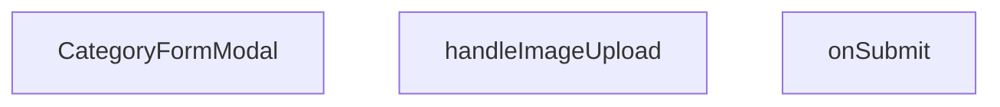

## NODE ID STANDARD

  file: src\components\admin\categories\CategoryFormModal.tsx
  function: src\components\admin\categories\CategoryFormModal.tsx::CategoryFormModal
  function: src\components\admin\categories\CategoryFormModal.tsx::handleImageUpload
  function: src\components\admin\categories\CategoryFormModal.tsx::onSubmit

---

## DISA AKTARILANLAR (EXPORTS)
  export: CategoryFormModal

---

## STİL TOKENLERİ

### Arbitrary Değerler (token'a geçirilmemiş)
Yok — tüm stiller token'a geçirilmiş. ✅

### Kullanılan Token'lar (zaten token'a geçirilmiş)
- (yok)

### Tailwind Sınıf Özeti
- **Renkler:** `bg-black/40`, `bg-black/60`, `bg-cyan-500`, `bg-red-500`, `bg-surface-deep`, `bg-white/1`, `bg-white/2`, `bg-white/3`, `bg-white/5`, `border-2`, `border-b`, `border-b-2`, `border-dashed`, `border-t`, `border-transparent`
- **Layout:** `absolute`, `backdrop-blur-2`, `backdrop-blur-sm`, `block`, `custom-scrollbar`, `fixed`, `flex`, `flex-1`, `flex-col`, `gap-2`, `gap-4`, `gap-6`, `gap-8`, `grid`, `grid-cols-2`
- **Varyant/Responsive:** `data-[state=active]:`, `focus-visible:`, `focus:`, `group-hover:`, `hover:`, `placeholder:` önekleri
- **Yardımcı Sınıflar:** `${adminButtonPrimaryClass`, `-translate-x-1/2`, `-translate-y-1/2`, `animate-spin`, `appearance-none`, `border`, `cursor-pointer`, `focus-visible:outline-none`, `focus-visible:ring-cyan-500/50`, `focus-visible:ring-offset-0`, `font-black`, `font-bold`, `font-medium`, `font-mono`, `font-normal`

---
# FILE: src\components\admin\dashboard\AbcPieChart.md

---
domain: general
source_type: doc
namespace_type: module
source_path: C:\Users\alize\venthub-hvac\src\components\admin\dashboard\AbcPieChart.tsx
skeleton_hash: 611a19bfc52d2b80
entity_hashes:
  func:AbcPieChart: 7bea9a0163aecd5b
  overview: 9b9476fab7bc8e23
  style_tokens: cc7ba7a958715321
generated_at: 2026-06-08T10:08:37Z
---

## Genel Bakış
AbcPieChart modülü, yönetim panelindeki gösterge tablosunda ABC ürün sınıflandırması verilerini dairesel grafik (pie chart) olarak görselleştiren bir React bileşeni sunar. Veri dizisini ve isteğe bağlı bir başlık alarak interaktif bir grafik oluşturur; veri yoksa veya tüm değerler sıfırsa boş bir durum ekranı gösterir.

## Fonksiyon Grupları
### Pasta Grafiği Oluşturma ve Gösterim
Bu grup, bileşenin temel sorumluluğunu karşılar: ham veriyi kontrol edip işleyerek, interaktif bir pasta grafiği bileşeni oluşturur ve başlıkla birlikte kullanıcı arayüzünde sunar.
- AbcPieChart

---

## AXIOMS – Mimari Varsayımlar

Bu modül, ABC sınıflandırmalı pasta grafiği görselleştiren bir React bileşenidir.

---

## FONKSİYON DETAYLARI

### AbcPieChart
**Ne yapar**: Bu React bileşeni, ABC ürün sınıflandırması için interaktif bir pasta grafik gösterir. Veri yoksa veya tüm değerler sıfırsa boş durum ekranını, aksi halde detaylı bir pasta grafik ve merkezde toplam stok sayısını render eder.

**Nasıl yapar**: Fonksiyon, `data` dizisini kontrol ederek başlar: dizi boşsa veya tüm elemanların `value` değeri sıfırsa, `AdminEmptyState` bileşeniyle basit bir boş durum ekranı gösterir. Veri geçerliyse, dizideki tüm `value` değerlerinin toplamını hesaplar. Ardından, `ResponsiveContainer` ve `PieChart` bileşenlerini kullanarak donut (halka) grafik oluşturur. Her veri elemanı için renkli bir dilim (Cell) render eder, araç ipuçları (Tooltip) ve gösterge (Legend) ekler. Grafik merkezinde, hesaplanan toplam değeri "Toplam Stok" etiketiyle konumlandırır.

**Parametreler**:
- `data`: array of objects — Grafikte gösterilecek veri dizisi. Her eleman en az `value` (number), `color` (string) ve muhtemelen `name` (string) özelliklerine sahip olmalıdır. `value`, stok miktarını veya sınıflandırma değerini; `color`, dilimin rengini belirtir.
- `title`: string (isteğe bağlı) — Grafik başlığı. Belirtilmezse "ABC Ürün Sınıflandırması" varsayılan değeri kullanılır.

**Dönüş**: JSX elementi — React bileşeni, koşullara bağlı olarak boş durum ekranını veya tam grafik arayüzünü içeren JSX döndürür. Doğrudan `void` döndürmez, React'ta bileşenler JSX döndürerek render işlemini gerçekleştirir.

---

## INTERFACES

### AbcPieChartProps
- `data: Array<{ name: string; value: number; color: string }>`
- `title?: string`

---

## AST POINTERS

### [N1_NASIL] AST Pointer: `src/components/admin/dashboard/AbcPieChart.tsx`::AbcPieChart
- **params**: `{ data, title }: AbcPieChartProps`
  - `data` — ABC sınıflandırma verisi dizisi; her eleman `value` (stok adedi) ve `color` (hücre rengi) özelliklerine sahiptir; boşsa veya tüm değerleri 0 ise boş durum bileşeni gösterilir
  - `title` — grafik başlık metni; sağlanmazsa `"ABC Ürün Sınıflandırması"` varsayılanı kullanılır
- **ic_degiskenler**:
  - `totalValue` — `data.reduce((acc,_curr)=>acc+curr.value,0)` ile hesaplanan toplam stok adedi; merkezde büyük rakam olarak gösterilir
- **Callback parametreleri** (map/formatter içinde):
  - `entry` — `data.map` callback'indeki mevcut eleman; `entry.color` ile hücre rengi alınır
  - `index` — `data.map` callback'indeki indeks; `key={`cell-${index}`}` oluşturulurken kullanılır
  - `value` (Tooltip formatter) — Tooltip'te gösterilen sayısal değer; `"${value} Ürün"` formatına dönüştürülür
  - `name` (Tooltip formatter) — Tooltip'te gösterilen sınıf adı; `"${name} Sınıfı"` formatına dönüştürülür
  - `value` (Legend formatter) — Legend satırındaki etiket metni; `value` string olarak büyük harfli span içinde render edilir
- **Dönüş**: JSX (React elementi) — `data` boş/tümü sıfır ise `AdminEmptyState` içeren empty-state JSX; aksi halde `ResponsiveContainer > PieChart` ile merkezde toplam gösteren pie chart JSX

---

## NODE ID STANDARD

  file: src\components\admin\dashboard\AbcPieChart.tsx
  function: src\components\admin\dashboard\AbcPieChart.tsx::AbcPieChart

---

## DISA AKTARILANLAR (EXPORTS)
  export: AbcPieChart

---

## STİL TOKENLERİ

### Arbitrary Değerler (token'a geçirilmemiş)
Yok — tüm stiller token'a geçirilmiş. ✅

### Kullanılan Token'lar (zaten token'a geçirilmiş)
- `rounded-hvac-2xl`, `tracking-hvac-relaxed`

### Tailwind Sınıf Özeti
- **Renkler:** `bg-cyan-500/10`, `bg-cyan-500/30`, `bg-slate-900/40`, `border-white/5`, `group-hover/pie:text-cyan-400`, `text-4xl`, `text-slate-500`, `text-white`, `text-xs`
- **Layout:** `absolute`, `drop-shadow-pie-chart-glow`, `flex`, `flex-1`, `flex-col`, `group-hover/pie:w-20`, `h-0.5`, `h-full`, `items-center`, `justify-center`, `left-1/2`, `min-h-300px`, `p-10`, `relative`, `top-1/2`
- **Varyant/Responsive:** `group-hover/pie:`, `hover:` önekleri
- **Yardımcı Sınıflar:** `-mt-4`, `-translate-x-1/2`, `-translate-y-1/2`, `blur-3xl`, `border`, `cursor-pointer`, `duration-500`, `duration-700`, `font-black`, `group/pie`, `hover:opacity-80`, `inset-0`, `italic`, `mb-10`, `ml-1`

---
# FILE: src\components\admin\dashboard\ActivityHeatmap.md

---
domain: general
source_type: doc
namespace_type: module
source_path: C:\Users\alize\venthub-hvac\src\components\admin\dashboard\ActivityHeatmap.tsx
skeleton_hash: fcfcf08ada0258f3
entity_hashes:
  func:ActivityHeatmap: bd94540a2dbd025e
  func:CustomTooltip: 99bc62d30dc2bdeb
  overview: 0c663e64337450d6
  style_tokens: 92623035906e7e7c
generated_at: 2026-06-08T10:08:37Z
---

## Genel Bakış
Bu modül, yönetim panelinde aktivite verilerini görselleştirmek için kullanılan bir ısı haritası bileşenidir. Dışarıdan gelen veri setini takvim benzeri bir arayüze dönüştürerek yoğunluk bilgisini renk kodlamasıyla sunar ve fare etkileşimlerinde detaylı bilgi sağlamak için özel bir tooltip bileşeni içerir.

## Fonksiyon Grupları
### Isı Haritası Ana Bileşeni
Bileşenin temel yapısını, veri işleme mantığını ve render çıkışını yönetir; dışarıdan aldığı veri ve başlık bilgisiyle ısı haritasını oluşturur.
- ActivityHeatmap

### Bilgi Baloncuğu (Tooltip)
Isı haritası üzerindeki veri noktalarına fare ile gelindiğinde gösterilen detaylı bilgi balonunun görünümünü ve içeriğini hazırlar.
- CustomTooltip

---

## AXIOMS – Mimari Varsayımlar
Bu modül için aksiyomlar, sadece fonksiyon imzalarından ve bileşen yapısından türetilmiştir.

[Aksiyom 1]: Eğer `data` parametresi (HeatmapData[] yapısı) verilmemiş veya `undefined`/`null` ise, ActivityHeatmap bileşeni ısı haritası görselleştirmesi oluşturamaz.

[Aksiyom 2]: Eğer `title` parametresi verilmemiş veya boş string ise, bileşen başlıksız çalışır; bileşenin başlık alanı boş kalır.

[Aksiyom 3]: Eğer CustomTooltip `active` parametresi `false` ise, tooltip görünmez durumda olur.

[Aksiyom 4]: Eğer CustomTooltip `payload` parametresi `undefined` veya boş dizi ise, tooltip içinde gösterilecek veri içeriği olmaz.

[Aksiyom 5]: Eğer CustomTooltip `payload[0].payload` yapısı `{ payload: HeatmapData & { dayName: string } }` formatında değilse, tooltip düzgün biçimlendirilemez.

[Aksiyom 6]: HeatmapData yapısının ısı haritası verisini temsil edecek gerekli alanları (örn: değer, tarih/tanımlayıcı) içermesi gerekir; aksi takdirde ısı haritası hücreleri anlamsız değerler gösterebilir.

---

## FONKSİYON DETAYLARI

### ActivityHeatmap
**Ne yapar**: ActivityHeatmap, haftalık aktivite verilerini ısı haritası (heatmap) formatında görselleştiren bir React bileşenidir. Verilen veri kümesine göre gün ve saat bazında renk kodlu bir gösterim sunar.

**Nasıl yapar**: Bileşen, HeatmapData türündeki data prop'unu alır ve her bir hücre için aktivite yoğunluğuna bağlı olarak renk intensitesi hesaplar. `title` prop'u ısı haritasının üst kısmında başlık olarak görüntülenir.

**Parametreler**:
- `data` — `HeatmapData[]` türünde olup, ısı haritasında gösterilecek haftalık aktivite veri dizisini temsil eder
- `title` — `string` türünde olup, ısı haritasının başlığını belirler

**Dönüş**: `React.FC<ActivityHeatmapProps>` — ActivityHeatmapProps arayüzüne uygun bir React fonksiyonel bileşeni döndürür

### CustomTooltip
**Ne yapar**: Geliştirildi ancak detay üretilemedi.

---

## INTERFACES

### HeatmapData
- `day: number`
- `hour: number`
- `count: number`

### ActivityHeatmapProps
- `data: HeatmapData[]`
- `title?: string`

---

## AST POINTERS

### [N1_NASIL] AST Pointer: `ActivityHeatmap.tsx::ActivityHeatmap`
- **params**: (`data`, `title`)
- **ic_degiskenler**: 
  - `dayNames` — Türkçe gün isimleri dizisi (Pzt, Sal, Çar, Per, Cum, Cmt, Paz)
  - `chartData` — `data.map()` ile oluşturulan, `hour`, `dayIndex`, `dayName`, `count` özellikleri olan dizi
  - `ourDayIndex` — `d.day` değerinden hesaplanan indeks (0=Pzt, 6=Paz)
  - `data` (CustomTooltip içindeki) — `payload[0].payload` erişimiyle alınan HeatmapData & dayName nesnesi
  - `maxCount` — `chartData` dizisi içindeki maksimum `count` değeri (Z ekseni ölçeklendirmesi için)
  - `zRange` — `[20, 400]` sabit dizisi, baloncuk boyut aralığı
  - `intensity` — Her `entry.count / maxCount` oranı
  - `opacity` — `Math.max(0.15, intensity)` hesaplamasıyla belirlenen opaklık
- **Dönüş**: JSX elementi (React component)

### [N2_NASIL] AST Pointer: `ActivityHeatmap.tsx::CustomTooltip`
- **params**: (`active`, `payload`)
- **ic_degiskenler**: 
  - `data` — `payload[0].payload` erişimiyle alınan HeatmapData & dayName nesnesi
- **Dönüş**: JSX elementi veya `null`

### [N3_NASIL] AST Pointer: `ActivityHeatmap.tsx::data.map callback`
- **params**: (`d`)
- **ic_degiskenler**: 
  - `ourDayIndex` — `d.day` değerinden hesaplanan indeks (Pazartesi başlangıçlı)
- **Dönüş**: `{ hour, dayIndex, dayName, count }` nesnesi

### [N4_NASIL] AST Pointer: `ActivityHeatmap.tsx::chartData.map callback`
- **params**: (`entry`, `index`)
- **ic_degiskenler**: 
  - `intensity` — `entry.count / maxCount` hesaplamasıyla elde edilen yoğunluk oranı
  - `opacity` — `Math.max(0.15, intensity)` hesaplamasıyla belirlenen opaklık değeri
- **Dönüş**: `<Cell>` JSX elementi

---

## NODE ID STANDARD

  file: src\components\admin\dashboard\ActivityHeatmap.tsx
  function: src\components\admin\dashboard\ActivityHeatmap.tsx::ActivityHeatmap
  function: src\components\admin\dashboard\ActivityHeatmap.tsx::CustomTooltip

---

## DISA AKTARILANLAR (EXPORTS)
  export: ActivityHeatmap

---

## STİL TOKENLERİ

### Arbitrary Değerler (token'a geçirilmemiş)
Yok — tüm stiller token'a geçirilmiş. ✅

### Kullanılan Token'lar (zaten token'a geçirilmiş)
- `shadow-glow-md`, `tracking-hvac-normal`, `tracking-hvac-relaxed`

### Tailwind Sınıf Özeti
- **Renkler:** `bg-cyan-400`, `bg-cyan-500/30`, `bg-cyan-500/5`, `border-cyan-400/20`, `border-white/10`, `border-white/5`, `group-hover/heatmap:text-cyan-400`, `hover:fill-white`, `text-cyan-400`, `text-slate-500`, `text-slate-600`, `text-sm`, `text-white`, `text-xs`
- **Layout:** `absolute`, `drop-shadow-heatmap-glow`, `flex`, `flex-1`, `flex-col`, `gap-2`, `gap-4`, `group-hover/heatmap:w-20`, `h-0.5`, `h-2.5`, `h-48`, `h-full`, `items-center`, `justify-center`, `justify-end`
- **Varyant/Responsive:** `group-hover/heatmap:`, `hover:` önekleri
- **Yardımcı Sınıflar:** `-ml-6`, `-translate-x-1/2`, `-translate-y-1/2`, `animate-in`, `blur-80`, `border`, `cursor-pointer`, `duration-200`, `duration-700`, `fade-in`, `font-black`, `glass`, `glass-strong`, `group/heatmap`, `italic`

---
# FILE: src\components\admin\dashboard\RecentOrdersTable.md

---
domain: general
source_type: doc
namespace_type: module
source_path: C:\Users\alize\venthub-hvac\src\components\admin\dashboard\RecentOrdersTable.tsx
skeleton_hash: 2a29aef5a4c8635a
entity_hashes:
  func:RecentOrdersTable: 74faabf4e70dfa3a
  func:getStatusLabel: 2edd561db46db1dc
  func:getStatusStyles: 419f18093a05eeeb
  overview: 42e11c3335b98d9f
  style_tokens: ec5c1233acb1b783
generated_at: 2026-06-08T10:08:37Z
---

## Genel Bakış
RecentOrdersTable modülü, yönetim panelinde son siparişleri tablo formatında gösteren bir React bileşenidir. Bileşen, bir sipariş listesi ve başlık alarak verileri düzenler ve her bir siparişin durumuna uygun görsel stil ve etiketleri otomatik olarak üretir.

## Fonksiyon Grupları
### Ana Bileşen (Tablo Oluşturucu)
Sipariş dizisini alır, tablo yapısını ve satırlarını oluşturarak arayüze sunan ana React bileşenidir.
- RecentOrdersTable

### Durum Görselleştirme Yardımcıları
Sipariş durum metnine göre tablodaki ilgili hücre için uygun CSS stilsını ve okunabilir etiket metnini döndürerek tutarlı bir görünüm sağlar.
- getStatusStyles, getStatusLabel

---

## AXIOMS – Mimari Varsayımlar

RecentOrdersTable modülü, sipariş listesini tablo formatında gösteren bir React bileşeni olup durum görselleştirme yardımcı fonksiyonları kullanır. Bu modülün doğru çalışması için aşağıdaki varsayımlar geçerlidir:

---

## FONKSİYON DETAYLARI

### RecentOrdersTable
**Ne yapar**: Son siparişleri gösteren bir tablo bileşenidir. Verilen sipariş listesini, istenen başlıkla birlikte düzenli bir arayüzde sunar.
**Nasıl yapar**: `orders` prop'undan gelen diziye haritalama yaparak her sipariş için bir tablo satırı (`tr`) oluşturur. Her satırda siparişin kimliği, tarih, toplam tutar, müşteri adı ve durumu gibi bilgileri gösterir. Durum gösterimi için `getStatusStyles` ve `getStatusLabel` yardımcı fonksiyonlarını kullanarak duruma özel stil ve etiketler uygular.
**Parametreler**:
- orders: `Order[]` — Görüntülenecek sipariş nesneleri dizisi. Her nesne sipariş detaylarını içerir.
- title: `string` — Tablonun üzerinde gösterilecek başlık metni.
**Dönüş**: `React.FC<RecentOrdersTableProps>` — JSX ile oluşturulmuş, `<table>` elementi içeren React bileşeni.

### getStatusStyles
**Ne yapar**: Bir sipariş durumuna karşılık gelen CSS stil sınıfı nesnesini döndürür.
**Nasıl yapar**: `status` parametresiyle gelen durum dizesine göre (ör. "pending", "processing", "shipped", "delivered", "cancelled") önceden tanımlanmış stil sınıflarını içeren bir nesneyi döndürür. Bu nesne, ilgili durum göstergesine (badge) uygulanarak arka plan rengi, metin rengi gibi görsel özellikleri belirler.
**Parametreler**:
- status: `string` — Stillendirilecek sipariş durumunu belirten dize (ör. "pending", "shipped").
**Dönüş**: `object` — `{ className: string }` formatında, belirli CSS sınıflarını içeren nesne. Örneğin, `pending` durumu için `{ className: 'bg-yellow-100 text-yellow-800' }` gibi.

### getStatusLabel
**Ne yapar**: Bir sipariş durumu kodunu, kullanıcıya gösterilecek okunabilir etikete dönüştürür.
**Nasıl yapar**: `s` parametresiyle gelen durum dizesini (ör. "processing") alır ve bunu önceden tanımlanmış bir eşleme (mapping) kullanarak daha anlaşılır bir metne (ör. "İşleniyor") dönüştürür. Bu sayede arka uçtaki teknik durum kodları, arayüzde kullanıcı dostu biçimde sunulur.
**Parametreler**:
- s: `string` — Çevrilecek sipariş durum kodu.
**Dönüş**: `string` — Görüntülenecek insan tarafından okunabilir etiket metni. Durum eşleşmesi bulunamazsa, büyük harflerle düzenlenmiş ham durum dizesini döndürür.

---

## INTERFACES

### OrderData
- `id: string`
- `created_at: string`
- `total_amount: number`
- `status: string`
- `order_number?: string | null`

### RecentOrdersTableProps
- `orders: OrderData[]`
- `title: string`

---

## AST POINTERS

### [N1_NASIL] AST Pointer: components/admin/dashboard/RecentOrdersTable.tsx::RecentOrdersTable
- **params**: `{ orders, title }`
- **ic_degiskenler**:
  - `lang` — useI18n() hook'undan gelen dil bilgisi, formatDateTime ve formatCurrency fonksiyonlarına parametre olarak gönderilir
  - `dragScrollRef` — useDragScroll<HTMLDivElement>() hook'undan dönen ref nesnesi, sürükleme ile yatay kaydırma için tablo container'ına bağlanır
  - `getStatusStyles` — inner function, status parametresine göre Tailwind CSS stil sınıfı döndürür
  - `getStatusLabel` — inner function, status parametresine göre Türkçe durum etiketi döndürür
- **JSX İçi Erişimler**:
  - `title` — bileşen başlığı olarak <h3> içinde render edilir
  - `orders` — sipariş dizisi, length kontrolü ve map iterasyonu için kullanılır
  - `r.id` — her siparişin benzersiz kimliği, key prop'u ve link href'inde kullanılır
  - `r.order_number` — sipariş numarası, order_number yoksa fallback olarak id kullanılır, son 8 karakter truncate edilir
  - `r.created_at` — sipariş oluşturma tarihi, formatDateTime fonksiyonuna gönderilir
  - `r.total_amount` — sipariş tutarı, formatCurrency fonksiyonuna gönderilir
  - `r.status` — sipariş durumu, getStatusStyles ve getStatusLabel fonksiyonlarına gönderilir
  - `index` — map iterasyonu indeksi, animasyon gecikmesi için (index * 50) ms hesaplanır
- **Dönüş**: JSX (React.ReactNode) — sipariş tablosu layout'u

### [N2_NASIL] AST Pointer: components/admin/dashboard/RecentOrdersTable.tsx::getStatusStyles
- **params**: `(status: string)`
- **ic_degiskenler**: yok
- **Dönüş**: string — duruma göre Tailwind CSS stil sınıfı (örn: 'bg-emerald-500/10 text-emerald-400 ring-emerald-500/30' için 'completed')

### [N3_NASIL] AST Pointer: components/admin/dashboard/RecentOrdersTable.tsx::getStatusLabel
- **params**: `(s: string)`
- **ic_degiskenler**: yok
- **Dönüş**: string — duruma göre Türkçe etiket (örn: 'completed' → 'Tamamlandı', 'pending' → 'Teklif/Bekleniyor')

### [N4_NASIL] AST Pointer: components/admin/dashboard/RecentOrdersTable.tsx::orders.map callback
- **params**: `(r, index)` — r: sipariş nesnesi, index: dizi indeksi
- **ic_degiskenler**: yok
- **Kullanılan erişimler**:
  - `r.id` — key prop'u ve detay link href'i için kullanılır
  - `r.order_number` — sipariş numarası gösterimi (|| ile fallback olarak r.id kullanılır)
  - `r.created_at` — formatDateTime(r.created_at, lang) çağrısında tarih formatlaması için kullanılır
  - `r.total_amount` — formatCurrency(r.total_amount, lang) çağrısında para birimi formatlaması için kullanılır
  - `r.status` — getStatusStyles(r.status) ve getStatusLabel(r.status) çağrılarında kullanılır
  - `index` — animationDelay hesaplaması için kullanılır: `${index * 50}ms`
  - `lang` — parent scope'dan闭包 ile erişilen dil bilgisi, formatDateTime ve formatCurrency'e gönderilir
- **Dönüş**: JSX (<tr> elementi) — tek bir sipariş tablosu satırı

---


## MERMAID CALL GRAPH
```mermaid
graph TD
    RecentOrdersTable_tsx__RecentOrdersTable["RecentOrdersTable"]
    RecentOrdersTable_tsx__getStatusLabel["getStatusLabel"]
    RecentOrdersTable_tsx__getStatusStyles["getStatusStyles"]
    RecentOrdersTable_tsx__RecentOrdersTable --> RecentOrdersTable_tsx__getStatusLabel
    RecentOrdersTable_tsx__RecentOrdersTable --> RecentOrdersTable_tsx__getStatusStyles
```

## NODE ID STANDARD

  file: src\components\admin\dashboard\RecentOrdersTable.tsx
  function: src\components\admin\dashboard\RecentOrdersTable.tsx::RecentOrdersTable
  function: src\components\admin\dashboard\RecentOrdersTable.tsx::getStatusStyles
  function: src\components\admin\dashboard\RecentOrdersTable.tsx::getStatusLabel

---

## DISA AKTARILANLAR (EXPORTS)
  export: RecentOrdersTable

---

## STİL TOKENLERİ

### Arbitrary Değerler (token'a geçirilmemiş)
Yok — tüm stiller token'a geçirilmiş. ✅

### Kullanılan Token'lar (zaten token'a geçirilmiş)
- `rounded-hvac-2xl`, `tracking-hvac-normal`, `tracking-hvac-relaxed`

### Tailwind Sınıf Özeti
- **Renkler:** `bg-current`, `bg-cyan-500`, `bg-cyan-500/0`, `bg-cyan-500/5`, `bg-white/2`, `bg-white/5`, `border-collapse`, `border-white/5`, `group-hover/row:bg-cyan-500`, `group-hover/row:bg-white/10`, `group-hover/row:text-white`, `group-hover/table:text-cyan-400`, `hover:bg-cyan-500`, `hover:bg-white/3`, `hover:text-surface-deep`
- **Layout:** `-right-24`, `-top-24`, `absolute`, `backdrop-blur-md`, `custom-scrollbar`, `flex`, `flex-col`, `gap-2`, `gap-3`, `h-0.5`, `h-1.5`, `h-48`, `h-6`, `h-full`, `inline-flex`
- **Varyant/Responsive:** `active:`, `first:`, `group-hover/btn:`, `group-hover/link:`, `group-hover/row:`, `group-hover/table:`, `hover:`, `last:` önekleri
- **Yardımcı Sınıflar:** `${adminTableCellClass`, `${adminTableContainerClass`, `${adminTableHeadCellClass`, `${getStatusStyles(r.status`, `-ml-8`, `active:scale-95`, `animate-in`, `animate-pulse`, `blur-100`, `border`, `divide-white/5`, `divide-y`, `duration-300`, `duration-500`, `fade-in`

---
# FILE: src\components\admin\dashboard\SalesChart.md

---
domain: general
source_type: doc
namespace_type: module
source_path: C:\Users\alize\venthub-hvac\src\components\admin\dashboard\SalesChart.tsx
skeleton_hash: d31ca9fe12bd815b
entity_hashes:
  func:SalesChart: 81798fe6d2553ef7
  overview: 0b8303dd7641efb3
  style_tokens: d6e6bd2ac73e7719
generated_at: 2026-06-08T10:08:37Z
---

## Genel Bakış
`SalesChart`, yönetim paneline ait satış verilerini görselleştiren bir React bileşenidir. Kendisine dışarıdan iletilen veri dizisi ve başlık bilgisiyle bir grafik oluşturarak kullanıcıya özet bir satış raporu sunar.

## Fonksiyon Grupları
### Grafik Render Grubu
Bu grup, bileşene gelen `data` ve `title` prop’larını kullanarak satış grafiğini hazırlar ve JSX çıktısı olarak döndürür.
- SalesChart

---

## AXIOMS – Mimari Varsayımlar
Bu modül için özel aksiyom tanımlanmamıştır.

---

## FONKSİYON DETAYLARI

### SalesChart
**Ne yapar**: Bu React fonksiyonel bileşeni, yönetici panosu (admin dashboard) arayüzünde satış verilerini görselleştiren bir grafik bileşeni oluşturur. Kendisine iletilen `data` ve `title` prop'larını kullanarak kullanıcıya anlamlı bir satış raporu sunar.

**Nasıl yapar**: `React.FC<SalesChartProps>` tipi ile tanımlanan bir fonksiyonel bileşendir. Gelen props nesnesini JavaScript destructuring yöntemiyle `data` ve `title` değişkenlerine ayırır. Bu değişkenleri kullanarak bir grafik JSX yapısı oluşturur ve render edilmek üzere döndürür. Bileşenin iç mantığı, tip güvenliği sağlayan `SalesChartProps` arayüzüne dayanır.

**Parametreler**:
- `data: SalesChartProps['data']` — Grafikte görüntülenecek olan satış verilerini içeren prop'tur. İçeriği ve yapısı `SalesChartProps` arayüzü tarafından belirlenir ve üst bileşen tarafından sağlanır.
- `title: SalesChartProps['title']` — Grafiğin üst kısmında görüntülenecek başlık metnini belirten string değerdir. Kullanıcı arayüzünde grafiğin bağlamını açıklamak için kullanılır.

**Dönüş**: `React.FC<SalesChartProps>` — Fonksiyonun kendisi bir React Fonksiyonel Bileşeni döndürür. Bu bileşenin bir örneği JSX içerisinde çağrıldığında (`<SalesChart ... />`) bir `ReactElement` ya da `null` döndürür.

---

## INTERFACES

### SalesChartProps
- `data: Array<{ date: string; orders: number; returns: number }>`
- `title: string`

---

## AST POINTERS

### [N1_NASIL] AST Pointer: src/components/admin/dashboard/SalesChart.tsx::SalesChart
- **params**: 
  - `data` — satış verisi dizisi (SalesChartProps'den alınır, `data.length` ile boş kontrolü, `AreaChart data` prop'u ve `Brush` koşulu için kullanılır)
  - `title` — grafik başlığı (h3 elementinde görüntülenir)
- **ic_degiskenler**: yok (fonksiyon gövdesinde değişken tanımlanmamıştır)
- **Dönüş**: React JSX elemanı (`ResponsiveContainer` içinde `AreaChart`, `Brush`, `AdminEmptyState` gibi bileşenleri döndürür)

---

## NODE ID STANDARD

  file: src\components\admin\dashboard\SalesChart.tsx
  function: src\components\admin\dashboard\SalesChart.tsx::SalesChart

---

## DISA AKTARILANLAR (EXPORTS)
  export: SalesChart

---

## STİL TOKENLERİ

### Arbitrary Değerler (token'a geçirilmemiş)
Yok — tüm stiller token'a geçirilmiş. ✅

### Kullanılan Token'lar (zaten token'a geçirilmiş)
- `h-hvac-panel`, `shadow-glow-md`, `tracking-hvac-relaxed`

### Tailwind Sınıf Özeti
- **Renkler:** `bg-cyan-400`, `bg-rose-500`, `border-l`, `border-white/10`, `border-white/5`, `group-hover/chart:text-cyan-400`, `hover:bg-white/5`, `text-slate-300`, `text-slate-500`, `text-white`, `text-xl`, `text-xs`
- **Layout:** `backdrop-blur-2xl`, `flex`, `flex-1`, `flex-col`, `gap-2`, `gap-4`, `h-2.5`, `items-center`, `justify-between`, `justify-center`, `min-h-0`, `p-1.5`, `p-8`, `shadow-2xl`, `w-2.5`
- **Varyant/Responsive:** `group-hover/chart:`, `hover:` önekleri
- **Yardımcı Sınıflar:** `-ml-8`, `border`, `font-black`, `glass`, `group/chart`, `italic`, `leading-none`, `mb-10`, `mt-3`, `opacity-60`, `px-4`, `py-2`, `rounded-2xl`, `rounded-full`, `rounded-xl`

---
# FILE: src\components\admin\dashboard\StatCard.md

---
domain: general
source_type: doc
namespace_type: module
source_path: C:\Users\alize\venthub-hvac\src\components\admin\dashboard\StatCard.tsx
skeleton_hash: 4636899e30bd1727
entity_hashes:
  func:StatCard: 42faa1e1d38b732c
  overview: d5fe2f564e9e4393
  style_tokens: 3b396ad8fb25d2f9
generated_at: 2026-06-08T10:08:37Z
---

## Genel Bakış
`StatCard` bileşeni, yönetim panelinde tek bir istatistiği görselleştirmek için kullanılan yeniden kullanılabilir bir kart bileşenidir. Başlık, alt başlık, değer, yükleme durumu, para birimi biçimlendirmesi ve çok dilli metin desteği gibi farklı ihtiyaçları tek bir arayüzde toplar.

## Fonksiyon Grupları
### UI Render Grubu
Kartın dış yapısını, tipografisini ve düzenini oluşturur; gelen prop’ların görsel bileşenlerle eşlenmesini sağlar.
- StatCard

### Veri ve Durum İşleme Grubu
Değerlerin para birimi formatında gösterilmesi, yükleme durumuna göre ekranın güncellenmesi ve metinlerin dil ayarına göre çevrilmesi gibi mantıksal işlemleri yürütür.
- StatCard

---

## AXIOMS – Mimari Varsayımlar
Bu modül için özel aksiyom tanımlanmamıştır.

---

## FONKSİYON DETAYLARI

### StatCard

**Ne yapar**: Admin panelinin dashboard bölümünde istatistik verilerini görsel olarak sunan bir kart bileşenidir. Başlık, alt başlık, değer ve para birimi formatlama seçenekleriyle birlikte yüklenme durumu animasyonu da destekler.

**Nasıl yapar**: Bileşen, verilen parametreleri kullanarak bir kart yapısı oluşturur. `loading` parametresi `true` olduğunda, değer yerine bir iskelet (skeleton) animasyonu göstererek kullanıcıya verinin yüklendiği hissini verir. `isCurrency` parametresi `true` olarak ayarlandığında, `value` değerini para birimi formatına dönüştürerek hiển thị eder. `lan` parametresi ile dil ayarlarına göre para birimi simgesi ve formatlaması değiştirilebilir.

**Parametreler**:

- `title`: `string` — Kartın üst kısmında görünen ana başlık metni. Örneğin "Toplam Gelir" veya "Aktif Kullanıcılar" gibi istatistik kategorisini belirtir.
- `subtitle`: `string | undefined` — Kartın başlık altında görünen opsiyonel alt başlık bilgisi. Başlığı destekleyen ek açıklama veya detay metnini taşır.
- `value`: `string | number` — Kartın orta bölgesinde büyük puntolarla gösterilen temel istatistik değeri. Sayısal veya metin formatında olabilir.
- `loading`: `boolean` — Bileşenin yükleme durumunu belirler. `true` değeri alırsa gerçek değerler yerine skeleton placeholder animasyonu gösterilir, böylece veri henüz yüklenmemişken kullanıcı arayüzünün bozulması engellenir.
- `isCurrency`: `boolean` — Değerin para birimi olarak formatlanıp formatlanmayacağını belirler. `true` olduğunda `value` parametresi para birimi sembolü ve binlik ayraçlarıyla birlikte gösterilir.
- `lan`: `string` — Para birimi formatlamasında kullanılacak dil ve bölge ayarını belirler. `Intl.NumberFormat` içinde dil kodu olarak kullanılır, örneğin `"tr-TR"` Türkçe format veya `"en-US"` İngilizce format için.

**Dönüş**: `React.FC<StatCardProps>` — JSX elementi döndürür. StatCardProps arayüzüne uygun olarak yapılandırılmış bir React fonksiyonel bileşenidir.

---

## INTERFACES

### StatCardProps
- `title: string`
- `subtitle?: string`
- `value: number | string | null`
- `loading: boolean`
- `isCurrency?: boolean`
- `lang?: string`
- `href?: string`
- `icon?: React.ReactNode`
- `trend?: { value: number; label?: string }`
- `accent?: 'navy' | 'emerald' | 'amber' | 'rose' | 'violet' | 'sky' | 'orange'`

---

## AST POINTERS

### [N1_NASIL] AST Pointer: components/admin/dashboard/StatCard.tsx::StatCard
- **params**:
  - `title` — Kartın başlık metni, üst kısımda `text-xs` ile gösterilir
  - `subtitle` — Kartın alt başlık/etiket metni, isteğe bağlı olarak `italic` stilinde gösterilir
  - `value` — Kartta gösterilecek asıl değer (sayı veya string olabilir), null ise '-' gösterilir
  - `loading` — Yüklenme durumu flag'i, true ise displayValue '…' olur ve trend/subtitle gizlenir
  - `isCurrency` — value'nin para birimi olarak formatlanıp formatlanmayacağını belirler, true ise `formatCurrency()` çağrılır
  - `lang` — Para birimi formatı dili, varsayılan `'tr'`, `'tr' | 'en'` olarak `formatCurrency`'e传递 edilir
  - `href` — Link yönlendirme URL'si, tanımlı ise kart `<Link>` ile sarılır
  - `icon` — Kartta gösterilecek React icon elemanı, `React.cloneElement` ile `size:24, strokeWidth:2.5` olarak clone edilir
  - `trend` — Trend bilgisi nesnesi, `.value` property'si ile yüzde değişim gösterilir (pozitif yeşil ↑, negatif kırmızı ↓)
  - `accent` — Renk teması adı, varsayılan `'navy'`, `accents` objesindeki key olarak kullanılır
- **ic_degiskenler**:
  - `accents` — 7 farklı renk temasının (navy, emerald, amber, rose, violet, sky, orange) CSS class'larını tutan sabit obje; her tema için border, accent, iconBg, glow, text değerleri tanımlıdır
  - `currentAccent` — `accents[accent]` ile elde edilen aktif renk teması objesi, kartın border rengi, icon arkaplanı, accent rengi gibi stiller için kullanılır
  - `displayValue` — Kartta gösterilecek formatlanmış değer; loading=true ise `'…'`, value==null ise `'-'`, isCurrency ve number ise `formatCurrency(value, lang)` çağrısı ile para birimi formatına çevrilir, aksi halde ham value kullanılır
  - `content` — JSX elemanı; kartın içeriğini (başlık, displayValue, trend yüzdesi, subtitle, icon) barındıran ana yapı, hem Link içine hem de plain div içine yerleştirilir
  - `baseClass` — Kartın temel CSS class string'i; `glass-strong`, padding, border, shadow ve hover geçiş stillerini içerir, `currentAccent.border` ile dinamik border rengi eklenir
- **Dönüş**: JSX elemanı (`React.ReactNode`) — `href` tanımlı ise `<Link>` ile sarılmış kart, değilse `<div>` içine sarılmış kart döndürür; her iki durumda da `content` JSX'i render edilir

---

## NODE ID STANDARD

  file: src\components\admin\dashboard\StatCard.tsx
  function: src\components\admin\dashboard\StatCard.tsx::StatCard

---

## DISA AKTARILANLAR (EXPORTS)
  export: StatCard

---

## STİL TOKENLERİ

### Arbitrary Değerler (token'a geçirilmemiş)
Yok — tüm stiller token'a geçirilmiş. ✅

### Kullanılan Token'lar (zaten token'a geçirilmiş)
- `shadow-glow-md`, `tracking-hvac-normal`, `tracking-hvac-relaxed`

### Tailwind Sınıf Özeti
- **Renkler:** `bg-emerald-400/10`, `bg-gradient-to-br`, `bg-rose-400/10`, `border-white/5`, `from-white/5`, `group-hover:text-slate-400`, `lg:text-4xl`, `text-3xl`, `text-emerald-400`, `text-rose-400`, `text-slate-500`, `text-white`, `text-xs`, `to-transparent`
- **Layout:** `-right-12`, `-top-12`, `absolute`, `block`, `bottom-0`, `flex`, `flex-1`, `flex-wrap`, `from-white/5`, `gap-0.5`, `gap-2`, `group-hover:shadow-hvac-stat-card-hover`, `h-1`, `h-14`, `h-48`
- **Varyant/Responsive:** `:`, `group-hover:`, `hover:`, `lg:` önekleri
- **Yardımcı Sınıflar:** `${baseClass`, `${currentAccent.accent`, `${currentAccent.iconBg`, `${trend.value`, `0`, `:`, `>=`, `border`, `duration-1000`, `duration-500`, `duration-700`, `font-black`, `group-hover:rotate-6`, `group-hover:scale-105`, `group-hover:scale-110`

---
# FILE: src\components\admin\products\ProductCsvImport.md

---
domain: general
source_type: doc
namespace_type: module
source_path: C:\Users\alize\venthub-hvac\src\components\admin\products\ProductCsvImport.tsx
skeleton_hash: 1330c8b076710dd1
entity_hashes:
  func:ProductCsvImport: 1375065d67decd2a
  overview: 19951cbd59cf400f
  style_tokens: d505eb2f0859ff7f
generated_at: 2026-06-08T10:08:37Z
---

## Genel Bakış
`ProductCsvImport` bileşeni, yönetici panelinde ürün verilerinin CSV dosyası aracılığıyla toplu olarak içe aktarılmasını sağlayan kapsamlı bir araçtır. Kullanıcı arayüzü sunmaktan başlayarak dosya okuma, veri dönüştürme, doğrulama ve sunucuya gönderme süreçlerini tek bir bileşen içinde yönetir.

## Fonksiyon Grupları
### Kullanıcı Arayüzü ve Etkileşim
Bileşen, yöneticiye dosya seçimi için bir arayüz sunar, yükleme butonu sağlar ve işlem süreciyle ilgili durum mesajlarını gösterir.
- ProductCsvImport

### CSV Okuma ve Dönüştürme
Seçilen CSV dosyasının içeriğini asenkron olarak okur, satırlara böler ve ham veri satırlarını uygulamanın beklediği ürün nesne yapısına dönüştürür.
- ProductCsvImport

### Veri Doğrulama ve Hazırlık
Dönüştürülmüş ham veri dizisini, beklenen alanlar ve formatlar için denetler. Hatalı satırları ayırır, geçerli kayıtları ise toplu API isteği için uygun hale getirir.
- ProductCsvImport

### API İletişimi ve Sonuç İşleme
Geçerli ürün kayıtlarını bir araya getirerek sunucudaki ilgili API uç noktasına toplu ekleme isteği gönderir. Başarı durumunda üst bileşene geri bildirimde bulunur, hata oluşursa kullanıcıya bilgilendirme mesajı üretir.
- ProductCsvImport

## AXIOMS – Mimari Varsayımlar
Bu modülün doğru çalışması için bazı prop varsayımları gereklidir.

[Aksiyom 1]: Eğer `categories` prop'u tanımlanmazsa, komponent render ederken kategori seçimi boş kalır ve kullanıcı ürün kategorisi seçemez.  
[Aksiyom 2]: Eğer `categories` prop'u bir dizi değilse, içindeki `map` veya filtreleme işlemleri sırasında çalışma zamanı hatası oluşur.  
[Aksiyom 3]: Eğer `onSuccess` prop'u tanımlanmazsa, başarılı CSV import sonrası dışarıya bildirim gönderilmez ve çağrılan fonksiyon yok sayılır.  
[Aksiyom 4]: Eğer `onSuccess` prop'u bir fonksiyon değilse, import tamamlandığında bu değeri çağırılmaya çalışılırken bir hata fırlatılacaktır.

---

## AXIOMS – Mimari Varsayımlar
Bu modül için aksiyomlar, verilen fonksiyon imzası ve eski dokümanın Genel Bakış açıklamasına dayanarak tanımlanmıştır.

[Aksiyom 1]: Eğer `categories` prop'u sağlanmazsa, bileşen CSV'den dönüştürülen ürünler için geçerli kategori seçemeyeceğinden veya kullanıcının kategori ataması yapamayacağından veri hazırlık/hatlama süreci bozulur.
[Aksiyom 2]: Eğer `onSuccess` callback fonksiyonu sağlanmazsa, başarılı CSV içe aktarma işlemi sonrasında bileşen üst bileşene bildirimde bulunamaz veya işlem sonucunu raporlayamaz.
[Aksiyom 3]: Eğer seçilen CSV dosyasının içeriği (satır/sütun yapısı) beklenen formata (örn: belirli sütun başlıkları) uymazsa, veri dönüştürme ve doğrulama aşaması başarısız olur.
[Aksiyom 4]: Eğer CSV dosyası okunamaz (bozuk, erişilemez veya geçersiz bir dosya ise), bileşen kullanıcıya hata geri bildirimi göstermeli ve onSuccess tetiklenmemelidir.
[Aksiyom 5]: Eğer CSV'den dönüştürülen ürün verisi, iş kurallarına (örn: zorunlu alanların doluluğu, veri tipleri, eşik değerleri) uymazsa, veri doğrulama aşaması başarısız olur ve import işlemi durdurulur.

---

## FONKSİYON DETAYLARI

### ProductCsvImport
**Ne yapar**: Product CSV dosyasının içeri aktarımını yöneten bir React bileşenidir.  
**Nasıl yapar**: `categories` prop'undan gelen kategori listesini kullanarak kullanıcıya gerekli eşleştirme seçeneklerini sunar ve işlem tamamlandığında `onSuccess` callback'ini tetikler.  
**Parametreler**:
- categories: any — Ürünlerin eşleştirilebileceği kategori listesi.  
- onSuccess: () => void — CSV içeri aktarma başarılı olduğunda çağrılan geri çağırım fonksiyonu.  
**Dönüş**: void (bir değer döndürmez, sadece UI render eder).

---

## INTERFACES

### CategoryOpt
- `id: string`
- `name: string`

### ProductCsvImportProps
- `categories: CategoryOpt[]`
- `onSuccess: () => void`

---

## AST POINTERS

### [N1_NASIL] AST Pointer: src/components/admin/products/ProductCsvImport.tsx::ProductCsvImport
- **params**: `{ categories, onSuccess }` — categories: mevcut kategoriler dizisi (prop), onSuccess: başarı callback'i (prop)
- **ic_degiskenler**:
  - `t` — useI18n() hook'undan gelen çeviri fonksiyonu
  - `importPreview` / `setImportPreview` — React state: CSV önizleme verisi `{ header: string[], rows: Record<string,string>[], total: number }` veya null
  - `importRows` / `setImportRows` — React state: CSV'den ayrıştırılmış tüm satırlar `Record<string,string>[]` veya null
  - `isProcessing` / `setIsProcessing` — React state: içe aktarma işlemi devam ediyor mu flag'i
- **Dönüş**: JSX element (React fragment — CSV dosya seçici butonu ve modal önizleme arayüzü)

### [N2_NASIL] AST Pointer: src/components/admin/products/ProductCsvImport.tsx::handleFileChange
- **params**: `e: React.ChangeEvent<HTMLInputElement>` — dosya input change olayı
- **ic_degiskenler**:
  - `f` — seçilen dosya nesnesi, `e.target.files?.[0]` referansı, undefined ise fonksiyon erken döner
  - `text` — dosyanın tam metin içeriği, `f.text()` asenkron okumasıyla elde edilir
  - `lines` — BOM karakteri (`\ufeff`) kaldırıldıktan ve satır sonlarına göre split edildikten sonra boş satırları filtrelenmiş satır dizisi
  - `split` — yerel CSV ayrıştırma fonksiyonu: virgülle split eder, tırnak işaretlerini ve çift tırnak kaçışlarını işler
  - `header` — ilk satırdan elde edilen sütun başlıkları, küçük harfe dönüştürülmüş ve trim edilmiş `string[]`
  - `rows` — her satırı `{ sütunAdı: hücreDeğeri }` objesine dönüştüren `Record<string,string>[]` dizisi; eksik hücreler boş string ile doldurulur
- **Dönüş**: void (yan etkiler: `setImportRows(rows)`, `setImportPreview({...})`, `e.target.value = ''` ile input reset)

### [N3_NASIL] AST Pointer: src/components/admin/products/ProductCsvImport.tsx::split
- **params**: `s: string` — split edilecek ham CSV satırı veya başlık satırı
- **ic_degiskenler**: (yok — tek satırlık inline fonksiyon)
- **Dönüş**: `string[]` — tırnak-aware virgül split sonucu, her hücredeki baş/son tırnak işaretleri kaldırılmış, çift tırnak (`""`) tek tırnak (`"`) olarak değiştirilmiş

### [N4_NASIL] AST Pointer: src/components/admin/products/ProductCsvImport.tsx::handleDryRun
- **params**: (yok)
- **ic_degiskenler**:
  - `h` — importPreview?.header dizisi, yoksa boş dizi; mevcut sütun başlıklarını tutar
  - `required` — zorunlu sütun adları dizisi `['name', 'sku']`
  - `hasRequired` — boolean, tüm zorunlu sütunların header'da bulunup bulunmadığını belirtir
  - `okCount` — importPreview.rows içinden hem 'name' hem 'sku' alanına sahip satır sayısı
- **Dönüş**: void (yan etki: `alert()` ile kuru çalıştırma sonucu gösterir)

### [N5_NASIL] AST Pointer: src/components/admin/products/ProductCsvImport.tsx::handleImport
- **params**: (yok)
- **ic_degiskenler**:
  - `h` — importPreview.header, CSV sütun başlıkları dizisi
  - `mapCategorySlugToId` — yerel fonksiyon: kategori slug'ını kategori ID'sine eşler
  - `payloads` — `Database['public']['Tables']['products']['Insert'][]` tipinde, veritabanına yazılacak ürün objeleri dizisi
  - `r` — for döngüsündeki her bir CSV satırı `Record<string,string>`
  - `p` — her satır için inşa edilen `products.Insert` tipinde ürün objesi; `sku`, `name`, `slug`, `brand`, opsiyonel olarak `model_code`, `status`, `price`, `stock_qty`, `low_stock_threshold`, `category_id` alanlarını içerir
  - `chunk` — payloads dizisinin 100'er elemanlık alt dizisi (toplu upsert için)
  - `ok` — başarılı upsert sayısı sayacı, başlangıç 0
  - `fail` — başarısız upsert sayısı sayacı, başlangıç 0
  - `i` — chunk döngüsü indeksi, 100'er adım ilerler
- **Dönüş**: void (yan etkiler: `supabase.from('products').upsert(chunk, { onConflict: 'sku' })` ile veritabanına yazar, `alert()` ile sonuç gösterir, `setImportPreview(null)`, `setImportRows(null)`, `onSuccess()`, `setIsProcessing(false)` çağırır)

### [N6_NASIL] AST Pointer: src/components/admin/products/ProductCsvImport.tsx::mapCategorySlugToId
- **params**: `slug: string` — eşleştirilecek kategori slug'ı (ör: "klima", "ısı pompası")
- **ic_degiskenler**:
  - `s` — normalize edilmiş slug: null-safe, küçük harfe çevrilmiş ve trim edilmiş hali
  - `found` — `categories` prop'u üzerinde `.find()` ile `c.name.toLowerCase() === s` eşleşmesiyle bulunan kategori objesi veya undefined
- **Dönüş**: `string | null` — eşleşen kategorinin `id` değeri veya bulunamazsa `null`

---

## NODE ID STANDARD

  file: src\components\admin\products\ProductCsvImport.tsx
  function: src\components\admin\products\ProductCsvImport.tsx::ProductCsvImport

---

## DISA AKTARILANLAR (EXPORTS)
  export: ProductCsvImport

---

## STİL TOKENLERİ

### Arbitrary Değerler (token'a geçirilmemiş)
Yok — tüm stiller token'a geçirilmiş. ✅

### Kullanılan Token'lar (zaten token'a geçirilmiş)
- (yok)

### Tailwind Sınıf Özeti
- **Renkler:** `bg-gray-50`, `bg-slate-50`, `bg-slate-900/50`, `border-b`, `border-gray-200`, `border-slate-200`, `border-t`, `hover:bg-gray-50/50`, `hover:text-slate-600`, `text-center`, `text-left`, `text-slate-400`, `text-slate-500`, `text-slate-800`, `text-xs`
- **Layout:** `fixed`, `flex`, `flex-1`, `flex-col`, `gap-3`, `h-10`, `hidden`, `items-center`, `justify-between`, `justify-center`, `justify-end`, `max-h-90vh`, `max-w-4xl`, `overflow-x-auto`, `overflow-y-auto`
- **Varyant/Responsive:** `hover:` önekleri
- **Yardımcı Sınıflar:** `${adminButtonPrimaryClass`, `${adminButtonSecondaryClass`, `${adminCardClass`, `animate-in`, `divide-gray-100`, `divide-y`, `duration-200`, `fade-in`, `font-semibold`, `inset-0`, `italic`, `rounded-b-2xl`, `transition-colors`, `uppercase`, `whitespace-nowrap`

---
# FILE: src\components\admin\products\ProductFormModal.md

---
domain: general
source_type: doc
namespace_type: module
source_path: C:\Users\alize\venthub-hvac\src\components\admin\products\ProductFormModal.tsx
skeleton_hash: dd3fa6b546bc96f0
entity_hashes:
  func:ProductFormModal: 6997b37c35b0ebef
  func:onSubmit: 56cec6a550e2cc75
  overview: bdc9be85385803dd
  style_tokens: 553a7b8fa0cd3c86
generated_at: 2026-06-08T10:08:37Z
---

## Genel Bakış
Bu modül, yönetici panelinde ürün ekleme ve düzenleme işlemlerini gerçekleştiren bir form modalı bileşenidir. Kullanıcıya form gösterimi, veri doldurma ve gönderim sonrası iş akışlarını (başarı/hata durumlarını) yöneten bir arayüz sağlar.

## Fonksiyon Grupları
### Modal Bileşeni ve Görünüm Yönetimi
Bileşenin açılıp kapanmasını, veri modunu (yeni ürün veya düzenleme) ve form alanlarının başlangıç değerlerini dış prop'lar aracılığıyla kontrol eder.
- ProductFormModal

### Form İşlemleri ve Gönderim Akışı
Kullanıcının doldurduğu form verilerini sunucuya gönderen ve sürecin sonucuna göre (başarılı kaydetme, hata) ilgili geri bildirimleri tetikleyen iş mantığını yürütür.
- onSubmit

---

## AXIOMS – Mimari Varsayımlar

Bu modül, ürün ekleme/düzenleme formunu yöneten bir React modal bileşenidir. Doğru çalışması için aşağıdaki varsayımlar geçerlidir.

**[Aksiyom 1]**: Eğer `onClose` callback'i sağlanmamışsa, modal kapatma işlemi（tuş tıklaması, backdrop tıklaması, ESC tuşu）sonucunda uygulama hata verir veya modal kapanamaz.

**[Aksiyom 2]**: Eğer `onSuccess` callback'i sağlanmamışsa, form gönderimi başarılı olduğunda üst bileşen bilgilendirilemez; başarı durumu UI'da görünmesine rağmen üst seviye akış（örn: liste yenileme）çalışmaz.

**[Aksiyom 3]**: Eğer `productSchema` geçerli bir Zod/joi gibi bir validation şeması olarak çağrılamıyorsa, form alanları doğrulanamaz ve hatalı veriler `onSubmit` fonksiyonuna ulaşır.

**[Aksiyom 4]**: Eğer `_productId` parametresi `undefined` veya `null` olarak verilmişse, form "yeni ürün ekleme" modunda açılmalıdır；değer verilmişse, ilgili ürün verisiyle "düzenleme" modunda açılmalıdır.

**[Aksiyom 5]**: Eğer `open` parametresi `false` ise ve modal iç bileşen buna rağmen render edilmeye devam ediyorsa, gereksiz API çağrıları veya form state bozulmaları oluşur.

**[Aksiyom 6]**: Eğer `_productId` düzenleme modunda verilmiş ancak ilgili ürün ID'si backend'de mevcut değilse, form verilerinin yüklenemesi durumunda kullanıcıya hata bildirimi yapılmalıdır；aksi halde boş form ile sessiz düzenleme yapılır.

**[Aksiyom 7]**: Eğer `onSubmit` fonksiyonu `ProductFormValues` tipinde geçerli bir değer almıyorsa（örn: validation başarısız olduğunda form yine de submit edilirse），beklenmeyen veri yapısı hatası oluşur.

---

## FONKSİYON DETAYLARI

### ProductFormModal
**Ne yapar**: Bu fonksiyon, ürün ekleme veya düzenleme işlemleri için kullanılan bir modal form bileşenini tanımlar. Belirtilen ürün ID'sine göre yeni ürün oluşturma veya mevcut ürünü düzenleme amacı taşır.

**Nasıl yapar**: Bileşen, açık/kapalı durumu `open` prop'u ile kontrol edilen bir modal yapısı içerir. Form alanları ve geçerlilik kontrolleri bileşen içinde yönetilir; form gönderimi `onSubmit` fonksiyonu ile gerçekleştirilir.

**Parametreler**:
- `_productId: any` — Düzenlenecek ürünün benzersiz kimliği. Yeni ürün oluştururken `null` veya `undefined` olabilir.
- `open: boolean` — Modalın görünür olup olmadığını belirleyen kontrol değişkeni.
- `onClose: () => void` — Modal kapatıldığında çağrılan geri çağırma fonksiyonu.
- `onSuccess: () => void` — Form başarıyla gönderildikten sonra çağrılan başarı bildirim fonksiyonu.

**Dönüş**: `JSX.Element` — Render edilen modal bileşenini döndürür.

### onSubmit
**Ne yapar**: `ProductFormModal` bileşeni içinde formun gönderilmesiyle tetiklenen işleyici fonksiyondur. Form değerlerini alarak gerekli doğrulama ve API çağrılarını başlatır.

**Nasıl yapar**: Parametre olarak gelen `ProductFormValues` nesnesini işler; genellikle bir API servisine POST veya PUT isteği yapar ve başarılı sonuçta `onSuccess` prop'unu çağırarak üst bileşene bildirim gönderir.

**Parametreler**:
- `values: ProductFormValues` — Formdaki tüm alan değerlerini içeren veri nesnesi.

**Dönüş**: Kod parçasında dönüş tipi belirtilmemiştir; yaygın kullanımda `void` veya `Promise<void>` döndürebilir.

---

## INTERFACES

### ProductFormModalProps
- `_productId?: string | null`
- `open: boolean`
- `onClose: () => void`
- `onSuccess: () => void`

---

## TYPE ALIASES

### ProductFormValues
```typescript
type ProductFormValues = z.infer<typeof productSchema>
```

---

## SABİTLER
- **productSchema** (call) — `z.object({

    name: z.string().min(3, 'İsim en az 3 karakter olmalı'),

   ...`

---

## AST POINTERS

### [N1_NASIL] AST Pointer: `components/admin/products/ProductFormModal.tsx`::ProductFormModal
- **params**: `(_productId, open, onClose, onSuccess)` — ürün ID, modal açık/kapalı durumu, kapatma callback'i, başarılı kayıt sonrası callback'i
- **ic_degiskenler**:
  - `t` — `useI18n()` hook'undan gelen çeviri fonksiyonu, UI metinleri için kullanılır
  - `loading` — `useState(false)` ile tanımlı, form submission ve veri yükleme sırasında spinner kontrolü yapar
  - `setLoading` — `loading` state setter'ı, `loadProduct` ve `onSubmit` içinde true/false ayarlanır
  - `categories` — `useState<DbCategory[]>([])` ile tanımlı, supabase'den çekilen kategori listesini tutar
  - `setCategories` — `categories` state setter'ı, `fetchCategories` içinde doldurulur
  - `register` — `react-hook-form`'dan gelen register fonksiyonu, form input'larına bağlanır (`register('name')`, `register('sku')` vs.)
  - `handleSubmit` — `react-hook-form`'dan gelen submit handler sarmalayıcısı, form onSubmit'e `handleSubmit(onSubmit)` olarak bağlanır
  - `reset` — `react-hook-form`'dan gelen form reset fonksiyonu, `loadProduct` içinde ürün verisiyle, open effect içinde varsayılan değerlerle çağrılır
  - `errors` — `formState.errors` destructured, form validasyon hatalarını tutar (`errors.name`, `errors.sku`)
  - `loadProduct` — `useCallback` ile tanımlı, `_productId` olduğunda supabase'den ürün çeker ve formu doldurur
  - `onSubmit` — form gönderim handler'ı, ürün oluşturur veya günceller
- **Dönüş**: JSX — `Dialog.Root` ile sarılmış modal UI, `!open` ise `null`

### [N2_NASIL] AST Pointer: `components/admin/products/ProductFormModal.tsx`::loadProduct
- **params**: `(id: string)` — yüklenecek ürünün UUID'si
- **ic_degiskenler**:
  - `product` — `supabase.from('products').select(...).eq('id', id).single()` sonucu `data` field'ından destructured, tüm ürün alanlarını (name, sku, brand, price, category_id, technical_specs vs.) içerir
  - `error` — aynı supabase sorgusundan destructured hata nesnesi, `if (error) throw error` ile yukarı fırlatılır
- **Dönüş**: yok — `reset()` ile form state'ini doldurur, `setLoading(true/false)` ile loading durumunu yönetir, hata olursa `toast.error('Ürün yüklenemedi')` gösterir

### [N3_NASIL] AST Pointer: `components/admin/products/ProductFormModal.tsx`::useEffect[fetchCategories]
- **params**: yok
- **ic_degiskenler**:
  - `fetchCategories` — iç içe tanımlı asenkron fonksiyon, supabase'den tüm kategorileri çeker
  - `data` — `supabase.from('categories').select('id, name, parent_id, slug, is_active, sort_order, level, image_url, seo_title, seo_desc, ...').order('name').returns<DbCategory[]>()` sonucundan destructured kategori dizisi, `setCategories(data || [])` ile state'e yazılır
- **Dönüş**: yok — `[]` bağımlılık dizisi ile component mount'ta bir kez çalışır

### [N4_NASIL] AST Pointer: `components/admin/products/ProductFormModal.tsx`::fetchCategories
- **params**: yok
- **ic_degiskenler**:
  - `data` — `supabase.from('categories').select('id, name, parent_id, slug, is_active, sort_order, level, image_url, seo_title, seo_desc, created_at, updated_at, description, display_mode, is_featured, marketing_title, menu_label, metadata, translation_key, authority_content').order('name').returns<DbCategory[]>()` sonucundan destructured kategori dizisi, `setCategories(data || [])` ile state'e atanır
- **Dönüş**: yok — parent scope'taki `setCategories` ile side-effect üretir

### [N5_NASIL] AST Pointer: `components/admin/products/ProductFormModal.tsx`::useEffect[openState]
- **params**: yok
- **ic_degiskenler**:
  - (ekstra iç değişken yok — doğrudan `open`, `_productId`, `loadProduct`, `reset` kullanılır)
- **Dönüş**: yok — `open && _productId` olduğunda `loadProduct(_productId)` çağırır, `open && !_productId` olduğunda `reset()` ile formu varsayılan değerlere sıfırlar (`status: 'active', stock_qty: 0, low_stock_threshold: 5, price: 0`)

### [N6_NASIL] AST Pointer: `components/admin/products/ProductFormModal.tsx`::onSubmit
- **params**: `(values: ProductFormValues)` — formdan gelen doğrulanmış form değerleri (name, sku, brand, price, category_id, status, technical_specs vs.)
- **ic_degiskenler**:
  - `payload` — `DbProductUpdate` veya `DbProductInsert` türünde, `values` spread edilip `technical_specs` alanının `DbJson` tipine cast edildiği nesne; `_productId` varsa update, yoksa insert için kullanılır
  - `error` — `supabase.from('products').update(payload).eq('id', _productId)` veya `supabase.from('products').insert([payload])` sonucundan destructured hata nesnesi, `if (error) throw error` ile yakalanır
- **Dönüş**: yok — başarılıysa `toast.success(...)`, `onSuccess()`, `onClose()` çağırır; hata olursa `toast.error(t('admin.common.error'))` gösterir; her iki durumda da `setLoading(false)` ile loading'i kapatır

---

## NODE ID STANDARD

  file: src\components\admin\products\ProductFormModal.tsx
  function: src\components\admin\products\ProductFormModal.tsx::ProductFormModal
  function: src\components\admin\products\ProductFormModal.tsx::onSubmit

---

## DISA AKTARILANLAR (EXPORTS)
  export: ProductFormModal

---

## STİL TOKENLERİ

### Arbitrary Değerler (token'a geçirilmemiş)
Yok — tüm stiller token'a geçirilmiş. ✅

### Kullanılan Token'lar (zaten token'a geçirilmiş)
- (yok)

### Tailwind Sınıf Özeti
- **Renkler:** `bg-black/50`, `bg-primary-navy`, `bg-white`, `hover:bg-blue-700`, `hover:bg-slate-100`, `hover:bg-slate-50`, `text-industrial-gray`, `text-red-500`, `text-slate-500`, `text-white`, `text-xl`, `text-xs`
- **Layout:** `backdrop-blur-sm`, `fixed`, `flex`, `gap-2`, `gap-3`, `gap-4`, `grid`, `grid-cols-1`, `items-center`, `justify-between`, `justify-end`, `left-1/2`, `max-h-90vh`, `max-w-2xl`, `md:grid-cols-2`
- **Varyant/Responsive:** `focus-visible:`, `hover:`, `md:` önekleri
- **Yardımcı Sınıflar:** `-translate-x-1/2`, `-translate-y-1/2`, `animate-spin`, `border`, `focus-visible:outline-none`, `font-bold`, `inset-0`, `mb-6`, `mt-8`, `px-4`, `px-6`, `py-2`, `rounded-2xl`, `rounded-full`, `rounded-lg`

---
# FILE: src\components\admin\products\ProductHealthBadge.md

---
domain: general
source_type: doc
namespace_type: module
source_path: C:\Users\alize\venthub-hvac\src\components\admin\products\ProductHealthBadge.tsx
skeleton_hash: 86fcda867d26a586
entity_hashes:
  func:ProductHealthBadge: 7149ab2cdd96084d
  overview: 300c84dd02e2dca2
  style_tokens: ee784aad25800471
generated_at: 2026-05-28T22:35:38Z
---

## Genel Bakış
`ProductHealthBadge` bileşeni, bir ürünün stok miktarı, eşik değeri, mevcut durumu ve öne çıkarma bayrağını alarak bu bilgileri yönetim panelinde görsel bir rozet olarak gösterir. Stok seviyesine ve ürün durumuna göre farklı renk, ikon ve metin kombinasyonları üreterek kullanıcıya ürünün sağlık durumunu hızlıca iletir.

## Fonksiyon Grupları
### UI Render ve Durum Değerlendirme
Bu grup, gelen props değerlerine göre rozetin görünümünü, stilini ve içeriğini belirleyerek tek bir JSX çıktısı üretir. Stok durumu, eşik karşılaştırması ve öne çıkarma durumu gibi koşullara göre uygun renk, ikon ve metni seçerek ürünün sağlık bilgisini görselleştirir.  
- ProductHealthBadge

---

## AXIOMS – Mimari Varsayımlar
Bu modül için özel aksiyom tanımlanmamıştır.

---

## FONKSİYON DETAYLARI

### ProductHealthBadge
**Ne yapar**: ProductHealthBadge, bir ürünün stok durumu, eşik değeri, genel durumu ve öne çıkanlık durumu gibi özelliklere dayalı olarak ürünün sağlık durumunu gösteren bir rozet (badge) bileşeni render eder.

**Nasıl yapar**: Fonksiyon, alınan `stockQty`, `threshold`, `status` ve `isFeatured` props'larını kullanarak iç mantıkta ürünün sağlık durumunu belirler (örneğin düşük stok, tükenmiş, öne çıkan vb.) ve bu duruma uygun stil ve metni olan bir JSX elementi döndürür. Bu süreçte koşullu renderlama ve stil uygulama yapılır; ancak özel mantık detayları verilen snippet içinde bulunmadığından burada sadece genel akış açıklanmıştır.

**Parametreler**:
- stockQty: as defined in ProductHealthProps — Ürünün mevcut stok miktarını temsil eder.
- threshold: as defined in ProductHealthProps — Stok seviyesinin düşük kabul edilecek sınır değerini belirtir.
- status: as defined in ProductHealthProps — Ürünün genel durumu (örneğin "available", "out of stock", "discontinued") hakkında bilgi taşır.
- isFeatured: as defined in ProductHealthProps — Ürünün öne çıkan ürün olarak işaretlenip işaretlenmediğini gösteren bir bayraktır.

**Dönüş**: React.FC<ProductHealthProps> — Bir React fonksiyonel bileşeni döndürür; bu bileşen, verilen props'lara göre ürün sağlık rozetini render eder.

---

## INTERFACES

### ProductHealthProps
- `stockQty: number`
- `threshold: number`
- `status: string`
- `isFeatured: boolean`

---

## TYPE ALIASES

### HealthScore
```typescript
type HealthScore = 'A' | 'B' | 'C' | 'D' | 'N/A'
```

---

## AST POINTERS

### [N1_NASIL] AST Pointer: src/components/admin/products/ProductHealthBadge.tsx::ProductHealthBadge
- **params**: stockQty, threshold, status, isFeatured
- **ic_degiskenler**: 
  - `score` — sağlık skoru değerini tutar; 'A', 'B', 'C', 'D' veya 'N/A' olabilir ve stockQty, threshold, status ve isFeatured koşullarına göre belirlenir
  - `colors` — skor değerlerine karşılık gelen Tailwind CSS sınıfı stringlerini içeren nesne; badge'nin arka plan, metin, border ve ring stillerini sağlar
  - `descriptions` — skor değerlerine karşılık gelen Türkçe açıklama metinlerini içeren nesne; badge'nin title özelliğinde gösterilen açıklamayı sağlar
- **Dönüş**: React.FC<ProductHealthProps> (JSX elementi)

---

## NODE ID STANDARD

  file: src\components\admin\products\ProductHealthBadge.tsx
  function: src\components\admin\products\ProductHealthBadge.tsx::ProductHealthBadge

---

## DISA AKTARILANLAR (EXPORTS)
  export: HealthScore
  export: ProductHealthBadge

---

## STİL TOKENLERİ

### Arbitrary Değerler (token'a geçirilmemiş)
Yok — tüm stiller token'a geçirilmiş. ✅

### Kullanılan Token'lar (zaten token'a geçirilmiş)
- (yok)

### Tailwind Sınıf Özeti
- **Renkler:** `text-xs`
- **Layout:** `h-6`, `inline-flex`, `items-center`, `justify-center`, `shadow-sm`, `w-6`
- **Varyant/Responsive:** (yok)
- **Yardımcı Sınıflar:** `${colors[score]`, `border`, `font-bold`, `ring-2`, `ring-offset-1`, `rounded-full`

---
# FILE: src\components\authority\AuthorityRenderer.md

---
domain: general
source_type: doc
namespace_type: module
source_path: C:\Users\alize\venthub-hvac\src\components\authority\AuthorityRenderer.tsx
skeleton_hash: 8fad08c2f2e5f74b
entity_hashes:
  func:AuthorityRenderer: b497d8ee6938f090
  func:ComparisonBlock: 3b92c32ed036d564
  func:CtaBannerBlock: d3489e335a9aa81e
  func:FeaturesGridBlock: 007c341f14e3aa81
  func:HeroBlock: 004bad6f0e03f1b8
  func:IconRenderer: 6dea11b29c7fd6b8
  func:SpecsBlock: 02f28da6bc471010
  overview: 560fdc285c4f621c
  style_tokens: c2dd5bfa6feb94e3
generated_at: 2026-06-11T16:13:29Z
---

## Genel Bakış
`AuthorityRenderer` bileşeni, bir içerik blokları dizisini alır ve her bloğun `type` alanına göre uygun render bileşenine yönlendirir. Bu sayede, farklı içerik türleri (kahraman bölümü, özellikler, karşılaştırma vb.) için tutarlı ve modüler bir renderlama sağlar. Blok render bileşenleri, verileri işleyerek arayüz bloğunu oluştururken, `IconRenderer` gibi yardımcılar tekrar kullanılabilir ikon gösterimi sunar.

## Fonksiyon Grupları
### Blok Render Bileşenleri
Her bir blok tipi için özel olarak tasarlanmış bileşenler; ilgili veri yapısını alarak arayüz bloğunu oluşturur.
- `HeroBlock`, `SpecsBlock`, `FeaturesGridBlock`, `ComparisonBlock`, `CtaBannerBlock`

### Ana Bileşen ve Yardımcılar
Modülün giriş noktası olan `AuthorityRenderer`, içerik dizisini iterasyona alıp uygun blok bileşenini çağırır. `IconRenderer` ise blok bileşenleri içinde kullanılabilecek tekrar kullanılabilir bir ikon gösterim bileşenidir.
- `AuthorityRenderer`, `IconRenderer`

---

## AXIOMS – Mimari Varsayımlar

Bu modül, içerik koleksiyonunu blok tiplerine göre ayırıp ilgili render bileşenlerine yönlendiren bir yapıya sahiptir.

[Aksiyom 1]: Eğer IconRenderer bileşenine geçerli bir `name` parametresi (boş string veya undefined) verilmezse, ikon gösterimi başarısız olur.

[Aksiyom 2]: Eğer bir blok bileşenine (HeroBlock, SpecsBlock, FeaturesGridBlock, ComparisonBlock, CtaBannerBlock) `block` parametresi verilmezse, bileşenin render işlemi hata ile sonuçlanır.

[Aksiyom 3]: Eğer AuthorityRenderer'a `content` parametresi olarak null veya empty array geçilirse, hiçbir blok render edilmez ve boş çıktı üretilir.

[Aksiyom 4]: Eğer `content` içindeki bir bloğun `type` alanı tanımsız veya desteklenmeyen bir değer içeriyorsa, o blok için eşleşen render bileşeni bulunamaz ve blok atlanır.

[Aksiyom 5]: Eğer IconRenderer'a `className` parametresi verilmezse, ikon varsayılan stilleriyle render edilir (opsiyonel parametre).

---

## FONKSİYON DETAYLARI

### IconRenderer
**Ne yapar**: Verilen `name` ve opsiyonel `className` parametrelerine göre bir simge (icon) öğesini render eder.  
**Nasıl yapar**: `name` değeriyle hangi simgenin gösterileceğini belirler, `className` varsa bu sınıfları öğeye uygulayarak stil ve görünümü ayarlar.  
**Parametreler**:  
- name: string — Gösterilecek simgenin adı veya kimliği  
- className: string — (opsiyonel) Simgeye ek CSS sınıfları  
**Dönüş**: void — Fonksiyon bir JSX öğesi döndürür; açık bir dönüş tipi belirtilmemiştir.

### HeroBlock
**Ne yapar**: `block` prop’u olarak gelen `HeroBlockType` verisini kullanarak hero bölümü bileşenini render eder.  
**Nasıl yapar**: `block` içindeki başlık, açıklama, görsel ve çağrı‑eylem gibi alanları okuyarak ilgili JSX yapısını oluşturur ve döndürür.  
**Parametreler**:  
- block: HeroBlockType — Hero bölümü içeriğini tanımlayan veri nesnesi  
**Dönüş**: React.FC<{ block: HeroBlockType }> — Hero bileşenini render eden fonksiyonel bileşen.

### SpecsBlock
**Ne yapar**: `block` prop’u olarak gelen `SpecsBlockType` verisini kullanarak özellik spesifikasyonları bloğunu render eder.  
**Nasıl yapar**: `block` içindeki özellik listelerini (başlık, değer, birim vb.) iterate ederek her bir özelliği uygun şekilde biçimlendirir ve JSX olarak döndürür.  
**Parametreler**:  
- block: SpecsBlockType — Spesifikasyon bloğu verisini taşıyan nesne  
**Dönüş**: React.FC<{ block: SpecsBlockType }> — Specs bileşenini render eden fonksiyonel bileşen.

### FeaturesGridBlock
**Ne yapar**: `block` prop’u olarak gelen `FeaturesGridBlockType` verisini kullanarak özellikleri ızgara düzeninde gösteren bileşeni render eder.  
**Nasıl yapar**: `block` içindeki özellik kartlarını (ikon, başlık, açıklama) alıp bir CSS ızgara veya flex düzeninde yerleştirerek kullanıcıya sunar.  
**Parametreler**:  
- block: FeaturesGridBlockType — Özellik ızgara verisini içeren nesne  
**Dönüş**: React.FC<{ block: FeaturesGridBlockType }> — FeaturesGrid bileşenini render eden fonksiyonel bileşen.

### ComparisonBlock
**Ne yapar**: `block` prop’u olarak gelen `ComparisonBlockType` verisini kullanarak ürün veya hizmet karşılaştırma tablosunu render eder.  
**Nasıl yapar**: `block` içindeki sütun başlıkları ve satır verilerini okuyarak bir HTML tablosu veya div‑tabanlı ızgara yapısı oluşturur ve stilini uygular.  
**Parametreler**:  
- block: ComparisonBlockType — Karşılaştırma bloğu verisini taşıyan nesne  
**Dönüş**: React.FC<{ block: ComparisonBlockType }> — Comparison bileşenini render eden fonksiyonel bileşen.

### CtaBannerBlock
**Ne yapar**: `block` prop’u olarak gelen `CtaBannerBlockType` verisini kullanarak çağrı‑eylem (CTA) bannerını render eder.  
**Nasıl yapar**: `block` içindeki başlık, açıklama, buton metni ve link gibi alanları alarak bir banner bölümü oluşturur, genellikle arka plan rengi veya görsel ile vurgulanır.  
**Parametreler**:  
- block: CtaBannerBlockType — Cta banner verisini içeren nesne  
**Dönüş**: React.FC<{ block: CtaBannerBlockType }> — CtaBanner bileşenini render eden fonksiyonel bileşen.

### AuthorityRenderer
**Ne yapar**: `content` prop’u olarak gelen `AuthorityContent | null` verisini kullanarak yetki veya güvenilirlik ile ilgili içerik bloklarını render eder; içerik yoksa null döndürür.  
**Nasıl yapar**: `content` null değilse, içindeki başlık, açıklama, logo veya belge verilerini okuyarak uygun JSX yapısını oluşturur; null ise hiçbir şey render etmez.  
**Parametreler**:  
- content: AuthorityContent | null — Yetki içeriğini tanımlayan veri nesnesi veya içerik yoksa null  
**Dönüş**: React.FC<{ content: AuthorityContent | null }> — Authority bileşenini render eden fonksiyonel bileşen.

---

## AST POINTERS

### [N1_NASIL] AST Pointer: `src/components/authority/AuthorityRenderer.tsx`::IconRenderer
- **params**: `{ name: string, className?: string }`
- **ic_degiskenler**:
  - `iconName` — name parametresinin ilk harfini büyük yaparak LucideIcons kütüphanesindeki icon anahtarına dönüştürür; tipi `keyof typeof LucideIcons` olarak assert edilir
  - `iconName.charAt(0).toUpperCase() + name.slice(1)` — iconName hesaplamasının ara sonucu, ilk harfi büyük yapılmış icon adı dizesi
  - `Icon` — iconName ile LucideIcons nesnesinden çözülen bileşen; bulunamazsa fallback olarak `LucideIcons.Zap` kullanılır; tipi `React.ComponentType<{ className?: string }>`
- **Dönüş**: `<Icon className={className} />` JSX elemanı

---

### [N2_NASIL] AST Pointer: `src/components/authority/AuthorityRenderer.tsx`::HeroBlock
- **params**: `{ block: HeroBlockType }`
- **ic_degiskenler**:
  - (üst düzeyde yok — tüm erişimler `block` properties üzerinden inline JSX içinde yapılır)
- **Erişilen block propiedadları**:
  - `block.config?.fullWidth` — bölümün tam genişlikte mi yoksa max-w-7xl ile mi render edileceğini belirler
  - `block.config?.theme` — tema seçimi (`'dark'` ise slate-900 arkaplan, aksi halde beyaz arkaplan)
  - `block.content.eyebrow` — küçük üst başlık metni (ör: "Neden Biz?")
  - `block.content.title` — ana başlık, `<h2>` içinde render edilir
  - `block.content.description` — açıklama paragrafı, opsiyonel
  - `block.content.ctaLabel` — CTA butonu üzerindeki etiket metni
  - `block.content.ctaLink` — CTA butonunun yönlendirme URL'i, `'#'` fallback ile
  - `block.content.imageUrl` — arka plan görseli URL'i; varsa `next/image` ile absolute pozisyonda render edilir
- **Dönüş**: `<section>` JSX elemanı

---

### [N3_NASIL] AST Pointer: `src/components/authority/AuthorityRenderer.tsx`::SpecsBlock
- **params**: `{ block: SpecsBlockType }`
- **ic_degiskenler**:
  - (üst düzeyde değişken yok)
- **Erişilen block propiedadları**:
  - `block.content.title` — bölüm başlığı
  - `block.content.description` — opsiyonel açıklama metni
  - `block.content.columns` — grid sütun sayısı (2, 3 veya 4); CSS grid-cols class'ını belirler
  - `block.content.rows` — teknik özellik satırları dizisi; `?.map()` ile iterate edilir
- **Inner map callback parametreleri** (`row, i: number`):
  - `row.label` — satır etiketi (ör: "Güç")
  - `row.value` — satır değeri (ör: "2500")
  - `row.unit` — opsiyonel birim (ör: "BTU"); varsa `<span>` içinde render edilir
  - `i` — dizi indeks, `key` prop'u olarak kullanılır
- **Dönüş**: `<div>` JSX elemanı, specs grid'i

---

### [N4_NASIL] AST Pointer: `src/components/authority/AuthorityRenderer.tsx`::FeaturesGridBlock
- **params**: `{ block: FeaturesGridBlockType }`
- **ic_degiskenler**:
  - (üst düzeyde değişken yok)
- **Erişilen block propiedadları**:
  - `block.content.title` — opsiyonel bölüm başlığı; varsa `<h3>` olarak render edilir
  - `block.content.items` — özellik kartları dizisi; `map()` ile iterate edilir
- **Inner map callback parametreleri** (`item, i`):
  - `item.icon` — Lucide icon adı; `IconRenderer` bileşenine `name` prop'u olarak geçilir
  - `item.title` — kart başlığı
  - `item.description` — kart açıklama metni
  - `i` — dizi indeks, `key` prop'u olarak kullanılır
- **Bileşen çağrıları**: `IconRenderer` — `name={item.icon}`, `className="w-7 h-7"` ile çağrılır
- **Dönüş**: `<div>` JSX elemanı, 3 sütunlu grid layout

---

### [N5_NASIL] AST Pointer: `src/components/authority/AuthorityRenderer.tsx`::ComparisonBlock
- **params**: `{ block: ComparisonBlockType }`
- **ic_degiskenler**:
  - (üst düzeyde değişken yok)
- **Erişilen block propiedadları**:
  - `block.content.title` — opsiyonel karşılaştırma başlığı
  - `block.content.leftLabel` — sol taraf etiketi (ör: "Rakip")
  - `block.content.leftImage` — sol taraf görsel URL'i; yoksa `LucideIcons.AlertCircle` fallback gösterilir
  - `block.content.rightLabel` — sağ taraf etiketi (ör: "VentHub")
  - `block.content.rightImage` — sağ taraf görsel URL'i; yoksa `LucideIcons.CheckCircle2` fallback gösterilir
  - `block.content.differenceText` — ortadaki fark vurgusu metni; opsiyonel, varsa alt kısımda badge olarak render edilir
- **Bileşen çağrıları**: `next/image` — sol ve sağ görseller için; `LucideIcons.AlertCircle`, `LucideIcons.CheckCircle2` — fallback ikonları
- **Dönüş**: `<div>` JSX elemanı, 2 sütunlu karşılaştırma layoutu

---

### [N6_NASIL] AST Pointer: `src/components/authority/AuthorityRenderer.tsx`::CtaBannerBlock
- **params**: `{ block: CtaBannerBlockType }`
- **ic_degiskenler**:
  - (üst düzeyde değişken yok)
- **Erişilen block propiedadları**:
  - `block.content.title` — CTA banner başlığı
  - `block.content.description` — CTA banner açıklama metni
  - `block.content.buttonLink` — buton yönlendirme URL'i
  - `block.content.buttonLabel` — buton üzerindeki etiket metni
- **Bileşen çağrıları**: `LucideIcons.ArrowRight` — buton içinde sağ ok ikonu
- **Dönüş**: `<div>` JSX elemanı, indigo arka planlı CTA banner

---

### [N7_NASIL] AST Pointer: `src/components/authority/AuthorityRenderer.tsx`::AuthorityRenderer
- **params**: `{ content: AuthorityContent | null }`
- **ic_degiskenler**:
  - `mediaBlock` — `block` değişkeninin `MediaBlockType`'ına cast edilmiş hali; `case 'media'` kolunda oluşturulur; `mediaType` alanına göre farklı medya bileşenlerini render eder
  - `rtBlock` — `block` değişkeninin `RichTextBlockType`'ına cast edilmiş hali; `case 'rich-text'` kolunda oluşturulur; HTML içeriğini sanitize edip render eder
- **Kontrol akışı**:
  - `content` null, dizi değil veya boşsa `null` döner (erken çıkış)
  - `block.config?.isHidden` true ise o blok atlanır (`null` döner)
  - `block.type` alanına göre `switch` ile blok tipi belirlenir
- **Switch durumları ve blok tipleri**:
  - `'hero'` → `HeroBlock` bileşeni çağrılır
  - `'specs'` → `SpecsBlock` bileşeni çağrılır
  - `'features-grid'` → `FeaturesGridBlock` bileşeni çağrılır
  - `'comparison'` → `ComparisonBlock` bileşeni çağrılır
  - `'cta-banner'` → `CtaBannerBlock` bileşeni çağrılır
  - `'media'` → mediaBlock oluşturulur; `mediaType` alanına göre:
    - `'video'` → `VideoAuthority` bileşeni çağrılır; `metadata.id` (mediaBlock.content.mediaId), `metadata.provider` ('youtube'), `metadata.title`, `metadata.aspectRatio` (vertical veya '16:9') prop'ları geçilir
    - `'3d'` → `LazyInView` bileşeni çağrılır; `loader` ile `./ThreeDAuthority` dinamik import edilir; `metadata.modelId` ve `metadata.modelUrl` (ikisi de mediaBlock.content.mediaId), `metadata.format` ('glb') geçilir
    - `'drawing'` → `TechnicalDrawingAuthority` bileşeni çağrılır; `drawings` dizisi tek elemanlı; `id` (mediaBlock.id), `title` (mediaBlock.content.title fallback 'Teknik Çizim'), `url` (mediaBlock.content.mediaId), `format` ('pdf'), `category` ('dimensions')
    - `'image'` → `next/image` ile `src={mediaBlock.content.mediaId}` render edilir
  - `'rich-text'` → rtBlock oluşturulur; `rtBlock.content.html` değeri `DOMPurify.sanitize()` ile temizlenip `dangerouslySetInnerHTML` ile render edilir
  - `default` → "Bilinmeyen Blok Tipi" uyarı div'i render edilir
- **Bileşen çağrıları**: `HeroBlock`, `SpecsBlock`, `FeaturesGridBlock`, `ComparisonBlock`, `CtaBannerBlock`, `VideoAuthority`, `LazyInView`, `TechnicalDrawingAuthority`, `next/image`, `DOMPurify.sanitize`, `cn`
- **Dönüş**: `<div className="authority-content-wrapper">` JSX elemanı veya `null`

---


## MERMAID CALL GRAPH
```mermaid
graph TD
    AuthorityRenderer_tsx__AuthorityRenderer["AuthorityRenderer"]
    AuthorityRenderer_tsx__ComparisonBlock["ComparisonBlock"]
    AuthorityRenderer_tsx__CtaBannerBlock["CtaBannerBlock"]
    AuthorityRenderer_tsx__FeaturesGridBlock["FeaturesGridBlock"]
    AuthorityRenderer_tsx__HeroBlock["HeroBlock"]
    AuthorityRenderer_tsx__IconRenderer["IconRenderer"]
    AuthorityRenderer_tsx__SpecsBlock["SpecsBlock"]
```

## NODE ID STANDARD

  file: src\components\authority\AuthorityRenderer.tsx
  function: src\components\authority\AuthorityRenderer.tsx::IconRenderer
  function: src\components\authority\AuthorityRenderer.tsx::HeroBlock
  function: src\components\authority\AuthorityRenderer.tsx::SpecsBlock
  function: src\components\authority\AuthorityRenderer.tsx::FeaturesGridBlock
  function: src\components\authority\AuthorityRenderer.tsx::ComparisonBlock
  function: src\components\authority\AuthorityRenderer.tsx::CtaBannerBlock
  function: src\components\authority\AuthorityRenderer.tsx::AuthorityRenderer

---

## DISA AKTARILANLAR (EXPORTS)
  export: AuthorityRenderer
  export: ComparisonBlock
  export: CtaBannerBlock
  export: FeaturesGridBlock
  export: HeroBlock
  export: IconRenderer
  export: SpecsBlock

---

## STİL TOKENLERİ

### Arbitrary Değerler (token'a geçirilmemiş)
Yok — tüm stiller token'a geçirilmiş. ✅

### Kullanılan Token'lar (zaten token'a geçirilmiş)
- `rounded-hvac-2xl`, `rounded-hvac-lg`

### Tailwind Sınıf Özeti
- **Renkler:** `bg-black/10`, `bg-indigo-600`, `bg-slate-100`, `bg-slate-50`, `bg-slate-900`, `bg-slate-900/10`, `bg-white`, `bg-white/20`, `bg-white/5`, `border-2`, `border-8`, `border-dashed`, `border-red-100`, `border-slate-100`, `border-slate-200`
- **Layout:** `absolute`, `bottom-0`, `bottom-6`, `flex`, `flex-col`, `gap-1`, `gap-12`, `gap-4`, `gap-8`, `grid`, `grid-cols-1`, `h-12`, `h-14`, `h-16`, `h-6`
- **Varyant/Responsive:** `active:`, `hover:`, `lg:`, `md:` önekleri
- **Yardımcı Sınıflar:** `-mb-32`, `-ml-32`, `-mr-48`, `-mt-48`, `-translate-x-1/2`, `active:scale-95`, `animate-pulse`, `aspect-video`, `authority-content-wrapper`, `blur-3xl`, `border`, `brightness-0`, `dark`, `duration-500`, `font-black`

---
# FILE: src\components\authority\README.md

# 🛰️ Medya Otoritesi (Media Authority) - P01-012

Bu dizin, VentHub projesi genelindeki zengin medya içeriklerinin (Video, 3D, Teknik Çizim) standartlaştırılmış render motorlarını içerir.

## 🛠️ Bileşenler

### 1. `VideoAuthority`
- **Kullanım:** Cloudflare Stream ve YouTube videolarını tek tip arayüzle sunar.
- **Performans:** Lazy loading ve thumbnail desteği içerir.
- **Şema:** `VideoMetadata`

### 2. `ThreeDAuthority`
- **Kullanım:** GLB/GLTF formatındaki 3D modelleri interaktif olarak sergiler.
- **Performans:** "Click-to-Load" stratejisi ile ilk yükleme maliyetini sıfıra indirir.
- **Şema:** `ThreeDMetadata`

### 3. `TechnicalDrawingAuthority`
- **Kullanım:** CAD, PDF ve SVG çizimlerini versiyon takibiyle listeler.
- **Şema:** `TechnicalDrawingMetadata`

## 📊 Page Builder Entegrasyon Örneği (JSON)

Page Builder (`P01-017`) üzerinden gönderilecek olan `authority_content` alanı aşağıdaki yapıda olmalıdır:

```json
{
  "media_block": {
    "type": "3d",
    "metadata": {
      "modelId": "vortice-lineo-100",
      "format": "glb",
      "modelUrl": "/models/lineo-100.glb",
      "config": {
        "initialZoom": 6,
        "autoRotate": true,
        "environment": "industrial"
      },
      "hotspots": [
        { "position": [1, 2, 0], "label": "Motor", "description": "Yüksek verimli EC motor." }
      ]
    }
  },
  "video_block": {
    "type": "video",
    "metadata": {
      "id": "youtube_video_id",
      "provider": "youtube",
      "title": "Ürün Tanıtımı",
      "aspectRatio": "16:9",
      "options": { "autoPlay": false, "muted": true }
    }
  }
}
```

---
*Bu otorite katmanı, görsel zenginlik ve performans dengesini korumak için mühürlenmiştir.*


---
# FILE: src\components\authority\TechnicalDrawingAuthority.md

---
domain: general
source_type: doc
namespace_type: module
source_path: C:\Users\alize\venthub-hvac\src\components\authority\TechnicalDrawingAuthority.tsx
skeleton_hash: 51d32304c1cae956
entity_hashes:
  func:TechnicalDrawingAuthority: fdb68a3fb07822eb
  overview: 644a3bf371af42f4
  style_tokens: b07a83f8b2a17b2b
generated_at: 2026-06-08T10:08:37Z
---

## Genel Bakış
`TechnicalDrawingAuthority` modülü, bir dizi teknik çizim verisini alarak bunları依然依然依然依然依然依然依然依然依然依然依然依然依然依然依然依然依然依然依然依然依然依然依然依然依然依然依然依然依然依然依然依然依然依然依然依然依然依然依然依然依然依然依然依然依然依然依然依然依然依然依然依然依然依然依然依然依然依然依然依然依然依然依然依然依然依然依然依然依然依然依然依然依然依然依然依然依然依然依然依然依然依然依然依然依然依然依然依然依然依然依然依然依然依然依然依然依然依然依然依然依然依然依然依然依然依然依然依然依然依然依然依然依然依然依然依然依然依然依然依然依然依然依然依然依然依然依然依然依然依然依然依然依然依然依然依然依然依然依然依然依然依然依然依然依然依然依然依然依然依然依然依然依然依然依然依然依然依然依然依然依然依然依然依然依然依然依然依然依然依然依然依然依然依然依然依然依然依然依然依然依然依然依然依然依然依然依然依然依然依然依然依然依然依然依然依然依然依然依然依然依然依然依然依然依然依然依然依然依然依然依然依然依然依然依然依然依然依然依然依然依然依然依然依然依然依然依然依然依然依然依然依然依然依然依然依然依然依然依然依然依然依然依然依然依然依然依然依然依然依然依然依然依然依然依然依然依然依然依然依然依然依然依然依然依然依然依然依然依然依然依然依然依然依然依然依然依然依然依然依然依然依然依然依然依然依然依然依然依然依然依然依然依然依然依然依然依然依然依然依然依然依然依然依然依然依然依然依然依然依然依然依然依然依然依然依然依然依然依然依然依然依然依然依然依然依然依然依然依然依然依然依然依然依然依然依然依然依然依然依然依然依然依然依然依然依然依然依然依然依然依然依然依然依然依然依然依然依然依然依然依然依然依然依然依然依然依然依然依然依然依然依然依然依然依然依然依然依然依然依然依然依然依然依然依然依然依然依然依然依然依然依然依然依然依然依然依然依然依然依然依然依然依然依然依然依然依然依然依然依然依然依然依然依然依然依然依然依然依然依然依然依然依然依然依然依然依然依然依然依然依然依然依然依然依然依然依然依然依然依然依然依然依然依然依然依然依然依然依然依然依然依然依然依然依然依然依然依然依然依然依然依然依然依然依然依然依然依然依然依然依然依然依然依然依然依然依然依然依然依然依然依然依然依然依然依然依然依然依然依然依然依然依然依然依然依然依然依然依然依然依然依然依然依然依然依然依然依然依然依然依然依然依然依然依然依然依然依然依然依然依然依然依然依然依然依然依然依然依然依然依然依然依然依然依然依然依然依然依然依然依然依然依然依然依然依然依然依然依然依然依然依然依然依然依然依然依然依然依然依然依然依然依然依然依然依然依然依然依然依然依然依然依然依然依然依然依然依然依然依然依然依然依然依然依然依然依然依然依然依然依然依然依然依然依然依然依然依然依然依然依然依然依然依然依然依然依然依然依然依然依然依然依然依然依然依然依然依然依然依然依然依然依然依然依然依然依然依然依然依然依然依然依然依然依然依然依然依然依然依然依然依然依然依然依然依然依然依然依然依然依然依然依然依然依然依然依然依然依然依然依然依然依然依然依然依然依然依然依然依然依然依然依然依然依然依然依然依然依然依然依然依然依然依然依然依然依然依然依然依然依然依然依然依然依然依然依然依然依然依然依然依然依然依然依然依然依然依然依然依然依然依然依然依然依然依然依然依然依然依然依然依然依然依然依然依然依然依然依然依然依然依然依然依然依然依然依然依然依然依然依然依然依然依然依然依然依然依然依然依然依然依然依然依然依然依然依然依然依然依然依然依然依然依然依然依然依然依然依然依然依然依然依然依然依然依然依然依然依然依然依然依然依然依然依然依然依然依然依然依然依然依然依然依然依然依然依然依然依然依然依然依然依然依然依然依然依然依然依然依然依然依然依然依然依然依然依然依然依然依然依然依然依然依然依然依然依然依然依然依然依然依然依然依然依然依然依然依然依然依然依然依然依然依然依然依然依然依然依然依然依然依然依然依然依然依然依然依然依然依然依然依然依然依然依然依然依然依然依然依然依然依然依然依然依然依然依然依然依然依然依然依然依然依然依然依然依然依然依然依然依然依然依然依然依然依然依然依然依然依然依然依然依然依然依然依然依然依然依然依然依然依然依然依然依然依然依然依然依然依然依然依然依然依然依然依然依然依然依然依然依然依然依然依然依然依然依然依然依然依然依然依然依然依然依然依然依然依然依然依然依然依然依然依然依然依然依然依然依然依然依然依然依然依然依然依然依然依然依然依然依然依然依然依然依然依然依然依然依然依然依然依然依然依然依然依然依然依然依然依然依然依然依然依然依然依然依然依然依然依然依然依然依然依然依然依然依然依然依然依然依然依然依然依然依然依然依然依然依然依然依然依然依然依然依然依然依然依然依然依然依然依然依然依然依然依然依然依然依然依然依然依然依然依然依然依然依然依然依然依然依然依然依然依然依然依然依然依然依然依然依然依然依然依然依然依然依然依然依然依然依然依然依然依然依然依然依然依然依然依然依然依然依然依然依然依然依然依然依然依然依然依然依然依然依然依然依然依然依然依然依然依然依然依然依然依然依然依然依然依然依然依然依然依然依然依然依然依然依然依然依然依然依然依然依然依然依然依然依然依然依然依然依然依然依然依然依然依然依然依然依然依然依然依然依然依然依然依然依然依然依然依然依然依然依然依然依然依然依然依然依然依然依然依然依然依然依然依然依然依然依然依然依然依然依然依然依然依然依然依然依然依然依然依然依然依然依然依然依然依然依然依然依然依然依然依然依然依然依然依然依然依然依然依然依然依然依然依然依然依然依然依然依然依然依然依然依然依然依然依然依然依然依然依然依然依然依然依然依然依然依然依然依然依然依然依然依然依然依然依然依然依然依然依然依然依然依然依然依然依然依然依然依然依然依然依然依然依然依然依然依然依然依然依然依然依然依然依然依然依然依然依然依然依然依然依然依然依然依然依然依然依然依然依然依然依然依然依然依然依然依然依然依然依然依然依然依然依然依然依然依然依然依然依然依然依然依然依然依然依然依然依然依然依然依然依然依然依然依然依然依然依然依然依然依然依然依然依然依然依然依然依然依然依然依然依然依然依然依然依然依然依然依然依然依然依然依然依然依然依然依然依然依然依然依然依然依然依然依然依然依然依然依然依然依然依然依然依然依然依然依然依然依然依然依然依然依然依然依然依然依然依然依然依然依然依然依然依然依然依然依然依然依然依然依然依然依然依然依然依然依然依然依然依然依然依然依然依然依然依然依然依然依然依然依然依然依然依然依然依然依然依然依然依然依然依然依然依然依然依然依然依然依然依然依然依然依然依然依然依然依然依然依然依然依然依然依然依然依然依然依然依然依然依然依然依然依然依然依然依然依然依然依然依然依然依然依然依然依然依然依然依然依然依然依然依然依然依然依然依然依然依然依然依然依然依然依然依然依然依然依然依然依然依然依然依然依然依然依然依然依然依然依然依然依然依然依然依然依然依然依然依然依然依然依然依然依然依然依然依然依然依然依然依然依然依然依然依然依然依然依然依然依然依然依然依然依然依然依然依然依然依然依然依然依然依然依然依然依然

---

## AXIOMS – Mimari Varsayımlar
Bu modülün doğru çalışması için aşağıdaki varsayımlar zorunludur.

[Aksiyom 1]: `drawings` parametresi传入edilmelidir. Eğer `drawings` parametresi yoksa, bileşen render işlemi başarısız olur.

[Aksiyom 2]: `drawings` parametresi, `formatColors` sabit nesnesindeki anahtarlar ile uyumlu veri yapısına sahip olmalıdır. Eğer drawings verisi formatColors ile eşleşmeyen değerler içeriyorsa, çizim renklendirmesi eksik veya hatalı olur.

[Aksiyom 3]: `formatColors` sabit nesnesi tanımlı ve geçerli bir nesne olmalıdır. Eğer `formatColors` nesnesi yoksa veya boşsa, çizimler için renk formatlaması uygulanamaz.

---

## FONKSİYON DETAYLARI

### TechnicalDrawingAuthority
**Ne yapar**: Teknik doküman ve çizimlerin otorite standartlarına uygun olarak görüntülenmesini sağlar; versiyon takibi ve format bazlı görsel ayrıştırma işlevini içerir.  
**Nasıl yapar**: `drawings` prop’undan gelen teknik çizim listesini yineleyerek her bir çizimini versiyon bilgisi ve format türüne göre uygun stil ve bileşenlerle render eder; ayrıca `className` prop’uyla dış stil sınıflarını kabul ederek bileşenin görünümünü özelleştirmeye olanak tanır.  

**Parametreler**:
- drawings: type not specified — Görüntülenecek teknik çizimlerin koleksiyonu; her eleman versiyon ve format bilgisi içerir.  
- className: string — Bileşene ek CSS sınıfları eklemek için kullanılan isteğe bağlı string; varsayılan değeri boş string ('') olup, stil özelleştirmesi sağlar.  

**Dönüş**: void (fonksiyon bir JSX elementi render eder ve açık bir değer döndürmez).

---

## INTERFACES

### TechnicalDrawingAuthorityProps
- `drawings: TechnicalDrawingMetadata[]`
- `className?: string`

---

## SABİTLER
- **formatColors** (object) — `{

    pdf: 'bg-red-50 text-red-600 border-red-100',

    dwg: 'bg-blue-50 te...`

---

## AST POINTERS

### [N1_NASIL] AST Pointer: C:\Users\alize\venthub-hvac\src\components\authority\TechnicalDrawingAuthority.tsx::TechnicalDrawingAuthority
- **params**: ({ drawings, className = '' }: TechnicalDrawingAuthorityProps)
- **ic_degiskenler**: 
  - `drawings` — TechnicalDrawingAuthorityProps'tan gelen, çizim belgeleri dizisi. Her çizim doc nesnesi olarak map içinde iterate edilir.
  - `className` — TechnicalDrawingAuthorityProps'tan gelen ek CSS sınıfı, varsayılan olarak boş string. Grid container'ına eklenir.
  - `doc` — drawings dizisindeki her bir çizim nesnesi (TechnicalDrawingMetadata). map callback'inde her iterasyonda mevcut çizim öğesini temsil eder.
  - `idx` — drawings dizisindeki her bir çizimin indeksi (sayı). Animasyon gecikme süresini hesaplamak için kullanılır.
- **Dönüş**: JSX.Element (React bileşeni, JSX döndürür)

---

## NODE ID STANDARD

  file: src\components\authority\TechnicalDrawingAuthority.tsx
  function: src\components\authority\TechnicalDrawingAuthority.tsx::TechnicalDrawingAuthority

---

## DISA AKTARILANLAR (EXPORTS)
  export: TechnicalDrawingAuthority

---

## STİL TOKENLERİ

### Arbitrary Değerler (token'a geçirilmemiş)
Yok — tüm stiller token'a geçirilmiş. ✅

### Kullanılan Token'lar (zaten token'a geçirilmiş)
- (yok)

### Tailwind Sınıf Özeti
- **Renkler:** `bg-slate-100`, `bg-slate-50`, `bg-white`, `border-slate-100`, `border-slate-200`, `group-hover:text-primary-navy`, `hover:bg-primary-navy`, `hover:border-primary-navy/30`, `hover:text-white`, `text-industrial-gray`, `text-slate-400`, `text-slate-500`, `text-slate-600`, `text-sm`, `text-xs`
- **Layout:** `flex`, `flex-col`, `gap-4`, `grid`, `grid-cols-1`, `h-12`, `hover:shadow-md`, `items-center`, `justify-between`, `justify-center`, `md:grid-cols-2`, `p-3`, `p-4`, `shadow-sm`, `w-12`
- **Varyant/Responsive:** `group-hover:`, `hover:`, `md:` önekleri
- **Yardımcı Sınıflar:** `${className`, `${formatColors[doc.format]`, `border`, `font-black`, `font-bold`, `group`, `leading-tight`, `mr-1`, `mt-1`, `px-1.5`, `py-0.5`, `rounded`, `rounded-2xl`, `rounded-xl`, `space-x-2`

---
# FILE: src\components\authority\ThreeDAuthority.md

---
domain: general
source_type: doc
namespace_type: module
source_path: C:\Users\alize\venthub-hvac\src\components\authority\ThreeDAuthority.tsx
skeleton_hash: a5417eb78feadf0c
entity_hashes:
  func:Model: cad84f3d7aa627bb
  func:ThreeDAuthority: 719c18fa619c7fe9
  overview: 53fe48ece7de08da
  style_tokens: 79effa301ffb588d
generated_at: 2026-06-10T09:12:03Z
---

## Genel Bakış
Bu modül, bir 3‑boyutlu modelin görselleştirilmesi ve ona ait etkileşimli noktaların (hotspot) yönetimi için iki işlevselliği birleştirir. `ThreeDAuthority` bileşeni dışarıdan gelen veri paketini alır ve içindeki `Model` bileşenine yönlendirerek model yükleme ve hotspot gösterimini tek bir yerde sağlar.

## Fonksiyon Grupları
### Model Render ve Hotspot Yönetimi  
Model işlevi, verilen URL’den 3‑boyutlu sahneyi yükler, mevcut hotspot verilerini alır ve bu noktaları sahne içinde etkileşimli işaretçiler olarak ekler.  
- Model

### Üst‑Seviye Yetki ve Veri Bağlama  
ThreeDAuthority işlevi, dışarıdan gelen metadata (model URL’si ve hotspot tanımları) ve isteğe bağlı CSS sınıfını alır, bu bilgileri Model bileşenine aktararak bütünleşik bir 3‑D yetki görüntüsü oluşturur.  
- ThreeDAuthority

---

## AXIOMS – Mimari Varsayımlar
Bu modülün çalışması için aşağıdaki varsayımlar geçerlidir:

[Aksiyom 1]: Eğer Model bileşenine `url` prop'u string olarak verilmezse, 3B model yüklenemez ve render hatası oluşur.  
[Aksiyom 2]: Eğer Model bileşenine `hotspots` prop'u verilmişse ama onun tipi `ThreeDMetadata['hotspots']` ile uyuşmuyorsa, hotspot işaretçileri doğru oluşturulamaz veya çalışma zamanı hatası olur.  
[Aksiyom 3]: Eğer ThreeDAuthority bileşenine `metadata` prop'u verilmezse veya `metadata.url` eksikse, Model bileşenine geçirilen `url` tanımsız olur ve model yüklenemez.  
[Aksiyom 4]: Eğer ThreeDAuthority bileşenine `metadata` prop'u verilmezse veya `metadata.hotspots` eksikse, Model bileşenine geçirilen `hotspots` tanımsız olur ve hotspot renderı atlanabilir veya hata verir.  
[Aksiyom 5]: Eğer ThreeDAuthority bileşenine `className` prop'u string olmayan bir değer verilirse, CSS sınıfı uygulanamaz ve olası bir type hatası oluşur.

---

## FONKSİYON DETAYLARI

### Model
**Ne yapar**: Verilen `url` ve opsiyonel `hotspots` ile bir 3D modeli render eder.  
**Nasıl yapar**: `url` parametresi kullanılarak model yüklenir; `hotspots` sağlanmışsa model üzerine bu noktalar eklenir (detaylı yükleme mantığı kaynak kodunda bulunur).  
**Parametreler**:
- `url`: string — render edilecek 3D modelinin adresi (GLB/GLTF formatında).  
- `hotspots`: ThreeDMetadata['hotspots']? — model üzerine eklemek isteğe bağlı etkileşim noktaları listesi; tanımlanmazsa hiçbir hotspot eklenmez.  
**Dönüş**: void — fonksiyon JSX elementi döndürür, açık bir değer döndürmez.

### ThreeDAuthority

**Ne yapar**: ThreeDAuthority, gerçek 3D ürün modellerini (GLB/GLTF formatında) interaktif olarak tarayıcıda render eden bir React bileşenidir. Bileşen, performans optimizasyonu için 'Click-to-Load' stratejisi uygulayarak başlangıçta hafif bir placeholder gösterir ve kullanıcı etkileşimi sonrasında tam 3D motorunu başlatır.

**Nasıl yapar**: Fonksiyon, React useState hook'u ile `isStarted` durumunu yönetir. Başlangıçta `isStarted` false olduğunda, animasyonlu bir yükleme ikonu ve "Click to Initialize Engine" yazısı içeren tıklanabilir bir placeholder bileşeni döndürür. Kullanıcı bu alana tıkladığında `isStarted` true olur ve bileşen tam 3D Canvas yapısına geçiş yapar. Canvas içinde React Three Fiber kütüphanesi kullanılarak PerspectiveCamera, ambientLight, spotLight, OrbitControls ve Model bileşenleri render edilir. `metadata` objesinden gelen yapılandırma değerleri (modelUrl, hotspots, autoRotate, initialZoom, environment, shadows) ile sahne özelleştirilir. frameloop parametresi, autoRotate aktifse 'always', değilse 'demand' olarak ayarlanarak performans optimizasyonu sağlanır.

**Parametreler**:
- `metadata`: ThreeDAuthorityProps — 3D sahne yapılandırma bilgilerini içeren obje. İçerisinde `modelUrl` (3D model dosya yolu), `hotspots` (etkileşimli noktalar dizisi), ve `config` (sahne ayarları) alanları bulunur. `config` içinde `autoRotate` (otomatik döndürme), `initialZoom` (başlangıç zoom mesafesi), `environment` (ortam preset'i, varsayılan 'studio'), ve `shadows` (gölge durumu) özellikleri yer alır.
- `className`: string — Varsayılan değeri boş string olan opsiyonel parametre. Bileşenin kök elementine ek CSS sınıfı eklemek için kullanılır. Dışarıdan stillendirme ve layout kontrolü sağlar.

**Dönüş**: JSX.Element — Bileşen her durumda bir React JSX yapısı döndürür. `isStarted` durumuna göre ya placeholder yapısı ya da tam 3D Canvas yapısı render edilir. Return type olarak `JSX.Element` veya `React.ReactElement` kullanılır.

---

## INTERFACES

### ThreeDAuthorityProps
- `metadata: ThreeDMetadata`
- `className?: string`

---

## AST POINTERS

### [N1_NASIL] AST Pointer: `src/components/authority/ThreeDAuthority.tsx`::Model
- **params**:
  - `url: string` — 3D model dosyasının URL adresi, useGLTF'e doğrudan verilir
  - `hotspots?: ThreeDMetadata['hotspots']` — opsiyonel hotspots dizisi, 3D sahne üzerinde interaktif noktalar tanımlar
- **ic_degiskenler**:
  - `scene` — useGLTF(url) hook'undan dönen GLTF sahne objesi, `<primitive object={scene}>` ile Canvas'a yerleştirilir
  - `spot` — hotspots.map() iterator callback içindeki mevcut hotspots elemanı, `spot.position`, `spot.label`, `spot.description` erişimleri yapılır
  - `idx` — hotspots.map() iterator callbackindeki indeks, `<Html key={idx}>` olarak React key olarak kullanılır
- **Dönüş**: JSX — `<group>` içinde `<primitive>` ve maplenmiş `<Html>` hotspot bileşenleri döner

### [N2_NASIL] AST Pointer: `src/components/authority/ThreeDAuthority.tsx`::ThreeDAuthority
- **params**:
  - `metadata: ThreeDAuthorityProps` — 3D bileşenin yapılandırma verisi, `metadata.modelUrl`, `metadata.hotspots`, `metadata.config?.autoRotate`, `metadata.config?.initialZoom`, `metadata.config?.environment`, `metadata.config?.shadows` alanları erişilir
  - `className: string` (varsayılan `''`) — dışarıdan ek stillendirme sınıfı, motion.div'in className birleştirilmesinde kullanılır
- **ic_degiskenler**:
  - `isStarted` — React.useState(false) state'inden dönen boolean değer, 3D motorun başlatılıp başlatılmadığını tutar; `false` iken placeholder UI, `true` iken Canvas render edilir
  - `setIsStarted` — React.useState'den dönen state setter fonksiyonu, onClick handler içinde `setIsStarted(true)` çağrılarak 3D sahne başlatılır
- **Dönüş**: JSX — `isStarted === false` iken tıklanabilir placeholder `<motion.div>` (spinner animasyonlu "Click to Initialize Engine" ekranı); `isStarted === true` iken `<Canvas>` içeren tam interaktif 3D görünüm (`Model`, `Environment`, `ContactShadows`, `OrbitControls`, `PerspectiveCamera` bileşenleriyle birlikte) döner

---

## NODE ID STANDARD

  file: src\components\authority\ThreeDAuthority.tsx
  function: src\components\authority\ThreeDAuthority.tsx::Model
  function: src\components\authority\ThreeDAuthority.tsx::ThreeDAuthority

---

## DISA AKTARILANLAR (EXPORTS)
  export: Model
  export: ThreeDAuthority

---

## STİL TOKENLERİ

### Arbitrary Değerler (token'a geçirilmemiş)
Yok — tüm stiller token'a geçirilmiş. ✅

### Kullanılan Token'lar (zaten token'a geçirilmiş)
- `tracking-hvac-normal`

### Tailwind Sınıf Özeti
- **Renkler:** `bg-primary-navy`, `bg-slate-50`, `bg-white`, `bg-white/50`, `bg-white/90`, `border-2`, `border-primary-navy`, `border-slate-200`, `border-t-transparent`, `border-white`, `text-center`, `text-industrial-gray`, `text-slate-400`, `text-slate-500`, `text-steel-gray`
- **Layout:** `absolute`, `backdrop-blur-md`, `backdrop-blur-sm`, `bottom-4`, `flex`, `flex-col`, `group-hover:block`, `h-16`, `h-2`, `h-4`, `h-8`, `hidden`, `items-center`, `justify-center`, `left-4`
- **Varyant/Responsive:** `group-hover:` önekleri
- **Yardımcı Sınıflar:** `${className`, `animate-pulse`, `animate-spin`, `animate-spin-slow`, `border`, `cursor-pointer`, `font-black`, `font-bold`, `group`, `group-hover:scale-110`, `inset-0`, `leading-tight`, `mb-1`, `mb-2`, `mt-1`

---
# FILE: src\components\authority\VideoAuthority.md

---
domain: general
source_type: doc
namespace_type: module
source_path: C:\Users\alize\venthub-hvac\src\components\authority\VideoAuthority.tsx
skeleton_hash: 5da7532bc10b8800
entity_hashes:
  func:VideoAuthority: e820e802f63e86c2
  overview: 6991295f943a61c1
  style_tokens: ee9eb5151ad04adf
generated_at: 2026-06-08T10:08:37Z
---

## Genel Bakış
`VideoAuthority` bileşeni, video içeriğiyle ilişkili meta verileri alarak uygun video oynatıcı öğesini oluşturur ve isteğe bağlı stil sınıflarını ekleyerek kullanıcı arayüzünde gösterir. Tek bir fonksiyon üzerinden çalışır ve dışarıdan gelen `metadata` ve opsiyonel `className` prop'larını işler.

## Fonksiyon Grupları
### Render ve Veri İşleme
Bu grup, bileşenin aldığı video meta verilerini UI elemanlarına dönüştürmek ve ekstra CSS sınıflarını uygulamaktan sorumludur.
- VideoAuthority

---

## AXIOMS – Mimari Varsayımlar
Bu modül için özel aksiyom tanımlanmamıştır.

[Aksiyom 1]: Eğer `metadata` undefined veya null ise, component render sırasında özellik erişimi yapmaya çalıştığı için çalışma zamanında hata oluşur.  
[Aksiyom 2]: Eğer `metadata` nesnesi, component tarafından render sırasında kullanılan gerekli alanları (örn. `id`, `title`, `url` vb.) içermiyorsa, bu alanlar `undefined` olarak görüntülenerek UI’da eksik veya hatalı veri gösterilir.  
[Aksiyom 3]: Eğer `className` prop’u string olmayan bir değer (sayı, obje, vb.) olarak geçirilirse, JSX’te `className` özelliği beklenmeyen türde bir değer alır ve stil uygulanamayabilir; varsayılan `''` string değeri bu riski azaltır.  
[Aksiyom 4]: Eğer `className` prop’u hiç geçirilmezse, varsayılan boş string (`''`) kullanılır ve ek bir stil sınıfı uygulanmaz; bu durumda yalnızca kendi iç stilleri veya diğer stiller etkili olur.

---

## FONKSİYON DETAYLARI

### VideoAuthority
**Ne yapar**: P01-012: VideoAuthority Merkezi video yönetim bileşeni. Farklı sağlayıcılardan (Cloudflare, YouTube) gelen videoları tek bir standartta render eder.  
**Nasıl yapar**: `metadata` prop'undan video kaynağı ve sağlayıcı bilgilerini okur, sağlayıcıya göre uygun video gömme yöntemini (iframe, embed vb.) seçer ve `className` prop'unu kök elemana uygular.  
**Parametreler**:
- metadata: VideoAuthorityProps — Video kaynağı, sağlayıcı tipi ve ek ayarları içeren nesne  
- className: string — Bileşenin kök elemanına ek CSS sınıfı eklemek için kullanılır, varsayılan boş string  
**Dönüş**: Belirtilmemiş (React bileşeni olarak JSX elementi döner)

---

## INTERFACES

### VideoAuthorityProps
- `metadata: VideoMetadata`
- `className?: string`

---

## AST POINTERS

### [N1_NASIL] AST Pointer: src/components/authority/VideoAuthority.tsx::VideoAuthority
- **params**: metadata: VideoMetadata, className: string = ''
- **ic_degiskenler**:
  - `isLoaded` — boolean state indicating whether the video iframe has finished loading; used to conditionally render thumbnail fallback and to set via `setIsLoaded(true)` on iframe `onLoad`.
  - `setIsLoaded` — setter function for `isLoaded` state; called when the iframe loads to update the loading state.
  - `isMuted` — boolean state reflecting whether the video is muted; initialized from `metadata.options?.muted ?? true`; used to control the `muted` query parameter in the iframe `src` and toggled by the mute/unmute button.
  - `setIsMuted` — setter for `isMuted` state; toggled by the button `onClick` to mute or unmute the video.
  - `renderPlayer` — function that returns the appropriate iframe JSX based on `metadata.provider`; encapsulates provider‑specific logic for Cloudflare and YouTube.
- **Dönüş**: JSX.Element

### [N2_NASIL] AST Pointer: src/components/authority/VideoAuthority.tsx::renderPlayer
- **params**: (yok)
- **ic_degiskenler**: (yok)
- **Dönüş**: JSX.Element

---

## NODE ID STANDARD

  file: src\components\authority\VideoAuthority.tsx
  function: src\components\authority\VideoAuthority.tsx::VideoAuthority

---

## DISA AKTARILANLAR (EXPORTS)
  export: VideoAuthority

---

## STİL TOKENLERİ

### Arbitrary Değerler (token'a geçirilmemiş)
Yok — tüm stiller token'a geçirilmiş. ✅

### Kullanılan Token'lar (zaten token'a geçirilmiş)
- (yok)

### Tailwind Sınıf Özeti
- **Renkler:** `bg-gradient-to-t`, `bg-primary-navy/80`, `bg-slate-100`, `bg-slate-900`, `from-black/60`, `hover:text-white`, `text-slate-400`, `text-white`, `text-white/80`, `text-xs`, `to-transparent`
- **Layout:** `absolute`, `backdrop-blur-md`, `flex`, `flex-col`, `from-black/60`, `h-full`, `items-center`, `justify-between`, `justify-center`, `justify-end`, `overflow-hidden`, `p-2`, `p-4`, `relative`, `w-full`
- **Varyant/Responsive:** `group-hover:`, `hover:` önekleri
- **Yardımcı Sınıflar:** `${className`, `blur-sm`, `font-black`, `font-bold`, `group`, `group-hover:opacity-100`, `inset-0`, `object-cover`, `opacity-0`, `opacity-50`, `pointer-events-auto`, `pointer-events-none`, `rounded-2xl`, `rounded-full`, `space-x-2`

---
# FILE: src\components\calculators\CalculatorLayout.md

---
domain: general
source_type: doc
namespace_type: module
source_path: C:\Users\alize\venthub-hvac\src\components\calculators\CalculatorLayout.tsx
skeleton_hash: 52ce63f0ee907c88
entity_hashes:
  func:CalculatorLayout: 992031a52a171585
  overview: 03346310f255f2df
  style_tokens: 8b0a8e4795cce63b
generated_at: 2026-06-08T10:08:47Z
---

## Genel Bakış
`CalculatorLayout` bileşeni, HVAC hesaplayıcı sayfalarının ortak görünümünü ve davranışını tanımlayan bir şablon/sarmalayıcıdır. Başlık, açıklama, ikon ve geri dönüş linki gibi temel UI öğelerini alarak, içerik alanını çocuk bileşenlere bırakır ve sayfa tutarlılığını sağlayarak tekrarlanabilir bir düzen sunar.

## Fonksiyon Grupları
### UI Şablonu ve Yerleşimi
Sayfanın üst kısmındaki başlık, açıklama, ikon ve geri‑link gibi öğeleri oluşturur ve içerik bölgesi için bir konteyner sağlayarak tutarlı bir sayfa yapısı sunar.
- CalculatorLayout

---

## AXIOMS – Mimari Varsayımlar

Bu modül, bir layout şablonu olarak çocuk bileşenleri sarmalayan bir wrapper bileşenidir.

[Aksiyom 1]: Eğer `title` prop'u verilmezse, sayfa başlık alanı boş/tanımsız render edilir — bileşen alternatif bir başlık sunmaz.

[Aksiyom 2]: Eğer `description` prop'u verilmezse, açıklama alanı render edilmez veya boş kalır — bileşen varsayılan bir açıklama metni üretmez.

[Aksiyom 3]: Eğer `icon` prop'u verilmezse, ikon alanı gösterilmez veya boş kalır — bileşen otomatik bir ikon atamaz.

[Aksiyom 4]: Eğer `backLink` prop'u verilmezse, geri dönüş linki varsayılan olarak `/products` yolunu hedefler.

[Aksiyom 5]: Fonksiyon imzası sonunda `bac` olarak kesik/tanımsız bir parametre bulunmaktadır — bu durum ya imza hatalıdır ya da eksik bilgi mevcuttur, dolayısıyla bu parametrenin davranışı bilinmiyor.

[Aksiyom 6]: Bu bir layout bileşeni olduğundan,孩子(children) prop'u beklenir — eğer children verilmezse içerik alanı boş render edilir.

---

## FONKSİYON DETAYLARI

### CalculatorLayout
**Ne yapar**: Ortak hesap makinesi layout wrapper componentudur; premium görünüm, SEO ve breadcrumb sağlar.  
**Nasıl yapar**: Prop olarak alınan `title`, `description`, `icon`, `backLink` ve `bac` (olası children) değerlerini kullanarak içeriği sarmalar, gerekli meta etiketlerini ve navigasyon öğelerini ekleyerek tutarlı bir sayfa yapısı oluşturur.  

**Parametreler**:
- title: type not specified — Sayfa başlığı  
- description: type not specified — Sayfa açıklaması (SEO için)  
- icon: type not specified — Başlıkta gösterilecek simge  
- backLink: type not specified — Geri dönüş linki, varsayılan değer `'/products'`  
- bac: type not specified — Muhtemelen `children` prop'u, içeriği taşır  

**Dönüş**: `React.FC<CalculatorLayoutProps>` — Bir React fonksiyonel bileşeni döndürür.

---

## INTERFACES

### CalculatorLayoutProps
- `title: string`
- `description: string`
- `icon?: React.ReactNode`
- `backLink?: string`
- `backLabel?: string`
- `infoText?: string`
- `warningText?: string`
- `children: React.ReactNode`

---

## AST POINTERS

### [N1_NASIL] AST Pointer: src/components/calculators/CalculatorLayout.tsx::CalculatorLayout
- **params**: `title` — sayfanın başlık metni, `<h1>` içinde ve `<Seo>` title'ında kullanılır; `description` — sayfa açıklama metni, alt başlık ve SEO meta description olarak kullanılır; `icon` — header'daki ikon bileşeni, `<Calculator>` fallback'i ile birlikte render edilir; `backLink` — geri dönüş linkinin href değeri, `<Link>` href prop'una bağlanır, varsayılan `'/products'`; `backLabel` — geri dönüş bağlantısının görünen metni, `<Link>` içeriğinde render edilir, varsayılan `'Ürünlere Dön'`; `infoText` — bilgi banner'ı metni, varsa `<Info>` ikonlu mavi banner'da gösterilir; `warningText` — uyarı banner'ı metni, varsa `<AlertTriangle>` ikonlu turuncu banner'da gösterilir; `children` — ana içerik area'sının içeriği, hesaplayıcı formu/bileşenleri burada render edilir
- **ic_degiskenler**: (fonksiyon gövdesinde harici değişken tanımlanmamıştır, tüm props doğrudan JSX içinde kullanılmıştır)
- **Dönüş**: JSX elemanı — sayfa düzeni (layout) bileşeni; başlık banner'ı, info/warning banner'ları, ana içerik alanı (`children`) ve alt not bölgesinden oluşan tam sayfa düzenini döndürür

---

## NODE ID STANDARD

  file: src\components\calculators\CalculatorLayout.tsx
  function: src\components\calculators\CalculatorLayout.tsx::CalculatorLayout

---

## DISA AKTARILANLAR (EXPORTS)
  export: CalculatorLayout

---

## STİL TOKENLERİ

### Arbitrary Değerler (token'a geçirilmemiş)
Yok — tüm stiller token'a geçirilmiş. ✅

### Kullanılan Token'lar (zaten token'a geçirilmiş)
- (yok)

### Tailwind Sınıf Özeti
- **Renkler:** `bg-gradient-to-b`, `bg-primary-navy`, `bg-secondary-blue/10`, `bg-warning-orange/10`, `bg-white/10`, `border-light-gray`, `border-secondary-blue/20`, `border-t`, `border-warning-orange/20`, `from-light-gray`, `hover:text-white`, `md:text-3xl`, `text-2xl`, `text-center`, `text-industrial-gray`
- **Layout:** `flex`, `flex-shrink-0`, `from-light-gray`, `gap-2`, `gap-3`, `gap-4`, `inline-flex`, `items-center`, `items-start`, `max-w-5xl`, `min-h-screen`, `p-3`, `p-4`
- **Varyant/Responsive:** `hover:`, `lg:`, `md:`, `sm:` önekleri
- **Yardımcı Sınıflar:** `border`, `font-bold`, `hover:underline`, `lg:px-8`, `mb-4`, `mt-0.5`, `mt-1`, `mt-6`, `mx-auto`, `pb-12`, `pt-6`, `px-4`, `py-8`, `rounded-xl`, `sm:px-6`

---
# FILE: src\components\calculators\InputField.md

---
domain: general
source_type: doc
namespace_type: module
source_path: C:\Users\alize\venthub-hvac\src\components\calculators\InputField.tsx
skeleton_hash: 0743c22f96e8b325
entity_hashes:
  func:InputField: 67cc20ea60eef576
  func:RadioGroup: 3547a0581eb094b6
  overview: 886525d7c102a6da
  style_tokens: d04e77e09b4ac40e
generated_at: 2026-06-08T10:08:47Z
---

## Genel Bakış  
Bu modül, kullanıcı arayüzünde veri girişi için iki temel bileşen sunar: tek bir sayısal veya metin alanı ve bir radyo grup. Her iki bileşen de etiket, değer, değişiklik işleyici ve isteğe bağlı görsel ayarları alarak, form elemanlarını tek bir yerde tutarak kodun yeniden kullanılabilirliğini artırır.

## Fonksiyon Grupları  

### Giriş Alanı Bileşeni  
Bu grup, tek bir giriş alanı oluşturur. Kullanıcıdan sayı veya metin alır, etiket ve yer tutucu ile birlikte değişiklikleri üst bileşene iletir.  
- InputField  

### Radyo Grubu Bileşeni  
Bu grup, birden çok radyo butonunu sütun düzeninde gösterir. Seçilen değeri, hata mesajını ve seçenek listesini yönetir, değişiklikleri üst bileşene iletir.  
- RadioGroup

---

## AXIOMS – Mimari Varsayımlar
Bu modül için özel aksiyom tanımlanmamıştır.

**Aksiyom 1**: Eğer `InputField` bileşenine `label` parametresi sağlanmazsa, bileşen render edilemez ve UI’da boş etiket gösterilir.

**Aksiyom 2**: Eğer `InputField` bileşenine `value` parametresi, `type` parametresiyle uyumlu bir veri tipi (ör. `type='number'` ise sayı) değilse, giriş alanı hatalı veri alır ve beklenmeyen davranış (ör. NaN gösterimi) ortaya çıkar.

**Aksiyom 3**: Eğer `InputField` bileşenine `onChange` callback’i verilmezse, kullanıcı etkileşimi (değer değişikliği) yakalanamaz ve form durumu güncellenmez.

**Aksiyom 4**: Eğer `InputField` bileşenine `type` parametresi `'number'` dışındaki bir değer verilirse, bileşen o tipte bir HTML input oluşturur; ancak `type` değeri desteklenmeyen bir tipse (ör. `'unknown'`) tarayıcı varsayılan olarak `text` tipine düşer.

**Aksiyom 5**: Eğer `InputField` bileşenine `placeholder` parametresi sağlanmazsa, giriş alanı boş bir yer tutucu gösterir; bu durum UI/UX açısından kabul edilebilir bir durumdur.

**Aksiyom 6**: Eğer `RadioGroup` bileşenine `label` parametresi sağlanmazsa, radyo grubunun başlığı eksik olur ve kullanıcıya grup hakkında bilgi verilmez.

**Aksiyom 7**: Eğer `RadioGroup` bileşenine `value` parametresi, `options` içinde tanımlı bir değerle eşleşmezse, hiçbir radyo butonu seçili gelmez ve UI’da tutarsız bir durum oluşur.

**Aksiyom 8**: Eğer `RadioGroup` bileşenine `onChange` callback’i verilmezse, kullanıcı bir seçenek seçtiğinde seçimin dışarıya aktarımı gerçekleşmez; bu da formun doğru şekilde güncellenmemesine yol açar.

**Aksiyom 9**: Eğer `RadioGroup` bileşenine `options` parametresi eksik veya boş bir dizi olarak verilirse, radyo butonları oluşturulamaz ve bileşen render hatası verir.

**Aksiyom 10**: Eğer `RadioGroup` bileşenine `error` parametresi sağlanmazsa, hata mesajı gösterilmez; bu durum hatalı girişlerin kullanıcıya bildirilmemesine neden olabilir ancak bileşenin çalışmasını engellemez.

**Aksiyom 11**: Eğer `RadioGroup` bileşenine `columns` parametresi sağlanmazsa, radyo butonları tek sütun halinde (default layout) düzenlenir.

---

## FONKSİYON DETAYLARI

### InputField
**Ne yapar**: Kullanıcıdan sayısal veri girişi almak için tasarlanmış bir React bileşenidir; etiket, placeholder, birim ve hata mesajı gibi ek UI öğelerini içerir.  
**Nasıl yapar**: Props olarak gelen `label`, `value`, `onChange`, `type` ve `placeholder` değerlerini kullanarak bir `<input>` elemanı oluşturur; `type` varsayılan olarak `'number'` olduğundan sayısal girişe odaklanır. Tooltip ve birim göstergesi eklenerek kullanıcı deneyimi artırılır; hata durumu varsa `error` prop’u üzerinden görsel geri bildirim sağlanır.  
**Parametreler**:
- `label`: string — Giriş alanının üstünde gösterilecek açıklama metni.  
- `value`: string | number — Kontrol edilen giriş değerinin mevcut durumu.  
- `onChange`: (newValue: string | number) => void — Değer değiştiğinde tetiklenen geri çağırma fonksiyonu.  
- `type`: string — HTML input tipini belirler; varsayılan `'number'`.  
- `placeholder`: string — Kullanıcıya örnek bir değer göstermek için kullanılan yer tutucu metin.  
**Dönüş**: React.FC<InputFieldProps> — Tanımlanan prop tipleriyle uyumlu bir fonksiyonel React bileşeni.

### RadioGroup
**Ne yapar**: Belirli bir seçenek kümesi arasından tek bir seçim yapılmasını sağlayan bir radyo buton grubu bileşenidir; etiket, hata mesajı ve sütun düzeni gibi ek özellikler sunar.  
**Nasıl yapar**: `options` dizisindeki her bir öğe için bir `<input type="radio">` oluşturur, `value` prop’u seçili öğeyi belirler ve `onChange` geri çağırmasıyla seçim değişikliklerini üst bileşene iletir. `columns` parametresi, radyo butonlarının kaç sütun halinde düzenleneceğini kontrol eder; `error` varsa ilgili stil ve mesaj gösterilir.  
**Parametreler**:
- `label`: string — Radyo grubunun başlığı veya açıklama metni.  
- `value`: string | number — Şu anda seçili olan radyo butonunun değeri.  
- `onChange`: (newValue: string | number) => void — Seçim değiştiğinde tetiklenen geri çağırma fonksiyonu.  
- `options`: Array<{ label: string; value: string | number }> — Her bir radyo butonunun gösterilecek etiketi ve değeri.  
- `error`: string (opsiyonel) — Doğrulama hatası durumunda gösterilecek mesaj.  
- `columns`: number (opsiyonel) — Radyo butonlarının kaç sütun içinde yer alacağını belirler.  
**Dönüş**: React.FC<RadioGroupProps> — Tanımlanan prop tipleriyle uyumlu bir fonksiyonel React bileşeni.

---

## INTERFACES

### InputFieldProps
- `label: string`
- `value: string | number`
- `onChange: (value: string) => void`
- `type?: 'text' | 'number'`
- `placeholder?: string`
- `unit?: string`
- `min?: number`
- `max?: number`
- `step?: number`
- `tooltip?: string`
- `error?: string`
- `disabled?: boolean`

### RadioGroupProps
- `label: string`
- `value: string`
- `onChange: (value: string) => void`
- `options: { label: string; value: string; description?: string; icon?: React.ReactNode }[]`
- `error?: string`
- `columns?: number`
- `tooltip?: string`

---

## AST POINTERS

### [N1_NASIL] AST Pointer: C:\Users\alize\venthub-hvac\src\components\calculators\InputField.tsx::InputField
- **params**: `label, value, onChange, type = 'number', placeholder, unit, min, max, step = 0.1, tooltip, error, disabled = false`
- **ic_degiskenler**:
  - `id` — `React.useId()` ile oluşturulan benzersiz element id’si; `<label>` ve `<input>` elementlerinin `htmlFor` ve `id` özelliklerinde kullanılır.
- **Dönüş**: JSX/React element (bir `<div>` içinde label, input ve isteğe bağlı tooltip, unit ve hata mesajı içerir).

### [N2_NASIL] AST Pointer: C:\Users\alize\venthub-hvac\src\components\calculators\InputField.tsx::RadioGroup
- **params**: `label, value, onChange, options, error, columns = 2, tooltip`
- **ic_degiskenler**: *(yok)*
- **Dönüş**: JSX/React element (bir `<div>` içinde label, isteğe bağlı tooltip, dinamik olarak oluşturulmuş radio‑butonlar ve hata mesajı içerir).

---

## NODE ID STANDARD

  file: src\components\calculators\InputField.tsx
  function: src\components\calculators\InputField.tsx::InputField
  function: src\components\calculators\InputField.tsx::RadioGroup

---

## DISA AKTARILANLAR (EXPORTS)
  export: InputField
  export: RadioGroup

---

## STİL TOKENLERİ

### Arbitrary Değerler (token'a geçirilmemiş)
Yok — tüm stiller token'a geçirilmiş. ✅

### Kullanılan Token'lar (zaten token'a geçirilmiş)
- (yok)

### Tailwind Sınıf Özeti
- **Renkler:** `bg-danger-red/5`, `bg-gray-100`, `bg-industrial-gray`, `bg-primary-navy/5`, `bg-white`, `border-4`, `border-danger-red`, `border-light-gray`, `border-primary-navy`, `border-t-industrial-gray`, `border-transparent`, `focus-visible:border-primary-navy`, `hover:border-steel-gray`, `text-danger-red`, `text-industrial-gray`
- **Layout:** `absolute`, `bottom-full`, `flex`, `gap-2`, `gap-3`, `grid`, `items-center`, `left-1/2`, `max-w-xs`, `p-4`, `relative`, `right-4`, `sm:grid-cols-${columns`, `top-1/2`, `top-full`
- **Varyant/Responsive:** `:`, `focus-visible:`, `group-hover:`, `hover:`, `sm:` önekleri
- **Yardımcı Sınıflar:** `${disabled`, `${error`, `${unit`, `${value`, `-translate-x-1/2`, `-translate-y-1/2`, `:`, `===`, `border`, `cursor-help`, `cursor-not-allowed`, `focus-visible:outline-none`, `focus-visible:ring-2`, `focus-visible:ring-primary-navy/20`, `font-medium`

---
# FILE: src\components\calculators\ResultCard.md

---
domain: general
source_type: doc
namespace_type: module
source_path: C:\Users\alize\venthub-hvac\src\components\calculators\ResultCard.tsx
skeleton_hash: b49886573ae3ad80
entity_hashes:
  func:Recommendations: 17d93b0b25d10f0e
  func:ResultCard: 3c33f679c49530b1
  func:ResultGrid: 1e8853c40a5113bf
  func:getStatusConfig: 90a49b86c8e12ce2
  overview: 2e109c4e010f2bfb
  style_tokens: 8d8fc38c13829fd7
generated_at: 2026-06-08T10:08:47Z
---

## Genel Bakış
`ResultCard.tsx` modülü, HVAC hesaplama sonuçlarını görsel olarak sunmak için bir dizi React bileşeni ve yardımcı fonksiyon içerir. Modül, tekil sonuç kartlarını, düzenli ızgara yerleşimini ve öneri listelerini sunarak kullanıcı arayüzündeki bilgi sunumunu standartlaştırır.

## Fonksiyon Grupları
### UI Bileşenleri
Bu grup, sonuçların ve önerilerin kullanıcıya gösterilmesini sağlayan temel arayüz bileşenlerini kapsar.
- ResultCard, ResultGrid, Recommendations

### Yardımcı Fonksiyonlar
Bileşenlerin duruma göre görünümünü (renk, ikon vb.) belirleyen konfigürasyon değerlerini döndüren yardımcı işlevdir.
- getStatusConfig

---

## AXIOMS – Mimari Varsayımlar
Bu modül için gerekli mimari varsayımlar, UI bileşenlerinin doğru render edilmesi ve durum yapılandırmasına ilişkin koşulları kapsar.

[Aksiyom 1]: Eğer `ResultCard` bileşenine `title` prop'u verilmezse, kart başlıksız render edilir veya hata oluşur.

[Aksiyom 2]: Eğer `ResultCard` bileşenine `value` prop'u verilmezse, kart değersiz render edilir veya hata oluşur.

[Aksiyom 3]: Eğer `getStatusConfig()` fonksiyonu bilinmeyen bir `status` değeriyle çağrılırsa, varsayılan 'info' stilini döndürür veya tanımsız davranış oluşur.

[Aksiyom 4]: Eğer `ResultGrid` bileşenine `children` prop'u verilmezse, boş bir ızgara render edilir veya hata oluşur.

[Aksiyom 5]: Eğer `Recommendations` bileşenine `items` prop'u verilmezse, boş bir öneri listesi render edilir veya hata oluşur.

[Aksiyom 6]: Eğer `Recommendations` bileşenine `items` boş bir dizi olarak verilse bile, bileşen hata vermeden render edilmelidir.

[Aksiyom 7]: Eğer `status` parametresi için beklenen değerler ('info', 'warning', 'error', 'success') dışında bir değer verilirse, bileşen varsayılan 'info' stilini kullanır.

---

## FONKSİYON DETAYLARI

### ResultCard
**Ne yapar**: Hesaplama sonucunu bir kart içinde gösterir; kartın duruma göre renk kodlaması ve animasyonu uygulanır.  
**Nasıl yapar**: Props olarak alınan `title`, `value`, `unit`, `status` ve `description` değerlerini kullanarak kartın içeriğini oluşturur; `status` prop'una göre stil ve animasyon seçimi yapılır.  
**Parametreler**:
- title: type not specified — Kartın başlık metni  
- value: type not specified — Gösterilecek hesaplanan sayısal veya metinsel değer  
- unit: type not specified — Değerin birimini ifade eden metin (örn. °C, kW)  
- status: type not specified (default: 'info') — Kartın durumunu belirler; bu durum renk ve animasyon etkisini yönetir  
- description: type not specified — Kartın altında gösterilecek ekstra açıklama metni  
**Dönüş**: React.FC<ResultCardProps> — ResultCard fonksiyonel bileşeni

### getStatusConfig
**Ne yapar**: Belirtilmemiş (docstring sağlanmadı)  
**Nasıl yapar**: Bilinmiyor  
**Parametreler**: (yok)  
**Dönüş**: void veya bilinmiyor (belirtilmedi)

### ResultGrid
**Ne yapar**: Belirtilmemiş (docstring sağlanmadı)  
**Nasıl yapar**: Bilinmiyor  
**Parametreler**:
- children: type not specified — Grid içinde görüntülenecek alt öğeler (React elemanları veya bileşenler)  
- title: type not specified — Grid'in üst kısmında gösterilecek başlık metni  
**Dönüş**: React.FC<ResultGridProps> — ResultGrid fonksiyonel bileşeni

### Recommendations
**Ne yapar**: Belirtilmemiş (docstring sağlanmadı)  
**Nasıl yapar**: Bilinmiyor  
**Parametreler**:
- items: type not specified — Gösterilecek öneri öğelerini içeren veri yapısı (dizi, liste vb.)  
- title: type not specified (default: 'Öneriler') — Öneri bölümünün başlığı; belirtilmezse varsayılan 'Öneriler' kullanılır  
**Dönüş**: React.FC<RecommendationsProps> — Recommendations fonksiyonel bileşeni

---

## INTERFACES

### ResultCardProps
- `title: string`
- `value: string | number`
- `unit?: string`
- `status?: ResultStatus`
- `description?: string`
- `icon?: React.ReactNode`
- `large?: boolean`

### ResultGridProps
Sonuç kartları grubu
- `children: React.ReactNode`
- `title?: string`

### RecommendationsProps
Öneriler listesi
- `items: string[]`
- `title?: string`

---

## TYPE ALIASES

### ResultStatus
```typescript
type ResultStatus = 'optimal' | 'acceptable' | 'warning' | 'critical' | 'info'
```

---

## AST POINTERS

### [N1_NASIL] AST Pointer: src/components/calculators/ResultCard.tsx::ResultCard
- **params**: ({title, value, unit, status = 'info', description, icon, large = false})
- **ic_degiskenler**:
  - `getStatusConfig` — Fonksiyon içinde tanımlanan yardımcı fonksiyon, mevcut status değerine göre renklendirme ve ikon konfigürasyonu döner
  - `config` — getStatusConfig() çağrısının döndüğü konfigürasyon objesi (bgColor, borderColor, iconColor, icon içerir)
  - `title` — Parametre olarak alınan başlık metni
  - `value` — Parametre olarak alınan değer (sayı veya metin)
  - `unit` — Parametre olarak alınan birim metni
  - `status` — Parametre olarak alınan durum göstergesi (default: 'info')
  - `description` — Parametre olarak alınan açıklama metni
  - `icon` — Parametre olarak alınan özel ikon (React elemanı)
  - `large` — Parametre olarak alınan boyut bayrağı (default: false)
- **Dönüş**: JSX elementi (React bileşeni)

### [N2_NASIL] AST Pointer: src/components/calculators/ResultCard.tsx::getStatusConfig
- **params**: (parametre yok)
- **ic_degiskenler**:
  - `status` — Üst kapsamdan erişilen durum değişkeni (switch statement'da kullanılır)
- **Dönüş**: Konfigürasyon objesi (bgColor, borderColor, iconColor, icon içerir)

### [N3_NASIL] AST Pointer: src/components/calculators/ResultCard.tsx::ResultGrid
- **params**: ({children, title})
- **ic_degiskenler**:
  - `children` — Grid içinde render edilecek React çocuk elemanları
  - `title` — Grid başlığı (opsiyonel)
- **Dönüş**: JSX elementi (grid layout'u)

### [N4_NASIL] AST Pointer: src/components/calculators/ResultCard.tsx::Recommendations
- **params**: ({items, title = 'Öneriler'})
- **ic_degiskenler**:
  - `items` — Öneri metinlerinden oluşan dizi
  - `title` — Bölüm başlığı (default: 'Öneriler')
- **Dönüş**: JSX elementi (öneri listesi veya null)

---


## MERMAID CALL GRAPH
```mermaid
graph TD
    ResultCard_tsx__Recommendations["Recommendations"]
    ResultCard_tsx__ResultCard["ResultCard"]
    ResultCard_tsx__ResultGrid["ResultGrid"]
    ResultCard_tsx__getStatusConfig["getStatusConfig"]
    ResultCard_tsx__ResultCard --> ResultCard_tsx__getStatusConfig
```

## NODE ID STANDARD

  file: src\components\calculators\ResultCard.tsx
  function: src\components\calculators\ResultCard.tsx::ResultCard
  function: src\components\calculators\ResultCard.tsx::getStatusConfig
  function: src\components\calculators\ResultCard.tsx::ResultGrid
  function: src\components\calculators\ResultCard.tsx::Recommendations

---

## DISA AKTARILANLAR (EXPORTS)
  export: Recommendations
  export: ResultCard
  export: ResultGrid

---

## STİL TOKENLERİ

### Arbitrary Değerler (token'a geçirilmemiş)
Yok — tüm stiller token'a geçirilmiş. ✅

### Kullanılan Token'lar (zaten token'a geçirilmiş)
- (yok)

### Tailwind Sınıf Özeti
- **Renkler:** `bg-secondary-blue/5`, `border-secondary-blue/20`, `text-2xl`, `text-3xl`, `text-industrial-gray`, `text-primary-navy`, `text-secondary-blue`, `text-sm`, `text-steel-gray`, `text-xs`
- **Layout:** `col-span-full`, `flex`, `gap-2`, `gap-4`, `grid`, `grid-cols-1`, `hover:shadow-md`, `items-baseline`, `items-center`, `items-start`, `justify-between`, `lg:grid-cols-3`, `md:col-span-2`, `md:grid-cols-2`, `p-4`
- **Varyant/Responsive:** `:`, `hover:`, `lg:`, `md:` önekleri
- **Yardımcı Sınıflar:** `${config.bgColor`, `${config.borderColor`, `${large`, `:`, `border`, `duration-300`, `font-bold`, `font-medium`, `font-semibold`, `leading-relaxed`, `mb-2`, `mb-3`, `mb-4`, `mt-1`, `mt-2`

---
# FILE: src\components\calculators\StepIndicator.md

---
domain: general
source_type: doc
namespace_type: module
source_path: C:\Users\alize\venthub-hvac\src\components\calculators\StepIndicator.tsx
skeleton_hash: a5a084e8cd54b648
entity_hashes:
  func:StepIndicator: 203f6e11e7ae2ca6
  overview: 4bdcabdf1533e7e3
  style_tokens: a71e92d8d5570ada
generated_at: 2026-06-08T10:08:47Z
---

## Genel Bakış
`StepIndicator`, çok adımlı bir işlem akışında kullanıcının hangi adımda olduğunu görsel olarak gösterir ve adımlara tıklama ile geçiş yapmasını sağlayan bir React bileşenidir. Gelen `steps` dizisi, `currentStep` ve `onStepClick` callback’i ile dinamik ve etkileşimli bir adım göstergesi sunar.

## Fonksiyon Grupları
### Görsel Oluşturma ve Render
Bu grup, `steps` listesini alarak her adım için daire, etiket ve bağlantı çizgileri gibi UI elemanlarını oluşturur; `currentStep` değerine göre aktif, tamamlanmış ve bekleyen adımları farklı stillerle ayırarak kullanıcıya mevcut ilerlemeyi net bir şekilde gösterir.
- StepIndicator

### Etkileşim ve Durum Yönetimi
Kullanıcı bir adıma tıkladığında `onStepClick` callback’ini tetikleyerek dışarıdaki mantığın (örnek: sayfa yönlendirme, adım güncelleme) çalışmasını sağlar; bu sayede bileşen sadece görüntüleme yapmaz, aynı zamanda navigasyonu da yönetir.
- StepIndicator (callback çağrısı)

---

## AXIOMS – Mimari Varsayımlar
StepIndicator bileşeni, steps, currentStep ve onStepClick prop'larının belirli koşulları sağladığı sürece beklendiği şekilde çalışır.

[Aksiyom 1]: Eğer steps prop'u tanımlı değilse veya boş bir dizi ise, bileşen hiçbir adım öğesi render etmez ve görsel çıktı boş olur.  
[Aksiyom 2]: Eğer currentStep prop'u bir sayı değilse veya steps dizisinin geçerli indeks aralığı (0 ≤ currentStep < steps.length) dışındaysa, aktif adım gösterimi hatalı olur ve UI tutarsızlığı ortaya çıkar.  
[Aksiyom 3]: Eğer onStepClick prop'u bir fonksiyon değilse, bir adıma tıklandığında çalışma zamanı hatası (örneğin "onStepClick is not a function") oluşur ve etkileşim kesilir.

---

## FONKSİYON DETAYLARI

### StepIndicator
**Ne yapar**: Wizard veya çok adımlı formlarda kullanıcıya hangi adımda bulunduğunu, tamamlanan adımları ve gelecek adımları gösteren bir adım göstergesi bileşeni render eder.  
**Nasıl yapar**: `steps` dizisini iterate ederek her adım için bir öğe oluşturur; `currentStep` değeri ile aktif adımı belirleyerek stil ve sınıf uygular, tamamlanan adımlara farklı bir görünüm verir. Kullanıcı bir adım üzerine tıkladığında `onStepClick` fonksiyonu çağrılır ve tıklanan adımın indeksi iletilir.  
**Parametreler**:  
- steps: Step[] — Gösterilecek adımların listesi; her öğe genellikle `label` ve isteğe bağlı `status` gibi alanları içerir.  
- currentStep: number — Şu anda aktif olan adımın sıfır tabanlı indeksi.  
- onStepClick: (index: number) => void — Bir adım tıklandığında çağrılan geri çağırım fonksiyonu; tıklanan adımın indeksi parametre olarak geçirilir.  
**Dönüş**: React.FC<StepIndicatorProps> — Bileşenin kendisi; adım göstergesini DOM’a ekleyen bir fonksiyonel React bileşeni döndürür.

---

## INTERFACES

### Step
- `id: number`
- `label: string`
- `description?: string`

### StepIndicatorProps
- `steps: Step[]`
- `currentStep: number`
- `onStepClick?: (stepId: number) => void`

---

## AST POINTERS

### [N1_NASIL] AST Pointer: src/components/calculators/StepIndicator.tsx::StepIndicator
- **params**: steps, currentStep, onStepClick
- **ic_degiskenler**: (yok)
- **Dönüş**: JSX.Element

### [N2_NASIL] AST Pointer: src/components/calculators/StepIndicator.tsx::(anonymous map callback)
- **params**: step, index
- **ic_degiskenler**: 
  - `isCompleted` — step.id < currentStep koşulunu sağlayıp sağlamadığını gösteren boolean (adım tamamlandı mı)
  - `isActive` — step.id === currentStep koşulunu sağlayıp sağlamadığını gösteren boolean (şu anda aktif adım)
  - `isClickable` — onStepClick fonksiyonunun varlığı ve step.id ≤ currentStep koşulunu sağlayıp sağlamadığını gösteren boolean (adım tıklanabilir mi)
- **Dönüş**: JSX.Element

---

## NODE ID STANDARD

  file: src\components\calculators\StepIndicator.tsx
  function: src\components\calculators\StepIndicator.tsx::StepIndicator

---

## DISA AKTARILANLAR (EXPORTS)
  export: StepIndicator

---

## STİL TOKENLERİ

### Arbitrary Değerler (token'a geçirilmemiş)
Yok — tüm stiller token'a geçirilmiş. ✅

### Kullanılan Token'lar (zaten token'a geçirilmiş)
- (yok)

### Tailwind Sınıf Özeti
- **Renkler:** `bg-gray-200`, `bg-primary-navy`, `bg-success-green`, `text-primary-navy`, `text-sm`, `text-steel-gray`, `text-steel-gray/70`, `text-white`, `text-xs`
- **Layout:** `absolute`, `flex`, `flex-1`, `flex-col`, `h-0.5`, `h-10`, `h-2`, `h-full`, `hidden`, `items-center`, `justify-between`, `justify-center`, `left-0`, `lg:block`, `md:flex`
- **Varyant/Responsive:** `:`, `hover:`, `lg:`, `md:` önekleri
- **Yardımcı Sınıflar:** `${isActive`, `${isClickable`, `${isCompleted`, `:`, `cursor-default`, `cursor-pointer`, `duration-300`, `duration-500`, `font-medium`, `font-semibold`, `group`, `hover:scale-110`, `inset-y-0`, `isActive`, `mb-2`

---
# FILE: src\components\category\CategoryAuthoritySection.md

---
domain: general
source_type: doc
namespace_type: module
source_path: C:\Users\alize\venthub-hvac\src\components\category\CategoryAuthoritySection.tsx
skeleton_hash: 905505f73911b038
entity_hashes:
  func:CategoryAuthoritySection: 9f02783a8649aa44
  overview: d22be28e083a031c
  style_tokens: 5f18a598ea81d3a4
generated_at: 2026-06-08T10:08:47Z
---

## Genel Bakış
Bu modül, bir kategoriyle ilgili yetki veya güvenilirlik bilgilerini gösteren bir React bileşenini tanımlar. Gelen içerik verisini alarak kullanıcıya uygun bir şekilde sunar ve kategori sayfasının yetki bölümünü oluşturur.

## Fonksiyon Grupları
### Ana Bileşen
Kategori yetki bölümünün görsel yapısını ve içeriğini yönetir.
- CategoryAuthoritySection

---

## AXIOMS – Mimari Varsayımlar
Bu modül, `content` propunun sağlanması ve belirli bir yapıda olması üzerine kuruludur.

[Aksiyom 1]: Eğer `content` prop'u sağlanmazsa, component render sırasında hata verebilir veya boş görünebilir.  
[Aksiyom 2]: Eğer `content` prop'u bir obje değilse (örneğin string, sayı, null, undefined), component içeriği güvenli bir şekilde işlenemeyebilir ve hata fırlatabilir.  
[Aksiyom 3]: Eğer `content` objesi beklenen yapıya uygun değilse, component bazı bölümleri render edemeyebilir veya beklenmeyen çıktı üretebilir.

---

## FONKSİYON DETAYLARI

### CategoryAuthoritySection
**Ne yapar**: Kategori sayfasında otorite içeriğini (örneğin metin blokları, görseller veya diğer bileşenler) gösteren bir sarmalayıcı React bileşenidir.  
**Nasıl yapar**: Bileşen, props üzerinden gelen `content` verisini alır ve bu veriyi iç içe geçmiş JSX elemanları olarak render eder; içerik genellikle bir dizi bloktan oluşur ve her blok uygun alt bileşenle eşleştirilerek DOM’a yerleştirilir.  
**Parametreler**:
- content: any — Kategori sayfasında gösterilecek otorite bloklarını içeren veri yapısı (örneğin blokların dizisi veya nesnesi).  
**Dönüş**: React elementi (JSX) olarak render edilen otorite bölümü; işlev bir `React.FC` tipinde olduğu için null veya geçerli bir JSX döndürür.

---

## INTERFACES

### CategoryAuthoritySectionProps
- `content: AuthorityContent | null`
- `brandImage?: string`

---

## AST POINTERS

### [N1_NASIL] AST Pointer: src/components/category/CategoryAuthoritySection.tsx::CategoryAuthoritySection
- **params**: content
- **ic_degiskenler**: yok
- **Dönüş**: JSX.Element | null

---

## NODE ID STANDARD

  file: src\components\category\CategoryAuthoritySection.tsx
  function: src\components\category\CategoryAuthoritySection.tsx::CategoryAuthoritySection

---

## DISA AKTARILANLAR (EXPORTS)
  export: CategoryAuthoritySection

---

## STİL TOKENLERİ

### Arbitrary Değerler (token'a geçirilmemiş)
Yok — tüm stiller token'a geçirilmiş. ✅

### Kullanılan Token'lar (zaten token'a geçirilmiş)
- (yok)

### Tailwind Sınıf Özeti
- **Renkler:** (yok)
- **Layout:** (yok)
- **Varyant/Responsive:** (yok)
- **Yardımcı Sınıflar:** `mt-12`

---
# FILE: src\components\category\CategoryFilters.md

---
domain: general
source_type: doc
namespace_type: module
source_path: C:\Users\alize\venthub-hvac\src\components\category\CategoryFilters.tsx
skeleton_hash: 8c83e5f2ab7475c1
entity_hashes:
  func:CategoryFilters: 420d76bf670f1cf8
  func:toggleBrand: 67afbe53ea415719
  overview: e7958b385edc9e41
  style_tokens: 57cd966a2983f774
generated_at: 2026-06-08T10:08:47Z
---

## Genel Bakış
`CategoryFilters` bileşeni, ürün kategorileri, alt‑kategoriler ve marka seçenekleri üzerinden filtreleme arayüzünü sunar. Kullanıcı etkileşimlerini (ör. marka seçimi) yönetmek için yardımcı fonksiyonlar içerir.

## Fonksiyon Grupları
### UI Oluşturma
Bu grup, filtre panelinin görsel yapısını ve ilgili props’ları alarak JSX döndürmekle sorumludur.  
- CategoryFilters

### Etkileşim ve Durum Yönetimi
Kullanıcı eylemlerini yakalar, ilgili filtre durumunu günceller ve UI’nın yeniden render edilmesini tetikler.  
- toggleBrand  

*İlişki:* `CategoryFilters` içinde, marka seçimi olayına yanıt olarak `toggleBrand` çağrılır.

---

## AXIOMS – Mimari Varsayımlar
Bu CategoryFilters React componenti, kategori ve marka bazlı ürün filtreleme arayüzünün sorunsuz çalışması için parent component'ten iletilen tüm zorunlu prop ve fonksiyonların eksiksiz ve doğru şekilde iletilmesine bağlıdır.

[Aksiyom 1]: Eğer component'e iletilen `category` prop'u yoksa, ana kategori bazlı filtreleme arayüzü doğru şekilde başlatılamaz, tüm filtreleme işlemleri geçersiz kalır.
[Aksiyom 2]: Eğer component'e iletilen `parentCategory` prop'u yoksa, kategori hiyerarşisine dayalı ilişkilendirme yapılamaz, alt kategori filtreleri üst kategori ile eşleştirilemez.
[Aksiyom 3]: Eğer component'e iletilen `subCategories` prop'u yoksa, alt kategori seçenekleri kullanıcıya sunulamaz, alt kategoriye özel filtreleme işlemleri gerçekleştirilemez.
[Aksiyom 4]: Eğer component'e iletilen `availableBrands` prop'u yoksa, marka bazlı filtre seçenekleri ekranda gösterilemez, marka seçimi ve filtreleme işlemleri yapılamaz.
[Aksiyom 5]: Eğer marka seçimini yöneten `toggleBrand` fonksiyonu component'e iletilmemişse, kullanıcı marka filtresi ekleme/çıkarma işlemleri yapamaz, filtre state'i hiçbir şekilde güncellenemez.
[Aksiyom 6]: Eğer component'e iletilen mevcut aktif filtreleri tutan `filte` prop'u yoksa, kullanıcının daha önce seçtiği filtreler arayüze yüklenemez, filtre arayüzü varsayılan boş state ile başlatılamaz.

---

## FONKSİYON DETAYLARI

### CategoryFilters
**Ne yapar**: React bileşeni olarak kategori filtreleme arayüzünü oluşturur.  
**Nasıl yapar**: Gelen props (category, parentCategory, subCategories, availableBrands, filte) üzerinden filtre seçeneklerini render eder ve kullanıcı etkileşimlerini yönetir.  
**Parametreler**:
- category: unknown — seçili ana kategori
- parentCategory: unknown — üst kategori bilgisi
- subCategories: unknown — alt kategori listesi
- availableBrands: unknown — kullanılabilir marka listesi
- filte: unknown — filtreleme ile ilgili ek veri (isim hatalı olabilir)  
**Dönüş**: React.FC&lt;CategoryFiltersProps&gt; — bir fonksiyonel React bileşeni

### toggleBrand
**Ne yapar**: Belirtilen markayı filtreleme durumuna ekler veya kaldırır.  
**Nasıl yapar**: Çağrıldığı anda `brand` parametresiyle birlikte bir kapanış (closure) içinde `toggleBrand` fonksiyonunu çalıştırır.  
**Parametreler**:
- brand: string — filtreleme işlemi yapılacak marka adı  
**Dönüş**: Bilinmiyor — fonksiyonun dönüş tipi belirtilmemiştir.

---

## INTERFACES

### CategoryFiltersProps
- `category: DomainCategory`
- `parentCategory?: DomainCategory | null`
- `subCategories: DomainCategory[]`
- `availableBrands: string[]`
- `filters: FilterState`
- `onUpdateFilters: (updates: Partial<FilterState>) => void`

---

## AST POINTERS

### [N1_NASIL] AST Pointer: src/components/category/CategoryFilters.tsx::CategoryFilters
- **params**: `category`, `parentCategory`, `subCategories`, `availableBrands`, `filters`, `onUpdateFilters`
- **ic_degiskenler**:
  - `t` — `useI18n()` hook’den dönen çeviri fonksiyonu, metinleri yerelleştirmek için kullanılır.
  - `lang` — `useI18n()` hook’den dönen dil kodu, para birimi formatlamada (`formatCurrency`) kullanılır.
  - `toggleBrand` — iç fonksiyon, bir markanın seçili olup olmadığını tersine çevirir ve `onUpdateFilters` aracılığıyla filtre durumunu günceller.
- **Dönüş**: React bileşeni JSX döner; yan etkisi yoktur, sadece UI render eder.

### [N2_NASIL] AST Pointer: src/components/category/CategoryFilters.tsx::toggleBrand
- **params**: `brand` (string) — seçilen/çıkartılan marka adı.
- **ic_degiskenler**:
  - `filters` — dışarıdan gelen filtre durumu, `selectedBrands` dizisini içerir.
  - `onUpdateFilters` — dışarıdan gelen callback, filtre durumunu günceller.
- **Dönüş**: `yok` (fonksiyon bir değer döndürmez, sadece `onUpdateFilters` çağrısı yapar).

---

## NODE ID STANDARD

  file: src\components\category\CategoryFilters.tsx
  function: src\components\category\CategoryFilters.tsx::CategoryFilters
  function: src\components\category\CategoryFilters.tsx::toggleBrand

---

## DISA AKTARILANLAR (EXPORTS)
  export: CategoryFilters

---

## STİL TOKENLERİ

### Arbitrary Değerler (token'a geçirilmemiş)
Yok — tüm stiller token'a geçirilmiş. ✅

### Kullanılan Token'lar (zaten token'a geçirilmiş)
- (yok)

### Tailwind Sınıf Özeti
- **Renkler:** `accent-primary-ocean`, `bg-slate-50`, `bg-white`, `border-b`, `border-slate-100`, `border-slate-200`, `border-slate-300`, `checked:bg-primary-ocean`, `checked:border-primary-ocean`, `focus-visible:border-primary-ocean`, `group-hover:text-slate-900`, `hover:bg-slate-50`, `hover:text-primary-navy`, `placeholder:text-slate-300`, `placeholder:text-slate-400`
- **Layout:** `absolute`, `block`, `custom-scrollbar`, `flex`, `gap-2`, `gap-3`, `h-3`, `h-5`, `items-center`, `justify-between`, `justify-center`, `max-h-48`, `overflow-y-auto`, `p-6`, `relative`
- **Varyant/Responsive:** `checked:`, `focus-visible:`, `group-hover:`, `hover:`, `peer-checked:`, `placeholder:` önekleri
- **Yardımcı Sınıflar:** `appearance-none`, `border`, `cursor-pointer`, `focus-visible:outline-none`, `focus-visible:ring-2`, `focus-visible:ring-primary-ocean/20`, `font-black`, `font-bold`, `font-medium`, `font-semibold`, `group`, `mb-2`, `mb-3`, `mb-6`, `mb-8`

---
# FILE: src\components\category\CategoryHero.md

---
domain: general
source_type: doc
namespace_type: module
source_path: C:\Users\alize\venthub-hvac\src\components\category\CategoryHero.tsx
skeleton_hash: 41f5573c50d8e1df
entity_hashes:
  func:CategoryHero: e691a6ccb1379798
  func:handleBack: 7a67af4e5dfa77e4
  overview: 4b47da32e01e754d
  style_tokens: 6910b683995fc9aa
generated_at: 2026-06-08T10:08:47Z
---

## Genel Bakış
Bu modül, bir kategori sayfasının başlık bölümünü gösteren bir React bileşenidir. Kategori bilgileri, üst kategori, ürün sayısı ve yükleme durumu gibi verileri alarak kullanıcıya görsel bir başlık sunar ve geri dönüş işlevi için bir işleyici sağlar.

## Fonksiyon Grupları
### Render ve UI
Kullanıcıya kategori başlığını, üst kategori bağlantısını ve ürün sayısını görsel olarak düzenleyen bileşeni oluşturur.
- CategoryHero

### Etkileşim Mantığı
Kullanıcının üst kategoriye veya önceki sayfaya dönmesini sağlayan basit bir geri dönüş işleyicisini tanımlar.
- handleBack

---

## AXIOMS – Mimari Varsayımlar
CategoryHero bileşeninin render edilmesi ve `handleBack()` fonksiyonunun çağrılması için aşağıdaki koşullar sağlanmalıdır.

[Aksiyom 1]: Eğer `category` prop'u tanımlı değilse, bileşen kategori bilgisi gösteremeyecek ve boş veya hata durumu ortaya çıkabilir.  
[Aksiyom 2]: Eğer `parentCategory` prop'u tanımlı değilse, üst kategori bağlantısı gösterilmeyecek veya varsayılan olarak kök kategori kabul edilebilir.  
[Aksiyom 3]: Eğer `productCount` prop'u sayısal bir değer değilse, ürün sayısı gösterimi beklenen formatta olmayabilir (örneğin NaN veya metin olarak görünebilir).  
[Aksiyom 4]: Eğer `loading` prop'u boolean tipinde değilse, yükleme durumu kontrolü yanlış çalışabilir ve içerik prematurely gösterilebilir veya gizlenebilir.  
[Aksiyom 5]: Eğer `handleBack()` fonksiyonu bir navigasyon context'i (örneğin React Router'ın `useNavigate` veya `history`) içerisinde çağrılmazsa, geri dönüş işlemi başarısız olacak ve sayfa değişmeyecektir.

---

## FONKSİYON DETAYLARI

### CategoryHero
**Ne yapar**: Verilen kategori bilgilerini görselleştirerek kullanıcıya kategori sayfasının başlık bölümünü render eder.  
**Nasıl yapar**: `CategoryHeroProps` üzerinden gelen `category`, `parentCategory`, `productCount` ve `loading` değerlerini alır; yüklenme durumu gösterilirken bir yükleme göstergesi sunar, aksi takdirde kategori adı, üst kategori (varsa) ve ürün sayısını içeren bir başlık bileşeni döndürür.  

**Parametreler**:
- category: CategoryHeroProps.category — Gösterilecek ana kategori nesnesi  
- parentCategory: CategoryHeroProps.parentCategory — Üst kategori bilgisi (yoksa null veya undefined olabilir)  
- productCount: CategoryHeroProps.productCount — Bu kategorideki ürün adedi (sayısal değer)  
- loading: CategoryHeroProps.loading — Veri yükleme durumunu gösteren bayrak (true/false)  

**Dönüş**: React.FC türünde bir işlev döndürür; bu işlev JSX ile kategori başlık bölümünü render eder.

### handleBack
**Ne yapar**: Kullanıcının önceki sayfaya veya üst kategoriye dönmesini sağlayan geri dönüş işlevini tanımlar.  
**Nasıl yapar**: Parametre almaz; çağrıldığında geçmişteki bir adım geri gitmek için tarayıcı geçmişi API'si veya uygulama içi yönlendirme mekanizması tetiklenir (gerçek implementasyon dışarıda tanımlanmıştır).  

**Parametreler**: (yok)  

**Dönüş**: Geriye bir değer döndürmez; dönüş tipi `void` olarak kabul edilir.

---

## INTERFACES

### CategoryHeroProps
- `category: DomainCategory | null`
- `parentCategory?: DomainCategory | null`
- `productCount?: number`
- `loading?: boolean`

---

## AST POINTERS

### [N1_NASIL] AST Pointer: src/components/category/CategoryHero.tsx::CategoryHero
- **params**: category, parentCategory, productCount, loading
- **ic_degiskenler**:
  - `t` — translation function from useI18n
  - `navigate` — router instance from useRouter for programmatic navigation
  - `backBtnRef` — ref for back button element used with useScrollAnimation
  - `backBtnVisible` — boolean indicating visibility of back button from scroll animation
  - `imageRef` — ref for image container element
  - `imageVisible` — boolean indicating visibility of image from scroll animation
  - `textRef` — ref for text container element
  - `textVisible` — boolean indicating visibility of text from scroll animation
  - `handleBack` — inner function handling back navigation
  - `categoryImageUrl` — computed Supabase storage URL for category image or null
  - `isMainCategory` — boolean true if category has no parent_id
- **Dönüş**: JSX.Element

### [N2_NASIL] AST Pointer: src/components/category/CategoryHero.tsx::handleBack
- **params**: (parametre yok)
- **ic_degiskenler**:
  - `stack` — array of strings storing navigation history from sessionStorage
  - `prevPath` — string representing the previous path to navigate to
- **Dönüş**: yok

---

## NODE ID STANDARD

  file: src\components\category\CategoryHero.tsx
  function: src\components\category\CategoryHero.tsx::CategoryHero
  function: src\components\category\CategoryHero.tsx::handleBack

---

## DISA AKTARILANLAR (EXPORTS)
  export: CategoryHero

---

## STİL TOKENLERİ

### Arbitrary Değerler (token'a geçirilmemiş)
Yok — tüm stiller token'a geçirilmiş. ✅

### Kullanılan Token'lar (zaten token'a geçirilmiş)
- `rounded-hvac-xl`, `tracking-hvac-loose`, `tracking-hvac-relaxed`

### Tailwind Sınıf Özeti
- **Renkler:** `bg-cyan-500/10`, `bg-indigo-600/10`, `bg-slate-50`, `bg-slate-900`, `bg-white`, `bg-white/10`, `bg-white/5`, `border-b`, `border-slate-100`, `border-white/10`, `border-white/5`, `hover:text-primary-navy`, `hover:text-white`, `lg:text-5xl`, `lg:text-8xl`
- **Layout:** `absolute`, `block`, `bottom-0`, `flex`, `flex-1`, `flex-col`, `flex-wrap`, `gap-2`, `gap-4`, `gap-8`, `h-12`, `h-24`, `h-300px`, `h-32`, `h-4`
- **Varyant/Responsive:** `group-hover:`, `hover:`, `lg:`, `md:`, `sm:` önekleri
- **Yardımcı Sınıflar:** `-mb-32`, `-ml-32`, `-mr-64`, `-mt-64`, `animate-pulse`, `blur-3xl`, `border`, `duration-500`, `duration-700`, `font-black`, `font-bold`, `font-medium`, `group`, `group-hover:-translate-x-1`, `inset-0`

---
# FILE: src\components\category\CategoryShowcase.md

---
domain: general
source_type: doc
namespace_type: module
source_path: C:\Users\alize\venthub-hvac\src\components\category\CategoryShowcase.tsx
skeleton_hash: 6e859293916635a8
entity_hashes:
  func:CategoryShowcase: 27f451ff64c2aa4f
  overview: aa513280097fa05a
  style_tokens: 74c7a2fe586c3948
generated_at: 2026-06-08T10:08:47Z
---

## Genel Bakış
`CategoryShowcase` modülü, bir kategori ve ona bağlı alt kategorileri görsel bir vitrin içinde sunan bir React bileşenidir. Gelen `category`, `subCategories` ve `parentCategory` prop'larını alarak, kategori kartı, alt kategori listesi ve üst kategori navigasyonu gibi UI bileşenlerini oluşturur.

## Fonksiyon Grupları
### Ana Bileşen – UI Oluşturma
Bu grup, dışarıdan sağlanan veri prop'larını alıp kullanıcı arayüzüne yansıtır. Bileşen, kategori başlığını, açıklamasını ve görselini gösterir; alt kategorileri haritalayarak kart veya bağlantı listesi üretir; varsa üst kategoriye yönlendiren bir geri bağlantı ekler.
- CategoryShowcase

---

## AXIOMS – Mimari Varsayımlar
Bu modül, dışarıdan verilen `category`, `subCategories` ve `parentCategory` prop'larını kullanarak bir kategori vitrini bileşeni oluşturur. Doğru çalışması için bu prop'ların geçerli ve beklenen tiplerde olması gerekir.

[Aksiyom 1]: Eğer `category` prop'u `null` veya `undefined` ise, bileşen ana kategori bilgilerini (başlık, açıklama, görsel) gösteremez veya hatalı render edilir.

[Aksiyom 2]: Eğer `category` prop'u bir nesne (`object`) değilse, bileşen kategori alanlarına (`title`, `description`, `image` vb.) erişemez ve bu alanları okumaya çalışırken hata oluşur.

[Aksiyom 3]: Eğer `subCategories` prop'u `null` veya `undefined` ise, bileşen alt kategori listesini oluşturamaz veya boş bir liste olarak davranır.

[Aksiyom 4]: Eğer `subCategories` prop'u bir dizi (`Array`) değilse, bileşen alt kategorileri haritalayarak kart oluşturma işlemini gerçekleştiremez ve hata oluşur.

[Aksiyom 5]: Eğer `parentCategory` prop'u `null` veya `undefined` ise, bileşen üst kategoriye yönlendiren geri bağlantıyı göstermez.

[Aksiyom 6]: Eğer `parentCategory` prop'u geçerli bir nesne (`object`) içermiyorsa ve bileşen bu nesneden alanlar (`title`, `slug` vb.) okumaya çalışıyorsa, hatalı veya eksik veri ile render olur.

---

## FONKSİYON DETAYLARI

### CategoryShowcase
**Ne yapar**:  
Kategori gösterimini sağlayan bir React bileşeni oluşturur. Bu bileşen, üst kategori bilgisi, alt kategoriler ve ilgili kategori verilerini alarak, kullanıcıya görsel olarak çekici bir kategori galerisini sunar.  

**Nasıl yapar**:  
Fonksiyon, `CategoryShowcaseProps` tipinde bir nesne alır ve bu nesnenin `category`, `subCategories` ve `parentCategory` alanlarını kullanarak JSX döndürür. İçerik, kategori başlığı, açıklama, görsel ve alt kategori bağlantıları gibi öğeleri içerir. Bileşen, stil ve layout için CSS sınıfları veya stil bileşenleri kullanır.  

**Parametreler**:
- category: object — Gösterilecek ana kategori bilgilerini içerir (örneğin, ad, açıklama, görsel URL).
- subCategories: array — Ana kategoriye ait alt kategorilerin listesini tutar; her öğe alt kategori nesnesidir.
- parentCategory: object — Ana kategorinin üst kategorisi hakkında bilgi sağlar (örneğin, ad, link).

**Dönüş**:  
React.FC<CategoryShowcaseProps> tipinde bir fonksiyon bileşeni döndürür. Bu bileşen, JSX ile kategori galerisini render eder.

---

## INTERFACES

### CategoryShowcaseProps
- `category: DomainCategory`
- `subCategories: DomainCategory[]`
- `parentCategory?: DomainCategory | null`

---

## AST POINTERS

### [N1_NASIL] AST Pointer: CategoryShowcase.tsx::subCategoryRenderCallback
- **params**:
  - `sub` — render edilecek alt kategori objesi; `sub.id`, `sub.slug`, `sub.image_url`, `sub.description` özellikleri erişime açıktır
- **ic_degiskenler**:
  (yok — doğrudan JSX döndürür, iç değişken tanımlamaz)
- **Yan etkilerde erişilen dış kaynaklar**:
  - `Routes.category(category.slug, sub.slug)` — alt kategori URL'ini oluşturur
  - `getCategoryDisplayName(sub)` — alt kategorinin gösterilecek adını döndürür
  - `process.env.NEXT_PUBLIC_SUPABASE_URL` — Supabase depolama URL kökünü alır
  - `getCategoryIcon(sub.slug, { size: 64, className: "..." })` — slug'a karşılık gelen ikon bileşenini döndürür
  - `t('category.inspectSeries')` — i18n çeviri anahtarına karşılık gelen metni döndürür
- **Dönüş**: JSX — `Link` ile sarılmış alt kategori kartı (görsel/ikon, başlık, açıklama, "İncele" butonu)

---

## NODE ID STANDARD

  file: src\components\category\CategoryShowcase.tsx
  function: src\components\category\CategoryShowcase.tsx::CategoryShowcase

---

## DISA AKTARILANLAR (EXPORTS)
  export: CategoryShowcase

---

## STİL TOKENLERİ

### Arbitrary Değerler (token'a geçirilmemiş)
Yok — tüm stiller token'a geçirilmiş. ✅

### Kullanılan Token'lar (zaten token'a geçirilmiş)
- `h-hvac-hero`, `rounded-hvac-2xl`

### Tailwind Sınıf Özeti
- **Renkler:** `bg-blue-50`, `bg-gradient-to-r`, `bg-gradient-to-t`, `bg-gray-50`, `bg-light-gray`, `bg-orange-50`, `bg-primary-navy`, `bg-primary-navy/10`, `bg-secondary-blue/20`, `bg-slate-50`, `bg-slate-900/50`, `bg-white`, `border-4`, `border-b`, `border-gray-100`
- **Layout:** `absolute`, `backdrop-blur-sm`, `bottom-4`, `bottom-8`, `flex`, `flex-col`, `flex-shrink-0`, `from-black/60`, `from-primary-navy/80`, `from-secondary-blue`, `from-slate-950/80`, `gap-16`, `gap-2`, `gap-6`, `gap-8`
- **Varyant/Responsive:** `focus-visible:`, `group-hover:`, `hover:`, `lg:`, `md:`, `sm:` önekleri
- **Yardımcı Sınıflar:** `-translate-x-1/2`, `animate-bounce`, `animate-fadeIn`, `aspect-4/3`, `aspect-4/5`, `aspect-video`, `border`, `cursor-pointer`, `duration-300`, `duration-700`, `duration-hvac-glacial`, `focus-ring`, `focus-visible:ring-2`, `focus-visible:ring-primary-navy`, `font-bold`

---
# FILE: src\components\category\EducationalGuide.md

---
domain: general
source_type: doc
namespace_type: module
source_path: C:\Users\alize\venthub-hvac\src\components\category\EducationalGuide.tsx
skeleton_hash: ca18e2b43a0d6fc3
entity_hashes:
  func:EducationalGuide: 062bdc9e16ff212e
  overview: b0535ec50facf114
  style_tokens: dfe57f52c58ea755
generated_at: 2026-06-08T10:08:47Z
---

## Genel Bakış
EducationalGuide, belirli bir kategori slug'ı referans alarak dinamik eğitim içeriği sunan bir React bileşenidir. Bileşen, gelen slug parametresine göre ilgili kılavuz materyalini yükler ve render ederek kullanıcıya kategoriye özel bilgilendirici bir arayüz sunar.

## Fonksiyon Grupları
### İçerik Görüntüleme
Bileşenin temel sorumluluğu, bir kategori kimliğine dayalı eğitim içeriğini alıp kullanıcıya sunmaktır.
- EducationalGuide

### Durum Yönetimi ve Hata Fallback'ı
Bileşen, geçersiz veya eksik girdi durumlarında (ör. boş slug, eşleşmeyen kategori) uygun fallback arayüzünü veya hata mesajını yöneterek uygulamanın bozulmasını önler.
- EducationalGuide

### Bileşen Arayüzü
Dışarıdan sadece `categorySlug` prop'u kabul ederek basit ve odaklı bir API sunar.
- EducationalGuide

---

## AXIOMS – Mimari Varsayımlar

Bu modül, `categorySlug` propunun dışarıdan sağlanması gerekliliğine dayanır.

[Aksiyom 1]: Eğer `categorySlug` prop'u çağrılmazsa, bileşen undefined bir değer ile çalışır ve beklenmeyen davranış oluşur.

---

## FONKSİYON DETAYLARI

### EducationalGuide
**Ne yapar**: EducationalGuide bileşeni, verilen `categorySlug` özelliğine göre bir eğitim kılavuzu görüntüler.  
**Nasıl yapar**: Bileşen, `categorySlug` prop'ını alır ve bu slug'u kullanarak ilgili eğitim içeriğini seçer veya render eder; iç mantık docstring'te belirtilmemiş olsa da, slug'a dayalı içerik gösterimini sağlar.  
**Parametreler**:  
- categorySlug: string — Eğitim kılavuzunun hangi kategoriye ait olduğunu belirten slug değeri.  
**Dönüş**: React.FC<EducationalGuideProps> — `categorySlug` prop'ını kabul eden ve JSX döndüren bir React fonksiyon bileşeni.

---

## INTERFACES

### EducationalGuideProps
- `categorySlug: string`

---

## AST POINTERS

### [N1_NASIL] AST Pointer: EducationalGuide.tsx::EducationalGuide
- **params**: `(categorySlug)` — kategori slug'ı, hangi kategorinin görüntüleneceğini belirler (örn: 'hava-perde')
- **ic_degiskenler**:
  - `t` — `useI18n()` hook'unun return değerinden destructuring ile alınan çeviri fonksiyonu; JSX içinde `t('category.whichAirCurtain')`, `t('category.airCurtainHelper')`, `t('category.ambientAir')`, `t('category.ambientAirDesc')`, `t('category.ambientPoint1')`, `t('category.ambientPoint2')`, `t('category.ambientPoint3')`, `t('category.electricHeated')`, `t('category.electricHeatedDesc')`, `t('category.electricPoint1')`, `t('category.electricPoint2')`, `t('category.electricPoint3')` çağrılarıyla kullanılır
- **Dönüş**: `null | JSX.Element` — `categorySlug` `'hava-perde'` içermiyorsa `null`, içeriyorsa educational guide JSX'i döner
- **Yan etkiler**: Yok (sunucu tarafı etkisi yok, sadece render)

---

## NODE ID STANDARD

  file: src\components\category\EducationalGuide.tsx
  function: src\components\category\EducationalGuide.tsx::EducationalGuide

---

## DISA AKTARILANLAR (EXPORTS)
  export: EducationalGuide

---

## STİL TOKENLERİ

### Arbitrary Değerler (token'a geçirilmemiş)
Yok — tüm stiller token'a geçirilmiş. ✅

### Kullanılan Token'lar (zaten token'a geçirilmiş)
- (yok)

### Tailwind Sınıf Özeti
- **Renkler:** `bg-blue-50`, `bg-gray-50`, `bg-orange-50`, `bg-white`, `border-gray-100`, `border-y`, `hover:border-orange-500/50`, `hover:border-secondary-blue/50`, `text-2xl`, `text-center`, `text-gray-600`, `text-gray-700`, `text-green-500`, `text-industrial-gray`, `text-orange-500`
- **Layout:** `absolute`, `flex`, `flex-shrink-0`, `gap-8`, `grid`, `grid-cols-1`, `items-center`, `items-start`, `max-w-4xl`, `max-w-7xl`, `md:grid-cols-2`, `min-h-12`, `overflow-hidden`, `p-3`, `p-4`
- **Varyant/Responsive:** `group-hover:`, `hover:`, `lg:`, `md:`, `sm:` önekleri
- **Yardımcı Sınıflar:** `border`, `font-bold`, `group`, `group-hover:opacity-20`, `lg:px-8`, `mb-10`, `mb-2`, `mb-6`, `mr-2`, `mt-0.5`, `mx-auto`, `opacity-10`, `px-4`, `py-12`, `rounded-lg`

---
# FILE: src\components\category\EnhancedNeedsWizard.md

---
domain: general
source_type: doc
namespace_type: module
source_path: C:\Users\alize\venthub-hvac\src\components\category\EnhancedNeedsWizard.tsx
skeleton_hash: 5af54104606d4678
entity_hashes:
  func:EnhancedNeedsWizard: ca7bec73e049fe61
  func:getUsageLocations: 1e08ffb88dd30b7d
  func:nextStep: 173c7fd2dc919ffb
  func:prevStep: ac646de7f0306b72
  overview: 2782285f4578ab6b
  style_tokens: 4dfca29db2f1dc25
generated_at: 2026-06-08T10:08:48Z
---

## Genel Bakış
Bu modül, kullanıcıların ihtiyaçlarını yapılandırılmış bir süreçte belirlemelerine yardımcı olmak için tasarlanmış adım bazlı bir sihirbaz (wizard) bileşenidir. Bileşen, açılıp kapatılmasını kontrol eden bir durum yönetimi, adımlar arasında gezinmeyi sağlayan mantık ve her adım için gerekli verileri (örneğin, kullanım konumları listesi) hazırlayan yardımcı fonksiyonlar içerir.

## Fonksiyon Grupları
### Ana Bileşen ve Durum Yönetimi
Bu grup, modülün temel React bileşenini ve trên dışarıdan alınan özelliklere (prop) bağlı çalışma mantığını tanımlar. Bileşenin görünür olup olmadığını, nasıl kapatılacağını ve hangi kategori verisiyle çalışacağını belirler.
- EnhancedNeedsWizard

### Adım Navigasyonu
Sihirbazın içinde bulunduğu adımı ileri veya geri götürerek kullanıcı deneyimini yönetir. Bu işlevler bileşenin iç durumunu güncelleyerek arayüzün farklı bölümlerini gösterir.
- nextStep, prevStep

### Yardımcı Veri Hazırlama
Sihirbazın belirli adımlarında kullanıcıya sunulacak seçenekleri (örneğin, kullanım alanları) doldurmak için gerekli verileri, çeviri fonksiyonunu kullanarak hazırlar.
- getUsageLocations

---

## AXIOMS – Mimari Varsayımlar
Bu modül, bir React sihirbaz bileşeninin temel akışını ve dış bağımlılıklarını tanımlayan aksiyomlara sahiptir.

[Aksiyom 1]: Eğer `isOpen` prop'u `false` veya tanımsız değilse, bileşen (wizard) kullanıcı arayüzünde görünür olmalıdır.
[Aksiyom 2]: Eğer `onClose` fonksiyonu sağlanmamışsa, kullanıcı sihirbazı kapatma eylemini (örn. 'X' butonu veya arka plan tıklaması) gerçekleştiremez ve bileşen kapanamaz.
[Aksiyom 3]: Eğer `parentSlug` parametresi sağlanmamışsa, sihirbazın içeriği veya hedeflediği alt kategoriler hakkında bilinmezlik oluşur ve adım verileri doğru hazırlanamayabilir.
[Aksiyom 4]: Eğer `getUsageLocations` fonksiyonu çağrılamıyorsa veya uygun veri döndürmüyorsa, "Kullanım Konumları" adımının içeriği boş veya hatalı olur.
[Aksiyom 5]: Eğer `nextStep` fonksiyonu, mevcut adımın son adım olduğu durumda çağrılırsa ve buna uygun bir kontrol (örn. adım sayısına ulaşılıp ulaşılmadığı) yoksa, geçersiz bir adım indeksine erişim denemesi yapılarak hata oluşur.
[Aksiyom 6]: Eğer `prevStep` fonksiyonu, ilk adımda (indeks 0) çağrılırsa ve buna uygun bir kontrol yoksa, negatif bir adım indeksine erişim denemesi yapılarak hata oluşur.

---

## FONKSİYON DETAYLARI

### getUsageLocations
**Ne yapar**: Verilen çeviri fonksiyonu `t` kullanılarak kullanım konumlarıyla ilgili metinleri hazırlar veya ilgili veri yapısını doldurur.  
**Nasıl yapar**: `t` parametresi üzerinden anahtar‑değer çevirileri yaparak, kullanım konumlarıyla ilgili dizeleri elde eder; bu işlem sonucunda bir side‑effect (örneğin state güncellemesi) gerçekleşebilir.  
**Parametreler**:
- t: (key: string) => string — Çeviri anahtarını соответствующий çeviriye dönüştüren fonksiyon  
**Dönüş**: Fonksiyonun dönüş tipi belirtilmemiştir; genellikle `void` olarak kabul edilir (bir değer döndürmez).

### EnhancedNeedsWizard
**Ne yapar**: `isOpen`, `onClose` ve `parentSlug` özelliklerini alarak ihtiyaç sihirbazını (wizard) render eden bir React bileşenidir.  
**Nasıl yapar**: Bileşen, `isOpen` durumuna göre sihirbazın görünürlüğünü kontrol eder; `onClose` çağrısıyla sihirbaz kapatılır ve `parentSlug` değeri sihirbaz içeriğinin filtrelenmesi veya bağlam belirlenmesinde kullanılır. İç durum yönetimi (adım geçişleri, form verileri vb.) bileşenin kendi state’i üzerinden yapılır.  
**Parametreler**:
- isOpen: boolean — Sihirbazın açık olup olmadığını belirler  
- onClose: () => void — Sihirbaz kapatıldığında çağrılan geri çağırım fonksiyonu  
- parentSlug: string — Sihirbazın hangi üst kategori veya bağlam içinde çalışacağını tanımlayan tanımlayıcı  
**Dönüş**: `React.FC<EnhancedWizardProps>` türünde bir fonksiyonel bileşen; JSX döndürerek kullanıcı arayüzü üretir.

### nextStep
**Ne yapar**: Sihirbazın mevcut adımını bir ilerletir.  
**Nasıl yapar**: Bileşenin içindeki adım sayacını (step index) bir artırarak sonraki adımı gösterir; gerekirse form doğrulama veya veri kaydetme işlemleri tetiklenebilir.  
**Parametreler**: (yok)  
**Dönüş**: Dönüş tipi belirtilmemiştir; genellikle `void` olarak kabul edilir (bir değer döndürmez).

### prevStep
**Ne yapar**: Sihirbazın mevcut adımını bir geriye alır.  
**Nasıl yapar**: Bileşenin içindeki adım sayacını (step index) bir azaltarak önceki adımı gösterir; gerekirse önceki adımın verilerini yeniden yükler veya form sıfırlama işlemi yapar.  
**Parametreler**: (yok)  
**Dönüş**: Dönüş tipi belirtilmemiştir; genellikle `void` olarak kabul edilir (bir değer döndürmez).

---

## INTERFACES

### WizardState
- `step: WizardStep`
- `usageLocation: 'entrance' | 'cold-storage' | 'industrial' | 'retail' | null`
- `sector: string | null`
- `doorWidth: number`
- `doorHeight: number`
- `windCondition: 'none' | 'light' | 'moderate' | 'strong'`
- `trafficIntensity: 'low' | 'medium' | 'high'`
- `heatingNeeded: 'yes' | 'no' | 'unsure' | null`
- `climateZone: 'cold' | 'moderate' | 'warm' | null`
- `doorFrequency: 'low' | 'medium' | 'high' | null`
- `hasHeating: boolean | null`

### EnhancedWizardProps
- `isOpen: boolean`
- `onClose: () => void`
- `parentSlug: string`

### MatchedProduct extends DomainProduct
- `matchScore: number`
- `matchReason: string`

---

## TYPE ALIASES

### WizardStep
```typescript
type WizardStep = 1 | 2 | 3 | 4 | 5 | 6
```

---

## AST POINTERS

### [N1_NASIL] AST Pointer: EnhancedNeedsWizard.tsx::getUsageLocations
- **params**: `t` — Çeviri fonksiyonu, Anahtar kelime ile çeviri stringi döndürür
- **ic_degiskenler**: yok
- **Dönüş**: Array of objects (her birinde `id`, `title`, `description`, `icon`, `tip` alanları)

### [N2_NASIL] AST Pointer: EnhancedNeedsWizard.tsx::EnhancedNeedsWizard
- **params**: `isOpen` — Sihirbazın açık olup olmadığı, `onClose` — Kapatma fonksiyonu, `parentSlug` — Üst kategori slug'ı
- **ic_degiskenler**: 
  - `t` — useI18n hook'undan alınan çeviri fonksiyonu
  - `state` — WizardState türünde sihirbaz durum nesnesi (step, usageLocation, sector, doorWidth, doorHeight, windCondition, trafficIntensity, heatingNeeded, climateZone, doorFrequency, hasHeating)
  - `matchedProducts` — MatchedProduct[] türünde eşleşen ürünler dizisi
  - `loading` — boolean, yükleme durumu
  - `matchProducts` — useCallback ile tanımlanan ürün eşleştirme fonksiyonu
  - `useEffect` — state.step === 6 olduğunda matchProducts'ı çağıran efekt
  - `nextStep` — Bir sonraki adıma geçiş yapan arrow fonksiyon
  - `prevStep` — Bir önceki adıma geçiş yapan arrow fonksiyon
- **Dönüş**: JSX element (React.FC) veya null (isOpen false ise)

### [N3_NASIL] AST Pointer: EnhancedNeedsWizard.tsx::nextStep
- **params**: yok
- **ic_degiskenler**: yok (sadece setState çağrısı yapıyor)
- **Dönüş**: yok

### [N4_NASIL] AST Pointer: EnhancedNeedsWizard.tsx::prevStep
- **params**: yok
- **ic_degiskenler**: yok (sadece setState çağrısı yapıyor)
- **Dönüş**: yok

---


## MERMAID CALL GRAPH
```mermaid
graph TD
    EnhancedNeedsWizard_tsx__EnhancedNeedsWizard["EnhancedNeedsWizard"]
    EnhancedNeedsWizard_tsx__getUsageLocations["getUsageLocations"]
    EnhancedNeedsWizard_tsx__nextStep["nextStep"]
    EnhancedNeedsWizard_tsx__prevStep["prevStep"]
    EnhancedNeedsWizard_tsx__EnhancedNeedsWizard --> EnhancedNeedsWizard_tsx__nextStep
    EnhancedNeedsWizard_tsx__EnhancedNeedsWizard --> EnhancedNeedsWizard_tsx__getUsageLocations
```

## NODE ID STANDARD

  file: src\components\category\EnhancedNeedsWizard.tsx
  function: src\components\category\EnhancedNeedsWizard.tsx::getUsageLocations
  function: src\components\category\EnhancedNeedsWizard.tsx::EnhancedNeedsWizard
  function: src\components\category\EnhancedNeedsWizard.tsx::nextStep
  function: src\components\category\EnhancedNeedsWizard.tsx::prevStep

---

## DISA AKTARILANLAR (EXPORTS)
  export: EnhancedNeedsWizard
  export: getUsageLocations

---

## BILEŞIM (CONTAINS)
  contains: DomainProduct

---

## STİL TOKENLERİ

### Arbitrary Değerler (token'a geçirilmemiş)
Yok — tüm stiller token'a geçirilmiş. ✅

### Kullanılan Token'lar (zaten token'a geçirilmiş)
- `rounded-hvac-2xl`

### Tailwind Sınıf Özeti
- **Renkler:** `accent-cyan-500`, `bg-cyan-500`, `bg-slate-100`, `bg-slate-200`, `bg-slate-50`, `bg-slate-50/50`, `bg-slate-900/60`, `bg-slate-950`, `bg-white`, `border-b`, `border-none`, `border-slate-100`, `border-slate-200`, `group-hover:bg-cyan-500`, `group-hover:text-white`
- **Layout:** `absolute`, `backdrop-blur-xl`, `block`, `custom-scrollbar`, `fixed`, `flex`, `flex-1`, `flex-col`, `gap-1`, `gap-12`, `gap-3`, `gap-4`, `gap-6`, `grid`, `grid-cols-1`
- **Varyant/Responsive:** `:`, `group-hover:`, `hover:`, `md:`, `sm:` önekleri
- **Yardımcı Sınıflar:** `${s`, `:`, `<=`, `animate-in`, `animate-pulse`, `appearance-none`, `aspect-square`, `border`, `cursor-default`, `cursor-pointer`, `duration-500`, `fade-in`, `focus-ring`, `font-black`, `font-bold`

---
# FILE: src\components\category\NeedsAnalysisWizard.md

---
domain: general
source_type: doc
namespace_type: module
source_path: C:\Users\alize\venthub-hvac\src\components\category\NeedsAnalysisWizard.tsx
skeleton_hash: 03811196895d365e
entity_hashes:
  func:NeedsAnalysisWizard: 21824b9940ba2474
  func:handleSelection: be5cfa5ce36fcdb3
  overview: 61691ddf4217f489
  style_tokens: 4b1fcd41d2094d58
generated_at: 2026-06-08T10:08:48Z
---

## Genel Bakış
NeedsAnalysisWizard, kullanıcıların ihtiyaç analizi sürecini interaktif bir şekilde tamamlamasını sağlayan bir React bileşenidir. Sihirbaz formatında adım adım ilerleyerek kullanıcının tercihlerini toplar ve `onFilterChange` geri çağrısı aracılığıyla üst bileşene aktarır.

## Fonksiyon Grupları
### Bileşen Tanımı
Sihirbazın yapısını, durum yönetimini ve render mantığını tanımlayan ana bileşen grubudur.
- NeedsAnalysisWizard

### Seçim İşleyici
Kullanıcı etkileşimlerini yakalayarak seçilen değerleri işleyen ve filtre değişikliklerini tetikleyen yardımcı fonksiyon grubudur.
- handleSelection

---

## AXIOMS – Mimari Varsayımlar

Bu modül, kullanıcı ihtiyaç analizi seçimlerini yöneten bir React bileşenidir ve üst bileşene seçim değişikliklerini iletmek için geri çağrım tabanlı bir mimari kullanır.

**[Aksiyom 1]**: Eğer `onFilterChange` callback'i bileşene sağlanmazsa, kullanıcı seçimleri üst bileşene iletilemez ve filtre değişiklikleri dinlenemez olur.

**[Aksiyom 2]**: Eğer `handleSelection` fonksiyonu `key` parametresi olarak string olmayan bir değer alırsa, filtre anahtarı tanımsız olacağından seçim işlenemez.

**[Aksiyom 3]**: Eğer `handleSelection` fonksiyonu `value` parametresi olarak `string` veya `number` dışındaki bir türde değer alırsa, filtre değeri beklenmeyen formatta olacağından üst bileşene geçersiz veri iletilir.

---

## FONKSİYON DETAYLARI

### NeedsAnalysisWizard
**Ne yapar**: Kullanıcının ihtiyaç analizi sürecini adım adım yönlendiren bir sihirbaz bileşeni render eder.  
**Nasıl yapar**: `onFilterChange` geri çağrısını prop olarak alır ve iç durumunu yöneterek her adımda kullanıcı girdilerini toplar; filtreden veya seçeneklerden bir değişiklik olduğunda bu geri çağrüyü tetikler.  
**Parametreler**:  
- onFilterChange: function — Kullanıcı tarafından yapılan filtremeler veya seçenek değişiklikleri olduğunda dışarıya bildirmek için çağrılan geri çağırım fonksiyonu  
**Dönüş**: `React.FC<NeedsAnalysisWizardProps>` türünde bir React fonksiyon bileşeni; JSX döndürerek arayüzü oluşturur.

### handleSelection
**Ne yapar**: Kullanıcının bir öğe seçtiğinde ilgili anahtar‑değer çiftini işleyerek bileşenin durumunu günceller.  
**Nasıl yapar**: `key` parametresi ile hangi alanın güncelleneceğini belirler, `value` parametresi ise seçilen değeri alır; ardından bu bilgiyi yerel state veya context üzerinden günceller ve gerekirse diğer işlemleri tetikler.  
**Parametreler**:  
- key: string — Güncellenecek state veya context alanının adı  
- value: string | number — Seçilen öğenin değeri; metin veya sayı olabilir  
**Dönüş**: Fonksiyon bir değer döndürmez; dönüş tipi `void` (veya `undefined`) olarak kabul edilir.

---

## INTERFACES

### NeedsAnalysisWizardProps
- `onFilterChange: (filters: { maxHeight?: number; heating?: string; type?: string }) => void`

---

## AST POINTERS

### [N1_NASIL] AST Pointer: src/components/category/NeedsAnalysisWizard.tsx::NeedsAnalysisWizard
- **params**: `({ onFilterChange })` — filtreleme değişikliklerini üst bileşene ileten callback fonksiyonu
- **ic_degiskenler**:
  - `t` — useI18n hook'undan gelen çeviri fonksiyonu, UI metinlerini çevirmek için kullanılır
  - `step` — wizard'ın mevcut adımını tutar (1, 2 veya 3)
  - `setStep` — step durumunu güncellemek için setter fonksiyonu
  - `selections` — kullanıcının seçimlerini tutan obje: maxHeight, heating, type alanlarını içerir
  - `setSelections` — selections durumunu güncellemek için setter fonksiyonu
  - `isOpen` — wizard'ın açık olup olmadığını tutan boolean flag
  - `setIsOpen` — isOpen durumunu güncellemek için setter fonksiyonu
  - `handleSelection` — inner function, seçim yapıldığında çağrılır
- **Dönüş**: JSX — iki farklı durum döner: isOpen=false ise başlangıç butonu, isOpen=true ise wizard içeriği

### [N2_NASIL] AST Pointer: src/components/category/NeedsAnalysisWizard.tsx::handleSelection
- **params**: `(key: string, value: string | number)` — hangi parametrenin seçildiğini ve değerini alır
- **ic_degiskenler**:
  - `valStr` — value parametresinin string versiyonu, selections objesine eklenmek için hazırlanır
  - `newSelections` — mevcut selections objesini kopyalayıp yeni değeri ekleyen güncellenmiş obje
- **Dönüş**: yok — sadece state güncellemeleri ve yan etkileri vardır (setSelections, setStep, onFilterChange, setIsOpen çağrıları)

---

## NODE ID STANDARD

  file: src\components\category\NeedsAnalysisWizard.tsx
  function: src\components\category\NeedsAnalysisWizard.tsx::NeedsAnalysisWizard
  function: src\components\category\NeedsAnalysisWizard.tsx::handleSelection

---

## DISA AKTARILANLAR (EXPORTS)
  export: NeedsAnalysisWizard

---

## STİL TOKENLERİ

### Arbitrary Değerler (token'a geçirilmemiş)
Yok — tüm stiller token'a geçirilmiş. ✅

### Kullanılan Token'lar (zaten token'a geçirilmiş)
- (yok)

### Tailwind Sınıf Özeti
- **Renkler:** `bg-gradient-to-r`, `bg-white`, `bg-white/20`, `border-2`, `border-primary-navy/10`, `from-primary-navy`, `hover:bg-blue-50`, `hover:bg-orange-50`, `hover:border-blue-500`, `hover:border-orange-500`, `hover:border-secondary-blue`, `hover:text-gray-600`, `text-blue-100`, `text-gray-400`, `text-gray-500`
- **Layout:** `flex`, `from-primary-navy`, `gap-3`, `grid`, `grid-cols-1`, `grid-cols-2`, `items-center`, `justify-between`, `md:grid-cols-2`, `md:grid-cols-3`, `md:grid-cols-4`, `md:w-auto`, `p-2`, `p-6`, `shadow-lg`
- **Varyant/Responsive:** `hover:`, `md:` önekleri
- **Yardımcı Sınıflar:** `animate-fadeIn`, `border`, `focus-ring`, `font-bold`, `font-medium`, `hover:scale-105`, `mb-2`, `mb-6`, `ml-4`, `mt-6`, `px-3`, `px-4`, `px-6`, `py-1`, `py-3`

---
# FILE: src\components\category\sections\BottomCTA.md

---
domain: general
source_type: doc
namespace_type: module
source_path: C:\Users\alize\venthub-hvac\src\components\category\sections\BottomCTA.tsx
skeleton_hash: 32687a28e8d73f76
entity_hashes:
  func:BottomCTA: c122a8232d826ce8
  func:scrollToTop: 40a3c590b7862492
  overview: d7baf241fd518005
  style_tokens: 0b28756a678eed77
generated_at: 2026-06-08T10:08:48Z
---

## Genel Bakış
Bu modül, bir kategori sayfasının alt kısmında yer alarak kullanıcıları belirli aksiyonlara yönlendiren bir CTA (Çağrı‑Eylemi) bileşenini ve sayfanın en üstüne hızlıca dönme işlevini barındırır. Bileşen, sihirbazı açma veya ürünleri gösterme gibi etkileşimleri tetiklerken, yardımcı fonksiyon sayfa gezinme deneyimini iyileştirir.

## Fonksiyon Grupları
### Kullanıcı Arayüzü ve Etkileşim
Kategori sayfasının sonunda, kullanıcıya eylem teşvik eden görsel bir bileşen sunar; bu bileşen, harici callback fonksiyonları aracılığıyla ana uygulama mantığıyla entegre olarak sihirbaz açma veya ürün listeleme gibi görevleri tetikler.
- BottomCTA

### Sayfa Navigasyonu
Sayfayı en üste kaydırarak kullanıcının üst menülere veya başlangıç noktasına kolayca erişmesini sağlayan temel bir gezinme yardımcı işlevini içerir.
- scrollToTop

---

## AXIOMS – Mimari Varsayımlar
Bu modülün doğru çalışması için temel olarak harici callback fonksiyonlarının sağlanması ve tarayıcı ortamı gereklidir.

**[Aksiyom 1]:** Eğer `onOpenWizard` callback fonksiyonu sağlanmazsa, ilgili butona tıklandığında sihirbaz açılamaz ve kullanıcı etkileşimi hedeflenen aksiyona ulaşamaz.

**[Aksiyom 2]:** Eğer `onShowProducts` callback fonksiyonu sağlanmazsa, ilgili butona tıklandığında ürün listesi görüntülenemez.

**[Aksiyom 3]:** Eğer `scrollToTop` fonksiyonu, tarayıcı ortamında (`window.scrollTo`) çalıştırılamaz bir bağlamda çağrılırsa, sayfanın en üstüne kaydırma işlemi başarısız olur.

**[Aksiyom 4]:** Eğer `showWizard` parametresi `false` olarak ayarlanırsa, sihirbazı açmaya yönelik arayüz bileşenleri (buton, container) gösterilmez; ancak componentin genel yapısal varlığı devam eder.

---

## FONKSİYON DETAYLARI

### BottomCTA
**Ne yapar**: Sayfa sonu CTA (Çağrı Eylemi) bölümünü renderlar ve kullanıcıya belirli aksiyonlar sunar: modelleri inceleme, bana uygun olanı bulma (wizard), uzman desteği alma ve sayfanın başına dönme.  
**Nasıl yapar**: Prop olarak alınan callback fonksiyonları (`onOpenWizard`, `onShowProducts`) ile butonların tıklama olaylarını bağlar; `showWizard` prop'una göre wizardı gösterip gizler; `categoryN` değerini gerekli yerlerde kullanarak içerik veya filtrelemeyi ayarlar.  
**Parametreler**:
- onOpenWizard: type not specified — Wizardı açmak için çağrılacak fonksiyon  
- onShowProducts: type not specified — Ürün listesini göstermek için çağrılacak fonksiyon  
- showWizard: boolean — Wizardın görünürlüğünü kontrol eder; varsayılan değer `true`  
- categoryN: type not specified — Bileşenin bağlamında kullanılan kategori tanımlayıcısı (örnek: kimlik veya isim)  
**Dönüş**: React.FC<BottomCTAProps> — Bileşenin props tipine uygun bir React fonksiyon bileşeni döner

### scrollToTop
**Ne yapar**: Sayfanın en üstüne kaydırma yapar.  
**Nasıl yapar**: Tarayıcının veya içeriğin kaydırma konumunu sıfırlayarak kullanıcıyı sayfa başına taşır; genellikle `window.scrollTo(0, 0)` veya benzeri bir yöntemle gerçekleştirilir.  
**Parametreler**: Yok  
**Dönüş**: void — Fonksiyon bir değer döndürmez (veya dönüş tipi belirtilmemiş)

---

## INTERFACES

### BottomCTAProps
- `onOpenWizard?: () => void`
- `onShowProducts?: () => void`
- `showWizard?: boolean`
- `categoryName?: string`

---

## AST POINTERS

### [N1_NASIL] AST Pointer: BottomCTA.tsx::BottomCTA
- **params**: `{ onOpenWizard, onShowProducts, showWizard = true, categoryName = 'Ürünler' }`
- **ic_degiskenler**: 内部变量，仅在函数体（返回的 JSX）中实际使用。
  - `categoryName` — 从 props 接收的分类名称字符串，用在页眉文本中（通过 `.toLowerCase()` 显示）。
  - `showWizard` — 布尔值，控制布局（网格列数）和“Wizard”按钮的渲染。
  - `onOpenWizard` — 回调函数，作为“Bana Uygun Olanı Bul”按钮的 `onClick` 处理器。
  - `onShowProducts` — 回调函数，作为“Modelleri İncele”按钮的 `onClick` 处理器。
  - `scrollToTop` — 在函数体内定义的内部函数，用于滚动到页面顶部。作为“Başa Dön”按钮的 `onClick` 处理器。
- **Dönüş**: React 元素（JSX 代码）。

### [N2_NASIL] AST Pointer: BottomCTA.tsx::scrollToTop
- **params**: (parametre yok)
- **ic_degiskenler**: Bu fonksiyon gövdesinde herhangi bir değişken tanımlanmaz veya kullanılmaz. `window` nesnesi doğrudan koşullu olarak erişilir.
- **Dönüş**: yok (undefined). Yan etkisi: Sayfayı yumuşak bir şekilde yukarı kaydırır.

---

## NODE ID STANDARD

  file: src\components\category\sections\BottomCTA.tsx
  function: src\components\category\sections\BottomCTA.tsx::BottomCTA
  function: src\components\category\sections\BottomCTA.tsx::scrollToTop

---

## DISA AKTARILANLAR (EXPORTS)
  export: BottomCTA

---

## STİL TOKENLERİ

### Arbitrary Değerler (token'a geçirilmemiş)
Yok — tüm stiller token'a geçirilmiş. ✅

### Kullanılan Token'lar (zaten token'a geçirilmiş)
- (yok)

### Tailwind Sınıf Özeti
- **Renkler:** `bg-blue-400`, `bg-emerald-500`, `bg-gradient-to-br`, `bg-secondary-blue`, `bg-white/10`, `bg-white/20`, `border-blue-400/30`, `border-white/20`, `from-primary-navy`, `from-secondary-blue`, `group-hover:bg-white/30`, `hover:bg-white/20`, `hover:border-white/40`, `hover:text-white`, `md:text-4xl`
- **Layout:** `absolute`, `backdrop-blur-sm`, `bottom-0`, `flex`, `flex-col`, `from-primary-navy`, `from-secondary-blue`, `gap-2`, `gap-4`, `grid`, `grid-cols-1`, `h-14`, `h-96`, `items-center`, `justify-center`
- **Varyant/Responsive:** `:`, `group-hover:`, `hover:`, `lg:`, `md:`, `sm:` önekleri
- **Yardımcı Sınıflar:** `${showWizard`, `-translate-x-1/2`, `-translate-y-1/2`, `:`, `blur-3xl`, `border`, `focus-ring`, `font-bold`, `group`, `group-hover:-translate-y-1`, `group-hover:scale-110`, `hover:scale-105`, `inset-0`, `lg:px-8`, `mb-1`

---
# FILE: src\components\category\sections\FAQ.md

---
domain: general
source_type: doc
namespace_type: module
source_path: C:\Users\alize\venthub-hvac\src\components\category\sections\FAQ.tsx
skeleton_hash: 9a13a98a037d1e22
entity_hashes:
  func:FAQ: 09e0c00f56bbdf5d
  overview: 46750effbb9bfa8b
  style_tokens: 44e8cc594d8dadd1
generated_at: 2026-06-08T10:08:48Z
---

## Genel Bakış
Bu modül, kategori sayfalarında sık sorulan sorular (FAQ) bölümünü gösteren bir React bileşeni tanımlar. Tek bir fonksiyonel bileşen üzerinden kullanıcıya soru‑cevap listesi sunar.

## Fonksiyon Grupları
### Ana Bileşen
FAQ bölümünün görsel yapısını ve içeriğini oluşturur.
- FAQ()

---

## AXIOMS – Mimari Varsayımlar
Bu modül için özel aksiyom tanımlanmamıştır.

---

## FONKSİYON DETAYLARI

### FAQ
**Ne yapar**: FAQ bileşeni, hava perdeleriyle ilgili sık sorulan soruları (SSS) bir akordiyon (accordion) biçiminde gösterir. Kullanıcıya soruya tıkladığında ilgili cevabı açıp kapatarak bilgiye hızlı erişim sağlar.

**Nasıl yapar**: Bileşen içindeki veri (örnek olarak sabit bir soru‑cevap listesi) harita fonksiyonu ile dönüştürülür; her bir soru için bir akordiyon öğesi oluşturulur ve tıklama olayıyla durum durumu (open/close) yönetilir. Sonuç olarak JSX döndürülür ve React tarafından render edilir.

**Parametreler**: Yok

**Dönüş**: `React.FC` türünde bir fonksiyonel bileşen döner; bu, JSX elementi üreten ve React ağacına entegrasyon sağlayan bir fonksiyon anlamına gelir.

---

## AST POINTERS

### [N1_NASIL] AST Pointer: src/components/category/sections/FAQ.tsx::FAQ
- **params**: (parametre yok)
- **ic_degiskenler**: 
  - `openIndex` — tutulan açık FAQ indeksi (number | null)
  - `setOpenIndex` — openIndex'i güncelleyen setter fonksiyonu
  - `faqs` — FAQ objelerinin dizisi, her objesi question ve answer stringlerinden oluşur
- **Dönüş**: JSX element (React component render output)

### [N2_NASIL] AST Pointer: src/components/category/sections/FAQ.tsx::(faq, index) => {...}
- **params**: `faq` — tek FAQ objesi (question, answer), `index` — o FAQ'ın dizindeki indeksi
- **ic_degiskenler**: 
  - `isOpen` — o FAQ'ın açık olup olmadığını belirten boolean (openIndex === index)
- **Dönüş**: JSX element (accordion item div)

---

## NODE ID STANDARD

  file: src\components\category\sections\FAQ.tsx
  function: src\components\category\sections\FAQ.tsx::FAQ

---

## DISA AKTARILANLAR (EXPORTS)
  export: FAQ

---

## STİL TOKENLERİ

### Arbitrary Değerler (token'a geçirilmemiş)
Yok — tüm stiller token'a geçirilmiş. ✅

### Kullanılan Token'lar (zaten token'a geçirilmiş)
- (yok)

### Tailwind Sınıf Özeti
- **Renkler:** `bg-blue-50`, `bg-gray-50`, `bg-white`, `border-blue-200`, `border-gray-200`, `hover:bg-gray-50`, `hover:text-blue-700`, `md:text-4xl`, `text-3xl`, `text-blue-500`, `text-blue-600`, `text-blue-700`, `text-center`, `text-gray-400`, `text-gray-600`
- **Layout:** `flex`, `flex-shrink-0`, `gap-2`, `gap-4`, `inline-flex`, `items-center`, `justify-between`, `max-h-0`, `max-h-96`, `max-w-3xl`, `overflow-hidden`, `p-5`, `p-6`, `shadow-md`, `w-full`
- **Varyant/Responsive:** `:`, `hover:`, `lg:`, `md:`, `sm:` önekleri
- **Yardımcı Sınıflar:** `${isOpen`, `:`, `border`, `duration-300`, `focus-ring`, `font-bold`, `font-semibold`, `leading-relaxed`, `lg:px-8`, `mb-12`, `mb-4`, `mt-12`, `mx-auto`, `pt-0`, `px-4`

---
# FILE: src\components\category\sections\HowItWorks.md

---
domain: general
source_type: doc
namespace_type: module
source_path: C:\Users\alize\venthub-hvac\src\components\category\sections\HowItWorks.tsx
skeleton_hash: f939c5ab19313d86
entity_hashes:
  func:HowItWorks: 796882dbc75a0b9a
  overview: 543fb3742a61781d
  style_tokens: 86e780eada6c1862
generated_at: 2026-06-08T10:08:48Z
---

## Genel Bakış
Bu modül, bir hava perdesi ürününün çalışma prensibini interaktif ve adım adım anlatan bir React bileşenini tanımlar. Modül, “Nasıl Çalışır” adlı bölümün tüm görsel ve işlevsel yapısını, adım bazlı animasyonlu içerik gösterimiyle birlikte oluşturur.

## Fonksiyon Grupları
### Bileşen Yapılandırması ve State Yönetimi
Temel bileşenin yapısını, bağımlılıklarını ve iç durumunu (örneğin aktif adım, görünürlük) yöneten merkezi işlev grubudur.
- HowItWorks, sectionRef, isVisible, activeStep, setActiveStep

### Adım Bazlı İçerik Sunumu
Ürünün çalışma adımlarını (ikon, başlık, açıklama) bir dizi yapısında tutarak, kullanıcının etkileşimine göre açılıp kapanan dinamik arayüz oluşturur.
- steps, activeStep, setActiveStep

### Animasyon ve Etkileşim Tetikleme
Bölümün görünür olmasını izleyerek kaydırma animasyonlarını tetikler ve kullanıcı arayüzündeki geçişleri kontrol eder.
- sectionRef, isVisible, activeStep

---

## AXIOMS – Mimari Varsayımlar
Bu modül için özel aksiyom tanımlanmamıştır.

**Gerekçe:** Fonksiyon imzası `HowItWorks()` olarak tanımlanmış olup parametre almamaktadır. Modül sabitleri de bulunmamaktadır. Bu nedenle, fonksiyon gövdesinden türetilebilecek herhangi bir mimari koşul (bağımlılık, girdi-çıktı zorunluluğu, eşik değeri vb.) belirlenememiştir.

---

## FONKSİYON DETAYLARI

### HowItWorks
**Ne yapar**: İnteraktif bir “Nasıl Çalışır” bölümü oluşturarak hava perdesinin çalışma prensibini görselleştirir.  
**Nasıl yapar**: React fonksiyonel bileşeni olarak tanımlanır; içeriğinde görseller, açıklama metinleri ve gerekli durum yönetimi (state) kullanılarak kullanıcı etkileşimine yanıt veren animasyon veya açıklama kartları render edilir.  
**Parametreler**: Yok  
**Dönüş**: `React.FC` türünde bir fonksiyonel bileşen; JSX döndürerek “Nasıl Çalışır” bölümünün tamamını render eder.

---

## AST POINTERS

### [N1_NASIL] AST Pointer: components/category/sections/HowItWorks.tsx::anonymous_component
- **params**: () — parametre yok
- **ic_degiskenler**:
  - `dict` — `useI18n()` hook'undan dönen sözlük nesnesi; çeviri metinlerine erişim sağlar
  - `sectionRef` — `useScrollAnimation<HTMLElement>()` hook'undan dönen ref; section DOM elementine bağlanarak scroll animasyonu tetiklenmesini sağlar
  - `isVisible` — `useScrollAnimation<HTMLElement>()` hook'undan dönen boolean; section'ın viewport'a girip girmediğini belirler
  - `activeStep` — `useState(0)` ile oluşturulan state; şu an hangi adımın açık (aktif) olduğunu tutar (0-3 arası index veya -1 = hepsi kapalı)
  - `setActiveStep` — `useState` setter fonksiyonu; tıklanan adımın index'ini veya -1 değerini alarak activeStep state'ini günceller
  - `stepIcons` — `[Wind, ArrowDown, Shield, Thermometer]` sabit dizisi; her adım için lucide-react icon bileşeni referansı tutar
  - `stepsData` — `dict.category.howItWorksAirCurtain.steps` erişimi; sözlükten gelen adım verileri (title, description, detail) dizisi
  - `steps` — `stepIcons.map()` ile oluşturulan nesne dizisi; her eleman `{ icon, title, description, detail }` yapısındadır
  - `titleVal` — `dict.category.howItWorksAirCurtain.title` erişimi; bölüm başlık metni (h2 içinde render edilir)
  - `subtitleVal` — `dict.category.howItWorksAirCurtain.subtitle` erişimi; bölüm alt başlık/description metni
  - `diagramAltVal` — `dict.category.howItWorksAirCurtain.diagramAlt` erişimi; VentImage bileşeninin alt metin değeri
- **Dönüş**: JSX element (React.FC) — `<section>` wrapper içinde header, teknik diyagram görseli (VentImage) ve adım butonları (steps.map) içeren tam sayfa bölümü

---

## NODE ID STANDARD

  file: src\components\category\sections\HowItWorks.tsx
  function: src\components\category\sections\HowItWorks.tsx::HowItWorks

---

## DISA AKTARILANLAR (EXPORTS)
  export: HowItWorks

---

## STİL TOKENLERİ

### Arbitrary Değerler (token'a geçirilmemiş)
Yok — tüm stiller token'a geçirilmiş. ✅

### Kullanılan Token'lar (zaten token'a geçirilmiş)
- (yok)

### Tailwind Sınıf Özeti
- **Renkler:** `bg-blue-50`, `bg-blue-500`, `bg-gray-100`, `bg-white`, `border-2`, `border-blue-500`, `border-gray-200`, `hover:border-blue-300`, `md:text-4xl`, `sm:text-3xl`, `sm:text-lg`, `text-2xl`, `text-base`, `text-blue-600`, `text-blue-700`
- **Layout:** `flex`, `flex-1`, `gap-4`, `gap-8`, `grid`, `h-auto`, `items-center`, `items-start`, `justify-between`, `lg:gap-12`, `lg:grid-cols-2`, `max-h-0`, `max-h-24`, `max-w-2xl`, `max-w-7xl`
- **Varyant/Responsive:** `:`, `hover:`, `lg:`, `md:`, `sm:` önekleri
- **Yardımcı Sınıflar:** `${isActive`, `${scrollAnimationClasses.fadeUp(isVisible`, `${scrollAnimationClasses.scaleIn(isVisible`, `:`, `animate-fade-in`, `cursor-pointer`, `duration-300`, `ease-in-out`, `focus-ring`, `font-bold`, `lg:px-8`, `mb-4`, `mb-8`, `mt-0`, `mt-1`

---
# FILE: src\components\category\sections\ProblemSection.md

---
domain: general
source_type: doc
namespace_type: module
source_path: C:\Users\alize\venthub-hvac\src\components\category\sections\ProblemSection.tsx
skeleton_hash: c1c1272ecfb3fd81
entity_hashes:
  func:ProblemSection: 8fcd7b70f98a256d
  overview: 691525b7605c18a4
  style_tokens: a37a5e86138e5e96
generated_at: 2026-06-08T10:08:48Z
---

## Genel Bakış
Bu modül, kategori sayfasında kullanıcıya "Problemi Tanı" başlıklı empati bölümünü sunan bir React bileşenidir. Dışarıdan prop almadan çalışır ve scroll animasyonları için gerekli durumları (örneğin görünürlük ve referans) kendi içinde yönetir. Bileşen, hava perdesi ihtiyacını vurgulayan metin ve görsel öğeleri içeren düzenli bir JSX yapısı döndürür.

## Fonksiyon Grupları
### Bileşen Renderlama
Bu grup, sorun bölümünün kullanıcı arayüzünde oluşturulmasını ve dinamik olarak görüntülenmesini sağlar.
- ProblemSection

---

## AXIOMS – Mimari Varsayımlar

Bu modül, parametresiz bir React bileşenidir ve dış bağımlılıkları minimum düzeyde tutulmalıdır.

[Aksiyom 1]: Eğer bileşen prop almıyorsa, tüm gösterilecek içerik bileşen içinde tanımlı olmalıdır veya bir veri kaynağından (API, context vb.) bağımsız olarak erişilebilir olmalıdır.

[Aksiyom 2]: Eğer React ortamı (DOM) mevcut değilse veya bileşen bir React ağacı içinde render edilmiyorsa, JSX döndürme işlemi başarısız olur.

[Aksiyom 3]: Eğer bileşen kategori sayfasında "sorun" bölümü olarak kullanılmıyorsa, beklenen sayfa yapısı bozulur.

---

## FONKSİYON DETAYLARI

### ProblemSection
**Ne yapar**: Kullanıcıya hava perdesi ihtiyacını hissettiren, "Problemi Tanı" bölümü olan bir empati bölümü render eder.  
**Nasıl yapar**: React fonksiyonel bileşeni olarak tanımlanır ve JSX döndürerek bölümü UI'ya ekler. İçerik, kullanıcıya problem farkındalığı yaratmak amacıyla metin ve görsel öğeler içerir.  
**Parametreler**:  
- (parametre yok)  
**Dönüş**: `React.FC` türünde bir fonksiyon döndürür; bu fonksiyon render edildiğinde ilgili bölümü gösteren JSX elemanını üretir.

---

## AST POINTERS

### [N1_NASIL] AST Pointer: src/components/category/sections/ProblemSection.tsx::ProblemSection
- **params**: (parametre yok)
- **ic_degiskenler**:
  - `sectionRef` — useScrollAnimation hook'undan dönen ref objesi; section DOM elementine bağlanarak scroll izleme referansını sağlar
  - `isVisible` — useScrollAnimation hook'undan dönen boolean değer; section'ın görünür olup olmadığını belirler, CSS animasyon sınıflarının aktifleşmesini kontrol eder
  - `problems` — Problem kartlarının gösterildiği dizi; her eleman `{icon, title, stat, description, color, bgColor}` yapısındadır (DollarSign, Thermometer, Wind, Bug iconları, ilgili başlık, istatistik, açıklama, renk ve arka plan renkleri)
  - `problems[0].icon` — DollarSign icon bileşeni, "Enerji Kaybı" kartı için kullanılır
  - `problems[1].icon` — Thermometer icon bileşeni, "Sıcaklık Farkı" kartı için kullanılır
  - `problems[2].icon` — Wind icon bileşeni, "Hava Akışı" kartı için kullanılır
  - `problems[3].icon` — Bug icon bileşeni, "Zararlı Girişi" kartı için kullanılır
- **Dönüş**: JSX — Scroll animasyonlu problem bölümü; başlık, 4 adet problem kartı grid'i ve hava perdesi karşılaştırma bölümü içeren React section elementi

---

## NODE ID STANDARD

  file: src\components\category\sections\ProblemSection.tsx
  function: src\components\category\sections\ProblemSection.tsx::ProblemSection

---

## DISA AKTARILANLAR (EXPORTS)
  export: ProblemSection

---

## STİL TOKENLERİ

### Arbitrary Değerler (token'a geçirilmemiş)
Yok — tüm stiller token'a geçirilmiş. ✅

### Kullanılan Token'lar (zaten token'a geçirilmiş)
- (yok)

### Tailwind Sınıf Özeti
- **Renkler:** `bg-black/40`, `bg-blue-500/30`, `bg-gradient-to-b`, `bg-gradient-to-r`, `bg-red-500/30`, `bg-white`, `border-2`, `border-blue-300`, `border-gray-100`, `border-red-300`, `from-gray-50`, `from-red-500`, `hover:border-gray-200`, `md:text-4xl`, `sm:text-3xl`
- **Layout:** `absolute`, `flex`, `from-gray-50`, `from-red-500`, `gap-4`, `gap-8`, `grid`, `grid-cols-2`, `h-10`, `h-20`, `hidden`, `hover:shadow-lg`, `items-center`, `justify-center`, `lg:grid-cols-4`
- **Varyant/Responsive:** `group-hover:`, `hover:`, `lg:`, `md:`, `sm:` önekleri
- **Yardımcı Sınıflar:** `${problem.bgColor`, `${problem.color`, `${scrollAnimationClasses.fadeUp(isVisible`, `${scrollAnimationClasses.scaleIn(isVisible`, `border`, `duration-300`, `font-bold`, `font-semibold`, `group`, `group-hover:scale-110`, `inset-0`, `lg:px-8`, `mb-1`, `mb-12`, `mb-2`

---
# FILE: src\components\category\sections\TrustSignals.md

---
domain: general
source_type: doc
namespace_type: module
source_path: C:\Users\alize\venthub-hvac\src\components\category\sections\TrustSignals.tsx
skeleton_hash: 442496b377e8fd6e
entity_hashes:
  func:TrustSignals: 91fe7d8aaf9157d4
  overview: a098e608084837ec
  style_tokens: d8ec8f7dddeaa270
generated_at: 2026-06-08T10:08:48Z
---

## Genel Bakış
TrustSignals bileşeni, kategori sayfasında kullanıcılara markanın güvenilirliğini görsel olarak iletmek için tasarlanmış bir React bileşenidir. Sertifika logoları, garanti bilgileri ve müşteri yorumları gibi statik güven işaretlerini düzenli bir grid yapısında sunar.

## Fonksiyon Grupları
### Güven İşaretleri Bileşeni
Kullanıcı arayüzünde güven sinyallerini içeren bölümü render eden statik bir bileşendir.
- TrustSignals

---

## AXIOMS – Mimari Varsayımlar

Bu modül için özel aksiyom tanımlanmamıştır.

---

## FONKSİYON DETAYLARI

### TrustSignals
**Ne yapar**: TrustSignals bileşeni, Vortice markasının güven sinyallerini gösteren bir bölüm render eder. Yeni site için şirketin itibarını ön plana çıkararak kullanıcı gücünü artırır.  
**Nasıl yapar**: Bileşen, iç içe geçmiş JSX elemanlarıyla güven rozetleri, müşteri yorumları, sertifika logoları gibi öğeleri düzenler ve bu öğeleri döndürür. Ekstra mantık veya state yönetimi içermez; sadece statik içerik sunar.  
**Parametreler**: yok  
**Dönüş**: React.FC türünde bir fonksiyon; çağrıldığında güven sinyalleri bölümünü temsil eden JSX döndürür.

---

## AST POINTERS

### [N1_NASIL] AST Pointer: src\components\category\sections\TrustSignals.tsx::TrustSignals
- **params**: (parametre yok)
- **ic_degiskenler**:
  - `signals` — Vortice products için güven sinyallerini (özellikleri) tutan dizi. Her eleman icon, title ve description özellikleri içerir
- **Dönüş**: `section` elementi (React JSX). TrustSignals bileşeninin rendered çıktısı.

### [N2_NASIL] AST Pointer: src\components\category\sections\TrustSignals.tsx::signal_callback (signals.map içindeki arrow fonksiyon)
- **params**: (signal, index)
- **ic_degiskenler**:
  - `Icon` — signal objesinden alınan icon bileşeni (Award, Shield vb.). JSX'te <Icon> olarak render edilir
- **Dönüş**: `div` elementi (React JSX). Her güven sinyalinin rendered kart görünümü.

---

## NODE ID STANDARD

  file: src\components\category\sections\TrustSignals.tsx
  function: src\components\category\sections\TrustSignals.tsx::TrustSignals

---

## DISA AKTARILANLAR (EXPORTS)
  export: TrustSignals

---

## STİL TOKENLERİ

### Arbitrary Değerler (token'a geçirilmemiş)
Yok — tüm stiller token'a geçirilmiş. ✅

### Kullanılan Token'lar (zaten token'a geçirilmiş)
- (yok)

### Tailwind Sınıf Özeti
- **Renkler:** `bg-gray-300`, `bg-gray-50`, `bg-white`, `border-gray-200`, `border-t`, `border-y`, `text-blue-600`, `text-center`, `text-gray-400`, `text-gray-500`, `text-gray-900`, `text-sm`, `text-xs`
- **Layout:** `flex`, `flex-wrap`, `gap-2`, `gap-6`, `grid`, `grid-cols-2`, `h-12`, `h-4`, `items-center`, `justify-center`, `lg:grid-cols-6`, `max-w-7xl`, `md:grid-cols-3`, `shadow-sm`, `w-12`
- **Varyant/Responsive:** `lg:`, `md:`, `sm:` önekleri
- **Yardımcı Sınıflar:** `border`, `font-bold`, `font-semibold`, `lg:px-8`, `mb-3`, `mt-1`, `mt-8`, `mx-auto`, `opacity-60`, `pt-8`, `px-4`, `py-12`, `rounded-full`, `sm:px-6`

---
# FILE: src\components\category\sections\TypeComparison.md

---
domain: general
source_type: doc
namespace_type: module
source_path: C:\Users\alize\venthub-hvac\src\components\category\sections\TypeComparison.tsx
skeleton_hash: af1d682b269e3679
entity_hashes:
  func:TypeComparison: 4dc351c7c18b2642
  overview: 54025c31ff520977
  style_tokens: ef09d8c28bb43bb7
generated_at: 2026-06-08T10:08:48Z
---

## Genel Bakış
Bu modül, farklı ürün türlerini (örneğin elektrikli ve ortam havalı sistemleri) görsel olarak karşılaştırmak için kullanılan bir React bileşenidir. Kullanıcıya tercih ettiği türü seçme veya kararsız kaldığında daha fazla yardım almak için bir sihirbazı başlatma olanağı sunar.

## Fonksiyon Grupları
### Karşılaştırma ve Seçim Bileşeni
Kullanıcıya farklı türleri yan yana göstererek karşılaştırma yapmasını sağlar; seçim yapıldığında veya yardıma ihtiyaç duyulduğunda ilgili işlemleri tetikler.
- TypeComparison

---

## AXIOMS – Mimari Varsayımlar
Bu bileşen, `onOpenWizard` ve `onSelectType` prop'larının varlığına ve doğru kullanımına bağlıdır.

[Aksiyom 1]: Eğer `onOpenWizard` prop'u (bir fonksiyon) yoksa, bileşen "kararsız kalındığında sihirbazı aç" işlevini tetikleyemez ve bu durum kullanıcı deneyimini olumsuz etkiler.
[Aksiyom 2]: Eğer `onSelectType` prop'u (bir fonksiyon) yoksa, bileşen kullanıcı bir sistem türü seçtiğinde bu seçimi üst bileşene bildiremez ve seçim eylemi sonuçsuz kalır.
[Aksiyom 3]: Eğer `onOpenWizard` veya `onSelectType` prop'ları, bileşen içinden çağrıldıklarında beklenen formatta (örneğin, gerekli parametrelerle) çağrılmazlarsa, üst bileşende hatalara veya beklenmeyen davranışlara yol açar.

---

## FONKSİYON DETAYLARI

### TypeComparison
**Ne yapar**: Elektrikli sistemler ile ortam havalı sistemlerini yan yana göstererek kullanıcıların fayda, maliyet ve verimlilik açısından karşılaştırmasını sağlar; ayrıca karşılaştırma sonucunda hâlâ kararsız kalan kullanıcılar için bir sihirbaz (wizard) açarak daha detaylı yönlendirme yapar.  
**Nasıl yapar**: Bileşen, `onSelectType` fonksiyonunu kullanarak kullanıcının bir sistem türü seçtiğinde bu seçimi üst componente iletir; `onOpenWizard` fonksiyonu ise kullanıcı henüz bir karar veremediyse sihirbazı tetiklemek için çağrılır. Görsel karşılaştırma kartları, fayda tabloları ve bir “Wizard aç” butonu üzerinden bu akış gerçekleştirilir.  
**Parametreler**:
- onOpenWizard: kullanıcı henüz bir sistem türü seçmediğinde sihirbazı açmak için çağrılan callback fonksiyonu  
- onSelectType: kullanıcı bir sistem türü (elektrikli veya ortam havalı) seçtiğinde bu seçimi üst componente iletmek için kullanılan callback fonksiyonu  
**Dönüş**: `React.FC<TypeComparisonProps>` – bir React fonksiyon bileşeni olarak, JSX döndürerek karşılaştırma arayüzünü ve gerekli etkileşimleri render eder.

---

## INTERFACES

### TypeComparisonProps
- `onOpenWizard: () => void`
- `onSelectType: (type: 'elektrikli' | 'ortam') => void`

---

## AST POINTERS

### [N1_NASIL] AST Pointer: src/components/category/sections/TypeComparison.tsx::TypeComparison
- **params**: (onOpenWizard, onSelectType) — onOpenWizard: wizard modal'ını açmak için callback fonksiyonu; onSelectType: seçilen tip ('elektrikli' veya 'ortam') ile çağrılan callback fonksiyonu
- **ic_degiskenler**:
  - `t` — useI18n hook'undan dönen çeviri fonksiyonu; i18n çevirileri için kullanılır (ör. `t('category.electricVsAmbientAlt')`)
  - `sectionRef` — useScrollAnimation hook'undan dönen ref nesnesi; section DOM elemanına bağlanarak scroll animasyonu takibi yapılır
  - `isVisible` — useScrollAnimation hook'undan dönen boolean; section'ın viewport'a girip girmediğini belirtir, animasyon sınıflarını aktif/pasif yapar
  - `hoveredType` — useState ile tutulan state; hangi tip kartının üzerine gelindiğini takip eder ('elektrikli', 'ortam' veya null)
  - `setHoveredType` — hoveredType state'ini güncelleyen setter fonksiyonu; mouseenter/mouseleave olaylarında çağrılır
  - `types` — iki elemanlı dizi; her bir hava perdesi tipinin (elektrikli ve ortam) tanım bilgilerini (id, title, subtitle, icon, color, colorClasses, benefits, bestFor, notFor) içerir
- **Dönüş**: JSX — Section bileşenini render eder; başlık, karşılaştırma görseli (VentImage), iki karşılaştırma kartı ve kararsız kullanıcılar için wizard CTA bölümü

### [N2_NASIL] AST Pointer: src/components/category/sections/TypeComparison.tsx::(type) => ...
- **params**: (type) — types dizisinin bir elemanı; id, title, subtitle, icon, color, colorClasses, benefits, bestFor, notFor alanlarını içerir
- **ic_degiskenler**:
  - `Icon` — type.icon değerinden alınan icon bileşeni (Zap veya Wind); kartın header kısmında görsel olarak kullanılır
  - `isHovered` — boolean; hover durumunu kontrol eder (`hoveredType === type.id`); kartın hover durumuna göre CSS sınıflarını belirler
- **Dönüş**: JSX — Tek bir karşılaştırma kartını render eder; header (icon + title + subtitle), benefits listesi, bestFor etiketleri, notFor etiketleri ve tip seçme butonu (CTA)

### [N3_NASIL] AST Pointer: src/components/category/sections/TypeComparison.tsx::(benefit, i) => ...
- **params**: (benefit, i) — benefit: benefits dizisinin bir elemanı (string); i: elemanın indeks numarası
- **ic_degiskenler**: (yok)
- **Dönüş**: JSX — Tek bir avantaj maddesini render eder; Check ikonu ve benefit metni

### [N4_NASIL] AST Pointer: src/components/category/sections/TypeComparison.tsx::(item, i) => ... [bestFor]
- **params**: (item, i) — item: bestFor dizisinin bir elemanı (string); i: elemanın indeks numarası
- **ic_degiskenler**: (yok)
- **Dönüş**: JSX — Tek bir "en uygun" etiketini render eder; type'a özgü renk sınıfları ile stillendirilmiş span elemanı

### [N5_NASIL] AST Pointer: src/components/category/sections/TypeComparison.tsx::(item, i) => ... [notFor]
- **params**: (item, i) — item: notFor dizisinin bir elemanı (string); i: elemanın indeks numarası
- **ic_degiskenler**: (yok)
- **Dönüş**: JSX — Tek bir "tercih edilmez" etiketini render eder; X ikonu ve item metni ile gri tonlarında span elemanı

---

## NODE ID STANDARD

  file: src\components\category\sections\TypeComparison.tsx
  function: src\components\category\sections\TypeComparison.tsx::TypeComparison

---

## DISA AKTARILANLAR (EXPORTS)
  export: TypeComparison

---

## STİL TOKENLERİ

### Arbitrary Değerler (token'a geçirilmemiş)
Yok — tüm stiller token'a geçirilmiş. ✅

### Kullanılan Token'lar (zaten token'a geçirilmiş)
- (yok)

### Tailwind Sınıf Özeti
- **Renkler:** `bg-gradient-to-b`, `bg-gradient-to-r`, `bg-gray-100`, `bg-purple-600`, `border-2`, `border-purple-100`, `from-purple-50`, `from-white`, `hover:bg-purple-700`, `md:text-4xl`, `sm:text-3xl`, `sm:text-lg`, `text-2xl`, `text-base`, `text-center`
- **Layout:** `flex`, `flex-shrink-0`, `flex-wrap`, `from-purple-50`, `from-white`, `gap-2`, `gap-4`, `gap-6`, `grid`, `inline`, `inline-flex`, `items-center`, `items-start`, `justify-center`, `max-w-2xl`
- **Varyant/Responsive:** `hover:`, `lg:`, `md:`, `sm:` önekleri
- **Yardımcı Sınıflar:** `${isHovered`, `${scrollAnimationClasses.fadeUp(isVisible`, `${scrollAnimationClasses.scaleIn(isVisible`, `${type.colorClasses.bg`, `${type.colorClasses.button`, `${type.colorClasses.text`, `aspect-video`, `border`, `duration-300`, `focus-ring`, `font-bold`, `font-medium`, `font-semibold`, `lg:px-8`, `mb-2`

---
# FILE: src\components\category\sections\VorticeBrand.md

---
domain: general
source_type: doc
namespace_type: module
source_path: C:\Users\alize\venthub-hvac\src\components\category\sections\VorticeBrand.tsx
skeleton_hash: e7b568aa0d2a584f
entity_hashes:
  func:VorticeBrand: a8d2715dd40c7de5
  overview: 0819e90fcacb5fea
  style_tokens: 751231d1b5ff9e5b
generated_at: 2026-06-08T10:08:48Z
---

## Genel Bakış
VorticeBrand modülü, Vortice markasının 70 yıllık İtalyan mühendisliği ve güvenilirlik hikayesini anlatan, sayfa içine yerleştirilmiş bir bölüm bileşenidir. Props almayan bu bileşen, statik içerik ve görsellerle marka hikayesini sunar; ayrıca viewport'a girdiğinde tetiklenen kaydırma animasyonları kullanarak dinamik bir görünüm sağlar.

## Fonksiyon Grupları
### Ana Bileşen ve İçerik Yapısı
Bileşenin temel yapısını ve sunduğu statik içeriği tanımlar. Vortice markasının hikayesini, başlığını, açıklamasını ve temel görsellerini kapsayan bölümü oluşturur.
- VorticeBrand

### Animasyon ve Görünür Alan Mantığı
Bileşenin görünür alana girdiğinde tetiklenen animasyonları kontrol eden mantık ve ilgili CSS sınıf adlarını yönetir. Bu, kaydırma esnasında farklı bölümlerin (başlık, açıklama, istatistikler vb.) sırayla veya eş zamanlı olarak kaybolup belirmesini sağlar.
- VorticeBrand (fonksiyon içindeki animasyon değişkenleri ve mantığı)

---

## AXIOMS – Mimari Varsayımlar

Bu modül için fonksiyon gövdesi verilmediği için kapsamlı mimari varsayımlar üretilememektedir. Sadece fonksiyon imzasından türetilen temel varsayım aşağıdadır.

[Aksiyom 1]: Eğer VorticeBrand fonksiyonu için hiçbir parametre tanımlanmamışsa, bileşen dış bağımlılıklara ihtiyaç duymayan, tamamen içeriği statik olan bir yapıda çalışır.

---

## FONKSİYON DETAYLARI

### VorticeBrand
**Ne yapar**: Vortice markasının 70 yıllık İtalyan mühendisliği ve güvenilirlik hikayesini gösteren bir bölüm bileşeni render eder.  
**Nasıl yapar**: Fonksiyon, JSX ile bir `<section>` (veya benzeri kapsayıcı) döndürerek başlık, açıklama ve görsel öğeleri yerleştirir; dışarıdan prop almaz ve kendi iç durumunu yönetmez.  
**Parametreler**: Yok  
**Dönüş**: `React.FC` türünde bir fonksiyon bileşeni; render edildiğinde Vortice marka hikayesi bölümüyle ilgili JSX döndürür.

---

## AST POINTERS

### [N1_NASIL] AST Pointer: category/sections/VorticeBrand.tsx::VorticeBrand
- **params**: (parametre yok)
- **ic_degiskenler**: 
  - `dict` — useI18n hook'undan gelen çeviri sözlüğü nesnesi
  - `sectionRef` — section elementi için ref referansı, scroll animasyonu için DOM elementini temsil eder
  - `isVisible` — section'ın görünür olup olmadığını belirten boolean, scroll animasyonu kontrolü için kullanılır
  - `bDict` — Vortice markasına ait çeviri içeriği (dict.category.vorticeBrand)
  - `icons` — Clock, Globe, Award, Star icon bileşenlerinden oluşan dizi
  - `highlights` — icons dizisinin .map() ile işlenmesiyle oluşan, her bir highlight item için {icon, value, label, description} nesneleri içeren dizi
- **Dönüş**: React.FC (JSX elementi - section yapısı)

### [N2_NASIL] AST Pointer: category/sections/VorticeBrand.tsx::VorticeBrand (first map callback)
- **params**: (Icon, index) - Icon: icon bileşeni, index: dizi indeksi
- **ic_degiskenler**: 
  - `item` — bDict.highlights[index] erişimi ile alınan mevcut highlight verisi
- **Dönüş**: {icon: Icon, value: item.value, label: item.label, description: item.desc} nesnesi

### [N3_NASIL] AST Pointer: category/sections/VorticeBrand.tsx::VorticeBrand (second map callback)
- **params**: (item, index) - item: highlight nesnesi, index: dizi indeksi
- **ic_degiskenler**: 
  - `Icon` — item.icon erişimi ile alınan icon bileşeni
- **Dönüş**: JSX elementi (div yapısı)

---

## NODE ID STANDARD

  file: src\components\category\sections\VorticeBrand.tsx
  function: src\components\category\sections\VorticeBrand.tsx::VorticeBrand

---

## DISA AKTARILANLAR (EXPORTS)
  export: VorticeBrand

---

## STİL TOKENLERİ

### Arbitrary Değerler (token'a geçirilmemiş)
Yok — tüm stiller token'a geçirilmiş. ✅

### Kullanılan Token'lar (zaten token'a geçirilmiş)
- (yok)

### Tailwind Sınıf Özeti
- **Renkler:** `bg-gradient-to-b`, `bg-gradient-to-t`, `bg-green-500`, `bg-red-500`, `bg-white`, `bg-white/10`, `bg-white/5`, `border-t`, `border-white/10`, `from-black/70`, `from-slate-900`, `hover:bg-white/10`, `md:text-4xl`, `sm:text-3xl`, `sm:text-base`
- **Layout:** `absolute`, `backdrop-blur-sm`, `bottom-0`, `flex`, `flex-wrap`, `from-black/70`, `from-slate-900`, `gap-1.5`, `gap-2`, `gap-8`, `grid`, `grid-cols-4`, `h-5`, `h-auto`, `hidden`
- **Varyant/Responsive:** `hover:`, `lg:`, `md:`, `sm:` önekleri
- **Yardımcı Sınıflar:** `${scrollAnimationClasses.fadeIn(isVisible`, `${scrollAnimationClasses.fadeUp(isVisible`, `border`, `font-bold`, `font-medium`, `inset-0`, `lg:px-8`, `mb-1`, `mb-4`, `mb-6`, `mt-8`, `mx-auto`, `opacity-5`, `pt-6`, `px-3`

---
# FILE: src\components\category\sections\silent-fan\SilentFanFAQ.md

---
domain: general
source_type: doc
namespace_type: module
source_path: C:\Users\alize\venthub-hvac\src\components\category\sections\silent-fan\SilentFanFAQ.tsx
skeleton_hash: 1db8d98a09e6c4cc
entity_hashes:
  func:SilentFanFAQ: 514de334aa5d1d84
  func:tr: b282b53f03d688a5
  overview: b16446a0ec91f7da
  style_tokens: 325897ca39ea7e85
generated_at: 2026-06-08T10:08:48Z
---

## Genel Bakış
Bu modül, sessiz fan kategorisine ait Sıkça Sorulan Sorular (SSS) bölümünü kullanıcıya sunan bir React bileşenidir. Modül, içeriğin çoklu dil desteğiyle sunulmasını sağlayan basit bir çeviri yardımcı fonksiyonu da içerir.

## Fonksiyon Grupları
### Ana Bileşen
Sessiz fan ürünleriyle ilgili SSS içeriğini ekranda gösteren ana arayüz bileşenini tanımlar.
- SilentFanFAQ

### Yardımcı Fonksiyonlar
Bileşen içindeki metinlerin farklı dillere çevrilmesini sağlayan temel bir yerelleştirme (i18n) yardımcısı sunar.
- tr

---

## AXIOMS – Mimari Varsayımlar

Bu modül için temel mimari varsayımlar, fonksiyon imzaları ve modülün genel amacına dayanarak aşağıdaki gibi tanımlanmıştır.

[Aksiyom 1]: Eğer `tr` fonksiyonuna geçilen `key` parametresi, mevcut çeviri sözlüğünde (veya çeviri yönetim sisteminde) tanımlı değilse, `tr` fonksiyonu geçerli bir çeviri dizesi (string) üretemez ve bu durum bileşenin(`SilentFanFAQ`) metin içeriğinin eksik veya hatalı görüntülenmesine yol açar.

[Aksiyom 2]: Eğer `SilentFanFAQ` bileşeni, çeviri için gerekli bağlamı (context) veya yapılandırmayı içeren üst bileşenler tarafından çağrılmıyorsa, bileşen kendi içinde tanımlı sabit bir içeriğe sahip olmadığı için boş veya anlamsız bir SSS listesi görüntüler.

[Aksiyom 3]: Eğer `tr` fonksiyonu tarafından döndürülen çeviri dizesi, tarayıcıda desteklenmeyen veya hatalı karakter encoding'ine sahip bir Unicode karakter içeriyorsa, bileşenin görüntülenen metinleri bozuk (mojibake) olur.

[Aksiyom 4]: Eğer `SilentFanFAQ` bileşeni, prop'lar aracılığıyla harici bir SSS verisi (örn: `faqItems` listesi) almıyorsa ve kendi içinde de böyle bir veri kaynağı yoksa, bileşen hiçbir SSS madde render edemez.

---

## FONKSİYON DETAYLARI

### SilentFanFAQ
**Ne yapar**: SilentFan ürünüyle ilgili sık sorulan soruların (FAQ) bölümünü render eden bir React fonksiyonel bileşenidir.  
**Nasıl yapar**: Bileşen içeriği, genellikle bir `<div>` veya `<section>` içinde soru‑cevap çiftlerini içeren JSX döndürür; stil ve düzenleme dışarıdan aktarılan CSS veya stil kütüphaneleriyle sağlanır.  
**Parametreler**:  
- (parametre yok)  
**Dönüş**: `React.FC` türünde bir fonksiyonel bileşen; JSX elementi döndürerek UI'ya entegrasyon sağlar.

### tr
**Ne yapar**: Verilen bir çeviri anahtarına karşılık gelen yerelleştirilmiş metni elde etmek için kullanılan bir yardımcı fonksiyondur.  
**Nasıl yapar**: Fonksiyon, `key` parametresini bir çeviri sözlüğü veya i18n sağlayıcıyla eşleştirerek ilgili dizeyi bulur; bulununun sonucu genellikle bileşen metni olarak ayarlanır veya doğrudan döndürülür.  
**Parametreler**:  
- `key`: string — çevrilecek metnin anahtar kimliği.  
**Dönüş**: Açıklama dokümantasyonda dönüş tipi belirtilmemiştir; genellikle `void` (yan etkili bir güncelleme) veya çevrilen `string` döndürülebilir. Gerçek dönüş tipi projeye özel i18n yapılandırmasına bağlıdır.

---

## AST POINTERS

### [N1_NASIL] AST Pointer: SilentFanFAQ.tsx::SilentFanFAQ
- **params**: (yok)
- **ic_degiskenler**:
  - `t` — `useI18n()` hook'undan dönen çeviri fonksiyonu, key bazlı çeviri yapmak için kullanılır
  - `dict` — `useI18n()` hook'undan dönen sözlük nesnesi, categorySilentFan verisine erişim sağlar
  - `sectionRef` — `useScrollAnimation<HTMLElement>()` dönen ref, DOM section elemanına bağlanır (scroll animasyonu tetikleme)
  - `isVisible` — `useScrollAnimation()` dönen boolean, section'ın görünür olup olmadığını belirler, CSS sınıflarını koşullu aktif eder
  - `openIndex` — `useState<number | null>(0)` state değeri, hangi FAQ maddesinin açık olduğunu tutar (başlangıçta ilki açık)
  - `setOpenIndex` — state setter, tıklanan maddenin index'ini veya null atar
  - `tr` — inner helper fonksiyonu, `categorySilentFan.faq.` prefix'ini otomatik ekleyerek `t()` çağırır
  - `items` — `dict.categorySilentFan.faq.items` dizisi, FAQ maddeleri listesi; sözlükte yoksa boş dizi (`[]`) fallback
- **Dönüş**: React.ReactNode (JSX section — SSS bölümü, scroll animasyonlu, accordion yapılı FAQ bileşeni)

---

## NODE ID STANDARD

  file: src\components\category\sections\silent-fan\SilentFanFAQ.tsx
  function: src\components\category\sections\silent-fan\SilentFanFAQ.tsx::SilentFanFAQ
  function: src\components\category\sections\silent-fan\SilentFanFAQ.tsx::tr

---

## DISA AKTARILANLAR (EXPORTS)
  export: SilentFanFAQ

---

## STİL TOKENLERİ

### Arbitrary Değerler (token'a geçirilmemiş)
Yok — tüm stiller token'a geçirilmiş. ✅

### Kullanılan Token'lar (zaten token'a geçirilmiş)
- (yok)

### Tailwind Sınıf Özeti
- **Renkler:** `bg-blue-100`, `bg-blue-600`, `bg-slate-100`, `bg-slate-50`, `bg-white`, `border-blue-500`, `border-slate-200`, `border-slate-50`, `border-t`, `md:text-4xl`, `text-3xl`, `text-blue-600`, `text-center`, `text-left`, `text-lg`
- **Layout:** `flex`, `flex-shrink-0`, `gap-4`, `h-16`, `h-8`, `inline-flex`, `items-center`, `justify-between`, `justify-center`, `max-h-0`, `max-h-500px`, `max-w-4xl`, `overflow-hidden`, `shadow-blue-500/5`, `shadow-sm`
- **Varyant/Responsive:** `:`, `lg:`, `md:`, `sm:` önekleri
- **Yardımcı Sınıflar:** `${isOpen`, `${scrollAnimationClasses.fadeUp(isVisible`, `:`, `border`, `duration-300`, `ease-in-out`, `focus-ring`, `font-bold`, `leading-relaxed`, `lg:px-8`, `mb-12`, `mb-6`, `mt-1`, `mx-auto`, `opacity-0`

---
# FILE: src\components\category\sections\silent-fan\SilentFanHowItWorks.md

---
domain: general
source_type: doc
namespace_type: module
source_path: C:\Users\alize\venthub-hvac\src\components\category\sections\silent-fan\SilentFanHowItWorks.tsx
skeleton_hash: 6738c8a7974ea430
entity_hashes:
  func:SilentFanHowItWorks: 1d9f7bbf01c39f23
  func:tr: b282b53f03d688a5
  overview: 8afe080395065c81
  style_tokens: b11a600d5d7c65a7
generated_at: 2026-06-08T10:08:48Z
---

## Genel Bakış
`SilentFanHowItWorks` modülü, sessiz fanların çalışma prensiplerini açıklayan bir React bileşenidir. Bileşen, farklı dil destekleri için çeviri fonksiyonu kullanarak kullanıcıya çoklu dilde içerik sunar.

## Fonksiyon Grupları
### Bileşen Renderlama
Sessiz fanların nasıl çalıştığını anlatan görsel ve metinsel içeriği kullanıcı arayüzüne dönüştüren ana React bileşeni.
- SilentFanHowItWorks

### Çeviri Desteği
Bileşen içindeki metinlerin farklı dillere çevrilmesini sağlayan yardımcı fonksiyon.
- tr

---

## AXIOMS – Mimari Varsayımlar
Bu modül için temel mimari varsayımlar, React bileşen yapısı ve çeviri sistemi üzerinedir.

[Axiom 1]: Eğer `tr` fonksiyonu `SilentFanHowItWorks` bileşeninin çalıştığı kapsamda tanımlı veya import edilmemişse, bileşen içindeki tüm çeviri anahtarları (key) işlenemez ve bileşen render edilemez.

[Axiom 2]: Eğer `tr` fonksiyonu geçerli bir dizi veya çeviri sözlüğü ile beslenmemişse, bileşen içindeki metin alanları boş/çevrilmemiş kalır veya `undefined` değerleri gösterir.

[Axiom 3]: Eğer `SilentFanHowItWorks` bileşeni React Component yapısının dışında (örn: düz bir fonksiyon olarak) çağrılırsa, JSX döndürülmez ve bileşen düzgün render edilemez.

[Axiom 4]: Eğer `tr` fonksiyonu, `SilentFanHowItWorks` içinde kullanılan herhangi

---

## FONKSİYON DETAYLARI

### SilentFanHowItWorks
**Ne yapar**: Silent fan'ın çalışma prensibini açıklayan bir React bileşeni render eder.  
**Nasıl yapar**: Bileşen, JSX ile fanın sessiz çalışma mekanizmasını gösteren metin, görsel veya animasyon içeriği döndürür; dışarıdan prop almaz ve varsayılan olarak export edilir.  
**Parametreler**: (yok)  
**Dönüş**: React.FC türünde bir fonksiyon döndürür; bu fonksiyon render edildiğinde JSX elementi üretir.

### tr
**Ne yapar**: Verilen çeviri anahtarına karşılık gelen metni bulup uygulama içinde kullanmaya hazırlar (örneğin i18n fonksiyonu).  
**Nasıl yapar**: Anahtar string'i alır, çeviri dosyalarında veya context'te arar ve eşleşen değeri bulursa ilgili UI elemanına inject eder; dönüş tipi belirsiz olduğu için net bir değer döndürüp döndürmediği belirtilmez.  
**Parametreler**:  
- key: string — çevrilecek metnin anahtar kimliği  
**Dönüş**: Belirtilmemiş (void veya bilinmeyen tip); fonksiyonun bir değer döndürüp döndürmediği net değil.

---

## AST POINTERS

### [N1_NASIL] AST Pointer: src/components/category/sections/silent-fan/SilentFanHowItWorks.tsx::SilentFanHowItWorks
- **params**: []
- **ic_degiskenler**:
    - `t` — `useI18n()` hook'undan dönen çeviri fonksiyonu, genel çeviri anahtarıyla kullanılır
    - `dict` — `useI18n()` hook'undan dönen sözlük nesnesi, `dict.categorySilentFan.howItWorks.steps` yoluyla adım verilerine erişilir
    - `sectionRef` — `useScrollAnimation()` hook'undan dönen referans, section DOM elemanına atanır
    - `isVisible` — `useScrollAnimation()` hook'undan dönen boolean, animasyon tetikleme durumunu tutar
    - `tr` — Yardımcı fonksiyon, `t()` fonksiyonunu `categorySilentFan.howItWorks.` prefix'le sarar
    - `icons` — `[Microscope, Wind, ShieldCheck]` dizisi, adımların yanına yerleştirilecek ikonları tutar
    - `steps` — `dict.categorySilentFan.howItWorks.steps` değerinden gelen adım nesneleri dizisi, `|| []` ile boş dizi fallback'i alınır
- **Dönüş**: JSX elementi (section) — sessiz fan teknolojisinin nasıl çalıştığını görsel ve metin olarak gösteren bileşen

### [N2_NASIL] AST Pointer: src/components/category/sections/silent-fan/SilentFanHowItWorks.tsx::mapCallback(step, index)
- **params**: (`step`: adım nesnesi, `index`: number)
- **ic_degiskenler**:
    - `Icon` — `icons[index % icons.length]` ile döngüsel olarak seçilen ikon bileşeni (Microscope, Wind veya ShieldCheck)
- **Dönüş**: JSX elementi (div) — her adım için ikon, başlık ve açıklama içeren bir kart

---

## NODE ID STANDARD

  file: src\components\category\sections\silent-fan\SilentFanHowItWorks.tsx
  function: src\components\category\sections\silent-fan\SilentFanHowItWorks.tsx::SilentFanHowItWorks
  function: src\components\category\sections\silent-fan\SilentFanHowItWorks.tsx::tr

---

## DISA AKTARILANLAR (EXPORTS)
  export: SilentFanHowItWorks

---

## STİL TOKENLERİ

### Arbitrary Değerler (token'a geçirilmemiş)
Yok — tüm stiller token'a geçirilmiş. ✅

### Kullanılan Token'lar (zaten token'a geçirilmiş)
- (yok)

### Tailwind Sınıf Özeti
- **Renkler:** `bg-blue-500/10`, `bg-gradient-to-r`, `bg-slate-800`, `bg-slate-900`, `border-blue-500/20`, `border-white/5`, `from-blue-500`, `group-hover:bg-blue-500/20`, `group-hover:text-blue-300`, `md:text-5xl`, `sm:text-4xl`, `text-3xl`, `text-blue-400`, `text-lg`, `text-slate-400`
- **Layout:** `absolute`, `block`, `flex`, `flex-shrink-0`, `from-blue-500`, `gap-12`, `gap-5`, `grid`, `h-12`, `h-auto`, `items-center`, `justify-center`, `lg:grid-cols-2`, `max-w-7xl`, `max-w-xl`
- **Varyant/Responsive:** `group-hover:`, `lg:`, `md:`, `sm:` önekleri
- **Yardımcı Sınıflar:** `${scrollAnimationClasses.slideRight(isVisible`, `-inset-0.5`, `blur-xl`, `border`, `font-bold`, `group`, `group-hover:opacity-30`, `inset-0`, `leading-relaxed`, `leading-tight`, `lg:px-8`, `mb-10`, `mb-2`, `mb-3`, `mb-6`

---
# FILE: src\components\category\sections\silent-fan\SilentFanProblem.md

---
domain: general
source_type: doc
namespace_type: module
source_path: C:\Users\alize\venthub-hvac\src\components\category\sections\silent-fan\SilentFanProblem.tsx
skeleton_hash: 71ddba8df99b75f5
entity_hashes:
  func:SilentFanProblem: f3ccc67c9bb4f247
  func:tr: b282b53f03d688a5
  overview: c3d80f54b946782d
  style_tokens: 3b3553271e7a0f67
generated_at: 2026-06-08T10:08:48Z
---

## Genel Bakış
Bu modül, sessiz fan kategorisindeki sorunları ve çözümleri kullanıcıya gösteren bir React bileşeni sunar. Bileşen, farklı dil destekleri için bir çeviri yardımcısı kullanarak metinleri yerelleştirir.

## Fonksiyon Grupları
### Kullanıcı Arayüzü Bileşeni
Sessiz fan ile ilgili olası sorunları, uyarıları ve çözüm önerilerini listeleyen ana sayfa bileşenini oluşturur.
- SilentFanProblem

### Çeviri ve Yerelleştirme
Bileşen içindeki tüm sabit metinlerin, tanımlı bir dilden autre bir dile çevrilmesini veya yerelleştirme anahtarlarıyla eşleştirilmesini sağlar.
- tr

---

## AXIOMS – Mimari Varsayımlar

Modül, bir React bileşeni olup kullanıcı arayüzü sunar ve çeviri yardımcısı kullanarak metinleri yerelleştirir.

[Aksiyom 1]: Eğer `tr` fonksiyonu için tanımlı bir çeviri yardımcısı (örneğin bir context veya global fonksiyon) yoksa, bileşen içindeki tüm sabit metinler çevrilmemiş veya hatalı gösterimle sonuçlanır.

[Aksiyom 2]: Eğer `tr` fonksiyonuna geçilen `key` parametresi, tanımlı bir çeviri anahtarı listesinde mevcut değilse, `tr` fonksiyonu hata döndürür veya `key`'nin kendisini döndürür (bileşenin tasarımına bağlı).

[Aksiyom 3]: Eğer bileşen farklı bir dil ortamında çalıştırılıyorsa (örneğin, kullanıcının tarayıcı dili veya uygulama dili ayarı farklıysa) ve ilgili dil için çeviri tanımlı değilse, `tr` fonksiyonu varsayılan bir dile (örneğin İngilizce) fallback yapar.

[Aksiyom 4]: Eğer `SilentFanProblem` bileşeni bir React bağlamında (context) dışarıdan bağımlılık olarak `tr` fonksiyonunu almıyorsa, bileşen kendi içinde tanımlı bir `tr` fonksiyonu kullanmalıdır; aksi halde çeviri yapılamaz.

[Aksiyom 5]: Eğer bileşen, sessiz fan kategorisine ait sorun ve çözüm listelerini göstermek için bir dizi (array) veri kullanıyorsa, bu verinin yapılandırması (örneğin her bir sorun-çözüm çiftinin alanları) `tr` anahtarlarıyla uyumlu olmalıdır; aksi halde eksik veya hatalı gösterim oluşur.

---

## FONKSİYON DETAYLARI

### SilentFanProblem
**Ne yapar**: SilentFanProblem, silent fan (sessiz fan) ile ilgili sorunları gösteren bir React bileşenidir.  
**Nasıl yapar**: Bileşen, JSX döndürerek kullanıcı arayüzüne ilgili bilgileri, uyarıları veya çözüm önerilerini yerleştirir.  
**Parametreler**:  
- (parametre yok)  
**Dönüş**: React.FC türünde bir fonksiyon döndürür; bu fonksiyon render edildiğinde bileşenin UI çıktısını üretir.

### tr
**Ne yapar**: tr fonksiyonu, verilen bir anahtar (key) ile çeviri veya yerelleştirme metnini elde etmek için kullanılır.  
**Nasıl yapar**: Fonksiyon, key parametresini alarak çeviri tablosundan veya i18n kaynağından ilgili dizeyi bulur ve genellikle bu değeri bir state güncellemesi, bir özellik değeri veya bir side‑effect ile kullanır.  
**Parametreler**:  
- key: string — çevrilecek metnin anahtar kimliği  
**Dönüş**: Fonksiyonun dönüş tipi belirsiz (void veya bilinmiyor); genellikle bir değer döndürmez, yerine yan etkiler üzerinden çeviri işlemini gerçekleştirir.

---

## INTERFACES

### PainPoint
- `title: string`
- `description: string`

---

## AST POINTERS

### [N1_NASIL] AST Pointer: SilentFanProblem.tsx::SilentFanProblem
- **params**: (yok)
- **ic_degiskenler**:
  - `t` — `useI18n` hook'undan dönen çeviri fonksiyonu, key karşılıklarını İngilizce metne çevirir
  - `dict` — `useI18n` hook'undan dönen tam sözlük nesnesi, alt objelere erişim sağlar
  - `sectionRef` — `useScrollAnimation<HTMLElement>` hook'undan dönen ref nesnesi, section DOM elementine bağlanır
  - `isVisible` — `useScrollAnimation` hook'undan dönen boolean, section'ın viewport'a girip girmediğini belirler
  - `tr` — lokal çeviri fonksiyonu, `t(`categorySilentFan.problem.${key}`)` çağırarak belirli bir key'i çevirir
  - `pDict` — `dict.categorySilentFan.problem` erişiminden elde edilen sözlük nesnesi, problem bölümünün tüm metin verilerini tutar
  - `icons` — `[VolumeX, Zap, Activity, Info]` lucide-react ikon bileşenleri dizisi, her pain point kartına bir ikon atanır
  - `colors` — dört nesneden oluşan renk dizisi, her nesne `text` (metin rengi class'ı) ve `bg` (arka plan rengi class'ı) içerir
  - `painPoints` — `pDict.painPoints || []` ifadesinden elde edilen dizi, problem kartlarının verilerini (başlık, açıklama) taşır
- **Dönüş**: JSX — `<section>` elementi, tüm problem bölümünü render eder

### [N2_NASIL] AST Pointer: SilentFanProblem.tsx::tr
- **params**: `key: string` — çevrilecek metin anahtarı
- **ic_degiskenler**: (yok)
- **Dönüş**: `t(...)` çağırımı sonucu çevrilmiş string döner; imza tanımında `yok` olarak belirtilmiştir

### [N3_NASIL] AST Pointer: SilentFanProblem.tsx::painPoints_map_callback
- **params**: `point: PainPoint` (mevcut pain point nesnesi), `index: number` (dizideki indeks)
- **ic_degiskenler**:
  - `Icon` — `icons[index % icons.length]` hesaplamasından elde edilen ikon bileşeni, mevcut karta atanacak lucide ikonu
  - `color` — `colors[index % colors.length]` hesaplamasından elde edilen renk nesnesi, `.text` ve `.bg` erişimleriyle card stilini belirler
- **Dönüş**: JSX — `<div>` elementi, bir pain point kartını render eder; `point.title` ve `point.description` kullanılır

### [N4_NASIL] AST Pointer: SilentFanProblem.tsx::withoutPoints_map_callback
- **params**: `p` (string, "without" listesindeki bir madde metni), `i` (number, indeks)
- **ic_degiskenler**: (yok)
- **Dönüş**: JSX — `<li>` elementi, `p` değerini kırmızı renkli madde işaretiyle listeler

### [N5_NASIL] AST Pointer: SilentFanProblem.tsx::withPoints_map_callback
- **params**: `p` (string, "with" listesindeki bir madde metni), `i` (number, indeks)
- **ic_degiskenler**: (yok)
- **Dönüş**: JSX — `<li>` elementi, `p` değerini mavi renkli madde işaretiyle listeler

---

## NODE ID STANDARD

  file: src\components\category\sections\silent-fan\SilentFanProblem.tsx
  function: src\components\category\sections\silent-fan\SilentFanProblem.tsx::SilentFanProblem
  function: src\components\category\sections\silent-fan\SilentFanProblem.tsx::tr

---

## DISA AKTARILANLAR (EXPORTS)
  export: SilentFanProblem

---

## STİL TOKENLERİ

### Arbitrary Değerler (token'a geçirilmemiş)
Yok — tüm stiller token'a geçirilmiş. ✅

### Kullanılan Token'lar (zaten token'a geçirilmiş)
- (yok)

### Tailwind Sınıf Özeti
- **Renkler:** `bg-black/20`, `bg-blue-400`, `bg-blue-500`, `bg-blue-500/20`, `bg-gradient-to-b`, `bg-gradient-to-r`, `bg-red-400`, `bg-red-500`, `bg-white`, `border-blue-400/30`, `border-gray-100`, `border-white/10`, `from-black/80`, `from-gray-50`, `hover:border-gray-200`
- **Layout:** `absolute`, `backdrop-blur-md`, `block`, `flex`, `from-black/80`, `from-gray-50`, `gap-2`, `gap-4`, `gap-8`, `grid`, `grid-cols-2`, `h-1.5`, `h-10`, `h-8`, `h-full`
- **Varyant/Responsive:** `group-hover:`, `hover:`, `lg:`, `md:`, `sm:` önekleri
- **Yardımcı Sınıflar:** `${color.bg`, `${scrollAnimationClasses.fadeUp(isVisible`, `${scrollAnimationClasses.scaleIn(isVisible`, `aspect-video`, `border`, `duration-300`, `font-bold`, `font-semibold`, `group`, `group-hover:scale-110`, `inset-0`, `lg:px-8`, `mb-1`, `mb-12`, `mb-2`

---
# FILE: src\components\category\sections\silent-fan\SilentFanTypeComparison.md

---
domain: general
source_type: doc
namespace_type: module
source_path: C:\Users\alize\venthub-hvac\src\components\category\sections\silent-fan\SilentFanTypeComparison.tsx
skeleton_hash: 2366ca82975f41a5
entity_hashes:
  func:SilentFanTypeComparison: d3f5f980a16f61d9
  func:tr: b282b53f03d688a5
  overview: bed9a48986deb76b
  style_tokens: fb4db20eff738486
generated_at: 2026-06-08T10:08:48Z
---

## Genel Bakış
Bu modül, sessiz fan türlerini karşılaştıran bir bileşeni tanımlar ve içerikte kullanılan metinlerin çevirisi için yardımcı bir işlev sağlar. Bileşen, kullanıcıya farklı fan tiplerinin özelliklerini gösterirken, çeviri fonksiyonu arayüzdeki metinlerin dinamik olarak değiştirilmesini mümkün kılar.

## Fonksiyon Grupları
### Görüntüleme ve Kullanıcı Arayüzü
Bileşenin ana işlevi, sessiz fan türlerinin karşılaştırılmasını sunan bir React bileşeni oluşturmaktır.
- SilentFanTypeComparison

### Çeviri ve Yerelleştirme
Arayüzdeki sabit metinlerin farklı dillere çevrilmesini sağlayan basit bir yardımcı işlevi içerir.
- tr

---

## AXIOMS – Mimari Varsayımlar
Bu modülün fonksiyon imzalara dayalı aksiyomları aşağıda verilmiştir.

**SilentFanTypeComparison()**: Eğer fonksiyona bir veya daha fazla argüman geçirilirse, TypeScript tip hatası oluşur (fonksiyon imzası parametre beklememektedir).

**tr(key: string)**: Eğer `key` parametresi string türünde değilse veya eksik verilirse, TypeScript tip hatası olur (fonksiyon zorunlu bir `string` tipinde `key` parametresi bekler).

---

## FONKSİYON DETAYLARI

### SilentFanTypeComparison
**Ne yapar**: React functional component olarak, silent fan türlerinin karşılaştırılmasını gösteren bir kullanıcı arayüzü oluşturur.  
**Nasıl yapar**: Bileşen içeriğinde JSX döndürerek, fan türlerinin özelliklerini (örneğin ses seviyesi, verimlilik, fiyat) listeleyen veya tablo halinde sunulan öğeleri renderlar.  
**Parametreler**:  
- (parametre yok)  
**Dönüş**: React.FC tipinde bir işlev döndürür; bu işlev render edildiğinde ekrana JSX çıktısı üretir.

### tr
**Ne yapar**: Verilen string anahtarıyla ilgili bir işlem gerçekleştirir; fonksiyonun amacı ve iç detayları belgelenmemiştir.  
**Nasıl yapar**: `key` parametresini alır ve bu anahtar üzerinden bir değer elde eder veya bir eylem gerçekleştirir; dönüş tipi belirtilmemiş olduğu için net bir sonuç açıklaması yapılamaz.  
**Parametreler**:  
- key: string — işleme konu olan anahtar metni  
**Dönüş**: Belirtilmemiş (void veya bilinmeyen tip); dönüş değeri dokümantasyonda net olarak tanımlanmamıştır.

---

## AST POINTERS

### [N1_NASIL] AST Pointer: src/components/category/sections/silent-fan/SilentFanTypeComparison.tsx::SilentFanTypeComparison
- **params**: (parametre yok)
- **ic_degiskenler**: 
  - `t` — çeviri fonksiyonu, i18n'den gelen t kullanılarak anahtarları çevirir.
  - `dict` — i18n sağladığı çeviri sözlüğü nesnesi; categorySilentFan.comparison.features gibi verilere erişim sağlar.
  - `sectionRef` — section elementi için React ref; useScrollAnimation ile görünürlük animasyonu bağlanır.
  - `isVisible` — useScrollAnimation tarafından döndürülen boolean; section görünür olduğunda true, aksi takdirde false.
  - `tr` — yerel çeviri助手 fonksiyonu; anahtar ön ekini categorySilentFan.comparison. olarak ekleyerek t'yi çağırır.
  - `features` — dict.categorySilentFan.comparison.features dizisi; karşılaştırılacak özelliklerin listesi, boş dizi varsayılanıyla.
- **Dönüş**: JSX.Element (section elementi)

### [N2_NASIL] AST Pointer: src/components/category/sections/silent-fan/SilentFanTypeComparison.tsx::tr
- **params**: `key` — çevrilecek i18n anahtarı (string)
- **ic_degiskenler**: (yok)
- **Dönüş**: yok (void) – t fonksiyonunun döndürdüğü çevrilmiş string'i döndürür, ancak bileşende doğrudan JSX içinde kullanılır.

### [N3_NASIL] AST Pointer: src/components/category/sections/silent-fan/SilentFanTypeComparison.tsx::(f, i: number) => ... (first map)
- **params**: `f` — özellik objesi (label, standard, quiet alanları içerir); `i` — map içindeki indis (number)
- **ic_degiskenler**: 
  - `f` — her bir özellik nesnesi; `f.label` özelliği gösterilen başlık için kullanılır.
  - `i` — her öğenin dizin indeksi; React anahtarı olarak `key={i}` ile kullanılır.
- **Dönüş**: JSX.Element (özellik başlığını gösteren <div>)

### [N4_NASIL] AST Pointer: src/components/category/sections/silent-fan/SilentFanTypeComparison.tsx::(f, i: number) => ... (floating cards map)
- **params**: `f` — özellik objesi (standard ve quiet alanları); `i` — map indis
- **ic_degiskenler**: 
  - `f` — özellik nesnesi; `f.standard` ve `f.quiet` değerleri sırasıyla standart ve sessiz sütunlarda gösterilir.
  - `i` — her öğenin dizin indeksi; React anahtarı olarak `key={i}` kullanılır.
- **Dönüş**: JSX.Element (standart ve sessiz değerlerini yan yana gösteren <div>)

### [N5_NASIL] AST Pointer: src/components/category/sections/silent-fan/SilentFanTypeComparison.tsx::(f, i: number) => ... (mobile view map)
- **params**: `f` — özellik objesi (label, standard, quiet); `i` — map indis
- **ic_degiskenler**: 
  - `f` — özellik nesnesi; `f.label` başlık, `f.standard` standart değer, `f.quiet` sessiz değer olarak kullanılır.
  - `i` — her öğenin dizin indeksi; React anahtarı olarak `key={i}` kullanılır.
- **Dönüş**: JSX.Element (mobil görünümde özellik detayını gösteren <div>)

---

## NODE ID STANDARD

  file: src\components\category\sections\silent-fan\SilentFanTypeComparison.tsx
  function: src\components\category\sections\silent-fan\SilentFanTypeComparison.tsx::SilentFanTypeComparison
  function: src\components\category\sections\silent-fan\SilentFanTypeComparison.tsx::tr

---

## DISA AKTARILANLAR (EXPORTS)
  export: SilentFanTypeComparison

---

## STİL TOKENLERİ

### Arbitrary Değerler (token'a geçirilmemiş)
Yok — tüm stiller token'a geçirilmiş. ✅

### Kullanılan Token'lar (zaten token'a geçirilmiş)
- `tracking-hvac-normal`

### Tailwind Sınıf Özeti
- **Renkler:** `bg-blue-600`, `bg-blue-900/40`, `bg-center`, `bg-cover`, `bg-slate-100`, `bg-slate-50`, `bg-slate-900`, `bg-white`, `bg-white/80`, `border-b`, `border-slate-100`, `border-slate-200`, `border-white/5`, `last:border-0`, `md:text-5xl`
- **Layout:** `absolute`, `backdrop-blur`, `backdrop-blur-2`, `block`, `flex`, `flex-col`, `gap-0`, `gap-12`, `gap-4`, `grid`, `grid-cols-2`, `h-73px`, `h-full`, `hidden`, `items-center`
- **Varyant/Responsive:** `group-hover:`, `last:`, `lg:`, `md:`, `sm:` önekleri
- **Yardımcı Sınıflar:** `${scrollAnimationClasses.fadeUp(isVisible`, `-mx-48`, `border`, `duration-700`, `font-bold`, `font-extrabold`, `font-medium`, `grayscale`, `group`, `group-hover:scale-110`, `inset-0`, `lg:col-start-3`, `lg:px-8`, `mb-1`, `mb-16`

---
# FILE: src\components\category\sections\silent-fan\SilentFanVorticeBrand.md

---
domain: general
source_type: doc
namespace_type: module
source_path: C:\Users\alize\venthub-hvac\src\components\category\sections\silent-fan\SilentFanVorticeBrand.tsx
skeleton_hash: bdb180c4a8fae5fb
entity_hashes:
  func:SilentFanVorticeBrand: e07a3a521f52112d
  func:tr: b282b53f03d688a5
  overview: 754a28961314bbb7
  style_tokens: 40e58eb2e4f109bb
generated_at: 2026-06-08T10:08:48Z
---

## Genel Bakış
Bu modül, sessiz fan ürünlerini Vortice markasıyla tanıtan bir React bileşenini ve bu bileşen içinde kullanılan bir çeviri yardımcı fonksiyonunu içerir. Bileşen, markaya özel ürün bilgilerini ve görsel düzeni sunarken, çeviri fonksiyonu arayüz metinlerinin çok dilli olarak görüntülenmesini sağlar.

## Fonksiyon Grupları
### Kullanıcı Arayüzü Bileşeni
Bu grup, Vortice markasına ait sessiz fan ürünlerini ekranda görsel olarak sunan ana React bileşenini ve ilgili düzeni tanımlar.
- SilentFanVorticeBrand

### Çeviri Yardımcı Fonksiyonu
Bu grup, bileşen içindeki sabit metinlerin farklı dillere çevrilmesini sağlamak için kullanılan basit bir yardımcı fonksiyonu barındırır.
- tr

---

## AXIOMS – Mimari Varsayımlar

Bu modül için minimalist aksiyomlar, yalnızca fonksiyon imzalarından türetilmiştir.

[Aksiyom 1]: Eğer `tr` fonksiyonuna geçilen `key` değeri, çeviri sözlüğünde (translation dictionary) tanımlı bir anahtar değilse, undefined veya boş bir değer döner ve bileşen üzerinde tanımsız metin görüntülenebilir.

[Aksiyom 2]: Eğer `SilentFanVorticeBrand` bileşeni çağrılmadan önce çeviri sözlüğü veya sağlayıcısı (provider) yüklenmemişse, `tr` fonksiyonu çağrılamaz ve bileşen render aşamasında hata verir.

[Aksiyom 3]: Eğer `tr` fonksiyonuna boş string (`""`) geçilirse, bileşen üzerinde boş bir metin alanı oluşur.

[Aksiyom 4]: `SilentFanVorticeBrand` parametresiz çağrılmaktadır; bileşenin ihtiyacı olan tüm veriler (ürün listesi, görseller vb.) modül içi import'lar veya React context aracılığıyla sağlanmalıdır.

---

## FONKSİYON DETAYLARI

### SilentFanVorticeBrand
**Ne yapar**: Silent Fan Vortice markasıyla ilgili bölümün kullanıcı arayüzünü renderlar.  
**Nasıl yapar**: React fonksiyon bileşeni olarak JSX döndürür; bu JSX, markanın ürünlerini, özelliklerini veya görsel öğelerini gösteren alt bileşenleri ve düzenleri içerir.  
**Parametreler**:  
- (parametre yok)  
**Dönüş**: Bir React elementi (JSX) döndürür; bu eleman `SilentFanVorticeBrand` bileşeninin ekrana çıktısını temsil eder.

### tr
**Ne yapar**: Verilen anahtar (`key`) ile ilişkili çeviriyi sağlar; genellikle kullanıcı arayüzündeki metinleri çok dilli hale getirmek için kullanılır.  
**Nasıl yapar**: Anahtarını bir çeviri haritası veya veri kaynağında arar, bulunursa ilgili çeviriyi döndürür; bulunamazsa anahtarını kendiyle döndürebilir veya varsayılan bir değer döndürebilir (gerçek dönüş türü belirsiz olduğu için bu davranım uygulama‑bağımlıdır).  
**Parametreler**:  
- key: string — Çevirilecek metnin anahtarını tanımlar.  
**Dönüş**: Belirtilmemiş; fonksiyonun dönüş tipi belirsiz olduğu için net bir açıklama yapılamaz. Gerçekte bir string, void veya başka bir tip döndürebilir.

---

## AST POINTERS

### [N1_NASIL] AST Pointer: `src/components/category/sections/silent-fan/SilentFanVorticeBrand.tsx`::SilentFanVorticeBrand
- **params**: (parametre yok) — anonim React functional component, arrow function
- **ic_degiskenler**:
  - `t` — `useI18n()` hook'undan gelen çeviri fonksiyonu, `tr` içinde sarmalanarak `categorySilentFan.brand.*` alanına yönlendirir
  - `dict` — `useI18n()` hook'undan gelen sözlük objesi, tam çeviri içeriğine erişim sağlar
  - `sectionRef` — `useScrollAnimation<HTMLElement>()` hook'undan dönen ref, `<section>` elementine atanarak IntersectionObserver tetikleme noktası olarak kullanılır
  - `isVisible` — `useScrollAnimation<HTMLElement>()` hook'undan dönen boolean, section'ın ekranda görünüp görünmediğini tutar; `scrollAnimationClasses.slideRight/isVisible` ve `scrollAnimationClasses.slideLeft/isVisible` ile CSS animasyon sınıflarını koşullu aktif eder
  - `tr` — `(key: string) => t(...)` şeklinde tanımlı yerel yardımcı fonksiyon, verilen key'i `categorySilentFan.brand.` prefix'i ile birleştirerek çeviriyi kısaltmalı yoldan getirir
  - `bDict` — `dict.categorySilentFan.brand` erişiminden elde edilen alt sözlük objesi; `bDict.stats` ve `bDict.badges` alanlarından veri okunur
  - `icons` — `[Clock, Globe, Award, Star]` sabit dizisi; lucide-react'ten import edilen 4 ikon bileşeni, stats.map içinde her satıra sırasıyla ikon atamak için kullanılır
  - `stats` — `bDict.stats || []` ifadesinden elde edilen istatistik nesneleri dizisi; her biri `{ value, label }` yapısına sahiptir, `.map()` ile dönülerek kartlar oluşturulur
  - `item` — `stats.map` callback'inde dönen her bir istatistik nesnesi; `item.value` ve `item.label` alanları JSX'te render edilir
  - `index` — `stats.map` callback'indeki sıralama indeksi; `icons[index % icons.length]` ile ikon seçiminde modular aritmetik kullanılır
  - `Icon` — `icons[index % icons.length]` ifadesinden hesaplanan bileşen; `stats.map` içinde her satıra karşılık gelen ikon bileşenini tutar, `<Icon className="..." size={24} />` olarak render edilir
  - `badge` — `(badge: string, i: number)` callback parametresi; `bDict.badges` dizisindeki her bir rozet metni, `<div>` içinde doğrudan.textContent olarak render edilir
  - `i` — `(badge: string, i: number)` callback parametresi; rozet indeksi, `key={i}` için ve `i === 0` koşuluyla ilk rozete mavi arka plan vermek için kullanılır
- **Dönüş**: `JSX.Element` — React bileşeni, hero section'ı render eden `<section>` elementi döner; sol tarafta başlık, açıklama, istatistik kartları ve rozetler, sağ tarafta VentImage ile görsel içeren iki sütunlu grid layout

---

## NODE ID STANDARD

  file: src\components\category\sections\silent-fan\SilentFanVorticeBrand.tsx
  function: src\components\category\sections\silent-fan\SilentFanVorticeBrand.tsx::SilentFanVorticeBrand
  function: src\components\category\sections\silent-fan\SilentFanVorticeBrand.tsx::tr

---

## DISA AKTARILANLAR (EXPORTS)
  export: SilentFanVorticeBrand

---

## STİL TOKENLERİ

### Arbitrary Değerler (token'a geçirilmemiş)
Yok — tüm stiller token'a geçirilmiş. ✅

### Kullanılan Token'lar (zaten token'a geçirilmiş)
- `rounded-hvac-2xl`, `tracking-hvac-normal`

### Tailwind Sınıf Özeti
- **Renkler:** `bg-blue-600`, `bg-blue-600/20`, `bg-italian-red`, `bg-slate-900`, `bg-vortice-green`, `bg-white`, `bg-white/5`, `border-8`, `border-slate-800`, `border-white/10`, `md:text-5xl`, `text-2xl`, `text-4xl`, `text-blue-400`, `text-blue-500`
- **Layout:** `-bottom-10`, `-right-10`, `-z-10`, `absolute`, `flex`, `flex-wrap`, `gap-16`, `gap-3`, `gap-4`, `gap-6`, `grid`, `grid-cols-2`, `h-12`, `h-6`, `h-64`
- **Varyant/Responsive:** `:`, `lg:`, `md:`, `sm:` önekleri
- **Yardımcı Sınıflar:** `${i`, `${scrollAnimationClasses.slideLeft(isVisible`, `0`, `:`, `===`, `blur-3xl`, `border`, `font-black`, `font-bold`, `leading-relaxed`, `leading-tight`, `lg:px-8`, `mb-10`, `mb-8`, `mx-auto`

---
# FILE: src\components\home\ApplicationSolutions.md

---
domain: general
source_type: doc
namespace_type: module
source_path: C:\Users\alize\venthub-hvac\src\components\home\ApplicationSolutions.tsx
skeleton_hash: 7595ecb9a6adf71b
entity_hashes:
  func:ApplicationSolutions: f0529a9d9f6e077f
  overview: f3aec9e6945fdf3a
  style_tokens: a60445c0b91a13d5
generated_at: 2026-06-08T10:08:48Z
---

## Genel Bakış
Bu modül, ana sayfada dört farklı uygulama çözümünü (park, mutfak, giriş, konfor) kullanıcıya sunan bir React fonksiyonel bileşeni içerir. Bileşen, dışarıdan aldığı çeviri sözlüğü sayesinde tüm metinleri dinamik olarak doldurur ve çözüm kartlarını görsel bir düzen içinde render eder.

## Fonksiyon Grupları
### Arayüz Bileşeni
Bu grup, çözüm kartlarını düzenleyerek ekrana basan ana bileşeni kapsar; çeviri desteği ile arayüz metinleri dinamik hale getirilir.
- ApplicationSolutions

---

## AXIOMS – Mimari Varsayımlar
Bu modülün doğru çalışması için aşağıdaki koşulların sağlanması gerekir.

**Aksiyom 1**: Eğer `dictionary` (prop) sağlanmazsa, `t` tanımsız olur ve çeviri fonksiyonu (`t(...)`) çağrıldığında çalışma zamanı hatası oluşur.  

**Aksiyom 2**: Eğer `solutions` sabiti (dizi) tanımlı değilse veya `undefined`/`null` ise, bileşen render aşamasında `solutions.map` gibi bir işlem yapılmaya çalışıldığında tip hatası ortaya çıkar.  

**Aksiyom 3**: Eğer `solutions` dizisi boş (`[]`) ise, bileşen hiçbir çözüm öğesi render etmez ve kullanıcı arayüzünde boş bir alan (veya varsayılan placeholder) gösterilir.  

**Aksiyom 4**: Eğer `solutions` dizisi içinde beklenen alanlar (ör. `title`, `description`, `icon` vb.) eksikse, ilgili UI öğeleri render edilemez ve bu alanlar için boş değerler gösterilir; ancak bileşenin genel render süreci kesilmez.  

**Aksiyom 5**: Eğer `dictionary` içinde istenen çeviri anahtarları bulunmazsa, `t` fonksiyonu varsayılan olarak anahtar adını döndürür (veya boş string) ve UI’da eksik metin gösterilir; uygulama çökmez.  

**Aksiyom 6**: Eğer `solutions` dizisi çok büyük (ör. binlerce öğe) ise, render performansı düşer; bu durum modülün tasarım sınırları içinde kabul edilir (performans eşiği belirtilmemiştir).  

**Aksiyom 7**: Eğer `dictionary` bir fonksiyon değilse (ör. nesne veya başka bir tip), `t` çağrısı sırasında tip hatası oluşur ve bileşen render edilemez.  

> **Not:** Bu aksiyomlar yalnızca fonksiyon imzası ve modül sabitlerinden (`solutions` dizisi) türetilmiştir; kod gövdesi, yorumlar veya docstring’lerden ek bilgi çıkarılmamıştır.

---

## FONKSİYON DETAYLARI

### ApplicationSolutions
**Ne yapar**: Bu bileşen, uygulamanın "Uygulama Çözümleri" bölümünü oluşturmak ve görüntülemekle sorumludur. Kullanıcıya sunulacak çözümlerin listesini veya detaylarını içeren arayüzü temsil eder. Genellikle ana sayfa veya ilgili sayfalarda yer alarak ürün veya hizmet çözümlerini sergiler.

**Nasıl yapar**: Bileşen, dışarıdan `dictionary` adında bir prop (genellikle `t` olarak aliaslanır) alarak içerik yönetimi veya çoklu dil desteği sağlar. Bu veriyi kullanarak JSX yapısını oluşturur ve `ApplicationSolutionsProps` tipine uygun bir React bileşeni döndürür. İçerik, prop olarak gelen sözlüğe dinamik olarak bağlanır.

**Parametreler**:
- dictionary: object (t olarak aliaslanmıştır) — Bileşen içindeki metinlerin, başlıkların veya verilerin yerelleştirilmesi veya sağlanması için kullanılan nesne.

**Dönüş**: `React.FC<ApplicationSolutionsProps>` — Uygulama çözümleri arayüzünü tanımlayan ve render eden bir React Fonksiyonel Bileşeni.

---

## INTERFACES

### SolutionItem
- `id: 'parking' | 'kitchen' | 'entrance' | 'comfort'`
- `href: string`
- `image: string`
- `span: string`

### LocalizedDict
- `eyebrow: string`
- `title: string`
- `subtitle: string`
- `viewAll: string`
- `items: Record<string, {
`

### ApplicationSolutionsProps
- `dictionary: LocalizedDict`

---

## SABİTLER
- **solutions** (array) — `[

  { 

    id: 'parking', 

    href: '/category/industrial-ventilation/jet...`

---

## AST POINTERS

### [N1_NASIL] AST Pointer: C:\Users\alize\venthub-hvac\src\components\home\ApplicationSolutions.tsx::ApplicationSolutions
- **params**: ({ dictionary: t })
- **ic_degiskenler**:
  - `t` — dışarıdan gelen çeviri nesnesi; `t.eyebrow`, `t.title`, `t.subtitle`, `t.viewAll` ve `t.items` gibi alanları içerir.
  - `solutions` — dosya üstünde tanımlı sabit dizi; her eleman `id`, `href`, `image`, `span` gibi alanlar taşır.
- **Dönüş**: React element (JSX) – bir `<section>` yapısı döner; yan etkisi yoktur, sadece UI üretir.

### [N2_NASIL] AST Pointer: C:\Users\alize\venthub-hvac\src\components\home\ApplicationSolutions.tsx::(item, index) => { … }
- **params**: (item, index)
- **ic_degiskenler**:
  - `item` — `solutions` dizisinden gelen tek bir öğe; `id`, `href`, `image`, `span` vb. alanları vardır.
  - `index` — `solutions.map` içinde öğenin sırası, gecikme sınıfı hesaplamak için kullanılır.
  - `itemDict` — `t.items[item.id]` üzerinden alınan çeviri nesnesi; bulunamazsa `{ title: '', eyebrow: '', description: '', point1: '', point2: '' }` varsayılanı kullanılır.
  - `delayClass` — `index % 5` sonucuna göre `'delay-0' | 'delay-150' | 'delay-300' | 'delay-500' | 'delay-700'` değerlerinden birini alır; animasyon gecikmesini belirler.
- **Dönüş**: React element (JSX) – bir `<div>` içinde `<Link>` ve `<Image>` bileşenleriyle kart UI’sı döner; yan etkisi yoktur.

---

## NODE ID STANDARD

  file: src\components\home\ApplicationSolutions.tsx
  function: src\components\home\ApplicationSolutions.tsx::ApplicationSolutions

---

## DISA AKTARILANLAR (EXPORTS)
  export: ApplicationSolutions

---

## STİL TOKENLERİ

### Arbitrary Değerler (token'a geçirilmemiş)
Yok — tüm stiller token'a geçirilmiş. ✅

### Kullanılan Token'lar (zaten token'a geçirilmiş)
- `tracking-hvac-relaxed`

### Tailwind Sınıf Özeti
- **Renkler:** `bg-gradient-to-t`, `bg-slate-100`, `bg-slate-200`, `bg-slate-50/50`, `bg-white`, `bg-white/10`, `border-white/10`, `border-white/20`, `from-slate-950/90`, `group-hover:bg-cyan-600`, `group-hover:text-cyan-600`, `sm:text-6xl`, `text-2xl`, `text-4xl`, `text-center`
- **Layout:** `-skew-x-12`, `absolute`, `backdrop-blur-md`, `backdrop-blur-xl`, `block`, `flex`, `flex-col`, `flex-wrap`, `from-slate-950/90`, `gap-2`, `gap-4`, `gap-6`, `gap-8`, `grid`, `grid-cols-1`
- **Varyant/Responsive:** `data-[in-view=true]:`, `group-hover:`, `lg:`, `md:`, `sm:` önekleri
- **Yardımcı Sınıflar:** `${delayClass`, `${item.span`, `-translate-x-4`, `-translate-y-4`, `border`, `data-[in-view=true]:opacity-100`, `data-[in-view=true]:translate-x-0`, `data-[in-view=true]:translate-y-0`, `delay-100`, `delay-200`, `delay-300`, `duration-1000`, `duration-500`, `duration-700`, `ease-out`

---
# FILE: src\components\home\CinematicProductShowcase.md

---
domain: general
source_type: doc
namespace_type: module
source_path: C:\Users\alize\venthub-hvac\src\components\home\CinematicProductShowcase.tsx
skeleton_hash: bd9295ba809a1a28
entity_hashes:
  func:CinematicProductShowcase: 3aa8752ddebafcfc
  func:Hotspot: de57d250f854e416
  func:handleMouseLeave: 60d41c470a6d0032
  func:handleMouseMove: 717aaec7fdab40a5
  overview: 543d609da89f6ecb
  style_tokens: f822c8b8db2eb0c1
generated_at: 2026-06-09T06:46:02Z
---

## Genel Bakış
CinematicProductShowcase, ürünleri sinematik ve etkileşimli bir şekilde sergileyen bir React bileşenidir. Hotspot noktaları aracılığıyla kullanıcıların ürün üzerindeki ilgi alanlarını keşfetmesini sağlar. Fare hareketlerine bağlı olarak hotspot'ların aktif durumunu dinamik olarak yönetir.

## Fonksiyon Grupları
### UI Bileşenleri
Ürün görselleri üzerindeki interaktif noktaları ve ana gösterim alanını oluşturan bileşenlerdir.
- CinematicProductShowcase, Hotspot

### Etkileşim Kontrolcüleri
Fare girişlerini dinleyerek hotspot'ların görünürlük ve aktiflik durumlarını yöneten olay işleyicileridir.
- handleMouseMove, handleMouseLeave

---

## AXIOMS – Mimari Varsayımlar

Bu modül, ürün görselleri üzerinde sinematik bir etkileşim deneyimi sunar. Hotspot'lar aracılığıyla kullanıcının ürün üzerindeki belirli noktalarla etkileşime girmesi hedeflenir.

[Aksiyom 1]: Eğer `productImages` array'i boş veya tanımsız ise, bileşen gösterilecek ürün içeriği bulamaz.

[Aksiyom 2]: Eğer `Hotspot` için `x` veya `y` değeri tanımsız ise, hotspot yanlış konumda render edilir.

[Aksiyom 3]: Eğer `Hotspot` için `onToggle` callback'i tanımsız ise, hotspot tıklanabilirlik işlevini yerine getiremez.

[Aksiyom 4]: Eğer `Hotspot` için `label` tanımsız ise, kullanıcının hotspot'un amacını anlaması güçleşir.

[Aksiyom 5]: Eğer `handleMouseMove` için `React.MouseEvent` parametresi geçilmezse, fare pozisyonu okunamaz ve hotspots güncellenemez.

[Aksiyom 6]: Eğer `handleMouseLeave` çağrılmazsa, aktif hotspot'lar temizlenmez ve istenmeyen aktif durumlar kalıcı olur.

[Aksiyom 7]: Eğer `Hotspot`'un `isActive` değeri `boolean` türünde değilse, hotspots'ın aktif/pasif durumu tutarsız çalışır.

[Aksiyom 8]: Eğer `productImages` array'i tanımsız elemanlar içerirse, ürün görselleri düzgün yüklenemez.

---

## FONKSİYON DETAYLARI

### Hotspot
**Ne yapar**: Hotspot bileşeni, belirli bir koordinatta (x, y) bir etiket ve detay bilgisi gösteren interaktif bir nokta oluşturur. Bu bileşen, aktif durumuna göre daha fazla bilgi sunabilir ve kullanıcı etkileşimi ile durumunu değiştirebilir.
**Nasıl yapar**: Hotspot, onToggle fonksiyonunu çağırarak aktif hot spot'un durumunu değiştirir. Eğer zaten aktif olan hot spot tıklanırsa deaktif eder, aksi halde aktif eder. Bu mantık, setActiveHotspot fonksiyonu ile yönetim merkezinde saklanan bir duruma bağlıdır.
**Parametreler**:
- x: number — Hot spot'un yatay konumunu belirtir.
- y: number — Hot spot'un dikey konumunu belirtir.
- label: string — Hot spot'un üzerinde görünecek kısa etiket metni.
- detail: string — Hot spot hakkında daha fazla bilgi sağlayan açıklama metni.
- isActive: boolean — Hot spot'un şu anda aktif olup olmadığını belirten bayrak.
- onToggle: () => void — Hot spot tıklandığında çağrılan, durumu değiştiren geri çağırma işlevi.
**Dönüş**: React.FC<HotspotProps> — Hotspot bileşenini döndürür.

### CinematicProductShowcase
**Ne yapar**: CinematicProductShowcase bileşeni, ürünleri sinematik bir şekilde sergileyen bir vitrin oluşturur. Bu bileşen, genellikle ana sayfada veya ürün sayfalarında kullanılarak ürünlerin görsel sunumunu zenginleştirir.
**Nasıl yapar**: Bileşen, ürün verilerini alarak sinematik efektlerle birlikte görsel bir gösteri sunar. Animasyonlar ve geçişler kullanarak ürünleri dikkat çekici bir şekilde sunabilir. Detaylı uygulama iç mantığı, sağlanan bilgilerde yer almamaktadır.
**Parametreler**: Parametre almaz.
**Dönüş**: React.FC — CinematicProductShowcase bileşenini döndürür.

### handleMouseMove
**Ne yapar**: handleMouseMove, fare hareketi olayını işleyerek bileşen içindeki fare konumunu günceller veya fare hareketine bağlı işlevsellik sağlar.
**Nasıl yapar**: Bu işlev, farenin harekettiği her noktada çağrılır ve olay nesnesinden fare koordinatlarını alarak bileşenin durumunu güncelleyebilir. Fare hareketine bağlı animasyonlar, etkileşimler veya konum hesaplamaları yapabilir. Sağlanan bilgilerde iç mantık detayı bulunmamaktadır.
**Parametreler**:
- e: React.MouseEvent — Fare hareketi olayı nesnesini temsil eder ve fare konumu gibi bilgileri içerir.
**Dönüş**: void — Fonksiyon bir değer döndürmez.

### handleMouseLeave
**Ne yapar**: handleMouseLeave, fare bileşenin alanından ayrıldığında çağrılan bir olay işleyicisidir ve fare bırakma durumunu yönetir.
**Nasıl yapar**: Bu işlev, fare bileşenin sınırlarından çıktığında tetiklenir ve genellikle fare ile ilişkilendirilmiş geçici durumları sıfırlamak veya etkileşimleri sonlandırmak için kullanılır. Fare離開后, bileşenin görünümünü veya durumunu orijinal haline döndürebilir. İç mantık detayı sağlanmamıştır.
**Parametreler**: Parametre almaz.
**Dönüş**: void — Fonksiyon bir değer döndürmez.

---

## INTERFACES

### HotspotProps
- `x: number`
- `y: number`
- `label: string`
- `detail: string`
- `isActive: boolean`
- `onToggle: () => void`

---

## SABİTLER
- **productImages** (array) — `[

  { 

    src: '/images/vortice_lineo_futuristic.webp', 

    label: 'Futu...`

---

## AST POINTERS

### [N1_NASIL] AST Pointer: CinematicProductShowcase.tsx::Hotspot
- **params**: `{ x, y, label, detail, isActive, onToggle }`
  - `x` — Hotspot'ın yatay yüzdesel konumu (CSS left için)
  - `y` — Hotspot'ın dikey yüzdesel konumu (CSS top için)
  - `label` — Hotspot butonunun görünen etiket metni
  - `detail` — Tooltip içinde gösterilen açıklama metni
  - `isActive` — Hotspot'ın şu an açık olup olmadığını belirten boolean
  - `onToggle` — Hotspot'a tıklandığında çağrılan toggle fonksiyonu
- **ic_degiskenler**:
  - `t` — `useI18n()` hook'undan dönen çeviri fonksiyonu
- **Dönüş**: JSX (tooltip ve hotspot butonu)

---


## MERMAID CALL GRAPH
```mermaid
graph TD
    CinematicProductShowcase_tsx__CinematicProductShowcase["CinematicProductShowcase"]
    CinematicProductShowcase_tsx__Hotspot["Hotspot"]
    CinematicProductShowcase_tsx__handleMouseLeave["handleMouseLeave"]
    CinematicProductShowcase_tsx__handleMouseMove["handleMouseMove"]
```

## NODE ID STANDARD

  file: src\components\home\CinematicProductShowcase.tsx
  function: src\components\home\CinematicProductShowcase.tsx::Hotspot
  function: src\components\home\CinematicProductShowcase.tsx::CinematicProductShowcase
  function: src\components\home\CinematicProductShowcase.tsx::handleMouseMove
  function: src\components\home\CinematicProductShowcase.tsx::handleMouseLeave

---

## DISA AKTARILANLAR (EXPORTS)
  export: CinematicProductShowcase
  export: Hotspot

---

## STİL TOKENLERİ

### Arbitrary Değerler (token'a geçirilmemiş)
Yok — tüm stiller token'a geçirilmiş. ✅

### Kullanılan Token'lar (zaten token'a geçirilmiş)
- `h-hvac-hero`, `hover:shadow-glow-lg`, `rounded-hvac-3xl`, `shadow-glow-md`, `tracking-hvac-normal`, `tracking-hvac-relaxed`

### Tailwind Sınıf Özeti
- **Renkler:** `bg-cyan-400`, `bg-cyan-500`, `bg-cyan-500/10`, `bg-cyan-500/20`, `bg-cyan-500/50`, `bg-cyan-grid`, `bg-gradient-to-r`, `bg-grid-100`, `bg-indigo-500/10`, `bg-slate-900`, `bg-slate-900/95`, `bg-slate-950`, `bg-white`, `bg-white/1`, `bg-white/10`
- **Layout:** `absolute`, `backdrop-blur-3xl`, `backdrop-blur-xl`, `bg-cyan-grid`, `bg-grid-100`, `bottom-0`, `bottom-10`, `bottom-full`, `drop-shadow-cinematic-drop`, `flex`, `flex-col`, `flex-wrap`, `from-transparent`, `gap-20`, `gap-3`
- **Varyant/Responsive:** `:`, `group-hover:`, `hover:`, `lg:`, `sm:` önekleri
- **Yardımcı Sınıflar:** `${activeImageIdx`, `${isActive`, `-inset-1`, `-translate-x-1/2`, `-translate-y-1.5`, `:`, `===`, `animate-ping`, `animate-pulse`, `aspect-square`, `blur-120`, `blur-150`, `blur-3xl`, `border`, `content-auto`

---
# FILE: src\components\home\ClientLeadButton.md

---
domain: general
source_type: doc
namespace_type: module
source_path: C:\Users\alize\venthub-hvac\src\components\home\ClientLeadButton.tsx
skeleton_hash: a7e6116d26640e96
entity_hashes:
  func:ClientLeadButton: 8f87f454fa733cb3
  overview: 5fd9adef525bec13
  style_tokens: 3a5eed4082aa65a0
generated_at: 2026-05-28T22:36:02Z
---

## Genel Bakış
Bu modül, ana eyleme yönelik müşteri yönlendirme (lead) butonunu tanımlayan bir React bileşenidir. Buton, özelleştirilebilir bir metin ve tıklama olayı alarak, teklif alma gibi bir müşteri etkileşimini başlatmak için arayüzde bir çağrı‑eylem (CTA) sunar.

## Fonksiyon Grupları
### Ana Bileşen
Bileşenin temel görünümünü ve tıklama davranışını tanımlar; gerekli metin, stil ve olay işleyicisi parametrelerini alarak etkileşimli bir buton oluşturur.
- ClientLeadButton

---

## AXIOMS – Mimari Varsayımlar
[Bu modül, birincil çağrı-eylem metni ve tıklama işleyicisi ile bir buton oluşturan React bileşenidir.]

[Aksiyom 1]: Eğer **primaryCta** prop'u (string türünde) sağlanmazsa, butonun görünür içeriği boş olur veya hata oluşur.
[Aksiyom 2]: Eğer **onQuoteClick** prop'u (fonksiyon türünde) sağlanmazsa, butona tıklandığında herhangi bir tetikleme eylemi çalışmaz veya hata oluşur.
[Aksiyom 3]: Eğer **className** prop'u sağlanmazsa, butona varsayılan veya stil tanımsız bir görünüm uygulanır.

---

## FONKSİYON DETAYLARI

### ClientLeadButton
**Ne yapar**: HVAC proje lead formuna yönlendiren, özelleştirilebilir bir.call-to-action butonu bileşenidir. Kullanıcıları teklif talep sayfasına yönlendirmek için ana sayfada veya promotional alanlarda kullanılır.

**Nasıl yapar**: Bileşen, verilen props'ları kullanarak bir buton render eder. `primaryCta` prop'u butonun metin içeriğini belirlerken, `onQuoteClick` event handler'ı butona tıklandığında tetiklenir. `className` prop'u ile dışarıdan stillendirme (override veya ekleme) yapılabilir.

**Parametreler**:
- `primaryCta`: string — Buton üzerinde görüntülenen ana metin/çağrı-ifadesi (ör: "Teklif Al", "İletişime Geç")
- `onQuoteClick`: () => void — Kullanıcı butona tıkladığında çalışacak olan回调 fonksiyonu; genellikle teklif sayfasına yönlendirme veya form açma işlemini tetikler
- `className`: string — Bileşene uygulanacak ek CSS sınıfı; mevcut stilleri override etmek veya üzerine eklemek için kullanılır

**Dönüş**: `React.FC<ClientLeadButtonProps>` — JSX element döndürür; render edilmiş bir React buton bileşeni.

---

## INTERFACES

### ClientLeadButtonProps
- `primaryCta: string`
- `onQuoteClick?: () => void`
- `className?: string`

---

## AST POINTERS

### [N1_NASIL] AST Pointer: ClientLeadButton.tsx::ClientLeadButton
- **params**: `{ primaryCta, onQuoteClick, className }` — primaryCta: buton metni; onQuoteClick: tıklama callback fonksiyonu; className: opsiyonel CSS sınıfı
- **ic_degiskenler**: (yok — sadece prop'lar kullanılır, hiçbir local değişken tanımlanmamıştır)
- **Dönüş**: JSX (`<button>` elemanı; içinde `<span>` ve `<div>` içeren animasyonlu buton yapısı)

### [N2_NASIL] AST Pointer: ClientLeadButton.tsx::onClick (arrow function)
- **params**: (yok)
- **ic_degiskenler**: (yok — sadece closure'dan `onQuoteClick` ve global `window` kullanılır)
  - `onQuoteClick` — üst scope'tan gelen callback, varsa çağrılır
  - `window` — tarayıcı ortam kontrolü sonrası `window.openLeadModal` fonksiyonu aranır
- **Dönüş**: yok (yan etki: `onQuoteClick()` veya `window.openLeadModal()` çağrısı)

---

## NODE ID STANDARD

  file: src\components\home\ClientLeadButton.tsx
  function: src\components\home\ClientLeadButton.tsx::ClientLeadButton

---

## DISA AKTARILANLAR (EXPORTS)
  export: ClientLeadButton

---

## STİL TOKENLERİ

### Arbitrary Değerler (token'a geçirilmemiş)
Yok — tüm stiller token'a geçirilmiş. ✅

### Kullanılan Token'lar (zaten token'a geçirilmiş)
- `tracking-hvac-normal`

### Tailwind Sınıf Özeti
- **Renkler:** `bg-cyan-400`, `bg-white`, `text-slate-950`, `text-xs`
- **Layout:** `absolute`, `h-16`, `hover:shadow-white-glow`, `overflow-hidden`, `relative`, `z-10`
- **Varyant/Responsive:** `group-hover:`, `hover:` önekleri
- **Yardımcı Sınıflar:** `duration-500`, `font-bold`, `group`, `group-hover:translate-y-0`, `inset-0`, `px-12`, `rounded-2xl`, `transition-colors`, `transition-transform`, `translate-y-full`, `uppercase`

---
# FILE: src\components\home\FeaturedCommercialBlocks.md

---
domain: general
source_type: doc
namespace_type: module
source_path: C:\Users\alize\venthub-hvac\src\components\home\FeaturedCommercialBlocks.tsx
skeleton_hash: adc9bd4df4fca87e
entity_hashes:
  func:FeaturedCommercialBlocks: 1889811721e866db
  overview: cdfdca949aa78f1f
  style_tokens: ff89a6880a24812d
generated_at: 2026-06-09T06:46:02Z
---

## Genel Bakış
Bu modül, ana sayfada öne çıkan ticari ürünleri (örneğin klima, havalandırma üniteleri gibi) görselleri ve temel bilgileriyle birlikte sergileyen bir React bileşenidir. Gelen ürün verisini işleyerek, eksik veya geçerli görsel adreslerini temizleyen yardımcı bir işlev ile birlikte kullanıcıya düzgün bir görünüm sunar.

## Fonksiyon Grupları
### Ana Görünüm Bileşeni
Verilen başlangıç ürün listesine göre öne çıkan ticari ürün bloklarını düzenler ve kullanıcıya sunar; veri sağlanmazsa boş bir liste ile çalışarak bileşenin stabil kalmasını sağlar.
- FeaturedCommercialBlocks

### Görsel İşleme Yardımcıları
Ürün nesnelerindeki görsel URL adreslerini kontrol eder; boş, eksik veya geçerli olmayan değerleri temizleyerek bileşenin kullanabileceği standart ve güvenli bir URL formatı üretir.
- normalizeImageUrl

---

## AXIOMS – Mimari Varsayımlar

Bu modül, girdi olarak verilen `initialProducts` değerinin bir dizi (Array) yapısında olmasını ve her elemanın ürün nesnesi (object) formatında olmasını bekler.

[Aksiyom 1]: Eğer `initialProducts` parametresi bir dizi (Array) değilse, bileşen render sürecinde hata verir veya TypeError ile karşılaşır.

[Aksiyom 2]: Eğer `initialProducts` boş dizi (`[]`) olarak sağlanırsa bileşen stabil kalır ve boş/hiç ürün içermeyen bir görünüm render eder.

[Aksiyom 3]: Eğer `initialProducts` içindeki ürün nesnelerinin görsel alanı (`image`/`imageURL` gibi bir alan) geçerli bir URL içermiyorsa veya hiç yoksa, bileşen varsayılan/bos bir görsel gösterir veya görseli atlar; bileşenin çökmesine yol açmaz.

---

## FONKSİYON DETAYLARI

### FeaturedCommercialBlocks
**Ne yapar**: Başlangıç ürün listesi ile öne çıkan ticari blokları gösteren bir React bileşenidir.  
**Nasıl yapar**: `initialProducts` prop'u üzerinden ürün verisini alır, içeriği render eder; varsayılan olarak boş bir dizi kullanılır.  
**Parametreler**:  
- initialProducts: [] — Gösterilecek ürünlerin listesi; varsayılan değer boş dizidir.  
**Dönüş**: React.FC<FeaturedCommercialBlocksProps> — Özellikleri alarak UI'ı oluşturan fonksiyonel bileşen.

---

## INTERFACES

### FeaturedCommercialBlocksProps
- `initialProducts?: Product[]`
- `initialCategories?: Category[]`

---

## TYPE ALIASES

### CommercialTab
```typescript
type CommercialTab = 'featured' | 'newArrivals' | 'bestSellers'
```

---

## AST POINTERS

### [N1_NASIL] AST Pointer: `src/components/home/FeaturedCommercialBlocks.tsx`::FeaturedCommercialBlocks
- **params**: `{ initialProducts = [] }` — destructured prop, `initialProducts` başlangıç ürün listesi, boş dizi fallback'li
- **ic_degiskenler**:
  - `t` — `useI18n()` hookundan dönen çeviri fonksiyonu, `t('home.featuredCommercial.eyebrow')` gibi anahtarlarla string çevirisi yapar
  - `activeTab` — `useState<CommercialTab>` state değişkeni, şu anki aktif sekmeyi tutar, varsayılan `'featured'`
  - `setActiveTab` — `activeTab` state'ini güncelleyen setter fonksiyonu, tab butonlarının `onClick` handler'ında çağrılır
  - `productsByTab` — `useMemo` ile hesaplanan nesne, `{ featured, newArrivals, bestSellers }` anahtarlarına sahip Product dizilerini barındırır, `[initialProducts]` bağımlılığıyla yeniden hesaplanır
  - `activeProducts` — `productsByTab[activeTab]` erişimiyle elde edilen Product dizisi, mevcut sekmedeki ürünleri temsil eder; hem ürün kartları grid'inde `.map()` ile hem de sidebar'da `activeProducts[0]?.image_url` ve `activeProducts[0]?.name` erişimiyle kullanılır
- **Dönüş**: JSX — `<section>` wrapper'ı içinde header, tab butonları, ürün grid'i ve sidebar barındıran React elementi

---

## NODE ID STANDARD

  file: src\components\home\FeaturedCommercialBlocks.tsx
  function: src\components\home\FeaturedCommercialBlocks.tsx::FeaturedCommercialBlocks

---

## DISA AKTARILANLAR (EXPORTS)
  export: FeaturedCommercialBlocks

---

## STİL TOKENLERİ

### Arbitrary Değerler (token'a geçirilmemiş)
Yok — tüm stiller token'a geçirilmiş. ✅

### Kullanılan Token'lar (zaten token'a geçirilmiş)
- `rounded-hvac-2xl`, `tracking-hvac-relaxed`

### Tailwind Sınıf Özeti
- **Renkler:** `bg-cyan-400`, `bg-cyan-500/10`, `bg-slate-200/50`, `bg-slate-900`, `bg-slate-950`, `bg-white`, `bg-white/5`, `border-cyan-500/10`, `border-slate-200`, `border-white/10`, `border-white/5`, `hover:bg-cyan-400`, `hover:text-slate-900`, `sm:text-6xl`, `text-4xl`
- **Layout:** `absolute`, `backdrop-blur-sm`, `flex`, `flex-col`, `gap-1`, `gap-10`, `gap-3`, `gap-4`, `gap-6`, `gap-8`, `grid`, `grid-cols-1`, `grid-cols-2`, `h-1.5`, `h-32`
- **Varyant/Responsive:** `:`, `active:`, `group-hover:`, `hover:`, `lg:`, `md:`, `sm:` önekleri
- **Yardımcı Sınıflar:** `$`, `:`, `===`, `active:scale-95`, `activeTab`, `animate-pulse`, `aspect-square`, `blur-3xl`, `border`, `content-auto-showcase`, `duration-500`, `duration-700`, `font-black`, `font-bold`, `font-light`

---
# FILE: src\components\home\GuidedCategoryDiscovery.md

---
domain: general
source_type: doc
namespace_type: module
source_path: C:\Users\alize\venthub-hvac\src\components\home\GuidedCategoryDiscovery.tsx
skeleton_hash: ba5d7c49596af173
entity_hashes:
  func:GuidedCategoryDiscovery: 3b7f2bdef4872624
  overview: a1eb122d99c941ad
  style_tokens: ba1e7efd5f41a7fe
generated_at: 2026-06-08T10:08:48Z
---

## Genel Bakış
Bu modül, ana sayfada kullanıcılara yönlendirilmiş bir kategori keşfi deneyimi sunan bir React bileşenini tanımlar. Bileşen, dışarıdan gelen kategori listesini alarak görsel ve metin tabanlı bir arayüz oluşturur ve kullanıcıları farklı HVAC ürünleri hakkında bilgilendirir.

## Fonksiyon Grupları
### Bileşen Tanımları
Ana sayfada kategori keşfi arayüzünü oluşturarak ve kullanıcıya farklı HVAC ürün kategorilerini görsel ve metin öğeleriyle sunarak yönlendirici bir deneyim sağlar.
- GuidedCategoryDiscovery

---

## AXIOMS – Mimari Varsayımlar

Bu modül için yalnızca fonksiyon imzalarından türetilebilen temel mimari varsayımlar tanımlanmıştır. `normalizeImageUrl` yardımcısının imzası verilmediğinden, ona ilişkin aksiyom belirlenememiştir.

**[Aksiyom 1]:** Eğer `displayCategories` bir array (`Array`) tipinde değilse, bileşen render sırasında hata verir veya beklenmedik davranış gösterir.
*Gerekçe:* Fonksiyon imzası `displayCategories = []` olarak tanımlıdır; varsayılan değer bir array olduğundan, prop'un da array olması beklenir.

**[Aksiyom 2]:** Eğer `displayCategories` boş array (`[]`) olarak kalırsa (prop hiç verilmezse veya boş geçilirse), bileşen "boş durum" (empty state) gösterimi sunmalıdır.
*Gerekçe:* Varsayılan değerin `[]` olarak ayarlanması, boş listenin geçerli ve ele alınması gereken bir durum olduğunu ima eder.

**[Aksiyom 3]:** Eğer `displayCategories` içindeki elemanlar `null` veya `undefined` değerler içerirse, bileşen bu elemanları render ederken hata alır.
*Gerekçe:* Fonksiyon imzasında elemanların filtrelenmesine veya null-check'e ilişkin bir zorunluluk belirtilmemiştir; bu nedenle array'in geçerli objelerden oluştuğu varsayılır.

**[Aksiyom 4]:** Eğer `displayCategories` herhangi bir prop olarak hiç geçirilmezse, bileşen `[]` (boş array) ile başlatılır ve kendi başına veri üretmez.
*Gerekçe:* Fonksiyon imzasında `displayCategories`'in供（sourcing）için bir mechanism tanımlanmamıştır; bileşen tamamen dışarıdan gelen veriye bağımlıdır (sunulan veriyi sunar, kendi başına fetch/db çağrısı yapmaz).

---

## FONKSİYON DETAYLARI

### GuidedCategoryDiscovery
**Ne yapar**: `displayCategories` prop’u ile sağlanan kategori listesini kullanarak, kullanıcıya yönlendirilmiş kategori keşfi arayüzünü render eden bir React bileşenidir.  
**Nasıl yapar**: Bileşen, `displayCategories` prop’unun varsayılan değerini boş bir dizi olarak alır; bu diziyi içeri harita yaparak her kategori için uygun görsel ve metin öğelerini oluşturur ve JSX döndürür. Prop tipi `GuidedCategoryDiscoveryProps` ile tip güvenliği sağlanır.  
**Parametreler**:
- displayCategories: [] — Gösterilecek kategori nesnelerinin dizisi; belirtilmezse boş dizidir.  
**Dönüş**: React.FC<GuidedCategoryDiscoveryProps> — Render edilmesi gereken kullanıcı arayüzünü tanımlayan fonksiyonel bileşen.

---

## INTERFACES

### CategoryViewModelLite
- `id: string`
- `slug: string`
- `displayName: string`
- `description: string`
- `image_url: string | null`

### GuidedCategoryDiscoveryProps
- `displayCategories?: CategoryViewModelLite[]`

---

## AST POINTERS

### [N1_NASIL] AST Pointer: src/components/home/GuidedCategoryDiscovery.tsx::GuidedCategoryDiscovery
- **params**: (`displayCategories = []`)
- **ic_degiskenler**:
  (yok)
- **Dönüş**: JSX (React element) - Kategori kartlarını gösteren bölüm HTML'i

### [N2_NASIL] AST Pointer: src/components/home/GuidedCategoryDiscovery.tsx::(category, idx) => { ... }
- **params**: (`category`, `idx`)
- **ic_degiskenler**:
  - `finalSrc` — normalizeImageUrl ile elde edilen kategori görseli URL'si, FALLBACK_CATEGORY_IMAGE ile yedekleniyor
  - `delayClass` — idx modulo 4'e göre animasyon gecikme sınıfı (delay-0, delay-100, delay-200, delay-300)
- **Dönüş**: JSX (kategori kartı için React elementi)

---

## NODE ID STANDARD

  file: src\components\home\GuidedCategoryDiscovery.tsx
  function: src\components\home\GuidedCategoryDiscovery.tsx::GuidedCategoryDiscovery

---

## DISA AKTARILANLAR (EXPORTS)
  export: CategoryViewModelLite
  export: GuidedCategoryDiscovery

---

## STİL TOKENLERİ

### Arbitrary Değerler (token'a geçirilmemiş)
Yok — tüm stiller token'a geçirilmiş. ✅

### Kullanılan Token'lar (zaten token'a geçirilmiş)
- `tracking-hvac-relaxed`, `tracking-hvac-tight`

### Tailwind Sınıf Özeti
- **Renkler:** `bg-gradient-to-t`, `bg-slate-100`, `bg-slate-950`, `bg-slate-950/40`, `bg-white`, `bg-white/30`, `border-b`, `border-l`, `border-r`, `border-t`, `border-white/20`, `from-slate-950/80`, `group-hover:bg-cyan-500`, `group-hover:bg-slate-950/20`, `group-hover:border-cyan-500/50`
- **Layout:** `absolute`, `block`, `bottom-8`, `flex`, `flex-col`, `flex-shrink-0`, `from-slate-950/80`, `gap-4`, `gap-6`, `group-hover:max-h-24`, `group-hover:w-24`, `h-4`, `h-full`, `h-px`, `items-center`
- **Varyant/Responsive:** `data-[in-view=true]:`, `group-hover:`, `lg:`, `md:`, `sm:` önekleri
- **Yardımcı Sınıflar:** `${delayClass`, `-translate-x-4`, `aspect-square`, `data-[in-view=true]:opacity-100`, `data-[in-view=true]:translate-x-0`, `data-[in-view=true]:translate-y-0`, `delay-200`, `delay-300`, `duration-1.5s`, `duration-500`, `duration-700`, `ease-out`, `font-bold`, `font-extralight`, `font-light`

---
# FILE: src\components\home\HomePageClientWrapper.md

---
domain: general
source_type: doc
namespace_type: module
source_path: C:\Users\alize\venthub-hvac\src\components\home\HomePageClientWrapper.tsx
skeleton_hash: 32ed487f472e7203
entity_hashes:
  func:HomePageClientWrapper: feb3517aa1583d9b
  overview: e9b94ab20ec42ba0
  style_tokens: dd5ed8d0f58dcf57
generated_at: 2026-05-28T22:35:52Z
---

## Genel Bakış
HomePageClientWrapper, sayfa içeriğinin istemci tarafında render edilmesini sağlayan bir sarmalayıcı React bileşenidir. Bu bileşen, alt öğeleri (`children`) alarak istemci‑özgü yapılandırmaları veya veri sağlayıcılarıyla birlikte sarmalar ve sayfanın tamamen istemci tarafında çalışmasını garanti eder.

## Fonksiyon Grupları
### Sarmalayıcı Bileşen
Bu bileşen, sayfa içeriğinin istemci tarafında işlenmesini yönetmek için kullanılır.
- HomePageClientWrapper

---

## AXIOMS – Mimari Varsayımlar
Bu modül için özel aksiyom tanımlanmamıştır.

[Aksiyom 1]: Eğer `children` prop'u verilmezse, `HomePageClientWrapper` hiçbir şey render etmez (React uyarısı verebilir).  
[Aksiyom 2]: Eğer `LeadModal` modülü import edilemez veya çağrılamazsa, çalışma zamanında hata oluşur.  
[Aksiyom 3]: Eğer `children` bir React node (element, string, fragment vb.) değilse, render sırasında beklenmeyen çıktı veya hata oluşabilir.

---

## FONKSİYON DETAYLARI

### HomePageClientWrapper
**Ne yapar**: Verilen `children` propunu saran bir React bileşeni oluşturur.  
**Nasıl yapar**: Fonksiyon, `children` öğesini alır ve bu öğeleri döndürülen JSX içinde render eder, dolayısıyla sarmalayıcı bir rol üstlenir.  
**Parametreler**:  
- children: React.ReactNode — Sarmalanacak içerik veya alt bileşenler.  
**Dönüş**: React.FC<Props> — `children` propunu alıp onu render eden bir fonksiyonel bileşen.

---

## INTERFACES

### Props
- `children: React.ReactNode`

---

## SABİTLER
- **LeadModal** (call) — `React.lazy(() => import('../LeadModal'))`

---

## AST POINTERS

### [N1_NASIL] AST Pointer: src/components/home/HomePageClientWrapper.tsx::HomePageClientWrapper
- **params**: children
- **ic_degiskenler**:
  - `leadOpen` — boolean state indicating whether the lead modal is open
  - `setLeadOpen` — setter function to update the `leadOpen` state
- **Dönüş**: JSX element (React.ReactNode)

### [N2_NASIL] AST Pointer: src/components/home/HomePageClientWrapper.tsx::useEffectCallback
- **params**: yok
- **ic_degiskenler**:
  - `setLeadOpen` — setter function from outer scope used to open the lead modal
  - `window` — global browser object used to check if the environment is undefined and to assign/cleanup the `openLeadModal` handler
- **Dönüş**: cleanup function that removes the `window.openLeadModal` handler

---

## NODE ID STANDARD

  file: src\components\home\HomePageClientWrapper.tsx
  function: src\components\home\HomePageClientWrapper.tsx::HomePageClientWrapper

---

## DISA AKTARILANLAR (EXPORTS)
  export: HomePageClientWrapper

---

## STİL TOKENLERİ

### Arbitrary Değerler (token'a geçirilmemiş)
Yok — tüm stiller token'a geçirilmiş. ✅

### Kullanılan Token'lar (zaten token'a geçirilmiş)
- (yok)

### Tailwind Sınıf Özeti
- **Renkler:** (yok)
- **Layout:** (yok)
- **Varyant/Responsive:** (yok)
- **Yardımcı Sınıflar:** (yok)

---
# FILE: src\components\home\HomeSinevizyon.md

---
domain: general
source_type: doc
namespace_type: module
source_path: C:\Users\alize\venthub-hvac\src\components\home\HomeSinevizyon.tsx
skeleton_hash: 170df0d436adedd3
entity_hashes:
  func:HomeSinevizyon: 3c834ec7a93a53b9
  func:getSlideContent: f0f8402cdc557acd
  func:handleTouchEnd: f36f5348e5c17a8d
  func:handleTouchStart: 66d8f271101148e9
  overview: 5c966a134e8a00b4
  style_tokens: 209427f386c5ad68
generated_at: 2026-06-08T22:10:20Z
---

## Genel Bakış
HomeSinevizyon modülü, projenin ana ekranında yer alan ve dokunmatik etkileşimlerle slaytlar arasında geçiş yapılabilen dinamik bir sinevizyon (banner) bileşenidir. Her slayt için başlık, açıklama ve eylem butonu gibi içerikleri indeks bazlı olarak sağlar ve kullanıcı “Alıntı Al” butonuna tıkladığında ana uygulamaya bildirim gönderir.

## Fonksiyon Grupları
### Ana Bileşen ve Koordinasyon
Sinevizyonun tüm işlevlerini bir araya getiren üst düzey React bileşenidir. State yönetimi, dokunma olayları, içerik oluşturma ve dışarıya bildirim gönderme gibi temel akışları koordine eder.
- HomeSinevizyon

### Dokunmatik Etkileşim İşleme
Kullanıcının ekrana dokunma başlangıç ve bitiş anlarını yakalayarak slayt geçişlerini tetikler. Bu sayede mobil cihazlarda akıcı bir kaydırma deneyimi sunulur.
- handleTouchStart, handleTouchEnd

### Dinamik Slayt İçerik Oluşturma
Verilen slayt numarasına göre o slayta ait başlık, açıklama, resim ve diğer bileşenleri üreten yardımcı fonksiyondur. İçerik yönetimini merkezileştirerek kod tekrarını önler.
- getSlideContent

---

## AXIOMS – Mimari Varsayımlar

Bu modül, dokunmatik slayt gösterimi sunan React bileşeninin doğru çalışması için aşağıdaki mimari varsayımları gerektirir.

[Aksiyom 1]: Eğer `onQuoteClick` bir çağrılabilir fonksiyon (callback) olarak sağlanmıyorsa, kullanıcı slaytlardaki "Alıntı" butonuna tıkladığında çalışma zamanı hatası oluşur ve teklif akışı tetiklenemez.

[Aksiyom 2]: Eğer `slidesData` sabit dizisi tanımlı veya boş (`undefined`/boş dizi) ise, sinevizyon hiçbir slayt gösteremeyerek boş/beklenmeyen bir durum sergiler.

[Aksiyom 3]: Eğer `getSlideContent` fonksiyonuna geçirilen `index` parametresi `slidesData` dizisinin geçerli indeks aralığının (0 ≤ index < slidesData.length) dışında ise, fonksiyon geçersiz slayt içeriği (`undefined`) döndürür ve bileşen hatalı render edilir.

[Aksiyom 4]: Eğer `handleTouchStart` veya `handleTouchEnd` fonksiyonlarına `React.TouchEvent` dışı bir nesne geçirilirse, dokunmatik kayma (swipe) hesaplaması doğru yapılamaz ve slayt geçişi bozulur.

[Aksiyom 5]: Eğer `slidesData` dizisindeki her bir elemanın slayt gösterimi için gerekli alanları (örn: başlık, açıklama, görsel yolu) eksik ise, `getSlideContent` hatalı veya eksik içerik render eder.

---

## FONKSİYON DETAYLARI

### HomeSinevizyon
**Ne yapar**: Ana sayfadaki sinevizyon (banner) bölümünü oluşturan React bileşenidir. Hero alanındaki slaytları, başlık, alt başlık, etiket ve CTA butonlarını render eder. Konum bazlı içerik gösterimi ve dokunmatik kaydırma desteği sağlar.

**Nasıl yapar**: `onQuoteClick` prop’u ile isteğe bağlı bir callback alır. Bileşen içinde tanımlı slayt listesini (`slides` dizisi) `currentSlide` state’i ile yönetir. `getSlideContent` yardımcısı ile her indeksin içeriğini alır; `.map()` ile slayt içeriklerini render eder. Dokunma olayları (`handleTouchStart`, `handleTouchEnd`) ile sağ-sol kaydırmayı algılar ve slayt geçişlerini tetikler. Geçiş animasyonları CSS sınıfları (opacity, translate, transition) ile yönetilir.

**Parametreler**:
- `onQuoteClick`: `(() => void)` — İsteğe bağlı (opsiyonel). İkincil CTA butonu tıklandığında çalıştırılacak callback. Verilmezse `window.openLeadModal()` çağrılır.

**Dönüş**: `React.FC<HomeSinevizyonProps>` — Bileşenin kendisini döndürür, yani bir JSX.Element kümesi oluşturan fonksiyon.

### handleTouchStart
**Ne yapar**: Dokunma başlangıcını yakalayarak kullanıcı tarafından başlatılan bir hareketin (ör. kaydırma) ilk anını kaydeder.  
**Nasıl yapar**: Olay nesnesinden ilk dokunma noktasının koordinatlarını (`clientX`, `clientY`) çıkarır ve bu değerleri bir sonraki hareket adımı için geçici bir state veya ref içinde saklar; böylece `handleTouchEnd` ile karşılaştırarak yön ve mesafe hesaplanabilir.  
**Parametreler**:  
- e: React.TouchEvent — Dokunma başlangıcıyla ilgili tüm touch verilerini içeren SyntheticEvent nesnesi  
**Dönüş**: void — Fonksiyon bir değer döndürmez, sadece yan etkiler (state güncellemesi) yapar

### handleTouchEnd
**Ne yapar**: Dokunma bitişini yakalayarak kullanıcının hareketini tamamlar ve bu hareketin yönüne göre slayt indeksini günceller.  
**Nasıl yapar**: Olay nesnesinden son dokunma noktasının koordinatlarını alır, `handleTouchStart` tarafından saklanan başlangıç koordinatlarıyla farkı hesaplar; bu fark eşik değerini aşarsa (ör. sağa kaydırma) slayt indeksi bir azaltılır veya artırılır, ardından durum güncellenerek yeni slayt gösterilir.  
**Parametreler**:  
- e: React.TouchEvent — Dokunma bitişiyle ilgili tüm touch verilerini içeren SyntheticEvent nesnesi  
**Dönüş**: void — Fonksiyon bir değer döndürmez, sadece durum güncellemesi yapar

### getSlideContent

**Ne yapar**: Verilen slide indeksine karşılık gelen slayt içerik verisini döndürür. Sinevizyonda her bir slaytın gösterileceği metinsel içerikleri (etiket başlığı, ana başlık ve alt başlık) sağlar.

**Nasıl yapar**: Fonksiyon, slide indeksini parametre olarak alır ve bu indekse karşılık gelen slaytın tüm metinsel içerik bileşenlerini içeren bir nesne döndürür. İçerik nesnesi `eyebrow` (üst küçük başlık/tanımlama etiketi), `title` (ana büyük başlık) ve `subtitle` (açıklama metni) alanlarını içerir. Bu yapı, bileşen içinde her slayt için tutarlı bir içerik şablonu sunar.

**Parametreler**:
- `index`: number — Hangi slaytın içeriğinin getirileceğini belirten indeks numarası. 0'dan başlayan sıralı bir değerdir.

**Dönüş**: `{ eyebrow: string, title: string, subtitle: string }` — Slaytın üst etiket metnini, ana başlığını ve açıklama alt başlığını içeren bir nesne döndürür.

---

## INTERFACES

### HomeSinevizyonProps
- `onQuoteClick?: () => void`

### SlideProduct
- `url: string`
- `labelKey: string`
- `subLabelKey: string`
- `link: string`

### SlideData
- `image: string`
- `key: number`
- `products: SlideProduct[]`

---

## SABİTLER
- **slidesData** (array) — `[

  {

    image: '/images/hero_hvac_industrial_premium_1.webp',

    produc...`

---

## AST POINTERS

### [N1_NASIL] AST Pointer: `src/components/home/HomeSinevizyon.tsx::HomeSinevizyon`
- **params**: `{ onQuoteClick }` — tırnak talebi butonuna tıklandığında çağrılan callback fonksiyonu
- **ic_degiskenler**:
  - `t` — `useI18n()` hook'undan dönen çeviri fonksiyonu, i18n key'lerini çeviri metinlerine dönüştürür
  - `currentSlide` — `useState(0)` ile tanımlı, aktif slayt indeksini tutar (0-tabanlı)
  - `isMounted` — `useState(false)` ile tanımlı, bileşenin tarayıcıda mount olup olmadığını kontrol eder (hydration sonrası true olur)
  - `touchStartX` — `useRef<number | null>(null)` ile tanımlı, mobil dokunma başlangıç X koordinatını tutar
  - `isInitialMount` — `useRef(true)` ile tanımlı, ilk mount durumunu takip eder, useEffect içinde false yapılır
  - `paginate` — `useCallback` ile sarılı, `newDirection` parametresi kadar slayt ileri/geri kaydırır; mevcut indeksi `slidesData.length` modülü ile döngüsel olarak hesaplar
  - `handleTouchStart` — React TouchEvent handler'ı, dokunma başlangıç X koordinatını `touchStartX.current`'e kaydeder
  - `handleTouchEnd` — React TouchEvent handler'ı, dokunma bitiş koordinatıyla karşılaştırarak 50px eşik üzeri kaydırma algılar ve slayt değiştirir
  - `getSlideContent` — `index` parametresi ile `slidesData` indeksine karşılık gelen i18n eyebrow, title, subtitle değerlerini dönen fonksiyon
- **Dönüş**: JSX — sinevizyon section elementi (arka plan görselleri, slide içerikleri, ürün görselleri, slayt göstergeleri)

---

### [N2_NASIL] AST Pointer: `src/components/home/HomeSinevizyon.tsx::useEffect_initialMount`
- **params**: yok (boş bağımlılık dizisi `[]`)
- **ic_degiskenler**:
  - Yok
- **Dönüş**: yok — bileşen mount edildiğinde `isMounted`'ı true yapar, `isInitialMount.current`'ı false yapar; temizlik fonksiyonu yoktur

---

### [N3_NASIL] AST Pointer: `src/components/home/HomeSinevizyon.tsx::paginate`
- **params**: `newDirection: number` — slayt yönü (+1 ileri, -1 geri)
- **ic_degiskenler**:
  - Yok
- **Dönüş**: yok — `setCurrentSlide` ile state güncellenir, mevcut indeks + yeni yön + toplam slayt sayısı mod slayt sayısı hesaplanır

---

### [N4_NASIL] AST Pointer: `src/components/home/HomeSinevizyon.tsx::useEffect_autoPlay`
- **params**: yok (bağımlılıklar: `[paginate, isMounted]`)
- **ic_degiskenler**:
  - `timer` — `setInterval` dönen ID'si, 120 saniyede bir `paginate(1)` çağırır; temizlikte `clearInterval` ile durdurulur
- **Dönüş**: cleanup fonksiyonu döner — `timer`'ı temizler

---

### [N5_NASIL] AST Pointer: `src/components/home/HomeSinevizyon.tsx::useEffect_keyDown`
- **params**: yok (bağımlılıklar: `[paginate]`)
- **ic_degiskenler**:
  - `handleKeyDown` — `KeyboardEvent` handler'ı, `ArrowRight` tuşuna basıldığında `paginate(1)`, `ArrowLeft` tuşuna basıldığında `paginate(-1)` çağırır
- **Dönüş**: cleanup fonksiyonu döner — `window`'dan `keydown` event listener'ı kaldırır

---

### [N6_NASIL] AST Pointer: `src/components/home/HomeSinevizyon.tsx::handleKeyDown`
- **params**: `e: KeyboardEvent` — klavye olay nesnesi
- **ic_degiskenler**: Yok
- **Dönüş**: yok — `e.key` değerine göre `paginate` fonksiyonunu çağırır (yan etki)

---

### [N7_NASIL] AST Pointer: `src/components/home/HomeSinevizyon.tsx::handleTouchStart`
- **params**: `e: React.TouchEvent` — dokunma olay nesnesi
- **ic_degiskenler**: Yok
- **Dönüş**: yok — `e.touches[0].clientX` değerini `touchStartX.current`'e atar (yan etki)

---

### [N8_NASIL] AST Pointer: `src/components/home/HomeSinevizyon.tsx::handleTouchEnd`
- **params**: `e: React.TouchEvent` — dokunma olay nesnesi
- **ic_degiskenler**:
  - `touchEndX` — `e.changedTouches[0].clientX` değerinden hesaplanan dokunma bitiş X koordinatı
  - `diff` — `touchStartX.current - touchEndX` hesaplaması ile başlangıç ve bitiş arasındaki yatay fark
- **Dönüş**: yok — `Math.abs(diff) > 50` eşik kontrolü sonrası pozitif ise `paginate(1)`, negatif ise `paginate(-1)` çağırır; `touchStartX.current` sıfırlanır

---

### [N9_NASIL] AST Pointer: `src/components/home/HomeSinevizyon.tsx::getSlideContent`
- **params**: `index: number` — slayt indeks numarası
- **ic_degiskenler**: Yok
- **Dönüş**: `{ eyebrow: string, title: string, subtitle: string }` — i18n çevirileri ile doldurulan obje; her alan fallback değerine sahiptir (`'VentHub Engineering'`, `'High Performance HVAC'`, `'Advanced solutions for industrial ventilation.'`)

---

### [N10_NASIL] AST Pointer: `src/components/home/HomeSinevizyon.tsx::onClick_quoteButton`
- **params**: yok (inline arrow fonksiyon)
- **ic_degiskenler**: Yok
- **Dönüş**: yok — `onQuoteClick` varsa çağrılır; yoksa `typeof window !== "undefined"` kontrolü sonrası `window.openLeadModal?.()` çağrılır

---

### [N11_NASIL] AST Pointer: `src/components/home/HomeSinevizyon.tsx::map_slidesData_background`
- **params**: `slide` — slidesData dizisindeki slayt objesi (image, key, products alanları), `idx` — slayt indeksi
- **ic_degiskenler**: Yok
- **Dönüş**: `null` (eğer `idx === 0` ise, çünkü slide 0 statik olarak ayrı render edilir) veya JSX `<div>` elementi (slide görseli + overlay katmanları)

---

### [N12_NASIL] AST Pointer: `src/components/home/HomeSinevizyon.tsx::map_slidesData_content`
- **params**: `slide` — slidesData dizisindeki slayt objesi, `idx` — slayt indeksi
- **ic_degiskenler**:
  - `currentContent` — `getSlideContent(idx)` çağrısıyla dönen `{ eyebrow, title, subtitle }` objesi
- **Dönüş**: JSX `<div>` elementi — slayt başlık, alt başlık ve CTA butonları içeren içerik bloğu

---

### [N13_NASIL] AST Pointer: `src/components/home/HomeSinevizyon.tsx::map_airFlowParticles`
- **params**: `_` — kullanılmayan eleman (undefined), `i` — dizi indeksi (0-5 arası)
- **ic_degiskenler**: Yok
- **Dönüş**: JSX `<div>` elementi — CSS animasyonlu hava akışı partikülü; `top` stili `${20 + i * 15}%`, `animationDelay` stili `${i * 0.5}s` hesaplanır

---

### [N14_NASIL] AST Pointer: `src/components/home/HomeSinevizyon.tsx::map_slidesData_products`
- **params**: `slide` — slidesData dizisindeki slayt objesi, `slideIdx` — slayt indeksi
- **ic_degiskenler**: Yok
- **Dönüş**: JSX `<div>` elementi — slaytın `products` dizisini map eden container; aktif slayt kontrolü ile opacity/scale/z-index değerleri dinamik hesaplanır

---

### [N15_NASIL] AST Pointer: `src/components/home/HomeSinevizyon.tsx::map_slideProducts`
- **params**: `p` — `slide.products` dizisindeki ürün objesi (`url`, `link`, `labelKey`, `subLabelKey` alanları), `i` — ürün indeksi (0 veya 1)
- **ic_degiskenler**: Yok
- **Dönüş**: JSX `<div>` elementi — ürün görseli (`p.url`), HUD etiketi (`t(p.labelKey)`, `t(p.subLabelKey)`), Link (`p.link`), animasyonlu float efekti (`animation: float ${5 + i}s`)

---

### [N16_NASIL] AST Pointer: `src/components/home/HomeSinevizyon.tsx::map_slideIndicators`
- **params**: `_` — kullanılmayan eleman, `idx` — slayt indeksi
- **ic_degiskenler**: Yok
- **Dönüş**: JSX `<button>` elementi — slayt göstergesi butonu; tıklandığında `setCurrentSlide(idx)` çağrılır, `idx === currentSlide` kontrolü ile aktif gösterge genişliği ve rengi değişir

---


## MERMAID CALL GRAPH
```mermaid
graph TD
    HomeSinevizyon_tsx__HomeSinevizyon["HomeSinevizyon"]
    HomeSinevizyon_tsx__getSlideContent["getSlideContent"]
    HomeSinevizyon_tsx__handleTouchEnd["handleTouchEnd"]
    HomeSinevizyon_tsx__handleTouchStart["handleTouchStart"]
    HomeSinevizyon_tsx__HomeSinevizyon --> HomeSinevizyon_tsx__getSlideContent
```

## NODE ID STANDARD

  file: src\components\home\HomeSinevizyon.tsx
  function: src\components\home\HomeSinevizyon.tsx::HomeSinevizyon
  function: src\components\home\HomeSinevizyon.tsx::handleTouchStart
  function: src\components\home\HomeSinevizyon.tsx::handleTouchEnd
  function: src\components\home\HomeSinevizyon.tsx::getSlideContent

---

## DISA AKTARILANLAR (EXPORTS)
  export: HomeSinevizyon

---

## STİL TOKENLERİ

### Arbitrary Değerler (token'a geçirilmemiş)
Yok — tüm stiller token'a geçirilmiş. ✅

### Kullanılan Token'lar (zaten token'a geçirilmiş)
- `hover:shadow-glow-lg`, `hover:shadow-glow-md`, `shadow-glow-sm`, `tracking-hvac-loose`, `tracking-hvac-normal`, `tracking-hvac-relaxed`

### Tailwind Sınıf Özeti
- **Renkler:** `bg-cyan-400`, `bg-cyan-500`, `bg-cyan-500/10`, `bg-gradient-to-r`, `bg-gradient-to-t`, `bg-slate-900/40`, `bg-slate-950`, `bg-slate-950/60`, `bg-white/10`, `bg-white/20`, `bg-white/5`, `border-b`, `border-cyan-400/10`, `border-cyan-400/60`, `border-cyan-500/20`
- **Layout:** `-left-24`, `-right-24`, `absolute`, `backdrop-blur-md`, `backdrop-blur-xl`, `block`, `bottom-0`, `bottom-10`, `drop-shadow-sinevizyon-drop`, `flex`, `flex-1`, `flex-col`, `from-slate-950/80`, `from-slate-950/90`, `from-transparent`
- **Varyant/Responsive:** `:`, `focus-visible:`, `group-hover:`, `hover:`, `lg:`, `sm:` önekleri
- **Yardımcı Sınıflar:** `$`, `${i`, `${idx`, `-translate-x-8`, `-translate-y-1/2`, `0`, `:`, `===`, `animate-pulse`, `animate-scan-slow`, `blur-1`, `border`, `contain-layout`, `currentSlide`, `delay-300`

---
# FILE: src\components\home\KnowledgeBlock.md

---
domain: general
source_type: doc
namespace_type: module
source_path: C:\Users\alize\venthub-hvac\src\components\home\KnowledgeBlock.tsx
skeleton_hash: 6f7ef05f64566f7e
entity_hashes:
  func:KnowledgeBlock: 6d00cfd06aa7a00e
  overview: 558d6d867468cadc
  style_tokens: 45bee56ab9c18ab4
generated_at: 2026-05-28T22:35:52Z
---

## Genel Bakış
Bu modül, ana sayfada bilgi birikimi ve deneyim istatistiklerini sergileyen React bileşenini içerir. Kullanıcıya yerelleştirilmiş içerikler sunarak, teklif alma sürecini başlatan bir eylem çağrısı (CTA) görüntüler.

## Fonksiyon Grupları
### Ana Bileşen
Bilgi bloğu, istatistik verileri ve son eylem çağrısını içeren arayüzü oluşturur ve kullanıcı etkileşimlerini yönetir.
- KnowledgeBlock

---

## AXIOMS – Mimari Varsayımlar
Bu modül için özel aksiyom tanımlanmamıştır.

---

## FONKSİYON DETAYLARI

### KnowledgeBlock
**Ne yapar**: `KnowledgeBlock` bir React fonksiyonel bileşenidir ve "Bilgi Bloğu" adı verilen bir kullanıcı arayüzü bileşenini oluşturur. Bu bileşen, çeviri sözlüğü, çağrı eylem metinleri, istatistik/deneyim verileri ve bir teklif butonu tıklama işleyicisi alarak ilgili içeriği görüntüler.

**Nasıl yapar**: Bileşen, kendisine iletilen propları (dictionary, finalCtaDict, statsExperience, onQuoteClick) kullanarak bir bilgi bloğu render eder. İç mantığı verilen kod parçacığında detaylandırılmamıştır; ancak tipik olarak bu propları uygun JSX elementlerine dönüştürür ve bir React bileşeni olarak döndürür.

**Parametreler**:
- `dictionary`: object (props içinde `t` olarak aliaslanmış) — Çeviri anahtarlarını içeren sözlük nesnesi. Uygulamanın dil desteği için kullanılır.
- `finalCtaDict`: object — Son çağrı eylemi (Call to Action) metinlerini ve yapılandırmasını içeren sözlük.
- `statsExperience`: any — Görüntülenecek istatistik veya deneyim verileri. Türü belirtilmemiştir.
- `onQuoteClick`: function — Kullanıcının teklif butonuna tıklaması durumunda tetiklenecek geri çağırım fonksiyonu.

**Dönüş**: `React.FC<KnowledgeBlockProps>` — Bileşenin kendisi bir React fonksiyonel bileşenidir; bu tür, bileşenin `KnowledgeBlockProps` tipinde proplar almasını sağlar. Kullanıldığında bir `JSX.Element` döndürür.

---

## INTERFACES

### KnowledgeItem
- `id: 'guides' | 'calculators' | 'support'`
- `href: string`
- `icon: React.ReactNode`

### KnowledgeBlockProps
- `dictionary: {
`
- `finalCtaDict: {
`
- `statsExperience: string`
- `onQuoteClick?: () => void`

---

## SABİTLER
- **knowledgeItems** (array) — `[

  { 

    id: 'guides', 

    href: Routes.destek.home(),

    icon: (

  ...`

---

## AST POINTERS

### [N1_NASIL] AST Pointer: src/components/home/KnowledgeBlock.tsx::KnowledgeBlock
- **params**:
  - `t` — dictionary alias, çeviri metinlerini içeren obje (parametre adı: dictionary)
  - `finalCtaDict` — son CTA buton metinlerini içeren obje (primaryCta, secondaryCta alanları)
  - `statsExperience` — istatistik alanında gösterilecek deneyim metni
  - `onQuoteClick` — teklif butonu tıklama callback fonksiyonu
- **ic_degiskenler**: (fonksiyon gövdesinde değişken tanımı bulunmamaktadır)
- **Dönüş**: JSX elementi (React bileşeni) — section, grid layout, final action layer içeren yapı

### [N2_NASIL] AST Pointer: src/components/home/KnowledgeBlock.tsx::(item, index) => {} (knowledgeItems.map callback)
- **params**:
  - `item` — knowledgeItems dizisinin elemanı; id, href, icon alanlarını içerir
  - `index` — dizideki sıra numarası (0‑based)
- **ic_degiskenler**:
  - `delayClass` — `['delay-0', 'delay-100', 'delay-200'][index % 3]` ifadesiyle hesaplanan gecikme CSS sınıfı
- **Dönüş**: JSX elementi — div wrapper içinde Link (numara, icon, başlık, açıklama, CTA)

---

## NODE ID STANDARD

  file: src\components\home\KnowledgeBlock.tsx
  function: src\components\home\KnowledgeBlock.tsx::KnowledgeBlock

---

## DISA AKTARILANLAR (EXPORTS)
  export: KnowledgeBlock

---

## STİL TOKENLERİ

### Arbitrary Değerler (token'a geçirilmemiş)
Yok — tüm stiller token'a geçirilmiş. ✅

### Kullanılan Token'lar (zaten token'a geçirilmiş)
- `rounded-hvac-2xl`, `rounded-hvac-xl`, `tracking-hvac-loose`, `tracking-hvac-normal`, `tracking-hvac-relaxed`

### Tailwind Sınıf Özeti
- **Renkler:** `bg-clip-text`, `bg-cyan-400/40`, `bg-cyan-500/10`, `bg-emerald-500`, `bg-gradient-to-r`, `bg-knowledge-radial`, `bg-slate-950`, `bg-white/2`, `bg-white/5`, `border-cyan-500/30`, `border-l-2`, `border-t`, `border-white/10`, `border-white/5`, `from-cyan-400`
- **Layout:** `absolute`, `backdrop-blur-3xl`, `backdrop-blur-md`, `bg-clip-text`, `block`, `flex`, `flex-1`, `flex-col`, `flex-wrap`, `from-cyan-400`, `from-cyan-600`, `gap-12`, `gap-3`, `gap-4`, `gap-6`
- **Varyant/Responsive:** `dark:`, `data-[in-view=true]:`, `group-hover:`, `hover:`, `lg:`, `md:`, `sm:` önekleri
- **Yardımcı Sınıflar:** `${delayClass`, `-translate-x-4`, `animate-pulse`, `border`, `dark:prose-invert`, `data-[in-view=true]:opacity-100`, `data-[in-view=true]:translate-x-0`, `data-[in-view=true]:translate-y-0`, `delay-200`, `delay-300`, `duration-500`, `duration-700`, `ease-out`, `font-black`, `font-bold`

---
# FILE: src\components\home\RevealSection.md

---
domain: general
source_type: doc
namespace_type: module
source_path: C:\Users\alize\venthub-hvac\src\components\home\RevealSection.tsx
skeleton_hash: 1f8a96e34b715af3
entity_hashes:
  func:RevealSection: ba33115191e442f1
  overview: 83509008900591e6
  style_tokens: dd5ed8d0f58dcf57
generated_at: 2026-06-08T10:08:49Z
---

## Genel Bakış
RevealSection, temel bir React sarmalayıcı (wrapper) bileşenidir. Bu bileşen, dışarıdan gelen içeriği (children) doğrudan ekrana render ederek, içeriği sarmalayan veya gruplayan bir işlev görür. Bileşen kendi içinde herhangi bir durum yönetimi veya mantık içermez.

## Fonksiyon Grupları
### İçerik Sarmalayıcı
Bileşen, verilen React düğümlerini (children) doğrudan ekranda göstermekle sorumludur.
- RevealSection

---

## AXIOMS – Mimari Varsayımlar
Bu modül için özel aksiyom tanımlanmamıştır.

[Aksiyom 1]: Eğer `children` prop'u sağlanmazsa, bileşen beklenen içeriği render edemez veya boş bir çıktı üretir.  
[Aksiyom 2]: Eğer `children` geçerli bir React düğümü (JSX elementi, string, fragment vb.) değilse, render sırasında hata veya beklenmeyen çıktı oluşabilir.

---

## FONKSİYON DETAYLARI

### RevealSection
**Ne yapar**: RevealSection, dışarıdan gelen `children` prop'ını alarak onu ekrana render eden bir React fonksiyonel bileşenidir. Bileşen kendi içinde ekstra bir görsel veya etkisel mantık uygulamaz; yalnızca içeriklerini olduğu gibi gösterir.

**Nasıl yapar**: Fonksiyon, props objesinden `children` değerini destructuring alır ve bu değeri doğrudan JSX içinde döndürür. Bu sayede bileşen, sarmaladığı her türlü React düğümünü (metin, başka bileşenler, diziler vb.) değiştirmeden render eder. Ekstra state, efekt veya şartlı render mantığı bulunmadığı için bileşenin davranışı tamamen prop üzerinden gelen içeriklere bağlıdır.

**Parametreler**:
- children: React.ReactNode — Gösterilecek içeriği temsil eden React düğümleri. Bu, tek bir eleman, birden fazla eleman ya da boş olabilir.

**Dönüş**: React.FC — `children` prop'ını render eden ve başka bir prop almayan bir React fonksiyonel bileşeni. Dönen değer, JSX olarak kullanılarak başka bileşenlerin içinde yer alabilir.

---

## AST POINTERS

### [N1_NASIL] AST Pointer: src/components/home/RevealSection.tsx::RevealSection
- **params**: children
- **ic_degiskenler**:
  - `children` — prop passed to component, used as children of motion.div
- **Dönüş**: JSX.Element

---

## NODE ID STANDARD

  file: src\components\home\RevealSection.tsx
  function: src\components\home\RevealSection.tsx::RevealSection

---

## DISA AKTARILANLAR (EXPORTS)
  export: RevealSection

---

## STİL TOKENLERİ

### Arbitrary Değerler (token'a geçirilmemiş)
Yok — tüm stiller token'a geçirilmiş. ✅

### Kullanılan Token'lar (zaten token'a geçirilmiş)
- (yok)

### Tailwind Sınıf Özeti
- **Renkler:** (yok)
- **Layout:** (yok)
- **Varyant/Responsive:** (yok)
- **Yardımcı Sınıflar:** (yok)

---
# FILE: src\components\home\StrategicBrands.md

---
domain: general
source_type: doc
namespace_type: module
source_path: C:\Users\alize\venthub-hvac\src\components\home\StrategicBrands.tsx
skeleton_hash: c335ec57d52a12da
entity_hashes:
  func:StrategicBrands: cf2c83a7b060b93b
  overview: 3329d9ad42f18a85
  style_tokens: 908950a4b058f189
generated_at: 2026-06-08T10:08:49Z
---

## Genel Bakış  
StrategicBrands.tsx, ana sayfada “Stratejik Markalar” başlıklı bir bölümü oluşturur. Bileşen, dışarıdan gelen çeviri sözlüğü (`dictionary`) ile metinleri yerelleştirir ve bu verileri kullanarak marka kartlarını dinamik olarak renderlar. Tek dışa açık fonksiyon, bu işlevi sağlayan `StrategicBrands` bileşenidir.

## Fonksiyon Grupları  
### Ana Bileşen  
Bu grup, modülün tek işlevini içerir: kullanıcı arayüzünü oluşturmak.  
- StrategicBrands  

Bileşen, `dictionary` prop’u üzerinden çeviri fonksiyonunu (`t`) alır, gerekli metinleri çeker ve JSX ile marka kartlarını ekrana yerleştirir. Böylece dil desteği sağlanır ve bileşen yeniden render edildiğinde güncel çeviriler gösterilir.

---

## AXIOMS – Mimari Varsayımlar
StrategicBrands bileşeni, **`dictionary`** prop’u üzerinden alınan **`t`** adlı çeviri fonksiyonuna dayanır; bu fonksiyonun varlığı ve davranışı bileşenin doğru çalışması için zorunludur.

**Aksiyom 1**: Eğer `dictionary` prop’u **sağlanmazsa**, `t` değişkeni `undefined` olur ve bileşen içinde `t(...)` çağrısı **çalışma zamanında bir `TypeError` üretir**.  

**Aksiyom 2**: Eğer `dictionary` prop’u **fonksiyon değilse** (ör. string, nesne, sayı vb.), `t` bir fonksiyon olmadığı için `t(...)` çağrısı **çalışma zamanında bir `TypeError` üretir**.  

**Aksiyom 3**: Eğer `t` fonksiyonu **bir string anahtar alıp string döndürmezse** (ör. `null`, `undefined`, nesne vb.), JSX içinde beklenmeyen tip ortaya çıkar ve **React render hatası** meydana gelir.  

**Aksiyom 4**: Eğer `t` fonksiyonu **aynı anahtar için tutarsız sonuçlar döndürürse**, bileşenin UI’sı **kararsız ve kullanıcı deneyimi bozulur** (ör. aynı marka kartı farklı dillerde farklı metin gösterir).  

### Domain‑specific kurallar
- `t` **her zaman** bir **string** anahtar (`key: string`) almalı ve **string** (`translated: string`) döndürmelidir.  
- `t` fonksiyonunun **yan etkisi olmamalıdır**; aynı giriş için aynı çıktıyı üretmelidir (deterministik olmalı).  

Bu aksiyomlar, StrategicBrands bileşeninin **çevrim (i18n) fonksiyonuna bağımlılığını** ve bu fonksiyonun eksik, hatalı tipte ya da tutarsız olması durumunda ortaya çıkacak hataları tanımlar.

---

## FONKSİYON DETAYLARI

### StrategicBrands
**Ne yapar**: StrategicBrands, bir React fonksiyonel bileşenidir ve uygulamanın "Strategic Brands" (Stratejik Markalar) bölümünü render eder. Bu bileşen, dışarıdan bir sözlük nesnesi alarak sayfa içeriğini dil veya metin bazlı olarak dinamik hale getirir.

**Nasıl yapar**: Fonksiyon, props olarak gelen `dictionary` nesnesini (`t` olarak adlandırılır) kullanır. Bu nesne muhtemelen çeviri anahtarları veya bölüm için gerekli tüm metinleri içerir. Bileşen, bu sözlük nesnesindeki değerleri referans alarak JSX içinde ilgili HTML ve React elementlerini oluşturur ve tarayıcıda gösterilecek şekilde döndürür.

**Parametreler**:
- dictionary: `t` (veya `StrategicBrandsProps` içindeki karşılığı) — Bileşenin render edeceği metinleri veya çevirileri içeren bir nesne. Bu nesne, üst bileşen tarafından sağlanan sözlük yapısına bağlıdır.

**Dönüş**: `React.FC<StrategicBrandsProps>` — React fonksiyonel bileşeni döndürür. Dönüş tipi, `StrategicBrandsProps` arayüzüne uygun bir fonksiyonel bileşendir.

---

## INTERFACES

### StrategicBrandsProps
- `dictionary: {
`

---

## AST POINTERS

### [N1_NASIL] AST Pointer: src\components\home\StrategicBrands.tsx::StrategicBrands
- **params**: Bir nesne alır, bu nesnenin `dictionary` özelliği `t` olarak adlandırılır (çeviri/metin verilerini taşır).
- **ic_degiskenler**: 
  - `t` — fonksiyona parametre olarak gelen çeviri/metin verilerini içeren nesne (dictionary).
  - `t.eyebrow` — `t` nesnesinden alınan, bileşenin "eyebrow" metnini temsil eden değer.
  - `t.title` — `t` nesnesinden alınan, bileşenin başlık metnini temsil eden değer.
  - `t.subtitle` — `t` nesnesinden alınan, bileşenin alt başlık metnini temsil eden değer.
- **Dönüş**: JSX öğesi (React bileşeni).

---

## NODE ID STANDARD

  file: src\components\home\StrategicBrands.tsx
  function: src\components\home\StrategicBrands.tsx::StrategicBrands

---

## DISA AKTARILANLAR (EXPORTS)
  export: StrategicBrands

---

## STİL TOKENLERİ

### Arbitrary Değerler (token'a geçirilmemiş)
Yok — tüm stiller token'a geçirilmiş. ✅

### Kullanılan Token'lar (zaten token'a geçirilmiş)
- `tracking-hvac-relaxed`

### Tailwind Sınıf Özeti
- **Renkler:** `bg-white`, `sm:text-6xl`, `text-4xl`, `text-cyan-600`, `text-lg`, `text-slate-500`, `text-slate-950`, `text-xs`
- **Layout:** `flex`, `flex-col`, `gap-6`, `justify-between`, `max-w-3xl`, `max-w-md`, `max-w-page`, `md:flex-row`, `md:items-end`
- **Varyant/Responsive:** `data-[in-view=true]:`, `lg:`, `md:`, `sm:` önekleri
- **Yardımcı Sınıflar:** `-translate-x-4`, `data-[in-view=true]:opacity-100`, `data-[in-view=true]:translate-x-0`, `data-[in-view=true]:translate-y-0`, `delay-200`, `delay-300`, `duration-700`, `ease-out`, `font-bold`, `font-light`, `leading-relaxed`, `lg:px-8`, `mb-16`, `mb-4`, `mx-auto`

---
# FILE: src\components\home\TrustProofSection.md

---
domain: general
source_type: doc
namespace_type: module
source_path: C:\Users\alize\venthub-hvac\src\components\home\TrustProofSection.tsx
skeleton_hash: 40c6f2af4b673a2a
entity_hashes:
  func:TrustProofSection: ff4459fea67ab188
  overview: ecbeef82efa3251a
  style_tokens: fd859472e8c1a696
generated_at: 2026-06-08T10:08:49Z
---

## Genel Bakış
Bu modül, Venthub HVAC projesinin ana sayfasında kullanıcıya güven kanıtı göstergeleri sunan bir React bileşenini içerir. Bileşen, dışarıdan sağlanan çeviri sözlüğü ve güven şeridi verilerini kullanarak içeriği dinamik olarak doldurur ve markanın güvenilirliğini vurgulayan görsel bir arayüz bölümü oluşturur.

## Fonksiyon Grupları
### Ana Bileşen
Bu grup, modülün tek temel işlevini yerine getiren bileşeni içerir; gelen çeviri ve güven şeridi verilerini işleyerek güven kanıtı bölümünü kullanıcıya sunar.
- TrustProofSection

---

## AXIOMS – Mimari Varsayımlar
Bu modül için özel aksiyom tanımlanmamıştır.

---

## FONKSİYON DETAYLARI

### TrustProofSection
**Ne yapar**: Verilen çeviri sözlükleri (`dictionary` ve `trustStripDict`) kullanılarak güven kanıtı (trust proof) içeren bir React bileşeni oluşturur. Bu bileşen, uygulamanın ana sayfasında güvenilirlik göstergelerini görsel olarak sunar.  

**Nasıl yapar**: Fonksiyon, `dictionary` ve `trustStripDict` nesnelerini parametre olarak alır, bu verileri bileşenin içindeki metin ve görsel öğelere bağlar. Ardından, JSX yapısını döndürerek `TrustProofSectionProps` tipinde bir React fonksiyonel bileşeni üretir.  

**Parametreler**:
- `dictionary`: object — Genel metin çevirileri için kullanılan sözlük, bileşenin başlık ve açıklama metinlerini içerir.  
- `trustStripDict`: object — Güven kanıtı şeridiyle ilgili çevirileri barındıran sözlük, şerit üzerindeki etiket ve açıklamaları sağlar.  

**Dönüş**: React.FC\<TrustProofSectionProps\> — `TrustProofSectionProps` tipinde özellikler alabilen bir fonksiyonel React bileşeni.

---

## INTERFACES

### TrustProofDict
- `eyebrow?: string`
- `title?: string`
- `subtitle?: string`
- `visualAlt?: string`
- `badge?: string`
- `items?: Record<string, {
`

### TrustStripDict

### TrustProofSectionProps
- `dictionary: TrustProofDict`
- `trustStripDict: TrustStripDict`

---

## SABİTLER
- **proofItems** (as_expression) — `[

  { 

    key: 'brands', 

    icon: (

      <svg width="20" height="20" ...`
- **trustStripKeys** (as_expression) — `['authorizedBrands', 'engineeringSupport', 'nationwideDelivery', 'projectGuid...`

---

## AST POINTERS

### [N1_NASIL] AST Pointer: C:\Users\alize\venthub-hvac\src\components\home\TrustProofSection.tsx::TrustProofSection
- **params**: ({ dictionary: t, trustStripDict: stripDict })
- **ic_degiskenler**:
  - `t` — dışarıdan gelen sözlük nesnesi; bileşen içinde metin (eyebrow, title, subtitle, vb.) sağlamak için kullanılır.
  - `stripDict` — dışarıdan gelen nesne; `trustStripKeys` elemanlarını karşılık gelen metinlerle eşleştirir.
  - `trustStripKeys` — dosyada tanımlı sabit dizi; güven rozetlerinin anahtarlarını tutar ve haritalama için döngüde kullanılır.
  - `proofItems` — dosyada tanımlı sabit dizi; detaylı kartların verisini (key, icon, vb.) içerir.
- **Dönüş**: JSX.Element (React bileşeni)

### [N2_NASIL] AST Pointer: C:\Users\alize\venthub-hvac\src\components\home\TrustProofSection.tsx::trustStripKeys.map callback
- **params**: (key)
- **ic_degiskenler**:
  - `key` — `trustStripKeys` dizisinden gelen mevcut anahtar; React `key` özniteliği ve `stripDict` erişiminde kullanılır.
  - `t` — dış kapsamdaki sözlük nesnesi; rozet başlığı (`t.badge`) için yedek metin sağlar.
  - `stripDict` — dış kapsamdaki sözlük; `key` ile eşleşen değeri gösterir.
- **Dönüş**: JSX.Element (rozet kartı)

### [N3_NASIL] AST Pointer: C:\Users\alize\venthub-hvac\src\components\home\TrustProofSection.tsx::proofItems.map callback
- **params**: (item, index)
- **ic_degiskenler**:
  - `item` — `proofItems` dizisinden gelen öğe; `key`, `icon` vb. alanları içerir.
  - `index` — öğenin dizideki konumu; animasyon gecikmesi sınıfını (`delayClass`) belirlemek için kullanılır.
  - `t` — dış kapsamdaki sözlük nesnesi; öğe metinlerini (`eyebrow`, `title`, `description`) almak için kullanılır.
  - `itemDict` — `t.items?.[item.key]` ifadesinden elde edilen nesne; eksikse boş alanlarla doldurulur.
  - `delayClass` — `index` değerine göre seçilen CSS sınıfı; animasyon gecikmesini ayarlar.
- **Dönüş**: JSX.Element (detaylı kart)

---

## NODE ID STANDARD

  file: src\components\home\TrustProofSection.tsx
  function: src\components\home\TrustProofSection.tsx::TrustProofSection

---

## DISA AKTARILANLAR (EXPORTS)
  export: TrustProofSection

---

## STİL TOKENLERİ

### Arbitrary Değerler (token'a geçirilmemiş)
Yok — tüm stiller token'a geçirilmiş. ✅

### Kullanılan Token'lar (zaten token'a geçirilmiş)
- `rounded-hvac-2xl`, `rounded-hvac-xl`, `tracking-hvac-normal`, `tracking-hvac-relaxed`

### Tailwind Sınıf Özeti
- **Renkler:** `bg-gradient-to-t`, `bg-slate-100`, `bg-slate-50`, `bg-slate-50/50`, `bg-white`, `border-slate-100`, `border-slate-200`, `from-slate-900/60`, `group-hover:bg-primary-navy`, `group-hover:bg-primary-navy/20`, `group-hover:text-white`, `hover:bg-white`, `hover:border-primary-navy/10`, `sm:text-6xl`, `text-4xl`
- **Layout:** `absolute`, `flex`, `flex-col`, `from-slate-900/60`, `gap-16`, `gap-3`, `gap-6`, `grid`, `grid-cols-2`, `h-12`, `h-2`, `h-full`, `hover:shadow-2xl`, `hover:shadow-primary-navy/5`, `hover:shadow-slate-200/50`
- **Varyant/Responsive:** `data-[in-view=true]:`, `group-hover:`, `hover:`, `lg:`, `md:`, `sm:`, `xl:` önekleri
- **Yardımcı Sınıflar:** `${delayClass`, `-translate-x-4`, `aspect-video`, `border`, `data-[in-view=true]:opacity-100`, `data-[in-view=true]:translate-x-0`, `data-[in-view=true]:translate-y-0`, `delay-200`, `delay-300`, `duration-300`, `duration-500`, `duration-700`, `ease-out`, `font-bold`, `font-light`

---
# FILE: src\components\layout\ClientLayout.md

---
domain: general
source_type: doc
namespace_type: module
source_path: C:\Users\alize\venthub-hvac\src\components\layout\ClientLayout.tsx
skeleton_hash: 5ca35bb911077749
entity_hashes:
  func:ClientLayout: 6950fd4597251d25
  func:ClientLayoutInner: 51b8420900083527
  func:NavigationTracker: 42dc03a7f1389152
  func:Providers: 3400c1a5354d979d
  overview: 1cb24898c372f6f1
  style_tokens: dd5ed8d0f58dcf57
generated_at: 2026-06-08T10:08:49Z
---

## Genel Bakış
Bu modül, istemci tarafı uygulamanın temel yerleşim ve altyapı katmanlarını tanımlar. Uygulama genelindeki tüm çocukların erişeceği bağlam sağlayıcılarını yapılandırır, gezinti olaylarını merkezi olarak izler ve sayfa düzeninin dış- iç katmanlarını oluşturur.

## Fonksiyon Grupları
### Bağlam ve Yapılandırma
Uygulama genelinde kullanılacak olan durum yönetimi ve servis sağlayıcılarını sıralı bir yapıda çocukların üzerine sararak, tüm alt bileşenlerin bu verilere erişmesini sağlar.
- Providers

### Gezinti İzleme
URL değişimlerini ve sayfa geçişlerini izleyen bağımsız bir bileşendir; böylece uygulama içindeki gezinti olayları takip edilebilir ve tetiklenebilir hale gelir.
- NavigationTracker

### Düzen Katmanları
Sayfa yapısının dış ve iç katmanlarını oluşturur. Dış katman (ClientLayout) genel sayfa çerçevesini ve sağlayıcıları sararken, iç katman (ClientLayoutInner) içerik alanının yerleşimini, düzenini ve alt bileşenlerin (örn. gezinti izleyici) konumunu yönetir.
- ClientLayout, ClientLayoutInner

---

## AXIOMS – Mimari Varsayımlar

Bu modül, istemci tarafı uygulamanın temel yapı taşlarını bir araya getiren layout bileşenlerinden oluşur. Aşağıdaki mimari varsayımlar, bu bileşenlerin doğru çalışması için zorunlu kabul edilir.

**[Aksiyom 1]: Eğer `Providers` bileşeni, uygulamanın üst seviye bileşenlerini sarmıyorsa (veya gerekli bağlam sağlayıcıları içermiyorsa), alt bileşenler

---

## FONKSİYON DETAYLARI

### Providers

**Ne yapar**: Uygulamanın tüm context provider'larını bir araya getirerekchildren bileşenini saran üst seviye bir sarıcı (wrapper) bileşendir. Bu yapı sayesinde uygulama genelinde Supabase bağlantısı, dil desteği, kimlik doğrulama, kategori verileri, sepet ve proje verileri gibi servisler tek bir noktadan yönetilir.

**Nasıl yapar**: Provider'ları iç içe nesting (yapısal katmanlama) yaparakhiyerarşik bir sarmalama oluşturur. En dış katman `SupabaseProvider` ile başlar ve sırasıyla `I18nProvider`, `AuthProvider`, `CategoryProvider`, `CartProvider` ile devam eder. En iç katman olan `ProjectProvider` içerisine `children` yerleştirilerek tüm provider'ların kapsam alanı tanımlanmış olur. Bu yapı, React Context'in doğası gereği iç katmanların dış katmanlara erişebilmesini sağlar.

**Parametreler**:
- `children`: React.ReactNode — Sarılacak alt bileşenlerdir. Tüm provider'ların kapsam alanı içinde yer alacak React elementlerini veya bileşenlerini temsil eder. Genellikle uygulamanın ana bileşen ağacı veya sayfa içerikleri buraya yerleştirilir.

**Dönüş**: JSX Element — Tüm provider'lar ile sarılmış `children` bileşenini döndürür. Return tipi doğrudan React fonksiyonel bileşen dönüşümü olup, `React.ReactElement` veya JSX.Element formatındadır.

### NavigationTracker
**Ne yapar**: `useSearchParams` hook'u üzerinden geçerli URL arama parametrelerini izleyerek navigasyon değişikliklerini takip eder.  
**Nasıl yapar**: Bileşen içinde `useSearchParams` çağrısı yapar, parametrelerdeki değişikliklere yanıt vererek (örneğin bir efekt içinde) gerekli takip veya güncelleme mantığını çalıştırır. Ayrı bir bileşen olarak `Suspense` içinde render edilmesi önerilir, çünkü hook'un asenkron davranışı nedeniyle bekleme süresi olabilir.  
**Parametreler**: *(yok)*  
**Dönüş**: null – fonksiyon herhangi bir görsel çıktı üretmez, sadece yan etkiler (takip) sağlar.

### ClientLayoutInner

**Ne yapar**: Uygulamanın istemci tarafı (client-side) ana layout yapısını oluşturur. Sayfa içeriklerini (`children`) sarmalayan üst düzey layout bileşenidir ve sayfanın alt kısmına çerez onay bannerı ile sayfa navigasyon takipçisini ekler.

**Nasıl yapar**: Fonksiyon, React bileşenleri olan `MainLayout`, `CookieConsent` ve `NavigationTracker`'ı bir araya getirir. `MainLayout` bileşeni içinde `children`'ı render ederek sayfa içeriğini yerleştirir. Ardından `CookieConsent` bileşenini doğrudan ekler. `NavigationTracker` bileşenini ise `Suspense` ile sararak yükleme durumunda (`fallback={null}`) herhangi bir UI göstermeden asenktron olarak yüklenmesini sağlar. Bu sayede navigasyon takibi arka planda çalışırken ana sayfa içeriği engellenmemiş olur.

**Parametreler**:
- `children`: `React.ReactNode` — Ana layout içinde render edilecek sayfa içeriği. Bu prop, geçerli rotaya ait tüm alt sayfa bileşenlerini barındırır.

**Dönüş**: JSX elementi döndürür. `MainLayout` içine sarılmış, sayfa içeriği (`children`), çerez onay bileşeni (`CookieConsent`) ve sarmalanmış navigasyon takipçisi (`NavigationTracker`) içeren bir React bileşen yapısı döndürür.

### ClientLayout
**Ne yapar**: Uygulama istemci tarafı düzenini oluşturmak için `ClientLayoutInner` bileşenini kullanarak verilen `children` öğesini sarmalar.  
**Nasıl yapar**: Fonksiyon, `ClientLayoutInner` bileşenini render eder ve içine `children` prop'ını yerleştirir; bu sayfa düzeninin temel yapısını sağlar.  
**Parametreler**:  
- children: React.ReactNode — Düzen içinde gösterilecek içerik  
**Dönüş**: JSX elementi – `<ClientLayoutInner>{children}</ClientLayoutInner>` şeklinde bir ağaç döndürür.

---

## AST POINTERS

### [N1_NASIL] AST Pointer: ClientLayout.tsx::Providers
- **params**: `{ children }: { children: React.ReactNode }`
- **ic_degiskenler**:
  - `children` — Alt bileşenler, provider sarmalama zincirinin en içine yerleştirilen React düğümleri
- **Dönüş**: JSX (SupabaseProvider > I18nProvider > AuthProvider > CategoryProvider > CartProvider > ProjectProvider > children sarmalama yapısı)

### [N2_NASIL] AST Pointer: ClientLayout.tsx::NavigationTracker
- **params**: (yok)
- **ic_degiskenler**:
  - `pathname` — `usePathname()` hook'undan gelen mevcut URL path'i, navigasyon yığını güncellemelerinde hangi sayfada olunduğunu belirler
  - `searchParams` — `useSearchParams()` hook'undan gelen URL arama parametreleri, tam yol hesaplamasında query string kısmını oluşturur
  - `handlePopState` — Arrow fonksiyon; tarayıcı geri/ileri butonu ile navigasyonda `sessionStorage`'a `vh_is_pop` = `'true'` yazan event handler
  - `handleInteraction` — Arrow fonksiyon; fare tıklaması veya tuş basımı ile `sessionStorage`'a `vh_is_pop` = `'false'` yazan event handler (capture modunda)
  - `updateStack` — Arrow fonksiyon; mevcut path, search params ve hash'i birleştirerek `vh_nav_stack` session storage anahtarında navigasyon geçmişini yığın olarak yönetir
  - `search` — `searchParams?.toString()` sonucu, URL query string'i (`?key=value` formatında); yol birleştirme için kullanılır
  - `hash` — `window.location.hash`, URL fragment identifier'ı; tam yol hesaplamasında eklenir
  - `currentFullPath` — `pathname`, `search` ve `hash` birleştirilerek oluşturulan tam URL yolu; navigasyon yığınındaki eşleşmeleri kontrol eder
  - `stack` — `string[]` tipinde dizi; `sessionStorage`'dan okunan veya boş dizi ile başlatılan navigasyon geçmiş yığını, `currentFullPath` eklenip/çıkartılarak güncellenir
  - `lastItem` — `stack[stack.length - 1]`, navigasyon yığınının en üstündeki (son eklenen) yol; mevcut yol ile karşılaştırma için kullanılır
  - `secondLastItem` — `stack[stack.length - 2]`, navigasyon yığınının sondan bir önceki yolu; geri navigasyon algılama için kullanılır
- **Dönüş**: `null` (JSX render etmez, sadece yan etki olarak sessionStorage ve event listener yönetimi yapar)

### [N3_NASIL] AST Pointer: ClientLayout.tsx::ClientLayoutInner
- **params**: `{ children }: { children: React.ReactNode }`
- **ic_degiskenler**:
  - `children` — Alt bileşenler, `MainLayout` içine yerleştirilen React düğümleri
- **Dönüş**: JSX (MainLayout sarmalaması içinde children, CookieConsent ve Suspense ile sarılmış NavigationTracker)

### [N4_NASIL] AST Pointer: ClientLayout.tsx::ClientLayout
- **params**: `{ children }: { children: React.ReactNode }`
- **ic_degiskenler**:
  - `children` — Alt bileşenler, `ClientLayoutInner` içine aktarılan React düğümleri
- **Dönüş**: JSX (ClientLayoutInner sarmalaması içinde children)

---


## MERMAID CALL GRAPH
```mermaid
graph TD
    ClientLayout_tsx__ClientLayout["ClientLayout"]
    ClientLayout_tsx__ClientLayoutInner["ClientLayoutInner"]
    ClientLayout_tsx__NavigationTracker["NavigationTracker"]
    ClientLayout_tsx__Providers["Providers"]
```

## NODE ID STANDARD

  file: src\components\layout\ClientLayout.tsx
  function: src\components\layout\ClientLayout.tsx::Providers
  function: src\components\layout\ClientLayout.tsx::NavigationTracker
  function: src\components\layout\ClientLayout.tsx::ClientLayoutInner
  function: src\components\layout\ClientLayout.tsx::ClientLayout

---

## DISA AKTARILANLAR (EXPORTS)
  export: ClientLayout
  export: ClientLayoutInner
  export: NavigationTracker
  export: Providers

---

## STİL TOKENLERİ

### Arbitrary Değerler (token'a geçirilmemiş)
Yok — tüm stiller token'a geçirilmiş. ✅

### Kullanılan Token'lar (zaten token'a geçirilmiş)
- (yok)

### Tailwind Sınıf Özeti
- **Renkler:** (yok)
- **Layout:** (yok)
- **Varyant/Responsive:** (yok)
- **Yardımcı Sınıflar:** (yok)

---
# FILE: src\components\layout\CookieConsent.md

---
domain: general
source_type: doc
namespace_type: module
source_path: C:\Users\alize\venthub-hvac\src\components\layout\CookieConsent.tsx
skeleton_hash: 7a44fe33260c64ae
entity_hashes:
  func:CookieConsent: ab64b95154357198
  overview: 02fd6c06c04c6c38
  style_tokens: 20b5f371d2cf3ccf
generated_at: 2026-06-08T10:08:49Z
---

## Genel Bakış
Bu modül, web sitesinin çerez politikasına ilişkin kullanıcı rızasını yöneten ve gösteren bir React bileşenidir. Kullanıcının çerez tercihlerini kabul etmesini veya reddetmesini sağlayarak gizlilik düzenlemelerine uyumu kolaylaştırır.

## Fonksiyon Grupları
### Çerez Rıza Bileşeni
Bileşen, kullanıcının çerez kullanımına ilişkin tercihlerini almak ve kaydetmek için bir arayüz sağlar.
- CookieConsent

---

## AXIOMS – Mimari Varsayımlar

Bu modül (CookieConsent) için, yalnızca sağlanan fonksiyon imzası (`CookieConsent()`) temelinde, modülün doğru çalışması için aşağıdaki mimari varsayımlar (aksiyomlar) tanımlanabilir. Fonksiyon gövdesi ve modül içeriği bilinmediğinden, bu varsayımlar minimal ve yalnızca imzadan çıkarılabilir niteliktedir:

- **Bu modül için özel aksiyom tanımlanmamıştır.** (Fonksiyon gövdesi bilinmediğinden, yalnızca imzaya dayalı kesin aksiyom üretilemez.)

---

## FONKSİYON DETAYLARI

### CookieConsent

**Ne yapar**: Kullanıcının çerez politikasını kabul edip etmediğini kontrol eden ve gerektiğinde bir izin dialogu gösteren React bileşenidir. İlk etkileşimden sonra belirli bir gecikmeyleظهر olarak kullanıcının çerez tercihini kaydeder.

**Nasıl yapar**: `useEffect` hook'u ile `localStorage`'da `vh_cookie_consent` anahtarını sorgular. Bu anahtar yoksa, LCP ve CLS performans metriklerini olumsuz etkilememek adına 1.5 saniyelik bir gecikme sonrası dialogu görünür hale getirir. `useI18n()` hook'undan alınan dile göre Türkçe veya İngilizce lokalize metinler kullanılır. Kullanıcı "Kabul Et" veya "Reddet" butonlarından birine tıklandığında tercihi `localStorage`'a yazılır ve dialog kapatılır. Tüm `localStorage` işlemleri `try-catch` blokları ile sarılmıştır; böylece gizlilik modu veya depolama engelleri durumunda bile bileşen hata vermeden çalışmaya devam eder.

**Parametreler**:
- Bu bileşen herhangi bir prop almamaktadır. Dil tercihi ve çerez durumu iç bileşen state'leri ve bağlam (context) üzerinden yönetilir.

**Dönüş**: `JSX.Element` veya `null` — `isVisible` state'i `false` olduğunda bileşen `null` döner ve render edilmez; `true` olduğunda ise `role="dialog"` niteliğine sahip, erişilebilirlik (accessibility) destekli bir dialog JSX'i döner. Dialog, `aria-live="polite"` ve `aria-label` nitelikleri ile ekran okuyucu uyumluluğuna sahiptir.

---

## AST POINTERS

### [N1_NASIL] AST Pointer: src/components/layout/CookieConsent.tsx::CookieConsent
- **params**: (parametre yok)
- **ic_degiskenler**:
  - `lang` — mevcut dil tercihi, useI18n hook'undan alınır
  - `isVisible` — cookie consent bannerının görünürlüğünü kontrol eden state değişkeni
  - `text` — dile göre yerelleştirilmiş ana açıklama metni
  - `policyText` — dile göre yerelleştirilmiş "Cookie Policy" linki metni
  - `acceptText` — dile göre yerelleştirilmiş "Accept All" butonu metni
  - `rejectText` — dile göre yerelleştirilmiş "Reject" butonu metni
  - `handleAccept` — çerezleri kabul etme işleyicisi
  - `handleReject` — çerezleri reddetme işleyicisi
- **Dönüş**: JSX bileşeni (isVisible true ise cookie consent dialog'u, değilse null)

### [N2_NASIL] AST Pointer: src/components/layout/CookieConsent.tsx::useEffectCallback
- **params**: (parametre yok)
- **ic_degiskenler**:
  - `consent` — localStorage'dan alınan cookie consent durumu ('accepted' veya 'rejected' string'i veya null)
  - `timer` — 1.5 saniye sonra isVisible'ı true yapacak timeout ID'si
- **Dönüş**: timeout'u temizleyen cleanup fonksiyonu

### [N3_NASIL] AST Pointer: src/components/layout/CookieConsent.tsx::handleAccept
- **params**: (parametre yok)
- **ic_degiskenler**: (yok)
- **Dönüş**: yok (yan etki: localStorage'a 'accepted' yazar ve isVisible'ı false yapar)

### [N4_NASIL] AST Pointer: src/components/layout/CookieConsent.tsx::handleReject
- **params**: (parametre yok)
- **ic_degiskenler**: (yok)
- **Dönüş**: yok (yan etki: localStorage'a 'rejected' yazar ve isVisible'ı false yapar)

---

## NODE ID STANDARD

  file: src\components\layout\CookieConsent.tsx
  function: src\components\layout\CookieConsent.tsx::CookieConsent

---

## DISA AKTARILANLAR (EXPORTS)
  export: CookieConsent

---

## STİL TOKENLERİ

### Arbitrary Değerler (token'a geçirilmemiş)
Yok — tüm stiller token'a geçirilmiş. ✅

### Kullanılan Token'lar (zaten token'a geçirilmiş)
- (yok)

### Tailwind Sınıf Özeti
- **Renkler:** `bg-cyan-500/10`, `bg-gradient-to-r`, `border-t`, `border-white/10`, `border-white/5`, `from-cyan-500`, `hover:bg-white/5`, `hover:from-cyan-400`, `hover:text-cyan-400`, `hover:text-white`, `hover:to-blue-500`, `text-cyan-400`, `text-slate-300`, `text-slate-400`, `text-sm`
- **Layout:** `bottom-6`, `fixed`, `flex`, `flex-col`, `from-cyan-500`, `gap-1`, `gap-2`, `gap-3`, `gap-4`, `h-5`, `hover:from-cyan-400`, `hover:shadow-lg`, `items-center`, `items-start`, `justify-between`
- **Varyant/Responsive:** `active:`, `hover:`, `md:` önekleri
- **Yardımcı Sınıflar:** `active:scale-95`, `animate-fadeInUp`, `border`, `cyan-glow`, `duration-200`, `duration-300`, `font-bold`, `font-medium`, `glass-strong`, `hover:scale-105`, `leading-relaxed`, `pt-2`, `px-3`, `px-4`, `py-1.5`

---
# FILE: src\components\layout\MainLayout.md

---
domain: general
source_type: doc
namespace_type: module
source_path: C:\Users\alize\venthub-hvac\src\components\layout\MainLayout.tsx
skeleton_hash: 470234bc83b49681
entity_hashes:
  func:MainLayout: 51353f0c7669626b
  overview: 4609ebe9b2a4256c
  style_tokens: c300b80e9d38560c
generated_at: 2026-06-08T10:08:49Z
---

## Genel Bakış
Bu modül, uygulamanın tüm sayfalarına tutarlı bir görünüm kazandıran ana layout bileşenidir. URL yoluna bağlı olarak yönetim paneli veya genel site düzeni sunarak sayfa içeriklerini ortak bir iskelet içinde sarar. Ayrıca bildirim, sepet bildirimi ve WhatsApp iletişim butonu gibi küresel arayüz elemanlarını merkezi olarak yönetir.

## Fonksiyon Grupları
### Sayfa Düzeni ve Yerleşim
Uygulamanın temel görsel yapısını ve sayfa yerleşimini belirleyen ana layout bileşenini içerir. Rota bazlı olarak farklı düzen varyantlarını (yönetim paneli veya genel site) render eder.
- MainLayout

---

## AXIOMS – Mimari Varsayımlar

Bu modül, uygulamanın ana sayfa düzenini sağlayan React layout bileşenidir ve içeriği (`children`) ile birlikte ek bileşenleri (Toaster, AddToCartToast, WhatsAppFloat) render eder.

[Aksiyom 1]: Eğer `children` propu geçerli bir React elementi değilse (null, undefined veya geçersiz JSX), layout yapısı (header, menü, footer) yalnız render edilir ancak ana içerik alanı boş kalır.

[Aksiyom 2]: Eğer `Toaster` bileşeni modül bağlamında tanımlı veya import edilmemişse, bildirim toastları kullanıcıya gösterilmez.

[Aksiyom 3]: Eğer `AddToCartToast` bileşeni modül bağlamında tanımlı veya import edilmemişse, sepete ekleme bildirimi kullanıcıya gösterilmez.

[Aksiyom 4]: Eğer `WhatsAppFloat` bileşeni modül bağlamında tanımlı veya import edilmemişse, WhatsApp iletişim butonu sayfada görünmez.

[Aksiyom 5]: Eğer `MainLayoutProps` tipi `children` alanını içermiyorsa veya Children tipi uyumsuzsa, TypeScript derleme hatası oluşur ve modül render edilemez.

---

## FONKSİYON DETAYLARI

### MainLayout
**Ne yapar**: MainLayout, uygulamanın ana görünüm yapısını ve düzenini sağlayan üst düzey bir React bileşenidir. Sayfanın mevcut yoluna göre (yönetim paneli veya genel site) farklı düzenler sunar ve küresel arayüz elemanlarını (başlık, alt bilgi, bildirimler vb.) yönetir.

**Nasıl yapar**: Fonksiyon, `usePathname` kancasıyla mevcut URL yolunu alır ve bunun `/admin` ile başlayıp başlamadığını kontrol ederek iki ana render dalına ayrılır. Yönetici rotası için minimal, koyu temalı bir düzen; genel site için `StickyHeader`, `Footer`, ve various floating buttons (WhatsApp, dil seçici, yukarı çık) içeren daha zengin bir düzen döndürür. Kullanıcı etkileşimine (pointer olayı, tuş basma veya kaydırma) bağlı olarak `Toaster` ve `WhatsAppFloat` bileşenleri etkinleştirilerek performans optimizasyonu yapılır. `ScrollToTop` ve `PaymentWatcher` gibi bileşenler sayfa geçişlerini ve arka plan işlemlerini yönetir.

**Parametreler**:
- `props`: `MainLayoutProps` — Bileşenin alacağı özellikler objesi.
  - `children`: `React.ReactNode` — Düzenin içine render edilecek olan alt bileşenler veya sayfa içeriği. Bu, layouts pattern kullanılarak sayfalar arasındaki ortak yapıyı sağlayan zorunlu bir özelliktir.

**Dönüş**: `JSX.Element` — Seçilen düzene (yönetici veya genel site) göre yapılandırılmış React JSX elemanı.

---

## INTERFACES

### MainLayoutProps
- `children: React.ReactNode`

---

## SABİTLER
- **Toaster** (call) — `lazy(() => import('sonner').then(m => ({ default: m.Toaster })))`
- **AddToCartToast** (call) — `lazy(() => import('../AddToCartToast'))`
- **WhatsAppFloat** (call) — `lazy(() => import('../WhatsAppFloat'))`

---

## AST POINTERS

### [N1_NASIL] AST Pointer: MainLayout.tsx::MainLayout
- **params**: (children: React.ReactNode)
- **ic_degiskenler**: 
  - `pathname` — usePathname() hookundan alınan mevcut sayfa yolu
  - `isAdmin` — pathname'in '/admin' ile başlayıp başlamadığını kontrol eden boolean
  - `isScrolled` — useScrollThrottle hook'undan dönen scroll pozisyonu durumu
  - `enableToaster` — Toaster ve AddToCartToast bileşenlerinin etkinleştirilip etkinleştirilmeyeceğini kontrol eden state
  - `setEnableToaster` — enableToaster state'ini güncellemek için setter fonksiyonu
  - `enableWhatsApp` — WhatsAppFloat bileşeninin etkinleştirilip etkinleştirilmeyeceğini kontrol eden state
  - `setEnableWhatsApp` — enableWhatsApp state'ini güncellemek için setter fonksiyonu
- **Dönüş**: React JSX element (JSX return)

### [N2_NASIL] AST Pointer: MainLayout.tsx::useEffectCallbackForEnableToaster
- **params**: (yok)
- **ic_degiskenler**: 
  - `enable` — setEnableToaster(true) çağıran arrow fonksiyon
- **Dönüş**: Cleanup fonksiyonu (arrow fonksiyon)

### [N3_NASIL] AST Pointer: MainLayout.tsx::cleanupEffectForEnableToaster
- **params**: (yok)
- **ic_degiskenler**: (yok)
- **Dönüş**: void

### [N4_NASIL] AST Pointer: MainLayout.tsx::useEffectCallbackForEnableWhatsApp
- **params**: (yok)
- **ic_degiskenler**: 
  - `enable` — setEnableWhatsApp(true) çağıran arrow fonksiyon
- **Dönüş**: Cleanup fonksiyonu (arrow fonksiyon)

---

## NODE ID STANDARD

  file: src\components\layout\MainLayout.tsx
  function: src\components\layout\MainLayout.tsx::MainLayout

---

## DISA AKTARILANLAR (EXPORTS)
  export: MainLayout

---

## STİL TOKENLERİ

### Arbitrary Değerler (token'a geçirilmemiş)
Yok — tüm stiller token'a geçirilmiş. ✅

### Kullanılan Token'lar (zaten token'a geçirilmiş)
- (yok)

### Tailwind Sınıf Özeti
- **Renkler:** `bg-gray-50`, `bg-slate-900`, `bg-white`, `bg-white/10`, `hover:bg-white/20`, `text-white`, `text-xs`
- **Layout:** `bottom-6`, `fixed`, `flex`, `flex-col`, `flex-grow`, `gap-3`, `items-center`, `items-end`, `justify-between`, `min-h-screen`, `overflow-auto`, `relative`, `right-6`, `z-modal`, `z-toast`
- **Varyant/Responsive:** `hover:` önekleri
- **Yardımcı Sınıflar:** `duration-300`, `font-bold`, `pointer-events-auto`, `pointer-events-none`, `px-3`, `px-6`, `py-1`, `py-3`, `rounded-full`, `shrink-0`, `tracking-tighter`, `tracking-widest`, `transition-colors`, `uppercase`

---
# FILE: src\components\layout\PageShell.md

---
domain: general
source_type: doc
namespace_type: module
source_path: C:\Users\alize\venthub-hvac\src\components\layout\PageShell.tsx
skeleton_hash: 7ca98b70fc84e47d
entity_hashes:
  overview: 09c986d2dcf8a577
  style_tokens: f9c95184ddfe4989
generated_at: 2026-06-12T10:19:17Z
---

## Genel Bakış
Bu modül, uygulama sayfalarının düzenini tutarlı ve modüler bir şekilde yöneten bir React düzen kabuğu (`PageShell`) bileşeni sağlar. Bileşen, `forwardRef` kullanılarak oluşturularak, içeriğe önceden tanımlanmış genişlik ve boşluk stillerini uygulayan bir `<section>` elemanı render eder. Modül, ortam değişkenlerine veya harici API'lere/veritabanı tablolarına doğrudan erişim yapmaz; yalnızca prop'lar aracılığıyla gelen stillere ve içeriğe odaklanır.

---

## AXIOMS – Mimari Varsayımlar

Bu modül, saf bir sunum katmanı bileşeni olup, harici servisler veya durum yönetimi ile etkileşime girmez. Varsayımlar, prop-to-style eşleme tutarlılığına odaklanır.

[Aksiyom 1]: Eğer `widthStyles` nesnesi, `width` prop'unun tüm olası değerleri (`'contained'`, `'wide'`, `'full'`) için eşleme içermiyorsa, ilgili genişlik stili uygulanmaz ve bileşen varsayılan/stilless bir `<section>` olarak render edilir.

[Aksiyom 2]: Eğer `spacingStyles` nesnesi, `spacing` prop'unun tüm olası değerleri (`'none'`, `'sm'`, `'md'`, `'lg'`) için eşleme içermiyorsa, ilgili boşluk stili uygulanmaz ve bileşen varsayılan/stilless bir `<section>` olarak render edilir.

[Aksiyom 3]: Eğer `children` prop'u sağlanmıyorsa, bileşen geçerli ancak içeriği boş bir `<section>` elemanı render eder; hata fırlatmaz.

[Aksiyom 4]: Eğer `width` veya `spacing` prop'u `undefined` olarak bırakılıyorsa (opsiyonel oldukları için), bileşen ilgili stil maping'ine başvurmaz ve yalnızca varsayılan (sıfır) genişlik/boşluk stiliyle render edilir.

[Aksiyom 5]: Eğer `forwardRef` ile iletilen `ref`, bir DOM düğümüne (`<section>`) yönlendirilmiyorsa (örn. string ref veya callback ref yanlış kullanılıyorsa), React uyarı fırlatır ancak bileşen yine de render edilir.

---

## FONKSİYON DETAYLARI

---

## INTERFACES

### PageShellProps
- `children: React.ReactNode`
- `width?: 'contained' | 'wide' | 'full'`
- `spacing?: 'none' | 'sm' | 'md' | 'lg'`

---

## SABİTLER
- **widthStyles** (object) — `{

    contained: 'max-w-7xl mx-auto px-4 sm:px-6 lg:px-8',

    wide: 'max-w...`
- **spacingStyles** (object) — `{

    none: '',

    sm: 'py-4 sm:py-6',

    md: 'py-8 sm:py-12',

    lg: ...`
- **PageShell** (call) — `forwardRef<HTMLElement, PageShellProps>(({ 

    children, 

    width = 'con...`

---

## AST POINTERS

### [N1_NASIL] AST Pointer: components/layout/PageShell.tsx::PageShell
- **params**: ({ children, width = 'contained', spacing = 'md', className = '', ...props }, ref)
- **ic_degiskenler**: yok
- **Dönüş**: JSX (`<section>` elementi)

---

## NODE ID STANDARD

  file: src\components\layout\PageShell.tsx

---

## STİL TOKENLERİ

### Arbitrary Değerler (token'a geçirilmemiş)
Yok — tüm stiller token'a geçirilmiş. ✅

### Kullanılan Token'lar (zaten token'a geçirilmiş)
- (yok)

### Tailwind Sınıf Özeti
- **Renkler:** (yok)
- **Layout:** (yok)
- **Varyant/Responsive:** (yok)
- **Yardımcı Sınıflar:** `${className`, `${spacingStyles[spacing]`, `${widthStyles[width]`

---
# FILE: src\components\navigation\Breadcrumb.md

---
domain: general
source_type: doc
namespace_type: module
source_path: C:\Users\alize\venthub-hvac\src\components\navigation\Breadcrumb.tsx
skeleton_hash: 152dc957e572d5cb
entity_hashes:
  func:Breadcrumb: 8dc746a161585543
  overview: 82dedeadab76807c
  style_tokens: 37bda1495ede52cb
generated_at: 2026-06-08T10:08:49Z
---

## Genel Bakış
Breadcrumb bileşeni, kullanıcının uygulama içindeki mevcut konumunu hiyerarşik bir yol olarak gösteren navigasyon yardımcı öğesidir. Etiket ve bağlantı çiftlerinden oluşan bir liste alarak bunları sıralı ve tıklanabilir bir çubuk olarak render eder; son öğe genellikle aktif sayfayı temsil eder ve bağlantısız gösterilir.

## Fonksiyon Grupları
### Navigasyon Yolu Gösterimi
Bileşenin temel sorumluluğu, verilen öğe listesini kullanıcı dostu bir breadcrumb çubuğu olarak sunmaktır. Görsel tema ve ek stillendirme seçenekleriyle birlikte, geçerli sayfa yolunu okunabilir ve erişilebilir biçimde kullanıcılara iletir.
- Breadcrumb

---

## AXIOMS – Mimari Varsayımlar
Breadcrumb bileşeni, `items` prop'unun mutlaka sağlanması gerektiğini, `variant` ve `className` prop'larının ise opsiyonel olduğunu varsayar.

[Aksiyom 1]: Eğer `items` prop'u sağlanmazsa, bileşen gösterilecek navigasyon öğesi olmadığından boş veya hata veren bir breadcrumb render edilir.

[Aksiyom 2]: Eğer `variant` prop'u sağlanmazsa, bileşen `'white'` değerini varsayılan olarak kullanır.

[Aksiyom 3]: Eğer `className` prop'u sağlanmazsa, bileşen boş string (`''`) değerini varsayılan olarak kullanır.

---

## FONKSİYON DETAYLARI

### Breadcrumb

**Ne yapar**: Breadcrumb navigasyon bileşeni, kullanıcının mevcut sayfanın hiyerarşik konumunu görmesini ve üst seviye sayfalara hızlıca erişmesini sağlayan bir gezinme yol göstericisi oluşturur. Bu bileşen, özellikle e-ticaret sitelerinde kategori sayfalarında ve ürün detay sayfalarında kullanıcı deneyimini iyileştirmek için kullanılır.

**Nasıl yapar**: Bileşen, verilen items dizisini sırasıyla işleyerek her bir öğeyi birbirine bağlayan breadcrumb trail (gezinme izi) oluşturur. Son öğe hariç tüm öğeler tıklanabilir linkler olarak render edilirken, son öğe mevcut sayfayı temsil eder ve genellikle link içermeyen statik bir metin olarak gösterilir. Variant ve className parametreleri sayesinde görsel özelleştirme imkanı sunar.

**Parametreler**:
- items: `Array<{ label: string; href?: string }>` — Breadcrumb öğelerini içeren dizi. Her öğe bir `label` (görünen metin) ve opsiyonel bir `href` (yönlendirme adresi) içerir. Son öğe genellikle `href` içermez çünkü kullanıcının bulunduğu sayfayı temsil eder. Örnek: `{ label: 'Ana Sayfa', href: '/' }` veya `{ label: 'Aksiyel Fanlar' }`
- variant: `string` — Bileşenin görsel temasını belirler. Varsayılan değeri `'white'` olup, farklı renk şemaları veya stil varyasyonları için kullanılır. Tema rengine göre arka plan, metin ve border renklerini ayarlar.
- className: `string` — Bileşene ekstra CSS sınıfı eklemek için kullanılır. Varsayılan değeri boş string (`''`) olup, dışarıdan stillendirme veya layout ayarları yapmak için tercih edilir.

**Dönüş**: `React.FC<BreadcrumbProps>` — BreadcrumbProps arayüzüne uygun, render edilebilir bir React fonksiyonel bileşeni döndürür. Oluşturulan JSX yapısı, mobil ve masaüstü ekranlarda uyumlu breadcrumb navigasyonu içeriğini temsil eder.

**Kullanım Örneği**:
```tsx
<Breadcrumb
  items={[
    { label: 'Ana Sayfa', href: '/' },
    { label: 'Fans', href: '/category/fans' },
    { label: 'Aksiyel Fanlar' }
  ]}
/>
```

---

## INTERFACES

### BreadcrumbItem
- `label: string`
- `href?: string`
- `icon?: React.ReactNode`

### BreadcrumbProps
- `items: BreadcrumbItem[]`
- `variant?: 'white' | 'transparent' | 'dark'`
- `className?: string`

---

## AST POINTERS

### [N1_NASIL] AST Pointer: Breadcrumb.tsx::Breadcrumb
- **params**: (items, variant = 'white', className = '')
- **ic_degiskenler**:
  - `bgClasses` — variant değerine göre arka plan CSS sınıflarını tanımlayan nesne (white, transparent, dark seçenekleri)
  - `textClasses` — variant değerine göre link, mevcut eleman ve ayırıcı renklerini tanımlayan iç içe nesne
  - `styles` — mevcut variant için textClasses nesnesinden seçilen stil nesnesi
  - `jsonLd` — breadcrumb verilerini JSON-LD formatında SEO için yapılandıran nesne
  - `isLast` — maps içindeki her elemanın son eleman olup olmadığını belirleyen boolean (index === items.length - 1)
  - `isFirst` — maps içindeki her elemanın ilk eleman olup olmadığını belirleyen boolean (index === 0)
- **Dönüş**: JSX element (Breadcrumb bileşeni) veya null (items boşsa)

---

## NODE ID STANDARD

  file: src\components\navigation\Breadcrumb.tsx
  function: src\components\navigation\Breadcrumb.tsx::Breadcrumb

---

## DISA AKTARILANLAR (EXPORTS)
  export: Breadcrumb
  export: BreadcrumbItem

---

## STİL TOKENLERİ

### Arbitrary Değerler (token'a geçirilmemiş)
Yok — tüm stiller token'a geçirilmiş. ✅

### Kullanılan Token'lar (zaten token'a geçirilmiş)
- (yok)

### Tailwind Sınıf Özeti
- **Renkler:** `text-sm`
- **Layout:** `flex`, `flex-wrap`, `gap-y-1`, `inline`, `items-center`, `max-w-7xl`
- **Varyant/Responsive:** `lg:`, `sm:` önekleri
- **Yardımcı Sınıflar:** `${bgClasses[variant]`, `${className`, `${styles.link`, `${styles.separator`, `-mt-0.5`, `lg:px-8`, `mr-1.5`, `mx-2`, `mx-auto`, `px-4`, `py-4`, `shrink-0`, `sm:px-6`, `transition-colors`

---
# FILE: src\components\navigation\CategoryCard3D.md

---
domain: general
source_type: doc
namespace_type: module
source_path: C:\Users\alize\venthub-hvac\src\components\navigation\CategoryCard3D.tsx
skeleton_hash: 715a52126b64af3e
entity_hashes:
  func:CategoryCard3D: b1d42c0fbbe60533
  overview: 67a2b49d67dea5de
  style_tokens: 72417c9ee963573b
generated_at: 2026-06-11T16:13:47Z
---

## Genel Bakış
`CategoryCard3D`,HVAC ürün kategorilerini üç boyutlu animasyonlu bir kart olarak sunan React bileşenidir. Kullanıcılar bu kartlar aracılığıyla kategori isimlerini ve alt kategori sayılarını görsel olarak keşfedebilir, üzerine tıklayarak ilgili kategori sayfasına geçiş yapabilir. Bileşen, modern bir navigasyon deneyimi için 3D dönüş efektleri ve etkileşimli hover durumları sağlar.

## Fonksiyon Grupları

### Kategori Kartı Bileşeni
Tek bileşen, kategori verisini alıp 3D animasyonlu bir kart arayüzüne dönüştürmekten sorumludur. Tıklama ve hover etkileşimlerini yöneterek navigasyon akışını destekler.
- CategoryCard3D

---

## AXIOMS – Mimari Varsayımlar

[Genel varsayım]: CategoryCard3D bileşeni, category prop'u ile gelen bir nesnenin name alanını ve subCategoryCount prop'u ile gelen sayıyı 3D bir kart olarak görselleştirmek için tasarlanmıştır.

[Aksiyom 1]: Eğer category prop'u verilmemişse veya category.name alanı yoksa, bileşen category adını gösteren metin alanı boş veya tanımsız olur.

[Aksiyom 2]: Eğer subCategoryCount prop'u verilmemişse, bileşen "0" sayısını (veya varsayılan olarak tanımlanmışsa onu) alt kategori sayısı olarak görüntüler.

[Aksiyom 3]: Eğer onClick prop'u verilmemişse veya fonksiyon değilse, bileşen tıklama olayına tepki vermez.

[Aksiyom 4]: Eğer Category3DIcon sabit fonksiyonu çağrılamazsa veya geçerli bir React elemanı döndürmezse, kartın sol tarafında icon alanı boş kalır.

---

## FONKSİYON DETAYLARI

### CategoryCard3D
**Ne yapar**: 3D animasyonlu bir kategori kartı bileşeni oluşturur ve Category Hub ızgarasında görsel olarak kategori bilgilerini sunar.  

**Nasıl yapar**: Gelen `category`, `subCategoryCount` ve `onClick` proplarını alarak, kartın iç yüzeyine kategori adı ve alt kategori sayısını yerleştirir; kart üzerine gelindiğinde veya tıklandığında 3D dönüş animasyonları tetiklenir ve `onClick` geri çağrısı çalıştırılır.  

**Parametreler**:
- `category`: string — Kartta gösterilecek ana kategori adı.
- `subCategoryCount`: number — Alt kategori sayısını gösteren metin için kullanılan değer.
- `onClick`: () => void — Kart tıklandığında yürütülecek fonksiyon.

**Dönüş**: React.FC&lt;CategoryCard3DProps&gt; — Tanımlı prop tipleriyle tip güvenliği sağlayan bir React fonksiyonel bileşeni.

---

## INTERFACES

### CategoryCard3DProps
- `category: Category`
- `subCategoryCount: number`
- `onClick?: () => void`

---

## SABİTLER
- **Category3DIcon** (call) — `dynamic(() => import('../products/Category3DIcon'), { ssr: false, loading: ()...`

---

## AST POINTERS

### [N1_NASIL] AST Pointer: src/components/navigation/CategoryCard3D.tsx::CategoryCard3D
- **params**: `{ category, subCategoryCount, onClick }` — category: Category nesnesi (slug ve metadata alanları içerir), subCategoryCount: number (kaç alt seri olduğunu belirtir), onClick: (() => void) | undefined (tıklama callback fonksiyonu)
- **ic_degiskenler**:
  - `getCategoryDisplayName(category)` — categoryHelpers'dan gelen yardımcı fonksiyon, kategorinin gösterilecek adını üretir (JSX'te iki kez çağrılır: aria-label ve h3 içeriği)
  - `category.slug` — Category3DIcon'a iletilen kategori slug değeri
  - `category.metadata?.model_type` — Category3DIcon'a iletilen 3D model türü, opsiyonel
  - `e` — onKeyDown inline handler parametresi, KeyboardEvent; `e.key` tuş değerini tutar, `e.preventDefault()` ile varsayılan davranışı engeller
- **Dönüş**: JSX elementi — `div` (role="button") içinde 3D Canvas area (Three.js Canvas + Category3DIcon) ve metin içeriği (kategori adı + seri sayısı + chevron ikonu) barındıran kart yapısı. return ile doğrudan JSX döndürür.

---

### [N2_NASIL] AST Pointer: src/components/navigation/CategoryCard3D.tsx::(e) => { ... } (onKeyDown handler)
- **params**: `e` — KeyboardEvent, tuş basma olayını temsil eder
- **ic_degiskenler**:
  - `e.key` — basılan tuşun değeri; `'Enter'` veya `' '` (boşluk) kontrol edilir
  - `onClick` — üst kapsamdan closure ile erişilen prop; tuşa basıldığında ve tanımlıysa çağrılır
- **Dönüş**: yok (void) — `e.preventDefault()` ile varsayılan scroll/eti对抗 engellenir, ardından `onClick()` çağrılır; yan etki olarak üst bileşenin tıklama mantığı tetiklenir

---

## NODE ID STANDARD

  file: src\components\navigation\CategoryCard3D.tsx
  function: src\components\navigation\CategoryCard3D.tsx::CategoryCard3D

---

## DISA AKTARILANLAR (EXPORTS)
  export: CategoryCard3D

---

## STİL TOKENLERİ

### Arbitrary Değerler (token'a geçirilmemiş)
Yok — tüm stiller token'a geçirilmiş. ✅

### Kullanılan Token'lar (zaten token'a geçirilmiş)
- (yok)

### Tailwind Sınıf Özeti
- **Renkler:** `bg-slate-800/40`, `border-slate-700/50`, `group-hover:bg-slate-800/60`, `group-hover:border-sky-500/50`, `group-hover:text-sky-400`, `group-hover:text-white`, `text-lg`, `text-sm`, `text-white`, `text-white/50`, `text-white/70`
- **Layout:** `-z-10`, `absolute`, `backdrop-blur-md`, `flex`, `group-hover:shadow-hvac-3d-glow`, `h-5`, `h-56`, `hover:shadow-2xl`, `hover:shadow-sky-500/20`, `items-center`, `justify-between`, `relative`, `w-5`, `z-10`, `z-20`
- **Varyant/Responsive:** `focus-visible:`, `group-hover:`, `hover:` önekleri
- **Yardımcı Sınıflar:** `-mt-12`, `border`, `cursor-pointer`, `duration-300`, `duration-500`, `ease-hvac-ease`, `focus-visible:ring-2`, `focus-visible:ring-sky-500`, `font-bold`, `group`, `group-hover:translate-x-1`, `hover:scale-105`, `inset-0`, `mb-1`, `outline-none`

---
# FILE: src\components\navigation\CategoryHubOverlay.md

---
domain: general
source_type: doc
namespace_type: module
source_path: C:\Users\alize\venthub-hvac\src\components\navigation\CategoryHubOverlay.tsx
skeleton_hash: f6fae04d841bfbb8
entity_hashes:
  func:CategoryHubOverlay: fb718076583f7612
  func:handleCategoryClick: f62c24f62a6cba1b
  func:handleSubCategoryClick: abc84e61f250f252
  overview: 925c9568484a32c3
  style_tokens: 96d06533c66f365a
generated_at: 2026-06-11T16:14:13Z
---

## Genel Bakış
CategoryHubOverlay, kategorileri ve alt kategorileri listeleyen bir kapak/açılır menü bileşenidir. Bileşenin görünürlüğü `isOpen` prop'u ile kontrol edilir ve `onClose` prop'u aracılığıyla kapatma işlemi dışarıya bildirilir.

## Fonksiyon Grupları
### Bileşen Renderlama
Overlay'in açık/kapalı durumuna göre arayüzün oluşturulmasından ve render edilmesinden sorumludur.
- CategoryHubOverlay

### Etkileşim İşleyicileri
Kullanıcının kategori veya alt kategori üzerine tıklamasıyla tetiklenen seçim işlemlerini yönetir.
- handleCategoryClick, handleSubCategoryClick

---

## AXIOMS – Mimari Varsayımlar

Bu modül, bir React kapalı/açılır menü (overlay) bileşenidir ve dışarıdan sağlanan props'lara bağımlıdır.

[Aksiyom 1]: Eğer `isOpen` prop'u sağlanmazsa veya `undefined` ise, bileşenin görünürlük durumu belirsiz olur ve overlay'in doğru şekilde gösterilip gösterilmeyeceği kontrolden çıkar.

[Aksiyom 2]: Eğer `onClose` callback'i sağlanmazsa, kullanıcı overlay'i kapatmak istediğinde kapatma işlemi tetiklenemez ve menü açık kalır (kullanıcı dışarı tıklayarak veya ESC ile kapatamaz).

[Aksiyom 3]: Eğer `handleCategoryClick` çağrısında `category` parametresi `DomainCategory` tipinde bir nesne olarak sağlanmazsa, kategori seçim işlemi hatalı çalışır veya çöker.

[Aksiyom 4]: Eğer `handleSubCategoryClick` çağrısında `subCategory` parametresi `DomainCategory` tipinde bir nesne olarak sağlanmazsa, alt kategori seçim işlemi hatalı çalışır veya çöker.

[Aksiyom 5]: Eğer `isOpen` `true` olarak ayarlandığında `onClose` fonksiyonu çağrılamaz durumdaysa (örn. referans kaybı), overlay açıldıktan sonra programatik olarak kapatılamaz.

---

## FONKSİYON DETAYLARI

### CategoryHubOverlay
**Ne yapar**: Kategori navigasyon hub'ının overlay (katman) bileşenidir. Kullanıcı ana navigasyon menüsünden bir kategori grubuna tıkladığında açılan ve alt kategorileri gösteren tam ekran veya yarı saydam overlay bileşenini render eder.

**Nasıl yapar**: React fonksiyonel bileşeni olarak tanımlanmıştır. Bileşenin görünürlüğünü kontrol eden `isOpen` durumunu ve overlay'ı kapatma işlevini sağlayan `onClose` callback'ini parametre olarak alır. Bileşen, domain kategorilerini ve alt kategorilerini列表leyerek kullanıcıya hiyerarşik navigasyon imkanı sunar.

**Parametreler**:
- isOpen: boolean — Overlay'ın açık olup olmadığını belirten durum bayrağı. true olduğunda bileşen görünür hale gelir.
- onClose: () => void — Overlay kapatma butonuna tıklandığında veya dışarı tıklandığında çağrılacak geri çağırma fonksiyonu.

**Dönüş**: React.FC<CategoryHubOverlayProps> tipinde bir React bileşeni döndürür.

### handleCategoryClick
**Ne yapar**: Bir kategori öğesine tıklandığında çağrılan işleyici fonksiyonudur.  
**Nasıl yapar**: `category` parametresi olarak gelen DomainCategory nesnesini alır ve ilgili kategoriyle ilgili işlemleri (örneğin seçimi, navigasyon veya state güncellemesi) gerçekleştirir.  
**Parametreler**:
- category: DomainCategory — Tıklanan kategori nesnesi  
**Dönüş**: void — Fonksiyon bir değer döndürmez

### handleSubCategoryClick
**Ne yapar**: Bir alt kategori öğesine tıklandığında çağrılan işleyici fonksiyonudur.  
**Nasıl yapar**: `subCategory` parametresi olarak gelen DomainCategory nesnesini alır ve ilgili alt kategoriyle ilgili işlemleri (örneğin seçimi, filtren uygulanması veya state güncellemesi) gerçekleştirir.  
**Parametreler**:
- subCategory: DomainCategory — Tıklanan alt kategori nesnesi  
**Dönüş**: void — Fonksiyon bir değer döndürmez

---

## INTERFACES

### CategoryHubOverlayProps
- `isOpen: boolean`
- `onClose: () => void`

---

## AST POINTERS

### [N1_NASIL] AST Pointer: CategoryHubOverlay.tsx::CategoryHubOverlay
- **params**: `{ isOpen, onClose }` — isOpen: overlay'in açık olup olmadığını belirler, onClose: overlay'i kapatmak için çağrılan callback
- **ic_degiskenler**:
  - `router` — useRouter() hook'undan gelen Next.js router, sayfa yönlendirmeleri için kullanılır
  - `categories` — useCategories() hook'undan gelen tüm kategoriler dizisi, alt kategori sayımlarında ve filtrelemede kullanılır
  - `mainCategories` — useCategories() hook'undan gelen categoryTree alias'ı, üst düzey kategorileri temsil eder
  - `wrapCategory` — useCategoryViewModel() hook'undan gelen fonksiyon, DomainCategory'yi view model'e dönüştürür
  - `isAnimating` — useState<boolean>, overlay animasyon durumunu kontrol eder (scale-y, opacity transitionları)
  - `isVisible` — useState<boolean>, overlay'in DOM'da render edilip edilmeyeceğini kontrol eder
  - `hoveredCategory` — useState<DomainCategory | null>, sol panelde hover edilen kategoriyi tutar, 3D ikon ve açıklama gösterimi için kullanılır
  - `selectedParentCategory` — useState<DomainCategory | null>, tıklanan üst kategoriyi tutar, alt kategori listesine geçiş yapar
  - `getSubCategoryCount` — useCallback ile tanımlı fonksiyon, bir kategorinin alt kategori sayısını döndürür
  - `handleCategoryClick` — useCallback olmayan fonksiyon, kategori tıklamasını yönetir (alt kategori varsa seçim, yoksa yönlendirme)
  - `handleSubCategoryClick` — useCallback olmayan fonksiyon, alt kategori tıklamasında sayfa yönlendirmesi yapar
  - `displayCategories` — selectedParentCategory'e göre filtrelenmiş veya mainCategories olan kategoriler dizisi, JSX'te map ile render edilir
  - `hoveredVm` — hoveredCategory'in wrapCategory() ile oluşturulmuş view model'i, JSX'te displayName ve description olarak kullanılır
- **Dönüş**: JSX elementi veya `null` (isVisible false ise null döner)

### [N2_NASIL] AST Pointer: CategoryHubOverlay.tsx::useEffect (hoveredCategory başlatma)
- **params**: yok
- **ic_degiskenler**:
  (boş — useCallback içinde değişken tanımlanmamış)
- **Dönüş**: yok

### [N3_NASIL] AST Pointer: CategoryHubOverlay.tsx::getSubCategoryCount
- **params**: `parentId: string` — alt kategori sayılacak olan üst kategorinin ID'si
- **ic_degiskenler**:
  (fonksiyon gövdesinde ek değişken yok, doğrudan filter sonucu length döndürür)
- **Dönüş**: `number` — parentId'ye sahip alt kategorilerin sayısı

### [N4_NASIL] AST Pointer: CategoryHubOverlay.tsx::useEffect (isOpen açılış/kapanış yönetimi)
- **params**: yok
- **ic_degiskenler**:
  - `timer` — setTimeout handle'ı, kapanış animasyonu sonrası isVisible'ı false yapar, cleanup'ta temizlenir
- **Dönüş**: cleanup fonksiyonu (clearTimer)

### [N5_NASIL] AST Pointer: CategoryHubOverlay.tsx::requestAnimationFrame callback
- **params**: yok
- **ic_degiskenler**:
  (boş)
- **Dönüş**: yok

### [N6_NASIL] AST Pointer: CategoryHubOverlay.tsx::useEffect (Escape tuşu handler)
- **params**: yok
- **ic_degiskenler**:
  - `handleEsc` — KeyboardEvent handler, Escape tuşuna basıldığında selectedParentCategory varsa geri döner, yoksa onClose() çağırır
- **Dönüş**: cleanup fonksiyonu (keydown listener kaldırılır)

### [N7_NASIL] AST Pointer: CategoryHubOverlay.tsx::handleEsc
- **params**: `e: KeyboardEvent` — klavye olayı nesnesi
- **ic_degiskenler**:
  (boş)
- **Dönüş**: yok

### [N8_NASIL] AST Pointer: CategoryHubOverlay.tsx::useEffect (body overflow yönetimi)
- **params**: yok
- **ic_degiskenler**:
  (boş)
- **Dönüş**: cleanup fonksiyonu (body overflow'u sıfırlar)

### [N9_NASIL] AST Pointer: CategoryHubOverlay.tsx::useEffect cleanup (overflow reset)
- **params**: yok
- **ic_degiskenler**:
  (boş)
- **Dönüş**: yok

### [N10_NASIL] AST Pointer: CategoryHubOverlay.tsx::handleCategoryClick
- **params**: `category: DomainCategory` — tıklanan kategori nesnesi
- **ic_degiskenler**:
  - `subCount` — category.id'ye sahip alt kategorilerin sayısı, 0'dan büyükse alt kategori listesine geçilir
- **Dönüş**: yok

### [N11_NASIL] AST Pointer: CategoryHubOverlay.tsx::handleSubCategoryClick
- **params**: `subCategory: DomainCategory` — tıklanan alt kategori nesnesi
- **ic_degiskenler**:
  (boş — doğrudan selectedParentCategory kontrolü yapılıp router.push çağrılır)
- **Dönüş**: yok

### [N12_NASIL] AST Pointer: CategoryHubOverlay.tsx::IIFE (metric gösterimi)
- **params**: yok
- **ic_degiskenler**:
  - `metadata` — hoveredCategory.metadata'inin CategoryMetadata olarak cast edilmiş hali, metric bilgilerini içerir
  - `metric1` — metadata.metric1 alanının { value, label } nesnesi olarak cast edilmiş hali, ekranda gösterilen istatistik değeri
- **Dönüş**: JSX elementi veya `null` (metric1 yoksa null)

### [N13_NASIL] AST Pointer: CategoryHubOverlay.tsx::map callback (displayCategories)
- **params**: `cat` — DomainCategory, map içindeki her bir kategori elemanı
- **ic_degiskenler**:
  - `vm` — wrapCategory(cat) ile oluşturulan view model, displayName gösterimi için kullanılır
  - `isSelected` — selectedParentCategory !== null kontrolünden türetilen boolean, alt kategori modunda olunduğunu belirtir
  - `subCount` — isSelected false ise getSubCategoryCount(cat.id) ile hesaplanan alt kategori sayısı, 0'dan büyükse "Alt Kategori" etiketi gösterilir
- **Dönüş**: JSX button elementi

---


## MERMAID CALL GRAPH
```mermaid
graph TD
    CategoryHubOverlay_tsx__CategoryHubOverlay["CategoryHubOverlay"]
    CategoryHubOverlay_tsx__handleCategoryClick["handleCategoryClick"]
    CategoryHubOverlay_tsx__handleSubCategoryClick["handleSubCategoryClick"]
    CategoryHubOverlay_tsx__CategoryHubOverlay --> CategoryHubOverlay_tsx__handleCategoryClick
    CategoryHubOverlay_tsx__CategoryHubOverlay --> CategoryHubOverlay_tsx__handleSubCategoryClick
```

## NODE ID STANDARD

  file: src\components\navigation\CategoryHubOverlay.tsx
  function: src\components\navigation\CategoryHubOverlay.tsx::CategoryHubOverlay
  function: src\components\navigation\CategoryHubOverlay.tsx::handleCategoryClick
  function: src\components\navigation\CategoryHubOverlay.tsx::handleSubCategoryClick

---

## DISA AKTARILANLAR (EXPORTS)
  export: CategoryHubOverlay

---

## STİL TOKENLERİ

### Arbitrary Değerler (token'a geçirilmemiş)
Yok — tüm stiller token'a geçirilmiş. ✅

### Kullanılan Token'lar (zaten token'a geçirilmiş)
- `h-hvac-hero`, `tracking-hvac-normal`, `tracking-hvac-snug`

### Tailwind Sınıf Özeti
- **Renkler:** `before:bg-sky-400`, `bg-gradient-to-r`, `bg-sky-400/10`, `bg-slate-800`, `bg-slate-800/50`, `bg-slate-900/30`, `bg-slate-900/90`, `bg-slate-950/60`, `border-2`, `border-b`, `border-r`, `border-sky-400/20`, `border-sky-500/30`, `border-slate-700/50`, `border-t-sky-500`
- **Layout:** `absolute`, `backdrop-blur-2xl`, `backdrop-blur-sm`, `backdrop-blur-xl`, `before:absolute`, `before:h-0`, `before:left-0`, `before:top-1/2`, `before:w-3px`, `bottom-10`, `fixed`, `flex`, `flex-1`, `flex-col`, `from-transparent`
- **Varyant/Responsive:** `:`, `before:`, `group-hover/item:`, `group-hover:`, `hover:`, `lg:`, `md:` önekleri
- **Yardımcı Sınıflar:** `${isAnimating`, `-mt-8`, `-translate-x-4`, `:`, `animate-in`, `animate-spin`, `before:-translate-y-1/2`, `before:duration-300`, `before:rounded-r-full`, `before:transition-transform`, `blur-2`, `blur-2xl`, `blur-none`, `border`, `duration-200`

---
# FILE: src\components\navigation\CategorySpotlightScene.md

---
domain: general
source_type: doc
namespace_type: module
source_path: C:\Users\alize\venthub-hvac\src\components\navigation\CategorySpotlightScene.tsx
skeleton_hash: b4baf1a923aef1b1
entity_hashes:
  func:CategorySpotlightScene: a7f8b134dbbbfdd7
  overview: f87b88559127da21
  style_tokens: d4731e166286b701
generated_at: 2026-06-11T16:14:30Z
---

## Genel Bakış
Bu modül, navigasyon sistemi içinde belirli bir kategoriyi öne çıkaran görsel bir vitrin bileşeni olarak görev yapar. Temel sorumluluğu, gelen `categorySlug` değerine göre ilgili kategorinin benzersiz sahne yapısını ve içeriğini kullanıcıya sunmaktır.

## Fonksiyon Grupları
### Bileşen Renderlama
Bu grup, belirli bir kategorinin öne çıkan sahnesinin kullanıcı arayüzünü oluşturmak ve sayfada göstermekten sorumludur.
- CategorySpotlightScene

---

## AXIOMS – Mimari Varsayımlar

Bu modül için fonksiyon imzası temelinde aşağıdaki mimari varsayımlar belirlenmiştir.

---

[Aksiyom 1]: Eğer `categorySlug` parametresi传递edilmezse, bileşen doğru bir kategori gösterimi yapamaz ve hatalı veya boş bir sahne oluşturulur.

[Aksiyom 2]: Eğer `categorySlug` geçerli bir kategori tanımlayıcısı (slug formatında) içermiyorsa, bileşen ilgili kategoriyi bulamaz ve beklenmeyen bir durum oluşur.

---

**Not:** Bu modül için fonksiyon imzasında belirtilen `categorySlug` parametresi dışında varsayılan değer veya opsiyonel parametre bulunmamaktadır. Bileşenin iç render mantığı, API çağrıları veya hata yönetim mekanizmaları fonksiyon imzasından çıkarılamamıştır.

---

## FONKSİYON DETAYLARI

### CategorySpotlightScene

**Ne yapar**: CategorySpotlightScene, belirli bir kategorinin öne çıkan spot ışığı sahnesini gösteren bir React fonksiyonel bileşenidir. Bu bileşen, navigasyon yapısı içerisinde yer alır ve belirli bir kategorinin slug değerine göre ilgili kategorinin vitrin/spotlight görünümünü render eder. Kullanıcının belirli bir kategoriye odaklandığında看到mesi gereken görsel ve bağlamsal içeriği sunar.

**Nasıl yapar**: Fonksiyon, gelen categorySlug prop değerini alır ve CategorySpotlightSceneProps tipindeki özellikleri kullanarak ilgili kategorinin spotlight sahnesini oluşturur. Bileşen, kategorinin benzersiz slug tanımlayıcısını kullanarak içeriğin hangi kategoriyi temsil ettiğini belirler ve buna uygun sahne yapısını render eder. Dokümantasyon docstring'i boş bırakılmıştır, bu nedenle iç mantık hakkında ek bilgi mevcut değildir.

**Parametreler**:
- `categorySlug`: string — Kategoriyi temsil eden benzersiz URL dostu tanımlayıcı (slug). Bu değer, hangi kategorinin spotlight sahnesinin gösterileceğini belirlemek için kullanılır.

**Dönüş**: `React.FC<CategorySpotlightSceneProps>` — CategorySpotlightSceneProps tipinde özellikler alan ve React fonksiyonel bileşeni döndüren bir React bileşenidir. Dönüş tipi, bileşenin React functional component yapısında olduğunu ve CategorySpotlightSceneProps arayüzünü kabul ettiğini belirtir.

---

## INTERFACES

### CategorySpotlightSceneProps
- `categorySlug: string`

---

## AST POINTERS

### [N1_NASIL] AST Pointer: CategorySpotlightScene.tsx::CategorySpotlightScene
- **params**: (categorySlug) — Kategori slug'ı, Category3DIcon bileşenine prop olarak geçirilir
- **ic_degiskenler**: (yok)
- **Dönüş**: JSX (React bileşeni) — 3D sahne ve içinde yüzen bir kategori ikonu

---

## NODE ID STANDARD

  file: src\components\navigation\CategorySpotlightScene.tsx
  function: src\components\navigation\CategorySpotlightScene.tsx::CategorySpotlightScene

---

## DISA AKTARILANLAR (EXPORTS)
  export: CategorySpotlightScene

---

## STİL TOKENLERİ

### Arbitrary Değerler (token'a geçirilmemiş)
Yok — tüm stiller token'a geçirilmiş. ✅

### Kullanılan Token'lar (zaten token'a geçirilmiş)
- (yok)

### Tailwind Sınıf Özeti
- **Renkler:** (yok)
- **Layout:** `absolute`
- **Varyant/Responsive:** (yok)
- **Yardımcı Sınıflar:** `inset-0`, `pointer-events-none`

---
# FILE: src\components\navigation\EliteMegaMenu.md

---
domain: general
source_type: doc
namespace_type: module
source_path: C:\Users\alize\venthub-hvac\src\components\navigation\EliteMegaMenu.tsx
skeleton_hash: 5d909e52efdfecc6
entity_hashes:
  func:EliteMegaMenu: 887e772baf4da3df
  func:MobileMegaMenu: 63ce544d1da454df
  func:getSubCategories: b504c4c1aa89bb99
  func:handleLinkClick: 44a1929f40d26342
  overview: fd9efe0c94d2526c
  style_tokens: 950eb84fcf443cff
generated_at: 2026-06-12T10:19:42Z
---

## Genel Bakış
Bu modül, web sitesinin ana navigasyonunu sağlayan çok seviyeli bir mega menü bileşenidir. Hem masaüstü hem de mobil cihazlar için optimize edilmiş iki farklı görünüm sunar ve kullanıcının tıklamalarını dinamik bir şekilde işleyerek doğru sayfaya yönlendirir.

## Fonksiyon Grupları
### Menü Bileşenleri
Masaüstü ve mobil cihazlara özel, veriye dayalı arayüzü render eden iki ana React bileşenini içerir.
- `EliteMegaMenu`, `MobileMegaMenu`

### Etkileşim ve Yönlendirme İşleyicileri
Kullanıcının bir menü bağlantısına tıklaması olayını yakalar ve tıklanan öğenin seviyesine göre uygun navigasyon yolunu hesaplayarak tetikler.
- `handleLinkClick`

### Veri Yardımcıları
Menü yapısını oluşturmak için gerekli olan, belirli bir üst kategorinin tüm alt kategorilerini filtreleyip döndüren yardımcı bir mantık birimi.
- `getSubCategories`

---

## AXIOMS – Mimari Varsayımlar
Bu modül için genel bir varsayım cümlesi: Menü bileşenleri, verilen `categories` verisine bağımlıdır ve navigasyon callback'leri (`onNavigate`) olmadan işlevsel olamaz.

[Aksiyom 1]: Eğer `categories` verisi (menü kategorileri hiyerarşisi) sağlanmazsa veya boş/yanlış formatta olursa, `EliteMegaMenu` ve `MobileMegaMenu` bileşenleri menü öğelerini render edemez.

[Aksiyom 2]: Eğer `onNavigate` callback fonksiyonu sağlanmazsa, `handleLinkClick` aracılığıyla tetiklenen menü bağlantısı tıklamaları (slugs) sayfa yönlendirmesi yapamaz.

[Aksiyom 3]: Eğer `getSubCategories(parentId)` fonksiyonu, geçerli bir `parentId` parametresi almazsa veya bu ID'ye karşılık gelen alt kategoriler `categories` verisi içinde bulunamazsa, menüde alt kategoriler gösterilemez veya boş döner.

[Aksiyom 4]: Eğer `handleLinkClick(level, slug)` fonksiyonu, geçersiz bir `level` (örn. negatif veya olmayan bir hiyerarşi seviyesi) veya boş/geçersiz bir `slug` ile çağrılırsa, beklenen yönlendirme gerçekleşmez ve navigasyon hata verir.

[Aksiyom 5]: Eğer `MegaMenu3DBackground` çağrılamaz veya bileşen olarak kullanılam

---

## FONKSİYON DETAYLARI

### MobileMegaMenu
**Ne yapar**: Mobil cihazlarda kullanılan bir mega menü bileşenini tanımlar. Verilen kategori listesi ve yönlendirme fonksiyonunu alarak menünün görsel ve etkileşimsel yapısını oluşturur.  
**Nasıl yapar**: Fonksiyon, `categories` ve `onNavigate` prop’larını alır ve bu verileri `EliteMegaMenu` bileşenine aktararak aynı menü mantığını mobil uyumlu bir şekilde render eder.  
**Parametreler**:
- `categories`: array — Menüde gösterilecek kategori nesnelerinin listesi.  
- `onNavigate`: function (opsiyonel) — Bir menü öğesine tıklandığında çalıştırılacak geri çağırma fonksiyonu.  
**Dönüş**: `React.FC<EliteMegaMenuProps>` — `EliteMegaMenuProps` tipinde özellikler alan bir React fonksiyonel bileşeni.

### EliteMegaMenu
**Ne yapar**: Masaüstü ve büyük ekranlarda kullanılan ana mega menü bileşenini oluşturur. Kategori hiyerarşisini ve navigasyon davranışını yönetir.  
**Nasıl yapar**: Gelen `categories` dizisini dolaşarak her bir kategori için başlık ve alt kategori linklerini render eder; `onNavigate` fonksiyonu tıklama olaylarına bağlanır.  
**Parametreler**:
- `categories`: array — Menüde gösterilecek ana kategori nesneleri.  
- `onNavigate`: function (opsiyonel) — Menü öğesi tıklandığında tetiklenecek geri çağırma.  
**Dönüş**: `React.FC<EliteMegaMenuProps>` — `EliteMegaMenuProps` tipinde özellikler alan bir React fonksiyonel bileşeni.

### handleLinkClick
**Ne yapar**: Belirli bir menü seviyesindeki (level) ve slug değerine sahip bir linke tıklandığında yürütülen işlemleri tanımlar.  
**Nasıl yapar**: Fonksiyon, tıklama olayını yakalar ve verilen `level` ile `slug` parametrelerini kullanarak yönlendirme ya da izleme gibi işlemleri gerçekleştirir; örnek kullanım `() => handleLinkClick(0, category.slug)` şeklindedir.  
**Parametreler**:
- `level`: number — Menüdeki hiyerarşi seviyesini belirten sayı.  
- `slug`: string — Tıklanan kategori ya da alt kategori için benzersiz tanımlayıcı.  
**Dönüş**: Belirtilmemiş (fonksiyonun dönüş tipi dokümantasyonda tanımlı değildir).

### getSubCategories
**Ne yapar**: Verilen bir üst kategori kimliğine (`parentId`) ait alt kategori listesini elde eder.  
**Nasıl yapar**: Fonksiyon, `parentId` parametresiyle çağrıldığında ilgili alt kategorileri döndürür; örnek kullanım içinde `const subs = getSubCategories(category.id)` şeklinde görülür ve dönen `subs` dizisi render sürecinde alt linkler olarak gösterilir.  
**Parametreler**:
- `parentId`: string — Alt kategorilerin alınacağı üst kategori kimliği.  
**Dönüş**: Belirtilmemiş (fonksiyonun dönüş tipi dokümantasyonda tanımlı değildir).

---

## INTERFACES

### EliteMegaMenuProps
- `categories: DomainCategory[]`
- `onNavigate?: () => void`

---

## SABİTLER
- **MegaMenu3DBackground** (call) — `dynamic(() => import('./MegaMenu3DBackground'), { ssr: false })`

---

## AST POINTERS

### [N1_NASIL] AST Pointer: `src/components/navigation/EliteMegaMenu.tsx`::MobileMegaMenu
- **params**: `({ categories, onNavigate })` — `categories`: DomainCategory dizisi (tüm kategoriler), `onNavigate`: menü öğesine tıklandığında çağrılan callback fonksiyonu
- **ic_degiskenler**:
  - `wrapCategory` — `useCategoryViewModel()` hook'undan dönen kategori view model wrapper fonksiyonu; ham kategori verisini UI için zenginleştirilmiş view model'e dönüştürür
  - `mainCategories` — `categories.filter((c) => !c.parent_id)` ile elde edilen üst seviye (parent_id'si olmayan) kategoriler dizisi
  - `getSubCategories` — `(parentId: string) => categories.filter((c) => c.parent_id === parentId)` tanımlı inline arrow fonksiyon; verilen parentId'e ait alt kategorileri filtreler ve döner
  - `subs` — map callback içinde, `getSubCategories(category.id)` çağrısıyla elde edilen her ana kategoriye ait alt kategoriler dizisi
  - `vm` — map callback içinde, `wrapCategory(category)` ile sarılmış ana kategorinin view model nesnesi; `vm?.displayName` olarak kullanılır
  - `subVm` — iç içe map callback içinde, `wrapCategory(sub)` ile sarılmış alt kategorinin view model nesnesi; `subVm?.displayName` olarak kullanılır
- **Dönüş**: JSX — Mobil cihazlar için dikey kartlar halinde kategori listesi ve alt kategori linkleri içeren menü layout'u

---


## MERMAID CALL GRAPH
```mermaid
graph TD
    EliteMegaMenu_tsx__EliteMegaMenu["EliteMegaMenu"]
    EliteMegaMenu_tsx__MobileMegaMenu["MobileMegaMenu"]
    EliteMegaMenu_tsx__getSubCategories["getSubCategories"]
    EliteMegaMenu_tsx__handleLinkClick["handleLinkClick"]
    EliteMegaMenu_tsx__EliteMegaMenu --> EliteMegaMenu_tsx__handleLinkClick
    EliteMegaMenu_tsx__MobileMegaMenu --> EliteMegaMenu_tsx__getSubCategories
    EliteMegaMenu_tsx__EliteMegaMenu --> EliteMegaMenu_tsx__getSubCategories
```

## NODE ID STANDARD

  file: src\components\navigation\EliteMegaMenu.tsx
  function: src\components\navigation\EliteMegaMenu.tsx::MobileMegaMenu
  function: src\components\navigation\EliteMegaMenu.tsx::EliteMegaMenu
  function: src\components\navigation\EliteMegaMenu.tsx::handleLinkClick
  function: src\components\navigation\EliteMegaMenu.tsx::getSubCategories

---

## DISA AKTARILANLAR (EXPORTS)
  export: EliteMegaMenu
  export: MobileMegaMenu

---

## STİL TOKENLERİ

### Arbitrary Değerler (token'a geçirilmemiş)
Yok — tüm stiller token'a geçirilmiş. ✅

### Kullanılan Token'lar (zaten token'a geçirilmiş)
- `lg:w-hvac-mega-lg`, `md:w-hvac-mega-md`, `rounded-hvac-sm`, `sm:w-hvac-mega-sm`

### Tailwind Sınıf Özeti
- **Renkler:** `bg-opacity-95`, `bg-slate-50/80`, `bg-white`, `border-slate-100/50`, `border-slate-200/50`, `data-[state=open]:bg-slate-100`, `hover:bg-slate-50`, `hover:text-primary-navy`, `text-base`, `text-primary-navy`, `text-secondary-blue`, `text-slate-600`, `text-slate-700`, `text-slate-900`, `text-sm`
- **Layout:** `absolute`, `backdrop-blur-md`, `backdrop-blur-sm`, `block`, `col-span-1`, `flex`, `flex-col`, `gap-0.5`, `gap-2`, `gap-4`, `gap-x-8`, `grid`, `grid-cols-2`, `h-3`, `h-full`
- **Varyant/Responsive:** `data-[motion=from-end]:`, `data-[motion=from-start]:`, `data-[motion=to-end]:`, `data-[motion=to-start]:`, `data-[state=open]:`, `disabled:`, `focus-visible:`, `group-data-[state=open]:`, `hover:`, `lg:`, `md:`, `sm:` önekleri
- **Yardımcı Sınıflar:** `border`, `center`, `cursor-pointer`, `data-[motion=from-end]:animate-enterFromRight`, `data-[motion=from-start]:animate-enterFromLeft`, `data-[motion=to-end]:animate-exitToRight`, `data-[motion=to-start]:animate-exitToLeft`, `disabled:opacity-50`, `disabled:pointer-events-none`, `duration-300`, `duration-hvac-normal`, `ease-in`, `focus-visible:ring-2`, `focus-visible:ring-slate-300`, `font-bold`

---
# FILE: src\components\navigation\MegaMenu3DBackground.md

---
domain: general
source_type: doc
namespace_type: module
source_path: C:\Users\alize\venthub-hvac\src\components\navigation\MegaMenu3DBackground.tsx
skeleton_hash: 0ed000a95de9a55b
entity_hashes:
  func:MegaMenu3DBackground: bb72cddf66cbd5a0
  overview: bbf3490d865f5caf
  style_tokens: 487664132884f59c
generated_at: 2026-06-12T10:20:05Z
---

## Genel Bakış
Bu modül, mega menü bileşeninin arka planında üç boyutlu bir görsel efekt sunan bir React bileşenini tanımlar. Bileşen, verilen kategori slug'ına göre 3D bir model ve metin okunabilirliğini artıran bir gradyan overlay oluşturarak menünün arka planını render eder.

## Fonksiyon Grupları
### Ana Bileşen (3D Arka Plan)
Mega menünün arka planını oluşturmak için gerekli olan 3D model ve gradyan overlay'ı bir arada sunan temel React bileşenini tanımlar.
- MegaMenu3DBackground

---

## AXIOMS – Mimari Varsayımlar

Bu modül için, verilen fonksiyon gövdesi (içerik) paylaşılmadığı için yalnızca fonksiyon imzasından türetilebilecek sınırlı aksiyomlar tanımlanabilmektedir.

[Aksiyom 1]: Eğer `categorySlug` prop'u sağlanmazsa veya `undefined` olarak geçilirse, bileşenin hangi kategoriye ait 3D arka plan modelini ve ilgili gradyan overlay'ı render edeceği belirsiz olur; bileşen hedefsiz çalışır ve beklenen 3D görsel efekti üretemez.

---

## FONKSİYON DETAYLARI

### MegaMenu3DBackground
**Ne yapar**: Bu fonksiyon, bir MegaMenü dropdown bileşeninin arka planını oluşturmak için kullanılan bir React functional bileşenidir. Temel amacı, menü içeriğinin arkasına etkileyici bir 3D görsel ve okunabilirlik sağlayan bir gradyan katmanı yerleştirmektir.

**Nasıl yapar**: Fonksiyon, verilen `categorySlug` prop'una göre dinamik olarak bir 3D model veya tema yükleyerek arka planı oluşturur. Bileşenin üst kısmına büyük bir 3D görsel yerleştirirken, alt kısımda koyu bir gradyan efekti uygular. Bu gradyan, üzerine yerleştirilen menü metinlerinin okunabilirliğini önemli ölçüde artırır.

**Parametreler**:
- `categorySlug`: string — Arka planın görsel temasını belirleyen kategori slug'ı. Bu parametre, 3D modelin veya arka planın içeriğini belirlemek için kullanılır.
- `MegaMenu3DBackgroundProps`: object — Bileşenin alabileceği diğer özellikleri tanımlayan props nesnesi.

**Dönüş**: `React.FC<MegaMenu3DBackgroundProps>` tipinde bir React functional bileşeni döndürür.

---

## INTERFACES

### MegaMenu3DBackgroundProps
- `categorySlug: string`

---

## AST POINTERS

### [N1_NASIL] AST Pointer: src/components/navigation/MegaMenu3DBackground.tsx::MegaMenu3DBackground
- **params**:
  - `categorySlug` — PropTypes destructuring'den gelen kategori slug değeri; Category3DIcon bileşenine hangi kategori ikonunun gösterileceğini belirtir
- **ic_degiskenler**: yok (fonksiyon gövdesinde herhangi bir `const`/`let`/`var` değişken tanımı bulunmamaktadır; doğrudan JSX döner)
- **Dönüş**: React JSX Fragment — Üst %75 alanı kaplayan 3D Canvas (ambientLight, directionalLight, Category3DIcon, OrbitControls ile) ve alttan yukarıya doğru beyaz gradient overlay div'inden oluşan React Element Tree
- **Yan etkiler**: Yok (stateless, side-effect-free saf bileşen)
- **JSX içinde erişilen prop**: `categorySlug` — Category3DIcon'a `categorySlug={categorySlug}` olarak aktarılır
- **Canvas yapılandırma değerleri**: `camera.position = [0, 0.1, 2.2]`, `camera.fov = 40`, `dpr = [1, 1]`, `frameloop = "demand"`
- **OrbitControls yapılandırma değerleri**: `enableZoom = false`, `enablePan = false`, `enableRotate = false`, `autoRotate = true`, `autoRotateSpeed = 1.5`
- **Category3DIcon prop değerleri**: `categorySlug` (prop'tan), `scale = 0.9`
- **Light değerleri**: `ambientLight.intensity = 0.8`, `directionalLight.position = [5, 5, 5]`, `directionalLight.intensity = 1`

---

## NODE ID STANDARD

  file: src\components\navigation\MegaMenu3DBackground.tsx
  function: src\components\navigation\MegaMenu3DBackground.tsx::MegaMenu3DBackground

---

## DISA AKTARILANLAR (EXPORTS)
  export: MegaMenu3DBackground

---

## STİL TOKENLERİ

### Arbitrary Değerler (token'a geçirilmemiş)
Yok — tüm stiller token'a geçirilmiş. ✅

### Kullanılan Token'lar (zaten token'a geçirilmiş)
- (yok)

### Tailwind Sınıf Özeti
- **Renkler:** `bg-gradient-to-t`, `from-white/60`, `to-transparent`, `via-transparent`
- **Layout:** `absolute`, `from-white/60`, `h-3/4`, `left-0`, `right-0`, `top-0`
- **Varyant/Responsive:** (yok)
- **Yardımcı Sınıflar:** `inset-0`, `pointer-events-none`

---
# FILE: src\components\navigation\NavActionButton.md

---
domain: general
source_type: doc
namespace_type: module
source_path: C:\Users\alize\venthub-hvac\src\components\navigation\NavActionButton.tsx
skeleton_hash: c67cb47a2d2bd1e8
entity_hashes:
  func:NavActionButton: 9e352ab0f1dc93af
  overview: 42d52b47442e736b
  style_tokens: 7a26081e3b2c4d09
generated_at: 2026-06-08T10:08:49Z
---

## Genel Bakış
`NavActionButton` bileşeni, uygulama içinde gezinme ve eylem tetikleme amaçlı kullanılan, ikon, etiket ve isteğe bağlı bağlantı ya da tıklama işleyicisi alabilen yeniden kullanılabilir bir UI elemanıdır. Prop’ların varlığına göre bir `<a>` ya da `<button>` elementini render ederek erişilebilirlik ve stil bütünlüğünü sağlar.

## Fonksiyon Grupları
### Navigasyon Düğmesi Bileşeni
Bu grup, kullanıcı etkileşimini yöneten ve görsel‑işlevsel tutarlılığı sağlayan tek bir UI bileşenini içerir.  
- NavActionButton   (diğer fonksiyonları çağırmaz; kendi içinde prop’ları işleyerek render yapar)

---

## AXIOMS – Mimari Varsayımlar
Bu navigasyon eylem butonu bileşeninin doğru şekilde render edilmesi, kullanıcı etkileşimlerini alması ve erişilebilirlik standartlarını karşılaması için gerekli tüm prop'ların iletilmesi ve modülün yerleşik toneClasses stil sabitinin projeye başarılı şekilde dahil edilmesi zorunludur.

[Aksiyom 1]: Eğer icon prop'u sağlanmazsa, buton içinde görsel simge render edilemez, kullanıcı deneyiminde görsel eksikliği oluşur.
[Aksiyom 2]: Eğer label prop'u sağlanmazsa, butonun amacı metinsel olarak ifade edilemez, erişilebilirlik ve kullanıcı anlayışı zarar görür.
[Aksiyom 3]: Eğer hem href prop'u hem de onClick prop'u aynı anda sağlanmazsa, buton herhangi bir navigasyon işlemi veya özel eylem tetikleyemez, etkileşimsiz kalır.
[Aksiyom 4]: Eğer ariaLabel prop'u sağlanmazsa, ekran okuyucu gibi erişilebilirlik araçları butonun amacını düzgün şekilde kullanıcıya iletemez, erişilebilirlik gereksinimleri karşılanamaz.
[Aksiyom 5]: Eğer modülün yerleşik toneClasses stil sabiti projeye dahil edilmez veya geçersiz tanımlanırsa, butona ait görsel stil kuralları uygulanamaz, uygulama genelindeki görsel tutarlılık bozulur.
[Aksiyom 6]: Eğer title prop'u sağlanmazsa, kullanıcı fare ile butonun üzerine geldiğinde gösterilecek ek açıklama ipucu metini render edilemez, ek bilgilendirme ihtiyacı karşılanamaz.

---

## FONKSİYON DETAYLARI

### NavActionButton
**Ne yapar**: VentHub HVAC projesinin navigasyon katmanında kullanılan, kullanıcıların kolayca etkileşime girebileceği aksiyon odaklı buton bileşenidir. Hem sayfa içi rotalama yapmak hem de özel aksiyonları tetiklemek için çok yönlü olarak tasarlanmıştır, ikon ve metin etiketi desteği ile kullanıcı deneyimini zenginleştirir. Tüm modern web standartlarına ve erişilebilirlik kurallarına uygun olarak geliştirilmiştir.
**Nasıl yapar**: Gelen tüm giriş parametrelerini erişilebilirlik prensipleri gözeterek işler, eğer href parametresi tanımlıysa bir yönlendirme bağlantısı olarak, tanımsız ise etkileşimli bir buton olarak kullanıcı arayüzüne render edilir. onClick parametresi aracılığıyla özel işlevleri tetiklerken, ariaLabel ve title gibi ek etiketlerle hem ekran okuyucu kullanan kullanıcılar hem de fare ile etkileşim kuran kullanıcılar için ek bilgilendirme sunar.
**Parametreler**:
- icon: React.ReactNode — Buton üzerinde kullanıcının göreceği görsel ikon öğesi, butonun amacını hızlıca anlamayı destekler
- label: string — Buton üzerinde görüntülenecek metin etiketi, butonun işlevini açıkça kullanıcıya iletir
- href: string | undefined — Butona tıklandığında yönlendirilecek rota veya harici bağlantı adresi, sadece rotalama amaçlı kullanıldığında tanımlanır
- onClick: () => void | undefined — Butona tıklandığında tetiklenecek özel aksiyon fonksiyonu, manuel işlemler veya özel iş akışları için kullanılır
- ariaLabel: string | undefined — Ekran okuyucular tarafından okunacak erişilebilirlik etiketi, butonun amacını ek metinle açıklar, erişilebilirliği artırır
- title: string | undefined — Buton üzerine fare imleci ile gelindiğinde açılan küçük ipucu metni, kullanıcıya ek bilgi sunar
**Dönüş**: React.FC<NavActionButtonProps> — Projenin navigasyon menülerinde veya navigasyon ile ilgili alanlarda kullanılmaya hazır, tüm özellikleri yapılandırılmış React fonksiyonel bileşeni döndürür

---

## INTERFACES

### NavActionButtonProps
- `icon: React.ReactNode`
- `label?: React.ReactNode`
- `href?: string`
- `onClick?: () => void`
- `ariaLabel: string`
- `title?: string`
- `badge?: React.ReactNode`
- `tone?: NavActionTone`
- `className?: string`
- `iconClassName?: string`
- `labelClassName?: string`

---

## TYPE ALIASES

### NavActionTone
```typescript
type NavActionTone = 'default' | 'accent' | 'success' | 'warning'
```

---

## SABİTLER
- **toneClasses** (object) — `{

    default: 'text-steel-gray hover:text-primary-navy hover:bg-air-blue/30...`

---

## AST POINTERS

### [N1_NASIL] AST Pointer: NavActionButton.tsx::NavActionButton
- **params**: `{ icon, label, href, onClick, ariaLabel, title, badge, tone = 'default', className, iconClassName, labelClassName }`
- **ic_degiskenler**:
  - `content` — JSX fragment wrapping the icon, optional badge, and conditional label text, used as the child content for both navigation link and button elements
  - `classes` — Concatenated CSS class strings generated via the imported `cn` utility, including base component styling, tone-specific styles from `toneClasses[tone]`, and custom class props passed to the component
- **Dönüş**: Returns a Next.js `<Link>` component when `href` prop is provided, otherwise returns a native HTML `<button type="button">` element; both are valid React JSX elements

---

## NODE ID STANDARD

  file: src\components\navigation\NavActionButton.tsx
  function: src\components\navigation\NavActionButton.tsx::NavActionButton

---

## DISA AKTARILANLAR (EXPORTS)
  export: NavActionButton

---

## STİL TOKENLERİ

### Arbitrary Değerler (token'a geçirilmemiş)
Yok — tüm stiller token'a geçirilmiş. ✅

### Kullanılan Token'lar (zaten token'a geçirilmiş)
- (yok)

### Tailwind Sınıf Özeti
- **Renkler:** `border-transparent`, `text-sm`
- **Layout:** `gap-2`, `inline-flex`, `items-center`, `min-w-0`, `relative`
- **Varyant/Responsive:** `focus-visible:`, `group-hover:` önekleri
- **Yardımcı Sınıflar:** `border`, `duration-300`, `focus-visible:outline-none`, `focus-visible:ring-2`, `focus-visible:ring-offset-2`, `focus-visible:ring-primary-navy/20`, `font-semibold`, `group`, `group-hover:scale-105`, `px-3`, `py-2.5`, `rounded-2xl`, `shrink-0`, `transition-colors`, `transition-transform`

---
# FILE: src\components\navigation\NavBrand.md

---
domain: general
source_type: doc
namespace_type: module
source_path: C:\Users\alize\venthub-hvac\src\components\navigation\NavBrand.tsx
skeleton_hash: 98ccd7153feff405
entity_hashes:
  overview: c6785379bea85d87
  style_tokens: f2b8e78bf7817c52
generated_at: 2026-06-08T10:08:49Z
---

## Genel Bakış
NavBrand.tsx, uygulamanın üst navigasyon çubuğunda marka logosunu ve adını gösteren statik bir React bileşenidir. Bu modül, Next.js'in Link bileşenini kullanarak ana sayfaya yönlendirme yapar ve bu bağlantı için `utils/routes` modülündeki `Routes` sabitinden yararlanır. Modül herhangi bir harici API çağrısı yapmaz, ortam değişkeni kullanmaz ve yalnızca bir kullanıcı arayüzü parçası sunar.

## Fonksiyon Grupları
Dosya içinde çağrılabilecek veya yeniden kullanılabilecek herhangi bir fonksiyon veya method bulunmamaktadır. Kod, doğrudan bir React bileşeni (`NavBrand`) olarak modül seviyesinde tanımlanmıştır.

---

## AXIOMS – Mimari Varsayımlar

[Aksiyom 1]: Eğer `brandName` prop'u sağlanmıyorsa, bileşen tip tanımlaması (`NavBrandProps`) gereği bileşen hatalı çalışır veya `undefined` bir değer render edilir.

[Aksiyom 2]: Eğer `utils/routes` modülünden import edilen `Routes` sabiti tanımlı değilse veya geçerli bir rota içermiyorsa, `Link` bileşeninin `href` değeri tanımsız olur ve navigasyon çalışması bozulur.

[Aksiyom 3]: Eğer bileşen Next.js `Link` component'ini kullanıyorsa, bu bileşenin bir Next.js (`next/link`) ortamında render edilmesi gerekir; aksi takdirde `Link` çalışmaz veya hata fırlatır.

---

## FONKSİYON DETAYLARI

---

## INTERFACES

### NavBrandProps
- `brandName: string`

---

## SABİTLER
- **NavBrand** (call) — `React.memo(({ brandName }) => {

    return (

        <Link

            hre...`

---

## AST POINTERS

### [N1_NASIL] AST Pointer: components/navigation/NavBrand.tsx::NavBrand
- **params**: `{ brandName }` — marka adını tutan prop, JSX içinde `{brandName}` olarak render edilir
- **ic_degiskenler**: (yok — fonksiyon gövdesinde bağımsız değişken tanımlanmamış)
- **Dönüş**: JSX — `<Link>` bileşeni; `Routes.home()` href'ine sahip, içinde "VH" logosu div'i ve `{brandName}` metnini barındıran anchor elementi döner

---

## NODE ID STANDARD

  file: src\components\navigation\NavBrand.tsx

---

## STİL TOKENLERİ

### Arbitrary Değerler (token'a geçirilmemiş)
Yok — tüm stiller token'a geçirilmiş. ✅

### Kullanılan Token'lar (zaten token'a geçirilmiş)
- `tracking-hvac-08`, `tracking-hvac-22`

### Tailwind Sınıf Özeti
- **Renkler:** `bg-gradient-to-br`, `bg-nav-brand-radial`, `border-r`, `border-slate-200/80`, `from-primary-navy`, `group-hover:text-primary-navy`, `text-lg`, `text-slate-900`, `text-white`, `text-xs`, `to-secondary-blue`, `via-primary-navy`
- **Layout:** `absolute`, `block`, `flex`, `from-primary-navy`, `gap-3`, `group-hover:shadow-elevation-4`, `items-center`, `min-w-0`, `overflow-hidden`, `relative`, `shadow-elevation-3`, `w-auto`
- **Varyant/Responsive:** `group-hover:`, `lg:`, `sm:` önekleri
- **Yardımcı Sınıflar:** `duration-300`, `font-bold`, `font-semibold`, `group`, `group-hover:-translate-y-0.5`, `inset-0`, `lg:pr-5`, `opacity-80`, `pr-3`, `px-3`, `py-2`, `rounded-2xl`, `shrink-0`, `sm:pr-4`, `transition-colors`

---
# FILE: src\components\navigation\NavPrimaryRail.md

---
domain: general
source_type: doc
namespace_type: module
source_path: C:\Users\alize\venthub-hvac\src\components\navigation\NavPrimaryRail.tsx
skeleton_hash: 678838c89ffec9b3
entity_hashes:
  overview: 4d24cdf1272dfd45
  style_tokens: ab3a3305965e5539
generated_at: 2026-06-08T10:08:49Z
---

## Genel Bakış
NavPrimaryRail.tsx modülü, uygulamanın ana gezinti çubuğunu (navigation rail) oluşturan bir React bileşenidir. Next.js'in Link ve useRouter hookları ile sayfa yönlendirme sağlar; @/lib/utils üzerinden cn yardımcısını kullanarak koşullu sınıf birleştirme yapar. Herhangi bir ortam değişkenine başvurmaz ve arka uç API'sine ya da veritabanına sorgu göndermez; tüm işlevini props aracılığıyla alınan verilere dayanarak yerine getirir.

---

## AXIOMS – Mimari Varsayımlar

Bu modül, props tabanlı bir React bileşenidir; girdilerin interface tanımlarına uygunluğu ve bağımlılıkların mevcudiyeti üzerine mimari varsayımlar içerir.

---

## FONKSİYON DETAYLARI

---

## INTERFACES

### ResolvedNavigationItem
- `id: string`
- `label: string`
- `href?: string`

### NavPrimaryRailProps
- `items: ResolvedNavigationItem[]`
- `isCategoriesLoading: boolean`
- `isCategoryHubOpen: boolean`
- `onCategoryClick: () => void`
- `onItemHover?: (itemId: string) => void`

---

## SABİTLER
- **itemBaseClass** (str) — `'group relative inline-flex items-center justify-center gap-2 rounded-2xl bor...`
- **NavPrimaryRail** (call) — `React.memo(({

    items,

    isCategoriesLoading,

    isCategoryHubOpen,

...`

---

## AST POINTERS

### [N1_NASIL] AST Pointer: src/components/navigation/NavPrimaryRail.tsx::NavPrimaryRail
- **params**: `({ items, isCategoriesLoading, isCategoryHubOpen, onCategoryClick, onItemHover })`
- **ic_degiskenler**:
  - `router` — `useRouter()` hook sonucu; `router.prefetch` ile sayfa ön‑yüklemesi yapılır.
- **Dönüş**: JSX `<div>` elementi döner; yan etkisi yoktur (sadece render).

### [N2_NASIL] AST Pointer: src/components/navigation/NavPrimaryRail.tsx::itemMapper
- **params**: `(item)`
- **ic_degiskenler**:
  - `item.id` — öğenin benzersiz kimliği; koşullara göre farklı JSX döndürülür.
  - `item.label` — menü öğesinin gösterilecek metni.
  - `item.href` — öğenin yönlendirme hedefi; var ise `<Link>` oluşturulur.
  - `onCategoryClick` — “categories” öğesi tıklandığında çağrılan callback.
  - `isCategoryHubOpen` — kategori hubının açık/kapalı durumu; `aria-expanded` ve stil sınıflarında kullanılır.
  - `itemBaseClass` — dışarıdan gelen temel CSS sınıfı; `cn` ile birleştirilir.
  - `cn` — sınıf isimlerini birleştiren yardımcı fonksiyon.
  - `isCategoriesLoading` — kategori verisi yükleniyorsa dönen spinner SVG.
  - `onItemHover` — öğe üzerine gelindiğinde isteğe bağlı olarak çalıştırılan callback (`onItemHover?.(item.id)`).
  - `router` — dış fonksiyondan alınan `useRouter()`; `router.prefetch('/products')` ile ürün sayfası ön‑yüklenir.
- **Dönüş**: JSX öğesi (`<button>`, `<div>` veya `<Link>`) döner; render amacıyla kullanılır.

### [N3_NASIL] AST Pointer: src/components/navigation/NavPrimaryRail.tsx::onMouseEnterHandler
- **params**: `()`
- **ic_degiskenler**:
  - `onItemHover` — isteğe bağlı callback; `onItemHover?.(item.id)` ile çağrılır.
  - `item.id` — mevcut öğenin kimliği; hover callback’e argüman.
  - `item.href` — mevcut öğenin hedef URL; `/products` kontrolü için kullanılır.
  - `router` — `useRouter()` sonucu; `router.prefetch('/products')` ile ürün sayfası ön‑yüklenir.
- **Dönüş**: `void` (yan etki: hover callback ve olası sayfa ön‑yüklemesi).

---

## NODE ID STANDARD

  file: src\components\navigation\NavPrimaryRail.tsx

---

## STİL TOKENLERİ

### Arbitrary Değerler (token'a geçirilmemiş)
Yok — tüm stiller token'a geçirilmiş. ✅

### Kullanılan Token'lar (zaten token'a geçirilmiş)
- (yok)

### Tailwind Sınıf Özeti
- **Renkler:** `bg-air-blue/40`, `border-primary-navy/15`, `text-primary-navy`
- **Layout:** `flex-1`, `gap-2`, `h-4`, `hidden`, `items-center`, `lg:flex`, `min-w-0`, `w-4`
- **Varyant/Responsive:** `group-hover:`, `lg:`, `xl:` önekleri
- **Yardımcı Sınıflar:** `animate-spin`, `cursor-default`, `duration-300`, `group-hover:rotate-180`, `opacity-25`, `opacity-75`, `opacity-80`, `pl-2`, `transition-transform`, `whitespace-nowrap`, `xl:pl-4`

---
# FILE: src\components\navigation\NavSearchTrigger.md

---
domain: general
source_type: doc
namespace_type: module
source_path: C:\Users\alize\venthub-hvac\src\components\navigation\NavSearchTrigger.tsx
skeleton_hash: 9df73cfd82f6a5f2
entity_hashes:
  func:NavSearchTrigger: 685a255257840b8c
  overview: f880d1849bdfe091
  style_tokens: 76073a5206e1d6d6
generated_at: 2026-05-28T22:36:19Z
---

## Genel Bakış
`NavSearchTrigger` modülü, navigasyon çubuğunda arama işlevini başlatmak için kullanılan bir tetikleyici bileşeni tanımlar. Prop olarak aldığı etiket, kısayol ve erişilebilirlik bilgileriyle görsel ve erişilebilir bir buton render eder; tıklandığında dışarıdan sağlanan `onClick` callback'ini çalıştırır.

## Fonksiyon Grupları
### Bileşen Tanımı
Arama tetikleyicisinin UI render'ını ve prop işleme mantığını yönetir.  
- NavSearchTrigger   (tek fonksiyon)

---

## AXIOMS – Mimari Varsayımlar
Bu modül için özel aksiyom tanımlanmamıştır.

**Aksiyom 1**: Eğer `label` prop’u sağlanmazsa, **NavSearchTrigger** bileşeni görsel olarak bir metin gösteremez ve kullanıcı arayüzünde “etiket eksik” durumu ortaya çıkar.  

**Aksiyom 2**: Eğer `shortcutLabel` prop’u sağlanmazsa, bileşen klavye kısayolu bilgisini render edemez; sonuç olarak kullanıcı kısayol ipucunu göremez.  

**Aksiyom 3**: Eğer `ariaLabel` prop’u sağlanmazsa, bileşenin erişilebilirlik (ARIA) etiketi eksik olur; ekran okuyucular bileşeni tanımlayamaz ve erişilebilirlik testi başarısız olur.  

**Aksiyom 4**: Eğer `onClick` prop’u sağlanmazsa, bileşenin tıklama olayına bağlanacak bir geri çağırma fonksiyonu yoktur; bu durumda kullanıcı tıkladığında arama penceresi açılmaz ve işlevsel gereksinim karşılanmaz.

---

## FONKSİYON DETAYLARI

### NavSearchTrigger
**Ne yapar**: Kullanıcı arayüzünde arama işlevini tetikleyen bir buton ya da etkileşimli öğe oluşturur. Etiket, kısayol ve erişilebilirlik bilgileriyle birlikte tıklandığında verilen `onClick` geri çağrısını çalıştırır.  

**Nasıl yapar**: Gelen `props` değerlerini bir `<button>` (veya benzeri) elementine aktarır, `aria-label` ve klavye kısayolu göstergesi ekler, ardından `onClick` fonksiyonunu `onClick` olayına bağlar. Bileşen, `React.FC<NavSearchTriggerProps>` tipinde bir fonksiyonel bileşen olarak döndürülür.  

**Parametreler**:
- `label`: string — Görsel olarak gösterilecek metin etiketi.
- `shortcutLabel`: string (opsiyonel) — Klavye kısayolu göstergesi (ör. “Ctrl+K”).
- `ariaLabel`: string (opsiyonel) — Erişilebilirlik için kullanılan ARIA etiketi.
- `onClick`: () => void (opsiyonel) — Kullanıcı tıkladığında çalıştırılacak geri çağırma fonksiyonu.

**Dönüş**: React.FC\<NavSearchTriggerProps\> — Tanımlanan propsları kullanan bir React fonksiyonel bileşeni.

---

## INTERFACES

### NavSearchTriggerProps
- `label: string`
- `shortcutLabel: string`
- `ariaLabel: string`
- `onClick: () => void`

---

## AST POINTERS

### [N1_NASIL] AST Pointer: src/components/navigation/NavSearchTrigger.tsx::NavSearchTrigger
- **params**: (label, shortcutLabel, ariaLabel, onClick)
- **ic_degiskenler**:
  - `label` — button içinde gösterilecek metin
  - `shortcutLabel` — kısayol tuşu etiketi, `<kbd>` içinde görüntülenir
  - `ariaLabel` — butona atanacak ARIA etiketi, `aria-label` özniteliğinde kullanılır
  - `onClick` — butona tıklandığında çağrılacak olay işleyicisi, `onClick` özniteliğine atanır
- **Dönüş**: React elementi `<button>` ve içindeki JSX yapısı (buton, SVG, span, kbd)  
  Fonksiyon, verilen parametreleri kullanarak bir arayüz bileşeni oluşturur ve bu bileşeni döndürür.

---

## NODE ID STANDARD

  file: src\components\navigation\NavSearchTrigger.tsx
  function: src\components\navigation\NavSearchTrigger.tsx::NavSearchTrigger

---

## DISA AKTARILANLAR (EXPORTS)
  export: NavSearchTrigger

---

## STİL TOKENLERİ

### Arbitrary Değerler (token'a geçirilmemiş)
- **shadow:** `hover:shadow-[0_18px_36px_-24px_rgba(37,99,235,0.45)]`
- **height:** (yok)
- **width:** (yok)
- **spacing:** (yok)
- **diğer:** (yok)

### Kullanılan Token'lar (zaten token'a geçirilmiş)
- `tracking-hvac-normal`

### Tailwind Sınıf Özeti
- **Renkler:** `bg-slate-50`, `bg-white/80`, `border-slate-200`, `border-slate-200/80`, `hover:bg-white`, `hover:border-primary-navy/20`, `hover:text-primary-navy`, `text-left`, `text-sm`, `text-steel-gray`, `text-xs`
- **Layout:** `flex-1`, `gap-3`, `hidden`, `inline-flex`, `items-center`, `lg:block`, `md:block`, `min-w-0`, `shadow-hvac-nav-rail`, `shadow-sm`, `w-full`
- **Varyant/Responsive:** `focus-visible:`, `hover:`, `lg:`, `md:` önekleri
- **Yardımcı Sınıflar:** `border`, `duration-300`, `focus-visible:outline-none`, `focus-visible:ring-2`, `focus-visible:ring-offset-2`, `focus-visible:ring-primary-navy/20`, `font-medium`, `group`, `px-1.5`, `px-3`, `py-0.5`, `py-2.5`, `rounded-2xl`, `rounded-lg`, `shrink-0`

---
# FILE: src\components\navigation\NavSecondaryRail.md

---
domain: general
source_type: doc
namespace_type: module
source_path: C:\Users\alize\venthub-hvac\src\components\navigation\NavSecondaryRail.tsx
skeleton_hash: 4b02899ddd689514
entity_hashes:
  func:getIconForId: 81e46f9f714fe65d
  overview: 6f5924a947fecbc3
  style_tokens: 9b60048869298a29
generated_at: 2026-06-08T10:08:49Z
---

## Genel Bakış
NavSecondaryRail.tsx, uygulamanın ikincil navigasyon çubuğunu gösteren bir React bileşenidir. Bileşen, navigasyon öğeleri için dinamik olarak simge seçimi yapar ve bu işlemi destekleyici bir yardımcıyı kullanır.

## Fonksiyon Grupları
### İkon Seçimi
Navigasyon öğelerinin kimliğine göre uygun simgelerin dinamik olarak belirlenmesi.
- getIconForId

---

## AXIOMS – Mimari Varsayımlar

Bu modül için, fonksiyon imzası ve modül bağlamından çıkarılabilecek mimari varsayımlar aşağıdadır.

---

## FONKSİYON DETAYLARI

### getIconForId
**Ne yapar**: Verilen bir ID değerine karşılık gelen icon bileşenini veya icon adını döndürmekle görevlidir. Navigation bileşeninde farklı menü öğeleri için doğru görsel simgenin belirlenmesini sağlar.

**Nasıl yapar**: Fonksiyon mantığı docstring'de belirtilmemiştir. Fonksiyon adı ve parametre yapısına dayanarak, bir eşleme (mapping) mantığıyla çalıştığı öngörülebilir.

**Parametreler**:
- id: string — İcon ile ilişkilendirilmek istenen öğenin tanımlayıcısı. Navigation menüsündeki her bir öğe için benzersiz bir kimlik değeri beklenir.

**Dönüş**: Fonksiyonun dönüş tipi dokümantasyonda belirtilmemiştir.

---

## INTERFACES

### ResolvedNavigationItem
- `id: string`
- `label: string`
- `href?: string`

### NavSecondaryRailProps
- `items: ResolvedNavigationItem[]`

---

## SABİTLER
- **NavSecondaryRail** (call) — `React.memo(({ items }) => {

    // Separate left-aligned corporate links fro...`

---

## AST POINTERS

### [N1_NASIL] AST Pointer: src/components/navigation/NavSecondaryRail.tsx::getIconForId
- **params**: `(id: string)`
  - `id` — menü öğesinin tanımKimliği; hangi SVG ikonunun döndürüleceğini belirler ('brands', 'knowledgeHub', 'about', 'contact', 'account')
- **ic_degiskenler**: yok
- **Dönüş**: `JSX.Element | null` — switch/case yapısına göre ilgili SVG SVG ikon elemanını veya default durumunda `null` döner. Her case bloğu içinde doğrudan JSX svg döndürülür; değişken oluşturulmaz.

---

## NODE ID STANDARD

  file: src\components\navigation\NavSecondaryRail.tsx
  function: src\components\navigation\NavSecondaryRail.tsx::getIconForId

---

## DISA AKTARILANLAR (EXPORTS)
  export: getIconForId

---

## STİL TOKENLERİ

### Arbitrary Değerler (token'a geçirilmemiş)
Yok — tüm stiller token'a geçirilmiş. ✅

### Kullanılan Token'lar (zaten token'a geçirilmiş)
- (yok)

### Tailwind Sınıf Özeti
- **Renkler:** `hover:bg-white/10`, `hover:text-white`, `text-sm`, `text-white/80`, `text-white/90`
- **Layout:** `flex`, `gap-2`, `gap-6`, `items-center`, `justify-between`, `w-full`
- **Varyant/Responsive:** `group-hover:`, `hover:` önekleri
- **Yardımcı Sınıflar:** `duration-200`, `font-medium`, `group`, `group-hover:opacity-100`, `opacity-80`, `px-3`, `py-1.5`, `rounded-lg`, `tracking-wide`, `transition-colors`, `transition-opacity`

---
# FILE: src\components\navigation\NavShell.md

---
domain: general
source_type: doc
namespace_type: module
source_path: C:\Users\alize\venthub-hvac\src\components\navigation\NavShell.tsx
skeleton_hash: 59c4f8aaf19879e8
entity_hashes:
  func:NavShell: 6b1b48f5c901dde6
  overview: 5c6cc2484e8ea784
  style_tokens: fe546e0bed477a10
generated_at: 2026-06-08T10:08:49Z
---

## Genel Bakış
NavShell, uygulamanın üst navigasyon alanını ve opsiyonel bir ilerleme çubuğunu sunan bir React bileşenidir. Bileşen, sabit bir konumlandırma, ilerleme göstergesi gösterimi ve kaydırma durumu takibi gibi dinamik davranışları yapılandırmaya olanak tanır.

## Fonksiyon Grupları
### Ana Bileşen
Bu grup, uygulama navigasyonunu oluşturan tek bileşeni kapsar. Temel amacı, dışarıdan giden yapılandırma seçeneklerine göre sayfanın üst kısmındaki navigasyon çubuğunu ve gerekirse bir ilerleme göstergesini oluşturmaktır.
- NavShell

---

## AXIOMS – Mimari Varsayımlar

NavShell, dışarıdan yapılandırılan parametrelerle çalışan bir navigasyon kabuk bileşenidir.

**[Aksiyom 1]**: Eğer `progress` değeri verilmişse, bu değer sayısal bir değer olmalıdır (default: `0`). Eğer sayısal değilse, bileşen beklenmeyen davranış gösterebilir veya render hatası oluşur.

**[Aksiyom 2]**: Eğer `showProgress = false` ise, `progress` parametresinin değeri anlamsızdır; ilerleme göstergesi render edilmez. İlerleme çubuğunun görünür olması için `showProgress` açıkça `true` olarak ayarlanmalıdır.

**[Aksiyom 3]**: Eğer `fixed = true` ise, navigasyon bileşeni sayfada sabit konumlandırılır (position: fixed). `fixed = false` olduğunda ise bileşen akışa (flow) göre konumlanır.

**[Aksiyom 4]**: Fonksiyon imzası kesik (`isScrol...` olarak sonlanıyor), bu nedenle ilgili parametrenin tam adı ve default değeri bilinmemektedir. Tam imza olmadan bu parametre için aksiyom üretilemez.

**[Aksiyom 5]**: Eğer `progress` değeri `showProgress = true` iken negatif veya 100'den büyük bir sayı olarak verilmişse, bileşenin bu değeri nasıl işlediği fonksiyon gövdesinde tanımlı değildir — geçerli aralık (örn. 0-100) belirsizdir.

---

## FONKSİYON DETAYLARI

### NavShell

**Ne yapar**: Navigasyon bileşeni için dış kabuk (shell) sarmalayıcı görevi gören bir React bileşenidir. Sayfanın üst kısmında yer alan navigasyon alanının yerleşimini, sabit konumlandırılmasını ve isteğe bağlı ilerleme çubuğunu yönetir.

**Nasıl yapar**: Fonksiyon, parametreler aracılığıyla navigasyon çubuğunun davranışını yapılandırır. `fixed` parametresi ile navigasyonun sayfa kaydırma sırasında sabit kalıp kalmayacağını belirler. `showProgress` ve `progress` parametreleri birlikte çalışarak, sayfa yükleme veya içerik ilerleme durumunu gösteren bir ilerleme çubuğunun görüntülenmesini kontrol eder.

**Parametreler**:
- fixed: `boolean` (varsayılan: `false`) — Navigasyon bileşeninin sayfada sabit (sticky/fixed) konumda mı yoksa akışkan (flow) düzeninde mi yer alacağını belirler
- showProgress: `boolean` (varsayılan: `false`) — Navigasyon çubuğunda ilerleme çubuğunun (progress bar) gösterilip gösterilmeyeceğini kontrol eder
- progress: `number` (varsayılan: `0`) — İlerleme çubuğunun gösterilme durumunda doluluk oranını yüzdesel olarak belirtir (0-100 arası değer)
- isScrol: Parametre listesi kaynak kodda kesilmiş durumdadır, tam değeri doğrulanamamıştır

**Dönüş**: `React.FC<NavShellProps>` tipinde bir fonksiyonel React bileşeni döndürür. `NavShellProps` arayüzü, bileşenin kabul ettiği tüm prop tanımlamalarını içerir.

---

## INTERFACES

### NavShellProps
- `fixed?: boolean`
- `showProgress?: boolean`
- `progress?: number`
- `isScrollingDown?: boolean`
- `isAtTop?: boolean`
- `isAnyOverlayOpen?: boolean`
- `topTierChildren?: React.ReactNode`
- `bottomTierChildren: React.ReactNode`
- `onHoverStart?: () => void`
- `onHoverEnd?: () => void`

---

## AST POINTERS

### [N1_NASIL] AST Pointer: navigation/NavShell.tsx::NavShell
- **params**: (`fixed`, `showProgress`, `progress`, `isScrollingDown`, `isAtTop`, `isAnyOverlayOpen`, `topTierChildren`, `bottomTierChildren`, `onHoverStart`, `onHoverEnd`)
- **ic_degiskenler**:
  - `fixed` — Boolean, navigasyon barının sabit (fixed) veya relative konumda olacağını belirler.
  - `showProgress` — Boolean, üstte bir ilerleme çubuğu gösterilip gösterilmeyeceğini belirler.
  - `progress` — Sayı, ilerleme çubuğunun yüzde (0-100) değerini tutar.
  - `isScrollingDown` — Boolean, kullanıcının aşağı doğru kaydırma yapıp yapmadığını belirler, kaydırma aşağıdaysa navigasyonu yukarı kaydırarak gizler.
  - `isAtTop` — Boolean, sayfanın en üstünde olunup olunmadığını belirler, en üstteyken üst katmanı gösterir.
  - `isAnyOverlayOpen` — Boolean, bir mega menü veya arama gibi üst üste binen bir açılır pencerenin açık olup olmadığını belirler, açıkken üst katmana karartma ekler.
  - `topTierChildren` — ReactNode, üst katmanın (kurumsal çubuk) içeriğini tutar.
  - `bottomTierChildren` — ReactNode, alt katmanın (aksiyon çubuğu/header) içeriğini tutar.
  - `onHoverStart` — Fonksiyon, fareyle üzerine gelindiğinde çalışacak olay işleyicisi.
  - `onHoverEnd` — Fonksiyon, fareyle üzerine gelmeyi bıraktığında çalışacak olay işleyicisi.
- **Dönüş**: JSX (React bileşeni), navigasyon barını iki katmanlı olarak döndürür. Üst katman (kurumsal çubuk) ve alt katman (aksiyon barı) içerir. `showProgress` propu true ise üstte bir ilerleme çubuğu, `isAnyOverlayOpen` true ise üst katmana karartma ekler. `isScrollingDown` ve `isAtTop` proplarına göre navigasyon barı yukarı kaydırılarak gizlenir veya gösterilir. `fixed` propu ile sabit veya relative konumlandırma ayarlanır.

---

## NODE ID STANDARD

  file: src\components\navigation\NavShell.tsx
  function: src\components\navigation\NavShell.tsx::NavShell

---

## DISA AKTARILANLAR (EXPORTS)
  export: NavShell

---

## STİL TOKENLERİ

### Arbitrary Değerler (token'a geçirilmemiş)
- **shadow:** `shadow-[0_18px_45px_-28px_rgba(15,23,42,0.15)]`
- **height:** (yok)
- **width:** (yok)
- **spacing:** (yok)
- **diğer:** (yok)

### Kullanılan Token'lar (zaten token'a geçirilmiş)
- (yok)

### Tailwind Sınıf Özeti
- **Renkler:** `bg-black/40`, `bg-gradient-to-r`, `bg-primary-navy`, `bg-slate-200/60`, `bg-white/95`, `border-b`, `border-slate-200/50`, `from-primary-navy`, `supports-[backdrop-filter]:bg-white/85`, `text-white`, `to-air-blue`, `via-secondary-blue`
- **Layout:** `absolute`, `backdrop-blur-xl`, `fixed`, `flex`, `from-primary-navy`, `gap-3`, `h-0`, `h-1`, `h-16`, `h-full`, `items-center`, `justify-between`, `max-w-7xl`, `md:h-8`, `overflow-hidden`
- **Varyant/Responsive:** `lg:`, `md:`, `sm:`, `supports-[backdrop-filter]:` önekleri
- **Yardımcı Sınıflar:** `-translate-y-full`, `duration-500`, `duration-hvac-slow`, `ease-hvac-ease`, `ease-out`, `inset-0`, `inset-x-0`, `lg:px-8`, `md:opacity-100`, `mx-auto`, `opacity-0`, `opacity-100`, `pointer-events-none`, `pt-1`, `px-4`

---
# FILE: src\components\navigation\NavUtilityRail.md

---
domain: general
source_type: doc
namespace_type: module
source_path: C:\Users\alize\venthub-hvac\src\components\navigation\NavUtilityRail.tsx
skeleton_hash: c11c21aa3ef25bad
entity_hashes:
  func:NavUtilityRail: efe2f36f82cc6787
  overview: 25d3844473822124
  style_tokens: 66d394971c83165e
generated_at: 2026-05-28T22:36:33Z
---

## Genel Bakış
NavUtilityRail, navigasyon araç çubuğunun yanında ekstra işlevsellik sağlayan, içeriği sarmalayarak stil ve düzen uygulayan bir React sarmalayıcı bileşenidir. Modül, yalnızca children prop'unu alıp uygun bir konteyner içinde render ederek UI yapısını oluşturmaktadır.

## Fonksiyon Grupları
### Ana Bileşen
Modülün tek ve temel bileşeni, children prop'unu alarak utility rail alanını oluşturur.
- NavUtilityRail

---

## AXIOMS – Mimari Varsayımlar

Bu modül, sadece `children` prop'unu alarak render eden basit bir sarmalayıcı (wrapper) bileşendir. Hiçbir modül sabit tanımlanmamıştır.

---

**[Aksiyom 1]:** Eğer `children` prop'u `undefined` veya `null` olarak verilirse, bileşen boş bir fragment veya null render eder; bileşen görünmez olur ancak hata vermez.

**[Aksiyom 2]:** Eğer `children` prop'u geçerli bir React node (React elementi, string, number, fragment, array veya null) değilse (örneğin bir object veya function verilirse), React çalışma zamanında bir hata fırlatır.

**[Aksiyom 3]:** Bu bileşen kendi başına herhangi bir navigasyon işlevselliği sağlamaz; sadece `children` içeriğini sarmalayan bir layout wrapper'ıdır. Navigasyon işlevselliği, `children` içindeki bileşenler tarafından sağlanmalıdır.

**[Aksiyom 4]:** Bu bileşen, `className` veya `style` gibi ek prop'ları kabul etmez; sadece `children` prop'u ile çalışır. Stillendirme, üst bileşen veya CSS sınıfları tarafından kontrol edilmelidir.

---

## FONKSİYON DETAYLARI

### NavUtilityRail

**Ne yapar**: `NavUtilityRail`, navigasyon sisteminde yardımcı araç çubuğunu (utility rail) temsil eden bir React bileşenidir. Bu bileşen, genellikle yan tarafta yer alan ve kullanıcılara ek navigasyon seçenekleri veya yardımcı işlevler sunan bir konteyner görevi görür.

**Nasıl yapar**: Fonksiyon, React functional component yapısıyla tanımlanmıştır. `children` prop'unu alarak, bileşen içine yerleştirilecek其他 alt bileşenleri veya içerikleri dinamik olarak render eder. Bu sayede farklı sayfa veya durumlarda farklı yardımcı araçlar gösterilebilir.

**Parametreler**:
- `children`: `React.ReactNode` — Bileşen içinde render edilecek olan alt bileşen veya içerikler. Bu prop, utility rail içerisinde gösterilecek yardımcı navigasyon elemanlarını veya araçları barındırır.

**Dönüş**: `React.FC<NavUtilityRailProps>` — Tanımlı NavUtilityRailProps arayüzüne uygun bir React fonksiyonel bileşeni döner. Bileşen, children prop'u ile gelen içeriği renders eden bir yapıya sahiptir.

---

## INTERFACES

### NavUtilityRailProps
- `children: React.ReactNode`

---

## AST POINTERS

### [N1_NASIL] AST Pointer: src/components/navigation/NavUtilityRail.tsx::NavUtilityRail
- **params**: `{ children }` — Bileşenin alt bileşenlerini/child'larını temsil eder, JSX olarak render edilir
- **ic_degiskenler**: (yok)
- **Dönüş**: JSX elemanı (`<div>` containing `{children}`) — children'ı ml-auto hizalı, bulanık arka planlı, yuvarlatılmış köşeli bir konteynır içine render eder

---

## NODE ID STANDARD

  file: src\components\navigation\NavUtilityRail.tsx
  function: src\components\navigation\NavUtilityRail.tsx::NavUtilityRail

---

## DISA AKTARILANLAR (EXPORTS)
  export: NavUtilityRail

---

## STİL TOKENLERİ

### Arbitrary Değerler (token'a geçirilmemiş)
Yok — tüm stiller token'a geçirilmiş. ✅

### Kullanılan Token'lar (zaten token'a geçirilmiş)
- `rounded-hvac-lg`

### Tailwind Sınıf Özeti
- **Renkler:** `bg-white/80`, `border-slate-200/80`
- **Layout:** `backdrop-blur-md`, `flex`, `gap-1`, `items-center`, `justify-end`, `p-1`, `shadow-hvac-nav-rail`, `sm:gap-1.5`, `sm:p-1.5`
- **Varyant/Responsive:** `sm:` önekleri
- **Yardımcı Sınıflar:** `border`, `duration-500`, `ease-in-out`, `ml-auto`, `transition-colors`

---
# FILE: src\components\product\ProductSmartInference.md

---
domain: general
source_type: doc
namespace_type: module
source_path: C:\Users\alize\venthub-hvac\src\components\product\ProductSmartInference.tsx
skeleton_hash: b09b21b419fb6a4c
entity_hashes:
  overview: 18fbc67e6ef24df1
  style_tokens: 14ff5ff1bd6a1a02
generated_at: 2026-06-08T10:08:49Z
---

## Genel Bakış
`ProductSmartInference`, bir `Product` veri nesnesi alarak mühendislik analizlerini ve teknik çıkarımları dinamik bir kart arayüzünde sunan bir React bileşenidir. Bileşen, `generateEngineeringSummary` yardımcısıyla ham veriyi işler, ardından her bir analiz maddesini (`useI18n` hook'u ile çevrilmiş metinlerle, ikonlarla ve renkli gradyanlarla) zenginleştirerek render eder. Eğer işlenecek özet veri bulunamazsa bileşen ekranda hiçbir şey göstermez.

## Modülün Yapısı ve Sorumlulukları
Bu modül tek bir bileşen内, veri işleme, arayüz sunumu ve uluslararasılaştırma sorumluluklarını bir arada barındırır. Mantıksal olarak üç ana işlev akışı üzerine kurulmuştur.

### Veri İşleme ve Özet Üretimi
Bileşen, girdi olarak aldığı `Product` nesnesi üzerinde mühendislik zekası modülünü (`engineeringIntelligence`) kullanarak analiz verilerini üretir.
- `generateEngineeringSummary` çağrısı ve sonuçların `summaries` dizisine işlenmesi.

### Arayüz Sunumu ve Görselleştirme
Üretilen her bir mühendislik özeti (örneğin verimlilik, ses, dayanıklılık), önceden tanımlı ikonlar ve renk temaları eşliğinde birer kart bileşeni olarak render edilir.
- `IconForSummary`, `ColorForSummary` gibi iç yardımcılarla her satıra özgü görsel belirleyicilerin atanması.

### Uluslararasılaştırma ve Koşulsal Render
Bileşen, `useI18n` hook'u ile tüm metinleri kullanıcının dil ayarına göre çevirir. Ayrıca, işlenecek özet veri yoksa (`summaries` boşsa) bileşen `null` dönerek hiçbir arayüz elementi oluşturmaz.
- `t(...)` çağrıları ile çevrilmiş metin kullanımı ve `if (!summaries.length) return null` koşulunun sağlanması.

---

## AXIOMS – Mimari Varsayımlar

Bu modül, bir React bileşeni olup fonksiyon gövdesine ilişkin detaylı bilgi verilmemiştir. Sınırlı bilgiye dayalı mimari varsayımlar aşağıdadır:

**[Aksiyom 1]:** Eğer `generateEngineeringSummary` fonksiyonu modülde mevcut değilse veya doğru import edilmemişse, bileşen render aşamasında hata fırlatır (React error boundary veya runtime exception).

**[Aksiyom 2]:** Eğer bileşene geçilen `Product` nesnesi `null` veya `undefined` ise, `generateEngineeringSummary` çağrısı başarısız olur veya bileşen hatalı render edilir.

**[Aksiyom 3]:** Eğer `generateEngineeringSummary` fonksiyonu boş bir dizi döndürürse, bileşen boş/minimal bir kart arayüzü render eder; UI'da herhangi bir özet satırı gösterilmez.

**[Aksiyom 4]:** Eğer çevirileri sağlayan i18n/context sistemi (örn: `t()` fonksiyonu) kullanılamıyorsa, bileşen varsayılan dilde (muhtemelen Türkçe veya İngilizce) sabit metinlerle render edilir.

**[Aksiyom 5]:** Eğer bileşenin stil tokenları veya CSS modülleri doğru eşlenmemişse, kart arayüzünde görsel bozulmalar (kırık ikonlar, eksik renkler) oluşur.

**[Aksiyom 6]:** Bu modül tek yönlü veri akışı (unidirectional data flow) prensibiyle çalışır; `Product` prop'u üst bileşenden gelir, bileşen kendi içinde prop'u değiştirmez.

---

## FONKSİYON DETAYLARI

---

## INTERFACES

### ProductSmartInferenceProps
- `product: Product`

---

## SABİTLER
- **ProductSmartInference** (call) — `React.memo(({ product }) => {

  const { t } = useI18n()

  const summaries =...`

---

## AST POINTERS

### [N1_NASIL] AST Pointer: ProductSmartInference.tsx::ProductSmartInference
- **params**: `({ product })` — Product tipinde destructure edilmiş nesne, ürün verisi
- **ic_degiskenler**:
  - `t` — `useI18n()` hookundan dönen çeviri fonksiyonu, UI metinlerini uluslararası dil destegiyle renderlamak için kullanılır
  - `summaries` — `generateEngineeringSummary(product)` çağrısından dönen `EngineeringInference[]` dizisi, ürünün mühendislik analiz sonuçlarını tutar
  - `getIcon` — iç içe fonksiyon; `EngineeringInference['type']` parametresine göre Lucide React ikon bileşeni (Volume2, ShieldCheck, Zap, Cpu, Activity) döner
  - `getThemeColor` — iç içe fonksiyon; `EngineeringInference['type']` parametresine göre Tailwind CSS gradyan/rengi sınıf dizesi döner
- **Dönüş**: `JSX.Element | null` — summaries boşsa `null`, doluysa mühendislik analiz kartlarını gösteren JSX bloğu

### [N2_NASIL] AST Pointer: ProductSmartInference.tsx::getIcon
- **params**: `(type: EngineeringInference['type'])` — mühendislik çıkarımı türü (noise, efficiency, power, quality)
- **ic_degiskenler**: yok (switch-case ile doğrudan return)
- **Dönüş**: `JSX.Element` — type değerine göre Volüm2, ShieldCheck, Zap, Cpu veya Activity ikon bileşeni

### [N3_NASIL] AST Pointer: ProductSmartInference.tsx::getThemeColor
- **params**: `(type: EngineeringInference['type'])` — mühendislik çıkarımı türü (noise, efficiency, power, quality)
- **ic_degiskenler**: yok (switch-case ile doğrudan return)
- **Dönüş**: `string` — Tailwind CSS gradyan, border ve metin rengi sınıflarından oluşan dize (örn. `'from-blue-500/10 to-transparent border-blue-200/50 text-blue-700'`)

### [N4_NASIL] AST Pointer: ProductSmartInference.tsx::summaries.map_callback
- **params**: `(item, idx)` — `item`: `EngineeringInference` nesnesi (summaries dizisindeki her bir analiz sonucu); `idx`: `number` (dizi indeksi, `key` prop'u olarak kullanılır)
- **ic_degiskenler**: yok (item özellikleri doğrudan JSX içinde erişilir: `item.type`, `item.isI18n`, `item.labelKey`, `item.value`, `item.descriptionKey`)
- **Dönüş**: `JSX.Element` — tek bir mühendislik analiz kartı div'i; ikon, başlık, değer rozeti ve açıklama metni içerir

---

## NODE ID STANDARD

  file: src\components\product\ProductSmartInference.tsx

---

## DISA AKTARILANLAR (EXPORTS)
  export: ProductSmartInference

---

## STİL TOKENLERİ

### Arbitrary Değerler (token'a geçirilmemiş)
Yok — tüm stiller token'a geçirilmiş. ✅

### Kullanılan Token'lar (zaten token'a geçirilmiş)
- `tracking-hvac-normal`

### Tailwind Sınıf Özeti
- **Renkler:** `bg-gradient-to-br`, `bg-primary-navy`, `bg-slate-100`, `bg-slate-300`, `bg-white`, `bg-white/60`, `border-inherit`, `border-slate-100/80`, `border-white/80`, `border-y`, `text-amber-600`, `text-blue-600`, `text-emerald-600`, `text-purple-600`, `text-slate-400`
- **Layout:** `-bottom-4`, `-right-4`, `absolute`, `flex`, `flex-wrap`, `gap-2.5`, `gap-3`, `gap-4`, `gap-5`, `grid`, `grid-cols-1`, `h-1`, `h-1.5`, `h-full`, `hover:shadow-md`
- **Varyant/Responsive:** `group-hover:`, `hover:` önekleri
- **Yardımcı Sınıflar:** `${getThemeColor(item.type`, `animate-in`, `animate-ping`, `border`, `duration-300`, `duration-700`, `fade-in`, `font-black`, `font-bold`, `font-medium`, `group`, `group-hover:scale-110`, `hover:-translate-y-0.5`, `leading-relaxed`, `mb-2`

---
# FILE: src\components\products\AddToProjectModal.md

---
domain: general
source_type: doc
namespace_type: module
source_path: C:\Users\alize\venthub-hvac\src\components\products\AddToProjectModal.tsx
skeleton_hash: b523d4075dbe1bad
entity_hashes:
  func:AddToProjectModal: 27f66ff6372a1fa9
  overview: 4ec0a41f38191057
  style_tokens: 49ec4d1f3ff40796
generated_at: 2026-06-08T10:09:31Z
---

## Genel Bakış
Bu modül, bir ürünün projeye eklenmesi için kullanılan modal (açılır pencere) bileşenini tanımlar. Ürün bilgilerini görüntüler ve projeye ekleme işlemini başlatan kullanıcı arayüzünü yönetir.

## Fonksiyon Grupları
### Modal Bileşeni
Bu grup, açılır pencerenin temel yapısını, durumunu ve görünümünü oluşturarak kullanıcı arayüzünü yönetir.
- AddToProjectModal

---

## AXIOMS – Mimari Varsayımlar

Bu modül için yalnızca fonksiyon imzasından çıkarılabilecek temel aksiyomlar tanımlanmıştır.

[Aksiyom 1]: Eğer `product` parametresi sağlanmazsa, modal içinde ürün bilgisi gösterilemez ve projeye ekleme eylemi eksik çalışır.

[Aksiyom 2]: Eğer `isOpen` parametresi `false` ise, modal görünmez ve kullanıcı arayüzü modalı göstermez.

[Aksiyom 3]: Eğer `onClose` callback fonksiyonu sağlanmazsa, modal kapatılamaz ve kullanıcı pencereyi kapatamaz.

---

## FONKSİYON DETAYLARI

### AddToProjectModal
**Ne yapar**: `AddToProjectModal` bir React fonksiyonel bileşeni olarak tanımlanmıştır ve bir ürünün projeye eklenmesi sürecini kullanıcı arayüzünde bir modal (açılır pencere) aracılığıyla yönetir. Bileşen, modalın açık/kapalı durumunu kontrol eder ve kapanma eylemini dışarıdan bir geri çağırma fonksiyonuyla bildirir.  

**Nasıl yapar**: Fonksiyon, `product`, `isOpen` ve `onClose` adlı üç prop alır; `isOpen` değeri true olduğunda modalı render eder, `onClose` fonksiyonu kullanıcı modalı kapattığında tetiklenir. İçerik ve etkileşim mantığı, `AddToProjectModalProps` tipine uygun olarak yapılandırılmıştır.  

**Parametreler**:
- `product`: unknown — modal içinde gösterilecek ürün nesnesi.
- `isOpen`: unknown — modalın görünür olup olmadığını belirten boolean benzeri değer.
- `onClose`: unknown — modal kapatıldığında çalıştırılacak geri çağırma fonksiyonu.  

**Dönüş**: `React.FC<AddToProjectModalProps>` — `AddToProjectModalProps` tipinde prop alan bir React fonksiyonel bileşeni.

---

## INTERFACES

### AddToProjectModalProps
- `product: Product`
- `isOpen: boolean`
- `onClose: () => void`

---

## AST POINTERS

### [N1_NASIL] AST Pointer: AddToProjectModal.tsx::AddToProjectModal
- **params**: `{ product, isOpen, onClose }` — `product` eklenecek ürün nesnesi (Product tipinde), `isOpen` modalın açık/kapalı durumu (boolean), `onClose` modalı kapatma callback fonksiyonu
- **ic_degiskenler**:
  - `t` — `useI18n()` hook'undan gelen çeviri fonksiyonu, `t('common.addToProject')` gibi çağrılarla lokalize metin üretir
  - `projects` — `useProjectLists()` hook'undan gelen mevcut projeler dizisi, kullanıcının projelerini listeler
  - `addProject` — `useProjectLists()` hook'undan gelen fonksiyon, yeni proje oluşturmak için `addProject(newProjectName)` çağrılır
  - `addItemToProject` — `useProjectLists()` hook'undan gelen fonksiyon, bir projeye ürün eklemek için `addItemToProject(projectId, productId)` çağrılır
  - `newProjectName` — useState ile yönetilen string, yeni proje adı input değerini tutar
  - `setNewProjectName` — useState setter, yeni proje adını günceller
  - `isCreating` — useState ile yönetilen boolean, yeni proje oluşturma formunun açık/kapalı durumunu kontrol eder
  - `setIsCreating` — useState setter, oluşturma formunun görünürlüğünü toggler
  - `selectedProjectId` — useState ile yönetilen `string | null`, hangi projeye ekleme yapıldığını takip eder (spinner gösterimi için)
  - `setSelectedProjectId` — useState setter, seçili proje ID'sini günceller
  - `isAdding` — useState ile yönetilen boolean, ekleme işlemi sırasında loading durumunu yönetir
  - `setIsAdding` — useState setter, loading durumunu toggler
  - `handleCreateAndAdd` — async fonksiyon referansı, yeni proje oluşturup ürünü ekler
  - `handleAddToExisting` — async fonksiyon referansı, mevcut projeye ürün ekler
- **Dönüş**: JSX.Element (modal JSX'i) veya `null` (`!isOpen` durumunda)

### [N2_NASIL] AST Pointer: AddToProjectModal.tsx::handleCreateAndAdd
- **params**: yok
- **ic_degiskenler**:
  - `newProjectName` — useState string, oluşturulacak yeni projenin adı; `.trim()` ile boşluk kontrolü yapılır
  - `isAdding` — boolean, `setIsAdding(true)` ile loading başlatılır, `finally` bloğunda `false` yapılır
  - `setIsAdding` — setter, loading durumunu yönetir
  - `addProject` — hook fonksiyonu, `addProject(newProjectName)` ile yeni proje oluşturur, dönen nesnede `project.id` alanı kullanılır
  - `project` — `await addProject(newProjectName)` sonucu dönen proje nesnesi, `.id` alanı ile `addItemToProject`'e geçilir
  - `addItemToProject` — hook fonksiyonu, `addItemToProject(project.id, product.id)` ile ürünü projeye ekler
  - `product` — props'tan gelen Product nesnesi, `.id` alanı ile `addItemToProject`'e geçilir
  - `onClose` — props callback, başarılı ekleme sonrası modalı kapatır
  - `error` — catch bloğu ile yakalanan hata nesnesi, `console.error(error)` ile loglanır
- **Dönüş**: yok (void async)

### [N3_NASIL] AST Pointer: AddToProjectModal.tsx::handleAddToExisting
- **params**: `(projectId: string)` — ürünün eklenecek mevcut projenin ID'si
- **ic_degiskenler**:
  - `projectId` — parametre, hedef projenin string ID'si
  - `setSelectedProjectId` — setter, `setSelectedProjectId(projectId)` ile hangi projede loading olduğunu belirtir
  - `isAdding` — boolean, `setIsAdding(true)` ile loading başlatılır, `finally` bloğunda `false` yapılır
  - `setIsAdding` — setter, loading durumunu yönetir
  - `addItemToProject` — hook fonksiyonu, `addItemToProject(projectId, product.id)` ile ürünü projeye ekler
  - `product` — props'tan gelen Product nesnesi, `.id` alanı ile `addItemToProject`'e geçilir
  - `onClose` — props callback, başarılı ekleme sonrası modalı kapatır
  - `error` — catch bloğu ile yakalanan hata nesnesi, `console.error(error)` ile loglanır
- **Dönüş**: yok (void async)

---

## NODE ID STANDARD

  file: src\components\products\AddToProjectModal.tsx
  function: src\components\products\AddToProjectModal.tsx::AddToProjectModal

---

## DISA AKTARILANLAR (EXPORTS)
  export: AddToProjectModal

---

## STİL TOKENLERİ

### Arbitrary Değerler (token'a geçirilmemiş)
Yok — tüm stiller token'a geçirilmiş. ✅

### Kullanılan Token'lar (zaten token'a geçirilmiş)
- (yok)

### Tailwind Sınıf Özeti
- **Renkler:** `bg-light-gray`, `bg-light-gray/30`, `bg-primary-navy`, `bg-slate-900/60`, `bg-white`, `border-b`, `border-dashed`, `border-light-gray`, `border-none`, `focus-visible:border-primary-navy`, `group-hover:text-primary-navy`, `hover:bg-air-blue`, `hover:bg-secondary-blue`, `hover:bg-white/10`, `hover:border-primary-navy`
- **Layout:** `absolute`, `backdrop-blur-sm`, `fixed`, `flex`, `flex-shrink-0`, `h-16`, `h-full`, `items-center`, `items-start`, `justify-between`, `justify-center`, `line-clamp-2`, `max-h-48`, `max-w-md`, `overflow-hidden`
- **Varyant/Responsive:** `disabled:`, `focus-visible:`, `group-hover:`, `hover:` önekleri
- **Yardımcı Sınıflar:** `-translate-y-1/2`, `animate-spin`, `border`, `cursor-default`, `disabled:opacity-50`, `focus-visible:ring-2`, `focus-visible:ring-primary-navy/10`, `font-bold`, `font-medium`, `font-semibold`, `group`, `group-hover:translate-x-0.5`, `inset-0`, `italic`, `leading-relaxed`

---
# FILE: src\components\products\BentPlaneGeometry.md

---
domain: general
source_type: doc
namespace_type: module
source_path: C:\Users\alize\venthub-hvac\src\components\products\BentPlaneGeometry.tsx
skeleton_hash: 6c4c6bb1b0f73109
entity_hashes:
  func:BentPlaneGeometry: 925b96f61263e22a
  func:handleClick: bffc3b12eebc550c
  overview: 8878452264c689a5
  style_tokens: dd5ed8d0f58dcf57
generated_at: 2026-06-12T10:22:31Z
---

## Genel Bakış
Bu modül, VentHub HVAC projesinde Three.js ve React-three-fiber kullanılarak oluşturulmuş, 3 boyutlu sahalarda eğilmiş düzlem geometrisi gösteren bir React bileşenini tanımlar. Bileşen, görsel bir dokuya sahip, konumlandırılabilir ve tıklama etkileşimine açık bir 3B nesne sunar. Temel olarak, ürün görselleştirmeleri için interaktif ve estetik bir 3B bileşen sağlamakla sorumludur.

## Fonksiyon Grupları
### Ana Geometri Bileşeni
Bükülmüş düzlem geometrisini Three.js sahasında oluşturup render eden ana React bileşenidir. Görsel, benzersiz kimlik ve konum bilgilerini alarak 3B nesneyi sahaya yerleştirir.
- BentPlaneGeometry

### Etkileşim İşleyicisi
3B geometri üzerine yapılan fare tıklamalarını algılayıp yöneten olay işleyicisidir. Three.js olay sistemiyle uyumlu çalışarak kullanıcı etkileşimlerini tetikler.
- handleClick

---

## AXIOMS – Mimari Varsayımlar
- Bu modül davranışsal mantık içermez (salt veri / konfigürasyon / tip tanımı).
- [Aksiyom 1]: Modülün dışa açtığı yapı (anahtar kümesi / şema) bir sözleşmedir; tüketiciler bu sabit yapıya bağlıdır — kırıcı değişiklik tüm tüketicileri etkiler.
- [Aksiyom 2]: Bir öğe ekleme/çıkarma yapısal-uyumlu olmalı; ilgili tipler ve seçiciler aynı commit'te güncel tutulmalıdır.

---

## FONKSİYON DETAYLARI

### BentPlaneGeometry
**Ne yapar**: Bükülmüş düzlem geometrisi oluşturarak her bir ürünü eğri bir kart formunda Three.js sahnesinde görselleştirir. Bu bileşen, ürün kartlarının eğri yüzeydeki görünümünü sağlamak için kullanılır.

**Nasıl yapar**: React Functional Component olarak tanımlanmış bir Three.js bileşenidir. Verilen görüntüyü (image) ve pozisyon bilgisini alarak eğri bir yüzey üzerinde rendered. Pozisyon parametresi varsayılan olarak [0, 0, 0] koordinatlarını kullanır ancak üst bileşen (ProductCard) tarafından kontrol edilebilir.

**Parametreler**:
- image: texture veya image source — Eğri yüzey üzerinde gösterilecek ürün görseli
- id: string veya number — Bileşenin benzersiz tanımlayıcısı, DOM ve state yönetiminde kullanılır
- position: [number, number, number] (varsayılan: [0, 0, 0]) — Three.js sahnesindeki 3D konum koordinatları (x, y, z)

**Dönüş**: React.FC<BentPlaneGeometryProps> — Tip güvenli bir React Functional Component, bileşenin Three.js sahnesine entegre edilebilir yapıda olduğunu belirtir

### handleClick
**Ne yapar**: BentPlaneGeometry bileşenine tıklandığında tetiklenen olay işleyici fonksiyondur. Ürün kartı üzerine yapılan tıklama hareketlerini yakalamak ve ilgili aksiyonları tetiklemek için tasarlanmıştır.
**Nasıl yapar**: Three.js tarafından sağlanan, orijinal fare tıklama olayını sarmalayan ThreeEvent nesnesini alır, bu nesne üzerinden tıklama olayının tüm özelliklerine erişerek gerekli işlemleri yürütür.
**Parametreler**:
- e: ThreeEvent<MouseEvent> — Three.js kütüphanesi tarafından üretilen, tarayıcının orijinal MouseEvent'ini sarmalayan olay nesnesidir, tıklamanın konumu, hedefi ve ilgili diğer tüm olay özelliklerine erişim sağlar
**Dönüş**: Dönüş türü belirtilmemiştir, standart olay işleyicilerle uyumlu olarak herhangi bir değer döndürmez, void dönüş tipi beklenir.

---

## INTERFACES

### BentPlaneGeometryProps
- `image: string`
- `id: string`
- `position?: [number, number, number]`

---

## SABİTLER
- **BentPlaneMaterial** (call) — `shaderMaterial(

    {

        uTime: 0,

        uTexture: new Texture(),

...`

---

## AST POINTERS

### [N1_NASIL] AST Pointer: BentPlaneGeometry.tsx::BentPlaneGeometry
- **params**: `{ image, id, position = [0, 0, 0] }`
  - `image` — texture image source URL, TextureLoader ile yüklenir
  - `id` — ürün/kategori ID'si, tıklanınca navigasyonda kullanılır
  - `position` — mesh'in 3D pozisyonu, varsayılan [0, 0, 0]
- **ic_degiskenler**:
  - `router` — Next.js useRouter hook'u, sayfa yönlendirmesi için
  - `meshRef` — useRef<Mesh>(null), Three.js mesh elementine referans, scale animasyonu için
  - `materialRef` — useRef<ShaderMaterial>(null), shader material'a referans, uniform güncellemeleri için
  - `scroll` — useScroll() drei hook'u, sayfa kaydırma offset'ini takip eder
  - `hovered` — useState(false), fare üstüne gelme durumu boolean state
  - `texture` — useMemo(() => new TextureLoader().load(image), [image]), yüklenen Three.js Texture nesnesi
  - `texture.colorSpace` — SRGBColorSpace değerine atanır, doğru renk uzayı için
  - `handleClick` — tıklama olayı handler fonksiyonu
- **Dönüş**: JSX element (mesh bileşeni)

### [N2_NASIL] AST Pointer: BentPlaneGeometry.tsx::useFrame callback
- **params**: yok (anonim arrow function)
- **ic_degiskenler**:
  - `meshRef.current` — varsa mesh referansı, erişim guard kontrolü yapılır
  - `materialRef.current` — varsa material referansı, erişim guard kontrolü yapılır
  - `materialRef.current.uniforms.uScrollOffset` — shader uniform'u, scroll offset değeri atanır
  - `materialRef.current.uniforms.uHover` — shader uniform'u, hover durumu lerp ile interpolasyon yapılır
  - `scroll.offset` — mevcut sayfa kaydırma offset değeri
  - `hovered` — hover state boolean değeri, 1 veya 0'a lerp edilir
  - `targetScale` — const, hovered durumuna göre 1.1 veya 1.0 ölçek değeri
  - `meshRef.current.scale.x` — mesh'in X ekseni ölçeği, lerp ile animasyon
  - `meshRef.current.scale.y` — mesh'in Y ekseni ölçeği, lerp ile animasyon
- **Dönüş**: yok (her frame çağrılır, uniform ve scale güncelleme yan etkisi)

### [N3_NASIL] AST Pointer: BentPlaneGeometry.tsx::handleClick
- **params**: `(e: ThreeEvent<MouseEvent>)` — Three.js farenin tıklama olayı
- **ic_degiskenler**:
  - `e` — ThreeEvent<MouseEvent> nesnesi, tıklama eventi
  - `router` — component scope'tan kapanır, Next.js yönlendirme için
  - `id` — prop'tan kapanır, category route oluşturmada kullanılır
- **Dönüş**: yok (e.stopPropagation() ile olay yayılımını durdurur, router.push ile navigasyon yan etkisi)

---

## NODE ID STANDARD

  file: src\components\products\BentPlaneGeometry.tsx
  function: src\components\products\BentPlaneGeometry.tsx::BentPlaneGeometry
  function: src\components\products\BentPlaneGeometry.tsx::handleClick

---

## DISA AKTARILANLAR (EXPORTS)
  export: BentPlaneGeometry

---

## STİL TOKENLERİ

### Arbitrary Değerler (token'a geçirilmemiş)
Yok — tüm stiller token'a geçirilmiş. ✅

### Kullanılan Token'lar (zaten token'a geçirilmiş)
- (yok)

### Tailwind Sınıf Özeti
- **Renkler:** (yok)
- **Layout:** (yok)
- **Varyant/Responsive:** (yok)
- **Yardımcı Sınıflar:** (yok)

---
# FILE: src\components\products\BlueprintCanvas.md

---
domain: general
source_type: doc
namespace_type: module
source_path: C:\Users\alize\venthub-hvac\src\components\products\BlueprintCanvas.tsx
skeleton_hash: fb3513205dba7fa7
entity_hashes:
  func:BlueprintCanvas: b871a8b848648d7b
  func:CinematicCard: 7fb3fd44dcd5e71f
  overview: 38622d63184c12d0
  style_tokens: 31f4acfd42638e52
generated_at: 2026-06-12T10:22:51Z
---

## Genel Bakış
Bu modül, Venthub HVAC projesinin ürün bileşenleri içinde yer alan, ürün görsellerini ve mavi baskıları sunmak için tasarlanmış iki bağımsız React bileşenini barındırır. Temel amacı, ürün sayfalarının farklı bölümlerinde (örneğin ana galeri veya öne çıkan kartlar alanı) esnek ve görsel açıdan çekici bir gösterim sağlamaktır.

## Fonksiyon Grupları
### Ana Ürün Görseli Gösterimi
Ürünün temel görselini veya mavi baskı resmini, genellikle ürün detay sayfalarında ana odak noktası olarak sunmak için kullanılan temel bileşendir.
- BlueprintCanvas

### Sinematik Vurgu Kartı
Görselleri, animasyonlar ve holografik efektlerle zenginleştirerek, ürünün belirli özelliklerini veya promosyon görsellerini estetik bir kart formatında öne çıkarmak için kullanılan yardımcı bileşendir.
- CinematicCard

---

## AXIOMS – Mimari Varsayımlar
Bu modül için temel prop bağımlılıkları ve harici bileşen çağrıları varsayımları tanımlanmıştır.

[Aksiyom 1]: Eğer `CinematicCard` bileşenine geçerli bir `image` prop'u (URL veya dosya yolu) sağlanmazsa, bileşen hata verir veya boş/görsel içermeyen bir kart render eder.
[Aksiyom 2]: Eğer `BlueprintCanvas` bileşenine geçerli bir `image` prop'u (URL veya dosya yolu) sağlanmazsa, bileşen hata verir veya boş/mavi baskı içermeyen bir tuval render eder.
[Aksiyom 3]: Eğer `HolographicMaterial` çağrılamıyorsa (örn. Three.js/React Three Fiber ortamı yoksa veya modül bulunamıyorsa), holografik efekt uygulanamaz ve ilgili bileşenlerin görsel performansı önemli ölçüde düşer veya hata verir.

---

## FONKSİYON DETAYLARI

### CinematicCard
**Ne yapar**: Bu fonksiyon, verilen bir görseli derinlik efekti, süzülme animasyonu ve holografik overlay (katman) ile sinematik bir 3D kart formatında render eder. Kullanıcıya interaktif ve görsel olarak zengin bir bileşen sunmayı amaçlar.

**Nasıl yapar**: Fonksiyon, React functional component yapısında tasarlanmıştır. `image` prop'u alarak başlar. İç mantığında, CSS transform ve animation özelliklerini (perspective, rotateX, rotateY, translateZ vb.) kullanarak 3D derinlik hissi yaratır. Hover veya其他 etkileşimlerle süzülme (floating) animasyonunu tetikleyebilir. Son olarak, yarı saydam bir holografik overlay efektini görselin üzerine bindirerek sinematik görünümü tamamlar.

**Parametreler**:
- image: string — 3D kart içinde gösterilecek görselin URL'si veya kaynak yolu.

**Dönüş**: `React.FC<{ image: string }>` tipinde bir React functional component döndürür.

### BlueprintCanvas
**Ne yapar**: Bu fonksiyon, bir mühendislik veya mimari plan (blueprint) görselini interaktif bir tuval (canvas) üzerinde göstermek ve muhtemelen üzerinde çizim veya vurgulama işlemleri yapmak için kullanılır.

**Nasıl yapar**: Fonksiyon, `BlueprintCanvasProps` arayüzünden türetilmiş prop'ları alır. Temel olarak bir `image` prop'u kullanarak arka planda bir mühendislik planı görseli yükler. Bu görseli bir `<canvas>` veya benzeri bir React bileşeni içinde render ederek, kullanıcının üzerinde yakınlaştırma, kaydırma veya çizim yapabilmesini sağlayacak interaktif bir alan oluşturur.

**Parametreler**:
- image: string — Blueprint tuvalinde arka plan olarak görüntülenecek mühendislik planı görselinin URL'si veya yolu.

**Dönüş**: `React.FC<BlueprintCanvasProps>` tipinde bir React functional component döndürür. `BlueprintCanvasProps` arayüzünün tam tanımı dış kaynakta yer almaktadır.

---

## INTERFACES

### BlueprintCanvasProps
- `image: string`

---

## SABİTLER
- **HolographicMaterial** (call) — `shaderMaterial(

    {

        uTime: 0,

        uTexture: null,

        u...`

---

## AST POINTERS

### [N1_NASIL] AST Pointer: src/components/products/BlueprintCanvas.tsx::CinematicCard
- **params**: `{ image }` — string, 3D kart üzerinde gösterilecek görselin yolu
- **ic_degiskenler**:
  - `texture` — `useTexture(image)` ile yüklenen Three.js texture nesnesi, `holographicMaterial`'a `uTexture` olarak geçirilir
  - `meshRef` — `useRef<Mesh>(null)`, ana kart mesh'ine referans; `useFrame` içinde rotation ve material erişimi için kullanılır
- **ic_degiskenler (useFrame callback içinde)**:
  - `state` — `useFrame` callback parametresi, Three.js frame state nesnesi; `state.mouse` ve `state.clock` erişimi sağlar
  - `x` — `state.mouse.x` destructured değeri, fare imlecinin yatay normalized konumu (-1 ile 1 arası)
  - `y` — `state.mouse.y` destructured değeri, fare imlecinin dikey normalized konumu (-1 ile 1 arası)
  - `material` — `meshRef.current.material` cast edilmiş `ShaderMaterial` nesnesi; `uTime` uniform güncellenmesi için kullanılır
- **Dönüş**: JSX — `<Float>` sarmalayıcısı içinde holografik materyal ve parlama efektli 3D kart

### [N2_NASIL] AST Pointer: src/components/products/BlueprintCanvas.tsx::BlueprintCanvas
- **params**: `{ image }` — string, canvas'a geçirilecek görselin yolu
- **ic_degiskenler**: yok (fonksiyon gövdesinde herhangi bir değişken tanımlanmamıştır)
- **Dönüş**: JSX — React Three Fiber `Canvas` içeren `CinematicCard` sarmalayan, arka plan grid deseni, köşe teknik dekoratif UI katmanları ve vignette overlay ile tamamlanmış sarmalayıcı div bileşeni

---

## NODE ID STANDARD

  file: src\components\products\BlueprintCanvas.tsx
  function: src\components\products\BlueprintCanvas.tsx::CinematicCard
  function: src\components\products\BlueprintCanvas.tsx::BlueprintCanvas

---

## DISA AKTARILANLAR (EXPORTS)
  export: BlueprintCanvas
  export: CinematicCard

---

## STİL TOKENLERİ

### Arbitrary Değerler (token'a geçirilmemiş)
Yok — tüm stiller token'a geçirilmiş. ✅

### Kullanılan Token'lar (zaten token'a geçirilmiş)
- (yok)

### Tailwind Sınıf Özeti
- **Renkler:** `bg-cyan-500`, `bg-surface-darkest`, `bg-white/10`, `bg-white/20`, `border-white/5`, `text-cyan-500`, `text-right`, `text-slate-500`, `text-white`, `text-xs`
- **Layout:** `absolute`, `bottom-6`, `flex`, `flex-col`, `gap-1`, `gap-2`, `h-0.5`, `h-1.5`, `h-full`, `h-px`, `items-center`, `items-end`, `justify-between`, `justify-end`, `left-6`
- **Varyant/Responsive:** (yok)
- **Yardımcı Sınıflar:** `animate-pulse`, `border`, `font-black`, `group`, `inset-0`, `leading-none`, `mt-1`, `opacity-20`, `pointer-events-none`, `rounded-3xl`, `rounded-full`, `tracking-widest`, `uppercase`

---
# FILE: src\components\products\Category3DIcon.md

---
domain: general
source_type: doc
namespace_type: module
source_path: C:\Users\alize\venthub-hvac\src\components\products\Category3DIcon.tsx
skeleton_hash: 511a70b464c7831f
entity_hashes:
  func:Category3DIcon: 183e6f04e3301ca0
  overview: b7e45f97931594a0
  style_tokens: b8d757c80f7b09fe
generated_at: 2026-06-10T09:54:12Z
---

## Genel Bakış
Bu modül, VentHub HVAC projesinin ürün bölümünde kategori bazlı 3D ikonları göstermek için kullanılan yeniden kullanılabilir bir React UI bileşenidir. Kategori tipi, üzerine gelme durumu, kart konumu ve dokunma ipucu gereksinimi gibi parametrelerle ikonun görünümünü dinamik olarak ayarlar.

## Fonksiyon Grupları
### Ana Bileşen
Modülün tek ve ana bileşeni olarak tüm sorumluluğu üstlenir, gelen parametrelere göre uygun 3D ikonu render eder.
- Category3DIcon

---

## AXIOMS – Mimari Varsayımlar

Bu modül, kategori bazlı 3D ikon gösterimi için dört parametreye bağlı olarak çalışır.

[Aksiyom 1]: Eğer `categorySlug` parametresi geçerli bir kategori tanımlayıcısı olarak sağlanmazsa, hangi kategori ikonunun gösterileceği belirlenemez ve bileşen anlamlı bir içerik üretemez.

[Aksiyom 2]: Eğer `hovered` parametresi boolean türünde bir değer olarak sağlanmazsa, ikonun üzerine gelinme durumuna bağlı görsel geçiş (hover animasyonu/stili) doğru şekilde hesaplanamaz.

[Aksiyom 3]: Eğer `isFrontCard` parametresi boolean türünde bir değer olarak sağlanmazsa, ikonun kartın ön yüzünde mi yoksa arka yüzünde mi konumlandığı bilinemez ve buna bağlı 3D perspective/rendering kararı verilemez.

[Aksiyom 4]: Eğer `shouldShowTapHint` parametresi boolean türünde bir değer olarak sağlanmazsa, dokunma ipucu göstergesinin görünür olup olmadığı belirlenemez ve kullanıcıya sunulacak etkileşim yönlendirmesi yapılamaz.

[Aksiyom 5]: Eğer fonksiyon imzasında hiç `default değer` tanımlanmamışsa, tüm parametreler调用yan taraf tarafından açıkça sağlanmalıdır; aksi halde `undefined` değerlerle çalışılması gerekir ve bileşen beklenmeyen davranış sergileyebilir.

---

## FONKSİYON DETAYLARI

### Category3DIcon
**Ne yapar**: Kategori bazlı 3D HVAC ürün modellerini FanRenderer bileşeni üzerinden orbital bir görsel sistem içinde kullanıcılara sergileyen React bileşenidir. Gelen durum prop'larına göre ikonun görsel özelliklerini ve ek etkileşim ipuçlarını dinamik olarak ayarlar, hem masaüstü hem de mobil arayüzlerde tutarlı bir kullanıcı deneyimi sunar. Sadece ilgili kategoriye ait 3D içeriği yükleyerek gereksiz kaynak tüketimini önler, performans odaklı bir yapıya sahiptir.
**Nasıl yapar**: İç mantığında categorySlug parametresini kullanarak yüklenecek 3D modeli eşleştirir, doğru modelin FanRenderer üzerinden işlenmesini sağlar. Hover durumu, önde kart olma ve tıklama ipucu gösterimi gibi koşulları alarak 3D modelin konumunu, ölçekini, opaklığını ve ek olarak gösterilecek ipuçlarının görünürlüğünü dinamik olarak günceller. Orbital sistemin konumlandırma kurallarına göre ikonun 3B alandaki yerini ayarlar, kategori listelerindeki görsel hiyerarşiyi korur.
**Parametreler**:
- categorySlug: string — Kategorinin benzersiz, URL dostu tanımlayıcısıdır, hangi 3D modelin yükleneceğini belirlemek için kullanılır.
- hovered: boolean — Kullanıcının fareyle ikonun üzerine gelip gelmediğini belirten durum değişkenidir, üzerine gelindiğinde tetiklenecek görsel efektleri yönetir.
- isFrontCard: boolean — İkonun bulunduğu kartın kategori listesinde önde, ilk sırada yer alıp almadığını belirten prop'tur, öndeki kartlara özel 3B konumlandırma ve ölçekleme ayarlarını uygular.
- shouldShowTapHint: boolean — Dokunmatik arayüzlerde kullanıcıya ikona tıklayabileceğini hatırlatmak için ipucu gösterilip gösterilmeyeceğini yöneten boolean değişkendir.
**Dönüş**: React.ReactElement — Tüm durum ve kategori ayarları uygulanmış, kullanıcıya sunulmaya hazır 3D kategori ikonunu içeren geçerli bir React elementi döndürür.

---

## INTERFACES

### Category3DIconProps
- `categorySlug: string`
- `hovered?: boolean`
- `isFrontCard?: boolean`
- `shouldShowTapHint?: boolean`
- `shouldShowDragHint?: boolean`
- `hintStage?: 'idle' | 'tap' | 'drag' | 'scroll' | 'down' | 'finished'`
- `DetailedModel?: React.ComponentType | null`
- `scale?: number`
- `modelType?: string`
- `offsetContext?: string`

---

## AST POINTERS

### [N1_NASIL] AST Pointer: Category3DIcon.tsx::Category3DIcon
- **params**: `categorySlug` — kategorinin URL dostu adı, FanRenderer'a slugs olarak geçer
- **ic_degiskenler**:
  - `meshRef` — useRef ile oluşturulmuş THREE.Group referansı, 3D sahnedeki grup elemanına erişmek için kullanılır
  - `showTapHint` — shouldShowTapHint ve hintStage === 'tap' koşullarının birleşimi, dokunma ipucunun gösterilip gösterilmeyeceğini belirler
- **Dönüş**: JSX elementi (React.ReactNode) — 3D sahne grubu ve koşullu UI hint bileşenlerini render eder

### [N2_NASIL] AST Pointer: Category3DIcon.tsx::useFrame回调
- **params**: `state` — useFrame'in sağladığı state objesi, state.clock.elapsedTime ile zaman bilgisine erişilir
- **ic_degiskenler**:
  - (parametre içinde değişken yok, doğrudan state.clock.elapsedTime kullanılır)
- **Dönüş**: yok (yan etki: meshRef.current'ın rotation.y değerini değiştirir)

### [N3_NASIL] AST Pointer: Category3DIcon.tsx::FanRenderer Kullanımı
- **params**: (parametre yok, JSX içinde çağrı)
- **ic_degiskenler**:
  - `categorySlug` — props'tan gelen değer, FanRenderer'a `slug` prop'u olarak geçer
  - `modelType` — props'tan gelen değer, FanRenderer'a `modelType` prop'u olarak geçer
- **Dönüş**: yok (yan etki: FanRenderer bileşenini render eder)

### [N4_NASIL] AST Pointer: Category3DIcon.tsx::Html Kullanımı
- **params**: (parametre yok, JSX içinde çağrı)
- **ic_degiskenler**:
  - `isFrontCard` — props'tan gelen boolean, ön kartta olup olmadığınızı kontrol eder
  - `shouldShowDragHint` — props'tan gelen boolean, sürükleme ipucunun gösterilip gösterilmeyeceğini belirler
  - `hintStage` — props'tan gelen string, ipucu aşamasını belirtir ('tap' veya 'drag')
- **Dönüş**: yok (yan etki: 3D sahne üzerine HTML overlay'leri yerleştirir)

---

## NODE ID STANDARD

  file: src\components\products\Category3DIcon.tsx
  function: src\components\products\Category3DIcon.tsx::Category3DIcon

---

## DISA AKTARILANLAR (EXPORTS)
  export: Category3DIcon

---

## STİL TOKENLERİ

### Arbitrary Değerler (token'a geçirilmemiş)
Yok — tüm stiller token'a geçirilmiş. ✅

### Kullanılan Token'lar (zaten token'a geçirilmiş)
- (yok)

### Tailwind Sınıf Özeti
- **Renkler:** `bg-slate-900/80`, `bg-white/90`, `border-primary-navy/20`, `border-white/10`, `text-cyan-400`, `text-primary-navy`, `text-white`, `text-xs`
- **Layout:** `backdrop-blur-sm`, `flex`, `gap-4`, `items-center`, `p-2`, `shadow-lg`
- **Varyant/Responsive:** (yok)
- **Yardımcı Sınıflar:** `animate-bounce`, `animate-pulse`, `border`, `font-bold`, `px-4`, `py-2`, `rounded-full`, `rounded-xl`, `tracking-widest`, `uppercase`

---
# FILE: src\components\products\CategoryOrbitCarousel.md

---
domain: general
source_type: doc
namespace_type: module
source_path: C:\Users\alize\venthub-hvac\src\components\products\CategoryOrbitCarousel.tsx
skeleton_hash: 6345d7dff2b12337
entity_hashes:
  func:CategoryOrbitCarousel: f55930f20c5ff8c5
  func:getModelTypeForCategory: d5b53316e0d1f0a0
  overview: df42b4715b1e78f0
  style_tokens: 47138b5b4fa0854f
generated_at: 2026-06-11T16:15:47Z
---

## Genel Bakış
Ürün kategorilerini interaktif dairesel karusel formatında görüntüleyen bir React bileşeni modülüdür. Kullanıcıların alt kategorilere tıklayarak ilgili ürünlere erişmesini sağlar ve hem standart hem de kompakt olmak üzere iki farklı görünüm modunu destekler. Modül, kategori kimliklerini model tiplerine dönüştüren yardımcı fonksiyon aracılığıyla karuselin içerik yapısını dinamik olarak belirler.

## Fonksiyon Grupları

### Kategori-Dönüşüm Yardımcısı
Kategori benzersiz adres değerini alarak uygun model tipini belirleyen yardımcı fonksiyondur. Ana bileşenin içerik yükleme ve sınıflandırma mantığını destekler.
- getModelTypeForCategory

### Ana Karusel Bileşeni
Kullanıcı etkileşimlerini yöneten, görünüm modunu uygulayan ve alt kategori seçimlerini üst bileşene bildiren ana React bileşenidir.
- CategoryOrbitCarousel

---

## AXIOMS – Mimari Varsayımlar

Bu modül, kategori karuseli bileşeninin çalışması için aşağıdaki mimari varsayımlara dayanır:

[Aksiyom 1]: Eğer `onSubcategorySelect` prop'u sağlanmazsa veya geçerli bir fonksiyon değilse, kullanıcı alt kategorilere tıklayamaz ve navigasyon işlevselliği çalışmaz.

[Aksiyom 2]: Eğer `slug` parametresi `getModelTypeForCategory` için tanımsız (undefined) gelirse, uygun model tipi belirlenemez ve karusel içeriği varsayılan veya boş duruma düşer.

[Aksiyom 3]: Eğer `compact` prop'u `false` olarak başlamazsa (örn: invalid değer gelirse), karuselin standart görünüm modu yanlış render edilir.

[Aksiyom 4]: Eğer `OrbitalProductsShowcase` modülde çağrılmazsa, karousel bileşeni ürünleri gösteremez.

[Aksiyom 5]: Eğer `CategoryOrbitCarouselProps` yapısında `onSubcategorySelect` alanı zorunlu olarak tanımlanmamışsa, bileşen alt kategori seçim olayını tetikleyemez.

---

## FONKSİYON DETAYLARI

### getModelTypeForCategory
**Ne yapar**: İsteğe bağlı olarak gelen kategori slug değerine göre uygun ürün model tipini eşleştirip döndürür, kategori bazlı ürün sınıflandırması işlemini gerçekleştirir. Sadece tanımlı ve geçerli slug değerleri için geçerli bir model tipi sonucu üretir.
**Nasıl yapar**: Gelen slug parametresini önceden tanımlanmış kategori-model eşleşmeleri ile karşılaştırır, eşleşme bulunduğunda ilgili model tipini iletir. Eğer slug tanımsız ise veya hiçbir eşleşme sağlanamaz ise tanımsız değerini döndürür.
**Parametreler**:
- slug: string | undefined — İşlem yapılacak kategorinin benzersiz, URL yapısına uygun kısa kimliği, isteğe bağlı olarak tanımlanabilir
**Dönüş**: string | undefined — Geçerli ve eşleşen slug durumunda ilgili ürün model tipini, geçersiz veya tanımsız slug durumunda undefined değerini döndürür

### CategoryOrbitCarousel
**Ne yapar**: VentHub HVAC platformu ürünlerini kategorilere göre dairesel yörünge karusel formatında sunan React bileşenidir, kullanıcıların listedeki alt kategoriler arasında gezinmesini ve seçim yapmasını sağlar. Farklı ekran boyutları ve kullanım senaryolarına uygun olarak kompakt modda çalışma desteği sunar.
**Nasıl yapar**: Aldığı yapılandırma parametrelerine göre arayüzünü düzenler, kullanıcı tarafından bir alt kategori seçimi yapıldığında üst bileşene seçim bilgisini iletmek için tanımlanan callback fonksiyonunu tetikler. Varsayılan olarak standart boyutlu düzeni kullanır, compact parametresi true olarak iletildiğinde daha küçük ölçekli arayüzü render eder.
**Parametreler**:
- onSubcategorySelect: CategoryOrbitCarouselProps tipinde tanımlı callback fonksiyonu — Kullanıcı tarafından bir alt kategori seçildiğinde tetiklenir, seçilen kategori bilgilerini üst bileşene iletmek için kullanılır
- compact: boolean — Bileşenin kompakt küçük boyutlu modda çalışmasını sağlayan isteğe bağlı parametre, varsayılan değeri false olarak tanımlanmıştır
**Dönüş**: Void veya bilinmeyen türde değer, React bileşeni olarak ekrana karusel arayüzünü render eder, dönüş tipi açıkça tanımlanmamıştır

---

## INTERFACES

### CategoryOrbitCarouselProps
- `onSubcategorySelect?: (categorySlug: string, subcategorySlug?: string) => void`
- `compact?: boolean`

---

## SABİTLER
- **OrbitalProductsShowcase** (call) — `dynamic(() => import('./OrbitalProductsShowcase'), { ssr: false })`

---

## AST POINTERS

### [N1_NASIL] AST Pointer: CategoryOrbitCarousel.tsx::getModelTypeForCategory
- **params**: `slug?: string` — kategori slug'u, model tipi belirlemek için kullanılır
- **ic_degiskenler**:
  - `s` — slug'un küçük harfe çevrilmiş hali, keyword eşleştirmeleri için kullanılır
- **Dönüş**: `string | undefined` — slug eşleşmesine göre model tipi dizesi (ör. 'AxialFanModel') veya eşleşme yoksa undefined, hiçbir eşleşme tutmazsa 'AxialFanModel'

---

### [N2_NASIL] AST Pointer: CategoryOrbitCarousel.tsx::CategoryOrbitCarousel
- **params**: `{ onSubcategorySelect, compact = false }` — onSubcategorySelect: alt kategori seçildiğinde çağrılan callback, compact: kompakt görünüm flag'i
- **ic_degiskenler**:
  - `router` — next/navigation'dan gelen yönlendirme nesnesi, sayfa geçişleri için kullanılır
  - `categories` — useCategories hook'undan gelen tüm kategori listesi
  - `categoriesLoading` — kategorilerin yüklenme durumu flag'i
  - `wrapCategory` — useCategoryViewModel hook'undan gelen, ham kategoriyi view model'e dönüştüren fonksiyon
  - `t` — useI18n hook'undan gelen çeviri fonksiyonu
  - `level` — mevcut görünüm seviyesi: 'main' veya 'subcategory'
  - `setLevel` — level durumunu güncelleyen setter
  - `activeMainCategorySlug` — seçili ana kategorinin slug'u, alt kategori seviyesinde kullanılır
  - `setActiveMainCategorySlug` — activeMainCategorySlug setter'ı
  - `isTransitioning` — animasyon geçiş durumu flag'i
  - `setIsTransitioning` — isTransitioning setter'ı
  - `focusedItemTitle` — şu an odaklanan kartin başlığı, header'da gösterilir
  - `setFocusedItemTitle` — focusedItemTitle setter'ı
  - `frontCardTitle` — ön plandaki kartın başlığı, header'da fallback olarak gösterilir
  - `setFrontCardTitle` — frontCardTitle setter'ı
  - `hintIndex` — dönen ipucu metinlerindeki mevcut indeks
  - `setHintIndex` — hintIndex setter'ı
  - `ROTATING_HINTS` — sabit ipucu metinleri dizisi: 'Tut Çevir', 'Ürüne Tıkla', 'Sol-Sağ Çevir', 'Kategoriyi Seç'
  - `mainCategories` — useMemo: parent_id olmayan kategorilerin view model listesi
  - `activeMainCategory` — useMemo: aktif ana kategorinin view model'i veya null
  - `subcategories` — useMemo: aktif ana kategorinin alt kategorilerinin view model listesi
  - `mainCategoriesMap` — useMemo: ana kategorilerin slug'a göre Map yapısı
  - `subcategoriesMap` — useMemo: alt kategorilerin slug'a göre Map yapısı
  - `handleFocusedItemChange` — useCallback: odaklanan kart değiştiğinde başlığı güncelleyen handler
  - `handleFrontCardChange` — useCallback: ön kart değiştiğinde başlığı ve hint indeksini güncelleyen handler
  - `displayItems` — useMemo: carousel'de gösterilecek item dizisi (id, title, image, categorySlug, modelType)
  - `handleCardClick` — useCallback: karta tıklandığında alt kategoriye geçiş veya sayfa yönlendirmesi yapan handler
  - `handleBack` — useCallback: ana kategori seviyesine geri dönen handler
  - `handleViewAllProducts` — useCallback: aktif kategorinin tüm ürünlerini gösteren handler
  - `isMobile` — responsive tasarım için mobil kontrol flag'i
  - `setIsMobile` — isMobile setter'ı
  - `responsiveHeight` — compact/isMobile durumuna göre hesaplanan yükseklik (220|280|380|500)
  - `responsiveModelScale` — compact/isMobile durumuna göre hesaplanan model ölçeği (0.7|0.9|1.1|1.5)
- **Dönüş**: JSX element (section yapısı) veya yükleme durumunda boş div

---

### [N3_NASIL] AST Pointer: CategoryOrbitCarousel.tsx::mainCategories (useMemo)
- **params**: yok (closure'dan `categories`, `wrapCategory` kullanılır)
- **ic_degiskenler**: yok
- **Dönüş**: category view model dizisi — parent_id olmayan kategorilerin wrapCategory ile dönüştürülmüş hali

---

### [N4_NASIL] AST Pointer: CategoryOrbitCarousel.tsx::activeMainCategory (useMemo)
- **params**: yok (closure'dan `mainCategories`, `activeMainCategorySlug` kullanılır)
- **ic_degiskenler**: yok
- **Dönüş**: tek bir category view model veya null — slug eşleşen ana kategoriyi bulur

---

### [N5_NASIL] AST Pointer: CategoryOrbitCarousel.tsx::subcategories (useMemo)
- **params**: yok (closure'dan `categories`, `activeMainCategory`, `wrapCategory` kullanılır)
- **ic_degiskenler**: yok
- **Dönüş**: category view model dizisi — aktif ana kategorinin alt kategorileri veya boş dizi

---

### [N6_NASIL] AST Pointer: CategoryOrbitCarousel.tsx::mainCategoriesMap (useMemo)
- **params**: yok (closure'dan `mainCategories` kullanılır)
- **ic_degiskenler**:
  - `map` — Map nesnesi, slug anahtar ile category view model eşleştirmesi yapar
- **Dönüş**: `Map<string, CategoryViewModel>` — slug'a göre ana kategorilerin haritası

---

### [N7_NASIL] AST Pointer: CategoryOrbitCarousel.tsx::subcategoriesMap (useMemo)
- **params**: yok (closure'dan `subcategories` kullanılır)
- **ic_degiskenler**:
  - `map` — Map nesnesi, slug anahtar ile subcategory view model eşleştirmesi yapar
- **Dönüş**: `Map<string, CategoryViewModel>` — slug'a göre alt kategorilerin haritası

---

### [N8_NASIL] AST Pointer: CategoryOrbitCarousel.tsx::handleFocusedItemChange (useCallback)
- **params**: `itemId: string | null` — odaklanan kartın ID'si veya odak kalktığında null
- **ic_degiskenler**:
  - `title` — odaklanan kartın görünür başlığı, main veya subcategory seviyesine göre Map'ten çekilir
  - `cat` — mainCategoriesMap'ten bulunan ana kategori view model'i (level === 'main' dalında)
  - `sub` — subcategoriesMap'ten bulunan alt kategori view model'i (level === 'subcategory' dalında)
- **Dönüş**: yok — yan etki: setFocusedItemTitle ve setHintIndex ile durum günceller

---

### [N9_NASIL] AST Pointer: CategoryOrbitCarousel.tsx::handleFrontCardChange (useCallback)
- **params**: `itemId: string` — ön plandaki kartın ID'si
- **ic_degiskenler**:
  - `title` — ön kartın görünür başlığı, main veya subcategory seviyesine göre Map'ten çekilir
  - `cat` — mainCategoriesMap'ten bulunan ana kategori view model'i (level === 'main' dalında)
  - `sub` — subcategoriesMap'ten bulunan alt kategori view model'i (level === 'subcategory' dalında)
- **Dönüş**: yok — yan etki: setFrontCardTitle ve setHintIndex(prev => (prev + 1) % 4) ile durum günceller

---

### [N10_NASIL] AST Pointer: CategoryOrbitCarousel.tsx::useEffect_levelChange
- **params**: yok
- **ic_degiskenler**: yok
- **Dönüş**: yok — yan etki: level değiştiğinde setFocusedItemTitle(null) ve setFrontCardTitle(null) çağırarak başlıkları sıfırlar

---

### [N11_NASIL] AST Pointer: CategoryOrbitCarousel.tsx::displayItems (useMemo)
- **params**: yok (closure'dan `level`, `mainCategories`, `subcategories`, `categories` kullanılır)
- **ic_degiskenler**: yok (map callback içindeki değişkenler aşağıda ayrı olarak listelenir)
- **Dönüş**: `{ id, title, image, categorySlug, modelType }[]` — carousel'de gösterilecek item nesneleri dizisi; level 'main' ise mainCategories'den, 'subcategory' ise subcategories'den üretilir, boş dizi fallback

---

### [N12_NASIL] AST Pointer: CategoryOrbitCarousel.tsx::displayItems_mainMapCallback
- **params**: `vm` — category view model nesnesi (mainCategories.map callback parametresi)
- **ic_degiskenler**:
  - `rawCat` — categories dizisinde slug eşleşmesiyle bulunan ham kategori nesnesi
  - `dbModelType` — rawCat.metadata.model_type değerinden çıkarılan model tipi string'i veya undefined
- **Dönüş**: `{ id, title, image, categorySlug, modelType }` — carousel item nesnesi

---

### [N13_NASIL] AST Pointer: CategoryOrbitCarousel.tsx::displayItems_subcategoryMapCallback
- **params**: `vm` — category view model nesnesi (subcategories.map callback parametresi)
- **ic_degiskenler**:
  - `rawCat` — categories dizisinde slug eşleşmesiyle bulunan ham kategori nesnesi
  - `dbModelType` — rawCat.metadata.model_type değerinden çıkarılan model tipi string'i veya undefined
- **Dönüş**: `{ id, title, image, categorySlug, modelType }` — carousel item nesnesi

---

### [N14_NASIL] AST Pointer: CategoryOrbitCarousel.tsx::handleCardClick (useCallback)
- **params**: `itemId: string` — tıklanan kartın ID'si
- **ic_degiskenler**:
  - `categoryVm` — mainCategoriesMap'ten bulunan ana kategori view model'i (level === 'main' dalında)
  - `hasSubs` — categories.some ile kontrol edilen, kategorinin alt kategorisi olup olmadığı boolean
  - `subVm` — subcategoriesMap'ten bulunan alt kategori view model'i (level === 'subcategory' dalında)
- **Dönüş**: yok — yan etki: level 'main' ve alt kategorisi varsa subcategory seviyesine geçiş yapar; yoksa onSubcategorySelect callback veya router.push ile sayfa yönlendirmesi yapar

---

### [N15_NASIL] AST Pointer: CategoryOrbitCarousel.tsx::handleBack (useCallback)
- **params**: yok
- **ic_degiskenler**: yok
- **Dönüş**: yok — yan etki: setIsTransitioning(true), 400ms timeout içinde setLevel('main'), setActiveMainCategorySlug(null), setIsTransitioning(false)

---

### [N16_NASIL] AST Pointer: CategoryOrbitCarousel.tsx::handleViewAllProducts (useCallback)
- **params**: yok
- **ic_degiskenler**: yok
- **Dönüş**: yok — yan etki: activeMainCategorySlug varsa router.push(Routes.category(activeMainCategorySlug)) ile tüm ürünler sayfasına yönlendirir

---

### [N17_NASIL] AST Pointer: CategoryOrbitCarousel.tsx::useEffect_mobileDetection
- **params**: yok
- **ic_degiskenler**:
  - `checkMobile` — fonksiyon: window.innerWidth < 768 kontrolü yaparak isMobile state'ini günceller
- **Dönüş**: yok — yan etki: component mount'ta checkMobile çağırır, resize event listener ekler, unmount'ta listener'ı kaldırır

---

### [N18_NASIL] AST Pointer: CategoryOrbitCarousel.tsx::handleCardClick_subcategoryTimeout
- **params**: yok (setTimeout callback)
- **ic_degiskenler**: yok
- **Dönüş**: yok — yan etki: setLevel('subcategory') ve setIsTransitioning(false) ile alt kategori görünümüne geçişi tamamlar

---

### [N19_NASIL] AST Pointer: CategoryOrbitCarousel.tsx::handleBack_timeoutCallback
- **params**: yok (setTimeout callback)
- **ic_degiskenler**: yok
- **Dönüş**: yok — yan etki: setLevel('main'), setActiveMainCategorySlug(null), setIsTransitioning(false) ile ana seviyeye dönüşü tamamlar

---

## NODE ID STANDARD

  file: src\components\products\CategoryOrbitCarousel.tsx
  function: src\components\products\CategoryOrbitCarousel.tsx::getModelTypeForCategory
  function: src\components\products\CategoryOrbitCarousel.tsx::CategoryOrbitCarousel

---

## DISA AKTARILANLAR (EXPORTS)
  export: CategoryOrbitCarousel
  export: getModelTypeForCategory

---

## STİL TOKENLERİ

### Arbitrary Değerler (token'a geçirilmemiş)
Yok — tüm stiller token'a geçirilmiş. ✅

### Kullanılan Token'lar (zaten token'a geçirilmiş)
- `h-hvac-panel`

### Tailwind Sınıf Özeti
- **Renkler:** `bg-gradient-to-r`, `bg-orbit-radial-1`, `bg-orbit-radial-2`, `bg-surface-darker`, `bg-white/10`, `border-white/20`, `from-cyan-500`, `hover:bg-white/20`, `md:text-3xl`, `sm:text-sm`, `text-center`, `text-cyan-400`, `text-sm`, `text-white`, `text-white/50`
- **Layout:** `absolute`, `backdrop-blur-md`, `flex`, `flex-col`, `from-cyan-500`, `gap-2`, `gap-3`, `h-4`, `hover:shadow-cyan-500/30`, `hover:shadow-lg`, `items-center`, `justify-between`, `justify-center`, `left-0`, `max-w-150px`
- **Varyant/Responsive:** `:`, `active:`, `group-hover:`, `hover:`, `md:`, `sm:` önekleri
- **Yardımcı Sınıflar:** `${level`, `:`, `===`, `active:scale-98`, `border`, `container`, `duration-1000`, `duration-300`, `ease-in-out`, `font-bold`, `font-medium`, `group`, `group-hover:-translate-x-1`, `hover:scale-102`, `inset-0`

---
# FILE: src\components\products\InfiniteProductsShowcase.md

---
domain: general
source_type: doc
namespace_type: module
source_path: C:\Users\alize\venthub-hvac\src\components\products\InfiniteProductsShowcase.tsx
skeleton_hash: 4c116c3024b3994a
entity_hashes:
  func:InfiniteProductsShowcase: 085e1a5c6ded015b
  func:ProductCard: 9a7014f633ef56b4
  func:SceneContent: 03f3d506874eed14
  func:getOptimizedImageUrl: 17e01a36f07a7e10
  func:handleClick: bffc3b12eebc550c
  overview: b1b7345878b827c3
  style_tokens: 6568addf96368125
generated_at: 2026-06-11T16:15:47Z
---

## Genel Bakış
Bu modül, ürünleri Three.js tabanlı 3B bir sahnede sonsuz kaydırma mantığıyla sergileyen React bileşenidir. Görsel optimizasyonu, etkileşimli ürün kartlarını ve 3B sahne yönetimini tek bir bileşen yapısında birleştirerek kullanıcıya akıcı bir vitrin deneyimi sunar.

## Fonksiyon Grupları
### Görsel Optimizasyonu
Ürün görsellerinin boyut ve format açısından optimize edilerek sunulmasını sağlayan yardımcı işlevi kapsar.
- getOptimizedImageUrl

### Kullanıcı Arayüzü Bileşenleri
Ürün kartlarının görsel ve etkileşimli yapısını, bu kartların 3B sahne içinde nasıl yerleştirileceğini tanımlayan bileşenleri içerir.
- ProductCard, SceneContent

### Olay İşleyicisi
Kullanıcının ürün kartlarına tıklama gibi etkileşimlerini yakalayıp ilgili tepkileri tetikleyen işlevleri barındırır.
- handleClick

### Ana Bileşen
Ürün listesini alarak sonsuz kaydırma mantığını uygular ve tüm alt bileşenleri bir araya getirerek tamamlı vitrini render eder.
- InfiniteProductsShowcase

---

## AXIOMS – Mimari Varsayımlar

Bu modül, Three.js tabanlı 3B sahnede sonsuz kaydırma ile ürün vitrini sergileme mantığına dayanır. Doğru çalışması için aşağıdaki mimari varsayımlar geçerlidir.

[Aksiyom 1]: Eğer `items` dizisi boş veya `undefined` ise, sahne içinde hiçbir ürün kartı oluşturulmaz ve 3B vitrin boş görünür.

[Aksiyom 2]: Eğer `getOptimizedImageUrl` fonksiyonuna geçerli bir `url` stringi verilmezse, görsel yüklenemez ve kartta kırık görsel ikonu görünür.

[Aksiyom 3]: Eğer `ProductCard` bileşenine `item` prop'u `undefined` olarak verilirse, kart içeriği hata verir veya boş render edilir.

[Aksiyom 4]: Eğer `scrollOffset` değeri hesaplanamazsa veya `NaN` ise, sonsuz kaydırma animasyonu başlamaz ve ürünler sabit kalır.

[Aksiyom 5]: Eğer `isPaused` değeri `true` ise, sonsuz kaydırma döngüsü durdurulur; `false` ise kaydırma devam eder.

[Aksiyom 6]: Eğer `items` dizisi tek bir ürün içermiyorsa (yani `total === 1`), sonsuz kaydırma mantığı yeterli eleman olmadığı için verimli çalışmayabilir.

[Aksiyom 7]: Eğer `gap` değeri tanımsız ise, ürünler arasındaki boşluk hesaplanamaz ve kartlar beklenmeyen şekilde konumlandırılabilir.

[Aksiyom 8]: Eğer `handleClick` fonksiyonu geçerli bir `ThreeEvent<MouseEvent>` parametresi almazsa, tıklama olayı işlenemez ve ürün detay yönlendirmesi çalışmaz.

[Aksiyom 9]: Eğer `onHover` callback'i tanımsız ise, fare üzerine gelindiğinde kart üzerinde herhangi bir hover efekti veya durum değişikliği tetiklenmez.

[Aksiyom 10]: Eğer `SceneContent` bileşenine `items` prop'u geçilmezse, 3B sahne içinde render edilecek hiçbir mesh/card objesi olmaz ve sahne boş kalır.

---

## FONKSİYON DETAYLARI

### getOptimizedImageUrl
**Ne yapar**: Üç.js dokuları için next/image optimizasyonunu taklit eden yardımcı bir fonksiyondur. Bir görsel URL'sini alıp optimize edilmiş bir versiyonunu döndürür.
**Nasıl yapar**: (Belirtilmemiş; işlev gövdesi verilmemiştir.)
**Parametreler**:
- url: string — Optimize edilecek görselin URL adresi.
- width: (tip belirtilmemiş) — Görselin genişlik değeri.
**Dönüş**: void (veya bilinmiyor — kesin dönüş tipi verilmemiştir.)

### ProductCard
**Ne yapar**: Görsel ve başlık içeren bir ürün kartı bileşenidir. drei/Image kullanılarak optimize edilmiş bir görsel yükleme sunar.
**Nasıl yapar**: Ürün öğesini (`item`), indeksini ve kapsayıcı bilgilerini alarak bir 3D sahne içinde kartı oluşturur. Scroll offseti ve duraklama durumu gibi özellikleri yönetir.
**Parametreler**:
- item: ProductItem — Gösterilecek ürünün veri nesnesi.
- index: number — Ürünler listesindeki sıra numarası.
- total: number — Toplam ürün sayısı.
- gap: number — Kartlar arasındaki boşluk miktarı.
- scrollOffset: React.MutableRefObject<number> — Kaydırma konumunu referans olarak tutan nesne.
- isPaused: boolean — Otomatik kaydırmanın duraklatılıp duraklatılmadığını belirtir.
- onHover: (hovering: boolean) => void — Fare üzerine gelme olayında çağrılan callback fonksiyonu.
**Dönüş**: React.FC — Bir React fonksiyonel bileşeni döndürür.

### handleClick
**Ne yapar**: Ürün kartına tıklandığında tetiklenen olay işleyicisidir.
**Nasıl yapar**: (İç mantık belirtilmemiştir.)
**Parametreler**:
- e: ThreeEvent<MouseEvent> — Three.js üzerinden gelen fare tıklama olayı.
**Dönüş**: void (veya bilinmiyor — kesin dönüş tipi verilmemiştir.)

### SceneContent
**Ne yapar**: Performans odaklı otomatik kaydırma özelliğine sahip 3D sahne içeriği bileşenidir. Ürün kartlarını üç boyutlu uzayda düzenler ve otomatik olarak kaydırır.
**Nasıl yapar**: Öğeler listesini (`items`) alarak her bir öğe için `ProductCard` bileşeni oluşturur. `isPaused` ve `onHover` aracılığıyla kaydırma davranışını ve etkileşimleri yönetir.
**Parametreler**:
- items: ProductItem[] — Görüntülenecek ürün öğelerinin dizisi.
- isPaused: boolean — Otomatik kaydırmanın duraklatılıp duraklatılmadığını belirtir.
- onHover: (h: boolean) => void — Fare üzerine gelme olayında çağrılan callback fonksiyonu.
**Dönüş**: React.FC — Bir React fonksiyonel bileşeni döndürür.

### InfiniteProductsShowcase
**Ne yapar**: Ana optimize edilmiş 3D vitrin bileşenidir. next/image benzeri doku optimizasyonu, drei/Image ile azaltılmış çizim çağrıları ve uyarlanabilir performans ölçekleme gibi özellikler sunar. Sonsuz otomatik kaydırma sağlar.
**Nasıl yapar**: Kendisine iletilen ürün öğelerini (`items`) alarak bir `SceneContent` bileşeni oluşturur ve tüm vitrin mantığını bu alt bileşene devreder.
**Parametreler**:
- items: ProductItem[] — Vitrinde sergilenecek ürün öğeleri dizisi.
**Dönüş**: React.FC<InfiniteProductsShowcaseProps> — `InfiniteProductsShowcaseProps` prop tipine sahip bir React fonksiyonel bileşeni döndürür.

---

## INTERFACES

### ProductItem
- `id: string`
- `title: string`
- `image: string`

### InfiniteProductsShowcaseProps
- `items: ProductItem[]`

---

## AST POINTERS

### [N1_NASIL] AST Pointer: `InfiniteProductsShowcase.tsx::getOptimizedImageUrl`
- **params**: `(url: string, width = 400)`
  - `url: string` — İşlenecek görsel URL'i; Supabase depolama bağlantısı veya harici URL olabilir
  - `width: number` — Hedef piksel genişliği, varsayılan 400
- **ic_degiskenler**:
  - `base` — `url.split('?')[0]` ile elde edilen query string öncesi kısım; orijinal dosya yolunu temsil eder
  - `renderUrl` — `base` içinde `/object/` varsa `/render/image/` ile değiştirilmiş Supabase render URL'i; yoksa `base` aynen kalır
- **Dönüş**: `string` — `?width=X&quality=75&format=webp` parametreli optimizasyonlu URL veya orijinal `url` (supabase değilse / boşsa)

---


## MERMAID CALL GRAPH
```mermaid
graph TD
    InfiniteProductsShowcase_tsx__InfiniteProductsShowcase["InfiniteProductsShowcase"]
    InfiniteProductsShowcase_tsx__ProductCard["ProductCard"]
    InfiniteProductsShowcase_tsx__SceneContent["SceneContent"]
    InfiniteProductsShowcase_tsx__getOptimizedImageUrl["getOptimizedImageUrl"]
    InfiniteProductsShowcase_tsx__handleClick["handleClick"]
    InfiniteProductsShowcase_tsx__ProductCard --> InfiniteProductsShowcase_tsx__getOptimizedImageUrl
```

## NODE ID STANDARD

  file: src\components\products\InfiniteProductsShowcase.tsx
  function: src\components\products\InfiniteProductsShowcase.tsx::getOptimizedImageUrl
  function: src\components\products\InfiniteProductsShowcase.tsx::ProductCard
  function: src\components\products\InfiniteProductsShowcase.tsx::handleClick
  function: src\components\products\InfiniteProductsShowcase.tsx::SceneContent
  function: src\components\products\InfiniteProductsShowcase.tsx::InfiniteProductsShowcase

---

## DISA AKTARILANLAR (EXPORTS)
  export: InfiniteProductsShowcase
  export: ProductCard
  export: SceneContent
  export: getOptimizedImageUrl

---

## STİL TOKENLERİ

### Arbitrary Değerler (token'a geçirilmemiş)
Yok — tüm stiller token'a geçirilmiş. ✅

### Kullanılan Token'lar (zaten token'a geçirilmiş)
- `tracking-hvac-normal`

### Tailwind Sınıf Özeti
- **Renkler:** `bg-cyan-400`, `bg-cyan-500`, `bg-gradient-to-l`, `bg-gradient-to-r`, `bg-slate-900/50`, `bg-surface-darker`, `border-slate-800`, `from-surface-darker`, `text-cyan-400`, `text-xs`, `to-transparent`, `via-surface-darker/40`
- **Layout:** `absolute`, `backdrop-blur-md`, `bottom-6`, `flex`, `from-surface-darker`, `gap-3`, `h-2`, `h-full`, `h-showcase`, `hidden`, `inline-flex`, `items-center`, `left-0`, `left-1/2`, `overflow-hidden`
- **Varyant/Responsive:** `:`, `group-hover/canvas:` önekleri
- **Yardımcı Sınıflar:** `${isPaused`, `-translate-x-1/2`, `:`, `animate-ping`, `border`, `content-auto-showcase`, `duration-500`, `font-mono`, `group-hover/canvas:opacity-100`, `group/canvas`, `inset-y-0`, `opacity-60`, `opacity-75`, `pointer-events-none`, `px-4`

---
# FILE: src\components\products\OrbitalProductsShowcase.md

---
domain: general
source_type: doc
namespace_type: module
source_path: C:\Users\alize\venthub-hvac\src\components\products\OrbitalProductsShowcase.tsx
skeleton_hash: f448e7165b10c19e
entity_hashes:
  func:CarouselItems: 8743b05fe58c4b61
  func:MotionTransitionFix: 1a110cb52e216641
  func:OrbitalCard: 5f8b11d8a7df6582
  func:OrbitalProductsShowcase: bd6af57cea7cdfce
  func:PlaceholderWireframe: 898e3b157cc5ab58
  func:Stage: 2be6dd08d71373b2
  func:SuspendedCardMaterial: 54a137dad175681b
  func:getRadius: b18a5bb0ae26a40e
  func:handlePointerDownFull: c1d2f3b5b3e63706
  func:handlePointerMove: aa98993324c3949d
  func:handlePointerOut: 16e97883514593a3
  func:handlePointerOver: b0b11be743d1be3d
  func:handlePointerUp: 47dcb3f345fcf0ef
  overview: 55890f7af7c29ff0
  style_tokens: 41b9c7751fc87745
generated_at: 2026-06-11T16:17:20Z
---

## Genel Bakış
Bu modül, ürünleri dairesel bir 3B yörüngede interaktif olarak sergileyen React ve Three.js tabanlı bir vitrin bileşenidir. Kullanıcılar fare etkileşimleriyle ürün kartları arasında gezinebilir, sürükleyebilir ve tıklayabilir. Paylaşılan durum yapısı üzerinden tüm alt bileşenlerin koordineli bir şekilde çalışmasını sağlar.

## Fonksiyon Grupları
### Ana Vitrin Kontrolü
Sergileme sisteminin üst düzey yönetimini üstlenen ana bileşenleri barındırır. Dışarıdan gelen duraklama, odak değişimi ve kart tıklama olaylarını yöneterek tüm sistemin akışını kontrol eder.
- OrbitalProductsShowcase, CarouselItems

### 3B Sahne ve Geometrik Hesaplamalar
Ürünlerin dairesel dizideki konumlarını belirleyen geometrik hesaplamaları ve 3B sahne yapısını oluşturur. Yörünge yarıçapı gibi temel değerleri hesaplar.
- Stage, getRadius

### Kart Görselleştirme ve Malzemeler
Ürün kartlarının 3D görünümünü, animasyon düzeltmelerini ve malzeme ayarlarını tanımlar. Yer tutucı modeller, yükleme durumları ve kart materyalleri bu grupta yer alır.
- OrbitalCard, PlaceholderWireframe, SuspendedCardMaterial, MotionTransitionFix

### İşaretleyici Etkileşimleri
Kullanıcının fare ile sahne üzerinde gerçekleştirdiği sürükleme, bırakma ve üzerine gelme işlemlerini yöneten olay işleyicilerini içerir. Tıklama, sürükleme ve serbest bırakma akışını koordine eder.
- handlePointerOver, handlePointerOut, handlePointerDownFull, handlePointerMove, handlePointerUp

---

## AXIOMS – Mimari Varsayımlar

Bu modül, Three.js orbiter vitrin sistemi için aşağıdaki mimari varsayımlara dayanır:

**[Aksiyom 1]**: Eğer `items` dizisi boşsa, `CarouselItems` bileşeni döngüsel yörünge hesaplamalarında tanımsız davranış gösterir (toplam kart sayısı sıfıra bölünme hatası oluşabilir).

**[Aksiyom 2]**: Eğer `sharedState` objesi `Stage`, `OrbitalCard` ve `CarouselItems` arasında ortak olarak paylaşılmıyorsa, kartların konum ve dönüş senkronizasyonu bozulur.

**[Aksiyom 3]**: Eğer `OrbitalCard`'a iletilen `total` parametresi, gerçek `items` dizisi uzunluğuyla eşleşmiyorsa, kartların yörüngesel açı dağılımı yanlış hesaplanır.

**[Aksiyom 4]**: Eğer `SuspendedCardMaterial` bileşeninde `finalPath` null ise, kartın dokusu yüklenemez ve boş/varsayılan görünüm render edilir.

**[Aksiyom 5]**: Eğer `OrbitalProductsShowcase` bir Three.js Canvas Contexti (React Three Fiber) dışındaysa, tüm pointer event'leri (`ThreeEvent<PointerEvent>`) çalışmayı durdurur.

**[Aksiyom 6]**: Eğer `externalPause` true olarak ayarlanıksa ve `onFrontCardChange` callback'i sağlanmıyorsa, carousel duraklatıldığında odaklanan kart bilgisi dışarıya bildirilemez.

**[Aksiyom 7]**: Eğer `onBringToFront` callback'i `OrbitalCard`'a iletilmiyorsa, kullanıcının bir karta tıklayarak onu öne getirme işlevi çalışmaz.

**[Aksiyom 8]**: Eğer `PlaceholderWireframe` `scale` parametresi 1'den farklı bir değere ayarlanıksa, wireframe placeholder kartın orijinal boyutunda render edilir.

---

## FONKSİYON DETAYLARI

### Stage
**Ne yapar**: Orbital ürün karuselinin hemen yüklenen sahne zemini ve özel efektlerini oluşturan React bileşenidir. 3B sahnenin temel altyapısını oluşturarak tüm alt içeriklerin üzerinde çalışmasını sağlar.
**Nasıl yapar**: OrbitalProductsShowcase ana bileşeninin yükleme sırasının en başında çalışır, kendisine iletilen paylaşılmış durum referansını tüm alt bileşenlere ileterek tüm sahne öğelerinin ortak durumu paylaşmasını sağlar. Gerçek zamanlı efektleri sahne zeminiyle bütünleştirerek sorunsuz bir görsel deneyim sunar.
**Parametreler**:
- name: sharedState, type: React.MutableRefObject<SharedState> — Tüm sahne içindeki bileşenlerin paylaştığı ortak durumu tutan değiştirilebilir referans nesnesi
**Dönüş**: React.FC türünde, karusel sahnesini oluşturan React bileşeni döndürür.

### getRadius
**Ne yapar**: Orbital karusel içindeki ürün kartlarının 3B alanda düzgün dağılması için gerekli sahne yarıçapını hesaplayan yardımcı fonksiyondur.
**Nasıl yapar**: Toplam ürün sayısı, kart boyutları ve model ölçeği gibi değişkenlere göre optimum yarıçap değerini hesaplar, böylece kartlar birbiriyle çakışmadan düzgün bir dairesel düzende yer alır.
**Parametreler**: Bulunmamaktadır
**Dönüş**: Dönüş tipi belirtilmemiştir, karusel düzenlemesi için gerekli yarıçap değerini döndürmesi amaçlanmıştır.

### PlaceholderWireframe
**Ne yapar**: 3B yükleme animasyonu için kullanılan geçici wireframe şeklini oluşturan React bileşenidir. Gerçek 3B model veya dokü yüklenene kadar gösterilir.
**Nasıl yapar**: Girilen ölçek değerine göre boyutlandırılarak ekrana çizilir, yükleme sürecinde boşluk oluşturmadan kullanıcıya bir görsel ipucu sunar. Sahne içindeki konumuna uygun olarak ölçeklenerek orantısızlık yaratmaz.
**Parametreler**:
- name: scale, type: number | opsiyonel, varsayılan değeri 1 — Wireframe'in genel boyut çarpanını belirten ölçek değeri
**Dönüş**: Dönüş tipi belirtilmemiştir, React elementi olarak ekrana wireframe içeriği sunar.

### SuspendedCardMaterial
**Ne yapar**: Kategori dışı standart resimli kartlar için dokü yüklenene kadar bekleyen özel materyal bileşenidir.
**Nasıl yapar**: Kendisine iletilen son görsel yolu üzerinden doküyü yüklemeye çalışır, yükleme tamamlanana kadar geçici materyal kullanır. Fare kartın üzerindeyse (hovered) ekstra görsel efektler uygulayarak etkileşim olduğunu belli eder.
**Parametreler**:
- name: finalPath, type: string | null — Kartın yüklenecek son doküsünün dosya yolu, null olması durumunda geçici materyal sürekli gösterilir
- name: hovered, type: boolean — Fare imlecinin kart üzerinde olup olmadığını belirten bayrak, materyale ekstra efektler uygulamak için kullanılır
**Dönüş**: Dönüş tipi belirtilmemiştir, 3B kart üzerinde kullanılmak üzere hazırlanmış materyal öğesini döndürür.

### OrbitalCard
**Ne yapar**: 3B karusel içinde yer alan tek bir ürün kartını oluşturan ana ürün bileşenidir. Tüm kullanıcı etkileşimlerini ve kartın görsel özelliklerini yönetir.
**Nasıl yapar**: Kendisine iletilen ürün verisi, ortak durum ve geri çağırım fonksiyonlarını kullanarak 3B alanda konumlandırılır, sürükleme, tıklama, odaklama gibi tüm kullanıcı aksiyonlarını işler. Ön plana alma, sürükleme durumu ayarlama gibi işlemleri tetikler, kartın üzerine ipucu görselleri ekler ve model ölçeğine göre boyutlandırılır.
**Parametreler**:
- name: item, type: ProductItem — Kartın üzerinde gösterileceği ürün verisini içeren nesne
- name: index, type: number — Kartın karusel içindeki sıra numarası
- name: total, type: number — Karusel içindeki toplam kart sayısı
- name: sharedState, type: React.MutableRefObject<SharedState> — Tüm kartların paylaştığı ortak durumu tutan değiştirilebilir referans nesnesi
- name: onHover, type: (hovering: boolean) => void — Fare kart üzerine geldiğinde veya ayrıldığında tetiklenen, durumunu ileten geri çağırım fonksiyonu
- name: onBringToFront, type: (index: number) => void — Kartı en ön plana almak için tetiklenen, sıra numarasını ileten geri çağırım fonksiyonu
- name: setIsDragging, type: (dragging: boolean) => void — Kartın sürüklenme durumunu ayarlamak için kullanılan geri çağırım fonksiyonu
- name: isDraggingRef, type: React.MutableRefObject<boolean> — Kartın o anda sürüklenip sürüklenmediğini tutan değiştirilebilir referans
- name: onCardClick, type: (itemId: string, event?: MouseEvent) => void | opsiyonel — Kart tıklandığında tetiklenen, ürün kimliğini ve isteğe bağlı fare olayını ileten geri çağırım
- name: onFocusedItemChange, type: (itemId: string | null) => void | opsiyonel — Odaklanan ürün değiştiğinde tetiklenen, yeni odaklanan ürün kimliğini veya null değerini ileten geri çağırım
- name: isFrontCard, type: boolean — Kartın o anda en ön planda olup olmadığını belirten bayrak
- name: shouldShowTapHint, type: boolean — Kart üzerinde tıklama ipucunun gösterilip gösterilmeyeceğini belirten bayrak
- name: shouldShowDragHint, type: boolean — Kart üzerinde sürükleme ipucunun gösterilip gösterilmeyeceğini belirten bayrak
- name: modelScale, type: number — Kart 3B modelinin genel boyut çarpanını belirten ölçek değeri
**Dönüş**: React.FC türünde, tek ürün kartını ekrana çizen React bileşeni döndürür.

### handlePointerOver
**Ne yapar**: 3B sahne üzerindeki Three.js nesneleri üzerine fare imleci geldiğinde tetiklenen olay işleyici fonksiyonudur.
**Nasıl yapar**: Fare imlecinin 3B nesne üzerinde olduğunu algılar, ilgili kartın hover durumunu güncellemek için gerekli aksiyonları tetikler, görsel efektlerin devreye girmesini sağlar.
**Parametreler**:
- name: e, type: ThreeEvent<PointerEvent> — Three.js tarafından üretilen, fare üzerine gelme olayını içeren olay nesnesi
**Dönüş**: Dönüş tipi belirtilmemiştir, olay işleyici olarak çalışır.

### handlePointerOut
**Ne yapar**: 3B sahne üzerindeki Three.js nesnelerinden fare imleci ayrıldığında tetiklenen olay işleyici fonksiyonudur.
**Nasıl yapar**: Fare imlecinin nesneden ayrıldığını algılar, ilgili kartın aktif hover durumunu sıfırlar, uygulanan ekstra görsel efektleri kaldırır.
**Parametreler**:
- name: e, type: ThreeEvent<PointerEvent> — Three.js tarafından üretilen, fare ayrılma olayını içeren olay nesnesi
**Dönüş**: Dönüş tipi belirtilmemiştir, olay işleyici olarak çalışır.

### CarouselItems
**Ne yapar**: Tüm ürün kartlarını ve karusel mantığını yöneten, React Suspense bileşeni içinde çalışan ana koleksiyon bileşenidir.
**Nasıl yapar**: Kendisine iletilen ürün listesini alarak 3B karusel içinde düzenler, duraklatma, sürükleme, etkileşim tetikleme gibi tüm karusel işlevlerini yönetir. Alt kartlara gerekli tüm prop ve geri çağırım fonksiyonlarını iletir, ipucu sisteminin farklı aşamalarını yönetir, tüm ürünler yüklendiğinde hazırlık durumunu bildiren onReady geri çağırımını tetikler.
**Parametreler**:
- name: items, type: ProductItem[] — Karusel içinde gösterilecek tüm ürünlerin verisini içeren dizi
- name: isPaused, type: boolean — Karusel otomatik döngüsünün duraklatılıp duraklatılmadığını belirten bayrak
- name: onHover, type: (h: boolean) => void — Herhangi bir kartın üzerine gelindiğinde tetiklenen, durumunu ileten geri çağırım
- name: dragDelta, type: number — Kullanıcının sürükleme işlemiyle oluşturduğu konum değişikliği değeri
- name: onInteract, type: () => void — Kullanıcı herhangi bir etkileşimde bulunduğunda tetiklenen geri çağırım fonksiyonu
- name: sharedState, type: React.MutableRefObject<SharedState> — Tüm karusel öğelerinin paylaştığı ortak durumu tutan değiştirilebilir referans nesnesi
- name: isDraggingRef, type: React.MutableRefObject<boolean> — Herhangi bir kartın o anda sürüklenip sürüklenmediğini tutan değiştirilebilir referans
- name: setIsDragging, type: (val: boolean) => void — Genel sürükleme durumunu ayarlamak için kullanılan geri çağırım fonksiyonu
- name: onCardClick, type: (itemId: string, event?: MouseEvent) => void | opsiyonel — Herhangi bir kart tıklandığında tetiklenen, ürün kimliğini ve isteğe bağlı fare olayını ileten geri çağırım
- name: onFocusedItemChange, type: (itemId: string | null) => void | opsiyonel — Odaklanan ürün değiştiğinde tetiklenen, yeni odaklanan ürün kimliğini veya null değerini ileten geri çağırım
- name: onFrontCardChange, type: (itemId: string) => void | opsiyonel — En ön plandaki ürün değiştiğinde tetiklenen, yeni ön plandaki ürün kimliğini ileten geri çağırım
- name: shouldShowTapHint, type: boolean — Tüm kartlar üzerinde tıklama ipucunun gösterilip gösterilmeyeceğini belirten bayrak
- name: shouldShowDragHint, type: boolean — Tüm kartlar üzerinde sürükleme ipucunun gösterilip gösterilmeyeceğini belirten bayrak
- name: hintStage, type: 'idle' | 'tap' | 'drag' | 'cooldown' | 'finished' — İpucu sisteminin o andaki aşamasını belirten durum değeri
- name: onStageChange, type: (stage: 'idle' | 'tap' | 'drag' | 'cooldown' | 'finished') => void — İpucu aşaması değiştiğinde tetiklenen, yeni aşamayı ileten geri çağırım fonksiyonu
- name: modelScale, type: number — Tüm kart 3B modellerinin genel boyut çarpanını belirten ölçek değeri
- name: onReady, type: () => void — Tüm karusel öğeleri yüklendiğinde ve hazır olduğunda tetiklenen geri çağırım fonksiyonu
**Dönüş**: React.FC türünde, tüm ürün kartlarını ve karusel mantığını yöneten React bileşeni döndürür.

### MotionTransitionFix
**Ne yapar**: Framer Motion ölçek geçişleri sırasında React Three Fiber (R3F) başlangıç karelerini zorla render etmeye yarayan iç yardımcı fonksiyondur.
**Nasıl yapar**: Global window nesnesine gereksiz yeniden boyutlandırma olayları eklemeden, Framer Motion ile R3F arasındaki ölçek geçişi uyumsuzluğunu giderir, ilk karelerin doğru şekilde renderlanmasını sağlayarak görsel bozuklukları ortadan kaldırır.
**Parametreler**: Bulunmamaktadır
**Dönüş**: Dönüş tipi belirtilmemiştir, geçiş sırasında gerekli render işlemlerini tetikleyen iç yardımcı olarak çalışır.

### OrbitalProductsShowcase
**Ne yapar**: Tüm orbital ürün karuselini kapsayan ana üst React bileşenidir. Tüm alt bileşenleri birleştirerek tek bir kullanılabilir bileşen olarak sunar.
**Nasıl yapar**: İçinde Stage, CarouselItems, MotionTransitionFix gibi tüm alt bileşenleri bütünleştirir, dışarıdan alınan tüm prop ve geri çağırım fonksiyonlarını ilgili alt bileşenlere ileterek tüm karusel sisteminin sorunsuz çalışmasını sağlar. Harici duraklatma, ürün tıklama, odak ve ön planda olan ürün değişikliği gibi işlevleri destekler.
**Parametreler**:
- name: items, type: ProductItem[] — Karusel içinde gösterilecek tüm ürünlerin verisini içeren dizi
- name: onCardClick, type: (itemId: string, event?: MouseEvent) => void | opsiyonel — Herhangi bir kart tıklandığında dışarıya bildirmek için kullanılan geri çağırım fonksiyonu
- name: externalPause, type: boolean, varsayılan değeri false — Karusel otomatik döngüsünün dışarıdan gelen bir komutla duraklatılıp duraklatılmadığını belirten bayrak
- name: onFocusedItemChange, type: (itemId: string | null) => void | opsiyonel — Odaklanan ürün değiştiğinde dışarıya bildirmek için kullanılan geri çağırım
- name: onFrontCardChange, type: (itemId: string) => void | opsiyonel — En ön plandaki ürün değiştiğinde dışarıya bildirmek için kullanılan geri çağırım
*Girilen imza uyarınca kalan tüm özellikler `OrbitalProductsShowcaseProps` türü içinde tanımlıdır*
**Dönüş**: `React.FC<OrbitalProductsShowcaseProps>` türünde, tüm orbital ürün karuselini kapsayan ana React bileşeni döndürür.

### handlePointerDownFull
**Ne yapar**: Kullanıcının ekranda bir parmağını veya fare tıklamasını başlattığında tetiklenen olay işleyicisidir. Bu fonksiyon, orbital ürün vitrini üzerinde sürükleme veya kaydırma etkileşiminin başlangıç noktasını yakalamak için kullanılır. Pointer olayının başladığını tespit ederek sürükleme sürecini başlatır.

**Nasıl yapar**: Gelen React.PointerEvent nesnesini alarak etkileşimin başlangıç koordinatlarını (clientX, clientY) veya gerekli diğer özelliklerini kaydeder. Sürükleme modunun aktif hale gelmesini sağlar ve sonraki pointer hareketlerini yakalamaya hazırlanır.

**Parametreler**:
- e: React.PointerEvent — Kullanıcının ekranda tıkladığında veya dokunduğunda oluşan olay nesnesi. Başlangıç pozisyonu ve pointer kimliği gibi bilgileri içerir.

**Dönüş**: void — Fonksiyon herhangi bir değer döndürmez.

### handlePointerMove
**Ne yapar**: Geliştirildi ancak detay üretilemedi.

### handlePointerUp
**Ne yapar**: Geliştirildi ancak detay üretilemedi.

---

## INTERFACES

### ProductItem
- `id: string`
- `title: string`
- `image: string`
- `categorySlug?: string`
- `modelType?: string`

### OrbitalProductsShowcaseProps
- `items: ProductItem[]`
- `onCardClick?: (itemId: string, event?: MouseEvent) => void`
- `externalPause?: boolean`
- `onFocusedItemChange?: (itemId: string | null) => void`
- `onFrontCardChange?: (itemId: string) => void`
- `modelScale?: number`
- `containerHeight?: string | number`
- `skipHints?: boolean`

### SharedState
- `rotation: number`
- `target: number | null`
- `velocity: number`
- `pauseUntil: number`
- `startTime: number`
- `isReady: boolean`

---


## MERMAID CALL GRAPH
```mermaid
graph TD
    OrbitalProductsShowcase_tsx__CarouselItems["CarouselItems"]
    OrbitalProductsShowcase_tsx__MotionTransitionFix["MotionTransitionFix"]
    OrbitalProductsShowcase_tsx__OrbitalCard["OrbitalCard"]
    OrbitalProductsShowcase_tsx__OrbitalProductsShowcase["OrbitalProductsShowcase"]
    OrbitalProductsShowcase_tsx__PlaceholderWireframe["PlaceholderWireframe"]
    OrbitalProductsShowcase_tsx__Stage["Stage"]
    OrbitalProductsShowcase_tsx__SuspendedCardMaterial["SuspendedCardMaterial"]
    OrbitalProductsShowcase_tsx__getRadius["getRadius"]
    OrbitalProductsShowcase_tsx__handlePointerDownFull["handlePointerDownFull"]
    OrbitalProductsShowcase_tsx__handlePointerMove["handlePointerMove"]
    OrbitalProductsShowcase_tsx__handlePointerOut["handlePointerOut"]
    OrbitalProductsShowcase_tsx__handlePointerOver["handlePointerOver"]
    OrbitalProductsShowcase_tsx__handlePointerUp["handlePointerUp"]
    OrbitalProductsShowcase_tsx__Stage --> OrbitalProductsShowcase_tsx__getRadius
```

## NODE ID STANDARD

  file: src\components\products\OrbitalProductsShowcase.tsx
  function: src\components\products\OrbitalProductsShowcase.tsx::Stage
  function: src\components\products\OrbitalProductsShowcase.tsx::getRadius
  function: src\components\products\OrbitalProductsShowcase.tsx::PlaceholderWireframe
  function: src\components\products\OrbitalProductsShowcase.tsx::SuspendedCardMaterial
  function: src\components\products\OrbitalProductsShowcase.tsx::OrbitalCard
  function: src\components\products\OrbitalProductsShowcase.tsx::handlePointerOver
  function: src\components\products\OrbitalProductsShowcase.tsx::handlePointerOut
  function: src\components\products\OrbitalProductsShowcase.tsx::CarouselItems
  function: src\components\products\OrbitalProductsShowcase.tsx::MotionTransitionFix
  function: src\components\products\OrbitalProductsShowcase.tsx::OrbitalProductsShowcase
  function: src\components\products\OrbitalProductsShowcase.tsx::handlePointerDownFull
  function: src\components\products\OrbitalProductsShowcase.tsx::handlePointerMove
  function: src\components\products\OrbitalProductsShowcase.tsx::handlePointerUp

---

## DISA AKTARILANLAR (EXPORTS)
  export: CarouselItems
  export: MotionTransitionFix
  export: OrbitalCard
  export: OrbitalProductsShowcase
  export: PlaceholderWireframe
  export: ProductItem
  export: Stage
  export: SuspendedCardMaterial

---

## STİL TOKENLERİ

### Arbitrary Değerler (token'a geçirilmemiş)
Yok — tüm stiller token'a geçirilmiş. ✅

### Kullanılan Token'lar (zaten token'a geçirilmiş)
- (yok)

### Tailwind Sınıf Özeti
- **Renkler:** `bg-cyan-500/20`, `bg-cyan-950/30`, `bg-gradient-to-l`, `bg-gradient-to-r`, `bg-slate-900/70`, `bg-slate-900/80`, `border-2`, `border-cyan-400/40`, `border-cyan-500/50`, `border-cyan-500/60`, `border-slate-700/50`, `from-surface-darker`, `md:text-sm`, `text-cyan-300`, `text-slate-200`
- **Layout:** `absolute`, `backdrop-blur-sm`, `flex`, `flex-col`, `from-surface-darker`, `gap-24`, `gap-3`, `h-16`, `h-18`, `h-8`, `h-9`, `items-center`, `justify-center`, `left-0`, `relative`
- **Varyant/Responsive:** `active:`, `md:`, `sm:` önekleri
- **Yardımcı Sınıflar:** `active:cursor-grabbing`, `animate-ping`, `animate-pulse`, `blur-md`, `border`, `cursor-grab`, `font-medium`, `font-semibold`, `inset-0`, `inset-y-0`, `pointer-events-none`, `px-3`, `px-4`, `py-1.5`, `rounded-full`

---
# FILE: src\components\products\ProductsHero.md

---
domain: general
source_type: doc
namespace_type: module
source_path: C:\Users\alize\venthub-hvac\src\components\products\ProductsHero.tsx
skeleton_hash: 1919306813c30043
entity_hashes:
  func:ProductsHero: 23bf6f05c6d119a9
  overview: 9bf8d11aa62d961e
  style_tokens: e2ac21d82aa84114
generated_at: 2026-06-08T10:09:32Z
---

## Genel Bakış  
ProductsHero, ürün sayfasının üst kısmında yer alan arama çubuğu ve başlık bileşenini oluşturan bir React fonksiyonel bileşendir. Kullanıcı arama girdisini kontrol eder, değişiklikleri üst bileşene iletir ve referans üzerinden doğrudan DOM erişimi sağlar.

## Fonksiyon Grupları  
### UI ve Etkileşim  
Bu grup, bileşenin görsel düzenini ve kullanıcı etkileşimini yönetir.  
- ProductsHero  

Bu tek fonksiyon, arama alanının değerini alır, değişiklikleri `onSearchChange` ile geri bildirir ve `searchInputRef` ile DOM referansını sağlar. Bileşen, arama kutusunu ve başlık/alt başlık gibi statik metinleri render eder.

---

## AXIOMS – Mimari Varsayımlar
Bu modül için özel aksiyom tanımlanmamıştır.

**Aksiyom 1**: Eğer `searchValue` sağlanmazsa, arama kutusu boş gösterilir ve kullanıcı arama yapamaz.

**Aksiyom 2**: Eğer `onSearchChange` bir fonksiyon değilse veya tanımlı değilse, arama girdisi değiştiğinde hiçbir geri bildirim gerçekleşmez ve UI’da “debounce” ya da “live‑search” gibi davranışlar çalışmaz.

**Aksiyom 3**: Eğer `searchInputRef` bir geçerli React ref nesnesi (ör. `React.createRef()` ya da `useRef()`) değilse, dışarıdan bu input elemanına odaklanma / değer set etme gibi işlemler gerçekleştirilemez ve odak yönetimi hatalı olur.

**Aksiyom 4**: Eğer `searchValue` bir `string` tipinde değilse (ör. `null`, `undefined` veya başka bir tip), bileşen render sırasında tip hatası verir ve UI’da arama kutusunun değeri gösterilemez.

**Aksiyom 5**: Eğer `onSearchChange` fonksiyonu, beklenen imzaya (ör. `(event: React.ChangeEvent<HTMLInputElement>) => void`) uymuyorsa, arama kutusundaki değişiklikler doğru şekilde işlenmez ve uygulama mantığı bozulur.

**Aksiyom 6**: Eğer `searchInputRef` sağlanmazsa, bileşen içinde `ref` üzerinden doğrudan DOM elemanına erişim (ör. `focus()`) mümkün olmaz; bu da otomatik odaklama gibi özelliklerin çalışmamasına yol açar.

---

## FONKSİYON DETAYLARI

### ProductsHero
**Ne yapar**: Ürünler sayfasının üst kısmında yer alan hero bölümü oluşturur; koyu lacivert bir degrade, endüstriyel arka plan görseli ve beyaz bir arama çubuğu içerir.  

**Nasıl yapar**: Gelen `searchValue`, `onSearchChange` ve `searchInputRef` propslarını kullanarak arama çubuğunu kontrol eder, stil ve görselleri LCP (Largest Contentful Paint) optimizasyonuna uygun şekilde ayarlar ve JSX içinde hero tasarımını render eder.  

**Parametreler**:
- `searchValue`: string — Arama giriş alanının mevcut değeri.
- `onSearchChange`: (event: React.ChangeEvent\<HTMLInputElement\>) => void — Arama metni değiştiğinde tetiklenen geri çağırma fonksiyonu.
- `searchInputRef`: React.RefObject\<HTMLInputElement\> — Arama girişine doğrudan erişim sağlamak için kullanılan ref nesnesi.

**Dönüş**: React.FC\<ProductsHeroProps\> — Tanımlanan props tipine sahip bir fonksiyonel React bileşeni.

---

## INTERFACES

### ProductsHeroProps
- `searchValue: string`
- `onSearchChange: (value: string) => void`
- `searchInputRef?: React.RefObject<HTMLInputElement>`

---

## AST POINTERS

### [N1_NASIL] AST Pointer: C:\Users\alize\venthub-hvac\src\components\products\ProductsHero.tsx::ProductsHero
- **params**: (searchValue, onSearchChange, searchInputRef)
- **ic_degiskenler**:
  - `t` — `useI18n` hook'undan alınan çeviri fonksiyonu; UI metinlerini yerelleştirmek için kullanılır
- **Dönüş**: React.ReactElement (JSX)

---

## NODE ID STANDARD

  file: src\components\products\ProductsHero.tsx
  function: src\components\products\ProductsHero.tsx::ProductsHero

---

## DISA AKTARILANLAR (EXPORTS)
  export: ProductsHero

---

## STİL TOKENLERİ

### Arbitrary Değerler (token'a geçirilmemiş)
Yok — tüm stiller token'a geçirilmiş. ✅

### Kullanılan Token'lar (zaten token'a geçirilmiş)
- (yok)

### Tailwind Sınıf Özeti
- **Renkler:** `bg-gradient-to-b`, `bg-surface-navy`, `bg-transparent`, `bg-white`, `bg-white/10`, `border-0`, `from-surface-navy/80`, `group-focus-within:bg-cyan-400/10`, `group-focus-within:text-cyan-500`, `lg:text-5xl`, `md:text-4xl`, `md:text-lg`, `text-3xl`, `text-base`, `text-center`
- **Layout:** `absolute`, `drop-shadow-md`, `flex`, `flex-col`, `from-surface-navy/80`, `h-80`, `h-full`, `items-center`, `justify-center`, `left-4`, `max-w-3xl`, `max-w-xl`, `min-h-320px`, `overflow-hidden`, `relative`
- **Varyant/Responsive:** `focus-visible:`, `focus-within:`, `group-focus-within:`, `lg:`, `md:` önekleri
- **Yardımcı Sınıflar:** `blur-xl`, `focus-visible:outline-none`, `focus-within:ring-2`, `focus-within:ring-cyan-400/50`, `font-bold`, `group`, `inset-0`, `mb-8`, `md:py-24`, `mt-4`, `mx-auto`, `object-cover`, `opacity-20`, `opacity-40`, `pl-12`

---
# FILE: src\components\products\ProductsSkeleton.md

---
domain: general
source_type: doc
namespace_type: module
source_path: C:\Users\alize\venthub-hvac\src\components\products\ProductsSkeleton.tsx
skeleton_hash: 301cb056fb6b24f1
entity_hashes:
  func:ProductsSkeleton: c84366c03612870d
  overview: 3d054fd83bb81226
  style_tokens: b29c323410064a82
generated_at: 2026-05-28T22:36:53Z
---

## Genel Bakış
Bu modül, VentHub HVAC projesinin ürünler bölümünde kullanılan, içerik yükleme sürecinde ekranda gösterilecek yükleme iskeletini oluşturan React bileşenini barındırır. Ürün içerikleri henüz yüklenmemişken kullanıcı deneyimini iyileştirmek amacıyla, gerçek içeriğin yerleşimini yansıtan bir yer tutucu sunar.

## Fonksiyon Grupları
### Ana Yükleme İskeleti Bileşeni
Modülün tüm sorumluluğunu üstlenen, ürünler bölümünde kullanılacak yükleme iskeletini ekrana render eden tek ana bileşen fonksiyonunu içerir.
- ProductsSkeleton

---

## AXIOMS – Mimari Varsayımlar
Bu React tabanlı ürün listesi yükleme iskeleti (ProductsSkeleton) bileşeni, yalnızca ürün içeriklerinin yüklendiği sürede UI'da tutarlı düzeni korumak amacıyla kullanılır, doğru çalışması için React destekli çalışma zamanı ve derleme ortamı koşullarının sağlanması zorunludur.

[Aksiyom 1]: Eğer çalışma zamanı ortamında React ve ReactDOM kütüphaneleri erişilebilir değilse, bu bileşen hiçbir şekilde DOM'a render edilemez, uygulama çalışma zamanı hatası alır.
[Aksiyom 2]: Eğer proje derleme aşamasında JSX sözdizimini işleyebilen bir transpiler (örn: Babel, Vite, TypeScript derleyicisi) yapılandırılmamışsa, bu bileşenin kodu derlenemez, proje build aşamasında hata alır.
[Aksiyom 3]: Eğer bu bileşen, yükleme sonrası gösterilecek asıl ürünler listesi bileşeniyle aynı düzen ve boyut kısıtlamalarına sahip olacak şekilde sayfa yapısına entegre edilmemişse, yükleme süresince UI'da istenmeyen içerik kayması (CLS) oluşur, kullanıcı deneyimi bozulur.
[Aksiyom 4]: Eğer bu skeleton bileşeni, ürün içeriklerinin yüklenmesi tamamlandıktan sonra UI'dan kaldırılmazsa, kullanıcı gerçek ürün içeriklerine erişimde sorun yaşar, uygulama ürün listeleme işlevi devre dışı kalır.

---

## FONKSİYON DETAYLARI

### ProductsSkeleton
**Ne yapar**: VentHub HVAC projesinin ürünler bileşenleri kategorisinde tanımlanan ProductsSkeleton, ürün listelerinin yüklenme sürecinde içeriğin yerini tutan yükleme iskeleti (skeleton) bileşenidir. Ürün verileri yüklenirken kullanıcının boş ekranla karşılaşmasını engelleyerek, uygulamanın yanıt vermediği algısını ortadan kaldırır ve yükleme durumunu şeffaf bir şekilde iletir.
**Nasıl yapar**: TypeScript ile yazılmış React bileşeni olarak, ana Products bileşeninin kullandığı grid veya liste düzenini tam olarak taklit eden basit placeholder öğeleri oluşturur. Bu eşleşen düzen sayesinde yükleme işlemi tamamlandığında gerçek ürün içerikleri ekrana sorunsuz bir şekilde yerleşir, kullanıcı deneyimini olumsuz etkileyen layout sıçraması gibi durumların önüne geçilir.
**Parametreler**:
- Bu fonksiyon herhangi bir giriş parametresi almaz
**Dönüş**: Fonksiyona ait açıkça belirtilmiş return tipi bilinmemekle birlikte, React bileşeni yapısı gereği tarayıcıda render edilebilen JSX elementi döndürür. Bu dönüş değeri, yükleme durumunu temsil eden iskelet öğelerini içerir ve ana ürün bileşeni tarafından yükleme sürecinde ekrana basılır.

---

## AST POINTERS

### [N1_NASIL] AST Pointer: C:\Users\alize\venthub-hvac\src\components\products\ProductsSkeleton.tsx::ProductsSkeleton
- **params**: (parametre yok)
- **ic_degiskenler**: yok
- **Dönüş**: Ürünler sayfası için animasyonlu yükleme iskeleti (skeleton) içeren JSX elementi

### [N2_NASIL] AST Pointer: C:\Users\alize\venthub-hvac\src\components\products\ProductsSkeleton.tsx::ilk_filtre_satiri_callback
- **params**: [i]
- **ic_degiskenler**: `i` — Map fonksiyonu tarafından sağlanan dizi elemanı, oluşturulan JSX elementine benzersiz `key` değeri olarak kullanılır
- **Dönüş**: İlk filtre grubundaki her satır için boşluk doldurucu skeleton div JSX elementi

### [N3_NASIL] AST Pointer: C:\Users\alize\venthub-hvac\src\components\products\ProductsSkeleton.tsx::ikinci_filtre_satiri_callback
- **params**: [i]
- **ic_degiskenler**: `i` — Map fonksiyonu tarafından sağlanan dizi elemanı, oluşturulan JSX elementine benzersiz `key` değeri olarak kullanılır
- **Dönüş**: İkinci filtre grubundaki her satır için boşluk doldurucu skeleton div JSX elementi

### [N4_NASIL] AST Pointer: C:\Users\alize\venthub-hvac\src\components\products\ProductsSkeleton.tsx::urun_karti_skeleton_callback
- **params**: [i]
- **ic_degiskenler**: `i` — Map fonksiyonu tarafından sağlanan dizi elemanı, oluşturulan JSX elementine benzersiz `key` değeri olarak kullanılır
- **Dönüş**: Tek bir ürün kartı için tam yükleme iskeleti içeren kapsamlı JSX elementi

---

## NODE ID STANDARD

  file: src\components\products\ProductsSkeleton.tsx
  function: src\components\products\ProductsSkeleton.tsx::ProductsSkeleton

---

## DISA AKTARILANLAR (EXPORTS)
  export: ProductsSkeleton

---

## STİL TOKENLERİ

### Arbitrary Değerler (token'a geçirilmemiş)
Yok — tüm stiller token'a geçirilmiş. ✅

### Kullanılan Token'lar (zaten token'a geçirilmiş)
- (yok)

### Tailwind Sınıf Özeti
- **Renkler:** `bg-gray-100`, `bg-gray-200`
- **Layout:** `flex`, `flex-1`, `flex-col`, `gap-4`, `gap-6`, `gap-8`, `grid`, `grid-cols-2`, `h-12`, `h-4`, `h-5`, `hidden`, `lg:block`, `lg:flex-row`, `lg:grid-cols-3`
- **Varyant/Responsive:** `lg:`, `sm:`, `xl:` önekleri
- **Yardımcı Sınıflar:** `animate-pulse`, `aspect-square`, `lg:px-8`, `mb-6`, `mb-8`, `mx-auto`, `px-4`, `py-6`, `rounded`, `rounded-2xl`, `rounded-xl`, `sm:px-6`, `sm:py-8`, `space-y-2`, `space-y-4`

---
# FILE: src\components\products\RadialActionMenu.md

---
domain: general
source_type: doc
namespace_type: module
source_path: C:\Users\alize\venthub-hvac\src\components\products\RadialActionMenu.tsx
skeleton_hash: 6f446c1ce62d7044
entity_hashes:
  func:RadialActionMenu: 0b7a99200882ee32
  func:getItemPosition: fe5533094bc4f10c
  func:getSubcategoryPosition: baca01aa62eeaa95
  overview: d9d0bbf865eea128
  style_tokens: 398c177ac8f627cc
generated_at: 2026-06-08T10:09:32Z
---

## Genel Bakış
Bu modül, ürünler sayfasında kategori ve alt kategorileri dairesel (radyal) bir açılır menü formatında sunan bir React bileşenini içerir. Menü, dışarıdan kontrol edilen durum, konum ve kategori verileriyle çalışarak, her bir öğeyi belirli bir yarıçapta ve açısal konumda konumlandırır. Bileşen, ana işlevselliğinin yanı sıra, menü öğelerinin fiziksel yerleşimini hesaplayan yardımcı fonksiyonlara dayanır.

## Fonksiyon Grupları
### Ana Menü Bileşeni
Bileşenin temel kullanıcı arayüzünü ve mantığını yöneten ana React bileşenidir. Dışarıdan alınan tüm durum ve veri prop'larını işleyerek menüyü render eder ve kapanma gibi etkileşimleri kontrol eder.
- RadialActionMenu

### Konum Hesaplama Yardımcı Fonksiyonları
Menüdeki her bir öğenin (hem ana menü öğelerinin hem de alt kategorilerin) dairesel düzlemde ekranda alacağı koordinatları hesaplayan yardımcı fonksiyonlardır. Bu hesaplamalar, menünün radyal yerleşim mantığının temelini oluşturur.
- getItemPosition, getSubcategoryPosition

---

## AXIOMS – Mimari Varsayımlar

Bu modül, radyal (dairesel) menü yerleşimi hesaplayan matematiksel yardımcı fonksiyonlara ve dış kontrollü durum Props'larına dayanır.

[Aksiyom 1]: Eğer `getItemPosition` fonksiyonuna `total` parametresi olarak `0` verilirse, açı hesaplamasında sıfıra bölünme hatası oluşur.

[Aksiyom 2]: Eğer `getItemPosition` fonksiyonuna `radius` parametresi olarak `0` verilirse, tüm menü öğeleri merkez noktasında üst üste biner ve görünmez hale gelir.

[Aksiyom 3]: Eğer `getSubcategoryPosition` fonksiyonuna `total` parametresi olarak `0` verilirse, açı hesaplamasında sıfıra bölünme hatası oluşur.

[Aksiyom 4]: Eğer `RadialActionMenu` bileşenine `onClose` callback'i sağlanmazsa, menü açıldıktan sonra kullanıcı tarafından kapatılamaz.

[Aksiyom 5]: Eğer `RadialActionMenu` bileşenine `position` (menü konumu) sağlanmazsa, menünün ekranda hangi noktada açılacağı belirsiz olur.

[Aksiyom 6]: Eğer `RadialActionMenu` bileşenine `subcategories` boş bir dizi olarak verilirse, menüde gösterilecek alt kategori öğesi olmaz.

[Aksiyom 7]: Eğer `getSubcategoryPosition` fonksiyonu `radius` parametresi almıyorsa (fonksiyon imzasında yok), alt kategori yerleşimi için sabit bir yarıçap değeri kullanılır — bu değerin ne olduğu fonksiyon gövdesinden doğrulanmalıdır.

[Aksiyom 8]: Eğer `isOpen` `false` ise ve `position`/`categoryId`/`subcategories` değerleri geçersiz veya tanımsızsa, bileşen render sırasında hata vermemek için bu değerleri yok saymalıdır.

---

## FONKSİYON DETAYLARI

### RadialActionMenu
**Ne yapar**: VentHub HVAC projesinin ürünler sayfasında kullanılan, iki seviyeli çalışan dairesel aksiyon menüsü bileşenidir. Seviye 1'de ana menü seçenekleri (Alt Kategoriler, Ürünleri Gör, Teklif Al) barındırır, Seviye 2'de dinamik olarak yüklenen alt kategori seçeneklerini kullanıcıya sunar. Kullanıcıların kategoriler ve ürünler hakkında hızlı aksiyonlar almasını sağlayan açılır menü işlevi görür.
**Nasıl yapar**: Aldığı prop'lar ile menünün tüm temel işlevlerini yönetir. `isOpen` değeri ile menünün görünürlüğünü kontrol eder, `onClose` callback'i ile menü kapatma tetiklemelerini yönetir. `position` prop'u ile menünün sayfa üzerindeki yerini ayarlar, `categoryId` ve `subcategories` verileri ile menünün içeriğini ilgili kategoriye özel olarak dinamik şekilde oluşturur. İki seviyeli menü yapısını destekleyerek ana menüden alt kategori menüsüne geçişi sorunsuz şekilde yönetir.
**Parametreler**:
- isOpen: boolean — Menünün açık olup olmadığını belirten boolean değer, true olduğunda menü görünür, false olduğunda gizlenir
- onClose: function — Menü kapatıldığında tetiklenen callback fonksiyonu, kullanıcının menüyü kapatma eylemi gerçekleştirdiğinde çalışır
- position: any — Menünün sayfadaki konumunu tanımlayan nesne, menünün doğru koordinatlarda görüntülenmesini sağlar
- categoryId: string | number — Menünün bağlı olduğu ana kategorinin benzersiz kimliği, içeriğin ilgili kategoriye özel üretilmesini sağlar
- subcategories: array — Menünün ikinci seviyesinde gösterilecek dinamik alt kategori listesi, alt kategori menüsünün içeriğini oluşturur
**Dönüş**: RadialActionMenuProps tipinde prop'lar alan bir React fonksiyonel bileşeni döndürür, proje içerisindeki React uygulamalarında kullanılmak üzere tasarlanmıştır.

### getItemPosition
**Ne yapar**: Radial menüde yer alan her bir menü öğesinin dairesel düzlem üzerindeki konumunu hesaplar. Tüm menü öğelerinin eşit aralıklarla daire üzerine yayılmasını sağlayarak düzenli, okunabilir bir menü görünümü oluşturur. Menü öğelerinin üst üste binmesini veya yanlış konumda görüntülenmesini engeller.
**Nasıl yapar**: Hedef öğenin indeksi, toplam öğe sayısı ve menünün yarıçap değerini kullanarak matematiksel hesaplamalarla her öğe için x ve y koordinatlarını üretir. Toplam öğe sayısına göre aradaki açı aralığını hesaplayarak her öğenin sırayla doğru konuma yerleşmesini sağlar.
**Parametreler**:
- index: number — Konumu hesaplanacak menü öğesinin listedeki sıralı indeks değeri, her öğe için benzersiz sıra numarasıdır
- total: number — Radial menüde yer alan toplam menü öğesi sayısı, öğeler arasındaki açı aralığını hesaplamak için kullanılır
- radius: number — Dairesel menünün merkezinden dış kenarına kadar olan yarıçap değeri, konum koordinatlarının ölçeklenmesini sağlar
**Dönüş**: Fonksiyonun dönüş tipi belirtilmemiştir, hesapladığı menü öğesi konumunu ilgili görüntüleme katmanına iletmek üzere tasarlanmıştır.

### getSubcategoryPosition
**Ne yapar**: Radial menünün ikinci seviyesinde yer alan alt kategori menüsü öğelerinin dairesel düzlem üzerindeki konumunu hesaplar. Alt kategori öğelerinin de düzenli bir şekilde daire üzerine yayılmasını sağlayarak ana menü ile uyumlu bir görüntüleme deneyimi sunar.
**Nasıl yapar**: Hedef alt kategori öğesinin indeksi ve toplam alt kategori sayısını kullanarak alt kategori menüsü için tanımlanmış sabit yarıçap değeri üzerinden konum hesaplaması yapar. Ana menü öğelerinin konumlandırma mantığına benzer şekilde alt kategoriler için özel olarak uyarlanmış koordinatlar üretir.
**Parametreler**:
- index: number — Konumu hesaplanacak alt kategori öğesinin listedeki sıralı indeks değeri, alt kategori listesindeki sıra numarasıdır
- total: number — İkinci seviye menüde yer alan toplam alt kategori öğesi sayısı, öğeler arasındaki açı aralığını belirlemek için kullanılır
**Dönüş**: Fonksiyonun dönüş tipi belirtilmemiştir, hesapladığı alt kategori konumunu menünün görüntüleme katmanına iletmek üzere tasarlanmıştır.

---

## INTERFACES

### RadialMenuItem
- `id: string`
- `label: string`
- `icon: React.ReactNode`
- `color: string`
- `glowColor: string`
- `onClick: () => void`

### SubcategoryItem
- `slug: string`
- `label: string`

### RadialActionMenuProps
- `isOpen: boolean`
- `onClose: () => void`
- `position: { x: number; y: number }`
- `categoryId: string`
- `subcategories?: { slug: string; label: string }[]`
- `onSelectProducts: () => void`
- `onSelectQuote: () => void`
- `onSelectSubcategory: (subSlug: string) => void`

---

## AST POINTERS

### [N1_NASIL] AST Pointer: RadialActionMenu.tsx::useEffect_resetState
- **params**: () — anonim callback (useEffect içinde)
- **ic_degiskenler**:
  - `isOpen` — menünün açık olup olmadığını belirtir, true ise state sıfırlanır
  - `categoryId` — mevcut kategorinin ID'si,open durumunda kontrol edilir
  - `setSubcategories` — alt kategorileri başlangıç değerine sıfırlar
  - `initialSubcategories` — alt kategorilerin başlangıç/taze listesi
  - `setShowSubcategories` — alt kategori panelinin görünürlüğünü false yapar, her açılışta ana menüden başlamak için kullanılır
- **Dönüş**: yok (side-effect: state sıfırlar)

### [N2_NASIL] AST Pointer: RadialActionMenu.tsx::useEffect_keyboardListener
- **params**: () — anonim callback (useEffect içinde)
- **ic_degiskenler**:
  - `handleKeyDown` — `(e: KeyboardEvent) => void` tipinde local fonksiyon; Escape tuşu basıldığında menüyü kapatır
    - `e.key` — basılan tuşun değeri, `'Escape'` kontrolü yapılır
    - `showSubcategories` — alt kategori paneli açıksa önce onu kapatır
    - `setShowSubcategories(false)` — alt kategori panelini kapatır
    - `onClose` — ana menüyü kapatır
  - `isOpen` — menü açıksa event listener eklenir
  - `document.addEventListener` — keydown event'ini DOM'a ekler
  - `document.removeEventListener` — cleanup'ta event listener'ı kaldırır
- **Dönüş**: () => void — cleanup fonksiyonu (event listener kaldırma)

### [N3_NASIL] AST Pointer: RadialActionMenu.tsx::handleKeyDown
- **params**: `(e: KeyboardEvent)` — klavye olayı nesnesi
- **ic_degiskenler**:
  - `e.key` — basılan tuşun string değeri, `'Escape'` ile kontrol edilir
  - `showSubcategories` — alt kategori paneli durumu, true ise sadece alt paneli kapatır
  - `setShowSubcategories(false)` — alt kategori panelini kapatır
  - `onClose` — alt kategori paneli kapalıyken Escape basılırsa tüm menüyü kapatır
- **Dönüş**: yok

### [N4_NASIL] AST Pointer: RadialActionMenu.tsx::handleBackdropClick
- **params**: `(e: React.MouseEvent)` — fare tıklama olayı nesnesi
- **ic_degiskenler**:
  - `e.target` — tıklanan en iç DOM elementi
  - `e.currentTarget` — event handler'ın bağlı olduğu element (backdrop自身)
  - `onClose` — sadece backdrop'un kendisine tıklandığında menüyü kapatır (child elementlere tıklanmayı engeller)
- **Dönüş**: yok

### [N5_NASIL] AST Pointer: RadialActionMenu.tsx::handleShowSubcategories
- **params**: () — parametresiz
- **ic_degiskenler**:
  - `subcategories` — mevcut alt kategoriler dizisi, `length > 0` ise panel açılır
  - `setShowSubcategories(true)` — alt kategori panelini görünür yapar
- **Dönüş**: yok

### [N6_NASIL] AST Pointer: RadialActionMenu.tsx::handleHideSubcategories
- **params**: () — parametresiz
- **ic_degiskenler**:
  - `setShowSubcategories(false)` — alt kategori panelini gizler, ana menüye dönüş sağlar
- **Dönüş**: yok

### [N7_NASIL] AST Pointer: RadialActionMenu.tsx::handleSelectProducts
- **params**: () — parametresiz
- **ic_degiskenler**:
  - `onSelectProducts` — ürünler seçildiğinde çağrılan prop callback'i, ürün seçim eylemini tetikler
  - `onClose` — seçim sonrası menüyü kapatır
- **Dönüş**: yok (side-effect: onSelectProducts ve onClose çağırır)

### [N8_NASIL] AST Pointer: RadialActionMenu.tsx::handleSelectQuote
- **params**: () — parametresiz
- **ic_degiskenler**:
  - `onSelectQuote` — teklif seçildiğinde çağrılan prop callback'i, teklif seçim eylemini tetikler
  - `onClose` — seçim sonrası menüyü kapatır
- **Dönüş**: yok (side-effect: onSelectQuote ve onClose çağırır)

### [N9_NASIL] AST Pointer: RadialActionMenu.tsx::getItemPosition
- **params**: `(index: number, total: number, radius: number = 120)` — item indeksi, toplam item sayısı, yarıçap (varsayılan 120)
- **ic_degiskenler**:
  - `startAngle` — `-90` sabiti, açı hesaplamasının üst noktadan (12 yönü) başlamasını sağlar
  - `angleStep` — `360 / total`, her item arasındaki açısal fark (derece)
  - `angle` — `(startAngle + index * angleStep) * (Math.PI / 180)`, item'in radyan cinsinden açısı
  - `Math.cos(angle) * radius` — x koordinatı, birim çember kosinüsü ile yarıçapın çarpımı
  - `Math.sin(angle) * radius` — y koordinatı, birim çember sinüsü ile yarıçapın çarpımı
  - `index` — mevcut item'in sırası
  - `total` — toplam item sayısı
  - `radius` — daire yarıçapı, varsayılan 120px
- **Dönüş**: `{ x: number, y: number }` — item'in_mutlak_pozisyon_koordinatları

### [N10_NASIL] AST Pointer: RadialActionMenu.tsx::getSubcategoryPosition
- **params**: `(index: number, total: number)` — subcategory indeksi, toplam subcategory sayısı
- **ic_degiskenler**:
  - `radius` — `Math.min(100 + total * 8, 150)`, dinamik yarıçap: toplam sayıyla artar ama 150px'i geçmez
  - `index` — mevcut alt kategorinin sırası
  - `total` — toplam alt kategori sayısı
- **Dönüş**: `{ x: number, y: number }` — getItemPosition çağrısıyla hesaplanan pozisyon (dolaylı)

### [N11_NASIL] AST Pointer: RadialActionMenu.tsx::renderMainMenuItem
- **params**: `(item, index)` — menü öğesi nesnesi ve indeksi
- **ic_degiskenler**:
  - `pos` — `getItemPosition(index, mainMenuItems.length)` çağrısıyla elde edilen `{x, y}` pozisyonu, button'un animasyon hedefi
  - `mainMenuItems` — ana menü öğeleri dizisi, toplam sayısını yarıçap hesaplaması için kullanır
  - `isDisabled` — `item.id === 'subcategories' && subcategories.length === 0` koşulu ile hesaplanır, alt kategori yoksa subcategories butonu devre dışıdır
  - `item.id` — öğenin benzersiz tanımlayıcısı, `'subcategories'` kontrolü yapılır
  - `item.onClick` — öğenin tıklama handler'ı, devre dışı değilse çağrılır
  - `item.color` — gradient renk sınıfı (ör: `from-blue-500 to-blue-600`)
  - `item.glowColor` — hover/glow efekti için gölge rengi sınıfı
  - `item.icon` — öğe ikonu (React elementi)
  - `item.label` — öğe metin etiketi
  - `subcategories` — alt kategoriler dizisi, length kontrolü ile isDisabled belirlenir
- **Dönüş**: `JSX.Element` — `motion.button` ile sarılmış menü öğesi

### [N12_NASIL] AST Pointer: RadialActionMenu.tsx::handleMainItemClick
- **params**: `(e)` — React click event nesnesi (anonymous, button onClick içinde)
- **ic_degiskenler**:
  - `e.stopPropagation()` — click event'in üst elementlere yayılmasını engeller
  - `isDisabled` — outer scope'tan gelen devre dışı durumu, true ise nothing yap
  - `item.onClick` — öğe devre dışı değilse öğe tıklama handler'ı çağrılır
- **Dönüş**: yok

### [N13_NASIL] AST Pointer: RadialActionMenu.tsx::renderSubcategoryItem
- **params**: `(sub, index)` — alt kategori nesnesi ve indeksi
- **ic_degiskenler**:
  - `pos` — `getSubcategoryPosition(index, subcategories.length)` ile hesaplanan `{x, y}` pozisyonu
  - `subcategories` — alt kategoriler dizisi, toplam sayısı pozisyon hesabında kullanılır
  - `sub.slug` — alt kategorinin URL dostu tanımlayıcısı, React key ve onClick parametresi olarak kullanılır
  - `sub.label` — alt kategorinin görüntülenen adı
  - `onSelectSubcategory` — prop callback, tıklandığında `sub.slug` ile çağrılır
  - `onClose` — seçim sonrası menüyü kapatır
- **Dönüş**: `JSX.Element` — `motion.button` ile sarılmış alt kategori öğesi

### [N14_NASIL] AST Pointer: RadialActionMenu.tsx::handleSubcategoryClick
- **params**: `(e)` — React click event nesnesi (anonymous, button onClick içinde)
- **ic_degiskenler**:
  - `e.stopPropagation()` — click event'in üst elementlere yayılmasını engeller
  - `sub.slug` — outer scope'tan gelen alt kategori slug'ı, `onSelectSubcategory`'a传递 edilir
  - `onSelectSubcategory` — outer scope prop callback, `sub.slug` parametresiyle çağrılır
  - `onClose` — outer scope prop, tıklama sonrası menüyü kapatır
- **Dönüş**: yok

---


## MERMAID CALL GRAPH
```mermaid
graph TD
    RadialActionMenu_tsx__RadialActionMenu["RadialActionMenu"]
    RadialActionMenu_tsx__getItemPosition["getItemPosition"]
    RadialActionMenu_tsx__getSubcategoryPosition["getSubcategoryPosition"]
    RadialActionMenu_tsx__RadialActionMenu --> RadialActionMenu_tsx__getSubcategoryPosition
    RadialActionMenu_tsx__RadialActionMenu --> RadialActionMenu_tsx__getItemPosition
```

## NODE ID STANDARD

  file: src\components\products\RadialActionMenu.tsx
  function: src\components\products\RadialActionMenu.tsx::RadialActionMenu
  function: src\components\products\RadialActionMenu.tsx::getItemPosition
  function: src\components\products\RadialActionMenu.tsx::getSubcategoryPosition

---

## DISA AKTARILANLAR (EXPORTS)
  export: RadialActionMenu
  export: RadialMenuItem

---

## STİL TOKENLERİ

### Arbitrary Değerler (token'a geçirilmemiş)
Yok — tüm stiller token'a geçirilmiş. ✅

### Kullanılan Token'lar (zaten token'a geçirilmiş)
- (yok)

### Tailwind Sınıf Özeti
- **Renkler:** `bg-black/40`, `bg-gradient-to-br`, `bg-gradient-to-t`, `bg-slate-900/90`, `border-2`, `border-white/10`, `border-white/20`, `border-white/30`, `from-cyan-500/20`, `from-slate-600`, `from-transparent`, `group-hover:border-cyan-400/50`, `hover:bg-white/10`, `text-white`, `text-white/70`
- **Layout:** `absolute`, `backdrop-blur-sm`, `fixed`, `flex`, `flex-col`, `from-cyan-500/20`, `from-slate-600`, `from-transparent`, `gap-2`, `group-hover:shadow-2xl`, `group-hover:shadow-cyan-500/30`, `group-hover:shadow-xl`, `h-14`, `h-16`, `h-5`
- **Varyant/Responsive:** `:`, `group-hover:`, `hover:` önekleri
- **Yardımcı Sınıflar:** `${!isDisabled`, `${isDisabled`, `${item.color`, `${item.glowColor`, `-translate-x-1/2`, `-translate-y-1/2`, `:`, `border`, `cursor-not-allowed`, `cursor-pointer`, `duration-300`, `font-medium`, `font-semibold`, `group`, `inset-0`

---
# FILE: src\components\products\RichTextRenderer.md

---
domain: general
source_type: doc
namespace_type: module
source_path: C:\Users\alize\venthub-hvac\src\components\products\RichTextRenderer.tsx
skeleton_hash: 97032baf78cc63f8
entity_hashes:
  func:RichTextRenderer: 827584ed75053437
  overview: c7751cfdcd10bdc7
  style_tokens: 95b6c3607cdf0117
generated_at: 2026-06-08T10:09:32Z
---

## Genel Bakış
Bu modül, VentHub HVAC projesinin ürünler bölümünde kullanılan, ürün sayfalarındaki zengin metin içeriklerinin görüntülenmesini sağlayan bir React bileşeni barındırır. Sadece dışarıdan aktarılan içerik verisini işleyerek tutarlı bir şekilde ekrana yansıtmak üzere tasarlanmış, ürün sayfalarında metin gösterimini standartlaştıran basit bir yapıya sahiptir.

## Fonksiyon Grupları
### Ana Zengin Metin Render Bileşeni
Modülün tüm sorumluluğunu üstlenen tek ve ana bileşendir, dışarıdan alınan zengin metin içeriğini React arayüzünde uygun şekilde görüntülemekle görevli. Ürün sayfalarındaki tüm zengin metin gösterim ihtiyaçlarını tek merkezden karşılar.
- RichTextRenderer

---

## AXIOMS – Mimari Varsayımlar
React tabanlı bu zengin metin renderlayıcı bileşen, yalnızca üst bileşen tarafından iletilen `content` parametresi ile çalışır, doğru çalışması için bu içeriğin geçerli olması ve bileşenin çalışacağı React çalışma zamanı ortamının mevcut olması zorunludur.

[Aksiyom 1]: Eğer üst bileşen tarafından `content` prop'u iletilmezse, bileşen herhangi bir görünür içerik renderlayamaz, boş bir kapsayıcı döndürür.
[Aksiyom 2]: Eğer `content` parametresi işlenebilir metin/zengin metin formatında değilse, render işlemi başarısız olur veya ham, işlenmemiş içerik kullanıcıya sunulur.
[Aksiyom 3]: Eğer bileşen için gerekli React çalışma zamanı ortamı mevcut değilse, bileşen hiç başlatılamaz, uygulama genelinde çalışma zamanı hatası tetiklenir.
[Aksiyom 4]: Eğer `content` parametresi güvenilmez bir kaynaktan gelip kötü niyetli yürütülebilir kod içeriyorsa, kullanıcı tarafında XSS (Sitenarası Komut Dosyası Çalıştırma) güvenlik riski oluşur.

---

## FONKSİYON DETAYLARI

### RichTextRenderer
**Ne yapar**: VentHub HVAC platformunun ürün modülünde kullanılan, zengin metin içeriklerini React tabanlı arayüzde güvenli ve tutarlı bir şekilde ekrana sunan bir React bileşenidir. Backend veya içerik yönetim sisteminden gelen HTML formatlı metin içeriklerini standart hale getirerek tüm ürün sayfalarında aynı görsel ve işlevsel yapıda sunulmasını garanti eder.
**Nasıl yapar**: Girdi olarak aldığı içerik değerini öncelikle XSS gibi yaygın web güvenlik açıklarına karşı sanitize eder, ardından içeriği React tarafından desteklenen geçerli JSX yapısına dönüştürerek sayfa DOM'ına ekler. Ürün sayfaları başta olmak üzere platformun ihtiyaç duyduğu tüm noktalarda tekrar kullanılabilir şekilde tasarlanmış olup, farklı kullanım senaryolarında zengin metin sunumunda tutarsızlıkları ortadan kaldırır.
**Parametreler**:
- name: content, type: string — RichTextRendererProps tipi altında tanımlanan, render edilecek ham HTML formatlı zengin metin içeriği. Genellikle platformun backend sisteminden veya içerik yönetim sisteminden alınan metin verisini taşır.
**Dönüş**: React.ReactElement — Tüm güvenlik kontrollerinden geçirilmiş, işlenmiş zengin metin içeriğini içeren, doğrudan sayfa içinde görüntülenmeye hazır bir React elemanı döndürür.

---

## INTERFACES

### RichTextRendererProps
- `content: string`

---

## AST POINTERS

### [N1_NASIL] AST Pointer: C:\Users\alize\venthub-hvac\src\components\products\RichTextRenderer.tsx::RichTextRenderer
- **params**: {content} — işlenecek ham zengin metin içeriği
- **ic_degiskenler**:
  - `sections` — content değişkenini çift yeni satır `/\n\n+/` regex'i ile bölerek oluşturulan metin bölümleri dizisi
  - `section` — sections dizisi üzerinden map döngüsünde işlenen her bir metin bölümü
  - `idx` — sections.map döngüsündeki mevcut bölümün benzersiz index'i (JSX anahtarı olarak kullanılır)
- **Dönüş**: React JSX elementi (işlenmiş zengin metin arayüzü) veya null (content boş olduğunda)

### [N2_NASIL] AST Pointer: C:\Users\alize\venthub-hvac\src\components\products\RichTextRenderer.tsx::sections_map_callback
- **params**: section, idx — sections döngüsündeki mevcut metin bölümü ve benzersiz index'i
- **ic_degiskenler**:
  - `parts` — normal paragraf içindeki kalın metinleri ayırmak için bölümün `/(\*\*.*?\*\*)/g` regex'i ile bölünmüş parçalar dizisi
  - `items` — liste içeriğini satırlara ayırmak için bölümün `/\n\* |\n- /` regex'i ile bölünmüş liste elemanı adayı dizisi
  - `items[0]` — items dizisinin ilk elemanı, listenin başında liste dışı ilk satır metni olup olmadığını kontrol etmek için kullanılır
  - `firstLine` — listenin başında yer alan liste dışı açıklama metni, boş string ise liste direkt başlar
  - `listItems` — items dizisinden ilk satır çıkarıldıktan sonra kalan gerçek liste elemanlarını içeren dizi
- **Dönüş**: Mevcut bölümün türüne göre `<h4>`, `<p>` veya liste içeren `<div>` sarmalında React JSX elementi

### [N3_NASIL] AST Pointer: C:\Users\alize\venthub-hvac\src\components\products\RichTextRenderer.tsx::parts_map_callback
- **params**: part, pIdx — parts döngüsündeki mevcut metin parçası ve benzersiz index'i
- **ic_degiskenler**: (yok)
- **Dönüş**: Parça kalın metin işaretleriyle sarmalanmışsa `<strong>` JSX elementi, değilse ham metin string'i

### [N4_NASIL] AST Pointer: C:\Users\alize\venthub-hvac\src\components\products\RichTextRenderer.tsx::listItems_map_callback
- **params**: item, i — listItems döngüsündeki mevcut liste elemanı ve benzersiz index'i
- **ic_degiskenler**:
  - `cleanItem` — liste elemanının başındaki * veya - liste işaretlerini temizlenmiş ham içerik metni
  - `itemParts` — liste elemanı içindeki kalın metinleri ayırmak için cleanItem'ın `/(\*\*.*?\*\*)/g` regex'i ile bölünmüş parçalar dizisi
- **Dönüş**: Check ikonuyla sarmalanmış liste elemanı içeren `<li>` JSX elementi

### [N5_NASIL] AST Pointer: C:\Users\alize\venthub-hvac\src\components\products\RichTextRenderer.tsx::itemParts_map_callback
- **params**: part, partIdx — itemParts döngüsündeki mevcut metin parçası ve benzersiz index'i
- **ic_degiskenler**: (yok)
- **Dönüş**: Parça kalın metin işaretleriyle sarmalanmışsa `<strong>` JSX elementi, değilse ham metin string'i

---

## NODE ID STANDARD

  file: src\components\products\RichTextRenderer.tsx
  function: src\components\products\RichTextRenderer.tsx::RichTextRenderer

---

## DISA AKTARILANLAR (EXPORTS)
  export: RichTextRenderer

---

## STİL TOKENLERİ

### Arbitrary Değerler (token'a geçirilmemiş)
Yok — tüm stiller token'a geçirilmiş. ✅

### Kullanılan Token'lar (zaten token'a geçirilmiş)
- (yok)

### Tailwind Sınıf Özeti
- **Renkler:** `text-industrial-gray`, `text-lg`, `text-steel-gray`, `text-success-green`
- **Layout:** `flex`, `flex-shrink-0`, `items-start`
- **Varyant/Responsive:** (yok)
- **Yardımcı Sınıflar:** `font-bold`, `font-semibold`, `leading-relaxed`, `mb-2`, `mr-3`, `mt-1`, `mt-2`, `mt-4`, `space-y-3`, `space-y-6`

---
# FILE: src\components\products\SeriesCard.md

---
domain: general
source_type: doc
namespace_type: module
source_path: C:\Users\alize\venthub-hvac\src\components\products\SeriesCard.tsx
skeleton_hash: ea5f0023d6cb79d7
entity_hashes:
  func:SeriesCard: cf8b7a8f3470f163
  overview: d4236c58f6d08940
  style_tokens: f167f421a986922b
generated_at: 2026-06-08T10:09:32Z
---

## Genel Bakış
Bu modül, VentHub HVAC projesinin ürünler bölümünde kullanılan React tabanlı bir kullanıcı arayüzü bileşeni barındırır. Ürün serilerini kart formatında görüntülemek için tasarlanan bileşen, ilgili serinin temel bilgilerini toplayarak kullanıcıların ilgili seri detay sayfasına erişmesini sağlar. Tamamen sunum odaklı çalışan modül, ürün listeleme sayfalarında tutarlı kart görünümü sunmak amacıyla kullanılır.

## Fonksiyon Grupları
### Ana Ürün Serisi Kart Bileşeni
Kendisine iletilen seri adı, görseli, ürün sayısı, en düşük fiyat ve yönlendirme linki gibi verileri işleyerek kartın tüm görsel ve işlevsel altyapısını yönetir, kullanıcı arayüzünde uygun şekilde render edilmesini sağlar.
- SeriesCard

---

## AXIOMS – Mimari Varsayımlar
Bu modül için özel aksiyom tanımlanmamıştır.

---

## FONKSİYON DETAYLARI

### SeriesCard

**Ne yapar**: HVAC ürün serilerini kart formatında gösteren bir UI bileşenidir. Her bir ürün serisi için görsel, isim, ürün sayısı, minimum fiyat ve detay sayfasına yönlendirme linki gibi bilgileri kart içinde sunar.

**Nasıl yapar**: Bileşen, SeriesCardProps tipinde tanımlanan prop'ları alır ve bu verileri kullanarak seriyi temsil eden bir kart bileşeni render eder. Gelen name, image, productCount, minPrice ve href değerlerini kartın ilgili bölümlerine yerleştirerek kullanıcıya ürün serisi hakkında özet bilgi sunar. href prop'u ile kullanıcıyı ilgili ürün serisinin detay sayfasına yönlendirir.

**Parametreler**:
- name: string — Ürün serisinin adını belirtir, kart üzerinde başlık olarak görüntülenir
- image: string — Ürün serisine ait görselin URL'ini veya yolunu temsil eder, kartın görsel alanında kullanılır
- productCount: number — İlgili serideki toplam ürün sayısını belirtir, kart üzerinde bilgi olarak gösterilir
- minPrice: number — Serideki ürünlerin başlangıç fiyatını veya minimum fiyatını temsil eder, fiyat aralığının alt sınırını gösterir
- href: string — Ürün serisinin detay sayfasına yönlendirme linkini belirtir, kart tıklandığında bu adrese navigasyon sağlanır

**Dönüş**: `React.FC<SeriesCardProps>` — SeriesCardProps arayüzüne uygun olarak yapılandırılmış bir React fonksiyonel bileşeni döndürür. Bu bileşen, verilen prop'lara göre render edilmiş bir ürün serisi kartı sunar.

---

## INTERFACES

### SeriesCardProps
- `name: string`
- `image?: string`
- `productCount: number`
- `minPrice: number`
- `href: string`

---

## AST POINTERS

### [N1_NASIL] AST Pointer: C:\Users\alize\venthub-hvac\src\components\products\SeriesCard.tsx::SeriesCard
- **params**: [name, image, productCount, minPrice, href]
- **ic_degiskenler**:
  - `lang` — useI18n hook'undan alınan mevcut uygulama dili kodu, para birimi formatlamada kullanılır
  - `t` — useI18n hook'undan alınan çeviri fonksiyonu, tüm arayüz metinlerinin yerelleştirilmesinde kullanılır
  - `useI18n` — projenin I18n sağlayıcısından dil ve çeviri fonksiyonunu çekmek için kullanılan custom hook
  - `formatCurrency` — i18n modülünden alınan para formatlama fonksiyonu, minimum fiyatı kullanıcının diline uygun biçimlendirir
  - `Link` — Next.js Link bileşeni, kart tıklandığında istemci tarafı yönlendirme yapmak için kullanılır
  - `Image` — Next.js Image bileşeni, serinin resmi varsa optimize edilmiş şekilde yüklemek için kullanılır
- **Dönüş**: React JSX elementi, HVAC ürün serisini tanıtmak için oluşturulmuş tıklanabilir etkileşimli kart arayüzü

---

## NODE ID STANDARD

  file: src\components\products\SeriesCard.tsx
  function: src\components\products\SeriesCard.tsx::SeriesCard

---

## DISA AKTARILANLAR (EXPORTS)
  export: SeriesCard

---

## STİL TOKENLERİ

### Arbitrary Değerler (token'a geçirilmemiş)
Yok — tüm stiller token'a geçirilmiş. ✅

### Kullanılan Token'lar (zaten token'a geçirilmiş)
- (yok)

### Tailwind Sınıf Özeti
- **Renkler:** `bg-air-blue/10`, `bg-slate-100`, `bg-slate-50`, `bg-white`, `bg-white/90`, `border-slate-100`, `border-slate-50`, `border-t`, `group-hover:bg-primary-navy`, `group-hover:text-primary-navy`, `group-hover:text-white`, `hover:border-primary-navy/20`, `text-lg`, `text-primary-navy`, `text-slate-300`
- **Layout:** `absolute`, `backdrop-blur-md`, `flex`, `flex-1`, `flex-col`, `h-10`, `h-full`, `hover:shadow-series-card-hover`, `items-center`, `justify-between`, `justify-center`, `left-4`, `line-clamp-2`, `overflow-hidden`, `p-6`
- **Varyant/Responsive:** `group-hover:`, `hover:` önekleri
- **Yardımcı Sınıflar:** `aspect-4/3`, `border`, `duration-300`, `duration-500`, `duration-700`, `font-bold`, `group`, `group-hover:scale-110`, `hover:-translate-y-1`, `mb-2`, `mb-6`, `mt-auto`, `object-contain`, `pt-4`, `px-3`

---
# FILE: src\components\products\3d\AutoCenter.md

---
domain: general
source_type: doc
namespace_type: module
source_path: C:\Users\alize\venthub-hvac\src\components\products\3d\AutoCenter.tsx
skeleton_hash: 780a64c9eae7c864
entity_hashes:
  func:AutoCenter: 7e5fd029da989dd5
  overview: 9be491c8c9204cb2
  style_tokens: dd5ed8d0f58dcf57
generated_at: 2026-06-10T09:37:16Z
---

## Genel Bakış
AutoCenter modülü, 3D sahnelerdeki çocuk bileşenlerin otomatik olarak merkeze hizalanmasını sağlayan bir React sarmalayıcı bileşenidir. Bileşen, içeriğin sınırlayıcı kutusunu hesaplayarak modelin sahnede dengeli bir şekilde konumlandırılmasını sağlar. Opsiyonel kaydırma parametresi ile bu konumlandırma ince ayara olanak tanır.

## Fonksiyon Grupları
### Merkezleme Bileşeni
Modülün tek ve temel bileşenini oluşturur. Çocuk düğümleri alır, merkezleme mantığını uygular ve gerekli konumlandırma dönüşümlerini hesaplar.
- AutoCenter

---

## AXIOMS – Mimari Varsayımlar

Bu modül için temel mimari varsayımlar fonksiyon imzasından çıkarılmıştır:

[Aksiyom 1]: Eğer `children` parametresi sağlanmazsa, bileşen render edilecek içeriğe sahip olmadığından merkezleme işlemi uygulanacak bir hedef bulunmaz.

[Aksiyom 2]: Eğer `enabled` parametresi `false` olarak ayarlanırsa, modül merkezleme mantığını devre dışı bırakır ve children bileşenleri transform uygulanmadan render edilir.

[Aksiyom 3]: Eğer `shift` parametresi verilmezse, varsayılan olarak `[0, 0, 0]` kullanılır; bu durumda herhangi bir eksende kaydırma uygulanmaz.

[Aksiyom 4]: Eğer `shift` dizisi 3 elemandan farklı uzunlukta sağlanırsa, bu beklenmeyen bir giriş olur ve x, y, z ekseni kaydırma değerlerinin tam olarak karşılanması mümkün olmaz.

---

## FONKSİYON DETAYLARI

### AutoCenter
**Ne yapar**: 3D sahne içindeki çocuk bileşenlerin otomatik olarak merkezlenmesini sağlayan bir React sarmalayıcı (wrapper) bileşenidir. Bileşen, içeriğinin bounding box hesaplamasını kontrol ederek modelin sahnede dengeli bir şekilde konumlandırılmasını temin eder.

**Nasıl yapar**: Eski versiyonda yaşanan bir sorunu çözüme kavuşturmak için yeniden tasarlanmıştır. Önceki sürüm `useLayoutEffect` ve `Box3.setFromObject()` yöntemlerini kullanıyordu; bu yöntem, animasyonlu parçacıklar dahil tüm alt objeleri taradığından, parçacıklar hareket ettikçe bounding box merkezi kayıyor ve model istemsizce "zıplıyordu". Yeni stabil sürümde bu sorun giderilerek güvenilir bir merkezleme davranışı sağlanmıştır.

**Parametreler**:
- `children`: React.ReactNode — Merkezlenecek olan 3D model veya bileşen içeriği. Bu parametre zorunludur ve bileşenin render edeceği çocuk elemanları temsil eder.
- `enabled`: boolean — Otomatik merkezleme işlevinin aktif olup olmadığını kontrol eder. Varsayılan değeri `true`'dur. `false` olarak ayarlandığında merkezleme devre dışı kalır.
- `shift`: [number, number, number] — [x, y, z] formatında bir dizi. Otomatik merkezleme üzerine eklenecek manuel kaydırma (offset) değerini belirtir. Varsayılan değeri `[0, 0, 0]` olup herhangi bir kaydırma yapmaz.

**Dönüş**: `React.FC<{ children: React.ReactNode; enabled?: boolean; shift?: [number, number, number] }>` — Otomatik merkezleme mantığını içeren ve çocuk bileşenlerini sarmalayan bir React işlevsel bileşeni döndürür.

---

## AST POINTERS

### [N1_NASIL] AST Pointer: src\components\products\3d\AutoCenter.tsx::AutoCenter
- **params**: ({ children, enabled = true, shift = [0, 0, 0] })
- **ic_degiskenler**:
  - `groupRef` — useRef<Group>(null): Three.js Group nesnesine referans, 3D grubun DOM elementine erişmek için kullanılır
  - `isLocked` — useRef(false): Merkezleme işlemi tamamlandıktan sonra kilitlenme durumunu tutar
  - `frameCount` — useRef(0): Frame sayacını tutar, ilk birkaç frame'i atlamak için kullanılır
- **Dönüş**: JSX elementi (<group ref={groupRef}>{children}</group>)

### [N2_NASIL] AST Pointer: src\components\products\3d\AutoCenter.tsx::useFrame_callback
- **params**: () => { ... }
- **ic_degiskenler**:
  - `box` — new Box3().setFromObject(groupRef.current): Grubun bounding box'ını hesaplar
  - `center` — new Vector3(): Bounding box'ın merkezini tutar
  - `yOffset` — -center.y + shift[1]: Y ekseni için hesaplanan ofset, merkezleme ve shift değerini birleştirir
  - `xOffset` — shift[0]: X ekseni için ofset değeri, shift parametresinden alınır
  - `zOffset` — shift[2]: Z ekseni için ofset değeri, shift parametresinden alınır
- **Dönüş**: yok (yan etki: groupRef.current.position'ı ayarlar, isLocked.current'ı true yapar)

---

## NODE ID STANDARD

  file: src\components\products\3d\AutoCenter.tsx
  function: src\components\products\3d\AutoCenter.tsx::AutoCenter

---

## DISA AKTARILANLAR (EXPORTS)
  export: AutoCenter

---

## STİL TOKENLERİ

### Arbitrary Değerler (token'a geçirilmemiş)
Yok — tüm stiller token'a geçirilmiş. ✅

### Kullanılan Token'lar (zaten token'a geçirilmiş)
- (yok)

### Tailwind Sınıf Özeti
- **Renkler:** (yok)
- **Layout:** (yok)
- **Varyant/Responsive:** (yok)
- **Yardımcı Sınıflar:** (yok)

---
# FILE: src\components\products\3d\FanRenderer.md

---
domain: general
source_type: doc
namespace_type: module
source_path: C:\Users\alize\venthub-hvac\src\components\products\3d\FanRenderer.tsx
skeleton_hash: d15bc0bedf605a76
entity_hashes:
  func:FanRenderer: 6acd4deea60e5442
  overview: 4950f318713848c3
  style_tokens: dd5ed8d0f58dcf57
generated_at: 2026-06-08T10:08:49Z
---

## Genel Bakış
FanRenderer.tsx, 3D fan modellerini görselleştiren bir React bileşenidir. Props olarak gelen slug, modelType, scale, explode ve onPartClick değerlerine göre modelin görünümünü ve etkileşimlerini ayarlar.

## Fonksiyon Grupları
### Ana Render Fonksiyonu
Bileşenin temel sorumluluğu, alınan parametreleri kullanarak 3D fan modelini ekrana çizdirmek ve kullanıcı tıklamalarını yakalamaktır.
- FanRenderer

---

## AXIOMS – Mimari Varsayımlar
Bu modülün doğru çalışması için aşağıdaki varsayımlar geçerlidir.

- Eğer **scale** prop’u verilmezse, varsayılan değer **1** kullanılır; aksi takdirde sağlanan değer etkili olur.  
- Eğer **explode** prop’u verilmezse, varsayılan değer **0** kullanılır; aksi takdirde sağlanan değer etkili olur.  
- Eğer **onPartClick** prop’u bir fonksiyon olarak sağlanmazsa, parça tıklama olayları işlenmez ve kullanıcı etkileşimi hiçbir eylem tetiklemez.  
- Eğer **slug** veya **modelType** prop’larından biri eksikse, bileşen hangi modelin render edileceğini belirleyemeyeceği için görüntüleme başarısız olur (boş veya hata durumu oluşur).  
- Eğer **MODEL_COMPONENTS** sabiti tanımlı değilse veya bu nesne, **modelType** prop’u ile eşleşen bir anahtar içermiyorsa, bileşen istenen modeli bulamayacak ve render işlemi başarısız olur.

---

## FONKSİYON DETAYLARI

### FanRenderer
**Ne yapar**: Belirtilen fan modelini (slug ve modelType ile) 3D ortamda render eder, ölçek ve patlama efektini ayarlar ve parçalara tıklandığında bir geri çağırma tetikler.  
**Nasıl yapar**: Bileşen, gelen `slug` ve `modelType` değerlerini kullanarak ilgili 3D modeli yükler, `scale` ile boyutunu, `explode` ile parçaların ayrılma miktarını ayarlar ve her bir parçaya `onPartClick` handler'ını bağlar. React'in fonksiyonel bileşen yapısıyla `React.FC<FanRendererProps>` tipini sağlar ve JSX döndürerek ekrana 3D fanı gösterir.  
**Parametreler**:
- slug: string — Hangi fan modelinin yükleneceğini tanımlayan benzersiz tanımlayıcı.
- modelType: string — Modelin varyantı veya kategorisi (örneğin, "axial", "centrifugal").
- scale: number — Modelin genel ölçek çarpanı; varsayılan değer 1.
- explode: number — Parçaların merkezden ne kadar uzakta görüneceğini kontrol eden patlama miktarı; varsayılan değer 0.
- onPartClick: (partId: string) => void — Bir parça tıklandığında çağrılacak fonksiyon; tıklanan parçanın kimliğini string olarak alır.
**Dönüş**: React.FC<FanRendererProps> — FanRendererProps tipindeki propsları alan ve 3D fanı render eden bir React fonksiyonel bileşeni.

---

## INTERFACES

### FanRendererProps
- `slug: string`
- `modelType?: string`
- `scale?: number`
- `explode?: number`
- `onPartClick?: (partName: string) => void`
- `selectedPart?: string | null`
- `isolatedPart?: string | null`
- `hiddenParts?: string[]`
- `displayStyle?: 'shaded' | 'shadedEdges' | 'wireframe' | 'hiddenLines'`
- `enableTooltip?: boolean`
- `position?: [number, number, number]`

### BaseModelProps
- `slug?: string`
- `scale?: number`
- `explode?: number`
- `onPartClick?: (partName: string) => void`
- `selectedPart?: string | null`
- `isolatedPart?: string | null`
- `hiddenParts?: string[]`
- `displayStyle?: 'shaded' | 'shadedEdges' | 'wireframe' | 'hiddenLines'`
- `enableTooltip?: boolean`
- `isHeated?: boolean`
- `showMixed?: boolean`

---

## SABİTLER
- **MODEL_COMPONENTS** (object) — `{

    'AxialFanModel': AxialFanModel as React.ComponentType<BaseModelProps>,...`

---

## AST POINTERS

### [N1_NASIL] AST Pointer: C:\Users\alize\venthub-hvac\src\components\products\3d\FanRenderer.tsx::FanRenderer
- **params**: slug, modelType, scale, explode, onPartClick, selectedPart, isolatedPart, hiddenParts, displayStyle, enableTooltip, position
- **ic_degiskenler**: 
  - `renderFan` — function that renders the appropriate fan model based on props
- **Dönüş**: React.FC<FanRendererProps> (JSX element)

### [N2_NASIL] AST Pointer: C:\Users\alize\venthub-hvac\src\components\products\3d\FanRenderer.tsx::renderFan
- **params**: (none)
- **ic_degiskenler**: 
  - `s` — lowercased slug string
  - `ModelComponent` — component retrieved from MODEL_COMPONENTS by modelType
  - `extraProps` — partial props object for AirCurtainModel dynamic props
  - `isHeated` — boolean indicating if slug contains 'isitici' or 'elektrikli'
  - `isAmbient` — boolean indicating if slug contains 'ortam-havali' or 'naturel'
  - `showMixed` — boolean determining whether to show mixed air curtain props
- **Dönüş**: JSX.Element (various fan component JSX)

---

## NODE ID STANDARD

  file: src\components\products\3d\FanRenderer.tsx
  function: src\components\products\3d\FanRenderer.tsx::FanRenderer

---

## DISA AKTARILANLAR (EXPORTS)
  export: FanRenderer

---

## STİL TOKENLERİ

### Arbitrary Değerler (token'a geçirilmemiş)
Yok — tüm stiller token'a geçirilmiş. ✅

### Kullanılan Token'lar (zaten token'a geçirilmiş)
- (yok)

### Tailwind Sınıf Özeti
- **Renkler:** (yok)
- **Layout:** (yok)
- **Varyant/Responsive:** (yok)
- **Yardımcı Sınıflar:** (yok)

---
# FILE: src\components\products\3d\Product3DViewer.md

---
domain: general
source_type: doc
namespace_type: module
source_path: C:\Users\alize\venthub-hvac\src\components\products\3d\Product3DViewer.tsx
skeleton_hash: 925b26c5846b3276
entity_hashes:
  func:ErrorBoundary:constructor: 7de390ca1471a8c5
  func:ErrorBoundary:getDerivedStateFromError: 55b37af114c0da98
  func:ErrorBoundary:render: d1b28a5536b042f6
  func:Loader: 7d9f8e9183b1d56a
  func:ModelRotator: 945ea12b428e9a61
  func:Product3DViewer: 6adac65ce4a11e86
  func:handleViewChange: ea99a6a2d5d89bd3
  overview: 2769d8a94fb30e5c
  style_tokens: d2e480f938f25b44
generated_at: 2026-06-11T16:14:55Z
---

## Genel Bakış
Bu modül, ürünlerin üç boyutlu modellerinin tarayıcıda interaktif olarak görüntülenmesini sağlamak için tasarlanmış bir React bileşen setidir. Temel olarak, 3D modelin yüklenme sürecini yöneten, farklı kamera açılarından görüntülemeyi sağlayan ve modelin döndürülmesini kontrol eden mantığı bir araya getirir. Ayrıca, 3D sahne oluşturma sırasında oluşabilecek kritik hataları yakalayarak uygulamanın çökmesini önleyen bir hata yönetimi katmanı içerir.

## Fonksiyon Grupları
### Görüntüleme Motoru ve Etkileşim
Bu grup, 3D sahnenin temel yaşam döngüsünü ve kullanıcının modelle etkileşimini yöneten bileşenlerden oluşur. Ana görüntüleyiciyi başlatır, yüklenme durumunu görsel olarak temsil eder, modelin döndürülmesini kontrol eder ve tanımlı kamera açıları arasında geçiş yapar.
- Product3DViewer, ModelRotator, Loader, handleViewChange

### Hata Kalkanı
Bu grup, 3D sahne oluşturulurken veya model yüklenirken ortaya çıkabilecek beklenmedik hataları yakalayarak uygulamanın genel stabilitesini korur. Hata durumunda bileşen ağacını durdurur ve kullanıcıya hata hakkında bilgilendirici bir alternatif arayüz sunar.
- ErrorBoundary sınıfı (constructor, getDerivedStateFromError, render)

---

## AXIOMS – Mimari Varsayımlar

Bu modül, 3D ürün modeli görüntüleme bileşenlerinden oluşur. Aşağıdaki mimari varsayımlar, yalnızca fonksiyon imzalarından (parametre tipleri, zorunluluk ve default değerler) çıkarılmıştır.

---

## FONKSİYON DETAYLARI

### Loader
**Ne yapar**: Yüklenme durumunu gösteren basit bir bileşen render eder.  
**Nasıl yapar**: Fonksiyon parametre almaz ve doğrudan JSX döndürür; bu JSX, metin stilini ve arka planını tanımlayan bir `<div>` öğesini içerir.  
**Parametreler**:  
- Parametre yok  
**Dönüş**: `<Html center><div className="text-primary-navy font-bold text-sm bg-white/80 px-2 py-1 rounded">…</div>` şeklinde bir JSX elemanı.

### ModelRotator
**Ne yapar**: 3D bir modelin_children_ elemanlarını saran ve etkinleştirildiğinde fare sürüklemeyle döndürülmesine olanak tanıyan bir React bileşenidir.
**Nasıl yapar**: Bileşen, Three.js'in `useThree` hook'undan canvas ve kamera referanslarını alır. `useEffect` içinde, canvas'a `pointerdown` ve pencereye `pointerup` ile `pointermove` olay dinleyicileri ekler. Sürükleme hareketi algılandığında, fare kayma miktarlarını (dx, dy) kameranın世界 eksenlerine göre hesaplanan hız çarpanıyla çarpıp, `rotationRef`'teki Three.js nesnesi üzerinde `rotateOnWorldAxis` yöntemini kullanarak modeli döndürür. Olay dinleyicileri bileşenin bağlantı kesilmesi durumunda temizlenir.
**Parametreler**:
- `children`: React.ReactNode — Döndürülecek olan 3D model veya model grubu.
- `enabled`: boolean — Fare ile döndürme etkinleştirilmiş mi değil mi belirler. `false` olduğunda sürükleme hareketleri işlenmez.
- `rotationRef`: React.MutableRefObject<Group | null> — Döndürme işleminin uygulanacağı Three.js `Group` nesnesine bir referans. Bu ref, bileşenin dışından da erişilebilir olmalıdır.
**Dönüş**: `<group ref={rotationRef}>{children}</group>` — Çocuklarını saran ve döndürme referansını atayan bir Three.js `group` JSX elemanı döner.

### Product3DViewer
**Ne yapar**: Belirtilen ürünün 3D modelini görüntüleyen bir bileşen render eder; tam ekran modu ve kapatma işlevi için props kabul eder.  
**Nasıl yapar**: `slug`, `modelType`, `isFullscreen` (varsayılan false) ve `onClose` props'larını alır; bu bilgilere dayalı olarak 3D görüntüleyiciyi oluşturur ve gerekirse tam ekran veya kapatma kontrollerini sağlar.  
**Parametreler**:  
- slug: string — Görüntülenecek ürünün benzersiz tanımlayıcısı  
- modelType: string — Kullanılacak 3D modelinin türü veya formatı  
- isFullscreen: boolean (varsayılan: false) — Bileşenin tam ekran olarak görüntülenip görüntülenmeyeceği  
- onClose: function — Bileşen kapatıldığında çağrılacak geri çağırım fonksiyonu  
**Dönüş**: `React.FC<Product3DViewerProps>` türünde bir fonksiyon bileşeni.

### handleViewChange
**Ne yapar**: Kamera veya görünüme belirli bir yön (ön, üst, sağ, arka, alt, sol, izometrik) ayarlar.  
**Nasıl yapar**: `view` parametresi olarak kabul edilen litéral birleşim türünden bir değer alır ve bu değere göre iç durum veya görüntüleme matrisini günceller (detaylı uygulama sağlanmadı).  
**Parametreler**:  
- view: 'front' | 'top' | 'right' | 'back' | 'bottom' | 'left' | 'iso' — Uygulanacak görünüme yön  
**Dönüş**: Bilinmiyor (verilen bilgiye göre `void` veya dönüş değeri yoktur).

### ErrorBoundary.constructor
**Ne yapar**: `ErrorBoundary` sınıf bileşeninin kurucusudur ve bileşenin ilk durumunu (state) başlatır.
**Nasıl yapar**: Üst sınıfın (`React.Component`) kurucusunu `super(props)` çağrısıyla çalıştırır ve `this.state` nesnesini `{ hasError: false, error: null }` olarak ayarlayarak hiçbir hata olmadığını ve henüz yakalanmış bir hata nesnesi bulunduğunu belirtir.
**Parametreler**:
- `props`: `{ children: React.ReactNode, t: (key: string) => string }` — Bileşenin props'ları. `children`, hata oluşmadığında render edilecek elemanları içerir. `t`, hata mesajlarını uluslararasılaştırmak için kullanılan bir çeviri fonksiyonudur.
**Dönüş**: void — Kurucu bir değer dönmez.

### ErrorBoundary.getDerivedStateFromError
**Ne yapar**: Bir alt bileşenin Render aşamasında bir hata fırlattığında, ErrorBoundary'nin durumunu güncellenmesi için çağrılan bir yaşam döngüsü methodudur.
**Nasıl yapar**: Statik bir yöntem olarak, fırlatılan `error` nesnesini parametre olarak alır ve bileşenin durumunu `{ hasError: true, error }` olarak güncelleyerek bir sonraki render döngüsünde `render` metodunun hata gösteren dalı çalışmasını sağlar.
**Parametreler**:
- `error`: Error — Yakalanan JavaScript hata nesnesi.
**Dönüş**: `{ hasError: true, error }` — Bileşenin durumunu güncellemek için kullanılacak olan nesne.

### ErrorBoundary.render
**Ne yapar**: `ErrorBoundary` bileşeninin JSX çıktısını oluşturur. Hata oluştuysa hata mesajını gösterir, oluşmadıysa çocuk elemanları doğrudan render eder.
**Nasıl yapar**: Öncelikle `this.state.hasError` durumunu kontrol eder. Eğer `true` ise, Three.js'in `Html` bileşenini kullanarak ekrana ortalanmış, kırmızı arka planlı bir hata kutucuğu render eder. Bu kutucuk, uluslararasılaştırılmış bir başlık (`t('product3d.loadError')`) ve hata mesajının ilk 100 karakterini gösterir. `hasError` durumu `false` ise, `this.props.children` doğrudan döner.
**Parametreler**:
- Bu method herhangi bir parametre almaz. `this.props` ve `this.state` erişimindedir.
**Dönüş**: JSX.Element — Hata durumunda bir `Html` bileşeni, normal durumda ise `this.props.children` döner.

---

## INTERFACES

### Product3DViewerProps
- `slug?: string`
- `modelType?: string`
- `isFullscreen?: boolean`
- `onToggleFullscreen?: () => void`
- `onClose?: () => void`

---

## AST POINTERS

### [N1_NASIL] AST Pointer: src/components/products/3d/Product3DViewer.tsx::Loader
- **params**: []
- **ic_degiskenler**:
  - `progress` — useProgress() hook'undan gelen yükleme yüzdesi (0-100 arası)
- **Dönüş**: JSX elementi, Html center içinde progress yüzdesini gösterir

### [N2_NASIL] AST Pointer: src/components/products/3d/Product3DViewer.tsx::ModelRotator
- **params**: (children: React.ReactNode, enabled: boolean, rotationRef: React.MutableRefObject<Group | null>)
- **ic_degiskenler**:
  - `gl` — useThree() hook'undan gelen WebGL renderer nesnesi
  - `camera` — useThree() hook'undan gelen camera nesnesi
  - `isDragging` — useRef ile oluşturulan, sürükleme durumunu tutan boolean ref
  - `previousMouse` — useRef ile oluşturulan, önceki fare pozisyonunu {x, y} olarak tutan ref
  - `canvas` — gl.domElement'den alınan HTML canvas elementi
  - `handlePointerDown` — fare basma olayı için handler fonksiyonu
  - `handlePointerUp` — fare bırakma olayı için handler fonksiyonu
  - `handlePointerMove` — fare hareketi olayı için handler fonksiyonu
  - `dx` — fare hareketinin x ekseni farkı
  - `dy` — fare hareketinin y ekseni farkı
  - `speed` — rotasyon hızı sabiti (0.005)
  - `camRight` — kameranın sağ vektörü, Vector3(1,0,0) kamera kuanterneyonu ile çarpılmış
  - `camUp` — kameranın yukarı vektörü, Vector3(0,1,0) kamera kuanternyonu ile çarpılmış
- **Dönüş**: JSX elementi, group elementi içinde children render eder

### [N3_NASIL] AST Pointer: src/components/products/3d/Product3DViewer.tsx::Product3DViewer
- **params**: (slug: string, modelType: string, isFullscreen: boolean = false, onClose: () => void)
- **ic_degiskenler**:
  - `t` — useI18n() hook'undan gelen çeviri fonksiyonu
  - `showGrid` — useState ile oluşturulan, ızgara görünürlüğünü tutan boolean state
  - `autoRotate` — useState ile oluşturulan, otomatik döndürme modunu tutan boolean state
  - `showViewMenu` — useState ile oluşturulan, görünüm menüsünün açılış durumunu tutan boolean state
  - `rotationMode` — useState ile oluşturulan, rotasyon modunu ('orbit' veya 'free') tutan state
  - `controlsRef` — useRef ile oluşturulan, OrbitControls referansını tutan ref
  - `modelGroupRef` — useRef ile oluşturulan, model grubu referansını tutan ref
  - `tb` — isFullscreen durumuna göre toolbar stil parametrelerini tutan nesne (icon, font, pad, minW, div, top)
  - `handleReset` — useCallback ile oluşturulan, tüm ayarları sıfırlayan callback fonksiyonu
  - `handleViewChange` — görünüm değişikliği için callback fonksiyonu
  - `handleKeyDown` — useEffect içindeki tuş olayı handler fonksiyonu
  - `placement` — getModelPlacement() fonksiyonundan gelen model pozisyon ve rotasyon bilgisi
- **Dönüş**: JSX elementi, 3D model görüntüleyici UI'ını render eder

### [N4_NASIL] AST Pointer: src/components/products/3d/Product3DViewer.tsx::handleViewChange
- **params**: (view: 'front' | 'top' | 'right' | 'back' | 'bottom' | 'left' | 'iso')
- **ic_degiskenler**:
  - `dist` — kamera mesafesi sabiti (3.5)
  - `cam` — controlsRef.current.object'den gelen kamera nesnesi
- **Dönüş**: yok (void), kamera pozisyonunu ve yönünü ayarlar

### [N5_NASIL] AST Pointer: src/components/products/3d/Product3DViewer.tsx::ErrorBoundary.constructor
- **params**: (props: { children: React.ReactNode, t: (key: string) => string })
- **ic_degiskenler**: yok
- **Dönüş**: yok, super(props) çağırarak state'i {hasError: false, error: olarak başlatır

### [N6_NASIL] AST Pointer: src/components/products/3d/Product3DViewer.tsx::ErrorBoundary.getDerivedStateFromError
- **params**: (error: Error)
- **ic_degiskenler**: yok
- **Dönüş**: {hasError: true, error} state nesnesi

### [N7_NASIL] AST Pointer: src/components/products/3d/Product3DViewer.tsx::ErrorBoundary.render
- **params**: []
- **ic_degiskenler**:
  - `this.state.hasError` — hata durumunu tutan state boolean'ı
  - `this.state.error` — hata nesnesi
  - `this.props.children` — child componentler
  - `this.props.t` — çeviri fonksiyonu
- **Dönüş**: JSX elementi, hata durumunda hata mesajı, normalde children render eder

---


## MERMAID CALL GRAPH
```mermaid
graph TD
    Product3DViewer_tsx__Loader["Loader"]
    Product3DViewer_tsx__ModelRotator["ModelRotator"]
    Product3DViewer_tsx__Product3DViewer["Product3DViewer"]
    Product3DViewer_tsx__constructor["constructor"]
    Product3DViewer_tsx__getDerivedStateFromError["getDerivedStateFromError"]
    Product3DViewer_tsx__handleViewChange["handleViewChange"]
    Product3DViewer_tsx__render["render"]
    Product3DViewer_tsx__Product3DViewer --> Product3DViewer_tsx__handleViewChange
```

## NODE ID STANDARD

  file: src\components\products\3d\Product3DViewer.tsx
  function: src\components\products\3d\Product3DViewer.tsx::Loader
  function: src\components\products\3d\Product3DViewer.tsx::ModelRotator
  function: src\components\products\3d\Product3DViewer.tsx::Product3DViewer
  function: src\components\products\3d\Product3DViewer.tsx::handleViewChange
  class: src\components\products\3d\Product3DViewer.tsx::ErrorBoundary

---

## DISA AKTARILANLAR (EXPORTS)
  export: ErrorBoundary
  export: Loader
  export: ModelRotator
  export: Product3DViewer

---

## BILEŞIM (CONTAINS)
  contains: ReactNode
  contains: error: Error | null }>
  contains: t: (key: string) => string }
  contains: { hasError: boolean

---

## STİL TOKENLERİ

### Arbitrary Değerler (token'a geçirilmemiş)
Yok — tüm stiller token'a geçirilmiş. ✅

### Kullanılan Token'lar (zaten token'a geçirilmiş)
- (yok)

### Tailwind Sınıf Özeti
- **Renkler:** `bg-blue-50`, `bg-product-3d-radial`, `bg-red-50`, `bg-white`, `bg-white/80`, `bg-white/90`, `bg-white/95`, `border-gray-200`, `border-gray-300`, `border-light-gray`, `border-red-200`, `fill-current`, `hover:bg-blue-50`, `hover:bg-gray-100`, `hover:text-primary-navy`
- **Layout:** `absolute`, `backdrop-blur-md`, `bottom-4`, `fixed`, `flex`, `flex-col`, `gap-0.5`, `gap-1`, `gap-2`, `h-full`, `items-center`, `left-0`, `left-1/2`, `left-4`, `overflow-hidden`
- **Varyant/Responsive:** `:`, `hover:` önekleri
- **Yardımcı Sınıflar:** `${autoRotate`, `${isFullscreen`, `${rotationMode`, `${tb.font`, `${tb.minW`, `${tb.pad`, `${tb.top`, `-translate-x-1/2`, `:`, `===`, `animate-spin`, `border`, `break-words`, `font-bold`, `free`

---
# FILE: src\components\products\3d\SmartCenterScale.md

---
domain: general
source_type: doc
namespace_type: module
source_path: C:\Users\alize\venthub-hvac\src\components\products\3d\SmartCenterScale.tsx
skeleton_hash: a01bca5288142610
entity_hashes:
  func:SmartCenterScale: b7830112d0facb88
  overview: 209ac57b4adbad6d
  style_tokens: dd5ed8d0f58dcf57
generated_at: 2026-06-10T09:38:17Z
---

## Genel Bakış
SmartCenterScale, React tabanlı 3B uygulamalarda kullanılan bir bileşen olarak, çocuk elementlerin boyutunu ve konumunu optimize ederek merkezi bir ölçekleme sağlar. Bileşen, enabled, targetSize ve shift özellikleri sayesinde, 3B nesnelerin hedef boyuta göre yeniden boyutlandırılmasını ve kaydırılmasını kontrol eder.

## Fonksiyon Grupları
### Merkezi Ölçeklendirme ve Konumlandırma
Bileşenin temel sorumluluğu, 3D modelin geometrik merkezini hesaplayıp orijine taşımak ve belirtilen hedef boyuta göre ölçeklemektir; bu işlem sırasında modelin titreşmesini önleyerek stabil bir görsel sunum sağlar.
- SmartCenterScale

---

## AXIOMS – Mimari Varsayımlar
Bu modül için temel mimari varsayımlar, fonksiyon imzası ve eski dokümandan anlaşılan davranış üzerine kuruludur.

[Aksiyom 1]: Eğer `children` parametresi sağlanmazsa, bileşen render edilecek bir içeriğe sahip olmadığından görünür bir çıktı üretmez veya boş bir bileşen döner.

[Aksiyom 2]: Eğer `enabled` parametresi `false` değerine ayarlanırsa, modül içeriği üzerinde ölçekleme ve konumlandırma（shift）dönüşümleri uygulanmaz; bileşen orijinal boyut ve konumda kalır.

[Aksiyom 3]: Eğer `targetSize` parametresi `0`'a eşit veya daha küçük bir değer alırsa, ölçekleme faktörü geçersiz olur ve modülün davranışı tanımsızdır（örn. hata oluşabilir veya bileşen görünmez hale gelebilir）.

[Aksiyom 4]: Eğer `shift` parametresi 3 elemanlı bir vektör（[x, y, z]）formatında sağlanmazsa, 3B konumlandırma hesaplaması yapılamaz ve modülün davranışı tanımsızdır.

[Aksiyom 5]: Eğer `shift` vektörünün herhangi bir bileşeni（x, y veya z）negatif veya pozitif bir kaymayı temsil ediyorsa, bu değerler modülün 3B uzayındaki koordinat dönüşümü için doğrudan kullanılır; değerlerin mutlak büyüklüğüne veya işaretine dair herhangi bir kısıtlama（eşik değer）bilinmemektedir.

---

## FONKSİYON DETAYLARI

### SmartCenterScale
**Ne yapar**: SmartCenterScale, bir 3D modelin geometrik merkezini hesaplayıp (0,0,0) noktasına taşıyarak otomatik merkezleme yapar; ardından modeli belirtilen `targetSize` değerine uygun şekilde ölçekleyerek normalize eder. Ayrıca hesaplama tamamlanana kadar modelin görüntüsünün titreşmesini (flicker) önleyen bir mekanizma sağlar.

**Nasıl yapar**: Bileşen, içindeki `children` olarak verilen 3D modeli alır; önce modelin sınırlayıcı kutusunu (bounding box) kullanarak merkez noktasını bulur ve bu merkezi origemine getiren bir çeviri matrisi uygular. Sonra modelin en büyük boyutunu ölçer, `targetSize` ile oranını alır ve bu oranı tüm eksenlerde ölçek faktörü olarak kullanarak modeli yeniden boyutlandırır. `enabled` prop’u false olduğunda bu işlemler atlanır ve `shift` prop’u ile ek bir translasyon (ofset) uygulanabilir; bu sayede merkezleme ve ölçekleme sonrası model istenen bir miktar kaydırılabilir.

**Parametreler**:
- children: React.ReactNode — 3D modelini veya sahnedeki diğer öğeleri temsil eden JSX içeriği.
- enabled: boolean — Varsayılan `true`. Özelliğin aktif olup olmadığını kontrol eder; `false` olduğunda merkezleme ve ölçekleme atlanır.
- targetSize: number — Varsayılan `1.0`. Modelin en uzun ekseni bu değere eşitlemek için kullanılan hedef boyut.
- shift: number[] — Varsayılan `[0, 0, 0]` (belirtilen parçalı ifadeye göre). Modelin merkezlenip ölçeklendikten sonra uygulanacak ekstra translasyon vektörü (x, y, z).

**Dönüş**: React.FC<SmartCenterScaleProps> — `SmartCenterScaleProps` tipini alan ve işlenen 3D içeriği render eden bir fonksiyonel React bileşeni döner. Bu bileşen, JSX içinde doğrudan kullanılarak sahnedeki modelin otomatik olarak merkezlenip ölçeklenmesini sağlar.

---

## INTERFACES

### SmartCenterScaleProps
- `children: React.ReactNode`
- `enabled?: boolean`
- `targetSize?: number`
- `shift?: [number, number, number]`
- `visibleDelay?: number`
- `alignment?: 'center' | 'bottom'`

---

## AST POINTERS

### [N1_NASIL] AST Pointer: SmartCenterScale.tsx::SmartCenterScale
- **params**: (children, enabled, targetSize, shift, visibleDelay, alignment)
- **ic_degiskenler**:
  - `groupRef` — useRef ile oluşturulmuş Three.js Group referansı, sahnedeki group elemanını kontrol etmek için kullanılır
  - `isVisible` — useState ile oluşturulmuş boolean state, group'un görünürlüğünü kontrol eder
  - `isLocked` — useRef ile oluşturulmuş boolean, ölçekleme hesaplamasının kilitlenip kilitlenmediğini tutar
  - `frameCount` — useRef ile oluşturulmuş sayı, frame sayısını takip eder
- **Dönüş**: JSX element (<group> componenti)

### [N2_NASIL] AST Pointer: SmartCenterScale.tsx::useFrame_callback
- **params**: (delta_time — useFrame tarafından sağlanan delta zaman değeri, kullanılmıyor)
- **ic_degiskenler**:
  - `box` — Box3 instance, groupRef.current nesnesinin bounding box'ını hesaplar
  - `center` — Vector3 instance, bounding box'ın merkez koordinatlarını tutar
  - `size` — Vector3 instance, bounding box'ın boyutlarını tutar
  - `maxDim` — number, size.x, size.y ve size.z değerlerinin en büyüğü
  - `scaleFactor` — number, targetSize değerine ulaştırmak için hesaplanan ölçek faktörü
  - `yOffset` — number, alignment parametresine göre hesaplanan Y ekseni offset değeri
- **Dönüş**: void (yan etkiler: groupRef.current.position, groupRef.current.scale, setIsVisible, isLocked.current)

### [N3_NASIL] AST Pointer: SmartCenterScale.tsx::useEffect_callback
- **params**: (none)
- **ic_degiskenler**:
  - `timer` — setTimeout ID'si, 500ms sonra isVisible'ı true yapmak için kullanılır
- **Dönüş**: cleanup fonksiyonu (clearTimeout(timer))

---

## NODE ID STANDARD

  file: src\components\products\3d\SmartCenterScale.tsx
  function: src\components\products\3d\SmartCenterScale.tsx::SmartCenterScale

---

## DISA AKTARILANLAR (EXPORTS)
  export: SmartCenterScale

---

## STİL TOKENLERİ

### Arbitrary Değerler (token'a geçirilmemiş)
Yok — tüm stiller token'a geçirilmiş. ✅

### Kullanılan Token'lar (zaten token'a geçirilmiş)
- (yok)

### Tailwind Sınıf Özeti
- **Renkler:** (yok)
- **Layout:** (yok)
- **Varyant/Responsive:** (yok)
- **Yardımcı Sınıflar:** (yok)

---
# FILE: src\components\products\3d\factory\Assembler.md

---
domain: general
source_type: doc
namespace_type: module
source_path: C:\Users\alize\venthub-hvac\src\components\products\3d\factory\Assembler.tsx
skeleton_hash: c8cc58b4d1c21209
entity_hashes:
  func:Assembler: fce0437dc1401eb7
  overview: 1319e0e67eee55ba
  style_tokens: dd5ed8d0f58dcf57
generated_at: 2026-06-12T10:20:27Z
---

## Genel Bakış
Assembler.tsx, 3D ürün modellerinin montajını ve görselleştirmesini sağlayan temel bir React bileşenidir. Bu bileşen, bir ürünün tüm parçalarını bir araya getirerek interaktif bir 3D sahne oluşturur ve kullanıcının bu parçalarla etkileşime girmesini (tıklama, patlama efekti) sağlar. Temel amacı, statik bir model sunmak yerine, parçaların relationships'ini ve durumunu (seçili, patlamış) dinamik bir şekilde yönetmektir.

## Fonksiyon Grupları
### Ana Render ve Etkileşim Yönetimi
Bileşen, gelen veriyi (blueprint) işleyerek sahneyi oluşturur, tüm 3D parça nesnelerini render eder ve kullanıcı etkileşimlerini (tıklama, seçme) yöneterek ilgili geri çağırma fonksiyonlarını tetikler.
- Assembler

---

## AXIOMS – Mimari Varsayımlar

Bu modül, bir React bileşeni olup 3D ürün montajını render eder. Aşağıdaki varsayımlar fonksiyon imzası ve modül tanımına dayanmaktadır.

[Aksiyom 1]: Eğer `blueprint` parametresi `null` veya `undefined` ise, bileşen 3D sahneyi doğru bir şekilde render edemez ve montaj başarısız olur.

[Aksiyom 2]: Eğer `explode` parametresi `0`'dan farklı bir değer alırsa, parçalar arasındaki mesafe bu değere göre orantılı olarak artar (patlama efekti aktifleşir).

[Aksiyom 3]: Eğer `onPartClick` callback'i sağlanmamışsa (`undefined`), kullanıcının parçalara tıklama etkileşimi çalışmaz veya sessizce yoksayılır.

[Aksiyom 4]: Eğer `selectedPart` parametresi `undefined` ise, hiçbir parça seçili durumda değildir (varsayılan durum).

[Aksiyom 5]: Eğer `blueprint` yapısı içinde tanımlı parça verileri (geometry, position, relationship) yoksa, ilgili parçalar sahneye yerleştirilemez ve eksik render oluşur.

[Aksiyom 6]: `blueprint` yapısının, parçalar arası montaj ilişkilerini ve hiyerarşisini tanımlayan geçerli bir veri yapısına sahip olması gerekir; aksi takdirde parçaların pozisyonları ve bağlantıları bilinmez.

---

## FONKSİYON DETAYLARI

### Assembler

**Ne yapar**: `Assembler`, HVAC ürünleri için 3D montaj (assembly) görüntüleyen bir React bileşenidir. Verilen bir mavi plan (blueprint) yapısına göre parçaları three-dimensional ortamda render eder ve kullanıcının parçalarla etkileşime girmesini sağlar.

**Nasıl yapar**: Bileşen, `blueprint` prop'u aracılığıyla ürünün parçalarını, bağlantılarını ve geometrik verilerini alır. `explode` parametresi ile parçalar arasındaki mesafeyi kontrollü şekilde artırarak "patlatılmış görünüm" (exploded view) oluşturur. Seçili parçayı belirlemek için `selectedPart` prop'unu kullanır ve bir parçaya tıklandığında `onPartClick` callback fonksiyonunu çağırarak üst bileşene bildirimde bulunur. Bu yapı, ürünlerin montaj sırasını ve parça ilişkilerini görsel olarak sunar.

**Parametreler**:
- `blueprint` — `BlueprintData` (veya benzeri yapı tipi) — 3D montajın temelini oluşturan veri yapısı; parçaların geometrileri, pozisyonları ve ilişkileri hakkında bilgi içerir. Bu, bileşenin görüntülemesini istediği tüm 3D model verilerinin ana kaynağıdır.
- `explode` — `number` (varsayılan: `0`) — Parçalar arasındaki patlama (exploded) mesafesini belirleyen çarpan değeridir. `0` değeri montaj durumunu (parçalar birleşik), pozitif değerler ise parçaların birbirinden uzaklaştığı exploded view durumunu temsil eder.
- `onPartClick` — `(partId: string) => void` — Bir parça üzerine tıklandığında tetiklenen geri çağırma fonksiyonudur. Tıklanan parçanın kimliğini (ID) üst bileşene iletir; böylece seçim, detay gösterimi gibi işlemler tetiklenebilir.
- `selectedPart` — `string | null` — Şu anda seçili olan parçanın kimliğini belirtir. `null` değerinde hiçbir parça seçili değildir. Seçili parça, görsel olarak vurgulanır (highlight) veya farklı renklendirilerek kullanıcıya geri bildirim sağlanır.

**Dönüş**: `React.FC<AssemblerProps>` — Montaj görüntülemesini içeren bir React fonksiyonel bileşeni döndürür. Bu bileşen, 3D sahneyi (scene), kamerayı, ışıklandırmayı ve parçaları içeren tam bir montaj görüntüleyiciyi render eder.

---

## INTERFACES

### PartConfig
- `name: string`
- `component: React.ElementType`
- `position?: [number, number, number]`
- `rotation?: [number, number, number]`
- `scale?: [number, number, number]`
- `props?: Record<string, unknown>`

### BluePrint
- `slug: string`
- `scale?: number`
- `parts: PartConfig[]`

### AssemblerProps
- `blueprint: BluePrint`
- `explode?: number`
- `onPartClick?: (partName: string) => void`
- `selectedPart?: string | null`
- `isolatedPart?: string | null`
- `hiddenParts?: string[]`

---

## AST POINTERS

### [N1_NASIL] AST Pointer: src/components/products/3d/factory/Assembler.tsx::Assembler (ana arrow function)
- **params**: `blueprint` (React bileşeni için gerekli tüm parça ve yapılandırma verisini içeren nesne), `explode` (number, varsayılan 0 — parçaları merkezden uzaklaştırma oranı), `onPartClick` (function | undefined — parçaya tıklandığında çağrılacak callback), `selectedPart` (string | undefined — şu an seçili olan parçanın adı), `isolatedPart` (string | undefined — yalıtılmış parçanın adı, null ise hiçbir parça yalıtılmamıştır), `hiddenParts` (string[], varsayılan [] — gizli parçaların isim listesi)
- **ic_degiskenler**:
  - Yok — return içinde doğrudan JSX döndürür, ara değişken oluşturmaz
- **Dönüş**: `JSX.Element` — `<group>` elemanı içinde `blueprint.parts.map()` ile her parça için `<group>` ve `<Suspense>` ile sarılmış dinamik React bileşenleri döndürür. `blueprint.scale || 1` ile genel ölçeklendirme uygular.

---

## NODE ID STANDARD

  file: src\components\products\3d\factory\Assembler.tsx
  function: src\components\products\3d\factory\Assembler.tsx::Assembler

---

## DISA AKTARILANLAR (EXPORTS)
  export: Assembler

---

## STİL TOKENLERİ

### Arbitrary Değerler (token'a geçirilmemiş)
Yok — tüm stiller token'a geçirilmiş. ✅

### Kullanılan Token'lar (zaten token'a geçirilmiş)
- (yok)

### Tailwind Sınıf Özeti
- **Renkler:** (yok)
- **Layout:** (yok)
- **Varyant/Responsive:** (yok)
- **Yardımcı Sınıflar:** (yok)

---
# FILE: src\components\products\3d\factory\VorticeLineoModel.md

---
domain: general
source_type: doc
namespace_type: module
source_path: C:\Users\alize\venthub-hvac\src\components\products\3d\factory\VorticeLineoModel.tsx
skeleton_hash: 5c05f2726698f5c8
entity_hashes:
  func:VorticeLineoModel: 4d32037362a7371d
  overview: 36c6bcc733eabf66
  style_tokens: dd5ed8d0f58dcf57
generated_at: 2026-06-08T10:09:30Z
---

## Genel Bakış
VorticeLineoModel, Vortice Lineo ürününün üç boyutlu görselleştirmesini sağlayan bir React bileşenidir. Bileşen, parçaların patlama efekti, seçimi, izolasyonu ve tıklama olaylarını yöneterek kullanıcı etkileşimini mümkün kılar.

## Fonksiyon Grupları
### Ana Render ve Etkileşim
Bileşen, 3D modeli çizmek, patlama düzeyini ayarlamak, seçilen ve izole edilen parçaları takip etmek ve parçalara tıklandığında dışarıya geri bildirim vermekten sorumludur.
- VorticeLineoModel

---

## AXIOMS – Mimari Varsayımlar
VorticeLineoModel componentinin beklendiği gibi çalışabilmesi için aşağıdaki varsayımlar geçerlidir.

[Aksiyom 1]: Eğer explode prop'u sağlanmazsa, varsayılan değer 0 kullanılır ve model patlama efekti gösterilmez.  
[Aksiyom 2]: Eğer onPartClick prop'u tanımlanmazsa, bir parçaya tıklandığında hiçbir işlem gerçekleşmez.  
[Aksiyom 3]: Eğer selectedPart prop'u tanımlanmazsa, hiçbir parça seçili olarak işaretlenmez.  
[Aksiyom 4]: Eğer isolatedPart prop'u tanımlanmazsa, hiçbir parça izole edilmez.

---

## FONKSİYON DETAYLARI

### VorticeLineoModel
**Ne yapar**: Vortice Lineo 100 fanının yüksek fidelite 3D montajını render eden bir React bileşeni döndürür; gövde, kolluklar, terminal kutusu ve impeller gibi profesyonel geometrileri birleştirir.  
**Nasıl yapar**: Props üzerinden alınan `explode`, `onPartClick`, `selectedPart`, `isolatedPart` ve `hiddenParts` değerlerini kullanarak her bir parça'nın görünürlüğünü, vurgulanmasını ve etkileşimini ayarlar; içsel olarak alt bileşenleri (ör. Housing, Clamp, TerminalBox, Impeller) monte eder ve gerektiğinde patlama efekti uygular.  
**Parametreler**:
- explode: number — Modelin parçalarının ne kadar ayrıştırılacağını belirleyen sayı; 0 değeri tam montajı gösterir.  
- onPartClick: (partName: string) => void — Kullanıcı bir parça üzerine tıkladığında çağrılan geri çağırım fonksiyonu; tıklanan parçanın adı string olarak geçirilir.  
- selectedPart: string | null — Şu anda seçili parça adı; null ise hiçbir parça seçili değildir.  
- isolatedPart: string | null — İzole edilmek istenen parça adı; null ise izolasyon uygulanmaz.  
- hiddenParts: string[] — Görünmez tutulacak parçaların adı listesi; bu listedeki parçalar render edilmez.  
**Dönüş**: React.FC — Props'u kabul eden ve Vortice Lineo 100 fanının 3D modelini render eden bir fonksiyonel React bileşeni.

---

## AST POINTERS

### [N1_NASIL] AST Pointer: C:\Users\alize\venthub-hvac\src\components\products\3d\factory\VorticeLineoModel.tsx::VorticeLineoModel
- **params**: explode (number, varsayılan 0), onPartClick ((partName: string) => void | undefined), selectedPart (string | null | undefined), isolatedPart (string | null | undefined), hiddenParts (string[] | undefined, varsayılan [])
- **ic_degiskenler**:
  - `blueprint` — modelin yapılandırma nesnesi; slug, scale ve parçalar (Chassis, Clamps, Details, Rotor) içeren dizi; her parça için component, position ve rotation bilgileri içerir; <Assembler> tarafından 3D sahneyi oluşturmak için kullanılır.
- **Dönüş**: React elementi (JSX) – <group> içinde sarmalanmış <Assembler> bileşeni, Vortice Lineo modelini render eder.

---

## NODE ID STANDARD

  file: src\components\products\3d\factory\VorticeLineoModel.tsx
  function: src\components\products\3d\factory\VorticeLineoModel.tsx::VorticeLineoModel

---

## DISA AKTARILANLAR (EXPORTS)
  export: VorticeLineoModel

---

## STİL TOKENLERİ

### Arbitrary Değerler (token'a geçirilmemiş)
Yok — tüm stiller token'a geçirilmiş. ✅

### Kullanılan Token'lar (zaten token'a geçirilmiş)
- (yok)

### Tailwind Sınıf Özeti
- **Renkler:** (yok)
- **Layout:** (yok)
- **Varyant/Responsive:** (yok)
- **Yardımcı Sınıflar:** (yok)

---
# FILE: src\components\products\3d\factory\parts\BoxAndBase.md

---
domain: general
source_type: doc
namespace_type: module
source_path: C:\Users\alize\venthub-hvac\src\components\products\3d\factory\parts\BoxAndBase.tsx
skeleton_hash: 4168a44472e1f65d
entity_hashes:
  func:BoxAndBase: af353be0b7cd10d8
  overview: 1776944b67282716
  style_tokens: dd5ed8d0f58dcf57
generated_at: 2026-06-08T10:09:30Z
---

## Genel Bakış
Bu modül, 3B ürün görselleştirmelerinde kullanılan bir kutu ve taban parçası bileşenini tanımlayan bir React modülüdür. Bileşen, parçanın seçilmiş, izole veya gizli gibi görsel durumlarını; tıklama etkileşimi ve isteğe bağlı patlama efekti gibi dinamik davranışları yöneterek esnek ve etkileşimli bir render sağlar.

## Fonksiyon Grupları
### Bileşen Görselliği ve Etkileşimi
Bu grup, 3D parçanın temel görsel temsilini oluşturur ve dış prop değerlerine göre görünüm ile etkileşimlerini kontrol eder.
- BoxAndBase

---

## AXIOMS – Mimari Varsayımlar
Bu modül, 3B ürün görselleştirmesinde kutu ve taban bileşenini render eden bir React bileşenidir.

[Aksiyom 1]: Eğer `isSelected` boolean değer olarak sağlanmazsa, bileşen seçili durumunu doğru gösteremez.

[Aksiyom 2]: Eğer `isIsolated` boolean değer olarak sağlanmazsa, bileşen izole durumunu doğru gösteremez.

[Aksiyom 3]: Eğer `isHidden` boolean değer olarak sağlanmazsa, bileşen gizlilik durumunu doğru uygulayamaz.

[Aksiyom 4]: Eğer `onClick` fonksiyonu sağlanmazsa, kullanıcı tıklama etkileşiminde bulunamaz (bileşen tıklanamaz hale gelir).

[Aksiyom 5]: Eğer `explode` değeri verilmezse, varsayılan değer (bilinmiyor) kullanılır ve patlama efekti bu değere göre hesaplanır.

---

## FONKSİYON DETAYLARI

### BoxAndBase

**Ne yapar**: BoxAndBase, HVAC ürün görselleştirme sisteminde 3D sahnede bir kutu ve temel (base) birleşiğini temsil eden React bileşenidir. Bu bileşen, ürünün ana gövdesini ve üzerindeki kutu bölümünü three.js tabanlı 3D ortamda render eder.

**Nasıl yapar**: Bileşen, aldığı durum parametrelerine göre 3D nesnenin görünürlüğünü, izolasyon durumunu ve seçim durumunu kontrol eder. Explode parametresi ile bileşenlerin birbirinden ayrılma animasyonunu yönetir. Kullanıcı etkileşimi için onClick handler'ı ile tıklama olaylarını işler.

**Parametreler**:
- isSelected: boolean — Bileşenin şu anda seçili olup olmadığını belirtir. Seçili durumda görsel geri bildirim (highlight) uygulanır.
- isIsolated: boolean — Bileşenin izole modda olup olmadığını belirtir. İzole modda bileşen tek başına vurgulanarak gösterilir.
- isHidden: boolean — Bileşenin gizli olup olmadığını belirtir. true değerinde bileşen 3D sahneden kaldırılır.
- onClick: () => void — Bileşene tıklandığında tetiklenen geri çağırım fonksiyonu. Kullanıcı etkileşimini üst bileşene iletir.
- explode: number (varsayılan: 0) — Bileşenler arasındaki ayrılma mesafesini kontrol eden sayısal değer. 0'da bileşenler birleşik, artan değerlerde birbirinden uzaklaşır.

**Dönüş**: React.FC<BoxAndBaseProps> — BoxAndBaseProps arayüzü ile tanımlı özelliklere sahip React fonksiyonel bileşeni döndürür.

---

## INTERFACES

### BoxAndBaseProps
- `isSelected?: boolean`
- `isIsolated?: boolean`
- `isHidden?: boolean`
- `onClick?: () => void`
- `explode?: number`

---

## AST POINTERS

### [N1_NASIL] AST Pointer: src/components/products/3d/factory/parts/BoxAndBase.tsx::BoxAndBase
- **params**: isSelected, isIsolated, isHidden, onClick, explode
- **ic_degiskenler**:
  - `materials` — `useFanMaterials()` hook'undan dönen malzeme nesnesi (safetyOrange, matteBlack gibi renk özelliklerini içerir)
  - `boxMaterial` — `isSelected` true ise `materials.safetyOrange`, false ise `materials.matteBlack` değeri; grup üzerindeki junction box'ın materyalini belirler
- **Dönüş**: JSX.Element

### [N2_NASIL] AST Pointer: src/components/products/3d/factory/parts/BoxAndBase.tsx::(e) => { e.stopPropagation(); onClick?.() }
- **params**: e
- **ic_degiskenler**: (yok)
- **Dönüş**: void

---

## NODE ID STANDARD

  file: src\components\products\3d\factory\parts\BoxAndBase.tsx
  function: src\components\products\3d\factory\parts\BoxAndBase.tsx::BoxAndBase

---

## DISA AKTARILANLAR (EXPORTS)
  export: BoxAndBase

---

## STİL TOKENLERİ

### Arbitrary Değerler (token'a geçirilmemiş)
Yok — tüm stiller token'a geçirilmiş. ✅

### Kullanılan Token'lar (zaten token'a geçirilmiş)
- (yok)

### Tailwind Sınıf Özeti
- **Renkler:** (yok)
- **Layout:** (yok)
- **Varyant/Responsive:** (yok)
- **Yardımcı Sınıflar:** (yok)

---
# FILE: src\components\products\3d\factory\parts\GreenClamps.md

---
domain: general
source_type: doc
namespace_type: module
source_path: C:\Users\alize\venthub-hvac\src\components\products\3d\factory\parts\GreenClamps.tsx
skeleton_hash: c0acb58013af37d2
entity_hashes:
  func:GreenClamps: 957b30489f158a33
  overview: 56ea2345484e125a
  style_tokens: dd5ed8d0f58dcf57
generated_at: 2026-06-08T10:09:30Z
---

## Genel Bakış
Bu modül, 3D ürün görselleştirme sistemindeki yeşil tutamak (Green Clamps) parçasını temsil eden bir React bileşenidir. Bileşen, tutamakların seçimi, izolasyonu, gizlenmesi, tıklama etkileşimi ve patlama animasyonu gibi görsel ve etkileşimsel özellikleri yönetir.

## Fonksiyon Grupları
### Ana Bileşen
Bileşen, yeşil tutamakların görsel görünümünü ve kullanıcı etkileşimlerini sağlayan tek işlevi içerir.
- GreenClamps (props ile yapılandırılarak render edilir)

---

## AXIOMS – Mimari Varsayımlar
Bu modülün çalışması için aşağıdaki varsayımlar geçerlidir.

[Aksiyom 1]: Eğer isSelected prop'ı boolean değilse, komponentin seçili durumu doğru render edilmez.
[Aksiyom 2]: Eğer isIsolated prop'ı boolean değilse, izolasyon durumu görselleştirilemez.
[Aksiyom 3]: Eğer isHidden prop'ı boolean değilse, gizleme mantığı çalışmaz.
[Aksiyom 4]: Eğer onClick prop'ı bir fonksiyon değilse, tıklama olayı işlenmez ve hata oluşabilir.
[Aksiyom 5]: Eğer explode prop'ı eksikse, komponentin patlama efekti uygulanamaz.

---

## FONKSİYON DETAYLARI

### GreenClamps
**Ne yapar**: GreenClamps komponenti, yeşil klemenslerin görsel temsili sağlar ve seçime, izolasyonuna, gizlenmesine ve tıklama olayına yanıt verir.  
**Nasıl yapar**: Prop olarak gelen bayraklarla sınıf ve stil uygulayarak, `onClick` handler'ını tetikleyerek ve `explode` değeriyle konum ofseti hesaplayarak JSX döndürür.  
**Parametreler**:
- isSelected: boolean — Klemensin seçili olup olmadığını gösterir.  
- isIsolated: boolean — Klemensin izole edilip edilmediğini gösterir.  
- isHidden: boolean — Klemensin gizli olup olmadığını gösterir.  
- onClick: function — Klemens üzerine tıklandığında çağrılacak olay işleyici.  
- explode: number (varsayılan değer belirtilmemiş) — Klemensin patlama efekti için uzaklık/ofset değeri.  
**Dönüş**: React.FC<GreenClampsProps> — JSX elementi döndüren fonksiyonel React bileşeni.

---

## INTERFACES

### GreenClampsProps
- `isSelected?: boolean`
- `isIsolated?: boolean`
- `isHidden?: boolean`
- `onClick?: () => void`
- `explode?: number`

---

## AST POINTERS

### [N1_NASIL] AST Pointer: src/components/products/3d/factory/parts/GreenClamps.tsx::GreenClamps
- **params**: isSelected, isIsolated, isHidden, onClick, explode = 0
- **ic_degiskenler**:
  - `materials` — result of useFanMaterials hook providing safetyOrange and vorticeGreen material objects.
  - `clampMaterial` — selected material based on isSelected; safetyOrange if true else vorticeGreen.
- **Dönüş**: JSX element (<group> with meshes) or null

### [N2_NASIL] AST Pointer: src/components/products/3d/factory/parts/GreenClamps.tsx::onClick handler
- **params**: e
- **ic_degiskenler**: (yok)
- **Dönüş**: yok

---

## NODE ID STANDARD

  file: src\components\products\3d\factory\parts\GreenClamps.tsx
  function: src\components\products\3d\factory\parts\GreenClamps.tsx::GreenClamps

---

## DISA AKTARILANLAR (EXPORTS)
  export: GreenClamps

---

## STİL TOKENLERİ

### Arbitrary Değerler (token'a geçirilmemiş)
Yok — tüm stiller token'a geçirilmiş. ✅

### Kullanılan Token'lar (zaten token'a geçirilmiş)
- (yok)

### Tailwind Sınıf Özeti
- **Renkler:** (yok)
- **Layout:** (yok)
- **Varyant/Responsive:** (yok)
- **Yardımcı Sınıflar:** (yok)

---
# FILE: src\components\products\3d\factory\parts\InternalFanRotor.md

---
domain: general
source_type: doc
namespace_type: module
source_path: C:\Users\alize\venthub-hvac\src\components\products\3d\factory\parts\InternalFanRotor.tsx
skeleton_hash: e86dc5a160b53977
entity_hashes:
  func:InternalFanRotor: ac57944d86aa281e
  overview: 256aaa04411e9436
  style_tokens: dd5ed8d0f58dcf57
generated_at: 2026-06-12T10:20:40Z
---

## Genel Bakış
Bu modül, 3B bir iç fan rotoru (InternalFanRotor) React bileşenini tanımlar. Bileşen, fan rotorunun geometrik ve dönme özelliklerini (yarıçap, hız, konum, rotasyon) alarak 3B sahnesinde render eden bir fabrika parçasıdır.

## Fonksiyon Grupları
### Bileşen Tanımı
Bu grup, modülün tek bileşeni olan InternalFanRotor'u tanımlar. Fonksiyon, girdi olarak aldığı boyut, hız ve konum özellikleriyle 3B fan rotorunu oluşturan ve döndüren bir React bileşeni döndürür.
- InternalFanRotor

---

## AXIOMS – Mimari Varsayımlar

Bu modül, 3D bir iç fan rotoru bileşenidir ve Three.js/React Three Fiber benzeri bir 3D renderlama ortamında çalışır.

[Aksiyom 1]: Eğer 3D renderlama bağlamı (Three.js Canvas/Scene) yoksa, bileşen düzgün render edilmez ve görünmez olur.

[Aksiyom 2]: Eğer `position` parametresi 3 elemanlı bir dizi [x, y, z] formatında değilse, bileşenin 3D sahnedeki konumu tanımsız olur.

[Aksiyom 3]: Eğer `radius` parametresi 0 veya negatif bir değer olarak verilirse, fan rotor geometrisi oluşmaz veya çöker.

[Aksiyom 4]: Eğer `spinSpeed` parametresi 0 olarak ayarlanırsa, rotor dönmeyecektir; negatif değer yön değişikliğine neden olur (bu beklenen bir davranış olabilir veya olmayabilir, bilinmiyor).

[Aksiyom 5]: Fonksiyon imzası `rotat...` ile kesilmiş olduğundan, bileşenin tam parametre listesi bilinmiyor — olası ek parametreler (rotation, color, material vb.) olabilir.

---

**Not**: Bu aksiyomlar yalnızca fonksiyon imzasından türetilmiştir. Docstring ve yorumlardan bilgi çıkarılmamıştır. Fonksiyon imzası kesik (truncated) olduğu için bileşenin tam sözleşme gereksinimleri belirsizdir.

---

## FONKSİYON DETAYLARI

### InternalFanRotor
**Ne yapar**: InternalFanRotor, bir 3D ortamda iç fan dönüşürü componentini tanımlar. Verilen yarıçap, dönüş hızı, konum ve rotasyon değerlerine göre fanın görsel ve davranışsal özelliklerini ayarlar.

**Nasıl yapar**: Fonksiyon, props olarak alınan değerleri kullanarak bir React functional component döndürür. Bu component, iç fan dönüşürüsünün geometrisini ve animasyonunu (örneğin spinSpeed ile sürekli döndürme) belirleyen JSX veya 3D kitaplık çağrılarını içerir. Varsayılan değerler sağlandığı için props eksik bırakılırsa güvenli bir yedek kullanılır.

**Parametreler**:
- radius: number — Fanın yarıçapı; varsayılan değer 0.25 birim.
- spinSpeed: number — Fanın saniyede dönüş hızı (örneğin devrim/saniye); varsayılan değer 10.
- position: number[] — Fanın 3D uzaydaki konumu; [x, y, z] formatında bir dizi, varsayılan değer [0, 0, 0].
- rotat: ??? — Parçalı görünen parametre; snippet'te tam adı veya tipi belirtilmemiştir, bu yüzden tip ve açıklama kaynak kodunda eksiktir.

**Dönüş**: React.FC<InternalFanRotorProps> — InternalFanRotorProps tipini karşılayan bir React fonksiyonel componenti döndürür; bu component render edildiğinde 3D ortamda iç fan dönüşürüsünü gösterir.

---

## INTERFACES

### InternalFanRotorProps
- `radius?: number`
- `spinSpeed?: number`
- `position?: [number, number, number]`
- `rotation?: [number, number, number]`
- `isSelected?: boolean`
- `isIsolated?: boolean`
- `isHidden?: boolean`
- `onClick?: () => void`
- `explode?: number`

---

## AST POINTERS

### [N1_NASIL] AST Pointer: InternalFanRotor.tsx::InternalFanRotor
- **params**:
  - `radius` — fan rotor yarıçapı, varsayılan `0.25`
  - `spinSpeed` — dönme hızı, varsayılan `10`
  - `position` — THREE.js group pozisyonu, varsayılan `[0, 0, 0]`
  - `rotation` — THREE.js group rotasyonu, varsayılan `[0, 0, 0]`
  - `isSelected` — seçili durum flag'i, blade rengini belirler
  - `isIsolated` — izolasyon durumu flag'i, `false` ise gizlenir
  - `isHidden` — gizlilik flag'i, `true` ise `null` döner
  - `onClick` — tıklama callback fonksiyonu
  - `explode` — blade patlama mesafesi, varsayılan `0`
- **ic_degiskenler**:
  - `groupRef` — THREE.js `Group` referansı, `useRef` ile oluşturulur, `useFrame` içinde döndürme yapılır
  - `materials` — `useFanMaterials()` hook'undan dönen material nesnesi (`matteBlack`, `safetyOrange`, `vorticeGreen` içerir)
  - `bladeCount` — sabit `6`, kanat sayısı
  - `bladeMaterial` — `isSelected` durumuna göre `materials.safetyOrange` veya `materials.vorticeGreen` seçilir
- **Dönüş**: `JSX.Element | null` — JSX grubu veya erken `null` dönüşü

---

## NODE ID STANDARD

  file: src\components\products\3d\factory\parts\InternalFanRotor.tsx
  function: src\components\products\3d\factory\parts\InternalFanRotor.tsx::InternalFanRotor

---

## DISA AKTARILANLAR (EXPORTS)
  export: InternalFanRotor

---

## STİL TOKENLERİ

### Arbitrary Değerler (token'a geçirilmemiş)
Yok — tüm stiller token'a geçirilmiş. ✅

### Kullanılan Token'lar (zaten token'a geçirilmiş)
- (yok)

### Tailwind Sınıf Özeti
- **Renkler:** (yok)
- **Layout:** (yok)
- **Varyant/Responsive:** (yok)
- **Yardımcı Sınıflar:** (yok)

---
# FILE: src\components\products\3d\factory\parts\MainChassis.md

---
domain: general
source_type: doc
namespace_type: module
source_path: C:\Users\alize\venthub-hvac\src\components\products\3d\factory\parts\MainChassis.tsx
skeleton_hash: 352a525786c594ef
entity_hashes:
  func:MainChassis: 6dd2e12708a32b7b
  func:buildInnerLathePoints: 899a29ff8993fbf2
  func:buildLathePoints: b2b421c8a803ff34
  overview: 2b61bbe9ce53a1c8
  style_tokens: dd5ed8d0f58dcf57
generated_at: 2026-06-10T09:39:09Z
---

## Genel Bakış
Bu modül, 3B bir şasinin dış ve iç profillerini tanımlayan geometrik nokta dizilerini üretmekle sorumludur. Elde edilen bu noktalar, React tabanlı bir 3B modelleme bileşeni tarafından kullanılarak görsel ve etkileşimli bir şasi parçası oluşturulur.

## Fonksiyon Grupları
### Geometrik Veri Üretimi
Bu grup, şasinin döndürme (lathe) geometrisini oluşturacak olan dış ve iç profil noktalarını hesaplar.
- buildLathePoints, buildInnerLathePoints

### 3B Bileşen Oluşturma
Bu grup, üretilen geometrik verileri alarak tarayıcıda renderedilen interaktif bir 3B şasi modelini döndüren React bileşenini tanımlar.
- MainChassis

---

## AXIOMS – Mimari Varsayımlar

Bu modül, dış ve iç profil geometrilerini üreten iki bağımsız fonksiyon ile bu geometriyi render eden bir React bileşeninden oluşur. Fonksiyon imzaları ve modül sabitleri üzerinden aşağıdaki varsayımlar türetilmiştir.

---

**[Aksiyom 1]:** Eğer `PROFILE_POINTS` sabiti tanımlı değilse veya boş dizi ise, `buildLathePoints()` geçerli dış profil geometri noktaları üretemez.

**[Aksiyom 2]:** Eğer `INNER_PROFILE_POINTS` sabiti tanımlı değilse veya boş dizi ise, `buildInnerLathePoints()` geçerli iç profil geometri noktaları üretemez.

**[Aksiyom 3]:** Eğer `MainChassis` bileşeni çağrıldığında `isSelected` prop'u sağlanmamışsa, bileşenin seçim durumu belirsiz olur.

**[Aksiyom 4]:** Eğer `MainChassis` bileşeni çağrıldığında `isIsolated` prop'u sağlanmamışsa, bileşenin izole durumu belirsiz olur.

**[Aksiyom 5]:** Eğer `MainChassis` bileşeni çağrıldığında `isHidden` prop'u sağlanmamışsa, bileşenin görünürlük durumu belirsiz olur.

**[Aksiyom 6]:** Eğer `onClick` callback'i sağlanmamışsa ve kullanıcı şasiye tıklarsa, tıklama olayı işlenemez (propagation durumu bilinmiyor).

**[Aksiyom 7]:** `PROFILE_POINTS` ve `INNER_PROFILE_POINTS` dizilerinin her bir elemanının, geçerli 3D koordinat verisi (sayısal değerler içeren yapı) içerdiği varsayılır; aksi halde geometri oluşturma fonksiyonları hatalı sonuç döndürür.

**[Aksiyom 8]:** `buildLathePoints()` ve `buildInnerLathePoints()` fonksiyonları parametresiz oldukları için, girdilerini yalnızca modül kapsamındaki sabitlerden (`PROFILE_POINTS`, `INNER_PROFILE_POINTS`) alır; harici bağımlılıkları yoktur.

---

## FONKSİYON DETAYLARI

### buildLathePoints
**Ne yapar**: Dış gövde profil noktalarını Three.js Vector2 nesnelerine dönüştürerek döner. Bu fonksiyon, torna (lathe) geometrisi oluşturmak için gerekli olan dış yüzey profil noktalarını hazırlar.

**Nasıl yapar**: PROFILE_POINTS dizisi üzerinde map fonksiyonu ile iterasyon yapar. Her bir noktayı [y, r] formatından alır ve Vector2(r, y) şeklinde yeni bir vektör nesnesine dönüştürür. X eksenine yarıçap (r), Y eksenine yükseklik (y) değeri atanır.

**Parametreler**:
- Parametre almaz

**Dönüş**: Vector2[] — Dış gövde profilini temsil eden Vector2 vektörleri dizisi. Her vektör, sırasıyla (yarıçap, yükseklik) koordinatlarını içerir.

### buildInnerLathePoints
**Ne yapar**: Bir torun geometrisinin iç kısmı (örneğin boşluk veya ince duvar) için 2D noktalar dizisi üretir. Bu noktalar, dış profilin iç eşdeğerini oluşturmak için kullanılır.  
**Nasıl yapar**: Dış profil noktalarına benzer bir algoritma uygulanır; ancak her nokta, belirli bir kalınlık ofseti ile iç kenara kaydırılarak yeni Vector2 nesneleri oluşturulur. Sonuç olarak iç profil noktalarının dizisi döndürülür.  
**Parametreler**:  
- (parametre yok)  
**Dönüş**: THREE.Vector2[] – İç torun profili için oluşturulan 2D noktaların dizisi.

### MainChassis
**Ne yapar**: Ana şasi bileşenini render eden bir React fonksiyonel bileşenidir. Seçim, izolasyon ve gizlilik durumlarına göre görsel stilini değiştirir ve tıklama olayını üst bileşene iletir.  
**Nasıl yapar**: Bileşen, alınan `isSelected`, `isIsolated`, `isHidden` bayraklarına göre CSS sınıflarını dinamik olarak belirler; `onClick` prop’u ise öğeye tıklandığında çağrılır. JSX içinde genellikle bir `<mesh>` veya `<group>` gibi Three.js sarmalayıcı öğesi kullanılarak 3D modeli gösterilir.  
**Parametreler**:  
- isSelected: boolean — Şasinin seçili olup olmadığını gösterir; true ise vurgulanmış stil uygulanır.  
- isIsolated: boolean — Şasının izole edilip edilmediğini belirtir; true ise diğer parçalar üzerinden etkilenmeden bağımsız olarak render edilir.  
- isHidden: boolean — Şasinin gizli olup olmadığını belirler; true ise bileşen hiçbir şey render etmez (null döndürür).  
- onClick: (event: React.MouseEvent) => void — Kullanıcı şasiye tıkladığında çağrılan geri çağırım fonksiyonu.  
**Dönüş**: React.FC<MainChassisProps> – Verilen props’a göre uygun görseli ve davranışı sağlayan bir React fonksiyonel bileşeni.

---

## INTERFACES

### MainChassisProps
- `isSelected?: boolean`
- `isIsolated?: boolean`
- `isHidden?: boolean`
- `onClick?: () => void`
- `explode?: number`

---

## SABİTLER
- **PROFILE_POINTS** (array) — `[

  [-0.76, 0.485], [-0.74, 0.496], [-0.72, 0.500], [-0.70, 0.497], [-0.66, ...`
- **INNER_PROFILE_POINTS** (array) — `[

  [-0.72, 0.460], [-0.60, 0.455], [-0.45, 0.445], [-0.30, 0.432], [-0.15, ...`

---

## AST POINTERS

### [N1_NASIL] AST Pointer: `src/components/products/3d/factory/parts/MainChassis.tsx`::buildLathePoints
- **params**: (parametre yok)
- **ic_degiskenler**:
  - `PROFILE_POINTS` — Sabit array, `map` ile `[y, r]` çiftlerini `Vector2(r, y)`'ye dönüştürür; dış gövde profil noktalarını tanımlar
- **Dönüş**: `Vector2[]` — LatheGeometry'ye verilecek 2B profil noktaları

---

### [N2_NASIL] AST Pointer: `src/components/products/3d/factory/parts/MainChassis.tsx`::buildInnerLathePoints
- **params**: (parametre yok)
- **ic_degiskenler**:
  - `INNER_PROFILE_POINTS` — Sabit array, `map` ile `[y, r]` çiftlerini `Vector2(r, y)`'ye dönüştürür; iç gövde profil noktalarını tanımlar
- **Dönüş**: `Vector2[]` — LatheGeometry'ye verilecek iç profil noktaları

---

### [N3_NASIL] AST Pointer: `src/components/products/3d/factory/parts/MainChassis.tsx`::MainChassis
- **params**: `{ isSelected, isIsolated, isHidden, onClick }` — Destructured props
- **ic_degiskenler**:
  - `galvanizedSteel` — `useFanMaterials()` hook'undan gelen galvaniz çelik malzemesi; varsayılan dış gövde rengi
  - `chassisInnerMat` — `useFanMaterials()` hook'undan gelen iç şasi malzemesi; iç mesh'e atanır
  - `safetyOrange` — `useFanMaterials()` hook'undan gelen turuncu malzeme; seçili durumda dış gövde rengi
  - `outerGeo` — `useMemo` ile oluşturulan `LatheGeometry(buildLathePoints(), 72)`; dış gövde geometrisi, 72 segment
  - `innerGeo` — `useMemo` ile oluşturulan `LatheGeometry(buildInnerLathePoints(), 72)`; iç gövde geometrisi, 72 segment
  - `flangeGeo` — `useMemo` ile oluşturulan `TorusGeometry(0.493, 0.012, 12, 72)`; flanş/halka geometrisi, 0.493 yarıçap, 0.012 tüp yarıçapı
  - `ribGeos` — `useMemo` callback'inden dönen `BoxGeometry[]` dizisi; 4 adet `BoxGeometry(0.008, 1.44, 0.008)` (ince dikey kaburga)
  - `mainMaterial` — `isSelected ? safetyOrange : galvanizedSteel` koşullu atama; seçiliyse turuncu, değilse galvaniz çelik
- **Dönüş**: JSX `<group name="MainChassis">` — 1 outer mesh, 1 inner mesh, 2 flanş mesh (üst/alt y=±0.72), 4 rib mesh (dairesel yerleşim)

---

### [N4_NASIL] AST Pointer: `src/components/products/3d/factory/parts/MainChassis.tsx`::ribGeos (useMemo callback)
- **params**: (parametre yok)
- **ic_degiskenler**:
  - `ribs` — `BoxGeometry[]` boş dizi; döngüde 4 adet `BoxGeometry(0.008, 1.44, 0.008)` push edilir
  - `i` — `let` ile tanımlı döngü sayacı, 0..3 arası; her iterasyonda yeni bir kaburga geometrisi ekler
- **Dönüş**: `BoxGeometry[]` — 4 elemanlı geometri dizisi

---

### [N5_NASIL] AST Pointer: `src/components/products/3d/factory/parts/MainChassis.tsx`::onClick (event handler)
- **params**: `e` — React synthetic event
- **ic_degiskenler**:
  - `e` — Tıklama eventi; `e.stopPropagation()` ile yukarı propogasyon engellenir
  - `onClick` — Prop'tan gelen opsiyonel callback; `onClick?.()` ile çağrılır (event durdurulduktan sonra)
- **Dönüş**: yok (yan etki: tıklama event'i durdurulur, üst bileşen onClick çağrılır)

---

### [N6_NASIL] AST Pointer: `src/components/products/3d/factory/parts/MainChassis.tsx`::ribGeos.map callback
- **params**: `geo, i` — `geo`: mevcut `BoxGeometry` elemanı, `i`: dizi indeksi (0..3)
- **ic_degiskenler**:
  - `geo` — Mevcut iterasyondaki `BoxGeometry` nesnesi; `<mesh>`'in `geometry` prop'una atanır
  - `i` — Dizi indeksi; hem `key={i}` hem de dairesel konum hesaplamasında `Math.cos((i * Math.PI) / 2)` ve `Math.sin((i * Math.PI) / 2)` ile kullanılır
  - `mainMaterial` — Dışarıdan kapanan değişken; tüm rib mesh'lerine `material` olarak atanır
- **Dönüş**: JSX `<mesh>` — 4 kaburga, yarıçap 0.485 daire üzerinde 0°, 90°, 180°, 270° açılarıyla yerleştirilmiş

---


## MERMAID CALL GRAPH
```mermaid
graph TD
    MainChassis_tsx__MainChassis["MainChassis"]
    MainChassis_tsx__buildInnerLathePoints["buildInnerLathePoints"]
    MainChassis_tsx__buildLathePoints["buildLathePoints"]
    MainChassis_tsx__MainChassis --> MainChassis_tsx__buildInnerLathePoints
    MainChassis_tsx__MainChassis --> MainChassis_tsx__buildLathePoints
```

## NODE ID STANDARD

  file: src\components\products\3d\factory\parts\MainChassis.tsx
  function: src\components\products\3d\factory\parts\MainChassis.tsx::buildLathePoints
  function: src\components\products\3d\factory\parts\MainChassis.tsx::buildInnerLathePoints
  function: src\components\products\3d\factory\parts\MainChassis.tsx::MainChassis

---

## DISA AKTARILANLAR (EXPORTS)
  export: MainChassis
  export: buildInnerLathePoints
  export: buildLathePoints

---

## STİL TOKENLERİ

### Arbitrary Değerler (token'a geçirilmemiş)
Yok — tüm stiller token'a geçirilmiş. ✅

### Kullanılan Token'lar (zaten token'a geçirilmiş)
- (yok)

### Tailwind Sınıf Özeti
- **Renkler:** (yok)
- **Layout:** (yok)
- **Varyant/Responsive:** (yok)
- **Yardımcı Sınıflar:** (yok)

---
# FILE: src\components\products\3d\materials\useFanMaterials.md

---
domain: general
source_type: doc
namespace_type: module
source_path: C:\Users\alize\venthub-hvac\src\components\products\3d\materials\useFanMaterials.ts
skeleton_hash: ac08a6998abfba65
entity_hashes:
  func:useFanMaterials: 61fbb447cfb5105d
  overview: 6254e91c186b694f
generated_at: 2026-06-12T10:20:58Z
---

## Genel Bakış
Bu modül, 3D fan ürünlerinin görsel renderında kullanılan malzeme ve yüzey özelliklerini tanımlayan bir React hookudur. Tek bir hook fonksiyonu içerir ve bu fonksiyon, malzeme tanımını oluşturarak diğer 3D bileşenlere hazır bir veri yapısı sunar.

## Fonksiyon Grupları
### Malzeme Tanımlama
Fan modelinin 3D görünümünü belirleyen malzeme özelliklerini (örneğin, parlak, mat siyah yüzey) tutar ve buna ilişkin bir nesneyi dışarıya açar.
- useFanMaterials

---

## AXIOMS – Mimari Varsayımlar
Bu modül için özel aksiyom tanımlanmamıştır.

**Not:** Verilen bilgilerde `useFanMaterials` fonksiyonunun gövdesi (implementasyon detayı) bulunmamaktadır. Sadece fonksiyon imzası ve modül sabiti verilmiştir. Mimari varsayımlar, fonksiyonun çalışma mantığı ve iç koşullarından türetilebilir. Bu durumda, modülün doğru çalışması için gerekli koşullar belirlenememiştir.

**Potansiyel Aksiyomlar (Eğer fonksiyon gövdesi verilmiş olsaydı):**
- Eğer `MATERIALS_CACHE` nesnesi geçerli bir malzeme verisi içermiyorsa, 3D render hatalı sonuçlar verir.
- Eğer `useFanMaterials()` hook'u React bileşeninin dışında çağrılıyorsa, React hook kuralları ihlal edilir.
- Eğer hook farklı fan türleri için malzeme varyasyonları döndürüyorsa ve bunların tanımlı bir enum/obje ile eşleşmiyorsa, tip hatası oluşur.

---

## FONKSİYON DETAYLARI

### useFanMaterials
**Ne yapar**: Bilinmiyor (verilen bilgiye göre fonksiyonun görevi belirtilmemiştir).  
**Nasıl yapar**: Bilinmiyor (fonksiyonun iç mantığı sağlanmamıştır).  
**Parametreler**: Parametre yok.  
**Dönüş**: Return tipi void veya bilinmiyor olarak belirtilmiştir (net bir dönüş değeri belirtilmemiştir).

---

## TYPE ALIASES

### FanMaterials
```typescript
type FanMaterials = ReturnType<typeof useFanMaterials>
```

---

## SABİTLER
- **MATERIALS_CACHE** (object) — `{
    matteBlack: new MeshStandardMaterial({
        color: '#1a1a1a',
      ...`

---

## AST POINTERS

### [N1_NASIL] AST Pointer: `src/components/products/3d/materials/useFanMaterials.ts`::useFanMaterials
- **params**: (parametre yok)
- **ic_degiskenler**: (fonksiyon gövdesinde bildirilmiş dahili değişken yok)
- **Referanslar (fonksiyon içinde erişilen)**:
  - `MATERIALS_CACHE` — Önceden tanımlı nesne; tüm malzeme tanımlarını barındıran paylaşımlı önbellek nesnesi, spread (`...`) ile kopyalanarak return nesnesinin temelini oluşturur
  - `MATERIALS_CACHE.vorticeGreen` — `clampMat` alias'ı olarak döndürülen MeshBasicMaterial/MeshPhysicalMaterial referansı
  - `MATERIALS_CACHE.industrialSteel` — Hem `baseMat` hem de `galvanizedSteel` alias'ı olarak kullanılan standart malzeme referansı
  - `MATERIALS_CACHE.const_chassisInnerMat` — `chassisInnerMat` alias'ı olarak döndürülen şasi iç yüzey malzemesi referansı
- **Dönüş**: `{...MATERIALS_CACHE, clampMat, baseMat, chassisInnerMat, galvanizedSteel}` — Fan malzemeleri sözlüğü; `MATERIALS_CACHE`'in tüm anahtarlarını genişletir ve kısa isimlerle (alias) erişilebilir malzeme özellikleri ekler

---

## NODE ID STANDARD

  file: src\components\products\3d\materials\useFanMaterials.ts
  function: src\components\products\3d\materials\useFanMaterials.ts::useFanMaterials

---

## DISA AKTARILANLAR (EXPORTS)
  export: FanMaterials
  export: useFanMaterials

---
# FILE: src\components\products\3d\parts\Housing.md

---
domain: general
source_type: doc
namespace_type: module
source_path: C:\Users\alize\venthub-hvac\src\components\products\3d\parts\Housing.tsx
skeleton_hash: c7f666abf2ccc50d
entity_hashes:
  func:Flange: aa8addd79c82b57e
  func:Housing: 5e80dc3de87ab9cf
  func:SnailHousing: e93db710a7808387
  overview: 8d10df3935873405
  style_tokens: dd5ed8d0f58dcf57
generated_at: 2026-06-10T09:40:13Z
---


---

## AXIOMS – Mimari Varsayımlar
Bu modül, 3B geometri üreten React bileşenlerinden oluşur; geometrik parametrelerin geçerli ve tutarlı olması beklenir.

**[Aksiyom 1]**: Eğer `Flange` için `radius` pozitif bir sayı değilse, geometrik olarak tanımsız veya görünmez bir flanş oluşur.

**[Aksiyom 2]**: Eğer `Flange` için `holes` pozitif bir tamsayı değilse, deliklerin doğru oluşturulamaz; tutarsız veya eksik delik deseni oluşur.

**[Aksiyom 3]**: Eğer `Housing` için `radius` pozitif bir sayı değilse, gövde geometrisi tanımsız hale gelir.

**[Aksiyom 4]**: Eğer `Housing` için `length` pozitif bir sayı değilse, gövde boyutu anlamsız olur veya çöker.

**[Aksiyom 5]**: Eğer `Housing` için `thickness` pozitif bir sayı değilse, gövde et kalınlığı negatif veya sıfır olur; bu fiziksel olarak geçersiz bir durumdur.

**[Aksiyom 6]**: Eğer `SnailHousing` için `scale` pozitif bir sayı değilse, salyangoz gövdesi ters orantılı veya ters çevrilmiş olur; beklenmeyen geometri oluşur.

**[Aksiyom 7]**: Eğer `radius` ile `width` (Housing'de `_width` olarak geçer) arasındaki oran fiziksel olarak geçerli bir oran değilse (örn. çap `width`'ten küçükse), Housing geometrisi kendini içe doğru katlayabilir veya çakışabilir.

**[Aksiyom 8]**: Eğer `Housing` için `thickness` değeri `radius`'tan büyükse, gövde içi tamamen dolu hale gelir; delik veya boşluk kalmaz.

---

## FONKSİYON DETAYLARI

### Flange
**Ne yapar**: Verilen propsa dayalı bir React bileşeni (JSX) döndürür.  
**Nasıl yapar**: Props objesinden `radius` ve `holes` değerleri destructure edilerek kullanılır; bileşenin iç mantığı kaynak kodunda belirtilmemiştir.  
**Parametreler**:
- radius: number — flange'ın yarıçapı  
- holes: number — delik sayısı (varsayılan 8)  
**Dönüş**: `React.FC<FlangeProps>` türünde bir JSX elementi.

### Housing
**Ne yapar**: Verilen propsa dayalı bir React bileşeni (JSX) döndürür.  
**Nasıl yapar**: Props objesinden `radius`, `length`, `thickness` ve `width` ( `_width` olarak adlandırılmış ) değerleri destructure edilerek kullanılır; bileşenin iç mantığı kaynak kodunda belirtilmemiştir.  
**Parametreler**:
- radius: number — housingenin yarıçapı  
- length: number — housingenin uzunluğu  
- thickness: number — housingenin kalınlığı (varsayılan 0.02)  
- _width: number — housingenin genişliği  
**Dönüş**: `React.FC<HousingProps>` türünde bir JSX elementi.

### SnailHousing
**Ne yapar**: Verilen propsa dayalı bir React bileşeni (JSX) döndürür.  
**Nasıl yapar**: Props objesinden `scale` değeri destructure edilerek kullanılır; bileşenin iç mantığı kaynak kodunda belirtilmemiştir.  
**Parametreler**:
- scale: number — ölçek faktörü (varsayılan 1)  
**Dönüş**: `React.FC<{ scale?: number }>` türünde bir JSX elementi.

---

## INTERFACES

### FlangeProps
- `radius: number`
- `width?: number`
- `holes?: number`

### HousingProps
- `radius: number`
- `length: number`
- `thickness?: number`
- `width?: number`
- `color?: string`

---

## AST POINTERS

### [N1_NASIL] AST Pointer: components/products/3d/parts/Housing.tsx::Flange
- **params**: `radius` — flanşın dış yarıçapı, `holes = 8` — flanştaki cıvata delik sayısı (varsayılan 8)
- **ic_degiskenler**:
  - `materials` — `useFanMaterials()` hook'undan gelen malzeme nesnesi, galvaniz çelik ve endüstriyel çelik materyallerini içerir
  - `angle` — (map callback içinde) her cıvatanın açısal konumu, `(i * Math.PI * 2) / holes` ile hesaplanan radyan cinsinden açı
  - `r` — cıvataların yerleştirildiği yarıçap, `radius + 0.05` olarak flanş yüzeyine yerleştirilir
- **Dönüş**: `<group>` elemanı içinde ana ringGeometry halkası ve `Array(holes).fill(0).map(...)` ile döngüsel olarak oluşturulmuş cıvata mesh'leri

---

### [N2_NASIL] AST Pointer: components/products/3d/parts/Housing.tsx::Housing
- **params**: `radius` — silindirik gövde yarıçapı, `length` — gövde boyu (silindir yüksekliği), `thickness = 0.02` — gövde kalınlığı (halka genişliği), `width: _width` — genişlik parametresi (prefixed `_`, kullanılmıyor)
- **ic_degiskenler**:
  - `materials` — `useFanMaterials()` hook'undan gelen malzeme nesnesi, galvaniz çelik materyalini içerir
- **Dönüş**: `<group rotation={[Math.PI / 2, 0, 0]}>` içinde openEnded silindir gövdesi + üst ve alt uçlarda `ringGeometry` halkalar ile kalınlık illüzyonu

---

### [N3_NASIL] AST Pointer: components/products/3d/parts/Housing.tsx::SnailHousing
- **params**: `scale = 1` — salyangoz gövdesinin genel ölçek çarpanı (varsayılan 1)
- **ic_degiskenler**:
  - `materials` — `useFanMaterials()` hook'undan gelen malzeme nesnesi, galvaniz çelik ve endüstriyel çelik materyallerini içerir
  - `shape` — `useMemo` ile oluşturulan `Three.Shape` nesnesi, salyangoz spirali geometrisini tanımlar; Bezier eğrileri ile logaritmik spiral yaklaşımı ve kare çıkış ağzı (atış) çizimini içerir
  - `extrudeSettings` — `{ steps: 2, depth: 0.6, bevelEnabled: true, bevelThickness: 0.02, bevelSize: 0.02, bevelSegments: 2 }` — `ExtrudeGeometry` için extrüzyon parametreleri; 2 adım, 0.6 birim derinlik, yuvarlatılmış kenarlar
- **Dönüş**: `<group scale={scale}>` içinde iki adet yan kapak (shapeGeometry ile ön/arka yüz), extruded gövde (extrudeGeometry ile dolu gövde) ve kare çıkış flanşı (boxGeometry)

---


## MERMAID CALL GRAPH
```mermaid
graph TD
    Housing_tsx__Flange["Flange"]
    Housing_tsx__Housing["Housing"]
    Housing_tsx__SnailHousing["SnailHousing"]
```

## NODE ID STANDARD

  file: src\components\products\3d\parts\Housing.tsx
  function: src\components\products\3d\parts\Housing.tsx::Flange
  function: src\components\products\3d\parts\Housing.tsx::Housing
  function: src\components\products\3d\parts\Housing.tsx::SnailHousing

---

## DISA AKTARILANLAR (EXPORTS)
  export: Flange
  export: Housing
  export: SnailHousing

---

## STİL TOKENLERİ

### Arbitrary Değerler (token'a geçirilmemiş)
Yok — tüm stiller token'a geçirilmiş. ✅

### Kullanılan Token'lar (zaten token'a geçirilmiş)
- (yok)

### Tailwind Sınıf Özeti
- **Renkler:** (yok)
- **Layout:** (yok)
- **Varyant/Responsive:** (yok)
- **Yardımcı Sınıflar:** (yok)

---
# FILE: src\components\products\3d\parts\Impeller.md

---
domain: general
source_type: doc
namespace_type: module
source_path: C:\Users\alize\venthub-hvac\src\components\products\3d\parts\Impeller.tsx
skeleton_hash: 69e782a56b6238dd
entity_hashes:
  func:Impeller: ee1fdf5cf66e515f
  overview: 325d6f2b890bb892
  style_tokens: dd5ed8d0f58dcf57
generated_at: 2026-06-12T10:21:11Z
---

## Genel Bakış
Bu modül, 3 boyutlu bir impeller (pompa çarkı) görselleştirmek için kullanılan bir React bileşenidir. Bileşen, tip, çap, pala sayısı ve renk gibi özellikleri props üzerinden alarak impellerin görünümünü dinamik olarak oluşturur.

## Fonksiyon Grupları
### Bileşen Tanımı ve Renderleme
Bu grup, impellerin görsel temsilini oluşturan ana işlevi içerir; props değerlerine göre impellerin geometrisini, boyutunu ve renk ayarlarını belirleyerek ekrana çizer.
- Impeller (ana bileşen fonksiyonu)

---

## AXIOMS – Mimari Varsayımlar

Bu modül, 3D bir impeller (pompa çarkı) görselleştirmek için kullanılan bir React bileşenidir. Doğru çalışması için aşağıdaki mimari varsayımlar geçerlidir.

[Aksiyom 1]: Eğer `type` parametresi verilmemişse veya geçerli bir impeller tipini temsil etmiyorsa, bileşen hangi geometrik formu oluşturacağını bilemez ve render hatalı veya boş olur.
[Aksiyom 2]: Eğer `diameter` parametresi `0` veya negatif bir değer olarak verilirse, impellerin 3D modelinin temel boyutu tanımsız kalır ve geometri oluşturulamaz.
[Aksiyom 3]: Eğer `bladeCount` parametresi `0` veya negatif bir tam sayı olarak verilirse, pala (kanat) sayısı tanımsız kalır ve impeller geometrisi hatalı oluşturulur.
[Aksiyom 4]: Eğer `color` parametresi geçerli bir renk değeri (hex kodu, RGB dizisi veya tarayıcı/tanımlı renk adı) içermiyorsa, 3D nesneye uygulanacak malzeme rengi belirsiz kalır.
[Aksiyom 5]: Bu bileşen, geçerli bir 3D sahne bağlamı (örneğin, bir `<Canvas>` veya eşdeğeri) içinde render edilmelidir; eğer böyle bir bağlam sağlanmamışsa, bileşen görünür bir çıktı üretemez.

---

## FONKSİYON DETAYLARI

### Impeller
**Ne yapar**: Impeller bileşeni, verilen parametrelere göre bir impeller (pompa veya fan kanadı) modelini render eden bir React bileşenidir.  
**Nasıl yapar**: Bileşen, `type`, `diameter`, `bladeCount` ve `color` props'larını alır; bu değerleri iç geometri ve stil hesaplamalarında kullanarak SVG veya Canvas üzerinden impeller görselini oluşturur. Varsayılan değerler sağlandığı için zorunlu olmayan tüm parametreler isteğe bağlıdır.  
**Parametreler**:
- type: string — Impellerin türü (örneğin 'radial', 'axial' gibi) ve render edilecek geometriyi belirler.  
- diameter: number — Impellerin çapı; birim genellikle metre veya milimetre olarak kabul edilir, varsayılan değer 1.  
- bladeCount: number — Impellerin kanat (palette) sayısı; varsayılan değer 8.  
- color: string — Impellerin rengi; CSS renk değeri alır, varsayılan değer 'aluminum'.  
**Dönüş**: React.FC<ImpellerProps> — Tip güvenli bir React fonksiyonel bileşeni döndürür; bu bileşen JSX elementi olarak kullanılabilir.

---

## INTERFACES

### ImpellerProps
- `type: 'axial' | 'radial' | 'backward_curved'`
- `diameter?: number`
- `bladeCount?: number`
- `color?: 'aluminum' | 'plastic' | 'steel'`
- `spinSpeed?: number`

---

## AST POINTERS

### [N1_NASIL] AST Pointer: src/components/products/3d/parts/Impeller.tsx::Impeller
- **params**: (type, diameter = 1, bladeCount = 8, color = 'aluminum', spinSpeed = 5)
- **ic_degiskenler**:
  - `groupRef` — Three.js Group objesine referans, useFrame hook'unda döndürme işleminde kullanılır
  - `materials` — useFanMaterials hook'undan gelen materyal objeleri (matteBlack, industrialSteel, brushedAluminum vb.)
  - `material` — color parametresine göre seçilen spesifik materyal (plastic için matteBlack, steel için industrialSteel, diğerleri için brushedAluminum)
  - `radius` — diameter'ın yarısı, tüm geometri hesaplamalarında kullanılır
- **Dönüş**: React JSX elementi (3D impeller modeli)

### [N2_NASIL] AST Pointer: src/components/products/3d/parts/Impeller.tsx::useFrame callback
- **params**: (_, delta)
  - `_` — frame bilgisi (kullanılmıyor)
  - `delta` — son frame'den bu yana geçen süre (animasyon hızı için)
- **ic_degiskenler**:
  - `groupRef.current` — useFrame içinde döndürülecek olan Group objesi
  - `spinSpeed` — dış kapsamdan gelen döndürme hızı (dönüş parametresi)
- **Dönüş**: yok (yan etki: groupRef.current.rotation.z'yi delta * spinSpeed kadar azaltır)

### [N3_NASIL] AST Pointer: src/components/products/3d/parts/Impeller.tsx::axial blades map callback
- **params**: (_, i)
  - `_` — Array.fill(0) ile oluşturulan boş eleman (kullanılmıyor)
  - `i` — mevcut kanat index'i (0'dan bladeCount'a kadar)
- **ic_degiskenler**: yok
- **Dönüş**: React JSX elementi (tek bir axial kanat)

### [N4_NASIL] AST Pointer: src/components/products/3d/parts/Impeller.tsx::radial blades map callback
- **params**: (_, i)
  - `_` — Array.fill(0) ile oluşturulan boş eleman (kullanılmıyor)
  - `i` — mevcut kanatçık index'i (0'dan bladeCount*2'ye kadar)
- **ic_degiskenler**: yok
- **Dönüş**: React JSX elementi (tek bir radial kanatçık)

### [N5_NASIL] AST Pointer: src/components/products/3d/parts/Impeller.tsx::backward curved blades map callback
- **params**: (_, i)
  - `_` — Array.fill(0) ile oluşturulan boş eleman (kullanılmıyor)
  - `i` — mevcut kanat index'i (0'dan 7'ye kadar, sabit sayı)
- **ic_degiskenler**: yok
- **Dönüş**: React JSX elementi (tek bir backward_curved kanat)

---

## NODE ID STANDARD

  file: src\components\products\3d\parts\Impeller.tsx
  function: src\components\products\3d\parts\Impeller.tsx::Impeller

---

## DISA AKTARILANLAR (EXPORTS)
  export: Impeller

---

## STİL TOKENLERİ

### Arbitrary Değerler (token'a geçirilmemiş)
Yok — tüm stiller token'a geçirilmiş. ✅

### Kullanılan Token'lar (zaten token'a geçirilmiş)
- (yok)

### Tailwind Sınıf Özeti
- **Renkler:** (yok)
- **Layout:** (yok)
- **Varyant/Responsive:** (yok)
- **Yardımcı Sınıflar:** (yok)

---
# FILE: src\components\products\3d\parts\Motor.md

---
domain: general
source_type: doc
namespace_type: module
source_path: C:\Users\alize\venthub-hvac\src\components\products\3d\parts\Motor.tsx
skeleton_hash: 6c17ea2e9332c593
entity_hashes:
  func:Motor: 7953538ac04d68b8
  overview: 16f2e6768a864156
  style_tokens: dd5ed8d0f58dcf57
generated_at: 2026-06-08T10:09:30Z
---

## Genel Bakış
Bu modül, 3D motor parçalarını görselleştirmek için kullanılan bir React bileşenini tanımlar. Bileşen, ölçek, renk ve montaj gösterimi gibi özellikleri kabul ederek motorun farklı görsel varyantlarını üretir.

## Fonksiyon Grupları
### Ana Bileşen
Motorun 3D modelini oluşturup render eden temel işlevi yerine getirir.
- Motor

---

## AXIOMS – Mimari Varsayımlar
Bu modül için özel aksiyom tanımlanmamıştır.

---

## FONKSİYON DETAYLARI

### Motor
**Ne yapar**: Motor adlı fonksiyon, scale, color ve showMount özelliklerini kabul eden bir React fonksiyonel bileşeni tanımlar. Bu bileşen, verilen özelliklere göre bir motor parçasının görsel temsili üretir.  
**Nasıl yapar**: Fonksiyon, ES6 parametre yıkımıyla varsayılan değerler (scale = 1, color = 'galvanized', showMount = false) alınan props objesini alır ve bu değerleri iç JSX'te kullanarak bileşenin çıktısını oluşturur. Return ifadesi, React.FC<MotorProps> türünde bir fonksiyon döndürür, yani bileşen JSX elementi üretir.  
**Parametreler**:  
- scale: number — motor modelinin boyut ölçeğini belirler; 1 varsayılan değeri orijinal boyutu temsil eder.  
- color: string — motorun rengini veya yüzey acabini tanımlar; varsayılan 'galvanized' değeri çinko kaplı bir görünüm sağlar.  
- showMount: boolean — motorun montaj parçalarının gösterilip gösterilmeyeceğini kontrol eder; false olduğunda bu parçalar gizlenir.  
**Dönüş**: React.FC<MotorProps> — fonksiyon, belirtilen props türüne uygun bir React fonksiyonel bileşeni döndürür; bu bileşen render edildiğinde motorun 3D görselleşmesini sağlayan JSX elementi üretir.

---

## INTERFACES

### MotorProps
- `scale?: number`
- `color?: 'galvanized' | 'ral7035' | 'blue'`
- `showMount?: boolean`

---

## AST POINTERS

### [N1_NASIL] AST Pointer: src/components/products/3d/parts/Motor.tsx::Motor
- **params**: scale, color, showMount
- **ic_degiskenler**:
  - `materials` — result of the `useFanMaterials` hook; provides the material objects (e.g., `industrialSteel`, `matteBlack`, `ral7035`, `ral5010`) used throughout the component.
  - `bodyMaterial` — memoized value created by `useMemo`; selects the appropriate body material based on the `color` prop using the `materials` object.
- **Dönüş**: React element (JSX) representing the motor — a `<group>` containing meshes for the motor body, end caps, shaft, terminal box, and optional mount.

### [N2_NASIL] AST Pointer: src/components/products/3d/parts/Motor.tsx::useMemo callback (bodyMaterial selector)
- **params**: (none)
- **ic_degiskenler**:
  - `color` — the `color` prop passed to the `Motor` component; determines which material to return (`'galvanized'`, `'ral7035'`, or default).
  - `materials` — the material object returned by `useFanMaterials`; provides the specific material definitions accessed via property lookup.
- **Dönüş**: a material object (one of `materials.industrialSteel`, `materials.ral7035`, or `materials.ral5010`) that is used as the `material` prop for the motor’s body mesh.

---

## NODE ID STANDARD

  file: src\components\products\3d\parts\Motor.tsx
  function: src\components\products\3d\parts\Motor.tsx::Motor

---

## DISA AKTARILANLAR (EXPORTS)
  export: Motor

---

## STİL TOKENLERİ

### Arbitrary Değerler (token'a geçirilmemiş)
Yok — tüm stiller token'a geçirilmiş. ✅

### Kullanılan Token'lar (zaten token'a geçirilmiş)
- (yok)

### Tailwind Sınıf Özeti
- **Renkler:** (yok)
- **Layout:** (yok)
- **Varyant/Responsive:** (yok)
- **Yardımcı Sınıflar:** (yok)

---
# FILE: src\components\products\3d\parts\Silencer.md

---
domain: general
source_type: doc
namespace_type: module
source_path: C:\Users\alize\venthub-hvac\src\components\products\3d\parts\Silencer.tsx
skeleton_hash: 0d417fee6be9a360
entity_hashes:
  func:Silencer: b0d56de6b93be1bd
  overview: ae5f7c5e5d83ff51
  style_tokens: dd5ed8d0f58dcf57
generated_at: 2026-06-12T10:21:26Z
---

## Genel Bakış
Bu modül, HVAC ürünlerinin 3 boyutlu görselleştirilmesinde kullanılan, silindirik bir susturucu parçasını temsil eden yapılandırımlı bir React bileşenidir. Bileşen, parçanın temel geometrik özelliklerini ve 3D sahadaki konumunu belirleyen parametreler alır.

## Fonksiyon Grupları
### Bileşen Tanımı ve Oluşturma
Bu grup, modülün tek ve temel işlevini tanımlar; susturucu parçasının geometrisini ve görünümünü belirleyen bir React fonksiyonel bileşeni sağlar.
- Silencer

---

## AXIOMS – Mimari Varsayımlar

Bu modül, 3D sahada silindirik bir susturucu parçası oluşturan bir React bileşenidir. Aşağıdaki mimari varsayımlar fonksiyon imzasından türetilmiştir.

[Aksiyom 1]: Eğer `radius` parametresi negatif veya sıfır değer alırsa, geçersiz silindirik geometri oluşur (geometrik olarak tanımsız).

[Aksiyom 2]: Eğer `length` parametresi negatif veya sıfır değer alırsa, geçersiz silindirik geometri oluşur (geometrik olarak tanımsız).

[Aksiyom 3]: Eğer `position` parametresi 3 elemanlı bir dizi [x, y, z] formatında verilmezse, bileşenin 3D sahadaki konumu tanımsız olur.

[Aksiyom 4]: Eğer bileşen bir 3D sahne bağlamı (örn: Three.js sahnesi) dışında render edilirse, geometrik nesne görüntülenemez.

[Aksiyom 5]: Eğer `radius` ve `length` değerleri arasındaki oran aşırı derecede farklılaşır (örn: radius ≫ length veya length ≫ radius), susturucu geometrisi gerçekçi bir görünüm kazanamaz; bunun için eşik değer bilinmiyor.

---

**Not:** Bu modül için belirli eşik değerleri (minimum/maximum radius, length) veya kabul kriterleri fonksiyon imzasında tanımlanmamıştır. Sadece geometrik tanımlılık varsayımları çıkarılmıştır.

---

## FONKSİYON DETAYLARI

### Silencer
**Ne yapar**: Silencer bileşeni, HVAC sistemlerinde ses azaltma amacıyla kullanılan bir susturucu (silencer) modelini oluşturur. Silindir şeklinde bir dış kabuk ve iç kısmında delikli yüzey barındırarak gürültüyü düşürür.  
**Nasıl yapar**: Bileşen, verilen `radius`, `length` ve `position` parametrelerini kullanarak bir silindir geometrisi üretir; iç yüzeye delikli bir pattern ekleyerek ses emme özelliğini simüle eder ve bu geometriyi React üzerinden JSX olarak döndürür.  
**Parametreler**:
- radius: number — Silindirin yarıçapı (metre cinsinden), varsayılan değer 0.6  
- length: number — Silindirin uzunluğu (metre cinsinden), varsayılan değer 0.8  
- position: number[] — Silencerin 3D uzayda konumunu belirten [x, y, z] koordinatları, varsayılan değer [0, 0, 0]  
**Dönüş**: React.FC<SilencerProps> — Bir React fonksiyonel bileşeni döndürür; render edildiğinde silencerin 3D modelini ekrana çizer.

---

## INTERFACES

### SilencerProps
- `radius?: number`
- `length?: number`
- `position?: [number, number, number]`

---

## AST POINTERS

### [N1_NASIL] AST Pointer: src/components/products/3d/parts/Silencer.tsx::Silencer
- **params**: (`radius` — Genlik yarıçapı, varsayılan 0.6; `length` — Uzunluk, varsayılan 0.8; `position` — 3B konum vektörü, varsayılan [0,0,0])
- **ic_degiskenler**:
  - `materials` — `useFanMaterials()` hook'undan dönen malzeme nesnesi. 3B modellere uygulanacak malzemeleri (galvanizedSteel, industrialSteel, matteBlack) içerir.
  - `_perforationGeometry` — `useMemo` ile hesaplanan ve önbelleğe alınan iç delikli yüzey geometrisi. `radius` değişkenine bağlı olarak yeniden hesaplanır.
- **Dönüş**: JSX elementi (React bileşeni). `group` elementi içinde 3D silansör modelini render eder.

### [N2_NASIL] AST Pointer: src/components/products/3d/parts/Silencer.tsx::useMemo callback
- **params**: (parametre yok)
- **ic_degiskenler**:
  - `shape` — Three.js `Shape` nesnesi. Deliklerin oluşturulacağı temel şekil.
  - `holeRadius` — Deliklerin oluşturulacağı halka yarıçapı. `radius * 0.85` hesaplanır.
  - `holeCount` — Oluşturulacak delik sayısı. Sabit 12.
  - `angle` — Döngü içinde her deliğin açısı. `(i / holeCount) * Math.PI * 2` ile hesaplanır.
  - `hx` — Deliğin merkezinin x koordinatı. `Math.cos(angle) * holeRadius` ile hesaplanır.
  - `hy` — Deliğin merkezinin y koordinatı. `Math.sin(angle) * holeRadius` ile hesaplanır.
  - `hole` — Three.js `Path` nesnesi. Tek bir daire deliğini temsil eder. `shape.holes` dizisine eklenir.
- **Dönüş**: `ShapeGeometry` nesnesi. Deliklerle oluşturulmuş 2B şekilden türetilmiş geometri.

### [N3_NASIL] AST Pointer: src/components/products/3d/parts/Silencer.tsx::map callback (perforation rings)
- **params**: (`_` — Kullanılmayan mevcut eleman, `i` — Dizideki mevcut indeks)
- **ic_degiskenler**:
  - `zPos` — Halkanın z-ekseni üzerindeki konumu. `length` ve `i` değerlerinden hesaplanır: `-length / 2 + (i + 1) * (length / 7)`.
- **Dönüş**: JSX elementi. Delikli iç yüzeydeki akustik halka geometrisini render eden `mesh`.

### [N4_NASIL] AST Pointer: src/components/products/3d/parts/Silencer.tsx::map callback (structural reinforcement rings)
- **params**: (`z` — Halkanın z ekseni konumu, `i` — Dizideki mevcut indeks)
- **ic_degiskenler**: (yok)
- **Dönüş**: JSX elementi. Yapısal destek halkasını (torus) render eden `mesh`.

### [N5_NASIL] AST Pointer: src/components/products/3d/parts/Silencer.tsx::map callback (mounting brackets)
- **params**: (`angle` — Braketin döndürme açısı (derece), `i` — Dizideki mevcut indeks)
- **ic_degiskenler**: (yok)
- **Dönüş**: JSX elementi. Montaj braketini ( kutu geometrisi ) içeren `group`.

---

## NODE ID STANDARD

  file: src\components\products\3d\parts\Silencer.tsx
  function: src\components\products\3d\parts\Silencer.tsx::Silencer

---

## DISA AKTARILANLAR (EXPORTS)
  export: Silencer

---

## STİL TOKENLERİ

### Arbitrary Değerler (token'a geçirilmemiş)
Yok — tüm stiller token'a geçirilmiş. ✅

### Kullanılan Token'lar (zaten token'a geçirilmiş)
- (yok)

### Tailwind Sınıf Özeti
- **Renkler:** (yok)
- **Layout:** (yok)
- **Varyant/Responsive:** (yok)
- **Yardımcı Sınıflar:** (yok)

---
# FILE: src\components\products\3d\types\AccessoryModel.md

---
domain: general
source_type: doc
namespace_type: module
source_path: C:\Users\alize\venthub-hvac\src\components\products\3d\types\AccessoryModel.tsx
skeleton_hash: 94f95d667c5d4783
entity_hashes:
  func:AccessoryModel: 5a654d447c80c9c1
  overview: af9a58f742b9d985
  style_tokens: dd5ed8d0f58dcf57
generated_at: 2026-06-08T10:09:30Z
---

## Genel Bakış
Bu modül, 3D görselleştirme bağlamında bir aksesuar modelini temsil eden bir React bileşeni tanımlar. `AccessoryModel` fonksiyonu, ilgili 3D nesnenin oluşturulmasını, özelliklerini ayarlamasını ve render edilmesini sorumlular.

## Fonksiyon Grupları
### Ana Bileşen Tanımı
Modülün tek işlevi, aksesuar modelinin 3D görselleştirmesini sağlayan bir bileşen oluşturmaktır.
- AccessoryModel

---

## AXIOMS – Mimari Varsayımlar
Bu modül için özel aksiyom tanımlanmamıştır.

---

## FONKSİYON DETAYLARI

### AccessoryModel
**Ne yapar**: Fonksiyonun amacı sağlanan kaynakta dokümante edilmemiştir; sadece imzası mevcuttur.  
**Nasıl yapar**: Uygulama detayları verilmediği için iç mantığı açıklanamaz.  
**Parametreler**:  
- (parametre yok)  
**Dönüş**: Geri dönüş tipi `void` veya belirtilmemiş olarak işaretlenmiştir; net bir dönüş değeri bilgisi yoktur.

---

## AST POINTERS

### [N1_NASIL] AST Pointer: C:\Users\alize\venthub-hvac\src\components\products\3d\types\AccessoryModel.tsx::AccessoryModel
- **params**: (parametre yok)
- **ic_degiskenler**: 
  - `materials` — Fan malzemelerini içeren nesne; `brushedAluminum`, `matteBlack`, `galvanizedSteel` özelliklerini içerir ve `useFanMaterials` hookundan döner
- **Dönüş**: JSX elementi (React component)

### [N2_NASIL] AST Pointer: C:\Users\alize\venthub-hvac\src\components\products\3d\types\AccessoryModel.tsx::<anonymous>
- **params**: _, i
- **ic_degiskenler**: yok
- **Dönüş**: JSX elementi (React component)

---

## NODE ID STANDARD

  file: src\components\products\3d\types\AccessoryModel.tsx
  function: src\components\products\3d\types\AccessoryModel.tsx::AccessoryModel

---

## DISA AKTARILANLAR (EXPORTS)
  export: AccessoryModel

---

## STİL TOKENLERİ

### Arbitrary Değerler (token'a geçirilmemiş)
Yok — tüm stiller token'a geçirilmiş. ✅

### Kullanılan Token'lar (zaten token'a geçirilmiş)
- (yok)

### Tailwind Sınıf Özeti
- **Renkler:** (yok)
- **Layout:** (yok)
- **Varyant/Responsive:** (yok)
- **Yardımcı Sınıflar:** (yok)

---
# FILE: src\components\products\3d\types\AirCurtainModel.md

---
domain: general
source_type: doc
namespace_type: module
source_path: C:\Users\alize\venthub-hvac\src\components\products\3d\types\AirCurtainModel.tsx
skeleton_hash: 360e9f31adddc87c
entity_hashes:
  func:AirCurtainModel: bc60a72552c9c5ec
  func:AirFlow: 253c176ab9eddc1a
  func:showHeatedParts: c81e416e4f17f4ca
  overview: 34a083ba34fa5d3a
  style_tokens: eb58aa6049595205
generated_at: 2026-06-10T09:42:14Z
---

## Genel Bakış
Bu modül, hava perdesi ürünlerinin 3B görselleştirmesini sağlayan React bileşenlerini içerir. Isıtma ve akış özelliklerinin koşullu olarak gösterilmesini yönetir; ısıtmalı bölgeler ve karışık akış senaryolarına göre bileşen içeriğini dinamik olarak render eder.

## Fonksiyon Grupları
### 3B Model Bileşenleri
Hava perdesinin üç boyutlu modelini ve hava akışı görselleştirmesini oluşturarak ana görselleştirme yapısını kurar.
- AirCurtainModel, AirFlow

### Koşullu Gösterim Yardımcıları
Isıtma ile ilgili 3B parçaların render edilip edilmeyeceğini belirleyerek bileşenin prop değerlerine duyarlı olmasını sağlar.
- showHeatedParts

---

## AXIOMS – Mimari Varsayımlar
Bu modül için özel aksiyom tanımlanmamıştır.

### Neden tanimlanmadi?
- Fonksiyon gövdeleri saglanmamistir. Mimari varsayimlar, fonksiyonlarin gercek uygulama koduna (gövdeye) dayali olarak üretilmelidir.
- Mevcut fonksiyon imzalari, sadece parametre ve varsayilan deger bilgisi vermektedir; herhangi bir kosul veya sonuc iliskisini ortaya koymamaktadir.
- Saglanan eski dokumanda (overview ve fonksiyon gruplari) aksiyom olusturmaya yetecek detayli uygulama mantigi bulunmamaktadir.

---

## FONKSİYON DETAYLARI

### AirCurtainModel
**Ne yapar**: Havaperdesi (Air Curtain) cihazının tam 3D modelini oluşturur ve sahneye yerleştirir. Cihazın gövdesini, iç tambur fanını, ısıtıcı bobinlerini, üfleme ızgarasını ve kontrol panelini bileşenler halinde render ederek animasyonlu bir görsel sunar.

**Nasıl yapar**: React Three Fiber kullanarak bir `<group>` içine çoklu `<mesh>` ve bileşenler ekler. Cihazın temel yapısını oluşturan box geometrileri, yan panelleri, arka paneli ve üst paneli malzemelerle kaplar. İç tambur fanı (cross-flow drum) için bir ref ile animasyonlu döndürme (useFrame) ekler. `isHeated` prop'una bağlı olarak ısıtıcı bobinlerini ve IR sensöründeki durum LED rengini değiştirir. Son olarak, üfleme ızgarasının içine `AirFlow` animasyonlu bileşenini yerleştirerek hava akışı simülasyonunu başlatır.

**Parametreler**:
- isHeated: boolean — Cihazın ısıtıcılı olup olmadığını belirtir. true olduğunda ısıtıcı bobinleri görünür ve sensör LED'i turuncu olur. Varsayılanı false'dur.
- showMixed: boolean — Hava akışının "karışık" (hem sıcak hem soğuk) modda simüle edilip edilmeyeceğini belirtir. AirFlow bileşenine aktarılır. Varsayılanı false'dur.

**Dönüş**: JSX Element — 3D sahne içinde yerleştirilebilecek, cihazın tüm geometrik ve animasyonlu parçalarını içeren bir React Three Fiber bileşeni döndürür.

### AirFlow
**Ne yapar**: Havaperdesinden çıkan hava akışını görsel olarak simüle eden animasyonlu bir 2D katmanlar (dilimler) serisi oluşturur. Dilimlerin renkleri, opaklıkları ve dalgalı hareketleri, cihazın çalışma moduna (ısıtmalı, soğuk veya karışık) göre dinamik olarak değişir.

**Nasıl yapar**: Belirli sayıda (SLICE_COUNT) yatay planeGeometry dilimi oluşturur. Her dilimin başlangıç opaklık değeri, dikey pozisyonuna göre bir gradient (üstte yoğun, altta sönük) ile ayarlanır. `isHeated` ve `showMixed` prop'larına göre her dilime bir "tip" (sıcak veya soğuk) atanır. useFrame her karede tüm dilimlerin malzemesini günceller: sinüs dalga fonksiyonu ile opaklıkta dalgalanma ve hafif yatay titreşim ekleyerek gerçekçi bir akış hissi yaratır.

**Parametreler**:
- isHeated: boolean — Hava akışının tamamının sıcak (turuncu) olup olmadığını belirtir. true ise tüm dilimler turuncu; false ise mavi olur.
- showMixed: boolean — Hava akışının "karışık" modda olup olmadığını belirtir. true ise dilimler periyodik olarak sıcak ve soğuk renkler arasında alternatifler.

**Dönüş**: JSX Element — 3D sahne içinde yerleştirilecek, animasyonlu ve saydam planeGeometry dilimlerinden oluşan bir hava perdesi görseli döndürür.

### showHeatedParts
**Ne yapar**: showHeatedParts, havalama perdesi modelinin ısıtma bölümlerinin gösterilip gösterilmeyeceğini belirleyen bir sabit değer döndürür.  
**Nasıl yapar**: Fonksiyon her çağrıldığında doğrudan `true` değerini döndürür; bu, ısıtma bölümlerinin her zaman gösterilmesi gerektiğini gösterir.  
**Parametreler**: Fonksiyon hiçbir parametre almaz.  
**Dönüş**: Boolean türünde `true` değeri döndürür.

---

## INTERFACES

### AirCurtainModelProps
- `isHeated?: boolean`
- `showMixed?: boolean`

---

## AST POINTERS

### [N1_NASIL] AirCurtainModel.tsx::AirCurtainModel
- **params**: ({ isHeated = false, showMixed = false }: AirCurtainModelProps)
- **ic_degiskenler**:
  - `drumRef` — İç tambur fan (Cross-Flow) için React ref nesnesi, 3D grubun DOM referansını tutar
  - `materials` — useFanMaterials() hook'undan gelen materyal nesnesi, tüm 3D mesh'lerin malzemelerini içerir (matteBlack, industrialSteel, safetyOrange)
- **Dönüş**: JSX (React Three Fiber bileşenleri)

### [N2_NASIL] AirCurtainModel.tsx::AirFlow
- **params**: ({ isHeated, showMixed }: { isHeated: boolean, showMixed: boolean })
- **ic_degiskenler**:
  - `meshRefs` — Her hava akışı dilimi için React ref dizisi, dilim mesh'lerinin DOM referanslarını tutar
  - `SLICE_COUNT` — Sabit: Yatay dilim sayısı (28)
  - `CURTAIN_WIDTH` — Sabit: Perde genişliği (2.32 birim)
  - `CURTAIN_HEIGHT` — Sabit: Toplam akış mesafesi (1.6 birim)
  - `SLICE_HEIGHT` — Sabit: Tek bir dilim yüksekliği (CURTAIN_HEIGHT / SLICE_COUNT * 1.05)
  - `MAX_OPACITY` — Sabit: Üst dilimlerdeki maksimum opaklık (0.32)
  - `WAVE_SPEED` — Sabit: Dalga hareket hızı (2.5)
  - `WAVE_INTENSITY` — Sabit: Dalga genliği (0.12)
  - `slices` — useMemo ile hesaplanan dilim verileri dizisi, her dilim için yPos, baseOpacity ve type değerlerini içerir
  - `timeRef` — Animasyon zamanlayıcısı için React ref, geçen toplam süreyi tutar
  - `hotColor` — Sıcak hava rengi (turuncu tonu #fb923c)
  - `coldColor` — Soğuk hava rengi (mavi tonu #38bdf8)
- **Dönüş**: JSX (React Three Fiber bileşenleri)

### [N3_NASIL] AirCurtainModel.tsx::showHeatedParts
- **params**: (yok)
- **ic_degiskenler**: (yok)
- **Dönüş**: boolean (her zaman true)

---


## MERMAID CALL GRAPH
```mermaid
graph TD
    AirCurtainModel_tsx__AirCurtainModel["AirCurtainModel"]
    AirCurtainModel_tsx__AirFlow["AirFlow"]
    AirCurtainModel_tsx__showHeatedParts["showHeatedParts"]
    AirCurtainModel_tsx__AirCurtainModel --> AirCurtainModel_tsx__showHeatedParts
```

## NODE ID STANDARD

  file: src\components\products\3d\types\AirCurtainModel.tsx
  function: src\components\products\3d\types\AirCurtainModel.tsx::AirCurtainModel
  function: src\components\products\3d\types\AirCurtainModel.tsx::AirFlow
  function: src\components\products\3d\types\AirCurtainModel.tsx::showHeatedParts

---

## DISA AKTARILANLAR (EXPORTS)
  export: AirCurtainModel
  export: AirCurtainModelProps
  export: AirFlow
  export: showHeatedParts

---

## STİL TOKENLERİ

### Arbitrary Değerler (token'a geçirilmemiş)
Yok — tüm stiller token'a geçirilmiş. ✅

### Kullanılan Token'lar (zaten token'a geçirilmiş)
- (yok)

### Tailwind Sınıf Özeti
- **Renkler:** `bg-blue-600`, `bg-white`, `border-blue-200`, `text-primary-navy`, `text-xs`
- **Layout:** `flex`, `gap-1`, `h-2`, `items-center`, `shadow-inner`, `w-2`
- **Varyant/Responsive:** (yok)
- **Yardımcı Sınıflar:** `border`, `font-black`, `pointer-events-none`, `px-2`, `py-0.5`, `rounded-full`, `rounded-sm`, `select-none`, `tracking-tighter`

---
# FILE: src\components\products\3d\types\AirPurifierModel.md

---
domain: general
source_type: doc
namespace_type: module
source_path: C:\Users\alize\venthub-hvac\src\components\products\3d\types\AirPurifierModel.tsx
skeleton_hash: 20ce6830cb167a2d
entity_hashes:
  func:AirPurifierModel: 93d1bb16d07d8fad
  overview: e95c6e9614a2d036
  style_tokens: dd5ed8d0f58dcf57
generated_at: 2026-06-08T10:09:30Z
---

## Genel Bakış
Bu modül, 3 boyutlu bir hav temizleyici modelini görselleştirmek için kullanılan bir React bileşenidir. Bileşen, modelin görünümünü ve etkileşimlerini tanımlayarak, ürün sayfasında veya ürün katalogunda 3D görüntülemeyi sağlar.

## Fonksiyon Grupları
### Ana Bileşen
Bileşen, hav temizleyici modelinin render edilmesi, gerekli özelliklerin (props) alınması ve 3D görüntüleme kütüphanesi ile entegrasyonu gibi temel görevleri üstlenir.
- AirPurifierModel

---

## AXIOMS – Mimari Varsayımlar
Bu modülün temel varsayımı, `AirPurifierModel` fonksiyonunun parametre almadığı ve bu şartın sağlanmasıyla derleme‑ve çalışma zamanında beklenen davranışının gerçekleşeceğidir.

[Aksiyom 1]: Eğer `AirPurifierModel` fonksiyonuna **argüman geçilmezse**, fonksiyon TypeScript tarafından geçerli olarak kabul edilir ve çalıştırılabilir.  
[Aksiyom 2]: Eğer `AirPurifierModel` fonksiyonuna **bir veya daha fazla argüman geçilirse**, TypeScript derleme hatası oluşur ve fonksiyon çalışmayacaktır.

---

## FONKSİYON DETAYLARI

### AirPurifierModel
**Ne yapar**: AirPurifierModel adlı bir React fonksiyonel bileşenidir; bu dosya bir .tsx uzantılı bileşen tanımlar.  
**Nasıl yapar**: Fonksiyon hiçbir parametre almaz ve JSX döndürür; döndürülen JSX, bileşenin render edilmesi sırasında kullanılır.  
**Parametreler**:  
- (parametre yok)  
**Dönüş**: JSX elementi; dönüş tipi açıkça belirtilmemiş ancak React bileşenleri genellikle JSX döndürür.

---

## AST POINTERS

### [N1_NASIL] AST Pointer: src/components/products/3d/types/AirPurifierModel.tsx::AirPurifierModel
- **params**: (parametre yok)
- **ic_degiskenler**:
  - `materials` — material object returned by `useFanMaterials` hook, provides `ral7035`, `brushedAluminum`, `matteBlack`, `industrialSteel` used for rendering meshes
- **Dönüş**: JSX.Element (returns the component’s JSX)

### [N2_NASIL] AST Pointer: src/components/products/3d/types/AirPurifierModel.tsx::(x,i) arrow function (first map)
- **params**: (x, i)
- **ic_degiskenler**:
  - `x` — offset value from the array `[-0.25, 0.25]` used to position the side meshes on the X‑axis
  - `i` — iteration index from `map`, used as the React `key` prop
  - `materials` — material object from the parent scope, provides `brushedAluminum` for the side meshes
- **Dönüş**: JSX.Element (returns a `<mesh>` JSX element)

### [N3_NASIL] AST Pointer: src/components/products/3d/types/AirPurifierModel.tsx::(_,i) arrow function (second map)
- **params**: (_, i)
- **ic_degiskenler**:
  - `_` — unused placeholder for the array element (value) from `Array(10).fill(0)`
  - `i` — iteration index, used to compute the vertical position `0.35 - (i * 0.08)` and as the React `key`
  - `materials` — material object from the parent scope, provides `industrialSteel` for the perforation meshes
- **Dönüş**: JSX.Element (returns a `<mesh>` JSX element)

---

## NODE ID STANDARD

  file: src\components\products\3d\types\AirPurifierModel.tsx
  function: src\components\products\3d\types\AirPurifierModel.tsx::AirPurifierModel

---

## DISA AKTARILANLAR (EXPORTS)
  export: AirPurifierModel

---

## STİL TOKENLERİ

### Arbitrary Değerler (token'a geçirilmemiş)
Yok — tüm stiller token'a geçirilmiş. ✅

### Kullanılan Token'lar (zaten token'a geçirilmiş)
- (yok)

### Tailwind Sınıf Özeti
- **Renkler:** (yok)
- **Layout:** (yok)
- **Varyant/Responsive:** (yok)
- **Yardımcı Sınıflar:** (yok)

---
# FILE: src\components\products\3d\types\AxialFanModel.md

---
domain: general
source_type: doc
namespace_type: module
source_path: C:\Users\alize\venthub-hvac\src\components\products\3d\types\AxialFanModel.tsx
skeleton_hash: e8650f2aab7838d3
entity_hashes:
  func:AxialFanModel: 8551c3a6d8fbc329
  overview: 8d8849829616f430
  style_tokens: dd5ed8d0f58dcf57
generated_at: 2026-06-10T09:42:36Z
---

## Genel Bakış
Bu modül, eksenli fanların 3D görselleştirilmesini sağlayan bir React bileşenini tanımlar. Verilen parametrelere göre fan geometrisini ve isteğe bağlı susturucu uzantısını oluşturarak Three.js sahnesine yerleştirir.

## Fonksiyon Grupları
### 3B Eksenli Fan Modelleme
Bileşen, eksenli fanın temel yapısını ve opsiyonel susturucu bileşenini oluşturarak 3D sahneye render eder.
- AxialFanModel

---

## AXIOMS – Mimari Varsayımlar

Bu modül için fonksiyon gövdesi erişilebilir olmadığından, yalnızca fonksiyon imzasından türetilebilecek temel tip ve değer aralığı varsayımları tanımlanmıştır.

[Aksiyom 1]: Eğer `hasSilencer` boolean tipinde değilse (örn. undefined veya string geçilirse), bileşen beklenmedik davranış gösterebilir veya susturucu durumu yanlış yorumlanabilir.

[Aksiyom 2]: Eğer `hasSilencer` false ise, `silencerRadius` ve `silencerLength` değerleri 3D modelde susturucu geometrisi oluşturmak için kullanılmaz.

[Aksiyom 3]: Eğer `silencerRadius` negatif bir değer alırsa, 3D geometri oluşturma sırasında hata oluşur veya geçersiz bir mesh üretilebilir.

[Aksiyom 4]: Eğer `silencerLength` negatif bir değer alırsa, 3D geometri oluşturma sırasında hata oluşur veya geçersiz bir mesh üretilebilir.

[Aksiyom 5]: `silencerRadius` ve `silencerLength` değerleri `hasSilencer` true olduğunda birlikte tutarlı olmalıdır — susturucu boyutu fan çapına göre anlamlı bir aralıkta olmalıdır (spesifik eşik değerleri bilinmiyor).

[Aksiyom 6]: `silencerLength`'in varsayılan değeri `0.` olarak tanımlanmıştır; bu durumda susturucu uzunluğu sıfır olacağından, `hasSilencer` true olsa bile görünür bir susturucu geometrisi oluşmayabilir.

---

## FONKSİYON DETAYLARI

### AxialFanModel

**Ne yapar**: Three.js sahnesinde gerçekçi bir eksantrik (a eksenli) fan modeli oluşturur. 7 orak kanatlı, siyah cilalı çelik gövdeli, opsiyonel susturucu (silencer) eklenebilir 3D bir fan bileşeni render eder. BVN referans tarzında, siyah cilalı yüzeyler, kırmızı logo bölgesi ve sık aralıklı tel kafes ile detaylı bir endüstriyel fan modeli sunar.

**Nasıl yapar**: Bileşen, `useFanMaterials` hook'u ile malzemeleri alır ve `useMemo` ile optimization yapılmış orak kanat geometrisi oluşturur. `useFrame` hook'u ile her karede pervaneyi 15 birim/saniye hızıyla döndürür. JSX yapısında 5 ana alt gruptan oluşur: susturucu (opsiyonel), silindirik kovan, motor ve pervane grubu, tel kafes ve klemens kutusu. Kanat geometrisi Bezier eğrileri ile hücum kenarı, uç ve firar kenarı tanımlanarak extrude edilir.

**Parametreler**:
- `hasSilencer`: boolean — Susturucu eklenip eklenmeyeceğini belirler. Varsayılan değer `false`
- `silencerRadius`: number — Susturucu yarıçapı (birim: meter). Varsayılan değer `0.58`
- `silencerLength`: number — Susturucu uzunluğu (birim: meter). Varsayılan değer `0.7`

**Dönüş**: JSX.Element — 3D fan modelini temsil eden React Three Fiber bileşeni. Grup elemanı içinde silindirik kovan, dönen pervane grubu (7 siyah orak kanat + kırmızı logo), sabit motor, 8 konsantrik halkalı ve 8 radyal telli tel kafes, ile klemens kutusu içerir.

**Dahili Bileşenler**:
- **Silencer**: Opsiyonel susturucu birimi, fanın arkasına (-0.7 z pozisyonu) yerleştirilir
- **Silindirik Kovan**: Cilalı siyah malzemeden, 0.55 yarıçapında, 0.5 yüksekliğinde silindirik gövde ve ön/arka flanşlar
- **Pervane Grubu**: `fanRef` referansı ile dönen kısım. 0.16 yarıçapında siyah göbek, 0.08 yarıçapında kırmızı logo diski ve 7 adet siyah orak kanat
- **Tel Kafes**: 0.1-0.55 aralığında 8 konsantrik halka ve 0-315 derece aralığında 8 radyal çubuk
- **Klemens Kutusu**: 0.12x0.15x0.08 boyutunda siyah kutu, üstte konumlandırılmış

**Blade Geometrisi Detayı**: Orak kanat geometrisi `ExtrudeGeometry` ile oluşturulur. Hücum kenarı `(0.1, 0.15)` kontrol noktası ile dışa doğru kavis alır, uç noktası `(0.38, 0.05)` ile `(0.38, -0.15)` arasında geriye kıvrılır, firar kenarı göbeğe dönüş yapar. Extrude derinliği 0.015, bevel kalınlığı ve boyutu 0.005 birimdir. Her kanat `0.45` pitch, `0.15` ve `-0.15` açılarıyla hava itme yönünde döndürülmüştür.

**Konumlandırma**: Ana grup `[0, 0, 0]` pozisyonunda, `0.85` ölçeğinde ve `y ekseni üzerinde -Math.PI/4` döndürülmüş olarak render edilir.

---

## INTERFACES

### AxialFanModelProps
- `hasSilencer?: boolean`
- `silencerRadius?: number`
- `silencerLength?: number`

---

## AST POINTERS

### [N1_NASIL] AST Pointer: AxialFanModel.tsx::AxialFanModel
- **params**: (hasSilencer: boolean = false, silencerRadius: number = 0.58, silencerLength: number = 0.7)
- **ic_degiskenler**:
  - `materials` — useFanMaterials() hookundan dönen material objesi, 3D modelin malzemelerini (parlak siyah, kanat siyahı, logo kırmızısı, mat siyah) içerir
  - `fanRef` — useRef<Group>(null) ile oluşturulan referans, fan pervanesinin dönme animasyonu için kullanılır
  - `bladeGeometry` — useMemo ile bellekte tutulan ExtrudeGeometry objesi, orak şeklindeki fan kanatının 3D geometrisini tanımlar (shape ve extrudeSettings ile)
  - `shape` — bladeGeometry içinde tanımlanan Shape objesi, kanat profilinin 2D yolunu (bezierCurveTo ile) oluşturur
  - `extrudeSettings` — bladeGeometry içinde tanımlanan ayar objesi, geometrinin derinlik ve bukulum (bevel) parametrelerini içerir
- **Dönüş**: JSX elementi (React component)

---

## NODE ID STANDARD

  file: src\components\products\3d\types\AxialFanModel.tsx
  function: src\components\products\3d\types\AxialFanModel.tsx::AxialFanModel

---

## DISA AKTARILANLAR (EXPORTS)
  export: AxialFanModel

---

## STİL TOKENLERİ

### Arbitrary Değerler (token'a geçirilmemiş)
Yok — tüm stiller token'a geçirilmiş. ✅

### Kullanılan Token'lar (zaten token'a geçirilmiş)
- (yok)

### Tailwind Sınıf Özeti
- **Renkler:** (yok)
- **Layout:** (yok)
- **Varyant/Responsive:** (yok)
- **Yardımcı Sınıflar:** (yok)

---
# FILE: src\components\products\3d\types\CentrifugalFanModel.md

---
domain: general
source_type: doc
namespace_type: module
source_path: C:\Users\alize\venthub-hvac\src\components\products\3d\types\CentrifugalFanModel.tsx
skeleton_hash: 24a998d3a25d1846
entity_hashes:
  func:CentrifugalFanModel: 2ca1d8ced8088e61
  overview: 6444af53b2b5ccbf
  style_tokens: dd5ed8d0f58dcf57
generated_at: 2026-06-12T10:21:42Z
---

## Genel Bakış
Bu modül, santrifüj tip fanın (salyangoz fan) three.js tabanlı üç boyutlu modelini render eden bağımsız bir React bileşenini tanımlar. Bileşen, fanın ana yapı taşlarını (tahrik motoru, spiral konaklama ve radyal kanatlı pervane) statik bir şekilde 3D ortamında görselleştirerek etkileşimli bir ürün gösterimi sunar.

## Fonksiyon Grupları
### 3D Fan Modeli Bileşen Tanımı
Santrifüj fanın three.js geometrisini ve malzemelerini oluşturarak sahneye yerleştiren, props almayan tek bir React bileşenini içerir.
- CentrifugalFanModel

---

## AXIOMS – Mimari Varsayımlar

Bu modül için fonksiyon gövdesi sağlanmadığından, yalnızca fonksiyon imzasından çıkarılabilecek sınırlı varsayımlar tanımlanabilmektedir.

[Aksiyom 1]: Eğer `CentrifugalFanModel` fonksiyonu parametre almıyorsa, bileşenin tüm konfigürasyon değerlerinin (fan boyutları, malzeme özellikleri, döndürme hızı vb.) fonksiyon gövdesi içinde sabit olarak tanımlı olması gerekir; aksi halde bileşen esnek bir şekilde özelleştirilemez.

[Aksiyom 2]: Eğer `CentrifugalFanModel` bir React bileşeniyse ve props almıyorsa, bileşenin dış bağımlılıklarını (three.js sahne, kamera, ışıklandırma) kendi içinde oluşturup yönetmesi gerekir; aksi halde bileşen çalışamaz.

---

> **Not:** Fonksiyon gövdesi (implementation) sağlanmadığı için, bileşenin iç yapısı, kullandığı three.js nesneleri, geometri türleri ve render zinciri hakkında kesin aksiyomlar üretilememektedir. Detaylı aksiyomlar için fonksiyon gövdesinin paylaşılması gereklidir.

---

## FONKSİYON DETAYLARI

### CentrifugalFanModel
**Ne yapar**: Bu fonksiyon, santrifüj fanın 3B modelini gösteren bir React bileşeni tanımlar. Bileşen, fanın temel parçalarını (motor, konaklama ve pervane) temsil ederek kullanıcıya görsel bir yapı sunar.

**Nasıl yapar**: Fonksiyon içeriği, verilen docstring’te belirtilen özellikleri açıklayan bir JSX yapısı döndürür; motorun merkezi tahrik olduğu, konaklamanın spiral/salyangoz tipinde olduğu ve pervanenin radyal kanatlı, dönen yapı olduğu bilgileri bileşenin render ettiği öğelerle eşleştirir. Props almadığı için dışarıdan veri beklemez ve statik bir görselleştirme sağlar.

**Parametreler**:  
- (Parametre yok)

**Dönüş**: React.FC türünde bir fonksiyonel bileşen döner; bu, JSX elementi render ederek santrifüj fan modelini ekrana getirir.

---

## AST POINTERS

### [N1_NASIL] AST Pointer: CentrifugalFanModel.tsx::CentrifugalFanModel
- **params**: (parametre yok)
- **ic_degiskenler**:
  - `materials` — useFanMaterials() hook'undan gelen 3D malzeme nesneleri (industrialBlue, industrialSteel, galvanizedSteel, darkGrey, motorSilver, logoRed, bladeBlack, matteBlack)
  - `impellerRef` — useRef<Group>(null) ile oluşturulan ref; dönen impeller grubuna referans verir, useFrame içinde rotation.z ayarı için kullanılır
  - `impellerBladeGeometry` — useMemo ile hesaplanan ExtrudeGeometry; 12 adet geriye kıvrımlı santrifüj kanatın 3D geometrisini oluşturur
  - `scrollShape` — useMemo ile hesaplanan Shape; spiral (salyangoz) housing profilini tanımlar, extrudeGeometry ile 3D'ye dönüştürülür
- **Dönüş**: JSX — 3D santrifüj fan modeli (motor grubu, spiral housing, dönen impeller, koruma ızgarası)

### [N2_NASIL] AST Pointer: CentrifugalFanModel.tsx::useFrame callback
- **params**: `state` — useFrame tarafından sağlanan frame state objesi (kullanılmıyor), `delta` — geçen süre (saniye cinsinden, rotasyon hızı hesaplamada kullanılır)
- **ic_degiskenler**:
  - (yok — doğrudan impellerRef.current.rotation.z üzerine yazılır)
- **Dönüş**: yok (yan etki: impellerRef.current.rotation.z -= delta * 12 ile pervaneyi her frame döndürür)

### [N3_NASIL] AST Pointer: CentrifugalFanModel.tsx::impellerBladeGeometry useMemo callback
- **params**: (parametre yok)
- **ic_degiskenler**:
  - `shape` — new Shape() ile oluşturulan 2D kanat profili; moveTo, quadraticCurveTo, lineTo ile dış kenardan iç kenara kıvrımlı profil çizimi
  - `extrudeSettings` — ExtrudeGeometry için ayarlar nesnesi; depth: 0.03 (kalınlık), bevelEnabled: true, bevelThickness: 0.004, bevelSize: 0.004, bevelSegments: 1
- **Dönüş**: ExtrudeGeometry — şekillendirilmiş 3D kanat geometrisi

### [N4_NASIL] AST Pointer: CentrifugalFanModel.tsx::scrollShape useMemo callback
- **params**: (parametre yok)
- **ic_degiskenler**:
  - `shape` — new Shape() ile oluşturulan 2D spiral housing profili; moveTo, lineTo, quadraticCurveTo ile salyangoz formu çizimi
- **Dönüş**: Shape — spiral housing'in 2D profili

### [N5_NASIL] AST Pointer: CentrifugalFanModel.tsx::soğutma kanatları map callback
- **params**: `_` — doldurma elemanı (kullanılmıyor), `i` — dizi indeksi (0-15 arası, her kanat için açı hesaplamada kullanılır)
- **ic_degiskenler**:
  - (yok — params içindeki i kullanılır)
- **Dönüş**: JSX mesh — tek bir soğutma kanadı; rotation [0, 0, i * (Math.PI / 8)] ile 16 kanat eşit aralıklarla yerleştirilir

### [N6_NASIL] AST Pointer: CentrifugalFanModel.tsx::impeller kanatları map callback
- **params**: `_` — doldurma elemanı (kullanılmıyor), `i` — dizi indeksi (0-11 arası, kanat açısını belirler)
- **ic_degiskenler**:
  - (yok — params içindeki i kullanılır; impellerBladeGeometry closure'dan erişilir)
- **Dönüş**: JSX group — tek bir kanat grubu; rotation [0, 0, (i / 12) * Math.PI * 2] ile 12 kanat eşit açılarla yerleştirilir

### [N7_NASIL] AST Pointer: CentrifugalFanModel.tsx::koruma ızgarası halka map callback
- **params**: `r` — torus yarıçapı değeri (0.06, 0.10, 0.14 veya 0.18 — her bir halkanın yarıçapı), `i` — dizi indeksi (0-3 arası, benzersiz key üretimi için)
- **ic_degiskenler**:
  - (yok — params içindeki r ve i kullanılır)
- **Dönüş**: JSX mesh — tek bir koruma halkası; torusGeometry ile r yarıçapında oluşturulur

### [N8_NASIL] AST Pointer: CentrifugalFanModel.tsx::koruma ızgarası tel map callback
- **params**: `angle` — tel açısı derece cinsinden (0, 60, 120, 180, 240 veya 300 — her telin döndürme açısı), `i` — dizi indeksi (0-5 arası, benzersiz key üretimi için)
- **ic_degiskenler**:
  - (yok — params içindeki angle ve i kullanılır)
- **Dönüş**: JSX mesh — tek bir koruma teli; rotation [0, 0, angle * Math.PI / 180] ile radyana çevrilerek yerleştirilir

---

## NODE ID STANDARD

  file: src\components\products\3d\types\CentrifugalFanModel.tsx
  function: src\components\products\3d\types\CentrifugalFanModel.tsx::CentrifugalFanModel

---

## DISA AKTARILANLAR (EXPORTS)
  export: CentrifugalFanModel

---

## STİL TOKENLERİ

### Arbitrary Değerler (token'a geçirilmemiş)
Yok — tüm stiller token'a geçirilmiş. ✅

### Kullanılan Token'lar (zaten token'a geçirilmiş)
- (yok)

### Tailwind Sınıf Özeti
- **Renkler:** (yok)
- **Layout:** (yok)
- **Varyant/Responsive:** (yok)
- **Yardımcı Sınıflar:** (yok)

---
# FILE: src\components\products\3d\types\DehumidifierModel.md

---
domain: general
source_type: doc
namespace_type: module
source_path: C:\Users\alize\venthub-hvac\src\components\products\3d\types\DehumidifierModel.tsx
skeleton_hash: 4515c32920cb2979
entity_hashes:
  func:DehumidifierModel: 9ef5181c317802b4
  overview: 5b9ba7d5b196184b
  style_tokens: dd5ed8d0f58dcf57
generated_at: 2026-06-12T10:22:00Z
---

## Genel Bakış
Bu modül, VentHub HVAC uygulaması için özel olarak tasarlanmış, üç boyutlu (3B) bir nemlendirici (kurutucu) ürün modelini temsil eden bir React Three Fiber bileşenidir. Bileşen, cihazın görsel yapısını, dahili bileşenlerini ve dönen fan tekerleği animasyonunu tanımlayarak, ürünün etkileşimli 3B gösterimini sağlar.

## Fonksiyon Grupları
### 3D Model Bileşeni
Bu grup, modülün tek ve temel bileşenini oluşturur. Sorumluluğu, nemlendiricinin geometrik yapısını, malzemelerini ve fan tekerleğinin sürekli döndüğü animasyon mantığını tanımlayarak JSX formatında bir 3B model döndürmektir.
- DehumidifierModel

---

## AXIOMS – Mimari Varsayımlar

Bu modül, parametresiz bir React Three Fiber 3B model bileşenidir.

---

[Aksiyom 1]: Eğer React Three Fiber Canvas bağlamı (Three.js ortamı) yoksa, bileşen 3B sahne oluşturamaz ve render hatası ile sonuçlanır.

[Aksiyom 2]: Bileşen parametresiz (`DehumidifierModel()`) çağrılmak zorundadır; prop bağımlılığı olmadığından, harici veri beslemesi olmadan kendi içinde sabit geometri ve materyal tanımlarıyla çalışmalıdır.

[Aksiyom 3]: Eğer `useFrame` veya benzeri animasyon döngüsü mekanizması yoksa, fan tekerleği döndürme animasyonu çalışmaz ve statik bir model gösterilir.

---

## FONKSİYON DETAYLARI

### DehumidifierModel
**Ne yapar**: Bu fonksiyon, bir kurutma makinesinin (dehumidifier) 3D modelini oluşturur ve canlandırır. Fonksiyon, bir React bileşeni olarak Three.js sahnesine yerleştirilecek bir `group` JSX elementi döndürür.

**Nasıl yapar**: Fonksiyon, `useRef` hook'u ile fan pervanesi için bir referans (`fanWheelRef`) oluşturur ve `useFanMaterials()` hook'undan malzeme nesnelerini alır. `useFrame` hook'unu kullanarak her görüntü karesinde (`delta` süresince) fan pervanesinin (`fanWheelRef.current`) Y ekseni etrafında sabit bir hızla (delta * 6) dönmesini sağlar. Döndüğü JSX yapısı, gövde, üst panel, ekran, su tankı, fan montajı (dönen pervane ve ızgara), yan havalandırma deliği ve ayaklar olmak üzere several `mesh` ve `group` nesnelerinden oluşan bir 3D modeli temsil eder. Her `mesh` elementi, belirli bir geometri (`boxGeometry`, `planeGeometry` vb.) ve `materials` objesinden alınan bir malzeme ile tanımlanmıştır.

**Parametreler**: Bu fonksiyon herhangi bir parametre almaz.

**Dönüş**: Fonksiyon, React bileşeni olarak bir JSX elementi (`React.ReactElement`) döndürür. Dönüş tipi resmi olarak `void` değil, bileşenin render ettiği 3D sahne yapısıdır.

---

## AST POINTERS

### [N1_NASIL] AST Pointer: src/components/products/3d/types/DehumidifierModel.tsx::DehumidifierModel
- **params**: (parametre yok)
- **ic_degiskenler**:
  - `fanWheelRef` — useRef ile oluşturulmuş bir referans nesnesi, dönen fan tekerleğinin (fanWheelRef.current) döndürülmesi için kullanılır
  - `materials` — useFanMaterials hook'undan dönen malzeme nesnesi (boxMat, matteBlack, chassisInnerMat, castIron, industrialSteel, rubber gibi materyalleri içerir)
- **Dönüş**: JSX - nem alma cihazının (dehumidifier) 3D modelini oluşturan React bileşeni. Gövde, panel, ekran, su tankı, fan sistemi ve ayakları içeren bir 3D model döndürür.

### [N2_NASIL] AST Pointer: src/components/products/3d/types/DehumidifierModel.tsx::useFrame callback (state, delta)
- **params**: (state, delta)
  - `state` — useFrame tarafından sağlanan state nesnesi (kullanılmıyor)
  - `delta` — son kareden bu yana geçen süre (saniye cinsinden), fan hızını hesaplamak için kullanılır
- **ic_degiskenler**: (yok)
- **Dönüş**: yok - her karede çalışarak fanWheelRef.current.rotation.y değerini delta * 6 kadar artırarak fanı döndürür

### [N3_NASIL] AST Pointer: src/components/products/3d/types/DehumidifierModel.tsx::map callback (x, i) - lg1 ayağı
- **params**: (x, i)
  - `x` — [-0.5, 0.5] dizisinden gelen x koordinatı, ayakların yatay konumunu belirler
  - `i` — döngü indeksi, benzersiz key oluşturmak için kullanılır
- **ic_degiskenler**: (yok)
- **Dönüş**: JSX - modelin ön (z=0.3) tarafındaki silindirik ayaklardan birini döndürür

### [N4_NASIL] AST Pointer: src/components/products/3d/types/DehumidifierModel.tsx::map callback (x, i) - lg2 ayağı
- **params**: (x, i)
  - `x` — [-0.5, 0.5] dizisinden gelen x koordinatı, ayakların yatay konumunu belirler
  - `i` — döngü indeksi, benzersiz key oluşturmak için kullanılır
- **ic_degiskenler**: (yok)
- **Dönüş**: JSX - modelin arka (z=-0.3) tarafındaki silindirik ayaklardan birini döndürür

---

## NODE ID STANDARD

  file: src\components\products\3d\types\DehumidifierModel.tsx
  function: src\components\products\3d\types\DehumidifierModel.tsx::DehumidifierModel

---

## DISA AKTARILANLAR (EXPORTS)
  export: DehumidifierModel

---

## STİL TOKENLERİ

### Arbitrary Değerler (token'a geçirilmemiş)
Yok — tüm stiller token'a geçirilmiş. ✅

### Kullanılan Token'lar (zaten token'a geçirilmiş)
- (yok)

### Tailwind Sınıf Özeti
- **Renkler:** (yok)
- **Layout:** (yok)
- **Varyant/Responsive:** (yok)
- **Yardımcı Sınıflar:** (yok)

---
# FILE: src\components\products\3d\types\DomesticFanModel.md

---
domain: general
source_type: doc
namespace_type: module
source_path: C:\Users\alize\venthub-hvac\src\components\products\3d\types\DomesticFanModel.tsx
skeleton_hash: 18dc1a68bf51d789
entity_hashes:
  func:DomesticFanModel: c93fddd365c3092d
  overview: f5e11a1dadb240ae
  style_tokens: dd5ed8d0f58dcf57
generated_at: 2026-06-10T09:44:14Z
---

## Genel Bakış
Bu modül, 3D ürün görselleştirme sistemi içinde ev tipi tavan fanı modelini temsil eden bir React bileşeni tanımlar. Bileşen, fanın üç boyutlu geometrisini ve malzemelerini oluşturarak UI'da statik veya etkileşimli bir şekilde render edilmesini sağlar.

## Fonksiyon Grupları
### Bileşen Tanımı
Modülün temel ve tek yapı taşını oluşturur; ev tipi fanın 3D modelinin dış görünüşünü ve temel yapısını tanımlayan React fonksiyonel bileşeni içerir.
- DomesticFanModel

---

## AXIOMS – Mimari Varsayımlar

Bu modül için belirgin fonksiyon gövdesi (code body) paylaşılmadığından, sadece fonksiyon imzası ve dosya uzantısına dayalı temel mimari varsayımlar çıkarılabilir.

**Genel Varsayım**: `DomesticFanModel()` parametresiz bir React fonksiyonel bileşenidir (.tsx).

---

**[Aksiyom 1]**: Eğer React çalışma ortamı (React runtime / DOM) yoksa, bileşen render edilemez ve hata oluşur.

**[Aksiyom 2]**: Eğer 3D render管kütüphanesi (örn: Three.js, @react-three/fiber) bağımlılığı yoksa veya yüklü değilse, bileşenin 3D model gösterim işlevi çalıştırılamaz.

**[Aksiyom 3]**: Eğer bileşen çağrılmadan önce uygun bir React Context veya Props aracılığıyla gerekli veriler sağlanmamışsa (fonksiyon imzasında parametre tanımlı olmadığından), bileşenin model verilerine erişimi bilinmiyor olur ve varsayılan/boş bir durum gösterir.

---

> **Not**: Fonksiyon gövdesi paylaşılmadığından, iç bileşen bağımlılıkları, eşik değerleri veya kabul kriterleri hakkında kesin çıkarım yapılamamıştır. Daha ayrıntılı aksiyomlar için `DomesticFanModel` fonksiyonunun gövde kodunun (return bloğu, hook çağrıları, import'lar) sağlanması gerekmektedir.

---

## FONKSİYON DETAYLARI

### DomesticFanModel
**Ne yapar**: Bu fonksiyon, ev tipi fanların 3D modelini göstermek için kullanılan bir React fonksiyonel bileşenini tanımlar. Bileşen, ilgili görsel ve etkileşimli öğeleri render ederek kullanıcıya fan modelini sunar.  
**Nasıl yapar**: `DomesticFanModel` fonksiyonu, içeriğinde JSX döndürerek temel yapıyı oluşturur; gerekli stilleri ve dış bağımlılıkları (örneğin model veri veya üçüncü parti görüntüleme kütüphaneleri) kapsam dışından alır ve bunları render sürecinde kullanır. Props almadığı için dışarıdan veri beklemez, sadece statik veya varsayılan bir görüntü sağlar.  
**Parametreler**:  
- Bu fonksiyon hiçbir parametre almaz.  
**Dönüş**: `React.FC` türünde bir fonksiyonel bileşen döndürür; bu bileşen render edildiğinde JSX çıktısı üretir ve React tarafından DOM’a monte edilir.

---

## AST POINTERS

### [N1_NASIL] AST Pointer: DomesticFanModel.tsx::DomesticFanModel
- **params**: (yok)
- **ic_degiskenler**:
  - `materials` — `useFanMaterials()` hook'undan elde edilen, modelin farklı parçaları için kullanılacak (fırçalanmış alüminyum, mat siyah, endüstriyel çelik vb.) materyaller nesnesi
  - `fanRef` — `useRef<Group>(null)` ile oluşturulan, JSX'teki `<group>` elemanına referans veren React ref nesnesi
  - `panelSize` — Fansız panelin boyutunu tanımlayan sabit (1.0 birim kare)
  - `panelThickness` — Fansız panelin kalınlığını tanımlayan sabit (0.08 birim)
- **Dönüş**: `React.FC` — 3D banyo fanı modelini (ön panel, ızgara, arka gövde ve markalama) oluşturan React fonksiyonel bileşeni

---

## NODE ID STANDARD

  file: src\components\products\3d\types\DomesticFanModel.tsx
  function: src\components\products\3d\types\DomesticFanModel.tsx::DomesticFanModel

---

## DISA AKTARILANLAR (EXPORTS)
  export: DomesticFanModel

---

## STİL TOKENLERİ

### Arbitrary Değerler (token'a geçirilmemiş)
Yok — tüm stiller token'a geçirilmiş. ✅

### Kullanılan Token'lar (zaten token'a geçirilmiş)
- (yok)

### Tailwind Sınıf Özeti
- **Renkler:** (yok)
- **Layout:** (yok)
- **Varyant/Responsive:** (yok)
- **Yardımcı Sınıflar:** (yok)

---
# FILE: src\components\products\3d\types\DuctFanModel.md

---
domain: general
source_type: doc
namespace_type: module
source_path: C:\Users\alize\venthub-hvac\src\components\products\3d\types\DuctFanModel.tsx
skeleton_hash: 63ae5f6c33ecb1c7
entity_hashes:
  func:DuctFanModel: 461e0a9fd96af6bf
  func:RectangularDuctFanModel: c575246c49ae9f50
  overview: 2912870854893677
  style_tokens: dd5ed8d0f58dcf57
generated_at: 2026-06-10T09:45:04Z
---

## Genel Bakış
Bu modül, HVAC sistemlerinde kullanılan kanal tipi fanları için 3D model ve bileşen tanımları içeren bir React modülüdür. Temel bir kanal fanı yapısını ve belirli bir dikdörtgen kanal fanı türü için özel bir bileşeni tanımlar; her iki bileşen de harici parametre almaz ve iç yapılandırma ile çalışır.

## Fonksiyon Grupları
### Model ve Yapı Tanımları
Havalandırma kanalı fanlarının temel veri yapısını ve genel 3D model bileşenini tanımlar.
- DuctFanModel

### Özelleşmiş Bileşen Tanımları
Belirli bir kanal fanı türü (örneğin dikdörtgen kesitli) için çalışacak, dışarıdan veri almayan özel bir React bileşeni oluşturur.
- RectangularDuctFanModel

---

## AXIOMS – Mimari Varsayımlar
Bu modül için belirtilen iki React bileşeni, dış parametre almadan çalışır. Mimari varsayımlar, bu bileşenlerin tutarlı 3D veri yapısına ve geometri oluşturmaya yönelik varsayılan değerlere olan bağımlılıklarını tanımlar.

**[Aksiyom 1]:** Eğer `DuctFanModel` bileşeninin dahili veri yapısı (örneğin, kanal kesiti, kanat tasarımı veya motor yerleşimi için gerekli alanlar) tutarsız veya eksikse, 3D model düzgün oluşturulamaz ve bileşen.render() hata verir veya görünmez olur.

**[Aksiyom 2]:** Eğer `RectangularDuctFanModel` bileşeni, temel `DuctFanModel` yapısal sözleşmesinden (örneğin, bir üst sınıftan türetilmiş olma veya belirli bir veri interface'ini uygulama) saparsa, dikdörtgen kanal fanı için beklenen geometrik şekil (dikdörtgen prizma) oluşturulamaz.

**[Aksiyom 3]:** Eğer 3D geometri oluşturma işleminde (muhtemelen bir Three.js veya benzeri kütüphane ile) kullanılan parametreler (örneğin, segment sayısı, yüzey detay seviyesi) modülün dahili sabitleri tarafından tanımlanmamışsa, performans veya görsellik kabul edilemez düzeyde düşebilir.

---

## FONKSİYON DETAYLARI

### DuctFanModel
**Ne yapar**: Bu fonksiyon, 3D bir kanal tipi (round duct) fan modelini oluşturur ve sahneye yerleştirir. Fanın ana gövdesini, montaj ayağını, elektrik klemens kutusunu ve sürekli dönen pervane kanatlarını temsil eden geometrik şekilleri bir araya getirerek gerçekçi bir HVAC bileşeni görseli sunar.

**Nasıl yapar**: Three.js kütüphanesi ile oluşturulan React Three Fiber bileşenidir. useRef hook'u ile pervane grubuna referans alarak useFrame içinde her render döngüsünde bu referansın rotation.y değerini delta zamanı ile artırarak pervaneyi sürekli döndürür. useFanMaterials() özel hook'undan merkezi malzemeleri (galvanizedSteel vb.) çeker. useMemo ile sadece bir kez oluşturulan kırmızı metalik bir bıçak malzemesi tanımlar. Tüm model, scale ve rotation değerleri ayarlanmış bir `<group>` içinde, birbirine bağlı silindir ve kutu geometrileriyle inşa edilir.

**Parametreler**:
- Fonksiyonun herhangi bir parametresi yoktur. Bu, props almayan bir React fonksiyonel bileşenidir.

**Dönüş**: `JSX.Element` (veya React bileşeni dönüş tipi). Fonksiyon, tanımlanan 3D geometrileri ve malzemeleri içeren bir React Three Fiber JSX ağacını return eder. TypeScript tanımlamasında dönüş tipi açıkça belirtilmemiştir, ancak uygulama içinde bir React bileşeni olarak kullanılır.

### RectangularDuctFanModel
**Ne yapar**: Bu fonksiyon, dikdörtgen kanal fanı modelini gösteren bir React fonksiyonel bileşenidir. Tasarımcılar ve mühendisler tarafından fanın截面 görünümünü incelemek için kullanılır.  
**Nasıl yapar**: `React.FC` tipini uygulayarak props alabilir ve bu props üzerinden genişlik, yükseklik, malzeme gibi özellikleri alarak dinamik JSX üretir; props tanımlanmadığı sürece varsayılan değerlerle çalışır.  
**Parametreler**:  
- (parametre yok)  
**Dönüş**: `React.FC` türünden bir fonksiyon döndürür; bu, JSX elementi döndüren bir fonksiyon anlamına gelir ve React tarafından doğrudan render edilebilir.

---

## AST POINTERS

### [N1_NASIL] AST Pointer: C:\Users\alize\venthub-hvac\src\components\products\3d\types\DuctFanModel.tsx::DuctFanModel
- **params**: parametre yok
- **ic_degiskenler**:
  - `fanRef` — useRef ile oluşturulmuş bir Group referansı, pervane grubunu referans almak için kullanılır; useFrame içinde fanRef.current.rotation.y güncellenerek pervane döndürülür.
  - `materials` — useFanMaterials() hook'undan dönen malzeme nesnesi, fanın farklı kısımları için malzemeler (galvanizedSteel vb.) içerir.
  - `localBladeColor` — useMemo ile oluşturulmuş yerel bir MeshStandardMaterial, pervane rengini (#be123c kırmızı) belirler; metalness 0.6, roughness 0.4 değerlerine sahiptir.
  - `state` — useFrame hook'unun sağladığı state, şu anda kullanılmıyor (sadece delta kullanılıyor).
  - `delta` — son kare ile bu kare arasındaki zaman farkı, pervane dönüş hızını belirlemek için kullanılır.
  - `z` — [-0.2, 0.2] array'inin map callback'indeki eleman, taşıyıcı ayağın Z eksenindeki pozisyonunu belirler.
  - `i` — [-0.2, 0.2] array'inin map callback'indeki index, benzersiz key için kullanılır.
  - `rot` — [0, 45, 90, 135, 180, 225, 270, 315] array'inin map callback'indeki eleman (derece cinsinden), pervane kanadının döndürüleceği açıyı belirler.
  - `i` — [0, 45, 90, 135, 180, 225, 270, 315] array'inin map callback'indeki index, benzersiz key için kullanılır.
- **Dönüş**: React JSX elementi, 3D yuvarlak kanal fanı modelini temsil eden group elementleri ve mesh'ler; ana gövde, taşıyıcı ayak, klemens kutusu ve dönen pervane içerir.

### [N2_NASIL] AST Pointer: C:\Users\alize\venthub-hvac\src\components\products\3d\types\DuctFanModel.tsx::RectangularDuctFanModel
- **params**: parametre yok
- **ic_degiskenler**:
  - `materials` — useFanMaterials() hook'undan dönen malzeme nesnesi, farklı malzemeler (galvanizedSteel, industrialSteel, matteBlack, brushedAluminum) içerir.
  - `x` — [-0.5, 0.5] array'inin map callback'indeki eleman, yan panellerin X eksenindeki pozisyonunu belirler.
  - `i` — [-0.5, 0.5] array'inin map callback'indeki index, benzersiz key için kullanılır.
- **Dönüş**: React JSX elementi, dikdörtgen kanal fanı modelini temsil eden group elementleri ve mesh'ler; ana gövde, yan paneller, klemens kutusu ve dönen pervane mili içerir.

---

## NODE ID STANDARD

  file: src\components\products\3d\types\DuctFanModel.tsx
  function: src\components\products\3d\types\DuctFanModel.tsx::DuctFanModel
  function: src\components\products\3d\types\DuctFanModel.tsx::RectangularDuctFanModel

---

## DISA AKTARILANLAR (EXPORTS)
  export: DuctFanModel
  export: RectangularDuctFanModel

---

## STİL TOKENLERİ

### Arbitrary Değerler (token'a geçirilmemiş)
Yok — tüm stiller token'a geçirilmiş. ✅

### Kullanılan Token'lar (zaten token'a geçirilmiş)
- (yok)

### Tailwind Sınıf Özeti
- **Renkler:** (yok)
- **Layout:** (yok)
- **Varyant/Responsive:** (yok)
- **Yardımcı Sınıflar:** (yok)

---
# FILE: src\components\products\3d\types\ExproofFanModel.md

---
domain: general
source_type: doc
namespace_type: module
source_path: C:\Users\alize\venthub-hvac\src\components\products\3d\types\ExproofFanModel.tsx
skeleton_hash: 354e6cd6a8427029
entity_hashes:
  func:ExproofFanModel: 9ab526a69ad42620
  overview: 7368b48961b4d2a7
  style_tokens: dd5ed8d0f58dcf57
generated_at: 2026-06-10T09:45:24Z
---

## Genel Bakış
VentHub HVAC platformunda patlamaya dayanıklı (exproof) fan ürünlerinin 3 boyutlu görselleştirilmesini sağlayan React bileşenidir. Ürün detay sayfalarında kullanılmak üzere tasarlanmış, 3D model renderlama altyapısıyla entegre çalışan tek bir modül.

## Fonksiyon Grupları
### Ana 3B Bileşeni
Exproof fan ürünlerinin 3D modelini ekrana döken, React Three Fiber veya benzeri 3D render kütüphaneleriyle uyumlu çalışan temel bileşeni barındırır.
- ExproofFanModel

---

## AXIOMS – Mimari Varsayımlar

Bu modül, props almayan bir React bileşenidrop; doğru çalışması için dış bağımlılıklara ve ortam koşullarına bağlıdır.

[Aksiyom 1]: Eğer React ortamı (React kütüphanesi ve JSX/TSX derleyici desteği) mevcut değilse, bileşen render edilemez ve hata fırlatır.

[Aksiyom 2]: Eğer 3D modelleme/renderleme kütüphanesi (örn: Three.js, React Three Fiber) ortamda bulunmuyorsa, exproof fan 3D modeli görüntülenemez.

[Aksiyom 3]: Eğer bileşen bir React bileşen ağacı içinde çağrılmazsa (örn: bir `div` içine doğrudan yerleştirilirse), React hata mekanizması devreye girer.

[Aksiyom 4]: Eğer 3D model dosyası (fan modeli kaynak varlığı) erişilebilir konumda değilse, model görünmez veya yükleme hatası oluşur.

[Aksiyom 5]: Eğer bileşen çağrılmadan önce gerekli 3D sahne (Canvas/Scene) altyapısı hazırlanmamışsa, bileşen kendi içinde bu altyapıyı sağlamıyorsa render başarısız olur (bileşenin kendi içinde 3D sahne oluşturup oluşturmadığı bilinmiyor).

---

**Not:** Fonksiyon imzası `ExproofFanModel()` olarak tanımlı olup parametre almamaktadır. Bileşen gövdesi paylaşılmadığı için, 3D model yükleme mekanizması, hata yönetimi ve render stratejisi gibi iç uygulama detayları hakkında kesin varsayımlarda bulunulamamıştır.

---

## FONKSİYON DETAYLARI

### ExproofFanModel
**Ne yapar**: VentHub HVAC projesinin ürünler bölümünde kullanılan, patlamaya dayanıklı (exproof) fanların 3B modelini render eden React fonksiyonel bileşenidir. Sadece exproof fan ürünleri için özel olarak geliştirilmiş bu bileşen, platformdaki ürün detay sayfalarında fanın 3 boyutlu görünümünü kullanıcıya sunmakla görevlidir. Proje içindeki 3B ürün modeli standartlarına uygun olarak tüm exproof fan tipleri için tutarlı bir görselleştirme sunar.
**Nasıl yapar**: React tabanlı projenin mevcut 3B bileşen altyapısını kullanarak, exproof fanlara özgü 3B geometri ve görsel ayarlarını yükleyerek sahneye entegre eder. Kaynak dosyası projenin ürün 3B tipleri dizininde konumlanarak diğer fan ve ürün modelleriyle aynı entegrasyon kurallarına uyar, projenin kullandığı harici 3B kütüphaneleri kullanarak modelin kullanıcı tarafından etkileşimli olarak incelenmesini sağlar.
**Parametreler**:
- Bu fonksiyon herhangi bir giriş parametresi almaz
**Dönüş**: React.FC türünde, React ekosistemiyle tam uyumlu, ekranda render edilebilir bir fonksiyonel bileşen döndürür. Döndürülen bu bileşen, exproof fanın 3B modelini DOM'a eklemek ve kullanıcı etkileşimlerini yönetmek üzere hazırlanmıştır.

---

## AST POINTERS

### [N1_NASIL] AST Pointer: src/components/products/3d/types/ExproofFanModel.tsx::ExproofFanModel
- **params**: () -> React.FC
- **ic_degiskenler**:
  - `materials` — `useFanMaterials()` Hook'unun retorno değeri; motor, gövde, cıvata ve koruma ızgarası için gerekli tüm Three.js materyallerini (metal, lastik, boya vb.) sağlar.
  - `scrollShape` — `useMemo` ile optimize edilmiş bir `Shape` nesnesi; salyangoz gövdesinin (scroll housing) 2D dış konturunu tanımlar, `extrudeGeometry` için temel geometriyi oluşturur.
  - `Bolt` — Fonksiyonel React bileşeni; belirtilen `position` dizisi (3D koordinat) ile cıvata geometrisini (silindir gövde + yarım küre baş) render eder.
- **Dönüş**: `React.FC` (JSX ile motor, salyangoz gövdesi, emiş ünitesi ve atış ağzını oluşturan bir React fonksiyon bileşeni)

### [N2_NASIL] AST Pointer: src/components/products/3d/types/ExproofFanModel.tsx::scrollShape
- **params**: () -> void (parametre yok)
- **ic_degiskenler**:
  - `shape` — Yeni oluşturulmuş bir `Shape` nesnesi; `moveTo`, `lineTo`, `quadraticCurveTo` metotlarıyla çizgi ve eğri noktaları tanımlanarak salyangoz formu dış konturu oluşturulur.
- **Dönüş**: `Shape` (Three.js Shape objesi, `extrudeGeometry` için kullanılır)

### [N3_NASIL] AST Pointer: src/components/products/3d/types/ExproofFanModel.tsx::Bolt
- **params**: `position` — `[number, number, number]` tipinde 3D koordinat dizisi; cıvatanın sahne içindeki (x, y, z) konumunu belirler.
- **ic_degiskenler**: (yok — parametre dışında iç değişken içermeyen saf bir bileşen)
- **Dönüş**: `JSX.Element` (`<group>` içinde `cylinderGeometry` ve `sphereGeometry` ile oluşturulmuş cıvata görseli)

---

## NODE ID STANDARD

  file: src\components\products\3d\types\ExproofFanModel.tsx
  function: src\components\products\3d\types\ExproofFanModel.tsx::ExproofFanModel

---

## DISA AKTARILANLAR (EXPORTS)
  export: ExproofFanModel

---

## STİL TOKENLERİ

### Arbitrary Değerler (token'a geçirilmemiş)
Yok — tüm stiller token'a geçirilmiş. ✅

### Kullanılan Token'lar (zaten token'a geçirilmiş)
- (yok)

### Tailwind Sınıf Özeti
- **Renkler:** (yok)
- **Layout:** (yok)
- **Varyant/Responsive:** (yok)
- **Yardımcı Sınıflar:** (yok)

---
# FILE: src\components\products\3d\types\FlexibleDuctModel.md

---
domain: general
source_type: doc
namespace_type: module
source_path: C:\Users\alize\venthub-hvac\src\components\products\3d\types\FlexibleDuctModel.tsx
skeleton_hash: 31aa6bb1046bed18
entity_hashes:
  func:FlexibleDuctModel: 022fe00ec2478f53
  overview: e0034256dd24c9f4
  style_tokens: dd5ed8d0f58dcf57
generated_at: 2026-06-10T09:45:55Z
---

## Genel Bakış
Bu modül, VentHub HVAC platformu için esnek havalandırma kanallarının 3 boyutlu (3D) modellerini temsil eden bir React bileşenini tanımlar. Esnek kanalın geometrisini ve animasyonunu sahneye bağlayarak, ürünün 3D vitrinde görselleştirilmesini sağlar.

## Fonksiyon Grupları
### 3D Model Bileşeni
Esnek havalandırma kanalının 3D geometrisini, temel parametrelerini ve etkileşim mantığını yöneterek, ana sahneye entegre edilebilir bir bileşen halinde sunar.
- FlexibleDuctModel

---

## AXIOMS – Mimari Varsayımlar
Bu modül için özel aksiyom tanımlanmamıştır.

---

## FONKSİYON DETAYLARI

### FlexibleDuctModel

**Ne yapar**: Meksika dalgası animasyonlu, fiziksel tabanlı esnek hava kanalı modeli oluşturur. Three.js kütüphanesi kullanarak gerçek zamanlı animasyonlu 3B bir boru geometrisi ve spiral halka yapısı render eder.

**Nasıl yapar**: Her karede `useFrame` hook'u ile saat zamanına bağlı olarak sinüs dalgası içeren bir Catmull-Rom eğrisi hesaplanır. Bu eğri, `TubeGeometry` kullanılarak boru gövdesine dönüştürülür ve eski geometri atılarak yenisiyle değiştirilir. Ayrıca 20 adet torus halkası, eğrinin farklı noktalarına ve teğet yönüne hizalanarak spiral tel yapısı simüle edilir. `useMemo` ile başlangıç eğrisi önbelleklenir, `useFanMaterials` hook'u ile fan malzeme özellikleri alınır.

**Parametreler**:

Bu fonksiyon parametre almaz. Boş bir React bileşenidir.

**Dönüş**: JSX elementi (`JSX.Element`). `group` elemanı içinde 1.2x ölçeklendirilmiş iki ana alt eleman döner:
- Ana kanal gövdesi: renk `#b8c4ce`, `roughness: 0.2`, `metalness: 0.88` ile metalik bir `meshStandardMaterial` kullanır.
- Dış tel/spiro yapısı: 20 adet torus halkasından oluşan `group`, renk `#64748b`, `roughness: 0.5`, `metalness: 0.6` ile render edilir.

---

## AST POINTERS

### [N1_NASIL] AST Pointer: src/components/products/3d/types/FlexibleDuctModel.tsx::FlexibleDuctModel
- **params**: (yok)
- **ic_degiskenler**:
  - `_materials` — useFanMaterials() hook'undan dönen fan malzeme seti, bu bileşende doğrudan JSX'te kullanılmıyor ancak bileşen içinde erişilebilir tutuluyor
  - `meshRef` — useRef<Mesh>(null), ana kanal gövdesi olan `<mesh>` elementine referans; useFrame içinde geometrisini güncellemek için kullanılır
  - `spiralRef` — useRef<Group>(null), spiral halkaların bulunduğu `<group>` elementine referans; useFrame içinde çocuklarının pozisyon/yönlendirme bilgilerini güncellemek için kullanılır
  - `createWaveCurve` — inner arrow function, verilen time parametresine göre sinüs dalga eğrisi (CatmullRomCurve3) oluşturan fonksiyon
  - `initialCurve` — useMemo(() => createWaveCurve(0), []) ile oluşturulmuş başlangıç eğrisi; JSX'te `<tubeGeometry>` argümanı olarak kullanılır
  - `spiralCount` — spiral halka adedi, sabit 20; JSX'te Array(spiralCount).fill(0).map ile halka mesh'lerini oluşturmak için kullanılır
- **Dönüş**: JSX (React Element) — scale=[1.2,1.2,1.2] boyutunda bir `<group>` içinde animasyonlu tubular kanal ve 20 adet torus spiral halka döner

### [N2_NASIL] AST Pointer: src/components/products/3d/types/FlexibleDuctModel.tsx::createWaveCurve
- **params**: `time` — number, animasyon zamanı (saniye cinsinden geçen süre)
- **ic_degiskenler**:
  - `points` — Vector3[] dizisi, CatmullRomCurve3'e verilecek eğri kontrol noktalarını tutar
  - `segments` — number, eğri分割 sayısı, sabit 30; döngüde 31 nokta (0 dahil) oluşturulur
  - `t` — number, for döngüsü içinde normalized parametre (0.0 - 1.0 arası), eğri üzerindeki konumu belirler
  - `x` — number, t değerinden türetilen x koordinatı; (t - 0.5) * 2.4 ile [-1.2, 1.2] aralığında değer alır
  - `wavePhase` — number, dalga faz açısı; t * Math.PI * 2 - time * 2 ile zamanla kaydırılmış dalga periyodu
  - `waveAmplitude` — number, dalga genliği; Math.sin(t * Math.PI) * 0.3 ile ortada maksimum, uçlarda sıfıra giden zarf
  - `y` — number, wavePhase ve waveAmplitude kullanılarak hesaplanan y koordinatı; sinüs dalgasının düşey sapması
- **Dönüş**: CatmullRomCurve3 — points dizisinden türetilmiş Catmull-Rom interpolasyon eğrisi

### [N3_NASIL] AST Pointer: src/components/products/3d/types/FlexibleDuctModel.tsx::useFrame_callback
- **params**: `state` — R3F frame state objesi; state.clock.elapsedTime ile geçen süreye erişilir
- **ic_degiskenler**:
  - `time` — number, state.clock.elapsedTime'dan alınan toplam geçen süre (saniye), dalga animasyonu için zaman girdisi
  - `curve` — CatmullRomCurve3, createWaveCurve(time) çağrısı ile o anki zamana göre oluşturulmuş dinamik eğri
  - `newGeometry` — TubeGeometry, curve eğrisi üzerine inşa edilmiş tüp geometrisi (radyal segments=64, tubular segments=24, yarıçap=0.28)
  - `spiralCount` — number, spiralRef.current.children.length ile elde edilen gerçek çocuk (halka) sayısı
  - `t` — number, for döngüsü içinde normalized parametre (0.0 - 1.0), eğri üzerindeki konu
  - `point` — Vector3, curve.getPoint(t) ile eğri üzerindeki t konumundaki 3D nokta; spiral halkanın pozisyonu olarak kullanılır
  - `tangent` — Vector3, curve.getTangent(t) ile eğri üzerindeki t konumundaki teğet vektörü; quaternion hesaplamak için kullanılır
  - `child` — Object3D, spiralRef.current.children[i] ile erişilen mevcut spiral halka mesh nesnesi; position ve quaternion'u güncellenir
  - `quaternion` — Quaternion, yeni Quaternion() ile oluşturulmuş sıfır döndürme; setFromUnitVectors ile Z ekseni (0,0,1) teğet vektörüne hizalanır
- **Dönüş**: yok (her frame çağrıldığında meshRef ve spiralRef üzerindeki geometri/pozisyon/yönlendirme değerlerini yan etki olarak günceller)

### [N4_NASIL] AST Pointer: src/components/products/3d/types/FlexibleDuctModel.tsx::JSX_map_callback
- **params**: `_` — unused, Array.map'in ilk parametresi (değer), kullanılmıyor; `i` — number, dizge içindeki indeks, mesh key'i olarak kullanılır
- **ic_degiskenler**: (yok)
- **Dönüş**: JSX — `<mesh>` elementi içinde `<torusGeometry args={[0.29, 0.018, 8, 24]}>` (dış yarıçap=0.29, tüp yarıçapı=0.018, 8×24 segment) ve `<meshStandardMaterial color="#64748b" roughness={0.5} metalness={0.6}>` ile oluşturulmuş bir torus (halka) mesh'i

---

## NODE ID STANDARD

  file: src\components\products\3d\types\FlexibleDuctModel.tsx
  function: src\components\products\3d\types\FlexibleDuctModel.tsx::FlexibleDuctModel

---

## DISA AKTARILANLAR (EXPORTS)
  export: FlexibleDuctModel

---

## STİL TOKENLERİ

### Arbitrary Değerler (token'a geçirilmemiş)
Yok — tüm stiller token'a geçirilmiş. ✅

### Kullanılan Token'lar (zaten token'a geçirilmiş)
- (yok)

### Tailwind Sınıf Özeti
- **Renkler:** (yok)
- **Layout:** (yok)
- **Varyant/Responsive:** (yok)
- **Yardımcı Sınıflar:** (yok)

---
# FILE: src\components\products\3d\types\HRVModel.md

---
domain: general
source_type: doc
namespace_type: module
source_path: C:\Users\alize\venthub-hvac\src\components\products\3d\types\HRVModel.tsx
skeleton_hash: 70636daa783b970e
entity_hashes:
  func:HRVModel: 2813a37fd256fdd7
  overview: ca8ffe7ca3ce1f94
  style_tokens: dd5ed8d0f58dcf57
generated_at: 2026-06-10T09:46:25Z
---

## Genel Bakış
Bu modül, Venthub HVAC projesinin ürün gösterimleri için kullanılan 3D görselleştirme katmanında yer alır. Modül, ısı geri kazanım ventilatörleri (HRV) cihazlarının 3B ortamda doğru şekilde render edilmesini sağlayan temel React bileşenini barındırır.

## Fonksiyon Grupları
### Ana 3B HRV Model Bileşeni
HRV cihazlarının 3D sahnede görsel olarak sunulmasını üstlenen tek bir bileşeni içerir.
- HRVModel

---

## AXIOMS – Mimari Varsayımlar
Bu modül için özel aksiyom tanımlanmamıştır.

---

## FONKSİYON DETAYLARI

### HRVModel

**Ne yapar**: Hava akışı animasyonlu, fiziksel tabanlı bir Isı Geri Kazanım Ünitesi (HRV) 3D modelini React Three Fiber sahnesinde render eder. Taze hava (mavi) ve atık hava (kırmızı) partiküllerinin cihaz üzerinden geçişini sürekli animasyonla simüle eder.

**Nasıl yapar**: `useFanMaterials` hook'u ile malzemeleri (RAL7035 gri, mat siyah) alır. İki ayrı `useRef` ile taze ve atık hava partiküllerini tutar. `useFrame` içinde her karede delta süresine bağlı olarak partiküllerin x ekseninde hareketini günceller: taze hava partikülleri sağa (+x) doğru hareket ederken 0.45 sınırını aştığında -0.45'e sarılır; atık hava partikülleri sola (-x) doğru hareket ederken -0.45 alt sınırını aştığında 0.45'e sarılır. Bu sonsuz döngü, havanın sürekli akışını görsel olarak simüle eder. JSX dönüşünde ana gövde kutusu, dört silindirik bağlantı flanşı, kontrol ünitesi/filtre kapağı detayı ve iki animasyonlu hava akışı grubu oluşturulur.

**Parametreler**:
Bu fonksiyon parametre almaz. Sıfır argümanlı bir React fonksiyonel bileşenidir.

**Dönüş**: `JSX.Element` — 3D sahne içinde yer alacak bir `<group>` elemanı döndürür. Grup `[1.2, 1.2, 1.2]` ölçekli olup şu alt elemanları içerir:
- Ana gövde: 1.2 × 1.3 × 0.65 boyutlarında kutu geometri, RAL7035 gri malzeme
- Bağlantı flanşları: 4 adet silindirik geometri (yarıçap 0.09, yükseklik 0.18, 12 segment), mat siyah malzeme, üst yüzeyde dört köşeye konumlandırılmış
- Kontrol ünitesi / filtre kapağı: 0.35 × 0.18 × 0.02 boyutlarında ince kutu, mat siyah malzeme
- Taze hava partikülleri: 3 adet mavi (#3b82f6) şeffaf küp, `freshRef` ile referanslı, z = 0.12 düzleminde animasyonlu
- Atık hava partikülleri: 3 adet kırmızı (#ef4444) şeffaf küp, `staleRef` ile referanslı, z = -0.12 düzleminde animasyonlu

---

## AST POINTERS

### [N1_NASIL] AST Pointer: src/components/products/3d/types/HRVModel.tsx::HRVModel
- **params**: (parametre yok)
- **ic_degiskenler**:
    * `materials` — useFanMaterials() hook'undan dönen materyal nesnesi, 3D modellere farklı yüzey materyallerini (ral7035, matteBlack) uygulamak için kullanılır
    * `freshRef` — useRef ile oluşturulan React ref nesnesi, taze hava partiküllerini (mavi küreler) içeren Three.js Group nesnesine referans verir, animasyonda child'ların pozisyonunu güncellemek için kullanılır
    * `staleRef` — useRef ile oluşturulan React ref nesnesi, atık hava partiküllerini (kırmızı küreler) içeren Three.js Group nesnesine referans verir, animasyonda child'ların pozisyonunu güncellemek için kullanılır
- **Dönüş**: JSX (React Three Fiber bileşeni) — [1.2, 1.2, 1.2] ölçeğinde bir group döner; içinde ana gövde (boxGeometry), 4 flanş (cylinderGeometry), kontrol ünitesi detayı ve animasyonlu hava akışı partikülleri (sphereGeometry) içerir
- **Yan Etkileri**: useFrame hook'u her frame'de çağrılır, freshRef ve staleRef ile referans verilen group'ların children elemanlarının position.x değerlerini delta zamanına göre artırır/azaltır (hava akışı animasyonu)

---

## NODE ID STANDARD

  file: src\components\products\3d\types\HRVModel.tsx
  function: src\components\products\3d\types\HRVModel.tsx::HRVModel

---

## DISA AKTARILANLAR (EXPORTS)
  export: HRVModel

---

## STİL TOKENLERİ

### Arbitrary Değerler (token'a geçirilmemiş)
Yok — tüm stiller token'a geçirilmiş. ✅

### Kullanılan Token'lar (zaten token'a geçirilmiş)
- (yok)

### Tailwind Sınıf Özeti
- **Renkler:** (yok)
- **Layout:** (yok)
- **Varyant/Responsive:** (yok)
- **Yardımcı Sınıflar:** (yok)

---
# FILE: src\components\products\3d\types\JetFanModel.md

---
domain: general
source_type: doc
namespace_type: module
source_path: C:\Users\alize\venthub-hvac\src\components\products\3d\types\JetFanModel.tsx
skeleton_hash: c298291b50e6a753
entity_hashes:
  func:FlexibleCable: 7422952d69466487
  func:JetFanModel: b12c8fa3c1846be6
  overview: 036f18c566d2c82f
  style_tokens: dd5ed8d0f58dcf57
generated_at: 2026-06-10T09:46:54Z
---

## Genel Bakış
Bu modül, VentHub HVAC platformundaki jet fan tipi ekipmanın React tabanlı 3D modelini ve bu modelin içinde yer alan yardımcı alt bileşenlerini tanımlar. Modülün temel amacı, ilgili ürünün sahnede gerçekçi ve etkileşimli bir şekilde görselleştirilmesini sağlamaktır.

## Fonksiyon Grupları
### Ana 3B Model Bileşeni
Modülün dışarıya açılan temel bileşeni; jet fanın ana 3B geometrisini, görünümünü ve sahne entegrasyonunu tanımlar.
- JetFanModel

### Yardımcı Alt Bileşenler
Ana modelin yapısı içinde yer alan, belirli bir parça veya özellik için kullanıma özel, yeniden kullanılabilir görsel bileşenleri içerir.
- FlexibleCable

---

## AXIOMS – Mimari Varsayımlar

Bu modül, jet fan tipi 3D görselleştirme bileşenlerinden oluşmaktadır.

**[Aksiyom 1]:** Eğer `FlexibleCable` bileşeni `materials` parametresi olmadan çağrılırsa, bileşen düzgün render edilemez veya derleme hatası oluşur. `materials` parametresi zorunludur ve `FanMaterials` tipinde olmalıdır.

**[Aksiyom 2]:** Eğer `FanMaterials` tipi tanımlı değilse veya geçerli bir yapıda değilse, `FlexibleCable` bileşeninin malzeme özellikleri eksik kalır ve 3D modelde malzeme gösterimi hatalı olur.

**[Aksiyom 3]:** Eğer `JetFanModel` ana 3D sahneye yerleştirilmezse, jet fan modeli görsel olarak görünmez olur.

---

**Not:** Bu modül için fonksiyon gövdesi detayları paylaşılmadığından, sadece fonksiyon imzalarından türeyen zorunluluklar (parametre gereksinimleri) aksiyom olarak belirlenmiştir. Fonksiyon iç mantığına ilişkin ek varsayımlar, gövde kodu incelendikten sonra eklenebilir.

---

## FONKSİYON DETAYLARI

### JetFanModel
**Ne yapar**: VentHub HVAC projesinin ürünler bölümündeki 3B görselleştirme katmanında kullanılmak üzere jet fan tipi HVAC ekipmanlarının 3 boyutlu React bileşenini tanımlar. Söz konusu jet fanların kullanıcı arayüzünde 3B sahada gösterilmesini sağlayan temel işlevsel bileşendir.
**Nasıl yapar**: React fonksiyonel bileşeni standardında tanımlanır, proje içindeki tiplendirme kurallarına uygun olarak jet fan 3B modelinin tüm yapılandırma, konumlandırma ve temel etkileşim mantığını barındırır. Kaynak kodunun bulunduğu JetFanModel.tsx tip tanım dosyasında proje genelinde kullanılan tiplerle uyumlu çalışacak şekilde yapılandırılır.
**Parametreler**: Bu fonksiyona ait tanımlanmış herhangi bir giriş parametresi bulunmamaktadır.
**Dönüş**: React.FC tipi döndürür, yani React ekosistemi tarafından işlenip kullanılabilecek bir React fonksiyonel bileşeni döndürür. Bu bileşen 3B sahaya yerleştirilerek kullanıcıya gösterilebilir.

### FlexibleCable
**Ne yapar**: Jet fan modellerine bağlı esnek bağlantı kablolarının 3B görselleştirmesini oluşturan yardımcı React bileşenidir. Jet fanların elektrik veya mekanik bağlantılarını temsil eden kabloların 3B sahada doğru şekilde gösterilmesini sağlar.
**Nasıl yapar**: Kendisine iletilen malzeme verilerine göre kablonun 3B modelindeki görünüm, renk, doku ve diğer görsel özelliklerini yapılandırır. Kablonun bağlı olduğu iki bağlantı noktası arasında otomatik olarak konumlanmasını sağlayarak 3B sahadaki bütünlüğü korur.
**Parametreler**:
- name: materials, type: FanMaterials — 3B kablo modelinde kullanılacak tüm malzeme özelliklerini içeren FanMaterials tipinde nesnedir. Kablonun renk, doku, şeffaflık gibi görsel ayarlarını belirlemek için kullanılır.
**Dönüş**: Tanımda açık bir dönüş tipi belirtilmemiştir, React bileşeni standartlarına uygun olarak JSX formatında 3B sahada işlenecek görsel öğeleri döndürmesi beklenir.

---

## AST POINTERS

### [N1_NASIL] AST Pointer: src/components/products/3d/types/JetFanModel.tsx::JetFanModel
- **params**: (parametre yok)
- **ic_degiskenler**:
  - `materials` — useFanMaterials hook'unun dönüş değeri; tüm 3D model malzemelerini (jetOrange, greyBox, matteBlack, cableGrey, brushedAluminum) içerir
  - `fanRef` — useRef<Group>(null) ile oluşturulan React ref; iç pervaneyi (rotor) referans alır, useFrame içinde döndürmek için kullanılır
- **Dönüş**: JSX (React.FC) — 3B jet fan modelini oluşturan React Three Fiber group elemanı

---

### [N2_NASIL] AST Pointer: src/components/products/3d/types/JetFanModel.tsx::useFrame_callback
- **params**: `(state, delta)` — state: Three.js state objesi (kullanılmıyor), delta: son frame ile geçen süre (saniye)
- **ic_degiskenler**: (yok)
- **Dönüş**: yok — fanRef.current.rotation.y değerini delta * 25 kadar azaltarak pervaneyi döndürür (yan etki)

---

### [N3_NASIL] AST Pointer: src/components/products/3d/types/JetFanModel.tsx::map_callback_sol_kanatlar
- **params**: `(xVal, k)` — xVal: kanat pozisyonu (0, -0.12, -0.22), k: index anahtarı
- **ic_degiskenler**:
  - `r` — sabit yarıçap değeri 0.31; silindirik gövde yarıçapını temsil eder
  - `w` — hesaplanmış genişlik; `2 * Math.sqrt(Math.max(0, r*r - xVal*xVal))` formülüyle xVal konumundaki daire kirişi genişliğini hesaplar
- **Dönüş**: JSX mesh elemanı — sol taraftaki yatay iç kanat

---

### [N4_NASIL] AST Pointer: src/components/products/3d/types/JetFanModel.tsx::map_callback_mazgal_tel
- **params**: `(_, k)` — _ : kullanılmayan index, k: tel çubuk indexi (0-7)
- **ic_degiskenler**: (yok)
- **Dönüş**: JSX mesh elemanı — dairesel mazgal ızgaranın tek bir tel çubuğu

---

### [N5_NASIL] AST Pointer: src/components/products/3d/types/JetFanModel.tsx::map_callback_mazgal halka
- **params**: `(radius, j)` — radius: halka yarıçapı (0.12, 0.2, 0.28), j: index anahtarı
- **ic_degiskenler**: (yok)
- **Dönüş**: JSX mesh elemanı — mazgal ızgaranın tek bir dairesel halkası

---

### [N6_NASIL] AST Pointer: src/components/products/3d/types/JetFanModel.tsx::map_callback_elektrik_bx
- **params**: `bx` — X ekseninde vida pozisyonu (0.065, -0.065)
- **ic_degiskenler**: (yok)
- **Dönüş**: Nested map sonucu JSX — elektrik kutusu vidalarının bir satırı

---

### [N7_NASIL] AST Pointer: src/components/products/3d/types/JetFanModel.tsx::map_callback_elektrik_by
- **params**: `by` — Y ekseninde vida pozisyonu (0.05, -0.05)
- **ic_degiskenler**: (yok)
- **Dönüş**: JSX mesh elemanı — tek bir vida (matteBlack silindir)

---

### [N8_NASIL] AST Pointer: src/components/products/3d/types/JetFanModel.tsx::map_callback_montaj_xPos
- **params**: `xPos` — X ekseninde montaj ayağı pozisyonu (-0.35, 0.35)
- **ic_degiskenler**: (yok)
- **Dönüş**: JSX group elemanı — bir montaj ayağı çifti (zPos map'i içinde 2 ayak)

---

### [N9_NASIL] AST Pointer: src/components/products/3d/types/JetFanModel.tsx::map_callback_montaj_zPos
- **params**: `zPos` — Z ekseninde montaj ayağı pozisyonu (-0.22, 0.22)
- **ic_degiskenler**: (yok)
- **Dönüş**: JSX group elemanı — tek bir montaj ayağı (dikey plaka + yatay taban + somun)

---

### [N10_NASIL] AST Pointer: src/components/products/3d/types/JetFanModel.tsx::map_callback_pervane
- **params**: `(_, i)` — _ : kullanılmayan index, i: kanat indexi (0-7)
- **ic_degiskenler**: (yok)
- **Dönüş**: JSX mesh elemanı — pervanenin tek bir kanadı (cableGrey malzemeli kutu)

---

### [N11_NASIL] AST Pointer: src/components/products/3d/types/JetFanModel.tsx::FlexibleCable
- **params**: `{ materials }` — FanMaterials tipinde; materials.cableGrey kullanılır
- **ic_degiskenler**:
  - `path` — useMemo ile memoize edilmiş CatmullRomCurve3 nesnesi; 4 noktadan oluşan kablo eğrisi yolu
- **Dönüş**: JSX mesh elemanı — tubeGeometry ile oluşturulmuş 3B kablo modeli

---

### [N12_NASIL] AST Pointer: src/components/products/3d/types/JetFanModel.tsx::useMemo_callback_FlexibleCable
- **params**: (parametre yok)
- **ic_degiskenler**: (yok)
- **Dönüş**: `CatmullRomCurve3` — 4 Vector3 noktasından (0,0,0 → 0,0.04,0.05 → 0,0.06,0.12 → 0,0.06,0.175) oluşan Catmull-Rom spline eğrisi

---

## NODE ID STANDARD

  file: src\components\products\3d\types\JetFanModel.tsx
  function: src\components\products\3d\types\JetFanModel.tsx::JetFanModel
  function: src\components\products\3d\types\JetFanModel.tsx::FlexibleCable

---

## DISA AKTARILANLAR (EXPORTS)
  export: FlexibleCable
  export: JetFanModel

---

## STİL TOKENLERİ

### Arbitrary Değerler (token'a geçirilmemiş)
Yok — tüm stiller token'a geçirilmiş. ✅

### Kullanılan Token'lar (zaten token'a geçirilmiş)
- (yok)

### Tailwind Sınıf Özeti
- **Renkler:** (yok)
- **Layout:** (yok)
- **Varyant/Responsive:** (yok)
- **Yardımcı Sınıflar:** (yok)

---
# FILE: src\components\products\3d\types\NicotraFanModel.md

---
domain: general
source_type: doc
namespace_type: module
source_path: C:\Users\alize\venthub-hvac\src\components\products\3d\types\NicotraFanModel.tsx
skeleton_hash: 33d856cd0c07caf7
entity_hashes:
  func:NicotraFanModel: 2bdd08e329a67558
  overview: a1f2c486ca700a3e
  style_tokens: dd5ed8d0f58dcf57
generated_at: 2026-06-10T09:47:22Z
---

## Genel Bakış
Bu modül, Venthub HVAC projesindeki 3D ürün görselleştirme altyapısının bir parçası olarak Nicotra marka fanlara ait üç boyutlu modeli React bileşeni olarak sunar. Parametre almayan, sabit bir 3D model gösteren bağımsız bir bileşendir ve ürün sayfalarında kullanılmak üzere dışa aktarılır.

## Fonksiyon Grupları
### 3D Fan Modeli Bileşeni
Projedeki Nicotra marka fanın três boyutlu modelini React ortamında render eden temel bileşendir. Bileşen, harici yapılandırma veya prop almadan sabit bir 3D model sunar.

- NicotraFanModel

---

## AXIOMS – Mimari Varsayımlar

Bu modül, parametresiz ve modül sabitssiz bir React fonksiyonel bileşenidir; fonksiyon gövdesine erişilemediğinden çalışma koşulları ve bağımlılıklar çıkarılamamıştır.

**[Aksiyom 1]:** Eğer NicotraFanModel bileşeni çağrıldığında gerekli Three.js / React Three Fiber ortamı (Canvas, renderer) mevcut değilse, bileşen render hatası verir.

**[Aksiyom 2]:** Eğer bileşenin içerde yüklemesi beklenen 3D model dosyası (örn: `.glb`, `.gltf`) erişilebilir konumda değilse, model gösterimi boş veya hatalı olur.

**[Aksiyom 3]:** Eğer bileşen挂bir React ağaç içinde kullanılmıyorsa (örn: Canvas bağlamı dışında), Three.js bileşenleri bağlam hatası verir.

---

> **Not:** Fonksiyon imzası `NicotraFanModel()` olarak parametresiz tanımlanmış olup, fonksiyon gövdesine erişilmediği için bağımlılık listesi, prop gereksinimleri ve içsel koşullar **bilinmiyor** durumdadır. Yukarıdaki aksiyomlar, dosya uzantısından (.tsx) ve eski doküman bağlamından çıkarılabilecek minimum yapısal çıkarımları yansıtmaktadır.

---

## FONKSİYON DETAYLARI

### NicotraFanModel
**Ne yapar**: Venthub HVAC projesinin ürünler bölümünde yer alan 3B modelleme bileşenleri ailesinden biridir, yalnızca Nicotra marka fanlara ait 3B modeli React tabanlı uygulama içinde sunmak üzere tasarlanmış fonksiyonel bir React bileşenidir. Proje içindeki tüm fan 3B modelleri için belirlenen standart entegrasyon kurallarına uygun olarak çalışır.
**Nasıl yapar**: React'in fonksiyonel bileşen mimarisini kullanır, içerisinde projenin 3B sahne altyapısıyla uyumlu geometri, malzeme ve konumlandırma tanımlarını barındırır, uygulama içindeki 3B görüntüleme motoruyla entegre olarak modelin doğru şekilde sahne üzerinde render edilmesini sağlar.
**Parametreler**:
- NicotraFanModel fonksiyonuna tanımlı özel bir parametre aktarılmamaktadır, standart React.FC sözleşmesine uygun olarak React tarafından genel amaçlı sunulan children, style gibi yaygın bileşen prop'larını isteğe bağlı olarak kabul edebilir.
**Dönüş**: React.FC tipi, yani React uygulamasının JSX ağacında kullanılabilecek, Nicotra marka fana ait 3B modelini içeren bir React fonksiyonel bileşeni döndürür.

---

## AST POINTERS

### [N1_NASIL] AST Pointer: NicotraFanModel.tsx::NicotraFanModel
- **params**: ()
- **ic_degiskenler**:
  - `materials` — useFanMaterials() hookundan dönen malzeme objesi; galvanizedSteel, matteBlack, industrialSteel, ral5010 gibi malzemeleri içerir
  - `fanRef` — useRef<Group>(null) ile oluşturulan referans; rotor grubuna bağlanır, useFrame callback'inde rotation.x güncellenerek fan döndürülür
  - `sideShape` — useMemo ile hesaplanan logaritmik spiral profilli Shape nesnesi; salyangoz gövdenin yan sac şeklini tanımlar
- **Dönüş**: JSX elementi (`<group>` ile sarılmış tüm 3D model ağacı)

### [N2_NASIL] AST Pointer: NicotraFanModel.tsx::useFrame callback
- **params**: (state, delta)
  - `state` — React Three Fiber frame state objesi (bu fonksiyonda kullanılmıyor)
  - `delta` — iki frame arasındaki zaman farkı (saniye); dönüş hızını kontrol eder
- **ic_degiskenler**:
  - `fanRef.current` — fanRef'in mevcut değeri; null değilse rotorun X ekseninde döndürülmesi için kullanılır
- **Dönüş**: yok (yan etki: fanRef.current.rotation.x değerini `delta * 15` kadar azaltır)

### [N3_NASIL] AST Pointer: NicotraFanModel.tsx::useMemo callback (sideShape)
- **params**: ()
- **ic_degiskenler**:
  - `shape` — new Shape() ile oluşturulan boş shape nesnesi; logaritmik spiral ve delik tanımları için kullanılır
  - `segments` — spiral çizgi parçalarının sayısı; 48 olarak sabitlenmiştir
  - `th` — her iterasyondaki açı değeri (radyan); `(i / segments) * Math.PI * 2.2` ile hesaplanır
  - `r` — her açıdaki yarıçap; `0.3 + (th / (Math.PI * 2)) * 0.4` ile logaritmik olarak büyür
  - `shape` üzerinde hesaplanan `x` — cosinus ile hesaplanan x koordinatı: `Math.cos(th) * r`
  - `shape` üzerinde hesaplanan `y` — sinus ile hesaplanan y koordinatı: `Math.sin(th) * r`
  - `hole` — new Path() ile oluşturulan merkez deliği yolu; `absarc` ile 0.28 yarıçaplı daire çizilir
- **Dönüş**: Shape nesnesi (sideShape değişkenine atanır)

### [N4_NASIL] AST Pointer: NicotraFanModel.tsx::titleşak map callback (x)
- **params**: (x)
  - `x` — titreşim takozlarının x koordinatı; `[0.4, -0.4]` dizisinden gelir
- **ic_degiskenler**: yok
- **Dönüş**: JSX elementleri (z mapped mesh'lerin dizisi)

### [N5_NASIL] AST Pointer: NicotraFanModel.tsx::iç map callback (z)
- **params**: (z)
  - `z` — titreşim takozlarının z koordinatı; `[0.4, -0.4]` dizisinden gelir
- **ic_degiskenler**: yok
- **Dönüş**: JSX elementi (matteBlack malzemeli boxGeometry mesh)

### [N6_NASIL] AST Pointer: NicotraFanModel.tsx::kanat map callback
- **params**: (_, i)
  - `_` — Array(24).fill(0) elemanı (kullanılmıyor)
  - `i` — kanat indeksi (0-23 arası); her kanadın rotasyon açısı `(i / 24) * Math.PI * 2` olarak hesaplanır
- **ic_degiskenler**: yok
- **Dönüş**: JSX elementi (galvanizedSteel malzemeli boxGeometry mesh — tek bir kanat)

---

## NODE ID STANDARD

  file: src\components\products\3d\types\NicotraFanModel.tsx
  function: src\components\products\3d\types\NicotraFanModel.tsx::NicotraFanModel

---

## DISA AKTARILANLAR (EXPORTS)
  export: NicotraFanModel

---

## STİL TOKENLERİ

### Arbitrary Değerler (token'a geçirilmemiş)
Yok — tüm stiller token'a geçirilmiş. ✅

### Kullanılan Token'lar (zaten token'a geçirilmiş)
- (yok)

### Tailwind Sınıf Özeti
- **Renkler:** (yok)
- **Layout:** (yok)
- **Varyant/Responsive:** (yok)
- **Yardımcı Sınıflar:** (yok)

---
# FILE: src\components\products\3d\types\PlugFanModel.md

---
domain: general
source_type: doc
namespace_type: module
source_path: C:\Users\alize\venthub-hvac\src\components\products\3d\types\PlugFanModel.tsx
skeleton_hash: 1ead6ef037badd4a
entity_hashes:
  func:PlugFanModel: b85fe612276b43fc
  overview: e48f3eec2a768329
  style_tokens: dd5ed8d0f58dcf57
generated_at: 2026-06-10T09:47:53Z
---

## Genel Bakış
VentHub HVAC platformunun 3D ürün görselleştirme altyapısında yer alan bu modül, fişli tip fan (Plug Fan) ürününü three.js ve React ekosistemi kullanarak tarayıcıda üç boyutlu olarak sunan bağımsız bir bileşendir. Model asset'lerini yükler, sahneye yerleştirir ve üst bileşenlere dışa aktarılan tek bir fonksiyonel React bileşeni olarak render işlemini yönetir.

## Fonksiyon Grupları

### 3D Fan Modeli Bileşeni
Modülün tek ve temel sorumluluğu olan bu bileşen, Plug Fan ürününün 3D model dosyalarını React çalışma ortamında yükleyip tarayıcı tabanlı three.js sahnesinde görselleştirir; konum, ölçek ve döndürme gibi parametreleri alarak istenen formatta render eder.
- PlugFanModel

---

## AXIOMS – Mimari Varsayımlar

Bu modül için fonksiyon gövdesi (iç实现) paylaşılmamıştır. Mevcut bilgiler yalnızca fonksiyon imzası ve genel doküman açıklamasıdır. Aşağıdaki varsayımlar bu kısıtlı bilgiye dayanarak çıkarılmıştır:

[Aksiyom 1]: Eğer `PlugFanModel` bir React JSX bileşeni olarak kullanılmazsa (doğrudan `createElement` ile çağrılsa veya geçersiz bir yere yerleştirilse), React render hatası oluşur.

[Aksiyom 2]: Eğer `PlugFanModel` bileşeni çağrı paramsız (`PlugFanModel()` şeklinde) beklenen bir bağlamda prop'larla çağrılırsa, fazladan prop'lar yoksayılır veya TypeScript derleme uyarısı verir; bileşen dış bağımlılık olarak tanımlı bir prop'a erişemez.

[Aksiyom 3]: Eğer bileşenin çalışması için zorunlu olan 3D renderlama ortamı (örn: Three.js canvas, React Three Fiber sağlayıcısı) mevcut değilse, 3D model ekranda renderlanamaz.

---

**Not:** Fonksiyon gövdesi paylaşılmadığı için, bileşenin iç bağımlılıkları, yüklediği modeller, kullandığı materyaller veya varsayılan değerleri hakkında kesin çıkarım yapılamamaktadır. Yukarıdaki aksiyomlar yalnızca fonksiyon imzasındaki **parametresiz çağrı** gerçeğine ve React bileşen yapısının doğasına dayanmaktadır.

---

## FONKSİYON DETAYLARI

### PlugFanModel
**Ne yapar**: VentHub HVAC projesinin 3D ürün bileşenleri dizininde yer alan bu fonksiyon, fişli fan (plug fan) olarak adlandırılan HVAC ekipmanının 3 boyutlu modelini React tabanlı uygulamada görüntülemek üzere kullanılacak bir React bileşeni döndürür. Projenin ürün gösterim akışında özel fan modellerinin 3B sahnelere entegre edilmesini sağlayan temel bileşen görevi görür, sadece ilgili ürün kategorisinin 3B temsilinde kullanılır.
**Nasıl yapar**: TypeScript tabanlı yapısı gereği React'in resmi bileşen standartlarına uygun bir React.FC (Fonksiyonel Bileşen) nesnesi döndürerek, React'in yaşam döngüsü kuralları çerçevesinde 3B fan modelini uygulamanın görüntüleme katmanına entegre eder. Kaynak dosya konumu gereği sadece projenin ürünlere özel 3D bileşenler akışında çağrılır, fişli fan dışındaki farklı ürün modellerinin gösteriminde kullanılmaz.
**Parametreler**:
- Bu fonksiyon herhangi bir girdi parametresi almamaktadır.
**Dönüş**: React.FC türünde bir React fonksiyonel bileşeni döndürür. Bu dönen bileşen, fişli fanın 3B modelini React uygulamasının ilgili görüntüleme alanına eklemek, güncellemek ve yönetmek için tasarlanmıştır.

---

## AST POINTERS

### [N1_NASIL] AST Pointer: types/PlugFanModel.tsx::PlugFanModel
- **params**: (yok)
- **ic_degiskenler**:
  - `materials` — `useFanMaterials()` hook'undan dönen 3D materyal nesneleri; içinde `galvanizedSteel`, `industrialSteel`, `safetyOrange`, `ral7035`, `matteBlack` gibi materyal referansları barındırır, JSX'te mesh'lerin `material` prop'larında kullanılır
  - `fanRef` — `useRef<Group>(null)` ile oluşturulmuş React ref nesnesi; Three.js `Group` tipinde bir referans tutar, `useFrame` callback'inde fan pervanesinin `rotation.z` değerini değiştirmek için `fanRef.current` üzerinden erişilir; JSX'te pervane grubuna `ref={fanRef}` olarak bağlanır
- **Dönüş**: `JSX.Element` — Plug Fan 3D modelini oluşturan React elementi; içinde emiş hunisi, pervane (7 kanatlı geriye eğimli), motor (soğutma kanatçıkları ve klemens kutusu dahil) ve taban kaidesi bulunan `<group>` yapısı döner; dış group'a `scale={[0.7, 0.7, 0.7]}` ve `rotation={[0, Math.PI / 4, 0]}` uygulanır

---

### [N2_NASIL] AST Pointer: types/PlugFanModel.tsx::useFrame_callback
- **params**: (yok — useFrame'in state/delta parametreleri kullanılmamış)
- **ic_degiskenler**: (yok)
  - `fanRef.current` — dış scope'daki `fanRef` referansının mevcut Three.js Group nesnesine erişimi; `null` kontrolü yapıldıktan sonra `rotation.z` alanına `-0.1` eklenerek pervanenin her frame'de kendi ekseni etrafında dönmesi sağlanır
- **Dönüş**: yok (yan etki: her frame'de `fanRef.current.rotation.z` güncellenir)

---

### [N3_NASIL] AST Pointer: types/PlugFanModel.tsx::blade_map_callback
- **params**:
  - `_` — `Array(7).fill(0)` ile üretilen boş eleman, kullanılmıyor
  - `i` — kanat indeksi (0–6); her bir kanatın dairesel konumunu hesaplamak için kullanılır, `(i / 7) * Math.PI * 2` formülü ile 7 kanat eşit aralıklarla dağıtılır
- **ic_degiskenler**: (yok)
  - `materials.safetyOrange` — outer scope'taki `materials` üzerinden erişilen turuncu materyal; her kanat mesh'ine uygulanır
- **Dönüş**: `JSX.Element` — tek bir pervane kanadını temsil eden `<group>` elementi; `rotation={[0, 0, (i / 7) * Math.PI * 2]}` ile dairesel konumlandırılmış, içinde `boxGeometry args={[0.015, 0.3, 0.25]}` boyutlarında bir `<mesh>` barındırır

---

### [N4_NASIL] AST Pointer: types/PlugFanModel.tsx::cooling_fin_map_callback
- **params**:
  - `_` — `Array(12).fill(0)` ile üretilen boş eleman, kullanılmıyor
  - `i` — kanatçık indeksi (0–11); her bir soğutma kanatçığının dairesel konumunu hesaplamak için kullanılır, `(i / 12) * Math.PI * 2` formülü ile 12 kanatçık eşit aralıklarla dağıtılır
- **ic_degiskenler**: (yok)
- **Dönüş**: `JSX.Element` — tek bir motor soğutma kanatçığını temsil eden `<mesh>` elementi; `rotation={[0, (i / 12) * Math.PI * 2, 0]}` ile Y ekseni etrafında dairesel konumlandırılmış, `position={[0.18, 0, 0]}` ile motor gövdesinin dış yüzeyine yerleştirilmiş, `boxGeometry args={[0.04, 0.35, 0.02]}` boyutlarında ve inline `<meshStandardMaterial color="#94a3b8" />` materyaline sahiptir

---

## NODE ID STANDARD

  file: src\components\products\3d\types\PlugFanModel.tsx
  function: src\components\products\3d\types\PlugFanModel.tsx::PlugFanModel

---

## DISA AKTARILANLAR (EXPORTS)
  export: PlugFanModel

---

## STİL TOKENLERİ

### Arbitrary Değerler (token'a geçirilmemiş)
Yok — tüm stiller token'a geçirilmiş. ✅

### Kullanılan Token'lar (zaten token'a geçirilmiş)
- (yok)

### Tailwind Sınıf Özeti
- **Renkler:** (yok)
- **Layout:** (yok)
- **Varyant/Responsive:** (yok)
- **Yardımcı Sınıflar:** (yok)

---
# FILE: src\components\products\3d\types\RoofFanModel.md

---
domain: general
source_type: doc
namespace_type: module
source_path: C:\Users\alize\venthub-hvac\src\components\products\3d\types\RoofFanModel.tsx
skeleton_hash: a6be924df77471b5
entity_hashes:
  func:RoofFanModel: 00a33874d8f27b4a
  overview: c22c0e5b7f773317
  style_tokens: dd5ed8d0f58dcf57
generated_at: 2026-06-10T09:48:38Z
---

## Genel Bakış
Bu modül, VentHub HVAC projesinin ürün görselleştirme altyapısında çatı tipi vantilatörlerin 3D modelini render eden tek ve temel React bileşenini içerir. Bileşen, projenin 3D sahnelerinde kullanılmak üzere tasarlanmış, bağımsız bir model gösterim birimidir.

## Fonksiyon Grupları
### Ana 3D Model Bileşeni
Modülün tüm işlevini tek bir merkezi bileşen üstlenerek, çatı vantilatörünün 3D modelini oluşturur ve React uygulamasına entegre eder.
- RoofFanModel

---

## AXIOMS – Mimari Varsayımlar
Bu modül için özel aksiyom tanımlanmamıştır.

---

## FONKSİYON DETAYLARI

### RoofFanModel
**Ne yapar**: Venthub HVAC projesinin ürünler bölümündeki 3B modelleme bileşenleri ailesinde yer alan RoofFanModel, çatı tipi fanların interaktif 3 boyutlu modelini kullanıcı arayüzünde görüntüleyen bir React bileşenidir. Kullanıcıların ürünlerin fiziksel görünümünü ve yapısal detaylarını dijital ortamda inceleyebilmesini sağlayarak ürün vitrini deneyimini geliştirir.
**Nasıl yapar**: React fonksiyonel bileşen standartlarına uygun olarak geliştirilen bu bileşen, proje içindeki src/components/products/3d/types/RoofFanModel.tsx konumunda saklanır. Projede entegre edilen 3B modelleme kütüphaneleri ile uyumlu çalışarak, import edildiği ilgili sayfanın 3B sahnesine çatı fanına özel modeli yükler ve kullanıcının etkileşim kurabileceği bir şekilde sunar.
**Parametreler**: Tanımlı herhangi bir zorunlu özel parametresi bulunmamaktadır, standart React fonksiyonel bileşen kurallarına uygun olarak tüm React bileşen props'larını isteğe bağlı olarak kabul edebilir.
**Dönüş**: React.FC türünde bir React fonksiyonel bileşeni döndürür, bu bileşen herhangi bir DOM konumuna eklendiğinde tanımlı çatı fanı 3B modelini sorunsuz şekilde kullanıcıya sunar.

---

## AST POINTERS

### [N1_NASIL] AST Pointer: RoofFanModel.tsx::RoofFanModel
- **params**: ()
- **ic_degiskenler**:
  - `materials` — useFanMaterials() hook'undan gelen malzeme nesnesi (matteBlack, industrialSteel, roofAntracite, roofBlade gibi malzemeleri içerir)
  - `rotorRef` — useRef<Group> ile oluşturulan referans; plug fan rotorunu döndürmek için kullanılır (rotorRef.current.rotation.y ile erişilir)
  - `logoTexture` — useTexture('/Vortice_logo.png') ile yüklenen Vortice logo dokusu; anisotropy 16 olarak ayarlanır
- **Dönüş**: JSX element (React.FC) — 3D çatı fanı modelini render eder

### [N2_NASIL] AST Pointer: RoofFanModel.tsx::useFrame_callback
- **params**: (state, delta)
  - `state` — useFrame'den gelen state nesnesi (kullanılmıyor)
  - `delta` — son kareden bu yana geçen süre (saniye cinsinden, rotor dönüş hızı için kullanılır)
- **ic_degiskenler**: yok
- **Dönüş**: yok (yan etki: rotorRef.current.rotation.y azaltarak rotoru döndürür)

### [N3_NASIL] AST Pointer: RoofFanModel.tsx::corner_bolt_map
- **params**: (pos, i)
  - `pos` — dört köşe konumu [x, z] dizisi (örn: [0.64, 0.64])
  - `i` — döngü indeksi (0-3 arası)
- **ic_degiskenler**: yok
- **Dönüş**: JSX element (mesh) — zemin montaj civatası (cylinderGeometry)

### [N4_NASIL] AST Pointer: RoofFanModel.tsx::support_lama_map
- **params**: (rot, i)
  - `rot` — lama açısı (radyan, 45°, 135°, 225°, 315° değerleri)
  - `i` — döngü indeksi (0-3 arası)
- **ic_degiskenler**: yok
- **Dönüş**: JSX element (group) — lama gövdesi, L-büküm ayak ve montaj civataları

### [N5_NASIL] AST Pointer: RoofFanModel.tsx::lama_bolt_map
- **params**: (y, j)
  - `y` — civata dikey konumu (0.20, 0, -0.20)
  - `j` — döngü indeksi (0-2 arası)
- **ic_degiskenler**: yok
- **Dönüş**: JSX element (mesh) — lama montaj civatası (cylinderGeometry)

### [N6_NASIL] AST Pointer: RoofFanModel.tsx::wire_map
- **params**: (_, i)
  - `_` — kullanılmayan parametre
  - `i` — tel indeksi (0-63 arası, 16'nın katları hariç)
- **ic_degiskenler**:
  - `angle` — telin açısal pozisyonu (i/64 * 2π)
  - `r` — telin yarıçapı (0.665, lamaların içinden geçer)
- **Dönüş**: JSX element (mesh) veya null (16'nın katlarında null döner)

### [N7_NASIL] AST Pointer: RoofFanModel.tsx::ring_map
- **params**: (_, k)
  - `_` — kullanılmayan parametre
  - `k` — halka indeksi (0-7 arası)
- **ic_degiskenler**: yok
- **Dönüş**: JSX element (mesh) — yatay destek halkası (torusGeometry)

### [N8_NASIL] AST Pointer: RoofFanModel.tsx::blade_map
- **params**: (_, i)
  - `_` — kullanılmayan parametre
  - `i` — kanat indeksi (0-8 arası, 9 kanat)
- **ic_degiskenler**:
  - `baseAngle` — kanatın temel açısı (i/9 * 2π)
- **Dönüş**: JSX element (group) — backward-curved kanat (4 segment)

### [N9_NASIL] AST Pointer: RoofFanModel.tsx::clip_map
- **params**: (rot, i)
  - `rot` — L-braket açısı (0, 90°, 180°, 270°)
  - `i` — döngü indeksi (0-3 arası)
- **ic_degiskenler**: yok
- **Dönüş**: JSX element (group) — shroud üzerindeki montaj braketi

### [N10_NASIL] AST Pointer: RoofFanModel.tsx::top_bolt_map
- **params**: (_, i)
  - `_` — kullanılmayan parametre
  - `i` — vida indeksi (0-5 arası, 6 vida)
- **ic_degiskenler**:
  - `angle` — vida açısal pozisyonu (i/6 * 2π)
- **Dönüş**: JSX element (mesh) — üst kapak montaj vidası

### [N11_NASIL] AST Pointer: RoofFanModel.tsx::eyebolt_map
- **params**: (x, i)
  - `x` — eyebolt x konumu (-0.10 veya 0.10)
  - `i` — döngü indeksi (0-1 arası, 2 eyebolt)
- **ic_degiskenler**: yok
- **Dönüş**: JSX element (mesh) — taşıma halkası (torusGeometry)

---

## NODE ID STANDARD

  file: src\components\products\3d\types\RoofFanModel.tsx
  function: src\components\products\3d\types\RoofFanModel.tsx::RoofFanModel

---

## DISA AKTARILANLAR (EXPORTS)
  export: RoofFanModel

---

## STİL TOKENLERİ

### Arbitrary Değerler (token'a geçirilmemiş)
Yok — tüm stiller token'a geçirilmiş. ✅

### Kullanılan Token'lar (zaten token'a geçirilmiş)
- (yok)

### Tailwind Sınıf Özeti
- **Renkler:** (yok)
- **Layout:** (yok)
- **Varyant/Responsive:** (yok)
- **Yardımcı Sınıflar:** (yok)

---
# FILE: src\components\products\3d\types\RoundDuctFanModel.md

---
domain: general
source_type: doc
namespace_type: module
source_path: C:\Users\alize\venthub-hvac\src\components\products\3d\types\RoundDuctFanModel.tsx
skeleton_hash: 8c0363a870125911
entity_hashes:
  func:RoundDuctFanModel: d2c6b37b5aca3633
  overview: 5cccf555702118a3
  style_tokens: dd5ed8d0f58dcf57
generated_at: 2026-06-10T09:49:22Z
---

## Genel Bakış
Bu modül, VentHub HVAC projesinin ürünler bölümündeki 3D görselleştirme katmanında yer alır. Yuvarlak kanal fanı tipi için özel olarak tasarlanmış, projede HVAC ürünlerinin üç boyutlu olarak sunulmasını sağlayan bir React bileşenini içerir. Bileşen, fan modelinin geometrisini oluşturarak kullanıcıya ekranda 3D olarak gösterir.

## Fonksiyon Grupları
### Yuvarlak Kanal Fanı 3D Model Bileşeni
Modülün tek ve temel sorumluluğu olan yuvarlak kanal fanının 3D modelini oluşturan ve render eden React bileşenini barındırır. Bu bileşen, ürünün 3D ürün katmanı içindeki bu spesifik fan tipi için ayrılmış görselleştirme görevini yerine getirir.
- RoundDuctFanModel

---

## AXIOMS – Mimari Varsayımlar

Bu modül için mimari fonksiyon gövdesinden çıkarılabilir özel aksiyom tanımlanamamıştır. Fonksiyon imzası parametresizdir (`RoundDuctFanModel()`) ve modül sabitleri tanımlı değildir.

---

## FONKSİYON DETAYLARI

### RoundDuctFanModel
**Ne yapar**: VentHub HVAC projesinin ürün kategorisindeki yuvarlak kanallı fanların 3 boyutlu görselleştirmesini sağlamak amacıyla geliştirilmiş temel React bileşenidir. Proje içerisinde HVAC sistemleri bileşenlerinin 3D olarak kullanıcı arayüzünde sunulması sürecinde, sadece yuvarlak kanal fanı modelini render etmek için özel olarak tasarlanmıştır.
**Nasıl yapar**: Projenin src/components/products/3d/types dizininde tanımlanan bu fonksiyon, React ekosisteminin standart fonksiyonel bileşen standartlarına uygun olarak yapılandırılmıştır. Çağrıldığında projenin kullandığı 3D render altyapısıyla entegre çalışabilecek, fan modelini kullanıcı ekranına çizebilecek nitelikte bir React bileşeni oluşturur ve kullanıma sunar.
**Parametreler**:
- Bu ana fonksiyonun tanımında belirtilen herhangi bir giriş parametresi bulunmamaktadır. Fonksiyon kendisine ait herhangi bir parametre almaksızın çalışır.
**Dönüş**: React.FC tipinde bir React fonksiyonel bileşeni döndürür. Döndürülen bu bileşen, projenin ilgili ürün sayfalarında veya diğer üst bileşenlerinde çağrılarak yuvarlak kanal fanının 3 boyutlu modelini kullanıcı arayüzünde başarıyla render etme görevini yerine getirir.

---

## AST POINTERS

### [N1_NASIL] AST Pointer: C:\Users\alize\venthub-hvac\src\components\products\3d\types\RoundDuctFanModel.tsx::RoundDuctFanModel
- **params**: (parametre yok)
- **ic_degiskenler**:
  - `materials` — `useFanMaterials()` hook'u tarafından sağlanan materyal nesnesi; JSX'te `materials.ral7035`, `materials.matteBlack`, `materials.fanRed` olarak 3D objelere atanır.
  - `fanRef` — `useRef<Group>(null)` ile oluşturulan React ref'i; iç pervane grubuna (`<group ref={fanRef}>`) bağlanarak `useFrame` içinde döndürülmesi için referans tutar.
- **Dönüş**: JSX (`<group>` elementi, 3D fan modelinin tüm geometrisini ve yapısını döndürür)

### [N2_NASIL] AST Pointer: C:\Users\alize\venthub-hvac\src\components\products\3d\types\RoundDuctFanModel.tsx::useFrameCallback
- **params**: `(state, delta)`
  - `state` — Three.js frame state nesnesi, fonksiyon içinde kullanılmaz.
  - `delta` — Son kareden bu yana geçen süre (saniye); `fanRef.current.rotation.z` güncellenirken hız çarpanı olarak kullanılır.
- **ic_degiskenler**: (yok)
- **Dönüş**: yok (yan etki: `fanRef.current.rotation.z` değerini `delta * 15` kadar azaltarak pervaneyi döndürür)

### [N3_NASIL] AST Pointer: C:\Users\alize\venthub-hvac\src\components\products\3d\types\RoundDuctFanModel.tsx::mapCallback
- **params**: `(_, i)`
  - `_` — Dizinin mevcut elemanı (kullanılmaz).
  - `i` — Dizideki indeks; 9 bıçağın açısal pozisyonunu hesaplamak için `(i / 9) * Math.PI * 2` formülünde kullanılır.
- **ic_degiskenler**: (yok)
- **Dönüş**: `<mesh>` JSX elementi (her bir pervane bıçağı geometrisini döndürür)

---

## NODE ID STANDARD

  file: src\components\products\3d\types\RoundDuctFanModel.tsx
  function: src\components\products\3d\types\RoundDuctFanModel.tsx::RoundDuctFanModel

---

## DISA AKTARILANLAR (EXPORTS)
  export: RoundDuctFanModel

---

## STİL TOKENLERİ

### Arbitrary Değerler (token'a geçirilmemiş)
Yok — tüm stiller token'a geçirilmiş. ✅

### Kullanılan Token'lar (zaten token'a geçirilmiş)
- (yok)

### Tailwind Sınıf Özeti
- **Renkler:** (yok)
- **Layout:** (yok)
- **Varyant/Responsive:** (yok)
- **Yardımcı Sınıflar:** (yok)

---
# FILE: src\components\products\3d\types\SilentChannelFanModel.md

---
domain: general
source_type: doc
namespace_type: module
source_path: C:\Users\alize\venthub-hvac\src\components\products\3d\types\SilentChannelFanModel.tsx
skeleton_hash: 1bd00a5e41882fff
entity_hashes:
  func:EdgeOverlay: 48aefc8964111cb4
  func:InteractivePart: d4921a7aaa094ed5
  func:MountingChassis: c35d126e80bb7273
  func:SilentChannelFanModel: 98c6a822fa24c046
  overview: 50df7eb459585814
  style_tokens: dd5ed8d0f58dcf57
generated_at: 2026-06-10T09:50:02Z
---

## Genel Bakış
Bu modül, sessiz kanal fanları için interaktif bir 3D React bileşenidir. Ana sorumluluğu, fanın tüm bileşenlerini (gövde, şasi, kenarlıklar vb.) Three.js geometrileriyle bir araya getirmek, bu parçaların görünümünü (patlama, gizleme, izole etme) ve kullanıcı etkileşimlerini (tıklama, üzerine gelme) yönetmektir.

## Fonksiyon Grupları
### Ana Model Orkestratörü
Tüm fan modelinin üst düzey bileşenidir. Alt parçaları, gelen parametreleri (patlama mesafesi, seçili parça, gizli parçalar) ve etkileşim olaylarını birleştirerek nihai 3D view'u render eder.
- SilentChannelFanModel

### Etkileşim Yöneticisi
3D model parçalarının kullanıcı etkileşimlerini (tıklama, üzerine gelme) soyutlayan ve yöneten bir sarmalayıcı bileşendir. Ayrıca parçaların gizlenmesi veya izole edilmesi mantığını uygular.
- InteractivePart

### Yapısal ve Dekoratif 3D Parçalar
Fanın fiziksel yapısını oluşturan, belirli geometrik parametrelerle (boy, çap, yarıçap) ve malzemelerle tanımlanan alt 3D bileşenleridir. Her biri modelin belirli bir bölümünü render eder.
- MountingChassis (montaj şasesi)
- EdgeOverlay (kenar kaplaması)

---

## AXIOMS – Mimari Varsayımlar

Bu modül, Three.js tabanlı bir 3D fan modelinin parçalarını orkestre eden bir React bileşen ağıdır. Aşağıdaki varsayımlar fonksiyon imzalarından türetilmiştir.

[Aksiyom 1]: Eğer `EdgeOverlay` bileşeni `displayStyle` parametresi olmadan çağrılırsa, bileşen render sırasında hata verir (zorunlu string parametre, default değer yoktur).

[Aksiyom 2]: Eğer `MountingChassis` bileşeni `bodyHalfLen`, `neckLen`, `neckRad` veya `bRad` parametrelerinden herhangi biri olmadan çağrılırsa, Three.js geometri hesaplamaları geçersiz boyutlarla çalışır veya hata oluşur (dört parametre de zorunlu number, default değerleri yoktur).

[Aksiyom 3]: Eğer `SilentChannelFanModel` çağrılırken `explode` parametresi verilmezse, değer `0` olarak kabul edilir ve parçalar arası patlama mesafesi sıfırdır (default: `0`).

[Aksiyom 4]: Eğer `SilentChannelFanModel` çağrılırken `hiddenParts` parametresi verilmezse, boş dizi `[]` olarak kabul edilir ve hiçbir parça gizli durumda başlar (default: `[]`).

[Aksiyom 5]: Eğer `InteractivePart` bileşeni `hiddenParts` veya `isolatedPart` parametreleri olmadan çağrılırsa, bu parçanın görünürlük ve izolasyon durumu üst bileşen tarafından belirlenmelidir; aksi takdirde parçanın görünürlüğü belirsiz kalır.

[Aksiyom 6]: Eğer `MountingChassis` bileşeni `material` parametresi geçerli bir `Material` tipi olmadan çağrılırsa, Three.js materyal oluşturma sırasında hata oluşur (zorunlu parametre, tipi `Material`).

[Aksiyom 7]: Eğer `SilentChannelFanModel` bileşenine `selectedPart` veya `isolatedPart` olarak `MountingChassis` veya `EdgeOverlay` bileşenlerinin tanınmayan bir ismi verilirse, ilgili parça vurgulanmaz veya izole edilmez.

---

## FONKSİYON DETAYLARI

### EdgeOverlay
**Ne yapar**: SilentChannelFanModel 3B sahnesinde kullanılan, kenar çizimlerini üst katman olarak render eden React bileşenidir. Sessiz kanal fanı modelinin geometrik kenarlarının belirtilen stilde gösterilmesini sağlar.
**Nasıl yapar**: Aldığı görsel stil parametresini kullanarak Three.js tabanlı 3B sahnede kenar öğelerini konumlandırır ve görsel özelliklerini ayarlar, modelin diğer katmanlarının üzerinde olacak şekilde üst katmanda render edilir.
**Parametreler**:
- name: displayStyle — type: string — Bileşenin kenarları hangi görsel stilde göstereceğini tanımlayan string değer, tüm 3B öğelerin görünüm kurallarıyla uyumlu çalışır.
**Dönüş**: Tipi belirtilmemiştir, void veya bilinmiyor olarak tanımlanmıştır.

### MountingChassis

**Ne yapar**: Fan montaj şasesini (chassis) 3B olarak oluşturur. Taban plakası, üzerindeki montaj yuvaları ve iki adet eğik üst yüzeyli dikey duvar elemanlarını içeren tam bir şase geometrisi üretir. Bu bileşen, sessiz kanatlı fan modelinin alt kısmına monte edilen yapısal destek parçasını temsil eder.

**Nasıl yapar**: Fonksiyon, verilen boyut parametrelerine dayanarak iki ana geometrik parça oluşturur. Öncelikle taban plakasını (baseShape) oluşturur: dikdörtgen bir plaka üzerine, iki adet yuvarlatılmış köşeli slot deliği (montaj vida yuvası) yerleştirir. Bu şekil `extrudeGeometry` ile verilen kalınlıkta 3B haline getirilir. İkinci olarak dikey duvar şeklini (wallShape) oluşturur: altı düz, üstü ise boyun (neck) yarıçapına uygun yarım daire formunda eğimli bir duvar profili çizilir ve aynı extrude işlemine tabi tutulur. Duvarlar, şase uzunluğu boyunca iki uçta simetrik olarak konumlandırılır; birinci duvar ön yüzde, ikinci duvar ise 180 derece döndürülmüş olarak arka yüzde yer alır. Tüm geometrik hesaplamalarda `useMemo` kullanılarak gereksiz yeniden hesaplamalar önlenir. Her bir `mesh` üzerine `EdgeOverlay` bileşeni eklenerek kenar çizimi (`displayStyle`) kontrolü sağlanır. Bileşen, `group` elemanlarının iç içe yerleştirilmesiyle `[0, -bRad, 0]` konumuna-ofset edilerek fan gövdesinin altına hizalanır.

**Parametreler**:
- `bodyHalfLen`: `number` — Fan gövdesinin yarım uzunluğu; şase taban plakasının toplam uzunluğunu hesaplamak için kullanılır. `(bodyHalfLen + neckLen) * 2` formülüyle taban uzunluğu belirlenir.
- `neckLen`: `number` — Boyun (neck) bölgesinin uzunluğu; hem taban plakasının toplam uzunluğuna hem de duvarların yerleştirildiği eksenel pozisyona (`wallZ`) ve duvar duvar yüksekliğinin konumlandırılmasına etki eder.
- `neckRad`: `number` — Boyun bölgesinin yarıçapı; duvar şeklinin üst kısmındaki yarım daire yayının (absarc) yarıçapı olarak kullanılır. Ayrıca şase genişliği `neckRad * 2.2` olarak hesaplanır ve duvar üst kenarının iç kenarı `neckRad * 0.99` olarak kısaltılır.
- `bRad`: `number` — Ana fan gövdesinin yarıçapı; dikey duvarların yüksekliğini (`bRad * 0.9`) belirler ve bileşenin dikey konum-ofsetinde (`-bRad`) referans olarak kullanılır.
- `material`: `Material` — Three.js material nesnesi; tüm mesh elemanlarına uygulanan yüzey malzemesini tanımlar. Renk, parlaklık, opaklık gibi görsel özellikleri belirler.
- `displayStyle`: `string` — Kenar çizimi gösterim stilini belirten dize değeri; her bir mesh elemanına eklenen `EdgeOverlay` bileşenine iletilir. Wireframe, solid veya outline gibi farklı görüntüleme modları için kullanılır.

**Dönüş**: JSX bileşeni döndürür — bir React Three Fiber `group` elemanı içinde taban plakası ve iki adet simetrik dikey duvar olmak üzere üç `mesh` elemanını barındıran 3B sahne düğümü. Doğrudan bir return tipi (`void` değil) olup, render edilebilir bir JSX yapısıdır.

### InteractivePart
**Ne yapar**: 3B fan modelinin herhangi bir parçasını kullanıcı etkileşimlerine açık hale getiren sarmalayıcı React bileşenidir. Parçalara tıklama, üzerine gelme gibi olayları yönetir, gizleme ve izole etme işlemlerini kontrol eder.
**Nasıl yapar**: İçerisine aldığı çocuk 3B öğelerini sarmalar, prop olarak aldığı gizli parça listesine göre istenmeyen öğelerin render edilmesini engeller, izole edilen parçayı sadece aktif olarak gösterir, kullanıcı etkileşimlerini aldığı geri çağırma fonksiyonları aracılığıyla üst bileşenlere iletir.
**Parametreler**:
- name: name — type: string — Etkileşimli parçanın benzersiz tanımlayıcı adı, diğer parçalardan ayırt edilmesini sağlar.
- name: children — type: React.ReactNode — Bileşenin içerisinde sarmalayacağı tüm içerik, genellikle 3B geometri öğelerinden oluşur.
- name: onPartClick — type: function — Parçaya kullanıcı tarafından tıklandığında tetiklenen geri çağırma fonksiyonu.
- name: onHover — type: function — Kullanıcının fare imlecini parça üzerine getirmesiyle tetiklenen geri çağırma fonksiyonu.
- name: hiddenParts — type: string[] — Gizlenmesi gereken tüm parça adlarını içeren dizi, listedeki öğeler render edilmez.
- name: isolatedPart — type: string — Sahnede sadece kendisinin gösterileceği izole edilmiş parça adı, tüm diğer parçaların görünürlüğünü kapatır.
**Dönüş**: React.FC<InteractivePartProps> türünde, etkileşimleri yönetilmiş içeriği render eden bir React bileşeni döndürür.

### SilentChannelFanModel
**Ne yapar**: Tüm sessiz kanal fanı 3B modelini bir araya getiren ana kök bileşenidir. Modelin tüm alt parçalarını, görsel ayarlarını ve kullanıcı etkileşimlerini tek merkezden yönetir, komple fan sahnesini oluşturur.
**Nasıl yapar**: İçerisinde EdgeOverlay, MountingChassis ve InteractivePart gibi tüm alt bileşenleri kullanarak parçaları birleştirir, explode parametresiyle parçaların birbirinden ne kadar ayrıştırılacağını ayarlar, seçili, gizli ve izole parça durumlarını tüm alt bileşenlere ileterek sahneyi güncel tutar.
**Parametreler**:
- name: explode — type: number — Varsayılan değeri 0 olan, model parçalarının birbirinden ne kadar uzaklaştırılarak gösterileceğini belirten sayısal ayrıştırma katsayısı.
- name: onPartClick — type: function — Modelin herhangi bir parçasına tıklandığında tetiklenen genel geri çağırma fonksiyonu.
- name: selectedPart — type: string — Kullanıcı tarafından şu anda seçilmiş olan parça benzersiz adı.
- name: isolatedPart — type: string — Sahnede tek başına gösterilen izole edilmiş parça adı.
- name: hiddenParts — type: string[] — Varsayılan değeri boş dizi olan, gizlenmesi gereken tüm parça adlarını içeren dizi.
- name: displa — type: SilentChannelFanModelProps — Bileşenin tüm genel görselleştirme ve çalışma ayarlarını içeren tip tanımlı nesnesi.
**Dönüş**: Tipi belirtilmemiştir, void veya bilinmiyor olarak tanımlanmıştır.

---

## INTERFACES

### InteractivePartProps
- `name: string`
- `children: React.ReactNode`
- `onPartClick?: (partName: string) => void`
- `selectedPart?: string | null`
- `isolatedPart?: string | null`
- `hiddenParts?: string[]`
- `onHover?: (partName: string | null) => void`

### SilentChannelFanModelProps
- `explode?: number`
- `onPartClick?: (partName: string) => void`
- `selectedPart?: string | null`
- `isolatedPart?: string | null`
- `hiddenParts?: string[]`
- `displayStyle?: 'shaded' | 'shadedEdges' | 'wireframe' | 'hiddenLines'`
- `enableTooltip?: boolean`

---

## AST POINTERS

### [N1_NASIL] AST Pointer: types/SilentChannelFanModel.tsx::EdgeOverlay
- **params**: `{ displayStyle }` — displayStyle: string, kenar çizimi modu ('shadedEdges' | 'hiddenLines')
- **ic_degiskenler**:
  (yok — parametreler dışında iç değişken kullanılmaz)
- **Dönüş**: `null` veya `<Edges>` JSX elemanı. `displayStyle` 'shadedEdges' veya 'hiddenLines' değilse `null` döner; aksi halde renk ve çizgi kalınlığı modu göre ayarlanmış `<Edges>` bileşeni render eder.

---

### [N2_NASIL] AST Pointer: types/SilentChannelFanModel.tsx::MountingChassis
- **params**: `bodyHalfLen` (number, gövde yarı uzunluğu), `neckLen` (number, boyun uzunluğu), `neckRad` (number, boyun yarıçapı), `bRad` (number, ana gövde yarıçapı), `material` (Material, Three.js malzeme), `displayStyle` (string, kenar çizim modu)
- **ic_degiskenler**:
  - `chassisWidth` — şasi genişliği, `neckRad * 2.2` hesaplanır
  - `chassisLen` — şasi uzunluğu, `(bodyHalfLen + neckLen) * 2` hesaplanır
  - `wallZ` — dikey duvarların Z ekseninde konumu, `(chassisLen / 2) - neckLen * 0.8`
  - `wallHeight` — dikey duvarların yüksekliği, `bRad * 0.9`
  - `baseThick` — taban kalınlığı, sabit `0.012`
  - `wallThick` — duvar kalınlığı, sabit `0.012`
  - `baseExtrudeSettings` — useMemo hook'u, taban şekli için extrude ayarları (depth, bevel parametreleri)
  - `baseShape` — useMemo hook'u, taban Shape nesnesi; dikdörtgen ana gövde ve iki adet slot deliği (Path hole) oluşturur
  - `wallExtrudeSettings` — useMemo hook'u, duvar şekli için extrude ayarları
  - `wallShape` — useMemo hook'u, duvar Shape nesnesi; dikdörtgen alt kısım ve üstte yarım daire (absarc) içeren profil
- **Dönüş**: JSX `<group>` yapısı — `[0, -bRad, 0]` pozisyonunda 3 adet mesh içerir: 1 adet taban (extrudeGeometry + baseShape), 2 adet dikey duvar (`wallZ` ve `-wallZ` pozisyonlarında, ikincisi Y ekseni etrafında 180° döndürülmüş). Her mesh'e `material` atanmış ve `EdgeOverlay` child olarak eklenmiştir.

---

### [N3_NASIL] AST Pointer: types/SilentChannelFanModel.tsx::MountingChassis.baseShape (useMemo callback)
- **params**: (yok — useCallback/useMemo anonim fonksiyonu)
- **ic_degiskenler**:
  - `s` — Shape nesnesi, taban ana konturu oluşturmak için kullanılır
  - `w` — kontur genişliğinin yarısı, `chassisWidth / 2`
  - `l` — kontur uzunluğunun yarısı, `chassisLen / 2`
  - `slotW` — slot deliğinin genişliği, sabit `0.02`
  - `slotL` — slot deliğinin uzunluğu, `chassisLen * 0.5`
  - `slotR` — slot köşe yarıçapı, `slotW / 2`
  - `xOff` — for döngüsü değişkeni, her slot için x-ekseni ofseti (`-w * 0.6` ve `w * 0.6`)
  - `hole` — Path nesnesi, her slot deliğinin konturunu temsil eder (moveTo, lineTo, quadraticCurveTo ile yuvarlak köşeli dikdörtgen delik)
- **Dönüş**: Shape nesnesi `s` — iki adet slot deliği (`s.holes`) içeren tam kontur

---

### [N4_NASIL] AST Pointer: types/SilentChannelFanModel.tsx::MountingChassis.wallShape (useMemo callback)
- **params**: (yok — useCallback/useMemo anonim fonksiyonu)
- **ic_degiskenler**:
  - `s` — Shape nesnesi, dikey duvar profilini oluşturmak için
  - `w` — kontur genişliğinin yarısı, `chassisWidth / 2`
  - `h` — duvar yüksekliği, `wallHeight`
- **Dönüş**: Shape nesnesi `s` — alt kısım dikdörtgen, üst kısım `neckRad` yarıçapında yarım daire (absarc ile `Math.PI` → `2 * Math.PI`) ile oluşturulmuş kapalı profil

---

### [N5_NASIL] AST Pointer: types/SilentChannelFanModel.tsx::InteractivePart
- **params**: `name` (string, parçanın adı), `children` (React child elemanları), `onPartClick` (fonksiyon, tıklama callback), `onHover` (fonksiyon, hover callback), `hiddenParts` (string[] | undefined, gizli parçalar listesi), `isolatedPart` (string | undefined, izole edilmiş parça adı)
- **ic_degiskenler**:
  - `hovered` — useState hook'u (boolean), imlecin parçanın üzerinde olup olmadığını tutar, başlangıç değeri `false`
  - `setHover` — useState'in setter fonksiyonu, `hovered` durumunu günceller
- **Dönüş**: `null` veya `<group>` JSX elemanı. `hiddenParts` içinde `name` varsa veya `isolatedPart` tanımlı ve `name`'e eşit değilse `null` döner; aksi halde tıklama, hover ve pointer-out event handler'ları bağlanmış bir `<group>` döner ve `children` render edilir. `useCursor(hovered)` ile hover durumunda imleç değişimi sağlanır.

---

### [N6_NASIL] AST Pointer: types/SilentChannelFanModel.tsx::InteractivePart.onClick handler
- **params**: `e` (PointerEvent, Three.js pointer event objesi)
- **ic_degiskenler**: (yok)
- **Dönüş**: yok (yan etki: `e.stopPropagation()` ile event yayılımını durdurur, `onPartClick?.(name)` ile tıklanan parçanın adını üst bileşene iletir)

---

### [N7_NASIL] AST Pointer: types/SilentChannelFanModel.tsx::InteractivePart.onPointerOver handler
- **params**: `e` (PointerEvent, Three.js pointer event objesi)
- **ic_degiskenler**: (yok)
- **Dönüş**: yok (yan etki: `e.stopPropagation()` ile event durdurulur, `setHover(true)` ile `hovered` durumu true'ya çekilir, `onHover?.(name)` ile üst bileşene parça adı iletilir)

---

### [N8_NASIL] AST Pointer: types/SilentChannelFanModel.tsx::InteractivePart.onPointerOut handler
- **params**: `e` (PointerEvent, Three.js pointer event objesi)
- **ic_degiskenler**: (yok)
- **Dönüş**: yok (yan etki: `e.stopPropagation()` ile event durdurulur, `setHover(false)` ile `hovered` durumu false'a çekilir, `onHover?.(null)` ile üst bileşene `null` iletilir)

---

### [N9_NASIL] AST Pointer: types/SilentChannelFanModel.tsx::SilentChannelFanModel
- **params**: `explode` (number, varsayılan `0`, parçaların ayrılma mesafesi), `onPartClick` (fonksiyon, tıklama callback), `selectedPart` (string, seçili parça adı), `isolatedPart` (string, izole parça adı), `hiddenParts` (string[], varsayılan `[]`, gizlenecek parçalar), `displayStyle` (string, varsayılan `'shaded'`, render modu), `enableTooltip` (boolean, varsayılan `false`, tooltip gösterilip gösterilmeyeceği)
- **ic_degiskenler**:
  - `materials` — `useFanMaterials()` hook'unun dönüşü; `{ matteBlack, jetOrange, vorticeGreen }` gibi malzeme objelerini içerir
  - `hoveredPart` — useState hook'u (string | null), imlecin üzerinde bulunduğu parçanın adını tutar, başlangıç `null`
  - `setHoveredPart` — useState'in setter fonksiyonu
  - `bRad` — ana gövde yarıçapı, sabit `0.32`
  - `sphereEndRad` — küresel uç yarıçapı, sabit `0.2625`
  - `neckRad` — boyun (geçiş bölgesi) yarıçapı, `sphereEndRad * 0.75`
  - `bodyHalfLen` — gövde yarı uzunluğu, sabit `0.54`
  - `internalAssemblyLen` — iç montaj uzunluğu, `bodyHalfLen * 2`
  - `phiLimit` — küresel geometri açı limiti, `Math.asin(sphereEndRad / bRad)`
  - `naturalHeight` — doğal yükseklik, `bRad * Math.cos(phiLimit)`
  - `compensatoryStretch` — telafi edici uzatma oranı, `naturalHeight > 0.01 ? bodyHalfLen / naturalHeight : 1` — kürenin kısaltılmış görünümünü dikey eksende düzeltmek için
- **Dönüş**: JSX `<group>` — `enableTooltip && hoveredPart` koşulu sağlanıyorsa `<Html>` tooltip'i (parça adı gösteren styled div), ardından 4 ana InteractivePart grubu:
  1. **"Montaj Ayağı / Şasi"** — `<MountingChassis>` bileşeni, `explode * 0.8` kadar aşağı kaydırılmış
  2. **"Dış Gövde (Plastik)"** — `<sphereGeometry>` ile oluşturulmuş küresel kabuk, `compensatoryStretch` ile dikey uzatılmış, `explode * 0.5` kadar dışa kaydırılmış
  3. **"Akustik İzolasyon (Sarı Sünger)"** — `<cylinderGeometry>` ile iç silindir, `internalAssemblyLen` uzunluğunda, `explode * 1.5` kadar kaydırılmış
  4. **"Elektrik Bağlantı Kutusu"** — `<RoundedBox>` kutu ve `<Text>` ile "VORTICE" markalama plakası, `explode * 0.5` kadar dışa kaydırılmış

---


## MERMAID CALL GRAPH
```mermaid
graph TD
    SilentChannelFanModel_tsx__EdgeOverlay["EdgeOverlay"]
    SilentChannelFanModel_tsx__InteractivePart["InteractivePart"]
    SilentChannelFanModel_tsx__MountingChassis["MountingChassis"]
    SilentChannelFanModel_tsx__SilentChannelFanModel["SilentChannelFanModel"]
```

## NODE ID STANDARD

  file: src\components\products\3d\types\SilentChannelFanModel.tsx
  function: src\components\products\3d\types\SilentChannelFanModel.tsx::EdgeOverlay
  function: src\components\products\3d\types\SilentChannelFanModel.tsx::MountingChassis
  function: src\components\products\3d\types\SilentChannelFanModel.tsx::InteractivePart
  function: src\components\products\3d\types\SilentChannelFanModel.tsx::SilentChannelFanModel

---

## DISA AKTARILANLAR (EXPORTS)
  export: EdgeOverlay
  export: InteractivePart
  export: MountingChassis
  export: SilentChannelFanModel

---

## STİL TOKENLERİ

### Arbitrary Değerler (token'a geçirilmemiş)
Yok — tüm stiller token'a geçirilmiş. ✅

### Kullanılan Token'lar (zaten token'a geçirilmiş)
- (yok)

### Tailwind Sınıf Özeti
- **Renkler:** (yok)
- **Layout:** (yok)
- **Varyant/Responsive:** (yok)
- **Yardımcı Sınıflar:** (yok)

---
# FILE: src\components\products\3d\types\SmokeExhaustFanModel.md

---
domain: general
source_type: doc
namespace_type: module
source_path: C:\Users\alize\venthub-hvac\src\components\products\3d\types\SmokeExhaustFanModel.tsx
skeleton_hash: 44f5fafd7d5ad45e
entity_hashes:
  func:SmokeExhaustFanModel: c28c0967fe520092
  overview: 1eb1668eb0e6040c
  style_tokens: dd5ed8d0f58dcf57
generated_at: 2026-06-10T09:50:31Z
---

## Genel Bakış
Bu modül, Venthub HVAC platformunda duman tahliye fanlarının 3 boyutlu modelinin tarayıcı ortamında render edilmesini sağlayan tekil bir React bileşenidir. Üçüncü parti 3B grafik kütüphaneleriyle entegre olarak, ürünlerin interaktif 3D görüntülenmesi için temel bir yapı taşı görevi görür.

## Fonksiyon Grupları
### 3D Fan Model Bileşeni
Bu grup, modülün tek ve temel bileşeni olan duman tahliye fanının 3D modelinin tüm render sürecini ve görünüm mantığını yönetir.
- SmokeExhaustFanModel

---

## AXIOMS – Mimari Varsayımlar
Bu modül için özel aksiyom tanımlanmamıştır.

---

## FONKSİYON DETAYLARI

### SmokeExhaustFanModel

**Ne yapar**: Duman egzoz fanının (Smoke Exhaust Fan) tam 3D modelini render eden React Three Fiber bileşenidir. Fanın gövdesi, flanşları, rotoru (6 bıçaklı), motoru ve montaj ayaklarını oluşturan kapsamlı bir model bileşenidir.

**Nasıl yapar**: `useFanMaterials` hook'u ile malzemeleri alır, `useRef` ile rotor referansını tutar. `useFrame` hook'u her karede rotorun z-ekseninde sabit hızla dönmesini sağlar. Bıçak geometrisi, `useMemo` ile performans optimizasyonu yapılarak tek seferde oluşturulur. Bıçak şekli, bezier eğrileri ile "uzun kama" (Long Cleaver) formunda tanımlanır. Tüm 3D nesneler JSX yapısında hiyerarşik olarak render edilir.

**Parametreler**:
- Fonksiyon parametre almamaktadır (boş parametre listesi)

**Dönüş**:
- `JSX.Element` — Three.js sahnesine yerleştirilecek 3D fan modelini temsil eden React bileşeni döndürür. Bileşen `group` elemanı ile sarılmıştır ve genel ölçek `[0.65, 0.65, 0.65]`, döndürme `[0, -Math.PI / 4, 0]` değerleriyle ayarlanmıştır.

---

## AST POINTERS

### [N1_NASIL] AST Pointer: src\components\products\3d\types\SmokeExhaustFanModel.tsx::SmokeExhaustFanModel
- **params**: (parametre yok)
- **ic_degiskenler**:
  - `materials` — `useFanMaterials()` hook'undan dönen malzeme nesnesi, tüm mesh elemanlarında kullanılır (smokeCoating, castBladeMat, matteBlack, boltMaterial)
  - `rotorRef` — `useRef<Group>(null)` ile oluşturulan referans, rotor grubunu temsil eder, `useFrame` içinde döndürülür
  - `bladeGeometry` — `useMemo` ile memoize edilmiş `ExtrudeGeometry` nesnesi, fan bıçağı geometrisini oluşturur, JSX içinde bıçak mesh'lerine atanır
- **Dönüş**: JSX (React Three Fiber bileşeni) - Duman egzoz fanı 3D modelini render eden React bileşeni döner

---

## NODE ID STANDARD

  file: src\components\products\3d\types\SmokeExhaustFanModel.tsx
  function: src\components\products\3d\types\SmokeExhaustFanModel.tsx::SmokeExhaustFanModel

---

## DISA AKTARILANLAR (EXPORTS)
  export: SmokeExhaustFanModel

---

## STİL TOKENLERİ

### Arbitrary Değerler (token'a geçirilmemiş)
Yok — tüm stiller token'a geçirilmiş. ✅

### Kullanılan Token'lar (zaten token'a geçirilmiş)
- (yok)

### Tailwind Sınıf Özeti
- **Renkler:** (yok)
- **Layout:** (yok)
- **Varyant/Responsive:** (yok)
- **Yardımcı Sınıflar:** (yok)

---
# FILE: src\components\products\3d\types\SnailFanModel.md

---
domain: general
source_type: doc
namespace_type: module
source_path: C:\Users\alize\venthub-hvac\src\components\products\3d\types\SnailFanModel.tsx
skeleton_hash: 8c1cbc5c9d7f6757
entity_hashes:
  func:SnailFanModel: 43312a20c26f093f
  overview: 0330a77864ae91b3
  style_tokens: dd5ed8d0f58dcf57
generated_at: 2026-06-10T09:51:48Z
---

## Genel Bakış
Bu modül, VentHub HVAC platformunun ürün görselleştirme altyapısında, salyangoz tipi fanların üç boyutlu modellerini tarayıcı ortamında render etmekle yükümlüdür. React ekosistemi içinde çalışarak, ürün sayfalarında gerçekçi ve etkileşimli fan görünümleri sunmayı amaçlayan tek amaçlı bir bileşen paketidir.

## Fonksiyon Grupları
### 3D Fan Modeli Bileşeni
Modülün temel ve tek sorumluluğu, salyangoz fanın üç boyutlu modelini oluşturup kullanıcıya sunmaktır. Fonksiyon, 3D sahne entegrasyonu ve görsel parametreleri yöneterek fanı ekranda canlandırır.
- SnailFanModel

---

## AXIOMS – Mimari Varsayımlar
React tabanlı 3D render bileşeni olarak çalışan bu modül, salyangoz fan modelinin görüntülenmesi için belirli ortam koşullarına bağlıdır.

[Aksiyom 1]: Eğer React runtime ortamı (tarayıcı DOM'u) yoksa, SnailFanModel bileşeni render edilemez.

[Aksiyom 2]: Eğer WebGL desteği veya Three.js benzeri 3D render kütüphanesi yüklü değilse, salyangoz fan 3D modeli görüntülenemez.

[Aksiyom 3]: Eğer bu bileşen 3D ürün görüntüleme altyapısı (ürün sayfası/bileşeni) içinde çağrılmazsa, fan modeli sayfada yer almaz.

---

## FONKSİYON DETAYLARI

### SnailFanModel
**Ne yapar**: VentHub HVAC projesinde kullanılan standart santrifüj (salyangoz) fan tipinin 3B modelini render eden React fonksiyonel bileşenini tanımlar ve döndürür. Ürün sayfalarında ilgili HVAC ekipmanının üç boyutlu olarak kullanıcılara sunulmasını sağlayan özel bileşen ailesinin bir parçasıdır, yalnızca salyangoz fan modelinin görselleştirilmesi için özel olarak geliştirilmiştir.
**Nasıl yapar**: Projenin 3B ürün bileşenleri kategorisinde yer alan bu fonksiyon, React bileşen standartlarına uygun olarak yapılandırılmıştır. Proje içinde kullanılan 3B modelleme kütüphaneleri ile entegre çalışacak şekilde tasarlanmış, temel olarak salyangoz fanın geometrisini, dokularını ve gerekli etkileşim özelliklerini yükleyerek hedef alanda görüntüleme sorumluluğunu üstlenir.
**Parametreler**:
- Bu fonksiyona herhangi bir giriş parametresi aktarılmaz
**Dönüş**: React.FC tipinde bir React fonksiyonel bileşeni döndürür. Döndürülen bu bileşen, uygulama içindeki ilgili yerlerde çağrıldığında 3B salyangoz fan modelini hedef DOM alanına render eder, tüm React bileşeni yaşam döngüsü kurallarına uyumlu olarak çalışır.

---

## AST POINTERS

### [N1_NASIL] AST Pointer: C:\Users\alize\venthub-hvac\src\components\products\3d\types\SnailFanModel.tsx::SnailFanModel
- **params**: (parametre yok)
- **ic_degiskenler**:
  - `materials` — useFanMaterials() hook'undan dönen materyal objesi, tüm 3D parçalar için malzeme tanımlarını içerir
  - `scrollShape` — useMemo ile oluşturulan salyangoz formu Shape nesnesi, extrudeGeometry için kullanılır
  - `Bolt` — Standart cıvata bileşeni, position parametresi ile konumlandırılır
- **Dönüş**: JSX.Element (React functional component)

### [N2_NASIL] AST Pointer: C:\Users\alize\venthub-hvac\src\components\products\3d\types\SnailFanModel.tsx::scrollShapeCreator
- **params**: (parametre yok)
- **ic_degiskenler**:
  - `shape` — Three.js Shape nesnesi, salyangoz formunun 2D konturu oluşturulur
- **Dönüş**: Shape (Three.js Shape nesnesi)

### [N3_NASIL] AST Pointer: C:\Users\alize\venthub-hvac\src\components\products\3d\types\SnailFanModel.tsx::Bolt
- **params**: `{ position: [number, number, number] }` — Cıvatanın 3D koordinat pozisyonu
- **ic_degiskenler**:
  - `materials` — Ana bileşenden gelen materyal objesi, materials.boltChrome kullanılır
- **Dönüş**: JSX.Element (Cıvata 3D modeli)

### [N4_NASIL] AST Pointer: C:\Users\alize\venthub-hvac\src\components\products\3d\types\SnailFanModel.tsx::coolingFinMapper
- **params**: `(_, i)` — _ kullanılmayan eleman, i döngü indeksi
- **ic_degiskenler**:
  - `materials` — Ana bileşenden gelen materyal objesi, materials.industrialBlue kullanılır
- **Dönüş**: JSX.Element (Soğutma kanadı mesh)

### [N5_NASIL] AST Pointer: C:\Users\alize\venthub-hvac\src\components\products\3d\types\SnailFanModel.tsx::boltMapper
- **params**: `(angle, i)` — angle açı derecesi (radyana çevrilir), i döngü indeksi
- **ic_degiskenler**:
  - `materials` — Ana bileşenden gelen materyal objesi, Bolt bileşenine aktarılır
- **Dönüş**: JSX.Element (Bolt bileşeni ile konumlandırılmış cıvata)

### [N6_NASIL] AST Pointer: C:\Users\alize\venthub-hvac\src\components\products\3d\types\SnailFanModel.tsx::ringMapper
- **params**: `(r, i)` — r daire yarıçapı, i döngü indeksi
- **ic_degiskenler**:
  - `materials` — Ana bileşenden gelen materyal objesi, materials.industrialBlue kullanılır
- **Dönüş**: JSX.Element (Torus geometrik halka mesh)

### [N7_NASIL] AST Pointer: C:\Users\alize\venthub-hvac\src\components\products\3d\types\SnailFanModel.tsx::wireMapper
- **params**: `(angle, i)` — angle açı derecesi (radyana çevrilir), i döngü indeksi
- **ic_degiskenler**:
  - `materials` — Ana bileşenden gelen materyal objesi, materials.industrialBlue kullanılır
- **Dönüş**: JSX.Element (Dikdörtgen kutu geometrik tel mesh)

---

## NODE ID STANDARD

  file: src\components\products\3d\types\SnailFanModel.tsx
  function: src\components\products\3d\types\SnailFanModel.tsx::SnailFanModel

---

## DISA AKTARILANLAR (EXPORTS)
  export: SnailFanModel

---

## STİL TOKENLERİ

### Arbitrary Değerler (token'a geçirilmemiş)
Yok — tüm stiller token'a geçirilmiş. ✅

### Kullanılan Token'lar (zaten token'a geçirilmiş)
- (yok)

### Tailwind Sınıf Özeti
- **Renkler:** (yok)
- **Layout:** (yok)
- **Varyant/Responsive:** (yok)
- **Yardımcı Sınıflar:** (yok)

---
# FILE: src\components\products\3d\types\SpeedControlModel.md

---
domain: general
source_type: doc
namespace_type: module
source_path: C:\Users\alize\venthub-hvac\src\components\products\3d\types\SpeedControlModel.tsx
skeleton_hash: a0f512a475f7e896
entity_hashes:
  func:SpeedControlModel: 6f22a04f587b7f3b
  overview: 3d1a9a9bb44e6c4e
  style_tokens: dd5ed8d0f58dcf57
generated_at: 2026-06-10T09:52:39Z
---

## Genel Bakış
Bu modül, VentHub HVAC projesinin 3B ürün görselleştirme sisteminde hız kontrol bileşeninin dijital modelini tanımlar. HVAC ekipmanlarının hız ayarlama özelliklerini 3B ortamda standartlaştırılmış bir veri yapısı ile sunarak, ilgili bileşenlerin bu modeli tutarlı şekilde kullanmasını sağlar.

## Fonksiyon Grupları
### Hız Kontrol Modeli Tanımı
Bu grup, 3B sahne içinde hız kontrol ünitesinin geometri, doku ve etkileşim tanımlarını içeren merkezi modeli oluşturur.
- `SpeedControlModel`

---

## AXIOMS – Mimari Vksayımlar
Bu modül için özel aksiyom tanımlanmamıştır.

---

## FONKSİYON DETAYLARI

### SpeedControlModel
**Ne yapar**: Bu fonksiyon, VentHub HVAC sistemi için bir hız kontrol ünitesinin 3B modelini oluşturur. Model, bir kutu gövdesi, ön panel, yan soğutma kanatları, çevirmeli bir düğme (potansiyometre) ve bir LED durum göstergesi içerir. Fonksiyon, düğmenin sürekli dönmesini ve LED'in yeşil renkte nabız atmasını simüle ederek animasyonlu bir demonstrasyon sağlar.

**Nasıl yapar**: Fonksiyon, `useFanMaterials` özel hook'unu kullanarak model için gerekli tüm malzemeleri (boxMat, matteBlack, brushedAluminum vb.) alır. `useRef` hook'ları ile düğme grubu ve LED malzemesi için referanslar tutulur. `useMemo` kullanılarak bir `MeshBasicMaterial` instance'ı oluşturulur ve bağımlılık dizisi boş bırakılarak yeniden oluşturulması önlenir. Ana animasyon mantığı, `useFrame` hook'u içinde yer alır: her karede `state.clock.elapsedTime` kullanılarak zaman tabanlı sinüs fonksiyonları hesaplanır. Düğme grubunun `rotation.z`属性属性属性属性属性属性属性属性属性属性属性属性属性属性属性属性属性属性属性属性属性属性属性属性属性属性属性属性属性属性属性属性属性属性属性属性属性属性属性属性属性属性属性属性属性属性属性属性属性属性属性属性属性属性属性属性属性属性属性属性属性属性属性属性属性属性属性属性属性属性属性属性属性属性属性属性属性属性属性属性属性属性属性属性属性属性属性属性属性属性属性属性属性属性属性属性属性属性属性属性属性属性属性属性属性属性属性属性属性属性属性属性属性属性属性属性属性属性属性属性属性属性属性属性属性属性属性属性属性属性属性属性属性属性属性属性属性属性属性属性属性属性属性属性属性属性属性属性属性属性属性属性属性属性属性属性属性属性属性属性属性属性属性属性属性属性属性属性属性属性属性属性属性属性属性属性属性属性属性属性属性属性属性属性属性属性属性属性属性属性属性属性属性属性属性属性属性属性属性属性属性属性属性属性属性属性属性属性属性属性属性属性属性属性属性属性属性属性属性属性属性属性属性属性属性属性属性属性属性属性属性属性属性属性属性属性属性属性属性属性属性属性属性属性属性属性属性属性属性属性属性属性属性属性属性属性属性属性属性属性属性属性属性属性属性属性属性属性属性属性属性属性属性属性属性属性属性属性属性属性属性属性属性属性属性属性属性属性属性属性属性属性属性属性属性属性属性属性属性属性属性属性属性属性属性属性属性属性属性属性属性属性属性属性属性属性属性属性属性属性属性属性属性属性属性属性属性属性属性属性属性属性属性属性属性属性属性属性属性属性属性属性属性属性属性属性属性属性属性属性属性属性属性属性属性属性属性属性属性属性属性属性属性属性属性属性属性属性属性属性属性属性属性属性属性属性属性属性属性属性属性属性属性属性属性属性属性属性属性属性属性属性属性属性属性属性属性属性属性属性属性属性属性属性属性属性属性属性属性属性属性属性属性属性属性属性属性属性属性属性属性属性属性属性属性属性属性属性属性属性属性属性属性属性属性属性属性属性属性属性属性属性属性属性属性属性属性属性属性属性属性属性属性属性属性属性属性属性属性属性属性属性属性属性属性属性属性属性属性属性属性属性属性属性属性属性属性属性属性属性属性属性属性属性属性属性属性属性属性属性属性属性属性属性属性属性属性属性属性属性属性属性属性属性属性属性属性属性属性属性属性属性属性属性属性属性属性属性属性属性属性属性属性属性属性属性属性属性属性属性属性属性属性属性属性属性属性属性属性属性属性属性属性属性属性属性属性属性属性属性属性属性属性属性属性属性属性属性属性属性属性属性属性属性属性属性属性属性属性属性属性属性属性属性属性属性属性属性属性属性属性属性属性属性属性属性属性属性属性属性属性属性属性属性属性属性属性属性属性属性属性属性属性属性属性属性属性属性属性属性属性属性属性属性属性属性属性属性属性属性属性属性属性属性属性属性属性属性属性属性属性属性属性属性属性属性属性属性属性属性属性属性属性属性属性属性属性属性属性属性属性属性属性属性属性属性属性属性属性属性属性属性属性属性属性属性属性属性属性属性属性属性属性属性属性属性属性属性属性属性属性属性属性属性属性属性属性属性属性属性属性属性属性属性属性属性属性属性属性属性属性属性属性属性属性属性属性属性属性属性属性属性属性属性属性属性属性属性属性属性属性属性属性属性属性属性属性属性属性属性属性属性属性属性属性属性属性属性属性属性属性属性属性属性属性属性属性属性属性属性属性属性属性属性属性属性属性属性属性属性属性属性属性属性属性属性属性属性属性属性属性属性属性属性属性属性属性属性属性属性属性属性属性属性属性属性属性属性属性属性属性属性属性属性属性属性属性属性属性属性属性属性属性属性属性属性属性属性属性属性属性属性属性属性属性属性属性属性属性属性属性属性属性属性属性属性属性属性属性属性属性属性属性属性属性属性属性属性属性属性属性属性属性属性属性属性属性属性属性属性属性属性属性属性属性属性属性属性属性属性属性属性属性属性属性属性属性属性属性属性属性属性属性属性属性属性属性属性属性属性属性属性属性属性属性属性属性属性属性属性属性属性属性属性属性属性属性属性属性属性属性属性属性属性属性属性属性属性属性属性属性属性属性属性属性属性属性属性属性属性属性属性属性属性属性属性属性属性属性属性属性属性属性属性属性属性属性属性属性属性属性属性属性属性属性属性属性属性属性属性属性属性属性属性属性属性属性属性属性属性属性属性属性属性属性属性属性属性属性属性属性属性属性属性属性属性属性属性属性属性属性属性属性属性属性属性属性属性属性属性属性属性属性属性属性属性属性属性属性属性属性属性属性属性属性属性属性属性属性属性属性属性属性属性属性属性属性属性属性属性属性属性属性属性属性属性属性属性属性属性属性属性属性属性属性属性属性属性属性属性属性属性属性属性属性属性属性属性属性属性属性属性属性属性属性属性属性属性属性属性属性属性属性属性属性属性属性属性属性属性属性属性属性属性属性属性属性属性属性属性属性属性属性属性属性属性属性属性属性属性属性属性属性属性属性属性属性属性属性属性属性属性属性属性属性属性属性属性属性属性属性属性属性属性属性属性属性属性属性属性属性属性属性属性属性属性属性属性属性属性属性属性属性属性属性属性属性属性属性属性属性属性属性属性属性属性属性属性属性属性属性属性属性属性属性属性属性属性属性属性属性属性属性属性属性属性属性属性属性属性属性属性属性属性属性属性属性属性属性属性属性属性属性属性属性属性属性属性属性属性属性属性属性属性属性属性属性属性属性属性属性属性属性属性属性属性属性属性属性属性属性属性属性属性属性属性属性属性属性属性属性属性属性属性属性属性属性属性属性属性属性属性属性属性属性属性属性属性属性属性属性属性属性属性属性属性属性属性属性属性属性属性属性属性属性属性属性属性属性属性属性属性属性属性属性属性属性属性属性属性属性属性属性属性属性属性属性属性属性属性属性属性属性属性属性属性属性属性属性属性属性属性属性属性属性属性属性属性属性属性属性属性属性属性属性属性属性属性属性属性属性属性属性属性属性属性属性属性属性属性属性属性属性属性属性属性属性属性属性属性属性属性属性属性属性属性属性属性属性属性属性属性属性属性属性属性属性属性属性属性属性属性属性属性属性属性属性属性属性属性属性属性属性属性属性属性属性属性属性属性属性属性属性属性属性属性属性属性属性属性属性属性属性属性属性属性属性属性属性属性属性属性属性属性属性属性属性属性属性属性属性属性属性属性属性属性属性属性属性属性属性属性属性属性属性属性属性属性属性属性属性属性属性属性属性属性属性属性属性属性属性属性属性属性属性属性属性属性属性属性属性属性属性属性属性属性属性属性属性属性属性属性属性属性属性属性属性属性属性属性属性属性属性属性属性属性属性属性属性属性属性属性属性属性属性属性属性属性属性属性属性属性属性属性属性属性属性属性属性属性属性属性属性属性属性属性属性属性属性属性属性属性属性属性属性属性属性属性属性属性属性属性属性属性属性属性属性属性属性属性属性属性属性属性属性属性属性属性属性属性属性属性属性属性属性属性属性属性属性属性属性属性属性属性属性属性属性属性属性属性属性属性属性属性属性属性属性属性属性属性属性属性属性属性属性属性属性属性属性属性属性属性属性属性属性属性属性属性属性属性属性属性属性属性属性属性属性属性属性属性属性属性属性属性属性属性属性属性属性属性属性属性属性属性属性属性属性属性属性属性属性属性属性属性属性属性属性属性属性属性属性属性属性属性属性属性属性属性属性属性属性属性属性属性属性属性属性属性属性属性属性属性属性属性属性属性属性属性属性属性属性属性属性属性属性属性属性属性属性属性属性属性属性属性属性属性属性属性属性属性属性属性属性属性属性属性属性属性属性属性属性属性属性属性属性属性属性属性属性属性属性属性属性属性属性属性属性属性属性属性属性属性属性属性属性属性属性属性属性属性属性属性属性属性属性属性属性属性属性属性属性属性属性属性属性属性属性属性属性属性属性属性属性属性属性属性属性属性属性属性属性属性属性属性属性属性属性属性属性属性属性属性属性属性属性属性属性属性属性属性属性属性属性属性属性属性属性属性属性属性属性属性属性属性属性属性属性属性属性属性属性属性属性属性属性属性属性属性属性属性属性属性属性属性属性属性属性属性属性属性属性属性属性属性属性属性属性属性属性属性属性属性属性属性属性属性属性属性属性属性属性属性属性属性属性属性属性属性属性属性属性属性属性属性属性属性属性属性属性属性属性属性属性属性属性属性属性属性属性属性属性属性属性属性属性属性属性属性属性属性属性属性属性属性属性属性属性属性属性属性属性属性属性属性属性属性属性属性属性属性属性属性属性属性属性属性属性属性属性属性属性属性属性属性属性属性属性属性属性属性属性属性属性属性属性属性属性属性属性属性属性属性属性属性属性属性属性属性属性属性属性属性属性属性属性属性属性属性属性属性属性属性属性属性属性属性属性属性属性属性属性属性属性属性属性属性属性属性属性属性属性属性属性属性属性属性属性属性属性属性属性属性属性属性属性属性属性属性属性属性属性属性属性属性属性属性属性属性属性属性属性属性属性属性属性属性属性属性属性属性属性属性属性属性属性属性属性属性属性属性属性属性属性属性属性属性属性属性属性属性属性属性属性属性属性属性属性属性属性属性属性属性属性属性属性属性属性属性属性属性属性属性属性属性属性属性属性属性属性属性属性属性属性属性属性属性属性属性属性属性属性属性属性属性属性属性属性属性属性属性属性属性属性属性属性属性属性属性属性属性属性属性属性属性属性属性属性属性属性属性属性属性属性属性属性属性属性属性属性属性属性属性属性属性属性属性属性属性属性属性属性属性属性属性属性属性属性属性属性属性属性属性属性属性属性属性属性属性属性属性属性属性属性属性属性属性属性属性属性属性属性属性属性属性属性属性属性属性属性属性属性属性属性属性属性属性属性属性属性属性属性属性属性属性属性属性属性属性属性属性属性属性属性属性属性属性属性属性属性属性属性属性属性属性属性属性属性属性属性属性属性属性属性属性属性属性属性属性属性属性属性属性属性属性属性属性属性属性属性属性属性属性属性属性属性属性属性属性属性属性属性属性属性属性属性属性属性属性属性属性属性属性属性属性属性属性属性属性属性属性属性属性属性属性属性属性属性属性属性属性属性属性属性属性属性属性属性属性属性属性属性属性属性属性属性属性属性属性属性属性属性属性属性属性属性属性属性属性属性属性属性属性属性属性属性属性属性属性属性属性属性属性属性属性属性属性属性属性属性属性属性属性属性属性属性属性属性属性属性属性属性属性属性属性属性属性属性属性属性属性属性属性属性属性属性属性属性属性属性属性属性属性属性属性属性属性属性属性属性属性属性属性属性属性属性属性属性属性属性属性属性属性属性属性属性属性属性属性属性属性属性属性属性属性属性属性属性属性属性属性属性属性属性属性属性属性属性属性属性属性属性属性属性属性属性属性属性属性属性属性属性属性属性属性属性属性属性属性属性属性属性属性属性属性属性属性属性属性属性属性属性属性属性属性属性属性属性属性属性属性属性属性属性属性属性属性属性属性属性属性属性属性属性属性属性属性属性属性属性属性属性属性属性属性属性属性属性属性属性属性属性属性属性属性属性属性属性属性属性属性属性属性属性属性属性属性属性属性属性属性属性属性属性属性属性属性属性属性属性属性属性属性属性属性属性属性属性属性属性属性属性属性属性属性属性属性属性属性属性属性属性属性属性属性属性属性属性属性属性属性属性属性属性属性属性属性属性属性属性属性属性属性属性属性属性属性属性属性属性属性属性属性属性属性属性属性属性属性属性属性属性属性属性属性属性属性属性属性属性属性属性属性属性属性属性属性属性属性属性属性属性属性属性属性属性属性属性属性属性属性属性属性属性属性属性属性属性属性属性属性属性属性属性属性属性属性属性属性属性属性属性属性属性属性属性属性属性属性属性属性属性属性属性属性属性属性属性属性属性属性属性属性属性属性属性属性属性属性属性属性属性属性属性属性属性属性属性属性属性属性属性属性属性属性属性属性属性属性属性属性属性属性属性属性属性属性属性属性属性属性属性属性属性属性属性属性属性属性属性属性属性属性属性属性属性属性属性属性属性属性属性属性属性属性属性属性属性属性属性属性属性属性属性属性属性属性属性属性属性属性属性属性属性属性属性属性属性属性属性属性属性属性属性属性属性属性属性属性属性属性属性属性属性属性属性属性属性属性属性属性属性属性属性属性属性属性属性属性属性属性属性属性属性属性属性属性属性属性属性属性属性属性属性属性属性属性属性属性属性属性属性属性属性属性属性属性属性属性属性属性属性属性属性属性属性属性属性属性属性属性属性属性属性属性属性属性属性属性属性属性属性属性属性属性属性属性属性属性属性属性属性属性属性属性属性属性属性属性属性属性属性属性属性属性属性属性属性属性属性属性属性属性属性属性属性属性属性属性属性属性属性属性属性属性属性属性属性属性属性属性属性属性属性属性属性属性属性属性属性属性属性属性属性属性属性属性属性属性属性属性属性属性属性属性属性属性属性属性属性属性属性属性属性属性属性属性属性属性属性属性属性属性属性属性属性属性属性属性属性属性属性属性属性属性属性属性属性属性属性属性属性属性属性属性属性属性属性属性属性属性属性属性属性属性属性属性属性属性属性属性属性属性属性属性属性属性属性属性属性属性属性属性属性属性属性属性属性属性属性属性属性属性属性属性属性属性属性属性属性属性属性属性属性属性属性属性属性属性属性属性属性属性属性属性属性属性属性属性属性属性属性属性属性属性属性属性属性属性属性属性属性属性属性属性属性属性属性属性

---

## AST POINTERS

### [N1_NASIL] AST Pointer: `3d/types/SpeedControlModel.tsx`::SpeedControlModel
- **params**: (yok)
- **ic_degiskenler**:
  - `materials` — useFanMaterials() hook'undan dönen malzeme objesi; içinde boxMat, matteBlack, brushedAluminum gibi materyaller barındırır, JSX'te mesh'lere material olarak atanır
  - `knobRef` — useRef<Group>(null); JSX'te döndürme düğmesi (potansiyometre) grubuna ref olarak bağlanır, useFrame içinde `knobRef.current.rotation.z` ile döndürülür
  - `ledRef` — useRef<MeshBasicMaterial>(null); JSX'te LED circle'daki primitive'e ref olarak bağlanır, useFrame içinde `ledRef.current.color.setRGB(...)` ile renk güncellenir
  - `ledMaterial` — useMemo ile oluşturulmuş yeşil renkte (`#00ff00`) MeshBasicMaterial; JSX'te LED circle'ın material'ı olarak primitive object olarak atanır
- **useFrame callback değişkenleri** (iç callback):
  - `state` — React Three Fiber frame state objesi; `state.clock.elapsedTime` ile geçen süre alınır
  - `time` — `state.clock.elapsedTime` değerinin saklandığı değişken; sinüs hesaplamalarında kullanılır
  - `intensity` — `Math.abs(Math.sin(time * 2))` hesabından elde edilen 0–1 arası yoğunluk değeri; LED parlaklık pulsasyonunu belirler
  - `greenValue` — `Math.floor(100 + intensity * 155)` formülüyle hesaplanan 100–255 arası yeşil kanal integer değeri; `ledRef.current.color.setRGB()` çağrısında `greenValue / 255` olarak normalize edilerek kullanılır
- **JSX map callback değişkenleri** (her iki `.map()` çağrısında):
  - `y` — `[-0.3, 0, 0.3]` dizisinden gelen dikey (Y ekseni) pozisyon değeri; yan soğutma kanadı mesh'lerinin `position` prop'u içinde kullanılır
  - `i` — `.map()` index'i; `key` prop'u içinde `heatl-${i}` / `heatr-${i}` formatında benzersiz anahtar oluşturmak için kullanılır
- **Dönüş**: JSX (React.ReactNode) — Three.js geometrilerini ve materyallerini içeren React Three Fiber sahne grubu; bir hız kontrol kutusunun (potansiyometre düğmeli, LED göstergeli, soğutma kanallı) 3D modelini render eder, her frame'de düğmeyi döndürür ve LED'i parlaklık pulsasyonuyla aydınlatır

---

## NODE ID STANDARD

  file: src\components\products\3d\types\SpeedControlModel.tsx
  function: src\components\products\3d\types\SpeedControlModel.tsx::SpeedControlModel

---

## DISA AKTARILANLAR (EXPORTS)
  export: SpeedControlModel

---

## STİL TOKENLERİ

### Arbitrary Değerler (token'a geçirilmemiş)
Yok — tüm stiller token'a geçirilmiş. ✅

### Kullanılan Token'lar (zaten token'a geçirilmiş)
- (yok)

### Tailwind Sınıf Özeti
- **Renkler:** (yok)
- **Layout:** (yok)
- **Varyant/Responsive:** (yok)
- **Yardımcı Sınıflar:** (yok)

---
# FILE: src\components\products\3d\types\WallMountedCompactFanModel.md

---
domain: general
source_type: doc
namespace_type: module
source_path: C:\Users\alize\venthub-hvac\src\components\products\3d\types\WallMountedCompactFanModel.tsx
skeleton_hash: 744e4deb9ef6c5ae
entity_hashes:
  func:WallMountedCompactFanModel: 500276a0a7bacf11
  overview: 4350355f50e38bb0
  style_tokens: dd5ed8d0f58dcf57
generated_at: 2026-06-12T10:22:07Z
---

## Genel Bakış
Bu modül, VentHub HVAC projesinin 3D ürün görselleştirme sisteminde duvara monte kompakt fanların three boyutlu modelinin render edilmesini sağlayan tek bir React bileşeninden oluşur. Ürün sayfalarında ilgili fan modelinin interaktif 3D gösterimini sunmakla yükümlüdür.

## Fonksiyon Grupları
### 3D Ürün Bileşeni
Duvara monte kompakt fanın three boyutlu modelini React uygulaması içinde renderlayan ve ürün sayfasında görüntülenmesini sağlayan temel yapıdır.
- WallMountedCompactFanModel

---

## AXIOMS – Mimari Varsayımlar

Bu modül için özel aksiyom tanımlanmamıştır.

---

## FONKSİYON DETAYLARI

### WallMountedCompactFanModel
**Ne yapar**: Venthub HVAC projesinin ürünler bölümündeki 3D görselleştirme katmanında kullanılmak üzere, duvara monte kompakt vantilatörün 3 boyutlu modelini barındıran bir React fonksiyonel bileşeni sunar. Projenin tip güvenliği standartlarına uygun olarak 3D ürün modelleri ailesinin bir parçası olarak yapılandırılmış, sadece bu spesifik vantilatör modelinin 3B olarak render edilmesini sağlar.
**Nasıl yapar**: TypeScript ile güçlendirilmiş tip güvenliği sunan bir yapı ile, React.FC türünde hazırlanmış bileşeni doğrudan döndüren bir fabrika yapısı sunar. Kaynak kodunun bulunduğu dizin itibarıyla tüm duvara monte kompakt vantilatörlere ait 3B görsel varlıkları ve geometrik tanımları içeren bileşeni projenin diğer bölümlerinin kullanımına sunar, projenin 3D modelleme entegrasyonlarıyla sorunsuz çalışacak şekilde önceden yapılandırılmıştır.
**Parametreler**: Bu fonksiyon herhangi bir giriş parametresi almamaktadır.
**Dönüş**: React.FC türünde bir React fonksiyonel bileşeni döndürür. Bu döndürülen bileşen, uygulama içindeki herhangi bir noktada çağrıldığında, duvara monte kompakt vantilatörün 3D modelini React render süreci kapsamında ilgili ekrana çizmek üzere kullanılır.

---

## AST POINTERS

### [N1_NASIL] AST Pointer: WallMountedCompactFanModel.tsx::WallMountedCompactFanModel
- **params**: () — parametre yok
- **ic_degiskenler**:
  - `fanRef` — `useRef<Group>(null)` ile oluşturulan referans; Three.js Group nesnesine erişim sağlar, useFrame içinde pervane rotasyonunu kontrol eder
  - `plateGeometry` — `useMemo` ile hesaplanan ExtrudeGeometry; duvar montaj plakasının 3D geometrisini tutar (kare plaka, montaj delikleri, merkez delik)
  - `COLORS` — Sabit renk paleti nesnesi; tüm 3D parçaların renklerini tanımlar
    - `COLORS.PLATE` — `'#94a3b8'` galvaniz çelik rengi, montaj plakası ve venturi ağzı için
    - `COLORS.BLACK_PARTS` — `'#1e293b'` mat siyah, motor gövdesi ve göbek için
    - `COLORS.BLADE_ORANGE` — `'#ea580c'` güvenlik turuncusu, pervane kanatları için
    - `COLORS.WIRE_GUARD` — `'#64748b'` endüstriyel çelik, tel kafes ve standoffs için
- **Dönüş**: JSX elementi — `<group>` içinde duvar montajlı kompakt fanın tüm 3D bileşenlerini (plaka, motor, pervane, tel kafes, klemens kutusu) içeren React Three Fiber bileşeni

---

## NODE ID STANDARD

  file: src\components\products\3d\types\WallMountedCompactFanModel.tsx
  function: src\components\products\3d\types\WallMountedCompactFanModel.tsx::WallMountedCompactFanModel

---

## DISA AKTARILANLAR (EXPORTS)
  export: WallMountedCompactFanModel

---

## STİL TOKENLERİ

### Arbitrary Değerler (token'a geçirilmemiş)
Yok — tüm stiller token'a geçirilmiş. ✅

### Kullanılan Token'lar (zaten token'a geçirilmiş)
- (yok)

### Tailwind Sınıf Özeti
- **Renkler:** (yok)
- **Layout:** (yok)
- **Varyant/Responsive:** (yok)
- **Yardımcı Sınıflar:** (yok)

---
# FILE: src\components\ui\ScrollObserver.md

---
domain: general
source_type: doc
namespace_type: module
source_path: C:\Users\alize\venthub-hvac\src\components\ui\ScrollObserver.tsx
skeleton_hash: 5ac84f8d2580c8f3
entity_hashes:
  func:ScrollObserver: 862e0356d80495a5
  overview: 165bc7baf7c13a58
  style_tokens: dd5ed8d0f58dcf57
generated_at: 2026-05-28T22:37:29Z
---

## Genel Bakış
Bu modül, VentHub HVAC projesinin kullanıcı arayüzü katmanında yer alan, sayfa kaydırma hareketlerini ve DOM elemanlarının görünürlük değişimlerini takip eden yeniden kullanılabilir bir React bileşenidir. Scroll tabanlı etkileşimleri merkezi bir yapıda yöneterek, uygulamanın farklı bölümlerinde tekrar eden scroll gözlemleme mantığını tek bir bileşende toplar.

## Fonksiyon Grupları
### Scroll Takip Bileşeni
Modülün tek ve ana bileşeni olarak sayfa kaydırma olaylarını ve eleman görünürlük değişimlerini izler; bu verileri tüketen alt bileşenlere veya mantık katmanlarına gözlem mekanizması sağlar.
- ScrollObserver

---

## AXIOMS – Mimari Varsayimlari

ScrollObserver modulu icin mimari varsayimlar, fonksiyon imzasindan (parametresiz bir React bileseni) ve modulun kaynak dosya konumundan cikarilmistir.

**[Aksiyom 1]:** Eger ScrollObserver bir React bileseni olarak render edilmiyorsa, bilesenin DOM'a baglanamaz ve scroll gozlemleme islevi calismaz.

**[Aksiyom 2]:** Eger tarayici ortami (window/document DOM erisimi) mevcut degilse, scroll olaylari veya IntersectionObserver gibi browser API'leri kullanilamaz ve bilesen islevsiz kalir.

**[Aksiyom 3]:** Eger ScrollObserver bir React icinde render ediliyorsa, bu modulun bağımsız (standalone) olarak calistirilmasi beklenmez; ust bilesen hiyerarsisi icinde var olmasi gerekir.

---

> **Not:** Bu modulun fonksiyon imzasi `ScrollObserver()` seklinde parametresiz tanimlanmistir. Fonksiyon gobdesine erisim olmadigindan, iceriksel varsayimlar (ornegin hangi DOM elementlerini hedefledigi, IntersectionObserver esik degerleri, callback yapisi gibi) hakkinda kesin tespit yapilmamistir. Belirtilen varsayimlar, modulun **var olmasi icin zorunlu olan en dusuk kosullari** yansitmaktadir.

---

## FONKSİYON DETAYLARI

### ScrollObserver
**Ne yapar**: Bu fonksiyon, bir React fonksiyonel bileşeni olan ScrollObserver'ı tanımlar. Adından anlaşıldığı üzere, belirli bir kaydırma (scroll) olayını gözlemlemek ve bu duruma tepki vermek için kullanılan bir UI bileşenidir.

**Nasıl yapar**: Fonksiyonel bir React bileşeni yapısında tanımlanmıştır. Bileşenin iç mantığı, prop'ları veya içinde bulunduğu durum (state) hakkında kaynak kodunda doğrudan bilgi verilmemiştir. Genel olarak, bir React bileşeni olarak render edeceği bir arayüzü ve davranışları belirleyen bir fonksiyondur.

**Parametreler**:
- Parametreler hakkında kaynak kodunda veya docstring'de belirli bir bilgi bulunmamaktadır. Bileşenin aldığı prop'lar, kullanıldığı bağlama göre değişiklik gösterebilir.

**Dönüş**: `React.FC` tipinde bir React bileşeni döndürür.

---

## AST POINTERS

### [N1_NASIL] AST Pointer: src/components/ui/ScrollObserver.tsx::ScrollObserver
- **params**: ()
- **ic_degiskenler**:
  - `useEffect` — React hook that manages side effects in functional components
- **Dönüş**: React.FC (bileşen `null` döndürür, yan etkisi useEffect ile IntersectionObserver kurulumudur)

### [N2_NASIL] AST Pointer: src/components/ui/ScrollObserver.tsx::useEffectCallback
- **params**: ()
- **ic_degiskenler**:
  - `window` — typeof kontrolü ile tarayıcı ortamı olup olmadığı doğrulanır, sunucu tarafı renderingde çalışmayı engeller
  - `observer` — IntersectionObserver örneği, `data-observe` özellikli elementleri izler, görünür olduklarında `data-in-view` ekler
  - `observeNodes` — `data-observe` özellikli ve henüz izlenmemiş elementleri DOM'dan sorgulayan fonksiyon
  - `timerId` — setTimeout tarafından döndürülen zamanlayıcı ID'si, 100ms gecikme ile `observeNodes` çağrısını planlar
- **Dönüş**: Temizlik fonksiyonu (clearTimeout ve observer.disconnect)

### [N3_NASIL] AST Pointer: src/components/ui/ScrollObserver.tsx::intersectionObserverCallback
- **params**: (entries, obs)
- **ic_degiskenler**:
  - `entries` — IntersectionObserverEntry dizisi, izlenen elementlerin durum bilgilerini içerir
  - `obs` — IntersectionObserver örneği, unobserve işlemi için kullanılır
- **Dönüş**: yok

### [N4_NASIL] AST Pointer: src/components/ui/ScrollObserver.tsx::forEachCallback
- **params**: (entry)
- **ic_degiskenler**:
  - `entry` — Tek bir IntersectionObserverEntry nesnesi, izlenen bir elementin durumunu temsil eder
- **Dönüş**: yok

### [N5_NASIL] AST Pointer: src/components/ui/ScrollObserver.tsx::observeNodes
- **params**: ()
- **ic_degiskenler**:
  - `document` — DOM'a erişim için kullanılır, querySelectorAll ile elementleri seçer
  - `observer` — Dış kapsamdaki IntersectionObserver örneği, seçilen elementleri izler
  - `el` — querySelectorAll ile bulunan her bir element, observer.observe() ile izlenir
- **Dönüş**: yok

### [N6_NASIL] AST Pointer: src/components/ui/ScrollObserver.tsx::querySelectorAllCallback
- **params**: (el)
- **ic_degiskenler**:
  - `el` — `[data-observe]` seçicisiyle bulunan tek bir HTMLElement
  - `observer` — Dış kapsamdaki IntersectionObserver örneği, bu elementi izler
- **Dönüş**: yok

### [N7_NASIL] AST Pointer: src/components/ui/ScrollObserver.tsx::cleanupFunction
- **params**: ()
- **ic_degiskenler**:
  - `clearTimeout` — Tarayıcı global fonksiyonu, timerId ile belirtilen zamanlayıcıyı iptal eder
  - `timerId` — Dış kapsamdaki zamanlayıcı ID'si, observeNodes zamanlamasını temizler
  - `observer` — Dış kapsamdaki IntersectionObserver örneği, disconnect() ile tüm izlemeyi durdurur
- **Dönüş**: yok

---

## NODE ID STANDARD

  file: src\components\ui\ScrollObserver.tsx
  function: src\components\ui\ScrollObserver.tsx::ScrollObserver

---

## DISA AKTARILANLAR (EXPORTS)
  export: ScrollObserver

---

## STİL TOKENLERİ

### Arbitrary Değerler (token'a geçirilmemiş)
Yok — tüm stiller token'a geçirilmiş. ✅

### Kullanılan Token'lar (zaten token'a geçirilmiş)
- (yok)

### Tailwind Sınıf Özeti
- **Renkler:** (yok)
- **Layout:** (yok)
- **Varyant/Responsive:** (yok)
- **Yardımcı Sınıflar:** (yok)

---
# FILE: src\components\ui\Skeleton.md

---
domain: general
source_type: doc
namespace_type: module
source_path: C:\Users\alize\venthub-hvac\src\components\ui\Skeleton.tsx
skeleton_hash: 6901832b3f563348
entity_hashes:
  func:Skeleton: b70faa0883864e7c
  overview: dd78551ca6caccba
  style_tokens: 9afb047eb7d0beac
generated_at: 2026-06-08T10:09:32Z
---

## Genel Bakış
Bu modül, Venthub HVAC projesinin kullanıcı arayüzü bileşenleri koleksiyonunda yer alan temel bir React bileşeni barındırır. Sayfa içerikleri yüklenirken görsel yer tutucu (loader) olarak kullanılan bu skeleton bileşeni, özelleştirilebilir stil ve varyant desteğiyle tüm proje genelinde tutarlı bir yükleme deneyimi sunar.

## Fonksiyon Grupları
### Ana Yükleme Yer Tutucu Bileşeni
Tüm ekranlarda içerik yükleme süreçlerinde kullanılacak, özelleştirilebilir özelliklere sahip skeleton bileşenini oluşturan tek ana işlevdir. Farklı görsel varyantları, özel sınıf desteği ve ek yapılandırma imkanlarıyla her türlü kullanım senaryosuna uyum sağlar.
- Skeleton

---

## AXIOMS – Mimari Varsayımlar
Bu React tabanlı UI yükleme iskeleti (Skeleton) bileşeninin doğru görsel ve işlevsel çalışması için çalışma zamanı ortamının, geçerli prop değerlerinin ve stillendirme altyapısının varlığı zorunludur.

[Aksiyom 1]: Eğer React fonksiyonel bileşen çalışma zamanı ortamı yoksa, bu bileşen hiçbir şekilde çalışmaz, sayfada görüntülenemez.
[Aksiyom 2]: Eğer SkeletonProps tipinde tanımlı geçerli CSS sınıfı adı içeren className prop'u iletilmemiş veya geçersiz ise, bileşene özel özel stillendirme uygulanamaz, beklenen yerleşim ve görünüm elde edilemez.
[Aksiyom 3]: Eğer variant prop'u için desteklenen geçerli varyant değerleri tanımlı değilse, "default" dışında istenen herhangi bir özel stil varyantı (şekil, animasyon vb.) uygulanamaz, tüm kullanımlar varsayılan stile düşer.
[Aksiyom 4]: Eğer ...props operatörü ile iletilen standart HTML element özellikleri ilgili DOM elementine aktarılmazsa, bileşene ek özel işlevsellik, erişilebilirlik özelliği veya ek stillendirme eklenemez, standart DOM davranışları bozulur.

---

## FONKSİYON DETAYLARI

### Skeleton
**Ne yapar**: React tabanlı kullanıcı arayüzlerinde içeriklerin yüklenme sürecinde, yüklenecek içeriğin yerini tutan görsel yükleme göstergesi (skeleton) bileşenidir. Kullanıcıya yükleme işleminin aktif olduğunu iletirken, sayfa içeriğinin nihai düzenini önceden temsil ederek ani içerik kaymalarını önler.
**Nasıl yapar**: Temel olarak bir div elementi olarak render edilir, cn utility fonksiyonu kullanılarak varsayılan "animate-pulse" ve "rounded-md" CSS sınıflarını, seçilen varyanta ait özel stilleri ve kullanıcı tarafından iletilen özel sınıfları birleştirir. Tüm iletilen ek propsları doğrudan oluşturulan div elementine aktararak, istenen tüm özelleştirmelerin uygulanmasını sağlar.
**Parametreler**:
- className: string | undefined — Bileşene eklenecek özel CSS sınıflarıdır, isteğe bağlı olarak iletilir. Varsayılan stillere ek olarak uygulanarak bileşenin boyut, renk gibi görsel özellikleri özelleştirilebilir.
- variant: string | undefined — Kullanılacak skeleton görünüm varyantıdır, varsayılan değeri "default" olarak tanımlanmıştır. Önceden tanımlanmış farklı varyant stillerinden birini seçmek için kullanılır.
- ...props: React.HTMLAttributes<HTMLDivElement> — HTML div elementlerine uygulanabilen tüm standart React DOM özellikleri, olay dinleyicileri ve diğer ek parametrelerdir, isteğe bağlı olarak iletilir ve doğrudan render edilen div elementine aktarılır.
**Dönüş**: JSX.Element — Tüm aktarılan ve birleştirilen stillere, özelliklere sahip bir div elementi olarak, React ağacında render edilmek üzere bir JSX öğesi döndürür.

---

## INTERFACES

### SkeletonProps
- `variant?: "light" | "dark" | "default"`

---

## AST POINTERS

### [N1_NASIL] AST Pointer: C:\Users\alize\venthub-hvac\src\components\ui\Skeleton.tsx::Skeleton
- **params**: className, variant (varsayılan değer: "default"), ...props — tüm parametreler SkeletonProps türündedir
- **ic_degiskenler**:
  - `variantStyles` - Farklı skeleton görünüm varyantları için Tailwind CSS arka plan renk sınıflarını saklayan nesne; "default", "light", "dark" anahtarlarıyla her varyantın ışık/karanlık mod renk sınıflarını içerir
  - `cn` - @/lib/utils modülünden import edilen, class stringlerini birleştirmek için kullanılan utility fonksiyonu; döndürülen div elementinin className propunu oluşturmak için çağrılır
- **Dönüş**: React JSX div elementi (tüm aktarılan propsları alan, yükleme göstergesi olarak kullanılan skeleton DOM elementi)

---

## NODE ID STANDARD

  file: src\components\ui\Skeleton.tsx
  function: src\components\ui\Skeleton.tsx::Skeleton

---

## DISA AKTARILANLAR (EXPORTS)
  export: Skeleton
  export: SkeletonProps

---

## STİL TOKENLERİ

### Arbitrary Değerler (token'a geçirilmemiş)
Yok — tüm stiller token'a geçirilmiş. ✅

### Kullanılan Token'lar (zaten token'a geçirilmiş)
- (yok)

### Tailwind Sınıf Özeti
- **Renkler:** (yok)
- **Layout:** (yok)
- **Varyant/Responsive:** (yok)
- **Yardımcı Sınıflar:** `animate-pulse`, `rounded-md`

---
# FILE: src\components\ui\VentImage.md

---
domain: general
source_type: doc
namespace_type: module
source_path: C:\Users\alize\venthub-hvac\src\components\ui\VentImage.tsx
skeleton_hash: 3d81ecfd4042178c
entity_hashes:
  func:VentImage: 5527f2e63e5e22a5
  overview: ed4ba88e88a612db
  style_tokens: 1d628435b48e7258
generated_at: 2026-06-08T10:09:32Z
---

## Genel Bakış
VentHub HVAC projelerinde kullanılmak üzere tasarlanmış bu React modülü, havalandırma sistemlerine ait görselleri güvenilir bir şekilde sunmak için geliştirilmiş bir bileşendir. Görsel yükleme hatalarında önceden tanımlanmış alternatif görselleri göstererek arayüzün kesintisiz ve tutarlı kalmasını sağlar.

## Fonksiyon Grupları
### Ana Görsel Bileşeni
Görsel gösterimi ve hata yönetimi için temel bileşendir. Aldığı özelliklerle görseli render eder ve yükleme başarısız olduğunda fallback mekanizmasını devreye alır.
- VentImage

### Görsel Kaynak Yönetimi
Bileşenin kullanacağı görseller için geçerli ve erişilebilir URL adresleri üreten yardımcı bir işlevdir. Görsel yükleme sürecinin ilk adımını oluşturur.
- getImageUrl

---

## AXIOMS – Mimari Varsayımlar

Bu modül, görsel gösterimi ve yedek görsel mekanizması üzerine kurulu bir React bileşenidir. Aşağıdaki mimari varsayımlar fonksiyon imzası ve modül sabitlerine dayanarak türetilmiştir.

[Aksiyom 1]: Eğer `src` prop'u sağlanmazsa, bileşen geçerli bir görsel kaynağı olmadığı için görüntüleme yapılamaz ve yedek görsel mekanizmasına yönelmek zorunda kalır.

[Aksiyom 2]: Eğer `alt` prop'u sağlanmazsa, görselin erişilebilirliği (accessibility) bozulur; ekran okuyucular görseli tanımlayamaz.

[Aksiyom 3]: Eğer `fallbackType` prop'u sağlanmazsa, `'generic'` değeri kullanılır; bu nedenle `FALLBACK_IMAGES` nesnesinin mutlaka `'generic'` anahtarı içermesi gerekir, aksi halde yedek görsel gösterimi başarısız olur.

[Aksiyom 4]: Eğer `FALLBACK_IMAGES` sabit nesnesi modül kapsamında tanımlı veya içe aktarılmamışsa, yedek görsel mekanizması çalışmaz; hem `fallbackType = 'generic'` varsayılanı hem de diğer olası fallback türleri işlevsiz kalır.

[Aksiyom 5]: Eğer `fallbackType` olarak sağlanan değer, `FALLBACK_IMAGES` nesnesindeki hiçbir anahtar ile eşleşmiyorsa, bileşen yedek görseli bulamaz ve görsel alanı boş kalır.

[Aksiyom 6]: Eğer `FALLBACK_IMAGES` nesnesindeki bir anahtarın değeri geçerli bir görsel yolu (URL/path) içermiyorsa, o fallback türü seçildiğinde tarayıcıda kırık görsel ikonu görüntülenir.

---

## FONKSİYON DETAYLARI

### VentImage
**Ne yapar**: VentHub HVAC uygulaması için özel olarak geliştirilmiş profesyonel React görsel bileşenidir. Tüm uygulama genelindeki görsel ihtiyaçlarını Supabase Storage entegrasyonu, otomatik hata yönetimi ve performans odaklı optimizasyonlar ile tek bir bileşende toplar. Erişilebilirlik standartlarına uygun, kullanıcı deneyimini artıran ve bakımı kolay bir görsel sunum altyapısı sunar.
**Nasıl yapar**: Öncelikle aldığı görsel yolunu (src) getImageUrl yardımcı fonksiyonu ile Supabase Storage'un erişilebilir tam URL'sine dönüştürür. Görselin herhangi bir nedenle yüklenememesi durumunda belirtilen fallbackType parametresine uygun şık bir yer tutucu (placeholder) görselini otomatik olarak yükler. Next.js Image bileşenini kullanarak resim boyutlandırma, format optimizasyonu ve önbellekleme gibi performans özelliklerinden tam olarak faydalanır, aldığı tüm ek stil ve özellik props'larını temel Image bileşenine ileterek esnek kullanım sağlar.
**Parametreler**:
- src: string — Supabase Storage üzerinde saklanan hedef görselin relative yoludur, bileşen içinde otomatik olarak tam erişim URL'sine çevrilir
- alt: string — Görsel için erişilebilirlik standartlarına uygun alternatif metindir, ekran okuyucular tarafından kullanılır ve görsel yüklenemediğinde metin olarak görüntülenir
- fallbackType: string — Görselin yüklenememesi durumunda gösterilecek yer tutucu görselinin tipini belirler, varsayılan değeri 'generic' olarak ayarlanmıştır
- className: string — Bileşene özel CSS sınıfları eklemek için kullanılan isteğe bağlı string parametresidir, özel stil tanımlamaları için kullanılır
- ...props: any — React görüntü elementine veya Next.js Image bileşenine iletilecek tüm ek standart veya özel props'ları toplar, bileşenin farklı kullanım senaryolarına uyum sağlamasını sağlar
**Dönüş**: React.FC<VentImageProps> — VentImageProps türündeki giriş parametrelerini alan, sayfada sorunsuz şekilde render edilen React fonksiyonel bileşenini döndürür

---

## INTERFACES

### VentImageProps
- `src: string | null | undefined`
- `fallbackType?: 'product' | 'category' | 'brand' | 'generic'`

---

## SABİTLER
- **FALLBACK_IMAGES** (object) — `{

  product: '/images/placeholders/product-placeholder.png',

  category: '/...`

---

## AST POINTERS

### [N1_NASIL] AST Pointer: VentImage.tsx::VentImage
- **params**: (src, alt, fallbackType = 'generic', className, ...props)
- **ic_degiskenler**: 
  - `error` — React state boolean, resim yükleneme durumunu takip eder
  - `isLoaded` — React state boolean, resmin başarıyla yüklenip yüklenmediğini takip eder
  - `finalSrc` — Hesaplanan son resim URL'si, hata durumunda fallback, başarılıda normalize edilmiş URL
  - `width` — props'tan çıkarılan genişlik değeri (Next.js Image için)
  - `height` — props'tan çıkarılan yükseklik değeri (Next.js Image için)
  - `fill` — props'tan çıkarılan boolean, Image'ın fill modunda çalışıp çalışmadığını belirtir
  - `rest` — width, height ve fill dışındaki kalan props'lar
  - `isFillMode` — Boolean, fill modunun aktif olup olmadığını belirtir
  - `needsDefaultSizes` — Boolean, fill modu yoksa ve genişlik/yükseklik yoksa default boyutların gerekip gerekmediğini belirtler
  - `wrapperClass` — Wrapper div için oluşturulmuş className string'i
- **Dönüş**: JSX (React element) - Resim bileşenini saran div ve içindeki Image elementini döndürür

---

## NODE ID STANDARD

  file: src\components\ui\VentImage.tsx
  function: src\components\ui\VentImage.tsx::VentImage

---

## DISA AKTARILANLAR (EXPORTS)
  export: VentImage

---

## STİL TOKENLERİ

### Arbitrary Değerler (token'a geçirilmemiş)
Yok — tüm stiller token'a geçirilmiş. ✅

### Kullanılan Token'lar (zaten token'a geçirilmiş)
- (yok)

### Tailwind Sınıf Özeti
- **Renkler:** `bg-gray-100/50`
- **Layout:** `absolute`, `h-auto`, `transform-gpu`, `w-full`, `z-0`
- **Varyant/Responsive:** `:` önekleri
- **Yardımcı Sınıflar:** `$`, `${className`, `${isFillMode`, `:`, `duration-300`, `ease-in-out`, `inset-0`, `isLoaded`, `object-cover`, `opacity-0`, `opacity-100`, `props.priority`, `transition-opacity`, `||`

---
# FILE: src\config\admin.md

---
domain: general
source_type: doc
namespace_type: module
source_path: C:\Users\alize\venthub-hvac\src\config\admin.ts
skeleton_hash: 18e39c650595c52a
entity_hashes:
  func:checkAdminAccess: 0195cef58edf96a2
  func:getUserRole: dc4585911f66490b
  func:isAdminByEmail: 97d57e6b9c4cf9a2
  func:isDevAdmin: 527f404e6ee96806
  func:listAdminUsers: 808d0c796a469da9
  func:setUserAdminRole: 34515a99f07fc282
  overview: 3d7af3e502cf1294
generated_at: 2026-05-28T22:37:31Z
---

## Genel Bakış
Bu modül, HVAC yönetim platformu VentHub'un konfigürasyon katmanında yer alarak yönetici erişim ve rol yönetimi süreçlerini tek merkezde toplar. Kullanıcı kimlik bilgilerine göre yönetici yetkilerini doğrular, kullanıcı rolleri üzerinde düzenleme ve sorgulama işlemleri yapar, sistemdeki tüm yönetici kullanıcılarını listeleme imkanı sunar.

## Fonksiyon Grupları
### Kullanıcı Rol Yönetimi
Kullanıcı rollerini getirme, yeni yönetici rolü atama ve sistemdeki kayıtlı tüm yönetici kullanıcılarının listesini alma gibi temel rol yönetimi işlemlerini gerçekleştirir.
- getUserRole, setUserAdminRole, listAdminUsers

### Yönetici Erişim Doğrulama
Farklı senaryolara göre kullanıcıların yönetici erişimine sahip olup olmadığını kontrol eden güvenlik kontrollerini sunar, yerel geliştirici statüsünden e-posta ve kullanıcı meta verilerine kadar birçok kriteri baz alır.
- isAdminByEmail, isDevAdmin, checkAdminAccess

---

## AXIOMS – Mimari Varsayımlar
Bu modül, VentHub HVAC sisteminin yönetici erişim kontrolünü ve rol yönetimini gerçekleştirmek üzere tasarlanmıştır, tüm fonksiyonların doğru çalışması için giriş parametrelerinin, sabit tanımlı yönetici listelerinin ve kullanıcı meta verilerinin eksiksiz ve güvenilir olması zorunludur.

[Aksiyom 1]: Eğer FALLBACK_ADMIN_EMAILS sabiti tanımsız veya boş bir dizi ise, e-posta tabanlı temel yönetici erişim kontrolleri çalışmaz, tanımlı yedek yönetici hesapları sisteme erişemez.
[Aksiyom 2]: Eğer checkAdminAccess fonksiyonuna iletilen kullanıcı nesnesi (user) hem email hem de user_metadata.role alanlarından yoksun ise, hiçbir kullanıcıya yönetici erişimi tanımlanamaz, tüm yönetici paneli erişim istekleri reddedilir.
[Aksiyom 3]: Eğer getUserRole veya setUserAdminRole fonksiyonlarına iletilen userId parametresi boş veya geçersiz string ise, kullanıcı rolü ne sorgulanabilir ne de atanabilir, rol tabanlı tüm erişim kontrolleri başarısız olur.
[Aksiyom 4]: Eğer setUserAdminRole fonksiyonuna iletilen role parametresi sistemde tanımsız bir string ise, rol veri tabanına kaydedilse dahi erişim kontrolleri tarafından tanınmaz, ilgili kullanıcıya yönetici erişimi sağlanamaz.
[Aksiyom 5]: Eğer isDevAdmin() fonksiyonunun çalışması için gereken ortam spesifik işaretçi tanımsız ise, geliştirici yönetici erişimi gerektiren tüm işlemler devre dışı kalır.
[Aksiyom 6]: Eğer listAdminUsers fonksiyonunun eriştiği sistemdeki tüm kullanıcı verisi erişilemez ise, fonksiyon eksik veya hatalı yönetici listesi döndürür, yetkisiz hesapların tespiti yapılamaz.

---

## FONKSİYON DETAYLARI

### getUserRole

**Ne yapar**: Belirli bir kullanıcının rolünü (super_admin, admin, user vb.) belirler. Fonksiyon, veritabanından rol bilgisini çekerken aynı zamanda e-posta tabanlı bir güvenlik ağı sunar. Bu sayede veritabanı erişiminin olmadığı veya hata oluştuğu durumlarda bile admin kullanıcıların doğru şekilde tanımlanmasını sağlar.

**Nasıl yapar**: Fonksiyon öncelikle opsiyonel olarak gelen e-posta adresini kontrol eder. Eğer e-posta adresi `isAdminByEmail` fonksiyonu tarafından onaylanırsa, özel super_admin e-postaları (`recep.varlik@gmail.com`, `recepvarlk@gmail.com`) için `'super_admin'`, diğer onaylı e-postalar için `'admin'` döner. E-posta kontrolü başarısız olursa veya sağlanmamışsa, Supabase veritabanından `user_profiles` tablosunda ilgili kullanıcının `role` alanını sorgular. Sorgu sonucunda hata oluşursa veya veri bulunamazsa varsayılan olarak `'user'` rolü döner. Tüm işlemler sırasında异常 durumları yakalanır ve konsola uyarı yazdırılarak `'user'` rolüyle devam edilir.

**Parametreler**:
- `userId`: `string` — Kimliği doğrulanmış kullanıcının benzersiz tanımlayıcısı. Veritabanında `user_profiles` tablosundaki `id` alanıyla eşleşir.
- `userEmail`: `string` (opsiyonel) — Kullanıcının e-posta adresi. Veritabanı sorgusu başarısız olduğunda veya kullanıcı kaydı henüz oluşturulmamışken devreye giren fallback mekanizması için kullanılır.

**Dönüş**: `Promise<string>` — Kullanıcının rolü olarak bir string döner. Olası değerler: `'super_admin'`, `'admin'`, `'user'`. Herhangi bir hata veya belirsizlik durumunda `'user'` döner.

### isAdminByEmail
**Ne yapar**: E-posta adresi bazlı olarak kullanıcının admin yetkisine sahip olup olmadığını kontrol eden senkron fallback kontrol fonksiyonudur. Genellikle ana rol sorgusu çalışmadığında veya önbellekte rol bilgisi bulunamadığında yetki doğrulamak için kullanılır.
**Nasıl yapar**: Sistemde önceden tanımlanmış yetkili admin e-postaları listesi ile girilen e-posta adresini karşılaştırır. Eğer eşleşme tespit edilirse kullanıcının admin olduğu kabul edilir, eğer hiç e-posta adresi sağlanmazsa otomatik olarak yetkisiz olarak değerlendirilir.
**Parametreler**:
- email?: string — Admin yetkisi kontrol edilmek istenen kullanıcının opsiyonel e-posta adresi
**Dönüş**: boolean — Kullanıcının admin olup olmadığını belirten boolean değer, admin ise true, aksi halde false döndürür

### isDevAdmin
**Ne yapar**: Sadece uygulamanın geliştirme ortamında çalıştığı durumlarda kullanılmak üzere kullanıcının geliştirici statüsündeki admin olup olmadığını kontrol eder, üretim ortamında hiçbir şekilde çalışmaz. Yerel geliştirme süreçlerinde test amaçlı yetki vermek için kullanılır.
**Nasıl yapar**: Uygulamanın çalıştığı ortamı tanımlayan ortam değişkenlerini kontrol eder, eğer ortam geliştirme olarak tanımlıysa sisteme kayıtlı geliştirici kullanıcı bilgileriyle eşleştirme yapar, herhangi bir ortamda eşleşme sağlanmazsa false döndürür.
**Parametreler**: Herhangi bir parametre almaz
**Dönüş**: boolean — Geliştirme ortamında yetki doğrulanırsa true, tüm diğer durumlarda (üretim ortamı, yetkisiz kullanıcı vb.) false döndürür

### checkAdminAccess
**Ne yapar**: Önbellekte tutulan önceki kimlik doğrulama durumu verilerini kullanarak senkron şekilde kullanıcının admin erişimine sahip olup olmadığını kontrol eder, anlık yetki sorguları için optimize edilmiş cache tabanlı bir kontroldür.
**Nasıl yapar**: Öncelikle girdi olarak aldığı kullanıcı nesnesinin user_metadata alanında yer alan rol bilgisini kontrol eder, eğer geçerli bir rol bilgisi varsa bu bilgiye göre yetkiyi belirler. Eğer kullanıcı nesnesinde rol bilgisi bulunamazsa fallback olarak kullanıcının e-posta adresiyle admin kontrolü gerçekleştirir. Eğer kullanıcı nesnesi null olarak gelirse otomatik olarak yetkisiz olarak değerlendirir.
**Parametreler**:
- user: { email?: string; user_metadata?: { role?: string } } | null — Admin erişimi kontrol edilmek istenen kullanıcı nesnesi, null olabilir, içeriğinde opsiyonel e-posta ve yine opsiyonel olarak kullanıcı meta verilerinde rol bilgisini barındırır
**Dönüş**: boolean — Kullanıcının admin erişimine sahip olması durumunda true, aksi halde false döndürür

### setUserAdminRole
**Ne yapar**: Sadece istemci tarafında kullanılmak üzere belirtilen kullanıcıya admin rolü atar, bu işlem sadece yerel istemci verilerini günceller, kalıcı bir veritabanı değişikliği yapmaz. Gerçek veritabanı güncellemesi için ayrı bir admin paneli işlemi yapılması zorunludur.
**Nasıl yapar**: Parametre olarak aldığı kullanıcı ID'si ile istemci tarafındaki yerel kullanıcı listesinde eşleşme yapar, eşleşen kullanıcıya girilen rolü atar. İşlem sadece yerel oturum boyunca geçerlidir, kullanıcı oturumu kapatıp açtığında veya sayfayı yenilediğinde kalıcı olmaz.
**Parametreler**:
- userId: string - Rolü atanacak kullanıcının benzersiz sistem kimliği, zorunlu parametredir
- role: string - Kullanıcıya atanacak olan rol, zorunlu parametredir
**Dönüş**: Promise<boolean> — Rol atama işleminin başarıyla tamamlandığını belirten boolean değer içeren bir promise döndürür, işlem başarılıysa true, aksi halde false döndürür

### listAdminUsers
**Ne yapar**: Sisteme kayıtlı tüm admin kullanıcılarının listesini getirir, bu fonksiyona sadece admin yetkisine sahip kullanıcılar erişebilir, yetkisiz kullanıcıların erişimi engellenir. Admin panelinde yetkili kullanıcıları listelemek için kullanılır.
**Nasıl yapar**: İlk olarak fonksiyonu çağıran kullanıcının admin yetkisini doğrular, yetki doğrulaması başarılı olursa veritabanından tüm admin kullanıcılarının verilerini çeker, yapılandırılmış AdminUser tipinde liste olarak döndürür. Yetki doğrulaması başarısız olursa erişim hatası fırlatır.
**Parametreler**: Herhangi bir parametre almaz
**Dönüş**: Promise<AdminUser[]> — Asenkron olarak gerçekleşen işlem sonucunda tüm admin kullanıcılarının verilerini içeren AdminUser tipinde dizi barındıran bir promise döndürür

---

## INTERFACES

### AdminUser
Admin user interface for type safety
- `id: string`
- `email: string`
- `full_name?: string`
- `phone?: string`
- `role: string`
- `created_at: string`
- `updated_at: string`

---

## SABİTLER
- **FALLBACK_ADMIN_EMAILS** (array) — `[

  'admin@venthub.com',

  'info@venthub.com',

  'alize@venthub.com',

  '...`

---

## AST POINTERS

### [N1_NASIL] AST Pointer: src/config/admin.ts::getUserRole
- **params**: `userId` (string), `userEmail` (optional string)
- **ic_degiskenler**:
  - `data` — supabase'den `user_profiles` tablosundan sorgulanan kullanıcının `role` alanını tutar
  - `error` — supabase sorgusundan dönen hata nesnesi; varsa hata yönetimi yapılır
- **Dönüş**: `Promise<string>` — `'super_admin'`, `'admin'` veya `'user'`

### [N2_NASIL] AST Pointer: src/config/admin.ts::isAdminByEmail
- **params**: `email` (optional string)
- **ic_degiskenler**: yok
- **Dönüş**: `boolean` — email `FALLBACK_ADMIN_EMAILS` listesinde yer alıyorsa `true`

### [N3_NASIL] AST Pointer: src/config/admin.ts::isDevAdmin
- **params**: parametre yok
- **ic_degiskenler**:
  - `isDev` — `process.env.NODE_ENV` değerinin `'development'` olup olmadığını kontrol eder
  - `isLocalhost` — tarayıcı ortamında `window.location.hostname` değerinin `'localhost'` olup olmadığını kontrol eder
- **Dönüş**: `boolean` — hem development modu hem localhost ortamı aynı anda aktifse `true`

### [N4_NASIL] AST Pointer: src/config/admin.ts::checkAdminAccess
- **params**: `user` — `{ email?: string; user_metadata?: { role?: string } } | null` türünde nesne veya null
- **ic_degiskenler**:
  - `lowerEmail` — `user.email` değerinin küçük harfe dönüştürülmüş hali; email karşılaştırmalarında kullanılır
  - `metadataRole` — `user.user_metadata?.role` erişiminden elde edilen Supabase metadata rolü; izin verilen roller listesiyle kontrol edilir
- **Dönüş**: `boolean` — kullanıcı admin erişimine sahipse `true`

### [N5_NASIL] AST Pointer: src/config/admin.ts::setUserAdminRole
- **params**: `userId` (string), `role` (string)
- **ic_degiskenler**:
  - `data` — `supabase.rpc('set_user_admin_role')` çağrısının başarılı sonucu; `true` ise atama başarılı demektir
  - `error` — rpc çağrısından dönen hata nesnesi; varsa `false` döner
- **Dönüş**: `Promise<boolean>` — rol ataması başarılıysa `true`, değilse `false`

### [N6_NASIL] AST Pointer: src/config/admin.ts::listAdminUsers
- **params**: parametre yok
- **ic_degiskenler**:
  - `rpcRes` — `supabase.rpc('admin_list_users')` çağrısının ham sonucu; hata ve data alanları barındırır
  - `rpcErr` — `rpcRes` objesinden çıkarılan `error` alanı; varsa hata yönetimi yapılır
  - `rpcData` — `rpcRes.data` alanından elde edilen `AdminUser[]` dizisi; RPC verisi boşsa boş dizi fallback'i kullanılır
- **Dönüş**: `Promise<AdminUser[]>` — admin kullanıcıların listesi; hata durumunda boş dizi

---


## MERMAID CALL GRAPH
```mermaid
graph TD
    admin_ts__checkAdminAccess["checkAdminAccess"]
    admin_ts__getUserRole["getUserRole"]
    admin_ts__isAdminByEmail["isAdminByEmail"]
    admin_ts__isDevAdmin["isDevAdmin"]
    admin_ts__listAdminUsers["listAdminUsers"]
    admin_ts__setUserAdminRole["setUserAdminRole"]
    admin_ts__checkAdminAccess --> admin_ts__isDevAdmin
    admin_ts__getUserRole --> admin_ts__isAdminByEmail
    admin_ts__checkAdminAccess --> admin_ts__isAdminByEmail
```

## NODE ID STANDARD

  file: src\config\admin.ts
  function: src\config\admin.ts::getUserRole
  function: src\config\admin.ts::isAdminByEmail
  function: src\config\admin.ts::isDevAdmin
  function: src\config\admin.ts::checkAdminAccess
  function: src\config\admin.ts::setUserAdminRole
  function: src\config\admin.ts::listAdminUsers

---

## DISA AKTARILANLAR (EXPORTS)
  export: checkAdminAccess
  export: getUserRole
  export: isAdminByEmail
  export: isDevAdmin
  export: listAdminUsers
  export: setUserAdminRole

---
# FILE: src\config\applications.md

---
domain: general
source_type: doc
namespace_type: module
source_path: C:\Users\alize\venthub-hvac\src\config\applications.ts
skeleton_hash: cffc3542d82ab37c
entity_hashes:
  overview: 2544d4d89196ebc3
generated_at: 2026-06-08T10:09:32Z
---

## Genel Bakış
VentHub HVAC projesinin yapılandırma katmanında yer alan bu modül, statik bir veri deposu olarak görev yapar ve uygulama arayüzünde görüntülenecek kartların tüm meta verilerini `APPLICATION_CARDS` sabit dizisi altında merkezileştirir. Dosya herhangi bir fonksiyon içermeyen, yalnızca üst seviye tanım barındıran bir yapılandırma dosyasıdır; ortam değişkeni okumaz, harici API veya veritabanı sorgulaması yapmaz. Modülün tek amacı, uygulama kartlarına ait icon, başlık, açıklama ve yönlendirme bilgileri gibi sabit verileri projenin tüketen birimleriyle paylaşmaktır.

## Modül Yapısı
Bu dosyada fonksiyon bulunmamaktadır. Modül, yalnızca `APPLICATION_CARDS` adında bir dizi sabiti ve `ApplicationIcon` adlı bir type tanımı içerir. Yapılandırma verileri doğrudan kod içinde statik olarak tanımlanmış olup, çalışma zamanında herhangi bir dönüşüme uğramaz; ilgili bileşenler ve sayfalar tarafından doğrudan içe aktarılarak kullanılır.

---

## AXIOMS – Mimari Varsayımlar

Bu modül, VentHub HVAC projesinin UI katmanı tarafından tüketilen statik bir yapılandırma modülüdür; runtime davranışı içermez ve yalnızca sabit veri sağlar.

**[Aksiyom 1 - Veri Yapısı Sabitliği]:** Eğer `APPLICATION_CARDS` dizisi yapısı (alan adları, alan tipleri veya alan sayısı) bilinçli olarak değiştirilmezse, bu modülü tüketen tüm UI bileşenlerinde render hataları veya tip uyumsuzlukları oluşur.

**[Aksiyom 2 - Export Yükümlülüğü]:** Eğer `APPLICATION_CARDS` sabiti modül tarafından export edilmezse, import eden tüm consumer modüllerde derleme hatası oluşur.

**[Aksiyom 3 - Boş Dizi Yasağı]:** Eğer `APPLICATION_CARDS` boş bir dizi olarak tanımlanırsa (eleman eklenmezse), UI tarafında uygulama kartı listeleme ekranı içeriksiz/hatalı görüntülenir.

**[Aksiyom 4 - Bağımlılıksızlık Garantisi]:** Eğer bu modül dış bir API, ortam değişkeni veya dosya sistemi erişimi eklerse, build sürecinin bağımsızlık prensibi ihlal edilir ve modülün test edilebilirliği azalır.

**[Aksiyom 5 - Eşzamanlı Erişim]:** Bu modül salt okunur (read-only) yapıdadır; eğer consumer bir bileşen `APPLICATION_CARDS` dizisini runtime'da değiştirirse (mutation), diğer tüm tüketen bileşenler tutarsız veri görüntüler.

---

## FONKSİYON DETAYLARI

---

## TYPE ALIASES

### ApplicationIcon
```typescript
type ApplicationIcon = 'building' | 'wind' | 'layers' | 'factory'
```

### ApplicationAccent
```typescript
type ApplicationAccent = 'blue' | 'navy' | 'emerald' | 'gray'
```

### ApplicationCard
```typescript
type ApplicationCard = {

  key: 'parking' | 'air-curtain' | 'heat-recovery' | 'kitchen'

  title: string

  subtitle: string

  href: string

  icon: ApplicationIcon

  accent: ApplicationAccent

  active: boolean

}
```

---

## SABİTLER
- **APPLICATION_CARDS** (array) — `[

  {

    key: 'parking',

    title: 'Otopark Havalandırma',

    subtitle...`

---

## AST POINTERS

Bu dosya (**applications.ts**) sadece bir yapılandırma dosyasıdır ve **fonksiyon içermemektedir**.

### İçe Aktarımlar
- Yok

### Sabitler
- `APPLICATION_CARDS` — Uygulama kartlarının tanımlandığı dizi (array). Muhtemelen UI'da gösterilen başvuru türlerinin (örn: konut, ticari, endüstriyel) kart bilgilerini (başlık, açıklama, ikon, değer vb.) tutar.

---

## NODE ID STANDARD

  file: src\config\applications.ts

---

## DISA AKTARILANLAR (EXPORTS)
  export: ApplicationAccent
  export: ApplicationCard
  export: ApplicationIcon

---
# FILE: src\config\legal.md

---
domain: general
source_type: doc
namespace_type: module
source_path: C:\Users\alize\venthub-hvac\src\config\legal.ts
skeleton_hash: 7f87599229546d2c
entity_hashes:
  overview: 841e450a0e8713fb
generated_at: 2026-05-28T22:37:09Z
---

## Genel Bakış
VentHub HVAC projesinin `src/config/legal.ts` modülü, platformun yasal süreçleriyle ilgili tüm yapılandırma değerlerini merkezi olarak tutan statik bir yapılandırma dosyasıdır. Sadece projenin temel site adresini `./siteUrl` modülünden import ederek, kullanım koşulları, gizlilik politikası, çerez politikası gibi standart yasal içeriklerin tüm erişim ve ayar değerlerini `legalConfig` adındaki sabit değişken altında toplar. Herhangi bir dinamik mantık veya çalıştırılabilir fonksiyon barındırmayan bu modül, uygulama genelinde kullanılmak üzere sadece sabit yasal yapılandırmaları dışa aktarır.

---

## AXIOMS – Mimari Varsayımlar
Bu modül, VentHub HVAC platformunun yasal uyumluluk süreçlerinde kullanılan sabit yasal konfigürasyon değerlerini barındırır, çalışmasının temeli modül içindeki legalConfig nesnesinin bütünlüğü ve tüm tüketen bileşenler tarafından erişilebilir olmasıdır.

[Aksiyom 1]: Eğer modül içerisindeki legalConfig nesnesi tanımlı değilse, bu modülü içe aktaran tüm ön yüz ve arka yüz bileşenleri yasal konfigürasyon değerlerine erişemez, uygulama içindeki zorunlu yasal bildirimler hiç gösterilemez.
[Aksiyom 2]: Eğer legalConfig nesnesi içindeki zorunlu yasal konfigürasyon alanları (gizlilik politikası bağlantısı, kullanım şartları sürümü, yerel mevzuat uyumluluk bayrakları vb.) eksik kalırsa, kullanıcılara sunulması gereken yasal metinler hatalı veya eksik gösterilir, hukuki uyumsuzluk riski oluşur.
[Aksiyom 3]: Eğer bu modül, uygulamanın yasal metinleri, giriş akışı koşulları gibi değerleri kullanan tüm temel bileşenleri tarafından erişilebilir değilse, kullanıcı platform erişimi, hesap yönetimi gibi temel akışlar kesintiye uğrar, uygulama kısmen veya tamamen işlevsiz kalır.
[Aksiyom 4]: Eğer legalConfig içindeki aktif kullanılan yasal değerler (bağlantılar, sürüm numaraları, uyumluluk bayrakları) güncel değilse, uygulama güncel olmayan yerel regülasyonlara uygun olmayan içerik sunar, hukuki sorumluluk riski ortaya çıkar.

---

## FONKSİYON DETAYLARI

---

## INTERFACES

### LegalConfig
- `sellerTitle: string`
- `sellerAddress: string`
- `sellerEmail: string`
- `sellerPhone: string`
- `taxOffice: string`
- `taxNumber: string`
- `mersis: string`
- `websiteUrl: string`
- `deliveryTime: string`
- `shippingFee: string`
- `returnAddress: string`
- `cargoCompanies: string`
- `refundTime: string`
- `retentionOrders: string`
- `retentionSupport: string`
- `retentionMarketing: string`
- `retentionLogs: string`
- `applicationEmail: string`
- `lastUpdated: string`

---

## SABİTLER
- **legalConfig** (object) — `{

  sellerTitle: '[SATICI_UNVAN]',

  sellerAddress: '[SATICI_ADRES]',

  se...`

---

## AST POINTERS
C:\Users\alize\venthub-hvac\src\config\legal.ts dosyasında analiz edilebilir herhangi bir fonksiyon, sınıf veya metod tanımı bulunmamaktadır. Dosyadaki kayıtlı öğeler:
- `SITE_URL` — `./siteUrl` modülünden import edilen sabit site adresi değeri
- `legalConfig` — dosyada tanımlanan yasal yapılandırma nesnesi

---

## NODE ID STANDARD

  file: src\config\legal.ts

---

## DISA AKTARILANLAR (EXPORTS)
  export: LegalConfig

---
# FILE: src\config\orbitalCarouselConfig.md

---
domain: general
source_type: doc
namespace_type: module
source_path: C:\Users\alize\venthub-hvac\src\config\orbitalCarouselConfig.ts
skeleton_hash: a8316a8cfcf9cfd2
entity_hashes:
  overview: eca02fed19b4de2a
generated_at: 2026-06-12T10:23:05Z
---

## Genel Bakış
Bu modül, VentHub HVAC projesindeki orbital karousel (döner taşıyıcı) bileşeninin yapılandırma ayarlarını barındıran bir üst seviye sabit tanımlama dosyasıdır. Tek bir `ORBITAL_CAROUSEL_CONFIG` nesnesi dışa aktararak, bu yapılandırmaya ihtiyaç duyan tüm modüllere merkezi bir erişim noktası sunar. Dosyada herhangi bir işlev (fonksiyon), ortam değişkeni okuması veya dış API/veri tabanı sorgusu bulunmamakta olup, saf bir yapılandırma verisi deposu olarak tasarlanmıştır.

---

## AXIOMS – Mimari Varsayımlar

Bu modül, saf bir yapılandırma verisi deposu olarak tasarlanmıştır; herhangi bir işlev (fonksiyon), ortam değişkeni okuması veya dış API sorgusu içermemektedir.

[Aksiyom 1]: Eğer `ORBITAL_CAROUSEL_CONFIG` nesnesi tanımlı ve dışa aktarılabilir (exportable) değilse, bu yapılandırmaya bağımlı olan tüm modüllerin derleme zamanı hata alması olur.

[Aksiyom 2]: Eğer `OrbitalCarouselConfig` type alias'ı, `ORBITAL_CAROUSEL_CONFIG` nesnesinin gerçek yapısıyla (typeof) eşleşmiyor veya bu eşleşme bozulursa, TypeScript derleyicisi tip uyumsuzluk hatası verir olur.

[Aksiyom 3]: Eğer modül çalıştırma zamanında (runtime) herhangi bir dış bağımlılık (import) gerektiriyorsa — ki mevcut tasarıma göre gerektirmemektedir — bu bağımlılığın sağlanamaması durumunda modülün kullanılabilirliği ortadan kalkar olur.

> **Not:** Bu modülde herhangi bir fonksiyon gövdesi, koşul dalı (branch), döngü veya mantıksal iş mantığı bulunmadığından, fonksiyonel aksiyom üretimi için girdi mevcut değildir. Yukarıdaki varsayımlar, modülün var olma ve dışa aktarım (export) mekanizmasına yöneliktir.

---

## FONKSİYON DETAYLARI

---

## TYPE ALIASES

### OrbitalCarouselConfig
```typescript
type OrbitalCarouselConfig = typeof ORBITAL_CAROUSEL_CONFIG
```

---

## SABİTLER
- **ORBITAL_CAROUSEL_CONFIG** (object) — `{

    // ═══════════════════════════════════════════════════════════

    //...`

---

## AST POINTERS

Bu dosyada fonksiyon bulunmamaktadır. Dosya salt bir yapılandırma (config) dosyasıdır.

### [N1_NASIL] AST Pointer: src/config/orbitalCarouselConfig.ts::ORBITAL_CAROUSEL_CONFIG (sabit)
- **Tür**: `const ORBITAL_CAROUSEL_CONFIG` — orbital carousel bileşeninin konfigürasyon nesnesi
- **İçerik**: Objelerden oluşan bir yapılandırma sabiti; fonksiyon, method veya hesaplama içermeyen statik veri tanımı
- **Dönüş**: Yok (dışa aktarılan sabit nesne)

---

## NODE ID STANDARD

  file: src\config\orbitalCarouselConfig.ts

---

## DISA AKTARILANLAR (EXPORTS)
  export: ORBITAL_CAROUSEL_CONFIG
  export: OrbitalCarouselConfig

---
# FILE: src\config\siteUrl.md

---
domain: general
source_type: doc
namespace_type: module
source_path: C:\Users\alize\venthub-hvac\src\config\siteUrl.ts
skeleton_hash: 983ce403cd9ecad5
entity_hashes:
  func:getSiteUrl: d80f85481d8cb42c
  overview: 90b68bbba66e5b1c
generated_at: 2026-05-28T22:37:17Z
---

## Genel Bakış
Bu modül, VentHub HVAC projesinin konfigürasyon katmanında yer alan site URL yönetimi modülüdür. Uygulama genelinde tutarlı ve çalışma ortamına uygun site adresi kullanımını sağlamak amacıyla tasarlanmıştır. Tüm proje kapsamında ihtiyaç duyulan site URL'sini tek bir merkezden sunarak tutarsız URL tanımlamalarının önüne geçer.

## Fonksiyon Grupları
### Site URL Erişim Fonksiyonları
Uygulamanın tüm bileşenleri için geçerli, ortama uygun site URL'sini güvenli ve erişilebilir hale getirmekle sorumludur.
- getSiteUrl

---

## AXIOMS – Mimari Varsayımlar

Bu modül, uygulama genelinde kullanılmak üzere site URL'sini sağlayan konfigürasyon modülüdür.

[Aksiyom 1]: Eğer `SITE_URL` sabiti modül kapsamında tanımlı/expo edilmemişse, `getSiteUrl()` fonksiyonu geçerli bir URL döndüremez.

[Aksiyom 2]: Eğer `getSiteUrl()` fonksiyonu modül tarafından export edilmemişse, diğer modüller site URL'sine erişemez.

[Aksiyom 3]: Eğer `SITE_URL` içeriği geçerli bir URI formatında değilse (örn: `https://domain.com`), uygulama genelinde geçersiz URL kullanımı oluşur.

[Aksiyom 4]: Eğer `getSiteUrl()` çağrıldığında `SITE_URL`'a karşılık gelen değer `undefined` veya `null` ise,调用 yapan modül geçersiz bir URL ile çalışır.

---

## FONKSİYON DETAYLARI

### getSiteUrl
**Ne yapar**: VentHub HVAC projesinin yapılandırma katmanında yer alan bu fonksiyon, uygulama genelinde kullanılacak merkezi site adresine erişim sağlamak üzere tasarlanmıştır. Tüm modüller arasında tutarlı site URL'si kullanımını desteklemek amacıyla tek bir kaynaktan adres değerini çekmeyi hedefler. Uygulamanın farklı noktalarından site adresine ihtiyaç duyulduğunda merkezi yapılandırmaya erişim imkanı sunar.
**Nasıl yapar**: Proje deposu içerisinde `C:\Users\alize\venthub-hvac\src\config\siteUrl.ts` konumunda tutulan merkezi site URL yapılandırma dosyasına erişerek çalışır. İlgili dosya yolundaki yapılandırma verilerine ulaşan fonksiyon, iç mantığı ile site URL değerini elde ederek uygulamanın ihtiyaç duyduğu alanlara iletmek üzere yapılandırılmıştır. Dönüş tipi ile ilgili belirsizlik nedeniyle iç işleyişinde herhangi bir değer döndürme zorunluluğu bulunmamaktadır.
**Parametreler**:
- Bu fonksiyon herhangi bir giriş parametresi almaz, çalışması için herhangi bir harici veri girişi gerekmez.
**Dönüş**: Tanımında dönüş tipi void veya bilinmiyor olarak belirtilen bu fonksiyon, geriye herhangi bir kesin türde değer döndürmesi garantilenmemektedir. Çalışması sonrası hiçbir değer döndürmemesi (void durumu) olası olduğu gibi, henüz türü tanımlanmamış herhangi bir veri türünde değer döndürme ihtimali de bulunmaktadır, bu durum fonksiyonun geliştirme sürecinin devam ettiğine işaret edebilir.

---

## SABİTLER
- **SITE_URL** (call) — `getSiteUrl()`

---

## AST POINTERS

### [N1_NASIL] AST Pointer: C:\Users\alize\venthub-hvac\src\config\siteUrl.ts::getSiteUrl
- **params**: (parametre yok)
- **ic_degiskenler**:
  - `process` — Node.js ortam nesnesi, tarayıcı/çalışma zamanı ortamında tanımlı olup olmadığı kontrol edilir, üzerinden ortam değişkenlerine erişilir
  - `process.env.NEXT_PUBLIC_SITE_URL` — Next.js genel site URL ortam değişkeni, tanımlıysa doğrudan dönüş değeri olarak kullanılır
  - `process.env.VERCEL_URL` — Vercel platform dağıtım domaini ortam değişkeni, tanımlıysa HTTPS şeması eklenerek dönüş değeri olarak kullanılır
- **Dönüş**: String tipinde site adresi; öncelikle tanımlıysa NEXT_PUBLIC_SITE_URL, sonra VERCEL_URL'den üretilen URL, hiçbiri yoksa varsayılan `http://localhost:3000` değeri döndürülür

---

## NODE ID STANDARD

  file: src\config\siteUrl.ts
  function: src\config\siteUrl.ts::getSiteUrl

---

## DISA AKTARILANLAR (EXPORTS)
  export: SITE_URL
  export: getSiteUrl

---
# FILE: src\contexts\AuthContext.md

---
domain: general
source_type: doc
namespace_type: module
source_path: C:\Users\alize\venthub-hvac\src\contexts\AuthContext.tsx
skeleton_hash: fe990562a185e84d
entity_hashes:
  func:AuthProvider: 8a171b0bec808d24
  overview: 367d05e5814d0229
  style_tokens: dd5ed8d0f58dcf57
generated_at: 2026-06-08T10:09:32Z
---

## Genel Bakış
Bu modül, uygulama genelinde kimlik doğrulama sürecini merkezi olarak yöneten bir React Context yapısıdır. Oturum durumu, kullanıcı bilgileri ve ilgili yetkilendirme işlevlerini tüm alt bileşenlere güvenli bir şekilde dağıtılmasını sağlar.

## Fonksiyon Grupları
### Kimlik Doğrulama Sağlayıcı
React Context API aracılığıyla kimlik doğrulama durumunu ve ilişkili yardımcı fonksiyonları uygulama ağacındaki tüm alt bileşenlere sunarak tutarlı bir erişim noktası oluşturur.
- AuthProvider

---

## AXIOMS – Mimari Varsayımlar

Bu modül için yalnızca fonksiyon imzası (`AuthProvider({ children })`) mevcut olup, fonksiyon gövdesi (implementation) paylaşılmamıştır. Bu nedenle, sadece imzadan çıkarılabilen kesin varsayımlar aşağıda listelenmiştir:

[Aksiyom 1]: Eğer `children` parametresi sağlanmazsa, AuthProvider bileşeni hata verir veya geçersiz bir duruma düşer — çünkü `children`'ın default değeri yoktur ve React Context Provider pattern'inde alt bileşenlerin varlığı zorunludur.

[Aksiyom 2]: Bu modülün iç kimlik doğrulama mantığı (token yönetimi, oturum kontrolü, yetkilendirme akışı vb.) bilinmiyor — çünkü fonksiyon gövdesi paylaşılmamıştır. Mimari varsayımlar, yalnızca kod implementasyonundan üretilebilir; docstring, yorum veya isimlendirmeden çıkarım yapılmaz.

---

## FONKSİYON DETAYLARI

### AuthProvider

**Ne yapar**: AuthProvider, uygulama genelinde kimlik doğrulama (authentication) durumunu ve ilgili işlemleri sağlayan React bileşenidir. Bu bileşen, tüm alt bileşenlerin (children) kimlik doğrulama verilerine ve fonksiyonlarına erişmesini sağlayan React Context Provider olarak görev yapar.

**Nasıl yapar**: React Context API kullanarak authentication state'ini (kullanıcı oturum bilgisi, token, giriş/yapılandırma durumları) tüm alt bileşenlere prop drilling olmadan aktarır. Bileşen, AuthContext'in value prop'u ile sarmalanmış children bileşenlerini render eder. Tipik olarak giriş, çıkış, oturum kontrolü ve kullanıcı bilgisi alma gibi fonksiyonları context value içine dahil eder.

**Parametreler**:
- `children`: React.ReactNode — Provider bileşeninin içine yerleştirilen tüm alt React bileşenleri. Bu prop, kimlik doğrulama durumuna erişmesi gereken tüm alt bileşenleri kapsar.

**Dönüş**: `React.FC<{ children: React.ReactNode }>` — React Fonksiyonel Bileşeni döndürür. AuthContext.Provider ile sarmalanmış children bileşenlerini render eden bir React bileşeni sonucu verir.

---

## AST POINTERS

### [N1_NASIL] AST Pointer: `src/contexts/AuthContext.tsx::AuthProvider`
- **params**: `{ children }` — React child bileşenleri, AuthContext.Provider içine sarılır
- **ic_degiskenler**:
  - `user` — `useState<User | null>(null)` — Mevcut oturum açmış kullanıcı bilgisi
  - `session` — `useState<Session | null>(null)` — Supabase oturum nesnesi
  - `role` — `useState<UserRole | null>(null)` — Kullanıcının rol bilgisi
  - `loading` — `useState(true)` — İlk yükleme durumu flag'i
  - `roleLoading` — `useState(false)` — Rol yükleme sırasında true olan flag
  - `fetchRole` — `useCallback` ile sarılmış, userId/email ile rol getiren fonksiyon
  - `signIn` — `useCallback` ile sarılmış, e-posta/şifre ile giriş yapan fonksiyon
  - `signUp` — `useCallback` ile sarılmış, e-posta/şifre/isim ile kayıt yapan fonksiyon
  - `signOut` — `useCallback` ile sarılmış, oturumu kapatan fonksiyon
  - `resetPassword` — `useCallback` ile sarılmış, şifre sıfırlama e-postası gönderen fonksiyon
  - `refreshSession` — `useCallback` ile sarılmış, session yenileyen fonksiyon
  - `value` — `useMemo` ile oluşturulmuş, AuthContext'e verilen değer nesnesi
- **Dönüş**: JSX — `<AuthContext.Provider value={value}>{children}</AuthContext.Provider>`

---

## NODE ID STANDARD

  file: src\contexts\AuthContext.tsx
  function: src\contexts\AuthContext.tsx::AuthProvider

---

## DISA AKTARILANLAR (EXPORTS)
  export: AuthProvider

---

## STİL TOKENLERİ

### Arbitrary Değerler (token'a geçirilmemiş)
Yok — tüm stiller token'a geçirilmiş. ✅

### Kullanılan Token'lar (zaten token'a geçirilmiş)
- (yok)

### Tailwind Sınıf Özeti
- **Renkler:** (yok)
- **Layout:** (yok)
- **Varyant/Responsive:** (yok)
- **Yardımcı Sınıflar:** (yok)

---
# FILE: src\contexts\AuthContextDefinition.md

---
domain: general
source_type: doc
namespace_type: module
source_path: C:\Users\alize\venthub-hvac\src\contexts\AuthContextDefinition.ts
skeleton_hash: d6530f0fb124bc6c
entity_hashes:
  overview: f2f5edb4e854ff35
generated_at: 2026-06-08T10:09:32Z
---

## Genel Bakış

Bu modül, VentHub HVAC projesinde kimlik doğrulama verilerinin uygulama geninde paylaşılmasını sağlayan merkezi bir React Context tanımıdır. Supabase'in `User` ve `Session` tiplerini, uygulama özelinde tanımlanmış `UserRole` rol tipi ile birleştirerek tip güvenli bir `AuthContext` nesnesi oluşturur. Modül, kimlik doğrulama işlevlerinin (giriş yapma, kayıt olma, çıkış yapma, şifre sıfırlama) ve ilgili durumların (kullanıcı, oturum, rol, yükleme) tanımını sağlar; bu işlevlerin Gerçek zamanlı olarak Supabase Auth API'leri ve veritabanı tablolarını kullanması beklenir.

---

## AXIOMS – Mimari Varsayımlar

Bu modül, bir React Context nesnesi tanımlayan ve dışa aktaran bir tiptir.

[Aksiyom 1]: Eğer `AuthContext` modülde tanımlı değilse veya dışa aktarılmamışsa, uygulama geninde kimlik doğrulama durumu paylaşımı yapılamaz.

[Aksiyom 2]: Eğer `AuthContext` React.createContext tarafından üretilmemiş bir değerse (call edilebilir yapı bozulmuşsa), bileşenler bağlamı tüketemeyecektir.

---

## FONKSİYON DETAYLARI

---

## INTERFACES

### AuthError
- `message: string`

### AuthContextType
- `user: User | null`
- `session: Session | null`
- `role: UserRole | null`
- `loading: boolean`
- `roleLoading: boolean`
- `signIn: (email: string, password: string, rememberMe?: boolean) => Promise<{ error?: AuthError }>`
- `signUp: (email: string, password: string, name: string) => Promise<{ error?: AuthError }>`
- `signOut: () => Promise<void>`
- `resetPassword: (email: string) => Promise<{ error?: AuthError }>`
- `refreshSession: () => Promise<Session | null>`

---

## SABİTLER
- **AuthContext** (call) — `createContext<AuthContextType | undefined>(undefined)`

---

## AST POINTERS

### [N1_NASIL] AST Pointer: src/contexts/AuthContextDefinition.ts::AuthContext
- **params**: (yok — sabit(context) tanımı, fonksiyon değil)
- **ic_degiskenler**: (yok — fonksiyon gövdesi mevcut değil)
- **Dönüş**: `Context<AuthContextType | undefined>` — `createContext` çağrısı sonucu dönen React Context nesnesi

---

## NODE ID STANDARD

  file: src\contexts\AuthContextDefinition.ts

---

## DISA AKTARILANLAR (EXPORTS)
  export: AuthContext
  export: AuthContextType
  export: AuthError

---
# FILE: src\contexts\CartContext.md

---
domain: general
source_type: doc
namespace_type: module
source_path: C:\Users\alize\venthub-hvac\src\contexts\CartContext.tsx
skeleton_hash: fcecd9351d5bed43
entity_hashes:
  overview: 5c2e2a3fcb9d0dde
  style_tokens: dd5ed8d0f58dcf57
generated_at: 2026-06-08T10:09:32Z
---

## Genel Bakış
Bu modül, VentHub HVAC uygulamasının alışveriş sepeti durumunu uygulama genelinde yönetmek ve paylaşmak için tasarlanmış bir React Context yapısını tanımlar. Modül, temel olarak React'in `createContext` fonksiyonunu kullanarak `CartContext` adlı bir context nesnesi oluşturur. Sepet verilerinin tip güvenliğini sağlamak için uygulamanın tipler dosyasından içe aktarılan `Product` ve `CartItem` tiplerini referans alır.

## Fonksiyon Grupları
Bu dosyada tanımlanmış herhangi bir fonksiyon, metod veya özel hook bulunmamaktadır. Modülün içeriği yalnızca bir React Context tanımı ve ilgili tiplerin import edilmesinden ibarettir. Kod yapısı itibarıyla modül, bir durum yönetimi (`state`) veya mantık (`logic`) katmanı içermeyip, doğrudan bir paylaşımlı bağlam (`shared context`) sağlama amacına yöneliktir.

---

## AXIOMS – Mimari Varsayımlar

Bu modül, yalnızca bir React Context tanımı içererek alışveriş sepeti durumunu paylaşıma açar. Fonksiyon gövdesi içermediğinden, çıkarılacak mimari varsayımlar modülün yapısal bağımlılıklarıyla sınırlıdır.

[Aksiyom 1]: Eğer `Product` tipi Supabase yapılandırmasından içe aktarılamıyorsa, `CartContext` tipi tanımsız olur ve TypeScript derleme hatası oluşur.

[Aksiyom 2]: Eğer `createContext` çağrılmadan önce bir sağlayıcı (Provider) bileşeni tanımlanmamışsa, `CartContext`'i tüketen tüm bileşenler varsayılan değer (`undefined`) alır ve runtime hataları meydana gelir.

[Aksiyom 3]: Eğer bu modül bir `Provider` sarmalayıcısı (wrapper) içermiyorsa, sepet durumunun yönetimi ve paylaşımı bu dosya dışında, farklı bir modülde sağlanmalıdır; aksi halde sepet verisi tüm uygulama arasında paylaşılamaz.

---

## FONKSİYON DETAYLARI

---

## INTERFACES

### CartContextType
- `items: CartItem[]`
- `syncing: boolean`
- `addToCart: (product: Product, quantity?: number) => void`
- `removeFromCart: (_productId: string) => void`
- `updateQuantity: (_productId: string, quantity: number) => void`
- `clearCart: (opts?: { silent?: boolean }) => void`
- `getCartTotal: () => number`
- `getCartCount: () => number`
- `applyServerPricing: (items: { product_id: string, unit_price: number }[]) => void`

---

## SABİTLER
- **CartContext** (call) — `createContext<CartContextType | undefined>(undefined)`

---

## AST POINTERS

Dosya içinde herhangi bir **fonksiyon gövdesi** bulunmamaktadır. Dosya yalnızca bir React Context tanımı ve tip importlarından oluşmaktadır.

---

## NODE ID STANDARD

  file: src\contexts\CartContext.tsx

---

## DISA AKTARILANLAR (EXPORTS)
  export: CartContext
  export: CartContextType

---

## STİL TOKENLERİ

### Arbitrary Değerler (token'a geçirilmemiş)
Yok — tüm stiller token'a geçirilmiş. ✅

### Kullanılan Token'lar (zaten token'a geçirilmiş)
- (yok)

### Tailwind Sınıf Özeti
- **Renkler:** (yok)
- **Layout:** (yok)
- **Varyant/Responsive:** (yok)
- **Yardımcı Sınıflar:** (yok)

---
# FILE: src\contexts\CartProvider.md

---
domain: general
source_type: doc
namespace_type: module
source_path: C:\Users\alize\venthub-hvac\src\contexts\CartProvider.tsx
skeleton_hash: af91028fa486d3bb
entity_hashes:
  func:CartProvider: 2c15a5ccde773496
  overview: 37930ba7d9f73804
  style_tokens: dd5ed8d0f58dcf57
generated_at: 2026-06-08T10:09:32Z
---

## Genel Bakış
Bu modül, alışveriş sepeti durumunu ve ilgili tüm işlemleri (ürün ekleme, çıkarma, miktar güncelleme, temizleme) uygulama genelinde yönetmek için merkezi bir React Context Provider bileşeni sunar. Sepet verilerinin yerel depolama ile kalıcılığını ve opsiyonel olarak sunucu senkronizasyonunu sağlar.

## Fonksiyon Grupları
### Context Sağlayıcı
Modülün temel ve tek bileşeni olarak, sepet durumunu ve ilgili tüm işlevsellikleri React component tree'sinin alt kısımlarına sağlar. Bu bileşen olmadan alt bileşenler sepet verilerine erişemez.
- CartProvider

---

## AXIOMS – Mimari Varsayımlar

Bu modül için aksiyon tanımlanamamaktır. Fonksiyon gövdesi verilmemiştir; sadece fonksiyon imzası ve sabit tanımı mevcuttur. Mimari varsayımlar yalnızca fonksiyon gövdesindeki mantıksal akış ve koşullardan üretilebilir.

---

## FONKSİYON DETAYLARI

### CartProvider
**Ne yapar**: Sepet durumunu (state) ve ilgili tüm işlemleri (ekleme, çıkarma, miktar güncelleme, temizleme) yöneten React Context Provider bileşenidir. Kullanıcının oturum durumuna göre yerel depolama (localStorage) ve sunucu tabanlı veritabanı ile senkronizasyon sağlar.

**Nasıl yapar**: Bileşen, çeşitli `useState` ve `useEffect` hook'ları kullanarak sepet verisini tutar. Başlangıçta `localStorage`'dan sepeti yükler. Kullanıcı giriş yaptığında veya çıkış yaptığında sunucu ile senkronizasyon (merge) işlemini tetikler. `useCallback` ile sarılmış fonksiyonları (addToCart vb.) ve `useMemo` ile hesaplanmış değerleri (toplam tutar, adet) alt bileşenlere sağlar. Sepet verisindeki her değişiklikte hem yerel depoyu hem de (kullanıcı giriş yapmışsa) sunucudaki ilgili kaydı günceller.

**Parametreler**:
- children: ReactNode — Provider tarafından sarılacak olan alt bileşenler.

**Dönüş**: CartContext.Provider bileşeni, `children`'ı sararak ve `value` prop'u ile sepet değerlerini ve fonksiyonlarını sağlayarak döner.

---

## SABİTLER
- **CART_SERVER_SYNC** [env-backed] (binary_expression) — `(process.env.NEXT_PUBLIC_CART_SERVER_SYNC ?? 'true') === 'true'`

---

## AST POINTERS

### [N1_NASIL] AST Pointer: CartProvider.tsx::(useEffect_load_cart)
- **params**: ()
- **ic_degiskenler**:
  - `schema` — `localStorage.getItem(CART_SCHEMA_KEY)` çağrısının sonucu; yerel depolama şeması anahtarının değeri
  - `lastStatus` — `localStorage.getItem('vh_last_order_status')` çağrısının sonucu; önceki sipariş durumunu tutar
  - `savedCart` — `localStorage.getItem(CART_LOCAL_STORAGE_KEY)` çağrısının sonucu; yerel depolamadan okunan sepet JSON'u
  - `savedVer` — `localStorage.getItem(CART_VERSION_KEY)` çağrısının sonucu; yerel versiyon numarası string olarak
  - `v` — `parseInt(savedVer, 10)` ile elde edilen tamsayı versiyon değeri
- **Dönüş**: yok (yan etki: `setItems` çağırır, localStorage'ı temizler)

### [N2_NASIL] AST Pointer: CartProvider.tsx::(useEffect_save_cart)
- **params**: ()
- **ic_degiskenler**:
  - `v` — `Date.now()` ile elde edilen Unix timestamp; yerel versiyon zaman damgası olarak kullanılır
- **Dönüş**: yok (yan etki: localStorage'a items ve versiyon yazar)

### [N3_NASIL] AST Pointer: CartProvider.tsx::mergeItems
- **params**: (local: CartItem[], server: CartItem[], isGuestCart: boolean)
- **ic_degiskenler**:
  - `map` — `Map<string, CartItem>` türünde ürün ID'lerini CartItem'a eşleyen harita; birleştirilmiş sepet öğelerini tutar
- **Dönüş**: `Array.from(map.values())` — birleştirilmiş CartItem dizisi

### [N4_NASIL] AST Pointer: CartProvider.tsx::(useEffect_sync_with_server)
- **params**: ()
- **ic_degiskenler**:
  - `cancelled` — boolean bayrak; cleanup fonksiyonunda `true` yapılır, async işlemin iptal edildiğini belirtir
- **Dönüş**: cleanup fonksiyonu `() => { cancelled = true }` döner (yan etki: `syncWithServer` çağırır)

### [N5_NASIL] AST Pointer: CartProvider.tsx::syncWithServer
- **params**: ()
- **ic_degiskenler**:
  - `cart` — `getOrCreateShoppingCart(supabase, user.id)` çağrısının sonucu; sunucudaki alışveriş sepeti nesnesi, `cart.id` içerir
  - `currentOwner` — `localStorage.getItem(CART_OWNER_KEY)` çağrısının sonucu; sepet sahibinin user ID'si
  - `isGuestCart` — boolean; mevcut sahibin user.id ile eşleşip eşleşmediğine göre misafir sepeti olup olmadığını belirler
  - `discardLocalGuestCart` — boolean; misafir sepetinin atılıp atılmayacağını belirler
  - `clearOnce` — boolean; `localStorage.getItem('vh_clear_server_cart_once') === '1'` sonucu, sipariş sonrası temizlik bayrağı
  - `raw` — `localStorage.getItem('vh_pending_order')` çağrısının sonucu; bekleyen sipariş JSON string'i
  - `data` — `JSON.parse(raw)` sonucu; `{ orderId?: string }`形状inde bekleyen sipariş verisi
  - `oid` — `data?.orderId` ifadesinden elde edilen sipariş ID string'i
  - `ord` — `supabase.from('venthub_orders').select(...).maybeSingle()` sonucu `data` alanı; sipariş kaydı nesnesi
  - `ordErr` — Supabase sorgusundan dönen hata nesnesi
  - `serverRows` — `listCartItemsWithProducts(supabase, cart.id)` çağrısının sonucu; sunucudaki sepet satırları dizisi
  - `serverItems` — `serverRows.map(...)` ile dönüştürülmüş `CartItem[]` dizisi
  - `merged` — birleştirme stratejisine göre belirlenmiş `CartItem[]` dizisi
  - `priceInfoList` — `Promise.all(merged.map(...))` sonucu; her ürün için `{ _productId, unitPrice }` nesneleri dizisi
  - `unitMap` — `Map<string, number | undefined>`; ürün ID'sinden birim fiyata eşleme haritası
  - `mergedWithPrices` — `merged.map(...)` ile birim fiyatların eklenmesiyle oluşturulmuş nihai `CartItem[]` dizisi
  - `v` — `Date.now()` ile elde edilen timestamp; yerel versiyon zaman damgası
- **Dönüş**: yok (yan etki: `setItems`, `setServerCartId`, `setSyncing` çağırır)

### [N6_NASIL] AST Pointer: CartProvider.tsx::(serverRows_map_callback)
- **params**: (row)
- **ic_degiskenler**:
  - `row.item.product_id` — sunucudaki sepet satırının ürün ID'si
  - `row.product` — sunucudaki sepet satırının ürün nesnesi
  - `row.item.quantity` — sunucudaki sepet satırının miktarı
- **Dönüş**: `{ id: row.item.product_id, product: row.product, quantity: row.item.quantity }` — CartItem nesnesi

### [N7_NASIL] AST Pointer: CartProvider.tsx::(price_computation_callback)
- **params**: (it: CartItem)
- **ic_degiskenler**:
  - `info` — `getEffectivePriceInfo(supabase, it.product)` çağrısının sonucu; `unitPrice` ve `priceListId` içeren fiyat bilgisi nesnesi
- **Dönüş**: `{ _productId: it.product.id, unitPrice: info.unitPrice }` veya hata durumunda `{ _productId: it.product.id, unitPrice: undefined }`

### [N8_NASIL] AST Pointer: CartProvider.tsx::(useEffect_logout_handler)
- **params**: ()
- **ic_degiskenler**: (yok)
- **Dönüş**: yok (yan etki: `localStorage.removeItem(CART_OWNER_KEY)`, `setServerCartId(null)` çağırır)

### [N9_NASIL] AST Pointer: CartProvider.tsx::(useEffect_storage_listener)
- **params**: ()
- **ic_degiskenler**:
  - `onStorage` — `StorageEvent` parametreli iç fonksiyon; tarayıcı sepet depolama olaylarını dinler
- **Dönüş**: cleanup fonksiyonu `() => window.removeEventListener('storage', onStorage)`

### [N10_NASIL] AST Pointer: CartProvider.tsx::onStorage
- **params**: (e: StorageEvent)
- **ic_degiskenler**:
  - `owner` — `localStorage.getItem(CART_OWNER_KEY)` çağrısının sonucu; mevcut sepet sahibi ID'si
  - `vStr` — `localStorage.getItem(CART_VERSION_KEY)` çağrısının sonucu veya `'0'` varsayılanı; versiyon string'i
  - `v` — `parseInt(vStr, 10) || 0` ile elde edilen tamsayı versiyon değeri
  - `raw` — `localStorage.getItem(CART_LOCAL_STORAGE_KEY)` çağrısının sonucu; ham sepet JSON string'i
  - `next` — `JSON.parse(raw)` sonucu; parsed sepet dizisi
- **Dönüş**: yok (yan etki: `setItems`, `localVersionRef.current` günceller)

### [N11_NASIL] AST Pointer: CartProvider.tsx::addToCart
- **params**: (product: Product, quantity = 1)
- **ic_degiskenler**: (yok — `items` dışarıdan closure ile gelir)
- **Dönüş**: yok (yan etki: `setItems` çağırır, `Promise.all` ile sunucu senkronizasyonu başlatır, `CustomEvent` fırlatır)

### [N12_NASIL] AST Pointer: CartProvider.tsx::(addToCart_setItems_callback)
- **params**: (currentItems: CartItem[])
- **ic_degiskenler**:
  - `existingItem` — `currentItems.find(...)` ile bulunan, ürün ID'si eşleşen mevcut sepet öğesi veya `undefined`
- **Dönüş**: güncellenmiş `CartItem[]` dizisi

### [N13_NASIL] AST Pointer: CartProvider.tsx::(addToCart_map_callback)
- **params**: (item)
- **ic_degiskenler**: (yok)
- **Dönüş**: `{ ...item, quantity: item.quantity + quantity }` veya aynen `item`

### [N14_NASIL] AST Pointer: CartProvider.tsx::(addToCart_promise_then_callback)
- **params**: ([{ getEffectivePriceInfo }, { upsertCartItem }])
- **ic_degiskenler**: (yok — params destructured)
- **Dönüş**: yok (yan etki: `getEffectivePriceInfo` ve `upsertCartItem` çağırır)

### [N15_NASIL] AST Pointer: CartProvider.tsx::(addToCart_info_then_callback)
- **params**: (info)
- **ic_degiskenler**: (yok — `info.unitPrice` ve `info.priceListId` params içinde doğrudan erişilir)
- **Dönüş**: yok (yan etki: `upsertCartItem`, `setItems` çağırır)

### [N16_NASIL] AST Pointer: CartProvider.tsx::removeFromCart
- **params**: (_productId: string)
- **ic_degiskenler**: (yok — `items` dışarıdan closure ile gelir)
- **Dönüş**: yok (yan etki: `setItems` çağırır, `Promise` ile sunucudan siler)

### [N17_NASIL] AST Pointer: CartProvider.tsx::(removeFromCart_setItems_callback)
- **params**: (currentItems: CartItem[])
- **ic_degiskenler**:
  - `item` — `currentItems.find(...)` ile bulunan, productId eşleşen sepet öğesi
- **Dönüş**: filtrelenmiş `CartItem[]` dizisi (element çıkarılmış)

### [N18_NASIL] AST Pointer: CartProvider.tsx::(removeFromCart_import_then_callback)
- **params**: ({ removeCartItem })
- **ic_degiskenler**: (yok)
- **Dönüş**: `removeCartItem(supabase, serverCartId, _productId)` Promise'i

### [N19_NASIL] AST Pointer: CartProvider.tsx::updateQuantity
- **params**: (_productId: string, quantity: number)
- **ic_degiskenler**:
  - `product` — `items.find(...)` ile bulunan, productId eşleşen sepet öğesinin `product` alanı
- **Dönüş**: yok (yan etki: `removeFromCart` veya `setItems` çağırır, `Promise.all` ile sunucu senkronizasyonu başlatır)

### [N20_NASIL] AST Pointer: CartProvider.tsx::(updateQuantity_setItems_callback)
- **params**: (currentItems: CartItem[])
- **ic_degiskenler**: (yok)
- **Dönüş**: map edilmiş `CartItem[]` dizisi

### [N21_NASIL] AST Pointer: CartProvider.tsx::(updateQuantity_map_callback)
- **params**: (item)
- **ic_degiskenler**: (yok)
- **Dönüş**: `{ ...item, quantity }` veya aynen `item`

### [N22_NASIL] AST Pointer: CartProvider.tsx::(updateQuantity_promise_then_callback)
- **params**: ([{ getEffectivePriceInfo }, { upsertCartItem }])
- **ic_degiskenler**: (yok — params destructured)
- **Dönüş**: yok (yan etki: `getEffectivePriceInfo` ve `upsertCartItem` çağırır)

### [N23_NASIL] AST Pointer: CartProvider.tsx::(updateQuantity_info_then_callback)
- **params**: (info)
- **ic_degiskenler**: (yok)
- **Dönüş**: yok (yan etki: `upsertCartItem`, `setItems` çağırır)

### [N24_NASIL] AST Pointer: CartProvider.tsx::clearCart
- **params**: (opts?: { silent?: boolean })
- **ic_degiskenler**: (yok)
- **Dönüş**: yok (yan etki: `setItems([])`, localStorage temizler, `StorageEvent` fırlatır, `toast` gösterir, sunucuyu temizler)

### [N25_NASIL] AST Pointer: CartProvider.tsx::(clearCart_import_then_callback)
- **params**: ({ clearCartItems })
- **ic_degiskenler**: (yok)
- **Dönüş**: `clearCartItems(supabase, serverCartId)` Promise'i

### [N26_NASIL] AST Pointer: CartProvider.tsx::getCartTotal
- **params**: ()
- **ic_degiskenler**: (yok — `items` dışarıdan closure ile gelir)
- **Dönüş**: `number` — sepet toplam tutarı

### [N27_NASIL] AST Pointer: CartProvider.tsx::(getCartTotal_reduce_callback)
- **params**: (total: number, item: CartItem)
- **ic_degiskenler**:
  - `unit` — birim fiyat; `item.unitPrice` sayıysa onu, değilse `item.product.price`'ı `Number` ile dönüştürür
- **Dönüş**: `total + unit * item.quantity` — kümülatif toplam

### [N28_NASIL] AST Pointer: CartProvider.tsx::getCartCount
- **params**: ()
- **ic_degiskenler**: (yok — `items` dışarıdan closure ile gelir)
- **Dönüş**: `number` — sepetteki toplam ürün adedi

### [N29_NASIL] AST Pointer: CartProvider.tsx::(getCartCount_reduce_callback)
- **params**: (total: number, item: CartItem)
- **ic_degiskenler**: (yok)
- **Dönüş**: `count + item.quantity` — kümülatif adet toplamı

### [N30_NASIL] AST Pointer: CartProvider.tsx::applyServerPricing
- **params**: (serverItems: { product_id: string, unit_price: number }[])
- **ic_degiskenler**:
  - `to2` — `(n: number) => Number(Number(n).toFixed(2))` fonksiyonu; sayıyı 2 ondalık basamağa yuvarlar
  - `nearlyEqual` — `(a: number, b: number) => Math.abs(to2(a) - to2(b)) <= 0.01` fonksiyonu; iki sayının yaklaşık eşitliğini kontrol eder
  - `pmap` — `Map<string, number>`; ürün ID'sinden 2 ondalıklı birim fiyatına eşleme haritası
  - `changedIds` — `Set<string>`; fiyatı gerçekten değişen ürün ID'lerinin kümesi
- **Dönüş**: yok (yan etki: `setItems` çağırır, sunucuya upsert yapar)

### [N31_NASIL] AST Pointer: CartProvider.tsx::(applyServerPricing_setItems_callback)
- **params**: (curr: CartItem[])
- **ic_degiskenler**: (yok)
- **Dönüş**: map edilmiş `CartItem[]` dizisi

### [N32_NASIL] AST Pointer: CartProvider.tsx::(applyServerPricing_item_map_callback)
- **params**: (it: CartItem)
- **ic_degiskenler**:
  - `nextUnit` — `pmap.get(it.product.id)` ile elde edilen sunucu birim fiyatı veya `undefined`
  - `currUnit` — mevcut birim fiyat; `it.unitPrice` sayıysa onu, değilse `it.product.price`'ı `Number` ile dönüştürür
- **Dönüş**: güncellenmiş `CartItem` nesnesi veya aynen `it`

### [N33_NASIL] AST Pointer: CartProvider.tsx::(applyServerPricing_import_then_callback)
- **params**: ({ upsertCartItem })
- **ic_degiskenler**:
  - `tasks` — `Promise<unknown>[]` dizisi; sunucuya yapılacak upsert isteklerinin promise'ları
  - `it` — `items[i]` döngüsündeki mevcut CartItem
  - `up` — `pmap.get(it.product.id)` ile elde edilen güncellenmiş birim fiyat
- **Dönüş**: yok (yan etki: `Promise.allSettled(tasks)` ile sunucu güncellemelerini tetikler)

### [N34_NASIL] AST Pointer: CartProvider.tsx::(context_value_callback)
- **params**: ()
- **ic_degiskenler**: (yok — tüm değerler dışarıdan closure ile gelir: `items`, `syncing`, `addToCart`, `removeFromCart`, `updateQuantity`, `clearCart`, `getCartTotal`, `getCartCount`, `applyServerPricing`)
- **Dönüş**: `CartContextValue` nesnesi — sepet context'inin sağladığı tüm değerler ve fonksiyonlar

---

## NODE ID STANDARD

  file: src\contexts\CartProvider.tsx
  function: src\contexts\CartProvider.tsx::CartProvider

---

## DISA AKTARILANLAR (EXPORTS)
  export: CartProvider

---

## STİL TOKENLERİ

### Arbitrary Değerler (token'a geçirilmemiş)
Yok — tüm stiller token'a geçirilmiş. ✅

### Kullanılan Token'lar (zaten token'a geçirilmiş)
- (yok)

### Tailwind Sınıf Özeti
- **Renkler:** (yok)
- **Layout:** (yok)
- **Varyant/Responsive:** (yok)
- **Yardımcı Sınıflar:** (yok)

---
# FILE: src\contexts\CategoryContext.md

---
domain: general
source_type: doc
namespace_type: module
source_path: C:\Users\alize\venthub-hvac\src\contexts\CategoryContext.tsx
skeleton_hash: 0885da6c7869cb8d
entity_hashes:
  func:CategoryProvider: 664f5248857922aa
  func:useCategories: bc181eebe7b5a618
  overview: 0e5af7c9035631ab
  style_tokens: dd5ed8d0f58dcf57
generated_at: 2026-06-08T10:09:32Z
---

## Genel Bakış
CategoryContext modülü, React uygulaması genelinde kategori verilerinin tutarlı bir şekilde paylaşılmasını ve yönetimini sağlayan merkezi bir yapıdır. `CategoryProvider` bileşeni, kategori verisi ve ilgili durumları alt bileşenlere aktarırken, `useCategories` hook'u bu verilere kolay erişim imkanı tanır.

## Fonksiyon Grupları
### Kategori Sağlayıcı
Uygulama ağaç yapısının üst seviyelerinde yer alarak, kategori verisi ve durumunu içeren React Context değerini tüm alt bileşenler için hazırlar ve sağlar.
- CategoryProvider

### Kategori Erişim Aracı
Alt bileşenler içinde, `CategoryProvider` tarafından sağlanan kategori verisine ve ilgili araçlara erişim sağlamak için güvenli ve kullanımı kolay bir React Hook'u sunar.
- useCategories

---

## AXIOMS – Mimari Varsayımlar

Bu modül, React Context yapısına dayalı bir kategori veri paylaşım mekanizmasıdır. Aşağıdaki mimari varsayımlar, fonksiyon imzaları ve modül sabitlerinden çıkarılmıştır.

---

## FONKSİYON DETAYLARI

### CategoryProvider
**Ne yapar**: Uygulama genelinde merkezi kategori otoritesi olarak çalışan React Context sağlayıcısıdır, tüm uygulama ağacındaki bileşenlerin paylaşılan kategori hiyerarşisine erişmesini ve bu veriyi tutarlı şekilde yönetmesini sağlar. Tüm uygulama genelinde kategori verisinin tek merkezden yönetilmesini mümkün kılar.
**Nasıl yapar**: React'ın Context API altyapısını kullanarak, kendisi ile sarmalanmış tüm alt bileşenlere kategori state'ini ve ilgili yönetim işlevlerini aktarır. Kategori verisindeki herhangi bir değişikliği tüm tüketici bileşenlere senkronize ederek veride tutarsızlık oluşmasını engeller.
**Parametreler**:
- children: React.ReactNode — CategoryProvider tarafından sarmalanan, uygulamanın tüm alt ağacını oluşturan React çocuk elemanlarıdır, provider tarafından sağlanan kategori verisine erişim hakkı kazanır.
**Dönüş**: React.FC<{ children: React.ReactNode }> türünde, içerisine aldığı children elemanını kategori context sağlayıcısı ile sarmalayarak ekranda render eden bir React bileşeni döndürür.

### useCategories
**Ne yapar**: CategoryProvider tarafından sağlanan merkezi kategori verisine ve yönetim işlevlerine erişim sağlayan özel React hook'udur. Sadece CategoryProvider altında çalışan bileşenler içinde kullanılabilir, uygulamanın herhangi bir noktasından kategori verisine güvenli erişim imkanı sunar.
**Nasıl yapar**: CategoryProvider tarafından oluşturulan özel context nesnesini tüketerek, context içindeki tüm değerleri çağrıldığı bileşene sunar. Eğer yanlışlıkla CategoryProvider dışında çağrılırsa geçerli bir bağlam olmadığı için hata fırlatarak yanlış kullanımı önler.
**Parametreler**: Hiçbir giriş parametresi almaz.
**Dönüş**: Kaynak kodda dönüş tipi açıkça tanımlanmamış, void veya bilinmiyor olarak belirtilmiştir. Çalışma prensibi gereği CategoryProvider tarafından yönetilen kategori hiyerarşisi ve ilgili yönetim işlevlerini içeren bir nesne döndürmesi amaçlanmıştır.

---

## INTERFACES

### CategoryContextType
- `categories: DomainCategory[]`
- `categoryTree: DomainCategory[]`
- `loading: boolean`
- `error: string | null`
- `refresh: () => Promise<void>`
- `getCategoryBySlug: (slug: string) => DomainCategory | undefined`
- `getSubCategories: (_parentId: string) => DomainCategory[]`

---

## SABİTLER
- **CategoryContext** (call) — `createContext<CategoryContextType | undefined>(undefined)`

---

## AST POINTERS

### [N1_NASIL] AST Pointer: src/contexts/CategoryContext.tsx::CategoryProvider
- **params**: `children` — React child bileşenleri, provider içerisinde render edilecek olan JSX
- **ic_degiskenler**:
  - `supabase` — `useSupabaseClient()` hook'undan elde edilen Supabase istemci nesnesi, servis çağrıları için kullanılır
  - `categories` / `setCategories` — `useState<DomainCategory[]>([])` state'i, yüklenen tüm kategorileri tutar; başlangıç değeri boş dizi
  - `loading` / `setLoading` — `useState(true)` state'i, veri yükleme durumunu belirtir; başlangıç değeri `true`
  - `error` / `setError` — `useState<string | null>(null)` state'i, hata mesajını tutar; başlangıç değeri `null`
  - `loadCategories` — `useCallback` ile sarılmış async fonksiyon, kategorileri yükler ve state'leri günceller
  - `categoryTree` — `useMemo` ile hesaplanan, `parent_id`'si olmayan ana kategorilerin `sort_order`'a göre sıralanmış dizisi
  - `categoriesSlugMap` — `useMemo` ile hesaplanan `Map<string, DomainCategory>`, slug anahtarlarıyla O(1) erişim sağlar
  - `categoriesParentMap` — `useMemo` ile hesaplanan `Map<string, DomainCategory[]>`, parent_id anahtarlarıyla alt kategorileri gruplar ve sıralar
  - `getCategoryBySlug` — `useCallback` ile sarılmış fonksiyon, slug ile tek bir kategoriyi `categoriesSlugMap`'ten getirir
  - `getSubCategories` — `useCallback` ile sarılmış fonksiyon, parentId ile alt kategorileri `categoriesParentMap`'ten getirir; bulunamazsa boş dizi döner
  - `value` — `useMemo` ile hesaplanan context value nesnesi, tüm state ve fonksiyonları birleştirir
- **Dönüş**: `JSX.Element` — `<CategoryContext.Provider value={value}>` ile sarılmış `{children}` döner

---

## NODE ID STANDARD

  file: src\contexts\CategoryContext.tsx
  function: src\contexts\CategoryContext.tsx::CategoryProvider
  function: src\contexts\CategoryContext.tsx::useCategories

---

## DISA AKTARILANLAR (EXPORTS)
  export: CategoryProvider
  export: useCategories

---

## STİL TOKENLERİ

### Arbitrary Değerler (token'a geçirilmemiş)
Yok — tüm stiller token'a geçirilmiş. ✅

### Kullanılan Token'lar (zaten token'a geçirilmiş)
- (yok)

### Tailwind Sınıf Özeti
- **Renkler:** (yok)
- **Layout:** (yok)
- **Varyant/Responsive:** (yok)
- **Yardımcı Sınıflar:** (yok)

---
# FILE: src\contexts\ProjectContext.md

---
domain: general
source_type: doc
namespace_type: module
source_path: C:\Users\alize\venthub-hvac\src\contexts\ProjectContext.tsx
skeleton_hash: 27a16878530613c5
entity_hashes:
  overview: f1d38a9d20d9fa96
  style_tokens: dd5ed8d0f58dcf57
generated_at: 2026-06-08T10:09:32Z
---

## Genel Bakış

Bu modül, VentHub HVAC uygulamasında proje verilerinin bileşenler arasında paylaşılmasını sağlayan React Context tanımını oluşturur. `UserProject`, `ProjectItem` ve `Product` gibi Supabase veritabanı tiplerini içe aktararak `ProjectContext` adlı bir bağlam nesnesi tanımlar; gerçek veri işleme ve state yönetimi ise bu bağlamı sağlayan Provider bileşeninde (başka bir dosyada) gerçekleştirilir. Dosya modül seviyesinde herhangi bir fonksiyon veya iş mantığı içermez — yalnızca tip güvenli veri paylaşımının temel taşını koyar.

---

## AXIOMS – Mimari Varsayımlar
Bu modül, veri paylaşımı için temel React Context tanımını içerir. Doğru çalışması için aşağıdaki mimari varsayımlar geçerlidir.

[Aksiyom 1]: Eğer bu context'i sağlayan (Provider) bir üst bileşen (örn. `App.tsx` gibi) uygulamanın kök seviyesinde veya ilgili alt ağaçlarda yer almıyorsa, `ProjectContext`'e erişmeye çalışan tüm alt bileşenler `undefined` bir değer alır ve uygulama hata verir veya veri gösteremez.

[Aksiyom 2]: Eğer `ProjectContext.Provider` bileşeni render edilirken `value` prop'una (`undefined` veya `null` yerine) geçerli bir başlangıç nesnesi (örn. `{ project: null, loading: false }`) atanmıyorsa, consumers bileşenlerde beklenmeyen `null/undefined` referans hataları oluşur.

[Aksiyom 3]: Eğer `ProjectContext`'i tüketen (consume eden) bir bileşen, `useContext` hook'u ile bağlamı alırken, bağlamı sağlayan Provider'ın yukarıdaki hiyerarşide bulunmadığı bir render ağacının parçası ise, bileşen bağlam yerine doğrudan varsayılan değeri alır ve uygulama tutarsız davranış gösterir.

---

## FONKSİYON DETAYLARI

---

## INTERFACES

### ProjectContextType
- `projects: UserProject[]`
- `loading: boolean`
- `refreshProjects: () => Promise<void>`
- `addProject: (name: string, description?: string) => Promise<UserProject>`
- `removeProject: (projectId: string) => Promise<void>`
- `addItemToProject: (projectId: string, _productId: string, quantity?: number) => Promise<void>`
- `removeItemFromProject: (projectId: string, _productId: string) => Promise<void>`
- `getProjectItems: (projectId: string) => Promise<(ProjectItem & { product: Product })[]>`

---

## SABİTLER
- **ProjectContext** (call) — `createContext<ProjectContextType | undefined>(undefined)`

---

## AST POINTERS

Bu dosyada analiz edilecek **fonksiyon gövdesi bulunmamaktadır**.

`ProjectContext.tsx` dosyası yalnızca bir React Context nesnesi tanımlaması içermektedir:

### [N1_NASIL] AST Pointer: src/contexts/ProjectContext.tsx::ProjectContext (context oluşturma)
- **params**: createContext() — parametre yok (veya opsiyonel başlangıç değeri verilmemiş)
- **ic_degiskenler**: yok (fonksiyon gövdesi mevcut değil — doğrudan modül seviyesinde `createContext` çağrısı)
- **Dönüş**: `React.Context<ProjectItem | UserProject | Product | null>` olarak beklenen context nesnesi (tür bilgisi import edilen tiplerden türetilmiş)

**Not:** Dosyada import edilen tipler:
- `Product` — ürün modeli
- `ProjectItem` — proje öğesi modeli
- `UserProject` — kullanıcı projesi modeli

---

## NODE ID STANDARD

  file: src\contexts\ProjectContext.tsx

---

## DISA AKTARILANLAR (EXPORTS)
  export: ProjectContext
  export: ProjectContextType

---

## STİL TOKENLERİ

### Arbitrary Değerler (token'a geçirilmemiş)
Yok — tüm stiller token'a geçirilmiş. ✅

### Kullanılan Token'lar (zaten token'a geçirilmiş)
- (yok)

### Tailwind Sınıf Özeti
- **Renkler:** (yok)
- **Layout:** (yok)
- **Varyant/Responsive:** (yok)
- **Yardımcı Sınıflar:** (yok)

---
# FILE: src\contexts\ProjectProvider.md

---
domain: general
source_type: doc
namespace_type: module
source_path: C:\Users\alize\venthub-hvac\src\contexts\ProjectProvider.tsx
skeleton_hash: 16c82486b7616aed
entity_hashes:
  func:ProjectProvider: 48fd4159fdf830c0
  overview: 56739bf2be524198
  style_tokens: dd5ed8d0f58dcf57
generated_at: 2026-06-08T10:09:32Z
---

## Genel Bakış
ProjectProvider, VentHub HVAC projesinde proje verilerinin uygulama genelinde paylaşılmasını sağlayan temel bir React Context sağlayıcı bileşenidir. Bu bileşen, uygulama ağaçının üst katmanlarında yer alarak tüm alt bileşenlere prop drilling (prop iletmek) ihtiyacını ortadan kaldırır ve veriye merkezi bir erişim noktası sunar.

## Fonksiyon Grupları
### Bağlam Sağlayıcı
Uygulama genelinde kullanılacak proje verisi ve işlevselliğini tanımlayan bir React bağlamını (context) oluşturarak, tüm alt bileşenlere tutarlı ve erişilebilir bir veri katmanı sağlar.
- ProjectProvider

---

## AXIOMS – Mimari Varsayımlar

ProjectProvider, React Context kullanarak proje verilerini alt bileşenlere ileten bir sağlayıcı bileşendir. Aşağıdaki varsayımlar fonksiyon imzası ve modül sabitlerine dayanmaktadır.

[Aksiyom 1]: Eğer `children` prop'u sağlanmazsa, sağlayıcı içeriği render etmeyeceği için alt bileşenler Proje bağlamına erişemez ve uygulama alanı boş kalır.

[Aksiyom 2]: Eğer `ProjectContext` çağrılmazsa (useContext içinde kullanılmazsa), alt bileşenler sağlanan proje verilerine erişemez.

[Aksiyom 3]: Eğer ProjectProvider bileşen hiyerarşisinde üst seviyede yer almazsa, alt bileşenlerin `ProjectContext` tüketimi başarısız olur veya varsayılan değer döner.

[Aksiyom 4]: Eğer ProjectProvider aynı anda birden fazla kez iç içe kullanılırsa, içteki sağlayıcı dıştakini geçersiz kılabilir (context override davranışı).

---

## FONKSİYON DETAYLARI

### ProjectProvider
**Ne yapar**: ProjectProvider, React Context API kullanarak proje ile ilgili verileri ve işlevsellikleri alt bileşenlere (children) sağlayan bir Context Provider bileşenidir. Bu bileşen, uygulama genelinde proje verilerinin erişilebilirliğini ve paylaşılmasını kolaylaştırır.

**Nasıl yapar**: React'ın Context Provider desenini uygulayarak, sarmaladığı tüm alt bileşenlere proje bağlamını (context) iletir. children prop'u aracılığıyla içeriye alınan bileşenler, bu sağlayıcı tarafından sunulan değerlere ve fonksiyonlara erişebilir hale gelir.

**Parametreler**:
- `children`: React.ReactNode — Provider bileşeninin içinde sarılacak alt bileşenlerdir. Bu prop, Proje bağlamının erişilebilir olacağı tüm alt bileşenleri kapsar.

**Dönüş**: `React.FC<{ children: React.ReactNode }>` — JSX döndüren bir React Fonksiyonel Bileşeni. Children prop'unu alır ve sağlayıcı sarmalayıcısı içinde render eder.

**Notlar**: Bu bileşen, React Context deseninin temel yapısını izleyerek proje verilerinin bileşen ağacının derinliklerine prop drilling ihtiyacı olmadan iletilmesini sağlar. Tipik olarak React.createContext ile oluşturulan bir Context nesnesinin Provider bileşeni olarak kullanılır.

---

## INTERFACES

### ProjectContextType
- `projects: UserProject[]`
- `loading: boolean`
- `refreshProjects: () => Promise<void>`
- `addProject: (name: string, description?: string) => Promise<UserProject | null>`
- `removeProject: (id: string) => Promise<void>`
- `addItem: (projectId: string, _productId: string, quantity?: number) => Promise<void>`
- `removeItem: (projectId: string, _productId: string) => Promise<void>`
- `getProjectItems: (projectId: string) => Promise<ProjectItem[]>`

---

## SABİTLER
- **ProjectContext** (call) — `createContext<ProjectContextType | undefined>(undefined)`

---

## AST POINTERS

### [N1_NASIL] AST Pointer: src/contexts/ProjectProvider.tsx::ProjectProvider
- **params**: `{ children }` — React children prop
- **ic_degiskenler**:
  - `supabase` — useSupabaseClient() hook'undan alınan Supabase client instance, veritabanı işlemleri için kullanılır
  - `projects` — useState ile tanımlı state, kullanıcının projelerini tutan UserProject[] dizisi
  - `setProjects` — projects state'ini güncellemek için setter fonksiyonu
  - `loading` — useState ile tanımlı state, projelerin yüklenme durumunu belirten boolean
  - `setLoading` — loading state'ini güncellemek için setter fonksiyonu
  - `user` — useAuth() hook'undan alınan mevcut kullanıcının bilgileri
  - `refreshProjects` — projeleri yenileyen useCallback fonksiyonu
  - `addProject` — yeni proje ekleyen useCallback fonksiyonu
  - `removeProject` — proje silen useCallback fonksiyonu
  - `addItem` — projeye ürün ekleyen useCallback fonksiyonu
  - `removeItem` - projeden ürün çıkaran useCallback fonksiyonu
  - `getProjectItems` — projenin ürünlerini getiren useCallback fonksiyonu
  - `value` — useMemo ile memoize edilmiş context value nesnesi
- **Dönüş**: `<ProjectContext.Provider value={value}>` JSX elementi

### [N2_NASIL] AST Pointer: src/contexts/ProjectProvider.tsx::refreshProjects
- **params**: yok
- **ic_degiskenler**:
  - `data` — listUserProjects(supabase) çağrısının sonucu, kullanıcının projeleri
- **Dönüş**: void (setProjects ile state günceller)

### [N3_NASIL] AST Pointer: src/contexts/ProjectProvider.tsx::useEffectCallback
- **params**: yok
- **ic_degiskenler**: yok
- **Dönüş**: void (yan etki: refreshProjects çağırır veya state'i sıfırlar)

### [N4_NASIL] AST Pointer: src/contexts/ProjectProvider.tsx::addProject
- **params**: `(name: string, description?: string)` — proje adı ve opsiyonel açıklama
- **ic_degiskenler**:
  - `newProject` — createProject() çağrısının sonucu, newly created project objesi
- **Dönüş**: UserProject objesi veya null

### [N5_NASIL] AST Pointer: src/contexts/ProjectProvider.tsx::removeProject
- **params**: `(id: string)` — silinecek projenin ID'si
- **ic_degiskenler**: yok
- **Dönüş**: void (setProjects ile state günceller)

### [N6_NASIL] AST Pointer: src/contexts/ProjectProvider.tsx::addItem
- **params**: `(projectId: string, _productId: string, quantity: number = 1)` — proje ID, ürün ID, miktar
- **ic_degiskenler**: yok
- **Dönüş**: void

### [N7_NASIL] AST Pointer: src/contexts/ProjectProvider.tsx::removeItem
- **params**: `(projectId: string, _productId: string)` — proje ID, ürün ID
- **ic_degiskenler**: yok
- **Dönüş**: void

### [N8_NASIL] AST Pointer: src/contexts/ProjectProvider.tsx::getProjectItems
- **params**: `(projectId: string)` — ürünlerin getirileceği projenin ID'si
- **ic_degiskenler**:
  - `items` — listProjectItems(supabase, projectId) çağrısının sonucu, projenin ürünleri
- **Dönüş**: ProjectItem[] dizisi

### [N9_NASIL] AST Pointer: src/contexts/ProjectProvider.tsx::useMemoCallback
- **params**: yok
- **ic_degiskenler**: yok
- **Dönüş**: context value nesnesi (`{ projects, loading, refreshProjects, addProject, removeProject, addItem, removeItem, getProjectItems }`)

---

## NODE ID STANDARD

  file: src\contexts\ProjectProvider.tsx
  function: src\contexts\ProjectProvider.tsx::ProjectProvider

---

## DISA AKTARILANLAR (EXPORTS)
  export: ProjectProvider

---

## STİL TOKENLERİ

### Arbitrary Değerler (token'a geçirilmemiş)
Yok — tüm stiller token'a geçirilmiş. ✅

### Kullanılan Token'lar (zaten token'a geçirilmiş)
- (yok)

### Tailwind Sınıf Özeti
- **Renkler:** (yok)
- **Layout:** (yok)
- **Varyant/Responsive:** (yok)
- **Yardımcı Sınıflar:** (yok)

---
# FILE: src\data\brands.md

---
domain: general
source_type: doc
namespace_type: module
source_path: C:\Users\alize\venthub-hvac\src\data\brands.ts
skeleton_hash: d2735fab6497e2fb
entity_hashes:
  overview: 1c324d780c68eb8e
generated_at: 2026-06-12T10:23:07Z
---

## Genel Bakış

Bu modül, HVAC (Isıtma, Ventilasyon ve Klima) markalarına ilişkin statik veri koleksiyonunu içerir. Sistem genelinde kullanılan marka listesini tek bir merkezi noktadan sağlamak amacıyla tasarlanmıştır ve herhangi bir işlevsel mantık barındırmaz — yalnızca veri tanımlaması yapar.

## İçerik

`HVAC_BRANDS` sabiti, uygulama genelinde referans olarak kullanılan marka bilgilerini tutar. Bu veri yapısı, filtreleme menülerinde, raporlama ekranlarında veya marka bazlı arama fonksiyonlarında kullanılmak üzere dışa aktarılır. Dosya saf veri modülüdür; herhangi bir fonksiyon, sınıf veya mantıksal akış içermez.

---

## AXIOMS – Mimari Varsayımlar

Bu modül için temel mimari varsayım, sunulan verinin tutarlılığı ve erişilebilirliğidir.

[Aksiyom 1]: Eğer `HVAC_BRANDS` sabiti tanımlanmamış veya boş bir array (`[]`) olarak tanımlanmışsa, uygulama içindeki tüm marka bazlı filtreleme, arama ve gösterim fonksiyonları (örneğin; filtre menüleri, marka listeleri, raporlama ekranları) boş sonuç döndürür veya marka verisini hiç sunamaz.

[Aksiyom 2]: Eğer `HVACBrand` arayüzündeki `name`, `slug` veya `description` alanları bir nesnede tanımlanmamışsa veya istenen tipte (string) değilse, o marka ile ilgili kullanıcı arayüzünde hatalı veya eksik bilgi görüntülenir. (`country` alanının tipi ve zorunluluğu belirtilmediği için varsayıma girmez.)

[Aksiyom 3

---

## FONKSİYON DETAYLARI

---

## INTERFACES

### HVACBrand
- `name: string`
- `slug: string`
- `description: string`
- `country: string`
- `founded?: number`
- `headquarters?: string`
- `website?: string`
- `specialty?: string`
- `logo?: string`

---

## SABİTLER
- **HVAC_BRANDS** (array) — `[
  { 
    name: 'Vortice', 
    slug: 'vortice', 
    description: '1954 yıl...`

---

## AST POINTERS

Bu dosyada fonksiyon bulunmamaktadır.

### Dosya Yapısı Özeti

**`C:\Users\alize\venthub-hvac\src\data\brands.ts`**

- **Tip**: Statik veri dosyası
- **İçerik**: Yalnızca `HVAC_BRANDS` sabit dizisi (array)
- **Fonksiyon**: yok
- **Import**: yok
- **Class**: yok

---

## NODE ID STANDARD

  file: src\data\brands.ts

---

## DISA AKTARILANLAR (EXPORTS)
  export: HVACBrand
  export: HVAC_BRANDS

---
# FILE: src\design-system\tokens.md

---
domain: general
source_type: doc
namespace_type: module
source_path: C:\Users\alize\venthub-hvac\src\design-system\tokens.js
skeleton_hash: 49c7465326318d5b
entity_hashes:
  overview: 604c676f787fff08
generated_at: 2026-06-12T10:23:25Z
---

## Genel Bakış  
Bu modül, tasarım sisteminin temel yapı taşlarını (design tokens) tanımlayan tamamen statik bir yapılandırma dosyasıdır. İçerisinde fonksiyon, sınıf veya yan etkili kod bulunmaz; yalnızca `zIndex`, `maxWidth`, `borderRadius`, `fontSize`, `boxShadow`, `height`, `width`, `transitionDuration` ve `blur` gibi görsel tutarlılık için gerekli sabit nesneler tanımlanır ve dışa aktarılır.  

## Fonksiyon Grupları  
Bu dosyada herhangi bir fonksiyon bulunmamaktadır. Modül, üst düzey (top-level) sabit tanımlamalarından oluşmaktadır ve yalnızca nesne dışa aktarımı yapmaktadır.

---

## AXIOMS – Mimari Varsayımlar
Bu modül, tasarım sisteminin temel yapı taşlarını (design tokens) tanımlayan tamamen statik bir yapılandırma dosyasıdır. Dolayısıyla, modülün doğru çalışması için aşağıdaki temel varsayımlar geçerlidir.

[Aksiyom 1]: Eğer `zIndex` nesnesi tanımlı değilse veya gerekli seviyeleri (ör. 'modal', 'sticky', 'dropdown') içermiyorsa, uygulamadaki katman sıralaması (layering) tutarsız olur ve bazı UI bileşenleri (ör. menüler, modallar) beklenmedik şekilde arka planda kalabilir.
[Aksiyom 2]: Eğer `fontSize` nesnesi tanımlı değilse veya tüm gerekli tipografik seviyeleri içermiyorsa, tipografi hiyerarşisi bozulur ve metin boyutları tutarsız bir hale gelir.
[Aksiyom 3]: Eğer `height` ve `width` gibi boyut nesneleri (min/max varyasyonları dahil) tanımlı değilse, bileşenler için standart bir ölçüm sistemi bulunmaz ve yerleşim (layout) tutarsızlıkları oluşur.
[Aksiyom 4]: Eğer `transitionDuration` ve `transitionTimingFunction` nesneleri tanımlı değilse veya yetersiz ise, uygulama genelinde animasyon ve geçiş süreleri ile eğrileri tutarsız olur, bu da kullanıcı deneyimini olumsuz etkiler.
[Aksiyom 5]: Eğer `boxShadow` ve `blur` nesneleri tanımlı değilse veya yetersiz varyantlara sahipse, derinlik ve vurgulama efektleri için tutarlı bir stil kuralı oluşturulamaz.

---

## FONKSİYON DETAYLARI

---

## SABİTLER
- **zIndex** (object) — `{
  'raised':   '10',
  'dropdown': '50',
  'sticky':   '90',
  'modal':    '...`
- **maxWidth** (object) — `{
  'page':    '100rem',     // 1600px
  'content': '56.25rem',   // 900px
  ...`
- **borderRadius** (object) — `{
  'hvac-sm':  '0.375rem',  // 6px
  'hvac-md':  '1rem',      // 16px
  'hva...`
- **fontSize** (object) — `{
  'display': ['var(--font-size-display)', { lineHeight: '1.1' }],
  '7px': ...`
- **boxShadow** (object) — `{
  // Mevcut korunanlar
  'hvac':                  '0 4px 6px -1px rgba(30,6...`
- **height** (object) — `{
  'hvac-input':   '40px',   // 5×8
  'hvac-thumb':   '72px',   // 9×8
  'hv...`
- **minHeight** (object) — `{
  'hvac-input':   '40px',
  'hvac-card':    '160px',  // 20×8
  'hvac-panel...`
- **maxHeight** (object) — `{
  'hvac-menu':    '300px',
  'hvac-panel':   '480px',  // 60×8
  'hvac-moda...`
- **width** (object) — `{
  'hvac-menu':    '360px',  // 45×8 (toast, küçük panel)
  'hvac-modal':   ...`
- **minWidth** (object) — `{
  'hvac-btn':     '120px',  // 15×8
  'hvac-menu':    '140px',
  'hvac-sele...`
- **transitionDuration** (object) — `{
  'hvac-fast':   '150ms',
  'hvac-normal': '250ms',
  'hvac-slow':   '600ms...`
- **transitionTimingFunction** (object) — `{
  'hvac-ease':   'cubic-bezier(0.16, 1, 0.3, 1)',
  'hvac-spring': 'cubic-b...`
- **blur** (object) — `{
  '80':  '80px',
  '100': '100px',
  '120': '120px',
  '150': '150px',
  '2...`
- **transitionProperty** (object) — `{
  'opacity-transform':           'opacity, transform',
  'opacity-only':   ...`

---

## AST POINTERS

Bu dosya (`tokens.js`) **fonksiyon içermemektedir**. Dosya yalnızca dışa aktarılan (export edilen) sabit tasarım token nesnelerinden oluşmaktadır:

| Sabit | Tür | Açıklama |
|---|---|---|
| `zIndex` | object | Z-index katman değerleri |
| `maxWidth` | object | Maksimum genişlik değerleri |
| `borderRadius` | object | Köşe yuvarlaklığı değerleri |
| `fontSize` | object | Yazı tipi boyutu değerleri |
| `boxShadow` | object | Kutu gölgesi değerleri |
| `height` | object | Yükseklik değerleri |
| `minHeight` | object | Minimum yükseklik değerleri |
| `maxHeight` | object | Maksimum yükseklik değerleri |
| `width` | object | Genişlik değerleri |
| `minWidth` | object | Minimum genişlik değerleri |
| `transitionDuration` | object | Geçiş süresi değerleri |
| `transitionTimingFunction` | object | Geçiş zamanlama fonksiyonu değerleri |
| `blur` | object | Bulanıklık değerleri |
| `transitionProperty` | object | Geçiş özelliği değerleri |

**Fonksiyon gövdesi:** `(yok)`
**AST Pointer üretilecek fonksiyon bulunmamaktadır.**

---

## NODE ID STANDARD

  file: src\design-system\tokens.js

---

## DISA AKTARILANLAR (EXPORTS)
  export: blur
  export: borderRadius
  export: boxShadow
  export: fontSize
  export: height
  export: maxHeight
  export: maxWidth
  export: minHeight
  export: minWidth
  export: transitionDuration
  export: transitionProperty
  export: transitionTimingFunction
  export: width
  export: zIndex

---
# FILE: src\hooks\use-mobile.md

---
domain: general
source_type: doc
namespace_type: module
source_path: C:\Users\alize\venthub-hvac\src\hooks\use-mobile.tsx
skeleton_hash: 093da8115e24847a
entity_hashes:
  func:useIsMobile: a6742235a7536cbb
  overview: e7e6eb331c36bd56
  style_tokens: dd5ed8d0f58dcf57
generated_at: 2026-05-28T22:37:37Z
---

## Genel Bakış
Bu modül, uygulamanın çalıştığı tarayıcı penceresinin (viewport) genişliğine bakarak cihazın mobil boyutlarında olup olmadığını tespit eden, yeniden kullanılabilir bir React hook'u sunar. Tek bir sorumluluğu olan hafif bir yapıya sahiptir.

## Fonksiyon Grupları
### Mobil Ekran Algılama
Tarayıcı penceresinin genişliğini izleyerek, belirlenen bir eşik değerin (768px) altında olup olmadığını kontrol eder ve buna göre boolean bir değer döndürür.
- useIsMobile

---

## AXIOMS – Mimari Varsayımlar
Bu React hook modülü, mobil cihaz tespiti işlevini tarayıcı pencere boyutu bilgisine dayanarak sağlar.

**[Aksiyom 1 - Tarayıcı Ortamı Zorunluluğu]:** Eğer `window` nesnesi (tarayıcı çalışma zamanı ortamı) mevcut değilse, bu hook doğru çalışamaz ve pencere boyutu ölçümü başarısız olur.

**[Aksiyom 2 - React Hook Çalışma Kuralları]:** Eğer `useIsMobile` bir React bileşeni dışında veya koşullu (conditional) bir blok içinde çağrılırsa, React Hook kuralları ihlal edilir ve bileşen hatalı çalışır.

**[Aksiyom 3 - Pencere Boyutu Eşiği]:** Bu hook, "mobil" tanımı için bir genişlik eşiği değerine ihtiyaç duyar. Eşik değeri `useIsMobile()` fonksiyon imzasında parametre olarak verilmemiştir; bu nedenin hangi piksel değeri kullanıldığı bilinmiyor olup, modülün kendi içinde sabit bir değer olarak tanımlı olduğu varsayılmaktadır.

**[Aksiyom 4 - Responsive Davranış Tetikleyicisi]:** Eğer tarayıcı pencere boyutu mobil eşiğin altına düşerse veya üzerine çıkarsa, hook'un döndürdüğü boolean değer değişmeli ve bileşenin yeniden render edilmesi tetiklenmelidir; aksi durumda UI responsive güncelleme yapılamaz.

**[Aksiyom 5 - Tek Sorumluluk]:** Bu hook yalnızca boolean (mobil/mobil değil) bilgisini döndürür. Eğer hook'un farklı bir cihaz türünü (tablet, masaüstü vb.) ayırt etmesi bekleniyorsa, bu hook tek başına yetersiz kalır; ek hook veya mantık eklenmelidir.

---

## FONKSİYON DETAYLARI

### useIsMobile
**Ne yapar**: Mevcut viewport'un mobil boyutta olup olmadığını tespit eden özel bir React hook'udur. Ekran genişliği belirlenen eşik değerinin altında ise true, altında değilse false değeri döner.

**Nasıl yapar**: `window.matchMedia` API'sini kullanarak tarayıcının medya sorgusu özelliği üzerinden viewport genişliğini kontrol eder. `MOBILE_BREAKPOINT` sabitinin bir piksel altına (`max-width: 767px`) ayarlanmış bir MediaQueryList nesnesi oluşturur. `change` olay dinleyicisi ekleyerek pencere boyutu değiştiğinde state'i otomatik olarak günceller. Hook bileşenden ayrılırken dinleyici temizlenerek bellek sızıntısı önlenir.

**Parametreler**:
- Parametre almaz

**Dönüş**: `boolean` — Viewport genişliği 768px'in altında ise `true`, değilse `false` değerini döner.

---

## AST POINTERS

### [N1_NASIL] AST Pointer: src/hooks/use-mobile.tsx::useIsMobile
- **params**: (parametre yok)
- **ic_degiskenler**:
  - `isMobile` — React state değişkeni (boolean), cihazın mobil olup olmadığını tutar, başlangıç değeri `false`
  - `setIsMobile` — `isMobile` state'ini güncellemek için React setter fonksiyonu
- **Dönüş**: `isMobile` — cihazın mobil olup olmadığı bilgisini (boolean) döner

**useEffect callback (iç fonksiyon):**
- **ic_degiskenler**:
  - `mql` — `window.matchMedia(...)` çağrısından dönen MediaQueryList nesnesi, ekran genişliğinin `MOBILE_BREAKPOINT - 1` px değerinden küçük olup olmadığını sorgular
  - `onChange` — MediaQueryList'in `"change"` olayında tetiklenen callback; `mql.matches` değerine göre `setIsMobile`'i çağırarak state'i günceller
- **Dönüş**: cleanup fonksiyonu döner — `mql.removeEventListener("change", onChange)` ile event listener'ı temizler

**onChange callback (için iç fonksiyon):**
- **ic_degiskenler**: (yok)
- **Dönüş**: yok

---

## NODE ID STANDARD

  file: src\hooks\use-mobile.tsx
  function: src\hooks\use-mobile.tsx::useIsMobile

---

## DISA AKTARILANLAR (EXPORTS)
  export: useIsMobile

---

## STİL TOKENLERİ

### Arbitrary Değerler (token'a geçirilmemiş)
Yok — tüm stiller token'a geçirilmiş. ✅

### Kullanılan Token'lar (zaten token'a geçirilmiş)
- (yok)

### Tailwind Sınıf Özeti
- **Renkler:** (yok)
- **Layout:** (yok)
- **Varyant/Responsive:** (yok)
- **Yardımcı Sınıflar:** (yok)

---
# FILE: src\hooks\useApiCall.md

---
domain: general
source_type: doc
namespace_type: module
source_path: C:\Users\alize\venthub-hvac\src\hooks\useApiCall.ts
skeleton_hash: ddd0a293abdaecae
entity_hashes:
  func:useApiCall: ad3857eabf77c233
  overview: 73b0eea2296f391a
generated_at: 2026-06-08T10:09:32Z
---

## Genel Bakış
Bu modül, React uygulamalarında API çağrılarını merkezi ve yeniden kullanılabilir bir şekilde yönetmek için özel bir hook sunar. Temel amacı, tüm HTTP istekleri için tutarlı bir durum yönetim döngüsü (yükleniyor, başarı, hata) sağlamak ve temel istek yapılandırmalarını merkezileştirmektir.

## Fonksiyon Grupları
### API Çağrı Orkestrasyonu ve Durum Yönetimi
Bu grup, tek bir hook ile asenkron API çağrılarının başlatılmasını, yürütülmesini ve sonuçlarının (başarı veya hata) izlenmesini sağlar. Hook, çağrı sürecinde otomatik olarak durum güncellemeleri yaparak bileşenlere stabil bir veri akışı sunar.
- useApiCall

### Özelleştirilebilir İstek Yapılandırması
Bu grup, varsayılan istek davranışlarının opsiyonel parametrelerle genişletilmesine ve özelleştirilmesine olanak tanır. Uygulama genelindeki ortak yapılandırma ihtiyaçlarını (örn. kimlik doğrulama, zaman aşımları) tek bir noktadan tanımlamayı kolaylaştırır.
- useApiCall

---

## AXIOMS – Mimari Varsayımlar

Bu hook, React bileşenleri içinde asenkron API çağrılarını yönetmek için kullanılır. Doğru çalışması için aşağıdaki mimari varsayımlar geçerlidir.

[Aksiyom 1]: Eğer `useApiCall` bir React bileşeni hook bağlamı dışında (örn:普通 bir fonksiyon, sınıf metodu) çağrılırsa, "Invalid hook call" hatası oluşur.

[Aksiyom 2]: Eğer geçerli bir API endpoint'e erişim (ağ bağlantısı) yoksa, tüm API çağrıları başarısızlık durumuna (`error` dolu, `data` boş) geçer.

[Aksiyom 3]: Eğer `defaultOptions` parametresi olarak geçilen `UseApiCallOptions` yapısı geçerli bir istek yapılandırması (örn: geçerli URL, uygun method) içermiyorsa, istek gönderimi başarısız olur veya beklenmeyen davranış oluşur.

[Aksiyom 4]: Eğer hook'un bağlandığı React bileşeni bileşen ağacından kaldırılırsa (unmount), devam eden asenkron API isteklerinin sonuçları state güncellemesine yol açmaz (memory leak veya "Can't perform a React state update on an unmounted component" uyarısı oluşmaz).

---

## FONKSİYON DETAYLARI

### useApiCall
**Ne yapar**: Asenkron API çağrıları için `loading`, `data` ve `error` durumlarını yöneten özel bir React hook'u oluşturur. API çağrılarının yürütülmesi sırasında otomatik olarak durum yönetimi sağlar ve başarı/hata senaryoları için toast bildirimleri sunar.

**Nasıl yapar**: `useState` ile `ApiCallState<T>` tipinde bir durum nesnesi oluşturur. Bu durum nesnesi `data`, `loading` ve `error` alanlarını içerir. Hook, çağrıcıya `execute` ve `reset` adlı iki方法 döndürür. `execute` çağrıldığında önce `loading: true` ayarlanır, ardından verilen asenkron fonksiyon çalıştırılır. Fonksiyon başarıyla tamamlanırsa `data` güncellenir ve opsiyonel bir başarı mesajı toast ile gösterilir. Hata durumunda ise `error` state'e yazılır ve hata mesajı toast ile bildirilir. Varsayılan seçenekler, çağrı bazında gelen seçeneklerle birleştirilerek her çağrı için özelleştirme imkanı tanır.

**Parametreler**:
- `defaultOptions`: `UseApiCallOptions | undefined` — Tüm execute çağrılarına uygulanacak varsayılan ayarlar. `showToast`, `successMessage` ve `errorMessage` özelliklerini içerebilir. Tanımlanmazsa herhangi bir varsayılan toast ayarı uygulanmaz.

**Dönüş**: `{ data: T | null, loading: boolean, error: Error | null, execute: (apiFunc: () => Promise<T>, options?: UseApiCallOptions) => Promise<T | null>, reset: () => void }` — Mevcut durumu (`data`, `loading`, `error`) ve iki methods (`execute`, `reset`) içeren bir nesne. `data` başarılı çağrı sonucunu, `loading` devam eden bir işlem olup olmadığını, `error` ise son hatayı temsil eder.

---

## INTERFACES

### ApiCallState
- `data: T | null`
- `loading: boolean`
- `error: Error | null`

### UseApiCallOptions
- `showToast?: boolean`
- `successMessage?: string`
- `errorMessage?: string`

---

## AST POINTERS

### [N1_NASIL] AST Pointer: src/hooks/useApiCall.ts::useApiCall
- **params**: `defaultOptions` (可选, 类型 `UseApiCallOptions`)
- **ic_degiskenler**:
  - `state` — 由 `useState` 创建的React状态，存储API调用的数据、加载和错误状态。
  - `execute` — 由 `useCallback` 创建的异步函数，用于执行API调用并更新状态。
  - `reset` — 由 `useCallback` 创建的函数，用于将状态重置为初始值。
- **Dönüş**: 返回一个对象，包含扩展的 `state` 属性 (`data`, `loading`, `error`) 以及 `execute` 和 `reset` 方法。

### [N2_NASIL] AST Pointer: src/hooks/useApiCall.ts::execute
- **params**: `apiFunc` (类型 `() => Promise<T>`), `options` (可选, 类型 `UseApiCallOptions`)
- **ic_degiskenler**:
  - `mergedOptions` — 将 `defaultOptions`（来自外部作用域）与 `options` 合并后的最终选项对象。
  - `result` — `apiFunc` 执行成功时返回的异步结果。
  - `err` — `try...catch` 语句捕获的原始错误对象。
  - `error` — 经过类型检查和包装后的 `Error` 实例。
- **Dönüş**: 返回 `Promise<T | null>`。成功时返回 `result`，失败时返回 `null`。

### [N3_NASIL] AST Pointer: src/hooks/useApiCall.ts::reset
- **params**: (无)
- **ic_degiskenler**: (无)
- **Dönüş**: 无（函数通过调用 `setState` 产生副作用，重置状态）。

---

## NODE ID STANDARD

  file: src\hooks\useApiCall.ts
  function: src\hooks\useApiCall.ts::useApiCall

---

## DISA AKTARILANLAR (EXPORTS)
  export: useApiCall

---
# FILE: src\hooks\useAuth.md

---
domain: general
source_type: doc
namespace_type: module
source_path: C:\Users\alize\venthub-hvac\src\hooks\useAuth.ts
skeleton_hash: a4e9e5fa01c34aa4
entity_hashes:
  func:useAuth: b070102d665df675
  overview: 71c8310fd4b630c4
generated_at: 2026-06-08T10:09:32Z
---

## Genel Bakış
Bu modül, VentHub HVAC projesinin React tabanlı kullanıcı arayüzünde kimlik doğrulama süreçlerini merkezi olarak yöneten bir React özel hook'unu (useAuth) tanımlar. Tek bir hook aracılığıyla tüm bileşenlere oturum durumunu, giriş/çıkış fonksiyonlarını ve yetkilendirme kontrollerini tutarlı ve erişilebilir bir şekilde sunar.

## Fonksiyon Grupları
### Merkezi Kimlik Doğrulama Hook'u
Tüm kimlik doğrulama verilerini, oturum yönetimini ve yetkilendirme işlevlerini tek bir yapı altında sarmalayarak uygulama genelinde tekil bir erişim noktası oluşturur.
- useAuth

---

## AXIOMS – Mimari Varsayımlar

Bu modül için fonksiyon gövdesi verilmediği için mimari aksiyom üretilememektedir. Sadece `useAuth()` fonksiyon imzası mevcut olup, hook'un iç mantığı, bağımlılıkları veya döndüğü yapı bilinmemektedir.

[Aksiyom 1]: Eğer fonksiyon gövdesi sağlanmazsa, hook'un hangi bağlam sağlayıcılara (Context Provider) bağımlı olduğu bilinemez.

[Aksiyom 2]: Eğer hook'un döndürdüğü yapı (return type) tanımlanmazsa, tüketicilerin hangi alanları ve fonksiyonları kullanabileceği bilinemez.

[Aksiyom 3]: Eğer auth state kaynağı (localStorage, sessionStorage, cookie, vs.) belirtilmezse, oturum süresinin nasıl yönetildiği ve sayfa yenilemelerinde durumun korunup korunmayacağı bilinemez.

---

## FONKSİYON DETAYLARI

### useAuth
**Ne yapar**: useAuth, React bileşenlerinden kimlik doğrulama bağlamını (AuthContext) güvenli bir şekilde tüketen özel bir React kancasıdır (hook). Fonksiyon, AuthProvider bileşeninin dışında (örneğin, statik site oluşturma procesleri veya izole test ortamları gibi) çağrıldığında bile uygulamanın çökmesini önleyen, no-op (işlem yapmayan) bir geri dönüş nesnesi sağlar.

**Nasıl yapar**: Fonksiyon, `useContext` hook'unu kullanarak en yakın `AuthContext` sağlayıcısından mevcut değerleri alır. Eğer `useContext` sonucu `undefined` ise, yani çağrının yapıldığı yer bir `AuthProvider` içinde değilse, tanımlı bir fallback (geri dönüş) nesnesi döndürür. Bu fallback nesnesi, tüm durum alanlarını (`user`, `session`, vb.) null veya false olarak başlatır ve tüm işlevleri (`signIn`, `signUp`, vb.) hata mesajı döndüren asenkron fonksiyonlar olarak tanımlar. Bağlam mevcutsa, doğrudan gerçek kimlik doğrulama bağlamı nesnesi döndürülür.

**Parametreler**:
- Fonksiyon herhangi bir parametre almaz.

**Dönüş**: `AuthContext` tipinde bir nesne. Bu nesne şu alan ve işlevleri içerir:
- `user`: Mevcut oturum açmış kullanıcının bilgileri veya kimlik doğrulama yapılmamışsa `null`.
- `session`: Aktif oturumun detayları veya `null`.
- `role`: Kullanıcının rolü veya `null`.
- `loading`: Kullanıcı bilgilerinin yüklenme durumu (`true`/`false`).
- `roleLoading`: Kullanıcı rolünün yüklenme durumu (`true`/`false`).
- `signIn`: E-posta ve şifre ile giriş yapan asenkron fonksiyon.
- `signUp`: Yeni kullanıcı kaydı yapan asenkron fonksiyon.
- `signOut`: Oturumu sonlandıran fonksiyon.
- `resetPassword`: Şifre sıfırlama isteği gönderen asenkron fonksiyon.
- `refreshSession`: Mevcut oturumu yenilemeye çalışan ve sonuç döndüren asenkron fonksiyon.

---

## AST POINTERS

### [N1_NASIL] AST Pointer: src/hooks/useAuth.ts::useAuth
- **params**: (parametre yok)
- **ic_degiskenler**:
  - `context` — React Context API ile AuthContext'ten alınan değer. Kimlik doğrulama durumu, kullanıcı bilgileri ve oturum yönetim fonksiyonlarını içerir.
- **Dönüş**: `context` nesnesi veya fallback nesnesi. Context tanımsızsa (statik build/izole ortam) `{ user, session, role, loading, roleLoading, signIn, signUp, signOut, resetPassword, refreshSession }` properties'leri ile varsayılan nesne döner. Değilse doğrudan context değeri döner.

---

## NODE ID STANDARD

  file: src\hooks\useAuth.ts
  function: src\hooks\useAuth.ts::useAuth

---

## DISA AKTARILANLAR (EXPORTS)
  export: useAuth

---
# FILE: src\hooks\useCartHook.md

---
domain: general
source_type: doc
namespace_type: module
source_path: C:\Users\alize\venthub-hvac\src\hooks\useCartHook.ts
skeleton_hash: 65924fd41c1d17d7
entity_hashes:
  func:useCart: 24a780c5d0077b33
  overview: a6bb925fcf63c562
generated_at: 2026-06-08T10:09:32Z
---

## Genel Bakış
Bu modül, uygulama genelinde alışveriş sepeti işlevselliğini yönetmek ve merkezileştirmek için tasarlanmış bir React hook'udur. Sepetin durumunu, öğelerini ve ilgili tüm işlemleri (ekleme, kaldırma, güncelleme) kontrol ederek tutarlı bir kullanıcı deneyimi sağlar.

## Fonksiyon Grupları
### Merkezi Sepet Yönetimi Hook'u
Uygulamanın tüm bölümlerinden erişilebilen, sepet verisiyle ilgili tüm durum ve işlemleri tek bir接口 üzerinden sunar.
- useCart

---

## AXIOMS – Mimari Varsayımlar

Fonksiyon gövdesi (function body) sağlanmadığından, bu modüle özgü somut mimari varsayımlar çıkarılamamıştır. Aşağıda yalnızca fonksiyon imzasından türetilen minimal aksiyomlar yer almaktadır:

**[Aksiyom 1]:** Eğer `useCart()` bir React hook olarak çağrılmıyorsa (React bileşen içi veya başka bir hook içinde değilse), React Hook kuralları ihlal edilir ve beklenmeyen davranış oluşur.

---

## FONKSİYON DETAYLARI

### useCart
**Ne yapar**: React uygulamasında alışveriş sepeti bağlamını (context) güvenli bir şekilde tüketerek sepetteki ürünler, toplamlar ve sepet üzerinde yapılabilecek işlemleri sağlar. Fonksiyon, CartProvider dışında (örneğin statik build'lerde veya izole test ortamlarında) kullanıldığında runtime hatalarını önlemek için güvenli, boş (no-op) fallback nesnesi döndürür.

**Nasıl yapar**: React'in `useContext` hook'unu kullanarak `CartContext` değerini alır. Eğer context değeri `null` veya `undefined` ise (yani bileşen bir CartProvider içinden render edilmiyorsa), sepet işlevselliğini taklit eden ancak hiçbir yan etkisi olmayan boş fonksiyonlar içeren bir nesne döndürür. Bu sayede uygulama bütünlüğü korunur ve.sepetsiz ortamlarda bile hata fırlatılmaz.

**Parametreler**:
Bu fonksiyon herhangi bir parametre almaz.

**Dönüş**: 
- Type: `CartContext` veya `FallbackCartObject`
- Dönüş değeri, `items` (ürün dizisi), `syncing` (senkronizasyon durumu), `addToCart` (ürün ekleme), `removeFromCart` (ürün kaldırma), `updateQuantity` (miktar güncelleme), `clearCart` (sepeti temizleme), `getCartTotal` (toplam tutarı hesaplama), `getCartCount` (ürün sayısını hesaplama) ve `applyServerPricing` (sunucu fiyatlandırmasını uygulama) içerir. CartProvider mevcut değilse tüm fonksiyonlar no-op olarak çalışır ve sayısal değerler sıfır döner.

---

## AST POINTERS

### [N1_NASIL] AST Pointer: src/hooks/useCartHook.ts::useCart
- **params**: (parametre yok)
- **ic_degiskenler**:
  - `context` — `useContext(CartContext)` çağrısıyla elde edilen sepet context değeri; CartContext provider içindeyse gerçek seket state ve metodlarını, değilse `null/undefined` döner
- **Dönüş**: CartContext nesnesi veya fallback nesne — `context` truthy ise doğrudan `context` döner; falsy ise `{ items: [], syncing: false, addToCart: () => {}, removeFromCart: () => {}, updateQuantity: () => {}, clearCart: () => {}, getCartTotal: () => 0, getCartCount: () => 0, applyServerPricing: () => {} }` yapısı döner (statik build/izole ortam güvenli fallback)

---

## NODE ID STANDARD

  file: src\hooks\useCartHook.ts
  function: src\hooks\useCartHook.ts::useCart

---

## DISA AKTARILANLAR (EXPORTS)
  export: useCart

---
# FILE: src\hooks\useCategoryGateway.md

---
domain: general
source_type: doc
namespace_type: module
source_path: C:\Users\alize\venthub-hvac\src\hooks\useCategoryGateway.ts
skeleton_hash: f7fb006be0a43495
entity_hashes:
  func:useCategoryGateway: 7b8285c822bab503
  overview: 129d55f8e47e2bd2
generated_at: 2026-06-08T10:09:32Z
---

## Genel Bakış
Bu modül, bir React hook'u olan `useCategoryGateway`'i tanımlar. Hook, kategori sayfaları için gerekli olan kategori verisi, ilişkili ürünler ve alt kategoriler gibi bilgileri başlangıç parametrelerinden alarak, tüm veri yönetimini ve durumunu merkezi bir noktadan soyutlar. Bileşenlerin tekrarlayan veri yönetimi kodları yazmadan, dinamik ve filtrelenmiş kategori verilerine erişimini sağlar.

## Fonksiyon Grupları
### Kategori Verisi Yönetimi ve Sayfa Durumu
Bu grup, kategori sayfasının tüm yaşam döngüsünü yöneten tek bir merkezi hook içerir. Hook, başlangıç verilerini alır, ilişkili ürünleri ve alt kategorileri yönetir, yükleme durumunu takip eder ve muhtemelen URL tabanlı filtreleme senkronizasyonunu sağlar.
- `useCategoryGateway`

---

## AXIOMS – Mimari Varsayımlar

Bu modül, kategori sayfası veri akışını merkezi olarak yöneten bir React hook'u olup, başlangıç verilerini parametre olarak alır ve filtreleme durumunu yönetir.

---

## FONKSİYON DETAYLARI

### useCategoryGateway

**Ne yapar**:ategori sayfaları için bir veri geçit (gateway) hook'udur. Kategori, üst kategori, alt kategoriler, ürünler, yükleme durumu ve filtreler gibi tüm veri Yönetimini tek bir merkezden yönetir. Bu hook, verileri Supabase'den getirme, URL durumu ile filtre senkronizasyonu ve ürünlerin ham filtreleme/sıralama işlemlerini gerçekleştirir.

**Nasıl yapar**: İlk olarak Next.js'in `useParams`, `useRouter`, `usePathname` ve `useSearchParams` hook'ları ile mevcut URL yapısını analiz eder. URL'den `slug` ve `parentSlug` değerlerini çıkarır. `useCategories` hook'undan gelen globally kategorileri, arama hızını artırmak için birden fazla `Map` yapısına dönüştürerek indeksler (byId, bySlug, rootBySlug, bySlugAndParent, childrenByParentId). `slug` değerine göre ilgili kategoriyi ve üst kategoriyi bu haritalardan bulur. Alt kategoriler varsa bunları metadata içindeki `sort_order` alanına göre sıralar. Ürünleri, SSR hydration sırasında ilk render'da `initialProducts` parametresini kullanarak API isteğini atlar; sonraki istemci taraflı navigasyonlarda ise `getProductsEnriched` fonksiyonu ile Supabase'den product verisini çeker. Filtre durumunu URL search params ile iki yönlü senkronize eder: URL değiştiğinde filtreleri okur, filtreler değiştiğinde URL'i `router.replace` ile günceller.

**Parametreler**:

- `initialCategory`: `DomainCategory | null | undefined` — SSR hydration sırasında önceden hazırlanmış kategori nesnesi. Sağlanırsa ilk yüklemede veritabanına gereksiz istek yapılmasını engeller. Undefined veya null ise hook slug'a göre kendi verisini çeker.
- `initialProducts`: `Product[] | undefined` — SSR hydration sırasında önceden hazırlanmış ürün listesi. İlk render'da API isteği atlanır ve bu veri doğrudan kullanılır. Ürünlerin maksimum fiyatı hesaplanarak fiyat aralığı filtresinin üst sınırı güncellenir.
- `initialSubCategories`: `DomainCategory[] | undefined` — SSR hydration sırasında önceden hazırlanmış alt kategori listesi. Sağlanırsa ilk render'da bu değer state'e yerleştirilir; aksi takdirde kategori haritasından hesaplanır.

**Dönüş**:

Nesne yapısı döndürür:

- `category`: `DomainCategory | null` — Mevcut URL'deki slug'a karşılık gelen kategori nesnesi. Bulunamazsa null döner.
- `parentCategory`: `DomainCategory | null` — Üst kategori nesnesi. Alt kategori rotasındaysa (`parentSlug` mevcutsa) root kategoriyi, değilse mevcut kategorinin `parent_id` alanından üst kategoriyi çözer.
- `subCategories`: `DomainCategory[]` — Mevcut kategorinin alt kategorileri. Yalnızca root kategoriler için doldurulur, `sort_order` metadata alanına göre sıralanır.
- `products`: `Product[]` — İlgili kategoriye ait ürün listesi. Kategori ID'leri toplanarak tek seferde sorgulanır.
- `loading`: `boolean` — Veri çekme işleminin devam edip etmediğini gösterir. Slug yoksa başlangıçta `false`, slug varsa `true` olarak başlar.
- `filters`: `CategoryFilters` — Mevcut filtre durumu. Sıralama, görünüm modu, fiyat aralığı, seçili markalar ve teknik özellik filtrelerini içerir.
- `updateFilters`: `(updates: Partial<CategoryFilters>) => void` — Filtreleri kısmen günceller. Güncelleme sonrasında URL search parametrelerini senkronize eder. Varsayılan değerlere eşit olan filtreler URL'den temizlenir (temiz URL politikası).

**İç Mantık Detayları**:

- **SSR Hydration Guard**: `isFirstRender` ref'i kullanılarak, `initialProducts` yalnızca ilk render'da geçerli olur. Client-side navigasyonlarda bu koruma devre dışı kalır ve her zaman taze veri çekilir.
- **Category Maps İndeksleme**: `useMemo` ile global kategoriler beş ayrı Map yapısına indekslenir. Bu, O(1) zaman karmaşıklığında kategori aramalarını mümkün kılar ve her render'da tekrar hesaplama maliyetini ortadan kaldırır.
- **Alt Kategori Sıralaması**: Alt kategoriler `metadata.sort_order` alanına göre artan sırada, eşitlik durumunda alfabetik sıraya göre sıralanır.
- **Ürün Fiyat Aralığı Hesaplama**: Hem initial hem fetch edilen ürünlerden maksimum fiyat bulunur ve `priceRange` filtresinin üst sınırı, mevcut değerden büyükse güncellenir.
- **URL Senkronizasyonu**: `updateFilters` fonksiyonu, varsayılan değerlere sahip filtreleri URL'den kaldırarak temiz URL politikası uygular. Varsayılan değerler: `sortBy: 'name'`, `viewMode: 'grid'`, `priceRange: [0, 1000000]`.

---

## INTERFACES

### CategoryFilters
- `sortBy: string`
- `viewMode: 'grid' | 'list'`
- `priceRange: [number, number]`
- `selectedBrands: string[]`
- `airflowMin: string`
- `airflowMax: string`
- `pressureMin: string`
- `pressureMax: string`
- `noiseMax: string`
- `catSearch: string`

---

## SABİTLER
- **DEFAULT_FILTERS** (object) — `{

  sortBy: 'name',

  viewMode: 'grid',

  priceRange: [0, 1000000],

  sel...`

---

## AST POINTERS

### [N1_NASIL] AST Pointer: src/hooks/useCategoryGateway.ts::useCategoryGateway
- **params**: `(initialCategory?: DomainCategory | null, initialProducts?: Product[], initialSubCategories?: DomainCategory[])`
- **ic_degiskenler**:
  - `isMounted` — useIsMounted() hook'undan gelen, bileşenin mounted olup olmadığını gösteren boolean
  - `params` — useParams() hook'undan gelen URL parametreleri objesi
  - `router` — useRouter() hook'undan gelen Next.js yönlendirici
  - `pathname` — usePathname() hook'undan gelen mevcut URL yolu
  - `searchParams` — useSearchParams() hook'undan gelen URL search parametreleri
  - `globalCategories` — useCategories() hook'undan gelen tüm kategoriler dizisi
  - `categoriesLoading` — useCategories() hook'undan gelen yükleme durumu boolean
  - `slug` — URL'den çıkarılan kategori slug'ı (params?.slug || params?.subCategorySlug || params?.categorySlug)
  - `parentSlug` — URL'den çıkarılan üst kategori slug'ı (params?.parentSlug veya categorySlug)
  - `category` — Mevcut kategori state'i
  - `setCategory` — category state'ini güncelleyen setter fonksiyonu
  - `parentCategory` — Üst kategori state'i
  - `setParentCategory` — parentCategory state'ini güncelleyen setter fonksiyonu
  - `subCategories` — Alt kategoriler dizisi state'i
  - `setSubCategories` — subCategories state'ini güncelleyen setter fonksiyonu
  - `products` — Ürünler dizisi state'i
  - `setProducts` — products state'ini güncelleyen setter fonksiyonu
  - `loading` — Yükleme durumu boolean state'i
  - `setLoading` — loading state'ini güncelleyen setter fonksiyonu
  - `filters` — Filtreler state'i (CategoryFilters tipinde)
  - `setFilters` — filters state'ini güncelleyen setter fonksiyonu
  - `isFirstRender` — useRef ile oluşturulan, ilk render olup olmadığını takip eden boolean ref
  - `updateFilters` — useCallback ile memoize edilmiş, filtreleri güncelleyen ve URL'yi senkronize eden fonksiyon
  - `categoryMaps` — useMemo ile hesaplanmış kategori haritaları nesnesi (byId, bySlug, rootBySlug, bySlugAndParent, childrenByParentId)
- **Dönüş**: `{ category, parentCategory, subCategories, products, loading, filters, updateFilters }` nesnesi

### [N2_NASIL] AST Pointer: src/hooks/useCategoryGateway.ts::useCategoryGateway::useEffect[syncFilters]
- **params**: `(/* anonim arrow fonksiyon */)`
- **ic_degiskenler**:
  - `spBrands` — searchParams.get('brands') ile alınan virgülle ayrılmış marka listesi string'i
  - `viewModeParam` — searchParams.get('viewMode') ile alınan görünüm modu parametresi
- **Dönüş**: yok (yan etki: filters state'ini günceller)

### [N3_NASIL] AST Pointer: src/hooks/useCategoryGateway.ts::useCategoryGateway::updateFilters
- **params**: `(updates: Partial<CategoryFilters>)`
- **ic_degiskenler**:
  - `prev` — setFilters callback'indeki önceki filters state'i
  - `newFilters` — { ...prev, ...updates } ile birleştirilmiş yeni filtreler objesi
  - `urlParams` — new URLSearchParams(window.location.search) ile oluşturulan URL parametreleri
  - `newQueryString` — urlParams.toString() ile oluşturulmuş URL query string'i
- **Dönüş**: yok (yan etki: filters state'ini ve URL'yi günceller)

### [N4_NASIL] AST Pointer: src/hooks/useCategoryGateway.ts::useCategoryGateway::useMemo[categoryMaps]
- **params**: `(/* anonim arrow fonksiyon */)`
- **ic_degiskenler**:
  - `byId` — Kategorileri ID'lerine göre eşleştiren Map<string, DomainCategory>
  - `bySlug` — Kategorileri slug'larına göre eşleştiren Map<string, DomainCategory>
  - `rootBySlug` — Ana kategorileri (parent_id olmayan) slug'larına göre eşleştiren Map<string, DomainCategory>
  - `bySlugAndParent` — Kategorileri slug|parent_id kombinasyonuna göre eşleştiren Map<string, DomainCategory>
  - `childrenByParentId` — Her ana kategorinin alt kategorilerini tutan Map<string, DomainCategory[]>
  - `c` — for döngüsündeki her bir kategori objesi
  - `key` — `${c.slug}|${c.parent_id}` formatında bySlugAndParent Map'i için anahtar
  - `children` — childrenByParentId Map'inden alınan mevcut children dizisi
- **Dönüş**: `{ byId, bySlug, rootBySlug, bySlugAndParent, childrenByParentId }` nesnesi

### [N5_NASIL] AST Pointer: src/hooks/useCategoryGateway.ts::useCategoryGateway::useEffect[fetchData]
- **params**: `(/* anonim arrow fonksiyon */)`
- **ic_degiskenler**:
  - `fetchData` — Asenkron veri çekme fonksiyonu tanımı
- **Dönüş**: yok (yan etki: fetchData fonksiyonunu çağırır)

### [N6_NASIL] AST Pointer: src/hooks/useCategoryGateway.ts::useCategoryGateway::useEffect[fetchData]::fetchData
- **params**: `(/* parametre yok */)`
- **ic_degiskenler**:
  - `targetCategory` — Bulunan hedef kategori (DomainCategory | null)
  - `targetParentCategory` — Bulunan üst kategori (DomainCategory | null)
  - `subs` — Alt kategoriler dizisi (DomainCategory[])
  - `categoryIds` — İstek için kullanılacak kategori ID'leri dizisi
  - `productsData` — getProductsEnriched() API çağrısından dönen ürün verisi
  - `maxPrice` — Ürünler arasındaki maksimum fiyat değeri
  - `ceilMax` — ceil() ile yukarı yuvarlanmış maksimum fiyat
  - `p` — Döngüdeki her bir ürünün price değeri
  - `orderA` — a.metadata.sort_order'dan sayısal sıralama değeri
  - `orderB` -- b.metadata.sort_order'dan sayısal sıralama değeri
- **Dönüş**: yok (yan etki: category, parentCategory, subCategories, products, loading, filters state'lerini günceller)

### [N7_NASIL] AST Pointer: src/hooks/useCategoryGateway.ts::useCategoryGateway::useEffect[fetchData]::fetchData::sortFunction
- **params**: `(a: DomainCategory, b: DomainCategory)`
- **ic_degiskenler**:
  - `orderA` — a.metadata.sort_order değerini number'a çevirip 0 default ile
  - `orderB` — b.metadata.sort_order değerini number'a çevirip 0 default ile
- **Dönüş**: `number` (a'nın b'den önce gelip gelmeyeceğini belirleyen sıralama değeri)

---

## NODE ID STANDARD

  file: src\hooks\useCategoryGateway.ts
  function: src\hooks\useCategoryGateway.ts::useCategoryGateway

---

## DISA AKTARILANLAR (EXPORTS)
  export: CategoryFilters
  export: useCategoryGateway

---
# FILE: src\hooks\useCategoryViewModel.md

---
domain: general
source_type: doc
namespace_type: module
source_path: C:\Users\alize\venthub-hvac\src\hooks\useCategoryViewModel.ts
skeleton_hash: 9eca81db7f1ae739
entity_hashes:
  func:useCategoryViewModel: 0b861ef832c74aa2
  overview: f10ffa8b681cd8b5
generated_at: 2026-06-08T10:09:32Z
---

## Genel Bakış
Bu modül, VentHub HVAC projesinde kategori yönetimini tek bir noktadan kontrol eden bir React hook'idir. Kullanıcı arayüzü ile veri katmanı arasında köprü kurarak, kategori verilerinin durumunu, iş mantığını ve bileşenlerin erişebileceği metotları tutarlı bir arayüzde sunar.

## Fonksiyon Grupları
### Kategori ViewModel Hook'u
Kategori yönetimi için gerekli tüm durum takibi, veri hazırlama (kategori sarmalama, ürün gruplandırma gibi işlemler) ve iş mantığını dışa açan ana hook yapısıdır.
- useCategoryViewModel

---

## AXIOMS – Mimari Varsayımlar

Bu modül için özel aksiyom tanımlanmamıştır.

---

## FONKSİYON DETAYLARI

### useCategoryViewModel

**Ne yapar**: UI katmanı için kategori ve ürün verilerini dönüştürmek üzere iki memoize edilmiş fonksiyon döndüren React hook'u. Kategorilerin gösterim modelini (view model) oluşturan ve ürünleri seri bazında gruplayan mantığı merkezi olarak sağlar.

**Nasıl yapar**: `useI18n` hook'unu kullanarak mevcut dili ve çeviri fonksiyonunu alır. Ardından `useMemo` ile iki işlevi sararak gereksiz yeniden hesaplamaları önler. `wrapCategory` fonksiyonu kategori verisini ham veritabanı yapısından UI'a uygun normalize edilmiş görünüme dönüştürür. `groupProductsBySeries` ise ürün dizisini seri anahtarlarına göre haritalandırarak gruplanmış bir dizi üretir.

**Parametreler**: Yok (parametresiz bir hook).

**Dönüş**: `{ wrapCategory, groupProductsBySeries }` — UI temsili için kullanılacak iki memoize edilmiş işlev nesnesi.

---

## INTERFACES

### CategoryViewModel
- `id: string`
- `slug: string`
- `displayName: string`
- `marketingTitle: string`
- `description: string`
- `imageUrl: string | null`
- `parentId: string | null`
- `level: number`
- `displayMode: 'showcase' | 'landing' | 'series' | 'grid'`
- `raw: DomainCategory`

### SeriesGroup
- `name: string`
- `products: DomainProduct[]`
- `image?: string`
- `minPrice: number`

---

## AST POINTERS

### [N1_NASIL] AST Pointer: src/hooks/useCategoryViewModel.ts::useCategoryViewModel
- **params**: (parametre yok)
- **ic_degiskenler**:
  - `t, lang` — useI18n() hook'undan dönen çeviri fonksiyonu ve güncel dil kodu
  - `wrapCategory` — useMemo ile sarmalanmış fonksiyon; bir DomainCategory'yi CategoryViewModel'e dönüştürür (yerelleştirme, çeviri çözümleme, display mode resolver)
  - `groupProductsBySeries` — useMemo ile sarmalanmış fonksiyon; DomainProduct[] dizisini series adına göre gruplanmış SeriesGroup[] dizisine dönüştürür
- **Dönüş**: `{ wrapCategory, groupProductsBySeries }` — iki memoize edilmiş utility fonksiyonu

---

## NODE ID STANDARD

  file: src\hooks\useCategoryViewModel.ts
  function: src\hooks\useCategoryViewModel.ts::useCategoryViewModel

---

## DISA AKTARILANLAR (EXPORTS)
  export: CategoryViewModel
  export: SeriesGroup
  export: useCategoryViewModel

---
# FILE: src\hooks\useCheckoutCoupon.md

---
domain: general
source_type: doc
namespace_type: module
source_path: C:\Users\alize\venthub-hvac\src\hooks\useCheckoutCoupon.ts
skeleton_hash: 579864aa3c6d26bc
entity_hashes:
  func:useCheckoutCoupon: 4495b524ff78f42b
  overview: f730ef6cfe5f4c6f
generated_at: 2026-05-29T18:47:48Z
---

## Genel Bakış
Bu modül, Venthub HVAC projesinin ödeme (checkout) sürecinde kupon kodu yönetimini sağlayan bir React özel hook'u içerir. Kullanıcının girdiği kupon kodunu alarak Supabase Edge Function aracılığıyla doğrulanmasını ve sipariş toplam tutarı üzerinden indirim hesaplanmasını yönetir. Modül, tek bir hook bileşeniyle kupon uygulama sürecinin tüm temel adımlarını kapsar.

## Fonksiyon Grupları
### Kupon Doğrulama ve İndirim Hook'u
Ödeme sayfasında kupon kodunun girişinden indirimin hesaplanmasına kadar olan tüm iş akışını yöneten temel React hook'u.
- useCheckoutCoupon

---

## AXIOMS – Mimari Varsayımlar

Bu modül, `totalAmount` parametresine bağımlı çalışan bir React hook'udur ve kupon işlemlerinin hesaplama temelini bu tutar üzerine kurar.

[Aksiyom 1]: Eğer `totalAmount` geçerli bir `number` tipinde değilse (örn: `NaN`, `undefined`, `null`), kupon indirim hesaplaması güvenilir sonuç üretmez.

[Aksiyom 2]: Eğer `totalAmount` negatif bir değer olarak verilirse, kupon indirim hesaplaması tanımsız davranış gösterir (hesaplama mantığı negatif tutarlar için tanımlı değildir).

[Aksiyom 3]: Eğer `totalAmount` sıfır ise, kupon uygulaması sonucu herhangi bir indirim tutarı oluşmaz (indirim, 0 tutarlı bir sipariş üzerinde anlamsızdır).

[Aksiyom 4]: Eğer hook bir React bileşeninin dışında (React render döngüsü dışında) çağrılırsa, React hooks kuralları ihlal edilir ve hook düzgün çalışmaz.

---

**Not:** Bu modül için yalnızca fonksiyon imzası (`useCheckoutCoupon(totalAmount: number)`) bilinmektedir. Hook'un döndürdüğü değerler, içinde yönettiği state'ler, kupon doğrulama mantığı, API çağrıları ve eşik değerleri fonksiyon gövdesi olmadan belirlenemez.

---

## FONKSİYON DETAYLARI

### useCheckoutCoupon
**Ne yapar**: Bu özel hook, ödeme sayfasında kupon kodunun uygulanma sürecini yönetir. Kullanıcının girdiği kupon kodunu tutar, doğrular ve Supabase Edge Function'ı üzerinden indirimi güvenli bir şekilde aktif hale getirir.

**Nasıl yapar**: Fonksiyon, `useState` ve `useCallback` gibi React hook'larını kullanarak kupon kodu, yükleme durumu ve hata durumu için state yönetimi sağlar. Doğrulama işlemi, kupon kodunun boş olup olmadığını kontrol ederek başlar. Geçerli bir kod girildiğinde, `totalAmount` parametresini de alarak bir fetch isteği ile Supabase Edge Function'ı çağırır ve sonucu state'e yazar.

**Parametreler**:
- `totalAmount`: number — Sepetin mevcut toplam tutarı (Türk Lirası cinsinden). Bu değer, Edge Function'a gönderilerek indirimin doğru hesaplanmasında kullanılır.

**Dönüş**: Nesne (Object) — Kupon yönetimine ilişkin durum ve fonksiyonları içeren bir nesne döner. Bu nesnenin yapısı bilinmemekle birlikte, dokümantasyondan kupon durumu (state), bu durumu güncelleyici setter fonksiyonları ve kuponu uygulamak veya kaldırmak için işlevler içerdiği çıkarılabilir. Kesin dönüş tipi ve özellikleri, kaynak kodunun implementasyonuna bağlıdır.

---

## AST POINTERS

### [N1_NASIL] AST Pointer: useCheckoutCoupon.ts::useCheckoutCoupon
- **params**: `totalAmount: number` — sepet toplam tutarı, kupon indirimi hesaplamada kullanılır
- **ic_degiskenler**:
  - `couponCode` — useState ile yönetilen string, kullanıcının girdiği kupon kodunu tutar
  - `setCouponCode` — couponCode state'ini güncelleyen setter fonksiyonu
  - `couponApplied` — `{ code: string; discount: number } | null` tipinde state, başarıyla uygulanmış kupon bilgisini veya uygulanan kupon olmadığını (null) tutar
  - `setCouponApplied` — couponApplied state'ini güncelleyen setter fonksiyonu
  - `applyCoupon` — kupon kodunu Edge Function'a göndererek doğrulayan ve uygulayan async fonksiyon
  - `removeCoupon` — kuponu kaldırıp formu sıfırlayan fonksiyon
- **Dönüş**: `{ couponCode, setCouponCode, couponApplied, applyCoupon, removeCoupon }` — kupon yönetim arayüzü

---

### [N2_NASIL] AST Pointer: useCheckoutCoupon.ts::applyCoupon
- **params**: yok
- **ic_degiskenler**:
  - `code` — `couponCode.trim()` ile elde edilen, baş/son boşlukları temizlenmiş kupon kodu
  - `base` — `process.env.NEXT_PUBLIC_SUPABASE_URL || ''` Supabase API base URL'i, Edge Function çağrıları için kullanılır
  - `anon` — `process.env.NEXT_PUBLIC_SUPABASE_ANON_KEY || ''` Supabase anon公众 key'i, API authentication header'ında kullanılır
  - `resp` — `fetch()` ile `/functions/v1/apply-coupon` endpoint'ine POST isteği sonucu dönen Response nesnesi
  - `json` — `resp.json()` ile parse edilen yanıt gövdesi; parse hatasında boş obje `{}` döner; `json?.valid` kupon geçerliliğini, `json?.error` hata mesajını, `json.normalized_code` normalize edilmiş kupon kodunu, `json.discount_amount` indirim tutarını içerir
- **Dönüş**: yok (yan etkiler: `setCouponApplied` ile state günceller, `toast.success`/`toast.error` ile bildirim gösterir)

---

### [N3_NASIL] AST Pointer: useCheckoutCoupon.ts::removeCoupon
- **params**: yok
- **ic_degiskenler**: yok
- **Dönüş**: yok (yan etkiler: `setCouponApplied(null)` ile kupon bilgisini temizler, `setCouponCode('')` ile input alanını sıfırlar)

---

## NODE ID STANDARD

  file: src\hooks\useCheckoutCoupon.ts
  function: src\hooks\useCheckoutCoupon.ts::useCheckoutCoupon

---

## DISA AKTARILANLAR (EXPORTS)
  export: useCheckoutCoupon

---
# FILE: src\hooks\useCheckoutOrchestrator.md

---
domain: general
source_type: doc
namespace_type: module
source_path: C:\Users\alize\venthub-hvac\src\hooks\useCheckoutOrchestrator.ts
skeleton_hash: 412e20bbf706ee7a
entity_hashes:
  func:useCheckoutOrchestrator: 6b4ccd36fef055f6
  overview: ac952b0f8fb06046
generated_at: 2026-06-08T10:09:32Z
---

## Genel Bakış
Bu modül, VentHub HVAC projesinin satın alma sürecini merkezi olarak yöneten bir React özel hook'u sunar. Sepet yönetiminden ödeme ve sipariş tamamlamaya kadar tüm sürecin akışını, durumunu ve servis entegrasyonlarını koordine ederek bileşenler düzeyinde tutarlı bir satın alma deneyimi sağlar.

## Fonksiyon Grupları
### Checkout Süreci Koordinasyonu
Satın alma işleminin tüm adımlarını — bilgi toplama, ödeme doğrulama ve sipariş tamamlama — tek bir koordinatör hook üzerinden sıralı bir şekilde yönetir, durum takibi ve hata yönetimini merkezileştirir.
- useCheckoutOrchestrator

---

## AXIOMS – Mimari Varsayımlar

Bu modül için özel aksiyom tanımlanmamıştır.

**Neden:** Verilen bilgilerde fonksiyon gövdesi (implementation body) bulunmamaktadır. Mimari aksiyomlar **sadece fonksiyon gövdesinden** üretilebilir; docstring'lerden, genel bakış açıklamalarından veya değişken isimlerinden bilgi çıkarılamaz.

---

## FONKSİYON DETAYLARI

### useCheckoutOrchestrator
**Ne yapar**: VentHub HVAC projesinin satın alma (checkout) akışını tek merkezden koordine eden React özel hook'udur. Tüm ödeme ve teslimat sürecindeki adım yönetimi, durum takibi, hata yönetimi ve ilgili servis entegrasyonlarının sorumluluğunu üstlenir, satın alma sürecinin farklı bileşenleri arasında tutarlı bir iletişim ve veri akışı sağlar. Kullanıcıların sepet içeriğiyle başlayıp siparişin başarıyla tamamlanmasına kadar geçen tüm adımlarda merkezi bir yönetim noktası olarak çalışır, proje içindeki tekrar eden kod kullanımını ortadan kaldırır.
**Nasıl yapar**: Proje kaynak kodlarında belirtilen `C:\Users\alize\venthub-hvac\src\hooks\` dizininde tanımlanan React özel hook'u olarak çalışır. İçerisinde sepet yönetimi, kullanıcı oturum servisi, ödeme ağ geçidi entegrasyonu ve adres doğrulama servisi gibi proje içindeki temel servisleri entegre ederek süreci adım adım ilerletir. Her adımda ilgili bilgilerin geçerliliğini (sepet ürünlerinin stokta olup olmadığı, teslimat adresinin geçerli olması, ödeme yönteminin sorunsuz çalışması gibi) kontrol ederek sonraki adıma geçiş izni verir, oluşan tüm hataları merkezi olarak kaydederek kullanıcıya uygun geri bildirimlerin gösterilmesini tetikler.
**Parametreler**:
- Bu hook herhangi bir giriş parametresi almamaktadır, doğrudan import edildiği yerde çağrılarak kullanılır.
**Dönüş**: Resmi olarak tanımlanmış bir dönüş tipi bulunmamaktadır. İçerisinde yönettiği tüm checkout sürecine ait durum değişkenleri, adım geçiş işleyicileri, hata yönetimi fonksiyonları ve servis entegrasyon metotlarını hook'u kullanan tüm bileşenlere erişime sunar, böylece checkout akışına dahil olan her alt bileşen bu merkezi yönetim araçlarını sorunsuz bir şekilde kullanabilir.

---

## TYPE ALIASES

### CheckoutOrchestrator
```typescript
type CheckoutOrchestrator = ReturnType<typeof useCheckoutOrchestrator>
```

---

## AST POINTERS

### [N1_NASIL] AST Pointer: src/hooks/useCheckoutOrchestrator.ts::useCheckoutOrchestrator
- **params**: (parametre yok)
- **ic_degiskenler**:
  - `user` — useAuth() hook'undan gelen mevcut kullanıcı nesnesi
  - `t` — useI18n() hook'undan gelen çeviri fonksiyonu
  - `step` — Checkout sürecindeki mevcut adım (1,2,3,4)
  - `setStep` — step state'ini güncellemek için setter fonksiyonu
  - `customerInfo` — Müşteri bilgilerini tutan CheckoutCustomerInfo nesnesi
  - `setCustomerInfo` — customerInfo state'ini güncellemek için setter fonksiyonu
  - `shippingAddress` — Kargo adresi bilgilerini tutan CheckoutAddressInfo nesnesi
  - `setShippingAddress` — shippingAddress state'ini güncellemek için setter fonksiyonu
  - `billingAddress` — Fatura adresi bilgilerini tutan CheckoutAddressInfo nesnesi
  - `setBillingAddress` — billingAddress state'ini güncellemek için setter fonksiyonu
  - `invoiceType` — Fatura türü ('individual' veya 'corporate')
  - `setInvoiceType` — invoiceType state'ini güncellemek için setter fonksiyonu
  - `invoiceInfo` — Fatura detaylarını tutan CheckoutInvoiceInfo nesnesi
  - `setInvoiceInfo` — invoiceInfo state'ini güncellemek için setter fonksiyonu
  - `legalConsents` — Yasal onayları tutan CheckoutLegalConsents nesnesi
  - `setLegalConsents` — legalConsents state'ini güncellemek için setter fonksiyonu
  - `sameAsShipping` — Fatura adresinin kargo adresiyle aynı olup olmadığını belirten boolean
  - `setSameAsShipping` — sameAsShipping state'ini güncellemek için setter fonksiyonu
  - `shippingMethod` — Kargo yöntemi ('standard' veya 'express')
  - `setShippingMethod` — shippingMethod state'ini güncellemek için setter fonksiyonu
  - `showHelp` — Yardım panelinin görünürlüğünü tutan boolean
  - `setShowHelp` — showHelp state'ini güncellemek için setter fonksiyonu
  - `savedAddresses` — Kayıtlı adreslerin listesini tutan UserAddress[]
  - `setSavedAddresses` — savedAddresses state'ini güncellemek için setter fonksiyonu
  - `showAddressModal` — Adres seçim modalının görünürlüğünü tutan boolean
  - `setShowAddressModal` — showAddressModal state'ini güncellemek için setter fonksiyonu
  - `addressPickTarget` — Hangi adresin seçileceğini tutan ('shipping' veya 'billing')
  - `setAddressPickTarget` — addressPickTarget state'ini güncellemek için setter fonksiyonu
  - `savedInvoiceProfiles` — Kayıtlı fatura profillerinin listesini tutan InvoiceProfile[]
  - `setSavedInvoiceProfiles` — savedInvoiceProfiles state'ini güncellemek için setter fonksiyonu
  - `showInvoiceModal` — Fatura profili seçim modalının görünürlüğünü tutan boolean
  - `setShowInvoiceModal` — showInvoiceModal state'ini güncellemek için setter fonksiyonu
- **Dönüş**: {
    step, setStep, customerInfo, setCustomerInfo, shippingAddress, setShippingAddress,
    billingAddress, setBillingAddress, invoiceType, setInvoiceType, invoiceInfo, setInvoiceInfo,
    legalConsents, setLegalConsents, sameAsShipping, setSameAsShipping, shippingMethod,
    setShippingMethod, showHelp, setShowHelp, savedAddresses, setSavedAddresses,
    showAddressModal, setShowAddressModal, addressPickTarget, setAddressPickTarget,
    savedInvoiceProfiles, setSavedInvoiceProfiles, showInvoiceModal, setShowInvoiceModal,
    handleSelectInvoiceProfile, validateCustomerInfo, validateAddress, handleNextStep
  }

### [N2_NASIL] AST Pointer: src/hooks/useCheckoutOrchestrator.ts::useCheckoutOrchestrator::useEffect::1
- **params**: (parametre yok)
- **ic_degiskenler**:
  - `user` — useAuth() hook'undan gelen mevcut kullanıcı nesnesi (closure'dan)
  - `fullName` — Kullanıcının tam adı (user.user_metadata.full_name)
  - `parts` — Tam adın boşluk ile bölünmüş hali (dizi)
- **Dönüş**: yok

### [N3_NASIL] AST Pointer: src/hooks/useCheckoutOrchestrator.ts::useCheckoutOrchestrator::useEffect::2
- **params**: (parametre yok)
- **ic_degiskenler**:
  - `user` — useAuth() hook'undan gelen mevcut kullanıcı nesnesi (closure'dan)
  - `loadInvoiceProfiles` — Fatura profillerini yükleyen async fonksiyon
- **Dönüş**: yok

### [N4_NASIL] AST Pointer: src/hooks/useCheckoutOrchestrator.ts::useCheckoutOrchestrator::useEffect::2::loadInvoiceProfiles
- **params**: (parametre yok)
- **ic_degiskenler**:
  - `user` — useAuth() hook'undan gelen mevcut kullanıcı nesnesi (closure'dan)
  - `rows` — listInvoiceProfiles(supabaseBrowserClient) çağrısından dönen InvoiceProfile dizisi
  - `defProfile` — Varsayılan veya ilk fatura profili (rows.find ile bulunan)
  - `pType` — Profil türünü temsil eden string ('individual' veya 'corporate')
- **Dönüş**: Promise<void> (async fonksiyon)

### [N5_NASIL] AST Pointer: src/hooks/useCheckoutOrchestrator.ts::useCheckoutOrchestrator::handleSelectInvoiceProfile
- **params**: (p: InvoiceProfile)
- **ic_degiskenler**:
  - `pType` — Seçilen profilin türünü temsil eden string ('individual' veya 'corporate')
- **Dönüş**: void

### [N6_NASIL] AST Pointer: src/hooks/useCheckoutOrchestrator.ts::useCheckoutOrchestrator::useEffect::3
- **params**: (parametre yok)
- **ic_degiskenler**:
  - `user` — useAuth() hook'undan gelen mevcut kullanıcı nesnesi (closure'dan)
  - `loadAddresses` — Adresleri yükleyen async fonksiyon
  - `sameAsShipping` — Fatura adresinin kargo adresiyle aynı olup olmadığını belirten boolean (closure'dan)
- **Dönüş**: yok

### [N7_NASIL] AST Pointer: src/hooks/useCheckoutOrchestrator.ts::useCheckoutOrchestrator::useEffect::3::loadAddresses
- **params**: (parametre yok)
- **ic_degiskenler**:
  - `user` — useAuth() hook'undan gelen mevcut kullanıcı nesnesi (closure'dan)
  - `rows` — listAddresses(supabaseBrowserClient) çağrısından dönen UserAddress dizisi
  - `defShip` — Varsayılan kargo adresi (rows.find ile bulunan)
  - `addr` — CheckoutAddressInfo formatında adres nesnesi (defShip'den dönüştürülen)
  - `sameAsShipping` — Fatura adresinin kargo adresiyle aynı olup olmadığını belirten boolean (closure'dan)
- **Dönüş**: Promise<void> (async fonksiyon)

### [N8_NASIL] AST Pointer: src/hooks/useCheckoutOrchestrator.ts::useCheckoutOrchestrator::validateCustomerInfo
- **params**: (parametre yok)
- **ic_degiskenler**: (yerel değişken yok, closure'dan müşteri bilgilerini kullanır)
- **Dönüş**: boolean

### [N9_NASIL] AST Pointer: src/hooks/useCheckoutOrchestrator.ts::useCheckoutOrchestrator::validateAddress
- **params**: (address: CheckoutAddressInfo)
- **ic_degiskenler**:
  - `full` — Tam adres satırı (address.full_address veya address.fullAddress'in trim edilmiş hali)
- **Dönüş**: boolean

### [N10_NASIL] AST Pointer: src/hooks/useCheckoutOrchestrator.ts::useCheckoutOrchestrator::handleNextStep
- **params**: (initiatePayment: () => Promise<boolean | undefined>)
- **ic_degiskenler**:
  - `step` — Checkout sürecindeki mevcut adım (closure'dan)
  - `validateCustomerInfo` — Müşteri bilgilerini doğrulayan fonksiyon (closure'dan)
  - `shippingAddress` — Kargo adresi bilgileri (closure'dan)
  - `validateAddress` — Adres doğrulama fonksiyonu (closure'dan)
  - `success` — Ödeme başlatma sonucu (step 3'te initiatePayment() çağrısından dönen değer)
- **Dönüş**: Promise<void> (async fonksiyon)

---

## NODE ID STANDARD

  file: src\hooks\useCheckoutOrchestrator.ts
  function: src\hooks\useCheckoutOrchestrator.ts::useCheckoutOrchestrator

---

## DISA AKTARILANLAR (EXPORTS)
  export: CheckoutOrchestrator
  export: useCheckoutOrchestrator

---
# FILE: src\hooks\useCheckoutPayment.md

---
domain: general
source_type: doc
namespace_type: module
source_path: C:\Users\alize\venthub-hvac\src\hooks\useCheckoutPayment.ts
skeleton_hash: f8d5db6ffdf7b4b1
entity_hashes:
  func:useCheckoutPayment: a8bb41b15d097162
  overview: 62578f63e914fc17
generated_at: 2026-06-08T10:09:32Z
---

## Genel Bakış
`useCheckoutPayment`, ödeme sürecinin tüm akışını yöneten merkezi bir React hook'udur. Sepet verileri, kullanıcı bilgileri ve dış fonksiyonları bir araya getirerek tutarlı bir ödeme deneyimi sunar.

## Fonksiyon Grupları
### Ödeme Süreci Orkestratörü
Ödeme akışının tüm aşamalarını koordine eder; verileri toplar, hesaplamaları yapar ve işlemleri tetikler.
- `useCheckoutPayment`

### Dış Bağımlılıklar (Parametreler)
Hook'un doğru çalışması için gereken girdiler ve geri çağırma fonksiyonları; sepet içeriği, kullanıcı bilgisi, fiyatlandırma ve temizleme mekanizmaları bu gruba dahildir.
- `items`, `user`, `getCartTotal`, `applyServerPricing`, `clearCart`

---

## AXIOMS – Mimari Varsayımlar

Bu modül, ödeme sürecini yöneten bir React hook'u olup, çalışması için several zorunlu girdilere ve dış fonksiyonlara bağımlıdır.

[Aksiyom 1]: Eğer `items` (sepet ürünleri) sağlanmazsa, ödeme süreci başlatılamaz ve sepet içeriği boş muamelesi görür.

[Aksiyom 2]: Eğer `getCartTotal` fonksiyonu sağlanmazsa, sepet toplamı hesaplanamaz ve sipariş özeti oluşturulamaz.

[Aksiyom 3]: Eğer `user` (kullanıcı bilgisi) sağlanmazsa, ödeme işlemi kullanıcı doğrulaması olmadan yürütülemez.

[Aksiyom 4]: Eğer `clearCart` fonksiyonu sağlanmazsa, başarılı ödeme sonrasında sepet temizlenemez ve eski sepet öğeleri korunur.

[Aksiyom 5]: Eğer `applyServerPricing` fonksiyonu sağlanmazsa, sunucu taraflı fiyatlandırma doğrulaması yapılamaz ve yalnızca istemci tarafı fiyatlar kullanılabilir.

[Aksiyom 6]: Eğer `UseCheckoutPaymentProps` yapısı geçerli bir formatta sağlanmazsa, hook'un prop'ları parse edilemez ve çalışma zamanı hatası oluşur.

---

## FONKSİYON DETAYLARI

### useCheckoutPayment
**Ne yapar**: Checkout sürecinde ödeme akışını yönetir; sepet doğrulamasını yapar, sunucu tarafı fiyatlandırmasını uygular, Iyzico ödeme geçidiyle entegrasyon kurar ve ödeme sonucunu izler.  

**Nasıl yapar**: Gelen `props` nesnesindeki sepet öğelerini ve toplam tutarı kontrol eder, gerekirse sunucu tarafı fiyatlandırma fonksiyonunu çalıştırır, Iyzico formunu başlatır ve ödeme tamamlandığında sepeti temizler. İşlem sırasında bir loading durumu, ödeme token’ı ve yönlendirme URL’si gibi bilgiler içeren bir durum nesnesi döndürülür.  

**Parametreler**:
- `items`: any — Checkout sırasında işlenen mevcut sepet öğeleri.
- `getCartTotal`: function — Sepet toplam tutarını döndüren, çağrılabilir bir fonksiyon.
- `user`: any — Kimliği doğrulanmış Supabase kullanıcı nesnesi (varsa).
- `clearCart`: function — Başarılı ödeme sonrasında sepeti boşaltmak için kullanılan fonksiyon.
- `applyServerPricing`: function — Sunucu tarafı fiyat doğrulaması ve güncellemesi yapan fonksiyon.
- `or`: UseCheckoutPaymentProps — Tüm parametreleri kapsayan tip tanımı (props nesnesi).

**Dönüş**: object — `{ loading: boolean, token: string, url: string, initiatePayment: function, ... }` şeklinde, ödeme durumunu (yükleme, token, yönlendirme URL’si) ve ödeme başlatma işlevini içeren bir nesne.

---

## INTERFACES

### UseCheckoutPaymentProps
- `items: CartItem[]`
- `getCartTotal: () => number`
- `user: User | null`
- `clearCart: (options?: { silent: boolean }) => void`
- `applyServerPricing: (items: { product_id: string, unit_price: number }[]) => void`
- `orchestrator: {
`
- `couponCode: string | null`
- `t: (key: string) => string`

---

## AST POINTERS

### [N1_NASIL] AST Pointer: src/hooks/useCheckoutPayment.ts::useCheckoutPayment
- **params**: (`items` — sepet ürünleri dizisi, `getCartTotal` — sepet toplamını hesaplayan fonksiyon, `user` — Supabase User nesnesi, `clearCart` — sepeti temizleyen fonksiyon, `applyServerPricing` — sunucu fiyatlarını uygulayan fonksiyon, `orchestrator` — checkout orchestrator nesnesi, `couponCode` — kupon kodu stringi, `t` — çeviri fonksiyonu)
- **ic_degiskenler**:
  - `router` — useRouter() hook'undan dönen Next.js router nesnesi, sayfa yönlendirmeleri (router.push) için kullanılır
  - `loading` — useState(false), ödeme işlemi devam ederken true olur, UI'da yüklenme göstergesi kontrol eder
  - `iyzToken` — useState(''), iyzico ödeme sayfası token'ını tutar
  - `paymentUrl` — useState(''), iyzico ödeme sayfası URL'ini tutar
  - `orderId` — useState(''), oluşturulan sipariş ID'sini tutar, polling ve dönüş verisinde kullanılır
  - `convId` — useState(''), iyzico conversation ID'sini tutar
  - `iyzScriptLoaded` — useState(false), iyzico script'inin yüklenip yüklenmediğini takip eder
  - `formReady` — useState(false), ödeme formunun hazır olup olmadığını kontrol eder
  - `progressPct` — useState(20), checkout ilerleme yüzdesini tutar
  - `paymentFrameContent` — useState(''), ödeme frame içeriğini tutar
  - `isTest` — `'vi' in globalThis` ifadesinden türeyen boolean, Vitest test ortamında olunduğunu belirler, initiatePayment ve useEffect'te erken çıkış kontrolü yapar
- **Dönüş**: `{ loading, iyzToken, paymentUrl, orderId, convId, iyzScriptLoaded, formReady, progressPct, paymentFrameContent, setFormReady, setProgressPct, initiatePayment }` — hook'un döndürdüğü obje, tüm state'ler, setter'lar ve initiatePayment fonksiyonu

### [N2_NASIL] AST Pointer: src/hooks/useCheckoutPayment.ts::initiatePayment
- **params**: (yok) — parametre almaz, closure içindeki useCheckoutPayment değişkenlerine erişir
- **ic_degiskenler**:
  - `authoritativeTotal` — `getCartTotal()` ile elde edilen sepetteki toplam tutar; server-side fiyat doğrulaması sonucunda `validation?.totals?.subtotal` ile güncellenebilir
  - `validation` — `await validateServerCart({ userId: user?.id })` sonucu dönen nesne, server tarafında sepetin doğrulanmış ürünlerini ve toplamlarını içerir
  - `localHash` — `getPriceHashLocal(items)` çağrısından dönen hash, istemci tarafındaki fiyat verisinin özetidir
  - `serverHash` — `getPriceHashServer(validation?.items, items)` çağrısından dönen hash, sunucu tarafındaki fiyat verisinin özetidir; localHash ile karşılaştırılarak fiyat farkı tespit edilir
  - `e` — validateServerCart çağrısı başarısız olduğunda yakalanan hata nesnesi, console.warn ile loglanır
  - `buildPaymentRequest` — `await import('../views/checkout/buildPaymentRequest')` ile dinamik import edilen fonksiyon, ödeme istek objesini oluşturur
  - `requestData` — `buildPaymentRequest(...)` çağrısıyla oluşturulan ödeme istek verisi, Supabase edge function'a body olarak gönderilir
  - `data` — `supabase.functions.invoke('iyzico-payment')` sonucu dönen yanıt verisi
  - `error` — `supabase.functions.invoke` sonucu dönen hata nesnesi; truthy ise throw edilir
  - `d` — `data.data` erişimiyle elde edilen iç nesne; `d.paymentPageUrl`, `d.token`, `d.orderId`, `d.conversationId` alanları erişilir
  - `err` — try-catch içinde yakalanan hata nesnesi, Error instance olabilir veya string'e çevrilebilir
  - `msg` — `err` nesnesinin `message` özelliği veya `String(err)` karşılığı, toast hata mesajı olarak kullanılır
- **Dönüş**: `boolean` — `true` ise ödeme başarıyla başlatıldı (token alındı), `false` ise hata oluştu; `undefined` döndüğü durumlar: test ortamında `return true`, `d.paymentPageUrl` varsa `window.location.href` yönlendirmesi sonrası return yok

### [N3_NASIL] AST Pointer: src/hooks/useCheckoutPayment.ts::useEffect (order status polling)
- **params**: (yok) — useEffect callback
- **ic_degiskenler**:
  - `timer` — `setInterval` ile oluşturulan timer ID, her 3000ms'de bir sipariş durumunu sorgular
  - `data` — `supabase.from('venthub_orders').select('status').eq('id', orderId).maybeSingle()` sonucu dönen satır; `data?.status` erişimi ile sipariş durumu kontrol edilir
- **Dönüş**: cleanup fonksiyonu — `clearInterval(timer)` döndürür, component unmount veya dependency değiştiğinde timer'ı temizler

### [N4_NASIL] AST Pointer: src/hooks/useCheckoutPayment.ts::setInterval callback (inner order status check)
- **params**: (yok) — setInterval callback'i, async anonim fonksiyon
- **ic_degiskenler**:
  - `data` — `supabase.from('venthub_orders').select('status').eq('id', orderId).maybeSingle()` sonucu dönen satır; `data?.status === 'paid'` kontrolü ile siparişin ödenip ödenmediği doğrulanır
- **Dönüş**: yok — side effect olarak `clearTimer()` ile interval'ı durdurur, `clearCart()` ile sepeti temizler, `router.push(...)` ile `/payment-success` sayfasına yönlendirir

---

## NODE ID STANDARD

  file: src\hooks\useCheckoutPayment.ts
  function: src\hooks\useCheckoutPayment.ts::useCheckoutPayment

---

## DISA AKTARILANLAR (EXPORTS)
  export: useCheckoutPayment

---
# FILE: src\hooks\useDragScroll.md

---
domain: general
source_type: doc
namespace_type: module
source_path: C:\Users\alize\venthub-hvac\src\hooks\useDragScroll.ts
skeleton_hash: 453dab1aa88bd1a0
entity_hashes:
  func:useDragScroll: 285567f9f95bbe2e
  overview: 65551040518f5649
generated_at: 2026-06-08T10:09:33Z
---

## Genel Bakış
Bu modül, VentHub HVAC projesindeki kaydırılabilir içerik alanları için geliştirilmiş özel bir React kancasıdır. Kullanıcıların fare veya dokunmatik girişlerle sürükleme hareketi yaparak yatay kaydırma gerçekleştirmesini sağlar, böylece ürün listeleri veya görsel galeriler gibi geniş içerik alanlarında doğal bir etkileşim deneyimi sunar.

## Fonksiyon Grupları
### Sürüklemeli Kaydırma İşlevi
Tek bileşenli modülün tüm sorumluluğunu üstlenen ana kancadır. Sürükleme başlangıç noktalarını takip eder, hareket mesafesini hesaplar ve hedef DOM elemanının kaydırma konumunu buna göre günceller.
- `useDragScroll`

---

## AXIOMS – Mimari Varsayımlar

Bu hook parametresiz olarak çağrılmalıdır; hiçbir bağımsız değişken kabul etmez.

[Aksiyom 1]: Eğer `useDragScroll` bir React component içinde调用edilmezse, hook kuralları ihlal edilir ve React zamanlayıcı hatası oluşur.

[Aksiyom 2]: Eğer hook'un döndürdüğü DOM referansı (ref) bir kaydırılabilir DOM öğesine bağlanmazsa, sürükleme kaydırma işlevselliği çalışmaz.

> **Not:** Fonksiyon gövdesi sağlandığında bu aksiyomlar güncellenecektir. Mevcut bilgi sadece fonksiyon imzasına (`useDragScroll()`) dayanmaktadır.

---

## FONKSİYON DETAYLARI

### useDragScroll
**Ne yapar**: Kaydırılabilir bir konteyner elementine eklendiğinde yatay sürükleerek kaydırma (drag-to-scroll) işlevselliği sağlayan bir callback referansı sunar. Fare etkileşimlerini kullanarak dokunmatik cihazlardaki kaydırma (panning) deneyimini masaüstü ortamında simüle eder, ayrıca sürükleme işlemi sırasında kazara tıklama tetiklenmesini önlemek için bir hareket eşik değeri kullanır.
**Nasıl yapar**: İlgili DOM konteynerine fare basma, fare hareketi ve fare bırakma olaylarını dinleyerek çalışır. Kullanıcı fareyi tıklayıp basılı tuttuğunda başlangıç imleç konumunu ve konteynerin mevcut yatay kaydırma değerini kaydeder. Fare hareket ettikçe başlangıç konumu ile anlık imleç konumu arasındaki farkı hesaplar ve bu farkı kullanarak konteynerin kaydırma konumunu günceller. Tanımlı hareket eşiği aşılmadan gerçekleştirilen kısa tıklama hareketlerinde kazara kaydırma veya tıklama çakışmalarını engelleyen mantık çalıştırır.
**Parametreler**:
- Bu fonksiyon herhangi bir giriş parametresi kabul etmez.
**Dönüş**: Kaydırılabilir konteyner DOM elementine atanmak üzere tasarlanmış bir callback referansı döndürür. Bu referans, drag-scroll işlevselliğinin ilgili elemente tanımlanmasını sağlar ve tüm fare olay dinleyicilerini işlevselliğin kullanıldığı element ile ilişkilendirir.

---

## AST POINTERS

### [N1_NASIL] AST Pointer: useDragScroll.ts::useDragScroll
- **params**: (parametre yok)
- **ic_degiskenler**:
  - `cleanupRef` — useRef tarafından yönetilen, temizleme işlevini tutan referans. Mevcut temizleme işlevi varsa çağrılır ve sıfırlanır, yoksa node yoksa çıkılır.
  - `callbackRef` — useCallback ile sarılmış, düğüm referansı alarak sürükleme kaydırma (drag scroll) özelliklerini ayarlayan asıl işlev. Boş bağımlılık dizisi ile sadece bir kez oluşturulur.
- **Dönüş**: callbackRef (React.RefCallback<T>)

### [N1_NASIL] AST Pointer: useDragScroll.ts::(node: T | null) => { ... } (callbackRef içindeki işlev)
- **params**: `node: T | null` — sürükleme kaydırmanın uygulanacağı HTML elementi veya null
- **ic_degiskenler**:
  - `cleanupRef` — outer scope'tan referansla erişilen, temizleme işlevini tutan ref
  - `el` — parametreden gelen node, event listener'ların ekleneceği element
  - `isDown` — mouse basılı durumunu takip eden boolean
  - `startX` — sürükleme başladığında mouse'un sayfadaki X pozisyonu minus elementin offset lefti
  - `scrollLeft` — sürükleme başladığında elementin mevcut scrollLeft değeri
  - `hasDragged` — sürükleme eşiği aşılıp aşılmadığını (sürüklenme olduğunu) gösteren boolean
  - `DRAG_THRESHOLD` — sürüklenme olarak sayılacak minimum piksel mesafesi (5px)
  - `startClientX` — sürükleme başladığında mouse'un sayfadaki pageX değeri
  - `handleMouseDown` — mouse basma olayını yöneten iç işlev
  - `handleMouseLeave` - mouse elementten ayrıldığında çalışan iç işlev
  - `handleMouseUp` - mouse bırakma olayını yöneten (global window'dan dinlenen) iç işlev
  - `handleMouseMove` - mouse hareketini yöneten, kaydırmayı hesaplayan iç işlev
  - `handleClick` - tıklama olayını yöneten, sürükleme sonrası tıklamayı engelleyen iç işlev
- **Dönüş**: yok (yan etki: elemente event listener ekler, temizleme işlevini ref'e kaydeder)

### [N1_NASIL] AST Pointer: useDragScroll.ts::handleMouseDown(e: MouseEvent)
- **params**: `e: MouseEvent` — mouse basma olayı
- **ic_degiskenler**:
  - `e.button` — olayın hangi mouse tuşuyla tetiklendiğini belirtir (0 = sol tuş)
  - `e.pageX` — mouse'un sayfadaki yatay pozisyonu
  - `el` — outer scope'tan referansla erişilen element
  - `isDown`, `hasDragged`, `startClientX`, `startX`, `scrollLeft` — outer scope'tan referansla erişilen değişkenler
- **Dönüş**: yok (yan etki: durum değişkenlerini ayarlar, element stillerini değiştirir)

### [N1_NASIL] AST Pointer: useDragScroll.ts::handleMouseLeave()
- **params**: (parametre yok)
- **ic_degiskenler**:
  - `isDown`, `el` — outer scope'tan referansla erişilen değişkenler
- **Dönüş**: yok (yan etki: isDown'ı false yapar, elementin cursor ve userSelect stillerini sıfırlar)

### [N1_NASIL] AST Pointer: useDragScroll.ts::handleMouseUp()
- **params**: (parametre yok)
- **ic_degiskenler**:
  - `isDown`, `el` — outer scope'tan referansla erişilen değişkenler
- **Dönüş**: yok (yan etki: isDown'ı false yapar, elementin cursor ve userSelect stillerini sıfırlar)

### [N1_NASIL] AST Pointer: useDragScroll.ts::handleMouseMove(e: MouseEvent)
- **params**: `e: MouseEvent` — mouse hareket olayı
- **ic_degiskenler**:
  - `e.pageX` — mouse'un mevcut sayfadaki yatay pozisyonu
  - `el`, `isDown`, `startX`, `scrollLeft`, `hasDragged`, `startClientX`, `DRAG_THRESHOLD` — outer scope'tan referansla erişilen değişkenler
  - `x` — elementin sol kenarına göre mouse'un yatay pozisyonu (e.pageX - el.offsetLeft)
  - `walk` — kaydırma miktarı (x - startX) çarpanıyla hesaplanır
  - `distance` — sürükleme başlangıcından itibaren yatay mesafe (Math.abs ile mutlak değer)
- **Dönüş**: yok (yan etki: elementin scrollLeft değerini değiştirerek kaydırma yapar, hasDragged ve e.preventDefault ile sürükleme durumunu yönetir)

### [N1_NASIL] AST Pointer: useDragScroll.ts::handleClick(e: MouseEvent)
- **params**: `e: MouseEvent` — tıklama olayı
- **ic_degiskenler**:
  - `hasDragged` — outer scope'tan referansla erişilen, sürükleme olup olmadığını gösteren değişken
- **Dönüş**: yok (yan etki: sürükleme olmuşsa e.preventDefault ve e.stopPropagation ile tıklamayı engeller)

---

## NODE ID STANDARD

  file: src\hooks\useDragScroll.ts
  function: src\hooks\useDragScroll.ts::useDragScroll

---

## DISA AKTARILANLAR (EXPORTS)
  export: useDragScroll

---
# FILE: src\hooks\useHideOnScroll.md

---
domain: general
source_type: doc
namespace_type: module
source_path: C:\Users\alize\venthub-hvac\src\hooks\useHideOnScroll.ts
skeleton_hash: 571ee459764116bd
entity_hashes:
  func:useHideOnScroll: 8147a4dacc20e5ab
  overview: 12bcf4529d8cd3f7
generated_at: 2026-06-08T10:09:33Z
---

## Genel Bakış
Bu modül, VentHub HVAC projesindeki bileşenlerin, kullanıcı kaydırma hareketlerine tepki olarak akıllı bir şekilde gösterilip gizlenmesini sağlayan `useHideOnScroll` adında özel bir React hook'u içerir. Hook, yapılandırılabilir bir kaydırma eşik değeri ile çalışır; tarayıcıdaki kaydırma olaylarını dinleyerek, tüketen bileşenlere arayüz elemanının güncel görünürlük durumunu (göster veya gizle) iletir.

## Fonksiyon Grupları
### Merkezi Kaydırma Davranışı Hook'u
Kullanıcı kaydırma hareketlerini izleyerek, belirlenen eşik değerine göre bir UI elemanının görünürlüğü için gerekli durum mantığını uygular ve sonuç durumunu bileşenlere sunar.
- useHideOnScroll

---

## AXIOMS – Mimari Varsayımlar
Bu React hook'u, kaydırma olaylarını dinleyerek UI elemanlarının görünürlüğünü yönetmek üzere tasarlandığı için tarayıcı ortamı ve React bağlamına bağlıdır.

[Aksiyom 1]: Eğer tarayıcı ortamı (window ve document nesneleri) yoksa, hook scroll olaylarını dinleyemez ve görünürlük durumu güncellenemez.
[Aksiyom 2]: Eğer hook, React bileşen hiyerarşisi dışında (örn. doğrudan bir JavaScript dosyasında) kullanılırsa, React bağlamı ve state yönetimi başarısız olur.
[Aksiyom 3]: Eğer `threshold` parametresi bir sayısal değer olarak sağlanmazsa (örn. string veya null), eşik karşılaştırmaları beklenmeyen davranış gösterir.
[Aksiyom 4]: Eğer sayfa içeriği kaydırılamıyorsa (yani `scrollHeight` pencere yüksekliğine eşit veya daha küçükse), tetiklenecek kaydırma olayı oluşmaz ve görünürlük durumu başlangıç değerinde kalır.
[Aksiyom 5]: Eğer `threshold` değeri 0 olarak

---

## FONKSİYON DETAYLARI

### useHideOnScroll
**Ne yapar**: Kullanıcıların scroll hareketlerini izleyerek UI elemanlarının görünürlüğünü dinamik olarak yönetmek için tasarlanmış özel bir React hookudur. Kullanıcının yukarı ya da aşağı yönde scroll yapıp yapmadığını, belirtilen scroll eşiğini geçip geçmediğini ve sayfanın en başında olup olmadığını tespit ederek tüm bu durum bilgilerini kullanıma sunar. Özellikle gezinme çubukları, bildirim bannerları gibi kaydırmayla birlikte görünürlüğünü değiştirmek istenen UI bileşenleri için gerekli state verilerini tek merkezden sağlar.
**Nasıl yapar**: Tarayıcının yerleşik scroll olay dinleyicisini kullanarak her scroll hareketinde anlık dikey scroll pozisyonunu kaydeder, önceki kaydedilmiş scroll pozisyonuyla mevcut pozisyonu kıyaslayarak scroll yönünü otomatik olarak hesaplar. Kullanıcı tarafından yapılandırılabilen piksel cinsinden eşik değerini mevcut scroll mesafesiyle karşılaştırır, eşik değerinin aşılıp aşılmadığını sürekli olarak kontrol eder. Sayfanın en üstündeyken (scroll pozisyonu 0ken) özel durum bayrağını aktif hale getirerek tüm state bilgilerini güncel tutar.
**Parametreler**:
- options: UseHideOnScrollOptions — Hook'un çalışma prensibini yapılandırmak için kullanılan tek konfigürasyon nesnesi, opsiyonel olarak tanımlanabilir, içindeki tüm özellikler isteğe bağlıdır.
- options.threshold: number — Scroll durumunun güncellenmeden önce kullanıcının ne kadar piksel scroll yapması gerektiğini belirten eşik değeri, varsayılan olarak 50 piksel olarak ayarlanmıştır, isteğe bağlı olarak proje ihtiyacına göre farklı bir değer atanabilir.
**Dönüş**: HideOnScrollState türünde boolean tipinde durum bayrakları içeren bir nesne döndürür. Bu nesne içindeki bayraklar; kullanıcının scroll yönü, belirtilen eşik değeri geçip geçmediği ve sayfanın en üstünde olup olmama gibi tüm gerekli scroll durumlarını barındırır, UI elemanlarının görünürlüğünü yönetmek için doğrudan kullanılabilir.

---

## INTERFACES

### UseHideOnScrollOptions
- `threshold?: number`

### HideOnScrollState
- `isScrolled: boolean`
- `isScrollingDown: boolean`
- `isScrollingUp: boolean`
- `isAtTop: boolean`

---

## AST POINTERS

### [N1_NASIL] AST Pointer: src/hooks/useHideOnScroll.ts::useHideOnScroll
- **params**:
  - `{ threshold = 50 }` — scroll mesafesi eşiği (piksel), default 50; bu değerin altındaysa sayfa üstte kabul edilir
  - destructured from `UseHideOnScrollOptions`, outer default `{}`
- **ic_degiskenler**:
  - `state` — `useState` hook'u; mevcut scroll durum nesnesini tutar (`isScrolled`, `isScrollingDown`, `isScrollingUp`, `isAtTop` alanlarını içerir)
  - `setState` — `state`'i güncellemek için kullanılan setter fonksiyonu
  - `lastScrollY` — `useRef(0)`; bir sonraki scroll kontrolünde karşılaştırma yapılmak üzere bir önceki `window.scrollY` değeri saklanır
  - `ticking` — `useRef(false)`; `requestAnimationFrame` ile scroll event throttling'i kontrol eden bayrak; true ise yeni frame kuyruğa alınmaz
- **Dönüş**: `state` (tip: `HideOnScrollState`) — `{ isScrolled, isScrollingDown, isScrollingUp, isAtTop }`

---

## NODE ID STANDARD

  file: src\hooks\useHideOnScroll.ts
  function: src\hooks\useHideOnScroll.ts::useHideOnScroll

---

## DISA AKTARILANLAR (EXPORTS)
  export: useHideOnScroll

---
# FILE: src\hooks\useIsMounted.md

---
domain: general
source_type: doc
namespace_type: module
source_path: C:\Users\alize\venthub-hvac\src\hooks\useIsMounted.ts
skeleton_hash: a2364f930e9df71b
entity_hashes:
  func:useIsMounted: ae14f2fca3691906
  overview: 050973256d3540a7
generated_at: 2026-06-08T10:09:33Z
---

## Genel Bakış
Bu modül, React bileşenlerinin sayfaya monte olup olmadığını takip eden özel bir hook sunar. Temel amacı, bileşen kaldırıldıktan sonra tetiklenen asenkron işlemlerden kaynaklanan state güncellemelerini ve olası bellek sızıntılarını önlemektir.

## Fonksiyon Grupları
### Bileşen Montaj Durumu Takibi
Bileşenin mount/unmount yaşam döngüsünü izleyerek, kaldırılmış bileşenlerdeki state güncellemelerine karşı koruma sağlar.
- useIsMounted

---

## AXIOMS – Mimari Varsayımlar

Bu modül, React'ın hooks mekanizması ve yaşam döngüsüne temel dayalı bir koruyucu yapı sunduğu için aşağıdaki mimari varsayımlar geçerlidir.

[Aksiyom 1]: Eğer `useIsMounted` hook'u bir React fonksiyonel bileşeninin en üst seviyesinde (top-level) çağrılmazsa, React'ın "Invalid hook call" hatası oluşur.

[Aksiyom 2]: Eğer hook'u çağıran bileşen unmount edildiğinde (kaldırıldığında) React'ın `useEffect` temizleme fonksiyonu tetiklenmezse, mount durumu yanlış bir şekilde `true` olarak kalır ve bileşen kaldırıldıktan sonra state güncellemeleri attempted olur, bu da potansiyel bellek sızıntısına yol açar.

[Aksiyom 3]: Eğer React sürümü 16.8 veya üzeri değilse (hooks desteği yoksa), `useIsMounted` hook'u hiç çalıştırılamaz.

[Aksiyom 4]: Eğer SSR (Sunucu tarafı oluşturma) sırasında `useEffect` çalışıyormuş gibi davranılırsa (ki React 18+ ile bu değişti), mounted durumu sunucu ve istemci arasında farklılık göstererek Hydration Mismatch hatasına yol açar.

---

## FONKSİYON DETAYLARI

### useIsMounted
**Ne yapar**: Next.js 15 ve genel SSR (Sunucu Tarafı Oluşturma) mimarilerinde Hydration Mismatch (Sıvılandırma Uyumsuzluğu) hatalarını önlemek için kullanılan özel bir React hook'tur. İlk sunucu tarafı render sürecinde false değeri döndürür, bileşen istemcide tam olarak mount olduktan sonra true değerine geçer. Yaygın kullanım senaryosunda, true değerine geçene kadar iskelet (skeleton) yükleme bileşeni gösterilerek yalnızca istemci tarafında çalışması gereken bileşenlerin erken render edilmesi engellenir, sunucu ve istemci içerikleri arasındaki uyumsuzluklardan kaynaklanan hatalar ortadan kaldırılır.
**Nasıl yapar**: React hook standartlarına uygun olarak çalışır, dahili olarak bileşenin mount durumunu takip eden bir durum değişkeni kullanır. İstemci tarafında yalnızca mount sonrası tetiklenen useEffect hook'u aracılığıyla durumunu true olarak günceller. Sunucu tarafı render süreçlerinde useEffect hiçbir zaman tetiklenmediği için sunucuda daima false değeri döndürülür, bu da sunucu ile istemci içerikleri arasındaki uyumsuzluğun temelini ortadan kaldırır. İstemcide mount işlemi tamamlandıktan sonra durum kalıcı olarak true kalır, tüm yeniden render süreçlerinde de doğru değer sunulmaya devam edilir.
**Parametreler**:
- Bu fonksiyon herhangi bir giriş parametresi kabul etmez, bağımsız olarak çalışır
**Dönüş**: Boolean tipinde bir değer döndürür. Sunucu tarafı ilk render sırasında ve istemcide bileşen henüz mount olmadan false, bileşen istemcide başarıyla mount edildikten sonra kalıcı olarak true değerini döndürür. Döndürülen bu değer, yalnızca istemci tarafında çalıştırılması gereken bileşenlerin render koşulunu belirlemek için kullanılır.

---

## AST POINTERS

### [N1_NASIL] AST Pointer: src/hooks/useIsMounted.ts::useIsMounted
- **params**: (parametre yok)
- **ic_degiskenler**:
  - `mounted` — useState hook'undan dönen boolean state değeri; bileşen挂载(mount) olup olmadığını tutar, başlangıçta `false`'tur
  - `setMounted` — useState hook'undan dönen setter fonksiyonu; `mounted` state'ini güncellemek için kullanılır, useEffect içinde `true` olarak çağrılır
  - `useEffect(() => { setMounted(true); }, [])` — React useEffect hook'u; bağımlılık dizisi boş `[]` olduğu için bileşen ilk挂载olduğunda bir kez çalışır ve `setMounted(true)` çağırarak mounted durumunu `true`'ya ayarlar
- **Dönüş**: `mounted` (boolean) — bileşen挂载 durumunu temsil eden boolean değer

---

## NODE ID STANDARD

  file: src\hooks\useIsMounted.ts
  function: src\hooks\useIsMounted.ts::useIsMounted

---

## DISA AKTARILANLAR (EXPORTS)
  export: useIsMounted

---
# FILE: src\hooks\useLocalizedRoutes.md

---
domain: general
source_type: doc
namespace_type: module
source_path: C:\Users\alize\venthub-hvac\src\hooks\useLocalizedRoutes.ts
skeleton_hash: 94d250cc79d4c683
entity_hashes:
  func:createLocalizedProxy: fe510a2a1776b976
  func:localizeUrl: cc0ed6edc9446b73
  func:useLocalizedRoutes: d8dba6cf829a1dea
  overview: 97bf2a088d5e0b24
generated_at: 2026-06-08T10:09:33Z
---

## Genel Bakış
Bu modül, uygulama içindeki merkezi rota tanımlarını o anki aktif dile göre otomatik olarak dönüştüren bir hook ve yardımcı fonksiyonlar sağlar. Temel işlevi, her dil için ayrı route tanımları oluşturmak yerine mevcut rotaları bir Proxy aracılığıyla dinamik olarak işleyerek dil ön ekleri ekleyerek URL'leri oluşturmaktır.

## Fonksiyon Grupları
### Yardımcı Fonksiyonlar
URL'leri dile göre dönüştüren ve yerelleştirilmiş bir Proxy nesnesi oluşturan yardımcı işlevleri içerir.
- localizeUrl, createLocalizedProxy

### Ana Hook
Aktif dil context'ini kullanarak yerelleştirilmiş Routes nesnesini döndüren ana React hook'u.
- useLocalizedRoutes

---

## AXIOMS – Mimari Varsayımlar
Bu modülün çalışması için yerelleştirilmiş I18nProvider'ın ve merkezi rota nesnesinin erişilebilir olması gerekir.

[Aksiyom 1]: Eğer `useLocalizedRoutes` hook'u, uygulama içinde bir React bileşeni dışından veya uygun bir Context Provider'ın altı dışında çağrılırsa, dil bilgisi (`lang`) için gerekli bağlam sağlanamaz.

[Aksiyom 2]: Eğer `createLocalizedProxy` fonksiyonuna geçilen `target` nesnesi (merkezi `Routes` nesnesi) tanımlanmamış veya null ise, proxy nesnesi oluşturulamaz ve rota erişimi çalışmaz.

[Aksiyom 3]: Eğer `localizeUrl` fonksiyonuna geçilen `url` parametresi geçerli bir rota formatına (örneğin başlangıcı `/` olan bir string) uymuyorsa, döndürülen yerelleştirilmiş URL beklenmeyen bir yapıya sahip olabilir.

[Aksiyom 4]: Eğer `localizeUrl` fonksiyonuna geçilen `lang` parametresi, uygulama tarafından desteklenen geçerli bir dil kodu (örneğin `'en'`, `'tr'`) formatında değilse, URL ön ek eklenmesi çalışmayabilir veya hata oluşabilir.

[Aksiyom 5]: Eğer `useLocalizedRoutes` hook'u, uygulamanın dil bilgisini sağlayan bir Context Provider'ın (örneğin I18nProvider) alt birimlerinde kullanılmıyorsa, hook içinde dil bilgisine erişilemez ve yerelleştirme yapılamaz.

[Aksiyom 6]: Eğer merkezi `Routes` nesnesi, `createLocalizedProxy` fonksiyonuna verilmeden önce modifiye edilmiş veya üzerine ek yapılmışsa, proxy bu değişiklikleri yansıtmaz; s

---

## FONKSİYON DETAYLARI

### localizeUrl

**Ne yapar**: Verilen URL'ye dil kodu (lang) ön ekini ekleyerek lokalize bir URL üretir. Admin ve API rotaları gibi dil gerektirmeyen yolları hariç tutar.

**Nasıl yapar**: Fonksiyon, üç aşamalı bir kontrol sırası izler. Önce URL'nin `/admin` veya `/api` ile başlayıp başlamadığını kontrol eder — bu rotalar dil segmenti almadığı için doğrudan orijinal URL döner. Ardından URL'nin zaten `/tr` veya `/en` ile başlayıp başlamadığına bakılır; böylece mükerrer dil ön eki eklenmesi engellenir. Son olarak, her iki koşul da sağlanmıyorsa URL'nin başına `${lang}` eklenir ve kök sayfa (`/`) özel olarak işlenerek çift eğik çizgi oluşumu önlenir.

**Parametreler**:
- `url` : `string` — Lokalize edilecek olan URL yolu. Örneğin `/hvac-solutions` veya `/`.
- `lang` : `string` — Hedef dil kodu. Geçerli değerler `/tr` ve `/en` önekleri ile eşleşen `"tr"` veya `"en"` gibi değerlerdir.

**Dönüş**: `string` — Dil kodu eklenmiş veya korunmuş tam lokalize URL. Örneğin `localizeUrl("/hvac-solutions", "tr")` çağrısı `"/tr/hvac-solutions"` sonucunu döndürür.

### createLocalizedProxy
**Ne yapar**: Geliştirildi ancak detay üretilemedi.

### useLocalizedRoutes
**Ne yapar**: Aktif dil context'ine duyarlı, yerelleştirilmiş bir Routes proxy nesnesi döner.  
**Nasıl yapar**: `useI18n()` hook'u üzerinden aktif dili okur ve `createLocalizedProxy` fonksiyonunu kullanarak `Routes` nesnesini bu dile göre sarmalar.  
**Dönüş**: Yerelleştirilmiş rota fonksiyonlarını içeren dinamik Proxy nesnesi.

---

## TYPE ALIASES

### RouteFunction
```typescript
type RouteFunction = (...args: unknown[]) => string
```

---

## AST POINTERS

### [N1_NASIL] AST Pointer: useLocalizedRoutes.ts::localizeUrl
- **params**: `(url: string, lang: string)`
- **ic_degiskenler**: (yok)
- **Dönüş**: `string` — Dil segmenti eklenmiş veya korunmuş URL'yi döndürür

### [N2_NASIL] AST Pointer: useLocalizedRoutes.ts::createLocalizedProxy
- **params**: `(target: T, lang: string)`
- **ic_degiskenler**:
  - `target` — Localization uygulanacak orijinal nesne
  - `lang` — Hedef dil kodu (örn: 'tr', 'en')
- **Dönüş**: `T` — Localization proxy'si sarılmış nesne

### [N3_NASIL] AST Pointer: useLocalizedRoutes.ts::useLocalizedRoutes
- **params**: (parametre yok)
- **ic_degiskenler**:
  - `lang` — useI18n() hook'undan alınan mevcut dil kodu
- **Dönüş**: yok — Localization proxy'si oluşturulup useMemo ile memoize edilmiş nesne döndürülür

---


## MERMAID CALL GRAPH
```mermaid
graph TD
    useLocalizedRoutes_ts__createLocalizedProxy["createLocalizedProxy"]
    useLocalizedRoutes_ts__localizeUrl["localizeUrl"]
    useLocalizedRoutes_ts__useLocalizedRoutes["useLocalizedRoutes"]
    useLocalizedRoutes_ts__useLocalizedRoutes --> useLocalizedRoutes_ts__createLocalizedProxy
    useLocalizedRoutes_ts__createLocalizedProxy --> useLocalizedRoutes_ts__localizeUrl
```

## NODE ID STANDARD

  file: src\hooks\useLocalizedRoutes.ts
  function: src\hooks\useLocalizedRoutes.ts::localizeUrl
  function: src\hooks\useLocalizedRoutes.ts::createLocalizedProxy
  function: src\hooks\useLocalizedRoutes.ts::useLocalizedRoutes

---

## DISA AKTARILANLAR (EXPORTS)
  export: createLocalizedProxy
  export: localizeUrl
  export: useLocalizedRoutes

---
# FILE: src\hooks\useManualScrollRestoration.md

---
domain: general
source_type: doc
namespace_type: module
source_path: C:\Users\alize\venthub-hvac\src\hooks\useManualScrollRestoration.ts
skeleton_hash: 419f22409352fc82
entity_hashes:
  func:useManualScrollRestoration: c36f5fe9ca492bf5
  overview: fbb89d52cd2f5084
generated_at: 2026-06-08T10:09:33Z
---

## Genel Bakış
Bu modül, VentHub HVAC projesinin React tabanlı kod yapısında yer alan, manuel scroll konumu geri yüklemesi sağlayan özel React hook'unu barındırır. Tarayıcının varsayılan otomatik scroll davranışını geçersiz kılarak sayfa içeriklerinin yüklenme durumuyla entegre çalışır, içerik güncellemeleri veya sayfa geçişleri sonrası kullanıcının görüntüleme konumunun korunmasını sağlar.

## Fonksiyon Grupları
### Ana Scroll Restorasyon Yönetimi
Tüm scroll pozisyonu kaydetme ve geri yükleme iş mantığını tek noktada yöneten, içerik yükleme durumunu izleyerek uygun zamanda işlemleri tetikleyen ana modül fonksiyonunu barındırır.
- useManualScrollRestoration

---

## AXIOMS – Mimari Varsayımlar
Bu modül, React tabanlı web uygulamalarında sayfa yönlendirmeleri veya yeniden yüklemeleri sonrasında kullanıcının önceki scroll konumunu manuel olarak kaydedip geri yüklemek için tasarlanmış özel bir hook'tur, çalışması için tarayıcı ortamı ve React hook kullanım kurallarına uyulması zorunludur.

[Aksiyom 1]: Eğer hook'a geçirilmesi gereken `loading` parametresi sağlanmazsa veya boolean olmayan bir veri türünde geçirilirse, scroll konumunu geri yükleme tetikleyicisi hiç çalışmaz, modül beklenen işlevselliği sunamaz.
[Aksiyom 2]: Eğer bu hook, React hook kullanım kurallarına aykırı olarak koşullu kod bloklarında, döngülerde veya bileşen kapsamı dışında çağrılırsa, hook'un bağlı olduğu yaşam döngüsü metodları tetiklenmez, scroll konumu ne kaydedilebilir ne de geri yüklenebilir.
[Aksiyom 3]: Eğer modülün çalıştığı ortamda tarayıcının `window`, `scrollTo`, `history` gibi temel DOM API'leri erişilebilir değilse (örneğin sunucu tarafı SSR ortamında bu API'ler olmadan çalıştırılırsa), modül çalışma zamanı hatası fırlatır, hiçbir işlev yerine getiremez.
[Aksiyom 4]: Eğer hook'a geçirilen `loading` parametresi, sayfa içeriğinin tam olarak yüklenme durumunu doğru şekilde yansıtmıyorsa (içerik yüklendiği halde `true` kalması veya yüklenmeden `false` olması), scroll konumu yanlış zamanda uygulanır, kullanıcı beklenmedik ekran konumunda kalır.

---

## FONKSİYON DETAYLARI

### useManualScrollRestoration
**Ne yapar**: Async olarak veri yüklenen sayfalarda "Geri" (POP) navigasyonu sonrası kullanıcının önceki scroll pozisyonunu manuel olarak geri yükler. Tarayıcının kendi native scroll restorasyon özelliğinin yetersiz kaldığı, özellikle skeleton loading gibi gecikmeli içerik yükleme senaryolarında çalışmak üzere tasarlanmıştır. Veri yüklemesi devam ederken scroll restorasyon işlemini beklemede tutar, böylece içerik tam olarak yüklenmeden sayfanın yanlış pozisyona kaydırılması engellenir.
**Nasıl yapar**: Tarayıcının POP türündeki navigasyon olaylarını dinleyerek önceki scroll konumu verisini yerel olarak saklar, ardından loading parametresinin false hale gelmesini yani veri yüklemesinin tamamlanmasını bekler. Yükleme işlemi başarıyla bittikten sonra sakladığı scroll pozisyonunu aktif sayfaya uygular, tarayıcının otomatik restorasyonunun içerik gecikmesi nedeniyle oluşan hatalarını tamamen telafi eder.
**Parametreler**:
- name: loading — type: boolean — Sayfadaki verinin yüklenme durumunu belirtir. True değeri yükleme işleminin hala devam ettiğini, bu nedenle scroll restorasyonunun beklemede tutulması gerektiğini ifade eder. False değeri yüklemenin başarıyla tamamlandığını ve scroll pozisyonunun güvenli bir şekilde geri yüklenebileceğini belirtir.
**Dönüş**: Belirli bir dönüş değeri yoktur, void tipindedir. Sadece scroll pozisyonu geri yükleme işlemini gerçekleştirmek için yan etki oluşturur, herhangi bir değer döndürmez.

---

## AST POINTERS

### [N1_NASIL] AST Pointer: C:\Users\alize\venthub-hvac\src\hooks\useManualScrollRestoration.ts::useManualScrollRestoration
- **params**: (loading: boolean)
- **ic_degiskenler**:
  - `pathname` — Next.js `usePathname` hook'undan alınan mevcut sayfanın URL yolu
  - `restoredRef` — scroll pozisyonu restorasyonunun sadece bir kez çalıştırılmasını sağlamak için kullanılan `useRef` referansı
- **Dönüş**: yok

### [N2_NASIL] AST Pointer: C:\Users\alize\venthub-hvac\src\hooks\useManualScrollRestoration.ts::ilk_effect_anonim_callback
- **params**: (parametre yok)
- **ic_degiskenler**:
  - `window` — Tarayıcı pencere nesnesi
  - `window.history.scrollRestoration` — Tarayıcının otomatik scroll geri yükleme ayarı
- **Dönüş**: yok

### [N3_NASIL] AST Pointer: C:\Users\alize\venthub-hvac\src\hooks\useManualScrollRestoration.ts::scroll_effect_anonim_callback
- **params**: (parametre yok)
- **ic_degiskenler**:
  - `window` — Tarayıcı pencere nesnesi
  - `timeout` — Scroll olaylarında throttle mekanizması için kullanılan `NodeJS.Timeout` tipi zamanlayıcı referansı
  - `handler` — Scroll olayında tetiklenen işleyici fonksiyonu
- **Dönüş**: cleanup fonksiyonu

### [N4_NASIL] AST Pointer: C:\Users\alize\venthub-hvac\src\hooks\useManualScrollRestoration.ts::scroll_handler_anonim
- **params**: (parametre yok)
- **ic_degiskenler**:
  - `timeout` — Üst kapsamda tanımlı throttle zamanlayıcısı
  - `setTimeout` — Yeni throttle zamanlayıcısı oluşturmak için kullanılan API
- **Dönüş**: yok

### [N5_NASIL] AST Pointer: C:\Users\alize\venthub-hvac\src\hooks\useManualScrollRestoration.ts::handler_settimeout_callback
- **params**: (parametre yok)
- **ic_degiskenler**:
  - `window.scrollY` — Mevcut dikey scroll pozisyonu
  - `pathname` — Üst kapsamdaki mevcut sayfa URL yolu
  - `sessionStorage` — Tarayıcı oturum depolama nesnesi
  - `currentY` — Kaydedilecek mevcut scroll pozisyonu değeri
  - `timeout` — Üst kapsamdaki throttle zamanlayıcısı
- **Dönüş**: yok

### [N6_NASIL] AST Pointer: C:\Users\alize\venthub-hvac\src\hooks\useManualScrollRestoration.ts::scroll_effect_cleanup_callback
- **params**: (parametre yok)
- **ic_degiskenler**:
  - `window` — Tarayıcı pencere nesnesi
  - `handler` - Kayıtlı scroll olay işleyicisi
  - `timeout` — Çalışan throttle zamanlayıcısı
  - `removeEventListener` — Scroll olay dinleyicisini kaldırma API'si
  - `clearTimeout` — Zamanlayıcıyı iptal etme API'si
- **Dönüş**: yok

### [N7_NASIL] AST Pointer: C:\Users\alize\venthub-hvac\src\hooks\useManualScrollRestoration.ts::restore_effect_anonim_callback
- **params**: (parametre yok)
- **ic_degiskenler**:
  - `window` — Tarayıcı pencere nesnesi
  - `loading` — Üst kapsamdaki sayfa yükleme durumu bayrağı
  - `restoredRef` — Scroll restorasyonunun tamamlandığını işaretleyen referans
  - `sessionStorage` — Tarayıcı oturum depolama nesnesi
  - `pathname` — Üst kapsamdaki mevcut sayfa URL yolu
  - `saved` — Oturum deposundan alınan kayıtlı scroll pozisyonu string değeri
  - `isPop` — Kullanıcının geri/ileri gezinme yaptığını belirten oturum deposu değeri
  - `targetY` — Kaydedilen scroll pozisyonunun sayıya çevrilmiş hedef değeri
  - `attempts` — Scroll restorasyonu deneme sayacı
  - `restore` — Scroll pozisyonunu geri yükleyen iç fonksiyon
  - `setTimeout` — Gecikmeli işlem için zamanlayıcı API'si
- **Dönüş**: yok

### [N8_NASIL] AST Pointer: C:\Users\alize\venthub-hvac\src\hooks\useManualScrollRestoration.ts::restore_anonim_callback
- **params**: (parametre yok)
- **ic_degiskenler**:
  - `attempts` — Üst kapsamdaki restorasyon deneme sayacı
  - `targetY` — Geri yüklenecek hedef scroll pozisyonu
  - `window.scrollTo` — Pencereyi belirtilen koordinatlara kaydırma API'si
  - `document.documentElement.scrollHeight` — Sayfanın toplam yüksekliği
  - `setTimeout` — Tekrar deneme veya son kaydırma için zamanlayıcı API'si
  - `restoredRef` — Restorasyonun tamamlandığını işaretleyen referans
  - `restore` — Kendi kendini tekrar çağırmak için erişilen fonksiyon referansı
- **Dönüş**: yok

---

## NODE ID STANDARD

  file: src\hooks\useManualScrollRestoration.ts
  function: src\hooks\useManualScrollRestoration.ts::useManualScrollRestoration

---

## DISA AKTARILANLAR (EXPORTS)
  export: useManualScrollRestoration

---
# FILE: src\hooks\useNavigationState.md

---
domain: general
source_type: doc
namespace_type: module
source_path: C:\Users\alize\venthub-hvac\src\hooks\useNavigationState.ts
skeleton_hash: f3e59739ac20c686
entity_hashes:
  func:useNavigationState: 312ef38a3d9c5c5d
  overview: cee2f65a2ff09739
generated_at: 2026-05-28T22:37:47Z
---

## Genel Bakış
Bu modül, VentHub HVAC projesinin frontend katmanında yer alan özel React hook dosyasıdır, uygulama navigasyon arayüzünün dinamik durumunu yönetmek üzere tasarlanmıştır. Sayfa kaydırma işlemlerine bağlı olarak navigasyon bileşenlerinin görünüm ve davranışını merkezi olarak yöneterek, tüm uygulamada tutarlı gezinme deneyimi sunulmasını sağlar.

## Fonksiyon Grupları
### Ana Navigasyon Durumu Yönetimi
Modülün tek ana sorumluluğunu üstlenen bu grup, giriş olarak alınan sayfa kaydırma durumu bilgisini işleyerek navigasyon arayüzünün ihtiyaç duyduğu tüm durum değerlerini hesaplar ve kullanan bileşenlere sunar.
- useNavigationState

---

## AXIOMS – Mimari Varsayımlar
Bu React özel hook'u olan useNavigationState, yalnızca React runtime ortamında, React hook çağırma kurallarına uygun olarak çağrıldığında ve giriş parametresi olan isScrolled değeri doğru formatta sağlandığında beklenen navigasyon durum yönetimi işlevini tam olarak yerine getirir.

[Aksiyom 1]: Eğer UseNavigationStateOptions nesnesi altındaki isScrolled parametresi boolean tipinde geçerli bir değer olarak sağlanmazsa, hook scroll durumuna bağlı navigasyon mantığını doğru çalıştıramaz, yanlış state üretir.
[Aksiyom 2]: Eğer hook, React hook çağırma kurallarına aykırı olarak koşullu çağrılırsa veya React bileşeni/başka özel React hook'u dışında çağrılırsa, hook'un iç state yönetim altyapısı çalışmaz, uygulama çalışma zamanı hatası alır.
[Aksiyom 3]: Eğer modülün çalıştığı ortamda React runtime ortamı mevcut değilse, hook'un çalışması için gerekli temel React hook bağımlılıkları eksik kalır, modül hiç çalışmaz.

---

## FONKSİYON DETAYLARI

### useNavigationState
**Ne yapar**: Uygulamanın navigasyon elemanlarının UI durumunu yönetir. Yönettiği durum kapsamına menü, kategori merkezi, arama katmanı gibi aktif navigasyon yüzeyleri ve sayfa kaydırma konumuna bağlı görünüm modları dahildir. Aynı anda yalnızca bir ana navigasyon yüzeyinin aktif olmasını garanti eder, yeni bir yüzey açıldığında mevcut tüm diğer açık yüzeyleri otomatik olarak kapatır.
**Nasıl yapar**: İçsel olarak tüm navigasyon yüzeylerinin aktiflik durumlarını tek bir merkez üzerinden izler. Yeni bir yüzeyin aktifleştirilmesi talebi aldığında, mevcut tüm diğer yüzeylerin aktiflik bayraklarını sıfırlayarak tek yüzeyin açık kalmasını sağlar. Gelen konfigürasyon parametresindeki `isScrolled` değerini kullanarak navigasyonun kompakt modda çalışıp çalışmayacağını belirler, tüm yönettiği durumları ve bu durumları değiştirmek için gereken ayarlama callback'lerini tek bir nesne olarak dışarıya sunar.
**Parametreler**:
- name: options, type: UseNavigationStateOptions — Navigasyon durumunu yapılandırmak için kullanılan konfigürasyon nesnesi. İçerisinde sayfanın kaydırılıp kaydırılmadığını belirten `isScrolled` bayrağını barındırır, bu bayrak ile navigasyonun kompakt modda çalışması tetiklenir.
**Dönüş**: Tüm navigasyon yüzeylerinin mevcut durumunu gösteren durum bayraklarını ve tüm bu durumları yönetmek için kullanılan ayarlama callback fonksiyonlarını içeren bir nesne döndürür.

---

## INTERFACES

### UseNavigationStateOptions
- `isScrolled: boolean`

---

## TYPE ALIASES

### NavigationSurface
```typescript
type NavigationSurface = 'none' | 'menu' | 'categoryHub' | 'search'
```

---

## AST POINTERS

### [N1_NASIL] AST Pointer: src/hooks/useNavigationState.ts::useNavigationState
- **params**: [{ isScrolled }: UseNavigationStateOptions]
- **ic_degiskenler**:
  - `activeSurface` — NavigationSurface tipinde, aktif navigasyon yüzeyini takip eden state değişkeni, başlangıç değeri 'none'
  - `setActiveSurface` — activeSurface state'ini güncellemek için kullanılan useState setter fonksiyonu
  - `isUserMenuOpen` — Kullanıcı menüsünün açık olup olmadığını takip eden boolean state değişkeni, başlangıç değeri false
  - `setIsUserMenuOpen` — isUserMenuOpen state'ini güncellemek için kullanılan useState setter fonksiyonu
  - `mode` — NavigationMode tipinde, isScrolled değerine göre 'compact' veya 'expanded' olarak hesaplanan useMemo ile önbelleğe alınan değişken
  - `openMenu` — useCallback ile sarılı, navigasyon menüsünü açan fonksiyon
  - `closeMenu` — useCallback ile sarılı, navigasyon menüsünü kapatan fonksiyon
  - `toggleUserMenu` — useCallback ile sarılı, kullanıcı menüsünün durumunu tersine çeviren fonksiyon
  - `closeUserMenu` — useCallback ile sarılı, kullanıcı menüsünü kapatan fonksiyon
  - `openCategoryHub` — useCallback ile sarılı, kategori merkezini açan fonksiyon
  - `closeCategoryHub` — useCallback ile sarılı, kategori merkezini kapatan fonksiyon
  - `openSearchOverlay` — useCallback ile sarılı, arama arayüzünü açan fonksiyon
  - `closeSearchOverlay` — useCallback ile sarılı, arama arayüzünü kapatan fonksiyon
- **Dönüş**: Tüm state değerleri ve işlem fonksiyonlarını içeren nesne

### [N2_NASIL] AST Pointer: src/hooks/useNavigationState.ts::useNavigationState.openMenu_callback
- **params**: (parametre yok)
- **ic_degiskenler**:
  - `setIsUserMenuOpen` — Üst kapsamdan gelen state setter, kullanıcı menüsünü kapatmak için kullanılır
  - `setActiveSurface` — Üst kapsamdan gelen state setter, aktif navigasyon yüzeyini 'menu' olarak ayarlamak için kullanılır
- **Dönüş**: yok

### [N3_NASIL] AST Pointer: src/hooks/useNavigationState.ts::useNavigationState.closeMenu_callback
- **params**: (parametre yok)
- **ic_degiskenler**:
  - `setActiveSurface` — Üst kapsamdan gelen state setter, mevcut aktif yüzeyi güncellemek için kullanılır
  - `current` — State setter'a geçirilen, mevcut activeSurface değerini tutan parametre
- **Dönüş**: yok

### [N4_NASIL] AST Pointer: src/hooks/useNavigationState.ts::useNavigationState.toggleUserMenu_callback
- **params**: (parametre yok)
- **ic_degiskenler**:
  - `setActiveSurface` — Üst kapsamdan gelen state setter, aktif yüzeyi 'none' olarak ayarlamak için kullanılır
  - `setIsUserMenuOpen` — Üst kapsamdan gelen state setter, mevcut kullanıcı menüsü durumunu tersine çevirmek için kullanılır
  - `current` — State setter'a geçirilen, mevcut isUserMenuOpen değerini tutan parametre
- **Dönüş**: yok

### [N5_NASIL] AST Pointer: src/hooks/useNavigationState.ts::useNavigationState.closeUserMenu_callback
- **params**: (parametre yok)
- **ic_degiskenler**:
  - `setIsUserMenuOpen` — Üst kapsamdan gelen state setter, kullanıcı menüsünü kapatmak için false değeri atanır
- **Dönüş**: yok

### [N6_NASIL] AST Pointer: src/hooks/useNavigationState.ts::useNavigationState.openCategoryHub_callback
- **params**: (parametre yok)
- **ic_degiskenler**:
  - `setIsUserMenuOpen` — Üst kapsamdan gelen state setter, kullanıcı menüsünü kapatmak için kullanılır
  - `setActiveSurface` — Üst kapsamdan gelen state setter, aktif yüzeyi 'categoryHub' olarak ayarlamak için kullanılır
- **Dönüş**: yok

### [N7_NASIL] AST Pointer: src/hooks/useNavigationState.ts::useNavigationState.closeCategoryHub_callback
- **params**: (parametre yok)
- **ic_degiskenler**:
  - `setActiveSurface` — Üst kapsamdan gelen state setter, mevcut aktif yüzeyi güncellemek için kullanılır
  - `current` — State setter'a geçirilen, mevcut activeSurface değerini tutan parametre
- **Dönüş**: yok

### [N8_NASIL] AST Pointer: src/hooks/useNavigationState.ts::useNavigationState.openSearchOverlay_callback
- **params**: (parametre yok)
- **ic_degiskenler**:
  - `setIsUserMenuOpen` — Üst kapsamdan gelen state setter, kullanıcı menüsünü kapatmak için kullanılır
  - `setActiveSurface` — Üst kapsamdan gelen state setter, aktif yüzeyi 'search' olarak ayarlamak için kullanılır
- **Dönüş**: yok

### [N9_NASIL] AST Pointer: src/hooks/useNavigationState.ts::useNavigationState.closeSearchOverlay_callback
- **params**: (parametre yok)
- **ic_degiskenler**:
  - `setActiveSurface` — Üst kapsamdan gelen state setter, mevcut aktif yüzeyi güncellemek için kullanılır
  - `current` — State setter'a geçirilen, mevcut activeSurface değerini tutan parametre
- **Dönüş**: yok

---

## NODE ID STANDARD

  file: src\hooks\useNavigationState.ts
  function: src\hooks\useNavigationState.ts::useNavigationState

---

## DISA AKTARILANLAR (EXPORTS)
  export: useNavigationState

---
# FILE: src\hooks\useProjectLists.md

---
domain: general
source_type: doc
namespace_type: module
source_path: C:\Users\alize\venthub-hvac\src\hooks\useProjectLists.ts
skeleton_hash: feee7340f861ea3d
entity_hashes:
  func:useProjectLists: e3790c9d8b328813
  overview: b42bbc25ae784887
generated_at: 2026-06-08T10:09:33Z
---

## Genel Bakış
VentHub HVAC projesinin React tabanlı kullanıcı arayüzü için geliştirilen bu modül, proje listeleri yönetimini kolaylaştıran özel React hook'u barındırır. Uygulama içindeki tüm tüketen bileşenlerin proje listesi verilerine tutarlı bir şekilde erişmesini sağlayacak state ve iş mantığını merkezi hale getirir.

## Fonksiyon Grupları
### Proje Listesi Yönetim Hook'u
Tüm proje listesiyle ilgili veri erişimi, state yönetimi ve temel iş mantığını tek bir yapı altında toplayarak, kullanıcı arayüzü bileşenlerinin hazır olarak kullanabileceği bir arayüz sunar.
- useProjectLists

---

## AXIOMS – Mimari Varsayımlar
Bu custom React hook olan useProjectLists, proje listelerinin uygulamada sorunsuz bir şekilde listelenmesi, yönetilmesi ve güncellenmesi için React çalışma zamanı, proje verilerini sağlayan veri kaynağı ve tüm dahili bağımlılıkların erişilebilir ve çalışır durumda olmasına bağlıdır.

[Aksiyom 1]: Eğer en az React 16.8 sürümünü destekleyen React çalışma zamanı ortamı yoksa, custom hook yapısı gereği useProjectLists hiç çalışmaz, proje listeleri hiçbir şekilde kullanıcıya sunulamaz.
[Aksiyom 2]: Eğer hook'un proje verilerini çektiği merkezi state yönetim sistemi veya harici proje API servisi erişilebilir değilse, güncel proje listeleri yüklenemez, kullanıcıya boş veya eski verili bir arayüz sunulur.
[Aksiyom 3]: Eğer hook'un çalışması için gereken kimlik doğrulama servisi, veri önbellekleme veya hata yönetimi gibi dahili bağımlılıkları kurulu veya çalışır durumda değilse, hook beklendiği gibi çalışmaz, uygulama kararsız hale gelir.

---

## FONKSİYON DETAYLARI

### useProjectLists
**Ne yapar**: React tabanlı proje yönetim sisteminde ProjectContext'i güvenli bir şekilde tüketerek, proje listesi durumunu ve tüm proje yönetim aksiyonlarını tüketici bileşenlere sunar. Eğer ProjectProvider bileşeninin sarmaladığı alanın dışında, örneğin statik derleme süreçlerinde veya izole test ortamlarında kullanılırsa, çalışma zamanı hatalarını tamamen önlemek için hiçbir işlem yapmayan (no-op) güvenli bir geri dönüş nesnesi döndürür. Kullanıcı projeleri, yükleme durumu ve yönetim fonksiyonlarını tek bir bağlam nesnesi üzerinden erişilebilir kılar.
**Nasıl yapar**: Öncelikle React context API'sini kullanarak tanımlı ProjectContext'e erişim sağlar ve bağlamın geçerliliğini kontrol eder. Eğer bağlam bulunamazsa, yani hook ProjectProvider'ın sağladığı ağacın dışında çağrılmışsa, proje yönetimi için tanımlı tüm fonksiyonları no-op olarak ayarladığı, durum değerlerini güvenli varsayılanlarla başlattığı bir geri dönüş nesnesi oluşturur. Bağlamın mevcut olduğu doğru kullanım senaryolarında ise orijinal ProjectContext içindeki tüm değerleri ve fonksiyonları olduğu gibi iletir, bu sayede tüketici bileşenler proje verilerine ve yönetim aksiyonlarına sorunsuzca erişir.
**Parametreler**:
Bu fonksiyon herhangi bir girdi parametresi almaz.
**Dönüş**: Proje bağlamı (context) tipinde bir nesne döndürür. Bu nesne; sistemdeki kullanıcıya ait tüm projelerin listesini, proje verilerinin yüklenme sürecini belirten loading durumunu ve projeler üzerinde işlem yapmak için gereken tüm proje yönetim fonksiyonlarını barındırır. Eğer hook geçersiz bir şekilde ProjectProvider dışında çağrılmışsa, hiçbir yan etki yaratmayan no-op yönetim fonksiyonları ve güvenli varsayılan durum değerleri içeren hata önleyici geri dönüş nesnesi iletilir.

---

## AST POINTERS

### [N1_NASIL] AST Pointer: C:\Users\alize\venthub-hvac\src\hooks\useProjectLists.ts::useProjectLists
- **params**: (parametre yok)
- **ic_degiskenler**:
  - `context` — useContext hook'u ile ProjectContext'ten alınan, proje verilerini ve ilgili işlevleri barındıran context nesnesi; null olup olmadığı kontrol edilerek işleme alınır
- **Dönüş**: Context nesnesi mevcut değilse boş proje listesi, yükleme bayrağı ve boş asenkron işlevler içeren fallback nesnesi, mevcutsa ProjectContext nesnesi döndürülür

---

## NODE ID STANDARD

  file: src\hooks\useProjectLists.ts
  function: src\hooks\useProjectLists.ts::useProjectLists

---

## DISA AKTARILANLAR (EXPORTS)
  export: useProjectLists

---
# FILE: src\hooks\useRole.md

---
domain: general
source_type: doc
namespace_type: module
source_path: C:\Users\alize\venthub-hvac\src\hooks\useRole.ts
skeleton_hash: f05bb9f611a27aa5
entity_hashes:
  func:useRole: fc94b629f746b287
  overview: a47ed3737adf4eba
generated_at: 2026-06-08T10:09:33Z
---

## Genel Bakış
Bu modül, VentHub HVAC projesinde React özel hook'u olarak geliştirilmiş, kullanıcı rollerini yönetmek üzere tasarlanmıştır. src/hooks dizininde yer alan bu modül, uygulama genelinde yetkilendirme ve erişim kontrolü süreçlerinde kullanılacak merkezi bir rol yönetimi işlevi sunar. Tüm uygulama bileşenlerinin standart bir yöntemle kullanıcı rolü bilgisine erişmesini sağlar.

## Fonksiyon Grupları
### Rol Yönetim Hook Grubu
Uygulama içindeki kullanıcı rollerini almak, işlemek ve ilgili tüketici bileşenlere sunmakla sorumludur, yetki bazlı işlem ve erişim kontrolleri için temel altyapıyı oluşturur.
- useRole

---

## AXIOMS – Mimari Varsayımlar
Bu React özel hook modülü, uygulama içindeki kullanıcı rol bilgisini yönetmek ve erişmek üzere tasarlanmıştır, doğru çalışması için React hook çalışma zamanı koşullarının ve rol verisini sağlayan üst katmanda bir bağlam sağlayıcısının varlığı zorunludur.

[Aksiyom 1]: Eğer useRole() fonksiyonu React hook çağırma kurallarına aykırı bir şekilde (koşullu çağrı, bileşen/özel hook dışı çağrı gibi) çağrılırsa, React çalışma zamanı hatası oluşur, hiçbir rol bilgisine erişim sağlanamaz.
[Aksiyom 2]: Eğer useRole() hookunun rol verisini çektiği React Context sağlayıcısı, hooku kullanan bileşenin üstündeki uygulama ağacında mount edilmemişse, geçerli kullanıcı rolü okunamaz, tüm rol tabanlı yetkilendirme işlemleri başarısız olur.

---

## FONKSİYON DETAYLARI

### useRole
**Ne yapar**: React uygulamaları için özel olarak geliştirilmiş bir hook olup, mevcut oturum açmış kullanıcının Rol Tabanlı Erişim Kontrolü (RBAC) izinlerini hesaplar ve kullanıma hazır hale getirir. Uygulama genelinde tutarlı bir şekilde izin denetimi yapmayı sağlayarak, her bileşende tekrar izin mantığı yazma gereksinimini ortadan kaldırır. Sisteme tanımlı kullanıcı rollerine göre özelleştirilmiş erişim kontrolleri sunar.
**Nasıl yapar**: Önce `useAuth` hook'u aracılığıyla mevcut kullanıcının ham rol bilgisini çeker. Ardından uygulamanın `src/lib/rbac.ts` konumunda tanımlı merkezi izin matrisini içe aktarır. Bu iki veriyi birleştirerek, mevcut kullanıcının rolüne özel olarak bağlanmış izin kontrolü fonksiyonlarını içeren bir nesne oluşturur ve döndürür. Tüm izin hesaplamalarını merkezi olarak tek bir noktada yaparak tutarsızlık riskini ortadan kaldırır.
**Parametreler**:
- Bu fonksiyon herhangi bir giriş parametresi almaz.
**Dönüş**: İçerisinde mevcut kullanıcının rolü ve bu role özel olarak bağlanmış izin kontrolü fonksiyonlarını barındıran bir nesne döndürür. Dönen nesnenin `role` anahtarı aracılığıyla mevcut kullanıcının ham rolüne erişilebilir, ayrıca içerdiği yardımcı fonksiyonlar ile izin kontrolleri doğrudan gerçekleştirilebilir.

---

## AST POINTERS

### [N1_NASIL] AST Pointer: C:\Users\alize\venthub-hvac\src\hooks\useRole.ts::useRole
- **params**: (parametre yok)
- **ic_degiskenler**:
  - `role` — useAuth hook'undan alınan kullanıcının yetki rolü, tüm RBAC kontrol fonksiyonlarında ve dönüş objesinde kullanılır
  - `authLoading` — useAuth hook'undan alınan kimlik doğrulama yükleme durumu, genel `loading` değişkeninin hesaplanmasında kullanılır
  - `roleLoading` — useAuth hook'undan alınan rol yükleme durumu, genel `loading` değişkeninin hesaplanmasında ve dönüş objesinde kullanılır
  - `loading` — `authLoading` ve `roleLoading` değerlerinin OR'lanmasıyla hesaplanan genel yükleme durumu, dönüş objesine eklenir
  - `useAuth` — Kimlik ve rol verilerini sağlayan harici hook, fonksiyon içinde çağrılarak gerekli durumlar alınır
  - `canAccessPage` — RBAC kütüphanesinden import edilen sayfa erişim kontrol fonksiyonu, `canAccess` yardımcı fonksiyonu içinde çağrılır
  - `canWrite` (RBAC fonksiyonu) — RBAC kütüphanesinden import edilen yazma yetkisi kontrol fonksiyonu, dönüş objesindeki `canWrite` yardımcı fonksiyonu içinde çağrılır
  - `isReadOnly` (RBAC fonksiyonu) — RBAC kütüphanesinden import edilen salt okunur durumu kontrol fonksiyonu, `role` parametresiyle çağrılarak dönüş objesine eklenir
  - `path` (canAccess içi parametre) — canAccess fonksiyonuna alınan hedef sayfa yolu, `canAccessPage` RBAC fonksiyonuna iletilir
  - `entity` (canWrite içi parametre) — canWrite yardımcı fonksiyonuna alınan hedef varlık adı, `canWrite` RBAC fonksiyonuna iletilir
- **Dönüş**: İçinde `role`, `loading`, `roleLoading` durumları, yetki kontrolü için `canAccess`, `canWrite` yardımcı fonksiyonları ve `isReadOnly` bayrağını barındıran nesne

---

## NODE ID STANDARD

  file: src\hooks\useRole.ts
  function: src\hooks\useRole.ts::useRole

---

## DISA AKTARILANLAR (EXPORTS)
  export: useRole

---
# FILE: src\hooks\useScrollAnimation.md

---
domain: general
source_type: doc
namespace_type: module
source_path: C:\Users\alize\venthub-hvac\src\hooks\useScrollAnimation.ts
skeleton_hash: 99d2f3e7dcd66a94
entity_hashes:
  func:useScrollAnimation: 82da0eb2280833d9
  overview: d9bfa1798829a924
generated_at: 2026-05-28T22:37:49Z
---

## Genel Bakış
Bu modül, VentHub HVAC projesinin React tabanlı arayüzünde kaydırma (scroll) ile tetiklenen animasyonları yönetmek üzere geliştirilmiş özel bir hook modülüdür. Sayfa üzerindeki herhangi bir DOM elementinin görünürlüğünü takip ederek, kullanıcı sayfayı kaydırdığında hedef element görünür hale geldiğinde animasyonun başlatılmasını sağlar.

## Fonksiyon Grupları
### Scroll Animasyon Yönetim Hook'u
Modülün tüm sorumluluğunu üstlenen ana fonksiyonu barındırır, gelen yapılandırma opsiyonlarına göre çalışarak tüketen bileşene ihtiyaç duyduğu referans ve animasyon aktiflik bilgisini döndürür.
- useScrollAnimation

---

## AXIOMS – Mimari Varsayımlar
Bu modül, tarayıcı tabanlı uygulamalarda kullanılmak üzere tasarlanmış, DOM elementleri için scroll tetiklemeli animasyonlar yöneten custom React hook'tur. Doğru çalışması için React hook altyapısı, tarayıcı ortam özellikleri ve modül sabitlerinin eksiksiz olması zorunludur.

[Aksiyom 1]: Eğer tarayıcı ortamında window ve document nesneleri mevcut değilse, scroll olayları dinlenemez ve hiçbir animasyon tetiklenmez.
[Aksiyom 2]: Eğer hook'a iletilen `UseScrollAnimationOptions` tipi `options` nesnesi eksik veya zorunlu alanları içermiyorsa, hedef DOM elementinin konumu takip edilemez ve animasyon çalışmaz.
[Aksiyom 3]: Eğer modül sabiti olan `scrollAnimationClasses` nesnesi geçersiz, eksik veya tanımlı animasyon sınıflarını içermiyorsa, hedef elemente aktarılacak animasyon sınıfları oluşturulamaz ve animasyon devreye girmez.
[Aksiyom 4]: Eğer React kütüphanesinin temel hook fonksiyonları (useEffect, useRef vb.) modülün çalıştığı ortamda erişilebilir değilse, `useScrollAnimation` hook'u başlatılamaz ve hiçbir işlev yürütülemez.
[Aksiyom 5]: Eğer tarayıcıda DOM elementlerinin görünürlüğünü tespit etmeye yönelik standart API'ler desteklenmiyorsa, hedef elementin viewport'a giriş durumu saptanamaz ve animasyon hiç tetiklenemez.

---

## FONKSİYON DETAYLARI

### useScrollAnimation
**Ne yapar**: Scroll ile tetiklenen animasyonları yönetmek için tasarlanmış özel bir React hook'udur. IntersectionObserver API'sini kullanarak hedef DOM elemanının görünürlük durumunu takip eder, eleman kullanıcının viewport'una girdiğinde animasyonları tetiklemek için gereken tüm verileri tüketici bileşene sunar. Döndürdüğü referans ile hedef elemana kolayca bağlantı kurabilir, görünürlük state'i ile animasyon tetikleme koşulunu merkezi olarak yönetebilirsiniz.
**Nasıl yapar**: React'in temel hook'larını (useRef, useState, useEffect) kullanarak IntersectionObserver örneğini bileşenin yaşam döngüsü boyunca yönetir. Parametre olarak alınan yapılandırma seçeneklerini doğrudan IntersectionObserver kurulumuna aktararak gözlemcinin ne zaman tetikleneceğini hassas şekilde ayarlar. Bileşenun unmount olması durumunda useEffect'in temizleme fonksiyonu ile IntersectionObserver örneğini sonlandırır, olası bellek sızıntılarını önler. Hedef elemanın görünürlük durumu her değiştiğinde iç state'i güncelleyerek yeni durumu tüketici bileşene iletir.
**Parametreler**:
- name: options, type: UseScrollAnimationOptions — Hook'un ve IntersectionObserver'ın davranışını yapılandırmak için kullanılan seçenekler nesnesidir. İçerisinde IntersectionObserver için standart root, rootMargin, threshold gibi görünürlük tetikleme koşullarını içeren tüm ayarları barındırır.
**Dönüş**: [React.RefObject<T | null>, boolean] türünde bir dizi döndürür. Dizinin ilk elemanı, animasyon uygulanacak hedef DOM elemanına bağlanması gereken React referansıdır. İkinci eleman ise hedef elemanın IntersectionObserver kurallarına göre görünür olup olmadığını belirten boolean state'tir; eleman görünür durumdayken true, görünmüyorken false değerini alır.

---

## INTERFACES

### UseScrollAnimationOptions
- `threshold?: number`
- `rootMargin?: string`
- `triggerOnce?: boolean`

---

## SABİTLER
- **scrollAnimationClasses** (object) — `{

    fadeUp: (isVisible: boolean) =>

        `transition-colors duration-7...`

---

## AST POINTERS

### [N1_NASIL] AST Pointer: src/hooks/useScrollAnimation.ts::useScrollAnimation
- **params**: (options: UseScrollAnimationOptions = {})
- **ic_degiskenler**:
  - `threshold` — options nesnesinden çıkarılan IntersectionObserver tetikleme eşiği, varsayılan 0.1
  - `rootMargin` — options nesnesinden çıkarılan IntersectionObserver kök alan marjı, varsayılan '0px'
  - `triggerOnce` — options nesnesinden çıkarılan, element sadece ilk görünürlükte tetiklensin mi bayrağı, varsayılan true
  - `ref` — useRef ile oluşturulan, takip edilecek DOM elementini tutan React referansı
  - `isVisible` — useState ile oluşturulan, elementin görünürlük durumunu tutan boolean state
  - `setIsVisible` — isVisible state'ini güncelleyen state setter fonksiyonu
- **Dönüş**: [React.RefObject<T | null>, boolean]

### [N2_NASIL] AST Pointer: src/hooks/useScrollAnimation.ts::anonim_useEffect_callback
- **params**: (parametre yok)
- **ic_degiskenler**:
  - `element` — ref.current'ten alınan, takip edilecek DOM elementi
  - `observer` — yeni oluşturulan IntersectionObserver instance'ı, elementin görünürlüğünü takip eder
- **Dönüş**: () => void (observer bağlantısını kesen cleanup fonksiyonu)

### [N3_NASIL] AST Pointer: src/hooks/useScrollAnimation.ts::anonim_intersection_observer_callback
- **params**: ([entry])
- **ic_degiskenler**:
  - `entry` — IntersectionObserver tarafından döndürülen görünürlük verisi içeren nesne
  - `entry.isIntersecting` — elementin viewport'ta olup olmadığını belirten boolean değer
  - `setIsVisible` — ana hook'un isVisible state'ini güncelleyen setter
  - `triggerOnce` — bir kere tetikleme kuralını kontrol eden bayrak
  - `observer` — IntersectionObserver instance'ı, element takibini sonlandırmak için kullanılır
  - `element` — takip edilen DOM elementi
- **Dönüş**: void

### [N4_NASIL] AST Pointer: src/hooks/useScrollAnimation.ts::anonim_translate_y_animasyon_sınıfı
- **params**: (isVisible: boolean)
- **ic_degiskenler**:
  - `isVisible` — elementin görünürlük durumu, hangi CSS sınıflarının kullanılacağını belirler
- **Dönüş**: string (Tailwind CSS dikey kaydırma geçiş animasyonu sınıfları)

### [N5_NASIL] AST Pointer: src/hooks/useScrollAnimation.ts::anonim_opacity_animasyon_sınıfı
- **params**: (isVisible: boolean)
- **ic_degiskenler**:
  - `isVisible` — elementin görünürlük durumu, CSS sınıflarını belirler
- **Dönüş**: string (Tailwind CSS opaklık geçiş animasyonu sınıfları)

### [N6_NASIL] AST Pointer: src/hooks/useScrollAnimation.ts::anonim_scale_animasyon_sınıfı
- **params**: (isVisible: boolean)
- **ic_degiskenler**:
  - `isVisible` — elementin görünürlük durumu, CSS sınıflarını belirler
- **Dönüş**: string (Tailwind CSS ölçekleme geçiş animasyonu sınıfları)

### [N7_NASIL] AST Pointer: src/hooks/useScrollAnimation.ts::anonim_translate_x_sag_animasyon_sınıfı
- **params**: (isVisible: boolean)
- **ic_degiskenler**:
  - `isVisible` — elementin görünürlük durumu, CSS sınıflarını belirler
- **Dönüş**: string (Tailwind CSS sağdan gelen yatay kaydırma animasyonu sınıfları)

### [N8_NASIL] AST Pointer: src/hooks/useScrollAnimation.ts::anonim_translate_x_sol_animasyon_sınıfı
- **params**: (isVisible: boolean)
- **ic_degiskenler**:
  - `isVisible` — elementin görünürlük durumu, CSS sınıflarını belirler
- **Dönüş**: string (Tailwind CSS soldan gelen yatay kaydırma animasyonu sınıfları)

### [N9_NASIL] AST Pointer: src/hooks/useScrollAnimation.ts::anonim_transition_delay_hesapla
- **params**: (index: number)
- **ic_degiskenler**:
  - `index` — animasyonun başlayacağı sıra numarası, gecikmeyi hesaplamak için kullanılır
- **Dönüş**: { transitionDelay: string } (CSS geçiş gecikmesini içeren nesne)

---

## NODE ID STANDARD

  file: src\hooks\useScrollAnimation.ts
  function: src\hooks\useScrollAnimation.ts::useScrollAnimation

---

## DISA AKTARILANLAR (EXPORTS)
  export: scrollAnimationClasses
  export: useScrollAnimation

---
# FILE: src\hooks\useScrollThrottle.md

---
domain: general
source_type: doc
namespace_type: module
source_path: C:\Users\alize\venthub-hvac\src\hooks\useScrollThrottle.tsx
skeleton_hash: 5184d4b744012e60
entity_hashes:
  func:useScrollThrottle: 8c5a736c0985619d
  overview: 780bbb29a8b9d01e
  style_tokens: dd5ed8d0f58dcf57
generated_at: 2026-06-08T10:09:33Z
---

## Genel Bakış
Bu modül, React uygulamalarında kaydırma (scroll) olaylarının çok sık tetiklenmesini önlemek için tasarlanmış bir throttle mekanizması sunar. `useScrollThrottle` hook'u, yapılandırılabilir eşik değerleri ve süre parametreleri ile olayları filtreleyerek performansı artırır ve gereksiz hesaplama yükünü azaltır.

## Fonksiyon Grupları
### Kaydırma Olayı Kısıtlama Hook'u
Modülün tek ve temel bileşeni olup, kaydırma olaylarını belirli bir süre aralığında veya eşik değeri aşıldığında tetiklenecek şekilde sınırlar.
- useScrollThrottle

---

## AXIOMS – Mimari Varsayımlar

Bu hook, React fonksiyonel bileşenleri veya diğer hook'lar içinde çalışacak şekilde tasarlanmıştır ve kaydırma olaylarını kısıtlamak için geçerli parametreler gerektirir.

**[Aksiyom 1]:** Eğer `useScrollThrottle` React hooks kurallarına uygun olarak (üst seviyede, koşullu çağrılmadan) çağrılmazsa, React kancalar kuralları ihlal edilir ve bileşen beklenmeyen davranış gösterir.

**[Aksiyom 2]:** Eğer `thresholdOrOptions` parametresi geçerli bir `number` veya `ScrollThrottleOptions` nesnesi formatında sağlanmazsa, kaydırma eşik değerlendirmesi veya yapılandırma okuma hatası oluşur.

**[Aksiyom 3]:** Eğer `throttleMsParam` parametresi pozitif bir sayısal değer olarak sağlanmazsa (0 veya negatif olursa), throttling mekanizması beklenen şekilde çalışmayı durdurur veya sonsuz tetikleme döngüsüne neden olur.

**[Aksiyom 4]:** Eğer调用 bu hook bileşen içinde bir `scroll` event listener'ı bağlanacak uygun bir DOM elementine (veya `window`) erişim sağlayamazsa, kaydırma olayları dinlenemez ve hook işlevsiz kalır.

**[Aksiyom 5]:** Eğer hook bileşen_UNMOUNT olduğunda scroll event listener temizlenmezse (cleanup fonksiyonu ile), bellek sızıntısı ve hala aktif olan eski listener'ların gereksiz çalışmasına yol açar.

---

## FONKSİYON DETAYLARI

### useScrollThrottle
**Ne yapar**: Tarayıcı üzerinde gerçekleşen scroll (kaydırma) olaylarını throttle (hız sınırlama) mekanizmasıyla yöneten özel React hook'udur. Aşırı sık tetiklenen scroll olaylarının yol açtığı gereksiz işlem yükünü ve performans düşüklüğünü önlemek amacıyla geliştirilmiştir, belirtilen ayarlara göre sadece izin verilen zaman aralıklarında ilgili scroll tetiklemelerinin çalışmasını sağlar.
**Nasıl yapar**: React hook yaşam döngüsüne entegre olarak çalışır, bileşen ilk yüklendiğinde tarayıcının scroll olaylarını dinleyen dinleyiciyi tanımlar, bileşen sayfadan ayrıldığında (unmount olduğunda) bellek sızıntısını önlemek için bu dinleyiciyi temizler. Gelen tüm scroll tetiklemelerini throttleMsParam ile belirtilen milisaniye aralığına sıkıştırarak aynı süre içinde birden fazla kez çalışmasını engeller. İlk parametre olarak sayı tipinde eşik değeri aldığında doğrudan bu piksel eşik değerine göre tetikleme koşulunu oluşturur, ScrollThrottleOptions nesnesi aldığında gelişmiş özelleştirme ayarlarını kullanarak özel throttle davranışı sergiler.
**Parametreler**:
- name: thresholdOrOptions, type: number | ScrollThrottleOptions — Scroll tetiklemesinin devreye gireceği piksel cinsinden eşik değeri ya da throttle davranışını özelleştirmek için kullanılan gelişmiş ayarları içeren ScrollThrottleOptions türünde nesnedir
- name: throttleMsParam, type: number — Scroll olayları arasında uygulanacak minimum bekleme süresi, milisaniye cinsinden tanımlanır, bu süre dolmadan yeni bir scroll tetiklemesinin çalışmasını engelleyen temel sınır değeridir
**Dönüş**: Tanımında açık bir dönüş tipi belirtilmemiştir, özel React hook olarak scroll olaylarını yönetmek için gerekli tüm yan etkileri çalıştırır, harici olarak tüketilebilecek bir değer döndürmez, davranışı void tipe uyumludur.

---

## TYPE ALIASES

### ScrollThrottleOptions
Scroll event'lerini throttle ederek optimize eden hook. Histerezis (showAt/hideBelow) ve ilk gösterim için kısa gecikme destekler. Kullanım: - useScrollThrottle(100, 16) → eski uyumlu; showAt=100, hideBelow=60 - useScrollThrottle({ showAt: 120, hideBelow: 80, throttleMs: 16, initialDelayMs: 180 })
```typescript
type ScrollThrottleOptions = {

  showAt?: number

  hideBelow?: number

  throttleMs?: number

  initialDelayMs?: number

  syncKey?: unknown

}
```

---

## AST POINTERS

### [N1_NASIL] AST Pointer: src/hooks/useScrollThrottle.tsx::useScrollThrottle
- **params**: (thresholdOrOptions: number | ScrollThrottleOptions = 100, throttleMsParam: number = 16)
- **ic_degiskenler**:
  - `showAt` — Sticky header'ın gösterilmeye başlanacağı scroll eşiği. thresholdOrOptions number ise o değer, obje ise thresholdOrOptions.showAt, yoksa 100.
  - `hideBelow` — Sticky header'ın gizleneceği scroll eşiği. showAt değerinden 40px daha aşağısı veya belirtilen değer.
  - `throttleMs` — Scroll eventinin ne sıklıkla işleneceği (milisaniye cinsinden).
  - `initialDelayMs` — Sayfa ilk yüklendiğinde sticky header'ın görünmesi için gecikme süresi (milisaniye).
  - `syncKey` — Senkronizasyon anahtarı, değiştiğinde scroll konumunu yeniden değerlendirir.
  - `isScrolled` — Sticky header'ın görünür olup olmadığını tutan state değişkeni. Başlangıçta false.
  - `tickingRef` — requestAnimationFrame ile scroll işlenirken tekrar girişi engellemek için kullanılan ref. Başlangıçta false.
  - `timeoutRef` — Throttle için kullanılan setTimeout ref'i. Başlangıçta null.
  - `initialTimerRef` — İlk gecikme için kullanılan setTimeout ref'i. Başlangıçta null.
  - `hasMountedRef` — Hook'un ilk kez mount edilip edilmediğini takip eden ref. Başlangıçta false.
  - `lastAboveRef` — Bir önceki örneklemede scroll'un showAt'in üzerinde olup olmadığını tutan ref. Başlangıçta false.
  - `lastBelowRef` — Bir önceki örneklemede scroll'un hideBelow'ın altında olup olmadığını tutan ref. Başlangıçta true.
  - `handleScroll` — Scroll olayını işleyen useCallback fonksiyonu. isScrolled, showAt, hideBelow'ye bağımlı.
  - `throttledScroll` — handleScroll'u throttle eden useCallback fonksiyonu. handleScroll ve throttleMs'ye bağımlı.
  - `initialScrollTop` — useEffect içinde window.scrollY'nin ilk değeri. Sayfa ilk yüklendiğinde mevcut scroll konumunu tutar.
- **Dönüş**: `isScrolled` (boolean) — Sticky header'ın görünür olup olmadığı.

---

## NODE ID STANDARD

  file: src\hooks\useScrollThrottle.tsx
  function: src\hooks\useScrollThrottle.tsx::useScrollThrottle

---

## DISA AKTARILANLAR (EXPORTS)
  export: ScrollThrottleOptions
  export: useScrollThrottle

---

## STİL TOKENLERİ

### Arbitrary Değerler (token'a geçirilmemiş)
Yok — tüm stiller token'a geçirilmiş. ✅

### Kullanılan Token'lar (zaten token'a geçirilmiş)
- (yok)

### Tailwind Sınıf Özeti
- **Renkler:** (yok)
- **Layout:** (yok)
- **Varyant/Responsive:** (yok)
- **Yardımcı Sınıflar:** (yok)

---
# FILE: src\hooks\useSettings.md

---
domain: general
source_type: doc
namespace_type: module
source_path: C:\Users\alize\venthub-hvac\src\hooks\useSettings.ts
skeleton_hash: be620be3010306bc
entity_hashes:
  func:useSettings: 0139115fd60135da
  overview: a5fd51a59ccbf3f0
generated_at: 2026-06-08T10:09:33Z
---

## Genel Bakış
Bu modül, VentHub HVAC projesindeki React uygulamasının tüm bileşenlerinden erişilebilen küresel uygulama ayarlarını merkezi olarak yöneten bir custom hook sunar. Tek bir `useSettings` fonksiyonu, ayarların Supabase veritabanından çekilmesi, yüklenme ve hata durumlarının yönetilmesi işlemlerini kapsar, böylece uygulama genelinde veri tutarlılığı ve tekil kaynak prensibini sağlar.

## Fonksiyon Grupları
### Merkezi Ayar Yönetim Katmanı
Uygulama genelindeki ayar değerlerinin (ör. birim tercihleri, tema) tek bir kaynaktan okunmasını ve güncellenmesini sağlayarak bileşenler arası veri tutarlılığını garanti altına alan, ortak bir erişim arayüzü sunar.
- useSettings

---

## AXIOMS – Mimari Varsayımlar
Bu modül için tanımlı bir fonksiyon gövdesi (fonksiyon implementasyonu) bulunmamaktadır, bu nedenle fonksiyonel aksiyomlar türetilememektedir. Modülün yapısına ilişkin aşağıdaki yapısal varsayımlar belirtilebilir:

[Aksiyom 1]: Eğer `useSettings` fonksiyonu bir React bileşeni veya özel hook içinde çağrılmazsa (React Hook kurallarını ihlal ederse), React çalışma zamanı hatası oluşur.

[Aksiyom 2]: Eğer `useSettings` fonksiyonu, ayar verilerinin tutulduğu merkezi bir bağlam (Context) veya durum yönetimi (State) kaynağı tarafından desteklenmiyorsa, fonksiyon geçerli veya tutarlı ayar verisi döndüremez.

[Aksiyom 3]: Eğer `useSettings` fonksiyonunun çağrıldığı bileşen ağacı içinde ayarlar için gerekli sağlayıcı (Provider) bileşeni mevcut değilse, fonksiyon varsayılan değerler döndüremez veya hata fırlatır.

[Aksiyom 4]: Eğer `useSettings` hook'u dışarıdan bir parametre almıyorsa, döndürdüğü ayar nesnesinin yapısı ve içeriği tamamen içsel tanımlara bağlıdır ve dışarıdan müdahale edilemez.

---

## FONKSİYON DETAYLARI

### useSettings
**Ne yapar**: Supabase veritabanında yer alan `app_settings` tablosundan global uygulama ayarlarını çekip state'te tutan, React uygulamaları için tasarlanmış özel bir custom hook'tur. Ayarların alınma sürecindeki yükleme durumu, oluşabilecek hatalar ve ayarların kendisini yöneterek uygulamanın tüm bölümlerinden güvenli bir şekilde global ayarlara erişilmesini sağlar. Tek bir merkezden yönetilen ayarların tutarlı bir şekilde tüm uygulama genelinde kullanılmasını garanti eder.
**Nasıl yapar**: Hook çağrıldığı anda öncelikle yükleme (loading) durumunu aktif hale getirerek Supabase üzerinden `app_settings` tablosundan veri çekme isteğini başlatır. İstek başarılı bir şekilde sonuçlandığında gelen ayar verilerini yerel state'e kaydeder ve yükleme durumunu devre dışı bırakır. Eğer veri çekme işlemi sırasında herhangi bir sorun oluşursa hata mesajını error state'ine kaydeder ve yükleme durumunu sonlandırır, tüm bu durumları uygulamaya kullanımına sunar.
**Parametreler**:
- Herhangi bir giriş parametresi almaz: Doğrudan çağrılarak kullanılır, herhangi bir giriş değeri talep etmez.
**Dönüş**: İçerisinde üç ana değer barındıran bir JavaScript nesnesi döndürür. Nesnenin içerdiği değerler şunlardır: `settings`: `app_settings` tablosundan çekilen tüm global uygulama ayarlarını içeren nesne, `loading`: ayarların çekilme sürecinin devam edip etmediğini belirten boolean değer (true ise işlem devam ediyor, false ise işlem tamamlanmış anlamına gelir), `error`: veri çekme işlemi sırasında oluşan hatayı içeren string değer, herhangi bir hata oluşmaması halinde boş veya null değer alır.

---

## INTERFACES

### AppSettings
- `id: string`
- `site_title: string`
- `site_description: string`
- `contact_email: string`
- `contact_phone: string`
- `contact_address: string`
- `social_links: Record<string, string>`
- `maintenance_mode: boolean`
- `google_analytics_id: string | null`
- `footer_text: string`
- `header_announcement: string | null`
- `default_meta_image: string | null`
- `brand_logo_url: string | null`
- `whatsapp_number: string | null`
- `updated_at: string`

---

## AST POINTERS

### [N1_NASIL] AST Pointer: src/hooks/useSettings.ts::useSettings
- **params**: (yok)
- **ic_degiskenler**:
  - `settings` — Uygulama ayarlarını tutan state, başlangıçta `null`, `setSettings` ile güncellenir, tipi `AppSettings | null`
  - `setSettings` — `settings` state'ini güncellemek için React setter fonksiyonu
  - `loading` — Veri yükleme durumunu takip eden boolean state, başlangıçta `true`
  - `setLoading` — `loading` state'ini güncellemek için React setter fonksiyonu, `finally` bloğunda `false` yapılır
  - `error` — Hata mesajını tutan string veya null state, başlangıçta `null`
  - `setError` — `error` state'ini güncellemek için React setter fonksiyonu
  - `fetchSettings` — `useEffect` içinde tanımlı nested async fonksiyon, Supabase'den `app_settings` tablosundan tek satır veri çeker
  - `supabase` — Import edilen Supabase browser client instance'ı, `.from().select().single()` zincirinde kullanılır
  - `data` — `supabase.from('app_settings').select('*').single()` response'undan destructure edilen veri nesnesi, `setSettings` argumenti olarak cast edilerek kullanılır
  - `fetchError` — Supabase response'undan destructure edilen hata nesnesi, `if (fetchError)` ile kontrol edilip throw edilir
  - `err` — `catch` bloğu parametresi, `unknown` tipinde, `instanceof Error` kontrolü ile message'e erişilir
- **Dönüş**: `{ settings, loading, error }` object — settings verisi, yükleme durumu ve hata mesajını döner

### [N2_NASIL] AST Pointer: src/hooks/useSettings.ts::useSettings::useEffect_callback
- **params**: (yok)
- **ic_degiskenler**:
  - `fetchSettings` — useCallback yok, her render'da yeniden oluşturulan async fonksiyon, Supabase'den ayar verisini çeker ve state'lere yazar
- **Dönüş**: yok (yan etki: `fetchSettings()` çağrısı ile state'leri mutate eder)

### [N3_NASIL] AST Pointer: src/hooks/useSettings.ts::useSettings::useEffect_callback::fetchSettings
- **params**: (yok)
- **ic_degiskenler**:
  - `data` — Supabase `.single()` response'undan destructure edilen ham ayar verisi, `Partial<AppSettings>` ve ardından `AppSettings` tipine cast edilerek `setSettings`'e passed edilir
  - `fetchError` — Supabase `.single()` response'undan destructure edilen hata objesi, truthy ise `throw` ile catch bloğuna aktarılır
  - `err` — Catch bloğu yakaladığı `unknown` tipindeki hata, `instanceof Error` kontrolü ile `err.message` veya `String(err)` formatında `setError`'e passed edilir
- **Dönüş**: yok (yan etkiler: `setSettings(data)` başarılı durumda, `setError(err)` hata durumunda, `setLoading(false)` her durumda finally bloğunda çağrılır)

---

## NODE ID STANDARD

  file: src\hooks\useSettings.ts
  function: src\hooks\useSettings.ts::useSettings

---

## DISA AKTARILANLAR (EXPORTS)
  export: AppSettings
  export: useSettings

---
# FILE: src\hooks\useTenant.md

---
domain: general
source_type: doc
namespace_type: module
source_path: C:\Users\alize\venthub-hvac\src\hooks\useTenant.tsx
skeleton_hash: 3d8ee542900cffd2
entity_hashes:
  func:TenantProvider: 55e323a184679af4
  func:useTenant: 1b557639af7ddf07
  overview: ea8d03008ab03037
  style_tokens: dd5ed8d0f58dcf57
generated_at: 2026-06-08T10:09:33Z
---

## Genel Bakış
Bu modül, uygulama genelinde tenant (kiracı) yapılandırma bilgilerini yönetmek ve sağlamak için kullanılır. Temel olarak bir React Context sağlayıcısı ve bu bağlamdaki değerleri tüketmek için bir hook oluşturur. Bu yapı, farklı kiracı verilerinin bileşenler arasında tutarlı bir şekilde paylaşılmasını mümkün kılar.

## Fonksiyon Grupları
### Context Sağlayıcı
Uygulamanın belirli bir bölgesine veya tümüne, tenant ile ilgili yapılandırma değerlerini sağlamakla sorumludur.
- TenantProvider

### Erişim Hook'u
Tenant yapılandırma bilgilerine, sağlayıcı içindeki herhangi bir bileşenden erişim imkanı sunar.
- useTenant

---

## AXIOMS – Mimari Varsayımlar

Bu modül, React Context API kullanarak tenant (kiracı) bilgisini alt bileşenlere sağlayan bir sağlayıcı-tüketici (provider-consumer) kalıbı uygular.

**[Aksiyom 1 – Provider Zorunluluğu]:** Eğer `useTenant()` çağrılan herhangi bir bileşen, bir `TenantProvider` içinde sarılmamışsa, `TenantContext` değeri `undefined`/`null` olur ve bileşen geçerli bir tenant bilgisine erişemez.

**[Aksiyom 2 – Value Prop Zorunluluğu]:** Eğer `TenantProvider`'a `value` prop'u sağlanmamışsa (fonksiyon imzasında default değer yoktur), geçersiz bir `undefined` değer bağlanır ve alt bileşenler hatalı tenant verisi alır.

**[Aksiyom 3 – Children Prop Zorunluluğu]:** Eğer `TenantProvider`'a `children` prop'u sağlanmamışsa, provider hiçbir alt bileşen sarmalamaz ve `useTenant()` hiçbir bileşen tarafından çağrılamaz; provider anlamsız (no-op) olur.

**[Aksiyom 4 – Tekrarlı Sarmalama Riski]:** Eğer `TenantProvider` kendi içinden başka bir `TenantProvider` ile sarmalanırsa, iç içe bağlanan her `value` prop'u önceki değeri覆蓋 (override) eder; dıştaki provider'ın değeri `useTenant()` çağrısıyla erişilemez hale gelir.

**[Aksiyom 5 – Tek Kullanım Bağlamı]:** Eğer `TenantContext` başka bir bağlamda (başka bir component tree'de) çağrılmışsa ve o ağaçta `TenantProvider` bulunmuyorsa, `useTenant()` geçerli bir değer üretemez.

---

## FONKSİYON DETAYLARI

### TenantProvider

**Ne yapar**: Tenant (kiracı) yapılandırma bilgilerini alt bileşenlere sağlamak için React Context Provider olarak görev yapar. Uygulama içindeki tüm bileşenlerin kiracıya özel ayarlara erişebilmesini mümkün kılar.

**Nasıl yapar**: `TenantContext.Provider` bileşenini sarmalayarak, `value` propundan gelen `TenantConfig` nesnesini tüm alt bileşen hiyerarşisine aktarır. Bu sayede derinlerdeki herhangi bir bileşen, prop drilling yapmaksızın kiracı bilgilerine ulaşabilir. Bileşen saf bir sarmalayıcıdır ve herhangi bir mantık içermez.

**Parametreler**:
- `value`: `TenantConfig` — Alt bileşenlere aktarılacak kiracı yapılandırma nesnesi. Kiracının kimliği, alt alanı, özellik bayrakları gibi tüm bilgileri içerir.
- `children`: `React.ReactNode` — Provider içinde sarılacak alt bileşenler. Bu prop, provider'ın içeriğinde rendered her şeyi kapsar.

**Dönüş**: `JSX.Element` — `TenantContext.Provider` ile sarılmış children bileşenlerini döndürür.

### useTenant
**Ne yapar**: Geliştirildi ancak detay üretilemedi.

---

## INTERFACES

### TenantProviderProps
- `value: TenantConfig`
- `children: React.ReactNode`

---

## SABİTLER
- **TenantContext** (call) — `createContext<TenantConfig | undefined>(undefined)`

---

## AST POINTERS

### [N1_NASIL] AST Pointer: src/hooks/useTenant.tsx::TenantProvider
- **params**: `value` — Provider'a geçirilen TenantConfig değeri, alt bileşenlere context olarak sağlanır; `children` — Provider içinde sarılan React çocuk bileşenleri
- **ic_degiskenler**: (yok)
- **Dönüş**: JSX — `<TenantContext.Provider>` ile sarılmış children bileşenleri döner

### [N2_NASIL] AST Pointer: src/hooks/useTenant.tsx::useTenant
- **params**: (parametre yok)
- **ic_degiskenler**:
  - `context` — `useContext(TenantContext)` çağrısıyla elde edilen TenantConfig değeri; mevcut tenant bilgilerini tutar
  - `isDefaultTenant` — Boolean; tenant'ın varsayılan tenant olup olmadığını kontrol eder (`context.id === 'd3b07384-d113-495f-a558-8c38634e0000'` veya `context.subdomain === 'default'`)
  - `viewer3d` — Boolean; 3D görüntüleyici özelliğinin aktif olup olmadığını belirler — varsayılan tenant ise veya `context.features?.viewer3d` undefined ise `true`, aksi halde `!!context.features.viewer3d` değeri alınır
  - `engineeringCalculators` — Boolean; mühendislik hesaplayıcı özelliğini belirler — aynı mantıkla hesaplanır
  - `pdfExports` — Boolean; PDF dışa aktarma özelliğini belirler — aynı mantıkla hesaplanır
- **Dönüş**: `TenantConfig` — `context` objesinin spread edilip `features` alanının `viewer3d`, `engineeringCalculators`, `pdfExports` değerleriyle genişletilmiş hali; context undefined ise `Error` fırlatılır

---

## NODE ID STANDARD

  file: src\hooks\useTenant.tsx
  function: src\hooks\useTenant.tsx::TenantProvider
  function: src\hooks\useTenant.tsx::useTenant

---

## DISA AKTARILANLAR (EXPORTS)
  export: TenantProvider
  export: TenantProviderProps
  export: useTenant

---

## STİL TOKENLERİ

### Arbitrary Değerler (token'a geçirilmemiş)
Yok — tüm stiller token'a geçirilmiş. ✅

### Kullanılan Token'lar (zaten token'a geçirilmiş)
- (yok)

### Tailwind Sınıf Özeti
- **Renkler:** (yok)
- **Layout:** (yok)
- **Varyant/Responsive:** (yok)
- **Yardımcı Sınıflar:** (yok)

---
# FILE: src\i18n\I18nContext.md

---
domain: general
source_type: doc
namespace_type: module
source_path: C:\Users\alize\venthub-hvac\src\i18n\I18nContext.ts
skeleton_hash: e6d6e8b6a44ec265
entity_hashes:
  overview: 0ce19631cc889ffb
generated_at: 2026-06-08T10:09:33Z
---

## Genel Bakış
`src/i18n/I18nContext.ts` modülü, VentHub HVAC projesinin uluslararasılaştırma (i18n) altyapısını tanımlayan bir React bağlam dosyasıdır. Dosya düzeyinde `createContext` kullanılarak `I18nContext` oluşturulur ve projedeki tüm bileşenlerin dil ayarlarına, çeviri fonksiyonuna (`t`) ve sözlük verilerine erişmesi sağlanır. Modül herhangi bir ortam değişkeni, harici API veya veritabanı sorgulaması yapmaz; yalnızca yerel Türkçe sözlüğü içe aktararak bağlam için temel dil kaynağını hazırlar.

## Modül Yapısı (Tanımlar)
### Bağlam ve Tipler
Modül, projede kullanılacak dil seçeneklerini (`tr` | `en`) temsil eden `Lang` tipini ve çeviri sisteminin sözleşme yapısını tanımlar.

- **I18nContextType** — Bağlamda taşınan verilerin yapısını belirler: geçerli dil ayarı, dil değiştirme fonksiyonu, çeviri fonksiyonu ve aktif sözlük nesnesi.
- **I18nContext** — `createContext` ile oluşturulmuş, uygulama geninde `Provider` aracılığıyla tüketilecek React bağlam nesnesidir.
- **Sözlük Bağımlılığı** — `tr` (Türkçe) sözlüğü `./dictionaries/tr` yolundan içe aktarılır; bağlamın varsayılan dil kaynağı olarak kullanılır.

---

## AXIOMS – Mimari Varsayımlar

Bu modül bir React Context tanımıdır ve doğrudan fonksiyon gövdesi içermemektedir. Dolayısıyla modülün çalışması için gereken bağlam düzeyinde varsayımlar aşağıdadır.

---

## FONKSİYON DETAYLARI

---

## INTERFACES

### I18nContextType
- `lang: Lang`
- `setLang: (l: Lang) => void`
- `t: (key: TranslationKeyInput, paramsOrAlt?: Record<string, unknown> | string) => string`
- `dict: AppDictionary`

---

## TYPE ALIASES

### Lang
```typescript
type Lang = 'tr' | 'en'
```

### AppDictionary
```typescript
type AppDictionary = typeof tr
```

### NestedKeyOf
```typescript
type NestedKeyOf = <T, Prefix extends string = ''>
```

### TranslationKeys
```typescript
type TranslationKeys = NestedKeyOf<typeof tr>
```

### TranslationKeyInput
Geçiş stratejisi: Autocomplete sağlar ama henüz sözlükte olmayan string literal anahtarları da kabul eder.
```typescript
type TranslationKeyInput = TranslationKeys | (string & Record<never, never>)
```

---

## SABİTLER
- **I18nContext** (call) — `createContext<I18nContextType | null>(null)`

---

## AST POINTERS

Bu dosyada **fonksiyon gövdesi bulunmamaktadır**. Dosya yalnızca bir React Context nesnesi oluşturur ve dışa aktarır.

---

## NODE ID STANDARD

  file: src\i18n\I18nContext.ts

---

## DISA AKTARILANLAR (EXPORTS)
  export: AppDictionary
  export: I18nContext
  export: I18nContextType
  export: Lang
  export: TranslationKeyInput
  export: TranslationKeys

---
# FILE: src\i18n\I18nProvider.md

---
domain: general
source_type: doc
namespace_type: module
source_path: C:\Users\alize\venthub-hvac\src\i18n\I18nProvider.tsx
skeleton_hash: ea0f78564dd725e8
entity_hashes:
  func:I18nProvider: e23d74154d179265
  func:get: f83a743aef414d1c
  func:interpolate: 02cc51f0bd59e8d6
  func:useI18n: 7f95c6a8fb408f61
  overview: 90d7747a572408d5
  style_tokens: dd5ed8d0f58dcf57
generated_at: 2026-06-08T10:09:33Z
---

## Genel Bakış
React uygulamalarında çok dilli (uluslararasılaştırma) desteğini merkezi olarak yöneten bir sağlayıcı modülüdür. Çeviri sözlüklerinden iç içe anahtarlarla değer okunmasını, dinamik parametrelerle metin kalıplarının doldurulmasını ve React context aracılığıyla tüm bileşenlere dil bağlamının dağıtılmasını sağlar.

## Fonksiyon Grupları

### Bağlam Sağlayıcıları (Context Providers)
Uygulama ağaçının üst seviyelerinde çeviri sözlüğünü ve aktif dili barındırarak tüm alt bileşenlere i18n bağlamını dağıtır. Bileşenler bu bağlama bir hook ile erişir.
- I18nProvider, useI18n

### Çeviri Araç Fonksiyonları (Translation Utilities)
Sözlük objelerinden iç içe anahtar yollarıyla güvenli değer okumasını ve çeviri metinlerindeki yer tutucuları dinamik parametrelerle değiştirmeyi sağlar.
- get, interpolate

---

## AXIOMS – Mimari Varsayımlar

Bu modül, React tabanlı uygulamalarda uluslararasılaştırma (i18n) altyapısını sağlar. Aşağıdaki varsayımlar yalnızca fonksiyon imzalarından türetilmiştir.

**[Aksiyom 1]:** `useI18n()` bir `I18nProvider` bileşeninin alt ağacı içinde çağrılmazsa, geçerli bir React Context mevcut değildir ve hook hatalı çalışır.

**[Aksiyom 2]:** `I18nProvider` bileşeni `dictionary` parametresi sağlanmadan çağrılırsa, çeviri sözlüğü boş olur ve tüm dil anahtarı çözümlenemeyen (undefined) değerler döner.

**[Aksiyom 3]:** `get(obj, path)` fonksiyonunda `obj` parametresi geçerli bir sözlük (Dict) yapısı değilse veya `path` string'i bu sözlük hiyerarşisinde var olmayan bir yola karşılık geliyorsa, fonksiyon `undefined` veya fallback bir değer döner; hata fırlatmaz.

**[Aksiyom 4]:** `interpolate(str, params)` fonksiyonunda `str` içindeki yer tutucu token'ları (değişken adları) `params` nesnesinin anahtarlarıyla eşleşmezse veya `params` hiç sağlanmazsa, yer tutucular değiştirilmeden olduğu gibi kalır; fırlatılan bir hata yoktur.

**[Aksiyom 5]:** `I18nProvider` bileşeni `initialLang` parametresi ile hangi dilin aktif olacağını belirler; `dictionary` yapısının bu dil anahtarını (örn. `"tr"`, `"en"`) içermesi gerekir. Aksi takdirde o dil için çeviri anahtarı çözümlemesi başarısız olur.

**[Aksiyom 6]:** `get(obj, path)` fonksiyonunun `path` parametresi için kullanacağı ayrıştırma (parse) stratejisi bilinmiyor —点 (dot) notasyonu, bracket notasyonu veya her ikisi birden olabilir; imza içerisinden bu ayrım çıkarılamamaktadır.

---

## FONKSİYON DETAYLARI

### get
**Ne yapar**: i18n sisteminde çeviri anahtarlarına erişmek için kullanılan, verilen nesne üzerinden belirtilen yoldaki değeri çeken yardımcı fonksiyondur. Sözlük yapısındaki çeviri metinlerine hiyerarşik olarak erişim sağlayarak geliştiricilerin derinlemesine nesne yapılarında kolayca değer çekmesini mümkün kılar.
**Nasıl yapar**: Gelen path stringini hiyerarşik parçalara ayırarak sırayla nesnenin içlerine girer, en son ulaşılan değeri string formatında döndürür. Basit ama etkili bu yapıyla nokta ile ayrılmış çeviri anahtarlarının (örneğin `auth.login.title`) çözümlenmesini sağlar.
**Parametreler**:
- obj: Dict — İçinden değer çekilecek olan anahtar-değer sözlüğü, genellikle tüm çeviri metinlerini barındıran aktif dil sözlüğüdür.
- path: string — Hedef değere ulaşmak için kullanılan hiyerarşik yol, genellikle nokta ile ayrılmış bir formatta iletilir.
**Dönüş**: string — Belirtilen path üzerinden erişilen, çeviri veya ilgili metin içeren string türündeki değer.

### interpolate
**Ne yapar**: Dinamik içerik barındıran çeviri şablonlarını kullanıma hazır stringe dönüştüren yardımcı fonksiyondur. i18n sisteminde değişkenlere sahip çeviri metinlerinin (örneğin "Hoş geldin {{name}}") doldurulmasını sağlar. Sadece string birleştirme işlemi yapmaz, şablondaki tüm yer tutucuların doğru değerlerle eşleşmesini garantiler.
**Nasıl yapar**: Gelen şablon string içindeki {{key}} formatındaki yer tutucuları tespit eder, her bir yer tutucuyu params nesnesindeki karşılık gelen değerle değiştirir. Eğer params parametresi iletilmezse herhangi bir değişiklik yapmadan orijinal stringi döndürür, çalışmasını her durumda kararlı hale getirir.
**Parametreler**:
- str: string — İçinde yer tutucular barındıran ham şablon stringi, genellikle çeviri sözlüklerinden alınan ham metindir.
- params?: Record<string, unknown> — Yer tutucuları doldurmak için kullanılan anahtar-değer sözlüğü, opsiyoneldir, belirtilmediğinde şablon değişmeden döndürülür.
**Dönüş**: string — Yer tutucuları parametrelerle doldurulmuş, kullanıma hazır son string.

### I18nProvider
**Ne yapar**: Tüm i18n sistemini uygulamanın alt bileşenlerine sunan React context sağlayıcısıdır. Aktif dil ayarı, tüm çeviri sözlükleri, dil değiştirme ve çeviri çekme gibi tüm fonksiyonları saklayarak, I18nProvider ile sarmalanmış herhangi bir bileşenin bu özelliklere erişmesini sağlar. Uygulamanın kök kısmında sarmalanarak tüm sayfaların i18n sistemini kullanmasını mümkün kılar.
**Nasıl yapar**: React'in yerel context API'sini kullanarak oluşturduğu bağlamı tüm çocuk bileşenlere paylaşır, i18n ile ilgili tüm durum ve metotları tek bir merkezde yönetir. Alt bileşenler useI18n özel hooku ile bu merkezi bağlama erişerek tüm i18n özelliklerini kullanabilir.
**Parametreler**:
- children: React.ReactNode — Sağlayıcı tarafından sarmalanacak, i18n sistemine erişmesi gereken tüm alt bileşenleri ve React node'larını içerir.
**Dönüş**: React.FC<{ children: React.ReactNode }> — İçindeki tüm çocukları sarmalayan, i18n bağlamını paylaştıran React fonksiyonel bileşeni olarak döner.

### useI18n

**Ne yapar**: React bileşenleri içinde internationalization (uluslararasılaşma) bağlamına erişmek için özel bir hook sağlar. Uygulama genelinde dil tercihini okumak ve çeviri fonksiyonuna erişmek amacıyla kullanılır.

**Nasıl yapar**: `useContext` hook'u ile `I18nContext` değerini alır. Eğer bu hook bir sağlayıcı (Provider) dışında çağrılıyorsa veya bağlam henüz hazırlanmamışsa, uygulamanın çökmemesi için varsayılan Türkçe değerler döner. Bu sayede bileşenler her durumda güvenli bir şekilde çeviri fonksiyonlarını ve dil bilgisini kullanabilir.

**Parametreler**:

Bu fonksiyon herhangi bir parametre almaz.

**Dönüş**:

`{ lang: Lang, setLang: () => void, t: (key: TranslationKeyInput, paramsOrAlt?: Record<string, unknown> | string) => string, dict: AppDictionary }` — Dil bilgisini, dil değiştirme fonksiyonunu, çeviri fonksiyonunu ve sözlük nesnesini içeren bir nesne döner. Context mevcut değilse varsayılan değerler şunlardır:

- `lang`: `'tr'` olarak ayarlanmıştır, yani Türkçe
- `setLang`: Boş bir ok-fonksiyonudur, hiçbir işlem yapmaz
- `t`: Verilen çeviri anahtarını döndürür; eğer ikinci parametre bir string ise alternatif metni döndürür, bir nesne ise anahtarın kendisini döndürür
- `dict`: Türkçe (`tr`) sözlük nesnesi olarak ayarlanmıştır

---

## INTERFACES

### I18nProviderProps
- `children: React.ReactNode`
- `lang?: Lang`
- `dictionary?: AppDictionary`

---

## TYPE ALIASES

### Dict
```typescript
type Dict = Record<string, unknown>
```

---

## AST POINTERS

### [N1_NASIL] AST Pointer: I18nProvider.tsx::get
- **params**: `(obj: Dict, path: string)`
- **ic_degiskenler**:
  - `keys` — path.split('.') ile oluşturulan, nokta ile ayrılmış anahtar dizisi
  - `current` — traversal sırasında mevcut değeri tutan değişken
  - `k` — for döngüsündeki her bir anahtar (keys array'inden gelen eleman)
- **Dönüş**: `string` — bulunursa value, bulunamazsa path

### [N2_NASIL] AST Pointer: I18nProvider.tsx::interpolate
- **params**: `(str: string, params?: Record<string, unknown>)`
- **ic_degiskenler**:
  - `_m` — regex replace callback'indeki tam eşleşen string
  - `p1` — regex ile yakalanan anahtar adı (word grubu)
  - `v` — params[p1] erişiminden elde edilen değer
- **Dönüş**: `string` — parametrelerle değiştirilmiş string

### [N3_NASIL] AST Pointer: I18nProvider.tsx::I18nProvider
- **params**: `({ children, lang: initialLang, dictionary })`
- **ic_degiskenler**:
  - `lang` — mevcut dil state'i, useState ile yönetilir
  - `setLangState` — useState'ten dönen state setter fonksiyonu
  - `saved` — localStorage'dan okunan kayıtlı dil değeri
  - `nav` — navigator.language değerinin lowercased hali
  - `setLang` — React.useCallback ile memoize edilmiş dil değiştirme fonksiyonu
  - `currentDict` — dictionary prop'u veya DICTS[lang] sözlüğü
  - `translation` — get fonksiyonu ile bulunmuş çeviri stringi
  - `hasTranslation` — çeviri bulunup bulunmadığını belirleyen boolean
  - `dict` — useMemo ile memoize edilmiş sözlük
  - `value` — useMemo ile memoize edilmiş context value nesnesi
- **Dönüş**: JSX.Provider — I18nContext.Provider ile sarmalanmış children

### [N4_NASIL] AST Pointer: I18nProvider.tsx::useI18n
- **params**: yok
- **ic_degiskenler**:
  - `ctx` — useContext(I18nContext) ile alınan context değeri
- **Dönüş**: `{ lang, setLang, t, dict }` veya fallback nesnesi

---


## MERMAID CALL GRAPH
```mermaid
graph TD
    I18nProvider_tsx__I18nProvider["I18nProvider"]
    I18nProvider_tsx__get["get"]
    I18nProvider_tsx__interpolate["interpolate"]
    I18nProvider_tsx__useI18n["useI18n"]
    I18nProvider_tsx__I18nProvider --> I18nProvider_tsx__interpolate
    I18nProvider_tsx__I18nProvider --> I18nProvider_tsx__get
```

## NODE ID STANDARD

  file: src\i18n\I18nProvider.tsx
  function: src\i18n\I18nProvider.tsx::get
  function: src\i18n\I18nProvider.tsx::interpolate
  function: src\i18n\I18nProvider.tsx::I18nProvider
  function: src\i18n\I18nProvider.tsx::useI18n

---

## DISA AKTARILANLAR (EXPORTS)
  export: I18nProvider
  export: get
  export: interpolate
  export: useI18n

---

## STİL TOKENLERİ

### Arbitrary Değerler (token'a geçirilmemiş)
Yok — tüm stiller token'a geçirilmiş. ✅

### Kullanılan Token'lar (zaten token'a geçirilmiş)
- (yok)

### Tailwind Sınıf Özeti
- **Renkler:** (yok)
- **Layout:** (yok)
- **Varyant/Responsive:** (yok)
- **Yardımcı Sınıflar:** (yok)

---
# FILE: src\i18n\datetime.md

---
domain: general
source_type: doc
namespace_type: module
source_path: C:\Users\alize\venthub-hvac\src\i18n\datetime.ts
skeleton_hash: 3517abf8a058c0b3
entity_hashes:
  func:formatDate: 14e0f22f55add348
  func:formatDateTime: bca9df36994c09a4
  func:formatTime: ffcc8071ca9c075f
  overview: 3b7d66dc5c8cd5fa
generated_at: 2026-05-28T22:37:50Z
---

## Genel Bakış
VentHub HVAC projesinin uluslararasılaştırma (i18n) katmanında yer alan bu modül, tarih ve saat değerlerinin kullanıcının dil tercihine uygun olarak formatlanmasını sağlar. Sadece Türkçe ve İngilizce dillerini destekleyen modül, farklı girdi tipleriyle çalışarak tam tarih-saat, yalnızca tarih veya yalnızca saat formatlamaları sunar. Tarayıcının yerleşik standart tarih formatlama altyapısını kullanarak yerel kurallara uygun, tutarlı çıktılar üretir.

## Fonksiyon Grupları
### Kullanım Senaryolarına Özel Formatlama Fonksiyonları
Arayüzdeki farklı ihtiyaçlara cevap veren bu fonksiyonlar, tüm standart tarih girdi tipleriyle uyumlu çalışır ve özel formatlama ayarlarını destekleyerek esnek kullanım sunar.
- formatDateTime, formatDate, formatTime

---

## AXIOMS – Mimari Varsayımlar
Bu modül, çalışma ortamının ECMAScript Intl API'sini desteklemesi, fonksiyonlara verilen girdilerin imzalardaki tür ve değer kısıtlamalarına uyması koşuluyla uluslararasılaştırılmış tarih/saat formatlaması gerçekleştirir.

[Aksiyom 1]: Eğer çalışma ortamı Intl.DateTimeFormat standardını desteklemiyorsa, modülün tüm formatlama fonksiyonları çalışmaz, hata fırlatır.
[Aksiyom 2]: Eğer formatlama fonksiyonlarına geçirilen lang parametresi 'tr' veya 'en' değerlerinden biri değilse, geçerli dil ayarına sahip formatlanmış çıktı üretilemez, fonksiyon hata fırlatır.
[Aksiyom 3]: Eğer input parametresi string | number | Date türlerinde geçerli bir tarih temsil etmiyorsa, doğru formatlanmış tarih/saat çıktısı üretilemez, sonuç tanımsız olur.
[Aksiyom 4]: Eğer options parametresi Intl.DateTimeFormatOptions arayüzüne uymayan geçersiz bir nesne ise, istenen özel formatlama ayarları uygulanmaz, hatalı çıktı üretilir veya fonksiyon hata fırlatır.

---

## FONKSİYON DETAYLARI

### formatDateTime
**Ne yapar**: VentHub HVAC projesinin i18n altyapısında kullanılan, gelen tarih/saat değerini belirtilen dil ve format ayarlarına göre yerelleştirilmiş biçimde biçimlendiren temel fonksiyondur. UI'de gösterilecek tüm tarih ve saat değerlerinin standart bir formatta sunulmasını sağlar, hem Türkçe hem İngilizce dil ayarlarına uyumlu çalışır.
**Nasıl yapar**: JavaScript/TypeScript'in yerleşik Intl.DateTimeFormat API'sini kullanarak, desteklediği tüm giriş tiplerini tek tip Date nesnesine dönüştürür ve yerel ayarlara uygun formatlama işlemini gerçekleştirir. Farklı kaynaklardan gelen (string, sayı, Date nesnesi) tarih/saat değerlerini sorunsuz bir şekilde işleyerek tek tip çıktı üretir.
**Parametreler**:
- name: input, type: string | number | Date — Biçimlendirilecek tarih/saat değeri, ISO tarih stringi, epoch timestamp'i veya önceden oluşturulmuş Date nesnesi olabilir
- name: lang, type: 'tr' | 'en' — Formatlamanın uygulanacağı dil kodu, sadece Türkçe (tr) ve İngilizce (en) dilleri için yerelleştirme desteği sunar
- name: options, type: Intl.DateTimeFormatOptions — Intl standardında tanımlı tarih/saat biçimlendirme seçenekleri, yıl, ay, gün, saat, dakika, saniye gibi tüm tarih/saat bileşenlerinin gösterim şeklini detaylı olarak ayarlamak için kullanılır
**Dönüş**: Fonksiyonun dönüş tipi resmi olarak tanımlanmamıştır, biçimlendirilmiş yerelleştirilmiş tarih/saat stringini döndürmesi beklenmektedir.

### formatDate
**Ne yapar**: Sadece tarih bilgisini biçimlendirmek için tasarlanmış özel fonksiyondur, tüm zaman bileşenlerini (saat, dakika, saniye) hariç tutarak sadece tarih kısmının kullanıcıya sunulmasını sağlar. Arayüzde sadece tarih göstermek gereken durumlarda, örneğin bakım kayıt tarihleri, cihaz kurulum tarihleri gibi kullanım senaryolarında kullanılır.
**Nasıl yapar**: Temel formatDateTime fonksiyonunu çağırarak kod tekrarını önler, kullanıcının gönderdiği format seçeneklerine ek olarak saat, dakika ve saniye alanlarını tanımsız olarak ayarlar. Bu sayede zaman bileşenleri formatlamaya dahil olmaz, sadece yıl, ay, gün gibi tarih bileşenleri biçimlendirilerek çıktı üretilir, tüm yerelleştirme mantığını formatDateTime fonksiyonundan devralır.
**Parametreler**:
- name: input, type: string | number | Date — Biçimlendirilecek tarih değeri, ISO tarih stringi, epoch timestamp'i veya önceden oluşturulmuş Date nesnesi olabilir
- name: lang, type: 'tr' | 'en' — Formatlamanın uygulanacağı dil kodu, sadece Türkçe (tr) ve İngilizce (en) dilleri için yerelleştirme desteği sunar
- name: options, type: Intl.DateTimeFormatOptions — Intl standardında tanımlı tarih biçimlendirme seçenekleri, yıl, ay, gün gibi tarih bileşenlerinin gösterim şeklini detaylı olarak ayarlamak için kullanılır
**Dönüş**: formatDateTime fonksiyonunun ürettiği, sadece tarih içeren biçimlendirilmiş yerelleştirilmiş stringi döndürür.

### formatTime
**Ne yapar**: Gelen tarih/saat değerinden sadece zaman bilgisini ayıklayarak, belirtilen dil ayarlarına göre yerelleştirilmiş biçimde biçimlendiren özel fonksiyondur. Arayüzde sadece saat/dakika/saniye bilgisi göstermek gereken durumlarda, örneğin sistem log zaman damgaları, çalışma saatleri gibi kullanım senaryolarında kullanılır.
**Nasıl yapar**: Yerleşik Intl.DateTimeFormat API'sini kullanarak sadece zaman bileşenlerini formatlar, tüm tarih bileşenlerini işleme dahil etmez. formatDateTime ile aynı giriş tipi desteğini sunarak farklı kaynaklardan gelen zaman değerlerini tek tip formatta kullanıcıya sunar, proje içindeki tüm zaman gösterimlerinin standartlaşmasını sağlar.
**Parametreler**:
- name: input, type: string | number | Date — Biçimlendirilecek zaman değeri, tarih içeren string, epoch timestamp'i veya önceden oluşturulmuş Date nesnesi olabilir
- name: lang, type: 'tr' | 'en' — Formatlamanın uygulanacağı dil kodu, sadece Türkçe (tr) ve İngilizce (en) dilleri için yerelleştirme desteği sunar
- name: options, type: Intl.DateTimeFormatOptions — Intl standardında tanımlı zaman biçimlendirme seçenekleri, 12/24 saat formatı, saniyenin gösterilip gösterilmeyeceği gibi zaman bileşenlerinin ayarlarını yapmak için kullanılır
**Dönüş**: Fonksiyonun dönüş tipi resmi olarak tanımlanmamıştır, biçimlendirilmiş yerelleştirilmiş zaman stringini döndürmesi beklenmektedir.

---

## AST POINTERS

### [N1_NASIL] AST Pointer: C:\Users\alize\venthub-hvac\src\i18n\datetime.ts::formatDateTime
- **params**: input: string | number | Date, lang: 'tr' | 'en', options: Intl.DateTimeFormatOptions
- **ic_degiskenler**:
  - `locale` — Gelen dil kodunu Intl.DateTimeFormat'un kullanabileceği standart bölge koduna çevirir, tr için 'tr-TR', en için 'en-US' atanır
  - `date` — Giriş input'unu Date nesnesine dönüştürür, eğer input zaten Date nesnesiyse doğrudan kullanır
  - `opts` — Intl.DateTimeFormat için varsayılan tarih-saat formatlama ayarlarını tutar, gelen opsiyonlar ile birleştirilerek kullanılır
- **Dönüş**: Formatlanmış tarih-saat string'i, hata durumunda input'un string hali veya boş string

### [N2_NASIL] AST Pointer: C:\Users\alize\venthub-hvac\src\i18n\datetime.ts::formatDate
- **params**: input: string | number | Date, lang: 'tr' | 'en', options: Intl.DateTimeFormatOptions
- **ic_degiskenler**: Hiçbir yerel değişken tanımlanmamıştır, sadece parametreler kullanılarak formatDateTime fonksiyonu çağrılır, saat/dakika/saniye ayarları devre dışı bırakılır
- **Dönüş**: Sadece tarih içeren formatlanmış string, formatDateTime fonksiyonunun döndüğü değer

### [N3_NASIL] AST Pointer: C:\Users\alize\venthub-hvac\src\i18n\datetime.ts::formatTime
- **params**: input: string | number | Date, lang: 'tr' | 'en', options: Intl.DateTimeFormatOptions
- **ic_degiskenler**:
  - `locale` — Gelen dil kodunu Intl.DateTimeFormat'un kullanabileceği standart bölge koduna çevirir, tr için 'tr-TR', en için 'en-US' atanır
  - `date` — Giriş input'unu Date nesnesine dönüştürür, eğer input zaten Date nesnesiyse doğrudan kullanır
  - `opts` — Intl.DateTimeFormat için varsayılan saat-dakika formatlama ayarlarını tutar, gelen opsiyonlar ile birleştirilerek kullanılır
- **Dönüş**: Formatlanmış zaman string'i, hata durumunda input'un string hali veya boş string

---


## MERMAID CALL GRAPH
```mermaid
graph TD
    datetime_ts__formatDate["formatDate"]
    datetime_ts__formatDateTime["formatDateTime"]
    datetime_ts__formatTime["formatTime"]
    datetime_ts__formatDate --> datetime_ts__formatDateTime
```

## NODE ID STANDARD

  file: src\i18n\datetime.ts
  function: src\i18n\datetime.ts::formatDateTime
  function: src\i18n\datetime.ts::formatDate
  function: src\i18n\datetime.ts::formatTime

---

## DISA AKTARILANLAR (EXPORTS)
  export: formatDate
  export: formatDateTime
  export: formatTime

---
# FILE: src\i18n\format.md

---
domain: general
source_type: doc
namespace_type: module
source_path: C:\Users\alize\venthub-hvac\src\i18n\format.ts
skeleton_hash: a1aee483816db6d5
entity_hashes:
  func:formatCurrency: a5c5acb7b633147a
  overview: 272343283b681615
generated_at: 2026-06-08T08:57:36Z
---

## Genel Bakış
VentHub HVAC projesinin uluslararasılaştırma (i18n) katmanında yer alan bu modül, farklı diller ve bölgesel ayarlar için para birimi değerlerinin yerel standartlara uygun şekilde formatlanmasını sağlar. Tarayıcının yerleşik uluslararası formatlama API'sini kullanarak uygulama genelinde tutarlı, kullanıcının konumuna uygun para gösterimleri üretir.

## Fonksiyon Grupları
### Para Birimi Formatlama İşlevleri
Modülün temel sorumluluğu olan para birimi formatlama işlemini gerçekleştirir, gelen sayı veya metin türündeki ham para değerlerini belirtilen dil ve özel formatlama seçeneklerine göre standartlaştırır.
- formatCurrency

---

## AXIOMS – Mimari Varsayımlar
Bu i18n modülündeki formatCurrency fonksiyonu, para birimi değerlerinin hedef dile uygun standart formatta sunulmasını sağlamak için çalışır, doğru çalışması yalnızca aldığı parametrelerin ve çalıştığı ortamın belirli zorunlu koşulları karşılamasıyla mümkündür.

[Aksiyom 1]: Eğer lang parametresi desteklenen geçerli Lang türündeki değerlerden biri değilse, Intl.NumberFormat nesnesi oluşturulamaz ve formatlama işlemi tamamen başarısız olur.
[Aksiyom 2]: Eğer value parametresi geçerli bir sayıya dönüştürülemeyen string veya sayı olarak geçersiz bir değerse, formatlanacak geçerli para miktarı elde edilemez ve çıktı olarak yanlış veya hata değeri döner.
[Aksiyom 3]: Eğer çalışma ortamında standart ECMAScript Intl.NumberFormat API'si desteklenmiyorsa, formatCurrency fonksiyonu hiçbir şekilde çalışamaz ve para formatlama işlemi gerçekleştirilemez.
[Aksiyom 4]: Eğer options parametresi Intl.NumberFormatOptions arayüzüne uygun değilse veya para formatlaması için zorunlu alanlar eksik/geçersizse, Intl.NumberFormat doğru para birimi formatını oluşturamaz ve çıktı hatalı olur.

---

## FONKSİYON DETAYLARI

### formatCurrency
**Ne yapar**: venthub-hvac projesinin i18n modülü içerisinde yer alan, gönderilen para değerini belirtilen dil ayarları ve özel biçimlendirme seçenekleri doğrultusunda uluslararası standartlara uygun para birimi formatına dönüştüren yardımcı bir fonksiyondur. Tüm uygulama genelinde tutarlı para biçimlendirmesi sağlamak amacıyla kullanılır, uluslararasılaştırma ihtiyaçlarını karşılamak için tasarlanmıştır.
**Nasıl yapar**: TypeScript/JavaScript ortamlarında yerleşik olarak bulunan Intl.NumberFormat API'sinden faydalanarak biçimlendirme işlemini gerçekleştirir. Giriş olarak alınan değeri önce işlenebilir formata dönüştürür, ardından parametre olarak alınan dil ve biçimlendirme seçeneklerini ilgili API'ye ileterek bölgesel ayarlara uygun, doğru formatlanmış bir para değeri oluşturur.
**Parametreler**:
- name: value, type: string | number — Biçimlendirilmek istenen para değeri, hem string formatında metin olarak hem de doğrudan sayısal değer olarak giriş kabul edilir.
- name: lang, type: Lang — Uygulama tarafından desteklenen dilleri temsil eden özel tanımlı tipte dil parametresi, biçimlendirmenin uyum sağlayacağı bölgesel dili belirler.
- name: options, type: Intl.NumberFormatOptions — Yerleşik Intl.NumberFormat API'sinin kabul ettiği tüm özel biçimlendirme ayarlarını içeren nesne; para birimi kodu, ondalık basamak sayısı, para birimi simgesinin görüntülenme şekli gibi ayarları barındırır.
**Dönüş**: Fonksiyonun dönüş tipi tanımlarda net olarak belirtilmemiştir, void olabileceği ifade edilmiştir, herhangi bir standart geri dönüş değeri için resmi bir tanımlama yapılmamıştır.

---

## AST POINTERS

### [N1_NASIL] AST Pointer: C:\Users\alize\venthub-hvac\src\i18n\format.ts::formatCurrency
- **params**: value: string | number, lang: Lang, options: Intl.NumberFormatOptions (varsayılan: {})
- **ic_degiskenler**:
  - `v` — Giriş olarak alınan value değişkeninin sayısal türe çevrilmiş hali; NaN kontrolü ve para biçimlendirme işleminde kullanılır
  - `locale` — Intl.NumberFormat API'si için kullanılacak yerel ayar kodu, lang değeri 'tr' ise 'tr-TR', diğer tüm durumlarda 'en-US' olarak atanır
  - `currency` — Kullanılacak para birimi kodu, sabit olarak 'TRY' olarak tanımlanır
- **Dönüş**: Biçimlendirilmiş para birimi string'i; geçersiz sayısal giriş veya hata durumunda varsayılan formatlanmış yedek string değerleri döndürür

---

## NODE ID STANDARD

  file: src\i18n\format.ts
  function: src\i18n\format.ts::formatCurrency

---

## DISA AKTARILANLAR (EXPORTS)
  export: formatCurrency

---
# FILE: src\i18n\dictionaries\en.md

---
domain: general
source_type: doc
namespace_type: module
source_path: C:\Users\alize\venthub-hvac\src\i18n\dictionaries\en.ts
skeleton_hash: 5168b10c925e01aa
entity_hashes:
  overview: 9303b0df67433683
generated_at: 2026-06-08T10:09:33Z
---

## Genel Bakış
Bu modül, VentHub HVAC projesinin uluslararasılaştırma sistemindeki İngilizce dil sözlüğünü tanımlayan statik bir veri dosyasıdır. `en` adlı nesne, uygulamanın arayüzünde kullanılacak tüm İngilizce metinleri (buton etiketleri, hata mesajları, menü başlıkları vb.) merkezi olarak organize eder. Modül, yalnızca i18n çekirdek modülü tarafından içe aktarılan ve çeviri kaynağı olarak kullanılan saf bir sabitler kümesidir; herhangi bir işlevsel mantık, API çağrısı veya ortam değişkeni kullanımını içermez.

## Fonksiyon Grupları
Bu dosyada herhangi bir fonksiyon veya metod bulunmamaktadır. Modül, yalnızca dışa aktarılan (`en`) statik bir sözlük nesnesi içerir. Dolayısıyla, fonksiyon gruplaması yapılamaz.

---

## AXIOMS – Mimari Varsayımlar
Bu modül için özel aksiyom tanımlanmamıştır.

**Açıklama:** Bu modül yalnızca statik bir `en` nesnesi (key-value sözlüğü) içeren bir veri dosyasıdır. Fonksiyon imzası, sabit tanımı veya çalıştırılabilir kod bloğu bulunmadığı için, fonksiyon gövdesinden çıkarılabilecek bir mimari varsayım üretmek mümkün değildir.

---

## FONKSİYON DETAYLARI

---

## SABİTLER
- **en** (object) — `{
  common: {
    loadingApp: 'Loading VentHub... ',
    loading: 'Loading......`

---

## AST POINTERS

Bu dosyada fonksiyon bulunmamaktadır.

> **Not:** `C:\Users\alize\venthub-hvac\src\i18n\dictionaries\en.ts` dosyası yalnızca bir import statement (`import { tr } from './tr'`) ve bir sabit nesne tanımı (`en object`) içermektedir. Fonksiyon imzası veya gövdesi yer almamaktadır; dolayısıyla AST Pointer üretilemez.

---

## NODE ID STANDARD

  file: src\i18n\dictionaries\en.ts

---

## DISA AKTARILANLAR (EXPORTS)
  export: en

---
# FILE: src\i18n\dictionaries\tr.md

---
domain: general
source_type: doc
namespace_type: module
source_path: C:\Users\alize\venthub-hvac\src\i18n\dictionaries\tr.ts
skeleton_hash: 57b805d9a961b0ef
entity_hashes:
  overview: 3b73d1e6813a6921
generated_at: 2026-06-08T10:09:33Z
---

## Genel Bakış
VentHub HVAC projesinin uluslararaslaştırma (i18n) altyapısı için hazırlanmış tamamen statik Türkçe çeviri sözlüğü modülüdür. Uygulama arayüzünde kullanılacak tüm metinlerin Türkçe karşılıklarını barındıran tek bir sabit nesne içerir, hiçbir çalıştırılabilir fonksiyon, dış bağımlılık, ortam değişkeni, harici API veya veri tabanı sorgulaması barındırmaz. Projenin dil yükleme mekanizması tarafından içe aktarılarak Türkçe kullanıcı arayüzünün oluşturulmasını sağlayan temel veri modülüdür.

## Modül İçeriği Notu
Bu modülde herhangi bir fonksiyon, metot veya sınıf tanımı bulunmamaktadır. Yalnızca tüm Türkçe çeviri anahtar ve değerlerini tutan `tr` adında bir sabit nesne tanımı mevcuttur, proje yapısındaki sabit konumundan taşınması veya içindeki eksik çeviri anahtarları uygulamanın çalışmasını veya Türkçe arayüzün kullanılmasını engeller.

---

## AXIOMS – Mimari Varsayımlar
Bu modül, VentHub HVAC projesinin uluslararasılaştırma (i18n) altyapısı için kullanılan, yalnızca sabit Türkçe çeviri sözlüğü nesnesini barındıran veri modülüdür.

[Aksiyom 1]: Eğer modül içerisinde tanımlanan `tr` sabit nesnesi mevcut değilse, uygulamanın i18n dil yükleme mekanizması Türkçe dil paketini bulamaz, dil seçiminde hata fırlatır ve Türkçe arayüz kullanılamaz hale gelir.
[Aksiyom 2]: Eğer `tr` nesnesi içinde uygulama tarafından referans gösterilen tüm i18n anahtarları tanımlı değilse, ilgili arayüz metinleri yerine geçersiz yedek değer veya boş metin gösterilir, kullanıcı arayüzünde görünüm bozuklukları oluşur.
[Aksiyom 3]: Eğer modül dosyası proje yapısında tanımlanan sabit konumundan `src/i18n/dictionaries/tr.ts` taşınır veya silinirse, proje içindeki tüm bu modüle yapılan içe aktarma (import) işlemleri başarısız olur, uygulama başlatılamaz.

---

## FONKSİYON DETAYLARI

---

## SABİTLER
- **tr** (object) — `{
  common: {
    addToProject: 'Proje Listesine Ekle',
    loadingApp: 'Vent...`

---

## AST POINTERS

---

## NODE ID STANDARD

  file: src\i18n\dictionaries\tr.ts

---

## DISA AKTARILANLAR (EXPORTS)
  export: tr

---
# FILE: src\lib\audit.md

---
domain: general
source_type: doc
namespace_type: module
source_path: C:\Users\alize\venthub-hvac\src\lib\audit.ts
skeleton_hash: 7826bc787cad34e3
entity_hashes:
  func:logAdminAction: 83ab9f1273deee6a
  overview: beb3974c7555e069
generated_at: 2026-05-28T22:38:01Z
---

## Genel Bakış
VentHub HVAC platformunun denetim modülü, yönetici hesapları tarafından gerçekleştirilen tüm önemli işlemlerin izlenebilirliğini sağlamak amacıyla tasarlanmıştır. Supabase veritabanı üzerinden tekli veya toplu olarak gelen eylem kayıtlarını kalıcı olarak depolar. Bu sayede sistemdeki değişikliklerin sorumluluk takibi ve denetim Traili tek bir merkezi noktadan yürütülebilir.

## Fonksiyon Grupları
### Yönetici Eylemi Kaydetme
Yönetici panelinde gerçekleştirilen tüm işlemleri denetim günlüğüne aktarmaktan sorumludur. Tek bir eylem veya birden fazla eylem koleksiyonu alarak Supabase istemcisi aracılığıyla güvenli bir şekilde saklar.
- logAdminAction

---

## AXIOMS – Mimari Varsayımlar
Bu modül, yönetici eylemlerinin denetim kaydını oluşturmak ve saklamak için tasarlanmıştır; temel işlevsellik için geçerli bir Supabase istemcisi ve en az bir geçerli eylem kaydı verisi zorunludur.

[Aksiyom 1]: Eğer `client` parametresi, Veritabanı ile güvenli bir bağlantıyı temsil eden geçerli bir `SupabaseClient` instance'ı değilse, eylem kaydı veritabanına yazılamaz ve fonksiyon başarısız olur.

[Aksiyom 2]: Eğer `input` parametresi `AdminAuditLogInput` veya `AdminAuditLogInput[]` türünde geçerli bir veri içermiyorsa (örneğin `null`, `undefined` veya boş bir dizi `[]` ise), veritabanına hiçbir kayıt eklenmez ve fonksiyon sessizce tamamlanır.

[Aksiyom 3]: Eğer `input` tekil bir `AdminAuditLogInput` nesnesi olarak verilmişse, bu nesnenin `AdminAuditLogInput` arayüzünün tanımladığı tüm zorunlu alanları içermesi gerekir; aksi halde veritabanı INSERT işlemi başarısız olur.

[Aksiyom 4]: Eğer `input` bir dizi (`AdminAuditLogInput[]`) olarak verilmişse, dizideki her bir eleman için ayrı ayrı denetim kaydı oluşturulması beklenir; toplu ekleme işleminde bir elemanın hatalı olması durumunda, diğer elemanların akıbeti fonksiyonun iç uygulamasına bağlıdır (bilinmiyor).

---

## FONKSİYON DETAYLARI

### logAdminAction
**Ne yapar**: Admin panelinde gerçekleştirilen işlemleri ve yapılan değişiklikleri denetim amacıyla Supabase veritabanındaki `admin_audit_log` tablosuna kaydeder. Tek bir işlem veya birden fazla işlem toplu olarak bu fonksiyonla loglanabilir.

**Nasıl yapar**: Fonksiyon, girdi olarak verilen veya girdi dizisine dönüştürülen her bir `AdminAuditLogInput` nesnesini işler. Mevcut oturumdaki kullanıcının kimliğini (actor) belirlemek için öncelikle `getSession` metodunu, başarısız olursa `getUser` metodunu dener. Eğer girdi nesnesinde `actor` alanı açıkça belirtilmemişse, bu bilgiyi otomatik olarak tespit edilen kullanıcı kimliği ile doldurur. Hazırlanan satırları `insert` metodunu kullanarak veritabanına ekler ve `.select('id')` zinciriyle isteğin hemen gerçekleştirilmesini sağlar. Tüm sürecin hata yönetimi `try-catch` blokları ile sarılmıştır; hatalar yalnızca konsola uyarı olarak yazdırılır ve ana iş akşı durdurulmaz.

**Parametreler**:
- `client`: SupabaseClient — Veritabanı ve kimlik doğrulama işlemleri için kullanılacak Supabase istemcisi
- `input`: AdminAuditLogInput | AdminAuditLogInput[] — Tek bir denetim kaydı nesnesi veya birden fazla kaydı içeren dizi

**Dönüş**: Promise<void — Fonksiyon herhangi bir değer döndürmez; işlemi arka planda sessizce tamamlar.

---

## INTERFACES

### AdminAuditLogInput
- `table_name: string`
- `row_pk?: string | null`
- `action: AdminAuditAction`
- `before?: unknown`
- `after?: unknown`
- `comment?: string | null`
- `actor?: string | null`

---

## TYPE ALIASES

### AdminAuditAction
```typescript
type AdminAuditAction = 'INSERT' | 'UPDATE' | 'DELETE' | 'CUSTOM'
```

---

## NODE ID STANDARD

  file: src\lib\audit.ts
  function: src\lib\audit.ts::logAdminAction

---

## DISA AKTARILANLAR (EXPORTS)
  export: AdminAuditAction
  export: AdminAuditLogInput
  export: logAdminAction

---
# FILE: src\lib\ensureSessionFresh.md

---
domain: general
source_type: doc
namespace_type: module
source_path: C:\Users\alize\venthub-hvac\src\lib\ensureSessionFresh.ts
skeleton_hash: f34dd9fb935a7aac
entity_hashes:
  func:ensureSessionFresh: 28037b5d7337277a
  overview: 7e306322f9d1fbb3
generated_at: 2026-06-08T08:57:36Z
---

## Genel Bakış
Bu modül, VentHub HVAC projesinin istemci tarafında kullanıcının oturumunun güncelliğini ve geçerliliğini korumakla sorumludur. Tek bir asenkron fonksiyonla, oturumun süresinin dolmasını önlemek veya süresi dolmuş oturumları güvenli bir şekilde yenilemek için gerekli kontrolleri ve tetiklemeleri merkezi olarak yönetir.

## Fonksiyon Grupları
### Oturum Sürekliliği Yönetimi
Modülün tek ve temel sorumluluğunu yerine getiren, oturum tazeliğini denetleyen ve gerekirse yenileme işlemini başlatan işlevi içerir.
- ensureSessionFresh

---

## AXIOMS – Mimari Varsayımlar

Bu modül için verilen bilgiler (fonksiyon imzası ve modül sabitleri) aksiyom üretmek için yeterli değildir.

**Neden:**
- Fonksiyon gövdesi (implementation) paylaşılmamıştır
- Sadece `ensureSessionFresh()` fonksiyon imzası mevcuttur (parametresiz, dönüş tipi belirsiz)
- Modül sabitleri tanımlanmamıştır
- Aksiyomlar yalnızca fonksiyon gövdesinden türetilebilir; docstring, yorum veya isimlendirmeden bilgi çıkarılamaz

**Sonuç:** Fonksiyonun gerçek uygulaması (gövdesi) paylaşıldığında mimari varsayımlar üretilebilir.

---

## FONKSİYON DETAYLARI

### ensureSessionFresh
**Ne yapar**: Supabase oturumunun geçerliliğini kontrol eder ve token süresi dolmak üzereyken oturumu otomatik olarak yeniler. Bu sayede kullanıcılar uzun süreli oturumlarda beklenmedik auth hatalarıyla karşılaşmaz ve kesintisiz bir deneyim yaşanır.

**Nasıl yapar**: Fonksiyon önce `supabase.auth.getSession()` çağrısıyla mevcut oturumu alır. Eğer oturum yoksa hiçbir işlem yapmadan geri döner. Oturum mevcutsa, token'ın sona erme zamanını (`expires_at`) Unix timestamp olarak alır ve o anki zamanla karşılaştırarak kalan süreyi hesaplar. Kalan süre `REFRESH_MARGIN_SEC` sabitinin altındaysa, token süresi dolmak üzere veya dolmuş demektir ve `supabase.auth.refreshSession()` ile otomatik yenileme yapılır. Tüm işlemler bir try-catch bloğu içindedir; hata oluşursa `console.warn` ile sessizce loglanır ve uygulamanın veri çekme süreçleri engellenmez.

**Parametreler**:
Bu fonksiyon herhangi bir parametre almamaktadır.

**Dönüş**: `Promise<void>` — Fonksiyon asenkron çalışır ve anlamlı bir değer dönmez. Yenileme işlemi başarılı olsa da olmasa da çağrıyı tamamlar.

---

## AST POINTERS

### [N1_NASIL] AST Pointer: `src/lib/ensureSessionFresh.ts::ensureSessionFresh`
- **params**: (parametre yok)
- **ic_degiskenler**:
  - `session` — `supabase.auth.getSession()` çağrısının `data.session` alanından destructure edilen oturum nesnesi; `null` veya `undefined` ise fonksiyon erken döner
  - `data` — `supabase.auth.getSession()` sonucundaki üst seviye data nesnesi, `{ session }` daha fazla destructure edilir
  - `expiresAt` — `session.expires_at` değerinden atanan Unix timestamp (saniye); oturumun sona erme zamanını tutar, `undefined` ise erken dönülür
  - `nowSec` — `Math.floor(Date.now() / 1000)` ifadesinden elde edilen mevcut zamanın Unix timestamp karşılığı saniye cinsinden
  - `remaining` — `expiresAt - nowSec` hesaplamasıyla bulunan oturumun kalan süresi saniye cinsinden; `REFRESH_MARGIN_SEC` sabitinden küçükse token yenilenir
  - `err` — `catch` bloğunda yakalanan hata nesnesi; `console.warn` ile `[ensureSessionFresh] refresh failed:` ön ekine bağlanarak loglanır
- **Dönüş**: `Promise<void>` — geri dönüş değeri yoktur; yan etki olarak supabase oturumunu kontrol eder ve gerekirse yeniler
- **Referans sabitler**: `REFRESH_MARGIN_SEC` — fonksiyon gövdesinde `remaining < REFRESH_MARGIN_SEC` koşulunda kullanılır, tanımlı olduğu yerde `0` olarak verilmişti; token yenileme eşiğini belirler

---

## NODE ID STANDARD

  file: src\lib\ensureSessionFresh.ts
  function: src\lib\ensureSessionFresh.ts::ensureSessionFresh

---

## DISA AKTARILANLAR (EXPORTS)
  export: ensureSessionFresh

---
# FILE: src\lib\errorReporter.md

---
domain: general
source_type: doc
namespace_type: module
source_path: C:\Users\alize\venthub-hvac\src\lib\errorReporter.ts
skeleton_hash: a9a1ef9b05b73e77
entity_hashes:
  func:reportError: 08ffee8a5f783d08
  overview: 99b24f9de09b5423
generated_at: 2026-05-28T22:37:58Z
---

## Genel Bakış
VentHub HVAC projesindeki bu modül, uygulama genelinde oluşabilecek her türlü hatayı merkezi bir noktada toplayarak standart bir raporlama süreci başlatır. Hatalarla birlikte opsiyonel bağlam bilgilerini de alarak tutarlı ve izlenebilir hata kayıtları oluşturmayı amaçlar.

## Fonksiyon Grupları
### Merkezi Hata Raporlama
Tüm uygulama katmanlarından gelen hata raporlama taleplerini tek bir giriş noktası üzerinden karşılar. Alınan hata nesnesi ve varsa bağlam bilgisi işlenerek standart raporlama akışı tetiklenir.
- reportError

---

## AXIOMS – Mimari Varsayımlar
Bu hata raporlama modülünün sistemdeki hataları doğru şekilde toplaması ve iletmesi için çalışma zamanı ortamının ve girdi parametrelerinin belirlenen yapıda, erişilebilir durumda olması zorunludur.

[Aksiyom 1]: Eğer raporlanmak üzere gönderilen err parametresi null, undefined veya çalışma zamanında okunamıyorsa, hata raporu oluşturulamaz veya eksik içerikle üretilir.
[Aksiyom 2]: Eğer opsiyonel olarak sağlanan context parametresi string anahtarlarına sahip bir kayıt yapısında değilse, hataya ait bağlam bilgisi hata raporuna eklenemez.
[Aksiyom 3]: Eğer modülün çalıştığı runtime ortamı, TypeScript ile derlenmiş ECMAScript kodlarını çalıştıramıyorsa, errorReporter modülü hiç yüklenemez ve hiçbir hata raporlanamaz.
[Aksiyom 4]: Eğer hata raporlarının iletileceği çalışma zamanı çıkış kanalı (konsol, log servisi vb.) erişilemez veya kullanılamıyorsa, oluşturulan hata raporu hiçbir şekilde saklanamaz veya iletilemez.

---

## FONKSİYON DETAYLARI

### reportError

**Ne yapar**: Yapılandırılmış hata raporlayıcısına (manualReporter) hata bilgisini güvenli bir şekilde iletir. Hata raporlayıcı kurulmamışsa geliştirme ortamında konsola uyarı yazdırarak sessiz bir geri dönüş sağlar; üretim ortamında ise uygulamanın çökmesini önlemek adına tamamen sessiz kalır.

**Nasıl yapar**: Fonksiyon öncelikle modül seviyesinde tanımlı `manualReporter` değişkeninin varlığını kontrol eder. Eğer bir raporlayıcı kuruluysa, hata nesnesini ve opsiyonel bağlam bilgisini doğrudan bu raporlayıcıya aktarır. Raporlayıcı kurulu değilse, ortamın tarayıcı tabanlı olup olmadığını ve `NODE_ENV` değerinin `production` olup olmadığını kontrol eder. Geliştirme ortamındaysa, hatanın raporlanmadığını belirten bir uyarı mesajını konsola yazar; üretim ortamında ise herhangi bir işlem yapmaz.

**Parametreler**:
- `err`: unknown — Raporlanacak hata nesnesi veya bilinmeyen türdeki değer. Fonksiyon, bu değeri doğrudan raporlayıcıya iletir.
- `context` (opsiyonel): Record\<string, unknown\> — Hata çevresindeki opsiyonel metadata veya bağlam bilgisi. Örneğin, hatanın oluştuğu sayfa, kullanıcı durumu veya ek ayarlar gibi bilgiler taşınabilir.

**Dönüş**: void — Fonksiyon herhangi bir değer döndürmez. Hata raporlama işlemi yan etki olarak gerçekleştirilir.

---

## AST POINTERS

### [N1_NASIL] AST Pointer: src/lib/errorReporter.ts::reportError
- **params**:
  - `err: unknown` — raporlanacak hata nesnesi
  - `context?: Record<string, unknown>` — opsiyonel bağlam bilgisi, hatayla ilişkili ek veriler
- **ic_degiskenler**: (yerel değişken yok)
- **Referanslar**:
  - `manualReporter` — modül seviyesinde tanımlı, yüklenmiş hata raporlayıcı fonksiyon; varsa çağrılır
  - `window` — tarayıcı ortam kontrolü, `typeof window !== 'undefined'`
  - `process.env.NODE_ENV` — ortam değişkeni, production olmadığında fallback uyarı basılır
- **Dönüş**: yok

---

## NODE ID STANDARD

  file: src\lib\errorReporter.ts
  function: src\lib\errorReporter.ts::reportError

---

## DISA AKTARILANLAR (EXPORTS)
  export: reportError

---
# FILE: src\lib\hvacCalculations.md

---
domain: general
source_type: doc
namespace_type: module
source_path: C:\Users\alize\venthub-hvac\src\lib\hvacCalculations.ts
skeleton_hash: 4dfecdf42960200e
entity_hashes:
  func:calculateAirCurtain: a16a461c41fc6be9
  func:calculateArea: 8b777758444530fa
  func:calculateDuct: 86243d6dca6bacc9
  func:calculateEquivalentDiameter: e56f850e3334addf
  func:calculateHRV: 9b72390bd4928f02
  func:calculateJetFan: eef4601c29de0bf2
  func:calculatePressureLoss: e033b4c758d40248
  func:evaluateVelocity: 538b5514548af489
  func:getAdjustmentFactor: b21921b06f1d9046
  func:getAirflowPerArea: 8071ecf5668a7a91
  func:getAirflowPerPerson: a4e74efbff475df1
  func:getClimateDeltaT: 7bc419eb37384b72
  func:getNozzleVelocityRange: a607011e8302fbea
  func:getRequiredACH: 54161be63c9d2a18
  func:getRoughness: a72ec660ca8796e6
  func:getTargetFloorVelocity: ac55d84b1e23d51e
  func:suggestDimensions: 0e515a416eadfe3b
  overview: 1438a322df9d869e
generated_at: 2026-05-28T22:38:32Z
---

## Genel Bakış
Bu modül, ısıtma havalandırma ve iklimlendirme (HVAC) sistemleri için gerekli tüm mühendislik hesaplamalarını tek bir merkezde toplayan, havalandırma ekipmanı boyutlandırma ve performans analizini destekleyen bir araçtır. Hava perdesi, kanal sistemi, ısı geri kazanım ünitesi (HRV) ve jet fan gibi yaygın HVAC ekipmanları için projeye özel koşullara uygun özelleştirilmiş hesaplamalar sunar. Fiziksel formüller ve uluslararası mühendislik standartlarını birleştirerek ekipman seçimi ve tasarımı süreçlerini kolaylaştırır.

## Fonksiyon Grupları
### Ana HVAC Ekipmanı Hesaplama Fonksiyonları
Modülün temel işlevini yerine getiren, tüm alt hesaplamaları birleştirerek farklı HVAC ekipmanları için nihai sonuçları üreten ana hesaplayıcılardır. Girdi olarak projeye özel tüm parametreleri alarak ekipman boyutlandırması ve performans analizini gerçekleştirir.
- calculateAirCurtain, calculateDuct, calculateHRV, calculateJetFan

### Hava Perdesi Hesaplama Yardımcıları
Hava perdesi boyutlandırma ve performans değerlendirme süreçlerinde ihtiyaç duyulan standart hız aralıkları, düzeltme katsayıları ve hız değerlendirmesi gibi ara hesaplamaları yapar. Ana hava perdesi hesaplama fonksiyonu tarafından çağrılarak süreçleri parçalara ayırır.
- getNozzleVelocityRange, getTargetFloorVelocity, getAdjustmentFactor, evaluateVelocity, suggestDimensions

### Kanal Sistemi Hesaplama Yardımcıları
Hava kanallarının fiziksel özelliklerine göre alan, eşdeğer çap, basınç kaybı gibi mühendislik değerlerini hesaplamak için kullanılan yardımcı fonksiyonlardır. Farklı kanal tipleri ve malzemeleri için uyarlanmış hesaplamalar sunar.
- getRoughness, calculateEquivalentDiameter, calculateArea, calculatePressureLoss

### Genel HVAC Standart Değer Getiricileri
Bina tipi, iklim bölgesi, uygulama türü gibi parametrelere göre uluslararası mühendislik standartlarındaki sabit değerleri döndürür. Tüm ana hesaplamaların temelini oluşturan standart değerleri tek merkezde yöneterek tutarlılık sağlar.
- getAirflowPerPerson, getAirflowPerArea, getClimateDeltaT, getRequiredACH

---

## AXIOMS – Mimari Varsayımlar
Bu modül, HVAC ve havalandırma sistemleri parametrelerini hesaplamak için tasarlanmış matematiksel bir hesaplama modülüdür; tüm fonksiyonların geçerli, fiziksel olarak anlamlı sonuçlar üretebilmesi için girdi parametrelerinin tanımlı aralıklarda ve biçimlerde olması zorunludur.

[Aksiyom 1]: Eğer tüm girdi olarak kullanılan enum tiplerine (AirCurtainApplication, WindCondition, TrafficIntensity, DuctMaterial, DuctType, BuildingType, ClimateZone, JetFanApplication, JetFanMode) ait verilen değerler tanımlı geçerli seçenekler arasında yer almıyorsa, tüm get* ve calculate* fonksiyonları geçersiz sonuçlar üretir.
[Aksiyom 2]: Eğer tüm sayısal girdiler (kapı yüksekliği, kanal boyutları, hız, hava akışı vb.) sıfırdan büyük pozitif değerler değilse, hesaplama fonksiyonları çalışma zamanı hatası ya da fiziksel olarak imkansız sonuçlar üretir.
[Aksiyom 3]: Eğer calculateArea fonksiyonuna verilen DuctType değerine göre zorunlu olan boyut parametreleri (yuvarlak kanal için diameter, dikdörtgen kanal için width ve height) tam olarak sağlanmamışsa, fonksiyon geçerli bir alan değeri hesaplayamaz.
[Aksiyom 4]: Eğer modül içinde tanımlanan TYPICAL_JET_FAN sabit nesnesi tüm gerekli jet fan parametrelerine sahip değilse, calculateJetFan ve getRequiredACH gibi jet fan odaklı fonksiyonlar geçerli sonuç üretemez.
[Aksiyom 5]: Eğer tüm calculate* fonksiyonlarına girdi olarak verilen input nesnelerinin (AirCurtainInput, DuctInput, HRVInput, JetFanInput) tüm zorunlu alanları tanımlı ve geçerli değilse, ilgili hesaplama fonksiyonu geçerli çıktı üretemez.

---

## FONKSİYON DETAYLARI

### getNozzleVelocityRange
**Ne yapar**: Hava perdesinin uygulama türü ve monte edileceği kapının yüksekliğine göre nozül çıkış hızının minimum, maksimum ve hedef değerlerini m/s cinsinden sunar. Tüm değerler klimaglobal.com ve airtecnics.com gibi endüstri kaynaklarındaki standartlara uygun olarak belirlenir. Farklı kullanım alanları için gereken hız aralıklarını standartlaştırarak doğru boyutlandırma için temel değerler sunar.
**Nasıl yapar**: Uygulama türüne ve kapı yüksekliğine göre önceden kaynaklarda tanımlanmış standart hız aralıklarını giriş parametreleriyle eşleştirir. Her kullanım senaryosu için izin verilen hız sınırlarını ve optimum çalışma noktasını tek bir nesne içinde toplayarak kullanıma sunar, hesaplamalarda tutarlılık sağlar.
**Parametreler**:
- application: AirCurtainApplication — Hava perdesinin kullanılacağı uygulama türünü tanımlayan tip değeri, farklı işletmeler veya alanlar için özel standartları tetikler
- doorHeight: number — Hava perdesinin monte edileceği kapının metre cinsinden yüksekliği, ihtiyaç duyulan nozül hızını doğrudan etkileyen boyut değeri
**Dönüş**: { min: number; max: number; target: number } — Sırasıyla minimum izin verilen nozül hızı, maksimum izin verilen nozül hızı ve sürekli çalışma için önerilen hedef nozül hızı, tüm değerler m/s cinsindendir.

### getTargetFloorVelocity
**Ne yapar**: Kullanılan hava perdesi uygulama türüne göre zemin seviyesinde olması gereken hedef hava hızını m/s cinsinden döndürür. Tüm değerler klimaglobal.com kaynaklı endüstri standartlarına uygun olarak belirlenir, hava perdesinin etkinliğini zemin seviyesinde garanti altına almak için gereken eşik değeri sunar.
**Nasıl yapar**: Uygulama özelinde tanımlanmış standart zemin hızı değerlerini giriş olarak alınan uygulama türüyle eşleştirir. Her ortamın ihtiyaç duyduğu zemin hızı farklı olduğundan, ilgili senaryoya uygun olan hedef değeri tek bir sayı olarak iletir, boyutlandırma hesaplarında referans olarak kullanılmasını sağlar.
**Parametreler**:
- application: AirCurtainApplication — Hava perdesinin kullanılacağı işletim ortamı veya kullanım alanını tanımlayan tip değeri, hedef zemin hızını belirleyen temel parametredir
**Dönüş**: number — Zemin seviyesinde ulaşılması gereken hedef hız, m/s cinsindendir.

### getAdjustmentFactor
**Ne yapar**: Hava perdesinin çalıştığı ortamdaki rüzgar koşulları ve mekandaki trafik yoğunluğuna göre, tüm hesaplamalarda kullanılacak düzeltme faktörünü hesaplar. Standart laboratuvar koşullarında yapılan hesaplamaları gerçek dünya kullanım koşullarına uyacak şekilde ayarlamak için kullanılır.
**Nasıl yapar**: Rüzgar gücü ve trafik yoğunluğu seviyelerine göre atanmış çarpımsal düzeltme katsayılarını birleştirerek tek bir genel düzeltme faktörü oluşturur. Her iki çevresel etkenin hesaplamalar üzerindeki etkisini tek bir katsayıda toplar, ana boyutlandırma hesaplarında bu katsayı ile çarpma yapılarak gerçek koşullara uygun sonuçlar elde edilir.
**Parametreler**:
- wind: WindCondition — Hava perdesinin çalışacağı ortamdaki rüzgar koşulunun şiddetini veya sınıfını tanımlayan tip değeri
- traffic: TrafficIntensity — Mekandaki insan veya araç geçiş yoğunluğunu ifade eden, perdenin etkinliğini etkileyen trafik sınıfını tanımlayan tip değeri
**Dönüş**: number — Tüm hesaplamalarda kullanılacak toplam düzeltme faktörü değeri, standart sonuçları gerçek koşullara uyarlamak için kullanılır.

### calculateAirCurtain
**Ne yapar**: Girişte verilen tüm parametreleri kullanarak hava perdesi boyutlandırma hesaplamasını gerçekleştirir. Ana hesaplama formülü CFM = Hız × Çıkış Alanı olarak kullanılır, perdenin ihtiyaç duyduğu tüm teknik değerleri tek bir sonuç nesnesinde toplar.
**Nasıl yapar**: Önce nozül çıkış alanını kapı genişliği ile tipik 50-100mm aralığında olan nozül yüksekliğini çarparak hesaplar. Ardından hesaplanan çıkış alanını nozül çıkış hızı ile çarparak gerekli hava debisini CFM cinsinden çıkarır, tüm ara hesaplamalar ve nihai boyutlandırma sonuçlarını bir araya getirerek sonuç nesnesi olarak sunar.
**Parametreler**:
- input: AirCurtainInput — Hava perdesi hesaplaması için gerekli tüm giriş verilerini, kapı boyutları, uygulama türü, çevresel koşullar gibi tüm parametreleri barındıran tip nesnesi
**Dönüş**: AirCurtainResult — Hesaplanan boyutlandırma sonuçlarını, gerekli hava debisi, çalışma parametreleri gibi tüm çıktıları içeren tip nesnesi.

### getRoughness
**Ne yapar**: Hava kanalının üretildiği malzemeye göre malzemenin pürüzlülük faktörünü mm cinsinden döndürür. Kanal içindeki hava akışının sürtünmeden kaynaklanan etkilerini hesaplamak için temel bir değer sunar, basınç kaybı hesaplarında kullanılır.
**Nasıl yapar**: Farklı kanal malzemeleri için önceden tanımlanmış standart pürüzlülük değerlerini giriş olarak alınan malzeme türüyle eşleştirir. Her malzemenin akışa farklı derecede direnç göstermesi nedeniyle, ilgili malzemeye ait doğru pürüzlülük değerini ileterek basınç kaybı hesaplarının doğruluğunu garanti altına alır.
**Parametreler**:
- material: DuctMaterial — Hava kanalının üretildiği malzeme türünü tanımlayan, metal, plastik gibi seçenekleri içeren tip değeri
**Dönüş**: number — İlgili malzemenin pürüzlülük faktörü, mm cinsindendir ve basınç kaybı hesaplarında kullanılır.

### calculateEquivalentDiameter
**Ne yapar**: Dikdörtgen kesitli hava kanalları için eşdeğer çap değerini hesaplar. Dikdörtgen kanalların daire kesitli kanallarla aynı akış özelliklerine sahip olacak şekilde bir çap değerine dönüştürülmesini sağlar, tek çap parametresiyle tüm standart hesaplamaların kullanılmasına olanak tanır.
**Nasıl yapar**: Deq = (1.30 × (w × h)^0.625) / (w + h)^0.25 formülünü kullanarak giriş olarak alınan kanalın genişlik ve yükseklik değerlerini eşdeğer çapa dönüştürür. Bu endüstri standardı formül ile dikdörtgen kanalların akış özellikleri doğru bir şekilde yuvarlak kanal standartlarına uyarlanır, karmaşık hesapları basitleştirir.
**Parametreler**:
- width: number — Dikdörtgen kanalın metre cinsinden genişliği, eşdeğer çap hesaplamasının temel girdisidir
- height: number — Dikdörtgen kanalın metre cinsinden yüksekliği, genişlik ile birlikte formülde kullanılır
**Dönüş**: number — Hesaplanan eşdeğer çap değeri, tüm standart kanal hesaplamalarında kullanılmak üzere uygun birimlerle sunulur.

### calculateArea
**Ne yapar**: Farklı türdeki hava kanallarının kesit alanını m² cinsinden hesaplar. Kanal içindeki hava hızı, debi gibi parametreleri hesaplamak için gereken temel kesit alan değerini, kanal türüne uygun olarak doğru şekilde hesaplar.
**Nasıl yapar**: Girişte alınan kanal türüne göre uygun alan hesaplama formülünü seçer ve uygular. Dairesel kanallar için sadece çap değerini kullanarak alanı hesaplarken, dikdörtgen kanallar için genişlik ve yükseklik değerlerini kullanır, ilgili kanal türü için zorunlu olmayan parametreleri hesaplamaya dahil etmez, her tür için doğru alan değerini sunar.
**Parametreler**:
- ductType: DuctType — Hesaplama yapılacak kanalın türünü belirten, dairesel, dikdörtgen gibi seçenekleri içeren tip değeri
- diameter?: number — Yalnızca dairesel kanallar için gerekli olan kanalın metre cinsinden çapı, diğer kanal türleri için zorunlu değildir
- width?: number — Dikdörtgen gibi çap kullanmayan kanal türleri için gerekli olan kanalın metre cinsinden genişliği
- height?: number — Yalnızca dikdörtgen kanallar için gerekli olan kanalın metre cinsinden yüksekliği
**Dönüş**: number — Hesaplanan kanal kesit alanı, m² cinsindendir ve tüm akış hesaplarında kullanılır.

### calculatePressureLoss
**Ne yapar**: Hava kanallarındaki birim uzunluk başına basınç kaybını, türbülanslı akış ve pürüzsüz kanal varsayımıyla basitleştirilmiş Darcy-Weisbach denklemini kullanarak hesaplar. Sistemin fan gücü seçimi için gereken basınç düşümü değerini tahmin eder.
**Nasıl yapar**: ΔP/L = f × (ρ × V²) / (2 × D) formülünü kullanarak, sürtünme katsayısı f'yi yaklaşık 0.02 alarak basınç kaybını hesaplar. Giriş olarak alınan kanal içi hız, kanal çapı ve malzeme pürüzlülüğü değerlerini formülde işleyerek, kanalda birim uzunluk başına oluşacak basınç kaybını tahmin eder, fan seçimi için gerekli veriyi sunar.
**Parametreler**:
- velocity: number — Kanal içindeki havanın m/s cinsinden hızı, basınç kaybını doğrudan etkileyen temel parametredir
- diameter: number — Kanalın metre cinsinden gerçek veya eşdeğer çapı, formülde mesafe parametresi olarak kullanılır
- roughness: number — Kanal malzemesinin mm cinsinden pürüzlülük faktörü, sürtünme etkilerini hesaba katan girdi değeridir
**Dönüş**: number — Hesaplanan birim uzunluk başına basınç kaybı, fan gücü ve sistem tasarımı için kullanılır.

### evaluateVelocity
**Ne yapar**: Kanal içindeki veya hava perdesi çıkışındaki hava hızının ASHRAE önerilerine uygunluğunu değerlendirir. Hızın durumunu sınıflandırır ve durumu açıklayan bir mesajla birlikte döndürür, sistemin çalışma koşullarının uygunluğunu kontrol etmeye olanak tanır.
**Nasıl yapar**: Giriş olarak alınan hız değerini ASHRAE standartlarında tanımlanan düşük, optimal, yüksek ve kritik eşik değerleriyle karşılaştırır. Hızın hangi aralıkta kaldığını tespit ederek ilgili durum etiketini atar, kullanıcının sorunu anlamasını sağlayan açıklayıcı bir mesajla birlikte bu değerleri sunar, hızın iyileştirilmesi gereken durumları işaret eder.
**Parametreler**:
- velocity: number — Değerlendirilecek olan m/s cinsinden hava hızı, eşik değerlerle karşılaştırılan temel girdidir
**Dönüş**: { status: 'low' | 'optimal' | 'high' | 'critical'; message: string } — Hızın uygunluk durumunu belirten durum etiketi ve durumu açıklayan kullanıcı dostu mesajı içeren nesne.

### suggestDimensions
**Ne yapar**: İstenen toplam hava debisi ve hedef kanal içi hız değerine uygun olarak kullanılabilecek alternatif standart kanal boyutu önerilerini sunar. Kullanıcının projesinin gereksinimlerine en uygun kanal boyutunu seçmesine yardımcı olur, mühendislik tasarım sürecini hızlandırır.
**Nasıl yapar**: Önce hedef hız ve hava debisi değerlerini kullanarak ihtiyaç duyulan toplam kesit alanını hesaplar. Ardından sektörde yaygın olarak kullanılan standart kanal boyutları arasından bu alana uygun olan birden fazla alternatifi seçer, her bir alternatifi genişlik ve yükseklik değerleriyle sunarak kullanıcının seçim yapmasına olanak tanır, tüm önerilerin hedef hızı sağlayacak şekilde hesaplanmasını garanti eder.
**Parametreler**:
- airflow: number — Kanalda taşınması gereken toplam hava debisi, gerekli kesit alanını hesaplamak için kullanılan girdi
- targetVelocity: number — Kanal içinde olması hedeflenen m/s cinsinden hava hızı, ihtiyaç duyulan alanı belirleyen temel parametre
**Dönüş**: { width: number; height: number }[] - Her bir alternatif kanalın metre cinsinden genişliği ve yüksekliğini içeren nesnelerden oluşan dizi, birden fazla uygulanabilir boyut seçeneği sunar.

### calculateDuct
**Ne yapar**: Verilen kanal parametreleri ile kanal boyutlandırma hesaplaması yapar. Hava hızı, basınç kaybı, eşdeğer çap ve önerilen ebatları hesaplayarak kullanıcının kanal seçimine yönelik öneriler sunar.

**Nasıl yapar**: Hava debisini m³/h'den m³/s'ye çevirir, kanal kesit alanını hesaplayarak hava hızını belirler. Hız durumunu değerlendirir, dairesel kanallarda çapı, dikdörtgen kanallarda eşdeğer çapı kullanarak malzeme pürüzlülüğü ile birlikte basınç kaybını hesaplar. Hız durumuna, malzeme türüne ve basınç kaybı seviyesine göre öneriler üretir.

**Parametreler**:
- `input`: DuctInput — Kanal boyutlandırma hesaplaması için gerekli tüm parametreleri içeren nesne. İçerisinde airflow, ductType, diameter, width, height, length ve material alanları bulunur.

**Dönüş**: DuctResult — velocity (m/s), velocityStatus, velocityMessage, pressureLossPerMeter (Pa/m), totalPressureLoss (Pa), equivalentDiameter (mm), suggestedDimensions ve recommendations alanlarını içeren sonuç nesnesi.

### getAirflowPerPerson
**Ne yapar**: Bina tipine göre kişi başı taze hava ihtiyacı değerini (m³/h·kişi) döndürür. ASHRAE 62.1 standardına dayalı olarak konut, ofis, ticari ve endüstriyel bina tipleri için farklı debi değerleri sağlar.

**Nasıl yapar**: Bina tipine karşılık gelen sabit bir değer döndüren basit bir eşleme (mapping) fonksiyonudur. Her bina tipi için standartlara uygun önceden tanımlı bir hava debisi değeri bulunur ve bu değer hesaplamalarda kullanılmak üzere döndürülür.

**Parametreler**:
- `buildingType`: BuildingType — Hava debisi hesaplanacak bina tipi (residential, office, commercial, industrial).

**Dönüş**: number — Kişi başı taze hava ihtiyacı (m³/h·kişi).

### getAirflowPerArea
**Ne yapar**: Bina tipine göre alan başı havalandırma değerini (m³/h·m²) döndürür. ASHRAE 62.1 standardına göre her bina tipi için metrekare başına düşen hava debisini tanımlar.

**Nasıl yapar**: Bina tipine göre önceden tanımlı sabit bir hava debisi değerini eşleme yoluyla döndürür. Konut, ofis, ticari ve endüstriyel alanlar için farklı metrekare başına düşen havalandırma değerleri mevcuttur.

**Parametreler**:
- `buildingType`: BuildingType — Alan başı havalandırma değerinin hesaplanacağı bina tipi (residential, office, commercial, industrial).

**Dönüş**: number — Alan başı havalandırma miktarı (m³/h·m²).

### getClimateDeltaT
**Ne yapar**: İklim bölgesine göre ortalama ısıtma ve soğutma sıcaklık farklarını (ΔT) döndürür. Soğuk, ılıman ve sıcak bölgeler için farklı sıcaklık farkı değerleri sağlar.

**Nasıl yapar**: İklim bölgesine karşılık gelen nesneyi doğrudan döndüren eşleme tabanlı bir fonksiyondur. Her bölge için ısıtma ve soğutma dönemlerinde beklenen ortalama sıcaklık farkları tanımlıdır ve ısı geri kazanım hesaplamalarında kullanılır.

**Parametreler**:
- `zone`: ClimateZone — Sıcaklık farklarının belirleneceği iklim bölgesi (cold, temperate, hot).

**Dönüş**: { heating: number; cooling: number } — Isıtma ve soğutma dönemleri için sıcaklık farkları (°C).

### calculateHRV
**Ne yapar**: Isı geri kazanım cihazı (HRV/ERV) hesaplaması yapar. Gerekli hava debisini, ısı ve soğutma geri kazanım miktarlarını, yıllık enerji tasarrufunu, maliyet tasarrufunu, CO2 azaltımını ve geri ödeme süresini hesaplar.

**Nasıl yapar**: Kişi başı ve alan başı hava debisi değerlerini (getAirflowPerPerson ve getAirflowPerArea) kullanarak toplam gerekli hava debisini belirler. İklim bölgesine göre sıcaklık farklarını alarak (getClimateDeltaT) ısıtma ve soğutma dönemleri için geri kazanım miktarlarını hesaplar. ERV cihazları için latent verimlilik eklenerek soğutma verimliliği yükseltilir. Yıllık enerji ve maliyet tasarrufu, cihaz kapasitesine göre logaritmik maliyet modeli ile geri ödeme süresi hesaplanır.

**Parametreler**:
- `input`: HRVInput — Isı geri kazanım hesaplaması için tüm parametreleri içeren nesne. recoveryType, buildingType, climateZone, occupancy, area, sensibleEfficiency, latentEfficiency, operatingHoursPerDay ve electricityCostPerKWh alanlarını barındırır.

**Dönüş**: HRVResult — requiredAirflow (m³/h), airflowPerPerson (m³/h·kişi), heatingRecovery (W), coolingRecovery (W), totalEfficiency (%), annualEnergySaving (kWh/yıl), annualCostSaving (₺/yıl), co2Reduction (kg CO₂/yıl), paybackPeriod (yıl) ve recommendations (string[]) alanlarını içeren sonuç nesnesi.

### getRequiredACH
**Ne yapar**: Uygulama türü ve havalandırma moduna göre gerekli hava değişim sayısını (ACH - Air Changes per Hour) döndürür. NFPA 88A ve BS 7346-7 standartlarına dayanır.

**Nasıl yapar**: Havalandırma modunun 'smoke' (duman tahliye) olup olmadığına ve uygulama türünün otopark veya tünel olup olmadığına bağlı olarak önceden tanımlı ACH değerlerini döndürür. Duman tahliye modunda daha yüksek, normal havalandırma modunda daha düşük değerler kullanılır.

**Parametreler**:
- `application`: JetFanApplication — Uygulama türü (parking veya tunnel).
- `mode`: JetFanMode — Havalandırma modu (normal veya smoke).

**Dönüş**: number — Gerekli hava değişim sayısı (ACH).

### calculateJetFan
**Ne yapar**: Otopark veya tünel uygulamaları için jet fan sistemi hesaplaması yapar. Gerekli hacim, hava debisi, ACH, toplam itki kuvveti, fan sayısı ve önerilen fan aralığını hesaplar.

**Nasıl yapar**: Alan boyutlarını kullanarak hacmi hesaplar ve getRequiredACH fonksiyonu ile gerekli ACH değerini belirler. Havalandırma moduna göre hedef hız seçerek (duman tahliyede 2.0 m/s, normalde 1.5 m/s) kütle debisi ve toplam itki kuvvetini hesaplar. Kurulum faktörünü (0.75) uygulayarak standart bir jet fan kapasitesine göre gerekli fan sayısını ve fanlar arası önerilen mesafeyi belirler.

**Parametreler**:
- `input`: JetFanInput — Jet fan hesaplaması için gerekli parametreleri içeren nesne. length, width, height, applicationType ve ventilationMode alanlarını barındırır.

**Dönüş**: JetFanResult — volume (m³), requiredAirflow (m³/h), ach, totalThrust (N), fanCount, recommendedSpacing (m), installationFactor ve recommendations (string[]) alanlarını içeren sonuç nesnesi.

---

## INTERFACES

### AirCurtainInput
- `doorWidth: number`
- `doorHeight: number`
- `application: AirCurtainApplication`
- `windCondition: WindCondition`
- `trafficIntensity: TrafficIntensity`

### AirCurtainResult
- `requiredAirflow: number`
- `nozzleVelocity: number`
- `floorVelocity: number`
- `suggestedPower: number`
- `nozzleWidth: number`
- `nozzleHeight: number`
- `efficiency: 'optimal' | 'acceptable' | 'marginal'`
- `recommendations: string[]`

### DuctInput
- `airflow: number`
- `ductType: DuctType`
- `diameter?: number`
- `width?: number`
- `height?: number`
- `length: number`
- `material: DuctMaterial`

### DuctResult
- `velocity: number`
- `velocityStatus: 'low' | 'optimal' | 'high' | 'critical'`
- `velocityMessage: string`
- `pressureLossPerMeter: number`
- `totalPressureLoss: number`
- `equivalentDiameter?: number`
- `suggestedDimensions: { width: number; height: number }[]`
- `recommendations: string[]`

### HRVInput
- `recoveryType: RecoveryType`
- `buildingType: BuildingType`
- `climateZone: ClimateZone`
- `area: number`
- `occupancy: number`
- `operatingHoursPerDay: number`
- `sensibleEfficiency: number`
- `latentEfficiency: number`
- `electricityCostPerKWh: number`

### HRVResult
- `requiredAirflow: number`
- `airflowPerPerson: number`
- `heatingRecovery: number`
- `coolingRecovery: number`
- `totalEfficiency: number`
- `annualEnergySaving: number`
- `annualCostSaving: number`
- `co2Reduction: number`
- `paybackPeriod: number`
- `recommendations: string[]`

### JetFanInput
- `applicationType: JetFanApplicationType`
- `ventilationMode: JetFanMode`
- `length: number`
- `width: number`
- `height: number`
- `carCapacity: number`
- `trafficFlowPerHour: number`

### JetFanResult
- `volume: number`
- `requiredAirflow: number`
- `ach: number`
- `totalThrust: number`
- `fanCount: number`
- `recommendedSpacing: number`
- `installationFactor: number`
- `recommendations: string[]`

---

## TYPE ALIASES

### AirCurtainApplication
```typescript
type AirCurtainApplication = 'comfort' | 'insect' | 'coldRoom'
```

### WindCondition
```typescript
type WindCondition = 'none' | 'light' | 'moderate' | 'strong'
```

### TrafficIntensity
```typescript
type TrafficIntensity = 'low' | 'medium' | 'high'
```

### DuctType
```typescript
type DuctType = 'circular' | 'rectangular'
```

### DuctMaterial
```typescript
type DuctMaterial = 'galvanized' | 'pvc' | 'flex'
```

### BuildingType
```typescript
type BuildingType = 'residential' | 'office' | 'commercial' | 'industrial'
```

### RecoveryType
```typescript
type RecoveryType = 'hrv' | 'erv'
```

### ClimateZone
```typescript
type ClimateZone = 'cold' | 'temperate' | 'hot'
```

### JetFanApplication
```typescript
type JetFanApplication = 'parking' | 'tunnel'
```

### JetFanApplicationType

### JetFanMode
```typescript
type JetFanMode = 'normal' | 'smoke'
```

---

## SABİTLER
- **TYPICAL_JET_FAN** (object) — `{

    thrust: 25,       // N (tek fan)

    airflow: 3500,    // m³/h

    p...`

---

## AST POINTERS

### [N1_NASIL] AST Pointer: `src/lib/hvacCalculations.ts::getNozzleVelocityRange`
- **params**: `application: AirCurtainApplication`, `doorHeight: number`
- **ic_degiskenler**:
  - `baselineHeight` — referans montaj yüksekliği sabiti (2.5m), heightFactor hesabında kullanılır
  - `heightFactor` — kap yüksekliğine göre çıkış hızını ölçeklendiren çarpan, `Math.max(1.0, 1.0 + (doorHeight - baselineHeight) * 0.2)` ile hesaplanır
- **Dönüş**: `{ min: number; max: number; target: number }` — nozül çıkış hızı aralığı ve hedefi

---

### [N2_NASIL] AST Pointer: `src/lib/hvacCalculations.ts::getTargetFloorVelocity`
- **params**: `application: AirCurtainApplication`
- **ic_degiskenler**: (yok)
- **Dönüş**: `number` — uygulama türüne göre zemin hedef hızı (m/s)

---

### [N3_NASIL] AST Pointer: `src/lib/hvacCalculations.ts::getAdjustmentFactor`
- **params**: `wind: WindCondition`, `traffic: TrafficIntensity`
- **ic_degiskenler**:
  - `factor` — başlangıçta 1.0 olan ve rüzgar ile trafik koşullarına göre çarpılarak artan toplam ayarlama katsayısı
- **Dönüş**: `number` — çevresel koşullara göre toplam düzeltme katsayısı

---

### [N4_NASIL] AST Pointer: `src/lib/hvacCalculations.ts::calculateAirCurtain`
- **params**: `input: AirCurtainInput`
- **ic_degiskenler**:
  - `doorWidth` — input'tan destructure edilen kapı genişliği (m)
  - `doorHeight` — input'tan destructure edilen kapı yüksekliği (m)
  - `application` — input'tan destructure edilen uygulama türü (comfort/insect/coldRoom)
  - `windCondition` — input'tan destructure edilen rüzgar koşulu
  - `trafficIntensity` — input'tan destructure edilen trafik yoğunluğu
  - `nozzleWidth` — nozül genişliği, doorWidth'a eşittir
  - `nozzleDepth` — nozül derinliği sabiti 0.042m (42mm)
  - `nozzleArea` — nozül kesit alanı (m²), nozzleWidth × nozzleDepth
  - `velocityRange` — `getNozzleVelocityRange(application, doorHeight)` çağrısı ile elde edilen hız aralığı objesi
  - `adjustmentFactor` — `getAdjustmentFactor(windCondition, trafficIntensity)` çağrısı ile elde edilen ayarlama katsayısı
  - `nozzleVelocity` — gerekli çıkış hızı (m/s), velocityRange.target × adjustmentFactor
  - `airflowM3s` — nozül çıkış hava debisi (m³/s), nozzleVelocity × nozzleArea
  - `requiredAirflow` — gerekli hava debisi (m³/h), airflowM3s × 3600, yuvarlanmış
  - `floorVelocity` — tahmini zemin hızı (m/s), jet sönümleme formülü ile hesaplanır
  - `targetFloor` — `getTargetFloorVelocity(application)` çağrısı ile elde edilen zemin hedef hızı
  - `suggestedPower` — önerilen motor gücü (W), AMP_POW功率 formülü ile (0.5 × AIR_DENSITY × V² × Q / 0.55)
  - `efficiency` — fiziksel bariyer yeterlilik durumu ('optimal' | 'acceptable' | 'marginal'), floorVelocity ile targetFloor karşılaştırması ile belirlenir
  - `recommendations` — öneri stringleri dizisi, kapı yüksekliği, rüzgar şiddeti ve genişlik koşullarına göre doldurulur
- **Dönüş**: `AirCurtainResult` — requiredAirflow, nozzleVelocity, floorVelocity, suggestedPower, nozzleWidth, nozzleHeight, efficiency, recommendations

---

### [N5_NASIL] AST Pointer: `src/lib/hvacCalculations.ts::getRoughness`
- **params**: `material: DuctMaterial`
- **ic_degiskenler**: (yok)
- **Dönüş**: `number` — malzemeye göre pürüzlülük katsayısı (mm)

---

### [N6_NASIL] AST Pointer: `src/lib/hvacCalculations.ts::calculateEquivalentDiameter`
- **params**: `width: number`, `height: number`
- **ic_degiskenler**:
  - `w` — genişliğin metre cinsinden değeri (width / 1000)
  - `h` — yüksekliğin metre cinsinden değeri (height / 1000)
  - `deq` — eşdeğer çap (m), formül: (1.30 × (w×h)^0.625) / (w+h)^0.25
- **Dönüş**: `number` — eşdeğer çap (mm), deq × 1000

---

### [N7_NASIL] AST Pointer: `src/lib/hvacCalculations.ts::calculateArea`
- **params**: `ductType: DuctType`, `diameter?: number`, `width?: number`, `height?: number`
- **ic_degiskenler**:
  - `r` — yarıçap (m), diameter / 2000, sadece circular dalda hesaplanır
- **Dönüş**: `number` — kanal kesit alanı (m²), circular veya rectangular için hesaplanır, koşul sağlanmazsa 0

---

### [N8_NASIL] AST Pointer: `src/lib/hvacCalculations.ts::calculatePressureLoss`
- **params**: `velocity: number`, `diameter: number`, `roughness: number`
- **ic_degiskenler**:
  - `D` — çapın metre cinsinden değeri (diameter / 1000)
  - `f` — basitleştirilmiş sürtünme faktörü, 0.02 + (roughness / 1000) × 0.1
  - `deltaP` — basınç kaybı (Pa/m), f × (AIR_DENSITY × v²) / (2 × D)
- **Dönüş**: `number` — basınç kaybı (Pa/m)

---

### [N9_NASIL] AST Pointer: `src/lib/hvacCalculations.ts::evaluateVelocity`
- **params**: `velocity: number`
- **ic_degiskenler**: (yok)
- **Dönüş**: `{ status: 'low' | 'optimal' | 'high' | 'critical'; message: string }` — hız durumu ve Türkçe açıklama mesajı

---

### [N10_NASIL] AST Pointer: `src/lib/hvacCalculations.ts::suggestDimensions`
- **params**: `airflow: number`, `targetVelocity: number` (varsayılan: 6)
- **ic_degiskenler**:
  - `Q` — hava debisi m³/s cinsinden (airflow / 3600)
  - `targetArea` — hedef kesit alanı (m²), Q / targetVelocity
  - `suggestions` — önerilen genişlik-yükseklik çiftlerinin dizisi, filtrelenmiş sonuçlar buraya push edilir
  - `standardSizes` — standart kanal ebatları dizisi [100, 150, 200, 250, 300, 400, 500, 600, 800, 1000]
  - `w` — döngüdeki mevcut standart genişlik değeri (mm)
  - `h` — hesaplanan gerekli yükseklik (mm), (targetArea × 1000000) / w
  - `closestH` — standardSizes içinden h'ye en yakın değer, reduce ile bulunur
  - `actualArea` — gerçek kesit alanı (m²), (w/1000) × (closestH/1000)
  - `actualVelocity` — gerçek hız (m/s), Q / actualArea, 4-8 m/s aralığında filtreleme yapılır
- **Dönüş**: `{ width: number; height: number }[]` — en fazla 3 adet önerilen kanal boyutu

---

### [N11_NASIL] AST Pointer: `src/lib/hvacCalculations.ts::calculateDuct`
- **params**: `input: DuctInput`
- **ic_degiskenler**:
  - `airflow` — input'tan destructure edilen hava debisi (m³/h)
  - `ductType` — input'tan destructure edilen kanal tipi (circular/rectangular)
  - `diameter` — input'tan destructure edilen çap (mm), sadece circular için
  - `width` — input'tan destructure edilen genişlik (mm), sadece rectangular için
  - `height` — input'tan destructure edilen yükseklik (mm), sadece rectangular için
  - `length` — input'tan destructure edilen kanal uzunluğu (m)
  - `material` — input'tan destructure edilen malzeme türü
  - `Q` — hava debisi m³/s cinsinden (airflow / 3600)
  - `area` — `calculateArea(ductType, diameter, width, height)` çağrısı ile hesaplanan kesit alanı (m²)
  - `velocity` — akışkanlık hızı (m/s), area > 0 ise Q / area, aksi halde 0
  - `velocityStatus` — `evaluateVelocity(velocity)` çağrısından gelen hız durumu
  - `velocityMessage` — `evaluateVelocity(velocity)` çağrısından gelen durum mesajı
  - `equivalentDiameter` — dikdörtgen kanal için `calculateEquivalentDiameter(width, height)` ile hesaplanan eşdeğer çap (mm), circular ise undefined kalır
  - `effectiveDiameter` — basınç kaybı hesabında kullanılan efektif çap (mm), circular'da diameter, rectangular'da equivalentDiameter, diğer durumda 200 (default)
  - `roughness` — `getRoughness(material)` çağrısı ile elde edilen pürüzlülük katsayısı
  - `pressureLossPerMeter` — `calculatePressureLoss(velocity, effectiveDiameter, roughness)` çağrısı ile metre başına basınç kaybı (Pa/m)
  - `totalPressureLoss` — toplam basınç kaybı (Pa), pressureLossPerMeter × length
  - `suggestedDimensions` — `suggestDimensions(airflow)` çağrısı ile önerilen alternatif kanal boyutları
  - `recommendations` — öneri stringleri dizisi, hız durumu, malzeme ve basınç kaybına göre doldurulur
- **Dönüş**: `DuctResult` — velocity, velocityStatus, velocityMessage, pressureLossPerMeter, totalPressureLoss, equivalentDiameter, suggestedDimensions, recommendations

---

### [N12_NASIL] AST Pointer: `src/lib/hvacCalculations.ts::getAirflowPerPerson`
- **params**: `buildingType: BuildingType`
- **ic_degiskenler**: (yok)
- **Dönüş**: `number` — bina türüne göre kişi başına gereken hava debisi (m³/h)

---

### [N13_NASIL] AST Pointer: `src/lib/hvacCalculations.ts::getAirflowPerArea`
- **params**: `buildingType: BuildingType`
- **ic_degiskenler**: (yok)
- **Dönüş**: `number` — bina türüne göre birim alana gereken hava debisi (m³/h·m²)

---

### [N14_NASIL] AST Pointer: `src/lib/hvacCalculations.ts::getClimateDeltaT`
- **params**: `zone: ClimateZone`
- **ic_degiskenler**: (yok)
- **Dönüş**: `{ heating: number; cooling: number }` — iklim bölgesine göre ısıtma ve soğutma sıcaklık farkları (ΔT)

---

### [N15_NASIL] AST Pointer: `src/lib/hvacCalculations.ts::calculateHRV`
- **params**: `input: HRVInput`
- **ic_degiskenler**:
  - `recoveryType` — input'tan destructure edilen geri kazanım cihazı tipi (hrv/erv)
  - `buildingType` — input'tan destructure edilen bina tipi
  - `climateZone` — input'tan destructure edilen iklim bölgesi
  - `occupancy` — input'tan destructure edilen kişi sayısı
  - `area` — input'tan destructure edilen alan (m²)
  - `sensibleEfficiency` — input'tan destructure edilen duyulur ısı geri kazanım verimi (%)
  - `latentEfficiency` — input'tan destructure edilen gizli ısı geri kazanım verimi (%)
  - `operatingHoursPerDay` — input'tan destructure edilen günlük çalışma saati
  - `electricityCostPerKWh` — input'tan destructure edilen kWh başına elektrik maliyeti
  - `airflowPerPerson` — `getAirflowPerPerson(buildingType)` çağrısı ile kişi başına hava debisi
  - `airflowPerArea` — `getAirflowPerArea(buildingType)` çağrısı ile birim alana hava debisi
  - `requiredAirflow` — gerekli toplam hava debisi (m³/h), kişi bazlı ve alan bazlı değerlerin max'u
  - `deltaT` — `getClimateDeltaT(climateZone)` çağrısı ile iklim bazlı sıcaklık farkları
  - `sensEff` — duyulur verimin ondalıklı gösterimi (sensibleEfficiency / 100)
  - `latEff` — gizli verimin ondalıklı gösterimi (latentEfficiency / 100)
  - `heatingRecovery` — ısıtma modunda geri kazanılan ısı (W), requiredAirflow × 0.34 × deltaT.heating × sensEff
  - `coolingEfficiency` — soğutma modunda kullanılan toplam verim, ERV'de sensEff + (latEff × 0.4), HRV'de sadece sensEff
  - `coolingRecovery` — soğutma modunda geri kazanılan ısı (W), requiredAirflow × 0.34 × deltaT.cooling × coolingEfficiency
  - `heatingHours` — yıllık ısıtma çalışma saati, operatingHoursPerDay × 180
  - `coolingHours` — yıllık soğutma çalışma saati, operatingHoursPerDay × 120
  - `annualEnergySaving` — yıllık enerji tasarrufu (kWh), (heatingRecovery × heatingHours + coolingRecovery × coolingHours) / 1000
  - `annualCostSaving` — yıllık maliyet tasarrufu (₺), annualEnergySaving × electricityCostPerKWh
  - `co2Reduction` — yıllık CO₂ azaltımı (kg), annualEnergySaving × 0.45
  - `baseCost` — cihaz maliyeti için taban değer (10000)
  - `capacityFactor` — kapasiteye bağlı maliyet çarpanı, baseCost ile birlikte estimatedDeviceCost'u oluşturur
  - `estimatedDeviceCost` — tahmini cihaz maliyeti (₺), baseCost + capacityFactor
  - `paybackPeriod` — geri ödeme süresi (yıl), estimatedDeviceCost / annualCostSaving, annualCostSaving ≤ 100 ise 99
  - `recommendations` — öneri stringleri dizisi, verimlilik, cihaz tipi ve geri ödeme süresine göre doldurulur
- **Dönüş**: `HRVResult` — requiredAirflow, airflowPerPerson, heatingRecovery, coolingRecovery, totalEfficiency, annualEnergySaving, annualCostSaving, co2Reduction, paybackPeriod, recommendations

---

### [N16_NASIL] AST Pointer: `src/lib/hvacCalculations.ts::getRequiredACH`
- **params**: `application: JetFanApplication`, `mode: JetFanMode`
- **ic_degiskenler**: (yok)
- **Dönüş**: `number` — uygulama ve moda göre gerekli hava değişim sayısı (ACH)

---

### [N17_NASIL] AST Pointer: `src/lib/hvacCalculations.ts::calculateJetFan`
- **params**: `input: JetFanInput`
- **ic_degiskenler**:
  - `length` — input'tan destructure edilen alan uzunluğu (m)
  - `width` — input'tan destructure edilen alan genişliği (m)
  - `height` — input'tan destructure edilen alan yüksekliği (m)
  - `applicationType` — input'tan destructure edilen uygulama tipi (parking/tunnel)
  - `ventilationMode` — input'tan destructure edilen havalandırma modu (normal/smoke)
  - `volume` — toplam alan hacmi (m³), length × width × height
  - `ach` — `getRequiredACH(applicationType, ventilationMode)` çağrısı ile gerekli hava değişim sayısı
  - `requiredAirflow` — gerekli hava debisi (m³/h), volume × ach
  - `targetVelocity` — hedef akışkanlık hızı (m/s), smoke modunda 2.0, normal modda 1.5
  - `massFlowRate` — kütle debisi (kg/s), AIR_DENSITY × (requiredAirflow / 3600)
  - `totalThrust` — gerekli toplam itki kuvveti (N), massFlowRate × targetVelocity
  - `installationFactor` — kurulum kayıp faktörü sabiti (0.75)
  - `fanCount` — önerilen jet fan sayısı, Math.ceil ile (totalThrust / installationFactor) / TYPICAL_JET_FAN.thrust
  - `recommendedSpacing` — önerilen fan aralığı (m), fanCount > 1 ise length / (fanCount + 1), aksi halde length / 2
- **Dönüş**: `JetFanResult` — volume, requiredAirflow, ach, totalThrust, fanCount, recommendedSpacing, installationFactor, recommendations

---


## MERMAID CALL GRAPH
```mermaid
graph TD
    hvacCalculations_ts__calculateAirCurtain["calculateAirCurtain"]
    hvacCalculations_ts__calculateArea["calculateArea"]
    hvacCalculations_ts__calculateDuct["calculateDuct"]
    hvacCalculations_ts__calculateEquivalentDiameter["calculateEquivalentDiameter"]
    hvacCalculations_ts__calculateHRV["calculateHRV"]
    hvacCalculations_ts__calculateJetFan["calculateJetFan"]
    hvacCalculations_ts__calculatePressureLoss["calculatePressureLoss"]
    hvacCalculations_ts__evaluateVelocity["evaluateVelocity"]
    hvacCalculations_ts__getAdjustmentFactor["getAdjustmentFactor"]
    hvacCalculations_ts__getAirflowPerArea["getAirflowPerArea"]
    hvacCalculations_ts__getAirflowPerPerson["getAirflowPerPerson"]
    hvacCalculations_ts__getClimateDeltaT["getClimateDeltaT"]
    hvacCalculations_ts__getNozzleVelocityRange["getNozzleVelocityRange"]
    hvacCalculations_ts__getRequiredACH["getRequiredACH"]
    hvacCalculations_ts__getRoughness["getRoughness"]
    hvacCalculations_ts__getTargetFloorVelocity["getTargetFloorVelocity"]
    hvacCalculations_ts__suggestDimensions["suggestDimensions"]
    hvacCalculations_ts__calculateDuct --> hvacCalculations_ts__calculatePressureLoss
    hvacCalculations_ts__calculateHRV --> hvacCalculations_ts__getClimateDeltaT
    hvacCalculations_ts__calculateJetFan --> hvacCalculations_ts__getRequiredACH
    hvacCalculations_ts__calculateDuct --> hvacCalculations_ts__evaluateVelocity
    hvacCalculations_ts__calculateDuct --> hvacCalculations_ts__getRoughness
    hvacCalculations_ts__calculateDuct --> hvacCalculations_ts__suggestDimensions
    hvacCalculations_ts__calculateAirCurtain --> hvacCalculations_ts__getTargetFloorVelocity
    hvacCalculations_ts__calculateDuct --> hvacCalculations_ts__calculateArea
    hvacCalculations_ts__calculateAirCurtain --> hvacCalculations_ts__getAdjustmentFactor
    hvacCalculations_ts__calculateAirCurtain --> hvacCalculations_ts__getNozzleVelocityRange
    hvacCalculations_ts__calculateHRV --> hvacCalculations_ts__getAirflowPerPerson
    hvacCalculations_ts__calculateHRV --> hvacCalculations_ts__getAirflowPerArea
    hvacCalculations_ts__calculateDuct --> hvacCalculations_ts__calculateEquivalentDiameter
```

## NODE ID STANDARD

  file: src\lib\hvacCalculations.ts
  function: src\lib\hvacCalculations.ts::getNozzleVelocityRange
  function: src\lib\hvacCalculations.ts::getTargetFloorVelocity
  function: src\lib\hvacCalculations.ts::getAdjustmentFactor
  function: src\lib\hvacCalculations.ts::calculateAirCurtain
  function: src\lib\hvacCalculations.ts::getRoughness
  function: src\lib\hvacCalculations.ts::calculateEquivalentDiameter
  function: src\lib\hvacCalculations.ts::calculateArea
  function: src\lib\hvacCalculations.ts::calculatePressureLoss
  function: src\lib\hvacCalculations.ts::evaluateVelocity
  function: src\lib\hvacCalculations.ts::suggestDimensions
  function: src\lib\hvacCalculations.ts::calculateDuct
  function: src\lib\hvacCalculations.ts::getAirflowPerPerson
  function: src\lib\hvacCalculations.ts::getAirflowPerArea
  function: src\lib\hvacCalculations.ts::getClimateDeltaT
  function: src\lib\hvacCalculations.ts::calculateHRV
  function: src\lib\hvacCalculations.ts::getRequiredACH
  function: src\lib\hvacCalculations.ts::calculateJetFan

---

## DISA AKTARILANLAR (EXPORTS)
  export: AirCurtainApplication
  export: BuildingType
  export: ClimateZone
  export: DuctMaterial
  export: DuctType
  export: HRVInput
  export: HRVResult
  export: JetFanApplication
  export: JetFanApplicationType
  export: JetFanInput
  export: JetFanMode
  export: JetFanResult
  export: RecoveryType
  export: TrafficIntensity
  export: WindCondition
  export: calculateAirCurtain
  export: calculateArea
  export: calculateDuct
  export: calculateEquivalentDiameter
  export: calculateHRV
  export: calculateJetFan
  export: calculatePressureLoss
  export: evaluateVelocity
  export: getAdjustmentFactor
  export: getAirflowPerArea
  export: getAirflowPerPerson
  export: getClimateDeltaT
  export: getNozzleVelocityRange
  export: getRequiredACH
  export: getRoughness
  export: getTargetFloorVelocity
  export: suggestDimensions

---
# FILE: src\lib\order.md

---
domain: general
source_type: doc
namespace_type: module
source_path: C:\Users\alize\venthub-hvac\src\lib\order.ts
skeleton_hash: 34310d9d2c13f2a6
entity_hashes:
  func:validateServerCart: 5d44a017c1d324c4
  overview: 24f5c5f866f2e17e
generated_at: 2026-05-28T22:38:02Z
---

## Genel Bakış
VentHub HVAC projesinin sipariş yönetimi katmanında yer alan bu modül, sunucu üzerindeki kullanıcı sepetlerinin geçerliliğini kontrol etmeye odaklanır. Sipariş oluşturma sürecinin ilk güvenlik adımı olarak çalışan modül, yetkisiz erişim veya geçersiz sepetlerle oluşabilecek hataları önlemek için temel doğrulama hizmeti sunar.

## Fonksiyon Grupları
### Sunucu Sepeti Doğrulama İşlevleri
Sunucu tarafında tutulan kullanıcı alışveriş sepetlerinin geçerlilik ve erişim kontrollerini gerçekleştiren bu grup, sipariş akışının güvenli ve hatasız ilerlemesini sağlamakla sorumludur.
- validateServerCart

---

## AXIOMS – Mimari Varsayımlar
Bu order.ts modülündeki `validateServerCart` sunucu sepeti doğrulama fonksiyonu, çalışması için girdi olarak iletilen opsiyonel kimliklerin doğru formatta, sistemde kayıtlı ve erişim yetkisi kapsamında olmasına dayanır.

[Aksiyom 1]: Eğer `validateServerCart` fonksiyonuna gönderilen input nesnesi ne cartId ne de userId değerini içermiyorsa, sepet doğrulama işlemi başarısız olur ve yetkisiz erişim hatası oluşur.
[Aksiyom 2]: Eğer input nesnesi içindeki cartId veya userId string veri tipi dışında bir türde iletilirse, kimlik doğrulama mantığı çalışmaz, sepet veya kullanıcı eşleştirme hataları meydana gelir.
[Aksiyom 3]: Eğer inputta iletilen cartId veya userId sistemde kayıtlı bir değere sahip değilse, doğrulama işlemi reddedilir ve geçersiz kimlik hatası döndürülür.
[Aksiyom 4]: Eğer inputta iletilen cartId ait olduğu aktif kullanıcı kimliği (userId) ile eşleşmiyorsa, doğrulama başarısız olur ve yetkisiz erişim hatası fırlatılır.

---

## FONKSİYON DETAYLARI

### validateServerCart
**Ne yapar**: Kullanıcının alışveriş sepetini sunucu üzerinden doğrularak mevcut fiyat ve stok bilgilerinin güncel olup olmadığını teyit eder. Supabase altyapısındaki `order-validate` adlı Edge Function'a istek göndererek sepetin geçerliliğini kontrol eder. Doğrulama sonucunda ortaya çıkan tüm sorunları ve hesaplanan güncel toplamları içeren bir sonuç nesnesi döndürür.
**Nasıl yapar**: Öncelikle Supabase entegrasyonu için gerekli ortam değişkenlerinin mevcudiyetini denetler, herhangi bir eksik tespit etmesi halinde hata fırlatır. Giriş nesnesindeki sepet ve kullanıcı kimliklerini kullanarak ilgili sunucu uç noktasına HTTP isteği gönderir. Uç noktadan 200 (başarılı) olmayan bir yanıt dönmesi halinde de hata fırlatır. Başarılı yanıt alması durumunda stok sorunları, fiyat uyumsuzlukları ve hesaplanan tutarları içeren doğrulama sonucunu promise olarak çözümler.
**Parametreler**:
- name: input, type: { cartId?: string; userId?: string } — Sepeti sunucu tarafında doğrulamak için ihtiyaç duyulan tüm kimlik bilgilerini barındıran giriş nesnesi. İçindeki tüm alanlar isteğe bağlı olarak tanımlanmıştır.
- name: input.cartId, type: string | undefined — Kullanıcının alışveriş sepetine ait benzersiz tanımlayıcı. Giriş nesnesi içinde zorunlu değildir.
- name: input.userId, type: string | undefined — Doğrulama işlemini gerçekleştiren, kimliği doğrulanmış kullanıcının benzersiz tanımlayıcısı. Giriş nesnesi içinde zorunlu değildir.
**Dönüş**: Promise<ValidationResult> — Tespit edilen stok eksiklikleri, güncel ve eski fiyatlar arasındaki uyumsuzluklar ve sepetin hesaplanmış güncel toplam tutarları gibi tüm doğrulama detaylarını içeren `ValidationResult` tipinde bir nesneye çözülen promise döndürür. İşlem sırasında oluşan hatalarda promise reddedilerek ilgili hata nesnesi fırlatılır.

---

## INTERFACES

### ValidationItem
- `product_id: string`
- `quantity: number`
- `unit_price: number`
- `price_list_id: string | null`

### StockIssue
- `product_id: string`
- `requested: number`
- `available: number`

### PriceMismatch
- `product_id: string`
- `expected_price: number`
- `actual_price: number`

### ValidationResult
- `ok: boolean`
- `items: ValidationItem[]`
- `mismatches: PriceMismatch[]`
- `stock_issues?: StockIssue[]`
- `totals: { subtotal: number }`
- `cart_id: string`

---

## AST POINTERS

### [N1_NASIL] AST Pointer: src/lib/order.ts::validateServerCart
- **params**: `input` — `{ cartId?: string; userId?: string }` tipinde giriş nesnesi; opsiyonel olarak cartId ve userId içerir
- **ic_degiskenler**:
  - `url` — `process.env.NEXT_PUBLIC_SUPABASE_URL` değerini alır, tanımsızsa boş string fallback kullanılır; Supabase edge function URL'sinin temelini oluşturur
  - `anon` — `process.env.NEXT_PUBLIC_SUPABASE_ANON_KEY` değerini alır, tanımsızsa boş string fallback kullanılır; Supabase API isteklerinde `apikey` ve `Authorization` header'larında kullanılır
  - `resp` — `fetch` çağrısının döndüğü Response nesnesi; HTTP yanıtının durum kodu ve gövdesi bu üzerinden erişilir
- **Dönüş**: `Promise<ValidationResult>` — Supabase edge function'ın (`order-validate`) döndürdüğü JSON doğrulama sonucu nesnesi; HTTP yanıtı başarısızsa (`!resp.ok`) hata fırlatılır

**Çıkarılan detay akış bilgileri** (fonksiyon gövdesinden):
- `input.cartId` → `cart_id` olarak JSON body'ye dönüştürülür
- `input.userId` → `user_id` olarak JSON body'ye dönüştürülür
- `resp.ok` kontrolü başarısız olursa `resp.text()` ile ham hata mesajı okunur ve `throw new Error(...)` ile fırlatılır
- `url`, `anon` her ikisi de boş string'e eşitse (yani env tanımsızsa) fonksiyon hemen `throw new Error('Missing Supabase envs')` ile sonlanır

---

## NODE ID STANDARD

  file: src\lib\order.ts
  function: src\lib\order.ts::validateServerCart

---

## DISA AKTARILANLAR (EXPORTS)
  export: StockIssue
  export: ValidationItem
  export: ValidationResult
  export: validateServerCart

---
# FILE: src\lib\orderStatusService.md

---
domain: general
source_type: doc
namespace_type: module
source_path: C:\Users\alize\venthub-hvac\src\lib\orderStatusService.ts
skeleton_hash: 62053fa257a9e6fd
entity_hashes:
  func:isReturnStatus: b72fd60a31916058
  func:resolveDbFields: bb3f04ce63170b18
  func:restoreStockForOrder: 47390fe85340bd62
  func:syncOrderFromReturn: def4e517f5ee096b
  func:syncReturnsRecord: dc5a56e469e899d4
  func:updateOrderStatus: 75269bd84f6e60f2
  overview: db3f9f8f046b864c
generated_at: 2026-06-08T10:09:33Z
---

## Genel Bakış
Bu modül, VentHub HVAC platformundaki sipariş yaşam döngüsü yönetimi için geliştirilmiş merkezi bir sipariş durumu servisidir. UI'dan gelen durum taleplerini veritabanı uyumlu formatlara dönüştürür, temel sipariş durumu güncellemelerini yönetir, iade süreçlerini tüm ilgili kayıtlarla senkronize eder ve iade edilen siparişler için stok geri yükleme işlemlerini yürütür. Tüm durum değişikliklerini tek noktadan yöneterek sistemdeki sipariş, stok ve iade kayıtları arasındaki tutarlılığı garanti eder.

## Fonksiyon Grupları
### Yardımcı Durum İşleme Fonksiyonları
UI ve veritabanı arasındaki durum formatı uyumsuzluklarını gideren, durum türlerini teyit eden temel yardımcı işlemleri barındırır.
- resolveDbFields, isReturnStatus

### Ana Sipariş Durumu Güncelleme Servisi
Tüm sipariş durumu değişikliklerinin temel iş akışını yöneten, asenkron olarak güncelleme işlemlerini gerçekleştiren ana servis fonksiyonunu içerir.
- updateOrderStatus

### İade Süreci Senkronizasyon İşlemleri
İade modülünden gelen durum değişikliklerini ana sipariş kayıtlarıyla eşleştirir, iade ile ilgili tüm sistem kayıtlarının güncel ve tutarlı kalmasını sağlar.
- syncOrderFromReturn, syncReturnsRecord

### Stok Entegrasyon Fonksiyonları
İade edilen veya iptal edilen siparişler için sistem envanterindeki stok miktarlarını geri yükleyerek envanter tutarlılığını koruyan entegrasyon işlemini barındırır.
- restoreStockForOrder

---

## AXIOMS – Mimari Varsayımlar
Bu modül, sistemdeki siparişlerin durum yönetimi, iade işlemleriyle sipariş durumlarının senkronizasyonu ve iade edilen siparişler için stok geri yükleme işlemlerini gerçekleştirmek üzere modül içindeki statü sabitlerinin geçerliliği, harici veritabanı ve servis erişimlerinin varlığını zorunlu kılar.

[Aksiyom 1]: Eğer RETURN_STATUSES veya VALID_ORDER_STATUSES modül sabitleri tanımlı değilse, iade statüsü tespiti, tüm statü validasyonları ve durum güncelleme işlemleri çalışmaz, modül hiçbir temel işlevini yerine getiremez.
[Aksiyom 2]: Eğer sipariş verilerini tutan veritabanına modülün erişimi yoksa, resolveDbFields ile veritabanı alanı çözümleme, updateOrderStatus ile durum güncelleme işlemleri başarısız olur, sistemde tutarsız sipariş durumları oluşur.
[Aksiyom 3]: Eğer RETURN_STATUSES sabiti içindeki değerler sistemdeki gerçek geçerli iade statüleriyle eşleşmiyorsa, isReturnStatus ile iade statüsü tespiti ve tüm iade senkronizasyon işlemleri yanlış çalışır, gerektiğinde stok geri yüklenmez veya yanlış siparişlerde stok işlemi tetiklenir.
[Aksiyom 4]: Eğer iade kayıtlarını tutan servise/veritabanına modülün erişimi yoksa, syncOrderFromReturn ile sipariş-iade durumu senkronizasyonu ve syncReturnsRecord ile iade kaydı güncelleme işlemleri başarısız olur, sipariş ve iade durumları arasında kalıcı uyumsuzluk oluşur.
[Aksiyom 5]: Eğer stok yönetimi servisine modülün iletişim kurma imkanı yoksa, restoreStockForOrder ile iade edilen siparişler için stok geri yükleme işlemi gerçekleştirilemez, sistem stok envanteri tutarsız hale gelir.
[Aksiyom 6]: Eğer UI'dan gelen statü değerleri ile veritabanı tarafından kullanılan statü değerleri arasındaki eşleşme haritası tanımlı değilse, resolveDbFields fonksiyonu geçersiz veritabanı alanı değeri döndürür, tüm durum güncelleme işlemleri veritabanı hatalarına neden olur.
[Aksiyom 7]: Eğer senkronizasyon veya işlem yapılmak istenen orderId sistemde mevcut bir siparişe ait değilse, tüm sipariş durumu güncelleme, iade senkronizasyonu ve stok geri yükleme işlemleri başarısız olur, kayıpsız veri güncellemesi garantilenemez.
[Aksiyom 8]: Eğer VALID_ORDER_STATUSES sabiti sistemdeki tüm geçerli sipariş statülerini tam olarak içermiyorsa, sipariş durum güncellemelerinde geçersiz statülerin sisteme kaydedilmesi engellenemez, sipariş yaşam döngüsünün bütünlüğü bozulur.

---

## FONKSİYON DETAYLARI

### resolveDbFields
**Ne yapar**: UI katmanından gelen sipariş statüsünü veritabanı yapısına uygun status ve opsiyonel payment_status alanları çiftine dönüştürür. Gelen UI statüsünün türüne göre gerekli veritabanı alanlarını doldurur, örneğin "refunded" UI statüsünü { status: "cancelled", payment_status: "refunded" } nesnesine, "shipped" UI statüsünü ise { status: "shipped", payment_status: undefined } nesnesine çevirir.
**Nasıl yapar**: Sistemde önceden tanımlanmış UI ve veritabanı statüsü eşleştirmelerini kullanarak gelen değerin hangi veritabanı alanlarına karşılık geldiğini belirler. Eğer gelen statü ek bir ödeme durumu bilgisi gerektirmiyorsa payment_status alanını otomatik olarak undefined olarak ayarlar, sadece zorunlu status alanını doldurur.
**Parametreler**:
- name: uiStatus — type: string — UI katmanından iletilen, kullanıcı dostu sipariş statüsü string değeri
**Dönüş**: { status: string; payment_status?: string } — Veritabanı kullanımına uyarlanmış, zorunlu sipariş statüsü alanı ve opsiyonel ödeme durumu alanını içeren nesne. İşlem sonucu her zaman geçerli bir nesne olarak döndürülür.

### updateOrderStatus
**Ne yapar**: VentHub HVAC sistemindeki tüm sipariş statüsü güncellemelerini merkezi olarak yöneten ana fonksiyondur. Tüm statü değişiklik işlemleri bu fonksiyon üzerinden yürütülerek tek noktadan izlenebilir ve yönetilebilir hale gelir, veri tutarsızlıklarının önüne geçilir.
**Nasıl yapar**: Gelen güncelleme giriş verisini öncelikle doğrular, yetki kontrollerini yaptıktan sonra ilgili veritabanı kayıtlarında gerekli güncellemeleri gerçekleştirir. Statü değişikliği ile tetiklenmesi gereken ek işlemleri (stok senkronizasyonu, iade kaydı güncelleme gibi) çağırarak işlem akışını tamamlar ve sonucu kullanıcıya iletir.
**Parametreler**:
- name: input — type: UpdateOrderStatusInput — Güncellenecek siparişin kimliği, yeni statüsü ve güncelleme için gerekli tüm ek metadata ve işlem verilerini içeren giriş nesnesi
**Dönüş**: Promise<UpdateOrderStatusResult> — Güncelleme işleminin başarı durumu, oluşması halinde hata mesajı ve güncellenmiş sipariş kaydının tüm verilerini içeren sonuç nesnesini asenkron olarak döndürür.

### syncOrderFromReturn
**Ne yapar**: İade (Returns) tablosundaki statü değişikliklerini ana sipariş (Orders) tablosuna yansıtan iki yönlü senkronizasyonun iadeden siparişe doğru olan ayağını gerçekleştirir. İki tablo arasındaki veri tutarlılığını korumak için kullanılır, iade işlemlerindeki tüm değişikliklerin ana sipariş kaydına da yansımasını sağlar.
**Nasıl yapar**: İade tablosundan alınan yeni iade statüsünü veritabanı uyumlu sipariş statüsüne dönüştürür, ardından merkezi updateOrderStatus fonksiyonunu çağırarak ilgili sipariş kaydının güncellenmesini sağlar. İşlem sırasında yetki ve doğrulama kontrollerini de tamamlayarak geçersiz statü değişikliklerinin engellenmesini sağlar.
**Parametreler**:
- name: orderId — type: string — Güncellenecek ana siparişin benzersiz sistem kimliği
- name: returnStatus — type: string — İade tablosunda güncellenen yeni iade statüsünün string değeri
**Dönüş**: Promise<UpdateOrderStatusResult> — Tetiklenen sipariş statüsü güncelleme işleminin sonucunu, başarı durumu ve varsa hata detaylarını içeren nesneyi asenkron olarak döndürür.

### isReturnStatus
**Ne yapar**: Sisteme gelen herhangi bir statü string'inin tanımlı bir iade statüsü olup olmadığını kontrol eder. İade ile ilgili özel statüleri genel sipariş statülerinden ayırt etmek için tüm senkronizasyon ve statü güncelleme işlemlerinde kullanılır.
**Nasıl yapar**: Sistemde önceden tanımlanmış tüm geçerli iade statüsü değerlerinin listesini referans alarak, fonksiyona iletilen statü string'inin bu listede yer alıp almadığını kontrol eder. Eşleşme varsa true, aksi halde false değeri döndürür.
**Parametreler**:
- name: status — type: string — Kontrol edilmesi gereken sistem statüsü string değeri
**Dönüş**: boolean — İletilen statü bir geçerli iade statüsü ise true, aksi takdirde false değerini döndürür.

### syncReturnsRecord
**Ne yapar**: Ana sipariş (Orders) tablosundaki statü değişikliklerini ilgili iade (Returns) tablosu kaydına yansıtan senkronizasyon işlemini gerçekleştirir. İki yönlü veri tutarlılığını koruyan, siparişten iade kaydına doğru senkronizasyon ayağını oluşturur.
**Nasıl yapar**: İletilen sipariş kimliği ile eşleşen iade kaydını veritabanında bulur, gelen yeni statü, isteğe bağlı kullanıcı kimliği ve değişiklik sebebi gibi verileri kullanarak iade kaydını günceller. Tüm doğrulama ve yetki kontrollerini tamamladıktan sonra işlemi sonlandırır.
**Parametreler**:
- name: orderId — type: string — Eşleşen bir iade kaydına sahip olan ana siparişin benzersiz sistem kimliği
- name: newStatus — type: string — İade kaydına yazılacak olan yeni statü değeri
- name: userId — type: string | null | undefined — Statü değişikliğini gerçekleştiren kullanıcının benzersiz kimliği, zorunlu değildir, null veya undefined olarak gönderilebilir
- name: reason — type: string | undefined — Statü değişikliğinin açıklaması, iade sürecindeki sebebi ifade eden string değeri, zorunlu değildir
**Dönüş**: Promise<void> — Senkronizasyon işlemi başarıyla tamamlandığında herhangi bir değer döndürmeden tamamlanan asenkron işlem, oluşması halinde hataları dışarı fırlatır.

### restoreStockForOrder
**Ne yapar**: İptal edilen, iade alınan veya statüsü gereği stoklarının envantere geri eklenmesi gereken siparişler için sistemdeki stok miktarlarını geri yükler. Envanter tutarlılığını korumak için kullanılır, iade veya iptal durumlarında yanlış stok sayımlarının önüne geçer.
**Nasıl yapar**: İletilen sipariş kimliği ile siparişteki tüm ürünleri ve satın alınan miktarlarını veritabanından çeker, her ürün için mevcut stok kayıtlarına ilgili miktarları tekrar ekler. Tüm stok güncellemeleri başarıyla kaydedildikten sonra işlemi sonlandırır.
**Parametreler**:
- name: orderId — type: string — Stokları envantere geri yüklenecek olan siparişin benzersiz sistem kimliği
**Dönüş**: Promise<void> — Stok geri yükleme işlemi başarıyla tamamlandığında herhangi bir değer döndürmeden tamamlanan asenkron işlem, oluşması halinde hataları dışarı fırlatır.

---

## INTERFACES

### UpdateOrderStatusInput
- `orderId: string`
- `newStatus: string`
- `oldStatus?: string`
- `userId?: string | null`
- `reason?: string`
- `auditComment?: string`
- `skipReturnsSync?: boolean`
- `skipOrdersSync?: boolean`

### UpdateOrderStatusResult
- `ok: boolean`
- `error?: string`

---

## SABİTLER
- **RETURN_STATUSES** (as_expression) — `['cancelled', 'refunded', 'partial_refunded'] as const`
- **VALID_ORDER_STATUSES** (as_expression) — `['pending', 'confirmed', 'processing', 'shipped', 'delivered', 'cancelled'] a...`

---

## AST POINTERS

### [N1_NASIL] AST Pointer: C:\Users\alize\venthub-hvac\src\lib\orderStatusService.ts::resolveDbFields
- **params**: uiStatus: string (UI'dan gelen sipariş durumu değeri)
- **ic_degiskenler**:
  - `VALID_ORDER_ST` — Geçerli sipariş statülerinin listelendiği sabit, gelen uiStatus'un geçerliliğini kontrol etmek için kullanılır
- **Dönüş**: { status: string; payment_status?: string } (Veritabanı uyumlu statü nesnesi)

### [N2_NASIL] AST Pointer: C:\Users\alize\venthub-hvac\src\lib\orderStatusService.ts::updateOrderStatus
- **params**: input: UpdateOrderStatusInput (Sipariş durumu güncelleme işlemi için gerekli tüm girdileri içeren nesne)
- **ic_degiskenler**:
  - `orderId` — Güncellenecek siparişin benzersiz kimliği, input nesnesinden çıkarılır
  - `newStatus` — Siparişe atanacak yeni durum, input nesnesinden çıkarılır
  - `oldStatus` — Siparişin mevcut eski durumu, input nesnesinden çıkarılır
  - `userId` — İşlemi gerçekleştiren kullanıcının kimliği, input nesnesinden çıkarılır
  - `reason` — Durum değişikliği sebebi, input nesnesinden çıkarılır
  - `auditComment` — Denetim kaydına yazılacak özel yorum, input nesnesinden çıkarılır
  - `skipReturnsSync` — İade tablosu senkronizasyonunu atlama bayrağı, varsayılan false, input nesnesinden çıkarılır
  - `skipOrdersSync` — Sipariş tablosu güncellemesini atlama bayrağı, varsayılan false, input nesnesinden çıkarılır
  - `dbFields` — resolveDbFields fonksiyonundan dönen veritabanı uyumlu statü nesnesi
  - `updatePayload` — Supabase ile gönderilecek sipariş güncelleme yükü, veritabanı şemasına uygun hazırlanır
  - `orderErr` — Sipariş güncelleme sırasında oluşan hata nesnesi
  - `err` — Ana try bloğunda yakalanan genel hata nesnesi
  - `message` — Hata nesnesinden türetilen kullanıcı dostu hata mesajı
- **Dönüş**: Promise<UpdateOrderStatusResult> (İşlemin başarı durumunu ve varsa hata mesajını içeren sonuç nesnesi)

### [N3_NASIL] AST Pointer: C:\Users\alize\venthub-hvac\src\lib\orderStatusService.ts::syncOrderFromReturn
- **params**: orderId: string (İşlem yapılacak siparişin benzersiz kimliği), returnStatus: string (İade tablosundaki mevcut iade durumu)
- **ic_degiskenler**:
  - `orderStatusMap` — İade statülerinin sipariş statülerine eşlenmesini sağlayan sabit eşleme nesnesi
  - `mapped` — orderStatusMap'ten returnStatus'a göre alınan eşlenmiş veritabanı uyumlu statü nesnesi
  - `updatePayload` — Supabase ile gönderilecek sipariş güncelleme yükü, veritabanı şemasına uygun hazırlanır
  - `error` — Sipariş güncelleme sırasında oluşan hata nesnesi
  - `err` — Ana try bloğunda yakalanan genel hata nesnesi
- **Dönüş**: Promise<UpdateOrderStatusResult> (İade senkronizasyon işleminin sonucunu içeren nesne)

### [N4_NASIL] AST Pointer: C:\Users\alize\venthub-hvac\src\lib\orderStatusService.ts::isReturnStatus
- **params**: status: string (İade durumu olup olmadığı kontrol edilecek durum değeri)
- **ic_degiskenler**:
  - `RETURN_STAT_ST_ST_ST_ST_ST_U_ST_ST_ST_U_ST_ST_ST_U_ST_ST_ST_U_ST_ST_ST_U_ST_ST_ST_U_ST_ST_ST_U_ST_ST_ST_U_ST_ST_ST_U_ST_ST_ST_U_ST_ST_ST_U_ST_ST_ST_U_ST_ST_ST_U_ST_ST_ST_U_ST_ST_ST_U_ST_ST_ST_U_ST_ST_ST_U_ST_ST_ST_U_ST_ST_ST_U_ST_ST_ST_U_ST_ST_ST_U_ST_ST_ST_U_ST_ST_ST_U_ST_ST_ST_U_ST_ST_ST_U_ST_ST_ST_U_ST_ST_ST_U_ST_ST_ST_U_ST_ST_ST_U_ST_ST_ST_U_ST_ST_ST_U_ST_ST_ST_U_ST_ST_ST_U_ST_ST_ST_U_ST_ST_ST_U_ST_ST_ST_U_ST_ST_ST_U_ST_ST_ST_U_ST_ST_ST_U_ST_ST_ST_U_ST_ST_ST_U_ST_ST_ST_U_ST_ST_ST_U_ST_ST_ST_U_ST_ST_ST_U_ST_ST_ST_U_ST_ST_ST_U_ST_ST_ST_U_ST_ST_ST_U_ST_ST_ST_U_ST_ST_ST_U_ST_ST_ST_U_ST_ST_ST_U_ST_ST_ST_U_ST_ST_ST_U_ST_ST_ST_U_ST_ST_ST_U_ST_ST_ST_U_ST_ST_ST_U_ST_ST_ST_U_ST_ST_ST_U_ST_ST_ST_U_ST_ST_ST_U_ST_ST_ST_U_ST_ST_ST_U_ST_ST_ST_U_ST_ST_ST_U_ST_ST_ST_U_ST_ST_ST_U_ST_ST_ST_U_ST_ST_ST_U_ST_ST_ST_U_ST_ST_ST_U_ST_ST_ST_U_ST_ST_ST_U_ST_ST_ST_U_ST_ST_ST_U_ST_ST_ST_U_ST_ST_ST_U_ST_ST_ST_U_ST_ST_ST_U_ST_ST_ST_U_ST_ST_ST_U_ST_ST_ST_U_ST_ST_ST_U_ST_ST_ST_U_ST_ST_ST_U_ST_ST_ST_U_ST_ST_ST_U_ST_ST_ST_U_ST_ST_ST_U_ST_ST_ST_U_ST_ST_ST_U_ST_ST_ST_U_ST_ST_ST_U_ST_ST_ST_U_ST_ST_ST_U_ST_ST_ST_U_ST_ST_ST_U_ST_ST_ST_U_ST_ST_ST_U_ST_ST_ST_U_ST_ST_ST_U_ST_ST_ST_U_ST_ST_ST_U_ST_ST_ST_U_ST_ST_ST_U_ST_ST_ST_U_ST_ST_ST_U_ST_ST_ST_U_ST_ST_ST_U_ST_ST_ST_U_ST_ST_ST_U_ST_ST_ST_U_ST_ST_ST_U_ST_ST_ST_U_ST_ST_ST_U_ST_ST_ST_U_ST_ST_ST_U_ST_ST_ST_U_ST_ST_ST_U_ST_ST_ST_U_ST_ST_ST_U_ST_ST_ST_U_ST_ST_ST_U_ST_ST_ST_U_ST_ST_ST_U_ST_ST_ST_U_ST_ST_ST_U_ST_ST_ST_U_ST_ST_ST_U_ST_ST_ST_U_ST_ST_ST_U_ST_ST_ST_U_ST_ST_ST_U_ST_ST_ST_U_ST_ST_ST_U_ST_ST_ST_U_ST_ST_ST_U_ST_ST_ST_U_ST_ST_ST_U_ST_ST_ST_U_ST_ST_ST_U_ST_ST_ST_U_ST_ST_ST_U_ST_ST_ST_U_ST_ST_ST_U_ST_ST_ST_U_ST_ST_ST_U_ST_ST_ST_U_ST_ST_ST_U_ST_ST_ST_U_ST_ST_ST_U_ST_ST_ST_U_ST_ST_ST_U_ST_ST_ST_U_ST_ST_ST_U_ST_ST_ST_U_ST_ST_ST_U_ST_ST_ST_U_ST_ST_ST_U_ST_ST_ST_U_ST_ST_ST_U_ST_ST_ST_U_ST_ST_ST_U_ST_ST_ST_U_ST_ST_ST_U_ST_ST_ST_U_ST_ST_ST_U_ST_ST_ST_U_ST_ST_ST_U_ST_ST_ST_U_ST_ST_ST_U_ST_ST_ST_U_ST_ST_ST_U_ST_ST_ST_U_ST_ST_ST_U_ST_ST_ST_U_ST_ST_ST_U_ST_ST_ST_U_ST_ST_ST_U_ST_ST_ST_U_ST_ST_ST_U_ST_ST_ST_U_ST_ST_ST_U_ST_ST_ST_U_ST_ST_ST_U_ST_ST_ST_U_ST_ST_ST_U_ST_ST_ST_U_ST_ST_ST_U_ST_ST_ST_U_ST_ST_ST_U_ST_ST_ST_U_ST_ST_ST_U_ST_ST_ST_U_ST_ST_ST_U_ST_ST_ST_U_ST_ST_ST_U_ST_ST_ST_U_ST_ST_ST_U_ST_ST_ST_U_ST_ST_ST_U_ST_ST_ST_U_ST_ST_ST_U_ST_ST_ST_U_ST_ST_ST_U_ST_ST_ST_U_ST_ST_ST_U_ST_ST_ST_U_ST_ST_ST_U_ST_ST_ST_U_ST_ST_ST_U_ST_ST_ST_U_ST_ST_ST_U_ST_ST_ST_U_ST_ST_ST_U_ST_ST_ST_U_ST_ST_ST_U_ST_ST_ST_U_ST_ST_ST_U_ST_ST_ST_U_ST_ST_ST_U_ST_ST_ST_U_ST_ST_ST_U_ST_ST_ST_U_ST_ST_ST_U_ST_ST_ST_U_ST_ST_ST_U_ST_ST_ST_U_ST_ST_ST_U_ST_ST_ST_U_ST_ST_ST_U_ST_ST_ST_U_ST_ST_ST_U_ST_ST_ST_U_ST_ST_ST_U_ST_ST_ST_U_ST_ST_ST_U_ST_ST_ST_U_ST_ST_ST_U_ST_ST_ST_U_ST_ST_ST_U_ST_ST_ST_U_ST_ST_ST_U_ST_ST_ST_U_ST_ST_ST_U_ST_ST_ST_U_ST_ST_ST_U_ST_ST_ST_U_ST_ST_ST_U_ST_ST_ST_U_ST_ST_ST_U_ST_ST_ST_U_ST_ST_ST_U_ST_ST_ST_U_ST_ST_ST_U_ST_ST_ST_U_ST_ST_ST_U_ST_ST_ST_U_ST_ST_ST_U_ST_ST_ST_U_ST_ST_ST_U_ST_ST_ST_U_ST_ST_ST_U_ST_ST_ST_U_ST_ST_ST_U_ST_ST_ST_U_ST_ST_ST_U_ST_ST_ST_U_ST_ST_ST_U_ST_ST_ST_U_ST_ST_ST_U_ST_ST_ST_U_ST_ST_ST_U_ST_ST_ST_U_ST_ST_ST_U_ST_ST_ST_U_ST_ST_ST_U_ST_ST_ST_U_ST_ST_ST_U_ST_ST_ST_U_ST_ST_ST_U_ST_ST_ST_U_ST_ST_ST_U_ST_ST_ST_U_ST_ST_ST_U_ST_ST_ST_U_ST_ST_ST_U_ST_ST_ST_U_ST_ST_ST_U_ST_ST_ST_U_ST_ST_ST_U_ST_ST_ST_U_ST_ST_ST_U_ST_ST_ST_U_ST_ST_ST_U_ST_ST_ST_U_ST_ST_ST_U_ST_ST_ST_U_ST_ST_ST_U_ST_ST_ST_U_ST_ST_ST_U_ST_ST_ST_U_ST_ST_ST_U_ST_ST_ST_U_ST_ST_ST_U_ST_ST_ST_U_ST_ST_ST_U_ST_ST_ST_U_ST_ST_ST_U_ST_ST_ST_U_ST_ST_ST_U_ST_ST_ST_U_ST_ST_ST_U_ST_ST_ST_U_ST_ST_ST_U_ST_ST_ST_U_ST_ST_ST_U_ST_ST_ST_U_ST_ST_ST_U_ST_ST_ST_U_ST_ST_ST_U_ST_ST_ST_U_ST_ST_ST_U_ST_ST_ST_U_ST_ST_ST_U_ST_ST_ST_U_ST_ST_ST_U_ST_ST_ST_U_ST_ST_ST_U_ST_ST_ST_U_ST_ST_ST_U_ST_ST_ST_U_ST_ST_ST_U_ST_ST_ST_U_ST_ST_ST_U_ST_ST_ST_U_ST_ST_ST_U_ST_ST_ST_U_ST_ST_ST_U_ST_ST_ST_U_ST_ST_ST_U_ST_ST_ST_U_ST_ST_ST_U_ST_ST_ST_U_ST_ST_ST_U_ST_ST_ST_U_ST_ST_ST_U_ST_ST_ST_U_ST_ST_ST_U_ST_ST_ST_U_ST_ST_ST_U_ST_ST_ST_U_ST_ST_ST_U_ST_ST_ST_U_ST_ST_ST_U_ST_ST_ST_U_ST_ST_ST_U_ST_ST_ST_U_ST_ST_ST_U_ST_ST_ST_U_ST_ST_ST_U_ST_ST_ST_U_ST_ST_ST_U_ST_ST_ST_U_ST_ST_ST_U_ST_ST_ST_U_ST_ST_ST_U_ST_ST_ST_U_ST_ST_ST_U_ST_ST_ST_U_ST_ST_ST_U_ST_ST_ST_U_ST_ST_ST_U_ST_ST_ST_U_ST_ST_ST_U_ST_ST_ST_U_ST_ST_ST_U_ST_ST_ST_U_ST_ST_ST_U_ST_ST_ST_U_ST_ST_ST_U_ST_ST_ST_U_ST_ST_ST_U_ST_ST_ST_U_ST_ST_ST_U_ST_ST_ST_U_ST_ST_ST_U_ST_ST_ST_U_ST_ST_ST_U_ST_ST_ST_U_ST_ST_ST_U_ST_ST_ST_U_ST_ST_ST_U_ST_ST_ST_U_ST_ST_ST_U_ST_ST_ST_U_ST_ST_ST_U_ST_ST_ST_U_ST_ST_ST_U_ST_ST_ST_U_ST_ST_ST_U_ST_ST_ST_U_ST_ST_ST_U_ST_ST_ST_U_ST_ST_ST_U_ST_ST_ST_U_ST_ST_ST_U_ST_ST_ST_U_ST_ST_ST_U_ST_ST_ST_U_ST_ST_ST_U_ST_ST_ST_U_ST_ST_ST_U_ST_ST_ST_U_ST_ST_ST_U_ST_ST_ST_U_ST_ST_ST_U_ST_ST_ST_U_ST_ST_ST_U_ST_ST_ST_U_ST_ST_ST_U_ST_ST_ST_U_ST_ST_ST_U_ST_ST_ST_U_ST_ST_ST_U_ST_ST_ST_U_ST_ST_ST_U_ST_ST_ST_U_ST_ST_ST_U_ST_ST_ST_U_ST_ST_ST_U_ST_ST_ST_U_ST_ST_ST_U_ST_ST_ST_U_ST_ST_ST_U_ST_ST_ST_U_ST_ST_ST_U_ST_ST_ST_U_ST_ST_ST_U_ST_ST_ST_U_ST_ST_ST_U_ST_ST_ST_U_ST_ST_ST_U_ST_ST_ST_U_ST_ST_ST_U_ST_ST_ST_U_ST_ST_ST_U_ST_ST_ST_U_ST_ST_ST_U_ST_ST_ST_U_ST_ST_ST_U_ST_ST_ST_U_ST_ST_ST_U_ST_ST_ST_U_ST_ST_ST_U_ST_ST_ST_U_ST_ST_ST_U_ST_ST_ST_U_ST_ST_ST_U_ST_ST_ST_U_ST_ST_ST_U_ST_ST_ST_U_ST_ST_ST_U_ST_ST_ST_U_ST_ST_ST_U_ST_ST_ST_U_ST_ST_ST_U_ST_ST_ST_U_ST_ST_ST_U_ST_ST_ST_U_ST_ST_ST_U_ST_ST_ST_U_ST_ST_ST_U_ST_ST_ST_U_ST_ST_ST_U_ST_ST_ST_U_ST_ST_ST_U_ST_ST_ST_U_ST_ST_ST_U_ST_ST_ST_U_ST_ST_ST_U_ST_ST_ST_U_ST_ST_ST_U_ST_ST_ST_U_ST_ST_ST_U_ST_ST_ST_U_ST_ST_ST_U_ST_ST_ST_U_ST_ST_ST_U_ST_ST_ST_U_ST_ST_ST_U_ST_ST_ST_U_ST_ST_ST_U_ST_ST_ST_U_ST_ST_ST_U_ST_ST_ST_U_ST_ST_ST_U_ST_ST_ST_U_ST_ST_ST_U_ST_ST_ST_U_ST_ST_ST_U_ST_ST_ST_U_ST_ST_ST_U_ST_ST_ST_U_ST_ST_ST_U_ST_ST_ST_U_ST_ST_ST_U_ST_ST_ST_U_ST_ST_ST_U_ST_ST_ST_U_ST_ST_ST_U_ST_ST_ST_U_ST_ST_ST_U_ST_ST_ST_U_ST_ST_ST_U_ST_ST_ST_U_ST_ST_ST_U_ST_ST_ST_U_ST_ST_ST_U_ST_ST_ST_U_ST_ST_ST_U_ST_ST_ST_U_ST_ST_ST_U_ST_ST_ST_U_ST_ST_ST_U_ST_ST_ST_U_ST_ST_ST_U_ST_ST_ST_U_ST_ST_ST_U_ST_ST_ST_U_ST_ST_ST_U_ST_ST_ST_U_ST_ST_ST_U_ST_ST_ST_U_ST_ST_ST_U_ST_ST_ST_U_ST_ST_ST_U_ST_ST_ST_U_ST_ST_ST_U_ST_ST_ST_U_ST_ST_ST_U_ST_ST_ST_U_ST_ST_ST_U_ST_ST_ST_U_ST_ST_ST_U_ST_ST_ST_U_ST_ST_ST_U_ST_ST_ST_U_ST_ST_ST_U_ST_ST_ST_U_ST_ST_ST_U_ST_ST_ST_U_ST_ST_ST_U_ST_ST_ST_U_ST_ST_ST_U_ST_ST_ST_U_ST_ST_ST_U_ST_ST_ST_U_ST_ST_ST_U_ST_ST_ST_U_ST_ST_ST_U_ST_ST_ST_U_ST_ST_ST_U_ST_ST_ST_U_ST_ST_ST_U_ST_ST_ST_U_ST_ST_ST_U_ST_ST_ST_U_ST_ST_ST_U_ST_ST_ST_U_ST_ST_ST_U_ST_ST_ST_U_ST_ST_ST_U_ST_ST_ST_U_ST_ST_ST_U_ST_ST_ST_U_ST_ST_ST_U_ST_ST_ST_U_ST_ST_ST_U_ST_ST_ST_U_ST_ST_ST_U_ST_ST_ST_U_ST_ST_ST_U_ST_ST_ST_U_ST_ST_ST_U_ST_ST_ST_U_ST_ST_ST_U_ST_ST_ST_U_ST_ST_ST_U_ST_ST_ST_U_ST_ST_ST_U_ST_ST_ST_U_ST_ST_ST_U_ST_ST_ST_U_ST_ST_ST_U_ST_ST_ST_U_ST_ST_ST_U_ST_ST_ST_U_ST_ST_ST_U_ST_ST_ST_U_ST_ST_ST_U_ST_ST_ST_U_ST_ST_ST_U_ST_ST_ST_U_ST_ST_ST_U_ST_ST_ST_U_ST_ST_ST_U_ST_ST_ST_U_ST_ST_ST_U_ST_ST_ST_U_ST_ST_ST_U_ST_ST_ST_U_ST_ST_ST_U_ST_ST_ST_U_ST_ST_ST_U_ST_ST_ST_U_ST_ST_ST_U_ST_ST_ST_U_ST_ST_ST_U_ST_ST_ST_U_ST_ST_ST_U_ST_ST_ST_U_ST_ST_ST_U_ST_ST_ST_U_ST_ST_ST_U_ST_ST_ST_U_ST_ST_ST_U_ST_ST_ST_U_ST_ST_ST_U_ST_ST_ST_U_ST_ST_ST_U_ST_ST_ST_U_ST_ST_ST_U_ST_ST_ST_U_ST_ST_ST_U_ST_ST_ST_U_ST_ST_ST_U_ST_ST_ST_U_ST_ST_ST_U_ST_ST_ST_U_ST_ST_ST_U_ST_ST_ST_U_ST_ST_ST_U_ST_ST_ST_U_ST_ST_ST_U_ST_ST_ST_U_ST_ST_ST_U_ST_ST_ST_U_ST_ST_ST_U_ST_ST_ST_U_ST_ST_ST_U_ST_ST_ST_U_ST_ST_ST_U_ST_ST_ST_U_ST_ST_ST_U_ST_ST_ST_U_ST_ST_ST_U_ST_ST_ST_U_ST_ST_ST_U_ST_ST_ST_U_ST_ST_ST_U_ST_ST_ST_U_ST_ST_ST_U_ST_ST_ST_U_ST_ST_ST_U_ST_ST_ST_U_ST_ST_ST_U_ST_ST_ST_U_ST_ST_ST_U_ST_ST_ST_U_ST_ST_ST_U_ST_ST_ST_U_ST_ST_ST_U_ST_ST_ST_U_ST_ST_ST_U_ST_ST_ST_U_ST_ST_ST_U_ST_ST_ST_U_ST_ST_ST_U_ST_ST_ST_U_ST_ST_ST_U_ST_ST_ST_U_ST_ST_ST_U_ST_ST_ST_U_ST_ST_ST_U_ST_ST_ST_U_ST_ST_ST_U_ST_ST_ST_U_ST_ST_ST_U_ST_ST_ST_U_ST_ST_ST_U_ST_ST_ST_U_ST_ST_ST_U_ST_ST_ST_U_ST_ST_ST_U_ST_ST_ST_U_ST_ST_ST_U_ST_ST_ST_U_ST_ST_ST_U_ST_ST_ST_U_ST_ST_ST_U_ST_ST_ST_U_ST_ST_ST_U_ST_ST_ST_U_ST_ST_ST_U_ST_ST_ST_U_ST_ST_ST_U_ST_ST_ST_U_ST_ST_ST_U_ST_ST_ST_U_ST_ST_ST_U_ST_ST_ST_U_ST_ST_ST_U_ST_ST_ST_U_ST_ST_ST_U_ST_ST_ST_U_ST_ST_ST_U_ST_ST_ST_U_ST_ST_ST_U_ST_ST_ST_U_ST_ST_ST_U_ST_ST_ST_U_ST_ST_ST_U_ST_ST_ST_U_ST_ST_ST_U_ST_ST_ST_U_ST_ST_ST_U_ST_ST_ST_U_ST_ST_ST_U_ST_ST_ST_U_ST_ST_ST_U_ST_ST_ST_U_ST_ST_ST_U_ST_ST_ST_U_ST_ST_ST_U_ST_ST_ST_U_ST_ST_ST_U_ST_ST_ST_U_ST_ST_ST_U_ST_ST_ST_U_ST_ST_ST_U_ST_ST_ST_U_ST_ST_ST_U_ST_ST_ST_U_ST_ST_ST_U_ST_ST_ST_U_ST_ST_ST_U_ST_ST_ST_U_ST_ST_ST_U_ST_ST_ST_U_ST_ST_ST_U_ST_ST_ST_U_ST_ST_ST_U_ST_ST_ST_U_ST_ST_ST_U_ST_ST_ST_U_ST_ST_ST_U_ST_ST_ST_U_ST_ST_ST_U_ST_ST_ST_U_ST_ST_ST_U_ST_ST_ST_U_ST_ST_ST_U_ST_ST_ST_U_ST_ST_ST_U_ST_ST_ST_U_ST_ST_ST_U_ST_ST_ST_U_ST_ST_ST_U_ST_ST_ST_U_ST_ST_ST_U_ST_ST_ST_U_ST_ST_ST_U_ST_ST_ST_U_ST_ST_ST_U_ST_ST_ST_U_ST_ST_ST_U_ST_ST_ST_U_ST_ST_ST_U_ST_ST_ST_U_ST_ST_ST_U_ST_ST_ST_U_ST_ST_ST_U_ST_ST_ST_U_ST_ST_ST_U_ST_ST_ST_U_ST_ST_ST_U_ST_ST_ST_U_ST_ST_ST_U_ST_ST_ST_U_ST_ST_ST_U_ST_ST_ST_U_ST_ST_ST_U_ST_ST_ST_U_ST_ST_ST_U_ST_ST_ST_U_ST_ST_ST_U_ST_ST_ST_U_ST_ST_ST_U_ST_ST_ST_U_ST_ST_ST_U_ST_ST_ST_U_ST_ST_ST_U_ST_ST_ST_U_ST_ST_ST_U_ST_ST_ST_U_ST_ST_ST_U_ST_ST_ST_U_ST_ST_ST_U_ST_ST_ST_U_ST_ST_ST_U_ST_ST_ST_U_ST_ST_ST_U_ST_ST_ST_U_ST_ST_ST_U_ST_ST_ST_U_ST_ST_ST_U_ST_ST_ST_U_ST_ST_ST_U_ST_ST_ST_U_ST_ST_ST_U_ST_ST_ST_U_ST_ST_ST_U_ST_ST_ST_U_ST_ST_ST_U_ST_ST_ST_U_ST_ST_ST_U_ST_ST_ST_U_ST_ST_ST_U_ST_ST_ST_U_ST_ST_ST_U_ST_ST_ST_U_ST_ST_ST_U_ST_ST_ST_U_ST_ST_ST_U_ST_ST_ST_U_ST_ST_ST_U_ST_ST_ST_U_ST_ST_ST_U_ST_ST_ST_U_ST_ST_ST_U_ST_ST_ST_U_ST_ST_ST_U_ST_ST_ST_U_ST_ST_ST_U_ST_ST_ST_U_ST_ST_ST_U_ST_ST_ST_U_ST_ST_ST_U_ST_ST_ST_U_ST_ST_ST_U_ST_ST_ST_U_ST_ST_ST_U_ST_ST_ST_U_ST_ST_ST_U_ST_ST_ST_U_ST_ST_ST_U_ST_ST_ST_U_ST_ST_ST_U_ST_ST_ST_U_ST_ST_ST_U_ST_ST_ST_U_ST_ST_ST_U_ST_ST_ST_U_ST_ST_ST_U_ST_ST_ST_U_ST_ST_ST_U_ST_ST_ST_U_ST_ST_ST_U_ST_ST_ST_U_ST_ST_ST_U_ST_ST_ST_U_ST_ST_ST_U_ST_ST_ST_U_ST_ST_ST_U_ST_ST_ST_U_ST_ST_ST_U_ST_ST_ST_U_ST_ST_ST_U_ST_ST_ST_U_ST_ST_ST_U_ST_ST_ST_U_ST_ST_ST_U_ST_ST_ST_U_ST_ST_ST_U_ST_ST_ST_U_ST_ST_ST_U_ST_ST_ST_U_ST_ST_ST_U_ST_ST_ST_U_ST_ST_ST_U_ST_ST_ST_U_ST_ST_ST_U_ST_ST_ST_U_ST_ST_ST_U_ST_ST_ST_U_ST_ST_ST_U_ST_ST_ST_U_ST_ST_ST_U_ST_ST_ST_U_ST_ST_ST_U_ST_ST_ST_U_ST_ST_ST_U_ST_ST_ST_U_ST_ST_ST_U_ST_ST_ST_U_ST_ST_ST_U_ST_ST_ST_U_ST_ST_ST_U_ST_ST_ST_U_ST_ST_ST_U_ST_ST_ST_U_ST_ST_ST_U_ST_ST_ST_U_ST_ST_ST_U_ST_ST_ST_U_ST_ST_ST_U_ST_ST_ST_U_ST_ST_ST_U_ST_ST_ST_U_ST_ST_ST_U_ST_ST_ST_U_ST_ST_ST_U_ST_ST_ST_U_ST_ST_ST_U_ST_ST_ST_U_ST_ST_ST_U_ST_ST_ST_U_ST_ST_ST_U_ST_ST_ST_U_ST_ST_ST_U_ST_ST_ST_U_ST_ST_ST_U_ST_ST_ST_U_ST_ST_ST_U_ST_ST_ST_U_ST_ST_ST_U_ST_ST_ST_U_ST_ST_ST_U_ST_ST_ST_U_ST_ST_ST_U_ST_ST_ST_U_ST_ST_ST_U_ST_ST_ST_U_ST_ST_ST_U_ST_ST_ST_U_ST_ST_ST_U_ST_ST_ST_U_ST_ST_ST_U_ST_ST_ST_U_ST_ST_ST_U_ST_ST_ST_U_ST_ST_ST_U_ST_ST_ST_U_ST_ST_ST_U_ST_ST_ST_U_ST_ST_ST_U_ST_ST_ST_U_ST_ST_ST_U_ST_ST_ST_U_ST_ST_ST_U_ST_ST_ST_U_ST_ST_ST_U_ST_ST_ST_U_ST_ST_ST_U_ST_ST_ST_U_ST_ST_ST_U_ST_ST_ST_U_ST_ST_ST_U_ST_ST_ST_U_ST_ST_ST_U_ST_ST_ST_U_ST_ST_ST_U_ST_ST_ST_U_ST_ST_ST_U_ST_ST_ST_U_ST_ST_ST_U_ST_ST_ST_U_ST_ST_ST_U_ST_ST_ST_U_ST_ST_ST_U_ST_ST_ST_U_ST_ST_ST_U_ST_ST_ST_U_ST_ST_ST_U_ST_ST_ST_U_ST_ST_ST_U_ST_ST_ST_U_ST_ST_ST_U_ST_ST_ST_U_ST_ST_ST_U_ST_ST_ST_U_ST_ST_ST_U_ST_ST_ST_U_ST_ST_ST_U_ST_ST_ST_U_ST_ST_ST_U_ST_ST_ST_U_ST_ST_ST_U_ST_ST_ST_U_ST_ST_ST_U_ST_ST_ST_U_ST_ST_ST_U_ST_ST_ST_U_ST_ST_ST_U_ST_ST_ST_U_ST_ST_ST_U_ST_ST_ST_U_ST_ST_ST_U_ST_ST_ST_U_ST_ST_ST_U_ST_ST_ST_U_ST_ST_ST_U_ST_ST_ST_U_ST_ST_ST_U_ST_ST_ST_U_ST_ST_ST_U_ST_ST_ST_U_ST_ST_ST_U_ST_ST_ST_U_ST_ST_ST_U_ST_ST_ST_U_ST_ST_ST_U_ST_ST_ST_U_ST_ST_ST_U_ST_ST_ST_U_ST_ST_ST_U_ST_ST_ST_U_ST_ST_ST_U_ST_ST_ST_U_ST_ST_ST_U_ST_ST_ST_U_ST_ST_ST_U_ST_ST_ST_U_ST_ST_ST_U_ST_ST_ST_U_ST_ST_ST_U_ST_ST_ST_U_ST_ST_ST_U_ST_ST_ST_U_ST_ST_ST_U_ST_ST_ST_U_ST_ST_ST_U_ST_ST_ST_U_ST_ST_ST_U_ST_ST_ST_U_ST_ST_ST_U_ST_ST_ST_U_ST_ST_ST_U_ST_ST_ST_U_ST_ST_ST_U_ST_ST_ST_U_ST_ST_ST_U_ST_ST_ST_U_ST_ST_ST_U_ST_ST_ST_U_ST_ST_ST_U_ST_ST_ST_U_ST_ST_ST_U_ST_ST_ST_U_ST_ST_ST_U_ST_ST_ST_U_ST_ST_ST_U_ST_ST_ST_U_ST_ST_ST_U_ST_ST_ST_U_ST_ST_ST_U_ST_ST_ST_U_ST_ST_ST_U_ST_ST_ST_U_ST_ST_ST_U_ST_ST_ST_U_ST_ST_ST_U_ST_ST_ST_U_ST_ST_ST_U_ST_ST_ST_U_ST_ST_ST_U_ST_ST_ST_U_ST_ST_ST_U_ST_ST_ST_U_ST_ST_ST_U_ST_ST_ST_U_ST_ST_ST_U_ST_ST_ST_U_ST_ST_ST_U_ST_ST_ST_U_ST_ST_ST_U_ST_ST_ST_U_ST_ST_ST_U_ST_ST_ST_U_ST_ST_ST_U_ST_ST_ST_U_ST_ST_ST_U_ST_ST_ST_U_ST_ST_ST_U_ST_ST_ST_U_ST_ST_ST_U_ST_ST_ST_U_ST_ST_ST_U_ST_ST_ST_U_ST_ST_ST_U_ST_ST_ST_U_ST_ST_ST_U_ST_ST_ST_U_ST_ST_ST_U_ST_ST_ST_U_ST_ST_ST_U_ST_ST_ST_U_ST_ST_ST_U_ST_ST_ST_U_ST_ST_ST_U_ST_ST_ST_U_ST_ST_ST_U_ST_ST_ST_U_ST_ST_ST_U_ST_ST_ST_U_ST_ST_ST_U_ST_ST_ST_U_ST_ST_ST_U_ST_ST_ST_U_ST_ST_ST_U_ST_ST_ST_U_ST_ST_ST_U_ST_ST_ST_U_ST_ST_ST_U_ST_ST_ST_U_ST_ST_ST_U_ST_ST_ST_U_ST_ST_ST_U_ST_ST_ST_U_ST_ST_ST_U_ST_ST_ST_U_ST_ST_ST_U_ST_ST_ST_U_ST_ST_ST_U_ST_ST_ST_U_ST_ST_ST_U_ST_ST_ST_U_ST_ST_ST_U_ST_ST_ST_U_ST_ST_ST_U_ST_ST_ST_U_ST_ST_ST_U_ST_ST_ST_U_ST_ST_ST_U_ST_ST_ST_U_ST_ST_ST_U_ST_ST_ST_U_ST_ST_ST_U_ST_ST_ST_U_ST_ST_ST_U_ST_ST_ST_U_ST_ST_ST_U_ST_ST_ST_U_ST_ST_ST_U_ST_ST_ST_U_ST_ST_ST_U_ST_ST_ST_U_ST_ST_ST_U_ST_ST_ST_U_ST_ST_ST_U_ST_ST_ST_U_ST_ST_ST_U_ST_ST_ST_U_ST_ST_ST_U_ST_ST_ST_U_ST_ST_ST_U_ST_ST_ST_U_ST_ST_ST_U_ST_ST_ST_U_ST_ST_ST_U_ST_ST_ST_U_ST_ST_ST_U_ST_ST_ST_U_ST_ST_ST_U_ST_ST_ST_U_ST_ST_ST_U_ST_ST_ST_U_ST_ST_ST_U_ST_ST_ST_U_ST_ST_ST_U_ST_ST_ST_U_ST_ST_ST_U_ST_ST_ST_U_ST_ST_ST_U_ST_ST_ST_U_ST_ST_ST_U_ST_ST_ST_U_ST_ST_ST_U_ST_ST_ST_U_ST_ST_ST_U_ST_ST_ST_U_ST_ST_ST_U_ST_ST_ST_U_ST_ST_ST_U_ST_ST_ST_U_ST_ST_ST_U_ST_ST_ST_U_ST_ST_ST_U_ST_ST_ST_U_ST_ST_ST_U_ST_ST_ST_U_ST_ST_ST_U_ST_ST_ST_U_ST_ST_ST_U_ST_ST_ST_U_ST_ST_ST_U_ST_ST_ST_U_ST_ST_ST_U_ST_ST_ST_U_ST_ST_ST_U_ST_ST_ST_U_ST_ST_ST_U_ST_ST_ST_U_ST_ST_ST_U_ST_ST_ST_U_ST_ST_ST_U_ST_ST_ST_U_ST_ST_ST_U_ST_ST_ST_U_ST_ST_ST_U_ST_ST_ST_U_ST_ST_ST_U_ST_ST_ST_U_ST_ST_ST_U_ST_ST_ST_U_ST_ST_ST_U_ST_ST_ST_U_ST_ST_ST_U_ST_ST_ST_U_ST_ST_ST_U_ST_ST_ST_U_ST_ST_ST_U_ST_ST_ST_U_ST_ST_ST_U_ST_ST_ST_U_ST_ST_ST_U_ST_ST_ST_U_ST_ST_ST_U_ST_ST_ST_U_ST_ST_ST_U_ST_ST_ST_U_ST_ST_ST_U_ST_ST_ST_U_ST_ST_ST_U_ST_ST_ST_U_ST_ST_ST_U_ST_ST_ST_U_ST_ST_ST_U_ST_ST_ST_U_ST_ST_ST_U_ST_ST_ST_U_ST_ST_ST_U_ST_ST_ST_U_ST_ST_ST_U_ST_ST_ST_U_ST_ST_ST_U_ST_ST_ST_U_ST_ST_ST_U_ST_ST_ST_U_ST_ST_ST_U_ST_ST_ST_U_ST_ST_ST_U_ST_ST_ST_U_ST_ST_ST_U_ST_ST_ST_U_ST_ST_ST_U_ST_ST_ST_U_ST_ST_ST_U_ST_ST_ST_U_ST_ST_ST_U_ST_ST_ST_U_ST_ST_ST_U_ST_ST_ST_U_ST_ST_ST_U_ST_ST_ST_U_ST_ST_ST_U_ST_ST_ST_U_ST_ST_ST_U_ST_ST_ST_U_ST_ST_ST_U_ST_ST_ST_U_ST_ST_ST_U_ST_ST_ST_U_ST_ST_ST_U_ST_ST_ST_U_ST_ST_ST_U_ST_ST_ST_U_ST_ST_ST_U_ST_ST_ST_U_ST_ST_ST_U_ST_ST_ST_U_ST_ST_ST_U_ST_ST_ST_U_ST_ST_ST_U_ST_ST_ST_U_ST_ST_ST_U_ST_ST_ST_U_ST_ST_ST_U_ST_ST_ST_U_ST_ST_ST_U_ST_ST_ST_U_ST_ST_ST_U_ST_ST_ST_U_ST_ST_ST_U_ST_ST_ST_U_ST_ST_ST_U_ST_ST_ST_U_ST_ST_ST_U_ST_ST_ST_U_ST_ST_ST_U_ST_ST_ST_U_ST_ST_ST_U_ST_ST_ST_U_ST_ST_ST_U_ST_ST_ST_U_ST_ST_ST_U_ST_ST_ST_U_ST_ST_ST_U_ST_ST_ST_U_ST_ST_ST_U_ST_ST_ST_U_ST_ST_ST_U_ST_ST_ST_U_ST_ST_ST_U_ST_ST_ST_U_ST_ST_ST_U_ST_ST_ST_U_ST_ST_ST_U_ST_ST_ST_U_ST_ST_ST_U_ST_ST_ST_U_ST_ST_ST_U_ST_ST_ST_U_ST_ST_ST_U_ST_ST_ST_U_ST_ST_ST_U_ST_ST_ST_U_ST_ST_ST_U_ST_ST_ST_U_ST_ST_ST_U_ST_ST_ST_U_ST_ST_ST_U_ST_ST_ST_U_ST_ST_ST_U_ST_ST_ST_U_ST_ST_ST_U_ST_ST_ST_U_ST_ST_ST_U_ST_ST_ST_U_ST_ST_ST_U_ST_ST_ST_U_ST_ST_ST_U_ST_ST_ST_U_ST_ST_ST_U_ST_ST_ST_U_ST_ST_ST_U_ST_ST_ST_U_ST_ST_ST_U_ST_ST_ST_U_ST_ST_ST_U_ST_ST_ST_U_ST_ST_ST_U_ST_ST_ST_U_ST_ST_ST_U_ST_ST_ST_U_ST_ST_ST_U_ST_ST_ST_U_ST_ST_ST_U_ST_ST_ST_U_ST_ST_ST_U_ST_ST_ST_U_ST_ST_ST_U_ST_ST_ST_U_ST_ST_ST_U_ST_ST_ST_U_ST_ST_ST_U_ST_ST_ST_U_ST_ST_ST_U_ST_ST_ST_U_ST_ST_ST_U_ST_ST_ST_U_ST_ST_ST_U_ST_ST_ST_U_ST_ST_ST_U_ST_ST_ST_U_ST_ST_ST_U_ST_ST_ST_U_ST_ST_ST_U_ST_ST_ST_U_ST_ST_ST_U_ST_ST_ST_U_ST_ST_ST_U_ST_ST_ST_U_ST_ST_ST_U_ST_ST_ST_U_ST_ST_ST_U_ST_ST_ST_U_ST_ST_ST_U_ST_ST_ST_U_ST_ST_ST_U_ST_ST_ST_U_ST_ST_ST_U_ST_ST_ST_U_ST_ST_ST_U_ST_ST_ST_U_ST_ST_ST_U_ST_ST_ST_U_ST_ST_ST_U_ST_ST_ST_U_ST_ST_ST_U_ST_ST_ST_U_ST_ST_ST_U_ST_ST_ST_U_ST_ST_ST_U_ST_ST_ST_U_ST_ST_ST_U_ST_ST_ST_U_ST_ST_ST_U_ST_ST_ST_U_ST_ST_ST_U_ST_ST_ST_U_ST_ST_ST_U_ST_ST_ST_U_ST_ST_ST_U_ST_ST_ST_U_ST_ST_ST_U_ST_ST_ST_U_ST_ST_ST_U_ST_ST_ST_U_ST_ST_ST_U_ST_ST_ST_U_ST_ST_ST_U_ST_ST_ST_U_ST_ST_ST_U_ST_ST_ST_U_ST_ST_ST_U_ST_ST_ST_U_ST_ST_ST_U_ST_ST_ST_U_ST_ST_ST_U_ST_ST_ST_U_ST_ST_ST_U_ST_ST_ST_U_ST_ST_ST_U_ST_ST_ST_U_ST_ST_ST_U_ST_ST_ST_U_ST_ST_ST_U_ST_ST_ST_U_ST_ST_ST_U_ST_ST_ST_U_ST_ST_ST_U_ST_ST_ST_U_ST_ST_ST_U_ST_ST_ST_U_ST_ST_ST_U_ST_ST_ST_U_ST_ST_ST_U_ST_ST_ST_U_ST_ST_ST_U_ST_ST_ST_U_ST_ST_ST_U_ST_ST_ST_U_ST_ST_ST_U_ST_ST_ST_U_ST_ST_ST_U_ST_ST_ST_U_ST_ST_ST_U_ST_ST_ST_U_ST_ST_ST_U_ST_ST_ST_U_ST_ST_ST_U_ST_ST_ST_U_ST_ST_ST_U_ST_ST_ST_U_ST_ST_ST_U_ST_ST_ST_U_ST_ST_ST_U_ST_ST_ST_U_ST_ST_ST_U_ST_ST_ST_U_ST_ST_ST_U_ST_ST_ST_U_ST_ST_ST_U_ST_ST_ST_U_ST_ST_ST_U_ST_ST_ST_U_ST_ST_ST_U_ST_ST_ST_U_ST_ST_ST_U_ST_ST_ST_U_ST_ST_ST_U_ST_ST_ST_U_ST_ST_ST_U_ST_ST_ST_U_ST_ST_ST_U_ST_ST_ST_U_ST_ST_ST_U_ST_ST_ST_U_ST_ST_ST_U_ST_ST_ST_U_ST_ST_ST_U_ST_ST_ST_U_ST_ST_ST_U_ST_ST_ST_U_ST_ST_ST_U_ST_ST_ST_U_ST_ST_ST_U_ST_ST_ST_U_ST_ST_ST_U_ST_ST_ST_U_ST_ST_ST_U_ST_ST_ST_U_ST_ST_ST_U_ST_ST_ST_U_ST_ST_ST_U_ST_ST_ST_U_ST_ST_ST_U_ST_ST_ST_U_ST_ST_ST_U_ST_ST_ST_U_ST_ST_ST_U_ST_ST_ST_U_ST_ST_ST_U_ST_ST_ST_U_ST_ST_ST_U_ST_ST_ST_U_ST_ST_ST_U_ST_ST_ST_U_ST_ST_ST_U_ST_ST_ST_U_ST_ST_ST_U_ST_ST_ST_U_ST_ST_ST_U_ST_ST_ST_U_ST_ST_ST_U_ST_ST_ST_U_ST_ST_ST_U_ST_ST_ST_U_ST_ST_ST_U_ST_ST_ST_U_ST_ST_ST_U_ST_ST_ST_U_ST_ST_ST_U_ST_ST_ST_U_ST_ST_ST_U_ST_ST_ST_U_ST_ST_ST_U_ST_ST_ST_U_ST_ST_ST_U_ST_ST_ST_U_ST_ST_ST_U_ST_ST_ST_U_ST_ST_ST_U_ST_ST_ST_U_ST_ST_ST_U_ST_ST_ST_U_ST_ST_ST_U_ST_ST_ST_U_ST_ST_ST_U_ST_ST_ST_U_ST_ST_ST_U_ST_ST_ST_U_ST_ST_ST_U_ST_ST_ST_U_ST_ST_ST_U_ST_ST_ST_U_ST_ST_ST_U_ST_ST_ST_U_ST_ST_ST_U_ST_ST_ST_U_ST_ST_ST_U_ST_ST_ST_U_ST_ST_ST_U_ST_ST_ST_U_ST_ST_ST_U_ST_ST_ST_U_ST_ST_ST_U_ST_ST_ST_U_ST_ST_ST_U_ST_ST_ST_U_ST_ST_ST_U_ST_ST_ST_U_ST_ST_ST_U_ST_ST_ST_U_ST_ST_ST_U_ST_ST_ST_U_ST_ST_ST_U_ST_ST_ST_U_ST_ST_ST_U_ST_ST_ST_U_ST_ST_ST_U_ST_ST_ST_U_ST_ST_ST_U_ST_ST_ST_U_ST_ST_ST_U_ST_ST_ST_U_ST_ST_ST_U_ST_ST_ST_U_ST_ST_ST_U_ST_ST_ST_U_ST_ST_ST_U_ST_ST_ST_U_ST_ST_ST_U_ST_ST_ST_U_ST_ST_ST_U_ST_ST_ST_U_ST_ST_ST_U_ST_ST_ST_U_ST_ST_ST_U_ST_ST_ST_U_ST_ST_ST_U_ST_ST_ST_U_ST_ST_ST_U_ST_ST_ST_U_ST_ST_ST_U_ST_ST_ST_U_ST_ST_ST_U_ST_ST_ST_U_ST_ST_ST_U_ST_ST_ST_U_ST_ST_ST_U_ST_ST_ST_U_ST_ST_ST_U_ST_ST_ST_U_ST_ST_ST_U_ST_ST_ST_U_ST_ST_ST_U_ST_ST_ST_U_ST_ST_ST_U_ST_ST_ST_U_ST_ST_ST_U_ST_ST_ST_U_ST_ST_ST_U_ST_ST_ST_U_ST_ST_ST_U_ST_ST_ST_U_ST_ST_ST_U_ST_ST_ST_U_ST_ST_ST_U_ST_ST_ST_U_ST_ST_ST_U_ST_ST_ST_U_ST_ST_ST_U_ST_ST_ST_U_ST_ST_ST_U_ST_ST_ST_U_ST_ST_ST_U_ST_ST_ST_U_ST_ST_ST_U_ST_ST_ST_U_ST_ST_ST_U_ST_ST_ST_U_ST_ST_ST_U_ST_ST_ST_U_ST_ST_ST_U_ST_ST_ST_U_ST_ST_ST_U_ST_ST_ST_U_ST_ST_ST_U_ST_ST_ST_U_ST_ST_ST_U_ST_ST_ST_U_ST_ST_ST_U_ST_ST_ST_U_ST_ST_ST_U_ST_ST_ST_U_ST_ST_ST_U_ST_ST_ST_U_ST_ST_ST_U_ST_ST_ST_U_ST_ST_ST_U_ST_ST_ST_U_ST_ST_ST_U_ST_ST_ST_U_ST_ST_ST_U_ST_ST_ST_U_ST_ST_ST_U_ST_ST_ST_U_ST_ST_ST_U_ST_ST_ST_U_ST_ST_ST_U_ST_ST_ST_U_ST_ST_ST_U_ST_ST_ST_U_ST_ST_ST_U_ST_ST_ST_U_ST_ST_ST_U_ST_ST_ST_U_ST_ST_ST_U_ST_ST_ST_U_ST_ST_ST_U_ST_ST_ST_U_ST_ST_ST_U_ST_ST_ST_U_ST_ST_ST_U_ST_ST_ST_U_ST_ST_ST_U_ST_ST_ST_U_ST_ST_ST_U_ST_ST_ST_U_ST_ST_ST_U_ST_ST_ST_U_ST_ST_ST_U_ST_ST_ST_U_ST_ST_ST_U_ST_ST_ST_U_ST_ST_ST_U_ST_ST_ST_U_ST_ST_ST_U_ST_ST_ST_U_ST_ST_ST_U_ST_ST_ST_U_ST_ST_ST_U_ST_ST_ST_U_ST_ST_ST_U_ST_ST_ST_U_ST_ST_ST_U_ST_ST_ST_U_ST_ST_ST_U_ST_ST_ST_U_ST_ST_ST_U_ST_ST_ST_U_ST_ST_ST_U_ST_ST_ST_U_ST_ST_ST_U_ST_ST_ST_U_ST_ST_ST_U_ST_ST_ST_U_ST_ST_ST_U_ST_ST_ST_U_ST_ST_ST_U_ST_ST_ST_U_ST_ST_ST_U_ST_ST_ST_U_ST_ST_ST_U_ST_ST_ST_U_ST_ST_ST_U_ST_ST_ST_U_ST_ST_ST_U_ST_ST_ST_U_ST_ST_ST_U_ST_ST_ST_U_ST_ST_ST_U_ST_ST_ST_U_ST_ST_ST_U_ST_ST_ST_U_ST_ST_ST_U_ST_ST_ST_U_ST_ST_ST_U_ST_ST_ST_U_ST_ST_ST_U_ST_ST_ST_U_ST_ST_ST_U_ST_ST_ST_U_ST_ST_ST_U_ST_ST_ST_U_ST_ST_ST_U_ST_ST_ST_U_ST_ST_ST_U_ST_ST_ST_U_ST_ST_ST_U_ST_ST_ST_U_ST_ST_ST_U_ST_ST_ST_U_ST_ST_ST_U_ST_ST_ST_U_ST_ST_ST_U_ST_ST_ST_U_ST_ST_ST_U_ST_ST_ST_U_ST_ST_ST_U_ST_ST_ST_U_ST_ST_ST_U_ST_ST_ST_U_ST_ST_ST_U_ST_ST_ST_U_ST_ST_ST_U_ST_ST_ST_U_ST_ST_ST_U_ST_ST_ST_U_ST_ST_ST_U_ST_ST_ST_U_ST_ST_ST_U_ST_ST_ST_U_ST_ST_ST_U_ST_ST_ST_U_ST_ST_ST_U_ST_ST_ST_U_ST_ST_ST_U_ST_ST_ST_U_ST_ST_ST_U_ST_ST_ST_U_ST_ST_ST_U_ST_ST_ST_U_ST_ST_ST_U_ST_ST_ST_U_ST_ST_ST_U_ST_ST_ST_U_ST_ST_ST_U_ST_ST_ST_U_ST_ST

---


## MERMAID CALL GRAPH
```mermaid
graph TD
    orderStatusService_ts__isReturnStatus["isReturnStatus"]
    orderStatusService_ts__resolveDbFields["resolveDbFields"]
    orderStatusService_ts__restoreStockForOrder["restoreStockForOrder"]
    orderStatusService_ts__syncOrderFromReturn["syncOrderFromReturn"]
    orderStatusService_ts__syncReturnsRecord["syncReturnsRecord"]
    orderStatusService_ts__updateOrderStatus["updateOrderStatus"]
    orderStatusService_ts__updateOrderStatus --> orderStatusService_ts__isReturnStatus
    orderStatusService_ts__updateOrderStatus --> orderStatusService_ts__syncReturnsRecord
    orderStatusService_ts__updateOrderStatus --> orderStatusService_ts__resolveDbFields
    orderStatusService_ts__updateOrderStatus --> orderStatusService_ts__restoreStockForOrder
```

## NODE ID STANDARD

  file: src\lib\orderStatusService.ts
  function: src\lib\orderStatusService.ts::resolveDbFields
  function: src\lib\orderStatusService.ts::updateOrderStatus
  function: src\lib\orderStatusService.ts::syncOrderFromReturn
  function: src\lib\orderStatusService.ts::isReturnStatus
  function: src\lib\orderStatusService.ts::syncReturnsRecord
  function: src\lib\orderStatusService.ts::restoreStockForOrder

---

## DISA AKTARILANLAR (EXPORTS)
  export: isReturnStatus
  export: resolveDbFields
  export: restoreStockForOrder
  export: syncOrderFromReturn
  export: syncReturnsRecord
  export: updateOrderStatus

---
# FILE: src\lib\pdfAssets.md

---
domain: general
source_type: doc
namespace_type: module
source_path: C:\Users\alize\venthub-hvac\src\lib\pdfAssets.ts
skeleton_hash: 50c3c8bad0980bbb
entity_hashes:
  func:getAbsoluteAssetUrl: 96c03e7f744b3527
  func:getBase64ImageFromUrl: ca8a45fdefa4e7ed
  overview: 4faa1d63c142f598
generated_at: 2026-06-07T15:51:30Z
---

## Genel Bakış
VentHub HVAC projesinde PDF belgeleri oluşturulurken ihtiyaç duyulan görsel ve medya asset'lerinin yönetilmesinden sorumludur. Modül, göreli yolları mutlak URL'lere çevirerek ve görselleri PDF uyumlu base64 formatına dönüştürerek içerik hazırlama sürecini kolaylaştırır.

## Fonksiyon Grupları
### URL ve Asset Normalizasyonu
Belirtilen göreli veya kısmi yolları, PDF belgelerinin doğru kaynaklara erişebilmesi için tam ve mutlak URL formatına dönüştürür.
- getAbsoluteAssetUrl

### Görsel Dönüştürme
Harici URL adreslerindeki görselleri PDF içeriklerine doğrudan gömülebilecek base64 kodlu formatına dönüştürerek format uyumsuzluklarını engeller.
- getBase64ImageFromUrl

---

## AXIOMS – Mimari Varsayımlar
Bu modül, PDF belgeleri için medya varlıklarını getirip dönüştürürken temel girdilerin varlığına ve internet erişimine bağımlıdır.

[Aksiyom 1]: Eğer `getAbsoluteAssetUrl` fonksiyonuna geçilen `path` parametresi geçerli bir dosya yolu veya URL parçası değilse, fonksiyon geçerli bir mutlak URL döndüremez.
[Aksiyom 2]: Eğer `getBase64ImageFromUrl` fonksiyonuna geçilen `imageUrl` parametresi geçerli bir URL değilse veya o URL'deki görsel sunucu tarafından erişilemez durumdaysa (404, 5xx hatası, timeout), fonksiyon hata fırlatır veya geçerli bir Base64 dizesi döndüremez.
[Aksiyom 3]: Eğer `getBase64ImageFromUrl` fonksiyonu başarıyla çalışırsa, döndürülen Base64 dizesi bir PDF sayfasına doğrudan gömülmeye uygun format (ör. data URI scheme) içermelidir; aksi takdirde PDF oluşturulan dosya bozulur.
[Aksiyom 4]: Eğer `PDF_FONTS` veya `PDF_COLORS` sabitleri modül tarafından kullanılıyorsa (ör. fonksiyon gövdesinde referans veriliyorsa), bu nesnelerin gerekli yapıda ve erişilebilir olması gerekir;否则, fonksiyonlar beklenen işlevselliği gösteremez.

---

## FONKSİYON DETAYLARI

### getAbsoluteAssetUrl
**Ne yapar**: Bu fonksiyon, verilen göreceli bir dosya yolunu, uygulamanın çalıştığı taraftan (tarayıcı veya sunucu) bağımsız olarak, geçerli bir mutlak URL dizesine dönüştürür. Temel amacını, PDF oluşturma süreçlerinde veya varlık referanslarında dinamik ve kesin URL'ler üretmek olarak tanımlayabiliriz.

**Nasıl yapar**: Fonksiyon首先, tarayıcı ortamında (client-side) çalışıp çalışmadığını kontrol eder. Eğer pencere nesnesi ve konum özelliği mevcutsa, tarayıcının mevcut kök URL'sini (`window.location.origin`) temel olarak kullanır. Aksi takdirde, derleme zamanında tanımlı statik bir `SITE_URL` sabitini temel olarak alır. Ardından, verilen göreceli `path` parametresini bu temel URL ile birleştirerek, standart bir URL nesnesi oluşturur ve bunu bir dizeye dönüştürerek geri döner.

**Parametreler**:
- `path`: string — Mutlak URL'ye dönüştürülecek olan göreceli dosya yolu veya kaynak belirteci (örn: `"/assets/logo.png"` veya `"images/chart.pdf"`).

**Dönüş**: string — Verilen yolun, belirli bir kök URL ile birleştirilmesiyle elde edilen tam ve geçerli mutlak URL dizesi.

### getBase64ImageFromUrl
**Ne yapar**: Bir görsel URL'sini PDF içerisine gömülmek üzere Base64 formatlı stringe dönüştürür. Kaynak görsel WEBP, PNG gibi herhangi bir raster formatta olsa bile çıktıyı %100 PDF ile uyumlu JPEG formatında sunar. Tüm kaynak formatları tek bir standarta getirerek PDF oluşturma sürecinde oluşabilecek uyumsuzlukların önüne geçer.
**Nasıl yapar**: Canvas API kullanarak kaynak URL'den alınan görseli bir canvas elementine yükler, ardından canvas üzerinden standart JPEG formatında dışa aktarım gerçekleştirir. Bu yöntemle kaynak görselin orijinal formatından bağımsız olarak her zaman PDF ile sorunsuz çalışan bir JPEG çıktısı elde edilir.
**Parametreler**:
- name: imageUrl, type: string — Base64 kodlu stringe dönüştürülecek hedef görselin tam, erişilebilir URL adresi. Görselin yüklenmesi ve işlenmesi bu adres üzerinden gerçekleştirilir.
**Dönüş**: Promise<string> — İşlem başarılı şekilde tamamlandığında PDF uyumlu JPEG formatındaki Base64 kodlu stringini çözümleyen, işlem sırasında oluşan herhangi bir hatada reddeden bir asenkron promise nesnesi döndürür.

---

## SABİTLER
- **PDF_FONTS** (object) — `{

    Roboto: {

        regular: '/fonts/Roboto-Regular.ttf',

        bold...`
- **PDF_COLORS** (object) — `{

    primary: [27, 43, 75],     // Navy #1B2B4B

    secondary: [59, 130, 2...`

---

## AST POINTERS

### [N1_NASIL] AST Pointer: src/lib/pdfAssets.ts::getAbsoluteAssetUrl
- **params**: `path: string` — URL yolunu temsil eder
- **ic_degiskenler**:
  - `base` — Tarayıcı ortamındaysa `window.location.origin`, değilse `SITE_URL` kullanılarak hesaplanan temel URL
- **Dönüş**: `string` — path ve base birleştirilerek oluşturulmuş tam URL

---

### [N2_NASIL] AST Pointer: src/lib/pdfAssets.ts::getBase64ImageFromUrl
- **params**: `imageUrl: string` — Dönüştürülecek görselin URL adresi
- **ic_degiskenler**:
  - `response` — `fetch(imageUrl)` çağrısının döndüğü HTTP yanıt nesnesi
  - `blob` — `response.blob()` ile elde edilen ham ikili veri
  - `objectUrl` — `URL.createObjectURL(blob)` ile oluşturulan geçici nesne URL'i
  - `img` — Tarayıcıda yüklenen görseli temsil eden `Image` nesnesi
  - `canvas` — Görseli çizmek için `document.createElement('canvas')` ile oluşturulan HTML Canvas
  - `ctx` — `canvas.getContext('2d')` ile elde edilen 2D çizim bağlamı
  - `dataURL` — `canvas.toDataURL('image/jpeg', 0.95)` ile elde edilen Base64 formatlı JPEG görsel verisi
- **Dönüş**: `Promise<string>` — Başarılı olursa Base64 dataURL, başarısızsa boş string (`''`)

---

## NODE ID STANDARD

  file: src\lib\pdfAssets.ts
  function: src\lib\pdfAssets.ts::getAbsoluteAssetUrl
  function: src\lib\pdfAssets.ts::getBase64ImageFromUrl

---

## DISA AKTARILANLAR (EXPORTS)
  export: PDF_COLORS
  export: PDF_FONTS
  export: getAbsoluteAssetUrl
  export: getBase64ImageFromUrl

---
# FILE: src\lib\pdfGenerator.md

---
domain: general
source_type: doc
namespace_type: module
source_path: C:\Users\alize\venthub-hvac\src\lib\pdfGenerator.ts
skeleton_hash: d6cf907668b941a8
entity_hashes:
  func:arrayBufferToBase64: ac0cb07b30bf5c01
  func:generateProductDatasheet: eac5e07d950d7a2e
  overview: 8f2e14b413976ba5
generated_at: 2026-06-08T10:09:33Z
---

## Genel Bakış
Bu modül, VentHub HVAC sistemi için ürün teknik spesifikasyonlarını ve bilgilerini içeren profesyonel PDF belgeleri oluşturmakla sorumludur. Modül, ürün verilerini, çok dilli metin çevirilerini ve opsiyonel görselleri bir araya getirerek dinamik ve kullanıma hazır dokümanlar üretir.

## Fonksiyon Grupları
### Ana PDF Üretim Süreci
Bu grup, bir ürünün tüm bilgilerini ve ilişkili parametreleri alarak son kullanıcıya sunulacak tek sayfalık (veya çok sayfalık) bir PDF dokümanını oluşturma işlemini yönetir.
- generateProductDatasheet

### Yardımcı Veri Dönüşüm Fonksiyonları
Bu grup, PDF içeriğine yerleştirilecek olan ikili (binary) formatındaki verileri (örneğin, görseller) Base64 kodlamasına dönüştürerek ana sürecin kullanabileceği hale getiren yardımcı araçları içerir.
- arrayBufferToBase64

---

## AXIOMS – Mimari Varsayımlar

Bu modül, ürün veri sayfası PDF'i oluşturma ve ArrayBuffer'ı Base64'e dönüştürme amacıyla tasarlanmıştır. Aşağıdaki mimari varsayımlar fonksiyon imzalarından türetilmiştir.

**[Aksiyom 1 - Zorunlu Dil Belirteci]:**
Eğer `lang` parametresi `generateProductDatasheet` çağrısında sağlanmazsa, PDF oluşturma süreci başarısız olur. `lang` parametresi default değere sahip değildir ve zorunludur.

**[Aksiyom 2 - Ürün Verisi Zorunluluğu]:**
Eğer `product` parametresi `generateProductDatasheet` çağrısında geçilmezse veya geçersiz bir `Product` nesnesi ise, PDF oluşturma başarısız olur.

**[Aksiyom 3 - Çeviri Fonksiyonunun Opsiyonelliği]:**
Eğer `translateKey` parametresi sağlanmazsa, modül çok dilli çeviri desteği olmadan çalışır; PDF içeriği varsayılan/çevrilmemiş metinlerle oluşturulur.

**[Aksiyom 4 - Görsel URL'sinin Opsiyonelliği]:**
Eğer `imageUrl` parametresi sağlanmazsa, PDF ürün görseli içermeyen bir formatta üretilir; görsel bölümü atlanır.

**[Aksiyom 5 - ArrayBuffer Geçerliliği]:**
Eğer `arrayBufferToBase64` fonksiyonuna geçilen `buffer` parametresi geçerli bir `ArrayBuffer` instance'ı değilse, Base64 dönüşümü başarısız olur veya tanımsız sonuç üretir.

**[Aksiyom 6 - Ürün Tipi Bağımlılığı]:**
Eğer `Product` tipi modülün çalıştığı bağlamda tanımlı değilse veya beklenen alanları içermiyorsa, `generateProductDatasheet` fonksiyonu beklenmeyen hata ile karşılaşır. `Product` yapısının minimum gerekli alanları bilinmiyor (fonksiyon gövdesinden çıkarılamaz).

---

## FONKSİYON DETAYLARI

### generateProductDatasheet
**Ne yapar**: Bu fonksiyon, bir `Product` nesnesi alarak premium tasarımlı ve Türkçe karakter destekli teknik bir ürün föyü (PDF) üretir ve tarayıcıda otomatik olarak indirir.

**Nasıl yapar**: Fonksiyon, jsPDF kütüphanesi ile A4 boyutunda bir PDF dokümanı oluşturur. Öncelikle Roboto fontunu (normal ve bold) uzak sunucudan Base64 formatına dönüştürerek dokümana ekler; başarısız olursa varsayılan Helvetica fontuna geri döner. Ardından sayfanın üst kısmına marka logosu ve başlığını, alt kısmına ise sayfa numarası ve telif bilgisini çizer. Ürün adı, markası, model kodu, varsa görseli ve açıklaması sayfaya yerleştirilir. Ürünün `technical_specs` özelliği varsa, bu özellikler şık bir tablo formatında listelenir. Fonksiyon, iç içe tanımlı `drawHeader` ve `drawFooter` yardımcı fonksiyonlarını kullanarak her sayfada tutarlı bir tasarım sağlar. Son olarak, dosyayı temiz bir isimlendirme ile PDF olarak kaydeder ve indirme işlemini tetikler.

**Parametreler**:
- `product`: Product — Teknik bilgileri ve içeriği PDF'e dönüştürülecek olan ürün nesnesi. `name`, `brand`, `sku`, `model_code`, `description` ve `technical_specs` gibi alanları bekler.
- `imageUrl?`: string — Ürüne ait görselin URL adresi. Sağlanırsa, PDF'e ürün görseli olarak eklenir. Sağlanmazsa veya görsel yüklenemezse, sadece ürün açıklaması metni olarak gösterilir.
- `translateKey?`: (key: string) => string — Teknik özellikler tablosunda kullanılacak özellik anahtarlarının (örn: `power_consumption`) tercüme edilmiş versiyonlarını döndüren bir fonksiyon. Sağlanmazsa, ham anahtar isimleri kullanılır.
- `lang`: string — PDF içeriğinin ve arayüz metinlerinin (başlıklar, butonlar vb.) hangi dilde olacağını belirler. Varsayılan değeri `'tr'`'dir. `'tr'` için Türkçe, diğer değerler için İngilizce metinler kullanılır.

**Dönüş**: Promise<void> — Fonksiyon asenkron bir operasyon yürütür ve herhangi bir değer döndürmez. Görevinin sonucu olarak tarayıcıda bir PDF dosyası indirme penceresi açılır.

### arrayBufferToBase64
**Ne yapar**: Ham binary ArrayBuffer verisini Base64 metin formatına dönüştüren yardımcı utility fonksiyonudur. PDF üretim sürecinde görseller gibi binary dosya verilerinin PDF şablonuna sorunsuz bir şekilde gömülmesini sağlar.
**Nasıl yapar**: Gelen ArrayBuffer verisini önce Uint8Array tipine dönüştürerek tüm baytları tek bir stringde birleştirir, ardından tarayıcının yerleşik btoa fonksiyonunu kullanarak bu stringi Base64 kodlu formatına çevirir.
**Parametreler**:
- buffer: ArrayBuffer — Base64 formatına dönüştürülecek olan ham binary veriyi içeren ArrayBuffer nesnesi, genellikle ürün görseli gibi PDF'e gömülecek dosya içeriklerini barındırır
**Dönüş**: string — Dönüştürülen Base64 kodlu metin değeri, bu değer doğrudan veri URI'si olarak veya PDF içerisine gömülmek üzere kullanılabilir

---

## AST POINTERS

### [N1_NASIL] AST Pointer: src/lib/pdfGenerator.ts::generateProductDatasheet
- **params**: (product: Product, imageUrl?: string, translateKey?: (key: string) => string, lang: string)
- **ic_degiskenler**:
  - `doc` — jsPDF instance, PDF belgesi oluşturmak ve düzenlemek için kullanılır
  - `fontName` — Yüklenecek fontun adı, varsayılan olarak 'helvetica', başarırsa 'Roboto' olur
  - `pageWidth` — Sayfa genişliği (mm cinsinden)
  - `pageHeight` — Sayfa yüksekliği (mm cinsinden)
  - `margin` — Sayfa kenar boşluğu (mm cinsinden)
  - `drawHeader` — Header çizimini yapan iç içe fonksiyon
  - `drawFooter` — Footer çizimini yapan iç içe fonksiyon
  - `currentY` — Mevcut dikey konum (sayfa içindeki Y ekseni)
  - `splitTitle` — Ürün adının satırlara bölünmüş hali
  - `brandModelText` — Marka ve model kodu metni
  - `contentWidth` — İçerik genişliği (sayfa genişliği eksi kenar boşlukları)
  - `imageSize` — Ürün görselinin boyutu (mm)
  - `renderDescriptionFallback` — Görsel yoksa açıklamayı çizmek için iç içe fonksiyon
  - `tableData` — Teknik özellikler tablosu verisi (string[][] dizisi)
  - `getPagesFn` — Toplam sayfa sayısını almak için fonksiyon
  - `totalPages` — Toplam sayfa sayısı
  - `cleanName` — Ürün adının temizlenmiş hali (dosya adı için)
- **Dönüş**: Promise<void> (PDF dosyasını indirir, dönüş değeri yok)

### [N2_NASIL] AST Pointer: src/lib/pdfGenerator.ts::generateProductDatasheet::drawHeader
- **params**: (yok)
- **ic_degiskenler**:
  - `title` — Sayfa başlığı, dile göre 'TEKNİK ÜRÜN FÖYÜ' veya 'TECHNICAL DATASHEET'
- **Dönüş**: void (yan etki: doc üzerine header çizer)

### [N3_NASIL] AST Pointer: src/lib/pdfGenerator.ts::generateProductDatasheet::drawFooter
- **params**: (pageNum: number, totalPages: number)
- **ic_degiskenler**:
  - `footerText` — Footer metni, dile göre oluşturulur
  - `pageText` — Sayfa numarası metni, dile göre oluşturulur
- **Dönüş**: void (yan etki: doc üzerine footer çizer)

### [N4_NASIL] AST Pointer: src/lib/pdfGenerator.ts::generateProductDatasheet::renderDescriptionFallback
- **params**: (yok)
- **ic_degiskenler**:
  - `splitDesc` — Ürün açıklamasının satırlara bölünmüş hali
- **Dönüş**: void (yan etki: doc üzerine açıklama metni çizer)

### [N5_NASIL] AST Pointer: src/lib/pdfGenerator.ts::generateProductDatasheet::tableData.forEach callback
- **params**: ([key, value])
- **ic_degiskenler**:
  - `label` — Özelliğin etiketi, translateKey fonksiyonu varsa çevrilir
  - `valText` — Özelliğin değeri, string'e dönüştürülmüş hali
- **Dönüş**: void (yan etki: tableData dizisine satır ekler)

### [N6_NASIL] AST Pointer: src/lib/pdfGenerator.ts::arrayBufferToBase64
- **params**: (buffer: ArrayBuffer)
- **ic_degiskenler**:
  - `binary` — ArrayBuffer'ın binary string karşılığı
  - `bytes` — ArrayBuffer'ın Uint8Array görünümü
  - `len` — Byte dizisinin uzunluğu
  - `i` — Döngü sayacı
- **Dönüş**: string (Base64 encoded string)

---

## NODE ID STANDARD

  file: src\lib\pdfGenerator.ts
  function: src\lib\pdfGenerator.ts::generateProductDatasheet
  function: src\lib\pdfGenerator.ts::arrayBufferToBase64

---

## DISA AKTARILANLAR (EXPORTS)
  export: arrayBufferToBase64
  export: generateProductDatasheet

---
# FILE: src\lib\productsApi.md

---
domain: general
source_type: doc
namespace_type: module
source_path: C:\Users\alize\venthub-hvac\src\lib\productsApi.ts
skeleton_hash: abf7f572746ed92f
entity_hashes:
  func:fetchHomeProducts: 71fca451ebe96a52
  func:srf: 8a471a81c6ce4ef0
  overview: 0f31af6086d3c14d
generated_at: 2026-05-28T22:38:07Z
---

## Genel Bakış
Bu modül, VentHub HVAC uygulamasında ürün verilerine erişmek için kullanılan temel bir API iletişim katmanıdır. Merkezi bir yapıyla, hem genel HTTP isteklerini yönetir hem de uygulamanın belirli bölümleri için gerekli olan ürün listeleme gibi spesifik veri çekme işlemlerini gerçekleştirir.

## Fonksiyon Grupları
### Temel API İstemcisi
Tüm dış API çağrıları için ortak bir temel oluşturur. Adres ve parametreleri yapılandırarak standart HTTP istekleri gönderir; modüldeki diğer tüm işlevler bu altyapıyı kullanır.
- `srf`

### Spesifik Ürün Verisi Çekme İşlevleri
Uygulamanın belirli ekranları için gerekli olan hazır ürün verilerini getirir. Genellikle ana sayfa gibi sayfalarda展示ilecek ürün listelerini, temel istemciyi kullanarak sunar.
- `fetchHomeProducts`

---

## AXIOMS – Mimari Varsayımlar
Bu modül, VentHub HVAC platformunun ürün servisi ile iletişim kurarak ana sayfa ürünlerini listelemek amacıyla geliştirilmiş dış API istemci modülüdür. Doğru çalışması için aşağıdaki koşulların varlığı zorunludur.

[Aksiyom 1]: Eğer modül içinde tanımlanan BASE sabiti (API temel adresi) geçerli, erişilebilir bir URL olarak tanımlanmamışsa, tüm servis çağrıları başarısız olur, hiçbir ürün verisi getirilemez.
[Aksiyom 2]: Eğer modül içinde tanımlanan KEY sabiti (geçerli API erişim anahtarı) yetkili bir kimlik bilgisi olarak tanımlanmamışsa, ürün servisine yapılan tüm istekler yetkisiz erişim hatası alır, veri çekme işlemi gerçekleşemez.
[Aksiyom 3]: Eğer fetchHomeProducts fonksiyonuna parametre olarak geçirilen limit değeri geçerli pozitif bir sayı değilse, srf fonksiyonuna gönderilen istek parametreleri bozuk olur, servisten hatalı yanıt alınır veya hiç yanıt dönmez.
[Aksiyom 4]: Eğer modül içindeki srf fonksiyonu, aldığı path ve params parametrelerini standart bir HTTP isteğine dönüştüremezse, modülün tüm dış servis iletişimi kopar, kullanıcılara hiçbir ürün listesi iletilemez.
[Aksiyom 5]: Eğer fetchHomeProducts fonksiyonu tarafından çağrılan srf fonksiyonu modül kapsamında erişilebilir değilse, ana sayfa ürünlerini getirme işlemi çalışmaz, kullanıcılara boş veya hatalı içerik sunulur.

---

## FONKSİYON DETAYLARI

### srf
**Ne yapar**: Ürün API'si içindeki tüm veri çekme işlemlerinde temel olarak kullanılan genel amaçlı düşük seviyeli HTTP isteği sarmalayıcı fonksiyonudur. Farklı API uç noktalarına standart formatta istek gönderilmesini sağlayarak kod tekrarını önler.
**Nasıl yapar**: Gelen hedef API yolu ve istek parametrelerini standart formata dönüştürerek HTTP isteği oluşturur, tüm istekler için tek bir merkezden yönetim imkanı sunar. Üst seviye özel veri çekme fonksiyonları tarafından temel istek katmanı olarak kullanılır.
**Parametreler**:
- path: string — İsteğin gönderileceği API uç noktasının (endpoint) yolu, göreli veya mutlak yol formatında olabilir
- params: Record<string, string | number | boolean | string[]> — İsteğe eklenecek sorgu parametreleri, istek gövdesi verileri, kimlik doğrulama bilgileri gibi tüm ek verileri içeren anahtar-değer nesnesi, farklı türlerde değerleri destekleyerek esnek kullanım sunar
**Dönüş**: Promise<Response> — Oluşturulan HTTP isteğinin yanıtını içeren Promise nesnesi, isteğin başarılı olması durumunda tam HTTP yanıt nesnesiyle, başarısız olması durumunda hata nesnesiyle çözülür

### fetchHomeProducts
**Ne yapar**: Uygulama ana sayfasında görüntülenmek üzere ihtiyaç duyulan tüm ürün verilerini Supabase REST API üzerinden doğrudan çeken özel fonksiyondur. Hem ana sayfada öne çıkarılacak özel ürünleri hem de genel kategorideki aktif ürünlerin listesini tek bir işlemde getirerek arayüzün hızlı yüklenmesini destekler.
**Nasıl yapar**: Ana sayfa rotasının başlangıç paket boyutunu küçültmek amacıyla tam kapsamlı `supabase-js` istemcisini kullanmaktan kaçınır, doğrudan Supabase REST API çağrıları yapar. Öne çıkarılmış ürünleri en fazla 6 adet olacak şekilde çeker, ardından limit parametresiyle belirtilen sayıda genel aktif ürünü getirir. Herhangi bir ürün listesi için yapılan HTTP isteği başarısız olursa hata fırlatır.
**Parametreler**:
- limit: number — Genel aktif ürün listesinden getirilecek maksimum ürün sayısını belirtir, varsayılan olarak 36 değerini kullanır
**Dönüş**: { featured: Array<object>, list: Array<object> } — İki adet ürün dizisi içeren nesne, `featured` anahtarı en fazla 6 adet öne çıkarılmış ürünü içeren dizi, `list` anahtarı limit parametresinde belirtilen sayıda genel aktif ürünü içeren diziyi barındırır. Herhangi bir API çağrısının başarısız olması halinde Error türünde hata fırlatır

---

## INTERFACES

### LiteProduct
- `id: string`
- `name: string`
- `image_url?: string | null`
- `brand?: string | null`
- `sku?: string | null`
- `slug?: string | null`

---

## SABİTLER
- **BASE** [env-backed] (binary_expression) — `process.env.NEXT_PUBLIC_SUPABASE_URL || ''`
- **KEY** [env-backed] (binary_expression) — `process.env.NEXT_PUBLIC_SUPABASE_ANON_KEY || ''`

---

## AST POINTERS

### [N1_NASIL] AST Pointer: src/lib/productsApi.ts::srf
- **params**: (path: string, params: Record<string, string | number | boolean | string[]>)
- **ic_degiskenler**:
  - `usp` — URLSearchParams nesnesi, API isteği sorgu parametrelerini toplamak ve standart formata dönüştürmek için kullanılır
  - `k` — params nesnesinin Object.entries metoduyla elde edilen her anahtar, işlenen parametrenin adını temsil eder
  - `v` — params nesnesinin her anahtarına karşılık gelen değeri, işlenen parametrenin değerini temsil eder
  - `vv` — dizi tipindeki v değerlerinin içindeki her öğe, dizi halindeki parametrelerin tekil değerlerini temsil eder
  - `url` — BASE sabiti, path parametresi ve usp ile oluşturulan tam HTTP istek URL'si
  - `BASE` — API istekleri için taban adresi sağlayan sabit, tam URL oluşturulmasında kullanılır
  - `KEY` — Kimlik doğrulama için kullanılan API anahtarı sabiti, istek başlıklarında yetkilendirme için kullanılır
- **Dönüş**: Promise<Response>

### [N2_NASIL] AST Pointer: src/lib/productsApi.ts::fetchHomeProducts
- **params**: (limit: number = 36)
- **ic_degiskenler**:
  - `featuredRes` — srf fonksiyonundan öne çıkan ürünler isteği için alınan HTTP yanıt nesnesi
  - `featuredRes.ok` — Öne çıkan ürünler isteğinin başarılı olup olmadığını kontrol eden Response nesnesi özelliği
  - `featured` — featuredRes yanıtından parse edilen JSON verisi, LiteProduct tipinde öne çıkan ürünler listesi
  - `listRes` — srf fonksiyonundan genel ürün listesi isteği için alınan HTTP yanıt nesnesi
  - `listRes.ok` — Genel ürün listesi isteğinin başarılı olup olmadığını kontrol eden Response nesnesi özelliği
  - `list` — listRes yanıtından parse edilen JSON verisi, LiteProduct tipinde genel ürünler listesi
- **Dönüş**: { featured: LiteProduct[], list: LiteProduct[] } içeren nesne

---

## NODE ID STANDARD

  file: src\lib\productsApi.ts
  function: src\lib\productsApi.ts::srf
  function: src\lib\productsApi.ts::fetchHomeProducts

---

## DISA AKTARILANLAR (EXPORTS)
  export: LiteProduct
  export: fetchHomeProducts
  export: srf

---
# FILE: src\lib\rbac.md

---
domain: general
source_type: doc
namespace_type: module
source_path: C:\Users\alize\venthub-hvac\src\lib\rbac.ts
skeleton_hash: f10168d29a5bac6b
entity_hashes:
  func:canAccessPage: 8cf66bde9646819e
  func:canWrite: 289f50aba94e238a
  func:isReadOnly: 4b13d0168f4b164b
  overview: e7f0da41b26e494f
generated_at: 2026-05-28T22:38:00Z
---

## Genel Bakış
VentHub HVAC platformunun kaynak kodunda yer alan bu RBAC (Rol Tabanlı Erişim Kontrolü) modülü, uygulamadaki tüm erişim yetkisi kontrollerini tek merkezden yönetmek üzere tasarlanmıştır. Kullanıcının sahip olduğu role göre sayfa gezintisi, sistem varlıklarını düzenleme gibi farklı platform işlevlerine erişim hakkını doğrulayan yardımcı fonksiyonlar barındırır. Tüm yetki kontrollerini merkezi hale getirerek platform genelinde güvenlik tutarlılığı sağlar.

## Fonksiyon Grupları
### Rol Bazlı Yetki Doğrulama Fonksiyonları
Kullanıcının mevcut rolü bazında farklı platform kaynaklarına erişim hakkı, yazma izni ve salt okunur durumunu kontrol eden temel erişim denetimi işlemlerini gerçekleştirir.
- canAccessPage, canWrite, isReadOnly

---

## AXIOMS – Mimari Varsayımlar
Bu rol tabanlı erişim kontrolü (RBAC) modülünün doğru ve güvenli çalışması için, erişim kurallarını tutan sabit nesnelerin tanımlı, bütünlüğünün korunmuş ve tüm giriş parametrelerinin beklenen formatta olması zorunludur.

[Aksiyom 1]: Eğer ROLE_PAGE_ACCESS sabit nesnesi tanımlı değilse veya tüm roller için geçerli sayfa erişim izinlerini içermiyorsa, canAccessPage fonksiyonu doğru erişim kontrolü yapamaz, yetkisiz sayfa erişimi veya yetkili kullanıcıların erişememesi sorunu oluşur.
[Aksiyom 2]: Eğer ROLE_WRITE_ACCESS sabit nesnesi tanımlı değilse veya tüm roller için geçerli varlık yazma izinlerini içermiyorsa, canWrite ve isReadOnly fonksiyonları hatalı izin kontrolleri üretir, güvenlik zaafleri ortaya çıkar.
[Aksiyom 3]: Eğer tüm erişim kontrolü fonksiyonlarına giriş olarak verilen role parametresi, tanımlı UserRole değerlerinden, null veya undefined dışında bir değer alırsa, hiçbir fonksiyon güvenilir izin sonucu üretemez, erişim kontrolleri tamamen devre dışı kalır.
[Aksiyom 4]: Eğer canAccessPage fonksiyonuna iletilen path parametresi geçerli bir string değeri değilse, ROLE_PAGE_ACCESS içindeki sayfa eşleşme kuralları çalışmaz, sayfa erişim kontrolü başarısız olur.
[Aksiyom 5]: Eğer canWrite fonksiyonuna iletilen entity parametresi, ROLE_WRITE_ACCESS nesnesinde tanımlı varlık isimleriyle eşleşmeyen bir değer alırsa, yazma izni kontrolü yapılamaz, yetkisiz yazma erişimi veya yetkili kullanıcıların yazamaması sorunu oluşur.

---

## FONKSİYON DETAYLARI

### canAccessPage
**Ne yapar**: Verilen kullanıcı rolünün, belirtilen sayfa yoluna erişim yetkisine sahip olup olmadığını kontrol eder. Kullanıcının ilgili sayfaya girme izninin olup olmadığını net bir boolean sonuçla döndürür, sistemdeki erişim güvenliğinin temel kontrol adımlarından birini oluşturur.
**Nasıl yapar**: Sistemde önceden tanımlanmış rol bazlı sayfa erişim yetkileri haritasını referans alarak, gelen rol ve path değerlerini bu yetki listesiyle karşılaştırır. Oturum açmamış yani rolü null veya undefined olan misafir kullanıcılar için varsayılan genel izinleri uygular, yetki eşleşmesi durumunda true, aksi halde false döndürür.
**Parametreler**:
- role: UserRole | null | undefined — Yetkisi kontrol edilecek kullanıcının rolü, oturum açmamış misafir kullanıcılar için null veya undefined değeri alabilir
- path: string — Erişilmek istenen sayfanın yolunu tutan string ifade, sistemdeki sayfa erişim kontrollerinde kullanılan benzersiz tanımlayıcıdır
**Dönüş**: boolean — Kullanıcının ilgili sayfaya erişim yetkisi tam olarak mevcutsa true, herhangi bir nedenle erişim izni yoksa false değerini döndürür

### canWrite
**Ne yapar**: Verilen kullanıcı rolünün, belirtilen sistem varlığında (entity) yazma, düzenleme, silme gibi tüm değişiklik işlemlerini yapıp yapamayacağını kontrol eder. Varlık bazlı yazma izinlerini doğrulayarak yetkisiz değişikliklerin önüne geçilmesini sağlar.
**Nasıl yapar**: Sistemdeki her varlık için ayrı ayrı tanımlanmış yazma izinleri sözlüğünü kullanarak, gelen rolün ilgili entity için değişiklik yapma yetkisi olup olmadığını sorgular. Oturumsuz yani rolü tanımlı olmayan kullanıcılar için hiçbir varlıkta yazma izni tanımlayarak temel güvenlik önlemini uygular, yetki varsa true aksi halde false döndürür.
**Parametreler**:
- role: UserRole | null | undefined — Yetkisi kontrol edilecek kullanıcının rolü, oturum açmamış kullanıcılar için null veya undefined değeri alabilir
- entity: string — Yazma işlemi yapılmak istenen sistem varlığının benzersiz tanımlayıcısıdır, sistemdeki tüm kayıtlı varlıklar için ayrılmış özel bir isim tutar
**Dönüş**: boolean — Kullanıcının ilgili varlık üzerinde tüm yazma ve düzenleme işlemlerini yapma yetkisi varsa true, yetkisi eksik veya hiç yoksa false döndürür

### isReadOnly
**Ne yapar**: İlgili kullanıcının sistemdeki tüm erişim haklarının salt okunur olup olmadığını, yani hiçbir varlık veya sayfada değişiklik yapma yetkisine sahip olup olmadığını tek bir sorguyla kontrol eder. Tüm sistem genelinde kullanıcının yetki seviyesini özetleyen bir sonuç döndürür.
**Nasıl yapar**: Kullanıcının rolüyle sistemde önceden tanımlanmış salt okunur roller listesini karşılaştırır. Eğer kullanıcının rolü bu listede yer alıyorsa ya da rolü tanımlı değilse (misafir kullanıcı) tüm sistem erişimini salt okunur olarak işaretler, herhangi bir alanda yazma yetkisi olan roller için false döndürür.
**Parametreler**:
- role: UserRole | null | undefined — Salt okunur durumu kontrol edilecek kullanıcının rolü, oturum açmamış kullanıcılar için null veya undefined değeri alabilir
**Dönüş**: boolean — Kullanıcı sistemdeki hiçbir varlık veya sayfada değişiklik yapamıyor, sadece tüm içerikleri okuyabiliyorsa true, herhangi bir alanda yazma yetkisine sahipse false döndürür

---

## TYPE ALIASES

### UserRole
```typescript
type UserRole = 'super_admin' | 'admin' | 'moderator' | 'warehouse' | 'sales' | 'viewer' | 'user'
```

---

## SABİTLER
- **ROLE_PAGE_ACCESS** (object) — `{

    super_admin: ['*'], // Her seye erişim

    admin: ['*'], // Her seye ...`
- **ROLE_WRITE_ACCESS** (object) — `{

    super_admin: ['*'],

    admin: ['orders', 'logistics', 'returns', 'co...`

---

## AST POINTERS

### [N1_NASIL] AST Pointer: src\lib\rbac.ts::canAccessPage
- **params**: role: UserRole | null | undefined, path: string
- **ic_degiskenler**:
  - `ROLE_PAGE_ACCESS` — global tanımlı, rollerin sayfa erişim izinlerini saklayan nesne, ilgili role ait izinli path listesini çekmek için kullanılır
  - `allowedPaths` — ROLE_PAGE_ACCESS'ten mevcut role için alınan izinli path'lerin listesi, role için kayıt yoksa varsayılan boş dizi atanır
  - `p` — allowedPaths dizisi üzerinde some metodu çalışırken kullanılan iterasyon öğesi, mevcut kontroldeki path değeri
- **Dönüş**: boolean

### [N2_NASIL] AST Pointer: src\lib\rbac.ts::canWrite
- **params**: role: UserRole | null | undefined, entity: string
- **ic_degiskenler**:
  - `ROLE_WRITE_ACCESS` — global tanımlı, rollerin yazma erişim izinlerini saklayan nesne, ilgili role ait izinli varlık listesini çekmek için kullanılır
  - `allowedEntities` — ROLE_WRITE_ACCESS'ten mevcut role için alınan yazma izni verilen varlıkların listesi, role için kayıt yoksa varsayılan boş dizi atanır
- **Dönüş**: boolean

### [N3_NASIL] AST Pointer: src\lib\rbac.ts::isReadOnly
- **params**: role: UserRole | null | undefined
- **ic_degiskenler**: (yok)
- **Dönüş**: boolean

---


## MERMAID CALL GRAPH
```mermaid
graph TD
    rbac_ts__canAccessPage["canAccessPage"]
    rbac_ts__canWrite["canWrite"]
    rbac_ts__isReadOnly["isReadOnly"]
```

## NODE ID STANDARD

  file: src\lib\rbac.ts
  function: src\lib\rbac.ts::canAccessPage
  function: src\lib\rbac.ts::canWrite
  function: src\lib\rbac.ts::isReadOnly

---

## DISA AKTARILANLAR (EXPORTS)
  export: UserRole
  export: canAccessPage
  export: canWrite
  export: isReadOnly

---
# FILE: src\lib\supabase.md

---
domain: general
source_type: doc
namespace_type: module
source_path: C:\Users\alize\venthub-hvac\src\lib\supabase.ts
skeleton_hash: b896a177a93a8a4e
entity_hashes:
  overview: 8a47b4c00ad1c0ec
generated_at: 2026-06-08T08:57:37Z
---

## Genel Bakış
Bu modül, VentHub HVAC projesindeki tüm Supabase veritabanı işlemlerinin merkezi yapılandırma noktasıdır. Projede kullanılmak üzere tek bir Supabase istemcisini oluşturur ve dışa aktarır; bu sayede farklı bileşenler tutarlı ve güvenli bir veritabanı bağlantısı kullanır. Modül, gerekli ortam değişkenlerinin varlığını kontrol eder ve eksik durumlarda hata yönetimi sağlar.

## Modül Yapısı

Bu dosyada fonksiyon tanımları bulunmamaktadır; yalnızca modül seviyesinde kodlar ve dışa aktarımlar yer alır.

**Ortam Değişkenleri:**
- `SUPABASE_URL` — Supabase projesinin URL adresi (zorunlu)
- `SUPABASE_ANON_KEY` — Supabase anonim erişim anahtarı (zorunlu)

**İçe Aktarılanlar:**
- `supabaseBrowserClient` — Tarayıcı tarafı istemci yapılandırması (client-side)
- `supabaseStaticClient` — Statik/SSR tarafı istemci yapılandırması (server-side)

**Dışa Aktarılanlar:**
- `supabase` — Proje genelinde kullanılacak tekil Supabase istemci nesnesi

**Amaç:** Bu modül, farklı ortamlara (tarayıcı veya sunucu) uygun Supabase istemcilerini birleştirerek projenin her yerinden erişilebilir tek bir veritabanı bağlantısı sunar. HVAC markaları, ürünler, siparişler ve Sepet işlemleri gibi Supabase tabloları üzerinde sorgulama yapmak için bu istemci kullanılır.

---

## AXIOMS – Mimari Varsayımlar
Bu modül, Supabase istemcisini conditional (koşullu) olarak başlatmak için tasarlanmıştır.

**[Aksiyom 1]:** Eğer `SUPABASE_URL` ortam değişkeni tanımlı değilse veya boşsa, `supabase` istemcisi `null` değerine eşitlenir ve tüm veritabanı işlemleri başarısız olur.

**[Aksiyom 2]:** Eğer `SUPABASE_ANON_KEY` ortam değişkeni tanımlı değilse veya boşsa, `supabase` istemcisi `null` değerine eşitlenir ve tüm veritabanı işlemleri başarısız olur.

**[Aksiyom 3]:** Eğer hem `SUPABASE_URL` hem de `SUPABASE_ANON_KEY` tanımlı ve doluysa, `supabase` değişkeni geçerli bir `SupabaseClient` örneğine eşitlenir.

**[Aksiyom 4]:** Eğer ortam değişkenleri eksikse, modül tarafından bir uyarı (console.error/warn) yayınlanır — bu uyarılar sessizce yutulmaz.

**[Aksiyom 5]:** `supabase` değişkeni `createClient()` fonksiyonu ile oluşturulur ve bu fonksiyon `@supabase/supabase-js` kütüphanesinden gelmelidir;aksi halde istemci oluşmaz.

---

## FONKSİYON DETAYLARI

---

## SABİTLER
- **supabase** (ternary_expression) — `typeof window !== 'undefined' ? supabaseBrowserClient : supabaseStaticClient`

---

## AST POINTERS

Bu dosyada analiz edilecek **fonksiyon gövdesi bulunmamaktadır**.

---

## NODE ID STANDARD

  file: src\lib\supabase.ts

---

## DISA AKTARILANLAR (EXPORTS)
  export: supabase

---
# FILE: src\lib\tenantResolver.md

---
domain: general
source_type: doc
namespace_type: module
source_path: C:\Users\alize\venthub-hvac\src\lib\tenantResolver.ts
skeleton_hash: c473c318a31b7bc6
entity_hashes:
  func:resolveTenant: c08cc2e05c8a4513
  overview: 7802d22f60606102
generated_at: 2026-05-30T21:35:44Z
---

## Genel Bakış
Tenant resolver modülü, multi-tenant HVAC sisteminde isteklerin doğru kiracıya yönlendirilmesini sağlayan temel çözümleme bileşenidir. Modül, hostname bilgisini alarak ilgili kiracının tanım bilgilerini döndürür.

## Fonksiyon Grupları
### Kiracı Çözümleme
Sistem isteklerinin hostname adresinden hangi kiracıya ait olduğunu belirleyen çözümleme fonksiyonu.
- resolveTenant

---

## AXIOMS – Mimari Varsayımlar

Bu modül için yalnızca fonksiyon imzasından türetilebilecek temel varsayımlar aşağıdadır:

**[Aksiyom 1]:** Eğer `host` parametresi `null` veya `undefined` olarak verilirse, fonksiyonun bir kiracı (tenant) çözümlümesi (resolve) yapamayacağı ve muhtemelen `null` veya `undefined` döneceği kabul edilir. *Eğer bu koşul sağlanmazsa, fonksiyonun beklenmeyen bir hata (exception) üretmesi veya geçersiz bir kiracı tanımlaması yapması olur.*

**[Aksiyom 2]:** Fonksiyonun çağrılabilir (callable) olduğu ve geçerli bir `host` (string) değer aldığında, o host'a karşılık gelen kiracı bilgisini (tenant) döndüreceği varsayılır. *Eğer fonksiyon çağrılabilir değilse veya geçersiz bir host değeriyse, fonksiyonun hata fırlatması (throw) veya beklenmeyen bir değer döndürmesi olur.*

---

## FONKSİYON DETAYLARI

### resolveTenant

**Ne yapar**: Verilen hostname bilgisinden tenant bilgisini (tenantId ve slug) çıkarır. Hostname'deki subdomain yapısını analiz ederek hangi kiracının (tenant) isteği yönettiğini belirler. Geliştirme ortamı ve varsayılan alan adları için önceden tanımlı default değerler döndürür.

**Nasıl yapar**: Fonksiyon öncelikle hostname'in varlığını kontrol eder. Yoksa veya boşsa varsayılan tenant bilgisini döndürür. Hostname mevcutsa, port bilgisini temizler (örn: `localhost:3000` → `localhost`) ve küçük harfe çevirir. Ardından hostname'in yapısal analizini yapar: `.localhost` ile biten adresler için ikinci parçayı, standart domainler için ise üç veya daha fazla parçalı yapının ilk parçasını subdomain olarak çıkarır. `www` veya `api` gibi özel subdomain'ler varsayılan tenant'a yönlendirilir, diğer durumlarda çıkarılan subdomain slug olarak döndürülür.

**Parametreler**:
- `host`: `string | null | undefined` — Tenant bilgisinin çıkarılacağı hostname adresi. Port içerebilir (örn: `tenant1.venthub.com:3000`). Null veya undefined olabilir, bu durumda varsayılan tenant döner.

**Dönüş**: `TenantInfo` nesnesi döndürür. Bu nesne şu alanları içerir:
- `tenantId` (string): Tenant'ın benzersiz tanımlayıcı UUID'si. Tüm durumlarda varsayılan `d3b07384-d113-495f-a558-8c38634e0000` değerini döner.
- `slug` (string): Tenant'ın kısa adı. Varsayılan olarak `'default'` döner, geçerli bir subdomain mevcutsa bu değer slug olarak atanır.

---

## INTERFACES

### TenantInfo
- `tenantId: string`
- `slug: string`

---

## AST POINTERS

### [N1_NASIL] AST Pointer: src/lib/tenantResolver.ts::resolveTenant
- **params**:
  - `host: string | null | undefined` — istek gelen hostname, subdomain tespiti için kullanılır
- **ic_degiskenler**:
  - `DEFAULT_TENANT_ID` — sabit default tenant ID (`'d3b07384-d113-495f-a558-8c38634e0000'`), tüm dönüşlerde kullanılır
  - `DEFAULT_SLUG` — sabit default slug (`'default'`), subdomain bulunamadığında döndürülür
  - `cleanHost` — host'un port kısmından arındırılmış, trimlenmiş, lowercase hali (`host.split(':')[0].trim().toLowerCase()`)
  - `parts` — cleanHost'un `'.'` karakteri ile split edilmesiyle oluşan string dizisi
  - `subdomain` — `parts[0]`'dan çıkarılan potansiyel tenant slug'u; bazı koşullarda `undefined` kalır
- **Dict Access**:
  - `parts[0]` — hostname parçalarının ilk elemanı, subdomain adayı
  - `parts.length` — hostname parçalarının sayısı, subdomain ayrıştırma koşulunda karar verir
- **Dönüş**: `{ tenantId: string, slug: string }` — `TenantInfo` nesnesi; subdomain `'www'`/`'api'` veya yoksa default tenant döner, geçerli subdomain varsa slug olarak extract edilen subdomain döner

---

## NODE ID STANDARD

  file: src\lib\tenantResolver.ts
  function: src\lib\tenantResolver.ts::resolveTenant

---

## DISA AKTARILANLAR (EXPORTS)
  export: TenantInfo
  export: resolveTenant

---
# FILE: src\lib\type-converters.md

---
domain: general
source_type: doc
namespace_type: module
source_path: C:\Users\alize\venthub-hvac\src\lib\type-converters.ts
skeleton_hash: e21d31f12838b8e3
entity_hashes:
  func:isRecord: 9a2880b352f34e74
  func:mapCategoryWithLocale: b422ccbc9ea334f8
  func:mapDatabaseCategoryToDomain: 003cac89267039aa
  func:mapDatabaseProductToDomain: e17d338109550095
  func:toSupabaseJson: 23958b955001ea94
  func:toUICategoryList: 9721c9c2f6b7b799
  func:toUIProductList: a473c58e2b2833ca
  overview: d299bc1749a66082
generated_at: 2026-06-08T10:10:57Z
---

## Genel Bakış
Bu modül, Supabase veritabanı ile uygulama arasındaki veri akışını kolaylaştıran merkezi bir dönüşüm katmanıdır. Ham veritabanı kayıtlarını uygulama içinde kullanıma uygun, zenginleştirilmiş domain nesnelerine dönüştürmek ve dış servislere gönderilecek verileri JSON formatına hazırlamak temel sorumluluklarıdır.

## Fonksiyon Grupları
### Veritabanı Kayıtlarını Domain Nesnelerine Dönüştürme
Tek bir veritabanı kaydını (kategori veya ürün) karşılık gelen uygulama içi domain nesnesine dönüştürür. Dil desteği gerektiğinde locale ayarına göre alanları haritalandırarak zenginleştirilmiş bir nesne oluşturur.

- `mapDatabaseCategoryToDomain`, `mapDatabaseProductToDomain`, `mapCategoryWithLocale`

### Toplu Dönüşüm İşlemleri
Birden fazla veritabanı kaydını (kategori listesi veya ürün listesi) aynı anda domain nesneleri koleksiyonuna dönüştürerek UI katmanına veri sağlamak için gerekli toplu dönüşümü basitleştirir.

- `toUICategoryList`, `toUIProductList`

### Yardımcı Dönüştürme ve Doğrulama Araçları
Verileri dış servislere (Supabase) gönderilmek üzere JSON formatına serileştirmek ve girdi değerlerinin nesne yapısında olup olmadığını kontrol etmek için gerekli düşük seviyeli yardımcı araçları sağlar.

- `toSupabaseJson`, `isRecord`

---

## AXIOMS – Mimari Varsayımlar

Bu modül, veritabanı tiplerinden uygulama içi domain tiplerine veri dönüşümü yaptığı için, girdi verilerinin beklenen yapıda (shape) olması temel varsayımdır. Aksi takdirde dönüşüm hataları, eksik veriler veya çalışma zamanı hataları oluşur.

[Aksiyom 1]: Eğer `toSupabaseJson` fonksiyonuna geçilen `data` parametresi, JavaScript nesne serileştirme (JSON.stringify) işlemine uygun, döngüsel referans içermeyen geçerli bir veri yapısı değilse, fonksiyon beklenmeyen bir hata fırlatır veya geçersiz bir JSON dizesi üretir.

[Aksiyom 2]: Eğer `isRecord` fonksiyonuna geçilen `value` parametresi `null` veya `undefined` ise, fonksiyon `false` döndürür.

[Aksiyom 3]: Eğer `mapDatabaseCategoryToDomain` fonksiyonuna geçilen `dbCat` parametresi, `DbCategory` tipinin tanımladığı zorunlu alanları (örn: `id`, `name_tr`, `name_en` gibi alanlar) içermiyorsa, fonksiyonun içinde yapılacak alan erişiminde (`dbCat.xxx`) bir `undefined` hatası oluşur veya eksik alanları olan hatalı bir domain nesnesi üretilir.

[Aksiyom 4]: Eğer `mapDatabaseProductToDomain` fonksiyonuna geçilen `dbProd` parametresi, `DbProduct` tipinin tanımladığı zorunlu alanları içermiyorsa, benzer şekilde alan erişim hataları veya eksik alanlı domain nesnesi oluşur.

[Aksiyom 5]: Eğer `toUICategoryList` veya `toUIProductList` fonksiyonlarına geçilen dizi (`DbCategory[]` veya `DbProduct[]`) boş bir dizi (`[]`) ise, fonksiyonlar sırasıyla boş bir `UICategory[]` veya `UIProduct[]` dizi döndürür.

[Aksiyom 6]: Eğer `mapCategoryWithLocale` fonksiyonuna geçilen `lang` parametresi, fonksiyon imzasında belirtilen `'tr' | 'en'` birleşim tipine uymayan bir değerse (örn: kodun TypeScript olmayan bir ortamda çalıştırılması durumunda), fonksiyonun dil bazlı alan seçme mantığı (`name_tr` veya `name_en` arasında geçiş) bozulur ve beklenmeyen bir alan değeri (`undefined`) döner.

[Aksiyom 7]: Bu modüldeki tüm haritalama fonksiyonları (`mapDatabaseCategoryToDomain`, `mapDatabaseProductToDomain`, `mapCategoryWithLocale`), veritabanı şemasındaki alan isimleri ile domain modelindeki alan isimleri arasında önceden tanımlı, sabit bir eşleşme olduğu varsayımıyla çalışır. Veritabanı şemasında alan ismi değişikliği yapılırsa bu fonksiyonların güncel gerekir.

---

## FONKSİYON DETAYLARI

### toSupabaseJson
**Ne yapar**: TypeScript'in karmaşık veri tiplerini, Supabase'in beklediği kesin `Json` tipine güvenli bir şekilde dönüştürür. Bu fonksiyon, unsafe type cast'ler kullanmadan tip güvenliğini korur.

**Nasıl yapar**: Veriyi önce `JSON.stringify` ile string'e çevirir, ardından `JSON.parse` ile geri dönüştürür. Bu round-trip işlemi, TypeScript'in tip çıkarım mekanizmasını doğal şekilde tatmin ederek `Json` tipinin elde edilmesini sağlar.

**Parametreler**:
- `data`: `T` — Supabase'e gönderilmek üzere dönüştürülecek herhangi bir TypeScript nesnesi veya veri yapısı

**Dönüş**: `Json` — Supabase'in kabul ettiği standart JSON tiplerine (string, number, boolean, null, object, array) uygun, güvenli tip garantili nesne

### isRecord
**Ne yapar**: Bilinmeyen bir değerin genel `Record<string, unknown>` türünde olup olmadığını güvenli bir şekilde kontrol eden bir tip koruyucusudur.
**Nasıl yapar**: İç mantığı belirtilmemiştir; bir tip koruyucusu olarak derleme zamanında tip daraltma sağlar.
**Parametreler**:
- value: unknown — Kontrol edilecek değer
**Dönüş**: Belirtilmemiştir (tip koruyucusu olduğundan `value is Record<string, unknown>` döndürmesi beklenir, ancak resmi dönüş tipi verilmemiştir)

### mapDatabaseCategoryToDomain
**Ne yapar**: Veritabanındaki bir `DbCategory` satırını, UI katmanında kullanılmak üzere `DomainCategory` modeline güvenli bir şekilde dönüştürür. Supabase'den gelebilecek `Json`/`Text` tip uyumsuzluklarını merkezi olarak yönetir.
**Nasıl yapar**: Dönüşüm mantığı belirtilmemiştir ancak bu fonksiyon, veritabanı ile domain modeli arasındaki tip farklılıklarını soyutlar.
**Parametreler**:
- dbCat: DbCategory — Dönüştürülecek veritabanı kategori satırı
**Dönüş**: `DomainCategory` — UI için hazırlanmış domain kategorisi modeli

### mapDatabaseProductToDomain
**Ne yapar**: Veritabanındaki bir `DbProduct` satırını, UI katmanında kullanılmak üzere `DomainProduct` modeline güvenli bir şekilde dönüştürür.
**Nasıl yapar**: Dönüşüm mantığı belirtilmemiştir; veritabanı alanlarını domain modelinin beklediği yapıya eşler.
**Parametreler**:
- dbProd: DbProduct — Dönüştürülecek veritabanı ürün satırı
**Dönüş**: `DomainProduct` — UI için hazırlanmış domain ürün modeli

### toUICategoryList
**Ne yapar**: Toplu veri işleme için bir liste dönüştürücüsüdür; birden fazla `DbCategory` nesnesini `DomainCategory` dizisine dönüştürür.
**Nasıl yapar**: İç mantığı belirtilmemiştir; büyük olasılıkla `mapDatabaseCategoryToDomain` fonksiyonunu her bir öğe üzerinde çağırır.
**Parametreler**:
- cats: DbCategory[] — Dönüştürülecek kategorilerin listesi
**Dönüş**: `DomainCategory[]` — UI için hazır domain kategorileri dizisi

### toUIProductList
**Ne yapar**: Toplu veri işleme için bir liste dönüştürücüsüdür; birden fazla `DbProduct` nesnesini `DomainProduct` dizisine dönüştürür.
**Nasıl yapar**: İç mantığı belirtilmemiştir; büyük olasılıkla `mapDatabaseProductToDomain` fonksiyonunu her bir öğe üzerinde çağırır.
**Parametreler**:
- prods: DbProduct[] — Dönüştürülecek ürünlerin listesi
**Dönüş**: `DomainProduct[]` — UI için hazır domain ürünleri dizisi

### mapCategoryWithLocale
**Ne yapar**: Bir `DbCategory` nesnesini `DomainCategory` modeline dönüştürür ve bu sırada aktif dile (`'tr'` veya `'en'`) göre yerelleştirilmiş kategori metaveri alanlarını çözümleyerek runtime `undefined` hatalarını önler.
**Nasıl yapar**: Dönüşüm mantığı belirtilmemiştir; `lang` parametresini kullanarak doğru dildeki metin alanlarını seçer ve domain modeline atar.
**Parametreler**:
- dbCat: DbCategory — Dönüştürülecek veritabanı kategori satırı
- lang: `'tr' | 'en'` — Kullanılacak aktif dil (Türkçe veya İngilizce)
**Dönüş**: `DomainCategory` — UI için hazırlanmış ve yerelleştirilmiş domain kategorisi modeli

---

## AST POINTERS

### [N1_NASIL] AST Pointer: type-converters.ts::toSupabaseJson
- **params**: `data: T` — JSON' dönüştürülecek herhangi bir tipte veri
- **ic_degiskenler**:
  - `JSON.parse(JSON.stringify(data))` — veri önce string'e serialize edilip sonra parse edilerek derin bir kopya oluşturulur; bu işlem ile `T` tipi `Json` tipine dönüştürülür
- **Dönüş**: `Json` — derin kopya oluşturulmuş ve Json türüne cast edilmiş veri

### [N2_NASIL] AST Pointer: type-converters.ts::isRecord
- **params**: `value: unknown` — kontrol edilecek herhangi bir değer
- **ic_degiskenler**: (yok)
- **Dönüş**: `value is Record<string, unknown>` — value'nun nesne olup olmadığı (array ve null olmayan), type guard sonucu

### [N3_NASIL] AST Pointer: type-converters.ts::mapDatabaseCategoryToDomain
- **params**: `dbCat: DbCategory` — veritabanından gelen kategori nesnesi
- **ic_degiskenler**:
  - `dbCat.name` — kategorinin adı; String() ile string'e çevrilir, boş ise boş string fallback'i alınır
  - `dbCat.menu_label` — menü etiketi; String() ile string'e çevrilir, boş ise dbCat.name fallback'i alınır
  - `dbCat.marketing_title` — pazarlama başlığı; String() ile string'e çevrilir, boş ise dbCat.name fallback'i alınır
  - `dbCat.description` — kategori açıklaması; String() ile string'e çevrilir, boş ise boş string fallback'i alınır
- **Dönüş**: `DomainCategory` — dbCat'in tüm alanlarını yayarak String() güvenliğine geçirilmiş name, menu_label, marketing_title, description alanlarıyla dönen domain nesnesi

### [N4_NASIL] AST Pointer: type-converters.ts::mapDatabaseProductToDomain
- **params**: `dbProd: DbProduct` — veritabanından gelen ürün nesnesi
- **ic_degiskenler**:
  - `dbProd.name` — ürün adı; String() ile string'e çevrilir, boş ise boş string fallback'i alınır
  - `dbProd.description` — ürün açıklaması; String() ile string'e çevrilir, boş ise boş string fallback'i alınır
  - `dbProd.brand` — ürün markası; String() ile string'e çevrilir, boş ise `'Venthub'` fallback'i alınır
- **Dönüş**: `DomainProduct` — dbProd'un tüm alanlarını yayarak String() güvenliğine geçirilmiş name, description, brand alanlarıyla dönen domain nesnesi

### [N5_NASIL] AST Pointer: type-converters.ts::toUICategoryList
- **params**: `cats: DbCategory[]` — DbCategory dizisi
- **ic_degiskenler**: (yok)
- **Dönüş**: `DomainCategory[]` — cats dizisi üzerinde `mapDatabaseCategoryToDomain` fonksiyonu uygulanarak elde edilen DomainCategory dizisi

### [N6_NASIL] AST Pointer: type-converters.ts::toUIProductList
- **params**: `prods: DbProduct[]` — DbProduct dizisi
- **ic_degiskenler**: (yok)
- **Dönüş**: `DomainProduct[]` — prods dizisi üzerinde `mapDatabaseProductToDomain` fonksiyonu uygulanarak elde edilen DomainProduct dizisi

### [N7_NASIL] AST Pointer: type-converters.ts::mapCategoryWithLocale
- **params**: `dbCat: DbCategory` — veritabanından gelen kategori nesnesi; `lang: 'tr' | 'en'` — dil kodu, varsayılan `'tr'`
- **ic_degiskenler**:
  - `base` — `mapDatabaseCategoryToDomain(dbCat)` çağrısıyla elde edilen temel DomainCategory nesnesi; fonksiyonun dönüş değeri olarak kullanılır (metadata yoksa doğrudan döner)
  - `dbCat.metadata` — kategorinin ham metadata nesnesi; falsy ise base döner
  - `meta` — `dbCat.metadata` referansı; metadata objesinin kendisi
  - `localized` — `meta[lang]` ya da `meta['tr']` ya da `meta` fallback'i ile elde edilen dil-specific CategoryMetadata nesnesi; `as CategoryMetadata` ile cast edilir
- **Dönüş**: `DomainCategory` — base'in tüm alanları加上 `metadata` alanı ile genişletilmiş; metadata içeriği `...meta` (tüm diller) üzerine `...localized` (seçili dil) yazılarak birleştirilmiş DomainCategory nesnesi

---


## MERMAID CALL GRAPH
```mermaid
graph TD
    type-converters_ts__isRecord["isRecord"]
    type-converters_ts__mapCategoryWithLocale["mapCategoryWithLocale"]
    type-converters_ts__mapDatabaseCategoryToDomain["mapDatabaseCategoryToDomain"]
    type-converters_ts__mapDatabaseProductToDomain["mapDatabaseProductToDomain"]
    type-converters_ts__toSupabaseJson["toSupabaseJson"]
    type-converters_ts__toUICategoryList["toUICategoryList"]
    type-converters_ts__toUIProductList["toUIProductList"]
    type-converters_ts__mapCategoryWithLocale --> type-converters_ts__mapDatabaseCategoryToDomain
```

## NODE ID STANDARD

  file: src\lib\type-converters.ts
  function: src\lib\type-converters.ts::toSupabaseJson
  function: src\lib\type-converters.ts::isRecord
  function: src\lib\type-converters.ts::mapDatabaseCategoryToDomain
  function: src\lib\type-converters.ts::mapDatabaseProductToDomain
  function: src\lib\type-converters.ts::toUICategoryList
  function: src\lib\type-converters.ts::toUIProductList
  function: src\lib\type-converters.ts::mapCategoryWithLocale

---

## DISA AKTARILANLAR (EXPORTS)
  export: isRecord
  export: mapCategoryWithLocale
  export: mapDatabaseCategoryToDomain
  export: mapDatabaseProductToDomain
  export: toSupabaseJson
  export: toUICategoryList
  export: toUIProductList

---
# FILE: src\lib\utils.md

---
domain: general
source_type: doc
namespace_type: module
source_path: C:\Users\alize\venthub-hvac\src\lib\utils.ts
skeleton_hash: bf2da76717d645d4
entity_hashes:
  func:buildWhatsAppLink: 5a13d41915079738
  func:cn: 2cda58c352da4d7c
  overview: 0d255118ec884be0
generated_at: 2026-06-08T10:10:57Z
---

## Genel Bakış
Bu modül, VentHub HVAC projesinin genel yardımcı fonksiyonlarını içerir. Arayüz stil yönetimini ve WhatsApp iletişim entegrasyonunu kolaylaştıran bağımsız ve yeniden kullanabilir araçlar sunar.

## Fonksiyon Grupları
### CSS Sınıfı Yönetimi
Tailwind CSS sınıflarını dinamik ve koşullu olarak birleştirerek temiz, bakımı kolay stil tanımları oluşturmayı sağlar.
- cn()

### WhatsApp İletişim Entegrasyonu
Kullanıcıların doğrudan WhatsApp üzerinden iletişim kurmasını kolaylaştıran, telefon numarası ve mesaj ile tıklanabilir bağlantılar üretir.
- buildWhatsAppLink

---

## AXIOMS – Mimari Varsayımlar

Bu modül için özel aksiyom tanımlanmamıştır.

**Gerekçe:** Verilen modüldeki fonksiyonların (`cn`, `buildWhatsAppLink`) gövdeleri paylaşılmamıştır. Mimari varsayımlar yalnızca fonksiyon gövdelerinden üretilmelidir; docstring'lerden veya fonksiyon adlarından çıkarım yapılmaz. Gövde bilgisi olmadan modüle özgü koşul–sonuç ilişkileri belirlenemez.

---

## FONKSİYON DETAYLARI

### cn
**Ne yapar**: Tailwind CSS sınıflarını birleştiren ve çözen bir yardımcı fonksiyondur. Koşullu sınıfları işlerken Tailwind'in özel çakışma kurallarını göz önünde bulundurarak tek ve tutarlı bir sınıf dizesi üretir.

**Nasıl yapar**: Fonksiyon, girdi olarak verilen sınıf değerlerini önce `clsx` kütüphanesi ile işler. Bu adım, koşullu nesneleri ve dizileri düz, birleşik bir dizeye dönüştürür. Ardından, elde edilen dizeyi `twMerge` kütüphanesine vererek Tailwind'e özgü çakışmaları (örneğin, `px-2` ve `px-4` gibi) otomatik olarak çözer ve geçerli olanı korur.

**Parametreler**:
- inputs: ClassValue[] — İşlenecek sınıf değerlerinin bir dizisi. Her eleman bir dize, nesne veya dize içeren dize olabilir. Koşullu sınıfları temsil etmek için kullanılır.

**Dönüş**: string — Tüm çakışmaları çözülmüş, tek ve geçerli bir Tailwind CSS sınıfı dizesi.

### buildWhatsAppLink
**Ne yapar**: Belirli bir telefon numarası ve mesaj metni ile kullanılmak üzere, `wa.me` formatında bir WhatsApp bağlantı linki (deeplink) oluşturur.

**Nasıl yapar**: Fonksiyon, girilen telefon numarasından rakam dışı tüm karakterleri temizleyerek standart bir format elde eder. Verilen metin dizesini URL parametreleri için güvenli hale getirmek üzere otomatik olarak kodlar. Ardından, temizlenmiş numara ve kodlanmış metni `https://wa.me/` URL'sine entegre ederek tam bir bağlantı linki üretir. İşlem sırasında bir hata oluşursa (geçersiz URL parametreleri gibi), sadece temizlenmiş telefon numarasını içeren basit bir bağlantı döner.

**Parametreler**:
- phone: string — Hedef WhatsApp kullanıcısının telefon numarası. Herhangi bir format kabul edilir; rakam dışı karakterler otomatik olarak temizlenir.
- text: string — WhatsApp'ta otomatik olarak açılacak ön-doldurulmuş mesaj. Fonksiyon tarafından URL kodlamasına tabi tutulur.

**Dönüş**: string — Oluşturulan, tarayıcıda veya uygulamalarda doğrudan açılabilir WhatsApp bağlantı linki (örn. `https://wa.me/905551234567?text=Merhaba`).

---

## AST POINTERS

### [N1_NASIL] AST Pointer: src/lib/utils.ts::cn
- **params**: `...inputs: ClassValue[]` — clsx'e aktarılan bir veya birden fazla CSS class value'su
- **ic_degiskenler**:
  - `inputs` — clsx fonksiyonuna parametre olarak giden, ClassValue[] tipinde rest parametresi; birden fazla CSS class ifadesini tutar
- **Dönüş**: `twMerge(clsx(inputs))` — clsx ile birleştirilmiş class'ları, Tailwind çakışmalarını çözerek döndürür

### [N2_NASIL] AST Pointer: src/lib/utils.ts::buildWhatsAppLink
- **params**: `phone: string, text: string`
- **ic_degiskenler**:
  - `p` — `phone` parametresinden rakam dışı tüm karakterlerin (`+`, `-`, `()`, boşluk vb.) temizlendiği, sadece rakamlardan oluşan telefon numarası
  - `q` — `text` parametresinin `URLSearchParams` ile URL-safe query string'e dönüştürülmüş hali
- **Dönüş**: `https://wa.me/{p}?text={q}` formatında WhatsApp doğrudan mesaj bağlantısı; hata durumunda sadece `https://wa.me/{p}`

**Try bloğu detayı**: `p` ve `q` oluşturulur; `q` boş değilse `?${q}` eklenerek tam URL döndürülür.
**Catch bloğu detayı**: Sadece `p` oluşturulur, query parametresi olmadan `https://wa.me/${p}` döndürülür.

---

## NODE ID STANDARD

  file: src\lib\utils.ts
  function: src\lib\utils.ts::cn
  function: src\lib\utils.ts::buildWhatsAppLink

---

## DISA AKTARILANLAR (EXPORTS)
  export: buildWhatsAppLink
  export: cn

---
# FILE: src\lib\data\preload.md

---
domain: general
source_type: doc
namespace_type: module
source_path: C:\Users\alize\venthub-hvac\src\lib\data\preload.ts
skeleton_hash: a55c7e077252a69f
entity_hashes:
  func:preloadCategory: 5c31b78ecaccbf15
  func:preloadProduct: ffb09955ca2af5e6
  overview: 429cab0c1f1eaff7
generated_at: 2026-06-08T10:09:33Z
---

## Genel Bakış
Bu modül, tarayıcı tarafında performans optimizasyonu sağlamak için temel veri varlıklarının (ürün ve kategoriler) önceden yüklenmesini tetikleme sorumluluğuna sahiptir. Fonksiyonlar, sayfa geçişleri sırasında verilerin zaten hazırlanmış olmasını sağlayarak kullanıcı deneyimini iyileştirir.

## Fonksiyon Grupları
### Veri Önbellekleme Tetikleyicileri
Bu grup, belirli bir varlık tanımlayıcısı (slug) ile çağrıldığında, ilgili veri setinin arka planda tarayıcı önbelleğine alınmasını başlatan fonksiyonları içerir. Fonksiyonlar doğrudan veri sağlamaz, yalnızca yükleme işlemini başlatarak sonraki navigasyonları hızlandırır.
- preloadProduct, preloadCategory

---

## AXIOMS – Mimari Varsayımlar

Bu modül, ürünlerin ve kategorilerin tarayıcı tarafında önceden yüklenmesini sağlayan iki fonksiyondan oluşur. Aşağıdaki varsayımlar, fonksiyon imzaları ve modül sabitlerinden türetilmiştir.

[Aksiyom 1]: Eğer `preloadProduct` çağrısında `slug` parametresi verilmezse,fonksiyon doğru çalışamaz — çünkü `slug: string` zorunlu bir parametredir ve varsayılan bir değer tanımı yoktur.

[Aksiyom 2]: Eğer `preloadCategory` çağrısında `slug` parametresi verilmezse, fonksiyon doğru çalışamaz — çünkü `slug: string` zorunlu bir parametredir ve varsayılan bir değer tanımı yoktur.

[Aksiyom 3]: Eğer `getCachedProductBySlug` fonksiyonu modülde tanımlı olmasaydı, `preloadProduct`'ın önceden yükleme yaptığı verilerin sonradan erişilebilir olacağı bir mekanizma bulunmazdı — bu iki fonksiyon arasında dolaylı bir bağımlılık vardır.

[Aksiyom 4]: Eğer `getCachedCategoryData` fonksiyonu modülde tanımlı olmasaydı, `preloadCategory`'in önceden yükleme yaptığı verilerin sonradan erişilebilir olacağı bir mekanizma bulunmazdı — bu iki fonksiyon arasında dolaylı bir bağımlılık vardır.

[Aksiyom 5]: Eğer verilen `slug` değeri geçersiz veya var olmayan bir kaydı referans alıyorsa, bu durum fonksiyon imzasından anlaşılamaz — fonksiyon imzası slug'ın geçerliliğini zorlamaz, bu kontrolün önbellekleme katmanında (`getCachedProductBySlug` / `getCachedCategoryData`) veya veri sağlayıcıda yapılması beklenir.

---

## FONKSİYON DETAYLARI

### preloadProduct
**Ne yapar**: Belirli bir ürünün verilerini, potansiyel bir kullanıcı navigasyonu için önceden yükler (preload eder).
**Nasıl yapar**: Fonksiyon, gelen `slug` parametresini kullanarak `getCachedProductBySlug` fonksiyonunu çağırır. Çağrının sonucu `void` ile atıldığı için, mevcut durumda返回值 doğrudan kullanılmaz; temel amaç, tarayıcıda o ürüne ait verilerin önbelleğe alınmasını tetiklemektir.
**Parametreler**:
- slug: string — Yüklenmek istenen ürünün benzersiz, URL-dostu tanımlayıcısı (friendly identifier).
**Dönüş**: void

### preloadCategory
**Ne yapar**: Belirli bir kategoriye ait verileri, olası bir sonraki sayfa yüklemesi için tarayıcı tarafında önceden yükler.
**Nasıl yapar**: Fonksiyon, verilen `slug` parametresiyle `getCachedCategoryData` fonksiyonunu çağırır. Bu çağrı, ilgili kategori verilerinin istemci tarafında önbelleğe alınmasını veya hazırlanmasını sağlar, böylece kullanıcı o kategori sayfasına geçiş yaptığında veriler hemen kullanılabilir olur.
**Parametreler**:
- slug: string — Yüklenmek istenen kategorinin URL yapısındaki benzersiz tanımlayıcısı.
**Dönüş**: void

---

## SABİTLER
- **getCachedProductBySlug** (call) — `cache(async (slug: string) => {
  return getProductBySlug(supabase, slug)
})`
- **getCachedCategoryData** (call) — `cache(async (slug: string) => {
  const { data, error } = await supabase
    ...`

---

## AST POINTERS

### [N1_NASIL] AST Pointer: src/lib/data/preload.ts::preloadProduct
- **params**: `slug: string` — ön yüklenecek ürünün URL slug'ı
- **ic_degiskenler**:
  - (yok — doğrudan `void getCachedProductBySlug(slug)` çağrısı yapılır, ara değişken yoktur)
- **Dönüş**: yok (`void`) —fonksiyon bir değer döndürmez, yalnızca `getCachedProductBySlug` çağrısının yan etkisiyle (cache'e yazma) çalışır

### [N2_NASIL] AST Pointer: src/lib/data/preload.ts::preloadCategory
- **params**: `slug: string` — ön yüklenecek kategorinin URL slug'ı
- **ic_degiskenler**:
  - (yok — doğrudan `void getCachedCategoryData(slug)` çağrısı yapılır, ara değişken yoktur)
- **Dönüş**: yok (`void`) — fonksiyon bir değer döndürmez, yalnızca `getCachedCategoryData` çağrısının yan etkisiyle (cache'e yazma) çalışır

---

## NODE ID STANDARD

  file: src\lib\data\preload.ts
  function: src\lib\data\preload.ts::preloadProduct
  function: src\lib\data\preload.ts::preloadCategory

---

## DISA AKTARILANLAR (EXPORTS)
  export: getCachedCategoryData
  export: getCachedProductBySlug
  export: preloadCategory
  export: preloadProduct

---
# FILE: src\lib\services\address.service.md

---
domain: general
source_type: doc
namespace_type: module
source_path: C:\Users\alize\venthub-hvac\src\lib\services\address.service.ts
skeleton_hash: 59806fac7b16585a
entity_hashes:
  func:createAddress: 58bfa83da20b8ccd
  func:deleteAddress: 9e5cf23e8c132105
  func:listAddresses: 18356c7e570cc9a7
  func:setDefaultAddress: 369fe22c82c4c3ee
  func:updateAddress: 7395bc16ccf7b629
  overview: 9816bb84388067d9
generated_at: 2026-06-08T10:09:34Z
---

## Genel Bakış
Bu modül, kullanıcı adreslerinin CRUD (oluştur, oku, güncelle, sil) işlemlerini ve varsayılan adres belirleme mantığını yöneten bir servis katmanıdır. Temel olarak veritabanındaki adres kayıtlarının tüm yaşam döngüsünü denetler. Modül, dışarıdan sağlanan bir Supabase istemcisi aracılığıyla veritabanı ile doğrudan etkileşime girer.

## Fonksiyon Grupları
### Adres Temel İşlemleri (CRUD)
Bu grup, kullanıcı adreslerinin standart veri manipülasyonu işlemlerini yönetir; bu, yeni adres oluşturma, mevcut adresleri listeleme ve güncelleme ile adresleri kalıcı olarak silmeyi kapsar.
- listAddresses, createAddress, updateAddress, deleteAddress

### Varsayılan Adres Yönetimi
Kullanıcıların belirli bir adresi teslimat veya fatura amaçlı olarak varsayılan olarak belirlemesini sağlar; bu, ilgili adres kaydının türüne göre özel bir alan güncellenmesini içerir.
- setDefaultAddress

---

## AXIOMS – Mimari Varsayımlar

Bu modül, kullanıcı adresleri için temel CRUD (Oluştur, Listele, Güncelle, Sil) ve varsayılan adres belirleme işlemlerini yöneten bir veri servisidir.

[Aksiyom 1]: Eğer `listAddresses` fonksiyonuna iletilen `supabase` istemcisi (`SupabaseClient<Database>` türünde) geçerli bir Supabase bağlantısı içermiyorsa veya `auth` modülüne erişimi yoksa, fonksiyon kullanıcı adreslerini başarıyla listelemez ve hata fırlatır.

[Aksiyom 2]: Eğer `createAddress` fonksiyonuna iletilen `payload` (`DbUserAddressInsert` türünde), veritabanı şeması (`Database`) tarafından tanımlanan zorunlu alanları içermiyorsa veya geçerli bir yapıda değilse, yeni adres kaydı oluşturulmaz.

[Aksiyom 3]: Eğer `updateAddress` fonksiyonuna iletilen `id` (string), veritabanında var olmayan bir adresin ID'sine aitse, o adres güncellenemez ve operasyon başarısızlıkla sonuçlanır.

[Aksiyom 4]: Eğer `deleteAddress` fonksiyonuna iletilen `id` (string), veritabanında var olmayan bir adresin ID'sine aitse, silme işlemi gerçekleşmez ve fonksiyon hata döndürür.

[Aksiyom 5]: Eğer `setDefaultAddress` fonksiyonuna iletilen `kind` parametresi, izin verilen değerler olan `'shipping'` veya `'billing'` dışındaysa, fonksiyon geçersiz bir parametre hatası fırlatır ve hiçbir veritabanı işlemi gerçekleştirmez.

[Aksiyom 6]: Eğer `setDefaultAddress` fonksiyonuna iletilen `id` (string), veritabanında var olmayan bir adresin ID'sine aitse veya bu adres, belirtilen `kind` (teslimat veya fatura) türü için uygun bir adres türü değilse, varsayılan adres ayarı yapılamaz.

---

## FONKSİYON DETAYLARI

### listAddresses
**Ne yapar**: Kimliği doğrulanmış kullanıcının tüm adreslerini getirir. Adresler varsayılan gönderim durumuna göre sıralanır, ardından oluşturma tarihine göre azalan sırayla listelenir.

**Nasıl yapar**: `user_addresses` tablosundan tüm sütunları seçer, `is_default_shipping` sütunu azalan (true primero) ve ardından `created_at` sütunu azalan sırada sıralar. Veritabanı sorgusu başarılı olduğunda bir dizi adres nesnesi, hata oluştuğunda ise hata fırlatır.

**Parametreler**:
- `supabase`: SupabaseClient<Database> — Aktif Supabase istemci örneği

**Dönüş**: Promise<DbUserAddress[]> — Kullanıcının tüm adreslerini içeren bir dizi nesne

### createAddress
**Ne yapar**: Kimliği doğrulanmış kullanıcı için yeni bir adres kaydı oluşturur.
**Nasıl yapar**: Önce kullanıcının oturumunu doğrular. Ardından, sağlanan `payload` verisini kullanıcının ID'si ile genişleterek veritabanına ekler. `street_address` alanını `address_line`'dan, `address_type` alanını ise `is_default_shipping` bayrağına göre belirler. İşlem başarılı olduktan sonra, `is_default_shipping` veya `is_default_billing` bayrakları true ise ilgili adresi varsayılan olarak ayarlar.
**Parametreler**:
- payload: DbUserAddressInsert — Oluşturulacak adresin tüm verilerini içeren nesne.
- supabase: SupabaseClient — Veritabanı işlemleri için kullanılacak istemci. Opsiyoneldir ve varsayılan olarak modülde tanımlı `defaultClient` kullanılır.
**Dönüş**: Promise<DbUserAddress> — Yeni oluşturulan adres nesnesi.

### updateAddress
**Ne yapar**: Mevcut bir adresi kimliği doğrulanmış kullanıcı adına günceller.
**Nasıl yapar**: Verilen `id` ile eşleşen adres kaydını bulur ve `payload` içindeki alanlarla günceller. `address_line` alanı sağlanmışsa bunu `street_address` alanına eşler. Güncelleme başarılı olduktan sonra, `is_default_shipping` veya `is_default_billing` bayrakları true ise ilgili adresi varsayılan olarak ayarlar.
**Parametreler**:
- id: string — Güncellenecek adresin benzersiz tanımlayıcısı.
- payload: DbUserAddressUpdate — Güncellenecek alanları içeren kısmi veri nesnesi.
- supabase: SupabaseClient — Veritabanı işlemleri için kullanılacak istemci. Opsiyoneldir ve varsayılan olarak modülde tanımlı `defaultClient` kullanılır.
**Dönüş**: Promise<DbUserAddress> — Güncellenmiş adres nesnesi.

### deleteAddress
**Ne yapar**: Kimliği doğrulanmış kullanıcıya ait belirli bir adresi kalıcı olarak siler.
**Nasıl yapar**: Verilen `id` parametresine sahip adres kaydını `user_addresses` tablosundan siler. İşlem başarılıysa `true` değeri döner. Veritabanı silme işleminde bir hata oluşursa bir istisna fırlatır.
**Parametreler**:
- id: string — Silinecek adresin benzersiz tanımlayıcısı.
- supabase: SupabaseClient — Veritabanı işlemleri için kullanılacak istemci. Opsiyoneldir ve varsayılan olarak modülde tanımlı `defaultClient` kullanılır.
**Dönüş**: Promise<boolean> — Silme işlemi başarılıysa `true`.

### setDefaultAddress
**Ne yapar**: Bir adresi kullanıcının varsayılan gönderim veya fatura adresi olarak ayarlar.
**Nasıl yapar**: Önce kullanıcının oturumunu doğrular. Then, kullanıcının tüm adreslerinde belirtilen türdeki (`shipping` veya `billing`) varsayılanlık bayrağını (`is_default_shipping` veya `is_default_billing`) `false` olarak günceller. Bu, mevcut tüm varsayılan adresleri devre dışı bırakır. Ardından, belirtilen `id`'ye sahip adresin aynı bayrağını `true` olarak ayarlayarak onu yeni varsayılan yapar.
**Parametreler**:
- kind: 'shipping' | 'billing' — Varsayılan olarak ayarlanacak adres türü.
- id: string — Varsayılan olarak ayarlanacak adresin benzersiz tanımlayıcısı.
- supabase: SupabaseClient — Veritabanı işlemleri için kullanılacak istemci. Opsiyoneldir ve varsayılan olarak modülde tanımlı `defaultClient` kullanılır.
**Dönüş**: Promise<DbUserAddress> — Varsayılan olarak ayarlanmış güncel adres nesnesi.

---

## AST POINTERS

### [N1_NASIL] AST Pointer: address.service.ts::listAddresses
- **params**: `(supabase: SupabaseClient<Database>)`
- **ic_degiskenler**:
  - `data` — supabase'den dönen user_addresses tablosu satırları
  - `error` — supabase sorgusu sırasında oluşan hata nesnesi
- **Dönüş**: `Promise<DbUserAddress[]>` — kullanıcının tüm adresleri varsayılan sıralama ile; hata varsa fırlatılır, veri yoksa boş dizi döner

---


## MERMAID CALL GRAPH
```mermaid
graph TD
    address_service_ts__createAddress["createAddress"]
    address_service_ts__deleteAddress["deleteAddress"]
    address_service_ts__listAddresses["listAddresses"]
    address_service_ts__setDefaultAddress["setDefaultAddress"]
    address_service_ts__updateAddress["updateAddress"]
    address_service_ts__updateAddress --> address_service_ts__setDefaultAddress
    address_service_ts__createAddress --> address_service_ts__setDefaultAddress
```

## NODE ID STANDARD

  file: src\lib\services\address.service.ts
  function: src\lib\services\address.service.ts::listAddresses
  function: src\lib\services\address.service.ts::createAddress
  function: src\lib\services\address.service.ts::updateAddress
  function: src\lib\services\address.service.ts::deleteAddress
  function: src\lib\services\address.service.ts::setDefaultAddress

---

## DISA AKTARILANLAR (EXPORTS)
  export: createAddress
  export: deleteAddress
  export: listAddresses
  export: setDefaultAddress
  export: updateAddress

---
# FILE: src\lib\services\cart.service.md

---
domain: general
source_type: doc
namespace_type: module
source_path: C:\Users\alize\venthub-hvac\src\lib\services\cart.service.ts
skeleton_hash: 017cd5f7c528c1d2
entity_hashes:
  func:clearCartItems: 972204eb8a36e659
  func:ensureUserProfile: 6312a911845ce8e2
  func:getOrCreateShoppingCart: 0a3892ade522d043
  func:listCartItems: 0cf641b706aa7561
  func:listCartItemsWithProducts: 96bedce021359f51
  func:removeCartItem: eb9a13492089563b
  func:upsertCartItem: 9fca062a94d78c4c
  overview: 72bb9110dad5d4a2
generated_at: 2026-06-08T10:09:34Z
---

## Genel Bakış
Bu modül, VentHub HVAC platformunda alışveriş sepeti yönetimini merkezi olarak sağlayan servis katmanıdır. Kullanıcının sepetteki ürünlerle gerçekleştireceği tüm işlemleri (oluşturma, okuma, güncelleme, silme) Supabase veritabanı üzerindeki tek bir sepet üzerinden yönetir. Modül, kullanıcı başına tek sepet prensibini garanti altına alarak veri tutarlılığını korur.

## Fonksiyon Grupları
### Sepet ve Profil Hazırlığı
Sepet işlemlerine başlamadan önce gerekli altyapıyı kurar. Kullanıcının veritabanında bir profile sahip olduğunu doğrular ve kullanıcıya atanmış bir sepet olmadığını tespit ettiğinde yeni bir sepet oluşturur.

- ensureUserProfile, getOrCreateShoppingCart

### Sepet İçeriği Sorgulama
Sepetteki ürünlerin okunmasına yönelik fonksiyonları kapsar. Ya sadece sepet kalemlerinin temel bilgilerini ya da bu kalemlerin ait olduğu ürün detaylarıyla zenginleştirilmiş tam bir listeyi getirir.

- listCartItems, listCartItemsWithProducts

### Sepet İçeriği Değişiklikleri
Sepet içeriğinin tüm yazma odaklı işlemlerini yönetir. Ürün ekleme/güncelleme, tek bir ürünü sepetten çıkarma veya sepetin tüm içeriğini tamamen temizleme gibi değişiklikleri gerçekleştirir.

- upsertCartItem, removeCartItem, clearCartItems

---

## AXIOMS – Mimari Varsayımlar

Bu modül, Supabase tabanlı bir alışveriş sepeti yönetim servisi olup aşağıdaki mimari varsayımlar üzerine kurulmuştur:

**[Aksiyom 1]:** Eğer `SupabaseClient<Database>` nesnesi sağlanmamışsa veya geçerli bir veritabanı bağlantısı içermiyorsa, tüm fonksiyonlar başarısız olur. (Tüm fonksiyonlar bu parametreyi zorunlu olarak alır)

**[Aksiyom 2]:** Eğer `userId` parametresi geçerli bir Supabase Auth kullanıcısına ait değilse (örn: silinmiş veya askıya alınmış hesap), `ensureUserProfile` ve `getOrCreateShoppingCart` fonksiyonları beklenmeyen sonuç döndürür.

**[Aksiyom 3]:** Eğer `cartId` parametresi veritabanında mevcut bir alışveriş sepetine ait değilse, `listCartItems`, `listCartItemsWithProducts`, `upsertCartItem`, `removeCartItem` ve `clearCartItems` fonksiyonları boş veya hatalı sonuç döndürür.

**[Aksiyom 4]:** Eğer `upsertCartItem` çağrısında `quantity` parametresi `0` veya negatif bir değer olarak verilirse, modülün davranış炭炭炭炭炭炭炭炭炭炭炭炭炭炭炭炭炭炭炭炭炭炭炭炭炭炭炭炭炭炭炭炭炭炭炭炭炭炭炭炭炭炭炭炭炭炭炭炭炭炭炭炭炭炭炭炭炭炭炭炭炭炭炭炭炭炭炭炭炭炭炭炭炭炭炭炭炭炭炭炭炭炭炭炭炭炭炭炭炭炭炭炭炭炭炭炭炭炭炭炭炭炭炭炭炭炭炭炭炭炭炭炭炭炭炭炭炭炭炭炭炭炭炭炭炭炭炭炭炭炭炭炭炭炭炭炭炭炭炭炭炭炭炭炭炭炭炭炭炭炭炭炭炭炭炭炭炭炭炭炭炭炭炭炭炭炭炭炭炭炭炭炭炭炭炭炭炭炭炭炭炭炭炭炭炭炭炭炭炭炭炭炭炭炭炭炭炭炭炭炭炭炭炭炭炭炭炭炭炭炭炭炭炭炭炭炭炭炭炭炭炭炭炭炭炭炭炭炭炭炭炭炭炭炭炭炭炭炭炭炭炭炭炭炭炭炭炭炭炭炭炭炭炭炭炭炭炭炭炭炭炭炭炭炭炭炭炭炭炭炭炭炭炭炭炭炭炭炭炭炭炭炭炭炭炭炭炭炭炭炭炭炭炭炭炭炭炭炭炭炭炭炭炭炭炭炭炭炭炭炭炭炭炭炭炭炭炭炭炭炭炭炭炭炭炭炭炭炭炭炭炭炭炭炭炭炭炭炭炭炭炭炭炭炭炭炭炭炭炭炭炭炭炭炭炭炭炭炭炭炭炭炭炭炭炭炭炭炭炭炭炭炭炭炭炭炭炭炭炭炭炭炭炭炭炭炭炭炭炭炭炭炭炭炭炭炭炭炭炭炭炭炭炭炭炭炭炭炭炭炭炭炭炭炭炭炭炭炭炭炭炭炭炭炭炭炭炭炭炭炭炭炭炭炭炭炭炭炭炭炭炭炭炭炭炭炭炭炭炭炭炭炭炭炭炭炭炭炭炭炭炭炭炭炭炭炭炭炭炭炭炭炭炭炭炭炭炭炭炭炭炭炭炭炭炭炭炭炭炭炭炭炭炭炭炭炭炭炭炭炭炭炭炭炭炭炭炭炭炭炭炭炭炭炭炭炭炭炭炭炭炭炭炭炭炭炭炭炭炭炭炭炭炭炭炭炭炭炭炭炭炭炭炭炭炭炭炭炭炭炭炭炭炭炭炭炭炭炭炭炭炭炭炭炭炭炭炭炭炭炭炭炭炭炭炭炭炭炭炭炭炭炭炭炭炭炭炭炭炭炭炭炭炭炭炭炭炭炭炭炭炭炭炭炭炭

---

## FONKSİYON DETAYLARI

### ensureUserProfile

**Ne yapar**: Belirli bir kullanıcı için `user_profiles` tablosunda bir profil kaydı olup olmadığını kontrol eder; eğer yoksa yeni bir profil oluşturur. Bu fonksiyon, ngoại anahtar (foreign key) kısıtlamalarını karşılamak için alışveriş sepeti oluşturma sürecinden önce çağrılır.

**Nasıl yapar**: Önce Supabase üzerinden `user_profiles` tablosunda ilgili `userId` ile eşleşen bir kayıt sorgular. `maybeSingle()` kullanarak kayıt bulunup bulunmadığını kontrol eder. Eğer kayıt mevcutsa `true` döner. Kayıt bulunamazsa veya bir hata oluşursa, `insert` işlemiyle yeni bir profil kaydı oluşturmayı dener. Her iki aşama da `try-catch` bloğu ile sarılmıştır; herhangi bir hata durumunda sessizce `false` döner.

**Parametreler**:
- `supabase`: SupabaseClient<Database> — Veritabanı işlemleri için aktif Supabase istemcisi
- `userId`: string — Profili oluşturulacak kullanıcının benzersiz tanımlayıcısı (UUID)

**Dönüş**: `Promise<boolean>` — Profil mevcutsa veya başarıyla oluşturulduysa `true`, herhangi bir hata durumunda `false` döner.

### getOrCreateShoppingCart
**Ne yapar**: Belirtilen kullanıcı için mevcut bir alışveriş sepetini getirir veya yeni bir tane oluşturur. Yeni sepet oluşturulurken kullanıcının profil kaydı eksikse, foreign key kısıtlamasını karşılamak için önce profil kaydını güvenli bir şekilde oluşturmaya çalışır.
**Nasıl yapar**: Önce `shopping_carts` tablosunda `userId`'ye ait mevcut bir sepet sorgular. Bulunamazsa yeni bir sepet插入 etmeye çalışır. Eğer insertion, profil kaydı eksikliğinden kaynaklanan bir foreign key hatası (kod `23503`) verirse, `ensureUserProfile` fonksiyonunu çağırarak profili oluşturur ve insertion işlemini tekrar dener. Benzersizlik çakışması (kod `23505` veya `409`) oluşursa, sepeti tekrar sorgulayarak mevcut kaydı döner. Hala bir hata varsa fırlatır.
**Parametreler**:
- `userId`: `string` — Alışveriş sepatine ait olacak olan kullanıcının benzersiz tanımlayıcısı (UUID).
- `supabase`: `any` (isteğe bağlı) — Varsayılan olarak `defaultClient` kullanılır, Supabase istemcisi.
**Dönüş**: `Promise<DbShoppingCart>` — Kullanıcının alışveriş sepatine ait veritabanı kaydı.
**Fırlatır**: `Error` — Sepet oluşturma başarısız olursa veya düzeltilemeyen bir veritabanı hatası oluşursa.

### listCartItems
**Ne yapar**: Belirtilen alışveriş sepetindeki tüm ürün kalemlerini getirir.
**Nasıl yapar**: Bu fonksiyonun gövdesi sağlanmamıştır, ancak docstring'den anlaşıldığı üzere `cart_items` tablosunu sorgulayarak ilgili `cart_id`'ye sahip tüm kayıtları döner. Sorgulama başarısız olursa hata fırlatır.
**Parametreler**:
- `cartId`: `string` — Ürün kalemleri getirilecek olan alışveriş sepetinin benzersiz tanımlayıcısı.
- `supabase`: `any` (isteğe bağlı) — Varsayılan olarak `defaultClient` kullanılır, Supabase istemcisi.
**Dönüş**: `Promise<DbCartItem[]>` — Sepetteki ürün kalemlerinin bir dizisi; sepet boşsa boş bir dizi döner.
**Fırlatır**: `Error` — Veritabanı sorgulaması başarısız olursa.

### listCartItemsWithProducts
**Ne yapar**: Alışveriş sepetindeki ürün kalemlerini getirir ve her birini ilgili alan adı ürünüyle zenginleştirerek döner. Bu, sepetteki ürünlerin adlarını, görsellerini ve fiyatlarını görüntülemek için kullanışlıdır.
**Nasıl yapar**: İlk olarak `listCartItems` fonksiyonunu çağırarak sepet kalemlerini alır. Kalemlerin `product_id` değerlerini benzersiz bir küme oluşturarak `products` tablosundan toplu olarak ürünleri sorgular. Sonra, her bir veritabanı ürünü(`DbProduct`) alan adı ürün modeline(`Product`) dönüştürerek bir harita oluşturur. Sepet kalemlerini bu haritayla eşleştirerek, her birinin hem ham sepet kalemini hem de alan adı ürününü içeren nesnelerden oluşan bir dizi döner. Eşleşme sağlanamayan ürünler filtrelenir.
**Parametreler**:
- `cartId`: `string` — Ürün kalemleri ve ürün detayları getirilecek olan alışveriş sepetinin benzersiz tanımlayıcısı.
- `supabase`: `any` (isteğe bağlı) — Varsayılan olarak `defaultClient` kullanılır, Supabase istemcisi.
**Dönüş**: `Promise<{ item: DbCartItem; product: Product }[]>` — Her biri bir sepet kalemi ve ilgili alanadı ürünü nesnesi içeren dizi.
**Fırlatır**: `Error` — Ürün kalemleri veya ürün detayları getirme başarısız olursa.

### upsertCartItem
**Ne yapar**: Bir ürünü alışveriş sepetine ekler; ürün zaten sepette varsa miktarını ve fiyatlandırma bilgilerini günceller.
**Nasıl yapar**: Belirtilen `cartId` ve `_productId` kombinasyonuna sahip bir sepet kalemi olup olmadığını `cart_items` tablosunda sorgular. Eğer kayıt varsa, `quantity`, isteğe bağlı `unitPrice` ve `priceListId` alanlarını günceller. Kayıt yoksa yeni bir sepet kalemi插入 eder. Her iki durumda da, operation sonucunda oluşan DbCartItem dizisini döner.
**Parametreler**:
- `params`: `object` — Eklenecek veya güncellenecek sepet kalemi detaylarını içeren nesne.
  - `cartId`: `string` — Alışveriş sepatinin tanımlayıcısı.
  - `_productId`: `string` — Eklenecek veya güncellenecek olan ürünün tanımlayıcısı.
  - `quantity`: `number` — Ürünün istenen miktarı.
  - `unitPrice`: `number | null` (isteğe bağlı) — Ürün birim fiyatının üzerine yazılacak değer.
  - `priceListId`: `string | null` (isteğe bağlı) — Uygulanan fiyat listesinin tanımlayıcısı.
- `supabase`: `any` (isteğe bağlı) — Varsayılan olarak `defaultClient` kullanılır, Supabase istemcisi.
**Dönüş**: `Promise<DbCartItem[]>` — Güncellenmiş veya yeni eklenmiş sepet kalemini içeren dizi.
**Fırlatır**: `Error` — Veritabanı upsert işlemi başarısız olursa.

### removeCartItem
**Ne yapar**: Belirli bir ürünü bir alışveriş sepetinden kaldırır.
**Nasıl yapar**: `cart_items` tablosunda, belirtilen `cartId` ve `productId` kombinasyonuyla eşleşen kaydı silme işlemi gerçekleştirir. İşlem başarıyla tamamlanırsa `true`, aksi halde bir hata fırlatır.
**Parametreler**:
- `cartId`: `string` — Ürünün kaldırılacağı alışveriş sepetinin benzersiz tanımlayıcısı.
- `productId`: `string` — Sepetten kaldırılacak olan ürünün benzersiz tanımlayıcısı.
- `supabase`: `any` (isteğe bağlı) — Varsayılan olarak `defaultClient` kullanılır, Supabase istemcisi.
**Dönüş**: `Promise<boolean>` — Silme işlemi başarılıysa `true`.
**Fırlatır**: `Error` — Veritabanı silme işlemi başarısız olursa.

### clearCartItems
**Ne yapar**: Belirtilen alışveriş sepetindeki tüm ürün kalemlerini kaldırır.
**Nasıl yapar**: `cart_items` tablosunda, belirtilen `cartId`'ye sahip tüm kayıtları silme işlemi gerçekleştirir. İşlem başarıyla tamamlanırsa `true`, aksi halde bir hata fırlatır.
**Parametreler**:
- `cartId`: `string` — Tüm kalemleri kaldırılacak olan alışveriş sepetinin benzersiz tanımlayıcısı.
- `supabase`: `any` (isteğe bağlı) — Varsayılan olarak `defaultClient` kullanılır, Supabase istemcisi.
**Dönüş**: `Promise<boolean>` — Sepet başarıyla temizlendiyse `true`.
**Fırlatır**: `Error` — Veritabanı silme işlemi başarısız olursa.

---

## AST POINTERS

### [N1_NASIL] AST Pointer: `src/lib/services/cart.service.ts::ensureUserProfile`
- **params**: `(supabase: SupabaseClient<Database>, userId: string)`
- **ic_degiskenler**:
  - `prof` — `user_profiles` tablosundan `userId` eşleşmesiyle select edilen tek satır profil kaydı; `maybeSingle()` sonucu dönen `data` destructuring'i
  - `selErr` — profil select sorgusundaki olası hata; `!selErr && prof` kontrolüyle mevcut profil varlığı anlaşılır
  - `insErr` — profil insert sorgusundaki olası hata; `insErr` varsa `false`, yoksa `true` döner
- **Dönüş**: `boolean` — profil mevcutsa veya başarıyla oluşturulduysa `true`, hata oluştuysa `false`

---


## MERMAID CALL GRAPH
```mermaid
graph TD
    cart_service_ts__clearCartItems["clearCartItems"]
    cart_service_ts__ensureUserProfile["ensureUserProfile"]
    cart_service_ts__getOrCreateShoppingCart["getOrCreateShoppingCart"]
    cart_service_ts__listCartItems["listCartItems"]
    cart_service_ts__listCartItemsWithProducts["listCartItemsWithProducts"]
    cart_service_ts__removeCartItem["removeCartItem"]
    cart_service_ts__upsertCartItem["upsertCartItem"]
    cart_service_ts__getOrCreateShoppingCart --> cart_service_ts__ensureUserProfile
    cart_service_ts__listCartItemsWithProducts --> cart_service_ts__listCartItems
```

## NODE ID STANDARD

  file: src\lib\services\cart.service.ts
  function: src\lib\services\cart.service.ts::ensureUserProfile
  function: src\lib\services\cart.service.ts::getOrCreateShoppingCart
  function: src\lib\services\cart.service.ts::listCartItems
  function: src\lib\services\cart.service.ts::listCartItemsWithProducts
  function: src\lib\services\cart.service.ts::upsertCartItem
  function: src\lib\services\cart.service.ts::removeCartItem
  function: src\lib\services\cart.service.ts::clearCartItems

---

## DISA AKTARILANLAR (EXPORTS)
  export: clearCartItems
  export: ensureUserProfile
  export: getOrCreateShoppingCart
  export: listCartItems
  export: listCartItemsWithProducts
  export: removeCartItem
  export: upsertCartItem

---
# FILE: src\lib\services\category.service.md

---
domain: general
source_type: doc
namespace_type: module
source_path: C:\Users\alize\venthub-hvac\src\lib\services\category.service.ts
skeleton_hash: df5c1b64f5ac1b6f
entity_hashes:
  func:getCategories: 7d5e8e0b45de974e
  overview: 094095f1defe0e5b
generated_at: 2026-06-08T10:09:34Z
---

## Genel Bakış
Bu modül, VentHub HVAC yönetim platformunda kategori verilerine erişim için merkezi bir servis sağlar. Tek sorumluluğu, veritabanından güncel ve tutarlı kategori listesini çekerek uygulamanın farklı bölümlerine sunmaktır.

## Fonksiyon Grupları
### Kategori Listeleme
Uygulamadaki filtreleme menüleri, navigasyon ve raporlama araçları gibi bileşenler için gerekli olan tüm aktif kategorileri tek bir fonksiyon aracılığıyla sunar.
- getCategories

---

## AXIOMS – Mimari Varsayımlar

Bu modül için aksiyomlar, yalnızca fonksiyon imzasından çıkarılabilen koşullara dayanır.

---

## FONKSİYON DETAYLARI

### getCategories

**Ne yapar**: Veritabanındaki tüm aktif kategorileri getsel olarak çeker ve UI bileşenleri tarafından kullanılabilecek forma dönüştürerek döndürür. Bu fonksiyon, HVAC sistemi için kategori hiyerarşisini ve kategori metalarını merkezi bir noktadan yöneten temel veri erişim katmanıdır.

**Nasıl yapar**: Supabase istemcisi aracılığıyla `categories` tablosuna sorgu gönderir. Önce `is_active` alanı `true` olan kayıtları filtreler, ardından `level` (artan) ve `name` (artan) sıralamasıyla sonuçları düzenler. Sorgulanan alanlar arasında kategori yapısını, SEO bilgilerini, gösterim ayarlarını ve çevirilerini tanımlayan tüm gerekli sütunlar bulunur. Sorgu sonucu elde edilen ham veri, `toUICategoryList` yardımcı fonksiyonu aracılığıyla UI tarafında tüketilmeye uygun `Category[]` yapısına dönüştürülür.

**Parametreler**:
- `supabase`: `SupabaseClient<Database>` — Yetkilendirilmiş ve tip güvenli Supabase istemcisi. Veritabanı bağlantısı ve sorgulama işlemleri için kullanılır. Database generic tipi, veritabanı şemasını ve tablo yapılarını tanımlar.

**Dönüş**: `Promise<Category[]>` — Asenkron olarak çözünen ve UI tarafında kullanıma hazır kategorilerin dizisini döndürür. Her bir Category nesnesi, kategorinin ID'si, üst kategori ID'si, adı, slug'ı, görsel URL'i, seviyesi, aktiflik durumu, metaverisi, oluşturulma/güncellenme tarihleri, menü etiketi, pazarlama başlığı, çeviri anahtarı, açıklama, otorite içeriği, gösterim modu, öne çıkan durumu, SEO açıklaması/başlığı ve sıralama düzeni gibi alanları içerir.

---

## AST POINTERS

### [N1_NASIL] AST Pointer: src/lib/services/category.service.ts::getCategories
- **params**: (supabase: SupabaseClient<Database>)
- **ic_degiskenler**:
  - `data` — Supabase sorgusundan dönen kategori verisi (DbCategory[] tipinde veya null)
  - `error` — Supabase sorgusu sırasında oluşan hata nesnesi (varsa)
  - `result` — data ve error destructure edilen nesne (sadece `{ data, error }` ataması ile oluşturuldu)
- **Dönüş**: Promise<Category[]> — Aktif kategorilerin UI modeline dönüştürülmüş listesi

---

## NODE ID STANDARD

  file: src\lib\services\category.service.ts
  function: src\lib\services\category.service.ts::getCategories

---

## DISA AKTARILANLAR (EXPORTS)
  export: getCategories

---
# FILE: src\lib\services\invoice.service.md

---
domain: general
source_type: doc
namespace_type: module
source_path: C:\Users\alize\venthub-hvac\src\lib\services\invoice.service.ts
skeleton_hash: 06876ad3e7dd6d14
entity_hashes:
  func:createInvoiceProfile: 5e5a37f5f764d379
  func:deleteInvoiceProfile: 65d9f6fe10df813f
  func:fetchDefaultInvoiceProfile: 2c73823e50b3579a
  func:listInvoiceProfiles: 28aa8aa7e1a9d27a
  func:setDefaultInvoiceProfile: 5969056d403828fd
  func:updateInvoiceProfile: 978db19027a5f5be
  overview: a257728e512b389b
generated_at: 2026-06-08T10:09:34Z
---

## Genel Bakış
Bu modül, fatura profillerinin lifecycle yönetimini sağlayan servis katmanıdır. Temel olarak fatura profillerinin CRUD (oluştur, listele, güncelle, sil) işlemlerini ve sürekli kullanımda olan "varsayılan" profilin belirlenmesi ile sorgulanması süreçlerini merkezi olarak yönetir.

## Fonksiyon Grupları
### Fatura Profili CRUD İşlemleri
Bu grup, fatura profillerinin veritabanındaki temel varlık yönetimi işlemlerini kapsar.
- listInvoiceProfiles, createInvoiceProfile, updateInvoiceProfile, deleteInvoiceProfile

### Varsayılan Fatura Profili Yönetimi
Bu grup, sürekli kullanımda olan tek bir "varsayılan" profilin belirlenmesi ve bu profilin zaman içinde sorgulanması gibi iş akışlarını yönetir.
- setDefaultInvoiceProfile, fetchDefaultInvoiceProfile

---

## AXIOMS – Mimari Varsayımlar

Bu modül, fatura profillerinin CRUD işlemlerini ve varsayılan profil yönetimini sağlayan bir servis katmanıdır.

**[Aksiyom 1]**: Eğer SupabaseClient<Database> bağlantısı geçerli ve aktif değilse, tüm fonksiyonlar (listInvoiceProfiles, createInvoiceProfile, updateInvoiceProfile, deleteInvoiceProfile, setDefaultInvoiceProfile, fetchDefaultInvoiceProfile) veritabanı bağlantısı hatası ile karşılaşır.

**[Aksiyom 2]**: Eğer updateInvoiceProfile veya deleteInvoiceProfile veya setDefaultInvoiceProfile için verilen `id` parametresi mevcut bir fatura profiline ait değilse, işlem ilgili kaydı bulamaz ve başarısız olur veya etkisiz kalır.

**[Aksiyom 3]**: Eğer createInvoiceProfile için verilen `payload` (DbInvoiceProfileInsert tipinde) veritabanı şeması ile uyumsuz veya zorunlu alanları eksikse, kayıt oluşturma işlemi başarısız olur.

**[Aksiyom 4]**: Eğer updateInvoiceProfile için verilen `payload` (DbInvoiceProfileUpdate tipinde) geçersiz alanlar içeriyorsa, güncelleme işlemi başarısız olur.

**[Aksiyom 5]**: Eğer setDefaultInvoiceProfile ile bir profil varsayılan olarak işaretleniyorsa, eski varsayılan profilin bu statüsü kaldırılması gerekir (iş mantığı varsayımı — fonksiyon imzasından kesin olarak doğrulanamaz).

**[Aksiyom 6]**: Eğer veritabanında hiç fatura profili yoksa veya hiçbiri varsayılan olarak işaretlenmemişse, fetchDefaultInvoiceProfile sonucu boş/null döner.

---

## FONKSİYON DETAYLARI

### listInvoiceProfiles
**Ne yapar**: Kullanıcının tüm fatura profillerini listeler. Varsayılan profiller ve oluşturulma tarihine göre sıralanmış bir dizi döndürür. Fatura profilleri tablosu mevcut değilse boş dizi döner.
**Nasıl yapar**: Supabase istemcisi aracılığıyla 'user_invoice_profiles' tablosundaki tüm kayıtları çeker. Sıralama önce `is_default` (azalan) ardından `created_at` (azalan) alanına göre yapılır. Tablo bulunamadı hatası (PGRST205) oluşursa sessizce boş dizi döner, diğer hataları fırlatır.
**Parametreler**:
- `supabase`: `SupabaseClient<Database>` — Supabase veritabanı bağlantısı için kullanılan istemci nesnesi.
**Dönüş**: `Promise<DbInvoiceProfile[]>` — Sıralanmış fatura profilleri dizisi. Hata durumunda boş dizi döner.

### createInvoiceProfile
**Ne yapar**: Yeni bir fatura profili oluşturur. Oluşturma işleminden önce kullanıcının kimliğini doğrular ve profili otomatik olarak ilgili kullanıcıya atar.
**Nasıl yapar**: İlk olarak `supabase.auth.getUser()` ile mevcut kullanıcının kimliğini alır. Kimlik doğrulanamazsa hata fırlatır. Ardından verilen `payload` nesnesini `user_id` ekleyerek genişletir. Genişletilmiş veriyi 'user_invoice_profiles' tablosuna ekler, eklenen tek kaydı (`.single()`) seçip döndürür. Veritabanı hatası oluşursa hata fırlatır.
**Parametreler**:
- `supabase`: `SupabaseClient<Database>` — Supabase veritabanı bağlantısı için kullanılan istemci nesnesi.
- `payload`: `DbInvoiceProfileInsert` — Oluşturulacak fatura profilinin verilerini içeren nesne. Tablonun `insert` türüne uygun alanları içermelidir.
**Dönüş**: `Promise<DbInvoiceProfile>` — Oluşturulan ve veritabanına kaydedilmiş fatura profil nesnesi.

### updateInvoiceProfile
**Ne yapar**: Belirli bir fatura profilini günceller. Profil, belirtilen `id` ile eşleşen kaydı bulup günceller.
**Nasıl yapar**: Verilen `id` alanına göre 'user_invoice_profiles' tablosunda bir kayıt bulur ve `payload` içeriğiyle günceller. Güncellenen tek kaydı (`.single()`) seçip döndürür. Profil bulunamazsa veya güncelleme hatası oluşursa hata fırlatır.
**Parametreler**:
- `supabase`: `SupabaseClient<Database>` — Supabase veritabanı bağlantısı için kullanılan istemci nesnesi.
- `id`: `string` — Güncellenecek fatura profilinin benzersiz tanımlayıcısı.
- `payload`: `DbInvoiceProfileUpdate` — Güncellenecek alanları içeren nesne. Tablonun `update` türüne uygun alanları içermelidir.
**Dönüş**: `Promise<DbInvoiceProfile>` — Güncellenmiş fatura profil nesnesi.

### deleteInvoiceProfile
**Ne yapar**: Belirli bir fatura profilini kalıcı olarak siler. Profil, belirtilen `id` ile eşleşen kaydı siler.
**Nasıl yapar**: Verilen `id` alanına göre 'user_invoice_profiles' tablosundaki kaydı siler. Silme işlemi başarılı olursa `true` döner, hata oluşursa hatayı fırlatır.
**Parametreler**:
- `supabase`: `SupabaseClient<Database>` — Supabase veritabanı bağlantısı için kullanılan istemci nesnesi.
- `id`: `string` — Silinecek fatura profilinin benzersiz tanımlayıcısı.
**Dönüş**: `Promise<boolean>` — Silme işlemi başarılıysa `true`.

### setDefaultInvoiceProfile
**Ne yapar**: Belirli bir fatura profilini kullanıcının varsayılan profili olarak ayarlar. Önce kullanıcının diğer tüm varsayılan profillerini devre dışı bırakır, ardından belirtilen profili varsayılan yapar.
**Nasıl yapar**: İlk olarak kullanıcının kimliğini doğrular (kimlik doğrulanamazsa hata fırlatır). Kullanıcının `user_id` değerine sahip ve `is_default` alanı `true` olan tüm profilleri bulup `is_default` değerini `false` yaparak günceller. Ardından, verilen `id` ile eşleşen profili bulup `is_default` değerini `true` yaparak günceller ve güncel profili döndürür. Her iki güncelleme adımında da hata oluşursa ilgili hatayı fırlatır.
**Parametreler**:
- `supabase`: `SupabaseClient<Database>` — Supabase veritabanı bağlantısı için kullanılan istemci nesnesi.
- `id`: `string` — Varsayılan olarak ayarlanacak fatura profilinin benzersiz tanımlayıcısı.
**Dönüş**: `Promise<DbInvoiceProfile>` — Varsayılan olarak ayarlanmış fatura profil nesnesi.

### fetchDefaultInvoiceProfile
**Ne yapar**: Kullanıcının mevcut varsayılan fatura profilini getirir. Varsayılan profil yoksa veya profil tablosu mevcut değilse `null` döner.
**Nasıl yapar**: Kullanıcının kimliğini doğrular (kimlik doğrulanamazsa hata fırlatır). 'user_invoice_profiles' tablosunda kullanıcının `user_id` değerine sahip, `is_default` alanı `true` olan ve en son güncellenen kaydı (`.order('updated_at', { ascending: false }).limit(1)`) çeker. Tablo bulunamadı hatası (PGRST205) oluşursa sessizce `null` döner, diğer hataları fırlatır. Sorgu sonucu boşsa `null` döner, değilse ilk (ve tek) kaydı döndürür.
**Parametreler**:
- `supabase`: `SupabaseClient<Database>` — Supabase veritabanı bağlantısı için kullanılan istemci nesnesi.
**Dönüş**: `Promise<DbInvoiceProfile | null>` — Kullanıcının varsayılan fatura profili nesnesi veya profil bulunamadıysa `null`.

---

## AST POINTERS

### [N1_NASIL] AST Pointer: src/lib/services/invoice.service.ts::listInvoiceProfiles
- **params**: `(supabase: SupabaseClient<Database>)`
- **ic_degiskenler**:
  - `data` — Supabase sorgusundan dönen `user_invoice_profiles` tablosu satırlarının dizisi
  - `error` — Supabase sorgusu sırasında oluşan hata nesnesi; `PGRST205` kodu veya tablo bulunamadı hatası kontrol edilir
  - `e` — `error` nesnesinin `PostgrestErrorExtended` arayüzüne dönüştürülmüş hali, hata kodu ve mesajı için kullanılır
- **Dönüş**: `Promise<DbInvoiceProfile[]>` — Tablo bulunamazsa boş dizi döner, aksi halde tüm fatura profilleri sıralı olarak döner

### [N2_NASIL] AST Pointer: src/lib/services/invoice.service.ts::createInvoiceProfile
- **params**: `(supabase: SupabaseClient<Database>, payload: DbInvoiceProfileInsert)`
- **ic_degiskenler**:
  - `authData` — `supabase.auth.getUser()` çağrısından dönen kimlik doğrulama verisi
  - `userError` — Kimlik doğrulama sırasında oluşan hata nesnesi
  - `user` — `authData.user` property'si; oturum açmış kullanıcı nesnesi, `user.id` alanı payload'a eklenir
  - `dbPayload` — `payload` ile `user.id` alanının birleştirilmiş hali; `...payload` spread operatorü ile `user_id` eklenir
  - `data` — Supabase `insert` ve `select` sorgusundan dönen tek satırlık veri
  - `error` — Supabase insert/select sırasında oluşan hata nesnesi
- **Dönüş**: `Promise<DbInvoiceProfile>` — Yeni oluşturulmuş fatura profili nesnesi

### [N3_NASIL] AST Pointer: src/lib/services/invoice.service.ts::updateInvoiceProfile
- **params**: `(supabase: SupabaseClient<Database>, id: string, payload: DbInvoiceProfileUpdate)`
- **ic_degiskenler**:
  - `data` — Supabase `update` ve `select` sorgusundan dönen tek satırlık güncellenmiş veri
  - `error` — Supabase update/select sırasında oluşan hata nesnesi
- **Dönüş**: `Promise<DbInvoiceProfile>` — Güncellenmiş fatura profili nesnesi

### [N4_NASIL] AST Pointer: src/lib/services/invoice.service.ts::deleteInvoiceProfile
- **params**: `(supabase: SupabaseClient<Database>, id: string)`
- **ic_degiskenler**:
  - `error` — Supabase `delete` sorgusu sırasında oluşan hata nesnesi
- **Dönüş**: `Promise<boolean>` — Silme başarılıysa `true` döner, hata oluşursa exception fırlatılır

### [N5_NASIL] AST Pointer: src/lib/services/invoice.service.ts::setDefaultInvoiceProfile
- **params**: `(supabase: SupabaseClient<Database>, id: string)`
- **ic_degiskenler**:
  - `authData` — `supabase.auth.getUser()` çağrısından dönen kimlik doğrulama verisi
  - `userError` — Kimlik doğrulama sırasında oluşan hata nesnesi
  - `user` — `authData.user` property'si; oturum açmış kullanıcı nesnesi, `user.id` alanı mevcut varsayılan profilleri temizlemek için kullanılır
  - `clear` — Kullanıcının diğer tüm `is_default: true` olan profillerini `is_default: false` yapma işleminin sonucu; `clear.error` kontrol edilir
  - `data` — Belirtilen `id`'li profilin `is_default: true` olarak güncellenmesi sonrası dönen tek satırlık veri
  - `error` — Supabase update/select sırasında oluşan hata nesnesi
- **Dönüş**: `Promise<DbInvoiceProfile>` — Varsayılan olarak ayarlanmış fatura profili nesnesi

### [N6_NASIL] AST Pointer: src/lib/services/invoice.service.ts::fetchDefaultInvoiceProfile
- **params**: `(supabase: SupabaseClient<Database>)`
- **ic_degiskenler**:
  - `authData` — `supabase.auth.getUser()` çağrısından dönen kimlik doğrulama verisi
  - `userError` — Kimlik doğrulama sırasında oluşan hata nesnesi
  - `user` — `authData.user` property'si; oturum açmış kullanıcı nesnesi, `user.id` alanı `user_id` filtresi için kullanılır
  - `data` — Supabase `select` sorgusundan dönen `user_invoice_profiles` tablosu satırlarının dizisi; `user_id` ve `is_default` filtreleri uygulanmış, `updated_at` azalan sırayla, en fazla 1 satır
  - `error` — Supabase select sırasında oluşan hata nesnesi; `PGRST205` kodu veya tablo bulunamadı hatası kontrol edilir
  - `e` — `error` nesnesinin `PostgrestErrorExtended` arayüzüne dönüştürülmüş hali, hata kodu ve mesajı için kullanılır
- **Dönüş**: `Promise<DbInvoiceProfile | null>` — Varsayılan fatura profili varsa `data[0]` olarak döner, bulunamazsa veya tablo yoksa `null` döner

---


## MERMAID CALL GRAPH
```mermaid
graph TD
    invoice_service_ts__createInvoiceProfile["createInvoiceProfile"]
    invoice_service_ts__deleteInvoiceProfile["deleteInvoiceProfile"]
    invoice_service_ts__fetchDefaultInvoiceProfile["fetchDefaultInvoiceProfile"]
    invoice_service_ts__listInvoiceProfiles["listInvoiceProfiles"]
    invoice_service_ts__setDefaultInvoiceProfile["setDefaultInvoiceProfile"]
    invoice_service_ts__updateInvoiceProfile["updateInvoiceProfile"]
```

## NODE ID STANDARD

  file: src\lib\services\invoice.service.ts
  function: src\lib\services\invoice.service.ts::listInvoiceProfiles
  function: src\lib\services\invoice.service.ts::createInvoiceProfile
  function: src\lib\services\invoice.service.ts::updateInvoiceProfile
  function: src\lib\services\invoice.service.ts::deleteInvoiceProfile
  function: src\lib\services\invoice.service.ts::setDefaultInvoiceProfile
  function: src\lib\services\invoice.service.ts::fetchDefaultInvoiceProfile

---

## DISA AKTARILANLAR (EXPORTS)
  export: createInvoiceProfile
  export: deleteInvoiceProfile
  export: fetchDefaultInvoiceProfile
  export: listInvoiceProfiles
  export: setDefaultInvoiceProfile
  export: updateInvoiceProfile

---
# FILE: src\lib\services\pricing.service.md

---
domain: general
source_type: doc
namespace_type: module
source_path: C:\Users\alize\venthub-hvac\src\lib\services\pricing.service.ts
skeleton_hash: 9c4f272125d6bd7e
entity_hashes:
  func:getEffectivePriceInfo: 66025d14e9527581
  func:getEffectiveUnitPrice: cf8d140432bff796
  func:nowIso: 7121138d8247572d
  overview: 8fa776710b49f603
generated_at: 2026-06-08T10:09:34Z
---

## Genel Bakış
VentHub HVAC platformunda merkezi fiyatlandırma hizmetini sunan bir modüldür. Bu modül, ürünler için geçerli birim fiyat ve fiyat listesi bilgisini hesaplarken, fiyat geçerliliği kontrolü ve zaman damgası gibi yardımcı işlemleri de yönetir. Satış ve teklif süreçlerinde tutarlı fiyat bilgisi sağlamayı amaçlar.

## Fonksiyon Grupları
### Yardımcı Fonksiyonlar
Fiyatlandırma süreçlerinde zaman damgası üretmek ve fiyat geçerlilik kontrollerini desteklemek için standart ISO formatında tarih-saat bilgisi döndürür.
- nowIso

### Fiyat Hesaplama Fonksiyonları
Ürün nesnesi ve veritabanı bağlantısı kullanarak güncel birim fiyatı ve fiyat listesi kimliğini asenkron olarak hesaplar. Satış akışlarına temel fiyat bilgisini sağlamakla yükümlüdür.
- getEffectiveUnitPrice, getEffectivePriceInfo

---

## AXIOMS – Mimari Varsayıml

---

## FONKSİYON DETAYLARI

### nowIso
**Ne yapar**: Geçerli tarih ve saati ISO 8601 formatında bir字符串 olarak döndürür.
**Nasıl yapar**: `new Date()` nesnesi oluşturarak `toISOString()` metodunu çağırır ve mevcut zamanı standart bir string formatında döndürür. Bu, Supabase sorgularında tarih bazlı filtreleme için zaman damgası olarak kullanılır.
**Parametreler**:
- Bu fonksiyon herhangi bir parametre almaz.
**Dönüş**: `string` — Geçerli tarih ve saatin ISO 8601 formatında temsili.

### getEffectiveUnitPrice
**Ne yapar**: Belirli bir ürün için geçerli olan birim fiyatı döndürür. Bu fonksiyon, karmaşık fiyatlandırma mantığını basitleştirerek doğrudan sonuçsal birim fiyat değerini elde etmek için kullanılır.

**Nasıl yapar**: Fonksiyon, daha kapsamlı olan `getEffectivePriceInfo` fonksiyonunu çağırır ve returned objenin içindeki `unitPrice` alanını alarak sonuç olarak number tipinde bir değer döndürür. Bu, üst düzey işlemler için sade ve kullanışlı bir arayüz sağlar.

**Parametreler**:
- `supabase`: SupabaseClient<Database> — Aktif Supabase istemcisi örneği, veritabanı ve kimlik doğrulama işlemleri için kullanılır.
- `product`: Product — Temel fiyat bilgilerini içeren ürün nesnesi, fiyat hesaplamasının temelini oluşturur.

**Dönüş**: Promise<number> — Hesaplanan etkili birim fiyat (number).

### getEffectivePriceInfo
**Ne yapar**: Bir ürün için en uygun fiyatlandırma bilgisini, mevcut kullanıcının rolü, geçerli fiyat listeleri ve uygulanabilir indirimler temelinde belirler. Bu ana mantık fonksiyonu, fiyat kararını vermek için birden fazla veri kaynağını sorgular ve bir dizi kurallar bütünü uygular.

**Nasıl yapar**: Fonksiyon首先 kullanıcının oturumunu doğrular ve profilini (rol ve kuruluş bilgisi) çeker. Sonra, mevcut tarih itibarıyla aktif ve geçerli fiyat listelerini sorgular. Bu listeleri kullanıcının rolüne göre filtreler ve belirli bir sıralama mantığıyla (spesifik rol eşleşmesi tercih edilir) en uygun listeyi seçer. Ardından, seçilen fiyat listesinde (varsa) ürünün fiyat kayıtlarını arar; burada satış fiyatı, temel fiyat ve indirim yüzdesi gibi faktörleri değerlendirerek geçerli bir fiyat hesaplar. Hiçbir fiyat listesi eşleşmesi veya geçerli kayıt bulunamazsa, ürün nesnesindeki temel fiyata (fallback) geri döner. Tüm işlemler sırasında hata oluşursa güvenli bir şekilde fallback değerini döndürür.

**Parametreler**:
- `supabase`: SupabaseClient<Database> — Aktif Supabase istemcisi örneği, veritabanı sorguları ve kullanıcı oturumu yönetimi için gereklidir.
- `product`: Product — Fiyatı belirlenecek olan ürün nesnesi. Ürünün `id` ve `price` alanları gibi temel özelliklerini içerir.

**Dönüş**: Promise<{ unitPrice: number, priceListId: string | null }> — Hesaplanan birim fiyatı ve uygulanan fiyat listesinin ID'si (varsa,否则 null) içeren bir nesne.

---

## INTERFACES

### UserProfileLight
- `id: string`
- `role?: UserRole | null`
- `organization_id?: string | null`

### OrganizationLight
- `id: string`
- `tier_level?: number | null`

---

## TYPE ALIASES

### UserRole
```typescript
type UserRole = 'individual' | 'dealer' | 'corporate' | 'admin'
```

---

## AST POINTERS

### [N1_NASIL] AST Pointer: pricing.service.ts::nowIso
- **params**: (yok)
- **ic_degiskenler**:
  - `yok` — Fonksiyon gövdesi doğrudan `new Date().toISOString()` değerini döndürür, hiçbir iç değişken tanımlanmaz.
- **Dönüş**: `string` — Geçerli tarih ve saatin ISO 8601 formatındaki string temsili.

---


## MERMAID CALL GRAPH
```mermaid
graph TD
    pricing_service_ts__getEffectivePriceInfo["getEffectivePriceInfo"]
    pricing_service_ts__getEffectiveUnitPrice["getEffectiveUnitPrice"]
    pricing_service_ts__nowIso["nowIso"]
    pricing_service_ts__getEffectivePriceInfo --> pricing_service_ts__nowIso
    pricing_service_ts__getEffectiveUnitPrice --> pricing_service_ts__getEffectivePriceInfo
```

## NODE ID STANDARD

  file: src\lib\services\pricing.service.ts
  function: src\lib\services\pricing.service.ts::nowIso
  function: src\lib\services\pricing.service.ts::getEffectiveUnitPrice
  function: src\lib\services\pricing.service.ts::getEffectivePriceInfo

---

## DISA AKTARILANLAR (EXPORTS)
  export: OrganizationLight
  export: UserProfileLight
  export: UserRole
  export: getEffectivePriceInfo
  export: getEffectiveUnitPrice
  export: nowIso

---
# FILE: src\lib\services\product.service.md

---
domain: general
source_type: doc
namespace_type: module
source_path: C:\Users\alize\venthub-hvac\src\lib\services\product.service.ts
skeleton_hash: 44d049374770bbaa
entity_hashes:
  func:adminSearchProducts: 8d062d9b98a5adbd
  func:fetchProductBy: 801cc0baf830919f
  func:ftsSearchProducts: 2d2acfc324285ae7
  func:getAllProducts: 529357e38ec51dc2
  func:getFeaturedProducts: 79e292f5a34dc62d
  func:getProductById: 2d0a26638de6eace
  func:getProductBySlug: 5e7ce05912b5ca46
  func:getProductBySlugOrId: 1944ae3f26e18e06
  func:getProducts: 6f20be4e19e0cc52
  func:getProductsByCategory: 91be89ee35103378
  func:getProductsBySubcategory: fee1338964a6294e
  func:getProductsEnriched: d722af217df6b114
  func:getSearchSuggestions: c869859ad564f520
  func:searchProducts: 21df141aa66cf1d1
  overview: 92f56a383d3f3250
generated_at: 2026-06-08T10:09:34Z
---

## Genel Bakış
VentHub HVAC projesindeki tüm ürün verilerine erişimi sağlayan merkezi servis modülüdür. Son kullanıcı arayüzleri ve yönetici paneli için ürün listeleme, detay getirme, arama ve filtreleme fonksiyonlarını kapsar. Farklı veri hazırlama ve erişim kalıplarını (zenginleştirilmiş listeler, toplu arama, esnek tanımlayıcı erişimi) destekleyerek veri katmanı için tek bir erişim noktası oluşturur.

## Fonksiyon Grupları
### Tekil Ürün Erişimi
Tek bir ürünün detaylarını, ID, slug veya her ikisiyle de esnek bir şekilde getirir. Temel veri çekme işlemini merkezileştirerek farklı tanımlayıcı türleriyle çalışmayı destekler.
- fetchProductBy, getProductById, getProductBySlug, getProductBySlugOrId

### Toplu Ürün Listeleme ve Kategorik Filtreleme
Ürünleri toplu olarak, belirli kategorilere veya alt kategorilere göre, öne çıkanlar olarak veya zenginleştirilmiş ek bilgilerle birlikte listeler. Farklı kullanım senaryolarına (ana sayfa, kategori sayfaları, özel listeler) uygun veri kümeleri sağlar.
- getProducts, getAllProducts, getProductsByCategory, getProductsBySubcategory, getFeaturedProducts, getProductsEnriched

### Arama ve Öneri İşlevleri
Son kullanıcılar için metin tabanlı arama yapar ve otomatik arama önerileri sunar. Tam metin arama ve daha basit arama sorguları için farklı fonksiyonlar sağlar.
- searchProducts, getSearchSuggestions, ftsSearchProducts

### Yönetici Paneli İşlevleri
Yönetici arayüzleri için gelişmiş ve filtrelenmiş ürün araması sağlar. Sayfalama (limit/offset) ve kategori bazlı filtreleme gibi ek özellikler sunarak büyük veri setlerinde etkin arama yapmayı destekler.
- adminSearchProducts

---

## AXIOMS – Mimari Varsayımlar

Bu modül, Supabase üzerinden ürün verilerine erişim sağlayan bir veri erişim katmanıdır. Aşağıdaki mimari varsayımlar modülün doğru çalışması için zorunludur:

[Aksiyom 1]: Eğer `supabase` parametresi (SupabaseClient<Database>) geçerli bir Supabase istemcisi değilse, tüm fonksiyonlar veritabanı bağlantısı hatası ile karşılaşır.

[Aksiyom 2]: Eğer veritabanında `products` tablosu yoksa, hiçbir ürün sorgusu çalışamaz.

[Aksiyom 3]: Eğer `products` tablosunda `id` sütunu yoksa, `getProductById` fonksiyonu çalışamaz.

[Aksiyom 4]: Eğer `products` tablosunda `slug` sütunu yoksa, `getProductBySlug` ve `getProductBySlugOrId` fonksiyonları çalışamaz.

[Aksiyom 5]: Eğer `slug` sütunu için benzersizlik (unique) kısıtlaması yoksa, `getProductBySlug` birden fazla sonuç döndürebilir veya beklenmeyen davranış oluşur.

[Aksiyom 6]: Eğer `products` tablosunda `category_id` sütunu yoksa, `getProductsByCategory` ve `adminSearchProducts` filtreleme fonksiyonları çalışamaz.

[Aksiyom 7]: Eğer `products` tablosunda `subcategory_id` sütunu yoksa, `getProductsBySubcategory` fonksiyonu çalışamaz.

[Aksiyom 8]: Eğer `categories` veya `subcategories` tabloları ile referans bütünlüğü (foreign key) tanımlı değilse, JOIN tabanlı sorgular (örn. enriched_products) hata verir.

[Aksiyom 9]: Eğer `GetProductsParams` tipi geçerli bir nesne yapısına sahip değilse, `getProductsEnriched` fonksiyonu parametre hatası ile karşılaşır.

[Aksiyom 10]: Eğer `throwOnError` parametresi `true` olarak ayarlandığında ve istenen ürün mevcut değilse, `fetchProductBy` fonksiyonu bir hata fırlatmalıdır; aksi halde调用çı beklenmeyen bir undefined/alınmayan sonuç ile karşılaşır.

[Aksiyom 11]: Eğer `ftsSearchProducts` fonksiyonu çağrıldığında Full-Text Search (FTS) indeksi veritabanında tanımlı değilse, arama sorgusu başarısız olur.

[Aksiyom 12]: Eğer `featured` veya benzeri bir alan (ürünün öne çıkarılmasını belirten) `products` tablosunda tanımlı değilse, `getFeaturedProducts` fonksiyonu boş sonuç döndürür veya hata verir.

[Aksiyom 13]: Eğer `q` parametresi boş string (`""`) olarak verilirse, `getSearchSuggestions`, `ftsSearchProducts`, `searchProducts` ve `adminSearchProducts` fonksiyonları boş sonuç kümesi döndürmelidir; aksi halde beklenmeyen tüm kayıtların dönmesi riski oluşur.

[Aksiyom 14]: Eğer `limit` parametresi 0 veya negatif bir değer olarak verilirse, sorgu beklenmeyen sonuçlar döndürebilir veya Supabase tarafında hata oluşabilir.

[Aksiyom 15]: Eğer `fetchProductBy` fonksiyonuna `column` parametresi olarak `'id'` veya `'slug'` dışı bir değer verilse (tip sistemi bypass edilirse), veritabanı sorgusu hata verir.

[Aksiyom 16]: Eğer `categoryId` parametresi `adminSearchProducts` fonksiy

---

## FONKSİYON DETAYLARI

### getProductsEnriched
**Ne yapar**: Zenginleştirilmiş (enriched) ürün listesini çoklu filtre vearama kriterlerine göre getirir. Ana sayfa, ürün listeleme veyaarama sonuçları için merkezi fonksiyondur.
**Nasıl yapar**: Öncelikle verilen `categoryIds` içindeki slug değerlerini (UUID formatında olmayanları) veritabanından sorgulayarak gerçek ID'lere dönüştürür. Ardından `get_products_enriched` RPC fonksiyonunu çağırarak filtrelenmiş, sıralanmış ve limitlenmiş bir ürün listesi talep eder. RPC çağrısı başarısız olursa, bir hata durumu yönetimi ile doğrudan `products` tablosuna fallback (yedek) sorgulama yapar; bu fallback sorgusu kategori filtresi varsa onu da dikkate alır. Sonuç olarak, veritabanından gelen `DbProduct` nesnelerini `Product` arayüzüne dönüştürerek UI'a uygun hale getirir.
**Parametreler**:
- supabase: SupabaseClient<Database> — Supabase istemci bağlantısı.
- params: GetProductsParams — Filtreleme, sayfalama vearama parametrelerini içeren nesne. Varsayılan değer `{}`'dir.
**Dönüş**: Promise<Product[]> — Zenginleştirilmiş ve UI formatına dönüştürülmüş ürün listesi.

### getSearchSuggestions
**Ne yapar**: Kullanıcınınarama çubuğuna girdiği kısmi metne (query) göre hızlıarama önerileri sunar.
**Nasıl yapar**: Supabase üzerindeki `get_search_suggestions` RPC fonksiyonunu çağırır. Fonksiyon, verilenarama sorgusu (`q`) ve istenen maksomat sonuç sayısı (`limit`) ile çalıştırılır. RPC çağrısında hata oluşursa boş bir dizi döndürerek arayüzün bozulmasını engeller.
**Parametreler**:
- supabase: SupabaseClient<Database> — Supabase istemci bağlantısı.
- q: string — Kullanıcının girdiği partialarama metni (ör: "klim").
- limit: number — Döndürülecek maksomat öneri sayısı. Varsayılan olarak 6'dır.
**Dönüş**: Promise<SearchSuggestion[]> — Oluşturulmuşarama önerileri listesi.

### ftsSearchProducts
**Ne yapar**: Tam metin arama (Full-Text Search) kullanarak ürünleri hızlı ve etkili şekilde arar.
**Nasıl yapar**: `fts_search_products` RPC fonksiyonunu çağırarak veritabanı düzeyinde optimize edilmiş bir tam metin araması yapar. Arama sorgusu (`q`), sonuç limiti (`limit`) ve opsiyonel olarak kategori filtresi (`filters.category_id`) gönderilir. RPC çağrısı bir hata ile sonuçlanırsa bu hatayı fırlatır (throw error).
**Parametreler**:
- supabase: SupabaseClient<Database> — Supabase istemci bağlantısı.
- q: string — Aranacak anahtar kelimeler veya cümle.
- limit: number — Döndürülecek maksomat sonuç sayısı. Varsayılan olarak 20'dir.
- filters?: { category_id?: string } — Opsiyonel filtre nesnesi. Sağlanırsa sadece belirtilen kategorideki ürünler aranır.
**Dönüş**: Promise<FtsProductResult[]> — Tam metin arama sonuçlarını içeren ürün listesi.

### getProducts
**Ne yapar**: Belirli bir alt kategorideki aktif ürünleri getirir.
**Nasıl yapar**: `products` tablosundan, verilen `subcategory_id` ve `status='active'` koşullarına uyan ürünleri çeker. Sonuçları `is_featured` (azalan) ve `name` (artan) sıralamasıyla sıralar. Hata oluşursa fırlatır. Verileri `DbProduct[]` tipinden `Product[]` UI formatına dönüştürerek döndürür.
**Parametreler**:
- subcategoryId: string — Ürünlerin getirileceği alt kategori ID'si.
- supabase: SupabaseClient — Varsayılan olarak defaultClient kullanılır.
**Dönüş**: Promise<Product[]> — Alt kategorideki aktif ürünlerin listesi.

### getAllProducts
**Ne yapar**: Veritabanındaki tüm aktif (`status='active'`) ürünleri getirir.
**Nasıl yapar**: `products` tablosundan durumu `'active'` olan tüm kayıtları seçer. Sonuçlar önce `is_featured` (öne çıkan) değerine göre azalan, ardından `name`'e göre artan sırada sıralanır. Hata oluşursa hatayı fırlatır.
**Parametreler**:
- supabase: SupabaseClient<Database> — Supabase istemci bağlantısı.
**Dönüş**: Promise<Product[]> — Tüm aktif ürünlerin listesi.

### getProductsByCategory
**Ne yapar**: Belirli bir kategoriye (`category_id`) ait aktif ürünleri getirir.
**Nasıl yapar**: `products` tablosunda `category_id` veya `subcategory_id` alanının verilen `categoryId` değerine eşit olduğu ve `status`'ün `'active'` olduğu kayıtları filtreler. Bu sayede hem doğrudan kategorideki hem de o kategorinin altındaki alt kategorilerdeki ürünler listelenir. Sonuçlar önce `is_featured`'a göre azalan, ardından `name`'e göre artan sırada sıralanır. Hata oluşursa hatayı fırlatır.
**Parametreler**:
- supabase: SupabaseClient<Database> — Supabase istemci bağlantısı.
- categoryId: string — Ürünlerin getirileceği kategorinin ID'si.
**Dönüş**: Promise<Product[]> — Belirtilen kategorideki ve alt kategorilerindeki aktif ürünler.

### getProductsBySubcategory
**Ne yapar**: Belirli bir alt kategoriye (`subcategory_id`) ait aktif ürünleri getirir.
**Nasıl yapar**: `products` tablosundan doğrudan sorgulama yapar. Filtreleri: `subcategory_id` eşitliği ve `status`'ün `'active'` olması şeklindedir. Sonuçlar önce `is_featured` (öne çıkan) değerine göre azalan, ardından `name`'e göre artan sırada sıralanır. Hata oluşursa hatayı fırlatır.
**Parametreler**:
- supabase: SupabaseClient<Database> — Supabase istemci bağlantısı.
- subcategoryId: string — Ürünlerin getirileceği alt kategorinin ID'si.
**Dönüş**: Promise<Product[]> — Belirtilen alt kategorideki aktif ürünler.

### fetchProductBy
**Ne yapar**: Belirli bir sütun (`id` veya `slug`) ve değer eşleşmesine göre tek bir ürünü getirir. Temel getirme fonksiyonudur.
**Nasıl yapar**: `products` tablosunda verilen sütuna (`column`) ve değere (`value`) göre sorgulama yapar. `maybeSingle()` kullanarak tek kayıt döndürür. Hata oluşursa `throwOnError` parametresine göre ya hatayı fırlatır ya da `null` döndürür. Bulunan ham veritabanı nesnesini (`DbProduct`) `Product` arayüzüne dönüştürür.
**Parametreler**:
- supabase: SupabaseClient<Database> — Supabase istemci bağlantısı.
- column: 'id' | 'slug' — Aramanın yapılacağı sütun adı.
- value: string — Aranacak değer (bir ID veya slug).
- throwOnError: boolean — Hata oluşursa fırlatılıp fırlatılmayacağı. Varsayılan `false`'dur.
**Dönüş**: Promise<Product | null> — Eşleşen ürün varsa `Product` nesnesi, yoksa `null`.

### getProductById
**Ne yapar**: Verilen ID'ye sahip ürünü getirir.
**Nasıl yapar**: `fetchProductBy` fonksiyonunu `'id'` sütunu ve `throwOnError=true` parametreleriyle çağırarak hata yönetimi yapar.
**Parametreler**:
- supabase: SupabaseClient<Database> — Supabase istemci bağlantısı.
- id: string — Aranan ürünün UUID'si.
**Dönüş**: Promise<Product | null> — Bulunan ürün veya bulunamazsa `null`.

### getProductBySlugOrId
**Ne yapar**: Verilen bir tanımlayıcının (`identifier`) bir UUID (ID) mi yoksa bir slug mı olduğunu algılayarak uygun sorgulamayı yapar.
**Nasıl yapar**: Girilen `identifier` değerinin UUID formatında olup olmadığını bir正则表达式 ile kontrol eder. Eğer UUID formatındaysa `fetchProductBy`'i `'id'` sütunuyla, değilse `'slug'` sütunuyla çağırır. Bu çağrıda `throwOnError` `false` olarak ayarlanmıştır, yani hata durumunda sessizce `null` döner.
**Parametreler**:
- supabase: SupabaseClient<Database> — Supabase istemci bağlantısı.
- identifier: string — Ürünü temsil eden bir ID (UUID) veya slug.
**Dönüş**: Promise<Product | null> — Eşleşen ürün veya bulunamazsa `null`.

### getProductBySlug
**Ne yapar**: Verilen URL slug'ı ile veritabanından tek bir ürünü getirir.
**Nasıl yapar**: Fonksiyon, `fetchProductBy` yardımcı fonksiyonunu çağırarak `slug` alanına göre ve `false` parametresiyle (muhtemelen aktif olmayan ürünler de dahil) sorgulama yapar.
**Parametreler**:
- `supabase`: SupabaseClient<Database> — Supabase istemcisi örneği, veritabanı bağlantısını ve RPC çağrılarını yönetir.
- `slug`: string — Ürünün benzersiz URL parçası (örnek: "daikin-ftx35a").
**Dönüş**: `Promise<Product | null>` — Bulunan ürün nesnesi veya eşleşme yoksa `null`.

### getFeaturedProducts
**Ne yapar**: Öne çıkan (is_featured=true) ve aktif (status='active') ürünleri, en fazla 6 adet olacak şekilde listeler.
**Nasıl yapar**: Supabase üzerinden `products` tablosunu belirli sütunlar için sorgular, filtreler uygular ve limit koyar. Sonuçları `toUIProductList` fonksiyonuyla arayüz formatına dönüştürür.
**Parametreler**:
- `supabase`: SupabaseClient<Database> — Supabase istemcisi örneği.
**Dönüş**: `Promise<Product[]>` — UI formatına dönüştürülmüş öne çıkan ürün listesi.

### searchProducts
**Ne yapar**: Aktif ürünler arasında (status='active'), verilen arama sorgusuna göre ürün adı, marka, SKU, model kodu veya açıklamada eşleşmeleri arar.
**Nasıl yapar**: Supabase tablo sorgusunda `.or()` filtresi kullanarak bigaçlı (case-insensitive) eşleşme araması yapar ve sonuçları `toUIProductList` fonksiyonuyla dönüştürür.
**Parametreler**:
- `supabase`: SupabaseClient<Database> — Supabase istemcisi örneği.
- `query`: string — Arama terimi.
**Dönüş**: `Promise<Product[]>` — Eşleşen aktif ürünlerin UI formatında listesi.

### adminSearchProducts
**Ne yapar**: Yönetici paneli için gelişmiş ürün araması yapar. Farklı parametrelerle (arama terimi, sayfalama, opsiyonel kategori filtresi) RPC fonksiyonunu çağırarak sonuçları döndürür.
**Nasıl yapar**: Belirtilen parametreleri `admin_search_products` adlı PostgreSQL fonksiyonuna RPC olarak gönderir. Bu fonksiyon sunucu tarafında karmaşık arama mantığını çalıştırır.
**Parametreler**:
- `supabase`: SupabaseClient<Database> — Supabase istemcisi örneği.
- `q`: string — Arama terimi.
- `limit`: number — Sayfa başına sonuç sayısı (varsayılan: 50).
- `offset`: number — Sonuçların kaydırma miktarı, sayfalama için kullanılır (varsayılan: 0).
- `categoryId`: string | undefined — Opsiyonel. Belirli bir kategoriye ait ürünleri filtrelemek için kategori ID'si.
**Dönüş**: `Promise<DbAdminSearchResult[]>` — Veritabanı seviyesinde ham formatlanmış arama sonuçları listesi.

---

## AST POINTERS

### [N1_NASIL] AST Pointer: src/lib/services/product.service.ts::getProductsEnriched
- **params**: `(supabase: SupabaseClient<Database>, params: GetProductsParams = {})`
- **ic_degiskenler**:
  - `resolvedCategoryIds` — params.categoryIds değerini tutar; slug ise UUID'ye dönüştürülerek güncellenir
  - `potentialSlugs` — resolvedCategoryIds içinde UUID formatına uymayan elemanları filtreler (slug olarak kabul edilenler)
  - `categories` — supabase'den çekilen kategori verisi (id ve slug alanları)
  - `slugToIdMap` — slug → id eşlemesi yapan Map nesnesi
  - `data` — rpc('get_products_enriched') çağrısının başarı sonucu
  - `error` — rpc çağrısının hata sonucu
  - `fallbackData` — rpc hatası durumunda products tablosundan fallback olarak çekilen veri (iki farklı sorguda kullanılır)
  - `enrichedProducts` — rpc sonucu veriye null değerler eklenmiş (meta_description, meta_title, purchase_price, is_category_manual) nihai ürün listesi
- **Dönüş**: `Promise<Product[]>` — enriched veya fallback ürün listesi; hata durumunda boş/fallback liste döner, exception fırlatmaz

### [N2_NASIL] AST Pointer: src/lib/services/product.service.ts::getSearchSuggestions
- **params**: `(supabase: SupabaseClient<Database>, q: string, limit: number = 6)`
- **ic_degiskenler**:
  - `data` — rpc('get_search_suggestions') çağrısının başarı sonucu
  - `error` — rpc çağrısının hata sonucu
- **Dönüş**: `Promise<SearchSuggestion[]>` — arama önerileri listesi; hata durumunda boş dizi döner

### [N3_NASIL] AST Pointer: src/lib/services/product.service.ts::ftsSearchProducts
- **params**: `(supabase: SupabaseClient<Database>, q: string, limit = 20, filters?: { category_id?: string })`
- **ic_degiskenler**:
  - `payload` — rpc çağrısı için parametre nesnesi (p_q, p_limit, p_filters)
  - `data` — rpc('fts_search_products') çağrısının başarı sonucu
  - `error` — rpc çağrısının hata sonucu
- **Dönüş**: `Promise<FtsProductResult[]>` — full-text search sonuçları; hata durumunda exception fırlatır

### [N4_NASIL] AST Pointer: src/lib/services/product.service.ts::getProducts
- **params**: `(supabase: SupabaseClient<Database>, limit?: number)`
- **ic_degiskenler**:
  - `query` — supabase.from('products').select() ile oluşturulmuş zincir sorgu nesnesi; status='active', is_featured ve name sıralaması içerir; opsiyonel limit eklenir
  - `data` — query'nin execute edilmesi sonucu dönen veri
  - `error` — sorgu hata sonucu
- **Dönüş**: `Promise<Product[]>` — aktif ürünler listesi; hata durumunda exception fırlatır

### [N5_NASIL] AST Pointer: src/lib/services/product.service.ts::getAllProducts
- **params**: `(supabase: SupabaseClient<Database>)`
- **ic_degiskenler**:
  - `data` — products tablosundan status='active' filtresi ile çekilen tüm veriler
  - `error` — sorgu hata sonucu
- **Dönüş**: `Promise<Product[]>` — tüm aktif ürünler; hata durumunda exception fırlatır

### [N6_NASIL] AST Pointer: src/lib/services/product.service.ts::getProductsByCategory
- **params**: `(supabase: SupabaseClient<Database>, categoryId: string)`
- **ic_degiskenler**:
  - `data` — category_id veya subcategory_id eşleşen aktif ürünler
  - `error` — sorgu hata sonucu
- **Dönüş**: `Promise<Product[]>` — belirtilen kategoriye ait ürünler; hata durumunda exception fırlatır

### [N7_NASIL] AST Pointer: src/lib/services/product.service.ts::getProductsBySubcategory
- **params**: `(supabase: SupabaseClient<Database>, subcategoryId: string)`
- **ic_degiskenler**:
  - `data` — subcategory_id eşleşen aktif ürünler
  - `error` — sorgu hata sonucu
- **Dönüş**: `Promise<Product[]>` — belirtilen alt kategoriye ait ürünler; hata durumunda exception fırlatır

### [N8_NASIL] AST Pointer: src/lib/services/product.service.ts::fetchProductBy
- **params**: `(supabase: SupabaseClient<Database>, column: 'id' | 'slug', value: string, throwOnError = false)`
- **ic_degiskenler**:
  - `query` — products tablosunda belirtilen column=value eşleşmesi ile tek kayıt sorgusu; maybeSingle() kullanılır
  - `data` — sorgu sonucu bulunan ürün kaydı
  - `error` — sorgu hata sonucu
- **Dönüş**: `Promise<Product | null>` — bulunan ürün veya null; throwOnError true ise hata durumunda exception fırlatır

### [N9_NASIL] AST Pointer: src/lib/services/product.service.ts::getProductById
- **params**: `(supabase: SupabaseClient<Database>, id: string)`
- **ic_degiskenler**: (yok — doğrudan fetchProductBy çağrısı)
- **Dönüş**: `Promise<Product | null>` — fetchProductBy('id', id, true) çağrısı; hata durumunda exception fırlatır

### [N10_NASIL] AST Pointer: src/lib/services/product.service.ts::getProductBySlugOrId
- **params**: `(supabase: SupabaseClient<Database>, identifier: string)`
- **ic_degiskenler**:
  - `isUuid` — identifier'ın UUID formatında olup olmadığını test eden regex eşleşme sonucu (boolean)
- **Dönüş**: `Promise<Product | null>` — identifier UUID ise id ile, değilse slug ile fetchProductBy çağrısı; hata durumunda null döner

### [N11_NASIL] AST Pointer: src/lib/services/product.service.ts::getProductBySlug
- **params**: `(supabase: SupabaseClient<Database>, slug: string)`
- **ic_degiskenler**: (yok — doğrudan fetchProductBy çağrısı)
- **Dönüş**: `Promise<Product | null>` — fetchProductBy('slug', slug, false) çağrısı; hata durumunda null döner

### [N12_NASIL] AST Pointer: src/lib/services/product.service.ts::getFeaturedProducts
- **params**: `(supabase: SupabaseClient<Database>)`
- **ic_degiskenler**:
  - `data` — is_featured=true ve status='active' filtreli, limit 6 ürünler
  - `error` — sorgu hata sonucu
- **Dönüş**: `Promise<Product[]>` — öne çıkan ürünler (maksimum 6); hata durumunda exception fırlatır

### [N13_NASIL] AST Pointer: src/lib/services/product.service.ts::searchProducts
- **params**: `(supabase: SupabaseClient<Database>, query: string)`
- **ic_degiskenler**:
  - `data` — products tablosunda name, brand, sku, model_code, description alanlarında ilike ile arama yapılan aktif ürünler
  - `error` — sorgu hata sonucu
- **Dönüş**: `Promise<Product[]>` — arama sonuçları (maksimum 20); hata durumunda exception fırlatır

### [N14_NASIL] AST Pointer: src/lib/services/product.service.ts::adminSearchProducts
- **params**: `(supabase: SupabaseClient<Database>, q: string, limit = 50, offset = 0, categoryId?: string)`
- **ic_degiskenler**:
  - `payload` — rpc çağrısı için parametre nesnesi; p_q, p_limit, p_offset içerir; opsiyonel p_category_id eklenir
  - `data` — rpc('admin_search_products') çağrısının başarı sonucu
  - `error` — rpc çağrısının hata sonucu
- **Dönüş**: `Promise<DbAdminSearchResult[]>` — admin arama sonuçları; hata durumunda exception fırlatır

---


## MERMAID CALL GRAPH
```mermaid
graph TD
    product_service_ts__adminSearchProducts["adminSearchProducts"]
    product_service_ts__fetchProductBy["fetchProductBy"]
    product_service_ts__ftsSearchProducts["ftsSearchProducts"]
    product_service_ts__getAllProducts["getAllProducts"]
    product_service_ts__getFeaturedProducts["getFeaturedProducts"]
    product_service_ts__getProductById["getProductById"]
    product_service_ts__getProductBySlug["getProductBySlug"]
    product_service_ts__getProductBySlugOrId["getProductBySlugOrId"]
    product_service_ts__getProducts["getProducts"]
    product_service_ts__getProductsByCategory["getProductsByCategory"]
    product_service_ts__getProductsBySubcategory["getProductsBySubcategory"]
    product_service_ts__getProductsEnriched["getProductsEnriched"]
    product_service_ts__getSearchSuggestions["getSearchSuggestions"]
    product_service_ts__searchProducts["searchProducts"]
    product_service_ts__getProductBySlugOrId --> product_service_ts__fetchProductBy
    product_service_ts__getProductById --> product_service_ts__fetchProductBy
    product_service_ts__getProductBySlug --> product_service_ts__fetchProductBy
```

## NODE ID STANDARD

  file: src\lib\services\product.service.ts
  function: src\lib\services\product.service.ts::getProductsEnriched
  function: src\lib\services\product.service.ts::getSearchSuggestions
  function: src\lib\services\product.service.ts::ftsSearchProducts
  function: src\lib\services\product.service.ts::getProducts
  function: src\lib\services\product.service.ts::getAllProducts
  function: src\lib\services\product.service.ts::getProductsByCategory
  function: src\lib\services\product.service.ts::getProductsBySubcategory
  function: src\lib\services\product.service.ts::fetchProductBy
  function: src\lib\services\product.service.ts::getProductById
  function: src\lib\services\product.service.ts::getProductBySlugOrId
  function: src\lib\services\product.service.ts::getProductBySlug
  function: src\lib\services\product.service.ts::getFeaturedProducts
  function: src\lib\services\product.service.ts::searchProducts
  function: src\lib\services\product.service.ts::adminSearchProducts

---

## DISA AKTARILANLAR (EXPORTS)
  export: adminSearchProducts
  export: fetchProductBy
  export: ftsSearchProducts
  export: getAllProducts
  export: getFeaturedProducts
  export: getProductById
  export: getProductBySlug
  export: getProductBySlugOrId
  export: getProducts
  export: getProductsByCategory
  export: getProductsBySubcategory
  export: getProductsEnriched
  export: getSearchSuggestions
  export: searchProducts

---
# FILE: src\lib\services\project.service.md

---
domain: general
source_type: doc
namespace_type: module
source_path: C:\Users\alize\venthub-hvac\src\lib\services\project.service.ts
skeleton_hash: 705bee3111f9355b
entity_hashes:
  func:addProductToProject: 3ad72ee68e6e1dbb
  func:createProject: f04be25a87702fe5
  func:deleteProject: 46636280fcd04430
  func:listProjectItems: 8111ac3266bdd891
  func:listUserProjects: 01a071f49edbfd8e
  func:removeProductFromProject: a5c4e58b38ee1a14
  overview: 82cdf1fb2dbcb93a
generated_at: 2026-06-08T10:09:34Z
---

## Genel Bakış
VentHub HVAC platformunda kullanıcıların projelerini ve bu projelerin içeriklerini yönetmesini sağlayan servis modülüdür. Supabase veritabanı üzerinde proje oluşturma, listeleme ve silme işlemlerinin yanı sıra, projelere ürün ekleme/çıkarma ve proje içeriğini sorgulama gibi operasyonları merkezi bir noktadan yürütür.

## Fonksiyon Grupları
### Proje Yaşam Döngüsü
Kullanıcının projeleri üzerindeki temel yönetimsel işlemlerini (oluşturma, listeleme, silme) kapsar. Bu fonksiyonlar bir projenin varoluş süresince geçirdiği tüm durumları yönetir.
- listUserProjects, createProject, deleteProject

### Proje Ürün Yönetimi
Oluşturulmuş bir projenin içeriğine ilişkin işlemleri yürütür; ürün ekleme, çıkarma ve projedeki mevcut ürünlerin listelenmesini sağlar. Bu grup, projelerin teknik içeriğini ve malzeme listelerini yönetmekten sorumludur.
- addProductToProject, removeProductFromProject, listProjectItems

---

## AXIOMS – Mimari Varsayımlar
Bu modül, Supabase veritabanı üzerinden proje ve proje-ürün ilişkilerini yöneten bir servis katmanıdır. Aşağıda, modülün doğru çalışması için gerekli olan temel mimari varsayımlar listelenmektedir.

[Aksiyom 1]: Eğer `supabase` parametresi ile verilen `SupabaseClient` nesnesi, `Database` tipiyle tutarlı ve geçerli bir veritabanı şemasına sahip değilse, tüm veritabanı işlemleri başarısız olur.

[Aksiyom 2]: Eğer `user_projects` tablosu (veya bu tabloya karşılık gelen veritabanı tablosu) veritabanında mevcut değilse, `createProject` fonksiyonu hata ile sonuçlanır.

[Aksiyom 3]: Eğer `addProductToProject` fonksiyonunda verilen `quantity` parametresi, pozitif bir tamsayı değilse, bu eylem iş mantığı açısından geçersizdir (not: fonksiyon imzasında pozitiflik zorunluluğu açıkça belirtilmemiştir, bu bir iş kuralı varsayımıdır).

[Aksiyom 4]: Eğer `projectId` parametresi ile belirtilen proje, `user_projects` tablosunda mevcut değilse veya oturumdaki kullanıcıya ait değilse (eğer iş kuralları buna izin vermiyorsa), `deleteProject`, `addProductToProject`, `removeProductFromProject` ve `listProjectItems` fonksiyonları başarısız olur.

[Aksiyom 5]: Eğer `productId` parametresi ile belirtilen ürün, ürünlere ait tabloda (ürün tablosu adı fonksiyon imzasından çıkarılamamaktadır) mevcut değilse, `addProductToProject` fonksiyonu başarısız olur.

[Aksiyom 6]: Eğer `listUserProjects` fonksiyonu çağrıldığında, `supabase` client'ındaki oturumda kimliği doğrulanmış bir kullanıcı (auth.uid()) yoksa, fonksiyon kullanıcıya ait projeleri filtreleyemez ve boş bir liste dönme riski veya hata oluşur.

[Aksiyom 7]: Eğer `project` parametresi, `TablesInsert<'user_projects'>` tipine uygun (zorunlu alanları içeren) bir nesne değilse, `createProject` fonksiyonu başarısız olur.

[Aksiyom 8]: Eğer `projectId` ve `productId` kombinasyonu, proje-ürün ilişki tablosunda (örn: `project_items` veya benzeri bir tablo, adı fonksiyon imzasından bilinmemektedir) zaten mevcut değilse, `removeProductFromProject` fonksiyonu hiçbir satırı etkilemez (sessizce başarısız olabilir veya hata dönebilir).

---

## FONKSİYON DETAYLARI

### listUserProjects
**Ne yapar**: Kimliği doğrulanmış mevcut kullanıcıya ait tüm projeleri getirir.
**Nasıl yapar**: Supabase istemcisi aracılığıyla 'user_projects' tablosundaki tüm kayıtları, `updated_at` alanına göre azalan sırayla (en son güncellenen üstte) sorgular. Sorgu sonucunda veri yoksa boş bir dizi döner, hata oluşursa fırlatır.
**Parametreler**:
- `supabase`: SupabaseClient<Database> — Etkin Supabase istemci örneği.
**Dönüş**: `Promise<DbUserProject[]>` — Kullanıcının proje kayıtlarının bir dizisi; eğer proje yoksa boş bir dizi döner.

### createProject
**Ne yapar**: Kimliği doğrulanmış kullanıcı için yeni bir proje oluşturur.
**Nasıl yapar**: Verilen proje detaylarını kullanarak 'user_projects' tablosuna yeni bir satır ekler, eklenen kaydı (`select().single()`) döndürür. İşlem başarısız olursa bir hata fırlatır.
**Parametreler**:
- `supabase`: SupabaseClient<Database> — Etkin Supabase istemci örneği.
- `project`: TablesInsert<'user_projects'> — Veritabanı şemasıyla eşleşen eklenecek proje detayları.
**Dönüş**: `Promise<DbUserProject>` — Yeni oluşturulan kullanıcı projesi kaydı.

### deleteProject
**Ne yapar**: Belirtilen projeyi ve ilişkili tüm öğelerini siler (kaskad silme genellikle veritabanı tarafından işlenir).
**Nasıl yapar**: Verilen `id` ile eşleşen kaydı 'user_projects' tablosundan siler. İşlem başarılı olursa `true` döner, aksi takdirde hata fırlatır.
**Parametreler**:
- `supabase`: SupabaseClient<Database> — Etkin Supabase istemci örneği.
- `id`: string — Silineceğin projenin benzersiz tanımlayıcısı.
**Dönüş**: `Promise<boolean>` — Silme işlemi başarılı olursa `true`.

### addProductToProject
**Ne yapar**: Belirli bir ürünü, belirtilen miktarda (varsayılan olarak 1) bir kullanıcı projesine ekler.
**Nasıl yapar**: 'project_items' tablosuna `project_id`, `product_id` ve `quantity` alanlarını içeren yeni bir satır ekler ve eklenen kaydı döndürür.
**Parametreler**:
- `supabase`: SupabaseClient<Database> — Etkin Supabase istemci örneği.
- `projectId`: string — Hedef projenin benzersiz tanımlayıcısı.
- `productId`: string — Eklenen ürünün benzersiz tanımlayıcısı.
- `quantity`: number — Eklenecek birim sayısı (varsayılan 1).
**Dönüş**: `Promise<DbProjectItem>` — Yeni oluşturulan proje öğesi kaydı.

### removeProductFromProject
**Ne yapar**: Belirli bir ürünü belirtilen bir kullanıcı projesinden kaldırır.
**Nasıl yapar**: 'project_items' tablosunda, hem `project_id` hem de `product_id` alanları eşleşen kaydı siler. İşlem başarılı olursa `true` döner.
**Parametreler**:
- `supabase`: SupabaseClient<Database> — Etkin Supabase istemci örneği.
- `projectId`: string — Hedef projenin benzersiz tanımlayıcısı.
- `productId`: string — Kaldırılacak ürünün benzersiz tanımlayıcısı.
**Dönüş**: `Promise<boolean>` — Kaldırma işlemi başarılı olursa `true`.

### listProjectItems
**Ne yapar**: Belirli bir projedeki tüm öğeleri, karşılık gelen alan ürün verileriyle birlikte getirir.
**Nasıl yapar**: 'project_items' tablosunu 'products' tablosu ile birleştirerek (join) belirtilen `project_id` ile eşleşen tüm satırları çeker. Elde edilen her bir öğe, `mapDatabaseProductToDomain` yardımıyla zenginleştirilerek `product` alanı eklenmiş halde döndürülür.
**Parametreler**:
- `supabase`: SupabaseClient<Database> — Etkin Supabase istemci örneği.
- `projectId`: string — Hedef projenin benzersiz tanımlayıcısı.
**Dönüş**: `Promise<ProjectItem[]>` — Her biri tam ürün detaylarıyla zenginleştirilmiş proje öğelerinin bir dizisi.

---

## AST POINTERS

### [N1_NASIL] AST Pointer: project.service.ts::listUserProjects
- **params**: (supabase: SupabaseClient<Database>)
- **ic_degiskenler**:
  - `data` — supabase.from('user_projects').select('*').order(...) sorgusundan dönen satır listesi
  - `error` — sorgu sırasında oluşabilecek hata nesnesi; fırlatılır (throw)
- **Dönüş**: DbUserProject[] — kullanıcının tüm projeleri (updated_at azalan sırayla)

### [N2_NASIL] AST Pointer: project.service.ts::createProject
- **params**: (supabase: SupabaseClient<Database>, project: TablesInsert<'user_projects'>)
- **ic_degiskenler**:
  - `data` — insert sonrası select().single() ile dönen tek satır; yeni oluşturulan proje
  - `error` — insert sırasında oluşabilecek hata nesnesi; fırlatılır (throw)
- **Dönüş**: DbUserProject — newly inserted project

### [N3_NASIL] AST Pointer: project.service.ts::deleteProject
- **params**: (supabase: SupabaseClient<Database>, id: string)
- **ic_degiskenler**:
  - `error` — delete().eq('id', id) sırasında oluşabilecek hata nesnesi; fırlatılır (throw)
- **Dönüş**: boolean — başarıyla silindiyse true

### [N4_NASIL] AST Pointer: project.service.ts::addProductToProject
- **params**: (supabase: SupabaseClient<Database>, projectId: string, productId: string, quantity: number)
- **ic_degiskenler**:
  - `data` — insert({ project_id: projectId, product_id: productId, quantity }).select().single() ile dönen tek satır; eklenen proje kalemi
  - `error` — insert sırasında oluşabilecek hata nesnesi; fırlatılır (throw)
- **Dönüş**: DbProjectItem — newly inserted project item

### [N5_NASIL] AST Pointer: project.service.ts::removeProductFromProject
- **params**: (supabase: SupabaseClient<Database>, projectId: string, productId: string)
- **ic_degiskenler**:
  - `error` — delete().match({ project_id, product_id }) sırasında oluşabilecek hata nesnesi; fırlatılır (throw)
- **Dönüş**: boolean — başarıyla silindiyse true

### [N6_NASIL] AST Pointer: project.service.ts::listProjectItems
- **params**: (supabase: SupabaseClient<Database>, projectId: string)
- **ic_degiskenler**:
  - `data` — select('*, product:products(*)').eq('project_id', projectId) sorgusundan dönen satır listesi; product ilişkisi dahil
  - `error` — sorgu sırasında oluşabilecek hata nesnesi; fırlatılır (throw)
  - `items` — data'nın (DbProjectItem & { product: DbProduct | null })[] olarak tiplendirilmiş hali; map işlemi için kullanılır
- **Dönüş**: ProjectItem[] — her kalem için product alanı mapDatabaseProductToDomain ile dönüştürülmüş UI model listesi

---


## MERMAID CALL GRAPH
```mermaid
graph TD
    project_service_ts__addProductToProject["addProductToProject"]
    project_service_ts__createProject["createProject"]
    project_service_ts__deleteProject["deleteProject"]
    project_service_ts__listProjectItems["listProjectItems"]
    project_service_ts__listUserProjects["listUserProjects"]
    project_service_ts__removeProductFromProject["removeProductFromProject"]
```

## NODE ID STANDARD

  file: src\lib\services\project.service.ts
  function: src\lib\services\project.service.ts::listUserProjects
  function: src\lib\services\project.service.ts::createProject
  function: src\lib\services\project.service.ts::deleteProject
  function: src\lib\services\project.service.ts::addProductToProject
  function: src\lib\services\project.service.ts::removeProductFromProject
  function: src\lib\services\project.service.ts::listProjectItems

---

## DISA AKTARILANLAR (EXPORTS)
  export: addProductToProject
  export: createProject
  export: deleteProject
  export: listProjectItems
  export: listUserProjects
  export: removeProductFromProject

---
# FILE: src\lib\services\registry.md

---
domain: general
source_type: doc
namespace_type: module
source_path: C:\Users\alize\venthub-hvac\src\lib\services\registry.ts
skeleton_hash: ead5959635a07f48
entity_hashes:
  func:AddressService:constructor: 0e35462915cc5372
  func:AddressService:createAddress: 610d4cd342edb149
  func:AddressService:deleteAddress: 9dd56a6af60ae911
  func:AddressService:listAddresses: f1864ad9990631a5
  func:AddressService:setDefaultAddress: 1fb233bcfce543c5
  func:AddressService:updateAddress: df83314a160401dc
  func:CartService:clearCartItems: e5288a23587a30e5
  func:CartService:constructor: 0e35462915cc5372
  func:CartService:getOrCreateShoppingCart: 56ef117cdaec779d
  func:CartService:listCartItems: b1344b3014f00843
  func:CartService:listCartItemsWithProducts: 9933c98a5e23b7d4
  func:CartService:removeCartItem: 790c0e8eb8809d7f
  func:CartService:upsertCartItem: c02594fbb6f625da
  func:CategoryService:constructor: 0e35462915cc5372
  func:CategoryService:getCategories: 267df561bb884d42
  func:InvoiceService:constructor: 0e35462915cc5372
  func:InvoiceService:createInvoiceProfile: 201a6001e63fddd3
  func:InvoiceService:deleteInvoiceProfile: 960037284824bcac
  func:InvoiceService:fetchDefaultInvoiceProfile: 5c25067368b13d9b
  func:InvoiceService:listInvoiceProfiles: 7611db7b5f134e84
  func:InvoiceService:setDefaultInvoiceProfile: 4c684c75c1f44302
  func:InvoiceService:updateInvoiceProfile: 4666047aa0d29d4e
  func:PricingService:constructor: 0e35462915cc5372
  func:PricingService:getEffectivePriceInfo: cf564dbdf168d6f1
  func:PricingService:getEffectiveUnitPrice: 1d3f924608a0a54f
  func:ProductService:adminSearchProducts: 5c46368893fc056d
  func:ProductService:constructor: 0e35462915cc5372
  func:ProductService:ftsSearchProducts: 01a525f00a12cf6b
  func:ProductService:getAllProducts: 8949438f20aea47d
  func:ProductService:getFeaturedProducts: 656a387fd35eb0ae
  func:ProductService:getProductById: 38d53284a4889ab0
  func:ProductService:getProductBySlug: 5b058ba43c9bca7a
  func:ProductService:getProductBySlugOrId: 6dee1121996f4853
  func:ProductService:getProducts: 8cb83fccd0624f9f
  func:ProductService:getProductsByCategory: 052f2ff3b4934488
  func:ProductService:getProductsBySubcategory: 0a621b8639d811ef
  func:ProductService:getProductsEnriched: 0a0357b8c4480782
  func:ProductService:getSearchSuggestions: f828af306a10601d
  func:ProductService:searchProducts: 3ba4b2d8b0027d5a
  func:ProjectService:addProductToProject: 835ce083f03e61b1
  func:ProjectService:constructor: 0e35462915cc5372
  func:ProjectService:createProject: 08186ae461b0a5d6
  func:ProjectService:deleteProject: 1bb4189dbbb9b828
  func:ProjectService:listProjectItems: a0921fb164ce18a3
  func:ProjectService:listUserProjects: 96b38aafc316f0a8
  func:ProjectService:removeProductFromProject: 616bb2fd054964a1
  func:ServiceRegistry:constructor: 0e35462915cc5372
  overview: 01e17ea82195b5d7
generated_at: 2026-06-08T10:10:57Z
---

## Genel Bakış

Bu modül, venthub-hvac e-ticariat uygulamasının tüm servislerini merkezi bir yapıda tanımlar ve sunar. Her bir servis, Supabase veritabanı üzerinden belirli bir iş alanına (adresler, sepet, ürünler, fiyatlandırma, projeler vb.) yönelik CRUD ve iş mantığı operasyonlarını yönetir. ServiceRegistry sınıfı, tüm bu servisleri tek bir noktadan örnekler ve uygulama genelinde tutarlı bir erişim sağlar.

## Fonksiyon Grupları

### Ürün ve Kategori Yönetimi
Ürün kataloğunun sorgulanması, aranması ve kategorilere göre filtrelenmesiyle ilgilenir. Zenginleştirilmiş ürün verileri, slug tabanlı erişim ve tam metin arama desteği sunar.
- `getProductsEnriched`, `getProducts`, `getAllProducts`, `getProductsByCategory`, `getProductsBySubcategory`, `getProductById`, `getProductBySlugOrId`, `getProductBySlug`, `getFeaturedProducts`, `searchProducts`, `ftsSearchProducts`, `getSearchSuggestions`, `adminSearchProducts`
- `getCategories`

### Sepet İşlemleri
Kullanıcı alışveriş sepetinin oluşturulması, öğelerin eklenip kaldırılması ve temizlenmesini yönetir. Ürün detaylarıyla birlikte sepet içeriği sorgulama desteği de sağlar.
- `getOrCreateShoppingCart`, `listCartItems`, `listCartItemsWithProducts`, `upsertCartItem`, `removeCartItem`, `clearCartItems`

### Fiyatlandırma
Ürünler için geçerli birim fiyat ve fiyat bilgilerini hesaplar. Fiyat listesi ve kampanya gibi dinamik fiyatlandırma kurallarını değerlendirerek nihai fiyatı belirler.
- `getEffectiveUnitPrice`, `getEffectivePriceInfo`

### Kullanıcı Profil Bilgileri (Adresler ve Fatura Profilleri)
Kullanıcının teslimat/fatura adreslerini ve fatura profillerini yönetir. Varsayılan adres/profil belirleme, CRUD işlemleri ve varsayılan profilleri getirme işlevlerini kapsar.
- `listAddresses`, `createAddress`, `updateAddress`, `deleteAddress`, `setDefaultAddress`
- `listInvoiceProfiles`, `createInvoiceProfile`, `updateInvoiceProfile`, `deleteInvoiceProfile`, `setDefaultInvoiceProfile`, `fetchDefaultInvoiceProfile`

### Proje Yönetimi
Kullanıcıların ürünleri gruplandırarak oluşturduğu projeleri yönetir. Projelere ürün ekleme, çıkarma ve proje öğelerini listeleme işlemlerini kapsar.
- `listUserProjects`, `createProject`, `deleteProject`, `addProductToProject`, `removeProductFromProject`, `listProjectItems`

### Servis Kayıt ve Koordinasyonu
Tüm servislerin merkezi örneklendirilmesini ve uygulama genelinde tutarlı şekilde erişilmesini sağlar. Tek bir Supabase istemcisi üzerinden tüm servis örneklerini oluşturur ve sunar.
- `ServiceRegistry` (constructor)

---

## AXIOMS – Mimari Varsayımlar

Bu modül, tüm servislerin merkezi olarak oluşturulduğu ve erişildiği bir Servis Registry'sidir. Tüm servisler aynı `SupabaseClient`instance'ını paylaşır.

[Aksiyom 1]: Eğer `ServiceRegistry` constructor'a geçilen `supabase` parametresi geçerli ve aktif bir `SupabaseClient<Database>` instance'ı değilse, registry tarafından üretilen tüm servislerin (AddressService, CartService, CategoryService, InvoiceService, PricingService, ProductService, ProjectService) veritabanı işlemleri başarısız olur.

[Aksiyom 2]: Eğer `ServiceRegistry` constructor hiç çağrılmadan servislere erişilmeye çalışılırsa (örn. statik/instance olmadan), tüm servis metodları `undefined` referans hatası ile karşılaşır.

[Aksiyom 3]: Registry'den alınan servis instance'ları arasında `SupabaseClient` bağımlılığı ortaktır; eğer bir servisin içindeki `supabase` bağlantısı koparsa veya geçersizleşirse, yalnızca o servis değil, aynı client'ı paylaşan diğer servisler de etkilenebilir.

---

## FONKSİYON DETAYLARI

### constructor
**Ne yapar**: `ServiceRegistry` sınıfının başlatıcısı olarak görev yapar ve bağımlılık enjeksiyonunu gerçekleştirir.
**Nasıl yapar**: Sınıfın private bir üyesi olan `supabase` nesnesini, verilen `SupabaseClient` örneğiyle başlatır. Bu, sınıfın tüm metodlarının Veritabanı bağlantısını kullanmasını sağlar.
**Parametreler**:
- supabase: SupabaseClient<Database> — Servislerin kullanacağı Supabase istemcisi nesnesi.
**Dönüş**: Belirtilmemiş (constructor fonksiyonları bir şey döndürmez).

### listAddresses
**Ne yapar**: Bir kullanıcının tüm adreslerini listeler.
**Nasıl yapar**: Asenkron olarak çalışır ve sınıfın içindeki `supabase` nesnesini kullanarak dışarıda tanımlanmış `listAddresses` fonksiyonunu çağırır. Bu çağrı, Veritabanından adres kayıtlarını alıp bir liste olarak döndürür.
**Parametreler**: Yok.
**Dönüş**: Promise (belirtilmemiş, ancak async fonksiyon olduğu için bir Promise döndürür; içeriği dışarıda tanımlı `listAddresses` fonksiyonuna bağlıdır).

### createAddress
**Ne yapar**: Yeni bir kullanıcı adresi oluşturur.
**Nasıl yapar**: Asenkron bir işlemdir. Verilen `payload` verisini ve `supabase` bağlantısını kullanarak, dışarıda tanımlanmış `createAddress` fonksiyonunu çağırır. Bu fonksiyon, Veritabanına yeni bir adres kaydı ekler.
**Parametreler**:
- payload: DbUserAddressInsert — Oluşturulacak adresin verilerini içeren nesne.
**Dönüş**: Promise (dışarıda tanımlı `createAddress` fonksiyonunun dönüşüne bağlıdır).

### updateAddress
**Ne yapar**: Belirli bir ID'ye sahip mevcut bir adresi günceller.
**Nasıl yapar**: Asenkron bir işlemdir. Verilen `id` ve `payload` parametrelerini alarak, `supabase` bağlantısıyla dışarıda tanımlanmış `updateAddress` fonksiyonunu çağırır. Bu, Veritabanındaki ilgili adres kaydının güncellenmesini sağlar.
**Parametreler**:
- id: string — Güncellenecek adresin benzersiz tanımlayıcısı.
- payload: DbUserAddressUpdate — Adresin güncellenecek alanlarını içeren nesne.
**Dönüş**: Promise (dışarıda tanımlı `updateAddress` fonksiyonunun dönüşüne bağlıdır).

### deleteAddress
**Ne yapar**: Belirli bir ID'ye sahip bir adresi siler.
**Nasıl yapar**: Asenkron bir işlemdir. Verilen `id` ile `supabase` bağlantısını kullanarak, dışarıda tanımlanmış `deleteAddress` fonksiyonunu çağırır. Bu işlem, Veritabanından ilgili adres kaydının silinmesini tetikler.
**Parametreler**:
- id: string — Silinecek adresin benzersiz tanımlayıcısı.
**Dönüş**: Promise (dışarıda tanımlı `deleteAddress` fonksiyonunun dönüşüne bağlıdır).

### setDefaultAddress
**Ne yapar**: Belirtilen türde (gönderi veya fatura) bir adresi varsayılan olarak ayarlar.
**Nasıl yapar**: Asenkron bir işlemdir. `kind` parametresiyle adres türünü (shipping veya billing) belirler ve `id` ile hangi adresin varsayılan yapılacağını söyler. `supabase` bağlantısıyla dışarıda tanımlanmış `setDefaultAddress` fonksiyonunu çağırarak Veritabanında ilgili güncellemeyi yapar.
**Parametreler**:
- kind: 'shipping' | 'billing' — Ayarlanacak varsayılan adresin türü.
- id: string — Varsayılan olarak ayarlanacak adresin benzersiz tanımlayıcısı.
**Dönüş**: Promise (dışarıda tanımlı `setDefaultAddress` fonksiyonunun dönüşüne bağlıdır).

### constructor
**Ne yapar**: `ServiceRegistry` sınıfının başlatıcısı olarak görev yapar ve bağımlılık enjeksiyonunu gerçekleştirir.
**Nasıl yapar**: Sınıfın private bir üyesi olan `supabase` nesnesini, verilen `SupabaseClient` örneğiyle başlatır. Bu, sınıfın tüm metodlarının Veritabanı bağlantısını kullanmasını sağlar.
**Parametreler**:
- supabase: SupabaseClient<Database> — Servislerin kullanacağı Supabase istemcisi nesnesi.
**Dönüş**: Belirtilmemiş (constructor fonksiyonları bir şey döndürmez).

### getOrCreateShoppingCart
**Ne yapar**: Belirli bir kullanıcıya ait alışveriş sepetini getirir; eğer yoksa yeni bir tane oluşturur.
**Nasıl yapar**: Asenkron bir işlemdir. Verilen `userId` ile `supabase` bağlantısını kullanarak, dışarıda tanımlanmış `getOrCreateShoppingCart` fonksiyonunu çağırır. Bu fonksiyon, Veritabanında kullanıcıya ait bir sepet arar, bulamazsa yeni bir tane oluşturur ve sepet nesnesini döndürür.
**Parametreler**:
- userId: string — Sepeti oluşturulacak veya getirilecek kullanıcının benzersiz tanımlayıcısı.
**Dönüş**: Promise (dışarıda tanımlı `getOrCreateShoppingCart` fonksiyonunun dönüşüne bağlıdır).

### listCartItems
**Ne yapar**: Belirli bir sepetteki ürünleri (satır kalemlerini) listeler.
**Nasıl yapar**: Asenkron bir işlemdir. Verilen `cartId` ile `supabase` bağlantısını kullanarak, dışarıda tanımlanmış `listCartItems` fonksiyonunu çağırır. Bu fonksiyon, Veritabanından ilgili sepete ait tüm kalemleri alır ve bir liste olarak döndürür.
**Parametreler**:
- cartId: string — Ürünleri listelenecek sepetin benzersiz tanımlayıcısı.
**Dönüş**: Promise (dışarıda tanımlı `listCartItems` fonksiyonunun dönüşüne bağlıdır).

### listCartItemsWithProducts
**Ne yapar**: Belirli bir sepetteki ürünleri, ürün detaylarıyla birlikte (ilişkili ürün bilgilerini de dahil ederek) listeler.
**Nasıl yapar**: Asenkron bir işlemdir. Verilen `cartId` ile `supabase` bağlantısını kullanarak, dışarıda tanımlanmış `listCartItemsWithProducts` fonksiyonunu çağırır. Bu fonksiyon, sepet kalemlerini alır ve her kalemle ilişkili ürün bilgilerini de getirerek zenginleştirilmiş bir liste sunar.
**Parametreler**:
- cartId: string — Ürün detaylarıyla birlikte listelenecek sepetin benzersiz tanımlayıcısı.
**Dönüş**: Promise (dışarıda tanımlı `listCartItemsWithProducts` fonksiyonunun dönüşüne bağlıdır).

### CartService.upsertCartItem
**Ne yapar**: Sepette belirli bir ürünün var olup olmadığına bakılmaksızın, ürünün sepete eklenmesini veya mevcut ürünün (aynı cartId ve _productId kombinasyonu ile) güncellenmesini sağlar. Bu, sepet CRUD operasyonlarında "create or update" mantığını uygular.

**Nasıl yapar**: Fonksiyon, bağımlılık enjeksiyonu ile alınan `this.supabase` istemcisini ve istemci tarafından sağlanan `payload` nesnesini birincil `upsertCartItem` fonksiyonuna aktarır. Asenkron çalışır ve sonucu doğrudan döndürür.

**Parametreler**:
- `payload`: `{ cartId: string; _productId: string; quantity: number; unitPrice?: number; priceListId?: string }` — Sepet işlemi için gerekli tüm verileri içeren nesne. `cartId` ve `_productId` zorunlu alanlardır; `unitPrice` ve `priceListId` opsiyoneldir.

**Dönüş**: Birincil `upsertCartItem` fonksiyonunun döndürdüğü değer (Promiss döner).

### CartService.removeCartItem
**Ne yapar**: Belirli bir sepetteki (cartId) belirli bir ürünü (productId) silerek sepetten kaldırma işlemini gerçekleştirir. Bu, kullanıcının sepetindeki tek bir kalemi çıkarmak için kullanılır.

**Nasıl yapar**: Fonksiyon, bağımlılık olarak aldığı `this.supabase` istemcisini ve sepetteki ürünü tanımlayan `cartId` ile `productId` parametrelerini birincil `removeCartItem` fonksiyonuna aktarır. Asenkron çalışır ve sonucu doğrudan döndürür.

**Parametreler**:
- `cartId`: `string` — Ürünün kaldırılacağı sepetin benzersiz tanımlayıcısı.
- `productId`: `string` — Sepetten kaldırılacak ürünün benzersiz tanımlayıcısı.

**Dönüş**: Birincil `removeCartItem` fonksiyonunun döndürdüğü değer (Promise döner).

### CartService.clearCartItems
**Ne yapar**: Belirli bir sepetteki tüm ürünleri (kalemleri) tek bir işlemle silerek sepeti tamamen boşaltır. Bu, siparişi tamamlama sonrası veya kullanıcı "sepeti temizle" dediğinde kullanılır.

**Nasıl yapar**: Fonksiyon, bağımlılık olarak aldığı `this.supabase` istemcisini ve temizlenecek sepetin tanımlayıcısı olan `cartId` parametrelerini birincil `clearCartItems` fonksiyonuna aktarır. Asenkron çalışır ve sonucu doğrudan döndürür.

**Parametreler**:
- `cartId`: `string` — Tüm kalemlerin silineceği sepetin benzersiz tanımlayıcısı.

**Dönüş**: Birincil `clearCartItems` fonksiyonunun döndürdüğü değer (Promise döner).

### constructor
**Ne yapar**: Geliştirildi ancak detay üretilemedi.

### CategoryService.getCategories
**Ne yapar**: Sistemde tanımlı tüm ürün kategorilerinin listesini getirir. Arayüzde veya filtrasyon süreçlerinde kullanılmak üzere kategori verilerinin çekilmesini sağlar.

**Nasıl yapar**: Fonksiyon, bağımlılık olarak aldığı `this.supabase` istemcisini birincil `getCategories` fonksiyonuna aktarır. Asenkron çalışır ve kategori listesini (veya ilgili sonucu) doğrudan döndürür.

**Parametreler**: Bu fonksiyonun herhangi bir parametresi yoktur.

**Dönüş**: Birincil `getCategories` fonksiyonunun döndürdüğü değer (Promise döner).

### constructor
**Ne yapar**: Geliştirildi ancak detay üretilemedi.

### InvoiceService.listInvoiceProfiles
**Ne yapar**: Sistemde kayıtlı tüm fatura profillerini (şirket bilgileri, fatura adresleri vb.) listeler. Kullanıcının fatura oluştururken seçebileceği profilleri göstermek için kullanılır.

**Nasıl yapar**: Fonksiyon, bağımlılık olarak aldığı `this.supabase` istemcisini birincil `listInvoiceProfiles` fonksiyonuna aktarır. Asenkron çalışır ve fatura profilleri listesini doğrudan döndürür.

**Parametreler**: Bu fonksiyonun herhangi bir parametresi yoktur.

**Dönüş**: Birincil `listInvoiceProfiles` fonksiyonunun döndürdüğü değer (Promise döner).

### InvoiceService.createInvoiceProfile
**Ne yapar**: Yeni bir fatura profili oluşturarak sistemde kaydetme işlemini başlatır. Kullanıcının şirket adı, vergi numarası, fatura adresi gibi bilgileri girerek yeni bir profil tanımlamasını sağlar.

**Nasıl yapar**: Fonksiyon, bağımlılık olarak aldığı `this.supabase` istemcisini ve istemci tarafından sağlanan `DbInvoiceProfileInsert` türündeki `payload` nesnesini birincil `createInvoiceProfile` fonksiyonuna aktarır. Asenkron çalışır ve oluşturulan profilin sonucunu doğrudan döndürür.

**Parametreler**:
- `payload`: `DbInvoiceProfileInsert` — Oluşturulacak fatura profilinin tüm verilerini içeren insert nesnesi.

**Dönüş**: Birincil `createInvoiceProfile` fonksiyonunun döndürdüğü değer (Promise döner).

### InvoiceService.updateInvoiceProfile
**Ne yapar**: Sistemde mevcut olan belirli bir fatura profilinin (id ile tanımlanan) güncellenmesini sağlar. Kullanıcının profil bilgilerini (adres, vergi numarası vb.) değiştirmesi durumunda kullanılır.

**Nasıl yapar**: Fonksiyon, bağımlılık olarak aldığı `this.supabase` istemcisini, güncellenecek profilin `id` parametresini ve güncellenecek alanları içeren `DbInvoiceProfileUpdate` türündeki `payload` nesnesini birincil `updateInvoiceProfile` fonksiyonuna aktarır. Asenkron çalışır ve güncelleme sonucunu doğrudan döndürür.

**Parametreler**:
- `id`: `string` — Güncellenecek fatura profilinin benzersiz tanımlayıcısı.
- `payload`: `DbInvoiceProfileUpdate` — Güncellenecek alanları içeren partial güncelleme nesnesi.

**Dönüş**: Birincil `updateInvoiceProfile` fonksiyonunun döndürdüğü değer (Promise döner).

### InvoiceService.deleteInvoiceProfile
**Ne yapar**: Sistemde mevcut olan belirli bir fatura profilinin (id ile tanımlanan) silinmesini sağlar. Kullanıcının artık kullanmadığı profil bilgilerini kaldırması durumunda kullanılır.

**Nasıl yapar**: Fonksiyon, bağımlılık olarak aldığı `this.supabase` istemcisini ve silinecek profilin `id` parametresini birincil `deleteInvoiceProfile` fonksiyonuna aktarır. Asenkron çalışır ve silme sonucunu doğrudan döndürür.

**Parametreler**:
- `id`: `string` — Silinecek fatura profilinin benzersiz tanımlayıcısı.

**Dönüş**: Birincil `deleteInvoiceProfile` fonksiyonunun döndürdüğü değer (Promise döner).

### InvoiceService.setDefaultInvoiceProfile

**Ne yapar**: Belirtilen fatura profilini (invoice profile) varsayılan olarak ayarlar. Bu, kullanıcının veya kuruluşun fatura oluştururken otomatik olarak seçilecek profilini belirler.

**Nasıl yapar**: Fonksiyon, sınıf içinde tutulan `this.supabase` bağlantı nesnesini ve verilen `id` parametresini alarak bağımsız `setDefaultInvoiceProfile` fonksiyonuna delege eder. Gerçek veritabanı mantığı dış fonksiyonda yürütülür; bu metot yalnızca bir yönlendirici (delegate) görevi görür.

**Parametreler**:
- `id`: `string` — Varsayılan olarak ayarlanacak fatura profilinin benzersiz tanımlayıcısı (UUID)

**Dönüş**: `Promise<unknown>` — Delegasyon yapılan bağımsız fonksiyonun dönüş değeri doğrudan aktarılır. Başarılı olursa ayarlanan profilin sonucu döner.

### fetchDefaultInvoiceProfile
**Ne yapar**: Varsayılan fatura profilini getirir. Bu fonksiyon, InvoiceService sınıfı tarafından çağrılmaktadır ve Supabase istemcisini kullanarak varsayılan fatura profilini veritabanından çeker.

**Nasıl yapar**: Fonksiyon, InvoiceService sınıfının bir metodu olarak tanımlanmıştır. Sınıf içinde tanımlı olan `this.supabase` istemcisini alır ve harici bir fonksiyon olan `fetchDefaultInvoiceProfile`'a parametre olarak geçirir. Bu sayede fatura profilinin getirme işlemi harici modülden bağımsız olarak gerçekleştirilir.

**Parametreler**:
Bu fonksiyon herhangi bir parametre almaz.

**Dönüş**: `Promise<any>` — Varsayılan fatura profilini içeren bir nesne veya promise döndürür. Kesin dönüş tipi harici `fetchDefaultInvoiceProfile` fonksiyonunun tanımına bağlıdır.

### constructor
**Ne yapar**: ServiceRegistry sınıfının kurucu metodudur ve sınıf örneği oluşturulurken Supabase istemcisini bağımlılık olarak enjekte eder.

**Nasıl yapar**: TypeScript'in private alan sözdizimini kullanarak `supabase` parametresini sınıfın özel bir üyesine dönüştürür. Bu sayede sınıfın tüm metotları, veritabanı bağlantısını bu ortak `this.supabase` referansı üzerinden erişebilir.

**Parametreler**:
- supabase: SupabaseClient<Database> — Veritabanı bağlantısı için kullanılan Supabase istemci nesnesi. Database türü, veritabanı şemasını temsil eder.

**Dönüş**: void — Kurucu metodlar dönüş değeri döndürmez.

### getEffectiveUnitPrice
**Ne yapar**: Belirli bir ürün için geçerli birim fiyatı hesaplar veya getirir. Bu fonksiyon, PricingService sınıfı tarafından çağrılmaktadır.

**Nasıl yapar**: Fonksiyon, PricingService sınıfının bir metodu olarak çalışır. Sınıf içinde tanımlı olan `this.supabase` istemcisini ve parametre olarak gelen `product` nesnesini alır. Ardından harici bir fonksiyon olan `getEffectiveUnitPrice`'a bu parametreleri geçirerek birim fiyat hesaplama işlemini gerçekleştirir.

**Parametreler**:
- product: Product — Fiyatı hesaplanacak olan ürün nesnesi. Ürün bilgilerini içeren bir yapıya sahiptir.

**Dönüş**: `Promise<number>` veya `Promise<{ unitPrice: number; ... }>` — Geçerli birim fiyatı veya birim fiyat bilgisini içeren bir promise döndürür. Kesin dönüş yapısı harici `getEffectiveUnitPrice` fonksiyonunun tanımına bağlıdır.

### getEffectivePriceInfo
**Ne yapar**: Belirli bir ürün için geçerli fiyat bilgilerini (birim fiyat, indirimler, vergiler vb. içerebilecek detaylı bilgi) getirir.

**Nasıl yapar**: Fonksiyon, PricingService sınıfının bir metodu olarak tanımlanmıştır. Sınıfın `this.supabase` istemcisini ve parametre olarak gelen `product` nesnesini alır. Bu bilgileri harici bir fonksiyon olan `getEffectivePriceInfo`'a geçirerek detaylı fiyat bilgisini hesaplar veya getirir.

**Parametreler**:
- product: Product — Fiyat bilgisi hesaplanacak olan ürün nesnesi. Ürünün tüm özelliklerini içerebilir.

**Dönüş**: `Promise<PriceInfo>` veya benzeri bir yapı — Geçerli fiyat bilgisini (birim fiyat, olası indirimler, toplam maliyet gibi detayları) içeren bir promise döndürür. Kesin dönüş yapısı harici `getEffectivePriceInfo` fonksiyonunun tanımına bağlıdır.

### constructor
**Ne yapar**: ServiceRegistry sınıfının kurucu metodudur ve sınıf örneği oluşturulurken Supabase istemcisini bağımlılık olarak enjekte eder.

**Nasıl yapar**: TypeScript'in private alan sözdizimini kullanarak `supabase` parametresini sınıfın özel bir üyesine dönüştürür. Bu sayede sınıfın tüm metotları, veritabanı bağlantısını bu ortak `this.supabase` referansı üzerinden erişebilir.

**Parametreler**:
- supabase: SupabaseClient<Database> — Veritabanı bağlantısı için kullanılan Supabase istemci nesnesi. Database türü, veritabanı şemasını temsil eder.

**Dönüş**: void — Kurucu metodlar dönüş değeri döndürmez.

### getProductsEnriched
**Ne yapar**: Ürünleri zenginleştirilmiş (enriched) bir şekilde getirir. Bu, ürünlerin ilişkili verilerle (kategoriler, tedarikçiler, fiyatlar vb.) birlikte getirildiği anlamına gelir.

**Nasıl yapar**: Fonksiyon, ProductService sınıfının bir metodu olarak çalışır. Sınıfın `this.supabase` istemcisini ve parametre olarak gelen `options` nesnesini alır. Bu options nesnesi, harici `getProductsEnriched` fonksiyonunun ikinci parametresinin türüyle aynı yapıya sahiptir (örneğin filtreleme, sıralama, sayfalama seçenekleri). Fonksiyon bu parametreleri kullanarak veritabanından ilişkisel verilerle zenginleştirilmiş ürün listesini çeker.

**Parametreler**:
- options: Parameters<typeof getProductsEnriched>[1] — Ürün getirme işlemini yapılandıran seçenekler nesnesi. Harici fonksiyonun ikinci parametresinin türüyle aynı yapıya sahiptir. Filtreleme, sıralama, sayfalama gibi seçenekleri içerebilir.

**Dönüş**: `Promise<Product[]>` veya `Promise<EnrichedProduct[]>` — Zenginleştirilmiş ürün listesini içeren bir promise döndürür. Her ürün, ilişkili verilerle birlikte gelir.

### getSearchSuggestions
**Ne yapar**: Kullanıcıların arama yaparken öneriler almasını sağlar. Belirli bir arama sorgusuna göre ürün adı veya açıklamasında eşleşen önerileri getirir.

**Nasıl yapar**: Fonksiyon, ProductService sınıfının bir metodu olarak tanımlanmıştır. Sınıfın `this.supabase` istemcisini, arama sorgusunu (`query`) ve opsiyonel olarak limit parametresini alır. Bu bilgileri harici bir fonksiyon olan `getSearchSuggestions`'a geçirerek arama önerilerini getirir.

**Parametreler**:
- query: string — Arama önerileri için kullanılacak olan arama sorgusu/metni.
- limit?: number — Opsiyonel. Getirilecek maksimum öneri sayısını belirtir. Belirtilmezse varsayılan bir değer kullanılır.

**Dönüş**: `Promise<string[]>` veya `Promise<Suggestion[]>` — Arama sorgusuyla eşleşen ürün adı veya açıklama önerilerini içeren bir promise döndürür.

### ftsSearchProducts
**Ne yapar**: Tam metin araması (Full Text Search) kullanarak ürünleri arar. Bu, veritabanının tam metin arama özelliklerini kullanarak daha gelişmiş ve hızlı arama yapar.

**Nasıl yapar**: Fonksiyon, ProductService sınıfının bir metodu olarak çalışır. Sınıfın `this.supabase` istemcisini, arama terimini (`term`) ve opsiyonel olarak limit parametresini alır. Bu parametreleri harici bir fonksiyon olan `ftsSearchProducts`'a geçirerek tam metin araması yapar.

**Parametreler**:
- term: string — Tam metin araması yapılacak olan arama terimi/metni.
- limit?: number — Opsiyonel. Getirilecek maksimum sonuç sayısını belirtir.

**Dönüş**: `Promise<Product[]>` — Tam metin aramasıyla eşleşen ürün listesini içeren bir promise döndürür.

### getProducts
**Ne yapar**: Ürünleri belirli bir limit dahilinde getirir. Basit bir ürün listeleme fonksiyonudur.

**Nasıl yapar**: Fonksiyon, ProductService sınıfının bir metodu olarak tanımlanmıştır. Sınıfın `this.supabase` istemcisini ve opsiyonel olarak limit parametresini alır. Bu bilgileri harici bir fonksiyon olan `getProducts`'a geçirerek veritabanından ürünleri çeker.

**Parametreler**:
- limit?: number — Opsiyonel. Getirilecek maksimum ürün sayısını belirtir. Belirtilmezse tüm ürünler getirilebilir veya varsayılan bir limit kullanılabilir.

### getAllProducts
**Ne yapar**: Geliştirildi ancak detay üretilemedi.

### getProductsByCategory
**Ne yapar**: Belirli bir kategoriye ait tüm ürünleri getirir.
**Nasıl yapar**: Verilen `categoryId` parametresini ve bağımlılık olarak enjekte edilen `this.supabase` istemcisini, iş mantığını içeren ayrı bir `getProductsByCategory` yardımcı fonksiyonuna iletir.
**Parametreler**:
- categoryId: `string` — Ürünlerin getirileceği kategorinin benzersiz tanımlayıcısıdır.
**Dönüş**: `Promise` — İlgili kategorideki ürünleri içeren bir veri dizisi veya Promise çözücüleri tarafından belirlenen belirli bir yapı.

### getProductsBySubcategory
**Ne yapar**: Belirli bir alt kategoriye ait tüm ürünleri getirir.
**Nasıl yapar**: Verilen `subcategoryId` parametresini ve bağımlılık olarak enjekte edilen `this.supabase` istemcisini, iş mantığını içeren ayrı bir `getProductsBySubcategory` yardımcı fonksiyonuna iletir.
**Parametreler**:
- subcategoryId: `string` — Ürünlerin getirileceği alt kategorinin benzersiz tanımlayıcısıdır.
**Dönüş**: `Promise` — İlgili alt kategorideki ürünleri içeren bir veri dizisi veya Promise çözücüleri tarafından belirlenen belirli bir yapı.

### getProductById
**Ne yapar**: Benzersiz kimliğe (ID) göre tek bir ürünü getirir.
**Nasıl yapar**: Verilen `id` parametresini ve bağımlılık olarak enjekte edilen `this.supabase` istemcisini, iş mantığını içeren ayrı bir `getProductById` yardımcı fonksiyonuna iletir.
**Parametreler**:
- id: `string` — İstenen ürünün benzersiz tanımlayıcısıdır.
**Dönüş**: `Promise` — Belirtilen ID'ye sahip ürünü temsil eden bir nesne veya null/undefined (bulunamazsa).

### getProductBySlugOrId
**Ne yapar**: Bir ürünün URL-uyumlu kısa adı (slug) veya benzersiz kimliği (ID) ile getirir; her iki alanı da destekleyen esnek bir arama sunar.
**Nasıl yapar**: Verilen `identifier` parametresini (bir slug veya ID olabilir) ve bağımlılık olarak enjekte edilen `this.supabase` istemcisini, iş mantığını içeren ayrı bir `getProductBySlugOrId` yardımcı fonksiyonuna iletir.
**Parametreler**:
- identifier: `string` — Aranacak ürünün slug'ı veya ID'si olabilir.
**Dönüş**: `Promise` — Belirtilen tanımlayıcıya eşleşen ürünü temsil eden bir nesne veya null/undefined.

### getProductBySlug
**Ne yapar**: URL-uyumlu kısa adı (slug) verilen tek bir ürünü getirir.
**Nasıl yapar**: Verilen `slug` parametresini ve bağımlılık olarak enjekte edilen `this.supabase` istemcisini, iş mantığını içeren ayrı bir `getProductBySlug` yardımcı fonksiyonuna iletir.
**Parametreler**:
- slug: `string` — İstenen ürünün URL'de kullanılan kısa adıdır.
**Dönüş**: `Promise` — Belirtilen slug'a sahip ürünü temsil eden bir nesne veya null/undefined.

### getFeaturedProducts
**Ne yapar**: Öne çıkan veya vitrin ürünleri olarak belirlenmiş tüm ürünleri getirir.
**Nasıl yapar**: Parametre almaz; sadece bağımlılık olarak enjekte edilen `this.supabase` istemcisini, iş mantığını içeren ayrı bir `getFeaturedProducts` yardımcı fonksiyonuna iletir.
**Parametreler**: Yok.
**Dönüş**: `Promise` — Öne çıkan ürünleri içeren bir veri dizisi.

### searchProducts
**Ne yapar**: Genel kullanıcılara yönelik ürün araması yapar; ürün adı, açıklaması vb. alanlarda eşleşmeler döndürür.
**Nasıl yapar**: Verilen `query` (arama sorgusu) parametresini ve bağımlılık olarak enjekte edilen `this.supabase` istemcisini, iş mantığını içeren ayrı bir `searchProducts` yardımcı fonksiyonuna iletir.
**Parametreler**:
- query: `string` — Kullanıcının arama kutusuna girdiği anahtar kelime veya cümle.
**Dönüş**: `Promise` — Arama sorgusuyla eşleşen ürünleri içeren bir veri dizisi.

### adminSearchProducts
**Ne yapar**: Yönetici paneli için gelişmiş veya filtrelenmiş ürün araması yapar; muhtemelen daha fazla alan (stok kodu, SKU vb.) veya durum (yayında, taslak) içerebilir.
**Nasıl yapar**: Verilen `query` (arama sorgusu) parametresini ve bağımlılık olarak enjekte edilen `this.supabase` istemcisini, iş mantığını içeren ayrı bir `adminSearchProducts` yardımcı fonksiyonuna iletir.
**Parametreler**:
- query: `string` — Yöneticinin arama kutusuna girdiği anahtar kelime veya cümle.
**Dönüş**: `Promise` — Yönetici arama sorgusuyla eşleşen ürünleri içeren bir veri dizisi.

### constructor
**Ne yapar**: ServiceRegistry sınıfının yapıcı metodudur ve bağımlılık enjeksiyonu ile bir Supabase istemcisini servislerin kullanımına hazırlar.
**Nasıl yapar**: Private bir `supabase` özelliğini başlatır; bu istemci, servislerin tüm veritabanı işlemleri için kullanılacak olan merkezi bağlantı nesnesidir.
**Parametreler**:
- supabase: `SupabaseClient<Database>` — Servislerin kullanacağı, veritabanı bağlantı ve sorgulama işlemlerini yürüten Supabase istemcisidir.
**Dönüş**: void (Geri dönüş değeri yoktur; sadece sınıf durumunu başlatır.)

### listUserProjects
**Ne yapar**: Oturum açmış kullanıcının projelerini listeler.
**Nasıl yapar**: Bağımlılık olarak enjekte edilen `this.supabase` istemcisini, iş mantığını içeren ayrı bir `listUserProjects` yardımcı fonksiyonuna iletir.
**Parametreler**: Yok (Kullanıcı kimliği muhtemelen oturum veya Supabase istemcisi içindeki mevcut bağlamdan alınır).
**Dönüş**: `Promise` — İlgili kullanıcıya ait projeleri içeren bir veri dizisi.

### createProject
**Ne yapar**: Yeni bir kullanıcı projesi oluşturur ve veritabanına kaydeder. Kullanıcıların HVAC projelerini başlatmasını sağlayan temel işlevdir.

**Nasıl yapar**: `this.supabase` client'ını kullanarak `user_projects` tablosuna yeni bir kayıt ekler. Oluşturulacak projenin tüm verileri `TablesInsert<'user_projects'>` tipinde parametre olarak alınır ve doğrudan Supabase'in insert metoduna iletilir.

**Parametreler**:
- `project`: `TablesInsert<'user_projects'>` — Oluşturulacak projenin tüm verilerini içeren nesne. Proje adı, açıklama, kullanıcı ID'si gibi alanları barındırır.

**Dönüş**: Oluşturulan proje kaydının bilgilerini içeren bir yanıt döner. Başarı durumunda yeni oluşturulan projenin verileri, hata durumunda hata bilgisi döner.

### deleteProject
**Ne yapar**: Geliştirildi ancak detay üretilemedi.

### addProductToProject
**Ne yapar**: Geliştirildi ancak detay üretilemedi.

### removeProductFromProject
**Ne yapar**: Geliştirildi ancak detay üretilemedi.

### listProjectItems
**Ne yapar**: Geliştirildi ancak detay üretilemedi.

### constructor
**Ne yapar**: Geliştirildi ancak detay üretilemedi.

---

## AST POINTERS

### [N1_NASIL] AST Pointer: src/lib/services/registry.ts::AddressService.constructor
- **params**: `(supabase: SupabaseClient<Database>)`
- **ic_degiskenler**:
  - `supabase` — Bu servise ait Supabase istemci referansı, sınıf field'ına atanır
- **Dönüş**: yok (constructor)

### [N2_NASIL] AST Pointer: src/lib/services/registry.ts::AddressService.listAddresses
- **params**: (parametre yok)
- **ic_degiskenler**:
  - `this.supabase` — AddressService'in constructor'dan aldığı Supabase istemcisi, bağımsız fonksiyona aktarılır
- **Dönüş**: `listAddresses(this.supabase)` — bağımsız `listAddresses` fonksiyonunun dönüş değeni (adres listesi)

### [N3_NASIL] AST Pointer: src/lib/services/registry.ts::AddressService.createAddress
- **params**: `(payload: DbUserAddressInsert)`
- **ic_degiskenler**:
  - `this.supabase` — Supabase istemcisi, bağımsız fonksiyona aktarılır
  - `payload` — Oluşturulacak adres verisi, DB insert tipinde
- **Dönüş**: `createAddress(this.supabase, payload)` — bağımsız fonksiyonun dönüşü (oluşturulan adres)

### [N4_NASIL] AST Pointer: src/lib/services/registry.ts::AddressService.updateAddress
- **params**: `(id: string, payload: DbUserAddressUpdate)`
- **ic_degiskenler**:
  - `this.supabase` — Supabase istemcisi
  - `id` — Güncellenecek adresin UUID'si
  - `payload` — Güncellenecek alanları içeren DB update nesnesi
- **Dönüş**: `updateAddress(this.supabase, id, payload)` — bağımsız fonksiyonun dönüşü (güncellenen adres)

### [N5_NASIL] AST Pointer: src/lib/services/registry.ts::AddressService.deleteAddress
- **params**: `(id: string)`
- **ic_degiskenler**:
  - `this.supabase` — Supabase istemcisi
  - `id` — Silinecek adresin UUID'si
- **Dönüş**: `deleteAddress(this.supabase, id)` — bağımsız fonksiyonun dönüşü (silme sonucu)

### [N6_NASIL] AST Pointer: src/lib/services/registry.ts::AddressService.setDefaultAddress
- **params**: `(kind: 'shipping' | 'billing', id: string)`
- **ic_degiskenler**:
  - `this.supabase` — Supabase istemcisi
  - `kind` — Varsayılan adres türü: 'shipping' veya 'billing'
  - `id` — Varsayılan olarak ayarlanacak adresin UUID'si
- **Dönüş**: `setDefaultAddress(this.supabase, kind, id)` — bağımsız fonksiyonun dönüşü

### [N7_NASIL] AST Pointer: src/lib/services/registry.ts::CartService.constructor
- **params**: `(supabase: SupabaseClient<Database>)`
- **ic_degiskenler**:
  - `supabase` — CartService'e ait Supabase istemci referansı
- **Dönüş**: yok (constructor)

### [N8_NASIL] AST Pointer: src/lib/services/registry.ts::CartService.getOrCreateShoppingCart
- **params**: `(userId: string)`
- **ic_degiskenler**:
  - `this.supabase` — Supabase istemcisi
  - `userId` — Kullanıcının UUID'si, alışveriş sepeti bulmak veya oluşturmak için kullanılır
- **Dönüş**: `getOrCreateShoppingCart(this.supabase, userId)` — mevcut veya yeni oluşturulmuş sepet

### [N9_NASIL] AST Pointer: src/lib/services/registry.ts::CartService.listCartItems
- **params**: `(cartId: string)`
- **ic_degiskenler**:
  - `this.supabase` — Supabase istemcisi
  - `cartId` — Sepetin UUID'si
- **Dönüş**: `listCartItems(this.supabase, cartId)` — sepet öğeleri listesi

### [N10_NASIL] AST Pointer: src/lib/services/registry.ts::CartService.listCartItemsWithProducts
- **params**: `(cartId: string)`
- **ic_degiskenler**:
  - `this.supabase` — Supabase istemcisi
  - `cartId` — Sepetin UUID'si
- **Dönüş**: `listCartItemsWithProducts(this.supabase, cartId)` — ürün bilgileri zenginleştirilmiş sepet öğeleri

### [N11_NASIL] AST Pointer: src/lib/services/registry.ts::CartService.upsertCartItem
- **params**: `(payload: { cartId: string; _productId: string; quantity: number; unitPrice?: number; priceListId?: string })`
- **ic_degiskenler**:
  - `this.supabase` — Supabase istemcisi
  - `payload` — Sepet öğesi ekleme/güncelleme verisi; cartId (sepet ID), _productId (ürün ID), quantity (miktar), unitPrice (birim fiyat, opsiyonel), priceListId (fiyat listesi ID, opsiyonel)
- **Dönüş**: `upsertCartItem(this.supabase, payload)` — eklenen veya güncellenen sepet öğesi

### [N12_NASIL] AST Pointer: src/lib/services/registry.ts::CartService.removeCartItem
- **params**: `(cartId: string, productId: string)`
- **ic_degiskenler**:
  - `this.supabase` — Supabase istemcisi
  - `cartId` — Sepetin UUID'si
  - `productId` — Kaldırılacan ürünün UUID'si
- **Dönüş**: `removeCartItem(this.supabase, cartId, productId)` — kaldırma sonucu

### [N13_NASIL] AST Pointer: src/lib/services/registry.ts::CartService.clearCartItems
- **params**: `(cartId: string)`
- **ic_degiskenler**:
  - `this.supabase` — Supabase istemcisi
  - `cartId` — Tüm öğeleri silinecek sepetin UUID'si
- **Dönüş**: `clearCartItems(this.supabase, cartId)` — temizleme sonucu

### [N14_NASIL] AST Pointer: src/lib/services/registry.ts::CategoryService.constructor
- **params**: `(supabase: SupabaseClient<Database>)`
- **ic_degiskenler**:
  - `supabase` — CategoryService'e ait Supabase istemci referansı
- **Dönüş**: yok (constructor)

### [N15_NASIL] AST Pointer: src/lib/services/registry.ts::CategoryService.getCategories
- **params**: (parametre yok)
- **ic_degiskenler**:
  - `this.supabase` — Supabase istemcisi
- **Dönüş**: `getCategories(this.supabase)` — kategori listesi

### [N16_NASIL] AST Pointer: src/lib/services/registry.ts::InvoiceService.constructor
- **params**: `(supabase: SupabaseClient<Database>)`
- **ic_degiskenler**:
  - `supabase` — InvoiceService'e ait Supabase istemci referansı
- **Dönüş**: yok (constructor)

### [N17_NASIL] AST Pointer: src/lib/services/registry.ts::InvoiceService.listInvoiceProfiles
- **params**: (parametre yok)
- **ic_degiskenler**:
  - `this.supabase` — Supabase istemcisi
- **Dönüş**: `listInvoiceProfiles(this.supabase)` — fatura profilleri listesi

### [N18_NASIL] AST Pointer: src/lib/services/registry.ts::InvoiceService.createInvoiceProfile
- **params**: `(payload: DbInvoiceProfileInsert)`
- **ic_degiskenler**:
  - `this.supabase` — Supabase istemcisi
  - `payload` — Oluşturulacak fatura profili verisi, DB insert tipinde
- **Dönüş**: `createInvoiceProfile(this.supabase, payload)` — oluşturulan fatura profili

### [N19_NASIL] AST Pointer: src/lib/services/registry.ts::InvoiceService.updateInvoiceProfile
- **params**: `(id: string, payload: DbInvoiceProfileUpdate)`
- **ic_degiskenler**:
  - `this.supabase` — Supabase istemcisi
  - `id` — Güncellenecek fatura profilinin UUID'si
  - `payload` — Güncellenecek alanları içeren DB update nesnesi
- **Dönüş**: `updateInvoiceProfile(this.supabase, id, payload)` — güncellenen fatura profili

### [N20_NASIL] AST Pointer: src/lib/services/registry.ts::InvoiceService.deleteInvoiceProfile
- **params**: `(id: string)`
- **ic_degiskenler**:
  - `this.supabase` — Supabase istemcisi
  - `id` — Silinecek fatura profilinin UUID'si
- **Dönüş**: `deleteInvoiceProfile(this.supabase, id)` — silme sonucu

### [N21_NASIL] AST Pointer: src/lib/services/registry.ts::InvoiceService.setDefaultInvoiceProfile
- **params**: `(id: string)`
- **ic_degiskenler**:
  - `this.supabase` — Supabase istemcisi
  - `id` — Varsayılan olarak ayarlanacak fatura profilinin UUID'si
- **Dönüş**: `setDefaultInvoiceProfile(this.supabase, id)` — ayarlama sonucu

### [N22_NASIL] AST Pointer: src/lib/services/registry.ts::InvoiceService.fetchDefaultInvoiceProfile
- **params**: (parametre yok)
- **ic_degiskenler**:
  - `this.supabase` — Supabase istemcisi
- **Dönüş**: `fetchDefaultInvoiceProfile(this.supabase)` — varsayılan fatura profili veya null

### [N23_NASIL] AST Pointer: src/lib/services/registry.ts::PricingService.constructor
- **params**: `(supabase: SupabaseClient<Database>)`
- **ic_degiskenler**:
  - `supabase` — PricingService'e ait Supabase istemci referansı
- **Dönüş**: yok (constructor)

### [N24_NASIL] AST Pointer: src/lib/services/registry.ts::PricingService.getEffectiveUnitPrice
- **params**: `(product: Product)`
- **ic_degiskenler**:
  - `this.supabase` — Supabase istemcisi
  - `product` — Fiyatı hesaplanacak ürün nesnesi (Product UI model tipi)
- **Dönüş**: `getEffectiveUnitPrice(this.supabase, product)` — etkili birim fiyat

### [N25_NASIL] AST Pointer: src/lib/services/registry.ts::PricingService.getEffectivePriceInfo
- **params**: `(product: Product)`
- **ic_degiskenler**:
  - `this.supabase` — Supabase istemcisi
  - `product` — Fiyat bilgisi hesaplanacak ürün nesnesi
- **Dönüş**: `getEffectivePriceInfo(this.supabase, product)` — detaylı fiyat bilgisi (indirim, liste fiyatı vb.)

### [N26_NASIL] AST Pointer: src/lib/services/registry.ts::ProductService.constructor
- **params**: `(supabase: SupabaseClient<Database>)`
- **ic_degiskenler**:
  - `supabase` — ProductService'e ait Supabase istemci referansı
- **Dönüş**: yok (constructor)

### [N27_NASIL] AST Pointer: src/lib/services/registry.ts::ProductService.getProductsEnriched
- **params**: `(options: Parameters<typeof getProductsEnriched>[1])`
- **ic_degiskenler**:
  - `this.supabase` — Supabase istemcisi
  - `options` — Bağımsız `getProductsEnriched` fonksiyonunun ikinci parametresi tipinde; filtreleme, sıralama, sayfalama seçenekleri
- **Dönüş**: `getProductsEnriched(this.supabase, options)` — zenginleştirilmiş ürün listesi

### [N28_NASIL] AST Pointer: src/lib/services/registry.ts::ProductService.getSearchSuggestions
- **params**: `(query: string, limit?: number)`
- **ic_degiskenler**:
  - `this.supabase` — Supabase istemcisi
  - `query` — Arama sorgu metni
  - `limit` — Maksimum öneri sayısı (opsiyonel)
- **Dönüş**: `getSearchSuggestions(this.supabase, query, limit)` — arama önerileri listesi

### [N29_NASIL] AST Pointer: src/lib/services/registry.ts::ProductService.ftsSearchProducts
- **params**: `(term: string, limit?: number)`
- **ic_degiskenler**:
  - `this.supabase` — Supabase istemcisi
  - `term` — Full-text search arama terimi
  - `limit` — Maksimum sonuç sayısı (opsiyonel)
- **Dönüş**: `ftsSearchProducts(this.supabase, term, limit)` — full-text search ile bulunan ürünler

### [N30_NASIL] AST Pointer: src/lib/services/registry.ts::ProductService.getProducts
- **params**: `(limit?: number)`
- **ic_degiskenler**:
  - `this.supabase` — Supabase istemcisi
  - `limit` — Maksimum ürün sayısı (opsiyonel)
- **Dönüş**: `getProducts(this.supabase, limit)` — ürün listesi

### [N31_NASIL] AST Pointer: src/lib/services/registry.ts::ProductService.getAllProducts
- **params**: (parametre yok)
- **ic_degiskenler**:
  - `this.supabase` — Supabase istemcisi
- **Dönüş**: `getAllProducts(this.supabase)` — tüm ürünler listesi

### [N32_NASIL] AST Pointer: src/lib/services/registry.ts::ProductService.getProductsByCategory
- **params**: `(categoryId: string)`
- **ic_degiskenler**:
  - `this.supabase` — Supabase istemcisi
  - `categoryId` — Kategori UUID'si
- **Dönüş**: `getProductsByCategory(this.supabase, categoryId)` — belirli kategorideki ürünler

### [N33_NASIL] AST Pointer: src/lib/services/registry.ts::ProductService.getProductsBySubcategory
- **params**: `(subcategoryId: string)`
- **ic_degiskenler**:
  - `this.supabase` — Supabase istemcisi
  - `subcategoryId` — Alt kategori UUID'si
- **Dönüş**: `getProductsBySubcategory(this.supabase, subcategoryId)` — belirli alt kategorideki ürünler

### [N34_NASIL] AST Pointer: src/lib/services/registry.ts::ProductService.getProductById
- **params**: `(id: string)`
- **ic_degiskenler**:
  - `this.supabase` — Supabase istemcisi
  - `id` — Ürün UUID'si
- **Dönüş**: `getProductById(this.supabase, id)` — tek ürün nesnesi veya null

### [N35_NASIL] AST Pointer: src/lib/services/registry.ts::ProductService.getProductBySlugOrId
- **params**: `(identifier: string)`
- **ic_degiskenler**:
  - `this.supabase` — Supabase istemcisi
  - `identifier` — Ürün slug'ı veya UUID'si (her ikisini de kabul eder)
- **Dönüş**: `getProductBySlugOrId(this.supabase, identifier)` — eşleşen ürün veya null

### [N36_NASIL] AST Pointer: src/lib/services/registry.ts::ProductService.getProductBySlug
- **params**: `(slug: string)`
- **ic_degiskenler**:
  - `this.supabase` — Supabase istemcisi
  - `slug` — Ürün slug değeri
- **Dönüş**: `getProductBySlug(this.supabase, slug)` — slug ile bulunan ürün veya null

### [N37_NASIL] AST Pointer: src/lib/services/registry.ts::ProductService.getFeaturedProducts
- **params**: (parametre yok)
- **ic_degiskenler**:
  - `this.supabase` — Supabase istemcisi
- **Dönüş**: `getFeaturedProducts(this.supabase)` — öne çıkan ürünler listesi

### [N38_NASIL] AST Pointer: src/lib/services/registry.ts::ProductService.searchProducts
- **params**: `(query: string)`
- **ic_degiskenler**:
  - `this.supabase` — Supabase istemcisi
  - `query` — Arama sorgu metni
- **Dönüş**: `searchProducts(this.supabase, query)` — arama sonuçları ürün listesi

### [N39_NASIL] AST Pointer: src/lib/services/registry.ts::ProductService.adminSearchProducts
- **params**: `(query: string)`
- **ic_degiskenler**:
  - `this.supabase` — Supabase istemcisi
  - `query` — Admin arama sorgu metni
- **Dönüş**: `adminSearchProducts(this.supabase, query)` — admin arama sonuçları ürün listesi

### [N40_NASIL] AST Pointer: src/lib/services/registry.ts::ProjectService.constructor
- **params**: `(supabase: SupabaseClient<Database>)`
- **ic_degiskenler**:
  - `supabase` — ProjectService'e ait Supabase istemci referansı
- **Dönüş**: yok (constructor)

### [N41_NASIL] AST Pointer: src/lib/services/registry.ts::ProjectService.listUserProjects
- **params**: (parametre yok)
- **ic_degiskenler**:
  - `this.supabase` — Supabase istemcisi
- **Dönüş**: `listUserProjects(this.supabase)` — kullanıcının proje listesi

### [N42_NASIL] AST Pointer: src/lib/services/registry.ts::ProjectService.createProject
- **params**: `(project: TablesInsert<'user_projects'>)`
- **ic_degiskenler**:
  - `this.supabase` — Supabase istemcisi
  - `project` — Oluşturulacak proje verisi, user_projects tablosu insert tipinde
- **Dönüş**: `createProject(this.supabase, project)` — oluşturulan proje

### [N43_NASIL] AST Pointer: src/lib/services/registry.ts::ProjectService.deleteProject
- **params**: `(id: string)`
- **ic_degiskenler**:
  - `this.supabase` — Supabase istemcisi
  - `id` — Silinecek projenin UUID'si
- **Dönüş**: `deleteProject(this.supabase, id)` — silme sonucu

### [N44_NASIL] AST Pointer: src/lib/services/registry.ts::ProjectService.addProductToProject
- **params**: `(projectId: string, productId: string, quantity?: number)`
- **ic_degiskenler**:
  - `this.supabase` — Supabase istemcisi
  - `projectId` — Hedef projenin UUID'si
  - `productId` — Eklenecek ürünün UUID'si
  - `quantity` — Eklenecek miktar (opsiyonel, belirtilmezse varsayılan)
- **Dönüş**: `addProductToProject(this.supabase, projectId, productId, quantity)` — eklenen proje öğesi

### [N45_NASIL] AST Pointer: src/lib/services/registry.ts::ProjectService.removeProductFromProject
- **params**: `(projectId: string, productId: string)`
- **ic_degiskenler**:
  - `this.supabase` — Supabase istemcisi
  - `projectId` — Projenin UUID'si
  - `productId` — Kaldırılacak ürünün UUID'si
- **Dönüş**: `removeProductFromProject(this.supabase, projectId, productId)` — kaldırma sonucu

### [N46_NASIL] AST Pointer: src/lib/services/registry.ts::ProjectService.listProjectItems
- **params**: `(projectId: string)`
- **ic_degiskenler**:
  - `this.supabase` — Supabase istemcisi
  - `projectId` — Öğeleri listelenecek projenin UUID'si
- **Dönüş**: `listProjectItems(this.supabase, projectId)` — proje öğeleri listesi

### [N47_NASIL] AST Pointer: src/lib/services/registry.ts::ServiceRegistry.constructor
- **params**: `(supabase: SupabaseClient<Database>)`
- **ic_degiskenler**:
  - `supabase` — Merkezi Supabase istemci referansı, tüm alt servislere dağıtılır
  - `this.address` — `new AddressService(this.supabase)` ile oluşturulan AddressService instance'ı
  - `this.cart` — `new CartService(this.supabase)` ile oluşturulan CartService instance'ı
  - `this.category` — `new CategoryService(this.supabase)` ile oluşturulan CategoryService instance'ı
  - `this.invoice` — `new InvoiceService(this.supabase)` ile oluşturulan InvoiceService instance'ı
  - `this.pricing` — `new PricingService(this.supabase)` ile oluşturulan PricingService instance'ı
  - `this.product` — `new ProductService(this.supabase)` ile oluşturulan ProductService instance'ı
  - `this.project` — `new ProjectService(this.supabase)` ile oluşturulan ProjectService instance'ı
- **Dönüş**: yok (constructor); yan etki olarak tüm servis alanlarını başlatır

---


## MERMAID CALL GRAPH
```mermaid
graph TD
    registry_ts__addProductToProject["addProductToProject"]
    registry_ts__adminSearchProducts["adminSearchProducts"]
    registry_ts__clearCartItems["clearCartItems"]
    registry_ts__constructor["constructor"]
    registry_ts__createAddress["createAddress"]
    registry_ts__createInvoiceProfile["createInvoiceProfile"]
    registry_ts__createProject["createProject"]
    registry_ts__deleteAddress["deleteAddress"]
    registry_ts__deleteInvoiceProfile["deleteInvoiceProfile"]
    registry_ts__deleteProject["deleteProject"]
    registry_ts__fetchDefaultInvoiceProfile["fetchDefaultInvoiceProfile"]
    registry_ts__ftsSearchProducts["ftsSearchProducts"]
    registry_ts__getAllProducts["getAllProducts"]
    registry_ts__getCategories["getCategories"]
    registry_ts__getEffectivePriceInfo["getEffectivePriceInfo"]
    registry_ts__getEffectiveUnitPrice["getEffectiveUnitPrice"]
    registry_ts__getFeaturedProducts["getFeaturedProducts"]
    registry_ts__getOrCreateShoppingCart["getOrCreateShoppingCart"]
    registry_ts__getProductById["getProductById"]
    registry_ts__getProductBySlug["getProductBySlug"]
    registry_ts__getProductBySlugOrId["getProductBySlugOrId"]
    registry_ts__getProducts["getProducts"]
    registry_ts__getProductsByCategory["getProductsByCategory"]
    registry_ts__getProductsBySubcategory["getProductsBySubcategory"]
    registry_ts__getProductsEnriched["getProductsEnriched"]
    registry_ts__getSearchSuggestions["getSearchSuggestions"]
    registry_ts__listAddresses["listAddresses"]
    registry_ts__listCartItems["listCartItems"]
    registry_ts__listCartItemsWithProducts["listCartItemsWithProducts"]
    registry_ts__listInvoiceProfiles["listInvoiceProfiles"]
    registry_ts__listProjectItems["listProjectItems"]
    registry_ts__listUserProjects["listUserProjects"]
    registry_ts__removeCartItem["removeCartItem"]
    registry_ts__removeProductFromProject["removeProductFromProject"]
    registry_ts__searchProducts["searchProducts"]
    registry_ts__setDefaultAddress["setDefaultAddress"]
    registry_ts__setDefaultInvoiceProfile["setDefaultInvoiceProfile"]
    registry_ts__updateAddress["updateAddress"]
    registry_ts__updateInvoiceProfile["updateInvoiceProfile"]
    registry_ts__upsertCartItem["upsertCartItem"]
```

## NODE ID STANDARD

  file: src\lib\services\registry.ts
  class: src\lib\services\registry.ts::AddressService
  class: src\lib\services\registry.ts::CartService
  class: src\lib\services\registry.ts::CategoryService
  class: src\lib\services\registry.ts::InvoiceService
  class: src\lib\services\registry.ts::PricingService
  class: src\lib\services\registry.ts::ProductService
  class: src\lib\services\registry.ts::ProjectService
  class: src\lib\services\registry.ts::ServiceRegistry

---

## DISA AKTARILANLAR (EXPORTS)
  export: AddressService
  export: CartService
  export: CategoryService
  export: InvoiceService
  export: PricingService
  export: ProductService
  export: ProjectService
  export: ServiceRegistry

---

## BILEŞIM (CONTAINS)
  contains: AddressService
  contains: CartService
  contains: CategoryService
  contains: InvoiceService
  contains: PricingService
  contains: ProductService
  contains: ProjectService

---
# FILE: src\lib\supabase\client.md

---
domain: general
source_type: doc
namespace_type: module
source_path: C:\Users\alize\venthub-hvac\src\lib\supabase\client.ts
skeleton_hash: af393b98f3ea3dda
entity_hashes:
  overview: 34e9332f051f8980
generated_at: 2026-06-08T10:10:57Z
---

## Genel Bakış

Bu modül, istemci tarafında (tarayıcıda) Supabase bağlantısı kurmak için kullanılır. Ortam değişkenlerinden (`SUPABASE_URL`, `SUPABASE_ANON_KEY`) yapılandırma bilgilerini alarak типize edilmiş bir Supabase tarayıcı istemcisi oluşturur. Bu istemci, uygulama genelinde veritabanı sorguları ve kimlik doğrulama işlemleri için kullanılabilir.

## Modül İçeriği

Bu dosya fonksiyon içermez; yalnızca aşağıdaki bileşenleri tanımlar:

- **Ortam Değişkenleri**: Supabase proje URL'si ve anon anahtarı sabit olarak tanımlanır
- **Tarayıcı İstemcisi**: `@supabase/ssr` paketindeki `createBrowserClient` kullanılarak tip güvenli bir istemci oluşturulur
- **Tip Desteği**: Veritabanı şeması `Database` tipi ile import edilerek sorgularda tip tamamlama (autocomplete) ve derleme zamanı kontrolü sağlanır

---

## AXIOMS – Mimari Varsayımlar

Bu modül, Supabase istemcisini yapılandıran ve dışa aktaran bir başlatma (initialization) modülüdür.

[Aksiyom 1]: Eğer `SUPABASE_URL` sabiti tanımlı veya erişilebilir değilse, tarayıcı istemcisi (`supabaseBrowserClient`) geçersiz bir URL ile oluşturulur ve tüm Supabase istekleri bağlantı hatası ile başarısız olur.

[Aksiyom 2]: Eğer `SUPABASE_ANON_KEY` sabiti tanımlı veya erişilebilir değilse, tarayıcı istemcisi (`supabaseBrowserClient`) yetkilendirme anahtarı olmadan oluşturulur ve tüm kimlik doğrulama gerektiren istekler reddedilir.

[Aksiyom 3]: Eğer `supabaseBrowserClient` oluşturulamazsa (örn: `SUPABASE_URL` veya `SUPABASE_ANON_KEY` eksik/bozuksa), bu modülü import eden tüm modüller geçersiz bir istemci nesnesi kullanır ve Supabase ile olan tüm iletişim kesilir.

---

## FONKSİYON DETAYLARI

---

## SABİTLER
- **SUPABASE_URL** [env-backed] (binary_expression) — `process.env.NEXT_PUBLIC_SUPABASE_URL || 'https://placeholder.supabase.co'`
- **SUPABASE_ANON_KEY** [env-backed] (binary_expression) — `process.env.NEXT_PUBLIC_SUPABASE_ANON_KEY || 'placeholder-key'`
- **supabaseBrowserClient** (call) — `createBrowserClient<Database>(
  SUPABASE_URL,
  SUPABASE_ANON_KEY
)`

---

## AST POINTERS

> **Not**: Bu dosya (`src/lib/supabase/client.ts`) modül düzeyinde sabitler ve istemci başlatma içerir; tanımlı fonksiyon bulunmamaktadır.

### [M1] AST Pointer: client.ts (Modül Düzeyi)

- **Import Edilenler**:
  - `createBrowserClient` — `@supabase/ssr` paketinden, tarayıcı tarafı Supabase istemcisi oluşturan fonksiyon
  - `Database` — `../../types/database.types` dosyasından, Supabase veritabanı şema tiplerini tanımlayan tip

- **Sabitler (Modül Düzeyi)**:
  - `SUPABASE_URL` — Supabase projesi URL adresi (binary_expression ile tanımlanmış, büyük olasılıkla `process.env.NEXT_PUBLIC_SUPABASE_URL`)
  - `SUPABASE_ANON_KEY` — Supabase anon (genel) anahtarı (binary_expression ile tanımlanmış, büyük olasılıkla `process.env.NEXT_PUBLIC_SUPABASE_ANON_KEY`)

- **İstemci Değişkeni (Modül Düzeyi)**:
  - `supabaseBrowserClient` — `createBrowserClient()` çağrısı ile oluşturulan, tipi `Database` olarak parametreleştirilmiş Supabase tarayıcı istemcisi; uygulama genelinde kullanılmak üzere export edilir

- **Dönüş**: Yok (modül sonu; dosya sadece istemci örneğini export eder)

---

## NODE ID STANDARD

  file: src\lib\supabase\client.ts

---

## DISA AKTARILANLAR (EXPORTS)
  export: supabaseBrowserClient

---
# FILE: src\lib\supabase\server.md

---
domain: general
source_type: doc
namespace_type: module
source_path: C:\Users\alize\venthub-hvac\src\lib\supabase\server.ts
skeleton_hash: 69987a90f70b7197
entity_hashes:
  func:createSupabaseServerClient: e1abcfb101f22d63
  overview: 32f6efa96dd36ed3
generated_at: 2026-06-08T10:10:57Z
---

## Genel Bakış
Bu modül, sunucu tarafında Supabase istemcisi oluşturmak için tek bir fabrika fonksiyonu içerir. Next.js sunucu bileşenleri, API rotaları veya sunucu taraflı veri erişim katmanları için güvenli bir Supabase bağlantısı kurulmasını sağlar. Modül, kimlik bilgilerinin ve oturum yönetiminin merkezi olarak yapılandırılmasını temsil eder.

## Fonksiyon Grupları

### Supabase İstemci Oluşturma
Supabase ile iletişim kuracak ve sunucu tarafında çalışacak olan istemci nesnesini oluşturmak ve yapılandırmakla yükümlüdür.
- createSupabaseServerClient

---

## AXIOMS – Mimari Varsayımlar

Supabase sunucu istemcisi oluşturma modülü için temel mimari varsayımlar:

---

## FONKSİYON DETAYLARI

### createSupabaseServerClient

**Ne yapar**: Bu fonksiyon, sunucu tarafında (Next.js App Router ortamında) çalışacak şekilde yapılandırılmış bir Supabase istemcisi oluşturur. Temel amacı, kullanıcı oturumunu ve ilgili cookie'leri yönetebilen bir veritabanı bağlantısı sağlamaktır.

**Nasıl yapar**: Fonksiyon, asenkron olarak mevcut istekle ilişkili cookie mağazasını (`cookies()`) alır. Ardından, ortam değişkenlerinden (`NEXT_PUBLIC_SUPABASE_URL` ve `NEXT_PUBLIC_SUPABASE_ANON_KEY`) Supabase bağlantısı için gerekli URL ve anahtarı okur; bu değerler tanımlı değilse bir yer tutucu değer kullanır. Son olarak, `createServerClient` fonksiyonunu çağırarak, cookie'leri okma (`getAll`) ve ayarlama (`setAll`) yeteneklerine sahip bir Supabase istemcisi nesnesi döndürür. `setAll` metodundaki `try-catch` bloğu, cookie ayarlama işleminin başarısız olabileceği durumları (örneğin, istek gövdesinin salt okunur olduğu durumları) sessizce işler.

**Parametreler**:
- Bu fonksiyon herhangi bir parametre almaz.

**Dönüş**:
Fonksiyon, `SupabaseClient<Database>` tipinde bir nesne döndürür. Bu nesne, sunucu tarafında veritabanı sorguları yapmak ve kullanıcı oturumunu yönetmek için kullanılır.

---

## AST POINTERS

### [N1_NASIL] AST Pointer: src/lib/supabase/server.ts::createSupabaseServerClient
- **params**: (parametre yok)
- **ic_degiskenler**:
  - `cookieStore` — Next.js cookies() API'sinden dönen cookie depolama nesnesi; tarayıcı çerezlerine okuma/yazma yapmak için kullanılır
  - `SUPABASE_URL` — `process.env.NEXT_PUBLIC_SUPABASE_URL` ortam değişkeninden okunan Supabase proje URL'i; yoksa `'https://placeholder.supabase.co'` fallback değeri kullanılır
  - `SUPABASE_ANON_KEY` — `process.env.NEXT_PUBLIC_SUPABASE_ANON_KEY` ortam değişkeninden okunan Supabase anonim anahtarı; yoksa `'placeholder-key'` fallback değeri kullanılır
  - `cookiesToSet` — `setAll` iç fonksiyonunun parametresi; ayarlanması istenen çerezlerin dizisi
  - `name` — `cookiesToSet` içindeki her bir çerezin adı; `cookieStore.set()` çağrısında kullanılır
  - `value` — `cookiesToSet` içindeki her bir çerezin değeri; `cookieStore.set()` çağrısında kullanılır
  - `options` — `cookiesToSet` içindeki her bir çerezin seçenekleri (path, maxAge, httpOnly vb.); `cookieStore.set()` çağrısında kullanılır
- **Dönüş**: `Database` tipi ile tiplemiş `createServerClient<Database>` çağısının döndürdüğü Supabase sunucu istemcisi (ServerClient<Database>); cookie getAll/setAll adapter'ı bağlanmış halde

---

## NODE ID STANDARD

  file: src\lib\supabase\server.ts
  function: src\lib\supabase\server.ts::createSupabaseServerClient

---

## DISA AKTARILANLAR (EXPORTS)
  export: createSupabaseServerClient

---
# FILE: src\lib\supabase\static.md

---
domain: general
source_type: doc
namespace_type: module
source_path: C:\Users\alize\venthub-hvac\src\lib\supabase\static.ts
skeleton_hash: d527b4d5606a49af
entity_hashes:
  overview: cb63656e8f0a9199
generated_at: 2026-06-08T10:10:57Z
---

## Genel Bakış

Bu modül, Statik Supabase istemcisini yapılandırarak dış kaynak bağımlılığı olmadan çalışabilen bir veritabanı bağlantısı sağlar. Ortam değişkenlerinden `SUPABASE_URL` ve `SUPABASE_ANON_KEY` değerlerini okuyarak tip güvenli (`Database` türü ile) bir Supabase istemcisi oluşturur. Oluşturulan `supabaseStaticClient` nesnesi, uygulama genelinde statik veya sunucu tarafı veri erişimi gereken senaryolarda kullanılmak üzere dışa aktarılır.

---

## AXIOMS – Mimari Varsayımlar

Bu modül, statik bir Supabase istemcisi oluşturmak için ortam değişkenlerine bağımlıdır. Aşağıda modülün doğru çalışması için gerekli mimari varsayımlar listelenmektedir.

[Aksiyom 1]: Eğer `NEXT_PUBLIC_SUPABASE_URL` ortam değişkeni tanımlı değilse veya boşsa, `SUPABASE_URL` sabiti `https://placeholder.supabase.co` değerine düşer. Bu durumda `supabaseStaticClient` geçersiz bir URL ile yapılandırılır; tüm veritabanı istekleri başarısız olur veya yanlış bir hedefe yönlendirilir.

[Aksiyom 2]: Eğer `NEXT_PUBLIC_SUPABASE_ANON_KEY` ortam değişkeni tanımlı değilse veya boşsa, `SUPABASE_ANON_KEY` sabiti bir placeholder anahtara (kesin değer belgede kesik, `'placeholder-k...'` olarak başlıyor) düşer. Bu durumda `supabaseStaticClient` geçersiz bir kimlik doğrulama anahtarı ile yapılandırılır; Supabase API çağrıları yetkilendirme hataları ile karşılaşır.

[Aksiyom 3]: `supabaseStaticClient` nesnesi modül yüklenirken (`module level`) bir kez oluşturulur ve değiştirilemez. Eğer bu istemci yanlış yapılandırılmışsa (örn. geçersiz URL veya anahtar), uygulama boyunca tüm statik/sunucu tarafı veri erişimleri etkilenir; sorunu düzeltmek için modülün yeniden yüklenmesi veya uygulamanın yeniden başlatılması gerekir.

[Aksiyom 4]: Modülün `process.env` nesnesine erişim gerektirir. Eğer çalışma ortamı (runtime) `process.env` desteklemiyorsa (örn. bazı tarayıcı ortamları), `SUPABASE_URL` ve `SUPABASE_ANON_KEY` değerleri `undefined` olarak değerlendirilir ve placeholder değerler devreye girer; bu da geçersiz bir bağlantı yapılandırmasına yol açar.

[Aksiyom 5]: `supabaseStaticClient` nesnesinin `Database` tipi ile tip güvenli olması, modülün import edildiği dosyalarda bu tipe uygun veritabanı şeması tanımının (`Database` tipi) mevcut olmasını gerektirir. Eğer `Database` tipi tanımlı değilse veya yanlış tanımlanmışsa, derleme zamanı tip hataları oluşur.

---

## FONKSİYON DETAYLARI

---

## SABİTLER
- **SUPABASE_URL** [env-backed] (binary_expression) — `process.env.NEXT_PUBLIC_SUPABASE_URL || 'https://placeholder.supabase.co'`
- **SUPABASE_ANON_KEY** [env-backed] (binary_expression) — `process.env.NEXT_PUBLIC_SUPABASE_ANON_KEY || 'placeholder-key'`
- **supabaseStaticClient** (call) — `createClient<Database>(
  SUPABASE_URL,
  SUPABASE_ANON_KEY,
  {
    auth: {
...`

---

## AST POINTERS

Bu dosyada herhangi bir **fonksiyon gövdesi** bulunmamaktadır. Dosya yalnızca：

- **Sabit tanımlamalar**: `SUPABASE_URL` ve `SUPABASE_ANON_KEY` (binary expression ile değer ataması)
- **Modül düzeyi client oluşturma**: `supabaseStaticClient` (fonksiyon gövedesi olmayan, doğrudan `createClient` çağrısı)

---

## NODE ID STANDARD

  file: src\lib\supabase\static.ts

---

## DISA AKTARILANLAR (EXPORTS)
  export: supabaseStaticClient

---
# FILE: src\providers\SupabaseProvider.md

---
domain: general
source_type: doc
namespace_type: module
source_path: C:\Users\alize\venthub-hvac\src\providers\SupabaseProvider.tsx
skeleton_hash: dd474ac74930675b
entity_hashes:
  func:SupabaseProvider: 10fa967be7816ba2
  func:useSupabaseClient: 117ceb934f45e8a6
  overview: 237b8c153c868842
  style_tokens: dd5ed8d0f58dcf57
generated_at: 2026-06-08T10:10:58Z
---

## Genel Bakış
Bu modül, Supabase istemcisini React uygulaması genelinde paylaşmak için bir bağlam (context) sağlar. Uygulama bileşenlerinin Supabase veritabanı veya kimlik doğrulama hizmetlerine erişmesini kolaylaştırır.

## Fonksiyon Grupları
### Bağlam Sağlama ve Tüketme
Modül, Supabase istemcisini oluşturup React bileşen ağacı boyunca iletmek ve bileşenlerin bu istemciye erişmesini sağlamakla sorumludur.
- SupabaseProvider, useSupabaseClient

---

## AXIOMS – Mimari Varsayımlar

Bu modül, uygulama genelinde Supabase istemcisini paylaşmak için bir React bağlamı (context) sağlar.

**[Aksiyom 1]:** Eğer `SupabaseProvider` bileşeni, `SupabaseContext` için bir değer sağlamıyorsa, alt bileşenler (children) `useSupabaseClient` hook'u aracılığıyla istemciye erişemez.

**[Aksiyom 2]:** Eğer `useSupabaseClient` hook'u, `SupabaseProvider` bileşeninin kapsamı (scope) dışında çağrılırsa, bağlamdan değer alınamaz ve potansiyel olarak hata oluşur.

---

## FONKSİYON DETAYLARI

### SupabaseProvider

**Ne yapar**: Uygulama genelinde kullanılabilir Supabase istemcisini oluşturur ve React Context aracılığıyla tüm alt bileşenlere sunar. Bu bileşen, uygulamanın üst seviyesinde yer alarak çocuk bileşenlerin Supabase bağlantısına erişmesini sağlar.

**Nasıl yapar**: İlk olarak `useState` hook'u ile lazy initialization (tembel başlatma) deseni kullanarak bir kez Supabase tarayıcı istemcisi oluşturur. Ortam değişkenlerinden `NEXT_PUBLIC_SUPABASE_URL` ve `NEXT_PUBLIC_SUPABASE_ANON_KEY` değerlerini okur; eğer bu değerler tanımsızsa yer tutucu (placeholder) değerler kullanır. Oluşturulan istemci nesnesini `useMemo` ile sararak gereksiz yeniden oluşturmaları önler ve `{ supabase }` değerini içeren bir context nesnesi oluşturur. Son olarak `SupabaseContext.Provider` bileşenini döndürerek children'ları bu context ile sarar.

**Parametreler**:
- `children`: `React.ReactNode` — Provider bileşeninin içine sarılacak olan tüm alt React bileşenleri. Bu parametre, Supabase bağlantısına ihtiyaç duyan tüm alt bileşenlerin bu bağlama erişebilmesini sağlar.

**Dönüş**: `JSX.Element` — `SupabaseContext.Provider` bileşeni döndürülür. Bu provider, `value` prop'u olarak `{ supabase }` nesnesini alır ve tüm çocuk bileşenlerin `useSupabase()` hook'u aracılığıyla Supabase istemcisine erişmesini mümkün kılar.

### useSupabaseClient
**Ne yapar**: Geliştirildi ancak detay üretilemedi.

---

## TYPE ALIASES

### SupabaseContextType
```typescript
type SupabaseContextType = {
  supabase: SupabaseClient<Database>
}
```

---

## SABİTLER
- **SupabaseContext** (call) — `createContext<SupabaseContextType | undefined>(undefined)`

---

## AST POINTERS

### [N1_NASIL] AST Pointer: src/providers/SupabaseProvider.tsx::SupabaseProvider
- **params**: `{ children }` — React children elemanları, provider içinde sarılacak olan bileşenler
- **ic_degiskenler**:
  - `supabase` — `useState` hook'u ile oluşturulan Supabase istemcisi; `createBrowserClient<Database>` çağrısı ile `process.env.NEXT_PUBLIC_SUPABASE_URL` ve `process.env.NEXT_PUBLIC_SUPABASE_ANON_KEY` ortam değişkenlerinden başlatılır, fallback olarak `'https://placeholder.supabase.co'` ve `'placeholder-key'` kullanılır; lazy initialization ile sadece ilk render'da oluşturulur
  - `contextValue` — `useMemo` ile `{ supabase }` şeklinde sarılan değer; `supabase` referansı değişmediği sürece yeniden hesaplanmaz, `SupabaseContext.Provider`'a `value` olarak geçirilir
- **Dönüş**: JSX — `SupabaseContext.Provider` içinde `children`'ı saran React elementi döner

---

## NODE ID STANDARD

  file: src\providers\SupabaseProvider.tsx
  function: src\providers\SupabaseProvider.tsx::SupabaseProvider
  function: src\providers\SupabaseProvider.tsx::useSupabaseClient

---

## DISA AKTARILANLAR (EXPORTS)
  export: SupabaseProvider
  export: useSupabaseClient

---

## STİL TOKENLERİ

### Arbitrary Değerler (token'a geçirilmemiş)
Yok — tüm stiller token'a geçirilmiş. ✅

### Kullanılan Token'lar (zaten token'a geçirilmiş)
- (yok)

### Tailwind Sınıf Özeti
- **Renkler:** (yok)
- **Layout:** (yok)
- **Varyant/Responsive:** (yok)
- **Yardımcı Sınıflar:** (yok)

---
# FILE: src\types\admin-shared.md

---
domain: general
source_type: doc
namespace_type: module
source_path: C:\Users\alize\venthub-hvac\src\types\admin-shared.ts
skeleton_hash: dc0c5778aaf0e7ba
entity_hashes:
  overview: 050ebb9fda579a9b
generated_at: 2026-05-28T22:38:30Z
---

## Genel Bakış

`admin-shared.ts`, VentHub HVAC projesinin admin paneli genelinde kullanılan ortak TypeScript tip tanımlarını merkezi olarak barındıran bir paylaşım dosyasıdır. Dashboard ve tablo bileşenleri arasında tutarlılık sağlamak üzere standartlaştırılmış UI tipleri (örneğin satır yoğunluğu ve sıralama yönü gibi) bu dosyada tanımlanır. Modül yalnızca statik tip bildirimlerinden oluşur; herhangi birruntime mantığı, ortam değişkeni, harici API çağrısı veya veritabanı sorgusu içermez.

---

## AXIOMS – Mimari Varsayımlar

Bu modül için fonksiyon gövdesi, sabit veya çalıştırılabilir kod bulunmadığından, kod tabanlı mimari aksiyom türetilememiştir.

[Aksiyom 1]: Eğer bu dosyada runtime'da değerlendirilen herhangi bir değer (sabit, değişken, fonksiyon) tanımlanırsa, bu yalnızca TypeScript derleme zamanı tip kontrolüne etki eder; üretim (production) ortamında herhangi bir JavaScript çıktısı üretmez.

[Aksiyom 2]: Eğer bu dosya `import` veya `export` içermiyorsa, modül herhangi bir dış bağımlılık oluşturmadan boş bir modül olarak davranır ve başka modüller üzerinde yan etkisi yoktur.

---

**Not:** Bu dosya (`admin-shared.ts`) mevcut durumda boş bir paylaşımlı tip tanım modülüdür. Çalıştırılabilir mantık, sabit değer veya fonksiyon gövdesi bulunmadığı için, fonksiyon imzası tabanlı detaylı aksiyom üretimi mümkün değildir. İleride bu dosyaya tip tanımları eklendiğinde, tanımların yapısına göre yeniden değerlendirilmelidir.

---

## FONKSİYON DETAYLARI

---

## TYPE ALIASES

### Density
Table row density for dashboard views.
```typescript
type Density = 'comfortable' | 'compact'
```

### TableSortDir
Standard table sorting direction.
```typescript
type TableSortDir = 'asc' | 'desc'
```

---

## ENUMS

### LoadState
Common data loading states for views.
- `Idle`
- `Loading`
- `Error`

---

## AST POINTERS

Bu dosyada (`admin-shared.ts`) fonksiyon imzası veya fonksiyon gövdesi bulunmamaktadır. Dosya yalnızca TypeScript type ve interface tanımları içermektedir.

**Analiz sonucu**: Fonksiyon gövdesi içermediği için AST Pointer üretilemez.

---

## NODE ID STANDARD

  file: src\types\admin-shared.ts

---

## DISA AKTARILANLAR (EXPORTS)
  export: Density
  export: LoadState
  export: TableSortDir

---
# FILE: src\types\authority.md

---
domain: general
source_type: doc
namespace_type: module
source_path: C:\Users\alize\venthub-hvac\src\types\authority.ts
skeleton_hash: ea0c6fd958f262af
entity_hashes:
  overview: 08381c41a177b637
generated_at: 2026-05-28T22:38:32Z
---

## Genel Bakış

Bu TypeScript modülü, VentHub HVAC projesinde kullanılan otorite sayfası (authority page) içerik bloklarının tip tanımlamalarını içerir. Modül, her biri `BaseAuthorityBlock` arayüzünü genişleten farklı içerik bloğu türleri (hero, specs, media, performance vb.) için arayüzler tanımlayarak, sayfa oluşturma sürecinde tutarlı veri yapılarının kullanılmasını sağlar.

## Fonksiyon Grupları

Bu dosyada herhangi bir fonksiyon bulunmamaktadır. Modül yalnızca statik tip tanımlamaları (arayüzler) içerir ve çalışma zamanı işlevi barındırmaz.

---

## AXIOMS – Mimari Varsayımlar
Bu modül, VentHub HVAC projesinde yetki (authority) sistemiyle ilgili TypeScript tip tanımlamalarını barındırmak üzere tasarlanmış, yalnızca bildirim (declaration) içeren kaynak bir dosyadır.

**[Aksiyom 1]:** Eğer bu modülde herhangi bir `export` bildirimi (type, interface, enum vb.) bulunmazsa, modül dışarı hiçbir tip ihraç etmez ve projenin diğer bölümleri bu modüldeki türleri referans alamaz.

**[Aksiyom 2]:** Eğer bu modülde çalıştırılabilir kod (fonksiyon gövdesi, class instance, değişken ataması) tanımlanırsa, modülün "statik tip bildirimi" rolü ihlal edilmiş olur.

**[Aksiyom 3]:** Eğer TypeScript derleyicisi (`tsc`) bu modülü derleme sürecine dahil etmezse, modüldeki tip tanımlamaları proje genelinde geçerli olmaz ve tür hataları yakalanamaz.

**[Aksiyom 4]:** Eğer modül, projenin `src/types` dizin yapısı dışında farklı bir konuma taşınırsa, projedeki import yolları kırılabilir (modülün konumu sabittir: `src/types/authority.ts`).

---

## FONKSİYON DETAYLARI

---

## INTERFACES

### BaseAuthorityBlock
- `id: string`
- `type: AuthorityBlockType`
- `order: number`
- `config?: {
`

### HeroBlock extends BaseAuthorityBlock
- `type: 'hero'`
- `content: {
`

### SpecsBlock extends BaseAuthorityBlock
- `type: 'specs'`
- `content: {
`

### MediaBlock extends BaseAuthorityBlock
- `type: 'media'`
- `content: {
`

### PerformanceBlock extends BaseAuthorityBlock
- `type: 'performance'`
- `content: {
`

### RichTextBlock extends BaseAuthorityBlock
- `type: 'rich-text'`
- `content: {
`

### FeaturesGridBlock extends BaseAuthorityBlock
- `type: 'features-grid'`
- `content: {
`

### ComparisonBlock extends BaseAuthorityBlock
- `type: 'comparison'`
- `content: {
`

### CtaBannerBlock extends BaseAuthorityBlock
- `type: 'cta-banner'`
- `content: {
`

---

## TYPE ALIASES

### AuthorityBlockType
@file src/types/authority.ts @description Visual Page Builder (Otorite İçeriği) için dinamik blok tabanlı tip tanımları. Bu şema categories.authority_content JSONB alanı ile %100 uyumludur.
```typescript
type AuthorityBlockType = | 'hero' 

  | 'specs' 

  | 'performance' 

  | 'media' 

  | 'rich-text'

  | 'features-grid'

  | 'comparison'

  | 'cta-banner'
```

### AuthorityBlock
```typescript
type AuthorityBlock = | HeroBlock 

  | SpecsBlock 

  | MediaBlock 

  | PerformanceBlock

  | RichTextBlock

  | FeaturesGridBlock

  | ComparisonBlock

  | CtaBannerBlock
```

### AuthorityContent
```typescript
type AuthorityContent = AuthorityBlock[]
```

---

## AST POINTERS

Bu dosyada fonksiyon bulunmamaktadır.

**Kaynak:** `C:\Users\alize\venthub-hauc\src\types\authority.ts`

**Açıklama:** Dosya yapısı incelendiğinde, `.ts` uzantılı bir **type/interface tanımlama dosyası** olduğu görülmektedir. Bu tür dosyalarda fonksiyon gövdeleri yer almaz; yalnızca TypeScript type veya interface tanımları bulunur. Dolayısıyla AST Pointer üretilebilecek herhangi bir fonksiyon imzası veya gövedesi mevcut değildir.

---

## NODE ID STANDARD

  file: src\types\authority.ts

---

## DISA AKTARILANLAR (EXPORTS)
  export: AuthorityBlock
  export: AuthorityBlockType
  export: AuthorityContent
  export: BaseAuthorityBlock
  export: ComparisonBlock
  export: CtaBannerBlock
  export: FeaturesGridBlock
  export: HeroBlock
  export: MediaBlock
  export: PerformanceBlock
  export: RichTextBlock
  export: SpecsBlock

---

## BILEŞIM (CONTAINS)
  contains: BaseAuthorityBlock

---
# FILE: src\types\cart.md

---
domain: general
source_type: doc
namespace_type: module
source_path: C:\Users\alize\venthub-hvac\src\types\cart.ts
skeleton_hash: 46dc29d150f0a1fa
entity_hashes:
  overview: 54581459c744006e
generated_at: 2026-06-08T08:57:37Z
---

## Genel Bakış

Bu dosya, alışveriş sepeti (cart) ile ilgili TypeScript tip tanımlarını içerir. Sepet verilerinin yapısını ve.sepetteki ürünlerle ilişkili veri modellerini tanımlar. Modül, `Product` tipini `ui-models` dosyasından içe aktararak ürün bilgilerinin sepet içindeki temsilini sağlar.

Bu dosyada fonksiyon veya metot bulunmamaktadır; yalnızca arayüz (interface) ve tip (type) tanımları yer alır. Bu tanımlar, sepet işlemlerinin (ekleme, çıkarma, güncelleme) tip güvenliğini sağlamak ve farklı dosyalar arası veri tutarlılığını korumak için kullanılır.

---

## AXIOMS – Mimari Varsayımlar

Bu modül için özel aksiyom tanımlanmamıştır.

---

## FONKSİYON DETAYLARI

---

## INTERFACES

### CartItem
- `id: string`
- `product: Product`
- `quantity: number`
- `unitPrice?: number`

---

## AST POINTERS

Bu dosyada (`cart.ts`) tanımlanmış herhangi bir fonksiyon gövdesi bulunmamaktadır. Dosya yalnızca TypeScript tip/arayüz tanımları içermektedir.

> Fonksiyon gövdesi verilmediğinden AST Pointer üretilememektedir.

---

## NODE ID STANDARD

  file: src\types\cart.ts

---

## DISA AKTARILANLAR (EXPORTS)
  export: CartItem

---
# FILE: src\types\database.md

---
domain: general
source_type: doc
namespace_type: module
source_path: C:\Users\alize\venthub-hvac\src\types\database.ts
skeleton_hash: b1d7533d6bb673aa
entity_hashes:
  overview: 60fe8414ff851e26
generated_at: 2026-06-12T10:23:40Z
---

## Genel Bakış
`src/types/database.ts`, projenin veritabanı şeması için merkezi TypeScript tip erişimi sağlayan纯 typoloji modülüdür. Dosya, yalnızca `./database.types` modülünden `Database` tipini yeniden export ederek tüm projenin bu türe tutarlı ve tip-güvenli bir şekilde erişmesini garanti altına alır. Çalıştırılabilir kod, fonksiyon veya ortam değişkeni içermeyen bu modül, veritabanı tabloları ve ilişkileri hakkında derleyiciye bilgi sağlayarak Servisler, Hook'lar ve ORM katmanları arasında tip uyumsuzluğunun önüne geçer.

---

## AXIOMS – Mimari Varsayımlar

Bu modül, yalnızca TypeScript tip tanımları içeren纯 (pure) bir yeniden dışa aktarma (re-export) modülüdür. Çalıştırılabilir kod, fonksiyon gövdesi veya sabit değer içermediğinden, fonksiyon gövdesinden türetilebilecek mimari aksiyom bulunmamaktadır.

**Bu modül için özel aksiyom tanımlanmamıştır.**

---

### Notlar

| Konu | Durum |
|------|-------|
| Fonksiyon gövdesi | Yok – modül sadece tip yeniden aktarımı içerir |
| Çalıştırılabilir kod | Yok |
| Sabit değerler | Yok |
| Koşullu mantık | Yok |
| Eşik değeri / kabul kriteri | Tanımlı değil |

Modül yapısı gereği (`Database` tipini `./database.types`'den import edip export eden纯 typoloji dosyası), girdi-çıktı dönüşümü veya koşullu akış söz konusu değildir; dolayısıyla "Eğer ... yoksa, ... olur" formatında türetilebilecek bir mimari varsayım üretilememektedir.

---

## FONKSİYON DETAYLARI

---

## TYPE ALIASES

### Tables
```typescript
type Tables = <T extends keyof Database['public']['Tables']>
```

### Enums
```typescript
type Enums = <T extends keyof Database['public']['Enums']>
```

### Category
```typescript
type Category = Tables<'categories'>
```

### Product
```typescript
type Product = Tables<'products'>
```

### Order
```typescript
type Order = Tables<'venthub_orders'>
```

### OrderItem
```typescript
type OrderItem = Tables<'venthub_order_items'>
```

### Profile
```typescript
type Profile = Tables<'user_profiles'>
```

### Project
```typescript
type Project = Tables<'user_projects'>
```

---

## AST POINTERS

Bu dosyada fonksiyon bulunmamaktadır.

**Dosya:** `C:\Users\alize\venthub-hvac\src\types\database.ts`

**İçerik:** Dosya sadece `./database.types` modülünden `Database` tipini import etmektedir. Herhangi bir fonksiyon, sabit veya sınıf tanımı içermemektedir. Bu bir type definition dosyasıdır.

---

## NODE ID STANDARD

  file: src\types\database.ts

---

## DISA AKTARILANLAR (EXPORTS)
  export: Category
  export: Enums
  export: Order
  export: OrderItem
  export: Product
  export: Profile
  export: Project
  export: Tables

---
# FILE: src\types\database.types.md

---
domain: general
source_type: doc
namespace_type: module
source_path: C:\Users\alize\venthub-hvac\src\types\database.types.ts
skeleton_hash: 233ffe2c64624783
entity_hashes:
  overview: ce3fb4ce44f2949f
generated_at: 2026-05-28T22:38:39Z
---

## Genel Bakış

Bu TypeScript dosyası, VentHub HVAC projesinin veritabanı şemasını temsil eden tüm tablo, sütun ve ilişkili veri yapılarının tip tanımlarını içerir. Çalıştırılabilir kod veya fonksiyon barındırmayan modül, proje genelinde tip güvenliğini sağlamak ve veritabanı etkileşimlerinde derleme zamanı hatalarını yakalamak amacıyla kullanılır.

## Fonksiyon Grupları

Bu dosyada herhangi bir fonksiyon bulunmamaktadır; modül yalnızca tip tanımlarından oluşmaktadır.

---

## AXIOMS – Mimari Varsayımlar

Bu modül, çalıştırılabilir fonksiyon veya mantık içermeyen salt bir TypeScript tür tanım dosyasıdır; dolayısıyla runtime'da değiştirilecek bir durum veya koşul zinciri yoktur. Ancak, bu türlerin doğru kullanımı için aşağıdaki mimari varsayımlar (aksiyomlar) geçerlidir.

[Aksiyom 1]: Eğer bu modüldeki tür tanımları veritabanı şemasıyla tutarlı değilse, derleme zamanında tip hataları oluşur veya runtime'da beklenmeyen veri yapısı uyumsuzlukları meydana gelir.

[Aksiyom 2]: Eğer projedeki herhangi bir modül, veritabanı etkileşimlerinde bu dosyadaki tipler yerine kendi yerel tiplerini kullanırsa, veri tutarsızlığı ve bakım zorlukları oluşur.

[Aksiyom 3]: Eğer `as_expression` sabiti kullanılmıyorsa, ilgili veritabanı alanlarının tipi belirsiz kalır ve potansiyel tür hataları ortaya çıkabilir.

[Aksiyom 4]: Eğer veritabanı şemasında bir değişiklik yapılırsa ve bu dosya güncellenmezse, proje genelinde tür uyumsuzluğu hataları oluşur.

[Aksiyom 5]: Eğer bu modüldeki türler yanlışlıkla genişletilmez veya üzerlerine ek alanlar eklenmezse, derleyici tarafından yakalanamayan sessiz veri kayıpları veya bozulmaları meydana gelir.

---

## FONKSİYON DETAYLARI

---

## TYPE ALIASES

### Json
```typescript
type Json = | string
  | number
  | boolean
  | null
  | { [key: string]: Json | undefined }
  | Json[]
```

### Database
```typescript
type Database = {
  // Allows to automatically instantiate createClient with right options
  // instead of createClient<Database, { PostgrestVersion: 'XX' }>(URL, KEY)
  __InternalSupabase: {
    PostgrestVersion: "1
```

### DatabaseWithoutInternals
```typescript
type DatabaseWithoutInternals = Omit<Database, "__InternalSupabase">
```

### DefaultSchema
```typescript
type DefaultSchema = DatabaseWithoutInternals[Extract<keyof Database, "public">]
```

### Tables
```typescript
type Tables = <
  DefaultSchemaTableNameOrOptions extends
    | keyof (DefaultSchema["Tables"] & DefaultSchema["Views"])
    | { schema: keyof DatabaseWithoutInternals },
  TableName extends DefaultSchemaTableNameO
```

### TablesInsert
```typescript
type TablesInsert = <
  DefaultSchemaTableNameOrOptions extends
    | keyof DefaultSchema["Tables"]
    | { schema: keyof DatabaseWithoutInternals },
  TableName extends DefaultSchemaTableNameOrOptions extends {
    sche
```

### TablesUpdate
```typescript
type TablesUpdate = <
  DefaultSchemaTableNameOrOptions extends
    | keyof DefaultSchema["Tables"]
    | { schema: keyof DatabaseWithoutInternals },
  TableName extends DefaultSchemaTableNameOrOptions extends {
    sche
```

### Enums
```typescript
type Enums = <
  DefaultSchemaEnumNameOrOptions extends
    | keyof DefaultSchema["Enums"]
    | { schema: keyof DatabaseWithoutInternals },
  EnumName extends DefaultSchemaEnumNameOrOptions extends {
    schema: 
```

### CompositeTypes
```typescript
type CompositeTypes = <
  PublicCompositeTypeNameOrOptions extends
    | keyof DefaultSchema["CompositeTypes"]
    | { schema: keyof DatabaseWithoutInternals },
  CompositeTypeName extends PublicCompositeTypeNameOrOptions 
```

---

## SABİTLER
- **Constants** (as_expression) — `{
  public: {
    Enums: {
      contact_department: ["sales", "support", "co...`

---

## AST POINTERS

Bu dosyada **fonksiyon tanımları bulunmamaktadır**.

### Dosya Yapısı Özeti: `database.types.ts`

- **Tur**: TypeScript tip/sabit tanımlama dosyası
- **Amaç**: Veritabanı şemasına karşılık gelen tipleri ve sabitleri tanımlar
- **İçerik**:
  - `Constants` — as_expression ile tanımlanmış sabit yapı (veritabanı enum değerleri, varsayılanlar vb. tutar)

---

### [N1_NASIL] AST Pointer: `database.types.ts::Constants` (Sabit Tanımı)

- **Tur**: `as_expression` (TypeScript tip/sabit dönüşümü)
- **Icerik**: Veritabanı tablo/alan sabitlerini temsil eden yapı
- **Fonksiyon gövdesi**: Yok — bu bir sabit tanımıdır, çalıştırılabilir kod içermez
- **Yan etkileri**: Yok — sadece derleme zamanı tip bilgisi sağlar

---

> **Not**: Bu dosya `src/types/` dizininde bulunduğu için, projedeki diğer modüllerin import edeceği **tip tanım merkezi** konumundadır. Çalışma zamanında herhangi bir kod çalıştırmaz; yalnızca TypeScript derleyicisi tarafından tip kontrolünde kullanılır.

---

## NODE ID STANDARD

  file: src\types\database.types.ts

---

## DISA AKTARILANLAR (EXPORTS)
  export: CompositeTypes
  export: Constants
  export: Database
  export: Enums
  export: Json
  export: Tables
  export: TablesInsert
  export: TablesUpdate

---
# FILE: src\types\db-rows.md

---
domain: general
source_type: doc
namespace_type: module
source_path: C:\Users\alize\venthub-hvac\src\types\db-rows.ts
skeleton_hash: 81fe6cabdb792d03
entity_hashes:
  overview: 28a0ac4ea1b0e18d
generated_at: 2026-06-08T10:10:58Z
---

## Genel Bakış
`src/types/db-rows.ts` modülü, VentHub HVAC projesinde veritabanı satırlarının TypeScript'te temsil edilmesini sağlayan tip tanımlarını içerir. Dosyada çalıştırılabilir kod veya fonksiyon bulunmaz; yalnızca arayüz tanımları yer alır. Bu tipler, `database.types` ve `authority` modüllerinden import edilen temel tipler üzerine inşa edilerek veritabanı tablolarının satır yapılarını yansıtır.

## Tanımlanan Arayüzler
Bu modül aşağıdaki veritabanı tablo yapılarına karşılık gelen arayüzleri tanımlar:

- **DbUserProject** — Kullanıcılara ait projelerin (id, isim, açıklama, zaman damgaları) yapısını temsil eder.
- **DbProjectItem** — Projelerdeki tekil kalemleri (miktar, ürün referansı) ve opsiyonel ürün ilişkisini tanımlar.
- **DbAppSettings** — Uygulama ayarlarını key-value yapısında (JSON değeri ile) saklayan yapıyı temsil eder.
- **DbWebhookEvent** — Webhook olaylarının durumunu (beklemede/işlendi/hata), sağlayıcı bilgisini ve payload verisini tutar.
- **DbProductEnrichedRow** — Ürünlerin zenginleştirilmiş veri yapısını (fiyat, stok, teknik özellikler, hava debisi kapasitesi dahil) tanımlar.

---

## AXIOMS – Mimari Varsayımlar

Bu modül, yalnızca TypeScript tip tanımları içeren derleme zamanı (compile-time) bir modüldür. Çalıştırılabilir kod, fonksiyon veya sabit barındırmaz. Dolayısıyla fonksiyon gövdesinden çıkarılabilir aksiyom bulunmamaktadır.

Bununla birlikte, modülün doğru çalışması için aşağıdaki yapısal varsayımlar geçerlidir:

[Aksiyom 1]: Eğer `database.types` veya `authority` modüllerinde referans verilen tipler tanımlı değilse, derleme zamanı tip hatası oluşur.

[Aksiyom 2]: Eğer veritabanı şeması değiştirilip ilgili tablo alanları eklenip çıkarılmışsa ancak bu tipler güncellenmemişse, çalışma zamanında beklenmeyen `undefined` veya `null` değer erişimleri oluşur.

[Aksiyom 3]: Eğer `DbUserProject` gibi tanımlanan tiplerde `description: string | null` olarak nullable alan mevcutsa, bu alanların kullanımında调用 tarafında null kontrolü yapılması gerekir; aksi halde runtime hatası oluşur.

---

## FONKSİYON DETAYLARI

---

## INTERFACES

### DbUserProject
- `id: string`
- `user_id: string`
- `name: string`
- `description: string | null`
- `created_at: string`
- `updated_at: string`

### DbProjectItem
- `id: string`
- `project_id: string`
- `product_id: string`
- `quantity: number`
- `created_at: string`
- `product?: DbProduct | null`

### DbAppSettings
- `id: string`
- `key: string`
- `value: Json`
- `created_at?: string`
- `updated_at?: string`

### DbWebhookEvent
- `id: string`
- `event_type: string`
- `provider: string`
- `status: 'processed' | 'failed' | 'pending'`
- `payload: Json`
- `request_body?: Json`
- `response_body?: Json`
- `error_message?: string`
- `created_at: string`

### DbProductEnrichedRow
- `id: string`
- `name: string`
- `brand: string`
- `price: number`
- `sku: string`
- `slug: string`
- `model_code: string`
- `category_id: string`
- `subcategory_id: string`
- `status: string`
- `is_featured: boolean`
- `description: string`
- `image_url: string`
- `image_alt: string`
- `stock_qty: number`
- `low_stock_threshold: number`
- `low_stock_override: boolean`
- `technical_specs: Record<string, Json>`
- `airflow_capacity: number`
- `noise_level: number`
- `pressure_rating: number`
- `created_at: string`
- `updated_at: string`
- `warehouse_location: string`
- `supplier_name: string`

### DbFtsSearchResult extends DbProduct
- `rank: number`
- `is_fuzzy_match?: boolean`

### DbAdminSearchResult extends DbProduct
- `rank: number`
- `total_count: number`
- `purchase_price: number | null`

### CheckoutCustomerInfo
- `name: string`
- `firstName?: string`
- `lastName?: string`
- `email: string`
- `phone: string`
- `identityNumber?: string`

### CheckoutAddressInfo
- `id?: string`
- `full_name?: string`
- `phone: string`
- `city: string`
- `district: string`
- `full_address?: string`
- `fullAddress?: string`
- `postalCode?: string`
- `postal_code?: string`

### CheckoutInvoiceInfo
- `type: 'individual' | 'corporate'`
- `company_name?: string`
- `companyName?: string`
- `tax_office?: string`
- `taxOffice?: string`
- `tax_number?: string`
- `taxNumber?: string`
- `t_c_id?: string`
- `tckn?: string`
- `vkn?: string`
- `vknNumber?: string`
- `eInvoice?: boolean`

### CheckoutLegalConsents
- `kvkk: boolean`
- `sales_agreement: boolean`
- `privacy_policy: boolean`
- `distanceSales: boolean`
- `preInfo: boolean`
- `orderConfirm: boolean`
- `marketing: boolean`

---

## TYPE ALIASES

### PublicSchema
```typescript
type PublicSchema = Database['public']
```

### Tables
```typescript
type Tables = PublicSchema['Tables']
```

### Enums
```typescript
type Enums = PublicSchema['Enums']
```

### LegacyAuthorityContent
@deprecated Eski statik otorite yapısı. Yeni projelerde DynamicAuthorityContent kullanılmalıdır.
```typescript
type LegacyAuthorityContent = {

  brand?: {

    eyebrow?: string;

    title?: string;

    description?: string;

    badges?: string[];

    stats?: Array<{ label: string; value: string }>;

    [key: string]: Json | undefined
```

### AuthorityContent

### CategoryMetadata
```typescript
type CategoryMetadata = {

  hero_title?: string;

  hero_description?: string;

  technical_summary?: string;

  hide_price?: boolean;

  model_type?: string;

  authority_content?: AuthorityContent | Json;

  features?: Ar
```

### LocalizedCategoryMetadata
```typescript
type LocalizedCategoryMetadata = {

  tr?: CategoryMetadata;

  en?: CategoryMetadata;

} & CategoryMetadata
```

### DbProduct
```typescript
type DbProduct = Omit<Tables['products']['Row'], 'technical_specs'> & {

  technical_specs: Record<string, Json> | null;

}
```

### DbCategory
```typescript
type DbCategory = Omit<Tables['categories']['Row'], 'name' | 'description' | 'metadata' | 'authority_content'> & {

  name: string;

  menu_label: string | null;

  marketing_title: string | null;

  translation_key: s
```

### DbUserAddress
```typescript
type DbUserAddress = Tables['user_addresses']['Row']
```

### DbInvoiceProfile
```typescript
type DbInvoiceProfile = Tables['user_invoice_profiles']['Row']
```

### DbShoppingCart
```typescript
type DbShoppingCart = Tables['shopping_carts']['Row']
```

### DbCartItem
```typescript
type DbCartItem = Tables['cart_items']['Row']
```

### DbOrder
```typescript
type DbOrder = Tables['venthub_orders']['Row']
```

### DbOrderItem
```typescript
type DbOrderItem = Tables['venthub_order_items']['Row']
```

### DbProductInsert
```typescript
type DbProductInsert = Tables['products']['Insert']
```

### DbCategoryInsert
```typescript
type DbCategoryInsert = Tables['categories']['Insert']
```

### DbUserAddressInsert
```typescript
type DbUserAddressInsert = Tables['user_addresses']['Insert']
```

### DbInvoiceProfileInsert
```typescript
type DbInvoiceProfileInsert = Tables['user_invoice_profiles']['Insert']
```

### DbProductUpdate
```typescript
type DbProductUpdate = Tables['products']['Update']
```

### DbUserAddressUpdate
```typescript
type DbUserAddressUpdate = Tables['user_addresses']['Update']
```

### DbInvoiceProfileUpdate
```typescript
type DbInvoiceProfileUpdate = Tables['user_invoice_profiles']['Update']
```

### DbJson

---

## AST POINTERS

Bu dosyada herhangi bir fonksiyon gövdesi bulunmamaktadır. Dosya yalnızca TypeScript type import'ları içermektedir:

- `Database`, `Json` → `./database.types`
- `AuthorityContent` (as `DynamicAuthorityContent`) → `./authority`

---

## NODE ID STANDARD

  file: src\types\db-rows.ts

---

## DISA AKTARILANLAR (EXPORTS)
  export: AuthorityContent
  export: CategoryMetadata
  export: CheckoutAddressInfo
  export: CheckoutCustomerInfo
  export: CheckoutInvoiceInfo
  export: CheckoutLegalConsents
  export: DbAdminSearchResult
  export: DbAppSettings
  export: DbCartItem
  export: DbCategory
  export: DbCategoryInsert
  export: DbFtsSearchResult
  export: DbInvoiceProfile
  export: DbInvoiceProfileInsert
  export: DbInvoiceProfileUpdate
  export: DbJson
  export: DbOrder
  export: DbOrderItem
  export: DbProduct
  export: DbProductEnrichedRow
  export: DbProductInsert
  export: DbProductUpdate
  export: DbProjectItem
  export: DbShoppingCart
  export: DbUserAddress
  export: DbUserAddressInsert
  export: DbUserAddressUpdate
  export: DbUserProject
  export: DbWebhookEvent
  export: Enums
  export: LegacyAuthorityContent
  export: LocalizedCategoryMetadata
  export: PublicSchema
  export: Tables

---

## BILEŞIM (CONTAINS)
  contains: DbProduct

---
# FILE: src\types\inventory.md

---
domain: general
source_type: doc
namespace_type: module
source_path: C:\Users\alize\venthub-hvac\src\types\inventory.ts
skeleton_hash: e42c63a5e284355e
entity_hashes:
  overview: 8013fdfdc560f88e
generated_at: 2026-06-08T08:57:37Z
---

## Genel Bakış
Bu modül, VentHub HVAC projesinde envanter yönetimiyle ilgili veri yapılarını tanımlayan merkezi bir TypeScript tip deposudur. Supabase veritabanından gelen `Category` tipini ve admin paneli ortak tiplerinden `Density` ile `LoadState` tiplerini içe aktararak, envanter satırları (`InventoryRow` yapısı) ve ilgili diğer veri modelleri için proje genelinde tutarlı ve güvenli tip tanımları sunar. Dosyada herhangi bir fonksiyon, sabit veya çalıştırılabilir kod bulunmamakta olup, tamamen derleme zamanı tip güvenliği ve veri şeması uyumu sağlamak amacıyla varlık gösterir.

## Modül Yapısı ve Sorumluluk
Bu dosya salt tip tanımı (type definition) modülüdür. Ana sorumluluğu, envanter verilerinin farklı katmanlarda (API çağrıları, bileşenler, veri işleme mantığı) kullanılırken uyulması gereken yapıyı ve veri tiplerini tek bir merkezi noktada tanımlamaktır. Bu sayede envanter ile ilgili tüm veri akışlarının tipsel olarak doğrulanması ve hata oluşumu en aza indirilmesi hedeflenir. Doğru çalışması, tanımlı tiplerin gerçek Supabase tablo şeması ve uygulama ihtiyaçlarıyla uyumlu olmasına bağlıdır.

---

## AXIOMS – Mimari Varsayımlar
Bu modül salt bir TypeScript tip tanımı (type definition) modülüdür. Doğru çalışması için aşağıda listelenen koşulların varolması gerekir; aksi takdirde derleme zamanı hataları oluşur.

[Aksiyom 1]: Eğer `Category` tipi (Supabase veritabanından içe aktarılan) doğru tanımlanmamış veya erişilebilir değilse, `InventoryRow` ve türevi yapılar oluşamaz ve projenin envanter ile ilgili tüm derleme zamanı tip güvenliği bozulur.

[Aksiyom 2]: Eğer `Density` ve `LoadState` tipleri (admin paneli ortak tiplerinden içe aktarılan) doğru tanımlanmamış veya erişilebilir değilse, modülün sunduğu ortak tip tanımları tutarsız olur ve bu tipleri kullanan tüm modüllerde derleme zamanı hataları meydana gelir.

[Aksiyom 3]: Eğer modül, salt tip tanımları içermek yerine herhangi bir işlevsel kod veya çalışma zamanı bağımlılığı eklerse, projenin derleme zamanı odaklı tasarım ilkesi ihlal edilir ve modülün saf amacı (merkezi tip deposu olmak) bozulur.

---

## FONKSİYON DETAYLARI

---

## TYPE ALIASES

### InventoryRow
```typescript
type InventoryRow = {

    product_id: string;

    name: string;

    physical_stock: number;

    reserved_stock: number;

    available_stock: number;

    warehouse_location?: string | null;

    supplier_name?: stri
```

### SortKey
```typescript
type SortKey = 'name' | 'physical' | 'reserved' | 'available' | 'threshold' | 'status' | 'location' | 'supplier' | 'days_empty' | 'abc'
```

### ReservedRow
```typescript
type ReservedRow = {

    order_id: string;

    created_at: string;

    status: string;

    payment_status: string | null;

    quantity: number

}
```

### VisibleCols
```typescript
type VisibleCols = {

    name: boolean;

    physical: boolean;

    reserved: boolean;

    available: boolean;

    threshold: boolean;

    status: boolean;

    location: boolean;

    supplier: boolean;

    abc: 
```

---

## AST POINTERS

Bu dosya (`inventory.ts`) bir **Tür Tanımlama (Type Definition)** dosyasıdır. Fonksiyon gövdeleri, fonksiyon imzaları ve class tanımları içermemektedir. Sadece import edilen türler (`Category`, `Density`, `LoadState`) referans olarak yer almaktadır.

Dosyada analiz edilecek herhangi bir fonksiyon bulunmamaktadır.

| Durum | Açıklama |
|-------|----------|
| Fonksiyon Sayısı | 0 |
| Import | `Category` (./ui-models), `Density`, `LoadState` (./admin-shared) |
| Sabit | Yok |
| Class | Yok |
| AST Pointer | Oluşturulacak fonksiyon yok |

---

## NODE ID STANDARD

  file: src\types\inventory.ts

---

## DISA AKTARILANLAR (EXPORTS)
  export: InventoryRow
  export: ReservedRow
  export: SortKey
  export: VisibleCols

---
# FILE: src\types\media.types.md

---
domain: general
source_type: doc
namespace_type: module
source_path: C:\Users\alize\venthub-hvac\src\types\media.types.ts
skeleton_hash: 123cc93a1fc43c33
entity_hashes:
  overview: c22dcf353dfe0240
generated_at: 2026-05-28T22:38:53Z
---

## Genel Bakış
Bu modül, VentHub HVAC projesinde medya varlıklarıyla ilgili standart TypeScript tip ve arayüz tanımlarını içeren, yalnızca derleme zamanında tip güvenliği sağlamak için kullanılan bir tür modülüdür. Çalışma zamanında herhangi bir kod çalıştırmaz, dış bağımlılık içermez ve medya yönetimi ile ilgili tüm bileşenler tarafından referans alınarak veri bütünlüğü ile tür uyumsuzluklarını önler.

## Modülün Amacı ve Kullanım Ortamı
Modülün temel amacı, medya nesneleri (örneğin videolar) için merkezi ve tutarlı tip tanımları sunarak projedeki veri yapısını standartlaştırmaktır. Ortam değişkenleri, harici API çağrıları veya veritabanı sorguları içermez; tamamen yerel ve静sel tip tanımlarıyla çalışır. Tip tanımları, medya yükleme, depolama ve görüntüleme süreçlerinde kullanılacak arayüzleri ve yardımcı tipleri kapsar.

---

## AXIOMS – Mimari Varsayımlar

Bu modül yalnızca TypeScript tip tanımları (type/interface) içeren, çalıştırılabilir kod barındırmayan saf bir tür modülüdür. Fonksiyon gövdesi, modül sabiti veya varsayılan değerli imza bulunmadığından, fonksiyon tabanlı mimari varsayım üretilememektedir.

**Bu modül için aksiyom tanımlanamaz.**

---

**Gerekçe:** Mimari varsayımlar, yalnızca verilen fonksiyon imzaları ve modül sabitlerinden türetilebilir. Bu modül `media.types.ts` olup:

- ✗ Fonksiyon içermiyor
- ✗ Çalıştırılabilir kod içermiyor  
- ✗ Modül sabiti içermiyor
- ✗ Default değere sahip parametre içermiyor

**Not:** Tip tanımlama modülleri, derleme zamanında TypeScript derleyicisi tarafından zorunlu tutulan yapısal kurallar (type-checking) dışında mimicari varsayım gerektirmez. Bu modülün doğru kullanımı, projede reference eden bileşenlerin TypeScript derleyici ayarlarına (strict mode vb.) bağımlıdır.

---

## FONKSİYON DETAYLARI

---

## INTERFACES

### VideoMetadata
- `id: string`
- `provider: MediaProvider`
- `title?: string`
- `thumbnailUrl?: string`
- `aspectRatio?: '16:9' | '4:3' | '1:1' | 'vertical'`
- `options?: {
`

### ThreeDMetadata
- `modelId: string`
- `format: 'glb' | 'gltf' | 'obj'`
- `modelUrl: string`
- `config?: {
`
- `hotspots?: Array<{
`

### TechnicalDrawingMetadata
- `id: string`
- `title: string`
- `format: 'pdf' | 'dwg' | 'svg' | 'png'`
- `url: string`
- `category: 'dimensions' | 'wiring' | 'mounting' | 'airflow'`
- `version?: string`
- `lastUpdated?: string`

### MediaObject
- `id: string`
- `type: 'image' | 'video' | '3d' | 'drawing'`
- `metadata: MediaMetadata`
- `sortOrder?: number`
- `isActive: boolean`

---

## TYPE ALIASES

### MediaProvider
P01-012: Medya Otoritesi (Media Authority) VentHub projesi genelindeki tüm zengin medya varlıklarının (Video, 3D, Çizim) merkezi tipleme tanımları.
```typescript
type MediaProvider = 'cloudflare' | 'youtube' | 'vimeo' | 's3' | 'local'
```

### ThreeDEnvironment
```typescript
type ThreeDEnvironment = 'studio' | 'apartment' | 'city' | 'dawn' | 'forest' | 'lobby' | 'night' | 'park' | 'sunset' | 'warehouse'
```

### MediaMetadata
```typescript
type MediaMetadata = VideoMetadata | ThreeDMetadata | TechnicalDrawingMetadata
```

---

## AST POINTERS

Bu dosya (`media.types.ts`) tip tanımı dosyasıdır — **hiçbir fonksiyon gövdesi içermemektedir**. Dosya yalnızca TypeScript type/interface/enum tanımlarından ibarettir. Dolayısıyla AST Pointer üretilecek fonksiyon bulunmamaktadır.

---

## NODE ID STANDARD

  file: src\types\media.types.ts

---

## DISA AKTARILANLAR (EXPORTS)
  export: MediaMetadata
  export: MediaObject
  export: MediaProvider
  export: TechnicalDrawingMetadata
  export: ThreeDEnvironment
  export: ThreeDMetadata
  export: VideoMetadata

---
# FILE: src\types\ui-models.md

---
domain: general
source_type: doc
namespace_type: module
source_path: C:\Users\alize\venthub-hvac\src\types\ui-models.ts
skeleton_hash: 9e808fb0ab3fea56
entity_hashes:
  overview: cdd1d441caa7d556
generated_at: 2026-06-08T10:10:58Z
---

## Genel Bakış

Bu modül, VentHub HVAC projesinin UI katmanı için gerekli olan tip ve arayüz tanımlarını içeren, yalnızca derleme zamanında var olan bir TypeScript modülüdür. Veritabanı tablolarına karşılık gelen temel tipleri import ederek, bu verilerin React bileşenlerinde ve UI yardımcı fonksiyonlarında güvenli bir şekilde işlenmesini sağlayacak veri yapılarını tanımlar. Dosyada herhangi bir çalıştırılabilir kod, fonksiyon veya sabit bulunmamaktadır; tüm amacı TypeScript'in statik tip kontrolü aracılığıyla derleme zamanı güvenliği sağlamaktır.

## Modül Yapısı

Dosya, veritabanı tablolarından UI katmanına veri aktarımını kolaylaştıran arayüz tanımları içerir. Tanımlanan ana arayüzler arasında arama önerileri için `SearchSuggestion`, tam metin arama sonuçları için `FtsProductResult` ve ürün listeleme parametreleri için `GetProductsParams` bulunmaktadır. Bu tipler, veritabanından gelen DbCategory, DbProduct, DbInvoiceProfile, DbProjectItem, DbUserAddress ve DbUserProject gibi ham verilerin UI bileşenlerinde kullanılmak üzere şekillendirilmesini sağlar.

---

## AXIOMS – Mimari Varsayımlar

Bu modül yalnızca TypeScript tip tanımları (interfaces ve type aliases) içermekte olup, herhangi bir çalıştırılabilir fonksiyon gövdesi veya modül sabiti içermemektedir. Dolayısıyla, bir fonksiyon gövdesinden çıkarılabilecek çalışma zamanı varsayımları mevcut değildir.

**[Aksiyom 1]:** Eğer bu modül (`ui-models.ts`) bir TypeScript derleyicisi (ör. `tsc`) tarafından bir `.js` veya `.dts` çıktısına dönüştürülmezse, modülün tanımladığı tipler derleme zamanında var olmaz ve projenin hiçbir工作的 zaman kodu etkilenmez.

**[Aksiyom 2]:** Eğer projedeki UI bileşenleri bu modüldeki tiplere (ör. `DbCategory`, `DbProduct`) bağımlıysa ve bu modül güncellenip ilgili tipler değiştirilip yeniden derlenmezse, UI bileşenlerinin tip hataları alması ve derleme sürecinin başarısız olması olur.

**[Aksiyom 3]:** Eğer bu modülde tanımlanan tipler (örn: `DbCategory`) gerçek veritabanı şemasını (`db-rows` veya benzeri bir modüldeki_satır tiplerini) doğru bir şekilde yansıtmıyorsa, UI katmanı veritabanından gelen verilerle tutarsız tiplerde çalışır ve beklenmedik çalışma zamanı hatalarına yol açabilir (örn: `undefined` değerlere erişim, tip uyuşmazlığı).

---

## FONKSİYON DETAYLARI

---

## INTERFACES

### SearchSuggestion
- `text?: string`
- `label: string`
- `type: 'product' | 'category' | 'brand'`
- `slug?: string`
- `url: string`
- `metadata?: Json`

### FtsProductResult extends DomainProduct
- `rank?: number`
- `is_fuzzy_match?: boolean`

### GetProductsParams
- `categoryIds?: string[]`
- `searchQuery?: string`
- `brand?: string`
- `minPrice?: number`
- `maxPrice?: number`
- `limit?: number`
- `offset?: number`

---

## TYPE ALIASES

### DomainCategory
DomainCategory: The sanitized, UI-ready version of a category. Refines DbCategory to guarantee name and description are strings.
```typescript
type DomainCategory = Omit<DbCategory, 'name' | 'description'> & {
  name: string;
  description: string;
}
```

### DomainProduct
DomainProduct: The sanitized, UI-ready version of a product. Refines DbProduct to guarantee name, description and brand are strings.
```typescript
type DomainProduct = Omit<DbProduct, 'name' | 'description' | 'brand'> & {
  name: string;
  description: string;
  brand: string;
}
```

### Category

### Product

### UserProject

### ProjectItem
```typescript
type ProjectItem = DbProjectItem & { product?: Product }
```

### UserAddress

### InvoiceProfile

---

## AST POINTERS

Bu dosyada fonksiyon gövdesi bulunmamaktadır.

`ui-models.ts` dosyası sadece **type importları** içermektedir:

```typescript
import type { Json } from './database.types';
import type { DbCategory, DbInvoiceProfile, DbProduct, DbProjectItem, DbUserAddress, DbUserProject } 
```

Fonksiyon imzası, fonksiyon gövdesi, sabit veya class tanımı **yoktur**.

| Öğe | Durum |
|-----|-------|
| Fonksiyon gövdeleri | ❌ Yok |
| Fonksiyon imzaları | ❌ Yok |
| Sınıflar | ❌ Yok |
| Sabitler | ❌ Yok |
| Import edilen tipler | ✅ 6 adet (Json, DbCategory, DbInvoiceProfile, DbProduct, DbProjectItem, DbUserAddress, DbUserProject) |

---

## NODE ID STANDARD

  file: src\types\ui-models.ts

---

## DISA AKTARILANLAR (EXPORTS)
  export: Category
  export: DomainCategory
  export: DomainProduct
  export: FtsProductResult
  export: GetProductsParams
  export: InvoiceProfile
  export: Product
  export: ProjectItem
  export: SearchSuggestion
  export: UserAddress
  export: UserProject

---

## BILEŞIM (CONTAINS)
  contains: DomainProduct

---
# FILE: src\utils\3dModelOffsets.md

---
domain: general
source_type: doc
namespace_type: module
source_path: C:\Users\alize\venthub-hvac\src\utils\3dModelOffsets.ts
skeleton_hash: daea88c8e1af2853
entity_hashes:
  func:getModelPlacement: 590e61b55bfb4fa0
  overview: ed4492b80664afe2
generated_at: 2026-05-28T22:38:44Z
---

## Genel Bakış
Bu yardımcı modül, VentHub HVAC platformunda kullanılan 3B cihaz modellerinin sanal sahneye doğru ve tutarlı bir şekilde yerleştirilmesini sağlamakla sorumludur. Farklı model türleri ve kullanım bağlamaları için gerekli konum, ölçek ve offset (kaydırma) değerlerini merkezi olarak hesaplayarak tek bir yerleştirme nesnesi üretir. Tüm konumlandırma mantığını tek bir noktadan yöneterek modellerin sahnedaki doğru konumda görünmesini garanti altına alır.

## Fonksiyon Grupları
### 3B Model Yerleştirme Verisi Üretimi
Bu grup, modülün temel işlevini yerine getirir. Verilen model tanımlayıcıları (tür ve slug) ile kullanım bağlamını (ModelContext) işleyerek, ilgili 3B modelin sahnedaki doğru konumunu, ölçeğini ve rotasyonunu içeren eksiksiz yerleştirme verisini (ModelPlacement) hesaplar ve döndürür.
- getModelPlacement

---

## AXIOMS – Mimari Varsayımlar

Bu modül, 3D model yerleştirme konumlandırması için konfigürasyon tabanlı bir fallback mekanizmasına dayanır.

**[Aksiyom 1]:** Eğer `modelType` parametresi `undefined` olarak verilirse, modül `DEFAULT_CONFIG` yapılandırmasına geri döner ve model türüne özel konumlandırma yapılamaz.

**[Aksiyom 2]:** Eğer `slug` parametresi `undefined` olarak verilirse, modelin benzersiz tanımlayıcısı bilinmez ve yerleştirme verisi slug-bağımlı özelleştirmeleri içermez.

**[Aksiyom 3]:** Eğer `context` parametresi sağlanmazsa (zorunlu parametre, default değeri yok), fonksiyon çalışamaz çünkü modelin hangi kullanım bağlamında yerleştirileceği belirsizdir.

**[Aksiyom 4]:** Eğer verilen `modelType`, `MODEL_CONFIGS` nesnesinde tanımlı bir anahtar olarak mevcut değilse, `DEFAULT_CONFIG` değerleri kullanılarak genel bir yerleştirme verisi üretilir.

**[Aksiyom 5]:** Eğer `modelType` `MODEL_CONFIGS` içinde mevcutsa, o model türüne ait özel konumlandırma değerleri (offset, rotation, scale gibi) `DEFAULT_CONFIG` üzerine bindirilerek veya onun yerine kullanılarak yerleştirme verisi oluşturulur.

---

## FONKSİYON DETAYLARI

### getModelPlacement

**Ne yapar**: Verilen bir 3D model türü (veya ürün slug'ı) ve kullanım bağlamına göre, modelin 3D sahnedeki yerleştirilme yapılandırmasını (konum, rotasyon, ölçek) belirler. Fonksiyon, önce `modelType` parametresiyle doğrudan eşleşme arar; bulunamazsa `slug` parametresindeki alt dize eşleme stratejisiyle modeli otomatik olarak algılar.

**Nasıl yapar**: Fonksiyon iki aşamalı bir çözümleme stratejisi kullanır. Birinci aşamada `MODEL_CONFIGS` sözlüğünde `modelType` ile doğrudan eşleşme kontrol edilir ve bulunursa ilgili bağlama karşılık gelen yapılandırma döndürülür. İkinci aşamada, `modelType` bulunamadığında veya tanımsız olduğunda `slug` parametresi küçük harfe çevrilerek bir dizi `includes()` kontrolü gerçekleştirilir. Bu kontroller belirli bir öncelik sırasıyla (örneğin exproof modeller Roof ve Snail fanlardan önce kontrol edilir) çalışır ve eşleşen ilk kategoriye ait `MODEL_CONFIGS` girdisi seçilir. Hiçbir eşleşme bulunamazsa `DEFAULT_CONFIG` kullanılır. Seçilen yapılandırma nesnesinin ilgili bağlama (grounded, floating vb.) karşılık gelen alt nesnesinden position, rotation ve scale değerleri çıkarılarak bir `ModelPlacement` nesnesi döndürülür.

**Parametreler**:
- `modelType` : `string | undefined` — 3D model bileşeninin açıklayıcı tanımlayıcısıdır (örn. `'AirCurtainModel'`, `'JetFanModel'`). Bu değer doğrudan `MODEL_CONFIGS` sözlüğünde aranır; eğer geçerli bir tanımlayıcıysa slug tabanlı eşleme atlanır. Tanımsız bırakılabilir, bu durumda slug eşlemesine geçilir.
- `slug` : `string | undefined` — Ürün sayfasının URL dostu kısa adıdır (örn. `'perde-fani-atex'`, `'kanal-tipi-sessiz-fan'`). Fonksiyon bu dizgi içinde geçen belirli anahtar kelimeleri kontrol ederek hangi model yapılandırılmasının uygulanacağını çıkarım yoluyla belirler. `modelType` geçerli olmadığında birincil dayanak noktasıdır.
- `context` : `ModelContext` — Modelin render edileceği bağlamı belirtir (varsayılan değer `'grounded'`). Bu parametre, seçilen model yapılandırması içindeki hangi konum/rotasyon/ölçek varyantının kullanılacağını kontrol eder; örneğin model yerde mi duruyor, havada mı süzülüyor gibi senaryoları tanımlar.

**Dönüş**: `ModelPlacement` — Modelin 3D sahnedeki nihai yerleştirilme bilgisini içeren bir nesne döndürür. Bu nesne şu alanları içerir: `position` (modelin 3D koordinatlarındaki konumu, bir sayı dizisi), `rotasyon` (modelin eksene göre döndürme açıları, tanımsızsa `[0, 0, 0]` varsayılanı kullanılır) ve `scale` (modelin boyut çarpanı, tanımsızsa `1` yani orijinal boyut kullanılır). Dönüş değeri her zaman bu üç alanı barındırır ve çağrı tarafında modelin sahneye nasıl yerleştirileceğini doğrudan tanımlar.

---

## INTERFACES

### ModelConfig
- `grounded: { position: ModelOffset; rotation?: ModelOffset; scale?: number }`
- `centered: { position: ModelOffset; rotation?: ModelOffset; scale?: number }`
- `orbital: { position: ModelOffset; rotation?: ModelOffset; scale?: number }`

### ModelPlacement
- `position: ModelOffset`
- `rotation: ModelOffset`
- `scale?: number`

---

## TYPE ALIASES

### ModelOffset
3D Model Offsets Utility Centralizes positioning logic for models in different contexts. Contexts: - 'grounded': Ürün Detay Sayfası (Model tabanı zemine oturur) - 'centered': Kategori Kartları / Overlay (Geometrik merkez y=0) - 'orbital':  Anasayfa Orbital Vitrin (Bağımsız ayarlanabilir)
```typescript
type ModelOffset = [number, number, number]
```

### ModelContext
```typescript
type ModelContext = 'grounded' | 'centered' | 'orbital'
```

---

## SABİTLER
- **DEFAULT_CONFIG** (object) — `{

    grounded: { position: [0, -0.55, 0], scale: 1 },

    centered: { posi...`
- **MODEL_CONFIGS** (object) — `{

    // ---------------------------------------------------------

    // 1...`

---

## AST POINTERS

### [N1_NASIL] AST Pointer: src/utils/3dModelOffsets.ts::getModelPlacement
- **params**: `modelType: string | undefined` — Ürünün model tipi (ör. 'DuctFanModel'), `slug: string | undefined` — Ürünün URL slug'ı, `context: ModelContext` — Yerleşim bağlamı, varsayılan 'grounded'
- **ic_degiskenler**:
  - `p` — MODEL_CONFIGS[modelType] objesinden verilen context'e karşılık gelen yerleşim verisi (position, rotation, scale)
  - `s` — Slug'un küçük harfe çevrilmiş hali; eşleştirme mantığında kullanılır, slug yoksa boş string olur
  - `config` — Seçilen modelin tüm context'lerini içeren ModelConfig objesi, başlangıçta DEFAULT_CONFIG olarak atanır
  - `placement` — Slug tabanlı eşleştirmeler sonucunda seçilen config objesinin verilen context'e karşılık gelen yerleşim verisi
- **Dönüş**: `ModelPlacement` — `{ position: [x,y,z], rotation: [x,y,z], scale: number }` yapısında model yerleşim bilgisi. Fonksiyon iki yol ile çalışır: (1) modelType doğrudan verilmişse MODEL_CONFIGS içinden direkt eşleşme, (2) eşleşme yoksa slug'daki anahtar kelimeler aracılığıyla hiyerarşik eşleştirme yapılarak uygun config seçilir. Her iki durumda da rotation tanımsızsa [0,0,0], scale tanımsızsa 1 olarak varsayılır.

---

## NODE ID STANDARD

  file: src\utils\3dModelOffsets.ts
  function: src\utils\3dModelOffsets.ts::getModelPlacement

---

## DISA AKTARILANLAR (EXPORTS)
  export: ModelContext
  export: ModelPlacement
  export: getModelPlacement

---
# FILE: src\utils\adminUi.md

---
domain: general
source_type: doc
namespace_type: module
source_path: C:\Users\alize\venthub-hvac\src\utils\adminUi.ts
skeleton_hash: 3ae172a5374fdd7a
entity_hashes:
  overview: f513c1020f198680
generated_at: 2026-05-28T22:38:44Z
---

## Genel Bakış
VentHub HVAC projesinin src/utils dizininde yer alan bu modül, yönetici paneli arayüz bileşenleri için standartlaştırılmış görsel stiller ve CSS sınıf sabitleri barındıran basit bir yardımcı dosyasıdır. Dosyada herhangi bir fonksiyon, harici bağımlılık veya çalıştırılabilir mantık bulunmaz, sadece yönetici kartları için sınıflar, dolgulu kart sınıfı ve seçim alanları için still nesnesi olmak üzere üç adet yerel sabit içerir.

Bu modül hiçbir ortam değişkeni kullanmaz, harici API'ler ile iletişime geçmez ve herhangi bir veritabanı tablosunu sorgulamaz. Tüm sabitler, projenin tüm yönetici arayüz bileşenleri tarafından import edilerek kullanılarak proje genelinde tutarlı bir görsel deneyim sunulmasını hedefler.

---

## AXIOMS – Mimari Varsayımlar

Bu modül, yalnızca sabit değerler (CSS sınıfları ve stil nesnesi) içeren bir yardımcı modüldür; çalıştırılabilir fonksiyon barındırmaz.

[Aksiyom 1]: Eğer `adminCardClass` sabiti string (template) formatında tanımlanmamışsa, projede bu sabiti import eden yönetici kart bileşenleri geçerli CSS sınıfı alamaz ve kartlar beklenmeyen görsel hata gösterir.

[Aksiyom 2]: Eğer `adminCardPaddedClass` sabiti string (template) formatında tanımlanmamışsa, dolgulu kart bileşenleri iç kenar boşluğunu alamaz ve içerik kenarlıklara yapışık render edilir.

[Aksiyom 3]: Eğer `adminSelectStyle` sabiti geçerli bir JavaScript nesnesi (CSS stilleri içeren key-value çiftleri) olarak tanımlanmamışsa, yönetici panelindeki seçim alanları (select) stilsiz veya tarayıcı varsayılan stiliyle görüntülenir ve tasarım tutarlılığı bozulur.

[Aksiyom 4]: Eğer bu modül projedeki bileşenler tarafından import edilemez (yani `adminUi.ts` dosyası doğru konumda değilse veya export yapılmamışsa), tüm yönetici arayüz bileşenleri tutarsız görsel stiller kullanır ve proje genelinde统一 bir görünüm sağlanamaz.

---

## FONKSİYON DETAYLARI

---

## SABİTLER
- **adminCardClass** (template) — ``${glassStrongClass} rounded-hvac-xl transition-colors duration-500 hover:bor...`
- **adminCardPaddedClass** (template) — ``${adminCardClass} p-8 lg:p-10``
- **adminSelectStyle** (object) — `{ 

  backgroundImage: `url("data:image/svg+xml,%3Csvg xmlns='http://www.w3.o...`

---

## AST POINTERS

Bu dosyada fonksiyon bulunmamaktadır.

---

### Sabitler (Fonksiyon Dışı Tanımlar)

| Sabit | Tür | Açıklama |
|-------|-----|----------|
| `adminCardClass` | `string` (template) | Admin paneli kartları için CSS class string'i |
| `adminCardPaddedClass` | `string` (template) | Padding içeren admin kartları için CSS class string'i |
| `adminSelectStyle` | `object` | Admin select elementleri için inline stil objesi |

---

## NODE ID STANDARD

  file: src\utils\adminUi.ts

---

## DISA AKTARILANLAR (EXPORTS)
  export: adminCardClass
  export: adminCardPaddedClass
  export: adminSelectStyle

---
# FILE: src\utils\analytics.md

---
domain: general
source_type: doc
namespace_type: module
source_path: C:\Users\alize\venthub-hvac\src\utils\analytics.ts
skeleton_hash: 850bc2150819ea68
entity_hashes:
  func:trackEvent: a39f838e00080681
  overview: 6ae77f9a934c8a05
generated_at: 2026-06-12T10:23:55Z
---

## Genel Bakış
VentHub HVAC projesindeki analiz utility modülüdür. Tek bir merkezi fonksiyonla tüm uygulama içi olayların harici analiz servislerine veya geliştirme modunda konsola kaydedilmesini sağlar.

## Fonksiyon Grupları
### Olay Takibi
Uygulamadaki tüm analiz olaylarını standart bir arayüz üzerinden harici servislere veya konsola yönlendirerek merkezi veri toplama sorumluluğunu üstlenir.
- trackEvent

---

## AXIOMS – Mimari Varsayımlar

Bu modül, uygulama içi olayları harici analiz servislerine (GA4/GTM) iletmek üzere tasarlanmıştır; servis mevcut değilse konsol fallback'i kullanılır.

[Aksiyom 1]: Eğer çalışma ortamında geçerli bir analitik servis (Google Analytics 4 veya Google Tag Manager) yapılandırılmamışsa, `trackEvent` çağrısı konsola loglama fallback'ine yönelir.

[Aksiyom 2]: Eğer `params` parametresindeki değerler JSON serileştirilebilir (JSON-serializable) olmadığında, analitik servise iletim sırasında sessiz hata oluşur veya olay kaybolur.

[Aksiyom 3]: Eğer `name` parametresi boş string (`""`) olarak verildiğinde, servise tanımsız bir olay adı iletilir ve analitik panelinde anlamsız veri birikir.

---

## FONKSİYON DETAYLARI

### trackEvent
**Ne yapar**: Bu fonksiyon, bir analitik (analytics) olayını güvenli bir şekilde izlemeyi sağlar. Görevi, belirtilen olay adı ve ilişkili parametreleri, mevcut bir analitik servisine (Google Analytics 4 veya Google Tag Manager) iletir. Eğer böyle bir servis yoksa sessizce işlevsiz kalır veya geliştirme ortamında bir log mesajı basarak hata vermeden çalışmaya devam eder.

**Nasıl yapar**: Fonksiyon首先, tarayıcı ortamında olup olmadığını kontrol eder. Ardından, `window.gtag` fonksiyonunun varlığına bakarak GA4'e, yoksa `window.dataLayer` dizisinin varlığına bakarak GTM'ye olayı göndermeyi dener. Herhangi bir servise olay iletilememişse ve ortam geliştirme (development) modundaysa, `DEBUG_ANALYTICS` bayrağı aktifse konsola bilgilendirici bir uyarı loglar. Tüm işlem bir `try-catch` bloğu içinde gerçekleşir; olası analitik hataları yakalanarak ana uygulamanın çökmesi engellenir.

**Parametreler**:
- `name`: `string` — İzlenecek olayın adıdır. Örneğin 'add_to_cart', 'page_view' gibi bir string olmalıdır.
- `params`: `Record<string, unknown>` — Olaya ilişkilendirilecek ek parametreler veya meta verileri temsil eder. Nesne formatındadır ve fonksiyon çağrısında belirtilmezse boş bir nesne (`{}`) olarak atanır.

**Dönüş**: Fonksiyon herhangi bir değer dönmez (`void`). Sadece bir yan etki (analitik servise olay gönderme veya konsola log yazma) oluşturur.

---

## AST POINTERS

### [N1_NASIL] AST Pointer: src/utils/analytics.ts::trackEvent
- **params**: 
  - `name: string` - Takip edilecek analitik olayının benzersiz ismi
  - `params: Record<string, unknown>` - Olayla ilişkili ek verileri içeren nesne, varsayılan olarak boş nesne atanır
- **ic_degiskenler**:
  - `delivered` - Analitik olayın gtag veya dataLayer takip sistemlerinden herhangi birine başarıyla iletilip iletilmediğini takip eden boolean bayrak
  - `typeof window` - Kodun sunucu tarafında mı çalıştığını tespit etmek için tarayıcı pencere nesnesinin varlığını kontrol eden ifade
  - `window.gtag` - Google Analytics entegrasyonu varsa mevcut olan global gtag fonksiyonu, olay göndermek için çalıştırılır
  - `window.dataLayer` - Google Tag Manager entegrasyonu varsa mevcut olan global veri dizisi, gtag mevcut değilse olay bu diziye eklenir
  - `window.DEBUG_ANALYTICS` - Analitik olaylarının konsola loglanıp loglanmayacağını kontrol eden global boolean bayrak
  - `process.env.NODE_ENV` - Uygulamanın çalışma ortamını (geliştirme/üretim) belirten ortam değişkeni, geliştirme ortamında düşük iletilen olaylar için ek loglama yapılır
  - `console.warn` - Tarayıcı konsoluna uyarı logu yazdırmak için kullanılan API, debug modunda olay detaylarını yazdırır
- **Dönüş**: yok (void), herhangi bir değer döndürmez, sadece yan etki olarak analitik olayları gönderir, loglar; oluşan hataları yutarak uygulamanın çökmesini engeller

---

## NODE ID STANDARD

  file: src\utils\analytics.ts
  function: src\utils\analytics.ts::trackEvent

---

## DISA AKTARILANLAR (EXPORTS)
  export: trackEvent

---
# FILE: src\utils\applicationLinks.md

---
domain: general
source_type: doc
namespace_type: module
source_path: C:\Users\alize\venthub-hvac\src\utils\applicationLinks.ts
skeleton_hash: a3f89a40a70ad803
entity_hashes:
  func:getCategoryUrlFromTopic: 179f53035c1027b6
  overview: e1865700dc78efd4
generated_at: 2026-05-28T22:38:50Z
---

## Genel Bakış
VentHub HVAC projesinin utility modüllerinden biri olan applicationLinks.ts, uygulama içi bağlantı üretimi ve standartlaştırılması işlemlerini üstlenir. Proje genelinde tutarlı URL formatlarının kullanılmasını sağlamak amacıyla konu etiketlerinden kategori sayfalarına yönlendiren geçerli bağlantılar oluşturmak için tasarlanmıştır.

## Fonksiyon Grupları
### Kategori URL Oluşturma İşlevleri
Konu (topic) kimliklerini işleyerek ilgili kategori sayfalarının erişilebilir uygulama içi bağlantılarını üretmekle sorumludur.
- getCategoryUrlFromTopic

---

## AXIOMS – Mimari Varsayımlar
Bu modül, konu (topic) slug'larını kategori URL'lerine eşlemek için sabit bir eşleşme tablosu kullanır, tüm işlevselliği bu eşleşme tablosunun ve giriş parametrelerinin geçerliliğine bağlıdır.

[Aksiyom 1]: Eğer TOPIC_TO_CATEGORY_URL sabiti tanımlı ve erişilebilir değilse, getCategoryUrlFromTopic fonksiyonu hiçbir şekilde geçerli kategori URL'si döndüremez, tüm konu kaynaklı uygulama içi linkler çalışmaz.
[Aksiyom 2]: Eğer getCategoryUrlFromTopic fonksiyonuna gönderilen topicSlug parametresi string türünde değilse, nesne anahtarı olarak kullanılamaz, fonksiyon çalışma zamanı hatası fırlatır.
[Aksiyom 3]: Eğer işleme alınan topicSlug string değeri, TOPIC_TO_CATEGORY_URL nesnesinde tanımlı anahtarlar arasında mevcut değilse, getCategoryUrlFromTopic fonksiyonu geçersiz veya tanımsız değer döndürür, ilgili link yönlendirmeleri başarısız olur.
[Aksiyom 4]: Eğer TOPIC_TO_CATEGORY_URL nesnesinde tutulan kategori URL değerleri geçerli URL formatına sahip değilse, döndürülen linkler hedef sayfalara yönlendirme yapamaz, kullanıcı deneyimini ve uygulama kararlılığını bozar.

---

## FONKSİYON DETAYLARI

### getCategoryUrlFromTopic
**Ne yapar**: Verilen bir bilgi merkezi topic slug'ı (ör. 'hava-perdesi') için, ilgili ürün kategorisi sayfasının tam URL'ini döndürür. Bu, kullanıcı deneyimini iyileştirmek için önerilen bir geçiş yoludur.

**Nasıl yapar**: Fonksiyon, önceden tanımlı bir nesne olan `TOPIC_TO_CATEGORY_URL` haritasında `topicSlug` parametresini anahtar olarak arar. Haritada eşleşen bir URL varsa onu, yoksa varsayılan olarak `'/products'` adresini döndürür.

**Parametreler**:
- `topicSlug`: `string` — Bilgi merkezi topic slug'ı (ör. 'hava-perdesi')

**Dönüş**: `string` — Tam kategori sayfası URL'i. Slug haritada bulunamazsa varsayılan `/products` adresi döndürülür.

---

## SABİTLER
- **TOPIC_TO_CATEGORY_URL** (object) — `{

    'hava-perdesi': '/category/air-curtains',

    'jet-fan': '/category/j...`

---

## AST POINTERS

### [N1_NASIL] AST Pointer: src/utils/applicationLinks.ts::getCategoryUrlFromTopic
- **params**: [topicSlug: string]
- **ic_degiskenler**:
  - `topicSlug` — Fonksiyona parametre olarak gelen, işlem yapılacak konunun benzersiz URL uyumlu kimliği (slug)
  - `TOPIC_TO_CATEGORY_URL[topicSlug]` — Global tanımlı konu-kategori URL eşleşme nesnesinden, gelen topicSlug değerine karşılık gelen kategori URL'si
  - `'/products'` - Gelen topicSlug için eşleşen kategori URL'si bulunamadığında kullanılacak varsayılan ürünler sayfası URL'si
- **Dönüş**: string — Gelen konu slug'ına ait kategori URL'si veya eşleşme yoksa varsayılan /products URL'si

---

## NODE ID STANDARD

  file: src\utils\applicationLinks.ts
  function: src\utils\applicationLinks.ts::getCategoryUrlFromTopic

---

## DISA AKTARILANLAR (EXPORTS)
  export: getCategoryUrlFromTopic

---
# FILE: src\utils\applicationUi.md

---
domain: general
source_type: doc
namespace_type: module
source_path: C:\Users\alize\venthub-hvac\src\utils\applicationUi.tsx
skeleton_hash: 7e0879c26b026cb4
entity_hashes:
  func:accentOverlayClass: d8ef037541c09389
  func:iconFor: 8ef77854d85af42b
  overview: bbb9266e1effc225
  style_tokens: dd5ed8d0f58dcf57
generated_at: 2026-06-08T10:10:58Z
---

## Genel Bakış
Bu modül, VentHub HVAC uygulaması genelinde tutarlı bir kullanıcı arayüzü deneyimi sağlamak için temel UI yardımcı fonksiyonlarını merkezi olarak sunar. İkonların boyutlandırılmasına ve vurgu renkleri için CSS sınıflarının dinamik oluşturulmasına ilişkin standart işlevleri içererek, farklı bileşenlerdeki tekrarlanan UI mantığını önler.

## Fonksiyon Grupları
### İkon Yönetim Fonksiyonları
Uygulamadaki standart ikonların, verilen boyut parametresine göre doğru şekilde render edilmesini ve gösterilmesini sağlar.
- iconFor

### Vurgu Rengi Stili Üretim Fonksiyonları
Uygulama temasındaki belirli vurgu renkleri için gerekli CSS sınıflarını, bileşenlerde kullanılacak şekilde dinamik olarak üretir.
- accentOverlayClass

---

## AXIOMS – Mimari Varsayımlar

Bu modül, VentHub HVAC uygulamasında ikon gösterimi ve vurgu rengi CSS sınıfı üretimi için merkezi UI yardımcı fonksiyonları sunar.

**[Aksiyom 1]:** Eğer `Svg` objesi (modül sabiti) tanımlı değilse veya içeriği eksikse, `iconFor` fonksiyonu istenen ikonu render edemez ve ikon gösterimi başarısız olur.

**[Aksiyom 2]:** Eğer `icon` parametresi geçerli bir `ApplicationIcon` değeri değilse, `iconFor` fonksiyonu eşleşen SVG kaynağı bulamaz ve ikon gösterilemez.

**[Aksiyom 3]:** Eğer `size` parametresi `iconFor` fonksiyonuna geçirilmezse, ikon için varsayılan bir boyut kullanılacağı varsayılır (değer bilinmiyor — default parametre değeri imzada belirtilmemiş).

**[Aksiyom 4]:** Eğer `accent` parametresi geçerli bir `ApplicationAccent` değeri değilse, `accentOverlayClass` fonksiyonu eşleşen CSS sınıfı üretemez ve vurgu rengi stili uygulanamaz.

**[Aksiyom 5]:** Eğer `accentOverlayClass` fonksiyonu tarafından üretilen CSS sınıf adı, uygulamanın global stil tanımlarında (örn: Tailwind, CSS modülleri) tanımlı değilse, vurgu rengi görsel olarak uygulanmaz.

---

## FONKSİYON DETAYLARI

### iconFor
**Ne yapar**: Verilen `ApplicationIcon`枚ger değerine karşılık gelen SVG vektör grafiğini, belirtilen boyutta oluşturur ve döndürür. Bu fonksiyon, uygulamadaki ikonları standart bir şekilde göstermek için kullanılır.

**Nasıl yapar**: Fonksiyon, `icon` parametresinin değerine göre bir `switch` yapısı kullanır. Her durum, belirli bir ikon adı için ilgili `Svg` modülünden bir bileşeni (`Svg.building`, `Svg.wind` vb.) çağırarak, `size` parametresiyle boyutlandırılmış bir SVG döndürür. Tanınmayan bir ikon gelirse `default` dalında `null` değerini döndürür.

**Parametreler**:
- icon: `ApplicationIcon` — Hangi ikonun gösterileceğini belirten枚ger tipindeki değer (örn. 'building', 'wind').
- size: `number` (Varsayılan: 18) — İkonun piksel cinsinden yüksekliği ve genişliği.

**Dönüş**: `React.ReactElement | null` — Belirtilen boyut ve türde bir SVG React bileşeni veya geçersiz ikon durumunda `null`.

### accentOverlayClass
**Ne yapar**: Verilen `ApplicationAccent`枚ger değerine karşılık gelen, bir arka plan rengi için użylabilecek CSS gradyan sınıf adını döndürür. Bu sınıf adları, bir üzerine bindirme (overlay) efekti oluşturmak için Tailwind CSS stilleri ile kullanılır.

**Nasıl yapar**: Fonksiyon, `accent` parametresinin değerine göre bir `switch` yapısı kullanarak, her vurgu rengi için önceden tanımlanmış bir Tailwind CSS gradyan sınıf dizesini (`'from-secondary-blue/10'` gibi) eşler. Tanınmayan bir renk geldiğinde varsayılan olarak gri tona sahip bir gradyan sınıfını döndürür.

**Parametreler**:
- accent: `ApplicationAccent` — Hangi vurgu renginin gradyanının seçileceğini belirten枚ger tipindeki değer (örn. 'blue', 'navy', 'emerald').

**Dönüş**: `string` — Seçilen renge karşılık gelen, opaklığı ayarlanmış bir Tailwind CSS gradyan başlangıç sınıf adı.

---

## SABİTLER
- **Svg** (object) — `{

  building: (size: number) => (

    <svg width={size} height={size} viewB...`

---

## AST POINTERS

### [N1_NASIL] AST Pointer: src/utils/applicationUi.tsx::iconFor
- **params**: (icon: ApplicationIcon, size = 18)
- **ic_degiskenler**: Yok
- **Dönüş**: React elementi (Svg objesinden alınan SVG bileşeni) veya null

### [N2_NASIL] AST Pointer: src/utils/applicationUi.tsx::accentOverlayClass
- **params**: (accent: ApplicationAccent)
- **ic_degiskenler**: Yok
- **Dönüş**: string (Tailwind CSS gradient class adı)

---

## NODE ID STANDARD

  file: src\utils\applicationUi.tsx
  function: src\utils\applicationUi.tsx::iconFor
  function: src\utils\applicationUi.tsx::accentOverlayClass

---

## DISA AKTARILANLAR (EXPORTS)
  export: accentOverlayClass
  export: iconFor

---

## STİL TOKENLERİ

### Arbitrary Değerler (token'a geçirilmemiş)
Yok — tüm stiller token'a geçirilmiş. ✅

### Kullanılan Token'lar (zaten token'a geçirilmiş)
- (yok)

### Tailwind Sınıf Özeti
- **Renkler:** (yok)
- **Layout:** (yok)
- **Varyant/Responsive:** (yok)
- **Yardımcı Sınıflar:** (yok)

---
# FILE: src\utils\breadcrumbUtils.md

---
domain: general
source_type: doc
namespace_type: module
source_path: C:\Users\alize\venthub-hvac\src\utils\breadcrumbUtils.ts
skeleton_hash: 5887cccc1e7f23ab
entity_hashes:
  func:buildCategoryBreadcrumb: 75f26731c077f8ae
  overview: f70a9db5a198b67e
generated_at: 2026-06-08T10:10:58Z
---

## Genel Bakış
Bu utility modülü, VentHub HVAC uygulamasının kullanıcı arayüzü gezinme bileşenleri için gerekli ekmek kırıntısı (breadcrumb) verilerini üretmek üzere tasarlanmıştır. Modülün temel amacı kategori hiyerarşilerinden yola çıkarak standartlaştırılmış gezinme öğeleri listeleri oluşturmak, uygulama içi gezinme deneyimini desteklemektir.

## Fonksiyon Grupları
### Kategori Tabanlı Ekmek Kırıntısı Üretimi
Verilen ana kategori, isteğe bağlı üst kategori ve anasayfa etiketi bilgilerini birleştirerek, arayüz tarafından doğrudan kullanılabilecek standart ekmek kırıntısı öğeleri dizisi oluşturur.
- buildCategoryBreadcrumb

---

## AXIOMS – Mimari Varsayımlar
Bu modül, domain kategori nesnelerinden ekmek kırıntısı (breadcrumb) listeleri oluşturmak üzere tasarlanmış bir yardımcı modüldür, doğru çalışması yalnızca girdi parametrelerinin belirtilen türlere uygunluğu ve kategori nesneleri arasındaki hiyerarşik bütünlüğe bağlıdır.

[Aksiyom 1]: Eğer category parametresi DomainCategory, null veya undefined türleri dışında bir türde gönderilirse, breadcrumb oluşturma işlemi başarısız olur veya çalışma zamanı hatası meydana gelir.
[Aksiyom 2]: Eğer dolu gönderilen parentCategory nesnesi ile category nesnesi arasındaki hiyerarşik ilişki geçerli değilse, oluşturulan breadcrumb zinciri yanlış sıralı veya mantıksız olur.
[Aksiyom 3]: Eğer homeLabel parametresi string türünde okunabilir bir değer olarak sağlanmazsa, breadcrumb zincirinin başlangıç (ana sayfa) öğesi eksik veya kullanıcı tarafından okunamaz hale gelir.
[Aksiyom 4]: Eğer gönderilen DomainCategory nesneleri hiyerarşik ilişki kurmak için gereken temel kimlik ve görünüm özelliklerini içermiyorsa, üretilen breadcrumb listesi eksik veya yanlış öğeler barındırır.

---

## FONKSİYON DETAYLARI

### buildCategoryBreadcrumb
**Ne yapar**: Kategori sayfaları için gezinme amacıyla kullanılacak breadcrumb (ekmek kırıntısı) öğeleri listesi oluşturan bir yardımcı fonksiyondur. Web sitesi içi gezinme deneyimini iyileştirmek amacıyla kullanıcının o anda bulunduğu kategori hiyerarşisini net bir şekilde görmesini sağlayan, kullanılmaya hazır navigasyon öğeleri üretir. Null veya undefined olabilecek kategori verilerini de güvenli bir şekilde işleyerek uygulama içi hataların önüne geçer.
**Nasıl yapar**: İletilen tüm parametreleri sırayla işleyerek breadcrumb dizisini yapılandırır. İlk olarak en başa anasayfa etiketini kullanarak anasayfa navigasyon öğesini ekler, sonrasında mevcut kategorinin varsa geçerli üst kategorisini diziye ekler, en son olarak da içinde bulunulan mevcut kategoriyi ekleyerek tam kategori hiyerarşisini sıralı bir şekilde oluşturur. Geçersiz (null/undefined) kategori verileri ile karşılaşması durumunda sadece var olan geçerli öğeleri diziye ekleyerek çalışmaya devam eder.
**Parametreler**:
- name: category, type: DomainCategory | null | undefined — Kullanıcının o anda bulunduğu mevcut kategori nesnesi, null veya undefined değerlerini de alabilir
- name: parentCategory, type: DomainCategory | null | undefined — Mevcut kategorinin hiyerarşideki bir üst kategori nesnesi, opsiyonel olarak iletilir ve null değerini alabilir
- name: homeLabel, type: any — Breadcrumb listesinin en başında yer alacak anasayfa öğesinin görünen etiketi olarak kullanılacak değer
**Dönüş**: BreadcrumbItem[] — Kullanılmaya hazır, sıralanmış navigasyon öğeleri dizisi. Tüm geçersiz veri durumlarında bile sadece var olan geçerli öğeleri içeren veya gerektiğinde boş bir dizi olarak güvenli bir şekilde döndürülür.

---

## AST POINTERS

### [N1_NASIL] AST Pointer: C:\Users\alize\venthub-hvac\src\utils\breadcrumbUtils.ts::buildCategoryBreadcrumb
- **params**: category (DomainCategory | null | undefined), parentCategory? (DomainCategory | null), homeLabel (string, varsayılan değer: 'Ana Sayfa')
- **ic_degiskenler**:
  - `items` — BreadcrumbItem türünde dizi, tüm breadcrumb öğelerini toplamak için oluşturulan ana dizi, ilk elemanı ana sayfa öğesi olarak başlatılır
  - `homeLabel` — Fonksiyona parametre olarak gelen ana sayfa görünür etiketi, ilk breadcrumb öğesinin `label` alanına atanır
  - `parentCategory` — Üst kategori nesnesi, varlığı kontrol edilerek mevcutsa items dizisine üst kategori breadcrumb öğesi eklenir; içinden `parentCategory.slug` özelliğine erişilerek rota oluşturulur
  - `getCategoryDisplayName(parentCategory)` — Üst kategorinin kullanıcıya gösterilecek adını almak için çağrılan kategori yardımcı fonksiyonunun çıktısı, üst kategori breadcrumb öğesinin `label` alanına atanır
  - `Routes.category(parentCategory.slug)` — Üst kategori için yönlendirme rotası oluşturmak için çağrılan Routes yardımcısının çıktısı, üst kategori breadcrumb öğesinin `href` alanına atanır
  - `category` — Mevcut kategori nesnesi, varlığı kontrol edilerek mevcutsa son breadcrumb öğesi olarak items dizisine eklenir
  - `getCategoryDisplayName(category)` — Mevcut kategorinin kullanıcıya gösterilecek adını almak için çağrılan kategori yardımcı fonksiyonunun çıktısı, son breadcrumb öğesinin `label` alanına atanır
- **Dönüş**: BreadcrumbItem[] türünde, tam olarak oluşturulmuş breadcrumb öğeleri dizisi

---

## NODE ID STANDARD

  file: src\utils\breadcrumbUtils.ts
  function: src\utils\breadcrumbUtils.ts::buildCategoryBreadcrumb

---

## DISA AKTARILANLAR (EXPORTS)
  export: buildCategoryBreadcrumb

---
# FILE: src\utils\categoryHelpers.md

---
domain: general
source_type: doc
namespace_type: module
source_path: C:\Users\alize\venthub-hvac\src\utils\categoryHelpers.ts
skeleton_hash: b52c89accc9fb1f4
entity_hashes:
  func:getCategoryDescription: 59a2fb71a2f4949e
  func:getCategoryDisplayName: 403835a175ba4a6a
  func:getCategoryMarketingTitle: 72c2aaa786c01ff4
  func:parsePriceToNumber: 42be44b6c84206bc
  overview: 61e31d74a200c4af
generated_at: 2026-06-08T08:57:54Z
---

## Genel Bakış
Bu yardımcı modül, VentHub HVAC platformunda ürün kategorileri ile ilgili metin üretimi ve veri dönüşümü işlemlerini tek merkezde toplar. Veritabanından alınan kategori nesnelerini kullanarak kullanıcı arayüzü, pazarlama ve açıklama amaçlı metinler oluşturur, ayrıca heterojen formatlarda gelen fiyat verisini uygulamada kullanılabilir sayısal değere dönüştürür. Temel utility işlevleri sunarak farklı modüllerin tekrar eden kod yazmasının önüne geçer.

## Fonksiyon Grupları
### Kategori Odaklı Metin Üretimi
Veritabanından gelen kategori nesneleri üzerinden farklı kullanım senaryolarına uygun metin içerikleri üretir. Arayüzde gösterilecek görüntülenebilir isimler, pazarlama çalışmalarında kullanılacak başlıklar ve kategori açıklamaları bu gruptaki fonksiyonlar ile oluşturulur.
- getCategoryDisplayName, getCategoryMarketingTitle, getCategoryDescription

### Veri Dönüşüm Yardımcıları
Farklı kaynaklardan gelen bilinmeyen tipteki ham verileri uygulama standartlarına uygun tiplere dönüştürür. Özellikle fiyat verilerini sayısal değere çevirme işlevini sunarak tüm platformda fiyat işlemlerinde tutarlılık sağlar.
- parsePriceToNumber

---

## AXIOMS – Mimari Varsayımlar
Bu modül, veritabanından gelen kategori nesnelerini kullanıcı arayüzü için okunabilir metinlere dönüştürmek ve fiyat verilerini sayısal formata parse etmek amacıyla tasarlanmış yardımcı modüldür, tüm fonksiyonlarının doğru çalışması girdi olarak aldığı parametrelerin tür uyumluluğuna ve yapısal bütünlüğüne bağlıdır.

[Aksiyom 1]: Eğer getCategoryDisplayName fonksiyonuna iletilen DbCategory türündeki kategori nesnesi (null/undefined haricinde) gerekli alanları eksik olursa ya da opsiyonel olarak iletilen çeviri fonksiyonu (t) geçersiz bir değer olarak gönderilirse, kategori için kullanıcıya gösterilecek doğru görünür isim üretilemez, arayüzde boş veya hatalı metin görünür.
[Aksiyom 2]: Eğer getCategoryMarketingTitle ve getCategoryDescription fonksiyonlarına iletilen DbCategory nesnesi (null/undefined haricinde) yapısal olarak uyumsuz olursa, pazarlama başlığı veya açıklama metni üretilemez, ilgili arayüz alanlarında beklenmedik çıktı oluşur.
[Aksiyom 3]: Eğer parsePriceToNumber fonksiyonuna iletilen val parametresi sayıya dönüştürülebilecek string, sayı veya standart boş değerler (null/undefined) dışında geçersiz bir veri türü (nesne, dizi vb.) olarak gönderilirse, fiyat değeri başarılı bir şekilde sayısal formata dönüştürülemez, NaN veya hatalı sayısal değer döner, tüm fiyat bazlı hesaplamalar bozulur.
[Aksiyom 4]: Eğer tüm kategori işleme fonksiyonlarına DbCategory türüne uymayan rastgele bir nesne iletilirse, tüm kategori metni üretme işlemleri başarısız olur, modülün kullanıldığı tüm ekranlarda kategori bilgileri doğru şekilde görüntülenemez.

---

## FONKSİYON DETAYLARI

### getCategoryDisplayName
**Ne yapar**: Verilen kategori nesnesi için en uygun yerelleştirilmiş görünüm adını belirler. Kullanıcı arayüzlerinde kategorilerin okunabilir, konuma göre çevrilmiş isimlerini göstermek amacıyla tasarlanmıştır, null veya undefined kategori değerleri için de güvenli şekilde çalışır.
**Nasıl yapar**: Önceliği sağlanmışsa i18n uyumlu çeviri fonksiyonundan gelen yerelleştirilmiş değere verir. Eğer çeviri fonksiyonu sağlanmamışsa veya ilgili çeviri anahtarı mevcut değilse veritabanında kayıtlı `menu_label` alanına geri döner. O da mevcut değilse ham kategori `name` alanını kullanarak her zaman geçerli bir string döndürmesini garanti eder.
**Parametreler**:
- category: DbCategory | null | undefined — Görünüm adı çıkarılacak veritabanı kategori nesnesi, null veya undefined olması durumunda hata fırlatmadan güvenli şekilde çalışır
- t?: (key: string) => string — İsteğe bağlı olarak sağlanan, i18next veya özel bir hook'tan gelen çeviri fonksiyonu, çeviri anahtarı alıp yerelleştirilmiş string döndürür
**Dönüş**: string, çözümlenmiş yerelleştirilmiş kategori görünüm adı, her zaman geçerli bir string olarak döndürülür

### getCategoryMarketingTitle

**Ne yapar**: Verilen kategori nesnesinin pazarlama odaklı başlığını döndürür. Veritabanında tanımlı bir `marketing_title` alanı varsa onu kullanır, aksi takdirde standart ekran adını (display name) alternatif olarak返回 eder.

**Nasıl yapar**: Fonksiyon, kategori nesnesinin `marketing_title` alanını kontrol eder. Eğer bu alan mevcut ve doluysa doğrudan o değer döndürülür. Alan yoksa veya boşsa, kategorinin standart display name değeri fallback olarak kullanılır. Null veya undefined girdiler için güvenli bir şekilde çalışır.

**Parametreler**:
- `category`: `DbCategory | null | undefined` — Pazarlama başlığı bilgisi çıkarılacak veritabanı kategori nesnesi. Null veya undefined olabilir.

**Dönüş**: `string` — Kategorinin pazarlama başlığı veya alternatif olarak standart ekran adı.

### getCategoryDescription
**Ne yapar**: Geliştirildi ancak detay üretilemedi.

### parsePriceToNumber
**Ne yapar**: Geliştirildi ancak detay üretilemedi.

---

## AST POINTERS

### [N1_NASIL] AST Pointer: src/utils/categoryHelpers.ts::getCategoryDisplayName
- **params**: `category: DbCategory | null | undefined`, `t?: (key: string) => string`
- **ic_degiskenler**:
  - `tKey` — i18n çevirisi için kullanılacak anahtar değer; önce `category.translation_key`, yoksa `category.slug` kullanılır
  - `translationPath` — i18n çeviri fonksiyonuna geçirilen tam yolu temsil eden string; `common.categoryList.{tKey}` formatında
  - `translated` — `t(translationPath)` çağrısının döndürdüğü çeviri sonucu; eğer geçerli bir çeviri varsa kullanılır
- **Dönüş**: `string` — kategori gösterim adı; sırasıyla çeviriden, `menu_label`'dan veya `name`'den döner

### [N2_NASIL] AST Pointer: src/utils/categoryHelpers.ts::getCategoryMarketingTitle
- **params**: `category: DbCategory | null | undefined`
- **ic_degiskenler**: (yok)
- **Dönüş**: `string` — `category.marketing_title` varsa onu, yoksa `getCategoryDisplayName(category)` sonucunu döner

### [N3_NASIL] AST Pointer: src/utils/categoryHelpers.ts::getCategoryDescription
- **params**: `category: DbCategory | null | undefined`
- **ic_degiskenler**:
  - `meta` — `category.metadata` değerini tutar; hero açıklaması için kullanılır
- **Dönüş**: `string` — `meta.hero_description` varsa onu, yoksa `category.description`'ı, o da yoksa boş string döner

### [N4_NASIL] AST Pointer: src/utils/categoryHelpers.ts::parsePriceToNumber
- **params**: `val: unknown`
- **ic_degiskenler**:
  - `cleaned` — string değerden rakam, nokta ve virgül dışındaki tüm karakterlerin temizlendiği; virgülün noktaya dönüştürüldüğü intermediate string
  - `parsed` — `cleaned` string'inin `parseFloat` ile number'a dönüştürülmüş hali
- **Dönüş**: `number` — `val` number ise aynen, string ise temizlenip parse edilmiş sayı, parse edilemezse `0`, diğer tipler için `0` döner

---


## MERMAID CALL GRAPH
```mermaid
graph TD
    categoryHelpers_ts__getCategoryDescription["getCategoryDescription"]
    categoryHelpers_ts__getCategoryDisplayName["getCategoryDisplayName"]
    categoryHelpers_ts__getCategoryMarketingTitle["getCategoryMarketingTitle"]
    categoryHelpers_ts__parsePriceToNumber["parsePriceToNumber"]
    categoryHelpers_ts__getCategoryMarketingTitle --> categoryHelpers_ts__getCategoryDisplayName
```

## NODE ID STANDARD

  file: src\utils\categoryHelpers.ts
  function: src\utils\categoryHelpers.ts::getCategoryDisplayName
  function: src\utils\categoryHelpers.ts::getCategoryMarketingTitle
  function: src\utils\categoryHelpers.ts::getCategoryDescription
  function: src\utils\categoryHelpers.ts::parsePriceToNumber

---

## DISA AKTARILANLAR (EXPORTS)
  export: getCategoryDescription
  export: getCategoryDisplayName
  export: getCategoryMarketingTitle
  export: parsePriceToNumber

---
# FILE: src\utils\checkoutHelpers.md

---
domain: general
source_type: doc
namespace_type: module
source_path: C:\Users\alize\venthub-hvac\src\utils\checkoutHelpers.ts
skeleton_hash: 62a9fd0e67da535d
entity_hashes:
  func:getPriceHashLocal: 13f64c7a6218a753
  func:getPriceHashServer: 9916fbf1157483b4
  func:getTranslationWithFallback: 017e759a3be126ab
  func:to2: b98feff70eaa59fa
  overview: 72cc4065bdd6058b
generated_at: 2026-06-06T21:57:04Z
---

## Genel Bakış
Bu modül, HVAC platformu sipariş tamamlama (checkout) sürecinde kullanılan yardımcı işlevleri barındırır. Temel olarak fiyat verilerinin tutarlılığını sağlamak için hash oluşturma, sayısal değerleri formatlama ve çeviri metinlerini yönetme gibi tekrarlayan görevleri merkezi bir noktadan sunar. Hem istemci hem sunucu taraflı akışları destekleyerek kod tekrarını azaltır.

## Fonksiyon Grupları
### Fiyat Hash Oluşturma Fonksiyonları
Sepet veya sipariş öğeleri için benzersiz bir parmak izi (hash) oluşturarak, checkout sürecin farklı aşamalarında veya taraflarında fiyatların tutarlı olduğunu doğrulamak için kullanılır.
- getPriceHashLocal, getPriceHashServer

### Temel Biçimlendirme Yardımcısı
Özellikle fiyat tutarları gibi nicelikleri standart ve okunabilir formata dönüştürmek için temel bir yardımcı işlev sunar.
- to2

### Çeviri Yedekleme Yardımcısı
Arayüz metinleri için çeviri anahtarlarını güvenli bir şekilde işler; istenen çeviri yoksa belirli bir varsayılan metni döndürerek eksik içerik sorunlarını önler.
- getTranslationWithFallback

---

## AXIOMS – Mimari Varsayımlar

Bu modül, checkout sürecinde fiyat tutarlılığı, veri formatlama ve çeviri fallback mekanizması sağlayan yardımcı fonksiyonlar içermektedir. Aşağıda her bir fonksiyonun doğru çalışması için gereken mimari varsayımlar listelenmiştir.

[Aksiyom 1]: Eğer `to2` fonksiyonuna geçilen `n` parametresi geçerli bir sayı (finite number) değilse (örn: `NaN`, `Infinity`), sonuç `NaN` veya `Infinity` olur ve para birimi formatlaması anlamsızlaşır.

[Aksiyom 2]: Eğer `getPriceHashLocal` fonksiyonuna geçilen `items` dizisi `null` veya `undefined` ise veya içindeki herhangi bir elemanın `product_id` alanı eksikse, hesaplanan fiyat hash'i tutarsız veya eksik olur ve fiyat doğrulaması yanıltıcı sonuç verebilir.

[Aksiyom 3]: Eğer `getPriceHashServer` fonksiyonuna `serverItems` parametresi olarak `undefined` veya `null` geçilirse, fonksiyon sadece `localItems`'ı kullanarak bir hash oluşturur; ancak bu durumda sunucu tarafı fiyat doğrulaması yapılamaz ve olası fiyat tutarsızlıkları tespit edilemez.

[Aksiyom 4]: Eğer `getPriceHashServer` fonksiyonuna hem `serverItems` hem de `localItems` geçilirse ve her iki listedeki ürünlerin `product_id` eşleşmelerinde (`serverItems`'daki `product_id` ile `localItems`'daki `product_id`) tutarsızlık varsa (örn: farklı ürünler, eksik ürünler), hesaplanan hash'ler farklı olur; bu durum modülün fiyat tutarlılığı doğrulama amacına hizmet eder ancak hash'lerin karşılaştırılabilirliği için her iki tarafın da aynı ürün setini ve sırasını beklemesi gerekir.

[Aksiyom 5]: Eğer `getTranslationWithFallback` fonksiyonuna geçilen `t` fonksiyonu (çeviri fonksiyonu) verilen `key` için bir çeviri sağlayamazsa (boş string veya `undefined` döndürürse), `fallback` değeri döndürülür. Eğer `fallback` de boş string ise, sonuç boş string olur ve arayüzde eksik metin görünebilir.

[Aksiyom 6]: `getPriceHashLocal` ve `getPriceHashServer` fonksiyonlarının döndürdüğü hash değerlerinin karşılaştırılabilir olması için, her iki fonksiyonun da aynı hash algoritmasını (örn: aynı string birleştirme ve hash fonksiyonu) kullanması gerekir; aksi takdirde fiyat tutarlılığı karşılaştırması yapılamaz.

---

## FONKSİYON DETAYLARI

### to2
**Ne yapar**: Girdi olarak aldığı sayısal değeri güvenli bir şekilde 2 ondalık basamağa dönüştürür. Genellikle para birimi hesaplamaları gibi hassasiyet gerektiren işlemlerde kullanılır, ondalık basamak sayısını standartlaştırarak hesaplama hatalarının önüne geçer.
**Nasıl yapar**: Sayısal girdinin formatını standartlaştırarak 2 ondalık basamağa sabitler, olası geçersiz sayısal girdilere karşı koruma sağlayarak uygulamanın çökmesini engeller. İşlevi boyunca dönüşüm sırasında veri kaybını minimize edecek yöntemler kullanır.
**Parametreler**:
- name: n, type: number — 2 ondalık basamağa dönüştürülecek olan ham sayısal değer
**Dönüş**: Dönüş tipi dokümantasyonda bilinmiyor veya void olarak işaretlenmiştir, ancak işlevinin amacı gereği 2 ondalık basamağa sahip sayısal bir değer döndürmesi beklenir.

### getPriceHashLocal
**Ne yapar**: İstemci tarafında tutulan yerel sepet öğeleri için tutarlı bir hash string'i oluşturur. Oluşturulan bu hash, ödeme süreci boyunca sepet içeriğinde meydana gelen değişiklikleri anında tespit etmek için kullanılır. Sepet tutarlılığını kontrol etmeye yarayan temel bir yardımcı fonksiyondur.
**Nasıl yapar**: Sepetteki her ürünün fiyat, miktar, kimlik gibi benzersiz ve değişebilecek özelliklerini birleştirerek sabit bir karma değer üretir. Herhangi bir öğe eklendiğinde, silindiğinde veya özellikleri değiştiğinde üretilen hash değeri de değişir, bu sayede sepet değişiklikleri kolayca izlenir.
**Parametreler**:
- name: items, type: CartItem[] — Yerel sepetin tüm ürünlerini içeren CartItem tipinde dizi
**Dönüş**: Dönüş tipi dokümantasyonda bilinmiyor veya void olarak işaretlenmiştir, ancak amacı gereği sepet içeriğini temsil eden benzersiz bir hash string'i döndürmesi beklenir.

### getPriceHashServer
**Ne yapar**: Sunucu tarafından gelen sepet verileri için tutarlı bir hash string'i oluşturur. Sunucu ve istemci tarafındaki sepet verileri arasındaki tutarsızlıkları tespit etmeye olanak tanır, ödeme sürecindeki veri uyumsuzluklarını önlemek için kullanılır.
**Nasıl yapar**: Hem sunucudan alınan sepet öğelerinin hem de yerel istemci sepetindeki öğelerin özelliklerini referans alarak, her iki tarafın verilerini eşleştirebilecek bir karma değer üretir. Bu sayede sunucu ile yerel sepet arasındaki fiyat, miktar gibi farklılıklar anında fark edilebilir.
**Parametreler**:
- name: serverItems, type: Array<{ product_id: string; quantity?: number; unit_price: number }> | undefined | null — Sunucu tarafından gönderilen sepet öğeleri listesi, tanımsız veya null olabilir
- name: localItems, type: CartItem[] — İstemci tarafında tutulan yerel sepetin tüm ürünlerini içeren CartItem tipinde dizi
**Dönüş**: Dönüş tipi dokümantasyonda bilinmiyor veya void olarak işaretlenmiştir, ancak amacı gereği sunucu sepeti içeriğini temsil eden benzersiz bir hash string'i döndürmesi beklenir.

### getTranslationWithFallback
**Ne yapar**: Sağlanan çeviri fonksiyonunu kullanarak istenen çeviri anahtarını sözlükte arar, anahtar eksikse veya çeviri işlemi sırasında herhangi bir hata oluşursa önceden tanımlanmış geri dönüş string'ini döndürür. Bu işlev, belirli çeviri girdileri mevcut olmasa bile kullanıcı arayüzünün boş veya hatalı görünmesini engelleyerek kararlılığını korur.
**Nasıl yapar**: Çeviri işlemini hata yönetimi yapısına alarak olası hataları yakalar. Eğer çeviri sonucu anahtarın kendisiyle aynıysa (yani çeviri bulunamadığında çoğu çeviri kütüphanesinin anahtarı geri döndürmesi durumu) veya bir hata fırlatıldıysa, tanımlanan geri dönüş string'ini kullanıcıya sunar.
**Parametreler**:
- name: t, type: (key: string) => string — i18next gibi çeviri kütüphanelerinden veya özel hook'lardan alınabilecek, bir string anahtar alıp karşılık gelen çeviri string'ini döndüren çeviri fonksiyonu
- name: key, type: string — Sözlükte aranacak olan çeviri anahtarı
- name: fallback, type: string — Çeviri işlemi başarısız olduğunda kullanılacak, kullanıcıya gösterilecek varsayılan geri dönüş string'i
**Dönüş**: Çeviri başarılıysa istenen anahtara ait çevrilmiş string'i, anahtar bulunamazsa veya bir hata oluşursa tanımlanan fallback string'ini döndürür. Dokümantasyonda dönüş tipi geçici olarak bilinmiyor olarak işaretlenmiş olsa da işlevi gereği her zaman string değer döndürür.

---

## AST POINTERS

### [N1_NASIL] AST Pointer: checkoutHelpers.ts::to2
- **params**: `(n: number)`
- **ic_degiskenler**: (gövde verilmemiş — sadece imza mevcut)
- **Dönüş**: tipi imzada belirtilmemiş; kullanım bağlamından (`to2(Number(...))`) number döndüğü anlaşılıyor

---

### [N2_NASIL] AST Pointer: checkoutHelpers.ts::getPriceHashLocal
- **params**: `(items: CartItem[])`
- **ic_degiskenler**:
  - `norm` — `items` dizisinin her elemanını `{ id, qty, unit }` formatına map edip `id` alanına göre alfabetik sıralanmış hali
  - Map callback içindeki `i` — o an işlenen CartItem elemanı
  - `i.id` — ürünün benzersiz kimliği
  - `i.quantity` — ürün miktarı
  - `i.unitPrice` — ürünün birim fiyatı (number olup olmadığı kontrol edilir; number değilse `i.product.price` kullanılır, `to2()` ile 2 ondalığa yuvarlanır)
  - Sort callback içindeki `a`, `b` — sıralama karşılaştırmasında kullanılan iki eleman; `a.id.localeCompare(b.id)` ile string karşılaştırma yapılır
- **Dönüş**: `JSON.stringify(norm)` — string (normalize edilmiş sepetin JSON temsili)

---

### [N3_NASIL] AST Pointer: checkoutHelpers.ts::getPriceHashServer
- **params**: `(serverItems: Array<{ product_id: string; quantity?: number; unit_price: number }> | undefined | null, localItems: CartItem[])`
- **ic_degiskenler**:
  - `arr` — `serverItems`'ın array olup olmadığının kontrolü; array ise kendisi kullanılır, değilse boş dizi (`[]`) atanır
  - `norm` — `arr` dizisinin her elemanını `{ id, qty, unit }` formatına map edip `id` alanına göre alfabetik sıralanmış hali
  - Map callback içindeki `i` — o an işlenen server item elemanı
  - `i.product_id` — sunucudaki ürün kimliği (String'e çevrilerek kullanılır)
  - `i.quantity` — sunucudaki ürün miktarı; `undefined` ise fallback olarak `localItems` içinde aynı `product_id`'ye sahip elemanın `quantity`'si aranır, o da yoksa `0` kullanılır
  - `i.unit_price` — sunucudaki birim fiyat; `to2(Number(...))` ile 2 ondalığa yuvarlanır
  - `localItems.find(it => it.id === String(i.product_id))?.quantity` — localItems dizisinde `product_id` eşleşmesi arayan vequantity değerini döndüren arama ifadesi
  - Sort callback içindeki `a`, `b` — sıralama karşılaştırmasında kullanılan iki eleman
- **Dönüş**: `JSON.stringify(norm)` — string (normalize edilmiş sepetin JSON temsili)

---

### [N4_NASIL] AST Pointer: checkoutHelpers.ts::getTranslationWithFallback
- **params**: `(t: (key: string) => string, key: string, fallback: string)`
- **ic_degiskenler**:
  - `t` — çeviri fonksiyonu; verilen key'e karşılık gelen çeviriyi döndürür
  - `key` — çevrilmesi istenen anahtar kelime/dize
  - `fallback` — çeviri bulunamadığında veya hata oluştuğunda kullanılacak varsayılan metin
  - `v` — `t(key)` çağrısının sonucu; çeviri metni. Eğer `v === key` ise çeviri bulunamamıştır (t fonksiyonu key'in kendisini döndürmüş), bu durumda `fallback` döner; değilse `v` döner
- **Dönüş**: string — çeviri metni (`v`) veya `fallback`

---


## MERMAID CALL GRAPH
```mermaid
graph TD
    checkoutHelpers_ts__getPriceHashLocal["getPriceHashLocal"]
    checkoutHelpers_ts__getPriceHashServer["getPriceHashServer"]
    checkoutHelpers_ts__getTranslationWithFallback["getTranslationWithFallback"]
    checkoutHelpers_ts__to2["to2"]
    checkoutHelpers_ts__getPriceHashServer --> checkoutHelpers_ts__to2
    checkoutHelpers_ts__getPriceHashLocal --> checkoutHelpers_ts__to2
```

## NODE ID STANDARD

  file: src\utils\checkoutHelpers.ts
  function: src\utils\checkoutHelpers.ts::to2
  function: src\utils\checkoutHelpers.ts::getPriceHashLocal
  function: src\utils\checkoutHelpers.ts::getPriceHashServer
  function: src\utils\checkoutHelpers.ts::getTranslationWithFallback

---

## DISA AKTARILANLAR (EXPORTS)
  export: getPriceHashLocal
  export: getPriceHashServer
  export: getTranslationWithFallback
  export: to2

---
# FILE: src\utils\crypto.md

---
domain: general
source_type: doc
namespace_type: module
source_path: C:\Users\alize\venthub-hvac\src\utils\crypto.ts
skeleton_hash: 6a2e1234506f9cf6
entity_hashes:
  func:generateId: b72c75acd1bdb8bf
  overview: 3748b737e825394a
generated_at: 2026-05-28T22:38:45Z
---

## Genel Bakış
VentHub HVAC projesinin yardımcı modüllerinden biri olan bu kripto yardımcı modülü, src/utils/crypto.ts konumunda bulunarak proje genelinde kimliklendirme ve temel güvenlik ile ilgili işlevleri sunmak üzere tasarlanmıştır. Modül şu anda sistemin farklı bölümlerinde kullanılmak üzere benzersiz tanımlayıcı üretme yeteneği barındırır.

## Fonksiyon Grupları
### Benzersiz Kimlik Üretme İşlevleri
Sistemdeki tüm bileşenlerin ihtiyaç duyduğu, string formatında benzersiz kimlikleri üretmekten sorumlu olan tek işlevi barındırır.
- generateId

---

## AXIOMS – Mimari Varsayımlar
Bu modül, sistem genelinde kullanılmak üzere benzersiz, güvenilir kimlik (ID) üretmek üzere tasarlanmış crypto yardımcı modülüdür, sorunsuz çalışması için aşağıdaki koşulların sürekli olarak sağlanması zorunludur.

[Aksiyom 1]: Eğer modülün çalıştığı runtime ortamında kriptografik olarak güvenilir rastgele sayı üreticisi (CSPRNG) veya standart TypeScript/JavaScript crypto kütüphanesi erişilebilir değilse, generateId() fonksiyonu tarafından üretilen kimlikler tahmin edilebilir, tekrarlanabilir veya çakışan değerler olarak oluşur, sistemdeki tüm kimlik tabanlı işlemler bozulur.
[Aksiyom 2]: Eğer generateId() fonksiyonunun çağrıldığı tüm süreçlerde çoklu eşzamanlı ID üretim çağrılarını yönetecek senkronizasyon mekanizmaları bulunmuyorsa, aynı anda yapılan üretim işlemlerinde çakışan kimlikler ortaya çıkar, sistemdeki veri bütünlüğü kaybolur.
[Aksiyom 3]: Eğer modülün ürettiği kimliklerin format ve uzunluk standartları, kimlikleri kullanan veya saklayan tüm diğer sistem bileşenlerinde desteklenmiyorsa, ID saklama, eşleştirme ve sorgulama işlemlerinde kritik hatalar meydana gelir.

---

## FONKSİYON DETAYLARI

### generateId
**Ne yapar**: Çarpışmaya dayanıklı benzersiz bir tanımlayıcı dizesi üreten fonksiyondur. Tüm proje genelinde ihtiyaç duyulan benzersiz kimlik gereksinimlerini karşılamak üzere tasarlanmıştır, kriptografik olarak güvenli yapısı sayesinde rastlantısal çakışma riskini en aza indirger.
**Nasıl yapar**: Temel çalışma prensibinde Web Crypto API'nin yerleşik `crypto.randomUUID()` metodunu kullanarak standart UUIDv4 formatında güvenli kimlik üretimi gerçekleştirir. Çalışma ortamında Web Crypto API desteklenmediği durumlarda (güvensiz HTTP bağlamları veya eski çalışma zamanları gibi özel senaryolarda) güvenli bir geri dönüş mekanizmasını devreye alır, bu mekanizma pseudo-random tabanlı bir kimlik üretimi yaparak fonksiyonun tüm ortamlarda çalışmasını garantiler.
**Parametreler**:
- Bu fonksiyon herhangi bir giriş parametresi almaz.
**Dönüş**: string tipinde benzersiz bir tanımlayıcı dizesi döndürür. Normal çalışma koşullarında standart UUIDv4 formatında bir değer döndürür, Web Crypto API'nin kullanılamadığı özel durumlarda geri dönüş mekanizması tarafından üretilen benzersiz kimlik döndürülür.

---

## AST POINTERS

### [N1_NASIL] AST Pointer: src/utils/crypto.ts::generateId
- **params**: (parametre yok)
- **ic_degiskenler**: 
  - `globalThis` — Çalışma zamanının küresel nesnesi, crypto API'sinin kullanılabilirliğini kontrol etmek için kullanılır
  - `globalThis.crypto?.randomUUID` — Küresel nesne üzerinden erişilen standart güvenli UUID üreten crypto API fonksiyonu, varsa öncelikli olarak çağrılır
  - `crypto` - Ayrı bağlamda tanımlı yerel crypto nesnesi, globalThis üzerinden erişim sağlanamadığında kontrol edilir
  - `crypto.randomUUID` — Yerel crypto nesnesi üzerinden erişilen UUID üreten fonksiyon, kullanılabilirliği doğrulandıktan sonra çağrılır
  - `Date.now()` — Anlık Unix zaman damgası, crypto API kullanılamadığında oluşturulacak yedek benzersiz kimliğin temelini oluşturur
  - `Math.random().toString(36).slice(2, 11)` — Rastgele üretilip 36'lık tabanda stringe dönüştürülen, gereksiz karakterleri kesilmiş değer, zaman damgası ile birleştirilerek yedek kimlikte benzersizlik sağlar
- **Dönüş**: string, güvenli ortamlarda standart UUID, güvenli olmayan ortamlarda zaman damgası + rastgele string içeren benzersiz kimlik döndürür

---

## NODE ID STANDARD

  file: src\utils\crypto.ts
  function: src\utils\crypto.ts::generateId

---

## DISA AKTARILANLAR (EXPORTS)
  export: generateId

---
# FILE: src\utils\engineeringIntelligence.md

---
domain: general
source_type: doc
namespace_type: module
source_path: C:\Users\alize\venthub-hvac\src\utils\engineeringIntelligence.ts
skeleton_hash: bca291779aac5534
entity_hashes:
  func:generateEngineeringSummary: e027e9800497ecbe
  func:getEfficiencyInference: 05c710f909e9d6a9
  func:getMotorInference: ef91c03ee063a82d
  func:getNoiseInference: 9266c31de55779b5
  overview: 9ce3d52a464cda5e
generated_at: 2026-06-08T10:10:58Z
---

## Genel Bakış
Bu modül, HVAC ürünleri için mühendislik analizlerini otomatikleştiren bir zeka katmanıdır. Ürünlerin teknik özelliklerinden (gürültü, verimlilik, motor tipi gibi) yola çıkarak standartlaştırılmış çıkarımlar üretir ve bu çıkarımları birleştirerek kapsamlı bir mühendislik özeti sunar.

## Fonksiyon Grupları
### Tekil Parametre Tabanlı Çıkarım Fonksiyonları
Bu grup, bir ürünün yalnızca bir teknik parametresini analiz ederek, o özellik için standart bir mühendislik değerlendirmesi ve çıkarımı üretir.
- getNoiseInference, getEfficiencyInference, getMotorInference

### Kapsamlı Mühendislik Özeti Üretim Fonksiyonu
Bu ana fonksiyon, bir ürün nesnini alır ve yukarıdaki tüm tekil çıkarım fonksiyonlarını çalıştırarak, ürüne ait tüm mühendisliksel çıkarımları tek bir listeye dönüştürür.
- generateEngineeringSummary

## Axioms – Mimari Varsayımlar
Bu mühendislik zekâsı modülü, ürünlere ait temel mühendislik metriklerinden yola çıkarak tahmin ve özet raporu üretmek için tüm girdi parametrelerinin geçerli, tanımlı ve modülün iç hesaplama mantığının erişilebilir olmasını varsayar.

**[Aksiyom 1]:** Eğer `getNoiseInference` fonksiyonuna gönderilen `db` parametresi geçerli bir sayısal gürültü değeri değilse, üretilen gürültü tahmini tamamen güvenilmez olur.
**[Aksiyom 2]:** Eğer `getEfficiencyInference` fonksiyonuna gönderilen opsiyonel `efficiency` parametresi geçerli bir sayısal verimlilik değeri değilse, üretilecek verimlilik tahmini hatalı olur veya hiç üretilemez.
**[Aksiyom 3]:** Eğer `getMotorInference` fonksiyonuna gönderilen `motorType` parametresi, modülün bildiği geçerli bir motor tipi dizesi değilse, üretilecek motor tahmini hatalı olur veya hiç üretilemez.

---

## AXIOMS – Mimari Varsayımlar

Bu modül, HVAC ürün teknik parametrelerinden mühendislik çıkarımları üretir; fonksiyon imzalarına ve yapılarına dayalı aşağıdaki varsayımlar geçerlidir.

**[Aksiyom 1]**: Eğer `getNoiseInference` çağrısında `db` parametresi sayısal bir değer olarak sağlanmazsa, gürültü çıkarımı üretilemez (fonksiyon zorunlu parametre bekler, default değer yoktur).

**[Aksiyom 2]**: Eğer `getEfficiencyInference` çağrısında `efficiency` parametresi sağlanmazsa, fonksiyon varsayılan/boş bir verimlilik çıkarımı üretir (parametre opsiyoneldir, `undefined` kabul edilir).

**[Aksiyom 3]**: Eğer `getMotorInference` çağrısında `motorType` parametresi sağlanmazsa, fonksiyon varsayılan/boş bir motor çıkarımı üretir (parametre opsiyoneldir, `undefined` kabul edilir).

**[Aksiyom 4]**: Eğer `generateEngineeringSummary` çağrısında geçerli bir `Product` nesnesi sağlanmazsa, mühendislik özeti üretilemez (fonksiyon zorunlu parametre bekler).

**[Aksiyom 5]**: `generateEngineeringSummary` fonksiyonu, tekil çıkarım fonksiyonlarının (`getNoiseInference`, `getEfficiencyInference`, `getMotorInference`) çıktılarına bağımlıdır; bu fonksiyonlardan birinin hatalı veya eksik sonuç üretmesi, özetin ilgili bölümünün eksik olmasına yol açar.

**[Aksiyom 6]**: `getNoiseInference`, `getEfficiencyInference` ve `getMotorInference` fonksiyonları saf (side-effect-free) olmalıdır; aynı parametrelerle tekrar tekrar çağrıldığında her seferinde aynı sonucu üretmelidir (deterministik çıkarım).

**[Aksiyom 7]**: Fonksiyon gövdelerinde belirtilen eşik değerleri ve çıkarım kuralları modül içinde sabittir; örneğin dB aralıkları, verimlilik yüzdesi eşikleri ve motor tipi eşlemeleri modül dışında değiştirilemez (yapısal sabitlik).

---

## FONKSİYON DETAYLARI

### getNoiseInference
**Ne yapar**: Giriş olarak alınan desibel cinsinden ses basınç seviyesini, insanların bu ses seviyesini nasıl algıladığına dair mühendislik standartlarına uygun yorumlar. Bu yorumu içeren bir çıkarım nesnesi döndürür, geçersiz giriş durumunda null değerini üretir.
**Nasıl yapar**: Önce insan işitme eşiği ve ses algısı referanslarını kullanarak giriş desibel değerini sınıflandırır, ardından bu sınıflandırmaya göre risk durumu, kullanım konforu ve varsa iyileştirme önerilerini içeren bir çıkarım nesnesi yapılandırır. Giriş değerinin fiziksel olarak mümkün olan desibel aralığında olup olmadığını kontrol eder, geçersiz değerler için null döndürür.
**Parametreler**:
- name: db, type: number — Yorumlanması gereken desibel cinsinden ses basınç seviyesi, sadece sayısal değer kabul eder
**Dönüş**: EngineeringInference | null — Ses seviyesinin insan algısına dair tüm yorumları içeren standart mühendislik çıkarım nesnesi; geçersiz giriş durumunda null döndürür

### getEfficiencyInference
**Ne yapar**: Isı Geri Kazanım Ventilatörü (HRV) sistemlerinin yüzdesel enerji verimliliği değerini sektör standartlarına göre yorumlar, bu yoruma dayalı bir mühendislik çıkarım nesnesi üretir. Opsiyonel olarak verilen verimlilik değeri geçerli değilse null döndürür.
**Nasıl yapar**: Küresel HVAC sektöründe kabul edilen HRV verimliliği sınıflandırma eşiklerini referans alır, giriş olarak alınan verimlilik değerinin 0-100 aralığında olup olmadığını kontrol eder. Geçerli değer mevcutsa değere göre düşük, orta veya yüksek verimlilik sınıflandırması yapar, enerji tasarrufu potansiyeli ve yasal uyumluluk durumunu içeren çıkarım nesnesini yapılandırır. Değer girilmemişse veya aralık dışındaysa null döndürür.
**Parametreler**:
- name: efficiency, type: number? — Yorumlanması gereken HRV sisteminin yüzdesel enerji verimliliği değeri, tanımlanması opsiyoneldir
**Dönüş**: EngineeringInference | null — HRV sisteminin enerji verimliliğine ait tüm mühendislik yorumlarını içeren çıkarım nesnesi; geçersiz veya tanımlanmamış giriş durumunda null döndürür

### getMotorInference
**Ne yapar**: HVAC sistemlerinde kullanılan motorun tipini alarak, ilgili motor teknolojisinin teknik özelliklerini, avantajlarını, bakım gereksinimlerini ve enerji tüketimi özelliklerini içeren bir teknoloji analizi yapar. Bu analizi standart bir mühendislik çıkarım nesnesi olarak döndürür, motor tipi geçersiz veya desteklenmiyorsa null üretir.
**Nasıl yapar**: Sistemde kayıtlı tüm desteklenen motor tiplerinin (BLDC, AC indüksiyon, senkron vb.) teknik özelliklerini içeren referans havuzundan giriş olarak alınan motor tipini eşleştirir. Eşleşme başarılı olursa ilgili motora ait tüm analiz metinlerini, uyumluluk notlarını ve kullanım önerilerini içeren çıkarım nesnesini yapılandırır. Tanımlanmamış veya kayıtlarda olmayan motor tipleri için null döndürür.
**Parametreler**:
- name: motorType, type: string? — Analiz edilmesi gereken motorun metinsel tip tanımı, tanımlanması opsiyoneldir
**Dönüş**: EngineeringInference | null — Motor tipine ait tüm teknolojik analizleri içeren standart mühendislik çıkarım nesnesi; geçersiz veya tanımlanmamış motor tipi durumunda null döndürür

### generateEngineeringSummary
**Ne yapar**: Tam bir HVAC ürünü nesnesini giriş olarak alarak, ürünün tüm ilgili teknik parametreleri için ayrı ayrı çıkarımlar üretir, bu çıkarımları tek bir dizide toplayarak ürünün tam kapsamlı mühendislik özetini sunar. Hiçbir geçerli çıkarım üretilemezse boş bir dizi döndürür.
**Nasıl yapar**: Giriş Product nesnesinin ses basıncı, enerji verimliliği ve motor tipi gibi ilgili alanlarını sırayla getNoiseInference, getEfficiencyInference ve getMotorInference fonksiyonlarına gönderir. Bu alt fonksiyonlardan elde edilen geçerli çıkarım nesnelerini tek bir dizide toplar, null dönen değerleri diziye dahil etmez. Ürün nesnesinin eksik alanları durumunda sadece mevcut ve geçerli alanlara ait çıkarımları sunar.
**Parametreler**:
- name: product, type: Product — Tam mühendislik özeti üretilmesi gereken HVAC ürünü, ürünün tüm teknik parametrelerini barındıran nesne
**Dönüş**: EngineeringInference[] — Ürüne ait tüm geçerli mühendislik çıkarımlarını içeren bir dizi, hiçbir geçerli çıkarım üretilemezse boş dizi döndürür

---

## INTERFACES

### EngineeringInference
- `labelKey: string`
- `value: string`
- `type: 'noise' | 'efficiency' | 'power' | 'quality'`
- `descriptionKey: string`
- `isI18n: boolean`

---

## AST POINTERS

### [N1_NASIL] AST Pointer: src/utils/engineeringIntelligence.ts::getNoiseInference
- **params**: `db: number` — desibel seviyesi
- **ic_degiskenler**: (yok)
- **Dönüş**: `EngineeringInference | null` — db değerine göre sessizlik/kalite etiketleme nesnesi veya geçersiz/girdi yoksa null

### [N2_NASIL] AST Pointer: src/utils/engineeringIntelligence.ts::getEfficiencyInference
- **params**: `efficiency?: number` — verimlilik yüzdesi (isteğe bağlı)
- **ic_degiskenler**: (yok)
- **Dönüş**: `EngineeringInference | null` — diamond/platinum/gold etiketleme nesnesi veya eşiklerin altında/kararsız ise null

### [N3_NASIL] AST Pointer: src/utils/engineeringIntelligence.ts::getMotorInference
- **params**: `motorType?: string` — motor tipi adı (isteğe bağlı)
- **ic_degiskenler**:
  - `mt` — motorType'ın küçük harf karşılığı; EC/AC içeriğini kontrol etmek için kullanılır
- **Dönüş**: `EngineeringInference | null` — EC veya AC motor kalite etiketleme nesnesi veya tanımlanamaz motor tipi için null

### [N4_NASIL] AST Pointer: src/utils/engineeringIntelligence.ts::generateEngineeringSummary
- **params**: `product: Product` — mühendislik özetinin üretileceği ürün nesnesi
- **ic_degiskenler**:
  - `inferences` — toplanan mühendislik çıkarımlarının (EngineeringInference[]) tutulduğu başlangıçta boş dizi
  - `specs` — `product.technical_specs` kaydı ise `Record<string, unknown>`'a dönüştürülmüş hali, değilse boş `{}` nesnesi
  - `noise` — `getNoiseInference()` çağrısının döndürdüğü ses analizi sonucu
  - `efficiencyValue` — `specs` içinden `efficiency`, `verilik` veya `isi_gerikazanım_verimi` alanlarından birinden gelen verimlilik değeri
  - `numericEff` — `efficiencyValue`'ın sayısal karşılığı; string ise `[^0-9.]` regex ile temizlenip `parseFloat` ile dönüştürülür, değilse `Number()` ile dönüştürülür
  - `eff` — `getEfficiencyInference(numericEff)` çağrısının döndürdüğü verimlilik analizi sonucu
  - `motorType` — `specs` içinden `motor_tipi`, `motor_type` veya `elektrik_motoru` alanlarından birinden gelen motor tipi değeri
  - `motor` — `getMotorInference(String(motorType))` çağrısının döndürdüğü motor analizi sonucu
  - `isIndustrial` — `product.airflow_capacity > 2000` kontrolü ile endüstriyel kapasite olup olmadığını belirleyen boolean
- **Dönüş**: `EngineeringInference[]` — ürünün ses, verimlilik, motor ve kapasite özelliklerine ait tüm geçerli mühendislik çıkarımlarını içeren dizi

---


## MERMAID CALL GRAPH
```mermaid
graph TD
    engineeringIntelligence_ts__generateEngineeringSummary["generateEngineeringSummary"]
    engineeringIntelligence_ts__getEfficiencyInference["getEfficiencyInference"]
    engineeringIntelligence_ts__getMotorInference["getMotorInference"]
    engineeringIntelligence_ts__getNoiseInference["getNoiseInference"]
    engineeringIntelligence_ts__generateEngineeringSummary --> engineeringIntelligence_ts__getEfficiencyInference
    engineeringIntelligence_ts__generateEngineeringSummary --> engineeringIntelligence_ts__getMotorInference
    engineeringIntelligence_ts__generateEngineeringSummary --> engineeringIntelligence_ts__getNoiseInference
```

## NODE ID STANDARD

  file: src\utils\engineeringIntelligence.ts
  function: src\utils\engineeringIntelligence.ts::getNoiseInference
  function: src\utils\engineeringIntelligence.ts::getEfficiencyInference
  function: src\utils\engineeringIntelligence.ts::getMotorInference
  function: src\utils\engineeringIntelligence.ts::generateEngineeringSummary

---

## DISA AKTARILANLAR (EXPORTS)
  export: EngineeringInference
  export: generateEngineeringSummary
  export: getEfficiencyInference
  export: getMotorInference
  export: getNoiseInference

---
# FILE: src\utils\getCategoryIcon.md

---
domain: general
source_type: doc
namespace_type: module
source_path: C:\Users\alize\venthub-hvac\src\utils\getCategoryIcon.tsx
skeleton_hash: 33a55071e2999970
entity_hashes:
  func:getCategoryIcon: e7e3d3061db761f5
  overview: c7c53a125873016e
  style_tokens: dd5ed8d0f58dcf57
generated_at: 2026-06-08T10:10:58Z
---

## Genel Bakış
VentHub HVAC yönetim projesinde kullanılan bu yardımcı modül, kullanıcı arayüzünde farklı kategoriler yanında gösterilecek uygun ikonları sağlamak amacıyla tasarlanmıştır. React tabanlı projede ikon yönetimini merkezileştiren modül, gelen kategori tanımlayıcısına göre eşleşen ikon bileşenini, istenen özelliklere göre düzenleyerek döndürür.

## Fonksiyon Grupları
### Kategori İkonu Eşleştirme ve Sunumu
Modülün tek sorumluluğunu üstlenen bu grup, gelen kategori benzersiz kimliğiyle doğru ikonu eşleştirir ve istenen görünüm ayarlarını ikona uygulayarak kullanıma sunar.
- getCategoryIcon

---

## AXIOMS – Mimari Varsayımlar
Bu modül, verilen kategori slug'ına uygun ikon bileşeni döndürmek üzere tasarlanmıştır, çalışması için girdi parametrelerinin, bağımlılıklarının ve tip tanımlarının doğruluğu zorunludur.

[Aksiyom 1]: Eğer getCategoryIcon fonksiyonuna geçirilen categorySlug parametresi string tipinde değil veya modül içinde tanımlı geçerli kategori listesinde yoksa, kategoriye özel ikon döndürülemez, çalışma zamanı hatası oluşur veya yanlış ikon görüntülenir.
[Aksiyom 2]: Eğer getCategoryIcon fonksiyonuna geçirilen props parametresi IconProps tip tanımına uymuyorsa veya içindeki zorunlu özellikler eksik kalırsa, ikon bileşeni doğru şekilde oluşturulamaz, derleme veya çalışma zamanı hatası oluşur.
[Aksiyom 3]: Eğer modülün içe aktardığı tüm ikon bileşenleri proje derleme sürecinde eksiksiz olarak dahil edilmemişse, getCategoryIcon fonksiyonu çalışmaz ve uygulama çalışma zamanında hata fırlatır.

---

## FONKSİYON DETAYLARI

### getCategoryIcon
**Ne yapar**: VentHub HVAC projesi için kategori bazlı ikon eşleştirmesi yapan React yardımcı fonksiyonudur. Gelen kategori tanımlayıcısına göre ilgili ikon bileşenini seçerek, istenen özelliklerle birlikte kullanıma sunar. Farklı HVAC kategorileri için proje genelinde tutarlı ikon kullanımı sağlamak amacıyla merkezi bir yapı sunar.
**Nasıl yapar**: İçerisinde önceden tanımlanmış kategori slug-ikon eşleşmeleri sözlüğünü kullanır. Gelen categorySlug değerini bu sözlükte arar, eşleşme bulunduğunda ilgili ikon bileşenine iletilen tüm props değerlerini aktararak render eder. Eşleşme bulunamaması durumunda varsayılan genel bir ikon kullanarak kullanıcı deneyiminde kesinti oluşturmaz, beklenmedik hata oluşma riskini tamamen ortadan kaldırır.
**Parametreler**:
- name: categorySlug, type: string — HVAC kategorisinin benzersiz metin tabanlı tanımlayıcısı, hangi ikonun seçileceğini belirleyen anahtar değer olarak kullanılır
- name: props, type: IconProps — İkonun boyutu, rengi, tıklama olayları gibi tüm görsel ve işlevsel niteliklerini barındıran nesne, doğrudan seçilen ikon bileşenine aktarılır
**Dönüş**: Tanımlanmış bir dönüş tipi yoktur, React bileşeni yapısında tasarlanmıştır, doğrudan ilgili ikon bilezenini ekrana render etmek üzere çalışır, ek bir değer döndürmez.

---

## TYPE ALIASES

### IconProps
```typescript
type IconProps = { className?: string; size?: number }
```

---

## AST POINTERS

### [N1_NASIL] AST Pointer: C:\Users\alize\venthub-hvac\src\utils\getCategoryIcon.tsx::getCategoryIcon
- **params**: 
  - `categorySlug: string` — Giriş parametresi, ikon eşleştirmesi yapılacak ürün kategorisinin benzersiz string kodunu taşır
  - `props: IconProps` — Giriş parametresi, ikon bileşenlerine aktarılacak tüm özellikleri içerir, varsayılan değeri boş nesnedir {}
- **ic_degiskenler**: Fonksiyon gövdesinde herhangi bir yerel değişken tanımlanmamış, yalnızca giriş parametreleri kullanılmıştır
- **Dönüş**: categorySlug değerine göre eşleşen React ikon bileşeni, kendisine aktarılan tüm props'lar ile birlikte döndürülür; tüm case'lerde ve varsayılan durumda mutlaka bir JSX elementi döndürülür

---

## NODE ID STANDARD

  file: src\utils\getCategoryIcon.tsx
  function: src\utils\getCategoryIcon.tsx::getCategoryIcon

---

## DISA AKTARILANLAR (EXPORTS)
  export: getCategoryIcon

---

## STİL TOKENLERİ

### Arbitrary Değerler (token'a geçirilmemiş)
Yok — tüm stiller token'a geçirilmiş. ✅

### Kullanılan Token'lar (zaten token'a geçirilmiş)
- (yok)

### Tailwind Sınıf Özeti
- **Renkler:** (yok)
- **Layout:** (yok)
- **Varyant/Responsive:** (yok)
- **Yardımcı Sınıflar:** (yok)

---
# FILE: src\utils\imageUtils.md

---
domain: general
source_type: doc
namespace_type: module
source_path: C:\Users\alize\venthub-hvac\src\utils\imageUtils.ts
skeleton_hash: 52b8f3fce4575628
entity_hashes:
  func:compressImage: 52ddf4e7747053ca
  func:normalizeImageUrl: a7c1782886d55260
  overview: 3edb070ce8076b34
generated_at: 2026-06-07T20:34:31Z
---

## Genel Bakış
VentHub HVAC projesinin src/utils/imageUtils.ts modülü, platformda kullanılan görsel dosyaların yönetimi ve optimize edilmesi için yardımcı fonksiyonlar sunan bir modüldür. Temel olarak, yüklenen resim dosyalarının boyutunu küçülterek web performansını artıran bir sıkıştırma işlemi ve görsel URL'lerinin standartlaştırılmasını sağlayan bir normalizasyon işlevi içerir.

## Fonksiyon Grupları
### Görsel Optimizasyonu
Orijinal resim dosyalarını alır ve web kullanımı için daha küçük, daha hızlı yüklenen formata dönüştürerek performans kazandırır.
- compressImage

### URL Yönetimi ve Normalizasyonu
Verilen görsel URL'lerini tutarlı ve eksiksiz bir forma getirir, eksik veya geçersiz URL durumlarında tanımlı bir yedek değer döndürerek uygulamanın hata almasını engeller.
- normalizeImageUrl

---

## AXIOMS – Mimari Varsayımlar
Bu modül, resimleri sıkıştırmak ve görsel URL'leri normalize etmek için bir dizi kütüphane ve tarayıcı API'sine bağımlıdır. Çalışması için belirtilen fonksiyon imzalarına uygun girdiler ve varsayılan değerlerin sağlanması gerekir.

[Aksiyom 1]: Eğer `compressImage` fonksiyonuna geçilen `file` parametresi, geçerli bir `File` nesnesi (tarayıcı ortamında) yoksa, fonksiyon hata verir veya başarısız bir sonuç döner.

[Aksiyom 2]: Eğer `normalizeImageUrl` fonksiyonuna geçilen `url` parametresi `null` veya `undefined` ise ve `fallback` parametresi boş bir dize (`""`) olarak geçilmişse, fonksiyon boş bir dize döner.

[Aksiyom 3]: Eğer `normalizeImageUrl` fonksiyonuna geçilen `url` parametresi geçerli bir dize ise, `fallback` parametresi dikkate alınmaz ve `url` değeri (opsiyonel olarak `bucketPrefix` ile işlenmiş şekilde) döner.

[Aksiyom 4]: Eğer `normalizeImageUrl` fonksiyonuna geçilen `url` parametresi `null` veya `undefined` ise, fonksiyon her zaman `fallback` parametresinin değerini döner.

[Aksiyom 5]: Eğer `normalizeImageUrl` fonksiyonuna geçilen `url` parametresi `null` veya `undefined` değilse ve `bucketPrefix` opsiyonel parametresi verilmişse, dönen URL'nin alan adı (domain) kısmının, `bucketPrefix` ile başlaması gerekir (örneğin, `https://bucket-prefix.example.com/path` formatında). Bu, URL'nin doğru depolama alanına yönlendirildiğinin bir kabul kriteridir.

---

## FONKSİYON DETAYLARI

### compressImage
**Ne yapar**: Gelen görüntü dosyasını WebP formatına dönüştürerek sıkıştırır, maksimum genişliğini 1200 piksel ile sınırlar. Temel amacı Supabase Storage platformuna yüklenecek görüntülerin dosya boyutunu küçülterek yükleme ve erişim performansını artırmaktır. Tüm görüntü yükleme süreçlerinde ön işlem adımı olarak kullanılır.
**Nasıl yapar**: Orijinal görüntünün en-boy oranını koruyarak genişliğini 1200 piksel üstüne çıkarmayacak şekilde yeniden boyutlandırma işlemi uygular. Yeniden boyutlandırılan görüntüyü WebP formatında sıkıştırarak sonucu bir Blob nesnesi olarak hazırlar, tüm işlemi asenkron olarak gerçekleştirir ki ana thread'in bloklanmasını önler.
**Parametreler**:
- name: file, type: File — Sıkıştırma ve yeniden boyutlandırma işlemine tabi tutulacak olan orijinal görüntü dosyasını temsil eden tarayıcı tarafı File nesnesi.
**Dönüş**: Promise<Blob> — İşlem sonunda oluşan sıkıştırılmış WebP formatındaki görüntü dosyasını içeren Blob nesnesini döndüren asenkron Promise nesnesi. İşlem başarısız olursa Promise reddedilir, başarılı olduğunda sıkıştırılmış görüntü verisini içeren Blob nesnesini iletir.

### normalizeImageUrl

**Ne yapar**: Görsel URL'lerini normalize ederek geçerli ve kullanıma hazır hale getirir. Geçersiz, boş veya tanımsız URL'ler için güvenli bir yedek (placeholder) değer döndürerek uygulama içinde görsel gösterimlerinde hata oluşmasını engeller.

**Nasıl yapar**: Fonksiyon, girilen URL değerinin geçerliliğini kontrol eder. URL string|null|undefined tiplerinde olabilir ve bu esneklik sayesinde farklı kaynaklardan gelen verileri güvenle işler. Boş string, null veya undefined durumlarında doğrudan fallback parametresini döndürerek güvenli bir varsayılan görsel sunar. Geçerli URL durumunda ise bucketPrefix parametresi ile yerel/uzak kaynak ayrımını ve bucket öneklemesini yönetebilir.

**Parametreler**:
- `url`: `string | null | undefined` — Normalize edilecek görsel URL adresi. null veya undefined olabilir; bu durumda fallback kullanılır
- `fallback`: `string` — URL geçersiz, boş veya tanımsız olduğunda döndürülecek yedek görsel adresi (varsayılan placeholder)
- `bucketPrefix`: `string | undefined` — Opsiyonel. Uzak depolama bucket'ı için önek değeri. Yerel ve uzak görsellerin ayrıştırılmasında kullanılabilir

**Dönüş**: `string` — Normalize edilmiş, geçerli bir görsel URL adresi veya fallback olarak verilen yedek değer döndürür. Her durumda geçerli bir string URL dönüşü garanti edilir.

---

## AST POINTERS

### [N1_NASIL] AST Pointer: `src/utils/imageUtils.ts::compressImage`
- **params**: `file: File` — sıkıştırılacak orijinal görsel dosyası
- **ic_degiskenler**:
  - `reader` — `FileReader` nesnesi, dosyayı base64 DataURL olarak okumak için kullanılır
  - `img` — `HTMLImageElement`, okunan DataURL'yi yükleyip genişlik/yükseklik bilgisini almak için kullanılır
  - `canvas` — `HTMLCanvasElement`, görseli yeniden boyutlandırmak ve çizmek için oluşturulan sanal tuval
  - `MAX_WIDTH` — `const 1200`, görselin izin verilen maksimum genişliği sabiti
  - `scaleSize` — `MAX_WIDTH / img.width`, genişlik oranına göre yükseklik ölçekleme katsayısı
  - `newWidth` — hesaplanan final genişlik; `img.width > MAX_WIDTH` ise 1200, değilse orijinal genişlik
  - `newHeight` — hesaplanan final yükseklik; genişlik kısaltıldıysa `img.height * scaleSize`, değilse orijinal yükseklik
  - `ctx` — `CanvasRenderingContext2D | null`, canvas'ın 2d çizim bağlamı; `drawImage` ve `toBlob` için kullanılır
- **Dönüş**: `Promise<Blob>` — WebP formatında, kalite 0.8 ile sıkıştırılmış görsel Blob'u. Hata durumunda reject ile Error fırlatır.

---

## NODE ID STANDARD

  file: src\utils\imageUtils.ts
  function: src\utils\imageUtils.ts::compressImage
  function: src\utils\imageUtils.ts::normalizeImageUrl

---

## DISA AKTARILANLAR (EXPORTS)
  export: compressImage
  export: normalizeImageUrl

---
# FILE: src\utils\navigationConfig.md

---
domain: general
source_type: doc
namespace_type: module
source_path: C:\Users\alize\venthub-hvac\src\utils\navigationConfig.ts
skeleton_hash: 3201df6265b40cce
entity_hashes:
  overview: 0c8e815324d6c567
generated_at: 2026-05-28T22:38:48Z
---

## Genel Bakış
Bu VentHub HVAC projesinin src/utils dizininde yer alan statik konfigürasyon modülü, uygulama arayüzündeki gezinme menülerinin içeriklerini merkezi olarak tanımlamak amacıyla oluşturulmuştur. Modülde hiçbir harici bağımlılık, dış API çağrısı veya ortam değişkeni kullanılmaz; yalnızca ana ve ikincil gezinme öğelerini içeren iki adet sabit değişken barındırılır. Uygulamanın tüm gezinme ile ilgili arayüz bileşenleri, menü yapılarını oluşturmak için bu dosyadaki sabitleri referans alır.

---

## AXIOMS – Mimari Varsayımlar
Bu modül, HVAC uygulaması için kullanıcı arayüzü navigasyon yapısını tanımlayan sabit değerler barındırır, çalışması için bu sabitlerin tanımlı, format olarak geçerli ve uygulama genel yapısıyla uyumlu olması zorunludur.

[Aksiyom 1]: Eğer NAVIGATION_PRIMARY_ITEMS array'i tanımlı değilse, uygulamanın ana gezinme çubuğu yüklenemez ve kullanıcı uygulamanın ana sayfalarına erişemez.
[Aksiyom 2]: Eğer NAVIGATION_PRIMARY_ITEMS array'i geçersiz öğe yapısına sahipse (gerekli tanımlamalar eksikse), navigasyon bileşeni arayüzü bozuk render eder veya çalışma zamanı hatası fırlatır.
[Aksiyom 3]: Eğer NAVIGATION_SECONDARY_ITEMS array'i tanımlı değilse, uygulamanın ikincil/alt gezinme menüsü oluşturulamaz ve tüm ikincil kategorideki sayfalara erişim kesilir.
[Aksiyom 4]: Eğer her iki navigasyon array'inde tanımlanan rota değerleri uygulamanın ana router yapısında kayıtlı değilse, ilgili navigasyon linkleri tıklandığında kullanıcı 404 sayfasına yönlenir.

---

## FONKSİYON DETAYLARI

---

## INTERFACES

### NavigationItemConfig
- `id: NavigationItemId`
- `labelKey: string`
- `href?: string`
- `minWidthClass?: string`
- `showInCompact?: boolean`

---

## TYPE ALIASES

### NavigationMode
```typescript
type NavigationMode = 'expanded' | 'compact'
```

### NavigationItemId
```typescript
type NavigationItemId = | 'categories'

    | 'products'

    | 'brands'

    | 'knowledgeHub'

    | 'about'

    | 'contact'

    | 'account'
```

---

## SABİTLER
- **NAVIGATION_PRIMARY_ITEMS** (array) — `[

    {

        id: 'categories',

        labelKey: 'common.categories',

...`
- **NAVIGATION_SECONDARY_ITEMS** (array) — `[

    {

        id: 'brands',

        labelKey: 'common.brands',

        ...`

---

## AST POINTERS
C:\Users\alize\venthub-hvac\src\utils\navigationConfig.ts konumlu kaynak dosyasında tanımlı herhangi bir fonksiyon bulunmamaktadır. Dosyada yalnızca 2 adet sabit dizi tanımlanmıştır:
- `NAVIGATION_PRIMARY_ITEMS` — Birincil gezinme menüsü öğelerini depolayan dizi tipi sabit
- `NAVIGATION_SECONDARY_ITEMS` — İkincil gezinme menüsü öğelerini depolayan dizi tipi sabit

---

## NODE ID STANDARD

  file: src\utils\navigationConfig.ts

---

## DISA AKTARILANLAR (EXPORTS)
  export: NAVIGATION_PRIMARY_ITEMS
  export: NAVIGATION_SECONDARY_ITEMS
  export: NavigationItemConfig
  export: NavigationItemId
  export: NavigationMode

---
# FILE: src\utils\passwordSecurity.md

---
domain: general
source_type: doc
namespace_type: module
source_path: C:\Users\alize\venthub-hvac\src\utils\passwordSecurity.ts
skeleton_hash: 28b7bd9cec9ece0d
entity_hashes:
  func:hibpPwnedCount: 710f4dd1fd996690
  func:sha1Hex: 0a8c8ae40a0afcf2
  overview: ff989043abdda4b6
generated_at: 2026-05-28T22:38:48Z
---

## Genel Bakış
Bu modül, VentHub HVAC platformunda kullanıcı şifrelerinin güvenlik kontrollerini gerçekleştirmek amacıyla geliştirilmiş bir yardımcı modüldür. Şifrelerden güvenli hash üretme ve şifrelerin geçmiş veri ihlallerinde yer alıp almadığını kontrol etme işlevlerini sunarak, güvenli olmayan şifrelerin sistemde kullanılmasını engellemek için gereken temel altyapıyı sağlar.

## Fonksiyon Grupları
### Hash Üretim İşlevleri
Giriş olarak aldığı metinlerden standart SHA1 hash değerleri üretir, üçüncü taraf güvenlik servisleriyle veri paylaşılırken orijinal şifrenin gizliliğini korur. İhlal kontrol sürecinde de hash üretimi için bu gruptaki fonksiyon kullanılır.
- sha1Hex

### Şifre İhlali Kontrol İşlevleri
Kullanıcının girdiği şifrenin daha önce herhangi bir veri ihlalinde yer alıp almadığını HIBP (Have I Been Pwned) servisi üzerinden sorgular, şifrenin kaç farklı ihlalde kayıtlı olduğunun sayısını döndürür. İşlem sırasında gerekli hash değerini üretmek için modül içindeki hash üretim fonksiyonunu çağırır.
- hibpPwnedCount

---

## AXIOMS – Mimari Varsayımlar
Bu modül, şifre hashleme ve harici servis üzerinden şifre ihlal geçmişini sorgulama işlemlerini gerçekleştirmek için girdi doğruluğu ve harici servis erişilebilirliği gibi zorunlu koşullara bağlıdır.

[Aksiyom 1]: Eğer sha1Hex fonksiyonuna girdi olarak geçerli bir string türünde değer sağlanmazsa, SHA-1 hash üretimi başarısız olur veya hatalı hash değeri üretilir.
[Aksiyom 2]: Eğer hibpPwnedCount fonksiyonunun çalıştığı ortamdan Have I Been Pwned (HIBP) public API'sine network erişimi sağlanmazsa, şifrenin ihlal geçmişi sorgulanamaz ve fonksiyon hata döndürür.
[Aksiyom 3]: Eğer SHA-1 hash işlemi herhangi bir nedenle doğru şekilde tamamlanamazsa, HIBP servisi sorgusu için gereken hash parçaları hatalı üretilir, bu da yanlış veya eksik ihlal sayısı sonucuna neden olur.

---

## FONKSİYON DETAYLARI

### sha1Hex
**Ne yapar**: Verilen girdi stringini SHA-1 kriptografik algoritmasıyla hashler, elde edilen sonucun büyük harfli onaltılık (hexadecimal) gösterimini döndürür. Temel kullanım amacı, düz metin parolaların HaveIBeenPwned (HIBP) k-Anonimlik kontrolleri için gerekli formata dönüştürülmesidir, parolaların güvenli şekilde işlenmesini sağlar.
**Nasıl yapar**: Asenkron olarak çalışan SHA-1 hash fonksiyonunu tetikleyerek girdi stringinden sabit uzunlukta benzersiz bir özet üretir, üretilen bu ham hash değerini standart hexadecimal formata çevirirken tüm karakterleri otomatik olarak büyük harfe dönüştürür. Asenkron yapı tercih edilerek tarayıcı veya sunucu ortamlarında hash işleminin ana threadi bloklaması engellenir, HIBP entegrasyonu için gereken format standartlarına tam olarak uyulur.
**Parametreler**:
- name: input, type: string — Hashlenmesi gereken ham metin, genellikle işlenecek düz metin parola olarak kullanılır
**Dönüş**: Promise<string> — Hash işlemi başarıyla tamamlandığında çözümlenen, büyük harfli SHA-1 hex stringini içeren promise. Hash işlemi sırasında herhangi bir hata oluşması durumunda promise reddedilir.

### hibpPwnedCount
**Ne yapar**: Girdi olarak alınan düz metin parolanın daha önce herhangi bir kamuya açık veri sızıntısında yer alıp almadığını HaveIBeenPwned (HIBP) servisinin k-Anonimlik protokolüne uygun olarak kontrol eder. Parolanın kaç farklı veri sızıntısında geçtiğini sayı olarak döndürür, oluşabilecek ağ erişimi, CORS veya servis kaynaklı hatalarda hata kodu olarak -1 değerini döndürür.
**Nasıl yapar**: Öncelikle girilen parolayı yerel olarak sha1Hex fonksiyonuyla SHA-1 hashine dönüştürür, hashin sadece ilk 5 karakterini HIBP servisine göndererek tam parola hashinin üçüncü taraflarca erişilmesini tamamen engeller. HIBP servisinden dönen eşleşme listesini tarayarak kendi hesapladığı hashin listedeki kayıtlarla eşleştiği durumların sayısını sayar, ağ isteği sırasında herhangi bir istisnai durumla karşılaşılırsa -1 değeri döndürerek uygulama tarafında hatanın kolayca yönetilmesini sağlar.
**Parametreler**:
- name: password, type: string — Veri sızıntısı kontrolü yapılacak düz metin parola, HIBP servisine hiçbir zaman tam olarak gönderilmez, sadece paroladan üretilen hashin ilk 5 karakteri paylaşılır
**Dönüş**: Promise<number> — Kontrol işlemi başarıyla tamamlandığında çözümlenen, parolanın bulunduğu toplam veri sızıntısı sayısını ifade eden 0 veya daha büyük tam sayı. Ağ, CORS veya HIBP servisine erişim hatalarında -1 değerini içeren promise döndürülür.

---

## AST POINTERS

### [N1_NASIL] AST Pointer: C:\Users\alize\venthub-hvac\src\utils\passwordSecurity.ts::sha1Hex
- **params**: (input: string)
- **ic_degiskenler**:
  - `enc` — Giriş stringini UTF-8 byte dizisine dönüştürmek için kullanılan TextEncoder sınıfı örneği
  - `data` — TextEncoder ile input stringinden üretilen UTF-8 byte dizisi
  - `hashBuf` — Web Crypto API'nin SHA-1 özetleme işlevinden dönen ham hash buffer'ı
  - `hashArray` — Ham hash buffer'ından Uint8Array kullanılarak oluşturulan standart sayı dizisi
  - `hashHex` — Hash dizisindeki her byte'ı 16'lık sisteme çevirip birleştirilerek oluşturulan ham hash stringi
- **Dönüş**: Promise<string> — Büyük harflere çevrilmiş standart SHA-1 hash stringi

### [N2_NASIL] AST Pointer: C:\Users\alize\venthub-hvac\src\utils\passwordSecurity.ts::hibpPwnedCount
- **params**: (password: string)
- **ic_degiskenler**:
  - `hash` — Giriş parolasından sha1Hex fonksiyonu ile üretilen SHA-1 hash stringi
  - `prefix` — Hash stringinden alınan ilk 5 karakter, HIBP API'sine gönderilmek üzere hazırlanır
  - `suffix` — Hash stringinden 5. indeksten sonra kalan kısmı, API cevabında eşleşme aramak için kullanılır
  - `rangeRequest` — İstek atma, zaman aşımı ve iptal işlemlerini yöneten iç içe tanımlı async fonksiyon
  - `resp` — rangeRequest'ten dönen fetch API cevap nesnesi, ilk istek ve tekrar deneme sırasında kullanılır
  - `text` — Başarılı API cevabının ham metin içeriği
  - `lines` — Cevap metninin yeni satır karakterine göre bölünerek oluşturulan satır dizisi
  - `line` — Satır dizisi üzerindeki döngüde her bir eleman, her hash-sayı çifti içeren satır
  - `suf` — Satırın ':' karakterine göre bölünmesiyle çıkarılan ilk kısım, hash suffix'i
  - `countStr` — Satırdan çıkarılan ikinci kısım, parolanın ihlal edildiği sayısını içeren string
  - `n` — countStr'in 10'luk sayıya dönüştürülmüş geçerli sayı değeri
- **Dönüş**: Promise<number> — Eşleşen suffix varsa ihlal sayısı, hiç eşleşmezse 0, tüm istek hatalarında -1

### [N3_NASIL] AST Pointer: C:\Users\alize\venthub-hvac\src\utils\passwordSecurity.ts::hibpPwnedCount::rangeRequest
- **params**: (parametre yok)
- **ic_degiskenler**:
  - `ctrl` — Fetch isteğini zaman aşımında iptal etmek için kullanılan AbortController sınıfı örneği
  - `t` — 4 saniye sonra abort işlemini tetikleyen zamanlayıcının ID'si, finally bloğunda temizlenir
  - `resp` — HIBP API'sine atılan fetch isteğinden dönen cevap nesnesi
  - `prefix` — Üst hibpPwnedCount fonksiyonundan erişilen SHA-1 hashinin ilk 5 karakterini içeren değişken, fetch URL'sinde kullanılır
- **Dönüş**: Promise<Response> — HIBP API'sinden dönen standart fetch cevap nesnesi

### [N4_NASIL] AST Pointer: C:\Users\alize\venthub-hvac\src\utils\passwordSecurity.ts::rangeRequest
- **params**: (parametre yok)
- **ic_degiskenler**:
  - `ctrl` — Fetch isteğini zaman aşımında iptal etmek için kullanılan AbortController sınıfı örneği
  - `t` — 4 saniye sonra abort işlemini tetikleyen zamanlayıcının ID'si, finally bloğunda temizlenir
  - `resp` — HIBP API'sine atılan fetch isteğinden dönen cevap nesnesi
  - `prefix` — Fetch URL'sinde kullanılan, SHA-1 hashinin ilk 5 karakterini içeren kapsam dışı değişken
- **Dönüş**: Promise<Response> — HIBP API'sinden dönen standart fetch cevap nesnesi

---

## NODE ID STANDARD

  file: src\utils\passwordSecurity.ts
  function: src\utils\passwordSecurity.ts::sha1Hex
  function: src\utils\passwordSecurity.ts::hibpPwnedCount

---

## DISA AKTARILANLAR (EXPORTS)
  export: hibpPwnedCount
  export: sha1Hex

---
# FILE: src\utils\prefetch.md

---
domain: general
source_type: doc
namespace_type: module
source_path: C:\Users\alize\venthub-hvac\src\utils\prefetch.ts
skeleton_hash: 14e3b7f45da627b0
entity_hashes:
  func:prefetchProductsPage: 1087d9febfcd8d00
  overview: d39d9fa31cbd8eda
generated_at: 2026-05-28T22:38:48Z
---

## Genel Bakış
VentHub HVAC projesinin src/utils dizininde yer alan bu ön yükleme (prefetch) modülü, kullanıcı deneyimini hızlandırmak amacıyla uygulama içi içerikleri önceden yüklemek için tasarlanmış bir yardımcı modüldür. Sadece ürün sayfalarına özel ön yükleme işlevini yerine getiren odaklı bir araçtır.

## Fonksiyon Grupları
### Ürün Sayfası Ön Yükleme
Kullanıcının ürün sayfasına geçiş yapma eylemini gerçekleştirmeden önce, ilgili sayfanın tüm içeriklerini sunucudan çekip yerel belleğe alarak sayfa açılış gecikmelerini ortadan kaldırmakla sorumludur.
- prefetchProductsPage

---

## AXIOMS – Mimari Varsayımlar
Bu modül, VentHub HVAC platformunun ürün sayfası içeriklerinin kullanıcı deneyimini iyileştirmek amacıyla önceden yüklenmesini sağlar, çalışması için istemci tarafı çalışma zamanı, ağ altyapısı, ürün verilerini sunan arka uç hizmeti ve istemci önbellek mekanizmalarının erişilebilir olmasına tamamen bağlıdır.

[Aksiyom 1]: Eğer modülün çalıştığı istemci ortamda standart fetch API desteği yoksa, ürün verileri önceden yüklenemez, modülün tüm işlevleri devre dışı kalır.
[Aksiyom 2]: Eğer ürün verilerini sunan arka uç API hizmeti erişilebilir değilse, önbelleğe alınacak hiçbir içerik oluşturulamaz, modülün sayfa yükleme süresini kısaltma temel amacı gerçekleştirilemez.
[Aksiyom 3]: Eğer istemci tarafı önbellek mekanizması (in-memory, localStorage vb.) mevcut değil veya erişilemez değilse, önceden yüklenen veriler sonraki ürün sayfası ziyaretinde kullanılamaz, prefetch işlemi tamamen işlevsiz kalır.
[Aksiyom 4]: Eğer ana uygulama prefetchProductsPage fonksiyonunu kullanıcının ürün sayfasına geçiş yapmasından yeterli süre önce tetiklemezse, içerik sayfa yüklendikten sonra prefetch edilir, modülün sunduğu kullanıcı deneyimi iyileştirmesi hiç sağlanamaz.

---

## FONKSİYON DETAYLARI

### prefetchProductsPage
**Ne yapar**: Ürünler (Products) sayfası bileşenine ait kod parçacığını (chunk) önceden indirerek (prefetch) ilgili sayfaya yapılacak navigasyonun anında gerçekleşmesini sağlar. Genellikle "/products" yoluna yönlendiren bağlantının üzerine fare ile gelinmesi gibi erken etkileşimlerde tetiklenmek üzere tasarlanmıştır, böylece kullanıcı bağlantıya tıkladığında herhangi bir yükleme gecikmesi yaşanmaz.
**Nasıl yapar**: Modül seviyesinde tanımlı bir bayrak kullanarak dinamik import işleminin aynı kullanıcı oturumu boyunca yalnızca bir kez tetiklenmesini garanti eder. Bu bayrak sayesinde fonksiyon birden çok kez çağrılsa bile gereksiz ağ istekleri oluşmaz, yalnızca ilk çağırımda ilgili bileşen chunk'ı tarayıcı önbelleğine kaydedilir.
**Parametreler**:
Bu fonksiyonun herhangi bir giriş parametresi bulunmamaktadır.
**Dönüş**: void, yani herhangi bir değer döndürmez. Sadece önyükleme işlemini tetiklemekle görevli olup, işlem sonucuna dair bir değeri kullanıma sunmaz.

---

## AST POINTERS

### [N1_NASIL] AST Pointer: C:\Users\alize\venthub-hvac\src\utils\prefetch.ts::prefetchProductsPage
- **params**: (parametre yok)
- **ic_degiskenler**:
  - `flags.products` — Ürünler sayfasının önbelleğe alma işleminin daha önce tetiklenip tetiklenmediğini takip eden boolean bayrak, tekrarlayan gereksiz prefetch çağrılarını engellemek için kullanılır
  - `../views/ProductsPage` — Dinamik import ile Vite tarafından chunk olarak önbelleğe alınacak ProductsPage bileşeninin dosya yolu, sayfa navigasyonunu anlık hale getirmek için kullanılır
- **Dönüş**: yok

---

## NODE ID STANDARD

  file: src\utils\prefetch.ts
  function: src\utils\prefetch.ts::prefetchProductsPage

---

## DISA AKTARILANLAR (EXPORTS)
  export: prefetchProductsPage

---
# FILE: src\utils\productHelpers.md

---
domain: general
source_type: doc
namespace_type: module
source_path: C:\Users\alize\venthub-hvac\src\utils\productHelpers.ts
skeleton_hash: 37c2c0abc7820f85
entity_hashes:
  func:formatSpecValue: 0b8f9bc746e92a72
  func:groupTechnicalSpecs: 51db2787f818ddff
  func:translateSpecKey: 29d8d7c9441eed5b
  overview: d7a104403f7d2f6a
generated_at: 2026-06-08T10:10:58Z
---

## Genel Bakış
VentHub HVAC projesindeki bu yardımcı modül, ürünlerin teknik özelliklerini (spesifikasyonlarını) insan tarafından okunabilir ve kullanıcı arayüzlerinde gösterilmeye uygun bir forma dönüştürmekle sorumludur. Ham veri setlerini işleyerek anahtar terimleri çevirir, değerleri biçimlendirir ve tüm özellikleri mantıksal gruplar altında organize eder.

## Fonksiyon Grupları
### Veri Dönüştürme ve Biçimlendirme
Ham teknik özellik anahtarlarını ve değerlerini, son kullanıcıya sunulacak anlamlı ve düzenli metinlere dönüştürmekle görevlidir.
- translateSpecKey, formatSpecValue

### Veri Organizasyonu
Çeşitli teknik özelliklerden oluşan ham bir veri kümesini, tanımlanmış bir düzende ve öncelik sırasına göre gruplandırarak düzenli bir yapıya kavuşturur.
- groupTechnicalSpecs

---

## AXIOMS – Mimari Varsayımlar

Bu modül, ürün teknik özelliklerinin dönüştürülmesi ve biçimlendirilmesi için yardımcı fonksiyonlar içerir. Doğru çalışması için aşağıdaki mimari varsayımlar geçerlidir:

[Aksiyom 1]: Eğer `translateSpecKey` fonksiyonuna verilen `key` parametresi için çeviri sözlüğünde karşılık gelen bir tanımlama yoksa, fonksiyon anahtarı olduğu gibi döndürür (çeviri yapılmaz).

[Aksiyom 2]: Eğer `formatSpecValue` fonksiyonuna verilen `value` parametresi, `key`'e özgü beklenen formatta (örneğin `Date` nesnesi, birim bilgisi gerektiren bir metin vb.) sağlanmamışsa, değer varsayılan bir metin temsiline (örneğin `[object Object]`, `Invalid Date`) dönüştürülür veya hata ele alımı devreye girer.

[Aksiyom 3]: Eğer `groupTechnicalSpecs` fonksiyonuna `specs` parametresi olarak `null` veya `undefined` değeri verilirse, fonksiyon boş bir grup sözlüğü döndürür.

[Aksiyom 4]: Eğer modül içinde tanımlı `SPEC_SORT_ORDER` sabiti (objesi) yoksa, `groupTechnicalSpecs` fonksiyonu tarafından üretilen grupların sıralaması tanımsız veya rastgele olur; belirli bir sıralama garantisi verilemez.

---

## FONKSİYON DETAYLARI

### translateSpecKey
**Ne yapar**: Teknik spesifikasyon anahtarlarını insan tarafından okunabilir Türkçe etiketlere çevirir. Eğer ilgili anahtar önceden tanımlanmış çeviri sözlüğünde bulunamazsa, anahtarı alt çizgilerden ayırıp Başlık Formatı'na (Title Case) çevirerek yedek bir görünüm ismi üretir. Tüm bilinen ve yeni eklenen spesifikasyonlar için anlaşılır bir standart görünüm ismi sağlar.
**Nasıl yapar**: İlk olarak giriş olarak aldığı anahtarı yerleşik çeviri sözlüğü ile eşleştirir, eğer eşleşme bulamazsa anahtarı alt çizgi karakterlerinden parçalarına ayırır. Her parçanın ilk harfini büyütüp birleştirerek standart bir formatta gösterim ismi oluşturur. Bu süreçle hem bilinen anahtarlar için yerelleştirilmiş, hem de bilinmeyen/yeni eklenen anahtarlar için okunabilir bir çıktı garanti edilir.
**Parametreler**:
- key: string — Çevrilecek ham teknik spesifikasyon anahtarı, örnek olarak 'rpm_max', 'custom_spec_name' gibi değerler alır
**Dönüş**: string — Sözlükten bulunan çevrilmiş etiketi ya da yedek formatlama ile oluşturulmuş okunabilir görünüm ismini döndürür

### formatSpecValue
**Ne yapar**: Ham teknik spesifikasyon değerlerini, ait oldukları anahtarın soneku üzerinden doğru birimle otomatik olarak birleştirip biçimlendirir. Değer zaten içerisinde birim içeren bir metinse ham halini döndürür, değer null veya undefined ise '-' olarak sunar. Tüm spesifikasyon değerleri için tutarlı birim standardı sağlar.
**Nasıl yapar**: Önce giriş değerinin geçerliliğini kontrol eder, eğer null veya undefined ise direkt '-' çıktısı üretir. Değerin içerisinde zaten birim içerip içermediğini tespit eder, eğer içermiyorsa ait olduğu spesifikasyon anahtarının sone kısmından doğru birimi belirleyerek sayısal değerin sonuna ekler. Bu sayede manuel birim ekleme işlemine gerek kalmadan tüm değerler tutarlı şekilde biçimlendirilir.
**Parametreler**:
- key: string — Genellikle sonunda birim soneku içeren spesifikasyon anahtarı, örnek olarak 'airflow_' gibi değerler alır
- value: unknown — Biçimlendirilecek ham değer, genellikle sayı veya sayısal metin tipindedir
**Dönüş**: string — Doğru birimle eklenmiş biçimlendirilmiş metni, veya eksik değerler için '-' karakterini döndürür

### groupTechnicalSpecs
**Ne yapar**: Düz bir sözlük olarak gelen teknik spesifikasyonları mantıksal kategorilere ayırarak gruplar. Spesifikasyon anahtarlarında yapılan alt dize eşleşmeleriyle kategorizasyon yapılır, örneğin anahtarında 'airflow' geçen tüm spesifikasyonlar 'performans' kategorisine atanır. Girişteki null, undefined veya boş metin değerine sahip spesifikasyonları işleme dahil etmez, sadece geçerli değerleri gruplandırır.
**Nasıl yapar**: Önce giriş olarak aldığı spesifikasyonlar sözlüğünün null, undefined veya boş olup olmadığını kontrol eder, eğer geçersiz bir girişse null döndürür. Geçerli girişse her bir spesifikasyon anahtarını tarar, anahtar içerisinde geçen önceden tanımlanmış kategori ipuçlarını (alt dizeleri) arayarak doğru kategoriye atar. Kategorilere atamadan önce değerin geçerliliğini tekrar kontrol eder, boş veya geçersiz değerleri tüm gruplamalarda hariç tutar. Oluşturulan kategorize nesnesi her grup için gerekli etiket, ikon ve eşleşen tüm spesifikasyonları barındırır.
**Parametreler**:
- specs: Record<string, unknown> | null | undefined — Ham teknik spesifikasyonlar sözlüğü, ya da null/undefined olarak gelen geçersiz giriş
**Dönüş**: Giriş geçersiz (eksik/null) ise null, aksi takdirde her grup başına etiket, ikon ve eşleşen spesifikasyonları içeren kategorize edilmiş bir nesne döndürür

---

## SABİTLER
- **SPEC_SORT_ORDER** (object) — `{

  // Performance Group Priority

  'number_of_speeds': 1,

  'max_ambient_...`

---

## AST POINTERS

### [N1_NASIL] AST Pointer: src/utils/productHelpers.ts::translateSpecKey
- **params**: `(key: string)` — Türkçeye çevrilecek teknik özellik anahtarı
- **ic_degiskenler**:
  - `translations` — Spec anahtarlarını Türkçe etiketlere eşleyen sözlük (ör: 'rpm_max' → '2. Kademe Devir Hızı')
  - `lowerKey` — `key` parametresinin küçük harfli hali, büyük/küçük harf duyarsız sözlük araması için
- **Dönüş**: `string` — Çevrilmiş Türkçe etiket veya `_` ile ayrılmış kelimeleri baş harfi büyükleştirilmiş hali

### [N2_NASIL] AST Pointer: src/utils/productHelpers.ts::formatSpecValue
- **params**: `(key: string, value: unknown)` — Biçimlendirilecek teknik özellik anahtarı ve değeri
- **ic_degiskenler**:
  - `stringValue` — `value` parametresinin string temsili, birim eklemek için kullanılır
  - `lowerKey` — `key` parametresinin küçük harfli hali, son ek kontrolü ile doğru birimi belirler
- **Dönüş**: `string` - Birim eklenmiş biçimlendirilmiş değer (ör: "25 mm", "50 Hz") veya değerin kendisi

### [N3_NASIL] AST Pointer: src/utils/productHelpers.ts::groupTechnicalSpecs
- **params**: `(specs: Record<string, unknown> | null | undefined)` — Gruplanacak teknik özellikler sözlüğü
- **ic_degiskenler**:
  - `groups` — Dört kategoriye ayrılmış grup yapısı: `performance` (performans ölçüleri, `Settings` ikonu), `physical` (fiziksel ölçümler, `Ruler` ikonu), `electrical` (elektriksel veriler, `Settings` ikonu), `other` (diğer özellikler, `Settings` ikonu); her kategori `label`, `icon` ve boş `specs` sözlüğü içerir
  - `k` — Döngü içindeki mevcut anahtarın küçük harf hali, kategori sınıflandırması için kullanılır
- **Dönüş**: `Record<string, { label: string; icon: React.ComponentType; specs: Record<string, unknown> }> | null` — Gruplanmış özellikler sözlüğü veya `specs` null/undefined ise `null` döner
- **Yan etkiler**: `Object.entries(specs)` döngüsü ile her özellik, anahtar kelime eşleşmesine göre ilgili grubun `specs` alanına atanır: airflow/speed/rpm/delivery/pressure → performance, size/weight/width/height/depth/dim_ → physical, voltage/power/hz/absorbed/current/phase → electrical, diğerleri → other; null/undefined/boş string değerler atlanır

---


## MERMAID CALL GRAPH
```mermaid
graph TD
    productHelpers_ts__formatSpecValue["formatSpecValue"]
    productHelpers_ts__groupTechnicalSpecs["groupTechnicalSpecs"]
    productHelpers_ts__translateSpecKey["translateSpecKey"]
```

## NODE ID STANDARD

  file: src\utils\productHelpers.ts
  function: src\utils\productHelpers.ts::translateSpecKey
  function: src\utils\productHelpers.ts::formatSpecValue
  function: src\utils\productHelpers.ts::groupTechnicalSpecs

---

## DISA AKTARILANLAR (EXPORTS)
  export: SPEC_SORT_ORDER
  export: formatSpecValue
  export: groupTechnicalSpecs
  export: translateSpecKey

---
# FILE: src\utils\router.md

---
domain: general
source_type: doc
namespace_type: module
source_path: C:\Users\alize\venthub-hvac\src\utils\router.ts
skeleton_hash: e9ecfccf339fa630
entity_hashes:
  func:clearClaimsCacheCookie: baefb8519ef63f63
  func:createRedirectResponse: 05310081a4cd5ade
  func:decryptClaims: 2068430aed6e8d59
  func:encryptClaims: 76648dff74640cd4
  func:getCryptoKey: 31659864bb2e78d3
  func:resolveUserClaims: d4caa44069b031aa
  func:setClaimsCacheCookie: ec602be634499d82
  overview: efa2eee8e5e3339c
generated_at: 2026-06-07T14:03:33Z
---

## Genel Bakış
Bu modül, bir Next.js uygulamasında kullanıcı oturum yönetimi ve yönlendirme işlemleri için gerekli yardımcı (utility) fonksiyonları içerir. Temel olarak, kullanıcının kimlik doğrulama bilgilerini (claims) güvenli bir şekilde şifreleyip çözmeyi, bunları önbellek cookie'si ile yönetmeyi ve isteklere uygun yönlendirme yanıtları oluşturmayı sağlar.

## Fonksiyon Grupları
### Kripto İşlemleri
Bu grup, hassas kullanıcı bilgilerinin (claims) güvenli bir şekilde şifrelenmesi ve çözülmesi için gerekli kripto anahtarı yönetimini ve asimetrik şifreleme mantığını barındırır.
- getCryptoKey, encryptClaims, decryptClaims

### Kullanıcı İddiası Çözümleme
Bu grup, bir HTTP isteğindeki (request) kullanıcı bilgilerini (claims) çözmek için merkezi bir işlev sunar. Farklı kaynaklardan (cookie önbelleği veya doğrudan istemci) veri almayı ve hatasıyla birlikte sonuç döndürmeyi yönetir.
- resolveUserClaims

### Cookie Yönetimi
Bu grup, çözülmüş kullanıcı bilgilerinin önbelleğe alınması veya temizlenmesi için HTTP yanıtındaki (response) cookie'leri ayarlar veya siler.
- setClaimsCacheCookie, clearClaimsCacheCookie

### Yönlendirme Yardımcıları
Bu grup, bir kullanıcıyı yeni bir URL'ye yönlendirmek için uygun format ve durum koduna sahip HTTP yanıt nesneleri oluşturur.
- createRedirectResponse

---

## AXIOMS – Mimari Varsayımlar
Bu modül, kullanıcı kimlik doğrulama claim'lerini (yetkilendirme bilgilerini) şifreleme, çözümleme ve cookie üzerinden yönetme sorumluluğunu üstlenir. Modülün doğru çalışması için aşağıdaki mimari varsayımlar geçerlidir.

[Aksiyom 1]: Eğer `secret` parametresi, kriptografik işlemler için yeterli entropi (rastgelelik ve uzunluk) içermiyorsa, üretilen anahtar (`getCryptoKey`) zayıf olur ve şifreleme (`encryptClaims`, `decryptClaims`) güvenli değildir. Bu durumda, saldırganlar şifrelenmiş claim'leri çözebilir.

[Aksiyom 2]: Eğer `encryptClaims` ve `decryptClaims` fonksiyonları çağrılırken kullanılan `secret` parametreleri birbirinden farklıysa, `decryptClaims` fonksiyonu, daha önce `encryptClaims` ile şifrelenmiş bir `cookieValue`'yu başarıyla çözemez. Bu durumda fonksiyon hata üretir veya geçersiz veri döner.

[Aksiyom 3]: Eğer `resolveUserClaims` fonksiyonuna geçirilen `supabase` nesnesinin `auth.getClaims` metodu çağrılamazsa (örn. fonksiyon tanımsızsa veya promise reddedilirse), kullanıcının mevcut claim'leri (sessions, roller vb.) sunucudan alınamaz. Bu durumda, `resolveUserClaims` hata fırlatır veya varsayılan/boş bir claim seti ile devam eder.

[Aksiyom 4]: Eğer `setClaimsCacheCookie` fonksiyonuna geçirilen `maxAgeSeconds` parametresi, bir tarayıcı cookie'si için geçerli (0'dan büyük) bir süreyi temsil etmiyorsa (örn. negatif veya `Infinity`), cookie'nin süresi tarayıcı tarafından hemen sona erdirilir veya belirsiz hale gelir. Bu durumda, cache cookie'si beklenen süreyi koruyamaz.

[Aksiyom 5]: Eğer `decryptClaims` fonksiyonuna geçirilen `cookieValue`, `encryptClaims` fonksiyonunun output formatına (örn. Base64-URL encoded, belirli bir JSON yapısı) uymuyorsa, çözümleme işlemi başarısız olur. Bu durumda fonksiyon `null`, boş bir nesne veya bir hata fırlatır.

[Aksiyom 6]: Eğer `createRedirectResponse` fonksiyonuna geçirilen `targetUrl`, geçerli bir URL nesnesi veya string'i değilse (örn. boş string, `undefined` veya bozuk bir yapı), oluşan redirect response (`302`/`301` status kodu ile) tarayıcıyı geçersiz veya beklenmeyen bir hedefe yönlendirir. Bu durumda kullanıcı hedef sayfaya ulaşamaz.

[Aksiyom 7]: Eğer `setClaimsCacheCookie` veya `clearClaimsCacheCookie` fonksiyonlarına

---

## FONKSİYON DETAYLARI

### getCryptoKey
**Ne yapar**: Verilen bir gizli metin dizesinden (secret) AES kriptoografik anahtarı türetir. Bu işlem,Edge ortamlarıyla uyumlu Web Crypto API kullanılarak gerçekleştirilir.

**Nasıl yapar**: Secret dizisini UTF-8 byte dizisine dönüştürür, SHA-256 algoritması ile deterministik bir hash (dize parmak izi) üretir. Elde edilen 256-bit hash değerini, AES-GCM algoritması için ‘raw’ formatında import ederek, şifreleme ve şifre çözümü için kullanılabilecek bir CryptoKey nesnesi oluşturur.

**Parametreler**:
- `secret`: string — Anahtar türetme için kullanılacak gizli dize.

**Dönüş**: `Promise<CryptoKey>` — AES-GCM algoritması için kullanılabilecek, ‘encrypt’ ve ‘decrypt’ izinlerine sahip CryptoKey nesnesi.

### encryptClaims
**Ne yapar**: Bir claims (talep) nesnesini AES-GCM algoritması ile şifreler, oluşturulan şifreli veriyi Base64URL formatına dönüştürerek bir token string’i üretir.

**Nasıl yapar**: Claims nesnesini JSON stringine dönüştürür ve byte dizisine çevirir. Rastgele 12 byte uzunluğunda bir başlatma vektörü (IV) üretir. CryptoKey ile AES-GCM şifreleme işlemi yapar. Oluşturulan rastgele IV ile şifreli veriyi tek bir byte dizisinde birleştirir. Son olarak, bu byte dizisini Base64URL formatına (URL'lerde güvenli, padding'siz) dönüştürür.

**Parametreler**:
- `claims`: Record<string, unknown> — Şifrelenecek anahtar-değer çiftlerinden oluşan nesne.
- `secret`: string — Kriptoografik anahtarı türetmek için kullanılacak gizli dize.

**Dönüş**: `Promise<string>` — Base64URL ile kodlanmış, IV ve şifreli veriyi içeren tek bir string.

### decryptClaims
**Ne yapar**: Base64URL kodlanmış bir AES-GCM token'ını çözer ve claims nesnesine dönüştürür. Şifreleme başarısız olursa (imza geçersizse, veriler değiştirilmişse veya secret yanlış/expiry ise) null döner.

**Nasıl yapar**: Base64URL string'ini standart Base64'e ve ardından byte dizisine geri dönüştürür. Byte dizisinin en az 12 byte (IV uzunluğu) olup olmadığını kontrol eder. İlk 12 byte'ı IV olarak, geri kalanını şifreli veri olarak ayırır. CryptoKey ve IV ile AES-GCM şifre çözümü yapar. Çözülmüş byte'ları UTF-8 stringine ve ardından JSON nesnesine dönüştürür. İşlem sırasında oluşabilecek herhangi bir hatayı yakalar ve null döner.

**Parametreler**:
- `cookieValue`: string — Base64URL ile kodlanmış, çözülecek token.
- `secret`: string — Kriptoografik anahtarı türetmek için kullanılacak gizli dize.

**Dönüş**: `Promise<Record<string, unknown> | null>` — Başarılı olursa claims nesnesi, başarısız olursa `null`.

### resolveUserClaims
**Ne yapar**: Kullanıcı claims bilgisini önbellekten veya Supabase istemcisinden çözer. Önce HTTP cookie'sindeki şifreli önbelleği kontrol eder, geçerli claims yoksa Supabase'den taze bilgi çeker ve önbelleği günceller.

**Nasıl yapar**: İstek cookie'sindeki ‘sb-claims-cache’ değerini alır ve `decryptClaims` ile çözmeyi dener. Çözülen claims içinde `user_role` alanı varsa, bu bilgiyi ‘cache’ kaynağından döner. Önbellek miss (bulunamadı/hatalı) ise, `supabase.auth.getClaims()` çağrısıyla sunucudan taze claims alır. Başarılı olursa claims’i `encryptClaims` ile şifreler ve `setClaimsCacheCookie` ile yanıt nesnesinde 15 dakikalık (900 saniye) bir cookie olarak saklar.

**Parametreler**:
- `request`: NextRequest — Mevcut HTTP isteği (cookie'leri okumak için).
- `response`: NextResponse — Önbellek cookie'sinin ayarlanacağı HTTP yanıtı.
- `supabase`: `{ auth: { getClaims: () => Promise<{ data: { claims: Record<string, unknown> | null } | null; error: unknown }> } }` — Kullanıcı claims'ini almak için Supabase client instance.
- `secret`: string — Kriptoografik anahtarı türetmek için kullanılacak gizli dize.

**Dönüş**: `Promise<{ claims: Record<string, unknown> | null; error: unknown; source: 'cache' | 'client' }>` — Çözülen claims, varsa hata ve bilginin kaynak bilgisini (önbellek veya istemci) içeren nesne.

### setClaimsCacheCookie
**Ne yapar**: HTTP-only, güvenli ve belirli bir ömre sahip claims önbellek cookie'sini HTTP yanıtına ekler.

**Nasıl yapar**: `response.cookies.set` metodunu kullanarak ‘sb-claims-cache’ adında bir cookie ayarlar. Cookie, sadece HTTP istekleriyle gönderilir (`httpOnly: true`), production ortamında sadece HTTPS üzerinden gönderilir (`secure`), CSRF saldırılarına karşı ‘lax’ sameSite politikası uygulanır ve belirtilen `maxAgeSeconds` süresince tarayıcıda kalır.

**Parametreler**:
- `response`: NextResponse — Cookie'nin ekleneceği HTTP yanıtı.
- `cookieValue`: string — Cookie'nin değeri (genellikle şifreli claims token'ı).
- `maxAgeSeconds`: number — Cookie'nin tarayıcıda kalma süresi (saniye cinsinden, varsayılan: 900).

**Dönüş**: Yok (void).

### clearClaimsCacheCookie
**Ne yapar**: Claims önbellek cookie'sini hemen silmek için HTTP yanıtına ekler. Çıkış (logout) işlemlerinde çağrılmalıdır.

**Nasıl yapar**: `response.cookies.set` metodunu kullanarak ‘sb-claims-cache’ cookie’sini boş bir değerle ve `maxAge: 0` ile ayarlayarak tarayıcıdan anında silinmesini sağlar. Diğer güvenlik ayarları (`httpOnly`, `secure`, `sameSite`) korunur.

**Parametreler**:
- `response`: NextResponse — Cookie'nin silineceği HTTP yanıtı.

**Dönüş**: Yok (void).

### createRedirectResponse
**Ne yapar**: Mevcut bir HTTP yanıtındaki (örn., bir middleware yanıtında) tüm header'ları ve cookie'leri koruyarak yeni bir yönlendirme (redirect) yanıtı oluşturur. Bu, kimlik doğrulama veya kiracı (tenant) bilgisi içeren cookie'lerin yönlendirme sırasında kaybolmasını önler.

**Nasıl yapar**: Belirtilen URL ve durum koduyla yeni bir `NextResponse.redirect` nesnesi oluşturur. `responseToCopyFrom` parametresinden gelen yanıtın tüm cookie'lerini (`getAll()`) yeni yanıta kopyalar. Aynı şekilde, tüm header'ları da (`forEach`) yeni yanıta aktarır.

**Parametreler**:
- `request`: NextRequest — Yönlendirme isteği (mevcut API için gerekli, ancak işlevde doğrudan kullanılmıyor).
- `targetUrl`: string | URL — Yönlendirme yapılacak hedef URL.
- `responseToCopyFrom`: NextResponse — Header ve cookie'lerin kopyalanacağı kaynak yanıt.
- `status`: number — Yönlendirme HTTP durum kodu (varsayılan: 302).

**Dönüş**: `NextResponse` — Tüm header ve cookie'leri korunmuş yönlendirme yanıtı.

---

## AST POINTERS

### [N1_NASIL] AST Pointer: src/utils/router.ts::getCryptoKey
- **params**: (secret: string)
- **ic_degiskenler**:
    - `encoder` — Metinleri byte dizisine dönüştüren TextEncoder nesnesi
    - `secretBytes` — `secret` parametresinin byte dizisi karşılığı
    - `hash` — `secretBytes` değerinin SHA-256 ile hashlenmiş 256-bit hali
- **Dönüş**: Promise<CryptoKey>

### [N2_NASIL] AST Pointer: src/utils/router.ts::encryptClaims
- **params**: (claims: Record<string, unknown>, secret: string)
- **ic_degiskenler**:
    - `key` — `secret` kullanılarak oluşturulan şifreleme anahtarı (CryptoKey)
    - `encoder` — Metinleri byte dizisine dönüştüren TextEncoder nesnesi
    - `dataBytes` — `claims` nesnesinin JSON string halinin byte dizisi
    - `iv` — AES-GCM şifrelemesi için rastgele 12 byte'lık başlatma vektörü
    - `encryptedBuffer` — `dataBytes`'ın `iv` ile şifrelenmiş hali (ArrayBuffer)
    - `combined` — `iv` ve `encryptedBuffer`'ın birleştirilmiş byte dizisi
- **Dönüş**: Promise<string> (Base64URL formatında şifreli metin)

### [N3_NASIL] AST Pointer: src/utils/router.ts::decryptClaims
- **params**: (cookieValue: string, secret: string)
- **ic_degiskenler**:
    - `key` — `secret` kullanılarak oluşturulan şifreleme anahtarı (CryptoKey)
    - `base64` — `cookieValue`'nin Base64'e dönüştürülmüş hali (tire ve alt çizgi temizlenmiş)
    - `binary` — `base64` string'inin atob() ile çözülmüş ikili metin hali
    - `bytes` — `binary` metninin Uint8Array karşılığı
    - `iv` — `bytes` dizisinin ilk 12 byte'ı (başlatma vektörü)
    - `encryptedData` — `bytes` dizisinin 12. byte'dan sonuna kadar olan şifreli veri kısmı
    - `decryptedBuffer` — `encryptedData`'nın `iv` ile çözülmüş hali (ArrayBuffer)
    - `decryptedStr` — `decryptedBuffer`'ın TextDecoder ile metin string'e dönüştürülmüş hali
- **Dönüş**: Promise<Record<string, unknown> | null> (hata durumunda null)

### [N4_NASIL] AST Pointer: src/utils/router.ts::resolveUserClaims
- **params**: (request: NextRequest, response: NextResponse, supabase: { auth: { getClaims: () => Promise<{ data: { claims: Record<string, unknown> | null } | null; error: unknown }> } }, secret: string)
- **ic_degiskenler**:
    - `cachedCookie` — İstekten alınan 'sb-claims-cache' cookie değeri
    - `claims` — Önbellekten başarıyla çözülen veya Supabase'den alınan kullanıcı iddiaları (claims)
    - `data` — Supabase auth.getClaims() çağrısının successful sonucu (claims içeren nesne)
    - `error` — Supabase auth.getClaims() çağrısının hata sonucu
    - `encrypted` — `claims`'in `secret` ile şifrelenmiş hali (cookie için hazırlanmış)
- **Dönüş**: Promise<{ claims: Record<string, unknown> | null; error: unknown; source: 'cache' | 'client' }>

### [N5_NASIL] AST Pointer: src/utils/router.ts::setClaimsCacheCookie
- **params**: (response: NextResponse, cookieValue: string, maxAgeSeconds: number)
- **ic_degiskenler**: (yok)
- **Dönüş**: yok (yan etki: response nesnesine cookie ekler)

### [N6_NASIL] AST Pointer: src/utils/router.ts::clearClaimsCacheCookie
- **params**: (response: NextResponse)
- **ic_degiskenler**: (yok)
- **Dönüş**: yok (yan etki: response nesnesindeki cookie'yi siler)

### [N7_NASIL] AST Pointer: src/utils/router.ts::createRedirectResponse
- **params**: (request: NextRequest, targetUrl: string | URL, responseToCopyFrom: NextResponse, status: number)
- **ic_degiskenler**:
    - `redirectRes` — Yeni oluşturulacak ve döndürülecek yönlendirme yanıtı
- **Dönüş**: NextResponse (yeni yönlendirme yanıtı)

---


## MERMAID CALL GRAPH
```mermaid
graph TD
    router_ts__clearClaimsCacheCookie["clearClaimsCacheCookie"]
    router_ts__createRedirectResponse["createRedirectResponse"]
    router_ts__decryptClaims["decryptClaims"]
    router_ts__encryptClaims["encryptClaims"]
    router_ts__getCryptoKey["getCryptoKey"]
    router_ts__resolveUserClaims["resolveUserClaims"]
    router_ts__setClaimsCacheCookie["setClaimsCacheCookie"]
    router_ts__decryptClaims --> router_ts__getCryptoKey
    router_ts__resolveUserClaims --> router_ts__encryptClaims
    router_ts__resolveUserClaims --> router_ts__decryptClaims
    router_ts__encryptClaims --> router_ts__getCryptoKey
    router_ts__resolveUserClaims --> router_ts__setClaimsCacheCookie
```

## NODE ID STANDARD

  file: src\utils\router.ts
  function: src\utils\router.ts::getCryptoKey
  function: src\utils\router.ts::encryptClaims
  function: src\utils\router.ts::decryptClaims
  function: src\utils\router.ts::resolveUserClaims
  function: src\utils\router.ts::setClaimsCacheCookie
  function: src\utils\router.ts::clearClaimsCacheCookie
  function: src\utils\router.ts::createRedirectResponse

---

## DISA AKTARILANLAR (EXPORTS)
  export: clearClaimsCacheCookie
  export: createRedirectResponse
  export: decryptClaims
  export: encryptClaims
  export: getCryptoKey
  export: resolveUserClaims
  export: setClaimsCacheCookie

---
# FILE: src\utils\routes.md

---
domain: general
source_type: doc
namespace_type: module
source_path: C:\Users\alize\venthub-hvac\src\utils\routes.ts
skeleton_hash: 4325be468f760ec9
entity_hashes:
  func:assertProductSlug: 7cc00756c332a6af
  overview: d85c95fb607dc832
generated_at: 2026-05-28T22:38:49Z
---

## Genel Bakış
VentHub HVAC projesinin rota yönetim süreçlerini destekleyen bir yardımcı program modülüdür. Uygulama içi rotalarda kullanılan ürün tanımlayıcılarının geçerliliğini denetleyerek rota bütünlüğünü korumak için temel doğrulama işlevleri sunar. Beklenmedik tanımlayıcı kaynaklı hataları rota seviyesinde önlemeye yardımcı olur.

## Fonksiyon Grupları
### Ürün Slug Doğrulama İşlevleri
Rotalarda kullanılan ürün benzersiz tanımlayıcılarının (slug) standartlara uygunluğunu kontrol etmekle sorumludur. Gelen slug değerlerini doğrulayarak geçersiz tanımlayıcıların rotalarda kullanılmasını engeller.
- assertProductSlug

---

## AXIOMS – Mimari Varsayımlar
Bu rota yönetimi modülü, VentHub HVAC sistemindeki ürün rotalarını yönetmek ve ürün slug'larının geçerliliğini doğrulamak amacıyla tasarlanmıştır, doğru ve hatasız çalışması için aşağıdaki mimari koşulların sürekli olarak sağlanması zorunludur.

[Aksiyom 1]: Eğer assertProductSlug fonksiyonuna gönderilen giriş parametresi string tipinde değilse, slug doğrulama işlemi başarısız olur, tüm ürün rotası yönlendirmeleri hatalı çalışır.
[Aksiyom 2]: Eğer modül sabiti olarak tanımlanan Routes nesnesi tanımlı değilse veya içinde tüm geçerli ürün slug'larını barındırmıyorsa, assertProductSlug fonksiyonu geçerli slug'ları dahi reddeder, var olan ürünlere kullanıcı erişimi engellenir.
[Aksiyom 3]: Eğer assertProductSlug fonksiyonu herhangi bir ürün rotasına gelen istek işlenmeden önce çağrılmazsa, geçersiz slug'lı istekler sistemde işlenemeyen sunucu veya yönlendirme hatalarına yol açar.
[Aksiyom 4]: Eğer kullanıcı isteğinden gelen slug formatı, Routes nesnesinde tanımlı slug anahtarlarının formatıyla (büyük/küçük harf, özel karakter uyumu) uyuşmuyorsa, geçerli bir ürün slug'ı dahi doğrulanamaz, ürün erişimi engellenir.

---

## FONKSİYON DETAYLARI

### assertProductSlug
**Ne yapar**: Ürün slug değerinin geçerliliğini doğrulayan bir kontrol fonksiyonudur. Gelen tanımlayıcının geçerli bir ürün slug'ı olup olmadığını denetler, eğer gelen değer ID veya UUID formatındaysa çalıştığı ortama özel aksiyonlar alır. Hem geliştirme sürecinde hızlı hata yakalama sağlamak hem de canlı üretim ortamında servis sürekliliğini korumak amacıyla tasarlanmıştır.
**Nasıl yapar**: İlk olarak aldığı string değerinin ID veya UUID formatında olup olmadığını tespit eder, ardından çalıştığı ortamı (geliştirme/üretim) ortam değişkenleri üzerinden okur. Geliştirme (Development) ortamında doğrulama başarısız olursa fail-fast prensibi gereği hemen hata fırlatarak geliştiricinin sorunu erken aşamada fark etmesini sağlar. Üretim (Production) ortamında ise sistemi kesintiye uğratmamak için hatalı durumu sadece loglar, orijinal değeri Middleware'in entegre 308 kalıcı yönlendirme mekanizmasını kullanabilmesi için olduğu gibi geri döndürür.
**Parametreler**:
- name: slug, type: string — Doğrulanması gereken ürün odaklı URL tanımlayıcısı (slug) değeri; hatalı kullanım durumunda ID veya UUID formatında da fonksiyona iletilebilir.
**Dönüş**: string tipi değer döndürür. Doğrulama başarılı olursa orijinal geçerli slug değerini her ortamda iletir. Doğrulama başarısız olsa bile üretim ortamında orijinal gelen değeri, Middleware'in yönlendirme mekanizmasını tetikleyebilmesi için geri iletir.

---

## SABİTLER
- **Routes** (object) — `{

  home: () => '/' as Route,

  

  // Eşsiz Link Yönetimi

  product: (slu...`

---

## AST POINTERS

### [N1_NASIL] AST Pointer: src/utils/routes.ts::assertProductSlug
- **params**: [slug: string]
- **ic_degiskenler**:
  - `slug` — Doğrulanması gereken ürün slug girişi
  - `uuidRegex` — UUID formatını tanımlayan, slug'ın UUID olup olmadığını kontrol etmek için kullanılan regex deseni
  - `process.env.NODE_ENV` — Çalışma ortamının üretim olup olmadığını tespit etmek için kullanılan ortam değişkeni
  - `Error` — Geliştirme ortamında UUID kullanımı tespit edildiğinde fırlatılan özel hata nesnesi
  - `console.error` — Üretim ortamında UUID sızıntısını loglamak için kullanılan konsol methodu
- **Dönüş**: string (doğrulanmış geçerli slug veya boş string)

---

## NODE ID STANDARD

  file: src\utils\routes.ts
  function: src\utils\routes.ts::assertProductSlug

---

## DISA AKTARILANLAR (EXPORTS)
  export: Routes
  export: assertProductSlug

---
# FILE: src\utils\searchHighlight.md

---
domain: general
source_type: doc
namespace_type: module
source_path: C:\Users\alize\venthub-hvac\src\utils\searchHighlight.tsx
skeleton_hash: 9a7ae38ff9331cf8
entity_hashes:
  func:highlightMatch: 6d9d01916ecad5ec
  overview: 57ecd39f68f023ec
  style_tokens: 9f79124e858dad58
generated_at: 2026-05-28T22:38:50Z
---

## Genel Bakış
VentHub HVAC uygulamasının yardımcı modüllerinden biri olan bu React odaklı dosya, arama işlemleri sırasında metin içindeki eşleşen kısımları kullanıcı arayüzünde vurgulamak amacıyla geliştirilmiştir. Ham metin ve girilen arama sorgusunu işleyerek, eşleşen bölümleri belirginleştirilmiş bir React görüntü elemanına dönüştürür.

## Fonksiyon Grupları
### Arama Eşleşmesi Vurgulama İşlevleri
Modülün tek temel sorumluluğunu yerine getiren, metin ve arama sorgusunu alarak eşleşen bölgeleri görsel olarak ayırt edilebilir hale getiren temel işlevi barındırır.
- highlightMatch

---

## AXIOMS – Mimari Varsayımlar
Bu TSX modülü, React tabanlı projelerde verilen metin içindeki arama sorgusu ile eşleşen kısımları vurgulamak için tasarlanmıştır, doğru çalışması için girdi parametrelerinin belirlenen türlerde iletilmesi ve çalıştırma ortamının JSX sözdizimini desteklemesi zorunludur.

[Aksiyom 1]: Eğer highlightMatch fonksiyonuna iletilen text parametresi string türünde değilse, metin içindeki eşleşmeler taranamaz ve vurgulama işlemi hiç gerçekleştirilemez.
[Aksiyom 2]: Eğer highlightMatch fonksiyonuna iletilen query parametresi string türünde değilse, hiçbir metin segmenti ile eşleşme kurulamaz, tüm metin vurgulanmadan döndürülür.
[Aksiyom 3]: Eğer modülün çalıştığı ortam JSX sözdizimini desteklemiyorsa, vurgulanan eşleşmeler için oluşturulan etiketler işlenemez ve metin ekrana hatalı şekilde yansıtılır.
[Aksiyom 4]: Eğer fonksiyona iletilen geçerli, eşleşme yaratabilecek uzunlukta bir sorgu (query) yoksa, hiçbir metin segmenti vurgulanamaz, tüm ham metin olduğu gibi döndürülür.

---

## FONKSİYON DETAYLARI

### highlightMatch
**Ne yapar**: Belirtilen ana metin içinde arama sorgusundaki terimi büyük-küçük harf farkı gözetmeksizin (case-insensitive) bulur ve bulunan tüm eşleşmeleri HTML <mark> etiketi ile sararak vurgular. Eğer arama sorgusu boşsa veya metin içinde eşleşme tespit edilemezse orijinal metni olduğu gibi döndürür, sonuç olarak React uygulamalarında doğrudan görüntülenebilecek bir içerik sunar.
**Nasıl yapar**: Öncelikle geçerli bir arama sorgusu olup olmadığını kontrol eder, sorgunun boş veya sadece boşluk karakterlerinden oluşması durumunda doğrudan orijinal metni iletir. Geçerli sorgu durumunda metin ve sorguyu ortak bir harf formatına getirerek case-insensitive eşleşmeleri doğru bir şekilde tespit eder, ana metni parçalara ayırarak eşleşen kısımları <mark> etiketi ile sarmalar ve tüm parçaları birleştirerek React tarafından işlenebilir formda sunar.
**Parametreler**:
- text: string — Vurgulama işleminin uygulanacağı ana metin, arama teriminin üzerinde aranacağı ve eşleşmelerin vurgulanacağı temel içerik
- query: string — Metin içinde aranacak olan terim, eşleşmelerin bu değere göre belirlenmesini sağlayan arama sorgusu
**Dönüş**: ReactNode — React uygulamalarında doğrudan görüntülenebilecek işlenmiş metin. Arama terimiyle eşleşen kısımlar <mark> etiketi ile vurgulanmış olarak sunulur, eşleşme olmaması veya geçersiz sorgu durumunda orijinal metin olduğu gibi döndürülür.

---

## AST POINTERS

### [N1_NASIL] AST Pointer: C:\Users\alize\venthub-hvac\src\utils\searchHighlight.tsx::highlightMatch
- **params**: (text: string, query: string)
- **ic_degiskenler**:
  - `query.trim()` — Sorgudaki baştaki/sondaki boşlukları temizleyen metod, sorgunun boş olup olmadığını kontrol etmek için kullanılır
  - `escapeRegExp` — Regex özel karakterlerini escape etmek için tanımlanan iç içe fonksiyon
  - `parts` — Orijinal metnin arama sorgusuna göre bölünmüş parçalarını tutan dizi
  - `new RegExp(\`(${escapeRegExp(query)})\`, 'gi') — Metni bölmek için oluşturulan, global, case-insensitif çalışan regex nesnesi
- **Dönüş**: ReactNode (eşleşen kısımları <mark> etiketiyle vurgulanan, sarmalanmış JSX metin elementi)

### [N2_NASIL] AST Pointer: C:\Users\alize\venthub-hvac\src\utils\searchHighlight.tsx::highlightMatch içi::escapeRegExp
- **params**: (string: string)
- **ic_degiskenler**:
  - `/[.*+?^${}()|[\]\\]/g` — Regex'de özel anlam taşıyan tüm karakterleri eşleştiren regex deseni
  - `'\\$&'` — Replace işleminde eşleşen tüm metni referans gösteren replacement string'i
  - `string.replace()` — Giriş stringindeki özel karakterleri escape etmek için kullanılan string metodu
- **Dönüş**: string (tüm regex özel karakterleri güvenli şekilde escape edilmiş string)

### [N3_NASIL] AST Pointer: C:\Users\alize\venthub-hvac\src\utils\searchHighlight.tsx::highlightMatch içi::parts.map callback
- **params**: (part: string, i: number)
- **ic_degiskenler**:
  - `part.toLowerCase()` — Mevcut metin parçasını küçük harfe dönüştüren metod, case-insensitif eşleşme kontrolü için kullanılır
  - `query.toLowerCase()` — Arama sorgusunu küçük harfe dönüştüren metod, eşleşme karşılaştırması için kullanılır
  - `<mark key={i} className="bg-yellow-100 text-primary-navy font-semibold rounded-sm px-0.5">` — Eşleşme durumunda render edilen vurgulama etiketi, tanımlı stillere sahip
  - `<span key={i}>{part}</span>` — Eşleşme olmadığında normal metni sarmalamak için kullanılan JSX etiketi
  - `parts.map()` — Tüm metin parçalarını dönerek her biri için uygun JSX elementi oluşturan dizi metodu
- **Dönüş**: ReactNode (her metin parçası için eşleşme durumuna göre oluşturulmuş uygun JSX elementi)

---

## NODE ID STANDARD

  file: src\utils\searchHighlight.tsx
  function: src\utils\searchHighlight.tsx::highlightMatch

---

## DISA AKTARILANLAR (EXPORTS)
  export: highlightMatch

---

## STİL TOKENLERİ

### Arbitrary Değerler (token'a geçirilmemiş)
Yok — tüm stiller token'a geçirilmiş. ✅

### Kullanılan Token'lar (zaten token'a geçirilmiş)
- (yok)

### Tailwind Sınıf Özeti
- **Renkler:** `bg-yellow-100`, `text-primary-navy`
- **Layout:** `bg-yellow-100`
- **Varyant/Responsive:** (yok)
- **Yardımcı Sınıflar:** `font-semibold`, `px-0.5`, `rounded-sm`

---
# FILE: src\utils\tenantServer.md

---
domain: general
source_type: doc
namespace_type: module
source_path: C:\Users\alize\venthub-hvac\src\utils\tenantServer.ts
skeleton_hash: 8a002d69b08c384d
entity_hashes:
  overview: 3d351754b3018bf8
generated_at: 2026-06-08T10:10:58Z
---

## Genel Bakış
Bu yardımcı modül, sunucu tarafında çok kiracılı (multi-tenant) yapılandırma yönetimini merkezileştirir. Next.js istek başlıkları ve React cache mekanizmasını kullanarak, geçerli kiracının yapılandırma nesnesini (`getTenantConfig`) sunar ve eksik durumlarda `DEFAULT_TENANT_CONFIG` sabitini varsayılan değer olarak döndürür. Modül, Supabase ile kiracı verilerini okumak için statik bir istemci kullanır.

## Modül Yapısı
Bu dosya, tanımlı bir sınıf veya modül-içi fonksiyon içermeyen, üst düzey (top-level) ifadelerden oluşur. Temel bileşenleri şunlardır:
- `DEFAULT_TENANT_CONFIG`: Geçerli kiracıya ait yapılandırma bulunamadığında kullanılacak varsayılan yapılandırma nesnesi.
- `getTenantConfig`: Modülün dışa açtığı ana API. Bu bir fonksiyon değil, modülün üst seviyesinde hesaplanan ve dışa aktarılan bir değerdir; muhtemelen bir fonksiyon referansı veya asenkron bir değerdir. Kiracıya özel yapılandırma verilerini (örneğin veritabanı ayarları, özellik bayrakları) temin eder.

## Kullanım Bağlamı
Modül, `next/headers` paketinden `headers` import ederek HTTP istek bağlamını (kiracı tanımlayıcısı gibi bilgiler) çözer. `@/lib/supabase/static` içinden import edilen statik Supabase istemcisi (`supabase`) ile kiracıya ait yapılandırma satırlarını veritabanından sorgular. React'ın `cache` fonksiyonu kullanılarak, aynı istek kapsamında çoklu çağrıların optimize edilmesi ve veri tutarlılığı sağlanır.

---

## AXIOMS – Mimari Varsayımlar

Bu modül, çok kiracılı (multi-tenant) mimaride kiracı yapılandırma bilgisini sağlayan bir yardımcı modüldür. Aşağıdaki varsayımlar, mevcut modül sabitlerine dayanarak çıkarılmıştır.

---

## FONKSİYON DETAYLARI

---

## INTERFACES

### TenantConfig
- `id: string`
- `name: string`
- `subdomain: string | null`
- `custom_domain: string | null`
- `is_active: boolean`
- `features: {
`
- `styles: {
`

### SupabaseClientOverride
- `from: (table: string) => {
`

---

## SABİTLER
- **DEFAULT_TENANT_CONFIG** (object) — `{

  id: DEFAULT_TENANT_ID,

  name: 'Default Tenant',

  subdomain: 'default...`
- **getTenantConfig** (call) — `cache(async function getTenantConfig(): Promise<TenantConfig> {

  let tenant...`

---

## AST POINTERS

Bu dosyada (`tenantServer.ts`) **fonksiyon gövdesi bulunmamaktadır**. Dosya sadece şunları içermektedir:

- **Import tanımlamaları**: `headers`, `supabase`, `cache`
- **Sabit tanımlamaları**: `DEFAULT_TENANT_CONFIG` (nesne), `getTenantConfig` (çağrı)

Fonksiyon gövdesi verilmediği için AST Pointer üretilememektedir.

---

## NODE ID STANDARD

  file: src\utils\tenantServer.ts

---

## DISA AKTARILANLAR (EXPORTS)
  export: DEFAULT_TENANT_CONFIG
  export: TenantConfig
  export: getTenantConfig

---
# FILE: src\utils\testA11y.md

---
domain: general
source_type: doc
namespace_type: module
source_path: C:\Users\alize\venthub-hvac\src\utils\testA11y.tsx
skeleton_hash: 58ec9ba451ed45ec
entity_hashes:
  func:testA11y: 6d4bd31af048cc2e
  overview: 20d45dae2ce47704
  style_tokens: dd5ed8d0f58dcf57
generated_at: 2026-06-08T10:10:58Z
---

## Genel Bakış
Bu modül, VentHub HVAC projesinin utility araçları arasında yer alır ve kullanıcı arayüzü elemanlarının erişilebilirlik (a11y) standartlarına uygunluğunu otomatik olarak test etmek için tasarlanmıştır. Proje test süreçlerinde entegre edilerek hem React tabanlı UI bileşenleri hem de native HTML DOM elementleri üzerinde erişilebilirlik denetimleri gerçekleştirir.

## Fonksiyon Grupları
### Ana Erişilebilirlik Test İşlevi
Modülün tüm sorumluluğunu üstlenen, girdi olarak alınan herhangi bir React bileşeni ya da HTML elementi üzerinde tüm erişilebilirlik testlerini koordine edip sonuçlandıran asenkron ana işlevdir.
- testA11y

---

## AXIOMS – Mimari Varsayımlar
Bu modül, UI bileşenlerinin erişilebilirlik (a11y) uygunluğunu test etmek için tasarlanmıştır, çalışması için DOM desteği olan bir çalışma ortamına ve gerekli üçüncü parti bağımlılıkların projeye dahil edilmiş olması zorunludur.

[Aksiyom 1]: Eğer fonksiyona geçirilen `ui` parametresi ne ReactElement ne de HTMLElement türünde değilse, erişilebilirlik testi çalışmaz ve tür uyumsuzluğu hatası oluşur.
[Aksiyom 2]: Eğer React kütüphanesi modülün çalıştığı ortamda yüklü değilse, ReactElement tipi tanınmaz ve tür kontrolü başarısız olur.
[Aksiyom 3]: Eğer modülün çalıştığı ortam DOM ağacını desteklemiyorsa, HTMLElement tipi üzerinden işlem yapılamaz ve test çalışmaz.
[Aksiyom 4]: Eğer erişilebilirlik testlerini gerçekleştiren üçüncü parti a11y kütüphanesi proje bağımlılıklarında mevcut değilse, modül import edilemez ve hiçbir şekilde çalıştırılamaz.

---

## FONKSİYON DETAYLARI

### testA11y
**Ne yapar**: React tabanlı projelerdeki kullanıcı arayüzü öğelerinin WCAG erişilebilirlik standartlarına uygunluğunu denetleyen bir test yardımcı fonksiyonudur. Saha denetimi yani dinamik erişilebilirlik incelemesi yapan bu fonksiyon, test senaryolarında kullanılarak yazılımın erişilebilirlik gereksinimlerini karşılayıp karşılamadığını doğrulamak amacıyla tasarlanmıştır. Girdi olarak aldığı herhangi bir React öğesi veya HTML DOM öğesi üzerinde otomatik erişilebilirlik taraması gerçekleştirir.
**Nasıl yapar**: Öncelikle aldığı girdi öğesinin durumuna göre işlem akışını yönlendirir; eğer henüz DOM ortamına monte edilmemiş bir ReactElement ise bu öğeyi JSDOM tabanlı bir sanal DOM konteynırına monte eder. Eğer zaten render edilmiş bir HTMLElement almışsa doğrudan bu öğe üzerinde işlem yapar. Ardından hazırlanan konteynır üzerinde erişilebilirlik kütüphanesi axe-core'u çalıştırarak tüm olası standart ihlallerini toplar, analiz sonuçlarını standart formatta döndürür.
**Parametreler**:
- ui: ReactElement | HTMLElement — Erişilebilirlik incelemesi yapılacak olan kullanıcı arayüzü öğesidir. Henüz DOM'a eklenmemiş bir React bileşeni (ReactElement) ya da daha önceden render edilerek DOM'da yer alan bir HTML DOM öğesi (HTMLElement) olarak fonksiyona gönderilebilir.
**Dönüş**: axe-core analizinin sonuçlarını içeren asenkron olarak çözülen bir söz nesnesi döndürür. Bu sonuç nesnesi, test ortamlarında `expect(results).toHaveNoViolations()` gibi doğrulama ifadeleriyle doğrudan kullanılarak herhangi bir erişilebilirlik ihlali olup olmadığı kontrol edilebilir.

---

## AST POINTERS

### [N1_NASIL] AST Pointer: C:\Users\alize\venthub-hvac\src\utils\testA11y.tsx::testA11y
- **params**: ui: ReactElement | HTMLElement
- **ic_degiskenler**:
  - `container` — Giriş parametresi ui zaten HTMLElement türündeyse doğrudan atanan, değilse @testing-library/react'in render fonksiyonu ile React elemanı renderlandıktan sonra elde edilen DOM kapsayıcısı; erişilebilirlik testi için axe fonksiyonuna iletilmek üzere kullanılır
- **Dönüş**: axe(container) çağrısından dönen promise'ın çözülmesiyle elde edilen erişilebilirlik test sonuçları

---

## NODE ID STANDARD

  file: src\utils\testA11y.tsx
  function: src\utils\testA11y.tsx::testA11y

---

## DISA AKTARILANLAR (EXPORTS)
  export: testA11y

---

## STİL TOKENLERİ

### Arbitrary Değerler (token'a geçirilmemiş)
Yok — tüm stiller token'a geçirilmiş. ✅

### Kullanılan Token'lar (zaten token'a geçirilmiş)
- (yok)

### Tailwind Sınıf Özeti
- **Renkler:** (yok)
- **Layout:** (yok)
- **Varyant/Responsive:** (yok)
- **Yardımcı Sınıflar:** (yok)

---
# FILE: src\utils\type-converters.md

---
domain: general
source_type: doc
namespace_type: module
source_path: C:\Users\alize\venthub-hvac\src\utils\type-converters.ts
skeleton_hash: 1897cef0915fb718
entity_hashes:
  func:isRecord: 8ce9e37872c18872
  func:safeNumber: 2b963d2c4a44b8a1
  func:safeString: c82cbd1b53f6b21c
  overview: 7d1f2b251cf19bd1
generated_at: 2026-05-28T22:38:51Z
---

## Genel Bakış
Bu TypeScript modülü, VentHub HVAC projesinin genel amaçlı yardımcı araçlarından biridir. Bilinmeyen türdeki giriş değerlerini güvenli bir şekilde standart tiplere dönüştürmek ve temel tip doğrulamaları yapmak üzere tasarlanmıştır, tür uyumsuzluklarından kaynaklanabilecek uygulama hatalarını önler.

## Fonksiyon Grupları
### Güvenli Tip Dönüştürme Fonksiyonları
Bilinmeyen türdeki girişleri, tür uyumsuzluğu halinde tanımlanmış varsayılan değerle döndürerek güvenli şekilde istenen türe çevirir, uygulama genelinde tutarlı tip güvenliği sağlar.
- safeNumber, safeString

### Temel Tip Doğrulama Fonksiyonu
Gelen değerin geçerli bir anahtar-değer kaydı (nesne) olup olmadığını kontrol eder, diğer tip işleme süreçlerinde doğrulama adımı olarak kullanılır.
- isRecord

---

## AXIOMS – Mimari Varsayımlar
Bu modül, TypeScript ile yazılmış tip dönüşüm ve denetim yardımcı fonksiyonlarını barındırır; tüm fonksiyonların doğru ve beklenen şekilde çalışması için giriş parametrelerinin belirtilen tiplerde gönderilmesini, çalışma zamanında JavaScript'in temel tip denetimi mekanizmalarının sorunsuz çalışmasını varsayar.

[Aksiyom 1]: Eğer safeNumber fonksiyonuna gönderilen fallback parametresi number tipinde bir değer değilse, giriş değerinin sayıya dönüştürülememesi durumunda fonksiyonun number tipinde değer döndürme garantisi ortadan kalkar, tip uyumsuzluğu oluşur.
[Aksiyom 2]: Eğer safeString fonksiyonuna gönderilen fallback parametresi string tipinde bir değer değilse, giriş değerinin metne dönüştürülememesi durumunda dönecek varsayılan değer string tipinde olmaz, tip güvenliği ihlal edilir.
[Aksiyom 3]: Eğer çalışma zamanında JavaScript'in typeof operatörü gibi temel yerel tip denetimi mekanizmaları doğru çalışmıyorsa, modüldeki tüm tip dönüşüm ve denetim fonksiyonları (safeNumber, safeString, isRecord) yanlış sonuç üretir.
[Aksiyom 4]: Eğer isRecord fonksiyonu tarafından denetlenen val değeri standart yerel JavaScript nesne yapısına sahip değilse, nesne kaydı olarak sınıflandırılması gereken bir değer yanlış işaretlenir, tip denetimi doğruluğu bozulur.

---

## FONKSİYON DETAYLARI

### safeNumber
**Ne yapar**: Bilinmeyen türdeki bir değeri güvenli şekilde sayıya dönüştürür. Dönüştürme işlemi başarısız olduğunda tanımlanmış yedek (fallback) sayı değerini döndürür, tüm giriş türlerini güvenli şekilde işleyerek tür uyumsuzluğu hatalarının önüne geçer.
**Nasıl yapar**: String türündeki girişler için yerleşik `parseFloat` fonksiyonunu kullanır, bu sayede giriş stringinin sonundaki gereksiz metinleri otomatik olarak yok sayar, örneğin `'42px'` girişi 42 sayısına dönüştürülür. Null, nesne, dizi, boolean gibi sayısal olmayan tüm türler veya ayrıştırılamayan stringler için parametre olarak alınan yedek sayıyı döndürür, yedek değer varsayılan olarak 0 olarak tanımlıdır.
**Parametreler**:
- val: unknown — Dönüştürülmek üzere gönderilen bilinmeyen türdeki giriş değeri
- fallback: number — Dönüştürme işlemi başarısız olduğunda döndürülecek yedek sayı değeri, varsayılan olarak 0 atanır
**Dönüş**: number — Başarıyla ayrıştırılmış geçerli sayı veya dönüştürme başarısız olursa tanımlanan yedek (fallback) sayı değeri

### safeString
**Ne yapar**: Bilinmeyen türdeki bir değeri güvenli şekilde stringe dönüştürür. Dönüştürme işleminin uygun olmadığı durumlarda tanımlanmış yedek (fallback) string değerini döndürerek tüm giriş türleri için tutarlı string çıkışı sağlar.
**Nasıl yapar**: Zaten string türünde olan girişleri doğrudan olduğu gibi korur, number ve boolean türündeki değerleri yerleşik `String()` yapıcısı ile güvenli şekilde stringe dönüştürür. Null, undefined veya karmaşık nesne türleri için parametre olarak alınan yedek stringi döndürür, yedek değer varsayılan olarak boş string olarak tanımlıdır.
**Parametreler**:
- val: unknown — Dönüştürülmek üzere gönderilen bilinmeyen türdeki giriş değeri
- fallback: string — Dönüştürme işlemi uygun olmadığında döndürülecek yedek string değeri, varsayılan olarak boş string atanır
**Dönüş**: string — Başarıyla dönüştürülmüş geçerli string veya dönüştürme uygun olmadığında tanımlanan yedek (fallback) string değeri

### isRecord
**Ne yapar**: Bilinmeyen türdeki bir değerin düz JavaScript nesnesi (Record<string, unknown>) olup olmadığını güvenli şekilde tespit eden tür koruyucusudur (type guard). Normalde `typeof` operatörü ile nesne olarak sınıflandırılan null ve dizi gibi değerleri filtreleyerek sadece düz nesneleri doğru şekilde tanımlar.
**Nasıl yapar**: İlk olarak giriş değerinin `typeof` kontrolü ile nesne türünde olup olmadığını kontrol eder, ardından değerin null olmadığından ve dizi olmadığından emin olarak yanlış pozitifleri eler. Bu sayede sadece temel düz JavaScript nesneleri için true döndürür, tür tabanlı güvenlik sağlayarak sonradan yapılacak nesne işlemlerinde hata oluşma riskini azaltır.
**Parametreler**:
- val: unknown — Kontrol edilmek üzere gönderilen bilinmeyen türdeki giriş değeri
**Dönüş**: boolean — Giriş değerinin null olmayan, dizi olmayan düz bir nesne olması durumunda true, aksi takdirde false döndürür

---

## AST POINTERS

### [N1_NASIL] AST Pointer: C:\Users\alize\venthub-hvac\src\utils\type-converters.ts::safeNumber
- **params**: val: unknown, fallback: number
- **ic_degiskenler**:
  - `parsed` — giriş string değerinden parseFloat ile çıkarılan sayısal değer, geçerliliği isNaN kontrolü ile test edilir
- **Dönüş**: number

### [N2_NASIL] AST Pointer: C:\Users\alize\venthub-hvac\src\utils\type-converters.ts::safeString
- **params**: val: unknown, fallback: string
- **ic_degiskenler**: (yok)
- **Dönüş**: string

### [N3_NASIL] AST Pointer: C:\Users\alize\venthub-hvac\src\utils\type-converters.ts::isRecord
- **params**: val: unknown
- **ic_degiskenler**: (yok)
- **Dönüş**: val is Record<string, unknown>

---


## MERMAID CALL GRAPH
```mermaid
graph TD
    type-converters_ts__isRecord["isRecord"]
    type-converters_ts__safeNumber["safeNumber"]
    type-converters_ts__safeString["safeString"]
```

## NODE ID STANDARD

  file: src\utils\type-converters.ts
  function: src\utils\type-converters.ts::safeNumber
  function: src\utils\type-converters.ts::safeString
  function: src\utils\type-converters.ts::isRecord

---

## DISA AKTARILANLAR (EXPORTS)
  export: isRecord
  export: safeNumber
  export: safeString

---
# FILE: src\utils\whatsapp.md

---
domain: general
source_type: doc
namespace_type: module
source_path: C:\Users\alize\venthub-hvac\src\utils\whatsapp.ts
skeleton_hash: c727517c04e461de
entity_hashes:
  func:createWhatsAppLink: 48e63882e6e926f6
  func:formatPhoneNumber: d061dc961d242dd9
  func:generateContactMessage: e8ee883ed141fd52
  func:generateFAQSupportMessage: 4d0baf056a250a84
  func:generateStockInquiryMessage: 70140afcddbd0bcd
  func:generateSupportMessage: c235bb122d3c44da
  func:generateTechnicalQuoteMessage: 06a0d3f0059092a0
  func:getStockInquiryLink: 5b98cfd06bb736c1
  func:getSupportLink: c9557dee0e999816
  func:getWhatsAppNumber: 1b0300022a29e138
  func:isWhatsAppAvailable: 424fa5ec202a97c6
  overview: 3ca7064f9419922a
generated_at: 2026-06-08T08:58:02Z
---

## Genel Bakış
Bu modül, VentHub HVAC projesinde WhatsApp üzerinden müşteri ve iç iletişim süreçlerini kolaylaştırmak için geliştirilmiş bir utility modülüdür. Tüm WhatsApp entegrasyonu ile ilgili işlevleri tek merkezde toplayarak, uygulama içinde tutarlı bir iletişim altyapısı sunar. Telefon numarası formatlama, senaryoya özel mesaj şablonları oluşturma ve tek tıkla kullanılabilir iletişim linkleri üretme gibi temel sorumlulukları üstlenir.

## Fonksiyon Grupları
### Temel WhatsApp Altyapı Fonksiyonları
WhatsApp hizmetinin kullanılabilirliğini kontrol eden, sistemdeki kayıtlı resmi WhatsApp numarasını çeken ve telefon numaralarını standart formata dönüştüren temel işlevleri barındırır.
- getWhatsAppNumber, isWhatsAppAvailable, formatPhoneNumber

### Mesaj Şablonu Üretici Fonksiyonları
Stok sorgulama, müşteri desteği, teknik teklif, SSS ve genel iletişim gibi farklı kullanım senaryolarına özel dinamik WhatsApp mesaj içerikleri üreten fonksiyonları içerir.
- generateStockInquiryMessage, generateSupportMessage, generateTechnicalQuoteMessage, generateFAQSupportMessage, generateContactMessage

### WhatsApp Link Üretici Fonksiyonları
Numara formatlama ve mesaj şablonu oluşturma işlevlerini birleştirerek, kullanıcıların doğrudan tıklayarak WhatsApp sohbetini açabileceği standart iletişim linkleri üretir. Hem genel amaçlı hem de senaryoya özel link üretici fonksiyonları barındırır.
- createWhatsAppLink, getStockInquiryLink, getSupportLink

---

## AXIOMS – Mimari Varsayımlar
Bu modül, WhatsApp iletişimi için telefon numarası formatlama, şablonlu mesaj üretme ve paylaşılabilir sohbet bağlantısı oluşturma işlemlerini gerçekleştirir, doğru çalışması için aşağıdaki koşulların varlığı zorunludur.

[Aksiyom 1]: Eğer çalışma zamanında cihazda veya sunucuda erişilebilir bir WhatsApp istemcisi/API erişimi yoksa, isWhatsAppAvailable() fonksiyonu doğru kullanılabilirlik durumunu döndüremez, tüm üretilen WhatsApp bağlantıları işlevsiz kalır.
[Aksiyom 2]: Eğer telefon numarası alan tüm fonksiyonlara (formatPhoneNumber, createWhatsAppLink vb.) iletilen string, geçerli bir telefon numarası desenine uymuyorsa, numara başarıyla formatlanamaz ve oluşturulan sohbet bağlantıları açılamaz.
[Aksiyom 3]: Eğer fonksiyon imzalarında zorunlu (opsiyonel olmayan) olarak tanımlanan phone, message, productName gibi parametreler ilgili fonksiyonlara iletilmezse, istenen mesaj veya bağlantı oluşturulamaz, çalışma zamanında hata meydana gelir.
[Aksiyom 4]: Eğer WhatsApp tarafından kullanılan resmi wa.me deep link standardı erişilemez olursa veya kullanım dışı kalırsa, createWhatsAppLink ve tüm get...Link prefixli fonksiyonlar tarafından üretilen bağlantılar çalışmaz.
[Aksiyom 5]: Eğer modül içinde önceden tanımlı sabit mesaj şablonları yoksa, sıfır veya sadece opsiyonel parametre alan generateFAQSupportMessage(), generateContactMessage() gibi fonksiyonlar geçerli bir ileti metni üretemez.
[Aksiyom 6]: Eğer opsiyonel parametre olarak tanımlanan sku, subject, projectInfo, name gibi ek bilgiler ilgili fonksiyonlara iletilmezse, üretilen mesajlarda ilgili detaylar eksik kalır, iletilerin içeriği yetersiz olur.

---

## FONKSİYON DETAYLARI

### getWhatsAppNumber
**Ne yapar**: Ortam değişkenlerinden WhatsApp telefon numarasını alır, temizler ve geçerliliğini kontrol eder. Eğer ortam değişkeni eksikse veya numara 10 haneden kısaysa null döndürür, kullanıma hazır sadece sayılardan oluşan bir numara sunar.
**Nasıl yapar**: Öncelikle ilgili ortam değişkenindeki ham numara değerini çeker, tüm sayısal olmayan karakterleri temizler. Sonra temizlenmiş numaranın uzunluğunu kontrol eder, 10 hane veya daha uzunsa geçerli sayarak ilgili değeri döndürür, aksi halde null döndürür.
**Parametreler**:
- Bu fonksiyon herhangi bir parametre almaz
**Dönüş**: string | null — Yalnızca sayılardan oluşan temizlenmiş geçerli telefon numarasını, eğer numara geçersiz veya mevcut değilse null değerini döndürür.

### formatPhoneNumber
**Ne yapar**: Ham olarak girilen herhangi bir formatta telefon numarasını WhatsApp kullanımı için uygun hale getirir, tüm sayısal olmayan karakterleri kaldırarak sadece rakamlardan oluşan bir string oluşturur.
**Nasıl yapar**: Gelen ham telefon numarası stringi üzerinden tüm sayı dışındaki karakterleri (+, parantez, tire, boşluk vb.) siler, sadece sayısal değerleri koruyarak WhatsApp entegrasyonu için uygun formatta bir string hazırlar.
**Parametreler**:
- phone: string — '+90 (555) 123-4567' gibi farklı formatlarda olabilen ham telefon numarası stringi
**Dönüş**: string — Tamamen sayılardan oluşan, WhatsApp kullanımına uygun telefon numarası temsilini döndürür.

### createWhatsAppLink
**Ne yapar**: Verilen hedef telefon numarası ve önceden doldurulacak mesaj ile tam formatlanmış wa.me WhatsApp API bağlantısı oluşturur, bu bağlantı tıklandığında doğrudan WhatsApp uygulaması veya web sürümünü açar.
**Nasıl yapar**: Gelen telefon numarası ve mesajı URL standartlarına uygun şekilde kodlar, wa.me domaini ile birleştirerek eksiksiz bir HTTPS URL'si oluşturur, mesajın sohbet açıldığında otomatik olarak metin alanına gelmesini sağlar.
**Parametreler**:
- phone: string — Mesaj gönderilecek hedef telefon numarası
- message: string — WhatsApp sohbetinde otomatik olarak doldurulacak ilk metin mesajı
**Dönüş**: string — WhatsApp'ı açmak için kullanılabilecek eksiksiz HTTPS URL'sini döndürür.

### generateStockInquiryMessage
**Ne yapar**: Ürün stok durumu hakkında soru sormak için standart, önceden doldurulmuş Türkçe bir mesaj oluşturur, isteğe bağlı olarak ürün SKU bilgisini de mesaja ekleyerek kişiselleştirilmiş bir metin sunar.
**Nasıl yapar**: Hazır şablonundaki Türkçe mesaja, gelen ürün adı ve varsa SKU bilgisini yerleştirerek kullanıcının herhangi bir ek düzenleme yapmasına gerek kalmadan doğrudan gönderebileceği bir stok sorgusu mesajı hazırlar.
**Parametreler**:
- productName: string — Stok durumu sorgulanacak ürünün adı
- sku?: string — İsteğe bağlı olarak ürünün Stok Takip Numarası (SKU) tanımlayıcısı
**Dönüş**: string — Stok durumu hakkında soru içeren formatlanmış Türkçe bir mesaj döndürür.

### generateSupportMessage
**Ne yapar**: Genel destek talebi başlatmak için formatlanmış Türkçe bir mesaj oluşturur, isteğe bağlı olarak destek talebinin konusunu mesaja ekleyerek kişiselleştirilmiş bir destek başlangıç metni sunar.
**Nasıl yapar**: Varsayılan selamlama ve yardım talebi şablonuna, eğer konu bilgisi girilmişse konu başlığını ekleyerek eksiksiz bir destek mesajı oluşturur, kullanıcının sohbeti başlatırken ek metin girmesine gerek kalmadan doğrudan göndermesini sağlar.
**Parametreler**:
- subject?: string — İsteğe bağlı olarak destek talebinin konusu veya konu hakkındaki detay
**Dönüş**: string — Destek görüşmesi başlatmak için formatlanmış Türkçe bir mesaj döndürür.

### generateTechnicalQuoteMessage
**Ne yapar**: Teknik teklif talebi göndermek için yapılandırılmış Türkçe bir mesaj oluşturur, isteğe bağlı olarak ilgili ürün ve proje detaylarını mesaja dahil ederek kapsamlı bir teklif talebi metni sunar.
**Nasıl yapar**: Teklif talebi için hazırlanmış şablon mesaja, girilmişse ürün adı ve proje kapsamı hakkındaki detayları ekleyerek kişiselleştirilmiş, tüm gerekli bilgileri içeren bir mesaj oluşturur.
**Parametreler**:
- productName?: string — İsteğe bağlı olarak ilgilenilen spesifik ürünün adı
- projectInfo?: string — İsteğe bağlı olarak projenin kapsamı hakkındaki detaylar
**Dönüş**: string — Teknik teklif talebi için formatlanmış Türkçe bir mesaj döndürür.

### generateFAQSupportMessage
**Ne yapar**: SSS (Sıkça Sorulan Sorular) sayfasında aradığı cevabı bulamayan kullanıcılar için standart Türkçe bir yardım talebi mesajı oluşturur, herhangi bir parametreye gerek duymadan sabit şablonunu doğrudan sunar.
**Nasıl yapar**: Önceden tanımlanmış sabit şablonundaki metni doğrudan döndürerek, kullanıcının herhangi bir ek bilgi girmesine gerek kalmadan doğrudan destek ekibine gönderebileceği bir mesaj sunar.
**Parametreler**:
- Bu fonksiyon herhangi bir parametre almaz
**Dönüş**: string — SSS bağlamında yardım talep eden standart Türkçe bir mesaj döndürür, örnek çıktısı "Merhaba! SSS sayfasında aradığım bilgiyi bulamadım. Bana yardımcı olabilir misiniz?" şeklindedir.

### generateContactMessage
**Ne yapar**: Genel iletişim talepleri için formatlanmış Türkçe bir mesaj oluşturur, isteğe bağlı olarak gönderenin adı ve talebin konusunu mesaja ekleyerek kişiselleştirilmiş bir iletişim başlangıç metni sunar.
**Nasıl yapar**: Genel iletişim için hazırlanmış şablon mesaja, girilmişse gönderenin adı ve talep konusunu ekleyerek kullanıcının doğrudan gönderebileceği eksiksiz bir iletişim mesajı oluşturur.
**Parametreler**:
- name?: string — İsteğe bağlı olarak mesajı gönderen kişinin adı
- subject?: string — İsteğe bağlı olarak sorgulamanın konusu
**Dönüş**: string — Genel iletişim başlatmak için uygun formatlanmış Türkçe bir mesaj döndürür.

### isWhatsAppAvailable
**Ne yapar**: Mevcut çalışma ortamında WhatsApp özelliğinin tam olarak yapılandırılmış ve kullanıma hazır olup olmadığını kontrol eder, sadece geçerli bir numara mevcutsa hizmetin kullanılabileceğini bildirir.
**Nasıl yapar**: İçinde getWhatsAppNumber fonksiyonunu çağırarak geçerli bir WhatsApp numarasının ortam değişkenlerinde mevcut olup olmadığını denetler, elde edilen sonuca göre boolean bir durum değeri döndürür.
**Parametreler**:
- Bu fonksiyon herhangi bir parametre almaz
**Dönüş**: boolean — Eğer ortam değişkenlerinde geçerli bir WhatsApp numarası mevcutsa true, aksi takdirde false değerini döndürür.

### getStockInquiryLink
**Ne yapar**: Belirli bir ürünün stok durumu sorgusu için özel olarak hazırlanmış eksiksiz bir WhatsApp URL'si oluşturur, eğer WhatsApp hizmeti mevcut ortamda yapılandırılmamışsa null döndürür.
**Nasıl yapar**: Önce WhatsApp'ın kullanılabilirliğini isWhatsAppAvailable fonksiyonu ile kontrol eder, geçerliyse generateStockInquiryMessage ile stok sorgusu mesajını oluşturur, son olarak createWhatsAppLink ile sistemdeki geçerli WhatsApp numarası kullanılarak tam URL'yi birleştirir. Herhangi bir aşamada geçersizlik durumunda null döndürür.
**Parametreler**:
- productName: string — Stok durumu sorgulanacak ürünün adı
- sku?: string — İsteğe bağlı olarak ürünün Stok Takip Numarası (SKU)
**Dönüş**: string | null — Tam olarak yapılandırılmış kullanılabilir WhatsApp URL'sini, eğer WhatsApp hizmeti yapılandırılmamışsa null değerini döndürür.

### getSupportLink
**Ne yapar**: Bu fonksiyon, genel destek sorguları için tam ve kullanıma hazır bir WhatsApp mesaj URL'i oluşturur. Fonksiyon, belirtilen destek konusunu (subject) içeren bir mesaj linki üretir ve bu linki doğrudan kullanıma sunar.

**Nasıl yapar**: Fonksiyon首先 `getWhatsAppNumber()` yardımıyla yapılandırılmış WhatsApp telefon numarasını alır. Eğer numara mevcut değilse (yani WhatsApp yapılandırılmamışsa) `null` değeri döndürerek sonlanır. Numara mevcutsa, opsiyonel olarak verilen `subject` parametresini kullanarak `generateSupportMessage()` ile bir mesaj metni oluşturur. Son olarak, `createWhatsAppLink()` fonksiyonunu çağırarak telefon numarası ve mesajı birleştirip tam bir WhatsApp URL'i üretir.

**Parametreler**:
- subject: string | undefined — Destek isteğinin konusu veya başlığı. Opsiyonel bir parametredir; sağlanmazsa varsayılan bir destek mesajı oluşturulur.

**Dönüş**: string | null — WhatsApp'ın yapılandırılmış olup olmadığına göre tam URL stringi veya `null`. Eğer geçerli bir WhatsApp numarası yapılandırılmışsa, `https://api.whatsapp.com/send?phone=...&text=...` formatında bir URL döndürür; aksi halde `null` döner.

---

## AST POINTERS

### [N1_NASIL] AST Pointer: whatsapp.ts::getWhatsAppNumber
- **params**: (parametre yok)
- **ic_degiskenler**:
  - `envWa` — `process.env.NEXT_PUBLIC_SHOP_WHATSAPP` değerini tutar; WhatsApp numarası ENV'den okunur
  - `raw` — envWa string ve boş değilse_trim'lenmiş hali, değilse boş string; normalize öncesi ham değer
  - `normalized` — raw değerinden `\D` (rakam dışı) karakterleri temizler; sadece rakamlar kalır
- **Dönüş**: `string | null` — normalize edilmiş numara 10+ haneliyse string, değilse null

---

### [N2_NASIL] AST Pointer: whatsapp.ts::formatPhoneNumber
- **params**: `phone: string` — biçimlendirilecek ham telefon numarası
- **ic_degiskenler**: (yok — doğrudan return)
- **Dönüş**: `string` — phone içinden rakam dışı tüm karakterlerin kaldırılmış hali

---

### [N3_NASIL] AST Pointer: whatsapp.ts::createWhatsAppLink
- **params**: `phone: string` — WhatsApp numarası, `message: string` — gönderilecek mesaj metni
- **ic_degiskenler**: (yok — doğrudan return)
- **Dönüş**: `string` — `buildWhatsAppLink(phone, message)` import'lu lib/utils fonksiyonunun dönüşü; WhatsApp deep-link URL'i

---

### [N4_NASIL] AST Pointer: whatsapp.ts::generateStockInquiryMessage
- **params**: `productName: string` — ürün adı, `sku?: string` — opsiyonel SKU kodu
- **ic_degiskenler**: (yok — template literal doğrudan return)
- **Dönüş**: `string` — stok sorgulama mesajı; productName her zaman, SKU sadece varsa mesaja dahil edilir

---

### [N5_NASIL] AST Pointer: whatsapp.ts::generateSupportMessage
- **params**: `subject?: string` — opsiyonel destek konusu
- **ic_degiskenler**:
  - `baseMessage` — sabit selamlama metni: `'Merhaba! Size nasıl yardımcı olabilirim?'`
- **Dönüş**: `string` — subject varsa baseMessage'a `\n\nKonu: {subject}` eklenir, yoksa sadece baseMessage döner

---

### [N6_NASIL] AST Pointer: whatsapp.ts::generateTechnicalQuoteMessage
- **params**: `productName?: string` — opsiyonel ürün adı, `projectInfo?: string` — opsiyonel proje bilgisi
- **ic_degiskenler**:
  - `message` — `'Merhaba! Teknik teklif talebi:'` ile başlar, koşullara göre追加_satırlarla genişletilir
- **Dönüş**: `string` — productName varsa `\nÜrün: {productName}`, projectInfo varsa `\nProje Bilgileri: {projectInfo}`, yoksa varsayılan proje detay talebi eklenir

---

### [N7_NASIL] AST Pointer: whatsapp.ts::generateFAQSupportMessage
- **params**: (parametre yok)
- **ic_degiskenler**: (yok — doğrudan return)
- **Dönüş**: `string` — SSS destek talep mesajı sabit metin olarak döner

---

### [N8_NASIL] AST Pointer: whatsapp.ts::generateContactMessage
- **params**: `name?: string` — opsiyonel kullanıcı adı, `subject?: string` — opsiyonel mesaj konusu
- **ic_degiskenler**:
  - `message` — `'Merhaba!'` ile başlar, koşullara göre追加_satırlarla genişletilir; son olarak yardim talep satırı eklenir
- **Dönüş**: `string` — name varsa ` Ben {name}.`, subject varsa `\n\nKonu: {subject}` eklenir, her durumda `\n\nSize nasıl yardımcı olabilirim ? ` ile biter

---

### [N9_NASIL] AST Pointer: whatsapp.ts::isWhatsAppAvailable
- **params**: (parametre yok)
- **ic_degiskenler**: (yok — doğrudan return)
- **Dönüş**: `boolean` — `getWhatsAppNumber()` null değilse true, null ise false

---

### [N10_NASIL] AST Pointer: whatsapp.ts::getStockInquiryLink
- **params**: `productName: string` — ürün adı, `sku?: string` — opsiyonel SKU kodu
- **ic_degiskenler**:
  - `phone` — `getWhatsAppNumber()` dönüşü; ENV'den okunan normalize edilmiş WhatsApp numarası veya null
  - `message` — `generateStockInquiryMessage(productName, sku)` dönüşü; stok sorgulama mesajı metni
- **Dönüş**: `string | null` — phone null ise null döner; değilse `createWhatsAppLink(phone, message)` ile WhatsApp linki döner

---

### [N11_NASIL] AST Pointer: whatsapp.ts::getSupportLink
- **params**: `subject?: string` — opsiyonel destek konusu
- **ic_degiskenler**:
  - `phone` — `getWhatsAppNumber()` dönüşü; ENV'den okunan normalize edilmiş WhatsApp numarası veya null
  - `message` — `generateSupportMessage(subject)` dönüşü; destek mesajı metni
- **Dönüş**: `string | null` — phone null ise null döner; değilse `createWhatsAppLink(phone, message)` ile WhatsApp linki döner

---


## MERMAID CALL GRAPH
```mermaid
graph TD
    whatsapp_ts__createWhatsAppLink["createWhatsAppLink"]
    whatsapp_ts__formatPhoneNumber["formatPhoneNumber"]
    whatsapp_ts__generateContactMessage["generateContactMessage"]
    whatsapp_ts__generateFAQSupportMessage["generateFAQSupportMessage"]
    whatsapp_ts__generateStockInquiryMessage["generateStockInquiryMessage"]
    whatsapp_ts__generateSupportMessage["generateSupportMessage"]
    whatsapp_ts__generateTechnicalQuoteMessage["generateTechnicalQuoteMessage"]
    whatsapp_ts__getStockInquiryLink["getStockInquiryLink"]
    whatsapp_ts__getSupportLink["getSupportLink"]
    whatsapp_ts__getWhatsAppNumber["getWhatsAppNumber"]
    whatsapp_ts__isWhatsAppAvailable["isWhatsAppAvailable"]
    whatsapp_ts__getSupportLink --> whatsapp_ts__getWhatsAppNumber
    whatsapp_ts__isWhatsAppAvailable --> whatsapp_ts__getWhatsAppNumber
    whatsapp_ts__getSupportLink --> whatsapp_ts__generateSupportMessage
    whatsapp_ts__getStockInquiryLink --> whatsapp_ts__getWhatsAppNumber
    whatsapp_ts__getStockInquiryLink --> whatsapp_ts__generateStockInquiryMessage
    whatsapp_ts__getSupportLink --> whatsapp_ts__createWhatsAppLink
    whatsapp_ts__getStockInquiryLink --> whatsapp_ts__createWhatsAppLink
```

## NODE ID STANDARD

  file: src\utils\whatsapp.ts
  function: src\utils\whatsapp.ts::getWhatsAppNumber
  function: src\utils\whatsapp.ts::formatPhoneNumber
  function: src\utils\whatsapp.ts::createWhatsAppLink
  function: src\utils\whatsapp.ts::generateStockInquiryMessage
  function: src\utils\whatsapp.ts::generateSupportMessage
  function: src\utils\whatsapp.ts::generateTechnicalQuoteMessage
  function: src\utils\whatsapp.ts::generateFAQSupportMessage
  function: src\utils\whatsapp.ts::generateContactMessage
  function: src\utils\whatsapp.ts::isWhatsAppAvailable
  function: src\utils\whatsapp.ts::getStockInquiryLink
  function: src\utils\whatsapp.ts::getSupportLink

---

## DISA AKTARILANLAR (EXPORTS)
  export: createWhatsAppLink
  export: formatPhoneNumber
  export: generateContactMessage
  export: generateFAQSupportMessage
  export: generateStockInquiryMessage
  export: generateSupportMessage
  export: generateTechnicalQuoteMessage
  export: getStockInquiryLink
  export: getSupportLink
  export: getWhatsAppNumber
  export: isWhatsAppAvailable

---
# FILE: src\views\AboutPage.md

---
domain: general
source_type: doc
namespace_type: module
source_path: C:\Users\alize\venthub-hvac\src\views\AboutPage.tsx
skeleton_hash: 6d7ff9843f8624af
entity_hashes:
  func:AboutPage: 7a07cf459964f7ab
  func:t: 470aecfc62464333
  overview: 1c6f01c6be3af64e
  style_tokens: 6526e41f4914ea4c
generated_at: 2026-06-08T10:10:58Z
---

## Genel Bakış
VentHub HVAC projesinin "Hakkında" sayfasını sunan, dil destekli bir React bileşenidir. Modülün temel sorumluluğu, sayfanın arayüz yapısını oluşturmak ve belirli bir dile göre çevrilmiş metin içeriğini göstermektir.

## Fonksiyon Grupları
### Sayfa Oluşturma ve Görüntüleme
Bu grup, "Hakkında" sayfasının ana yapısını ve bileşenini oluşturur.
- AboutPage

### Çeviri ve Yerelleştirme Yönetimi
Bu grup, sayfa içindeki dinamik metinlerin farklı dillere göre çevrilmesini ve gösterilmesini sağlar.
- t

---

## AXIOMS – Mimari Varsayımlar

Bu modül, çeviri destekli bir React bileşenidir ve `lang` parametresi ile dil seçimini, `t` fonksiyonu ile çok dilli metin gösterimini yönetir.

[Aksiyom 1]: Eğer `t` çeviri fonksiyonu (veya bağlı olduğu çeviri sistemi) çağrılamazsa veya geçerli bir çeviri anahtarı döndüremezse, sayfanın metin içeriği eksik veya hatalı görünür.

[Aksiyom 2]: Eğer `lang` parametresi olarak sağlanan değer, çeviri sistemi tarafından desteklenmeyen bir dil kodu ise, `t` fonksiyonu geçerli bir çeviri sağlayamaz ve sayfa içeriği hatalı olur.

[Aksiyom 3]: Eğer `lang` parametresi hiç sağlanmazsa, varsayılan değer olarak `'tr'` kullanılır ve sayfa Türkçe içerikle gösterilir.

[Aksiyom 4]: `t` fonksiyonu çağrılmadan önce, bir dil bağlamı (`lang`) ile ilişkilendirilmiş olmalıdır; aksi halde geçerli bir çeviri döndüremez.

[Aksiyom 5]: Eğer `lang` parametresi `null`, `undefined` veya boş string (`''`) olarak atanırsa, çeviri sistemi geçerli bir dil algılayamaz ve metin gösterimi başarısız olur.

---

## FONKSİYON DETAYLARI

### AboutPage
**Ne yapar**: Uygulamanın "Hakkında" sayfasını oluşturup tarayıcıda gösteren bir React fonksiyonel bileşenidir. Kullanıcıya projenin veya uygulamanın genel bilgilerini sunar.

**Nasıl yapar**: Fonksiyon, React bileşeni olarak tanımlanmıştır ve props olarak `lang` parametresini alır. `lang` parametresi, sayfanın hangi dilde görüntüleneceğini belirler; bu parametre verilmezse varsayılan olarak `'tr'` (Türkçe) kullanılır. Bileşen, muhtemelen ilgili dil seçeneğine göre sayfa içeriğini render eder, ancak iç yapısı verilmemiştir.

**Parametreler**:
- `lang`: string — Sayfanın görüntüleneceği dil kodunu belirtir. Örneğin `'tr'` Türkçe, `'en'` İngilizce içindir. Opsiyonel bir parametredir ve verilmezse `'tr'` değerini alır.

**Dönüş**: `React.FC<AboutPageProps>` tipinde bir React bileşeni döndürür. `AboutPageProps` tipi, bu fonksiyonun kabul ettiği prop'ların yapısını tanımlayan bir arayüzdür, ancak bu arayüzün detayları verilmemiştir.

### t
**Ne yapar**: Uygulama içinde kullanılan bir çeviri (i18n) fonksiyonudur. Verilen bir metin anahtarına karşılık gelen dil çevirisini sözlük nesnesinden bulup döndürür.

**Nasıl yapar**: Fonksiyon, `key` parametresini nokta (`.`) karakterine göre bir diziye böler. Bu dizi, iç içe geçmiş bir sözlük yapısında (`dict`) arama yapmak için kullanılır. Döngüyle her bir anahtar parçasını kontrol ederek `current` değişkenini günceller. Arama sırasında herhangi bir seviyede anahtar bulunamazsa, orijinal `key`字符串i döndürür. Eğer tüm parçalar başarıyla eşleşirse ve sonuç bir `string` ise bu çeviriyi, değilse yine orijinal `key`'i döndürür.

**Parametreler**:
- `key`: string — Çevirisi istenen metnin anahtarı. Nokta ile ayrılmış iç içe yapıları temsil edebilir (örneğin `'menu.home'`). Bu anahtar, `dict` nesnesinde aranacak yolu belirtir.

**Dönüş**: `string` tipinde bir değer döndürür. Bulunan çeviri metni veya herhangi bir eşleşme olmaması durumunda girdiğimiz orijinal `key`字符串i geri verir.

---

## INTERFACES

### AboutPageProps
- `lang?: string`

---

## AST POINTERS

### [N1_NASIL] AST Pointer: src/views/AboutPage.tsx::AboutPage
- **params**: `lang` — sayfanın dilini belirler, varsayılan 'tr'
- **ic_degiskenler**:
  - `dict` — Lang parametresine göre ('tr' veya 'en') kullanılacak dil sözlüğünü tutar
  - `t` — Verilen bir anahtar ile (örn: 'aboutPage.heroTitle') dil sözlüğünden karşılık gelen metni döndüren çeviri fonksiyonudur. Anahtar bulunamazsa anahtarın kendisini döndürür.
  - `stats` — Sayfadaki istatistik bölümünde gösterilecek 4 veri nesnesi (değer, etiket, ikon) dizisi
  - `coreValues` — Sayfadaki temel değerler bölümünde gösterilecek 3 değer nesnesi (başlık, açıklama, ikon) dizisi
- **Dönüş**: Sayfanın tamamını temsil eden bir React JSX elementi (min-h-screen bg-white class'lı div). Sayfa; bir hero bölümü, istatistik ızgarası, hikaye/felsefe bölümü, yetkili marka şeridi, değerler ızgarası ve bir çağrı (CTA) bölümü içerir.

### [N2_NASIL] AST Pointer: src/views/AboutPage.tsx::t
- **params**: `key` — Çevirisi istenen metnin nokta ile ayrılmış anahtarı (örn: 'aboutPage.heroTitle')
- **ic_degiskenler**:
  - `parts` — Anahtarın nokta (`.`) karakterine göre bölünmüş hali (dizi)
  - `current` — Sözlük içinde gezinirken mevcut seviyeyi tutan değişken. Başlangıçta `dict` nesnesidir
  - `obj` — `current` değişkeninin `Record<string, unknown>` tipine zorlanmış hali, bir sonraki seviyeye geçmek için kullanılır
- **Dönüş**: string — `key` anahtarının sözlükteki karşılığı veya bulunamadığında `key`'nin kendisi.

---

## NODE ID STANDARD

  file: src\views\AboutPage.tsx
  function: src\views\AboutPage.tsx::AboutPage
  function: src\views\AboutPage.tsx::t

---

## DISA AKTARILANLAR (EXPORTS)
  export: AboutPage

---

## STİL TOKENLERİ

### Arbitrary Değerler (token'a geçirilmemiş)
Yok — tüm stiller token'a geçirilmiş. ✅

### Kullanılan Token'lar (zaten token'a geçirilmiş)
- `rounded-hvac-3xl`, `tracking-hvac-loose`, `tracking-hvac-relaxed`, `tracking-hvac-wide`

### Tailwind Sınıf Özeti
- **Renkler:** `bg-cyan-500`, `bg-cyan-500/10`, `bg-gradient-to-b`, `bg-slate-200`, `bg-slate-50`, `bg-slate-950`, `bg-white`, `bg-white/5`, `border-4`, `border-b`, `border-cyan-500/20`, `border-slate-100`, `border-slate-200`, `border-white`, `border-white/10`
- **Layout:** `absolute`, `backdrop-blur-sm`, `flex`, `flex-col`, `flex-wrap`, `from-transparent`, `gap-12`, `gap-16`, `gap-24`, `gap-3`, `gap-6`, `gap-8`, `grid`, `grid-cols-2`, `h-12`
- **Varyant/Responsive:** `group-hover:`, `hover:`, `lg:`, `sm:` önekleri
- **Yardımcı Sınıflar:** `-space-x-4`, `animate-pulse`, `aspect-square`, `border`, `brightness-0`, `brightness-50`, `duration-1000`, `duration-500`, `font-black`, `font-bold`, `font-extralight`, `font-light`, `font-medium`, `grayscale`, `group`

---
# FILE: src\views\AuthCallbackPage.md

---
domain: general
source_type: doc
namespace_type: module
source_path: C:\Users\alize\venthub-hvac\src\views\AuthCallbackPage.tsx
skeleton_hash: 8113ea5de0c1bd17
entity_hashes:
  func:AuthCallbackPage: b8296e20d27a327c
  overview: b36bec70832e9398
  style_tokens: 404ab1f16440192d
generated_at: 2026-06-08T10:10:58Z
---

## Genel Bakış
Kimlik doğrulama akışının son adımı olarak çalışan geri dönüş sayfasıdır. Harici kimlik sağlayıcılarından (OAuth, SSO vb.) dönen yetkilendirme verilerini URL üzerinden yakalayarak kullanıcı oturumunu başlatır ve ana uygulamaya yönlendirme yapar. Hata senaryolarında kullanıcıya anlamlı geri bildirim sunarak giriş sürecinin güvenilir bir şekilde tamamlanmasını sağlar.

## Fonksiyon Grupları
### Ana Kimlik Doğrulama Bileşeni
URL parametrelerinden gelen token ve yetkilendirme kodlarını işleyerek oturum başlangıcını yöneten izole sayfa bileşenidir. Tüm callback mantığını tek noktada toplayarak uygulamanın giriş sürecini sonlandırır.
- AuthCallbackPage

---

## AXIOMS – Mimari Varsayımlar

Bu modül, kimlik doğrulama geri dönüş (callback) sayfası olarak URL'deki yetkilendirme parametrelerini işleyip oturum başlatan bir React bileşenidir.

---

## FONKSİYON DETAYLARI

### AuthCallbackPage

**Ne yapar**: Kimlik doğrulama (authentication) süreçlerinden sonra yönlendirilen kullanıcıyı karşılayan React bileşenidir. OAuth veya benzeri bir kimlik doğrulama akışı tamamlandığında, harici yetkilendirme sağlayıcısı kullanıcıyı bu sayfaya yönlendirir ve bileşen ilgili işlemleri yürütür.

**Nasıl yapar**: Bu bir React fonksiyonel bileşenidertil (React.FC). OAuth callback akışında kullanıcıyı karşılayarak, URI fragment'lerinden veya query parametrelerinden token bilgilerini çıkarıp işleyebilir, ardından kullanıcıyı uygulama içinde uygun sayfaya yönlendirir. Bileşen, authentication state yönetimini üstlenir.

**Parametreler**:
Bu bileşen doğrudan prop almamaktadır (parametresiz fonksiyon bileşenidir).

**Dönüş**: `React.FC` — React fonksiyonel bileşen tipini döndürür. Sayfa içeriği olarak kimlik doğrulama callback işlemini yöneten JSX içeriği üretir.

---

## AST POINTERS

### [N1_NASIL] AST Pointer: AuthCallbackPage.tsx::AuthCallbackPage
- **params**: (yok — arrow function, React.FC olarak export edilir)
- **ic_degiskenler**:
  - `status` — useState hook'u; auth durumunu tutar (`'loading' | 'success' | 'error'`), JSX'te hangi durum panelinin gösterileceğini belirler
  - `message` — useState hook'u; kullanıcıya gösterilecek mesaj metnini tutar (başarı/hata/bilgi)
  - `router` — `useRouter()` Next.js navigasyon objesi; `router.push()` ile sayfa yönlendirmesi yapılır
- **Dönüş**: JSX — `min-h-screen` wrapper içinde `status` değerine göre loading/success/error UI'ı render eder

---

## NODE ID STANDARD

  file: src\views\AuthCallbackPage.tsx
  function: src\views\AuthCallbackPage.tsx::AuthCallbackPage

---

## DISA AKTARILANLAR (EXPORTS)
  export: AuthCallbackPage

---

## STİL TOKENLERİ

### Arbitrary Değerler (token'a geçirilmemiş)
Yok — tüm stiller token'a geçirilmiş. ✅

### Kullanılan Token'lar (zaten token'a geçirilmiş)
- (yok)

### Tailwind Sınıf Özeti
- **Renkler:** `bg-error-red`, `bg-gradient-to-br`, `bg-primary-navy`, `bg-success-green`, `bg-white/90`, `border-b-2`, `border-primary-navy`, `border-white/20`, `from-air-blue`, `hover:bg-secondary-blue`, `text-center`, `text-industrial-gray`, `text-steel-gray`, `text-white`, `text-xl`
- **Layout:** `backdrop-blur-sm`, `flex`, `from-air-blue`, `h-12`, `items-center`, `justify-center`, `max-w-md`, `min-h-screen`, `p-8`, `shadow-hvac-lg`, `w-12`, `w-full`
- **Varyant/Responsive:** `hover:` önekleri
- **Yardımcı Sınıflar:** `animate-spin`, `border`, `font-bold`, `font-semibold`, `mb-2`, `mb-4`, `mx-4`, `mx-auto`, `px-4`, `py-2`, `rounded-2xl`, `rounded-full`, `rounded-lg`, `transition-colors`

---
# FILE: src\views\BrandDetailPage.md

---
domain: general
source_type: doc
namespace_type: module
source_path: C:\Users\alize\venthub-hvac\src\views\BrandDetailPage.tsx
skeleton_hash: 43d79df4a65a4873
entity_hashes:
  func:BrandDetailPage: 658e62bc6ce56cad
  overview: c3e73e1bcf4512a9
  style_tokens: 4208267ad108784f
generated_at: 2026-06-08T10:10:58Z
---

## Genel Bakış
BrandDetailPage modülü, VentHub HVAC platformunda belirli bir markanın detay sayfasını sunan React bileşenidir. Prop olarak aldığı initialBrandSlug değerini kullanarak ilgili markanın ürünleri, özellikleri ve içerikleri gibi bilgileri kullanıcıya sunar. Sayfa, dinamik olarak marka verisine göre oluşturulur ve marka bazlı bir tüketici deneyimi sağlar.

## Fonksiyon Grupları
### Sayfa Bileşeni
Bu grup, marka detay sayfasının ana bileşenini içerir. Kullanıcıya belirli bir markanın detaylarını göstermek için gerekli olan içeriği render eder.
- BrandDetailPage

---

## AXIOMS – Mimari Varsayımlar

Bu modül için temel mimari varsayımlar, bileşenin prop bağımlılığı ve sabit veri yapısı üzerine kuruludur.

**[Aksiyom 1]:** Eğer `initialBrandSlug` prop'u sağlanmazsa, bileşen geçerli bir marka sayfası oluşturamaz.

**[Aksiyom 2]:** Eğer `BRAND_DETAILS` sabit objesi boş veya tanımsız ise, sayfa içerikleri kullanıcıya gösterilemez.

**[Aksiyom 3]:** Eğer `initialBrandSlug` değeri `BRAND_DETAILS` objesindeki hiçbir marka ile eşleşmiyorsa, bileşen geçerli bir marka detayı sunamaz.

**[Aksiyom 4]:** Eğer `initialBrandSlug` boş string veya geçersiz bir değer olarak gelirse, bileşen anlamlı bir marka adı display edemez.

---

## FONKSİYON DETAYLARI

### BrandDetailPage

**Ne yapar**: Bu bileşen, belirli bir markanın detay sayfasını render eden üst düzey React görünüm bileşenidir. Verilen marka slug'ı kullanarak marka bilgilerini göstermek üzere tasarlanmıştır.

**Nasıl yapar**: `initialBrandSlug` prop'unu alarak başlangıç marka tanımlayıcısını işler. Bu değer sunucu tarafında render (SSR) veya başlangıç verisi olarak kullanılmak üzere bileşene iletilir. Bileşen, bu slug değerini kullanarak ilgili markanın detaylarını yükler ve sayfada görüntüler.

**Parametreler**:
- `initialBrandSlug`: `string` — Sayfa yüklendiğinde görüntülenecek markanın başlangıç slug değerini (URL dostu tanımlayıcı) taşır. Bu değer genellikle sunucu tarafı yönlendirmelerden veya URL parametrelerinden gelir.

**Dönüş**: `React.FC<BrandDetailPageProps>` — BrandDetailPageProps arabirimini implemente eden bir React fonksiyonel bileşeni döndürür. Bileşen, marka detay sayfasının tüm içeriğini render eder.

---

## INTERFACES

### BrandDetailPageProps
- `initialBrandSlug?: string`

---

## SABİTLER
- **BRAND_DETAILS** (object) — `{

  vortice: {

    founded: 1954,

    headquarters: 'Tribiano, İtalya',

 ...`

---

## AST POINTERS

### [N1_NASIL] AST Pointer: BrandDetailPage.tsx::BrandDetailPage
- **params**: `(initialBrandSlug)` — URL'den gelen veya üst bileşenden verilen marka slug'ı
- **ic_degiskenler**:
  - `t` — `useI18n()` hook'undan dönen çeviri fonksiyonu, sayfa içindeki tüm metinlerin lokalizasyonunda kullanılır
  - `params` — `useParams()` hook'undan dönen URL parametreleri nesnesi
  - `slug` — `initialBrandSlug` veya `params?.slug` değerinden elde edilen normalized marka tanımlayıcı string
  - `heroIconRef` — `useScrollAnimation<HTMLDivElement>` ile oluşturulan scroll tetikleme reference'ı, hero ikonunun DOM referansını tutar
  - `heroIconVisible` — hero ikonunun scroll animasyonu görünürlük durumu (boolean), scroll animasyon sınıflarını tetikler
  - `heroTitleRef` — `useScrollAnimation<HTMLHeadingElement>` ile oluşturulan scroll tetikleme reference'ı, hero başlığının DOM referansını tutar
  - `heroTitleVisible` — hero başlığının scroll animasyonu görünürlük durumu (boolean)
  - `heroMetaRef` — `useScrollAnimation<HTMLDivElement>` ile oluşturulan scroll tetikleme reference'ı, hero meta section'ının DOM referansını tutar
  - `heroMetaVisible` — hero meta section'ının scroll animasyonu görünürlük durumu (boolean)
  - `brand` — `HVAC_BRANDS` array'inde `slug` ile eşleşen (veya `'nicotra'` özel durumunda `'nicotra-gebhardt'` eşlemesi ile) marka objesi; tüm sayfa veri kaynağı olarak kullanılır
  - `detail` — `BRAND_DETAILS[brand.slug]` erişiminden elde edilen marka detay nesnesi (story, stats içerir), `brand` mevcutsa tanımlıdır
  - `products` — `useState<Product[]>` ile yönetilen markaya ait zenginleştirilmiş ürün listesi, `getProductsEnriched` API çağrısıyla doldurulur
  - `loading` — `useState<boolean>` ile yönetilen ürün yükleme durumu flag'i, true iken skeleton placeholder gösterilir
  - `loadProducts` — `useEffect` içinde tanımlanan async fonksiyon; `getProductsEnriched(supabaseBrowserClient, { brand: brand.name, limit: 8 })` çağrısıyla ürünleri yükler, `setProducts` ile state'i günceller, hata durumunda `console.error` loglar
  - `breadcrumbItems` — breadcrumb navigasyon dizisi; ev (`/`), markalar listesi (`/brands`), mevcut marka adı olmak üzere üç öğe içerir
  - `e` — `loadProducts` içindeki `catch` bloğu tarafından yakalanan hata nesnesi
  - `data` — `getProductsEnriched` API çağrısının başarıyla döndürülen ürün verisi dizisi
- **Dönüş**: JSX — `brand` bulunamazsa "Marka bulunamadı" hata sayfası, bulunursa tam marka detay sayfası (Seo, Breadcrumb, Hero section, Marka vizyonu & kurumsal bilgi paneli, Ürün grid'i)

---

## NODE ID STANDARD

  file: src\views\BrandDetailPage.tsx
  function: src\views\BrandDetailPage.tsx::BrandDetailPage

---

## DISA AKTARILANLAR (EXPORTS)
  export: BrandDetailPage
  export: BrandDetailPageProps

---

## STİL TOKENLERİ

### Arbitrary Değerler (token'a geçirilmemiş)
Yok — tüm stiller token'a geçirilmiş. ✅

### Kullanılan Token'lar (zaten token'a geçirilmiş)
- `rounded-hvac-2xl`, `rounded-hvac-3xl`, `rounded-hvac-xl`, `shadow-glow-sm`, `tracking-hvac-loose`, `tracking-hvac-relaxed`, `tracking-hvac-wide`

### Tailwind Sınıf Özeti
- **Renkler:** `bg-brand-detail-radial`, `bg-cyan-500`, `bg-cyan-500/10`, `bg-gradient-to-b`, `bg-slate-200`, `bg-slate-50`, `bg-slate-950`, `bg-white`, `border-b`, `border-dashed`, `border-slate-100`, `border-slate-200`, `border-white`, `border-white/10`, `border-y`
- **Layout:** `absolute`, `block`, `flex`, `flex-col`, `flex-wrap`, `from-transparent`, `gap-12`, `gap-2`, `gap-24`, `gap-3`, `gap-8`, `grid`, `grid-cols-1`, `grid-cols-2`, `h-1.5`
- **Varyant/Responsive:** `active:`, `group-hover:`, `hover:`, `lg:`, `md:`, `sm:` önekleri
- **Yardımcı Sınıflar:** `active:scale-95`, `animate-pulse`, `aspect-square`, `blur-3xl`, `border`, `brightness-50`, `duration-700`, `font-black`, `font-bold`, `font-extralight`, `font-light`, `font-medium`, `grayscale`, `group`, `group-hover:grayscale-0`

---
# FILE: src\views\BrandsPage.md

---
domain: general
source_type: doc
namespace_type: module
source_path: C:\Users\alize\venthub-hvac\src\views\BrandsPage.tsx
skeleton_hash: 63602fb09ce96c2a
entity_hashes:
  func:BrandsPage: 7fe8abffb7e6dbf9
  overview: f92b067f7968b22a
  style_tokens: 583cff7322941abd
generated_at: 2026-06-08T10:10:58Z
---

## Genel Bakış
Bu modül, Venthub HVAC platformundaki tüm markaları listeleyen ve kullanıcıya sunan tek bir React sayfası bileşenini içermektedir. Temel bir gezinme noktası olarak işlev görerek, markaları görsel ve interaktif bir arayüzle sergiler. Bileşen, i18n, erişilebilirlik ve performans optimizasyonları ile donatılmıştır.

## Fonksiyon Grupları
### Marka Sayfası Görünümü
Modülün tek ve temel sorumluluğu, ana sayfa bileşenini oluşturarak markaların listelendiği arayüzü sunmaktır.
- BrandsPage

---

## AXIOMS – Mimari Varsayımlar
Bu modül, bir React sayfa bileşeni olup, doğru çalışması için belirli harici bağımlılıklara ve veri koşullarına ihtiyaç duyar.

[Aksiyom 1]: Eğer React uygulama ortamı (DOM ve React kütüphanesi) yoksa, bileşen render edilemez olur.
[Aksiyom 2]: Eğer yönlendirme (routing) altyapısı (React Router veya benzeri) yapılandırılmamışsa, bu bileşen harici bir rotaya (örn: `/brands`) atanamaz ve URL üzerinden erişilemez olur.
[Aksiyom 3]: Eğer marka verilerini sağlayan bir veri kaynağı (API, statik veri, vb.) veya bu verileri işleyen bir üst bileşen/context (örn: `BrandsProvider`) mevcut değilse, bileşen içinde marka listesi görüntülenemez olur.
[Aksiyom 4]: Eğer bileşenin bağımlı olduğu ortak UI bileşenleri (örn: `Card`, `Layout`, `LoadingSpinner`) veya stil tanımları (CSS/SCSS) içe aktarılmamışsa, arayüz bozuk veya eksik render olur.

---

## FONKSİYON DETAYLARI

### BrandsPage
**Ne yapar**: BrandsPage, uygulamanın premium seviyede tasarlanmış "Markalar" sayfasını render eden bir React bileşenidir. Bu sayfa, kullanıcıya markaları görsel ve interaktif bir biçimde sunar. Bileşen, modern web standartlarına uygun olarak uluslararasılaştırma (i18n), erişilebilirlik (A11y) ve performans optimizasyonları ile donatılmıştır.

**Nasıl yapar**: Fonksiyon, bir React fonksiyonel bileşeni (FC) olarak tanımlanmıştır. Bileşen, marka verilerini ve sayfa düzenini oluşturarak JSX olarak döndürür. Dahili mantığı, i18n modülleri ile çoklu dil desteği, A11y standartları ile ekran okuyucu ve klavye navigasyonu uyumluluğu ve performans optimizasyon techniques ile hızlı yükleme ve akıcı kullanıcı deneyimi sağlamak üzere yapılandırılmıştır.

**Parametreler**:
- Fonksiyona ait açıkça belirtilmiş herhangi bir parametre yoktur. Bileşen, props almayan veya varsayılan değerlerle çalışan bağımsız bir sayfa yapısıdır.

**Dönüş**: `React.FC` — Bileşen, React'ın Functional Component tipinde bir JSX yapısı döndürür. Bu yapı, Markalar sayfasının tamamını temsil eden kullanıcı arayüzünü içerir.

---

## AST POINTERS

### [N1_NASIL] AST Pointer: C:\Users\alize\venthub-hvac\src\views\BrandsPage.tsx::BrandsPage
- **params**: (parametre yok)
- **ic_degiskenler**:
  - `t` — useI18n hookundan alınan çeviri fonksiyonu, sayfa içindeki tüm metinleri çevirir
  - `brands` — HVAC_BRANDS sabitinin referansı, marka listesini tutar
  - `heroBadgeRef` — useScrollAnimation hookundan dönen ref, hero badge bölümü için scroll animasyonu reference'ı
  - `heroBadgeVisible` — useScrollAnimation hookundan dönen boolean, hero badge bölümünün görünür olup olmadığını tutar
  - `brandsGridRef` — useScrollAnimation hookundan dönen ref, markalar grid bölümü için scroll animasyonu reference'ı
  - `brandsGridVisible` — useScrollAnimation hookundan dönen boolean, markalar grid bölümünün görünür olup olmadığını tutar
- **Dönüş**: JSX elementi (React.FC) - tüm sayfa yapısını içeren React componenti

### [N2_NASIL] AST Pointer: C:\Users\alize\venthub-hvac\src\views\BrandsPage.tsx::splitMapCallback
- **params**: (word, i) — split() ile bölünmüş her kelime ve index
- **ic_degiskenler**:
  - `word` — t('brands.eyebrow') metninin split() ile bölünmüş her bir kelimesi
  - `i` — kelimenin index numarası, 2. kelimeyi special styling için kontrol eder
- **Dönüş**: React.Fragment elementi, kelimeyi conditional olarak stillendirir

### [N3_NASIL] AST Pointer: C:\Users\alize\venthub-hvac\src\views\BrandsPage.tsx::brandsMapCallback
- **params**: (brand, index) — brands.map() içindeki her marka objesi ve index
- **ic_degiskenler**:
  - `brand` — brands array'inden gelen tek bir marka objesi (slug, name, country, specialty, description properties)
  - `index` — markanın index numarası, staggerChild animasyonu için kullanılır
- **Dönüş**: JSX div elementi - marka kartını oluşturan React componenti

---

## NODE ID STANDARD

  file: src\views\BrandsPage.tsx
  function: src\views\BrandsPage.tsx::BrandsPage

---

## DISA AKTARILANLAR (EXPORTS)
  export: BrandsPage

---

## STİL TOKENLERİ

### Arbitrary Değerler (token'a geçirilmemiş)
Yok — tüm stiller token'a geçirilmiş. ✅

### Kullanılan Token'lar (zaten token'a geçirilmiş)
- `rounded-hvac-2xl`, `rounded-hvac-3xl`, `tracking-hvac-loose`, `tracking-hvac-normal`, `tracking-hvac-relaxed`, `tracking-hvac-wide`

### Tailwind Sınıf Özeti
- **Renkler:** `bg-cyan-500`, `bg-cyan-500/10`, `bg-cyan-500/20`, `bg-gradient-to-t`, `bg-slate-100`, `bg-slate-200`, `bg-slate-50/50`, `bg-slate-950`, `bg-white`, `border-b`, `border-cyan-500/20`, `border-l`, `border-slate-100`, `border-white/10`, `border-white/5`
- **Layout:** `absolute`, `block`, `flex`, `flex-1`, `from-slate-950`, `gap-20`, `gap-3`, `gap-8`, `grid`, `grid-cols-1`, `grid-cols-2`, `group-hover:w-12`, `h-2`, `h-24`, `h-full`
- **Varyant/Responsive:** `group-hover:`, `hover:`, `lg:`, `md:`, `sm:` önekleri
- **Yardımcı Sınıflar:** `animate-pulse`, `aspect-3/2`, `aspect-square`, `blur-3xl`, `border`, `brightness-50`, `duration-500`, `duration-700`, `font-black`, `font-bold`, `font-extralight`, `font-light`, `font-medium`, `grayscale`, `group`

---
# FILE: src\views\CartPage.md

---
domain: general
source_type: doc
namespace_type: module
source_path: C:\Users\alize\venthub-hvac\src\views\CartPage.tsx
skeleton_hash: ca71369579fe42a0
entity_hashes:
  func:CartPage: 47b501309afc6903
  overview: 388900e6d926d87f
  style_tokens: 0ec1062a71699875
generated_at: 2026-06-08T10:10:58Z
---

## Genel Bakış
CartPage, VentHub HVAC projesinin alışveriş sepeti sayfasını render eden tek bir React bileşenidir. Kullanıcıların sepetteki ürünleri görmesini, miktar değiştirmesini ve sipariş sürecine geçmesini sağlayan arayüzü sunar. Bileşen, bağımlılıklarını iç hook'lar veya global state yönetimi ile sağlar ve doğrudan prop almaz.

## Fonksiyon Grupları
### Ana Sayfa Görünümü Bileşeni
Modülün tek fonksiyonu olan CartPage, sepet sayfasının tüm görünümünü, veri gösterimini ve kullanıcı etkileşimlerini yöneten kök React bileşenidir.
- CartPage

---

## AXIOMS – Mimari Varsayımlar

Bu modül için fonksiyon gövdesi (source code) paylaşılmadığından, yalnızca fonksiyon imzasından çıkarılabilecek minimum aksiyomlar tanımlanmıştır.

[Aksiyom 1]: Eğer `CartPage` bileşeninin props aracılığıyla veri alması gerekseydi, fonksiyon imzasında parametre tanımı olurdu; ancak `CartPage()` imzası parametresizdir — bu durum, bileşenin tüm veri ihtiyacını prop'lar dışında (global state, hook, context vb.) karşılaması gerektiğini ima eder.

---

## FONKSİYON DETAYLARI

### CartPage

**Ne yapar**: Sepet sayfasını görüntüleyen React bileşenidir. Kullanıcıların alışveriş sepetlerini görüntülemesini ve yönetmesini sağlayan ana sayfa görünümüdür.

**Nasıl yapar**: Bu bileşen, React functional component olarak tanımlanmıştır. Kaynak dosya yolundan (src/views/CartPage.tsx) anlaşılacağı üzere, uygulamanın "views" katmanında yer alan ve.sepetime ait sayfa görünümünü render eden bir bileşendir.

**Parametreler**:
Bu bileşen için belgelenmiş parametre bulunmamaktadır.

**Dönüş**: 
- React.FC — React Functional Component türünde bir bileşen döndürür. Sepet sayfasının tüm görünüm yapısını içeren JSX elementini render eder.

---

## AST POINTERS

### [N1_NASIL] AST Pointer: src/views/CartPage.tsx::CartPage
- **params**: (parametre yok)
- **ic_degiskenler**: 
  - `items` — useCart hook'undan gelen sepet öğeleri dizisi, sepetteki ürünleri temsil eder
  - `updateQuantity` — useCart hook'undan gelen, ürün miktarını güncellemek için fonksiyon
  - `removeFromCart` — useCart hook'undan gelen, sepetten ürün kaldırmak için fonksiyon
  - `clearCart` — useCart hook'undan gelen, sepeti tamamen temizlemek için fonksiyon
  - `getCartTotal` — useCart hook'undan gelen, sepet toplamını hesaplayan fonksiyon
  - `getCartCount` — useCart hook'undan gelen, sepet öğe sayısını döndüren fonksiyon
  - `t` — useI18n hook'undan gelen, çeviri fonksiyonu
  - `lang` — useI18n hook'undan gelen, mevcut dil kodu
- **Dönüş**: JSX elementi (React.FC)

### [N2_NASIL] AST Pointer: src/views/CartPage.tsx::renderCartItem (anonim map callback)
- **params**: (item — sepet öğesini temsil eden nesne)
- **ic_degiskenler**: 
  (Değişken bildirimi yok, sadece parametre ve JSX döndürülüyor)
- **Dönüş**: JSX elementi (React element)

---

## NODE ID STANDARD

  file: src\views\CartPage.tsx
  function: src\views\CartPage.tsx::CartPage

---

## DISA AKTARILANLAR (EXPORTS)
  export: CartPage

---

## STİL TOKENLERİ

### Arbitrary Değerler (token'a geçirilmemiş)
Yok — tüm stiller token'a geçirilmiş. ✅

### Kullanılan Token'lar (zaten token'a geçirilmiş)
- (yok)

### Tailwind Sınıf Özeti
- **Renkler:** `bg-air-blue`, `bg-gradient-to-br`, `bg-light-gray`, `bg-primary-navy`, `bg-white`, `border-2`, `border-light-gray`, `border-primary-navy`, `from-air-blue`, `hover:bg-light-gray`, `hover:bg-primary-navy`, `hover:bg-secondary-blue`, `hover:text-primary-navy`, `hover:text-red-500`, `hover:text-white`
- **Layout:** `block`, `flex`, `flex-1`, `flex-col`, `flex-shrink-0`, `from-air-blue`, `gap-8`, `grid`, `grid-cols-1`, `h-20`, `h-24`, `inline-flex`, `items-center`, `items-start`, `justify-between`
- **Varyant/Responsive:** `hover:`, `lg:`, `sm:` önekleri
- **Yardımcı Sınıflar:** `border`, `font-bold`, `font-medium`, `font-semibold`, `lg:px-8`, `mb-1`, `mb-2`, `mb-4`, `mb-6`, `mb-8`, `mr-2`, `mt-3`, `mt-4`, `mt-6`, `mx-auto`

---
# FILE: src\views\CategoryMasterView.md

---
domain: general
source_type: doc
namespace_type: module
source_path: C:\Users\alize\venthub-hvac\src\views\CategoryMasterView.tsx
skeleton_hash: 675d5fb17f81b1ea
entity_hashes:
  func:CategoryMasterView: 8d66cf8f4164e6f6
  func:renderView: 7ee81c09fd482844
  overview: 9cd4c9c276b969d6
  style_tokens: 196a053d563de9bf
generated_at: 2026-06-11T16:17:49Z
---

## Genel Bakış
CategoryMasterView, VentHub HVAC uygul

---

## AXIOMS – Mimari Varsayımlar

Bu modül için temel mimari varsayım, dış kaynaklardan gelen başlangıç verilerinin varlığı ve iç bileşenlerin doğru veri yapısıyla çağrılmasıdır.

[Aksiyom 1]: Eğer `initialCategory` parametresi (`{name: string, id: string}` yapısında bir nesne) sağlanmazsa, `CategoryMasterView` bileşeni ana kategori verisi olmadan başlatılır ve `renderView()` içindeki ilgili alt bileşenlere (`CategoryGridView`, `CategoryLandingView`) geçersiz veya eksik veri aktarımı riski oluşur.
[Aksiyom 2]: Eğer `initialProducts` parametresi (bir ürün nesneleri dizisi, `[{id: string, ...}, ...]` yapısında) sağlanmazsa, `CategorySeriesView` ve `CategoryShowcaseView` bileşenlerine gösterilecek ürün listesi传递传递传递传递传递传递传递传递传递传递传递传递传递传递传递传递传递传递传递传递传递传递传递传递传递传递传递传递传递传递传递传递传递传递传递传递传递传递传递传递传递传递传递传递传递传递传递传递传递传递传递传递传递传递传递传递传递传递传递传递传递传递传递传递传递传递传递传递传递传递传递传递传递传递传递传递传递传递传递传递传递传递传递传递传递传递传递传递传递传递传递传递传递传递传递传递传递传递传递传递传递传递传递传递传递传递传递传递传递传递传递传递传递传递传递传递传递传递传递传递传递传递传递传递传递传递传递传递传递传递传递传递传递传递传递传递传递传递传递传递传递传递传递传递传递传递传递传递传递传递传递传递传递传递传递传递传递传递传递传递传递传递传递传递传递传递传递传递传递传递传递传递传递传递传递传递传递传递传递传递传递传递传递传递传递传递传递传递传递传递传递传递传递传递传递传递传递传递传递传递传递传递传递传递传递传递传递传递传递传递传递传递传递传递传递传递传递传递传递传递传递传递传递传递传递传递传递传递传递传递传递传递传递传递传递传递传递传递传递传递传递传递传递传递传递传递传递传递传递传递传递传递传递传递传递传递传递传递传递传递传递传递传递传递传递传递传递传递传递传递传递传递传递传递传递传递传递传递传递传递传递传递传递传递传递传递传递传递传递传递传递传递传递传递传递传递传递传递传递传递传递传递传递传递传递传递传递传递传递传递传递传递传递传递传递传递传递传递传递传递传递传递传递传递传递传递传递传递传递传递传递传递传递传递传递传递传递传递传递传递传递传递传递传递传递传递传递传递传递传递传递传递传递传递传递传递传递传递传递传递传递传递传递传递传递传递传递传递传递传递传递传递传递传递传递传递传递传递传递传递传递传递传递传递传递传递传递传递传递传递传递传递传递传递传递传递传递传递传递传递传递传递传递传递传递传递传递传递传递传递传递传递传递传递传递传递传递传递传递传递传递传递传递传递传递传递传递传递传递传递传递传递传递传递传递传递传递传递传递传递传递传递传递传递传递传递传递传递传递传递传递传递传递传递传递传递传递传递传递传递传递传递传递传递传递传递传递传递传递传递传递传递传递传递传递传递传递传递传递传递传递传递传递传递传递传递传递传递传递传递传递传递传递传递传递传递传递传递传递传递传递传递传递传递传递传递传递传递传递传递传递传递传递传递传递传递传递传递传递传递传递传递传递传递传递传递传递传递传递传递传递传递传递传递传递传递传递传递传递传递传递传递传递传递传递传递传递传递传递传递传递传递传递传递传递传递传递传递传递传递传递传递传递传递传递传递传递传递传递传递传递传递传递传递传递传递传递传递传递传递传递传递传递传递传递传递传递传递传递传递传递传递传递传递传递传递传递传递传递传递传递传递传递传递传递传递传递传递传递传递传递传递传递传递传递传递传递传递传递传递传递传递传递传递传递传递传递传递传递传递传递传递传递传递传递传递传递传递传递传递传递传递传递传递传递传递传递传递传递传递传递传递传递传递传递传递传递传递传递传递传递传递传递传递传递传递传递传递传递传递传递传递传递传递传递传递传递传递传递传递传递传递传递传递传递传递传递传递传递传递传递传递传递传递传递传递传递传递传递传递传递传递传递传递传递传递传递传递传递传递传递传递传递传递传递传递传递传递传递传递传递传递传递传递传递传递传递传递传递传递传递传递传递传递传递传递传递传递传递传递传递

---

## FONKSİYON DETAYLARI

### CategoryMasterView
**Ne yapar**: Bu fonksiyon, bir React bileşenidir ve bir kategori yönetimi arayüzünü (örneğin, bir kategorinin adını, alt kategorilerini ve ürünlerini düzenleyen bir sayfayı) oluşturur.
**Nasıl yapar**: Fonksiyon, bir React bileşeni (`React.FC`) döndürür. Bileşenin iç mantığı, dışarıdan gelen başlangıç verilerine (`initialCategory`, `initialProducts`, `initialSubCategories`) dayanarak ilgili kategori master sayfasının görünümünü ve işlevselliğini oluşturur.
**Parametreler**:
- `initialCategory`: `Category` (veya benzeri bir tip) — Bileşenin başlangıçta göstermesi ve düzenlemesi gereken kategori verisi.
- `initialProducts`: `Product[]` (veya benzeri bir dizi tipi) — Bu kategoriye ait başlangıç ürünleri listesi.
- `initialSubCategories`: `SubCategory[]` (veya benzeri bir dizi tipi) — Bu kategorinin alt kategorilerinin başlangıç listesi.
**Dönüş**: `React.FC<CategoryMasterViewProps>` tipinde bir React bileşeni. Bileşen, verilen props'lara göre render edilen bir JSX yapısı döndürür.

### renderView
**Ne yapar**: Bu fonksiyon, `CategoryMasterView` bileşeninin iç mantığını veya belirli bir durum için görünüm oluşturmayı gerçekleştiren yardımcı bir iç fonksiyondur.
**Nasıl yapar**: Fonksiyonun dönüş tipi ve detaylı iç mantığı paylaşılmamıştır. Muhtemelen, `CategoryMasterView` bileşeninin içinde调用 edilen ve JSX döndüren veya belirli bir mantıksal kararı uygulayan bir yardımcı fonksiyondur.
**Parametreler**: Fonksiyon tanımında parametre belirtilmemiştir.
**Dönüş**: Fonksiyonun dönüş tipi ve döndürdüğü değer hakkında bilgi verilmemiştir.

---

## INTERFACES

### CategoryMasterViewProps
- `initialCategory?: DomainCategory | null`
- `initialProducts?: DomainProduct[]`
- `initialSubCategories?: DomainCategory[]`

---

## SABİTLER
- **CategoryGridView** (call) — `dynamic(() => import('./category/CategoryGridView'), { ssr: false })`
- **CategoryLandingView** (call) — `dynamic(() => import('./category/CategoryLandingView'), { ssr: false })`
- **CategorySeriesView** (call) — `dynamic(() => import('./category/CategorySeriesView'), { ssr: false })`
- **CategoryShowcaseView** (call) — `dynamic(() => import('./category/CategoryShowcaseView'), { ssr: false })`
- **ProductsDiscoveryView** (call) — `dynamic(() => import('./ProductsDiscoveryView'), { ssr: false })`

---

## AST POINTERS

### [N1_NASIL] AST Pointer: CategoryMasterView.tsx::CategoryMasterView
- **params**: `initialCategory, initialProducts, initialSubCategories`
- **ic_degiskenler**:
  - `rawCategory` — useCategoryGateway'den dönen ham kategori verisi, wrapCategory ile sarmalanmadan önce kullanılır
  - `rawParentCategory` — useCategoryGateway'den dönen ham üst kategori verisi, wrapCategory ile sarmalanmadan önce kullanılır
  - `rawSubCategories` — useCategoryGateway'den dönen ham alt kategoriler dizisi, view bileşenlerine doğrudan aktarılır
  - `products` — useCategoryGateway'den dönen ürün listesi, view bileşenlerine ve marka çıkarımına kullanılır
  - `loading` — useCategoryGateway'den dönen boolean yükleme durumu, ProductsDiscoveryView ve CategoryGridView'e aktarılır
  - `filters` — useCategoryGateway'den dönen filtre durum nesnesi, CategoryGridView'e aktarılır
  - `updateFilters` — useCategoryGateway'den dönen filtre güncelleme fonksiyonu, CategoryGridView'e onUpdateFilters olarak aktarılır
  - `wrapCategory` — useCategoryViewModel'den gelen fonksiyon, ham kategori verisini ViewModel formatına sarmalar
  - `category` — useMemo ile wrapCategory(rawCategory) sonucu, kategorinin ViewModel sarmalı; displayMode ve parentId erişimi ile hangi view'ın render edileceğini belirler
  - `parentCategory` — useMemo ile wrapCategory(rawParentCategory) sonucu, üst kategorinin ViewModel sarmalı; raw özelliği CategorySeriesView ve CategoryGridView'e aktarılır
  - `availableBrands` — useMemo ile products dizisinden p.brand değerlerinin benzersiz kümesi; CategoryGridView'e aktarılır
- **Dönüş**: JSX element (React.FC) — category yüklenmemişse ProductsDiscoveryView, aksi halde renderView() sonucunu Suspense ile saran div

### [N2_NASIL] AST Pointer: CategoryMasterView.tsx::renderView
- **params**: yok
- **ic_degiskenler**:
  - `category` — closure'dan erişilen ViewModel sarmalı; null ise null döner, displayMode alanına göre switch ile hangi view bileşeninin render edileceğini belirler, parentId alanı ile alt/ana kategori ayrımı yapar
  - `rawSubCategories` — closure'dan erişilen ham alt kategoriler dizisi; CategoryShowcaseView, CategoryLandingView ve CategoryGridView bileşenlerine subCategories prop'u olarak aktarılır
  - `parentCategory` — closure'dan erişilen üst kategori ViewModel sarmalı; optional zincirle ?.raw erişimi ile CategorySeriesView ve CategoryGridView'e parentCategory prop'u olarak aktarılır
  - `products` — closure'dan erişilen ürün listesi; CategoryLandingView, CategorySeriesView ve CategoryGridView'e products prop'u olarak aktarılır
  - `availableBrands` — closure'dan erişilen benzersiz marka listesi; CategoryGridView'e availableBrands prop'u olarak aktarılır
  - `filters` — closure'dan erişilen filtre durum nesnesi; CategoryGridView'e filters prop'u olarak aktarılır
  - `updateFilters` — closure'dan erişilen filtre güncelleme fonksiyonu; CategoryGridView'e onUpdateFilters prop'u olarak aktarılır
  - `loading` — closure'dan erişilen boolean yükleme durumu; CategoryGridView'e loading prop'u olarak aktarılır
- **Dönüş**: JSX element | null — category.displayMode değerine göre CategoryShowcaseView, CategoryLandingView, CategorySeriesView veya CategoryGridView bileşeninden birini döner; category null ise null döner

---

## NODE ID STANDARD

  file: src\views\CategoryMasterView.tsx
  function: src\views\CategoryMasterView.tsx::CategoryMasterView
  function: src\views\CategoryMasterView.tsx::renderView

---

## DISA AKTARILANLAR (EXPORTS)
  export: CategoryMasterView

---

## STİL TOKENLERİ

### Arbitrary Değerler (token'a geçirilmemiş)
Yok — tüm stiller token'a geçirilmiş. ✅

### Kullanılan Token'lar (zaten token'a geçirilmiş)
- (yok)

### Tailwind Sınıf Özeti
- **Renkler:** `bg-white`, `border-b-2`, `border-primary-navy`
- **Layout:** `flex`, `h-8`, `items-center`, `justify-center`, `min-h-screen`, `w-8`
- **Varyant/Responsive:** (yok)
- **Yardımcı Sınıflar:** `animate-spin`, `rounded-full`

---
# FILE: src\views\CategoryPage.md

---
domain: general
source_type: doc
namespace_type: module
source_path: C:\Users\alize\venthub-hvac\src\views\CategoryPage.tsx
skeleton_hash: c7c26ce889db5076
entity_hashes:
  func:CategoryPage: 58a326ade322bfe1
  overview: 4a1165b4bde9da1a
  style_tokens: dd5ed8d0f58dcf57
generated_at: 2026-06-08T10:10:58Z
---

## Genel Bakış
CategoryPage modülü, Venthub HVAC platformunda dinamik kategori sayfalarının görüntülenmesinden sorumlu bir React view bileşenidir. Kategori, alt kategori ve ürün verilerini üst bileşenden alarak sayfanın temel yapısını oluşturur ve tüm iş mantığı ile sunum süreçlerini CategoryMasterView bileşenine devrederek sayfayı render eder.

## Fonksiyon Grupları
### Kategori Sayfası Görünümü
Modülün tek bileşeni olarak kategori sayfasının dışa açılan giriş noktasıdır. Başlangıç verilerini (kategori bilgisi, ürünler, alt kategoriler) üst bileşenden alır, doğrular ve Unified Category Shell yapısıyla sayfanın tamamını oluşturma sorumluluğunu CategoryMasterView bileşenine aktarır.
- CategoryPage

---

## AXIOMS – Mimari Varsayımlar
Bu bir React view bileşeni olup, fonksiyon gövdesi verilmediğinden yalnızca fonksiyon imzasından çıkarılabilen minimum mimari varsayımlar tanımlanmıştır.

[Aksiyom 1]: Eğer parent bileşen `initialCategory` prop'u sağlamazsa, bileşen undefined değerle çalışır ve beklenmeyen davranış oluşur (hiçbir default değer tanımlı değildir).

[Aksiyom 2]: Eğer parent bileşen `initialProducts` prop'u sağlamazsa, bileşen undefined değerle çalışır ve ürün listesi oluşturulamaz (hiçbir default değer tanımlı değildir).

[Aksiyom 3]: Eğer parent bileşen `initialSubCategories` prop'u sağlamazsa, bileşen undefined değerle çalışır ve alt kategori listesi oluşturulamaz (hiçbir default değer tanımlı değildir).

[Aksiyom 4]: Eğer `initialCategory`, `initialProducts` veya `initialSubCategories` geçerli bir React prop'undan (obje/liste) farklı bir tipte gelirse, bileşen içeriği doğru şekilde render edilemez.

[Aksiyom 5]: Eğer bileşen içeriği sunmak için这三个 prop'un iç yapı alanlarına (örn: `initialCategory.name`, `initialProducts[].id` gibi) erişiyorsa ve bu alanlar mevcut değilse, runtime hatası oluşur.

**Not:** Fonksiyon gövdesi verilmediğinden, bileşenin hangi alt alanlara eriştiği ve hangi iç mantığı uyguladığı **bilinmiyor** olup, yalnızca imzada belirtilen üç prop'un varlığının zorunluluğu belirlenebilmiştir.

---

## FONKSİYON DETAYLARI

### CategoryPage

**Ne yapar**: Dinamik kategori sayfasının giriş noktası olarak görev yapan React bileşenidir. Kullanıcılar bir kategoriye tıkladığında bu bileşen yüklenerek ilgili kategorinin ürünlerini ve alt kategorilerini görüntüler.

**Nasıl yapar**: Bu bileşen bir "Controller" veya "Entry Point" mantığıyla çalışır. Kendisi doğrudan UI render etmez; bunun yerine tüm iş mantığını ve sunum katmanını Unified Category Shell (CategoryMasterView) bileşenine delege eder. Bu sayede sorumluluklar ayrışmış ve bileşen yeniden kullanılabilir hale gelmiştir.

**Parametreler**:
- `initialCategory` — Kategorinin başlangıç verisi. Sayfa yüklendiğinde görüntülenecek kategori bilgisini içerir
- `initialProducts` — Başlangıç ürün listesi. İlgili kategorideki ürünlerin önceden yüklenmiş halini tutar
- `initialSubCategories` — Başlangıç alt kategorileri. Kategori hiyerarşisindeki alt kategorilerin verisini barındırır

**Dönüş**: `React.FC<CategoryPageProps>` — CategoryPageProps tipinde tanımlı props'ları kabul eden fonksiyonel bir React bileşeni döndürür.

---

## INTERFACES

### CategoryPageProps
- `initialCategory?: DomainCategory | null`
- `initialProducts?: DomainProduct[]`
- `initialSubCategories?: DomainCategory[]`

---

## AST POINTERS

### [N1_NASIL] AST Pointer: CategoryPage.tsx::CategoryPage
- **params**:
  - `initialCategory` — başlangıç kategori verisi, `CategoryMasterView`'e prop olarak iletilir
  - `initialProducts` — başlangıç ürün listesi, `CategoryMasterView`'e prop olarak iletilir
  - `initialSubCategories` — başlangıç alt kategori listesi, `CategoryMasterView`'e prop olarak iletilir
- **ic_degiskenler**: (yok)
- **Dönüş**: `JSX.Element` — `CategoryMasterView` bileşenini, gelen prop'ları doğrudan aktararak döndürür (proxy/composition pattern)

---

## NODE ID STANDARD

  file: src\views\CategoryPage.tsx
  function: src\views\CategoryPage.tsx::CategoryPage

---

## DISA AKTARILANLAR (EXPORTS)
  export: CategoryPage
  export: CategoryPageProps

---

## STİL TOKENLERİ

### Arbitrary Değerler (token'a geçirilmemiş)
Yok — tüm stiller token'a geçirilmiş. ✅

### Kullanılan Token'lar (zaten token'a geçirilmiş)
- (yok)

### Tailwind Sınıf Özeti
- **Renkler:** (yok)
- **Layout:** (yok)
- **Varyant/Responsive:** (yok)
- **Yardımcı Sınıflar:** (yok)

---
# FILE: src\views\CheckoutPage.md

---
domain: general
source_type: doc
namespace_type: module
source_path: C:\Users\alize\venthub-hvac\src\views\CheckoutPage.tsx
skeleton_hash: 07fc2c50879243fd
entity_hashes:
  func:CheckoutPage: d9bc38b15b781fcb
  func:handleAddressDelete: ec0b9e7a9db92cd8
  func:handleAddressSaved: 301e608092f98f4d
  func:onNextStep: 3e6b3d1f38e13467
  overview: 4fa2bd6a6e14fbb2
  style_tokens: 71bc3e57c5f9a6e4
generated_at: 2026-06-08T10:10:58Z
---

## Genel Bakış
VentHub HVAC uygulamasının sipariş tamamlama sürecini yöneten temel React bileşenidir. Kullanıcıdan müşteri ve teslimat bilgilerini toplamak, adres eklemek/silmek ve ödeme adımlarını kontrol etmek gibi süreçleri bir arada yönetir.

## Fonksiyon Grupları
### Ana Bileşen ve Süreç Koordinasyonu
Modülün temel yapısını ve genel sayfa akışını oluşturur. Tüm alt süreçleri, durum yönetimini ve kullanıcının satın alma deneyimini koordine eder.
- CheckoutPage

### Adres Yönetimi Operasyonları
Müşterinin teslimat adreslerinin eklenmesi ve silinmesi gibi temel CRUD işlemlerini yönetir. Adres verilerinin doğruluğunu ve akışını kontrol eder.
- handleAddressSaved, handleAddressDelete

### Adım İlerleme Kontrolü
Ödeme sürecinde bir sonraki aşamaya geçiş mantığını ve kullanıcının ilerlemesini doğrular. Adımlar arası geçiş kurallarını uygular.
- onNextStep

---

## AXIOMS – Mimari Varsayımlar

Bu modül, sipariş tamamlama sürecinde adım tabanlı bir akış ve adres yönetimi gerektirir. Aşağıda bu modülün doğru çalışması için gerekli mimari varsayımlar yer almaktadır.

---

## FONKSİYON DETAYLARI

### CheckoutPage

**Ne yapar**: CheckoutPage, kullanıcıların satın alma işlemlerini tamamlayabilecekleri ana sayfa bileşenidir. Sepet özeti, teslimat bilgileri, ödeme seçenekleri ve sipariş onaylama adımlarını içeren çok aşamalı bir satın alma akışını yönetir.

**Nasıl yapar**: React functional component (React.FC) yapısıyla oluşturulmuştur. Checkout aşamalarını (step) state ile takip eder ve kullanıcı ilerledikçe bir sonraki aşama bileşenlerini render eder. Form validasyonları, adım geçiş mantığı ve sipariş tamamlama süreçlerini içsal state yönetimi ile kontrol eder.

**Parametreler**:
- Bu fonksiyon Props almamaktadır (React.FC olarak tanımlıdır, dışarıdan parametre beklenmemektedir)

**Dönüş**: `React.JSX.Element` — Checkout sayfasının tamamını oluşturan React JSX bileşeni döndürür

### handleAddressSaved
**Ne yapar**: Bu fonksiyon, bir adres başarıyla kaydedildikten veya güncellendikten sonra tetiklenen bir geri çağırma (callback) fonksiyonudur. Genellikle bir formun gönderilmesi veya bir API çağrısının başarılı yanıt almasının ardından kullanıcı arayüzünü güncellemek veya kullanıcıya bildirimde bulunmak için kullanılır.

**Nasıl yapar**: Fonksiyonun içinde, muhtemelen ilgili bileşenin durumunu (state) güncelleme, form alanlarını temizleme, kullanıcıya başarılı bir mesaj gösterme veya sayfayı belirli bir duruma getirme işlemleri yapılır. Fonksiyonun içindeki spesifik mantık, kaydedilen adres verisinin başarısıyla tetiklenen yan etkilere yöneliktir.

**Parametreler**:
- Fonksiyon parametre almaz.

**Dönüş**: Bilinmiyor.

### handleAddressDelete
**Ne yapar**: Bu fonksiyon, belirli bir kimliğe (ID) sahip adresi silme işlemini başlatır. Kullanıcı bir adres listesinden veya detayından "sil" butonuna tıkladığında çağrılır. Silme işlemi genellikle bir API isteği ve ardından arayüzün güncellenmesiyle sonuçlanır.

**Nasıl yapar**: Fonksiyon, gelen `id` parametresini kullanarak bir silme API'sine (örneğin, DELETE HTTP metodu ile) istek gönderir. İsteğin başarılı olması durumunda, silinen adresi yerel durumdan (state) kaldırarak arayüzü günceller. Hata yönetimi ve kullanıcı onayı (confirm dialog gibi) işlemleri de bu fonksiyonun içinde veya çağrıldığı yerde yönetilebilir.

**Parametreler**:
- id: string — Silinecek olan adresin benzersiz tanımlayıcısı (ID) bilgisi. Bu değer, silme işlemi için API'ye gönderilir ve doğru kaydın hedeflenmesini sağlar.

**Dönüş**: Bilinmiyor.

### onNextStep
**Ne yapar**: onNextStep, CheckoutPage bileşeninde kullanılan ve ödeme akışındaki adım ilerletme işlemini gerçekleştiren fonksiyondur. Mevcut ödeme adımından bir sonrakine geçişi tetiklemek üzere tasarlanmıştır. Ödeme akışının düzenli ve sıralı bir şekilde ilerlemesini sağlamak için kullanılır.
**Nasıl yapar**: Verilen belgelere göre iç işleyiş detayları (adım doğrulaması, durum güncellemesi gibi) belirtilmemiştir. Dönüş tipinin void veya bilinmiyor olduğu bilgisi mevcuttur.
**Parametreler**:
- Verilen bilgide herhangi bir parametre tanımlanmamıştır.
**Dönüş**: void veya bilinmiyor — Herhangi bir değer döndürmez veya dönüş tipi açıkça belirtilmemiştir.

---

## AST POINTERS

### [N1_NASIL] AST Pointer: `src/views/CheckoutPage.tsx`::CheckoutPage
- **params**: () — parametre almaz, React FC bileşeni olarak dışa açılır
- **ic_degiskenler**:
  - `items` — `useCart()` hook'unun döndürdüğü sepet öğeleri dizisi; sipariş özeti ve ödeme akışında kullanılır
  - `getCartTotal` — `useCart()` hook'undan gelen fonksiyon; sepetin toplam tutarını hesaplar, `totalAmount` ve kupon hesaplamalarında çağrılır
  - `clearCart` — `useCart()` hook'undan gelen fonksiyon; ödeme başarılı olduktan sonra sepeti temizler, `payment` hook'una aktarılır
  - `applyServerPricing` — `useCart()` hook'undan gelen fonksiyon; sunucu tarafı fiyatlandırma uygular, `payment` hook'una aktarılır
  - `user` — `useAuth()` hook'undan gelen mevcut kullanıcı nesnesi; auth kontrolünde ve `payment` hook'unda kullanılır
  - `authLoading` — `useAuth()` hook'undan `loading` alanının yeniden adlandırılmış hali; auth durumu yüklenirken `useEffect` içinde kontrol edilir
  - `router` — `useRouter()` hook'undan gelen Next.js router nesnesi; auth yönlendirmelerinde (`router.push`) ve geri butonunda kullanılır
  - `t` — `useI18n()` hook'undan gelen çeviri fonksiyonu; tüm arayüz metinlerinin çevrilmesinde kullanılır
  - `lang` — `useI18n()` hook'undan gelen aktif dil kodu; `OrderSummarySidebar` bileşenine aktarılır
  - `editingAddress` — `useState<UserAddress | null>` state'i; adres formu modalında düzenlenecek adresi tutar, `null` ise yeni adres ekleme modu
  - `showAddressFormModal` — `useState<boolean>` state'i; adres formu modalının açık/kapalı durumunu kontrol eder
  - `orchestrator` — `useCheckoutOrchestrator()` hook'undan dönen checkout akış yöneticisi nesnesi; tüm checkout state'lerini ve adım geçişlerini merkezi olarak yönetir
  - `step` — orchestrator'dan gelen checkout adım numarası (1-4); hangi adımda olunduğunu belirler
  - `setStep` — orchestrator'dan gelen step state setter'ı; manuel adım değişiminde (geri butonu, düzenleme) kullanılır
  - `customerInfo` — orchestrator'dan gelen müşteri bilgileri nesnesi; `StepCustomerInfo` ve `ReviewSummary` bileşenlerine aktarılır
  - `setCustomerInfo` — orchestrator'dan gelen setter; müşteri bilgileri güncellendiğinde çağrılır
  - `shippingAddress` — orchestrator'dan gelen teslimat adresi nesnesi (`CheckoutAddressInfo`); address modal seçiminde ve `StepAddressInfo`'da kullanılır
  - `setShippingAddress` — orchestrator'dan gelen setter; teslimat adresi seçildiğinde veya güncellendiğinde çağrılır
  - `billingAddress` — orchestrator'dan gelen fatura adresi nesnesi; `StepAddressInfo` ve `ReviewSummary`'de kullanılır
  - `setBillingAddress` — orchestrator'dan gelen setter; fatura adresi seçildiğinde çağrılır
  - `invoiceType` — orchestrator'dan gelen fatura türü; bireysel/kurumsal fatura seçimini tutar
  - `setInvoiceType` — orchestrator'dan gelen setter; fatura türü değiştiğinde çağrılır
  - `invoiceInfo` — orchestrator'dan gelen fatura bilgileri nesnesi; fatura profil modalından seçilen değerleri tutar
  - `setInvoiceInfo` — orchestrator'dan gelen setter; fatura bilgileri güncellendiğinde çağrılır
  - `legalConsents` — orchestrator'dan gelen yasal onay durumları nesnesi; kvkk ve mesafeli satış sözleşmesi onaylarını tutar
  - `setLegalConsents` — orchestrator'dan gelen setter; yasal onaylar değiştiğinde çağrılır
  - `sameAsShipping` — orchestrator'dan gelen boolean flag; fatura adresinin teslimat adresiyle aynı olup olmadığını belirler
  - `setSameAsShipping` — orchestrator'dan gelen setter; checkbox değiştiğinde çağrılır
  - `shippingMethod` — orchestrator'dan gelen kargo yöntemi değeri; seçili kargo şirketini tutar
  - `setShippingMethod` — orchestrator'dan gelen setter; kargo yöntemi değiştiğinde çağrılır
  - `showHelp` — orchestrator'dan gelen boolean; ödeme adımında yardım panelinin görünürlüğünü kontrol eder
  - `setShowHelp` — orchestrator'dan gelen setter; yardım butonuna tıklandığında çağrılır
  - `savedAddresses` — orchestrator'dan gelen kayıtlı adresler dizisi; `AddressSelectModal` ve `StepAddressInfo`'ya aktarılır
  - `showAddressModal` — orchestrator'dan gelen boolean; adres seçim modalının açık/kapalı durumunu tutar
  - `setShowAddressModal` — orchestrator'dan gelen setter; modal açılıp kapatılırken çağrılır
  - `addressPickTarget` — orchestrator'dan gelen `'shipping' | 'billing'` değeri; adres seçiminin hangi amaçla yapıldığını belirler
  - `setAddressPickTarget` — orchestrator'dan gelen setter; modal açılmadan önce hedef belirlenirken çağrılır
  - `savedInvoiceProfiles` — orchestrator'dan gelen kayıtlı fatura profilleri dizisi; `InvoiceProfileModal`'a aktarılır
  - `showInvoiceModal` — orchestrator'dan gelen boolean; fatura profil modalının görünürlüğünü kontrol eder
  - `setShowInvoiceModal` — orchestrator'dan gelen setter; fatura modalı açılıp kapatılırken çağrılır
  - `handleSelectInvoiceProfile` — orchestrator'dan gelen callback; fatura profil seçildiğinde çağrılır
  - `handleNextStep` — orchestrator'dan gelen fonksiyon; bir sonraki adıma geçişi yönetir, `payment.initiatePayment` callback'ini argument olarak alır
  - `handleAddressSaved` — fonksiyon gövdesinde tanımlanan async callback; adres kaydedildikten sonra listeyi yeniler
  - `handleAddressDelete` — fonksiyon gövdesinde tanımlanan async callback; adres silme işlemini yönetir
  - `couponCode` — `useCheckoutCoupon()` hook'undan gelen kupon kodu string'i; input alanına bağlanır
  - `setCouponCode` — `useCheckoutCoupon()` hook'undan gelen setter; input değişiminde çağrılır
  - `couponApplied` — `useCheckoutCoupon()` hook'undan gelen uygulanan kupon nesnesi veya `null`; indirim hesaplamasında ve sipariş özeti bileşeninde kullanılır
  - `applyCoupon` — `useCheckoutCoupon()` hook'undan gelen callback; kupon uygulama butonuna bağlanır
  - `removeCoupon` — `useCheckoutCoupon()` hook'undan gelen callback; kupon kaldırma butonuna bağlanır
  - `payment` — `useCheckoutPayment()` hook'undan dönen ödeme nesnesi; `iyzToken`, `paymentFrameContent`, `loading`, `progressPct`, `formReady`, `initiatePayment` alanlarını içerir
  - `totalAmount` — `getCartTotal()` çağrısının sonucu; KDV öncesi toplam tutarı temsil eder, `OrderSummarySidebar`'a ve `vatAmount`/`finalAmount` hesaplamalarına aktarılır
  - `vatAmount` — `totalAmount`'dan hesaplanan KDV tutarı; `(totalAmount - totalAmount / 1.2).toFixed(2)` ile hesaplanır, `Number` ile parse edilir
  - `finalAmount` — kupon indirimi uygulanmış nihai tutar; `(totalAmount - (couponApplied?.discount || 0)).toFixed(2)` ile hesaplanır
- **Dönüş**: JSX — boş sepet durumunda basit mesaj + alışverişe dönüş linki, aksi halde checkout akışının tam JSX yapısı (adım bileşenleri, modallar, sidebar)

---


## MERMAID CALL GRAPH
```mermaid
graph TD
    CheckoutPage_tsx__CheckoutPage["CheckoutPage"]
    CheckoutPage_tsx__handleAddressDelete["handleAddressDelete"]
    CheckoutPage_tsx__handleAddressSaved["handleAddressSaved"]
    CheckoutPage_tsx__onNextStep["onNextStep"]
```

## NODE ID STANDARD

  file: src\views\CheckoutPage.tsx
  function: src\views\CheckoutPage.tsx::CheckoutPage
  function: src\views\CheckoutPage.tsx::handleAddressSaved
  function: src\views\CheckoutPage.tsx::handleAddressDelete
  function: src\views\CheckoutPage.tsx::onNextStep

---

## DISA AKTARILANLAR (EXPORTS)
  export: CheckoutPage

---

## STİL TOKENLERİ

### Arbitrary Değerler (token'a geçirilmemiş)
Yok — tüm stiller token'a geçirilmiş. ✅

### Kullanılan Token'lar (zaten token'a geçirilmiş)
- (yok)

### Tailwind Sınıf Özeti
- **Renkler:** `bg-light-gray`, `bg-primary-navy`, `bg-white`, `border-2`, `border-light-gray`, `border-t`, `text-2xl`, `text-center`, `text-industrial-gray`, `text-white`
- **Layout:** `flex`, `gap-8`, `grid`, `grid-cols-1`, `inline-flex`, `items-center`, `justify-between`, `justify-center`, `lg:col-span-1`, `lg:col-span-2`, `lg:grid-cols-3`, `max-w-7xl`, `min-h-screen`, `p-6`, `shadow-sm`
- **Varyant/Responsive:** `disabled:`, `lg:`, `sm:` önekleri
- **Yardımcı Sınıflar:** `border`, `disabled:opacity-50`, `font-bold`, `font-semibold`, `lg:px-8`, `mb-4`, `mr-2`, `mt-8`, `mx-auto`, `pt-6`, `px-4`, `px-6`, `px-8`, `py-3`, `py-8`

---
# FILE: src\views\ContactPage.md

---
domain: general
source_type: doc
namespace_type: module
source_path: C:\Users\alize\venthub-hvac\src\views\ContactPage.tsx
skeleton_hash: a75cc095aa8a4a35
entity_hashes:
  func:ArrowRight: 1546741fbe749202
  func:ContactPage: a5b3030a0864a814
  func:handleSubmit: 460293fdfa9263b6
  overview: 060d74556606246c
  style_tokens: 21b7b2d66d6de05a
generated_at: 2026-06-08T10:10:58Z
---

## Genel Bakış
Bu modül, VentHub uygulamasının iletişim sayfasını temsil eden tek bir React bileşeninden oluşur. Temel amacı, kullanıcıdan iletişim formu verilerini (e-posta, telefon, mesaj) toplayarak bu bilgileri sunucuya göndermektir.

## Fonksiyon Grupları
### Ana Sayfa Bileşeni
Modülün ana yapısını ve kullanıcı arayüzünü oluşturur; form alanlarını, başlığı ve gönderme butonunu render eder.
- ContactPage

### Form Veri İşleme
Kullanıcı formu gönderdiğinde tetiklenen mantıksal akışı yönetir; form verilerini toplar, doğrular ve bir eylem (örn. sunucuya gönderme) başlatır.
- handleSubmit

### Yardımcı UI Bileşenleri
Sayfa içinde tekrar kullanılabilen, küçük ve tek sorumlu görsel öğeleri sağlar.
- ArrowRight

---

## AXIOMS – Mimari Varsayımlar

Bu modül için sınırlı sayıda aksiyom tanımlanabilir; çünkü fonksiyon gövdeleri erişime açık değildir.

**[Aksiyom 1]**: Eğer `handleSubmit` fonksiyonu `React.FormEvent` parametresi almıyorsa, form gönderim olayı doğru yakalanamaz ve kullanıcı girişleri işlenemez.

**[Aksiyom 2]**: Eğer `ArrowRight` bileşeni `size` parametresi desteklemiyorsa, bileşen farklı bağlamda (buton, başlık vb.) kullanıldığında boyut ayarlanamaz ve tutarsız render oluşur.

**[Aksiyom 3]**: Eğer `ContactPage` bileşeni bir React form elemanı içermiyorsa, `handleSubmit` hiçbir zaman tetiklenemez ve sayfa işlevsiz kalır.

---

## FONKSİYON DETAYLARI

### ContactPage
**Ne yapar**: ContactPage, uygulamanın iletişim sayfasını temsil eden bir React fonksiyonel bileşenidir. Bu bileşen, kullanıcıların iletişim bilgilerini girebilecekleri bir form ve ilgili UI öğelerini içerir. Sayfa yüklendiğinde React tarafından render edilerek kullanıcı arayüzüne eklenir.  

**Nasıl yapar**: Fonksiyon, React.FC tipinde bir bileşen döndürür; bu sayede JSX içinde doğrudan kullanılabilir. İçerik, tipik bir React bileşeninin yaşam döngüsü ve render mantığına uygun olarak tanımlanır.  

**Parametreler**:  
- (yok): Bu fonksiyon parametre almaz; sadece bir bileşen tanımı döndürür.  

**Dönüş**: React.FC — bir React fonksiyonel bileşeni.

### handleSubmit
**Ne yapar**: handleSubmit, iletişim formu gönderildiğinde tetiklenen bir olay işleyicisidir. Form verilerini toplar, doğrulama adımlarını başlatabilir ve gönderim sürecini yönetir. İşlem tamamlandığında sayfa yenilenmesi veya başka bir UI güncellemesi yapılabilir.  

**Nasıl yapar**: Fonksiyon, React.FormEvent tipinde bir olay nesnesi alır ve bu nesnenin `preventDefault()` metodunu çağırarak tarayıcının varsayılan form gönderimini engeller. Ardından, form alanlarından değerler okunur ve gerekli iş mantığı (ör. API çağrısı) yürütülür.  

**Parametreler**:  
- e: React.FormEvent — Form gönderim olayını temsil eden nesne; olayın detaylerine ve hedef form elemanlarına erişim sağlar.  

**Dönüş**: Belirtilmemiş; genellikle `void` (geri dönüş değeri yok) olarak kullanılır.

### ArrowRight
**Ne yapar**: ArrowRight, sağa yön gösteren bir ikon bileşenidir ve UI içinde ok işareti olarak kullanılabilir. Varsayılan olarak 16 piksel boyutunda render edilir, ancak `size` parametresi ile farklı boyutlar ayarlanabilir. Bu bileşen, ikonun stil ve renk özelliklerini dışarıdan gelen props ile özelleştirmeye olanak tanır.  

**Nasıl yapar**: Fonksiyon, `size` adlı bir parametre alır; parametre verilmezse 16 değeri varsayılan olarak kullanılır. Bileşen, SVG veya benzeri bir grafik öğesi döndürerek belirtilen boyutta bir ok çizer.  

**Parametreler**:  
- size: number — Ok ikonunun genişlik ve yükseklik değerini belirler; varsayılan değer 16’dır.  

**Dönüş**: Belirtilmemiş; genellikle bir React bileşeni (JSX) döndürür, ancak döndürdüğü tip açıkça tanımlanmamıştır.

---

## AST POINTERS

### [N1_NASIL] AST Pointer: ContactPage.tsx::ContactPage
- **params**: (yok)
- **ic_degiskenler**:
  - `t` — useI18n() hook'undan gelen çeviri fonksiyonu
  - `formSubmitted` — form gönderim durumunu tutan state değişkeni
  - `setFormSubmitted` — formSubmitted state'ini güncelleyen setter fonksiyonu
  - `whatsappLink` — getSupportLink() ile oluşturulan WhatsApp destek bağlantısı
  - `heroBadgeRef` — Hero badge bölümü için ref nesnesi
  - `heroBadgeVisible` — Hero badge bölümünün görünür olup olmadığını belirten boolean
  - `contactGridRef` — İletişim kartları grid'i için ref nesnesi
  - `contactGridVisible` — İletişim kartlarının görünür olup olmadığını belirten boolean
  - `formSuccessRef` — Form başarı mesajı bölümü için ref nesnesi
  - `formSuccessVisible` — Form başarı mesajının görünür olup olmadığını belirten boolean
  - `contactCards` — İletişim bilgilerini tutan dizi (Phone, Mail, MapPin ikonları ile)
- **Dönüş**: React.JSX.Element (sayfa yapısı)

### [N2_NASIL] AST Pointer: ContactPage.tsx::handleSubmit
- **params**: (e: React.FormEvent)
- **ic_degiskenler**: (yok)
- **Dönüş**: void (formSubmitted state'ini true yapar)

### [N3_NASIL] AST Pointer: ContactPage.tsx::ArrowRight
- **params**: ({ size = 16 })
- **ic_degiskenler**: (yok)
- **Dönüş**: React.JSX.Element (SVG ok ikonu)

---


## MERMAID CALL GRAPH
```mermaid
graph TD
    ContactPage_tsx__ArrowRight["ArrowRight"]
    ContactPage_tsx__ContactPage["ContactPage"]
    ContactPage_tsx__handleSubmit["handleSubmit"]
```

## NODE ID STANDARD

  file: src\views\ContactPage.tsx
  function: src\views\ContactPage.tsx::ContactPage
  function: src\views\ContactPage.tsx::handleSubmit
  function: src\views\ContactPage.tsx::ArrowRight

---

## DISA AKTARILANLAR (EXPORTS)
  export: ArrowRight
  export: ContactPage

---

## STİL TOKENLERİ

### Arbitrary Değerler (token'a geçirilmemiş)
- **shadow:** `hover:shadow-[0_30px_60px_-15px_rgba(0,0,0,0.05)]`
- **height:** (yok)
- **width:** (yok)
- **spacing:** (yok)
- **diğer:** (yok)

### Kullanılan Token'lar (zaten token'a geçirilmiş)
- `rounded-hvac-2xl`, `rounded-hvac-3xl`, `tracking-hvac-loose`, `tracking-hvac-wide`

### Tailwind Sınıf Özeti
- **Renkler:** `bg-blue-500/10`, `bg-cyan-500`, `bg-cyan-500/10`, `bg-cyan-500/20`, `bg-green-50`, `bg-slate-50`, `bg-slate-950`, `bg-white`, `border-b`, `border-cyan-500/20`, `border-none`, `border-slate-100`, `group-hover:bg-cyan-500`, `group-hover:text-white`, `hover:bg-cyan-400`
- **Layout:** `absolute`, `bottom-0`, `flex`, `gap-2`, `gap-24`, `gap-3`, `gap-4`, `gap-6`, `gap-8`, `grid`, `h-12`, `h-2`, `h-20`, `h-500px`, `inline-flex`
- **Varyant/Responsive:** `active:`, `focus-visible:`, `group-hover:`, `hover:`, `lg:`, `md:`, `sm:` önekleri
- **Yardımcı Sınıflar:** `active:scale-95`, `active:scale-98`, `animate-pulse`, `blur-120`, `border`, `duration-500`, `focus-visible:ring-2`, `focus-visible:ring-cyan-500`, `font-black`, `font-bold`, `font-extralight`, `font-light`, `font-medium`, `group`, `hover:underline`

---
# FILE: src\views\ForgotPasswordPage.md

---
domain: general
source_type: doc
namespace_type: module
source_path: C:\Users\alize\venthub-hvac\src\views\ForgotPasswordPage.tsx
skeleton_hash: b223d64b36d7551e
entity_hashes:
  func:ForgotPasswordPage: 40bcbdf4b0d8dfc1
  func:handleSubmit: 460293fdfa9263b6
  overview: b6edcf7438326096
  style_tokens: 90202b3fc6cca016
generated_at: 2026-06-08T10:10:59Z
---

## Genel Bakış
Bu modül, kullanıcıların şifre sıfırlama talebini iletmek için kullanılan tek sayfalık bir React bileşenidir. Kullanıcıya e-posta adresi girişi sunarak, gizli bir servisi aracılığıyla şifre yenileme sürecini başlatır.

## Fonksiyon Grupları
### Sayfa Yapısı ve Görünüm
Modülün ana bileşenini tanımlar; sayfa düzenini, form elemanlarını ve kullanıcı arayüzünü oluşturarak şifre sıfırlama akışının görsel çerçevesini sağlar.
- ForgotPasswordPage

### Form Veri İşleme ve Etkileşim
Kullanıcının formu gönderme eylemini yakalar, varsayılan tarayıcı davranışını engeller ve toplanan verileri (e-posta) şifre sıfırlama servisine asenkron olarak iletir.
- handleSubmit

---

## AXIOMS – Mimari Varsayımlar
Bu modül, kullanıcının şifre sıfırlama talebini iletmek için bir form sunar ve bu sürecin doğru işleyişi için aşağıdaki varsayımlar gereklidir.

[Aksiyom 1]: Eğer form gönderme olayı (`e`) doğru şekilde engellenmezse (örn. `e.preventDefault()` çağrılmazsa), tarayıcının varsayılan form gönderme davranışı tetiklenir ve sayfa yeniden yüklenerek istek gönderilemez.

[Aksiyom 2]: Eğer kullanıcının girdiği e-posta adresi sunucu tarafında geçerli ve kayıtlı bir kullanıcıya ait değilse, şifre sıfırlama isteği sunucu tarafından reddedilir (hata mesajı döner).

[Aksiyom 3]: Eğer modülün çalıştığı ortamda ağ bağlantısı (internet) yoksa, şifre sıfırlama isteği sunucuya iletilemez ve istek başarısız olur.

---

## FONKSİYON DETAYLARI

### ForgotPasswordPage
**Ne yapar**: Bu fonksiyon, uygulamanın "Şifremi Unuttum" sayfasını temsil eden ana React bileşenini tanımlar. Kullanıcıların şifrelerini sıfırlamak için gerekli arayüzü sunar ve form durumunu yönetir.
**Nasıl yapar**: React fonksiyonel bileşeni (FC) yapısını kullanarak JSX ile sayfa düzenini oluşturur. Form girdilerini takip etmek için durum yönetimi (state) mekanizmalarını kullanır ve kullanıcı etkileşimlerini `handleSubmit` gibi fonksiyonlara bağlar.
**Parametreler**: Yok
**Dönüş**: React.FC — Bir React fonksiyonel bileşeni döner.

### handleSubmit
**Ne yapar**: Şifre sıfırlama formunun gönderilme anını yakalayan olay yöneticisidir (event handler). Kullanıcının girdiği verileri alarak şifre sıfırlama sürecini başlatır.
**Nasıl yapar**: Tarayıcının varsayılan form gönderme davranışını (sayfa yenileme) `e.preventDefault()` ile engeller. Form içindeki verileri (genellikle e-posta) toplar, doğrular ve kimlik doğrulama servisine istek gönderir.
**Parametreler**:
- e: React.FormEvent — Form gönderildiğinde oluşan olay nesnesi.
**Dönüş**: void — Herhangi bir değer döndürmez, sadece yan etkiler gerçekleştirir.

---

## AST POINTERS

### [N1_NASIL] AST Pointer: src/views/ForgotPasswordPage.tsx::ForgotPasswordPage
- **params**: (parametre yok)
- **ic_degiskenler**:
  - `email` — useState hook'u ile oluşturulmuş state değişkeni, kullanıcının girdiği e-posta adresini tutar
  - `setEmail` — email state'ini güncellemek için kullanılan setter fonksiyonu
  - `loading` — useState hook'u ile oluşturulmuş state değişkeni, yükleme durumunu (true/false) tutar
  - `setLoading` — loading state'ini güncellemek için kullanılan setter fonksiyonu
  - `emailSent` — useState hook'u ile oluşturulmuş state değişkeni, şifre sıfırlama e-postasının gönderilip gönderilmediğini tutar
  - `setEmailSent` — emailSent state'ini güncellemek için kullanılan setter fonksiyonu
  - `resetPassword` — useAuth hook'undan gelen, şifre sıfırlama işlemini yapan asenkron fonksiyon
  - `t` — useI18n hook'undan gelen, çeviri yapmak için kullanılan fonksiyon
  - `handleSubmit` — form gönderildiğinde çalışan asenkron olay işleyici fonksiyon
- **Dönüş**: JSX elementi (React FC bileşeni)

### [N2_NASIL] AST Pointer: src/views/ForgotPasswordPage.tsx::handleSubmit
- **params**: (e: React.FormEvent — form submit olayı)
- **ic_degiskenler**:
  - `e` — React form olayı nesnesi, preventDefault() ile varsayılan davranışı engellenir
  - `email` — ForgotPasswordPage kapsamından gelen e-posta state'i, sıfırlama isteği için kullanılır
  - `resetPassword` — ForgotPasswordPage kapsamından gelen, şifre sıfırlama API'sini çağıran fonksiyon
  - `t` — ForgotPasswordPage kapsamından gelen çeviri fonksiyonu, hata/success mesajlarını çevirir
  - `error` — resetPassword() çağrısından dönen hata nesnesi (try bloğunda)
  - `error` — catch bloğunda yakalanan beklenmedik hata nesnesi
- **Dönüş**: void (asenkron fonksiyon, promise döner)

---

## NODE ID STANDARD

  file: src\views\ForgotPasswordPage.tsx
  function: src\views\ForgotPasswordPage.tsx::ForgotPasswordPage
  function: src\views\ForgotPasswordPage.tsx::handleSubmit

---

## DISA AKTARILANLAR (EXPORTS)
  export: ForgotPasswordPage

---

## STİL TOKENLERİ

### Arbitrary Değerler (token'a geçirilmemiş)
Yok — tüm stiller token'a geçirilmiş. ✅

### Kullanılan Token'lar (zaten token'a geçirilmiş)
- (yok)

### Tailwind Sınıf Özeti
- **Renkler:** `bg-air-blue/20`, `bg-gradient-to-br`, `bg-primary-navy`, `bg-repeat`, `bg-success-green`, `bg-white/90`, `border-2`, `border-b-2`, `border-light-gray`, `border-primary-navy`, `border-white`, `border-white/20`, `focus-visible:border-transparent`, `from-air-blue`, `hover:bg-primary-navy`
- **Layout:** `absolute`, `backdrop-blur-sm`, `block`, `flex`, `from-air-blue`, `h-16`, `h-5`, `inline-flex`, `items-center`, `justify-center`, `left-3`, `max-w-md`, `min-h-screen`, `p-4`, `p-8`
- **Varyant/Responsive:** `disabled:`, `focus-visible:`, `hover:` önekleri
- **Yardımcı Sınıflar:** `animate-spin`, `border`, `disabled:cursor-not-allowed`, `disabled:opacity-50`, `focus-visible:outline-none`, `focus-visible:ring-2`, `focus-visible:ring-primary-navy`, `font-bold`, `font-medium`, `font-semibold`, `inset-0`, `leading-relaxed`, `mb-2`, `mb-4`, `mb-6`

---
# FILE: src\views\HomePage.md

---
domain: general
source_type: doc
namespace_type: module
source_path: C:\Users\alize\venthub-hvac\src\views\HomePage.tsx
skeleton_hash: 8133bd5494f0eeb3
entity_hashes:
  func:HomePage: d01f85b0c3ad40a6
  overview: 3d3bfd209a0def0b
  style_tokens: 481a957f2fef5bcd
generated_at: 2026-06-08T10:10:59Z
---

## Genel Bakış
Bu modül, VentHub HVAC platformunun ana sayfa görünümünü oluşturan React bileşenini tanımlar. Önceden hazırlanmış kategori ve ürün listelerini giriş olarak alarak ana sayfa arayüzünü kullanıcıya sunar.

## Fonksiyon Grupları
### Ana Sayfa Görünümü
Ana sayfa arayüzünün oluşturulmasından sorumlu temel bileşendir. Kategori ve ürün verilerini alarak sayfanın render edilmesini sağlar.
- HomePage

---

## AXIOMS – Mimari Varsayımlar
Bu modülün, ana sayfa arayüzünü doğru bir şekilde oluşturabilmesi için temel veri akışı ve bileşen yapısına ilişkin aşağıdaki varsayımlar geçerlidir.

[Aksiyom 1]: Eğer `initialCategories` ve `rawCategories` her ikisi de boş dizi ise, ana sayfa kategori navigasyonu veya içeriği kullanıcıya sunulamaz.

[Aksiyom 2]: Eğer `initialProducts` boş dizi ise, ana sayfa ürün vitrini veya listeleme bölümü kullanıcıya sunulamaz.

---

## FONKSİYON DETAYLARI

### HomePage

**Ne yapar**: HomePage, VentHub HVAC uygulamasının ana sayfa görünümünü render eden üst düzey React bileşenidir. Kullanıcılara kategoriler ve ürünler gibi temel verileri sunarak uygulamanın giriş noktasını oluşturur.

**Nasıl yapar**: Fonksiyon, sunucu tarafında hazırlanmış (SSR/SSG) başlangıç verilerini alır ve bu verileri kullanarak ana sayfa düzenini oluşturur. React.FC<HomePageProps> generic tipi ile tip güvenliği sağlar ve prop'ların hiçbiri zorunlu değildir; tümü varsayılan olarak boş diziler ile gelir.

**Parametreler**:
- `initialCategories`: `Category[]` (varsayılan: `[]`) — Sayfa yüklendiğinde önceden işlenmiş ve formatlanmış kategori listesi. Sayfada gösterilecek ana kategorileri temsil eder.
- `rawCategories`: `Category[]` (varsayılan: `[]`) — Ham formattaki kategori verileri. Ekstra dönüşüm veya filtreleme gerektiren durumlarda kullanılmak üzere bileşene iletilir.
- `initialProducts`: `Product[]` (varsayılan: `[]`) — Ana sayfada gösterilecek başlangıç ürün listesi. Öne çıkan veya varsayılan olarak sergilenecek ürünleri içerir.

**Dönüş**: `React.FC<HomePageProps>` — JSX element döndüren bir React fonksiyonel bileşeni. Bileşen, ana sayfa düzenini (layout) ve ilgili alt bileşenleri render eder.

---

## INTERFACES

### HomePageProps
- `initialCategories?: CategoryViewModelLite[]`
- `rawCategories?: DomainCategory[]`
- `initialProducts?: Product[]`
- `dictionary: typeof import('../i18n/dictionaries/tr').tr.home`

---

## AST POINTERS

### [N1_NASIL] AST Pointer: HomePage.tsx::HomePage
- **params**: `(initialCategories = [], rawCategories = [], initialProducts = [], dictionary)` — Sayfa açılışında sunucudan gelen başlangıç verileri ve sözlük nesnesi
- **ic_degiskenler**: lokal değişken yok — tüm veri doğrudan parametrelerden JSX'e aktarılır
- **Prop Erişimleri (govde icinde)**:
  - `initialCategories` — Başlangıç kategorileri listesi, `GuidedCategoryDiscovery` bileşenine `displayCategories` olarak iletilir
  - `rawCategories` — Ham kategori listesi, `FeaturedCommercialBlocks` bileşenine `initialCategories` olarak iletilir
  - `initialProducts` — Başlangıç ürün listesi, `FeaturedCommercialBlocks` bileşenine `initialProducts` olarak iletilir
  - `dictionary.applicationSolutions` — Uygulama çözümleri sözlük alt nesnesi, `ApplicationSolutions` bileşenine `dictionary` olarak iletilir
  - `dictionary.trustProof` — Güven kanıtı sözlük alt nesnesi, `TrustProofSection` bileşenine `dictionary` olarak iletilir
  - `dictionary.hero.trustStrip` — Hero bölümünden gelen güven şeridi sözlüğü, `TrustProofSection` bileşenine `trustStripDict` olarak iletilir
  - `dictionary.strategicBrands` — Stratejik markalar sözlük alt nesnesi, `StrategicBrands` bileşenine `dictionary` olarak iletilir
  - `dictionary.knowledge` — Bilgi bloğu sözlük alt nesnesi, `KnowledgeBlock` bileşenine `dictionary` olarak iletilir
  - `dictionary.finalCta` — Son eylem çağrısı sözlük alt nesnesi, `KnowledgeBlock` bileşenine `finalCtaDict` olarak iletilir
  - `dictionary.stats?.yearsExperience` — Deneyim yılı istatistiği (optional chaining ile güvenli erişim), `|| ''` ile boş string fallback'i, `KnowledgeBlock` bileşenine `statsExperience` olarak iletilir
- **Dönüş**: JSX element ağacı (`<div>` kök elemanı — tüm ana sayfa bileşenlerini sıralı olarak render eden React bileşeni)

---

## NODE ID STANDARD

  file: src\views\HomePage.tsx
  function: src\views\HomePage.tsx::HomePage

---

## DISA AKTARILANLAR (EXPORTS)
  export: HomePage

---

## STİL TOKENLERİ

### Arbitrary Değerler (token'a geçirilmemiş)
Yok — tüm stiller token'a geçirilmiş. ✅

### Kullanılan Token'lar (zaten token'a geçirilmiş)
- (yok)

### Tailwind Sınıf Özeti
- **Renkler:** `bg-gradient-to-b`, `bg-white`, `from-slate-950`, `selection:bg-cyan-100`, `selection:text-cyan-900`, `text-slate-900`, `to-white`
- **Layout:** `absolute`, `from-slate-950`, `h-32`, `lg:h-64`, `min-h-screen`, `overflow-hidden`, `relative`, `z-10`
- **Varyant/Responsive:** `lg:`, `selection:` önekleri
- **Yardımcı Sınıflar:** `-mt-16`, `inset-0`, `lg:space-y-48`, `opacity-100`, `pb-32`, `space-y-32`

---
# FILE: src\views\LoginPage.md

---
domain: general
source_type: doc
namespace_type: module
source_path: C:\Users\alize\venthub-hvac\src\views\LoginPage.tsx
skeleton_hash: f69dae6e30d0c0d6
entity_hashes:
  func:LoginPage: c196ecbcf52f1c61
  func:handleGoogleSignIn: 0c49de53cd5a94df
  func:handleSubmit: 460293fdfa9263b6
  overview: 2f1d4c77ab1e1641
  style_tokens: 4dc86ff7a25fa026
generated_at: 2026-06-08T10:10:59Z
---

## Genel Bakış
Bu modül, VentHub HVAC uygulamasının giriş sayfasını sunan ana React bileşenidir. Kullanıcıların e-posta/şifre bilgileriyle veya Google OAuth hesabıyla oturum açmasına olanak tanıyan bir kimlik doğrulama arayüzü sağlar. Form gönderimi ve Google OAuth akışı gibi asenkron işlemleri yöneterek kullanıcı kimlik doğrulama deneyimini koordine eder.

## Fonksiyon Grupları
### Sayfa Bileşeni
Giriş sayfasının tüm kullanıcı arayüzünü, form alanlarını ve kimlik doğrulama seçeneklerini bir arada sunan ana React bileşenidir.
- LoginPage

### Kimlik Doğrulama İşleyicileri
Kullanıcının e-posta/şifre bilgilerini sunucuya göndererek veya Google OAuth akışını başlatarak giriş yapmasını sağlayan asenkron olay işleyicileridir.
- handleSubmit, handleGoogleSignIn

---

## AXIOMS – Mimari Varsayımlar

Bu modül, kimlik doğrulama işlemleri içeren bir React bileşeni olduğundan, bazı temel mimari varsayımlar mevcuttur. Varsayımlar, sadece fonksiyon imzaları ve modülün amacından yola çıkarak belirlenmiştir.

[Aksiyom 1]: Eğer `LoginPage` bileşeni dış bir kimlik doğrulama servisi veya context ile bağımlılık enjeksiyonu yoluyla bağımlılıklarını (örneğin, `login` ve `googleSignIn` fonksiyonları) almıyorsa, bileşen kendi içinde bu servisleri import ederek kullanıyordur. Aksi halde, form gönderimi veya Google OAuth işlemleri çağrılamaz.

[Aksiyom 2]: Eğer `handleSubmit` fonksiyonu `React.FormEvent` parametresi almıyorsa, formun varsayılan提交 davranışı (sayfa yenileme) engellenemez ve bu durum istenmeyen bir kullanıcı deneyimine yol açar.

[Aksiyom 3]: Eğer `handleGoogleSignIn` fonksiyonu bir OAuth akışını tetiklemiyorsa (örneğin, bir `authClient` nesnesi veya `signInWithPopup` methodu kullanmıyorsa), kullanıcı Google hesabıyla giriş yapamaz. Bu durum, kimlik doğrulama seçeneğinin işlevsiz kalmasına neden olur.

[Aksiyom 4]: Eğer bileşen içinde bir `useNavigate` veya `useHistory` hook'u kullanılmıyorsa, başarılı bir giriş işleminden sonra kullanıcı otomatik olarak başka bir sayfaya (örneğin dashboard'a) yönlendirilemez. Kullanıcı giriş sayfasında kalır.

[Aksiyom 5]: Eğer bileşenin state yönetimi (örneğin `useState` hook'ları) email, şifre ve hata durumları için tanımlı değilse, form alanlarının değerleri takip edilemez ve kullanıcıya hata mesajları gösterilemez. Bu durum formun hiçbir zaman submit edilemeyeceği anlamına gelir.

---

## FONKSİYON DETAYLARI

### LoginPage
**Ne yapar**: Geliştirildi ancak detay üretilemedi.

### handleSubmit
**Ne yapar**: Geliştirildi ancak detay üretilemedi.

### handleGoogleSignIn
**Ne yapar**: Geliştirildi ancak detay üretilemedi.

---

## AST POINTERS

### [N1_NASIL] AST Pointer: LoginPage.tsx::LoginPage
- **params**: (parametre yok)
- **ic_degiskenler**:
  - `isPending` — Login isteği devam edip etmediğini takip eden boolean state
  - `signIn` — useAuth hook'undan gelen giriş fonksiyonu
  - `email` — Kullanıcının email adresi için string state
  - `password` — Kullanıcının şifresi için string state
  - `showPassword` — Şifre alanının görünür olup olmadığını kontrol eden boolean state
  - `rememberMe` — "Beni hatırla" seçeneği için boolean state
  - `router` — Next.js yönlendirme hook'u
  - `searchParams` — URL arama parametrelerini okumak için hook
  - `t` — useI18n hook'undan gelen çeviri fonksiyonu
  - `from` — Redirect parametresinden gelen veya '/' olan yönlendirme yolu
  - `handleSubmit` — Form gönderme işlevi (iç fonksiyon)
  - `handleGoogleSignIn` — Google ile giriş işlevi (iç fonksiyon)
- **Dönüş**: React JSX elementi (login sayfası formu)

### [N2_NASIL] AST Pointer: LoginPage.tsx::handleSubmit
- **params**: (e: React.FormEvent)
- **ic_degiskenler**:
  - `e` — Form submit event nesnesi, preventDefault ile varsayılan davranış engellenir
  - `result` — signIn fonksiyonunun dönüş değeri (error veya success durumunu içerir)
- **Dönüş**: yok (async void, yan etkiler: toast bildirimleri, yönlendirme)

### [N3_NASIL] AST Pointer: LoginPage.tsx::handleGoogleSignIn
- **params**: (parametre yok)
- **ic_degiskenler**:
  - `origin` — Tarayıcı kök URL'i veya localhost fallback
  - `redirectTo` — OAuth sonrası yönlendirilecek tam URL
  - `error` — supabase.auth.signInWithOAuth çağrısından dönen hata nesnesi
- **Dönüş**: yok (async void, yan etkiler: console.error, toast bildirimleri)

---


## MERMAID CALL GRAPH
```mermaid
graph TD
    LoginPage_tsx__LoginPage["LoginPage"]
    LoginPage_tsx__handleGoogleSignIn["handleGoogleSignIn"]
    LoginPage_tsx__handleSubmit["handleSubmit"]
```

## NODE ID STANDARD

  file: src\views\LoginPage.tsx
  function: src\views\LoginPage.tsx::LoginPage
  function: src\views\LoginPage.tsx::handleSubmit
  function: src\views\LoginPage.tsx::handleGoogleSignIn

---

## DISA AKTARILANLAR (EXPORTS)
  export: LoginPage

---

## STİL TOKENLERİ

### Arbitrary Değerler (token'a geçirilmemiş)
Yok — tüm stiller token'a geçirilmiş. ✅

### Kullanılan Token'lar (zaten token'a geçirilmiş)
- `tracking-hvac-25`, `tracking-hvac-normal`

### Tailwind Sınıf Özeti
- **Renkler:** `bg-clean-white`, `bg-gradient-to-br`, `bg-login-radial`, `bg-primary-navy`, `bg-repeat`, `bg-white`, `bg-white/90`, `border-light-gray`, `border-t`, `border-white/20`, `focus-visible:border-primary-ocean`, `from-air-blue`, `from-primary-navy`, `group-hover:text-primary-navy`, `hover:bg-industrial-gray`
- **Layout:** `absolute`, `backdrop-blur-sm`, `block`, `flex`, `from-air-blue`, `from-primary-navy`, `gap-3`, `group-hover:shadow-login-btn-hover`, `h-16`, `h-4`, `h-5`, `inline-flex`, `items-center`, `justify-between`, `justify-center`
- **Varyant/Responsive:** `active:`, `disabled:`, `focus-visible:`, `group-hover:`, `hover:`, `placeholder:` önekleri
- **Yardımcı Sınıflar:** `active:scale-98`, `animate-spin`, `border`, `cursor-pointer`, `disabled:opacity-70`, `duration-500`, `focus-visible:ring-2`, `focus-visible:ring-primary-ocean/20`, `font-bold`, `font-medium`, `group`, `group-hover:-translate-y-1`, `inset-0`, `inset-y-0`, `mb-2`

---
# FILE: src\views\OrdersPage.md

---
domain: general
source_type: doc
namespace_type: module
source_path: C:\Users\alize\venthub-hvac\src\views\OrdersPage.tsx
skeleton_hash: 902246efbf6ef575
entity_hashes:
  func:OrdersPage: 438a8bbd716fd9a1
  func:formatDate: cda2f023d87c7e9e
  func:formatPrice: ca980d25e00442de
  func:getStatusColor: 278d94f1c8a522db
  func:getStatusText: 248f40bb51719423
  overview: 1d7002471970a13f
  style_tokens: 4894888e4850f9b4
generated_at: 2026-06-08T10:10:59Z
---

## Genel Bakış
Bu modül, VentHub HVAC sistemindeki siparişlerin listelendiği ve yönetildiği temel React sayfasıdır. Sayfa, sipariş verilerini kullanıcıya göstermek için tarih, fiyat ve sipariş durumu gibi bilgileri okunabilir ve görsel olarak tutarlı formata dönüştüren yardımcı fonksiyonları içerir.

## Fonksiyon Grupları
### Ana Sayfa Bileşeni
Siparişler sayfasının tüm yapısını, durum yönetimini ve veri akışını kontrol eden, arayüzü oluşturan temel React bileşenidir.
- OrdersPage

### Veri Görünüm Formatlayıcıları
Siparişlerle ilgili ham veri değerlerini (tarih dizgeleri, sayısal fiyatlar, durum kodları) kullanıcı arayüzünde doğrudan ve anlaşılır bir şekilde gösterilecek metinlere ve renklere dönüştüren yardımcı işlevlerdir. Bu fonksiyonlar, bileşen içindeki gösterim mantığını soyutlayarak kodun okunabilirliğini artırır.
- formatDate, formatPrice, getStatusColor, getStatusText

---

## AXIOMS – Mimari Varsayımlar
Bu modül için, sipariş verilerinin formatlanması ve sunulmasıyla ilgili temel veri bütünlüğü ve geçerlilik varsayımları tanımlanmıştır.

[Aksiyom 1]: Eğer `formatDate` fonksiyonuna geçersiz veya boş bir `dateString` parametresi verilirse, fonksiyon geçersiz bir tarih formatı hatası üretebilir veya uygulamanın beklenmeyen davranış göstermesine neden olabilir.
[Aksiyom 2]: Eğer `formatPrice` fonksiyonuna negatif bir `price` parametresi verilirse, işlenen fiyat değeri mantıksal olarak tutarsız olabilir ve arayüzde negatif bir fiyat gösterimine yol açabilir.
[Aksiyom 3]: Eğer `getStatusColor` veya `getStatusText` fonksiyonlarına, bilinmeyen veya desteklenmeyen bir `status` dizgesi verilirse, fonksiyonlar önceden tanımlanmamış bir renk kodu veya metin döndürebilir; bu da arayüzde tutarsız veya eksik bilgi display edilmesine yol açabilir.

---

## FONKSİYON DETAYLARI

### OrdersPage
**Ne yapar**: Fonksiyonun amacı ve işlevi kaynak kodunda belirtilmemiştir.  
**Nasıl yapar**: İç mantığı hakkında bilgi bulunmamaktadır.  
**Parametreler**:  
- (parametre yok)  
**Dönüş**: `React.FC` – bir React fonksiyonel bileşeni tipini döndürür.

### formatDate
**Ne yapar**: Fonksiyonun ne amaçla kullanıldığı ve ne yaptığı belirtilmemiştir.  
**Nasıl yapar**: İşlevsel içeriği hakkında bilgi mevcut değildir.  
**Parametreler**:  
- `dateString`: `string` — tarih bilgisini içeren metin.  
**Dönüş**: Belirtilmemiştir (return tipi bilinmiyor).

### formatPrice
**Ne yapar**: Fonksiyonun görevi ve çıktısı kaynakta tanımlanmamıştır.  
**Nasıl yapar**: İç mantığı hakkında veri bulunmamaktadır.  
**Parametreler**:  
- `price`: `number` — fiyat değerini temsil eden sayı.  
**Dönüş**: Belirtilmemiştir (return tipi bilinmiyor).

### getStatusColor
**Ne yapar**: Fonksiyonun işlevi ve kullanım amacı açıklanmamıştır.  
**Nasıl yapar**: İşlevsel detayları mevcut değildir.  
**Parametreler**:  
- `status`: `string` — durum bilgisini ifade eden metin.  
**Dönüş**: Belirtilmemiştir (return tipi bilinmiyor).

### getStatusText
**Ne yapar**: Fonksiyonun ne yaptığı ve ne döndürdüğü kaynakta yer almamaktadır.  
**Nasıl yapar**: İç mantığı hakkında bilgi yoktur.  
**Parametreler**:  
- `status`: `string` — durum bilgisini temsil eden metin.  
**Dönüş**: Belirtilmemiştir (return tipi bilinmiyor).

---

## INTERFACES

### Order
- `id: string`
- `total_amount: number`
- `status: string`
- `payment_status?: string`
- `created_at: string`
- `customer_name: string`
- `customer_email: string`
- `shipping_address: unknown`
- `order_items: OrderItem[]`
- `order_number?: string`
- `is_demo?: boolean`
- `payment_data?: unknown`
- `conversation_id?: string`
- `carrier?: string`
- `tracking_number?: string`
- `tracking_url?: string`
- `shipped_at?: string`
- `delivered_at?: string`

### OrderItem
- `id: string`
- `product_id?: string`
- `product_name: string`
- `quantity: number`
- `unit_price: number`
- `total_price: number`
- `product_image_url?: string`

---

## TYPE ALIASES

### StatusFilter
```typescript
type StatusFilter = 'all' | 'pending' | 'paid' | 'shipped' | 'delivered' | 'failed'
```

---

## AST POINTERS

### [N1_NASIL] AST Pointer: `OrdersPage.tsx`::fetchOrders (async anonim)
- **params**: () — parametre yok; dış kapsamdan `user`, `setLoading`, `t`, `searchParams`, `setOrders`, `setProductFilter` kapanır
- **ic_degiskenler**:
  - `ordersData` — Supabase'den dönen sipariş satırları dizisi (ham veri)
  - `ordersError` — Supabase sorgusundaki hata nesnesi; null ise sorgu başarılı demektir
  - `formattedOrders` — Ham `ordersData` dizisinin `Order[]` tipine dönüştürülmüş hali
  - `rawOrder` — `.map()` iterasyonundaki her bir ham sipariş kaydı (`unknown`)
  - `order` — `isRecord(rawOrder)` ile tip güvencesi alınmış kayıt nesnesi; tüm alanlara erişim sağlar
  - `itemsList` — `order.venthub_order_items` alanından çıkarılan dizi; dizi değilse boş dizi kullanılır
  - `items` — Her bir `rawIt` öğesinin `OrderItem` objesine dönüştürülmüş hali
  - `rawIt` — `itemsList.map()` içindeki her bir ham sipariş kalemi (`unknown`)
  - `it` — `isRecord(rawIt)` ile tip güvencesi alınmış sipariş kalemi nesnesi
  - `productQ` — URL search parametresinden okunan `?product=...` değeri; filtre amaçlı kullanılır
- **Dönüş**: `void` — state setter'ları çağırarak bileşen durumunu günceller; `setOrders(formattedOrders)` ile siparişleri, `setLoading(false)` ile yükleme durumunu, `setProductFilter(productQ)` ile filtre değerini ayarlar

---


## MERMAID CALL GRAPH
```mermaid
graph TD
    OrdersPage_tsx__OrdersPage["OrdersPage"]
    OrdersPage_tsx__formatDate["formatDate"]
    OrdersPage_tsx__formatPrice["formatPrice"]
    OrdersPage_tsx__getStatusColor["getStatusColor"]
    OrdersPage_tsx__getStatusText["getStatusText"]
    OrdersPage_tsx__OrdersPage --> OrdersPage_tsx__formatPrice
    OrdersPage_tsx__OrdersPage --> OrdersPage_tsx__formatDate
    OrdersPage_tsx__OrdersPage --> OrdersPage_tsx__getStatusText
    OrdersPage_tsx__OrdersPage --> OrdersPage_tsx__getStatusColor
```

## NODE ID STANDARD

  file: src\views\OrdersPage.tsx
  function: src\views\OrdersPage.tsx::OrdersPage
  function: src\views\OrdersPage.tsx::formatDate
  function: src\views\OrdersPage.tsx::formatPrice
  function: src\views\OrdersPage.tsx::getStatusColor
  function: src\views\OrdersPage.tsx::getStatusText

---

## DISA AKTARILANLAR (EXPORTS)
  export: OrdersPage

---

## STİL TOKENLERİ

### Arbitrary Değerler (token'a geçirilmemiş)
Yok — tüm stiller token'a geçirilmiş. ✅

### Kullanılan Token'lar (zaten token'a geçirilmiş)
- (yok)

### Tailwind Sınıf Özeti
- **Renkler:** `bg-clean-white`, `bg-orange-100`, `bg-orange-100/80`, `bg-primary-navy`, `bg-primary-navy/5`, `bg-slate-100`, `bg-slate-50`, `bg-white`, `border-b`, `border-b-2`, `border-orange-200`, `border-primary-navy`, `border-slate-100`, `border-slate-200`, `border-slate-200/60`
- **Layout:** `flex`, `flex-1`, `flex-col`, `gap-2`, `gap-4`, `grid`, `grid-cols-1`, `h-1`, `h-10`, `h-12`, `h-16`, `h-7`, `inline-flex`, `items-center`, `justify-between`
- **Varyant/Responsive:** `:`, `focus-visible:`, `hover:`, `md:` önekleri
- **Yardımcı Sınıflar:** `${active`, `${activeIdx`, `${getStatusColor(order.status`, `1`, `:`, `>=`, `animate-spin`, `border`, `focus-visible:outline-none`, `focus-visible:ring-2`, `focus-visible:ring-primary-navy/20`, `font-bold`, `font-medium`, `hover:scale-102`, `idx`

---
# FILE: src\views\PaymentSuccessPage.md

---
domain: general
source_type: doc
namespace_type: module
source_path: C:\Users\alize\venthub-hvac\src\views\PaymentSuccessPage.tsx
skeleton_hash: cc11ccdacafb6929
entity_hashes:
  func:PaymentSuccessPage: 1b3614ca0faf5f01
  overview: 5dba2dbd22d22660
  style_tokens: dcab201fde8662b7
generated_at: 2026-06-08T10:10:59Z
---

## Genel Bakış
PaymentSuccessPage modülü, VentHub HVAC platformunda ödeme işleminin başarıyla tamamlanmasının ardından kullanıcıya gösterilen onay sayfasını oluşturur. Tek bir React bileşeni aracılığıyla, ödeme başarılı durumunu kullanıcıya iletir ve olası ileri adımlar için yönlendirme seçenekleri sunar.

## Fonksiyon Grupları
### Ödeme Sonrası Görünüm
Bu grup, ödeme sürecinin sonunda kullanıcıya başarı mesajı ve durum bildirimini sunan sayfa düzeyindeki görünümü yönetir. Tüm sayfa arayüzü ve temel etkileşimler tek bileşen tarafından kontrol edilir.
- PaymentSuccessPage

---

## AXIOMS – Mimari Varsayımlar
Bu modül için özel aksiyom tanımlanmamıştır.

---

## FONKSİYON DETAYLARI

### PaymentSuccessPage

**Ne yapar**: PaymentSuccessPage, ödeme işleminin başarılı bir şekilde tamamlanmasını gösteren bir React sayfa bileşenidir. Kullanıcının ödeme sürecini tamamlamasının ardından yönlendirildiği onay sayfasını render eder.

**Nasıl yapar**: Fonksiyon, bir React fonksiyonel bileşeni (FC) olarak tanımlanmıştır ve JSX ile render edilecek bir React elementi döndürür. Sayfa bileşeni olarak ödeme başarılı durumunu kullanıcıya sunar.

**Parametreler**: Bu bileşen herhangi bir prop almaz.

**Dönüş**: `React.FC` — Render edilecek bir React fonksiyonel bileşeni döndürür.

---

## TYPE ALIASES

### PaymentInfo
```typescript
type PaymentInfo = { conversationId?: string; token?: string; errorMessage?: string }
```

---

## AST POINTERS

### [N1_NASIL] AST Pointer: src/views/PaymentSuccessPage.tsx::PaymentSuccessPage
- **params**: (parametre yok)
- **ic_degiskenler**:
  - `searchParams` — URL arama parametrelerini tutan hook, useSearchParams() ile alınır
  - `t` — useI18n hookundan gelen çeviri fonksiyonu
  - `lang` — useI18n hookundan gelen dil kodu
  - `clearCart` — useCart hookundan gelen sepeti temizleme fonksiyonu
  - `status` — Sayfanın durumunu tutan state değişkeni ('loading', 'success', 'error')
  - `paymentInfo` — Ödeme bilgilerini tutan state değişkeni (conversationId, token, errorMessage)
  - `orderSummary` — Sipariş özetini tutan state değişkeni (amount, items, createdAt)
- **Dönüş**: JSX element (React.FC)

### [N2_NASIL] AST Pointer: src/views/PaymentSuccessPage.tsx::fetchOrderDetails
- **params**: (oid?: string)
- **ic_degiskenler**:
  - `data` — Supabase'den gelen sipariş verisi (total_amount, created_at, venthub_order_items alanları)
  - `error` — Supabase sorgusu sırasında oluşan hata nesnesi
  - `items` — data.venthub_order_items içindeki sipariş kalemleri dizisi
  - `count` — items dizisindeki tüm kalemlerin quantity değerlerinin toplamı
- **Dönüş**: void (asenkron, state güncelleme yan etkisi var)

### [N3_NASIL] AST Pointer: src/views/PaymentSuccessPage.tsx::verify
- **params**: (parametre yok)
- **ic_degiskenler**:
  - `data` — iyzico-callback fonksiyonundan gelen yanıt verisi (token dalında)
  - `error` — iyzico-callback fonksiyonu çağrısında oluşan hata nesnesi (token dalında)
  - `msg` — Ödeme hata mesajı, data?.iyzico?.errorMessage veya fallback mesaj (token dalında)
  - `data` — venthub_orders tablosundan sorgulanan sipariş durumu (orderId dalında)
  - `error` — venthub_orders sorgusu sırasında oluşan hata nesnesi (orderId dalında)
  - `err` — catch bloğunda yakalanan hata nesnesi, message özelliği
- **Dönüş**: void (asenkron, state güncelleme ve yan etkiler)

---

## NODE ID STANDARD

  file: src\views\PaymentSuccessPage.tsx
  function: src\views\PaymentSuccessPage.tsx::PaymentSuccessPage

---

## DISA AKTARILANLAR (EXPORTS)
  export: PaymentSuccessPage

---

## STİL TOKENLERİ

### Arbitrary Değerler (token'a geçirilmemiş)
Yok — tüm stiller token'a geçirilmiş. ✅

### Kullanılan Token'lar (zaten token'a geçirilmiş)
- (yok)

### Tailwind Sınıf Özeti
- **Renkler:** `bg-blue-100`, `bg-light-gray`, `bg-primary-navy`, `bg-red-100`, `bg-success-green/10`, `bg-white`, `border-2`, `border-primary-navy`, `hover:bg-primary-navy`, `hover:bg-secondary-blue`, `hover:text-white`, `text-2xl`, `text-center`, `text-industrial-gray`, `text-left`
- **Layout:** `block`, `flex`, `gap-3`, `grid`, `grid-cols-1`, `h-16`, `items-center`, `justify-between`, `justify-center`, `max-w-md`, `min-h-screen`, `p-8`, `shadow-lg`, `w-16`, `w-full`
- **Varyant/Responsive:** `hover:` önekleri
- **Yardımcı Sınıflar:** `animate-spin`, `font-bold`, `font-medium`, `font-semibold`, `mb-4`, `mb-6`, `mb-8`, `mx-auto`, `px-6`, `py-3`, `rounded-full`, `rounded-lg`, `rounded-xl`, `space-x-2`, `space-y-3`

---
# FILE: src\views\ProductsDiscoveryView.md

---
domain: general
source_type: doc
namespace_type: module
source_path: C:\Users\alize\venthub-hvac\src\views\ProductsDiscoveryView.tsx
skeleton_hash: a62e2580bbc279b4
entity_hashes:
  func:ProductsDiscoveryView: 6785edea688433d2
  overview: 7231c6a1b74d8b9e
  style_tokens: 8ab4f603b12ea696
generated_at: 2026-06-11T16:17:49Z
---

## Genel Bakış
Bu modül, Venthub HVAC platformunun ana ürün keşif sayfasını oluşturan React görünüm bileşenidir. Temel sorumluluğu, dışarıdan gelen ürün listesini ve yükleme durumunu yöneterek kullanıcıya dinamik bir arayüz sunmaktır. Bileşen, verinin hazır olma durumuna göre yükleme göstergesi, boş durum mesajı veya ürün listesi gibi farklı arayüzleri render eder.

## Fonksiyon Grupları
### Ana Ürün Keşif Arayüzü
Modülün tek ve temel bileşenini oluşturur. Dışarıdan iletilen `products` ve `isLoading` verilerine bağlı olarak, kullanıcıya ürünleri CategoryOrbitCarousel aracılığıyla sunar veya yükleme/boş durum arayüzlerini gösterir.
- ProductsDiscoveryView

---

## AXIOMS – Mimari Varsayımlar

Bu modül, dışarıdan verilen ürün listesi ve yükleme durumuna bağlı olarak bir keşif arayüzü render eden bir React görünüm bileşenidir.

**[Aksiyom 1]:** Eğer `CategoryOrbitCarousel` bileşeni模ül içine dahil edilmemiş veya tanımlanmamışsa, ProductsDiscoveryView bileşeni render edilemez ve çalışma zamanı hatası oluşur.

**[Aksiyom 2]:** Eğer `products` prop'u sağlanmazsa, bileşen varsayılan olarak boş bir dizi (`[]`) kullanır; bu durumda ürün listesi boş görünür ancak bileşon hata vermez.

**[Aksiyom 3]:** Eğer `isLoading` prop'u sağlanmazsa, bileşen varsayılan olarak `false` değerini kullanır; bu durumda yükleme göstergesi görüntülenmez.

**[Aksiyom 4]:** Eğer `products` boş dizi (`[]`) ve `isLoading` `false` ise, bileşen boş bir durum (muhtemelen "ürün bulunamadı" veya benzeri) gösterir.

---

## FONKSİYON DETAYLARI

### ProductsDiscoveryView
**Ne yapar**: Bu fonksiyon, ürünlerin keşfedilmesi için kullanılan bir React bileşenidir. Kullanıcıya ürün listesini sunar ve veri yüklenme durumunu gösterir.

**Nasıl yapar**: Fonksiyon, gelen products ve isLoading parametrelerini kullanarak bir ürün keşif arayüzü render eder. isLoading true olduğunda yükleme göstergesi sunar, products dizisi dolu olduğunda ise ürünleri listeleyerek kullanıcıya sunar. Bileşen, varsayılan olarak boş bir dizi ve false yükleme durumu ile başlatılabilir.

**Parametreler**:
- products: object[] — Görüntülenecek ürünlerin dizisi. Her bir ürün nesnesi ürün bilgilerini içerir. Varsayılan olarak boş bir dizi kullanılır.
- isLoading: boolean — Verinin yüklenip yüklenmediğini belirten durum bayrağı. true olduğunda yükleme animasyonu gösterilir. Varsayılan olarak false değerini alır.

**Dönüş**: React.FC<ProductsDiscoveryViewProps> — React fonksiyonel bileşeni olarak products dizisini ve isLoading durumunu işleyen bir arayüz bileşeni döndürür.

---

## INTERFACES

### ProductsDiscoveryViewProps
- `initialCategories?: DomainCategory[]`
- `products?: Product[]`
- `isLoading?: boolean`

---

## TYPE ALIASES

### ViewMode
```typescript
type ViewMode = 'grid' | 'list'
```

---

## SABİTLER
- **CategoryOrbitCarousel** (call) — `dynamic(

    () => import('../components/products/CategoryOrbitCarousel'),

...`

---

## AST POINTERS

### [N1_NASIL] AST Pointer: ProductsDiscoveryView.tsx::LoadingPlaceholder
- **params**: ()
- **ic_degiskenler**: (yok)
- **Dönüş**: JSX — nebula glow animasyonlu yükleme placeholder div'i (w-full h-hvac-section, cyan blur pulse animasyonu)

---

## NODE ID STANDARD

  file: src\views\ProductsDiscoveryView.tsx
  function: src\views\ProductsDiscoveryView.tsx::ProductsDiscoveryView

---

## DISA AKTARILANLAR (EXPORTS)
  export: ProductsDiscoveryView

---

## STİL TOKENLERİ

### Arbitrary Değerler (token'a geçirilmemiş)
Yok — tüm stiller token'a geçirilmiş. ✅

### Kullanılan Token'lar (zaten token'a geçirilmiş)
- `h-hvac-section`, `rounded-hvac-2xl`

### Tailwind Sınıf Özeti
- **Renkler:** `bg-cyan-500/5`, `bg-slate-50`, `bg-slate-50/50`, `bg-surface-darker`, `bg-white`, `border-b`, `border-dashed`, `border-slate-100`, `border-slate-200`, `border-slate-200/60`, `border-white/5`, `hover:text-slate-600`, `md:text-4xl`, `text-3xl`, `text-center`
- **Layout:** `flex`, `flex-col`, `flex-wrap`, `gap-3`, `gap-6`, `grid`, `grid-cols-1`, `h-16`, `h-300px`, `h-8`, `items-center`, `items-start`, `justify-between`, `justify-center`, `lg:grid-cols-3`
- **Varyant/Responsive:** `:`, `hover:`, `lg:`, `md:`, `sm:`, `xl:` önekleri
- **Yardımcı Sınıflar:** `$`, `${isLoading`, `${viewMode`, `:`, `===`, `animate-pulse`, `blur-100`, `border`, `capitalize`, `content-auto`, `duration-300`, `duration-700`, `ease-hvac-ease`, `font-bold`, `font-extrabold`

---
# FILE: src\views\ProductsPage.md

---
domain: general
source_type: doc
namespace_type: module
source_path: C:\Users\alize\venthub-hvac\src\views\ProductsPage.tsx
skeleton_hash: f1a75c549871cdc5
entity_hashes:
  func:ProductsPage: 6bc2b4f1a097b21a
  overview: d5a8d0a1df0adbe7
  style_tokens: dd5ed8d0f58dcf57
generated_at: 2026-06-08T10:10:59Z
---

## Genel Bakış
Bu modül, VentHub HVAC projesindeki ürünlerin listelendiği ve keşfedildiği ana sayfanın React arayüzünü yönetir. Dışarıdan başlatma kategorileri alarak sayfanın yapısını ve temel iş akışını oluşturur. Kullanıcıya tüm ürünleri sunan arayüzün giriş noktası olarak hizmet verir.

## Fonksiyon Grupları
### Ana Ürünler Sayfası Giriş Bileşeni
Ürünler sayfasının tek ve merkezi yöneticisi olarak, dışarıdan gelen başlangıç verilerini kullanarak tüm sayfa işlevselliğini başlatır ve arayüzün temelini oluşturur.
- ProductsPage

---

## AXIOMS – Mimari Varsayımlar

Bu modül, bir React sayfa bileşeni olup dışarıdan başlatma verileri alarak ürün listeleme arayüzünü oluşturur.

[Aksiyom 1]: Eğer `initialCategories` prop'u sağlanmazsa, ProductsPage bileşeni kategorisiz bir ürün listeleme sayfası olarak çalışır veya hata oluşur (fonksiyon gövdesinde nasıl kullanıldığı bilinmiyor).

[Aksiyom 2]: Eğer `initialCategories` bir dizi (array) formatında değilse, bileşen beklenmedik davranış gösterebilir (prop isminden çıkarılan kategori listesi varsayımı).

[Aksiyom 3]: Eğer React ortamı (Router, State Management vb.) doğru yapılandırılmamışsa, bileşen sayfa yönlendirmelerinde veya durum yönetiminde başarısız olur (sayfa bileşeni olması nedeniyle).

[Aksiyom 4]: Eğer `initialCategories` boş bir dizi ise, sayfa tüm ürünleri kategori filtresi olmadan gösterir veya "kategori bulunamadı" durumuna düşer (boş dizi davranışı bilinmiyor).

---

## FONKSİYON DETAYLARI

### ProductsPage

**Ne yapar**: ProductsPage, "Ürünleri Keşfet" sayfasının giriş noktasıdır. Bu bileşen, SSR (Sunucu Tarafı Rendering) sırasında sunucudan gelen kategorileri alıp ProductsDiscoveryView bileşenine aktaran bir wrapper (sarmalayıcı) görevi görür. Sayfanın temel yapı taşını oluşturur ve veri akışının başlangıç noktasını temsil eder.

**Nasıl yapar**: Fonksiyon, sunucu tarafında önceden yüklenmiş olan `initialCategories` verisini alır ve bu veriyi alt bileşeni olan ProductsDiscoveryView'a prop olarak iletir. Böylece istemci tarafında kategorilerin yeniden yüklenmesine gerek kalmaz ve sayfa yükleme süresi optimize edilir. SSR ile hydrate sürecinin düzgün çalışmasını sağlar.

**Parametreler**:
- `initialCategories` — SSR sürecinde sunucu tarafından hazırlanmış kategori verilerini içerir. Bu veriler ProductsDiscoveryView bileşenine aktarılarak sayfanın ilk durumunun oluşturulmasını sağlar.

**Dönüş**: `React.FC<ProductsPageProps>` tipinde bir React fonksiyonel bileşeni döndürür. Bileşen, ProductsPageProps arayüzünde tanımlanan özellikler dahilinde çalışır ve React fragment veya JSX elementi olarak ProductsDiscoveryView'ı render eder.

---

## INTERFACES

### ProductsPageProps
- `initialCategories?: DomainCategory[]`

---

## AST POINTERS

### [N1_NASIL] AST Pointer: ProductsPage.tsx::ProductsPage
- **params**: `initialCategories` — üst bileşenden gelen başlangıç kategorileri listesi (`DomainCategory[]`)
- **ic_degiskenler**: (yok — fonksiyon gövedesinde herhangi bir değişken tanımlanmamıştır)
- **Dönüş**: `<ProductsDiscoveryView>` JSX elementi — `initialCategories` prop'unu alt bileşene iletir

---

## NODE ID STANDARD

  file: src\views\ProductsPage.tsx
  function: src\views\ProductsPage.tsx::ProductsPage

---

## DISA AKTARILANLAR (EXPORTS)
  export: ProductsPage

---

## STİL TOKENLERİ

### Arbitrary Değerler (token'a geçirilmemiş)
Yok — tüm stiller token'a geçirilmiş. ✅

### Kullanılan Token'lar (zaten token'a geçirilmiş)
- (yok)

### Tailwind Sınıf Özeti
- **Renkler:** (yok)
- **Layout:** (yok)
- **Varyant/Responsive:** (yok)
- **Yardımcı Sınıflar:** (yok)

---
# FILE: src\views\RegisterPage.md

---
domain: general
source_type: doc
namespace_type: module
source_path: C:\Users\alize\venthub-hvac\src\views\RegisterPage.tsx
skeleton_hash: cf6d88db91320a28
entity_hashes:
  func:RegisterPage: 595595bc145e81ea
  func:handleChange: c35710484665a43c
  func:handleSubmit: 460293fdfa9263b6
  func:validateForm: 35d7413c1db3ab00
  overview: 2ca2045aa485c913
  style_tokens: b4142733c6599819
generated_at: 2026-06-08T10:10:59Z
---

## Genel Bakış
RegisterPage.tsx modülü, kullanıcıların yeni bir hesap oluşturabilmesi için gerekli olan kayıt formunu ve formun yönetim mantığını barındıran bir React bileşenidir. Modül, kullanıcının form alanlarına girdiği verileri tutar, bu verilerin tanımlı kurallara göre geçerliliğini doğrular ve geçerli ise sunucuya göndererek kayıt işlemini tamamlar.

## Fonksiyon Grupları
### Ana Sayfa Bileşeni
Modülün dışa açılan kapısı olup tüm kayıt sayfası arayüzünü, form yapısını ve kullanıcı etkileşim noktalarını ekrana çizer.
- RegisterPage

### Form Etkileşimi ve İş Akışı Yönetimi
Kullanıcı girdilerini yakalayarak form verisini güncelleyen, bu verilerin doğruluğunu test eden ve son olarak formun sunucuya gönderilmesi işlemini başlatarak iş akışını tamamlayan yardımcı fonksiyonlardır.
- handleChange, validateForm, handleSubmit

---

## AXIOMS – Mimari Varsayımlar

Bu modül, kullanıcı kayıt formunu yöneten bir React bileşenidir. Doğru çalışması için aşağıdaki mimari varsayımlar gereklidir:

**[Aksiyom 1]**: Eğer `/api/auth/register` API endpoint'i (POST, JSON body: `{name, email, password}`) yoksa, kayıt işlemi başarısız olur ve kullanıcıya hata gösterilir.

**[Aksiyom 2]**: Eğer `react-router-dom` kütüphanesi ve `useNavigate` hook'u mevcut değilse, başarılı kayıt sonrası `/login` sayfasına yönlendirme yapılamaz.

**[Aksiyom 3]**: Eğer form alanlarının `name` özniteliği (`name`, `email`, `password`, `confirmPassword`) doğru tanımlanmamışsa, `handleChange`fonksiyonu form verilerini güncelleyemez.

**[Aksiyom 4]**: Eğer şifre 6 karakterden kısa ise, form doğrulaması başarısız olur ve "Şifre en az 6 karakter olmalıdır" hatası gösterilir.

**[Aksiyom 5]**: Eğer e-posta adresi `/^[^\s@]+@[^\s@]+\.[^\s@]+$/` regular expression kalıbına uymuyorsa, form doğrulaması başarısız olur.

**[Aksiyom 6]**: Eğer `password` ve `confirmPassword` alanları aynı değeri içermiyorsa, form doğrulaması başarısız olur ve "Şifreler eşleşmiyor" hatası gösterilir.

**[Aksiyom 7]**: Eğer `e.preventDefault()` çağrılmazsa, form gönderimi varsayılan davranış ile sayfa yenilenir ve state kaybolur.

---

## FONKSİYON DETAYLARI

### RegisterPage
**Ne yapar**: Bu React bileşeni, kullanıcı kayıt formunu oluşturur ve yönetir. Bileşen, form alanlarını, giriş doğrulamayı ve gönderme işlemini kapsayan bir kayıt arayüzü sağlar.
**Nasıl yapar**: Bileşen, içinde `handleChange`, `validateForm` ve `handleSubmit` yardımcı fonksiyonlarını tanımlayarak form durumunu (state) ve olaylarını yönetir. `useState` ve `useEffect` gibi React hook'larını kullanarak form verilerini ve hata mesajlarını tutar. JSX dönüşünde bir HTML form öğesi ve gerekli input alanlarını render eder.
**Parametreler**: Fonksiyon hiçbir parametre almaz.
**Dönüş**: `React.FC` — Bileşen, geçerli bir React fonksiyonel bileşeni olarak `React.FC` tipini döndürür.

### handleChange
**Ne yapar**: Form içindeki herhangi bir giriş alanındaki (input) değişiklik olayını yakalar ve ilgili form durumunu (state) günceller. Kullanıcının her tuş vuruşunda veya seçiminde form verilerini canlı olarak güncel tutar.
**Parametreler**:
- `e: React.ChangeEvent<HTMLInputElement>` — Bir input öğesinden (text, email, password vb.) gelen değişiklik olayını temsil eder. Olay nesnesinden hedef elementin `name` ve `value` niteliklerini alarak ilgili form alanını günceller.
**Dönüş**: Hiçbir değer döndürmez (void). Sadece yan etki olarak form state'ini günceller.

### validateForm
**Ne yapar**: Formdaki tüm alanların geçerliliğini kontrol eder. Gerekli alanların boş olup olmadığını, e-posta formatı gibi belirli kurallara uygunluğu denetler.
**Parametreler**: Hiçbir parametre almaz. Form durumuna (state) doğrudan erişir.
**Dönüş**: Hiçbir değer döndürmez (void). Doğrulama sonuçlarını bir hata durumu (errors state) nesnesine kaydeder veya geçerlilik bayrağını günceller. `handleSubmit` tarafından gönderme öncesi çağrılır.

### handleSubmit
**Ne yapar**: Form gönderme olayını işler. Öncelikle `validateForm` ile doğrulama yapar, eğer doğrulama başarılıysa form verilerini bir API'ye göndermek veya başka bir işlem için hazırlar. Sayfanın yeniden yüklenmesini engeller.
**Parametreler**:
- `e: React.FormEvent` — Formun submit olayını temsil eder. `preventDefault()` yöntemi ile varsayılan form gönderme davranışı durdurulur.
**Dönüş**: Hiçbir değer döndürmez (void). Başarılı gönderimde kullanıcıyı başka bir sayfaya yönlendirebilir veya bir durum mesajı gösterebilir.

---

## AST POINTERS

### [N1_NASIL] AST Pointer: RegisterPage.tsx::handleChange
- **params**: (e: React.ChangeEvent<HTMLInputElement>)
- **ic_degiskenler**:
  - `e` — Input change olayı, hedef input'un name ve value değerlerini taşır
  - `formData` — Mevcut form verilerini tutan state, spread ile güncellenir
  - `setFormData` — formData state'ini güncellemek için setter fonksiyonu
- **Dönüş**: yok

### [N2_NASIL] AST Pointer: RegisterPage.tsx::validateForm
- **params**: (parametre yok)
- **ic_degiskenler**:
  - `formData` — Form alanlarını tutan state, doğrulama için kullanılır (isim, email, şifre, şifre onayı)
  - `passedRules` — Şifrenin karşıladığı kural sayısı, doğrulama için kullanılır
  - `t` — Çeviri fonksiyonu, hata mesajlarını çevirir
  - `toast` — Bildirim göstermek için fonksiyon
- **Dönüş**: boolean (true: doğrulama başarılı, false: hata var)

### [N3_NASIL] AST Pointer: RegisterPage.tsx::handleSubmit
- **params**: (e: React.FormEvent)
- **ic_degiskenler**:
  - `e` — Form submit olayı, varsayılan davranışı engeller
  - `formData` — Form verileri state'i, API'ye gönderilen e-posta, şifre ve isim değerlerini tutar
  - `setLoading` — Yükleme durumunu güncellemek için setter
  - `hibpPwnedCount` — HIBP sızıntı kontrolü yapan fonksiyon
  - `pwned` — Şifrenin bilinen sızıntılarda bulunma sayısı
  - `signUp` — Kayıt API fonksiyonu
  - `error` — signUp fonksiyonundan dönen hata nesnesi veya catch bloğunda yakalanan hata
  - `setRegistrationComplete` — Kayıt tamamlandı durumunu güncellemek için setter
  - `toast` — Bildirim göstermek için fonksiyon
  - `console.error` — Hata günlüğüne yazma fonksiyonu
- **Dönüş**: yok

### [N4_NASIL] AST Pointer: RegisterPage.tsx::(inline arrow for progress bar)
- **params**: (i: number)
- **ic_degiskenler**:
  - `i` — Döngü indeksi, mevcut çubuk için indeks numarası
  - `passedRules` — Geçilen kural sayısı, indeks ile karşılaştırılarak renk belirlenir
  - `strengthColor` — Şifre güçlülüğüne göre renk sınıfı (Tailwind CSS)
- **Dönüş**: JSX element (div)

### [N5_NASIL] AST Pointer: RegisterPage.tsx::(inline arrow for rule list)
- **params**: (rule: { key: string, test: (password: string) => boolean, label: string })
- **ic_degiskenler**:
  - `rule` — Kural nesnesi, test fonksiyonu ve etiket içerir
  - `formData.password` — Mevcut şifre, test fonksiyonuna parametre olarak gönderilir
  - `rule.test` — Kuralın test fonksiyonu, şifrenin kuralı过得ıp geçmediğini kontrol eder
- **Dönüş**: JSX element (li)

---


## MERMAID CALL GRAPH
```mermaid
graph TD
    RegisterPage_tsx__RegisterPage["RegisterPage"]
    RegisterPage_tsx__handleChange["handleChange"]
    RegisterPage_tsx__handleSubmit["handleSubmit"]
    RegisterPage_tsx__validateForm["validateForm"]
    RegisterPage_tsx__RegisterPage --> RegisterPage_tsx__validateForm
```

## NODE ID STANDARD

  file: src\views\RegisterPage.tsx
  function: src\views\RegisterPage.tsx::RegisterPage
  function: src\views\RegisterPage.tsx::handleChange
  function: src\views\RegisterPage.tsx::validateForm
  function: src\views\RegisterPage.tsx::handleSubmit

---

## DISA AKTARILANLAR (EXPORTS)
  export: RegisterPage

---

## STİL TOKENLERİ

### Arbitrary Değerler (token'a geçirilmemiş)
Yok — tüm stiller token'a geçirilmiş. ✅

### Kullanılan Token'lar (zaten token'a geçirilmiş)
- (yok)

### Tailwind Sınıf Özeti
- **Renkler:** `bg-gradient-to-br`, `bg-light-gray`, `bg-primary-navy`, `bg-repeat`, `bg-success-green`, `bg-white/90`, `border-2`, `border-b-2`, `border-light-gray`, `border-primary-navy`, `border-white`, `border-white/20`, `focus-visible:border-transparent`, `from-air-blue`, `hover:bg-primary-navy`
- **Layout:** `absolute`, `backdrop-blur-sm`, `block`, `flex`, `flex-1`, `from-air-blue`, `gap-1`, `gap-1.5`, `h-1.5`, `h-16`, `h-5`, `inline-flex`, `items-center`, `justify-center`, `left-3`
- **Varyant/Responsive:** `:`, `disabled:`, `focus-visible:`, `hover:` önekleri
- **Yardımcı Sınıflar:** `$`, `:`, `<=`, `animate-spin`, `border`, `disabled:cursor-not-allowed`, `disabled:opacity-50`, `duration-300`, `focus-visible:outline-none`, `focus-visible:ring-2`, `focus-visible:ring-primary-navy`, `font-bold`, `font-medium`, `font-semibold`, `i`

---
# FILE: src\views\account\AccountAddressesPage.md

---
domain: general
source_type: doc
namespace_type: module
source_path: C:\Users\alize\venthub-hvac\src\views\account\AccountAddressesPage.tsx
skeleton_hash: 4e76e0a93f138f4e
entity_hashes:
  func:AccountAddressesPage: c3066b52b6395a25
  overview: cfdfd55850a3c6f9
  style_tokens: 20e5949307a3284f
generated_at: 2026-06-08T10:10:59Z
---

## Genel Bakış
Bu modül, kullanıcının hesap adreslerini görüntülemesini ve yönetmesini sağlayan tek bir React sayfa bileşeninden oluşur. Adres listeleme, ekleme, düzenleme, silme ve varsayılan adres belirleme gibi tüm temel adres yönetim işlemlerini tek bir bileşen içinde merkezi olarak sunar. Modül, bağımsız bir hesap alt sayfası olarak çalışır ve gerekli verileri içinden veya bağlamdan (context) sağlar.

## Fonksiyon Grupları
### Adres Sayfası Yönetimi
Kullanıcının tüm adreslerini listeleme, yeni adres oluşturma, mevcut adresleri değiştirme ve silme, ayrıca bir adresi varsayılan olarak belirleme gibi temel CRUD işlemlerini ve ilgili arayüz durumlarını yöneten ana bileşen.
- AccountAddressesPage

---

## AXIOMS – Mimari Varsayımlar
Bu modül için özel aksiyom tanımlanmamıştır.

**Not:** Verilen modülde yalnızca `AccountAddressesPage()` fonksiyon imzası ve `emptyForm` sabiti bulunmaktadır. Fonksiyon gövdesine erişim olmadığı için, modülün doğru çalışması için gerekli mimari varsayımlar (bağımlılıklar, veri yapıları, API çağrıları vb.) belirlenememiştir. AXIOMS'lerin üretilebilmesi için fonksiyon gövdesi kodunun sağlanması gerekmektedir.

---

## FONKSİYON DETAYLARI

### AccountAddressesPage

**Ne yapar**: Kullanıcının hesap adreslerini listeleme, ekleme, düzenleme, silme ve varsayılan olarak ayarlama işlemlerini yöneten ana React bileşenidir. Sayfa; sol tarafta adres listesini, sağ tarafta ise adres formunu (mobilde üstte) gösteren dual-panel bir arayüz sunar.

**Nasıl yapar**: `useAuth` hook'uyla oturum açmış kullanıcıyı, `useI18n` hook'uyla çeviri fonksiyonunu alır. Adres verileri `listAddresses` API'si üzerinden Supabase'den çekilir. Form durumu `useState` ile yönetilir, düzenleme modu `isEditing` memo'su ile belirlenir. CRUD işlemleri (`createAddress`, `updateAddress`, `deleteAddress`, `setDefaultAddress`) asenkron olarak yürütülür ve her işlem sonrası `refresh` fonksiyonu ile liste yenilenir. Bileşen, mobilde formun üstte, masaüstünde sağda olduğu responsive bir layout kullanır.

**Parametreler**:
- Bu bileşen herhangi bir prop almaz (props'suz fonksiyonel bileşen)

**Dönüş**: `JSX.Element` — Kullanıcı adreslerini yönetmeye yarayan tam sayfa arayüzü döndürür.

---

## INTERFACES

### FormState
- `id?: string`
- `label?: string | null`
- `full_name?: string | null`
- `phone?: string | null`
- `address_line: string`
- `city: string`
- `district: string`
- `postal_code?: string | null`
- `country?: string`
- `is_default_shipping?: boolean | null`
- `is_default_billing?: boolean | null`

---

## SABİTLER
- **emptyForm** (object) — `{

  label: '',

  full_name: '',

  phone: '',

  address_line: '',

  city:...`

---

## AST POINTERS

### [N1_NASIL] AST Pointer: AccountAddressesPage::(anonim-yukle)
- **params**: (parametre yok — anonim ok arrow function)
- **ic_degiskenler**:
  - `setLoading(true)` / `setLoading(false)` — yükleme durumunu açar/kapatır, async işlemler sırasında UI loading göstergesi kontrol edilir
  - `data` — `listAddresses(supabaseBrowserClient)` çağrısının dönüş değeri; kullanıcının adres listesi (`UserAddress[]`)
  - `setItems(data)` — adres listesini state'e yazar, liste render'da kullanılır
  - `e` — try-catch yakalama bloğu, hata nesnesi; `console.error` ile loglanır
  - `supabaseBrowserClient` — import edilmiş Supabase istemci singleton'ı, API çağrılarına iletilir
  - `t('account.addresses.toasts.loadError')` — i18n çeviri fonksiyonu; hata toast mesajı için lokalize metin döndürür
  - `toast.error(...)` — sonner kütüphanesi ile kullanıcıya hata bildirimi gösterir
- **Dönüş**: yok (state setter'ları ile yan etki: `items`, `loading` güncellenir)

### [N2_NASIL] AST Pointer: AccountAddressesPage::startEdit
- **params**: `a: UserAddress` — düzenlenecek mevcut adres nesnesi
- **ic_degiskenler**:
  - `setForm({...})` — form state'ini `a` nesnesinin alanlarıyla doldurur; şu alanlar kopyalanır:
    - `a.id` — adresin benzersiz kimliği, düzenleme modunda kullanılır (`isEditing` koşulunu tetikler)
    - `a.label` — adres etiketi (ör. "Ev", "İş"); boşsa boş string
    - `a.full_name` — alıcı tam adı; boşsa boş string
    - `a.phone` — telefon numarası; boşsa boş string
    - `a.address_line` — açık adres satırı; boşsa boş string
    - `a.city` — il/ad; boşsa boş string
    - `a.district` — ilçe; boşsa boş string
    - `a.postal_code` — posta kodu; boşsa boş string
    - `a.country` — ülke kodu; boşsa varsayılan `'TR'`
    - `a.is_default_shipping` — varsayılan teslimat adresi mi; `?? false` ile undefined false'a düşer
    - `a.is_default_billing` — varsayılan fatura adresi mi; `?? false` ile undefined false'a düşer
  - `window.scrollTo({ top: 0, behavior: 'smooth' })` — mobilde form alanına kaydırma; tarayıcı DOM API çağrısı
- **Dönüş**: yok (yan etki: `form` state güncellenir, sayfa kaydırılır)

### [N3_NASIL] AST Pointer: AccountAddressesPage::resetForm
- **params**: (parametre yok)
- **ic_degiskenler**:
  - `setForm({ ...emptyForm })` — form state'ini `emptyForm` sabitinin浅拷贝'sı ile sıfırlar
  - `emptyForm` — import edilmiş boş form nesnesi sabiti; tüm form alanlarının varsayılan değerlerini içerir
- **Dönüş**: yok (yan etki: `form` state sıfırlanır)

### [N4_NASIL] AST Pointer: AccountAddressesPage::handleSubmit
- **params**: `e: React.FormEvent` — form submit olay nesnesi
- **ic_degiskenler**:
  - `e.preventDefault()` — varsayılan form submit davranışını engeller (sayfa yenilenmesini önler)
  - `form.address_line` — form state'inden address_line alanı; doğrulama kontrolü yapılır (boş olamaz)
  - `form.city` — form state'inden city alanı; doğrulama kontrolü yapılır (boş olamaz)
  - `form.district` — form state'inden district alanı; doğrulama kontrolü yapılır (boş olamaz)
  - `t('account.addresses.toasts.requiredFields')` — zorunlu alan hatası için lokalize mesaj
  - `toast.error(...)` — doğrulama hatası kullanıcıya gösterilir
  - `user` — `useAuth()` hook'undan gelen kimlik bilgisi; null ise hata fırlatılır
  - `user.id` — kimlik doğrulanmış kullanıcının ID'si; yeni adres oluşturmada `user_id` alanına yazılır
  - `setSaving(true)` / `setSaving(false)` — kaydetme durumunu açar/kapatır; buton loading durumu kontrol edilir
  - `isEditing` — boolean; true ise güncelleme, false ise oluşturma dalına girilir
  - `form.id` — form state'inden mevcut adres ID'si; düzenleme modunda `updateAddress` çağrısına iletilir
  - `form.label` — adres etiketi; hem güncelleme hem oluşturma çağrısına iletilir
  - `form.full_name` — alıcı tam adı; hem güncelleme hem oluşturma çağrısına iletilir
  - `form.phone` — telefon numarası; hem güncelleme hem oluşturma çağrısına iletilir
  - `form.address_line` — açık adres; hem `address_line` hem `street_address` olarak haritalanır
  - `form.city` — il/ad; API çağrısına iletilir
  - `form.district` — ilçe; API çağrısına iletilir
  - `form.postal_code` — posta kodu; API çağrısına iletilir
  - `form.country` — ülke kodu; API çağrısına iletilir
  - `form.is_default_shipping` — varsayılan teslimat adresi bayrağı; API çağrısına iletilir
  - `form.is_default_billing` — varsayılan fatura adresi bayrağı; API çağrısına iletilir
  - `updateAddress(supabaseBrowserClient, form.id, {...})` — güncelleme API çağrısı; mevcut adresi patch eder
  - `createAddress(supabaseBrowserClient, {...})` — oluşturma API çağrısı; yeni adres ekler; `address_type` alanı `form.is_default_shipping` değerine göre `'shipping'` veya `'billing'` olarak haritalanır
  - `supabaseBrowserClient` — Supabase istemci singleton'ı; API fonksiyonlarına iletilir
  - `t('account.addresses.toasts.updated')` — güncelleme başarı mesajı (lokalize)
  - `t('account.addresses.toasts.created')` — oluşturma başarı mesajı (lokalize)
  - `toast.success(...)` — başarı bildirimi gösterir
  - `resetForm()` — formu sıfırlar (N3_NASIL fonksiyonu)
  - `refresh()` — adres listesini yeniden çeker (N1_NASIL ile aynı mantık)
  - `e` — catch bloğu hata nesnesi; `console.error` ile loglanır
  - `t('account.addresses.toasts.saveError')` — kaydetme hatası için lokalize mesaj
  - `toast.error(...)` — hata bildirimi gösterir
- **Dönüş**: yok (yan etki: `form` sıfırlanır, `items` yenilenir, `saving` sıfırlanır)

### [N5_NASIL] AST Pointer: AccountAddressesPage::handleDelete
- **params**: `id: string` — silinecek adresin benzersiz kimliği
- **ic_degiskenler**:
  - `confirm(t('account.addresses.toasts.confirmDelete') as string)` — tarayıcı onay dialogu; kullanıcı silme işlemini onaylamalı, onaylamazsa fonksiyon erken return ile çıkar
  - `t('account.addresses.toasts.confirmDelete')` — silme onay mesajı için lokalize metin; `as string` ile type assert edilir
  - `deleteAddress(supabaseBrowserClient, id)` — silme API çağrısı; belirtilen adresi veritabanından siler
  - `supabaseBrowserClient` — Supabase istemci singleton'ı
  - `toast.success(t('account.addresses.toasts.deleted'))` — silme başarı mesajı
  - `refresh()` — adres listesini yeniden çeker
  - `form.id` — mevcut form state'indeki adres ID'si; silinen adres düzenlemekteyse form sıfırlanır
  - `resetForm()` — formu sıfırlar (silen adres formda açıksa)
  - `e` — catch bloğu hata nesnesi; `console.error` ile loglanır
  - `t('account.addresses.toasts.deleteError')` — silme hatası için lokalize mesaj
- **Dönüş**: yok (yan etki: `items` yenilenir, `form` koşullu sıfırlanır)

### [N6_NASIL] AST Pointer: AccountAddressesPage::makeDefault
- **params**: `id: string` — varsayılan yapılacak adresin ID'si; `kind: 'shipping' | 'billing'` — hangi türün varsayılan olacağı
- **ic_degiskenler**:
  - `setDefaultAddress(supabaseBrowserClient, kind, id)` — API çağrısı; belirtilen adresi belirtilen türde varsayılan yapar
  - `supabaseBrowserClient` — Supabase istemci singleton'ı
  - `toast.success(...)` — başarı bildirimi; `kind === 'shipping'` koşuluyla farklı lokalize mesaj gösterir
  - `t('account.addresses.toasts.defaultSetShipping')` — teslimat varsayılan ayarlama başarı mesajı
  - `t('account.addresses.toasts.defaultSetBilling')` — fatura varsayılan ayarlama başarı mesajı
  - `refresh()` — adres listesini yeniden çeker (varsayılan bayrakları güncellemek için)
  - `e` — catch bloğu hata nesnesi; `console.error` ile loglanır
  - `t('account.addresses.toasts.updateError')` — güncelleme hatası için lokalize mesaj
- **Dönüş**: yok (yan etki: `items` yenilenir)

### [N7_NASIL] AST Pointer: AccountAddressesPage::(anonim-render)
- **params**: `a` — `UserAddress` tipinde tek bir adres nesnesi; liste render'ında her eleman için çağrılır
- **ic_degiskenler**:
  - `a.id` — adresin benzersiz kimliği; React `key` prop'u olarak kullanılır ve buton onClick handler'larına iletilir
  - `a.label` — adres etiketi (ör. "Ev", "İş"); başlık olarak gösterilir, boşsa `t('account.addresses.unregistered')` fallback gösterilir
  - `a.full_name` — alıcı tam adı; koşullu olarak render edilir (boşsa gösterilmez)
  - `a.address_line` — açık adres satırı; ana adres gösterimi
  - `a.district` — ilçe adı; alt bilgi satırında gösterilir
  - `a.city` — il/ad; alt bilgi satırında gösterilir
  - `a.postal_code` — posta kodu; boşsa boş string fallback ile gösterilir
  - `a.phone` — telefon numarası; koşullu olarak render edilir (boşsa gösterilmez)
  - `a.is_default_shipping` — boolean; true ise yeşil "Varsayılan" badge gösterilir, false ise "Varsayılan Yap" butonu gösterilir
  - `a.is_default_billing` — boolean; true ise mavi "Varsayılan" badge gösterilir, false ise "Varsayılan Yap" butonu gösterilir
  - `t(...)` — i18n çeviri fonksiyonu; çok farklı lokalize metin anahtarı ile çağrılır (badge metinleri, buton başlıkları, etiket fallback'leri)
  - `startEdit(a)` — düzenle butonu onClick handler'ı; düzenlenecek adresi form state'e aktarır
  - `handleDelete(a.id)` — sil butonu onClick handler'ı; adres ID'si ile silme işlemini başlatır
  - `makeDefault(a.id, 'shipping')` — teslimat varsayılan yap butonu onClick handler'ı
  - `makeDefault(a.id, 'billing')` — fatura varsayılan yap butonu onClick handler'ı
- **Dönüş**: JSX — tek bir adres kartı (`<div>`) JSX elemanı döndürür;.address_card

---

## NODE ID STANDARD

  file: src\views\account\AccountAddressesPage.tsx
  function: src\views\account\AccountAddressesPage.tsx::AccountAddressesPage

---

## DISA AKTARILANLAR (EXPORTS)
  export: AccountAddressesPage

---

## STİL TOKENLERİ

### Arbitrary Değerler (token'a geçirilmemiş)
Yok — tüm stiller token'a geçirilmiş. ✅

### Kullanılan Token'lar (zaten token'a geçirilmiş)
- (yok)

### Tailwind Sınıf Özeti
- **Renkler:** `bg-blue-50`, `bg-gradient-to-r`, `bg-green-50`, `bg-primary-navy`, `bg-primary-navy/5`, `bg-slate-50`, `bg-slate-50/80`, `bg-white`, `border-b`, `border-blue-200`, `border-green-200`, `border-slate-100`, `border-slate-200`, `border-slate-200/60`, `border-slate-300`
- **Layout:** `absolute`, `block`, `col-span-2`, `flex`, `flex-1`, `flex-col`, `from-slate-200`, `gap-1`, `gap-1.5`, `gap-2`, `gap-3`, `gap-4`, `gap-8`, `grid`, `grid-cols-1`
- **Varyant/Responsive:** `disabled:`, `focus-visible:`, `focus:`, `group-hover:`, `hover:`, `lg:`, `md:`, `peer-checked:`, `sm:` önekleri
- **Yardımcı Sınıflar:** `animate-spin`, `border`, `break-words`, `cursor-pointer`, `disabled:cursor-not-allowed`, `disabled:opacity-60`, `focus-visible:outline-none`, `focus-visible:ring-2`, `focus-visible:ring-primary-navy/20`, `focus-visible:ring-primary-navy/50`, `focus-visible:ring-slate-200`, `focus:underline`, `font-bold`, `font-medium`, `group`

---
# FILE: src\views\account\AccountInvoicesPage.md

---
domain: general
source_type: doc
namespace_type: module
source_path: C:\Users\alize\venthub-hvac\src\views\account\AccountInvoicesPage.tsx
skeleton_hash: 878e58c2d29a64de
entity_hashes:
  func:AccountInvoicesPage: a5eec2500a7d38b0
  overview: d0d3eb909783a960
  style_tokens: e9dde5d26cd429fb
generated_at: 2026-06-08T10:10:59Z
---

## Genel Bakış
Bu modül, VentHub HVAC platformu hesap yönetimi içinde yer alan bir React sayfa bileşenidir. Temel sorumluluğu, kullanıcının fatura profillerini (bireysel veya kurumsal) yönetmek için gerekli olan tüm kullanıcı arayüzü ve iş mantığını sunmaktır.

## Fonksiyon Grupları
### Ana Sayfa Bileşeni ve İş Akışı Yönetimi
Modülün tek bileşeni olan bu yapı, fatura profillerinin yaşam döngüsünü (CRUD) ve durum yöneticiliğini tek bir yerde merkezi olarak yönetir. Veri yükleme, form gösterme, kullanıcı eylemlerini işleme ve ilgili API çağrılarını koordine eder.
- AccountInvoicesPage

---

## AXIOMS – Mimari Varsayımlar

Bu modül için özel aksiyom tanımlanmamıştır.

**Neden:** Verilen fonksiyon imzası `AccountInvoicesPage()` olarak tanımlanmıştır; parametre, default değer veya modül sabiti bulunmamaktadır. Fonksiyon gövdesine erişim olmadığından, mimari varsayımlar üretilememektedir.

---

## FONKSİYON DETAYLARI

### AccountInvoicesPage
**Ne yapar**: Kullanıcının fatura profillerini listeleme, oluşturma, düzenleme, silme ve varsayılan olarak belirleme işlemlerini yöneten React bileşenidir. Bu bileşen, kullanıcının fatura bilgilerini tutarlı ve düzenli bir şekilde yönetmesini sağlayan bir arayüz sunar.
**Nasıl yapar**: `useAuth` hook'u ile mevcut kullanıcı bilgisini, `useI18n` hook'u ile çeviri fonksiyonlarını alır. `useState` hook'ları ile fatura profilleri listesi, yükleme/saklama durumları ve form alanları için durum yönetimi sağlar. `useEffect` ve `useCallback` kullanarak bileşen yüklendiğinde profilleri otomatik olarak çeker. Form gönderiminde (`handleSubmit`) zorunlu alanları doğrular, profile türüne (`individual` veya `corporate`) göre uygun veri yapısını oluşturur ve supabase istemcisi aracılığıyla CRUD işlemlerini gerçekleştirir. Hata yönetimi için `toast` bildirimleri kullanır.
**Parametreler**:
- Bu bileşen doğrudan props almaz. İçinde `useAuth()` ve `useI18n()` hook'larını kullanarak gerekli bağımlılıkları sağlar.
**Dönüş**: JSX.Element — İki ana bölümden oluşan bir arayüz döndürür: Sol tarafta profil oluşturma/düzenleme formu, sağ tarafta ise fatura profillerinin kartlar halinde listelendiği bir bölüm.

---

## TYPE ALIASES

### InvoiceProfileType
```typescript
type InvoiceProfileType = 'individual' | 'corporate'
```

---

## AST POINTERS

### [N1_NASIL] AST Pointer: src/views/account/AccountInvoicesPage.tsx::AccountInvoicesPage
- **params**: (parametre yok)
- **ic_degiskenler**:
  - `user` — useAuth() hook'undan alınan kullanıcı bilgisi
  - `t` — useI18n() hook'undan alınan çeviri fonksiyonu
  - `items` — useState ile oluşturulan InvoiceProfile[] dizisi, fatura profillerini tutar
  - `loading` — useState ile oluşturulan boolean, yükleme durumunu takip eder
  - `saving` — useState ile oluşturulan boolean, kaydetme durumunu takip eder
  - `editingId` — useState ile oluşturulan string|null, düzenlenecek profilin ID'sini tutar
  - `profileType` — useState ile oluşturulan InvoiceProfileType, profil tipini tutar (individual/corporate)
  - `firstName` — useState ile oluşturulan string, bireysel profil için ad alanı
  - `lastName` — useState ile oluşturulan string, bireysel profil için soyad alanı
  - `companyName` — useState ile oluşturulan string, kurumsal profil için firma adı
  - `taxNumber` — useState ile oluşturulan string, vergi numarası (TCKN/VKN)
  - `taxOffice` — useState ile oluşturulan string, vergi dairesi
  - `city` — useState ile oluşturulan string, il
  - `district` — useState ile oluşturulan string, ilçe
  - `addressLine` — useState ile oluşturulan string, adres detayı
  - `isDefault` — useState ile oluşturulan boolean, varsayılan profil durumu
  - `load` — useCallback ile oluşturulan async fonksiyon, fatura profillerini yükler
  - `resetForm` — useCallback ile oluşturulan fonksiyon, form alanlarını sıfırlar
  - `startEdit` — useCallback ile oluşturulan fonksiyon, profili düzenleme moduna alır
  - `handleSubmit` — useCallback ile oluşturulan async fonksiyon, form gönderimini işler
  - `handleDelete` — useCallback ile oluşturulan async fonksiyon, profili siler
  - `handleMakeDefault` — useCallback ile oluşturulan async fonksiyon, profili varsayılan yapar
- **Dönüş**: JSX (React component)

### [N2_NASIL] AST Pointer: src/views/account/AccountInvoicesPage.tsx::load
- **params**: (parametre yok)
- **ic_degiskenler**:
  - `data` — listInvoiceProfiles(supabaseBrowserClient) ile yüklenen fatura profilleri dizisi
- **Dönüş**: Promise<void>

### [N3_NASIL] AST Pointer: src/views/account/AccountInvoicesPage.tsx::resetForm
- **params**: (parametre yok)
- **ic_degiskenler**: (yok)
- **Dönüş**: void

### [N4_NASIL] AST Pointer: src/views/account/AccountInvoicesPage.tsx::startEdit
- **params**: `(p: InvoiceProfile)`
- **ic_degiskenler**: (yok)
- **Dönüş**: void

### [N5_NASIL] AST Pointer: src/views/account/AccountInvoicesPage.tsx::handleSubmit
- **params**: `(e: React.FormEvent)`
- **ic_degiskenler**:
  - `payload` — API'ye gönderilecek fatura profili verisi (object), user.id ve form alanlarından oluşur
- **Dönüş**: Promise<void>

### [N6_NASIL] AST Pointer: src/views/account/AccountInvoicesPage.tsx::handleDelete
- **params**: `(id: string)`
- **ic_degiskenler**: (yok)
- **Dönüş**: Promise<void>

### [N7_NASIL] AST Pointer: src/views/account/AccountInvoicesPage.tsx::handleMakeDefault
- **params**: `(id: string)`
- **ic_degiskenler**: (yok)
- **Dönüş**: Promise<void>

---

## NODE ID STANDARD

  file: src\views\account\AccountInvoicesPage.tsx
  function: src\views\account\AccountInvoicesPage.tsx::AccountInvoicesPage

---

## DISA AKTARILANLAR (EXPORTS)
  export: AccountInvoicesPage

---

## STİL TOKENLERİ

### Arbitrary Değerler (token'a geçirilmemiş)
Yok — tüm stiller token'a geçirilmiş. ✅

### Kullanılan Token'lar (zaten token'a geçirilmiş)
- (yok)

### Tailwind Sınıf Özeti
- **Renkler:** `bg-amber-50`, `bg-blue-50`, `bg-green-50`, `bg-primary-navy`, `bg-primary-navy/5`, `bg-slate-100/80`, `bg-slate-50`, `bg-white`, `border-b`, `border-dashed`, `border-slate-100`, `border-slate-200`, `border-slate-200/50`, `border-slate-200/60`, `border-t`
- **Layout:** `flex`, `flex-1`, `flex-2`, `flex-col`, `gap-1`, `gap-2`, `gap-3`, `gap-4`, `gap-8`, `grid`, `grid-cols-1`, `grid-cols-2`, `h-10`, `h-12`, `h-24`
- **Varyant/Responsive:** `:`, `disabled:`, `hover:`, `lg:`, `md:`, `sm:` önekleri
- **Yardımcı Sınıflar:** `${p.profile_type`, `${profileType`, `:`, `===`, `animate-spin`, `border`, `corporate`, `cursor-pointer`, `disabled:opacity-50`, `font-black`, `font-bold`, `font-medium`, `group`, `individual`, `lg:order-last`

---
# FILE: src\views\account\AccountLayout.md

---
domain: general
source_type: doc
namespace_type: module
source_path: C:\Users\alize\venthub-hvac\src\views\account\AccountLayout.tsx
skeleton_hash: e4c1bf353b1ae29d
entity_hashes:
  func:AccountLayout: 3732e58c82b2882b
  overview: 9ee83d10d025d2f2
  style_tokens: cca55516cfe981ad
generated_at: 2026-06-08T10:10:59Z
---

## Genel Bakış
Bu modül, VentHub HVAC projesindeki hesap yönetim arayüzünün temel yapısını oluşturan React layout bileşenidir. Hesap bölümündeki tüm alt sayfaların tutarlı bir şekilde sunulmasını sağlayan çerçeve düzenini (wrapper layout) tanımlar.

## Fonksiyon Grupları
### Ana Hesap Düzeni Bileşeni
Hesap bölümündeki tüm sayfaların ortak çerçeve yapısını ve düzenini tanımlayan temel layout bileşenidir. İsteğe bağlı olarak içeriğe sahip olabilir ve hesap sayfalarını saran bir konteyner görevi görür.
- AccountLayout

---

## AXIOMS – Mimari Varsayımlar

Bu modül, VentHub HVAC projesindeki hesap yönetim arayüzünün temel yapısını oluşturan bir React layout (düzen) bileşeni olan `AccountLayout`'ı tanımlar. Fonksiyon gövdesi verilmediği için, aksiyomlar fonksiyon imzası ve eski dokümanın genel bakış açıklaması referans alınarak üretilmiştir.

**Aksiyom 1:** Eğer `AccountLayout` bileşeni, `children` prop'u ile çağrılmazsa, hesap yönetim sayfalarının içeriği render edilemez.

**Aksiyom 2:** Eğer `AccountLayout` bileşeni, hesap bölümündeki bir alt sayfa (örn: profil, şifre değiştirme) tarafından kullanılmazsa, sayfa tutarlı bir çerçeve düzeni içinde sunulamaz.

**Aksiyom 3:** Eğer `AccountLayout` bileşeni, React ortamında doğru bir layout konteyneri olarak uygulanmazsa, hesap arayüzünün farklı sayfaları arasında görsel ve yapısal tutarlılık sağlanamaz.

**Aksiyom 4:** Eğer `AccountLayout` bileşeni, `children` olarak geçilen React düğümlerini (`React.ReactNode`) doğru şekilde işleyip render etmezse, iç sayfa içerikleri ekranda görüntülenemez.

---

## FONKSİYON DETAYLARI

### AccountLayout

**Ne yapar**: Kullanıcının hesap yönetim sayfaları için ortak düzen (layout) bileşenidir. Sol tarafta gezinme menüsü (sidebar) ve sağ tarafta sayfa içeriği olmak üzere iki sütunlu bir yapı oluşturur. Tüm hesap alt sayfaları bu düzen içinde render edilir.

**Nasıl yapar**: Bileşen, Next.js'in `useRouter` ve `usePathname` hook'larını kullanarak yönление ve mevcut yol bilgisini alır. `useI18n` ile çok dilli etiketleri, `useAuth` ile oturum durumunu çözer. Üç ana gezinme grubu tanımlar: Özet, Sipariş & Kargo ve Hesap Yönetimi. Geliştirme ortamı dışında oturum açmamış kullanıcıları giriş sayfasına yönlendirir. Mevcut yol ile eşleşen menü öğesini aktif olarak stillendirir.

**Parametreler**:
- `children`: `React.ReactNode` (opsiyonel) — Layout içinde render edilecek alt sayfa bileşenleri. Bu prop, hangi hesap alt sayfasının görüntüleneceğini belirler.

**Dönüş**: `JSX.Element` — Hesap sayfalarının ortak düzenini oluşturan React bileşeni. Sidebar gezinme menüsü ve ana içerik alanını içeren tam sayfa düzenini döndürür.

**Ek Notlar**:

- **NavGroups Yapısı**: Üç gruptan oluşan menü sistemi tanımıştır:
  - *Özet*: Hesap özeti sayfası
  - *Sipariş & Kargo*: Siparişler, Kargo Takibi, İadeler sayfaları
  - *Hesap Yönetimi*: Kişisel Bilgiler, Adreslerim, Fatura Bilgileri, Güvenlik sayfaları

- **Aktif Sayfa Belirleme**: `pathname === tab.to` karşılaştırmasıyla mevcut URL ile eşleşen menü öğesi `bg-primary-navy` arka plan rengi ve beyaz metin ile vurgulanır.

- **Oturum Kontrolü**: `useEffect` hook'u içinde `loading` ve `user` durumuna göre kontrol yapılır. Geliştirme modunda (`NODE_ENV === 'development'`) bu kontrol atlanarak oturum olmadan bile sayfa render edilebilir. Aktif flag ile memory leak önlenir.

- **Responsive Tasarım**: Mobil cihazlarda yatay kaydırılabilir menü, masaüstünde dikey sidebar olarak görüntülenir. `md:` breakpoint'leri ile duyarlı düzen geçişleri sağlanır.

---

## TYPE ALIASES

### TabItem
```typescript
type TabItem = { to: string; label: string; icon: React.ReactNode }
```

### TabGroup
```typescript
type TabGroup = { label: string; items: TabItem[] }
```

---

## AST POINTERS

### [N1_NASIL] AST Pointer: `src\views\account\AccountLayout.tsx`::AccountLayout
- **params**: `{ children }` — React.ReactNode tipinde opsiyonel children prop'u, hesap sayfalarının ana içerik alanını oluşturur
- **ic_degiskenler**:
  - `router` — Next.js useRouter hook'undan dönen router nesnesi, sayfa yönlendirmeleri için kullanılır
  - `t` — useI18n hook'undan dönen çeviri fonksiyonu, çok dilli metinleri döndürür
  - `user` — useAuth hook'undan dönen mevcut kullanıcı nesnesi, kimlik doğrulama durumunu gösterir
  - `loading` — useAuth hook'undan dönen boolean, kimlik doğrulama yüklenme durumunu gösterir
  - `pathname` — usePathname hook'undan dönen mevcut URL yolu, aktif navigasyon belirlemek için kullanılır
  - `navGroups` — TabGroup[] tipinde dizi, hesap sayfası navigasyon menüsünü tanımlar (3 grup: Özet, Sipariş & Kargo, Hesap Yönetimi)
  - `active` — React.useEffect içindeki boolean, effect temizleme işlemini kontrol eder
  - `shouldRender` — boolean, component'in render edilip edilmeyeceğini belirler (development modu veya kimlik doğrulama durumuna göre)
- **Dönüş**: JSX element — hesap sayfası düzenini döndürür (sidebar navigasyon ve ana içerik alanı)

---

## NODE ID STANDARD

  file: src\views\account\AccountLayout.tsx
  function: src\views\account\AccountLayout.tsx::AccountLayout

---

## DISA AKTARILANLAR (EXPORTS)
  export: AccountLayout

---

## STİL TOKENLERİ

### Arbitrary Değerler (token'a geçirilmemiş)
Yok — tüm stiller token'a geçirilmiş. ✅

### Kullanılan Token'lar (zaten token'a geçirilmiş)
- (yok)

### Tailwind Sınıf Özeti
- **Renkler:** `bg-primary-navy`, `bg-white`, `border-slate-200/60`, `group-hover:text-primary-navy`, `hover:bg-slate-100`, `hover:text-primary-navy`, `md:border-slate-200/60`, `text-2xl`, `text-slate-400`, `text-slate-600`, `text-slate-900`, `text-sm`, `text-white`, `text-xs`
- **Layout:** `flex`, `flex-1`, `flex-col`, `gap-2`, `gap-3`, `gap-8`, `hidden`, `items-center`, `max-w-7xl`, `md:block`, `md:flex-col`, `md:flex-row`, `md:overflow-visible`, `md:p-8`, `md:shadow-sm`
- **Varyant/Responsive:** `:`, `group-hover:`, `hover:`, `lg:`, `md:`, `sm:` önekleri
- **Yardımcı Sınıflar:** `${isActive`, `:`, `border`, `duration-200`, `font-bold`, `font-medium`, `hover:translate-x-0.5`, `lg:px-8`, `mb-2`, `md:border`, `md:shrink`, `md:space-y-0.5`, `mx-auto`, `no-scrollbar`, `px-1`

---
# FILE: src\views\account\AccountOverviewPage.md

---
domain: general
source_type: doc
namespace_type: module
source_path: C:\Users\alize\venthub-hvac\src\views\account\AccountOverviewPage.tsx
skeleton_hash: 74ca884d1dcec1a0
entity_hashes:
  func:AccountOverviewPage: 6b4bb347d1256607
  overview: 55e40bf9d68b1dff
  style_tokens: 98f0536966ac7e31
generated_at: 2026-06-08T10:10:59Z
---

## Genel Bakış
VentHub HVAC uygulamasının Account modülü içinde yer alan AccountOverviewPage, kullanıcının kişisel hesap yönetimine dair tüm temel bilgileri görselleştirdiği merkezi dashboard sayfasıdır. Profil bilgileri, sipariş geçmişi, aktif kargo durumları ve kayıtlı adreslerini tek bir entegre arayüzde sunarak kullanıcıya kapsamlı bir hesap özeti sağlar. Sayfa, hesapla ilgili kritik verileri sunucudan çekip düzenleyerek bilgiye hızlı erişimi amaçlar.

## Fonksiyon Grupları
### Sayfa Bileşeni
Kullanıcının hesap özetini oluşturan ve tarayıcıda render edilen temel React bileşenidir. Verileri işler, hata ve yükleme durumlarını yönetir ve düzenli bir dashboard aracılığıyla kullanıcıya sunar.
- AccountOverviewPage

---

## AXIOMS – Mimari Varsayımlar

Bu modül, parametresiz bir React sayfa bileşeni olup, çalışması için aşağıdaki mimari varsayımlara ihtiyaç duyar:

[Aksiyom 1]: Eğer kullanıcı kimlik doğrulaması (authentication) yapılmamışsa, hesap özet sayfasının verilerini göstermesi beklenemez — kullanıcı oturumu yoksa sayfa içerikleri boş kalır veya yönlendirme yapılır.

[Aksiyom 2]: Eğer hesap özet verilerini sağlayan backend API uç noktaları (sipariş geçmişi, profil bilgileri, adres listesi) erişilebilir değilse, ilgili dashboard bileşenleri veri gösteremez.

[Aksiyom 3]: Eğer React Router veya eşdeğeri yönlendirme bağlamı (routing context) mevcut değilse, sayfa içi navigasyon linkleri (sipariş detayı, adres yönetimi vb.) çalışmaz.

[Aksiyom 4]: Eğer kullanıcı oturum bilgilerini sağlayan auth context/provider üst seviyede bağlanmamışsa, bileşen kullanıcının profil bilgilerine erişemez.

[Aksiyom 5]: Eğer modül Tailwind CSS veya stil sistemi (style_tokens) yüklenmemişse, dashboard arayüzü beklenen görsel formatta render edilmez.

---

## FONKSİYON DETAYLARI

### AccountOverviewPage
**Ne yapar**: Üye hesap özetini gösteren ana React bileşenidir. Kullanıcının kişisel bilgilerini, adreslerini, sipariş istatistiklerini ve aktif kargo durumunu çekerek interaktif bir kontrol paneli oluşturur.
**Nasıl yapar**: `useEffect` hook'u ile asenkron veri yükleme yapar. `supabase` üzerinden kullanıcının adreslerini ve siparişlerini çeker. Sipariş verileri ile toplam hacim, aktif sipariş sayısı ve teslim edilen sipariş sayısı gibi istatistikleri hesaplar. Aktif siparişin kargo durumunu belirleyerek dinamik bir arayüz ve ilerleme çubuğu sunar. Tüm bu verileri kullanarak selamlaşma kutusu, metrik kartları, kargo takibi widget'ı, son siparişler listesi ve adres/güvenlik kartlarından oluşan bir "bento grid" layout'u render eder.
**Parametreler**: Parametre almaz (React fonksiyonel bileşeni).
**Dönüş**: `JSX.Element` - Üyenin hesap özetini gösteren tam sayfa yapısı.

---

## INTERFACES

### OrderRecord
- `id: string`
- `created_at: string`
- `total_amount: number | string`
- `status: string`
- `order_number: string`

### ShipmentRecord extends OrderRecord
- `carrier: string | null`
- `tracking_number: string | null`
- `shipped_at: string | null`
- `delivered_at: string | null`

---

## AST POINTERS

### [N1_NASIL] AST Pointer: src/views/account/AccountOverviewPage.tsx::useEffect_callback
- **params**: () — parametre yok, React useEffect callback
- **ic_degiskenler**:
  - `mounted` — component unmount olduktan sonra state güncellemelerini engelleyen bayrak, cleanup'ta `false` yapılır
- **Dönüş**: cleanup fonksiyonu döner → `() => { mounted = false }`

---

## NODE ID STANDARD

  file: src\views\account\AccountOverviewPage.tsx
  function: src\views\account\AccountOverviewPage.tsx::AccountOverviewPage

---

## DISA AKTARILANLAR (EXPORTS)
  export: AccountOverviewPage

---

## BILEŞIM (CONTAINS)
  contains: OrderRecord

---

## STİL TOKENLERİ

### Arbitrary Değerler (token'a geçirilmemiş)
Yok — tüm stiller token'a geçirilmiş. ✅

### Kullanılan Token'lar (zaten token'a geçirilmiş)
- (yok)

### Tailwind Sınıf Özeti
- **Renkler:** `bg-amber-50`, `bg-amber-500/10`, `bg-blue-400/5`, `bg-blue-50`, `bg-blue-500/10`, `bg-emerald-50`, `bg-emerald-500/10`, `bg-gradient-to-br`, `bg-green-500/10`, `bg-orange-50`, `bg-orange-500/10`, `bg-primary-navy`, `bg-primary-navy/5`, `bg-purple-500/10`, `bg-slate-200`
- **Layout:** `-bottom-4`, `-left-10%`, `-right-10%`, `-right-20%`, `-right-4`, `-right-6`, `-top-1/2`, `-top-20%`, `-top-6`, `-z-10`, `absolute`, `backdrop-blur-md`, `backdrop-blur-sm`, `bottom-0`, `flex`
- **Varyant/Responsive:** `:`, `group-hover:`, `hover:`, `lg:`, `sm:`, `xl:` önekleri
- **Yardımcı Sınıflar:** `${active`, `${activeStepIdx`, `${isDelivered`, `-translate-x-1/4`, `-translate-y-1/2`, `1`, `:`, `>=`, `animate-pulse`, `animate-spin`, `blur-2xl`, `blur-3xl`, `border`, `divide-slate-100`, `divide-y`

---
# FILE: src\views\account\AccountProfilePage.md

---
domain: general
source_type: doc
namespace_type: module
source_path: C:\Users\alize\venthub-hvac\src\views\account\AccountProfilePage.tsx
skeleton_hash: 919c47b8d7379b5e
entity_hashes:
  func:AccountProfilePage: 754183d7e2ba9791
  overview: e09379a678d9fa90
  style_tokens: d7513d5d715e48fe
generated_at: 2026-06-08T10:10:59Z
---

## Genel Bakış
Bu modül, kullanıcının hesap profil bilgilerini görüntülemesini ve düzenlemesini sağlayan tek sayfalık bir React bileşenidir. Kullanıcı mevcut ad-soyad ve telefon bilgilerini forma yansıtır, düzenleyebilir ve Supabase kimlik doğrulama servisi aracılığıyla güncellemelerini kaydedebilir.

## Fonksiyon Grupları
### Ana Bileşen
Sayfanın tüm kullanıcı arayüzünü, form durumunu ve Supabase ile olan veri akışını tek bir kapsamlı bileşen içinde yönetir.
- AccountProfilePage

---

## AXIOMS – Mimari Varsayımlar

Bu modül için kod gövdesi paylaşılmadığından, sadece fonksiyon imzası ve modül yapısından türetilebilecek minimum aksiyomlar tanımlanabilmektedir.

[Aksiyom 1]: Eğer Supabase kimlik doğrulama oturumu (session) yoksa, bileşen profil verilerini yükleyemez ve form boş/hata durumunda kalır.

[Aksiyom 2]: Eğer kullanıcının Supabase auth user nesnesinde `id` alanı yoksa, profil sorgusu çalıştırılamaz ve veri getirme başarısız olur.

[Aksiyom 3]: Eğer form gönderimi (submit) sırasında Supabase bağlantısı kesik veya zaman aşımına uğramışsa, güncelleme başarısız olur ve kullanıcıya hata bildirimi gösterilmesi gerekir.

[Aksiyom 4]: Eğer bileşen ilk yüklendiğinde mevcut profil verisi getirilirken bir hata oluşursa, form alanları boş değerlerle (veya varsayılan değerlerle) başlatılır.

[Aksiyom 5]: Eğer `AccountProfilePage` bileşeni props almıyorsa (parametresiz fonksiyon imzası), tüm gerekli bilgiyi kendi içindeki state/hook'lar ve Supabase servisleri üzerinden sağlamak zorundadır.

---

## FONKSİYON DETAYLARI

### AccountProfilePage
**Ne yapar**: Kullanıcının profil bilgilerini (ad soyad ve telefon) görüntüleyip düzenlemesini sağlayan bir React bileşenidir. Kullanıcı mevcut bilgilerini forma yansıtır, değişiklik yapıp kaydedebilir.

**Nasıl yapar**: `useAuth()` ile mevcut kullanıcıyı alır, `user_metadata` içindeki `full_name` ve `phone` değerlerini `useEffect` ile `fullName` ve `phone` state'lerine yükler. Form gönderildiğinde `onSave` async fonksiyonu çalışır: `supabase.auth.updateUser` ile kullanıcı metadata'sını günceller, başarılı olursa toast ile bildirim gösterir, hata durumunda ise hata mesajı gösterir. Kaydetme işlemi sırasında buton devre dışı kalır ve yüklenme animasyonu gösterilir.

**Parametreler**:
- (parametre almaz)

**Dönüş**: JSX.Element — Kullanıcı profili düzenleme formunu içeren bir React bileşeni döndürür.

---

## INTERFACES

### UserMetadata
- `full_name?: string`
- `phone?: string`

---

## AST POINTERS

### [N1_NASIL] AST Pointer: `src/views/account/AccountProfilePage.tsx`::AccountProfilePage
- **params**: (yok)
- **ic_degiskenler**:
  - `t` — `useI18n()` hook'undan dönen çeviri fonksiyonu, tüm UI metinleri bu ile çekilir
  - `user` — `useAuth()` hook'undan dönen oturum açmış kullanıcı nesnesi, user_metadata içerir
  - `fullName` / `setFullName` — Kullanıcının tam adını tutan React state'i, input'a bağlanır
  - `phone` / `setPhone` — Kullanıcının telefon numarasını tutan React state'i, input'a bağlanır
  - `saving` / `setSaving` — Kaydetme işlemi sırasında loading durumunu tutan boolean state, buton disabled ve spinner kontrolü için kullanılır
  - `meta` — `user?.user_metadata` değerinden türetilen UserMetadata cast nesnesi, useEffect içinde fullName ve phone state'lerini besler
  - `onSave` — Form submit handler'ı, async fonksiyon olarak tanımlı
  - `e` — `React.FormEvent` parametresi, `e.preventDefault()` ile sayfa yenilemesi engellenir
  - `error` — `supabase.auth.updateUser()` destructuring sonucundan elde edilen hata nesnesi, varsa throw edilir
- **Dönüş**: JSX (React bileşeni), profil düzenleme formu render eder

---

## NODE ID STANDARD

  file: src\views\account\AccountProfilePage.tsx
  function: src\views\account\AccountProfilePage.tsx::AccountProfilePage

---

## DISA AKTARILANLAR (EXPORTS)
  export: AccountProfilePage

---

## STİL TOKENLERİ

### Arbitrary Değerler (token'a geçirilmemiş)
Yok — tüm stiller token'a geçirilmiş. ✅

### Kullanılan Token'lar (zaten token'a geçirilmiş)
- (yok)

### Tailwind Sınıf Özeti
- **Renkler:** `bg-primary-navy`, `bg-slate-50`, `bg-white`, `border-slate-100`, `border-slate-200`, `border-slate-200/60`, `border-t`, `focus-visible:border-primary-navy`, `hover:bg-industrial-gray`, `text-2xl`, `text-primary-navy`, `text-slate-400`, `text-slate-500`, `text-slate-900`, `text-sm`
- **Layout:** `absolute`, `block`, `flex`, `gap-2`, `h-10`, `h-4`, `h-6`, `items-center`, `justify-end`, `left-0`, `max-w-2xl`, `overflow-hidden`, `p-6`, `relative`, `shadow-primary-navy/20`
- **Varyant/Responsive:** `disabled:`, `focus-visible:`, `hover:`, `sm:` önekleri
- **Yardımcı Sınıflar:** `animate-spin`, `border`, `disabled:cursor-not-allowed`, `disabled:opacity-60`, `focus-visible:outline-none`, `focus-visible:ring-2`, `focus-visible:ring-primary-navy/20`, `font-bold`, `font-medium`, `hover:scale-102`, `inset-y-0`, `mb-1.5`, `mb-8`, `mt-1`, `mt-2`

---
# FILE: src\views\account\AccountReturnsPage.md

---
domain: general
source_type: doc
namespace_type: module
source_path: C:\Users\alize\venthub-hvac\src\views\account\AccountReturnsPage.tsx
skeleton_hash: 709af37d99f8ce2a
entity_hashes:
  func:AccountReturnsPage: b01b740ffc8dc4da
  overview: 70765e01ef58b9d6
  style_tokens: d5328287ff24abb4
generated_at: 2026-06-08T10:10:59Z
---

## Genel Bakış
`AccountReturnsPage`, kullanıcının hesap panelinden iade taleplerini görüntülediği ve yeni iade talepleri oluşturduğu React sayfa bileşenidir. Supabase üzerinden iade kayıtlarını ve ilişkili sipariş bilgilerini çekerek sayfa durumlarını yönetir.

## Fonksiyon Grupları
### Sayfa Bileşeni (AccountReturnsPage)
Tek bileşen olarak tüm modül sorumluluklarını üstlenir: iade listesini yükler, form açma/kapama durumunu yönetir, Supabase'e yeni kayıt ekler ve iade sürecinin zaman çizelgesini render eder. Kimlik, çeviri, URL parametreleri ve yönlendirme hook'larını kullanarak bağımsız çalışır.

---

## AXIOMS – Mimari Varsayımlar
Bu modül için özel aksiyom tanımlanmamıştır.

---

## FONKSİYON DETAYLARI

### AccountReturnsPage
**Ne yapar**: Kullanıcının iade taleplerini listeleyen, yeni iade talebi oluşturulmasını sağlayan ve iade sürecinin durumunu görsel bir zaman çizelgesiyle izletecek bir sayfa bileşeni sunar.  

**Nasıl yapar**:  
- `useAuth`, `useI18n`, `useSearchParams` ve `useRouter` gibi React hook’larıyla kimlik, çeviri, URL parametreleri ve yönlendirme bilgilerini alır.  
- `useEffect` içinde iki ayrı asenkron yükleme fonksiyonu (`load` ve `loadOrders`) çalıştırarak Supabase’dan iade kayıtlarını (`venthub_returns`) ve ilgili siparişleri (`venthub_orders`) çeker, hataları yönetir ve bileşen durumlarını (`rows`, `orders`, `loading`) günceller.  
- Kullanıcı bir sipariş ID’siyle (`?new=`) sayfayı açarsa modal otomatik olarak gösterilir.  
- Form durumunu (`form`) ve modal görünürlüğünü (`openModal`) `useState` ile yönetir.  
- `handleCreate` fonksiyonu, form doğrulaması yapar, yeni iade kaydını Supabase’a ekler, başarılı olduğunda listeyi yeniler ve kullanıcıyı yönlendirir.  
- `statusClass`, `getStatusIcon`, `getStatusLabel` ve `getReturnTimeline` yardımcı fonksiyonları, iade durumuna göre stil, ikon, etiket ve zaman çizelgesi adımlarını üretir.  
- Render aşamasında, yükleme, boş liste, filtreleme ve iade kartları gibi UI durumlarını koşullu olarak gösterir; ayrıca yeni iade oluşturmak için modal içerir.  

**Parametreler**: *Bu fonksiyon dışarıdan parametre almaz.*  

**Dönüş**: `void` – React bileşeni olarak JSX döndürür, doğrudan bir değer üretmez.

---

## INTERFACES

### ReturnRow
- `id: string`
- `order_id: string`
- `reason: string`
- `description?: string | null`
- `status: string`
- `created_at: string`

### OrderLite
- `id: string`
- `order_number: string`
- `created_at: string`

### SupabaseError
- `code?: string`
- `status?: number`
- `message?: string`

---

## AST POINTERS

### [N1_NASIL] AST Pointer: C:\Users\alize\venthub-hvac\src\views\account\AccountReturnsPage.tsx::useEffectCallbackReturns
- **params**: (parametre yok)
- **ic_degiskenler**:
  - `mounted` — bileşen hâlâ bağlıysa true olan bayrak, asenkron işlemler tamamlandığında durumu güncellemek için kullanılır
  - `load` — asenkron fonksiyon, venthub_returns tablosundan verileri yükler ve state'i günceller
- **Dönüş**: () => { mounted = false } (temizleme işlevi)

### [N2_NASIL] AST Pointer: C:\Users\alize\venthub-hvac\src\views\account\AccountReturnsPage.tsx::load
- **params**: (parametre yok)
- **ic_degiskenler**:
  - `list` — supabase'den gelen veriler (venthub_returns tablosu)
  - `error` — supabase sorgusundaki hata (yoksa null)
- **Dönüş**: void (side-effect: setRows ile state güncellenir)

### [N3_NASIL] AST Pointer: C:\Users\alize\venthub-hvac\src\views\account\AccountReturnsPage.tsx::useEffectCallbackOrders
- **params**: (parametre yok)
- **ic_degiskenler**:
  - `mounted` — bileşen hâlâ bağlıysa true olan bayrak
  - `loadOrders` — asenkron fonksiyon, venthub_orders tablosundan siparişleri yükler
- **Dönüş**: () => { mounted = false } (temizleme işlevi)

### [N4_NASIL] AST Pointer: C:\Users\alize\venthub-hvac\src\views\account\AccountReturnsPage.tsx::loadOrders
- **params**: (parametre yok)
- **ic_degiskenler**:
  - `data` — supabase'den gelen sipariş verileri (OrderLite[] türünde)
  - `error` — supabase sorgusundaki hata
  - `fb` — hata durumunda alternatif sorgu sonucu (fallback)
- **Dönüş**: void (side-effect: setOrders ile state güncellenir)

### [N5_NASIL] AST Pointer: C:\Users\alize\venthub-hvac\src\views\account\AccountReturnsPage.tsx::mapOrder
- **params**: `o` — bir sipariş nesnesi (id, order_number, created_at içeren)
- **ic_degiskenler**: (yok)
- **Dönüş**: { id: string, created_at: string, order_number: string }

### [N6_NASIL] AST Pointer: C:\Users\alize\venthub-hvac\src\views\account\AccountReturnsPage.tsx::useEffectCallbackPrefill
- **params**: (parametre yok)
- **ic_degiskenler**: (yok)
- **Dönüş**: void (side-effect: setOpenModal(true) çağrılır)

### [N7_NASIL] AST Pointer: C:\Users\alize\venthub-hvac\src\views\account\AccountReturnsPage.tsx::getReasons
- **params**: (parametre yok)
- **ic_degiskenler**: (yok)
- **Dönüş**: string[] — iade sebepleri listesi

### [N8_NASIL] AST Pointer: C:\Users\alize\venthub-hvac\src\views\account\AccountReturnsPage.tsx::handleCreateReturn
- **params**: (parametre yok)
- **ic_degiskenler**:
  - `payload` — supabase'e eklenecek veri yapısı (order_id, user_id, reason, description)
  - `error` — supabase insert işlemindeki hata
  - `list` — refresh sonrası güncellenen return listesi
- **Dönüş**: void (side-effect: toast mesajları, modal kapatma, state güncellemeleri, navigasyon)

### [N9_NASIL] AST Pointer: C:\Users\alize\venthub-hvac\src\views\account\AccountReturnsPage.tsx::statusClass
- **params**: `s` — durum string'i (requested, approved, vb.)
- **ic_degiskenler**:
  - `v` — küçük harfe çevrilmiş durum string'i
- **Dönüş**: string — CSS sınıf adı

### [N10_NASIL] AST Pointer: C:\Users\alize\venthub-hvac\src\views\account\AccountReturnsPage.tsx::getStatusIcon
- **params**: `status` — durum string'i
- **ic_degiskenler**: (yok)
- **Dönüş**: JSX.Element — duruma göre ikon bileşeni

### [N11_NASIL] AST Pointer: C:\Users\alize\venthub-hvac\src\views\account\AccountReturnsPage.tsx::getStatusLabel
- **params**: `status` — durum string'i
- **ic_degiskenler**: (yok)
- **Dönüş**: string — lokalize edilmiş durum etiketi

### [N12_NASIL] AST Pointer: C:\Users\alize\venthub-hvac\src\views\account\AccountReturnsPage.tsx::getReturnTimeline
- **params**: `currentStatus` — mevcut durum string'i
- **ic_degiskenler**:
  - `allSteps` — tüm olası timeline adımlarının listesi (key ve label içeren nesneler)
  - `currentIndex` — mevcut durumun allSteps dizisindeki indeksi
- **Dönüş**: TimelineStep[] — her adımın tamamlanma ve mevcut durum bilgileri

### [N13_NASIL] AST Pointer: C:\Users\alize\venthub-hvac\src\views\account\AccountReturnsPage.tsx::mapTimelineStep
- **params**: 
  - `step` — bir timeline adımı nesnesi (key, label)
  - `index` — adımın dizideki indeksi
- **ic_degiskenler**: (yok)
- **Dönüş**: TimelineStep — güncellenmiş timeline adımı (completed ve isCurrent özellikleri eklenmiş)

### [N14_NASIL] AST Pointer: C:\Users\alize\venthub-hvac\src\views\account\AccountReturnsPage.tsx::renderFilterButton
- **params**: `opt` — filtre seçeneği nesnesi (value ve label özelliklerine sahip)
- **ic_degiskenler**: (yok)
- **Dönüş**: JSX.Element — buton bileşeni

### [N15_NASIL] AST Pointer: C:\Users\alize\venthub-hvac\src\views\account\AccountReturnsPage.tsx::renderReturnItem
- **params**: `r` — ReturnRow nesnesi (id, order_id, reason, description, status, created_at)
- **ic_degiskenler**:
  - `o` — orders dizisinde order_id eşleşen sipariş nesnesi
  - `code` — formatlanmış sipariş kodu (# ile başlayan)
  - `timeline` — iade durumu için timeline adımları
- **Dönüş**: JSX.Element — iade kalemi kartı

### [N16_NASIL] AST Pointer: C:\Users\alize\venthub-hvac\src\views\account\AccountReturnsPage.tsx::renderTimelineStep
- **params**:
  - `step` — timeline adımı nesnesi (key, label, completed, isCurrent, isTerminal)
  - `index` — adımın dizideki indeksi
- **ic_degiskenler**: (yok)
- **Dönüş**: JSX.Fragment — timeline adımının JSX gösterimi

### [N17_NASIL] AST Pointer: C:\Users\alize\venthub-hvac\src\views\account\AccountReturnsPage.tsx::renderOrderOption
- **params**: `o` — OrderLite nesnesi (id, order_number, created_at)
- **ic_degiskenler**: (yok)
- **Dönüş**: JSX.Element — option bileşeni

---

## NODE ID STANDARD

  file: src\views\account\AccountReturnsPage.tsx
  function: src\views\account\AccountReturnsPage.tsx::AccountReturnsPage

---

## DISA AKTARILANLAR (EXPORTS)
  export: AccountReturnsPage

---

## STİL TOKENLERİ

### Arbitrary Değerler (token'a geçirilmemiş)
Yok — tüm stiller token'a geçirilmiş. ✅

### Kullanılan Token'lar (zaten token'a geçirilmiş)
- (yok)

### Tailwind Sınıf Özeti
- **Renkler:** `bg-primary-navy`, `bg-primary-navy/5`, `bg-red-500`, `bg-slate-100`, `bg-slate-50`, `bg-slate-50/80`, `bg-slate-900/40`, `bg-white`, `border-b`, `border-b-2`, `border-primary-navy`, `border-slate-100`, `border-slate-200`, `border-slate-200/60`, `border-t`
- **Layout:** `absolute`, `backdrop-blur-sm`, `block`, `fixed`, `flex`, `flex-1`, `flex-col`, `flex-wrap`, `gap-1.5`, `gap-2`, `gap-3`, `gap-4`, `grid`, `grid-cols-1`, `h-1`
- **Varyant/Responsive:** `:`, `focus-visible:`, `hover:`, `sm:` önekleri
- **Yardımcı Sınıflar:** `${statusClass(r.status`, `${statusFilter`, `${step.completed`, `:`, `===`, `animate-in`, `animate-spin`, `border`, `cancelled`, `duration-200`, `fade-in`, `focus-visible:outline-none`, `focus-visible:ring-2`, `focus-visible:ring-primary-navy/20`, `focus-visible:ring-primary-navy/50`

---
# FILE: src\views\account\AccountSecurityPage.md

---
domain: general
source_type: doc
namespace_type: module
source_path: C:\Users\alize\venthub-hvac\src\views\account\AccountSecurityPage.tsx
skeleton_hash: 2cd227e6d543fe3d
entity_hashes:
  func:AccountSecurityPage: c6bf7ae08fac23f0
  overview: 075ea80a94c87d0f
  style_tokens: ac89c7eeea9aa372
generated_at: 2026-06-08T10:10:59Z
---

## Genel Bakış
`AccountSecurityPage`, kullanıcının hesap güvenliğiyle ilgili tüm ayarları yönettiği ana React sayfasıdır. Şifre değiştirme, bağlı kimlik sağlayıcılarını (Google, e-posta vb.) görüntüleme/bağlama ve şifre gücü kontrolü gibi güvenlik işlevlerini tek bir bileşen içinde sunar.

## Fonksiyon Grupları
### Güvenlik Ayarları Arayüzü ve Etkileşim
Sayfanın ana arayüzünü, form alanlarını ve kullanıcı etkileşimlerini yöneten tek bir kapsamlı bileşeni içerir. Şifre formu alanlarını, durum yönetimini ve tüm UI mantığını barındırır.
- AccountSecurityPage

---

## AXIOMS – Mimari Varsayımlar

`AccountSecurityPage`, parametresiz bir React bileşenidir; dış veri bağımlılıkları ve render koşulları aşağıdaki varsayımlarla tanımlanır.

[Aksiyom 1]: Eğer bileşen dışındaki veri sağlayıcılar (React Context, custom hook'lar, global store vb.) mevcut değilse veya bileşen bunlara erişemiyorsa, sayfa güvenlik ayarlarını gösteren form alanları boş/varsayılan durumda render olur veya bileşen hata verir.

[Aksiyom 2]: Eğer oturum açmış kullanıcı nesnesi (current user) erişilebilir bir kaynaktan sağlanamıyorsa, şifre değiştirme formu ve bağlı kimlik sağlayıcıları bölümü kullanıcıya anlamsız veya boş bir arayüz sunar.

[Aksiyom 3]: Eğer bileşen hiçbir prop almıyorsa (fonksiyon imzası `AccountSecurityPage()` şeklindedir), sayfanın konfigürasyonu tamamen iç bağımlılıklar (hook'lar, context) üzerinden sağlanmalıdır; prop ile dışarıdan yapılandırma mümkün değildir.

[Aksiyom 4]: Eğer şifre gücü kontrolü için gerekli değerlendirme mantığı (zayıf/orta/güçlü eşik değerleri) dışarıdan bir yardımcı fonksiyon veya hook aracılığıyla sağlanamıyorsa, şifre gücü göstergesi yanlış veya sabit değerlerle render olur.

[Aksiyom 5]: Eğer kimlik sağlayıcıları (Google, e-posta vb.) için bağlantı durumları_depolanmıyorsa veya ilgili API çağrıları başarısız olursa, bağlı sağlayıcılar bölümü kullanıcının mevcut durumunu doğru yansıtmaz.

---

## FONKSİYON DETAYLARI

### AccountSecurityPage
**Ne yapar**: Kullanıcı hesap güvenlik ayarlarını görüntüleyen ve yöneten bir React sayfa bileşenidir. Şifre değiştirme formu, şifre gücü göstergesi ve bağlı giriş yöntemlerini (Google, e-posta/şifre) listeleme/bağlantı yönetimi özelliklerini içerir.

**Nasıl yapar**: Bileşen `useState` ile mevcut şifre, yeni şifre, şifre tekrarı, kaydetme durumu ve kimlik sağlayıcı listesi state'lerini yönetir. Sayfa yüklendiğinde `useEffect` ile `refreshIdentities` çağrılarak Supabase Authentication üzerinden kullanıcının bağlı kimlikleri (`identities`) alınır. `hasProvider` yardımcı fonksiyonu belirli bir sağlayıcının mevcut olup olmadığını kontrol eder. Şifre formu gönderildiğinde (`handleSubmit`): mevcut şifre boş mu, şifre kuralları (8 karakter, büyük harf, rakam, özel karakter) karşılanıyor mu, yeni şifre ve tekrarı eşleşiyor mu kontrolleri yapılır; ardından mevcut şifreyle re-auth yapılır, HIBP üzerinden sızıntı kontrolü gerçekleştirilir ve geçilirse Supabase'de şifre güncellenir. Bağlı hesaplar bölümünde Google sağlayıcısı yönetimi `linkIdentity` ve `unlinkIdentity` API'leri ile yapılır. Şifre gücü, `passwordRules` dizisindeki dört kuralın geçilme sayısına göre hesaplanır ve görsel çubuk ve metin olarak gösterilir.

**Parametreler**:
- Bu fonksiyon React bileşeni olduğu için herhangi bir parametre almaz. Kullanıcı bilgilerine `useAuth()` hook'u, yönlendirme için `useRouter()` hook'u ve çeviri için `useI18n()` hook'u üzerinden erişir.

**Dönüş**: JSX elementi döndürür (`React.ReactNode`). Şifre değiştirme formu ve bağlı hesaplar kartını içeren bir kullanıcı arayüzü render eder.

---

## AST POINTERS

### [N1_NASIL] AST Pointer: `AccountSecurityPage.tsx`::AccountSecurityPage
- **params**: (yok)
- **ic_degiskenler**:
  - `router` — `useRouter()` hookundan alınan navigasyon nesnesi, programlı sayfa yönlendirmesi için kullanılır
  - `user` — `useAuth()` hookundan alınan mevcut oturum açmış kullanıcı nesnesi, email bilgisine erişim sağlar
  - `t` — `useI18n()` hookundan alınan çeviri fonksiyonu, UI metinlerini çok dilli yapar
  - `current` / `setCurrent` — mevcut şifre input'unun state'i, kullanıcının girdiği mevcut şifreyi tutar
  - `password` / `setPassword` — yeni şifre input'unun state'i, girilen yeni şifreyi tutar
  - `confirm` / `setConfirm` — şifre tekrar input'unun state'i, yeni şifrenin onayını tutar
  - `saving` / `setSaving` — form gönderim sırasındaki loading durum flag'i, buton disabled durumunu kontrol eder
  - `identities` / `setIdentities` — kullanıcının bağlı kimliklerinin (google, email vb.) listesini tutar, Supabase identities dizisi
  - `hasProvider` — arrow fonksiyon, verilen provider string'inin identities listesinde bulunup olmadığını kontrol eder (case-insensitive)
  - `passwordRules` — 4 elemanlı dizi, her biri `{key, label, test}` yapısında şifre kurallarını tanımlar (uzunluk, büyük harf, rakam, özel karakter)
  - `passedRules` — `passwordRules` dizisinin `test` fonksiyonları ile `password` state'ini filtreleyip `.length` ile geçen kural sayısını hesaplar
  - `strengthColor` — `passedRules` sayısına göre CSS arka plan renk sınıfı döndürür (red/orange/yellow/green)
  - `strengthLabel` — `passedRules` sayısına göre insan okunabilir güç etiketini döndürür (Zayıf/Orta/İyi/Güçlü)
- **Dönüş**: JSX (React bileşen render çıktısı)

### [N2_NASIL] AST Pointer: `AccountSecurityPage.tsx`::refreshIdentities
- **params**: (yok)
- **ic_degiskenler**:
  - `data` — `supabase.auth.getUser()` çağrısından dönen data nesnesi, `data.user` içinde identities bilgisini barındırır
  - `error` — `supabase.auth.getUser()` çağrısından dönen hata nesnesi, hata olup olmadığını kontrol eder
  - `ids` — `data.user.identities` dizisinin tip atlaması (cast) ile elde edilen `{id, provider}` dizisi, `|| []` ile fallback boş dizi
- **Dönüş**: void (setIdentities state setter ile identities state'ini günceller)

### [N3_NASIL] AST Pointer: `AccountSecurityPage.tsx`::handleSubmit
- **params**: `e` — `React.FormEvent`, form submit event nesnesi, `e.preventDefault()` ile varsayılan davranışı engellenir
- **ic_degiskenler**:
  - `email` — `user?.email` veya boş string fallback, re-authentication için kullanılır
  - `reauth` — `supabase.auth.signInWithPassword({email, password: current})` çağrısının sonucu, mevcut şifreyle yeniden kimlik doğrulaması yapar
  - `pwned` — `hibpPwnedCount(password)` async çağrısının返回 değeri, Have I Been Pwned API ile şifrenin sızıntı veritabanında olup olmadığını sayısal olarak döndürür (k-Anonymity)
  - `error` — `supabase.auth.updateUser({password})` çağrısından destructured hata nesnesi, şifre güncelleme başarısızsa throw edilir
- **Dönüş**: void (yan etkiler: toast bildirimleri, Supabase auth güncelleme, state resetleme)

### [N4_NASIL] AST Pointer: `AccountSecurityPage.tsx`::Google unlink handler (inline async arrow)
- **params**: (yok — anonymous arrow fonksiyon)
- **ic_degiskenler**:
  - `google` — `identities.find(...)` ile provider'ı 'google' olan kimlik nesnesi bulunur, `google?.id` ile Supabase identity ID'sine erişilir
  - `error` — `supabase.auth.unlinkIdentity(google as UserIdentity)` çağrısından destructured hata nesnesi, bağlantı koparma başarısızsa throw edilir
- **Dönüş**: void (yan etkiler: toast bildirimleri, identities listesi refresh)

### [N5_NASIL] AST Pointer: `AccountSecurityPage.tsx`::Google link handler (inline async arrow)
- **params**: (yok — anonymous arrow fonksiyon)
- **ic_degiskenler**:
  - `data` — `supabase.auth.linkIdentity({provider: 'google', options: {redirectTo: ...}})` çağrısının sonucu, içinde yönlendirme URL'i barındırır
  - `error` — linkIdentity çağrısından destructured hata nesnesi, hata varsa throw edilir
  - `url` — `(data as {url?: string})?.url` cast erişimi ile elde edilen OAuth yönlendirme URL'i, varsa `router.push()` ile navigasyon yapılır
- **Dönüş**: void (yan etkiler: toast bildirimleri, possible OAuth redirect via `router.push(url)`, identities refresh)

---

## NODE ID STANDARD

  file: src\views\account\AccountSecurityPage.tsx
  function: src\views\account\AccountSecurityPage.tsx::AccountSecurityPage

---

## DISA AKTARILANLAR (EXPORTS)
  export: AccountSecurityPage

---

## STİL TOKENLERİ

### Arbitrary Değerler (token'a geçirilmemiş)
Yok — tüm stiller token'a geçirilmiş. ✅

### Kullanılan Token'lar (zaten token'a geçirilmiş)
- (yok)

### Tailwind Sınıf Özeti
- **Renkler:** `bg-green-50`, `bg-primary-navy`, `bg-slate-100`, `bg-slate-200`, `bg-slate-50`, `bg-white`, `border-b`, `border-green-200`, `border-slate-100`, `border-slate-200`, `border-slate-200/60`, `border-t`, `border-transparent`, `focus-visible:border-primary-navy`, `hover:bg-industrial-gray`
- **Layout:** `absolute`, `block`, `flex`, `flex-1`, `gap-1`, `gap-1.5`, `gap-2`, `gap-3`, `gap-5`, `gap-x-2`, `gap-y-0.5`, `grid`, `grid-cols-1`, `grid-cols-2`, `h-1`
- **Varyant/Responsive:** `:`, `disabled:`, `focus-visible:`, `hover:`, `sm:` önekleri
- **Yardımcı Sınıflar:** `$`, `:`, `<=`, `animate-spin`, `border`, `disabled:cursor-not-allowed`, `disabled:opacity-60`, `duration-300`, `focus-visible:outline-none`, `focus-visible:ring-2`, `focus-visible:ring-primary-navy/20`, `font-bold`, `font-medium`, `font-semibold`, `hover:scale-102`

---
# FILE: src\views\account\AccountShipmentsPage.md

---
domain: general
source_type: doc
namespace_type: module
source_path: C:\Users\alize\venthub-hvac\src\views\account\AccountShipmentsPage.tsx
skeleton_hash: 91f51cdff870d9a1
entity_hashes:
  func:AccountShipmentsPage: 6c41daabba3ddc39
  overview: ca709958064b6e53
  style_tokens: 0076231c43efae4d
generated_at: 2026-06-08T10:10:59Z
---

## Genel Bakış
VentHub HVAC projesinin hesap yönetimi modülüne ait, kullanıcıların kendi sevkiyat ve kargo bilgilerini görüntüleyebildiği tek sayfalık bir arayüz bileşenidir. Modül, hesap section altında yer alan sevkiyatlar sayfasının ana giriş noktasını oluşturarak kullanıcıya ilgili verileri sunar.

## Fonksiyon Grupları
### Sayfa Bileşeni
Hesap gönderileri sayfasının tüm arayüz yapısını ve temel altyapısını oluşturan ana bileşendir.
- AccountShipmentsPage

---

## AXIOMS – Mimari Varsayımlar

Bu modül, hesap yönetimi altındaki sevkiyatlar sayfasını oluşturan bir React fonksiyonel bileşenidir. Fonksiyon gövdesi kodu sağlanmadığından, mimari varsayımlar yalnızca fonksiyon imzası ve yapısal bağlam temelinde çıkarılmıştır.

**[Aksiyom 1]:** Eğer React çalışma ortamı (React context/provider zinciri) mevcut değilse, bileşen挂钩 (hooks) kullanamaz ve hata fırlatır.

**[Aksiyom 2]:** Eğer bileşen bir hesap (account) route yapısı altında render edilmiyorsa, ilgili layout ve navigasyon bileşenleri tarafından sarmalanmamış olur ve sayfa yapısı tutarsız çalışır.

**[Aksiyom 3]:** Eğer kullanıcı oturum açmamış (authenticated) değilse, bileşen sevkiyat verilerini getiremez veya boş/uygunsuz durum gösterir.

---

## FONKSİYON DETAYLARI

### AccountShipmentsPage
**Ne yapar**: VentHub HVAC projesinin hesap yönetimi modülündeki sevkiyatlar sayfasını oluşturan ana bileşendir. Kullanıcıların kendi hesaplarıyla ilişkili tüm sevkiyat kayıtlarını görüntülemesine olanak tanıyan ilgili sayfanın temel giriş noktasıdır.
**Nasıl yapar**: TypeScript tabanlı React bileşeni olarak projenin `src/views/account` dizininde tanımlanmıştır, hesaplar alanı altındaki sevkiyatlar alt sayfasının tüm arayüz ve işlevsel altyapısını oluşturmak üzere çalışır. Söz konusu sayfanın tüm içeriklerini, temel kullanıcı etkileşimlerini yöneten ana bileşen olarak görev alır.
**Parametreler**: Bu fonksiyon herhangi bir dış parametre almamaktadır.
**Dönüş**: Tanımında return tipi olarak void veya bilinmiyor olarak belirtilmiştir. Bir React sayfa bileşeni olması gereği, tarayıcıda görüntülenecek kullanıcı arayüzünü temsil eden JSX yapısını döndürür.

---

## INTERFACES

### ShipmentRow
- `id: string`
- `created_at: string`
- `order_number: string`
- `total_amount: number | string`
- `status: string`
- `carrier: string | null`
- `tracking_number: string | null`
- `tracking_url: string | null`
- `shipped_at: string | null`
- `delivered_at: string | null`

### SupabaseError
- `code?: string`
- `status?: number`
- `message?: string`

---

## TYPE ALIASES

### ShipFilter
```typescript
type ShipFilter = 'all' | 'shipped' | 'delivered'
```

---

## AST POINTERS

### [N1_NASIL] AST Pointer: AccountShipmentsPage.tsx::AccountShipmentsPage
- **params**: (parametre yok)
- **ic_degiskenler**:
  - `mounted` — useEffect cleanup flag, component unmount olduğunda false yapılır
  - `load` — async fonksiyon, sipariş verilerini Supabase'den yükler
  - `baseSelect` — string, Supabase select sorgusu için alan listesi
  - `data` — supabase yanıtından gelen sipariş verileri
  - `error` — supabase sorgu hatası
  - `fallback` — hata durumunda alternatif sorgu sonucu
  - `items` — ham verinin maplenmiş hali, order_number düzeltmeleri yapılır
  - `filtered` — sadece kargo bilgisi olan siparişler
- **Dönüş**: JSX (sayfa bileşeni)

### [N2_NASIL] AST Pointer: AccountShipmentsPage.tsx::load
- **params**: (parametre yok)
- **ic_degiskenler**:
  - `baseSelect` — string, Supabase select sorgusu için alan listesi
  - `data` — supabase yanıtından gelen sipariş verileri
  - `error` — supabase sorgu hatası
  - `fallback` — hata durumunda alternatif sorgu sonucu
  - `items` — ham verinin maplenmiş hali, order_number düzeltmeleri yapılır
  - `filtered` — sadece kargo bilgisi olan siparişler
- **Dönüş**: yok (state set eder)

### [N3_NASIL] AST Pointer: AccountShipmentsPage.tsx::formatDate
- **params**: `(d?: string | null)`
- **ic_degiskenler**:
  - `d` — formatlanacak tarih stringi veya null
- **Dönüş**: string (formatlanmış tarih veya "-")

### [N4_NASIL] AST Pointer: AccountShipmentsPage.tsx::formatPrice
- **params**: `(price: number | string)`
- **ic_degiskenler**:
  - `n` — price'ın number karşılığı, 0 ise fallback
- **Dönüş**: string (formatlanmış para birimi)

### [N5_NASIL] AST Pointer: AccountShipmentsPage.tsx::handleCopy
- **params**: `(text?: string | null)`
- **ic_degiskenler**:
  - `text` — kopyalanacak metin
- **Dönüş**: yok (clipboard'a yazar, toast gösterir)

### [N6_NASIL] AST Pointer: AccountShipmentsPage.tsx::getShipStatus
- **params**: `(row: ShipmentRow)`
- **ic_degiskenler**:
  - `row` — kargo durumu hesaplanacak sipariş satırı
- **Dönüş**: `'delivered' | 'shipped' | 'preparing'` (kargo durumu)

### [N7_NASIL] AST Pointer: AccountShipmentsPage.tsx::getShipStatusBadge
- **params**: `(status: 'delivered' | 'shipped' | 'preparing')`
- **ic_degiskenler**:
  - `status` — gösterilecek kargo durumu
- **Dönüş**: JSX (renkli durum badge'i)

### [N8_NASIL] AST Pointer: AccountShipmentsPage.tsx::getStepIndex
- **params**: `(status: 'delivered' | 'shipped' | 'preparing')`
- **ic_degiskenler**:
  - `status` — adım indeksi hesaplanacak kargo durumu
- **Dönüş**: number (0, 1 veya 2)

### [N9_NASIL] AST Pointer: AccountShipmentsPage.tsx::filteredOrdersFilter
- **params**: `(r)` (ShipmentRow tipinde)
- **ic_degiskenler**:
  - `r` — filtrelenecek sipariş satırı
  - `s` — getShipStatus(r) ile hesaplanan kargo durumu
- **Dönüş**: boolean (filtre kriterine uyuyorsa true)

### [N10_NASIL] AST Pointer: AccountShipmentsPage.tsx::shipStepsMap
- **params**: `(step, idx)`
- **ic_degiskenler**:
  - `step` — shipSteps dizisindeki adım nesnesi
  - `idx` — adım indeksi
  - `active` — bu adımın aktif olup olmadığı (idx <= activeStepIdx)
  - `StepIcon` — step.icon, adımın ikonu
- **Dönüş**: JSX (React.Fragment içinde adım bileşeni)

### [N11_NASIL] AST Pointer: AccountShipmentsPage.tsx::orderCardMap
- **params**: `(o)` (ShipmentRow tipinde)
- **ic_degiskenler**:
  - `o` — render edilecek sipariş satırı
  - `shipStatus` — o için hesaplanan kargo durumu
  - `activeStepIdx` — aktif adım indeksi
  - `orderCode` — sipariş kodu (id'den türetilmiş)
- **Dönüş**: JSX (sipariş kartı)

---

## NODE ID STANDARD

  file: src\views\account\AccountShipmentsPage.tsx
  function: src\views\account\AccountShipmentsPage.tsx::AccountShipmentsPage

---

## DISA AKTARILANLAR (EXPORTS)
  export: AccountShipmentsPage

---

## STİL TOKENLERİ

### Arbitrary Değerler (token'a geçirilmemiş)
Yok — tüm stiller token'a geçirilmiş. ✅

### Kullanılan Token'lar (zaten token'a geçirilmiş)
- (yok)

### Tailwind Sınıf Özeti
- **Renkler:** `bg-amber-50`, `bg-green-50`, `bg-primary-navy`, `bg-primary-navy/5`, `bg-purple-50`, `bg-slate-200`, `bg-slate-50`, `bg-slate-50/50`, `bg-slate-50/80`, `bg-white`, `border-amber-200`, `border-b`, `border-b-2`, `border-green-200`, `border-primary-navy`
- **Layout:** `block`, `flex`, `flex-1`, `flex-col`, `flex-wrap`, `gap-1.5`, `gap-2`, `gap-3`, `grid`, `grid-cols-1`, `h-1`, `h-10`, `h-11`, `h-16`, `h-3.5`
- **Varyant/Responsive:** `:`, `hover:`, `lg:`, `sm:` önekleri
- **Yardımcı Sınıflar:** `${active`, `${activeStepIdx`, `${filter`, `1`, `:`, `===`, `>=`, `animate-spin`, `border`, `break-all`, `font-bold`, `font-medium`, `hover:scale-102`, `hover:underline`, `idx`

---
# FILE: src\views\account\OrderDetailPage.md

---
domain: general
source_type: doc
namespace_type: module
source_path: C:\Users\alize\venthub-hvac\src\views\account\OrderDetailPage.tsx
skeleton_hash: 673be00e9d2490b5
entity_hashes:
  func:OrderDetailPage: 9d9093210e07827e
  overview: bc0630e1d37a5249
  style_tokens: 2d7ff3d6e2a546ab
generated_at: 2026-06-08T10:10:59Z
---

## Genel Bakış
Bu modül, kullanıcının hesap panelinden erişebildiği tek bir siparişin tüm detaylarını gösteren bir React sayfa bileşenidir. Sipariş özeti, ürünler, ödeme bilgileri ve teslimat durumu gibi bilgileri düzenli bir arayüzde sunarak kullanıcıya siparişinin tamamını tek bir sayfada inceleme imkânı sağlar.

## Fonksiyon Grupları
### Ana Sayfa Bileşeni
Tek bir bileşenden oluşan modülün tamamını temsil eder; sipariş verisini alır, sayfa düzenini oluşturur ve ilgili alt bileşenleri bir araya getirerek sipariş detay sayfasını kullanıcıya render eder.
- OrderDetailPage

---

## AXIOMS – Mimari Varsayımlar

Bu modül için fonksiyon gövdesi (implementation body) sağlanmadığından, yalnızca fonksiyon imzasından çıkarılabilecek mimari varsayımlar aşağıda sunulmuştur.

[Aksiyom 1]: Eğer OrderDetailPage bileşeni bir sipariş detay sayfası olarak render edilecekse, ilgili siparişin benzersiz tanımlayıcısı (ID) bir yol parametresi (URL param) veya state aracılığıyla sağlanmalıdır. Böyle bir tanımlayıcı yoksa, hangi siparişin detayının gösterileceği belirsiz olur ve bileşen anlamlı bir içerik üretemez.

[Aksiyom 2]: Eğer OrderDetailPage bileşeni sipariş verilerini bir API'den çekiyorsa, bu istek gerçekleştirilmeden önce ilgili sipariş tanımlayıcısının mevcut ve geçerli bir değer aldığından emin olunmalıdır. Geçersiz veya eksik bir tanımlayıcı ile istek gönderilmeye çalışılırsa, hata yönetimi mekanizması devreye girmeli veya kullanıcıya uygun bir geri bildirim sunulmalıdır.

---

## FONKSİYON DETAYLARI

### OrderDetailPage
**Ne yapar**: Kullanıcının sipariş detaylarını gösteren bir sayfa komponenti. Kimlik doğrulama, sipariş verisinin yüklenmesi, sekme yönetimi ve PDF fatura oluşturma gibi işlemleri gerçekleştirir.  

**Nasıl yapar**:  
- URL parametresinden `id` alır, kimlik doğrulama durumunu kontrol eder; doğrulanmamışsa giriş sayfasına yönlendirir.  
- `useEffect` içinde Supabase üzerinden sipariş ve ilgili ürün kalemlerini tek sorguda çeker, veriyi tip güvenli nesnelere dönüştürür ve `order` durumuna kaydeder.  
- Yükleme, kopyalama, PDF oluşturma ve yeniden sipariş (reorder) gibi yardımcı fonksiyonları tanımlar.  
- Sekme (`overview`, `items`, `shipping`, `invoice`) seçimine göre farklı UI bölümlerini render eder.  

**Parametreler**:  
- *yok* — Bu bir React fonksiyon komponentidir, dışarıdan parametre almaz.  

**Dönüş**:  
- `void` – UI render eder, doğrudan bir değer döndürmez.

---

## INTERFACES

### ShippingAddress
- `fullAddress?: string`
- `street?: string`
- `city?: string`
- `district?: string`
- `state?: string`
- `postalCode?: string`
- `postal_code?: string`

### OrderItem
- `id: string`
- `product_id?: string`
- `product_name: string`
- `quantity: number`
- `unit_price: number`
- `total_price: number`
- `product_image_url?: string | null`

### Order
- `id: string`
- `total_amount: number`
- `status: string`
- `payment_status?: string`
- `created_at: string`
- `customer_name: string`
- `customer_email: string`
- `shipping_address: unknown`
- `order_items: OrderItem[]`
- `order_number?: string`
- `is_demo?: boolean`
- `payment_data?: unknown`
- `conversation_id?: string`
- `carrier?: string`
- `tracking_number?: string`
- `tracking_url?: string`
- `shipped_at?: string`
- `delivered_at?: string`
- `shipping_method?: 'standard' | 'express' | string`
- `invoice_type?: string`
- `invoice_info?: unknown`
- `legal_consents?: unknown`

---

## AST POINTERS

### [N1_NASIL] AST Pointer: OrderDetailPage::authGuardEffectCallback
- **params**: (parametre yok)
- **ic_degiskenler**:
  - `authLoading` — authentication durumu yükleniyor mu (outer scope'tan gelir)
  - `user` — mevcut kullanıcı nesnesi (outer scope'tan gelir)
  - `router` — Next.js router instance (outer scope'tan gelir)
  - `id` — URL'den gelen sipariş ID'si (outer scope'tan gelir)
- **Dönüş**: yok (yan etki: router.push ile yönlendirme yapar)

### [N2_NASIL] AST Pointer: OrderDetailPage::orderLoadEffectCallback
- **params**: (parametre yok)
- **ic_degiskenler**:
  - `user` — mevcut kullanıcı nesnesi (outer scope'tan gelir)
  - `id` — URL'den gelen sipariş ID'si (outer scope'tan gelir)
  - `load` — asenkron sipariş yükleme fonksiyonu (içeride tanımlı)
- **Dönüş**: yok (yan etki: load fonksiyonunu çağırır)

### [N3_NASIL] AST Pointer: OrderDetailPage::loadOrder
- **params**: (parametre yok, closure'dan user ve id kullanır)
- **ic_degiskenler**:
  - `user` — mevcut kullanıcı nesnesi (outer scope'tan gelir)
  - `id` — URL'den gelen sipariş ID'si (outer scope'tan gelir)
  - `orderData` — supabase'den dönen sipariş verisi (data)
  - `orderError` — supabase sorgu hatası (error)
  - `rawItems` — ham sipariş kalemleri dizisi (Record<string, unknown>[] tipinde)
  - `mappedItems` — dönüştürülmüş OrderItem dizisi
  - `mappedOrder` — tam Order nesnesi
- **Dönüş**: yok (yan etki: setOrder ile state günceller)

### [N4_NASIL] AST Pointer: OrderDetailPage::mapRawItemToOrderItem
- **params**: `it` — ham sipariş kalemi (Record<string, unknown> tipinde)
- **ic_degiskenler**:
  - `unit` — birim fiyat (it.price_at_time'dan Number ile dönüştürülür)
  - `qty` — miktar (it.quantity'dan Number ile dönüştürülür)
- **Dönüş**: OrderItem nesnesi (id, product_id, product_name, quantity, unit_price, total_price, product_image_url alanlarını içerir)

### [N5_NASIL] AST Pointer: OrderDetailPage::copyToClipboard
- **params**: `text` — kopyalanacak metin (opsiyonel string)
- **ic_degiskenler**: yok
- **Dönüş**: yok (yan etki: navigator.clipboard.writeText ile panoya yazar, toast gösterir)

### [N6_NASIL] AST Pointer: OrderDetailPage::generateProformaPDF
- **params**: `o` — PDF oluşturulacak Order nesnesi
- **ic_degiskenler**:
  - `jsPDF` — jsPDF sınıfı (dynamic import ile yüklenir)
  - `autoTable` — jspdf-autotable fonksiyonu (dynamic import ile yüklenir)
  - `doc` — jsPDF doküman instance'ı (A4 formatında, pt birimi)
  - `nf` — Intl.NumberFormat instance'ı (para birimi formatlama için)
  - `orderNo` — proforma numarası (o.order_number'dan türetilir veya ID'den üretilir)
  - `head` — tablo başlık satırı (t() ile çevrilmiş sütun isimleri)
  - `body` — tablo gövde satırları (o.order_items'dan map ile dönüştürülür)
  - `after` — tablonun bittiği Y koordinatı (doc.lastAutoTable.finalY)
- **Dönüş**: yok (yan etki: PDF dosyası indirir)

### [N7_NASIL] AST Pointer: OrderDetailPage::reorderItems
- **params**: `o` — yeniden sipariş edilecek Order nesnesi
- **ic_degiskenler**:
  - `ids` — benzersiz product_id'ler dizisi (o.order_items'dan filtrelenmiş)
  - `names` — benzersiz product_name'ler dizisi (product_id olmayan kalemlerden)
  - `productMap` — ürün ID/name -> Product eşlemesi (Record<string, Product>)
  - `data` — supabase'den dönen ürün verisi
  - `error` — supabase sorgu hatası
  - `added` — sepete eklenen toplam ürün miktarı
  - `prod` — mevcut ürün nesnesi (Product | undefined)
- **Dönüş**: yok (yan etki: addToCart ile sepete ekler, router.push ile sepete yönlendirir)

### [N8_NASIL] AST Pointer: OrderDetailPage::getStatusColorClass
- **params**: `status` — sipariş durum metni (string)
- **ic_degiskenler**: yok
- **Dönüş**: string (Tailwind CSS class adı, duruma göre renk)

### [N9_NASIL] AST Pointer: OrderDetailPage::getStatusText
- **params**: `status` — sipariş durum metni (string)
- **ic_degiskenler**: yok
- **Dönüş**: string (çevrilmiş durum metni, t() ile)

### [N10_NASIL] AST Pointer: OrderDetailPage::renderStepIndicator
- **params**: `s` — adım durumu (string), `idx` — adım indeksi (number)
- **ic_degiskenler**: yok
- **Dönüş**: JSX.Element (adım gösterge bileşeni)

### [N11_NASIL] AST Pointer: OrderDetailPage::renderTabButton
- **params**: `tt` — tab adı (string)
- **ic_degiskenler**: yok
- **Dönüş**: JSX.Element (tab butonu bileşeni)

### [N12_NASIL] AST Pointer: OrderDetailPage::renderShippingAddress
- **params**: (parametre yok)
- **ic_degiskenler**:
  - `addr` — shipping_address nesnesi (order.shipping_address'ten ShippingAddress'e cast)
  - `line1` — adres satırı 1 (addr.fullAddress veya addr.street)
  - `line2` — adres satırı 2 (il/ilçe, virgülle birleştirilmiş)
  - `line3` — posta kodu (addr.postalCode veya addr.postal_code)
- **Dönüş**: JSX.Element (adres gösterim bileşeni)

### [N13_NASIL] AST Pointer: OrderDetailPage::renderOrderItemRow
- **params**: `item` — sipariş kalemi (OrderItem tipinde)
- **ic_degiskenler**: yok
- **Dönüş**: JSX.Element (tablo satırı bileşeni)

### [N14_NASIL] AST Pointer: OrderDetailPage::renderInvoiceInfo
- **params**: (parametre yok)
- **ic_degiskenler**:
  - `info` — fatura bilgileri nesnesi (order.invoice_info'tan Record<string, unknown>'a cast)
  - `iv` — yardımcı fonksiyon, bilgi değerini string'e çevirir veya '-' döner
- **Dönüş**: JSX.Element (fatura bilgisi gösterim bileşeni)

### [N15_NASIL] AST Pointer: OrderDetailPage::renderLegalConsents
- **params**: (parametre yok)
- **ic_degiskenler**:
  - `cons` — yasal onay nesnesi (order.legal_consents'tan Record<string, {accepted?: boolean; ts?: string | null}> 'a cast)
  - `row` — yardımcı fonksiyon, her onay satırını JSX'e dönüştürür
- **Dönüş**: JSX.Element (yasal onay gösterim bileşeni)

### [N16_NASIL] AST Pointer: OrderDetailPage::renderConsentRow
- **params**: `label` — onay etiketi (string), `k` — onay anahtarı (string)
- **ic_degiskenler**:
  - `cons` — yasal onay nesnesi (outer scope'tan gelir)
  - `c` — belirli bir onay nesnesi (cons?.[k])
  - `ok` — onay durumu boolean (c?.accepted)
  - `ts` — onay zaman damgası (c?.ts, formatDateTime ile formatlanmış veya '-')
- **Dönüş**: JSX.Element (tek bir onay satırı gösterim bileşeni)

---

## NODE ID STANDARD

  file: src\views\account\OrderDetailPage.tsx
  function: src\views\account\OrderDetailPage.tsx::OrderDetailPage

---

## DISA AKTARILANLAR (EXPORTS)
  export: OrderDetailPage

---

## STİL TOKENLERİ

### Arbitrary Değerler (token'a geçirilmemiş)
Yok — tüm stiller token'a geçirilmiş. ✅

### Kullanılan Token'lar (zaten token'a geçirilmiş)
- (yok)

### Tailwind Sınıf Özeti
- **Renkler:** `bg-clean-white`, `bg-green-100`, `bg-orange-100`, `bg-orange-100/80`, `bg-primary-navy`, `bg-primary-navy/5`, `bg-slate-100`, `bg-slate-100/80`, `bg-slate-200`, `bg-slate-50`, `bg-slate-50/80`, `bg-white`, `border-b`, `border-b-2`, `border-gray-100`
- **Layout:** `flex`, `flex-1`, `flex-col`, `flex-wrap`, `gap-1`, `gap-1.5`, `gap-2`, `gap-3`, `gap-6`, `grid`, `grid-cols-1`, `h-1`, `h-10`, `h-12`, `h-6`
- **Varyant/Responsive:** `:`, `focus-visible:`, `group-hover:`, `hover:`, `lg:`, `md:`, `sm:` önekleri
- **Yardımcı Sınıflar:** `${activeIdx`, `${getStatusColor(order.status`, `${idx`, `${ok`, `${tab`, `1`, `:`, `<=`, `===`, `>=`, `activeIdx`, `animate-spin`, `border`, `break-all`, `divide-slate-100`

---
# FILE: src\views\admin\AdminAuditLogPage.md

---
domain: general
source_type: doc
namespace_type: module
source_path: C:\Users\alize\venthub-hvac\src\views\admin\AdminAuditLogPage.tsx
skeleton_hash: 1a2e899b84ab1132
entity_hashes:
  func:AdminAuditLogPage: 50d17db2bc55805a
  overview: e5218eb356c499d1
  style_tokens: d2a1c3bee3a34f52
generated_at: 2026-06-08T10:11:00Z
---

## Genel Bakış
Bu modül, VentHub HVAC uygulamasının yönetici panelinde yer alan denetim günlüğü sayfasını sunan React bileşenidir. Sistem üzerinde gerçekleştirilen kullanıcı ve sistem aktivitelerinin kayıtlarını yetkili yöneticilere görüntüleme arayüzü sağlar. Projenin admin rotaları altında konumlandırılmış olup, yalnızca admin şablonu içinde render edilmek üzere tasarlanmıştır.

## Fonksiyon Grupları
### Sayfa Bileşeni
Modülün tek sorumluluğu olan yönetici denetim günlüğü sayfasının kullanıcı arayüzünü ve sayfa düzeyindeki işlevselliği tanımlar.
- AdminAuditLogPage

---

## AXIOMS – Mimari Varsayımlar
Bu modül için özel aksiyom tanımlanmamıştır.

**Not:** Verilen bilgiler (fonksiyon imzası, sabitler ve eski dokü

---

## FONKSİYON DETAYLARI

### AdminAuditLogPage
**Ne yapar**: VentHub HVAC projesinin admin paneline ait sistem denetim günlükleri (audit log) sayfasını oluşturan React bileşenidir. Yalnızca yetkili yönetici kullanıcıların erişebildiği bu sayfa, platform üzerinde gerçekleştirilen tüm kullanıcı ve sistem aktivitelerinin kaydedildiği günlükleri görüntülemek amacıyla tasarlanmıştır. Projenin admin rotaları altında çağrılarak yönetici kullanıcıların karşısına denetim kayıtları arayüzünü çıkarır.
**Nasıl yapar**: TypeScript ile yazılmış bir React fonksiyonel bileşeni olarak tanımlanmış, projenin src/views/admin dizini altında yer alan AdminAuditLogPage.tsx dosyasında barınmaktadır. React rota yönetim sistemi tarafından tetiklendiğinde ana admin şablonu içine yerleştirilerek ekrana render edilir, kendi iç yapısında gerekli veri yönetimi ve arayüz düzenleme işlemlerini yürüterek denetim kayıtlarını kullanıcıya sunar.
**Parametreler**: Herhangi bir giriş parametresi almaz, standart React sayfa bileşeni olarak rota sistemi tarafından çağrılır, tüm ihtiyaç duyduğu verileri ve bağlamları içindeki araçlar ve servisler aracılığıyla kendi bünyesinde karşılar.
**Dönüş**: React.FC türünde bir değer döndürür. Bu dönen değer, React tarafından işlenerek DOM'a eklenmek üzere hazırlanmış, denetim günlükleri sayfasının kullanıcı arayüzünü oluşturan React fonksiyonel bileşen instance'ıdır.

---

## INTERFACES

### AuditRow
- `id: string`
- `at: string`
- `actor: string | null`
- `table_name: string`
- `row_pk: string | null`
- `action: string`
- `comment: string | null`
- `before: unknown`
- `after: unknown`

---

## AST POINTERS

### [N1_NASIL] AST Pointer: src\views\admin\AdminAuditLogPage.tsx::AdminAuditLogPage
- **params**: (parametre yok)
- **ic_degiskenler**:
  - `t` — `useI18n()` hook'undan gelen çeviri fonksiyonu, UI metinlerini uluslararasılaştırma için kullanılır
  - `lang` — `useI18n()` hook'undan gelen dil kodu, `formatDateTime` fonksiyonuna tarih formatı için传递 edilir
  - `dragScrollRef` — `useDragScroll<HTMLDivElement>()` hook'undan dönen ref, yatay kaydırılabilir tablo konteynerine bağlanır
  - `router` — `useRouter()` hook'undan gelen Next.js yönlendirme nesnesi, URL manipülasyonu ve navigasyon için kullanılır
  - `rows` — `AuditRow[]` tipinde state, Supabase'den çekilen denetim kayıtlarını tutar
  - `loading` — `boolean` tipinde state, veri yükleme durumunu gösterir (skeleton gösterilip gösterilmeyeceğini belirler)
  - `error` — `string | null` tipinde state, hata mesajını tutar, varsa ekranda rose renkli bant olarak gösterilir
  - `total` — `number` tipinde state, filtrelenmiş toplam kayıt sayısını tutar, sayfalama hesaplamalarında kullanılır
  - `page` — `number` tipinde state, aktif sayfa numarasını tutar, varsayılan 1
  - `q` — `string` tipinde state, arama kutusunun ham değerini tutar (debounce öncesi)
  - `debouncedQ` — `string` tipinde state, 300ms debounce sonucu oluşmuş arama terimini tutar, API sorgusunda kullanılır
  - `fromDate` — `string` tipinde state, başlangıç tarih filtresi (YYYY-MM-DD formatında input'tan gelir)
  - `toDate` — `string` tipinde state, bitiş tarih filtresi (YYYY-MM-DD formatında input'tan gelir)
  - `action` — `string` tipinde state, seçilen aksiyon filtresi (INSERT/UPDATE/DELETE/CUSTOM)
  - `batch` — `string` tipinde state, batch ID filtresi, URL search params'dan okunur
  - `pathname` — `usePathname()` hook'undan gelen mevcut URL yolu, `fetchLogs` yeniden çağrıldığında tetikleyici olarak kullanılır
  - `searchParams` — `useSearchParams()` hook'undan gelen URL parametreleri, `batch` parametreini okumak için kullanılır
  - `expandedId` — `string | null` tipinde state, detayı genişletilmiş satırın ID'sini tutar
- **Dönüş**: JSX — AdminAuditLogPage bileşeninin render ettiği JSX yapısı (header, filtre bannerı, toolbar, tablo, pagination, hata bantı)

---

## NODE ID STANDARD

  file: src\views\admin\AdminAuditLogPage.tsx
  function: src\views\admin\AdminAuditLogPage.tsx::AdminAuditLogPage

---

## DISA AKTARILANLAR (EXPORTS)
  export: AdminAuditLogPage

---

## STİL TOKENLERİ

### Arbitrary Değerler (token'a geçirilmemiş)
Yok — tüm stiller token'a geçirilmiş. ✅

### Kullanılan Token'lar (zaten token'a geçirilmiş)
- `rounded-hvac-xl`, `tracking-hvac-normal`

### Tailwind Sınıf Özeti
- **Renkler:** `bg-amber-500/5`, `bg-black/40`, `bg-cyan-400/3`, `bg-cyan-500/10`, `bg-emerald-500/10`, `bg-rose-500/10`, `bg-rose-500/5`, `bg-slate-500/10`, `bg-surface-deep/40`, `bg-surface-deep/60`, `bg-transparent`, `bg-white/2`, `border-amber-500/20`, `border-cyan-500/20`, `border-emerald-500/20`
- **Layout:** `!h-10`, `!h-8`, `!p-0`, `!w-10`, `flex`, `gap-2`, `gap-3`, `gap-4`, `h-10`, `items-center`, `justify-between`, `justify-center`, `max-w-xs`, `overflow-hidden`, `overflow-x-auto`
- **Varyant/Responsive:** `:`, `disabled:`, `focus-visible:`, `focus-within:`, `group-focus-within:`, `hover:` önekleri
- **Yardımcı Sınıflar:** `!bg-white/5`, `!border-white/10`, `!px-3`, `!rounded-xl`, `$`, `${adminButtonSecondaryClass`, `${adminTableActionClass`, `${adminTableCellClass`, `${expandedId`, `:`, `===`, `DELETE`, `INSERT`, `UPDATE`, `animate-in`

---
# FILE: src\views\admin\AdminCategoriesPage.md

---
domain: general
source_type: doc
namespace_type: module
source_path: C:\Users\alize\venthub-hvac\src\views\admin\AdminCategoriesPage.tsx
skeleton_hash: dae12c6e438f075c
entity_hashes:
  func:AdminCategoriesPage: cf2142f4b075dcd0
  func:handleCreate: df124e23e226a1a4
  func:handleDesign: 79d2c0f189098fb1
  func:handleEdit: c5409fbf6f4f144a
  func:load: fc235a1ebf177283
  func:remove: 16990c02664975f8
  overview: b45c5f4d361a1fd6
  style_tokens: 0e730a4c2dea0604
generated_at: 2026-06-08T10:11:00Z
---

## Genel Bakış
AdminCategoriesPage, VentHub HVAC yönetim panelindeki kategorileri yönetmek için kullanılan ana React sayfasıdır. Sayfa, kategorilerin listelenmesi, eklenmesi, düzenlenmesi, silinmesi ve tasarım ayarlarının yönetilmesi gibi tüm kategori CRUD işlemlerini tek bir arayüzde sunar. Admin kullanıcısının kategori yapısı üzerindeki tüm operasyonları bu bileşen üzerinden gerçekleştirilir.

## Fonksiyon Grupları
### Sayfa Bileşeni
Kategori yönetim arayüzünün tüm yapısını ve işlevsel akışını tanımlayan ana React bileşenidir.
- AdminCategoriesPage

### Veri Yönetim İşlemleri
Kategori verilerinin sunucudan yüklenmesi ve belirli bir kategorinin sistemden kalıcı olarak silinmesi gibi asenkron veri işlemlerini yönetir.
- load, remove

### Eylem İşleyicileri
Yeni kategori oluşturma, mevcut kategoriyi düzenleme formunu açma ve kategorinin tasarım sayfasına yönlendirme gibi kullanıcı etkileşimlerini yönetir.
- handleCreate, handleEdit, handleDesign

---

## AXIOMS – Mimari Varsayımlar

Bu modül, VentHub HVAC yönetim panelinde kategori yönetimi sağlayan React bileşenidir. Aşağıdaki mimari varsayımlar fonksiyon imzaları ve modül yapısından çıkarılmıştır.

**[Aksiyom 1]**: Eğer `load()` fonksiyonu çağrıldığında arka planda bir kategori listesi servisi (API) mevcut değilse veya ağ bağlantısı kesikse, bileşen kategorileri yükleyemez ve hata durumuna geçer.

**[Aksiyom 2]**: Eğer `handleEdit(r: DbCategory)` fonksiyonuna geçilen `r` parametresi `null` veya `undefined` ise, düzenleme işlemi başarısız olur veya beklenmeyen davranış oluşur.

**[Aksiyom 3]**: Eğer `handleDesign(r: DbCategory)` fonksiyonuna geçilen `r` parametresi `null` veya `undefined` ise, tasarım ayarı işlemi başarısız olur veya beklenmeyen davranış oluşur.

**[Aksiyom 4]**: Eğer `remove(id: string)` fonksiyonuna geçilen `id` boş string (`""`) ise, silme işlemi hedef belirsizliği nedeniyle başarısız olur veya beklenmeyen bir kaydı siler.

**[Aksiyom 5]**: Eğer bileşen yüklendiğinde kategori verilerini tutan state/depo alanı başlatılmamışsa, `ColumnsMenu` ve `ExportMenu` bileşenlerine geçilecek veri listesi boş olur veya hata oluşur.

**[Aksiyom 6]**: Eğer `DbCategory` tipi (`id`, `name` ve/veya diğer zorunlu alanları) içermiyorsa, `handleEdit` ve `handleDesign` fonksiyonları beklenen form alanlarını dolduramaz.

**[Aksiyom 7]**: Eğer `ColumnsMenu` bileşeni çağrıldığında (call) gerekli sütun tanımı verisi sağlanmamışsa, tablo başlıkları eksik veya hatalı render edilir.

**[Aksiyom 8]**: Eğer `ExportMenu` bileşeni çağrıldığında (call) dışa aktarılacak kategori verisi boş listeyse, dışa aktarma işlemi anlamsız bir çıktı üretir veya sessizce başarısız olur.

**[Aksiyom 9]**: Eğer `handleCreate()` fonksiyonu çağrıldığında form alanı zorunlu alanlar (örn: kategori adı) dolu değilse, kayıt işlemi engellenmelidir — aksi halde geçersiz veri kaydı oluşur.

---

## FONKSİYON DETAYLARI

### AdminCategoriesPage
**Ne yapar**: VentHub HVAC projesinin yönetici panelinde kategori yönetimi işlemlerinin sunulduğu ana React bileşenidir. Tüm kategori ekleme, düzenleme, silme ve tasarım işlemlerinin barındığı tek sayfa arayüzünü oluşturur.
**Nasıl yapar**: Bileşen kendi içinde tanımlı olan tüm CRUD ve kullanıcı etkileşimi fonksiyonlarını entegre ederek çalışır. Sayfa ilk yüklendiğinde kategori verilerini çekmek için yerleşik yardımcı fonksiyonları tetikler, kullanıcı etkileşimlerini ilgili işleyicilere yönlendirerek React tabanlı sayfa içeriğini sürekli güncel tutar.
**Parametreler**: Bu bir React bileşeni olarak herhangi bir giriş parametresi almaz.
**Dönüş**: React.FC tipinde, yönetici kategoriler sayfasının tüm kullanıcı arayüzü öğelerini içeren React DOM ağacını döndürür.

### load
**Ne yapar**: Veritabanında kayıtlı tüm HVAC kategorilerini çekerek sayfa durumuna kaydetmekle görevli yardımcı fonksiyondur. Sayfa yüklendiğinde veya kategori listesinin yenilenmesi gerektiğinde tetiklenir.
**Nasıl yapar**: Backend API'sine istek göndererek tüm kategori kayıtlarını alır, elde edilen verileri yerel sayfa durumuna atayarak ekranda kategori listesinin güncel olarak görüntülenmesini sağlar. İşlem başarısız olursa hata yönetimi mantığını çalıştırarak kullanıcıya bildirim gösterebilir.
**Parametreler**: Herhangi bir giriş parametresi almaz.
**Dönüş**: Belirtilmemiş dönüş tipine sahiptir, void olarak çalışır; yalnızca sayfa durumunu günceller, herhangi bir değer döndürmez.

### handleCreate
**Ne yapar**: Yeni bir HVAC kategorisi oluşturma işlemini yöneten kullanıcı etkileşim işleyicisidir. Genellikle sayfadaki "Yeni Kategori Ekle" butonuna tıklandığında tetiklenir.
**Nasıl yapar**: Kullanıcıdan yeni kategori bilgilerini girmesi için bir form modalı açar, kullanıcının girdiği verileri backend API'sine göndererek yeni kategori kaydını oluşturur. İşlem başarılı olduğunda load fonksiyonunu çağırarak güncel kategori listesini sayfada yeniler.
**Parametreler**: Herhangi bir giriş parametresi almaz.
**Dönüş**: Belirtilmemiş dönüş tipine sahiptir, void olarak çalışır; yalnızca kullanıcı etkileşimini ve veri işlemlerini yönetir, herhangi bir değer döndürmez.

### handleEdit
**Ne yapar**: Mevcut bir HVAC kategorisinin bilgilerini düzenleme işlemini yöneten kullanıcı etkileşim işleyicisidir. İlgili kategoriye ait "Düzenle" butonuna tıklandığında tetiklenir.
**Nasıl yapar**: Parametre olarak aldığı mevcut kategori verisini düzenleme formuna doldurur, düzenleme işlemi için modal arayüzünü açar. Kullanıcının yaptığı değişiklikleri backend'e göndererek ilgili kategori kaydını günceller, işlem başarılı olursa kategori listesini yenilemek için load fonksiyonunu çağırır.
**Parametreler**:
- name: r, type: DbCategory — Düzenleme işlemi yapılacak mevcut kategori kaydının tüm verilerini içeren veritabanı nesnesi
**Dönüş**: Belirtilmemiş dönüş tipine sahiptir, void olarak çalışır; yalnızca düzenleme işlemini yönetir, herhangi bir değer döndürmez.

### handleDesign
**Ne yapar**: Mevcut bir HVAC kategorisine özel tasarım veya görünüm ayarlarını düzenleme işlemini yöneten kullanıcı etkileşim işleyicisidir. İlgili kategoriye ait "Tasarım" butonuna tıklandığında tetiklenir.
**Nasıl yapar**: Parametre olarak aldığı kategori verisini kullanarak tasarım düzenleme arayüzünü açar veya kullanıcıyı ilgili tasarım sayfasına yönlendirir. Kullanıcının yaptığı tasarım değişikliklerini kaydederek kategori için özel ayarları günceller, işlem sonrası sayfa durumunu güncel tutar.
**Parametreler**:
- name: r, type: DbCategory — Tasarım ayarları düzenlenecek kategori kaydının tüm verilerini içeren veritabanı nesnesi
**Dönüş**: Belirtilmemiş dönüş tipine sahiptir, void olarak çalışır; yalnızca tasarım düzenleme işlemini yönetir, herhangi bir değer döndürmez.

### remove
**Ne yapar**: Belirli bir HVAC kategorisini veritabanından silme işlemini yöneten kullanıcı etkileşim işleyicisidir. İlgili kategoriye ait "Sil" butonuna tıklandığında tetiklenir.
**Nasıl yapar**: Önce kullanıcıdan silme işlemini onaylamasını ister, onay alınması halinde silme isteğini ilgili backend API'sine gönderir. İşlem başarılı olduğunda load fonksiyonunu çağırarak silinen kategorinin kategori listesinden kaldırılmasını ve listenin güncel olarak kalmasını sağlar.
**Parametreler**:
- name: id, type: string — Silinecek kategori kaydının benzersiz tanımlayıcısı (ID'si)
**Dönüş**: Belirtilmemiş dönüş tipine sahiptir, void olarak çalışır; yalnızca silme işlemini yönetir, herhangi bir değer döndürmez.

---

## SABİTLER
- **ColumnsMenu** (call) — `lazy(() => import('../../components/admin/ColumnsMenu'))`
- **ExportMenu** (call) — `lazy(() => import('../../components/admin/ExportMenu'))`

---

## AST POINTERS

### [N1_NASIL] AST Pointer: AdminCategoriesPage.tsx::useEffectLocalStorageLoad
- **params**: (parametre yok)
- **ic_degiskenler**:
  - `c` — localStorage'dan okunan sütun görünürlük ayarı stringi; JSON.parse ile `visibleCols` state'ine dönüştürülür
  - `d` — localStorage'dan okunan yoğunluk (density) ayarı stringi; 'compact' veya 'comfortable' değerlerinden biri ise `density` state'ine set edilir
- **Dönüş**: yok (side-effect: `setVisibleCols`, `setDensity` state güncellemeleri)

### [N2_NASIL] AST Pointer: AdminCategoriesPage.tsx::useEffectSaveCols
- **params**: (parametre yok)
- **ic_degiskenler**: (yok)
- **Dönüş**: yok (side-effect: `localStorage.setItem` ile `visibleCols` kaydedilir)

### [N3_NASIL] AST Pointer: AdminCategoriesPage.tsx::useEffectSaveDensity
- **params**: (parametre yok)
- **ic_degiskenler**: (yok)
- **Dönüş**: yok (side-effect: `localStorage.setItem` ile `density` kaydedilir)

### [N4_NASIL] AST Pointer: AdminCategoriesPage.tsx::load
- **params**: (parametre yok)
- **ic_degiskenler**:
  - `data` — supabase sorgusundan dönen kategori satırları dizisi; `DbCategory[]` türüne cast edilerek `setRows` ile state'e yazılır
  - `fetchErr` — supabase `select` sorgusundan dönen hata nesnesi; varsa fırlatılır
  - `e` — try-catch yakaladığı genel hata nesnesi; `message` özelliği `setError` ile state'e yazılır
- **Dönüş**: yok (side-effect: `setLoading`, `setError`, `setRows` state güncellemeleri)

### [N5_NASIL] AST Pointer: AdminCategoriesPage.tsx::handleCreate
- **params**: (parametre yok)
- **ic_degiskenler**: (yok)
- **Dönüş**: yok (side-effect: `setEditingId(null)` ve `setIsModalOpen(true)` ile modal açılır)

### [N6_NASIL] AST Pointer: AdminCategoriesPage.tsx::handleEdit
- **params**: `r: DbCategory` — düzenlenecek kategori nesnesi
- **ic_degiskenler**: (yok)
- **Dönüş**: yok (side-effect: `setEditingId(r.id)` ve `setIsModalOpen(true)` ile modal açılır)

### [N7_NASIL] AST Pointer: AdminCategoriesPage.tsx::handleDesign
- **params**: `r: DbCategory` — tasarımı yapılacak kategori nesnesi
- **ic_degiskenler**: (yok)
- **Dönüş**: yok (side-effect: `router.push` ile `/admin/categories/${r.id}/builder` rotasına yönlendirilir)

### [N8_NASIL] AST Pointer: AdminCategoriesPage.tsx::remove
- **params**: `id: string` — silinecek kategorinin primary key'i
- **ic_degiskenler**:
  - `before` — silinmeden önce `rows` dizisi içinde `r.id === id` koşuluyla bulunan kategori nesnesi; bulunamazsa `null` olur; audit log için referans olarak kullanılır
  - `delErr` — supabase `delete` sorgusundan dönen hata nesnesi; varsa fırlatılır
  - `logAdminAction` — `../../lib/audit` dosyasından dinamik import ile yüklenen audit loglama fonksiyonu; silme işlemini kaydeder
- **Dönüş**: yok (side-effect: supabase'den satır silinir, audit log yazılır, `load()` ile tablo yenilenir)

### [N9_NASIL] AST Pointer: AdminCategoriesPage.tsx::handleCsvExport
- **params**: (parametre yok)
- **ic_degiskenler**:
  - `cols` — CSV başlıkları dizisi; `['id', 'name', 'sort_order', 'slug', 'parent_id', 'description']`
  - `header` — virgülle birleştirilmiş CSV başlık satırı stringi
  - `lines` — `filtered` dizisi üzerinden her kategoriyi CSV satırına dönüştüren map sonucu; her satırda `r.id`, `r.name`, `r.sort_order`, `r.slug`, `r.parent_id`, `r.description` değerleri virgülle ayrılır
  - `csv` — BOM karakteri (`\ufeff`) ile birleştirilmiş tüm CSV içeriği stringi
  - `blob` — CSV içeriğinden oluşturulan `Blob` nesnesi; `text/csv;charset=utf-8;` MIME tipi ile
  - `url` — `URL.createObjectURL` ile `blob`'dan türetilen tarayıcı URL'i; indirme bağlantısı olarak kullanılır
  - `a` — `document.createElement('a')` ile oluşturulan geçici HTML anchor elementi; `href` ve `download` ayarlanıp `click()` ile tetiklenir
- **Dönüş**: yok (side-effect: tarayıcıda dosya indirme tetiklenir, geçici URL revoke edilir)

### [N10_NASIL] AST Pointer: AdminCategoriesPage.tsx::renderRow
- **params**: `r: DbCategory` — render edilecek kategori satır nesnesi
- **ic_degiskenler**: (yok — JSX içinde doğrudan `r` özellikleri ve bileşen prop'ları kullanılır)
- **Dönüş**: JSX `<tr>` elementi — kategorinin görsel, ad, sıra, slug, üst kategori, açıklama ve aksiyon sütunlarını içeren tablo satırı

### [N11_NASIL] AST Pointer: AdminCategoriesPage.tsx::onSaveName
- **params**: `val: string` — EditableCell'den gelen yeni kategori adı değeri
- **ic_degiskenler**:
  - `upErr` — supabase `update` sorgusundan dönen hata nesnesi; varsa fırlatılır
- **Dönüş**: yok (side-effect: supabase'de kategori adı güncellenir, `setRows` ile local state synclenir, `toast.success` ile bildirim gösterilir)

### [N12_NASIL] AST Pointer: AdminCategoriesPage.tsx::onSaveSortOrder
- **params**: `val: string` — EditableCell'den gelen yeni sıralama değeri stringi
- **ic_degiskenler**:
  - `num` — `val`'ın `parseInt` ile 10'luk tabanda parse edilmiş tamsayı karşılığı; `isNaN` kontrolü yapılır
  - `upErr` — supabase `update` sorgusundan dönen hata nesnesi; varsa fırlatılır
- **Dönüş**: yok (side-effect: supabase'de `sort_order` güncellenir, `setRows` ile local state synclenir, `toast.success` ile bildirim gösterilir, `load()` ile tablo yenilenir)

---


## MERMAID CALL GRAPH
```mermaid
graph TD
    AdminCategoriesPage_tsx__AdminCategoriesPage["AdminCategoriesPage"]
    AdminCategoriesPage_tsx__handleCreate["handleCreate"]
    AdminCategoriesPage_tsx__handleDesign["handleDesign"]
    AdminCategoriesPage_tsx__handleEdit["handleEdit"]
    AdminCategoriesPage_tsx__load["load"]
    AdminCategoriesPage_tsx__remove["remove"]
    AdminCategoriesPage_tsx__AdminCategoriesPage --> AdminCategoriesPage_tsx__handleEdit
    AdminCategoriesPage_tsx__AdminCategoriesPage --> AdminCategoriesPage_tsx__load
    AdminCategoriesPage_tsx__AdminCategoriesPage --> AdminCategoriesPage_tsx__remove
    AdminCategoriesPage_tsx__AdminCategoriesPage --> AdminCategoriesPage_tsx__handleDesign
```

## NODE ID STANDARD

  file: src\views\admin\AdminCategoriesPage.tsx
  function: src\views\admin\AdminCategoriesPage.tsx::AdminCategoriesPage
  function: src\views\admin\AdminCategoriesPage.tsx::load
  function: src\views\admin\AdminCategoriesPage.tsx::handleCreate
  function: src\views\admin\AdminCategoriesPage.tsx::handleEdit
  function: src\views\admin\AdminCategoriesPage.tsx::handleDesign
  function: src\views\admin\AdminCategoriesPage.tsx::remove

---

## DISA AKTARILANLAR (EXPORTS)
  export: AdminCategoriesPage

---

## STİL TOKENLERİ

### Arbitrary Değerler (token'a geçirilmemiş)
Yok — tüm stiller token'a geçirilmiş. ✅

### Kullanılan Token'lar (zaten token'a geçirilmiş)
- `tracking-hvac-snug`

### Tailwind Sınıf Özeti
- **Renkler:** `bg-cyan-400`, `bg-indigo-500/10`, `bg-rose-500`, `bg-rose-500/10`, `bg-slate-700`, `bg-white/5`, `border-b`, `border-indigo-500/20`, `border-white/5`, `group-hover:border-cyan-400/30`, `group-hover:border-white/10`, `group-hover:text-cyan-400`, `group-hover:text-cyan-400/60`, `hover:bg-indigo-500`, `hover:bg-white/2`
- **Layout:** `custom-scrollbar`, `flex`, `flex-col`, `gap-1.5`, `gap-2`, `gap-4`, `h-1`, `h-1.5`, `h-12`, `h-full`, `h-px`, `inline-block`, `items-center`, `items-start`, `justify-between`
- **Varyant/Responsive:** `:`, `group-hover:`, `hover:`, `md:` önekleri
- **Yardımcı Sınıflar:** `${adminButtonPrimaryClass`, `${adminTableActionClass`, `${adminTableCellClass`, `${adminTableHeadCellClass`, `${cellPad`, `${headPad`, `${r.parent_id`, `:`, `border`, `divide-white/5`, `divide-y`, `duration-300`, `duration-500`, `duration-700`, `font-black`

---
# FILE: src\views\admin\AdminCouponsPage.md

---
domain: general
source_type: doc
namespace_type: module
source_path: C:\Users\alize\venthub-hvac\src\views\admin\AdminCouponsPage.tsx
skeleton_hash: 25acdde5872f6f76
entity_hashes:
  func:AdminCouponsPage: f0fec4b54553c13d
  func:dbToUi: c92f28b112f4d513
  func:filtered: d0d2941fe8951600
  func:isAllowedCouponType: af4b48320744b9de
  func:saveCoupon: 13014c937b37a622
  func:toggleActive: 4ac2aecf8985e29f
  overview: 0935e8e23ac36fff
  style_tokens: 4a0b7c9fcb1d8a38
generated_at: 2026-06-11T09:01:31Z
---

## Genel Bakış
Bu modül, yönetici panelinde kupon yönetimi sayfasının ve bu sayfada kullanılan yardımcı fonksiyonların bulunduğu bir React modülüdür. Kuponların veritabanından arayüz formatına dönüştürülmesi, filtrelenmesi, yeni eklenmesi ve aktiflik durumunun değiştirilmesi dahil olmak üzere kupon yaşam döngüsünün temel yönetim süreçlerini kapsar.

## Fonksiyon Grupları
### Ana Sayfa Bileşeni
Kupon yönetimi arayüzünün ana yapısını, durum yönetimini ve kullanıcı etkileşim akışlarını kontrol eden merkezi React bileşenini tanımlar.
- AdminCouponsPage

### Veri Dönüştürme ve Doğrulama
Veritabanından gelen ham kupon verilerini arayüzde gösterilebilir forma dönüştürür ve kupon türlerinin sistem tarafından izin verilen değerler arasında olup olmadığını doğrular.
- isAllowedCouponType, dbToUi

### Filtreleme
Kullanıcı tarafından belirlenen kriterlere göre kupon listesini dinamik olarak filtreleyerek görüntülenecek veri kümesini hazırlar.
- filtered

### API Etkileşimleri
Sunucu tarafında yeni bir kuponun kaydedilmesi ve mevcut bir kuponun aktif/pasif durumunun değiştirilmesi gibi kalıcı veri işlemleri için asenkron API çağrılarını yönetir.
- saveCoupon, toggleActive

---

## AXIOMS – Mimari Varsayımlar
Bu modül için temel mimari varsayımlar, kupon yönetimi işlevselliğinin doğru çalışması için veri doğrulama ve tutarlılık kurallarını tanımlar.

[Aksiyom 1]: Eğer `isAllowedCouponType` fonksiyonuna `bilinmeyen bir veri tipi` (unknown) girilmezse, kupon tür doğrulaması gerçekleşmez ve izin verilmeyen türler sisteme eklenebilir.

[Aksiyom 2]: Eğer `dbToUi` fonksiyonuna `DbCouponRow` yapısına uymayan bir satır verilirse, arayüz verileri tutarsız olur ve bileşen hata üretir.

[Aksiyom 3]: Eğer `saveCoupon` fonksiyonu çağrılmadan önce zorunlu kupon alanları (tür, kod, indirim değeri vb.) doğrulanmazsa, geçersiz veriler veritabanına kaydedilir.

[Aksiyom 4]: Eğer `toggleActive` fonksiyonu mevcut olmayan bir kupon `id`'si ile çağrılırsa, kupon aktiflik durumu değiştirilemez ve sessizce başarısız olur.

[Aksiyom 5]: Eğer `filtered()` fonksiyonu, bileşenin iç durumunda (`state`) filtreleme kriterleri tanımlanmadan çalıştırılırsa, tüm kuponlar gösterilir ve filtreleme işlevsiz kalır.

[Aksiyom 6]: Eğer veritabanından gelen kupon verisi (`DbCouponRow`) beklenen alanlardan (örn: `id`, `code`, `discount`) birini içermezse, `dbToUi` dönüşümü eksik veriyle çalışır ve arayüz bozulur.

[Aksiyom 7]: Eğer `AdminCouponsPage` bileşeni, veritabanı bağlantı nesnesine erişemezse, tüm CRUD operasyonları (kaydetme, listeleme, durum değiştirme) başarısız olur.

---

## FONKSİYON DETAYLARI

### isAllowedCouponType
**Ne yapar**: Verilen değerin izin verilen kupon tiplerinden (`'percent'` veya `'fixed'`) biri olup olmadığını kontrol eder.  
**Nasıl yapar**: Değeri doğrudan `'percent'` ve `'fixed'` stringleriyle karşılaştırır; eşleşme varsa `true`, aksi takdirde `false` döner.  
**Parametreler**:
- x: unknown — Kontrol edilmek istenen değer.  
**Dönüş**: `x is AllowedCouponType` (boolean) – değer izin verilen tiplerden biriyse `true`, değilse `false`.

### dbToUi
**Ne yapar**: Veritabanı satırını (DbCouponRow) UI katmanında kullanılacak biçime (CouponRow) dönüştürür.  
**Nasıl yapar**: Gelen nesnenin alanlarını yeniden adlandırır, tip dönüşümleri yapar (`discount_type` → `type`, `discount_value` → `value` gibi) ve null/undefined kontrolleriyle güvenli değerler üretir.  
**Parametreler**:
- row: DbCouponRow — Veritabanından alınan kupon kaydı.  
**Dönüş**: `CouponRow` — UI’da gösterilecek kupon nesnesi.

### AdminCouponsPage
**Ne yapar**: Yönetim panelinde kuponları listeleyen, ekleyen ve düzenleyen React bileşenini tanımlar.  
**Nasıl yapar**: İçerik olarak `useState`, `useEffect` ve yukarıdaki yardımcı fonksiyonları (ör. `saveCoupon`, `toggleActive`, `filtered`) kullanarak kupon verilerini yönetir ve UI render eder.  
**Parametreler**: Yok.  
**Dönüş**: `React.FC` — Fonksiyonel React bileşeni.

### filtered
**Ne yapar**: Kullanıcı arama sorgusuna göre kupon listesini filtreler.  
**Nasıl yapar**: Arama metni boşsa tüm satırları döndürür; aksi takdirde kod ve tip alanlarını küçük harfe çevirerek sorgu metniyle içerik kontrolü yapar.  
**Parametreler**: Yok (fonksiyon dışındaki `q` ve `rows` değişkenlerine erişir).  
**Dönüş**: `CouponRow[]` — Filtrelenmiş kupon satırları dizisi.

### saveCoupon
**Ne yapar**: Formdan alınan kupon verilerini doğrular, Supabase edge function aracılığıyla yeni bir kupon oluşturur ve UI’da listeyi günceller.  
**Nasıl yapar**:  
1. Form alanlarını temizler ve temel doğrulamalar (kod uzunluğu, tip seçimi, değer pozitifliği) yapar.  
2. Hata yoksa `supabase.functions.invoke` ile backend’e istek gönderir.  
3. Gelen veriyi `dbToUi` ile UI formatına çevirir, mevcut satır listesine ekler ve formu sıfırlar.  
4. Başarı veya hata durumunda toast mesajları gösterir.  
**Parametreler**: Yok.  
**Dönüş**: `void` (asenkron işlem, sonuç UI üzerinden yansıtılır).

### toggleActive

**Ne yapar**: Bir kuponun aktif/pasif durumunu tersine çevirir. Veritabanındaki `is_active` alanını günceller, yerel state'i senkronize eder, audit log kaydı oluşturur ve kullanıcıya durum bildirimi gösterir.

**Nasıl yapar**: Fonksiyon önce kullanıcının yazma yetkisi olup olmadığını kontrol eder; yetki yoksa hata toast'ı gösterip işlemi sonlandırır. Yetki varsa Supabase üzerinden ilgili kuponun `is_active` değerini tersine çevirir (boolean negasyonu ile). Güncelleme başarılı olduğunda, yerel `rows` state'ini `map` ile döner ve ilgili kuponun `active` değerini güncellenmiş veri ile değiştirir. Ardından bağımsız bir try-catch bloğu içinde `logAdminAction` ile audit log kaydı düşürür — bu log işleminin başarısız olması UI'ı etkilemez. Son olarak kullanıcıya başarılı veya hatalı durum bildirimi toast mesajı ile gösterilir.

**Parametreler**:
- `id`: `string` — Güncellenecek kuponun benzersiz tanımlayıcı (UUID) değeri
- `active`: `boolean` — Kuponun mevcut aktiflik durumu; fonksiyon bu değerin tersini alarak güncelleme yapar

**Dönüş**: `void` — Fonksiyon doğrudan bir değer dönmez; tüm durum değişikliklerini yan etkiler (state güncellemesi, toast bildirimleri, audit log) aracılığıyla gerçekleştirir.

---

## INTERFACES

### CouponRow
- `id: string`
- `code: string`
- `type: 'percent' | 'fixed' | string`
- `value: number`
- `starts_at?: string | null`
- `ends_at?: string | null`
- `active: boolean`
- `usage_limit?: number | null`
- `used_count?: number | null`
- `created_at: string`

---

## TYPE ALIASES

### AllowedCouponType
```typescript
type AllowedCouponType = 'percent' | 'fixed'
```

### DbCouponRow
```typescript
type DbCouponRow = {

  id: string

  code: string

  discount_type: 'percentage' | 'fixed_amount' | string

  discount_value: number

  valid_from?: string | null

  valid_until?: string | null

  is_active: boolean

 
```

---

## AST POINTERS

### [N1_NASIL] AST Pointer: src/views/admin/AdminCouponsPage.tsx::isAllowedCouponType
- **params**: `(x: unknown)`
- **ic_degiskenler**:
  - `x` — kontrol edilecek değer, `'percent'` veya `'fixed'` olup olmadığı test edilir
- **Dönüş**: `x is AllowedCouponType` (type guard, boolean)

### [N2_NASIL] AST Pointer: src/views/admin/AdminCouponsPage.tsx::dbToUi
- **params**: `(row: DbCouponRow)`
- **ic_degiskenler**:
  - `row` — veritabanından gelen kupon satırı, dönüşüm için kullanılır
- **Dönüş**: `CouponRow` (UI formatına dönüştürülmüş kupon nesnesi)

### [N3_NASIL] AST Pointer: src/views/admin/AdminCouponsPage.tsx::fetchCoupons (anonim async fonksiyon)
- **params**: `(yok)`
- **ic_degiskenler**:
  - `setLoading` — yükleme durumunu güncellemek için state setter
  - `data` — supabase'den gelen kupon listesi
  - `error` — supabase sorgusu hata nesnesi
  - `mapped` — DbCouponRow dizisinin CouponRow dizisine dönüştürülmüş hali
  - `setRows` — kupon listesini güncellemek için state setter
  - `e` — yakalanan hata nesnesi
- **Dönüş**: yok (side effect: rows state'ini günceller)

### [N4_NASIL] AST Pointer: src/views/admin/AdminCouponsPage.tsx::filtered
- **params**: `(yok)`
- **ic_degiskenler**:
  - `q` — arama sorgusu (component scope'tan)
  - `rows` — tüm kuponlar (component scope'tan)
  - `s` — küçük harfe dönüştürülmüş arama sorgusu
- **Dönüş**: `CouponRow[]` (filtrelenmiş kupon listesi)

### [N5_NASIL] AST Pointer: src/views/admin/AdminCouponsPage.tsx::saveCoupon
- **params**: `(yok)`
- **ic_degiskenler**:
  - `form` — form verileri (component scope'tan)
  - `codeTrim` — boşlukları temizlenmiş kupon kodu
  - `issues` — validasyon hataları dizisi
  - `val` — kupon değeri (sayıya dönüştürülmüş)
  - `setSaving` — kaydetme durumunu güncellemek için state setter
  - `payload` — veritabanına gönderilecek kupon verisi
  - `response` — edge function yanıt nesnesi
  - `data` — oluşturulan kupon verisi (DbCouponRow)
  - `error` — hata nesnesi
  - `ui` — DB formatından UI formatına dönüştürülmüş kupon
  - `setRows` — kupon listesini güncellemek için state setter
  - `setForm` — formu sıfırlamak için state setter
  - `e` — yakalanan hata nesnesi
- **Dönüş**: yok (side effect: rows listesine ekler, formu sıfırlar)

### [N6_NASIL] AST Pointer: src/views/admin/AdminCouponsPage.tsx::toggleActive
- **params**: `(id: string, active: boolean)`
- **ic_degiskenler**:
  - `hasWriteAccess` — yazma yetkisi (component scope'tan)
  - `supabase` — supabase client (component scope'tan)
  - `data` — güncellenen satır verisi (id ve is_active)
  - `error` — supabase update hatası
  - `setRows` — kupon listesini güncellemek için state setter
  - `e` — yakalanan hata nesnesi
- **Dönüş**: yok (side effect: aktiflik durumunu tersine çevirir, audit log yazar)

---


## MERMAID CALL GRAPH
```mermaid
graph TD
    AdminCouponsPage_tsx__AdminCouponsPage["AdminCouponsPage"]
    AdminCouponsPage_tsx__dbToUi["dbToUi"]
    AdminCouponsPage_tsx__filtered["filtered"]
    AdminCouponsPage_tsx__isAllowedCouponType["isAllowedCouponType"]
    AdminCouponsPage_tsx__saveCoupon["saveCoupon"]
    AdminCouponsPage_tsx__toggleActive["toggleActive"]
    AdminCouponsPage_tsx__AdminCouponsPage --> AdminCouponsPage_tsx__toggleActive
    AdminCouponsPage_tsx__AdminCouponsPage --> AdminCouponsPage_tsx__filtered
    AdminCouponsPage_tsx__AdminCouponsPage --> AdminCouponsPage_tsx__dbToUi
    AdminCouponsPage_tsx__AdminCouponsPage --> AdminCouponsPage_tsx__isAllowedCouponType
```

## NODE ID STANDARD

  file: src\views\admin\AdminCouponsPage.tsx
  function: src\views\admin\AdminCouponsPage.tsx::isAllowedCouponType
  function: src\views\admin\AdminCouponsPage.tsx::dbToUi
  function: src\views\admin\AdminCouponsPage.tsx::AdminCouponsPage
  function: src\views\admin\AdminCouponsPage.tsx::filtered
  function: src\views\admin\AdminCouponsPage.tsx::saveCoupon
  function: src\views\admin\AdminCouponsPage.tsx::toggleActive

---

## DISA AKTARILANLAR (EXPORTS)
  export: AdminCouponsPage
  export: dbToUi
  export: isAllowedCouponType

---

## STİL TOKENLERİ

### Arbitrary Değerler (token'a geçirilmemiş)
Yok — tüm stiller token'a geçirilmiş. ✅

### Kullanılan Token'lar (zaten token'a geçirilmiş)
- (yok)

### Tailwind Sınıf Özeti
- **Renkler:** `bg-blue-500`, `bg-cyan-500`, `bg-cyan-500/10`, `bg-emerald-500`, `bg-emerald-500/10`, `bg-gradient-to-r`, `bg-slate-500`, `bg-slate-500/10`, `bg-slate-800`, `bg-white/10`, `bg-white/5`, `border-cyan-500/20`, `border-emerald-500/20`, `border-t`, `border-white/10`
- **Layout:** `custom-scrollbar`, `flex`, `flex-col`, `from-cyan-500`, `gap-1`, `gap-1.5`, `gap-2`, `gap-3`, `gap-4`, `gap-5`, `grid`, `grid-cols-1`, `h-1`, `h-1.5`, `h-4`
- **Varyant/Responsive:** `:`, `focus-visible:`, `group-hover:`, `hover:`, `md:` önekleri
- **Yardımcı Sınıflar:** `$`, `${adminButtonPrimaryClass`, `${adminButtonSecondaryClass`, `${adminCardPaddedClass`, `${adminInputClass`, `${adminTableCellClass`, `${adminTableHeadCellClass`, `${r.active`, `${r.type`, `:`, `===`, `animate-in`, `border`, `cursor-pointer`, `divide-white/5`

---
# FILE: src\views\admin\AdminDashboardPage.md

---
domain: general
source_type: doc
namespace_type: module
source_path: C:\Users\alize\venthub-hvac\src\views\admin\AdminDashboardPage.tsx
skeleton_hash: 15a9e97775c5ce01
entity_hashes:
  func:AdminDashboardPage: d9f200a1ae3a63e1
  overview: 98a75f3d9ee8aa18
  style_tokens: 12dd6d905c26f46b
generated_at: 2026-06-08T10:11:00Z
---

## Genel Bakış
Bu modül, VentHub HVAC yönetici panelinin ana giriş sayfasını render eden tek bir React bileşeni içermektedir. Yöneticilerin sistem genelindeki verileri görüntülediği ve yönetim işlevlerine eriştiği ilk arayüz noktası olarak görev yapar.

## Fonksiyon Grupları
### Yönetici Paneli Ana Sayfa Bileşeni
Yönetici paneline ait tüm içerikleri, durum özetlerini ve gezinme bileşenlerini bir araya getirerek kullanıcıya tek bir sayfa üzerinden sunar.
- AdminDashboardPage

---

## AXIOMS – Mimari Varsayımlar

Bu modül için fonksiyon gövdesine erişilemediği için, sadece fonksiyon imzasından çıkarılabilecek minimum mimari varsayımlar tanımlanmıştır.

[Aksiyom 1]: Eğer kullanıcı oturumu (auth context) yoksa, bileşen yönetici verilerini gösteremez ve muhtemelen hata verir veya yönlendirilir.

[Aksiyom 2]: Eğer React Router bağlamı (router context) yoksa, bileşen sayfa yönlendirmeleri ve gezinme bağlantıları düzgün çalışmaz.

[Aksiyom 3]: Eğer modülün bağımlı olduğu alt bileşenler (örn: dashboard kartları, grafikler, tablolar) component library'de mevcut değilse, render hatası oluşur.

---

## FONKSİYON DETAYLARI

### AdminDashboardPage
**Ne yapar**: VentHub HVAC sisteminin yönetici paneline ait ana gösterim sayfası bileşenidir. Sadece yetkilendirilmiş yönetici hesaplarına açık olan bu sayfa, sistemdeki tüm HVAC cihazlarının genel durumunu, işlem istatistiklerini, son kullanıcı hareketlerini ve yöneticiye özel erişim modüllerini tek bir konsolide arayüzde sunar. Yetkisiz erişim girişimlerini engelleyerek kullanıcıları doğru rotalara yönlendiren güvenlikli bir rota bileşeni olarak görev görür.
**Nasıl yapar**: React tabanlı fonksiyonel bileşen mimarisi ile geliştirilmiştir. Sayfa ilk yüklendiğinde yerel kimlik doğrulama servisi üzerinden kullanıcının yönetici yetkisine sahip olup olmadığını kontrol eder, yetkisiz tespit edildiğinde otomatik olarak giriş sayfasına yönlendirme tetikler. Sistem genelindeki verileri ilgili API servisleri üzerinden çekerek, sayfa içinde kullandığı alt bileşenlere (istatistik kartları, aktif cihaz listesi, işlem kaydı arayüzü vb.) iletir. Responsive tasarım prensiplerine uygun olarak farklı ekran boyutlarında arayüz düzenini dinamik olarak ayarlar.
**Parametreler**: Bu fonksiyonel bileşen herhangi bir harici parametre almaz, tüm ihtiyaç duyduğu verileri React Context API ve yerel state yapıları üzerinden yönetir.
**Dönüş**: React.FC tipi React fonksiyonel bileşeni döndürür. Bu dönüş değeri, uygulamanın yönlendirme sistemi tarafından yönetici paneli için tanımlanan rota eşleştiğinde ekrana render edilmek üzere kullanılır.

---

## INTERFACES

### DashboardChartData
- `date: string`
- `orders: number`
- `returns: number`

---

## AST POINTERS

### [N1_NASIL] AST Pointer: src/views/admin/AdminDashboardPage.tsx::AdminDashboardPage
- **params**: ()
- **ic_degiskenler**:
  - `t` — useI18n hook'unun döndürdüğü çeviri fonksiyonu
  - `ordersCount` — toplam sipariş sayısını tutan state
  - `salesTotal` — toplam satış tutarını tutan state
  - `pendingReturns` — bekleyen iade sayısını tutan state
  - `pendingShipments` — bekleyen sevkiyat sayısını tutan state
  - `loading` — yükleme durumunu tutan boolean state
  - `error` — hata mesajını tutan state
  - `recentOrders` — son siparişleri tutan DbOrder dizisi state
  - `chartData` — grafik verisini tutan DashboardChartData dizisi state
  - `tiedCapital` — bağlı sermaye (stok değeri) tutan state
  - `alarmCount` — stok alarm sayısını tutan state
  - `loadKPIs` — KPI verilerini yükleyen useCallback fonksiyonu
- **Dönüş**: React JSX (admin dashboard sayfasını render eder)

### [N2_NASIL] AST Pointer: src/views/admin/AdminDashboardPage.tsx::loadKPIs
- **params**: ()
- **ic_degiskenler**:
  - `ordersData` — supabase'den çekilen sipariş verileri (data alanı)
  - `oCount` — supabase'den çekilen sipariş sayısı
  - `oErr` — sipariş çekme işlemindeki hata
  - `returnsRes` — iade sayısını çeken supabase sonucu
  - `shipRes` — sevkiyat sayısını çeken supabase sonucu
  - `productsRes` — ürünler verisini çeken supabase sonucu
  - `rawProducts` — productsRes.data'yı DbProduct[] tipine cast eden değişken
  - `capital` — döngü içinde toplam sermaye hesaplayan accumulator
  - `alarms` — döngü içinde alarm sayısını hesaplayan accumulator
  - `p` — döngüdeki mevcut ürün nesnesi
  - `stockQty` — ürünün stok miktarı
  - `purchasePrice` — ürünün alış fiyatı
  - `lowStockThreshold` — ürünün düşük stok eşiği
  - `err` — catch bloğunda yakalanan hata nesnesi
- **Dönüş**: Promise<void> (async fonksiyon, state'leri günceller)

### [N3_NASIL] AST Pointer: src/views/admin/AdminDashboardPage.tsx::useEffectCallback
- **params**: ()
- **ic_degiskenler**:
  - (yok — sadece loadKPIs() çağrısı yapıyor)
- **Dönüş**: void (useEffect callback'i)

---

## NODE ID STANDARD

  file: src\views\admin\AdminDashboardPage.tsx
  function: src\views\admin\AdminDashboardPage.tsx::AdminDashboardPage

---

## DISA AKTARILANLAR (EXPORTS)
  export: AdminDashboardPage

---

## STİL TOKENLERİ

### Arbitrary Değerler (token'a geçirilmemiş)
Yok — tüm stiller token'a geçirilmiş. ✅

### Kullanılan Token'lar (zaten token'a geçirilmiş)
- `rounded-hvac-2xl`

### Tailwind Sınıf Özeti
- **Renkler:** `bg-red-50`, `bg-surface-deep/40`, `border-white/5`, `text-red-500`, `text-slate-500`, `text-sm`
- **Layout:** `gap-6`, `gap-8`, `grid`, `grid-cols-1`, `lg:grid-cols-2`, `lg:grid-cols-4`, `md:grid-cols-2`, `md:grid-cols-3`, `p-4`, `p-8`
- **Varyant/Responsive:** `lg:`, `md:` önekleri
- **Yardımcı Sınıflar:** `border`, `font-black`, `glass-card`, `mb-8`, `rounded-xl`, `space-y-10`, `tracking-widest`, `uppercase`

---
# FILE: src\views\admin\AdminErrorGroupsPage.md

---
domain: general
source_type: doc
namespace_type: module
source_path: C:\Users\alize\venthub-hvac\src\views\admin\AdminErrorGroupsPage.tsx
skeleton_hash: cdc389217ed218f5
entity_hashes:
  func:AdminErrorGroupsPage: 2df4b29ac83c8598
  func:bulkApplyStatus: 2e737880df202268
  func:loadLatestClientErrors: e416e263b6cc2d92
  func:toggleSelect: b57335e143909cca
  func:toggleSort: 10891db6bc49b5bf
  func:updateAssignedTo: 115d7b001b19d674
  func:updateNotes: 57b7793991d9e6a2
  func:updateStatus: 6c7719de765f38dd
  overview: fda4ea54cce394c0
  style_tokens: 5e40817d604cd18b
generated_at: 2026-06-11T09:01:31Z
---

## Genel Bakış
Bu modül, yönetici panelindeki hata gruplarını görüntülemek ve yönetmek için kullanılan bir React sayfasıdır. Hata gruplarını filtreleme, sıralama, tek tek veya toplu olarak durum güncelleme, sorumlu atama ve not ekleme gibi işlemleri merkezi bir arayüzden sunar.

## Fonksiyon Grupları
### Sayfa Yapısı ve Listeleme Kontrolleri
Ana bileşeni oluşturarak sayfanın temel yapısını kurar ve hata gruplarının sıralama ile seçim durumlarını yönetir.
- AdminErrorGroupsPage, toggleSort, toggleSelect

### Bireysel Hata Grubu İşlemleri
Belirli bir hata grubu üzerinde durum değişikliği, sorumlu atama, not güncelleme ve detaylı hata kayıtlarını yükleme gibi operasyonları gerçekleştirir.
- updateStatus, updateAssignedTo, updateNotes, loadLatestClientErrors

### Toplu İşlemler
Birden fazla seçili hata grubuna aynı anda durum değişikliği uygulayarak verimli toplu yönetim sağlar.
- bulkApplyStatus

---

## AXIOMS – Mimari Varsayımlar
Bu modül, yönetici panelinde hata gruplarını yönetmek için bir arayüz sunar. Temel varsayımlar, hata gruplarının ve ilişkili verilerin (kullanıcılar, hata kayıtları) varlığına dayanır.

[Aksiyom 1]: Eğer bir hata grubu ID'si (id) verilmemişse veya geçerli bir hata grubunu temsil etmiyorsa, `updateStatus`, `updateAssignedTo`, `updateNotes` ve `loadLatestClientErrors` fonksiyonları bu grup üzerinde geçerli bir işlem yapamaz; API çağrıları hata ile sonuçlanır veya sessizce başarısız olur.

[Aksiyom 2]: Eğer `updateAssignedTo` fonksiyonuna boş bir string ('') verilse bile, bu bir geçerli operasyondur (sorumlunun kaldırılması). Fonksiyon, geçerli bir kullanıcı ID'si veya boş bir değer almalıdır; aksi halde API isteği reddedilir.

[Aksiyom 3]: Eğer `toggleSort` fonksiyonu çağrılmadan önce mevcut sıralama durumu (state) bilinmiyorsa veya geçerli bir başlangıç değeri ('last_seen' veya 'count') yoksa, sıralama yönü (artan/azalan) tanımsız olur ve beklenmedik bir sıralama sonucu üretilir.

[Aksiyom 4]: Eğer `bulkApplyStatus` fonksiyonu çağrıldığında hiç bir hata grubu seçilmemişse (seçim durumu 'on' olan grup listesi boşsa), toplu durum güncelleme operasyonu çalıştırılmaz; herhangi bir API çağrısı yapılmaz.

[Aksiyom 5]: Eğer `loadLatestClientErrors` fonksiyonuna geçerli bir `groupId` verilirse, bu fonksiyon o gruba ait son istemci hatalarını (muhtemelen bir dizi/liste) yükler. `groupId` geçerli bir hata grubunu göstermiyorsa, yükleme işlemi hata ile sonuçlanır.

---

## FONKSİYON DETAYLARI

### AdminErrorGroupsPage
**Ne yapar**: VentHub HVAC sisteminin admin paneline ait hata gruplarını görüntüleyen ve yöneten ana sayfa React bileşenidir. Tüm hata grubu yönetim işlevlerini barındıran ana arayüzü oluşturur, adminlerin sistemde oluşan tüm hata gruplarını tek bir yerden takip etmesini sağlar.
**Nasıl yapar**: Sayfa içindeki tüm alt işlevleri (sıralama, durum güncelleme, toplu işlemler, hata detayı yükleme vb.) yönetir, React bileşeni olarak sayfa yapısını oluşturur ve tüm kullanıcı etkileşimlerini işleyerek ilgili işlevleri tetikler. Yerel state yönetimi ile sayfa içindeki tüm verilerin güncel kalmasını sağlar.
**Parametreler**: Bu fonksiyona giriş parametresi tanımlanmamıştır.
**Dönüş**: React.FC türünde bir React sayfa bileşeni döndürür.

### toggleSort
**Ne yapar**: Hata grupları listesinin sıralama kriterini değiştiren işlevdir. Kullanıcıların listeyi istenen kritere göre sıralamasını sağlayarak hata gruplarını kolayca filtrelemesine imkan tanır.
**Nasıl yapar**: Gelen sıralama kriterine göre sayfanın sıralama state'ini günceller, mevcut sıralama yönünü tersine çevirir veya yeni kriteri uygulayarak hata grubu listesinin yeniden sıralanmasını tetikler.
**Parametreler**:
- name: by, type: 'last_seen' | 'count' — Sıralama yapılacak ana kriter, sadece son görülme zamanı (last_seen) veya hata oluşum sayısı (count) değerlerini alabilir
**Dönüş**: Dönüş türü belirtilmemiştir, void türündedir.

### updateStatus
**Ne yapar**: Tek bir hata grubunun mevcut durumunu güncelleyen işlevdir. Hata gruplarını açık, çözülmüş veya yok sayılmış olarak işaretlemek için kullanılır, hata yaşam döngüsü takibini mümkün kılar.
**Nasıl yapar**: Gelen hata grubu kimliği ile eşleşen kaydı bulur, hem yerel state'teki hem de arka plan sunucusundaki ilgili kaydın durum alanını yeni gelen değerle güncelleyerek verilerin senkronize kalmasını sağlar.
**Parametreler**:
- name: id, type: string — Durumu güncellenecek hata grubunun benzersiz kimliği
- name: newStatus, type: 'open' | 'resolved' | 'ignored' — Hata grubuna atanacak yeni durum, sadece açık (open), çözülmüş (resolved) veya yok sayılmış (ignored) değerlerini alabilir
**Dönüş**: Dönüş türü belirtilmemiştir, void türündedir.

### updateAssignedTo
**Ne yapar**: Bir hata grubuna sorumlu kullanıcı atayan veya mevcut atamayı kaldıran işlevdir. Hata gruplarının sorumluluk dağılımını yöneterek hangi hatanın kim tarafından inceleneceğini takip etmeyi sağlar.
**Nasıl yapar**: İlgili hata grubu kaydının atanmış kullanıcı kimliği alanını günceller, atama kaldırılmak istendiğinde gelen boş string değeri ile kaydın atama alanını sıfırlar, hem yerel hem sunucu verisini günceller.
**Parametreler**:
- name: id, type: string — Atama işlemi yapılacak hata grubunun benzersiz kimliği
- name: userId, type: string | '' — Hata grubuna atanacak kullanıcının benzersiz kimliği, mevcut atamayı kaldırmak için boş string değeri kullanılır
**Dönüş**: Dönüş türü belirtilmemiştir, void türündedir.

### updateNotes
**Ne yapar**: Bir hata grubuna özel not ekleme veya mevcut notları güncelleme işlevidir. Adminlerin hata grupları hakkında ek bilgi, çözüm adımları veya notlar saklamasını sağlayarak hata inceleme sürecini destekler.
**Nasıl yapar**: Gelen hata grubu kimliği ile eşleşen kaydın notlar alanını yeni girilen metin ile günceller, hem yerel state hem de sunucu üzerindeki veriyi senkronize olarak güncel tutar.
**Parametreler**:
- name: id, type: string — Notları güncellenecek hata grubunun benzersiz kimliği
- name: notes, type: string — Hata grubuna kaydedilecek yeni not metni
**Dönüş**: Dönüş türü belirtilmemiştir, void türündedir.

### loadLatestClientErrors
**Ne yapar**: Belirli bir hata grubu ile ilişkili en son istemci tarafı hatalarını sunucudan yükleyen işlevdir. Hata grubu detaylarını görüntülerken ilgili son hataları listelemek için kullanılır, hata kök nedenini analiz etmeye yardımcı olur.
**Nasıl yapar**: İstenen hata grubunun kimliği ile sunucudan ilgili son istemci hatalarını çeker, sayfa içindeki detay panelinde görüntülenmek üzere yüklenen verileri yerel state'e kaydeder.
**Parametreler**:
- name: groupId, type: string — İstemci hataları yüklenecek hata grubunun benzersiz kimliği
**Dönüş**: Dönüş türü belirtilmemiştir, void türündedir.

### toggleSelect
**Ne yapar**: Tek bir hata grubunun toplu işlemler için seçilme durumunu değiştiren işlevdir. Kullanıcıların birden fazla hata grubu üzerinde toplu işlem yapabilmesi için seçim yapmalarını sağlar, tek tek işlem yapma yükünü ortadan kaldırır.
**Nasıl yapar**: İlgili hata grubunun seçili olup olmadığını belirten bayrağı, girilen on parametresinin değerine göre ayarlar, true değeri ile hata grubunu toplu işlem seçim listesine ekler, false değeri ile listeden çıkarır.
**Parametreler**:
- name: id, type: string — Seçim durumu güncellenecek hata grubunun benzersiz kimliği
- name: on, type: boolean — Hata grubunun seçili olup olmayacağını belirten boolean değer, true ise seçilir, false ise seçim listesinden çıkarılır
**Dönüş**: Dönüş türü belirtilmemiştir, void türündedir.

### bulkApplyStatus
**Ne yapar**: Önceden toggleSelect ile seçilmiş tüm hata gruplarına toplu olarak aynı durum atamasını yapan işlevdir. Birden fazla hatayı tek seferde yönetmek için kullanılır, adminlerin aynı işlemi tekrar tekrar yapma yükünü azaltır.
**Nasıl yapar**: Seçilmiş tüm hata gruplarının kimliklerini toplar, updateStatus işlevini her bir kimlik için çağırarak aynı yeni durumu tüm seçili hata gruplarına uygular, toplu işlem sonrası seçim listesini sıfırlar.
**Parametreler**: Bu fonksiyona giriş parametresi tanımlanmamıştır.
**Dönüş**: Dönüş türü belirtilmemiştir, void türündedir.

---

## INTERFACES

### ErrorGroup
- `id: string`
- `signature: string`
- `level: string | null`
- `last_message: string | null`
- `url_sample: string | null`
- `env: string | null`
- `release: string | null`
- `first_seen: string`
- `last_seen: string`
- `count: number`
- `status: 'open' | 'resolved' | 'ignored'`
- `assigned_to: string | null`
- `notes: string | null`

### AdminUserOpt
- `id: string`
- `email: string`
- `full_name?: string | null`

### ClientErrorRow
- `id: string`
- `at: string`
- `url?: string | null`
- `message: string`
- `stack?: string | null`
- `user_agent?: string | null`
- `release?: string | null`
- `env?: string | null`
- `level?: string | null`

---

## AST POINTERS

### [N1_NASIL] AST Pointer: src\views\admin\AdminErrorGroupsPage.tsx::AdminErrorGroupsPage
- **params**: (parametre yok)
- **ic_degiskenler**: (fonksiyon gövdesi verilmemiş, sadece importlar ve imza mevcut)
- **Dönüş**: React.FC

### [N2_NASIL] AST Pointer: src\views\admin\AdminErrorGroupsPage.tsx::toggleSort
- **params**: (by: 'last_seen' | 'count')
- **ic_degiskenler**: (fonksiyon içinde yeni değişken tanımlanmamış)
- **Dönüş**: yok

### [N3_NASIL] AST Pointer: src\views\admin\AdminErrorGroupsPage.tsx::updateStatus
- **params**: (id: string, newStatus: 'open' | 'resolved' | 'ignored')
- **ic_degiskenler**: 
  - `prev` — güncelleme öncesi rows dizisinin referansı, hata durumunda geri almak için saklanır
  - `error` — supabase.from('error_groups').update() yanıtından destructuring ile alınan hata objesi
- **Dönüş**: yok

### [N4_NASIL] AST Pointer: src\views\admin\AdminErrorGroupsPage.tsx::updateAssignedTo
- **params**: (id: string, userId: string | '')
- **ic_degiskenler**: 
  - `val` — userId boş string ise null, değilse userId olarak atanır (atama için normalize değer)
  - `prev` — güncelleme öncesi rows dizisinin referansı, hata durumunda geri almak için saklanır
  - `error` — supabase.from('error_groups').update() yanıtından destructuring ile alınan hata objesi
- **Dönüş**: yok

### [N5_NASIL] AST Pointer: src\views\admin\AdminErrorGroupsPage.tsx::updateNotes
- **params**: (id: string, notes: string)
- **ic_degiskenler**: 
  - `prev` — güncelleme öncesi rows dizisinin referansı, hata durumunda geri almak için saklanır
  - `error` — supabase.from('error_groups').update() yanıtından destructuring ile alınan hata objesi
- **Dönüş**: yok

### [N6_NASIL] AST Pointer: src\views\admin\AdminErrorGroupsPage.tsx::loadLatestClientErrors
- **params**: (groupId: string)
- **ic_degiskenler**: 
  - `queryResult` — supabase.from('client_errors').select() sorgu sonucu obje
  - `data` — queryResult'dan destructuring ile alınan satır dizisi
  - `error` — queryResult'dan destructuring ile alınan hata objesi
- **Dönüş**: yok

### [N7_NASIL] AST Pointer: src\views\admin\AdminErrorGroupsPage.tsx::toggleSelect
- **params**: (id: string, on: boolean)
- **ic_degiskenler**: (fonksiyon içinde yeni değişken tanımlanmamış)
- **Dönüş**: yok

### [N8_NASIL] AST Pointer: src\views\admin\AdminErrorGroupsPage.tsx::bulkApplyStatus
- **params**: (parametre yok)
- **ic_degiskenler**: 
  - `error` — supabase.from('error_groups').update() yanıtından destructuring ile alınan hata objesi
  - `e` — try-catch bloğu tarafından yakalanan hata (console.error için)
- **Dönüş**: yok

---


## MERMAID CALL GRAPH
```mermaid
graph TD
    AdminErrorGroupsPage_tsx__AdminErrorGroupsPage["AdminErrorGroupsPage"]
    AdminErrorGroupsPage_tsx__bulkApplyStatus["bulkApplyStatus"]
    AdminErrorGroupsPage_tsx__loadLatestClientErrors["loadLatestClientErrors"]
    AdminErrorGroupsPage_tsx__toggleSelect["toggleSelect"]
    AdminErrorGroupsPage_tsx__toggleSort["toggleSort"]
    AdminErrorGroupsPage_tsx__updateAssignedTo["updateAssignedTo"]
    AdminErrorGroupsPage_tsx__updateNotes["updateNotes"]
    AdminErrorGroupsPage_tsx__updateStatus["updateStatus"]
    AdminErrorGroupsPage_tsx__AdminErrorGroupsPage --> AdminErrorGroupsPage_tsx__toggleSelect
    AdminErrorGroupsPage_tsx__AdminErrorGroupsPage --> AdminErrorGroupsPage_tsx__updateNotes
    AdminErrorGroupsPage_tsx__AdminErrorGroupsPage --> AdminErrorGroupsPage_tsx__loadLatestClientErrors
    AdminErrorGroupsPage_tsx__AdminErrorGroupsPage --> AdminErrorGroupsPage_tsx__updateStatus
    AdminErrorGroupsPage_tsx__AdminErrorGroupsPage --> AdminErrorGroupsPage_tsx__toggleSort
    AdminErrorGroupsPage_tsx__AdminErrorGroupsPage --> AdminErrorGroupsPage_tsx__updateAssignedTo
```

## NODE ID STANDARD

  file: src\views\admin\AdminErrorGroupsPage.tsx
  function: src\views\admin\AdminErrorGroupsPage.tsx::AdminErrorGroupsPage
  function: src\views\admin\AdminErrorGroupsPage.tsx::toggleSort
  function: src\views\admin\AdminErrorGroupsPage.tsx::updateStatus
  function: src\views\admin\AdminErrorGroupsPage.tsx::updateAssignedTo
  function: src\views\admin\AdminErrorGroupsPage.tsx::updateNotes
  function: src\views\admin\AdminErrorGroupsPage.tsx::loadLatestClientErrors
  function: src\views\admin\AdminErrorGroupsPage.tsx::toggleSelect
  function: src\views\admin\AdminErrorGroupsPage.tsx::bulkApplyStatus

---

## DISA AKTARILANLAR (EXPORTS)
  export: AdminErrorGroupsPage

---

## STİL TOKENLERİ

### Arbitrary Değerler (token'a geçirilmemiş)
Yok — tüm stiller token'a geçirilmiş. ✅

### Kullanılan Token'lar (zaten token'a geçirilmiş)
- `tracking-hvac-normal`

### Tailwind Sınıf Özeti
- **Renkler:** `bg-amber-500/10`, `bg-cyan-500/10`, `bg-gray-50`, `bg-rose-500/10`, `bg-sky-500/10`, `bg-surface-deep`, `bg-white`, `bg-white/5`, `border-b`, `border-cyan-500/20`, `border-red-100`, `border-t`, `border-white/10`, `border-white/5`, `hover:bg-white/10`
- **Layout:** `!h-10`, `!h-8`, `backdrop-blur-md`, `flex`, `flex-col`, `gap-1`, `gap-2`, `gap-3`, `grid`, `grid-cols-1`, `h-7`, `inline-flex`, `items-center`, `justify-between`, `justify-center`
- **Varyant/Responsive:** `:`, `disabled:`, `hover:`, `last:`, `md:` önekleri
- **Yardımcı Sınıflar:** `!px-2`, `!py-1`, `!text-xs`, `$`, `${adminCardClass`, `${adminInputClass`, `${adminSelectClass`, `${adminTableCellClass`, `${adminTableHeadCellClass`, `${cellPad`, `${headPad`, `:`, `===`, `border`, `break-all`

---
# FILE: src\views\admin\AdminErrorsPage.md

---
domain: general
source_type: doc
namespace_type: module
source_path: C:\Users\alize\venthub-hvac\src\views\admin\AdminErrorsPage.tsx
skeleton_hash: 00849a212f4b65f7
entity_hashes:
  func:AdminErrorsPage: a54e992b31a4d175
  func:fmt: f911ea01809e8b2a
  overview: b1c53ea2b726d7c3
  style_tokens: a98ae3ae7fce0104
generated_at: 2026-06-08T10:11:00Z
---

## Genel Bakış
Bu modül, VentHub HVAC yönetici panelindeki hata yönetimi sayfasını sunar. Sistemde kaydedilen hata kayıtlarını yöneticilere listeleyerek inceleme olanağı sağlar ve tarihlerin okunabilir biçimde gösterilmesini destekler.

## Fonksiyon Grupları
### Ana Sayfa Bileşeni
Tüm sayfa düzenini, veri çekme işlemlerini ve hata kayıtlarının kullanıcıya sunulmasını yöneten temel React bileşenidir.
- AdminErrorsPage

### Tarih Formatlama Yardımcıları
Hata kayıtlarındaki tarih nesnelerini, arayüzde gösterilmek üzere okunabilir ve standart bir metin formatına dönüştürmekle sorumludur.
- fmt

---

## AXIOMS – Mimari Varsayımlar
Bu modül için tanımlanan mimari varsayımlar, yalnızca fonksiyon imzalarından türetilmiştir.

[Aksiyom 1]: `fmt` fonksiyonuna geçilen `d` parametresi geçerli bir `Date` nesnesi olmalıdır. Eğer `d` geçerli (NaN içermeyen) bir `Date` nesnesi yoksa, fonksiyon tanımsız veya geçersiz bir tarih dizesi döndürür.

[Aksiyom 2]: `AdminErrorsPage` fonksiyonu (React bileşeni) herhangi bir parametre almaz; dolayısıyla hata listesi verisini dış kaynaklardan (context, custom hook, global state vb.) almalıdır. Eğer bu veri kaynağı bileşen yaşam döngüsünde erişilebilir değilse, bileşen boş/bozuk bir arayüz render eder.

---

## FONKSİYON DETAYLARI

### AdminErrorsPage
**Ne yapar**: VentHub HVAC sisteminin yönetici paneli için geliştirilmiş hata kayıtları sayfası React bileşenidir. Yöneticilerin sistemde oluşan tüm hataları tek bir merkezden görüntülemesine ve incelemesine olanak tanır.
**Nasıl yapar**: Proje dizinindeki `src/views/admin/AdminErrorsPage.tsx` dosyası içinde tanımlanan React fonksiyonel bileşeni olarak çalışır. Yönetici arayüzünün hata yönetimi bölümünün tüm görsel ve işlevsel yapısını oluşturur, sayfa içindeki alt bileşenleri, hata listeleme mantığını ve kullanıcı etkileşimlerini bu ana bileşen üzerinden yönetir.
**Parametreler**: Herhangi bir giriş parametresi almaz.
**Dönüş**: React.FC tipinde bir React fonksiyonel bileşeni döndürür, bu bileşen yönetici panelinin rota yapısı içinde çağrılarak DOM'a eklenir ve hata sayfasını kullanıcıya sunar.

### fmt
**Ne yapar**: AdminErrorsPage bileşeni içinde kullanılmak üzere tasarlanmış tarih biçimlendirme yardımcı fonksiyonudur. Hata kayıtlarında yer alan tarihlerin kullanıcı tarafından okunabilir, anlaşılır bir formatta gösterilmesini sağlar.
**Nasıl yapar**: Girdi olarak aldığı JavaScript Date nesnesini alır, sistemde tanımlı standart bir tarih formatına dönüştürerek ekranda gösterilmek üzere hazırlar. Sadece AdminErrorsPage içindeki tarih formatlama ihtiyacını karşılamak için özel olarak geliştirilmiştir.
**Parametreler**:
- d: Date — Biçimlendirilecek geçerli bir JavaScript Date nesnesi, ilgili hata kaydının oluştuğu zaman bilgisini içerir.
**Dönüş**: Dönüş tipi resmi olarak tanımlanmamıştır, herhangi bir değer döndürmediği veya dönüş türünün belirlenmediği bilgisi mevcuttur.

---

## INTERFACES

### ErrorRow
- `id: string`
- `at: string`
- `url?: string | null`
- `message: string`
- `stack?: string | null`
- `user_agent?: string | null`
- `release?: string | null`
- `env?: string | null`
- `level?: string | null`

---

## AST POINTERS

### [N1_NASIL] AST Pointer: src/views/admin/AdminErrorsPage.tsx::AdminErrorsPage
- **params**: (parametre yok)
- **ic_degiskenler**:
  - `tenantId` — Mevcut kiracının benzersiz kimliği, useTenant() hook'undan alınır
  - `t` — Çeviri fonksiyonu, useI18n() hook'undan alınır
  - `lang` — Mevcut dil kodu, useI18n() hook'undan alınır
  - `dragScrollRef` — Sürükleme ile yatay kaydırma için ref, useDragScroll() hook'undan alınır
  - `fmt` — Tarih nesnesini YYYY-MM-DD formatına çeviren yerel yardımcı fonksiyon
  - `now` — Şu anki tarih ve saati temsil eden Date nesnesi
  - `defaultToDate` — Bugün için oluşturulmuş tarih stringi (varsayılan bitiş tarihi)
  - `defaultFromDate` — 6 gün öncesi için oluşturulmuş tarih stringi (varsayılan başlangıç tarihi)
  - `rows` — Hata satırlarını tutan state değişkeni (ErrorRow[])
  - `loading` — Veri yükleme durumunu tutan state değişkeni (boolean)
  - `error` — Hata mesajını tutan state değişkeni (string | null)
  - `total` — Toplam hata sayısını tutan state değişkeni (number)
  - `page` — Mevcut sayfa numarasını tutan state değişkeni (number)
  - `q` — Arama sorgusunu tutan state değişkeni (string)
  - `debouncedQ` — Debounce edilmiş arama sorgusu (string)
  - `fromDate` — Başlangıç tarih filtresini tutan state değişkeni (string)
  - `toDate` — Bitiş tarih filtresini tutan state değişkeni (string)
  - `level` — Hata seviyesi filtresini tutan state değişkeni (string)
  - `env` — Ortam filtresini tutan state değişkeni (string)
  - `fetchErrors` — Supabase'den hata verilerini çeken asenkron fonksiyon (useCallback ile sarılmış)
  - `pathname` — Mevcut URL yolunu temsil eden değişken, usePathname() hook'undan alınır
  - `fetchRef` — fetchErrors fonksiyonunu tutan ref değişkeni
  - `refetchTimer` — Otomatik yenileme için zamanlayıcı ID'sini tutan ref değişkeni
  - `scheduleRefetch` — Yenileme işlemini zamanlayan fonksiyon (useCallback ile sarılmış)
  - `expandedId` — Genişletilmiş satırın ID'sini tutan state değişkeni (string | null)
- **Dönüş**: React.FC (React Function Component)

### [N2_NASIL] AST Pointer: src/views/admin/AdminErrorsPage.tsx::fmt
- **params**: (d: Date)
- **ic_degiskenler**:
  - `y` — Yıl bilgisini tutan yerel değişken (d.getFullYear() çağrısıyla alınır)
  - `m` — Ay bilgisini tutan yerel değişken (String(d.getMonth() + 1).padStart(2, '0') ile formatlanır)
  - `day` — Gün bilgisini tutan yerel değişken (String(d.getDate()).padStart(2, '0') ile formatlanır)
- **Dönüş**: `${y}-${m}-${day}` formatında tarih stringi

### [N3_NASIL] AST Pointer: src/views/admin/AdminErrorsPage.tsx::debounceEffect
- **params**: (parametre yok)
- **ic_degiskenler**:
  - `t` — setTimeout ile oluşturulmuş zamanlayıcı ID'si, 300ms gecikmeyle debounce edilmiş sorguyu günceller
- **Dönüş**: Temizleme fonksiyonu (clearTimeout ile timer'ı iptal eder)

### [N4_NASIL] AST Pointer: src/views/admin/AdminErrorsPage.tsx::fetchErrors
- **params**: (parametre yok)
- **ic_degiskenler**:
  - `query` — Supabase sorgu nesnesi, client_errors tablosunu sorgulamak için oluşturulur
  - `like` — LIKE sorgusu için arama deseni, `%${debouncedQ}%` formatında oluşturulur
  - `from` — Sayfalama için başlangıç indeksi, (page - 1) * PAGE_SIZE ile hesaplanır
  - `to` — Sayfalama için bitiş indeksi, from + PAGE_SIZE - 1 ile hesaplanır
  - `data` — Supabase sorgusundan dönen ham veri (ErrorRow[])
  - `error` — Supabase sorgusundan dölen hata nesnesi
  - `count` — Supabase sorgusundan dönen toplam kayıt sayısı
- **Dönüş**: Promise<void> (setRows, setTotal, setError ve setLoading state güncellemeleri yapar)

### [N5_NASIL] AST Pointer: src/views/admin/AdminErrorsPage.tsx::scheduleRefetch
- **params**: (parametre yok)
- **ic_degiskenler**: (yok)
- **Dönüş**: void (refetchTimer.current zamanlayıcısını ayarlar veya temizler)

### [N6_NASIL] AST Pointer: src/views/admin/AdminErrorsPage.tsx::setupRealtimeChannel
- **params**: (parametre yok)
- **ic_degiskenler**:
  - `ch` — Supabase Realtime kanal nesnesi, `client-errors-${tenantId}` kanalına abone olur
- **Dönüş**: Temizleme fonksiyonu (kanalı kaldırır ve zamanlayıcıyı temizler)

### [N7_NASIL] AST Pointer: src/views/admin/AdminErrorsPage.tsx::onRealtimeChange
- **params**: (parametre yok)
- **ic_degiskenler**: (yok)
- **Dönüş**: void (scheduleRefetch() fonksiyonunu çağırır)

### [N8_NASIL] AST Pointer: src/views/admin/AdminErrorsPage.tsx::cleanupRealtimeChannel
- **params**: (parametre yok)
- **ic_degiskenler**: (yok)
- **Dönüş**: void (supabase.removeChannel() ve clearTimeout() ile temizlik yapar)

### [N9_NASIL] AST Pointer: src/views/admin/AdminErrorsPage.tsx::renderRow
- **params**: (r: ErrorRow)
- **ic_degiskenler**: (yok)
- **Dönüş**: ReactJSX.Element (Her hata satırı için JSX fragment)

---

## NODE ID STANDARD

  file: src\views\admin\AdminErrorsPage.tsx
  function: src\views\admin\AdminErrorsPage.tsx::AdminErrorsPage
  function: src\views\admin\AdminErrorsPage.tsx::fmt

---

## DISA AKTARILANLAR (EXPORTS)
  export: AdminErrorsPage

---

## STİL TOKENLERİ

### Arbitrary Değerler (token'a geçirilmemiş)
Yok — tüm stiller token'a geçirilmiş. ✅

### Kullanılan Token'lar (zaten token'a geçirilmiş)
- `tracking-hvac-normal`

### Tailwind Sınıf Özeti
- **Renkler:** `bg-amber-50`, `bg-rose-50`, `bg-sky-50`, `bg-surface-deep`, `bg-surface-deep/40`, `bg-surface-deep/80`, `bg-white/3`, `bg-white/5`, `border-b`, `border-red-100`, `border-t`, `border-white/10`, `border-white/5`, `hover:bg-white/10`, `hover:bg-white/2`
- **Layout:** `backdrop-blur-md`, `custom-scrollbar`, `flex`, `gap-2`, `gap-3`, `gap-6`, `grid`, `inline-flex`, `items-center`, `justify-between`, `justify-end`, `max-h-80`, `md:grid-cols-2`, `min-w-full`, `overflow-auto`
- **Varyant/Responsive:** `:`, `disabled:`, `hover:`, `md:` önekleri
- **Yardımcı Sınıflar:** `${adminCardClass`, `${adminTableCellClass`, `${adminTableHeadCellClass`, `${r.level`, `:`, `===`, `border`, `disabled:cursor-not-allowed`, `disabled:opacity-30`, `error`, `font-black`, `font-bold`, `font-medium`, `font-mono`, `glass-strong`

---
# FILE: src\views\admin\AdminInventoryPage.md

---
domain: general
source_type: doc
namespace_type: module
source_path: C:\Users\alize\venthub-hvac\src\views\admin\AdminInventoryPage.tsx
skeleton_hash: 2ed2b5bd5353eb20
entity_hashes:
  func:AdminInventoryPage: 66c4abfcbc4634eb
  func:fetchData: 3334aa9b134a3cd8
  overview: 2e6508db8807146a
  style_tokens: 6c71c306ec3450e6
generated_at: 2026-06-08T10:11:00Z
---

## Genel Bakış
Bu modül, yönetici panelindeki envanter yönetim sayfasını oluşturan bir React bileşenidir. Temel olarak, sayfanın kullanıcı arayüzünü sunar ve sayfada görüntülenecek envanter verilerini asenkron olarak sunucudan çeker.

## Fonksiyon Grupları
### Sayfa Bileşeni
Yönetici paneli envanter sayfasının genel yapısını ve arayüzünü tanımlar. Bileşen, sayfa düzenini ve içerik alanlarını oluşturur.
- AdminInventoryPage

### Veri Çekme İşlemleri
Sayfanın ihtiyaç duyduğu envanter verilerini harici bir kaynaktan (ör. API) asenkron olarak alan işlevi yönetir.
- fetchData

---

## AXIOMS – Mimari Varsayımlar

Bu modül için fonksiyon imzaları ve sabitler sınırlı bilgi içerdiğinden, çıkarılabilecek mimari varsayımlar kısıtlıdır.

[Aksiyom 1]: Eğer `fetchData()` fonksiyonu çağrıldığında ağ bağlantısı veya API erişilebilirliği yoksa, envanter verileri alınamaz ve bileşen veri gösteremez.

[Aksiyom 2]: Eğer `AdminInventoryPage` bileşeni render edildiğinde `fetchData()` sonucu başarısız olursa (null/undefined/hata dönüyorsa), sayfa eksik veya hatalı veri ile görüntülenir.

[Aksiyom 3]: Eğer `fetchData()` fonksiyonu parametresiz tanımlanmışsa, API endpoint adresi veya filtre parametreleri fonksiyon dışından (dış bağımlılık/global state/proptype) sağlanmalıdır; yoksa veri kaynağı belirsizdir.

---

## FONKSİYON DETAYLARI

### AdminInventoryPage
**Ne yapar**: React uygulamasında yönetim paneli için envanter sayfasını tanımlayan bir fonksiyon bileşeni döndürür.  
**Nasıl yapar**: Fonksiyon, tipik bir React fonksiyon bileşeni (`React.FC`) olarak tanımlanır ve JSX içinde envanterle ilgili UI öğelerini render eder.  
**Parametreler**:  
- *yok* — Bu bileşen dışarıdan parametre almaz.  
**Dönüş**: `React.FC` — Bileşen tipinde bir fonksiyon, React element ağacını üretir.

### fetchData
**Ne yapar**: Sunucudan veya başka bir veri kaynağından envanter verilerini asenkron olarak almayı amaçlayan bir yardımcı fonksiyondur.  
**Nasıl yapar**: Fonksiyon gövdesi içinde kendisini çağıran bir ok fonksiyonu (`() => { fetchData(); }`) bulunur; bu, veri çekme işlemini tetiklemek için bir callback olarak kullanılabilir. Gerçek veri çekme mantığı kodda belirtilmemiştir.  
**Parametreler**:  
- *yok* — Fonksiyon herhangi bir argüman kabul etmez.  
**Dönüş**: Belirtilmemiş (void veya bilinmeyen).

---

## TYPE ALIASES

### InventorySummaryRow
```typescript
type InventorySummaryRow = Database['public']['Views']['inventory_summary']['Row'] & { category_id?: string | null }
```

### Category
```typescript
type Category = Database['public']['Tables']['categories']['Row']
```

---

## AST POINTERS

### [N1_NASIL] AST Pointer: src/views/admin/AdminInventoryPage.tsx::AdminInventoryPage
- **params**: (yok)
- **ic_degiskenler**:
  - `_t` — i18n çeviri fonksiyonu (useI18n'den alınan `t`, `_t` ile aliaslanmış, JSX içinde doğrudan kullanılmıyor)
  - `loading` — boolean state, verilerin yüklenip yüklenmediğini tutar, true iken spinner gösterilir
  - `setLoading` — loading state setter, fetchData içinde true/false olarak ayarlanır
  - `data` — `InventorySummaryRow[]` tipinde state, envanter özet satırlarını tutar
  - `setData` — data state setter, fetchData ile supabase sonucu buraya yazılır
  - `categories` — `Category[]` tipinde state, kategori listesini tutar
  - `setCategories` — categories state setter, fetchData ile supabase sonucu buraya yazılır
  - `searchTerm` — string state, ürün adına göre arama filtresi değerini tutar
  - `setSearchTerm` — searchTerm state setter, input onChange ile güncellenir
  - `filterCategory` — `string | null` state, seçili kategori filtresini tutar
  - `setFilterCategory` — filterCategory state setter, select onChange ile güncellenir
  - `filterStockStatus` — `'all' | 'low' | 'out'` state, stok durumu filtresini tutar (sadece 'all' olarak başlatılmış, değiştirilmiyor)
  - `fetchData` — async fonksiyon, envanter ve kategori verilerini paralel olarak yükler
  - `filteredData` — useMemo ile hesaplanan, searchTerm/filterCategory/filterStockStatus'e göre filtrelenmiş ve formatlanmış envanter satır dizisi
- **Dönüş**: JSX (React functional component)

---

## NODE ID STANDARD

  file: src\views\admin\AdminInventoryPage.tsx
  function: src\views\admin\AdminInventoryPage.tsx::AdminInventoryPage
  function: src\views\admin\AdminInventoryPage.tsx::fetchData

---

## DISA AKTARILANLAR (EXPORTS)
  export: AdminInventoryPage

---

## STİL TOKENLERİ

### Arbitrary Değerler (token'a geçirilmemiş)
Yok — tüm stiller token'a geçirilmiş. ✅

### Kullanılan Token'lar (zaten token'a geçirilmiş)
- (yok)

### Tailwind Sınıf Özeti
- **Renkler:** `bg-gray-50`, `bg-primary-navy`, `bg-white`, `border-gray-200`, `border-light-gray`, `hover:text-primary-navy`, `text-2xl`, `text-center`, `text-industrial-gray`, `text-primary-navy`, `text-sm`, `text-steel-gray`, `text-white`
- **Layout:** `absolute`, `flex`, `flex-1`, `flex-col`, `gap-2`, `gap-3`, `gap-4`, `items-center`, `justify-between`, `left-3`, `md:flex-row`, `md:items-center`, `p-2`, `p-4`, `relative`
- **Varyant/Responsive:** `focus-visible:`, `hover:`, `md:` önekleri
- **Yardımcı Sınıflar:** `-translate-y-1/2`, `animate-fadeIn`, `animate-spin`, `border`, `focus-visible:outline-none`, `font-bold`, `mb-4`, `mx-auto`, `pl-10`, `pr-4`, `px-3`, `px-4`, `py-2`, `py-20`, `rounded-lg`

---
# FILE: src\views\admin\AdminInventoryReportPage.md

---
domain: general
source_type: doc
namespace_type: module
source_path: C:\Users\alize\venthub-hvac\src\views\admin\AdminInventoryReportPage.tsx
skeleton_hash: 5bac2dbf0b3ead7f
entity_hashes:
  func:AdminInventoryReportPage: d037654ecb70b8e0
  overview: 2182ca4c78bfcab4
  style_tokens: 23d781c8192db1b8
generated_at: 2026-06-08T10:11:00Z
---

## Genel Bakış
Bu modül, VentHub HVAC yöneticileri için sistemdeki envanter verilerini görselleştiren ve raporlayan bir React sayfasıdır. Tek bir üst düzey bileşenden oluşur ve yönetici arayüzünde envanter raporu ekranının tüm yapısını ve iş akışını yönetir. Sayfa, yalnızca yetkili yönetici kullanıcılar tarafından erişilebilir bir şekilde tasarlanmıştır.

## Fonksiyon Grupları
### Ana Sayfa Bileşeni
Bu grup, yönetici rapor sayfasının tüm kullanıcı arayüzünü, veri yüklemesini ve sunum mantığını barındıran temel React bileşeninden oluşur.
- AdminInventoryReportPage

---

## AXIOMS – Mimari Varsayımlar
Bu modül için özel aksiyom tanımlanmamıştır.

---

## FONKSİYON DETAYLARI

### AdminInventoryReportPage
**Ne yapar**: VentHub HVAC projesinin admin arayüzünde yer alan envanter raporları sayfasını oluşturan ana bileşendir. Yalnızca admin yetkisine sahip kullanıcıların erişebildiği bu sayfa, projenin envanter verilerini raporlamak amacıyla geliştirilmiştir.
**Nasıl yapar**: Projenin `C:\Users\alize\venthub-hvac\src\views\admin\` dizininde konumlanan bir React sayfa bileşeni olarak çalışır, admin özel arayüz bileşenleri mimarisine entegre şekilde sistemde yer alır. Sadece yetkili admin kullanıcılarının erişim kontrollerini geçtikten sonra uygulamada yüklenen bir yapıdadır.
**Parametreler**:
- Bu fonksiyon herhangi bir giriş parametresi almamaktadır.
**Dönüş**: Tanımda belirtilmiş olduğu üzere dönüş tipi void veya bilinmiyordur, verilen kaynak bilgileri kapsamında kesin dönüş değeri ve tipi hakkında ek bilgi bulunmamaktadır.

---

## AST POINTERS

### [N1_NASIL] AST Pointer: `src/views/admin/AdminInventoryReportPage.tsx`::async_loadData
- **params**: (parametre yok)
- **ic_degiskenler**:
  - `query` — Supabase sorgu nesnesi, `inventory_movements` tablosundan veri çeker; `id`, `delta`, `reason`, `created_at`, `product_id`, `products(name)` alanlarını seçer; `created_at` üzerine azalan sıralama uygular
  - `movements` — Supabase sorgusunun başarılı sonucu: stok hareketleri satır dizisi (`data` alanından)
  - `movementsError` — Supabase sorgusunun hata nesnesi (`error` alanından); hata varsa fırlatılır
- **Dönüş**: yok (yan etki: `setLoading`, `setMovementsData` çağırır)

### [N2_NASIL] AST Pointer: `src/views/admin/AdminInventoryReportPage.tsx`::useEffect_loadData_caller
- **params**: (parametre yok)
- **ic_degiskenler**: (yok)
- **Dönüş**: yok (yan etki: `loadData()` asenkron çağrısını tetikler)

### [N3_NASIL] AST Pointer: `src/views/admin/AdminInventoryReportPage.tsx`::computeStats
- **params**: (parametre yok)
- **ic_degiskenler**:
  - `tIn` — Toplam giriş miktarı, pozitif delta değerlerinin toplamı; başlangıçta 0
  - `tOut` — Toplam çıkış miktarı, negatif delta değerlerinin mutlak değerleri toplamı; başlangıçta 0
  - `reasonMap` — Sebep bazlı miktar sözlüğü; anahtarlar: `sale`, `return`, `restock`, `manual_in`, `manual_out`, `adjustment`; her biri başlangıçta 0
  - `productSales` — Ürün bazlı satış miktarı sözlüğü; her eleman `{ name: string, out: number }` formatında; ürün adına göre gruplanmış toplam çıkış miktarı
  - `trendMap` — Tarih bazlı giriş/çıkış trend sözlüğü; anahtar `yyyy-MM-dd` formatlı tarih stringi, değer `{ date: string, incoming: number, outgoing: number }`
  - `term` — `searchQuery`'nin küçük harfe çevrilmiş ve boşlukları trimmed hali; filtreleme için kullanılır
  - `filtered` — `searchQuery` boşsa `movementsData`'nın tamamı, doluysa ürün adı veya product_id eşleşenlerle filtrelenmiş stok hareketleri dizisi
  - `days` — `dateRange.from` ile `dateRange.to` arasındaki tüm günlerin dizisi (date-fns `eachDayOfInterval` ile)
  - `dateKey` — Her hareketin `created_at` alanının `yyyy-MM-dd` formatlı tarih stringi
  - `deltaAbs` — Her hareketin `delta` değerinin mutlak değeri; negatif delta çıkış olarak sayılır
  - `pname` — Hareketin ilişkili ürününün adı; `products.name` alanından alınır, yoksa `product_id` fallback kullanılır
  - `rData` — Pasta grafik için sebep bazlı veri dizisi; her eleman `{ name: string, value: number, color: string }` formatında; `value > 0` olanlar filtrelenmiş
  - `sortedProds` — En çok satılan ilk 8 ürünün sıralanmış dizisi; `productSales` sözlüğünden büyükten küçüğe sıralanmış, ilk 8'i alınmış; `name` 15 karakterden uzunsa kısaltılmış
- **Dönüş**: yok (yan etki: `setStats`, `setReasonData`, `setTopProducts`, `setTrendData` çağırır)

### [N4_NASIL] AST Pointer: `src/views/admin/AdminInventoryReportPage.tsx`::handleExport
- **params**: (parametre yok)
- **ic_degiskenler**:
  - `header` — CSV dosyasının başlık satırı dizisi: `['ID', 'Tarih', 'Ürün', 'Miktar', 'Sebep', 'Ürün ID']`
  - `csvRows` — `movementsData` dizisi üzerinde `map` ile üretilen CSV satırları; her satır bir string dizisi olarak hazırlanıp virgülle birleştirilmiş; içindeki çift tırnak işaretleri escape edilmiş
  - `csvString` — BOM (`\ufeff`) karakteriyle başlayan tam CSV içeriği; başlık satırı ve veri satırları newline ile birleştirilmiş
  - `blob` — CSV string'inden oluşturulan `Blob` nesnesi; MIME type `text/csv;charset=utf-8;`
  - `url` — Blob'dan oluşturulan geçici URL (`URL.createObjectURL`)
  - `a` — Dinamik olarak oluşturulan `<a>` DOM elementi; indirme bağlantısı olarak kullanılır
- **Dönüş**: yok (yan etki: `stok-raporu-{tarih}.csv` dosyasını tarayıcıda indirir)

### [N5_NASIL] AST Pointer: `src/views/admin/AdminInventoryReportPage.tsx`::getFilteredData
- **params**: (parametre yok)
- **ic_degiskenler**:
  - `term` — `searchQuery`'nin küçük harfe çevrilmiş ve boşlukları trimmed hali; filtreleme terimi
- **Dönüş**: `movementsData` dizisi — `term` boşsa tamamı; doluysa ürün adı (`products.name`) veya `product_id` alanlarında `term` içerenlerle filtrelenmiş stok hareketleri dizisi

---

## NODE ID STANDARD

  file: src\views\admin\AdminInventoryReportPage.tsx
  function: src\views\admin\AdminInventoryReportPage.tsx::AdminInventoryReportPage

---

## DISA AKTARILANLAR (EXPORTS)
  export: AdminInventoryReportPage

---

## STİL TOKENLERİ

### Arbitrary Değerler (token'a geçirilmemiş)
Yok — tüm stiller token'a geçirilmiş. ✅

### Kullanılan Token'lar (zaten token'a geçirilmiş)
- `tracking-hvac-normal`

### Tailwind Sınıf Özeti
- **Renkler:** `bg-emerald-400/10`, `bg-emerald-500/5`, `bg-rose-400/10`, `bg-rose-500/5`, `bg-slate-100`, `bg-slate-200`, `bg-slate-50`, `border-b`, `border-emerald-100/10`, `border-emerald-400/20`, `border-emerald-500/10`, `border-l-4`, `border-l-emerald-500`, `border-l-indigo-500`, `border-l-rose-500`
- **Layout:** `absolute`, `flex`, `flex-col`, `gap-2`, `gap-4`, `gap-6`, `grid`, `grid-cols-1`, `h-4`, `h-5`, `h-72`, `h-8`, `h-80`, `h-full`, `items-center`
- **Varyant/Responsive:** `:`, `hover:`, `lg:`, `md:`, `sm:` önekleri
- **Yardımcı Sınıflar:** `!px-4`, `!py-2.5`, `!rounded-2xl`, `!rounded-3xl`, `!rounded-xl`, `${adminButtonSecondaryClass`, `${adminCardClass`, `${stats.net`, `0`, `:`, `<`, `>`, `animate-in`, `animate-pulse`, `border`

---
# FILE: src\views\admin\AdminInventorySettingsPage.md

---
domain: general
source_type: doc
namespace_type: module
source_path: C:\Users\alize\venthub-hvac\src\views\admin\AdminInventorySettingsPage.tsx
skeleton_hash: 6832a2f42a137f24
entity_hashes:
  func:AdminInventorySettingsPage: 19119fa4d0915cd3
  func:save: 0164a79f2bf21d0f
  func:saveGeneralSettings: e292d3d4a2e6fa04
  overview: e36b97674e867963
  style_tokens: 114083f4641bd38f
generated_at: 2026-06-08T10:11:00Z
---

## Genel Bakış
Bu modül, yönetici panelindeki envanter ayarları sayfasını oluşturan bir React bileşenini ve ilgili kaydetme mantığını içerir. Ana bileşen, kullanıcı arayüzünü sunarak yöneticinin stok ayarlarını görüntülemesini ve düzenlemesini sağlar; kaydetme fonksiyonları ise bu değişikliklerin asenkron olarak kalıcı depolama ortamına aktarılmasını yönetir.

## Fonksiyon Grupları
### Sayfa Bileşeni ve Arayüz
Envanter ayarları sayfasının ana yapısını ve kullanıcı arayüzünü tanımlar. Bu bileşen, sayfa içindeki form elemanlarını, durum yönetimini ve kullanıcı etkileşimlerini (kaydetme tetikleme dahil) koordine eder.
- AdminInventorySettingsPage

### Kaydetme İşlemleri
Stok ayarlarının güncellenmesi ve sunucuya gönderimi için kullanılan asenkron fonksiyonları kapsar. Bu grup, hem genel ayarları hem de spesifik veri setlerini kaydetme süreçlerini ele alır.
- save, saveGeneralSettings

---

## AXIOMS – Mimari Varsayımlar

Bu modül için fonksiyon gövdeleri verilmediği için yalnızca fonksiyon imzalarına dayalı çıkarılabilir varsayımlar aşağıdadır.

[Aksiyom 1]: Eğer `save()` veya `saveGeneralSettings()` asenkron çalışacaksa, bu fonksiyonların çağrılmadan önce React bileşeninin bir state yönetimi (örn. `useState`, `useReducer` veya bir state kütüphanesi) ile entegre edilmiş olması gerekir;否则, kaydetme işlemi sonucu kullanıcı arayüzü güncellenemez.

[Aksiyom 2]: Eğer `saveGeneralSettings()` yalnızca "genel ayarları" kaydediyorsa, AdminInventorySettingsPage bileşeninin en az bir global/genel ayar state'ini barındırması gerekir;否则, kaydedilecek veri kaynağı olmaz ve fonksiyon anlamsız çalışır.

[Aksiyom 3]: Eğer `save()` fonksiyonu `saveGeneralSettings()`'ten farklı bir işlevsellik sunuyorsa (örn. tüm ayarları veya farklı bir alt kümesi kaydediyorsa), iki fonksiyon arasında state'lerin hangi kapsama alanına ait olduğuna dair net bir ayrım yapılması gerekir;否则, çakışan state güncellemeleri tutarsız veri kayıtlarına yol açar.

> **Not:** Bu modül bir React TSX bileşeni olduğundan, React runtime ortamının ve JSX derleyicisinin mevcut olması da zorunlu bir altyapı varsayımıdır; ancak bu genel/altyapısal bir gereklilik olduğundan module-özel aksiyom olarak listelenmemiştir.

---

## FONKSİYON DETAYLARI

### AdminInventorySettingsPage
**Ne yapar**: React uygulamasında envanter ayarları sayfasının bileşenini tanımlar ve dışarıya bir fonksiyonel bileşen (`React.FC`) olarak sunar.  
**Nasıl yapar**: Fonksiyon, TypeScript/React ortamında bir fonksiyonel bileşen tanımı döndürür; bileşenin içeriği dosyada tanımlı diğer yardımcı fonksiyonlar ve UI öğeleriyle birleştirilir.  
**Parametreler**:
- *yok* — Bu bileşen dışarıdan parametre almaz.
**Dönüş**: `React.FC` — Bileşen tipinde bir fonksiyonel React bileşeni döndürür.

### save
**Ne yapar**: Genel envanter ayarlarını veritabanına kaydeder ve işlem sonucuna göre kullanıcıya geri bildirim verir.  
**Nasıl yapar**: `saveGeneralSettings` fonksiyonunun aynı mantığını uygular; kaydetme sürecini başlatır, hata ve başarı durumlarını yönetir, ardından ayarları yeniden yükler.  
**Parametreler**:
- *yok* — Fonksiyon dışarıdan veri almaz; gerekli değerler bileşen içinde tanımlı durum değişkenlerinden (`alertEmail`, `alertWebhook`, `resTimeout`) elde edilir.
**Dönüş**: `void` — İşlem tamamlandığında bir değer döndürmez; sadece yan etkileri (state güncellemeleri, console log) vardır.

### saveGeneralSettings
**Ne yapar**: Envanter ayarlarını Supabase veritabanındaki `inventory_settings` tablosuna günceller, işlem sonucunu kullanıcıya bildirir ve güncel ayarları tekrar yükler.  
**Nasıl yapar**: 
1. `setSavingGeneral(true)` ile kaydetme sürecini başlatır ve UI’da bekleme durumu gösterir.  
2. `setSuccess('')` ve `setError('')` ile önceki mesajları temizler.  
3. Supabase SDK’sı ile `inventory_settings` tablosunda `id = true` koşuluna sahip satırı, `alert_email`, `alert_webhook_url`, `reservation_timeout_hours` ve `updated_at` alanlarını güncelleyerek değiştirir.  
4. Güncelleme sırasında bir hata oluşursa `throw` ile yakalar; hata mesajını konsola yazar ve `setError` ile kullanıcıya gösterir.  
5. Başarılı olursa `setSuccess('Genel ayarlar kaydedildi')` mesajını ayarlar ve `await load()` ile en son ayarları tekrar yükler.  
6. `finally` bloğunda `setSavingGeneral(false)` çağrısı yapılarak bekleme durumu sonlandırılır.  
**Parametreler**:
- *yok* — Gerekli tüm veriler bileşen içindeki durum değişkenlerinden (`alertEmail`, `alertWebhook`, `resTimeout`) alınır.
**Dönüş**: `void` — Fonksiyon asenkron çalışır ancak dışarıya bir değer döndürmez; sadece yan etkileri (state güncellemeleri, veri kaydetme) vardır.

---

## ENUMS

### LoadState
- `Idle`
- `Loading`
- `Error`

---

## AST POINTERS

### [N1_NASIL] AST Pointer: src/views/admin/AdminInventorySettingsPage.tsx::AdminInventorySettingsPage
- **params**: (parametre yok)
- **ic_degiskenler**:
  - `pathname` — usePathname() hook'undan gelen mevcut URL yolu, sayfa yükleme efektinde bağımlılık olarak kullanılır
  - `defaultThreshold` — React state, varsayılan düşük stok eşiği değeri (number veya boş string), input bağlaması ve supabase'e gönderilen değer
  - `resetAll` — React state, tüm ürünlere uygula checkbox'ının checked durumu (boolean), toplu uygulama seçeneğini kontrol eder
  - `loading` — React state, veri yükleme durumunu tutar (LoadState enum), skeleton veya form gösterilmesini kontrol eder
  - `saving` — React state, eşik kaydetme (save) işleminin devam edip etmediğini tutar, buton disabled durumunu yönetir
  - `savingGeneral` — React state, genel ayarları kaydetme (saveGeneralSettings) işleminin devam edip etmediğini tutar
  - `error` — React state, hata mesajını tutar, UI'da rose renkli hata bildirimini gösterir
  - `success` — React state, başarı mesajını tutar, UI'da emerald renkli başarı bildirimini gösterir
  - `alertEmail` — React state, alarm e-posta alıcı adresi, input bound ve saveGeneralSettings'e gönderilir
  - `alertWebhook` — React state, webhook URL adresi (Slack/ERP entegrasyonu), input bound ve saveGeneralSettings'e gönderilir
  - `resTimeout` — React state, otomatik rezervasyon iptal süresi saat cinsinden (varsayılan 24), input bound ve saveGeneralSettings'e gönderilir
  - `canWrite` — useRole() hook'undan dönen izin kontrol fonksiyonu, belirli alanlarda yazma yetkisi olup olmadığını sorgular
  - `hasWriteAccess` — canWrite('inventory_settings') çağrısının boolean sonucu, sayfadaki所有但onların disabled durumunu ve uyarı banner'ını kontrol eder
- **Dönüş**: JSX (React element) — Stok eşik, alarm ve rezervasyon ayarları yönetim formunu render eder

### [N2_NASIL] AST Pointer: src/views/admin/AdminInventorySettingsPage.tsx::load
- **params**: (parametre yok)
- **ic_degiskenler**:
  - `data` — supabase.from('inventory_settings').select('*').maybeSingle() çağrısından dönen satır nesnesi, tüm ayar alanlarını (default_low_stock_threshold, alert_email, alert_webhook_url, reservation_timeout_hours) içerir
  - `error` — supabase.select().maybeSingle() çağrısından dönen hata nesnesi, varsa catch bloğuna yönlendirilir
  - `val` — data?.default_low_stock_threshold değerinin number | null olarak cast edilmiş hali, null ise boş string aksi halde Number(val) olarak state'e yazılır
- **Dönüş**: void (yan etki: state setter çağrılarıyla UI'ı günceller)

### [N3_NASIL] AST Pointer: src/views/admin/AdminInventorySettingsPage.tsx::save
- **params**: (parametre yok)
- **ic_degiskenler**:
  - `value` — defaultThreshold boş string ise null, değilse Number(defaultThreshold) olarak hesaplanan eşik değeri, supabase RPC'ye parametre olarak gönderilir
  - `error` — supabase.rpc('update_inventory_thresholds', ...) çağrısından dönen hata nesnesi, varsa throw edilerek catch'e yönlendirilir
  - `e` — catch bloğunda yakalanan bilinmeyen türde hata nesnesi (unknown)
  - `msg` — e instanceof Error kontrolü ile hata mesajı veya varsayılan 'Kaydedilemedi' stringi, setError'e gönderilir
- **Dönüş**: void (yan etki: supabase RPC çağrısı, state setter çağrıları, load() ile veri yeniden yükler)

### [N4_NASIL] AST Pointer: src/views/admin/AdminInventorySettingsPage.tsx::saveGeneralSettings
- **params**: (parametre yok)
- **ic_degiskenler**:
  - `error` — supabase.from('inventory_settings').update({...}).eq('id', true) çağrısından dönen hata nesnesi, varsa throw edilerek catch'e yönlendirilir
  - `e` — catch bloğunda yakalanan bilinmeyen türde hata nesnesi (unknown)
  - `msg` — e instanceof Error kontrolü ile hata mesajı veya varsayılan 'Kaydedilemedi' stringi, setError'e gönderilir
- **Dönüş**: void (yan etki: supabase update çağrısı ile alert_email, alert_webhook_url, reservation_timeout_hours, updated_at alanlarını günceller, load() ile veri yeniden yükler)

---


## MERMAID CALL GRAPH
```mermaid
graph TD
    AdminInventorySettingsPage_tsx__AdminInventorySettingsPage["AdminInventorySettingsPage"]
    AdminInventorySettingsPage_tsx__save["save"]
    AdminInventorySettingsPage_tsx__saveGeneralSettings["saveGeneralSettings"]
```

## NODE ID STANDARD

  file: src\views\admin\AdminInventorySettingsPage.tsx
  function: src\views\admin\AdminInventorySettingsPage.tsx::AdminInventorySettingsPage
  function: src\views\admin\AdminInventorySettingsPage.tsx::save
  function: src\views\admin\AdminInventorySettingsPage.tsx::saveGeneralSettings

---

## DISA AKTARILANLAR (EXPORTS)
  export: AdminInventorySettingsPage

---

## STİL TOKENLERİ

### Arbitrary Değerler (token'a geçirilmemiş)
Yok — tüm stiller token'a geçirilmiş. ✅

### Kullanılan Token'lar (zaten token'a geçirilmiş)
- `rounded-hvac-xl`

### Tailwind Sınıf Özeti
- **Renkler:** `bg-amber-500/5`, `bg-cyan-500/5`, `bg-rose-500/5`, `bg-surface-deep/40`, `bg-transparent`, `bg-violet-500`, `bg-violet-500/5`, `border-amber-500/10`, `border-b`, `border-rose-500/20`, `border-t`, `border-white/10`, `border-white/5`, `group-hover:bg-cyan-500/10`, `group-hover:bg-violet-500/10`
- **Layout:** `!h-12`, `absolute`, `block`, `flex`, `flex-1`, `gap-10`, `gap-3`, `gap-4`, `gap-6`, `gap-8`, `grid`, `grid-cols-1`, `h-14`, `h-5`, `h-64`
- **Varyant/Responsive:** `focus-visible:`, `group-hover:`, `hover:`, `lg:`, `md:` önekleri
- **Yardımcı Sınıflar:** `!font-black`, `!text-center`, `!text-lg`, `${adminButtonPrimaryClass`, `${adminCardClass`, `${adminInputClass`, `-mr-32`, `-mt-32`, `animate-in`, `blur-3xl`, `border`, `cursor-pointer`, `duration-700`, `fade-in`, `focus-visible:ring-cyan-400/20`

---
# FILE: src\views\admin\AdminLayout.md

---
domain: general
source_type: doc
namespace_type: module
source_path: C:\Users\alize\venthub-hvac\src\views\admin\AdminLayout.tsx
skeleton_hash: 22caa40e7a23907b
entity_hashes:
  func:AdminLayout: f3d3a8a9833ef080
  overview: 877e95444b1fd98a
  style_tokens: dab87eff3332d515
generated_at: 2026-06-08T10:11:00Z
---

## Genel Bakış
Bu modül, VentHub HVAC projesinin yönetici (admin) arayüzünün temel düzen yapısını tanımlayan bir React bileşeni içerir. AdminLayout bileşeni, tüm admin sayfalarında ortak olarak kullanılan düzeni sağlayarak, her sayfaya ait içerikleri bu düzenin içerisinde sunar. Böylece, yönetici panelinde tutarlı ve merkezi bir görünüm elde edilir.

## Fonksiyon Grupları
### Ana Admin Düzen Bileşeni
Yönetici paneli tüm sayfaları için ortak ana düzen yapısını oluşturan tek sorumlu grup, içerik olarak iletilen alt sayfa bileşenlerini bu ortak düzenin içine yerleştirerek çalışır.
- AdminLayout

---

## AXIOMS – Mimari Varsayımlar

Bu modül, VentHub HVAC yönetici panelinin ortak düzen (layout) yapısını sağlayan React bileşenidir.

[Aksiyom 1]: Eğer `children` prop'u sağlanmazsa veya `null`/`undefined` değer alırsa, düzen bileşeni içeriği boş olarak render edilir.

[Aksiyom 2]: Eğer `AdminLayout` bileşeni, admin paneli dışı bir sayfada kullanılmak üzere çağrılırsa, bileşen kendi başına yetkilendirme kontrolü yapmadığından erişim kısıtlaması uygulanmaz.

---

## FONKSİYON DETAYLARI

### AdminLayout
**Ne yapar**: VentHub HVAC projesinin admin paneli için tüm admin sayfalarında ortak olarak kullanılan temel düzen (layout) bileşenidir. Admin arayüzünün paylaşılan iskeletini oluşturur, kendisine iletilen sayfaya özel içerikleri bu düzenin içerisinde render ederek tüm admin sayfaları için tutarlı bir görünüm ve kullanıcı deneyimi sunar.
**Nasıl yapar**: React fonksiyonel bileşeni olarak çalışır, kendisine prop olarak iletilen çocuk içeriklerini kendi sabit düzen yapısının içerisine yerleştirir. Tüm admin rotaları altında değişmeyen ortak arayüz öğelerini kendi bünyesinde barındırarak her admin sayfasında bu öğelerin ayrı ayrı tanımlanmasını gereksiz kılar, kod tekrarını önler.
**Parametreler**:
- name: children, type: React.ReactNode | opsiyonel — AdminLayout tarafından sağlanan ortak düzenin içerisine yerleştirilecek olan, her admin sayfasına özel React tarafından işlenebilen her türlü içerik (bileşen, metin, DOM elementleri vb.)
**Dönüş**: React tarafından DOM'a eklenmeye uygun bir JSX elementi döndürür. Bu dönen değer, admin paneli için tasarlanmış tüm ortak düzen öğelerini ve kendisine iletilen children prop'undaki sayfaya özel içeriği bir arada barındırır.

---

## AST POINTERS

### [N1_NASIL] AST Pointer: src/views/admin/AdminLayout.tsx::AdminLayout
- **params**: `children` — React child component'ler, layout içinde render edilen sayfa içeriği
- **ic_degiskenler**:
  - `sidebarOpen` — boolean state, sidebar'ın açık/kapalı durumunu tutar
  - `setSidebarOpen` — sidebarOpen state'ini güncelleyen setter fonksiyonu
  - `pathname` — usePathname() hook'undan gelen mevcut URL yolu, aktif menü vurgulaması ve erişim kontrolünde kullanılır
  - `user` — useAuth() hook'undan gelen kimlik doğrulanmış kullanıcı nesnesi, email fallback ve avatar initial için kullanılır
  - `authLoading` — useAuth() hook'undan gelen yükleme durumu, useLoading'den yeniden adlandırılmış
  - `role` — useRole() hook'undan gelen kullanıcının rol bilgisi, erişim kontrolünde kullanılır
  - `canAccess` — useRole() hook'undan gelen fonksiyon, verilen path için rol tabanlı erişim kontrolü yapar
  - `roleLoading` — useRole() hook'undan gelen yükleme durumu
  - `router` — useRouter() hook'undan gelen Next.js router, yönlendirme işlemleri için
  - `t` — useI18n() hook'undan gelen çeviri fonksiyonu, menü etiketlerinin uluslararasılaştırılması için
  - `loading` — authLoading veya roleLoading true ise true olan birleşik yükleme durumu
  - `isEmailAdmin` — isAdminByEmail(user.email) çağrısının boolean sonucu, email tabanlı admin bypass kontrolü
  - `navGroups` — menü yapısını tanımlayan array, her biri label ve items içeren grup nesneleri
- **Dönüş**: React JSX (admin layout UI — header, sidebar, ana içerik area'sı, CommandPalette)

---

## NODE ID STANDARD

  file: src\views\admin\AdminLayout.tsx
  function: src\views\admin\AdminLayout.tsx::AdminLayout

---

## DISA AKTARILANLAR (EXPORTS)
  export: AdminLayout

---

## STİL TOKENLERİ

### Arbitrary Değerler (token'a geçirilmemiş)
Yok — tüm stiller token'a geçirilmiş. ✅

### Kullanılan Token'lar (zaten token'a geçirilmiş)
- (yok)

### Tailwind Sınıf Özeti
- **Renkler:** `bg-cyan-400/10`, `bg-gradient-to-br`, `bg-primary-navy/20`, `bg-secondary-blue/10`, `bg-surface-deep`, `bg-surface-deep/60`, `bg-white/2`, `bg-white/5`, `border-b`, `border-b-2`, `border-cyan-400`, `border-cyan-400/20`, `border-r`, `border-t`, `border-white/10`
- **Layout:** `-left-10%`, `-right-10%`, `-top-10%`, `absolute`, `backdrop-blur-xl`, `custom-scrollbar`, `fixed`, `flex`, `flex-1`, `flex-col`, `flex-none`, `from-cyan-500/20`, `gap-3`, `gap-4`, `h-1/2`
- **Varyant/Responsive:** `:`, `active:`, `hover:`, `lg:`, `md:` önekleri
- **Yardımcı Sınıflar:** `$`, `${sidebarOpen`, `-translate-x-full`, `:`, `===`, `active:scale-95`, `animate-spin`, `blur-100`, `blur-120`, `border`, `duration-300`, `ease-in-out`, `font-black`, `font-bold`, `font-sans`

---
# FILE: src\views\admin\AdminLogisticsPage.md

---
domain: general
source_type: doc
namespace_type: module
source_path: C:\Users\alize\venthub-hvac\src\views\admin\AdminLogisticsPage.tsx
skeleton_hash: 7e7afc0bbf27d1a2
entity_hashes:
  func:AdminLogisticsPage: 5503bc8a0114509c
  overview: 32b1a2d808cb740c
  style_tokens: ed7e03291afa4b48
generated_at: 2026-06-08T10:11:00Z
---

## Genel Bakış
AdminLogisticsPage, VentHub HVAC yönetici panelinde lojistik süreçlerin merkezi olarak yönetildiği React bileşenidir. Sipariş takibi, stok yönetimi ve teslimat süreçleri gibi lojistik operasyonların görüntülenmesi ve kontrolü için yönetici arayüzü sunar. Yetkili kullanıcılar için tek sayfalık bir yönetim paneli olarak tasarlanmıştır.

## Fonksiyon Grupları
### Yönetim Sayfası Bileşeni
Lojistik verilerinin sunumunu ve yönetici etkileşimini tek bir bileşen üzerinde yoğunlaştıran ana React bileşenidir.
- AdminLogisticsPage

---

## AXIOMS – Mimari Varsayımlar

Bu modül için fonksiyon gövdesi verilmediğinden, sadece fonksiyon imzasından ve bileşen türünden çıkarılabilecek minimal varsayımlar tanımlanmıştır.

**[Aksiyom 1]:** Eğer `AdminLogisticsPage` bir React bileşeni olarak çağrılacaksa, bileşen geçerli bir JSX/React elementi döndürmelidir;aksi takdirde React render hatası oluşur.

**[Aksiyom 2]:** Eğer `AdminLogisticsPage()` çağrıldığında parametre (props) geçilmeyecekse, bileşen dış veri bağımlılıklarını kendi iç state'inden veya context/provider'larından karşılamalıdır; aksi halde gerekli verilere erişemez.

**[Aksiyom 3]:** Eğer bu bileşen yönetici panelinde bir sayfa olarak konumlandırılacaksa, üst seviye layout bileşeni (Router/Layout) içinde render edilmelidir; aksi halde sayfa yapısı tutarsız görünür.

---

## FONKSİYON DETAYLARI

### AdminLogisticsPage
**Ne yapar**: VentHub HVAC projesinin yönetici paneline ait lojistik yönetimi sayfası bileşenidir. Sistem üzerindeki tüm lojistik süreçlerinin görüntülenmesi, takibi ve yönetimi için yetkili yönetici kullanıcılara özel ana arayüzü sunar. Sadece yönetici seviyesindeki erişim haklarına sahip kullanıcıların ulaşabileceği bir içerik sunumu sağlar.
**Nasıl yapar**: Kaynak kodunun bulunduğu C:\Users\alize\venthub-hvac\src\views\admin\AdminLogisticsPage.tsx dosyası içerisinde tanımlı React tabanlı bir sayfa bileşeni olarak çalışır. İçerisinde lojistik yönetimi için gereken alt bileşenleri, ilgili veri akışlarını ve erişim kontrolü mantığını barındırarak, belirtilen genel domain kapsamında lojistik operasyonlarını yönetme imkanı tanır.
**Parametreler**: Fonksiyona geçirilmesi tanımlanmış herhangi bir parametre bulunmamaktadır.
**Dönüş**: Dönüş tipi hakkında resmi bir tanım bulunmamaktadır, React tabanlı sayfa bileşeni olması nedeniyle kullanıcıya görüntülenmek üzere JSX formatında arayüz elementleri döndürmesi beklenir.

---

## INTERFACES

### LogisticsRow
- `id: string`
- `order_number: string`
- `customer_name: string`
- `created_at: string`
- `carrier: string`
- `tracking_number: string`
- `saved: boolean`

---

## AST POINTERS

### [N1_NASIL] AST Pointer: src/views/admin/AdminLogisticsPage.tsx::AdminLogisticsPage
- **params**: (parametre yok)
- **ic_degiskenler**:
  - `t` — `useI18n()` hook'undan dönen çeviri fonksiyonu, tüm sayfa metinleri buna bağlanır
  - `canWrite` — `useRole()` hook'undan dönen rol kontrol fonksiyonu
  - `hasWriteAccess` — `canWrite('logistics')` çağrısının boolean sonucu, yazma yetkisi olup olmadığını tutar
  - `dragScrollRef` — `useDragScroll<HTMLDivElement>()` hook'undan dönen ref, yatay kaydırma tablosuna bağlanır
  - `rows` — `useState<LogisticsRow[]>([])` state'i, bekleyen siparişlerin listesini tutar
  - `loading` — `useState(true)` state'i, veri yükleme durumunu tutar
  - `saving` — `useState(false)` state'i, toplu kayıt işlemi durumunu tutar
  - `globalCarrier` — `useState('Yurtiçi')` state'i, tüm satırlara uygulanacak varsayılan kargo firması
  - `fetchPendingOrders` — `useCallback` ile sarılmış asenkron fonksiyon, bekleyen siparişleri çeker
  - `pathname` — `usePathname()` hook'undan dönen mevcut sayfa yolu, useEffect bağımlılığı olarak kullanılır
  - `updateRow` — tek bir satırın carrier veya tracking_number alanını güncelleyen fonksiyon
  - `applyGlobalCarrier` — `globalCarrier` değerini kaydedilmemiş tüm satırlara uygular
  - `generateTrackingUrl` — kargo firması ve takip numarasına göre takip URL'i üretir
  - `handleBulkSubmit` — tüm takip numaralarını toplu olarak sunucuya gönderen asenkron fonksiyon
- **Dönüş**: JSX (React bileşeni, sayfa UI'ını render eder)

---

## NODE ID STANDARD

  file: src\views\admin\AdminLogisticsPage.tsx
  function: src\views\admin\AdminLogisticsPage.tsx::AdminLogisticsPage

---

## DISA AKTARILANLAR (EXPORTS)
  export: AdminLogisticsPage

---

## STİL TOKENLERİ

### Arbitrary Değerler (token'a geçirilmemiş)
Yok — tüm stiller token'a geçirilmiş. ✅

### Kullanılan Token'lar (zaten token'a geçirilmiş)
- `tracking-hvac-normal`

### Tailwind Sınıf Özeti
- **Renkler:** `bg-cyan-500/10`, `bg-cyan-500/5`, `bg-emerald-400/10`, `bg-emerald-500/3`, `bg-surface-deep/20`, `bg-white/2`, `bg-white/20`, `bg-white/5`, `border-b`, `border-collapse`, `border-cyan-500/20`, `border-emerald-400/20`, `border-t`, `border-white/10`, `border-white/5`
- **Layout:** `absolute`, `backdrop-blur-xl`, `block`, `bottom-0`, `custom-scrollbar`, `flex`, `flex-1`, `flex-col`, `gap-1.5`, `gap-4`, `gap-6`, `h-12`, `h-64`, `inline-flex`, `items-center`
- **Varyant/Responsive:** `:`, `active:`, `disabled:`, `focus:`, `group-hover/submit:`, `group-hover:`, `hover:`, `md:`, `sm:` önekleri
- **Yardımcı Sınıflar:** `!bg-surface-deep/60`, `!font-mono`, `!py-2`, `!rounded-xl`, `!text-xs`, `$`, `${adminButtonPrimaryClass`, `${adminCardClass`, `${adminInputClass`, `${adminSelectClass`, `${adminTableCellClass`, `${adminTableHeadCellClass`, `-mr-32`, `-mt-32`, `:`

---
# FILE: src\views\admin\AdminMovementsPage.md

---
domain: general
source_type: doc
namespace_type: module
source_path: C:\Users\alize\venthub-hvac\src\views\admin\AdminMovementsPage.tsx
skeleton_hash: d7e0c5e1be9b3059
entity_hashes:
  func:AdminMovementsPage: 8124deab54f3903c
  func:exportCsv: 8df468c265c92836
  func:exportXls: 47954da9c65b4406
  func:reasonLabel: 198d67e42557b45d
  func:sortIndicator: 43ac755400ab07d3
  func:toggleSort: 920f5ed12088bfa0
  overview: 792c2402f98544fc
  style_tokens: 4a63e81d7d11a34c
generated_at: 2026-06-08T10:11:00Z
---

## Genel Bakış
Bu modül, VentHub HVAC yönetim platformunun yönetici panelindeki "Hareketler" sayfasını oluşturan React bileşenidir. Modül, tüm hareket kayıtlarını tablo formatında sunarak sıralama ve farklı formatlarda dışa aktarma işlemleri sağlar. Hareket nedenleri gibi alanlar için çok dilli etiket desteği sunulmaktadır.

## Fonksiyon Grupları
### Ana Sayfa Bileşeni
Modülün ana giriş noktası olup tüm sayfa düzenini, veri akışını ve üst düzey işlevselliği koordine eder.
- AdminMovementsPage

### Veri Görüntüleme ve Yerelleştirme
Ham veriyi kullanıcıya gösterilebilir forma dönüştürmek ve çok dilli destek sağlamakla sorumludur.
- reasonLabel

### Tablo Sıralama İşlevleri
Tablonun hangi sütuna göre sıralanacağını değiştirir ve mevcut sıralama durumunu kullanıcıya görsel olarak iletir.
- toggleSort, sortIndicator

### Veri Dışa Aktarma İşlevleri
Tablodaki mevcut veri setini CSV ve Excel gibi yaygın formatlara dönüştürerek dışa aktarma işlemini başlatır.
- exportCsv, exportXls

---

## AXIOMS – Mimari Varsayımlar

Bu modül, hareket kayıtlarını listeleyen ve yöneten bir yönetici sayfası bileşenidir. Aşağıdaki mimari varsayımlar, fonksiyon imzaları ve mevcut sabitler temel alınarak tanımlanmıştır.

[Aksiyom 1]: Eğer `reasonLabel(key, t)` fonksiyonu çağrıldığında `key` parametresi `null` veya `undefined` ise, fonksiyonun ne döndüreceği tanımsızdır (örn: boş string, `null` veya bir hata fırlatması beklenir, ancak kesin davranış bilinmemektedir).

[Aksiyom 2]: Eğer `reasonLabel(key, t)` fonksiyonuna geçerli (null olmayan) bir `key` verilirse, bu anahtarın modül içinde tanımlı bir kaynakta (örn: `ALL_REASONS` sabitinde veya API yanıtında) karşılığı olmalıdır. Karşılık yoksa, fonksiyonun ne döndüreceği bilinmemektedir.

[Aksiyom 3]: Eğer `toggleSort(key)` fonksiyonu, geçerli bir `SortKey` değeri içermeyen bir argüman ile çağrılırsa, sıralama durumu bozulabilir veya fonksiyon hata fırlatabilir.

[Aksiyom 4]: Eğer `exportCsv()` veya `exportXls()` fonksiyonları çağrıldığında, o anda görüntülenen veri seti (örn: filtrelenmiş, sıralanmış) dışa aktarılacaksa, modülün bu mevcut durumu izlemesi gerekir; aksi takdirde dışa aktarılan veri kullanıcının gördüğü veriyle tutarsız olur.

[Aksiyom 5]: Eğer `sortIndicator(key)` fonksiyonu, geçerli bir `SortKey` değeri içermeyen bir argüman ile çağrılırsa, fonksiyonun ne döndüreceği (örn: boş string, belirli bir ikon) bilinmemektedir.

[Aksiyom 6]: `ALL_REASONS` sabiti, `reasonLabel` fonksiyonu tarafından kullanılacak bir eşleme (mapping) yapısı içermelidir. Eğer bu sabit tanımsız veya boş ise, `reasonLabel` fonksiyonu geçerli etiketler üretemez.

---

## FONKSİYON DETAYLARI

### reasonLabel
**Ne yapar**: Stok hareketi sebebini (reason) yerelleştirilmiş bir etikete dönüştürerek kullanıcıya okunabilir bir metin döndürür.
**Nasıl yapar**: Girdi olarak aldığı `key` parametresini string'e çevirir. Eğer bu string "undo" ile başlıyorsa, çevirisi yapılmış bir "geri al" etiketini döndürür. Diğer durumlarda, `switch` yapısı ile `sale`, `po_receipt`, `manual_in` vb. belirli anahtarları kontrol eder ve karşılık gelen çevrilmiş metni döndürür. Tanınmayan bir anahtar gelirse varsayılan olarak bir tire karakteri (`-`) döner.
**Parametreler**:
- key: string | null | undefined — Stok hareketinin sebebini belirten ve uygulama içinde tanımlı bir anahtar.
- t: (k: string) => string — Verilen anahtarı, kullanıcının diline göre çeviren bir çeviri fonksiyonu.
**Dönüş**: string — Hareket sebebini temsil eden, çevrilmiş ve kullanıcıya sunulacak metin.

### AdminMovementsPage
**Ne yapar**: Uygulamanın yönetim panelindeki stok hareketleri sayfasını render eden ana React bileşenidir.
**Nasıl yapar**: Bu bir fonksiyonel React bileşenidir. Sayfa yüklediğinde veya etkileşim olduğunda, gerekli verileri (stok hareketleri, ürünler) API'den çeker, filtreleme ve sıralama işlemleri uygular, CSV/XLS dışa aktarma fonksiyonlarını sunar ve arayüzü oluşturarak kullanıcıya sunar. Bileşen içinde durum yönetimi (state) ve yan etkiler (effects) kullanarak dinamik bir arayüz sağlar.
**Parametreler**: Yok
**Dönüş**: React.FC — Tam sayfa yapısını ve mantığını içeren React fonksiyonel bileşeni.

### toggleSort
**Ne yapar**: Listelediğimiz stok hareketlerinin sıralamasını değiştirir. Tıklanan sütuna göre sıralama yapar veya sıralama yönünü tersine çevirir.
**Nasıl yapar**: Fonksiyon, mevcut `sortKey` durumu ile gelen `key` parametreini karşılaştırır. Eğer aynı sütuna tekrar tıklanırsa, mevcut sıralama yönünü (`asc`/`desc`) tersine çevirir. Farklı bir sütuna tıklanırsa, sıralama o yeni sütuna (`key`) ayarlanır ve yönü, tarihsel sütun (`date`) için varsayılan olarak `desc`, diğerleri için `asc` olarak ayarlanır.
**Parametreler**:
- key: SortKey — Hangi sütuna göre sırlama yapılacağını belirten anahtar.
**Dönüş**: void — Fonksiyon doğrudan bir değer döndürmez, ancak React state'lerini (`setSortKey`, `setSortDir`) günceller.

### sortIndicator
**Ne yapar**: Hangi sütunun aktif olarak sıralandığını ve sıralama yönünü (artan/azalan) görsel olarak gösteren bir gösterge (▲/▼) döndürür.
**Nasıl yapar**: Fonksiyon, mevcut aktif sıralama sütunu olan `sortKey` durumunu kontrol eder. Eğer istenen sütun (`key`) ile mevcut sıralama sütunu aynı değilse, boş bir string döndürür. Aynı ise, sıralama yönüne (`sortDir`) bakarak artan yön için '▲' veya azalan yön için '▼' karakterini döndürür.
**Parametreler**:
- key: SortKey — Sıralama göstergesinin kontrol edilmek istendiği sütun anahtarı.
**Dönüş**: string — Sıralama yönünü simgeleyen Unicode karakteri veya aktif sıralama sütunu olmadığında boş bir string.

### exportCsv
**Ne yapar**: O an filtrelenmiş olan stok hareketlerini, CSV (Comma-Separated Values) formatında bir dosyaya dönüştürür ve kullanıcının bilgisayarına indirir.
**Nasıl yapar**: Fonksiyon, filtrelenmiş hareketler dizisini (`filtered`) dönüştürerek her satırı CSV formatına uygun hale getirir. Tarih ve metin alanlarını çevirerek, ürün adı ve SKU gibi bilgileri ürün haritasından (`productMap`) çekerek, virgüllerle ayırıp, çift tırnak işaretlerini escape ederek (`"`) satırları oluşturur. Oluşturulan CSV verisine BOM (Byte Order Mark) ekleyerek UTF-8 uyumluluğunu sağlar, bir `Blob` nesnesi oluşturur, geçici bir URL atar ve bu URL'den otomatik bir dosya indirme bağlantısı oluşturarak indirme işlemini tetikler.
**Parametreler**: Yok
**Dönüş**: void — Fonksiyon doğrudan bir değer döndürmez, tarayıcı aracılığıyla dosya indirme işlemini başlatır.

### exportXls
**Ne yapar**: Filtrelenmiş stok hareketlerini, eski sürüm Microsoft Excel ile uyumlu olan bir XLS (HTML tabanlı) formatında dışa aktarır ve bilgisayara indirir.
**Nasıl yapar**: Fonksiyon, her bir hareket verisini bir HTML `<tr>` (satır) elemanına dönüştürerek verileri tablo yapısına yerleştirir. Tam bir HTML dökümanı oluşturur ve bu dökümanın içinde, başlık satırları da dahil olmak üzere verilerin bulunduğu bir HTML tablosu (`<table>`) yer alır. Oluşturulan HTML dökümanını, `application/vnd.ms-excel` MIME türü ile bir `Blob`'a paketler, geçici bir URL oluşturur ve bu URL üzerinden otomatik bir dosya indirme bağlantısı tetikleyerek indirmeyi başlatır.
**Parametreler**: Yok
**Dönüş**: void — Fonksiyon doğrudan bir değer döndürmez, tarayıcı aracılığıyla bir XLS dosyası indirme işlemini başlatır.

---

## TYPE ALIASES

### Movement
```typescript
type Movement = {

  id: string

  product_id: string

  delta: number

  reason: string | null

  order_id?: string | null

  created_at: string

  batch_id?: string | null

}
```

### Product
```typescript
type Product = { id: string; name: string; sku?: string; category_id?: string | null }
```

### Category
```typescript
type Category = { id: string; name: string }
```

### SortKey
```typescript
type SortKey = 'date' | 'product' | 'delta' | 'reason' | 'ref'
```

---

## ENUMS

### LoadState
- `Idle`
- `Loading`
- `Error`

---

## SABİTLER
- **ALL_REASONS** (as_expression) — `['sale', 'po_receipt', 'manual_in', 'manual_out', 'adjust', 'return_in', 'tra...`

---

## AST POINTERS

### [N1_NASIL] AST Pointer: src/views/admin/AdminMovementsPage.tsx::reasonLabel
- **params**: `key: string | null | undefined` — sebep anahtarı, `t: (k: string) => string` — çeviri fonksiyonu
- **ic_degiskenler**:
  - `val` — key'in null/undefined olma durumuna karşı güvenli string'e dönüştürülmüş hali; switch karşılaştırmasında kullanılır
- **Dönüş**: `string` — verilen key'e karşılık gelen çevrilmiş sebep etiketi veya '-'

### [N2_NASIL] AST Pointer: src/views/admin/AdminMovementsPage.tsx::fetchPage (async pageNum)
- **params**: `pageNum: number` — istenen sayfa numarası (1-tabanlı)
- **ic_degiskenler**:
  - `from` — Supabase range sorgusu için başlangıç indeksi; `(pageNum - 1) * PAGE_SIZE` hesaplanır
  - `to` — Supabase range sorgusu için bitiş indeksi; `from + PAGE_SIZE - 1` hesaplanır
  - `query` — Supabase sorgu zinciri; `inventory_movements` tablosuna filtereler eklenerek inşa edilir
  - `data` — Supabase'den dönen ham satır verisi (Movement[])
  - `error` — Supabase sorgusundan dönen hata nesnesi
  - `count` — toplam satır sayısı (sayfalama hesaplama için)
  - `movements` — data'nın Movement[] tipine cast edilmiş hali; satırlara ve map'lere beslenir
  - `ids` — movements içindeki benzersiz product_id kümesi; ürün ve kategori verisi çekmek için kullanılır
  - `prodRes` — products tablosundan gelen yanıt; ürün adı, SKU, category_id bilgilerini içerir
  - `catRes` — categories tablosundan gelen yanıt; kategori adlarını içerir
  - `map` — product_id -> Product eşlemesi; ürün bilgilerine hızlı erişim sağlar
  - `cmap` -> `productCategoryMap` — product_id -> category_id eşlemesi; kategori bazlı filtreleme ve gösterim için kullanılır
- **Dönüş**: yok (state setter'ları çağırarak yan etki üretir: setRows, setProductMap, setProductCategoryMap, setCategories, setHasMore, setError, setLoading)

### [N3_NASIL] AST Pointer: src/views/admin/AdminMovementsPage.tsx::initBatchFilter
- **params**: yok
- **ic_degiskenler**:
  - `b` — searchParams'tan okunan 'batch' parametresinin trim edilmiş hali; batchFilter state'ine atanır
- **Dönüş**: yok (setBatchFilter ile state günceller)

### [N4_NASIL] AST Pointer: src/views/admin/AdminMovementsPage.tsx::getUsedCategories
- **params**: yok
- **ic_degiskenler**:
  - `idSet` — mevcut rows içinde kullanılan benzersiz category ID kümesi; hangi kategorilerin filtrelenebilir olduğunu belirler
- **Dönüş**: `Category[]` — sadece mevcut satırlarda referansı olan kategorilerin filtrelenmiş listesi

### [N5_NASIL] AST Pointer: src/views/admin/AdminMovementsPage.tsx::collectCategoryIds (m => ...)
- **params**: `m: Movement` — tek bir hareket kaydı
- **ic_degiskenler**:
  - `cid` — productCategoryMap içinde m.product_id'den elde edilen category_id; set'e eklenir
- **Dönüş**: yok (dışarıdaki idSet'e yan etki)

### [N6_NASIL] AST Pointer: src/views/admin/AdminMovementsPage.tsx::getFilteredRows
- **params**: yok
- **ic_degiskenler**:
  - `base` — filtreleme öncesi başlangıç olarak rows'un kopyası; ardışık filter'larla daraltılır
  - `term` — arama kutusundaki q değerinin trim ve lowercase hali; ürün adı/SKU eşleştirmesinde kullanılır
- **Dönüş**: `Movement[]` — tüm filtrelerden (arama, kategori, sebep) geçmiş satır dizisi

### [N7_NASIL] AST Pointer: src/views/admin/AdminMovementsPage.tsx::searchFilter (r => ...)
- **params**: `r: Movement` — filtrelenecek tek satır
- **ic_degiskenler**:
  - `p` — productMap'ten r.product_id ile elde edilen Product nesnesi
  - `name` — ürün adının lowercase hali; term ile karşılaştırılır
  - `sku` — ürün SKU'sunun lowercase hali; term ile karşılaştırılır
- **Dönüş**: `boolean` — satırın arama terimiyle eşleşip eşleşmediği

### [N8_NASIL] AST Pointer: src/views/admin/AdminMovementsPage.tsx::getSortedRows
- **params**: yok
- **ic_degiskenler**:
  - `arr` — filtered dizisinin sıralanabilir kopyası; sıralama işlemine tabi tutulur
- **Dönüş**: `Movement[]` — sortKey ve sortDir'e göre sıralanmış satır dizisi

### [N9_NASIL] AST Pointer: src/views/admin/AdminMovementsPage.tsx::sortComparator (a, b)
- **params**: `a: Movement` — karşılaştırılacak birinci satır, `b: Movement` — karşılaştırılacak ikinci satır
- **ic_degiskenler**:
  - `dir` — sıralama yönü çarpanı; asc ise 1, desc ise -1
  - `an` — (product sort dalında) birinci satırın ürün adının lowercase'i
  - `bn` — (product sort dalında) ikinci satırın ürün adının lowercase'i
  - `ar` — (ref sort dalında) birinci satırın order_id'si veya boş string
  - `br` — (ref sort dalında) ikinci satırın order_id'si veya boş string
- **Dönüş**: `number` — sıralama karşılaştırma sonucu (negatif, sıfır veya pozitif)

### [N10_NASIL] AST Pointer: src/views/admin/AdminMovementsPage.tsx::toggleSort
- **params**: `key: SortKey` — sıralanacak sütunun anahtarı
- **ic_degiskenler**: (yok — doğrudan state setter çağrıları)
- **Dönüş**: yok (setSortDir veya setSortKey ile state günceller)

### [N11_NASIL] AST Pointer: src/views/admin/AdminMovementsPage.tsx::sortIndicator
- **params**: `key: SortKey` — göstergesi sorulan sütun anahtarı
- **ic_degiskenler**: (yok)
- **Dönüş**: `string` — sıralama yönüne göre '▲', '▼' veya boş string

### [N12_NASIL] AST Pointer: src/views/admin/AdminMovementsPage.tsx::exportCsv
- **params**: yok
- **ic_degiskenler**:
  - `h` — CSV sütun başlıkları dizisi; çeviri fonksiyonu t() ile hazırlanır
  - `lines` — filtered satırlarının CSV satırına dönüştürülmüş hali; her satır virgülle ayrılıp tırnak içine alınır
  - `bom` — UTF-8 BOM karakteri; Excel'in doğru kodlamayı tanıması için eklenir
  - `csvData` — başlık ve satırların birleştirilmiş ham CSV metni
  - `blob` — CSV verisinden oluşturulmuş Blob nesnesi; indirme bağlantısı için kullanılır
  - `url` — blob için oluşturulan geçici Object URL'i
  - `link` — programatik olarak oluşturulmuş `<a>` elementi; dosya indirme tetikleyicisi
- **Dönüş**: yok (tarayıcıda dosya indirme tetikler)

### [N13_NASIL] AST Pointer: src/views/admin/AdminMovementsPage.tsx::csvRowMapper (m => ...)
- **params**: `m: Movement` — CSV satırına dönüştürülecek hareket kaydı
- **ic_degiskenler**:
  - `p` — productMap'ten m.product_id ile elde edilen Product nesnesi
- **Dönüş**: `string` — virgülle ayrılmış, tırnak içine alınmış CSV satır stringi

### [N14_NASIL] AST Pointer: src/views/admin/AdminMovementsPage.tsx::exportXls
- **params**: yok
- **ic_degiskenler**:
  - `rowsHtml` — filtered satırlarının HTML `<tr>` elementlerine dönüştürülmüş birleşik stringi
  - `tHtml` — tam HTML belgesi; tablo başlıkları ve satırları içerir, .xls olarak indirilir
  - `blob` — HTML verisinden oluşturulmuş Blob nesnesi; MIME type `application/vnd.ms-excel`
  - `url` — blob için oluşturulan geçici Object URL'i
  - `link` — programatik olarak oluşturulmuş `<a>` elementi; dosya indirme tetikleyicisi
- **Dönüş**: yok (tarayıcıda dosya indirme tetikler)

### [N15_NASIL] AST Pointer: src/views/admin/AdminMovementsPage.tsx::xlsRowMapper (m => ...)
- **params**: `m: Movement` — HTML tablo satırına dönüştürülecek hareket kaydı
- **ic_degiskenler**:
  - `p` — productMap'ten m.product_id ile elde edilen Product nesnesi
  - `d` — formatDateTime ile biçimlendirilmiş tarih stringi
  - `pr` — ürün adı veya fallback olarak product_id
  - `s` — ürün SKU'su veya boş string
  - `dl` — hareket miktarı (delta)
  - `r` — reasonLabel ile çevrilmiş sebep etiketi
  - `o` — order_id'nin son 8 karakteri, büyük harfe çevrilmiş; veya boş string
- **Dönüş**: `string` — bir HTML `<tr>` elementi stringi

### [N16_NASIL] AST Pointer: src/views/admin/AdminMovementsPage.tsx::loadSavedPreferences
- **params**: yok
- **ic_degiskenler**:
  - `rawCols` — localStorage'dan okunan sütun görünürlük ayarları JSON stringi
  - `rawDen` — localStorage'dan okunan yoğunluk (density) ayarı stringi
- **Dönüş**: yok (setVisibleCols ve setDensity ile state günceller)

### [N17_NASIL] AST Pointer: src/views/admin/AdminMovementsPage.tsx::mapReasonToMenuItem (r => ...)
- **params**: `r: string` — ALL_REASONS dizisindeki tek bir sebep anahtarı
- **ic_degiskenler**: (yok — inline obje üretimi)
- **Dönüş**: `{ key: string, label: string, active: boolean, onToggle: () => void }` — ColumnsMenu/_COLUMNS_MENU için sebep filtre menü öğesi

### [N18_NASIL] AST Pointer: src/views/admin/AdminMovementsPage.tsx::resetFilters
- **params**: yok
- **ic_degiskenler**: (yok — doğrudan state setter çağrıları)
- **Dönüş**: yok (setPage, setQ, setSelectedCategory, setDateRange, setReasonFilter ile tüm filtre state'lerini sıfırlar)

### [N19_NASIL] AST Pointer: src/views/admin/AdminMovementsPage.tsx::renderMovementRow (m => ...)
- **params**: `m: Movement` — tabloda satır olarak gösterilecek hareket kaydı
- **ic_degiskenler**: (yok — doğrudan JSX içinde m, productMap, visibleCols, formatDateTime, reasonLabel kullanılır)
- **Dönüş**: `JSX.Element` — hareket kaydını temsil eden `<tr>` elementi; visibleCols ayarlarına göre koşulsuz sütun gösterir

### [N20_NASIL] AST Pointer: src/views/admin/AdminMovementsPage.tsx::AdminMovementsPage
- **params**: yok (parametre yok, React FC bileşeni)
- **ic_degiskenler**: (fonksiyon gövdesi bileşen içindeki hook'lardan ve alt bileşenlerden oluşur; tüm state ve fonksiyon tanımları bu kapsama girer)
- **Dönüş**: `React.FC` — admin stok hareketleri sayfasını render eden React bileşeni

---


## MERMAID CALL GRAPH
```mermaid
graph TD
    AdminMovementsPage_tsx__AdminMovementsPage["AdminMovementsPage"]
    AdminMovementsPage_tsx__exportCsv["exportCsv"]
    AdminMovementsPage_tsx__exportXls["exportXls"]
    AdminMovementsPage_tsx__reasonLabel["reasonLabel"]
    AdminMovementsPage_tsx__sortIndicator["sortIndicator"]
    AdminMovementsPage_tsx__toggleSort["toggleSort"]
    AdminMovementsPage_tsx__AdminMovementsPage --> AdminMovementsPage_tsx__sortIndicator
    AdminMovementsPage_tsx__AdminMovementsPage --> AdminMovementsPage_tsx__toggleSort
    AdminMovementsPage_tsx__AdminMovementsPage --> AdminMovementsPage_tsx__reasonLabel
```

## NODE ID STANDARD

  file: src\views\admin\AdminMovementsPage.tsx
  function: src\views\admin\AdminMovementsPage.tsx::reasonLabel
  function: src\views\admin\AdminMovementsPage.tsx::AdminMovementsPage
  function: src\views\admin\AdminMovementsPage.tsx::toggleSort
  function: src\views\admin\AdminMovementsPage.tsx::sortIndicator
  function: src\views\admin\AdminMovementsPage.tsx::exportCsv
  function: src\views\admin\AdminMovementsPage.tsx::exportXls

---

## DISA AKTARILANLAR (EXPORTS)
  export: AdminMovementsPage
  export: reasonLabel

---

## STİL TOKENLERİ

### Arbitrary Değerler (token'a geçirilmemiş)
Yok — tüm stiller token'a geçirilmiş. ✅

### Kullanılan Token'lar (zaten token'a geçirilmiş)
- `tracking-hvac-normal`, `tracking-hvac-tight`

### Tailwind Sınıf Özeti
- **Renkler:** `bg-amber-500`, `bg-cyan-500/50`, `bg-emerald-500/10`, `bg-rose-500/10`, `bg-white/2`, `bg-white/5`, `border-amber-500/20`, `border-b`, `border-emerald-500/20`, `border-rose-500/20`, `border-t`, `border-white/5`, `hover:bg-white/2`, `hover:text-cyan-400`, `text-amber-400`
- **Layout:** `!h-8`, `flex`, `flex-col`, `gap-0.5`, `gap-1`, `gap-2`, `h-1`, `h-1.5`, `inline-flex`, `items-center`, `justify-between`, `min-w-700px`, `overflow-hidden`, `overflow-x-auto`, `p-0`
- **Varyant/Responsive:** `:`, `hover:` önekleri
- **Yardımcı Sınıflar:** `!px-4`, `${adminCardClass`, `${adminTableActionWarningClass`, `${adminTableCellClass`, `${adminTableHeadCellClass`, `${cellPad`, `${headPad`, `${m.delta`, `0`, `:`, `<`, `>`, `animate-pulse`, `border`, `content-auto-table`

---
# FILE: src\views\admin\AdminOrdersBoard.md

---
domain: general
source_type: doc
namespace_type: module
source_path: C:\Users\alize\venthub-hvac\src\views\admin\AdminOrdersBoard.tsx
skeleton_hash: 47ad9cc02026fd33
entity_hashes:
  func:AdminOrdersBoard: 95304a8afde2c182
  func:MiniDetailPanel: 57eeb99849ddcfbc
  func:OrderStepper: d81db7fb6641c248
  func:getEffectiveStatus: ea418f0307dfab79
  func:shardColor: 021e3e606c5c9dff
  overview: a6538e3c80a6a051
  style_tokens: fede8f2e3790a5c2
generated_at: 2026-06-08T10:11:00Z
---

## Genel Bakış
Bu modül, yönetim panelinde siparişlerin durumlarını kart tabanlı, interaktif bir panoda görselleştirmek için kullanılan bir React bileşenidir. Her sipariş için hesaplanan etkili duruma göre renklendirme, adım adım durum gösterimi ve detaylı bilgi paneli sunarak sipariş yönetimi akışını destekler.

## Fonksiyon Grupları
### Ana ve Alt Bileşenler
Kullanıcı arayüzünü oluşturan React bileşenleridir. Ana sipariş panosunu, her bir sipariş kartındaki durum ilerlemesini ve sipariş detaylarının açılabilir mini panelini yönetir.
- AdminOrdersBoard, OrderStepper, MiniDetailPanel

### Yardımcı İş Mantığı Fonksiyonları
UI bileşenlerinden soyutlanmış, hesaplama ve stil belirleme işlerini yapan saf fonksiyonlardır. Siparişin nihai durumunu belirler ve duruma göre renk değerlerini üretir.
- getEffectiveStatus, shardColor

---

## AXIOMS – Mimari Varsayımlar

Bu modül için, fonksiyon gövdelerindeki imza ve bağımlılıklara dayanan temel mimari varsayımlar şunlardır:

[Aksiyom 1]: Eğer `getEffectiveStatus` fonksiyonuna geçerli bir `AdminOrderRow` nesnesi (`order`) verilmezse, fonksiyon beklenmedik bir hata fırlatabilir veya tanımsız bir değer döndürebilir; bu durumda `shardColor` ve `OrderStepper` bileşenleri yanlış durum bilgisiyle çalışır.

[Aksiyom 2]: Eğer `OrderStepper` bileşenine geçerli bir `status` stringi verilmezse (null, undefined veya boş string), adım gösterimi doğru render edilmeyebilir veya hata oluşabilir.

[Aksiyom 3]: Eğer `MiniDetailPanel` bileşenine geçerli bir `order` nesnesi, `onClose` fonksiyonu veya `hasWriteAccess` boolean değeri verilmezse, panel düzgün çalışmayabilir; örneğin, kapatma butonu çalışmaz veya yazma izni gerektiren kontroller hatalı davranır.

[Aksiyom 4]: Eğer `shardColor` fonksiyonuna geçerli bir `status` stringi veya `isDragging` boolean değeri verilmezse, uygun renk değeri döndüremeyebilir; bu durumda UI'da renksiz veya hatalı bir kart görüntüsü oluşabilir.

[Aksiyom 5]: Eğer `AdminOrdersBoard` ana bileşeni, alt bileşenlere (`OrderStepper`, `MiniDetailPanel`) doğru verileri (örneğin, `status`, `order`, `onClose`, `hasWriteAccess`) iletmezse, tüm board düzgün çalışmayabilir.

[Aksiyom 6]: Eğer `getEffectiveStatus` fonksiyonu, `AdminOrderRow` nesnesinin iç yapısına (örneğin, `status` alanına) erişemezse, etkili durum hesaplanamaz; bu durumda `shardColor` ile `OrderStepper` yanlış durum bilgisiyle çalışır ve UI tutarsız hale gelir.

---

## FONKSİYON DETAYLARI

### getEffectiveStatus
**Ne yapar**: Bir sipariş nesnesinin gerçek durumunu belirler; ödeme iade edilmişse iade durumunu, aksi takdirde siparişin mevcut durumunu döndürür.  
**Nasıl yapar**: `order.payment_status` değerini kontrol eder; eğer `'refunded'` veya `'partial_refunded'` ise bu değeri, değilse `order.status` alanını (veya yoksa `'pending'`) döndürür.  
**Parametreler**:
- `order`: `AdminOrderRow` — Sipariş verisini içeren nesne; `payment_status` ve `status` alanlarını barındırır.  
**Dönüş**: `string` — Hesaplanmış etkili sipariş durumu.

### OrderStepper
**Ne yapar**: Siparişin mevcut adımını görsel bir stepper (adım göstergesi) olarak render eder; iptal veya iade durumunda özel bir uyarı mesajı gösterir.  
**Nasıl yapar**: `status` değerine göre adım indeksini `getStepIndex` fonksiyonuyla bulur, iptal/ iade kontrolü yapar ve ilgili JSX yapısını döndürür. Stepper içinde adımların etiketleri i18n çevirileriyle oluşturulur ve ilerleme çubuğu dinamik olarak genişletilir.  
**Parametreler**:
- `status`: `string` — Siparişin geçerli durumu; stepper’ın hangi adımda olacağını belirler.  
**Dönüş**: JSX element (React bileşeni) — Stepper UI’si veya iptal/ iade uyarı mesajı.

### MiniDetailPanel
**Ne yapar**: Seçili bir siparişin detaylarını, notlarını, e‑posta loglarını ve lojistik bilgilerini gösteren modal bir panel sunar; ayrıca yeni not ekleme işlevi sağlar.  
**Nasıl yapar**: `useEffect` içinde siparişle ilgili not, e‑posta log ve taşıyıcı bilgilerini asenkron olarak Supabase’dan çeker, state’leri günceller. Not ekleme fonksiyonu yetki kontrolü yapar, Supabase’a kaydeder ve UI’yı yeniler. Panel, kapanma işlemi için dış tıklama ve Escape tuşu dinleyicileri içerir.  
**Parametreler**:
- `order`: `AdminOrderRow` — Görüntülenecek sipariş nesnesi.  
- `onClose`: `() => void` — Paneli kapatmak için çağrılan geri dönüş fonksiyonu.  
- `hasWriteAccess`: `boolean` — Kullanıcının not ekleme yetkisi olup olmadığını belirten bayrak.  
**Dönüş**: JSX element (React bileşeni) — Detay paneli UI’si.

### AdminOrdersBoard
**Ne yapar**: Yönetim panelinde siparişleri kanban tarzı bir tablo içinde gösterir; sürükle‑bırak ile durum değişikliği, filtreleme, yenileme ve mobil/masaüstü uyumlu görünüm sağlar.  
**Nasıl yapar**: `useEffect` ile siparişleri Supabase’dan çeker, `COLUMNS` tanımıyla her durum grubu için kolon konfigürasyonu oluşturur. `react-beautiful-dnd` ile sürükle‑bırak mantığını yönetir, `onDragEnd` içinde yetki kontrolü, durum güncellemesi ve hata yönetimi yapılır. UI, kaydırma butonları, mobil sekme geçişleri ve seçili sipariş için `MiniDetailPanel` entegrasyonu içerir.  
**Parametreler**: *(yok)*  
**Dönüş**: JSX element (React bileşeni) — Sipariş panosu UI’si.

### shardColor
**Ne yapar**: Sipariş durumuna göre renkli bir arka plan “shard” (parçacık) oluşturur; sürükleme sırasında görünmez hâle getirir.  
**Nasıl yapar**: `status` değerini küçük harfe çevirir, önceden tanımlı durum‑renk eşleştirmesine göre CSS sınıfını seçer ve ilgili `div` elementini döndürür; `isDragging` true ise `null` döner.  
**Parametreler**:
- `status`: `string` — Siparişin mevcut dur renk seçimini etkiler.  
- `isDragging`: `boolean` — Sürükleme durumu; true ise renkli öğe gösterilmez.  
**Dönüş**: JSX element (`<div>` with color class) veya `null` — Duruma göre renkli arka plan veya boş değer.

---

## INTERFACES

### AdminOrderRow
- `id: string`
- `status: string`
- `user_id?: string | null`
- `total_amount?: number | null`
- `created_at: string`
- `customer_name?: string | null`
- `customer_email?: string | null`
- `customer_phone?: string | null`
- `order_number?: string | null`
- `payment_status?: string | null`

### ColumnDef
- `id: ColumnId`
- `title: string`
- `statuses: string[]`
- `icon: LucideIcon`
- `colorClass: string`
- `bgClass: string`
- `targetStatus: string`

### ColumnDef
- `id: ColumnId`
- `title: string`
- `statuses: string[]`
- `icon: LucideIcon`
- `colorClass: string`
- `bgClass: string`
- `targetStatus: string`

### OrderDetail
- `notes: { id: string; note: string; created_at: string }[]`
- `emailLogs: { subject: string; created_at: string }[]`
- `carrier?: string | null`
- `tracking_number?: string | null`

---

## TYPE ALIASES

### ColumnId
```typescript
type ColumnId = 'col_new' | 'col_prep' | 'col_shipped' | 'col_done' | 'col_cancel' | 'col_refund'
```

---

## AST POINTERS

### [N1_NASIL] AST Pointer: src/views/admin/AdminOrdersBoard.tsx::getEffectiveStatus
- **params**: `(order: AdminOrderRow)` — sipariş nesnesi
- **ic_degiskenler**:
  - Değişken yok, sadece parametre üzerinde `order.payment_status` ve `order.status` erişimi yapılır
- **Dönüş**: `string` — effective durum stringi (payment_status refunded/partial_refunded ise onu, değilse order.status veya 'pending' döner)

---


## MERMAID CALL GRAPH
```mermaid
graph TD
    AdminOrdersBoard_tsx__AdminOrdersBoard["AdminOrdersBoard"]
    AdminOrdersBoard_tsx__MiniDetailPanel["MiniDetailPanel"]
    AdminOrdersBoard_tsx__OrderStepper["OrderStepper"]
    AdminOrdersBoard_tsx__getEffectiveStatus["getEffectiveStatus"]
    AdminOrdersBoard_tsx__shardColor["shardColor"]
    AdminOrdersBoard_tsx__AdminOrdersBoard --> AdminOrdersBoard_tsx__getEffectiveStatus
    AdminOrdersBoard_tsx__AdminOrdersBoard --> AdminOrdersBoard_tsx__shardColor
    AdminOrdersBoard_tsx__MiniDetailPanel --> AdminOrdersBoard_tsx__getEffectiveStatus
```

## NODE ID STANDARD

  file: src\views\admin\AdminOrdersBoard.tsx
  function: src\views\admin\AdminOrdersBoard.tsx::getEffectiveStatus
  function: src\views\admin\AdminOrdersBoard.tsx::OrderStepper
  function: src\views\admin\AdminOrdersBoard.tsx::MiniDetailPanel
  function: src\views\admin\AdminOrdersBoard.tsx::AdminOrdersBoard
  function: src\views\admin\AdminOrdersBoard.tsx::shardColor

---

## DISA AKTARILANLAR (EXPORTS)
  export: AdminOrdersBoard
  export: MiniDetailPanel
  export: OrderStepper
  export: getEffectiveStatus
  export: shardColor

---

## STİL TOKENLERİ

### Arbitrary Değerler (token'a geçirilmemiş)
Yok — tüm stiller token'a geçirilmiş. ✅

### Kullanılan Token'lar (zaten token'a geçirilmiş)
- `rounded-hvac-2xl`, `rounded-hvac-lg`, `rounded-hvac-xl`, `shadow-glow-md`, `shadow-glow-sm`, `tracking-hvac-normal`, `tracking-hvac-relaxed`, `tracking-hvac-tight`

### Tailwind Sınıf Özeti
- **Renkler:** `bg-amber-400/5`, `bg-blue-500/10`, `bg-blue-500/20`, `bg-clip-text`, `bg-cyan-400`, `bg-cyan-500`, `bg-cyan-500/5`, `bg-gradient-to-r`, `bg-rose-500/10`, `bg-surface-darker/40`, `bg-white`, `bg-white/10`, `bg-white/2`, `bg-white/3`, `bg-white/5`
- **Layout:** `!h-42px`, `-right-4`, `-top-4`, `-z-10`, `absolute`, `backdrop-blur-md`, `backdrop-blur-xl`, `bg-clip-text`, `block`, `custom-scrollbar`, `fixed`, `flex`, `flex-1`, `flex-col`, `from-white`
- **Varyant/Responsive:** `:`, `disabled:`, `group-hover:`, `hover:`, `md:` önekleri
- **Yardımcı Sınıflar:** `!px-5`, `${!isExpanded`, `${adminButtonPrimaryClass`, `${col.bgClass`, `${col.colorClass`, `${color`, `${isActive`, `${isCurrent`, `${isExpanded`, `${isPast`, `${snapshot.isDragging`, `${snapshot.isDraggingOver`, `-mx-1`, `-translate-y-1/2`, `:`

---
# FILE: src\views\admin\AdminOrdersPage.md

---
domain: general
source_type: doc
namespace_type: module
source_path: C:\Users\alize\venthub-hvac\src\views\admin\AdminOrdersPage.tsx
skeleton_hash: e7a3cb1b38b68513
entity_hashes:
  func:AdminOrdersPage: 5e0c5a247946014a
  func:addNote: d10d93627e7dcc54
  func:badgeClass: 3a3e064fc2b22715
  func:bulkCancelShipping: 478d916b5531520c
  func:closeLogsModal: fef0d0915e0b92ff
  func:closeNotesModal: b68cf7469fccaa84
  func:closeShipModal: 52389235385b6279
  func:deleteNote: 13a1c982915018c2
  func:exportCsv: 450d3c8c5d2ceb9e
  func:formatAmount: 42db9bac939674fb
  func:generateTrackingUrl: 402b2abee3930a60
  func:openLogsModal: cb115b7772256efe
  func:openNotesModal: 93f2f53303b31fbf
  func:openShipModal: 86aeb36c8b78a5ea
  func:prettyStatus: 9990ad099e26fa45
  func:safeDate: a9e7da59eff98db7
  func:sortIndicator: 43ac755400ab07d3
  func:submitShip: 0b47468e1ba29f91
  func:toggleSort: 5416b105263f00aa
  overview: 61d201805ab00bd4
  style_tokens: 37fc37c91a33397d
generated_at: 2026-06-08T10:11:00Z
---

## Genel Bakış
`AdminOrdersPage`, yönetici panelinde siparişlerin listelendiği, sıralandığı ve yönetildiği ana sayfa bileşenidir. Modül, kargo gönderimi, not ekleme/silme, sipariş loglarını görüntüleme gibi işlemleri modal pencereler üzerinden yürütür. Ayrıca sipariş verilerini CSV olarak dışa aktarma ve toplu kargo iptali gibi toplu işlemleri de destekler.

## Fonksiyon Grupları
### Ana Bileşen ve Modal Yönetimi
Sayfa yapısını oluşturur ve siparişlerle ilgili farklı işlemler için modal pencereleri açıp kapatır.
- AdminOrdersPage, openShipModal, closeShipModal, openLogsModal, closeLogsModal, openNotesModal, closeNotesModal

### Sipariş İşlemleri
Not ekleme ve silme, kargo bilgisi gönderme, toplu kargo iptali ve sipariş verilerini dışa aktarma gibi veri değişimlerini yönetir.
- addNote, deleteNote, submitShip, bulkCancelShipping, exportCsv

### Sıralama Kontrolleri
Sipariş tablosunda sütuna göre sıralama yapmayı ve sıralama yönü göstergesini yönetir.
- toggleSort, sortIndicator

### Görünüm ve Biçimlendirme Yardımcıları
Tarih, tutar, sipariş durumu ve kargo takip bilgilerinin okunaklı formatta gösterilmesini sağlar.
- formatAmount, safeDate, prettyStatus, badgeClass, generateTrackingUrl

---

## AXIOMS – Mimari Varsayımlar

Bu modül için özel aksiyom tanımlanmamıştır.

**Neden:** Mimari aksiyomlar, fonksiyon gövdelerinin analiz edilmesiyle üretilebilir. Bu modül için yalnızca fonksiyon imzaları (başlıklar) verilmiş olup, fonksiyon gövdeleri (implementasyon detayları) paylaşılmamıştır. Aksiyom üretimi için fonksiyonların içinde hangi koşulların kontrol edildiği, hangi durumlarda hata fırlatıldığı veya hangi invariant'ların korunduğu gibi bilgilere ihtiyaç vardır. Bu bilgiler olmadan varsayımda bulunmak "uydurma" olacağından, aksiyom üretilememektedir.

---

## FONKSİYON DETAYLARI

### AdminOrdersPage
**Ne yapar**: Admin panelinde siparişlerin listelendiği ve yönetildiği ana React bileşenini tanımlar.  
**Nasıl yapar**: Fonksiyon bir React Functional Component (FC) döndürür; bileşen içinde durum yönetimi, modal açma/kapatma ve veri çekme işlemleri tanımlanır.  
**Parametreler**:  
- *yok*  
**Dönüş**: React.FC — Bileşen tipinde bir fonksiyon döndürür.

### openShipModal
**Ne yapar**: Belirtilen sipariş kimliği için gönderim modalını açar.  
**Nasıl yapar**: `openShipModal` fonksiyonunu çağıran bir ok fonksiyonu (`() => openShipModal(r.id)`) ile tetiklenir; modal görünürlüğü ve ilgili sipariş kimliği ayarlanır.  
**Parametreler**:  
- id: string — Açılacak gönderim modalının ilişkilendirileceği siparişin benzersiz kimliği.  
**Dönüş**: void (geri dönüş değeri yok).

### closeShipModal
**Ne yapar**: Açık olan gönderim modalını kapatır.  
**Nasıl yapar**: Modal görünürlüğü durumunu `false` olarak günceller.  
**Parametreler**: *yok*  
**Dönüş**: void.

### openLogsModal
**Ne yapar**: Belirtilen sipariş kimliği için e‑posta loglarını gösteren bir modal açar ve logları veri kaynağından çeker.  
**Nasıl yapar**: Modalı açar, yükleme durumunu `true` yapar, Supabase üzerinden `shipping_email_events` tablosundan ilgili kayıtları alır, hataları yakalar ve sonuçları duruma (`setEmailLogs`) kaydeder; sonunda yükleme durumunu `false` eder.  
**Parametreler**:  
- id: string — Logların getirileceği siparişin kimliği.  
**Dönüş**: void.

### closeLogsModal
**Ne yapar**: Açık olan e‑posta logları modalını kapatır.  
**Nasıl yapar**: Modal görünürlüğü durumunu `false` olarak günceller.  
**Parametreler**: *yok*  
**Dönüş**: void.

### openNotesModal
**Ne yapar**: Belirtilen sipariş kimliği için notları gösteren bir modal açar ve notları veri kaynağından çeker.  
**Nasıl yapar**: Modalı açar, ilgili sipariş kimliğini duruma (`setNotesOrderId`) kaydeder, Supabase üzerinden `order_notes` tablosundan notları alır, hataları yakalar ve notları duruma (`setNotes`) ekler.  
**Parametreler**:  
- id: string — Notların getirileceği siparişin kimliği.  
**Dönüş**: void.

### closeNotesModal
**Ne yapar**: Açık olan notlar modalını kapatır.  
**Nasıl yapar**: Modal görünürlüğü durumunu `false` olarak günceller.  
**Parametreler**: *yok*  
**Dönüş**: void.

### addNote
**Ne yapar**: Kullanıcı tarafından girilen yeni bir notu veri tabanına ekler ve listeye yansıtır.  
**Nasıl yapar**: `notesOrderId` ve `noteInput` geçerli ise Supabase `order_notes` tablosuna yeni bir kayıt ekler, eklenen notu mevcut notlar listesine ekler ve giriş alanını temizler; hataları yakalar ve kullanıcıyı bilgilendirir.  
**Parametreler**: *yok*  
**Dönüş**: void.

### deleteNote
**Ne yapar**: Belirtilen not kimliğine sahip notu veri tabanından siler ve listeden kaldırır.  
**Nasıl yapar**: Supabase `order_notes` tablosunda `id` eşleşen kaydı siler, başarılı olursa notları filtreleyerek günceller ve bir başarı mesajı gösterir; hataları yakalar ve hata mesajı gösterir.  
**Parametreler**:  
- noteId: string — Silinecek notun benzersiz kimliği.  
**Dönüş**: void.

### submitShip
**Ne yapar**: Siparişin gönderim bilgilerini kaydeder ve gönderim modalını kapatır.  
**Nasıl yapar**: (Kod içeriği verilmediği için detaylandırılamaz; fonksiyon muhtemelen Supabase üzerinden gönderim verisini günceller, ardından `closeShipModal` çağrısı yapar.)  
**Parametreler**: *yok*  
**Dönüş**: void.

### toggleSort
**Ne yapar**: Sıralama anahtarına göre sıralama yönünü değiştirir. Kullanıcı bir sütun başlığına tıkladığında, eğer o sütun zaten aktif sıralama anahtarıysa yönü tersine çevirir; değilse yeni anahtarı aktif eder ve varsayılan yönü atar.

**Parametreler**:
- `key: SortKey` — Sıralanacak sütunun anahtarı.

**Dönüş**: `void`

### sortIndicator
**Ne yapar**: Belirtilen sıralama anahtarı için bir yön oku (▲ veya ▼) döndürür. Eğer anahtar şu anki sıralama anahtarı değilse boş string döner.

**Parametreler**:
- `key: SortKey` — Göstergeyi almak istenen sütun anahtarı.

**Dönüş**: `string` — Yön oku veya boş string.

### bulkCancelShipping
**Ne yapar**: Seçili `shipped` durumundaki siparişler için toplu iptal işlemi başlatır. Önce hedefleri filtreler, kullanıcıdan onay alır, ardından her bir sipariş için `admin-update-shipping` fonksiyonunu çalıştırır. Başarılı iptallerde sipariş durumunu `confirmed` yapar, başarısız olanları olduğu gibi bırakır ve seçimi temizler.

**Parametreler**: Parametre almaz.

**Dönüş**: `Promise<void>`

### exportCsv
**Ne yapar**: Mevcut sipariş listesini UTF-8 BOM’lu CSV formatında dışa aktarır. Başlık satırı (order ID, status, amount) çeviri anahtarları ile oluşturulur, her satır sipariş bilgileriyle doldurulur. Oluşturulan CSV bir `Blob` ile indirme bağlantısı olarak tetiklenir.

**Parametreler**: Parametre almaz.

**Dönüş**: `void`

### formatAmount
**Ne yapar**: Sayısal bir değeri para birimi formatında biçimlendirir. Eğer değer `null` veya `undefined` ise `'-'` döndürür. Para birimi çevrimi için `formatCurrency` fonksiyonunu kullanır, ondalık basamak sayısını sıfırlar.

**Parametreler**:
- `v?: number | null` — Biçimlendirilecek tutar.
- `lang: Lang` — Dil parametresi (varsayılan `'tr'`).

**Dönüş**: `string` — Biçimlendirilmiş tutar veya `'-'`.

### safeDate
**Ne yapar**: ISO tarih string’ini görüntülenebilir bir formata çevirir. `formatDateTime` çağrısını dener, başarısız olursa ham ISO string’ini olduğu gibi döndürür.

**Parametreler**:
- `iso: string` — ISO formatındaki tarih.
- `lang: Lang` — Dil parametresi (varsayılan `'tr'`).

**Dönüş**: `string` — Biçimlendirilmiş tarih veya orijinal ISO string.

### prettyStatus
**Ne yapar**: Sipariş durum kodunu (ör. `pending`, `paid`) çeviri fonksiyonu aracılığıyla okunabilir etikete dönüştürür. Eğer durum boşsa olduğu gibi döner, bilinmeyen durumlar için de orijinal değeri kullanır.

**Parametreler**:
- `s: string` — Sipariş durum kodu.
- `t: (key: string, params?: Record<string, unknown>) => string` — Çeviri fonksiyonu.

**Dönüş**: `string` — Çevrilmiş durum etiketi.

### badgeClass
**Ne yapar**: Sipariş durumuna göre CSS sınıfı üretir. Her durum için arka plan, metin, kenarlık ve gölge renklerini belirleyen hazır bir `base` string’ine duruma özel sınıflar eklenir. Eğer durum yoksa varsayılan nötr görünüm döner.

**Parametreler**:
- `s: string` — Sipariş durum kodu.

**Dönüş**: `string` — Kullanılacak CSS sınıfları.

### generateTrackingUrl
**Ne yapar**: Kargo firması adı ve takip numarasına göre ilgili kargonun takip sayfasına URL oluşturur. Desteklenen firmalar: Yurtiçi, Aras, MNG, PTT. Tanınmayan firma veya eksik bilgi durumunda `null` döner.

**Parametreler**:
- `carrier: string` — Kargo firması adı.
- `tracking: string` — Takip numarası.

**Dönüş**: `string | null` — Takip URL’si veya `null`.

---

## INTERFACES

### AdminOrderRow
- `id: string`
- `status: 'pending' | 'paid' | 'confirmed' | 'shipped' | 'cancelled' | 'refunded' | 'partial_refunded' | string`
- `conversation_id?: string | null`
- `total_amount?: number | null`
- `created_at: string`
- `order_number?: string | null`
- `customer_name?: string | null`
- `customer_email?: string | null`
- `customer_phone?: string | null`

---

## TYPE ALIASES

### SortKey
```typescript
type SortKey = 'id' | 'status' | 'conversation' | 'amount' | 'created'
```

---

## AST POINTERS

### [N1_NASIL] AST Pointer: src/views/admin/AdminOrdersPage.tsx::AdminOrdersPage
- **params**: (parametre yok)
- **ic_degiskenler**:
  - `t` — çeviri fonksiyonu, useTranslation veya benzeri hook'tan gelir
  - `query` — arama çubuğundaki ham sorgu metni
  - `debouncedQuery` — 300ms gecikmeli arama sorgusu, API sorgularında kullanılır
  - `status` — filtrelenen sipariş durumu (paid, confirmed, shipped vb.)
  - `presetPendingShipments` — URL'den gelen pendingShipments preset bayrağı
  - `dateRange` — DateRange nesnesi, created_at tarih filtresi için from/to içerir
  - `page` — mevcut sayfa numarası, pagination için kullanılır
  - `sortKey` — sıralama yapılan sütun anahtarı (id, status, amount, created vb.)
  - `sortDir` — sıralama yönü ('asc' veya 'desc')
  - `rows` — AdminOrderRow[] tipinde yüklenen sipariş satırları dizisi
  - `total` — toplam sipariş sayısı, pagination için kullanılır
  - `loading` — yükleme durumu bayrağı
  - `viewMode` — görünüm modu ('list' veya diğer)
  - `bulkMode` — toplu işlem modu aktif mi
  - `selectedIds` — seçili sipariş ID'leri dizisi
  - `shipOpen` — kargo modalı açık mı
  - `shipId` — kargo modalında düzenlenen siparişin ID'si
  - `carrier` — kargo firması adı
  - `tracking` — kargo takip numarası
  - `sendEmail` — kargo bildirimi e-posta gönderilsin mi
  - `advBulk` — gelişmiş toplu kargo modu aktif mi
  - `advRows` — gelişmiş toplu modda her sipariş için {id, carrier, tracking} dizisi
  - `logsOpen` — e-posta logları modalı açık mı
  - `logsLoading` — e-posta logları yükleniyor mu
  - `emailLogs` — EmailLog[] tipinde e-posta gönderim kayıtları
  - `notesOrderId` — not modalında düzenlenen siparişin ID'si
  - `notesOpen` — notlar modalı açık mı
  - `notes` — OrderNote[] tipinde sipariş notları dizisi
  - `noteInput` — yeni not giriş alanı metni
  - `lastFetchId` — Ref, sıralı fetch'lerde eski istekleri geçersiz kılmak için sayaç
  - `deepLinkAppliedRef` — Ref, deep link parametrelerinin uygulanıp uygulanmadığını takip eder
  - `visibleCols` — hangi sütunların görünür olduğunu belirten nesne
  - `hasWriteAccess` — kullanıcının yazma yetkisi var mı
  - `lang` — mevcut dil kodu (Lang tipi, örn 'tr')
  - `ensureSessionFresh` — Supabase session tazeleme fonksiyonu
  - `PAGE_SIZE` — sayfa başına satır sabiti
  - `searchParams` — URL arama parametreleri (useSearchParams)
  - `pathname` — mevcut URL yolu (usePathname)
- **Dönüş**: JSX elementi (React.FC) — admin sipariş yönetimi sayfası

### [N2_NASIL] AST Pointer: src/views/admin/AdminOrdersPage.tsx::statusOptions
- **params**: (parametre yok) — arrow function
- **ic_degiskenler**:
  - `t` — çeviri fonksiyonu, state option'larının label'ları için kullanılır
- **Dönüş**: Array<{value: string, label: string}> — sipariş durumu filtre seçenekleri dizisi

### [N3_NASIL] AST Pointer: src/views/admin/AdminOrdersPage.tsx::hasDeepLink
- **params**: (parametre yok) — arrow function
- **ic_degiskenler**:
  - `qs` — URLSearchParams nesnesi, window.location.search'den parse edilir
- **Dönüş**: boolean — URL'de q veya preset parametresi varsa true

### [N4_NASIL] AST Pointer: src/views/admin/AdminOrdersPage.tsx::debouncedQueryEffect
- **params**: (parametre yok) — useEffect cleanup callback
- **ic_degiskenler**:
  - `t` — setTimeout ID'si, 300ms debounce gecikmesi için timer referansı
- **Dönüş**: () => void — cleanup fonksiyonu, timer'ı temizler

### [N5_NASIL] AST Pointer: src/views/admin/AdminOrdersPage.tsx::deepLinkEffect
- **params**: (parametre yok) — useEffect callback
- **ic_degiskenler**:
  - `urlParams` — URLSearchParams nesnesi, window.location.search'den parse edilir
  - `preset` — URL'deki preset parametresi değeri (null veya string)
  - `qParam` — URL'deki q parametresi değeri (null veya string)
- **Dönüş**: yok

### [N6_NASIL] AST Pointer: src/views/admin/AdminOrdersPage.tsx::searchParamsEffect
- **params**: (parametre yok) — useEffect callback
- **ic_degiskenler**:
  - `preset` — searchParams'tan alınan preset parametresi
  - `isPending` — preset'in 'pendingShipments' olup olmadığı
  - `qParam` — searchParams'tan alınan q parametresi
- **Dönüş**: yok

### [N7_NASIL] AST Pointer: src/views/admin/AdminOrdersPage.tsx::fetchOrders
- **params**: (parametre yok) — async arrow function
- **ic_degiskenler**:
  - `fetchId` — artan sayaç, concurrent fetch'lerde race condition önlemi için kullanılır
  - `qb` — Supabase query builder, view_admin_orders tablosuna sorgu zinciri kurulur
  - `q` — trimlenmiş arama sorgusu metni
  - `offset` — pagination offset hesabı: (page - 1) * PAGE_SIZE
  - `data` — Supabase yanıtından gelen satır dizisi
  - `count` — Supabase yanıtından gelen toplam kayıt sayısı
  - `fetchErr` — Supabase sorgu hatası
- **Dönüş**: yok (state'leri günceller: rows, total, loading)

### [N8_NASIL] AST Pointer: src/views/admin/AdminOrdersPage.tsx::viewModeEffect
- **params**: (parametre yok) — useEffect callback
- **ic_degiskenler**: (yok)
- **Dönüş**: yok — viewMode 'list' ise fetchOrders çağırır

### [N9_NASIL] AST Pointer: src/views/admin/AdminOrdersPage.tsx::openShipModal
- **params**: `id: string` — düzenlenecek siparişin benzersiz ID'si
- **ic_degiskenler**:
  - `data` — Supabase'den dönen venthub_orders satırı, carrier ve tracking_number içerir
  - `dto` — data'nın tip güvenli hali: { carrier?: string | null; tracking_number?: string | null }
- **Dönüş**: yok (state'leri günceller: bulkMode, shipId, carrier, tracking, sendEmail, shipOpen)

### [N10_NASIL] AST Pointer: src/views/admin/AdminOrdersPage.tsx::shipOpenEffect
- **params**: (parametre yok) — useEffect callback
- **ic_degiskenler**: (yok)
- **Dönüş**: yok — shipOpen ve bulkMode true ise advRows'ı başlatır

### [N11_NASIL] AST Pointer: src/views/admin/AdminOrdersPage.tsx::openLogsModal
- **params**: `id: string` — e-posta logları görüntülenecek siparişin ID'si
- **ic_degiskenler**:
  - `data` — Supabase'den dönen shipping_email_events satırları dizisi
  - `error` — Supabase sorgu hatası
- **Dönüş**: yok (state'leri günceller: logsOpen, logsLoading, emailLogs)

### [N12_NASIL] AST Pointer: src/views/admin/AdminOrdersPage.tsx::openNotesModal
- **params**: `id: string` — notları görüntülenecek siparişin ID'si
- **ic_degiskenler**:
  - `data` — Supabase'den dönen order_notes satırları dizisi
  - `error` — Supabase sorgu hatası
- **Dönüş**: yok (state'leri günceller: notesOrderId, notesOpen, notes)

### [N13_NASIL] AST Pointer: src/views/admin/AdminOrdersPage.tsx::addNote
- **params**: (parametre yok)
- **ic_degiskenler**:
  - `data` — Supabase insert sonucu dönen tek satır OrderNote nesnesi
  - `error` — Supabase insert hatası
- **Dönüş**: yok (state'leri günceller: notes, noteInput)

### [N14_NASIL] AST Pointer: src/views/admin/AdminOrdersPage.tsx::deleteNote
- **params**: `noteId: string` — silinecek notun benzersiz ID'si
- **ic_degiskenler**:
  - `error` — Supabase delete hatası
- **Dönüş**: yok (state'i günceller: notes, toast gösterir)

### [N15_NASIL] AST Pointer: src/views/admin/AdminOrdersPage.tsx::submitShip
- **params**: (parametre yok) — async arrow function
- **ic_degiskenler**:
  - `curRow` — shipId ile eşleşen mevcut satır (rows.find ile)
  - `isShipped` — mevcut satırın durumu 'shipped' mi
  - `turl` — generateTrackingUrl ile oluşturulan kargo takip URL'i veya null
  - `fnErr` — supabase.functions.invoke hatası
  - `targets` — seçili ve henüz shipped olmayan sipariş ID'leri dizisi (bulk mod için)
  - `results` — Promise.all ile dönen {id, ok} sonuçları dizisi (bulk mod için)
  - `mapById` — Map<id, {id, carrier, tracking}> advRows'ın ID bazlı haritası (advanced bulk için)
  - `invalid` — geçersiz (carrier veya tracking boş) satır ID'leri dizisi (advanced bulk için)
  - `row` — mapById'den alınan tek satır (advanced bulk döngüsünde)
- **Dönüş**: yok (state'leri günceller: rows, shipOpen, selectedIds, bulkMode)

### [N16_NASIL] AST Pointer: src/views/admin/AdminOrdersPage.tsx::bulkSimpleHandler
- **params**: `id` — sipariş ID'si
- **ic_degiskenler**:
  - `fnErr` — supabase.functions.invoke hatası
- **Dönüş**: { id: string, ok: boolean } — işlenen sipariş ve başarı durumu

### [N17_NASIL] AST Pointer: src/views/admin/AdminOrdersPage.tsx::bulkValidationCheck
- **params**: `id` — sipariş ID'si
- **ic_degiskenler**:
  - `row` — mapById.get(id) ile alınan satır
- **Dönüş**: boolean — satır yoksa veya carrier/tracking boşsa true (geçersiz)

### [N18_NASIL] AST Pointer: src/views/admin/AdminOrdersPage.tsx::bulkAdvancedHandler
- **params**: `id` — sipariş ID'si
- **ic_degiskenler**:
  - `row` — mapById.get(id)! ile alınan satır (non-null assertion)
  - `turl` — generateTrackingUrl(row.carrier, row.tracking) ile oluşturulan takip URL'i
  - `fnErr` — supabase.functions.invoke hatası
- **Dönüş**: { id: string, ok: boolean } — işlenen sipariş ve başarı durumu

### [N19_NASIL] AST Pointer: src/views/admin/AdminOrdersPage.tsx::sortedRows
- **params**: (parametre yok) — useMemo arrow function
- **ic_degiskenler**:
  - `arr` — rows'un sıralanmış kopyası ([...rows])
  - `dir` — sıralama yön çarpanı (asc ise 1, desc ise -1)
- **Dönüş**: AdminOrderRow[] — sıralanmış sipariş satırları dizisi

### [N20_NASIL] AST Pointer: src/views/admin/AdminOrdersPage.tsx::sortComparator
- **params**: `a: AdminOrderRow, b: AdminOrderRow` — karşılaştırılacak iki satır
- **ic_degiskenler**:
  - `dir` — sıralama yön çarpanı (asc ise 1, desc ise -1)
- **Dönüş**: number — negatif, sıfır veya pozitif sıralama karşılaştırma sonucu

### [N21_NASIL] AST Pointer: src/views/admin/AdminOrdersPage.tsx::toggleSort
- **params**: `key: SortKey` — sıklanacak sütun anahtarı
- **ic_degiskenler**: (yok)
- **Dönüş**: yok (state'leri günceller: sortKey, sortDir)

### [N22_NASIL] AST Pointer: src/views/admin/AdminOrdersPage.tsx::sortIndicator
- **params**: `key: SortKey` — göstergesi istenen sütun anahtarı
- **ic_degiskenler**: (yok)
- **Dönüş**: string — sıralama yönü göstergesi ('▲', '▼' veya boş string)

### [N23_NASIL] AST Pointer: src/views/admin/AdminOrdersPage.tsx::bulkCancelShipping
- **params**: (parametre yok) — async function
- **ic_degiskenler**:
  - `targets` — durumu 'shipped' olan seçili sipariş ID'leri dizisi
  - `results` — Promise.all ile dönen {id, ok} sonuçları dizisi
  - `failed` — başarısız olan sipariş ID'leri dizisi
- **Dönüş**: yok (state'leri günceller: rows, selectedIds)

### [N24_NASIL] AST Pointer: src/views/admin/AdminOrdersPage.tsx::bulkCancelSingleHandler
- **params**: `id` — iptal edilecek sipariş ID'si
- **ic_degiskenler**:
  - `fnErr` — supabase.functions.invoke hatası
- **Dönüş**: { id: string, ok: boolean } — işlenen sipariş ve başarı durumu

### [N25_NASIL] AST Pointer: src/views/admin/AdminOrdersPage.tsx::exportCsv
- **params**: (parametre yok) — function declaration
- **ic_degiskenler**:
  - `header` — CSV başlık satırı dizisi (orderId, status, amount)
  - `lines` — rows dizisinin CSV satırlarına dönüştürülmüş hali
  - `blob` — BOM (\ufeff) eklenmiş CSV verisi Blob nesnesi
  - `url` — Blob'dan oluşturulan nesne URL'i
  - `a` — tetiklenen geçici <a> elementi, dosya indirme işlemini başlatır
- **Dönüş**: yok — dosya indirme tetikler (yan etki)

### [N26_NASIL] AST Pointer: src/views/admin/AdminOrdersPage.tsx::renderOrderRow
- **params**: `r: AdminOrderRow` — render edilecek sipariş satırı
- **ic_degiskenler**: (yok — fonksiyon gövdesinde ek değişken yok, doğrudan JSX döner)
- **Dönüş**: JSX elementi — tek bir sipariş tablo satırı (<tr>)

### [N27_NASIL] AST Pointer: src/views/admin/AdminOrdersPage.tsx::renderLogRow
- **params**: `l: EmailLog, i: number` — e-posta log satırı ve indeksi
- **ic_degiskenler**: (yok)
- **Dönüş**: JSX elementi — tek bir e-posta log satırı (<tr>)

### [N28_NASIL] AST Pointer: src/views/admin/AdminOrdersPage.tsx::renderNoteCard
- **params**: `n: OrderNote` — render edilecek not nesnesi
- **ic_degiskenler**: (yok)
- **Dönüş**: JSX elementi — tek bir not kartı div'i, silme butonu ve tarih içerir

### [N29_NASIL] AST Pointer: src/views/admin/AdminOrdersPage.tsx::formatAmount
- **params**: `v?: number | null` — formatlanacak tutar, `lang: Lang` — dil kodu (varsayılan 'tr')
- **ic_degiskenler**: (yok)
- **Dönüş**: string — formatlanmış para birimi stringi veya '-'

### [N30_NASIL] AST Pointer: src/views/admin/AdminOrdersPage.tsx::safeDate
- **params**: `iso: string` — ISO tarih stringi, `lang: Lang` — dil kodu (varsayılan 'tr')
- **ic_degiskenler**: (yok)
- **Dönüş**: string — formatlanmış tarih veya hata durumunda ham iso stringi

### [N31_NASIL] AST Pointer: src/views/admin/AdminOrdersPage.tsx::prettyStatus
- **params**: `s: string` — durum anahtarı, `t: (key: string, params?: Record<string, unknown>) => string` — çeviri fonksiyonu
- **ic_degiskenler**:
  - `key` — küçük harfe çevrilmiş durum stringi
- **Dönüş**: string — çevrilmiş durum etiketi veya ham durum stringi

### [N32_NASIL] AST Pointer: src/views/admin/AdminOrdersPage.tsx::badgeClass
- **params**: `s: string` — durum anahtarı
- **ic_degiskenler**:
  - `base` — tüm durumlar için ortak CSS class parçası
  - `key` — küçük harfe çevrilmiş durum stringi
- **Dönüş**: string — Tailwind CSS class string'i (duruma özel badge stili)

### [N33_NASIL] AST Pointer: src/views/admin/AdminOrdersPage.tsx::generateTrackingUrl
- **params**: `carrier: string` — kargo firması adı, `tracking: string` — kargo takip numarası
- **ic_degiskenler**:
  - `c` — carrier'ın küçük harfe çevrilmiş hali
- **Dönüş**: string | null — tanımlı kargo firması için takip URL'i, desteklenmeyen firma ise null

---


## MERMAID CALL GRAPH
```mermaid
graph TD
    AdminOrdersPage_tsx__AdminOrdersPage["AdminOrdersPage"]
    AdminOrdersPage_tsx__addNote["addNote"]
    AdminOrdersPage_tsx__badgeClass["badgeClass"]
    AdminOrdersPage_tsx__bulkCancelShipping["bulkCancelShipping"]
    AdminOrdersPage_tsx__closeLogsModal["closeLogsModal"]
    AdminOrdersPage_tsx__closeNotesModal["closeNotesModal"]
    AdminOrdersPage_tsx__closeShipModal["closeShipModal"]
    AdminOrdersPage_tsx__deleteNote["deleteNote"]
    AdminOrdersPage_tsx__exportCsv["exportCsv"]
    AdminOrdersPage_tsx__formatAmount["formatAmount"]
    AdminOrdersPage_tsx__generateTrackingUrl["generateTrackingUrl"]
    AdminOrdersPage_tsx__openLogsModal["openLogsModal"]
    AdminOrdersPage_tsx__openNotesModal["openNotesModal"]
    AdminOrdersPage_tsx__openShipModal["openShipModal"]
    AdminOrdersPage_tsx__prettyStatus["prettyStatus"]
    AdminOrdersPage_tsx__safeDate["safeDate"]
    AdminOrdersPage_tsx__sortIndicator["sortIndicator"]
    AdminOrdersPage_tsx__submitShip["submitShip"]
    AdminOrdersPage_tsx__toggleSort["toggleSort"]
    AdminOrdersPage_tsx__AdminOrdersPage --> AdminOrdersPage_tsx__openShipModal
    AdminOrdersPage_tsx__AdminOrdersPage --> AdminOrdersPage_tsx__deleteNote
    AdminOrdersPage_tsx__AdminOrdersPage --> AdminOrdersPage_tsx__toggleSort
    AdminOrdersPage_tsx__AdminOrdersPage --> AdminOrdersPage_tsx__openNotesModal
    AdminOrdersPage_tsx__AdminOrdersPage --> AdminOrdersPage_tsx__openLogsModal
    AdminOrdersPage_tsx__AdminOrdersPage --> AdminOrdersPage_tsx__sortIndicator
    AdminOrdersPage_tsx__AdminOrdersPage --> AdminOrdersPage_tsx__formatAmount
    AdminOrdersPage_tsx__AdminOrdersPage --> AdminOrdersPage_tsx__generateTrackingUrl
    AdminOrdersPage_tsx__AdminOrdersPage --> AdminOrdersPage_tsx__badgeClass
    AdminOrdersPage_tsx__AdminOrdersPage --> AdminOrdersPage_tsx__safeDate
    AdminOrdersPage_tsx__AdminOrdersPage --> AdminOrdersPage_tsx__prettyStatus
```

## NODE ID STANDARD

  file: src\views\admin\AdminOrdersPage.tsx
  function: src\views\admin\AdminOrdersPage.tsx::AdminOrdersPage
  function: src\views\admin\AdminOrdersPage.tsx::openShipModal
  function: src\views\admin\AdminOrdersPage.tsx::closeShipModal
  function: src\views\admin\AdminOrdersPage.tsx::openLogsModal
  function: src\views\admin\AdminOrdersPage.tsx::closeLogsModal
  function: src\views\admin\AdminOrdersPage.tsx::openNotesModal
  function: src\views\admin\AdminOrdersPage.tsx::closeNotesModal
  function: src\views\admin\AdminOrdersPage.tsx::addNote
  function: src\views\admin\AdminOrdersPage.tsx::deleteNote
  function: src\views\admin\AdminOrdersPage.tsx::submitShip
  function: src\views\admin\AdminOrdersPage.tsx::toggleSort
  function: src\views\admin\AdminOrdersPage.tsx::sortIndicator
  function: src\views\admin\AdminOrdersPage.tsx::bulkCancelShipping
  function: src\views\admin\AdminOrdersPage.tsx::exportCsv
  function: src\views\admin\AdminOrdersPage.tsx::formatAmount
  function: src\views\admin\AdminOrdersPage.tsx::safeDate
  function: src\views\admin\AdminOrdersPage.tsx::prettyStatus
  function: src\views\admin\AdminOrdersPage.tsx::badgeClass
  function: src\views\admin\AdminOrdersPage.tsx::generateTrackingUrl

---

## DISA AKTARILANLAR (EXPORTS)
  export: AdminOrdersPage
  export: badgeClass
  export: formatAmount
  export: generateTrackingUrl
  export: prettyStatus
  export: safeDate

---

## STİL TOKENLERİ

### Arbitrary Değerler (token'a geçirilmemiş)
Yok — tüm stiller token'a geçirilmiş. ✅

### Kullanılan Token'lar (zaten token'a geçirilmiş)
- `rounded-hvac-2xl`, `rounded-hvac-xl`, `shadow-glow-md`, `tracking-hvac-normal`, `tracking-hvac-relaxed`

### Tailwind Sınıf Özeti
- **Renkler:** `bg-black/20`, `bg-clip-text`, `bg-cyan-400`, `bg-cyan-500`, `bg-emerald-500`, `bg-gradient-to-r`, `bg-surface-darker/40`, `bg-surface-deep`, `bg-white/2`, `bg-white/5`, `border-2`, `border-b`, `border-cyan-500/20`, `border-rose-500/20`, `border-t`
- **Layout:** `backdrop-blur-md`, `backdrop-blur-xl`, `bg-clip-text`, `custom-scrollbar`, `fixed`, `flex`, `flex-1`, `flex-col`, `flex-wrap`, `from-white`, `gap-1`, `gap-2`, `gap-3`, `gap-4`, `gap-6`
- **Varyant/Responsive:** `:`, `active:`, `disabled:`, `focus-visible:`, `group-hover:`, `hover:`, `md:`, `placeholder:` önekleri
- **Yardımcı Sınıflar:** `$`, `${adminButtonSecondaryClass`, `${adminTableHeadCellClass`, `${headPad`, `:`, `===`, `active:scale-95`, `animate-in`, `animate-spin`, `board`, `border`, `decoration-white/20`, `disabled:cursor-not-allowed`, `disabled:opacity-30`, `divide-white/2`

---
# FILE: src\views\admin\AdminProductsPage.md

---
domain: general
source_type: doc
namespace_type: module
source_path: C:\Users\alize\venthub-hvac\src\views\admin\AdminProductsPage.tsx
skeleton_hash: a7e2bf88af6bc4e5
entity_hashes:
  func:AdminProductsPage: 7ee4bfb4fdbbf892
  func:bulkDelete: 396db34432b201cc
  func:bulkFeatureToggle: da5595cacf5bd1c3
  func:bulkPriceAdjust: 392dce30ade3768e
  func:bulkStatusChange: 420140e12f67c1f1
  func:handleCreate: df124e23e226a1a4
  func:handleEdit: 5e53cea7890cad6c
  func:handleModalSuccess: fff2542be2c950a9
  func:loadTechSpecs: ce079898c584578e
  func:remove: 16990c02664975f8
  func:saveInlineEdit: 22c42f560d85a7be
  func:sortIndicator: 14968e5f2f2ffbf7
  func:statusBadge: f17a6d9c7aca030a
  func:toggleExpand: 63f2441bd2a8f378
  func:toggleSelect: 5a6b497e4acebdf1
  func:toggleSelectAll: b6733934eb7cddda
  func:toggleSort: 865bfd9d85445d70
  overview: 93db4327f1cb9694
  style_tokens: 4970a750083c3797
generated_at: 2026-06-11T09:01:31Z
---

## Genel Bakış
AdminProductsPage, yönetici panelinde ürünlerin kapsamlı bir şekilde yönetildiği ana sayfadır. Bu bileşen, ürün listesini sunma, bireysel ve toplu CRUD (Oluştur, Oku, Güncelle, Sil) işlemleri yürütme, sıralama ve filtreleme yapma ile teknik özelliklerin detaylı bir şekilde görüntülenmesini sağlama gibi temel sorumlulukları bir arada yönetir.

## Fonksiyon Grupları
### Sayfa Temeli ve Görünüm Yönetimi
Ana bileşeni oluşturan ve sayfanın genel görünümü, seçim durumları, sıralama göstergeleri ile durum rozetlerini yöneten temel fonksiyonlar.
- AdminProductsPage, toggleSelect, toggleSelectAll, toggleExpand, toggleSort, sortIndicator, statusBadge

### Tekil Ürün İşlemleri
Bireysel ürünlerle ilgili temel işlemleri başlatan ve yöneten fonksiyonlar.
- handleCreate, handleEdit, handleModalSuccess, remove, saveInlineEdit, loadTechSpecs

### Toplu İşlemler
Birden fazla ürünün aynı anda seçilerek toplu olarak durum değiştirme, öne çıkarma, fiyat ayarlama veya silinmesini sağlayan fonksiyonlar.
- bulkStatusChange, bulkFeatureToggle, bulkDelete, bulkPriceAdjust

---

## AXIOMS – Mimari Varsayımlar

Bu modül için özel aksiyom tanımlanmamıştır.

---

## FONKSİYON DETAYLARI

### AdminProductsPage
**Ne yapar**: Uygulamanın yönetim panelinde ürünlerin listelendiği ve yönetildiği ana sayfa bileşenini tanımlar.  
**Nasıl yapar**: React fonksiyonel bileşeni olarak tanımlanır ve içinde ürün tablosu, seçim ve eylem kontrolleri gibi alt bileşenleri barındırır.  
**Parametreler**: *Yok*  
**Dönüş**: `React.FC` – bir React fonksiyonel bileşeni.

### toggleSelect
**Ne yapar**: Tek bir ürünün seçili durumunu tersine çevirir.  
**Nasıl yapar**: Verilen `id` parametresiyle ilgili ürünün seçili/seçili değil durumunu günceller.  
**Parametreler**:
- `id`: `string` — seçimin değiştirileceği ürünün benzersiz kimliği.  
**Dönüş**: Belirtilmemiş (muhtemelen `void`).

### toggleSelectAll
**Ne yapar**: Listede bulunan tüm ürünlerin seçili durumunu toplu olarak tersine çevirir.  
**Nasıl yapar**: Seçim durumunu kontrol eder ve tüm öğeler için aynı seçimi uygular.  
**Parametreler**: *Yok*  
**Dönüş**: Belirtilmemiş (muhtemelen `void`).

### toggleExpand
**Ne yapar**: Belirli bir ürün satırının detay (expand) görünümünü açar veya kapatır.  
**Nasıl yapar**: `id` ile eşleşen satırın genişletme durumunu değiştirir ve aynı zamanda `loadTechSpecs` fonksiyonunu çağırarak teknik özellikleri yükler.  
**Parametreler**:
- `id`: `string` — genişletme durumunun değiştirileceği ürünün kimliği.  
**Dönüş**: Belirtilmemiş (muhtemelen `void`).

### handleCreate
**Ne yapar**: Yeni bir ürün oluşturma sürecini başlatır.  
**Nasıl yapar**: Kullanıcı “Yeni Ürün” eylemini tetiklediğinde ilgili modal veya formu açar.  
**Parametreler**: *Yok*  
**Dönüş**: Belirtilmemiş (muhtemelen `void`).

### handleEdit
**Ne yapar**: Mevcut bir ürünün düzenleme moduna geçişi sağlar.  
**Nasıl yapar**: Verilen `id` ile eşleşen ürünün bilgilerini düzenleme formuna yükler.  
**Parametreler**:
- `id`: `string` — düzenlenecek ürünün kimliği.  
**Dönüş**: Belirtilmemiş (muhtemelen `void`).

### handleModalSuccess
**Ne yapar**: Ürün oluşturma veya düzenleme modalı başarılı bir şekilde tamamlandığında tetiklenir.  
**Nasıl yapar**: Modal kapanışını yönetir ve listeyi güncelleyerek yeni/ güncellenmiş veriyi yansıtır.  
**Parametreler**: *Yok*  
**Dönüş**: Belirtilmemiş (muhtemelen `void`).

### remove
**Ne yapar**: Belirli bir ürünü sistemden siler.  
**Nasıl yapar**: `id` parametresiyle eşleşen ürünün silinmesini başlatır ve ardından listeyi yeniler.  
**Parametreler**:
- `id`: `string` — silinecek ürünün kimliği.  
**Dönüş**: Belirtilmemiş (muhtemelen `void`).

### bulkStatusChange
**Ne yapar**: Seçili ürünlerin durumunu toplu olarak değiştirir.  
**Nasıl yapar**: `status` parametresiyle belirtilen yeni durumu tüm seçili ürünlere uygular.  
**Parametreler**:
- `status`: `string` — uygulanacak yeni durum değeri.  
**Dönüş**: Belirtilmemiş (muhtemelen `void`).

### bulkFeatureToggle
**Ne yapar**: Seçili ürünlerin “featured” (öne çıkarılmış) özelliğini toplu olarak açar veya kapatır.  
**Nasıl yapar**: `featured` parametresiyle belirlenen boolean değeri tüm seçili ürünlere atar.  
**Parametreler**:
- `featured`: `boolean` — ürünlerin öne çıkarılıp çıkarılmayacağını belirten değer.  
**Dönüş**: Belirtilmemiş (muhtemelen `void`).

### bulkDelete
**Ne yapar**: Birden fazla ürünün silinmesini toplu olarak başlatır.  
**Nasıl yapar**: Fonksiyonun iç mantığı kodda verilmemiştir; genellikle seçili ürün ID'lerini toplayıp bir API çağrısı yaparak silme işlemini gerçekleştirir.  
**Parametreler**:  
- *Yok*  
**Dönüş**: Bilinmiyor (muhtemelen `void`).

### bulkPriceAdjust
**Ne yapar**: Seçili ürünlerin fiyatlarını toplu olarak yüzde ya da sabit tutar üzerinden ayarlar.  
**Nasıl yapar**: `mode` parametresi yüzde (`percent`) ya da sabit (`fixed`) değer tipini belirler; `value` ise uygulanacak yüzde artışı/azalışını ya da sabit fiyat farkını temsil eder. Fonksiyon bu değerleri alıp ilgili ürünlerin fiyatlarını günceller.  
**Parametreler**:  
- `mode`: `'percent' | 'fixed'` — Fiyat ayarlama yöntemini belirler.  
- `value`: `number` — Uygulanacak yüzde ya da sabit tutar.  
**Dönüş**: Bilinmiyor (muhtemelen `void`).

### saveInlineEdit
**Ne yapar**: Satır içi düzenleme modunda yapılan değişiklikleri kaydeder.  
**Nasıl yapar**: Kullanıcı `Enter` tuşuna bastığında bu fonksiyon çağrılır; `Escape` tuşuna basıldığında ise satır içi düzenleme iptal edilerek `setInlineEdit(null)` çalıştırılır.  
**Parametreler**:  
- *Yok*  
**Dönüş**: Bilinmiyor (muhtemelen `void`).

### loadTechSpecs
**Ne yapar**: Belirtilen ürün kimliği için teknik özellikleri yükler.  
**Nasıl yapar**: Fonksiyon, bir ürün satırının genişletilmesi (`toggleExpand`) ile birlikte çağrılır; ürün ID'si (`_productId`) parametresi üzerinden ilgili teknik veri çekilir.  
**Parametreler**:  
- `_productId`: `string` — Teknik özelliklerin yükleneceği ürünün kimliği.  
**Dönüş**: Bilinmiyor (muhtemelen `void`).

### toggleSort
**Ne yapar**: Belirtilen anahtara göre tablo ya da liste sıralamasını değiştirir.  
**Nasıl yapar**: Mevcut sıralama yönünü kontrol eder; aynı anahtar tekrar seçildiğinde yön tersine çevrilir, farklı bir anahtar seçildiğinde yeni anahtar ve varsayılan yön ile sıralama yapılır.  
**Parametreler**:  
- `key`: `SortKey` — Sıralama yapılacak alanın anahtarı.  
**Dönüş**: Bilinmiyor (muhtemelen `void`).

### sortIndicator
**Ne yapar**: Belirli bir sıralama anahtarının mevcut sıralama yönünü gösteren görsel işaretçi üretir.  
**Nasıl yapar**: `key` parametresi ile eşleşen sıralama durumunu kontrol eder ve UI’da ok ya da benzeri bir gösterge döndürür.  
**Parametreler**:  
- `key`: `SortKey` — İncelenecek sıralama anahtarı.  
**Dönüş**: Bilinmiyor (muhtemelen bir JSX/React öğesi).

### statusBadge
**Ne yapar**: Ürün ya da işlem durumunu görsel bir rozet (badge) olarak sunar.  
**Nasıl yapar**: Opsiyonel `s` parametresi üzerinden durum değeri alınır; değer `null` ya da `undefined` ise varsayılan bir durum gösterilir.  
**Parametreler**:  
- `s` (opsiyonel): `string | null` — Gösterilecek durum metni.  
**Dönüş**: Bilinmiyor (muhtemelen bir JSX/React öğesi).

---

## INTERFACES

### CategoryOpt
- `id: string`
- `name: string`

---

## AST POINTERS

### [N1_NASIL] AST Pointer: `src/views/admin/AdminProductsPage.tsx`::toggleSelectAll
- **params**: (parametre yok)
- **ic_degiskenler**:
  - `selectedIds` — mevcut seçili ürün ID seti, `size` ile eleman sayısı kontrol edilir
  - `rows` — tabloda listelenen tüm ürünlerin dizisi, `length` ile toplam satır sayısı alınır
- **Dönüş**: yok (setSelectedIds çağrısı ile state güncellenir)

---


## MERMAID CALL GRAPH
```mermaid
graph TD
    AdminProductsPage_tsx__AdminProductsPage["AdminProductsPage"]
    AdminProductsPage_tsx__bulkDelete["bulkDelete"]
    AdminProductsPage_tsx__bulkFeatureToggle["bulkFeatureToggle"]
    AdminProductsPage_tsx__bulkPriceAdjust["bulkPriceAdjust"]
    AdminProductsPage_tsx__bulkStatusChange["bulkStatusChange"]
    AdminProductsPage_tsx__handleCreate["handleCreate"]
    AdminProductsPage_tsx__handleEdit["handleEdit"]
    AdminProductsPage_tsx__handleModalSuccess["handleModalSuccess"]
    AdminProductsPage_tsx__loadTechSpecs["loadTechSpecs"]
    AdminProductsPage_tsx__remove["remove"]
    AdminProductsPage_tsx__saveInlineEdit["saveInlineEdit"]
    AdminProductsPage_tsx__sortIndicator["sortIndicator"]
    AdminProductsPage_tsx__statusBadge["statusBadge"]
    AdminProductsPage_tsx__toggleExpand["toggleExpand"]
    AdminProductsPage_tsx__toggleSelect["toggleSelect"]
    AdminProductsPage_tsx__toggleSelectAll["toggleSelectAll"]
    AdminProductsPage_tsx__toggleSort["toggleSort"]
    AdminProductsPage_tsx__AdminProductsPage --> AdminProductsPage_tsx__remove
    AdminProductsPage_tsx__AdminProductsPage --> AdminProductsPage_tsx__toggleSort
    AdminProductsPage_tsx__AdminProductsPage --> AdminProductsPage_tsx__loadTechSpecs
    AdminProductsPage_tsx__AdminProductsPage --> AdminProductsPage_tsx__toggleSelect
    AdminProductsPage_tsx__AdminProductsPage --> AdminProductsPage_tsx__toggleExpand
    AdminProductsPage_tsx__AdminProductsPage --> AdminProductsPage_tsx__saveInlineEdit
    AdminProductsPage_tsx__AdminProductsPage --> AdminProductsPage_tsx__statusBadge
    AdminProductsPage_tsx__AdminProductsPage --> AdminProductsPage_tsx__handleEdit
    AdminProductsPage_tsx__AdminProductsPage --> AdminProductsPage_tsx__sortIndicator
```

## NODE ID STANDARD

  file: src\views\admin\AdminProductsPage.tsx
  function: src\views\admin\AdminProductsPage.tsx::AdminProductsPage
  function: src\views\admin\AdminProductsPage.tsx::toggleSelect
  function: src\views\admin\AdminProductsPage.tsx::toggleSelectAll
  function: src\views\admin\AdminProductsPage.tsx::toggleExpand
  function: src\views\admin\AdminProductsPage.tsx::handleCreate
  function: src\views\admin\AdminProductsPage.tsx::handleEdit
  function: src\views\admin\AdminProductsPage.tsx::handleModalSuccess
  function: src\views\admin\AdminProductsPage.tsx::remove
  function: src\views\admin\AdminProductsPage.tsx::bulkStatusChange
  function: src\views\admin\AdminProductsPage.tsx::bulkFeatureToggle
  function: src\views\admin\AdminProductsPage.tsx::bulkDelete
  function: src\views\admin\AdminProductsPage.tsx::bulkPriceAdjust
  function: src\views\admin\AdminProductsPage.tsx::saveInlineEdit
  function: src\views\admin\AdminProductsPage.tsx::loadTechSpecs
  function: src\views\admin\AdminProductsPage.tsx::toggleSort
  function: src\views\admin\AdminProductsPage.tsx::sortIndicator
  function: src\views\admin\AdminProductsPage.tsx::statusBadge

---

## DISA AKTARILANLAR (EXPORTS)
  export: AdminProductsPage

---

## STİL TOKENLERİ

### Arbitrary Değerler (token'a geçirilmemiş)
Yok — tüm stiller token'a geçirilmiş. ✅

### Kullanılan Token'lar (zaten token'a geçirilmiş)
- `tracking-hvac-relaxed`

### Tailwind Sınıf Özeti
- **Renkler:** `bg-cyan-400`, `bg-cyan-400/10`, `bg-cyan-400/3`, `bg-emerald-500/10`, `bg-gradient-to-r`, `bg-rose-500`, `bg-rose-500/10`, `bg-slate-500/10`, `bg-surface-deep`, `bg-white/1`, `bg-white/2`, `bg-white/3`, `bg-white/5`, `border-2`, `border-b`
- **Layout:** `custom-scrollbar`, `flex`, `flex-col`, `from-transparent`, `gap-0.5`, `gap-2`, `gap-3`, `gap-4`, `grid`, `grid-cols-2`, `h-0.5`, `h-1.5`, `h-12`, `h-4`, `h-6`
- **Varyant/Responsive:** `:`, `disabled:`, `focus-visible:`, `group-hover/btn:`, `group-hover/spec:`, `group-hover:`, `hover:`, `lg:`, `md:` önekleri
- **Yardımcı Sınıflar:** `$`, `${Number(r.stock_qty`, `${adminButtonPrimaryClass`, `${adminButtonSecondaryClass`, `${adminTableCellClass`, `${adminTableHeadCellClass`, `${baseClass`, `${cellPad`, `${headPad`, `${isExpanded`, `${isSelected`, `10`, `:`, `<`, `Number(r.stock_qty`

---
# FILE: src\views\admin\AdminReturnsPage.md

---
domain: general
source_type: doc
namespace_type: module
source_path: C:\Users\alize\venthub-hvac\src\views\admin\AdminReturnsPage.tsx
skeleton_hash: 1437f3c058eff81b
entity_hashes:
  func:AdminReturnsPage: 5655af1a631450c5
  overview: 0c7281fdb8054389
  style_tokens: 91f3132d3b13a047
generated_at: 2026-06-08T10:11:00Z
---

## Genel Bakış
VentHub HVAC admin panelindeki iade yönetimi sayfasıdır. Kullanıcı kimlik doğrulaması ve admin rol kontrolü yapıldıktan sonra, tüm iade işlemlerinin listelenmesi, duruma göre filtrelenmesi ve iade onaylama/reddetme/bilgi isteme gibi yönetimsel işlemlerin tetiklenmesini sağlar.

## Fonksiyon Grupları
### Admin İade Yönetimi Sayfası Bileşeni
Tek bileşen yapısında iade yönetimi ile ilgili tüm arayüz ve iş mantığını barındırır. Kullanıcı erişim kontrolü, iade verilerinin getirilmesi ve manipülasyonu ile arayüz durum yönetimi bu bileşen içinde koordine edilir.
- AdminReturnsPage

---

## AXIOMS – Mimari Varsayımlar

Bu modül için fonksiyon gövdesi verilmemiş olup, doğru çalışması için zorunlu koşulları belirleyen bir mimari varsayım listesi oluşturulamamıştır.

---

## FONKSİYON DETAYLARI

### AdminReturnsPage
**Ne yapar**: Yönetici panelinde iade (return) taleplerini yönetmek için kullanılan ana sayfa bileşenidir. Tüm iade kayıtlarını listeler, filtreler, sıralar ve durumlarını günceller.
**Nasıl yapar**: Bileşen, kimlik doğrulama ve yetkilendirme kontrollerini yaparak başlar. Supabase veritabanından iadeleri ve ilişkili sipariş bilgilerini çeker. Kullanıcı arayüzünde durum bazlı çoklu filtre, arama, sıralama ve sütun görünürlüğü kontrolü sunar. Durum güncelleme işlemlerinde denetim günlüğü (audit log) yazar, sipariş tablosuyla senkronizasyon sağlar, mock geri ödeme çağrısı yapar ve müşteriye e-posta bildirimi gönderir.
**Parametreler**:
- Yok
**Dönüş**: JSX.Element — Oluşturulan React bileşeninin JSX yapısını döndürür.

---

## INTERFACES

### ReturnWithOrder
- `id: string`
- `order_id: string`
- `user_id: string`
- `reason: string`
- `description?: string | null`
- `status: string`
- `created_at: string`
- `updated_at: string`
- `order_number?: string`
- `customer_name?: string`
- `customer_email?: string`
- `total_amount?: number`

---

## TYPE ALIASES

### SortKey
```typescript
type SortKey = 'order' | 'customer' | 'reason' | 'status' | 'date' | 'amount'
```

---

## AST POINTERS

### [N1_NASIL] AST Pointer: AdminReturnsPage.tsx::authGuardEffect
- **params**: (yok — useEffect callback)
- **ic_degiskenler**:
  - `loading` — auth durumu yükleniyor mu
  - `user` — oturum açmış kullanıcı objesi
  - `router` — Next.js router, login sayfasına yönlendirme için
- **Dönüş**: yok (yan etki: router.replace ile login'e yönlendirme)

### [N2_NASIL] AST Pointer: AdminReturnsPage.tsx::urlParamsSyncEffect
- **params**: (yok — useEffect callback)
- **ic_degiskenler**:
  - `window` — tarayıcı ortam kontrolü (typeof kontrolü)
  - `params` — `new URLSearchParams(window.location.search)` — URL query string parametreleri
  - `stParam` — `params.get('status')` — URL'den alınan status parametresi
  - `next` — `{ ...statusFilter }` — status filtresinin kopyası, manipüle edilecek
  - `s` — split sonrası her bir status değeri
  - `key` — `s.trim()` — boşlukları temizlenmiş status anahtarı
- **Dönüş**: yok (yan etki: setStatusFilter ile state güncelleme)

### [N3_NASIL] AST Pointer: AdminReturnsPage.tsx::loadReturns
- **params**: (yok — async callback)
- **ic_degiskenler**:
  - `user` — oturum kontrolü, yoksa erken çıkış
  - `supabase` — Supabase browser client, DB ve auth istekleri için
  - `data` — `supabase.from('venthub_returns').select(...)` sonucu ham veri
  - `error` — Supabase sorgu hatası
  - `returnRows` — `data || []` — ReturnRow[] tipinde mapped veri, joinlenmiş iade kayıtları
  - `item` — `returnRows.map` iterasyonundaki her bir iade satırı
  - `mapped` — `returnRows.map(...)` ile ReturnWithOrder[] formatına dönüştürülmüş dizi
- **Dönüş**: yok (yan etki: setReturns(mapped) ile state güncelleme)

### [N4_NASIL] AST Pointer: AdminReturnsPage.tsx::mapReturnItem
- **params**: `item` — ReturnRow tipinde tek bir iade kaydı
- **ic_degiskenler**:
  - `item.id` — iade ID'si
  - `item.order_id` — sipariş ID'si
  - `item.user_id` — kullanıcı ID'si
  - `item.reason` — iade nedeni
  - `item.description` — iade açıklaması (nullable)
  - `item.status` — iade durumu
  - `item.created_at` — oluşturma tarihi
  - `item.updated_at` — güncelleme tarihi
  - `item.venthub_orders?.order_number` — ilişkili sipariş numarası (optional chain)
  - `item.venthub_orders?.customer_name` — müşteri adı (nullable)
  - `item.venthub_orders?.customer_email` — müşteri emaili (nullable)
  - `item.venthub_orders?.total_amount` — sipariş tutarı (number)
- **Dönüş**: `{ id, order_id, user_id, reason, description, status, created_at, updated_at, order_number, customer_name, customer_email, total_amount }` — ReturnWithOrder objesi

### [N5_NASIL] AST Pointer: AdminReturnsPage.tsx::handleRefresh
- **params**: (yok)
- **ic_degiskenler**: (yok)
- **Dönüş**: yok (yan etki: loadReturns() çağrısı ile verileri yeniden yükler)

### [N6_NASIL] AST Pointer: AdminReturnsPage.tsx::applyFilters
- **params**: (yok)
- **ic_degiskenler**:
  - `filtered` — `returns` dizisinin kopyası, filtreleme sonrası güncellenir
  - `statusFilter` — `{ [key: string]: boolean }` — hangi durumların aktif olduğu
  - `searchQuery` — kullanıcı arama metni
  - `query` — `searchQuery.toLowerCase()` — küçük harfe çevrilmiş arama terimi
- **Dönüş**: yok (yan etki: setFilteredReturns(filtered) ile state güncelleme)

### [N7_NASIL] AST Pointer: AdminReturnsPage.tsx::searchFilterPredicate
- **params**: `r` — ReturnWithOrder tipinde iade objesi
- **ic_degiskenler**:
  - `query` — `searchQuery.toLowerCase()` — küçük harfe çevrilmiş arama terimi (dışarıdan closure)
- **Dönüş**: `boolean` — iadenin arama kriterine uyup uymadığı

### [N8_NASIL] AST Pointer: AdminReturnsPage.tsx::getSortedReturns
- **params**: (yok)
- **ic_degiskenler**:
  - `arr` — `[...filteredReturns]` — filtrelenmiş iadelerin kopyası, sıralanacak
  - `sortDir` — `'asc' | 'desc'` — sıralama yönü
  - `sortKey` — `'order' | 'customer' | 'reason' | 'status' | 'amount' | 'date'` — hangi alana göre sıralama
  - `a`, `b` — sıralama karşılaştırmasında kullanılan iki iade objesi
  - `dir` — `sortDir === 'asc' ? 1 : -1` — sıralama çarpanı
  - `ao` — `a.order_number ? a.order_number : a.order_id` — a için sıralama değeri (order case)
  - `bo` — `b.order_number ? b.order_number : b.order_id` — b için sıralama değeri (order case)
- **Dönüş**: `ReturnWithOrder[]` — sıralanmış iade dizisi

### [N9_NASIL] AST Pointer: AdminReturnsPage.tsx::sortComparator
- **params**: `a`, `b` — ReturnWithOrder tipinde sıralanacak iki iade objesi
- **ic_degiskenler**:
  - `sortDir` — sıralama yönü closure'dan gelir
  - `sortKey` — hangi alana göre sıralanacağı closure'dan gelir
  - `dir` — `sortDir === 'asc' ? 1 : -1` — sıralama çarpanı
  - `ao` — a.order_number veya a.order_id fallback
  - `bo` — b.order_number veya b.order_id fallback
- **Dönüş**: `number` — negatif/sıfır/pozitif sıralama sonucu

### [N10_NASIL] AST Pointer: AdminReturnsPage.tsx::toggleSort
- **params**: `key` — SortKey tipinde sıralama alanı
- **ic_degiskenler**: (yok — state setter'ları doğrudan kullanılır)
- **Dönüş**: yok (yan etki: setSortKey ve setSortDir ile sıralama state güncelleme)

### [N11_NASIL] AST Pointer: AdminReturnsPage.tsx::sortIndicator
- **params**: `key` — SortKey tipinde sıralama alanı
- **ic_degiskenler**:
  - `sortKey` — mevcut aktif sıralama alanı (closure'dan)
  - `sortDir` — sıralama yönü (closure'dan)
- **Dönüş**: `string` — `'▲'`, `'▼'` veya boş string

### [N12_NASIL] AST Pointer: AdminReturnsPage.tsx::handleStatusUpdate
- **params**: `returnId` — string, güncellenecek iade ID'si; `newStatus` — string, hedef durum
- **ic_degiskenler**:
  - `hasWriteAccess` — yazma izni var mı kontrolü
  - `returns` — mevcut iade dizisi (closure'dan)
  - `returnItem` — `returns.find(r => r.id === returnId)` — güncellenecek iade objesi
  - `oldStatus` — `returnItem.status` — güncelleme öncesi eski durum
  - `supabase` — Supabase client
  - `data` / `error` — supabase.from('venthub_returns').update() sonuçları
  - `logAdminAction` — `await import('../../lib/audit')` ile dinamik import edilen audit log fonksiyonu
  - `syncOrderFromReturn` — orders tablosuna sync fonksiyonu (closure'dan)
  - `refundErr` — mock refund fonksiyonu hatası
  - `invokeError` — email notification fonksiyonu hatası
  - `emailError` — email notification try-catch hatası
- **Dönüş**: yok (yan etki: state güncelleme, DB update, audit log, refund fonksiyonu çağrısı, email bildirim)

### [N13_NASIL] AST Pointer: AdminReturnsPage.tsx::updateReturnsState
- **params**: `prev` — mevcut returns state dizisi (setState updater fonksiyonu)
- **ic_degiskenler**:
  - `r` — prev dizisindeki her bir iade objesi
  - `returnId` — güncellenecek iade ID'si (closure'dan)
  - `newStatus` — yeni durum değeri (closure'dan)
- **Dönüş**: `ReturnWithOrder[]` — güncellenmiş iade dizisi

### [N14_NASIL] AST Pointer: AdminReturnsPage.tsx::getStatusLabel
- **params**: `status` — string, iade durumu
- **ic_degiskenler**: (yok)
- **Dönüş**: `string` — iade durumu için lokalize edilmiş etiket metni

### [N15_NASIL] AST Pointer: AdminReturnsPage.tsx::getStatusIcon
- **params**: `status` — string, iade durumu
- **ic_degiskenler**: (yok — switch-case içinde React elementleri döndürülür)
- **Dönüş**: `JSX.Element` — duruma karşılık gelen lucide-react ikonu

### [N16_NASIL] AST Pointer: AdminReturnsPage.tsx::getStatusColor
- **params**: `status` — string, iade durumu
- **ic_degiskenler**: (yok)
- **Dönüş**: `string` — Tailwind CSS renk class'ları (bg, text, border)

### [N17_NASIL] AST Pointer: AdminReturnsPage.tsx::exportCsv
- **params**: (yok)
- **ic_degiskenler**:
  - `header` — `string[]` — CSV başlık satırı, `_t()` ile lokalize edilmiş
  - `filteredReturns` — dışa aktarılacak filtrelenmiş iade dizisi (closure'dan)
  - `r` — filteredReturns.map iterasyonundaki her bir iade
  - `lines` — `string[]` — her iade için CSV satır dizisi
  - `bom` — `'\ufeff'` — UTF-8 BOM karakteri
  - `csv` — `string` — birleştirilmiş tüm CSV içeriği
  - `blob` — `Blob` — CSV dosyası blob nesnesi
  - `url` — `URL.createObjectURL(blob)` — blob URL
  - `a` — `document.createElement('a')` — indirme tetikleyici link elementi
- **Dönüş**: yok (yan etki: CSV dosyası indirme)

### [N18_NASIL] AST Pointer: AdminReturnsPage.tsx::csvRowMapper
- **params**: `r` — ReturnWithOrder tipinde iade objesi
- **ic_degiskenler**:
  - `query` — arama sorgusu closure'dan
  - `r.order_number` — sipariş numarası
  - `r.customer_name` — müşteri adı
  - `r.customer_email` — müşteri emaili
  - `r.reason` — iade nedeni
  - `r.status` — iade durumu
  - `r.created_at` — oluşturma tarihi
  - `r.total_amount` — sipariş tutarı
- **Dönüş**: `string` — virgülle ayrılmış CSV satır string'i

### [N19_NASIL] AST Pointer: AdminReturnsPage.tsx::exportXls
- **params**: (yok)
- **ic_degiskenler**:
  - `filteredReturns` — dışa aktarılacak filtrelenmiş iade dizisi (closure'dan)
  - `r` — filteredReturns.map iterasyonundaki her bir iade
  - `orderNo` — formatlanmış sipariş numarası
  - `amount` — formatlanmış tutar
  - `rowsHtml` — `string` — birleştirilmiş HTML tablo satırları
  - `table` — `string` — tam HTML tablo yapısı
  - `blob` — `Blob` — XLS dosyası blob nesnesi
  - `url` — blob URL
  - `a` — `document.createElement('a')` — indirme tetikleyici link elementi
- **Dönüş**: yok (yan etki: XLS dosyası indirme)

### [N20_NASIL] AST Pointer: AdminReturnsPage.tsx::xlsRowMapper
- **params**: `r` — ReturnWithOrder tipinde iade objesi
- **ic_degiskenler**:
  - `r.order_number` — sipariş numarası
  - `r.order_id` — sipariş ID'si (fallback)
  - `orderNo` — formatlanmış sipariş numarası (örn: #1234)
  - `r.total_amount` — sipariş tutarı
  - `amount` — formatlanmış tutar
  - `r.customer_name` — müşteri adı
  - `r.customer_email` — müşteri emaili
  - `r.reason` — iade nedeni
  - `r.status` — iade durumu
  - `r.created_at` — oluşturma tarihi
- **Dönüş**: `string` — HTML `<tr>` bloğu

### [N21_NASIL] AST Pointer: AdminReturnsPage.tsx::columnMenuMapper
- **params**: `o` — ColumnsMenu bileşeninden gelen column option objesi
- **ic_degiskenler**:
  - `o.value` — sütun değeri
  - `o.label` — sütun etiketi
  - `statusFilter` — mevcut durum filtresi durumu (closure'dan)
- **Dönüş**: `{ key, label, active, onToggle }` — ColumnsMenu bileşen formatında sütun objesi

### [N22_NASIL] AST Pointer: AdminReturnsPage.tsx::renderTableRow
- **params**: `returnItem` — ReturnWithOrder tipinde iade objesi; `index` — number, satır indeksi
- **ic_degiskenler**:
  - `returnItem.order_number` — sipariş numarası
  - `returnItem.order_id` — sipariş ID'si (fallback)
  - `orderNo` — formatlanmış sipariş numarası
  - `returnItem.total_amount` — sipariş tutarı
  - `returnItem.customer_name` — müşteri adı
  - `returnItem.customer_email` — müşteri emaili
  - `returnItem.reason` — iade nedeni
  - `returnItem.description` — iade açıklaması
  - `returnItem.status` — iade durumu
  - `returnItem.created_at` — oluşturma tarihi
  - `returnItem.id` — iade ID'si
  - `visibleCols` — görünür sütun ayarları (closure'dan)
  - `hasWriteAccess` — yazma izni (closure'dan)
  - `updatingStatus` — şu anda güncellenen iade ID'si (closure'dan)
  - `nextStatuses` — her durum için bir sonraki olası durumlar (closure'dan)
  - `router` — Next.js router (closure'dan)
  - `density` — tablo yoğunluk modu (closure'dan)
  - `lang` — dil ayarı (closure'dan)
- **Dönüş**: `JSX.Element` — `<tr>` tablo satırı

### [N23_NASIL] AST Pointer: AdminReturnsPage.tsx::renderStatusButton
- **params**: `status` — string, bir sonraki durum değeri
- **ic_degiskenler**:
  - `returnItem` — RenderTableRow'den gelen iade objesi (closure'dan)
  - `updatingStatus` — şu anda güncellenen iade ID'si (closure'dan)
  - `handleStatusUpdate` — durum güncelleme fonksiyonu (closure'dan)
- **Dönüş**: `JSX.Element` — durum değiştirme但onu

---

## NODE ID STANDARD

  file: src\views\admin\AdminReturnsPage.tsx
  function: src\views\admin\AdminReturnsPage.tsx::AdminReturnsPage

---

## DISA AKTARILANLAR (EXPORTS)
  export: AdminReturnsPage

---

## STİL TOKENLERİ

### Arbitrary Değerler (token'a geçirilmemiş)
Yok — tüm stiller token'a geçirilmiş. ✅

### Kullanılan Token'lar (zaten token'a geçirilmiş)
- `tracking-hvac-normal`

### Tailwind Sınıf Özeti
- **Renkler:** `bg-surface-deep/20`, `bg-white/10`, `border-b`, `border-collapse`, `border-current`, `border-t-transparent`, `border-white/5`, `hover:bg-white/2`, `hover:text-cyan-300`, `hover:text-cyan-400`, `max-md:text-xs`, `text-blue-600`, `text-cyan-400`, `text-gray-400`, `text-gray-600`
- **Layout:** `!h-7`, `custom-scrollbar`, `flex`, `flex-col`, `gap-0.5`, `gap-1`, `gap-1.5`, `gap-2`, `gap-4`, `h-3`, `h-px`, `inline-block`, `inline-flex`, `items-center`, `justify-between`
- **Varyant/Responsive:** `:`, `disabled:`, `group-hover/row:`, `hover:`, `max-md:`, `md:`, `sm:` önekleri
- **Yardımcı Sınıflar:** `!px-3`, `${adminCardClass`, `${adminTableActionPrimaryClass`, `${adminTableCellClass`, `${adminTableHeadCellClass`, `${cellPad`, `${density`, `${getStatusColor(returnItem.status`, `${headPad`, `:`, `===`, `align-middle`, `animate-in`, `animate-spin`, `border`

---
# FILE: src\views\admin\AdminSettingsPage.md

---
domain: general
source_type: doc
namespace_type: module
source_path: C:\Users\alize\venthub-hvac\src\views\admin\AdminSettingsPage.tsx
skeleton_hash: 3ab4b69c9021010c
entity_hashes:
  func:AdminSettingsPage: d7abe5daa414ecdd
  func:handleSave: f8b5a865424c16c7
  overview: 11ceb26a00a409fc
  style_tokens: 68efb24edb3d518d
generated_at: 2026-06-08T10:11:01Z
---

## Genel Bakış
AdminSettingsPage, VentHub HVAC projesinin yönetici panelinde yer alan bir React bileşenidir. Modülün temel amacı, sistem genelindeki yapılandırma ayarlarını merkezi bir arayüz üzerinden görüntülemek, düzenlemek ve bu değişikliklerin sunucuda kalıcı hale getirilmesini sağlamaktır. Bileşen, yöneticinin ayarları güvenli bir şekilde yönetmesi için gereken form alanlarını ve interaksiyonları sunar.

## Fonksiyon Grupları
### Arayüz ve Etkileşim Yönetimi
Bileşenin ana yapısını, form alanlarını ve kullanıcı etkileşimlerini oluşturarak sayfa görünümünü ve yerel durum yönetimi sağlar.
- AdminSettingsPage

### Kalıcı Veri Kaydı
Düzenlenen ayarların asenkron bir şekilde sunucuya gönderilerek veritabanına işlenmesini sağlar.
- handleSave

---

## AXIOMS – Mimari Varsayımlar

Bu modül için fonksiyon gövdeleri paylaşılmadığından, detaylı mimari varsayımlar çıkarılamamaktadır. Yalnızca fonksiyon imzalarından türetilen temel varsayımlar aşağıda sunulmuştur:

**[Aksiyom 1]:** Eğer React ve JSX çalışma ortamı (runtime) yoksa, `AdminSettingsPage` bileşeni render edilemez ve sayfa görüntülenemez.

**[Aksiyom 2]:** Eğer `handleSave` fonksiyonunun erişebileceği bir state (ayar verileri) veya prop verisi yoksa, kaydetme işlemi başarısız olur veya boş/değişiklik içermeyen bir kayıt gerçekleşir.

**[Aksiyom 3]:** Eğer `handleSave` fonksiyonu çağrıldığında arka uç (backend) servisi veya API uç noktası erişilebilir değilse, ayar değişiklikleri sunucuda kalıcı hale getirilemez.

---

## FONKSİYON DETAYLARI

### AdminSettingsPage

**Ne yapar**: VentHub HVAC sisteminin yönetici ayarları sayfasını render eden ana React bileşenidir. Sistemin yapılandırma seçeneklerini, yönetici tercihlerini veya uygulama ayarlarını görüntülemek ve düzenlemek için kullanılan bir functional component'tir.

**Nasıl yapar**: React functional component yapısı ile tanımlanmıştır. İçerisinde handleSave gibi yardımcı fonksiyonları barındırarak form işlemlerini yönetir. Sayfa yüklenmesi durumunda mevcut ayarları_getirebilir ve kullanıcıya bir arayüz sunar.

**Parametreler**:
Bu bileşen parametre almaz — React.FC olarak tanımlı, stateles veya kendi içinde state yöneten bağımsız bir sayfa bileşenidir.

**Dönüş**: `React.ReactNode` — JSX ile oluşturulmuş bir React bileşen döndürür. Sayfanın tüm HTML yapısını ve interaktif öğelerini içerir.

### handleSave
**Ne yapar**: AdminSettingsPage bileşeni içerisinde tanımlanan, yönetici tarafından form üzerinden yapılan tüm ayar değişikliklerinin kaydedilmesi sürecini yöneten tetikleyici fonksiyondur. Kullanıcının kaydetme butonuna tıklaması sonrası çalışarak tüm güncel ayar değerlerini toplayıp kalıcılaştırma işlemlerini başlatır.
**Nasıl yapar**: İlk olarak formdaki tüm giriş alanlarının geçerliliğini kontrol eder, herhangi bir doğrulama hatası varsa kullanıcıya anlaşılır bir uyarı mesajı gösterir. Validasyon süreci başarılı olursa güncel ayar verilerini yapılandırır, arka uç API'ye ilgili istekle gönderir. İsteğin başarılı veya başarısız olma durumuna göre kullanıcıya uygun bildirimler sunar ve sayfa state'ini günceller.
**Parametreler**:
- Hiçbir dış parametre almaz, sadece tanımlandığı AdminSettingsPage bileşeni içindeki yerel state, form verileri ve API servislerine erişerek çalışır.
**Dönüş**: Herhangi bir değer döndürmez, tüm işlemlerini tarafsız olarak gerçekleştirir, sadece kullanıcı arayüzündeki bildirimleri ve sayfa içi state güncellemelerini yönetir.

---

## AST POINTERS

### [N1_NASIL] AST Pointer: src/views/admin/AdminSettingsPage.tsx::AdminSettingsPage
- **params**: (yok)
- **ic_degiskenler**:
  - `_t` — `useI18n()` hookundan gelen çeviri fonksiyonu
  - `activeTab` — Aktif sekmeyi tutan state (`'general' | 'payment' | 'admins' | 'system'`), varsayılan `'general'`
  - `setActiveTab` — `activeTab` state'ini güncelleyen setter
  - `settings` — `useSettings()` hookundan gelen `AppSettings` tipinde ayarlar nesnesi
  - `loading` — `useSettings()` hookundan gelen yükleme durumu boolean'ı
  - `saving` — Kaydetme durumunu tutan boolean state, varsayılan `false`
  - `saveStatus` — Kaydetme sonucu durumunu tutan state (`{ type: 'success' | 'error', message: string } | null`), varsayılan `null`
  - `setSaveStatus` — `saveStatus` state'ini güncelleyen setter
  - `formData` — Düzenleme amaçlı yerel kopya state (`AppSettings | null`), varsayılan `null`
  - `setFormData` — `formData` state'ini güncelleyen setter
  - `React.useEffect` — `settings` ve `formData` bağımlılıklı, `settings` geldiğinde `formData`'yı dolduran efekt
  - `handleSave` — Async kaydetme fonksiyonu, `setSaveStatus` çağrısı yapar
  - `tabs` — Sekme tanımlarını içeren dizi, her eleman `{ id: 'general' | 'payment' | 'admins' | 'system', label: string, icon: Component }` yapısında; `_t` ile çeviri alınır
- **Dönüş**: JSX (React bileşeni), loading durumunda spinner, otherwise ana sayfa layout'u

### [N2_NASIL] AST Pointer: src/views/admin/AdminSettingsPage.tsx::React.useEffect callback
- **params**: (yok)
- **ic_degiskenler**: (yok)
- **Dönüş**: yok — `settings` mevcut ve `formData` boşsa `setFormData(settings)` çağrısı yaparak yan etki üretir

### [N3_NASIL] AST Pointer: src/views/admin/AdminSettingsPage.tsx::handleSave
- **params**: (yok)
- **ic_degiskenler**: (yok — içerde tanımlı değişken yok)
- **Dönüş**: `Promise<void>` — açık return yok; sadece `setSaveStatus({ type: 'success', message: 'Deneysel mod: Kaydetme pasif.' })` çağrısı yaparak yan etki üretir

### [N4_NASIL] AST Pointer: src/views/admin/AdminSettingsPage.tsx::tabs.map callback
- **params**: `tab` — `{ id: 'general' | 'payment' | 'admins' | 'system', label: string, icon: Component }` yapısında sekme nesnesi
- **ic_degiskenler**: (yok)
- **Dönüş**: JSX — `key={tab.id}`, `onClick={() => setActiveTab(tab.id)}`, `activeTab === tab.id` koşuluyla stillendirme, `<tab.icon size={18} />` ve `{tab.label}`

---

## NODE ID STANDARD

  file: src\views\admin\AdminSettingsPage.tsx
  function: src\views\admin\AdminSettingsPage.tsx::AdminSettingsPage
  function: src\views\admin\AdminSettingsPage.tsx::handleSave

---

## DISA AKTARILANLAR (EXPORTS)
  export: AdminSettingsPage

---

## STİL TOKENLERİ

### Arbitrary Değerler (token'a geçirilmemiş)
Yok — tüm stiller token'a geçirilmiş. ✅

### Kullanılan Token'lar (zaten token'a geçirilmiş)
- `tracking-hvac-normal`

### Tailwind Sınıf Özeti
- **Renkler:** `bg-cyan-400`, `bg-cyan-400/30`, `bg-cyan-500`, `bg-emerald-400/10`, `bg-rose-400/10`, `border-4`, `border-cyan-400/20`, `border-emerald-400/20`, `border-rose-400/20`, `border-t-cyan-400`, `border-white/5`, `disabled:bg-slate-700`, `hover:bg-cyan-400`, `hover:bg-white/5`, `hover:text-white`
- **Layout:** `absolute`, `flex`, `flex-1`, `flex-col`, `gap-2`, `gap-3`, `gap-6`, `gap-8`, `grid`, `grid-cols-1`, `h-0.5`, `h-16`, `items-center`, `justify-between`, `justify-center`
- **Varyant/Responsive:** `:`, `active:`, `disabled:`, `hover:`, `md:` önekleri
- **Yardımcı Sınıflar:** `$`, `${saveStatus.type`, `:`, `===`, `active:scale-98`, `activeTab`, `animate-in`, `animate-pulse`, `animate-spin`, `border`, `duration-700`, `fade-in`, `font-black`, `font-bold`, `glass-md`

---
# FILE: src\views\admin\AdminUsersPage.md

---
domain: general
source_type: doc
namespace_type: module
source_path: C:\Users\alize\venthub-hvac\src\views\admin\AdminUsersPage.tsx
skeleton_hash: b883fa0f48e920fc
entity_hashes:
  func:AdminUsersPage: ee013d03ee079db2
  overview: fb63d83e453e8f9f
  style_tokens: 8daaaf9992883c4d
generated_at: 2026-06-08T10:11:01Z
---

## Genel Bakış
AdminUsersPage, VentHub HVAC yönetici panelinin kullanıcı yönetimi sayfasını oluşturan ana React bileşenidir. Yetkili yöneticilerin platformdaki tüm kullanıcı hesaplarını görüntülemesini, filtrelemesini ve temel bilgilerini düzenleyebilmesini sağlayan merkezi bir bileşendir.

## Fonksiyon Grupları
### Sayfa Bileşeni
Kullanıcı yönetimi arayüzünü, veri akışını ve yöneticiye özgü işlevsellikleri tek bir bileşen altında toplar.
- AdminUsersPage

---

## AXIOMS – Mimari Varsayımlar

AdminUsersPage, parametresiz bir React bileşeni olup, kullanıcı yönetimi sayfasını render eder.

[Aksiyom 1]: Eğer kullanıcı verilerini çeken API servisi (örn: kullanıcı listesi endpoint'i) yoksa, sayfa kullanıcıları gösteremez ve boş/hata durumu oluşur.

[Aksiyom 2]: Eğer mevcut kullanıcının admin yetkisi doğrulanamıyorsa, sayfa erişimi reddedilmeli veya yönetici olmayan kullanıcılar veri göremez.

[Aksiyom 3]: Eğer rol değiştirme işlemini işleyen backend endpoint'i yoksa, yönetici kullanıcıların rollerini güncelleme istekleri başarısız olur.

[Aksiyom 4]: Eğer filtreleme için gerekli kullanıcı alanları (rol, e-posta, durum vb.) API yanıtında dönmüyorsa, filtreleme işlevselliği çalışmaz.

[Aksiyom 5]: Eğer kullanıcı listesi verisi boş dönerse veya API çağrısı hata verirse, sayfa uygun hata/bos durum mesajını göstermelidir.

---

## FONKSİYON DETAYLARI

### AdminUsersPage
**Ne yapar**: Admin panelinde kullanıcı yönetimi sayfasını oluşturur. Admin kullanıcılarını ve tüm sisteme kayıtlı kullanıcıları listeler, rol değiştirme işlemlerini yönetir, arama ve filtreleme imkanı sağlar.

**Nasıl yapar**: useAuth hook'uyla oturum bilgisini, useRole hook'uyla yetki seviyesini alır. Sayfa yüklenirken admin olmayan kullanıcıları login sayfasına yönlendirir. Aktif sekmeye göre (adminler veya tüm kullanıcılar) ilgili veriyi Supabase'den çeker. Kullanıcı profilleri tablosundan veri alırken manuel join ile tam isim bilgisini zenginleştirir. Rol değiştirme işlemlerinde audit log kaydı oluşturarak değişiklikleri izlenebilir hale getirir. LocalStorage aracılığıyla sütun görünürlüğü ve yoğunluk ayarlarını kalıcı olarak saklar.

**Parametreler**: Parametre almaz (React functional component).

**Dönüş**: JSX element döndürür — Kullanıcı yönetimi arayüzü veya erişim engellendi uyarı sayfası.

---

## INTERFACES

### AdminUser
- `id: string`
- `email: string`
- `full_name?: string | null`
- `phone?: string | null`
- `role: string`
- `created_at: string`
- `updated_at: string`

### AllUser
- `id: string`
- `email: string`
- `full_name?: string | null`
- `created_at: string`
- `role?: string`

---

## AST POINTERS

### [N1_NASIL] AST Pointer: AdminUsersPage::setIsAdminCallback
- **params**: () (parametre yok)
- **ic_degiskenler**:
- **Dönüş**: yok

### [N2_NASIL] AST Pointer: AdminUsersPage::redirectIfNotAuthenticated
- **params**: () (parametre yok)
- **ic_degiskenler**:
- **Dönüş**: yok

### [N3_NASIL] AST Pointer: AdminUsersPage::loadAdminUsersEffect
- **params**: () (parametre yok)
- **ic_degiskenler**:
  - `loadAdminUsers` — async fonksiyon, admin kullanıcılarını sunucudan yükler ve state'i günceller
- **Dönüş**: yok

### [N4_NASIL] AST Pointer: AdminUsersPage::loadAdminUsers
- **params**: () (parametre yok)
- **ic_degiskenler**:
  - `data` — `listAdminUsers()` çağrısından dönen admin kullanıcı listesi
  - `profiles` — `supabase.from('user_profiles').select(...)` sorgusundan dönen profil verileri
  - `enrichedAdmins` — `data` ve `profiles` birleştirilerek oluşturulan genişletilmiş admin listesi
- **Dönüş**: yok

### [N5_NASIL] AST Pointer: AdminUsersPage::mapAdminUser
- **params**: `u` — tek bir admin kullanıcı nesnesi
- **ic_degiskenler**:
- **Dönüş**: `{ ...u, full_name: ... }` — orijinal kullanıcı nesnesine `full_name` alanı eklenmiş yeni nesne

### [N6_NASIL] AST Pointer: AdminUsersPage::loadAllUsersEffect
- **params**: () (parametre yok)
- **ic_degiskenler**:
  - `loadAllUsers` — async fonksiyon, tüm kullanıcıları `user_profiles` tablosundan yükler
- **Dönüş**: yok

### [N7_NASIL] AST Pointer: AdminUsersPage::loadAllUsers
- **params**: () (parametre yok)
- **ic_degiskenler**:
  - `profiles` — `supabase.from('user_profiles').select(...)` sorgusundan dönen tüm kullanıcı profilleri
  - `profileError` — supabase sorgusu sırasında oluşabilecek hata nesnesi
- **Dönüş**: yok

### [N8_NASIL] AST Pointer: AdminUsersPage::handleRoleChange
- **params**: `userId` (string), `newRole` ('user' | 'admin' | 'super_admin' | 'warehouse' | 'sales' | 'viewer')
- **ic_degiskenler**:
  - `success` — `setUserAdminRole()` çağrısının başarılı olup olmadığını belirten boolean
  - `logAdminAction` — dinamik import ile yüklenen audit log kayıt fonksiyonu
- **Dönüş**: yok

### [N9_NASIL] AST Pointer: AdminUsersPage::updateAllUsersState
- **params**: `prev` — önceki tüm kullanıcılar state dizisi
- **ic_degiskenler**:
- **Dönüş**: `prev.map(u => ...)` — userId eşleşen kullanıcının rolü güncellenmiş yeni dizi

### [N10_NASIL] AST Pointer: AdminUsersPage::filterUsersByEmailOrName
- **params**: `user` — filtreleme yapılacak kullanıcı nesnesi
- **ic_degiskenler**:
- **Dönüş**: boolean — kullanıcının email veya full_name alanlarında searchQuery ile eşleşme durumu

### [N11_NASIL] AST Pointer: AdminUsersPage::getRoleIcon
- **params**: `roleCode` (string)
- **ic_degiskenler**:
- **Dönüş**: React elementi (JSX) — role göre icon bileşeni

### [N12_NASIL] AST Pointer: AdminUsersPage::loadLocalStoragePreferences
- **params**: () (parametre yok)
- **ic_degiskenler**:
  - `c` — localStorage'dan okunan sutun gorunurluk ayarları (JSON string)
  - `d` — localStorage'dan okunan yoğunluk ayarı (string: 'compact' veya 'comfortable')
- **Dönüş**: yok

### [N13_NASIL] AST Pointer: AdminUsersPage::saveColumnsToLocalStorage
- **params**: () (parametre yok)
- **ic_degiskenler**:
- **Dönüş**: yok

### [N14_NASIL] AST Pointer: AdminUsersPage::saveDensityToLocalStorage
- **params**: () (parametre yok)
- **ic_degiskenler**:
- **Dönüş**: yok

### [N15_NASIL] AST Pointer: AdminUsersPage::UserAvatar
- **params**: `name` (string, opsiyonel), `email` (string, opsiyonel)
- **ic_degiskenler**:
  - `initial` — name veya email'in ilk karakteri, büyük harfe çevrilmiş
- **Dönüş**: React elementi (JSX) — avatar bileşeni

### [N16_NASIL] AST Pointer: AdminUsersPage::renderUserRow
- **params**: `userItem` — tek bir kullanıcı nesnesi (AllUser tipinde)
- **ic_degiskenler**:
- **Dönüş**: React elementi (JSX) — tablo satırı `<tr>`

---

## NODE ID STANDARD

  file: src\views\admin\AdminUsersPage.tsx
  function: src\views\admin\AdminUsersPage.tsx::AdminUsersPage

---

## DISA AKTARILANLAR (EXPORTS)
  export: AdminUsersPage

---

## STİL TOKENLERİ

### Arbitrary Değerler (token'a geçirilmemiş)
Yok — tüm stiller token'a geçirilmiş. ✅

### Kullanılan Token'lar (zaten token'a geçirilmiş)
- `rounded-hvac-2xl`, `rounded-hvac-lg`, `rounded-hvac-xl`, `shadow-glow-md`, `tracking-hvac-normal`, `tracking-hvac-snug`

### Tailwind Sınıf Özeti
- **Renkler:** `bg-cyan-400`, `bg-cyan-400/5`, `bg-gradient-to-br`, `bg-red-500/10`, `bg-white/5`, `border-red-500/20`, `border-white/10`, `border-white/5`, `from-white/10`, `group-hover:bg-cyan-400/10`, `group-hover:border-cyan-400/30`, `group-hover:text-cyan-400`, `hover:bg-amber-500/10`, `hover:bg-blue-400/10`, `hover:bg-emerald-400/10`
- **Layout:** `absolute`, `custom-scrollbar`, `flex`, `flex-1`, `flex-col`, `from-white/10`, `gap-2`, `gap-3`, `gap-4`, `gap-8`, `grid`, `grid-cols-1`, `h-10`, `h-16`, `h-8`
- **Varyant/Responsive:** `:`, `active:`, `group-hover/item:`, `group-hover:`, `hover:`, `lg:`, `md:`, `sm:` önekleri
- **Yardımcı Sınıflar:** `${activeTab`, `${adminTableCellClass`, `${adminTableHeadCellClass`, `${cellPad`, `${headPad`, `-mr-48`, `-mt-48`, `:`, `===`, `active:scale-95`, `admins`, `all`, `blur-120`, `border`, `divide-white/5`

---
# FILE: src\views\admin\AdminWebhookEventsPage.md

---
domain: general
source_type: doc
namespace_type: module
source_path: C:\Users\alize\venthub-hvac\src\views\admin\AdminWebhookEventsPage.tsx
skeleton_hash: fcb39370657fdd67
entity_hashes:
  func:AdminWebhookEventsPage: 48683db839635910
  func:fetchEvents: 48cd1e3258f9387a
  overview: 7c63490659a70022
  style_tokens: e452abbd98ef7800
generated_at: 2026-06-08T10:11:01Z
---

## Genel Bakış

Ventrub HVAC yönetici panelindeki webhook olaylarını görüntülemeye yönelik bir sayfa bileşenidir. Admin kullanıcıların sistemde tetiklenen webhook'ları listeleyerek izlemesini ve yönetmesini sağlar. Sayfa, arka planda sunucudan asenkron olarak veri çekerek webhook olaylarını düzenli bir arayüzle sunar.

## Fonksiyon Grupları

### Sayfa Bileşeni
Sayfanın ana yapısını ve kullanıcı arayüzünü oluşturan React bileşenidir. Sayfa düzenini render eder ve veri çekme sürecini başlatarak kullanıcıya webhook olaylarını sunar.
- AdminWebhookEventsPage

### Veri Çekme
Sayfanın ihtiyaç duyduğu webhook olaylarını sunucudan asenkron olarak çeken yardımcı fonksiyondur. Arka uç veri kaynağıyla iletişim kurarak olay verilerini sayfa bileşenine iletir.
- fetchEvents

---

## AXIOMS – Mimari Varsayımlar

Bu modül için yalnızca fonksiyon imzalarından türetilebilen sınırlı mimari varsayımlar tanımlanabilir. Fonksiyon gövdesi erişilemediğinden, çıkarımlar minimum düzeyde tutulmuştur.

[Aksiyom 1]: Eğer `fetchEvents()` çağrıldığında sunucu tarafı bir API uç noktası (endpoint) mevcut değilse, veriler getirilemez ve bileşen veri durumunda kalır (boş liste veya hata durumu).

[Aksiyom 2]: Eğer `fetchEvents()` işlevi çağrılmadan önce veya çağrı sırasında ağ bağlantısı kesilmişse, webhook olayları başarıyla alınamaz ve bileşen veri gösteremez.

[Aksiyom 3]: Eğer `AdminWebhookEventsPage()` bir React ortamı (provider, router vb.) dışında kullanılırsa, bileşen düzgün render edilemez.

---

## FONKSİYON DETAYLARI

### AdminWebhookEventsPage
**Ne yapar**: Admin panelinde webhook eventlerinin listelendiği sayfa bileşenidir. Webhook olaylarını göstermek ve yönetmek için kullanılan bir React sayfa bileşenidir.

**Nasıl yapar**: Bir React fonksiyonel bileşenidir ve admin paneli rotalandırma yapısı altında webhook eventleri sayfasını render eder. Sayfa yüklendiğinde event verilerini çekmek için fetchEvents fonksiyonunu çağırır.

**Parametreler**:
- Bu fonksiyon parametre almamaktadır

**Dönüş**: React JSX bileşeni döndürür (sayfa içeriği)

### fetchEvents
**Ne yapar**: Yönetici panelinin webhook olayları sayfasında görüntülenecek tüm kayıtlı geçmiş ve güncel webhook olaylarını sistemin arka uç veri kaynağından çeken yardımcı veri çekme fonksiyonudur. Sadece `AdminWebhookEventsPage` bileşeni tarafından kullanılarak sayfanın ihtiyaç duyduğu olay listesinin elde edilmesini sağlar.
**Nasıl yapar**: Aynı dosya içinde ana sayfa bileşenine destek olmak üzere tanımlanan bu fonksiyon, arka uç servisine yetkilendirme başlıklarıyla donatılmış bir HTTP isteği gönderir. Gelen sunucu yanıtını işler, başarılı veri çekimi sonrasında elde edilen olay listesini sayfa bileşeninin state'ine aktarır. Olası ağ kesintileri veya sunucu kaynaklı hatalarda gerekli hata yönetimi süreçlerini devreye sokarak kullanıcıya bildirim sağlar.
**Parametreler**: Bu fonksiyonun tanımlı herhangi bir parametresi bulunmamaktadır.
**Dönüş**: Tanımlarda dönüş tipi belirsiz (void veya bilinmiyor) olarak işaretlenmiştir. Asenkron veri çekme işlemi gerçekleştiren bir fonksiyon olarak Promise nesnesi döndürmesi beklenir ancak resmi tip tanımında bu durum belirtilmemiştir.

---

## INTERFACES

### AdminDatabase
- `public: Omit<Database['public'], 'Tables'> & {
`

---

## TYPE ALIASES

### WebhookEventRow

---

## AST POINTERS

### [N1_NASIL] AST Pointer: src\views\admin\AdminWebhookEventsPage.tsx::AdminWebhookEventsPage
- **params**: (parametre yok)
- **ic_degiskenler**:
  - `loading` — useState<boolean> ile oluşturulan boolean, veri yükleme durumunu takip eder
  - `events` — useState<WebhookEventRow[]> ile oluşturulan dizi, webhook olaylarının listesini tutar
  - `selectedEvent` — useState<WebhookEventRow | null> ile oluşturulan nesne, tabloda seçili olan olayı tutar
  - `fetchEvents` — async arrow fonksiyonu, Supabase'den webhook_events tablosundan son 50 kaydı çeker
  - `adminClient` — supabase istemcisinin SupabaseClient<AdminDatabase> türüne cast edilmiş hali, genişletilmiş tablo erişimi sağlar
  - `query` — adminClient.from('webhook_events') ile oluşturulan Supabase sorgu nesnesi, select/order/limit zinciri uygulanır
  - `data` — Supabase select sorgusunun başarıyla döndürdüğü ham veri
  - `fetchErr` — Supabase yanıtındaki error alanı, sorgu hatalarını tutar
  - `eventsData` — data'nın WebhookEventRow[] türüne cast edilmiş hali, null ise boş dizi fallback'i kullanılır
  - `err` — catch bloğundaki genel hata nesnesi, console.error'a yazdırılır
- **Dönüş**: JSX — AdminWebhookEventsPage bileşeninin render ettiği React JSX, webhook olayları listesi tablosu ve olay detay panelini içerir; return (JSX) satırı JSX elementi döndürür

### [N2_NASIL] AST Pointer: src\views\admin\AdminWebhookEventsPage.tsx::fetchEvents
- **params**: (parametre yok)
- **ic_degiskenler**:
  - `adminClient` — supabase istemcisinin SupabaseClient<AdminDatabase> türüne cast edilmiş hali, tip güvenli tablo erişimi sağlar
  - `query` — adminClient.from('webhook_events') ile oluşturulan Supabase sorgu nesnesi, select('*') + order('created_at', {ascending: false}) + limit(50) zinciri uygulanır
  - `data` — Supabase select sorgusunun başarıyla döndürdüğü ham veri, WebhookEventRow[]'a cast edilir
  - `fetchErr` — Supabase yanıtındaki error alanı, sorgu hatalarını tutar; truthy ise throw edilir
  - `eventsData` — data'nın WebhookEventRow[] türüne cast edilmiş hali, null/undefined ise boş dizi fallback'i kullanılır
  - `err` — catch bloğundaki genel hata nesnesi, console.error('Webhook events fetch error:', err) ile yazdırılır
- **Dönüş**: yok — fonksiyon yan etkisi olarak loading state'ini true ile başlatır, try/finally bloğu ile false'a ayarlar; events state'ini setEvents(eventsData) ile günceller

### [N3_NASIL] AST Pointer: src\views\admin\AdminWebhookEventsPage.tsx::useEffect Callback
- **params**: (parametre yok)
- **ic_degiskenler**: (yok)
- **Dönüş**: yok — yan etkisi: bileşen mount edildiğinde fetchEvents() fonksiyonunu çağırır; boş bağımlılık dizisi [] ile sadece ilk render'da çalışır

### [N4_NASIL] AST Pointer: src\views\admin\AdminWebhookEventsPage.tsx::event Map Callback (tablo satırı render fonksiyonu)
- **params**: `event` — WebhookEventRow tipinde bir webhook olay nesnesi, events dizisinin her bir elemanıdır
- **ic_degiskenler**: (yok)
- **Dönüş**: JSX `<tr>` elementi — event.id ile key, event.event_type Olay Tipi hücresinde, event.provider Kaynak hücresinde, event.status değerine göre koşullu render ile İşlendi/Hata/Bekliyor durum göstergesi (CheckCircle2/XCircle/Clock ikonları ile), format(new Date(event.created_at), 'd MMM HH:mm', {locale: tr}) ile Türkçe formatta tarih gösterilir; onClick={() => setSelectedEvent(event)} ile tıklandığında olayı seçer; selectedEvent?.id === event.id kontrolü ile seçili satır vurgulanır

---

## NODE ID STANDARD

  file: src\views\admin\AdminWebhookEventsPage.tsx
  function: src\views\admin\AdminWebhookEventsPage.tsx::AdminWebhookEventsPage
  function: src\views\admin\AdminWebhookEventsPage.tsx::fetchEvents

---

## DISA AKTARILANLAR (EXPORTS)
  export: AdminWebhookEventsPage

---

## STİL TOKENLERİ

### Arbitrary Değerler (token'a geçirilmemiş)
Yok — tüm stiller token'a geçirilmiş. ✅

### Kullanılan Token'lar (zaten token'a geçirilmiş)
- (yok)

### Tailwind Sınıf Özeti
- **Renkler:** `bg-indigo-50/50`, `bg-red-50`, `bg-slate-50`, `bg-slate-900`, `bg-white`, `border-b`, `border-light-gray`, `border-red-100`, `border-slate-100`, `hover:bg-slate-50`, `hover:text-primary-navy`, `text-2xl`, `text-center`, `text-indigo-300`, `text-industrial-gray`
- **Layout:** `flex`, `gap-1`, `gap-2`, `gap-6`, `grid`, `grid-cols-1`, `items-center`, `justify-between`, `lg:col-span-2`, `lg:grid-cols-3`, `overflow-hidden`, `overflow-x-auto`, `p-2`, `p-3`, `p-4`
- **Varyant/Responsive:** `:`, `hover:`, `lg:` önekleri
- **Yardımcı Sınıflar:** `:`, `===`, `animate-fadeIn`, `animate-spin`, `border`, `cursor-pointer`, `divide-slate-50`, `divide-y`, `event.id`, `font-bold`, `font-medium`, `font-mono`, `italic`, `mb-1`, `mb-4`

---
# FILE: src\views\admin\CategoryBuilderView.md

---
domain: general
source_type: doc
namespace_type: module
source_path: C:\Users\alize\venthub-hvac\src\views\admin\CategoryBuilderView.tsx
skeleton_hash: 820ddda4877d9f9a
entity_hashes:
  func:CategoryBuilderView: c538d4ad7085f51d
  func:handleSave: f8b5a865424c16c7
  overview: 917910d329f085fc
  style_tokens: 745d0461670ee6bd
generated_at: 2026-06-11T09:02:13Z
---

## Genel Bakış
VentHub HVAC admin panelinde kategori yapısının görsel olarak oluşturulmasını ve yönetilmesini sağlayan React görünüm bileşenidir. Mevcut bir kategoriyi yeniden yapılandırma veya sıfırdan yeni bir kategori hiyerarşisi tasarlama süreçlerini tek bir bileşen üzerinden koordine eder.

## Fonksiyon Grupları
### Ana Görünüm Bileşeni
Kullanıcıya kategori verilerini düzenleyebileceği interaktif bir arayüz sunar. Verilen kategori kimliğine bağlı olarak yeni kategori oluşturma veya mevcut kategoriyi düzenleme modunda çalışır.
- CategoryBuilderView

### Veri Kaydetme İşleyicisi
Formda düzenlenen kategori yapısının sunucuya gönderilmesini ve veritabanında kalıcı hale getirilmesini sağlar.
- handleSave

---

## AXIOMS – Mimari Varsayımlar
Bu modül için, verilen fonksiyon imzalarına dayanarak, aşağıdaki temel mimari varsayımlar tanımlanmıştır.

[Aksiyom 1]: Eğer `categoryId` parametresi (`CategoryBuilderView` bileşenine) sağlanmamışsa, bileşenin hangi kategoriyi düzenleyeceği bilinmiyor olur ve bu durumda bileşenin çalışma davranışı belirsizdir.

[Aksiyom 2]: Eğer `handleSave()` işlevi çağrıldığında geçerli bir form durumu veya kaydedilecek veri seti (`state` veya bağlam üzerinden) mevcut değilse, kaydetme işlemi başarısız olur veya beklenmeyen bir duruma yol açar.

---

## FONKSİYON DETAYLARI

### CategoryBuilderView
**Ne yapar**: VentHub HVAC projesinin admin panelinde kategori oluşturma ve düzenleme işlemlerini sunan React bileşenidir. Sıfırdan yeni kategori ekleme veya var olan bir kategoriyi güncelleme işlemleri için gerekli kullanıcı arayüzünü ekrana render eder.
**Nasıl yapar**: Kendisine prop olarak iletilen categoryId değerini temel alarak çalışma modunu belirler. Eğer categoryId değeri mevcutsa ilgili kategorinin verilerini yükleyerek düzenleme modunu aktif eder, kategoriId yoksa sıfırdan kategori oluşturma modunda boş form arayüzünü hazırlar. React component mimarisi üzerinden tüm form alanları ve aksiyon butonlarını bir araya getirerek admin kullanıcısının kullanımına sunar.
**Parametreler**:
- name: categoryId, type: string | number | undefined — Düzenlenecek mevcut kategorinin sistemdeki benzersiz kimlik değeridir. Eğer bu değer tanımsızsa bileşen otomatik olarak yeni kategori oluşturma modunda çalışır.
**Dönüş**: React.FC<CategoryBuilderViewProps> tipinde geçerli bir React bileşeni döndürür. Bu bileşen admin paneli içerisinde kategori işlemleri için tüm gerekli arayüz öğelerini barındırır.

### handleSave
**Ne yapar**: Kategori oluşturma veya düzenleme formunda kaydetme aksiyonu tetiklendiğinde çalışan, kullanıcı girdilerini işleyerek veritabanına kaydedilmesini sağlayan yardımcı işlevdir. Yeni kategori ekleme veya mevcut kategori güncelleme işlemlerinin iş akışını yönetir.
**Nasıl yapar**: Tanımlandığı CategoryBuilderView bileşeninin içindeki form girdilerini ve categoryId prop değerini kullanarak işlem adımlarını yürütür. Önce kullanıcı tarafından girilen verilerin doğruluğunu kontrol eder, hatalı veya eksik giriş varsa kullanıcıya bilgilendirme sunar. Doğrulama başarılı olursa ilgili backend API'sine istek göndererek verilerin kalıcı olarak kaydedilmesini sağlar.
**Parametreler**: Harici olarak herhangi bir parametre almaz, yalnızca ait olduğu CategoryBuilderView bileşeninin içindeki state ve prop değerlerini kullanır.
**Dönüş**: void tipindedir, herhangi bir değer döndürmez, yalnızca kaydetme iş akışının adımlarını tetikler ve yürütür.

---

## INTERFACES

### CategoryBuilderViewProps
- `categoryId: string`

---

## AST POINTERS

### [N1_NASIL] AST Pointer: `CategoryBuilderView.tsx`::CategoryBuilderView
- **params**: `({ categoryId })` — kategori ID'si, string veya number olarak gelen prop
- **ic_degiskenler**:
  - `router` — `useRouter()` hook'undan dönen navigasyon nesnesi, `router.back()` ile geri dönüş sağlanır
  - `canWrite` — `useRole()` hook'undan dönen write yetkisi kontrol fonksiyonu
  - `hasWriteAccess` — `canWrite('categories')` çağrısı sonucu boolean, kategoriler için yazma yetkisi var mı
  - `category` — `useState<DbCategory | null>(null)` — Supabase'den yüklenen kategori nesnesi, header'da `category?.name` olarak gösterilir
  - `blocks` — `useState<AuthorityBlock[] | null>(null)` — AuthorityBuilder'a verilen blok dizisi, sayfa içeriğini oluşturur
  - `loading` — `useState(true)` — yükleme durumu boolean, true iken loading spinner gösterilir
  - `saving` — `useState(false)` — kaydetme durumu boolean, kaydetme butonu disabled/animasyon kontrolü
  - `previewMode` — `useState<'desktop' | 'mobile'>('desktop')` — önizleme cihaz modu, `Monitor`/`Smartphone` icon seçimi
  - `showPreview` — `useState(true)` — önizleme panelinin açık olup olmadığı boolean, `Eye` icon toggle
  - `load` — `useCallback(async () => { ... }, [categoryId])` — kategori verisini Supabase'den yükleyen ve legacy migrasyon yapan fonksiyon
  - `handleSave` — `async () => { ... }` — blokları Supabase'e kaydeden ve audit log yazan fonksiyon
- **Dönüş**: JSX — `loading`true iken loading spinner, false iken tam sayfa CategoryBuilder arayüzü (header + AuthorityBuilder + Preview sidebar)

---

### [N2_NASIL] AST Pointer: `CategoryBuilderView.tsx`::load
- **params**: (yok)
- **ic_degiskenler**:
  - `data` — `await supabase.from('categories').select(...).single()` sonucu dönen `{ data, error }` destructured `data` alanı, kategori satırı
  - `error` — `{ data, error }` destructured `error` alanı, Supabase sorgu hatası varsa fırlatılır
  - `cat` — `data as DbCategory` — data'nın DbCategory tipine cast edilmiş hali, tüm kategori alanlarını içerir (id, name, slug, description, metadata, authority_content vb.)
  - `initialBlocks` — `(cat.authority_content as AuthorityBlock[]) || []` — kategorinin mevcut blok dizisi veya boş dizi
  - `legacyBlocks` — `AuthorityBlock[]` — eski statik verileri (description, metadata.metric1/metric2) yeni blok formatına dönüştürmek için oluşturulan geçici dizi
  - `meta` — `cat.metadata as CategoryMetadata | null` — kategorinin metadata alanı, `metric1` ve `metric2` alanlarını barındırır
  - `rows` — `SpecsBlock['content']['rows']` — teknik özet satırları dizisi, `{ label, value }` objelerinden oluşur
  - `e` — catch bloğu hata nesnesi, `console.error('Builder load error:', e)` ile loglanır
- **Dönüş**: yok (void) — yan etkiler: `setCategory(cat)`, `setBlocks(initialBlocks)`, `setLoading(false)`, hata durumunda `toast.error`, migrasyon durumunda `toast.success`

---

### [N3_NASIL] AST Pointer: `CategoryBuilderView.tsx`::handleSave
- **params**: (yok)
- **ic_degiskenler**:
  - `error` — `await supabase.from('categories').update(...).eq(...)` sonucu `{ error }` destructured `error` alanı, update hatası varsa fırlatılır
  - `e` — catch bloğu hata nesnesi, `console.error('Save error:', e)` ile loglanır
- **Dönüş**: yok (void) — yan etkiler: `setSaving(true/false)`, Supabase'de `authority_content` alanı güncellenir, `logAdminAction` ile audit log yazılır, `toast.success` veya `toast.error` gösterilir

---

## NODE ID STANDARD

  file: src\views\admin\CategoryBuilderView.tsx
  function: src\views\admin\CategoryBuilderView.tsx::CategoryBuilderView
  function: src\views\admin\CategoryBuilderView.tsx::handleSave

---

## DISA AKTARILANLAR (EXPORTS)
  export: CategoryBuilderView

---

## STİL TOKENLERİ

### Arbitrary Değerler (token'a geçirilmemiş)
Yok — tüm stiller token'a geçirilmiş. ✅

### Kullanılan Token'lar (zaten token'a geçirilmiş)
- `rounded-hvac-xl`, `tracking-hvac-loose`, `tracking-hvac-relaxed`

### Tailwind Sınıf Özeti
- **Renkler:** `bg-black/40`, `bg-cyan-500`, `bg-emerald-500`, `bg-emerald-500/10`, `bg-slate-950`, `bg-surface-darkest`, `bg-surface-deep`, `bg-white`, `bg-white/10`, `bg-white/2`, `bg-white/5`, `border-4`, `border-8`, `border-b`, `border-cyan-400/20`
- **Layout:** `custom-scrollbar`, `custom-scrollbar-light`, `flex`, `flex-1`, `flex-col`, `gap-2`, `gap-3`, `gap-4`, `gap-6`, `h-1.5`, `h-12`, `h-14`, `h-16`, `h-568px`, `h-full`
- **Varyant/Responsive:** `:`, `active:`, `disabled:`, `group-hover:`, `hover:` önekleri
- **Yardımcı Sınıflar:** `${previewMode`, `${showPreview`, `:`, `===`, `active:scale-95`, `animate-in`, `animate-pulse`, `animate-spin`, `border`, `desktop`, `disabled:opacity-50`, `duration-500`, `font-black`, `font-bold`, `font-sans`

---
# FILE: src\views\calculators\AirCurtainCalcPage.md

---
domain: general
source_type: doc
namespace_type: module
source_path: C:\Users\alize\venthub-hvac\src\views\calculators\AirCurtainCalcPage.tsx
skeleton_hash: 23bfe1f3e256bf4d
entity_hashes:
  func:AirCurtainCalcPage: bdec5c3fc5c7251e
  func:canProceed: bc4e4a8101ac93b2
  func:getEfficiencyStatus: 4d1cf1f320b4cd27
  func:nextStep: 092152293cace343
  func:prevStep: ac646de7f0306b72
  func:reset: 16764b441f7bc7b6
  overview: a20024770a1672be
  style_tokens: 310141484625a6c4
generated_at: 2026-06-08T10:11:01Z
---

## Genel Bakış
Bu modül, VentHub HVAC platformu için hava perdesi (air curtain) hesaplama arayüzünü sunan React sayfasıdır. Çok adımlı bir hesaplama sürecini yöneterek kullanıcıların adım adım bilgi girmesini ve hesaplama yapmasını sağlar. Hesaplanan verimlilik değerlerini arayüzde anlamlı durum kategorilerine dönüştürerek kullanıcıya geri bildirim sunar.

## Fonksiyon Grupları

### Ana Sayfa Bileşeni
Modülün giriş noktası olan ana React bileşenidir. Tüm hesaplama sayfasının arayüzünü, durum yönetimini ve iş mantığını bir arada barındırır.
- `AirCurtainCalcPage`

### Adım Yönetimi
Çok adımlı hesaplama sürecinde kullanıcının ileri veya geri gitmesini, sonraki adıma geçiş yapabilme koşullarını kontrol etmesini ve gerektiğinde tüm süreci başlangıç değerlerine döndürmesini sağlar.
- `canProceed`, `nextStep`, `prevStep`, `reset`

### Verimlilik Değerlendirme
Hesaplama sonucunda ortaya çıkan verimlilik oranını, arayüzde gösterilmek üzere kabul edilebilirlik seviyelerine (optimal, acceptable, warning) sınıflandırır.
- `getEfficiencyStatus`

---

## AXIOMS – Mimari Varsayımlar

Bu modül için sadece fonksiyon imzalarından türetilebilecek temel mimari varsayımlar aşağıdadır. Fonksiyon gövdelerine erişim olmadığı için aksiyomlar kasıtlı olarak kısıtlıdır.

**[Aksiyom 1]:** Eğer `getEfficiencyStatus` fonksiyonuna `undefined` değer verilirse veya hiç verilmezse,fonksiyon geçerli bir durum döndürmelidir (hata fırlatmamalıdır). **Neden:** Fonksiyon imzası `eff: string | undefined` olarak tanımlıdır; bu, efficiency değerinin her zaman mevcut olmadığının kanıtıdır.

**[Aksiyom 2]:** Eğer `canProceed` fonksiyonu çağrıldığında mevcut adımın zorunlu koşulları sağlanmıyorsa, `false` döndürülmelidir ve `nextStep` bir sonraki adıma geçmemelidir. **Neden:** `canProceed` ve `nextStep`'in birlikte varlığı, adımlar arası geçişin koşula bağlı olduğunu gösterir.

**[Aksiyom 3]:** Eğer `reset` fonksiyonu çağrılırsa, tüm adımlar arası geçiş durumu (mevcut adım numarası, girilen değerler) başlangıç değerlerine döndürülmelidir. **Neden:** `reset` fonksiyonunun varlığı, modülün mutable stateful yapıda olduğunu ve bu state'in sıfırlanabilir olması gerektiğini varsayar.

**[Aksiyon 4]:** Eğer `prevStep` ilk adımda çağrılırsa, bir önceki adıma geçilmemelidir (mevcut adımda kalmalı veya hiçbir işlem yapmamalıdır). **Neden:** `prevStep`'in `nextStep` ile birlikte tanımlı olması, adımların sonlu ve sıralı bir aralıkta olduğunu varsayar; ancak bu aralığın başlangıç ve bitiş değerleri fonksiyon imzalarından bilinmemektedir.

---

## FONKSİYON DETAYLARI

### AirCurtainCalcPage
**Ne yapar**: Hava perdesi hesaplama sayfası için ana React bileşenini (component) oluşturur. Bu bileşen, kullanıcının adım adım ilerleyerek hava perdesi hesaplaması yapmasını sağlayan arayüzü ve iş mantığını yönetir.
**Nasıl yapar**: Fonksiyon, React fonksiyonel bileşeni (React.FC) olarak tanımlanır. Bileşenin iç mantığı verilmediği için, genel bir React bileşeni yapısı ile çalıştığı varsayılır. Bileşen, adım ilerleme (step) durumunu, form değerlerini ve hesaplama mantığını kendi içinde yönetir.
**Parametreler**:
(Parametre almaz)
**Dönüş**: React.FC — Hava perdesi hesaplama sayfasını temsil eden React bileşeni.

### canProceed
**Ne yapar**: Mevcut hesaplama adımında ilerlemenin (sonraki adıma geçmenin) uygun olup olmadığını kontrol eder.
**Nasıl yapar**: Fonksiyon, içinde bulunduğu bağlama (muhtemelen bileşen durumu) göre mantıksal bir değerlendirme yapar. Verilen kod parçasında, `currentStep` 4'ten küçükse ve `canProceed()` true döndürürse adımın artırılacağı görülüyor. Bu durum, `canProceed`'in geçerli adımın (örn. form alanlarının doldurulması) bir ön koşulunu kontrol ettiğini gösterir.
**Parametreler**:
(Parametre almaz)
**Dönüş**: void — Fonksiyon doğrudan bir değer döndürmez, ancak içinde bulunduğu bağlamda (bir kontrol ifadesinde kullanıldığında) mantıksal bir değer (true/false) üretir. Verilen tanım "void veya bilinmiyor" olarak belirtildiği için dönüş tipi resmi olarak void kabul edilir.

### nextStep
**Ne yapar**: Hesaplama sürecinde bir sonraki adıma (form sayfasına) geçişi tetikler.
**Nasıl yapar**: Fonksiyon, mevcut adım sayısını (`currentStep`) bir artırarak bileşenin durumunu günceller. Bu güncelleme, arayüzde bir sonraki formun veya adımın gösterilmesini sağlar. Genellikle bir buton tıklaması gibi bir etkinlik sonucu çağrılır.
**Parametreler**:
(Parametre almaz)
**Dönüş**: void — Fonksiyon durumu (state) değiştirir ancak herhangi bir değer döndürmez.

### prevStep
**Ne yapar**: Hesaplama sürecinde bir önceki adıma (form sayfasına) geri dönmeyi tetikler.
**Nasıl yapar**: Fonksiyon, mevcut adım sayısını (`currentStep`) bir azaltarak bileşenin durumunu günceller. Bu güncelleme, arayüzde bir önceki formun veya adımın yeniden gösterilmesini sağlar. Kullanıcının hatalı girişleri düzeltmesi veya önceki adımları gözden geçirmesi için kullanılır.
**Parametreler**:
(Parametre almaz)
**Dönüş**: void — Fonksiyon durumu (state) değiştirir ancak herhangi bir değer döndürmez.

### reset
**Ne yapar**: Hesaplama sürecini ve form verilerini başlangıç durumuna sıfırlar.
**Nasıl yapar**: Fonksiyon, bileşenin tüm ilgili durum değişkenlerini (örn. `currentStep`, form değerleri) başlangıç değerlerine geri alır. Bu işlem, kullanıcının hesaplamayı sıfırdan başlatmasını sağlar.
**Parametreler**:
(Parametre almaz)
**Dönüş**: void — Fonksiyon durumları (state) sıfırlar ancak herhangi bir değer döndürmez.

### getEfficiencyStatus
**Ne yapar**: Verilen bir verimlilik (efficiency) değerine göre, hava perdesinin performans durumunu kategorize eder.
**Nasıl yapar**: Fonksiyon, `eff` parametresini (string veya undefined) alır ve bu değeri önceden tanımlanmış eşik değerlerle karşılaştırır. Sonuç olarak, durumu 'optimal' (en iyi), 'acceptable' (kabul edilebilir) veya 'warning' (uyarı) olarak sınıflandırır. Bu sınıflandırma, muhtemelen arayüzde farklı renk veya ikonlarla görsel bir geri bildirim sağlamak için kullanılır.
**Parametreler**:
- eff: string | undefined — Değerlendirilecek verimlilik değeri. String formatında bir sayı veya metin olabilir; undefined ise değerlendirilmeyen bir durumu temsil eder.
**Dönüş**: 'optimal' | 'acceptable' | 'warning' — Değerin durumuna göre üç olası string değerden birini döndürür.

---

## AST POINTERS

### [N1_NASIL] AST Pointer: AirCurtainCalcPage.tsx::stepsArray
- **params**: ()
- **ic_degiskenler**:
- **Dönüş**: Array of step objects
  - `t` — i18n çeviri fonksiyonu, adım başlıklarını ve açıklamalarını çevirir

### [N2_NASIL] AST Pointer: AirCurtainCalcPage.tsx::applicationsArray
- **params**: ()
- **ic_degiskenler**:
- **Dönüş**: Array of application option objects
  - `t` — i18n çeviri fonksiyonu, uygulama etiketlerini ve açıklamalarını çevirir
  - `Thermometer` — Lucide ikon bileşeni,comfort ve coldRoom uygulamaları için kullanılır
  - `Wind` — Lucide ikon bileşeni, insect uygulaması için kullanılır

### [N3_NASIL] AST Pointer: AirCurtainCalcPage.tsx::windConditionsArray
- **params**: ()
- **ic_degiskenler**:
- **Dönüş**: Array of wind condition option objects
  - `t` — i18n çeviri fonksiyonu, rüzgar koşulu etiketlerini ve açıklamalarını çevirir

### [N4_NASIL] AST Pointer: AirCurtainCalcPage.tsx::trafficIntensityArray
- **params**: ()
- **ic_degiskenler**:
- **Dönüş**: Array of traffic intensity option objects
  - `t` — i18n çeviri fonksiyonu, trafik yoğunluğu etiketlerini ve açıklamalarını çevirir

### [N5_NASIL] AST Pointer: AirCurtainCalcPage.tsx::updateUrlParams
- **params**: ()
- **ic_degiskenler**:
  - `params` — URLSearchParams nesnesi, query parametrelerini tutar
  - `query` — string, params nesnesinin string karşılığı, URL'ye eklenir
  - `currentStep` — number, mevcut adım numarası (harici state)
  - `doorWidth` — string, kapı genişliği değeri (harici state)
  - `doorHeight` — string, kapı yüksekliği değeri (harici state)
  - `application` — string, seçilen uygulama türü (harici state)
  - `windCondition` — string, rüzgar koşulu seçimi (harici state)
  - `trafficIntensity` — string, trafik yoğunluğu seçimi (harici state)
  - `router` — Next.js router nesnesi, URL değişikliği için kullanılır
  - `pathname` — string, mevcut URL yolu (harici)
- **Dönüş**: yok

### [N6_NASIL] AST Pointer: AirCurtainCalcPage.tsx::calculateResult
- **params**: ()
- **ic_degiskenler**:
  - `width` — number, doorWidth'ın float karşılığı, kapı genişliği (metre)
  - `height` — number, doorHeight'ın float karşılığı, kapı yüksekliği (metre)
  - `calculationResult` — object, calculateAirCurtain fonksiyonunun dönüş değeri, hesaplama sonuçlarını tutar
  - `currentStep` — number, mevcut adım numarası (harici state)
  - `doorWidth` — string, kapı genişliği değeri (harici state)
  - `doorHeight` — string, kapı yüksekliği değeri (harici state)
  - `application` — string, seçilen uygulama türü (harici state)
  - `windCondition` — string, rüzgar koşulu seçimi (harici state)
  - `trafficIntensity` — string, trafik yoğunluğu seçimi (harici state)
  - `calculateAirCurtain` — fonksiyon, hava perdesi hesaplamasını yapar
  - `setResult` — setter fonksiyonu, sonucu state'e kaydeder
- **Dönüş**: yok

### [N7_NASIL] AST Pointer: AirCurtainCalcPage.tsx::canProceed
- **params**: ()
- **ic_degiskenler**:
  - `w` — number, doorWidth'ın float karşılığı (adım 1 için)
  - `h` — number, doorHeight'ın float karşılığı (adım 1 için)
  - `currentStep` — number, mevcut adım numarası (harici state)
  - `doorWidth` — string, kapı genişliği değeri (harici state)
  - `doorHeight` — string, kapı yüksekliği değeri (harici state)
  - `application` — string, seçilen uygulama türü (harici state)
  - `windCondition` — string, rüzgar koşulu seçimi (harici state)
  - `trafficIntensity` — string, trafik yoğunluğu seçimi (harici state)
- **Dönüş**: boolean — devam edilebilirlik durumu

### [N8_NASIL] AST Pointer: AirCurtainCalcPage.tsx::reset
- **params**: ()
- **ic_degiskenler**:
  - `setCurrentStep` — setter fonksiyonu, adım state'ini sıfırlar
  - `setDoorWidth` — setter fonksiyonu, kapı genişliği state'ini sıfırlar
  - `setDoorHeight` — setter fonksiyonu, kapı yüksekliği state'ini sıfırlar
  - `setApplication` — setter fonksiyonu, uygulama state'ini sıfırlar
  - `setWindCondition` — setter fonksiyonu, rüzgar koşulu state'ini sıfırlar
  - `setTrafficIntensity` — setter fonksiyonu, trafik yoğunluğu state'ini sıfırlar
  - `setResult` — setter fonksiyonu, sonuç state'ini null yapar
- **Dönüş**: yok

### [N9_NASIL] AST Pointer: AirCurtainCalcPage.tsx::getEfficiencyStatus
- **params**: `(eff: string | undefined)`
- **ic_degiskenler**:
- **Dönüş**: 'optimal' | 'acceptable' | 'warning'

### [N10_NASIL] AST Pointer: AirCurtainCalcPage.tsx::renderGridLine
- **params**: `(x, i)`
- **ic_degiskenler**:
  - `x` — number, grid çizgisi yatay pozisyonu
  - `i` — number, grid çizgisi indeksi
- **Dönüş**: JSX element (g bileşeni)

---


## MERMAID CALL GRAPH
```mermaid
graph TD
    AirCurtainCalcPage_tsx__AirCurtainCalcPage["AirCurtainCalcPage"]
    AirCurtainCalcPage_tsx__canProceed["canProceed"]
    AirCurtainCalcPage_tsx__getEfficiencyStatus["getEfficiencyStatus"]
    AirCurtainCalcPage_tsx__nextStep["nextStep"]
    AirCurtainCalcPage_tsx__prevStep["prevStep"]
    AirCurtainCalcPage_tsx__reset["reset"]
    AirCurtainCalcPage_tsx__AirCurtainCalcPage --> AirCurtainCalcPage_tsx__getEfficiencyStatus
    AirCurtainCalcPage_tsx__AirCurtainCalcPage --> AirCurtainCalcPage_tsx__canProceed
```

## NODE ID STANDARD

  file: src\views\calculators\AirCurtainCalcPage.tsx
  function: src\views\calculators\AirCurtainCalcPage.tsx::AirCurtainCalcPage
  function: src\views\calculators\AirCurtainCalcPage.tsx::canProceed
  function: src\views\calculators\AirCurtainCalcPage.tsx::nextStep
  function: src\views\calculators\AirCurtainCalcPage.tsx::prevStep
  function: src\views\calculators\AirCurtainCalcPage.tsx::reset
  function: src\views\calculators\AirCurtainCalcPage.tsx::getEfficiencyStatus

---

## DISA AKTARILANLAR (EXPORTS)
  export: AirCurtainCalcPage

---

## STİL TOKENLERİ

### Arbitrary Değerler (token'a geçirilmemiş)
Yok — tüm stiller token'a geçirilmiş. ✅

### Kullanılan Token'lar (zaten token'a geçirilmiş)
- (yok)

### Tailwind Sınıf Özeti
- **Renkler:** `bg-gray-200`, `bg-gray-50`, `bg-primary-navy`, `bg-primary-navy/10`, `bg-secondary-blue`, `bg-secondary-blue/10`, `bg-secondary-blue/5`, `bg-success-green`, `bg-success-green/10`, `bg-warning-orange`, `bg-warning-orange/10`, `bg-white`, `border-2`, `border-light-gray`, `border-secondary-blue/30`
- **Layout:** `flex`, `flex-wrap`, `gap-2`, `gap-3`, `gap-4`, `gap-6`, `grid`, `h-12`, `items-center`, `justify-between`, `justify-center`, `max-w-xs`, `md:grid-cols-2`, `md:p-8`, `p-2`
- **Varyant/Responsive:** `:`, `hover:`, `md:` önekleri
- **Yardımcı Sınıflar:** `${canProceed`, `${currentStep`, `${result.efficiency`, `1`, `:`, `===`, `acceptable`, `border`, `cursor-not-allowed`, `font-medium`, `font-semibold`, `mb-2`, `mb-6`, `mt-6`, `mt-8`

---
# FILE: src\views\calculators\DuctCalcPage.md

---
domain: general
source_type: doc
namespace_type: module
source_path: C:\Users\alize\venthub-hvac\src\views\calculators\DuctCalcPage.tsx
skeleton_hash: 2f798e3361126451
entity_hashes:
  func:DuctCalcPage: 531002b319923b38
  func:reset: 16764b441f7bc7b6
  overview: 1f3bf3c7f06ebe09
  style_tokens: 002582f3ef540f0d
generated_at: 2026-06-08T10:11:01Z
---

## Genel Bakış
Bu modül, VentHub HVAC projesinde kanal (duct) hesaplama işlemlerini yöneten React tabanlı bir sayfa bileşenidir. Kullanıcıların HVAC sistemleri için gerekli kanal boyutlarını hesaplayabileceği etkileşimli bir arayüz sunar ve hesaplama sürecinin yönetimini sağlar. Temel olarak, kullanıcı girdilerini alarak hesaplama yapar ve form alanlarının sıfırlanması gibi yardımcı işlemleri koordine eder.

## Fonksiyon Grupları
### Ana Sayfa Bileşeni
Kanal hesaplama sayfasının tüm arayüzünü ve iş mantığını yöneten ana React bileşenidir. Kullanıcıdan girdi alır, hesaplama işlemlerini koordine eder ve sonuçları görüntüler.
- DuctCalcPage

### Hesaplama Yardımcı İşlemleri
Hesaplama form alanlarının ve kullanıcı girdilerinin başlangıç durumuna sıfırlanmasını sağlayan yardımcı işlevdir. Kullanıcının yeni bir hesaplama sürecine başlaması için formu temizler.
- reset

---

## AXIOMS – Mimari Varsayımlar
Bu modül için fonksiyon gövdesinden türetilebilecek net mimari varsayımlar sınırlıdır; çünkü verilen fonksiyon imzaları (DuctCalcPage() ve reset()) boş veya çok temeldir. Varsayımlar, bu imzaların varlığından ve genel React bileşeni yapısından çıkarımlara dayanır.

[Aksiyom 1]: Eğer DuctCalcPage bileşeni, React tarafından doğru şekilde挂载 (mount) edilmezse, kanal hesaplama arayüzü kullanıcıya gösterilmez.

[Aksiyom 2]: Eğer reset() fonksiyonu çağrılmazsa, bileşen içindeki form alanları veya hesaplama durumu, başlangıç değerlerine sıfırlanmaz.

[Aksiyom 3]: Eğer DuctCalcPage bileşeni içinde state yönetimi (örn. useState) düzgün çalışmıyorsa, kullanıcı girdileri veya hesaplama sonuçları tutarsız kalabilir.

[Aksiyom 4]: Eğer hesaplama mantığı (muhtemelen DuctCalcPage gövdesinde tanımlı) geçerli bir parametre kümesi almazsa (örn. eksik kanal boyutu girdisi), hesaplama sonucu hatalı veya eksik olabilir.

[Aksiyom 5]: Eğer form doğrulama (input validation) fonksiyon gövdesinde uygulanmışsa, geçersiz değerler (örn. negatif kanal genişliği) hesaplamaya sokulmamalıdır; aksi halde hesaplama sonucu geçersiz olur. (Not: Varsayılan değerler verilmediği için, doğrulama kuralları ve eşik değerleri bilinmiyor.)

---

## FONKSİYON DETAYLARI

### DuctCalcPage
**Ne yapar**: VentHub-HVAC projesindeki hesaplayıcılar (calculators) bölümünde yer alan kanal (duct) hesaplama sayfasını render eden React bileşenidir.
**Nasıl yapar**: Fonksiyonun iç mantığı hakkında detaylı bilgi docstring'de sağlanmamıştır. React fonksiyonel bileşeni olarak kanal hesaplama arayüzünü ekrana getirir.
**Parametreler**:
- Parametre belirtilmemiş
**Dönüş**: React.FC — React fonksiyonel bileşeni olarak sayfa içeriğini döndürür.

### reset
**Ne yapar**: Kanal hesaplama sayfasındaki formu veya hesaplama durumunu başlangıç değerlerine sıfırlayan bir fonksiyondur.
**Nasıl yapar**: Fonksiyonun iç mantığı hakkında detaylı bilgi docstring'de sağlanmamıştır. İsminden anlaşılacağı üzere, bir durumu başlangıç noktasına geri getirir.
**Parametreler**:
- Parametre belirtilmemiş
**Dönüş**: void veya bilinmiyor — Fonksiyonun dönüş tipi kesin olarak belirtilmemiştir.

---

## AST POINTERS

### [N1_NASIL] AST Pointer: DuctCalcPage.tsx::DuctCalcPage
- **params**: (parametre yok)
- **ic_degiskenler**:
  - `t` — useI18n hookundan gelen çeviri fonksiyonu, tüm metinler için kullanılır
  - `ductTypeOptions` — useMemo ile hesaplanan kanat tipi seçenekleri (circular ve rectangular)
  - `materialOptions` — useMemo ile hesaplanan malzeme seçenekleri (galvanized, pvc, flex)
  - `airflow` — hava debisi değerini tutan state değişkeni
  - `setAirflow` — airflow state'ini güncelleyen setter fonksiyonu
  - `ductType` — seçili kanat tipini tutan state değişkeni (circular veya rectangular)
  - `setDuctType` — ductType state'ini güncelleyen setter fonksiyonu
  - `diameter` — dairesel kanat çapı değerini tutan state değişkeni
  - `setDiameter` — diameter state'ini güncelleyen setter fonksiyonu
  - `width` — dikdörtgen kanat genişliği değerini tutan state değişkeni
  - `setWidth` — width state'ini güncelleyen setter fonksiyonu
  - `height` — dikdörtgen kanat yüksekliği değerini tutan state değişkeni
  - `setHeight` — height state'ini güncelleyen setter fonksiyonu
  - `length` — kanat uzunluğu değerini tutan state değişkeni
  - `setLength` — length state'ini güncelleyen setter fonksiyonu
  - `material` — seçili malzeme tipini tutan state değişkeni
  - `setMaterial` — material state'ini güncelleyen setter fonksiyonu
  - `result` — useMemo ile hesaplanan hesaplama sonucu (null veya obje)
  - `reset` — state'leri başlangıç değerlerine sıfırlayan fonksiyon
- **Dönüş**: React component (JSX)

### [N2_NASIL] AST Pointer: DuctCalcPage.tsx::reset
- **params**: (parametre yok)
- **ic_degiskenler**: yok
- **Dönüş**: yok

### [N3_NASIL] AST Pointer: DuctCalcPage.tsx::useMemo_ductTypeOptions
- **params**: (parametre yok)
- **ic_degiskenler**: yok
- **Dönüş**: dizi (option objeleri)

### [N4_NASIL] AST Pointer: DuctCalcPage.tsx::useMemo_materialOptions
- **params**: (parametre yok)
- **ic_degiskenler**: yok
- **Dönüş**: dizi (option objeleri)

### [N5_NASIL] AST Pointer: DuctCalcPage.tsx::useMemo_calculation
- **params**: (parametre yok)
- **ic_degiskenler**:
  - `flow` — airflow state'inden parse edilen float, 0 ise fallback 0
  - `len` — length state'inden parse edilen float, 0 ise fallback 0
  - `dia` — diameter state'inden parse edilen float, 0 ise fallback 0
  - `w` — width state'inden parse edilen float, 0 ise fallback 0
  - `h` — height state'inden parse edilen float, 0 ise fallback 0
- **Dönüş**: null veya hesaplama sonucu obje

---

## NODE ID STANDARD

  file: src\views\calculators\DuctCalcPage.tsx
  function: src\views\calculators\DuctCalcPage.tsx::DuctCalcPage
  function: src\views\calculators\DuctCalcPage.tsx::reset

---

## DISA AKTARILANLAR (EXPORTS)
  export: DuctCalcPage

---

## STİL TOKENLERİ

### Arbitrary Değerler (token'a geçirilmemiş)
Yok — tüm stiller token'a geçirilmiş. ✅

### Kullanılan Token'lar (zaten token'a geçirilmiş)
- (yok)

### Tailwind Sınıf Özeti
- **Renkler:** `bg-gray-100`, `bg-primary-navy/10`, `bg-success-green/10`, `bg-white`, `border-light-gray`, `hover:text-industrial-gray`, `text-center`, `text-industrial-gray`, `text-lg`, `text-primary-navy`, `text-sm`, `text-steel-gray`, `text-success-green`
- **Layout:** `flex`, `flex-col`, `gap-2`, `gap-3`, `gap-4`, `gap-8`, `grid`, `grid-cols-2`, `items-center`, `justify-center`, `lg:grid-cols-2`, `p-2`, `p-4`, `p-6`, `shadow-sm`
- **Varyant/Responsive:** `hover:`, `lg:` önekleri
- **Yardımcı Sınıflar:** `border`, `font-semibold`, `mb-4`, `mb-6`, `py-12`, `rounded-2xl`, `rounded-full`, `rounded-lg`, `space-y-6`, `transition-colors`

---
# FILE: src\views\calculators\HRVCalcPage.md

---
domain: general
source_type: doc
namespace_type: module
source_path: C:\Users\alize\venthub-hvac\src\views\calculators\HRVCalcPage.tsx
skeleton_hash: 51d749e54813ce29
entity_hashes:
  func:HRVCalcPage: f6b36b28ed5f44cd
  func:reset: 16764b441f7bc7b6
  overview: e0997b7ffb0ae1d0
  style_tokens: 27adff48ed74fee3
generated_at: 2026-06-08T10:11:01Z
---

## Genel Bakış
Bu modül, Isı Geri Kazanımlı Havalandırma (HRV) cihazları için hesaplama işlemlerini sunan React tabanlı bir sayfa bileşenidir. Kullanıcıların HRV sistemiyle ilgili parametreleri girerek hesaplama yapmasını ve sonuçları görüntülemesini sağlar.

## Fonksiyon Grupları

### Ana Sayfa Bileşeni
HRV hesaplayıcı sayfasının tüm kullanıcı arayüzünü, state yönetimini ve hesaplama mantığını barındıran ana bileşendir.
- HRVCalcPage

### Yardımcı İşlevler
Kullanıcının form değerlerini veya hesaplama durumunu başlangıç noktalarına döndirmek için kullanılan destekleyici işlevleri içerir.
- reset

---

## AXIOMS – Mimari Varsayımlar
Bu modül için temel aksiyomlar, bir React hesaplama bileşeninin doğru çalışması için gerekli olan bağımlılıklar ve durum yönetimi üzerine kurulmuştur.

[Aksiyom 1]: Eğer React çalışma ortamı (React, ReactDOM ve gerekli bağımlılıklar) yoksa, bileşen hiç render edilemez ve modül hiçbir işlevini yerine getiremez.
[Aksiyom 2]: Eğer `HRVCalcPage` bileşeni, hesaplama mantığını ve form durumunu (state) yönetecek yerel durum (state) mekanizmasına sahip değilse, kullanıcı girişleri işlenemez ve hesaplama sonuçları üretilemez.
[Aksiyom 3]: Eğer `reset` işlevi, ilgili durum (state) değişkenlerini başlangıç değerlerine geri döndürecek erişime veya yetkiye sahip değilse, form alanları veya hesaplama çıktısı sıfırlanamaz.
[Aksiyom 4]: Eğer modül, HRV sistemi hesaplaması için gerekli olan asgari sayıda ve türde kullanıcı giriş parametrelerini (örn: hava debisi, sıcaklık farkları) kabul etmiyorsa, geçerli veya anlamlı bir hesaplama sonucu üretilemez.
[Aksiyom 5]: Eğer modül, hesaplama formüllerini veya mantığını doğru bir şekilde uygulamıyorsa, üretilen sonuçlar teknik olarak hatalı olur.
[Aksiyom 6]: Eğer modül, kullanıcıya hesaplama sonuçlarını gösterecek bir arayüz bileşeni (JSX) içermiyorsa, hesaplama yapılsa bile sonuçlar kullanıcıya sunulamaz.

---

## FONKSİYON DETAYLARI

### HRVCalcPage
**Ne yapar**: HRV (Heat Recovery Ventilation - Isı Geri Kazanımlı Havalandırma) hesaplama sayfasını render eden ana React bileşenidir. Bu bileşen, kullanıcıların HVAC hesaplamaları yapabilmesini sağlayan bir sayfa sunar.

**Nasıl yapar**: Fonksiyonel bir React bileşeni olarak tanımlanmıştır. `React.FC` (Functional Component) tipini döndürür ve sayfanın tüm arayüzünü ve hesaplama mantığını yönetir. Bileşen kendi içinde state yönetimini ve kullanıcı etkileşimlerini gerçekleştirilir.

**Parametreler**:
- Parametre almamaktadır (propsless bileşen)

**Dönüş**: `React.FC` — Fonksiyonel React bileşeni döndürür.

### reset
**Ne yapar**: HRVCalcPage sayfasındaki tüm kullanıcı girişlerini, hesaplanmış sonuçları ve sayfanın geçici özel ayarlarını sıfırlayarak sayfayı ilk yüklendiği varsayılan durumuna geri döndürür. Kullanıcıların yeni bir hesaplama yapmak veya hatalı girişleri temizlemek istediklerinde tüm değerleri tek tıkla sıfırlamasını sağlar.
**Nasıl yapar**: HRVCalcPage bileşeni içinde tanımlanan tüm yerel state değişkenlerini orijinal varsayılan değerlerine atar, kullanıcı tarafından doldurulan tüm metin ve sayısal giriş alanlarını boşaltır, daha önce hesaplanan tüm teknik sonuç verilerini temizler. Sayfa üzerindeki hiçbir kalıcı geçici veri kalmayacak şekilde tüm durumu sıfırlar.
**Parametreler**:
- Herhangi bir giriş parametresi almaz, doğrudan sayfa içi durumları değiştirmek üzere çağrılır.
**Dönüş**: void tipindedir, herhangi bir değer döndürmez; sadece sayfa içi state güncellemeleri yaparak arayüzün yeniden render edilmesini tetikler.

---

## AST POINTERS

### [N1_NASIL] AST Pointer: src/views/calculators/HRVCalcPage.tsx::recoveryTypeOptions
- **params**: () — parametre yok (arrow function, closure'dan `t` kullanır)
- **ic_degiskenler**: Değişken yok — array literal doğrudan return edilir
- **Closure erişimleri**:
  - `t` — useI18n() hook'undan gelen çeviri fonksiyonu; `t('calculators.hrv.form.hrv')`, `t('calculators.hrv.form.erv')` gibi çağrılarla çevirilmiş label ve description üretir
  - `ThermometerSun` — lucide-react'ten import edilen ikon bileşeni, HRV seçeneğinin icon'u
  - `Snowflake` — lucide-react'ten import edilen ikon bileşeni, ERV seçeneğinin icon'u
- **Dönüş**: `Array<{ value: string, label: string, description: string, icon: JSX.Element }>` — iki elemanlı Recovery tipi seçenek listesi (hrv / erv)

---

## NODE ID STANDARD

  file: src\views\calculators\HRVCalcPage.tsx
  function: src\views\calculators\HRVCalcPage.tsx::HRVCalcPage
  function: src\views\calculators\HRVCalcPage.tsx::reset

---

## DISA AKTARILANLAR (EXPORTS)
  export: HRVCalcPage

---

## STİL TOKENLERİ

### Arbitrary Değerler (token'a geçirilmemiş)
Yok — tüm stiller token'a geçirilmiş. ✅

### Kullanılan Token'lar (zaten token'a geçirilmiş)
- (yok)

### Tailwind Sınıf Özeti
- **Renkler:** `bg-gray-100`, `bg-primary-navy/10`, `bg-success-green/10`, `bg-white`, `border-light-gray`, `border-success-green/20`, `hover:text-industrial-gray`, `text-center`, `text-industrial-gray`, `text-lg`, `text-primary-navy`, `text-sm`, `text-steel-gray`, `text-success-green`
- **Layout:** `flex`, `flex-col`, `gap-2`, `gap-3`, `gap-4`, `gap-8`, `grid`, `grid-cols-2`, `items-center`, `justify-center`, `lg:grid-cols-2`, `p-2`, `p-4`, `p-6`, `shadow-sm`
- **Varyant/Responsive:** `hover:`, `lg:` önekleri
- **Yardımcı Sınıflar:** `border`, `font-semibold`, `mb-4`, `mb-6`, `mt-4`, `py-12`, `rounded-2xl`, `rounded-full`, `rounded-lg`, `rounded-xl`, `space-y-4`, `space-y-6`, `transition-colors`

---
# FILE: src\views\calculators\JetFanCalcPage.md

---
domain: general
source_type: doc
namespace_type: module
source_path: C:\Users\alize\venthub-hvac\src\views\calculators\JetFanCalcPage.tsx
skeleton_hash: 974456969d2694ef
entity_hashes:
  func:JetFanCalcPage: b83a7ef4e6b81401
  func:getACHStatus: e2c951766a2e003c
  func:reset: 16764b441f7bc7b6
  overview: a617b1c822b90824
  style_tokens: 614f0725ca061dc9
generated_at: 2026-06-08T10:11:01Z
---

## Genel Bakış
VentHub HVAC projesinde yer alan bu modül, jet fan havalandırma sistemleri için hesaplama yapan bir sayfa bileşenidir. Kullanıcıların jet fan parametrelerini girerek hesaplama yapmasını, formu sıfırlamasını ve hesaplanan hava değişim sayısının (ACH) performans durumunu görsel olarak değerlendirmesini sağlar.

## Fonksiyon Grupları
### Sayfa Bileşeni
Tüm jet fan hesaplayıcı arayüzünü oluşturan ana React bileşenidir. Form alanlarını, hesaplama mantığını ve sonuç gösterimini tek bir yapıda birleştirerek kullanıcıya sunar.

- JetFanCalcPage

### Yardımcı Fonksiyonlar
Sayfa içindeki hesaplama ve durum değerlendirme işlemlerini destekleyen yardımcı işlevlerdir. Kullanıcının formu sıfırlamasına ve ACH değerinin performans seviyesini belirlenmesine olanak tanır.

- reset, getACHStatus

---

## AXIOMS – Mimari Varsayımlar

Bu modül, jet fan havalandırma hesaplayıcı bir React bileşenidir. Aşağıdaki mimari varsayımlar yalnızca fonksiyon imzalarından ve modül sabitlerinden çıkarılmıştır.

**[Aksiyom 1]:** Eğer `ach` parametresi sayısal (`number`) türünde değilse, `getACHStatus` fonksiyonu beklenmeyen davranış gösterir.

**[Aksiyom 2]:** Eğer `APPLICATION_OPTIONS` sabiti dizi (`array`) olarak tanımlı değilse, sayfa bileşeni form alanlarını doğru şekilde oluşturamaz.

**[Aksiyom 3]:** Eğer `VENTILATION_MODE_OPTIONS` sabiti dizi (`array`) olarak tanımlı değilse, sayfa bileşeni havalandırma modu seçim alanını doğru şekilde oluşturamaz.

**[Aksiyom 4]:** Eğer `reset()` çağrıldığında form durumu (state) erişilebilir değilse, form alanları sıfırlanamaz ve önceki değerler korunur.

**[Aksiyom 5]:** Eğer `JetFanCalcPage` bir React bileşeni olarak JSX bağlamında (`React Context`) çağrılmıyorsa, bileşen render edilemez.

---

## FONKSİYON DETAYLARI

### JetFanCalcPage
**Ne yapar**: Jet Fan hesaplama sayfasının ana React bileşenidir. HVAC (Isıtma, Havalandırma ve Klima) sistemi için jet fan hesaplamalarını kullanıcı arayüzünde sunar. Bu bileşen, hesaplama formunu, sonuçları ve ilgili durum göstergelerini yönetir.

**Nasıl yapar**: Fonksiyon bir React fonksiyonel bileşenidir (React.FC). İçerisinde hesaplama mantığını, form durumunu (state) ve kullanıcı etkileşimlerini yönetir. Jet fan sistemi için gerekli parametreleri (hava debisi, kanal boyutları, ACH değeri vb.) işleyerek hesaplama sonuçlarını oluşturur ve sayfada gösterir. Kullanıcının değerleri girip hesaplayabilmesini sağlar.

**Parametreler**:
Bu fonksiyon parametre almaz, çünkü bir React bileşenidir ve props üzerinden veri alması beklenir (ancak bu spesifikasyonda props tanımlanmamıştır).

**Dönüş**: `React.FC` tipinde bir JSX bileşeni döndürür. Bu, React Functional Component anlamına gelir ve hesaplama sayfasının tüm arayüzünü render eder.

### reset
**Ne yapar**: JetFanCalcPage sayfasındaki tüm kullanıcı girişlerini, mevcut hesaplama sonuçlarını ve sayfa durum değerlerini varsayılan ilk hallerine döndüren sıfırlama fonksiyonudur. Kullanıcının mevcut hesaplamasını sıfırlayarak tamamen yeni bir hesaplama süreci başlatmasını mümkün kılar. Formdaki tüm doldurulmuş alanları temizleyerek hata veya yanlış giriş durumlarında kolayca sıfırlama imkanı sunar.
**Nasıl yapar**: JetFanCalcPage bileşeni içinde yönetilen state nesnesindeki tüm form değerlerini, hesaplanmış performans verilerini ve tüm uyarı/hata mesajlarını ilk yükleme durumundaki varsayılan değerlerle günceller. Sayfa içindeki tüm durum bilgilerini sıfırlayarak kullanıcının baştan hesaplama yapmasına imkan tanır.
**Parametreler**: Bu fonksiyon herhangi bir giriş parametresi almaz.
**Dönüş**: Herhangi bir değer döndürmez, yalnızca sayfa içi durumu değiştirmek üzere çalışan void işlevidir, tanımında dönüş tipi belirtilmemiştir.

### getACHStatus
**Ne yapar**: Hesaplanan saatlik hava değişim sayısı (ACH - Air Change per Hour) değerine göre sistemin hava değişim performansını dört farklı risk kategorisinden birine sınıflandıran yardımcı doğrulama fonksiyonudur. Elde edilen durum değeri, kullanıcı arayüzünde uygun görsel ipuçları veya bilgilendirme mesajları ile kullanıcıya sunulmak üzere kullanılır. HVAC sistemlerinin yeterli hava değişimi sağlamasını kontrol etmek için temel bir kontrol mekanizmasıdır.
**Nasıl yapar**: Girdi olarak aldığı sayısal ach değerini önceden tanımlanmış endüstri standartlarındaki eşik değerlerle karşılaştırır, karşılaştırma sonucunda performansın hangi kategoriye ait olduğunu belirler. Belirlenen durum metni, arayüzde uygun renk, ikon veya uyarı metni ile gösterilerek kullanıcının sistem durumunu kolayca anlamasını sağlar.
**Parametreler**:
- name: ach — type: number — Sınıflandırma yapılacak temel girdi olan hesaplanmış saatlik hava değişim sayısını temsil eden sayısal değer, performans seviyesini belirlemek için eşiklerle karşılaştırılır.
**Dönüş**: Sadece dört farklı string değerden birini döndürür: 'optimal', 'acceptable', 'warning' veya 'critical'. Bu değerler sırasıyla mükemmel, kabul edilebilir, dikkat gerektiren ve kritik düzeyde hava değişim performansını ifade eder.

---

## SABİTLER
- **APPLICATION_OPTIONS** (array) — `[

  {

    value: 'parking',

    label: 'Otopark',

    description: 'Kapal...`
- **VENTILATION_MODE_OPTIONS** (array) — `[

  { value: 'normal', label: 'Normal', description: 'Günlük havalandırma' }...`

---

## AST POINTERS

### [N1_NASIL] AST Pointer: src/views/calculators/JetFanCalcPage.tsx::Hesaplama Callback (useMemo)
- **params**: (parametre yok — useCallback/memo内部闭包, state değişkenleri closure'dan okunur)
- **ic_degiskenler**:
  - `lenVal` — `parseFloat(length)` ile parse edilen oda uzunluğu, 0'a eşit veya küçükse `parseFloat` başarısız olursa 0'a düşer
  - `widVal` — `parseFloat(width)` ile parse edilen oda genişliği
  - `heiVal` — `parseFloat(height)` ile parse edilen oda yüksekliği
  - `carVal` — `parseFloat(carCapacity)` ile parse edilen araç kapasitesi
  - `trafficVal` — `parseFloat(trafficFlow)` ile parse edilen saatlik trafik akış değeri
- **Closure'dan Okunan State**: `length`, `width`, `height`, `carCapacity`, `trafficFlow`, `applicationType`, `ventilationMode`
- **Koşullar**: `lenVal/widVal/heiVal <= 0` ise `null` döner; `applicationType === 'parking'` ve `carVal <= 0` ise `null` döner
- **API Çağrısı**: `calculateJetFan({ applicationType, ventilationMode, length: lenVal, width: widVal, height: heiVal, carCapacity: carVal, trafficFlowPerHour: trafficVal })`
- **Dönüş**: `calculateJetFan`'in dönüş değeri veya `null`

---


## MERMAID CALL GRAPH
```mermaid
graph TD
    JetFanCalcPage_tsx__JetFanCalcPage["JetFanCalcPage"]
    JetFanCalcPage_tsx__getACHStatus["getACHStatus"]
    JetFanCalcPage_tsx__reset["reset"]
    JetFanCalcPage_tsx__JetFanCalcPage --> JetFanCalcPage_tsx__getACHStatus
```

## NODE ID STANDARD

  file: src\views\calculators\JetFanCalcPage.tsx
  function: src\views\calculators\JetFanCalcPage.tsx::JetFanCalcPage
  function: src\views\calculators\JetFanCalcPage.tsx::reset
  function: src\views\calculators\JetFanCalcPage.tsx::getACHStatus

---

## DISA AKTARILANLAR (EXPORTS)
  export: JetFanCalcPage

---

## STİL TOKENLERİ

### Arbitrary Değerler (token'a geçirilmemiş)
Yok — tüm stiller token'a geçirilmiş. ✅

### Kullanılan Token'lar (zaten token'a geçirilmiş)
- (yok)

### Tailwind Sınıf Özeti
- **Renkler:** `bg-gray-100`, `bg-primary-navy/10`, `bg-secondary-blue/5`, `bg-success-green/10`, `bg-warning-orange/10`, `bg-white`, `border-light-gray`, `border-warning-orange/30`, `fill-steel-gray`, `hover:text-industrial-gray`, `text-7px`, `text-center`, `text-industrial-gray`, `text-lg`, `text-primary-navy`
- **Layout:** `flex`, `flex-col`, `flex-shrink-0`, `gap-2`, `gap-3`, `gap-4`, `gap-8`, `grid`, `grid-cols-2`, `grid-cols-3`, `items-center`, `items-start`, `justify-center`, `lg:grid-cols-2`, `max-w-md`
- **Varyant/Responsive:** `hover:`, `lg:` önekleri
- **Yardımcı Sınıflar:** `border`, `font-medium`, `font-semibold`, `mb-3`, `mb-4`, `mb-6`, `ml-2`, `mt-0.5`, `mt-1`, `mt-4`, `py-12`, `rounded-2xl`, `rounded-full`, `rounded-lg`, `rounded-xl`

---
# FILE: src\views\category\CategoryGridView.md

---
domain: general
source_type: doc
namespace_type: module
source_path: C:\Users\alize\venthub-hvac\src\views\category\CategoryGridView.tsx
skeleton_hash: 56885ae50d938e31
entity_hashes:
  func:CategoryGridView: 7b1f2c5723260534
  overview: bbed19dee4115a19
  style_tokens: 9b61cf001b5ee023
generated_at: 2026-06-08T10:11:01Z
---

## Genel Bakış
Bu modül, bir kategori sayfasının ana ızgara görünümünü oluşturan tek bir React bileşenidir. Dışarıdan aldığı kategori, alt kategoriler ve marka bilgilerini kullanarak sayfanın temel yapısını ve içeriğini render eder.

## Fonksiyon Grupları
### Ana Bileşen
Sayfanın tüm ızgara düzenini ve temel yapısını oluşturan merkezi bileşendir. Kullanıcıya kategori bilgilerini, alt kategorileri ve mevcut markaları görsel olarak sunar.
- CategoryGridView

---

## AXIOMS – Mimari Varsayımlar
Bu modül, bir kategori ızgara görünümü sunan bir React bileşenidir ve dışarıdan prop olarak veri bekler.

[Aksiyom 1]: Eğer `category` prop'u sağlanmazsa, kategori başlığı ve temel kategori bilgileri render edilemez, bileşen boş veya hatalı bir durumda kalır.

[Aksiyom 2]: Eğer `subCategories` prop'u sağlanmazsa veya boş bir dizi ise, alt kategori grid'i oluşturulamaz ve alt kategoriler bölümü görünmez olur.

[Aksiyom 3]: Eğer `availableBrands` prop'u sağlanmazsa veya boş bir dizi ise, marka filtreleme veya marka gösterim alanı render edilmez.

[Aksiyom 4]: Eğer `parentCategory` prop'u sağlanmazsa, üst kategori referansı bilinmiyor durumda olur ve bileşen üst kategoriye ait herhangi bir bilgi gösteremez.

[Aksiyom 5]: Eğer `pro` prop'u sağlanmazsa, pro kullanıcılara yönelik ek özellik veya fiyatlandırma bilgisi gösterilemez.

---

## FONKSİYON DETAYLARI

### CategoryGridView
**Ne yapar**: Bu React Fonksiyonel Bileşeni, VentHub HVAC platformundaki kategori sayfaları için grid tabanlı arayüz sunar. Almış olduğu kategori, alt kategori, marka ve pro abonelik verilerini kullanarak kullanıcıların kategorileri gezmesi, filtrelemesi ve ilgili ürünlere erişmesi için gerekli UI öğelerini oluşturur. Kullanıcı deneyimini iyileştirmek için dinamik içerik gösterimi ve filtreleme seçenekleri sunar.
**Nasıl yapar**: Bileşen, dışarıdan iletilen tüm propsları alır ve bu verileri kullanarak grid yapısını dinamik olarak oluşturur. Öncelikle ana kategori bilgilerini başlık olarak gösterir, ardından alt kategorileri kartlar halinde sıralar, mevcut markaları filtre seçenekleri olarak ekler ve pro kullanıcıları için özel içeriklerin erişilebilirliğini kontrol eder. Tüm veri akışını props üzerinden sağlayarak bağımsız, test edilebilir ve yeniden kullanılabilir bir yapı sunar.
**Parametreler**:
- category: Category — Mevcut aktif kategori ile ilgili tüm meta verileri içeren nesne, kategori kimliği, adı, tanımı ve görsel bilgileri gibi temel verileri barındırır.
- parentCategory: Category | undefined — Mevcut kategorinin üst kategorisi ile ilgili bilgileri içeren opsiyonel nesne, eğer mevcut kategori ana seviye bir kategori ise bu değer tanımlanmayabilir.
- subCategories: Category[] — Mevcut kategorinin altındaki tüm alt kategorileri içeren dizi, grid görünümünde her bir alt kategori için ayrı kart öğeleri oluşturmak için kullanılır.
- availableBrands: Brand[] — Mevcut kategori ile ilişkili tüm markaları içeren dizi, kullanıcıların marka bazında filtreleme yapması için seçenekler sunar.
- pro: boolean — Mevcut kullanıcının pro abonelik durumunu belirten mantıksal değer, pro özel indirimler veya içeriklerin gösterilip gösterilmeyeceğine karar vermek için kullanılır.
**Dönüş**: React.FC<CategoryGridViewProps> türünde bir React bileşeni döndürür. Bu döndürülen bileşen, alınan tüm propsları kullanarak render edilmiş grid arayüzünü sunar ve kategori gezintisi, alt kategori listeleme, marka filtreleme ve pro içerik erişimi gibi temel işlevleri barındırır.

---

## INTERFACES

### CategoryGridViewProps
- `category: DomainCategory`
- `parentCategory?: DomainCategory | null`
- `subCategories: DomainCategory[]`
- `availableBrands: string[]`
- `products: Product[]`
- `filters: CategoryFilters`
- `onUpdateFilters: (updates: Partial<CategoryFilters>) => void`
- `loading?: boolean`

---

## AST POINTERS

### [N1_NASIL] AST Pointer: CategoryGridView.tsx::CategoryGridView
- **params**: `{ category, parentCategory, subCategories, availableBrands, products, filters, onUpdateFilters, loading }`
- **ic_degiskenler**:
  - `t` — useI18n hook'undan alınan çeviri fonksiyonu, UI metinlerini uluslararasılaştırmak için kullanılır
- **Dönüş**: JSX (`<PageShell>` ile sarılmış category sayfası görünümü)

---

## NODE ID STANDARD

  file: src\views\category\CategoryGridView.tsx
  function: src\views\category\CategoryGridView.tsx::CategoryGridView

---

## DISA AKTARILANLAR (EXPORTS)
  export: CategoryGridView

---

## STİL TOKENLERİ

### Arbitrary Değerler (token'a geçirilmemiş)
Yok — tüm stiller token'a geçirilmiş. ✅

### Kullanılan Token'lar (zaten token'a geçirilmiş)
- `rounded-hvac-3xl`

### Tailwind Sınıf Özeti
- **Renkler:** `bg-primary-navy`, `bg-white`, `border-b`, `border-dashed`, `border-slate-100`, `border-slate-200`, `hover:text-slate-600`, `text-center`, `text-slate-400`, `text-slate-500`, `text-slate-700`, `text-slate-900`, `text-sm`, `text-white`
- **Layout:** `flex`, `flex-1`, `flex-col`, `flex-shrink-0`, `gap-12`, `gap-4`, `gap-6`, `gap-8`, `grid`, `grid-cols-1`, `items-center`, `items-start`, `justify-between`, `lg:flex-row`, `lg:w-80`
- **Varyant/Responsive:** `:`, `focus-visible:`, `hover:`, `lg:`, `sm:`, `xl:` önekleri
- **Yardımcı Sınıflar:** `${filters.viewMode`, `:`, `===`, `border`, `focus-visible:ring-primary-ocean/20`, `font-bold`, `font-medium`, `list`, `mb-10`, `pb-6`, `pl-4`, `pr-10`, `py-2.5`, `py-32`, `rounded-lg`

---
# FILE: src\views\category\CategoryLandingView.md

---
domain: general
source_type: doc
namespace_type: module
source_path: C:\Users\alize\venthub-hvac\src\views\category\CategoryLandingView.tsx
skeleton_hash: 97e9d8e1c3fd9448
entity_hashes:
  func:CategoryLanding: b0e985c1d7bd0b2f
  func:handleScrollToTarget: ca9eaec6204d6f95
  func:handleShowProducts: 47b7e50dc0139438
  overview: 7bbc2da9b6b95439
  style_tokens: 8da382602e458dce
generated_at: 2026-06-08T10:11:01Z
---

## Genel Bakış
Bu modül, HVAC ürün platformunda bir kategorinin ana landing sayfasını oluşturan React bileşenidir. Kategori bilgilerini, ürün listesini ve alt kategori yapısını alarak kullanıcıya düzenli ve gezilebilir bir arayüz sunar. Modül, sayfa içi kaydırma ve ürün gösterme gibi temel kullanıcı etkileşimlerini yöneterek kategori deneyimini kontrol eder.

## Fonksiyon Grupları
### Ana Sayfa Bileşeni
Kategori, ürün ve alt kategori verilerini bir araya getirerek sayfanın tüm temel yapısını ve ana arayüzünü render eden merkezi React bileşenidir.
- CategoryLanding

### Kullanıcı Etkileşim İşleyicileri
Sayfa içindeki kullanıcı aksiyonlarına yanıt vererek belirli bölümlere kaydırma ve ürün listesinin görünürlüğünü değiştirme gibi navigasyon ve görüntüleme mantığını yöneten yardımcı fonksiyonlardır.
- handleScrollToTarget, handleShowProducts

---

## AXIOMS – Mimari Varsayımlar

Bu modül, bir kategori landing sayfası oluşturan React bileşenidir. Aşağıda fonksiyon imzalarından çıkarılan mimari varsayımlar listelenmektedir.

[Aksiyom 1]: Eğer `category` prop'u `CategoryLanding` bileşenine sağlanmazsa, bileşen doğru şekilde render edilemez ve kategori sayfası eksik kalır. (`category` parametresi zorunludur, varsayılan değeri yoktur.)

[Aksiyom 2]: Eğer `products` prop'u `CategoryLanding` bileşenine sağlanmazsa, bileşende ürün listesi görüntülenemez ve sayfa işlevsiz kalır. (`products` parametresi zorunludur, varsayılan değeri yoktur.)

[Aksiyom 3]: Eğer `subCategories` prop'u sağlanmazsa, bileşen varsayılan olarak boş dizi (`[]`) ile çalışır ve alt kategori gösterimi devre dışı kalır.

[Aksiyom 4]: Eğer `handleScrollToTarget` fonksiyonuna geçilen `targetId` değerine karşılık gelen DOM elementi sayfada mevcut değilse, kaydırma işlemi gerçekleşmez veya beklenmeyen bir davranış oluşur.

[Aksiyom 5]: Eğer `handleShowProducts` fonksiyonu çağrıldığında bileşen iç durumu (state) products verisini içerecek şekilde hazırlanmamışsa, ürün gösterme işlemi düzgün çalışmayabilir.

---

## FONKSİYON DETAYLARI

### CategoryLanding
**Ne yapar**: Bu fonksiyon, bir kategori sayfasının ana görünümünü oluşturan React functional component'idir. Kategori bilgilerini, alt kategorileri ve ürün listesini alarak ilgili sayfayı render eder.
**Nasıl yapar**: `React.FC<CategoryLandingProps>` tipinde bir React component'idir. Fonksiyon, gelen props'ları (category, products, subCategories) işleyerek JSX ile kategori landing sayfasının yapısını döndürür.
**Parametreler**:
- `category`: CategoryLandingProps tipinde (özel tip) — Görüntülenecek ana kategori nesnesini temsil eder. Kategori adı, açıklaması gibi bilgileri içerir.
- `products`: CategoryLandingProps tipinde (özel tip) — Bu kategoriye ait ürün listesini barındıran dizi. Her bir ürün nesnesi product detaylarını tutar.
- `subCategories`: CategoryLandingProps tipinde (özel tip, opsiyonel) — Kategorinin alt kategorilerini içeren dizi. Varsayılan değeri boş dizi `[]`'dir.
**Dönüş**: JSX elementi döndürür. Sayfanın tüm görsel yapısını ve mantığını içeren React bileşenini render eder.

### handleScrollToTarget
**Ne yapar**: Verilen bir HTML element ID'sine (targetId) sahip sayfadaki hedef elemana yumuşak kaydırma (smooth scroll) işlemi başlatır.
**Nasıl yapar**: Parametre olarak bir `targetId` string'i alır. `document.getElementById` metoduyla bu ID'ye sahip DOM elementini bulur ve `scrollIntoView` methodunu çağırarak sayfayı o elemana kaydırır. Varsayılan olarak yumuşak kaydırma davranışı (`behavior: 'smooth'`) kullanılır.
**Parametreler**:
- `targetId`: string — Kaydırma işleminin hedefi olacak HTML elementinin `id` örneği. Örneğin `'products-anchor'`.
**Dönüş**: Fonksiyon herhangi bir değer döndürmez (`void`). Eylemi doğrudan tarayıcı penceresindeki kaydırma durumunu değiştirerek执行 eder.

### handleShowProducts
**Ne yapar**: Ürün listesini gösteren bölümü görünür hale getirir ve ardından sayfayı bu bölümün bulunduğu ankere kaydırarak kullanıcının ürünlere odaklanmasını sağlar.
**Nasıl yapar**: Bu bir event handler fonksiyonudur. İçerisinde `setShowProducts(true)` çağrısı yaparak durum değişkenini günceller (muhtemelen `use useState` hook'undan gelen bir state). Ardından `setTimeout` ile kısa bir gecikme (100ms) sonrası `handleScrollToTarget` fonksiyonunu `'products-anchor'` parametresiyle çağırarak sayfayı ilgili bölüme kaydırır. Gecikme, DOM'un güncellenmesine zaman tanımak için kullanılır.
**Parametreler**: Parametre almaz.
**Dönüş**: Fonksiyon herhangi bir değer döndürmez (`void`). Yan etkileri (durum güncelleme ve kaydırma) vardır.

---

## INTERFACES

### CategoryLandingProps
- `category: DomainCategory`
- `products: DomainProduct[]`
- `subCategories?: DomainCategory[]`

---

## AST POINTERS

### [N1_NASIL] AST Pointer: src/views/category/CategoryLandingView.tsx::CategoryLanding
- **params**: `category` — mevcut kategori nesnesi, `products` — ürün listesi (DomainProduct dizisi), `subCategories` — alt kategoriler dizisi (varsayılan: `[]`)
- **ic_degiskenler**:
  - `wrapCategory` — `useCategoryViewModel()` hook'undan gelen kategori sarmalama fonksiyonu
  - `showProducts` — products bölümünün görünürlüğünü kontrol eden state, başlangıçta `false`
  - `setShowProducts` — showProducts state'ini güncelleyen setter
  - `activeFilter` — ürün listesinde aktif filtre durumunu tutar, başlangıçta `'all'`
  - `setActiveFilter` — activeFilter state'ini güncelleyen setter
  - `wizardOpen` — EnhancedNeedsWizard modalının açık/kapalı durumunu tutar, başlangıçta `false`
  - `setWizardOpen` — wizardOpen state'ini güncelleyen setter
  - `disableAnimation` — animasyon devre dışı bırakma bayrağı, başlangıçta `true`
  - `setDisableAnimation` — disableAnimation state'ini güncelleyen setter
  - `productListRef` — ürün listesi div'ine referans (`useRef<HTMLDivElement>`)
  - `vm` — `wrapCategory(category)` çağrısıyla elde edilen kategori view modeli
  - `parentVm` — `wrapCategory(subCategories.find(...))` ile bulunan üst kategori view modeli (bulunamazsa `undefined`)
  - `isAirCurtain` — `category.slug === 'air-curtains'` kontrolü, mantıksal değer
  - `isSilentFan` — `category.slug === 'quiet-duct-fans'` kontrolü, mantıksal değer
  - `isDehumidifier` — `category.slug === 'dehumidifiers'` kontrolü, mantıksal değer
  - `breadcrumbItems` — breadcrumb navigasyon öğeleri dizisi, Ana Sayfa + varsa üst kategori + mevcut kategori
  - `heroImage` — `category.image_url` veya varsayılan görsel yolu
  - `filteredProducts` — `activeFilter`'e göre filtrelenmiş ürün listesi (noise_level kontrolü ile)
  - `animTimer` — `useEffect` içindeki `setTimeout` sonucu (temizlik için)
  - `anchor` — `document.getElementById(targetId)` ile bulunan DOM elementi
  - `targetId` — `handleScrollToTarget` parametresi, kaydırılacak hedef element ID'si
- **Dönüş**: JSX içeren React functional component (React.FC<CategoryLandingProps>)

### [N2_NASIL] AST Pointer: src/views/category/CategoryLandingView.tsx::handleScrollToTarget
- **params**: `targetId: string` — kaydırma yapılacak hedef DOM elementinin ID'si
- **ic_degiskenler**:
  - `anchor` — `document.getElementById(targetId)` ile bulunan DOM elementi, bulunursa `scrollIntoView` çağrılır
- **Dönüş**: yok (yan etki: sayfayı smooth olarak kaydırır)

### [N3_NASIL] AST Pointer: src/views/category/CategoryLandingView.tsx::handleShowProducts
- **params**: yok
- **ic_degiskenler**:
  - `showProducts` — state setter ile `true` yapılır
  - `setTimeout` — 100ms sonra `handleScrollToTarget('products-anchor')` çağrısı tetikler
- **Dönüş**: yok (yan etki: ürünleri gösterir ve products-anchor noktasına kaydırır)

---


## MERMAID CALL GRAPH
```mermaid
graph TD
    CategoryLandingView_tsx__CategoryLanding["CategoryLanding"]
    CategoryLandingView_tsx__handleScrollToTarget["handleScrollToTarget"]
    CategoryLandingView_tsx__handleShowProducts["handleShowProducts"]
    CategoryLandingView_tsx__CategoryLanding --> CategoryLandingView_tsx__handleScrollToTarget
    CategoryLandingView_tsx__CategoryLanding --> CategoryLandingView_tsx__handleShowProducts
```

## NODE ID STANDARD

  file: src\views\category\CategoryLandingView.tsx
  function: src\views\category\CategoryLandingView.tsx::CategoryLanding
  function: src\views\category\CategoryLandingView.tsx::handleScrollToTarget
  function: src\views\category\CategoryLandingView.tsx::handleShowProducts

---

## DISA AKTARILANLAR (EXPORTS)
  export: CategoryLanding

---

## STİL TOKENLERİ

### Arbitrary Değerler (token'a geçirilmemiş)
Yok — tüm stiller token'a geçirilmiş. ✅

### Kullanılan Token'lar (zaten token'a geçirilmiş)
- `rounded-hvac-3xl`

### Tailwind Sınıf Özeti
- **Renkler:** `bg-gradient-to-l`, `bg-primary-navy`, `bg-primary-navy/5`, `bg-secondary-blue/5`, `bg-slate-100`, `bg-slate-50`, `bg-slate-900`, `bg-white`, `border-16`, `border-2`, `border-b`, `border-primary-navy/10`, `border-slate-100`, `border-slate-200`, `border-white`
- **Layout:** `absolute`, `flex`, `flex-col`, `flex-wrap`, `from-secondary-blue/10`, `gap-16`, `gap-2`, `gap-3`, `gap-4`, `gap-8`, `grid`, `grid-cols-1`, `grid-cols-2`, `h-full`, `items-center`
- **Varyant/Responsive:** `:`, `active:`, `group-hover:`, `hover:`, `lg:`, `md:`, `sm:`, `xl:` önekleri
- **Yardımcı Sınıflar:** `${activeFilter`, `${disableAnimation`, `${showProducts`, `-inset-10`, `:`, `===`, `active:scale-95`, `animate-fadeIn`, `aspect-square`, `blur-3xl`, `border`, `duration-500`, `duration-hvac-glacial`, `ease-in-out`, `f.key`

---
# FILE: src\views\category\CategorySeriesView.md

---
domain: general
source_type: doc
namespace_type: module
source_path: C:\Users\alize\venthub-hvac\src\views\category\CategorySeriesView.tsx
skeleton_hash: 1d687be0e465ed4c
entity_hashes:
  func:CategorySeriesView: 3515932791ff3914
  func:getSpec: bd8056751502e13f
  func:toggleViewMode: 812e9c6634a25d9c
  overview: 4d3493e9c6322fd0
  style_tokens: 7eddfe831f5ad8ff
generated_at: 2026-06-08T10:11:01Z
---

## Genel Bakış
CategorySeriesView modülü, VentHub HVAC platformunda kategori sayfalarında bulunan ürün serilerini gösteren bir React görünüm bileşenidir. Kategori, üst kategori ve ürün listesi bilgilerini alarak kullanıcılara düzenli bir seriler arayüzü sunar. Görünüm modu değiştirme ve ürün özelliklerini okuma gibi yardımcı işlevler içerir.

## Fonksiyon Grupları
### Ana Görünüm Bileşeni
Modülün tek giriş noktasıdır; kategori metadatasını, üst kategori bilgisini ve ürün listesini birleştirerek kullanıcılara kategori serisi görünümünü tam olarak sunar.
- CategorySeriesView

### Yardımcı Fonksiyonlar
Kullanıcı arayüzündeki görünüm modu geçişlerini yöneten ve DomainProduct nesnelerinden istenen özellik değerlerini güvenli biçimde çıkaran iki küçük yardımcı işlevdir.
- toggleViewMode, getSpec

---

## AXIOMS – Mimari Varsayımlar
Bu modül için özel aksiyom tanımlanmamıştır.

[Aksiyom 1]: Eğer CategorySeriesView bileşenine category prop'u verilmezse, bileşen doğru çalışamaz.
[Aksiyom 2]: Eğer CategorySeriesView bileşenine products prop'u verilmezse veya boş dizi ise, bileşen doğru çalışamaz.
[Aksiyom 3]: Eğer toggleViewMode fonks

---

## FONKSİYON DETAYLARI

### CategorySeriesView
**Ne yapar**: Kategoriye ait serileri ve ürünleri görüntüleyen bir React bileşenidir. Verilen kategori yapısına göre ürün listesini ve serileri kullanıcıya sunar.

**Nasıl yapar**: Bileşen, props olarak aldığı category, parentCategory ve products verilerini kullanarak kategori serileri görünümünü render eder. Seri bazlı gruplandırma ve navigasyon işlevleri sağlar.

**Parametreler**:
- category: object — Görüntülenen ana kategori nesnesi
- parentCategory: object — Üst kategori nesnesi, geri dönüş veya hiyerarşik yapı için kullanılır
- products: array — Kategoriye ait ürün listesi dizisi

**Dönüş**: React.FC<CategorySeriesViewProps> — Tip tanımlı bir React fonksiyonel bileşeni

### toggleViewMode
**Ne yapar**: Geliştirildi ancak detay üretilemedi.

### getSpec
**Ne yapar**: Geliştirildi ancak detay üretilemedi.

---

## INTERFACES

### CategorySeriesViewProps
- `category: DomainCategory`
- `parentCategory?: DomainCategory | null`
- `products: DomainProduct[]`

---

## AST POINTERS

### [N1_NASIL] AST Pointer: CategorySeriesView.tsx::CategorySeriesView
- **params**: (`category`, `parentCategory`, `products`)
- **ic_degiskenler**:
  - `lang` — `useI18n` hook'undan gelen mevcut dil kodu,para formatı ve çeviriler için kullanılır.
  - `t` — `useI18n` hook'undan gelen çeviri fonksiyonu, metinleri dil dosyasından çeker.
  - `addToCart` — `useCart` hook'undan gelen, sepete ürün eklemek için kullanılan fonksiyon.
  - `wrapCategory` — `useCategoryViewModel` hook'undan gelen, ham kategori nesnesini ViewModel'e dönüştüren fonksiyon.
  - `groupProductsBySeries` — `useCategoryViewModel` hook'undan gelen, ürünleri seriye göre gruplayan fonksiyon.
  - `viewModes` — Her seri için geçerli görünüm modunu (`'grid'` veya `'matrix'`) tutan state nesnesi.
  - `setViewModes` — `viewModes` state'ini güncellemek için kullanılan setter fonksiyonu.
  - `vm` — `wrapCategory(category)` çağrısından elde edilen ana kategori ViewModel'i.
  - `parentVm` — `wrapCategory(parentCategory)` çağrısından elde edilen üst kategori ViewModel'i (yoksa null/undefined).
  - `seriesGroups` — `groupProductsBySeries(products)` çağrısından elde edilen, ürünlere ait seri grupları dizisi.
  - `breadcrumbItems` — Breadcrumb navigasyonu için gerekli öğelerin dizisi, hesaplanmış ve sabitlenmiştir.
  - `heroImage` — Kategori için kullanılacak arka plan görselinin URL'i, `category.image_url` veya varsayılan yoldan alınır.
- **Dönüş**: JSX elemanı (React.FC<CategorySeriesViewProps>).

### [N2_NASIL] AST Pointer: CategorySeriesView.tsx::toggleViewMode
- **params**: (`seriesName: string`)
- **ic_degiskenler**:
  - `seriesName` — Görünümü değiştirilecek olan serinin adı.
  - `prev` — `setViewModes` updater fonksiyonunun parametresi, bir önceki `viewModes` state'inin değeridir.
- **Dönüş**: yok (state günceller).

### [N3_NASIL] AST Pointer: CategorySeriesView.tsx::getSpec
- **params**: (`p: DomainProduct`, `key: string`)
- **ic_degiskenler**:
  - `p` — Teknik özelliklerine bakılacak olan ürün nesnesi.
  - `key` — Aranacak olan teknik özellik anahtarı (ör. `'airflow_capacity'`).
  - `specs` — `p.technical_specs` alanının `isRecord` kontrolünden geçirilmiş hali, nesne değilse boş obje (`{}`) olarak alınır.
  - `val` — `specs` nesnesinde `key` ile veya `key`'in küçük harf hali ile aranan değer.
- **Dönüş**: Bulunan değer `String` formatında veya bulunamazsa `'-'` dizesi.

### [N4_NASIL] AST Pointer: CategorySeriesView.tsx::seriesGroups.map (callback)
- **params**: (`series`, `_idx`)
- **ic_degiskenler**:
  - `series` — `seriesGroups` dizisindeki mevcut seri nesnesi.
  - `_idx` — Mevcut elemanın dizideki indeksi (kullanılmıyor, `_` ile belirtilmiş).
  - `isMatrix` — Mevcut seri için `viewModes[series.name] === 'matrix'` kontrolünden elde edilen boolean değer,matris görünümde olup olmadığını belirler.
- **Dönüş**: JSX `<section>` elemanı.

### [N5_NASIL] AST Pointer: CategorySeriesView.tsx::series.products.map (callback)
- **params**: (`p`)
- **ic_degiskenler**:
  - `p` — `series.products` dizisindeki mevcut ürün nesnesi.
- **Dönüş**: JSX `<tr>` elemanı.

---


## MERMAID CALL GRAPH
```mermaid
graph TD
    CategorySeriesView_tsx__CategorySeriesView["CategorySeriesView"]
    CategorySeriesView_tsx__getSpec["getSpec"]
    CategorySeriesView_tsx__toggleViewMode["toggleViewMode"]
    CategorySeriesView_tsx__CategorySeriesView --> CategorySeriesView_tsx__getSpec
    CategorySeriesView_tsx__CategorySeriesView --> CategorySeriesView_tsx__toggleViewMode
```

## NODE ID STANDARD

  file: src\views\category\CategorySeriesView.tsx
  function: src\views\category\CategorySeriesView.tsx::CategorySeriesView
  function: src\views\category\CategorySeriesView.tsx::toggleViewMode
  function: src\views\category\CategorySeriesView.tsx::getSpec

---

## DISA AKTARILANLAR (EXPORTS)
  export: CategorySeriesView

---

## STİL TOKENLERİ

### Arbitrary Değerler (token'a geçirilmemiş)
Yok — tüm stiller token'a geçirilmiş. ✅

### Kullanılan Token'lar (zaten token'a geçirilmiş)
- `rounded-hvac-2xl`, `tracking-hvac-loose`, `tracking-hvac-relaxed`

### Tailwind Sınıf Özeti
- **Renkler:** `bg-cyan-500`, `bg-cyan-500/10`, `bg-secondary-blue`, `bg-slate-100`, `bg-slate-50`, `bg-slate-900`, `bg-slate-950`, `bg-white`, `border-b`, `border-collapse`, `border-cyan-500/20`, `border-slate-100`, `border-slate-200`, `hover:bg-slate-50/50`, `hover:text-slate-600`
- **Layout:** `flex`, `flex-col`, `flex-wrap`, `gap-16`, `gap-2`, `gap-3`, `gap-4`, `gap-8`, `grid`, `grid-cols-1`, `h-12`, `h-2`, `h-px`, `inline-flex`, `items-center`
- **Varyant/Responsive:** `:`, `hover:`, `lg:`, `md:`, `sm:`, `xl:` önekleri
- **Yardımcı Sınıflar:** `${!isMatrix`, `${isMatrix`, `:`, `animate-fadeIn`, `animate-pulse`, `border`, `divide-slate-50`, `divide-y`, `font-black`, `font-bold`, `font-extralight`, `font-light`, `font-medium`, `group`, `italic`

---
# FILE: src\views\category\CategoryShowcaseView.md

---
domain: general
source_type: doc
namespace_type: module
source_path: C:\Users\alize\venthub-hvac\src\views\category\CategoryShowcaseView.tsx
skeleton_hash: 1f3eed0977479c76
entity_hashes:
  func:CategoryShowcase: 29e2e90462204c33
  func:handleSubSelect: 0b68330f2c8fdb75
  overview: 170bc607329172b4
  style_tokens: 3074af738c3c5317
generated_at: 2026-06-08T10:11:01Z
---

## Genel Bakış
Bu modül, VentHub HVAC platformunda bir kategorinin vitrin bölümünü oluşturan React bileşenini tanımlar. Kategori ve alt kategori bilgilerini alarak kullanıcı arayüzünde sunar ve kullanıcı etkileşimlerini üst bileşene iletir.

## Fonksiyon Grupları
### Ana Bileşen Tanımı
Kategori ve alt kategori verilerini alarak vitrin görünümünün temel yapısını ve gerekli girdileri tanımlayan bileşen yapısı.
- CategoryShowcase

### Kullanıcı Etkileşimi İşleyicisi
Kullanıcının bir alt kategori seçimi yapması durumunda tetiklenen ve seçilen alt kategorinin tanımlayıcısını üst bileşene bildiren olay yönetim mekanizması.
- handleSubSelect

---

## AXIOMS – Mimari Varsayımlar
Bu modül için aşağıdaki mimari varsayımlar geçerlidir:

[Aksiyom

---

## FONKSİYON DETAYLARI

### CategoryShowcase
**Ne yapar**: Kategori ve alt kategorileri görsel olarak sergileyen bir React bileşenidir. Kullanıcının alt kategori seçimini üst bileşene iletir.

**Nasıl yapar**: Gelen `category` ve `subCategories` verilerini alarak bir vitray/showcase düzeninde sunar. Her bir alt kategori için seçim tetikleyicisi oluşturur ve `onSubcategorySelect` callback'ini tetikler.

**Parametreler**:
- `category`: bilinmeyen tip — Sergilenecek ana kategori nesnesi
- `subCategories`: bilinmeyen tip — Ana kategoriye ait alt kategori dizisi
- `onSubcategorySelect`: bilinmeyen tip — Alt kategori seçildiğinde çağrılacak callback fonksiyonu

**Dönüş**: `React.FC<CategoryShowcaseProps>` — JSX bileşenini döndürür

### handleSubSelect
**Ne yapar**: CategoryShowcase bileşeni içinde çalışan, alt kategori seçim sürecini yöneten yardımcı işlemci fonksiyonudur. Kullanıcının seçtiği alt kategorinin benzersiz slug değerini alarak, ana bileşene prop olarak iletilen üst düzey geri çağırım fonksiyonunun tetiklenmesini sağlar. Sadece seçim olayının iletim sorumluluğunu üstlenerek ana bileşenin iş yükünü azaltır.
**Nasıl yapar**: Parametre olarak kendisine iletilen alt kategori slug değerini doğrudan CategoryShowcase propu olarak alınan onSubcategorySelect fonksiyonuna ileterek, seçim olayının üst bileşenlere ulaşmasını sağlar. Ekstra bir veri dönüşümü veya filtreleme yapmadan, aldığı değeri olduğu gibi ilgili geri çağırım fonksiyonuna iletir.
**Parametreler**:
- subSlug: string — Kullanıcı tarafından seçilen alt kategorinin benzersiz kısa tanımlayıcısı (slug) değeridir, adresleme ve tanımlama işlemlerinde kullanılan benzersiz etikettir
**Dönüş**: Herhangi bir değer döndürmez, sadece seçim olayını iletmek amacıyla çalıştığından return tipi void niteliğindedir, belirtilen tanıma göre ek bir dönüş değeri tanımlanmamıştır.

---

## INTERFACES

### CategoryShowcaseProps
- `category: DomainCategory`
- `subCategories: DomainCategory[]`
- `onSubcategorySelect?: (slug: string) => void`

---

## AST POINTERS

### [N1_NASIL] AST Pointer: CategoryShowcaseView.tsx::CategoryShowcase
- **params**: `(category, subCategories, onSubcategorySelect)`
  - `category` — ana kategori nesnesi, `slug`, `name`, `metadata`, `image_url` alanlarını içerir
  - `subCategories` — alt kategoriler dizisi, her eleman `id` ve `slug` içerir
  - `onSubcategorySelect` — opsiyonel callback, alt kategori seçildiğinde çağrılır
- **ic_degiskenler**:
  - `router` — `useRouter()` hook'undan dönen Next.js yönlendirici nesnesi, `router.push()` ile sayfa geçişi yapılır
  - `t` — `useI18n()` hook'undan dönen çeviri fonksiyonu, string anahtarlarından çevrilmiş metin döner
  - `dict` — `useI18n()` hook'undan dönen sözlük objesi, `dict.category.showcase.*` yoluyla erişilir
  - `wrapCategory` — `useCategoryViewModel()` hook'undan dönen fonksiyon, kategori nesnesini view model'e sarar
  - `wizardOpen` — `useState(false)` ile oluşturulan boolean state, NeedWizard panelinin açık olup olmadığını tutar
  - `setWizardOpen` — `wizardOpen` state'ini güncelleyen setter fonksiyonu
  - `vm` — `wrapCategory(category)` çağrısıyla elde edilen view model, `vm?.displayName` ve `vm?.description` erişimleri yapılır
  - `isAirCurtain` — `category.slug.includes('hava-perde')` ifadesinden türetilen boolean, hava-perde kategorisi olup olmadığını belirler
  - `breadcrumbRef` — breadcrumb div'i için React ref nesnesi, scroll animasyon hedefi olarak kullanılır
  - `breadcrumbVisible` — breadcrumb'ın viewport'a girip girmediğini tutan boolean, `scrollAnimationClasses.fadeUp()` argümanı olarak kullanılır
  - `heroBadgeRef` — hero badge div'i için React ref nesnesi
  - `heroBadgeVisible` — hero badge görünürlük durumu boolean
  - `heroTitleRef` — hero h1 başlığı için React ref nesnesi
  - `heroTitleVisible` — hero başlık görünürlük durumu boolean
  - `heroTextRef` — hero açıklama paragrafı için React ref nesnesi
  - `heroTextVisible` — hero metin görünürlük durumu boolean
  - `airCurtainBtnRef` — hava perde butonu için React ref nesnesi
  - `airCurtainBtnVisible` — hava perde butonu görünürlük durumu boolean
  - `handleSubSelect` — inner fonksiyon, `subSlug` alıp `onSubcategorySelect` çağırır veya `router.push` yapar
  - `breadcrumbItems` — breadcrumb için `{label, href}` elemanlarından oluşan dizi, iki elemanlı: home ve kategori linki
  - `metadata` — `category.metadata`'nın `CategoryMetadataExtended` tipine cast edilmiş hali, `showcase_images` alanı erişilir
  - `showcaseImages` — `metadata?.showcase_images` erişiminden elde edilen görsel dizisi
  - `heroImage` — hero bölümünde kullanılacak görsel URL'i, sırasıyla `showcaseImages?.[0]?.desktop`, `category.image_url`, fallback path denenir
- **Dönüş**: JSX — React elementi (tüm sayfa JSX'i döner)

---

## NODE ID STANDARD

  file: src\views\category\CategoryShowcaseView.tsx
  function: src\views\category\CategoryShowcaseView.tsx::CategoryShowcase
  function: src\views\category\CategoryShowcaseView.tsx::handleSubSelect

---

## DISA AKTARILANLAR (EXPORTS)
  export: CategoryShowcase

---

## STİL TOKENLERİ

### Arbitrary Değerler (token'a geçirilmemiş)
Yok — tüm stiller token'a geçirilmiş. ✅

### Kullanılan Token'lar (zaten token'a geçirilmiş)
- `rounded-hvac-2xl`, `rounded-hvac-3xl`, `tracking-hvac-loose`, `tracking-hvac-relaxed`

### Tailwind Sınıf Özeti
- **Renkler:** `bg-cyan-500`, `bg-cyan-500/10`, `bg-gradient-to-b`, `bg-slate-200`, `bg-slate-50`, `bg-slate-950`, `bg-white`, `bg-white/5`, `border-cyan-500/20`, `border-slate-100`, `border-white/10`, `from-transparent`, `group-hover:bg-cyan-500`, `group-hover:text-cyan-600`, `group-hover:text-white`
- **Layout:** `absolute`, `block`, `bottom-8`, `flex`, `flex-col`, `flex-wrap`, `from-transparent`, `gap-2`, `gap-24`, `gap-3`, `gap-6`, `gap-8`, `grid`, `group-hover:w-12`, `h-12`
- **Varyant/Responsive:** `group-hover:`, `hover:`, `lg:`, `sm:` önekleri
- **Yardımcı Sınıflar:** `-translate-x-1/2`, `animate-bounce`, `animate-pulse`, `aspect-square`, `border`, `brightness-50`, `cursor-pointer`, `duration-500`, `duration-700`, `font-black`, `font-bold`, `font-extralight`, `font-light`, `font-medium`, `grayscale`

---
# FILE: src\views\checkout\AddressFormModal.md

---
domain: general
source_type: doc
namespace_type: module
source_path: C:\Users\alize\venthub-hvac\src\views\checkout\AddressFormModal.tsx
skeleton_hash: df90862fa528993d
entity_hashes:
  func:AddressFormModal: 22dcfc4163aec036
  func:handleSave: 51987ec8847e1d2c
  overview: d6c90c44e9a5f962
  style_tokens: 4fa16246087d5121
generated_at: 2026-06-08T10:11:01Z
---

## Genel Bakış
Bu modül, ödeme sürecinin bir parçası olarak kullanıcıların adres bilgilerini girip düzenlemelerini sağlayan bir modal form bileşenidir. Mevcut bir adresi düzenleme veya yeni bir adres oluşturma senaryolarını destekler; form verilerini işleyerek üst bileşene iletir ve modal'ın akışını kontrol eder.

## Fonksiyon Grupları
### Ana Bileşen ve Arayüz
Modal'ın genel yapısını, form alanlarını ve modal penceresinin açılma/kapanma mekanizmasını oluşturarak kullanıcı arayüzünü yönetir.
- AddressFormModal

### Form İşleme ve Veri Akışı
Kullanıcının formu göndermesiyle tetiklenen veri doğrulama, hazırlama ve üst bileşene geri bildirim gönderme süreçlerini yönetir.
- handleSave

---

## AXIOMS – Mimari Varsayımlar

Bu modül, ödeme sürecindeki adres formu modalıdır ve aşağıdaki mimari varsayımlara dayanır:

[Aksiyom 1]: Eğer `onClose` callback'i sağlanmamışsa, modal'ın kullanıcı tarafından kapanması mümkün olmaz.

[Aksiyom 2]: Eğer `onSaved` callback'i sağlanmamışsa, form kaydedildikten sonra üst bileşene bilgi iletilemez ve güncelleme akışı bozulur.

[Aksiyom 3]: Eğer `address` prop'u `undefined` veya `null` ise, modal "yeni adres oluşturma" modunda; aksi halde "mevcut adresi düzenleme" modunda çalışır.

[Aksiyom 4]: Eğer `handleSave` fonksiyonu form doğrulamasını geçemezse, form verileri üst bileşene iletilmez ve modal açık kalır.

[Aksiyom 5]: Eğer `t` (çeviri fonksiyonu) sağlanmamışsa, form alanlarının etiketleri ve hata mesajları gösterilemez.

[Aksiyom 6]: Eğer modal başarıyla kaydedildikten sonra `onSaved` çağrılırsa, sağlanan adres verisi üst bileşen tarafından işlenebilir olmalıdır.

[Aksiyom 7]: Eğer form alanları zorunlu alanları içermiyorsa (örn: sokak, şehir, posta kodu), `handleSave` geçerli bir submit gerçekleştiremez.

---

## FONKSİYON DETAYLARI

### AddressFormModal
**Ne yapar**: VentHub HVAC sisteminin ödeme adımında kullanılan, adres ekleme veya mevcut adresi düzenleme işlemleri için tasarlanmış bir React modal bileşenidir. Kullanıcıların adres bilgilerini girmesine, işlemi iptal etmesine veya girdiği bilgileri kaydetmesine olanak tanır.
**Nasıl yapar**: Props olarak aldığı mevcut adres nesnesini form alanlarına önceden yükleyerek kullanıcı dostu bir düzenleme deneyimi sunar. Form içeren bir modal penceresini kullanıcı arayüzüne render eder, iletilen callback fonksiyonları aracılığıyla üst bileşenlerle iletişim kurarak kapatma ve kaydetme aksiyonlarını sorunsuz bir şekilde yönetir.
**Parametreler**:
- name: address — Kullanıcının düzenlemek üzere seçtiği mevcut adres nesnesi, yeni adres ekleme sürecinde boş değer alabilir, adres yapısını tanımlayan özel bir tiptedir
- name: onClose — Modal penceresinin kapatılma isteğini üst bileşene iletmek için kullanılan callback fonksiyonu
- name: onSaved — Adres bilgileri başarıyla kaydedildikten sonra üst bileşendeki ödeme akışını sürdürmek için çağrılan callback fonksiyonu
- name: t — Çoklu dil desteği için kullanılan çeviri fonksiyonu, modal içindeki tüm arayüz metinlerini aktif dile göre çeker
**Dönüş**: React.FC<AddressFormModalProps> tipinde, adres formunu içeren modal bileşenini kullanıcı arayüzüne render eder.

### handleSave
**Ne yapar**: Adres formunun gönderim ve kaydetme sürecini yöneten yerel işleyici fonksiyonudur. Formdaki kullanıcı tarafından girilen adres bilgilerinin işlenerek kaydedilmesini sağlar.
**Nasıl yapar**: Formun varsayılan HTML gönderim davranışını engelleyerek gereksiz sayfa yenilenmesini önler, form üzerindeki girilen bilgileri doğrular ve geçerliyse kaydetme sürecini başlatır. İşlem başarılı olduktan sonra modalın kapanması için gerekli aksiyonları tetikler.
**Parametreler**:
- name: e — type: React.FormEvent — Adres formunun gönderim olayını taşıyan olay nesnesi, form davranışını kontrol etmek için kullanılır
**Dönüş**: Herhangi bir değer döndürmez, sadece form gönderim sürecini yönetir ve ilgili aksiyonları tetikler.

---

## INTERFACES

### AddressFormModalProps
- `address: UserAddress | null`
- `onClose: () => void`
- `onSaved: () => void`
- `t: (key: string) => string`

---

## AST POINTERS

### [N1_NASIL] AST Pointer: src/views/checkout/AddressFormModal.tsx::AddressFormModal
- **params**:
  - `address` — Mevcut adres bilgisi (UserAddress tipinde, undefined ise yeni adres oluşturulacak)
  - `onClose` — Modal'ı kapatma callback fonksiyonu
  - `onSaved` — Adres başarıyla kaydedildikten sonra çağrılacak callback fonksiyonu
  - `t` —Uluslararasılaştırma (i18n) çeviri fonksiyonu
- **ic_degiskenler**:
  - `saving` — useState boolean; kaydetme işleminin devam edip etmediğini tutar, true iken buton devre dışıdır
  - `setSaving` — saving state setter'ı; handleSave içinde true/false olarak ayarlanır
  - `form` — useState objesi; tüm form alanlarının başlangıç değerlerini address prop'undan veya boş değerlerden oluşturur
    - `form.label` — Adres etiketi (Ev, İş vb.), address?.label'den veya boş stringden başlatılır
    - `form.full_name` — Adres sahibinin tam adı, address?.full_name'den veya boş stringden başlatılır
    - `form.phone` — Telefon numarası, address?.phone'dan veya boş stringden başlatılır
    - `form.address_line` — Açık adres metni (sokak, bina, daire), address?.address_line'dan veya boş stringden başlatılır
    - `form.city` — Şehir adı, address?.city'den veya boş stringden başlatılır
    - `form.district` — İlçe adı, address?.district'ten veya boş stringden başlatılır
    - `form.postal_code` — Posta kodu, address?.postal_code'dan veya boş stringden başlatılır
    - `form.is_default_shipping` — Varsayılan gönderim adresi olup olmadığını belirtir boolean, address?.is_default_shipping'den veya false'dan başlatılır
    - `form.is_default_billing` — Varsayılan fatura adresi olup olmadığını belirtir boolean, address?.is_default_billing'den veya false'dan başlatılır
  - `setForm` — form state setter'ı; her input change handler'da spread ile güncellenir
  - `handleSave` — Form gönderim handler'ı; async fonksiyon, addrée göre create veya update yapar
  - `newAddressPayload` — DbUserAddressInsert tipinde obje; address yoksa oluşturulan yeni adres verisi, user_id boş stringdir (servis tarafından override edilir), address_type form.is_default_shipping'a göre 'shipping' veya 'billing' olarak belirlenir, diğer alanlar form state'inden kopyalanır
- **Dönüş**: JSX — Sabit pozisyonlu modal overlay, içinde adres formu barındıran beyaz kart. Form alanları: label input, address_line textarea, city/district grid, postal_code input, is_default_shipping/is_default_billing checkbox'ları, submit butonu. saving true iken buton disabled ve '...' gösterir.

### [N2_NASIL] AST Pointer: src/views/checkout/AddressFormModal.tsx::handleSave
- **params**:
  - `e` — React.FormEvent; form submit event'i, preventDefault ile varsayılan davranış engellenir
- **ic_degiskenler**:
  - `newAddressPayload` — DbUserAddressInsert tipinde obje; sadece address prop'u falsy (undefined) olduğunda oluşturulur. Alanları:
    - `newAddressPayload.user_id` — Boş string (''); servis katmanında gerçek kullanıcı ID'si ile override edilir
    - `newAddressPayload.address_type` — form.is_default_shipping true ise 'shipping', aksi halde 'billing' olarak ternary ile belirlenir
    - `newAddressPayload.label` — form.label değerinden kopyalanır
    - `newAddressPayload.full_name` — form.full_name değerinden kopyalanır
    - `newAddressPayload.phone` — form.phone değerinden kopyalanır
    - `newAddressPayload.address_line` — form.address_line değerinden kopyalanır
    - `newAddressPayload.city` — form.city değerinden kopyalanır
    - `newAddressPayload.district` — form.district değerinden kopyalanır
    - `newAddressPayload.postal_code` — form.postal_code değerinden kopyalanır
    - `newAddressPayload.is_default_shipping` — form.is_default_shipping değerinden kopyalanır
    - `newAddressPayload.is_default_billing` — form.is_default_billing değerinden kopyalanır
- **Yan Etkileri / Çağrılar**:
  - `setSaving(true)` — Kaydetme başladı, buton devre dışı bırakılır
  - `updateAddress(supabaseBrowserClient, address.id, {...})` — address prop'u mevcutsa çağrılır, form alanlarını payload olarak gönderir
  - `toast.success(t('checkout.saved.updated'))` — Güncelleme başarılı bildirimi
  - `createAddress(supabaseBrowserClient, newAddressPayload)` — address prop'u yoksa çağrılır, yeni adres oluşturur
  - `toast.success(t('account.addresses.toasts.created') || 'Address created')` — Oluşturma başarılı bildirimi
  - `onSaved()` — Başarılı kayıt sonrası üst bileşeni bilgilendirir
  - `onClose()` — Modal'ı kapatır
  - `console.error(e)` — Catch bloğunda hatayı konsola yazar
  - `toast.error(...)` — Hata durumunda kullanıcıya hata bildirimi gösterir; message, address varsa 'checkout.saved.updateError', yoksa 'account.addresses.toasts.saveError' veya fallback 'Error while saving'
  - `setSaving(false)` — Finally bloğunda kaydetme durumu sıfırlanır
- **Dönüş**: yok (void)

---

## NODE ID STANDARD

  file: src\views\checkout\AddressFormModal.tsx
  function: src\views\checkout\AddressFormModal.tsx::AddressFormModal
  function: src\views\checkout\AddressFormModal.tsx::handleSave

---

## DISA AKTARILANLAR (EXPORTS)
  export: AddressFormModal

---

## STİL TOKENLERİ

### Arbitrary Değerler (token'a geçirilmemiş)
Yok — tüm stiller token'a geçirilmiş. ✅

### Kullanılan Token'lar (zaten token'a geçirilmiş)
- (yok)

### Tailwind Sınıf Özeti
- **Renkler:** `bg-black/40`, `bg-primary-navy`, `bg-white`, `border-b`, `border-t`, `hover:bg-secondary-blue`, `hover:text-primary-navy`, `text-industrial-gray`, `text-sm`, `text-steel-gray`, `text-white`, `text-xs`
- **Layout:** `block`, `fixed`, `flex`, `flex-wrap`, `gap-2`, `gap-4`, `grid`, `grid-cols-2`, `items-center`, `justify-between`, `justify-center`, `justify-end`, `max-w-lg`, `min-h-20`, `overflow-hidden`
- **Varyant/Responsive:** `disabled:`, `hover:` önekleri
- **Yardımcı Sınıflar:** `border`, `disabled:opacity-50`, `font-medium`, `font-semibold`, `inset-0`, `mb-1`, `pt-2`, `pt-4`, `px-3`, `px-5`, `px-6`, `py-2`, `py-4`, `rounded-2xl`, `rounded-lg`

---
# FILE: src\views\checkout\AddressSelectModal.md

---
domain: general
source_type: doc
namespace_type: module
source_path: C:\Users\alize\venthub-hvac\src\views\checkout\AddressSelectModal.tsx
skeleton_hash: 8a7fdbb5be0360d2
entity_hashes:
  func:AddressSelectModal: adfcf435f03c2db9
  overview: 55656091e9138090
  style_tokens: 0a79973eb6842aa3
generated_at: 2026-06-08T10:11:01Z
---

## Genel Bakış
Bu modül, ödeme (checkout) sürecinde kullanıcıların kayıtlı adreslerini görüntülediği, birini seçerek ödeme işlemini başlattığı ve adres yönetimi (düzenleme, silme) yaptığı bir modal pencere bileşenidir. Tüm adres seçim ve yönetim işlevlerini tek bir arayüzde toplayarak ödeme akışını basitleştirir.

## Fonksiyon Grupları
### Ana Bileşen
Tüm modal pencere mantığını ve kullanıcı etkileşimini yöneten temel React bileşenidir.
- AddressSelectModal

### Pencere Kontrolleri
Modal penceresinin görünümünü ve temel kullanım akışını belirleyen parametrelerdir.
- title, onClose

### Adres Verisi ve İşlevleri
Kullanıcının adreslerini gösteren veri ve bu adreslerle yapılan tüm seçim, düzenleme ve silme işlemlerini tetikleyen callback fonksiyonlarıdır.
- addresses, onPick, onEdit, onDel

---

## AXIOMS – Mimari Varsayımlar

Bu modül için somut fonksiyon gövdesi mevcut değildir; yalnızca fonksiyon imzası ve eski doküman bilgisi verilmiştir. Dolayısıyla aşağıda, imza parametrelerine ve eski dokümanın genel bakış açıklamasına dayanan **kabul varsayımları** sunulmaktadır.

**[Aksiyom 1]:** Eğer `addresses` parametresi `undefined`, `null` veya boş dizi (`[]`) ise, modal üzerinde kullanıcıya gösterilecek adres listesi boş olur ve kullanıcının bir adres seçmesi (`onPick` çağrısı) mümkün değildir.

**[Aksiyom 2]:** Eğer `onPick` callback'i çağrılmadan modal kapatılırsa (`onClose` çağrısı ile), seçilmemiş bir adres durumu oluşur ve üst bileşenin bu durumu ele alması beklenir.

**[Aksiyom 3]:** Eğer `onEdit` callback'i çağrılmadan önce ilgili adresin geçerliliği (ör. silinmiş, sunucu tarafında kaldırılmış) düşmüşse, düzenleme akışında hata oluşabilir; bu durum modülün kendi içinde ele alınmaz.

**[Aksiyom 4]:** Eğer `onDel` callback'i çağrılarak bir adres silinirse, `addresses` listesinin güncellenmiş hali üst bileşen tarafından sağlanmalı ve modal listeyi yeniden render etmelidir. Liste dışarıdan güncellenmezse modal eski veriyi göstermeye devam eder.

**[Aksiyom 5]:** Eğer `title` parametresi boş string (`""`) veya `undefined` ise, modal başlığının nasıl render edileceği üst bileşenin sorumluluğundadır; modül içinde bir fallback başlık değeri tanımlı değildir.

**[Aksiyom 6]:** Eğer `onClose`, `onPick`, `onEdit` veya `onDel` callback'lerinden herhangi biri `undefined` olarak geçirilirse, ilgili butona tıklandığında zaman hatası (`is not a function`) oluşur; modül içinde callback varlık kontrolü yapılmaz.

---

## FONKSİYON DETAYLARI

### AddressSelectModal
**Ne yapar**: VentHub HVAC projesinin ödeme (checkout) sürecinde kullanılan, kullanıcının kayıtlı adreslerini listeleyip sipariş için bir adres seçmesi, mevcut adreslerini düzenlemesi veya silmesi işlemlerini gerçekleştirmesine olanak tanıyan React modal bileşenidir. Kullanıcı deneyimini ödeme adımında adres seçimi sürecini sadeleştirerek hızlandırmak için tasarlanmıştır.
**Nasıl yapar**: Kendisine prop olarak iletilen tüm metadataları ve aksiyon fonksiyonlarını kullanarak tam işlevli bir modal arayüzü oluşturur. Listelenen her adres için seç, düzenle ve sil aksiyon butonlarını render eder, kullanıcının herhangi bir aksiyonu tetiklemesi durumunda üst bileşenden alınan ilgili geri çağırım fonksiyonunu çalıştırır. Modalın kapanma işlemini de üst bileşenden gelen onClose fonksiyonu üzerinden yöneterek uygulama state'i ile uyumlu çalışır.
**Parametreler**:
- title: string — Modalın üst kısmında kullanıcıya gösterilecek başlık metni, genellikle "Teslimat Adresi Seçin" veya "Kayıtlı Adresleriniz" gibi kullanıcıyı aksiyona yönlendiren ifadeler alır
- addresses: Address[] — Kullanıcıya listelenecek tüm kayıtlı adresleri içeren nesne dizisi, her bir adres nesnesi adresin tüm detaylarını ve benzersiz kimliğini barındırır
- onClose: () => void — Modalın kapatma butonuna tıklandığında veya modal dışı alana basıldığında tetiklenen, modalı ekrandan kaldıran üst bileşen kaynaklı geri çağırım fonksiyonu
- onPick: (selectedAddress: Address) => void — Kullanıcı bir adresi sipariş için seçtiğinde tetiklenen, seçilen tam adres nesnesini üst bileşene ileten geri çağırım fonksiyonu
- onEdit: (targetAddressId: string) => void — Kullanıcı mevcut bir adresi düzenlemek istediğinde tetiklenen, düzenlenecek adresin benzersiz kimliğini üst bileşene ileten geri çağırım fonksiyonu
- onDel: (targetAddressId: string) => void — Kullanıcı mevcut bir adresi silmek istediğinde tetiklenen, silinecek adresin benzersiz kimliğini üst bileşene ileten geri çağırım fonksiyonu
**Dönüş**: React.FC<AddressSelectModalProps> — Adres seçim, düzenleme ve silme işlemleri için tamamen etkileşimli bir modal arayüzü sunan React fonksiyonel bileşeni döndürür. Tüm tür denetimleri AddressSelectModalProps türü üzerinden gerçekleştirilen bu bileşen, projenin ödeme akışında kullanılmak üzere özel olarak geliştirilmiştir.

---

## INTERFACES

### AddressSelectModalProps
- `title: string`
- `addresses: UserAddress[]`
- `onClose: () => void`
- `onPick: (a: UserAddress) => void`
- `onEdit: (a: UserAddress) => void`
- `onDelete: (id: string) => void`
- `t: (key: string) => string`
- `onAddNew?: () => void`

---

## AST POINTERS

### [N1_NASIL] AST Pointer: AddressSelectModal.tsx::AddressSelectModal
- **params**: `{ title, addresses, onClose, onPick, onEdit, onDelete, t, onAddNew }`
- **ic_degiskenler**: Tanımlı iç değişken yok. Tüm kullanım parametreler üzerindendir.
- **Dönüş**: JSX Elemanı (React.FC<AddressSelectModalProps>).

### [N2_NASIL] AST Pointer: AddressSelectModal.tsx::(anonim map callback)
- **params**: `a` — `addresses` dizisindeki tek bir `UserAddress` nesnesi.
- **ic_degiskenler**:
  - `a.id` — Adresin benzersiz tanımlayıcısı, `key` prop'u ve `onDelete` çağrıları için kullanılır.
  - `a.label` — Kullanıcının tanımladığı adres etiketi. Yoksa `t('checkout.saved.address')` çevirisi ile değiştirilir.
  - `a.is_default_shipping` — Boole. Varsayılan nakliye adresi ise `true` döner ve "Varsayılan" etiketi gösterilir.
  - `a.full_address` — Adresin tamamı, satır atlama karakterleri ile formatlanmış metin.
- **Dönüş**: JSX Elemanı (Her bir adres kartı `<div>`).

---

## NODE ID STANDARD

  file: src\views\checkout\AddressSelectModal.tsx
  function: src\views\checkout\AddressSelectModal.tsx::AddressSelectModal

---

## DISA AKTARILANLAR (EXPORTS)
  export: AddressSelectModal

---

## STİL TOKENLERİ

### Arbitrary Değerler (token'a geçirilmemiş)
Yok — tüm stiller token'a geçirilmiş. ✅

### Kullanılan Token'lar (zaten token'a geçirilmiş)
- (yok)

### Tailwind Sınıf Özeti
- **Renkler:** `bg-black/40`, `bg-white`, `border-b`, `hover:bg-gray-50`, `text-industrial-gray`, `text-primary-navy`, `text-red-600`, `text-sm`, `text-steel-gray`, `text-xs`
- **Layout:** `fixed`, `flex`, `gap-2`, `gap-3`, `gap-4`, `grid`, `grid-cols-1`, `hover:shadow-sm`, `items-center`, `justify-between`, `justify-center`, `max-h-80vh`, `max-w-2xl`, `overflow-hidden`, `overflow-y-auto`
- **Varyant/Responsive:** `hover:`, `sm:` önekleri
- **Yardımcı Sınıflar:** `border`, `font-medium`, `font-semibold`, `hover:underline`, `inset-0`, `ml-1`, `mt-1`, `mt-3`, `px-3`, `px-5`, `py-1.5`, `py-4`, `rounded-2xl`, `rounded-full`, `rounded-lg`

---
# FILE: src\views\checkout\CheckoutProgress.md

---
domain: general
source_type: doc
namespace_type: module
source_path: C:\Users\alize\venthub-hvac\src\views\checkout\CheckoutProgress.tsx
skeleton_hash: d1eb6163a4658ba4
entity_hashes:
  func:CheckoutProgress: 49b0cf86a525644a
  overview: 9c6eb086dfed68a0
  style_tokens: 755270530bcb7865
generated_at: 2026-06-08T10:11:01Z
---

## Genel Bakış
Bu modül, VentHub HVAC platformunun online ödeme (checkout) sürecindeki kullanıcı arayüzünü yöneten temel bir React bileşenidir. Ödeme akışının hangi adımda olduğunu görsel olarak gösterir ve kullanıcının istendiğinde sepetine geri dönmesini sağlayarak sürecin esnekliğini destekler. Modülün temel odak noktası, kullanıcının ödeme sürecindeki konumunu net bir şekilde iletmek ve basit bir geri dönüş mekanizması sunmaktır.

## Fonksiyon Grupları
### Ödeme İlerlemesi Bileşeni
Modülün çekirdek işlevini yerine getiren tek ana React bileşenidir. Ödeme adımının görsel sunumunu, çoklu dil desteği entegrasyonunu ve sepete geri dönme eylemini yönetir.
- CheckoutProgress

---

## AXIOMS – Mimari Varsayımlar

Bu React bileşeni, ödeme sürecinde mevcut adımı göstermek ve sepete geri dönüş işlemini yönetmek için üç bağımsız prop'a bağlıdır.

**[Aksiyom 1]:** Eğer `step` prop'u sağlanmazsa, mevcut ödeme adımının hangisi olduğu belirsizleşir ve ilerleme göstergesi doğru konumu gösteremez.

**[Aksiyom 2]:** Eğer `t` (çeviri fonksiyonu) prop'u sağlanmazsa, bileşen metinleri çeviremez ve kullanıcıya çok dilli içerik sunulamaz.

**[Aksiyom 3]:** Eğer `onBackToCart` callback'i sağlanmazsa, kullanıcının sepete geri dönme isteği tetiklenemez ve bu işlevsellik pasif kalır.

**[Aksiyom 4]:** Eğer `step` geçerli bir değer (örn: adımlardan birini temsil etmeyen null/undefined) ise, bileşen hangi adımın aktif olduğunu bilemez ve tüm adımlar aynı görünüme sahip olabilir.

---

## FONKSİYON DETAYLARI

### CheckoutProgress

**Ne yapar**: CheckoutProgress, e-ticaret checkout sürecinde kullanıcının hangi adımda olduğunu gösteren ilerleme göstergesi (progress stepper) bileşenidir. Kullanıcıya sipariş sürecinin kaç aşamadan oluştuğunu ve şu an hangi aşamada olduğunu görsel olarak sunar.

**Nasıl yapar**: Bileşen, mevcut step parametresine göre hangi adımda olunduğunu kontrol eder ve buna uygun olarak ilerleme çubuğunu/adımlarını render eder. Her adım için tamamlanmış, aktif veya henüz gelmemiş durumları görsel olarak farklı şekilde gösterir. translation fonksiyonu (t) kullanılarak adım isimleri farklı dillere göre dinamik olarak çevrilir. Kullanıcı Sepete Dön butonuna tıkladığında onBackToCart callback fonksiyonu tetiklenerek checkout sürecinden çıkış yapılmasını sağlar.

**Parametreler**:
- `step` — number — Kullanıcının bulunduğu mevcut checkout adımını belirten sayısal değer (örneğin 1 = adres bilgileri, 2 = ödeme, 3 = onay gibi)
- `t` — (key: string) => string —Uluslararasılaştırma (i18n) için kullanılan çeviri fonksiyonu. Parametre olarak alınan key değerine karşılık gelen çevrilmiş metni döndürür
- `onBackToCart` — () => void — Kullanıcı "Sepete Dön" işlemi yapmak istediğinde çağrılan geri çağıurma fonksiyonu. Checkout sürecini iptal edip kullanıcıyı alışveriş sepetine yönlendirir

**Dönüş**: `React.FC<CheckoutProgressProps>` — CheckoutProgressProps arayüzüne uygun özellikler alan ve JSX element döndüren React fonksiyonel bileşeni

---

## INTERFACES

### CheckoutProgressProps
- `step: number`
- `t: (key: string) => string`
- `onBackToCart: () => void`

---

## AST POINTERS

### [N1_NASIL] AST Pointer: src/views/checkout/CheckoutProgress.tsx::CheckoutProgress
- **params**:
  - `step` — mevcut ödeme adımını belirten sayı (1-4 arası), progress bar ve adımstillendirmesi için koşullu sınıflandırmada kullanılır (`step >= n`, `step > n`)
  - `t` — çeviri fonksiyonu, `t('checkout.backToCart')`, `t('checkout.title')`, `t('checkout.steps.step1')`...`step4` çağrısıyla metin çevirisi döndürür
  - `onBackToCart` — sepete dön butonuna tıklandığında çağrılan callback fonksiyonu, `<button onClick={onBackToCart}>` içinde bağlanır
- **ic_degiskenler**:
  (fonksiyon gövdesinde harici değişken bildirimi yoktur — doğrudan JSX return edilir)
- **Alt Fonksiyon (map callback)**: `(n, idx) => (...)`
  - `n` — `[1, 2, 3, 4]` dizisinin mevcut elemanı, adım numarasını temsil eder; koşullu CSS sınıf belirlemede (`step >= n`) ve adım etiketi seçiminde (`n === 1`, `n === 2`, ...) kullanılır
  - `idx` — map dizisinin indeks numarası (0-3); `{idx < 2}` koşuluyla ilk üç adım arasında bağlama çizgisi (`<div>`) render edilip edilmeyeceği kontrol edilir
- **Dönüş**: JSX — `<>` fragment içinde header (geri butonu + başlık), `SecurityRibbon` bileşeni ve 4 adımlık progress bar barındıran React fragment
- **Yan etkileri**: `onBackToCart` çağrısı buton tıklamasıyla tetiklenir; `SecurityRibbon` bileşeni render edilir (güvenlik şeridi görseli)

---

## NODE ID STANDARD

  file: src\views\checkout\CheckoutProgress.tsx
  function: src\views\checkout\CheckoutProgress.tsx::CheckoutProgress

---

## DISA AKTARILANLAR (EXPORTS)
  export: CheckoutProgress

---

## STİL TOKENLERİ

### Arbitrary Değerler (token'a geçirilmemiş)
Yok — tüm stiller token'a geçirilmiş. ✅

### Kullanılan Token'lar (zaten token'a geçirilmiş)
- (yok)

### Tailwind Sınıf Özeti
- **Renkler:** `bg-light-gray`, `bg-primary-navy`, `border-2`, `border-light-gray`, `hover:text-primary-navy`, `text-3xl`, `text-industrial-gray`, `text-primary-navy`, `text-sm`, `text-steel-gray`, `text-white`
- **Layout:** `flex`, `flex-1`, `flex-col`, `flex-wrap`, `gap-2`, `h-1`, `h-8`, `hidden`, `items-center`, `justify-center`, `min-w-110px`, `sm:flex`, `w-8`
- **Varyant/Responsive:** `:`, `hover:`, `sm:` önekleri
- **Yardımcı Sınıflar:** `${step`, `:`, `>`, `>=`, `font-bold`, `font-medium`, `font-semibold`, `mb-4`, `mb-8`, `mt-1`, `n`, `rounded-full`, `space-x-2`, `transition-colors`

---
# FILE: src\views\checkout\InvoiceProfileModal.md

---
domain: general
source_type: doc
namespace_type: module
source_path: C:\Users\alize\venthub-hvac\src\views\checkout\InvoiceProfileModal.tsx
skeleton_hash: 66ab891d3cd337d9
entity_hashes:
  func:InvoiceProfileModal: de25b37c1a2260e8
  overview: 9a64ef3b1c56eb7b
  style_tokens: 7ba01f3f33eb1def
generated_at: 2026-06-08T10:11:01Z
---

## Genel Bakış
Bu modül, ödeme sürecinin fatura bilgileri adımında kullanılan bir React modal bileşenidir. Kullanıcının kayıtlı fatura profillerini bir listeden görüntülemesini ve tercih ettiği profili seçerek ödeme akışına devam etmesini sağlar.

## Fonksiyon Grupları
### Fatura Profili Seçim Bileşeni
Ödeme sayfasında fatura profillerinin listelenmesi ve seçilmesini yöneten modal penceresini sunar. Bileşen, görünürlük kontrolü, profil listesinin sunulması, profil seçiminde callback tetiklenmesi ve pencerenin kapatılması gibi işlemleri tek bir kapsamlı bileşen içinde üstlenir.
- InvoiceProfileModal

---

## AXIOMS – Mimari Varsayımlar
Bu React modal bileşeni, fatura profillerinin görüntülenmesi ve seçilmesi için prop'lara bağımlıdır.

[Aksiyom 1]: Eğer `open` prop'u (boolean) yoksa, modal'ın görünürlük durumu belirsiz olur ve bileşen kendi başına açılamaz veya kapatılamaz.
[Aksiyom 2]: Eğer `onClose` prop'u (fonksiyon) yoksa, modal penceresi kullanıcı tarafından kapatılamaz ve kullanım akışı engellenir.
[Aksiyom 3]: Eğer `profiles` prop'u (dizi) yoksa veya boşsa, modal içinde gösterilecek fatura profili bulunamaz ve listing/hiyerarşi görünümü boş kalır.
[Aksiyom 4]: Eğer `onSelect` prop'u (fonksiyon) yoksa, kullanıcının listeden bir fatura profili seçmesi sonrası ödeme akışı başlatılamaz veya profil bilgisi üst bileşenlere iletilmez.

---

## FONKSİYON DETAYLARI

### InvoiceProfileModal

**Ne yapar**: Fatura profillerini listeleyen ve kullanıcının bir profil seçmesine olanak tanıyan modal bileşenidir. Bu bileşen, fatura oluştururken veya düzenlerken kullanıcının mevcut profiller arasından seçim yapmasını sağlar.

**Nasıl yapar**: `open` prop'unu kontrol ederek modalın görünürlüğünü yönetir. `profiles` prop'u ile gelen profil listesini modal içinde render eder ve her bir profil için seçim yapılabilir alanlar oluşturur. Kullanıcı bir profil seçtiğinde `onSelect` fonksiyonunu çağırarak seçilen profili üst bileşene iletir. `onClose` fonksiyonu ile modal kapatılabilir.

**Parametreler**:
- `open` : `boolean` — Modalın açık veya kapalı durumunu belirler, true değerinde modal görüntülenir
- `onClose` : `() => void` — Modal kapatılmak istendiğinde çağrılan geri çağırım fonksiyonu
- `profiles` : `InvoiceProfile[]` — Modalda gösterilecek fatura profillerinin dizisi
- `onSelect` : `(profile: InvoiceProfile) => void` — Kullanıcı bir profil seçtiğinde çağrılan ve seçilen profil objesini parametre olarak alan fonksiyon

**Dönüş**: `React.FC<InvoiceProfileModalProps>` — React fonksiyonel bileşeni döner, modal yapısını ve profil seçim arayüzünü render eder

---

## INTERFACES

### InvoiceProfileModalProps
- `open: boolean`
- `onClose: () => void`
- `profiles: InvoiceProfile[]`
- `onSelect: (p: InvoiceProfile) => void`

---

## AST POINTERS

### [N1_NASIL] AST Pointer: src/views/checkout/InvoiceProfileModal.tsx::InvoiceProfileModal
- **params**: `open` — modalin açık/kapalı durumunu kontrol eden boolean; `onClose` — modalı kapatan callback fonksiyonu; `profiles` — fatura profil listesi (InvoiceProfile[]); `onSelect` — profil seçildiğinde çağrılan callback fonksiyonu
- **ic_degiskenler**:
  - `t` — `useI18n()` hook'undan dönen çeviri fonksiyonu; `t('checkout.invoice.noProfile')` gibi çağrılarla localized string döndürür
- **Dönüş**: JSX elementi (modal dialog JSX'i) veya `null` (`open` false ise)

### [N2_NASIL] AST Pointer: src/views/checkout/InvoiceProfileModal.tsx::(p) => (...)
- **params**: `p` — döngüdeki tek bir fatura profil objesi (InvoiceProfile); `profiles.map()` içinde her eleman için çağrılır
- **ic_degiskenler**: (yok)
- **Erişilen alanlar**: `p.id` — profil benzersiz kimliği, button key olarak kullanılır; `p.profile_type` — bireysel/kurumsal ayrımı (`'individual'` olup olmadığı kontrol edilir); `p.first_name` — bireysel profil için ad; `p.last_name` — bireysel profil için soyad; `p.company_name` — kurumsal profil için şirket adı; `p.is_default` — varsayılan profil olup olmadığı, true ise "Varsayılan" badge gösterir; `p.tax_office` — vergi dairesi adı; `p.tax_number` — vergi numarası; `p.address_line` — adres satırı; `p.district` — ilçe; `p.city` — il
- **Dönüş**: JSX elementi (seçilebilir buton)

---

## NODE ID STANDARD

  file: src\views\checkout\InvoiceProfileModal.tsx
  function: src\views\checkout\InvoiceProfileModal.tsx::InvoiceProfileModal

---

## DISA AKTARILANLAR (EXPORTS)
  export: InvoiceProfileModal

---

## STİL TOKENLERİ

### Arbitrary Değerler (token'a geçirilmemiş)
Yok — tüm stiller token'a geçirilmiş. ✅

### Kullanılan Token'lar (zaten token'a geçirilmiş)
- `rounded-hvac-xl`

### Tailwind Sınıf Özeti
- **Renkler:** `bg-amber-50`, `bg-blue-50`, `bg-green-50`, `bg-slate-50`, `bg-slate-50/50`, `bg-slate-900/60`, `bg-white`, `border-b`, `border-green-100`, `border-slate-100`, `border-slate-200`, `border-t`, `hover:bg-slate-100`, `hover:bg-white`, `hover:border-primary-navy/40`
- **Layout:** `absolute`, `backdrop-blur-md`, `custom-scrollbar`, `fixed`, `flex`, `flex-1`, `flex-col`, `gap-1`, `gap-3`, `gap-4`, `h-10`, `hover:shadow-md`, `inline-flex`, `items-center`, `items-start`
- **Varyant/Responsive:** `:`, `hover:` önekleri
- **Yardımcı Sınıflar:** `${p.profile_type`, `:`, `===`, `border`, `font-black`, `font-bold`, `group`, `individual`, `inset-0`, `italic`, `mb-1`, `mb-2`, `px-2`, `px-8`, `py-0.5`

---
# FILE: src\views\checkout\OrderSummarySidebar.md

---
domain: general
source_type: doc
namespace_type: module
source_path: C:\Users\alize\venthub-hvac\src\views\checkout\OrderSummarySidebar.tsx
skeleton_hash: c470ea53787aa68a
entity_hashes:
  func:OrderSummarySidebar: d1d455540c8e8d0c
  overview: ce3348034c2766ed
  style_tokens: ed45dfd73f706270
generated_at: 2026-06-08T10:11:01Z
---

## Genel Bakış
VentHub HVAC platformunun ödeme sürecinde yer alan bu modül, sipariş özetini kullanıcı arayüzünün kenar çubuğunda sunmak üzere tasarlanmış bir React bileşeni barındırır. Ödeme akışı sırasında kullanıcının siparişine ait tüm maliyet kalemlerini tek bir noktada görmesini sağlayarak şeffaf bir satın alma deneyimi sunar.

## Fonksiyon Grupları
### Ana Sipariş Özeti Kenar Çubuğu Bileşeni
Tüm sipariş ve maliyet verilerini alarak, ödeme sayfasının kenar çubuğunda kullanıcının erişebileceği düzenli bir sipariş özeti arayüzü oluşturur. Modülün tek ana bileşeni olarak, tüm gelen parametreleri işleyerek tutarlı bir sunum sağlar.
- OrderSummarySidebar

---

## AXIOMS – Mimari Varsayımlar

Bu sipariş özeti kenar çubuğu bileşeni, ödeme sayfasında maliyet kalemlerini sunmak için zorunlu veri parametrelerine ihtiyaç duyar.

[Aksiyom 1]: Eğer `items` parametresi (sipariş kalemleri listesi) sağlanmazsa, kenar çubuğunda hangi ürünlerin sipariş edildiği gösterilemez.

[Aksiyom 2]: Eğer `totalAmount` (ara toplam)parametresi sağlanmazsa, vergi ve indirim öncesi tutar kullanıcıya sunulamaz.

[Aksiyom 3]: Eğer `vatAmount` (KDV tutarı) parametresi sağlanmazsa, vergi kalemi sipariş özetinde gösterilemez.

[Aksiyom 4]: Eğer `finalAmount` (ödenecek nihai tutar) parametresi sağlanmazsa, kullanıcının ne kadar ödeyeceği belirsiz kalır.

[Aksiyom 5]: Fonksiyon imzası `couponApp` ile kesilmiş olup tam parametre adı bilinmemektedir; bu parametrenin tipi, zorunluluğu ve ilişkili işlevi fonksiyon gövdesi incelenmeden belirlenemez.

---

## FONKSİYON DETAYLARI

### OrderSummarySidebar

**Ne yapar**: Sipariş özetini ve ödeme detaylarını gösteren bir kenar bileşenidir. Kullanıcıya sepetteki ürünler, ara toplam, KDV tutarı ve ödenmesi gereken nihai miktar hakkında bilgi sunar.

**Nasıl yapar**: Verilen props'ları alarak sipariş özeti bölümünü render eder. Ürün listesini, ara toplamı, KDV tutarını ve kupon indirimi uygulanmış nihai fiyatı sırasıyla gösterir. Bileşen, ödeme sayfasının yan tarafında sabit bir konumda yer alarak kullanıcının sipariş detaylarını her an görebilmesini sağlar.

**Parametreler**:
- `items` — Array (sipariş içindeki ürün listesi, her bir ürünün adını, miktarını ve fiyatını içerir)
- `totalAmount` — number — Products toplam tutarı (KDV ve indirim öncesi ara toplam)
- `vatAmount` — number — Hesaplanan KDV tutarı (vergi dahil fiyat hesaplaması için kullanılır)
- `finalAmount` — number — Kupon indirimi uygulandıktan sonra müşteri tarafından ödenmesi gereken nihai tutar
- `couponApp` — object | undefined — Uygulanan kupon bilgilerini içeren nesne (kupon kodu, indirim tutarı veya yüzdesi gibi detayları barındırır, kupon yoksa undefined olabilir)

**Dönüş**: `React.FC<OrderSummarySidebarProps>` — Sipariş özetini gösteren JSX bileşeni döndürür. Bileşen, sipariş özeti panelini ve ilgili ödeme detaylarını render eder.

---

## INTERFACES

### OrderSummaryItem
- `id: string`
- `product: {
`
- `quantity: number`
- `unitPrice?: number | string`

### OrderSummarySidebarProps
- `items: OrderSummaryItem[]`
- `totalAmount: number`
- `vatAmount: number`
- `finalAmount: number`
- `couponApplied: { code: string; discount: number } | null`
- `couponCode: string`
- `setCouponCode: (v: string) => void`
- `onApplyCoupon: () => void`
- `onRemoveCoupon: () => void`
- `t: (key: string, params?: Record<string, unknown>) => string`
- `lang: Lang`

---

## AST POINTERS

### [N1_NASIL] AST Pointer: src/views/checkout/OrderSummarySidebar.tsx::OrderSummarySidebar
- **params**: `items`, `totalAmount`, `vatAmount`, `finalAmount`, `couponApplied`, `couponCode`, `setCouponCode`, `onApplyCoupon`, `onRemoveCoupon`, `t`, `lang`
- **ic_degiskenler**:
  - `items` — Sepet öğeleri dizisi; her biri ürün adı, miktar, birim fiyat bilgisi taşır, `items.map()` ile dönülerek her öğe render edilir
  - `totalAmount` — Ara toplam tutarı; `formatCurrency(totalAmount, lang, ...)` ile para birimi formatlanarak gösterilir
  - `vatAmount` — KDV dahil tutar; `formatCurrency(vatAmount, lang, ...)` ile para birimi formatlanarak gösterilir
  - `finalAmount` — Kupon indirimi sonrası nihai toplam; `formatCurrency(finalAmount, lang, ...)` ile para birimi formatlanarak gösterilir
  - `couponApplied` — Uygulanan kupon nesnesi (veya `null`); `.code` ve `.discount` özellikleri JSX'te koşullu olarak okunur, truthy ise indirim satırı render edilir
  - `couponCode` — Kupon kodu input alanının kontrolsüz olmayan (controlled) değeri; `<input value={couponCode}>` bağlanır
  - `setCouponCode` — `couponCode` state setter'ı; input'un `onChange` handler'ında `setCouponCode(e.target.value)` çağrısıyla güncellenir
  - `onApplyCoupon` — Kupon uygulama callback'i; "Uygula" butonunun `onClick` handler'ına bağlanır
  - `onRemoveCoupon` — Kupon kaldırma callback'i; "Kaldır" butonunun `onClick` handler'ına bağlanır, sadece `couponApplied` truthy ise render edilir
  - `t` — Çeviri fonksiyonu; `t('checkout.summaryTitle')`, `t('checkout.summaryThumb')`, `t('orders.qtyCol')`, `t('cart.subtotal')`, `t('cart.vatIncluded')`, `t('cart.shipping')`, `t('cart.free')`, `t('checkout.couponDiscount', { code: couponApplied.code })`, `t('cart.total')`, `t('checkout.security.secureNote')` çağrılarıyla UI metinleri alınır
  - `lang` — Dil kodu; `formatCurrency` çağrılarına passed olarak para birimi formatlamada kullanılır
  - `item` — `items.map()` iterasyonundaki her bir sepet öğesi; `item.id`, `item.product.name`, `item.quantity`, `item.unitPrice`, `item.product.price` erişimleri ile herbir öğe render edilir
- **Dönüş**: JSX (`<div>` root element — React element) — kupon input alanları, toplam satırları, öğe listesi ve güvenlik bilgisi barındıran sidebar JSX'i

### [N2_NASIL] AST Pointer: src/views/checkout/OrderSummarySidebar.tsx::items.map callback (item) => (...)
- **params**: `item` — `items` dizisindeki tek bir sepet öğesi
- **ic_degiskenler**:
  - `item` — Döngü değişkeni; `.id` key prop'u için, `.product.name` ürün adı gösterimi için, `.quantity` miktar gösterimi için, `.unitPrice` birim fiyat (nullable, fallback olarak `.product.price` kullanılır) fiyat gösterimi için okunur
- **Dönüş**: JSX (`<div>` element — tek bir sepet öğesinin satır JSX'i); `item.product.name`, birim fiyat × miktar hesaplaması, toplam tutar formatlaması içerir

---

## NODE ID STANDARD

  file: src\views\checkout\OrderSummarySidebar.tsx
  function: src\views\checkout\OrderSummarySidebar.tsx::OrderSummarySidebar

---

## DISA AKTARILANLAR (EXPORTS)
  export: OrderSummaryItem
  export: OrderSummarySidebar
  export: OrderSummarySidebarProps

---

## STİL TOKENLERİ

### Arbitrary Değerler (token'a geçirilmemiş)
Yok — tüm stiller token'a geçirilmiş. ✅

### Kullanılan Token'lar (zaten token'a geçirilmiş)
- (yok)

### Tailwind Sınıf Özeti
- **Renkler:** `bg-air-blue`, `bg-light-gray`, `bg-primary-navy`, `bg-white`, `border-light-gray`, `text-center`, `text-industrial-gray`, `text-lg`, `text-primary-navy`, `text-sm`, `text-steel-gray`, `text-success-green`, `text-white`, `text-xs`
- **Layout:** `flex`, `flex-1`, `gap-2`, `h-12`, `items-center`, `justify-between`, `justify-center`, `max-h-64`, `min-w-0`, `overflow-y-auto`, `p-3`, `p-6`, `shadow-sm`, `sticky`, `top-8`
- **Varyant/Responsive:** (yok)
- **Yardımcı Sınıflar:** `border`, `font-medium`, `font-semibold`, `mb-1`, `mb-4`, `mb-6`, `mt-3`, `px-3`, `py-2`, `rounded`, `rounded-lg`, `rounded-xl`, `space-x-2`, `space-x-3`, `space-y-2`

---
# FILE: src\views\checkout\PaymentIframeContainer.md

---
domain: general
source_type: doc
namespace_type: module
source_path: C:\Users\alize\venthub-hvac\src\views\checkout\PaymentIframeContainer.tsx
skeleton_hash: 69a0f3097b8ce0d3
entity_hashes:
  func:PaymentIframeContainer: a26b3523d4f0ca84
  overview: 63cea4293d180d15
  style_tokens: aa1cb9d92aed5506
generated_at: 2026-06-08T10:11:01Z
---

## Genel Bakış
Bu modül, VentHub HVAC platformunda ödeme sürecinde Iyzico tabanlı güvenli ödeme altyapısını entegre eden bir React konteyner bileşenidir. Temel olarak, gerekli güvenlik token'ı ve ödeme içeriği ile donatılmış bir iframe'i sayfaya yerleştirerek ödeme formunun güvenli bir şekilde sunulmasını sağlar. Ayrıca, ödeme sayfasındaki yardım paneli gibi ek arayüz elemanlarının görünürlük durumunu da dışarıdan kontrol edilebilir şekilde yönetir.

## Fonksiyon Grupları
### Ana Ödeme Iframe Konteyner Bileşeni
Modülün tek ve temel bileşeni olup, dışarıdan gelen parametrelerle (güvenlik token'ı, iframe içeriği, görünürlük durumu) güvenli ödeme arayüzünü render eder ve ilgili durum değişimlerini üst bileşenlere bildirir.
- PaymentIframeContainer

---

## AXIOMS – Mimari Varsayımlar

Bu modül için, sadece fonksiyon gövdesinden (bu durumda prop imzasından) çıkarılabilecek net, kanıtlanabilir mimari aksiyomlar sınırlıdır. Aşağıdaki aksiyomlar, bileşenin doğru çalışması için zorunlu olan koşulları belirtir.

[Aksiyom 1]: Eğer `iyzToken` prop'u verilmezse veya geçersiz/boş bir değer (null, undefined) ise, bileşenin ödeme işlemini başlatmak için gerekli olan oturum/b kimlik doğrulaması yapılamaz, bu durum ödeme iframe'inin güvenli bir şekilde oluşturulmasını veya içerik yüklenmesini engeller.

[Aksiyom 2]: Eğer `paymentFrameContent` prop'u verilmezse veya geçersiz/boş bir değer ise, bileşenin iframe içinde göstereceği güvenli ödeme sayfası içeriği olmaz, bu durum kullanıcının ödeme formunu görememesine ve işlem yapamamasına yol açar.

[Aksiyom 3]: Eğer `showHelp` ve `setShowHelp` prop'ları verilmezse, bileşenin yardım panelinin görünürlük durumunu okuması veya bu durumu kullanıcı etkileşimiyle değiştirip üst bileşene bildirmesi mümkün olmaz; bu durum arayüzdeki ilgili kontrollerin işlevsiz kalmasına neden olur.

[Aksiyom 4]: Bileşen, `paymentFrameContent`'i bir iframe kaynak içeriği olarak kullanmak üzere tasarlanmıştır. Eğer `paymentFrameContent`, XSS saldırılarına açık veya doğrulanmamış bir kaynaktan geliyorsa, uygulamanın güvenliği tehlikeye girer.

---

## FONKSİYON DETAYLARI

### PaymentIframeContainer
**Ne yapar**: Iyzipay ödeme sayfasını içeren bir React konteyner bileşenidir. Ödeme işlemlerinin iframe içerisinde gösterilmesini ve yardım paneli kontrolünü yönetir.

**Nasıl yapar**: Iyzipay tarafından sağlanan token ve iframe içeriğini alarak ödeme formunu render eder. Yardım paneli gösterilip gizlenebilir durumda olup, bu durumun kontrolü bileşen dışından sağlanır.

**Parametreler**:
- iyzToken: string — Iyzipay ödeme sistemi tarafından sağlanan doğrulama token'ıdır
- paymentFrameContent: string | ReactNode — Ödeme iframe'inin içerisine yerleştirilecek HTML içeriği veya React bileşenidir
- showHelp: boolean — Yardım panelinin görünür olup olmadığını belirler
- setShowHelp: (value: boolean) => void — Yardım paneli durumunu güncellemek için kullanılan state setter fonksiyonudur

**Dönüş**: React.FC<PaymentIframeContainerProps> — PaymentIframeContainerProps arabirimine uygun olarak tanımlanmış bir React fonksiyonel bileşeni döndürür.

---

## INTERFACES

### PaymentIframeContainerProps
- `iyzToken: string`
- `paymentFrameContent: string`
- `showHelp: boolean`
- `setShowHelp: (v: boolean | ((p: boolean) => boolean)) => void`
- `progressPct: number`
- `overlayStep: number`
- `t: (key: string, params?: Record<string, unknown>) => string`

---

## AST POINTERS

### [N1_NASIL] AST Pointer: src/views/checkout/PaymentIframeContainer.tsx::PaymentIframeContainer
- **params**: `iyzToken`, `paymentFrameContent`, `showHelp`, `setShowHelp`, `progressPct`, `overlayStep`, `t`
- **ic_degiskenler**:
  - `iyzToken` — iyzico ödeme token'ı; varsa checkout formunu `data-token` attribute'una bağlar, yoksa alternatif yollara yönelir
  - `paymentFrameContent` — iyzico'dan dönen HTML iframe içeriği; `dangerouslySetInnerHTML` ile doğrudan render edilir
  - `showHelp` — boolean flag; SMS yardım ipuçlarının açılıp kapanmasını kontrol eder
  - `setShowHelp` — state setter; butona tıklanınca `v => !v` ile toggling yapar
  - `progressPct` — yüzde bazlı ilerleme değeri; progress bar'ın `style={{ width }}`'ine bind edilir
  - `overlayStep` — overlay adım numarası (1, 2 veya 3); ternary zincir ile hangi msg gösterileceğini belirler: `overlayStep === 1 → starting`, `overlayStep === 2 → secureForm`, diğer → bank3d
  - `t` — i18n çeviri fonksiyonu; `t('checkout.paymentSectionTitle')`, `t('checkout.securePaymentBrand', { brand: 'Venthub HVAC' })`, `t('checkout.securePaymentProvider', { provider: 'iyzico' })`, `t('checkout.paymentLoading')`, `t('checkout.formPreparing')`, `t('checkout.help.smsTitle')`, `t('checkout.help.tip1')`, `t('checkout.help.tip2')`, `t('checkout.help.tip3')`, `t('checkout.overlay.starting')`, `t('checkout.overlay.secureForm')`, `t('checkout.overlay.bank3d')` çağrıları yapılır
- **Dönüş**: JSX — `{space-y-6}` wrapper div içinde: CreditCard ikonlu başlık, `Lock` ikonlu secure payment header (progress bar + overlayStep mesajı), koşullu render bloğu (`iyzToken` varsa div + `iyzipay-checkout-form` id'li container / `paymentFrameContent` varsa `dangerouslySetInnerHTML` div / ikisi de yoksa `CheckCircle` animasyonlu "form hazırlanıyor" skeleton), toggle butonu ile `showHelp` durumuna göre SMS yardım paneli

---

## NODE ID STANDARD

  file: src\views\checkout\PaymentIframeContainer.tsx
  function: src\views\checkout\PaymentIframeContainer.tsx::PaymentIframeContainer

---

## DISA AKTARILANLAR (EXPORTS)
  export: PaymentIframeContainer

---

## STİL TOKENLERİ

### Arbitrary Değerler (token'a geçirilmemiş)
Yok — tüm stiller token'a geçirilmiş. ✅

### Kullanılan Token'lar (zaten token'a geçirilmiş)
- (yok)

### Tailwind Sınıf Özeti
- **Renkler:** `bg-air-blue/20`, `bg-gradient-to-r`, `bg-light-gray/80`, `bg-primary-navy`, `bg-white`, `bg-white/90`, `border-light-gray`, `border-primary-navy/30`, `from-primary-navy`, `hover:text-secondary-blue`, `text-industrial-gray`, `text-primary-navy`, `text-sm`, `text-steel-gray`, `text-white`
- **Layout:** `flex`, `flex-col`, `from-primary-navy`, `gap-2`, `gap-3`, `h-2`, `h-full`, `items-center`, `justify-between`, `min-h-520px`, `overflow-hidden`, `p-2`, `p-3`, `p-4`, `shadow-lg`
- **Varyant/Responsive:** `hover:` önekleri
- **Yardımcı Sınıflar:** `animate-pulse`, `border`, `font-semibold`, `mb-2`, `mt-2`, `mt-3`, `mt-4`, `responsive`, `ring-1`, `ring-black/5`, `rounded-full`, `rounded-lg`, `rounded-xl`, `space-x-3`, `space-y-1`

---
# FILE: src\views\checkout\ReviewSummary.md

---
domain: general
source_type: doc
namespace_type: module
source_path: C:\Users\alize\venthub-hvac\src\views\checkout\ReviewSummary.tsx
skeleton_hash: 115795418e651b3a
entity_hashes:
  func:ReviewSummary: 5797ed029cce22ed
  overview: 34cecab9410c7f0c
  style_tokens: e50d4f5a19398e9d
generated_at: 2026-06-08T10:11:01Z
---

## Genel Bakış
Bu modül, sipariş tamamlama (checkout) sürecinin son aşamasında yer alan bir bileşendir. Ödeme sayfasına geçmeden önce müşteri, teslimat ve fatura bilgilerini bir arada göstererek kullanıcının tüm detayları gözden geçirmesini ve doğruluğunu teyit etmesini sağlar.

## Fonksiyon Grupları
### Özet Görünüm Bileşeni
Siparişin onay öncesindeki tüm kritik bilgileri —müşteri detayları, teslimat adresi, fatura adresi ve fatura türü— tek bir düzenli arayüzde sunarak kullanıcının son kontrol yapmasına olanak tanır.
- ReviewSummary

---

## AXIOMS – Mimari Varsayımlar
Bu modül, sipariş onay sayfasında müşteri, teslimat ve fatura bilgilerini göstererek kullanıcının siparişini gözden geçirmesini sağlar.

[Aksiyom 1]: Eğer `customer` prop'u (müşteri bilgileri) sağlanmazsa, bileşen müşteri bilgilerini gösteremez ve hata oluşur veya eksik veri gösterir.
[Aksiyom 2]: Eğer `shipping` prop'u (teslimat adresi bilgileri) sağlanmazsa, bileşen teslimat adresini gösteremez ve hata oluşur veya eksik veri gösterir.
[Aksiyom 3]: Eğer `billing` prop'u (fatura adresi bilgileri) sağlanmazsa, bileşen fatura adresini gösteremez ve hata oluşur veya eksik veri gösterir.
[Aksiyom 4

---

## FONKSİYON DETAYLARI

### ReviewSummary

**Ne yapar**: Checkout (sipariş tamamlama) sürecinin son aşamasında, müşterinin sipariş özetini görüntülemesini sağlayan React bileşenidir. Müşteri, kargo, fatura bilgilerini ve fatura türünü bir arada göstererek sipariş onayı öncesi tüm detayların kontrol edilmesini sağlar.

**Nasıl yapar**: Fonksiyonel bir React bileşeni olarak çalışır ve props aracılığı ile siparişle ilgili tüm bilgileri alır. sameAsShipping bayrağı sayesinde fatura adresinin kargo adresiyle aynı olup olmadığını kontrol ederek gerekli durumlarda fatura adresi bölümünü gereksiz yere tekrar göstermez. Tüm bilgileri düzenli bir özeti formatında kullanıcıya sunar.

**Parametreler**:
- `customer` — Siparişi veren müşterinin kişisel bilgilerini içeren nesne
- `shipping` — Kargo adresi ve teslimat bilgilerini içeren nesne
- `billing` — Fatura adresi ve ödeme ile ilişkili bilgileri içeren nesne
- `sameAsShipping` — Fatura adresinin kargo adresi ile aynı olup olmadığını belirten boolean değer
- `invoiceType` — Fatura türünü (bireysel/kurumsal vb.) belirten değer
- `in` — Parametre listesi bu noktada kesilmiş, ek parametreler mevcut olabilir

**Dönüş**: `React.FC<ReviewSummaryProps>` — ReviewSummaryProps tipinde prop alan ve JSX döndüren fonksiyonel React bileşeni

---

## INTERFACES

### ReviewSummaryProps
- `customer: CheckoutCustomerInfo`
- `shipping: CheckoutAddressInfo`
- `billing: CheckoutAddressInfo`
- `sameAsShipping: boolean`
- `invoiceType: InvoiceType`
- `invoiceInfo: CheckoutInvoiceInfo`
- `onEditPersonal: () => void`
- `onEditShipping: () => void`
- `onEditBilling: () => void`
- `onEditInvoice: () => void`

---

## TYPE ALIASES

### InvoiceType
```typescript
type InvoiceType = 'individual' | 'corporate'
```

---

## AST POINTERS

### [N1_NASIL] AST Pointer: src/views/checkout/ReviewSummary.tsx::ReviewSummary
- **params**: (customer, shipping, billing, sameAsShipping, invoiceType, invoiceInfo, onEditPersonal, onEditShipping, onEditBilling, onEditInvoice)
- **ic_degiskenler**:
  - `t` — useI18n hook'undan alınan çeviri fonksiyonu, UI metinlerini uluslararası dilde göstermek için kullanılır
- **Dönüş**: JSX elementi (React component) — Sipariş özetini gösteren düzenli bir JSX yapısı döner. Kişisel bilgiler, teslimat adresi, fatura adresi (şayet farklıysa) ve fatura bilgilerini içeren dört kart gösterir. Her kartta düzenleme butonu ve ilgili bilgileri visible olarak render eder.

### Notlar:
- `shipping` ve `billing` objelerinde `fullAddress || full_address` ve `postalCode || postal_code` gibi alternatif property erişimleri yapılır (farklı API yanıt formatlarına uyum için)
- `sameAsShipping` değişkeni `false` olduğunda fatura adresi kartı render edilir
- `invoiceInfo` objesinin `tckn`, `companyName`, `vkn`, `taxOffice`, `eInvoice` property'leri fatura türüne göre farklı şekilde gösterilir

---

## NODE ID STANDARD

  file: src\views\checkout\ReviewSummary.tsx
  function: src\views\checkout\ReviewSummary.tsx::ReviewSummary

---

## DISA AKTARILANLAR (EXPORTS)
  export: InvoiceType
  export: ReviewSummary
  export: ReviewSummaryProps

---

## STİL TOKENLERİ

### Arbitrary Değerler (token'a geçirilmemiş)
Yok — tüm stiller token'a geçirilmiş. ✅

### Kullanılan Token'lar (zaten token'a geçirilmiş)
- (yok)

### Tailwind Sınıf Özeti
- **Renkler:** `bg-white/90`, `text-industrial-gray`, `text-primary-navy`, `text-sm`, `text-steel-gray`, `text-xl`, `text-xs`
- **Layout:** `flex`, `gap-4`, `grid`, `grid-cols-1`, `items-center`, `justify-between`, `md:grid-cols-2`, `p-4`
- **Varyant/Responsive:** `hover:`, `md:` önekleri
- **Yardımcı Sınıflar:** `border`, `font-medium`, `font-semibold`, `hover:underline`, `mb-2`, `rounded-lg`, `space-y-6`, `whitespace-pre-line`

---
# FILE: src\views\checkout\SecurePaymentOverlay.md

---
domain: general
source_type: doc
namespace_type: module
source_path: C:\Users\alize\venthub-hvac\src\views\checkout\SecurePaymentOverlay.tsx
skeleton_hash: fe866119a7147af0
entity_hashes:
  func:SecurePaymentOverlay: 2034f9e5c072e96b
  overview: abfd0850fbcc2e8a
  style_tokens: 5b40eb77343c895c
generated_at: 2026-06-08T10:11:01Z
---

## Genel Bakış
VentHub HVAC ödeme akışında kullanılan güvenli ödeme kaplama bileşenidir. Ödeme işlemi sırasında kullanıcıya geçici bir ekran sunarak sürecin görünürlüğünü, hangi adımda olduğunu ve tamamlanma oranını gösterir.Uluslararasılaştırma desteği ile çok dilli arayüz sağlar.

## Fonksiyon Grupları
### Ödeme Kaplama Bileşeni
Ödeme süreci boyunca kullanıcıya sunulan kaplama ekranının tüm durumlarını ve görünümünü yöneten ana React bileşenidir.
- SecurePaymentOverlay

---

## AXIOMS – Mimari Varsayımlar
Bu React tabanlı güvenli ödeme kaplama bileşeni, üst bileşen tarafından传递 edilen prop'ların geçerliliğine ve tutarlılığına bağlıdır. Eğer prop'lar eksik, null/undefined veya beklenmeyen türde ise, bileşenin render edilmesi veya doğru çalışması garanti edilemez.

[Aksiyom 1]: Eğer `overlayVisible` prop'u verilmemiş veya geçerli bir boolean (true/false) değilse, bileşenin görünürlüğü kontrol

---

## FONKSİYON DETAYLARI

### SecurePaymentOverlay

**Ne yapar**: Güvenli ödeme sürecinde kullanıcıya adım adım ilerleyen bir overlay (yer kaplayan üst panel) bileşenidir. Ödeme işleminin farklı aşamalarında (hazırlık, doğrulama, sonuç) kullanıcıya görsel geri bildirim sunar.

**Nasıl yapar**: Bileşen, `overlayVisible` durumuna göre ekranda görünür olup olmadığını kontrol eder. `overlayStep` prop'u ile mevcut ödeme adımını belirler ve her adıma karşılık gelen farklı içeriği render eder. `overlayPercent` değeri ile işlem ilerleme yüzdesini gösteren bir progress bar sunar. `t` fonksiyonu ile çok dilli çeviri desteği sağlar, böylece farklı dil kullanıcılarına yerelleştirilmiş mesajlar gösterir.

**Parametreler**:
- `overlayVisible` — `boolean` — Overlay'ın ekranda görünüp görünmeyeceğini kontrol eden mantıksal değer. `true` olduğunda overlay aktif olarak gösterilir, `false` olduğunda gizlenir.
- `overlayStep` — `string | number` — Mevcut ödeme işleminin hangi aşamada olduğunu belirtir. Bu değere bağlı olarak overlay içinde farklı içerik ve mesajlar render edilir.
- `overlayPercent` — `number` — Ödeme işleminin tamamlanma yüzdesini (0-100 aralığında) temsil eder. Genellikle bir ilerleme çubuğu (progress bar) bileşenine bağlanarak görsel geri bildirim sağlar.
- `t` — `(key: string) => string` — Çeviri fonksiyonu. Bileşen içindeki tüm kullanıcıya dönük metinlerin, bu fonksiyon aracılığıyla ilgili dil dosyasından çekilmesini sağlar. Örneğin `t('payment.processing')` çağrısı ile o anki dile göre "İşleniyor..." gibi bir metin döner.

**Dönüş**: `React.FC<SecurePaymentOverlayProps>` — Bileşen, JSX elementi döndüren bir React fonksiyonel bileşenidir. Verilen prop değerlerine göre koşullu olarak overlay arayüzünü render eder veya `null` döner.

---

## INTERFACES

### SecurePaymentOverlayProps
- `overlayVisible: boolean`
- `overlayStep: number`
- `overlayPercent: number`
- `t: (key: string) => string`

---

## AST POINTERS

### [N1_NASIL] AST Pointer: SecurePaymentOverlay.tsx::SecurePaymentOverlay
- **params**: (overlayVisible, overlayStep, overlayPercent, t)
- **ic_degiskenler**: 
  - `overlayVisible` — Ödeme overlay'ının görünür olup olmadığını belirler (boolean), false ise null döner
  - `overlayStep` — Overlay'ın hangi adımda olduğunu belirler (1, 2, 3), başlık ve adım renklerini kontrol eder
  - `overlayPercent` — İlerleme çubuğunun yüzdesini belirler, CSS width stilinde kullanılır
  - `t` — Çeviri fonksiyonu, tüm UI metinlerini lokalize etmek için kullanılır (checkout.overlay.* key'leri)
- **Dönüş**: JSX.Element | null (overlayVisible false ise null, değilse React bileşeni)

---

## NODE ID STANDARD

  file: src\views\checkout\SecurePaymentOverlay.tsx
  function: src\views\checkout\SecurePaymentOverlay.tsx::SecurePaymentOverlay

---

## DISA AKTARILANLAR (EXPORTS)
  export: SecurePaymentOverlay

---

## STİL TOKENLERİ

### Arbitrary Değerler (token'a geçirilmemiş)
Yok — tüm stiller token'a geçirilmiş. ✅

### Kullanılan Token'lar (zaten token'a geçirilmiş)
- (yok)

### Tailwind Sınıf Özeti
- **Renkler:** `bg-black/35`, `bg-gradient-to-r`, `bg-light-gray/70`, `bg-primary-navy/10`, `bg-white/80`, `bg-white/85`, `bg-white/90`, `border-2`, `border-b`, `border-light-gray/60`, `border-primary-navy`, `border-t-transparent`, `border-white/60`, `from-primary-navy`, `text-center`
- **Layout:** `backdrop-saturate-150`, `fixed`, `flex`, `from-primary-navy`, `gap-3`, `grid`, `grid-cols-3`, `h-12`, `h-2`, `h-9`, `h-full`, `items-center`, `justify-between`, `justify-center`, `max-w-xl`
- **Varyant/Responsive:** `:`, `md:` önekleri
- **Yardımcı Sınıflar:** `${overlayStep`, `1`, `2`, `3`, `:`, `>=`, `animate-spin`, `border`, `duration-500`, `font-medium`, `font-semibold`, `inset-0`, `md:px-8`, `mt-3`, `mt-4`

---
# FILE: src\views\checkout\StepAddressInfo.md

---
domain: general
source_type: doc
namespace_type: module
source_path: C:\Users\alize\venthub-hvac\src\views\checkout\StepAddressInfo.tsx
skeleton_hash: 5d6517bcf8ccfc58
entity_hashes:
  func:StepAddressInfo: d5b5813fe5d1d5af
  overview: a2c2c2af4883e494
  style_tokens: 7a84088359f41f22
generated_at: 2026-06-08T10:11:02Z
---

## Genel Bakış
Bu modül, ödeme sürecinin (checkout) adres bilgisi adımını yöneten bir React bileşenidir. Kullanıcının teslimat ve fatura adresi bilgilerini girebilmesi için gerekli form arayüzünü sağlar ve bu verilerin üst bileşen tarafından kontrol edilen state’lerle senkronize edilmesini yönetir.

## Fonksiyon Grupları
### Adres Formu Yönetimi
Ödeme akışı sırasında teslimat ve fatura adresi verilerinin kullanıcıya sunulmasını ve bu verilerin güncellenmesini sağlayan ana bileşendir.
- StepAddressInfo

---

## AXIOMS – Mimari Varsayımlar

Bu modül, üst bileşenden kontrol edilen state/prop çiftlerine bağımlı bir React form bileşenidir.

[Aksiyom 1]: Eğer `setShippingAddress` fonksiyonu çağrılamaz (undefined veya non-function) yoksa, kullanıcının teslimat adresi bilgilerini günclemesi mümkün olmaz ve üst bileşenin state'i değişmez.

[Aksiyom 2]: Eğer `setBillingAddress` (imzada kesik olarak `setBi` görünen) fonksiyonu çağrılamaz yoksa, kullanıcının fatura adresi bilgilerini güncellemesi mümkün olmaz ve üst bileşenin state'i değişmez.

[Aksiyom 3]: Eğer `shippingAddress` objesi üst bileşen tarafından başlatılmamış (undefined/null) yoksa, form alanlarının varsayılan değerleri boş/görünmez olur ve kullanıcı mevcut bir adres bilgisiyle başlamaz.

[Aksiyom 4]: Eğer `billingAddress` objesi üst bileşen tarafından başlatılmamış (undefined/null) yoksa, form alanlarının varsayılan değerleri boş/görünmez olur ve kullanıcı mevcut bir adres bilgisiyle başlamaz.

[Aksiyom 5]: Eğer üst bileşen, `setShippingAddress` ve `setBillingAddress` setter'larını aynı state yönetim bağlamında (örn:同一 useCallback/useState) sağlamazsa, bileşen içinde yapılan adres güncellemeleri üst seviyeye yansımayabilir.

---

## FONKSİYON DETAYLARI

### StepAddressInfo
**Ne yapar**: Bir ödeme adımında (checkout) kullanıcıdan teslimat ve fatura adres bilgilerini toplamak için kullanılan bir React fonksiyonel bileşenidir. Kullanıcının adres verilerini girmesine ve bu verilerin üst bileşen tarafından yönetilen state’lerle senkronize edilmesine olanak tanır.

**Nasıl yapar**: Bileşen, dışarıdan aldığı `shippingAddress`, `setShippingAddress`, `billingAddress` ve `setBillingAddress` prop’larını kullanarak adres form alanlarını render eder. Her bir alandaki değişiklik ilgili state setter fonksiyonu aracılığıyla üst bileşenin state’ine yansıtılır. İç yapısı ve form elemanlarının detayları mevcut kod parçasında tam olarak görülememekle birlikte, genellikle iki ayrı adres bölümü (teslimat ve fatura) içerir.

**Parametreler**:
- `shippingAddress`: `object` (type) — Kullanıcının teslimat adresini temsil eden state değeri. Alanlar (ör. sokak, şehir, posta kodu) içeren bir nesne olduğu varsayılır.
- `setShippingAddress`: `React.Dispatch<React.SetStateAction<object>>` — `shippingAddress` state’ini güncellemek için kullanılan setter fonksiyonudur.
- `billingAddress`: `object` — Kullanıcının fatura adresini temsil eden state değeri. `shippingAddress` ile benzer yapıda olduğu varsayılır.
- `setBillingAddress`: (kodda `setBi` olarak kısaltılmıştır) `React.Dispatch<React.SetStateAction<object>>` — `billingAddress` state’ini güncellemek için kullanılan setter fonksiyonudur.

**Dönüş**: `React.FC<StepAddressInfoProps>` — Bileşen, bir React fonksiyonel bileşeni (Functional Component) olarak tanımlanmıştır. Bu nedenle dönüş değeri, JSX formatında bir kullanıcı arayüzü öğesidir (React.ReactNode). Props’ları `StepAddressInfoProps` arayüzü ile tipleştirilmiştir.

---

## INTERFACES

### StepAddressInfoProps
- `shippingAddress: CheckoutAddressInfo`
- `setShippingAddress: (a: CheckoutAddressInfo) => void`
- `billingAddress: CheckoutAddressInfo`
- `setBillingAddress: (a: CheckoutAddressInfo) => void`
- `sameAsShipping: boolean`
- `setSameAsShipping: (v: boolean) => void`
- `shippingMethod: 'standard' | 'express'`
- `setShippingMethod: (v: 'standard' | 'express') => void`
- `invoiceType: 'individual' | 'corporate'`
- `setInvoiceType: (v: 'individual' | 'corporate') => void`
- `invoiceInfo: CheckoutInvoiceInfo`
- `setInvoiceInfo: (v: CheckoutInvoiceInfo) => void`
- `legalConsents: CheckoutLegalConsents`
- `setLegalConsents: (v: CheckoutLegalConsents) => void`
- `savedAddresses: UserAddress[]`
- `onOpenAddressModal: (target: 'shipping' | 'billing') => void`
- `onOpenInvoiceModal: () => void`
- `t: (key: string) => string`
- `tf: (key: string, fallback: string) => string`

---

## AST POINTERS

### [N1_NASIL] AST Pointer: `StepAddressInfo.tsx`::StepAddressInfo
- **params**:
  - `shippingAddress` — Kullanıcının seçtiği teslimat adresi nesnesi (CheckoutAddressInfo tipinde)
  - `setShippingAddress` — shippingAddress durumunu güncelleyen React state setter fonksiyonu
  - `billingAddress` — Kullanıcının seçtiği fatura adresi nesnesi (CheckoutAddressInfo tipinde)
  - `setBillingAddress` — billingAddress durumunu güncelleyen React state setter fonksiyonu
- **ic_degiskenler**: *(gövde verilmemiş — sadece imza bilgisi mevcut)*
- **Dönüş**: `React.FC<StepAddressInfoProps>` (JSX bileşeni)

---

## NODE ID STANDARD

  file: src\views\checkout\StepAddressInfo.tsx
  function: src\views\checkout\StepAddressInfo.tsx::StepAddressInfo

---

## DISA AKTARILANLAR (EXPORTS)
  export: StepAddressInfo

---

## STİL TOKENLERİ

### Arbitrary Değerler (token'a geçirilmemiş)
Yok — tüm stiller token'a geçirilmiş. ✅

### Kullanılan Token'lar (zaten token'a geçirilmiş)
- (yok)

### Tailwind Sınıf Özeti
- **Renkler:** `bg-primary-navy`, `bg-slate-50`, `border-light-gray`, `border-primary-navy`, `border-slate-200`, `focus-visible:border-primary-navy`, `hover:text-secondary-blue`, `placeholder:text-slate-400`, `text-industrial-gray`, `text-lg`, `text-primary-navy`, `text-sm`, `text-steel-gray`, `text-white`, `text-xl`
- **Layout:** `block`, `flex`, `gap-2`, `gap-3`, `gap-4`, `gap-6`, `grid`, `grid-cols-1`, `h-10`, `items-center`, `items-start`, `justify-between`, `justify-end`, `md:col-span-2`, `md:grid-cols-2`
- **Varyant/Responsive:** `:`, `focus-visible:`, `hover:`, `md:`, `placeholder:`, `sm:` önekleri
- **Yardımcı Sınıflar:** `${shippingMethod`, `-mt-2`, `:`, `===`, `border`, `cursor-pointer`, `express`, `focus-visible:outline-none`, `focus-visible:ring-2`, `focus-visible:ring-primary-navy`, `focus-visible:ring-primary-navy/20`, `font-medium`, `font-semibold`, `hover:underline`, `mb-2`

---
# FILE: src\views\checkout\StepCustomerInfo.md

---
domain: general
source_type: doc
namespace_type: module
source_path: C:\Users\alize\venthub-hvac\src\views\checkout\StepCustomerInfo.tsx
skeleton_hash: 984db39179f13711
entity_hashes:
  func:StepCustomerInfo: 2698d0acd17fa1de
  overview: 3962b33f58fa703d
  style_tokens: 61f2a39b43a19a77
generated_at: 2026-06-08T10:11:02Z
---

## Genel Bakış
`StepCustomerInfo` bileşeni, checkout sürecinde müşterinin iletişim ve fatura bilgilerini toplamak için kullanılan bir adım ekranını temsil eder. Props olarak aldığı `customerInfo`, `setCustomerInfo` ve çeviri fonksiyonu `t` aracılığıyla mevcut bilgileri gösterir, kullanıcı girdilerini günceller ve çok‑dilli bir arayüz sağlar.

## Fonksiyon Grupları
### UI Render ve Veri Bağlantısı
Bu grup, bileşenin JSX yapısını oluşturur, form alanlarını `customerInfo` verisiyle doldurur ve kullanıcı etkileşimlerini `setCustomerInfo` aracılığıyla günceller.  
- StepCustomerInfo   (tek bileşen)

---

## AXIOMS – Mimari Varsayımlar
Bu modül için özel aksiyom tanımlanmamıştır.

**Aksiyom 1**: Eğer `customerInfo` nesnesi sağlanmazsa, bileşen gerekli müşteri verilerine erişemez ve render sırasında **boş** veya **hata** durumu oluşur.  

**Aksiyom 2**: Eğer `setCustomerInfo` bir fonksiyon değilse, kullanıcı tarafından girilen veya değiştirilen müşteri bilgileri **state**’e kaydedilemez ve UI’da veri tutarlılığı bozulur.  

**Aksiyom 3**: Eğer `t` (çeviri/yerelleştirme fonksiyonu) tanımlı değilse, metinler **ham** (çevirisiz) olarak gösterilir; uygulama çökmez ancak kullanıcı deneyimi **düşer**.  

**Aksiyom 4**: Eğer `customerInfo` içinde beklenen alanlar (ör. `name`, `email`, `phone`) eksik ya da `null` ise, ilgili form alanları **boş** başlar ve doğrulama hataları **tetiklenir**.  

**Aksiyom 5**: Eğer `setCustomerInfo` asenkron bir işlem (Promise) döndürürken beklenmeyen bir hata fırlatırsa, bileşen **hata yakalama** mekanizması yoksa UI’da **uncaught exception** meydana gelir.  

**Domain‑specific kural**: `customerInfo` nesnesinin yapısı, uygulamanın diğer katmanları (ör. API payloadları) ile uyumlu olmalıdır; uyumsuzluk durumunda **veri senkronizasyon hatası** ortaya çıkar. (Detaylı şema kod içinde tanımlı değildir, bu yüzden kesin değerler *bilinmiyor*.)

---

## FONKSİYON DETAYLARI

### StepCustomerInfo
**Ne yapar**: React bileşenini tanımlar; müşterinin bilgi girişini yönetir ve görüntüler.  
**Nasıl yapar**: `customerInfo` ve `setCustomerInfo` prop'larını alarak, form alanlarıyla iki yönlü veri bağlaması kurar; `t` fonksiyonunu çeviri (i18n) için kullanır. Bileşen, `React.FC<StepCustomerInfoProps>` tipinde döner.  

**Parametreler**:
- `customerInfo`: object — Mevcut müşteri bilgilerini içeren veri nesnesi.
- `setCustomerInfo`: function — Müşteri bilgilerini güncellemek için kullanılan state setter fonksiyonu.
- `t`: function — Çeviri anahtarlarını yerelleştirilmiş metinlere dönüştüren i18n yardımcı fonksiyonu.

**Dönüş**: `React.FC<StepCustomerInfoProps>` — Tanımlanan props tipine uygun bir React fonksiyonel bileşeni.

---

## INTERFACES

### StepCustomerInfoProps
- `customerInfo: CheckoutCustomerInfo`
- `setCustomerInfo: (info: CheckoutCustomerInfo) => void`
- `t: (key: string) => string`

---

## AST POINTERS

### [N1_NASIL] AST Pointer: src\views\checkout\StepCustomerInfo.tsx::StepCustomerInfo
- **params**: customerInfo, setCustomerInfo, t
- **ic_degiskenler**:
  - `customerInfo.name` — müşteri adı input değeri; `value={customerInfo.name}` ile inputa bağlanır, `onChange` ile `setCustomerInfo({...customerInfo, name: e.target.value})` çağrılarak güncellenir.
  - `customerInfo.email` — e-posta input değeri; `value={customerInfo.email}` ile inputa bağlanır, `onChange` ile `setCustomerInfo({...customerInfo, email: e.target.value})` ile güncellenir.
  - `customerInfo.phone` — telefon input değeri; `value={customerInfo.phone}` ile inputa bağlanır, `onChange` ile `setCustomerInfo({...customerInfo, phone: e.target.value})` ile güncellenir.
  - `customerInfo.identityNumber` — kimlik no input değeri; `value={customerInfo.identityNumber}` ile inputa bağlanır, `onChange` ile `setCustomerInfo({...customerInfo, identityNumber: e.target.value})` ile güncellenir; `maxLength={11}` kısıtı vardır.
  - `setCustomerInfo` — `CheckoutCustomerInfo` state'ini güncellemek için kullanılan fonksiyon; her input `onChange`'inde yayılım (`...customerInfo`) ile yeni değer atanır.
  - `t` — çeviri/yerelleştirme fonksiyonu; `t('checkout.personal.title')`, `t('checkout.personal.nameLabel')`, `t('checkout.personal.emailLabel')`, `t('checkout.personal.phoneLabel')`, `t('checkout.personal.idLabel')`, `t('checkout.personal.namePlaceholder')`, `t('checkout.personal.emailPlaceholder')`, `t('checkout.personal.phonePlaceholder')`, `t('checkout.personal.idPlaceholder')` şeklinde etiket ve placeholder metinlerini sağlar.
- **Dönüş**: JSX elementi — dört input alanı (isim, email, telefon, kimlik no) içeren bir form bölümü render edilir.

---

## NODE ID STANDARD

  file: src\views\checkout\StepCustomerInfo.tsx
  function: src\views\checkout\StepCustomerInfo.tsx::StepCustomerInfo

---

## DISA AKTARILANLAR (EXPORTS)
  export: StepCustomerInfo

---

## STİL TOKENLERİ

### Arbitrary Değerler (token'a geçirilmemiş)
Yok — tüm stiller token'a geçirilmiş. ✅

### Kullanılan Token'lar (zaten token'a geçirilmiş)
- (yok)

### Tailwind Sınıf Özeti
- **Renkler:** `bg-primary-navy`, `bg-slate-50`, `border-slate-200`, `focus-visible:border-primary-navy`, `placeholder:text-slate-400`, `text-industrial-gray`, `text-sm`, `text-white`, `text-xl`
- **Layout:** `block`, `flex`, `gap-4`, `grid`, `grid-cols-1`, `h-10`, `items-center`, `md:grid-cols-2`, `p-2`, `w-full`
- **Varyant/Responsive:** `focus-visible:`, `md:`, `placeholder:` önekleri
- **Yardımcı Sınıflar:** `border`, `focus-visible:outline-none`, `focus-visible:ring-2`, `focus-visible:ring-primary-navy/20`, `font-medium`, `font-semibold`, `mb-2`, `mb-6`, `px-4`, `rounded-lg`, `space-x-3`, `space-y-6`, `transition-colors`

---
# FILE: src\views\checkout\buildPaymentRequest.md

---
domain: general
source_type: doc
namespace_type: module
source_path: C:\Users\alize\venthub-hvac\src\views\checkout\buildPaymentRequest.ts
skeleton_hash: 3f264fd968a9e810
entity_hashes:
  func:buildPaymentRequest: 874080c807e1dee1
  overview: d55be1ad42d13d7e
generated_at: 2026-06-08T10:11:02Z
---

## Genel Bakış
Bu modül, VentHub HVAC platformunun ödeme sürecinin temel taşı olarak, sipariş ve müşteri verilerini harici ödeme servislerinin beklediği standart formata dönüştürme sorumluluğunu taşır. Checkout akışında, yerel sistem verilerini alarak geçerli ve eksiksiz bir ödeme talebi yapısı oluşturur ve böylece ödeme işleminin başarıyla başlatılmasını garanti altına alır.

## Fonksiyon Grupları
### Ödeme İsteği Oluşturucu
Modülün tek ve temel sorumluluğu olan, ödeme süreci için gerekli olan standartlaştırılmış istek nesnesini oluşturma işlemini yönetir.
- buildPaymentRequest

---

## AXIOMS – Mimari Varsayımlar
Bu modül için özel aksiyom tanımlanmıştır.

[Aksiyom 1]: Eğer `args` parametresi (`BuildPaymentArgs` tipinde) geçerli (null/undefined olmayan) bir nesne içermiyorsa, fonksiyon hata fırlatır veya beklenmeyen bir sonuç üretir.
[Aksiyom 2]: Eğer `args` nesnesi içindeki alanlar (örn. `orderId`, `amount`, `currency` vb. - tam liste bilinmiyor) ödeme servisinin beklediği formata uygun (gerekli alanları içeren) değilse, fonksiyon geçersiz bir ödeme isteği yapısı üretir.
[Aksiyom 3]: Eğer `args` içindeki `amount` alanı sayısal bir değer değilse (örn. string, null veya NaN), fonksiyon tutarsız veya hatalı bir ödeme tutarı içeren istek üretir.
[Aksiyom 4]: Eğer `args` içindeki `currency` alanı geçerli bir para birimi kodu (örn. 'USD', 'EUR', 'TRY') içermiyorsa, fonksiyon geçersiz para birimi koduna sahip bir istek üretir.
[Aksiyom 5]: Eğer `args` içindeki `orderId` alanı benzersiz veya geçerli bir sipariş tanımlayıcısı içermiyorsa, fonksiyon hedeflenen siparişle eşleşmeyen bir ödeme isteği üretir.

---

## FONKSİYON DETAYLARI

### buildPaymentRequest
**Ne yapar**: VentHub HVAC platformunun ödeme adımında çalışan bu fonksiyon, checkout sürecinde toplanan tüm verilerden geçerli, servisler tarafından kabul edilebilir bir ödeme talebi nesnesi oluşturur. Ödeme işlemlerinin sorunsuz başlatılabilmesi için yerel sistem verilerini harici ödeme sağlayıcılarının standartlarına uygun hale getirme görevini üstlenir. Checkout akışının kritik bir parçası olarak, eksik veya hatalı veri kaynaklı ödeme hatalarının önüne geçmek için standartlaştırılmış bir istek yapısı sunar.
**Nasıl yapar**: Girdi olarak aldığı yapılandırılmış ödeme argümanlarını önce zorunlu alan kontrolünden geçirir, eksik kalan sistem kökenli varsayılan değerleri ilgili boş alanlara ekler. Ardından yerel sistemdeki veri formatları ve isimlerini ödeme servislerinin beklediği standartlara dönüştürerek, tüm alanları dolu tam çalışır durumda bir ödeme talebi nesnesini bir araya getirir. Basit format doğrulamaları yaparak geçersiz verilerin ödeme servislerine iletilmesini engeller.
**Parametreler**:
- name: args, type: BuildPaymentArgs — Ödeme talebi oluşturmak için gereken tüm sipariş, müşteri ve ödeme yöntemi bilgilerini içeren yapılandırılmış girdi nesnesi. Checkout adımında kullanıcıdan ve iç sistemden toplanan sipariş tutarı, teslimat adresi, müşteri kimliği, seçilen taksit planı gibi tüm işlem verilerini barındırır.
**Dönüş**: req türünde ödeme talebi nesnesi döndürür. Bu nesne, tüm zorunlu alanları doldurulmuş, harici ödeme API'lerine gönderilmek üzere standart formatta yapılandırılmıştır, doğrudan ödeme işlemini başlatmak için kullanılır.

---

## INTERFACES

### CartItemInput
- `id: string`
- `quantity: number`
- `product: { id: string; name: string; price: number; image_url?: string | null }`

### CustomerInput
- `name?: string`
- `firstName?: string`
- `lastName?: string`
- `email: string`
- `phone: string`

### AddressInput
- `fullAddress?: string`
- `full_address?: string`
- `city: string`
- `district: string`
- `postalCode?: string`
- `postal_code?: string | null`

### LegalConsentsInput
- `kvkk: boolean`
- `distanceSales: boolean`
- `preInfo: boolean`
- `orderConfirm: boolean`
- `marketing?: boolean`

### BuildPaymentArgs
- `amount: number`
- `items: CartItemInput[]`
- `customer: CustomerInput`
- `shipping: AddressInput | UserAddress | null`
- `billing: AddressInput | UserAddress | null`
- `sameAsShipping: boolean`
- `userId?: string | null`
- `invoiceType: InvoiceType`
- `invoiceInfo: InvoiceInfo`
- `legalConsents: LegalConsentsInput | Record<string, boolean>`
- `shippingMethod?: 'standard' | 'express' | string | null`
- `couponCode?: string | null`

---

## TYPE ALIASES

### InvoiceType
```typescript
type InvoiceType = 'individual' | 'corporate'
```

### InvoiceInfo
```typescript
type InvoiceInfo = Partial<{ tckn: string; companyName: string; vkn: string; taxOffice: string; eInvoice?: boolean }>
```

---

## AST POINTERS

### [N1_NASIL] AST Pointer: src/views/checkout/buildPaymentRequest.ts::buildPaymentRequest
- **params**:
  - `args: BuildPaymentArgs` — ödeme isteği için gerekli tüm bilgileri (tutar, ürünler, müşteri, adresler, fatura, yasal onaylar vb.) barındıran nesne
- **ic_degiskenler**:
  - `amount` — ödeme tutarı, args'ten destructure edilir
  - `items` — sepet ürünleri dizisi, her biri ürün bilgisi ve adet içerir
  - `customer` — müşteri bilgileri (isim, e-posta, telefon)
  - `shipping` — kargo adresi girdisi (AddressInput | UserAddress | null)
  - `billing` — fatura adresi girdisi (AddressInput | UserAddress | null)
  - `sameAsShipping` — fatura adresinin kargo adresi ile aynı olup olmadığını belirten boolean
  - `userId` — giriş yapmış kullanıcının ID'si (opsiyonel)
  - `invoiceType` — fatura türü
  - `invoiceInfo` — fatura detay bilgileri
  - `legalConsents` — yasal onayların (KVKK, mesafeli satış, ön bilgilendirme vb.) tutulduğu nesne
  - `shippingMethod` — kargo yöntemi (ör. standard)
  - `cartItems` — items dizisinin map ile dönüştürülmüş hali; her eleman {product_id, quantity, price, product_name, product_image_url} yapısındadır
  - `normalizeAddress` — inner function; AddressInput | UserAddress | null alıp {fullAddress, city, district, postalCode} formatında normalize edilmiş adres nesnesi döndürür; null ise boş alanlarla varsayılan nesne döner; Record<string, unknown> cast ile hem camelCase hem snake_case alan isimlerini destekler
  - `a` — normalizeAddress içinde addr'nin Record<string, unknown> olarak cast edilmiş hali, alan erişimi için kullanılır
  - `shippingAddress` — normalizeAddress(shipping) sonucuna `address_type: 'shipping'` eklenmiş kargo adresi nesnesi
  - `billingAddress` — sameAsShipping true ise shippingAddress'in kopyasına `address_type: 'billing'` eklenir; false ise normalizeAddress(billing) ile oluşturulur
  - `customerName` — customer.name varsa onu kullanır, yoksa firstName ve lastName birleştirilerek oluşturulur, trim ile boşluk temizlenir
  - `consents` — legalConsents'ın Record<string, boolean | undefined> olarak cast edilmiş hali, yasal onay anahtarlarına erişim için kullanılır
  - `req` — ödeme istek nesnesi; amount, cartItems, customerInfo (name, email, phone), shippingAddress, billingAddress, user_id, invoiceType, invoiceInfo, legalConsents (kvkk, distanceSales, preInfo, orderConfirm, marketing — her biri accepted boolean ve timestamp), shippingMethod, couponCode alanlarını içerir
- **Dönüş**: `req` nesnesi — ödemeateway'e gönderilecek yapılandırılmış istek nesnesi (tutar, sepet, müşteri bilgisi, adresler, fatura, yasal onaylar, kargo yöntemi, kupon kodu)

---

## NODE ID STANDARD

  file: src\views\checkout\buildPaymentRequest.ts
  function: src\views\checkout\buildPaymentRequest.ts::buildPaymentRequest

---

## DISA AKTARILANLAR (EXPORTS)
  export: AddressInput
  export: BuildPaymentArgs
  export: CartItemInput
  export: CustomerInput
  export: InvoiceInfo
  export: InvoiceType
  export: LegalConsentsInput
  export: buildPaymentRequest

---
# FILE: src\views\knowledge\HubPage.md

---
domain: general
source_type: doc
namespace_type: module
source_path: C:\Users\alize\venthub-hvac\src\views\knowledge\HubPage.tsx
skeleton_hash: aaba60e429f09ad8
entity_hashes:
  func:HubPage: ae5a0ef5e997bc98
  overview: 71b37ce0d8e45326
  style_tokens: 8d8885134f307444
generated_at: 2026-06-08T10:11:02Z
---

## Genel Bakış
Bu modül, VentHub projesinin "Bilgi Merkezi" (Knowledge Hub) ana sayfasını oluşturan React bileşenini içermektedir. Modül, kullanıcıların bilgi kaynaklarına eriştiği merkezi bir arayüz sunar ve sayfanın yapısını, düzenini ve temel içeriğini tanımlar.

## Fonksiyon Grupları
### Sayfa Bileşeni
Bilgi Merkezi ana sayfasının tüm görsel yapısını ve temel düzenini render eden ana React bileşenini tanımlar.
- HubPage

---

## AXIOMS – Mimari Varsayımlar
Bu modül için özel aksiyom tanımlanmamıştır.

---

## FONKSİYON DETAYLARI

### HubPage
**Ne yapar**: Bu fonksiyon, bir React fonksiyonel bileşeni (Functional Component) olarak tanımlanmıştır ve muhtemelen bilgi merkezi veya bilgi sayfası görünümünü temsil eden bir kullanıcı arayüzü bileşeni döndürür. Dosya yolu `views/knowledge` dizinini işaret ettiğinden, bilgi yönetimi veya dokümantasyonla ilgili bir sayfanın ana gövdesini oluşturur.

**Nasıl yapar**: HubPage, herhangi bir parametre almadan React.FC tipini döndüren bir oklar fonksiyonudur (`def` anahtar kelimesiyle değil, geleneksel `function` veya `const` sözdizimiyle değil; mevcut tanım Python benzeri bir söz diziminde verilmiştir). Gerçek uygulamada JSX/TSX sözdizimi kullanarak bir React bileşeni render eder.

**Parametreler**: Fonksiyon herhangi bir parametre almaz. (Props kullanımı durumunda, alt bileşenler veya çağıran üst bileşen üzerinden props iletilebilir, ancak mevcut tanıma göre parametre seti boştur.)

**Dönüş**: `React.FC` — React tarafından render edilebilen bir fonksiyonel bileşen döndürür. Dönen bileşen, `hub page` olarak adlandırılan sayfanın görsel ve yapısal içeriğini taşır.

---

## TYPE ALIASES

### TopicSlug
```typescript
type TopicSlug = typeof TOPIC_SLUGS[number]
```

---

## SABİTLER
- **TOPIC_SLUGS** (as_expression) — `['hava-perdesi', 'jet-fan', 'hrv'] as const`
- **TAGS** (array) — `[

  { key: 'all', labelKey: 'knowledge.tags.all' },

  { key: 'hava-perdesi'...`

---

## AST POINTERS

### [N1_NASIL] AST Pointer: HubPage.tsx::HubPage (main component)
- **params**: (parametre yok — anonim arrow function olarak React.FC döner)
- **ic_degiskenler**:
  - `t` — useI18n hook'undan dönen çeviri fonksiyonu, tüm UI metinlerini uluslararasılaştırır
  - `q` — useState ile yönetilen arama sorgusu state'i, kullanıcının yazdığı filtre metni
  - `setQ` — q state'ini güncelleyen setter fonksiyonu, input onChange'te çağrılır
  - `activeTag` — useState ile yönetilen aktif etiket filtresi state'i, TopicSlug veya 'all' tipinde
  - `setActiveTag` — activeTag state'ini güncelleyen setter fonksiyonu, tag butonlarına tıklanınca çağrılır
  - `topics` — useMemo ile hesaplanan konu dizisi, TOPIC_SLUGS üzerinde map yaparak her slug için title, summary, time, category içeren nesne üretir
  - `filtered` — useMemo ile hesaplanan filtrelenmiş konu dizisi, q ve activeTag'e göre topics'i filtreler
- **Dönüş**: JSX — tam sayfa layout'u (hero, arama barı, etiket navigasyonu, konu grid'i, araçlar bölümü, destek banner'ı)

---

## NODE ID STANDARD

  file: src\views\knowledge\HubPage.tsx
  function: src\views\knowledge\HubPage.tsx::HubPage

---

## DISA AKTARILANLAR (EXPORTS)
  export: HubPage

---

## STİL TOKENLERİ

### Arbitrary Değerler (token'a geçirilmemiş)
Yok — tüm stiller token'a geçirilmiş. ✅

### Kullanılan Token'lar (zaten token'a geçirilmiş)
- `rounded-hvac-2xl`, `rounded-hvac-3xl`, `tracking-hvac-loose`

### Tailwind Sınıf Özeti
- **Renkler:** `bg-amber-500`, `bg-cyan-50`, `bg-cyan-500`, `bg-cyan-500/10`, `bg-cyan-500/20`, `bg-gradient-to-b`, `bg-slate-200/50`, `bg-slate-400`, `bg-slate-50`, `bg-slate-900`, `bg-slate-950`, `bg-transparent`, `bg-white`, `bg-white/5`, `border-cyan-500/20`
- **Layout:** `absolute`, `backdrop-blur-xl`, `block`, `flex`, `flex-wrap`, `from-slate-950/80`, `gap-12`, `gap-2`, `gap-3`, `gap-4`, `gap-8`, `grid`, `h-1.5`, `h-64`, `h-full`
- **Varyant/Responsive:** `:`, `focus-visible:`, `group-focus-within:`, `group-hover:`, `hover:`, `lg:`, `md:`, `placeholder:`, `sm:` önekleri
- **Yardımcı Sınıflar:** `$`, `:`, `===`, `activeTag`, `animate-pulse`, `blur-100`, `blur-2xl`, `border`, `duration-500`, `focus-visible:ring-0`, `font-black`, `font-bold`, `font-extralight`, `font-light`, `grayscale`

---
# FILE: src\views\knowledge\TopicPage.md

---
domain: general
source_type: doc
namespace_type: module
source_path: C:\Users\alize\venthub-hvac\src\views\knowledge\TopicPage.tsx
skeleton_hash: fcebd7ec56cccae1
entity_hashes:
  func:TopicPage: f0965ed8eda6ce60
  overview: e2c2f0ab8ac5351b
  style_tokens: cc78d049395b1cf9
generated_at: 2026-06-08T10:11:02Z
---

## Genel Bakış
TopicPage bileşeni, VentHub HVAC platformunda bilgi tabanındaki konuların detaylı sayfa görünümünü sağlayan ana React bileşenidir. URL'den gelen benzersiz bir tanımlayıcı ile (slug) ilgili konunun tüm içeriğini, başlığını ve ilişkili verilerini çekerek kullanıcıya sunar.

## Fonksiyon Grupları
### Sayfa Verisi Yönetimi ve Koordinasyon
Bileşen, aldığı slug parametresini kullanarak ilgili konu verisini çeker, yükleme ve hata durumlarını yönetir ve render işlemi için gerekli verileri hazırlar.
- TopicPage

### Kullanıcı Arayüzü Oluşturma
Hazırlanan veriler kullanılarak konu sayfasının başlığı, ana içeriği, meta bilgileri ve ilişkili konu kartları gibi UI bileşenleri render edilerek tam bir sayfa oluşturulur.
- TopicPage

---

## AXIOMS – Mimari Varsayımlar

Bu modül için temel mimari varsayımlar aşağıdadır:

[Aksiyom 1]: Eğer `propSlug` parametresi geçerli bir değer (boş string veya undefined/null değil) yoksa, sayfa içeriği düzgün yüklenemez ve hata/yükleme durumu sonsuz döngüde kalabilir.

[Aksiyom 2]: Eğer `slug` değerine karşılık gelen konu verisi API veya yerel veri kaynağında mevcut değilse, bileşen bir hata durumu render etmelidir (veri bulunamadı).

[Aksiyom 3]: Eğer veri kaynağı (API) erişilemez durumdaysa veya network bağlantısı kopuksa, bileşen-network/hata durumunu göstermeli ve yeniden deneme mekanizması sunmalıdır.

[Aksiyom 4]: Eğer veri başarıyla çekildi ancak zorunlu alanlar (başlık, içerik bölümü) eksikse, bileşen kısmi render veya hata durumuna geçmelidir.

[Aksiyom 5]: Eğer `slug` parametresi değişir (örn: kullanıcı farklı bir konuya geçerse), bileşen mevcut veriyi temizlemeli ve yeni slug için tekrar veri çekme işlemi başlatmalıdır.

[Aksiyom 6]: Eğer veri çekme işlemi devam ediyorsa (yükleniyor durumu), bileşen bir skeleton/loading göstergesi render etmeli, eski veriyi göstermemelidir.

---

## FONKSİYON DETAYLARI

### TopicPage
**Ne yapar**: Bu React fonksiyonel bileşeni, VentHub HVAC platformundaki bilgi konularının tek sayfa görüntülenmesini sağlayan ana bileşendir. Aldığı benzersiz slug değeri ile hangi konunun içeriğinin yükleneceğini belirler ve kullanıcıya sunar.
**Nasıl yapar**: Bileşen, aldığı propSlug prop'u aracılığıyla görüntülenecek konunun benzersiz tanımlayıcısını alır. Bu tanımlayıcı kullanılarak ilgili konu verileri çekilir, ardından konu başlığı, detaylı içerik ve ilgili ek bileşenler render edilerek tam bir konu sayfası oluşturulur.
**Parametreler**:
- propSlug: string — Bileşene iletilen, görüntülenecek bilgi konusunun benzersiz tanımlayıcısı olan slug değeri
**Dönüş**: React.FC<TopicPageProps> tipinde bir React fonksiyonel bileşeni döner. Bu dönüş tipi, bileşenin TopicPageProps arayüzü ile tanımlanan propsları kabul ettiğini ve geçerli JSX elemanları ürettiğini belirtir.

---

## INTERFACES

### TopicPageProps
- `slug?: string`

---

## AST POINTERS

### [N1_NASIL] AST Pointer: TopicPage.tsx::TopicPage
- **params**: `(propSlug)` — Sayfaya dışarıdan gelen opsiyonel topic slug'ı
- **ic_degiskenler**:
  - `t` — useI18n hook'undan dönen çeviri fonksiyonu, sayfadaki tüm metinleri çevirir
  - `params` — useParams hook'undan dönen URL parametreleri nesnesi
  - `currentSlug` — Aktif topic slug'ı; propSlug varsa onu, yoksa params.slug'ı kullanır
  - `base` — Çeviri anahtarı için temel yol; "knowledge.topics.{currentSlug}" formatında
  - `title` — Mevcut topic'in çevirisi ile elde edilen başlık
  - `exists` — Topic'in var olup olmadığını belirleyen boolean; currentSlug ve title kontrolü
  - `rawSteps` — Topic'in adım listesini içeren hammadde veri (dizi veya string olabilir)
  - `steps` — İşlenmiş adım listesi; rawSteps dizi ise onu, değilse boş dizi kullanır
  - `rawPitfalls` — Topic'in tuzak listesini içeren hammadde veri (dizi veya string olabilir)
  - `pitfalls` — İşlenmiş tuzak listesi; rawPitfalls dizi ise onu, değilse boş dizi kullanır
- **Dönüş**: JSX elementi (React.FC) — Topic içeriği veya "bulunamadı" sayfası

### [N2_NASIL] AST Pointer: TopicPage.tsx::stepsCallback
- **params**: `(s: string, i: number)` — `s`: Tek bir adım metni, `i`: Adımın dizideki indeks numarası
- **ic_degiskenler**: (yok — parametreler doğrudan JSX'te kullanılır)
- **Dönüş**: JSX elementi — Her adım için gösterilecek div bileşeni

### [N3_NASIL] AST Pointer: TopicPage.tsx::pitfallsCallback
- **params**: `(s: string, i: number)` — `s`: Tek bir tuzak/tavsiye metni, `i`: Tuzak listesindeki indeks numarası
- **ic_degiskenler**: (yok — parametreler doğrudan JSX'te kullanılır)
- **Dönüş**: JSX elementi — Her tuzak için gösterilecek div bileşeni

---

## NODE ID STANDARD

  file: src\views\knowledge\TopicPage.tsx
  function: src\views\knowledge\TopicPage.tsx::TopicPage

---

## DISA AKTARILANLAR (EXPORTS)
  export: TopicPage

---

## STİL TOKENLERİ

### Arbitrary Değerler (token'a geçirilmemiş)
Yok — tüm stiller token'a geçirilmiş. ✅

### Kullanılan Token'lar (zaten token'a geçirilmiş)
- `rounded-hvac-3xl`, `tracking-hvac-loose`

### Tailwind Sınıf Özeti
- **Renkler:** `bg-amber-50/30`, `bg-amber-500`, `bg-cyan-500`, `bg-cyan-500/10`, `bg-slate-50`, `bg-slate-950`, `bg-white`, `border-amber-100/50`, `border-cyan-500/20`, `border-slate-100`, `border-slate-200`, `hover:bg-cyan-600`, `hover:bg-slate-50`, `hover:text-slate-950`, `hover:text-white`
- **Layout:** `absolute`, `flex`, `flex-col`, `gap-12`, `gap-2`, `gap-3`, `gap-4`, `gap-6`, `grid`, `h-1.5`, `h-20`, `h-8`, `inline-flex`, `items-center`, `justify-center`
- **Varyant/Responsive:** `active:`, `dark:`, `group-hover:`, `hover:`, `lg:`, `sm:` önekleri
- **Yardımcı Sınıflar:** `active:scale-95`, `border`, `dark:prose-invert`, `font-black`, `font-bold`, `font-extralight`, `font-light`, `group`, `group-hover:scale-150`, `group-hover:translate-x-2`, `inset-0`, `leading-relaxed`, `leading-tight`, `lg:px-8`, `mb-10`

---
# FILE: src\views\legal\CookiePolicyPage.md

---
domain: general
source_type: doc
namespace_type: module
source_path: C:\Users\alize\venthub-hvac\src\views\legal\CookiePolicyPage.tsx
skeleton_hash: af47b1c0134c0866
entity_hashes:
  func:CookiePolicyPage: b3e779c99eb43367
  overview: 07640220d73eceb5
  style_tokens: a770e5a7f64844ff
generated_at: 2026-06-08T10:11:02Z
---

## Genel Bakış
Bu modül, uygulamanın çerez politikası sayfasını oluşturan tek bir React bileşeni içerir. Kullanıcılara çerez kullanımı hakkında yasal bilgilendirme sağlar.

## Fonksiyon Grupları
### Ana Sayfa Bileşeni
Sayfanın tüm görsel ve yapısal öğelerini kapsar, çerez politikasını görüntülemekten sorumludur.
- CookiePolicyPage

---

## AXIOMS – Mimari Varsayımlar
Bu modül için özel aksiyom tanımlanmamıştır.

---

## FONKSİYON DETAYLARI

### CookiePolicyPage
**Ne yapar**: VentHub HVAC projesinin yasal içerikli sayfalarından biri olan Çerez Politikası sayfasını kullanıcılara sunan React fonksiyonel bileşenidir. Platformun çerez kullanımına ilişkin yasal olarak gerekli tüm bilgileri kullanıcıların erişebilmesini sağlayarak, sitenin yasal yükümlülüklerini yerine getirmesine katkıda bulunur.
**Nasıl yapar**: Projenin `src/views/legal` dizininde tutulan yasal görünüm bileşenleri ailesinden bir eleman olarak yapılandırılmıştır. React.FC tipinde tanımlanan bu statik görünüm bileşeni, herhangi bir karmaşık iş mantığı barındırmadan sadece Çerez Politikası içeriğini kullanıcı arayüzünde render etme görevini üstlenir, projenin genel React tabanlı mimarisine uyumlu şekilde çalışır.
**Parametreler**:
- Bu fonksiyonel bileşene aktarılmak üzere tanımlanmış herhangi bir giriş parametresi bulunmamaktadır.
**Dönüş**: React.FC (React Fonksiyonel Bileşen) türünde bir değer döndürür. Döndürdüğü değer, Çerez Politikası sayfasının tüm içeriğini içeren React elementleri olup, tarayıcı DOM'ına bu içeriğin işlenmesini sağlar.

---

## AST POINTERS

### [N1_NASIL] AST Pointer: C:\Users\alize\venthub-hvac\src\views\legal\CookiePolicyPage.tsx::CookiePolicyPage
- **params**: yok
- **ic_degiskenler**:
  - `legalConfig` — dışarıdan import edilen yapılandırma nesnesi; JSX içinde `legalConfig.sellerEmail` ve `legalConfig.lastUpdated` değerlerine erişilerek Çerez Politikası sayfasında e-posta ve güncelleme tarihi gösterilir.
- **Dönüş**: JSX elementi (bileşen `React.FC` türünde)

---

## NODE ID STANDARD

  file: src\views\legal\CookiePolicyPage.tsx
  function: src\views\legal\CookiePolicyPage.tsx::CookiePolicyPage

---

## DISA AKTARILANLAR (EXPORTS)
  export: CookiePolicyPage

---

## STİL TOKENLERİ

### Arbitrary Değerler (token'a geçirilmemiş)
Yok — tüm stiller token'a geçirilmiş. ✅

### Kullanılan Token'lar (zaten token'a geçirilmiş)
- (yok)

### Tailwind Sınıf Özeti
- **Renkler:** `bg-white`, `bg-yellow-50`, `border-light-gray`, `border-yellow-200`, `text-3xl`, `text-industrial-gray`, `text-sm`, `text-steel-gray`, `text-xl`, `text-yellow-800`
- **Layout:** `bg-yellow-50`, `border-yellow-200`, `max-w-4xl`, `max-w-prose`, `p-4`, `p-6`, `shadow-sm`, `text-yellow-800`
- **Varyant/Responsive:** `dark:`, `lg:`, `sm:` önekleri
- **Yardımcı Sınıflar:** `border`, `dark:prose-invert`, `font-bold`, `font-semibold`, `lg:px-8`, `list-disc`, `mb-3`, `mb-6`, `mx-auto`, `pl-6`, `prose`, `px-4`, `py-10`, `rounded-lg`, `rounded-xl`

---
# FILE: src\views\legal\DistanceSalesAgreementPage.md

---
domain: general
source_type: doc
namespace_type: module
source_path: C:\Users\alize\venthub-hvac\src\views\legal\DistanceSalesAgreementPage.tsx
skeleton_hash: b87686df266773f0
entity_hashes:
  func:DistanceSalesAgreementPage: 818f8664074dced3
  overview: 926bc742391d576d
  style_tokens: bd7814a811af4780
generated_at: 2026-06-08T10:11:02Z
---

## Genel Bakış
Bu modül, hukuk bölümündeki “Uzaktan Satış Sözleşmesi” sayfasını gösteren bir React bileşenidir. Sayfanın görsel yapısını oluşturur ve kullanıcıyla etkileşim gerektiğinde gerekli durum yönetimini sağlar.

## Fonksiyon Grupları
### UI Rendering
Sayfanın düzenini ve içeriğini oluşturarak kullanıcıya Uzaktan Satış Sözleşmesi metnini ve ilgili öğeleri sunar.
- DistanceSalesAgreementPage

---

## AXIOMS – Mimari Varsayımlar
Bu modül için özel aksiyom tanımlanmamıştır.

---

## FONKSİYON DETAYLARI

### DistanceSalesAgreementPage
**Ne yapar**: `DistanceSalesAgreementPage` fonksiyonu, bir React Functional Component (FC) tanımlayarak “Distance Sales Agreement” (Uzak Satış Sözleşmesi) sayfasının UI yapısını oluşturur.  

**Nasıl yapar**: Fonksiyon, parametre almaz ve doğrudan bir React.FC nesnesi döndürür; bu nesne içinde JSX markup ve gerekli React hook’ları bulunur (detaylar fonksiyonun içeriğine göre değişir).  

**Parametreler**:  
- (Parametre yok)

**Dönüş**: `React.FC` — Sayfanın render edilmesini sağlayan bir React Functional Component.

---

## AST POINTERS

### [N1_NASIL] AST Pointer: src/views/legal/DistanceSalesAgreementPage.tsx::DistanceSalesAgreementPage
- **params**: (parametre yok)
- **ic_degiskenler**:
  - `legalConfig` — Proje genelinde hukuki metinlerde kullanılan sabit konfigürasyon nesnesi, sözleşmedeki dinamik değerleri sağlamak için kullanılır
  - `legalConfig.sellerTitle` — Sözleşmenin taraflar bölümünde satıcının unvanını göstermek için kullanılır
  - `legalConfig.websiteUrl` — Platformun internet adresini sözleşmenin ilgili bölümlerinde belirtmek için kullanılır
  - `legalConfig.sellerAddress` — Satıcının fiziksel iletişim adresini sözleşmede göstermek için kullanılır
  - `legalConfig.sellerEmail` — Satıcının e-posta adresini iletişim ve cayma bildirimleri bölümlerinde belirtmek için kullanılır
  - `legalConfig.sellerPhone` — Satıcının telefon numarasını iletişim bölümünde göstermek için kullanılır
  - `legalConfig.taxOffice` — Satıcının vergi dairesi bilgisini sözleşmede belirtmek için kullanılır
  - `legalConfig.taxNumber` — Satıcının vergi numarasını sözleşmede göstermek için kullanılır
  - `legalConfig.deliveryTime` — Siparişin kargoya verileceği süreyi teslimat bölümünde belirtmek için kullanılır
  - `legalConfig.returnAddress` — Ürün iadeleri için gönderilecek adresi cayma hakkı bölümünde göstermek için kullanılır
  - `legalConfig.cargoCompanies` — İade kargo firması bilgisini iade süreci bölümünde belirtmek için kullanılır
  - `legalConfig.refundTime` — Ücret iadesinin yapılacağı maksimum süreyi iade bölümünde belirtmek için kullanılır
  - `legalConfig.lastUpdated` — Sözleşmenin yürürlüğe giriş tarihini son bölümde göstermek için kullanılır
- **Dönüş**: Mesafeli satış sözleşmesi sayfasının tüm UI içeriğini barındıran React JSX elementi

---

## NODE ID STANDARD

  file: src\views\legal\DistanceSalesAgreementPage.tsx
  function: src\views\legal\DistanceSalesAgreementPage.tsx::DistanceSalesAgreementPage

---

## DISA AKTARILANLAR (EXPORTS)
  export: DistanceSalesAgreementPage

---

## STİL TOKENLERİ

### Arbitrary Değerler (token'a geçirilmemiş)
Yok — tüm stiller token'a geçirilmiş. ✅

### Kullanılan Token'lar (zaten token'a geçirilmiş)
- (yok)

### Tailwind Sınıf Özeti
- **Renkler:** `bg-white`, `bg-yellow-50`, `border-light-gray`, `border-yellow-200`, `text-3xl`, `text-industrial-gray`, `text-sm`, `text-steel-gray`, `text-xl`, `text-xs`, `text-yellow-800`
- **Layout:** `bg-yellow-50`, `border-yellow-200`, `max-w-4xl`, `max-w-prose`, `p-4`, `p-6`, `shadow-sm`, `text-yellow-800`
- **Varyant/Responsive:** `dark:`, `lg:`, `sm:` önekleri
- **Yardımcı Sınıflar:** `border`, `dark:prose-invert`, `font-bold`, `font-semibold`, `lg:px-8`, `mb-3`, `mb-6`, `mt-2`, `mt-4`, `mx-auto`, `prose`, `px-4`, `py-10`, `rounded-lg`, `rounded-xl`

---
# FILE: src\views\legal\KVKKPage.md

---
domain: general
source_type: doc
namespace_type: module
source_path: C:\Users\alize\venthub-hvac\src\views\legal\KVKKPage.tsx
skeleton_hash: 2dde66b0b8678d9d
entity_hashes:
  func:KVKKPage: aa86d51285a03cb2
  overview: f3ce89e4fcf51ae6
  style_tokens: 326833844f2bc7df
generated_at: 2026-06-08T10:11:02Z
---

## Genel Bakış
Bu modül, VentHub HVAC projesinin yasal sayfalar bölümüne ait KVKK (Kişisel Verilerin Korunması Kanunu) bilgilendirme sayfasını tanımlayan basit bir React görünüm bileşenidir. Statik yasal içerikleri kullanıcıya sunmak dışında herhangi bir veri işleme veya durum yönetimi içermez.

## Fonksiyon Grupları
### Sayfa Bileşeni
Tek başına sayfanın tüm JSX yapısını ve yasal bilgilendirme içeriğini oluşturan görünüm bileşenini barındırır.
- KVKKPage

---

## AXIOMS – Mimari Varsayımlar
Bu modül, KVKK bilgilendirme sayfasını oluşturan minimal bir React bileşenidir. Fonksiyon gövdesinde belirgin bir mantıksal akış veya koşullu işlm yoktur.

[Aksiyom 1]: Eğer `KvkkContentTr` modülde çağrıya uygun (callable) olarak tanımlı değilse, Türkçe KVKK içeriği render edilemez ve bileşen hata verir.

[Aksiyom 2]: Eğer `KvkkContentEn` modülde çağrıya uygun (callable) olarak tanımlı değilse, İngilizce KVKK içeriği render edilemez ve bileşen hata verir.

---

## FONKSİYON DETAYLARI

### KVKKPage
**Ne yapar**: VentHub HVAC projesinin yasal içerikler bölümünde yer alan KVKK (Kişisel Verilerin Korunması Kanunu) bilgilendirme sayfasını oluşturan React görünüm bileşenidir. Kullanıcıların platformdaki KVKK ile ilgili yasal metinlere erişmesini sağlayan, projenin legal sayfalar grubundan biri olarak hizmet verir.
**Nasıl yapar**: Proje kaynak kodunun `C:\Users\alize\venthub-hvac\src\views\legal\KVKKPage.tsx` dosyasında tanımlı saf bir React görünüm bileşeni olarak çalışır. Karmaşık iç iş mantığına veya harici veri işleme süreçlerine sahip olmadan, statik olarak tanımlanmış yasal KVKK içeriklerini kullanıcıya sunmak üzere işlenir.
**Parametreler**: Bu fonksiyon herhangi bir giriş parametresi almaz.
**Dönüş**: React.FC tipinde kullanılabilir bir React bileşeni döndürür. Döndürülen bileşen, KVKK ile ilgili yasal bilgilendirme metinlerini kullanıcı arayüzünde görüntülemek üzere işlenebilir JSX içeriği barındırır.

---

## SABİTLER
- **KvkkContentTr** (call) — `dynamic(() => import('./components/tr/KvkkContent').then(m => m.KvkkContentTr...`
- **KvkkContentEn** (call) — `dynamic(() => import('./components/en/KvkkContent').then(m => m.KvkkContentEn...`

---

## AST POINTERS

### [N1_NASIL] AST Pointer: src/views/legal/KVKKPage.tsx::KVKKPage
- **params**: (parametre yok)
- **ic_degiskenler**:
  - `lang` — useI18n() hookundan dönen dil kodu (örn: 'tr', 'en'), hangi KVKK içeriğinin gösterileceğini belirler
  - `t` — useI18n() hookundan dönen çeviri fonksiyonu, anahtar kelimelerle çevrilmiş metinleri getirir
- **Dönüş**: React.FC (JSX elementi — tüm sayfa yapısını ve dinamik içeriği döndürür)

---

## NODE ID STANDARD

  file: src\views\legal\KVKKPage.tsx
  function: src\views\legal\KVKKPage.tsx::KVKKPage

---

## DISA AKTARILANLAR (EXPORTS)
  export: KVKKPage

---

## STİL TOKENLERİ

### Arbitrary Değerler (token'a geçirilmemiş)
Yok — tüm stiller token'a geçirilmiş. ✅

### Kullanılan Token'lar (zaten token'a geçirilmiş)
- (yok)

### Tailwind Sınıf Özeti
- **Renkler:** `bg-slate-100/50`, `bg-white`, `bg-yellow-50`, `border-light-gray`, `border-yellow-200`, `text-3xl`, `text-industrial-gray`, `text-sm`, `text-steel-gray`, `text-xs`, `text-yellow-800`
- **Layout:** `bg-yellow-50`, `border-yellow-200`, `h-96`, `max-w-4xl`, `max-w-prose`, `p-4`, `p-6`, `shadow-sm`, `text-yellow-800`
- **Varyant/Responsive:** `dark:`, `lg:`, `sm:` önekleri
- **Yardımcı Sınıflar:** `animate-pulse`, `border`, `dark:prose-invert`, `font-bold`, `lg:px-8`, `mb-6`, `mt-4`, `mx-auto`, `prose`, `px-4`, `py-10`, `rounded-lg`, `rounded-xl`, `sm:px-6`, `space-y-6`

---
# FILE: src\views\legal\PreInformationPage.md

---
domain: general
source_type: doc
namespace_type: module
source_path: C:\Users\alize\venthub-hvac\src\views\legal\PreInformationPage.tsx
skeleton_hash: 47f4bda80ce59bb6
entity_hashes:
  func:PreInformationPage: 3746fdd57fa8f528
  overview: 9f7c71a3d1be24be
  style_tokens: f624520e4dc7da19
generated_at: 2026-06-08T10:11:02Z
---

## Genel Bakış
Bu modül, kullanıcıya yasal ön bilgilendirme metnini sunan `PreInformationPage` adlı React bileşenini tanımlar. Bileşen, kullanıcı onayı veya bilgilendirme gerektiren durumlar için kullanılır ve sayfanın görünümünü ve etkileşimlerini yönetir.

## Fonksiyon Grupları
### Sayfa Bileşeni
Ana sayfa bileşenini oluşturur. Bileşen içinde JSX yapısı, state yönetimi ve olası alt bileşenler birleştirilerek eksiksiz bir ön bilgilendirme sayfası sunulur.
- PreInformationPage

---

## AXIOMS – Mimari Varsayımlar
Bu modül için özel aksiyom tanımlanmamıştır.

---

## FONKSİYON DETAYLARI

### PreInformationPage
**Ne yapar**: `PreInformationPage` fonksiyonu, bir React fonksiyonel bileşeni (React.FC) tanımlayarak ön bilgi sayfasının UI yapısını oluşturur.  

**Nasıl yapar**: Fonksiyon, JSX içinde gerekli HTML elemanlarını ve stil sınıflarını düzenleyerek, sayfanın başlık, açıklama ve ilgili yasal metin bölümlerini render eder.  

**Parametreler**:  
- *Yok* — Bu fonksiyon herhangi bir dış parametre almaz; bileşen içindeki sabit içerik ve stil tanımlarıyla çalışır.  

**Dönüş**: React.FC — Fonksiyon, bir React fonksiyonel bileşeni döndürür; bu bileşen, uygulama içinde `<PreInformationPage />` şeklinde kullanılabilir.

---

## AST POINTERS

### [N1_NASIL] AST Pointer: C:\Users\alize\venthub-hvac\src\views\legal\PreInformationPage.tsx::PreInformationPage
- **params**: (parametre yok)
- **ic_degiskenler**: 
  - *hiç yok* — fonksiyon içinde tanımlı yerel değişken bulunmamaktadır; sadece `legalConfig` importu üzerinden değerler okunmaktadır.
- **Dönüş**: `React.ReactElement` – fonksiyon, JSX içinde tanımlı bir React bileşen ağacını döndürür.

---

## NODE ID STANDARD

  file: src\views\legal\PreInformationPage.tsx
  function: src\views\legal\PreInformationPage.tsx::PreInformationPage

---

## DISA AKTARILANLAR (EXPORTS)
  export: PreInformationPage

---

## STİL TOKENLERİ

### Arbitrary Değerler (token'a geçirilmemiş)
Yok — tüm stiller token'a geçirilmiş. ✅

### Kullanılan Token'lar (zaten token'a geçirilmiş)
- (yok)

### Tailwind Sınıf Özeti
- **Renkler:** `bg-white`, `bg-yellow-50`, `border-light-gray`, `border-yellow-200`, `text-3xl`, `text-industrial-gray`, `text-sm`, `text-steel-gray`, `text-xl`, `text-xs`, `text-yellow-800`
- **Layout:** `bg-yellow-50`, `border-yellow-200`, `max-w-4xl`, `max-w-prose`, `p-4`, `p-6`, `shadow-sm`, `text-yellow-800`
- **Varyant/Responsive:** `dark:`, `lg:`, `sm:` önekleri
- **Yardımcı Sınıflar:** `border`, `dark:prose-invert`, `font-bold`, `font-semibold`, `lg:px-8`, `list-disc`, `mb-3`, `mb-6`, `mt-2`, `mt-4`, `mx-auto`, `pl-6`, `prose`, `px-4`, `py-10`

---
# FILE: src\views\legal\PrivacyPolicyPage.md

---
domain: general
source_type: doc
namespace_type: module
source_path: C:\Users\alize\venthub-hvac\src\views\legal\PrivacyPolicyPage.tsx
skeleton_hash: 3af1b409ac29bb31
entity_hashes:
  func:PrivacyPolicyPage: 40c3e34ff307a7eb
  overview: f7094466668600a6
  style_tokens: 59b3a50b22e1661e
generated_at: 2026-06-08T10:11:02Z
---

## Genel Bakış
Bu modül, web uygulamasının gizlilik politikası sayfasını temsil eden tek bir React bileşeni içerir. Sayfa, kullanıcıya gizlilik politikası metnini sunmak için gerekli görsel ve metinsel öğeleri barındırır.

## Fonksiyon Grupları
### Gizlilik Politikası Sayfası
Bu grup, gizlilik politikası içeriğini görüntülemek ve sayfanın temel yapısını oluşturmakla sorumludur.
- PrivacyPolicyPage

---

## AXIOMS – Mimari Varsayımlar
Bu modül için özel aksiyom tanımlanmamıştır.

---

## FONKSİYON DETAYLARI

### PrivacyPolicyPage
**Ne yapar**: Bu fonksiyon, bir React fonksiyonel bileşeni (React.FC) döndürür. Fonksiyonun spesifik işlevi ve içeriği kod içinde açıklanmadığı için yalnızca bir bileşen üretmekle sınırlı olduğu söylenebilir.  

**Nasıl yapar**: Fonksiyon, içinde tanımlı bir React bileşenini oluşturur ve bu bileşeni geri döndürür. İç mantığı ve render edilen JSX yapısı kodda belirtilmediği için detaylandırılamaz.  

**Parametreler**:
- (Parametre yok) — Fonksiyon hiçbir girdi almaz.

**Dönüş**: React.FC — Fonksiyon, bir React fonksiyonel bileşeni tipinde değer döndürür.

---

## AST POINTERS

### [N1_NASIL] AST Pointer: src\views\legal\PrivacyPolicyPage.tsx::PrivacyPolicyPage
- **params**: (none)
- **ic_degiskenler**:
  - `legalConfig` — Imported configuration object containing legal information such as seller details, retention periods, and contact emails.
  - `Routes` — Imported routing utility used to generate the URL for the cookie policy page via `Routes.legal.cerez()`.
  - `Link` — Imported Next.js component used to render a hyperlink to the cookie policy page.
- **Dönüş**: JSX element tree representing the privacy policy page.

---

## NODE ID STANDARD

  file: src\views\legal\PrivacyPolicyPage.tsx
  function: src\views\legal\PrivacyPolicyPage.tsx::PrivacyPolicyPage

---

## DISA AKTARILANLAR (EXPORTS)
  export: PrivacyPolicyPage

---

## STİL TOKENLERİ

### Arbitrary Değerler (token'a geçirilmemiş)
Yok — tüm stiller token'a geçirilmiş. ✅

### Kullanılan Token'lar (zaten token'a geçirilmiş)
- (yok)

### Tailwind Sınıf Özeti
- **Renkler:** `bg-white`, `bg-yellow-50`, `border-light-gray`, `border-yellow-200`, `text-3xl`, `text-industrial-gray`, `text-primary-navy`, `text-sm`, `text-steel-gray`, `text-xl`, `text-yellow-800`
- **Layout:** `bg-yellow-50`, `border-yellow-200`, `max-w-4xl`, `max-w-prose`, `p-4`, `p-6`, `shadow-sm`, `text-yellow-800`
- **Varyant/Responsive:** `dark:`, `lg:`, `sm:` önekleri
- **Yardımcı Sınıflar:** `border`, `dark:prose-invert`, `font-bold`, `font-semibold`, `lg:px-8`, `list-disc`, `mb-3`, `mb-6`, `mx-auto`, `pl-6`, `prose`, `px-4`, `py-10`, `rounded-lg`, `rounded-xl`

---
# FILE: src\views\legal\TermsOfUsePage.md

---
domain: general
source_type: doc
namespace_type: module
source_path: C:\Users\alize\venthub-hvac\src\views\legal\TermsOfUsePage.tsx
skeleton_hash: 4ce5312f302597e2
entity_hashes:
  func:TermsOfUsePage: 107aaa4df0cf13a7
  overview: e378e8b50990e5c0
  style_tokens: a770e5a7f64844ff
generated_at: 2026-06-08T10:11:02Z
---

## Genel Bakış
Bu modül, VentHub HVAC platformunun yasal alanındaki Kullanım Şartları sayfasını oluşturan tek React bileşenini barındırır. Modül içinde birden fazla fonksiyon bulunmadığından, hiçbir fonksiyon birbirini çağırmaz ve tüm sorumluluk tek bileşene aittir. Ziyaretçilerin platformun kullanım kurallarını okuyabileceği resmi bir metin sayfası sunmak üzere tasarlanmıştır.

## Fonksiyon Grupları
### Ana Sayfa Bileşeni
Modülün tek sorumluluğunu yerine getirir, Kullanım Şartları sayfasının tüm içeriğini render eder ve platformun yasal sayfaları kapsamında yer alır.
- TermsOfUsePage

---

## AXIOMS – Mimari Varsayımlar
Bu modül için özel aksiyom tanımlanmamıştır.

---

## FONKSİYON DETAYLARI

### TermsOfUsePage
**Ne yapar**: Bu fonksiyon, uygulamanın "Kullanım Koşulları" (Terms of Use) sayfasını temsil eden bir React bileşenidir. Kullanıcıya uygulamanın kullanımına dair yasal şartları ve kuralları sunan arayüzü oluşturur.
**Nasıl yapar**: React fonksiyonel bileşeni (Functional Component) yapısında tanımlanmıştır. Verilen imzada herhangi bir giriş parametresi bulunmamaktadır ve muhtemelen sayfa içeriğini içeren JSX yapısını döndürerek ekranda yasal metni gösterir.
**Parametreler**:
- Yok — Fonksiyon tanımında parametre belirtilmemiştir.
**Dönüş**: React.FC — React bileşen tipinde bir dönüş değeri sağlar.

---

## AST POINTERS

### [N1_NASIL] AST Pointer: src/views/legal/TermsOfUsePage.tsx::TermsOfUsePage
- **params**: (parametre yok)
- **ic_degiskenler**:
  - `legalConfig` - Projeden import edilmiş, hukuki sayfalarda kullanılacak site ve satıcı bilgilerini içeren yapılandırma nesnesi
  - `legalConfig.websiteUrl` - Kullanım koşulları metninde belirtilen sitenin alan adresini tutan config alanı
  - `legalConfig.sellerTitle` - Siteden sorumlu satıcı kurumun resmi unvanını tutan config alanı
  - `legalConfig.lastUpdated` - Kullanım koşullarının en son güncellendiği tarihi tutan config alanı
- **Dönüş**: React JSX elementi (Kullanım Koşulları sayfasının kullanıcı arayüzü bileşeni)

---

## NODE ID STANDARD

  file: src\views\legal\TermsOfUsePage.tsx
  function: src\views\legal\TermsOfUsePage.tsx::TermsOfUsePage

---

## DISA AKTARILANLAR (EXPORTS)
  export: TermsOfUsePage

---

## STİL TOKENLERİ

### Arbitrary Değerler (token'a geçirilmemiş)
Yok — tüm stiller token'a geçirilmiş. ✅

### Kullanılan Token'lar (zaten token'a geçirilmiş)
- (yok)

### Tailwind Sınıf Özeti
- **Renkler:** `bg-white`, `bg-yellow-50`, `border-light-gray`, `border-yellow-200`, `text-3xl`, `text-industrial-gray`, `text-sm`, `text-steel-gray`, `text-xl`, `text-yellow-800`
- **Layout:** `bg-yellow-50`, `border-yellow-200`, `max-w-4xl`, `max-w-prose`, `p-4`, `p-6`, `shadow-sm`, `text-yellow-800`
- **Varyant/Responsive:** `dark:`, `lg:`, `sm:` önekleri
- **Yardımcı Sınıflar:** `border`, `dark:prose-invert`, `font-bold`, `font-semibold`, `lg:px-8`, `list-disc`, `mb-3`, `mb-6`, `mx-auto`, `pl-6`, `prose`, `px-4`, `py-10`, `rounded-lg`, `rounded-xl`

---
# FILE: src\views\legal\components\en\KvkkContent.md

---
domain: general
source_type: doc
namespace_type: module
source_path: C:\Users\alize\venthub-hvac\src\views\legal\components\en\KvkkContent.tsx
skeleton_hash: 2256f29f21af04c8
entity_hashes:
  func:KvkkContentEn: b6b9afca055a94f3
  overview: bd4d754aa0f4c151
  style_tokens: 06e3f7beac6824a2
generated_at: 2026-06-08T10:11:02Z
---

## Genel Bakış
KVKK (Kişisel Verilerin Korunması Kanunu) metinlerinin İngilizce versiyonunu görüntülemek için kullanılan bir bileşen modülüdür. Modül, hukuki içerik sayfasında yer alacak statik metin ve düzeni sağlamakla sorumludur.

## Fonksiyon Grupları

### Hukuki İçerik Gösterimi
KVKK aydınlatma metninin İngilizce çevirisini içeren React bileşenini oluşturur.
- KvkkContentEn

---

## AXIOMS – Mimari Varsayımlar

Bu modül için özel aksiyom tanımlanmamıştır.

**Neden:** 
- Fonksiyon imzası `KvkkContentEn()` olarak parametresiz tanımlanmıştır; herhangi bir input bağımlılığı veya koşul belirlenememektedir.
- Fonksiyon gövdesine erişim olmadığından, içsel iş mantığı çıkarılamamaktadır.
- Modül sabitleri tanımlı değildir.
- Salt React bileşeni olup statik içerik render ettiği varsayılsa da, bu genel bir React bileşeni davranışı olup modüle özgü mimari bir aksiyom değildir.

---

## FONKSİYON DETAYLARI

### KvkkContentEn
**Ne yapar**: KVKK (Kişisel Verilerin Korunması Kanunu) kapsamında İngilizce dilinde yasal bilgilendirme içeriği sunan React bileşenini oluşturur. Bu bileşen, kullanıcıların kişisel verilerinin işlenmesine ilişkin yasal haklarını ve şirketin veri koruma politikalarını görsel olarak sunar.

**Nasıl yapar**: Fonksiyon bir React Functional Component olarak tanımlanmıştır. Hiçbir parametre almaz ve doğrudan JSX yapısı döndürerek KVKK yasal metinlerini düzenli bir şekilde render eder. Bileşen, yasal zorunluluk kapsamında bulunması gereken veri işleme şartları, kullanıcı hakları ve aydınlatma metinlerini yapılandırılmış bir biçimde sunar.

**Parametreler**:
- Fonksiyon herhangi bir parametre almamaktadır (propsless bileşen)

**Dönüş**: `React.FC` — KVKK ile ilgili İngilizce yasal içerik metinlerini içeren React bileşeni döndürür. Bileşen, sayfa üzerinde render edilebilir tam bir arayüz yapısı (JSX) içermektedir.

---

## AST POINTERS

### [N1_NASIL] AST Pointer: src/views/legal/components/en/KvkkContent.tsx::KvkkContentEn
- **params**: (parametre yok)
- **ic_degiskenler**: (yok — fonksiyon gövdesinde herhangi bir değişken tanımlanmıyor)
- **Dönüş**: JSX.Element (React Fragment — hukuki bilgilendirme içeriğini JSX olarak döndürür, yasal bilgileri section'lar halinde sunar)

---

## NODE ID STANDARD

  file: src\views\legal\components\en\KvkkContent.tsx
  function: src\views\legal\components\en\KvkkContent.tsx::KvkkContentEn

---

## DISA AKTARILANLAR (EXPORTS)
  export: KvkkContentEn

---

## STİL TOKENLERİ

### Arbitrary Değerler (token'a geçirilmemiş)
Yok — tüm stiller token'a geçirilmiş. ✅

### Kullanılan Token'lar (zaten token'a geçirilmiş)
- (yok)

### Tailwind Sınıf Özeti
- **Renkler:** `text-industrial-gray`, `text-primary-navy`, `text-xl`, `text-xs`
- **Layout:** (yok)
- **Varyant/Responsive:** (yok)
- **Yardımcı Sınıflar:** `font-semibold`, `list-disc`, `mb-3`, `mt-2`, `pl-6`, `space-y-1`, `underline`

---
# FILE: src\views\legal\components\tr\KvkkContent.md

---
domain: general
source_type: doc
namespace_type: module
source_path: C:\Users\alize\venthub-hvac\src\views\legal\components\tr\KvkkContent.tsx
skeleton_hash: 9493c56aabbbc4b9
entity_hashes:
  func:KvkkContentTr: 08fe9e9e7f4255f0
  overview: 657f6326207d928f
  style_tokens: 06e3f7beac6824a2
generated_at: 2026-06-08T10:11:02Z
---

## Genel Bakış

`KvkkContent.tsx`, VentHub'ın yasal sayfalarında görüntülenen **KVKK (Kişisel Verilerin Korunması Kanunu) metninin Türkçe karşılığını** sunan bir React bileşenidir. Tek bir presentational bileşen olarak, KVKK aydınlatma metnini tutarlı ve merkezi bir şekilde render eder. Modül, yalnızca statik yasal içeriğin sunumundan sorumludur ve herhangi bir iş mantığı veya veri yönetimi içermez.

## Fonksiyon Grupları

### KVKK İçerik Gösterimi
KVKK kanun metninin Türkçe versiyonunu JSX olarak render eden bileşen.
- `KvkkContentTr`

---

## AXIOMS – Mimari Varsayımlar

Bu modül, parametresiz bir React bileşeni (`KvkkContentTr()`) olup, fonksiyon gövdesi verilmemiştir. Dolayısıyla fonksiyon gövdesinden çıkarılabilecek mimari varsayım bulunmamaktadır.

---

## FONKSİYON DETAYLARI

### KvkkContentTr
**Ne yapar**: Bu fonksiyon, KVKK (Kişisel Verilerin Korunması Kanunu) ile ilgili Türkçe hukuki metin içeriğini render eden bir React fonksiyonel bileşenidir. Kullanıcıya kişisel verilerin işlenmesine ilişkin aydınlatma metnini sunar.

**Nasıl yapar**: Fonksiyon, React fonksiyonel bileşeni olarak tanımlanmıştır. KVKK kapsamında yer alan hukuki ve bilgilendirici metin içeriğini JSX yapısı ile tarayıcıda görüntülenmek üzere döndürür. Bileşen, yasal metin yapısını oluşturmak için divider, paragraph ve liste gibi bileşenleri bir arada kullanarak okunabilir bir içerik düzeni sağlar.

**Parametreler**:
- Bu fonksiyonun herhangi bir parametresi bulunmamaktadır.

**Dönüş**: `React.FC` — KVKK Türkçe aydınlatma metnini içeren React fonksiyonel bileşeni döndürür.

---

## AST POINTERS

### [N1_NASIL] AST Pointer: src/views/legal/components/tr/KvkkContent.tsx::KvkkContentTr
- **params**: () (parametre yok)
- **ic_degiskenler**:
  - `legalConfig.sellerTitle` — legalConfig objesinden şirket unvanını alır; "Veri Sorumlusunun Kimliği" bölümünde <strong> içinde gösterilir
  - `legalConfig.sellerAddress` — legalConfig objesinden şirket fiziksel adresini alır; "Veri Sorumlusunun Kimliği" bölümünde ve "İlgili Kişi Hakları" bölümünde başvuru adresi olarak gösterilir
  - `legalConfig.sellerEmail` — legalConfig objesinden şirket e-posta adresini alır; "Veri Sorumlusunun Kimliği" bölümünde gösterilir
  - `legalConfig.sellerPhone` — legalConfig objesinden şirket telefon numarasını alır; "Veri Sorumlusunun Kimliği" bölümünde gösterilir
  - `legalConfig.taxOffice` — legalConfig objesinden vergi dairesi bilgisini alır; "Veri Sorumlusunun Kimliği" bölümünde / işareti ile gösterilir
  - `legalConfig.taxNumber` — legalConfig objesinden vergi numarasını alır; "Veri Sorumlusunun Kimliği" bölümünde vergi dairesi bilgisinin yanında gösterilir
  - `legalConfig.mersis` — legalConfig objesinden MERSİS numarasını alır; "Veri Sorumlusunun Kimliği" bölümünde gösterilir
  - `legalConfig.retentionOrders` — legalConfig objesinden sipariş ve faturalandırma kayıtlarının saklama süresini alır; "Saklama Süreleri" bölümünde <strong> içinde gösterilir
  - `legalConfig.retentionSupport` — legalConfig objesinden müşteri destek yazışmalarının saklama süresini alır; "Saklama Süreleri" bölümünde gösterilir
  - `legalConfig.retentionMarketing` — legalConfig objesinden pazarlama izin ve kayıtlarının saklama süresini alır; "Saklama Süreleri" bölümünde gösterilir
  - `legalConfig.retentionLogs` — legalConfig objesinden log ve güvenlik kayıtlarının saklama süresini alır; "Saklama Süreleri" bölümünde gösterilir
  - `legalConfig.applicationEmail` — legalConfig objesinden KVKK başvuru e-posta adresini alır; "İlgili Kişi Hakları" bölümünde başvuru yolu olarak gösterilir
  - `legalConfig.lastUpdated` — legalConfig objesinden aydınlatma metninin son güncelleme tarihini alır; "Yürürlük" bölümünde gösterilir
  - `Routes.legal.cerez()` — Çerez Politikası sayfasının rotasını döndüren fonksiyon; Link bileşeninin href prop'unda <Link> içinde kullanılır
- **Dönüş**: `React.FC` — KVKK aydınlatma metnini Türkçe olarak JSX ile render eden React fonksiyonel bileşeni; Fragment (<>...</>) içinde 8 section'dan oluşan statik bilgilendirme JSX'i döndürür

---

## NODE ID STANDARD

  file: src\views\legal\components\tr\KvkkContent.tsx
  function: src\views\legal\components\tr\KvkkContent.tsx::KvkkContentTr

---

## DISA AKTARILANLAR (EXPORTS)
  export: KvkkContentTr

---

## STİL TOKENLERİ

### Arbitrary Değerler (token'a geçirilmemiş)
Yok — tüm stiller token'a geçirilmiş. ✅

### Kullanılan Token'lar (zaten token'a geçirilmiş)
- (yok)

### Tailwind Sınıf Özeti
- **Renkler:** `text-industrial-gray`, `text-primary-navy`, `text-xl`, `text-xs`
- **Layout:** (yok)
- **Varyant/Responsive:** (yok)
- **Yardımcı Sınıflar:** `font-semibold`, `list-disc`, `mb-3`, `mt-2`, `pl-6`, `space-y-1`, `underline`

---
# FILE: src\views\support\FAQPage.md

---
domain: general
source_type: doc
namespace_type: module
source_path: C:\Users\alize\venthub-hvac\src\views\support\FAQPage.tsx
skeleton_hash: a3fb8bdca859c605
entity_hashes:
  func:FAQPage: 912e82de3e4ccdbe
  overview: 2138e252fedb352a
  style_tokens: 8147bd10a70e8b20
generated_at: 2026-06-08T10:11:02Z
---

## Genel Bakış
Bu modül, VentHub HVAC projesinin destek bölümünde yer alan Sıkça Sorulan Sorular (FAQ) sayfasını oluşturan temel React bileşenidir. Platform kullanıcılarının karşılaşabileceği yaygın sorulara tek bir noktadan erişmesini sağlamak üzere tasarlanmış, kullanıcı deneyimini destekleyen bir arayüz bileşenidir.

## Fonksiyon Grupları
### Ana Sayfa Bileşeni
Destek rotası altında çağrılarak FAQ sayfasının tüm kullanıcı arayüzü yapısını ve içerik sunumunu üstlenen tek ana bileşendir, sayfanın proje içinde çalışmasını sağlar.
- FAQPage

---

## AXIOMS – Mimari Varsayımlar
Bu projenin frontend mimarisinde yer alan FAQ sayfası görünüm bileşeninin sorunsuz çalışması, React tabanlı çalışma ortamı, rota yönetimi altyapısı, tüm bağımlı bileşenler ve içerik kaynağının erişilebilir olmasına bağlıdır.

[Aksiyom 1]: Eğer FAQPage bileşeninin çalıştığı ortamda TSX/JSX sözdizimini destekleyen React kütüphanesi yoksa, bileşen hiçbir şekilde derlenemez, render edilemez ve uygulama çalışma zamanı hatası alır.
[Aksiyom 2]: Eğer uygulamanın istemci tarafı rota yönetim sistemi tarafından FAQPage için tanımlı rota üzerinden yönlendirme yapılamazsa, son kullanıcılar bu FAQ sayfasına hiçbir şekilde erişemez.
[Aksiyom 3]: Eğer FAQPage bileşeninin içe aktardığı tüm bağımlı alt bileşenler (temel sayfa şablonu, arayüz elemanları vb.) proje yapısında erişilebilir durumda değilse, bileşen derleme zamanında başarısız olur.
[Aksiyom 4]: Eğer FAQPage'de gösterilecek sıkça sorulan sorular içeriği, kullanılacak veri kaynağından (statik dosya veya API) getirilemez veya geçerli formatta iletilemezse, sayfada hiçbir içerik görüntülenmez ve kullanıcıya boş arayüz sunulur.
[Aksiyom 5]: Eğer FAQPage için gerekli stil dosyaları projeye dahil edilmemiş ve erişilebilir değilse, sayfa düzensiz, kullanılamaz bir görünüme sahip olur.

---

## FONKSİYON DETAYLARI

### FAQPage
**Ne yapar**: VentHub HVAC projesinin destek kategorisi altındaki Sıkça Sorulan Sorular (FAQ) sayfasını oluşturan React işlevsel bileşenidir. Kullanıcıların platformla ilgili en yaygın karşılaştıkları soruların cevaplarına tek bir merkezden erişmesini, destek ekibine başvurmadan önce kendi sorunlarını çözmelerini kolaylaştırır.
**Nasıl yapar**: Projenin src/views/support dizininde tanımlanan bir sayfa bileşeni olarak, React'in standart işlevsel bileşen mimarisine uygun şekilde çalışır. Uygulamanın yönlendirme sistemi tarafından ilgili rota tetiklendiğinde FAQ içeriklerini barındıran arayüzü ekrana render eder, projenin diğer sayfa bileşenleriyle aynı geliştirme standartlarını paylaşır.
**Parametreler**:
Bu fonksiyon herhangi bir giriş parametresi almamaktadır, tanımında dış girdi olarak kullanılabilecek herhangi bir parametre tanımı bulunmaz.
**Dönüş**: React.FC türünde bir React işlevsel bileşeni döndürür. Bu dönüş değeri, uygulamanın yönlendirme akışında FAQ sayfasının ilgili adres altında kullanıcıya sunulmasını sağlar.

---

## AST POINTERS

### [N1_NASIL] AST Pointer: FAQPage.tsx::FAQPage
- **params**: (parametre yok)
- **ic_degiskenler**:
  - `t` — useI18n hook'undan gelen çeviri fonksiyonu, metin yerelleştirme için kullanılır
  - `faqs` — SSS soru ve cevaplarını içeren dizi, destek sayfasındaki ana bilgi kaynağıdır
  - `router` — useRouter hook'undan gelen yönlendirme nesnesi, sayfa navigasyonu için kullanılır
- **Dönüş**: React JSX bileşeni, SSS sayfasının tüm içeriğini render eder

### [N2_NASIL] AST Pointer: FAQPage.tsx::mapCallback
- **params**: `item` — SSS dizisindeki tek bir soru-cevap nesnesi, `q` ve `a` özellikleri içerir
- **ic_degiskenler**: (yok)
- **Dönüş**: React JSX bileşeni, tek bir SSS kalemini `<details>` elementi olarak render eder

### [N3_NASIL] AST Pointer: FAQPage.tsx::whatsappSupportIIFE
- **params**: (parametre yok)
- **ic_degiskenler**:
  - `whatsappLink` — getSupportLink() fonksiyonu ile oluşturulan WhatsApp iletişim linki, destek mesajı ile birlikte gelir
- **Dönüş**: React JSX bileşeni, WhatsApp iletişim bölümünü render eder veya null döner

---

## NODE ID STANDARD

  file: src\views\support\FAQPage.tsx
  function: src\views\support\FAQPage.tsx::FAQPage

---

## DISA AKTARILANLAR (EXPORTS)
  export: FAQPage

---

## STİL TOKENLERİ

### Arbitrary Değerler (token'a geçirilmemiş)
Yok — tüm stiller token'a geçirilmiş. ✅

### Kullanılan Token'lar (zaten token'a geçirilmiş)
- (yok)

### Tailwind Sınıf Özeti
- **Renkler:** `bg-white`, `border-light-gray`, `hover:text-primary-navy`, `text-3xl`, `text-center`, `text-industrial-gray`, `text-sm`, `text-steel-gray`, `text-xl`
- **Layout:** `flex`, `inline-flex`, `items-center`, `justify-center`, `max-w-4xl`, `p-4`, `whatsapp-btn`, `whatsapp-container`, `whatsapp-subtext`, `whatsapp-text`
- **Varyant/Responsive:** `hover:`, `lg:`, `sm:` önekleri
- **Yardımcı Sınıflar:** `border`, `cursor-pointer`, `font-bold`, `font-medium`, `font-semibold`, `lg:px-8`, `mb-2`, `mb-4`, `mb-6`, `mr-1`, `mt-10`, `mt-2`, `mx-auto`, `px-4`, `py-10`

---
# FILE: src\views\support\ReturnsPage.md

---
domain: general
source_type: doc
namespace_type: module
source_path: C:\Users\alize\venthub-hvac\src\views\support\ReturnsPage.tsx
skeleton_hash: 4374c37626f1d952
entity_hashes:
  func:ReturnsPage: 58d2fb57da45461b
  overview: 95b133e51b479d65
  style_tokens: f66481541679296a
generated_at: 2026-06-08T10:11:02Z
---

## Genel Bakış
VentHub HVAC projesinin destek bölümüne ait bu React modülü, platformdaki iade işlemlerini yönetmek için kullanılan arayüz sayfasını barındırır. Kullanıcıların iade taleplerini görüntülemesi ve işlemlerini yürütebilmesi için destek paneli içerisinde yer alan özel bir sayfa bileşeni sunar.

## Fonksiyon Grupları
### Ana Sayfa Bileşeni
Modülün temel sorumluluğunu üstlenen, iade işlemleri sayfasının tüm React arayüz yapısını ve temel çalışma mantığını oluşturan ana bileşendir.
- ReturnsPage

---

## AXIOMS – Mimari Varsayımlar
Bu React tabanlı iade işlemleri sayfa modülü, VentHub HVAC platformunun destek panelinin ayrılmaz bir parçasıdır, çalışması için üst mimarideki React çalışma zamanı, yönlendirme, yetkilendirme ve ortak UI bağımlılıklarının tam ve erişilebilir olması zorunludur.

[Aksiyom 1]: Eğer projenin ana React çalışma zamanı ortamı mevcut değilse, bu sayfa bileşeni hiçbir şekilde kullanıcıya sunulamaz olur.
[Aksiyom 2]: Eğer bu sayfaya erişim sağlayacak uygulama içi rota (routing) yapılandırması tanımlanmamışsa, kullanıcılar iade işlemleri sayfasına ulaşamaz olur.
[Aksiyom 3]: Eğer platformun genel yetkilendirme ve oturum yönetimi servisi bu bileşen tarafından erişilebilir değilse, kullanıcı erişim hakları doğrulanamaz, yetkisiz erişim engellenemez veya kullanıcıya özel iade verileri gösterilemez olur.
[Aksiyom 4]: Eğer destek paneli genelinde kullanılan ortak UI bileşenleri kütüphanesi yüklenmemişse, ReturnsPage bileşeninin kullanıcı arayüzü bozuk render edilir veya hiç görüntülenemez olur.
[Aksiyom 5]: Eğer bu sayfanın iade verilerini çekeceği arka uç API entegrasyonu erişilemez durumdaysa, sayfada herhangi bir işlem listelenemez ve hiçbir iade işlemi gerçekleştirilemez olur.

---

## FONKSİYON DETAYLARI

### ReturnsPage

**Ne yapar**: ReturnsPage, uygulamanın destek/yardım bölümünde yer alan iade sayfasını render eden React fonksiyonel bileşenidir. Bu bileşen, kullanıcıların ürün iade süreçlerini görüntüleyebileceği ve yönetebileceği arayüzü sunar.

**Nasıl yapar**: Fonksiyonel React bileşen yapısı kullanılarak oluşturulmuştur. ReturnsPage.tsx dosyasında tanımlanan bu bileşen, support (destek) modülü altında konumlandırılmıştır ve iade talepleriyle ilgili kullanıcı arayüzünü kontrol eder. Bileşen, React'in fonksiyonel paradigmına uygun olarak state ve effect hook'larını kullanarak dinamik içerik yönetimi sağlayabilir.

**Parametreler**:
- Bileşen prop almamaktadır (props-free bileşen)

**Dönüş**: `React.FC` — React Fonksiyonel Bileşeni döndürür. Bu bileşen, iade sayfasının tam HTML/JSX yapısını render ederek tarayıcıda görüntülenen arayüzü oluşturur.

---

## AST POINTERS

### [N1_NASIL] AST Pointer: src/views/support/ReturnsPage.tsx::ReturnsPage
- **params**: (parametre yok)
- **ic_degiskenler**:
  - `router` — `useRouter()` hookundan elde edilen yönlendirici nesnesi; `router.back()` ile bir önceki sayfaya dönmek için kullanılır
  - `t` — `useI18n()` hookundan elde edilen çeviri fonksiyonu; UI metinlerini uluslararasılaştırmak için kullanılır
- **Dönüş**: JSX markup (React bileşeni) — Destek/İade sayfasını oluşturan HTML yapısı; başlık, açıklama metinleri ve geri dönüş butonu içerir

---

## NODE ID STANDARD

  file: src\views\support\ReturnsPage.tsx
  function: src\views\support\ReturnsPage.tsx::ReturnsPage

---

## DISA AKTARILANLAR (EXPORTS)
  export: ReturnsPage

---

## STİL TOKENLERİ

### Arbitrary Değerler (token'a geçirilmemiş)
Yok — tüm stiller token'a geçirilmiş. ✅

### Kullanılan Token'lar (zaten token'a geçirilmiş)
- (yok)

### Tailwind Sınıf Özeti
- **Renkler:** `bg-white`, `border-light-gray`, `hover:text-primary-navy`, `text-3xl`, `text-industrial-gray`, `text-sm`, `text-steel-gray`
- **Layout:** `inline-flex`, `items-center`, `max-w-4xl`, `p-6`
- **Varyant/Responsive:** `hover:`, `lg:`, `sm:` önekleri
- **Yardımcı Sınıflar:** `border`, `font-bold`, `lg:px-8`, `mb-4`, `mb-6`, `mr-1`, `mx-auto`, `px-4`, `py-10`, `rounded-xl`, `sm:px-6`, `space-y-4`, `transition-colors`

---
# FILE: src\views\support\ShippingPage.md

---
domain: general
source_type: doc
namespace_type: module
source_path: C:\Users\alize\venthub-hvac\src\views\support\ShippingPage.tsx
skeleton_hash: 7787ed67a458a2c5
entity_hashes:
  func:ShippingPage: 321c885e2ea88a49
  overview: 2fb078273ffdbcdc
  style_tokens: f66481541679296a
generated_at: 2026-06-08T10:11:02Z
---

## Genel Bakış
Bu modül, VentHub HVAC platformunun destek bölümünde yer alan kargo işlemleri sayfasını uygulayan React tabanlı bir görünüm modülüdür. Platform kullanıcılarının destek süreçleri kapsamındaki kargo ile ilgili işlemleri görüntülemesi ve yönetmesi için gereken kullanıcı arayüzünü tek bir ana bileşen üzerinden sunar.

## Fonksiyon Grupları
### Ana Sayfa Bileşeni
Modülün temel sorumluluğu olan kargo yönetimi sayfasının tüm görünüm ve mantığını üstlenen tek ana React bileşenidir. Tüm sayfa içeriğini ve gerekli kullanıcı etkileşimlerini yöneterek hedeflenen arayüzü ziyaretçilere sunar.
- ShippingPage

---

## AXIOMS – Mimari Varsayımlar

Bu modül için fonksiyon gövdesi, parametre veya sabit değeri verilmediğinden dolayı, modüle özgü mimari aksiyom çıkarılamamıştır.

**Not:** `ShippingPage()` fonksiyon imzası parametresizdir ve modül sabitleri tanımlı değildir. Fonksiyon gövdesi paylaşılmadığı için çalışması için gerekli koşullar belirlenememiştir.

---

## FONKSİYON DETAYLARI

### ShippingPage
**Ne yapar**: `ShippingPage`, projenin destek/yardım bölümünde yer alan kargo ve gönderim süreciyle ilgili bilgilerin sunulduğu bir React bileşenidir. Kullanıcılara sevk bilgileri, teslimat süreleri, kargo şirketleriyle ilgili politikalar gibi konularda yardımcı olmak amacıyla tasarlanmış bir sayfa yapısı sunar.

**Nasıl yapar**: Fonksiyonel bir React bileşeni olarak, JSX (JavaScript XML) kullanarak bir sayfa düzeni (layout) oluşturur. Bu düzen muhtemelen başlık, açıklama metinleri, olası bir iletişim formu veya bilgi kartları gibi bileşenleri içerebilir. Bileşen kendi içinde durum (state) yönetimi veya yan etkiler (side effects) kullanmayan, saf bir sunum (presentational) bileşeni olarak karşımıza çıkmaktadır.

**Parametreler**:
- Bu bileşen herhangi bir props (özellik) almaz.

**Dönüş**: JSX elementini (`JSX.Element`) döndürür. Sayfa yapısını temsil eden bir React bileşeni ağacı (React component tree)返回 eder.

---

## AST POINTERS

### [N1_NASIL] AST Pointer: `src/views/support/ShippingPage.tsx`::ShippingPage
- **params**: (parametre yok)
- **ic_degiskenler**:
  - `router` — useRouter() hook'undan dönen router nesnesi, sayfa navigasyonu için kullanılır (örn: `router.back()`)
  - `t` — useI18n() hook'undan dönen çeviri fonksiyonu, çok dilli metinleri getirmek için kullanılır (örn: `t('auth.back')`)
- **Dönüş**: JSX element (React bileşeni) — destek sayfası için nakliye bilgilerini gösteren React bileşeni

---

## NODE ID STANDARD

  file: src\views\support\ShippingPage.tsx
  function: src\views\support\ShippingPage.tsx::ShippingPage

---

## DISA AKTARILANLAR (EXPORTS)
  export: ShippingPage

---

## STİL TOKENLERİ

### Arbitrary Değerler (token'a geçirilmemiş)
Yok — tüm stiller token'a geçirilmiş. ✅

### Kullanılan Token'lar (zaten token'a geçirilmiş)
- (yok)

### Tailwind Sınıf Özeti
- **Renkler:** `bg-white`, `border-light-gray`, `hover:text-primary-navy`, `text-3xl`, `text-industrial-gray`, `text-sm`, `text-steel-gray`
- **Layout:** `inline-flex`, `items-center`, `max-w-4xl`, `p-6`
- **Varyant/Responsive:** `hover:`, `lg:`, `sm:` önekleri
- **Yardımcı Sınıflar:** `border`, `font-bold`, `lg:px-8`, `mb-4`, `mb-6`, `mr-1`, `mx-auto`, `px-4`, `py-10`, `rounded-xl`, `sm:px-6`, `space-y-4`, `transition-colors`

---
# FILE: src\views\support\WarrantyPage.md

---
domain: general
source_type: doc
namespace_type: module
source_path: C:\Users\alize\venthub-hvac\src\views\support\WarrantyPage.tsx
skeleton_hash: 78c857c6989a2419
entity_hashes:
  func:WarrantyPage: 10b812b014f5f78b
  overview: 24646a95fed0395f
  style_tokens: f66481541679296a
generated_at: 2026-06-08T10:11:02Z
---

## Genel Bakış
Bu modül, VentHub HVAC platformunun destek bölümünde yer alan garanti sayfasını sunan React tabanlı bir kullanıcı arayüzü bileşenidir. Kullanıcılara garanti süreçleri, kapsamları ve ilgili bilgilere erişim sağlayan tek bileşenli bir sayfa modülüdür. Tüm sayfa arayüzü ve işlevselliği tek bir fonksiyonel bileşen tarafından yönetilir.

## Fonksiyon Grupları
### Ana Sayfa Bileşeni
Modülün tek ve temel bileşeni olup, garanti sayfasının tüm arayüzünü ve gösterim mantığını içeren ana React fonksiyonel bileşenini barındırır.
- WarrantyPage

---

## AXIOMS – Mimari Varsayımlar
Bu modül için özel aksiyom tanımlanmamıştır.

---

## FONKSİYON DETAYLARI

### WarrantyPage

**Ne yapar**: WarrantyPage, uygulamanın garanti bilgilendirme sayfasını render eden React fonksiyonel bileşenidir. Kullanıcılara garanti politikaları, kapsam detayları ve ilgili destek bilgilerini sunar.

**Nasıl yapar**: Fonksiyonel React bileşeni (React.FC) olarak tanımlanmıştır. Bileşen, JSX döndürerek garanti sayfasının arayüzünü oluşturur. Sayfa yapısı, destek/yardım bölümleri altında konumlandırılmıştır (source_path: `src/views/support/`).

**Parametreler**:
- Prop parametresi almaz (React.FC olarak tanımlıdır)

**Dönüş**: `React.JSX.Element` — Garanti sayfasının tamamını içeren JSX yapısı döndürür. Sayfa, uygulamanın destek bölümünde yer alan garanti bilgilendirme içeriğini sergiler.

---

## AST POINTERS

### [N1_NASIL] AST Pointer: src/views/support/WarrantyPage.tsx::WarrantyPage
- **params**: (yok)
- **ic_degiskenler**:
  - `router` — useRouter() hook'undan alınan Next.js router nesnesi, sayfa yönlendirme işlemleri için kullanılır (router.back() ile önceki sayfaya geri dönme)
  - `{ t }` — useI18n() hook'undan alınan çeviri fonksiyonu, UI metinlerinin çoklu dil desteğiyle render edilmesini sağlar
- **Kullanılan API/Component cagrilari**:
  - `useRouter()` — Next.js navigasyon router'ını döndürür
  - `useI18n()` — Mevcut dil ayarına göre çeviri fonksiyonunu döndürür
  - `t('auth.back')` — Geri butonu için çeviri metni
  - `t('support.links.warranty')` — Sayfa başlığı için çeviri metni
  - `t('support.warranty.desc1')` — Garanti açıklama metni 1
  - `t('support.warranty.desc2')` — Garanti açıklama metni 2
  - `router.back()` — Bir önceki sayfaya navigasyon
- **Dönüş**: React.FC — Garanti sayfasını JSX olarak render eden fonksiyonel bileşen

---

## NODE ID STANDARD

  file: src\views\support\WarrantyPage.tsx
  function: src\views\support\WarrantyPage.tsx::WarrantyPage

---

## DISA AKTARILANLAR (EXPORTS)
  export: WarrantyPage

---

## STİL TOKENLERİ

### Arbitrary Değerler (token'a geçirilmemiş)
Yok — tüm stiller token'a geçirilmiş. ✅

### Kullanılan Token'lar (zaten token'a geçirilmiş)
- (yok)

### Tailwind Sınıf Özeti
- **Renkler:** `bg-white`, `border-light-gray`, `hover:text-primary-navy`, `text-3xl`, `text-industrial-gray`, `text-sm`, `text-steel-gray`
- **Layout:** `inline-flex`, `items-center`, `max-w-4xl`, `p-6`
- **Varyant/Responsive:** `hover:`, `lg:`, `sm:` önekleri
- **Yardımcı Sınıflar:** `border`, `font-bold`, `lg:px-8`, `mb-4`, `mb-6`, `mr-1`, `mx-auto`, `px-4`, `py-10`, `rounded-xl`, `sm:px-6`, `space-y-4`, `transition-colors`

---
# FILE: README.md

# 🛰️ VentHub HVAC — Enterprise E-Commerce Platform

HVAC sektörüne özel, B2B/B2C karma satış mimarisi üzerine kurulu premium enterprise e-ticaret platformu.

---

## 📊 Teknoloji Yığını & Proje Metrikleri

| Katman | Teknoloji | Sürüm |
|---|---|---|
| Framework | Next.js (App Router, PPR) | **15.5.18** |
| UI Kütüphanesi | React | **19.0.0** |
| 3D Motor | Three.js / React Three Fiber | **0.183.2** / **9.5.0** |
| Animasyon | Framer Motion | **11.13.1** |
| Veritabanı & Auth | Supabase (SSR + JS Client) | **latest** |
| Stil Sistemi | TailwindCSS | **3.4.16** |
| Tip Güvenliği | TypeScript | **5.7.2** |
| Test Altyapısı | Vitest + Testing Library | **4.1.3** |
| Hata Takibi | Sentry | **8.54.0** |
| Paket Yöneticisi | pnpm | — |

> **🤖 AI Otonom Yetenek Sayısı:** Projede **30+** uzmanlaşmış yetenek aktiftir (`.claude/skills/`; legacy `.agent/skills/`) — performans, güvenlik, mimari, i18n, NotebookLM entegrasyonu, multi-agent orkestrasyon vb. Güncel liste: `docs/venthub_skills_master.md`.

### 🆕 Son Geliştirmeler
- 🚀 **Performans Optimizasyonu Sprinti (10.06.2026):**
  - **CLS Düzeltmeleri:** Footer kayması `min-h-hvac-section` tokeni ve sabit boyutlu varlıklarla çözüldü; ürün gridleri `content-visibility: auto` ile optimize edildi.
  - **TBT Düzeltmeleri:** Ağır 3D navigasyon katmanları ve dinamik arayüzler `next/dynamic` (`{ ssr: false }`) ile kod bölme işlemine tabi tutuldu; ekran dışı Three.js varlıkları `<LazyInView>` ile tembel yüklendi.
  - **Ağ ve 3D Optimizasyonları:** 6 adet navigasyon bileşeninde Drei `<Environment>` hazır ayarları yerel ışıklarla değiştirilerek dış ağ bağımlılıkları kaldırıldı; `Product3DViewer` için yerel `/env/city_256.hdr` çevre haritası barındırıldı; `browserslist` yapılandırması güncellendi.
  - **Yükseklik Senkronizasyonu:** `AuthorityRenderer.tsx` üzerindeki iskelet yükleyici (skeleton loader) placeholder yüksekliği (`min-h-hvac-section` - 400px), yüklenen `ThreeDAuthority.tsx` canvas yüksekliği (400px) ile eşitlenerek sayfa yerleşim kaymaları tamamen sıfırlandı.
- ⚡ **3D Performans Optimizasyonu:** Canvas frameloop, DPR ve memo direktifleri optimize edildi; wildcard THREE importları seçici (selective) named import'lara dönüştürüldü.
- 📱 **Mobil Performans & Erişilebilirlik:** Ana sayfa mobil performansı ve erişilebilirlik iyileştirmeleri uygulandı.
- 🔧 **CI/CD İyileştirmesi:** Supabase migrate tetikleyicisi yalnızca veritabanı yollarına daraltıldı.
- 🧠 **Skill Değerlendirme Yükseltmesi:** Doğal dil sorguları ile skill eşleştirme kalitesi artırıldı; geçişli bağımlılık çözümlemesi ve daha sıkı kelime tokenizasyonu eklendi.

---

## 🦾 PROJE BELGE MERKEZİ (SCADA BİLGİ KÜTÜPHANESİ)

VentHub sistemine ait tüm işletim, mimari ve otonom kurallar **5 Ciltlik Master Kitaplık** altında birleştirilmiştir. Geliştiriciler ve yapay zeka ajanları için tek geçerli referans noktaları bunlardır:

1. 🧭 **[CİLT 1: Manifesto & Canlı Görev Durumu (PULSE)](file:///c:/Users/alize/venthub-hvac/.archive/legacy_ciltler/01_manifesto_and_pulse.md)**
   * Proje vizyonu, hesaplayıcı mantığı, kullanıcı profilleri ve `PULSE.md` canlı görev yönlendirmesi.
2. 🏗️ **[CİLT 2: Mimari Tasarım & Premium UI Standartları](file:///c:/Users/alize/venthub-hvac/.archive/legacy_ciltler/02_architecture_and_design.md)**
   * Next.js 15 SSR veri akışı, Supabase tiplemeleri, Slot Mimarisi (Anakart-Yuva) ve Typography/Design Scale.
3. 🦾 **[CİLT 3: AI Otonom Çalışma ve Operasyon Protokolleri](file:///c:/Users/alize/venthub-hvac/.archive/legacy_ciltler/03_ai_operating_protocols.md)**
   * AI anayasaları (Gemini/Agents/Claude), No-Plan-No-Code kuralları, Q-Validator V8 Otonom Motor iş akışları ve Model Context Protocol (MCP) aletleri.
4. 🚀 **[CİLT 4: Altyapı, Dağıtım ve Emniyet Protokolleri](file:///c:/Users/alize/venthub-hvac/.archive/legacy_ciltler/04_operations_and_deployment.md)**
   * CI/CD adımları, Vercel yapılandırması, Supabase Advisor emniyet tedbirleri ve Night Shift yönergeleri.
5. 🌡️ **[CİLT 5: HVAC Domain Bilgisi, Entegrasyonlar ve Yerelleştirme](file:///c:/Users/alize/venthub-hvac/.archive/legacy_ciltler/05_domain_knowledge.md)**
   * HVAC mühendislik hesaplama standartları (EN/ASHRAE), WhatsApp stok uyarıları, Resend e-posta şablonları ve SEO/i18n sözlüğü.

---

## 🏢 Multi-Tenant SaaS Architecture (Faz 1 — Foundation)
Platform, tek kiracılı (single-tenant) yapısını bozmadan, dinamik ve Edge-safe çözücüler ile **Çoklu Kiracılı (Multi-Tenant) SaaS altyapısına** başarıyla yükseltilmiştir:
*   🏢 **Kiracı İzolasyonu (Tenant Isolation):** Veritabanındaki 21 adet işlem tablosu `tenant_id` kolonu, foreign key indeksleri ve dynamic JWT `jwt_tenant_id()` RPC claim korumasıyla (108+ RLS politikası güncellenerek) %100 sızdırmaz hale getirilmiştir.
*   ⚡ **Edge-Safe Çözümleme (Tenant Resolution):** Edge Runtime üzerinde çalışan ve Vercel Edge Config / Redis destekli dynamic domain ve subdomain çözücü (`tenantResolver.ts`) ile kiracı çözümlenmektedir.
*   🔒 **Güvenli JWT Claims & Auth Sync:** Kullanıcı login/signup akışlarında Supabase Auth üzerinden otomatik kiracı claim enjeksiyonu ve profil eşleştirmesi trigger seviyesinde entegre edilmiştir.
*   📦 **Önbellek ve Realtime İzolasyonu:** ISR/unstable_cache katmanlarında `[key, lang, tenantId]` bazlı veri sızıntı koruması ve WebSocket stok/sipariş kanallarında tam kiracı bazlı yalıtım sağlanmıştır.

## 🔒 İstemci Mimarisi ve Güvenlik Yükseltmesi (Client Architecture & Security Upgrade)
Uygulamanın veri güvenliğini, çoklu kiracı (multi-tenant) izolasyonunu ve gerçek zamanlı haberleşme güvenliğini artırmak için **Supabase Client Factories & Security Upgrade** mimarisi entegre edilmiştir:

*   **Supabase İstemci Fabrikaları (`src/lib/supabase/`)**:
    *   **Browser Client (`client.ts`)**: İstemci tarafı (client-side) singleton nesnesi olup, `createBrowserClient` ile oluşturulur.
    *   **Server Client (`server.ts`)**: Her HTTP isteği için (per-request) `createServerClient` ve Next.js `cookies()` yardımıyla sunucu tarafında çalışan ve çerezleri otomatik yöneten istemcidir.
    *   **Static Client (`static.ts`)**: Çerez erişimi gerektirmeyen statik render (SSG) sınırlarında çalışan, `persistSession: false` yapılandırmalı `createClient` fabrikasıdır.
    *   *Not*: Eski `src/lib/supabase.ts` singleton'ından yapılan toplu exportlar (`export *`) kaldırılmış, servislerin doğrudan kendi dosyalarından ithal edilmesi (direct imports) zorunlu kılınmıştır.

*   **Bağımlılık Enjeksiyonu (Dependency Injection - DI) Servis Katmanı (`src/lib/services/`)**:
    *   Tüm servis fonksiyonları artık ilk parametre olarak `supabase: SupabaseClient<Database>` bağımlılığını zorunlu tutmaktadır. Modül düzeyinde statik istemci importları veya varsayılan (default) fallback istemciler tamamen kaldırılmıştır.
    *   **Çağırıcı Kuralları (Caller Conventions)**:
        *   **Client-Side (İstemci Tarafı)**: Bileşenler, hook'lar veya context'ler içinden yapılan servis çağrılarında ilk parametre olarak `supabaseBrowserClient` nesnesi geçilmelidir.
        *   **Server-Side (Sunucu Tarafı)**: Server Component'ler, Server Action'lar veya API rotalarında yapılan servis çağrılarında ilk parametre olarak `createSupabaseServerClient` (istek bazlı) veya `supabaseStaticClient` (statik render durumlarında) nesnesi geçilmelidir.

*   **Middleware Auth Guard**:
    *   Eski `getSession()` ve güvensiz `decodeJwt()` kullanımları tamamen kaldırılmıştır.
    *   Yetkilendirme ve rol doğrulaması, doğrudan Supabase Auth motoru üzerinde çalışan güvenli **`supabase.auth.getClaims()`** fonksiyonu ile claims bazlı RBAC (Role-Based Access Control) şeklinde güncellenmiştir.
    *   Yönlendirmelerde (redirect) `createServerClient` tarafından ayarlanan çerez ve başlıkların kaybolmasını önlemek için **Redirect Cookie/Header Replication** mekanizması eklenmiştir.

*   **Güvenli Çıkış Rota Yönlendiricisi (`src/app/auth/signout/route.ts`)**:
    *   Güvenli çıkış işlemleri için POST endpoint'i olarak tasarlanmıştır.
    *   `supabase.auth.getClaims()` ile aktif oturumu kontrol ettikten sonra `supabase.auth.signOut()` çağırır.
    *   `revalidatePath('/', 'layout')` ile sunucu önbelleklerini temizler ve istemciyi `/auth/login` sayfasına 302 yönlendirmesiyle gönderir.

*   **Realtime Kanal Güvenliği & RLS Migrasyonu**:
    *   WebSocket kanalları üzerinden veri sızıntılarını engellemek için `realtime.messages` tablosunda **Row Level Security (RLS)** aktif edilmiştir.
    *   `supabase/migrations/20260606180000_realtime_messages_rls.sql` migration'ı ile `realtime.messages` üzerinde SELECT ve INSERT işlemleri için sadece kimliği doğrulanmış (`authenticated`) kullanıcının `jwt_tenant_id()` değerinin, realtime kanal topic'i (`realtime.topic()`) içinde eşleştiği durumlara izin veren politikalar (RLS policies) uygulanmıştır.

## 🚀 Modern Enterprise Mimari Yapısı

VentHub HVAC platformu, modern web standartlarını ve maksimum hızı hedefleyen en güncel Next.js 15+ ve React 19 mimarisi üzerine inşa edilmiştir:

*   ⚡ **SSG + PPR (Partial Prerendering):** Dinamik bileşenler (ürün gridleri, filtreleme arayüzleri) `<Suspense>` sınırları ile sarmalanarak kısmi olarak yüklenirken; kritik sayfa kabukları (Hero, layout) statik olarak anında (LCP = 0) render edilir.
*   🌐 **i18n Sub-path Routing:** Uygulama, `src/app/[lang]/` alt-yol kurgusuyla tam çoklu dil desteğine (Türkçe/İngilizce) sahiptir. SEO kalitesi için dinamik kanonik URL'ler ve `sitemap.ts` üzerinde hreflang alternates metadata kurgusu aktiftir.
*   🌐 **Merkezi Rota Yerelleştirme (`useLocalizedRoutes`):** İstemci tarafı yönlendirme işlemlerinde kullanılan `useLocalizedRoutes` hook'u; dil segmetine (`tr`/`en`) duyarlı rota yardımcılarını (`Routes.home()`, `Routes.auth.login()` vb.) dinamik olarak çözümler. Bu sayede statik/sabit yönlendirme yollarının önüne geçilir ve middleware yönlendirmeleriyle senkronize çalışır.
*   ✍️ **Next.js Yazı Tipi Yükleme Yapılandırması (Inter Font & `--font-sans`):** `src/app/layout.tsx` dosyasında Next.js Google Fonts (`next/font/google`) ile yüklenen Inter değişken yazı tipi, `--font-sans` değişkeniyle (`variable: '--font-sans'`) projeye dahil edilir. Bu CSS değişkeni, hem `tailwind.config.js` (`fontFamily.sans` dizisi) hem de `src/index.css` (`html, body` kuralları) ile eşleştirilerek sayfa kayması (CLS) yaşanmadan pürüzsüz yazı tipi sunumu sağlar.
*   📦 **unstable_cache & On-Demand ISR:** Sayfa verileri RAM/Disk üzerinde izole dil anahtarlarıyla (`getCachedHomeData` & `getCachedProducts`) önbelleğe alınır. Supabase veritabanında bir güncelleme olduğunda, tetiklenen **HMAC doğrulamalı** Supabase Webhook API'si üzerinden ilgili önbellek etiketleri (`tags`) anında temizlenir (Revalidate) ve sayfa anlık güncellenir.
*   🔒 **Güvenli RBAC & Middleware:** Sunucu tarafındaki istek yönlendirmeleri ve yönetici (admin) koruması, sub-path dillerini de destekleyecek şekilde gelişmiş middleware index offset güvenlik katmanıyla denetlenir.

---

## ⚙️ Hızlı Şantiye Komutları

### Yerel Çalıştırma
```bash
pnpm install
pnpm run dev
```

### Otonom Motor & Kalite Kontrolleri
```bash
# Oturumu ve planları otonom senkronize et
python registry/manage_registry.py normalize

# Son kalite testlerini çalıştır (Lint, TSC, Build)
pnpm run lint
pnpm exec tsc -b tsconfig.build.json
pnpm run build
```

---
*Bu tesis, hatasız ve sıfır basınç kayıplı hava akışı için modern standartlarla iklimlendirilmiştir.*

---
# FILE: next.config.md

---
domain: general
source_type: doc
namespace_type: module
source_path: C:\Users\alize\venthub-hvac\next.config.mjs
skeleton_hash: bb7b26f4927f7e09
entity_hashes:
  overview: ce293451cf435cb1
generated_at: 2026-06-08T09:00:15Z
---

## Genel Bakış
Bu modül, Next.js uygulamasının temel yapılandırma dosyasıdır. Bundle Analyzer ve Sentry entegrasyonlarını yapılandırarak production build performansı ile hata izleme (error monitoring) altyapısını yönetir. Tüm yapılandırma nesneleri üst seviye değişkenler olarak tanımlanmış olup, dosya kendi başına bir module olarak ihrac edilmektedir.

## Modül Yapısı
### Yapılandırma Bağımlılıkları
Uygulama dış bağımlılıklar olarak `@next/bundle-analyzer` ve `@sentry/nextjs` paketlerini içe aktarır.

### Tanımlı Yapılandırma Nesneleri
- `withBundleAnalyzer`: Bundle Analyzer eklentisini aktive eden sarmalayıcı (wrapper) fonksiyondur
- `nextConfig`: Next.js uygulamasının tüm ayarlarını içeren ana yapılandırma nesnesidir
- Dosya, `nextConfig` nesnesini `withBundleAnalyzer` ile sararak modül ihracatını (export) gerçekleştirir

---

## AXIOMS – Mimari Varsayımlar

Bu modül bir Next.js yapılandırma dosyasıdır (`next.config.mjs`). Aşağıdaki varsayımlar, verilen modül sabitlerine dayanmaktadır:

[Aksiyom 1]: Eğer `withBundleAnalyzer` fonksiyonu (paketi/ithalatı) mevcut değilse veya yüklenemiyorsa, modül yüklenme hatası (import error) ile başarısız olur.

[Aksiyom 2]: Eğer `nextConfig` nesnesi `export default` ile dışa aktarılmıyorsa, Next.js yapılandırma dosyasını okuyamaz ve uygulama başlatılamaz.

[Aksiyom 3]: Eğer `withBundleAnalyzer` bir sarmalayıcı (wrapper) fonksiyonu olarak `nextConfig` nesnesini alacak şekilde çağrılmıyorsa, bundle analizör entegrasyonu çalışır durumda olmaz.

[Aksiyom 4]: Eğer `nextConfig` nesnesi geçerli bir Next.js yapılandırma yapısına (geçerli anahtarlar ve değerler) uymuyorsa, Next.js build veya develop aşamasında yapılandırma hatası verir.

---

## FONKSİYON DETAYLARI

---

## SABİTLER
- **withBundleAnalyzer** [env-backed] (call) — `bundleAnalyzer({

  enabled: process.env.ANALYZE === 'true',

  openAnalyzer:...`
- **nextConfig** (object) — `{

    reactStrictMode: true,

    typedRoutes: true,

    images: {

       ...`

---

## AST POINTERS

### [N1_NASIL] AST Pointer: next.config.mjs::redirects
- **params**: (yok)
- **ic_degiskenler**: (yok — fonksiyon doğrudan array literal döner)
- **Dönüş**: `Array<{ source: string, destination: string, permanent: boolean }>` — Türkçe kategori slug'larını İngilizce karşılıklarına yönlendiren kalıcı (301) redirect kuralları listesi. Toplam 13 redirect kuralı içerir; her kural bir `source` (eski Türkçe URL paterni, `:path*` wildcard'lı), bir `destination` (yeni İngilizce URL paterni) ve `permanent: true` alanlarından oluşur.

---

## NODE ID STANDARD

  file: next.config.mjs

---
# FILE: sentry.client.config.md

---
domain: general
source_type: doc
namespace_type: module
source_path: C:\Users\alize\venthub-hvac\sentry.client.config.ts
skeleton_hash: ff75e94a761e823f
entity_hashes:
  overview: b30de304c94c2910
generated_at: 2026-06-08T09:00:20Z
---

## Genel Bakış
Bu dosya, Sentry hata izleme ve performans monitoring aracının Next.js istemci tarafı (browser) yapılandırmasını tanımlayan bir TypeScript modülüdür. Modül, üretim geliştirme ortamına göre ayarlanan bir Sentrydsn adresi ile aracın başlatılmasını sağlar.

## Fonksiyon Grupları
Bu dosyada herhangi bir fonksiyon veya metod bulunmamaktadır. Dosya yalnızca modül seviyesinde çalışan yapılandırma ve başlatma kodundan oluşmaktadır.

---

## AXIOMS – Mimari Varsayımlar

Bu modül için fonksiyon gövdesi içeriği mevcut değildir; yalnızca modül seviyesinde sabit tanımları bulunmaktadır. Dolayısıyla mimari aksiyom üretmek için yeterli iş mantığı bilgisi yoktur.

**Tespit edilen modül sabitleri:**
- `dsn` (member_expression): Sentry veri kaynağı adı (muhtemelen bir nesne üyesi olarak erişilen DSN değeri)
- `isProd` (binary_expression): Üretim ortamı durumunu belirten mantıksal karşılaştırma sonucu

---

## FONKSİYON DETAYLARI

---

## SABİTLER
- **dsn** [env-backed] (member_expression) — `process.env.NEXT_PUBLIC_SENTRY_DSN`
- **isProd** [env-backed] (binary_expression) — `process.env.NODE_ENV === 'production'`

---

## AST POINTERS

Bu dosyada fonksiyon bulunmamaktadır.

**Dosya yapısı:**
- `C:\Users\alize\venthub-hvac\sentry.client.config.ts`
- Yalnızca modül düzeyinde sabit tanımlamaları (`dsn`, `isProd`) ve `@sentry/nextjs` import'u içermektedir.
- Fonksiyon imzası veya gövdesi mevcut değildir.

**Tanımlı Sabitler:**
- `dsn` — Sentry DSN adresi (member_expression ile erişilen bir değer)
- `isProd` — Ortam kontrolü (binary_expression ile hesaplanan boolean değer)

---

## NODE ID STANDARD

  file: sentry.client.config.ts

---
# FILE: tailwind.config.md

---
domain: general
source_type: doc
namespace_type: module
source_path: C:\Users\alize\venthub-hvac\tailwind.config.js
skeleton_hash: 75b6ff9dabb79078
entity_hashes:
  overview: b1c731813de023aa
generated_at: 2026-06-08T10:11:02Z
---

## Genel Bakış
Bu dosya, Tailwind CSS'in projeye özel yapılandırma ayarlarını tanımlar. Tema renkleri, özel font tanımları ve Typography eklentisi gibi genişletmeleri yapılandırarak tasarım sisteminin temelini oluşturur.

## Fonksiyon Grupları
Bu dosyada fonksiyon bulunmamaktadır; yapılandırma nesnesi ve modül seviyesi importlar içeren bir kurulum dosyasıdır.

---

## AXIOMS – Mimari Varsayımlar

Bu modül için özel aksiyom tanımlanmamıştır.

**Gerekçe:** `tailwind.config.js` dosyası bir yapılandırma nesnesi (`tailwindConfig`) ve bir eklenti import'u (`typography`) içermektedir. Çalışan bir fonksiyon gövdesi bulunmadığından, aksiyom üretimi için gereken koşul-sonuç zinciri oluşturulamamaktadır. Modül, sadece statik veri yapısı (Tailwind CSS konfigürasyonu) tanımlamaktadır.

---

## FONKSİYON DETAYLARI

---

## SABİTLER
- **tailwindConfig** (object) — `{
  darkMode: 'selector',
  content: [
    "./index.html",
    "./src/**/*.{t...`

---

## AST POINTERS

Bu dosyada fonksiyon tanımlı değildir.

**Neden:** `tailwind.config.js` dosyası bir Tailwind CSS yapılandırma dosyasıdır. İçerisinde sadece:
- `typography` import'u (nesne importu)
- `tailwindConfig` sabit nesne tanımı (export edilen yapılandırma objesi)

Fonksiyon imzası, fonksiyon gövedesi veya çağrılış ilişkisi bulunmadığından AST Pointer üretilmez.

---

## NODE ID STANDARD

  file: tailwind.config.js

---
# FILE: vitest-setup.md

---
domain: general
source_type: doc
namespace_type: module
source_path: C:\Users\alize\venthub-hvac\vitest-setup.tsx
skeleton_hash: 9ad8e71f46cf8a70
entity_hashes:
  overview: ac4b8a364cf9e637
  style_tokens: dd5ed8d0f58dcf57
generated_at: 2026-06-08T10:11:02Z
---

## Genel Bakış
Bu modül, Vitest test çerçevenin React ve TypeScript ortamı için küresel yapılandırma dosyasıdır. Testing Library ve jest-dom eklentilerini içe aktararak testlerde kullanılacak ek eşleşmeleri ve yardımcı araçları sağlar. Ayrıca testlerde kullanılacak standart bir icon isimleri dizisi tanımlar.

## Fonksiyon Grupları
Bu dosyada tanımlı fonksiyon bulunmamaktadır; yalnızca modül düzeyinde yapılandırma ve değişken tanımlamaları içerir.

---

## AXIOMS – Mimari Varsayımlar

Bu modül için özel aksiyom tanımlanmamıştır.

**Not:** Modül yalnızca `iconNames` adlı bir dizi sabiti içermektedir. Fonksiyon imzası,工作levsel kod veya koşul içermemektedir; dolayısıyla mimari varsayımlar belirlenememiştir.

---

## FONKSİYON DETAYLARI

---

## SABİTLER
- **iconNames** (array) — `[

  'Star', 'ChevronRight', 'ArrowLeft', 'ShoppingCart', 'Heart', 'Share2', ...`

---

## AST POINTERS

### [N1_NASIL] AST Pointer: vitest-setup.tsx::MockIcon工厂箭头函数
- **params**: `name` — ikon adı string olarak gelir
- **ic_degiskenler**:
  - `MockIcon` — Lucide ikonu için mock React bileşeni; `<div>` elementi oluşturur ve `data-testid` attribute'una `lucide-${name.toLowerCase()}` değerini atar
- **Dönüş**: yok; yan etki olarak `mockIcons[name]` alanına `MockIcon` ataması yapar

### [N2_NASIL] AST Pointer: vitest-setup.tsx::lucideImportMock
- **params**: yok
- **ic_degiskenler**:
  - `actual` — `vi.importActual('lucide-react')` çağrısıyla elde edilen gerçek lucide-react modül içeriği, `Record<string, unknown>` olarak cast edilmiş
- **Dönüş**: `{ ...actual, ...mockIcons }` — gerçek modül ile mock ikonların birleştirilmiş hali

### [N3_NASIL] AST Pointer: vitest-setup.tsx::framerMotionMockSetup
- **params**: yok
- **ic_degiskenler**:
  - `MockMotionValue` — MotionValue sınıfının mock karşılığı; val alanını tutar, get/set/onChange/clearListeners metodları sağlar
  - `useMotionValue` — `useMotionValue` hook'unun mock'u; verilen `init` değeriyle `MockMotionValue` örneği döner
  - `useTransform` — `useTransform` hook'unun mock'u; input/output range alır, `outputRange[0] ?? 0` değeriyle `MockMotionValue` döner
  - `useInView` — `useInView` hook'unun mock'u; `[null, false]` tuple'ı döner
  - `useSpring` — `useSpring` hook'unun mock'u; number veya MockMotionValue alır, sayısal değerle `MockMotionValue` döner
  - `filterMotionProps` — framer-motion'a ait prop'ları DOM'dan ayıran yardımcı fonksiyon
  - `MockDiv` — `motion.div` mock'u; `React.forwardRef` ile `filterMotionProps` kullanarak temizlenmiş div döner
  - `MockButton` — `motion.button` mock'u; `React.forwardRef` ile `filterMotionProps` kullanarak temizlenmiş button döner
  - `MockH2` — `motion.h2` mock'u; `filterMotionProps` kullanarak temizlenmiş h2 döner
  - `MockP` — `motion.p` mock'u; `filterMotionProps` kullanarak temizlenmiş p döner
  - `MockSpan` — `motion.span` mock'u; `filterMotionProps` kullanarak temizlenmiş span döner
  - `MockSection` — `motion.section` mock'u; `filterMotionProps` kullanarak temizlenmiş section döner
  - `MockNav` — `motion.nav` mock'u; `filterMotionProps` kullanarak temizlenmiş nav döner
  - `MockAnimatePresence` — `AnimatePresence` mock'u; children'ı doğrudan fragment içine sarar
- **Dönüş**: `{ motion: { div, button, h2, p, span, section, nav }, AnimatePresence, useMotionValue, useTransform, useSpring, useInView }` — framer-motion modülünün tam mock karşılığı

### [N4_NASIL] AST Pointer: vitest-setup.tsx::MockMotionValue.constructor
- **params**: `init` — number, başlangıç değeri
- **ic_degiskenler**: yok
- **Dönüş**: yok; yan etki olarak `this.val` alanını `init` değerine set eder

### [N5_NASIL] AST Pointer: vitest-setup.tsx::MockMotionValue.get
- **params**: yok
- **ic_degiskenler**: yok
- **Dönüş**: `this.val` — mevcut sayısal değer

### [N6_NASIL] AST Pointer: vitest-setup.tsx::MockMotionValue.set
- **params**: `v` — number, atanacak yeni değer
- **ic_degiskenler**: yok
- **Dönüş**: yok; yan etki olarak `this.val` alanını `v` değerine set eder

### [N7_NASIL] AST Pointer: vitest-setup.tsx::MockMotionValue.onChange
- **params**: yok
- **ic_degiskenler**: yok
- **Dönüş**: boş ok fonksiyonu `() => {}` — noop callback, hiçbir şey yapmaz

### [N8_NASIL] AST Pointer: vitest-setup.tsx::useTransform
- **params**: `value` — MockMotionValue, izlenecek kaynak değer; `inputRange` — number[], girdi aralığı; `outputRange` — number[], çıktı aralığı
- **ic_degiskenler**: yok
- **Dönüş**: `new MockMotionValue(outputRange[0] ?? 0)` — outputRange'in ilk elemanını tutan yeni MockMotionValue

### [N9_NASIL] AST Pointer: vitest-setup.tsx::useSpring
- **params**: `value` — MockMotionValue veya number, yay efekti için kaynak değer
- **ic_degiskenler**:
  - `val` — `value` number ise doğrudan `value`, MockMotionValue ise `value.get()` çağrısıyla elde edilen sayısal değer
- **Dönüş**: `new MockMotionValue(val)` — val değerini tutan yeni MockMotionValue

### [N10_NASIL] AST Pointer: vitest-setup.tsx::filterMotionProps
- **params**: `props` — Record<string, unknown>, filtrelenecek React prop'ları
- **ic_degiskenler**:
  - `cleanProps` — Record<string, unknown>, motion-specific olmayan prop'ların kopyalanacağı temiz obje
  - `motionKeys` — Set<string>, framer-motion'a ait prop isimlerini içeren küme (animate, transition, variants, initial, exit, whileHover, whileTap, whileInView, viewport, layout, drag, dragConstraints, dragElastic, dragMomentum, onAnimationComplete, onUpdate)
  - `styleObj` — props.style'ın Record<string, unknown> olarak cast edilmiş hali; varsa işlenir
  - `style` — Record<string, unknown>, temizlenmiş style objesi; MotionValue instance'ları `.get()` ile çözümlenir
  - `animateObj` — props.animate'ın Record<string, unknown> olarak cast edilmiş hali; varsa `y` değeri `transform: translateY(...)` string'ine dönüştürülür
- **Dönüş**: `cleanProps` — motion prop'larından arındırılmış React prop'ları

### [N11_NASIL] AST Pointer: vitest-setup.tsx::filterMotionProps.forEach_keyCallback
- **params**: `key` — string, props üzerinde iterasyon yapılan mevcut anahtar
- **ic_degiskenler**: yok
- **Dönüş**: yok; yan etki olarak `motionKeys` kümesinde bulunmayan key'leri `cleanProps` objesine kopyalar

### [N12_NASIL] AST Pointer: vitest-setup.tsx::filterMotionProps.styleObj_kCallback
- **params**: `k` — string, styleObj üzerinde iterasyon yapılan mevcut anahtar
- **ic_degiskenler**:
  - `val` — unknown, `styleObj[k]` değerinin kopyası; MotionValue instance'ı olup olmadığı `.get` özelliği ve çağrılabilirliği ile kontrol edilir
- **Dönüş**: yok; yan etki olarak `style` objesine değer atar; MotionValue ise `.get()` ile çözümlenmiş hali, değilse doğrudan değer atanır

### [N13_NASIL] AST Pointer: vitest-setup.tsx::MockDiv.forwardRefCallback
- **params**: `children` — React.ReactNode, iç içe JSX çocukları; `...props` — `Record<string, unknown>`, div'e iletilecek prop'lar; `ref` — React ref, div elementine bağlanacak referans
- **ic_degiskenler**:
  - `cleanProps` — `filterMotionProps(props)` çağrısıyla elde edilen temizlenmiş React div prop'ları
- **Dönüş**: JSX — `<div {...cleanProps} ref={ref}>{children}</div>`

### [N14_NASIL] AST Pointer: vitest-setup.tsx::MockButton.forwardRefCallback
- **params**: `children` — React.ReactNode, iç içe JSX çocukları; `...props` — `Record<string, unknown>`, button'a iletilecek prop'lar; `ref` — React ref, button elementine bağlanacak referans
- **ic_degiskenler**:
  - `cleanProps` — `filterMotionProps(props)` çağrısıyla elde edilen temizlenmiş React button prop'ları
- **Dönüş**: JSX — `<button {...cleanProps} ref={ref}>{children}</button>`

### [N15_NASIL] AST Pointer: vitest-setup.tsx::MockH2.renderCallback
- **params**: `children` — React.ReactNode, iç içe JSX çocukları; `...props` — `Record<string, unknown>`, h2'ye iletilecek prop'lar
- **ic_degiskenler**:
  - `cleanProps` — `filterMotionProps(props)` çağrısıyla elde edilen temizlenmiş React h2 prop'ları
- **Dönüş**: JSX — `<h2 {...cleanProps}>{children}</h2>`

### [N16_NASIL] AST Pointer: vitest-setup.tsx::MockP.renderCallback
- **params**: `children` — React.ReactNode, iç içe JSX çocukları; `...props` — `Record<string, unknown>`, p elementine iletilecek prop'lar
- **ic_degiskenler**:
  - `cleanProps` — `filterMotionProps(props)` çağrısıyla elde edilen temizlenmiş React p prop'ları
- **Dönüş**: JSX — `<p {...cleanProps}>{children}</p>`

### [N17_NASIL] AST Pointer: vitest-setup.tsx::MockSpan.renderCallback
- **params**: `children` — React.ReactNode, iç içe JSX çocukları; `...props` — `Record<string, unknown>`, span elementine iletilecek prop'lar
- **ic_degiskenler**:
  - `cleanProps` — `filterMotionProps(props)` çağrısıyla elde edilen temizlenmiş React span prop'ları
- **Dönüş**: JSX — `<span {...cleanProps}>{children}</span>`

### [N18_NASIL] AST Pointer: vitest-setup.tsx::MockSection.renderCallback
- **params**: `children` — React.ReactNode, iç içe JSX çocukları; `...props` — `Record<string, unknown>`, section elementine iletilecek prop'lar
- **ic_degiskenler**:
  - `cleanProps` — `filterMotionProps(props)` çağrısıyla elde edilen temizlenmiş React section prop'ları
- **Dönüş**: JSX — `<section {...cleanProps}>{children}</section>`

### [N19_NASIL] AST Pointer: vitest-setup.tsx::MockNav.renderCallback
- **params**: `children` — React.ReactNode, iç içe JSX çocukları; `...props` — `Record<string, unknown>`, nav elementine iletilecek prop'lar
- **ic_degiskenler**:
  - `cleanProps` — `filterMotionProps(props)` çağrısıyla elde edilen temizlenmiş React nav prop'ları
- **Dönüş**: JSX — `<nav {...cleanProps}>{children}</nav>`

### [N20_NASIL] AST Pointer: vitest-setup.tsx::supabaseMockSetup
- **params**: yok
- **ic_degiskenler**:
  - `createMockQuery` — `vi.fn()` ile sarılmış bir fonksiyon; her çağrıda zincirleme sorgu builder metodlarını (select, insert, update, delete, eq, order, limit, single, maybeSingle, maybe_single, match, in, or, then) mocklayan `p` objesi oluşturur
- **Dönüş**: `{ supabase: { auth: { getUser, getSession, onAuthStateChange }, from: vi.fn(createMockQuery), rpc: vi.fn() } }` — Supabase istemcisinin mock karşılığı

### [N21_NASIL] AST Pointer: vitest-setup.tsx::createMockQuery_body
- **params**: yok
- **ic_degiskenler**:
  - `p` — Record<string, ReturnType<typeof vi.fn>>, query builder zincirinin tüm metodlarını (select, insert, update, delete, eq, order, limit, single, maybeSingle, maybe_single, match, in, or, then) `vi.fn()` ile mocklayan ve her metodun kendi referansını döndüren zincirleme obje; `then` metodu `mockImplementation` ile `cb({ data: [], error: null })` çağrısı yapar
- **Dönüş**: `p` — tamamlanmış mock query builder objesi

---

## NODE ID STANDARD

  file: vitest-setup.tsx

---

## STİL TOKENLERİ

### Arbitrary Değerler (token'a geçirilmemiş)
Yok — tüm stiller token'a geçirilmiş. ✅

### Kullanılan Token'lar (zaten token'a geçirilmiş)
- (yok)

### Tailwind Sınıf Özeti
- **Renkler:** (yok)
- **Layout:** (yok)
- **Varyant/Responsive:** (yok)
- **Yardımcı Sınıflar:** (yok)