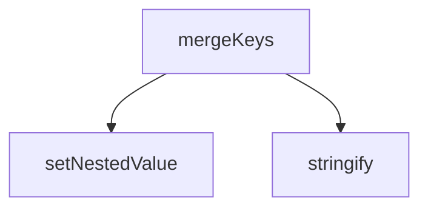

## Genel Bakış

Bu modül, admin paneline ait i18n (uluslararasılaştırma) dil dosyalarını birleştirmek için kullanılan bir CommonJS betiğidir. Modül bazlı ve dil bazlı anahtarları delta (fark) nesneleriyle hedef yapıya yerleştirmeyi amaçlar. Nested (iç içe geçmiş) nesne yapılarını destekleyerek derinlikli anahtar yollarını çözümleyebilir.

## Fonksiyon Grupları

### Yardımcı Veri İşleme
Nesne yapılarını dönüştürmek ve düzenlemek için kullanılan temel yardımcı fonksiyonlardır.
- `setNestedValue`, `stringify`

### Anahtar Birleştirme
İ18n modüllerine ait dil anahtarlarını delta nesneleriyle birleştiren ana işlevsel fonksiyondur. Modül adı, hedef dil ve birleştirilecek fark nesnesi parametre olarak alınır.
- `mergeKeys`

---

## AXIOMS – Mimari Varsayımlar

Bu modül için fonksiyon gövdeleri sağlanmadığından, yalnızca imzalardan ve modül sabitlerinden çıkarım yapılabilmektedir. Fonksiyon gövdesi olmadan kesin aksiyom üretilemez.

[Aksiyom 1]: Eğer `fs` modülü erişilebilir değilse, dosya okuma/yazma işlemleri gerçekleştirilemez.

[Aksiyom 2]: Eğer `path` modülü erişilebilir değilse, dosya yolları birleştirilemez.

[Aksiyom 3]: Eğer `repoRoot` tanımlı değilse, mutlak dosya yolları oluşturulamaz.

[Aksiyom 4]: Eğer `deltasPath` tanımlı değilse, delta dosyalarına erişilemez.

[Aksiyom 5]: Eğer `deltas` verisi mevcut değilse, `mergeKeys` fonksiyonuna işlenecek veri sağlanamaz.

[Aksiyom 6]: Eğer `setNestedValue` fonksiyonuna geçersiz bir `pathStr` verilirse, hedef nesne üzerinde istenen konuma değer yerleştirilemez.

[Aksiyom 7]: Eğer `mergeKeys` fonksiyonuna geçerli bir `

---

## FONKSİYON DETAYLARI

### setNestedValue
**Ne yapar**: Nokta (`.`) ile ayrılmış bir yol dizgesi kullanarak, iç içe geçmiş bir JavaScript nesnesinin belirtilen konumuna değer atar. Yol üzerindeki ara seviyeler mevcut değilse otomatik olarak boş nesne (`{}`) oluşturur.

**Nasıl yapar**: `pathStr` parametresini nokta karakterinden bölerek bir dizi elde eder. Dizinin son elemanı hariç tüm elemanlar için döngüye girer; her adımda mevcut nesne seviyesinde ilgili anahtarın var olup olmadığını, bir nesne olup olmadığını ve `null` olmadığını kontrol eder. Koşul sağlanmazsa o seviyede boş bir nesne oluşturur. Döngü sonunda dizinin son elemanına `value` değerini atar.

**Parametreler**:
- obj: object — Değerin atanacağı kök nesne. Fonksiyon bu nesneyi yerinde (in-place) değiştirir.
- pathStr: string — Nokta ile ayrılmış iç içe yol dizgesi (örneğin `'a.b.c'`).
- value: any — Yolun gösterdiği konuma atanacak değer.

**Dönüş**: Belirtilmemiş. Fonksiyon bir değer döndürmez; `obj` parametresini yerinde değiştirir.

### stringify
**Ne yapar**: Geliştirildi ancak detay üretilemedi.

### mergeKeys
**Ne yapar**: Geliştirildi ancak detay üretilemedi.

---

## SABİTLER
- **fs** (call) — `require('fs')`
- **path** (call) — `require('path')`
- **deltasPath** (call) — `path.resolve(process.argv[2])`
- **deltas** (call) — `JSON.parse(fs.readFileSync(deltasPath, 'utf8'))`
- **repoRoot** (call) — `path.resolve(__dirname, '..')`

---

## AST POINTERS

### [N1_NASIL] AST Pointer: admin-i18n-merger.cjs::setNestedValue
- **params**: `obj`, `pathStr`, `value`
- **ic_degiskenler**:
  - `parts` — `pathStr`'in `'.'` karakteriyle bölünmesiyle oluşan dizi; iç içe yol parçalarını tutar
  - `current` — `obj` içinde gezinmek için kullanılan referans; başlangıçta `obj`'ye eşittir, her adımda bir alt seviyeye iner
  - `i` — `for` döngüsü sayacı; `0`'dan `parts.length - 1`'e kadar artar
  - `part` — `parts[i]` değeri; mevcut yol parçasını temsil eder
- **Dönüş**: yok — yan etki olarak `obj` nesnesinin iç içe yapısını değiştirir, en derin seviyedeki anahtara `value` atar

### [N2_NASIL] AST Pointer: admin-i18n-merger.cjs::stringify
- **params**: `obj`, `indent` (varsayılan `'  '`)
- **ic_degiskenler**:
  - `entries` — `Object.entries(obj)` ile elde edilen `[key, val]` çiftlerinden oluşan dizi
  - `res` — oluşturulan JavaScript kodu string'ini biriktiren değişken; `'{\n'` ile başlar
  - `key` — `entries` döngüsündeki anahtar değeri
  - `val` — `entries` döngüsündeki değer
  - `formattedKey` — `key`'in düzenli ifade ile test edilmesi sonucu oluşan hali; geçerli JS tanımlayıcısı ise doğrudan `key`, değilse tırnak içinde `'${key}'` kullanılır
  - `item` — `Array.isArray(obj)` dalında `obj.map` içindeki her bir dizi elemanı
- **Dönüş**: `string` — verilen nesneyi JavaScript nesne/array sözdizimine uygun biçimlendirilmiş string olarak döndürür

### [N3_NASIL] AST Pointer: admin-i18n-merger.cjs::mergeKeys
- **params**: `moduleName`, `lang`, `deltaObj`
- **ic_degiskenler**:
  - `filePath` — `path.join(repoRoot, 'src/i18n/dictionaries/admin', ...)` ile oluşturulan tam dosya yolu; `${moduleName}.${lang}.ts` dosyasını hedefler
  - `content` — `fs.readFileSync(filePath, 'utf8')` ile okunan dosya içeriği
  - `objRegex` — `new RegExp(...)` ile oluşturulan düzenli ifade; `export const ${moduleName} = {...};` kalıbını yakalar
  - `match` — `content.match(objRegex)` sonucu; eşleşme yoksa fonksiyon erken döner
  - `objStr` — `match[1]`; regex'in yakaladığı küme parantezi içi, yani nesne tanımının string hali
  - `obj` — `eval('(' + objStr + ')')` ile oluşturulan JavaScript nesnesi; başlangıçta boş nesne `{}`
  - `e` — `catch` bloğunda yakalanan eval hatası
  - `mergedCount` — başarıyla birleştirilen anahtar sayısını tutan sayaç; başlangıçta `0`
  - `key` — `Object.entries(deltaObj)` döngüsündeki anahtar; nokta ile ayrılmış iç içe yolu temsil eder
  - `val` — `Object.entries(deltaObj)` döngüsündeki değer
  - `parts` — `key.split('.')` ile elde edilen yol parçaları dizisi
  - `exists` — anahtarın `obj` içinde zaten var olup olmadığını gösteren boolean; başlangıçta `true`
  - `curr` — `obj` içinde gezinmek için kullanılan referans; varlık kontrolü sırasında bir alt seviyeye iner
  - `part` — `parts` döngüsündeki mevcut yol parçası
  - `stringified` — `stringify(obj, '')` ile oluşturulan ve `export const ${moduleName} = ...;\n` formatına dönüştürülen nesne tanımı string'i
  - `newContent` — `content.replace(objRegex, stringified.trim())` ile elde edilen güncellenmiş dosya içeriği
- **Dönüş**: yok — yan etki olarak dosya sistemine yazar (`fs.writeFileSync`) ve konsola çıktı üretir (`console.log` / `console.error`)

---

## MERMAID CALL GRAPH

## NODE ID STANDARD

  file: scripts\admin-i18n-merger.cjs
  function: scripts\admin-i18n-merger.cjs::setNestedValue
  function: scripts\admin-i18n-merger.cjs::stringify
  function: scripts\admin-i18n-merger.cjs::mergeKeys

---

## DISA AKTARILANLAR (EXPORTS)
  export: mergeKeys
  export: setNestedValue
  export: stringify