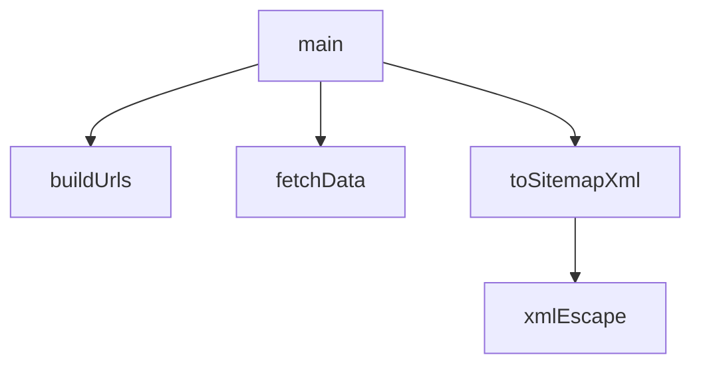

## Genel Bakış

Bu modül, web sitesi için bir sitemap XML dosyası oluşturan bir betiktir. Kategori ve ürün verilerini dış kaynaktan çekerek bunları standart sitemap formatına dönüştürür ve çıktı üretir. Modül, site haritası oluşturma sürecini veri çekme, URL derleme ve XML serileştirme aşamalarına ayırır.

## Fonksiyon Grupları

### Veri Erişim
Dış kaynaktan kategori ve ürün verilerini asenkron olarak çeker. Modülün çalışması için gerekli ham veriyi sağlar.
- fetchData

### Yardımcı İşlemler
XML'de özel anlama gelen karakterleri kaçış dizilerine dönüştürerek geçerli XML çıktısı üretilmesini sağlar. Diğer fonksiyonlar tarafından ortak kullanım için sunulur.
- xmlEscape

### URL Oluşturma ve XML Dönüştürme
Çekilen kategori ve ürün verilerinden site haritası URL'leri derler; ardından bu URL listesini standart sitemap XML yapısına dönüştürür.
- buildUrls, toSitemapXml

### Orkestrasyon
Modülün giriş noktasıdır. Veri çekme, URL oluşturma ve XML dönüştürme adımlarını sırayla çalıştırarak tüm sitemap oluşturma sürecini yönetir.
- main

---

## AXIOMS – Mimari Varsayımlar
- Bu modül davranışsal mantık içermez (salt veri / konfigürasyon / tip tanımı).
- [Aksiyom 1]: Modülün dışa açtığı yapı (anahtar kümesi / şema) bir sözleşmedir; tüketiciler bu sabit yapıya bağlıdır — kırıcı değişiklik tüm tüketicileri etkiler.
- [Aksiyom 2]: Bir öğe ekleme/çıkarma yapısal-uyumlu olmalı; ilgili tipler ve seçiciler aynı commit'te güncel tutulmalıdır.

---

## FONKSİYON DETAYLARI

### fetchData
**Ne yapar**: Supabase veritabanından kategori ve ürün verilerini eş zamanlı olarak çeker. Ortam değişkenleri eksikse uyarı verir ve boş diziler içeren bir nesne döndürür.

**Nasıl yapar**: Önce `SUPABASE_URL` ve `SUPABASE_ANON_KEY` ortam değişkenlerinin varlığını kontrol eder. Eksikse `console.warn` ile uyarı basar ve `{ categories: [], products: [] }` döndürür. Değişkenler mevcutsa `createClient` ile bir Supabase istemcisi oluşturur ve `Promise.all` ile iki sorguyu paralel yürütür: `categories` tablosundan `id, slug, parent_id, level, updated_at` alanlarını (en fazla 1000 kayıt), `products` tablosundan `id, updated_at` alanlarını (en fazla 5000 kayıt) seçer. Sorgu hataları varsa `console.warn` ile bildirir. Sonuç olarak kategori ve ürün verilerini ya da boş dizileri döndürür.

**Parametreler**: Yok

**Dönüş**: `{ categories: cats || [], products: prods || [] }` — `categories` ve `products` anahtarlarından oluşan bir nesne. Her biri, veritabanından gelen kayıt dizisidir; hata durumunda boş dizi (`[]`) kullanılır.

### xmlEscape
**Ne yapar**: Geliştirildi ancak detay üretilemedi.

### buildUrls
**Ne yapar**: Geliştirildi ancak detay üretilemedi.

### toSitemapXml
**Ne yapar**: Geliştirildi ancak detay üretilemedi.

### main
**Ne yapar**: Geliştirildi ancak detay üretilemedi.

---

## İTHALATLAR (IMPORTS)
- import: @supabase/supabase-js::createClient
- import: node:fs::mkdirSync
- import: node:fs::writeFileSync
- import: node:path::dirname
- import: node:path::resolve
- import: node:url::fileURLToPath

---

## SABİTLER
- **__filename** (call) — `fileURLToPath(import.meta.url)`
- **__dirname** (call) — `dirname(__filename)`
- **SUPABASE_URL** [env-backed] (member_expression) — `process.env.VITE_SUPABASE_URL`
- **SUPABASE_ANON_KEY** [env-backed] (member_expression) — `process.env.VITE_SUPABASE_ANON_KEY`
- **BASE_URL** [env-backed] (binary_expression) — `process.env.SITEMAP_BASE_URL || 'http://localhost:5173'`

---

## AST POINTERS

### [N1_NASIL] AST Pointer: generate-sitemap.mjs::fetchData
- **params**: yok
- **ic_degiskenler**:
  - `supabase` — `createClient(SUPABASE_URL, SUPABASE_ANON_KEY)` ile oluşturulan Supabase istemcisi
  - `cats` — `supabase.from('categories').select(...)` sorgusundan dönen kategori verisi (destructuring ile)
  - `ce` — kategori sorgusunda oluşan hata nesnesi (destructuring ile)
  - `prods` — `supabase.from('products').select(...)` sorgusundan dönen ürün verisi (destructuring ile)
  - `pe` — ürün sorgusunda oluşan hata nesnesi (destructuring ile)
- **Dönüş**: `{ categories: cats || [], products: prods || [] }` — kategori ve ürün dizilerini içeren nesne; hata durumunda boş diziler döner

### [N2_NASIL] AST Pointer: generate-sitemap.mjs::xmlEscape
- **params**: `s` — escape edilecek değer
- **ic_degiskenler**: yok
- **Dönüş**: `String(s)` üzerinde `&`, `<`, `>` karakterlerinin XML varlıklarına dönüştürülmüş hali

### [N3_NASIL] AST Pointer: generate-sitemap.mjs::buildUrls
- **params**: `{ categories, products }` — kategori ve ürün dizilerini içeren nesne
- **ic_degiskenler**:
  - `urls` — biriktirilen URL nesnelerinin dizisi
  - `now` — `new Date().toISOString()` ile elde edilen güncel ISO tarih string'i
  - `byId` — `categories` dizisindeki nesneleri `c.id` anahtarıyla eşleyen `Map`
  - `c` — `categories` dizisi üzerindeki döngüdeki kategori nesnesi; `c.level`, `c.slug`, `c.parent_id`, `c.id` alanlarına erişilir
  - `parent` — `byId.get(c.parent_id)` ile elde edilen üst kategori nesnesi; `parent.slug` alanına erişilir
  - `p` — `products` dizisi üzerindeki döngüdeki ürün nesnesi; `p.id`, `p.updated_at` alanlarına erişilir
- **Dönüş**: `urls` — her elemanı `{ loc, changefreq, priority, lastmod }` alanlarını içeren nesnelerden oluşan dizi

### [N4_NASIL] AST Pointer: generate-sitemap.mjs::toSitemapXml
- **params**: `urls` — URL nesnelerinden oluşan dizi
- **ic_degiskenler**:
  - `body` — `urls.map(...)` ile her URL nesnesinden oluşturulan `<url>` XML bloklarının `\n` ile birleştirilmiş string'i
  - `u` — map döngüsündeki tekil URL nesnesi; `u.loc`, `u.lastmod`, `u.changefreq`, `u.priority` alanlarına erişilir
- **Dönüş**: `<?xml version="1.0" encoding="UTF-8"?>` başlığı ve `<urlset>` sarmalayıcısı ile tam sitemap XML string'i

### [N5_NASIL] AST Pointer: generate-sitemap.mjs::main
- **params**: yok
- **ic_degiskenler**:
  - `data` — `await fetchData()` çağrısından dönen `{ categories, products }` nesnesi
  - `urls` — `buildUrls(data)` çağrısından dönen URL nesneleri dizisi
  - `xml` — `toSitemapXml(urls)` çağrısından dönen sitemap XML string'i
  - `outPath` — `resolve(__dirname, '../../public/sitemap.xml')` ile hesaplanan çıktı dosyasının tam yolu
  - `e` — catch bloğunda yakalanan hata nesnesi
  - `now` — catch bloğunda `new Date().toISOString()` ile elde edilen güncel ISO tarih string'i
  - `fallback` — catch bloğunda `toSitemapXml([...])` ile oluşturulan minimal sitemap XML string'i
- **Dönüş**: yok — yan etki olarak `public/sitemap.xml` dosyasını diske yazar; `mkdirSync` ile dizin oluşturur; `console.warn` ile çıktı yolu ve URL sayısını bildirir; hata durumunda `console.error` ile hata bilgisi yazar ve fallback sitemap dosyasını yazar

---

## MERMAID CALL GRAPH

## NODE ID STANDARD

  file: scripts\generate\generate-sitemap.mjs
  function: scripts\generate\generate-sitemap.mjs::fetchData
  function: scripts\generate\generate-sitemap.mjs::xmlEscape
  function: scripts\generate\generate-sitemap.mjs::buildUrls
  function: scripts\generate\generate-sitemap.mjs::toSitemapXml
  function: scripts\generate\generate-sitemap.mjs::main

---

## DISA AKTARILANLAR (EXPORTS)
  export: buildUrls
  export: fetchData
  export: main
  export: toSitemapXml
  export: xmlEscape