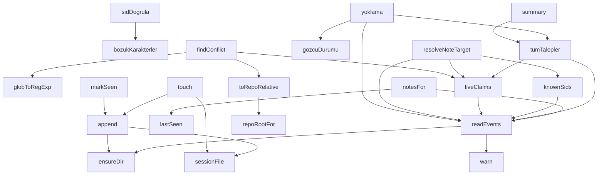

## Genel Bakış

Bu modül, dosya sistemi tabanlı bir oturum (session) ve olay (event) yönetim sistemi sunar. SID (session ID) anahtarlı oturum dosyaları üzerinden gözlemci durumu takibi, talep yönetimi ve çakışma tespiti gerçekleştirir. Modül, bir "tahta" (board) üzerindeki gözlemcilerin canlılık durumunu izler ve dosya yolu bazlı çakışma kontrolü sağlar.

## Fonksiyon Grupları

### Dosya Sistemi ve Oturum Dosyası Yönetimi
Oturum dosyalarının oluşturulması, okunması ve güncellenmesinden sorumludur. Dizin yapısını garanti altına alır ve her oturum için dosya tabanlı olay kaydı tutar.
- ensureDir, sessionFile, append, touch, readEvents

### Gözlemci Durumu ve Yoklama
Gözlemcilerin canlılık durumunu sorgular, yoklama (yoklama) işlemi yapar ve belirli bir gözlemcinin durum bilgisini döndürür. Zaman damgası bazlı aktif talep listesi üretir.
- liveClaims, tumTalepler, gozcuDurumu, yoklama

### Dosya Yolu ve Çakışma Tespiti
Dosya yollarını normalize eder, glob desenlerini RegExp'e dönüştürür ve bir dosya üzerindeki olası çakışmaları tespit eder. Repo kök dizini çözümlemesi yapar.
- globToRegExp, repoRootFor, toRepoRelative, findConflict

### Olay Sorgulama ve Not Yönetimi
Olaylar üzerinden özet bilgi üretir, son görülme zamanını hesaplar, belirli bir şerit (lane) için notları filtreler ve not hedeflerini çözer. Bilinen SID'leri listeler.
- summary, lastSeen, notesFor, knownSids, resolveNoteTarget, markSeen

### Doğrulama ve Yardımcı İşlevler
SID formatını doğrular, bozuk karakterleri tespit eder ve uyarı mesajı üretir. Modül genelinde kullanılan yardımcı işlevleri içerir.
- sidDogrula, bozukKarakterler, warn

---

## AXIOMS – Mimari Varsayımlar
- Bu modül davranışsal mantık içermez (salt veri / konfigürasyon / tip tanımı).
- [Aksiyom 1]: Modülün dışa açtığı yapı (anahtar kümesi / şema) bir sözleşmedir; tüketiciler bu sabit yapıya bağlıdır — kırıcı değişiklik tüm tüketicileri etkiler.
- [Aksiyom 2]: Bir öğe ekleme/çıkarma yapısal-uyumlu olmalı; ilgili tipler ve seçiciler aynı commit'te güncel tutulmalıdır.

---

## FONKSİYON DETAYLARI

### ensureDir
**Ne yapar**: `BOARD_DIR` dizininin varlığını garanti altına alır. Dizin yoksa oluşturur, varsa hiçbir şey yapmaz.
**Nasıl yapar**: `fs.mkdirSync` fonksiyonunu `recursive: true` seçeneğiyle çağırır. Bu seçenek sayesinde üst dizinler de dahil olmak üzere tüm yol oluşturulur. Oluşan hatalar yakalanır ve yoksayılır; fonksiyon her durumda sessizce tamamlanır.
**Parametreler**:
- Bu fonksiyon parametre almaz.
**Dönüş**: Yok (void). Herhangi bir değer döndürmez.

### sessionFile
**Ne yapar**: Geliştirildi ancak detay üretilemedi.

### append
**Ne yapar**: Geliştirildi ancak detay üretilemedi.

### touch
**Ne yapar**: Geliştirildi ancak detay üretilemedi.

### readEvents
**Ne yapar**: Geliştirildi ancak detay üretilemedi.

### warn
**Ne yapar**: Geliştirildi ancak detay üretilemedi.

### liveClaims
**Ne yapar**: Geliştirildi ancak detay üretilemedi.

### tumTalepler
**Ne yapar**: Geliştirildi ancak detay üretilemedi.

### globToRegExp
**Ne yapar**: Geliştirildi ancak detay üretilemedi.

### repoRootFor
**Ne yapar**: Geliştirildi ancak detay üretilemedi.

### toRepoRelative
**Ne yapar**: Mutlak veya göreli bir dosya yolunu, verilen repo köküne göreli hâle getirir. Pano yollarının repo-göreli tutulması gerektiği için kullanılır.
**Nasıl yapar**: Önce gelen yolu ters eğik çizgileri düz eğik çizgiye dönüştürerek normalleştirir. Ardından üç aday kök dizin belirler: `repoRoot` parametresi, `repoRootFor` fonksiyonundan dönen değer ve `process.cwd()`. Bunları boş olmayanlar olarak filtreler ve normalize eder. Her bir kök için, normalize edilmiş yolun o kökle başlayıp başlamadığını (büyük/küçük harf duyarsız) kontrol eder; eşleşirse kökün sonrasındaki kısmı döndürür. Hiçbir kök eşleşmezse, yolun başındaki `./` önekini kaldırarak döndürür.
**Parametreler**:
- filePath: string — Normalize edilecek dosya yolu (mutlak veya göreli)
- repoRoot: string — Repo kök dizini
**Dönüş**: string — Repo-göreli normalize edilmiş dosya yolu

### findConflict
**Ne yapar**: Geliştirildi ancak detay üretilemedi.

### summary
**Ne yapar**: Geliştirildi ancak detay üretilemedi.

### lastSeen
**Ne yapar**: Geliştirildi ancak detay üretilemedi.

### notesFor
**Ne yapar**: Geliştirildi ancak detay üretilemedi.

### knownSids
**Ne yapar**: Geliştirildi ancak detay üretilemedi.

### resolveNoteTarget
**Ne yapar**: Geliştirildi ancak detay üretilemedi.

### markSeen
**Ne yapar**: Geliştirildi ancak detay üretilemedi.

### gozcuDurumu
**Ne yapar**: Geliştirildi ancak detay üretilemedi.

### yoklama
**Ne yapar**: Geliştirildi ancak detay üretilemedi.

### bozukKarakterler
**Ne yapar**: Verilen kimlik (`sid`) içindeki kabul edilmeyen karakterleri tespit eder ve her birini Unicode kod noktası bilgisiyle birlikte listeler. Geçerli karakterler `[A-Za-z0-9._-]` kümesiyle tanımlanmıştır; bu kümenin dışında kalan her karakter "bozuk" sayılır.

**Nasıl yapar**: Kimliği dizeye dönüştürdükten sonra her karakteri tek tek dolaşır. Her karakter için `[A-Za-z0-9._-]` düzenli ifadesiyle eşleşme testi yapar. Eşleşmeyen karakterleri `"karakter" (U+XXXX)` biçiminde bir diziye ekler; burada `XXXX` karakterin onaltılık kod noktasıdır (büyük harf, dört haneli, sıfır dolgulu). İşlem tamamlandığında toplanan bozuk karakterlerin listesini döndürür.

**Parametreler**:
- `sid`: String — Kontrol edilecek kimlik değeri. Fonksiyon içinde `String(sid)` ile dizeye dönüştürülür, bu nedenle sayı gibi başka türler de kabul edilir.

**Dönüş**: Array — Kabul edilmeyen karakterlerin listesi. Her eleman `"karakter" (U+XXXX)` biçiminde bir dizedir. Bozuk karakter yoksa boş dizi döner.

### sidDogrula
**Ne yapar**: Geliştirildi ancak detay üretilemedi.

---

## SABİTLER
- **fs** (call) — `require('fs')`
- **path** (call) — `require('path')`
- **BOARD_DIR** [env-backed] (binary_expression) — `process.env.VENTHUB_BOARD_DIR || path.join('C:', 'tmp', 'venthub-board')`
- **DEFAULT_TTL_MS** (binary_expression) — `4 * 60 * 60 * 1000`
- **PRUNE_MS** (binary_expression) — `24 * 60 * 60 * 1000`
- **HEARTBEAT_MIN_INTERVAL_MS** (binary_expression) — `10 * 60 * 1000`
- **PANOYA_YAZAN_FIILLER** (new_expression) — `new Set(['claim', 'heartbeat', 'release', 'note'])`
- **BROADCAST_WORDS** (new_expression) — `new Set(['herkes', 'hepsi', 'tumu', 'tümü', 'all', 'everyone', 'broadcast', '...`
- **SID_UUID** (regex) — `/^[0-9a-f]{8}-[0-9a-f]{4}-[0-9a-f]{4}-[0-9a-f]{4}-[0-9a-f]{12}$/i`
- **SID_ELLE** (regex) — `/^[A-Za-z0-9][A-Za-z0-9._-]{1,40}$/`

---

## AST POINTERS

### [N1_NASIL] AST Pointer: scripts/board/board.cjs::ensureDir
- **params**: (parametre yok)
- **ic_degiskenler**: (yok)
- **Dönüş**: yok — `fs.mkdirSync` ile `BOARD_DIR` dizinini recursive olarak oluşturmaya çalışır, hata varsa yoksayar

### [N2_NASIL] AST Pointer: scripts/board/board.cjs::sessionFile
- **params**: `sid`
- **ic_degiskenler**:
  - `safe` — `String(sid || 'unknown')` değerinden `[^\w.-]` regex'ine uyan karakterleri `_` ile değiştirerek güvenli dosya adı üretir
- **Dönüş**: `path.join(BOARD_DIR, 'events.' + safe + '.jsonl')` — oturum dosyasının tam yolu

### [N3_NASIL] AST Pointer: scripts/board/board.cjs::append
- **params**: `sid`, `event`
- **ic_degiskenler**:
  - `line` — `{ ts: new Date().toISOString(), sid, ...event }` nesnesini JSON.stringify ile metne çevirir, sonuna `\n` ekler
- **Dönüş**: yok — `sessionFile(sid)` ile elde edilen dosyaya `fs.appendFileSync` ile `line`'ı utf8 olarak ekler

### [N4_NASIL] AST Pointer: scripts/board/board.cjs::touch
- **params**: `sid`, `minIntervalMs` (varsayılan: `HEARTBEAT_MIN_INTERVAL_MS`)
- **ic_degiskenler**:
  - `lastTs` — dosyadaki son geçerli heartbeat olayının zaman damgası (epoch ms), başlangıçta 0
  - `raw` — `fs.readFileSync(sessionFile(sid), 'utf8')` ile okunan dosya içeriği
  - `lines` — `raw.split('\n').filter(l => l.trim())` ile boş olmayan satırlar dizisi
  - `i` — döngü sayacı, satırları sondan başa tarar
  - `e` — `JSON.parse(lines[i])` ile ayrıştırılan satır nesnesi; `e.ts` üzerinden `Date.parse` ile `lastTs` güncellenir
- **Dönüş**: boolean — dosya yoksa `false`; son olaydan bu yana süre `minIntervalMs`'den azsa `false`; aksi halde `append(sid, { type: 'heartbeat' })` çağırıp `true` döner

### [N5_NASIL] AST Pointer: scripts/board/board.cjs::readEvents
- **params**: (parametre yok)
- **ic_degiskenler**:
  - `files` — `fs.readdirSync(BOARD_DIR)` ile okunan, `events.` ile başlayan ve `.jsonl` ile biten dosya adları dizisi
  - `out` — ayrıştırılmış tüm olay nesnelerini toplayan dizi
  - `cutoff` — `Date.now() - PRUNE_MS` — dosya yaş filtresi için eşik değeri
  - `f` — döngüdeki dosya adı
  - `full` — `path.join(BOARD_DIR, f)` ile elde edilen dosyanın tam yolu
  - `raw` — `fs.readFileSync(full, 'utf8')` ile okunan dosya içeriği
  - `bad` — JSON.parse başarısız olan satır sayısı
  - `line` — `raw.split('\n')` ile elde edilen her satır
- **Dönüş**: `out` dizisi — `a.ts` ve `b.ts` üzerinden `localeCompare` ile kronolojik sıralanmış olay nesneleri

### [N6_NASIL] AST Pointer: scripts/board/board.cjs::warn
- **params**: `msg`
- **ic_degiskenler**: (yok)
- **Dönüş**: yok — `process.stderr.write('[board] ' + msg + '\n')` ile standart hataya yazar, hata varsa yoksayar

### [N7_NASIL] AST Pointer: scripts/board/board.cjs::liveClaims
- **params**: `now` (varsayılan: `Date.now()`)
- **ic_degiskenler**:
  - `events` — `readEvents()` ile okunan tüm olaylar dizisi
  - `bySession` — `Map` yapısı; `e.sid` anahtarı ile oturum başına talep bilgisi tutar
  - `e` — döngüdeki olay nesnesi
  - `globs` — `e.type === 'claim'` ise `Array.isArray(e.globs) ? e.globs : []` ile elde edilen glob desenleri dizisi
  - `prev` — `bySession.get(e.sid)` ile elde edilen önceki talep kaydı
  - `c` — `bySession.values()` döngüsündeki her oturum kaydı; `c.heartbeat` ve `c.ttlMs` üzerinden yaş kontrolü yapılır
  - `age` — `now - Date.parse(c.heartbeat)` ile hesaplanan olay yaşı (ms)
  - `live` — TTL süresi dolmamış canlı talepleri toplayan dizi
- **Dönüş**: `live` dizisi — `a.ts` ve `b.ts` üzerinden `localeCompare` ile kronolojik sıralanmış canlı talep nesneleri

### [N8_NASIL] AST Pointer: scripts/board/board.cjs::tumTalepler
- **params**: `now` (varsayılan: `Date.now()`)
- **ic_degiskenler**:
  - `canli` — `liveClaims(now).map(c => c.sid)` ile elde edilen canlı oturum kimliklerinin `Set`'i
  - `events` — `readEvents()` ile okunan tüm olaylar dizisi
  - `bySession` — `Map` yapısı; oturum başına talep bilgisi tutar
  - `e` — döngüdeki olay nesnesi
  - `globs` — `Array.isArray(e.globs) ? e.globs : []` ile elde edilen glob desenleri dizisi
  - `prev` — `bySession.get(e.sid)` ile elde edilen önceki talep kaydı
  - `c` — `bySession.values()` döngüsündeki her oturum kaydı
  - `yasMs` — `now - Date.parse(c.heartbeat)` ile hesaplanan olay yaşı (ms)
  - `out` — her oturum kaydına `bayat` (canlı olmayan) ve `yasDk` (dakika cinsinden yaş) alanları eklenmiş dizi
- **Dönüş**: `out` dizisi — `a.ts` ve `b.ts` üzerinden `localeCompare` ile kronolojik sıralanmış, `bayat` ve `yasDk` alanları eklenmiş talep nesneleri

### [N9_NASIL] AST Pointer: scripts/board/board.cjs::globToRegExp
- **params**: `glob`
- **ic_degiskenler**:
  - `norm` — `String(glob).replace(/\\/g, '/')` ile ters eğik çizgileri düzeltir
  - `re` — regex deseni biriktirilen string; `**` → `.*`, tek `*` → `[^/]*`, regex özel karakterleri escape edilir
  - `i` — döngü sayacı
  - `ch` — `norm[i]` ile elde edilen mevcut karakter
- **Dönüş**: `new RegExp('^' + re + '$', 'i')` — büyük/küçük harf duyarsız RegExp nesnesi

### [N10_NASIL] AST Pointer: scripts/board/board.cjs::repoRootFor
- **params**: `filePath`
- **ic_degiskenler**:
  - `norm` — `String(filePath).replace(/\\/g, '/')` ile ters eğik çizgileri düzeltir
  - `dir` — `norm.endsWith('/')` ise `norm`, değilse `path.posix.dirname(norm)` ile elde edilen dizin yolu
- **Dönüş**: string — `execFileSync('git', ['-C', dir, 'rev-parse', '--show-toplevel'])` ile elde edilen git kök dizini (ters eğik çizgiler düzeltildi); hata durumunda boş string `''`

### [N11_NASIL] AST Pointer: scripts/board/board.cjs::toRepoRelative
- **params**: `filePath`, `repoRoot`
- **ic_degiskenler**:
  - `norm` — `String(filePath).replace(/\\/g, '/')` ile ters eğik çizgileri düzeltir
  - `roots` — `[repoRoot, repoRootFor(norm), process.cwd()]` dizisinden boş olmayanları filtrelenmiş, ters eğik çizgileri düzeltilmiş ve sondaki `/` kaldırılmış kök dizinler dizisi
  - `root` — döngüdeki kök dizin; `norm.toLowerCase().startsWith(root.toLowerCase() + '/')` kontrolü yapılır
- **Dönüş**: string — eşleşen kök dizine göreli yol; eşleşme yoksa `norm.replace(/^\.\//, '')`

### [N12_NASIL] AST Pointer: scripts/board/board.cjs::findConflict
- **params**: `filePath`, `sid`, `repoRoot`
- **ic_degiskenler**:
  - `rel` — `toRepoRelative(filePath, repoRoot)` ile elde edilen göreli dosya yolu
  - `live` — `liveClaims()` ile elde edilen canlı talepler dizisi
  - `mine` — `live.find(c => c.sid === sid)` ile elde edilen mevcut oturumun talep kaydı
  - `c` — döngüdeki canlı talep nesnesi
  - `g` — `c.globs` döngüsündeki glob deseni
- **Dönüş**: `null` (çakışma yoksa) veya `{ claim: c, glob: g, rel }` nesnesi — çakışan talep bilgisi

### [N13_NASIL] AST Pointer: scripts/board/board.cjs::summary
- **params**: `sid`
- **ic_degiskenler**:
  - `hepsi` — `tumTalepler()` ile elde edilen tüm talepler dizisi
  - `laneCount` — `Map` yapısı; canlı olmayan talepler hariç her `lane` için oturum sayısını tutar
  - `c` — döngüdeki talep nesnesi
  - `mine` — `c.sid === sid` ise `' (sen)'`, değilse boş string
  - `dup` — aynı şerit adında birden fazla canlı oturum varsa `' ⚠ AYNI ŞERİT ADI birden çok oturumda'`, değilse boş string
  - `bayat` — `c.bayat` ise bayatlık uyarısı metni, değilse boş string
  - `lines` — her talep için biçimlendirilmiş satır dizisi
  - `bayatSayi` — `hepsi.filter(c => c.bayat).length` ile bayat talep sayısı
  - `bas` — başlık satırı; bayat varsa canlı ve bayat sayılarını içerir
- **Dönüş**: string — pano özet metni (başlık + talep satırları)

### [N14_NASIL] AST Pointer: scripts/board/board.cjs::lastSeen
- **params**: `sid`, `events`
- **ic_degiskenler**:
  - `last` — `e.type === 'seen' && e.sid === sid` koşulunu sağlayan en son `e.upto` değeri, başlangıçta boş string
  - `e` — döngüdeki olay nesnesi
- **Dönüş**: string — belirtilen oturum için en son görülen zaman damgası; bulunamazsa boş string

### [N15_NASIL] AST Pointer: scripts/board/board.cjs::notesFor
- **params**: `sid`, `lane`, `events`
- **ic_degiskenler**:
  - `evs` — `events || readEvents()` ile elde edilen olaylar dizisi
  - `since` — `lastSeen(sid, evs)` ile elde edilen son görülme zaman damgası
- **Dönüş**: dizi — `e.type === 'note'`, `e.sid !== sid`, `String(e.ts) > since` ve (`!e.to` veya `e.to === sid` veya `lane && e.to === lane`) koşullarını sağlayan son 5 not olayı

### [N16_NASIL] AST Pointer: scripts/board/board.cjs::knownSids
- **params**: `events`
- **ic_degiskenler**: (yok — `events || readEvents()` ile elde edilen diziden `e.sid` değerleri `Set` ile benzersizleştirilir)
- **Dönüş**: dizi — olaylarda bulunan benzersiz oturum kimlikleri

### [N17_NASIL] AST Pointer: scripts/board/board.cjs::resolveNoteTarget
- **params**: `rawTo`, `events`
- **ic_degiskenler**:
  - `evs` — `events || readEvents()` ile elde edilen olaylar dizisi
  - `raw` — `String(rawTo == null ? '' : rawTo).trim()` ile elde edilen hedef metni
  - `sids` — `knownSids(evs)` ile elde edilen bilinen oturum kimlikleri dizisi
  - `exact` — `sids.find(s => s === raw)` ile elde edilen tam eşleşen oturum kimliği
  - `pref` — `sids.filter(s => s.startsWith(raw))` ile elde edilen önek eşleşmeleri dizisi
  - `laneOwners` — `Map` yapısı; `raw` ile eşleşen şerit adını talep eden oturumları ve zaman damgalarını tutar
  - `liveSids` — `liveClaims().map(c => c.sid)` ile elde edilen canlı oturum kimliklerinin `Set`'i
  - `cands` — `laneOwners.entries()` dizisinin `b[1]` (zaman damgası) üzerinden azalan sıralanmış hali
  - `live` — `cands` dizisinden `liveSids`'te bulunan oturumlar
  - `pick` — `(live.length > 0 ? live : cands)[0][0]` ile seçilen hedef oturum kimliği
  - `lanes` — olaylarda bulunan benzersiz şerit adları dizisi
- **Dönüş**: nesne — `{ ok: true, to: ..., how: ... }` (başarılı) veya `{ ok: false, reason: ..., valid: ... }` (başarısız)

### [N18_NASIL] AST Pointer: scripts/board/board.cjs::markSeen
- **params**: `sid`, `notes`
- **ic_degiskenler**:
  - `upto` — `notes.map(n => String(n.ts)).sort().pop()` ile elde edilen en son not zaman damgası
- **Dönüş**: yok — `notes` boşsa erken dönüş; aksi halde `append(sid, { type: 'seen', upto })` çağırır

### [N19_NASIL] AST Pointer: scripts/board/board.cjs::gozcuDurumu
- **params**: `sid`, `now`
- **ic_degiskenler**:
  - `iy` — `path.join(BOARD_DIR, '.gozcu-imlec.' + String(sid).slice(0, 8) + '.json')` ile elde edilen gözcü imleç dosyası yolu
  - `im` — `JSON.parse(fs.readFileSync(iy, 'utf8'))` ile ayrıştırılan imleç nesnesi
  - `aralikSn` — `Number(im.aralikSn || 60)` ile elde edilen tarama aralığı (saniye)
  - `yasSn` — `(now - Date.parse(im.sonTarama)) / 1000` ile hesaplanan son taramadan bu yana geçen süre (saniye)
- **Dönüş**: string — `'CANLI'` (üç tarama aralığı içinde), `'ASILMIS'` (üç tarama aralığı aşılmış), `'IMLEC BOS'` (`im.sonTarama` yoksa) veya `'KANITSIZ'` (dosya yoksa ya da bozuksa)

### [N20_NASIL] AST Pointer: scripts/board/board.cjs::yoklama
- **params**: `now` (varsayılan: `Date.now()`)
- **ic_degiskenler**:
  - `events` — `readEvents()` ile okunan tüm olaylar dizisi
  - `hepsi` — `tumTalepler(now)` ile elde edilen tüm talepler dizisi
  - `dk` — zaman damgasından dakika cinsinden yaş hesaplayan fonksiyon; `ts` parametresi epoch ms, dönüş `Math.round((now - Date.parse(ts)) / 60000)` veya `null`
  - `yasYaz` — dakika değerini `'YOK'` (null ise) veya `d + 'dk'` formatına çeviren fonksiyon
  - `sonNot` — `Map` yapısı; her `sid` için en son `note` olayının zaman damgasını tutar
  - `e` — döngüdeki olay nesnesi
  - `o` — `sonNot.get(e.sid)` ile elde edilen önceki en son not zaman damgası
  - `durumlar` — her talep için `{ c, gozcu: gozcuDurumu(c.sid, now) }` nesneleri dizisi
  - `c` — döngüdeki talep nesnesi
  - `gozcu` — `gozcuDurumu(c.sid, now)` ile elde edilen gözcü durumu stringi
  - `bayrak` — `c.bayat` ise `' [BAYAT-TALEP]'`, değilse boş string
  - `satirlar` — her talep için biçimlendirilmiş satır dizisi (şerit adı, atış yaşı, gözcü durumu, ses yaşı, oturum kimliği)
  - `sagir` — `durumlar` dizisinden `gozcu !== 'CANLI'` olanlar
  - `bas` — başlık satırı
  - `alt` — alt bilgi satırı; gözcüsü kanıtlanamayan şerit yoksa bilgi mesajı, varsa uyarı ve kurulum komutu
- **Dönüş**: string — yoklama raporu metni (başlık + şerit satırları + alt bilgi)

### [N21_NASIL] AST Pointer: scripts/board/board.cjs::bozukKarakterler
- **params**: `sid`
- **ic_degiskenler**:
  - `kotu` — `[A-Za-z0-9._-]` regex'ine uymayan karakterlerin `"ch" (U+XXXX)` formatında toplandığı dizi
  - `ch` — `String(sid)` döngüsündeki mevcut karakter
- **Dönüş**: dizi — kabul edilmeyen karakterlerin Unicode gösterimleri

### [N22_NASIL] AST Pointer: scripts/board/board.cjs::sidDogrula
- **params**: `sid`
- **ic_degiskenler**:
  - `ham` — `String(sid)` ile elde edilen ham kimlik metni
  - `kotu` — `bozukKarakterler(ham)` ile elde edilen kabul edilmeyen karakterler dizisi
- **Dönüş**: nesne — `{ ok: true, tur: 'oturum kimliği' }` (UUID geçerliyse), `{ ok: true, tur: 'elle kimlik' }` (dar ASCII biçimiyse) veya `{ ok: false, sebep: ..., oneri: ... }` (geçersizse)

---

## MERMAID CALL GRAPH

## NODE ID STANDARD

  file: scripts\board\board.cjs
  function: scripts\board\board.cjs::ensureDir
  function: scripts\board\board.cjs::sessionFile
  function: scripts\board\board.cjs::append
  function: scripts\board\board.cjs::touch
  function: scripts\board\board.cjs::readEvents
  function: scripts\board\board.cjs::warn
  function: scripts\board\board.cjs::liveClaims
  function: scripts\board\board.cjs::tumTalepler
  function: scripts\board\board.cjs::globToRegExp
  function: scripts\board\board.cjs::repoRootFor
  function: scripts\board\board.cjs::toRepoRelative
  function: scripts\board\board.cjs::findConflict
  function: scripts\board\board.cjs::summary
  function: scripts\board\board.cjs::lastSeen
  function: scripts\board\board.cjs::notesFor
  function: scripts\board\board.cjs::knownSids
  function: scripts\board\board.cjs::resolveNoteTarget
  function: scripts\board\board.cjs::markSeen
  function: scripts\board\board.cjs::gozcuDurumu
  function: scripts\board\board.cjs::yoklama
  function: scripts\board\board.cjs::bozukKarakterler
  function: scripts\board\board.cjs::sidDogrula

---

## DISA AKTARILANLAR (EXPORTS)
  export: append
  export: bozukKarakterler
  export: ensureDir
  export: findConflict
  export: globToRegExp
  export: gozcuDurumu
  export: knownSids
  export: lastSeen
  export: liveClaims
  export: markSeen
  export: notesFor
  export: readEvents
  export: repoRootFor
  export: resolveNoteTarget
  export: sessionFile
  export: sidDogrula
  export: summary
  export: toRepoRelative
  export: touch
  export: tumTalepler
  export: warn
  export: yoklama