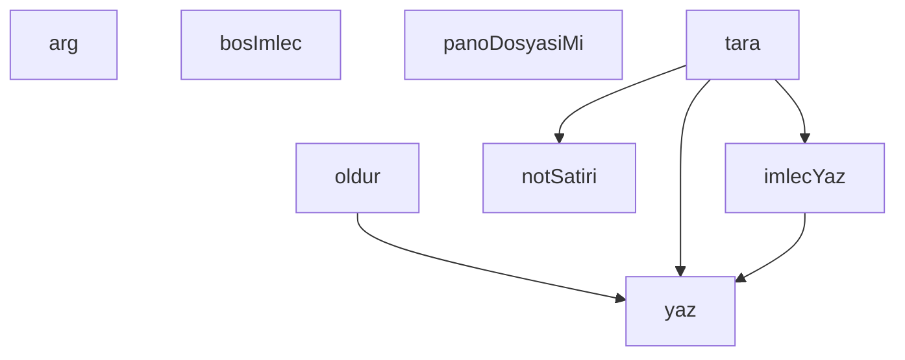

## Genel Bakış

Bu modül, pano (board) sistemindeki dosyaları izleyen ve içindeki not satırlarını okuyarak konsola yazan bir gözcü (watcher) betiğidir. Komut satırı argümanlarıyla yapılandırılır, pano dosyalarını tarar ve terminalde imleçli bir çıktı sunar. Hata durumlarında programı sonlandırarak güvenli bir çıkış sağlar.

## Fonksiyon Grupları

### Komut Satırı ve Hata Yönetimi
Kullanıcıdan gelen argümanları çözümleyerek betiğin davranışını belirler; kritik hatalarda programı güvenli biçimde sonlandırır.
- arg, oldur

### Terminal Çıktı ve İmleç Yönetimi
Konsola satır yazma, imleci gösterme/gizleme gibi terminal etkileşimlerini yönetir. Kullanıcıya anlık durum bilgisi sunar.
- yaz, bosImlec, imlecYaz

### Dosya ve Veri İşlemleri
Verilen bir yolun pano dosyası olup olmadığını denetler; okunan nesneleri not satırı biçimine dönüştürür.
- panoDosyasiMi, notSatiri

### Ana Tarama Döngüsü
Pano dosyalarını tarayarak not satırlarını toplar ve çıktıya yazar. Modülün ana iş akışını başlatan ve sürdüren fonksiyondur.
- tara

---

## AXIOMS – Mimari Varsayımlar
- Bu modül davranışsal mantık içermez (salt veri / konfigürasyon / tip tanımı).
- [Aksiyom 1]: Modülün dışa açtığı yapı (anahtar kümesi / şema) bir sözleşmedir; tüketiciler bu sabit yapıya bağlıdır — kırıcı değişiklik tüm tüketicileri etkiler.
- [Aksiyom 2]: Bir öğe ekleme/çıkarma yapısal-uyumlu olmalı; ilgili tipler ve seçiciler aynı commit'te güncel tutulmalıdır.

---

## FONKSİYON DETAYLARI

### arg
**Ne yapar**: Kaynakta bu fonksiyonun görevine dair bir docstring veya gövde bulunmamaktadır. Yalnızca fonksiyon adı ve `ad` parametresi tanımlıdır; ne iş yaptığı bilinmiyor.

**Nasıl yapar**: Gövdesi verilmemiştir; iç mantığı bilinmiyor.

**Parametreler**:
- ad: bilinmiyor — işlevi bilinmiyor

**Dönüş**: Bilinmiyor.

### yaz
**Ne yapar**: Geliştirildi ancak detay üretilemedi.

### oldur
**Ne yapar**: Geliştirildi ancak detay üretilemedi.

### bosImlec
**Ne yapar**: Geliştirildi ancak detay üretilemedi.

### imlecYaz
**Ne yapar**: Geliştirildi ancak detay üretilemedi.

### panoDosyasiMi
**Ne yapar**: Geliştirildi ancak detay üretilemedi.

### notSatiri
**Ne yapar**: Geliştirildi ancak detay üretilemedi.

### tara
**Ne yapar**: Geliştirildi ancak detay üretilemedi.

---

## SABİTLER
- **fs** (call) — `require('fs')`
- **path** (call) — `require('path')`
- **PANO** [env-backed] (binary_expression) — `process.env.VENTHUB_BOARD_DIR || process.env.VENTHUB_PANO_DIR || 'C:/tmp/vent...`
- **sid** [env-backed] (binary_expression) — `arg('--sid') || process.env.CLAUDE_SESSION_ID`
- **araliksn** (call) — `Number(arg('--aralik') || 60)`
- **kisaSid** (call) — `sid.slice(0, 8)`
- **IMLEC_YOLU** (call) — `path.join(PANO, '.gozcu-imlec.' + kisaSid + '.json')`
- **imlec** (call) — `bosImlec()`

---

## AST POINTERS

### [N1_NASIL] AST Pointer: gozcu.cjs::arg
- **params**: `ad` — aranacak komut satırı argümanının adı
- **ic_degiskenler**:
  - `i` — `process.argv.indexOf(ad)` sonucu; argümanın dizideki indeksi
- **Dönüş**: `string | undefined` — argüman bulunduysa bir sonraki eleman (değeri), bulunamadıysa `undefined`

### [N2_NASIL] AST Pointer: gozcu.cjs::yaz
- **params**: `satir` — stdout'a yazılacak değer
- **ic_degiskenler**: yok
- **Dönüş**: yok — `process.stdout.write` ile akışa yazar; hata yakalanırsa sessizce geçilir

### [N3_NASIL] AST Pointer: gozcu.cjs::oldur
- **params**: `mesaj` — hata açıklaması
- **ic_degiskenler**: yok
- **Dönüş**: yok — `yaz` ile `'GOZCU-ONKOSUL-HATASI: '` önekiyle mesajı basar, ardından `process.exit(2)` ile süreci sonlandırır

### [N4_NASIL] AST Pointer: gozcu.cjs::bosImlec
- **params**: yok
- **ic_degiskenler**: yok
- **Dönüş**: `object` — şu alanlara sahip nesne:
  - `sid` — modül seviyesindeki `sid` sabiti
  - `aralikSn` — modül seviyesindeki `araliksn` sabiti (canlılık eşiği)
  - `olusturuldu` — `new Date().toISOString()` ile üretilen anlık ISO zaman damgası
  - `sonTarama` — `null` (henüz tarama yapılmadığını gösterir)
  - `ofsetler` — boş nesne `{}` (dosya adı → byte ofseti eşlemesi tutacak)

### [N5_NASIL] AST Pointer: gozcu.cjs::imlecYaz
- **params**: yok
- **ic_degiskenler**:
  - `gecici` — `IMLEC_YOLU + '.tmp'` ifadesi; atomik yazma için kullanılan geçici dosya yolu
- **Dönüş**: yok — `imlec` nesnesini JSON'a dönüştürüp `gecici` dosyaya yazar, ardından `fs.renameSync` ile `IMLEC_YOLU` üzerine taşır. Hata durumunda `yaz` ile `'GOZCU-UYARI: imleç yazılamadı (...)'` uyarısı basılır

### [N6_NASIL] AST Pointer: gozcu.cjs::notSatiri
- **params**: `o` — tek bir not nesnesi (JSON.parse edilmiş satır)
- **ic_degiskenler**:
  - `kim` — `o.lane` varsa o, yoksa `o.sid` varsa `String(o.sid).slice(0, 8)`, ikisi de yoksa `'?'`; notun göndereni
  - `kime` — `o.to` varsa `String(o.to).slice(0, 8)`, yoksa `'HERKESE'`; notun alıcısı
  - `ham` — `String(o.text || '')` sonucu, `[\r\n]+` kalıbıyla boşluğa dönüştürülmüş düz metin
  - `metin` — `ham` uzunluğu `KIRPMA_SINIRI`'nı aşıyorsa kırpılmış hali ve `...[KIRPILDI: ...]` soneki, aşılmıyorsa `ham`'ın kendisi
- **Dönüş**: `string` — `'kim -> kime :: metin'` biçiminde formatlanmış satır

### [N7_NASIL] AST Pointer: gozcu.cjs::tara
- **params**: yok
- **ic_degiskenler**:
  - `esik` — fonksiyonun başında `imlec.sonTarama`'dan okunan değer; döngü içinde güncellenmeden önce dondurulur
  - `dosyalar` — `fs.readdirSync(PANO)` sonucu, `panoDosyasiMi` ile filtrelenmiş dosya adları dizisi
  - `d` — `dosyalar` dizisi üzerindeki `for...of` döngü değişkeni; işlenen dosya adı
  - `tam` — `path.join(PANO, d)` ile üretilen dosyanın tam yolu
  - `st` — `fs.statSync(tam)` sonucu; dosya boyutu ve meta bilgisi
  - `bilinenDosya` — `Object.prototype.hasOwnProperty.call(imlec.ofsetler, d)` sonucu; dosya daha önce imleçte kayıtlı mı
  - `bastirilan` — eşiğin altındaki eski olayların sayısı (yeni dosya durumunda)
  - `bozukSatir` — JSON.parse başarısız olan satır sayısı
  - `onceki` — `imlec.ofsetler[d]` değeri (veya `0`); okumaya başlanacak byte ofseti
  - `ham` — dosyadan okunan byte tamponunun `utf8` string karşılığı
  - `sonNl` — `ham.lastIndexOf('\n')` sonucu; son satır sonu karakterinin indeksi
  - `tamKisim` — `ham.slice(0, sonNl + 1)`; yarım satırı hariç tutan tam kısım
  - `satir` — `tamKisim.split('\n')` üzerindeki `for...of` döngü değişkeni; tek bir JSON satırı
  - `o` — `JSON.parse(satir)` sonucu; ayrıştırılmış not nesnesi
- **Dönüş**: yok — yan etkiler: `imlec.ofsetler` ve `imlec.sonTarama` güncellenir, `imlecYaz()` çağrılır, `yaz` ile notlar ve uyarılar stdout'a basılır

---

## MERMAID CALL GRAPH

## NODE ID STANDARD

  file: scripts\board\gozcu.cjs
  function: scripts\board\gozcu.cjs::arg
  function: scripts\board\gozcu.cjs::yaz
  function: scripts\board\gozcu.cjs::oldur
  function: scripts\board\gozcu.cjs::bosImlec
  function: scripts\board\gozcu.cjs::imlecYaz
  function: scripts\board\gozcu.cjs::panoDosyasiMi
  function: scripts\board\gozcu.cjs::notSatiri
  function: scripts\board\gozcu.cjs::tara

---

## DISA AKTARILANLAR (EXPORTS)
  export: arg
  export: bosImlec
  export: imlecYaz
  export: notSatiri
  export: oldur
  export: panoDosyasiMi
  export: tara
  export: yaz