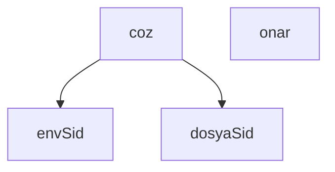

## Genel Bakış

Bu modül, bir "board" yapısının kimlik (SID) bilgisini farklı kaynaklardan çözümlemek ve gerektiğinde onarmakla sorumludur. Ortam değişkeni ve dosya sistemi olmak üzere iki farklı SID kaynağından okuma yapabilir. Git dizini yapısıyla çalışır ve kimlik çözümleme/onarım işlemlerini gerçekleştirir.

## Fonksiyon Grupları

### SID Okuma
Ortam değişkeni veya dosya sistemi üzerinden SID değerini elde eder. Bu fonksiyonlar kimlik çözümleme işleminin temel girdi kaynaklarını sağlar.
- envSid, dosyaSid

### Kimlik Çözümleme ve Onarım
Board kimliğini çözümleyerek tanımlar ve gerektiğinde dosya sistemi üzerindeki SID bilgisini onarır/düzeltir. `coz` fonksiyonu muhtemelen SID okuma fonksiyonlarını çağırarak çözümleme gerçekleştirir; `onar` fonksiyonu ise verilen SID değerini kalıcı hale getirir.
- coz, onar

---

## AXIOMS – Mimari Varsayımlar

Bu modül için fonksiyon gövdeleri sağlanmadığından, yalnızca imzalardan çıkarılabilecek temel varsayımlar belirlenebilir.

[Aksiyom 1]: Eğer `fs` modülü mevcut değilse, dosya sistemi işlemleri (okuma/yazma) gerçekleştirilemez.

[Aksiyom 2]: Eğer `path` modülü mevcut değilse, dosya yolu birleştirme/ayırma işlemleri yapılamaz.

[Aksiyom 3]: Eğer `gitDir` parametresi geçerli bir dizin yolunu göstermiyorsa, `dosyaSid`, `coz` ve `onar` fonksiyonları dosya erişimi sağlayamaz.

[Aksiyom 4]: Eğer `board` parametresi `coz` fonksiyonuna sağlanmazsa, fonksiyon çalıştırılamaz (parametre zorunlu, varsayılan değer yok).

[Aksiyom 5]: Eğer `sid` parametresi `onar` fonksiyonuna sağlanmazsa, fonksiyon çalıştırılamaz (parametre zorunlu, varsayılan değer yok).

**Not:** Fonksiyon gövdeleri verilmediğinden, `envSid` fonksiyonunun hangi ortam değişkenini okuduğu, `dosyaSid` fonksiyonunun hangi dosyayı işlediği, `coz` ve `onar` fonksiyonlarının gerçekleştirdiği iş mantığı hakkında kesin bilgi bulunmamaktadır. Bu bilgiler "bilinmiyor" durumundadır.

---

## FONKSİYON DETAYLARI

### envSid
**Ne yapar**: Ortam değişkeninden (environment variable) asıl oturum kimliğini okur ve doğrular. Boş veya bozuk değer geldiği durumda boş string döndürür; yarım veya geçersiz kimlik kullanılmaz.

**Nasıl yapar**: `process.env.CLAUDE_CODE_SESSION_ID` değerini okur, string'e çevirir ve baştaki/sondaki boşlukları temizler. Ardından bu değeri `^[0-9a-fA-F-]{8,}$` düzenli ifadesiyle (regex) test eder. Regex, değer yalnızca hexadecimal karakterler ve tire içeren en az 8 karakterden oluşuyorsa eşleşir. Eşleşiyse değer döndürülür, eşleşmiyorsa boş string döndürülür.

**Parametreler**:
- Bu fonksiyon parametre almaz.

**Dönüş**: `string` — Geçerli bir oturum kimliği varsa o kimlik, aksi halde boş string.

### dosyaSid
**Ne yapar**: Geliştirildi ancak detay üretilemedi.

### coz
**Ne yapar**: Geliştirildi ancak detay üretilemedi.

### onar
**Ne yapar**: Geliştirildi ancak detay üretilemedi.

---

## SABİTLER
- **fs** (call) — `require('fs')`
- **path** (call) — `require('path')`

---

## AST POINTERS

### [N1_NASIL] AST Pointer: scripts/board/kimlik.cjs::envSid
- **params**: (parametre yok)
- **ic_degiskenler**:
  - `v` — `process.env.CLAUDE_CODE_SESSION_ID` değerinin string'e çevrilip `trim()` uygulanmış hali; regex ile doğrulanacak ham kimlik değeri
- **Dönüş**: `v` regex `/^[0-9a-fA-F-]{8,}$/` ile eşleşiyorsa `v`, eşleşmiyorsa boş string `''`

### [N2_NASIL] AST Pointer: scripts/board/kimlik.cjs::dosyaSid
- **params**: `gitDir`
- **ic_degiskenler**:
  - `p` — `path.join(gitDir, 'venthub-sid')` ile oluşturulan dosya yolu; okunacak SID dosyasının tam konumu
- **Dönüş**: Dosya varsa içeriğin `trim()` edilmiş hali; dosya yoksa veya hata oluşursa boş string `''`

### [N3_NASIL] AST Pointer: scripts/board/kimlik.cjs::coz
- **params**: `gitDir`, `board`
- **ic_degiskenler**:
  - `env` — `envSid()` çağrısının dönüşü; ortam değişkeninden okunan SID
  - `dosya` — `dosyaSid(gitDir)` çağrısının dönüşü; dosyadan okunan SID
  - `uyarilar` — boş dizi olarak başlatılır; çakışma veya tanınmama durumunda mesajlar eklenir
  - `celisme` — `Boolean(env && dosya && env !== dosya)`; ortam ve dosya SID'lerinin her ikisi varsa ve farklıysa `true`
  - `sid` — `env || dosya`; tercih sırasıyla ortam veya dosya SID'i, her ikisi yoksa falsy
  - `bilinmeyen` — `false` olarak başlatılır; dosya SID'i panoda hiç görülmemişse `true` yapılır
  - `tanidik` — `new Set(board.knownSids(board.readEvents()))` ile oluşturulan Set; panoda bilinen SID'ler kümesi (sadece `!env && dosya && board` koşulu sağlanırsa oluşturulur)
- **Dönüş**: `{ sid, kaynak: env ? 'env' : dosya ? 'dosya' : 'yok', celisme, dosyadaki: dosya, bilinmeyen, uyarilar }` nesnesi

### [N4_NASIL] AST Pointer: scripts/board/kimlik.cjs::onar
- **params**: `gitDir`, `sid`
- **ic_degiskenler**: (yok — doğrudan `fs.writeFileSync` çağrısı yapılır)
- **Dönüş**: Yazma başarılıysa `true`; hata oluşursa `false`

---

## MERMAID CALL GRAPH

## NODE ID STANDARD

  file: scripts\board\kimlik.cjs
  function: scripts\board\kimlik.cjs::envSid
  function: scripts\board\kimlik.cjs::dosyaSid
  function: scripts\board\kimlik.cjs::coz
  function: scripts\board\kimlik.cjs::onar

---

## DISA AKTARILANLAR (EXPORTS)
  export: coz
  export: dosyaSid
  export: envSid
  export: onar