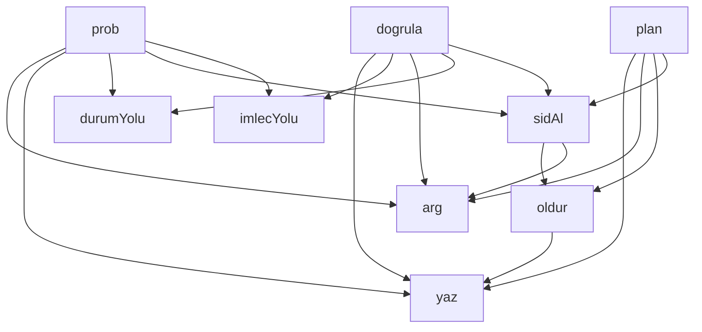

## Genel Bakış

Bu modül, bir mekanizmanın kurulum sürecini yönetir. SID tabanlı bir yol yapısı kullanarak imleç ve durum bilgilerini konumlandırır. Komut satırı argümanlarını işleyerek kurulum planlaması, keşif ve doğrulama adımlarını yürütür.

## Fonksiyon Grupları

### Yardımcı / Altyapı Fonksiyonları
Temel girdi-çıktı ve hata yönetimi işlemlerini üstlenir; diğer fonksiyonlar tarafından ortak kullanılır.
- arg, yaz, oldur

### SID ve Yol Yönetimi
Oturum tanımlayıcısı (SID) elde eder ve bu tanımlayıcıyı kullanarak imleç ile durum dosyalarının dosya sistem yollarını üretir.
- sidAl, imlecYolu, durumYolu

### Kurulum Akışı
Mekanizmanın kurulumunu planlama, asenkron keşif/probe etme ve sonuçları doğrulama adımlarını yürütür.
- plan, prob, dogrula

---

## AXIOMS – Mimari Varsayımlar

Bu modül için fonksiyon gövdeleri verilmediğinden, yalnızca imza ve sabit bilgisinden çıkarılabilecek varsayımlar aşağıdadır.

[Aksiyom 1]: Eğer `fs` modülü (dosya sistemi) erişilebilir değilse, dosya okuma/yazma işlemleri gerçekleştirilemez ve modül hata verir.

[Aksiyom 2]: Eğer `path` modülü erişilebilir değilse, `imlecYolu(sid)` ve `durumYolu(sid)` fonksiyonları dosya yolu oluşturamaz.

[Aksiyom 3]: Eğer `PANO` sabiti tanımlı değilse, dosya sistemi işlemleri için temel dizin bilgisi eksik kalır.

[Aksiyom 4]: Eğer `OFSETLER` nesnesi tanımlı değilse, offset tabanlı konum hesaplamaları yapılamaz.

[Aksiyom 5]: Eğer `UUID` regex deseni tanımlı değilse, SID format doğrulaması gerçekleştirilemez.

[Aksiyom 6]: Eğer `fiil` subscript erişimi geçerli bir değere işaret etmiyorsa, ilgili işlem tanımlanamaz.

[Aksiyom 7]: Eğer `sidAl()` geçerli bir SID döndürmezse, `imlecYolu(sid)` ve `durumYolu(sid)` fonksiyonları geçersiz dosya yolları üretir.

[Aksiyom 8]: Eğer `oldur(mesaj)` çağrılırsa, modül çalışması sonlandırılır ve `mesaj` çıkış olarak verilir.

[Aksiyom 9]: Eğer `dogrula()` fonksiyonu başarısız olursa, mekanizma kurulumu tamamlanamaz.

[Aksiyom 10]: Eğer `prob()` asenkron işlemi tamamlanamazsa, ilgili prob verisi elde edilemez ve `plan()` eksik bilgiyle çalışır.

---

## FONKSİYON DETAYLARI

### arg
**Ne yapar**: Komut satırından belirtilen bir argümanın değerini okur. Bu dosyadaki kullanımda `--sid` parametresini almak için kullanılır ve geçerli bir UUID olup olmadığını doğrular.
**Nasıl yapar**: Verilen `ad` parametresiyle komut satırı argümanını okur. Eğer `--sid` argümanı verilmemişse `process.env.CLAUDE_SESSION_ID` ortam değişkenine başvurur. Hiçbir kaynakta değer bulunamazsa `oldur` fonksiyonunu çağırarak programı sonlandırır. UUID formatında olmayan değerler için de `oldur` ile hata verir. Geçerli bir değer bulunduğunda bunu döndürür.
**Parametreler**:
- ad: string — Okunacak komut satırı argümanının adı (örneğin `'--sid'`)
**Dönüş**: string — Geçerli ve UUID formatında bir oturum kimliği döndürür. Geçersiz veya eksik durumlarda program `process.exit(2)` ile sonlanır, dönüş gerçekleşmez.

### yaz
**Ne yapar**: Geliştirildi ancak detay üretilemedi.

### oldur
**Ne yapar**: Geliştirildi ancak detay üretilemedi.

### sidAl
**Ne yapar**: Geliştirildi ancak detay üretilemedi.

### imlecYolu
**Ne yapar**: Geliştirildi ancak detay üretilemedi.

### durumYolu
**Ne yapar**: Geliştirildi ancak detay üretilemedi.

### plan
**Ne yapar**: Geliştirildi ancak detay üretilemedi.

### prob
**Ne yapar**: Geliştirildi ancak detay üretilemedi.

### dogrula
**Ne yapar**: Geliştirildi ancak detay üretilemedi.

---

## SABİTLER
- **fs** (call) — `require('fs')`
- **path** (call) — `require('path')`
- **PANO** [env-backed] (binary_expression) — `process.env.VENTHUB_BOARD_DIR || process.env.VENTHUB_PANO_DIR || 'C:/tmp/vent...`
- **OFSETLER** (object) — `{
  URUN: '1,21,41',
  I18N: '5,25,45',
  EDGE: '3,23,43',
  ADMIN: '7,27...`
- **UUID** (regex) — `/^[0-9a-f]{8}-[0-9a-f]{4}-[0-9a-f]{4}-[0-9a-f]{4}-[0-9a-f]{12}$/i`
- **fiil** (subscript_expression) — `process.argv[2]`

---

## AST POINTERS

### [N1_NASIL] AST Pointer: scripts/board/mechanism-setup.cjs::arg
- **params**: `ad`
- **ic_degiskenler**:
  - `i` — `process.argv` dizisinde `ad` parametresinin indeksi; `indexOf` ile bulunur
- **Dönüş**: `process.argv[i + 1]` (eğer `i > -1` ise) veya `undefined`

### [N2_NASIL] AST Pointer: scripts/board/mechanism-setup.cjs::oldur
- **params**: `mesaj`
- **ic_degiskenler**: yok
- **Dönüş**: yok — `yaz('HATA: ' + mesaj)` çağrısı yapıp `process.exit(2)` ile süreci sonlandırır

### [N3_NASIL] AST Pointer: scripts/board/mechanism-setup.cjs::sidAl
- **params**: (parametre yok)
- **ic_degiskenler**:
  - `sid` — `arg('--sid')` veya `process.env.CLAUDE_SESSION_ID`'den alınan oturum kimliği; UUID formatında olmalı, aksi halde `oldur` ile sonlanır
- **Dönüş**: `sid` (string)

### [N4_NASIL] AST Pointer: scripts/board/mechanism-setup.cjs::plan
- **params**: (parametre yok)
- **ic_degiskenler**:
  - `sid` — `sidAl()` ile alınan oturum kimliği
  - `serit` — `arg('--serit')` veya `arg('--lane')` ile alınan şerit adı; `toUpperCase()` ile büyük harfe dönüştürülür; boşsa `oldur` ile sonlanır
  - `ofset` — `OFSETLER[serit]` ile tablodan alınan cron zamanlama ofseti; yoksa `oldur` ile sonlanır
  - `kok` — `arg('--kok')` veya `process.cwd()` ile alınan kök dizin yolu
  - `gozcuYolu` — `path.join(kok, 'scripts', 'board', 'gozcu.cjs')` ile oluşturulan gözlemci dosya yolu; ters eğik çizgiler `/` ile değiştirilir
- **Dönüş**: yok — `yaz()` ile kurulum talimatlarını standart çıktıya yazar

### [N5_NASIL] AST Pointer: scripts/board/mechanism-setup.cjs::prob
- **params**: (parametre yok)
- **ic_degiskenler**:
  - `sid` — `sidAl()` ile alınan oturum kimliği
  - `beklesn` — `arg('--bekle')` ile alınan bekleme süresi (saniye); belirtilmezse `150` kullanılır
  - `iy` — `imlecYolu(sid)` ile alınan imleç dosya yolu; yoksa `process.exit(1)` ile sonlanır
  - `jeton` — `'PROB-' + sid.slice(0, 4) + '-' + Math.random().toString(36).slice(2, 8).toUpperCase()` ile oluşturulan benzersiz prob tanımlayıcısı
  - `probSid` — `'00000000-0000-4000-8000-' + sid.replace(/-/g, '').slice(-12)` ile oluşturulan sabit prob oturum kimliği
  - `probDosya` — `'events.mekanizma-probu.jsonl'` sabit prob dosya adı
  - `probTam` — `path.join(PANO, probDosya)` ile oluşturulan tam prob dosya yolu
  - `olay` — `fs.appendFileSync` ile yazılacak olay nesnesi; `type`, `ts`, `sid`, `lane`, `to`, `text` alanlarını içerir
  - `hedef` — `fs.statSync(probTam).size` ile alınan prob dosyasının yazma sonrası bayt boyutu
  - `basla` — `Date.now()` ile alınan döngü başlangıç zaman damgası
  - `ulasti` — gözlemcinin imlecinin hedef bayta ulaşıp ulaşmadığını gösteren boolean; başlangıçta `false`
  - `sonOfset` — `im.ofsetler[probDosya]` ile imleç dosyasından okunan son ofset değeri; başlangıçta `0`
  - `im` — `JSON.parse(fs.readFileSync(iy, 'utf8'))` ile okunan imleç dosyası içeriği; `ofsetler` alanına erişilir
  - `gecen` — `Math.round((Date.now() - basla) / 1000)` ile hesaplanan geçen süre (saniye)
- **Dönüş**: yok — `yaz()` ile prob sonuçlarını standart çıktıya yazar; `durumYolu(sid)` dosyasına JSON durum yazar; gözlemci okumazsa `process.exit(1)` ile sonlanır

### [N6_NASIL] AST Pointer: scripts/board/mechanism-setup.cjs::dogrula
- **params**: (parametre yok)
- **ic_degiskenler**:
  - `sid` — `sidAl()` ile alınan oturum kimliği
  - `aralik3` — sabit değer `3`; gözlemci eşik çarpanı olarak kullanılır
  - `iy` — `imlecYolu(sid)` ile alınan imleç dosya yolu
  - `kirmizi` — kanıtlanamayan (kırmızı) kalem sayısı; başlangıçta `0`; her başarısız kontrolde artırılır
  - `im` — `JSON.parse(fs.readFileSync(iy, 'utf8'))` ile okunan imleç dosyası içeriği; `aralikSn`, `sonTarama`, `ofsetler` alanlarına erişilir
  - `aralikSn` — `Number(im.aralikSn || 60)` ile alınan tarama aralığı (saniye)
  - `yas` — `im.sonTarama` varsa `(Date.now() - Date.parse(im.sonTarama)) / 1000` ile hesaplanan son taramadan bu yana geçen süre (saniye); yoksa `Infinity`
  - `esik` — `aralikSn * aralik3` ile hesaplanan gözlemci canlılık eşik değeri (saniye)
  - `jeton` — `arg('--jeton')` ile alınan teslimat kanıt jetonu; belirtilmezse teslimat ölçümü yapılamaz
  - `durum` — `JSON.parse(fs.readFileSync(durumYolu(sid), 'utf8'))` ile okunan prob durum dosyası; `jeton` alanına erişilir
  - `cron` — `arg('--cron')` ile alınan cron tanımlayıcısı; belirtilmezse cron ölçümü yapılamaz
- **Dönüş**: yok — `yaz()` ile doğrulama sonuçlarını standart çıktıya yazar; kırmızı kalem varsa `process.exit(1)` ile sonlanır

---

## MERMAID CALL GRAPH

## NODE ID STANDARD

  file: scripts\board\mechanism-setup.cjs
  function: scripts\board\mechanism-setup.cjs::arg
  function: scripts\board\mechanism-setup.cjs::yaz
  function: scripts\board\mechanism-setup.cjs::oldur
  function: scripts\board\mechanism-setup.cjs::sidAl
  function: scripts\board\mechanism-setup.cjs::imlecYolu
  function: scripts\board\mechanism-setup.cjs::durumYolu
  function: scripts\board\mechanism-setup.cjs::plan
  function: scripts\board\mechanism-setup.cjs::prob
  function: scripts\board\mechanism-setup.cjs::dogrula

---

## DISA AKTARILANLAR (EXPORTS)
  export: arg
  export: dogrula
  export: durumYolu
  export: imlecYolu
  export: oldur
  export: plan
  export: prob
  export: sidAl
  export: yaz