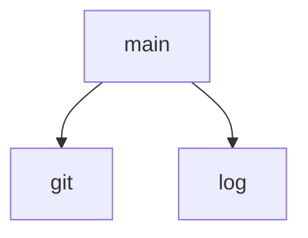

## Genel Bakış

Bu modül, adından anlaşılacağı üzere bir kayıt defteri (registry) için otomatik senkronizasyon işlemi gerçekleştirir. Git komutlarını kullanarak senkronizasyon sürecini yönetir ve işlem adımlarını loglar.

## Fonksiyon Grupları

### Yardımcı Araçlar
Temel altyapı işlevlerini sağlar; git komutlarını çalıştırmak ve işlem sürecini kaydetmek için kullanılırlar.
- `log`, `git`

### Ana İşlev
Modülün çalıştırıldığında yürüttüğü ana senkronizasyon akışını başlatır ve yönetir. `log` ve `git` fonksiyonlarını çağırarak işlemi koordine eder.
- `main`

---

## AXIOMS – Mimari Varsayımlar

Bu modül, bir git deposundaki kayıt defteri (registry) dosyasını otomatik olarak senkronize etmek için dosya sistemi ve git komutları kullanır.

[Aksiyom 1]: Eğer dosya sistemi okuma/yazma izni yoksa, `fs` çağrıları başarısız olur ve modül dosya işlemlerini gerçekleştiremez.

[Aksiyom 2]: Eğer `path` modülü ile oluşturulan dosya yolları geçerli değilse (örneğin, dizin mevcut değilse), dosya okuma/yazma işlemleri hata verir.

[Aksiyom 3]: Eğer `os` modülü ile alınan bilgiler (örneğin, ev dizini) mevcut değilse, gerekli yollar oluşturulamaz.

[Aksiyom 4]: Eğer `STATE_FILE` dosyası yoksa veya okunamıyorsa, modülün durum bilgisi alınamaz ve senkronizasyon işlemi düzgün yapılamaz.

[Aksiyom 5]: Eğer `LOG_FILE` dosyasına yazılamıyorsa, `log` fonksiyonu aracılığıyla loglama yapılamaz ve hata ayıklama zorlaşır.

[Aksiyom 6]: Eğer `REPO` dizini geçerli bir git deposu değilse, `git` fonksiyonu ile çalıştırılan komutlar başarısız olur.

[Aksiyom 7]: Eğer sistemde git yüklü ve erişilebilir değilse, `git` fonksiyonu komutları çalıştıramaz.

[Aksiyom 8]: Eğer `main` fonksiyonu çağrılmazsa, modülün ana işlevi çalışmaz.

---

## FONKSİYON DETAYLARI

### log
**Ne yapar**: Verilen mesajı tarih damgasıyla birlikte hem belirtilen log dosyasına hem de standart çıktıya yazar. Dosya yazma işleminde hata oluşursa sessizce yoksayar ve stdout'a yazmaya devam eder.

**Nasıl yapar**: Öncelikle ISO 8601 formatında tarih damgası ile mesajı birleştirerek bir satır oluşturur. Log dosyasının bulunduğu dizin yoksa `recursive: true` seçeneğiyle oluşturmayı dener; hata alırsa yoksayar. Ardından bu satırı log dosyasının sonuna ekler (`appendFileSync`); bu işlemde de hata oluşursa yoksayar. Son olarak aynı satırı `process.stdout.write` ile standart çıktıya yazar.

**Parametreler**:
- msg: string — Loglanacak mesaj içeriği

**Dönüş**: Bilinmiyor (void olabilir ancak kaynakta açık dönüş tipi belirtilmemiş)

### git
**Ne yapar**: Geliştirildi ancak detay üretilemedi.

### main
**Ne yapar**: Geliştirildi ancak detay üretilemedi.

---

## SABİTLER
- **fs** (call) — `require('fs')`
- **path** (call) — `require('path')`
- **os** (call) — `require('os')`
- **STATE_FILE** (call) — `path.join(os.homedir(), '.orion', 'last-registry-sync')`
- **LOG_FILE** (call) — `path.join(os.homedir(), '.orion', 'registry-autosync.log')`
- **REPO** (call) — `path.resolve(__dirname, '..', '..')`

---

## AST POINTERS

### [N1_NASIL] AST Pointer: scripts/board/registry-autosync.cjs::log
- **params**: `msg` — loglanacak mesaj metni
- **ic_degiskenler**:
  - `line` — ISO 8601 zaman damgası ile `msg` birleştirilerek oluşturulan satır metni (`new Date().toISOString()` + `msg` + `\n`)
  - `LOG_FILE` — sabit; log dosyasının tam yolu
  - `fs` — sabit; dosya sistemi işlemleri için Node.js `fs` modülü
  - `path` — sabit; yol işlemleri için Node.js `path` modülü
- **Dönüş**: yok

### [N2_NASIL] AST Pointer: scripts/board/registry-autosync.cjs::git
- **params**: `args` — git komutuna ek olarak verilecek argüman dizisi
- **ic_degiskenler**:
  - `REPO` — sabit; git komutlarının çalıştırılacağı depo dizini (`-C` bayrağı ile kullanılır)
  - `execFileSync` — global; `git` komutunu eşzamanlı olarak çalıştıran fonksiyon
- **Dönüş**: string — `execFileSync` çıktısının `trim()` edilmiş hali

### [N3_NASIL] AST Pointer: scripts/board/registry-autosync.cjs::main
- **params**: (parametre yok)
- **ic_degiskenler**:
  - `head` — `origin/master` dalının güncel commit SHA'sı; `git rev-parse origin/master` ile elde edilir
  - `from` — `STATE_FILE` dosyasından okunan bir önceki senkronizasyon SHA'sı; dosya yoksa boş string kalır
  - `STATE_FILE` — sabit; son başarılı senkronizasyon SHA'sının saklandığı dosya yolu
  - `FALLBACK_DEPTH` — sabit; `from` boş olduğunda geriye dönük tarama derinliği (commit sayısı)
  - `range` — `from` varsa `${from}..${head}`, yoksa `${head}~${FALLBACK_DEPTH}..${head}` formatında git commit aralığı
  - `out` — `registry-sync.cjs` alt betiğinin çalıştırılmasından dönen standart çıktı metni
  - `e` — `catch` bloklarında yakalanan hata nesnesi; `e.message` ile hata mesajı alınır
  - `execFileSync` — global; `registry-sync.cjs` betiğini eşzamanlı olarak çalıştıran fonksiyon
  - `process.execPath` — global; çalışan Node.js yorumlayıcısının tam yolu
  - `__dirname` — global; betiğin bulunduğu dizin yolu
  - `path` — sabit; yol işlemleri için Node.js `path` modülü
  - `fs` — sabit; dosya sistemi okuma/yazma işlemleri için Node.js `fs` modülü
- **Dönüş**: yok — yan etkiler: `origin/master` ile yerel durum arasındaki commit aralığını `registry-sync.cjs` betiğine aktararak senkronizasyon çalıştırır, başarılı olursa `STATE_FILE` dosyasına güncel SHA yazar, her adımda `log` fonksiyonu ile durum bilgisi kaydeder

---

## MERMAID CALL GRAPH

## NODE ID STANDARD

  file: scripts\board\registry-autosync.cjs
  function: scripts\board\registry-autosync.cjs::log
  function: scripts\board\registry-autosync.cjs::git
  function: scripts\board\registry-autosync.cjs::main

---

## DISA AKTARILANLAR (EXPORTS)
  export: git
  export: log
  export: main