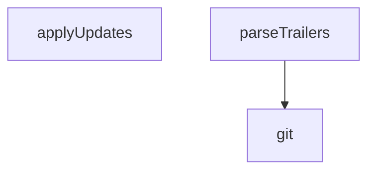

## Genel Bakış

Bu modül, Git commit trailer bilgilerini kullanarak bir registry'yi senkronize etmekle sorumludur. Git log çıktılarını ayrıştırarak elde edilen trailer verilerini işler ve güncellemeleri hedef sisteme uygular. Dry-run desteği sayesinde değişiklikleri uygulamadan önce önizleme yapma imkanı sunar.

## Fonksiyon Grupları

### Git Etkileşimi
Git komutlarını çalıştırarak repository bilgilerini ve log kayıtlarını dış dünyadan alır. Modülün diğer fonksiyonları bu fonksiyonu temel Git işlemleri için çağırır.
- git

### Veri Ayrıştırma
Belirtilen commit aralığındaki trailer bilgilerini okunabilir bir yapıya dönüştürür. Git log çıktısından yapılandırılmış veri çıkarma işlemini gerçekleştirir.
- parseTrailers

### Güncelleme Uygulama
Ayrıştırılmış trailer verilerinden elde edilen güncellemeleri hedef registry'ye aktarır. Dry parametresi true olduğunda güncellemeleri uygulamadan sadece ne yapılacağını raporlar.
- applyUpdates

---

## AXIOMS – Mimari Varsayımlar

Bu modül, git trailer'larını parse ederek registry güncellemelerini senkronize eden bir betiktir.

[Aksiyom 1]: Eğer `git` fonksiyonuna geçerli bir `args` dizisi sağlanmazsa, git komutu çalıştırılamaz ve `result` üretilemez.

[Aksiyom 2]: Eğer `DB_PATH` tanımlı değilse, veritabanı yolu bilinemez ve güncellemelerin nereye yazılacağı belirlenemez.

[Aksiyom 3]: Eğer `parseTrailers` fonksiyonuna geçerli bir `range` sağlanmazsa, trailer bilgileri ayrıştırılamaz ve `updates` boş kalır.

[Aksiyom 4]: Eğer `dry` değeri true ise, `applyUpdates` fonksiyonu güncellemeleri dosya sistemine yazmaz; yalnızca ne yapılacağını gösterir.

[Aksiyom 5]: Eğer `updates` boş veya tanımsız ise, `applyUpdates` fonksiyonunun çağrılmasının bir etkisi olmaz.

[Aksiyom 6]: Eğer `fs`, `path`, `os` modülleri erişilebilir değilse, dosya sistemi işlemleri gerçekleştirilemez.

[Aksiyom 7]: Eğer `positional` argümanlar sağlanmazsa, `range` değeri belirlenemez ve `parseTrailers` çalıştırılamaz.

---

## FONKSİYON DETAYLARI

### git
**Ne yapar**: Dışarıdan verilen argüman dizisini `git` komut satırı aracına ileterek çalıştırır ve standart çıktısını UTF-8 metin olarak döndürür. Başarısız olursa hata mesajını standart hataya yazar ve boş dize döndürür.

**Nasıl yapar**: Node.js'in `execFileSync` fonksiyonunu kullanarak `git` ikili dosyasını eşzamanlı olarak çalıştırır. `stdio` seçeneği `['ignore', 'pipe', 'ignore']` olarak ayarlıdır; bu, standart girdinin yok sayılmasını, standart çıktının yakalanmasını ve standart hata çıktısının yutulmasını sağlar. Ancak yakalanan `catch` bloğunda hata mesajı `process.stderr.write` ile dışarı aktarılır — sessiz kalınmaz, başarısızlık loglanır. Argümanların dizi olarak iletilmesi, kabuk meta-karakterlerinin devre dışı bırakılması anlamına gelir; bu, güvenlik açısından birinci savunma hattıdır (docstring'te belirtildiği üzere regex kısıtı ikinci savunma hattıdır).

**Parametreler**:
- args: `Array<string>` — `git` komutuna iletilecek argümanların dizisi (örneğin `['log', '--reverse', 'HEAD~5..HEAD', '--format=%B']`).

**Dönüş**: `string` — `git` komutunun standart çıktısı UTF-8 olarak çözülmüş metin. Hata durumunda boş dize (`''`) döner.

### parseTrailers
**Ne yapar**: Geliştirildi ancak detay üretilemedi.

### applyUpdates
**Ne yapar**: Geliştirildi ancak detay üretilemedi.

---

## SABİTLER
- **fs** (call) — `require('fs')`
- **path** (call) — `require('path')`
- **os** (call) — `require('os')`
- **DB_PATH** (call) — `path.join(os.homedir(), '.orion', 'registry.db')`
- **args** (call) — `process.argv.slice(2)`
- **dry** (call) — `args.includes('--dry')`
- **positional** (call) — `args.filter(a => !a.startsWith('--'))`
- **range** (ternary_expression) — `positional.length >= 2
  ? `${positional[0]}..${positional[1]}`
  : (git(['...`
- **updates** (call) — `parseTrailers(range)`
- **result** (call) — `applyUpdates(updates, dry)`

---

## AST POINTERS

### [N1_NASIL] AST Pointer: scripts/board/registry-sync.cjs::git
- **params**: `args`
- **ic_degiskenler**:
  - `args` — `execFileSync`'e aktarılacak git komut argümanlarını içeren dizi
  - `e` — `catch` bloğunda yakalanan hata nesnesi; `e.message` ile hata mesajı `process.stderr.write` ile yazdırılır
- **Dönüş**: string — başarılıysa `execFileSync`'in döndürdüğü UTF-8 çıktı, başarısızysa boş string `''`

### [N2_NASIL] AST Pointer: scripts/board/registry-sync.cjs::parseTrailers
- **params**: `range`
- **ic_degiskenler**:
  - `range` — `git(['log', '--reverse', range, ...])` çağrısına aktarılan commit aralığı
  - `log` — `git` fonksiyonunun döndürdüğü tüm commit mesajlarını birleştiren metin çıktısı
  - `updates` — `new Map()` ile oluşturulan eşleme; anahtar `shortId` (örn. `T001-VH`), değer `{ progress?, status? }` nesnesi
  - `re` — `Work-Order:` trailer satırlarını eşleştiren RegExp; `m[1]` → shortId, `m[2]` → key=value çiftleri
  - `m` — `re.exec(log)` sonucu; `null` olduğunda while döngüsü biter
  - `shortId` — `m[1]` regex grubundan çıkarılan iş emri kısa kimliği
  - `rest` — `m[2]` regex grubundan çıkarılan key=value çiftleri stringi; yoksa boş string `''`
  - `entry` — `updates.get(shortId)` ile alınan mevcut nesne veya `{}` ile yeni oluşturulan nesne
  - `kv` — `rest.trim().split(/\s+/).filter(Boolean)` ile elde edilen her bir `key=value` çifti
  - `k` — `kv.split('=')` sonucu elde edilen anahtar (`progress` veya `status`)
  - `v` — `kv.split('=')` sonucu elde edilen değer
  - `n` — `Number(v)` ile sayıya dönüştürülen değer; `progress` alanı için 0–100 aralığında geçerliyse `entry.progress`'e atanır
- **Dönüş**: Map — `shortId` → `{ progress?: number, status?: string }` eşlemesi

### [N3_NASIL] AST Pointer: scripts/board/registry-sync.cjs::applyUpdates
- **params**: `updates`, `dry`
- **ic_degiskenler**:
  - `updates` — `parseTrailers`'tan dönen Map nesnesi; `.size` ile eleman sayısı kontrol edilir, `.entries()` ile diziye dönüştürülür
  - `dry` — boolean; `true` ise Python betiğinde `dry = True` atanır ve veritabanına yazılmaz, sadece log satırı üretilir
  - `DB_PATH` — modül kapsamında tanımlı sabit; `fs.existsSync(DB_PATH)` ile varlığı kontrol edilir, Python betiğine `db = r"${DB_PATH}"` olarak aktarılır
  - `PROJECT_ID` — modül kapsamında tanımlı sabit; Python betiğinde `where project_id=?` sorgusuna parametre olarak eklenir
  - `payload` — `[...updates.entries()].map(([shortId, u]) => ({ shortId, ...u }))` dizisinin `JSON.stringify` ile dizeleştirilmiş JSON hali; Python betiğine `sys.argv[1]` olarak aktarılır
  - `py` — Python betiği olarak çalıştırılacak çok satırlı template literal string; `sqlite3` ile veritabanına `update tasks` sorgusu gönderir
  - `lastErr` — `for` döngüsünde `python` ve `py` yürütücüleri denenirken yakalanan son hata nesnesi; tüm denemeler başarısızsa `lastErr.message` hata mesajında kullanılır
  - `exe` — döngüdeki mevcut Python yürütücüsü adı; önce `'python'`, başarısızsa `'py'` denenir
  - `out` — `execFileSync(exe, ['-c', py, payload])` ile Python betiğinin çalıştırılmasından dönen UTF-8 çıktı stringi
  - `parsed` — `out.trim().split('\n').pop()` son satırının `JSON.parse` ile ayrıştırılmış nesnesi; `{ applied: number, lines: string[] }` beklenir
- **Dönüş**: object `{ applied: number, skipped: number, lines: string[] }` — `applied` güncellenen kayıt sayısı, `skipped` atlanan kayıt sayısı, `lines` işlem log satırları

---

## MERMAID CALL GRAPH

## NODE ID STANDARD

  file: scripts\board\registry-sync.cjs
  function: scripts\board\registry-sync.cjs::git
  function: scripts\board\registry-sync.cjs::parseTrailers
  function: scripts\board\registry-sync.cjs::applyUpdates

---

## DISA AKTARILANLAR (EXPORTS)
  export: applyUpdates
  export: git
  export: parseTrailers