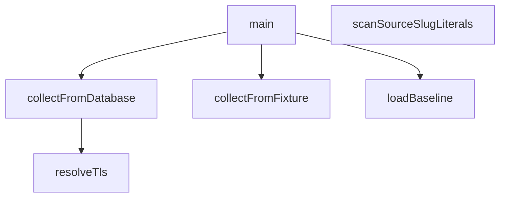

## Genel Bakış

Bu modül, veritabanındaki katalog verilerinin bütünlüğünü doğrulamak için tasarlanmış bir kontrol betiğidir. Kaynak kodda tanımlı slug sabitlerini tarar, referans (baseline) verisini yükler ve bu veriyi veritabanı veya test verisi (fixture) ile karşılaştırarak tutarlılık denetimi yapar. Modül, TLS yapılandırma çözümlemesi ve esnek veri kaynakları seçimiyle farklı ortamlarda çalışabilir.

## Fonksiyon Grupları

### Kaynak Kod Tarama
Kaynak dosyalarda tanımlı slug sabit değerlerini tarayarak beklenen katalog girdilerini belirler.
- scanSourceSlugLiterals

### Veri Toplama
Farklı kaynaklardan (veritabanı veya test dosyası) katalog verilerini toplar. Veritabanı bağlantısı için connectionString, test verisi için dosya yolu parametre olarak alınır.
- collectFromDatabase, collectFromFixture

### Yapılandırma ve Referans Yükleme
TLS bağlantısının çözümlemesini yapar ve karşılaştırma için kullanılacak temel (baseline) veriyi yükler.
- resolveTls, loadBaseline

### Orkestrasyon
Diğer fonksiyonları uygun sıra ve parametrelerle çalıştırarak tüm bütünlük kontrol sürecini yönetir.
- main

---

## AXIOMS – Mimari Varsayımlar

Bu modül için özel aksiyom tanımlanmamıştır.

**Neden:** Fonksiyon gövdeleri verilmemiştir. Mevcut bilgiler yalnızca fonksiyon imzaları ve modül sabitlerinden oluşmaktadır. Kurallar gereği aksiyomlar yalnızca fonksiyon gövdelerinden üretilebilir; imza, sabit adı veya değişken isimlerinden çıkarım yapılmaz.

---

## FONKSİYON DETAYLARI

### scanSourceSlugLiterals
**Ne yapar**: `src/` dizini altında kategori slug'ı olduğu kesin olan sabit dizeleri toplar. Desenler bilerek dar tutulmuştur: yalnızca kategori rotası kuran ve kategori slug'ı karşılaştıran biçimleri kapsar. `.includes('...')` gibi parça eşleşmeleri ve ürün/marka/aile slug'ları kapsam dışıdır — geniş bir tarama, kategori olmayan dizeleri "çözümsüz" diye yanlış raporlar.

**Nasıl yapar**: Beş adet regex deseni tanımlanmıştır: `Routes.category('X')`, `Routes.category(_, 'X')`, `category.slug === 'X'`, `categorySlug: 'X'` ve `subSlug: 'X'`. Her desen, tanıdığını iddia ettiği biçimi gerçekten tanıyor mu diye bir "kanarya" kontrolü yapılır — desen kendi örneğini eşlemezse hata fırlatılır. Bu kontrol, geçmişte yaşanan görünmez karakter sorununun panzehiridir: desen sorunsuz derlenip `.source` doğru görünmesine rağmen hiçbir şeyle eşleşmeyebilir ve kapı yeşil dönebilir; kor desen, olmayan desenden daha tehlikelidir. Ardından `src/` dizini özyinelemeli olarak taranır; `__tests__` ve `node_modules` dizinleri atlanır, `.tsx` ve `.ts` uzantılı dosyalar (test dosyaları hariç) okunur ve her desen için `matchAll` ile eşleşmeler bulunur. Her eşleşmenin satır numarası hesaplanıp bulgular listesine eklenir.

**Parametreler**: Bu fonksiyon parametre almaz.

**Dönüş**: `bulgular` — Her biri `{ file: string, line: number, slug: string, pattern: string }` nesneleri içeren bir dizi. `file` göreli dosya yolu, `line` satır numarası, `slug` bulunan slug değeri, `pattern` eşleşen desenin adıdır.

### resolveTls
**Ne yapar**: Geliştirildi ancak detay üretilemedi.

### loadBaseline
**Ne yapar**: Geliştirildi ancak detay üretilemedi.

### collectFromDatabase
**Ne yapar**: Geliştirildi ancak detay üretilemedi.

### collectFromFixture
**Ne yapar**: Geliştirildi ancak detay üretilemedi.

### main
**Ne yapar**: Geliştirildi ancak detay üretilemedi.

---

## İTHALATLAR (IMPORTS)
- import: node:fs::fs
- import: node:path::path
- import: node:tls::tls
- import: node:url::fileURLToPath
- import: pg::pg

---

## SABİTLER
- **__dirname** (call) — `path.dirname(fileURLToPath(import.meta.url))`
- **BASELINE_PATH** (call) — `path.join(__dirname, 'catalog-integrity-baseline.json')`
- **REPO_KOK** (call) — `path.join(__dirname, '..', '..', '..')`
- **CHECKS** (array) — `[
  {
    id: 'dup-name',
    title: 'Aile içinde çakışan ürün adı',
    ...`

---

## AST POINTERS

### [N1_NASIL] AST Pointer: scripts/db/checks/catalog-integrity.mjs::scanSourceSlugLiterals
- **params**: (parametre yok)
- **ic_degiskenler**:
  - `SRC` — `REPO_KOK` ile `'src'` dizin adının `path.join` ile birleştirilmesi; tarama kök dizini
  - `DESENLER` — her biri `ad` (desen adı), `re` (RegExp), `ornek` (örnek metin) alanlarını taşıyan nesneler dizisi; kaynak kodda aranacak slug desenleri
  - `bulgular` — `file`, `line`, `slug`, `pattern` alanlarını taşıyan nesnelerin toplandığı dizi; tarama sonuçları
  - `gez` — iç içe tanımlı fonksiyon; aldığı `dizin` parametresi altındaki dosya ve alt dizinleri özyinelemeli olarak gezer
  - `girdi` — `fs.readdirSync` ile dönen `Dirent` nesnesi; her dosya/klasör girdisi
  - `tam` — `dizin` ile `girdi.name`'in `path.join` ile birleştirilmesi; tam dosya yolu
  - `icerik` — `fs.readFileSync` ile okunan dosya içeriği (UTF-8 string)
  - `goreli` — `path.relative(REPO_KOK, tam)` sonucu, ters eğik çizgileri düzeltildikten sonra; depo köküne göre göreceli yol
  - `desen` — `DESENLER` dizisindeki tek bir desen nesnesi (`ad`, `re`, `ornek`)
  - `eslesme` — `icerik.matchAll(desen.re)` ile üretilen RegExp eşleşme sonucu; `eslesme[1]` yakalanan slug, `eslesme.index` eşleşmenin karakter konumu
  - `satir` — `icerik.slice(0, eslesme.index).split('\n').length` hesaplaması; eşleşmenin bulunduğu satır numarası
- **Dönüş**: `bulgular` dizisi — her eleman `{ file, line, slug, pattern }` biçiminde

### [N2_NASIL] AST Pointer: scripts/db/checks/catalog-integrity.mjs::resolveTls
- **params**: (parametre yok)
- **ic_degiskenler**:
  - `caPath` — `process.env.PGSSLROOTCERT`; kök sertifika dosyasının yolu
  - `provided` — `fs.readFileSync(caPath, 'utf8')` ile okunan sertifika dosyası içeriği (PEM metni)
  - `blocks` — `provided.match(/-----BEGIN CERTIFICATE-----/g)` sonucunun `.length` değeri; dosyadaki PEM sertifika blok sayısı
- **Dönüş**: `{ rejectUnauthorized: true }` nesnesi (sertifika yoksa) veya `{ ca: [...tls.rootCertificates, provided], rejectUnauthorized: true }` nesnesi (sertifika varsa)

### [N3_NASIL] AST Pointer: scripts/db/checks/catalog-integrity.mjs::loadBaseline
- **params**: (parametre yok)
- **ic_degiskenler**:
  - `parsed` — `JSON.parse(fs.readFileSync(BASELINE_PATH, 'utf8'))` sonucu; taban çizgisi dosyasının ayrıştırılmış hali
- **Dönüş**: `{ entries: {} }` nesnesi (dosya yoksa) veya `{ entries: parsed.entries ?? {} }` nesnesi (dosya varsa)

### [N4_NASIL] AST Pointer: scripts/db/checks/catalog-integrity.mjs::collectFromDatabase
- **params**: `connectionString` — veritabanı bağlantı dizesi
- **ic_degiskenler**:
  - `hadSslMode` — `connectionString` içinde `sslmode=` parametresi olup olmadığını test eden boolean
  - `cleaned` — `connectionString`'den `sslmode` parametresi çıkarıldıktan ve sondaki gereksiz `?`/`&` temizlendikten sonra kalan bağlantı dizesi
  - `client` — `new pg.Client({ connectionString: cleaned, ssl: resolveTls() })` ile oluşturulan PostgreSQL istemcisi
  - `found` — `new Map()` ile oluşturulan harita; anahtar olarak `check.key(row)` sonucu, değer olarak `{ check, detail }` nesnesi tutar
  - `check` — `CHECKS` dizisindeki tek bir denetim nesnesi (`id`, `key`, `detail`, `why`, `sql`, `collect` alanlarını taşır)
  - `rows` — `check.collect(client)` veya `client.query(check.sql).then((r) => r.rows)` sonucu; sorgu satırları
  - `row` — `rows` içindeki tek bir satır nesnesi
- **Dönüş**: `found` Map nesnesi

### [N5_NASIL] AST Pointer: scripts/db/checks/catalog-integrity.mjs::collectFromFixture
- **params**: `fixturePath` — fikstür dosyasının yolu
- **ic_degiskenler**:
  - `keys` — `JSON.parse(fs.readFileSync(fixturePath, 'utf8'))` sonucu; fikstür dosyasından okunan anahtar dizisi
  - `byId` — `CHECKS.map((c) => [c.id, c])` ile oluşturulan Map; denetim `id`'lerini denetim nesnelerine eşler
  - `found` — `new Map()` ile oluşturulan harita; anahtar olarak fikstür anahtarı, değer olarak `{ check, detail }` nesnesi tutar
  - `key` — `keys` içindeki tek bir fikstür anahtarı
  - `check` — `byId.get(String(key).split(':')[0])` sonucu veya `CHECKS[0]` (bulunamazsa); eşleşen denetim nesnesi
- **Dönüş**: `found` Map nesnesi

### [N6_NASIL] AST Pointer: scripts/db/checks/catalog-integrity.mjs::main
- **params**: (parametre yok)
- **ic_degiskenler**:
  - `asJson` — `process.argv.includes('--json')` sonucu; çıktı biçiminin JSON olup olmayacağını belirten boolean
  - `fixtureIdx` — `process.argv.indexOf('--fixture')` sonucu; `--fixture` argümanının dizi indeksi (-1 ise yok)
  - `connectionString` — `process.env.SUPABASE_DB_URL || process.env.DATABASE_URL`; veritabanı bağlantı dizesi
  - `found` — `collectFromFixture` veya `collectFromDatabase` sonucu Map; bulunan ihlaller
  - `baseline` — `loadBaseline()` sonucu; taban çizgisi verisi (`entries` alanı)
  - `fresh` — `found.entries()`'den `baseline.entries` içinde olmayan anahtarları filtreleyen dizi; yeni ihlaller (`[key, { check, detail }]` biçiminde)
  - `stale` — `Object.keys(baseline.entries)`'den `found` Map'inde bulunmayan anahtarları filtreleyen dizi; bayat taban satırları
  - `key` — `fresh` ve `stale` döngülerindeki tek bir ihlal anahtarı
  - `check` — `fresh` destructuring'inden gelen denetim nesnesi
  - `detail` — `fresh` destructuring'inden gelen açıklama metni
- **Dönüş**: yok (yan etki: `process.exit(0)`, `process.exit(1)` veya `process.exit(2)` ile çıkış)

### [N7_NASIL] AST Pointer: scripts/db/checks/catalog-integrity.mjs::(anonim — CHECKS[].collect)
- **params**: `client` — PostgreSQL istemcisi nesnesi
- **ic_degiskenler**:
  - `catRows` — `client.query(...)` sonucu dönen `rows` dizisi; `slug`, `tr_slug`, `en_slug` alanlarını taşıyan kategori satırları
  - `r` — `catRows` içindeki tek bir satır nesnesi; `r.slug`, `r.tr_slug`, `r.en_slug` alanlarına erişilir
  - `cozulur` — `new Set()` ile oluşturulan küme; veritabanından gelen tüm slug'ları biriktirir
  - `s` — `[r.slug, r.tr_slug, r.en_slug]` dizisindeki tek bir slug değeri
  - `b` — `scanSourceSlugLiterals()` döndürdüğü dizideki tek bir bulgu nesnesi (`file`, `line`, `slug`, `pattern` alanlarını taşır)
- **Dönüş**: `scanSourceSlugLiterals()` sonucundan `cozulur` kümesinde bulunmayan slug'ları filtreleyen ve her elemana `taksonomi_boyutu: cozulur.size` ekleyen dizi

### [N8_NASIL] AST Pointer: scripts/db/checks/catalog-integrity.mjs::(anonim — gez)
- **params**: `dizin` — gezilecek dizin yolu
- **ic_degiskenler**:
  - `girdi` — `fs.readdirSync(dizin, { withFileTypes: true })` ile dönen `Dirent` nesnesi
  - `tam` — `path.join(dizin, girdi.name)` sonucu; tam dosya/dizin yolu
  - `icerik` — `fs.readFileSync(tam, 'utf8')` ile okunan dosya içeriği
  - `goreli` — `path.relative(REPO_KOK, tam).replace(/\\/g, '/')` sonucu; depo köküne göre göreceli yol
  - `desen` — dış kapsamdan gelen `DESENLER` dizisindeki tek bir desen nesnesi
  - `eslesme` — `icerik.matchAll(desen.re)` ile üretilen RegExp eşleşme sonucu
  - `satir` — `icerik.slice(0, eslesme.index).split('\n').length` hesaplaması; eşleşmenin satır numarası
- **Dönüş**: yok (yan etki: dış kapsamdan gelen `bulgular` dizisine eleman ekler)

### [N9_NASIL] AST Pointer: scripts/db/checks/catalog-integrity.mjs::(anonim — hata yakalayıcı)
- **params**: `err` — yakalanan hata nesnesi; `err.message` alanına erişilir
- **ic_degiskenler**:
  - `isCertError` — `err.message` içinde `certificate`, `self-signed` veya `SELF_SIGNED` desenlerini arayan RegExp test sonucu (boolean)
- **Dönüş**: yok (yan etki: `process.exit(2)` ile çıkış)

---


## MERMAID CALL GRAPH


## NODE ID STANDARD

  file: scripts\db\checks\catalog-integrity.mjs
  function: scripts\db\checks\catalog-integrity.mjs::scanSourceSlugLiterals
  function: scripts\db\checks\catalog-integrity.mjs::resolveTls
  function: scripts\db\checks\catalog-integrity.mjs::loadBaseline
  function: scripts\db\checks\catalog-integrity.mjs::collectFromDatabase
  function: scripts\db\checks\catalog-integrity.mjs::collectFromFixture
  function: scripts\db\checks\catalog-integrity.mjs::main

---

## DISA AKTARILANLAR (EXPORTS)
  export: collectFromDatabase
  export: collectFromFixture
  export: loadBaseline
  export: main
  export: resolveTls
  export: scanSourceSlugLiterals

## Tasarım Gerekçeleri (kaynaktan BİREBİR)

> Bu bölüm LLM tarafından **yazılmadı**; kaynaktaki işaretli bloklardan
> birebir kopyalandı. Özetlenmesi veya yeniden ifade edilmesi YASAKTIR —
> gerekçenin değeri tam olarak kelimelerindedir.


```text
NİÇİN SİSTEM KÖKLERİ DE: `ca` verildiğinde Node varsayılan güven deposunu DEVRE DIŞI
bırakır. Supabase'in doğrudan bağlantısı kendi özel kökünü kullanıyor, havuz (pooler)
ucu ise kamuya açık bir CA kullanabiliyor; yalnız birini vermek diğerini kırar. İkisini
birden vermek doğrulamayı ZAYIFLATMAZ — güvenilen kök kümesini eksiksiz yapar.
```
