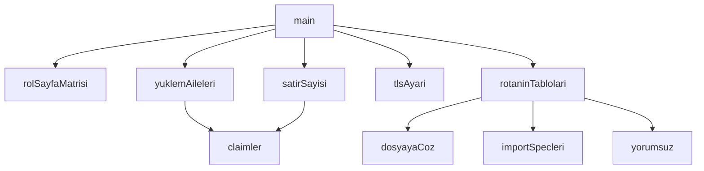

## Genel Bakış

Bu modül, rol tabanlı erişim kontrolü (RBAC) yapılandırması ile kullanıcı arayüzü rotaları ve veritabanı tabloları arasındaki tutarlılığı doğrular. UI tarafındaki rol-erişim tanımları ile veritabanındaki gerçek veri erişimi arasında parite olup olmadığını kontrol eder. Asenkron veritabanı sorguları ve dosya çözümleme işlemlerini bir arada kullanarak eşleşme denetimi gerçekleştirir.

## Fonksiyon Grupları

### UI ve Rota Analizi
Rol tanımlarını, sayfa matrislerini ve rotaların eriştiği tabloları çıkararak erişim haritasını oluşturur.
- `rolSayfaMatrisi`, `rotaninTablolari`, `claimler`

### Dosya ve Spec İşleme
Yapılandırma dosyalarını okur, yorumları temizler ve import spec'lerini çözümleyerek erişim tanımlarını ayrıştırır.
- `dosyayaCoz`, `yorumsuz`, `importSpecleri`

### Veritabanı Sorguları
Veritabanına bağlanarak tablo bazlı yüklem ailelerini ve rol-tablo eşleşmelerindeki satır sayılarını sorgular.
- `yuklemAileleri`, `satirSayisi`

### Yapılandırma ve Ana Akış
TLS gibi bağlantı ayarlarını yönetir ve tüm parite kontrol sürecini orkestre eder.
- `tlsAyari`, `main`

---

## AXIOMS – Mimari Varsayımlar

Bu modül için fonksiyon gövdeleri sağlanmadığından mimari varsayımlar belirlenememiştir.

**Not:** Aksiyomlar yalnızca fonksiyon gövdelerinden türetilir. Mevcut kaynakta fonksiyon gövdeleri yer almadığından (yalnızca imzalar ve sabit adları mevcut), güvenilir bir aksiyom üretimi yapılamaz. Fonksiyon gövdeleri sağlandığında aksiyomlar yeniden değerlendirilebilir.

---

## FONKSİYON DETAYLARI

### rolSayfaMatrisi
**Ne yapar**: `rbac.ts` dosyasındaki `ROLE_PAGE_ACCESS` sabitini ayrıştırarak her rolün erişebildiği sayfa rotalarını bir nesne olarak döndürür. Betik, TypeScript modüllerini doğrudan `node` ile `import` edemeyeceği için dosyayı ham metin olarak okuyup regex ile çözümleme yoluna gider.
**Nasıl yapar**: Dosyayı `fs.readFileSync` ile UTF-8 olarak okur, `const ROLE_PAGE_ACCESS` ifadesinin başlangıç konumunu bulur. Gövdeyi ilk `\n};` satırıyla sınırlar. Ardından her satırda `rol: [ '...' ]` biçimindeki eşleşmeleri yakalayan bir regex kullanır; rol adını ve tırnak içindeki rotaları ayrı ayrı çıkarır. Ayrıştırma dar tutulmuştur; biçim değişirse sonuç boş döner — bu durum `main` içindeki sağlık kilidi tarafından kırmızı hata olarak raporlanır, sessizce "ihlal yok" denmez.
**Parametreler**:
- Yok.
**Dönüş**: `cikti` — Anahtarları rol adı (örneğin `admin`, `editor`), değerleri o role ait rota dizileri olan bir nesne. Ayrıştırma başarısız olursa boş nesne `{}` döner.

### dosyayaCoz
**Ne yapar**: Geliştirildi ancak detay üretilemedi.

### yorumsuz
**Ne yapar**: Geliştirildi ancak detay üretilemedi.

### importSpecleri
**Ne yapar**: Geliştirildi ancak detay üretilemedi.

### rotaninTablolari
**Ne yapar**: Geliştirildi ancak detay üretilemedi.

### tlsAyari
**Ne yapar**: Geliştirildi ancak detay üretilemedi.

### claimler
**Ne yapar**: Geliştirildi ancak detay üretilemedi.

### yuklemAileleri
**Ne yapar**: Geliştirildi ancak detay üretilemedi.

### satirSayisi
**Ne yapar**: Geliştirildi ancak detay üretilemedi.

### main
**Ne yapar**: Geliştirildi ancak detay üretilemedi.

---

## İTHALATLAR (IMPORTS)
- import: node:fs::fs
- import: node:path::path
- import: node:url::fileURLToPath

---

## SABİTLER
- **__dirname** (call) — `path.dirname(fileURLToPath(import.meta.url))`
- **KOK** (call) — `path.resolve(__dirname, '../../..')`
- **CA_PATH** (call) — `path.join(__dirname, 'supabase-root-2021-ca.pem')`
- **RBAC_PATH** (call) — `path.join(KOK, 'src/lib/rbac.ts')`
- **ADMIN_ROTA_KOKU** (call) — `path.join(KOK, 'src/app/admin')`
- **ATLANAN_ROLLER** (new_expression) — `new Set(['super_admin', 'admin'])`

---

## AST POINTERS

### [N1_NASIL] AST Pointer: scripts/db/checks/rbac-ui-db-parity.mjs::rolSayfaMatrisi
- **params**: (parametre yok)
- **ic_degiskenler**:
  - `metin` — `RBAC_PATH` dosyasından `fs.readFileSync` ile okunan UTF-8 metin
  - `bas` — `metin` içinde `'const ROLE_PAGE_ACCESS'` ifadesinin başlangıç indeksi; bulunamazsa fonksiyon `{}` döner
  - `son` — `bas` indeksinden sonra `'\n};'` ifadesinin indeksi; bulunamazsa `metin.length` kullanılır
  - `govde` — `metin.slice(bas, son)` ile elde edilen ROLE_PAGE_ACCESS bloğu metni
  - `cikti` — rol adlarını anahtar, rota dizilerini değer olarak tutan sonuç nesnesi
  - `m` — `govde.matchAll` ile yakalanan regex eşleşmesi; `m[1]` rol adı, `m[2]` rota listesi metni
  - `rol` — eşleşmeden çıkarılan rol adı (`m[1]`)
  - `rotalar` — `m[2]` içindeki tek tırnaklı string'leri çıkaran iç regex eşleşmelerinden oluşan dizi
- **Dönüş**: `{ [rol: string]: string[] }` — her rol için erişilebilir rota dizilerini içeren nesne

### [N2_NASIL] AST Pointer: scripts/db/checks/rbac-ui-db-parity.mjs::dosyayaCoz
- **params**: `spec`, `kaynakDosya`
- **ic_degiskenler**:
  - `spec` — çözümlenecek import yolu; `'@/'` ile başlarsa `KOK/src` altına, `'.'` ile başlarsa `kaynakDosya` dizinine göre çözümlenir; diğer durumda `null` döner
  - `kaynakDosya` — import'u içeren kaynak dosyanın tam yolu; `path.dirname` ile dizini alınır
  - `taban` — `spec`'ten türetilen temel dosya yolu (uzantısız)
  - `u` — `UZANTILAR` dizisindeki denenen dosya uzantısı
  - `aday` — `taban + u` ile oluşturulan tam dosya yolu adayı
- **Dönüş**: `string | null` — bulunan dosya yolu veya bulunamazsa `null`

### [N3_NASIL] AST Pointer: scripts/db/checks/rbac-ui-db-parity.mjs::yorumsuz
- **params**: `metin`
- **ic_degiskenler**:
  - `metin` — yorumlardan arındırılacak kaynak metin
  - `s` — `.split('\n')` ile elde edilen her satır
  - `t` — `s.trim()` ile boşluklardan arındırılmış satır
- **Dönüş**: `string` — blok yorumları (`/* ... */`) kaldırılmış, `//` veya `*` ile başlayan satırlar filtrelenmiş metin

### [N4_NASIL] AST Pointer: scripts/db/checks/rbac-ui-db-parity.mjs::importSpecleri
- **params**: `metin`
- **ic_degiskenler**:
  - `metin` — import spec'leri çıkarılacak kaynak metin
  - `out` — bulunan import yollarını toplayan dizi
  - `m` — `from '...'` ve `import('...')` kalıplarını yakalayan regex eşleşmesi; `m[1]` import yolu
- **Dönüş**: `string[]` — metinde bulunan tüm import spec'leri

### [N5_NASIL] AST Pointer: scripts/db/checks/rbac-ui-db-parity.mjs::rotaninTablolari
- **params**: `rota`
- **ic_degiskenler**:
  - `rota` — analiz edilecek admin rota yolu (örn. `/admin/users`)
  - `segment` — `rota.replace(/^\/admin\/?/, '')` ile elde edilen rota parçası
  - `sayfa` — `ADMIN_ROTA_KOKU` altında `segment` ile oluşturulan `page.tsx` dosya yolu; segment boşsa kök `page.tsx`
  - `gezilen` — ziyaret edilen dosya yollarını tutan `Set`; döngüsel bağımlılığı önler
  - `tablolar` — `.from('...')` ile bulunan tablo adlarını tutan `Set`
  - `kuyruk` — BFS ile gezilecek dosya yolları kuyruğu; başlangıçta `sayfa`
  - `dosya` — `kuyruk.shift()` ile alınan işlenecek dosya yolu
  - `ham` — `fs.readFileSync(dosya, 'utf8')` ile okunan dosya ham metni
  - `metin` — `yorumsuz(ham)` ile yorumlardan arındırılmış metin
  - `m` — `.from('tablo_adı')` kalıbını yakalayan regex eşleşmesi; `m[1]` tablo adı
  - `spec` — `importSpecleri(metin)` ile çıkarılan her bir import yolu
  - `hedef` — `dosyayaCoz(spec, dosya)` ile çözümlenen dosya yolu; `KOK/src` altında ise kuyruğa eklenir
- **Dönüş**: `{ tablolar: string[], dosyaSayisi: number, sayfaVar: boolean }` — bulunan tablolar (sıralı), gezilen dosya sayısı, sayfa varlık durumu

### [N6_NASIL] AST Pointer: scripts/db/checks/rbac-ui-db-parity.mjs::tlsAyari
- **params**: (parametre yok)
- **ic_degiskenler**: (yok)
- **Dönüş**: `{ ca?: string, rejectUnauthorized: true }` — `CA_PATH` varsa `ca` alanını içeren TLS yapılandırma nesnesi; yoksa yalnızca `rejectUnauthorized: true`

### [N7_NASIL] AST Pointer: scripts/db/checks/rbac-ui-db-parity.mjs::claimler
- **params**: `rol`
- **ic_degiskenler**:
  - `rol` — JWT claims içine yazılacak rol adı; hem `user_role` hem `app_metadata.user_role` alanlarına atanır
- **Dönüş**: `string` — `JSON.stringify` ile üretilen JWT claims JSON metni; `sub: SENTETIK_SUB`, `role: 'authenticated'`, `user_role: rol`, `app_metadata: { user_role: rol }` içerir

### [N8_NASIL] AST Pointer: scripts/db/checks/rbac-ui-db-parity.mjs::yuklemAileleri
- **params**: `client`, `tablolar`
- **ic_degiskenler**:
  - `client` — PostgreSQL istemcisi; `client.query` ile sorgular çalıştırılır
  - `tablolar` — analiz edilecek tablo adları dizisi; `$1::text[]` parametresi olarak SQL'e gönderilir
  - `rows` — `pg_policies` tablosundan dönen politika satırları; her satırda `tablename` ve `qual` alanları var
  - `r` — `rows` içindeki her politika satırı
  - `adaylar` — politika koşullarında (`qual`) çağrılan fonksiyon adlarını toplayan `Set`
  - `m` — `qual` içindeki fonksiyon çağrılarını yakalayan regex eşleşmesi; `m[1]` fonksiyon adı
  - `jwtOnuruKoruyan` — sahte admin JWT ile `true` dönen fonksiyon adlarını tutan `Set`
  - `fn` — `adaylar` set'indeki her fonksiyon adı
  - `cagri` — test edilen SQL ifadesi; `public.fn()` ve `public.fn((select auth.uid()))` olmak üzere iki varyant
  - `r2` — fonksiyon çağrısı sonucu dönen satırlar
  - `harita` — tablo adını aile harfine (`A`, `B`, `C`) eşleyen sonuç nesnesi
  - `t` — `tablolar` dizisindeki her tablo adı
  - `q` — `t` tablosuna ait politika koşulları (`qual`) dizisi
  - `fnleri` — bir `qual` metnindeki fonksiyon adlarını çıkaran yardımcı fonksiyon
  - `rolsuz` — `t` tablosunun rol bağımsız bir politikaya sahip olup olmadığını gösteren boolean
- **Dönüş**: `{ [tablo: string]: 'A' | 'B' | 'C' }` — her tablo için aile sınıflandırması: `A` = ölçülebilir, `B` = yöntem kör (sahte uid ile doğrulanamaz), `C` = rol kapısı yok

### [N9_NASIL] AST Pointer: scripts/db/checks/rbac-ui-db-parity.mjs::satirSayisi
- **params**: `client`, `rol`, `tablo`
- **ic_degiskenler**:
  - `client` — PostgreSQL istemcisi; transaction başlatır, JWT claims ayarlar, sorgu çalıştırır, rollback yapar
  - `rol` — `claimler(rol)` ile JWT'ye yazılacak rol adı
  - `tablo` — satır sayısı sorgulanacak tablo adı; SQL'de `public.${tablo}` olarak kullanılır
  - `rows` — `select count(*)::int as n` sorgusundan dönen satırlar
  - `e` — yakalanan hata nesnesi; `e.code` ve `e.message` hata bilgisinde kullanılır
- **Dönüş**: `{ n: number | null, hata: string | null }` — satır sayısı ve hata bilgisi

### [N10_NASIL] AST Pointer: scripts/db/checks/rbac-ui-db-parity.mjs::main
- **params**: (parametre yok)
- **ic_degiskenler**:
  - `asJson` — `process.argv` içinde `'--json'` varsa `true`; çıktı formatını belirler
  - `rolIdx` — `process.argv` içinde `'--rol'` argümanının indeksi
  - `sadeceRol` — `--rol` argümanından sonra gelen rol adı; belirtilmemişse `null`
  - `connectionString` — `SUPABASE_DB_URL` veya `DATABASE_URL` ortam değişkeninden alınan veritabanı bağlantı dizesi
  - `matris` — `rolSayfaMatrisi()` ile elde edilen rol-rota eşleme nesnesi
  - `roller` — `matris` anahtarlarından `ATLANAN_ROLLER` set'inde olmayan ve opsiyonel olarak `sadeceRol` ile filtrelenmiş rol dizisi
  - `vardi` — `connectionString` içinde `sslmode` parametresi olup olmadığını gösteren boolean
  - `temiz` — `sslmode` parametresi kaldırılmış bağlantı dizesi
  - `pg` — dinamik olarak yüklenen `pg` modülü (`await import('pg')`)
  - `client` — `new pg.Client(...)` ile oluşturulan PostgreSQL istemcisi; `temiz` bağlantı dizesi ve `tlsAyari()` SSL yapılandırmasıyla
  - `tumTablolar` — tüm roller ve rotalar için `rotaninTablolari` ile bulunan tabloların birleşik, tekrarsız dizisi
  - `aileler` — `yuklemAileleri(client, tumTablolar)` ile elde edilen tablo-aile haritası
  - `sonuc` — her (rol, rota) çifti için hüküm, sebep, ölçüm ve aile bilgilerini içeren sonuç nesneleri dizisi
  - `rol` — dış döngüdeki mevcut rol adı
  - `rota` — iç döngüdeki mevcut rota yolu
  - `tablolar` — `rotaninTablolari(rota)` sonucundaki tablo adları dizisi
  - `dosyaSayisi` — `rotaninTablolari(rota)` sonucundaki gezilen dosya sayısı
  - `sayfaVar` — `rotaninTablolari(rota)` sonucundaki sayfa varlık durumu
  - `olcumler` — her tablo için rol ve admin satır sayılarını içeren ölçüm nesneleri dizisi
  - `tablo` — iç döngüdeki mevcut tablo adı
  - `rolSonuc` — `satirSayisi(client, rol, tablo)` sonucu; `{ n, hata }`
  - `adminSonuc` — `satirSayisi(client, 'admin', tablo)` sonucu; kabul kolu olarak kullanılır
  - `aile` — tablo adını aile harfine çeviren ok fonksiyonu; `aileler[t]` veya varsayılan `'A'`
  - `kor` — ailesi `'B'` olan ölçüm nesneleri dizisi
  - `rolsuz` — ailesi `'C'` olan ölçüm nesneleri dizisi
  - `olculebilir` — ailesi `'A'` olan ölçüm nesneleri dizisi
  - `gorunur` — admin'in satır gördüğü ölçülebilir tablolar (`o.admin.n > 0`)
  - `rolGoren` — rol'ün satır gördüğü görünür tablolar (`o.rol.n > 0`)
  - `hukum` — hesaplanan hüküm: `'OLCULEMEDI'`, `'VAAT-BOS'`, `'KISMI'` veya `'TUTARLI'`
  - `sebep` — hükmün gerekçe metni
  - `parca` — sebep metnini oluşturan parça dizisi
  - `sayac` — her hükmün kaç kez çıktığını tutan sayaç nesnesi
  - `s` — `sonuc` dizisindeki her sonuç nesnesi
  - `o` — `s.olcumler` içindeki her ölçüm nesnesi
  - `r` — konsol çıktısında `o.rol` sonucunun formatlanmış hali
  - `a` — konsol çıktısında `o.admin` sonucunun formatlanmış hali
  - `k` — `sayac` nesnesindeki her anahtar (hüküm adı)
  - `v` — `sayac` nesnesindeki her değer (sayı)
  - `e` — `.catch` bloğunda yakalanan hata nesnesi
- **Dönüş**: yok — yan etkileri: konsola JSON veya metin tabanlı RBAC UI-DB parite raporu yazar; hata durumunda `process.exit(2)` ile çıkar

---

## MERMAID CALL GRAPH

## NODE ID STANDARD

  file: scripts\db\checks\rbac-ui-db-parity.mjs
  function: scripts\db\checks\rbac-ui-db-parity.mjs::rolSayfaMatrisi
  function: scripts\db\checks\rbac-ui-db-parity.mjs::dosyayaCoz
  function: scripts\db\checks\rbac-ui-db-parity.mjs::yorumsuz
  function: scripts\db\checks\rbac-ui-db-parity.mjs::importSpecleri
  function: scripts\db\checks\rbac-ui-db-parity.mjs::rotaninTablolari
  function: scripts\db\checks\rbac-ui-db-parity.mjs::tlsAyari
  function: scripts\db\checks\rbac-ui-db-parity.mjs::claimler
  function: scripts\db\checks\rbac-ui-db-parity.mjs::yuklemAileleri
  function: scripts\db\checks\rbac-ui-db-parity.mjs::satirSayisi
  function: scripts\db\checks\rbac-ui-db-parity.mjs::main

---

## DISA AKTARILANLAR (EXPORTS)
  export: claimler
  export: dosyayaCoz
  export: importSpecleri
  export: main
  export: rolSayfaMatrisi
  export: rotaninTablolari
  export: satirSayisi
  export: tlsAyari
  export: yorumsuz
  export: yuklemAileleri