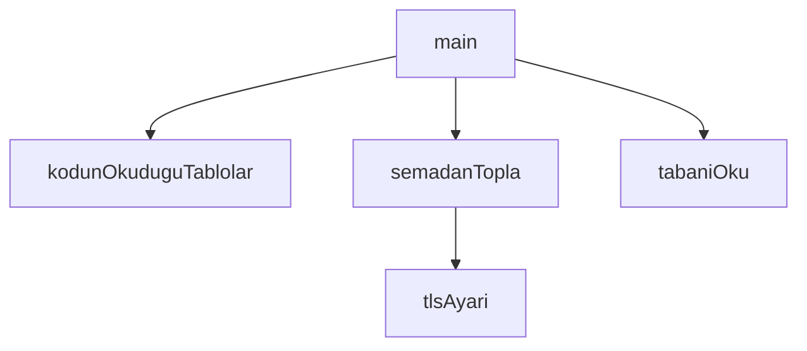

## Genel Bakış

Bu modül, veritabanında tanımlı Row Level Security (RLS) politikalarının roller açısından kapsama durumunu kontrol eden bir denetim betiğidir. Kodun eriştiği tabloları belirler, veritabanı şemasından ilgili tablo bilgilerini toplar ve TLS üzerinden güvenli bağlantı kurarak veritabanını okur.

## Fonksiyon Grupları

### Bağlantı ve Yapılandırma
TLS bağlantısının ayarlanmasını sağlar; güvenli veritabanı bağlantısı için gerekli yapılandırmayı tanımlar.
- tlsAyari

### Veri Toplama ve Şema Analizi
Kodun eriştiği tabloları belirler, veritabanı şemasından bu tablolarla ilgili bilgileri toplar ve tabanı okuyarak mevcut durumu ortaya çıkarır.
- kodunOkuduguTablolar, semadanTopla, tabaniOku

### Ana İşlem Yönetimi
Modülün çalıştırma noktasıdır; diğer fonksiyonları sırasıyla çağırarak RLS rol kapsama denetimini uçtan uca gerçekleştirir.
- main

---

## AXIOMS – Mimari Varsayımlar
- Bu modül davranışsal mantık içermez (salt veri / konfigürasyon / tip tanımı).
- [Aksiyom 1]: Modülün dışa açtığı yapı (anahtar kümesi / şema) bir sözleşmedir; tüketiciler bu sabit yapıya bağlıdır — kırıcı değişiklik tüm tüketicileri etkiler.
- [Aksiyom 2]: Bir öğe ekleme/çıkarma yapısal-uyumlu olmalı; ilgili tipler ve seçiciler aynı commit'te güncel tutulmalıdır.

---

## FONKSİYON DETAYLARI

### kodunOkuduguTablolar
**Ne yapar**: Proje kod dosyalarını tarayarak `.from('tablo')` kalıbıyla erişilen Supabase/PostgreSQL tablo adlarını çıkarır. Tespit edilen tabloları alfabetik sıralı bir dizi ve taranan dosya sayısıyla birlikte döndürür.

**Nasıl yapar**: Önce `YONETIM_DIZINLERI` sabitinde listelenen dizinler altında özyinelemeli (`yuru`) bir gezinti yapar. Bu gezinti `__tests__` alt dizinlerini atlar ve yalnızca `.tsx` veya `.ts` uzantılı, `.test.tsx` veya `.test.ts` olmayan dosyaları toplar. Ardından toplanan her dosyanın içeriğini okuyarak `/.from(\s*['"]([a-z_][a-z0-9_]*)['"]/g` düzenli ifadesiyle eşleşen tablo adlarını bir `Set` nesnesine ekler; bu sayede aynı tablo birden fazla dosyada geçse bile tekilleştirilir. Sonuçta `Set` diziye dönüştürülür, sıralanır ve `dosyaSayisi` ile birlikte nesne olarak döndürülür.

**Parametreler**:
- Bu fonksiyon parametre almaz. Modül seviyesinde tanımlı `YONETIM_DIZINLERI` ve `KOK` sabitlerini kullanır.

**Dönüş**: `{ tablolar: string[], dosyaSayisi: number }` — `tablolar` alfabetik sıralı tablo adları dizisi, `dosyaSayisi` taramaya dahil edilen dosya sayısıdır.

### tlsAyari
**Ne yapar**: Geliştirildi ancak detay üretilemedi.

### semadanTopla
**Ne yapar**: Geliştirildi ancak detay üretilemedi.

### tabaniOku
**Ne yapar**: Geliştirildi ancak detay üretilemedi.

### main
**Ne yapar**: Geliştirildi ancak detay üretilemedi.

---

## İTHALATLAR (IMPORTS)
- import: node:fs::fs
- import: node:path::path
- import: node:url::fileURLToPath
- import: pg::pg

---

## SABİTLER
- **__dirname** (call) — `path.dirname(fileURLToPath(import.meta.url))`
- **KOK** (call) — `path.resolve(__dirname, '../../..')`
- **BASELINE_PATH** (call) — `path.join(__dirname, 'rls-role-coverage-baseline.json')`
- **CA_PATH** (call) — `path.join(__dirname, 'supabase-root-2021-ca.pem')`
- **SORGU** (template) — ``
  with rls as (
    select c.relname::text as tablo
    from pg_class c ...`

---

## AST POINTERS

### [N1_NASIL] AST Pointer: db/checks/rls-role-coverage.mjs::kodunOkuduguTablolar
- **params**: (parametre yok)
- **ic_degiskenler**:
  - `tablolar` — `new Set()` ile oluşturulmuş küme; regex eşleşmelerinden çıkarılan tablo adlarını toplar
  - `dosyalar` — boş dizi; tarama sonucu bulunan `.tsx?` dosyalarının tam yollarını tutar
  - `yuru` — ok fonksiyonu; aldığı dizin yolunu recursive olarak gezer, `__tests__` alt dizinlerini atlar, `.tsx?` dosyalarını `dosyalar` dizisine ekler
  - `d` — `yuru` fonksiyonunun parametresi; gezilecek dizin yolu
  - `f` — `fs.readdirSync(d, { withFileTypes: true })` ile okunan her bir girdi; `isDirectory()` ve `name` özellikleri kullanılır
  - `p` — `path.join(d, f.name)` ile oluşturulan tam dosya/dizin yolu
  - `kaynak` — `fs.readFileSync(p, 'utf8')` ile okunan dosya içeriği; regex ile taranır
  - `m` — `kaynak.matchAll(/\.from\(\s*['"]([a-z_][a-z0-9_]*)['"]/g)` sonucu her eşleşme; `m[1]` yakalanan grup olarak tablo adını verir
- **Dönüş**: `{ tablolar: [...tablolar].sort(), dosyaSayisi: dosyalar.length }` — sıralı tablo adları dizisi ve dosya sayısı

### [N2_NASIL] AST Pointer: db/checks/rls-role-coverage.mjs::tlsAyari
- **params**: (parametre yok)
- **ic_degiskenler**: (yok)
- **Dönüş**: `{ rejectUnauthorized: true }` veya `{ ca: fs.readFileSync(CA_PATH, 'utf8'), rejectUnauthorized: true }` — CA_PATH mevcutsa sertifika içeriğiyle birlikte TLS ayar nesnesi

### [N3_NASIL] AST Pointer: db/checks/rls-role-coverage.mjs::semadanTopla
- **params**: `connectionString`, `tablolar`
- **ic_degiskenler**:
  - `vardi` — `connectionString` içinde `sslmode` parametresi olup olmadığını test eden boolean
  - `temiz` — `connectionString`'den `sslmode` parametresi çıkarılmış bağlantı dizesi
  - `client` — `new pg.Client({ connectionString: temiz, ssl: tlsAyari() })` ile oluşturulan PostgreSQL istemcisi
  - `rows` — `client.query(SORGU, [tablolar])` sorgu sonucu dönen satırlar; destructuring ile çıkarılır
- **Dönüş**: `rows` — sorgu sonucu satır dizisi

### [N4_NASIL] AST Pointer: db/checks/rls-role-coverage.mjs::tabaniOku
- **params**: (parametre yok)
- **ic_degiskenler**: (yok)
- **Dönüş**: `{ entries: {} }` veya `JSON.parse(fs.readFileSync(BASELINE_PATH, 'utf8'))` — taban dosyası mevcutsa parse edilmiş JSON nesnesi

### [N5_NASIL] AST Pointer: db/checks/rls-role-coverage.mjs::main
- **params**: (parametre yok)
- **ic_degiskenler**:
  - `asJson` — `process.argv.includes('--json')` ile belirlenen boolean; çıktı biçimi bayrağı
  - `fixtureIdx` — `process.argv.indexOf('--fixture')` ile bulunan indeks; -1 ise fixture modu yok
  - `connectionString` — `process.env.SUPABASE_DB_URL || process.env.DATABASE_URL` ile okunan veritabanı bağlantı dizesi
  - `tablolar` — `kodunOkuduguTablolar()` dönüşündeki sıralı tablo adları dizisi
  - `dosyaSayisi` — `kodunOkuduguTablolar()` dönüşündeki taranan dosya sayısı
  - `bulunanlar` — fixture modundaysa `JSON.parse(fs.readFileSync(process.argv[fixtureIdx + 1], 'utf8'))`, değilse `semadanTopla(connectionString, tablolar)` ile elde edilen ihlal satırları dizisi
  - `taban` — `tabaniOku()` ile okunan taban nesnesi
  - `bulunanAnahtar` — `new Map`; `bulunanlar` dizisinden `authenticated:${r.tablo}` anahtarlarıyla oluşturulmuş harita
  - `yeni` — `bulunanAnahtar.entries()` içinde `taban.entries`'de bulunmayan anahtarlar; tabanın dışındaki yeni ihlaller
  - `bayat` — `Object.keys(taban.entries)` içinde `bulunanAnahtar`'da bulunmayan anahtarlar; artık ihlal olmayan taban satırları
  - `k` — `bayat` dizisi üzerinde döngü değişkeni
  - `anahtar` — `yeni` dizisi üzerinde destructuring ile çıkarılan anahtar
  - `satir` — `yeni` dizisi üzerinde destructuring ile çıkarılan satır nesnesi; `satir.politika_sayisi` alanına erişilir
- **Dönüş**: yok — `process.exit(0)`, `process.exit(1)` veya `process.exit(2)` ile sonlanır; yan etki olarak konsola çıktı yazar

---

## MERMAID CALL GRAPH

## NODE ID STANDARD

  file: scripts\db\checks\rls-role-coverage.mjs
  function: scripts\db\checks\rls-role-coverage.mjs::kodunOkuduguTablolar
  function: scripts\db\checks\rls-role-coverage.mjs::tlsAyari
  function: scripts\db\checks\rls-role-coverage.mjs::semadanTopla
  function: scripts\db\checks\rls-role-coverage.mjs::tabaniOku
  function: scripts\db\checks\rls-role-coverage.mjs::main

---

## DISA AKTARILANLAR (EXPORTS)
  export: kodunOkuduguTablolar
  export: main
  export: semadanTopla
  export: tabaniOku
  export: tlsAyari