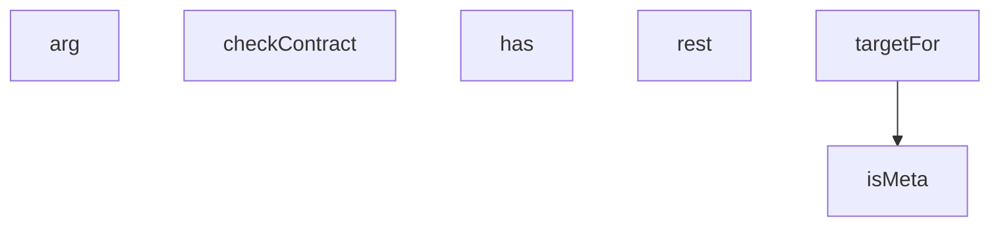

## Genel Bakış

Bu modül, ürün verilerinin içerik yazma işlemlerini gerçekleştiren bir Node.js betiğidir. Komut satırı argümanlarını okuyarak çalışır ve REST API'ler aracılığıyla ürün içeriklerini hedef sistemlere yazar. Modül, veri doğrulama ve sözleşme kontrolü mekanizmaları içerir.

## Fonksiyon Grupları

### Komut Satırı Argüman Yönetimi
Kullanıcıdan gelen komut satırı parametrelerini okur ve varlıklarını kontrol eder. Modülün çalışması için gerekli girdilerin toplanmasından sorumludur.
- arg, has

### API İletişimi
REST tabanlı harici servislerle asenkron iletişim kurar. GET ve POST gibi HTTP metodlarıyla veri alışverişi gerçekleştirir.
- rest

### Veri Doğrulama ve Hedef Belirleme
Ürün verilerinin meta bilgilerini kontrol eder, SKU bazlı sözleşme doğrulaması yapar ve işlem yapılacak hedefi belirler. Veri bütünlüğünün sağlanmasından sorumludur.
- isMeta, targetFor, checkContract

## Bağımlılıklar ve Mimari Notlar

- **Dış bağımlılıklar**: REST API uç noktalarına HTTP istekleri gönderir; hedef servislerin adresleri `targetFor` fonksiyonu aracılığıyla belirlenir.
- **Dinamik/lazy yükleme**: Verilen kaynakta bu yönde bir bilgi bulunmuyor.
- **Mimari önem**: Modül, ürün içerik yazma sürecinin orkestrasyonunu üstlenir; argüman toplama, hedef belirleme, doğrulama ve API çağrısı adımlarını sıralı olarak yürütür.

---

## AXIOMS – Mimari Varsayımlar

Bu modül, ürün verilerini dışarı yazmak için REST API'ye erişim sağlar ve manifest dosyası ile çalışır.

[Aksiyom 1]: Eğer `rest` fonksiyonuna geçerli bir API endpoint (`p`) sağlanmazsa, modül veritabanı veya harici servis verilerine erişemez ve ürün verileri yazılamaz.

[Aksiyom 2]: Eğer `manifestPath` hesaplanamazsa (ternary expression sonucu tanımsız/null ise), manifest dosyası okunamaz ve modül manifest tabanlı işlemleri gerçekleştiremez.

[Aksiyom 3]: Eğer `outDir` dizini mevcut değilse, çıktı dosyaları yazılamaz.

[Aksiyom 4]: Eğer `brands`, `fams` veya `products` verileri (await expression) başarıyla çözümlenemezse, modül ürün içerik yazma işlemini tamamlayamaz.

[Aksiyom 5]: Eğer `ALLOW_REMOVE` koşulu sağlanmazsa, silme işlemleri gerçekleştirilmez.

[Aksiyom 6]: Eğer `checkContract(sku, f)` sözleşme doğrulaması başarısız olursa, ilgili SKU için içerik yazma işlemi yapılmaz.

[Aksiyom 7]: Eğer `arg(n)` ile gerekli argümanlar sağlanmazsa (varsayılan değer `null`), modül çalışması için gerekli parametreler eksik kalır.

[Aksiyom 8]: Eğer `isMeta(k)` meta kontrolü yapılmazsa, meta veriler ile normal veriler ayrıştırılamaz.

---

## FONKSİYON DETAYLARI

### arg
**Ne yapar**: Kaynakta docstring veya gövde tanımlanmadığından, bu fonksiyonun tam görevi belirlenememektedir. Parametre adlarından (`n`, `def`) bir argüman alıp varsayılan değer döndürdüğü düşünülebilir ancak bu çıkarımdır ve doğrulanamaz.

**Nasıl yapar**: Gövde verilmediğinden iç mantığı bilinmiyor.

**Parametreler**:
- n: bilinmiyor — belirtilmemiş
- def: bilinmiyor — varsayılan değeri `null`; belirtilmemiş

**Dönüş**: Bilinmiyor.

### has
**Ne yapar**: Geliştirildi ancak detay üretilemedi.

### rest
**Ne yapar**: Geliştirildi ancak detay üretilemedi.

### isMeta
**Ne yapar**: Geliştirildi ancak detay üretilemedi.

### targetFor
**Ne yapar**: Geliştirildi ancak detay üretilemedi.

### checkContract
**Ne yapar**: Geliştirildi ancak detay üretilemedi.

---

## İTHALATLAR (IMPORTS)
- import: node:fs::fs
- import: node:path::path
- import: node:url::fileURLToPath

---

## SABİTLER
- **__dirname** (call) — `path.dirname(fileURLToPath(import.meta.url))`
- **outDir** (call) — `arg('out', '.')`
- **manifestArg** (call) — `arg('manifest')`
- **ALLOW_REMOVE** (call) — `has('allow-remove')`
- **manifestPath** (ternary_expression) — `path.isAbsolute(manifestArg) ? manifestArg : path.join(__dirname, manifestArg)`
- **manifest** (call) — `JSON.parse(fs.readFileSync(manifestPath, 'utf8'))`
- **MARKA** (member_expression) — `manifest._marka`
- **brands** (await_expression) — `await rest(`brands?name=eq.${encodeURIComponent(MARKA)}&select=id,name`)`
- **fams** (await_expression) — `await rest(`product_families?brand_id=eq.${brands[0].id}&select=id`)`
- **famIds** (call) — `fams.map(f => f.id).join(',')`
- **products** (await_expression) — `await rest(
  `products?family_id=in.(${famIds})&deleted_at=is.null&select=i...`
- **dbModelCodes** (new_expression) — `new Set(products.map(p => p.model_code).filter(Boolean))`
- **manifestOnly** (call) — `Object.keys(manifest.skus ?? {}).filter(mc => !dbModelCodes.has(mc))`
- **denetim** (binary_expression) — `manifest.denetim ?? []`
- **stamp** (call) — `new Date().toISOString().replace(/[:.]/g, '-')`
- **slug** (call) — `MARKA.toLowerCase().replace(/[^a-z0-9]+/g, '-')`
- **invPath** (call) — `path.join(outDir, `content-${slug}-${stamp}.json`)`
- **inventory** (object) — `{
  applied_at: new Date().toISOString(),
  marka: MARKA,
  manifest: path...`

---

## AST POINTERS

### [N1_NASIL] AST Pointer: scripts/db/product-data/content-write.mjs::rest
- **params**: `p` — REST endpoint yolu, `method` — HTTP metodu (varsayılan `'GET'`), `body` — istek gövdesi (opsiyonel)
- **ic_degiskenler**:
  - `r` — `fetch` çağrısının döndürdüğü Response nesnesi; `${dbUrl}/rest/v1/${p}` adresine `method`, `headers` (apikey, authorization, content-type, prefer) ve `body` ile yapılan istek sonucu
  - `t` — `r.text()` ile elde edilen yanıt metni; hata durumunda konsola yazdırılır ve `process.exit(1)` ile çıkılır
- **Dönüş**: `t` doluysa `JSON.parse(t)` sonucu (dizi veya nesne), boşsa `[]` boş dizi

---

### [N2_NASIL] AST Pointer: scripts/db/product-data/content-write.mjs::targetFor
- **params**: `p` — ürün nesnesi; `p.model_code` alanı kullanılır
- **ic_degiskenler**:
  - `m` — `manifest.skus?.[p.model_code]` erişimi; model koduna karşılık gelen SKU manifest kaydı, bulunamazsa fonksiyon `null` döner
  - `out` — boş nesne olarak başlatılır; seriden, devir noktasından ve SKU kaydından gelen meta olmayan alanlar buraya kopyalanır
  - `series` — `manifest.series?.[m.series]` erişimi; `m.series` anahtarına karşılık gelen seri verisi, bulunamazsa boş nesne
  - `k` — `Object.entries(series)` döngüsünde anahtar; `isMeta(k)` false ise `out[k]`'ya atanır
  - `v` — `Object.entries(series)` döngüsünde değer
  - `point` — `m.rpm_max` ve `manifest.rpm_points` varsa `manifest.rpm_points[`${m.series}|${m.rpm_max}`]` erişimi; devir noktası verisi, yoksa `null`
  - `k` — `Object.entries(point)` döngüsünde anahtar; `isMeta(k)` false ise `out[k]`'ya atanır
  - `v` — `Object.entries(point)` döngüsünde değer
  - `k` — `Object.entries(m)` döngüsünde anahtar; `isMeta(k)` false ise `out[k]`'ya atanır
  - `v` — `Object.entries(m)` döngüsünde değer
- **Dönüş**: `{ fields: out, source: series.source ?? null }` — `fields` meta olmayan tüm alanları, `source` serinin kaynağını içerir

---

### [N3_NASIL] AST Pointer: scripts/db/product-data/content-write.mjs::checkContract
- **params**: `sku` — stok birimi tanımlayıcısı (ihlal mesajlarında kullanılır), `f` — denetlenecek alan nesnesi
- **ic_degiskenler**:
  - `pairs` — min/max alan çiftleri dizisi: `['min_delivery_m3h', 'max_delivery_m3h']`, `['min_static_pressure_pa', 'max_static_pressure_pa']`, `['min_voltage_v', 'max_voltage_v']`
  - `lo` — döngüdeki alt sınır alan adı
  - `hi` — döngüdeki üst sınır alan adı
  - `nomTriples` — nominal/min/max üçlüleri dizisi: `['nominal_delivery_m3h', 'min_delivery_m3h', 'max_delivery_m3h']`, `['nominal_static_pressure_pa', 'min_static_pressure_pa', 'max_static_pressure_pa']`
  - `nom` — döngüdeki nominal alan adı
  - `lo` — döngüdeki alt sınır alan adı
  - `hi` — döngüdeki üst sınır alan adı
  - `n` — `Number(f[nom])` dönüşümü; nominal değerin sayısal hali
  - `k` — `Object.entries(f)` döngüsünde alan adı; `_(v|m3h|w|pa|kg|mm|a|hz|db)$` regex'ine uyan ve değeri string olan alanlar ihlal olarak kaydedilir
  - `v` — `Object.entries(f)` döngüsünde alan değeri
- **Dönüş**: yok — yan etki olarak `violations` dizisine ihlal mesajları ekler (min/max eksikliği, min>max, nominal aralık dışı, birimli alanda metin, `voltage_alt_v` varken `wiring` yok)

---

## MERMAID CALL GRAPH

## NODE ID STANDARD

  file: scripts\db\product-data\content-write.mjs
  function: scripts\db\product-data\content-write.mjs::arg
  function: scripts\db\product-data\content-write.mjs::has
  function: scripts\db\product-data\content-write.mjs::rest
  function: scripts\db\product-data\content-write.mjs::isMeta
  function: scripts\db\product-data\content-write.mjs::targetFor
  function: scripts\db\product-data\content-write.mjs::checkContract

---

## DISA AKTARILANLAR (EXPORTS)
  export: arg
  export: checkContract
  export: has
  export: isMeta
  export: rest
  export: targetFor