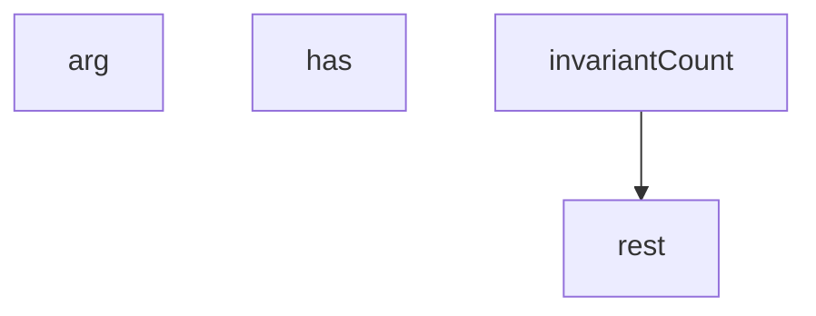

## Genel Bakış

Bu modül, ürün verilerindeki kimlik (identity) ile ilgili sorunları düzeltmeye yönelik bir araçtır. Komut satırı argümanlarıyla yapılandırılır ve REST API üzerinden veri çekerek çalışır. Modül, veri tutarlılığını kontrol etme ve düzeltme işlemleri için gerekli temel altyapıyı sağlar.

## Fonksiyon Grupları

### Komut Satırı Argüman Yönetimi
Kullanıcının komut satırından verdiği parametreleri okumak ve kontrol etmekle sorumludur. Bu fonksiyonlar, aracın çalışırken hangi ayarlarla hareket edeceğini belirler.
- arg, has

### API İletişimi
Harici bir REST servisine HTTP istekleri göndermek ve yanıtları almakla sorumludur. Modülün veri çekme ve düzeltme işlemlerinin temel iletişim katmanını oluşturur.
- rest

### Veri Tutarlılığı Kontrolü
Ürün verilerindeki değişmez (invariant) sayısal değerleri doğrulamakla sorumludur. Veri bütünlüğünü korumak için bir kontrol mekanizması sunar.
- invariantCount

## Fonksiyonlar Arası İlişkiler

- `has` fonksiyonu muhtemelen `arg` fonksiyonunu kullanarak bir argümanın tanımlanıp tanımlanmadığını sorgular.
- `invariantCount` fonksiyonu, veri doğrulama işlemini gerçekleştirmek için `rest` fonksiyonunu çağırarak API'den gerekli verileri çeker.

## Bağımlılıklar

**İç bağımlılıklar:** `has` → `arg`, `invariantCount` → `rest`

**Dış bağımlılıklar:** `rest` fonksiyonu, HTTP istekleri için bir istemci kütüphanesine (örneğin `fetch` veya benzeri) bağlıdır. Bu bağımlılığın nasıl yüklendiği kaynak kodda belirtilmemiştir.

---

## AXIOMS – Mimari Varsayımlar

Bu modül için fonksiyon gövdesi verilmediğinden, yalnızca fonksiyon imzaları ve modül sabitlerinden çıkarılabilecek sınırlı aksiyomlar sunulmaktadır.

[Aksiyom 1]: Eğer `manifestArg` ile belirtilen manifest dosyası yoksa, `manifestPath` üzerinden erişim sağlanamaz ve modül manifest verisine ulaşamaz.

[Aksiyom 2]: Eğer `rest` fonksiyonuna geçerli bir `p` (path) parametresi verilmezse, REST API çağrısı gerçekleştirilemez.

[Aksiyom 3]: Eğer `currentSkus` ile mevcut SKU değerleri alınamazsa, `nextSkus` ve `nextSlugs` hesaplanamaz; `clashSku` ve `clashSlug` çakışma kontrolleri yapılamaz.

[Aksiyom 4]: Eğer `productIds` boş veya erişilemez durumdaysa, `refTables` üzerindeki referans tablosu işlemleri gerçekleştirilemez.

[Aksiyom 5]: Eğer `before` durumu yakalanamazsa, `after` durumu ile karşılaştırma yapılamaz ve `

---

## FONKSİYON DETAYLARI

### arg
**Ne yapar**: Komut satırı argümanlarını okumak için kullanılan bir yardımcı fonksiyondur. Belirtilen isimde bir argüman varsa onu, yoksa varsayılan değeri döndürür.

**Nasıl yapar**: Fonksiyonun iç mantığı verilen kaynak kodda mevcut değildir. Parametre yapısından, bir argüman adı (`n`) alıp bu adı bir argüman listesinde aradığı ve bulunamaması durumunda ikinci parametre (`def`) ile belirtilen varsayılan değeri döndürdüğü anlaşılmaktadır.

**Parametreler**:
- n: bilinmiyor — Aranacak argümanın adı
- def: bilinmiyor — Argüman bulunamadığında döndürülecek varsayılan değer. Varsayılan değeri `null`'dur

**Dönüş**: Bilinmiyor. Kaynakta dönüş tipi belirtilmemiştir.

### has
**Ne yapar**: Geliştirildi ancak detay üretilemedi.

### rest
**Ne yapar**: Geliştirildi ancak detay üretilemedi.

### invariantCount
**Ne yapar**: Geliştirildi ancak detay üretilemedi.

---

## İTHALATLAR (IMPORTS)
- import: node:fs::fs
- import: node:path::path
- import: node:url::fileURLToPath

---

## SABİTLER
- **__dirname** (call) — `path.dirname(fileURLToPath(import.meta.url))`
- **outDir** (call) — `arg('out', '.')`
- **ROLLBACK** (call) — `arg('rollback')`
- **manifestArg** (call) — `arg('manifest', 'avens-identity-manifest.json')`
- **manifestPath** (ternary_expression) — `path.isAbsolute(manifestArg) ? manifestArg : path.join(__dirname, manifestArg)`
- **manifest** (call) — `JSON.parse(fs.readFileSync(manifestPath, 'utf8'))`
- **currentSkus** (call) — `manifest.items.map(i => i.current_sku)`
- **rows** (await_expression) — `await rest(`products?sku=in.(${currentSkus.join(',')})&deleted_at=is.null&sel...`
- **nextSkus** (call) — `manifest.items.map(i => i.next_sku)`
- **nextSlugs** (call) — `manifest.items.map(i => i.next_slug)`
- **clashSku** (await_expression) — `await rest(`products?sku=in.(${nextSkus.join(',')})&select=sku`)`
- **clashSlug** (await_expression) — `await rest(`products?slug=in.(${nextSlugs.map(encodeURIComponent).join(',')})...`
- **productIds** (call) — `rows.map(r => r.id).join(',')`
- **refTables** (array) — `[
  // Sipariş satırı ürüne hem kimlikle hem de yazım-anı SKU kopyasıyla bağ...`
- **before** (await_expression) — `await invariantCount()`
- **stamp** (call) — `new Date().toISOString().replace(/[:.]/g, '-')`
- **invPath** (call) — `path.join(outDir, `identity-avens-${stamp}.json`)`
- **after** (await_expression) — `await invariantCount()`

---

## AST POINTERS

### [N1_NASIL] AST Pointer: scripts/db/product-data/identity-fix.mjs::rest
- **params**: `p` — REST endpoint yolu (örn. "products?..."), `method` — HTTP metodu (varsayılan `'GET'`), `body` — isteğe bağlı istek gövdesi (JSON'a serileştirilir)
- **ic_degiskenler**:
  - `r` — `fetch` çağrısından dönen Response nesnesi; durum kodu ve yanıt gövdesi için kullanılır
  - `t` — `r.text()` ile elde edilen yanıt metni; hata loglamasında ve JSON çözümlemesinde kullanılır
  - `dbUrl` — global scope'tan gelen veritabanı taban URL'si; fetch URL'sinin template literal'inde `${dbUrl}/rest/v1/${p}` şeklinde birleştirilir
  - `dbKey` — global scope'tan gelen Supabase API anahtarı; `apikey` ve `authorization: Bearer` header'larında kullanılır
- **Dönüş**: Yanıt metni boş değilse `JSON.parse(t)` sonucu (dizi veya nesne), boşsa boş dizi `[]`; hata durumunda `process.exit(1)` ile çıkılır (dönüş gerçekleşmez)

### [N2_NASIL] AST Pointer: scripts/db/product-data/identity-fix.mjs::invariantCount
- **params**: yok
- **ic_degiskenler**:
  - `rows` — `rest('products?deleted_at=is.null&select=sku,model_code')` çağrısından dönen ürün satırları dizisi; her elemanda `sku` ve `model_code` alanları beklenir
  - `ok` — `sku` değeri `-${model_code}` ile biten ürün sayısı; döngüde koşulu sağlayan her satırda artırılır
  - `total` — hem `sku` hem `model_code` alanı dolu olan toplam ürün sayısı; `continue` ile atlanmayan satırlarda artırılır
  - `r` — `for...of` döngüsünde `rows` dizisinin her bir elemanı; `r.sku` ve `r.model_code` alanlarına erişilir
- **Dönüş**: `{ ok, total }` nesnesi — `ok` uyumlu ürün sayısını, `total` geçerli toplam ürün sayısını içerir

---

## MERMAID CALL GRAPH

## NODE ID STANDARD

  file: scripts\db\product-data\identity-fix.mjs
  function: scripts\db\product-data\identity-fix.mjs::arg
  function: scripts\db\product-data\identity-fix.mjs::has
  function: scripts\db\product-data\identity-fix.mjs::rest
  function: scripts\db\product-data\identity-fix.mjs::invariantCount

---

## DISA AKTARILANLAR (EXPORTS)
  export: arg
  export: has
  export: invariantCount
  export: rest