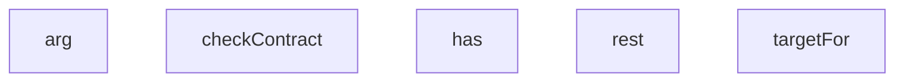

## Genel Bakış
Bu modül, koltuk içerik verilerinin dış bir sisteme yazılmasını (write) yöneten bir araç betiğidir. Komut satırı argümanlarını okuyarak hedef API'yi belirler, sözleşme doğrulaması yapar ve REST üzerinden veri gönderimini gerçekleştirir.

## Fonksiyon Grupları

### Komut Satırı Argüman Yönetimi
Kullanıcıdan gelen komut satırı parametrelerini okur ve belirli bir argümanın mevcut olup olmadığını sorgular.
- arg, has

### API İletişimi
Belirtilen parametreye göre hedef endpoint'i hesaplar ve bu hedefe asenkron REST istekleri gönderir.
- targetFor, rest

### Doğrulama
SKU ve ek bir parametre kullanarak veri gönderimi öncesinde sözleşme uygunluğunu kontrol eder.
- checkContract

---

## AXIOMS – Mimari Varsayımlar
- Bu modül davranışsal mantık içermez (salt veri / konfigürasyon / tip tanımı).
- [Aksiyom 1]: Modülün dışa açtığı yapı (anahtar kümesi / şema) bir sözleşmedir; tüketiciler bu sabit yapıya bağlıdır — kırıcı değişiklik tüm tüketicileri etkiler.
- [Aksiyom 2]: Bir öğe ekleme/çıkarma yapısal-uyumlu olmalı; ilgili tipler ve seçiciler aynı commit'te güncel tutulmalıdır.

---

## FONKSİYON DETAYLARI

### arg
**Ne yapar**: Belirtilen bir argümanı (muhtemelen komut satırı argümanı) almak için kullanılır. Fonksiyonun kesin görevi kaynakta tanımlanmamıştır.
**Nasıl yapar**: Gövde kodu verilmediği için iç mantığı bilinmiyor.
**Parametreler**:
- n: bilinmiyor — Argüman adı veya indeksi (tahmin)
- def: bilinmiyor, varsayılan değer `null` — Argüman bulunamadığında döndürülecek varsayılan değer
**Dönüş**: Return tipi belirtilmemiş, bilinmiyor.

### has
**Ne yapar**: Geliştirildi ancak detay üretilemedi.

### rest
**Ne yapar**: Geliştirildi ancak detay üretilemedi.

### targetFor
**Ne yapar**: Geliştirildi ancak detay üretilemedi.

### checkContract
**Ne yapar**: Geliştirildi ancak detay üretilemedi.

---

## İTHALATLAR (IMPORTS)
- import: node:fs::fs
- import: node:path::path
- import: node:url::fileURLToPath

---

## SABİTLER
- **__dirname** (call) — `path.dirname(fileURLToPath(import.meta.url))`
- **outDir** (call) — `arg('out', '.')`
- **ROLLBACK** (call) — `arg('rollback')`
- **manifest** (call) — `JSON.parse(fs.readFileSync(path.join(__dirname, 'seat-content-manifest.json')...`
- **brands** (await_expression) — `await rest(`brands?name=eq.SEAT&select=id`)`
- **fams** (await_expression) — `await rest(`product_families?brand_id=eq.${brands[0].id}&select=id`)`
- **famIds** (call) — `fams.map(f => f.id).join(',')`
- **products** (await_expression) — `await rest(
  `products?family_id=in.(${famIds})&deleted_at=is.null&select=i...`
- **stamp** (call) — `new Date().toISOString().replace(/[:.]/g, '-')`
- **invPath** (call) — `path.join(outDir, `t140-seat-content-${stamp}.json`)`
- **inventory** (object) — `{
  applied_at: new Date().toISOString(),
  status: 'STARTED',
  items: wr...`

---

## AST POINTERS

### [N1_NASIL] AST Pointer: scripts/db/product-data/seat-content-write.mjs::rest
- **params**: `p`, `method` (varsayılan `'GET'`), `body`
- **ic_degiskenler**:
  - `r` — `fetch` çağrısının döndürdüğü Response nesnesi; `${dbUrl}/rest/v1/${p}` adresine `method` ve `body` ile istek atar
  - `t` — `r.text()` ile elde edilen yanıt gövdesi (string)
- **Dönüş**: `t` doluysa `JSON.parse(t)` sonucu (dizi/nesne), boşsa `[]` boş dizi

### [N2_NASIL] AST Pointer: scripts/db/product-data/seat-content-write.mjs::targetFor
- **params**: `p`
- **ic_degiskenler**:
  - `m` — `manifest.skus[p.model_code]` erişimi; model koduna karşılık gelen manifest kaydı
  - `out` — boş nesne olarak başlatılır; serisi ve model alanlarını birleştirerek sonuç üretir
  - `series` — `manifest.series[m.series]` erişimi; `_` ile başlayan ve `source` anahtarları hariç tüm alanları `out`'a kopyalar
  - `k` — `Object.entries(series)` ve `Object.entries(m)` döngülerinde anahtar
  - `v` — `Object.entries(series)` ve `Object.entries(m)` döngülerinde değer
  - `point` — `m.rpm_max` varsa `manifest.rpm_points[`${m.series}|${m.rpm_max}`]` erişimi; devir noktası verisi
- **Dönüş**: `{ fields: out, source: series.source ?? null }` nesnesi

### [N3_NASIL] AST Pointer: scripts/db/product-data/seat-content-write.mjs::checkContract
- **params**: `sku`, `f`
- **ic_degiskenler**:
  - `pairs` — `[['min_delivery_m3h', 'max_delivery_m3h'], ['min_static_pressure_pa', 'max_static_pressure_pa']]` sabit dizi; min/max alan çiftlerini tanımlar
  - `lo` — döngüdeki alt sınır alan adı
  - `hi` — döngüdeki üst sınır alan adı
  - `nomPairs` — `[['nominal_delivery_m3h', 'min_delivery_m3h', 'max_delivery_m3h'], ['nominal_static_pressure_pa', 'min_static_pressure_pa', 'max_static_pressure_pa']]` sabit dizi; nominal/min/max üçlülerini tanımlar
  - `nom` — döngüdeki nominal alan adı
  - `n` — `Number(f[nom])` dönüşümü; nominal değerin sayısal hali
  - `k` — `Object.entries(f)` döngüsünde alan adı
  - `v` — `Object.entries(f)` döngüsünde alan değeri
- **Dönüş**: yok (yan etki: `violations` dizisine ihlal mesajları ekler)

---

## MERMAID CALL GRAPH

## NODE ID STANDARD

  file: scripts\db\product-data\seat-content-write.mjs
  function: scripts\db\product-data\seat-content-write.mjs::arg
  function: scripts\db\product-data\seat-content-write.mjs::has
  function: scripts\db\product-data\seat-content-write.mjs::rest
  function: scripts\db\product-data\seat-content-write.mjs::targetFor
  function: scripts\db\product-data\seat-content-write.mjs::checkContract

---

## DISA AKTARILANLAR (EXPORTS)
  export: arg
  export: checkContract
  export: has
  export: rest
  export: targetFor