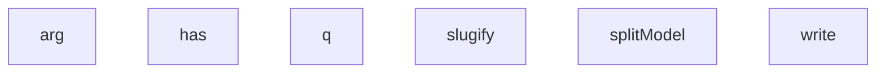

## Genel Bakış

Bu modül, ürün model adlarını ayrıştırmak ve işlenmiş verileri bir veri kaynağına yazmak için kullanılan bir betik (script) dosyasıdır. Komut satırı argümanlarını okuyarak yapılandırma alır, model adlarını parçalara ayırır ve sonuçları asenkron olarak kaydeder.

## Fonksiyon Grupları

### Komut Satırı Yardımcıları
Kullanıcının betiği çalıştırırken ilettiği parametreleri okumak ve kontrol etmekle sorumludur.
- arg, has

### Metin İşleme
Model adını okunabilir ve standart bir formata dönüştürerek ayrıştırma işlemi gerçekleştirir.
- slugify, splitModel

### Veri Erişimi
İşlenmiş verileri hedef veri kaynağına sorgulama ve yazma işlemlerini asenkron olarak yürütür.
- q, write

### Bağımlılıklar ve Mimari Notlar

**İç Bağımlılıklar:** `has` fonksiyonunun `arg` fonksiyonunu çağırarak argüman varlığını kontrol ettiği; `splitModel` fonksiyonunun `slugify` fonksiyonunu kullanarak model adını standart formata çevirdiği düşünülmektedir. Ancak bu çağrı ilişkileri yalnızca fonksiyon isimlerinden çıkarım olup kaynak kodda doğrulanmamıştır.

**Dış Bağımlılıklar:** `arg` fonksiyonu büyük olasılıkla `process.argv` dizisine erişerek komut satırı argümanlarını okur. `q` ve `write` fonksiyonlarının hangi harici servise veya veritabanına bağlandığı kaynak kodda belirtilmemiştir.

**Mimari Önem:** Modül, ürün verisi işleme hattının bir parçası olup model adlarının normalize edilmesi ve kalıcı depolanması gibi kritik bir sorumluluğu üstlenir.

---

## AXIOMS – Mimari Varsayımlar
- Bu modül davranışsal mantık içermez (salt veri / konfigürasyon / tip tanımı).
- [Aksiyom 1]: Modülün dışa açtığı yapı (anahtar kümesi / şema) bir sözleşmedir; tüketiciler bu sabit yapıya bağlıdır — kırıcı değişiklik tüm tüketicileri etkiler.
- [Aksiyom 2]: Bir öğe ekleme/çıkarma yapısal-uyumlu olmalı; ilgili tipler ve seçiciler aynı commit'te güncel tutulmalıdır.

---

## FONKSİYON DETAYLARI

### arg
**Ne yapar**: Kaynakta bu fonksiyonun görevine dair bir docstring veya gövde bilgisi verilmemiştir. Yalnızca fonksiyon imzası (`arg(n, def = null)`) mevcuttur.
**Nasıl yapar**: Gövde verilmemiştir; iç mantık bilinmiyor.
**Parametreler**:
- n: bilinmiyor — bilinmiyor
- def: bilinmiyor (varsayılan: null) — bilinmiyor
**Dönüş**: Bilinmiyor.

### has
**Ne yapar**: Geliştirildi ancak detay üretilemedi.

### slugify
**Ne yapar**: Geliştirildi ancak detay üretilemedi.

### splitModel
**Ne yapar**: Geliştirildi ancak detay üretilemedi.

### q
**Ne yapar**: Geliştirildi ancak detay üretilemedi.

### write
**Ne yapar**: Geliştirildi ancak detay üretilemedi.

---

## İTHALATLAR (IMPORTS)
- import: node:fs::fs
- import: node:path::path

---

## SABİTLER
- **dbKey** (call) — `arg('key')`
- **outDir** (call) — `arg('out', '.')`
- **APPLY** (call) — `has('apply')`
- **ROLLBACK** (call) — `arg('rollback')`
- **SUFFIXES** (call) — `(arg('suffixes', 'ES,T,TP,PIR,HCS,ATEX,XRM,Wi-Fi') || '').split(',').map(s =>...`
- **fams** (await_expression) — `await q(`product_families?slug=eq.${familySlug}&select=*,products(id,name,sku...`
- **series** (subscript_expression) — `fams[0]`
- **products** (binary_expression) — `series.products || []`
- **groups** (new_expression) — `new Map()`
- **proposed** (call) — `[...groups.keys()].map(m => ({ model: m, slug: slugify(m) }))`
- **taken** (await_expression) — `await q(`product_families?slug=in.(${proposed.map(p => p.slug).join(',')})&se...`
- **takenSet** (new_expression) — `new Set(taken.map(t => t.slug))`
- **report** (object) — `{
  generated_for: familySlug,
  mode: APPLY ? 'APPLY' : 'DRY-RUN',
  seri...`
- **rp** (call) — `path.join(outDir, `t138-dryrun-${familySlug}.json`)`
- **stamp** (call) — `new Date().toISOString().replace(/[:.]/g, '-')`
- **invPath** (call) — `path.join(outDir, `t138-apply-${familySlug}-${stamp}.json`)`
- **inventory** (object) — `{
  applied_at: new Date().toISOString(),
  family: familySlug,
  series_i...`
- **rows** (call) — `report.new_families.map((nf, i) => ({
  tenant_id: series.tenant_id,        ...`
- **created** (await_expression) — `await write('product_families', 'POST', rows)`
- **slugToId** (new_expression) — `new Map(created.map(c => [c.slug, c.id]))`

---

## AST POINTERS

### [N1_NASIL] AST Pointer: t138-model-split.mjs::write (ilk tanım)
- **params**: `p`, `method`, `body`
- **ic_degiskenler**:
  - `RB_DRY` — kuru mod bayrağı; true ise gerçek DB yazımı yapılmaz, sadece konsola log basılır
  - `dbUrl` — veritabanı taban URL'si (fetch hedefi)
  - `dbKey` — API anahtarı; hem `apikey` header'ı hem `Bearer` token olarak kullanılır
  - `m` — `p` yolu üzerinde regex eşleşmesi; `(\w+)\?id=in\.\(([^)]*)\)` kalıbıyla tablo adı ve id listesi yakalanır
  - `r` — `fetch` yanıt nesnesi
  - `rows` — PATCH/DELETE kuru modunda DB'den dönen eşleşen satırlar (`r.json()` sonucu)
  - `t` — `r.text()` ile alınan ham yanıt gövdesi
- **Dönüş**: kuru modda `rows` (eşleşen satır dizisi) veya `[]`; normal modda `JSON.parse(t)` sonucu veya `[]`

### [N2_NASIL] AST Pointer: t138-model-split.mjs::slugify
- **params**: `s`
- **ic_degiskenler**:
  - (yok — hepsi zincirleme `replace` çağrılarıdır, ayrı değişkene atanmaz)
- **Dönüş**: `string` — Türkçe karakterleri ASCII'ye indirgeyen, alfasayısal olmayan karakterleri tire ile değiştiren, baştaki/sondaki tireleri kaldıran slug

### [N3_NASIL] AST Pointer: t138-model-split.mjs::splitModel
- **params**: `name`
- **ic_degiskenler**:
  - `toks` — `name.trim().split(/\s+/)` ile elde edilen kelime dizisi; sondan SUFFIXES ile eşleşenler çıkarılır
  - `variant` — sondan çıkarılan varyant kelimelerini tutan dizi; `unshift` ile ters sırada biriktirilir
  - `SUFFIXES` — global sabit dizi; varyant son eklerini içerir
- **Dönüş**: `{ model: string, variant: string }` — `model` kalan kelimelerin birleşimi, `variant` çıkarılan kelimelerin birleşimi (boşsa `'standart'`)

### [N4_NASIL] AST Pointer: t138-model-split.mjs::q
- **params**: `p`
- **ic_degiskenler**:
  - `r` — `fetch` yanıt nesnesi; `${dbUrl}/rest/v1/${p}` adresine GET isteği atar
  - `dbUrl` — veritabanı taban URL'si
  - `dbKey` — API anahtarı; `apikey` ve `Bearer` header'larında kullanılır
- **Dönüş**: `r.json()` sonucu (JSON.parse edilmiş veri); hata durumunda `process.exit(1)` ile çıkılır

### [N5_NASIL] AST Pointer: t138-model-split.mjs::proposed
- **params**: `p`
- **ic_degiskenler**:
  - `series` — global nesne; `series_code`, `category_id`, `subcategory_id`, `tenant_id` alanları okunur
  - `takenSet` — global Set; `p.slug` içeride var mı diye `has()` ile kontrol edilir
  - `groups` — global Map; `p.model` anahtarıyla `get()` çağrılır, dönen dizinin her elemanından `sku`, `name`, `_variant`, `id` okunur
- **Dönüş**: `{ name, slug, series_code, category_id, subcategory_id, tenant_id, slug_free, products }` — model başvuru nesnesi

### [N6_NASIL] AST Pointer: t138-model-split.mjs::write (ikinci tanım)
- **params**: `p`, `method`, `body`
- **ic_degiskenler**:
  - `r` — `fetch` yanıt nesnesi; `${dbUrl}/rest/v1/${p}` adresine belirtilen `method` ile istek atar
  - `dbUrl` — veritabanı taban URL'si
  - `dbKey` — API anahtarı; `apikey` ve `Bearer` header'larında kullanılır
  - `text` — `r.text()` ile alınan ham yanıt gövdesi
- **Dönüş**: `JSON.parse(text)` sonucu veya `null`; hata durumunda `process.exit(1)` ile çıkılır

### [N7_NASIL] AST Pointer: t138-model-split.mjs::created
- **params**: `nf`, `i`
- **ic_degiskenler**:
  - `series` — global nesne; `tenant_id`, `brand_id`, `id`, `description` alanları okunur
- **Dönüş**: `{ tenant_id, brand_id, parent_family_id, name, slug, series_code, category_id, subcategory_id, description, sort_order }` — yeni aile (family) kayıt nesnesi; `parent_family_id` olarak `series.id` atanır, `sort_order` olarak `i` indeksi kullanılır

---

## MERMAID CALL GRAPH

## NODE ID STANDARD

  file: scripts\db\product-data\t138-model-split.mjs
  function: scripts\db\product-data\t138-model-split.mjs::arg
  function: scripts\db\product-data\t138-model-split.mjs::has
  function: scripts\db\product-data\t138-model-split.mjs::slugify
  function: scripts\db\product-data\t138-model-split.mjs::splitModel
  function: scripts\db\product-data\t138-model-split.mjs::q
  function: scripts\db\product-data\t138-model-split.mjs::write

---

## DISA AKTARILANLAR (EXPORTS)
  export: arg
  export: has
  export: q
  export: slugify
  export: splitModel
  export: write