## Genel Bakış

Bu modül, yerel bir depo ile production ortamı arasındaki kod sapmasını (drift) tespit eden bir CLI denetim aracıdır. Repo içindeki fonksiyon slug'larını production tarafındaki karşılıklarıyla karşılaştırarak eşitsizlikleri bulur ve bir rapor üretir. Ortam değişkeni doğrulaması, JWT tabanlı kimlik doğrulama, eşzamanlı indirme ve geçici dosya yönetimi gibi altyapı sorumluluklarını da üstlenir.

## Fonksiyon Grupları

### Ortam ve CLI Kontrolleri
Başlangıç aşamasında gerekli ortam değişkenlerinin ve CLI aracının varlığını doğrular; eksiklik durumunda programı sonlandırır.
- requireEnv, requireCli, fatal

### Konfigürasyon ve Normalizasyon
TOML tabanlı yapılandırma dosyasını ayrıştırır, JWT doğrulaması yapar ve karşılaştırma sırasında kullanılacak metin ile yol adlarını normalize eder.
- parseConfigVerifyJwt, normalizeSource, normalizeRemotePath

### Dosya ve Dizin Taraması
Yerel dosya sistemini özyinelemeli olarak tarar, geçici kök dizin oluşturur ve repo içindeki fonksiyon slug'larını listeler.
- listFilesRecursive, makeTempRoot, repoSlugs

### Uzak Erişim ve İndirme
Production ortamındaki fonksiyon listesini çeker ve slug'ları eşzamanlı olarak geçici dizine indirir. Eşzamanlılık sınırını `runPool` ile denetler.
- listProdFunctions, downloadSlug, downloadAll, runPool

### Karşılaştırma ve Analiz
İndirilen production içeriğini yerel repo içeriğiyle karşılaştırarak fark istatistiklerini hesaplar; CLI probe sonucunu değerlendirir.
- diffStats, cliProbeVerdict

### Ana Orkestrasyon ve Çıktı
Tüm akışı başlatır, drift sayısını ve karşılaştırma sonuçlarını toplayarak raporu biçimlendirir ve kullanıcıya sunar.
- run, printReport

### Test
Modülün kendi iç doğrulama testini çalıştırır.
- selfTest

---

## AXIOMS – Mimari Varsayımlar
- Bu modül davranışsal mantık içermez (salt veri / konfigürasyon / tip tanımı).
- [Aksiyom 1]: Modülün dışa açtığı yapı (anahtar kümesi / şema) bir sözleşmedir; tüketiciler bu sabit yapıya bağlıdır — kırıcı değişiklik tüm tüketicileri etkiler.
- [Aksiyom 2]: Bir öğe ekleme/çıkarma yapısal-uyumlu olmalı; ilgili tipler ve seçiciler aynı commit'te güncel tutulmalıdır.

---

## FONKSİYON DETAYLARI

### normalizeSource
**Ne yapar**: Kaynak metin içeriğini normalize ederek satır sonu farklılıklarını standart hale getirir. Windows ortamından gelen CRLF satır sonlarını LF formatına dönüştürür ve metnin sonundaki fazla satır sonlarını tek bir satır sonuna indirger. Bu sayede farklı işletim sistemlerinden gelen dosyalar karşılaştırılabilir hale gelir.

**Nasıl yapar**: Gelen metni önce `String()` ile metin türüne çevirir, ardından düzenli ifade ile tüm `\r\n` (CRLF) karakterlerini `\n` (LF) ile değiştirir. Sonrasında metnin sonundaki bir veya daha fazla yeni satır karakterini tek bir `\n` ile değiştirir. Yorumda belirtildiği gibi, prod gövdesi Windows runner'dan deploy edilmiş sürümlerden dolayı CRLF ile dönebilmektedir; bu durum gerçek bir sapma olmadığı için normalize edilir. Ancak başka hiçbir boşluk karakterine dokunulmaz; gerçek fark gizlenmemelidir.

**Parametreler**:
- text: any — Normalize edilecek kaynak metin; `String()` ile metne dönüştürülür

**Dönüş**: String — Normalize edilmiş metin (LF satır sonları, sonda tek satır sonu)

### normalizeRemotePath
**Ne yapar**: Geliştirildi ancak detay üretilemedi.

### parseConfigVerifyJwt
**Ne yapar**: Geliştirildi ancak detay üretilemedi.

### diffStats
**Ne yapar**: Geliştirildi ancak detay üretilemedi.

### cliProbeVerdict
**Ne yapar**: Geliştirildi ancak detay üretilemedi.

### requireEnv
**Ne yapar**: Geliştirildi ancak detay üretilemedi.

### requireCli
**Ne yapar**: Geliştirildi ancak detay üretilemedi.

### fatal
**Ne yapar**: Geliştirildi ancak detay üretilemedi.

### runPool
**Ne yapar**: Geliştirildi ancak detay üretilemedi.

### listFilesRecursive
**Ne yapar**: Geliştirildi ancak detay üretilemedi.

### makeTempRoot
**Ne yapar**: İndirme işlemleri için geçici bir kök dizin oluşturur ve sürecin sonunda bu dizini temizler. Oluşturulan dizin, işletim sisteminin geçici dizininde (`os.tmpdir()`) benzersiz bir önek ile açılır. Repo dizinine asla yazma yapılmaz.

**Nasıl yapar**: `fs.mkdtempSync` ile `os.tmpdir()` altında `venthub-edge-drift-` önekine sahip benzersiz bir dizin oluşturur. Ardından `process.on('exit', ...)` kancasıyla sürecin sonlanması anında bu dizini silmek üzere bir temizleyici kaydeder. Temizleme `fs.rmSync` ile `recursive: true` ve `force: true` seçenekleriyle yapılır; hata fırlatılsa bile yakalanır ve yok sayılır (best-effort temizlik). Bu sayede `process.exit()` ile çıkan yollarda bile temizlik yapılması amaçlanır.

**Parametreler**:
- Yok (parametre almaz)

**Dönüş**: `base` — Oluşturulan geçici dizinin tam yolu (string).

### downloadSlug
**Ne yapar**: Geliştirildi ancak detay üretilemedi.

### downloadAll
**Ne yapar**: Geliştirildi ancak detay üretilemedi.

### repoSlugs
**Ne yapar**: Geliştirildi ancak detay üretilemedi.

### listProdFunctions
**Ne yapar**: Geliştirildi ancak detay üretilemedi.

### run
**Ne yapar**: Geliştirildi ancak detay üretilemedi.

### printReport
**Ne yapar**: Geliştirildi ancak detay üretilemedi.

### selfTest
**Ne yapar**: Geliştirildi ancak detay üretilemedi.

---

## İTHALATLAR (IMPORTS)
- import: node:child_process::execFile
- import: node:child_process::spawnSync
- import: node:fs::fs
- import: node:os::os
- import: node:path::path
- import: node:url::fileURLToPath
- import: node:util::promisify

---

## SABİTLER
- **execFileAsync** (call) — `promisify(execFile)`
- **CLI_BIN** [env-backed] (binary_expression) — `process.env.SUPABASE_CLI_BIN || 'supabase'`
- **USE_SHELL** (binary_expression) — `process.platform === 'win32'`
- **DOWNLOAD_CONCURRENCY** [env-backed] (call) — `Math.max(1, Number(process.env.DRIFT_DOWNLOAD_CONCURRENCY) || 4)`
- **argv** (call) — `process.argv.slice(2)`

---

## AST POINTERS

### [N1_NASIL] AST Pointer: scripts/edge/drift-check.mjs::normalizeSource
- **params**: `text`
- **ic_degiskenler**: yok
- **Dönüş**: String — CRLF (`\r\n`) LF'ye dönüştürülmüş, sondaki boş satırlar normalize edilmiş metin

### [N2_NASIL] AST Pointer: scripts/edge/drift-check.mjs::normalizeRemotePath
- **params**: `name`
- **ic_degiskenler**:
  - `p` — backslash'lerin slash'a dönüştürülmüş hali (`String(name).replace(/\\/g, '/')`)
  - `marker` — `'/functions/'` sabit dizesi
  - `i` — `p` içinde `marker`'ın son geçtiği indeks (`lastIndexOf`)
- **Dönüş**: String — normalize edilmiş yol; `marker` bulunduysa sonrasını, `functions/` ile başlıyorsa sonrasını, değilse son dosya adını döndürür

### [N3_NASIL] AST Pointer: scripts/edge/drift-check.mjs::parseConfigVerifyJwt
- **params**: `toml`
- **ic_degiskenler**:
  - `out` — `Map` nesnesi; fonksiyon slug'ı → `verify_jwt` boolean değeri
  - `current` — şu anki `[functions."..."]` bölüm adı (null ise bölüm dışı)
  - `rawLine` — TOML metninin her satırı (split sonucu)
  - `line` — yorum ve boşluklardan arındırılmış satır (`rawLine.replace(/(^|\s)#.*$/, '').trim()`)
  - `sec` — `[functions."slug"]` bölüm başlığı regex eşleşmesi; `sec[1]`, `sec[2]`, `sec[3]` yakalama grupları
  - `kv` — `verify_jwt = true|false` regex eşleşmesi; `kv[1]` boolean dizesi
- **Dönüş**: `Map<string, boolean>` — fonksiyon slug'ı → `verify_jwt` değeri

### [N4_NASIL] AST Pointer: scripts/edge/drift-check.mjs::diffStats
- **params**: `repoText`, `prodText`
- **ic_degiskenler**:
  - `a` — `normalizeSource(repoText).split('\n')` sonucu repo satırları dizisi
  - `b` — `normalizeSource(prodText).split('\n')` sonucu prod satırları dizisi
  - `count` — satır dizisini `Map<satır, sayı>`'a dönüştüren iç fonksiyon
  - `ca` — `count(a)` sonucu repo satır frekansları Map'i
  - `cb` — `count(b)` sonucu prod satır frekansları Map'i
  - `onlyRepo` — sadece repo'da fazla olan satır sayısı (toplam fark)
  - `onlyProd` — sadece prod'da fazla olan satır sayısı (toplam fark)
  - `direction` — fark yönü dizesi: `'aynı'`, `'repo ileri (prod eski) — deploy gerekli'`, `'PROD İLERİ (repo fakir) — deploy REGRESYON olur'`, veya `'iki yönlü fark (belirsiz) — elle incele'`
- **Dönüş**: Object — `{ repoLines, prodLines, onlyInRepo, onlyInProd, direction, identical }`

### [N5_NASIL] AST Pointer: scripts/edge/drift-check.mjs::cliProbeVerdict
- **params**: `probe`
- **ic_degiskenler**:
  - `enoent` — `probe.error.code === 'ENOENT'` boolean sonucu
- **Dönüş**: Object — `{ ok: false, reason: 'not-found'|'spawn-error'|'failed', message: string }` veya `{ ok: true, reason: 'ok', version: string }`

### [N6_NASIL] AST Pointer: scripts/edge/drift-check.mjs::requireEnv
- **params**: yok
- **ic_degiskenler**:
  - `ref` — `process.env.SUPABASE_PROJECT_REF` değeri
  - `missing` — eksik zorunlu ortam değişkenlerinin adlarını tutan dizi
- **Dönüş**: Object — `{ ref }`; eksik varsa `process.exit(2)` ile sonlanır

### [N7_NASIL] AST Pointer: scripts/edge/drift-check.mjs::requireCli
- **params**: yok
- **ic_degiskenler**:
  - `probe` — `spawnSync(CLI_BIN, ['--version'], ...)` sonucu
  - `verdict` — `cliProbeVerdict(probe)` sonucu
- **Dönüş**: String — CLI sürümü (`verdict.version`); başarısızsa `process.exit(2)` ile sonlanır

### [N8_NASIL] AST Pointer: scripts/edge/drift-check.mjs::fatal
- **params**: `msg`
- **ic_degiskenler**: yok
- **Dönüş**: yok — `console.error` ile hata mesajı basar, `process.exit(2)` ile sonlanır

### [N9_NASIL] AST Pointer: scripts/edge/drift-check.mjs::runPool
- **params**: `items`, `limit`, `worker`
- **ic_degiskenler**:
  - `results` — `items.length` uzunluğunda sonuç dizisi
  - `cursor` — bir sonraki işlenecek indeks (paylaşımlı sayaç)
  - `runners` — `Math.min(limit, items.length)` adet async worker Promise'i dizisi
  - `i` — her runner'ın döngü içindeki mevcut indeksi
- **Dönüş**: `Array` — `results` dizisi (her eleman `worker(items[i])` sonucu)

### [N10_NASIL] AST Pointer: scripts/edge/drift-check.mjs::listFilesRecursive
- **params**: `dir`, `acc` (varsayılan `[]`)
- **ic_degiskenler**:
  - `entry` — `fs.readdirSync` sonucu dizin girdisi (`withFileTypes: true`)
  - `abs` — `path.join(dir, entry.name)` ile hesaplanan mutlak yol
- **Dönüş**: `Array<string>` — mutlak dosya yolları biriktirilmiş `acc` dizisi

### [N11_NASIL] AST Pointer: scripts/edge/drift-check.mjs::makeTempRoot
- **params**: yok
- **ic_degiskenler**:
  - `base` — `fs.mkdtempSync(path.join(os.tmpdir(), 'venthub-edge-drift-'))` ile oluşturulan geçici dizin yolu
- **Dönüş**: String — geçici dizin yolu (`base`); `process.on('exit', ...)` ile çıkışta temizlik kaydı yapılır

### [N12_NASIL] AST Pointer: scripts/edge/drift-check.mjs::downloadSlug
- **params**: `ref`, `tempRoot`, `slug`
- **ic_degiskenler**:
  - `work` — `path.join(tempRoot, slug)` çalışma dizini
  - `fnDir` — `path.join(work, 'supabase', 'functions')` fonksiyon dizini
  - `files` — `listFilesRecursive(fnDir)` sonucu dosya listesi; her eleman `{ name, content }` objesi
  - `detail` — catch bloğunda hata detay dizesi (`e?.stderr || e?.stdout || e?.message || e`, 600 karaktere kesilmiş)
  - `abs` — `listFilesRecursive` içindeki her dosyanın mutlak yolu
- **Dönüş**: Object — `{ slug, files }` (başarılı) veya `{ slug, error }` (hata durumunda)

### [N13_NASIL] AST Pointer: scripts/edge/drift-check.mjs::downloadAll
- **params**: `ref`, `slugs`
- **ic_degiskenler**:
  - `tempRoot` — `makeTempRoot()` sonucu geçici dizin
  - `started` — `Date.now()` ile indirme başlangıç zamanı
  - `results` — `runPool(slugs, DOWNLOAD_CONCURRENCY, ...)` sonucu indirme sonuçları dizisi
  - `seconds` — geçen süre (saniye, 1 ondalık)
  - `failed` — `results.filter((r) => r.error)` ile başarısız indirmeler
- **Dönüş**: `Map<string, Array>` — slug → dosya listesi; başarısızlıkta `fatal()` ile sonlanır

### [N14_NASIL] AST Pointer: scripts/edge/drift-check.mjs::repoSlugs
- **params**: `root`
- **ic_degiskenler**:
  - `dir` — `path.join(root, FUNCTIONS_DIR)` fonksiyonlar dizini yolu
- **Dönüş**: `Array<string>` — sıralanmış fonksiyon slug'ları (`.isDirectory() && e.name !== '_shared' && !e.name.startsWith('.')` filtresi uygulanmış)

### [N15_NASIL] AST Pointer: scripts/edge/drift-check.mjs::listProdFunctions
- **params**: `ref`
- **ic_degiskenler**:
  - `out` — CLI stdout çıktısı (ham dize)
  - `r` — `execFileAsync` sonucu nesne
  - `detail` — catch bloğunda hata detay dizesi (600 karaktere kesilmiş)
  - `a` — `out` içinde ilk `[` karakterinin indeksi
  - `b` — `out` içinde son `]` karakterinin indeksi
  - `parsed` — `JSON.parse(out.slice(a, b + 1))` sonucu dizi
- **Dönüş**: `Array<Object>` — prod fonksiyon listesi (her elemanda `slug`, `verify_jwt`, `version`, `status` alanları); hata durumunda `fatal()` ile sonlanır

### [N16_NASIL] AST Pointer: scripts/edge/drift-check.mjs::run
- **params**: `root`, `asJson`, `compareAllFiles` (destructured object)
- **ic_degiskenler**:
  - `ref` — `requireEnv().ref` proje referansı
  - `cliVersion` — `requireCli()` sonucu CLI sürüm dizesi
  - `prodList` — `listProdFunctions(ref)` sonucu prod fonksiyon dizisi
  - `repo` — `repoSlugs(root)` sonucu repo slug dizisi
  - `repoSet` — `new Set(repo)` ile repo slug'larından oluşan Set
  - `prodBySlug` — `new Map(prodList.map((f) => [f.slug, f]))` ile slug → prod fonksiyon Map'i
  - `configPath` — `path.join(root, CONFIG_TOML)` config dosya yolu
  - `cfg` — `parseConfigVerifyJwt(...)` sonucu Map (veya dosya yoksa boş Map)
  - `report` — rapor nesnesi: `{ orphans, missing, sourceDrift, jwtDrift, checked, inactive }`
  - `f` — `prodList` döngüsündeki her prod fonksiyon
  - `slug` — `repo` döngüsündeki her fonksiyon slug'ı
  - `prodFn` — `prodBySlug.get(slug)` sonucu prod fonksiyon
  - `comparable` — `repo.filter((slug) => prodBySlug.has(slug))` ile iki tarafta da bulunan slug'lar
  - `deployedFilesBySlug` — `downloadAll(ref, comparable)` sonucu Map
  - `expected` — config'den okunan `verify_jwt` değeri (yoksa `true` varsayılanı)
  - `actual` — `prodFn.verify_jwt` gerçek prod değeri
  - `files` — `deployedFilesBySlug.get(slug)` indirilen dosya listesi
  - `targets` — `compareAllFiles` true ise tüm `files`, değilse `index.ts` filtrelenmiş liste
  - `rf` — `targets` döngüsündeki her dosya (`{ name, content }`)
  - `rel` — göreli dosya yolu (`rf.name` içinde `/` varsa olduğu gibi, yoksa `slug/rf.name`)
  - `local` — `path.join(root, FUNCTIONS_DIR, rel)` yerel dosya yolu
  - `d` — `diffStats(...)` sonucu fark nesnesi
  - `driftCount` — toplam sapma sayısı (`orphans + missing + sourceDrift + jwtDrift` uzunlukları)
- **Dönüş**: yok — JSON veya metin raporunu `console.log` ile basar; sapma varsa `process.exit(1)`, yoksa `'SAPMA YOK'` mesajı

### [N17_NASIL] AST Pointer: scripts/edge/drift-check.mjs::printReport
- **params**: `r`, `driftCount`, `repoCount`, `prodCount`, `cliVersion`
- **ic_degiskenler**:
  - `line` — 72 karakterlik tire ayırıcı dizesi
  - `o` — `r.orphans` döngüsündeki her yetim fonksiyon (`{ slug, verify_jwt, version, status }`)
  - `m` — `r.missing` döngüsündeki her eksik fonksiyon (`{ slug }`)
  - `j` — `r.jwtDrift` döngüsündeki her JWT sapması (`{ slug, config, configExplicit, prod, severity }`)
  - `src` — `j.configExplicit` true ise `'config.toml'`, değilse `'config.toml varsayilani'`
  - `s` — `r.sourceDrift` döngüsündeki her kaynak sapması
  - `i` — `r.inactive` döngüsündeki her inaktif fonksiyon (`{ slug, status }`)
- **Dönüş**: yok — raporu `console.log` ile konsola basar

### [N18_NASIL] AST Pointer: scripts/edge/drift-check.mjs::selfTest
- **params**: yok
- **ic_degiskenler**:
  - `fails` — başarısız test mesajlarını tutan dizi
  - `eq` — test eşitlik kontrolü yapan iç fonksiyon (`name`, `got`, `want` parametreleri)
  - `name` — test adı dizesi
  - `got` — elde edilen değer
  - `want` — beklenen değer
  - `g` — `JSON.stringify(got)` sonucu
  - `w` — `JSON.stringify(want)` sonucu
  - `toml` — test amaçlı TOML metni (çok satırlı dize)
  - `cfg` — `parseConfigVerifyJwt(toml)` sonucu Map
  - `selfPath` — `fileURLToPath(import.meta.url)` ile script dosyasının mutlak yolu
  - `child` — `spawnSync(process.execPath, [selfPath], ...)` alt süreç sonucu
  - `out` — `${child.stdout ?? ''}${child.stderr ?? ''}` birleştirilmiş çıktı dizesi
  - `real` — `path.join(process.cwd(), CONFIG_TOML)` gerçek config dosya yolu
  - `rc` — `parseConfigVerifyJwt(fs.readFileSync(real, 'utf8'))` sonucu Map
- **Dönüş**: yok — test sonuçlarını `console.log` ile basar; başarısızlık varsa `process.exit(1)` ile sonlanır

---

## MERMAID CALL GRAPH

```mermaid
graph TD
    drift-check_mjs__cliProbeVerdict["cliProbeVerdict"]
    drift-check_mjs__diffStats["diffStats"]
    drift-check_mjs__downloadAll["downloadAll"]
    drift-check_mjs__downloadSlug["downloadSlug"]
    drift-check_mjs__fatal["fatal"]
    drift-check_mjs__listFilesRecursive["listFilesRecursive"]
    drift-check_mjs__listProdFunctions["listProdFunctions"]
    drift-check_mjs__makeTempRoot["makeTempRoot"]
    drift-check_mjs__normalizeRemotePath["normalizeRemotePath"]
    drift-check_mjs__normalizeSource["normalizeSource"]
    drift-check_mjs__parseConfigVerifyJwt["parseConfigVerifyJwt"]
    drift-check_mjs__printReport["printReport"]
    drift-check_mjs__repoSlugs["repoSlugs"]
    drift-check_mjs__requireCli["requireCli"]
    drift-check_mjs__requireEnv["requireEnv"]
    drift-check_mjs__run["run"]
    drift-check_mjs__runPool["runPool"]
    drift-check_mjs__selfTest["selfTest"]
    drift-check_mjs__run --> drift-check_mjs__requireCli
    drift-check_mjs__downloadAll --> drift-check_mjs__fatal
    drift-check_mjs__run --> drift-check_mjs__fatal
    drift-check_mjs__run --> drift-check_mjs__requireEnv
    drift-check_mjs__diffStats --> drift-check_mjs__normalizeSource
    drift-check_mjs__run --> drift-check_mjs__repoSlugs
    drift-check_mjs__run --> drift-check_mjs__printReport
    drift-check_mjs__run --> drift-check_mjs__parseConfigVerifyJwt
    drift-check_mjs__selfTest --> drift-check_mjs__cliProbeVerdict
    drift-check_mjs__run --> drift-check_mjs__diffStats
    drift-check_mjs__downloadAll --> drift-check_mjs__downloadSlug
    drift-check_mjs__listProdFunctions --> drift-check_mjs__fatal
    drift-check_mjs__downloadAll --> drift-check_mjs__makeTempRoot
    drift-check_mjs__run --> drift-check_mjs__downloadAll
    drift-check_mjs__run --> drift-check_mjs__listProdFunctions
    drift-check_mjs__downloadAll --> drift-check_mjs__runPool
    drift-check_mjs__downloadSlug --> drift-check_mjs__listFilesRecursive
    drift-check_mjs__selfTest --> drift-check_mjs__parseConfigVerifyJwt
    drift-check_mjs__requireCli --> drift-check_mjs__cliProbeVerdict
    drift-check_mjs__selfTest --> drift-check_mjs__normalizeRemotePath
    drift-check_mjs__selfTest --> drift-check_mjs__diffStats
    drift-check_mjs__repoSlugs --> drift-check_mjs__fatal
```

## NODE ID STANDARD

  file: scripts\edge\drift-check.mjs
  function: scripts\edge\drift-check.mjs::normalizeSource
  function: scripts\edge\drift-check.mjs::normalizeRemotePath
  function: scripts\edge\drift-check.mjs::parseConfigVerifyJwt
  function: scripts\edge\drift-check.mjs::diffStats
  function: scripts\edge\drift-check.mjs::cliProbeVerdict
  function: scripts\edge\drift-check.mjs::requireEnv
  function: scripts\edge\drift-check.mjs::requireCli
  function: scripts\edge\drift-check.mjs::fatal
  function: scripts\edge\drift-check.mjs::runPool
  function: scripts\edge\drift-check.mjs::listFilesRecursive
  function: scripts\edge\drift-check.mjs::makeTempRoot
  function: scripts\edge\drift-check.mjs::downloadSlug
  function: scripts\edge\drift-check.mjs::downloadAll
  function: scripts\edge\drift-check.mjs::repoSlugs
  function: scripts\edge\drift-check.mjs::listProdFunctions
  function: scripts\edge\drift-check.mjs::run
  function: scripts\edge\drift-check.mjs::printReport
  function: scripts\edge\drift-check.mjs::selfTest

---

## DISA AKTARILANLAR (EXPORTS)
  export: cliProbeVerdict
  export: diffStats
  export: downloadAll
  export: downloadSlug
  export: fatal
  export: listFilesRecursive
  export: listProdFunctions
  export: makeTempRoot
  export: normalizeRemotePath
  export: normalizeSource
  export: parseConfigVerifyJwt
  export: printReport
  export: repoSlugs
  export: requireCli
  export: requireEnv
  export: run
  export: runPool
  export: selfTest