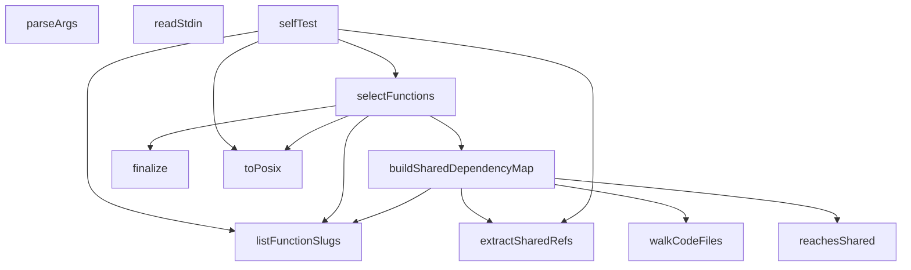

## Genel Bakış

Bu modül, bir kod tabanında değişen dosyalara bağlı olarak hangi fonksiyonların etkilendiğini belirleyen bir seçim aracıdır. Paylaşılan bağımlılıkları analiz ederek değişikliklerin fonksiyonlara nasıl yayıldığını takip eder. Komut satırı argümanlarını işleyerek çalışır ve seçilen fonksiyonları nedenleriyle birlikte raporlar.

## Fonksiyon Grupları

### Komut Satırı ve Girdi İşleme
Kullanıcıdan gelen argümanları ayrıştırır ve standart girdiyi okuyarak modülün çalışması için gerekli girdileri sağlar.
- parseArgs, readStdin

### Dosya Keşfi ve Yol İşleme
Kod dosyalarını dizin ağacında dolaşarak bulur, fonksiyon tanımlarını listeler ve dosya yollarını POSIX formatına dönüştürür.
- toPosix, walkCodeFiles, listFunctionSlugs

### Paylaşılan Bağımlılık Analizi
Kaynak kodundan paylaşılan referansları çıkarır, kök dizin için bir bağımlılık haritası oluşturur ve belirli bir hedefe ulaşıp ulaşmadığını kontrol eder.
- extractSharedRefs, buildSharedDependencyMap, reachesShared

### Fonksiyon Seçimi ve Sonuçlandırma
Ana seçim mantığını yürütür; değişen dosyalara göre etkilenen fonksiyonları belirler ve seçimi nedenler ve uyarılarla birlikte sonlandırır.
- selectFunctions, finalize

### Test
Modülün kendi kendine testini çalıştırarak doğruluğunu doğrular.
- selfTest

---

## AXIOMS – Mimari Varsayımlar

Bu modül, bir proje kök dizinindeki fonksiyonları analiz ederek değişen dosyalara bağlı olarak hangi fonksiyonların seçilmesi gerektiğini belirler.

[Aksiyom 1]: Eğer `root` parametresi yoksa, `listFunctionSlugs`, `buildSharedDependencyMap`, `selectFunctions` ve `selfTest` fonksiyonları çalışamaz; fonksiyon listesi ve bağımlılık haritası oluşturulamaz.

[Aksiyom 2]: Eğer `changed` parametresi yoksa, `selectFunctions` fonksiyonu hangi fonksiyonların değiştiğini belirleyemez; seçim yapılamaz.

[Aksiyom 3]: Eğer `dir` parametresi yoksa, `walkCodeFiles` fonksiyonu dosya sistemi taraması yapamaz; kod dosyaları bulunamaz.

[Aksiyom 4]: Eğer `source` parametresi yoksa, `extractSharedRefs` fonksiyonu paylaşılan referansları çıkaramaz.

[Aksiyom 5]: Eğer

---

## FONKSİYON DETAYLARI

### toPosix
**Ne yapar**: Verilen yol dizgesini POSIX uyumlu biçime dönüştürür. Windows ters eğik çizgi (`\`) karakterlerini düz eğik çizgiye (`/`) çevirir, yolun başındaki `./` önekini ve fazla eğik çizgileri kaldırır.

**Nasıl yapar**: Girdiyi `String()` ile dizeye dönüştürdükten sonra üç aşamalı `replace` zinciri uygular: önce tüm ters eğik çizgiler düz eğik çizgiye, ardından baştaki `./` öneki boş dizeye, son olarak baştaki bir veya daha fazla eğik çizgi boş dizeye dönüştürülür.

**Parametreler**:
- p: any — Normalize edilecek yol değeri; `String()` ile dizeye dönüştürülür.

**Dönüş**: string — Normalize edilmiş POSIX biçiminde yol dizesi.

### listFunctionSlugs
**Ne yapar**: Geliştirildi ancak detay üretilemedi.

### walkCodeFiles
**Ne yapar**: Geliştirildi ancak detay üretilemedi.

### extractSharedRefs
**Ne yapar**: Geliştirildi ancak detay üretilemedi.

### buildSharedDependencyMap
**Ne yapar**: Geliştirildi ancak detay üretilemedi.

### reachesShared
**Ne yapar**: Geliştirildi ancak detay üretilemedi.

### selectFunctions
**Ne yapar**: Geliştirildi ancak detay üretilemedi.

### finalize
**Ne yapar**: Geliştirildi ancak detay üretilemedi.

### parseArgs
**Ne yapar**: Geliştirildi ancak detay üretilemedi.

### readStdin
**Ne yapar**: Geliştirildi ancak detay üretilemedi.

### selfTest
**Ne yapar**: Bu fonksiyon, projedeki diğer fonksiyonların (`toPosix`, `extractSharedRefs`, `listFunctionSlugs`, `selectFunctions`) doğru çalıştığını doğrulamak için kapsamlı bir dizi test çalıştırır. Testler başarısız olursa `process.exit(1)` ile süreci sonlandırır ve hata detaylarını konsola yazar; tüm testler başarılıysa "SELF-TEST OK" mesajını basar.

**Nasıl yapar**: Fonksiyon öncelikle `fails` adında boş bir hata listesi oluşturur. Ardından `eq` adında bir yardımcı fonksiyon tanımlar; bu fonksiyon iki değeri `JSON.stringify` ile metne dönüştürüp karşılaştırır ve eşit değilse hata listesine okunabilir bir hata mesajı ekler, eşitse konsola "ok" yazar. Daha sonra sırasıyla şu testleri çalıştırır: `toPosix` fonksiyonunun Windows yol ayraçlarını Unix formatına çevirdiğini, `extractSharedRefs` fonksiyonunun statik ve dinamik import satırlarından paylaşılan dosya referanslarını doğru çıkardığını, `listFunctionSlugs` fonksiyonunun boş olmayan bir slug listesi döndürdüğünü ve `_shared` dizinini içermediğini, `selectFunctions` fonksiyonunun tek dosya değişimi, companion `.md` dosyası değişimi, paylaşılan `_shared` dosyası değişimi (hangi fonksiyonların etkilendiğini doğru belirleme), `config.toml` değişimi (tüm fonksiyonların seçilmesi), repoda bulunmayan fonksiyon değişimi (boş sonuç ve uyarı üretilmesi) ve alakasız dosya değişiklikleri (boş sonuç) senaryolarında doğru sonuçlar verdiğini doğrular. Testlerin sonucunda `fails` dizisi boş değilse hata sayısını ve detaylarını yazdırıp `process.exit(1)` ile çıkışı tetikler.

**Parametreler**:
- `root`: tip belirtilmemiş — `listFunctionSlugs` ve `selectFunctions` fonksiyonlarına iletilen kök dizin yolu; fonksiyon slug'larının ve dosya yapısının taranacağı ana dizini temsil eder.

**Dönüş**: Dönüş tipi belirtilmemiş. Fonksiyon herhangi bir değer döndürmez; yan etki olarak konsola çıktı yazar ve test başarısız olursa `process.exit(1)` ile süreci sonlandırır.

---

## İTHALATLAR (IMPORTS)
- import: node:fs::fs
- import: node:path::path

---

## SABİTLER
- **CODE_EXT** (new_expression) — `new Set(['.ts', '.tsx', '.js', '.mjs', '.cjs', '.jsx'])`
- **isMain** (binary_expression) — `process.argv[1] && toPosix(process.argv[1]).endsWith('scripts/edge/select-fun...`

---

## AST POINTERS

### [N1_NASIL] AST Pointer: scripts/edge/select-functions.mjs::toPosix
- **params**: `p`
- **ic_degiskenler**: yok
- **Dönüş**: `String(p)` üzerinde üç `replace` uygulanmış string — ters eğik çizgileri `/`'ye çevirir, baştaki `./` ve `/+` karakterlerini kaldırır

### [N2_NASIL] AST Pointer: scripts/edge/select-functions.mjs::listFunctionSlugs
- **params**: `root`
- **ic_degiskenler**:
  - `dir` — `path.join(root, FUNCTIONS_DIR)` ile oluşturulan dizin yolu
- **Dönüş**: `_shared` ve `.` ile başlamayan dizin isimlerinin alfabetik sıralanmış dizisi; dizin yoksa boş dizi

### [N3_NASIL] AST Pointer: scripts/edge/select-functions.mjs::walkCodeFiles
- **params**: `dir`, `out` (varsayılan `[]`)
- **ic_degiskenler**:
  - `e` — `fs.readdirSync` ile okunan dizin girdisi (isDirectory, name özellikleri var)
  - `full` — `path.join(dir, e.name)` ile oluşturulan tam dosya yolu
- **Dönüş**: `out` dizisi — `CODE_EXT` kümesindeki uzantılara sahip dosya yollarını içerir; dizin yoksa boş dizi

### [N4_NASIL] AST Pointer: scripts/edge/select-functions.mjs::extractSharedRefs
- **params**: `source`
- **ic_degiskenler**:
  - `refs` — `_shared/` referanslarını tutan `Set`
  - `re` — `_shared/([A-Za-z0-9_.-]+)` yakalayan RegExp (global flag)
  - `m` — `re.exec` sonucu; her eşleşmenin `m[1]` indeksi dosya adını verir
- **Dönüş**: `_shared/` altındaki dosya adlarını içeren `Set`

### [N5_NASIL] AST Pointer: scripts/edge/select-functions.mjs::buildSharedDependencyMap
- **params**: `root`
- **ic_degiskenler**:
  - `slugs` — `listFunctionSlugs(root)` sonucu fonksiyon slug dizisi
  - `direct` — her slug'ın doğrudan `_shared` referanslarını tutan `Map` (slug → Set)
  - `slug` — döngüdeki mevcut fonksiyon slug'ı
  - `refs` — bir slug'ın tüm `_shared` referanslarını biriktiren `Set`
  - `file` — `walkCodeFiles` ile bulunan kod dosyası yolu
  - `r` — `extractSharedRefs` ile çıkarılan tekil `_shared` referansı
  - `sharedDir` — `_shared` dizininin tam yolu
  - `sharedEdges` — `_shared` dosyalarının birbirine bağımlılığını tutan `Map` (dosya adı → Set)
  - `name` — `_shared` dizinindeki dosyanın temel adı (`path.basename`)
  - `inner` — bir `_shared` dosyasının import ettiği diğer `_shared` dosyalarını tutan `Set`
  - `rel` — `./([A-Za-z0-9_.-]+)` yakalayan RegExp (aynı dizindeki göreceli import'lar)
  - `m` — `rel.exec` sonucu
  - `src` — `_shared` dosyasının UTF-8 içeriği
  - `map` — her `_shared` dosyasını tüketen slug'ları tutan `Map` (dosya adı → Set(slug))
  - `allShared` — tüm `_shared` dosya adlarını birleştiren `Set`
  - `sharedFile` — döngüdeki mevcut `_shared` dosya adı
  - `consumers` — belirli bir `_shared` dosyasını dolaylı veya doğrudan kullanan slug'ları tutan `Set`
- **Dönüş**: `map` — `_shared` dosya adı → onu kullanan slug'ların `Set`'i

### [N6_NASIL] AST Pointer: scripts/edge/select-functions.mjs::reachesShared
- **params**: `refs`, `target`, `sharedEdges`
- **ic_degiskenler**:
  - `seen` — ziyaret edilen düğümleri takip eden `Set`
  - `stack` — DFS yığını, başlangıçta `refs` elemanlarıyla doldurulur
  - `cur` — yığından çıkarılan mevcut düğüm
  - `next` — `sharedEdges.get(cur)` sonucu elde edilen komşu düğümler
- **Dönüş**: `boolean` — `target`'a ulaşılıyorsa `true`, aksi halde `false`

### [N7_NASIL] AST Pointer: scripts/edge/select-functions.mjs::selectFunctions
- **params**: `root`, `changed`, `all` (varsayılan `false`)
- **ic_degiskenler**:
  - `available` — `listFunctionSlugs(root)` sonucu mevcut slug'ları tutan `Set`
  - `reasons` — her slug için seçilme nedenlerini tutan nesne (slug → dizi)
  - `warnings` — uyarı mesajlarını tutan dizi
  - `picked` — seçilen slug'ları tutan `Set`
  - `add` — slug'ı seçen ve neden ekleyen iç fonksiyon; slug `available`'da yoksa uyarı ekler
  - `s` — `available` üzerindeki döngü elemanı
  - `sharedMap` — `buildSharedDependencyMap(root)` sonucu `_shared` bağımlılık haritası
  - `raw` — `changed` dizisindeki ham dosya yolu
  - `p` — `toPosix(raw)` ile normalize edilmiş yol
  - `rest` — `FUNCTIONS_DIR` öneki atıldıktan sonraki yol parçası
  - `first` — `rest`'in ilk dizin bileşeni (fonksiyon slug'ı veya `_shared`)
  - `file` — `_shared` altındaki dosya yolu (ilk bileşen hariç)
  - `base` — `_shared` dosyasının temel adı (`path.posix.basename`)
  - `consumers` — `sharedMap`'ten alınan tüketici slug'lar `Set`'i
- **Dönüş**: `finalize(picked, reasons, warnings)` çağrısının sonucu — `{ slugs, reasons, warnings }` nesnesi

### [N8_NASIL] AST Pointer: scripts/edge/select-functions.mjs::finalize
- **params**: `picked`, `reasons`, `warnings`
- **ic_degiskenler**: yok
- **Dönüş**: `{ slugs: [...picked].sort(), reasons, warnings }` nesnesi

### [N9_NASIL] AST Pointer: scripts/edge/select-functions.mjs::parseArgs
- **params**: `argv`
- **ic_degiskenler**:
  - `out` — ayrıştırılmış argümanları tutan nesne (`changed`, `all`, `stdin`, `root`, `githubOutput`, `selfTest`, `quiet` alanları var)
  - `i` — `argv` dizisi üzerinde döngü indeksi
  - `a` — mevcut argüman (`argv[i]`)
- **Dönüş**: `out` nesnesi

### [N10_NASIL] AST Pointer: scripts/edge/select-functions.mjs::readStdin
- **params**: yok
- **ic_degiskenler**: yok
- **Dönüş**: `fs.readFileSync(0, 'utf8')` sonucu string; hata durumunda boş string

### [N11_NASIL] AST Pointer: scripts/edge/select-functions.mjs::selfTest
- **params**: `root`
- **ic_degiskenler**:
  - `fails` — başarısız test mesajlarını tutan dizi
  - `eq` — iki değeri karşılaştırıp sonucu bildiren iç fonksiyon; `name` (test adı), `got` (alınan), `want` (beklenen) parametreleri alır
  - `slugs` — `listFunctionSlugs(root)` sonucu
  - `one` — tek dosya değişimiyle `selectFunctions` sonucu
  - `md` — companion `.md` dosyası değişimiyle `selectFunctions` sonucu
  - `cors` — `_shared/cors.ts` değişimiyle `selectFunctions` sonucu
  - `tenant` — `_shared/tenant_config.ts` değişimiyle `selectFunctions` sonucu
  - `cfg` — `config.toml` değişimiyle `selectFunctions` sonucu
  - `gone` — repoda olmayan fonksiyon değişimiyle `selectFunctions` sonucu
  - `noop` — alakasız dosya değişimiyle `selectFunctions` sonucu
- **Dönüş**: yok (yan etki: başarısızlıkta `process.exit(1)`)

---

## MERMAID CALL GRAPH

## NODE ID STANDARD

  file: scripts\edge\select-functions.mjs
  function: scripts\edge\select-functions.mjs::toPosix
  function: scripts\edge\select-functions.mjs::listFunctionSlugs
  function: scripts\edge\select-functions.mjs::walkCodeFiles
  function: scripts\edge\select-functions.mjs::extractSharedRefs
  function: scripts\edge\select-functions.mjs::buildSharedDependencyMap
  function: scripts\edge\select-functions.mjs::reachesShared
  function: scripts\edge\select-functions.mjs::selectFunctions
  function: scripts\edge\select-functions.mjs::finalize
  function: scripts\edge\select-functions.mjs::parseArgs
  function: scripts\edge\select-functions.mjs::readStdin
  function: scripts\edge\select-functions.mjs::selfTest

---

## DISA AKTARILANLAR (EXPORTS)
  export: buildSharedDependencyMap
  export: extractSharedRefs
  export: finalize
  export: listFunctionSlugs
  export: parseArgs
  export: reachesShared
  export: readStdin
  export: selectFunctions
  export: selfTest
  export: toPosix
  export: walkCodeFiles