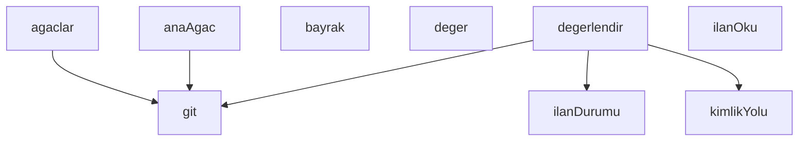

## Genel Bakış

Bu modül, Git working tree'lerinin silinme işlemini denetleyen bir "kapı" (gate) mekanizmasıdır. Working tree'leri listeler, ana ağacı belirler ve her bir working tree'nin silinmeye uygun olup olmadığını ilan mekanizması üzerinden değerlendirir. Modül, `git` komutlarını çalıştırarak ve bayrak/değer okuyarak karar verme sürecini destekler.

## Fonksiyon Grupları

### Git Yardımcıları
Düşük seviyeli Git işlemlerini ve yapılandırma okumalarını yürütür. Diğer tüm gruplar bu fonksiyonlara bağımlıdır.
- `git`, `bayrak`, `deger`

### Ağaç Keşfi ve Kimliklendirme
Working tree'leri listeler, ana working tree'yi belirler ve ortak `.git` dizini altında her ağaca özgü kimlik yolunu hesaplar.
- `agaclar`, `anaAgac`, `kimlikYolu`

### Silme Kararı ve İlan Değerlendirmesi
Her working tree için silme kararını üretir; ilan dosyasını okur ve ilan durumunu sorgular. Bu grup, ağaç keşfi ve kimliklendirme grubunun çıktılarına bağımlıdır.
- `degerlendir`, `ilanDurumu`, `ilanOku`

---

## AXIOMS – Mimari Varsayımlar

Bu modül için fonksiyon gövdeleri verilmediğinden, yalnızca imza ve sabit listesinden çıkarım yapılabilir. Aşağıdaki varsayımlar bu sınırlı bilgiye dayanır.

[Aksiyom 1]: Eğer `fs` modülü erişilebilir değilse, dosya sistemi işlemleri (ilan okuma, yol kontrolü) gerçekleştirilemez.

[Aksiyom 2]: Eğer `path` modülü erişilebilir değilse, `kimlikYolu` ve `ILAN_YOLU` gibi yol hesaplamaları yapılamaz.

[Aksiyom 3]: Eğer `git` fonksiyonu çalıştırılamazsa, `agaclar()` ve `anaAgac()` fonksiyonları worktree listesini alamaz.

[Aksiyom 4]: Eğer `ortakGitDir` mevcut değilse, `kimlikYolu(ortakGitDir, ad)` fonksiyonu geçerli bir kimlik yolu üretemez.

[Aksiyom 5]: Eğer `ILAN_YOLU` dosyası okunamazsa, `ilanOku()` fonksiyonu ilan verisini döndüremez ve `ilan` sabiti tanımsız kalır.

[Aksiyom 6]: Eğer `ilan` verisi tanımsızsa, `ilanDurumu(ilan, ad)` ve `degerlendir(wt, ortakGitDir, ana, ilan)` fonksiyonları ilan karşılaştırması yapamaz.

[Aksiyom 7]: Eğer `ana` (ana worktree) tanımlı değilse, `degerlendir` fonksiyonu hangi ağacın ana olduğunu belirleyemez.

[Aksiyom 8]: Eğer `argv` erişilebilir değilse, `bayrak(ad)` ve `deger(ad)` fonksiyonları komut satırı parametrelerini okuyamaz; `JSON_CIKTI`, `SUZ` gibi bayraklar belirlenemez.

[Aksiyom 9]: Eğer `hepsi` (tüm worktree'ler) boşsa, `secili` ve `sonuclar` için değerlendirme yapılacak öğe kalmaz; `silinebilir` listesi boş döner.

---

## FONKSİYON DETAYLARI

### bayrak
**Ne yapar**: Gövdesi verilmediği için tam işlevi belirlenemiyor. Fonksiyon tanımı `ad` parametresi alacak şekilde yapılandırılmış, dönüş tipi bilinmiyor.
**Nasıl yapar**: Gövde verilmemiş, iç mantık bilinmiyor.
**Parametreler**:
- ad: bilinmiyor — fonksiyona aktarılacak değer; kullanım amacı kaynakta belirtilmemiş
**Dönüş**: Bilinmiyor.

### deger
**Ne yapar**: Geliştirildi ancak detay üretilemedi.

### git
**Ne yapar**: Geliştirildi ancak detay üretilemedi.

### agaclar
**Ne yapar**: Geliştirildi ancak detay üretilemedi.

### anaAgac
**Ne yapar**: Geliştirildi ancak detay üretilemedi.

### kimlikYolu
**Ne yapar**: Geliştirildi ancak detay üretilemedi.

### degerlendir
**Ne yapar**: Geliştirildi ancak detay üretilemedi.

### ilanDurumu
**Ne yapar**: Geliştirildi ancak detay üretilemedi.

### ilanOku
**Ne yapar**: Geliştirildi ancak detay üretilemedi.

---

## SABİTLER
- **fs** (call) — `require('fs')`
- **path** (call) — `require('path')`
- **argv** (call) — `process.argv.slice(2)`
- **JSON_CIKTI** (call) — `bayrak('--json')`
- **ILAN** (call) — `(deger('--ilan') || '').split(',').map((s) => s.trim()).filter(Boolean)`
- **SUZ** (call) — `(deger('--agac') || '').split(',').map((s) => s.trim()).filter(Boolean)`
- **ILAN_YOLU** (call) — `path.join(__dirname, 'silme-ilani.json')`
- **ortakGitDir** (call) — `path.resolve(git(['rev-parse', '--path-format=absolute', '--git-common-dir'])...`
- **ana** (call) — `anaAgac()`
- **ilan** (call) — `ilanOku()`
- **hepsi** (call) — `agaclar()`
- **secili** (ternary_expression) — `SUZ.length ? hepsi.filter((w) => SUZ.includes(path.basename(w))) : hepsi`
- **sonuclar** (call) — `secili.map((wt) => degerlendir(wt, ortakGitDir, ana, ilan))`
- **silinebilir** (call) — `sonuclar.filter((s) => s.karar === 'SILINEBILIR')`

---

## AST POINTERS

### [N1_NASIL] AST Pointer: agac-silme-kapisi.cjs::bayrak
- **params**: `ad`
- **ic_degiskenler**:
  - `i` — `argv.indexOf(ad)` sonucu; komut satırında `ad` bayrağının bulunduğu indeks
- **Dönüş**: `string` (bayraktan sonraki değer) veya `null` (bayrak yoksa ya da sonraki argüman başka bir bayraksa)

### [N2_NASIL] AST Pointer: agac-silme-kapisi.cjs::deger
- **params**: `ad`
- **ic_degiskenler**: bilinmiyor (gövde verilmemiş)
- **Dönüş**: bilinmiyor

### [N3_NASIL] AST Pointer: agac-silme-kapisi.cjs::git
- **params**: `args`, `cwd`
- **ic_degiskenler**: yok
- **Dönüş**: `string` — `execFileSync('git', ...)` çıktısı, UTF-8 kodlamasında

### [N4_NASIL] AST Pointer: agac-silme-kapisi.cjs::agaclar
- **params**: yok
- **ic_degiskenler**:
  - `cikti` — `git(['worktree', 'list', '--porcelain'])` sonucu; ham worktree listesi çıktısı
  - `liste` — toplanan worktree yollarını tutan dizi
  - `satir` — `cikti.split('\n')` ile ayrılan her satır; `'worktree '` ile başlayan satırların önü kesilerek yol elde edilir
- **Dönüş**: `string[]` — worktree kök dizinlerinin listesi

### [N5_NASIL] AST Pointer: agac-silme-kapisi.cjs::anaAgac
- **params**: yok
- **ic_degiskenler**: yok
- **Dönüş**: `string` — `git(['rev-parse', '--path-format=absolute', '--git-common-dir'])` sonucunun bir üst dizinine çözülmüş mutlak yolu

### [N6_NASIL] AST Pointer: agac-silme-kapisi.cjs::kimlikYolu
- **params**: `ortakGitDir`, `ad`
- **ic_degiskenler**: yok
- **Dönüş**: `string` — `path.join(ortakGitDir, 'worktrees', ad, 'venthub-sid')` sonucu; kimlik dosyasının tam yolu

### [N7_NASIL] AST Pointer: agac-silme-kapisi.cjs::degerlendir
- **params**: `wt`, `ortakGitDir`, `ana`, `ilan`
- **ic_degiskenler**:
  - `ad` — `path.basename(wt)` sonucu; worktree dizin adı
  - `sonuc` — değerlendirme sonuç nesnesi; `agac`, `ad`, `kosullar`, `engeller`, `karar`, `sid`, `erisilemeyenCommit`, `kirli`, `ilan` alanlarını taşır
  - `ky` — `kimlikYolu(ortakGitDir, ad)` sonucu; venthub-sid dosya yolu
  - `sid` — `fs.readFileSync(ky, 'utf8').trim()` sonucu; dosya varsa kimlik değeri, yoksa `null`
  - `kayip` — `git(['rev-list', '--count', 'HEAD', '--not', '--remotes'], wt)` sonucu; hiçbir uzak ref'e erişilemeyen commit sayısı (sayıya çevrilir), hata durumunda `null`
  - `kirli` — `git(['status', '--porcelain', '--untracked-files=all'], wt)` sonucundaki boş olmayan satır sayısı; hata durumunda `null`
  - `k4` — `ilanDurumu(ilan, ad)` sonucu; ilan durumu nesnesi
- **Dönüş**: `sonuc` nesnesi — `karar` alanı `'SILINEBILIR'` veya `'SILINEMEZ'`

### [N8_NASIL] AST Pointer: agac-silme-kapisi.cjs::ilanDurumu
- **params**: `ilan`, `ad`
- **ic_degiskenler**:
  - `gecenDk` — `(Date.now() - Date.parse(ilan.ilanEdildi)) / 60000` sonucu; ilan edilme anından bu yana geçen dakika
- **Dönüş**: nesne — `gecti` (boolean), `sebep` (string), opsiyonel olarak `kalanDk` (pencere açıksa) veya `gecenDk` (pencere kapandıysa)

### [N9_NASIL] AST Pointer: agac-silme-kapisi.cjs::ilanOku
- **params**: yok
- **ic_degiskenler**: yok
- **Dönüş**: nesne (`JSON.parse` sonucu) veya `null` (dosya okunamazsa)

---

## MERMAID CALL GRAPH

## NODE ID STANDARD

  file: scripts\hijyen\agac-silme-kapisi.cjs
  function: scripts\hijyen\agac-silme-kapisi.cjs::bayrak
  function: scripts\hijyen\agac-silme-kapisi.cjs::deger
  function: scripts\hijyen\agac-silme-kapisi.cjs::git
  function: scripts\hijyen\agac-silme-kapisi.cjs::agaclar
  function: scripts\hijyen\agac-silme-kapisi.cjs::anaAgac
  function: scripts\hijyen\agac-silme-kapisi.cjs::kimlikYolu
  function: scripts\hijyen\agac-silme-kapisi.cjs::degerlendir
  function: scripts\hijyen\agac-silme-kapisi.cjs::ilanDurumu
  function: scripts\hijyen\agac-silme-kapisi.cjs::ilanOku

---

## DISA AKTARILANLAR (EXPORTS)
  export: agaclar
  export: anaAgac
  export: bayrak
  export: deger
  export: degerlendir
  export: git
  export: ilanDurumu
  export: ilanOku
  export: kimlikYolu