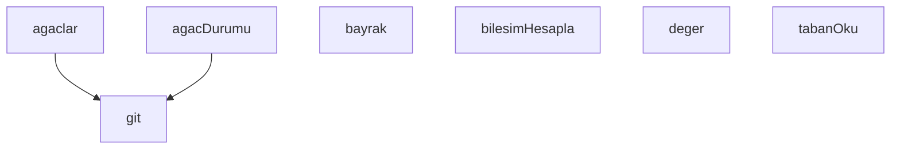

## Genel Bakış

Bu modül, Git working tree'lerindeki kirli (değiştirilmiş) dosyaları saymak ve durumlarını eşik değerine göre raporlamak için kullanılan bir hijyen denetim aracıdır. Komut satırı bayraklarını okuyarak çalışır, birden fazla working tree üzerinde kirli dosya sayımı gerçekleştirir ve sonuçları bir bileşim halinde hesaplar.

## Fonksiyon Grupları

### Komut Satırı ve Yapılandırma
Kullanıcıdan gelen bayrak ve değerleri okuyarak modülün çalışma parametrelerini belirler.
- bayrak, deger

### Git Komutları
Alt süreç olarak Git komutlarını çalıştırır ve çıktılarını döndürür; working tree listeleme ve durum sorgulama gibi işlemler için temel altyapı sağlar.
- git

### Working Tree Yönetimi
Working tree'leri listeler ve her birinin kirli dosya durumunu kontrol eder; `git` fonksiyonunu kullanarak durum bilgisini toplar.
- agaclar, agacDurumu

### Temel Veri Erişimi
Modülün çalışması için gerekli temel okuma ve dosya erişim işlemlerini gerçekleştirir.
- tabanOku

### Hesaplama ve Bileşim
Working tree durumlarından gelen verileri işleyerek kirli dosya sayılarını hesaplar ve bir bileşim oluşturur.
- bilesimHesapla

---

## AXIOMS – Mimari Varsayımlar

Bu modül, Git working tree'lerindeki kirli dosyaları saymak ve hijyen denetimi yapmak için komut satırı bayraklarını kullanarak çalışır.

[Aksiyom 1]: Eğer sistemde `git` komutu bulunamazsa, `git(args, cwd)` fonksiyonu alt süreç çalıştırma hatası verir ve modül hiç working tree durumu raporlayamaz.

[Aksiyom 2]: Eğer `agaclar()` fonksiyonu çalıştırılabilir bir Git repository'si içinde değilse (`.git` dizini yoksa), working tree listesi boş döner ve kirli dosya sayımı yapılamaz.

[Aksiyom 3]: Eğer `agacDurumu(wt)` fonksiyonuna geçilen working tree yolu (`wt`) geçerli bir Git working tree değilse, o working tree için durum bilgisi alınamaz.

[Aksiyom 4]: Eğer `tabanOku()` fonksiyonu `TABAN_YOLU` sabitinde tanımlı dosyayı okuyamazsa (dosya yoksa veya erişim izni yoksa), taban değer hesaplanamaz ve `delta` ile trend karşılaştırması yapılamaz.

[Aksiyom 5]: Eğer `bilesimHesapla(satirlar)` fonksiyonuna geçilen `satirlar` boş diziyse, bileşim değeri hesaplanamaz veya sıfır olarak değerlendirilir.

[Aksiyom 6]: Eğer `ESIK` sabitinin koşulu sağlanmıyorsa (ternary_expression sonucu), eşik değeri farklı bir değer alır ve kirli dosya sayısının kabul edilebilirlik değerlendirmesi buna göre yapılır.

[Aksiyom 7]: Eğer `secili` sabitinin koşulu sağlanmıyorsa (ternary_expression sonucu), modül sadece belirli working tree'ler yerine `hepsi` sabitinde tanımlı tüm working tree'leri işler.

[Aksiyom 8]: Eğer `bayrak(ad)` fonksiyonu ile istenen bayrak `argv` içinde tanımlı değilse, o bayrak için varsayılan davranış uygulanır (bayrağın varlığı boolean olarak false döner).

[Aksiyom 9]: Eğer `deger(ad)` fonksiyonu ile istenen değer `argv` içinde tanımlı değilse, o parametre için varsayılan değer kullanılır veya undefined döner.

[Aksiyom 10]: Eğer `TABAN_YAZ` sabiti aktifse ve dosya yazma izni yoksa, taban değeri dosyaya kaydedilemez; ancak modül çalışmasına devam eder.

---

## FONKSİYON DETAYLARI

### bayrak
**Ne yapar**: Parametre olarak bir `ad` alır. Fonksiyonun görevi verilen kaynak kodda belirtilmemiştir; yalnızca fonksiyon imzası mevcuttur.
**Nasıl yapar**: Gövde verilmediği için iç mantığı bilinmiyor.
**Parametreler**:
- ad: bilinmiyor — bilinmiyor

**Dönüş**: Bilinmiyor. Kaynakta dönüş tipi belirtilmemiştir.

### deger
**Ne yapar**: Geliştirildi ancak detay üretilemedi.

### tabanOku
**Ne yapar**: Betiğin çalışması için gerekli olan taban (başlangıç) verisini dosya sisteminden okur ve JSON olarak çözümleyerek döndürür. Okuma başarısız olursa veya beklenen yapı bozuksa, sessizce geçilmez; hata sebebiyle birlikte açıkça raporlanır. Bu sayede trend analizinde eksik veri gizlenmez ve sorun görünür kalır.

**Nasıl yapar**: Fonksiyon önce `TABAN_YOLU` sabitinde tanımlı dosya yolunu `fs.readFileSync` ile eşzamanlı olarak okur ve `JSON.parse` ile çözümlemeye çalışır. Çözümleme başarılı olursa, elde edilen nesnenin `agaclar` alanının bir nesne (`object`) olup olmadığını ve `null` olmadığını denetler. Bu denetim başarısız olursa `{ yok: true, sebep: 'agaclar alani yok ya da bozuk' }` nesnesi döndürülür. Dosya okuma veya JSON çözümleme sırasında herhangi bir hata oluşursa `catch` bloğunda yakalanır ve `{ yok: true, sebep: ... }` biçiminde, hatanın `code` özelliği varsa o, yoksa hatanın metin temsili (`String(e)`) sebep olarak eklenerek döndürülür.

**Parametreler**:
- Bu fonksiyon parametre almaz.

**Dönüş**: Fonksiyon iki farklı yapıda değer döndürebilir. Başarılı okuma durumunda, dosyadan çözümlenen ve `agaclar` alanı geçerli bir nesne olan JSON nesnesini döndürür. Başarısızlık durumunda ise `yok` alanı `true` olan ve `sebep` alanında okunamama nedeninin metin olarak yer aldığı bir nesne döndürür. Kaynakta dönüş tipi açıkça belirtilmemiştir.

### git
**Ne yapar**: Geliştirildi ancak detay üretilemedi.

### agaclar
**Ne yapar**: Geliştirildi ancak detay üretilemedi.

### agacDurumu
**Ne yapar**: Geliştirildi ancak detay üretilemedi.

### bilesimHesapla
**Ne yapar**: Verilen satırlardaki dosya yollarını dört sınıfa (md, arsivEol, systemTree, diger) ayırarak bileşim hesaplar. "Bu sayı NEDEN bu kadar?" sorusunun cevabını üretir; örneğin toplam 521 sayısının 384'ünün companion `.md` churn'ünden, 120'sinin `.archive` EOL fantomundan, 16'sının `system_tree`'den geldiğini gösterir. Docstring'e göre bu bileşim, çoğu zaman asıl cevaptır ve toplam sayıdan daha anlamlıdır.

**Nasıl yapar**: Fonksiyon iki nesne oluşturarak başlar: `sinifSay` (her sınıf için sayaç) ve `sinifAgac` (her sınıf için hangi ağaçlardan geldiğini tutan `Set` nesneleri). Dış döngüde her satır nesnesini iterasyona alır; `erisilemedi` özelliği `true` olanları `continue` ile atlar. Her satır nesnesinin `agac` özelliğinden `path.basename` ile dosya adını çıkarır ve `ad` değişkenine atar. İç döngüde her satırın ilk 3 karakterini atıp kalan kısmı `trim`leyerek dosya yolunu elde eder. Yol içeriğine göre sınıflandırma yapar: `.archive/legacy_superpowers_artifacts` içeriyorsa `arsivEol`, `docs/system_tree.md` ile bitiyorsa `systemTree`, `.md` ile bitiyorsa `md`, diğer durumlarda `diger` olarak etiketler. Her sınıflandırmada ilgili sayaç bir artırılır ve ilgili `Set`'e ağaç adı eklenir (bu sayede aynı ağaçtan birden fazla satır gelse bile `Set` tekrarları önler).

**Parametreler**:
- satirlar: Array — Her elemanı bir nesne olan dizi. Her nesne `agac` (string, ağacın dosya yolu), `satirlar` (Array, her biri string olan satırlar; ilk 3 karakteri atılarak dosya yolu okunur) ve `erisilemedi` (boolean, `true` ise bu nesne tamamen atlanır) özelliklerini içerir.

**Dönüş**: Object — `{ sinifSay, sinifAgac }` şeklinde bir nesne döner. `sinifSay` nesnesi `md`, `arsivEol`, `systemTree` ve `diger` anahtarlarına sahip olup her biri o sınıfa ait toplam satır sayısını (number) tutar. `sinifAgac` nesnesi aynı anahtarlara sahip olup her biri o sınıfa ait benzersiz ağaç adlarını (string) içeren bir `Set` nesnesi tutar.

---

## SABİTLER
- **fs** (call) — `require('fs')`
- **path** (call) — `require('path')`
- **argv** (call) — `process.argv.slice(2)`
- **DETAY** (call) — `bayrak('--detay')`
- **JSON_CIKTI** (call) — `bayrak('--json')`
- **ONLY** (call) — `(deger('--only') || '').split(',').map((s) => s.trim()).filter(Boolean)`
- **ESIK** (ternary_expression) — `deger('--esik') !== null ? Number(deger('--esik')) : null`
- **TABAN_YAZ** (call) — `bayrak('--taban-yaz')`
- **TABAN_YOLU** (call) — `path.join(__dirname, 'kirli-sayac-taban.json')`
- **hepsi** (call) — `agaclar()`
- **secili** (ternary_expression) — `ONLY.length ? hepsi.filter((w) => ONLY.some((p) => w.includes(p))) : hepsi`
- **taban** (call) — `tabanOku()`
- **trendVar** (unary_expression) — `!taban.yok`
- **delta** (new_expression) — `new Map()`

---

## AST POINTERS

### [N1_NASIL] AST Pointer: kirli-sayac.cjs::bayrak
- **params**: `ad`
- **ic_degiskenler**:
  - `i` — `argv` dizisinde `ad` parametresinin bulunduğu indeks; `argv.indexOf(ad)` ile hesaplanır
- **Dönüş**: `argv[i + 1]` değeri (string) veya `null`; `i >= 0` ve sonraki eleman `--` ile başlamıyorsa o elemanı döndürür, aksi halde `null`

### [N2_NASIL] AST Pointer: kirli-sayac.cjs::tabanOku
- **params**: (parametre yok)
- **ic_degiskenler**:
  - `t` — `TABAN_YOLU` dosyasından `fs.readFileSync` ile okunup `JSON.parse` edilen nesne
  - `e` — `catch` bloğunda yakalanan hata nesnesi; `e.code` veya `String(e)` ile sebep açıklaması üretilir
- **Dönüş**: `t` (JSON nesnesi) başarılıysa; `{ yok: true, sebep: ... }` nesnesi hata durumunda. `t.agaclar` alanı yoksa veya bozuksa da `{ yok: true, sebep: 'agaclar alani yok ya da bozuk' }` döner

### [N3_NASIL] AST Pointer: kirli-sayac.cjs::git
- **params**: `args`, `cwd`
- **ic_degiskenler**: yok
- **Dönüş**: `execFileSync('git', args, ...)` sonucu (string); `cwd` belirtilmemişse `process.cwd()` kullanılır, `maxBuffer` 64 MB, `windowsHide: true`, `encoding: 'utf8'`

### [N4_NASIL] AST Pointer: kirli-sayac.cjs::agaclar
- **params**: (parametre yok)
- **ic_degiskenler**:
  - `cikti` — `git(['worktree', 'list', '--porcelain'])` çağrısının döndürdüğü ham metin
  - `e` — `catch` bloğunda yakalanan hata; hata olursa `console.error` ile mesaj yazdırıp `process.exit(2)` ile çıkılır
  - `liste` — bulunan worktree yollarının toplandığı dizi
  - `satir` — `cikti.split('\n')` ile elde edilen her bir satır; `startsWith('worktree ')` ile başlayanlar filtrelenir
- **Dönüş**: `liste` (string dizisi); her eleman bir worktree yolu

### [N5_NASIL] AST Pointer: kirli-sayac.cjs::agacDurumu
- **params**: `wt`
- **ic_degiskenler**:
  - `kisa` — `git(['status', '--porcelain'], wt)` çağrısının döndürdüğü ham metin
  - `tam` — `git(['status', '--porcelain', '--untracked-files=all'], wt)` çağrısının döndürdüğü ham metin
  - `e` — `catch` bloğunda yakalanan hata; hata olursa `{ erisilemedi: true }` döner
  - `kisaSatir` — `kisa` metninin boş olmayan satırları (filtrelenmiş dizi)
  - `tamSatir` — `tam` metninin boş olmayan satırları (filtrelenmiş dizi)
  - `izlenmeyen` — `kisaSatir` içinden `??` ile başlayan satırlar (izlenmeyen dosyalar)
  - `s` — filtre fonksiyonundaki her bir satır; `trim().length > 0` kontrolü uygulanır
- **Dönüş**: `{ erisilemedi: false, rozet: kisaSatir.length, dosya: tamSatir.length, izlenenKirli: kisaSatir.length - izlenmeyen.length, izlenmeyen: izlenmeyen.length, satirlar: tamSatir }` veya hata durumunda `{ erisilemedi: true }`

### [N6_NASIL] AST Pointer: kirli-sayac.cjs::bilesimHesapla
- **params**: `satirlar`
- **ic_degiskenler**:
  - `sinifSay` — kategorilere göre dosya sayılarını tutan nesne; anahtarlar: `md`, `arsivEol`, `systemTree`, `diger` (hepsi başlangıçta 0)
  - `sinifAgac` — kategorilere göre benzersiz ağaç adlarını tutan nesne; her anahtar bir `Set` nesnesi
  - `s` — `satirlar` dizisindeki her bir öğe; `s.erisilemedi` true ise atlanır
  - `ad` — `path.basename(s.agac)` ile elde edilen worktree temel adı
  - `satir` — `s.satirlar` dizisindeki her bir satır
  - `yol` — `satir.slice(3).trim()` ile elde edilen dosya yolu (ilk 3 karakter atılır)
  - `k` — `yol` değerine göre belirlenen sınıflandırma anahtarı; `.archive/legacy_superpowers_artifacts` içeriyorsa `arsivEol`, `docs/system_tree.md` ile bitiyorsa `systemTree`, `.md` ile bitiyorsa `md`, diğerleri `diger`
- **Dönüş**: `{ sinifSay, sinifAgac }`

### [N7_NASIL] AST Pointer: kirli-sayac.cjs::anonim_arrow_1
- **params**: `s`
- **ic_degiskenler**:
  - `isim` — `path.basename(s.agac)` ile elde edilen worktree temel adı
- **Dönüş**: `{ ...s, satirlar: DETAY ? s.satirlar : undefined, fark: delta.has(isim) ? delta.get(isim) : null, yeni: yeniAgac.some((y) => y.isim === isim) || undefined }` nesnesi; `DETAY` true ise `satirlar` korunur, false ise `undefined` olur; `delta` Map'inde `isim` varsa fark değeri eklenir; `yeniAgac` dizisinde eşleşen varsa `yeni: true` olur

### [N8_NASIL] AST Pointer: kirli-sayac.cjs::anonim_arrow_2
- **params**: `adlar`
- **ic_degiskenler**:
  - `ad` — `[...adlar]` dizisindeki her bir eleman (spread ile kopyalanmış)
  - `s` — `satirlar` dizisinde `!x.erisilemedi && path.basename(x.agac) === ad` koşulunu sağlayan öğe; bulunamazsa `null` döner
- **Dönüş**: `{ ad, geride }` nesnelerinden oluşan dizi; `geride` `git(['rev-list', '--count', 'HEAD..origin/master'], s.agac)` sonucunun `Number()` ile sayıya çevrilmiş hata durumunda `null`; dizi `geride` değerine göre azalan sırayla sıralanır ve `null` olmayanlar filtrelenir

### [N9_NASIL] AST Pointer: kirli-sayac.cjs::anonim_arrow_3
- **params**: `ad`
- **ic_degiskenler**:
  - `s` — `satirlar` dizisinde `!x.erisilemedi && path.basename(x.agac) === ad` koşulunu sağlayan öğe; bulunamazsa `null` döner
- **Dönüş**: `{ ad, geride }` nesnesi; `geride` `git(['rev-list', '--count', 'HEAD..origin/master'], s.agac)` sonucunun `Number()` ile sayıya çevrilmiş hali; hata durumunda `{ ad, geride: null }`

---

## MERMAID CALL GRAPH

## NODE ID STANDARD

  file: scripts\hijyen\kirli-sayac.cjs
  function: scripts\hijyen\kirli-sayac.cjs::bayrak
  function: scripts\hijyen\kirli-sayac.cjs::deger
  function: scripts\hijyen\kirli-sayac.cjs::tabanOku
  function: scripts\hijyen\kirli-sayac.cjs::git
  function: scripts\hijyen\kirli-sayac.cjs::agaclar
  function: scripts\hijyen\kirli-sayac.cjs::agacDurumu
  function: scripts\hijyen\kirli-sayac.cjs::bilesimHesapla

---

## DISA AKTARILANLAR (EXPORTS)
  export: agacDurumu
  export: agaclar
  export: bayrak
  export: bilesimHesapla
  export: deger
  export: git
  export: tabanOku