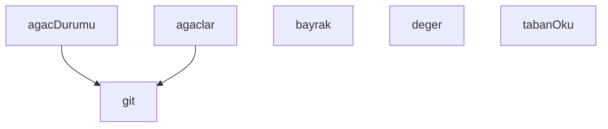

## Genel Bakış

Bu modül, Git working tree'lerindeki kirli (değiştirilmemiş olmayan) dosyaları saymak ve durumlarını raporlamak için kullanılan bir hijyen denetim aracıdır. Komut satırı bayraklarını okuyarak çalışır ve birden fazla working tree üzerinde kirli dosya sayımı gerçekleştirir.

## Fonksiyon Grupları

### Komut Satırı ve Yapılandırma
Kullanıcıdan gelen bayrak ve değerleri okuyarak modülün davranışını belirler.
- bayrak, deger

### Git Komutları
Alt süreç olarak Git komutlarını çalıştırır ve çıktılarını döndürür; diğer fonksiyonlar için temel altyapı sağlar.
- git

### Working Tree Yönetimi
Working tree'leri listeler ve her birinin kirli dosya durumunu kontrol eder; `git` fonksiyonunu kullanarak durum bilgisini toplar.
- agaclar, agacDurumu

### Temel Veri Erişimi
Modülün çalışması için gerekli temel okuma işlemlerini gerçekleştirir.
- tabanOku

---

## AXIOMS – Mimari Varsayımlar

Bu modül, Git working tree'lerindeki kirli dosyaları saymak ve eşik değerine göre durum raporlamak için çalışır.

[Aksiyom 1]: Eğer `git` fonksiyonu çalıştırılabilir bir Git kurulumuna erişemezse, `agaclar` ve `agacDurumu` fonksiyonları working tree listesini ve durum bilgisini alamaz.

[Aksiyom 2]: Eğer `agaclar` fonksiyonu geçerli bir working tree listesi dönmezse, `agacDurumu` fonksiyonuna işlenecek öğe kalmaz ve kirli dosya sayılamaz.

[Aksiyom 3]: Eğer `agacDurumu(wt)` fonksiyonuna geçersiz veya erişilemez bir working tree yolu verilirse, o working tree için kirli dosya sayısı hesaplanamaz.

[Aksiyom 4]: Eğer `bayrak` ve `deger` fonksiyonları komut satırı argümanlarını (`argv`) okuyamazlarsa, `DETAY`, `JSON_CIKTI`, `ONLY` gibi davranış bayrakları belirlenemez.

[Aksiyom 5]: Eğer `ONLY` bayrağı tanımlıysa, `secili` değişkeni yalnızca belirtilen working tree'leri filtreler; tanımlı değilse `hepsi` kullanılır.

[Aksiyom 6]: Eğer `ESIK` değeri tanımlı değilse, kirli dosya sayısının kabul edilebilir olup olmadığı belirlenemez.

[Aksiyom 7]: Eğer `tabanOku` fonksiyonu taban dosyasını okuyamazsa, `TABAN_YOLU` üzerinden referans noktası alınamaz ve `delta` hesaplanamaz.

[Aksiyom 8]: Eğer `TABAN_YAZ` bayrağı aktifse, mevcut kirli dosya sayıları taban dosyasına yazılır; bu işlem için dosya sistemi yazma izni gerekir.

[Aksiyom 9]: Eğer `fs` modülü dosya sistemi işlemlerini gerçekleştiremezse, taban okuma ve yazma işlemleri başarısız olur.

[Aksiyom 10]: Eğer `path` modülü yol birleştirme ve çözümleme işlemlerini yapamazsa, working tree yolları ve taban dosya yolu doğru oluşturulamaz.

---

## FONKSİYON DETAYLARI

### bayrak
**Ne yapar**: Parametre olarak bir `ad` alır. Fonksiyonun görevi verilen kaynak kodda belirtilmemiştir; yalnızca fonksiyon imzası mevcuttur.
**Nasıl yapar**: Gövde verilmediği için iç mantığı bilinmiyor.
**Parametreler**:
- ad: bilinmiyor — bilinmiyor

**Dönüş**: Bilinmiyor. Kaynakta dönüş tipi belirtilmemiştir.

### deger
**Ne yapar**: Geliştirildi ancak detay üretilemedi.

### tabanOku
**Ne yapar**: Betiğin çalışması için gerekli olan taban (başlangıç) verisini dosya sisteminden okur ve JSON olarak çözümleyerek döndürür. Okuma başarısız olursa veya beklenen yapı bozuksa, sessizce geçilmez; hata sebebiyle birlikte açıkça raporlanır. Bu sayede trend analizinde eksik veri gizlenmez ve sorun görünür kalır.

**Nasıl yapar**: Fonksiyon önce `TABAN_YOLU` sabitinde tanımlı dosya yolunu `fs.readFileSync` ile eşzamanlı olarak okur ve `JSON.parse` ile çözümlemeye çalışır. Çözümleme başarılı olursa, elde edilen nesnenin `agaclar` alanının bir nesne (`object`) olup olmadığını ve `null` olmadığını denetler. Bu denetim başarısız olursa `{ yok: true, sebep: 'agaclar alani yok ya da bozuk' }` nesnesi döndürülür. Dosya okuma veya JSON çözümleme sırasında herhangi bir hata oluşursa `catch` bloğunda yakalanır ve `{ yok: true, sebep: ... }` biçiminde, hatanın `code` özelliği varsa o, yoksa hatanın metin temsili (`String(e)`) sebep olarak eklenerek döndürülür.

**Parametreler**:
- Bu fonksiyon parametre almaz.

**Dönüş**: Fonksiyon iki farklı yapıda değer döndürebilir. Başarılı okuma durumunda, dosyadan çözümlenen ve `agaclar` alanı geçerli bir nesne olan JSON nesnesini döndürür. Başarısızlık durumunda ise `yok` alanı `true` olan ve `sebep` alanında okunamama nedeninin metin olarak yer aldığı bir nesne döndürür. Kaynakta dönüş tipi açıkça belirtilmemiştir.

### git
**Ne yapar**: Geliştirildi ancak detay üretilemedi.

### agaclar
**Ne yapar**: Geliştirildi ancak detay üretilemedi.

### agacDurumu
**Ne yapar**: Geliştirildi ancak detay üretilemedi.

---

## SABİTLER
- **fs** (call) — `require('fs')`
- **path** (call) — `require('path')`
- **argv** (call) — `process.argv.slice(2)`
- **DETAY** (call) — `bayrak('--detay')`
- **JSON_CIKTI** (call) — `bayrak('--json')`
- **ONLY** (call) — `(deger('--only') || '').split(',').map((s) => s.trim()).filter(Boolean)`
- **ESIK** (ternary_expression) — `deger('--esik') !== null ? Number(deger('--esik')) : null`
- **TABAN_YAZ** (call) — `bayrak('--taban-yaz')`
- **TABAN_YOLU** (call) — `path.join(__dirname, 'kirli-sayac-taban.json')`
- **hepsi** (call) — `agaclar()`
- **secili** (ternary_expression) — `ONLY.length ? hepsi.filter((w) => ONLY.some((p) => w.includes(p))) : hepsi`
- **taban** (call) — `tabanOku()`
- **trendVar** (unary_expression) — `!taban.yok`
- **delta** (new_expression) — `new Map()`

---

## AST POINTERS

### [N1_NASIL] AST Pointer: scripts/hijyen/kirli-sayac.cjs::bayrak
- **params**: `ad` — komut satırında aranacak bayrak adı
- **ic_degiskenler**:
  - `i` — `argv.indexOf(ad)` sonucu; bayrağın `argv` dizisindeki indeksi
- **Dönüş**: `argv[i + 1]` değeri (bayraktan sonraki argüman) veya `null`; bayrak yoksa, sonraki argüman yoksa ya da sonraki argüman `--` ile başlıyorsa `null` döner

### [N2_NASIL] AST Pointer: scripts/hijyen/kirli-sayac.cjs::tabanOku
- **params**: (parametre yok)
- **ic_degiskenler**:
  - `t` — `fs.readFileSync(TABAN_YOLU, 'utf8')` sonucunun `JSON.parse` ile ayrıştırılmış hali
  - `e` — `catch` bloğundaki hata nesnesi; `e.code` veya `String(e)` ile sebep metni üretilir
- **Dönüş**: `t` nesnesi (başarılıysa) veya `{ yok: true, sebep: 'agaclar alani yok ya da bozuk' }` (`t` yoksa ya da `t.agaclar` nesne değilse/null ise) veya `{ yok: true, sebep: ... }` (dosya okuma/JSON ayrıştırma hatasında)

### [N3_NASIL] AST Pointer: scripts/hijyen/kirli-sayac.cjs::git
- **params**:
  - `args` — `git` alt komutu argümanları dizisi
  - `cwd` — çalışma dizini; belirtilmezse `process.cwd()` kullanılır
- **ic_degiskenler**: (yok — `execFileSync` doğrudan return ifadesinde çağrılır)
- **Dönüş**: `execFileSync` sonucu; `encoding: 'utf8'` ile string döner

### [N4_NASIL] AST Pointer: scripts/hijyen/kirli-sayac.cjs::agaclar
- **params**: (parametre yok)
- **ic_degiskenler**:
  - `cikti` — `git(['worktree', 'list', '--porcelain'])` çağrısının dönüşü (string)
  - `liste` — toplanan worktree yollarını tutan dizi
  - `satir` — `cikti.split('\n')` sonucundaki her bir satır; `for...of` döngüsü değişkeni
  - `e` — `catch` bloğundaki hata nesnesi; yakalanırsa hata mesajı basılıp `process.exit(2)` ile çıkılır
- **Dönüş**: `liste` dizisi (worktree yolları); hata durumunda fonksiyon `process.exit(2)` ile sonlanır, dönüş gerçekleşmez

### [N5_NASIL] AST Pointer: scripts/hijyen/kirli-sayac.cjs::agacDurumu
- **params**:
  - `wt` — worktree dizin yolu; `git` fonksiyonuna `cwd` olarak iletilir
- **ic_degiskenler**:
  - `kisa` — `git(['status', '--porcelain'], wt)` çağrısının dönüşü (kısa durum çıktısı, string)
  - `tam` — `git(['status', '--porcelain', '--untracked-files=all'], wt)` çağrısının dönüşü (tam durum çıktısı, string)
  - `kisaSatir` — `kisa.split('\n')` sonucunun boş olmayan satırlara göre filtrelenmiş hali
  - `tamSatir` — `tam.split('\n')` sonucunun boş olmayan satırlara göre filtrelenmiş hali
  - `izlenmeyen` — `kisaSatir` içinden `??` ile başlayan satırların filtrelenmiş hali
  - `e` — `catch` bloğundaki hata nesnesi
- **Dönüş**: `{ erisilemedi: false, rozet: kisaSatir.length, dosya: tamSatir.length, izlenenKirli: kisaSatir.length - izlenmeyen.length, izlenmeyen: izlenmeyen.length, satirlar: tamSatir }` nesnesi; hata durumunda `{ erisilemedi: true }`

### [N6_NASIL] AST Pointer: scripts/hijyen/kirli-sayac.cjs::isimsiz_arrow_fonksiyonu
- **params**:
  - `s` — worktree durum nesnesi; `.agac` ve `.satirlar` alanlarına erişilir
- **ic_degiskenler**:
  - `isim` — `path.basename(s.agac)` sonucu; worktree dizin yolunun son bileşeni
- **Dönüş**: `{ ...s, satirlar: DETAY ? s.satirlar : undefined, fark: delta.has(isim) ? delta.get(isim) : null, yeni: yeniAgac.some((y) => y.isim === isim) || undefined }` nesnesi; `DETAY` true ise `satirlar` korunur, false ise `undefined` olur; `delta` Map'inde `isim` varsa `fark` değeri alınır; `yeniAgac` dizisinde eşleşen `isim` varsa `yeni` true olur

---

## MERMAID CALL GRAPH

## NODE ID STANDARD

  file: scripts\hijyen\kirli-sayac.cjs
  function: scripts\hijyen\kirli-sayac.cjs::bayrak
  function: scripts\hijyen\kirli-sayac.cjs::deger
  function: scripts\hijyen\kirli-sayac.cjs::tabanOku
  function: scripts\hijyen\kirli-sayac.cjs::git
  function: scripts\hijyen\kirli-sayac.cjs::agaclar
  function: scripts\hijyen\kirli-sayac.cjs::agacDurumu

---

## DISA AKTARILANLAR (EXPORTS)
  export: agacDurumu
  export: agaclar
  export: bayrak
  export: deger
  export: git
  export: tabanOku