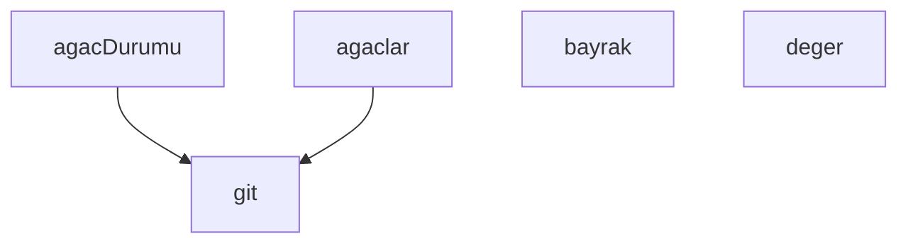

## Genel Bakış

Bu modül, Git working tree'lerindeki kirli (değiştirilmemiş olmayan) dosyaları saymak ve durumlarını raporlamak için kullanılan bir hijyen denetim aracıdır. Komut satırı bayraklarını okuyarak çalışır ve birden fazla working tree üzerinde kirli dosya sayımı gerçekleştirir.

## Fonksiyon Grupları

### Komut Satırı ve Yapılandırma
Kullanıcıdan gelen bayrak ve değerleri okuyarak modülün davranışını belirler.
- bayrak, deger

### Git Komutları
Alt süreç olarak Git komutlarını çalıştırır ve çıktılarını döndürür; diğer fonksiyonlar için temel altyapı sağlar.
- git

### Working Tree Yönetimi
Working tree'leri listeler ve her birinin kirli dosya durumunu kontrol eder; `git` fonksiyonunu kullanarak durum bilgisini toplar.
- agaclar, agacDurumu

---

## AXIOMS – Mimari Varsayımlar
- Bu modül davranışsal mantık içermez (salt veri / konfigürasyon / tip tanımı).
- [Aksiyom 1]: Modülün dışa açtığı yapı (anahtar kümesi / şema) bir sözleşmedir; tüketiciler bu sabit yapıya bağlıdır — kırıcı değişiklik tüm tüketicileri etkiler.
- [Aksiyom 2]: Bir öğe ekleme/çıkarma yapısal-uyumlu olmalı; ilgili tipler ve seçiciler aynı commit'te güncel tutulmalıdır.

---

## FONKSİYON DETAYLARI

### bayrak
**Ne yapar**: Parametre olarak bir `ad` alır. Fonksiyonun görevi verilen kaynak kodda belirtilmemiştir; yalnızca fonksiyon imzası mevcuttur.
**Nasıl yapar**: Gövde verilmediği için iç mantığı bilinmiyor.
**Parametreler**:
- ad: bilinmiyor — bilinmiyor

**Dönüş**: Bilinmiyor. Kaynakta dönüş tipi belirtilmemiştir.

### deger
**Ne yapar**: Geliştirildi ancak detay üretilemedi.

### git
**Ne yapar**: Geliştirildi ancak detay üretilemedi.

### agaclar
**Ne yapar**: Geliştirildi ancak detay üretilemedi.

### agacDurumu
**Ne yapar**: Geliştirildi ancak detay üretilemedi.

---

## SABİTLER
- **path** (call) — `require('path')`
- **argv** (call) — `process.argv.slice(2)`
- **DETAY** (call) — `bayrak('--detay')`
- **JSON_CIKTI** (call) — `bayrak('--json')`
- **ONLY** (call) — `(deger('--only') || '').split(',').map((s) => s.trim()).filter(Boolean)`
- **ESIK** (ternary_expression) — `deger('--esik') !== null ? Number(deger('--esik')) : null`
- **hepsi** (call) — `agaclar()`
- **secili** (ternary_expression) — `ONLY.length ? hepsi.filter((w) => ONLY.some((p) => w.includes(p))) : hepsi`

---

## AST POINTERS

### [N1_NASIL] AST Pointer: scripts/hijyen/kirli-sayac.cjs::bayrak
- **params**: `ad` — aranacak bayrak adı
- **ic_degiskenler**:
  - `i` — `argv.indexOf(ad)` sonucu; bayrağın argv dizisindeki indeksi
- **Dönüş**: `argv[i + 1]` değeri (bayrağın hemen ardından gelen değer) veya `null`; bayrak yoksa, sonraki eleman `--` ile başlıyorsa veya sonraki eleman yoksa `null` döner

### [N2_NASIL] AST Pointer: scripts/hijyen/kirli-sayac.cjs::deger
- **params**: `ad` — aranacak değer adı
- **ic_degiskenler**: bilinmiyor (gövde verilmemiş)
- **Dönüş**: bilinmiyor (gövde verilmemiş)

### [N3_NASIL] AST Pointer: scripts/hijyen/kirli-sayac.cjs::git
- **params**: `args` — git alt komutu ve argümanları (dizi), `cwd` — çalışma dizini (opsiyonel)
- **ic_degiskenler**: yok (doğrudan `execFileSync` sonucu döndürülür)
- **Dönüş**: `execFileSync` çıktısı (utf8 kodlamalı string); `cwd` belirtilmezse `process.cwd()` kullanılır; `maxBuffer` 64 MB olarak ayarlıdır

### [N4_NASIL] AST Pointer: scripts/hijyen/kirli-sayac.cjs::agaclar
- **params**: yok
- **ic_degiskenler**:
  - `cikti` — `git(['worktree', 'list', '--porcelain'])` çağrısının döndürdüğü ham çıktı
  - `liste` — worktree yollarını toplayan dizi
  - `satir` — `cikti.split('\n')` ile elde edilen her satır; `worktree ` ile başlayanlardan yol çıkarılır
- **Dönüş**: `liste` (string dizisi — her eleman bir worktree yolu); hata durumunda `process.exit(2)` ile çıkılır

### [N5_NASIL] AST Pointer: scripts/hijyen/kirli-sayac.cjs::agacDurumu
- **params**: `wt` — worktree dizini yolu
- **ic_degiskenler**:
  - `kisa` — `git(['status', '--porcelain'], wt)` çağrısının döndürdüğü kısa durum çıktısı
  - `tam` — `git(['status', '--porcelain', '--untracked-files=all'], wt)` çağrısının döndürdüğü tam durum çıktısı (izlenmeyen dosyalar dahil)
  - `kisaSatir` — `kisa` stringinin satırlara bölünüp boş olmayanların filtrelendiği dizi
  - `tamSatir` — `tam` stringinin satırlara bölünüp boş olmayanların filtrelendiği dizi
  - `izlenmeyen` — `kisaSatir` içinden `??` ile başlayan satırların filtrelendiği dizi
- **Dönüş**: nesne; hata durumunda `{ erisilemedi: true }`, başarılı durumda `{ erisilemedi: false, rozet: kisaSatir.length, dosya: tamSatir.length, izlenenKirli: kisaSatir.length - izlenmeyen.length, izlenmeyen: izlenmeyen.length, satirlar: tamSatir }`

---

## MERMAID CALL GRAPH

## NODE ID STANDARD

  file: scripts\hijyen\kirli-sayac.cjs
  function: scripts\hijyen\kirli-sayac.cjs::bayrak
  function: scripts\hijyen\kirli-sayac.cjs::deger
  function: scripts\hijyen\kirli-sayac.cjs::git
  function: scripts\hijyen\kirli-sayac.cjs::agaclar
  function: scripts\hijyen\kirli-sayac.cjs::agacDurumu

---

## DISA AKTARILANLAR (EXPORTS)
  export: agacDurumu
  export: agaclar
  export: bayrak
  export: deger
  export: git