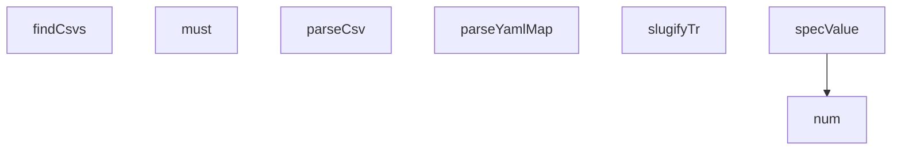

## Genel Bakış
Bu modül, CSV ve YAML formatındaki veri dosyalarını yüklemek, ayrıştırmak ve dönüştürmek için kullanılan yardımcı fonksiyonları içerir. Modül adından anlaşılacağı üzere "kademe2" (ikinci katman/seviye) yükleme işlemlerini gerçekleştirir. Türkçe metin işleme desteği de sunar.

## Fonksiyon Grupları

### Veri Ayrıştırma
Dosya içeriklerini yapılandırılmış verilere dönüştüren ayrıştırıcılar. CSV dosyalarını satır ve sütunlara, YAML harita yapısını ise anahtar-değer çiftlerine çevirir.
- parseCsv, parseYamlMap

### Değer Dönüştürme
Ham veri değerlerini istenen türlere veya formatlara dönüştüren yardımcı fonksiyonlar. Sayısal dönüşüm, özel spec değeri formatlaması ve Türkçe karakterler için slug üretimi yapar.
- num, specValue, slugifyTr

### Dosya Keşfi ve Hata Yönetimi
Dosya sisteminde gezinerek CSV dosyalarını bulan asenkron fonksiyon ile sorgu sonuçlarının varlığını zorunlu kılan kontrol fonksiyonunu içerir. Eksik dosya veya beklenen veri bulunamadığında hata fırlatır.
- findCsvs, must

---

## AXIOMS – Mimari Varsayımlar
- Bu modül davranışsal mantık içermez (salt veri / konfigürasyon / tip tanımı).
- [Aksiyom 1]: Modülün dışa açtığı yapı (anahtar kümesi / şema) bir sözleşmedir; tüketiciler bu sabit yapıya bağlıdır — kırıcı değişiklik tüm tüketicileri etkiler.
- [Aksiyom 2]: Bir öğe ekleme/çıkarma yapısal-uyumlu olmalı; ilgili tipler ve seçiciler aynı commit'te güncel tutulmalıdır.

---

## FONKSİYON DETAYLARI

### parseCsv
**Ne yapar**: Verilen metin tabanlı CSV verisini ayrıştırarak, her satırı bir nesneye dönüştürür. Başlık satırındaki sütun adlarını anahtar, satırlardaki karşılık gelen değerleri ise değer olarak kullanır. Varsayılan ayraç noktalı virgül (`;`) karakteridir.

**Nasıl yapar**: Fonksiyon öncelikle metnin başındaki BOM (Byte Order Mark, `0xFEFF`) karakterini tespit eder ve varsa kaldırır. Ardından metni karakter karakter tarayarak bir durum makinesi (state machine) mantığıyla alanları ve satırları ayrıştırır. Tırnak işaretleri (`"`) arasındaki değerleri tek bir alan olarak ele alır; çift tırnak (`""`) kaçış dizisi olarak işlenir. Satır sonu karakterlerinde (`\n` veya `\r\n`) mevcut satırı tamamlar ve yeni satıra geçer. Boş satırlar (tek elemanlı ve o elemanı boş olan) sonuç dizisine eklenmez. Tüm metin tarandıktan sonra, ilk satırı başlık (`header`) olarak ayırır ve kalan satırları `Object.fromEntries` ile nesneye dönüştürür; her alanın değeri `trim()` ile boşluklardan arındırılır, eksik alanlar boş string olarak ele alınır.

**Parametreler**:
- text: `string` — Ayrıştırılacak ham CSV metni. BOM karakteri içeriyor olabilir.
- delim: `string` (varsayılan: `';'`) — Alanları ayıran ayraç karakteri.

**Dönüş**: `Array<Object>` — Her elemanı, başlık satırındaki sütun adlarını anahtar olarak kullanan bir nesne olan dizi. Eksik alanlar boş string (`''`) ile doldurulur ve tüm değerler `trim()` ile temizlenir.

### slugifyTr
**Ne yapar**: Geliştirildi ancak detay üretilemedi.

### parseYamlMap
**Ne yapar**: Geliştirildi ancak detay üretilemedi.

### num
**Ne yapar**: Geliştirildi ancak detay üretilemedi.

### specValue
**Ne yapar**: Geliştirildi ancak detay üretilemedi.

### findCsvs
**Ne yapar**: Geliştirildi ancak detay üretilemedi.

### must
**Ne yapar**: Geliştirildi ancak detay üretilemedi.

---

## İTHALATLAR (IMPORTS)
- import: @supabase/supabase-js::createClient
- import: node:fs::existsSync
- import: node:fs::mkdirSync
- import: node:fs::readFileSync
- import: node:fs::writeFileSync
- import: node:path::basename
- import: node:path::dirname
- import: node:path::join
- import: node:path::resolve
- import: node:url::fileURLToPath

---

## SABİTLER
- **HERE** (call) — `dirname(fileURLToPath(import.meta.url))`
- **REPO** (call) — `resolve(HERE, '../..')`
- **APPLY** (call) — `process.argv.includes('--apply')`
- **CSV_ROOT** (call) — `resolve(
  process.argv.find((a) => a.startsWith('--csv-root='))?.slice(11) ...`
- **OUT_DIR** (call) — `join(HERE, 'out')`
- **SUBCAT_SUFFIX** (object) — `{
  'circular-duct-fans': 'circular', 'rectangular-duct-fans': 'rectangular'...`
- **ENV_PATH** (ternary_expression) — `existsSync(join(REPO, '.env')) ? join(REPO, '.env') : 'C:/Users/alize/venthub...`
- **env** (call) — `Object.fromEntries(
  readFileSync(ENV_PATH, 'utf8').split(/\r?\n/)
    .fi...`
- **sb** (call) — `createClient(env.SUPABASE_URL || env.NEXT_PUBLIC_SUPABASE_URL, env.SUPABASE_S...`
- **familyMap** (call) — `parseYamlMap(readFileSync(join(HERE, 'family-map.yaml'), 'utf8'))`
- **catBySlug** (new_expression) — `new Map(cats.map((c) => [c.slug, c]))`
- **csvFiles** (await_expression) — `await findCsvs(CSV_ROOT)`
- **brandSet** (new_expression) — `new Map()`
- **families** (new_expression) — `new Map()`
- **skuSeen** (new_expression) — `new Map()`
- **report** (object) — `{
  generated_at: new Date().toISOString(), mode: APPLY ? 'apply' : 'dry-run...`
- **brandIds** (new_expression) — `new Map()`
- **famIds** (new_expression) — `new Map()`

---

## AST POINTERS

### [N1_NASIL] AST Pointer: load.mjs::parseCsv
- **params**: `text` — ham CSV metni, `delim` — ayırıcı karakter (varsayılan `';'`)
- **ic_degiskenler**:
  - `text.charCodeAt(0)` — BOM (0xFEFF) karakteri varlığını kontrol eder
  - `rows` — ayrıştırılmış tüm satırları tutan dizi
  - `row` — işlenmekte olan mevcut satır dizisi
  - `field` — işlenmekte olan mevcut alan değeri
  - `q` — tırnak içinde olma durumunu gösteren boolean
  - `i` — metin üzerinde dolaşan döngü sayacı
  - `ch` — `text[i]` konumundaki mevcut karakter
  - `header` — `rows.shift()` ile ayrılan başlık satırı
  - `r` — `rows.map` içindeki her veri satırı
  - `h` — `header.map` içindeki her başlık sütun adı
  - `i` — `header.map` içindeki sütun indeksi
- **Dönüş**: `Object.fromEntries` ile oluşturulmuş nesne dizisi (her satır bir nesne, anahtarlar başlık sütunlarından)

### [N2_NASIL] AST Pointer: load.mjs::slugifyTr
- **params**: `s` — dönüştürülecek ham metin
- **ic_degiskenler**:
  - `map` — Türkçe karakterlerin Latin karşılıklarını tutan nesne (`ç→c`, `ğ→g`, `ı→i`, `ö→o`, `ş→s`, `ü→u` ve büyük harf varyantları)
  - `c` — `replace` callback'inde eşleşen Türkçe karakter
- **Dönüş**: küçük harfe dönüştürülmüş, Türkçe karakterleri Latinleştirilmiş, özel karakterleri tire ile değiştirilmiş, baştaki/sondaki tireleri temizlenmiş slug string

### [N3_NASIL] AST Pointer: load.mjs::parseYamlMap
- **params**: `text` — YAML formatında aile haritası metni
- **ic_degiskenler**:
  - `out` — anahtar-değer çiftlerini tutan sonuç nesnesi
  - `line` — `text.split` ile bölünmüş her satır
  - `m` — `^([a-z0-9-]+):\s*\{(.+)\}\s*$` regex eşleşmesi; `m[1]` anahtar, `m[2]` süslü parantez içi
  - `obj` — her satır için oluşturulan alt nesne
  - `kv` — `m[2].matchAll` ile yakalanan `key: "value"` çiftleri; `kv[1]` alan adı, `kv[2]` alan değeri
- **Dönüş**: anahtar-aile-nesnesi eşlemesi içeren nesne

### [N4_NASIL] AST Pointer: load.mjs::num
- **params**: `v` — sayıya dönüştürülecek ham değer
- **ic_degiskenler**:
  - `n` — `String(v).replace(',', '.')` üzerinden `Number()` ile elde edilen sayısal değer
- **Dönüş**: `undefined`, `null` veya boş string ise `null`; geçerli sonlu sayı ise `n`; aksi halde `null`

### [N5_NASIL] AST Pointer: load.mjs::specValue
- **params**: `raw` — dönüştürülecek ham spec değeri
- **ic_degiskenler**:
  - `s` — `raw.trim()` ile elde edilen boşluksuz metin
  - `n` — `num(s)` ile elde edilen sayısal değer (null olabilir)
- **Dönüş**: `"true"/"false"` ise boolean; sayısal desene uyan geçerli sayı ise number; aksi halde orijinal trimlenmiş string

### [N6_NASIL] AST Pointer: load.mjs::findCsvs
- **params**: `dir` — taramaya başlanacak kök dizin yolu
- **ic_degiskenler**:
  - `readdirSync` — dinamik `import('node:fs')` ile alınan dizin okuma fonksiyonu
  - `statSync` — dinamik `import('node:fs')` ile alınan dosya bilgisi fonksiyonu
  - `out` — bulunan CSV dosya yollarını toplayan dizi
  - `walk` — iç içe dizinleri dolaşan özyinelemeli fonksiyon; parametresi `d` (dizin yolu)
  - `d` — `walk` fonksiyonuna aktarılan mevcut dizin yolu
  - `e` — `readdirSync(d)` ile okunan her dizin girdisi
  - `p` — `join(d, e)` ile oluşturulan tam dosya/dizin yolu
- **Dönüş**: `out.sort()` ile alfabetik sıralanmış CSV dosya yolları dizisi

### [N7_NASIL] AST Pointer: load.mjs::must
- **params**: `q` — Supabase sorgu sözü (await edilebilir), `label` — hata mesajında kullanılacak tanımlayıcı etiket
- **ic_degiskenler**:
  - `data` — `await q` sonucu dönen veri
  - `error` — `await q` sonucu dönen hata nesnesi
- **Dönüş**: hata varsa `Error` fırlatır; yoksa `data` döner

---

## MERMAID CALL GRAPH

## NODE ID STANDARD

  file: scripts\kademe2-load\load.mjs
  function: scripts\kademe2-load\load.mjs::parseCsv
  function: scripts\kademe2-load\load.mjs::slugifyTr
  function: scripts\kademe2-load\load.mjs::parseYamlMap
  function: scripts\kademe2-load\load.mjs::num
  function: scripts\kademe2-load\load.mjs::specValue
  function: scripts\kademe2-load\load.mjs::findCsvs
  function: scripts\kademe2-load\load.mjs::must

---

## DISA AKTARILANLAR (EXPORTS)
  export: findCsvs
  export: must
  export: num
  export: parseCsv
  export: parseYamlMap
  export: slugifyTr
  export: specValue