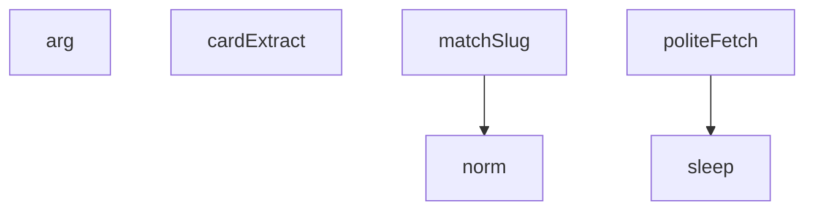

## Genel Bakış
Bu modül, web üzerinden veri çekme ve işleme amacıyla kullanılan bir betik (script) yapısındadır. Komut satırı argümanlarını çözümleyerek çalışır, HTTP isteklerini kibar (rate-limited) bir şekilde gerçekleştirir ve çekilen HTML içeriklerinden yapılandırılmış veri çıkarır. Hava yolu veya havacılık sektörüne ait verilerin toplanması ve eşleştirilmesi gibi bir kullanım alanına işaret eder.

## Fonksiyon Grupları

### Komut Satırı ve Zamanlama Yardımcıları
Betiğin çalıştırma ortamıyla etkileşimi sağlayan ve zamanlama kontrolü yapan temel yardımcı fonksiyonlardır.
- arg, sleep

### HTTP İstek Yönetimi
Web kaynaklarına erişimi sağlayan, istekleri kibar bir şekilde (muhtemelen gecikme ve yeniden deneme mantığıyla) gerçekleştiren fonksiyondur.
- politeFetch

### Veri Normalizasyonu ve Çıkarma
Ham HTML içeriklerinden anlamlı veri çıkaran ve metin normalizasyonu yapan fonksiyonlardır. `norm` muhtemelen `cardExtract` veya `matchSlug` tarafından ham veriyi standartlaştırmak için kullanılır.
- norm, cardExtract

### Eşleştirme ve Doğrulama
Çıkarılan veriler arasında isim ve SKU (stok kodu) gibi alanlar üzerinden eşleştirme yapan fonksiyondur.
- matchSlug

---

## AXIOMS – Mimari Varsayımlar
- Bu modül davranışsal mantık içermez (salt veri / konfigürasyon / tip tanımı).
- [Aksiyom 1]: Modülün dışa açtığı yapı (anahtar kümesi / şema) bir sözleşmedir; tüketiciler bu sabit yapıya bağlıdır — kırıcı değişiklik tüm tüketicileri etkiler.
- [Aksiyom 2]: Bir öğe ekleme/çıkarma yapısal-uyumlu olmalı; ilgili tipler ve seçiciler aynı commit'te güncel tutulmalıdır.

---

## FONKSİYON DETAYLARI

### arg
**Ne yapar**: Komut satırı argümanlarını işlemek için kullanılan bir fonksiyondur. Verilen `n` indeksine göre komut satırı argümanını döndürür veya işler.
**Nasıl yapar**: Fonksiyon gövdesi verilmemiştir, iç mantığı bilinmiyor.
**Parametreler**:
- n: bilinmiyor — Komut satırı argümanının indeks numarası
**Dönüş**: Bilinmiyor

### sleep
**Ne yapar**: Belirtilen milisaniye kadar asenkron olarak beklemeyi sağlayan yardımcı fonksiyondur. `politeFetch` fonksiyonu içinde istekler arasında gecikme sağlamak amacıyla kullanılır.
**Nasıl yapar**: Fonksiyon gövdesi verilmemiştir, iç mantığı bilinmiyor. Genellikle `setTimeout` ile `Promise` kullanılarak implemente edilir.
**Parametreler**:
- ms: bilinmiyor — Bekleme süresi (milisaniye cinsinden)
**Dönüş**: Bilinmiyor

### politeFetch
**Ne yapar**: Kibar (polite) bir HTTP isteği yapar; istekler arasında belirli bir gecikme süresi uygulayarak sunucuya aşırı yük bindirmeyi önler. Hata durumunda exception fırlatır.
**Nasıl yapar**: Fonksiyon, son istek zamanını (`last`) ve sabit gecikme süresini (`DELAY_MS`) kullanarak beklenmesi gereken süreyi hesaplar. Eğer süre pozitifse `sleep` fonksiyonu ile bekler. Ardından `fetch` API'sini kullanarak HTTP GET isteği gönderir ve `user-agent` header'ı (`UA`) ile birlikte ekstra header'ları da ekler. Yanıt başarılı değilse (`res.ok` false ise) HTTP durum kodu ve URL bilgisiyle birlikte bir `Error` fırlatır.
**Parametreler**:
- url: bilinmiyor — İstek yapılacak URL adresi
- extra: object (varsayılan: {}) — İsteğe ek header'lar veya diğer fetch seçenekleri
**Dönüş**: Response nesnesi (`res`) — Başarılı HTTP yanıtını temsil eden Response objesi

### norm
**Ne yapar**: Verilen metni normalize eden bir yardımcı fonksiyondur. `matchSlug` fonksiyonu içinde ürün adlarını karşılaştırmak amacıyla kullanılır.
**Nasıl yapar**: Fonksiyon gövdesi verilmemiştir, iç mantığı bilinmiyor. Çağrı örneğinde `[slug, title]` çiftinden `title` parametre olarak geçmektedir.
**Parametreler**:
- s: bilinmiyor — Normalize edilecek metin (ürün adı vb.)
**Dönüş**: Bilinmiyor

### cardExtract
**Ne yapar**: HTML içeriğinden kart (card) bilgilerini çıkaran bir fonksiyondur. Verilen HTML yapısından ürün veya içerik verilerini ayrıştırmak için kullanılır.
**Nasıl yapar**: Fonksiyon gövdesi verilmemiştir, iç mantığı bilinmiyor.
**Parametreler**:
- html: bilinmiyor — İçerik çıkarma işlemi yapılacak HTML metni
**Dönüş**: Bilinmiyor

### matchSlug
**Ne yapar**: Verilen ürün adı ve SKU bilgisine göre uygun slug eşleştirmesi yapar. Manuel olarak tanımlanmış eşleştirmeleri, birebir başlık eşleştirmelerini ve token tabanlı kısmi eşleştirmeleri kontrol eder.
**Nasıl yapar**: Fonksiyon üç aşamalı eşleme stratejisi uygular. İlk olarak `MANUAL` haritasında SKU'ya karşılık gelen manuel bir değer varsa onu döndürür. İkinci olarak ürün adını `norm` fonksiyonu ile normalize edip `byTitle` haritasında birebir eşleşme arar. Üçüncü aşamada normalize edilmiş adı token'lara ayırır (boşlukla bölüp 1 karakterden uzun olanları filtreler) ve `pool` koleksiyonundaki başlıklarla her token'ın alt küme olup olmadığını kontrol eder. Tek eşleşme varsa onu, birden fazla varsa `multi` dizisiyle birlikte, hiçbiri yoksa `null` döndürür.
**Parametreler**:
- name: bilinmiyor — Ürün adı
- sku: bilinmiyor — Ürün stok kodu (Stock Keeping Unit)
**Dönüş**: object veya null — Eşleşme bulunduysa `{ slug, how }` veya `{ multi }` objesi; bulunamadıysa `null`

---

## İTHALATLAR (IMPORTS)
- import: node:fs::fs
- import: node:path::path

---

## SABİTLER
- **dbKey** (call) — `arg('key')`
- **CATEGORIES** (array) — `[
  'siginak-havalandirma-fanlari', 'konut-tipi', 'ticari-tip',           //...`
- **pool** (new_expression) — `new Map()`
- **res** (await_expression) — `await fetch(`${dbUrl}/rest/v1/products?select=id,name,sku,tenant_id&brand=ili...`
- **rows** (await_expression) — `await res.json()`
- **tenants** (new_expression) — `new Set(rows.map(r => r.tenant_id))`
- **byTitle** (new_expression) — `new Map([...pool].map(([slug, title]) => [norm(title), slug]))`
- **MANUAL** (new_expression) — `new Map([
  ['AVE-13010', 'aluminyum-esanjorlu-isi-geri-kazanim-cihazlari-av...`
- **imageCache** (new_expression) — `new Map()`

---

## AST POINTERS

### [N1_NASIL] AST Pointer: scripts/media/avensair-avens-run.mjs::politeFetch
- **params**: `url` — istek yapılacak URL, `extra` — ek fetch seçenekleri (varsayılan `{}`)
- **ic_degiskenler**:
  - `wait` — `last + DELAY_MS - Date.now()` hesaplaması; milisaniye cinsinden ne kadar beklenmesi gerektiğini tutar
  - `res` — `fetch(url, { headers: { 'user-agent': UA, ...extra } })` sonucu; HTTP yanıt nesnesi
- **Dönüş**: `res` (Response nesnesi); hata durumunda `throw new Error(...)` ile fırlatır

### [N2_NASIL] AST Pointer: scripts/media/avensair-avens-run.mjs::norm
- **params**: `s` — normalize edilecek ham string
- **ic_degiskenler**:
  - (yok; zincirleme `.replace()` ve `.toUpperCase()` metotlarıyla doğrudan `s` üzerinde çalışır)
- **Dönüş**: string — Türkçe karakterlerin Latin karşılıklarına dönüştürülmüş, büyük harfe çevrilmiş, virgüllü ondalıklar noktaya çevrilmiş, alfanümerik olmayan karakterler temizlenmiş, fazla boşluklar sıkıştırılmış ve trimlenmiş sonuç

### [N3_NASIL] AST Pointer: scripts/media/avensair-avens-run.mjs::cardExtract
- **params**: `html` — taranacak HTML string
- **ic_degiskenler**:
  - `m` — `html.matchAll(/<a href="([a-z0-9-]+)" title="([^"]+)"/g)` iteratoründen gelen her eşleşme; `m[1]` slug, `m[2]` title
- **Dönüş**: yok; yan etki olarak `CATEGORIES` dizisinde bulunmayan slug'ları `pool` Map'ine (`m[1]` → `m[2]`) ekler

### [N4_NASIL] AST Pointer: scripts/media/avensair-avens-run.mjs::matchSlug
- **params**: `name` — eşleştirilecek ürün adı, `sku` — stok kodu
- **ic_degiskenler**:
  - `n` — `norm(name)` sonucu; normalize edilmiş ürün adı
  - `toks` — `n.split(' ').filter(t => t.length > 1)` sonucu; 1 karakterden uzun token dizisi
  - `cands` — `[...pool].filter(...)` sonucu; token altküme eşleşmesi sağlayan adaylar dizisi (her eleman `[slug, title]` çifti)
- **Dönüş**: `MANUAL` Map'inde `sku` varsa `{ slug, how: 'elle-olculmus' }`; `byTitle` Map'inde `n` varsa `{ slug, how: 'birebir' }`; `cands` uzunluğu 1 ise `{ slug, how: 'token-altkume (...)' }`; `cands` uzunluğu > 1 ise `{ multi: [...] }`; hiçbiri yoksa `null`

### [N5_NASIL] AST Pointer: scripts/media/avensair-avens-run.mjs::(filter callback)
- **params**: `[, title]` — destructuring ile gelen dizi; ilk eleman atlanır, ikinci eleman `title` olarak kullanılır
- **ic_degiskenler**:
  - `tn` — `` ` ${norm(title)} ` `` sonucu; normalize edilmiş başlığın önü ve arkası boşlukla çevrelenmiş hali
- **Dönüş**: boolean — `toks.every(t => tn.includes(` ${t} `))` sonucu; her token'ın `tn` içinde tam kelime olarak bulunup bulunmadığı

---

## MERMAID CALL GRAPH

## NODE ID STANDARD

  file: scripts\media\avensair-avens-run.mjs
  function: scripts\media\avensair-avens-run.mjs::arg
  function: scripts\media\avensair-avens-run.mjs::sleep
  function: scripts\media\avensair-avens-run.mjs::politeFetch
  function: scripts\media\avensair-avens-run.mjs::norm
  function: scripts\media\avensair-avens-run.mjs::cardExtract
  function: scripts\media\avensair-avens-run.mjs::matchSlug

---

## DISA AKTARILANLAR (EXPORTS)
  export: arg
  export: cardExtract
  export: matchSlug
  export: norm
  export: politeFetch
  export: sleep