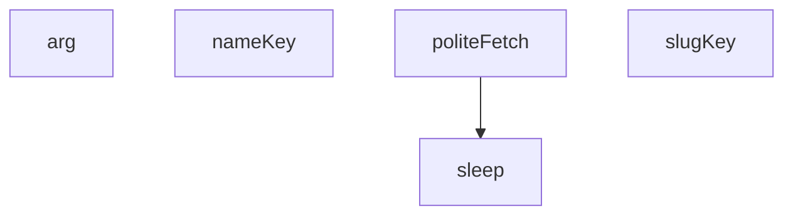

## Genel Bakış

Bu modül, Nicotra/Avensair ile ilişkili medya verilerinin çekilmesi ve işlenmesini sağlayan bir betik (script) dosyasıdır. Komut satırı argümanlarını çözümleyerek çalışır ve kibar (rate-limited) HTTP istekleriyle harici kaynaklardan veri çeker. Çekilen verilerin anahtarlanması ve dönüştürülmesi için yardımcı fonksiyonlar içerir.

## Fonksiyon Grupları

### Komut Satırı ve Zamanlama Yardımcıları
Kullanıcıdan gelen argümanları çözümlemek ve istekler arasında gecikme sağlamakla sorumludur.
- arg, sleep

### Veri Çekme
Harici URL'lere kibar (rate-limited) bir şekilde asenkron HTTP istekleri göndererek veri çekme işlemini gerçekleştirir. Muhtemelen `sleep` fonksiyonunu kullanarak istekler arasında bekleme yapar.
- politeFetch

### Anahtar/Dönüşüm Yardımcıları
Çekilen verilerin veya isimlerin uygun anahtar formatına dönüştürülmesinden sorumludur. `slugKey` bir metni URL-dostu slug formatına, `nameKey` ise bir ismi uygun anahtar formatına çevirir.
- slugKey, nameKey

## Bağımlılıklar

**İç Bağımlılıklar:**
- `politeFetch` fonksiyonunun `sleep` fonksiyonunu çağırarak istekler arasında gecikme uyguladığı beklenmektedir.

**Dış Bağımlılıklar:**
- Tarayıcı/Node.js `fetch` API'si (politeFetch tarafından kullanılır)
- Komut satırı argüman erişimi (`arg` fonksiyonu için)

**Mimari Not:**
Modül, `.mjs` uzantısıyla ES Module formatında yazılmıştır. Fonksiyon sayısı az ve odaklanmış bir sorumluluk alanına sahiptir; temel amacı harici medya verilerini çekmek ve işlemektir.

---

## AXIOMS – Mimari Varsayımlar

Bu modül için özel aksiyom tanımlanmamıştır.

**Gerekçe:** Fonksiyon gövdeleri verilmemiştir. Yalnızca imzalar ve sabit adları mevcuttur. Mimari varsayımlar yalnızca fonksiyon gövdelerinden üretilebilir; imza, sabit adı veya dosya adından davranış çıkarımı yapılmaz.

---

## FONKSİYON DETAYLARI

### arg
**Ne yapar**: Komut satırı argümanlarını işlemek için kullanılan bir fonksiyondur. Gövdesi verilmediğinden iç mantığı belirlenememektedir.
**Nasıl yapar**: Gövde verilmediğinden nasıl çalıştığı bilinmiyor.
**Parametreler**:
- n: bilinmiyor — fonksiyona aktarılan argüman değeri
**Dönüş**: Dönüş tipi verilmemiştir, bilinmiyor.

### sleep
**Ne yapar**: Belirtilen milisaniye kadar beklemeyi sağlayan asenkron bir fonksiyondur. `politeFetch` fonksiyonu içinde istekler arası gecikme sağlamak amacıyla kullanılır.
**Nasıl yapar**: Gövde verilmediğinden nasıl çalıştığı bilinmiyor. Ancak `politeFetch` içinde `await sleep(wait)` şeklinde çağrıldığı görülmektedir, bu da asenkron bir bekleme işlemi gerçekleştirdiğini gösterir.
**Parametreler**:
- ms: bilinmiyor — beklenilecek süre (milisaniye cinsinden)
**Dönüş**: Dönüş tipi verilmemiştir, bilinmiyor.

### politeFetch
**Ne yapar**: Kibar (nezaket kurallarına uygun) bir HTTP isteği gerçekleştiren asenkron fonksiyondur. İstekler arasında belirli bir gecikme süresi uygulayarak sunucuya aşırı yük bindirilmesini önler ve özel bir User-Agent başlığı ekler.
**Nasıl yapar**: Fonksiyon önce `last` değişkeni ile `DELAY_MS` sabitini kullanarak hesaplanan bekleme süresini kontrol eder. Eğer pozitif bir bekleme süresi varsa `sleep` fonksiyonu ile bekler. Ardından `last` zaman damgasını günceller ve `fetch` API'si ile belirtilen URL'ye istek gönderir. İstek başarısız olursa (HTTP durum kodu 200 dışında) hata fırlatır; başarılı olursa yanıt nesnesini döndürür.
**Parametreler**:
- url: bilinmiyor — HTTP isteğinin gönderileceği URL adresi
**Dönüş**: `res` — fetch API'sinin döndürdüğü Response nesnesi

### slugKey
**Ne yapar**: Verilen bir string değerini URL-dostu bir slug formatına dönüştüren bir fonksiyondur. Gövde verilmediğinden dönüş tipi belirlenememektedir.
**Nasıl yapar**: Gövde verilmediğinden nasıl çalıştığı bilinmiyor. Ancak kullanım örneğinde `s => [slugKey(s), s]` şeklinde bir lambda içinde çağrıldığı görülmektedir; bu da fonksiyonun bir string alıp başka bir string döndürdüğünü düşündürmektedir.
**Parametreler**:
- s: bilinmiyor — slug formatına dönüştürülecek string değer
**Dönüş**: Dönüş tipi verilmemiştir, bilinmiyor.

### nameKey
**Ne yapar**: Verilen bir isim değerini bir anahtar formatına dönüştüren bir fonksiyondur. Gövde verilmediğinden dönüş tipi belirlenememektedir.
**Nasıl yapar**: Gövde verilmediğinden nasıl çalıştığı bilinmiyor.
**Parametreler**:
- n: bilinmiyor — anahtar formatına dönüştürülecek isim değeri
**Dönüş**: Dönüş tipi verilmemiştir, bilinmiyor.

---

## İTHALATLAR (IMPORTS)
- import: node:fs::fs
- import: node:path::path

---

## SABİTLER
- **dbKey** (call) — `arg('key')`
- **DISCOVERY** (array) — `[
  `${BASE}/nicotra-gebhardt-fanlar`,
  `${BASE}/search?q=ADH`, `${BASE}/s...`
- **slugs** (new_expression) — `new Set()`
- **res** (await_expression) — `await fetch(`${dbUrl}/rest/v1/products?select=id,name,sku,tenant_id&brand=ili...`
- **rows** (await_expression) — `await res.json()`
- **tenants** (new_expression) — `new Set(rows.map(r => r.tenant_id))`
- **bySlugKey** (new_expression) — `new Map([...slugs].map(s => [slugKey(s), s]))`
- **imageCache** (new_expression) — `new Map()`

---

## AST POINTERS

### [N1_NASIL] AST Pointer: media/avensair-nicotra-run.mjs::politeFetch
- **params**: `url`
- **ic_degiskenler**:
  - `wait` — `last + DELAY_MS - Date.now()` hesaplamasıyla elde edilen bekleme süresi (milisaniye); pozitifse `sleep` ile beklenir
  - `res` — `fetch(url, ...)` çağrısının döndürdüğü Response nesnesi; `user-agent` başlığı `UA` sabitiyle ayarlanır
- **Dönüş**: `res` (fetch Response nesnesi); `res.ok` false ise hata fırlatılır

### [N2_NASIL] AST Pointer: media/avensair-nicotra-run.mjs::slugKey
- **params**: `s`
- **ic_degiskenler**: yok (yalnızca zincirleme `replace` çağrıları)
- **Dönüş**: string — `s` parametresinden `nicotra-gebhardt-` öneki, `-cift-emisli-radyal-fan` soneki ve `-direkt-akuple-motorlu-fan-[a-z0-9]+` soneki kaldırılır

### [N3_NASIL] AST Pointer: media/avensair-nicotra-run.mjs::nameKey
- **params**: `n`
- **ic_degiskenler**: yok (yalnızca zincirleme `replace` ve `toLowerCase` çağrıları)
- **Dönüş**: string — `n` parametresinden DD sipariş kodu (`\s*-\s*[A-Z0-9]{6}\s*$`) ve `*` karakterleri kaldırılır; küçük harfe çevrilir; alfanümerik olmayan karakterler tire ile değiştirilir; baştaki/sondaki tireler temizlenir

---

## MERMAID CALL GRAPH

## NODE ID STANDARD

  file: scripts\media\avensair-nicotra-run.mjs
  function: scripts\media\avensair-nicotra-run.mjs::arg
  function: scripts\media\avensair-nicotra-run.mjs::sleep
  function: scripts\media\avensair-nicotra-run.mjs::politeFetch
  function: scripts\media\avensair-nicotra-run.mjs::slugKey
  function: scripts\media\avensair-nicotra-run.mjs::nameKey

---

## DISA AKTARILANLAR (EXPORTS)
  export: arg
  export: nameKey
  export: politeFetch
  export: sleep
  export: slugKey