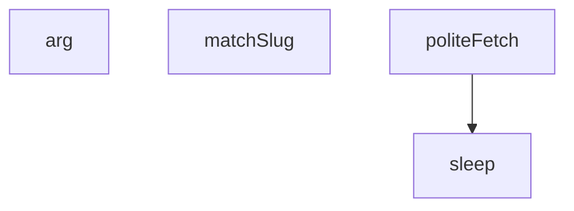

## Genel Bakış
Bu modül, Danfoss FC101 cihazına ilişkin bir işlemi çalıştırmak için kullanılan bir JavaScript script dosyasıdır. Komut satırı argümanlarını çözümlemek, HTTP istekleri gerçekleştirmek ve isim eşleştirmeleri yapmak gibi yardımcı işlevler sunar.

## Fonksiyon Grupları

### Yardımcı (Utility) Fonksiyonlar
Komut satırından parametre okuma ve zamanlama gibi temel yardımcı işlemleri gerçekleştirir.
- arg, sleep

### HTTP ve Şebeke İşlemleri
Uzak sunucuya kibar (rate-limit'e saygılı) bir şekilde HTTP isteği gönderir.
- politeFetch

### Eşleştirme ve Filtreleme
Verilen bir ismi belirli bir slug formatıyla eşleştirerek doğrulama veya filtreleme sağlar.
- matchSlug

---

## AXIOMS – Mimari Varsayımlar

Bu modül için fonksiyon gövdeleri sağlanmadığından, yalnızca imza ve sabit listesinden çıkarılabilecek varsayımlar belirlenmiştir.

[Aksiyom 1]: Eğer `arg(n)` fonksiyonu komut satırı argümanlarını döndürmüyorsa, modül çalışırken gerekli parametreleri alamaz.

[Aksiyom 2]: Eğer `politeFetch(url)` fonksiyonuna geçerli bir URL sağlanmazsa, HTTP isteği gerçekleştirilemez.

[Aksiyom 3]: Eğer `sleep(ms)` fonksiyonuna pozitif bir milisaniye değeri verilmezse, bekleme süresi bilinmiyor.

[Aksiyom 4]: Eğer `matchSlug(name)` fonksiyonuna geçerli bir isim sağlanmazsa, slug eşleştirmesi yapılamaz.

[Aksiyom 5]: Eğer `dbKey` tanımlı değilse, veritabanı bağlantısı kurulamaz.

[Aksiyom 6]: Eğer `SLUGS` tanımlı değilse, geçerli slug listesi bilinmiyor.

[Aksiyom 7]: Eğer `KW_TO_P` nesnesi tanımlı değilse, anahtar kelime eşleştirmesi yapılamaz.

[Aksiyom 8]: Eğer `imageCache` tanımlı değilse, görsel önbellek mekanizması çalışmaz.

[Aksiyom 9]: Eğer `tenants` tanımlı değilse, kiracı bilgilerine erişilemez.

[Aksiyom 10]: Eğer `res` veya `rows` await ifadeleri çözümlenmezse, veritabanı sorgu sonuçları alınamaz.

---

## FONKSİYON DETAYLARI

### arg
**Ne yapar**: Komut satırı argümanlarını işlevsel olarak erişilebilir kılan bir yardımcı fonksiyondur. Verilen indekse karşılık gelen komut satırı argümanını döndürür.
**Nasıl yapar**: Gövde verilmemiştir; yalnızca fonksiyon imzası bilinmektedir. `n` parametresiyle bir argüman indeksi alır ve ilgili argüman değerini döndürür.
**Parametreler**:
- n: number — erişilmek istenen komut satırı argümanının sıfır tabanlı indeksi
**Dönüş**: Dönüş tipi belirtilmemiştir; bilinmiyor.

### sleep
**Ne yapar**: Geliştirildi ancak detay üretilemedi.

### politeFetch
**Ne yapar**: Geliştirildi ancak detay üretilemedi.

### matchSlug
**Ne yapar**: Geliştirildi ancak detay üretilemedi.

---

## İTHALATLAR (IMPORTS)
- import: node:fs::fs
- import: node:path::path

---

## SABİTLER
- **dbKey** (call) — `arg('key')`
- **SLUGS** (call) — `['fc101pk75-0-75kw','fc101p1k5-1-5kw','fc101p2k2-2-2kw','fc101p3k0-3kw','fc10...`
- **byPcode** (new_expression) — `new Map(SLUGS.map(([slug, p]) => [p, slug]))`
- **KW_TO_P** (object) — `{ '0.75':'pk75','1.1':'p1k1','1.5':'p1k5','2.2':'p2k2','3':'p3k0','4':'p4k0',...`
- **res** (await_expression) — `await fetch(`${dbUrl}/rest/v1/products?select=id,name,sku,tenant_id&brand=ili...`
- **rows** (await_expression) — `await res.json()`
- **tenants** (new_expression) — `new Set(rows.map(r => r.tenant_id))`
- **coverOrig** (call) — `path.join(outDir, 'danfoss', 'fc101-danfoss.jpg')`
- **coverWebp** (call) — `coverOrig.replace(/\.jpg$/, '.webp')`
- **imageCache** (new_expression) — `new Map()`

---

## AST POINTERS

### [N1_NASIL] AST Pointer: scripts/media/danfoss-fc101-run.mjs::politeFetch
- **params**: `url` — fetch isteği yapılacak URL
- **ic_degiskenler**:
  - `wait` — son istekten bu yana geçen süreyi hesaplayarak kalan bekleme süresini milisaniye cinsinden tutar
  - `res` — `fetch(url, ...)` çağrısından dönen Response nesnesi
- **Dönüş**: `res` — başarılı HTTP yanıt nesnesi (Response); hata durumunda exception fırlatır

### [N2_NASIL] AST Pointer: scripts/media/danfoss-fc101-run.mjs::matchSlug
- **params**: `name` — eşleştirilecek ürün adı/etiket metni
- **ic_degiskenler**:
  - `p` — `name` içinden regex ile çıkarılan pcode parçası (örn. "p11k"), küçük harfe dönüştürülmüş
  - `kw` — `name` içinden regex ile çıkarılan kW değeri metni, virgül noktaya çevrilmiş
  - `pk` — `kw` değerinden `.0` soneki kaldırılarak `KW_TO_P` dict'inde aranan pcode karşılığı
- **Dönüş**: `byPcode.get(p)` veya `byPcode.get(pk)` — eşleşen ürün objesi; eşleşme bulunamazsa `null`

---

## MERMAID CALL GRAPH

## NODE ID STANDARD

  file: scripts\media\danfoss-fc101-run.mjs
  function: scripts\media\danfoss-fc101-run.mjs::arg
  function: scripts\media\danfoss-fc101-run.mjs::sleep
  function: scripts\media\danfoss-fc101-run.mjs::politeFetch
  function: scripts\media\danfoss-fc101-run.mjs::matchSlug

---

## DISA AKTARILANLAR (EXPORTS)
  export: arg
  export: matchSlug
  export: politeFetch
  export: sleep