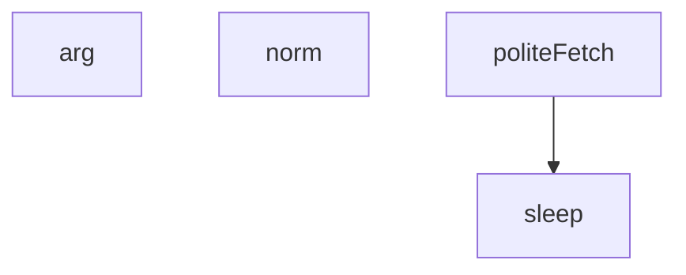

## Genel Bakış

Bu modül, koltuk görseli ile ilgili bir işlemi çalıştırmak için kullanılan bir betik dosyasıdır. Komut satırı argümanlarını çözümleme, metin normalizasyonu, bekleme ve nazik HTTP istekleri gibi temel yardımcı işlevler sağlar. Modül, dış kaynaklara saygılı (rate-limit uyumlu) istek gönderme altyapısı sunar.

## Fonksiyon Grupları

### Komut Satırı ve Metin İşleme
Kullanıcıdan gelen girdileri çözümlemek ve standart bir forma dönüştürmekle sorumludur.
- arg, norm

### Zamanlama ve Ağ İletişimi
Belirtilen süre boyunca beklemeyi ve harici URL'lere nazik (rate-limit bilinçli) HTTP istekleri göndermeyi sağlar.
- sleep, politeFetch

---

## AXIOMS – Mimari Varsayımlar

Bu modül için özel aksiyom tanımlanmamıştır.

**Gerekçe:** Fonksiyon gövdeleri sağlanmadığından, modülün doğru çalışması için gerekli koşullar belirlenememektedir. Yalnızca fonksiyon imzaları ve sabit adları mevcut olup, kurallar gereği bunlardan davranışsal çıkarım yapılmaz.

---

## FONKSİYON DETAYLARI

### arg
**Ne yapar**: Komut satırı argümanlarını işlemek için kullanılan bir fonksiyondur. Parametre olarak bir sayısal indeks alır ve bu indekse karşılık gelen komut satırı argümanını döndürür.

**Nasıl yapar**: Fonksiyonun gövdesi verilmemiştir. Yalnızca fonksiyon tanımı ve parametre bilgisi mevcuttur. İşlevsel detaylar kaynakta belirtilmemiştir.

**Parametreler**:
- n: number — Komut satırı argümanlarının erişileceği sayısal indeks değeri

**Dönüş**: Dönüş tipi belirtilmemiştir. Bilinmiyor.

### norm
**Ne yapar**: Geliştirildi ancak detay üretilemedi.

### sleep
**Ne yapar**: Geliştirildi ancak detay üretilemedi.

### politeFetch
**Ne yapar**: Geliştirildi ancak detay üretilemedi.

---

## İTHALATLAR (IMPORTS)
- import: node:fs::fs
- import: node:path::path

---

## SABİTLER
- **dbKey** (call) — `arg('key')`
- **shop** (call) — `await (await politeFetch('https://seat-ventilation.fr/products.json?limit=250...`
- **byTitle** (new_expression) — `new Map(shop.products.map(p => [norm(p.title), p]))`
- **res** (await_expression) — `await fetch(`${dbUrl}/rest/v1/products?select=id,name,sku,tenant_id&brand=eq....`
- **rows** (await_expression) — `await res.json()`
- **tenants** (new_expression) — `new Set(rows.map(r => r.tenant_id))`
- **imageCache** (new_expression) — `new Map()`

---

## AST POINTERS

### [N1_NASIL] AST Pointer: scripts/media/seat-image-run.mjs::politeFetch
- **params**: `url` — fetch isteği yapılacak hedef URL
- **ic_degiskenler**:
  - `wait` — `last + DELAY_MS - Date.now()` ifadesinden hesaplanan kalan bekleme süresi (milisaniye); pozitifse o kadar süre uyur, sıfır veya negatifse bekleme yapmaz
  - `res` — `fetch(url, { headers: { 'user-agent': UA } })` çağrısından dönen Response nesnesi; `res.ok` değeri false ise `${res.status} ${url}` mesajıyla Error fırlatır
- **Dışarıdan erişilen kapsam**:
  - `last` — bir önceki isteğin zaman damgası (Date.now()); fonksiyon içinde güncellenir (`last = Date.now()`)
  - `DELAY_MS` — iki istek arasında geçmesi gereken minimum süre (milisaniye)
  - `UA` — HTTP isteğinde `user-agent` başlığı olarak gönderilen sabit string
  - `sleep(ms)` — verilen milisaniye kadar bekleyen async fonksiyon
  - `fetch` — Node.js global fetch API'si
- **Dönüş**: `res` (Response nesnesi); hata durumunda throw ile Error fırlatır, başarılıysa Response döner

---

## MERMAID CALL GRAPH

## NODE ID STANDARD

  file: scripts\media\seat-image-run.mjs
  function: scripts\media\seat-image-run.mjs::arg
  function: scripts\media\seat-image-run.mjs::norm
  function: scripts\media\seat-image-run.mjs::sleep
  function: scripts\media\seat-image-run.mjs::politeFetch

---

## DISA AKTARILANLAR (EXPORTS)
  export: arg
  export: norm
  export: politeFetch
  export: sleep