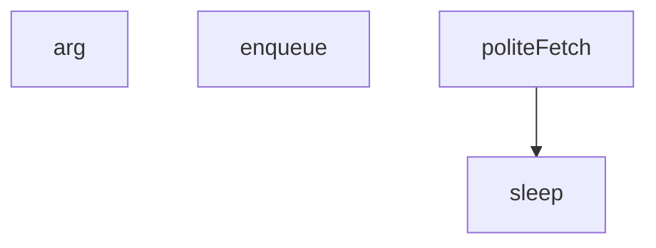

## Genel Bakış

Bu modül, web tarama (crawl) haritalama işlemleri için temel yardımcı fonksiyonlar sunar. Komut satırı argümanlarını okuma, kuyruk tabanlı işlem sıralama ve rate limiting'e uygun kibar HTTP istekleri yapma gibi altyapısal görevleri üstlenir.

## Fonksiyon Grupları

### Yapılandırma ve Argüman Yönetimi
Komut satırından parametre okuyarak modülün davranışını yapılandırmaya olanak tanır.
- arg

### Zamanlama ve Ağ İstekleri
Web isteklerini gerçekleştirirken sunucuya aşırı yük bindirmemek için gecikme mekanizması sağlar ve kibar (rate-limited) HTTP istekleri yapar.
- sleep, politeFetch

### Kuyruk Yönetimi
İşlenecek öğeleri bir kuyruğa ekleyerek sıralı ve kontrollü işlem yapılmasını sağlar.
- enqueue

---

## AXIOMS – Mimari Varsayımlar
- Bu modül davranışsal mantık içermez (salt veri / konfigürasyon / tip tanımı).
- [Aksiyom 1]: Modülün dışa açtığı yapı (anahtar kümesi / şema) bir sözleşmedir; tüketiciler bu sabit yapıya bağlıdır — kırıcı değişiklik tüm tüketicileri etkiler.
- [Aksiyom 2]: Bir öğe ekleme/çıkarma yapısal-uyumlu olmalı; ilgili tipler ve seçiciler aynı commit'te güncel tutulmalıdır.

---

## FONKSİYON DETAYLARI

### arg
**Ne yapar**: Komut satırı argümanlarını okumak için yardımcı fonksiyondur. Belirtilen isimdeki `--` önekli argümanın değerini döndürür; argüman bulunamazsa sağlanan varsayılan değeri kullanır.

**Nasıl yapar**: `process.argv` dizisi içinde `--name` formatında arama yapar. `indexOf` ile argümanın indeksini bulur. Eğer indeks -1'den büyükse (argüman bulunduysa), bir sonraki elemanı (değeri) döndürür; aksi takdirde `fallback` parametresini döndürür.

**Parametreler**:
- name: string — Aranacak argüman adı. Arama `--` önekiyle birlikte `--name` formatında yapılır.
- fallback: bilinmiyor — Argüman bulunamadığında kullanılacak varsayılan değer. Tipi kaynakta belirtilmemiştir.

**Dönüş**: `process.argv[i + 1]` (argüman bulunduysa) veya `fallback` (bulunamadıysa). Kesin dönüş tipi kaynakta belirtilmemiştir.

### sleep
**Ne yapar**: Geliştirildi ancak detay üretilemedi.

### politeFetch
**Ne yapar**: Geliştirildi ancak detay üretilemedi.

### enqueue
**Ne yapar**: Geliştirildi ancak detay üretilemedi.

---

## İTHALATLAR (IMPORTS)
- import: node:fs::fs
- import: node:path::path

---

## SABİTLER
- **codesPath** (call) — `arg('codes')`
- **outDir** (call) — `arg('out')`
- **maxPages** (call) — `Number(arg('max-pages', '400'))`
- **wanted** (new_expression) — `new Set(fs.readFileSync(codesPath, 'utf8').split(/\r?\n/).map(s => s.trim())....`
- **SKIP** (regex) — `/(cookie|privacy|login|register|newsletter|unsubscribe|contact|catalogues|aft...`
- **queued** (new_expression) — `new Set()`
- **missing** (call) — `[...wanted].filter(c => !found[c]).sort()`
- **outPath** (call) — `path.join(outDir, 'vortice-url-map.json')`

---

## AST POINTERS

### [N1_NASIL] AST Pointer: media/vortice-crawl-map.mjs::arg
- **params**: name, fallback
- **ic_degiskenler**:
  - `i` — process.argv dizisinde `` `--${name}` `` parametresinin indeksini tutar; -1 ise parametre bulunamamıştır
- **Dönüş**: process.argv[i + 1] (i > -1 ise) veya fallback

### [N2_NASIL] AST Pointer: media/vortice-crawl-map.mjs::politeFetch
- **params**: url
- **ic_degiskenler**:
  - `wait` — son istek zamanı (`last`) ile tanımlı gecikme süresi (`DELAY_MS`) toplamından şu anki zaman çıkarılarak hesaplanan bekleme süresi (milisaniye); pozitifse uyku uygulanır
  - `res` — `fetch` çağrısının döndürdüğü HTTP yanıt nesnesi; `res.ok` false ise hata fırlatılır
- **Dönüş**: res.text() — yanıt gövdesinin metin hali
- **Erişilen global/üste seviye**: `last` (son istek zamanı), `DELAY_MS` (bekleme süresi), `UA` (user-agent başlığı), `sleep` fonksiyonu

### [N3_NASIL] AST Pointer: media/vortice-crawl-map.mjs::enqueue
- **params**: p
- **ic_degiskenler**:
  - `depth` — `p` yolunun `/` ile bölünmesi ve boş olmayan parçaların sayılmasıyla elde edilen derinlik değeri; 2 ile 5 arasında değilse fonksiyondan çıkılır
- **Dönüş**: yok
- **Erişilen global/üste seviye**: `queued` (Set — daha önce eklenmiş yolları takip eder), `SKIP` (RegExp — atlanacak desenler), `queue` (dizi — kuyruğa alınan yollar)

---

## MERMAID CALL GRAPH

## NODE ID STANDARD

  file: scripts\media\vortice-crawl-map.mjs
  function: scripts\media\vortice-crawl-map.mjs::arg
  function: scripts\media\vortice-crawl-map.mjs::sleep
  function: scripts\media\vortice-crawl-map.mjs::politeFetch
  function: scripts\media\vortice-crawl-map.mjs::enqueue

---

## DISA AKTARILANLAR (EXPORTS)
  export: arg
  export: enqueue
  export: politeFetch
  export: sleep