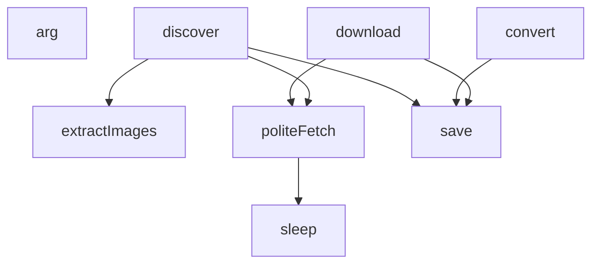

## Genel Bakış
Vortice Image Pilot modülü, bir web sitesindeki görselleri otomatik olarak keşfeden, indiren ve belirli bir biçime dönüştüren bir medya işleme hattıdır. Modül, parametreleri ve gecikme mantığını yönetmekten, ağ isteklerini yapmaya, görselleri ayrıştırıp indirmeye ve son olarak istenen formatlara dönüştürüp kaydetmeye kadar tüm süreci orkestra eder. Esnek bir yapıya sahip olup, yavaş yüklenen modüllere ve dosya sistemine bağımlılıkları dinamik olarak yönetebilir.

## Fonksiyon Grupları
### Temel Araçlar ve Yardımcılar
Bu grup, modülün tüm aşamalarında kullanılan temel yardımcı fonksiyonları ve barleycached değik_arg olarak_rocess argüman yönetimini barındırır.
- arg, sleep

### Ağ ve Veri Çıkarma
Bu grup, dış dünyayla (internet) etkileşime girerek veri çekme ve ham HTML içinden bilgiyi ayıklama sorumluluğunu taşır. İsteği yaparken sunucuya karşı saygılı bir zamanlama stratejisi uygular.
- politeFetch, extractImages

### Akış Kontrolcüleri (Orkestratörler)
Bu grup, görsel yönetimi iş akışının ana aşamalarını sırasıyla tetikleyip yöneten üst düzey operasyonları kapsar. Keşif, indirme ve dönüştürme adımlarını bağımsız ama birbiriyle bağlantılı görevler olarak orkestra eder.
- discover, download, convert

### Kalıcılık ve Durum Yönetimi
Bu grup, işlenen görsellerin geçmişinin veya durumunun yerel olarak kaydedilerek modülün tekrarlanabilirliğini ve izlenebilirliğini sağlar.
- save

---

## AXIOMS – Mimari Varsayımlar

Bu modül, bir görsel keşfetme-indirme-dönütüme (discover → download → convert) hattını yöneten bir pipeline'dır. Aşağıdaki mimari varsayımlar fonksiyon imzaları ve modül sabitlerinden türetilmiştir.

---

**[Aksiyom 1 – Dış Kaynak Erişimi]:** Eğer `politeFetch(url)` fonksiyonu varsa, hedef web sunucularının rate-limit (istek kısıtlaması) uyguladığı ve her istek arasında bekleme süresi (`sleep(ms)`) gerektiği varsayılır. Aksi takdirde sunucu tarafında engellenme (429/403) oluşur.

**[Aksiyom 2 – Model-Bağımlı HTML Yapısı]:** Eğer `extractImages(html, modelCode)` fonksiyonu `modelCode` parametresi alıyorsa, farklı cihaz modellerine ait HTML sayfalarının görselleri çıkarma mantığının farklı olduğu varsayılır. Yanlış veya eksik `modelCode` verilirse, görseller yanlış çıkarılır veya hiç çıkarmaz.

**[Aksiyom 3 – Kalıcı Durum Gerekliliği]:** Eğer `state` bir ternary ifade ile (koşullu olarak) oluşturuluyorsa ve `save()` fonksiyonu mevcutsa, modülün birden fazla çalıştırma arasında durumunu (hangi aşamada kaldığını, hangi görsellerin işlendiğini) disk üzerinde tutması gerektiği varsayılır. `statePath` dosyası yazılabilir bir konumda değilse, `save()` başarısız olur.

**[Aksiyom 4 – Sıralı Pipeline Bileşenleri]:** Eğer modülde `discover()`, `download()` ve `convert()` fonksiyonları sıralı olarak mevcutsa, her bir aşamanın bir öncekinin çıktısına bağımlı olduğu varsayılır. `discover()` çalışmadan `download()`, `download()` çalışmadan `convert()` anlamlı sonuç üretmez.

**[Aksiyom 5 – Yapılandırma Kaynağı]:** Eğer `arg(name, fallback)` fonksiyonu mevcutsa, modülün çalışma zamanı yapılandırmasının (hedef URL, model kodu, dizin yolları vb.) komut satırı argümanları veya ortam değişkenleri üzerinden sağlandığı, sağlanmadığında `fallback` değerinin devreye girdiği varsayılır. Hiçbir kaynaktan sağlanamayan ve fallback'i olmayan zorunlu bir argüman kullanılması durumunda hata oluşur.

**[Aksiyom 6 – Çıktı Dizini Hazırlığı]:** Eğer `outDir` hesaplanan bir değer (call) olarak tanımlıysa, bu dizinin `download()` ve `convert()` aşamalarında yazma iznine sahip olduğu varsayılır. Dizin mevcut değilse veya yazma izni yoksa, dosya kaydetme işlemleri başarısız olur.

**[Aksiyom 7 – Manifest Erişilebilirliği]:** Eğer `manifestPath` hesaplanan bir değer olarak tanımlıysa, manifest dosyasının `discover()` aşamasında okunabilir konumda olduğu varsayılır. Dosya mevcut değilse, `discover()` aşaması hedeflerini belirleyemez.

**[Aksiyom 8 – Durum Dosyası Koşullu Varlık]:** `state`'in ternary ifade ile oluşturulması, `statePath`'teki dosyanın her zaman mevcut olmayabileceğini; ilk çalıştırmada dosyanın olmadığı ve varsayılan (boş/başlangıç) bir durumla başlanması gerektiğini varsayılır.

---

## FONKSİYON DETAYLARI

### arg
**Ne yapar**: Komut satırı argümanlarını parses ederek belirli bir seçeneğin değerini döndürür.
**Nasıl yapar**: `process.argv` dizisinde `--{name}` Kalıbını arar. Seçenek bulunursa, hemen ardından gelen elemanı (seçeneğin değerini) döndürür; bulunamazsa verilen `fallback` değerini döndürür.
**Parametreler**:
- name: string — Aranacak komut satırı seçeneğinin adı (örn: "output" ise `--output` aranır).
- fallback: any — Seçenek bulunamadığında döndürülecek varsayılan değer.
**Dönüş**: string | any — Bulunan seçenek değeri veya `fallback`.

### sleep
**Ne yapar**: Verilen milisaniye kadar asenkron olarak bekleme sağlar.
**Nasıl yapar**: Fonksiyonun gövdesi kod kümesinde doğrudan tanımlı değildir; ancak `politeFetch` fonksiyonu içinde `await sleep(wait)` şeklinde çağrılır. Bu, bir `Promise` döndüren ve belirtilen süre sonunda çözümlenen bir bekleme fonksiyonu olduğunu gösterir. Genellikle `setTimeout`'ı sarmalayan bir `Promise` tabanlı uygulama ile gerçekleştirilir.
**Parametreler**:
- ms: number — Beklenecek süre (milisaniye cinsinden).
**Dönüş**: Promise<void> — Belirtilen süre sonunda çözümlenen bir Promise.

### politeFetch
**Ne yapar**: Belirli bir HTTP istek hız sınırına uyarak (nazikçe) belirli bir URL'ye GET isteği gönderir.
**Nasıl yapar**: Her istek arasında sabit bir gecikme (`DELAY_MS`) olmasını sağlamak için son istek zamanını (`lastRequestAt`) takip eder. İstenen süreyi hesaplar ve gerekirse `sleep` ile bekler. Ardından `fetch` fonksiyonunu, tanımlanmış bir `user-agent` header'ı ile çağırır. Yanıt başarılı değilse (HTTP durum kodu 2xx aralığında değilse) bir hata fırlatır.
**Parametreler**:
- url: string | URL — İstek gönderilecek hedef URL.
**Dönüş**: Promise<Response> — Başarılı ise `fetch` Response nesnesi, değilse bir Error fırlatır.

### extractImages
**Ne yapar**: Verilen HTML metni içindeki, belirli bir ürüne ait medya görsellerinin URL'lerini çıkarır ve kategorilere göre sınıflandırarak sıralı bir liste oluşturur.
**Nasıl yapar**: Bir düzenli ifade (regex) ile HTML'deki `.png`, `.jpg`, `.jpeg` uzantılı görsel URL'lerini tarar. URL'leri normalize eder (ters bölüleri düzeltir, göreli ise mutlak yapar). Yalnızca dosya adında `_{modelCode}_` kalıbını içeren URL'leri kabul eder (ürün görselleri için). Benzersiz URL'leri bir `Set` kullanarak filtreler. Her URL'yi `ambiente`, `Foto_WEB`, `Foto_Pubblicita` gibi anahtar kelimelere göre `gallery`, `environment`, `technical` veya `other` kategorisine atar. `other` kategorisindeki görselleri (logo/banner riski nedeniyle) filtreler. Son olarak kategori sırasına (`gallery` > `environment` > `technical`) ve ardından alfabetik sıraya göre sıralanmış, `{url, kind}` nesnelerinden oluşan bir dizi döndürür.
**Parametreler**:
- html: string — Görsellerin aranacağı ham HTML içeriği.
- modelCode: string — Ürün model kodu; yalnızca bu kodu içeren görseller dahil edilir.
**Dönüş**: Array<{url: string, kind: string}> — Sıralı görsel nesneleri dizisi. Her nesne bir `url` ve bir `kind` (kategori) içerir.

### save
**Ne yapar**: Uygulamanın güncel durum (`state`) nesnesini bir JSON dosyasına senkron olarak kaydeder.
**Nasıl yapar**: Öncelikle `outDir` dizisinin var olduğundan emin olur (`recursive: true` ile oluşturur). Ardından `state` nesnesini formatlanmış (2 boşluk girintili) JSON olarak `statePath` dosyasına yazar.
**Parametreler**: Parametre almaz.
**Dönüş**: void — Dosyaya yazar, değer döndürmez.

### discover
**Ne yapar**: Tanımlı ürün listesindeki (`pilot.pilots`) her bir ürün için web sayfasını ziyaret ederek ilgili görselleri keşfeder ve uygulama durumunu (`state`) günceller.
**Nasıl yapar**: Her pilot ürünü için `politeFetch` ile sayfa HTML'ini indirir. `extractImages` fonksiyonunu kullanarak ürünün görsellerini bulur. Görsel bulunamazsa bir hata fırlatır. Bulunan görselleri, sıralama numarası, kategori, kaynak URL ve alternatif metin (`alt`) bilgileriyle birlikte `state.products` nesnesine ekler. İşlem bitince `save()` çağırarak durumu kaydeder.
**Parametreler**: Parametre almaz.
**Dönüş**: Promise<void> — Asenkron işlemleri başlatır, değer döndürmez.

### download
**Ne yapar**: Durumda (`state.products`) kayıtlı her ürünün keşfedilen görsellerini sunucudan indirerek yerel dosya sistemine kaydeder.
**Nasıl yapar**: Her ürün için `outDir/{code}/original` dizinini oluşturur. Her görsel için, eğer dosya daha önce indirilmiş ve boş değilse atlar. Aksi halde `politeFetch` ile görseli `ArrayBuffer` olarak indirir, `Buffer`'a çevirir ve `.png`/`.jpg` gibi orijinal uzantısıyla `{sıra_numarası}.{ext}` dosya adıyla kaydeder. İndirme başarılı olursa dosya boyutunu ve yolunu görsel nesnesine ekler; hata olursa hata mesajını kaydeder ve konsola yazdırır. Her görsel işlendikten sonra `save()` çağırarak durumu günceller.
**Parametreler**: Parametre almaz.
**Dönüş**: Promise<void> — Asenkron işlemleri başlatır, değer döndürmez.

### convert
**Ne yapar**: İndirilmiş orijinal görselleri, web için optimize edilmiş WebP formatına dönüştürür.
**Nasıl yapar**: `sharp` kütüphanesini dinamik olarak import eder. Her ürün için `outDir/{code}/webp` dizinini oluşturur. Her görsel için, eğer orijinal dosya mevcutsa `sharp` ile işler: genişliği en fazla 1600px olacak şekilde yeniden boyutlandırır (büyütme yapmaz), kalitesi 82 olan WebP formatına dönüştürür. Oluşturulan `.webp` dosyasını kaydeder ve görsel nesnesine dosya yolu, byte boyutu ve potansiyel bir depolama yolunu (`storage_path`) ekler. Orijinal dosya eksikse (indirilememişse) o görseli atlar. Her dönüşüm sonrası `save()` çağırır.
**Parametreler**: Parametre almaz.
**Dönüş**: Promise<void> — Asenkron işlemleri başlatır, değer döndürmez.

---

## İTHALATLAR (IMPORTS)
- import: node:fs::fs
- import: node:path::path

---

## SABİTLER
- **manifestPath** (call) — `arg('manifest')`
- **outDir** (call) — `arg('out')`
- **stage** (call) — `arg('stage', 'all')`
- **pilot** (call) — `JSON.parse(fs.readFileSync(manifestPath, 'utf8'))`
- **statePath** (call) — `path.join(outDir, 't139-manifest.json')`
- **state** (ternary_expression) — `fs.existsSync(statePath)
  ? JSON.parse(fs.readFileSync(statePath, 'utf8'))
 ...`

---

## AST POINTERS

### [N1_NASIL] AST Pointer: C:\Users\alize\venthub-wt-gorsel\scripts\media\vortice-image-pilot.mjs::arg
- **params**: (name, fallback)
- **ic_degiskenler**:
  - `i` — process.argv içinde `--name` aramasının indeksini saklar; bulunursa bir sonraki argümanı, bulunamazsa fallback değerini döndürmek için kullanılır
- **Dönüş**: `process.argv[i + 1]` veya `fallback` (ters üçlü operatör ile)

### [N2_NASIL] AST Pointer: C:\Users\alize\venthub-wt-gorsel\scripts\media\vortice-image-pilot.mjs::sleep
- **params**: (ms)
- **ic_degiskenler**: (gövde verilmemiş)
- **Dönüş**: (gövde verilmemiş)

### [N3_NASIL] AST Pointer: C:\Users\alize\venthub-wt-gorsel\scripts\media\vortice-image-pilot.mjs::politeFetch
- **params**: (url)
- **ic_degiskenler**:
  - `wait` — son istekten bu yana geçmesi gereken minimum bekleme süresini hesaplar (milisaniye cinsinden)
  - `res` — fetch isteminin sonucu olan Response nesnesi; HTTP durumu kontrol edilir ve uygunsa döndürülür, aksi takdirde hata fırlatılır
- **Dönüş**: `res` (Response nesnesi)

### [N4_NASIL] AST Pointer: C:\Users\alize\venthub-wt-gorsel\scripts\media\vortice-image-pilot.mjs::extractImages
- **params**: (html, modelCode)
- **ic_degiskenler**:
  - `re` — görsellerin URL'lerini eşleştiren düzenli ifade (regex)
  - `seen` — tekrar eden URL'leri takip etmek için kullanılan Set nesnesi
  - `urls` — benzersiz ve filtrelenmiş görsel URL'lerini tutan dizi
  - `cls` — her URL'yi (ambiente, Foto_WEB, vb. kalıplara göre) tür (environment, gallery, technical, other) sınıflandıran iç fonksiyon
  - `order` — türlere göre sıralama önceliğini tanımlayan nesne (gallery: 0, environment: 1, technical: 2)
  - `m` — `html.matchAll(re)` döngüsünün her eşleşmesi
  - `normalize edilmiş URL` — `m[0]` değerinin ters eğik çizgileri düzeltilmiş hali
  - `abs` — HTTP şeması eklenmiş tam URL (modelCode içermeyenler filtrelenir)
- **Dönüş**: `urls.map((u) => ({ url: u, kind: cls(u) })).filter((x) => x.kind !== 'other').sort(...)` ile elde edilen sıralı, filtrelenmiş `{ url, kind }` nesneleri dizisi

### [N5_NASIL] AST Pointer: C:\Users\alize\venthub-wt-gorsel\scripts\media\vortice-image-pilot.mjs::save
- **params**: (yok)
- **ic_degiskenler**: (yok)
- **Dönüş**: yok (yan etki: `outDir` dizinini oluşturur ve `state` nesnesini `statePath` dosyasına JSON olarak yazar)

### [N6_NASIL] AST Pointer: C:\Users\alize\venthub-wt-gorsel\scripts\media\vortice-image-pilot.mjs::discover
- **params**: (yok)
- **ic_degiskenler**:
  - `p` — `pilot.pilots` dizisindeki her pilot nesnesi (model_code ve page_url içerir)
  - `html` — `politeFetch` ile indirilen ve `.text()` ile çözümlenen HTML metni
  - `images` — `extractImages` fonksiyonuyla elde edilen görseller dizisi
- **Dönüş**: yok (yan etki: her ürün için `state.products` nesnesini günceller ve `save()` ile kaydeder)

### [N7_NASIL] AST Pointer: C:\Users\alize\venthub-wt-gorsel\scripts\media\vortice-image-pilot.mjs::download
- **params**: (yok)
- **ic_degiskenler**:
  - `code` — `state.products` nesnesinin her bir anahtarı (ürün kodu)
  - `prod` — `state.products` nesnesinin her bir değeri (ürün nesnesi)
  - `dir` — orijinal görsellerin kaydedileceği dizin yolu (`outDir/code/original`)
  - `img` — ürünün `images` dizisindeki her görsel nesnesi
  - `ext` — görsel URL'sinden elde edilen dosya uzantısı (örn. `.png`, `.jpg`)
  - `file` — sıralı numara ve uzantıyla oluşturulmuş tam dosya yolu
  - `buf` — `politeFetch` ile indirilen ve `Buffer.from` ile dönüştürülmüş dosya içeriği
  - `e` — indirme hatası yakalandığında hata nesnesi
- **Dönüş**: yok (yan etki: görselleri indirir, `img.original_file`, `img.original_bytes` veya `img.download_error` alanlarını günceller ve `save()` ile kaydeder)

### [N8_NASIL] AST Pointer: C:\Users\alize\venthub-wt-gorsel\scripts\media\vortice-image-pilot.mjs::convert
- **params**: (yok)
- **ic_degiskenler**:
  - `sharp` — `await import('sharp')` ile dinamik olarak yüklenen sharp modülü
  - `code` — `state.products` nesnesinin her bir anahtarı (ürün kodu)
  - `prod` — `state.products` nesnesinin her bir değeri (ürün nesnesi)
  - `dir` — WebP dosyalarının kaydedileceği dizin yolu (`outDir/code/webp`)
  - `img` — ürünün `images` dizisindeki her görsel nesnesi
  - `file` — sıralı numara ve `.webp` uzantısıyla oluşturulmuş tam dosya yolu
  - `out` — `sharp(...).toFile(file)` işleminin sonucu (dosya boyutunu `.size` özelliğiyle sağlar)
- **Dönüş**: yok (yan etki: görselleri 1600px genişlik tavanıyla WebP formatına dönüştürür, `img.webp_file`, `img.webp_bytes`, `img.storage_path` alanlarını günceller ve `save()` ile kaydeder)

---

## MERMAID CALL GRAPH

## NODE ID STANDARD

  file: scripts\media\vortice-image-pilot.mjs
  function: scripts\media\vortice-image-pilot.mjs::arg
  function: scripts\media\vortice-image-pilot.mjs::sleep
  function: scripts\media\vortice-image-pilot.mjs::politeFetch
  function: scripts\media\vortice-image-pilot.mjs::extractImages
  function: scripts\media\vortice-image-pilot.mjs::save
  function: scripts\media\vortice-image-pilot.mjs::discover
  function: scripts\media\vortice-image-pilot.mjs::download
  function: scripts\media\vortice-image-pilot.mjs::convert

---

## DISA AKTARILANLAR (EXPORTS)
  export: arg
  export: convert
  export: discover
  export: download
  export: extractImages
  export: politeFetch
  export: save
  export: sleep