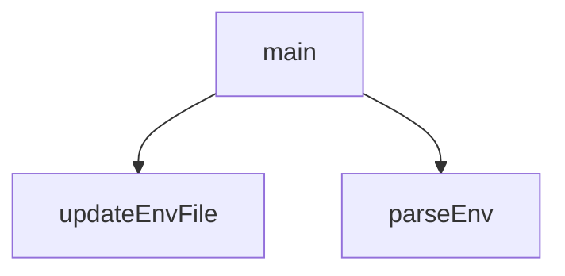

## Genel Bakış
Bu modül, webhooks kurulumu için gerekli ortam değişkenlerini .env dosyasından okuma ve güncelleme işlemlerini yönetir. Temel olarak dosya tabanlı yapılandırma yönetimini ve kurulum akışını koordine eder.

## Fonksiyon Grupları
### Ortam Dosyası İşlemleri
Bu grup, .env dosyasının içeriğini okuma ve belirli anahtarları güncelleme gibi düşük seviyeli dosya sistemi etkileşimlerinden sorumludur.
- parseEnv, updateEnvFile

### Ana Akış Koordinasyonu
Bu grup, webhook kurulumunun tüm adımlarını sıraya koyarak ve gerekli ortam değişkenlerinin mevcudiyetini kontrol ederek procesi yönetir.
- main

---

## AXIOMS – Mimari Varsayımlar
Bu modül bir .env dosyasını okuyarak ve güncelleyerek webhook kurulumlarını yönetir. Aksiyonlar, yalnızca fonksiyon imzalarından çıkarılabilen minimal gereksinimleri yansıtır.

[Aksiyom 1]: Eğer `parseEnv(filePath)` çağrıldığında `filePath` parametresi bir `string` tipinde değilse,fonksiyon beklenmeyen bir davranış gösterebilir veya hata fırlatabilir.

[Aksiyom 2]: Eğer `updateEnvFile(filePath, key, value)` çağrıldığında `key` parametresi bir `string` tipinde değilse, dosya içindeki eşleşme araması başarısız olur veya veri bozulması oluşur.

[Aksiyom 3]: Eğer `updateEnvFile(filePath, key, value)` çağrıldığında `value` parametresi bir `string` tipinde değilse, dosyaya yazılan değer beklenmeyen formatta olur.

[Aksiyom 4]: Eğer `main()` fonksiyonu çalıştırıldığında modülün çalışması için gerekli dış bağımlılıklar (örn: `pg` sabiti) erişilebilir durumda değilse, ana iş akışı tamamlanamaz.

[Aksiyom 5]: Eğer `filePath` olarak belirtilen dosya mevcut değilse veya okunabilir/yazılabilir izinlere sahip değilse, `parseEnv` veya `updateEnvFile` fonksiyonları düzgün çalışamaz.

---

## FONKSİYON DETAYLARI

### parseEnv

**Ne yapar**: Belirtilen dosya yolundaki `.env` formatlı bir dosyayı okur ve içindeki tüm anahtar-değer çiftlerini bir JavaScript nesnesine dönüştürür. Dosya mevcut değilse boş bir nesne döner.

**Nasıl yapar**: Dosya varlığını `fs.existsSync` ile kontrol eder, ardından dosya içeriğini okur ve satır satır işler. Her satırda boş satırları ve yorum satırlarını (`#` ile başlayan) atlar. Geçerli satırlarda `key=value` eşleşmesini regex ile yakalar. Değerlerin çift tırnak (`"`) veya tek tırnak (`'`) ile sarılı olup olmadığını kontrol eder ve varsa bu tırnakları kaldırarak temiz bir değer elde eder. Sonuç olarak anahtar ve değerleri bir nesneye ekleyip döndürür.

**Parametreler**:
- `filePath`: `string` — Okunacak `.env` dosyasının tam dosya yolu

**Dönüş**: `object` — Anahtar olarak env değişken adlarını, değer olarak ise temizlenmiş string değerleri içeren bir nesne. Dosya mevcut değilse `{}` boş nesne döner.

### updateEnvFile
**Ne yapar**: Belirtilen `.env` dosyasında belirli bir anahtarın değerini günceller veya anahtar yoksa dosyaya yeni bir satır olarak ekler.

**Nasıl yapar**: Dosya mevcut değilse doğrudan dosyayı oluşturup `key=value` formatında yazar. Dosya mevcutsa tüm satırları okur, `key=` ile başlayan satırı bulup değeri günceller. Anahtar dosyada hiç yoksa satırların sonuna yeni `key=value` satırı ekler. Değişiklikleri dosyaya geri yazar. Dosyanın sonuna yeni satır eklerken eski satırların arasında boşluk kalabilir, bu bir yan etkidir.

**Parametreler**:
- `filePath`: string — Güncellenecek `.env` dosyasının mutlak veya göreli dosya yolu
- `key`: string — Eklenecek veya güncellenecek değişkenin anahtarı (örn: `SUPABASE_WEBHOOK_SECRET`)
- `value`: string — Anahtar için atanacak değer

**Dönüş**: Yok (`void`). İşlem sonucunda dosya disk üzerinde değiştirilir.

### main
**Ne yapar**: Supabase webhook kurulumunu otomatik olarak gerçekleştiren asenkron bir orkestrasyon fonksiyonudur. Webhook secret üretir/günceller, veritabanına bağlanır, pg_net eklentisini etkinleştirir ve belirli tablolara asenkron HTTP bildirim tetikleyicileri kurar.

**Nasıl yapar**: İlk olarak `.env` ve `.env.local` dosyalarından mevcut ortam değişkenlerini `parseEnv` ile okur. `SUPABASE_WEBHOOK_SECRET` değişkeni yoksa kriptografik olarak güvenli bir secret üretir ve her iki env dosyasına da `updateEnvFile` ile kaydeder. Ardından Supabase PostgreSQL veritabanına bağlanmak için birden fazla şifre ve port kombinasyonunu dener (farklı şifreler ve port 5432/6543). Başarılı bir bağlantı elde ettikten sonra pg_net eklentisini aktif eder, `handle_supabase_webhook()` adlı PL/pgSQL fonksiyonunu oluşturur ve `products`, `categories`, `inventory_movements` tablolarına AFTER INSERT/UPDATE/DELETE tetikleyicileri bağlar. Son olarak tetikleyicilerin `information_schema.triggers` üzerinden kurulumunu doğrular. Bağlantı kurulamazsa `process.exit(1)` ile scripti sonlandırır.

**Parametreler**:
- Yok — Fonksiyon hiçbir parametre almaz.

**Dönüş**: Yok (`void`). Konsola detaylı durum mesajları yazdırır. Kritik bir hata oluşursa (`process.exit(1)`) scripti sonlandırır.

---

## SABİTLER
- **pg** (object_pattern) — `{ Client }`

---

## AST POINTERS

### [N1_NASIL] AST Pointer: scripts/setup_webhooks.js::parseEnv
- **params**: `(filePath)` — .env dosyasının dosya yolu
- **ic_degiskenler**:
  - `content` — `fs.readFileSync(filePath, 'utf8')` ile okunan dosyanın tam utf8 string içeriği
  - `env` — parse edilmiş key-value çiftlerini tutan boş obje; return edilen değer
  - `line` — `content.split('\n').forEach` callback parametresi, dosyanın her bir satırını temsil eder
  - `trimmed` — `line.trim()` ile elde edilen, başlangıç ve bitiş boşlukları temizlenmiş satır
  - `match` — `trimmed.match(/^([^=]+)=(.*)$/)` ile elde edilen regex eşleşme sonucu; `match[1]` key, `match[2]` value portion
  - `val` — `match[2].trim()` ile elde edilen değer; tırnak işaretleri (`"` veya `'`) varsa `slice(1, -1)` ile temizlenir
- **Dönüş**: `{}` (boş obje) veya `env` objesi — key-value çiftlerinden oluşan parsed environment map

---

### [N2_NASIL] AST Pointer: scripts/setup_webhooks.js::updateEnvFile
- **params**: `(filePath, key, value)` — dosya yolu, güncellenecek anahtar, atanacak değer
- **ic_degiskenler**:
  - `content` — `fs.readFileSync(filePath, 'utf8')` ile okunan dosyanın tam utf8 string içeriği
  - `lines` — `content.split('\n')` ile elde edilen, her bir satırı dizi elemanı olan string dizisi
  - `found` — boolean bayrak; `key=` ile başlayan satır bulunup bulunmadığını takip eder
  - `updatedLines` — `lines.map()` ile üretilen güncellenmiş satır dizisi; eşleşen satır `key=value` formatıyla değiştirilir
  - `line` — `lines.map` callback parametresi, her bir satır
  - `trimmed` — `line.trim()` ile temizlenmiş satır; `key=` prefix'i ile karşılaştırılır
- **Dönüş**: yok — dosyayı `fs.writeFileSync` ile yan etki olarak yazar

---

### [N3_NASIL] AST Pointer: scripts/setup_webhooks.js::main
- **params**: yok
- **ic_degiskenler**:
  - `envPath` — `path.resolve(process.cwd(), '.env')` ile hesaplanan .env dosyasının mutlak yolu
  - `envLocalPath` — `path.resolve(process.cwd(), '.env.local')` ile hesaplanan .env.local dosyasının mutlak yolu
  - `env` — `parseEnv(envPath)` ve `parseEnv(envLocalPath)` spread ile birleştirilmiş tüm environment değişkenlerini tutan obje
  - `webhookPrefix` — `'whsec_'` sabit string; yeni secret üretirken prefix olarak kullanılır
  - `secret` — `env.SUPABASE_WEBHOOK_SECRET` veya `process.env.SUPABASE_WEBHOOK_SECRET` değerinden alınan; yoksa `crypto.randomBytes(16).toString('hex')` ile üretilen webhook secret
  - `possibleUrls` — denenecek tüm PostgreSQL bağlantı yapılandırmalarını tutan dizi; her eleman `{user, password, host, port, database, desc}` objesidir
  - `user` — PostgreSQL kullanıcı adı, sabit: `'postgres.tnofewwkwlyjsqgwjjga'`
  - `host` — PostgreSQL host adresi, sabit: `'aws-1-eu-central-1.pooler.supabase.com'`
  - `database` — PostgreSQL veritabanı adı, sabit: `'postgres'`
  - `passwords` — `env.SUPABASE_DB_PASSWORD` değerini içeren dizi; `filter(Boolean)` ile boş değerler çıkarılmış
  - `dbUrl` — `env.DATABASE_URL` veya `process.env.DATABASE_URL` değerinden alınan connection string
  - `match` — `dbUrl.match(/postgresql:\/\/([^:]+):([^@]+)@/)` ile elde edilen regex eşleşme; `match[2]` parola değerini tutar
  - `uniquePasswords` — `Array.from(new Set(passwords))` ile tekrarlardan arındırılmış şifre listesi
  - `ports` — `[5432, 6543]` sabit dizi; denenecek PostgreSQL portları
  - `pw` — `for (const pw of uniquePasswords)` döngü değişkeni; her iterasyonda bir şifre
  - `config` — `for (const config of possibleUrls)` döngü değişkeni; her iterasyonda bir bağlantı yapılandırması objesi
  - `client` — `new Client({...})` ile oluşturulan `pg.Client` instance'ı; veritabanı bağlantısı ve sorgular için kullanılır
  - `connected` — boolean bayrak; başarılı veritabanı bağlantısı sağlanıp sağlanmadığını takip eder
  - `err` — connection attempt catch bloğundaki hata objesi
  - `e` — `client.end()` catch bloğundaki hata objesi; bağlantı kapatma hatası
  - `sql` — `client.query()` ile çalıştırılacak, webhook fonksiyonu ve trigger'ları oluşturan büyük SQL string'i; içinde `secret` string interpolation ile插入 edilir
  - `verificationRes` — `client.query(...)` ile `information_schema.triggers` sorgusunun sonucu; `.rows` dizisi içinde trigger bilgileri tutulur
  - `row` — `verificationRes.rows.forEach` callback parametresi; her bir trigger satırı objesi
  - `row.event_object_table` — trigger'ın bağlı olduğu tablo adı (products, categories, inventory_movements)
  - `row.trigger_name` — trigger adı (on_products_change, vb.)
  - `row.event_manipulation` — trigger olay türü (INSERT, UPDATE, DELETE)
- **Dönüş**: yok — async fonksiyon; yan etkiler: dosya yazımı, veritabanı bağlantısı, SQL sorguları çalıştırma, `process.exit(1)` ile çıkış

---

## MERMAID CALL GRAPH

## NODE ID STANDARD

  file: scripts\setup_webhooks.js
  function: scripts\setup_webhooks.js::parseEnv
  function: scripts\setup_webhooks.js::updateEnvFile
  function: scripts\setup_webhooks.js::main

---

## DISA AKTARILANLAR (EXPORTS)
  export: main
  export: parseEnv
  export: updateEnvFile