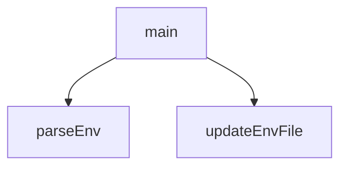

---

## AXIOMS – Mimari Varsayımlar
Bu modül, bir .env dosyasını okuyarak ve belirli anahtarların değerlerini güncelleyerek webhooks kurulumunu yönetir. Mimari varsayımlar, fonksiyonların beklenen girdi/çıktı davranışlarına ve dosya sistemi etkileşimlerine yöneliktir.

[Aksiyom 1]: Eğer `parseEnv(filePath)` çağrıldığında `filePath` parametresi geçerli, okunabilir bir dosya yolunu göstermiyorsa, fonksiyon hata fırlatır veya boş/eksik bir yapı döndürür.

[Aksiyom 2]: Eğer `updateEnvFile(filePath, key, value)` çağrıldığında `filePath` parametresi geçerli bir dosya yolunu göstermiyorsa veya dosya yazılabilir durumda değilse, güncelleme işlemi başarısız olur.

[Aksiyom 3]: Eğer `updateEnvFile(filePath, key, value)` çağrıldığında `key` parametresi, dosya içeriğinde (veya `pg` object_pattern ile eşleşen yapıda) tanımlı bir anahtar değilse, güncelleme beklenmedik bir şekilde davranabilir (örneğin, anahtarı ekleyebilir veya hata verebilir; davranış bilinmiyor).

[Aksiyom 4]: Eğer `main()` fonksiyonu çağrıldığında ortamda gerekli temel değişkenler (örneğin, webhook adresi veya token bilgisi) ayarlanmamışsa veya `.env` dosyasında tanımlı değilse, webhook kurulumu eksik veya hatalı tamamlanır.

[Aksiyom 5]: Eğer `pg` (object_pattern) sabiti, dosya içeriğindeki anahtar-değer çiftlerini eşleştirmek için kullanılıyorsa, `pg` yapısının `.env` dosyasının formatıyla uyumlu olması gerekir; aksi halde `parseEnv` veya `updateEnvFile` doğru çalışamaz.

---

## FONKSİYON DETAYLARI

### parseEnv
**Ne yapar**: Belirtilen dosya yolundaki bir `.env` benzeri dosyayı okur ve içindeki anahtar-değer çiftlerini bir JavaScript nesnesine dönüştürür.

**Nasıl yapar**: Dosya yoksa boş bir nesne döner. Dosya varsa tüm satırları okur, boş satırları ve yorum satırlarını (`#` ile başlayanları) atlar. Her satırda `key=value` formatını regex ile eşleştirir. Değerlerdeki tırnak işaretlerini (`"` veya `'`) varsa kaldırır. Sonuç olarak bir key-value nesnesi döner.

**Parametreler**:
- `filePath`: string — Okunacak `.env` dosyasının mutlak veya göreli dosya yolu

**Dönüş**: `object` — Dosyadaki tüm anahtar-değer çiftlerini içeren bir nesne. Dosya mevcut değilse boş bir nesne `{}` döner.

### updateEnvFile
**Ne yapar**: Belirtilen `.env` dosyasında belirli bir anahtarın değerini günceller veya anahtar yoksa dosyaya yeni bir satır olarak ekler.

**Nasıl yapar**: Dosya mevcut değilse doğrudan dosyayı oluşturup `key=value` formatında yazar. Dosya mevcutsa tüm satırları okur, `key=` ile başlayan satırı bulup değeri günceller. Anahtar dosyada hiç yoksa satırların sonuna yeni `key=value` satırı ekler. Değişiklikleri dosyaya geri yazar. Dosyanın sonuna yeni satır eklerken eski satırların arasında boşluk kalabilir, bu bir yan etkidir.

**Parametreler**:
- `filePath`: string — Güncellenecek `.env` dosyasının mutlak veya göreli dosya yolu
- `key`: string — Eklenecek veya güncellenecek değişkenin anahtarı (örn: `SUPABASE_WEBHOOK_SECRET`)
- `value`: string — Anahtar için atanacak değer

**Dönüş**: Yok (`void`). İşlem sonucunda dosya disk üzerinde değiştirilir.

### main
**Ne yapar**: Supabase webhook kurulumunu otomatik olarak gerçekleştiren asenkron bir orkestrasyon fonksiyonudur. Webhook secret üretir/günceller, veritabanına bağlanır, pg_net eklentisini etkinleştirir ve belirli tablolara asenkron HTTP bildirim tetikleyicileri kurar.

**Nasıl yapar**: İlk olarak `.env` ve `.env.local` dosyalarından mevcut ortam değişkenlerini `parseEnv` ile okur. `SUPABASE_WEBHOOK_SECRET` değişkeni yoksa kriptografik olarak güvenli bir secret üretir ve her iki env dosyasına da `updateEnvFile` ile kaydeder. Ardından Supabase PostgreSQL veritabanına bağlanmak için birden fazla şifre ve port kombinasyonunu dener (farklı şifreler ve port 5432/6543). Başarılı bir bağlantı elde ettikten sonra pg_net eklentisini aktif eder, `handle_supabase_webhook()` adlı PL/pgSQL fonksiyonunu oluşturur ve `products`, `categories`, `inventory_movements` tablolarına AFTER INSERT/UPDATE/DELETE tetikleyicileri bağlar. Son olarak tetikleyicilerin `information_schema.triggers` üzerinden kurulumunu doğrular. Bağlantı kurulamazsa `process.exit(1)` ile scripti sonlandırır.

**Parametreler**:
- Yok — Fonksiyon hiçbir parametre almaz.

**Dönüş**: Yok (`void`). Konsola detaylı durum mesajları yazdırır. Kritik bir hata oluşursa (`process.exit(1)`) scripti sonlandırır.

---

## SABİTLER
- **pg** (object_pattern) — `{ Client }`

---

## AST POINTERS

### [N1_NASIL] AST Pointer: scripts/setup_webhooks.js::parseEnv
- **params**: `filePath` — okunacak .env dosyasının yolu
- **ic_degiskenler**:
  - `content` — fs.readFileSync ile okunan dosyanın tüm metin içeriği (utf8)
  - `env` — parse edilmiş key-value çiftlerini tutan boş nesne, fonksiyon sonunda return edilir
  - `trimmed` — forEach callback içinde, her satırın首尾 boşlukları temizlenmiş hali; boş satır ve yorum satırları filtrelenir
  - `match` — trimmed satırının `/^([^=]+)=(.*)$/` regex'iyle eşleşme sonucu; eşleşme varsa `match[1]` key, `match[2]` value'dur
  - `val` — `match[2]` değerinin trim edilmiş hali; baş/son tırnak işaretleri varsa `slice(1, -1)` ile temizlenir
- **Dönüş**: `{ [key: string]: string }` — parse edilmiş key-value nesnesi; dosya yoksa boş nesne `{}`

---

### [N2_NASIL] AST Pointer: scripts/setup_webhooks.js::updateEnvFile
- **params**: `filePath` — güncellenecek .env dosyasının yolu, `key` — eklenecek/güncellenecek değişken adı, `key` için `value` — atanacak değer
- **ic_degiskenler**:
  - `content` — dosya mevcutsa fs.readFileSync ile okunan tüm metin içeriği
  - `lines` — content'in `'\n'` ile split edilmesiyle oluşan satır dizisi
  - `found` — boolean bayrak, aranan key'in mevcut satırlarda bulunup bulunmadığını takip eder; başlangıçta `false`
  - `updatedLines` — `lines.map(...)` ile üretilen güncellenmiş satır dizisi; key satırı bulunduysa yeni değerle değiştirilir, bulunamadıysa soneke eklenir
  - `trimmed` — map callback içinde her satırın首尾 boşlukları temizlenmiş hali; `${key}=` ile başlayıp başlamadığı kontrol edilir
- **Dönüş**: yok (yan etki: dosyayı oluşturur veya günceller via fs.writeFileSync)

---

### [N3_NASIL] AST Pointer: scripts/setup_webhooks.js::main
- **params**: yok
- **ic_degiskenler**:
  - `envPath` — `path.resolve(process.cwd(), '.env')` ile hesaplanan .env dosyasının mutlak yolu
  - `envLocalPath` — `path.resolve(process.cwd(), '.env.local')` ile hesaplanan .env.local dosyasının mutlak yolu
  - `env` — `parseEnv(envPath)` ve `parseEnv(envLocalPath)` sonuçlarının spread ile birleştirilmesiyle oluşan birleşik environment nesnesi
  - `webhookPrefix` — string sabit `'whsec_'`, yeni secret oluşturulurken başına eklenir
  - `secret` — `env.SUPABASE_WEBHOOK_SECRET` veya `process.env.SUPABASE_WEBHOOK_SECRET` değerinden alınır; ikisi de yoksa `crypto.randomBytes(16).toString('hex')` ile rastgele üretilir
  - `possibleUrls` — denenmesi gereken veritabanı bağlantı yapılandırmalarını tutan dizi; her eleman `{user, password, host, port, database, desc}` nesnesidir
  - `user` — PostgreSQL kullanıcı adı, sabit değer `'postgres.tnofewwkwlyjsqgwjjga'`
  - `host` — PostgreSQL host adresi, sabit değer `'aws-1-eu-central-1.pooler.supabase.com'`
  - `database` — PostgreSQL veritabanı adı, sabit değer `'postgres'`
  - `passwords` — `env.SUPABASE_DB_PASSWORD` ile hardcoded şifrelerin birleşimi; `filter(Boolean)` ile falsy değerler temizlenir
  - `uniquePasswords` — `passwords` dizisinin `new Set` ile benzersiz hale getirilmiş hali
  - `ports` — denenmesi gereken portlar dizisi `[5432, 6543]`
  - `client` — `pg.Client` nesnesi; for döngüsü içinde her deneme için oluşturulur, başarıyla bağlanırsa döngü dışına çıkar
  - `connected` — boolean bayrak, veritabanı bağlantısının kurulup kurulmadığını takip eder
  - `config` — `for...of uniquePasswords` döngüsü içindeki her bir `pw` ve `ports` döngüsü içindeki her bir `port` ile oluşturulan bağlantı yapılandırma nesnesi
  - `pw` — for döngüsü içindeki mevcut şifre
  - `err` — try-catch bloklarında yakalanan hata nesnesi; bağlantı hatası ve genel hata durumlarında kullanılır
  - `sql` — veritabanında çalıştırılacak çok satırlı SQL sorgusu; `handle_supabase_webhook()` fonksiyonu, üç tablo (`products`, `categories`, `inventory_movements`) için trigger'lar oluşturur
  - `verificationRes` — `information_schema.triggers` sorgusunun sonucu; yüklenen trigger'ların doğrulanması için kullanılır
  - `row` — `verificationRes.rows.forEach(...)` callbackindeki her satır; `row.event_object_table`, `row.trigger_name`, `row.event_manipulation` alanları kullanılır
- **Dönüş**: yok (yan etki: .env dosyalarını oluşturur/günceller, veritabanına trigger'lar kurar, konsola çıktı basar; başarısızlıkta `process.exit(1)` ile programı sonlandırır)

---

## MERMAID CALL GRAPH

## NODE ID STANDARD

  file: scripts\setup_webhooks.js
  function: scripts\setup_webhooks.js::parseEnv
  function: scripts\setup_webhooks.js::updateEnvFile
  function: scripts\setup_webhooks.js::main

---

## DISA AKTARILANLAR (EXPORTS)
  export: main
  export: parseEnv
  export: updateEnvFile