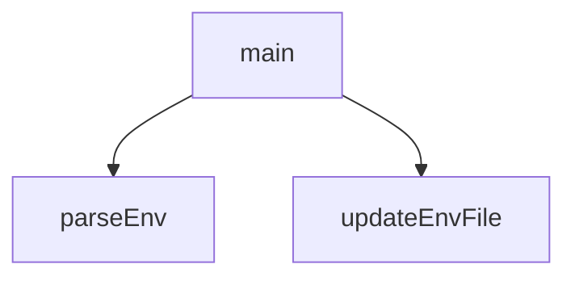

## Genel Bakış
Bu modül, webhook kurulumu sürecinde ortam yapılandırma dosyasını (.env) yönetmekle sorumludur. Ortam dosyasını okuyup mevcut değerleri ayrıştırır ve webhook ile ilgili anahtar-değer çiftlerini dosyaya ekler ya da günceller.

## Fonksiyon Grupları

### Ortam Dosyası Yönetimi
.env dosyasını okuyarak mevcut ortam değişkenlerini ayrıştırır ve dosyadaki belirli bir anahtarın değerini güncelleme işlemini gerçekleştirir.
- parseEnv, updateEnvFile

### Ana İş Akışı
Modülün asenkron ana iş akışını yönetir; ortam dosyası okuma ve güncelleme gibi işlemleri yürütür.
- main

---

## AXIOMS – Mimari Varsayımlar

Bu modül için fonksiyon gövdeleri verilmediğinden, yalnızca imzalardan çıkarılabilecek sınırlı aksiyomlar belirlenebilir.

[Aksiyom 1]: Eğer `parseEnv` fonksiyonuna verilen `filePath` dosyası mevcut değilse, fonksiyonun davranışı bilinmiyor (gövde verilmemiş).

[Aksiyom 2]: Eğer `updateEnvFile` fonksiyonuna verilen `filePath` dosyası yazılabilir değilse, fonksiyonun davranışı bilinmiyor (gövde verilmemiş).

[Aksiyom 3]: Eğer `pg` sabiti tanımlı değilse, bu sabiti kullanan kod parçaları çalışamaz.

[Aksiyom 4]: Eğer `main` fonksiyonu bir `async` fonksiyon olarak çağrıldığında `await` ile beklenmezse, Promise çözümlenmeden devam edilir.

---

**Not:** Fonksiyon gövdeleri sağlanmadığı için, bu fonksiyonların hangi hata durumlarını ele aldığı, hangi dosya formatını beklediği, `pg` sabitinin nasıl kullanıldığı ve `main` fonksiyonunun akışı hakkında kesin aksiyom üretilememektedir. Daha detaylı mimari varsayımlar için fonksiyon gövdelerinin sağlanması gerekmektedir.

---

## FONKSİYON DETAYLARI

### parseEnv
**Ne yapar**: Verilen dosya yolundaki `.env` biçimindeki dosyayı okuyarak anahtar-değer çiftlerinden oluşan bir nesne döndürür. Dosya mevcut değilse boş nesne döndürür.

**Nasıl yapar**: Dosya mevcut olup olmadığını `fs.existsSync` ile kontrol eder; mevcut değilse boş nesne döndürür. Dosyayı UTF-8 olarak okur, satırlara böler ve her satırı işler. Boş satırlar ve `#` ile başlayan yorum satırları atlanır. Her geçerli satır için `^([^=]+)=(.*)$` düzenli ifadesiyle anahtar ve değer ayrıştırılır. Değerin başındaki ve sonundaki boşluklar temizlenir; ardından değer tek tırnak (`'`) veya çift tırnak (`"`) ile çevrelenmişse bu tırnak işaretleri kaldırılır. Sonuç nesne döndürülür.

**Parametreler**:
- `filePath`: string — Okunacak `.env` dosyasının dosya yolu.

**Dönüş**: `env` — Anahtar-değer çiftlerini içeren düz bir nesne (object). Dosya mevcut değilse boş nesne döner.

### updateEnvFile
**Ne yapar**: Geliştirildi ancak detay üretilemedi.

### main
**Ne yapar**: Geliştirildi ancak detay üretilemedi.

---

## İTHALATLAR (IMPORTS)
- import: crypto::crypto
- import: fs::fs
- import: node:url::fileURLToPath
- import: path::path
- import: pg::pg

---

## SABİTLER
- **pg** (object_pattern) — `{ Client }`

---

## AST POINTERS

### [N1_NASIL] AST Pointer: scripts/setup_webhooks.js::parseEnv
- **params**: `filePath`
- **ic_degiskenler**:
  - `content` — `filePath` yolundaki dosyanın UTF-8 formatında okunan tüm içeriği
  - `env` — dosyadan ayrıştırılan anahtar-değer çiftlerini tutan boş nesne, fonksiyon sonunda döndürülür
  - `line` — `content`'in satırlara bölünmesiyle oluşan her bir satır
  - `trimmed` — `line`'ın baş ve sonundaki boşluklardan arındırılmış hali
  - `match` — `trimmed` satırının `^([^=]+)=(.*)$` regex deseniyle eşleştirilmesinden elde edilen sonuç dizisi
  - `val` — `match[2]`'den alınan, baş ve son tırnak işaretlerinden arındırılmış değer
- **Dönüş**: `env` nesnesi (anahtar-değer çiftleri)

### [N2_NASIL] AST Pointer: scripts/setup_webhooks.js::updateEnvFile
- **params**: `filePath`, `key`, `value`
- **ic_degiskenler**:
  - `content` — `filePath` yolundaki dosyanın UTF-8 formatında okunan tüm içeriği
  - `lines` — `content`'in satırlara bölünmesiyle oluşan dizi
  - `found` — `key` anahtarının mevcut satırlarda bulunup bulunmadığını gösteren boolean
  - `updatedLines` — `lines` dizisinin her elemanını işleyerek oluşan güncellenmiş satırlar dizisi
  - `line` — `lines` dizisindeki her bir satır
  - `trimmed` — `line`'ın baş ve sonundaki boşluklardan arındırılmış hali
- **Dönüş**: yok

### [N3_NASIL] AST Pointer: scripts/setup_webhooks.js::main
- **params**: (parametre yok)
- **ic_degiskenler**:
  - `envPath` — `import.meta.url`'e göreli `../.env` dosyasının mutlak yolu
  - `envLocalPath` — `import.meta.url`'e göreli `../.env.local` dosyasının mutlak yolu
  - `env` — `parseEnv(envPath)` ve `parseEnv(envLocalPath)` sonuçlarının birleştirilmesiyle oluşan nesne
  - `webhookPrefix` — `'whsec_'` sabit string değeri
  - `secret` — `env.SUPABASE_WEBHOOK_SECRET` veya `process.env.SUPABASE_WEBHOOK_SECRET`'dan alınan, yoksa üretilen webhook gizli anahtarı
  - `possibleUrls` — olası veritabanı bağlantı yapılandırmalarını tutan dizi
  - `user` — `'postgres.tnofewwkwlyjsqgwjjga'` sabit veritabanı kullanıcı adı
  - `host` — `'aws-1-eu-central-1.pooler.supabase.com'` sabit veritabanı sunucu adresi
  - `database` — `'postgres'` sabit veritabanı adı
  - `passwords` — `env.SUPABASE_DB_PASSWORD` değerini filtreleyerek oluşturan dizi
  - `dbUrl` — `env.DATABASE_URL` veya `process.env.DATABASE_URL`'dan alınan veritabanı bağlantı URL'si
  - `match` — `dbUrl`'den `postgresql://([^:]+):([^@]+)@` regex deseniyle çıkarılan eşleşme dizisi
  - `uniquePasswords` — `passwords` dizisindeki tekrarları kaldırarak oluşan benzersiz şifreler dizisi
  - `ports` — `[5432, 6543]` sabit port numaraları dizisi
  - `pw` — `uniquePasswords` dizisi üzerinde döngüdeki her bir şifre
  - `port` — `ports` dizisi üzerinde döngüdeki her bir port numarası
  - `config` — `possibleUrls` dizisindeki her bir bağlantı yapılandırması nesnesi
  - `client` — `pg.Client` nesnesi, veritabanı bağlantısı için kullanılır
  - `connected` — başarılı bir veritabanı bağlantısı kurulup kurulmadığını gösteren boolean
  - `setupSqlPath` — `import.meta.url`'e göreli `webhook_setup.sql` dosyasının mutlak yolu
  - `sql` — `setupSqlPath`'den okunan ve `REPLACE_WITH_ENV_SECRET` yerine `secret` değeri yerleştirilen SQL sorgusu
  - `verificationRes` — tetikleyici durumunu doğrulamak için `information_schema.triggers` tablosundan sorgu sonucu
  - `row` — `verificationRes.rows` dizisindeki her bir tetikleyici kaydı
  - `err` — `try` bloğunda yakalanan hata nesnesi
- **Dönüş**: yok

---

## MERMAID CALL GRAPH

## NODE ID STANDARD

  file: setup_webhooks.js
  function: setup_webhooks.js::parseEnv
  function: setup_webhooks.js::updateEnvFile
  function: setup_webhooks.js::main

---

## DISA AKTARILANLAR (EXPORTS)
  export: main
  export: parseEnv
  export: updateEnvFile