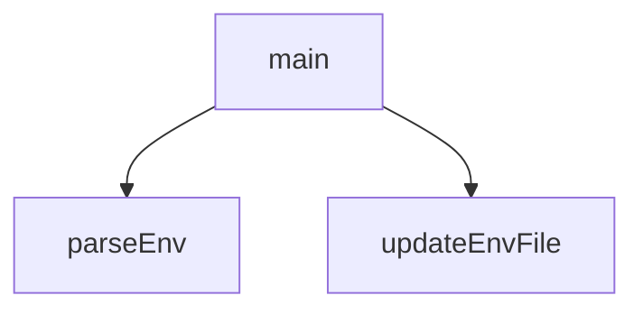

## Genel Bakış
Bu modül, webhook yapılandırması için gerekli ortam değişkenlerinin (.env dosyası) komut satırı üzerinden yönetilmesini sağlar. Dosya okuma, değer güncelleme ve kullanıcı etkileşimini tek bir araçta birleştirerek webhook kurulumunu otomatikleştirir.

## Fonksiyon Grupları
### Ortam Dosyası Yönetimi
Env dosyası üzerinde okuma ve yazma işlemleri yaparak yapılandırma değerlerini yönetir.
- parseEnv, updateEnvFile

### Ana Program Akışı
Kullanıcıdan girdi alır, gerekli kontrolleri yapar ve ortam dosyasını buna göre günceller.
- main

---

## AXIOMS – Mimari Varsayımlar

Bu modül, `.env` dosyalarını okuyarak ve güncelleyerek webhook kurulumunu CLI üzerinden gerçekleştiren bir JavaScript modülüdür. Fonksiyon gövdelerine erişim olmadan, yalnızca imzalardan çıkarılabilecek temel varsayımlar aşağıdadır.

**[Aksiyom 1]**: Eğer `parseEnv` veya `updateEnvFile` için verilen `filePath` parametresi geçerli bir dosya yolunu göstermiyorsa (dosya mevcut değilse veya erişilebilir değilse), ilgili fonksiyon hata fırlatır veya beklenmeyen sonuç döner.

**[Aksiyom 2]**: Eğer `updateEnvFile` fonksiyonuna `key` parametresi olarak `None`/boş değer verilirse, `.env` dosyası tutarsız veya geçersiz bir duruma girer.

**[Aksiyom 3]**: Eğer `updateEnvFile` fonksiyonuna `value` parametresi olarak `None`/boş değer verilse bile, `key`'in dosyada tanımlı bir satır olarak bırakılıp bırakılmayacağı fonksiyon gövdesine bağlıdır (bilinmiyor).

**[Aksiyom 4]**: Eğer `main()` fonksiyonu çalıştırılmadan önce gerekli ortam değişkenleri (ör. webhook URL'leri, API anahtarları) `.env` dosyasında tanımlı değilse, webhook kurulumu eksik veya başarısız olur.

---

> **Not**: Bu modül için fonksiyon gövdeleri paylaşılmadığından, buradaki varsayımlar yalnızca fonksiyon imzaları ve dosya adından (`setup_webhooks_cli.js`) çıkarılan üst düzey kabul kriterleridir. Fonksiyon gövdeleri incelendiğinde daha spesifik aksiyomlar (örn: dosya formatı beklentisi, key-value ayrıştırma kuralları) eklenebilir.

---

## FONKSİYON DETAYLARI

### parseEnv
**Ne yapar**: Belirtilen dosya yolundaki bir `.env` dosyasını okuyarak içindeki ortam değişkenlerini bir JavaScript nesnesine dönüştürür. Fonksiyon, dosya içeriğini satır satır analiz eder ve geçerli `KEY=VALUE` çiftlerini çıkarır.
**Nasıl yapar**: Fonksiyon önce dosyanın varlığını kontrol eder. Dosya mevcutsa, UTF-8 olarak okunur ve satırlara bölünür. Her satır kırpıldıktan sonra, boş satırlar ve `#` ile başlayan yorum satırları atlanır. Geçerli satırlar, bir `=` karakteri ile bölünerek anahtar ve değer ayrıştırılır. Değerdeki tırnak işaretleri (`"` veya `'`) varsa bu tırnak işaretleri kaldırılarak değer temizlenir.
**Parametreler**:
- `filePath`: `string` — Okunacak `.env` dosyasının dosya yolu.
**Dönüş**: `{ [key: string]: string }` — Anahtar-değer çiftlerini içeren bir nesne döner. Eğer dosya mevcut değilse boş bir nesne `{}` döner.

### updateEnvFile
**Ne yapar**: Belirtilen dosyada belirli bir ortam değişkenini (`key`) yeni bir değere (`value`) eşler. Eğer anahtar dosyada mevcut değilse, dosyanın sonuna yeni bir satır olarak eklenir. Dosya mevcut değilse, yeni bir dosya oluşturarak değişkeni yazar.
**Nasıl yapar**: Fonksiyon, dosya yolunu kontrol eder. Dosya mevcut değilse doğrudan `KEY=VALUE` formatında yeni bir dosya oluşturur. Dosya mevcutsa, içeriğini okur, her satırı tarar. `KEY=` ile başlayan bir satır bulunursa, o satır yeni değerle değiştirilir. Tarama sonunda böyle bir satır bulunamazsa, anahtar-değer çifti dosyanın sonuna eklenir. İşlem sonunda güncellenmiş içerik dosyaya yazılır.
**Parametreler**:
- `filePath`: `string` — Güncellenecek veya oluşturulacak `.env` dosyasının yolu.
- `key`: `string` — Ayarlanacak ortam değişkeninin adı (örn: `SUPABASE_WEBHOOK_SECRET`).
- `value`: `string` — Anahtara atanacak değer.
**Dönüş**: `void` — Fonksiyon herhangi bir değer dönmez, doğrudan dosya sistemi üzerinde değişiklik yapar.

### main
**Ne yapar**: Supabase veritabanı webhook kurulumunu otomatikleştiren ana asenkron fonksiyondur. Ortam değişkenlerini yönetir, bir webhook秘密` üretir, geçici bir SQL dosyası oluşturur ve veritabanına bağlanarak tetikleyicileri (trigger) kurar.
**Nasıl yapar**: Fonksiyon önce `.env` ve `.env.local` dosyalarını okuyarak ortam değişkenlerini birleştirir. `SUPABASE_WEBHOOK_SECRET` yoksa, `whsec_` ön ekli rastgele bir değer üretir ve her iki dosyaya da kaydeder. Ardından, `pg_net` eklentisini etkinleştiren, HTTP istekleri yapan bir PostgreSQL fonksiyonu ve `products`, `categories`, `inventory_movements` tablolarına tetikleyiciler ekleyen bir SQL komutu dosyası oluşturur. Fonksiyon, veritabanına bağlanmak için farklı şifre ve sunucu yapılandırmalarını (Supabase Pooler ve doğrudan bağlantılar) dener. İlk başarılı bağlantıda SQL dosyasını çalıştırır, ardından geçici dosyayı temizler. İşlem başarıyla tamamlanırsa veya tüm denemeler başarısız olursa konsola durum mesajları yazdırır; başarısızlık durumunda process ile çıkar.
**Parametreler**: Bu fonksiyon herhangi bir parametre almaz.
**Dönüş**: `void` — Fonksiyon asenkron olarak çalışır, değer dönmez. Başarılı kurulum durumunu ve adımları konsola loglar. Tüm veritabanı bağlantısı denemeleri başarısız olursa `process.exit(1)` çağrısıyla programı sonlandırır.

---

## AST POINTERS

### [N1_NASIL] AST Pointer: scripts/setup_webhooks_cli.js::parseEnv
- **params**: (filePath)
- **ic_degiskenler**:
    - `content` — dosyanın tam metin içeriği
    - `env` — parsed key-value çiftlerini tutan obje
    - `line` — split edilmiş her satır
    - `trimmed` — boşlukları temizlenmiş satır
    - `match` — regex eşleşmesi (key-value ayrımı için)
    - `val` — eşleşmenin value kısmı (tırnak işaretleri temizlenmiş)
- **Dönüş**: Object (env objesi)

### [N2_NASIL] AST Pointer: scripts/setup_webhooks_cli.js::updateEnvFile
- **params**: (filePath, key, value)
- **ic_degiskenler**:
    - `content` — dosyanın tam metin içeriği
    - `lines` — satırlara split edilmiş dizi
    - `found` — key'in dosyada bulunup bulunmadığını tutan boolean
    - `updatedLines` — güncellenmiş satırlar dizisi
    - `line` — map içinde her satır
    - `trimmed` — boşlukları temizlenmiş satır
- **Dönüş**: yok

### [N3_NASIL] AST Pointer: scripts/setup_webhooks_cli.js::main
- **params**: (parametre yok)
- **ic_degiskenler**:
    - `envPath` — .env dosyasının mutlak yolu
    - `envLocalPath` — .env.local dosyasının mutlak yolu
    - `env` — her iki .env dosyasının birleşimi
    - `webhookPrefix` — secret prefix'i ('whsec_')
    - `secret` — SUPABASE_WEBHOOK_SECRET değeri
    - `sqlContent` — PostgreSQL webhook fonksiyonu ve trigger SQL'i
    - `tempSqlFile` — geçici SQL dosyasının yolu
    - `passwords` — denenilecek veritabanı şifreleri dizisi
    - `uniquePasswords` — tekrar eden şifrelerin temizlenmiş hali
    - `possibleConfigs` — denenilecek veritabanı konfigürasyonları dizisi
    - `config` — döngüdeki her bir konfigürasyon objesi
    - `encUser` — URL-encode edilmiş kullanıcı adı
    - `encPass` — URL-encode edilmiş şifre
    - `dbUrl` — PostgreSQL bağlantı URL'i
    - `cmd` — supabase CLI komutu
    - `err` — try-catch bloğundaki hata objesi
- **Dönüş**: yok

---

## MERMAID CALL GRAPH

## NODE ID STANDARD

  file: scripts\setup_webhooks_cli.js
  function: scripts\setup_webhooks_cli.js::parseEnv
  function: scripts\setup_webhooks_cli.js::updateEnvFile
  function: scripts\setup_webhooks_cli.js::main

---

## DISA AKTARILANLAR (EXPORTS)
  export: main
  export: parseEnv
  export: updateEnvFile