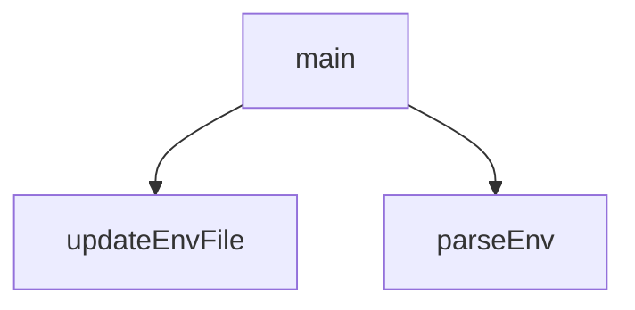

## Genel Bakış
Bu modül, webhook yapılandırması için gerekli ortam değişkenlerinin (.env dosyası) komut satırı üzerinden yönetilmesini sağlar. Dosya okuma, değer güncelleme ve kullanıcı etkileşimini tek bir araçta birleştirerek webhook kurulumunu otomatikleştirir.

## Fonksiyon Grupları
### Ortam Dosyası Yönetimi
Env dosyası üzerinde okuma ve yazma işlemleri yaparak yapılandırma değerlerini yönetir.
- parseEnv, updateEnvFile

### Ana Program Akışı
Kullanıcıdan girdi alır, gerekli kontrolleri yapar ve ortam dosyasını buna göre günceller.
- main

---

## AXIOMS – Mimari Varsayımlar

Bu modül, `.env` dosyalarını okuyarak ve güncelleyerek webhook kurulumunu CLI üzerinden gerçekleştiren bir JavaScript modülüdür. Fonksiyon gövdelerine erişim olmadan, yalnızca imzalardan çıkarılabilecek temel varsayımlar aşağıdadır.

**[Aksiyom 1]**: Eğer `parseEnv` veya `updateEnvFile` için verilen `filePath` parametresi geçerli bir dosya yolunu göstermiyorsa (dosya mevcut değilse veya erişilebilir değilse), ilgili fonksiyon hata fırlatır veya beklenmeyen sonuç döner.

**[Aksiyom 2]**: Eğer `updateEnvFile` fonksiyonuna `key` parametresi olarak `None`/boş değer verilirse, `.env` dosyası tutarsız veya geçersiz bir duruma girer.

**[Aksiyom 3]**: Eğer `updateEnvFile` fonksiyonuna `value` parametresi olarak `None`/boş değer verilse bile, `key`'in dosyada tanımlı bir satır olarak bırakılıp bırakılmayacağı fonksiyon gövdesine bağlıdır (bilinmiyor).

**[Aksiyom 4]**: Eğer `main()` fonksiyonu çalıştırılmadan önce gerekli ortam değişkenleri (ör. webhook URL'leri, API anahtarları) `.env` dosyasında tanımlı değilse, webhook kurulumu eksik veya başarısız olur.

---

## FONKSİYON DETAYLARI

### parseEnv
**Ne yapar**: Bu fonksiyon, belirtilen dosya yolundaki `.env` formatındaki bir dosyayı okur ve içindeki tüm geçerli çevre değişkenlerini bir JavaScript nesnesine dönüştürerek döndürür.
**Nasıl yapar**: Fonksiyon, dosyanın var olup olmadığını kontrol eder; yoksa boş bir nesne döndürür. Dosya varsa, içeriğini utf8 olarak okur ve satır satır işler. Her satırı temizler, boş satırları ve `#` ile başlayan yorum satırlarını atlar. Kalan satırları `=` karakteri ile ayırarak anahtar-değer çiftleri oluşturur. Değerin başında ve sonunda tek veya çift tırnak işareti varsa bunları kaldırarak değeri düzenler.
**Parametreler**:
- filePath: string — Okunacak `.env` dosyasının dosya sistemi yolu.
**Dönüş**: Object — Anahtarları çevre değişkeni adları, değerleri ise ilgili string değerler olan bir JavaScript nesnesi. Dosya mevcut değilse boş bir nesne `{}` döner.

### updateEnvFile
**Ne yapar**: Bu fonksiyon, belirtilen `.env` dosyasında belirli bir anahtarın değerini günceller veya dosyada böyle bir anahtar yoksa yeni bir satır olarak ekler.
**Nasıl yapar**: Fonksiyon, önce dosyanın var olup olmadığını kontrol eder; yoksa dosyayı oluşturup sadece verilen anahtar-değer çiftini yazar. Dosya mevcutsa, içeriğini utf8 olarak okur ve satırlara böler. Her satırı kontrol ederek, verilen anahtarla başlayan bir satır arar. Bulursa o satırı yeni değerle değiştirir, bulamazsa güncellenen satır listesinin sonuna yeni anahtar-değer çiftini ekler. Son olarak tüm satırları birleştirip dosyaya yazar.
**Parametreler**:
- filePath: string — Güncellenecek `.env` dosyasının dosya sistemi yolu.
- key: string — Eklenecek veya güncellenecek çevre değişkeninin adı.
- value: string — Değişkene atanacak yeni değer.
**Dönüş**: Fonksiyon bir değer döndürmez (void).

### main
**Ne yapar**: Bu asenkron fonksiyon, Supabase webhook kurulumunu tamamen otomatik olarak yöneten ana kontrol akışını başlatır ve yürütür. Ortam değişkenlerini yönetir, veritabanı tetikleyicilerini kurar ve kullanıcıya durum bildirimi yapar.
**Nasıl yapar**: Fonksiyon, proje dizinindeki `.env` ve `.env.local` dosyalarını `parseEnv` kullanarak okur ve birleştirir. `SUPABASE_WEBHOOK_SECRET` değişkenini kontrol eder; eğer yoksa `whsec_` önekli rastgele bir değer üretir ve her iki `.env` dosyasına da kaydeder. Ardından, `pg_net` eklentisini etkinleştiren, asenkron HTTP istekleri gönderen bir PostgreSQL fonksiyonu ve `products`, `categories`, `inventory_movements` tablolarına eklenecek tetikleyicileri içeren geçici bir SQL dosyası oluşturur. Veritabanı şifresini `.env` dosyalarından veya `DATABASE_URL`'den çıkararak, Supabase'in farklı bağlantı noktalarına (Pooler ve doğrudan bağlantı) yönelik多种 yapılandırmayı dener. Her yapılandırma ile `supabase db query` CLI komutunu senkron olarak çalıştırarak SQL dosyasını uygulamayı dener. İlk başarılı bağlantıdan sonra döngüyü kırar, geçici SQL dosyasını temizler ve başarı durumunu konsola yazdırır. Hiçbir yapılandırma başarıya ulaşamazsa hata koduyla çıkar.
**Parametreler**: Fonksiyon herhangi bir parametre almaz.
**Dönüş**: Fonksiyon bir değer döndürmez (void). İşlem success değişkeni ve `process.exit(1)` çağrılarıyla dış dünya ile iletişim kurar.

---

## AST POINTERS

### [N1_NASIL] AST Pointer: scripts/setup_webhooks_cli.js::parseEnv
- **params**: `filePath` — okunacak .env dosyasının tam yolu
- **ic_degiskenler**:
  - `content` — `filePath` dosyasının UTF-8 olarak okunanham metin içeriği
  - `env` — `{}` boş obje; parse edilen key-value çiftlerinin depolandığı sözlük
  - `line` — `content.split('\n')` ile oluşturulan dizi her elemanı (forEach callback parametresi)
  - `trimmed` — `line.trim()` ile baş/son boşluklarından arındırılmış satır
  - `match` — `trimmed.match(/^([^=]+)=(.*)$/)` ile elde edilen regex eşleşme sonucu; `match[1]` key, `match[2]` value portion
  - `val` — `match[2].trim()` ile elde edilen ham değer; ardından çift tırnak (`"` veya `'`) sarılıysa `slice(1, -1)` ile temizlenir
- **Dönüş**: `env` objesi — key-value çiftlerinden oluşan parsed sözlük; `filePath` mevcut değilse `{}` boş obje döner

### [N2_NASIL] AST Pointer: scripts/setup_webhooks_cli.js::updateEnvFile
- **params**: `filePath` — güncellenecek .env dosyasının tam yolu, `key` — ayarlanacak ortam değişkeni adı, `key`'in atanacağı `value` değeri
- **ic_degiskenler**:
  - `content` — `filePath` dosyasının mevcutsa UTF-8 olarak okunanham metin içeriği
  - `lines` — `content.split('\n')` ile elde edilen satır dizisi
  - `found` — boolean bayrak; ilgili key'in dosyada mevcut olup olmadığını takip eder, başlangıçta `false`
  - `updatedLines` — `lines.map(...)` ile üretilen güncellenmiş satır dizisi; key eşleşen satır value ile değiştirilir, eşleşmezse orijinal satır aynen korunur
  - `line` — `lines.map(...)` callback'inde her bir satır (map callback parametresi)
  - `trimmed` — `line.trim()` ile arındırılmış satır; `${key}=` ile başlayıp başlamadığı kontrol edilir
- **Dönüş**: yok — dosyayı yan etki olarak `fs.writeFileSync` ile yazar; key mevcutsa value'yu güncellemezse dosyanın sonuna ekler

### [N3_NASIL] AST Pointer: scripts/setup_webhooks_cli.js::main
- **params**: yok
- **ic_degiskenler**:
  - `envPath` — `path.resolve(process.cwd(), '.env')` ile hesaplanan projedeki `.env` dosyasının mutlak yolu
  - `envLocalPath` — `path.resolve(process.cwd(), '.env.local')` ile hesaplanan projedeki `.env.local` dosyasının mutlak yolu
  - `env` — `{ ...parseEnv(envPath), ...parseEnv(envLocalPath) }` spread ile birleştirilmiş iki dosyadan gelen ortam değişkenleri sözlüğü; `.env.local` same key varsa `.env`'yi override eder
  - `webhookPrefix` — string literal `'whsec_'` ; yeni webhook secret'ın prefix'i
  - `secret` — `env.SUPABASE_WEBHOOK_SECRET` veya `process.env.SUPABASE_WEBHOOK_SECRET` değerinden gelen mevcut secret; yoksa `crypto.randomBytes(16).toString('hex')` ile rastgele üretilip prefix ile birleştirilen yeni secret
  - `sqlContent` — template literal ile oluşturulmuş büyük SQL komutu bloğu; pg_net extension etkinleştirir, `handle_supabase_webhook()` PL/pgSQL fonksiyonunu ve `products`, `categories`, `inventory_movements` tabloları için trigger'ları oluşturur; `secret` değişkeni SQL içine gömülür
  - `tempSqlFile` — `path.resolve(process.cwd(), 'scripts/temp_setup.sql')` ile hesaplanan geçici SQL dosyasının mutlak yolu; SQL içeriği bu dosyaya yazılır
  - `passwords` — `env.SUPABASE_DB_PASSWORD` varsa diziye eklenen, `filter(Boolean)` ile falsy değerler temizlenmiş olası veritabanı şifreleri dizisi
  - `dbUrl` — `env.DATABASE_URL` veya `process.env.DATABASE_URL` değerinden gelen PostgreSQL bağlantı URL'i
  - `match` — `dbUrl.match(/postgresql:\/\/([^:]+):([^@]+)@/)` regex eşleşme sonucu; `match[2]` şifre portion
  - `uniquePasswords` — `Array.from(new Set(passwords))` ile tekrarları temizlenmiş benzersiz şifre dizisi
  - `possibleConfigs` — her bir uniquePassword için 4 farklı Veritabanı yapılandırma objesinin (user, host, port, password, desc alanları) push edildiği dizi; yapılandırmalar: Pooler port 5432, Pooler port 6543, Direct DB IPv6, Direct DB Literal IPv6
  - `success` — boolean bayrak; SQL komutunun en az bir yapılandırmada başarıyla uygulanıp uygulanmadığını takip eder, başlangıçta `false`
  - `config` — `possibleConfigs` dizi iterasyonunda her bir veritabanı yapılandırma objesi
  - `encUser` — `encodeURIComponent(config.user)` ile URL-safe hale getirilmiş veritabanı kullanıcı adı
  - `encPass` — `encodeURIComponent(config.password)` ile URL-safe hale getirilmiş veritabanı şifresi
  - `dbUrl` (döngü içi) — `postgresql://${encUser}:${encPass}@${config.host}:${config.port}/postgres` formatında oluşturulmuş tam PostgreSQL bağlantı URL'i
  - `cmd` — `npx supabase db query --db-url "${dbUrl}" -f "scripts/temp_setup.sql"` komut satırı stringi; Supabase CLI aracılığıyla SQL dosyasını uzaktaki veritabanına çalıştırır
  - `err` — try-catch bloğundaki hata nesnesi; config denemesi başarısız olduğunda yakalanır
- **Dönüş**: yok — `process.exit(1)` ile başarısızlık durumunda proceso sonlandırır; başarılıysa konsola başarı mesajları yazarak sonlanır; yan etkiler: `.env`/`.env.local` dosyalarını yazar, geçici SQL dosyasını oluşturur ve siler, `execSync` ile veritabanına SQL uygular

---

## MERMAID CALL GRAPH

## NODE ID STANDARD

  file: scripts\setup_webhooks_cli.js
  function: scripts\setup_webhooks_cli.js::parseEnv
  function: scripts\setup_webhooks_cli.js::updateEnvFile
  function: scripts\setup_webhooks_cli.js::main

---

## DISA AKTARILANLAR (EXPORTS)
  export: main
  export: parseEnv
  export: updateEnvFile