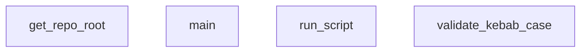

## Genel Bakış

Bu modül, projeye yeni yetenekler (skills) eklemek için gerekli dosya yapısını oluşturan ve ilgili kurulum scriptlerini çalıştıran bir araçtır. Yeni yeteneklerin isimlendirme kurallarına uygunluğunu doğrulayarak tutarlı bir geliştirme ortamı sağlar.

## Fonksiyon Grupları

### Altyapı ve Konumlandırma
Repodaki kök dizini tespit ederek modülün çalışması için gerekli mutlak yol bilgisini sağlar.
- get_repo_root

### Veri Doğrulama
Oluşturulacak yeteneklerin isimlerinin standartlara uygun (kebab-case) formatta olmasını kontrol eder.
- validate_kebab_case

### Script Çalıştırma
Oluşturma sürecindeki yardımcı scriptleri belirtilen dizinde çalıştırır ve başarı durumunu raporlar.
- run_script

### Ana Akış Orchestrasyon
Tüm sürecin akışını yönetir: kök dizini bulur, doğrulama yapar ve gerekli scriptleri sırasıyla çalıştırır.
- main

---

## AXIOMS – Mimari Varsayımlar

Bu modül, HVAC projesinde yetenek (skill) oluşturma süreçlerini yöneten bir komut satırı aracıdır.

**[Aksiyom 1]:** Eğer `run_script` fonksiyonuna geçilen `cwd` parametresi geçerli bir `Path` nesnesi değilse, betik çalıştırma hatası oluşur.

**[Aksiyom 2]:** Eğer `run_script` fonksiyonuna geçilen `script_name` parametresi boş bir string ise veya belirtilen betik dosyası hedef konumda mevcut değilse, script çalıştırma başarısız olur.

**[Aksiyom 3]:** Eğer `validate_kebab_case` fonksiyonuna geçilen `name` parametresi kebab-case formatına (küçük harfler ve tire ayrımı) uygun değilse, validasyon başarısız olur.

**[Aksiyom 4]:** Eğer `get_repo_root` fonksiyonu çalıştırıldığında modül bir git repo kök dizini içinde değilse veya üst dizin zincirinde uygun bir `.git` klasörü tespit edilemezse, repo kök dizini bulunamaz.

**[Aksiyom 5]:** Eğer `main` fonksiyonu çağrılmadan önce modül yeterli yetkilere sahip değilse veya gerekli bağımlılıklar (Python paketleri) yüklü değilse, modül düzgün başlatılamaz.

---

## FONKSİYON DETAYLARI

### get_repo_root
**Ne yapar**: Projenin (Git deposunun) üst düzey kök dizinini bulur ve döner.
**Nasıl yapar**: `git rev-parse --show-toplevel` komutunu çalıştırarak Git repo kökünü elde eder. Bu komut başarısız olursa, fonksiyonun bulunduğu dosyanın (skill-creator.py) bir üst dizinini kök olarak varsayar; bu da muhtemelen proje dizinidir.
**Parametreler**: Yok
**Dönüş**: `Path` — Proje kök dizinini temsil eden bir pathlib.Path nesnesi.

### run_script
**Ne yapar**: Verilen isimdeki Python betiğini belirtilen çalışma dizininde çalıştırır ve başarılı olup olmadığını döner.
**Nasıl yapar**: Python yorumlayıcısını (`sys.executable`) ve script yolunu argüman olarak alarak `subprocess.run` ile betiği çalıştırır. İşlem.returncode 0 ise başarı (True), değilse hata (False) döner. Bir istisna oluşursa hata mesajını yazdırıp False döner.
**Parametreler**:
- `script_name`: `str` — Çalıştırılacak Python betiğinin dosya adı (ör. "compile_skills.py").
- `cwd`: `Path` — Betiğin çalıştırılacağı çalışma dizini (çalışma dizini).
**Dönüş**: `bool` — Betik başarıyla çalışırsa (returncode 0) True, aksi halde False.

### validate_kebab_case
**Ne yapar**: Verilen stringin "kebab-case" formatına uygun olup olmadığını doğrular.
**Nasıl yapar**: Düzenli ifade kullanarak stringin yalnızca küçük harfler, rakamlar ve tire içermesini ve en az bir karakter olacak şekilde tanımlanmasını kontrol eder. Eşleşme varsa True, yoksa False döner.
**Parametreler**:
- `name`: `str` — Doğrulanacak skill ismi.
**Dönüş**: `bool` — İsim kebab-case kurallarına uyuyorsa True.

### main
**Ne yapar**: VentHub Agent Skill Creator CLI'nin ana giriş noktasıdır. Komut satırı argümanlarını veya interaktif modu kullanarak yeni bir yetenek (skill) klasörü, SKILL.md dosyası ve değerlendirme dosyaları oluşturur.
**Nasıl yapar**: `argparse` ile komut satırı argümanlarını parse eder. Gerekli alanlar (isim, açıklama, kategori vb.) eksikse kullanıcıdan interaktif olarak ister. Isim kebab-case formatında ve mevcut olmamalıdır. Ardından ilgili klasör yapısını (scripts, references, evals) oluşturur. YAML frontmatter ve başlangıç şablonu içeren SKILL.md dosyasını yazar. Tetikleyicilere bağlı olarak "should_trigger" ve sabit "should_not_trigger" soruları içeren bir evals.json dosyası üretir. Son olarak yetenek derleme ve değerlendirme betiklerini sırasıyla çalıştırır.
**Parametreler**: Yok
**Dönüş**: Yok (void). İşlem sonunda terminale durum mesajları yazdırır.

---

## MERMAID CALL GRAPH

## NODE ID STANDARD

  file: scripts\skills-creator.py
  function: scripts\skills-creator.py::get_repo_root
  function: scripts\skills-creator.py::run_script
  function: scripts\skills-creator.py::validate_kebab_case
  function: scripts\skills-creator.py::main

---

## DISA AKTARILANLAR (EXPORTS)
  export: get_repo_root
  export: main
  export: run_script
  export: validate_kebab_case