## Genel Bakış

Bu modül, HVAC projesinin "skills" bileşenlerini yerel ortamda doğrulamak ve değerlendirmekten sorumludur. Repo kök dizinini tespit ederek, değişen dosyaları analiz edip ilgili skills dizinlerini bulur ve yerel doğrulama komutlarını çalıştırarak sürecin başarısını raporlar. Tüm değerlendirme akışını koordine eden üst düzey bir giriş noktası sunar.

## Fonksiyon Grupları

### Ortam ve Altyapı Yönetimi
Değerlendirme sürecinin çalıştırılacağı temel ortamı (repo kök dizini) belirler ve parametreleri ayrıştırır.
- get_repo_root, parse_args

### Değişiklik Analizi
Git deposunda hangi dosyaların ve dolayısıyla hangi skills dizinlerinin değiştiğini tespit ederek değerlendirme kapsamını belirler.
- get_changed_files, get_changed_skill_dirs, has_source_code_changes

### Komut Çalıştırma Altyapısı
Yerel ortamda belirli doğrulama komutlarını çalıştırır ve başarı durumunu raporlar; sürecin temel yürütme mekanizmasını oluşturur.
- run_local_validation_command

### Değerlendirme Orkestrasyonu
Tüm sürecin (değişiklik tespiti, komut çalıştırma) akışını ve koordinasyonunu yöneten ana mantık bloğudur.
- evaluate_skills

---

---

## FONKSİYON DETAYLARI

### get_repo_root
**Ne yapar**: Projenin Git depo kök dizinini bulur.
**Nasıl yapar**: `git rev-parse --show-toplevel` komutunu çalıştırarak depo kök dizinini almaya çalışır. Bu işlem başarısız olursa (örneğin Git yüklenmemişse), betiğin bulunduğu dizinin iki üst dizinini depo kök dizini olarak döndürür.
**Parametreler**: Parametre almaz.
**Dönüş**: `Path` — Bulunan veya hesaplanan depo kök dizininin yolu.

### run_local_validation_command
**Ne yapar**: Verilen bir sistem komutunu çalıştırır ve başarısını denetler.
**Nasıl yapar**: `subprocess.run` ile komutu, belirtilen çalışma dizininde (`cwd`) çalıştırır. Komutun dönüş kodu `0` ise başarıyla tamamlanmış kabul edilir. Başarısız olursa veya herhangi bir istisna oluşursa, hata detaylarını (`stdout`, `stderr`) yazdırır ve `False` döndürür.
**Parametreler**:
- cmd: `str` — Çalıştırılacak olan komut satırı komutu.
- cwd: `Path` — Komutun çalıştırılacağı çalışma dizini.
**Dönüş**: `bool` — Komut başarıyla çalıştırılabilir ve dönüş kodu `0` ise `True`, aksi halde `False`.

### get_changed_files
**Ne yapar**: Geliştirildi ancak detay üretilemedi.

### get_changed_skill_dirs
**Ne yapar**: Geliştirildi ancak detay üretilemedi.

### has_source_code_changes
**Ne yapar**: Geliştirildi ancak detay üretilemedi.

### parse_args
**Ne yapar**: Geliştirildi ancak detay üretilemedi.

### evaluate_skills

**Ne yapar**: VentHub projesindeki tüm becerileri (skills) kapsamlı bir şekilde değerlendiren ve doğrulayan bir motor fonksiyonudur. Manifest dosyasını okuyarak tetikleyici çarpışmalarını, test kapsamını, semantik benzerliği ve döngüsel bağımlılıkları tespit eder. Değerlendirme sonucunda hata ve uyarı listesi oluşturarak sistemin sağlık durumunu raporlar.

**Nasıl yapar**: Fonksiyon beş aşamalı bir doğrulama süreci yürütür. Öncelikle `.agent/plugins/venthub-core/manifest.yaml` dosyasını okur ve tüm becerileri toplar. Birinci aşamada tüm tetikleyicileri (triggers) haritalandırarak aynı tetikleyiciye sahip birden fazla beceri olup olmadığını kontrol eder. İkinci aşamada her beceri için `evals.json` dosyasının varlığını ve 12/8 Train/Test bölünmesini doğrular, ayrıca `should_trigger` sorgularının tetikleyicilerle eşleşip eşleşmediğini ve `should_not_trigger` sorgularının yanlış tetiklenip tetiklenmediğini test eder. Üçüncü aşamada SKILL.md dosyalarındaki metadata kısmında tanımlanmış `validate` komutlarını çalıştırır. Dördüncü aşamada tüm beceri tanımları arasındaki sözcük benzerliğini Jaccard benzerlik katsayısı ile hesaplayarak %60'ın üzerinde benzerlik varsa uyarı verir. Beşinci aşamada `depends_on` alanlarından oluşan bağımlılık grafiğinde döngüsel yapı olup olmadığını DFS algoritması ile tespit eder. Toplanan hatalar ve uyarılar özetlenerek değerlendirici durumunu bildirir.

**Parametreler**:

Bu fonksiyon parametre almamaktadır.

**Dönüş**: Fonksiyon değerlendirme sonucuna bağlı olarak boolean değer döndürür. Herhangi bir hata tespit edildiğinde `False`, tüm kontroller başarıyla geçildiğinde `True` döner. Fonksiyon gövdesinde `return False` ve `return True` ifadeleri yer almaktadır. Ayrıca manifest dosyası bulunamadığında da `False` ile erken çıkış yapar.

---

## SABİTLER
- **HEAVY_SKILL_NAMES** (set)

---

## AST POINTERS

### [N1_NASIL] AST Pointer: C:\Users\alize\venthub-hvac\scripts\skills-evaluator.py::get_repo_root
- **params**: (parametre yok)
- **ic_degiskenler**:
  - `output` — subprocess.check_output ile alınan git komutu çıktısı, repo kök dizinini temsil eden string
- **Dönüş**: Path (repo kök dizini)

### [N2_NASIL] AST Pointer: C:\Users\alize\venthub-hvac\scripts\skills-evaluator.py::run_local_validation_command
- **params**: (cmd: str, cwd: Path)
- **ic_degiskenler**:
  - `res` — subprocess.run sonucu, çalıştırılan komutun dönüş değerleri (returncode, stdout, stderr) dahil
- **Dönüş**: bool (komut başarılıysa True, değilse False)

### [N3_NASIL] AST Pointer: C:\Users\alize\venthub-hvac\scripts\skills-evaluator.py::get_changed_files
- **params**: (repo_root: Path)
- **ic_degiskenler**:
  - `changed` — set() olarak başlatılan değişiklik dosyaları集合i, tüm türlerden değişiklikleri toplar
  - `out` — her bir git komutunun çıktısı (staged, unstaged, untracked dosyalar için ayrı)
- **Dönüş**: list[str] (değişiklik içeren dosya yolları listesi)

### [N4_NASIL] AST Pointer: C:\Users\alize\venthub-hvac\scripts\skills-evaluator.py::get_changed_skill_dirs
- **params**: (repo_root: Path)
- **ic_degiskenler**:
  - `changed_files` — get_changed_files ile alınan tüm değişen dosya yolları
  - `skill_prefix` — ".agent/skills/" sabit string'i, skill dizinlerinin yolu
  - `changed_skills` — set() olarak başlatılan değişiklik içeren skill dizin isimleri
  - `f_normalized` — normalize edilmiş (forward slash içeren) dosya yolu
  - `remainder` — skill dizininden sonraki kalan yol kısmı
  - `parts` — remainder'ın "/" ile分割 edilmiş hali
- **Dönüş**: set[str] (değişiklik içeren skill dizin isimleri)

### [N5_NASIL] AST Pointer: C:\Users\alize\venthub-hvac\scripts\skills-evaluator.py::has_source_code_changes
- **params**: (repo_root: Path)
- **ic_degiskenler**:
  - `changed_files` — get_changed_files ile alınan tüm değişen dosya yolları
  - `source_extensions` — kaynak kod dosya uzantıları集合i (".ts", ".tsx", ".js", ".jsx", ".css", ".json", ".py")
  - `infra_prefixes` — altyapı dizin ön ekleri tuple'ı (".agent/", "scripts/", "docs/", ".github/", ".vscode/")
  - `f_normalized` — normalize edilmiş (forward slash içeren) dosya yolu
  - `ext` — dosya uzantısı (lowercase)
- **Dönüş**: bool (kaynak kod değişikliği varsa True)

### [N6_NASIL] AST Pointer: C:\Users\alize\venthub-hvac\scripts\skills-evaluator.py::parse_args
- **params**: (parametre yok)
- **ic_degiskenler**:
  - `parser` — argparse.ArgumentParser nesnesi, komut satırı argümanlarını tanımlar
- **Dönüş**: Namespace (parse_args sonucu, --force ve --skill argümanlarını içerir)

### [N7_NASIL] AST Pointer: C:\Users\alize\venthub-hvac\scripts\skills-evaluator.py::evaluate_skills
- **params**: (parametre yok)
- **ic_degiskenler**:
  - `args` — parse_args sonucu, komut satırı argümanları
  - `repo_root` — get_repo_root ile alınan repo kök dizini Path nesnesi
  - `skills_dir` — repo_root/.agent/skills dizini Path nesnesi
  - `manifest_path` — manifest.yaml dosyasının tam yolu Path nesnesi
  - `manifest_data` — yaml.safe_load ile yüklenen manifest YAML verisi
  - `skills_section` — manifest_data["skills"] anahtarı altındaki tüm skill tanımları
  - `all_skills` — tüm skill'lerin listesi (skills_section'den doldurulur)
  - `trigger_map` — trigger_word -> skill name listesi eşlemesi sözlüğü
  - `errors` — hata mesajları listesi
  - `warnings` — uyarı mesajları listesi
  - `category` — skills_section'deki döngü değişkeni, skill kategorisi
  - `skills_list` — category altındaki skill listesi
  - `skill` — döngüdeki mevcut skill sözlüğü
  - `name` — skill.get("name") ile alınan skill adı
  - `path` — skill.get("path") ile alınan skill yolu (relative)
  - `triggers` — skill.get("triggers_on") ile alınan trigger listesi
  - `recovery` — skill.get("recovery") ile alınan recovery bilgisi
  - `t` — triggers listesindeki döngü değişkeni, tek bir trigger string
  - `t_lower` — t'nin lowercase ve strip edilmiş hali
  - `collisions_found` — collision tespiti bayrağı
  - `trigger` — trigger_map'teki döngü değişkeni, trigger string
  - `skills` — trigger_map'teki trigger'a karşılık gelen skill isimleri listesi
  - `evals_file` — skill'in evals.json dosya yolu Path nesnesi
  - `evals_data` — json.load ile yüklenen evals.json verisi
  - `should_trigger` — evals_data["should_trigger"] listesi (pozitif test sorguları)
  - `should_not_trigger` — evals_data["should_not_trigger"] listesi (negatif test sorguları)
  - `split_status` — "VERIFIED" veya "INCOMPLETE" string'i, 12/8 split durumu
  - `triggers_lower` — skill'in tüm trigger'larının lowercase hali listesi
  - `query` — should_trigger veya should_not_trigger listelerindeki döngü değişkeni
  - `matched` — query'nin herhangi bir trigger ile eşleşip eşleşmediği bayrağı
  - `changed_skills` — get_changed_skill_dirs ile alınan değişiklik içeren skill dizinleri seti
  - `source_changed` — has_source_code_changes ile alınan kaynak kod değişikliği durumu
  - `validated_count` — çalıştırılan validation komut sayısı
  - `skipped_count` — atlanan validation komut sayısı
  - `skill_md_path` — skill'in SKILL.md dosya yolu Path nesnesi
  - `content` — SKILL.md dosyasının içeriği string
  - `parts` — content'in "---" ile分割 edilmiş hali listesi
  - `metadata_yaml` — parts[1]'den parse edilen YAML metadata
  - `metadata` — metadata_yaml["metadata"] anahtarı altındaki veri
  - `commands` — metadata["commands"] anahtarı altındaki komut sözlüğü
  - `validate_cmd` — commands["validate"] anahtarı altındaki validate komutu string
  - `success` — run_local_validation_command dönüş değeri, bool
  - `similarity_warnings` — semantic similarity uyarı sayısı
  - `i` — all_skills listesindeki outer döngü indeksi
  - `j` — all_skills listesindeki inner döngü indeksi
  - `skill_a` — all_skills[i] elementi, karşılaştırma çiftinin ilk elemanı
  - `skill_b` — all_skills[j] elementi, karşılaştırma çiftinin ikinci elemanı
  - `name_a` — skill_a["name"] değeri
  - `name_b` — skill_b["name"] değeri
  - `desc_a` — skill_a["description"] değeri (yoksa "")
  - `desc_b` — skill_b["description"] değeri (yoksa "")
  - `words_a` — desc_a'dan extract edilen kelimeler集合i (lowercase)
  - `words_b` — desc_b'dan extract edilen kelimeler集合i (lowercase)
  - `intersection` — words_a ve words_b'nin kesişimi集合i
  - `union` — words_a ve words_b'nin birleşimi集合i
  - `similarity` — Jaccard benzerliği (intersection/union)
  - `warning_msg` — semantic similarity uyarı mesajı string
  - `adj_graph` — skill name -> depends_on listesi eşlemesi sözlüğü (graf)
  - `visited` — DFS'de ziyaret durumu sözlüğü (0: ziyaret edilmedi, 1: ziyaret ediliyor, 2: tamamlandı)
  - `cycle_path` — tespit edilen döngü yolunu tutan liste
  - `cycle_detected` — döngü tespit edilip edilmediği bayrağı
  - `node` — adj_graph'daki döngü değişkeni, skill adı
  - `u` — dfs fonksiyonundaki mevcut düğüm parametresi (döngü içinde kullanılır)
  - `v` — u'nun komşusu (depends_on listesindeki elemanlar)
  - `cycle_str` — döngü yolunun string gösterimi (-> ile ayrılmış)
- **Dönüş**: bool (değerlendirme başarılıysa True, hata varsa False)

### [N8_NASIL] AST Pointer: C:\Users\alize\venthub-hvac\scripts\skills-evaluator.py::dfs
- **params**: (u, path)
- **ic_degiskenler**:
  - (dış Evaluate_skills fonksiyonunun nonlocal değişkenlerini kullanır: `cycle_detected`, `cycle_path`, `visited`, `adj_graph`)
- **Dönüş**: bool (döngü tespit edildiyse True, değilse False)

---

## MERMAID CALL GRAPH

```mermaid
graph TD
    skills-evaluator_py__evaluate_skills["evaluate_skills"]
    skills-evaluator_py__get_changed_files["get_changed_files"]
    skills-evaluator_py__get_changed_skill_dirs["get_changed_skill_dirs"]
    skills-evaluator_py__get_repo_root["get_repo_root"]
    skills-evaluator_py__has_source_code_changes["has_source_code_changes"]
    skills-evaluator_py__parse_args["parse_args"]
    skills-evaluator_py__run_local_validation_command["run_local_validation_command"]
```

## NODE ID STANDARD

  file: scripts\skills-evaluator.py
  function: scripts\skills-evaluator.py::get_repo_root
  function: scripts\skills-evaluator.py::run_local_validation_command
  function: scripts\skills-evaluator.py::get_changed_files
  function: scripts\skills-evaluator.py::get_changed_skill_dirs
  function: scripts\skills-evaluator.py::has_source_code_changes
  function: scripts\skills-evaluator.py::parse_args
  function: scripts\skills-evaluator.py::evaluate_skills

---

## DISA AKTARILANLAR (EXPORTS)
  export: evaluate_skills
  export: get_changed_files
  export: get_changed_skill_dirs
  export: get_repo_root
  export: has_source_code_changes
  export: parse_args
  export: run_local_validation_command