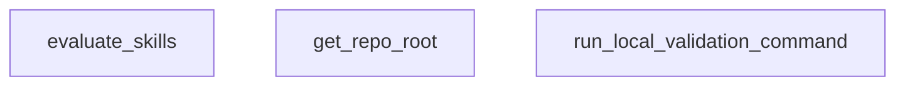

## Genel Bakış

Bu modül, HVAC projesinin "skills" (yetenek/beceriler) bileşenlerini yerel ortamda doğrulamak ve değerlendirmekten sorumludur. Repo kök dizinini tespit ederek ilgili doğrulama komutlarını çalıştırır ve sonuçları raporlar.

## Fonksiyon Grupları

### Ortam Altyapısı
Repository kök dizinini dinamik olarak tespit ederek modülün farklı ortamlarda çalışabilmesini sağlar.
- get_repo_root

### Komut Çalıştırma
Yerel ortamda doğrulama komutlarını çalıştırır ve başarı durumunu boolean değer olarak döndürerek hata yönetimi için temel oluşturur.
- run_local_validation_command

### Değerlendirme Akışını Orkestra Etmek
Tüm değerlendirme sürecini koordine eden üst düzey fonksiyondur; altyapı ve komut çalıştırma fonksiyonlarını bir araya getirerek skills doğrulamasını başlatır.
- evaluate_skills

---

## AXIOMS – Mimari Varsayımlar

Bu modül, fonksiyon imzalarına dayalı olarak aşağıdaki mimari varsayımları içerir:

[Aksiyom 1]: Eğer `get_repo_root()` çağrıldığında geçerli bir git repository mevcut değilse, kök dizin tespit edilemez ve modülün geri kalanı çalışamaz.

[Aksiyom 2]: Eğer `run_local_validation_command` çağrısında `cmd` parametresi geçerli bir komut içermiyorsa, komut başarısız olur veya beklenmeyen davranış sergilenir.

[Aksiyom 3]: Eğer `run_local_validation_command` çağrısında `cwd` parametresi olarak verilen `Path` mevcut bir dizini göstermiyorsa, komut çalıştırılamaz.

[Aksiyom 4]: Eğer `evaluate_skills()` çağrıldığında yerel ortamda komut çalıştırma yetkisi (izinleri) yoksa, doğrulama komutları yürütülemez.

[Aksiyom 5]: Eğer `get_repo_root()` başarılı bir şekilde kök dizini döndüremiyorsa, `evaluate_skills()` akışı bozulur çünkü `run_local_validation_command` için geçerli bir `cwd` elde edilemez.

---

## FONKSİYON DETAYLARI

### get_repo_root
**Ne yapar**: Projenin Git depo kök dizinini bulur.
**Nasıl yapar**: `git rev-parse --show-toplevel` komutunu çalıştırarak depo kök dizinini almaya çalışır. Bu işlem başarısız olursa (örneğin Git yüklenmemişse), betiğin bulunduğu dizinin iki üst dizinini depo kök dizini olarak döndürür.
**Parametreler**: Parametre almaz.
**Dönüş**: `Path` — Bulunan veya hesaplanan depo kök dizininin yolu.

### run_local_validation_command
**Ne yapar**: Verilen bir sistem komutunu çalıştırır ve başarısını denetler.
**Nasıl yapar**: `subprocess.run` ile komutu, belirtilen çalışma dizininde (`cwd`) çalıştırır. Komutun dönüş kodu `0` ise başarıyla tamamlanmış kabul edilir. Başarısız olursa veya herhangi bir istisna oluşursa, hata detaylarını (`stdout`, `stderr`) yazdırır ve `False` döndürür.
**Parametreler**:
- cmd: `str` — Çalıştırılacak olan komut satırı komutu.
- cwd: `Path` — Komutun çalıştırılacağı çalışma dizini.
**Dönüş**: `bool` — Komut başarıyla çalıştırılabilir ve dönüş kodu `0` ise `True`, aksi halde `False`.

### evaluate_skills

**Ne yapar**: VentHub projesindeki tüm becerileri (skills) kapsamlı bir şekilde değerlendiren ve doğrulayan bir motor fonksiyonudur. Manifest dosyasını okuyarak tetikleyici çarpışmalarını, test kapsamını, semantik benzerliği ve döngüsel bağımlılıkları tespit eder. Değerlendirme sonucunda hata ve uyarı listesi oluşturarak sistemin sağlık durumunu raporlar.

**Nasıl yapar**: Fonksiyon beş aşamalı bir doğrulama süreci yürütür. Öncelikle `.agent/plugins/venthub-core/manifest.yaml` dosyasını okur ve tüm becerileri toplar. Birinci aşamada tüm tetikleyicileri (triggers) haritalandırarak aynı tetikleyiciye sahip birden fazla beceri olup olmadığını kontrol eder. İkinci aşamada her beceri için `evals.json` dosyasının varlığını ve 12/8 Train/Test bölünmesini doğrular, ayrıca `should_trigger` sorgularının tetikleyicilerle eşleşip eşleşmediğini ve `should_not_trigger` sorgularının yanlış tetiklenip tetiklenmediğini test eder. Üçüncü aşamada SKILL.md dosyalarındaki metadata kısmında tanımlanmış `validate` komutlarını çalıştırır. Dördüncü aşamada tüm beceri tanımları arasındaki sözcük benzerliğini Jaccard benzerlik katsayısı ile hesaplayarak %60'ın üzerinde benzerlik varsa uyarı verir. Beşinci aşamada `depends_on` alanlarından oluşan bağımlılık grafiğinde döngüsel yapı olup olmadığını DFS algoritması ile tespit eder. Toplanan hatalar ve uyarılar özetlenerek değerlendirici durumunu bildirir.

**Parametreler**:

Bu fonksiyon parametre almamaktadır.

**Dönüş**: Fonksiyon değerlendirme sonucuna bağlı olarak boolean değer döndürür. Herhangi bir hata tespit edildiğinde `False`, tüm kontroller başarıyla geçildiğinde `True` döner. Fonksiyon gövdesinde `return False` ve `return True` ifadeleri yer almaktadır. Ayrıca manifest dosyası bulunamadığında da `False` ile erken çıkış yapar.

---

## AST POINTERS

### [N1_NASIL] AST Pointer: scripts/skills-evaluator.py::get_repo_root
- **params**: (parametre yok)
- **ic_degiskenler**:
  - `output` — Git komutunun stdout çıktısı, repo kök dizinini temsil eden string
- **Dönüş**: Path (Git komutuyla elde edilen kök dizin veya alternatif olarak __file__'ın ebeveyni)

### [N2_NASIL] AST Pointer: scripts/skills-evaluator.py::run_local_validation_command
- **params**: (cmd: str, cwd: Path)
- **ic_degiskenler**:
  - `res` — subprocess.run sonucu, returncode, stdout, stderr bilgilerini içeren CompletedProcess nesnesi
- **Dönüş**: bool (komut başarılıysa True, değilse False)

### [N3_NASIL] AST Pointer: scripts/skills-evaluator.py::evaluate_skills
- **params**: (parametre yok)
- **ic_degiskenler**:
  - `repo_root` — get_repo_root() tarafından döndürülen Git repo kök dizini
  - `skills_dir` — .agent/skills dizinini temsil eden Path nesnesi
  - `manifest_path` — .agent/plugins/venthub-core/manifest.yaml dosyasının tam yolu
  - `manifest_data` — YAML dosyasından yüklenen manifest içeriği (sözlük)
  - `skills_section` — manifest_data'daki "skills" bölümü, kategorilere göre gruplanmış skill listeleri
  - `all_skills` — Tüm skill tanımlarının listesi
  - `trigger_map` — Tetikleyici kelimelerin hangi skill'ler tarafından kullanıldığını gösteren sözlük
  - `errors` — Tespit edilen hataların listesi
  - `warnings` — Uyarıların listesi
  - `category` — Mevcut kategori adı (döngü değişkeni)
  - `skills_list` — Mevcut kategorideki skill listesi (döngü değişkeni)
  - `name` — Skill'in adı (skill.get("name"))
  - `path` — Skill'in dosya yolu (skill.get("path"))
  - `triggers` — Skill'in tetikleyici kelimeleri listesi (skill.get("triggers_on"))
  - `recovery` — Skill'in kurtarma stratejisi (skill.get("recovery"))
  - `t` — Mevcut tetikleyici kelime (döngü değişkeni)
  - `t_lower` — Küçük harfe dönüştürülmüş ve boşlukları temizlenmiş tetikleyici kelime
  - `rel_path` — Skill'in göreceli dosya yolu (skill.get("path"))
  - `skill_md_path` — Skill'in SKILL.md dosyasının tam yolu
  - `skill_dir` — Skill'in bulunduğu dizin
  - `evals_file` — Skill'in evals.json dosyasının tam yolu
  - `evals_data` — evals.json dosyasından yüklenen değerlendirme verileri
  - `should_trigger` — Tetiklenmesi gereken test sorguları listesi
  - `should_not_trigger` — Tetiklenmemesi gereken test sorguları listesi
  - `split_status` — 12/8 train/test split durumu ("VERIFIED" veya "INCOMPLETE")
  - `triggers_lower` — Küçük harfe dönüştürülmüş tetikleyici kelimelerin listesi
  - `query` — Mevcut test sorgusu (döngü değişkeni)
  - `query_lower` — Küçük harfe dönüştürülmüş test sorgusu
  - `matched` — Sorgunun tetikleyici ile eşleşip eşleşmediğini gösteren bayrak
  - `content` — SKILL.md dosyasının içeriği
  - `parts` — YAML frontmatter ayırma karakterine göre bölünmüş içerik parçaları
  - `metadata_yaml` — YAML frontmatter'dan yüklenen metadata
  - `metadata` — "metadata" anahtarındaki değer
  - `commands` — "commands" altındaki komutlar sözlüğü
  - `validate_cmd` — Doğrulama komutu (commands.get("validate"))
  - `similarity_warnings` — Benzerlik uyarılarının sayısı
  - `i` — Döngü sayacı (tüm skill çiftlerini döndürmek için)
  - `j` — İkinci döngü sayacı (i'den büyük indeksler için)
  - `skill_a` — Birinci skill (all_skills[i])
  - `skill_b` — İkinci skill (all_skills[j])
  - `name_a` — Birinci skill'in adı
  - `name_b` — İkinci skill'in adı
  - `desc_a` — Birinci skill'in açıklaması
  - `desc_b` — İkinci skill'in açıklaması
  - `words_a` — Birinci skill'in açıklamasındaki kelimeler kümesi
  - `words_b` — İkinci skill'in açıklamasındaki kelimeler kümesi
  - `intersection` — İki kelime kümesinin kesişimi
  - `union` — İki kelime kümesinin birleşimi
  - `similarity` — Jaccard benzerlik skoru
  - `warning_msg` — Benzerlik uyarısı mesajı
  - `adj_graph` — Skill'ler arası bağımlılık grafiği (komşuluk listesi)
  - `node` — Mevcut düğüm adı (döngü değişkeni)
  - `visited` — Ziyaret edilen düğümlerin durumunu tutan sözlük (0: ziyaret edilmedi, 1: yolda, 2: tamamlandı)
  - `cycle_path` — Tespit edilen döngü yolu
  - `cycle_detected` — Döngü tespit edilip edilmediğini gösteren bayrak
  - `dfs` — Rekürsif derinlik öncelige arama fonksiyonu (iç fonksiyon)
- **Dönüş**: bool (hata yoksa True, hata varsa False)

### [N4_NASIL] AST Pointer: scripts/skills-evaluator.py::dfs
- **params**: (u: str, path: list)
- **ic_degiskenler**:
  - `cycle_detected` — Döngü tespit edilip edilmediğini gösteren nonlocal bayrak (evaluate_skills'ten)
  - `cycle_path` — Tespit edilen döngü yolu (evaluate_skills'ten)
  - `u` — Mevcut düğüm adı (parametre)
  - `path` — Mevcut ziyaret yolu (parametre)
  - `v` — Komşu düğüm (döngü değişkeni)
- **Dönüş**: bool (döngü tespit edildiyse True, aksi halde False)

---

## MERMAID CALL GRAPH

## NODE ID STANDARD

  file: scripts\skills-evaluator.py
  function: scripts\skills-evaluator.py::get_repo_root
  function: scripts\skills-evaluator.py::run_local_validation_command
  function: scripts\skills-evaluator.py::evaluate_skills

---

## DISA AKTARILANLAR (EXPORTS)
  export: evaluate_skills
  export: get_repo_root
  export: run_local_validation_command