## Genel Bakış

Bu modül, bir Git deposundaki skill (beceri) dosyalarındaki değişiklikleri tespit edip yerel doğrulama komutları çalıştırarak skill'leri değerlendiren bir değerlendirme aracıdır. Modül, değişen dosyaları ve skill dizinlerini analiz ederek hangi skill'lerin yeniden değerlendirilmesi gerektiğini belirler ve doğrulama sürecini yürütür.

## Fonksiyon Grupları

### Değişiklik Analizi
Depodaki dosya değişikliklerini tespit eder ve hangi skill dizinlerinin etkilendiğini belirler.
- `get_changed_files`, `get_changed_skill_dirs`, `has_source_code_changes`

### Repo ve Ortam Bilgisi
Proje kök dizinini bulur ve harici komutları belirtilen çalışma dizininde çalıştırarak doğrulama sonuçlarını döndürür.
- `get_repo_root`, `run_local_validation_command`

### Ana İş Akışı
Komut satırı argümanlarını ayrıştırır ve tüm değerlendirme sürecini orkestrasyon ederek skill'lerin doğrulama sonuçlarını üretir.
- `parse_args`, `evaluate_skills`

---

## AXIOMS – Mimari Varsayımlar
- Bu modül davranışsal mantık içermez (salt veri / konfigürasyon / tip tanımı).
- [Aksiyom 1]: Modülün dışa açtığı yapı (anahtar kümesi / şema) bir sözleşmedir; tüketiciler bu sabit yapıya bağlıdır — kırıcı değişiklik tüm tüketicileri etkiler.
- [Aksiyom 2]: Bir öğe ekleme/çıkarma yapısal-uyumlu olmalı; ilgili tipler ve seçiciler aynı commit'te güncel tutulmalıdır.

---

## FONKSİYON DETAYLARI

### get_repo_root
**Ne yapar**: Git deposunun kök dizin yolunu `Path` nesnesi olarak döndürür. Projenin kök dizinini bulmak için kullanılır.

**Nasıl yapar**: İlk olarak `subprocess.check_output` ile `git rev-parse --show-toplevel` komutunu çalıştırarak Git'in bildiği kök dizin yolunu alır. Elde edilen çıktıdaki boşlukları temizleyip `Path` nesnesine dönüştürür. Eğer bu işlem herhangi bir istisnai durumla (exception) başarısız olursa, betiğin bulunduğu dosya yolundan (`__file__`) iki üst dizine çıkarak (`parent.parent`) alternatif kök dizin hesaplar.

**Parametreler**:
- Bu fonksiyon parametre almaz.

**Dönüş**: `Path` — Git deposunun kök dizinini temsil eden `Path` nesnesi.

### run_local_validation_command
**Ne yapar**: Geliştirildi ancak detay üretilemedi.

### get_changed_files
**Ne yapar**: Geliştirildi ancak detay üretilemedi.

### get_changed_skill_dirs
**Ne yapar**: Geliştirildi ancak detay üretilemedi.

### has_source_code_changes
**Ne yapar**: Geliştirildi ancak detay üretilemedi.

### parse_args
**Ne yapar**: Geliştirildi ancak detay üretilemedi.

### evaluate_skills
**Ne yapar**: Geliştirildi ancak detay üretilemedi.

---

## İTHALATLAR (IMPORTS)
- import: argparse
- import: json
- import: os
- import: pathlib::Path
- import: re
- import: subprocess
- import: sys
- import: yaml

---

## SABİTLER
- **HEAVY_SKILL_NAMES** (set)

---

## AST POINTERS

### [N1_NASIL] AST Pointer: scripts/skills-evaluator.py::get_repo_root
- **params**: (parametre yok)
- **ic_degiskenler**:
  - `output` — `subprocess.check_output` ile `git rev-parse --show-toplevel` komutunun çalıştırılması sonucu elde edilen metin çıktı; `strip()` ile boşlukları temizlenip `Path` nesnesine dönüştürülür
- **Dönüş**: `Path` — git kök dizini; hata durumunda `__file__`'ın iki üst dizini

### [N2_NASIL] AST Pointer: scripts/skills-evaluator.py::run_local_validation_command
- **params**:
  - `cmd` — çalıştırılacak kabuk komutu (str)
  - `cwd` — komutun çalıştırılacağı çalışma dizini (Path)
- **ic_degiskenler**:
  - `res` — `subprocess.run` sonucu oluşan CompletedProcess nesnesi; `returncode`, `stdout`, `stderr` alanlarına erişilir
- **Dönüş**: `bool` — komut başarıyla tamamlandıysa `True`, aksi halde `False`

### [N3_NASIL] AST Pointer: scripts/skills-evaluator.py::get_changed_files
- **params**:
  - `repo_root` — git deposunun kök dizini (Path)
- **ic_degiskenler**:
  - `changed` — staged, unstaged ve untracked dosyaları birleştiren `set`; tekrarları önler
  - `out` — her `subprocess.check_output` çağrısından dönen metin çıktı
  - `l` — `out.splitlines()` ile elde edilen her satır; `strip()` ile boşlukları temizlenip `changed` setine eklenir
- **Dönüş**: `list[str]` — depodaki tüm değişmiş dosya yollarının listesi

### [N4_NASIL] AST Pointer: scripts/skills-evaluator.py::get_changed_skill_dirs
- **params**:
  - `repo_root` — git deposunun kök dizini (Path)
- **ic_degiskenler**:
  - `changed_files` — `get_changed_files` çağrısından dönen değişmiş dosya yolları listesi
  - `skill_prefix` — skill dizinlerini ayırt etmek için kullanılan sabit önek: `".agent/skills/"`
  - `changed_skills` — değişmiş skill dizin adlarını tutan `set`
  - `f` — `changed_files` listesindeki her dosya yolu
  - `f_normalized` — ters eğik çizgilerin düz eğik çizgiye dönüştürülmüş hali
  - `remainder` — `skill_prefix` çıkarıldıktan sonra kalan yol parçası
  - `parts` — `remainder`'ın `"/"` ile bölünmesiyle elde edilen parça listesi; `parts[0]` skill adıdır
- **Dönüş**: `set[str]` — değişmiş skill dizin adlarının kümesi

### [N5_NASIL] AST Pointer: scripts/skills-evaluator.py::has_source_code_changes
- **params**:
  - `repo_root` — git deposunun kök dizini (Path)
- **ic_degiskenler**:
  - `changed_files` — `get_changed_files` çağrısından dönen değişmiş dosya yolları listesi
  - `source_extensions` — uygulama kaynak kodu olarak kabul edilen dosya uzantıları kümesi: `{".ts", ".tsx", ".js", ".jsx", ".css", ".json", ".py"}`
  - `infra_prefixes` — agent altyapı dizinlerini belirten önek demeti: `(".agent/", "scripts/", "docs/", ".github/", ".vscode/")`
  - `f` — `changed_files` listesindeki her dosya yolu
  - `f_normalized` — ters eğik çizgilerin düz eğik çizgiye dönüştürülmüş hali
  - `ext` — `os.path.splitext` ile elde edilen dosya uzantısı; `lower()` ile küçültülür
- **Dönüş**: `bool` — altyapı dizinleri dışındaki kaynak kod dosyalarından en az biri değişmişse `True`, aksi halde `False`

### [N6_NASIL] AST Pointer: scripts/skills-evaluator.py::parse_args
- **params**: (parametre yok)
- **ic_degiskenler**:
  - `parser` — `argparse.ArgumentParser` nesnesi; `--force` (store_true) ve `--skill` (str, default=None) argümanları eklenir
- **Dönüş**: yok — `parser.parse_args()` sonucu global `args` değişkenine atanır (yan etki)

### [N7_NASIL] AST Pointer: scripts/skills-evaluator.py::evaluate_skills
- **params**: (parametre yok)
- **ic_degiskenler**:
  - `args` — `parse_args()` dönüşü; `args.force` ve `args.skill` alanlarına erişilir
  - `repo_root` — `get_repo_root()` dönüşü olan Path nesnesi
  - `skills_dir` — `repo_root / ".agent" / "skills"` yolu
  - `manifest_path` — `repo_root / ".agent" / "plugins" / "venthub-core" / "manifest.yaml"` yolu
  - `manifest_data` — `yaml.safe_load` ile manifest dosyasından yüklenen sözlük
  - `skills_section` — `manifest_data.get("skills", {})` ile elde edilen skill kategorileri sözlüğü
  - `all_skills` — tüm skill sözlüklerini toplayan liste
  - `trigger_map` — tetikleyici kelimeyi skill adı listesine eşleyen sözlük
  - `errors` — hata mesajlarını toplayan liste
  - `warnings` — uyarı mesajlarını toplayan liste
  - `category` — `skills_section` sözlüğündeki her kategori anahtarı
  - `skills_list` — her kategorideki skill sözlüklerinin listesi
  - `skill` — `skills_list` içindeki her skill sözlüğü
  - `name` — `skill.get("name")` ile elde edilen skill adı
  - `path` — `skill.get("path")` ile elde edilen skill dosya yolu
  - `triggers` — `skill.get("triggers_on", [])` ile elde edilen tetikleyici listesi
  - `recovery` — `skill.get("recovery", {})` ile elde edilen kurtarma sözlüğü
  - `t` — `triggers` listesindeki her tetikleyici
  - `t_lower` — `t.lower().strip()` ile küçültülmüş tetikleyici
  - `skills` — `trigger_map[t_lower]` ile elde edilen skill adı listesi (çarpışma kontrolü)
  - `rel_path` — `skill.get("path")` ile elde edilen göreli yol
  - `skill_md_path` — `repo_root / rel_path` ile oluşturulan tam yol
  - `skill_dir` — `skill_md_path.parent` ile elde edilen skill dizini
  - `evals_file` — `skill_dir / "evals" / "evals.json"` yolu
  - `evals_data` — `json.load` ile evals dosyasından yüklenen sözlük
  - `should_trigger` — `evals_data.get("should_trigger", [])` ile elde edilen pozitif test sorguları
  - `should_not_trigger` — `evals_data.get("should_not_trigger", [])` ile elde edilen negatif test sorguları
  - `split_status` — 12/8 train/test split doğrulama durumu: `"VERIFIED"` veya `"INCOMPLETE"`
  - `triggers_lower` — tetikleyicilerin `lower().strip()` ile küçültülmüş hali listesi
  - `query` — `should_trigger` veya `should_not_trigger` listesindeki her sorgu
  - `query_lower` — `query.lower().strip()` ile küçültülmüş sorgu
  - `matched` — sorgunun tetikleyicilerle eşleşip eşleşmediğini gösteren bool
  - `changed_skills` — `get_changed_skill_dirs(repo_root)` dönüşü
  - `source_changed` — `has_source_code_changes(repo_root)` dönüşü
  - `validated_count` — başarıyla çalıştırılan doğrulama komutu sayısı
  - `skipped_count` — atlanan doğrulama komutu sayısı
  - `content` — SKILL.md dosyasının `read()` ile okunan tam metin içeriği
  - `parts` — `content.split("---")` ile elde edilen bölüm listesi
  - `metadata_yaml` — `yaml.safe_load(parts[1])` ile yüklenen metadata sözlüğü
  - `metadata` — `metadata_yaml.get("metadata", {})` ile elde edilen alt sözlük
  - `commands` — `metadata.get("commands", {})` ile elde edilen komutlar sözlüğü
  - `validate_cmd` — `commands.get("validate")` ile elde edilen doğrulama komutu
  - `success` — `run_local_validation_command(validate_cmd, repo_root)` dönüşü
  - `similarity_warnings` — benzerlik uyarısı sayacı
  - `i` — `all_skills` listesindeki birinci skill indeksi
  - `j` — `all_skills` listesindeki ikinci skill indeksi
  - `skill_a` — `all_skills[i]` ile elde edilen birinci skill sözlüğü
  - `skill_b` — `all_skills[j]` ile elde edilen ikinci skill sözlüğü
  - `name_a` — `skill_a.get("name")` ile elde edilen birinci skill adı
  - `name_b` — `skill_b.get("name")` ile elde edilen ikinci skill adı
  - `desc_a` — `skill_a.get("description", "")` ile elde edilen birinci skill açıklaması
  - `desc_b` — `skill_b.get("description", "")` ile elde edilen ikinci skill açıklaması
  - `words_a` — `re.findall(r'\w+', desc_a.lower())` ile elde edilen kelime kümesi
  - `words_b` — `re.findall(r'\w+', desc_b.lower())` ile elde edilen kelime kümesi
  - `intersection` — `words_a.intersection(words_b)` ile elde edilen ortak kelimeler kümesi
  - `union` — `words_a.union(words_b)` ile elde edilen birleşim kümesi
  - `similarity` — `len(intersection) / len(union)` ile hesaplanan benzerlik oranı
  - `warning_msg` — benzerlik uyarısı mesajı
  - `adj_graph` — skill adlarını bağımlılık listesine eşleyen sözlük
  - `depends_on` — `skill.get("depends_on", [])` ile elde edilen bağımlılık listesi
  - `visited` — DFS ziyaret durumlarını tutan sözlük (0=ziyaret edilmemiş, 1=işleniyor, 2=tamamlandı)
  - `cycle_path` — tespit edilen döngüdeki düğüm listesi
  - `cycle_detected` — döngü tespit edilip edilmediğini gösteren bool
  - `node` — `adj_graph` sözlüğündeki her düğüm
  - `cycle_str` — döngü yolunun `" -> "` ile birleştirilmiş metin gösterimi
  - `err` — `errors` listesindeki her hata mesajı
- **Dönüş**: `bool` — hata yoksa `True`, hata varsa `False`

### [N8_NASIL] AST Pointer: scripts/skills-evaluator.py::dfs
- **params**:
  - `u` — DFS'te işlenen mevcut düğüm (skill adı)
  - `path` — mevcut DFS yolunu tutan liste
- **ic_degiskenler**:
  - `v` — `adj_graph.get(u, [])` ile elde edilen bağımlılık listesindeki her komşu düğüm
- **Dönüş**: `bool` — döngü tespit edilirse `True`, edilmezse `False`

---

## NODE ID STANDARD

  file: skills-evaluator.py
  function: skills-evaluator.py::get_repo_root
  function: skills-evaluator.py::run_local_validation_command
  function: skills-evaluator.py::get_changed_files
  function: skills-evaluator.py::get_changed_skill_dirs
  function: skills-evaluator.py::has_source_code_changes
  function: skills-evaluator.py::parse_args
  function: skills-evaluator.py::evaluate_skills

---

## MERMAID CALL GRAPH

```mermaid
graph TD
    skills-evaluator_py__get_repo_root
    skills-evaluator_py__run_local_validation_command
    skills-evaluator_py__get_changed_files
    skills-evaluator_py__get_changed_skill_dirs
    skills-evaluator_py__has_source_code_changes
    skills-evaluator_py__parse_args
    skills-evaluator_py__evaluate_skills
    skills-evaluator_py__dfs
    skills-evaluator_py__get_repo_root --> skills-evaluator_py__check_output
    skills-evaluator_py__get_repo_root --> skills-evaluator_py__Path
    skills-evaluator_py__get_repo_root --> skills-evaluator_py__resolve
    skills-evaluator_py__run_local_validation_command --> skills-evaluator_py__run
    skills-evaluator_py__get_changed_files --> skills-evaluator_py__check_output
    skills-evaluator_py__get_changed_files --> skills-evaluator_py__splitlines
    skills-evaluator_py__get_changed_skill_dirs --> skills-evaluator_py__get_changed_files
    skills-evaluator_py__get_changed_skill_dirs --> skills-evaluator_py__add
    skills-evaluator_py__has_source_code_changes --> skills-evaluator_py__get_changed_files
    skills-evaluator_py__has_source_code_changes --> skills-evaluator_py__splitext
    skills-evaluator_py__parse_args --> skills-evaluator_py__ArgumentParser
    skills-evaluator_py__parse_args --> skills-evaluator_py__add_argument
    skills-evaluator_py__parse_args --> skills-evaluator_py__parse_args
    skills-evaluator_py__evaluate_skills --> skills-evaluator_py__parse_args
    skills-evaluator_py__evaluate_skills --> skills-evaluator_py__get_repo_root
    skills-evaluator_py__evaluate_skills --> skills-evaluator_py__exists
    skills-evaluator_py__evaluate_skills --> skills-evaluator_py__safe_load
    skills-evaluator_py__evaluate_skills --> skills-evaluator_py__load
    skills-evaluator_py__evaluate_skills --> skills-evaluator_py__get_changed_skill_dirs
    skills-evaluator_py__evaluate_skills --> skills-evaluator_py__has_source_code_changes
    skills-evaluator_py__evaluate_skills --> skills-evaluator_py__run_local_validation_command
    skills-evaluator_py__evaluate_skills --> skills-evaluator_py__findall
    skills-evaluator_py__evaluate_skills --> skills-evaluator_py__intersection
    skills-evaluator_py__evaluate_skills --> skills-evaluator_py__union
    skills-evaluator_py__evaluate_skills --> skills-evaluator_py__dfs
    skills-evaluator_py__dfs --> skills-evaluator_py__index
    skills-evaluator_py__dfs --> skills-evaluator_py__dfs
    orion_cli_docs_migrator_lite_py__main --> skills-evaluator_py__parse_args
    orion_cli_analyze_py__main --> skills-evaluator_py__parse_args
    orion_cli_audit_py__main --> skills-evaluator_py__parse_args
    orion_cli_diagnose_py__main --> skills-evaluator_py__parse_args
    orion_cli_docs_tree_py__main --> skills-evaluator_py__parse_args
    orion_cli_health_py__main --> skills-evaluator_py__parse_args
    orion_cli_need_py__main --> skills-evaluator_py__parse_args
    orion_cli_reset_py__main --> skills-evaluator_py__parse_args
    orion_cli_stats_py__main --> skills-evaluator_py__parse_args
    orion_memory_jobs_retroactive_heal_py__main --> skills-evaluator_py__parse_args
    orion_memory_shadow_mirror_py__main --> skills-evaluator_py__parse_args
    orion_memory_shadow_rebuild_py__main --> skills-evaluator_py__parse_args
    orion_memory_shadow_recall_py____toplevel__ --> skills-evaluator_py__parse_args
    orion_memory_shadow_search_py__main --> skills-evaluator_py__parse_args
    orion_registry_api_app_py__serve --> skills-evaluator_py__parse_args
    scripts_skills-creator_py__main --> skills-evaluator_py__parse_args
    scripts_skills-orchestrator_py__main --> skills-evaluator_py__parse_args
    scripts_skills-router_py__main --> skills-evaluator_py__parse_args
    _agent_skills_ensemble_optimizer_py__main --> skills-evaluator_py__parse_args
    _agent_skills_reflective_optimizer_v2_py__main --> skills-evaluator_py__parse_args
    orion_scripts_gocur_kirli_gorev_sozlugu_py__main --> skills-evaluator_py__parse_args
    scripts_compile_skills_py__main --> skills-evaluator_py__get_repo_root
    scripts_skills-creator_py__main --> skills-evaluator_py__get_repo_root
    scripts_skills-orchestrator_py__main --> skills-evaluator_py__get_repo_root
    scripts_skills-router_py__main --> skills-evaluator_py__get_repo_root
```

---

## DISA AKTARILANLAR (EXPORTS)
  export: evaluate_skills
  export: get_changed_files
  export: get_changed_skill_dirs
  export: get_repo_root
  export: has_source_code_changes
  export: parse_args
  export: run_local_validation_command