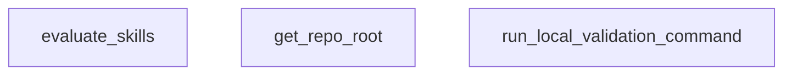

## Genel Bakış

Bu modül, HVAC projesinin "skills" (yetenek/beceriler) bileşenlerini yerel ortamda doğrulamak ve değerlendirmekten sorumludur. Repo kök dizinini tespit ederek ilgili doğrulama komutlarını çalıştırır ve sonuçları raporlar.

## Fonksiyon Grupları

### Ortam Altyapısı
Repository kök dizinini dinamik olarak tespit ederek modülün farklı ortamlarda çalışabilmesini sağlar.
- get_repo_root

### Komut Çalıştırma
Yerel ortamda doğrulama komutlarını çalıştırır ve başarı durumunu boolean değer olarak döndürerek hata yönetimi için temel oluşturur.
- run_local_validation_command

### Değerlendirme Akışını Orkestra Etmek
Tüm değerlendirme sürecini koordine eden üst düzey fonksiyondur; altyapı ve komut çalıştırma fonksiyonlarını bir araya getirerek skills doğrulamasını başlatır.
- evaluate_skills

---

---

## FONKSİYON DETAYLARI

### get_repo_root
**Ne yapar**: Projenin Git depo kök dizinini bulur.
**Nasıl yapar**: `git rev-parse --show-toplevel` komutunu çalıştırarak depo kök dizinini almaya çalışır. Bu işlem başarısız olursa (örneğin Git yüklenmemişse), betiğin bulunduğu dizinin iki üst dizinini depo kök dizini olarak döndürür.
**Parametreler**: Parametre almaz.
**Dönüş**: `Path` — Bulunan veya hesaplanan depo kök dizininin yolu.

### run_local_validation_command
**Ne yapar**: Verilen bir sistem komutunu çalıştırır ve başarısını denetler.
**Nasıl yapar**: `subprocess.run` ile komutu, belirtilen çalışma dizininde (`cwd`) çalıştırır. Komutun dönüş kodu `0` ise başarıyla tamamlanmış kabul edilir. Başarısız olursa veya herhangi bir istisna oluşursa, hata detaylarını (`stdout`, `stderr`) yazdırır ve `False` döndürür.
**Parametreler**:
- cmd: `str` — Çalıştırılacak olan komut satırı komutu.
- cwd: `Path` — Komutun çalıştırılacağı çalışma dizini.
**Dönüş**: `bool` — Komut başarıyla çalıştırılabilir ve dönüş kodu `0` ise `True`, aksi halde `False`.

### evaluate_skills
**Ne yapar**: VentHub projesindeki tüm TDD (Test-Driven Development) becerilerini kapsamlı bir şekilde değerlendirir, çakışmaları tespit eder ve raporlar.
**Nasıl yapar**: `manifest.yaml` dosyasını okuyarak tüm becerileri toplar. Dört aşamalı bir analiz yürütür: 1) Tetikleyici sözcük çakışmalarını kontrol eder. 2) Her beceri için `evals.json` dosyasını doğrular, 12/8'lik eğitim/test bölünmesini kontrol eder ve tetikleyici eşleşmelerini test eder. 3) `SKILL.md` dosyasındaki metadata'dan `validate` komutunu bulup çalıştırarak beceri kodunun sağlığını test eder. 4) Tüm beceri açıklamaları arasındaki sözcük tabanlı semantik benzerliği hesaplayarak potansiyel örtüşmeleri belirler. Toplanan hata ve uyarıları bir rapor olarak yazdırır ve değerlendirme sonucunu (`True`/`False`) döndürür.
**Parametreler**: Parametre almaz.
**Dönüş**: `bool` — Değerlendirme hataların (`errors`) olmaması durumunda `True`, aksi halde `False`.

---

## AST POINTERS

### [N1_NASIL] AST Pointer: scripts/skills-evaluator.py::get_repo_root
- **params**: (parametre yok)
- **ic_degiskenler**:
  - `output` — `subprocess.check_output` ile `git rev-parse --show-toplevel` komutunun stdout çıktısı; repo kök dizinini string olarak tutar
- **Dönüş**: `Path` — output'un strip edilmiş hali Path nesnesine dönüştürülür; hata durumunda scriptin kendi konumunun iki üst dizini döner

### [N2_NASIL] AST Pointer: scripts/skills-evaluator.py::run_local_validation_command
- **params**: `cmd: str` — çalıştırılacak shell komutu, `cwd: Path` — komutun çalışacağı çalışma dizini
- **ic_degiskenler**:
  - `res` — `subprocess.run` sonucu; returncode, stdout, stderr alanlarını barındırır
  - `res.returncode` — komutun dönüş kodu; 0 ise başarılı
  - `res.stdout` — komutun standart çıktısı
  - `res.stderr` — komutun hata çıktısı
  - `e` — yakalanan Exception nesnesi; hata mesajını barındırır
- **Dönüş**: `bool` — True: komut başarılı (returncode==0), False: başarısız veya istisna oluştu

### [N3_NASIL] AST Pointer: scripts/skills-evaluator.py::evaluate_skills
- **params**: (parametre yok)
- **ic_degiskenler**:
  - `repo_root` — `get_repo_root()` çağrısıyla elde edilen repo kök dizini Path nesnesi
  - `skills_dir` — `.agent/skills` dizin yolu; şu an kullanılmıyor ama tanımlı
  - `manifest_path` — `.agent/plugins/venthub-core/manifest.yaml` dosya yolu
  - `manifest_data` — `yaml.safe_load` ile yüklenen manifest YAML verisi (dict)
  - `skills_section` — `manifest_data["skills"]` altındaki tüm skill kategorileri ve listeleri (dict)
  - `all_skills` — tüm skill dict'lerinin toplandığı liste; semantic similarity karşılaştırmaları için kullanılır
  - `trigger_map` — trigger kelimesinden skill isimlerine eşleştiren dict; collision kontrolü için kullanılır
  - `errors` — tespit edilen hataların listesi
  - `warnings` — tespit edilen uyarıların listesi
  - `category` — döngüdeki mevcut skill kategorisi adı (str)
  - `skills_list` — mevcut kategorideki skill dict'lerinin listesi
  - `skill` — döngüdeki mevcut skill sözlüğü
  - `name` — `skill.get("name")` ile alınan skill adı
  - `path` — `skill.get("path")` ile alınan skill dosya yolu (1. döngüde kullanılır)
  - `triggers` — `skill.get("triggers_on", [])` ile alınan tetikleme kelimeleri listesi
  - `recovery` — `skill.get("recovery", {})` ile alınan kurtarma yapılandırması (1. döngüde kullanılır)
  - `collisions_found` — collision tespit edilip edilmediğini tutan bayrak (bool)
  - `trigger` — trigger_map döngüsündeki mevcut tetikleme kelimesi
  - `skills` — bir tetiklemeye sahip skill isimleri listesi (collision kontrolü)
  - `rel_path` — 2. ve 3. döngülerde `skill.get("path")` ile alınan göreli dosya yolu
  - `skill_md_path` — skill markdown dosyasının tam yolu
  - `skill_dir` — skill markdown dosyasının bulunduğu dizin
  - `evals_file` — `skill_dir/evals/evals.json` dosya yolu
  - `evals_data` — `json.load` ile yüklenen evals JSON verisi (dict)
  - `should_trigger` — pozitif test sorguları listesi
  - `should_not_trigger` — negatif test sorguları listesi
  - `split_status` — 12/8 train/test split durumu; "VERIFIED" veya "INCOMPLETE"
  - `triggers_lower` — trigger'ların lower-case ve strip edilmiş hali (coverage kontrolü için)
  - `query` — döngüdeki mevcut test sorgusu
  - `matched` — sorgunun herhangi bir trigger ile eşleşip eşleşmediğini tutan bayrak
  - `t` — triggers_lower döngüsündeki mevcut lower-case trigger
  - `t_lower` — 1. döngüde trigger'ın lower-case ve strip edilmiş hali (collision kontrolü)
  - `content` — SKILL.md dosyasının ham string içeriği
  - `parts` — YAML frontmatter分割 için `---` ile bölünmüş string listesi
  - `metadata_yaml` — frontmatter'dan yüklenen YAML dict
  - `metadata` — `metadata_yaml["metadata"]` altındaki yapılandırma
  - `commands` — `metadata["commands"]` altındaki komutlar
  - `validate_cmd` — çalıştırılacak validate komutu (str veya None)
  - `success` — `run_local_validation_command` sonucu (bool)
  - `similarity_warnings` — semantic similarity uyarısı sayacı (int)
  - `i` — outer döngü index'i (all_skills listesi için)
  - `j` — inner döngü index'i (all_skills listesi için)
  - `skill_a` — karşılaştırmadaki birinci skill dict'i
  - `skill_b` — karşılaştırmadaki ikinci skill dict'i
  - `name_a` — birinci skill'in adı
  - `name_b` — ikinci skill'in adı
  - `desc_a` — birinci skill'in açıklaması
  - `desc_b` — ikinci skill'in açıklaması
  - `words_a` — desc_a'dan tokenize edilmiş lower-case kelime seti
  - `words_b` — desc_b'dan tokenize edilmiş lower-case kelime seti
  - `intersection` — kelimelerin kesişim kümesi
  - `union` — kelimelerin birleşim kümesi
  - `similarity` — Jaccard benzerlik skoru (intersection/union)
  - `warning_msg` — semantic similarity uyarısı mesajı (str)
- **Dönüş**: `bool` — True: tüm kontroller başarılı, False: en az bir hata tespit edildi

---

## MERMAID CALL GRAPH

## NODE ID STANDARD

  file: scripts\skills-evaluator.py
  function: scripts\skills-evaluator.py::get_repo_root
  function: scripts\skills-evaluator.py::run_local_validation_command
  function: scripts\skills-evaluator.py::evaluate_skills

---

## DISA AKTARILANLAR (EXPORTS)
  export: evaluate_skills
  export: get_repo_root
  export: run_local_validation_command