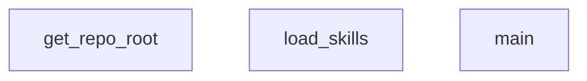

## Genel Bakış
Bu modül, VentHub projesinin "beceri" sistemini yöneten yönlendirici (router) bir yapıdır. Proje dizinindeki beceri dosyalarını tarar, yükler ve çalıştırılacak uygun beceriyi belirleyerek ana işlevselliği başlatır. Modül, dinamik beceri yönetimi ve proje yapısının keşfedilmesi temelinde çalışır.

## Fonksiyon Grupları
### Proje Yapısı Keşfi
Proje kök dizinini otomatik olarak tespit ederek modülün ve becerilerin doğru konumda bulunmasını sağlar.
- get_repo_root

### Beceri Yükleme ve Yönlendirme
Beceri dizinindeki modülleri tarar, yükler ve sistemin çalışması için gerekli olan ana kontrol akışını başlatarak uygun beceriyi yönlendirir.
- load_skills, main

---

## AXIOMS – Mimari Varsayımlar

Bu modül, repo içindeki skill dosyalarını yükleyen ve yönlendiren bir scripttir. Aşağıda fonksiyon imzalarından türetilen mimari varsayımlar yer almaktadır.

[Aksiyom 1]: Eğer `get_repo_root()` çalıştırıldığında modül dosyası bir git reposu içinde değilse veya往上 dizinlerde `.git` dizini bulunamazsa, repo root'u çözümlenemez ve modül çalışması başarısız olur.

[Aksiyom 2]: Eğer `load_skills(skills_dir: Path)` çağrısında belirtilen `skills_dir` dizini mevcut değilse veya Path nesnesi geçerli bir dizin yolunu temsil etmiyorsa, skill dosyaları yüklenemez.

[Aksiyom 3]: Eğer `skills_dir` dizini mevcutsa ancak içeriğinde geçerli skill dosyaları (yüklenebilir modüller) yoksa, `load_skills` boş veya eksik bir skill listesi ile döner.

[Aksiyom 4]: Eğer `main()` çağrıldığında `get_repo_root()` başarıyla bir Path döndürmezse veya bu root'a bağlı `skills_dir` geçerli değilse, modülün ana iş akşı tamamlanamaz.

---

## FONKSİYON DETAYLARI

### get_repo_root
**Ne yapar**: Git repository'nin kok dizinini (en ust dizin) bulur ve bir Path nesnesi olarak dondurur. Git komutu basarisiz olursa, dosyanin kendi konumundan iki ust dizine cikarak projenin kokunu yaklasik olarak belirler.

**Nasil yapar**: `git rev-parse --show-toplevel` komutunu `subprocess.check_output` ile calistirarak Git'in tespit ettigi kok dizini alir. Herhangi bir istisna olusursa (ornegin dizin bir Git repository degilse), `__file__` degiskeninin resolve edilmis konumunun iki ust dizinine (`.parent.parent`) giderek projenin kok dizinini dondurur.

**Parametreler**: Bu fonksiyon herhangi bir parametre almaz.

**Donus**: `Path` — Git repository'nin kok dizinini temsil eden bir pathlib.Path nesnesi.

### load_skills
**Ne yapar**: Geliştirildi ancak detay üretilemedi.

### main

**Ne yapar**: Ana yönlendirme fonksiyonu, kullanıcı sorgusunu alır ve mevcut agent yetenekleri arasından en uygun olan(ları) seçerek çalıştırma sırasını belirler. Sorgu teknik bir konuyla ilgili değilse CONVERSATIONAL durumunu döndürür.

**Nasıl yapar**: Fonksiyon öncelikle argümanları ayrıştırır ve yetenek dosyalarını yükler. Ardından ONNX tabanlı bir embedding modeli ile sorgu ve tüm yetenek tanımlarını tokenize edip vektörel temsillere dönüştürür. Cosine benzerliği hesaplayarak her yetenek için bir skor üretir. Tetikleme anahtar kelimeleri, yetenek adı eşleşmeleri ve geliştirici anahtar kelime kontrolü uygulayarak sonuçları filtreler. Skor eşik değerini aşan adaylar, hariç tutma kuralları ve bağımlılık ilişkileri dikkate alınarak topolojik olarak sıralanır. Kahn algoritması kullanılarak çapraz bağımlılıklar çözülür ve nihai çalıştırma yolu belirlenir.

**Parametreler**:
- `--query` : string (zorunlu) — Yönlendirilecek kullanıcı sorgu metni

**Dönüş**: Fonksiyon doğrudan stdout'a JSON çıktısı basar. İki olası durum döndürür:
- `{"status": "CONVERSATIONAL"}` — Sorgu teknik bir yetenekle eşleşmediğinde
- `{"status": "MATCHED", "path": ["yetenek1", "yetenek2", ...]}` — Eşleşen yeteneklerin topolojik sıralanmış çalıştırma yolunu içerecek şekilde

---

## AST POINTERS

### [N1_NASIL] AST Pointer: scripts/skills-router.py::get_repo_root
- **params**: (parametre yok)
- **ic_degiskenler**:
  - `output` — `subprocess.check_output(["git", "rev-parse", "--show-toplevel"], text=True)` çağrısıyla elde edilen git repo kök dizininin stdout çıktısı (string), strip edilerek Path'e dönüştürülür
- **Dönüş**: `Path(output.strip())` — git repo kök dizini; Exception durumunda `Path(__file__).resolve().parent.parent` (dosyanın iki üst dizini)

---

### [N2_NASIL] AST Pointer: scripts/skills-router.py::load_skills
- **params**: `skills_dir: Path` — skill alt dizinlerinin bulunduğu kök dizin
- **ic_degiskenler**:
  - `skills_list` — yüklenen tüm skill sözlüklerinin toplandığı sonuç listesi, fonksiyon sonunda döndürülür
  - `skill_path` — `skills_dir.iterdir()` ile sıralı olarak iterasyon yapılan her bir skill alt dizini
  - `skill_md_path` — `skill_path / "SKILL.md"` ile oluşturulan SKILL.md dosya yolu
  - `f` — `open(skill_md_path, "r", encoding="utf-8")` ile açılan dosya nesnesi (with bloğu içinde)
  - `content` — SKILL.md dosyasının tam string içeriği (`f.read()`)
  - `parts` — `content.split("---")` ile bölünmüş parçalar listesi, frontmatter ayrımı için kullanılır
  - `frontmatter_text` — `parts[1]`, YAML frontmatter ham metni
  - `frontmatter` — `yaml.safe_load(frontmatter_text)` ile parse edilmiş sözlük; None olabilir, `{}` fallback'li
  - `e` — frontmatter parse sırasında yakalanan Exception nesnesi (hata loglamak için)
  - `name` — `frontmatter.get("name", skill_path.name)` ile alınan skill adı, yoksa dizin adı kullanılır
  - `description` — `frontmatter.get("description", "")` ile alınan skill açıklaması
  - `depends_on` — `frontmatter.get("depends_on", [])` ile alınan bağımlılık skill isimleri listesi
  - `next_steps` — `frontmatter.get("next_steps", [])` ile alınan sonraki adımlar listesi
  - `run_last` — `frontmatter.get("run_last", False)` ile alınan boolean, skill'in sıralamanın sonuna konulup konulmayacağını belirler
  - `exclusions` — `frontmatter.get("exclusions", [])` ile alınan, bu skill seçildiğinde hariç tutulacak diğer skill isimleri listesi
  - `metadata` — `frontmatter.get("metadata", {})` ile alınan metadata sözlüğü
  - `triggers` — `metadata.get("triggers", [])` veya fallback olarak `frontmatter.get("triggers", [])` ile alınan tetikleyici string listesi
- **Dönüş**: `skills_list` — her biri name, description, depends_on, next_steps, run_last, exclusions, triggers alanlarını içeren sözlüklerden oluşan liste

---

### [N3_NASIL] AST Pointer: scripts/skills-router.py::main
- **params**: (parametre yok)
- **ic_degiskenler**:
  - `parser` — `argparse.ArgumentParser(description="Route query to modular agent skills.")` ile oluşturulan argüman ayrıştırıcı nesnesi
  - `args` — `parser.parse_args()` sonucu; `args.query` erişimi ile kullanıcı sorgu dizesi alınır (required=True)
  - `repo_root` — `get_repo_root()` çağrısı sonucu repo kök dizini Path nesnesi
  - `skills_dir` — `repo_root / ".agent" / "skills"` ile oluşturulan skill dizin yolu
  - `model_path` — `repo_root / ".agent" / "cache" / "onnx" / "model.onnx"` ile oluşturulan ONNX model dosya yolu
  - `tokenizer_path` — `repo_root / ".agent" / "cache" / "onnx" / "tokenizer.json"` ile oluşturulan tokenizer dosya yolu
  - `skills` — `load_skills(skills_dir)` çağrısı sonucu yüklenmiş skill sözlükleri listesi; boşsa CONVERSATIONAL basıp return eder
  - `tokenizer` — `tokenizers.Tokenizer.from_file(str(tokenizer_path))` ile yüklenen tokenizer nesnesi; padding (pad_id=0, pad_token="[PAD]") ve truncation (max_length=512) yapılandırması uygulanır
  - `texts` — `[args.query] + [s["description"] for s in skills]` ile oluşturulan, sorgu ve tüm skill açıklamalarını içeren birleşik string listesi; encode edilecek girdi
  - `encodings` — `tokenizer.encode_batch(texts)` sonucu batch encoding sonuçları listesi (her biri .ids, .attention_mask, .type_ids özelliklerine sahip)
  - `input_ids` — `np.array([e.ids for e in encodings], dtype=np.int64)` ile oluşturulan token ID dizisi, shape: (batch_size, seq_len)
  - `attention_mask` — `np.array([e.attention_mask for e in encodings], dtype=np.int64)` ile oluşturulan attention mask dizisi, pad token'ları 0 ile maskeler
  - `token_type_ids` — `np.array([e.type_ids for e in encodings], dtype=np.int64)` ile oluşturulan token type ID dizisi
  - `session` — `ort.InferenceSession(str(model_path))` ile yüklenen ONNX inference oturumu
  - `ort_inputs` — `{"input_ids": input_ids, "attention_mask": attention_mask, "token_type_ids": token_type_ids}` sözlüğü, modele beslenen girdiler
  - `ort_outputs` — `session.run(["last_hidden_state"], ort_inputs)` sonucu model çıktı listesi
  - `token_embeddings` — `ort_outputs[0]`, son gizli durum token embeddingleri, shape: (batch_size, seq_len, 384)
  - `input_mask_expanded` — `np.expand_dims(attention_mask, axis=-1)` ile attention mask'ın boyutu genişletilmiş hali, broadcast uyumluluğu için
  - `sum_embeddings` — `np.sum(token_embeddings * input_mask_expanded, axis=1)` ile maskelenmiş token embedding'lerinin eksiz toplamı
  - `sum_mask` — `np.sum(input_mask_expanded, axis=1)` ile dikkat maskesinin toplamı, `np.clip(sum_mask, a_min=1e-9, a_max=None)` ile sıfıra bölme koruması uygulanır
  - `sentence_embeddings` — `sum_embeddings / sum_mask` ile hesaplanan ortalama pooled cümle embeddingleri, shape: (batch_size, 384)
  - `norms` — `np.linalg.norm(sentence_embeddings, axis=1, keepdims=True)` ile her cümle embeddinginin L2 normu, `np.clip(norms, a_min=1e-9, a_max=None)` ile korumalı
  - `normalized_embeddings` — `sentence_embeddings / norms` ile L2 normalize edilmiş embeddingler
  - `query_embedding` — `normalized_embeddings[0]`, sorgunun normalize edilmiş embedding vektörü
  - `skill_embeddings` — `normalized_embeddings[1:]`, tüm skill'lerin normalize edilmiş embedding matrisi
  - `similarities` — `np.dot(skill_embeddings, query_embedding)` ile hesaplanan cosine benzerlik puanları, shape: (skill_sayısı,)
  - `DEV_KEYWORDS` — geliştirici/teknik anahtar kelimelerin bulunduğu küme (Türkçe ve İngilizce); sorgunun teknik olup olmadığını belirlemek için kullanılır
  - `query_lower` — `args.query.lower().strip()` ile küçük harfe çevrilmiş ve baş/son boşlukları temizlenmiş sorgu
  - `SYNONYMS` — Türkçe teknik terimlerin İngilizce karşılıklarını eşleyen sözlük; query_lower üzerinde replace işlemi için kullanılır
  - `query_tokens` — `set(re.findall(r'\w+', query_lower))` ile query_lower'dan regex ile çıkarılmış benzersiz token kümesi
  - `any_trigger_match` — boolean, herhangi bir skill'in trigger'ı ile eşleşip eşleşmediğini tutar; başlangıçta False
  - `has_dev_keyword` — `len(query_tokens.intersection(DEV_KEYWORDS)) > 0` ile sorguda geliştirici anahtar kelimesi bulunup bulunmadığını tutan boolean
  - `idx` — `enumerate(skills)` döngüsündeki indeks
  - `s` — döngüdeki mevcut skill sözlüğü
  - `cosine_sim` — `float(similarities[idx])` ile alınan mevcut skill'in cosine benzerlik puanı
  - `boost` — trigger/name eşleşmesi durumunda eklenecek puan artışı, başlangıçta 0.0
  - `trigger_matched` — mevcut skill için herhangi bir trigger eşleşmesi olup olmadığını tutan boolean
  - `trigger` — `s.get("triggers", [])` listesindeki mevcut tetikleyici string
  - `trig_lower` — `trigger.lower().strip()` ile küçük harfe çevrilmiş tetikleyici
  - `trig_words` — `re.findall(r'\w+', trig_lower)` ile tetikleyicinin kelimelere bölünmüş hali, uzunluğu 1'den büyük olanlar
  - `matched_words` — tetikleyici kelimelerinden `query_lower` içinde bulunanlar
  - `max_score` — `float(np.max([s["score"] for s in skills]))` ile tüm skill puanları arasındaki maksimum puan
  - `candidates` — eşik değerlerini (trigger boost veya raw_score >= 0.50) geçen aday skill sözlükleri listesi
  - `has_trigger` — `s["score"] > s["raw_score"]` kontrolü ile skill'in trigger boost'u alıp almadığını gösteren boolean
  - `candidates_sorted` — `sorted(candidates, key=lambda x: x["score"], reverse=True)` ile puan azalan sıraya göre sıralanmış adaylar
  - `excluded_names` — `set()`, Process edilen skill'lerin exclusions listelerinden eklenen hariç tutulacak skill isimleri kümesi
  - `c` — candidates_sorted döngüsündeki mevcut aday skill sözlüğü
  - `directly_matched` — `[c["name"] for c in candidates_sorted if c["name"] not in excluded_names]` ile hariç tutulmamış doğrudan eşleşen skill isimleri listesi
  - `final_active_set` — `set()`, bağımlılıklar dahil aktif skill isimlerinin toplandığı küme; `add_with_dependencies()` ile doldurulur
  - `name` — `directly_matched` listesindeki mevcut skill ismi (dependency çözümleme döngüsünde)
  - `active_candidates` — `[s for s in skills if s["name"] in final_active_set]` ile final_active_set'teki isimlere karşılık gelen skill sözlükleri
  - `nodes` — `[c["name"] for c in active_candidates]` ile aktif adayların isim listesi
  - `adj` — `{node: [] for node in nodes}` ile topolojik sıralama için komşuluk listesi sözlüğü (yönlü graf)
  - `in_degree` — `{node: 0 for node in nodes}` ile topolojik sıralama için her düğümün giren derecesi sözlüğü
  - `u` — active_candidates döngüsündeki mevcut skill'in ismi (graf kenarları oluşturulurken)
  - `dep` — `c["depends_on"]` listesindeki mevcut bağımlılık ismi
  - `v` — run_last kontrolünde `active_candidates` döngüsündeki diğer skill'in ismi
  - `queue` — Kahn algoritması için sıfır giren dereceye sahip düğümler listesi; puan azalan sıraya göre sıralanır
  - `curr` — `queue.pop(0)` ile kuyruğun başından çıkarılan mevcut düğüm ismi
  - `ordered` — Kahn algoritması sonucu oluşan topolojik sıralı skill isimleri listesi
  - `neighbor` — `adj[curr]` listesindeki mevcut komşu düğüm ismi; giren derecesi azaltılır
  - `missing` — `[n for n in nodes if n not in ordered]` ile döngü durumunda eksik kalan düğümler listesi
- **Dönüş**: yok — `print(json.dumps({"status": "MATCHED", "path": ordered}))` veya `print(json.dumps({"status": "CONVERSATIONAL"}))` ile stdout'a JSON çıktı basar (yan etki)

---

### [N4_NASIL] AST Pointer: scripts/skills-router.py::add_with_dependencies
- **params**: `skill_name` — bağımlılıklarıyla birlikte aktif set'e eklenecek skill ismi (string)
- **ic_degiskenler**:
  - `s_obj` — `next((s for s in skills if s["name"] == skill_name), None)` ile skills listesinde isim eşleşmesi bulunan skill sözlüğü veya None (eşleşme yoksa)
  - `dep` — `s_obj.get("depends_on", [])` listesindeki mevcut bağımlılık ismi; recursive olarak `add_with_dependencies(dep)` çağrılır
- **Dönüş**: yok — `final_active_set` kümesini side-effect olarak modificar (kapalı değişken: main fonksiyonunun local scope'undaki `final_active_set` ve `skills`)

---

## MERMAID CALL GRAPH

## NODE ID STANDARD

  file: scripts\skills-router.py
  function: scripts\skills-router.py::get_repo_root
  function: scripts\skills-router.py::load_skills
  function: scripts\skills-router.py::main

---

## DISA AKTARILANLAR (EXPORTS)
  export: get_repo_root
  export: load_skills
  export: main