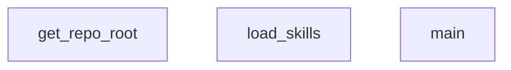

## Genel Bakış
Bu modül, projedeki becerileri (skills) keşfetmek ve yüklemekten sorumludul. Depo kök dizinini bularak ilişkili beceriler dizinindeki tüm modülleri tarar ve sisteme dahil eder.

## Fonksiyon Grupları
### Dizin Keşfi
Depo yapısını analiz ederek kök dizini ve becerilerin bulunduğu konumu tespit eder.
- `get_repo_root`, `main`

### Beceri Yükleme
Beceri dizinindeki modülleri okuyarak sistem için kullanılabilir hale getirir.
- `load_skills`

---

## AXIOMS – Mimari Varsayımlar

Bu modül, repo kök dizinini bulup skills dizinindeki yetenekleri yükleyen bir yönlendirici modülüdür.

[Aksiyom 1]: Eğer `load_skills` tarafından alınan `skills_dir` parametresi geçerli bir dizin yolu değilse veya dizin mevcut değilse, `FileNotFoundError` veya ilgili bir istisna fırlatılır.

[Aksiyom 2]: Eğer `get_repo_root()` çağrıldığında modülün çalıştığı dizinden yukarı doğru .git veya benzeri bir repo gösterge dizini bulunamazsa, repo root'u tespit edilemez ve modül hatalı çalışır.

[Aksiyom 3]: Eğer `load_skills` fonksiyonu success ile çalışması için `skills_dir` içinde geçerli skill dosyaları (belirli format/dosya uzantısı) yoksa, boş bir skill listesi veya hata döner (detay bilinmiyor).

[Aksiyom 4]: Eğer `main()` fonksiyonu çalıştırıldığında `get_repo_root()` sonucu ile `load_skills` için kullanılacak dizin yolu tutarsızsa, skill yükleme başarısız olur.

---

## FONKSİYON DETAYLARI

### get_repo_root
**Ne yapar**: Git deposunun kök dizinini (en üst seviya dizinini) döndürür.
**Nasıl yapar**: `git rev-parse --show-toplevel` komutunu çalıştırarak Git deposunun kök dizinini elde eder. Komut başarılı olursa dönen değerden temizlenmiş bir `Path` nesnesi döndürülür. Herhangi bir hata oluşursa (örneğin, dizin bir Git deposu değilse), `__file__` konumuna göre iki üst dizine çıkarak bir `Path` nesnesi döndürür. Bu, projenin kök dizinine alternatif bir erişim yöntemi sağlar.
**Parametreler**:
- Bu fonksiyon parametre almaz.
**Dönüş**: `Path` — Git deposunun kök dizinini veya varsayılan bir dizin yolunu temsil eden bir pathlib.Path nesnesi.

### load_skills
**Ne yapar**: Belirtilen dizindeki tüm yeteneklerin (skill) yapılandırma dosyalarını okur ve bir listeye dönüştürerek döndürür.
**Nasıl yapar**: Verilen `skills_dir` dizinindeki her alt dizini tarar. Her alt dizinde `SKILL.md` adlı bir dosya arar. Bulursa bu dosyayı UTF-8编码 ile okur. Dosya içeriğinin `---` karakterleriyle ayrılmış bir YAML frontmatter bölümü bekler. Bu bölümü `yaml.safe_load` ile ayrıştırarak yeteneğin temel bilgilerini (`name`, `description`, `depends_on`, `next_steps`, `run_last`, `exclusions`) ve tetikleyici (`triggers`) listesini çıkarır. Bu bilgileri bir sözlük listesine ekler. Dizin mevcut değilse veya frontmatter ayrıştırma hatası oluşursa hata mesajı yazdırıp işlemi atlar.
**Parametreler**:
- skills_dir: `Path` — Yeteneklerin (.skill dosyalarını içeren) bulunduğu dizin yolu.
**Dönüş**: `list[dict]` — Her bir yeteneğin `name`, `description`, `depends_on`, `next_steps`, `run_last`, `exclusions` ve `triggers` anahtarlarını içeren sözlüklerden oluşan bir liste. Herhangi bir yetenek yüklenemezse boş bir liste döner.

### main
**Ne yapar**: Komut satırından alınan bir kullanıcı sorgusunu analiz eder, en uygun yetenek modüllerini (skills) sıralar ve sonuçları JSON formatında yazdırır.
**Nasıl yapar**: `argparse` ile `--query` parametresini alır. `get_repo_root()` kullanarak projenin kök dizinini belirler ve yeteneklerin (`skills_dir`) ve ONNX model dosyalarının (`model_path`, `tokenizer_path`) yollarını oluşturur. `load_skills()` ile tüm yetenekleri yükler. Hiç yetenek yoksa `CONVERSATIONAL` durumuyla çıkar. Tokenizer ile sorguyu ve tüm yetenek açıklamalarını kodlar, ONNX modeli ile embeddings çıkarır. Ortalama havuzlama (mean pooling) ile cümle embeddings'leri hesaplar ve kosinüs benzerliği hesaplaması yapar. Ardından, tetikleyici eşleşmesi (`triggers`), yetenek ismi eşleşmesi ve `DEV_KEYWORDS` anahtar kelime listesi ile sorgu filtrelemesi yaparak puanları artırır. Eğer sorgu geliştirme ile ilgili anahtar kelimeler içermiyor veya hiçbir tetikleyici ile eşleşmiyorsa `CONVERSATIONAL` döndürür. Aksi takdirde, belirli bir eşik değerinin (`0.32`) üzerinde puan alan aday yetenekleri filtreler, `exclusions` (hariç tutulanlar) mantığını uygular ve `depends_on`/`run_last` bağımlılıklarını dikkate alarak topolojik sıralama yapar. Son olarak, sıralanmış yetenek yollarını `MATCHED` durumuyla birlikte JSON formatında yazdırır.
**Parametreler**:
- Bu fonksiyon komut satırı argümanları üzerinden çalışır. `argparse` ile tanımlanan tek parametre:
  - `--query` (`str`, zorunlu) — Analiz edilecek kullanıcı sorgu dizgesi.
**Dönüş**: `None` (döndürmez, `sys.stdout`'a JSON yazdırır). Yazdırılan JSON nesnesinin yapısı şöyledir:
  - `status`: `"MATCHED"` veya `"CONVERSATIONAL"` (string).
  - Yalnızca `status` `"MATCHED"` olduğunda ek olarak `path` anahtarı bulunur: Sıralanmış yetenek isimlerinden oluşan bir liste (list[str]).

---

## AST POINTERS

### [N1_NASIL] AST Pointer: scripts/skills-router.py::get_repo_root
- **params**: (yok)
- **ic_degiskenler**:
  - `output` — `subprocess.check_output` ile git komutunun stdout çıktısı; repo kök dizininin path'i olarak döner (sonundaki whitespace strip edilmiş)
- **Dönüş**: `Path` — git repo kök dizini; hata durumunda script'in bulunduğu dizinin üst dizini

### [N2_NASIL] AST Pointer: scripts/skills-router.py::load_skills
- **params**: `(skills_dir: Path)` — Yeteneklerin bulunduğu dizin yolu
- **ic_degiskenler**:
  - `skills_list` — Yüklenen yeteneklerin tutulduğu liste; her eleman bir yetenek sözlüğüdür
  - `skill_path` — `skills_dir` içinde sıralanan her bir alt dizin (potansiyel yetenek dizini)
  - `skill_md_path` — İlgili yetenek dizinindeki `SKILL.md` dosya yolu
  - `content` — `SKILL.md` dosyasının ham string içeriği
  - `parts` — İçeriğin `---` separator ile bölünmüş parçaları (frontmatter ayrıştırması için)
  - `frontmatter_text` — YAML frontmatter bloğunun ham metni (parts[1])
  - `frontmatter` — `yaml.safe_load` ile ayrıştırılmış frontmatter sözlüğü
  - `name` — Yeteneğin adı; frontmatter'dan alınır, yoksa dizin adı kullanılır
  - `description` — Yeteneğin açıklaması; frontmatter'dan alınır
  - `depends_on` — Bu yeteneğin bağımlı olduğu diğer yeteneklerin listesi
  - `next_steps` — Bu yetenekten sonra çalışması gereken yeteneklerin listesi
  - `run_last` — Bu yeteneğin sıranın sonunda çalıştırılıp çalıştırılmayacağı bayrağı
  - `exclusions` — Bu yetenek çalışırken dışlanması gereken diğer yeteneklerin listesi
  - `metadata` — Frontmatter'daki `metadata` alt sözlüğü
  - `triggers` — Bu yeteneği tetikleyen anahtar kelimeler listesi; önce metadata'dan, yoksa frontmatter'dan alınır
- **Dönüş**: `list` — Sözlük listesi; her sözlük bir yeteneğin name, description, depends_on, next_steps, run_last, exclusions, triggers alanlarını içerir; hata durumunda boş liste döner

### [N3_NASIL] AST Pointer: scripts/skills-router.py::main
- **params**: (yok)
- **ic_degiskenler**:
  - `parser` — `argparse.ArgumentParser` nesnesi; komut satırı argümanlarını tanımlar
  - `args` — `parser.parse_args()` sonucu; `args.query` alanını içerir (kullanıcının sorgu metni)
  - `repo_root` — `get_repo_root()` çağrısıyla elde edilen repo kök dizini `Path` nesnesi
  - `skills_dir` — `repo_root / ".agent" / "skills"` yetenekler dizin yolu
  - `model_path` — `repo_root / ".agent" / "cache" / "onnx" / "model.onnx"` ONNX model dosya yolu
  - `tokenizer_path` — `repo_root / ".agent" / "cache" / "onnx" / "tokenizer.json"` tokenizer dosya yolu
  - `skills` — `load_skills(skills_dir)` ile yüklenen yetenekler sözlüğü listesi
  - `tokenizer` — `tokenizers.Tokenizer.from_file` ile yüklenen tokenizer nesnesi; padding ve truncation yapılandırılmış
  - `texts` — Encode edilecek metinler listesi; `[args.query]` ile tüm yetenek açıklarının birleşimi
  - `encodings` — `tokenizer.encode_batch(texts)` sonucu; her eleman bir `Encoding` nesnesi
  - `input_ids` — Token ID'lerinden oluşan numpy dizisi, shape (batch_size, seq_len), dtype int64
  - `attention_mask` — Attention mask numpy dizisi, dtype int64
  - `token_type_ids` — Token type ID numpy dizisi, dtype int64
  - `session` — `ort.InferenceSession` nesnesi; ONNX modelini yükler
  - `ort_inputs` — ONNX modeline girilen input sözlüğü; input_ids, attention_mask, token_type_ids içerir
  - `ort_outputs` — `session.run` çıktısı; "last_hidden_state" tensor'ünü içerir
  - `token_embeddings` — Modelden çıkan token embeddingleri, shape (batch_size, seq_len, 384)
  - `input_mask_expanded` — Attention mask'ın son eksende expand edilmiş hali
  - `sum_embeddings` — Token embeddinglerin maskelenmiş toplamı, axis=1
  - `sum_mask` — Mask'ın toplamı; sıfıra bölmeyi önlemek için clip ile a_min=1e-9
  - `sentence_embeddings` — Mean pooling sonucu cümle embeddingleri, shape (batch_size, 384)
  - `norms` — Cümle embeddinglerinin L2 normları, shape (batch_size, 1)
  - `normalized_embeddings` — L2 normalize edilmiş cümle embeddingleri
  - `query_embedding` — Sorgunun normalize edilmiş embeddingi (normalized_embeddings[0])
  - `skill_embeddings` — Yetenek açıklamalarının normalize edilmiş embeddingleri (normalized_embeddings[1:])
  - `similarities` — Query ile her yetenek arasındaki cosine benzerlik skorları, shape (n_skills,)
  - `DEV_KEYWORDS` — Teknik/geliştirme ile ilgili anahtar kelimeler kümesi; sorgunun teknik olup olmadığını belirlemek için kullanılır
  - `query_lower` — Sorgunun küçük harfe dönüştürülmüş, strip edilmiş hali
  - `SYNONYMS` — Türkçe-İngilizce eş anlamlı kelime eşleme sözlüğü; query_lower üzerinde regex ile replaces yapılır
  - `query_tokens` — query_lower'dan çıkarılmış token'ların kümesi (regex `\w+` ile)
  - `any_trigger_match` — Herhangi bir yeteneğin tetikleyicisiyle eşleşme olup olmadığının bayrağı
  - `has_dev_keyword` — Sorgu token'larının DEV_KEYWORDS ile kesişim olup olmadığının bayrağı
  - `idx` — for döngüsü indeksi (skills listesi üzerinde)
  - `s` — for döngüsündeki mevcut yetenek sözlüğü; `.score` ve `.raw_score` alanları döngü içinde eklenir
  - `cosine_sim` — Mevcut yeteneğin cosine benzerlik skoru (float)
  - `boost` — Tetikleyici ve isim eşleşmesine göre eklenen skor artışı
  - `trigger_matched` — Mevcut yeteneğin herhangi bir tetikleyicisiyle tam eşleşme durumu
  - `partial_matched` — Mevcut yeteneğin tetikleyicilerinde kısmi kelime eşleşmesi durumu
  - `trigger` — Tetikleyiciler listesindeki mevcut tetikleyici metni
  - `trig_lower` — Tetikleyicinin küçük harfe dönüştürülmüş, strip edilmiş hali
  - `trig_words` — Tetikleyiciden çıkarılmış 3 karakterden uzun kelimeler
  - `matched_words` — query_lower içinde bulunan tetikleyici kelimeleri
  - `max_score` — Tüm yeteneklerin `.score` değerleri arasındaki maksimum skor
  - `candidates` — Skoru >= 0.32 olan yeteneklerin filtrelenmiş listesi
  - `candidates_sorted` — Adayların skora göre azalan sıralanmış hali
  - `excluded_names` — Hariç tutulması gereken yetenek isimlerinin kümesi
  - `c` — candidates_sorted döngüsündeki mevcut aday
  - `excl` — c["exclusions"] listesindeki mevcut hariç tutma ismi
  - `active_candidates` — Hariç tutma filtresinden geçmiş aktif adaylar listesi
  - `nodes` — Aktif aday yetenek isimleri listesi
  - `adj` — Graf komşuluk listesi sözlüğü; her düğüm için bağımlılık yönlerini tutar
  - `in_degree` — Her düğümün giren kenar sayısı sözlüğü
  - `u` — Mevcut yeteneğin ismi (topolojik sıralama grafiğinde düğüm)
  - `dep` — c["depends_on"] listesindeki bağımlılık ismi
  - `v` — Karşılaştırılan diğer yeteneklerin ismi (run_last kontrolü)
  - `queue` — Kahn algoritması için sıfır giren kenarlı düğümlerin kuyruğu; skora göre azalan sıralı
  - `curr` — Kuyruktan çıkarılan mevcut düğüm
  - `neighbor` — curr düğümünün komşusu
  - `ordered` — Topolojik sıralama sonucu yetenek isimleri listesi (çalışma sırası)
  - `missing` — Döngü nedeniyle sıralamaya alınamayan düğümler (fallback)
- **Dönüş**: `yok` — Yan etki olarak stdout'a JSON çıktısı basar; `{"status": "CONVERSATIONAL"}` veya `{"status": "MATCHED", "path": [...]}` formatında

---

## MERMAID CALL GRAPH

## NODE ID STANDARD

  file: scripts\skills-router.py
  function: scripts\skills-router.py::get_repo_root
  function: scripts\skills-router.py::load_skills
  function: scripts\skills-router.py::main

---

## DISA AKTARILANLAR (EXPORTS)
  export: get_repo_root
  export: load_skills
  export: main