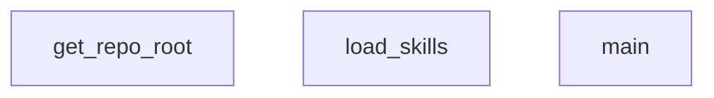

## Genel Bakış
Bu modül, VentHub projesinin "beceri" sistemini yöneten yönlendirici (router) bir yapıdır. Proje dizinindeki beceri dosyalarını tarar, yükler ve çalıştırılacak uygun beceriyi belirleyerek ana işlevselliği başlatır. Modül, dinamik beceri yönetimi ve proje yapısının keşfedilmesi temelinde çalışır.

## Fonksiyon Grupları
### Proje Yapısı Keşfi
Proje kök dizinini otomatik olarak tespit ederek modülün ve becerilerin doğru konumda bulunmasını sağlar.
- get_repo_root

### Beceri Yükleme ve Yönlendirme
Beceri dizinindeki modülleri tarar, yükler ve sistemin çalışması için gerekli olan ana kontrol akışını başlatarak uygun beceriyi yönlendirir.
- load_skills, main

---

## AXIOMS – Mimari Varsayımlar

Bu modül, repo içindeki skill dosyalarını yükleyen ve yönlendiren bir scripttir. Aşağıda fonksiyon imzalarından türetilen mimari varsayımlar yer almaktadır.

[Aksiyom 1]: Eğer `get_repo_root()` çalıştırıldığında modül dosyası bir git reposu içinde değilse veya往上 dizinlerde `.git` dizini bulunamazsa, repo root'u çözümlenemez ve modül çalışması başarısız olur.

[Aksiyom 2]: Eğer `load_skills(skills_dir: Path)` çağrısında belirtilen `skills_dir` dizini mevcut değilse veya Path nesnesi geçerli bir dizin yolunu temsil etmiyorsa, skill dosyaları yüklenemez.

[Aksiyom 3]: Eğer `skills_dir` dizini mevcutsa ancak içeriğinde geçerli skill dosyaları (yüklenebilir modüller) yoksa, `load_skills` boş veya eksik bir skill listesi ile döner.

[Aksiyom 4]: Eğer `main()` çağrıldığında `get_repo_root()` başarıyla bir Path döndürmezse veya bu root'a bağlı `skills_dir` geçerli değilse, modülün ana iş akşı tamamlanamaz.

---

**Not:** Bu modül için fonksiyon gövdelerine erişim olmadığından, hangi dosya formatlarının yüklendiğine (`.py`, `.yaml` vb.), skill dosyalarından beklenen arayüzlere veya spesifik eşik değerlerine dair aksiyom tanımlanamamıştır.

---

## FONKSİYON DETAYLARI

### get_repo_root
**Ne yapar**: Git repository'nin kok dizinini (en ust dizin) bulur ve bir Path nesnesi olarak dondurur. Git komutu basarisiz olursa, dosyanin kendi konumundan iki ust dizine cikarak projenin kokunu yaklasik olarak belirler.

**Nasil yapar**: `git rev-parse --show-toplevel` komutunu `subprocess.check_output` ile calistirarak Git'in tespit ettigi kok dizini alir. Herhangi bir istisna olusursa (ornegin dizin bir Git repository degilse), `__file__` degiskeninin resolve edilmis konumunun iki ust dizinine (`.parent.parent`) giderek projenin kok dizinini dondurur.

**Parametreler**: Bu fonksiyon herhangi bir parametre almaz.

**Donus**: `Path` — Git repository'nin kok dizinini temsil eden bir pathlib.Path nesnesi.

### load_skills
**Ne yapar**: Geliştirildi ancak detay üretilemedi.

### main
**Ne yapar**: Geliştirildi ancak detay üretilemedi.

---

## AST POINTERS

### [N1_NASIL] AST Pointer: scripts/skills-router.py::get_repo_root
- **params**: (parametre yok)
- **ic_degiskenler**:
  - `output` — `subprocess.check_output` ile çalıştırılan `git rev-parse --show-toplevel` komutunun stdout çıktısı; repo kök dizinini temsil eden path stringi
- **Dönüş**: `Path` — output stringinin strip edilmiş hali ile oluşturulmuş Path nesnesi; exception durumunda __file__'ın iki üst dizini

### [N2_NASIL] AST Pointer: scripts/skills-router.py::load_skills
- **params**: `skills_dir: Path` — yeteneklerin bulunduğu dizin yolu
- **ic_degiskenler**:
  - `skills_list` — yüklenen tüm yeteneklerin dict listesini tutan toplama listesi; fonksiyon sonunda return edilir
  - `skill_path` — skills_dir içinde sıralı olarak iterasyon yapılan her bir alt dizin yolu (Path nesnesi)
  - `skill_md_path` — her skill_path altında aranan SKILL.md dosyasının tam yolu (skill_path / "SKILL.md")
  - `content` — SKILL.md dosyasının tüm içeriği; "---" ile bölünerek frontmatter ayrıştırılır
  - `parts` — content'in "---" delimiter'ı ile bölünmüş hali; en az 3 elemanlı olmalı ve "---" ile başlamalı
  - `frontmatter_text` — parts[1] indeksindeki frontmatter YAML metni
  - `frontmatter` — `yaml.safe_load` ile ayrıştırılmış frontmatter dict'i; None ise boş dict fallback
  - `name` — frontmatter["name"] değeri veya skill_path.name fallback'i; yeteneğin kısa adı
  - `description` — frontmatter["description"] değeri; yeteneğin açıklaması
  - `depends_on` — frontmatter["depends_on"] listesi; bağımlı olunan yeteneklerin isimleri
  - `next_steps` — frontmatter["next_steps"] listesi; bu yetenekten sonra çalışması gereken yetenekler
  - `run_last` — frontmatter["run_last"] boolean değeri; True ise en son sıraya konulur
  - `exclusions` — frontmatter["exclusions"] listesi; bu yetenek aktifken dışlanması gereken diğer yeteneklerin isimleri
  - `metadata` — frontmatter["metadata"] dict'i; ek metadata alanlarını içerir (triggers dahil)
  - `triggers` — metadata["triggers"] veya doğrudan frontmatter["triggers"] listesi; yeteneği tetikleyen anahtar kelimeler
  - `e` — open ile açılan SKILL.md dosya nesnesi (with bloğu içinde)
- **Dönüş**: list of dict — her dict bir yeteneğin name, description, depends_on, next_steps, run_last, exclusions, triggers alanlarını içerir; hata veya dizin yokluğunda boş liste

### [N3_NASIL] AST Pointer: scripts/skills-router.py::main
- **params**: (parametre yok)
- **ic_degiskenler**:
  - `parser` — `argparse.ArgumentParser` nesnesi; "Route query to modular agent skills." açıklamasıyla oluşturulur
  - `args` — `parser.parse_args()` dönüşü; `args.query` alanını taşır (kullanıcının sorgu stringi)
  - `repo_root` — `get_repo_root()` çağrısı ile elde edilen repo kök dizini Path nesnesi
  - `skills_dir` — yeteneklerin bulunduğu dizin: `repo_root / ".agent" / "skills"`
  - `model_path` — ONNX model dosyasının yolu: `repo_root / ".agent" / "cache" / "onnx" / "model.onnx"`
  - `tokenizer_path` — tokenizer JSON dosyasının yolu: `repo_root / ".agent" / "cache" / "onnx" / "tokenizer.json"`
  - `skills` — `load_skills(skills_dir)` çağrısı ile yüklenen yeteneklerin listesi
  - `tokenizer` — `tokenizers.Tokenizer.from_file(str(tokenizer_path))` ile yüklenen tokenizer nesnesi
  - `texts` — `[args.query]` + tüm yeteneklerin description'larından oluşan birleşik metin listesi; encode_batch'e girer
  - `encodings` — `tokenizer.encode_batch(texts)` dönüşü; her eleman bir Encoding nesnesi (ids, attention_mask, type_ids içerir)
  - `input_ids` — encodings'teki her elemanın e.ids dizisinden oluşturulmuş numpy int64 array; shape: (batch_size, seq_len)
  - `attention_mask` — encodings'teki her elemanın e.attention_mask dizisinden oluşturulmuş numpy int64 array; padding maskesini taşır
  - `token_type_ids` — encodings'teki her elemanın e.type_ids dizisinden oluşturulmuş numpy int64 array; sentence pair bilgisi
  - `session` — `ort.InferenceSession(str(model_path))` ile yüklenen ONNX Runtime inference oturumu
  - `ort_inputs` — model girişlerini dict olarak tutar: "input_ids", "attention_mask", "token_type_ids" key'leri
  - `ort_outputs` — `session.run(["last_hidden_state"], ort_inputs)` dönüşü; listedeki [0]. eleman token_embeddings
  - `token_embeddings` — ort_outputs[0]; shape: (batch_size, seq_len, 384); her token için 384 boyutlu embedding
  - `input_mask_expanded` — attention_mask'in son boyutla expand edilmiş hali; token_embeddings ile çarpılmak için broadcast
  - `sum_embeddings` — token_embeddings * input_mask_expanded çarpımının seq_len (axis=1) boyunca toplamı; (batch_size, 384) shape
  - `sum_mask` — input_mask_expanded'ın seq_len boyunca toplamı; 1e-9 ile clip edilmiş (sıfıra bölmeyi önler)
  - `sentence_embeddings` — sum_embeddings / sum_mask; her cümleye ait ortalama pooled embedding; shape: (batch_size, 384)
  - `norms` — sentence_embeddings'ın L2 norm'u; (batch_size, 1) keepdims shape; 1e-9 ile clip edilmiş
  - `normalized_embeddings` — sentence_embeddings / norms; birim küre üzerinde normalize edilmiş embedding'ler
  - `query_embedding` — normalized_embeddings[0]; sorgunun normalize edilmiş embedding'i
  - `skill_embeddings` — normalized_embeddings[1:]; tüm yeteneklerin normalize edilmiş embedding'leri
  - `similarities` — `np.dot(skill_embeddings, query_embedding)` kosinüs benzerlikleri; shape: (num_skills,)
  - `DEV_KEYWORDS` — geliştirme ile ilgili anahtar kelimelerin set'i; Türkçe ve İngilizce terimler; query'de varsa o sorgunun geliştirme amaçlı olduğunu belirtir
  - `query_lower` — `args.query.lower().strip()`; küçük harfe çevrilmiş ve trim edilmiş sorgu
  - `SYNONYMS` — Türkçe-İngilizce eş anlamlı kelime eşlemesi dict'i; query_lower üzerinde replace için kullanılır
  - `query_tokens` — query_lower'dan regex ile extract edilmiş \w+ token'larının set'i
  - `any_trigger_match` — boolean; herhangi bir yeteneğin trigger'ı ile eşleşme olup olmadığını takip eder
  - `has_dev_keyword` — boolean; query_tokens ile DEV_KEYWORDS kesişiminin boş olup olmadığını belirtir
  - `idx` — for döngüsü indisleri; similarities array'inden ilgili yeteneğin benzerlik skorunu almak için kullanılır
  - `s` — for döngüsü içindeki mevcut yetenek dict'i; trigger, name eşleme ve boost hesaplamaları bu dict üzerinde yapılır
  - `cosine_sim` — `float(similarities[idx])`; ilgili yeteneğin kosinüs benzerlik skoru
  - `boost` — tetikleme eşlemelerine göre eklenen skor bonusu (0.0, 0.25 veya 0.45)
  - `trigger_matched` — boolean; tam trigger eşleşmesi olup olmadığını belirtir
  - `partial_matched` — boolean; kısmi kelime eşleşmesi olup olmadığını belirtir
  - `trigger` — s["triggers"] listesindeki her bir tetikleme metni
  - `trig_lower` — trigger'ın küçük harfe çevrilmiş ve strip edilmiş hali
  - `trig_words` — trig_lower'dan regex ile extract edilmiş ve uzunluğu >=3 olan kelime listesi
  - `matched_words` — trig_words içinde query_lower'da bulunan kelimelerin listesi
  - `max_score` — tüm yeteneklerin "score" değerlerinin maximumu;.float
  - `candidates` — score >= 0.32 olan yeteneklerin filtrelenmiş listesi
  - `candidates_sorted` — candidates'ın score'a göre azalan sıralaması
  - `excluded_names` — dışlanması gereken yetenek isimlerinin set'i; exclusions'dan doldurulur
  - `c` — candidates_sorted üzerindeki döngü elemanı; name ve exclusions alanları kullanılır
  - `excl` — c["exclusions"] listesindeki her bir dışlanma ismi
  - `active_candidates` — excluded_names'te olmayan adayların filtrelenmiş listesi
  - `nodes` — active_candidates'taki yetenek isimlerinin listesi; topolojik sıralama için düğümler
  - `adj` — yetenek isimlerinden komşu listelerine mappings yapan adjacency dict'i
  - `in_degree` — her düğümün giren kenar sayısını tutan dict
  - `u` — mevcut yeteneğin ismi (c["name"]); kenar ekleme kaynaku
  - `dep` — c["depends_on"] listesindeki her bir bağımlılık ismi
  - `v` — other_c["name"]; run_last mantığında karşılaştırılan diğer yetenek ismi
  - `queue` — Kahn algoritması için sıfır giren dereceli düğümlerin başlangıç listesi
  - `curr` — queue'dan çıkarılan ve sıralamaya eklenen mevcut düğüm ismi
  - `neighbor` — adj[curr] listesindeki komşu düğümler; giren dereceleri azaltılır
  - `ordered` — topolojik sıralama sonucu yetenek isimlerinin düzenli listesi
  - `missing` — ordered'da bulunmayan düğümler (döngü durumu); fallback olarak sona eklenir
- **Dönüş**: yok — `print(json.dumps(...))` ile stdout'a JSON çıktısı basar: `{"status": "CONVERSATIONAL"}` veya `{"status": "MATCHED", "path": [...]}`

---

## MERMAID CALL GRAPH

## NODE ID STANDARD

  file: scripts\skills-router.py
  function: scripts\skills-router.py::get_repo_root
  function: scripts\skills-router.py::load_skills
  function: scripts\skills-router.py::main

---

## DISA AKTARILANLAR (EXPORTS)
  export: get_repo_root
  export: load_skills
  export: main