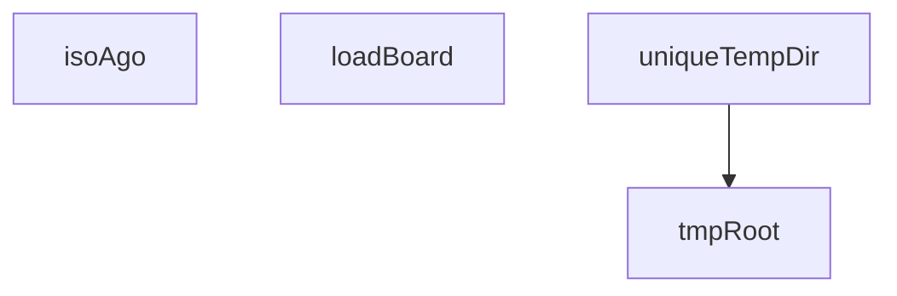

## Genel Bakış
Bu modül, board invariant testlerini desteklemek için gerekli yardımcı fonksiyonları içerir. Test ortamının hazırlanması, board modüllerinin yüklenmesi ve zaman bazlı hesaplamalar için araçlar sunarak test altyapısını kolaylaştırır.

## Fonksiyon Grupları
### Test Altyapısı ve Kurulum
Test çalıştırılabilirliği için gerekli olan dosya sistemi altyapısını ve modül yüklemelerini yönetir.
- loadBoard, tmpRoot, uniqueTempDir

### Zaman Hesaplama Yardımcıları
Geçmiş zaman damgalarını ISO formatında döndüren yardımcı fonksiyon, testlerde zaman bazlı koşulları test etmek için kullanılır.
- isoAgo

---

## AXIOMS – Mimari Varsayımlar

Bu modül, board invariant testlerini destekleyen yardımcı fonksiyonlar içeren bir test altyapısı modülüdür.

[Aksiyom 1]: Eğer `loadBoard` için geçerli bir `boardDir` yolu (içerisinde yüklenebilir bir board modülü bulunan dizin) sağlanmazsa, `BoardModule` döndürülmez ve modül yükleme hatası oluşur.

[Aksiyom 2]: Eğer `isoAgo` için geçerli bir sayısal `msAgo` değeri (milisaniye cinsinden) sağlanmazsa, geçerli bir ISO tarih dizesi döndürülmez.

[Aksiyom 3]: Eğer sistemde yazılabilir bir geçici dizin (`temp`) yoksa veya yeterli dosya sistemi izinleri verilmemişse, `tmpRoot()` geçerli bir yol döndüremez.

[Aksiyom 4]: Eğer `uniqueTempDir` için geçerli bir `prefix` dizesi sağlanmazsa veya `tmpRoot()` erişilebilir bir kök dizin sunamazsa, benzersiz geçici dizin oluşturulamaz.

[Aksiyom 5]: Eğer `loadBoard` çağrılırken `require` veya `BOARD_MODULE_PATH` aracılığıyla erişilen board modülü yolu yanlışsa veya modül yoksa, `loadBoard` hata ile sonuçlanır.

---

## FONKSİYON DETAYLARI

### loadBoard
**Ne yapar**: Belirtilen dizinden bir `BoardModule` modülünü taze olarak yükler. Bu işlev, test senaryolarında her testin izole ve temiz bir modül yapısına sahip olmasını sağlamak için kullanılır.
**Nasıl yapar**: Önce `VENTHUB_BOARD_DIR` ortam değişkenini, istenen geçici dizin olacak şekilde ayarlar. Ardından, Node.js'in modül önbelleğinden (`require.cache`) hedef modülün (`BOARD_MODULE_PATH`) kaydını siler. Son olarak, `require` fonksiyonunu kullanarak modülü yeniden yükler ve `BoardModule` tipinde döndürür. Bu sıralama kritiktir çünkü modül gövdesinde `BOARD_DIR` bir kez okunur; önbellek temizlenmezse sonraki testler önceki testin dizinini kullanabilir.
**Parametreler**:
- boardDir: `string` — Yüklenecek modülün bulunduğu dizin yolu. Bu yol, modülün kendi içinden okuduğu `VENTHUB_BOARD_DIR` ortam değişkeni olarak ayarlanır.
**Dönüş**: `BoardModule` — Modülün dışa açtığı fonksiyon ve nesne yapısını temsil eden tip. Bu tip, test dosyasında tanımlı ve modülün dışa aktardığı üyelere erişim sağlar.

### isoAgo
**Ne yapar**: Geçerli zamandan belirli bir milisaniye kadar önceki anı, ISO 8601 biçiminde bir tarih-saat dizgesi olarak döndürür. Genellikle testlerde zaman damgası üretmek veya zaman hassasiyeti gerektiren durumları simüle etmek için kullanılır.
**Nasıl yapar**: `Date.now()` ile o anki Unix zaman damgasını (ms cinsinden) alır, verilen `msAgo` miktarını bu zamandan çıkararak hedef zamanı hesaplar. Elde edilen UNIX zaman damgasını bir `Date` nesnesine dönüştürür ve `toISOString()` metoduyla standart ISO biçimindeki temsiline dönüştürür.
**Parametreler**:
- msAgo: `number` — Geriye dönülmesi istenen milisaniye miktarı. Pozitif bir değer, geçerli zamandan *önce* bir anı belirtir.
**Dönüş**: `string` — ISO 8601 formatında, örneğin `"2023-10-27T10:00:00.000Z"` şeklinde bir tarih-saat dizgesi.

### tmpRoot

**Ne yapar**: Platformdan bağımsız geçici dizin kök yolunu döndürür. Fonksiyon, Windows ve Linux gibi farklı işletim sistemlerinde çalışırken tutarlı bir geçici dizin yolu elde edilmesini sağlar, böylece test süreçlerinde ve CI ortamlarında dosya yolu kaynaklı hataların önüne geçilir.

**Nasıl yapar**: Ortam değişkenlerini belirli bir öncelik sırasıyla kontrol eder: önce `RUNNER_TEMP` (GitHub Actions CI ortamına özgü), ardından `TMPDIR` (Linux/macOS standart), sonra `TEMP` ve `TMP` (Windows standart) değişkenlerini sırasıyla dener. Hiçbiri tanımlı değilse `/tmp` yolunu fallback olarak kullanır. Elde edilen ham yol üzerinde ters eğik çizgileri (`\`) düz eğik çizgiye (`/`) dönüştürür ve sondaki eğik çizgiyi kaldırarak跨 platform uyumlu, temiz bir yol döndürür. Bu dönüşümler, Windows'ta alınan yolların Linux ortamlarında da doğru şekilde işlenmesini garanti altına alır.

**Parametreler**:

Bu fonksiyon parametre almaz.

**Dönüş**: `string` — Platformdan bağımsız, ters eğik çizgilerden arındırılmış, sondaki eğik çizgi kaldırılmış mutlak geçici dizin yolu. Örnek dönüş değerleri: `/tmp`, `C:/Users/broker/AppData/Local/Temp`, `/home/runner/work/_temp`.

### uniqueTempDir
**Ne yapar**: Her çağrıda, henüz oluşturulmamış ancak gelecekte oluşturulabilecek benzersiz bir geçici dizin yolu üretir. Bu, testlerin birbirini etkilemeden paralel çalışmasını veya izole dosya sistemi deneyimleri yapmasını sağlar.
**Nasıl yapar**: Modül seviyesindeki `dirCounter` sayaç değişkenini her çağrıda bir artırır. Sonra, geçici kök dizini (`tmpRoot()`), verilen `prefix`, geçerli zaman damgası (`Date.now()`), rastgele bir Base36 dizgesi ve sayaç değerini birleştirerek benzersiz bir yol oluşturur. Dizin fiziksel olarak bu işlevle yaratılmaz; yalnızca isim üretilir.
**Parametreler**:
- prefix: `string` — Üretilen dizin yolunun başına eklenecek tanımlayıcı önek (örn: `"test-board"`, `"spec-file"`).
**Dönüş**: `string` — Oluşturulmamış, benzersiz bir geçici dizin yolu (örn: `/tmp/test-board-1698374400000-a1b2c3d-4`).

---

## İTHALATLAR (IMPORTS)
- import: node:child_process::execFileSync
- import: node:module::createRequire
- import: vitest::afterEach
- import: vitest::beforeEach
- import: vitest::describe
- import: vitest::expect
- import: vitest::it

---

## INTERFACES

### BoardClaim
INV-BOARD-1 · Çok-oturum panosu değişmezleri (kalıcı bekçi). `scripts/board/board.cjs` üç Claude Code oturumunu (controller ikizleri + ortak worker) aynı repoda koordine eder: hangi şerit hangi glob'u talep etmiş, kim kime not bırakmış. Bu katman bir gecede İKİ kez kritik hataya yol açtı ve her sefe
- `sid: string`
- `lane: string`
- `globs: string[]`
- `ts: string`
- `heartbeat: string`
- `ttlMs: number`

### BoardConflict
- `claim: BoardClaim`
- `glob: string`
- `rel: string`

### BoardNote
- `ts: string`
- `sid: string`
- `type: 'note'`
- `to?: string`
- `text: string`

### BoardModule
- `append: (sid: string, event: Record<string, unknown>) => void`
- `liveClaims: (now?: number) => BoardClaim[]`
- `findConflict: (filePath: string, sid: string, repoRoot?: string) => BoardConflict | null`
- `notesFor: (sid: string, lane: string, events?: Record<string, unknown>[]) => BoardNote[]`
- `markSeen: (sid: string, notes: BoardNote[]) => void`
- `globToRegExp: (glob: string) => RegExp`
- `toRepoRelative: (filePath: string, repoRoot?: string) => string`

---

## SABİTLER
- **require** (call) — `createRequire(import.meta.url)`
- **BOARD_MODULE_PATH** (call) — `require.resolve('../../../scripts/board/board.cjs')`
- **boardDir** (unknown)
- **originalEnv** (unknown)

---

## AST POINTERS

### [N1_NASIL] AST Pointer: `__tests__/conformance/board-invariants.test.ts::loadBoard`
- **params**: `boardDir: string` — test çalışması sırasında board dizininin yolu
- **ic_degiskenler**:
  (değişken yok — doğrudan parametre ve global/sabit kullanılır)
- **Kullanılan dış referanslar**:
  - `process.env.VENTHUB_BOARD_DIR` — ortam değişkenine `boardDir` yazılır, board modülü bu yolu okur
  - `require.cache[BOARD_MODULE_PATH]` — modül önbellekten silinir ki her çağrıda taze yüklenme sağlanır
  - `BOARD_MODULE_PATH` — `require()` ile board modülünün dosya yolu sabiti
- **Dönüş**: `BoardModule` — `require()` ile yüklenen board modülü (append, findConflict, liveClaims, notesFor, markSeen, globToRegExp, toRepoRelative metotlarını içerir)

### [N2_NASIL] AST Pointer: `__tests__/conformance/board-invariants.test.ts::isoAgo`
- **params**: `msAgo: number` — milisaniye cinsinden geriye dönük zaman miktarı
- **ic_degiskenler**:
  (değişken yok — tek satırlık return ifadesi)
- **Kullanılan dış referanslar**:
  - `Date.now()` — anlık zaman damgası (epoch ms)
- **Dönüş**: `string` — ISO 8601 formatında tarih stringi, `msAgo` kadar geçmişe ait

### [N3_NASIL] AST Pointer: `__tests__/conformance/board-invariants.test.ts::tmpRoot`
- **params**: (yok)
- **ic_degiskenler**:
  - `raw` — ortam değişkenlerinden çözümleme sırasıyla (`RUNNER_TEMP`, `TMPDIR`, `TEMP`, `TMP`) veya fallback `/tmp` ile elde edilen ham geçici dizin yolu
- **Kullanılan dış referanslar**:
  - `process.env.RUNNER_TEMP` — GitHub Actions runner geçici dizini
  - `process.env.TMPDIR` — Unix-style geçici dizin
  - `process.env.TEMP` — Windows-style geçici dizin
  - `process.env.TMP` — alternatif Windows geçici dizin
- **Dönüş**: `string` — ters eğik çizgileri `/` ile değiştirilmiş, sondaki `/` kırılmış normalize edilmiş yol

### [N4_NASIL] AST Pointer: `__tests__/conformance/board-invariants.test.ts::uniqueTempDir`
- **params**: `prefix: string` — dizin adının başlangıç öneki (ör. `'venthub-board-test'`, `'venthub-board-scratch-repo'`)
- **ic_degiskenler**:
  (değişken yok — doğrudan global `dirCounter` ve `tmpRoot()` sonucu kullanılır)
- **Kullanılan dış referanslar**:
  - `dirCounter` — global sayaç, her çağrıda `+=1` ile artırılır; benzersizlik sağlar
  - `tmpRoot()` — geçici dizin kök yolunu döndüren fonksiyon çağrısı
  - `Date.now()` — milisaniye zaman damgası benzersizlik için kullanılır
  - `Math.random().toString(36).slice(2)` — rastgele alfasayısal string, çarpışma olasılığını düşürür
- **Dönüş**: `string` — `{tmpRoot}/{prefix}-{timestamp}-{random}-{counter}` formatında benzersiz dizin yolu

---

## MERMAID CALL GRAPH

## NODE ID STANDARD

  file: src\__tests__\conformance\board-invariants.test.ts
  function: src\__tests__\conformance\board-invariants.test.ts::loadBoard
  function: src\__tests__\conformance\board-invariants.test.ts::isoAgo
  function: src\__tests__\conformance\board-invariants.test.ts::tmpRoot
  function: src\__tests__\conformance\board-invariants.test.ts::uniqueTempDir

---

## DISA AKTARILANLAR (EXPORTS)
  export: isoAgo
  export: loadBoard
  export: tmpRoot
  export: uniqueTempDir