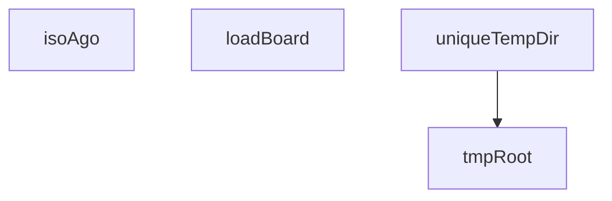

## Genel Bakış
Bu modül, board invariant testlerini desteklemek için gerekli yardımcı fonksiyonları sağlar. Temel olarak test ortamını kurmaya, board modüllerini yüklemeye ve zaman/hesaplama işlemlerine yönelik araçlar sunar. Modül, dosya sistemi işlemleri ve test verileriyle etkileşim için gerekli altyapıyı oluşturur.

## Fonksiyon Grupları
### Test Altyapısı ve Kurulum
Bu grup, test ortamının hazırlanması için geçici dizinlerin yönetimini ve temel kaynakların yüklenmesini sağlar.
- loadBoard, tmpRoot, uniqueTempDir

### Zaman Hesaplama Yardımcıları
Bu grup, testlerde zaman bazlı senaryoları模拟 etmek için tarih-farhesaplama ve formatlama yardımcıları sunar.
- isoAgo

---

## AXIOMS – Mimari Varsayımlar

Bu modül, board invarianlarını test eden bir test modülüdür. Aşağıdaki mimari varsayımlar fonksiyon imzalarından türetilmiştir:

**[Aksiyom 1]:** Eğer `boardDir` parametresi geçerli (var olan, okunabilir) bir dizin yolunu temsil etmiyorsa, `loadBoard(boardDir)` fonksiyonunun çağrılmaması gerekir; aksi halde BoardModule yüklenemez.

**[Aksiyom 2]:** Eğer `BOARD_MODULE_PATH` sabiti, geçerli bir board modülü yolunu içermiyorsa (örn. `require` ile yüklenebilir bir modül değilse), `loadBoard` fonksiyonunun çağrılabilirliği bilinmiyor.

**[Aksiyom 3]:** Eğer `msAgo` parametresi negatif bir sayı ise, `isoAgo` fonksiyonunun döndüreceği zaman damgası mantığı (gelecek tarih mi, sıfır mı, hata mı) bilinmiyor.

**[Aksiyom 4]:** Eğer `tmpRoot()` çağrıldığında geçici dizin sistemi (örn. `/tmp` veya OS-dependent temp path) erişilebilir değilse, hem `tmpRoot()` hem de `uniqueTempDir` fonksiyonları başarısız olur.

**[Aksiyom 5]:** Eğer `prefix` parametresi boş string (`""`) ise, `uniqueTempDir` fonksiyonunun oluşturacağı dizin adı唯一liği (benzersizliği)如何保证 bilinmiyor.

**[Aksiyom 6]:** Eğer `originalEnv` değişkeni test sonunda geri yüklenmezse, testler sonrası ortam değişkenlerinde kalıcı bozulma (env pollution) oluşur.

**[Aksiyom 7]:** Eğer `require` fonksiyonu (Node.js ortamı) mevcut değilse, `BOARD_MODULE_PATH` ile modül yüklenemez.

---

## FONKSİYON DETAYLARI

### loadBoard
**Ne yapar**: Belirtilen dizinden bir `BoardModule` modülünü taze olarak yükler. Bu işlev, test senaryolarında her testin izole ve temiz bir modül yapısına sahip olmasını sağlamak için kullanılır.
**Nasıl yapar**: Önce `VENTHUB_BOARD_DIR` ortam değişkenini, istenen geçici dizin olacak şekilde ayarlar. Ardından, Node.js'in modül önbelleğinden (`require.cache`) hedef modülün (`BOARD_MODULE_PATH`) kaydını siler. Son olarak, `require` fonksiyonunu kullanarak modülü yeniden yükler ve `BoardModule` tipinde döndürür. Bu sıralama kritiktir çünkü modül gövdesinde `BOARD_DIR` bir kez okunur; önbellek temizlenmezse sonraki testler önceki testin dizinini kullanabilir.
**Parametreler**:
- boardDir: `string` — Yüklenecek modülün bulunduğu dizin yolu. Bu yol, modülün kendi içinden okuduğu `VENTHUB_BOARD_DIR` ortam değişkeni olarak ayarlanır.
**Dönüş**: `BoardModule` — Modülün dışa açtığı fonksiyon ve nesne yapısını temsil eden tip. Bu tip, test dosyasında tanımlı ve modülün dışa aktardığı üyelere erişim sağlar.

### isoAgo
**Ne yapar**: Geçerli zamandan belirli bir milisaniye kadar önceki anı, ISO 8601 biçiminde bir tarih-saat dizgesi olarak döndürür. Genellikle testlerde zaman damgası üretmek veya zaman hassasiyeti gerektiren durumları simüle etmek için kullanılır.
**Nasıl yapar**: `Date.now()` ile o anki Unix zaman damgasını (ms cinsinden) alır, verilen `msAgo` miktarını bu zamandan çıkararak hedef zamanı hesaplar. Elde edilen UNIX zaman damgasını bir `Date` nesnesine dönüştürür ve `toISOString()` metoduyla standart ISO biçimindeki temsiline dönüştürür.
**Parametreler**:
- msAgo: `number` — Geriye dönülmesi istenen milisaniye miktarı. Pozitif bir değer, geçerli zamandan *önce* bir anı belirtir.
**Dönüş**: `string` — ISO 8601 formatında, örneğin `"2023-10-27T10:00:00.000Z"` şeklinde bir tarih-saat dizgesi.

### tmpRoot
**Ne yapar**: İşletim sisteminin geçici dosya kök dizinini (temp directory) döndürür. Bu işlev, `node:os` modülü yerine doğrudan ortam değişkenlerini okuyarak daha hafif ve esnek bir çözüm sunar.
**Nasıl yapar**: Sırasıyla `TEMP`, `TMPDIR` ve `TMP` ortam değişkenlerini kontrol eder; ilk bulunan değeri kullanır. Hiçbir ortam değişkeni tanımlı değilse `'C:/tmp'` dizinini varsayılan olarak döndürür. Aldığı yolu, Windows tarzı ters eğik çizgileri (`\`) düz eğik çizgiye (`/`) çevirir ve sondaki olası eğik çizgiyi kaldırarak standart bir Unix tarzı yol elde eder.
**Parametreler**: Bu fonksiyon herhangi bir parametre almaz.
**Dönüş**: `string` — Standartlaştırılmış, eğik çizgiyle ayrılmış mutlak geçici dizin yolu (örn: `/tmp` veya `C:/tmp`).

### uniqueTempDir
**Ne yapar**: Her çağrıda, henüz oluşturulmamış ancak gelecekte oluşturulabilecek benzersiz bir geçici dizin yolu üretir. Bu, testlerin birbirini etkilemeden paralel çalışmasını veya izole dosya sistemi deneyimleri yapmasını sağlar.
**Nasıl yapar**: Modül seviyesindeki `dirCounter` sayaç değişkenini her çağrıda bir artırır. Sonra, geçici kök dizini (`tmpRoot()`), verilen `prefix`, geçerli zaman damgası (`Date.now()`), rastgele bir Base36 dizgesi ve sayaç değerini birleştirerek benzersiz bir yol oluşturur. Dizin fiziksel olarak bu işlevle yaratılmaz; yalnızca isim üretilir.
**Parametreler**:
- prefix: `string` — Üretilen dizin yolunun başına eklenecek tanımlayıcı önek (örn: `"test-board"`, `"spec-file"`).
**Dönüş**: `string` — Oluşturulmamış, benzersiz bir geçici dizin yolu (örn: `/tmp/test-board-1698374400000-a1b2c3d-4`).

---

## İTHALATLAR (IMPORTS)
- import: node:child_process::execFileSync
- import: node:module::createRequire
- import: vitest::afterEach
- import: vitest::beforeEach
- import: vitest::describe
- import: vitest::expect
- import: vitest::it

---

## INTERFACES

### BoardClaim
INV-BOARD-1 · Çok-oturum panosu değişmezleri (kalıcı bekçi). `scripts/board/board.cjs` üç Claude Code oturumunu (controller ikizleri + ortak worker) aynı repoda koordine eder: hangi şerit hangi glob'u talep etmiş, kim kime not bırakmış. Bu katman bir gecede İKİ kez kritik hataya yol açtı ve her sefe
- `sid: string`
- `lane: string`
- `globs: string[]`
- `ts: string`
- `heartbeat: string`
- `ttlMs: number`

### BoardConflict
- `claim: BoardClaim`
- `glob: string`
- `rel: string`

### BoardNote
- `ts: string`
- `sid: string`
- `type: 'note'`
- `to?: string`
- `text: string`

### BoardModule
- `append: (sid: string, event: Record<string, unknown>) => void`
- `liveClaims: (now?: number) => BoardClaim[]`
- `findConflict: (filePath: string, sid: string, repoRoot?: string) => BoardConflict | null`
- `notesFor: (sid: string, lane: string, events?: Record<string, unknown>[]) => BoardNote[]`
- `markSeen: (sid: string, notes: BoardNote[]) => void`
- `globToRegExp: (glob: string) => RegExp`
- `toRepoRelative: (filePath: string, repoRoot?: string) => string`

---

## SABİTLER
- **require** (call) — `createRequire(import.meta.url)`
- **BOARD_MODULE_PATH** (call) — `require.resolve('../../../scripts/board/board.cjs')`
- **boardDir** (unknown)
- **originalEnv** (unknown)

---

## AST POINTERS

### [N1_NASIL] AST Pointer: board-invariants.test.ts::loadBoard
- **params**: `boardDir: string` — Board modülünün yükleneceği geçici dizin yolu
- **ic_degiskenler**: (yok — parametreler ve doğrudan ifadeler kullanılıyor)
- **Dönüş**: `BoardModule` — require ile yüklenen board modülü nesnesi

### [N2_NASIL] AST Pointer: board-invariants.test.ts::isoAgo
- **params**: `msAgo: number` — bugünden geriye doğru milisaniye cinsinden zaman
- **ic_degiskenler**: (yok — doğrudan expression)
- **Dönüş**: `string` — ISO 8601 formatında tarih stringi

### [N3_NASIL] AST Pointer: board-invariants.test.ts::tmpRoot
- **params**: (yok)
- **ic_degiskenler**:
  - `raw` — process.env'den okunan geçici dizin yolu (TEMP, TMPDIR veya TMP ortam değişkenlerinden biri, yoksa 'C:/tmp' varsayılanı)
- **Dönüş**: `string` — ters eğik çizgileri `/` ile değiştirilmiş, sondaki `/` kaldırılmış temiz dizin yolu

### [N4_NASIL] AST Pointer: board-invariants.test.ts::uniqueTempDir
- **params**: `prefix: string` — oluşturulacak dizin adının başlangıç öneki
- **ic_degiskenler**: (yok — tmpRoot() çağrısı ve string template doğrudan kullanılıyor; `dirCounter` modül seviyesinde global değişken olarak artırılır)
- **Dönüş**: `string` — benzersiz geçici dizin yolu (prefix-timestamp-random-counter formatında)

### [N5_NASIL] AST Pointer: board-invariants.test.ts::(beforeEach callback)
- **params**: (yok)
- **ic_degiskenler**:
  - `originalEnv` — test öncesi `process.env.VENTHUB_BOARD_DIR` değerinin orijinali (test sonrası geri yükleme için saklanır)
- **Dönüş**: yok (yan etki: `process.env.VENTHUB_BOARD_DIR`'ı uniqueTempDir sonucuyla ayarlar)

### [N6_NASIL] AST Pointer: board-invariants.test.ts::(afterEach callback)
- **params**: (yok)
- **ic_degiskenler**: (yok — `originalEnv` modül seviyesinden okunur)
- **Dönüş**: yok (yan etki: `process.env.VENTHUB_BOARD_DIR`'ı orijinal değerine geri yükler veya siler)

### [N7_NASIL] AST Pointer: board-invariants.test.ts::(it — kıdemli talep engellenmez, geç gelen engellenir)
- **params**: (yok)
- **ic_degiskenler**:
  - `board` — loadBoard(boardDir) ile yüklenen BoardModule nesnesi
  - `target` — çakışma testi yapılacak dosya yolu: `'/repo/supabase/migrations/20260101_test.sql'`
  - `repoRoot` — repo kök dizini: `'/repo'`
  - `seniorResult` — session-a (erken timestamp) için `board.findConflict()` sonucu; null olması beklenir (kıdemli engellenmemeli)
  - `juniorResult` — session-b (geç timestamp) için `board.findConflict()` sonucu; null olmamalı (geç gelen kıdemliye çarpmalı)
- **Dönüş**: yok (yan etki: board'a iki claim append eder, assertion'lar çalıştırır)

### [N8_NASIL] AST Pointer: board-invariants.test.ts::(it — bir oturum kendi talep ettiği globa yazabilir)
- **params**: (yok)
- **ic_degiskenler**:
  - `board` — loadBoard(boardDir) ile yüklenen BoardModule nesnesi
  - `result` — session-a'nın kendi globuyla eşleşen dosya için `board.findConflict()` sonucu; null olması beklenir
- **Dönüş**: yok (yan etki: board'a bir claim append eder, assertion çalıştırır)

### [N9_NASIL] AST Pointer: board-invariants.test.ts::(it — aynı oturumun ikinci claim'i globları birleştirir)
- **params**: (yok)
- **ic_degiskenler**:
  - `board` — loadBoard(boardDir) ile yüklenen BoardModule nesnesi
  - `first` — ilk claim'in timestamp'i (10000 ms önce); kıdem olarak korunması beklenen değer
  - `live` — `board.liveClaims()` ile dönen aktif talepler dizisi
  - `mine` — liveClaims içinde `c.sid === 'session-a'` filtresiyle bulunan birleşmiş talep nesnesi
  - `conflict` — session-b'nin eski glob'a (`src/lib/**`) denk gelen dosya için `board.findConflict()` sonucu; `conflict?.claim.sid`'nin `'session-a'` olması beklenir
- **Dönüş**: yok (yan etki: board'a birden fazla claim append eder, assertion'lar çalıştırır)

### [N10_NASIL] AST Pointer: board-invariants.test.ts::(it — release sonrası gelen heartbeat şeridi geri getirmez)
- **params**: (yok)
- **ic_degiskenler**:
  - `board` — loadBoard(boardDir) ile yüklenen BoardModule nesnesi
  - `live` — `board.liveClaims()` ile dönen aktif talepler dizisi
- **Dönüş**: yok (yan etki: board'a claim, release ve heartbeat append eder; liveClaims içinde session-a'nın undefined olması beklenir)

### [N11_NASIL] AST Pointer: board-invariants.test.ts::(it — TTL'i dolmuş talep yeni bir oturumu engellemez)
- **params**: (yok)
- **ic_degiskenler**:
  - `board` — loadBoard(boardDir) ile yüklenen BoardModule nesnesi
  - `live` — `board.liveClaims()` ile dönen aktif talepler dizisi; TTL dolmuş claim'in artık canlı listede olmaması beklenir
  - `result` — session-b için `board.findConflict()` sonucu; null olması beklenir (bayat talep engellemez)
- **Dönüş**: yok (yan etki: board'a TTL'li claim append eder, assertion'lar çalıştırır)

### [N12_NASIL] AST Pointer: board-invariants.test.ts::(it — not bir kez teslim edilir, markSeen sonrası ikinci turda tekrar gelmez)
- **params**: (yok)
- **ic_degiskenler**:
  - `board` — loadBoard(boardDir) ile yüklenen BoardModule nesnesi
  - `firstRound` — session-b için `board.notesFor()` ile dönen not dizisi; uzunluğu 1 olmalı ve `firstRound[0].text` değeri `'merhaba'` olmalı
  - `secondRound` — `board.markSeen()` sonrası tekrar çağrılan `board.notesFor()` sonucu; boş dizi olması beklenir
- **Dönüş**: yok (yan etki: board'a note append eder, markSeen çağırır, assertion'lar çalıştırır)

### [N13_NASIL] AST Pointer: board-invariants.test.ts::(it — src/** derin yolu yakalar, komşu önek yakalamaz)
- **params**: (yok)
- **ic_degiskenler**:
  - `board` — loadBoard(boardDir) ile yüklenen BoardModule nesnesi
  - `re` — `board.globToRegExp('src/**')` ile dönen RegExp nesnesi; src/ alt yollarını eşleştirmeli, srcfoo/ gibi komşu önekleri eşleştirmemeli
- **Dönüş**: yok (yan etki: globToRegExp çağırır, regex test'leri ve assertion'lar çalıştırır)

### [N14_NASIL] AST Pointer: board-invariants.test.ts::(it — dosyanın kendi git kökünden repo-göreli yol üretir)
- **params**: (yok)
- **ic_degiskenler**:
  - `board` — loadBoard(boardDir) ile yüklenen BoardModule nesnesi
  - `scratchRepo` — `uniqueTempDir('venthub-board-scratch-repo')` ile oluşturulan geçici scratch git reposu dizini
  - `filePath` — scratchRepo üzerine oluşturulacak test dosyasının tam yolu: `` `${scratchRepo}/foo.ts` ``
  - `rel` — `board.toRepoRelative(filePath)` ile dönen repo-göreli yol; scratch reponun kendi köküne göre çözülmeli, `'foo.ts'` olmalı
- **Dönüş**: yok (yan etki: `execFileSync` ile scratch git reposu oluşturur, toRepoRelative çağırır, assertion çalıştırır)

---

## MERMAID CALL GRAPH

## NODE ID STANDARD

  file: src\__tests__\conformance\board-invariants.test.ts
  function: src\__tests__\conformance\board-invariants.test.ts::loadBoard
  function: src\__tests__\conformance\board-invariants.test.ts::isoAgo
  function: src\__tests__\conformance\board-invariants.test.ts::tmpRoot
  function: src\__tests__\conformance\board-invariants.test.ts::uniqueTempDir

---

## DISA AKTARILANLAR (EXPORTS)
  export: isoAgo
  export: loadBoard
  export: tmpRoot
  export: uniqueTempDir