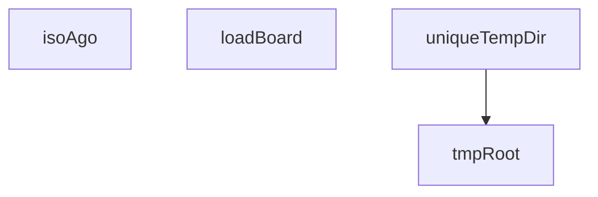

## Genel Bakış
Bu modül, board (tahta) ile ilgili değişmezliklerin (invariants) doğrulanması için yazılmış bir test dosyasıdır. Testlerin çalışması için gerekli yardımcı fonksiyonları barındırır: geçici dizin oluşturma, zaman damgası üretimi ve board modülünün yüklenmesi gibi altyapısal işlevler sunar.

## Fonksiyon Grupları

### Test Ortamı Yardımcıları
Testlerin çalışması için geçici dosya sistemi alanları ve zaman damgaları üreten yardımcı fonksiyonlardır. `uniqueTempDir` fonksiyonunun `tmpRoot` fonksiyonunu çağırarak benzersiz geçici dizinler oluşturduğu anlaşılmaktadır.
- `tmpRoot`, `uniqueTempDir`, `isoAgo`

### Board Yükleme
Test edilecek board modülünü belirli bir dizin yolundan yükleyerek test senaryolarının kullanımına sunar. Dış bağımlılık olarak `BoardModule` tipini gerektirir.
- `loadBoard`

---

## AXIOMS – Mimari Varsayımlar

[Aksiyom 1]: Eğer `BOARD_MODULE_PATH` sabiti tanımlı değilse, `loadBoard` fonksiyonu çağrıldığında modül yükleme başarısız olur.

[Aksiyom 2]: Eğer `boardDir` parametresi olarak verilen dizin dosya sisteminde mevcut değilse, `loadBoard` fonksiyonu geçerli bir `BoardModule` döndüremez.

[Aksiyom 3]: Eğer dosya sistemi yazılabilir değilse, `tmpRoot()` ve `uniqueTempDir` fonksiyonları geçici dizin oluşturamaz.

[Aksiyom 4]: Eğer `require` mekanizması çalışır durumda değilse, `BOARD_MODULE_PATH` üzerinden modül yüklenemez ve testler yürütülemez.

---

## FONKSİYON DETAYLARI

### loadBoard
**Ne yapar**: Board modülünü taze (cache'siz) olarak yükler. Her çağrıda modülün sıfırdan yeniden çözümlenmesini garanti eder, böylece önceki testlerin geçici dizin ayarları bir sonraki testi kirletmez.

**Nasıl yapar**: Önce `process.env.VENTHUB_BOARD_DIR` ortam değişkenini verilen `boardDir` değerine ayarlar. Ardından `BOARD_MODULE_PATH` ile tanımlı modül yolunun `require.cache` girişini siler. Bu sayede Node.js'in modül önbelleği temizlenir ve `require(BOARD_MODULE_PATH)` çağrısı modülü sıfırdan yükler. Docstring'e göre board.cjs dosyası `BOARD_DIR` değerini modül gövdesinde yalnızca bir kez okuduğundan, cache temizlenmezse ikinci test birinci testin geçici dizinini miras alır.

**Parametreler**:
- boardDir: string — Yüklenecek board modülünün dizin yolu. `VENTHUB_BOARD_DIR` ortam değişkenine bu değer atanır.

**Dönüş**: BoardModule — Yeniden yüklenmiş board modülü. `require` sonucu `BoardModule` tipine cast edilerek döndürülür.

### isoAgo
**Ne yapar**: Geliştirildi ancak detay üretilemedi.

### tmpRoot
**Ne yapar**: Geliştirildi ancak detay üretilemedi.

### uniqueTempDir
**Ne yapar**: Geliştirildi ancak detay üretilemedi.

---

## İTHALATLAR (IMPORTS)
- import: node:child_process::execFileSync
- import: node:child_process::spawnSync
- import: node:module::createRequire
- import: vitest::afterEach
- import: vitest::beforeEach
- import: vitest::describe
- import: vitest::expect
- import: vitest::it

---

## INTERFACES

### BoardClaim
INV-BOARD-1 · Çok-oturum panosu değişmezleri (kalıcı bekçi). `scripts/board/board.cjs` üç Claude Code oturumunu (controller ikizleri + ortak worker) aynı repoda koordine eder: hangi şerit hangi glob'u talep etmiş, kim kime not bırakmış. Bu katman bir gecede İKİ kez kritik hataya yol açtı ve her sefe
- `sid: string`
- `lane: string`
- `globs: string[]`
- `ts: string`
- `heartbeat: string`
- `ttlMs: number`

### BoardConflict
- `claim: BoardClaim`
- `glob: string`
- `rel: string`

### BoardNote
- `ts: string`
- `sid: string`
- `type: 'note'`
- `to?: string`
- `text: string`

### BoardClaimHali extends BoardClaim
- `bayat: boolean`
- `yasDk: number | null`

### BoardModule
- `append: (sid: string, event: Record<string, unknown>) => void`
- `readEvents: () => { sid?: string; type?: string }[]`
- `tumTalepler: (now?: number) => BoardClaimHali[]`
- `summary: (sid: string) => string`
- `PANOYA_YAZAN_FIILLER: Set<string>`
- `liveClaims: (now?: number) => BoardClaim[]`
- `findConflict: (filePath: string, sid: string, repoRoot?: string) => BoardConflict | null`
- `notesFor: (sid: string, lane: string, events?: Record<string, unknown>[]) => BoardNote[]`
- `markSeen: (sid: string, notes: BoardNote[]) => void`
- `globToRegExp: (glob: string) => RegExp`
- `toRepoRelative: (filePath: string, repoRoot?: string) => string`
- `resolveNoteTarget: (rawTo?: string) => { ok: boolean; to?: string; how?: string; reason?: string; valid?: string[] }`
- `sidDogrula: (sid: string) => { ok: boolean; tur?: string; sebep?: string; oneri?: string }`

### ExecFailure
`execFileSync` başarısız çıkışta fırlatır; kodu ve stderr'i buradan okuruz (`any` yasak). `encoding: 'utf8'` verildiği için akışlar string gelir — `Buffer` tipine referans YOK (bu ortamda `@types/node` bozuk, dosya başındaki NOT'a bakınız).
- `status?: number`
- `stderr?: string`
- `stdout?: string`

---

## SABİTLER
- **require** (call) — `createRequire(import.meta.url)`
- **BOARD_MODULE_PATH** (call) — `require.resolve('../../../scripts/board/board.cjs')`
- **boardDir** (unknown)
- **originalEnv** (unknown)

---

## AST POINTERS

### [N1_NASIL] AST Pointer: board-invariants.test.ts::loadBoard
- **params**: `boardDir` — yüklenecek board modülünün dizin yolu
- **ic_degiskenler**: yok
- **Dönüş**: BoardModule — `require()` ile yeniden yüklenmiş board modülü

### [N2_NASIL] AST Pointer: board-invariants.test.ts::isoAgo
- **params**: `msAgo` — milisaniye cinsinden geçmiş zaman farkı
- **ic_degiskenler**: yok
- **Dönüş**: string — ISO 8601 biçiminde tarih dizesi

### [N3_NASIL] AST Pointer: board-invariants.test.ts::tmpRoot
- **params**: (parametre yok)
- **ic_degiskenler**:
  - `raw` — `process.env.RUNNER_TEMP`, `process.env.TMPDIR`, `process.env.TEMP`, `process.env.TMP` ortam değişkenlerinden ilki tanımlıysa o değer, hiçbiri yoksa `'/tmp'`; sondaki eğik çizgi ve ters eğik çizgiler normalize edilir
- **Dönüş**: string — normalize edilmiş geçici kök dizin yolu

### [N4_NASIL] AST Pointer: board-invariants.test.ts::uniqueTempDir
- **params**: `prefix` — dizin adına eklenecek ön ek dizesi
- **ic_degiskenler**: yok (modül seviyesindeki `dirCounter` değişkenini artırır ve kullanır; `tmpRoot()`, `Date.now()`, `Math.random()` çağrılır)
- **Dönüş**: string — `${tmpRoot()}/${prefix}-${Date.now()}-${rastgele}-${dirCounter}` biçiminde benzersiz geçici dizin yolu

### [N5_NASIL] AST Pointer: board-invariants.test.ts::seed (note/CLI test kapsamı)
- **params**: `board` — BoardModule örneği
- **ic_degiskenler**: yok (modül seviyesindeki `SID_A`, `SID_B`, `SID_C` sabitlerini ve `isoAgo()` fonksiyonunu kullanır)
- **Dönüş**: yok — yan etki olarak board'a üç claim (ALFA, BETA, GAMA) ekler

### [N6_NASIL] AST Pointer: board-invariants.test.ts::runNote
- **params**: `args` — CLI argüman dizisi
- **ic_degiskenler**:
  - `stdout` — `execFileSync` başarılı olduğunda dönen standart çıktı dizesi
  - `e` — catch bloğunda yakalanan hata nesnesi
  - `f` — `e`'nin `ExecFailure` tipine dönüştürülmüş hali; `f.status`, `f.stdout`, `f.stderr` alanlarına erişilir
- **Dönüş**: `{ status: number; stdout: string; stderr: string }` — başarılıysa status 0 ve stdout dolu, hata durumunda status -1 veya çıkış kodu, stderr hata mesajı

### [N7_NASIL] AST Pointer: board-invariants.test.ts::runCli
- **params**: `args` — CLI argüman dizisi; `opts` — `{ sidEnv?: string }` — isteğe bağlı ortam değişkeni yapılandırması (varsayılan `{}`)
- **ic_degiskenler**:
  - `ciftler` — `process.env` girdilerinden `CLAUDE_SESSION_ID` anahtarı çıkarılmış `[anahtar, değer]` çiftleri dizisi; `opts.sidEnv` tanımlıysa `CLAUDE_SESSION_ID` tekrar eklenir; `VENTHUB_BOARD_DIR` her zaman eklenir
  - `env` — `ciftler` dizisinden `Object.fromEntries` ile oluşturulmuş ortam değişkenleri nesnesi
  - `r` — `spawnSync` sonucu; `r.status`, `r.stdout`, `r.stderr` alanlarına erişilir
- **Dönüş**: `{ status: number; stdout: string; stderr: string }` — `spawnSync` çıkış kodu, standart çıktı ve standart hata

### [N8_NASIL] AST Pointer: board-invariants.test.ts::seed (bayat/summary test kapsamı)
- **params**: `board` — BoardModule örneği
- **ic_degiskenler**: yok (modül seviyesindeki `SID_CANLI`, `SID_BAYAT`, `SID_BIRAKAN` sabitlerini ve `isoAgo()` fonksiyonunu kullanır)
- **Dönüş**: yok — yan etki olarak board'a üç claim (CANLI, BAYAT-SERIT, BIRAKAN) ve bir release ekler

### [N9_NASIL] AST Pointer: board-invariants.test.ts::hookKostur
- **params**: `sidDeger` — hook'a stdin üzerinden gönderilecek oturum kimliği dizesi
- **ic_degiskenler**:
  - `ciftler` — `process.env` girdilerinden `CLAUDE_SESSION_ID` anahtarı çıkarılmış `[anahtar, değer]` çiftleri dizisi; `VENTHUB_BOARD_DIR` eklenir
  - `env` — `ciftler` dizisinden `Object.fromEntries` ile oluşturulmuş ortam değişkenleri nesnesi
  - `r` — `spawnSync` sonucu; stdin olarak `JSON.stringify({ session_id: sidDeger })` gönderilir; `r.stdout` okunur
- **Dönüş**: string — hook'un standart çıktısı (boşsa `''`)

---

## MERMAID CALL GRAPH

## NODE ID STANDARD

  file: board-invariants.test.ts
  function: board-invariants.test.ts::loadBoard
  function: board-invariants.test.ts::isoAgo
  function: board-invariants.test.ts::tmpRoot
  function: board-invariants.test.ts::uniqueTempDir

---

## DISA AKTARILANLAR (EXPORTS)
  export: isoAgo
  export: loadBoard
  export: tmpRoot
  export: uniqueTempDir

---

## BILEŞIM (CONTAINS)
  contains: BoardClaim