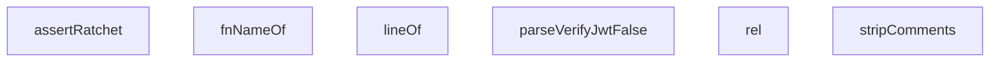

## Genel Bakış

Bu modül, uygulamanın güvenlik politikalarına yönelik uyumluluk (conformance) testlerini destekleyen yardımcı fonksiyonlar içerir. Özellikle JWT doğrulamanın devre dışı bırakıldığı yapılandırma durumlarını tespit etmek ve bilinen güvenlik ihlallerinin geriye doğru regression'ını önlemek için "ratchet" (çark) mekanizması sunar. Modül, kaynak kod analizi ile yapılandırma dosyası (TOML) işlemenin kesişiminde çalışır.

## Fonksiyon Grupları

### Kaynak Kod Analiz Yardımcıları
Kaynak kod metni üzerinde arama, satır bulma ve yorum temizleme işlemleri yaparak testlerin kod tabanındaki spesifik noktaları hedeflemesini sağlar.
- `stripComments`, `lineOf`

### Tanımlayıcı Çözümleme
Test anahtarlarından fonksiyon adlarını ve göreceli yolları çıkararak, test senaryolarının hangi bileşeni hedeflediğini belirler.
- `rel`, `fnNameOf`

### Yapılandırma Doğrulama
TOML formatındaki yapılandırma dosyalarını ayrıştırarak JWT doğrulamasının kasıtlı olarak devre dışı bırakıldığı (false) durumları tespit eder.
- `parseVerifyJwtFalse`

### Güvenlik Ratchet Assertions
Bilinen güvenlik ihlalleri (KNOWN_VIOLATIONS) listesine karşı tespit edilen ihlalleri doğrular ve mevcut durumun daha kötüye gitmemesi garantisini test eder.
- `assertRatchet`

---

## AXIOMS – Mimari Varsayımlar

Bu modül, edge fonksiyonlarının güvenlik kurallarına uyumluluğunu test eden bir conformance denetleme modülüdür. Aşağıdaki varsayımlar fonksiyon imzaları ve modül sabitlerinden türetilmiştir.

[Aksiyom 1]: Eğer `KNOWN_VIOLATIONS` nesnesi tanımlı değilse veya geçerli bir `rule` anahtarı içermiyorsa, `assertRatchet` fonksiyonu hangi ihlali kontrol edeceğini bilemez ve doğrulama başarısız olur.

[Aksiyom 2]: Eğer `EDGE_TS`, `CONFIG_TOML` veya `PER_FUNCTION_TOML` dosya yolları yanlışsa veya dosyalar erişilebilir değilse, kaynak kodlar okunamaz ve test senaryoları çalıştırılamaz.

[Aksiyom 3]: Eğer `R5_EXEMPT` nesnesi doğru yapılandırılmamışsa, R5 kuralı için istisnai durumlar (exemption) uygulanmaz ve yanlış pozitif ihlal raporları oluşur.

[Aksiyom 4]: Eğer `SOURCES` veya `INDEX_SOURCES` çağrıları başarısız olursa veya boş dönerse, denetlenecek kaynak dosya listesi oluşturulamaz ve tüm testler çalıştırılamaz.

[Aksiyom 5]: Eğer `stripComments` fonksiyonuna geçersiz veya bozuk kaynak kodu verilirse, yorum satırları doğru temizlenemez ve `lineOf` tarafından bulunan satır numaraları yanlış olur.

[Aksiyom 6]: Eğer `parseVerifyJwtFalse` fonksiyonuna geçersiz TOML formatı verilirse, `verifyJwt = false` olan fonksiyonlar tespit edilemez ve JWT doğrulama ihlalleri gözden kaçar.

[Aksiyom 7]: Eğer `IDENTITY_SIGNALS` dizisi boşsa veya tanımlı sinyaller içermiyorsa, edge fonksiyonlarının kimlik tespiti yapılamaz ve güvenlik denetimi eksik kalır.

[Aksiyom 8]: Eğer `assertRatchet` fonksiyonuna `found` parametresi olarak boş dizi verilirse, mevcut bir ihlal olmasa bile kural düzgün doğrulanamaz — en azından ihlal olmama durumunun kendisi doğrulanabilmelidir.

[Aksiyom 9]: Eğer `rel` veya `fnNameOf` fonksiyonları için geçersiz bir `key` değeri verilirse, dosya yolu veya fonksiyon adı hatalı oluşturulur ve sonraki adımlarda kaynak bulma hataları meydana gelir.

[Aksiyom 10]: Eğer `lineOf` fonksiyonuna eşleşmeyen bir `RegExp` verilirse, bulunan satır numarası `0` döner (veya eşleşmez durumu temsil eden bir değer) ve ihlal satır referansı hatalı raporlanır.

---

## FONKSİYON DETAYLARI

### rel

**Ne yapar**: Glob formatındaki tam yolu repo-göreli kısa yola indirger. Yani baştaki `/` karakterini kaldırarak dosya yolunu göreceli hale getirir.

**Nasıl yapar**: `key` parametresinin başındaki `/` karakterini `replace` ile boş string ile değiştirir. `/supabase/...` gibi bir yol `supabase/...` formatına dönüştürülür. Fonksiyon gövdesinde `([k, v]) => ...` kalıbıyla map iterasyonu içinde kullanılır; üretilen `path` alanı bir sonraki aşama (fonksiyon adı çıkarma, kod çıkarma) için temel yol bilgisini sağlar.

**Parametreler**:
- key: `string` — Repo içi glob anahtarı; başlangıcı `/` ile başlayan tam yol (örn: `/supabase/functions/my-fn/index.ts`)

**Dönüş**: `string` — Başındaki `/` kaldırılmış göreceli yol (örn: `supabase/functions/my-fn/index.ts`)

### fnNameOf
**Ne yapar**: Geliştirildi ancak detay üretilemedi.

### stripComments
**Ne yapar**: Geliştirildi ancak detay üretilemedi.

### lineOf
**Ne yapar**: Geliştirildi ancak detay üretilemedi.

### parseVerifyJwtFalse
**Ne yapar**: Geliştirildi ancak detay üretilemedi.

### assertRatchet
**Ne yapar**: Geliştirildi ancak detay üretilemedi.

---

## İTHALATLAR (IMPORTS)
- import: vitest::describe
- import: vitest::expect
- import: vitest::it

---

## SABİTLER
- **EDGE_TS** (call) — `import.meta.glob('/supabase/functions/**/*.ts', {
  query: '?raw',
  import: ...`
- **CONFIG_TOML** (call) — `import.meta.glob('/supabase/config.toml', {
  query: '?raw',
  import: 'defau...`
- **PER_FUNCTION_TOML** (call) — `import.meta.glob(
  '/supabase/functions/*/supabase.toml',
  { query: '?raw',...`
- **KNOWN_VIOLATIONS** (as_expression) — `{
  // R1 — 2026-08-14'te 16 fonksiyonda düzeltildi; baseline BOŞ (sıfır tole...`
- **R5_EXEMPT** (object) — `{
  // pg_cron `net.http_post` ile auth header'sız çağırır; uç dışarıya veri ...`
- **SOURCES** (call) — `Object.entries(EDGE_TS)
  .filter(([k]) => !k.includes('.test.') && !k.includ...`
- **INDEX_SOURCES** (call) — `SOURCES.filter((s) => s.key.endsWith('/index.ts'))`
- **IDENTITY_SIGNALS** (array) — `[
  { name: 'auth.getUser(<jwt>)', re: /\.auth\s*\.\s*getUser\s*\(\s*[^)\s]/ ...`

---

## AST POINTERS

### [N1_NASIL] AST Pointer: edge-security.test.ts::rel
- **params**: (key: string)
- **ic_degiskenler**:
  - `m` — key üzerindeki regex eşleşmesi sonucu, fonksiyon adını içeren grup veya null
- **Dönüş**: string

### [N2_NASIL] AST Pointer: edge-security.test.ts::stripComments
- **params**: (src: string)
- **ic_degiskenler**:
  - `out` — yorumları çıkarılmış kaynak kodunu biriktirme stringi
  - `mode` — state machine modu, aktif mode'u belirtir (code, line, block, sq, dq, tpl)
  - `i` — döngü indeksi, mevcut karakter konumu
  - `c` — mevcut karakter
  - `d` — bir sonraki karakter ( lookahead için)
- **Dönüş**: string

### [N3_NASIL] AST Pointer: edge-security.test.ts::lineOf
- **params**: (src: string, re: RegExp)
- **ic_degiskenler**:
  - `m` — src üzerinde re ile yapılan eşleşme sonucu
- **Dönüş**: number

### [N4_NASIL] AST Pointer: edge-security.test.ts::parseVerifyJwtFalse
- **params**: (toml: string)
- **ic_degiskenler**:
  - `out` — verify_jwt=false olan fonksiyon adlarını tutan string dizisi
  - `current` — mevcut [functions."..."] bölümündeki fonksiyon adı veya null
  - `raw` — döngüdeki ham satır
  - `line` — trim edilmiş satır
  - `header` — fonksiyon başlık regex eşleşmesi (grup 1: fonksiyon adı)
  - `kv` — verify_jwt = true/false regex eşleşmesi
- **Dönüş**: string[]

### [N5_NASIL] AST Pointer: edge-security.test.ts::assertRatchet
- **params**: (rule: keyof typeof KNOWN_VIOLATIONS, found: string[], fixHint: string)
- **ic_degiskenler**:
  - `baseline` — KNOWN_VIOLATIONS[rule] değerini temsil eden sadece okunabilir string dizisi
  - `found` içinde olup `baseline`da olmayan (yeni) ihlallerin sıralı listesi
  - `baseline` içinde olup `found`da olmayan (artık tespit edilmeyen) ihlallerin sıralı listesi
- **Dönüş**: void

### [N6_NASIL] AST Pointer: edge-security.test.ts::test_suite_edge_ve_config
- **params**: ()
- **ic_degiskenler**:
  - (yok — sadece iki `it()` bloğu çağrılır, içlerinde değişken tanımlanmaz)
- **Dönüş**: void

### [N7_NASIL] AST Pointer: edge-security.test.ts::test_yorum_ayiklayici
- **params**: ()
- **ic_degiskenler**:
  - `src` — test edilecek kaynak kodu satırlarını birleştiren dizi
  - `out` — `stripComments(src)` sonucu, yorumları arındırılmış kod
- **Dönüş**: void

### [N8_NASIL] AST Pointer: edge-security.test.ts::test_getUser
- **params**: ()
- **ic_degiskenler**:
  - `found` — argümansız `getUser()` kullanımını tutan string dizisi
  - `s` — döngüdeki mevcut kaynak nesnesi
  - `re` — argümansız `getUser()` için regex deseni
- **Dönüş**: void

### [N9_NASIL] AST Pointer: edge-security.test.ts::test_getCorsHeaders
- **params**: ()
- **ic_degiskenler**:
  - `found` — import edip çağırmayan dosya yollarını tutan string dizisi
  - `s` — döngüdeki mevcut kaynak nesnesi
  - `imported` — `getCorsHeaders` import'unun varlığını belirten boolean
  - `called` — `getCorsHeaders()` çağrısının varlığını belirten boolean
- **Dönüş**: void

### [N10_NASIL] AST Pointer: edge-security.test.ts::test_cors_sinyalizasyonu
- **params**: ()
- **ic_degiskenler**:
  - `found` — elle CORS başlığı kurup `getCorsHeaders` kullanmayan dosya yollarını tutan string dizisi
  - `s` — döngüdeki mevcut kaynak nesnesi
  - `handRolled` — `Access-Control-Allow-Headers` içeriğini arayan boolean
  - `usesSsot` — `getCorsHeaders()` çağrısını

---

## MERMAID CALL GRAPH

## NODE ID STANDARD

  file: src\__tests__\conformance\edge-security.test.ts
  function: src\__tests__\conformance\edge-security.test.ts::rel
  function: src\__tests__\conformance\edge-security.test.ts::fnNameOf
  function: src\__tests__\conformance\edge-security.test.ts::stripComments
  function: src\__tests__\conformance\edge-security.test.ts::lineOf
  function: src\__tests__\conformance\edge-security.test.ts::parseVerifyJwtFalse
  function: src\__tests__\conformance\edge-security.test.ts::assertRatchet

---

## DISA AKTARILANLAR (EXPORTS)
  export: assertRatchet
  export: fnNameOf
  export: lineOf
  export: parseVerifyJwtFalse
  export: rel
  export: stripComments