## Genel Bakış
Bu modül, edge fonksiyonlarının güvenlik politikalarına uyumluluğunu test eden yardımcı fonksiyonlar içerir. Test senaryolarının kaynak kod ve yapılandırma dosyalarını analiz ederek, bilinen güvenlik ihlallerinin geriye doğru_regression'ını önleyen bir "ratchet" (çark) mekanizması sunar.

## Fonksiyon Grupları

### Kaynak Kod Analiz Yardımcıları
Kaynak kod metni üzerinde arama, satır bulma ve yorum temizleme işlemleri yaparak testlerin kod tabanındaki spesifik noktaları hedeflemesini sağlar.
- `stripComments`, `lineOf`, `firstLineMatching`

### Tanımlayıcı Çözümleme
Test anahtarlarından fonksiyon adlarını ve göreceli yolları çıkararak, test senaryolarının hangi bileşeni hedeflediğini belirler.
- `rel`, `fnNameOf`

### Yapılandırma Doğrulama
TOML formatındaki yapılandırma dosyalarını ayrıştırarak JWT doğrulamasının kasıtlı olarak devre dışı bırakıldığı durumları ve fonksiyon bloklarını tespit eder.
- `parseVerifyJwtFalse`, `parseFunctionBlocks`

### Güvenlik Açığı Tespiti
Webhook implementasyonlarında olası güvenlik açıklarını (gaps) kod üzerinde analiz ederek tespit eder.
- `webhookGaps`

### Güvenlik Ratchet Assertions
Bilinen güvenlik ihlalleri listesine karşı tespit edilen ihlalleri doğrular ve mevcut durumun daha kötüye gitmemesi garantisini test eder.
- `assertRatchet`

---

## AXIOMS – Mimari Varsayımlar
- Bu modül davranışsal mantık içermez (salt veri / konfigürasyon / tip tanımı).
- [Aksiyom 1]: Modülün dışa açtığı yapı (anahtar kümesi / şema) bir sözleşmedir; tüketiciler bu sabit yapıya bağlıdır — kırıcı değişiklik tüm tüketicileri etkiler.
- [Aksiyom 2]: Bir öğe ekleme/çıkarma yapısal-uyumlu olmalı; ilgili tipler ve seçiciler aynı commit'te güncel tutulmalıdır.

---

## FONKSİYON DETAYLARI

### rel
**Ne yapar**: Bu fonksiyon, bir glob kalıp anahtarını (örn: `/supabase/functions/...`) depo kök yoluna göre göreli bir dosya yoluna dönüştürür.
**Nasıl yapar**: Fonksiyon, bir yol dizgesini alır ve başındaki `/` karakterini kaldırarak görece bir yol (relative path) üretir. Örneğin, `'/supabase/...'` dizgesini `'supabase/...'` formatına indirger. Bu dönüşüm, fonksiyonların proje yapısı içindeki konumunu standartlaştırmak için kullanılır.
**Parametreler**:
- `key: string` — Dönüştürülecek glob veya dosya yolu kalıbı. Genellikle depo kökünden başlayan tam bir yoldur.
**Dönüş**: `string` — Başındaki `/` karakteri kaldırılmış, depo-köklü görece dosya yolu.

### fnNameOf
**Ne yapar**: Tam bir dosya yolundan, içindeki Supabase Edge fonksiyonunun adını (directory name) çıkarır.
**Nasıl yapar**: Fonksiyon, `/supabase/functions/<fonksiyon_adı>/index.ts` formatındaki yolu analiz eder ve yalnızca `<fonksiyon_adı>` kısmını döndürür. Bu, bir dosya yolunun parçalanması ve istenen elemanın seçilmesiyle yapılır. Bu isim, genellikle bir fonksiyonun benzersiz tanımlayıcısı olarak kullanılır.
**Parametreler**:
- `key: string` — Tam bir dosya yolu. Beklenen format: `/supabase/functions/<fonksiyon_adı>/...` yapısında bir dizgedir.
**Dönüş**: `string` — Yoldan çıkarılmış olan fonksiyon adı (directory name).

### stripComments
**Ne yapar**: TypeScript/JavaScript kaynak kodundan yorum satırlarını (`//` tek satır ve `/* */` çoklu satır) kaldırarak temiz bir kod elde eder. String, template literal ve char literal içeriklerine dokunmaz; bu sayede yorumların içine gizlenmiş gibi görünen (ama aslında string içinde olan) ifadeler yanlış pozitif olarak silinmez.

**Nasıl yapar**: Kaynak kodu karakter karakter tarar ve beş farklı durum makinesi modu (`code`, `line`, `block`, `sq`, `dq`, `tpl`) ile ilerler. `code` modunda `//` veya `/*` kalıplarını tespit ederek ilgili yorum moduna geçer. Yorum modunda sadece `\n` karakterlerini çıkışa yazarak satır numarası hizasını korur. String modlarında (`sq`, `dq`, `tpl`) ters eğik çizgi (`\`) escape karakteri olarak işlenir ve sonraki karakter de dahil edilir; kapanış tırnağı bulunduğunda tekrar `code` moduna dönülür. Bu sayede `// Auth check using auth.getUser()` gibi yorumlar silinirken, `"https://example.com"` gibi string içindeki ifadeler korunur.

**Parametreler**:
- `src`: `string` — Yorumları silinecek kaynak kod metni.

**Dönüş**: `string` — Yorumları çıkarılmış, satır numaraları korunmuş kaynak kod.

### lineOf
**Ne yapar**: Geliştirildi ancak detay üretilemedi.

### parseVerifyJwtFalse
**Ne yapar**: Geliştirildi ancak detay üretilemedi.

### parseFunctionBlocks
**Ne yapar**: Bir TOML yapılandırması dizgesini (genellikle `supabase/config.toml`) analiz ederek içinde tanımlı tüm `[functions."<fonksiyon_adı>"]` yapılandırma bloklarının adlarını (fonksiyon isimlerini) bir dizi olarak çıkarır.
**Nasıl yapar**: Fonksiyon, TOML dizgesini satır satır parçalar. Her satırı, belirli bir regular expression kalıbıyla (`/^\[functions\."?([^"\].]+)"?\]/`) eşleştirir. Bu kalıp, `functions` anahtar adı altındaki tüm alt anahtarları yakalar. Eşleşen her satırdan elde edilen fonksiyon adı (`m[1]`) sonuç dizisine eklenir. Bu yöntem, yapılandırma dosyasının içeriğine bağlı kalmadan dinamik olarak fonksiyon listesini elde etmeyi sağlar.
**Parametreler**:
- `toml: string` — Analiz edilecek TOML yapılandırması. Genellikle `supabase/config.toml` dosyasının içeriğidir.
**Dönüş**: `string[]` — Yapılandırma dosyasında tanımlı `[functions."<ad>"]` bloklarından çıkarılmış fonksiyon adlarının bir dizisi.

### firstLineMatching
**Ne yapar**: Verilen bir kaynak kodu dizgesinde, belirli bir regular expression deseniyle eşleşen ilk satırı bulur ve o satırın 1-tabanlı (insan-okunabilir) numarasını döndürür.
**Nasıl yapar**: Fonksiyon, kaynak kodunu satır karakterine (`\n`) göre böler. Oluşan satır dizisi üzerinde sırayla ilerler ve her satırı verilen `re` regular expression nesnesiyle test eder. `re.test()` methodu, desenin global olmaması koşuluyla, satırın herhangi bir yerinde bir eşleşme arar. İlk eşleşmenin bulunduğu satırın indeksine 1 ekleyerek 1-tabanlı satır numarasını döndürür. Eşleşme bulunamazsa 0 değeri döner.
**Parametreler**:
- `src: string` — Satırlarına ayrılarak taranacak kaynak kodu dizgesi.
- `re: RegExp` — Her satırda aranacak regular expression deseni. Fonksiyonun düzgün çalışması için bu nesnenin `global` (`g`) bayrağı ayarlanmamış olmalıdır.
**Dönüş**: `number` — İlk eşleşen satırın 1-tabanlı numarası. Eşleşme bulunamazsa `0`.

### webhookGaps
**Ne yapar**: Bir webhook işleyici (handler) kodunu güvenlik açıları için tarar ve eksik olan temel güvenlik kapılarının (kontrollerin) adlarını tespit ederek bir dizi olarak döndürür. Bu, özellikle HMAC imza doğrulaması ve timestamp (zaman damgası) doğrulaması gibi kritik kontrollerin varlığını kontrol eden bir dedektördür.
**Nasıl yapar**: Fonksiyon, kod dizgesi üzerinde iki ana güvenlik kontrolü gerçekleştirir:
1. **HMAC-İmza Kontrolü**: Kodda `crypto.subtle` kullanımını veya `hmacValid` fonksiyonu çağrısını arar (imza doğrulama primitifinin varlığı). Ayrıca, HTTP başlıklarından bir `signature` anahtarı okunduğunu doğrular (`headers.get('...signature...')`). Her iki koşul da sağlanmazsa `'HMAC-imza'` açığı raporlanır.
2. **Zorunlu-Timestamp Kontrolü**: Kodda bir timestamp veya event-time başlığının okunup bir değişkene atandığını (`const tsVar = ...`) ve ardından o değişkenin (`tsVar`) varlığının kontrol edilerek eksikse `401` hatasıyla reddedildiğini (`if (!tsVar) ... 401`) arar. Ayrıca, timestamp'in eski olup olmadığını kontrol eden bir "stale window" mekanizması (örn: `Math.abs(Date.now() - ...)`) olup olmadığını test eder. Bu üç koşuldan herhangi biri eksikse `'zorunlu-timestamp'` açığı raporlanır. Fonksiyon, eksik kapıların isimlerini içeren bir dizi döndürür.
**Parametreler**:
- `code: string` — Analiz edilecek webhook işleyici fonksiyonunun ham kaynak kodu.
**Dönüş**: `string[]` — Eksik olan güvenlik kontrollerinin adlarını içeren dizi. Örnek çıkış: `['HMAC-imza', 'zorunlu-timestamp']`. Eğer tüm kontroller mevcutsa boş bir dizi döner.

### assertRatchet
**Ne yapar**: Geliştirildi ancak detay üretilemedi.

---

## İTHALATLAR (IMPORTS)
- import: vitest::describe
- import: vitest::expect
- import: vitest::it

---

## SABİTLER
- **EDGE_TS** (call) — `import.meta.glob(
  ['/supabase/functions/**/*.ts', '!**/*.compiled.*.ts'],
...`
- **CONFIG_TOML** (call) — `import.meta.glob('/supabase/config.toml', {
  query: '?raw',
  import: 'def...`
- **PER_FUNCTION_TOML** (call) — `import.meta.glob(
  '/supabase/functions/*/supabase.toml',
  { query: '?raw...`
- **KNOWN_VIOLATIONS** (as_expression) — `{
  // R1 — 2026-08-14'te 16 fonksiyonda düzeltildi; baseline BOŞ (sıfır tol...`
- **R5_EXEMPT** (object) — `{
  // pg_cron `net.http_post` ile auth header'sız çağırır; uç dışarıya veri...`
- **SOURCES** (call) — `Object.entries(EDGE_TS)
    .filter(([k]) => !k.includes('.test.') && !k.inc...`
- **INDEX_SOURCES** (call) — `SOURCES.filter((s) => s.key.endsWith('/index.ts'))`
- **CALLER_CLASS_RE** (regex) — `/^\s*\/\/\s*Çağıran sınıfı:\s*\(\s*[abcd]\s*\)/`
- **SERVE_RE** (regex) — `/(?:^|[^.\w])(?:Deno\s*\.\s*)?serve\s*\(/`
- **UNTRUSTED_TENANT_RE** (regex) — `/searchParams\s*\.\s*get\s*\(\s*['"]tenant_?[iI]d['"]\s*\)|\b(?:parsedBody|bo...`
- **VERIFIED_IDENTITY_RE** (regex) — `/\.auth\s*\.\s*getUser\s*\(/`
- **TENANT_MODULE_FORBIDDEN** (array) — `[
  { ad: 'Request tipi', re: /\bRequest\b/ },
  { ad: 'req. erişimi', re: ...`
- **SERVICE_BODY_CALL_RE** (regex) — `/\btenantFromServiceBody\s*\(/`
- **SERVICE_BODY_DECL_RE** (regex) — `/\b(?:export\s+)?(?:async\s+)?function\s+tenantFromServiceBody\b/`
- **SERVICE_ROLE_CHECK_RE** (regex) — `/timingSafeEquals\s*\([^)]*serviceRoleKey|===\s*serviceRoleKey|serviceRoleKey...`
- **IDENTITY_SIGNALS** (array) — `[
  { name: 'auth.getUser(<jwt>)', re: /\.auth\s*\.\s*getUser\s*\(\s*[^)\s]/...`

---

## AST POINTERS

### [N1_NASIL] AST Pointer: `__tests__/conformance/edge-security.test.ts::rel`
- **params**: `key: string` — tam dosya yolu; fonksiyon adını çıkarmak için kullanılır
- **ic_degiskenler**:
  - `m` — `key.match()` sonucu; RegExp eşleşme dizisi (index 1 = fonksiyon adı) veya `null`
- **Dönüş**: `string` — yoldan çıkarılan fonksiyon adı (eşleşme yoksa boş string)

### [N2_NASIL] AST Pointer: `__tests__/conformance/edge-security.test.ts::stripComments`
- **params**: `src: string` — yorumları ayıklanacak kaynak kod
- **ic_degiskenler**:
  - `out` — biriken temiz çıktı stringi; yorum/şablon-literal içeriği hariç tüm karakterler buraya eklenir
  - `mode` — FSM durumu; `'code' | 'line' | 'block' | 'sq' | 'dq' | 'tpl'` değerlerini alır, hangi modda olduğunu belirler
  - `i` — mevcut karakter indeksi; ilerleme kontrolü için kullanılır
  - `c` — mevcut karakter (`src[i]`)
  - `d` — bir sonraki karakter (`src[i + 1]`); iki karakterli desenler (`//`, `/*`, `*/`) için lookahead
- **Dönüş**: `string` — yorumları ve şablon-literal içeriğini ayıklanmış kod

### [N3_NASIL] AST Pointer: `__tests__/conformance/edge-security.test.ts::lineOf`
- **params**: `src: string` — taranacak kaynak kod; `re: RegExp` — aranan desen
- **ic_degiskenler**:
  - `m` — `src.match(re)` sonucu; eşleşme nesnesi veya `null/undefined`
- **Dönüş**: `number` — eşleşmenin bulunduğu satır numarası (1-tabanlı, bulunamazsa 0)

### [N4_NASIL] AST Pointer: `__tests__/conformance/edge-security.test.ts::parseVerifyJwtFalse`
- **params**: `toml: string` — supabase/config.toml içeriği
- **ic_degiskenler**:
  - `out` — `verify_jwt = false` olan fonksiyon adlarının toplandığı dizi
  - `current` — mevcut `[functions."..."]` bloğunun adı veya `null` (başlık dışındaysa)
  - `raw` —分割后的her satır (trim öncesi)
  - `line` — trim edilmiş satır
  - `header` — satırın fonksiyon başlığı olup olmadığını test eden eşleşme; `header[1]` = fonksiyon adı
  - `kv` — `verify_jwt = true|false` eşleşmesi; `kv[1]` = değerin kendisi
- **Dönüş**: `string[]` — `verify_jwt = false` olan fonksiyon adlarının listesi

### [N5_NASIL] AST Pointer: `__tests__/conformance/edge-security.test.ts::parseFunctionBlocks`
- **params**: `toml: string` — supabase/config.toml içeriği
- **ic_degiskenler**:
  - `out` — bulunan fonksiyon adlarının toplandığı dizi
  - `raw` —分割后的her satır (trim öncesi)
  - `m` — `[functions."..."]` başlık deseni eşleşmesi; `m[1]` = fonksiyon adı
- **Dönüş**: `string[]` — config.toml'da tanımlı tüm fonksiyon adları

### [N6_NASIL] AST Pointer: `__tests__/conformance/edge-security.test.ts::firstLineMatching`
- **params**: `src: string` — taranacak kaynak kod; `re: RegExp` — aranan desen
- **ic_degiskenler**:
  - `lines` — `src.split('\n')` sonucu; satırlara ayrılmış kod dizisi
  - `i` — döngü sayacı; mevcut satır indeksi
- **Dönüş**: `number` — eşleşen ilk satır numarası (1-tabanlı, bulunamazsa 0)

### [N7_NASIL] AST Pointer: `__tests__/conformance/edge-security.test.ts::webhookGaps`
- **params**: `code: string` — webhook fonksiyonunun kaynak kodu
- **ic_degiskenler**:
  - `gaps` — eksik güvenlik bileşenlerinin toplandığı dizi (örn. `'HMAC-imza'`, `'zorunlu-timestamp'`)
  - `hasHmacPrimitive` — kodda `crypto.subtle` veya `hmacValid(` olup olmadığını gösteren boolean
  - `readsSignature` — kodda `headers.get('...signature...')` çağrısı olup olmadığını gösteren boolean
  - `tsVar` — timestamp/ event-time header'ını okuyan değişkenin adı (`RegExp` eşleşme sonucu `?.[1]`) veya `undefined`
  - `rejectsMissing` — timestamp değişkeni yoksa 401 döndürüp döndürmediğini test eden boolean; `tsVar` tanımlıysa `RegExp.test()` sonucu
  - `hasStaleWindow` — `Math.abs(Date.now()` kalıbı ile taze pencere kontrolü olup olmadığını gösteren boolean
- **Dönüş**: `string[]` — eksik güvenlik bileşenlerinin adları (boşsa tüm kontroller yerinde)

### [N8_NASIL] AST Pointer: `__tests__/conformance/edge-security.test.ts::assertRatchet`
- **params**: `rule: keyof typeof KNOWN_VIOLATIONS` — test edilen kural adı; `found: string[]` — taramada bulunan ihlaller; `fixHint: string` — düzeltme ipucu mesajı
- **ic_degiskenler**:
  - `baseline` — `KNOWN_VIOLATIONS[rule]` değerinin readonly string dizisi olarak tipi; bilinen eski ihlal listesi
  - `isNew` — `found` içinde olup `baseline`'da olmayan (yeni ihlaller) sıralı dizi
  - `stale` — `baseline`'da olup `found`'da olmayan (artık ihlal olmayan, bayat) sıralı dizi
- **Dönüş**: `void` — yan etki: `expect()` çağrılarıyla test başarısızlığını tetikler

### [N9_NASIL] AST Pointer: `__tests__/conformance/edge-security.test.ts::it("edge kaynakları gerçekten yükleniyor")`
- **params**: (yok — anonim arrow fonksiyonu)
- **ic_degiskenler**: (yok — yalnızca `SOURCES` ve `INDEX_SOURCES` sabitlerine `length` üzerinden erişim)
- **Dönüş**: `void` — yan etki: `expect()` ile kaynak sayısının 20'den fazla olduğunu doğrular

### [N10_NASIL] AST Pointer: `__tests__/conformance/edge-security.test.ts::it("supabase/config.toml yükleniyor...")`
- **params**: (yok)
- **ic_degiskenler**:
  - `open` — `parseVerifyJwtFalse()` çağrısının döndürdüğü, `verify_jwt = false` olan fonksiyon adları dizisi
- **Dönüş**: `void` — yan etki: config.toml'ın yüklendiğini, beklenen açık uçların olduğunu ve yanlış-pozitif olmadığını doğrular

### [N11_NASIL] AST Pointer: `__tests__/conformance/edge-security.test.ts::it("yorum-ayıklayıcı doğru çalışıyor")`
- **params**: (yok)
- **ic_degiskenler**:
  - `src` — test edilecek kaynak kod; yorum ve string içeren 4 satırlık dizi birleşimi
  - `out` — `stripComments(src)` çağrısının döndürdüğü temizlenmiş kod
- **Dönüş**: `void` — yan etki: satır hizasının korunduğunu, string içi `//`'nin korunduğunu ve yalnızca gerçek çağrının kaldığını doğrular

### [N12_NASIL] AST Pointer: `__tests__/conformance/edge-security.test.ts::it("config.toml blok adları çözülüyor")`
- **params**: (yok)
- **ic_degiskenler**:
  - `blocks` — `parseFunctionBlocks()` çağrısının döndürdüğü fonksiyon adları dizisi
- **Dönüş**: `void` — yan etki: blok adlarının sayısını, beklenen isimleri ve `[functions]` başlığının dahil edilmediğini doğrular

### [N13_NASIL] AST Pointer: `__tests__/conformance/edge-security.test.ts::it("çağıran-sınıfı beyan dedektörü dar")`
- **params**: (yok)
- **ic_degiskenler**: (yok — yalnızca `CALLER_CLASS_RE` regex'i üzerinde `.test()` çağrılır)
- **Dönüş**: `void` — yan etki: regex'in hem pozitif hem negatif senaryolarda doğru davrandığını doğrular

### [N14_NASIL] AST Pointer: `__tests__/conformance/edge-security.test.ts::it("serve dedektörü import satırını çağrı sanmıyor")`
- **params**: (yok)
- **ic_degiskenler**: (yok — yalnızca `SERVE_RE` regex'i üzerinde `.test()` çağrılır)
- **Dönüş**: `void` — yan etki: import satırının çağrılmadığını, gerçek serve çağrılarının yakalandığını doğrular

### [N15_NASIL] AST Pointer: `__tests__/conformance/edge-security.test.ts::it("E12 dedektörü çalışıyor")`
- **params**: (yok)
- **ic_degiskenler**:
  - `KOTU` — yakalanması gereken kötü desenlerin string dizisi (4 eleman)
  - `ornek` — döngü içindeki her bir test deseni (hem `KOTU` hem `IYI` döngülerinde)
  - `IYI` — yanlış-pozitif olmaması gereken iyi desenlerin string dizisi (3 eleman)
- **Dönüş**: `void` — yan etki: `UNTRUSTED_TENANT_RE`'nin hem pozitif hem negatif senaryolarda doğru davrandığını ve kaynakların yüklü olduğunu doğrular

### [N16_NASIL] AST Pointer: `__tests__/conformance/edge-security.test.ts::it("E12-B dedektörü çalışıyor")`
- **params**: (yok)
- **ic_degiskenler**:
  - `KOTU` — yakalanması gereken kötü desenlerin string dizisi (5 eleman)
  - `ornek` — döngü içindeki her bir test deseni (hem `KOTU` hem `IYI` döngülerinde)
  - `yakalandi` — `TENANT_MODULE_FORBIDDEN.some()` sonucu; desenin herhangi bir kural eşleşip eşleşmediğini gösteren boolean
  - `IYI` — yanlış-pozitif olmaması gereken iyi desenlerin string dizisi (3 eleman)
- **Dönüş**: `void` — yan etki: `TENANT_MODULE_FORBIDDEN` kurallarının doğru çalıştığını ve hedef dosya kümesinin gerçekten var olduğunu doğrular

### [N17_NASIL] AST Pointer: `__tests__/conformance/edge-security.test.ts::it("E12-D dedektörü çalışıyor")`
- **params**: (yok)
- **ic_degiskenler**:
  - `decl` — test edilen fonksiyon tanımı stringi (`export function tenantFromServiceBody...`)
  - `caller` — `_shared/caller.ts` dosyasını `SOURCES` içinde arayan `find()` sonucu (nesne veya `undefined`)
- **Dönüş**: `void` — yan etki: `SERVICE_BODY_CALL_RE`, `SERVICE_BODY_DECL_RE`, `SERVICE_ROLE_CHECK_RE` regex'lerinin doğru çalıştığını ve `_shared/caller.ts`'in kapı mekanizmasıyla donatılmış olduğunu doğrular

### [N18_NASIL] AST Pointer: `__tests__/conformance/edge-security.test.ts::it("hiçbir edge fonksiyonu argümansız getUser() çağırmıyor")`
- **params**: (yok)
- **ic_degiskenler**:
  - `found` — argümansız `.auth.getUser()` çağrısı yapan dosyaların `path:lineOf()` formatında dizesinin toplandığı dizi
  - `re` — argümansız getUser deseni: `/\.auth\s*\.\s*getUser\s*\(\s*\)/`
- **Dönüş**: `void` — yan etki: `assertRatchet('R1', ...)` ile argümansız getUser() ihlallerini raporlar

### [N19_NASIL] AST Pointer: `__tests__/conformance/edge-security.test.ts::it("getCorsHeaders import eden her dosya onu çağırıyor")`
- **params**: (yok)
- **ic_degiskenler**:
  - `found` — `getCorsHeaders` import eden ama çağırmayan dosya yollarının toplandığı dizi
- **Dönüş**: `void` — yan etki: `assertRatchet('R2', ...)` ile ölü import ihlallerini raporlar

### [N20_NASIL] AST Pointer: `__tests__/conformance/edge-security.test.ts::it("_shared/cors.ts dışında elle CORS başlığı kuran dosya yok")`
- **params**: (yok)
- **ic_degiskenler**:
  - `found` — `Access-Control-Allow-Headers` yazan ama `getCorsHeaders()` çağırmayan dosya yollarının toplandığı dizi
- **Dönüş**: `void` — yan etki: `assertRatchet('R3', ...)` ile CORS kopyası ihlallerini raporlar

### [N21_NASIL] AST Pointer: `__tests__/conformance/edge-security.test.ts::it("hiçbir fonksiyon dizininde supabase.toml yok")`
- **params**: (yok)
- **ic_degiskenler**:
  - `found` — `PER_FUNCTION_TOML` anahtarlarının `rel()` ile dönüştürülmüş ve sıralanmış dizisi
- **Dönüş**: `void` — yan etki: `assertRatchet('R4', ...)` ile per-function supabase.toml ihlallerini raporlar

### [N22_NASIL] AST Pointer: `__tests__/conformance/edge-security.test.ts::it("gövdesinde hiçbir kimlik/imza sinyali olmayan açık uç yok")`
- **params**: (yok)
- **ic_degiskenler**:
  - `open` — `parseVerifyJwtFalse()` ile bulunan `verify_jwt = false` fonksiyon adları dizisi
  - `found` — kimlik sinyali içermeyen açık uçların toplandığı dizi
  - `fn` — döngüdeki mevcut fonksiyon adı
  - `src` — `INDEX_SOURCES` içindeki eşleşen kaynak nesne (`{ fn, code, ... }`)
- **Dönüş**: `void` — yan etki: `assertRatchet('R5', ...)` ile kimlik sinyali eksik açık uçları raporlar

### [N23_NASIL] AST Pointer: `__tests__/conformance/edge-security.test.ts::it("R5 muafiyetleri gerçekten verify_jwt=false uçlar")`
- **params**: (yok)
- **ic_degiskenler**:
  - `open` — `parseVerifyJwtFalse()` ile bulunan `verify_jwt = false` fonksiyon adları dizisi
  - `staleExempt` — `R5_EXEMPT`'te olup `open`'da olmayan (artık verify_jwt=false olmayan) anahtarların dizesi
- **Dönüş**: `void` — yan etki: `expect()` ile bayat muafiyetlerin olmadığını doğrular

### [N24_NASIL] AST Pointer: `__tests__/conformance/edge-security.test.ts::it("hiçbir edge kaynağında atob( yok")`
- **params**: (yok)
- **ic_degiskenler**:
  - `found` — `atob()` çağıran dosyaların `path:lineOf()` formatında dizesinin toplandığı dizi
  - `re` — atob deseni: `/\batob\s*\(/`
- **Dönüş**: `void` — yan etki: `assertRatchet('R6', ...)` ile atob() ihlallerini raporlar

### [N25_NASIL] AST Pointer: `__tests__/conformance/edge-security.test.ts::it("config.toml, functions/ altındaki her fonksiyonu kapsıyor")`
- **params**: (yok)
- **ic_degiskenler**:
  - `declared` — `parseFunctionBlocks()` ile parse edilmiş `Set<string>`; config.toml'da tanımlı fonksiyon adları
  - `found` — `INDEX_SOURCES`'ta olup `declared` setinde olmayan fonksiyon adlarının sıralı dizisi
- **Dönüş**: `void` — yan etki: `assertRatchet('R7', ...)` ile config.toml'da bloğu olmayan fonksiyonları raporlar

### [N26_NASIL] AST Pointer: `__tests__/conformance/edge-security.test.ts::it("her admin-* fonksiyonu 'admin'/'superadmin' rolünü kontrol ediyor")`
- **params**: (yok)
- **ic_degiskenler**:
  - `adminFns` — `INDEX_SOURCES` içinde `fn`'i `'admin-'` ile başlayan kaynakların filtrelenmiş dizisi
  - `found` — hem `'admin'` hem `'superadmin'` literal'ini içermeyen admin fonksiyon dosya yollarının toplandığı dizi
- **Dönüş**: `void` — yan etki: `assertRatchet('R8', ...)` ile rol kontrolü eksik admin fonksiyonlarını raporlar

### [N27_NASIL] AST Pointer: `__tests__/conformance/edge-security.test.ts::it("her webhook ucu imza doğruluyor ve timestamp başlığını ZORUNLU tutuyor")`
- **params**: (yok)
- **ic_degiskenler**:
  - `webhooks` — `INDEX_SOURCES` içinde `fn`'i `'webhook'` içeren kaynakların filtrelenmiş dizisi
  - `found` — `webhookGaps()` sonucu boş olmayan (eksik güvenlik bileşeni olan) dosyaların `path [gaplar]` formatında dizesinin toplandığı dizi
- **Dönüş**: `void` — yan etki: `assertRatchet('R9', ...)` ile webhook güvenlik eksikliklerini raporlar

### [N28_NASIL] AST Pointer: `__tests__/conformance/edge-security.test.ts::it("dedektör fail-OPEN guard ile fail-CLOSED guard'ı AYIRT EDİYOR")`
- **params**: (yok)
- **ic_degiskenler**:
  - `hmac` — HMAC imza doğrulama desenini temsil eden çok satırlı test stringi
  - `window` — timestamp pencere kontrolü desenini temsil eden test stringi
  - `failOpen` — fail-OPEN biçiminde birleştirilmiş test kodu (başlık şartlı, guard çalışmayabilir)
  - `failClosed` — fail-CLOSED biçiminde birleştirilmiş test kodu (başlık zorunlu, guard her zaman çalışır)
- **Dönüş**: `void` — yan etki: `expect()` ile `webhookGaps()`'in her iki biçimi de doğru ayırt ettiğini doğrular

### [N29_NASIL] AST Pointer: `__tests__/conformance/edge-security.test.ts::it("her index.ts başında geçerli bir Çağıran sınıfı beyanı var")`
- **params**: (yok)
- **ic_degiskenler**:
  - `found` — geçerli "Çağıran sınıfı" beyanı olmayan index dosya yollarının toplandığı dizi
- **Dönüş**: `void` — yan etki: `assertRatchet('R10', ...)` ile beyan eksik index dosyalarını raporlar

### [N30_NASIL] AST Pointer: `__tests__/conformance/edge-security.test.ts::it("doğrulanmamış tenant kaynağı getUser() sonrasına bırakılmış")`
- **params**: (yok)
- **ic_degiskenler**:
  - `found` — doğrulanmamış tenant okuması `getUser()` çağrısından ÖNCE olan dosyaların `path:line` formatında dizesinin toplandığı dizi
- **Dönüş**: `void` — yan etki: `assertRatchet('R11', ...)` ile sıralama ihlallerini raporlar

### [N31_NASIL] AST Pointer: `__tests__/conformance/edge-security.test.ts::it("tenant çözümleyen modüller Request/req/headers/searchParams/atob içermez")`
- **params**: (yok)
- **ic_degiskenler**:
  - `hedefler` — `_shared/tenant*.ts` kalıbına uyan kaynakların filtrelenmiş dizisi
  - `found` — yasaklı desenle eşleşen satırların `path:line (desen-adı)` formatında dizesinin toplandığı dizi
- **Dönüş**: `void` — yan etki: `assertRatchet('R11B', ...)` ile tenant modülü yetki ihlallerini raporlar

### [N32_NASIL] AST Pointer: `__tests__/conformance/edge-security.test.ts::it("tenantFromServiceBody çağıran her dosyada service_role karşılaştırması var")`
- **params**: (yok)
- **ic_degiskenler**:
  - `found` — `tenantFromServiceBody` çağıran ama `SERVICE_ROLE_CHECK_RE` içermeyen dosyaların `path:line` formatında dizesinin toplandığı dizi
- **Dönüş**: `void` — yan etki: `assertRatchet('R11D', ...)` ile service_role kapısı eksik çağrıları raporlar

---

## MERMAID CALL GRAPH

```mermaid
graph TD
    edge-security_test_ts__assertRatchet["assertRatchet"]
    edge-security_test_ts__firstLineMatching["firstLineMatching"]
    edge-security_test_ts__fnNameOf["fnNameOf"]
    edge-security_test_ts__lineOf["lineOf"]
    edge-security_test_ts__parseFunctionBlocks["parseFunctionBlocks"]
    edge-security_test_ts__parseVerifyJwtFalse["parseVerifyJwtFalse"]
    edge-security_test_ts__rel["rel"]
    edge-security_test_ts__stripComments["stripComments"]
    edge-security_test_ts__webhookGaps["webhookGaps"]
```

## NODE ID STANDARD

  file: src\__tests__\conformance\edge-security.test.ts
  function: src\__tests__\conformance\edge-security.test.ts::rel
  function: src\__tests__\conformance\edge-security.test.ts::fnNameOf
  function: src\__tests__\conformance\edge-security.test.ts::stripComments
  function: src\__tests__\conformance\edge-security.test.ts::lineOf
  function: src\__tests__\conformance\edge-security.test.ts::parseVerifyJwtFalse
  function: src\__tests__\conformance\edge-security.test.ts::parseFunctionBlocks
  function: src\__tests__\conformance\edge-security.test.ts::firstLineMatching
  function: src\__tests__\conformance\edge-security.test.ts::webhookGaps
  function: src\__tests__\conformance\edge-security.test.ts::assertRatchet

---

## DISA AKTARILANLAR (EXPORTS)
  export: assertRatchet
  export: firstLineMatching
  export: fnNameOf
  export: lineOf
  export: parseFunctionBlocks
  export: parseVerifyJwtFalse
  export: rel
  export: stripComments
  export: webhookGaps