## Genel Bakış
Bu modül, edge fonksiyonlarının güvenlik politikalarına uyumluluğunu test eden yardımcı fonksiyonlar içerir. Test senaryolarının kaynak kod ve yapılandırma dosyalarını analiz ederek, bilinen güvenlik ihlallerinin geriye doğru_regression'ını önleyen bir "ratchet" (çark) mekanizması sunar.

## Fonksiyon Grupları

### Kaynak Kod Analiz Yardımcıları
Kaynak kod metni üzerinde arama, satır bulma ve yorum temizleme işlemleri yaparak testlerin kod tabanındaki spesifik noktaları hedeflemesini sağlar.
- `stripComments`, `lineOf`, `firstLineMatching`

### Tanımlayıcı Çözümleme
Test anahtarlarından fonksiyon adlarını ve göreceli yolları çıkararak, test senaryolarının hangi bileşeni hedeflediğini belirler.
- `rel`, `fnNameOf`

### Yapılandırma Doğrulama
TOML formatındaki yapılandırma dosyalarını ayrıştırarak JWT doğrulamasının kasıtlı olarak devre dışı bırakıldığı durumları ve fonksiyon bloklarını tespit eder.
- `parseVerifyJwtFalse`, `parseFunctionBlocks`

### Güvenlik Açığı Tespiti
Webhook implementasyonlarında olası güvenlik açıklarını (gaps) kod üzerinde analiz ederek tespit eder.
- `webhookGaps`

### Güvenlik Ratchet Assertions
Bilinen güvenlik ihlalleri listesine karşı tespit edilen ihlalleri doğrular ve mevcut durumun daha kötüye gitmemesi garantisini test eder.
- `assertRatchet`

---

## AXIOMS – Mimari Varsayımlar
- Bu modül davranışsal mantık içermez (salt veri / konfigürasyon / tip tanımı).
- [Aksiyom 1]: Modülün dışa açtığı yapı (anahtar kümesi / şema) bir sözleşmedir; tüketiciler bu sabit yapıya bağlıdır — kırıcı değişiklik tüm tüketicileri etkiler.
- [Aksiyom 2]: Bir öğe ekleme/çıkarma yapısal-uyumlu olmalı; ilgili tipler ve seçiciler aynı commit'te güncel tutulmalıdır.

---

## FONKSİYON DETAYLARI

### rel
**Ne yapar**: Bu fonksiyon, bir glob kalıp anahtarını (örn: `/supabase/functions/...`) depo kök yoluna göre göreli bir dosya yoluna dönüştürür.
**Nasıl yapar**: Fonksiyon, bir yol dizgesini alır ve başındaki `/` karakterini kaldırarak görece bir yol (relative path) üretir. Örneğin, `'/supabase/...'` dizgesini `'supabase/...'` formatına indirger. Bu dönüşüm, fonksiyonların proje yapısı içindeki konumunu standartlaştırmak için kullanılır.
**Parametreler**:
- `key: string` — Dönüştürülecek glob veya dosya yolu kalıbı. Genellikle depo kökünden başlayan tam bir yoldur.
**Dönüş**: `string` — Başındaki `/` karakteri kaldırılmış, depo-köklü görece dosya yolu.

### fnNameOf
**Ne yapar**: Tam bir dosya yolundan, içindeki Supabase Edge fonksiyonunun adını (directory name) çıkarır.
**Nasıl yapar**: Fonksiyon, `/supabase/functions/<fonksiyon_adı>/index.ts` formatındaki yolu analiz eder ve yalnızca `<fonksiyon_adı>` kısmını döndürür. Bu, bir dosya yolunun parçalanması ve istenen elemanın seçilmesiyle yapılır. Bu isim, genellikle bir fonksiyonun benzersiz tanımlayıcısı olarak kullanılır.
**Parametreler**:
- `key: string` — Tam bir dosya yolu. Beklenen format: `/supabase/functions/<fonksiyon_adı>/...` yapısında bir dizgedir.
**Dönüş**: `string` — Yoldan çıkarılmış olan fonksiyon adı (directory name).

### stripComments
**Ne yapar**: Geliştirildi ancak detay üretilemedi.

### lineOf
**Ne yapar**: Geliştirildi ancak detay üretilemedi.

### parseVerifyJwtFalse
**Ne yapar**: Geliştirildi ancak detay üretilemedi.

### parseFunctionBlocks
**Ne yapar**: Bir TOML yapılandırması dizgesini (genellikle `supabase/config.toml`) analiz ederek içinde tanımlı tüm `[functions."<fonksiyon_adı>"]` yapılandırma bloklarının adlarını (fonksiyon isimlerini) bir dizi olarak çıkarır.
**Nasıl yapar**: Fonksiyon, TOML dizgesini satır satır parçalar. Her satırı, belirli bir regular expression kalıbıyla (`/^\[functions\."?([^"\].]+)"?\]/`) eşleştirir. Bu kalıp, `functions` anahtar adı altındaki tüm alt anahtarları yakalar. Eşleşen her satırdan elde edilen fonksiyon adı (`m[1]`) sonuç dizisine eklenir. Bu yöntem, yapılandırma dosyasının içeriğine bağlı kalmadan dinamik olarak fonksiyon listesini elde etmeyi sağlar.
**Parametreler**:
- `toml: string` — Analiz edilecek TOML yapılandırması. Genellikle `supabase/config.toml` dosyasının içeriğidir.
**Dönüş**: `string[]` — Yapılandırma dosyasında tanımlı `[functions."<ad>"]` bloklarından çıkarılmış fonksiyon adlarının bir dizisi.

### firstLineMatching
**Ne yapar**: Verilen bir kaynak kodu dizgesinde, belirli bir regular expression deseniyle eşleşen ilk satırı bulur ve o satırın 1-tabanlı (insan-okunabilir) numarasını döndürür.
**Nasıl yapar**: Fonksiyon, kaynak kodunu satır karakterine (`\n`) göre böler. Oluşan satır dizisi üzerinde sırayla ilerler ve her satırı verilen `re` regular expression nesnesiyle test eder. `re.test()` methodu, desenin global olmaması koşuluyla, satırın herhangi bir yerinde bir eşleşme arar. İlk eşleşmenin bulunduğu satırın indeksine 1 ekleyerek 1-tabanlı satır numarasını döndürür. Eşleşme bulunamazsa 0 değeri döner.
**Parametreler**:
- `src: string` — Satırlarına ayrılarak taranacak kaynak kodu dizgesi.
- `re: RegExp` — Her satırda aranacak regular expression deseni. Fonksiyonun düzgün çalışması için bu nesnenin `global` (`g`) bayrağı ayarlanmamış olmalıdır.
**Dönüş**: `number` — İlk eşleşen satırın 1-tabanlı numarası. Eşleşme bulunamazsa `0`.

### webhookGaps
**Ne yapar**: Bir webhook işleyici (handler) kodunu güvenlik açıları için tarar ve eksik olan temel güvenlik kapılarının (kontrollerin) adlarını tespit ederek bir dizi olarak döndürür. Bu, özellikle HMAC imza doğrulaması ve timestamp (zaman damgası) doğrulaması gibi kritik kontrollerin varlığını kontrol eden bir dedektördür.
**Nasıl yapar**: Fonksiyon, kod dizgesi üzerinde iki ana güvenlik kontrolü gerçekleştirir:
1. **HMAC-İmza Kontrolü**: Kodda `crypto.subtle` kullanımını veya `hmacValid` fonksiyonu çağrısını arar (imza doğrulama primitifinin varlığı). Ayrıca, HTTP başlıklarından bir `signature` anahtarı okunduğunu doğrular (`headers.get('...signature...')`). Her iki koşul da sağlanmazsa `'HMAC-imza'` açığı raporlanır.
2. **Zorunlu-Timestamp Kontrolü**: Kodda bir timestamp veya event-time başlığının okunup bir değişkene atandığını (`const tsVar = ...`) ve ardından o değişkenin (`tsVar`) varlığının kontrol edilerek eksikse `401` hatasıyla reddedildiğini (`if (!tsVar) ... 401`) arar. Ayrıca, timestamp'in eski olup olmadığını kontrol eden bir "stale window" mekanizması (örn: `Math.abs(Date.now() - ...)`) olup olmadığını test eder. Bu üç koşuldan herhangi biri eksikse `'zorunlu-timestamp'` açığı raporlanır. Fonksiyon, eksik kapıların isimlerini içeren bir dizi döndürür.
**Parametreler**:
- `code: string` — Analiz edilecek webhook işleyici fonksiyonunun ham kaynak kodu.
**Dönüş**: `string[]` — Eksik olan güvenlik kontrollerinin adlarını içeren dizi. Örnek çıkış: `['HMAC-imza', 'zorunlu-timestamp']`. Eğer tüm kontroller mevcutsa boş bir dizi döner.

### assertRatchet
**Ne yapar**: Geliştirildi ancak detay üretilemedi.

---

## İTHALATLAR (IMPORTS)
- import: vitest::describe
- import: vitest::expect
- import: vitest::it

---

## SABİTLER
- **EDGE_TS** (call) — `import.meta.glob('/supabase/functions/**/*.ts', {
  query: '?raw',
  import: ...`
- **CONFIG_TOML** (call) — `import.meta.glob('/supabase/config.toml', {
  query: '?raw',
  import: 'defau...`
- **PER_FUNCTION_TOML** (call) — `import.meta.glob(
  '/supabase/functions/*/supabase.toml',
  { query: '?raw',...`
- **KNOWN_VIOLATIONS** (as_expression) — `{
  // R1 — 2026-08-14'te 16 fonksiyonda düzeltildi; baseline BOŞ (sıfır tole...`
- **R5_EXEMPT** (object) — `{
  // pg_cron `net.http_post` ile auth header'sız çağırır; uç dışarıya veri ...`
- **SOURCES** (call) — `Object.entries(EDGE_TS)
    .filter(([k]) => !k.includes('.test.') && !k.incl...`
- **INDEX_SOURCES** (call) — `SOURCES.filter((s) => s.key.endsWith('/index.ts'))`
- **CALLER_CLASS_RE** (regex) — `/^\s*\/\/\s*Çağıran sınıfı:\s*\(\s*[abcd]\s*\)/`
- **SERVE_RE** (regex) — `/(?:^|[^.\w])(?:Deno\s*\.\s*)?serve\s*\(/`
- **UNTRUSTED_TENANT_RE** (regex) — `/searchParams\s*\.\s*get\s*\(\s*['"]tenant_?[iI]d['"]\s*\)|\b(?:parsedBody|bo...`
- **VERIFIED_IDENTITY_RE** (regex) — `/\.auth\s*\.\s*getUser\s*\(/`
- **IDENTITY_SIGNALS** (array) — `[
  { name: 'auth.getUser(<jwt>)', re: /\.auth\s*\.\s*getUser\s*\(\s*[^)\s]/ ...`

---

## AST POINTERS

### [N1_NASIL] AST Pointer: src/__tests__/conformance/edge-security.test.ts::rel
- **params**: `(key: string)`
- **ic_degiskenler**:
  - `m` — key ile `/supabase/functions/([^/]+)/` regex eşleşmesinin sonucu; eşleşme varsa yakalama grubu [1]'i, yoksa boş string döner
- **Dönüş**: `string` — fonksiyon adı veya boş string

### [N2_NASIL] AST Pointer: src/__tests__/conformance/edge-security.test.ts::fnNameOf
- **params**: `(key: string)`
- **ic_degiskenler**: (gövde belirtilmemiş — imza mevcut, gövde sağlanmamış)
- **Dönüş**: `string`

### [N3_NASIL] AST Pointer: src/__tests__/conformance/edge-security.test.ts::stripComments
- **params**: `(src: string)`
- **ic_degiskenler**:
  - `out` — yorumları ayıklanmış temiz kaynak kodunu biriktiren string biriktirici
  - `mode` — mevcut ayrıştırma durumu; `'code' | 'line' | 'block' | 'sq' | 'dq' | 'tpl'` union'ı
  - `c` — döngüdeki mevcut karakter (`src[i]`)
  - `d` – bir sonraki karakter (`src[i + 1]`), iki karakterli desen kontrolü için
- **Dönüş**: `string` — yorumları çıkarılmış kaynak kodu

### [N4_NASIL] AST Pointer: src/__tests__/conformance/edge-security.test.ts::lineOf
- **params**: `(src: string, re: RegExp)`
- **ic_degiskenler**:
  - `m` — src üzerinde re ile yapılan regex eşleşmesi sonucu
- **Dönüş**: `number` — eşleşmenin bulunduğu satır numarası (1 tabanlı); eşleşme yoksa 0

### [N5_NASIL] AST Pointer: src/__tests__/conformance/edge-security.test.ts::parseVerifyJwtFalse
- **params**: `(toml: string)`
- **ic_degiskenler**:
  - `out` — verify_jwt = false olan fonksiyon adlarını toplayan string dizisi
  - `current` — mevcut `[functions."<ad>"]` bloğunun adı; başka bir üst başlık görülürse null olur
  - `raw` — toml.split('\n') iterasyonundaki her satır (ham, budanmamış)
  - `line` — raw.trim() ile budanmış satır
  - `header` — satırın `[functions."..."]` başlığı olup olmadığını test eden regex eşleşme sonucu
  - `kv` — `verify_jwt = true|false` değer-eşleştirme regex sonucu
- **Dönüş**: `string[]` — verify_jwt = false olan fonksiyon adları

### [N6_NASIL] AST Pointer: src/__tests__/conformance/edge-security.test.ts::parseFunctionBlocks
- **params**: `(toml: string)`
- **ic_degiskenler**:
  - `out` — fonksiyon blok adlarını toplayan string dizisi
  - `raw` — toml.split('\n') iterasyonundaki her satır (ham)
  - `m` — satırın `[functions."..."]` deseniyle eşleşip eşleşmediğini gösteren regex sonucu
- **Dönüş**: `string[]` — config.toml'daki fonksiyon blok adları

### [N7_NASIL] AST Pointer: src/__tests__/conformance/edge-security.test.ts::firstLineMatching
- **params**: `(src: string, re: RegExp)`
- **ic_degiskenler**:
  - `lines` — src.split('\n') ile elde edilen satır dizisi
  - `i` — döngü sayacı, mevcut satır indeksi
- **Dönüş**: `number` — re deseniyle eşleşen ilk satırın numarası (1 tabanlı); eşleşme yoksa 0

### [N8_NASIL] AST Pointer: src/__tests__/conformance/edge-security.test.ts::webhookGaps
- **params**: `(code: string)`
- **ic_degiskenler**:
  - `gaps` — eksik güvenlik kontrollerinin adlarını toplayan string dizisi
  - `hasHmacPrimitive` — `crypto.subtle` veya `hmacValid(` çağrısının kodda bulunup bulunmadığını belirleyen boolean
  - `readsSignature` — `headers.get('...signature...')` çağrısının kodda bulunup bulunmadığını belirleyen boolean
  - `tsVar` — timestamp/event-time başlığını okuyan değişkenin adı (regex yakalama grubu [1]); bulunamazsa undefined
  - `rejectsMissing` — timestamp değişkeni eksikken 401 dönen bir `if` bloğunun kodda olup olmadığını gösteren boolean
  - `hasStaleWindow` — `Math.abs(Date.now()` ile taze pencere kontrolünün kodda olup olmadığını gösteren boolean
- **Dönüş**: `string[]` — eksik güvenlik kontrollerinin adları (ör. `'HMAC-imza'`, `'zorunlu-timestamp'`)

### [N9_NASIL] AST Pointer: src/__tests__/conformance/edge-security.test.ts::assertRatchet
- **params**: `(rule: keyof typeof KNOWN_VIOLATIONS, found: string[], fixHint: string)`
- **ic_degiskenler**:
  - `baseline` — KNOWN_VIOLATIONS[rule] değerinin readonly string[] olarak tip dönüşümü; bilinen ihlaller listesi
  - `isNew` — found içindeki ama baseline'da olmayan (yeni) ihlaller; alfabetik sıralı
  - `stale` — baseline'daki ama found'da olmayan (eskimiş/cözülmüş) ihlaller; alfabetik sıralı
- **Dönüş**: `void` — iki `expect()` çağrısı ile test başarısızlığı fırlatır (isNew boş olmalı, stale boş olmalı)

### [N10_NASIL] AST Pointer: src/__tests__/conformance/edge-security.test.ts::(test block — edge kaynakları gerçekten yükleniyor)
- **params**: (yok — `it()` callback'i anonim)
- **ic_degiskenler**: (yok — doğrudan SOURCES.length ve INDEX_SOURCES.length üzerinde expect)
- **Dönüş**: void — test yan etkisi: kaynak listelerinin 20'den uzun olduğunu doğrular

### [N11_NASIL] AST Pointer: src/__tests__/conformance/edge-security.test.ts::(test block — config.toml verify_jwt=false uçları)
- **params**: (yok)
- **ic_degiskenler**:
  - `open` — CONFIG_TOML'un ilk değerinden parseVerifyJwtFalse ile elde edilen verify_jwt=false fonksiyon adları
- **Dönüş**: void — test yan etkisi: open dizisinin beklenen webhook adlarını içerdiğini ve admin-order-inspect içermediğini doğrular

### [N12_NASIL] AST Pointer: src/__tests__/conformance/edge-security.test.ts::(test block — stripComments doğru çalışıyor)
- **params**: (yok)
- **ic_degiskenler**:
  - `src` — yorum ve string içeren deneysel kaynak kodu satırlarının birleşimi
  - `out` — stripComments(src) sonucu; yorumları ayıklanmış temiz kod
- **Dönüş**: void — test yan etkisi: satır sayısının, string içi `//` korunmasının ve gerçek çağrı sayısının doğruluğunu doğrular

### [N13_NASIL] AST Pointer: src/__tests__/conformance/edge-security.test.ts::(test block — config.toml blok adları çözülüyor)
- **params**: (yok)
- **ic_degiskenler**:
  - `blocks` — parseFunctionBlocks ile elde edilen fonksiyon blok adları dizisi
- **Dönüş**: void — test yan etkisi: blokların beklenen adları içerdiğini ve 'functions' başlığını içermediğini doğrular

### [N14_NASIL] AST Pointer: src/__tests__/conformance/edge-security.test.ts::(test block — çağıran-sınıfı dedektörü)
- **params**: (yok)
- **ic_degiskenler**: (yok — doğrudan CALLER_CLASS_RE.test() çağrıları)
- **Dönüş**: void — test yan etkisi: regex'in doğru pozitif ve negatif vakaları ayırt ettiğini doğrular

### [N15_NASIL] AST Pointer: src/__tests__/conformance/edge-security.test.ts::(test block — serve dedektörü)
- **params**: (yok)
- **ic_degiskenler**: (yok — doğrudan SERVE_RE.test() çağrıları)
- **Dönüş**: void — test yan etkisi: regex'in import satırını gerçek serve çağrısından ayırt ettiğini doğrular

### [N16_NASIL] AST Pointer: src/__tests__/conformance/edge-security.test.ts::(test block — E12 dedektörü)
- **params**: (yok)
- **ic_degiskenler**:
  - `hits` — SOURCES içinde UNTRUSTED_TENANT_RE ile eşleşen kaynakların path'leri
- **Dönüş**: void — test yan etkisi: hits'in boş olmadığını doğrular (tarama sessizce yeşile dönmesin)

### [N17_NASIL] AST Pointer: src/__tests__/conformance/edge-security.test.ts::(test block — R1 argümansız getUser())
- **params**: (yok)
- **ic_degiskenler**:
  - `found` — argümansız `.auth.getUser()` çağrısı yapan edge kaynaklarının `"path:lineNum"` formatında listesi
  - `s` — SOURCES dizisi iterasyonundaki mevcut kaynak nesnesi
  - `re` — `/\.auth\s*\.\s*getUser\s*\(\s*\)/` regex deseni (argümansız getUser çağrısını arar)
- **Dönüş**: void — test yan etkisi: assertRatchet ile R1 ihlallerinin boş olduğunu doğrular

### [N18_NASIL] AST Pointer: src/__tests__/conformance/edge-security.test.ts::(test block — R2 getCorsHeaders ölü import)
- **params**: (yok)
- **ic_degiskenler**:
  - `found` — getCorsHeaders import eden ama çağırmayan dosya yollarını toplayan dizgi dizisi
  - `s` — SOURCES dizisi iterasyonundaki mevcut kaynak nesnesi
  - `imported` — kodda `import { ... getCorsHeaders ... }` olup olmadığını gösteren boolean
  - `called` — kodda `getCorsHeaders(` çağrısı olup olmadığını gösteren boolean
- **Dönüş**: void — test yan etkisi: assertRatchet ile R2 ihlallerinin boş olduğunu doğrular

### [N19_NASIL] AST Pointer: src/__tests__/conformance/edge-security.test.ts::(test block — R3 elle CORS kuran dosya)
- **params**: (yok)
- **ic_degiskenler**:
  - `found` — _shared/cors.ts dışındaki, elle Access-Control-Allow-Headers yazan ama getCorsHeaders çağırmayan dosya yolları
  - `s` — SOURCES dizisi iterasyonundaki mevcut kaynak nesnesi
  - `handRolled` — kodda `Access-Control-Allow-Headers` stringinin olup olmadığını gösteren boolean
  - `usesSsot` — kodda `getCorsHeaders(` çağrısının olup olmadığını gösteren boolean
- **Dönüş**: void — test yan etkisi: assertRatchet ile R3 ihlallerinin boş olduğunu doğrular

### [N20_NASIL] AST Pointer: src/__tests__/conformance/edge-security.test.ts::(test block — R4 per-function supabase.toml)
- **params**: (yok)
- **ic_degiskenler**:
  - `found` — PER_FUNCTION_TOML'un anahtarlarının rel() ile normalize edilmiş, alfabetik sıralı listesi
- **Dönüş**: void — test yan etkisi: assertRatchet ile R4 ihlallerinin (yanlış yerdeki supabase.toml) boş olduğunu doğrular

### [N21_NASIL] AST Pointer: src/__tests__/conformance/edge-security.test.ts::(test block — R5 kimlik sinyali olmayan açık uç)
- **params**: (yok)
- **ic_degiskenler**:
  - `open` — verify_jwt=false olan fonksiyon adları (parseVerifyJwtFalse sonucu)
  - `found` — kimlik/imza sinyali içermeyen açık uçların fonksiyon adları
  - `fn` — open dizisi iterasyonundaki mevcut fonksiyon adı
  - `src` — INDEX_SOURCES içindeki, fn adıyla eşleşen kaynak nesnesi; bulunamazsa undefined
- **Dönüş**: void — test yan etkisi: assertRatchet ile R5 ihlallerinin sıralı listesinin boş olduğunu doğrular

### [N22_NASIL] AST Pointer: src/__tests__/conformance/edge-security.test.ts::(test block — R5 muafiyet bayat-koruması)
- **params**: (yok)
- **ic_degiskenler**:
  - `open` — verify_jwt=false olan fonksiyon adları
  - `staleExempt` — open'da artık bulunmayan ama R5_EXEMPT'te kalan muafiyet adları
- **Dönüş**: void — test yan etkisi: staleExempt'in boş olduğunu doğrular

### [N23_NASIL] AST Pointer: src/__tests__/conformance/edge-security.test.ts::(test block — R6 atob() kontrolü)
- **params**: (yok)
- **ic_degiskenler**:
  - `found` — `atob(` çağrısı yapan edge kaynaklarının `"path:lineNum"` formatında listesi
  - `s` — SOURCES dizisi iterasyonundaki mevcut kaynak nesnesi
  - `re` — `/\batob\s*\(/` regex deseni
- **Dönüş**: void — test yan etkisi: assertRatchet ile R6 ihlallerinin boş olduğunu doğrular

### [N24_NASIL] AST Pointer: src/__tests__/conformance/edge-security.test.ts::(test block — R7 config.toml her fonksiyonu kapsıyor)
- **params**: (yok)
- **ic_degiskenler**:
  - `declared` — parseFunctionBlocks ile elde edilen fonksiyon adlarının Set'i (hızlı lookup için)
  - `found` — INDEX_SOURCES'daki fn adları içinde declared'da olmayan (config.toml'da bloğu eksik) fonksiyon adları; alfabetik sıralı
- **Dönüş**: void — test yan etkisi: assertRatchet ile R7 ihlallerinin boş olduğunu doğrular

### [N25_NASIL] AST Pointer: src/__tests__/conformance/edge-security.test.ts::(test block — R8 admin- fonksiyonları rol kontrolü)
- **params**: (yok)
- **ic_degiskenler**:
  - `adminFns` — INDEX_SOURCES içinde fn'si 'admin-' ile başlayan kaynaklar
  - `found` — 'admin' ve 'superadmin' string literal'lerinin ikisini birden içermeyen admin fonksiyonlarının path'leri
  - `s` — adminFns dizisi iterasyonundaki mevcut kaynak nesnesi
  - `hasAdmin` — kodda `'admin'` veya `"admin"` string literal'inin olup olmadığını gösteren boolean
  - `hasSuper` — kodda `'superadmin'` veya `"superadmin"` string literal'inin olup olmadığını gösteren boolean
- **Dönüş**: void — test yan etkisi: assertRatchet ile R8 ihlallerinin sıralı listesinin boş olduğunu doğrular

### [N26_NASIL] AST Pointer: src/__tests__/conformance/edge-security.test.ts::(test block — R9 webhook imza + timestamp)
- **params**: (yok)
- **ic_degiskenler**:
  - `webhooks` — INDEX_SOURCES içinde fn'si 'webhook' içeren kaynaklar
  - `found` — webhookGap() sonucu boş olmayan webhook'ların `"path [eksikler]"` formatında listesi
  - `s` — webhooks dizisi iterasyonundaki mevcut kaynak nesnesi
  - `missing` — webhookGaps(s.code) sonucu; eksik güvenlik kontrolü adları
- **Dönüş**: void — test yan etkisi: assertRatchet ile R9 ihlallerinin boş olduğunu doğrular

### [N27_NASIL] AST Pointer: src/__tests__/conformance/edge-security.test.ts::(test block — R9 dedektör fail-OPEN vs fail-CLOSED)
- **params**: (yok)
- **ic_degiskenler**:
  - `hmac` — HMAC doğrulama kodunu temsil eden test string'i
  - `window` — timestamp pencere kontrolü kodunu temsil eden test string'i
  - `failOpen` — eski (T025 öncesi) guard biçimi: başlık yoksa guard hiç çalışmaz (fail-OPEN)
  - `failClosed` — yeni guard biçimi: başlık yoksa 401 döner (fail-CLOSED)
- **Dönüş**: void — test yan etkisi: webhookGaps'in fail-OPEN'da 'zorunlu-timestamp' raporladığını, fail-CLOSED'da boş döndüğünü ve imzasız uçta 'HMAC-imza' yakaladığını doğrular

### [N28_NASIL] AST Pointer: src/__tests__/conformance/edge-security.test.ts::(test block — R10 her index.ts başında beyan)
- **params**: (yok)
- **ic_degiskenler**:
  - `found` — geçerli "Çağıran sınıfı: (a|b|c|d)" beyanı olmayan index.ts dosyalarının path'leri
  - `s` — INDEX_SOURCES dizisi iterasyonundaki mevcut kaynak nesnesi
  - `declLine` — s.raw içinde CALLER_CLASS_RE ile eşleşen ilk satır numarası (firstLineMatching sonucu)
  - `serveLine` — s.code içinde SERVE_RE ile eşleşen ilk satır numarası (firstLineMatching sonucu)
  - `ok` — beyanın geçerlilik koşulunu sağlayan boolean (declLine > 0, header sınırları içinde ve serve'dan önce)
- **Dönüş**: void — test yan etkisi: assertRatchet ile R10 ihlallerinin sıralı listesinin boş olduğunu doğrular

### [N29_NASIL] AST Pointer: src/__tests__/conformance/edge-security.test.ts::(test block — R11 doğrulanmamış tenant kaynağı sırası)
- **params**: (yok)
- **ic_degiskenler**:
  - `found` — doğrulanmamış tenant kaynağının doğrulanmış kimlik kontrolünden ÖNCE geldiği kaynakların `"path:lineNum"` formatında listesi
  - `s` — SOURCES dizisi iterasyonundaki mevcut kaynak nesnesi
  - `untrustedLine` — s.code içinde UNTRUSTED_TENANT_RE ile eşleşen ilk satır numarası
  - `verifiedLine` — s.code içinde VERIFIED_IDENTITY_RE ile eşleşen ilk satır numarası (eşleşme yoksa 0)
- **Dönüş**: void — test yan etkisi: assertRatchet ile R11 ihlallerinin sıralı listesinin boş olduğunu doğrular

---

## MERMAID CALL GRAPH

```mermaid
graph TD
    edge-security_test_ts__assertRatchet["assertRatchet"]
    edge-security_test_ts__firstLineMatching["firstLineMatching"]
    edge-security_test_ts__fnNameOf["fnNameOf"]
    edge-security_test_ts__lineOf["lineOf"]
    edge-security_test_ts__parseFunctionBlocks["parseFunctionBlocks"]
    edge-security_test_ts__parseVerifyJwtFalse["parseVerifyJwtFalse"]
    edge-security_test_ts__rel["rel"]
    edge-security_test_ts__stripComments["stripComments"]
    edge-security_test_ts__webhookGaps["webhookGaps"]
```

## NODE ID STANDARD

  file: src\__tests__\conformance\edge-security.test.ts
  function: src\__tests__\conformance\edge-security.test.ts::rel
  function: src\__tests__\conformance\edge-security.test.ts::fnNameOf
  function: src\__tests__\conformance\edge-security.test.ts::stripComments
  function: src\__tests__\conformance\edge-security.test.ts::lineOf
  function: src\__tests__\conformance\edge-security.test.ts::parseVerifyJwtFalse
  function: src\__tests__\conformance\edge-security.test.ts::parseFunctionBlocks
  function: src\__tests__\conformance\edge-security.test.ts::firstLineMatching
  function: src\__tests__\conformance\edge-security.test.ts::webhookGaps
  function: src\__tests__\conformance\edge-security.test.ts::assertRatchet

---

## DISA AKTARILANLAR (EXPORTS)
  export: assertRatchet
  export: firstLineMatching
  export: fnNameOf
  export: lineOf
  export: parseFunctionBlocks
  export: parseVerifyJwtFalse
  export: rel
  export: stripComments
  export: webhookGaps