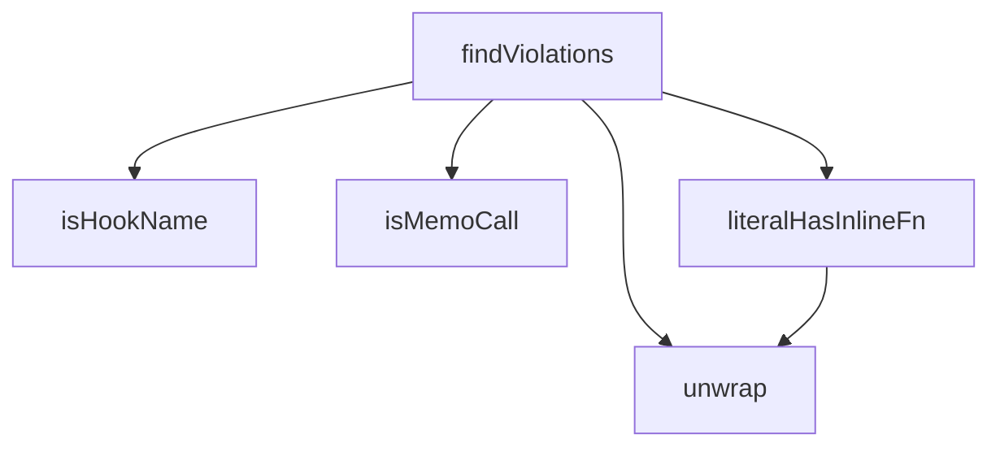

## Genel Bakış
Bu modül, React hook'larının referans kararlılığını (referential stability) denetleyen bir uyumluluk testidir. TypeScript AST analizi yaparak, hook çağrılarında veya bağımlılık dizilerinde her render'da yeni referans üreten kalıpları tespit eder ve ihlalleri raporlar.

## Fonksiyon Grupları

### AST Yardımcı Fonksiyonları
TypeScript sözdizim ağacı düğümlerini çözümlemek ve sınıflandırmak için kullanılan düşük seviyeli yardımcı fonksiyonlardır. Sarılı ifadeleri açar, memo çağrılarını tanır, satır içi fonksiyon tanımlarını tespit eder ve hook isimlerini doğrular.
- unwrap, isMemoCall, literalHasInlineFn, isHookName

### İhlal Tespiti
Verilen kaynak kodda hook referans kararlılığı ihlallerini bulan ana test fonksiyonudur. Dosya adı ve kaynak kodu alır, AST üzerinde gezinerek kararlılık ihlali oluşturan kalıpları tespit eder ve ihlal açıklamalarını dizi olarak döndürür.
- findViolations

---

## AXIOMS – Mimari Varsayımlar

Bu modül, TypeScript AST düğümleri üzerinde çalışır ve hook referans kararlılığını denetler.

[Aksiyom 1]: Eğer `ts` modülü (TypeScript AST kütüphanesi) mevcut değilse, hiçbir fonksiyon çalışamaz çünkü tüm fonksiyonlar `ts.Expression` tipiyle çalışır.

[Aksiyom 2]: Eğer `HOOK_SOURCES` sabiti tanımlı değilse, hook kaynak tespiti yapılamaz.

[Aksiyom 3]: Eğer `findViolations` fonksiyonuna geçerli bir `fileName` ve `source` sağlanmazsa, ihlal listesi üretilemez.

[Aksiyom 4]: Eğer `isHookName` fonksiyonuna `undefined` değer verilirse, fonksiyon `false` döndürmelidir (parametre tipi `string | undefined` olarak tanımlıdır).

[Aksiyom 5]: Eğer `unwrap` fonksiyonuna geçerli bir `ts.Expression` verilmezse, AST çözümleme zinciri kırılır ve `isMemoCall` ile `literalHasInlineFn` fonksiyonları doğru sonuç üretemez.

---

## FONKSİYON DETAYLARI

### unwrap
**Ne yapar**: Parantez içinde sarılmış bir TypeScript ifadesini (expression) en dıştaki parantez katmanlarından arındırarak özgün ifadeyi döndürür. Parantezli ifadelerin (parenthesized expression) içine doğru yürüyerek parantez olmayan ilk alt düğüme ulaşır.

**Nasıl yapar**: Gelen ifadeyi bir döngü içinde `ts.isParenthesizedExpression` kontrolüne tabi tutar. Eğer ifade parantezli bir ifade ise, `.expression` özelliği aracılığıyla bir alt seviyeye iner ve döngüye devam eder. Parantezli olmayan bir ifadeye ulaşıldığında döngü sonlanır ve o düğüm döndürülür.

**Parametreler**:
- e: ts.Expression — Parantez katmanlarından arındırılmak istenen kaynak ifade düğümü.

**Dönüş**: ts.Expression — Parantez katmanlarından arındırılmış, en dıştaki parantezli olmayan ifade düğümü.

### isMemoCall
**Ne yapar**: Geliştirildi ancak detay üretilemedi.

### literalHasInlineFn
**Ne yapar**: Geliştirildi ancak detay üretilemedi.

### isHookName
**Ne yapar**: Geliştirildi ancak detay üretilemedi.

### findViolations
**Ne yapar**: Geliştirildi ancak detay üretilemedi.

---

## İTHALATLAR (IMPORTS)
- import: typescript::ts
- import: vitest::describe
- import: vitest::expect
- import: vitest::it

---

## SABİTLER
- **HOOK_SOURCES** (call) — `import.meta.glob('/src/hooks/use*.{ts,tsx}', {
  query: '?raw',
  import: '...`

---

## AST POINTERS

### [N1_NASIL] AST Pointer: hook-referential-stability.test.ts::unwrap
- **params**: `e` — ts.Expression tipinde, parantez içinde sarılmış olabilen bir ifade
- **ic_degiskenler**:
  - `cur` — while döngüsü boyunca ilerletilen geçici değişken; başlangıçta `e` parametresine eşitlenir, her iterasyonda parantez içi ifade (`cur.expression`) ile güncellenir
- **Dönüş**: ts.Expression — parantez katmanları kaldırılmış ham ifade

### [N2_NASIL] AST Pointer: hook-referential-stability.test.ts::isMemoCall
- **params**: `e` — ts.Expression tipinde, kontrol edilecek ifade düğümü
- **ic_degiskenler**: yok
- **Dönüş**: boolean — ifade bir `useMemo` veya `useCallback` çağrısı ise `true`, değilse `false`

### [N3_NASIL] AST Pointer: hook-referential-stability.test.ts::literalHasInlineFn
- **params**: `expr` — ts.Expression tipinde, kontrol edilecek ifade düğümü
- **ic_degiskenler**:
  - `e` — `unwrap(expr)` sonucu; parantez katmanları kaldırılmış ifade
  - `p` — ObjectLiteralExpression durumunda `.properties` dizisi üzerinde iterasyon yapılan her bir özellik düğümü
  - `v` — PropertyAssignment durumunda `unwrap(p.initializer)` sonucu; parantez katmanları kaldırılmış özellik değeri
  - `el` — ArrayLiteralExpression durumunda `.elements` dizisi üzerinde iterasyon yapılan her bir eleman düğümü
  - `v` — (ikinci kapsam) `unwrap(el)` sonucu; parantez katmanları kaldırılmış eleman değeri
- **Dönüş**: boolean — obje/dizi literal içinde ok fonksiyonu (`ts.isArrowFunction`), fonksiyon ifadesi (`ts.isFunctionExpression`) veya metot bildirimi (`ts.isMethodDeclaration`) varsa `true`, yoksa `false`

### [N4_NASIL] AST Pointer: hook-referential-stability.test.ts::findViolations
- **params**: `fileName` — string tipinde, taranacak dosya adı/bilgisi; hata konumlarını raporlamada kullanılır; `source` — string tipinde, taranacak kaynak kodu
- **ic_degiskenler**:
  - `sf` — `ts.createSourceFile(fileName, source, ts.ScriptTarget.Latest, true, ts.ScriptKind.TSX)` sonucu; kaynak kodun AST temsili
  - `hits` — string[] tipinde; ihlal bulunan satır konumlarını tutan dizi
- **Dönüş**: string[] — ihlal bulunan satırların `"dosyaAdı:satırNumarası"` formatındaki listesi

### [N5_NASIL] AST Pointer: hook-referential-stability.test.ts::checkBody
- **params**: `body` — ts.Node tipinde; incelenecek fonksiyon gövdesi düğümü
- **ic_degiskenler**:
  - `e` — `unwrap(body as ts.Expression)` sonucu; parantez katmanları kaldırılmış ifade (ok fonksiyonu durumunda)
  - `node` — `walk` içinde ts.forEachChild ile dolaşılan her bir alt düğüm
  - `e` — (walk kapsamı) `unwrap(node.expression)` sonucu; return ifadesinin parantez katmanları kaldırılmış hali
- **Dönüş**: yok — yan etki olarak `hits` dizisine ihlal konumlarını ekler

### [N6_NASIL] AST Pointer: hook-referential-stability.test.ts::walk
- **params**: `node` — ts.Node tipinde; dolaşılacak düğüm
- **ic_degiskenler**:
  - `e` — `unwrap(node.expression)` sonucu; return ifadesinin parantez katmanları kaldırılmış hali
- **Dönüş**: yok — yan etki olarak `hits` dizisine ihlal konumlarını ekler; iç içe fonksiyon gövdelerine girmez

### [N7_NASIL] AST Pointer: hook-referential-stability.test.ts::visit
- **params**: `node` — ts.Node tipinde; ziyaret edilecek düğüm
- **ic_degiskenler**:
  - `d` — VariableStatement durumunda `.declarationList.declarations` dizisi üzerinde iterasyon yapılan her bir bildirim düğümü
- **Dönüş**: yok — yan etki olarak hook fonksiyon gövdelerini `checkBody`'ye gönderir; ts.forEachChild ile AST'yi özyinelemeli dolaşır

---

## MERMAID CALL GRAPH

## NODE ID STANDARD

  file: hook-referential-stability.test.ts
  function: hook-referential-stability.test.ts::unwrap
  function: hook-referential-stability.test.ts::isMemoCall
  function: hook-referential-stability.test.ts::literalHasInlineFn
  function: hook-referential-stability.test.ts::isHookName
  function: hook-referential-stability.test.ts::findViolations

---

## DISA AKTARILANLAR (EXPORTS)
  export: findViolations
  export: isHookName
  export: isMemoCall
  export: literalHasInlineFn
  export: unwrap