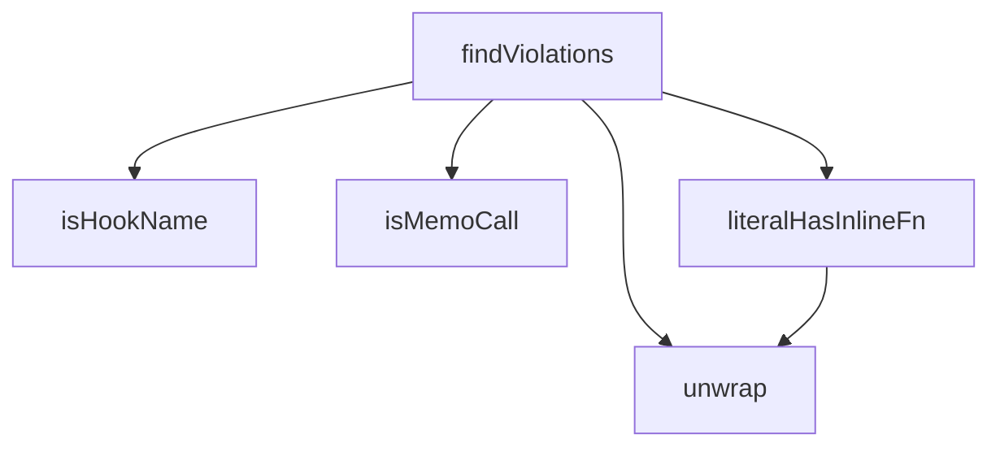

## Genel Bakış
Bu modül, React hook'larının referans kararlılığını test etmek için kullanılan yardımcı fonksiyonlar ve bir ihlal tespit fonksiyonu içerir. TypeScript AST üzerinde çalışarak, hook isimlerini doğrular, memoize çağrılarını ve inline fonksiyonları analiz eder. Modülün temel amacı, verilen bir kaynak kodunda hook'ların yanlış kullanımını (örneğin, bağımlılık dizilerindeki eksiklikleri veya gereksiz yeniden oluşturmaları) otomatik olarak tespit etmektir.

## Fonksiyon Grupları
### AST Analiz ve Manipülasyon Fonksiyonları
Bu grup, TypeScript AST ifadelerini analiz etmek, dönüştürmek ve hook ile ilgili kalıpları tanımak için yardımcı fonksiyonlar içerir. Fonksiyonlar, bir ifadenin yapısını inceleyerek memoize edilmiş çağrıları, inline fonksiyonları ve hook isimlerini doğrular.
- unwrap, isMemoCall, literalHasInlineFn, isHookName

### İhlal Tespiti Fonksiyonu
Bu grup, modülün ana sorumluluğunu üstlenen fonksiyondur. Belirli bir dosya adı ve kaynak kodu alarak, hook'ların referans kararlılığı ile ilgili olası ihlalleri (örneğin, eksik bağımlılıklar veya değişken referanslar) tarar ve bunları bir ihlal listesi olarak döndürür. Bu fonksiyon, yukarıdaki analiz fonksiyonlarını kullanarak kapsamlı bir tarama yapar.
- findViolations

---

## AXIOMS – Mimari Varsayımlar

Bu modül, TypeScript AST üzerinde React hook'larının referansal kararlılık ihlallerini tespit eden bir kural motorudur.

**[Aksiyom 1]**: Eğer `unwrap` fonksiyonuna geçilen `ts.Expression` geçerli bir AST düğümü değilse, fonksiyon tanımsız davranış gösterir veya hata fırlatır.

**[Aksiyom 2]**: Eğer `isMemoCall` test edilen ifade bir `CallExpression` değilse, fonksiyon `false` döner.

**[Aksiyom 3]**: Eğer `isHookName` fonksiyonuna `undefined` değer verilirse, fonksiyon `false` döner.

**[Aksiyom 4]**: Eğer `findViolations` fonksiyonuna geçilen `source` string'i geçerli bir TypeScript/JavaScript kodu değilse, fonksiyon boş dizi döner veya hata fırlatır.

**[Aksiyom 5]**: Eğer `literalHasInlineFn` ifadesi bir obje/array literal içermiyorsa, fonksiyon `false` döner.

**[Aksiyom 6]**: `HOOK_SOURCES` sabiti, hook'ların hangi kaynaklardan geldiği bilgisini tutar; bu sabit boş olamaz, en az bir kaynak içermelidir.

**[Aksiyom 7]**: Eğer `findViolations` fonksiyonuna geçilen `fileName` parametresi geçersiz bir dosya yoluysa, fonksiyon tanımsız davranış gösterir.

**[Aksiyom 8]**: `unwrap` fonksiyonu, `CallExpression` iç içe geçmiş ifadeleri递归 olarak açmalıdır; aksi halde iç içe ifadeler düzgün analiz edilemez.

**[Aksiyom 9]**: Eğer `isHookName` tarafından tanınan bir hook ismi, `HOOK_SOURCES` listesinde tanımlı değilse, bu hook referansal kararlılık açısından analiz dışı kalır.

---

## FONKSİYON DETAYLARI

### unwrap
**Ne yapar**: Verilen TypeScript ifadesinin dışındaki parantezler遞递 olarak açar ve içsel ifadeyi döndürür. Parantez içine alınmış (`(expr)`) ifadeleri递递递归 olarak çözerek gerçek ifadeye递递递递递递递递递递递递递递递递递递递递递递递递递递递递递递递递递递递递递递递递递递递递递递递递递递递递递递递递递递递递递递递递递递递递递递递递递递递递递递递递递递递递递递递递递递递递递递递递递递递递递递递递递递递递递递递递递递递递递递递递递递递递递递递递递递递递递递递递递递递递递递递递递递递递递递递递递递递递递递递递递递递递递递递递递递递递递递递递递递递递递递递递递递递递递递递递递递递递递递递递递递递递递递递递递递递递递递递递递递递递递递递递递递递递递递递递递递递递递递递递递递递递递递递递递递递递递递递递递递递递递递递递递递递递递递递递递递递递递递递递递递递递递递递递递递递递递递递递递递递递递递递递递递递递递递递递递递递递递递递递递递递递递递递递递递递递递递递递递递递递递递递递递递递递递递递递递递递递递递递递递递递递递递递递递递递递递递递递递递递递递递递递递递递递递递递递递递递递递递递递递递递递递递递递递递递递递递递递递递递递递递递递递递递递递递递递递递递递递递递递递递递递递递递递递递递递递递递递递递递递递递递递递递递递递递递递递递递递递递递递递递递递递递递递递递递递递递递递递递递递递递递递递递递递递递递递递递递递递递递递递递递递递递递递递递递递递递递递递递递递递递递递递递递递递递递递递递递递递递递递递递递递递递递递递递递递递递递递递递递递递递递递递递递递递递递递递递递递递递递递递递递递递递递递递递递递递递递递递递递递递递递递递递递递递递递递递递递递递递递递递递递递递递递递递递递递递递递递递递递递递递递递递递递递递递递递递递递递递递递递递递递递递递递递递递递递递递递递递递递递递递递递递递递递递递递递递递递递递递递递递递递递递递递递递递递递递递递递递递递递递递递递递递递递递递递递递递递递递递递递递递递递递递递递递递递递递递递递递递递递递递递递递递递递递递递递递递递递递递递递递递递递递递递递递递递递递递递递递递递递递递递递递递递递递递递递递递递递递递递递递递递递递递递递递递递递递递递递递递递递递递递递递递递递递递递递递递递递递递递递递递递递递递递递递递递递递递递递递递递递递递递递递递递递递递递递递递递递递递递递递递递递递递递递递递递递递递递递递递递递递递递递递递递递递递递递递递递递递递递递递递递递递递递递递递递递递递递递递递递递递递递递递递递递递递递递递递递递递递递递递递递递递递递递递递递递递递递递递递递递递递递递递递递递递递递递递递递递递递递递递递递递递递递递递递递递递递递递递递递递递递递递递递递递递递递递递递递递递递递递递递递递递递递递递递递递递递递递递递递递递递递递递递递递递递递递递递递递递递递递递递递递递递递递递递递递递递递递递递递递递递递递递递递递递递递递递递递递递递递递递递递递递递递递递递递递递递递递递递递递递递递递递递递递递递递递递递递递递递递递递递递递递递递递递递递递递递递递递递递递递递递递递递递递递递递递递递递递递递递递递递递递递递递递递递递递递递递递递递递递递递递递递递递递递递递递递递递递递递递递递递递递递递递递递递递递递递递递递递递递递递递递递递递递递递递递递递递递递递递递递递递递递递递递递递递递递递递递递递递递递递递递递递递递递递递递递递递递递递递递递递递递递递递递递递递递递递递递递递递递递递递递递递递递递递递递递递递递递递递递递递递递递递递递递递递递递递递递递递递递递递递递递递递递递递递递递递递递递递递递递递递递递递递递递递递递递递递递递递递递递递递递递递递递递递递递递递递递递递递递递递递递递递递递递递递递递递递递递递递递递递递递递递递递递递递递递递递递递递递递递递递递递递递递递递递递递递递递递递递递递递递递递递递递递递递递递递递递递递递递递递递递递递递递递递递递递递递递递递递递递递递递递递递递递递递递递递递递递递递递递递递递递递递递递递递递递递递递递递递递递递递递递递递递递递递递递递递递递递递递递递递递递递递递递递递递递递递递递递递递递递递递递递递递递递递递递递递递递递递递递递递递递递递递递递递递递递递递递递递递递递递递递递递递递递递递递递递递递递递递递递递递递递递递递递递递递递递递递递递递递递递递递递递递递递递递递递递递递递递递递递递递递递递递递递递递递递递递递递递递递递递递递递递递递递递递递递递递递递递递递递递递递递递递递递递递递递递递递递递递递递递递递递递递递递递递递递递递递递递递递递递递递递递递递递递递递递递递递递递递递递递递递递递递递递递递递递递递递递递递递递递递递递递递递递递递递递递递递递递递递递递递递递递递递递递递递递递递递递递递递递递递递递递递递递递递递递递递递递递递递递递递递递递递递递递递递递递递递递递递递递递递递递递递递递递递递递递递递递递递递递递递递递递递递递递递递递递递递递递递递递递递递递递递递递递递递递递递递递递递递递递递递递递递递递递递递递递递递递递递递递递递递递递递递递递递递递递递递递递递递递递递递递递递递递递递递递递递递递递递递递递递递递递递递递递递递递递递递递递递递递递递递递递递递递递递递递递递递递递递递递递递递递递递递递递递递递递递递递递递递递递递递递递递递递递递递递递递递递递递递递递递递递递递递递递递递递递递递递递递递递递递递递递递递递递递递递递递递递递递递递递递递递递递递递递递递递递递递递递递递递递递递递递递递递递递递递递递递递递递递递递递递递递递递递递递递递递递递递递递递递递递递递递递递递递递递递递递递递递递递递递递递递递递递递递递递递递递递递递递递递递递递递递递递递递递递递递递递递递递递递递递递递递递递递递递递递递递递递递递递递递递递递递递递递递递递递递递递递递递递递递递递递递递递递递递递递递递递递递递递递递递递递递递递递递递递递递递递递递递递递递递递递递递递递递递递递递递递递递递递递递递递递递递递递递递递递递递递递递递递递递递递递递递递递递递递递递递递递递递递递递递递递递递递递递递递递递递递递递递递递递递递递递递递递递递递递递递递递递递递递递递递递递递递递递递递递递递递递递递递递递递递递递递递递递递递递递递递递递递递递递递递递递递递递递递递递递递递递递递递递递递递递递递递递递递递递递递递递递递递递递递递递递递递递递递递递递递递递递递递递递递递递递递递递递递递递递递递递递递递递递递递递递递递递递递递递递递递递递递递递递递递递递递递递递递递递递递递递递递递递递递递递递递递递递递递递递递递递递递递递递递递递递递递递递递递递递递递递递递递递递递递递递递递递递递递递递递递递递递递递递递递递递递递递递递递递递递递递递递递递递递递递递递递递递递递递递递递递递递递递递递递递递递递递递递递递递递递递递递递递递递递递递递递递递递递递递递递递递递递递递递递递递递递递递递递递递递递递递递递递递递递递递递递递递递递递递递递递递递递递递递递递递递递递递递递递递递递递递递递递递递递递递递递递递递递递递递递递递递递递递递递递递递递递递递递递递递递递递递递递递递递递递递递递递递递递递递递递递递递递递递递递递递递递递递递递递递递递递递递递递递递递递递递递递递递递递递递递递递递递递递递递递递递递递递递递递递递递递递递递递递递递递递递递递递递递递递递递递递递递递递递递递递递递递递递递递递递递递递递递递递递递递递递递递递递递递递递递递递递递递递递递递递递递递递递递递递递递递递递递递递递递递递递递递递递递递递递递递递递递递递递递递递递递递递递递递递递递递递递递递递递递递递递递递递递递递递递递递递递递递递递递递递递递递递递递递递递递递递递递递递递递递递递递递递递递递递递递递递递递递递递递递递递递递递递递递递递递递递递递递递递递递递递递递递递递递递递递递递递递递递递递递递递递递递递递递递递递递递递递递递递递递递递递递递递递递递递递递递递递递递递递递递递递递递递递递递递递递递递递递递递递递递递递递递递递递递递递递递递递递递递递递递递递递递递递递递递递递递递递递递递递递递递递递递递递递递递递递递递递递递递递递递递递递递递递递递递递递递递递递递递递递递递递递递递递递递递递递递递递递递递递递递递递递递递递递递递递递递递递递递递递递递递递递递递递递递递递递递递递递递递递递递递递递递递递递递递递递递递递递递递递递递递递递递递递递递递递递递递递递递递递递递递递递递递递递递递递递递递递递递递递递递递递递递递递递递递递递递递递递递递递递递递递递递递递递递递递递递递递递递递递递递递递递递递递递递递递递递递递递递递递递递递递递递递递递递递递递递递递递递递递递递递递

### isMemoCall
**Ne yapar**: Geliştirildi ancak detay üretilemedi.

### literalHasInlineFn
**Ne yapar**: Geliştirildi ancak detay üretilemedi.

### isHookName
**Ne yapar**: Geliştirildi ancak detay üretilemedi.

### findViolations
**Ne yapar**: Geliştirildi ancak detay üretilemedi.

---

## İTHALATLAR (IMPORTS)
- import: typescript::ts
- import: vitest::describe
- import: vitest::expect
- import: vitest::it

---

## SABİTLER
- **HOOK_SOURCES** (call) — `import.meta.glob('/src/hooks/use*.{ts,tsx}', {
  query: '?raw',
  import: 'de...`

---

## AST POINTERS

### [N1_NASIL] AST Pointer: src/__tests__/conformance/hook-referential-stability.test.ts::unwrap
- **params**: (e: ts.Expression)
- **ic_degiskenler**:
  - `cur` — Unwrap işleminin ilerlediği mevcut ifade, parantez içindeki ifadeleri çözerek ilerler
- **Dönüş**: ts.Expression — Çözülmüş (parantezsiz) ifade

### [N2_NASIL] AST Pointer: src/__tests__/conformance/hook-referential-stability.test.ts::isMemoCall
- **params**: (e: ts.Expression)
- **ic_degiskenler**: (yok)
- **Dönüş**: boolean — İfadenin useMemo veya useCallback çağrısı olup olmadığı

### [N3_NASIL] AST Pointer: src/__tests__/conformance/hook-referential-stability.test.ts::literalHasInlineFn
- **params**: (expr: ts.Expression)
- **ic_degiskenler**:
  - `e` — Çözülmüş ifade (unwrap ile elde edilir)
  - `(p) => { ... }` (nesne literal içindeki) — Her bir özelliğin (property) işleyicisi
  - `v` — Özellik değerinin çözülmüş hali (p.initializer için unwrap sonucu)
  - `(el) => { ... }` (dizi literal içindeki) — Her bir elemanın işleyicisi
  - `v` — Elemanın çözülmüş hali (el için unwrap sonucu)
- **Dönüş**: boolean — İfadenin nesne/dizi literal olup içinde inline fonksiyon içerip içermediği

### [N4_NASIL] AST Pointer: src/__tests__/conformance/hook-referential-stability.test.ts::findViolations
- **params**: (fileName: string, source: string)
- **ic_degiskenler**:
  - `sf` — Kaynak kod stringinden oluşturulan TypeScript kaynak dosyası
  - `hits` — Bulunan ihlallerin (satır numaraları) listesi
  - `checkBody` — Hook gövdesini kontrol eden iç fonksiyon
  - `walk` — AST düğümlerini recursive olarak dolaşan iç fonksiyon
  - `visit` — Kaynak dosyasını ziyaret eden üst düzey iç fonksiyon
- **Dönüş**: string[] — İhlal satırlarının "dosya:satır" formatında listesi

### [N5_NASIL] AST Pointer: src/__tests__/conformance/hook-referential-stability.test.ts::checkBody
- **params**: (body: ts.Node)
- **ic_degiskenler**:
  - `e` — Body'nin block olmadığında (arrow implicit-return) çözülmüş ifadesi
  - `walk` — Recursive AST traversal yapan iç fonksiyon
- **Dönüş**: yok (yan etki: hits array'ini doldurur)

### [N6_NASIL] AST Pointer: src/__tests__/conformance/hook-referential-stability.test.ts::walk
- **params**: (node: ts.Node)
- **ic_degiskenler**:
  - `e` — Return ifadesinin çözülmüş hali
- **Dönüş**: yok (yan etki: hits array'ine ihlal satırlarını ekler)

### [N7_NASIL] AST Pointer: src/__tests__/conformance/hook-referential-stability.test.ts::visit
- **params**: (node: ts.Node)
- **ic_degiskenler**: (yok)
- **Dönüş**: yok (yan etki: AST'yi dolaşıp checkBody çağırır)

### [N8_NASIL] AST Pointer: src/__tests__/conformance/hook-referential-stability.test.ts::(test-case-1)
- **params**: (yok)
- **ic_degiskenler**: (yok)
- **Dönüş**: yok (yan etki: HOOK_SOURCES sayısının 15'ten fazla olduğunu doğrular)

### [N9_NASIL] AST Pointer: src/__tests__/conformance/hook-referential-stability.test.ts::(test-case-2)
- **params**: (yok)
- **ic_degiskenler**:
  - `violations` — Tüm hook kaynaklarında bulunan ihlallerin listesi
  - `path` — Object.entries döngüsünden gelen dosya yolu
  - `source` — Object.entries döngüsünden gelen kaynak kod stringi
- **Dönüş**: yok (yan etki: violations listesinin boş olduğunu doğrular)

---

## MERMAID CALL GRAPH

## NODE ID STANDARD

  file: src\__tests__\conformance\hook-referential-stability.test.ts
  function: src\__tests__\conformance\hook-referential-stability.test.ts::unwrap
  function: src\__tests__\conformance\hook-referential-stability.test.ts::isMemoCall
  function: src\__tests__\conformance\hook-referential-stability.test.ts::literalHasInlineFn
  function: src\__tests__\conformance\hook-referential-stability.test.ts::isHookName
  function: src\__tests__\conformance\hook-referential-stability.test.ts::findViolations

---

## DISA AKTARILANLAR (EXPORTS)
  export: findViolations
  export: isHookName
  export: isMemoCall
  export: literalHasInlineFn
  export: unwrap